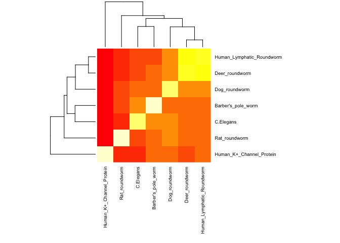

Final Project
================

``` r
library(bio3d)
library(pheatmap)
```

``` r
# Read alignment
aln <- read.fasta("Q7.fst")
aln
```

    ##                                1        .         .         .         .         50 
    ## [Truncated_Name:1]Human_K+_C   -----------------MDERLSLLRSPPPPSARHRAHPPQRPASSGGAH
    ## [Truncated_Name:2]Rat_roundw   MNKKTFSCEGNDDISFSFRQKIEQILHVHPEKYRARGGVGSRRSTPGKRG
    ## [Truncated_Name:3]Dog_roundw   --------------------------------------------------
    ## [Truncated_Name:4]Deer_round   -------------------RQIEHLLNVHPEKYRSRSGQSIETSTSVHLN
    ## [Truncated_Name:5]Human_Lymp   --------------------------------------------------
    ## [Truncated_Name:6]C.Elegans    -------------MIDSLIRRLEQVLNVHPEKYQNGCSSQRPSRQPSPVE
    ## [Truncated_Name:7]Barber's_p   --------------------------------------------------
    ##                                                                                   
    ##                                1        .         .         .         .         50 
    ## 
    ##                               51        .         .         .         .         100 
    ## [Truncated_Name:1]Human_K+_C   TLVNHGYAEPAAGRELPPDMTVVPGDHLLEPEVADGG-----GAPPQGGC
    ## [Truncated_Name:2]Rat_roundw   SYDDRLHVRSASEELRQRSLQSSSSDSPSINDSNNSKQLEELSIPIPVEC
    ## [Truncated_Name:3]Dog_roundw   ------------------------------------------MIPE----
    ## [Truncated_Name:4]Deer_round   QMGCHHRSRSV---DYLSPMMDASNKEINEEKSNNGS-----IFPMITE-
    ## [Truncated_Name:5]Human_Lymp   -------------------MDTPSNREVSDEKPNNGS-----IFPMITE-
    ## [Truncated_Name:6]C.Elegans    QLAPIRSHS----------ADFGRAAEMASGNSEEGK-----GMLLRNG-
    ## [Truncated_Name:7]Barber's_p   ----------------MWRLRRYRGPPILDLDEANGN-----LLV-----
    ##                                                                                   
    ##                               51        .         .         .         .         100 
    ## 
    ##                              101        .         .         .         .         150 
    ## [Truncated_Name:1]Human_K+_C   GGGGCDR---------YEPLPPSLPAAGE---QDCCGERVVINISGLRFE
    ## [Truncated_Name:2]Rat_roundw   INSGVNKSNDSEYRNPLTSHHNHIPDNGD--IKWKNEEVITINVSGLRFQ
    ## [Truncated_Name:3]Dog_roundw   --EEAVN---------VIPPTDGISSNMS-----ENNSIVTINVSGLKFQ
    ## [Truncated_Name:4]Deer_round   --EESSN---------IMYNDTSLTKRRE---------RVTINVSGLRFQ
    ## [Truncated_Name:5]Human_Lymp   --EEPNN---------IMFNDTSSAKQLE-------RNLITINVSGLRFQ
    ## [Truncated_Name:6]C.Elegans    --DDRIR---------LPSPQRGTPDTSSTQGHPYTDQIVTINVSGMRFQ
    ## [Truncated_Name:7]Barber's_p   --DDSTR---------NASPQRGTPQGDE---RLRSSDLVTINVSGLRFQ
    ##                                                                       ^ **^**^^*  
    ##                              101        .         .         .         .         150 
    ## 
    ##                              151        .         .         .         .         200 
    ## [Truncated_Name:1]Human_K+_C   TQLKTLCQFPETLLGDPKRRMRYFDPLRNEYFFDRNRPS-----------
    ## [Truncated_Name:2]Rat_roundw   TYESTLARFPNSLLGHPAKRAKYWNNKTKEYFLDHSRYC-----------
    ## [Truncated_Name:3]Dog_roundw   TFNSTLSRYPETLLGDPVKRARFWNGHDGEYFFDRHRGS-----------
    ## [Truncated_Name:4]Deer_round   TYESTLRRYPLTLLGNSFKRNRFWDPKNKEYFFDRHRTS-----------
    ## [Truncated_Name:5]Human_Lymp   TYESTLERYPLTLLGNSFKRNRFWDPKNEEYFFDRHRTS-----------
    ## [Truncated_Name:6]C.Elegans    TFESTLSRYPNSLLGDRNKRQHFFVSDTNEFFFDRHRTTSSSFTFEIRNY
    ## [Truncated_Name:7]Barber's_p   TFERTLARFPNTLLGCKSKRERYYMQDTNEYFFDRHRST-----------
    ##                                *   **  ^* ^***   ^* ^^^     *^* *^ *              
    ##                              151        .         .         .         .         200 
    ## 
    ##                              201        .         .         .         .         250 
    ## [Truncated_Name:1]Human_K+_C   -FDAILYYYQSGGRIRRPVNVPIDIFSEEIRFYQ-------LGEEAMEKF
    ## [Truncated_Name:2]Rat_roundw   -FESILNIYQTNGDVRRPELVPLEIYLKELKFYE-------MNEEVMENF
    ## [Truncated_Name:3]Dog_roundw   -FESILYIYQSHGIVKRPEAVPIDIFLKEMKFFE-------MTDDILEAF
    ## [Truncated_Name:4]Deer_round   -FESILYTYQSGGVVKRPESVPIDMFIKELKFFE-------MGEELLEKF
    ## [Truncated_Name:5]Human_Lymp   -FESILYAYQSGGIMKRPESVPIDMFVKELKFFEVNPKLQKMGEELLEKF
    ## [Truncated_Name:6]C.Elegans    LFESILYIYQSGGRVKRPEIVPIDIFLKEMRFFQ-------MGDDLLEEF
    ## [Truncated_Name:7]Barber's_p   -FESILYIYQSGGRVKRPESVPIDIFLREMRFFQ-------MGEQLIEEF
    ##                                 *^ **  **^ * ^^**  **^^^^  *^^*^        ^ ^  ^* * 
    ##                              201        .         .         .         .         250 
    ## 
    ##                              251        .         .         .         .         300 
    ## [Truncated_Name:1]Human_K+_C   REDEGFLREEERPLPRRDFQRQVWLLFEYPESSGPARGIAIVSVLVILIS
    ## [Truncated_Name:2]Rat_roundw   WLSEGYEKPIEHIMPNNFIQKYIWELMEYPDSSVPARVLAFISISVIVTS
    ## [Truncated_Name:3]Dog_roundw   WISEGYEKPKEAKMPQNIHQRRIWELMEYPDSSLSARILAFVSIIVITVS
    ## [Truncated_Name:4]Deer_round   WISEGYEKPKEIQMPKNVLLRKLWELVEYPDSSLFARIFALLSIFVISIS
    ## [Truncated_Name:5]Human_Lymp   WISEGYEKPKEIQMPQNVLQRQLWELVEYPDSSLFARIFALLSIFVISIS
    ## [Truncated_Name:6]C.Elegans    WIAEGYEKPKEVMMPNNKTQRKIWELMEYPDSSLSARIIAFISIAVIALS
    ## [Truncated_Name:7]Barber's_p   WIAEGYEKPEEAILPKNLSQRRLWELMEYPDSSLAARIIAFISVFVIVIS
    ##                                   **^ ^  *  ^*     ^ ^* * ***^**  **  * ^*^ **  * 
    ##                              251        .         .         .         .         300 
    ## 
    ##                              301        .         .         .         .         350 
    ## [Truncated_Name:1]Human_K+_C   IVIFCLETLPEFRDEKDYPASTSQDSFEAAGNSTSGSRAGASSFSDPFFV
    ## [Truncated_Name:2]Rat_roundw   IVSFCLETLPDFRE-----------------ASETLTEIGYSKWNNPFLI
    ## [Truncated_Name:3]Dog_roundw   IVSFCLETLPSLK---------------------PADIEGVRDWSNPFLW
    ## [Truncated_Name:4]Deer_round   IISFCLETLPSMKV-------------------NPGD---VRDWSNPFFH
    ## [Truncated_Name:5]Human_Lymp   IISFCLETLPSMKE-------------------NPGD---VRDWSNPFFY
    ## [Truncated_Name:6]C.Elegans    IISFCWETVPSDIE---------EKPINNSATAELLDEMDEKHYS-PFFW
    ## [Truncated_Name:7]Barber's_p   IVSFCWETVPSGDV---------RDTNGTTGVTSPDKDEGRLVWN-PFFW
    ##                                *^ ** **^*                                 ^  **   
    ##                              301        .         .         .         .         350 
    ## 
    ##                              351        .         .         .         .         400 
    ## [Truncated_Name:1]Human_K+_C   VETLCIIWFSFELLVRFFACPSKATFSRNIMNLIDIVAIIPYFITLGTEL
    ## [Truncated_Name:2]Rat_roundw   LESLCIVWFSIELFLRFISCPSKSLFMKSFLNIVDFIAIAPFFINL--IL
    ## [Truncated_Name:3]Dog_roundw   VEFVCIIWFTIELLLRFASCPCKLTFMRSIPNIIDFIAIAPFFVNL--VW
    ## [Truncated_Name:4]Deer_round   IELFCIIWFTTELLLRFISCPNKLSFLRSALNIIDFIAIAPFFGNL--LW
    ## [Truncated_Name:5]Human_Lymp   IELFCIIWFTIELLLRFISCPNKFSFLRSVLNIIDFVAIAPFFGNL--MW
    ## [Truncated_Name:6]C.Elegans    IELMCILWFTIELILRFISCPCKVTFATSVLNIIDFVAIAPFFVNF--FF
    ## [Truncated_Name:7]Barber's_p   LELVCIVWFTIELTLRFISCPSKVTFMMSFLNIIDFVAIAPFFVNL--IW
    ##                                ^*  **^**^ ** ^**  ** *  *     *^^* ^** *^*        
    ##                              351        .         .         .         .         400 
    ## 
    ##                              401        .         .         .         .         450 
    ## [Truncated_Name:1]Human_K+_C   AERQGNGQQAMSLAILRVIRLVRVFRIFKLSRHSKGLQILGQTLKASMRE
    ## [Truncated_Name:2]Rat_roundw   SEGNKNNSSTTSFAVLRVLRLVRVFRIFKLSRHSVGLQILGKTFRASIQE
    ## [Truncated_Name:3]Dog_roundw   SDVSKSNSS-MSFAVLRVLRLVRVFRIFKLSRHSVGLQILGKTFRASIQE
    ## [Truncated_Name:4]Deer_round   MDSAKSS---MSFAILRVLRLVRVFRIFKLSRHSVGLQILGKTFRASIQE
    ## [Truncated_Name:5]Human_Lymp   MDSTKSSSS-MSFAVLRVLRLVRVFRIFKLSRHSVGLQILGKTFRASIQE
    ## [Truncated_Name:6]C.Elegans    ADTSKSNSS-MSFAVLRVLRLVRVFRVFKLSRHSVGLQILGKTFRSSVQE
    ## [Truncated_Name:7]Barber's_p   ADANKSSGS-MSFAVLRVLRLVRVFRIFKLSRHSAGLQILGKTFRASVQE
    ##                                 ^         * *^***^*******^******* ****** * ^ *^ * 
    ##                              401        .         .         .         .         450 
    ## 
    ##                              451        .         .         .         .         500 
    ## [Truncated_Name:1]Human_K+_C   LGLLIFFLFIGVILFSSAVYFAEADDPTSGFSSIPDAFWWAVVTMTTVGY
    ## [Truncated_Name:2]Rat_roundw   FCLLVFFMVIALVLFSSAIFYVEQGEADTRFTSIPASFWFVVATMTTVGY
    ## [Truncated_Name:3]Dog_roundw   FCLLIFFMAIALVLFASGMYFAEQGEPDTKFTSIPASFWFVLVTMTTVGY
    ## [Truncated_Name:4]Deer_round   FCLLIFFMIIALVLFSSGIYFAEQNEPNTKFTSIPASFWFVLVTMTTVGY
    ## [Truncated_Name:5]Human_Lymp   FCLLIFFMVIALVLFSSGVYFAEQNEPNTKFTSIPASFWFVLVTMTTVGY
    ## [Truncated_Name:6]C.Elegans    FCLLIFFMAIALVLFASGMYFAEQGEPNSKFTSIPASFWFVLVTMTTVGY
    ## [Truncated_Name:7]Barber's_p   FCLLIFFMAIALVLFSSGMYFAEQGEANSKFTSIPASFWFVLVTMTTVGY
    ##                                  **^**^ *^^^** *^^^^ *  ^  ^ *^***  **^ ^ ******* 
    ##                              451        .         .         .         .         500 
    ## 
    ##                              501        .         .         .         .         550 
    ## [Truncated_Name:1]Human_K+_C   GDMHPVTIGGKIVGSLCAIAGVLTIALPVPVIVSNFNYFYHRETEGEEQS
    ## [Truncated_Name:2]Rat_roundw   GDLVPTGTYGKLVGSLCALLGVLTLALPVPIIVANFKHFYRQEC------
    ## [Truncated_Name:3]Dog_roundw   GDLTPTGVYGKLVGSVCALIGVLTLALPVPIIVANFKHFYRQET------
    ## [Truncated_Name:4]Deer_round   GDLTPTGVYGKLVGGLCALIGVLTLALPVPIIVANFKHFYRQET------
    ## [Truncated_Name:5]Human_Lymp   GDLTPTGVYGKLVGGLCALIGVLTLALPVPIIVANFKHFYRQET------
    ## [Truncated_Name:6]C.Elegans    GDLVPLSPFGKVVGGMCAMIGVLTLALPVPIIVANFKHFYRQEN------
    ## [Truncated_Name:7]Barber's_p   GDLVPLSTQGKIVGSMCALIGVLTLALPVPIIVANFKHFYRQEN------
    ##                                **^ *    **^** ^**^ ****^*****^** **  **^ *        
    ##                              501        .         .         .         .         550 
    ## 
    ##                              551        .         .         .         .         600 
    ## [Truncated_Name:1]Human_K+_C   QYMHVGSCQHLSSSAEELRKARSNSTLSKSEYMVIEEGGMNHSAFPQTPF
    ## [Truncated_Name:2]Rat_roundw   ------RLAAMRVSREIDDASRYNESDEEYTT------------------
    ## [Truncated_Name:3]Dog_roundw   ------RLATMRANADEEDEECSQDSSRT---------------------
    ## [Truncated_Name:4]Deer_round   ------RLAQMRASVEDDETASEKSSKSP---------------------
    ## [Truncated_Name:5]Human_Lymp   ------RLAQMRASAEEDETNSEHSSKSP---------------------
    ## [Truncated_Name:6]C.Elegans    ------RLASMKSKGDDADDDIA---------------------------
    ## [Truncated_Name:7]Barber's_p   ------RLATMRSAGKDLETAESIDDS-----------------------
    ##                                          ^                                        
    ##                              551        .         .         .         .         600 
    ## 
    ##                              601        .         .       628 
    ## [Truncated_Name:1]Human_K+_C   KTGNSTATCTTNNNPNSCVNIKKIFTDV
    ## [Truncated_Name:2]Rat_roundw   ----------------------------
    ## [Truncated_Name:3]Dog_roundw   ----------------------------
    ## [Truncated_Name:4]Deer_round   ----------------------------
    ## [Truncated_Name:5]Human_Lymp   ----------------------------
    ## [Truncated_Name:6]C.Elegans    ----------------------------
    ## [Truncated_Name:7]Barber's_p   ----------------------------
    ##                                                             
    ##                              601        .         .       628 
    ## 
    ## Call:
    ##   read.fasta(file = "Q7.fst")
    ## 
    ## Class:
    ##   fasta
    ## 
    ## Alignment dimensions:
    ##   7 sequence rows; 628 position columns (395 non-gap, 233 gap) 
    ## 
    ## + attr: id, ali, call

``` r
ide <- seqidentity(aln)
mide <- as.matrix(ide)
```

``` r
heatmap(mide, margins = c(10, 10), cexRow = 0.7, cexCol = 0.7)
```


