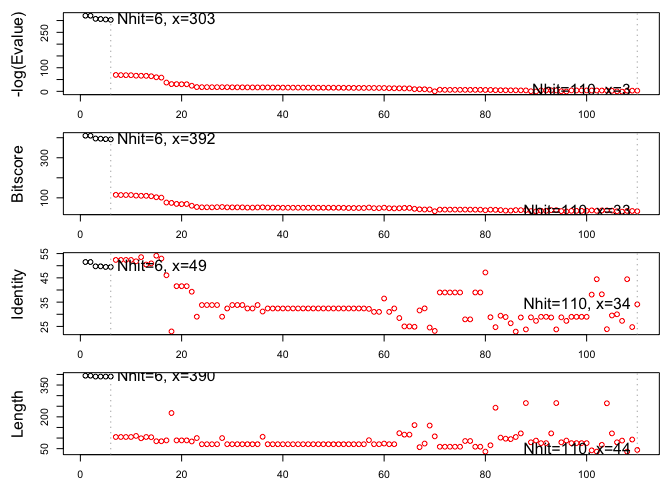

Final Project
================

``` r
library(bio3d)
library(pheatmap)
```

``` r
# Read alignment
aln <- read.fasta("Q7.fst")
aln
```

    ##                                1        .         .         .         .         50 
    ## [Truncated_Name:1]Human_K+_C   -----------------MDERLSLLRSPPPPSARHRAHPPQRPASSGGAH
    ## [Truncated_Name:2]Rat_roundw   MNKKTFSCEGNDDISFSFRQKIEQILHVHPEKYRARGGVGSRRSTPGKRG
    ## [Truncated_Name:3]Dog_roundw   --------------------------------------------------
    ## [Truncated_Name:4]Deer_round   -------------------RQIEHLLNVHPEKYRSRSGQSIETSTSVHLN
    ## [Truncated_Name:5]Human_Lymp   --------------------------------------------------
    ## [Truncated_Name:6]C.Elegans    -------------MIDSLIRRLEQVLNVHPEKYQNGCSSQRPSRQPSPVE
    ## [Truncated_Name:7]Barber's_p   --------------------------------------------------
    ##                                                                                   
    ##                                1        .         .         .         .         50 
    ## 
    ##                               51        .         .         .         .         100 
    ## [Truncated_Name:1]Human_K+_C   TLVNHGYAEPAAGRELPPDMTVVPGDHLLEPEVADGG-----GAPPQGGC
    ## [Truncated_Name:2]Rat_roundw   SYDDRLHVRSASEELRQRSLQSSSSDSPSINDSNNSKQLEELSIPIPVEC
    ## [Truncated_Name:3]Dog_roundw   ------------------------------------------MIPE----
    ## [Truncated_Name:4]Deer_round   QMGCHHRSRSV---DYLSPMMDASNKEINEEKSNNGS-----IFPMITE-
    ## [Truncated_Name:5]Human_Lymp   -------------------MDTPSNREVSDEKPNNGS-----IFPMITE-
    ## [Truncated_Name:6]C.Elegans    QLAPIRSHS----------ADFGRAAEMASGNSEEGK-----GMLLRNG-
    ## [Truncated_Name:7]Barber's_p   ----------------MWRLRRYRGPPILDLDEANGN-----LLV-----
    ##                                                                                   
    ##                               51        .         .         .         .         100 
    ## 
    ##                              101        .         .         .         .         150 
    ## [Truncated_Name:1]Human_K+_C   GGGGCDR---------YEPLPPSLPAAGE---QDCCGERVVINISGLRFE
    ## [Truncated_Name:2]Rat_roundw   INSGVNKSNDSEYRNPLTSHHNHIPDNGD--IKWKNEEVITINVSGLRFQ
    ## [Truncated_Name:3]Dog_roundw   --EEAVN---------VIPPTDGISSNMS-----ENNSIVTINVSGLKFQ
    ## [Truncated_Name:4]Deer_round   --EESSN---------IMYNDTSLTKRRE---------RVTINVSGLRFQ
    ## [Truncated_Name:5]Human_Lymp   --EEPNN---------IMFNDTSSAKQLE-------RNLITINVSGLRFQ
    ## [Truncated_Name:6]C.Elegans    --DDRIR---------LPSPQRGTPDTSSTQGHPYTDQIVTINVSGMRFQ
    ## [Truncated_Name:7]Barber's_p   --DDSTR---------NASPQRGTPQGDE---RLRSSDLVTINVSGLRFQ
    ##                                                                       ^ **^**^^*  
    ##                              101        .         .         .         .         150 
    ## 
    ##                              151        .         .         .         .         200 
    ## [Truncated_Name:1]Human_K+_C   TQLKTLCQFPETLLGDPKRRMRYFDPLRNEYFFDRNRPS-----------
    ## [Truncated_Name:2]Rat_roundw   TYESTLARFPNSLLGHPAKRAKYWNNKTKEYFLDHSRYC-----------
    ## [Truncated_Name:3]Dog_roundw   TFNSTLSRYPETLLGDPVKRARFWNGHDGEYFFDRHRGS-----------
    ## [Truncated_Name:4]Deer_round   TYESTLRRYPLTLLGNSFKRNRFWDPKNKEYFFDRHRTS-----------
    ## [Truncated_Name:5]Human_Lymp   TYESTLERYPLTLLGNSFKRNRFWDPKNEEYFFDRHRTS-----------
    ## [Truncated_Name:6]C.Elegans    TFESTLSRYPNSLLGDRNKRQHFFVSDTNEFFFDRHRTTSSSFTFEIRNY
    ## [Truncated_Name:7]Barber's_p   TFERTLARFPNTLLGCKSKRERYYMQDTNEYFFDRHRST-----------
    ##                                *   **  ^* ^***   ^* ^^^     *^* *^ *              
    ##                              151        .         .         .         .         200 
    ## 
    ##                              201        .         .         .         .         250 
    ## [Truncated_Name:1]Human_K+_C   -FDAILYYYQSGGRIRRPVNVPIDIFSEEIRFYQ-------LGEEAMEKF
    ## [Truncated_Name:2]Rat_roundw   -FESILNIYQTNGDVRRPELVPLEIYLKELKFYE-------MNEEVMENF
    ## [Truncated_Name:3]Dog_roundw   -FESILYIYQSHGIVKRPEAVPIDIFLKEMKFFE-------MTDDILEAF
    ## [Truncated_Name:4]Deer_round   -FESILYTYQSGGVVKRPESVPIDMFIKELKFFE-------MGEELLEKF
    ## [Truncated_Name:5]Human_Lymp   -FESILYAYQSGGIMKRPESVPIDMFVKELKFFEVNPKLQKMGEELLEKF
    ## [Truncated_Name:6]C.Elegans    LFESILYIYQSGGRVKRPEIVPIDIFLKEMRFFQ-------MGDDLLEEF
    ## [Truncated_Name:7]Barber's_p   -FESILYIYQSGGRVKRPESVPIDIFLREMRFFQ-------MGEQLIEEF
    ##                                 *^ **  **^ * ^^**  **^^^^  *^^*^        ^ ^  ^* * 
    ##                              201        .         .         .         .         250 
    ## 
    ##                              251        .         .         .         .         300 
    ## [Truncated_Name:1]Human_K+_C   REDEGFLREEERPLPRRDFQRQVWLLFEYPESSGPARGIAIVSVLVILIS
    ## [Truncated_Name:2]Rat_roundw   WLSEGYEKPIEHIMPNNFIQKYIWELMEYPDSSVPARVLAFISISVIVTS
    ## [Truncated_Name:3]Dog_roundw   WISEGYEKPKEAKMPQNIHQRRIWELMEYPDSSLSARILAFVSIIVITVS
    ## [Truncated_Name:4]Deer_round   WISEGYEKPKEIQMPKNVLLRKLWELVEYPDSSLFARIFALLSIFVISIS
    ## [Truncated_Name:5]Human_Lymp   WISEGYEKPKEIQMPQNVLQRQLWELVEYPDSSLFARIFALLSIFVISIS
    ## [Truncated_Name:6]C.Elegans    WIAEGYEKPKEVMMPNNKTQRKIWELMEYPDSSLSARIIAFISIAVIALS
    ## [Truncated_Name:7]Barber's_p   WIAEGYEKPEEAILPKNLSQRRLWELMEYPDSSLAARIIAFISVFVIVIS
    ##                                   **^ ^  *  ^*     ^ ^* * ***^**  **  * ^*^ **  * 
    ##                              251        .         .         .         .         300 
    ## 
    ##                              301        .         .         .         .         350 
    ## [Truncated_Name:1]Human_K+_C   IVIFCLETLPEFRDEKDYPASTSQDSFEAAGNSTSGSRAGASSFSDPFFV
    ## [Truncated_Name:2]Rat_roundw   IVSFCLETLPDFRE-----------------ASETLTEIGYSKWNNPFLI
    ## [Truncated_Name:3]Dog_roundw   IVSFCLETLPSLK---------------------PADIEGVRDWSNPFLW
    ## [Truncated_Name:4]Deer_round   IISFCLETLPSMKV-------------------NPGD---VRDWSNPFFH
    ## [Truncated_Name:5]Human_Lymp   IISFCLETLPSMKE-------------------NPGD---VRDWSNPFFY
    ## [Truncated_Name:6]C.Elegans    IISFCWETVPSDIE---------EKPINNSATAELLDEMDEKHYS-PFFW
    ## [Truncated_Name:7]Barber's_p   IVSFCWETVPSGDV---------RDTNGTTGVTSPDKDEGRLVWN-PFFW
    ##                                *^ ** **^*                                 ^  **   
    ##                              301        .         .         .         .         350 
    ## 
    ##                              351        .         .         .         .         400 
    ## [Truncated_Name:1]Human_K+_C   VETLCIIWFSFELLVRFFACPSKATFSRNIMNLIDIVAIIPYFITLGTEL
    ## [Truncated_Name:2]Rat_roundw   LESLCIVWFSIELFLRFISCPSKSLFMKSFLNIVDFIAIAPFFINL--IL
    ## [Truncated_Name:3]Dog_roundw   VEFVCIIWFTIELLLRFASCPCKLTFMRSIPNIIDFIAIAPFFVNL--VW
    ## [Truncated_Name:4]Deer_round   IELFCIIWFTTELLLRFISCPNKLSFLRSALNIIDFIAIAPFFGNL--LW
    ## [Truncated_Name:5]Human_Lymp   IELFCIIWFTIELLLRFISCPNKFSFLRSVLNIIDFVAIAPFFGNL--MW
    ## [Truncated_Name:6]C.Elegans    IELMCILWFTIELILRFISCPCKVTFATSVLNIIDFVAIAPFFVNF--FF
    ## [Truncated_Name:7]Barber's_p   LELVCIVWFTIELTLRFISCPSKVTFMMSFLNIIDFVAIAPFFVNL--IW
    ##                                ^*  **^**^ ** ^**  ** *  *     *^^* ^** *^*        
    ##                              351        .         .         .         .         400 
    ## 
    ##                              401        .         .         .         .         450 
    ## [Truncated_Name:1]Human_K+_C   AERQGNGQQAMSLAILRVIRLVRVFRIFKLSRHSKGLQILGQTLKASMRE
    ## [Truncated_Name:2]Rat_roundw   SEGNKNNSSTTSFAVLRVLRLVRVFRIFKLSRHSVGLQILGKTFRASIQE
    ## [Truncated_Name:3]Dog_roundw   SDVSKSNSS-MSFAVLRVLRLVRVFRIFKLSRHSVGLQILGKTFRASIQE
    ## [Truncated_Name:4]Deer_round   MDSAKSS---MSFAILRVLRLVRVFRIFKLSRHSVGLQILGKTFRASIQE
    ## [Truncated_Name:5]Human_Lymp   MDSTKSSSS-MSFAVLRVLRLVRVFRIFKLSRHSVGLQILGKTFRASIQE
    ## [Truncated_Name:6]C.Elegans    ADTSKSNSS-MSFAVLRVLRLVRVFRVFKLSRHSVGLQILGKTFRSSVQE
    ## [Truncated_Name:7]Barber's_p   ADANKSSGS-MSFAVLRVLRLVRVFRIFKLSRHSAGLQILGKTFRASVQE
    ##                                 ^         * *^***^*******^******* ****** * ^ *^ * 
    ##                              401        .         .         .         .         450 
    ## 
    ##                              451        .         .         .         .         500 
    ## [Truncated_Name:1]Human_K+_C   LGLLIFFLFIGVILFSSAVYFAEADDPTSGFSSIPDAFWWAVVTMTTVGY
    ## [Truncated_Name:2]Rat_roundw   FCLLVFFMVIALVLFSSAIFYVEQGEADTRFTSIPASFWFVVATMTTVGY
    ## [Truncated_Name:3]Dog_roundw   FCLLIFFMAIALVLFASGMYFAEQGEPDTKFTSIPASFWFVLVTMTTVGY
    ## [Truncated_Name:4]Deer_round   FCLLIFFMIIALVLFSSGIYFAEQNEPNTKFTSIPASFWFVLVTMTTVGY
    ## [Truncated_Name:5]Human_Lymp   FCLLIFFMVIALVLFSSGVYFAEQNEPNTKFTSIPASFWFVLVTMTTVGY
    ## [Truncated_Name:6]C.Elegans    FCLLIFFMAIALVLFASGMYFAEQGEPNSKFTSIPASFWFVLVTMTTVGY
    ## [Truncated_Name:7]Barber's_p   FCLLIFFMAIALVLFSSGMYFAEQGEANSKFTSIPASFWFVLVTMTTVGY
    ##                                  **^**^ *^^^** *^^^^ *  ^  ^ *^***  **^ ^ ******* 
    ##                              451        .         .         .         .         500 
    ## 
    ##                              501        .         .         .         .         550 
    ## [Truncated_Name:1]Human_K+_C   GDMHPVTIGGKIVGSLCAIAGVLTIALPVPVIVSNFNYFYHRETEGEEQS
    ## [Truncated_Name:2]Rat_roundw   GDLVPTGTYGKLVGSLCALLGVLTLALPVPIIVANFKHFYRQEC------
    ## [Truncated_Name:3]Dog_roundw   GDLTPTGVYGKLVGSVCALIGVLTLALPVPIIVANFKHFYRQET------
    ## [Truncated_Name:4]Deer_round   GDLTPTGVYGKLVGGLCALIGVLTLALPVPIIVANFKHFYRQET------
    ## [Truncated_Name:5]Human_Lymp   GDLTPTGVYGKLVGGLCALIGVLTLALPVPIIVANFKHFYRQET------
    ## [Truncated_Name:6]C.Elegans    GDLVPLSPFGKVVGGMCAMIGVLTLALPVPIIVANFKHFYRQEN------
    ## [Truncated_Name:7]Barber's_p   GDLVPLSTQGKIVGSMCALIGVLTLALPVPIIVANFKHFYRQEN------
    ##                                **^ *    **^** ^**^ ****^*****^** **  **^ *        
    ##                              501        .         .         .         .         550 
    ## 
    ##                              551        .         .         .         .         600 
    ## [Truncated_Name:1]Human_K+_C   QYMHVGSCQHLSSSAEELRKARSNSTLSKSEYMVIEEGGMNHSAFPQTPF
    ## [Truncated_Name:2]Rat_roundw   ------RLAAMRVSREIDDASRYNESDEEYTT------------------
    ## [Truncated_Name:3]Dog_roundw   ------RLATMRANADEEDEECSQDSSRT---------------------
    ## [Truncated_Name:4]Deer_round   ------RLAQMRASVEDDETASEKSSKSP---------------------
    ## [Truncated_Name:5]Human_Lymp   ------RLAQMRASAEEDETNSEHSSKSP---------------------
    ## [Truncated_Name:6]C.Elegans    ------RLASMKSKGDDADDDIA---------------------------
    ## [Truncated_Name:7]Barber's_p   ------RLATMRSAGKDLETAESIDDS-----------------------
    ##                                          ^                                        
    ##                              551        .         .         .         .         600 
    ## 
    ##                              601        .         .       628 
    ## [Truncated_Name:1]Human_K+_C   KTGNSTATCTTNNNPNSCVNIKKIFTDV
    ## [Truncated_Name:2]Rat_roundw   ----------------------------
    ## [Truncated_Name:3]Dog_roundw   ----------------------------
    ## [Truncated_Name:4]Deer_round   ----------------------------
    ## [Truncated_Name:5]Human_Lymp   ----------------------------
    ## [Truncated_Name:6]C.Elegans    ----------------------------
    ## [Truncated_Name:7]Barber's_p   ----------------------------
    ##                                                             
    ##                              601        .         .       628 
    ## 
    ## Call:
    ##   read.fasta(file = "Q7.fst")
    ## 
    ## Class:
    ##   fasta
    ## 
    ## Alignment dimensions:
    ##   7 sequence rows; 628 position columns (395 non-gap, 233 gap) 
    ## 
    ## + attr: id, ali, call

Q7 Generate heatmap with a sequence identity matrix
---------------------------------------------------

``` r
ide <- seqidentity(aln)
mide <- as.matrix(ide)
```

``` r
heatmap(mide, margins = c(10, 10), cexRow = 0.7, cexCol = 0.7)
```


Q8 From alignment sequences to top hits protein structures
----------------------------------------------------------

``` r
#con <- consensus(aln, cutoff = 0.6)
#print(con$seq)
#rowSums(mide)
```

``` r
bs <- read.fasta("aaa.fst")
blastbs <- blast.pdb(bs)
```

    ##  Searching ... please wait (updates every 5 seconds) RID = ETUMYUYU014 
    ##  .
    ##  Reporting 110 hits

``` r
blastbs
```

    ## $hit.tbl
    ##         queryid subjectids identity alignmentlength mismatches gapopens
    ## 1   Query_45395     2A79_B   51.523             394        158        3
    ## 2   Query_45395     3LUT_B   51.523             394        158        3
    ## 3   Query_45395     2R9R_B   49.744             390        167        3
    ## 4   Query_45395     6EBK_B   49.744             390        167        3
    ## 5   Query_45395     3LNM_B   49.487             390        168        3
    ## 6   Query_45395     5WIE_B   49.487             390        168        3
    ## 7   Query_45395     1EOE_A   52.381             105         43        1
    ## 8   Query_45395     1EOF_A   52.381             105         43        1
    ## 9   Query_45395     1T1D_A   52.381             105         43        1
    ## 10  Query_45395     1EOD_A   52.381             105         43        1
    ## 11  Query_45395     1EXB_E   51.818             110         44        2
    ## 12  Query_45395     1A68_A   53.535              99         39        1
    ## 13  Query_45395     4BGC_A   50.476             105         45        1
    ## 14  Query_45395     1QDV_A   50.962             104         44        1
    ## 15  Query_45395     1QDW_A   54.118              85         39        0
    ## 16  Query_45395     1DSX_A   52.941              85         40        0
    ## 17  Query_45395     1NN7_A   46.067              89         46        2
    ## 18  Query_45395     5VMS_A   22.936             218        142        5
    ## 19  Query_45395     2I2R_A   41.573              89         50        2
    ## 20  Query_45395     1S1G_A   41.573              89         50        2
    ## 21  Query_45395     2NZ0_B   41.573              89         50        2
    ## 22  Query_45395     3KVT_A   39.286              84         50        1
    ## 23  Query_45395     3EFF_K   29.000             100         63        1
    ## 24  Query_45395     3STZ_C   33.803              71         47        0
    ## 25  Query_45395     3STL_C   33.803              71         47        0
    ## 26  Query_45395     5J9P_C   33.803              71         47        0
    ## 27  Query_45395     3OGC_C   33.803              71         47        0
    ## 28  Query_45395     1F6G_A   29.000             100         63        1
    ## 29  Query_45395     3OR7_C   32.394              71         48        0
    ## 30  Query_45395     5E1A_C   33.803              71         47        0
    ## 31  Query_45395     4LBE_C   33.803              71         47        0
    ## 32  Query_45395     4LCU_C   33.803              71         47        0
    ## 33  Query_45395     5VK6_C   32.394              71         48        0
    ## 34  Query_45395     1ZWI_C   32.394              71         48        0
    ## 35  Query_45395     3IFX_A   33.803              71         47        0
    ## 36  Query_45395     3PJS_K   31.132             106         64        2
    ## 37  Query_45395     5VKE_C   32.394              71         48        0
    ## 38  Query_45395     2ATK_C   32.394              71         48        0
    ## 39  Query_45395     2P7T_C   32.394              71         48        0
    ## 40  Query_45395     1BL8_A   32.394              71         48        0
    ## 41  Query_45395     3OR6_C   32.394              71         48        0
    ## 42  Query_45395     2HJF_C   32.394              71         48        0
    ## 43  Query_45395     3F5W_C   32.394              71         48        0
    ## 44  Query_45395     5VKH_C   32.394              71         48        0
    ## 45  Query_45395     4UUJ_C   32.394              71         48        0
    ## 46  Query_45395     5EC1_C   32.394              71         48        0
    ## 47  Query_45395     1K4D_C   32.394              71         48        0
    ## 48  Query_45395     2JK5_C   32.394              71         48        0
    ## 49  Query_45395     1J95_A   32.394              71         48        0
    ## 50  Query_45395     1JVM_A   32.394              71         48        0
    ## 51  Query_45395     1S5H_C   32.394              71         48        0
    ## 52  Query_45395     5EBL_C   32.394              71         48        0
    ## 53  Query_45395     4MSW_C   32.394              71         48        0
    ## 54  Query_45395     2IH1_C   32.394              71         48        0
    ## 55  Query_45395     5EBW_C   32.394              71         48        0
    ## 56  Query_45395     3HPL_C   32.394              71         48        0
    ## 57  Query_45395     2A0L_A   32.222              90         60        1
    ## 58  Query_45395     6BY3_C   30.986              71         49        0
    ## 59  Query_45395     6BY2_C   30.986              71         49        0
    ## 60  Query_45395     1ORQ_C   36.486              74         46        1
    ## 61  Query_45395     5EC2_C   30.986              71         49        0
    ## 62  Query_45395     2NLJ_C   32.394              71         48        0
    ## 63  Query_45395     2A9H_A   28.455             123         71        3
    ## 64  Query_45395     4CHV_A   25.000             116         87        0
    ## 65  Query_45395     3BEH_A   25.000             116         87        0
    ## 66  Query_45395     5V4S_A   24.845             161         95        4
    ## 67  Query_45395     4H33_A   31.579              57         35        1
    ## 68  Query_45395     2K1E_A   32.432              74         48        1
    ## 69  Query_45395     5XSY_A   24.528             159        103        4
    ## 70  Query_45395     5XSY_A   23.148             108         70        3
    ## 71  Query_45395     2WLI_A   38.983              59         36        0
    ## 72  Query_45395     1XL4_A   38.983              59         36        0
    ## 73  Query_45395     2WLN_A   38.983              59         36        0
    ## 74  Query_45395     2X6A_A   38.983              59         36        0
    ## 75  Query_45395     2X6B_A   38.983              59         36        0
    ## 76  Query_45395     2WLL_A   27.907              86         62        0
    ## 77  Query_45395     1P7B_A   27.907              86         62        0
    ## 78  Query_45395     3ZRS_A   38.983              59         36        0
    ## 79  Query_45395     4LP8_A   38.983              59         36        0
    ## 80  Query_45395     3T4Z_A   47.222              36         19        0
    ## 81  Query_45395     6CNM_A   28.788              66         46        1
    ## 82  Query_45395     5TJ6_A   24.691             243        144        9
    ## 83  Query_45395     5EK0_A   29.412             102         67        3
    ## 84  Query_45395     6DZ1_A   28.866              97         53        3
    ## 85  Query_45395     5BXH_A   26.316              95         65        3
    ## 86  Query_45395     6CJQ_A   22.857             105         65        1
    ## 87  Query_45395     5GJV_A   28.689             122         70        5
    ## 88  Query_45395     5GJV_A   23.774             265        146       11
    ## 89  Query_45395     5GJV_A   28.750              80         47        2
    ## 90  Query_45395     5GJV_A   27.273              88         59        2
    ## 91  Query_45395     3R65_A   28.947              76         46        2
    ## 92  Query_45395     3LDD_A   28.947              76         46        2
    ## 93  Query_45395     3JBR_A   28.689             122         70        5
    ## 94  Query_45395     3JBR_A   23.774             265        146       11
    ## 95  Query_45395     3JBR_A   28.750              80         47        2
    ## 96  Query_45395     3JBR_A   27.273              88         59        2
    ## 97  Query_45395     3LDC_A   28.947              76         46        2
    ## 98  Query_45395     4QE7_A   28.947              76         46        2
    ## 99  Query_45395     4QE9_A   28.947              76         46        2
    ## 100 Query_45395     4HYO_A   28.947              76         46        2
    ## 101 Query_45395     2QKS_A   38.095              42         26        0
    ## 102 Query_45395     3OUF_A   44.444              36         20        0
    ## 103 Query_45395     4DXW_A   38.235              68         34        1
    ## 104 Query_45395     6BYO_A   23.864             264        145       11
    ## 105 Query_45395     6BYO_A   29.508             122         69        5
    ## 106 Query_45395     6BYO_A   30.000              80         46        3
    ## 107 Query_45395     6BYO_A   27.273              88         59        2
    ## 108 Query_45395     3T4D_A   44.444              36         20        0
    ## 109 Query_45395     5BXB_A   24.731              93         68        1
    ## 110 Query_45395     2H8P_C   34.091              44         29        0
    ##     q.start q.end s.start s.end    evalue bitscore positives  mlog.evalue
    ## 1        47   414      35   421 6.64e-140    410.0     70.56 320.46880106
    ## 2        47   414      35   421 7.08e-140    410.0     70.56 320.40463911
    ## 3        47   414      54   436 3.98e-134    396.0     70.00 307.16512064
    ## 4        47   414      53   435 8.24e-134    395.0     70.00 306.43740212
    ## 5        47   414      54   436 5.55e-133    393.0     70.00 304.53001944
    ## 6        47   414      72   454 2.59e-132    392.0     69.74 302.98957440
    ## 7        47   151       3   100  7.11e-31    115.0     72.38  69.41863564
    ## 8        47   151       3   100  1.35e-30    114.0     72.38  68.77744820
    ## 9        47   151       3   100  1.76e-30    114.0     72.38  68.51223898
    ## 10       47   151       3   100  2.14e-30    114.0     71.43  68.31674696
    ## 11       35   144       3   103  1.75e-29    111.0     70.00  66.21535191
    ## 12       47   145       4    95  2.47e-29    110.0     73.74  65.87074955
    ## 13       47   151       4   101  3.25e-29    110.0     73.33  65.59631270
    ## 14       47   150       3    99  1.55e-28    108.0     72.12  64.03412767
    ## 15       47   131       3    87  1.23e-26    103.0     78.82  59.66019825
    ## 16       47   131       3    87  5.52e-26    101.0     77.65  58.15883456
    ## 17       46   134       1    87  7.21e-17     76.6     66.29  37.16847763
    ## 18      218   412      78   292  4.98e-14     74.7     46.79  30.63076141
    ## 19       46   134      42   128  5.49e-14     69.7     62.92  30.53326305
    ## 20       46   134      14   100  8.53e-14     68.6     62.92  30.09260194
    ## 21       46   134      36   122  8.78e-14     69.3     62.92  30.06371489
    ## 22       45   128       5    87  4.99e-11     60.5     58.33  23.72100011
    ## 23      327   418      14   113  1.41e-08     54.3     47.00  18.07709104
    ## 24      327   397      13    83  1.77e-08     52.8     54.93  17.84970120
    ## 25      327   397      14    84  1.82e-08     52.8     54.93  17.82184424
    ## 26      327   397      14    84  1.97e-08     52.4     54.93  17.74264720
    ## 27      327   397      42   112  2.07e-08     53.5     54.93  17.69313214
    ## 28      327   418      35   134  2.25e-08     54.3     47.00  17.60975053
    ## 29      327   397      14    84  2.46e-08     52.4     54.93  17.52051939
    ## 30      327   397      35   105  3.78e-08     52.4     54.93  17.09095673
    ## 31      327   397      41   111  4.30e-08     52.4     54.93  16.96206572
    ## 32      327   397      42   112  4.40e-08     52.4     54.93  16.93907620
    ## 33      327   397      10    80  5.29e-08     51.2     53.52  16.75486250
    ## 34      327   397      14    84  6.25e-08     51.2     53.52  16.58809928
    ## 35      327   397      35   105  6.32e-08     52.0     54.93  16.57696154
    ## 36      301   406      24   120  6.63e-08     52.8     47.17  16.52907594
    ## 37      327   397      10    80  6.68e-08     51.2     53.52  16.52156276
    ## 38      327   397      35   105  1.01e-07     51.2     53.52  16.10814532
    ## 39      327   397      14    84  1.02e-07     50.8     53.52  16.09829302
    ## 40      327   397      13    83  1.16e-07     50.4     53.52  15.96967565
    ## 41      327   397      14    84  1.24e-07     50.4     53.52  15.90298427
    ## 42      327   397      14    84  1.34e-07     50.4     53.52  15.82542604
    ## 43      327   397      15    85  1.37e-07     50.4     53.52  15.80328491
    ## 44      327   397      14    84  1.49e-07     50.4     53.52  15.71931953
    ## 45      327   397      22    92  1.61e-07     50.4     53.52  15.64186147
    ## 46      327   397      35   105  1.63e-07     50.8     52.11  15.62951564
    ## 47      327   397      35   105  2.14e-07     50.4     53.52  15.35728982
    ## 48      327   397      35   105  2.14e-07     50.4     53.52  15.35728982
    ## 49      327   397      35   105  2.19e-07     50.4     53.52  15.33419411
    ## 50      327   397      35   105  2.19e-07     50.4     53.52  15.33419411
    ## 51      327   397      35   105  2.36e-07     50.4     53.52  15.25943403
    ## 52      327   397      35   105  3.07e-07     50.1     53.52  14.99641809
    ## 53      327   397      14    84  3.24e-07     49.3     53.52  14.94252232
    ## 54      327   397      35   105  4.49e-07     49.3     52.11  14.61624295
    ## 55      327   397      35   105  4.50e-07     49.3     52.11  14.61401825
    ## 56      327   397      35   105  5.06e-07     49.3     53.52  14.49672917
    ## 57      325   413     148   237  5.12e-07     51.6     52.22  14.48494121
    ## 58      327   397      10    80  5.43e-07     48.5     52.11  14.42615652
    ## 59      327   397      14    84  6.40e-07     48.5     52.11  14.26179766
    ## 60      325   397     136   209  7.16e-07     50.8     56.76  14.14958567
    ## 61      327   397      35   105  1.57e-06     48.1     50.70  13.36443494
    ## 62      327   397      35   105  2.14e-06     47.4     53.52  13.05470473
    ## 63      301   415      41   154  2.50e-06     48.1     41.46  12.89921983
    ## 64      297   412     105   220  3.75e-06     49.7     43.10  12.49375472
    ## 65      297   412     105   220  3.85e-06     49.7     43.10  12.46743741
    ## 66      256   396     118   272  1.01e-04     45.4     44.10   9.20039004
    ## 67      355   411      45    97  1.42e-04     42.7     56.14   8.85968350
    ## 68      342   415      29   100  1.46e-04     41.6     44.59   8.83190394
    ## 69      152   310    1299  1440  1.00e-03     42.7     45.91   6.90775528
    ## 70      232   336     159   256  9.70e-01     33.1     49.07   0.03045921
    ## 71      348   406      77   135  1.00e-03     41.2     54.24   6.90775528
    ## 72      348   406      77   135  2.00e-03     41.2     54.24   6.21460810
    ## 73      348   406      77   135  2.00e-03     41.2     54.24   6.21460810
    ## 74      348   406      77   135  2.00e-03     41.2     54.24   6.21460810
    ## 75      348   406      77   135  2.00e-03     41.2     54.24   6.21460810
    ## 76      321   406      64   149  2.00e-03     41.2     44.19   6.21460810
    ## 77      321   406      64   149  2.00e-03     41.2     44.19   6.21460810
    ## 78      348   406      77   135  2.00e-03     40.8     54.24   6.21460810
    ## 79      348   406      77   135  2.00e-03     40.8     54.24   6.21460810
    ## 80      357   392      36    71  3.00e-03     38.1     66.67   5.80914299
    ## 81      342   407     226   290  3.00e-03     40.8     51.52   5.80914299
    ## 82      146   381      80   290  7.00e-03     40.0     41.56   4.96184513
    ## 83      200   300      41   138  8.00e-03     38.9     50.00   4.82831374
    ## 84      319   406       3    92  1.00e-02     36.2     48.45   4.60517019
    ## 85       47   137       6    99  1.20e-02     36.2     49.47   4.42284863
    ## 86      308   396     143   247  1.20e-02     38.9     45.71   4.42284863
    ## 87      224   330      89   208  1.80e-02     38.5     50.00   4.01738352
    ## 88      153   383    1096  1338  1.90e-02     38.5     39.62   3.96331630
    ## 89      232   308     843   915  5.60e-01     33.9     53.75   0.57981850
    ## 90      232   319     475   557  2.10e+00     32.0     51.14  -0.74193734
    ## 91      325   399       6    74  1.80e-02     35.4     51.32   4.01738352
    ## 92      325   399       6    74  1.90e-02     35.0     51.32   3.96331630
    ## 93      224   330      89   208  2.00e-02     38.5     50.00   3.91202301
    ## 94      153   383    1096  1338  2.10e-02     38.5     39.62   3.86323284
    ## 95      232   308     843   915  5.50e-01     33.9     53.75   0.59783700
    ## 96      232   319     475   557  2.10e+00     32.0     51.14  -0.74193734
    ## 97      325   399       6    74  2.10e-02     35.0     51.32   3.86323284
    ## 98      325   399       5    73  2.10e-02     35.0     51.32   3.86323284
    ## 99      325   399       6    74  2.10e-02     35.0     51.32   3.86323284
    ## 100     325   399      13    81  2.20e-02     35.4     51.32   3.81671283
    ## 101     356   397      81   122  2.70e-02     37.4     61.90   3.61191841
    ## 102     357   392      36    71  2.70e-02     35.0     66.67   3.61191841
    ## 103     230   297      53   112  3.30e-02     37.0     54.41   3.41124772
    ## 104     153   382    1065  1306  4.20e-02     37.4     39.77   3.17008566
    ## 105     224   330      58   177  1.10e-01     36.2     49.18   2.20727491
    ## 106     232   308     812   884  9.60e-01     33.1     56.25   0.04082199
    ## 107     232   319     444   526  3.30e+00     31.2     51.14  -1.19392247
    ## 108     357   392      36    71  4.30e-02     34.7     66.67   3.14655516
    ## 109      47   137       7    99  5.90e-02     34.3     46.24   2.83021784
    ## 110     327   370      14    57  6.20e-02     33.1     50.00   2.78062089
    ##     pdb.id    acc
    ## 1   2A79_B 2A79_B
    ## 2   3LUT_B 3LUT_B
    ## 3   2R9R_B 2R9R_B
    ## 4   6EBK_B 6EBK_B
    ## 5   3LNM_B 3LNM_B
    ## 6   5WIE_B 5WIE_B
    ## 7   1EOE_A 1EOE_A
    ## 8   1EOF_A 1EOF_A
    ## 9   1T1D_A 1T1D_A
    ## 10  1EOD_A 1EOD_A
    ## 11  1EXB_E 1EXB_E
    ## 12  1A68_A 1A68_A
    ## 13  4BGC_A 4BGC_A
    ## 14  1QDV_A 1QDV_A
    ## 15  1QDW_A 1QDW_A
    ## 16  1DSX_A 1DSX_A
    ## 17  1NN7_A 1NN7_A
    ## 18  5VMS_A 5VMS_A
    ## 19  2I2R_A 2I2R_A
    ## 20  1S1G_A 1S1G_A
    ## 21  2NZ0_B 2NZ0_B
    ## 22  3KVT_A 3KVT_A
    ## 23  3EFF_K 3EFF_K
    ## 24  3STZ_C 3STZ_C
    ## 25  3STL_C 3STL_C
    ## 26  5J9P_C 5J9P_C
    ## 27  3OGC_C 3OGC_C
    ## 28  1F6G_A 1F6G_A
    ## 29  3OR7_C 3OR7_C
    ## 30  5E1A_C 5E1A_C
    ## 31  4LBE_C 4LBE_C
    ## 32  4LCU_C 4LCU_C
    ## 33  5VK6_C 5VK6_C
    ## 34  1ZWI_C 1ZWI_C
    ## 35  3IFX_A 3IFX_A
    ## 36  3PJS_K 3PJS_K
    ## 37  5VKE_C 5VKE_C
    ## 38  2ATK_C 2ATK_C
    ## 39  2P7T_C 2P7T_C
    ## 40  1BL8_A 1BL8_A
    ## 41  3OR6_C 3OR6_C
    ## 42  2HJF_C 2HJF_C
    ## 43  3F5W_C 3F5W_C
    ## 44  5VKH_C 5VKH_C
    ## 45  4UUJ_C 4UUJ_C
    ## 46  5EC1_C 5EC1_C
    ## 47  1K4D_C 1K4D_C
    ## 48  2JK5_C 2JK5_C
    ## 49  1J95_A 1J95_A
    ## 50  1JVM_A 1JVM_A
    ## 51  1S5H_C 1S5H_C
    ## 52  5EBL_C 5EBL_C
    ## 53  4MSW_C 4MSW_C
    ## 54  2IH1_C 2IH1_C
    ## 55  5EBW_C 5EBW_C
    ## 56  3HPL_C 3HPL_C
    ## 57  2A0L_A 2A0L_A
    ## 58  6BY3_C 6BY3_C
    ## 59  6BY2_C 6BY2_C
    ## 60  1ORQ_C 1ORQ_C
    ## 61  5EC2_C 5EC2_C
    ## 62  2NLJ_C 2NLJ_C
    ## 63  2A9H_A 2A9H_A
    ## 64  4CHV_A 4CHV_A
    ## 65  3BEH_A 3BEH_A
    ## 66  5V4S_A 5V4S_A
    ## 67  4H33_A 4H33_A
    ## 68  2K1E_A 2K1E_A
    ## 69  5XSY_A 5XSY_A
    ## 70  5XSY_A 5XSY_A
    ## 71  2WLI_A 2WLI_A
    ## 72  1XL4_A 1XL4_A
    ## 73  2WLN_A 2WLN_A
    ## 74  2X6A_A 2X6A_A
    ## 75  2X6B_A 2X6B_A
    ## 76  2WLL_A 2WLL_A
    ## 77  1P7B_A 1P7B_A
    ## 78  3ZRS_A 3ZRS_A
    ## 79  4LP8_A 4LP8_A
    ## 80  3T4Z_A 3T4Z_A
    ## 81  6CNM_A 6CNM_A
    ## 82  5TJ6_A 5TJ6_A
    ## 83  5EK0_A 5EK0_A
    ## 84  6DZ1_A 6DZ1_A
    ## 85  5BXH_A 5BXH_A
    ## 86  6CJQ_A 6CJQ_A
    ## 87  5GJV_A 5GJV_A
    ## 88  5GJV_A 5GJV_A
    ## 89  5GJV_A 5GJV_A
    ## 90  5GJV_A 5GJV_A
    ## 91  3R65_A 3R65_A
    ## 92  3LDD_A 3LDD_A
    ## 93  3JBR_A 3JBR_A
    ## 94  3JBR_A 3JBR_A
    ## 95  3JBR_A 3JBR_A
    ## 96  3JBR_A 3JBR_A
    ## 97  3LDC_A 3LDC_A
    ## 98  4QE7_A 4QE7_A
    ## 99  4QE9_A 4QE9_A
    ## 100 4HYO_A 4HYO_A
    ## 101 2QKS_A 2QKS_A
    ## 102 3OUF_A 3OUF_A
    ## 103 4DXW_A 4DXW_A
    ## 104 6BYO_A 6BYO_A
    ## 105 6BYO_A 6BYO_A
    ## 106 6BYO_A 6BYO_A
    ## 107 6BYO_A 6BYO_A
    ## 108 3T4D_A 3T4D_A
    ## 109 5BXB_A 5BXB_A
    ## 110 2H8P_C 2H8P_C
    ## 
    ## $raw
    ##         queryid subjectids identity alignmentlength mismatches gapopens
    ## 1   Query_45395     2A79_B   51.523             394        158        3
    ## 2   Query_45395     3LUT_B   51.523             394        158        3
    ## 3   Query_45395     2R9R_B   49.744             390        167        3
    ## 4   Query_45395     6EBK_B   49.744             390        167        3
    ## 5   Query_45395     3LNM_B   49.487             390        168        3
    ## 6   Query_45395     5WIE_B   49.487             390        168        3
    ## 7   Query_45395     1EOE_A   52.381             105         43        1
    ## 8   Query_45395     1EOF_A   52.381             105         43        1
    ## 9   Query_45395     1T1D_A   52.381             105         43        1
    ## 10  Query_45395     1EOD_A   52.381             105         43        1
    ## 11  Query_45395     1EXB_E   51.818             110         44        2
    ## 12  Query_45395     1A68_A   53.535              99         39        1
    ## 13  Query_45395     4BGC_A   50.476             105         45        1
    ## 14  Query_45395     1QDV_A   50.962             104         44        1
    ## 15  Query_45395     1QDW_A   54.118              85         39        0
    ## 16  Query_45395     1DSX_A   52.941              85         40        0
    ## 17  Query_45395     1NN7_A   46.067              89         46        2
    ## 18  Query_45395     5VMS_A   22.936             218        142        5
    ## 19  Query_45395     2I2R_A   41.573              89         50        2
    ## 20  Query_45395     1S1G_A   41.573              89         50        2
    ## 21  Query_45395     2NZ0_B   41.573              89         50        2
    ## 22  Query_45395     3KVT_A   39.286              84         50        1
    ## 23  Query_45395     3EFF_K   29.000             100         63        1
    ## 24  Query_45395     3STZ_C   33.803              71         47        0
    ## 25  Query_45395     3STL_C   33.803              71         47        0
    ## 26  Query_45395     5J9P_C   33.803              71         47        0
    ## 27  Query_45395     3OGC_C   33.803              71         47        0
    ## 28  Query_45395     1F6G_A   29.000             100         63        1
    ## 29  Query_45395     3OR7_C   32.394              71         48        0
    ## 30  Query_45395     5E1A_C   33.803              71         47        0
    ## 31  Query_45395     4LBE_C   33.803              71         47        0
    ## 32  Query_45395     4LCU_C   33.803              71         47        0
    ## 33  Query_45395     5VK6_C   32.394              71         48        0
    ## 34  Query_45395     1ZWI_C   32.394              71         48        0
    ## 35  Query_45395     3IFX_A   33.803              71         47        0
    ## 36  Query_45395     3PJS_K   31.132             106         64        2
    ## 37  Query_45395     5VKE_C   32.394              71         48        0
    ## 38  Query_45395     2ATK_C   32.394              71         48        0
    ## 39  Query_45395     2P7T_C   32.394              71         48        0
    ## 40  Query_45395     1BL8_A   32.394              71         48        0
    ## 41  Query_45395     3OR6_C   32.394              71         48        0
    ## 42  Query_45395     2HJF_C   32.394              71         48        0
    ## 43  Query_45395     3F5W_C   32.394              71         48        0
    ## 44  Query_45395     5VKH_C   32.394              71         48        0
    ## 45  Query_45395     4UUJ_C   32.394              71         48        0
    ## 46  Query_45395     5EC1_C   32.394              71         48        0
    ## 47  Query_45395     1K4D_C   32.394              71         48        0
    ## 48  Query_45395     2JK5_C   32.394              71         48        0
    ## 49  Query_45395     1J95_A   32.394              71         48        0
    ## 50  Query_45395     1JVM_A   32.394              71         48        0
    ## 51  Query_45395     1S5H_C   32.394              71         48        0
    ## 52  Query_45395     5EBL_C   32.394              71         48        0
    ## 53  Query_45395     4MSW_C   32.394              71         48        0
    ## 54  Query_45395     2IH1_C   32.394              71         48        0
    ## 55  Query_45395     5EBW_C   32.394              71         48        0
    ## 56  Query_45395     3HPL_C   32.394              71         48        0
    ## 57  Query_45395     2A0L_A   32.222              90         60        1
    ## 58  Query_45395     6BY3_C   30.986              71         49        0
    ## 59  Query_45395     6BY2_C   30.986              71         49        0
    ## 60  Query_45395     1ORQ_C   36.486              74         46        1
    ## 61  Query_45395     5EC2_C   30.986              71         49        0
    ## 62  Query_45395     2NLJ_C   32.394              71         48        0
    ## 63  Query_45395     2A9H_A   28.455             123         71        3
    ## 64  Query_45395     4CHV_A   25.000             116         87        0
    ## 65  Query_45395     3BEH_A   25.000             116         87        0
    ## 66  Query_45395     5V4S_A   24.845             161         95        4
    ## 67  Query_45395     4H33_A   31.579              57         35        1
    ## 68  Query_45395     2K1E_A   32.432              74         48        1
    ## 69  Query_45395     5XSY_A   24.528             159        103        4
    ## 70  Query_45395     5XSY_A   23.148             108         70        3
    ## 71  Query_45395     2WLI_A   38.983              59         36        0
    ## 72  Query_45395     1XL4_A   38.983              59         36        0
    ## 73  Query_45395     2WLN_A   38.983              59         36        0
    ## 74  Query_45395     2X6A_A   38.983              59         36        0
    ## 75  Query_45395     2X6B_A   38.983              59         36        0
    ## 76  Query_45395     2WLL_A   27.907              86         62        0
    ## 77  Query_45395     1P7B_A   27.907              86         62        0
    ## 78  Query_45395     3ZRS_A   38.983              59         36        0
    ## 79  Query_45395     4LP8_A   38.983              59         36        0
    ## 80  Query_45395     3T4Z_A   47.222              36         19        0
    ## 81  Query_45395     6CNM_A   28.788              66         46        1
    ## 82  Query_45395     5TJ6_A   24.691             243        144        9
    ## 83  Query_45395     5EK0_A   29.412             102         67        3
    ## 84  Query_45395     6DZ1_A   28.866              97         53        3
    ## 85  Query_45395     5BXH_A   26.316              95         65        3
    ## 86  Query_45395     6CJQ_A   22.857             105         65        1
    ## 87  Query_45395     5GJV_A   28.689             122         70        5
    ## 88  Query_45395     5GJV_A   23.774             265        146       11
    ## 89  Query_45395     5GJV_A   28.750              80         47        2
    ## 90  Query_45395     5GJV_A   27.273              88         59        2
    ## 91  Query_45395     3R65_A   28.947              76         46        2
    ## 92  Query_45395     3LDD_A   28.947              76         46        2
    ## 93  Query_45395     3JBR_A   28.689             122         70        5
    ## 94  Query_45395     3JBR_A   23.774             265        146       11
    ## 95  Query_45395     3JBR_A   28.750              80         47        2
    ## 96  Query_45395     3JBR_A   27.273              88         59        2
    ## 97  Query_45395     3LDC_A   28.947              76         46        2
    ## 98  Query_45395     4QE7_A   28.947              76         46        2
    ## 99  Query_45395     4QE9_A   28.947              76         46        2
    ## 100 Query_45395     4HYO_A   28.947              76         46        2
    ## 101 Query_45395     2QKS_A   38.095              42         26        0
    ## 102 Query_45395     3OUF_A   44.444              36         20        0
    ## 103 Query_45395     4DXW_A   38.235              68         34        1
    ## 104 Query_45395     6BYO_A   23.864             264        145       11
    ## 105 Query_45395     6BYO_A   29.508             122         69        5
    ## 106 Query_45395     6BYO_A   30.000              80         46        3
    ## 107 Query_45395     6BYO_A   27.273              88         59        2
    ## 108 Query_45395     3T4D_A   44.444              36         20        0
    ## 109 Query_45395     5BXB_A   24.731              93         68        1
    ## 110 Query_45395     2H8P_C   34.091              44         29        0
    ##     q.start q.end s.start s.end    evalue bitscore positives
    ## 1        47   414      35   421 6.64e-140    410.0     70.56
    ## 2        47   414      35   421 7.08e-140    410.0     70.56
    ## 3        47   414      54   436 3.98e-134    396.0     70.00
    ## 4        47   414      53   435 8.24e-134    395.0     70.00
    ## 5        47   414      54   436 5.55e-133    393.0     70.00
    ## 6        47   414      72   454 2.59e-132    392.0     69.74
    ## 7        47   151       3   100  7.11e-31    115.0     72.38
    ## 8        47   151       3   100  1.35e-30    114.0     72.38
    ## 9        47   151       3   100  1.76e-30    114.0     72.38
    ## 10       47   151       3   100  2.14e-30    114.0     71.43
    ## 11       35   144       3   103  1.75e-29    111.0     70.00
    ## 12       47   145       4    95  2.47e-29    110.0     73.74
    ## 13       47   151       4   101  3.25e-29    110.0     73.33
    ## 14       47   150       3    99  1.55e-28    108.0     72.12
    ## 15       47   131       3    87  1.23e-26    103.0     78.82
    ## 16       47   131       3    87  5.52e-26    101.0     77.65
    ## 17       46   134       1    87  7.21e-17     76.6     66.29
    ## 18      218   412      78   292  4.98e-14     74.7     46.79
    ## 19       46   134      42   128  5.49e-14     69.7     62.92
    ## 20       46   134      14   100  8.53e-14     68.6     62.92
    ## 21       46   134      36   122  8.78e-14     69.3     62.92
    ## 22       45   128       5    87  4.99e-11     60.5     58.33
    ## 23      327   418      14   113  1.41e-08     54.3     47.00
    ## 24      327   397      13    83  1.77e-08     52.8     54.93
    ## 25      327   397      14    84  1.82e-08     52.8     54.93
    ## 26      327   397      14    84  1.97e-08     52.4     54.93
    ## 27      327   397      42   112  2.07e-08     53.5     54.93
    ## 28      327   418      35   134  2.25e-08     54.3     47.00
    ## 29      327   397      14    84  2.46e-08     52.4     54.93
    ## 30      327   397      35   105  3.78e-08     52.4     54.93
    ## 31      327   397      41   111  4.30e-08     52.4     54.93
    ## 32      327   397      42   112  4.40e-08     52.4     54.93
    ## 33      327   397      10    80  5.29e-08     51.2     53.52
    ## 34      327   397      14    84  6.25e-08     51.2     53.52
    ## 35      327   397      35   105  6.32e-08     52.0     54.93
    ## 36      301   406      24   120  6.63e-08     52.8     47.17
    ## 37      327   397      10    80  6.68e-08     51.2     53.52
    ## 38      327   397      35   105  1.01e-07     51.2     53.52
    ## 39      327   397      14    84  1.02e-07     50.8     53.52
    ## 40      327   397      13    83  1.16e-07     50.4     53.52
    ## 41      327   397      14    84  1.24e-07     50.4     53.52
    ## 42      327   397      14    84  1.34e-07     50.4     53.52
    ## 43      327   397      15    85  1.37e-07     50.4     53.52
    ## 44      327   397      14    84  1.49e-07     50.4     53.52
    ## 45      327   397      22    92  1.61e-07     50.4     53.52
    ## 46      327   397      35   105  1.63e-07     50.8     52.11
    ## 47      327   397      35   105  2.14e-07     50.4     53.52
    ## 48      327   397      35   105  2.14e-07     50.4     53.52
    ## 49      327   397      35   105  2.19e-07     50.4     53.52
    ## 50      327   397      35   105  2.19e-07     50.4     53.52
    ## 51      327   397      35   105  2.36e-07     50.4     53.52
    ## 52      327   397      35   105  3.07e-07     50.1     53.52
    ## 53      327   397      14    84  3.24e-07     49.3     53.52
    ## 54      327   397      35   105  4.49e-07     49.3     52.11
    ## 55      327   397      35   105  4.50e-07     49.3     52.11
    ## 56      327   397      35   105  5.06e-07     49.3     53.52
    ## 57      325   413     148   237  5.12e-07     51.6     52.22
    ## 58      327   397      10    80  5.43e-07     48.5     52.11
    ## 59      327   397      14    84  6.40e-07     48.5     52.11
    ## 60      325   397     136   209  7.16e-07     50.8     56.76
    ## 61      327   397      35   105  1.57e-06     48.1     50.70
    ## 62      327   397      35   105  2.14e-06     47.4     53.52
    ## 63      301   415      41   154  2.50e-06     48.1     41.46
    ## 64      297   412     105   220  3.75e-06     49.7     43.10
    ## 65      297   412     105   220  3.85e-06     49.7     43.10
    ## 66      256   396     118   272  1.01e-04     45.4     44.10
    ## 67      355   411      45    97  1.42e-04     42.7     56.14
    ## 68      342   415      29   100  1.46e-04     41.6     44.59
    ## 69      152   310    1299  1440  1.00e-03     42.7     45.91
    ## 70      232   336     159   256  9.70e-01     33.1     49.07
    ## 71      348   406      77   135  1.00e-03     41.2     54.24
    ## 72      348   406      77   135  2.00e-03     41.2     54.24
    ## 73      348   406      77   135  2.00e-03     41.2     54.24
    ## 74      348   406      77   135  2.00e-03     41.2     54.24
    ## 75      348   406      77   135  2.00e-03     41.2     54.24
    ## 76      321   406      64   149  2.00e-03     41.2     44.19
    ## 77      321   406      64   149  2.00e-03     41.2     44.19
    ## 78      348   406      77   135  2.00e-03     40.8     54.24
    ## 79      348   406      77   135  2.00e-03     40.8     54.24
    ## 80      357   392      36    71  3.00e-03     38.1     66.67
    ## 81      342   407     226   290  3.00e-03     40.8     51.52
    ## 82      146   381      80   290  7.00e-03     40.0     41.56
    ## 83      200   300      41   138  8.00e-03     38.9     50.00
    ## 84      319   406       3    92  1.00e-02     36.2     48.45
    ## 85       47   137       6    99  1.20e-02     36.2     49.47
    ## 86      308   396     143   247  1.20e-02     38.9     45.71
    ## 87      224   330      89   208  1.80e-02     38.5     50.00
    ## 88      153   383    1096  1338  1.90e-02     38.5     39.62
    ## 89      232   308     843   915  5.60e-01     33.9     53.75
    ## 90      232   319     475   557  2.10e+00     32.0     51.14
    ## 91      325   399       6    74  1.80e-02     35.4     51.32
    ## 92      325   399       6    74  1.90e-02     35.0     51.32
    ## 93      224   330      89   208  2.00e-02     38.5     50.00
    ## 94      153   383    1096  1338  2.10e-02     38.5     39.62
    ## 95      232   308     843   915  5.50e-01     33.9     53.75
    ## 96      232   319     475   557  2.10e+00     32.0     51.14
    ## 97      325   399       6    74  2.10e-02     35.0     51.32
    ## 98      325   399       5    73  2.10e-02     35.0     51.32
    ## 99      325   399       6    74  2.10e-02     35.0     51.32
    ## 100     325   399      13    81  2.20e-02     35.4     51.32
    ## 101     356   397      81   122  2.70e-02     37.4     61.90
    ## 102     357   392      36    71  2.70e-02     35.0     66.67
    ## 103     230   297      53   112  3.30e-02     37.0     54.41
    ## 104     153   382    1065  1306  4.20e-02     37.4     39.77
    ## 105     224   330      58   177  1.10e-01     36.2     49.18
    ## 106     232   308     812   884  9.60e-01     33.1     56.25
    ## 107     232   319     444   526  3.30e+00     31.2     51.14
    ## 108     357   392      36    71  4.30e-02     34.7     66.67
    ## 109      47   137       7    99  5.90e-02     34.3     46.24
    ## 110     327   370      14    57  6.20e-02     33.1     50.00
    ## 
    ## $url
    ##                                                                                                                                                        ETUMYUYU014 
    ## "https://blast.ncbi.nlm.nih.gov/Blast.cgi?CMD=Get&FORMAT_OBJECT=Alignment&ALIGNMENT_VIEW=Tabular&RESULTS_FILE=on&FORMAT_TYPE=CSV&ALIGNMENTS=20000&RID=ETUMYUYU014" 
    ## 
    ## attr(,"class")
    ## [1] "blast"

``` r
pdb.annotate("2A79")
```

    ##        structureId chainId experimentalTechnique resolution ligandId
    ## 2A79_A        2A79       A     X-RAY DIFFRACTION        2.9      NAP
    ## 2A79_B        2A79       B     X-RAY DIFFRACTION        2.9        K
    ## 2A79_C        2A79       C     X-RAY DIFFRACTION        2.9      UNK
    ## 2A79_D        2A79       D     X-RAY DIFFRACTION        2.9      UNK
    ##                                              ligandName            source
    ## 2A79_A NADP NICOTINAMIDE-ADENINE-DINUCLEOTIDE PHOSPHATE Rattus norvegicus
    ## 2A79_B                                    POTASSIUM ION Rattus norvegicus
    ## 2A79_C                                          UNKNOWN Rattus norvegicus
    ## 2A79_D                                          UNKNOWN Rattus norvegicus
    ##                                       scopDomain   classification
    ## 2A79_A Voltage-dependent K+ channel beta subunit MEMBRANE PROTEIN
    ## 2A79_B                                      <NA> MEMBRANE PROTEIN
    ## 2A79_C                                      <NA> MEMBRANE PROTEIN
    ## 2A79_D                                      <NA> MEMBRANE PROTEIN
    ##                                                    compound
    ## 2A79_A       Voltage-gated potassium channel beta-2 subunit
    ## 2A79_B Potassium voltage-gated channel subfamily A member 2
    ## 2A79_C                                   poly-unknown chain
    ## 2A79_D                                   poly-unknown chain
    ##                                                                               title
    ## 2A79_A Crystal structure of a mammalian voltage-dependent Shaker family K+ channel.
    ## 2A79_B Crystal structure of a mammalian voltage-dependent Shaker family K+ channel.
    ## 2A79_C Crystal structure of a mammalian voltage-dependent Shaker family K+ channel.
    ## 2A79_D Crystal structure of a mammalian voltage-dependent Shaker family K+ channel.
    ##                                   citationAuthor journalName
    ## 2A79_A Long, S.B., Campbell, E.B., Mackinnon, R.     Science
    ## 2A79_B Long, S.B., Campbell, E.B., Mackinnon, R.     Science
    ## 2A79_C Long, S.B., Campbell, E.B., Mackinnon, R.     Science
    ## 2A79_D Long, S.B., Campbell, E.B., Mackinnon, R.     Science
    ##        publicationYear
    ## 2A79_A            2005
    ## 2A79_B            2005
    ## 2A79_C            2005
    ## 2A79_D            2005
    ##                                                        structureTitle
    ## 2A79_A Mammalian Shaker Kv1.2 potassium channel- beta subunit complex
    ## 2A79_B Mammalian Shaker Kv1.2 potassium channel- beta subunit complex
    ## 2A79_C Mammalian Shaker Kv1.2 potassium channel- beta subunit complex
    ## 2A79_D Mammalian Shaker Kv1.2 potassium channel- beta subunit complex
    ##        depositionDate structureMolecularWeight macromoleculeType entityId
    ## 2A79_A     2005-07-05                 101329.2           Protein        1
    ## 2A79_B     2005-07-05                 101329.2           Protein        2
    ## 2A79_C     2005-07-05                 101329.2           Protein        3
    ## 2A79_D     2005-07-05                 101329.2           Protein        4
    ##                                                                                                                                                                                                                                                                                                                                                                                                                                                                                                                   sequence
    ## 2A79_A                                                                                                                                                                       MLQFYRNLGKSGLRVSCLGLGTWVTFGGQITDEMAEHLMTLAYDNGINLFDTAEVYAAGKAEVVLGNIIKKKGWRRSSLVITTKIFWGGKAETERGLSRKHIIEGLKASLERLQLEYVDVVFANRPDPNTPMEETVRAMTHVINQGMAMYWGTSRWSSMEIMEAYSVARQFNLIPPICEQAEYHMFQREKVEVQLPELFHKIGVGAMTWSPLACGIVSGKYDSGIPPYSRASLKGYQWLKDKILSEEGRRQQAKLKELQAIAERLGCTLPQLAIAWCLRNEGVSSVLLGASNAEQLMENIGAIQVLPKLSSSIVHEIDSILGNKPYSKKDYRS
    ## 2A79_B MTVATGDPVDEAAALPGHPQDTYDPEADHECCERVVINISGLRFETQLKTLAQFPETLLGDPKKRMRYFDPLRNEYFFDRNRPSFDAILYYYQSGGRLRRPVNVPLDIFSEEIRFYELGEEAMEMFREDEGYIKEEERPLPENEFQRQVWLLFEYPESSGPARIIAIVSVMVILISIVSFCLETLPIFRDENEDMHGGGVTFHTYSNSTIGYQQSTSFTDPFFIVETLCIIWFSFEFLVRFFACPSKAGFFTNIMNIIDIVAIIPYFITLGTELAEKPEDAQQGQQAMSLAILRVIRLVRVFRIFKLSRHSKGLQILGQTLKASMRELGLLIFFLFIGVILFSSAVYFAEADERDSQFPSIPDAFWWAVVSMTTVGYGDMVPTTIGGKIVGSLCAIAGVLTIALPVPVIVSNFNYFYHRETEGEEQAQYLQVTSCPKIPSSPDLKKSRSASTISKSDYMEIQEGVNNSNEDFREENLKTANCTLANTNYVNITKMLTDV
    ## 2A79_C                                                                                                                                                                                                                                                                                                                                                                                                                                                                XXXXXXXXXXXXXXXXXXXXXXXXXXXXXXXXXXXXXXXXXXXXXXXXXXXX
    ## 2A79_D                                                                                                                                                                                                                                                                                                                                                                                                                                                                                               XXXXXXXXXXXXXXXXXXXXX
    ##        chainLength  db_id db_name rObserved rFree spaceGroup
    ## 2A79_A         333 P62483 UniProt     0.222 0.252        I 4
    ## 2A79_B         499 P63142 UniProt     0.222 0.252        I 4
    ## 2A79_C          52   2A79     PDB     0.222 0.252        I 4
    ## 2A79_D          21   2A79     PDB     0.222 0.252        I 4
    ##                          citation
    ## 2A79_A Long et al. Science (2005)
    ## 2A79_B Long et al. Science (2005)
    ## 2A79_C Long et al. Science (2005)
    ## 2A79_D Long et al. Science (2005)

``` r
pdb.annotate("3LUT")
```

    ##        structureId chainId experimentalTechnique resolution ligandId
    ## 3LUT_A        3LUT       A     X-RAY DIFFRACTION        2.9      NAP
    ## 3LUT_B        3LUT       B     X-RAY DIFFRACTION        2.9        K
    ##                                              ligandName            source
    ## 3LUT_A NADP NICOTINAMIDE-ADENINE-DINUCLEOTIDE PHOSPHATE Rattus norvegicus
    ## 3LUT_B                                    POTASSIUM ION Rattus norvegicus
    ##        scopDomain   classification
    ## 3LUT_A       <NA> MEMBRANE PROTEIN
    ## 3LUT_B       <NA> MEMBRANE PROTEIN
    ##                                                    compound
    ## 3LUT_A       Voltage-gated potassium channel subunit beta-2
    ## 3LUT_B Potassium voltage-gated channel subfamily A member 2
    ##                                                                                                                      title
    ## 3LUT_A Structure of the full-length Shaker potassium channel Kv1.2 by normal-mode-based X-ray crystallographic refinement.
    ## 3LUT_B Structure of the full-length Shaker potassium channel Kv1.2 by normal-mode-based X-ray crystallographic refinement.
    ##                            citationAuthor            journalName
    ## 3LUT_A Chen, X., Wang, Q., Ni, F., Ma, J. Proc.Natl.Acad.Sci.USA
    ## 3LUT_B Chen, X., Wang, Q., Ni, F., Ma, J. Proc.Natl.Acad.Sci.USA
    ##        publicationYear
    ## 3LUT_A            2010
    ## 3LUT_B            2010
    ##                                                               structureTitle
    ## 3LUT_A A Structural Model for the Full-length Shaker Potassium Channel Kv1.2
    ## 3LUT_B A Structural Model for the Full-length Shaker Potassium Channel Kv1.2
    ##        depositionDate structureMolecularWeight macromoleculeType entityId
    ## 3LUT_A     2010-02-18                 98812.68           Protein        1
    ## 3LUT_B     2010-02-18                 98812.68           Protein        2
    ##                                                                                                                                                                                                                                                                                                                                                                                                                                                                                                                   sequence
    ## 3LUT_A                                                                                                                                     MYPESTTGSPARLSLRQTGSPGMIYSTRYGSPKRQLQFYRNLGKSGLRVSCLGLGTWVTFGGQITDEMAEHLMTLAYDNGINLFDTAEVYAAGKAEVVLGNIIKKKGWRRSSLVITTKIFWGGKAETERGLSRKHIIEGLKASLERLQLEYVDVVFANRPDPNTPMEETVRAMTHVINQGMAMYWGTSRWSSMEIMEAYSVARQFNLIPPICEQAEYHMFQREKVEVQLPELFHKIGVGAMTWSPLACGIVSGKYDSGIPPYSRASLKGYQWLKDKILSEEGRRQQAKLKELQAIAERLGCTLPQLAIAWCLRNEGVSSVLLGASNAEQLMENIGAIQVLPKLSSSIVHEIDSILGNKPYSKKDYRS
    ## 3LUT_B MTVATGDPVDEAAALPGHPQDTYDPEADHECCERVVINISGLRFETQLKTLAQFPETLLGDPKKRMRYFDPLRNEYFFDRNRPSFDAILYYYQSGGRLRRPVNVPLDIFSEEIRFYELGEEAMEMFREDEGYIKEEERPLPENEFQRQVWLLFEYPESSGPARIIAIVSVMVILISIVSFCLETLPIFRDENEDMHGGGVTFHTYSQSTIGYQQSTSFTDPFFIVETLCIIWFSFEFLVRFFACPSKAGFFTNIMNIIDIVAIIPYFITLGTELAEKPEDAQQGQQAMSLAILRVIRLVRVFRIFKLSRHSKGLQILGQTLKASMRELGLLIFFLFIGVILFSSAVYFAEADERDSQFPSIPDAFWWAVVSMTTVGYGDMVPTTIGGKIVGSLCAIAGVLTIALPVPVIVSNFNYFYHRETEGEEQAQYLQVTSCPKIPSSPDLKKSRSASTISKSDYMEIQEGVNNSNEDFREENLKTANCTLANTNYVNITKMLTDV
    ##        chainLength  db_id db_name rObserved rFree spaceGroup
    ## 3LUT_A         367 P62483 UniProt     0.212 0.221        I 4
    ## 3LUT_B         499 P63142 UniProt     0.212 0.221        I 4
    ##                                         citation
    ## 3LUT_A Chen et al. Proc.Natl.Acad.Sci.USA (2010)
    ## 3LUT_B Chen et al. Proc.Natl.Acad.Sci.USA (2010)

``` r
pdb.annotate("2R9R")
```

    ##        structureId chainId experimentalTechnique resolution ligandId
    ## 2R9R_A        2R9R       A     X-RAY DIFFRACTION        2.4      NAP
    ## 2R9R_B        2R9R       B     X-RAY DIFFRACTION        2.4    K,PGW
    ## 2R9R_G        2R9R       G     X-RAY DIFFRACTION        2.4      NAP
    ## 2R9R_H        2R9R       H     X-RAY DIFFRACTION        2.4    K,PGW
    ##                                                                                                                                       ligandName
    ## 2R9R_A                                                                                          NADP NICOTINAMIDE-ADENINE-DINUCLEOTIDE PHOSPHATE
    ## 2R9R_B POTASSIUM ION,(1R)-2-{[(S)-{[(2S)-2,3-dihydroxypropyl]oxy}(hydroxy)phosphoryl]oxy}-1-[(hexadecanoyloxy)methyl]ethyl (9Z)-octadec-9-enoate
    ## 2R9R_G                                                                                          NADP NICOTINAMIDE-ADENINE-DINUCLEOTIDE PHOSPHATE
    ## 2R9R_H POTASSIUM ION,(1R)-2-{[(S)-{[(2S)-2,3-dihydroxypropyl]oxy}(hydroxy)phosphoryl]oxy}-1-[(hexadecanoyloxy)methyl]ethyl (9Z)-octadec-9-enoate
    ##                   source                                scopDomain
    ## 2R9R_A Rattus norvegicus Voltage-dependent K+ channel beta subunit
    ## 2R9R_B Rattus norvegicus                                      <NA>
    ## 2R9R_G Rattus norvegicus Voltage-dependent K+ channel beta subunit
    ## 2R9R_H Rattus norvegicus                                      <NA>
    ##                             classification
    ## 2R9R_A MEMBRANE PROTEIN, TRANSPORT PROTEIN
    ## 2R9R_B MEMBRANE PROTEIN, TRANSPORT PROTEIN
    ## 2R9R_G MEMBRANE PROTEIN, TRANSPORT PROTEIN
    ## 2R9R_H MEMBRANE PROTEIN, TRANSPORT PROTEIN
    ##                                                          compound
    ## 2R9R_A             Voltage-gated potassium channel subunit beta-2
    ## 2R9R_B Paddle chimera voltage gated potassium channel Kv1.2-Kv2.1
    ## 2R9R_G             Voltage-gated potassium channel subunit beta-2
    ## 2R9R_H Paddle chimera voltage gated potassium channel Kv1.2-Kv2.1
    ##                                                                                           title
    ## 2R9R_A Atomic structure of a voltage-dependent K+ channel in a lipid membrane-like environment.
    ## 2R9R_B Atomic structure of a voltage-dependent K+ channel in a lipid membrane-like environment.
    ## 2R9R_G Atomic structure of a voltage-dependent K+ channel in a lipid membrane-like environment.
    ## 2R9R_H Atomic structure of a voltage-dependent K+ channel in a lipid membrane-like environment.
    ##                                            citationAuthor journalName
    ## 2R9R_A Long, S.B., Tao, X., Campbell, E.B., MacKinnon, R.      Nature
    ## 2R9R_B Long, S.B., Tao, X., Campbell, E.B., MacKinnon, R.      Nature
    ## 2R9R_G Long, S.B., Tao, X., Campbell, E.B., MacKinnon, R.      Nature
    ## 2R9R_H Long, S.B., Tao, X., Campbell, E.B., MacKinnon, R.      Nature
    ##        publicationYear
    ## 2R9R_A            2007
    ## 2R9R_B            2007
    ## 2R9R_G            2007
    ## 2R9R_H            2007
    ##                                                                                                                 structureTitle
    ## 2R9R_A Shaker family voltage dependent potassium channel (kv1.2-kv2.1 paddle chimera channel) in association with beta subunit
    ## 2R9R_B Shaker family voltage dependent potassium channel (kv1.2-kv2.1 paddle chimera channel) in association with beta subunit
    ## 2R9R_G Shaker family voltage dependent potassium channel (kv1.2-kv2.1 paddle chimera channel) in association with beta subunit
    ## 2R9R_H Shaker family voltage dependent potassium channel (kv1.2-kv2.1 paddle chimera channel) in association with beta subunit
    ##        depositionDate structureMolecularWeight macromoleculeType entityId
    ## 2R9R_A     2007-09-13                206882.23           Protein        1
    ## 2R9R_B     2007-09-13                206882.23           Protein        2
    ## 2R9R_G     2007-09-13                206882.23           Protein        1
    ## 2R9R_H     2007-09-13                206882.23           Protein        2
    ##                                                                                                                                                                                                                                                                                                                                                                                                                                                                                                                                  sequence
    ## 2R9R_A                                                                                                                                                                                      MLQFYRNLGKSGLRVSCLGLGTWVTFGGQITDEMAEHLMTLAYDNGINLFDTAEVYAAGKAEVVLGNIIKKKGWRRSSLVITTKIFWGGKAETERGLSRKHIIEGLKASLERLQLEYVDVVFANRPDPNTPMEETVRAMTHVINQGMAMYWGTSRWSSMEIMEAYSVARQFNLIPPICEQAEYHMFQREKVEVQLPELFHKIGVGAMTWSPLACGIVSGKYDSGIPPYSRASLKGYQWLKDKILSEEGRRQQAKLKELQAIAERLGCTLPQLAIAWCLRNEGVSSVLLGASNAEQLMENIGAIQVLPKLSSSIVHEIDSILGNKPYSKKDYRS
    ## 2R9R_B MAHHHHHHHHHHGLVPRGSMTVATGDPVDEAAALPGHPQDTYDPEADHESSERVVINISGLRFETQLKTLAQFPETLLGDPKKRMRYFDPLRNEYFFDRNRPSFDAILYYYQSGGRLRRPVNVPLDIFSEEIRFYELGEEAMEMFREDEGYIKEEERPLPENEFQRQVWLLFEYPESSGPARIIAIVSVMVILISIVSFCLETLPIFRDENEDMHGGGVTFHTYSQSTIGYQQSTSFTDPFFIVETLCIIWFSFEFLVRFFACPSKAGFFTNIMNIIDIVAIIPYYVTIFLTESNKSVLQFQNVRRVVQIFRIMRILRIFKLSRHSKGLQILGQTLKASMRELGLLIFFLFIGVILFSSAVYFAEADERDSQFPSIPDAFWWAVVSMTTVGYGDMVPTTIGGKIVGSLCAIAGVLTIALPVPVIVSNFNYFYHRETEGEEQAQYLQVTSSPKIPSSPDLKKSRSASTISKSDYMEIQEGVNNSNEDFREENLKTANSTLANTNYVNITKMLTDV
    ## 2R9R_G                                                                                                                                                                                      MLQFYRNLGKSGLRVSCLGLGTWVTFGGQITDEMAEHLMTLAYDNGINLFDTAEVYAAGKAEVVLGNIIKKKGWRRSSLVITTKIFWGGKAETERGLSRKHIIEGLKASLERLQLEYVDVVFANRPDPNTPMEETVRAMTHVINQGMAMYWGTSRWSSMEIMEAYSVARQFNLIPPICEQAEYHMFQREKVEVQLPELFHKIGVGAMTWSPLACGIVSGKYDSGIPPYSRASLKGYQWLKDKILSEEGRRQQAKLKELQAIAERLGCTLPQLAIAWCLRNEGVSSVLLGASNAEQLMENIGAIQVLPKLSSSIVHEIDSILGNKPYSKKDYRS
    ## 2R9R_H MAHHHHHHHHHHGLVPRGSMTVATGDPVDEAAALPGHPQDTYDPEADHESSERVVINISGLRFETQLKTLAQFPETLLGDPKKRMRYFDPLRNEYFFDRNRPSFDAILYYYQSGGRLRRPVNVPLDIFSEEIRFYELGEEAMEMFREDEGYIKEEERPLPENEFQRQVWLLFEYPESSGPARIIAIVSVMVILISIVSFCLETLPIFRDENEDMHGGGVTFHTYSQSTIGYQQSTSFTDPFFIVETLCIIWFSFEFLVRFFACPSKAGFFTNIMNIIDIVAIIPYYVTIFLTESNKSVLQFQNVRRVVQIFRIMRILRIFKLSRHSKGLQILGQTLKASMRELGLLIFFLFIGVILFSSAVYFAEADERDSQFPSIPDAFWWAVVSMTTVGYGDMVPTTIGGKIVGSLCAIAGVLTIALPVPVIVSNFNYFYHRETEGEEQAQYLQVTSSPKIPSSPDLKKSRSASTISKSDYMEIQEGVNNSNEDFREENLKTANSTLANTNYVNITKMLTDV
    ##        chainLength  db_id db_name rObserved rFree spaceGroup
    ## 2R9R_A         333 P62483 UniProt     0.212 0.244   P 4 21 2
    ## 2R9R_B         514   2R9R     PDB     0.212 0.244   P 4 21 2
    ## 2R9R_G         333 P62483 UniProt     0.212 0.244   P 4 21 2
    ## 2R9R_H         514   2R9R     PDB     0.212 0.244   P 4 21 2
    ##                         citation
    ## 2R9R_A Long et al. Nature (2007)
    ## 2R9R_B Long et al. Nature (2007)
    ## 2R9R_G Long et al. Nature (2007)
    ## 2R9R_H Long et al. Nature (2007)

``` r
plot.blast(blastbs)
```

    ##   * Possible cutoff values:    302 2 
    ##             Yielding Nhits:    6 110 
    ## 
    ##   * Chosen cutoff value of:    302 
    ##             Yielding Nhits:    6


