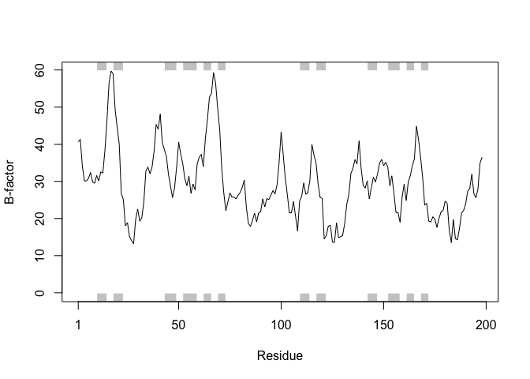

Class11
================
Tianhao Qiu
5/7/2019

The PDB database
----------------

The [PDB](http://www.rcsb.org/) is the main repository for biomolecular structure data.

Contents of PDB:

> Q1: Download a CSV file from the PDB site (accessible from “Analyze” -&gt; “PDB Statistics” &gt; “by Experimental Method and Molecular Type”. Move this CSV file into your RStudio project and determine the percentage of structures solved by X-Ray and Electron Microscopy. From the website what proportion of structures are protein? Aim to have a rendered GitHub document with working code that yields your answers.

``` r
db <-read.csv('Data Export Summary.csv')
head(db)
```

    ##   Experimental.Method Proteins Nucleic.Acids Protein.NA.Complex Other
    ## 1               X-Ray   126880          2012               6547     8
    ## 2                 NMR    11062          1279                259     8
    ## 3 Electron Microscopy     2277            31                800     0
    ## 4               Other      256             4                  6    13
    ## 5        Multi Method      129             5                  2     1
    ##    Total
    ## 1 135447
    ## 2  12608
    ## 3   3108
    ## 4    279
    ## 5    137

``` r
# Proportion data
db$Total / sum(db$Total) * 100
```

    ## [1] 89.35736481  8.31777489  2.05041595  0.18406244  0.09038191

``` r
# Proportion (protein)
sum(db$Proteins)/ sum(db$Total) * 100
```

    ## [1] 92.75955

> Q2: Type HIV in the PDB website search box on the home page and determine how many HIV-1 protease structures are in the current PDB?

``` r
1157
```

    ## [1] 1157

``` r
# see http://www.rcsb.org/pdb/results/results.do?tabtoshow=Current&qrid=2117E9DB
```

``` r
library(datapasta)

temp <- data.frame(stringsAsFactors=FALSE,
           Experimental.Method = c("Electron Microscopy", "Multi Method", "NMR",
                                   "Other", "X-Ray", "Total"),
                      Proteins = c(2277, 129, 11062, 256, 126880, 140604),
                 Nucleic.Acids = c(31, 5, 1279, 4, 2012, 3331),
            ProteinComplex = c(800, 2, 259, 6, 6547, 7614),
                         Other = c(0, 1, 8, 13, 8, 30),
                         Total = c(3108, 137, 12608, 279, 135447, 151579)
        )
```

``` r
library(bio3d)
example(plot.bio3d)
```

    ## 
    ## plt.b3> ## No test: 
    ## plt.b3> ##D # PDB server connection required - testing excluded
    ## plt.b3> ##D 
    ## plt.b3> ##D ## Plot of B-factor values along with secondary structure from PDB
    ## plt.b3> ##D pdb <- read.pdb( "1bg2" )
    ## plt.b3> ##D bfac <- pdb$atom[pdb$calpha,"b"]
    ## plt.b3> ##D plot.bio3d(bfac, sse=pdb, ylab="B-factor", col="gray")
    ## plt.b3> ##D points(bfac, typ="l")
    ## plt.b3> ## End(No test)
    ## plt.b3> 
    ## plt.b3> ## Not run: 
    ## plt.b3> ##D ## Use PDB residue numbers and include short secondary structure elements
    ## plt.b3> ##D plot.bio3d(pdb$atom[pdb$calpha,"b"], sse=pdb, resno=pdb, ylab="B-factor",
    ## plt.b3> ##D   typ="l", lwd=1.5, col="blue", sse.min.length=0)
    ## plt.b3> ##D 
    ## plt.b3> ##D 
    ## plt.b3> ##D ## Calculate secondary structure using stride() or dssp()
    ## plt.b3> ##D #sse <- stride(pdb)
    ## plt.b3> ##D sse <- dssp(pdb)
    ## plt.b3> ##D 
    ## plt.b3> ##D ## Plot of B-factor values along with calculated secondary structure
    ## plt.b3> ##D plot.bio3d(pdb$atom[pdb$calpha,"b"], sse=sse, ylab="B-factor", typ="l",
    ## plt.b3> ##D col="blue", lwd=2)
    ## plt.b3> ## End(Not run)
    ## plt.b3> 
    ## plt.b3> ## No test: 
    ## plt.b3> ##D # PDB server connection required - testing excluded
    ## plt.b3> ##D 
    ## plt.b3> ##D ## Plot 'aligned' data respecting gap positions
    ## plt.b3> ##D attach(transducin)
    ## plt.b3> ##D 
    ## plt.b3> ##D pdb = read.pdb("1tnd") ## Reference PDB see: pdbs$id[1]
    ## plt.b3> ##D pdb = trim.pdb(pdb, inds=atom.select(pdb, chain="A"))
    ## plt.b3> ##D 
    ## plt.b3> ##D ## Plot of B-factor values with gaps
    ## plt.b3> ##D plot.bio3d(pdbs$b, resno=pdb, sse=pdb, ylab="B-factor")
    ## plt.b3> ##D 
    ## plt.b3> ##D ## Plot of B-factor values after removing all gaps 
    ## plt.b3> ##D plot.bio3d(pdbs$b, rm.gaps=TRUE, resno = pdb, sse=pdb, ylab="B-factor")
    ## plt.b3> ##D 
    ## plt.b3> ##D detach(transducin)
    ## plt.b3> ## End(No test)
    ## plt.b3> 
    ## plt.b3> ## Fancy secondary structure elements
    ## plt.b3> ##plot.bio3d(pdb$atom[pdb$calpha,"b"], sse=pdb, ssetype="fancy")
    ## plt.b3> ## Currently not implemented
    ## plt.b3> 
    ## plt.b3> 
    ## plt.b3>

``` r
pdb <- read.pdb("1hsg")
```

    ##   Note: Accessing on-line PDB file

``` r
pdb
```

    ## 
    ##  Call:  read.pdb(file = "1hsg")
    ## 
    ##    Total Models#: 1
    ##      Total Atoms#: 1686,  XYZs#: 5058  Chains#: 2  (values: A B)
    ## 
    ##      Protein Atoms#: 1514  (residues/Calpha atoms#: 198)
    ##      Nucleic acid Atoms#: 0  (residues/phosphate atoms#: 0)
    ## 
    ##      Non-protein/nucleic Atoms#: 172  (residues: 128)
    ##      Non-protein/nucleic resid values: [ HOH (127), MK1 (1) ]
    ## 
    ##    Protein sequence:
    ##       PQITLWQRPLVTIKIGGQLKEALLDTGADDTVLEEMSLPGRWKPKMIGGIGGFIKVRQYD
    ##       QILIEICGHKAIGTVLVGPTPVNIIGRNLLTQIGCTLNFPQITLWQRPLVTIKIGGQLKE
    ##       ALLDTGADDTVLEEMSLPGRWKPKMIGGIGGFIKVRQYDQILIEICGHKAIGTVLVGPTP
    ##       VNIIGRNLLTQIGCTLNF
    ## 
    ## + attr: atom, xyz, seqres, helix, sheet,
    ##         calpha, remark, call

``` r
attributes(pdb)
```

    ## $names
    ## [1] "atom"   "xyz"    "seqres" "helix"  "sheet"  "calpha" "remark" "call"  
    ## 
    ## $class
    ## [1] "pdb" "sse"

> Q6. How many amino acid residues are there in this pdb object and what are the two non- protein residues?

``` ={r}
198, HOH, MK1
```

> Q7. What type of R object is ?

``` r
str(pdb$atom)
```

    ## 'data.frame':    1686 obs. of  16 variables:
    ##  $ type  : chr  "ATOM" "ATOM" "ATOM" "ATOM" ...
    ##  $ eleno : int  1 2 3 4 5 6 7 8 9 10 ...
    ##  $ elety : chr  "N" "CA" "C" "O" ...
    ##  $ alt   : chr  NA NA NA NA ...
    ##  $ resid : chr  "PRO" "PRO" "PRO" "PRO" ...
    ##  $ chain : chr  "A" "A" "A" "A" ...
    ##  $ resno : int  1 1 1 1 1 1 1 2 2 2 ...
    ##  $ insert: chr  NA NA NA NA ...
    ##  $ x     : num  29.4 30.3 29.8 28.6 30.5 ...
    ##  $ y     : num  39.7 38.7 38.1 38.3 37.5 ...
    ##  $ z     : num  5.86 5.32 4.02 3.68 6.34 ...
    ##  $ o     : num  1 1 1 1 1 1 1 1 1 1 ...
    ##  $ b     : num  38.1 40.6 42.6 43.4 37.9 ...
    ##  $ segid : chr  NA NA NA NA ...
    ##  $ elesy : chr  "N" "C" "C" "O" ...
    ##  $ charge: chr  NA NA NA NA ...

``` r
typeof(pdb$atom)
```

    ## [1] "list"

``` r
head(pdb$atom)
```

    ##   type eleno elety  alt resid chain resno insert      x      y     z o
    ## 1 ATOM     1     N <NA>   PRO     A     1   <NA> 29.361 39.686 5.862 1
    ## 2 ATOM     2    CA <NA>   PRO     A     1   <NA> 30.307 38.663 5.319 1
    ## 3 ATOM     3     C <NA>   PRO     A     1   <NA> 29.760 38.071 4.022 1
    ## 4 ATOM     4     O <NA>   PRO     A     1   <NA> 28.600 38.302 3.676 1
    ## 5 ATOM     5    CB <NA>   PRO     A     1   <NA> 30.508 37.541 6.342 1
    ## 6 ATOM     6    CG <NA>   PRO     A     1   <NA> 29.296 37.591 7.162 1
    ##       b segid elesy charge
    ## 1 38.10  <NA>     N   <NA>
    ## 2 40.62  <NA>     C   <NA>
    ## 3 42.64  <NA>     C   <NA>
    ## 4 43.40  <NA>     O   <NA>
    ## 5 37.87  <NA>     C   <NA>
    ## 6 38.40  <NA>     C   <NA>

``` r
# Print a subset of $atom data for the first two atoms  
pdb$atom[1:2, c("eleno", "elety", "x","y","z")]
```

    ##   eleno elety      x      y     z
    ## 1     1     N 29.361 39.686 5.862
    ## 2     2    CA 30.307 38.663 5.319

``` r
# Note that individual $atom records can also be accessed like this  
pdb$atom$elety[1:2]
```

    ## [1] "N"  "CA"

``` r
# Which allows us to do the following  
plot.bio3d(pdb$atom$b[pdb$calpha], sse=pdb, typ="l", ylab= "B-factor")
```



Atom selection (atom.select())
------------------------------

``` r
prot.pdb <- atom.select(pdb, "protein", value = T)
ligd.pdb <- atom.select(pdb, "ligand", value = T)
write.pdb(ligd.pdb, file ="1hsg_ligand.pdb")
write.pdb(prot.pdb, file ="1hsg_protein.pdb")
```

``` r
atom.select(pdb, "ligand", value = T)
```

    ## 
    ##  Call:  trim.pdb(pdb = pdb, sele)
    ## 
    ##    Total Models#: 1
    ##      Total Atoms#: 45,  XYZs#: 135  Chains#: 1  (values: B)
    ## 
    ##      Protein Atoms#: 0  (residues/Calpha atoms#: 0)
    ##      Nucleic acid Atoms#: 0  (residues/phosphate atoms#: 0)
    ## 
    ##      Non-protein/nucleic Atoms#: 45  (residues: 1)
    ##      Non-protein/nucleic resid values: [ MK1 (1) ]
    ## 
    ## + attr: atom, helix, sheet, seqres, xyz,
    ##         calpha, call

``` r
# Select all C-alpha atoms (return their indices)  
ca.inds <- atom.select(pdb, "calpha") 
ca.inds
```

    ## 
    ##  Call:  atom.select.pdb(pdb = pdb, string = "calpha")
    ## 
    ##    Atom Indices#: 198  ($atom)
    ##    XYZ  Indices#: 594  ($xyz)
    ## 
    ## + attr: atom, xyz, call

``` r
# Print details of the first few selected atoms  
head( pdb$atom[ca.inds$atom, ] )
```

    ##    type eleno elety  alt resid chain resno insert      x      y     z o
    ## 2  ATOM     2    CA <NA>   PRO     A     1   <NA> 30.307 38.663 5.319 1
    ## 9  ATOM     9    CA <NA>   GLN     A     2   <NA> 30.158 36.492 2.199 1
    ## 18 ATOM    18    CA <NA>   ILE     A     3   <NA> 29.123 33.098 3.397 1
    ## 26 ATOM    26    CA <NA>   THR     A     4   <NA> 29.774 30.143 1.062 1
    ## 33 ATOM    33    CA <NA>   LEU     A     5   <NA> 27.644 27.003 1.144 1
    ## 41 ATOM    41    CA <NA>   TRP     A     6   <NA> 30.177 24.150 1.279 1
    ##        b segid elesy charge
    ## 2  40.62  <NA>     C   <NA>
    ## 9  41.30  <NA>     C   <NA>
    ## 18 34.13  <NA>     C   <NA>
    ## 26 30.14  <NA>     C   <NA>
    ## 33 30.12  <NA>     C   <NA>
    ## 41 30.82  <NA>     C   <NA>

``` r
# And selected xyz coordinates  
head( pdb$xyz[, ca.inds$xyz] )
```

    ## [1] 30.307 38.663  5.319 30.158 36.492  2.199

``` r
# Select chain A 
a.inds <- atom.select(pdb, chain="A") 
 
# Select C-alphas of chain A 
ca.inds <- atom.select(pdb, "calpha", chain="A") 
 
# We can combine multiple selection criteria to return their intersection 
cab.inds <- atom.select(pdb, elety=c("CA","CB"), chain="A", resno=10:20)
```

``` r
# Download some example PDB files 
ids <- c("1TND_B","1AGR_A","1TAG_A","1GG2_A","1KJY_A","4G5Q_A") 
files <- get.pdb(ids, split = TRUE)
```

    ## Warning in get.pdb(ids, split = TRUE): ./1TND.pdb exists. Skipping download

    ## Warning in get.pdb(ids, split = TRUE): ./1AGR.pdb exists. Skipping download

    ## Warning in get.pdb(ids, split = TRUE): ./1TAG.pdb exists. Skipping download

    ## Warning in get.pdb(ids, split = TRUE): ./1GG2.pdb exists. Skipping download

    ## Warning in get.pdb(ids, split = TRUE): ./1KJY.pdb exists. Skipping download

    ## Warning in get.pdb(ids, split = TRUE): ./4G5Q.pdb exists. Skipping download

    ## 
      |                                                                       
      |                                                                 |   0%
      |                                                                       
      |===========                                                      |  17%
      |                                                                       
      |======================                                           |  33%
      |                                                                       
      |================================                                 |  50%
      |                                                                       
      |===========================================                      |  67%
      |                                                                       
      |======================================================           |  83%
      |                                                                       
      |=================================================================| 100%

``` r
# Extract and align the chains we are interested in  
pdbs <- pdbaln(files, fit = TRUE)
```

    ## Reading PDB files:
    ## ./split_chain/1TND_B.pdb
    ## ./split_chain/1AGR_A.pdb
    ## ./split_chain/1TAG_A.pdb
    ## ./split_chain/1GG2_A.pdb
    ## ./split_chain/1KJY_A.pdb
    ## ./split_chain/4G5Q_A.pdb
    ## .....   PDB has ALT records, taking A only, rm.alt=TRUE
    ## .
    ## 
    ## Extracting sequences
    ## 
    ## pdb/seq: 1   name: ./split_chain/1TND_B.pdb 
    ## pdb/seq: 2   name: ./split_chain/1AGR_A.pdb 
    ## pdb/seq: 3   name: ./split_chain/1TAG_A.pdb 
    ## pdb/seq: 4   name: ./split_chain/1GG2_A.pdb 
    ## pdb/seq: 5   name: ./split_chain/1KJY_A.pdb 
    ## pdb/seq: 6   name: ./split_chain/4G5Q_A.pdb 
    ##    PDB has ALT records, taking A only, rm.alt=TRUE

``` r
# Print to screen a summary of the 'pdbs' object  
pdbs
```

    ##                                1        .         .         .         .         50 
    ## [Truncated_Name:1]1TND_B.pdb   --------------------------ARTVKLLLLGAGESGKSTIVKQMK
    ## [Truncated_Name:2]1AGR_A.pdb   LSAEDKAAVERSKMIDRNLREDGEKAAREVKLLLLGAGESGKSTIVKQMK
    ## [Truncated_Name:3]1TAG_A.pdb   --------------------------ARTVKLLLLGAGESGKSTIVKQMK
    ## [Truncated_Name:4]1GG2_A.pdb   LSAEDKAAVERSKMIDRNLREDGEKAAREVKLLLLGAGESGKSTIVKQMK
    ## [Truncated_Name:5]1KJY_A.pdb   -------------------------GAREVKLLLLGAGESGKSTIVKQMK
    ## [Truncated_Name:6]4G5Q_A.pdb   --------------------------AREVKLLLLGAGESGKSTIVKQMK
    ##                                                          ** ********************* 
    ##                                1        .         .         .         .         50 
    ## 
    ##                               51        .         .         .         .         100 
    ## [Truncated_Name:1]1TND_B.pdb   IIHQDGYSLEECLEFIAIIYGNTLQSILAIVRAMTTLNIQYGDSARQDDA
    ## [Truncated_Name:2]1AGR_A.pdb   IIHEAGYSEEECKQYKAVVYSNTIQSIIAIIRAMGRLKIDFGDAARADDA
    ## [Truncated_Name:3]1TAG_A.pdb   IIHQDGYSLEECLEFIAIIYGNTLQSILAIVRAMTTLNIQYGDSARQDDA
    ## [Truncated_Name:4]1GG2_A.pdb   IIHEAGYSEEECKQYKAVVYSNTIQSIIAIIRAMGRLKIDFGDAARADDA
    ## [Truncated_Name:5]1KJY_A.pdb   IIHEAGYSEEECKQYKAVVYSNTIQSIIAIIRAMGRLKIDFGDSARADDA
    ## [Truncated_Name:6]4G5Q_A.pdb   IIHEAGYSEEECKQYKAVVYSNTIQSIIAIIRAMGRLKIDFGDSARADDA
    ##                                ***  *** ***  ^ *^^* **^***^**^***  * * ^** ** *** 
    ##                               51        .         .         .         .         100 
    ## 
    ##                              101        .         .         .         .         150 
    ## [Truncated_Name:1]1TND_B.pdb   RKLMHMADTIEEGTMPKEMSDIIQRLWKDSGIQACFDRASEYQLNDSAGY
    ## [Truncated_Name:2]1AGR_A.pdb   RQLFVLAGAAEEGFMTAELAGVIKRLWKDSGVQACFNRSREYQLNDSAAY
    ## [Truncated_Name:3]1TAG_A.pdb   RKLMHMADTIEEGTMPKEMSDIIQRLWKDSGIQACFDRASEYQLNDSAGY
    ## [Truncated_Name:4]1GG2_A.pdb   RQLFVLAGAAEEGFMTAELAGVIKRLWKDSGVQACFNRSREYQLNDSAAY
    ## [Truncated_Name:5]1KJY_A.pdb   RQLFVLAGAAEEGFMTAELAGVIKRLWKDSGVQACFNRSREYQLNDSAAY
    ## [Truncated_Name:6]4G5Q_A.pdb   RQLFVLAGAAEEGFMTAELAGVIKRLWKDSGVQACFNRSREYQLNDSAAY
    ##                                * *  ^*   *** *  *^  ^* *******^**** *  ********^* 
    ##                              101        .         .         .         .         150 
    ## 
    ##                              151        .         .         .         .         200 
    ## [Truncated_Name:1]1TND_B.pdb   YLSDLERLVTPGYVPTEQDVLRSRVKTTGIIETQFSFKDLNFRMFDVGGQ
    ## [Truncated_Name:2]1AGR_A.pdb   YLNDLDRIAQPNYIPTQQDVLRTRVKTTGIVETHFTFKDLHFKMFDVGGQ
    ## [Truncated_Name:3]1TAG_A.pdb   YLSDLERLVTPGYVPTEQDVLRSRVKTTGIIETQFSFKDLNFRMFDVGGQ
    ## [Truncated_Name:4]1GG2_A.pdb   YLNDLDRIAQPNYIPTQQDVLRTRVKTTGIVETHFTFKDLHFKMFDVGAQ
    ## [Truncated_Name:5]1KJY_A.pdb   YLNDLDRIAQPNYIPTQQDVLRTRVKTTGIVETHFTFKDLHFKMFDVGGQ
    ## [Truncated_Name:6]4G5Q_A.pdb   YLNDLDRIAQPNYIPTQQDVLRTRVKTTGIVETHFTFKDLHFKMFDVGGQ
    ##                                ** **^*^  * *^** *****^*******^** *^**** *^*****^* 
    ##                              151        .         .         .         .         200 
    ## 
    ##                              201        .         .         .         .         250 
    ## [Truncated_Name:1]1TND_B.pdb   RSERKKWIHCFEGVTCIIFIAALSAYDMVLVEDDEVNRMHESLHLFNSIC
    ## [Truncated_Name:2]1AGR_A.pdb   RSERKKWIHCFEGVTAIIFCVALSDYDLVLAEDEEMNRMHESMKLFDSIC
    ## [Truncated_Name:3]1TAG_A.pdb   RSERKKWIHCFEGVTCIIFIAALSAYDMVLVEDDEVNRMHESLHLFNSIC
    ## [Truncated_Name:4]1GG2_A.pdb   RSERKKWIHCFEGVTAIIFCVALSDYDLVLAEDEEMNRMHESMKLFDSIC
    ## [Truncated_Name:5]1KJY_A.pdb   RSERKKWIHCFEGVTAIIFCVALSDYDLVLAEDEEMNRMHESMKLFDSIC
    ## [Truncated_Name:6]4G5Q_A.pdb   RSERKKWIHCFEGVTAIIFCVALSDYDLVLAEDEEMNRMHESMKLFDSIC
    ##                                *************** ***  *** **^** **^*^******^^** *** 
    ##                              201        .         .         .         .         250 
    ## 
    ##                              251        .         .         .         .         300 
    ## [Truncated_Name:1]1TND_B.pdb   NHRYFATTSIVLFLNKKDVFSEKIKKAHLSICFPDYNGPNTYEDAGNYIK
    ## [Truncated_Name:2]1AGR_A.pdb   NNKWFTDTSIILFLNKKDLFEEKIKKSPLTICYPEYAGSNTYEEAAAYIQ
    ## [Truncated_Name:3]1TAG_A.pdb   NHRYFATTSIVLFLNKKDVFSEKIKKAHLSICFPDYNGPNTYEDAGNYIK
    ## [Truncated_Name:4]1GG2_A.pdb   NNKWFTDTSIILFLNKKDLFEEKIKKSPLTICYPEYAGSNTYEEAAAYIQ
    ## [Truncated_Name:5]1KJY_A.pdb   NNKWFTDTSIILFLNKKDLFEEKIKKSPLTICYPEYAGSNTYEEAAAYIQ
    ## [Truncated_Name:6]4G5Q_A.pdb   NNKWFTDTSIILFLNKKDLFEEKIKKSPLTICYPEYAGSNTYEEAAAYIQ
    ##                                * ^^*  ***^*******^* *****  *^**^*^* * ****^*^ **  
    ##                              251        .         .         .         .         300 
    ## 
    ##                              301        .         .         .         .         350 
    ## [Truncated_Name:1]1TND_B.pdb   VQFLELNMRRDVKEIYSHMTCATDTQNVKFVFDAVTDIIIKE--------
    ## [Truncated_Name:2]1AGR_A.pdb   CQFEDLNKRKDTKEIYTHFTCATDTKNVQFVFDAVTDVIIKNNLKDCGLF
    ## [Truncated_Name:3]1TAG_A.pdb   VQFLELNMRRDVKEIYSHMTCATDTQNVKFVFDAVTDIII----------
    ## [Truncated_Name:4]1GG2_A.pdb   CQFEDLNKRKDTKEIYTHFTCATDTKNVQFVFDAVTDVIIKNNL------
    ## [Truncated_Name:5]1KJY_A.pdb   CQFEDLNKRKDTKEIYTHFTCATDTKNVQFVFDAVTDVIIKNNLK-----
    ## [Truncated_Name:6]4G5Q_A.pdb   CQFEDLNKRKDTKEIYTHFTCATDTKNVQFVFDAVTDVIIKNNLKD----
    ##                                 ** ^** *^* ****^* ****** ** ********^**           
    ##                              301        .         .         .         .         350 
    ## 
    ## Call:
    ##   pdbaln(files = files, fit = TRUE)
    ## 
    ## Class:
    ##   pdbs, fasta
    ## 
    ## Alignment dimensions:
    ##   6 sequence rows; 350 position columns (314 non-gap, 36 gap) 
    ## 
    ## + attr: xyz, resno, b, chain, id, ali, resid, sse, call
