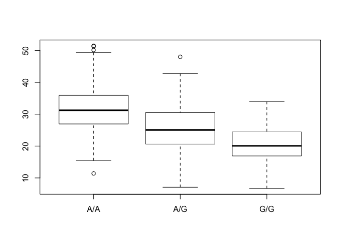

class 13
================

How many of each genetyoe are there?

``` r
MexicianGeno <- read.csv("373531-SampleGenotypes-Homo_sapiens_Variation_Sample_rs8067378.csv")
tM <- table(MexicianGeno$Genotype..forward.strand.)
tM / nrow(MexicianGeno) * 100
```

    ## 
    ##     A|A     A|G     G|A     G|G 
    ## 34.3750 32.8125 18.7500 14.0625

Interpret base quality in R

``` r
library(seqinr)
library(gtools)
phred <- asc( s2c("DDDDCDEDCDDDDBBDDDCC@") ) - 33
phred
```

    ##  D  D  D  D  C  D  E  D  C  D  D  D  D  B  B  D  D  D  C  C  @ 
    ## 35 35 35 35 34 35 36 35 34 35 35 35 35 33 33 35 35 35 34 34 31

``` r
prob <- 10**(-phred/10)
prob
```

    ##            D            D            D            D            C 
    ## 0.0003162278 0.0003162278 0.0003162278 0.0003162278 0.0003981072 
    ##            D            E            D            C            D 
    ## 0.0003162278 0.0002511886 0.0003162278 0.0003981072 0.0003162278 
    ##            D            D            D            B            B 
    ## 0.0003162278 0.0003162278 0.0003162278 0.0005011872 0.0005011872 
    ##            D            D            D            C            C 
    ## 0.0003162278 0.0003162278 0.0003162278 0.0003981072 0.0003981072 
    ##            @ 
    ## 0.0007943282

``` r
asc( s2c("DDDDCDEDCDDDDBBDDDCC@") )
```

    ##  D  D  D  D  C  D  E  D  C  D  D  D  D  B  B  D  D  D  C  C  @ 
    ## 68 68 68 68 67 68 69 68 67 68 68 68 68 66 66 68 68 68 67 67 64

Population Scalr Analysis

``` r
pData <- read.table("rs8067378_ENSG00000172057.6.txt", header = T)
summary(pData)
```

    ##      sample     geno          exp        
    ##  HG00096:  1   A/A:108   Min.   : 6.675  
    ##  HG00097:  1   A/G:233   1st Qu.:20.004  
    ##  HG00099:  1   G/G:121   Median :25.116  
    ##  HG00100:  1             Mean   :25.640  
    ##  HG00101:  1             3rd Qu.:30.779  
    ##  HG00102:  1             Max.   :51.518  
    ##  (Other):456

``` r
head(pData)
```

    ##    sample geno      exp
    ## 1 HG00367  A/G 28.96038
    ## 2 NA20768  A/G 20.24449
    ## 3 HG00361  A/A 31.32628
    ## 4 HG00135  A/A 34.11169
    ## 5 NA18870  G/G 18.25141
    ## 6 NA11993  A/A 32.89721

``` r
inds1 <- pData$geno == "G/G"
pGG <- pData[inds1,]
summary(pGG)
```

    ##      sample     geno          exp        
    ##  HG00099:  1   A/A:  0   Min.   : 6.675  
    ##  HG00109:  1   A/G:  0   1st Qu.:16.903  
    ##  HG00112:  1   G/G:121   Median :20.074  
    ##  HG00116:  1             Mean   :20.594  
    ##  HG00118:  1             3rd Qu.:24.457  
    ##  HG00120:  1             Max.   :33.956  
    ##  (Other):115

``` r
inds2 <- pData$geno == "A/G"
pAG <- pData[inds2,]
summary(pAG)
```

    ##      sample     geno          exp        
    ##  HG00097:  1   A/A:  0   Min.   : 7.075  
    ##  HG00103:  1   A/G:233   1st Qu.:20.626  
    ##  HG00106:  1   G/G:  0   Median :25.065  
    ##  HG00110:  1             Mean   :25.397  
    ##  HG00114:  1             3rd Qu.:30.552  
    ##  HG00115:  1             Max.   :48.034  
    ##  (Other):227

``` r
boxplot(exp ~ geno, data = pData)
```


