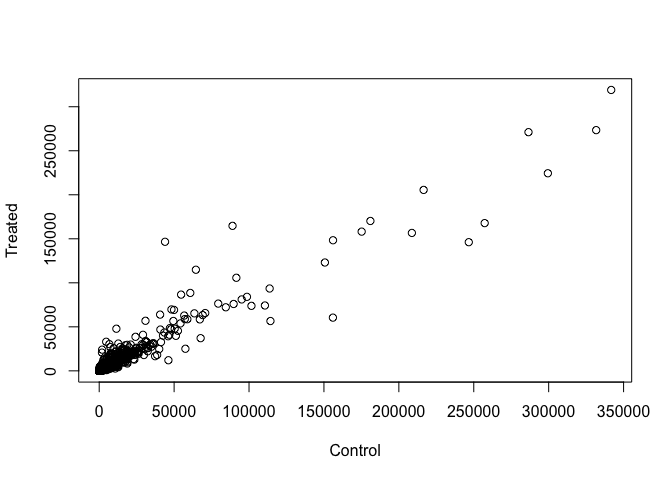
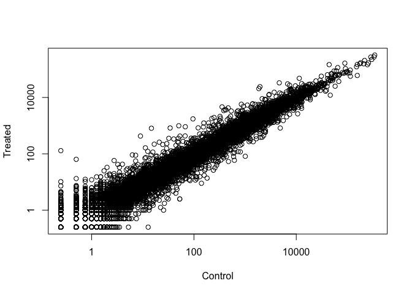

Class 14
================

``` r
library(BiocManager)
library(DESeq2)
```

    ## Loading required package: S4Vectors

    ## Loading required package: stats4

    ## Loading required package: BiocGenerics

    ## Loading required package: parallel

    ## 
    ## Attaching package: 'BiocGenerics'

    ## The following objects are masked from 'package:parallel':
    ## 
    ##     clusterApply, clusterApplyLB, clusterCall, clusterEvalQ,
    ##     clusterExport, clusterMap, parApply, parCapply, parLapply,
    ##     parLapplyLB, parRapply, parSapply, parSapplyLB

    ## The following objects are masked from 'package:stats':
    ## 
    ##     IQR, mad, sd, var, xtabs

    ## The following objects are masked from 'package:base':
    ## 
    ##     anyDuplicated, append, as.data.frame, basename, cbind,
    ##     colMeans, colnames, colSums, dirname, do.call, duplicated,
    ##     eval, evalq, Filter, Find, get, grep, grepl, intersect,
    ##     is.unsorted, lapply, lengths, Map, mapply, match, mget, order,
    ##     paste, pmax, pmax.int, pmin, pmin.int, Position, rank, rbind,
    ##     Reduce, rowMeans, rownames, rowSums, sapply, setdiff, sort,
    ##     table, tapply, union, unique, unsplit, which, which.max,
    ##     which.min

    ## 
    ## Attaching package: 'S4Vectors'

    ## The following object is masked from 'package:base':
    ## 
    ##     expand.grid

    ## Loading required package: IRanges

    ## Loading required package: GenomicRanges

    ## Loading required package: GenomeInfoDb

    ## Loading required package: SummarizedExperiment

    ## Loading required package: Biobase

    ## Welcome to Bioconductor
    ## 
    ##     Vignettes contain introductory material; view with
    ##     'browseVignettes()'. To cite Bioconductor, see
    ##     'citation("Biobase")', and for packages 'citation("pkgname")'.

    ## Loading required package: DelayedArray

    ## Loading required package: matrixStats

    ## 
    ## Attaching package: 'matrixStats'

    ## The following objects are masked from 'package:Biobase':
    ## 
    ##     anyMissing, rowMedians

    ## Loading required package: BiocParallel

    ## 
    ## Attaching package: 'DelayedArray'

    ## The following objects are masked from 'package:matrixStats':
    ## 
    ##     colMaxs, colMins, colRanges, rowMaxs, rowMins, rowRanges

    ## The following objects are masked from 'package:base':
    ## 
    ##     aperm, apply

``` r
counts <- read.csv("data/airway_scaledcounts.csv", stringsAsFactors = FALSE)
metadata <-  read.csv("data/airway_metadata.csv", stringsAsFactors = FALSE)
```

``` r
head(counts)
```

    ##           ensgene SRR1039508 SRR1039509 SRR1039512 SRR1039513 SRR1039516
    ## 1 ENSG00000000003        723        486        904        445       1170
    ## 2 ENSG00000000005          0          0          0          0          0
    ## 3 ENSG00000000419        467        523        616        371        582
    ## 4 ENSG00000000457        347        258        364        237        318
    ## 5 ENSG00000000460         96         81         73         66        118
    ## 6 ENSG00000000938          0          0          1          0          2
    ##   SRR1039517 SRR1039520 SRR1039521
    ## 1       1097        806        604
    ## 2          0          0          0
    ## 3        781        417        509
    ## 4        447        330        324
    ## 5         94        102         74
    ## 6          0          0          0

``` r
head(metadata)
```

    ##           id     dex celltype     geo_id
    ## 1 SRR1039508 control   N61311 GSM1275862
    ## 2 SRR1039509 treated   N61311 GSM1275863
    ## 3 SRR1039512 control  N052611 GSM1275866
    ## 4 SRR1039513 treated  N052611 GSM1275867
    ## 5 SRR1039516 control  N080611 GSM1275870
    ## 6 SRR1039517 treated  N080611 GSM1275871

``` r
# Number of genes in total
nrow(counts)
```

    ## [1] 38694

``` r
View(metadata)
```

``` r
# Check whether names are right 
colnames(counts) == metadata$id
```

    ## Warning in colnames(counts) == metadata$id: longer object length is not a
    ## multiple of shorter object length

    ## [1] FALSE FALSE FALSE FALSE FALSE FALSE FALSE FALSE FALSE

Section 3. Walk Through of gene expression analysis
---------------------------------------------------

``` r
control.inds <- metadata$dex == "control"
control <- metadata[control.inds, ]
control <- metadata[metadata[,"dex"]=="control",]
head(counts[, control$id])
```

    ##   SRR1039508 SRR1039512 SRR1039516 SRR1039520
    ## 1        723        904       1170        806
    ## 2          0          0          0          0
    ## 3        467        616        582        417
    ## 4        347        364        318        330
    ## 5         96         73        118        102
    ## 6          0          1          2          0

``` r
control.mean <- rowSums( counts[ ,control$id] )/ length(control$id)
names(control.mean) <- counts$ensgene

treated.inds <- metadata$dex == "treated"
treated <- metadata[treated.inds, ]
treated <- metadata[metadata[,"dex"]=="treated",]
head(counts[, treated$id])
```

    ##   SRR1039509 SRR1039513 SRR1039517 SRR1039521
    ## 1        486        445       1097        604
    ## 2          0          0          0          0
    ## 3        523        371        781        509
    ## 4        258        237        447        324
    ## 5         81         66         94         74
    ## 6          0          0          0          0

``` r
treated.mean <- rowSums( counts[ ,treated$id] )/ length(treated$id)
```

### Combine two data table

``` r
meancounts <- data.frame(control.mean, treated.mean)
colSums(meancounts)
```

    ## control.mean treated.mean 
    ##     23005324     22196524

``` r
plot(meancounts$control.mean, meancounts$treated.mean, xlab = "Control", ylab = "Treated")
```



``` r
plot(meancounts$control.mean, meancounts$treated.mean, 
     xlab = "Control", ylab = "Treated", log = "xy")
```

    ## Warning in xy.coords(x, y, xlabel, ylabel, log): 15032 x values <= 0
    ## omitted from logarithmic plot

    ## Warning in xy.coords(x, y, xlabel, ylabel, log): 15281 y values <= 0
    ## omitted from logarithmic plot



### Data Transformation

``` r
meancounts$log2fc <- log2(meancounts[,"treated.mean"]/meancounts[,"control.mean"])
head(meancounts)
```

    ##                 control.mean treated.mean      log2fc
    ## ENSG00000000003       900.75       658.00 -0.45303916
    ## ENSG00000000005         0.00         0.00         NaN
    ## ENSG00000000419       520.50       546.00  0.06900279
    ## ENSG00000000457       339.75       316.50 -0.10226805
    ## ENSG00000000460        97.25        78.75 -0.30441833
    ## ENSG00000000938         0.75         0.00        -Inf

``` r
# Remove zero
to.rm <- unique(which(meancounts[, 1:2] == 0, arr.ind = T)[,1])
```

``` r
mycounts <- meancounts[-to.rm,]
nrow(mycounts)
```

    ## [1] 21817

### How many genes are up in the drug treated cells

``` r
up.inds <- mycounts$log2fc > 2
sum(up.inds)
```

    ## [1] 250

``` r
down.inds <- mycounts$log2fc < -2
sum(down.inds)
```

    ## [1] 367

``` r
head(mycounts[up.inds,])
```

    ##                 control.mean treated.mean   log2fc
    ## ENSG00000004799       270.50      1429.25 2.401558
    ## ENSG00000006788         2.75        19.75 2.844349
    ## ENSG00000008438         0.50         2.75 2.459432
    ## ENSG00000011677         0.50         2.25 2.169925
    ## ENSG00000015413         0.50         3.00 2.584963
    ## ENSG00000015592         0.50         2.25 2.169925

4. Adding annotation data
-------------------------

``` r
anno <- read.csv("data/annotables_grch38.csv")
head(anno)
```

    ##           ensgene entrez   symbol chr     start       end strand
    ## 1 ENSG00000000003   7105   TSPAN6   X 100627109 100639991     -1
    ## 2 ENSG00000000005  64102     TNMD   X 100584802 100599885      1
    ## 3 ENSG00000000419   8813     DPM1  20  50934867  50958555     -1
    ## 4 ENSG00000000457  57147    SCYL3   1 169849631 169894267     -1
    ## 5 ENSG00000000460  55732 C1orf112   1 169662007 169854080      1
    ## 6 ENSG00000000938   2268      FGR   1  27612064  27635277     -1
    ##          biotype
    ## 1 protein_coding
    ## 2 protein_coding
    ## 3 protein_coding
    ## 4 protein_coding
    ## 5 protein_coding
    ## 6 protein_coding
    ##                                                                                                  description
    ## 1                                                          tetraspanin 6 [Source:HGNC Symbol;Acc:HGNC:11858]
    ## 2                                                            tenomodulin [Source:HGNC Symbol;Acc:HGNC:17757]
    ## 3 dolichyl-phosphate mannosyltransferase polypeptide 1, catalytic subunit [Source:HGNC Symbol;Acc:HGNC:3005]
    ## 4                                               SCY1-like, kinase-like 3 [Source:HGNC Symbol;Acc:HGNC:19285]
    ## 5                                    chromosome 1 open reading frame 112 [Source:HGNC Symbol;Acc:HGNC:25565]
    ## 6                          FGR proto-oncogene, Src family tyrosine kinase [Source:HGNC Symbol;Acc:HGNC:3697]

``` r
# Use the merge function to add the annotation data
mycounts.anno <- merge(mycounts, anno, by.x = "row.names", by.y = "ensgene")
mycounts.anno 
```

    ##            Row.names control.mean treated.mean        log2fc    entrez
    ## 1    ENSG00000000003       900.75       658.00 -0.4530391627      7105
    ## 2    ENSG00000000419       520.50       546.00  0.0690027876      8813
    ## 3    ENSG00000000457       339.75       316.50 -0.1022680513     57147
    ## 4    ENSG00000000460        97.25        78.75 -0.3044183266     55732
    ## 5    ENSG00000000971      5219.00      6687.50  0.3576935844      3075
    ## 6    ENSG00000001036      2327.00      1785.75 -0.3819410894      2519
    ## 7    ENSG00000001084       755.75       578.00 -0.3868395811      2729
    ## 8    ENSG00000001167       527.75       348.25 -0.5997313207      4800
    ## 9    ENSG00000001460       226.75       185.50 -0.2896833639     90529
    ## 10   ENSG00000001461      3169.50      2701.25 -0.2306281009     57185
    ## 11   ENSG00000001497       589.50       519.50 -0.1823680641     81887
    ## 12   ENSG00000001561       110.50       106.75 -0.0498102998     22875
    ## 13   ENSG00000001617       695.25       543.50 -0.3552518043      6405
    ## 14   ENSG00000001626        11.25         8.00 -0.4918530963      1080
    ## 15   ENSG00000001629      2146.00      1679.75 -0.3534035458     54467
    ## 16   ENSG00000001630      1117.50       895.75 -0.3191067879      1595
    ## 17   ENSG00000001631       936.00       826.00 -0.1803667482       889
    ## 18   ENSG00000002016       251.25       173.50 -0.5341879335      5893
    ## 19   ENSG00000002079         2.25         3.25  0.5305147167        NA
    ## 20   ENSG00000002330       735.00       678.50 -0.1153954343       572
    ## 21   ENSG00000002549      1249.25      1256.75  0.0086354710     51056
    ## 22   ENSG00000002586      8802.75      8456.50 -0.0578936153      4267
    ## 23   ENSG00000002587         1.75         2.25  0.3625700794      9957
    ## 24   ENSG00000002726         1.25         1.75  0.4854268272        26
    ## 25   ENSG00000002745         9.75         4.75 -1.0374747054     51384
    ## 26   ENSG00000002746       125.00       126.00  0.0114956388     23072
    ## 27   ENSG00000002822       385.25       348.00 -0.1467076507      8379
    ## 28   ENSG00000002834      7889.00      9618.25  0.2859319880      3927
    ## 29   ENSG00000002919       237.50       270.75  0.1890338244     29916
    ## 30   ENSG00000002933       498.75       527.50  0.0808542525     55365
    ## 31   ENSG00000003056      1962.25      1769.00 -0.1495748115      4074
    ## 32   ENSG00000003096       581.25       268.25 -1.1155806401     90293
    ## 33   ENSG00000003137       149.25        61.25 -1.2849491823     56603
    ## 34   ENSG00000003147         9.00        10.00  0.1520030934      3382
    ## 35   ENSG00000003249       146.50       101.00 -0.5365453717     79007
    ## 36   ENSG00000003393       900.00       896.00 -0.0064262692     57679
    ## 37   ENSG00000003400       107.00        79.00 -0.4376862382       843
    ## 38   ENSG00000003402      2244.25      4612.50  1.0393155161      8837
    ## 39   ENSG00000003436      6153.75      4372.50 -0.4930074503      7035
    ## 40   ENSG00000003509       338.25       285.75 -0.2433364358     55471
    ## 41   ENSG00000003756      3384.25      2724.50 -0.3128446557     10181
    ## 42   ENSG00000003987        24.25        36.25  0.5799962478      9108
    ## 43   ENSG00000003989        33.75        52.25  0.6305435350      6542
    ## 44   ENSG00000004059      1562.75      1867.50  0.2570212405       381
    ## 45   ENSG00000004139       341.00       293.50 -0.2164112359     23098
    ## 46   ENSG00000004142      1498.50      1527.50  0.0276532962     26073
    ## 47   ENSG00000004399      4037.50      3593.00 -0.1682733245     23129
    ## 48   ENSG00000004455      1376.50      1215.00 -0.1800482961       204
    ## 49   ENSG00000004468         5.50         6.25  0.1844245711       952
    ## 50   ENSG00000004478       664.00       603.75 -0.1372319576      2288
    ## 51   ENSG00000004487      1510.25      1080.00 -0.4837560742     23028
    ## 52   ENSG00000004534      1563.50      1129.00 -0.4697337332     10180
    ## 53   ENSG00000004660       100.00        60.75 -0.7190436862     84254
    ## 54   ENSG00000004700      1390.00      1673.00  0.2673525624      5965
    ## 55   ENSG00000004766       550.50       461.50 -0.2544119159     55610
    ## 56   ENSG00000004776     13843.75     11041.50 -0.3262986165    126393
    ## 57   ENSG00000004777       126.25        80.50 -0.6492226995    115703
    ## 58   ENSG00000004779       380.75       374.25 -0.0248417204      4706
    ## 59   ENSG00000004799       270.50      1429.25  2.4015577911      5166
    ## 60   ENSG00000004809         1.50         1.25 -0.2630344058     85413
    ## 61   ENSG00000004838        23.00        11.00 -1.0641303374     51364
    ## 62   ENSG00000004846        35.75        10.25 -1.8023193322    340273
    ## 63   ENSG00000004864       158.75       153.75 -0.0461701814     10165
    ## 64   ENSG00000004866       686.75       405.00 -0.7618630973      7982
    ## 65   ENSG00000004866       686.75       405.00 -0.7618630973     93655
    ## 66   ENSG00000004897      1894.75      1552.25 -0.2876465750       996
    ## 67   ENSG00000004939        11.50         7.00 -0.7162070340      6521
    ## 68   ENSG00000004961       499.25       401.25 -0.3152610354      3052
    ## 69   ENSG00000004975      1199.75       854.50 -0.4895814160      1856
    ## 70   ENSG00000005007      2255.50      2410.00  0.0955858604      5976
    ## 71   ENSG00000005020       779.50       745.50 -0.0643406704      8935
    ## 72   ENSG00000005022      1430.75      1230.50 -0.2175269491       292
    ## 73   ENSG00000005059       211.25       212.25  0.0068132124     55013
    ## 74   ENSG00000005073         0.75         0.25 -1.5849625007      3207
    ## 75   ENSG00000005075       640.25       631.75 -0.0192815887      5439
    ## 76   ENSG00000005100       481.50       546.50  0.1826856978     56919
    ## 77   ENSG00000005108         9.00        16.25  0.8524428116    221981
    ## 78   ENSG00000005156       347.25       248.25 -0.4841809765      3980
    ## 79   ENSG00000005175       399.50       328.00 -0.2844996883     79657
    ## 80   ENSG00000005187        31.50        22.00 -0.5178483049      6296
    ## 81   ENSG00000005189        96.25        62.50 -0.6229303509     81691
    ## 82   ENSG00000005194       476.00       476.25  0.0007575191     57019
    ## 83   ENSG00000005206       711.25       713.75  0.0050620931     56928
    ## 84   ENSG00000005238       815.00       644.25 -0.3391794273     80256
    ## 85   ENSG00000005243      1093.75       899.00 -0.2828899961     51226
    ## 86   ENSG00000005249       250.50       344.25  0.4586460509      5577
    ## 87   ENSG00000005302       472.25       488.25  0.0480692475     10943
    ## 88   ENSG00000005339      2897.25      2516.00 -0.2035522561      1387
    ## 89   ENSG00000005379       160.00       163.50  0.0312187306      9256
    ## 90   ENSG00000005381         4.50         9.00  1.0000000000      4353
    ## 91   ENSG00000005436       305.25       307.50  0.0105951152      6936
    ## 92   ENSG00000005448       228.00       257.75  0.1769386032     84058
    ## 93   ENSG00000005469       490.25       375.75 -0.3837445263     54677
    ## 94   ENSG00000005471        48.75        18.50 -1.3978769481      5244
    ## 95   ENSG00000005483      1994.75      1873.75 -0.0902794681     55904
    ## 96   ENSG00000005486       968.75       821.00 -0.2387421833     57414
    ## 97   ENSG00000005513         5.50         3.25 -0.7589919005     30812
    ## 98   ENSG00000005700       641.00       553.00 -0.2130448764     25998
    ## 99   ENSG00000005801       258.75       195.00 -0.4080847386      7748
    ## 100  ENSG00000005810      3123.00      2719.25 -0.1997237747     23077
    ## 101  ENSG00000005812      1365.50      1616.25  0.2432210559     26224
    ## 102  ENSG00000005844         4.50         2.00 -1.1699250014      3683
    ## 103  ENSG00000005882      1192.00       984.50 -0.2759211246      5164
    ## 104  ENSG00000005884      1232.00      1447.75  0.2328102408      3675
    ## 105  ENSG00000005889       839.25       816.25 -0.0400895453      7543
    ## 106  ENSG00000005893      5427.25      5032.25 -0.1090177698      3920
    ## 107  ENSG00000005961        13.50         7.50 -0.8479969066      3674
    ## 108  ENSG00000005981         8.00         5.00 -0.6780719051     51666
    ## 109  ENSG00000006007      2644.00      2705.50  0.0331730645     51573
    ## 110  ENSG00000006015       412.50       362.75 -0.1854185051     55049
    ## 111  ENSG00000006016       151.50       165.75  0.1296910766      9244
    ## 112  ENSG00000006025       209.00       114.75 -0.8650087887    114881
    ## 113  ENSG00000006042      3365.00      3136.75 -0.1013359543     26022
    ## 114  ENSG00000006047         0.75         0.50 -0.5849625007     51087
    ## 115  ENSG00000006062       333.75       201.75 -0.7261991633      9020
    ## 116  ENSG00000006116         0.75         0.25 -1.5849625007     10368
    ## 117  ENSG00000006118       592.25       365.00 -0.6983098295     54972
    ## 118  ENSG00000006125      7030.25      6700.75 -0.0692534111       163
    ## 119  ENSG00000006128         0.25         1.00  2.0000000000      6863
    ## 120  ENSG00000006194       570.25       567.25 -0.0076098376     10127
    ## 121  ENSG00000006210        11.25        20.50  0.8656989083      6376
    ## 122  ENSG00000006282      1533.25      1318.75 -0.2174218572     64847
    ## 123  ENSG00000006283        90.25        40.00 -1.1739269320      8913
    ## 124  ENSG00000006327       660.75       610.50 -0.1141132247     51330
    ## 125  ENSG00000006432         8.25         6.00 -0.4594316186      4293
    ## 126  ENSG00000006451      1410.00       866.00 -0.7032562326      5898
    ## 127  ENSG00000006453       248.25       187.00 -0.4087554476     55971
    ## 128  ENSG00000006459       436.25       384.50 -0.1821715331     80853
    ## 129  ENSG00000006468       211.25       214.00  0.0186594552      2115
    ## 130  ENSG00000006530       298.75       280.50 -0.0909379423     55750
    ## 131  ENSG00000006534      1073.25      1346.25  0.3269601720       221
    ## 132  ENSG00000006555         6.00         3.75 -0.6780719051     55001
    ## 133  ENSG00000006576      1311.00       882.00 -0.5718171247     57157
    ## 134  ENSG00000006606         5.25         3.75 -0.4854268272     10344
    ## 135  ENSG00000006607       815.50      1102.50  0.4350218737      9855
    ## 136  ENSG00000006625       198.75       175.25 -0.1815404162     79017
    ## 137  ENSG00000006634       112.00        72.75 -0.6224795791     10926
    ## 138  ENSG00000006638        79.50        49.50 -0.6835263352      6915
    ## 139  ENSG00000006652      1185.25      1089.00 -0.1221874390      3475
    ## 140  ENSG00000006659         1.75         1.25 -0.4854268272     56891
    ## 141  ENSG00000006695       183.00       194.25  0.0860709501      1352
    ## 142  ENSG00000006704       315.75       274.75 -0.2006632528      9569
    ## 143  ENSG00000006712      1302.75       999.25 -0.3826426820     54623
    ## 144  ENSG00000006715      2495.25      2091.75 -0.2544739319     27072
    ## 145  ENSG00000006740        46.00        43.25 -0.0889337284      9912
    ## 146  ENSG00000006744       931.50      1013.00  0.1210064999     60528
    ## 147  ENSG00000006747        27.25        31.50  0.2090955987     85477
    ## 148  ENSG00000006756       585.25       523.25 -0.1615526229       414
    ## 149  ENSG00000006757       182.00       165.25 -0.1392881787      8228
    ## 150  ENSG00000006788         2.75        19.75  2.8443491295      8735
    ## 151  ENSG00000006831      1075.00      1148.25  0.0951001237     79602
    ## 152  ENSG00000006837        84.50        65.50 -0.3674564347     51265
    ## 153  ENSG00000007001         2.50         1.75 -0.5145731728    151531
    ## 154  ENSG00000007038         0.75         1.00  0.4150374993     10942
    ## 155  ENSG00000007047       891.75       793.50 -0.1684090876     57787
    ## 156  ENSG00000007062         3.25         2.00 -0.7004397181      8842
    ## 157  ENSG00000007080       655.75       725.00  0.1448350926    115098
    ## 158  ENSG00000007168      4213.00      3992.00 -0.0777361952      5048
    ## 159  ENSG00000007171         1.75         1.25 -0.4854268272      4843
    ## 160  ENSG00000007174         2.50         2.75  0.1375035237      1770
    ## 161  ENSG00000007202      6982.00      6563.50 -0.0891750167      9703
    ## 162  ENSG00000007237       549.25       290.75 -0.9176837730      8522
    ## 163  ENSG00000007255       125.75       135.50  0.1077344515     79090
    ## 164  ENSG00000007264         3.00         3.00  0.0000000000      4145
    ## 165  ENSG00000007312         1.75         2.00  0.1926450779       974
    ## 166  ENSG00000007314         1.00         0.50 -1.0000000000      6329
    ## 167  ENSG00000007341       278.50       309.50  0.1522620819     54879
    ## 168  ENSG00000007372        38.75        43.75  0.1750867066      5080
    ## 169  ENSG00000007376       265.50       270.50  0.0269167330    113000
    ## 170  ENSG00000007384      1887.00      1853.00 -0.0262315416     64285
    ## 171  ENSG00000007392       761.75       644.25 -0.2416969628     55692
    ## 172  ENSG00000007402        18.75        26.25  0.4854268272      9254
    ## 173  ENSG00000007516        12.75         9.25 -0.4629719763      8938
    ## 174  ENSG00000007520       604.50       599.00 -0.0131863365    115939
    ## 175  ENSG00000007541       645.75       698.00  0.1122512981      9091
    ## 176  ENSG00000007545       632.50       638.25  0.0130561528     57585
    ## 177  ENSG00000007866      1410.50      1855.50  0.3956013351      7005
    ## 178  ENSG00000007923      1066.75       964.75 -0.1449950667     55735
    ## 179  ENSG00000007933       871.75       770.00 -0.1790560132      2328
    ## 180  ENSG00000007944       437.50       286.75 -0.6094895307     29116
    ## 181  ENSG00000007952         8.00        13.00  0.7004397181     27035
    ## 182  ENSG00000007968         4.00         4.00  0.0000000000      1870
    ## 183  ENSG00000008018      1596.75      1484.50 -0.1051613572      5689
    ## 184  ENSG00000008056        14.75        20.75  0.4923963820      6853
    ## 185  ENSG00000008083       272.25       353.50  0.3767781661      3720
    ## 186  ENSG00000008086       426.50       354.00 -0.2687963812      6792
    ## 187  ENSG00000008118         9.75         4.75 -1.0374747054     57172
    ## 188  ENSG00000008128       563.00       549.75 -0.0343592232    728642
    ## 189  ENSG00000008130      1319.25      2093.00  0.6658543281     65220
    ## 190  ENSG00000008196         1.75         0.50 -1.8073549221      7021
    ## 191  ENSG00000008226         8.75         7.50 -0.2223924213      9940
    ## 192  ENSG00000008256      2458.00      5247.00  1.0940078743      9265
    ## 193  ENSG00000008277        20.25        17.50 -0.2105669859     53616
    ## 194  ENSG00000008282      1898.25      2080.50  0.1322602802      6856
    ## 195  ENSG00000008283       557.00       529.50 -0.0730466433      1534
    ## 196  ENSG00000008294      3317.25      2724.75 -0.2838638765      9043
    ## 197  ENSG00000008300        86.25       109.00  0.3377317731      1951
    ## 198  ENSG00000008311       475.25       929.00  0.9669919697     10157
    ## 199  ENSG00000008323        10.25        13.00  0.3428877135     55200
    ## 200  ENSG00000008324       103.75       137.75  0.4089409823     51188
    ## 201  ENSG00000008382       163.50       169.25  0.0498651981     84954
    ## 202  ENSG00000008394      4053.00      3946.50 -0.0384164262      4257
    ## 203  ENSG00000008405       292.75       284.75 -0.0399733288      1407
    ## 204  ENSG00000008438         0.50         2.75  2.4594316186      8993
    ## 205  ENSG00000008441     12969.25      9544.25 -0.4423913140      4784
    ## 206  ENSG00000008513      2022.50      1313.50 -0.6227235022      6482
    ## 207  ENSG00000008516        27.00        24.00 -0.1699250014     64386
    ## 208  ENSG00000008517       162.50        77.00 -1.0775093672      9235
    ## 209  ENSG00000008710      4750.75      5727.00  0.2696243140      5310
    ## 210  ENSG00000008735        18.25        21.00  0.2024928639     23542
    ## 211  ENSG00000008838      1248.25      1145.00 -0.1245593083      9862
    ## 212  ENSG00000008853       793.25       936.00  0.2387329137     23221
    ## 213  ENSG00000008869       739.50       720.25 -0.0380523919     54497
    ## 214  ENSG00000008952      5380.50      5338.50 -0.0113058124      7095
    ## 215  ENSG00000008988     11842.25     10446.00 -0.1809926069      6224
    ## 216  ENSG00000009307     17268.25     15369.25 -0.1680751195      7812
    ## 217  ENSG00000009335      2132.00      2218.00  0.0570519274      9690
    ## 218  ENSG00000009413      6053.50     10538.75  0.7998623361      5980
    ## 219  ENSG00000009694         6.25        13.25  1.0840642648     10178
    ## 220  ENSG00000009724        48.00        31.75 -0.5962778139     10747
    ## 221  ENSG00000009765         5.50        16.50  1.5849625007    389434
    ## 222  ENSG00000009780       160.50       192.00  0.2585330136    199870
    ## 223  ENSG00000009790         5.50         6.25  0.1844245711     80342
    ## 224  ENSG00000009830       441.50       438.50 -0.0098365952     29954
    ## 225  ENSG00000009844       970.50       831.25 -0.2234457774     51534
    ## 226  ENSG00000009950         5.75         7.75  0.4306343543     51085
    ## 227  ENSG00000009954      3183.25      2835.75 -0.1667701150      9031
    ## 228  ENSG00000010017      1781.75      2606.00  0.5485421595     10048
    ## 229  ENSG00000010030        21.75        12.00 -0.8579809951     51513
    ## 230  ENSG00000010072       199.00       158.25 -0.3305629311     83932
    ## 231  ENSG00000010165      1015.25       838.25 -0.2763825441     51603
    ## 232  ENSG00000010219       278.75       215.00 -0.3746351452      8798
    ## 233  ENSG00000010244      2863.25      2784.75 -0.0401058265      7756
    ## 234  ENSG00000010256      1628.25      2082.25  0.3548210658      7384
    ## 235  ENSG00000010270       834.50       754.50 -0.1453911488     83930
    ## 236  ENSG00000010278      3249.75      4328.75  0.4136217451       928
    ## 237  ENSG00000010292      1319.50      1222.00 -0.1107470655      9918
    ## 238  ENSG00000010295      1310.25      1109.50 -0.2399324414     25900
    ## 239  ENSG00000010310        25.75        16.25 -0.6641327142      2696
    ## 240  ENSG00000010318        74.50        73.25 -0.0244116660     51533
    ## 241  ENSG00000010319         0.50         2.00  2.0000000000     56920
    ## 242  ENSG00000010322      3015.50      2323.75 -0.3759423701     11188
    ## 243  ENSG00000010327         1.50         0.50 -1.5849625007     23166
    ## 244  ENSG00000010361       249.50       246.50 -0.0174521690     80199
    ## 245  ENSG00000010379         1.75         0.50 -1.8073549221      6540
    ## 246  ENSG00000010404      2923.75      3068.75  0.0698311628      3423
    ## 247  ENSG00000010438        18.25        20.00  0.1321035360      5646
    ## 248  ENSG00000010539       152.50       144.00 -0.0827404310      7752
    ## 249  ENSG00000010610        71.75        54.75 -0.3901198671       920
    ## 250  ENSG00000010626       174.75       129.25 -0.4351281751     10233
    ## 251  ENSG00000010671         0.75         0.25 -1.5849625007       695
    ## 252  ENSG00000010704       543.00       412.75 -0.3956839829      3077
    ## 253  ENSG00000010803       815.00       757.50 -0.1055541708     22955
    ## 254  ENSG00000010810      1827.25      1689.75 -0.1128642193      2534
    ## 255  ENSG00000010818      1820.00      1309.00 -0.4754733531      3097
    ## 256  ENSG00000010932        25.50        29.50  0.2102177074      2326
    ## 257  ENSG00000011007      1371.75      1393.75  0.0229542292      6924
    ## 258  ENSG00000011009       486.75       483.50 -0.0096650892     11313
    ## 259  ENSG00000011021       727.75       662.00 -0.1366117173      1185
    ## 260  ENSG00000011028     19624.75     14996.75 -0.3880243927      9902
    ## 261  ENSG00000011052       287.25       196.00 -0.5514532385    654364
    ## 262  ENSG00000011083         0.50         0.25 -1.0000000000      6534
    ## 263  ENSG00000011105      3505.50      3807.50  0.1192238019     10867
    ## 264  ENSG00000011114       635.25       630.00 -0.0119726417     55727
    ## 265  ENSG00000011132       233.75       215.50 -0.1172784957      9546
    ## 266  ENSG00000011143       188.25       138.50 -0.4427638886     54903
    ## 267  ENSG00000011198       801.50      1517.50  0.9209220910     51099
    ## 268  ENSG00000011201         0.75         0.25 -1.5849625007      3730
    ## 269  ENSG00000011243       885.75       709.00 -0.3211139329     26993
    ## 270  ENSG00000011258       436.50       319.00 -0.4524252299     54799
    ## 271  ENSG00000011260       405.75       423.25  0.0609189733     51096
    ## 272  ENSG00000011275      1849.25      1691.25 -0.1288503416     54476
    ## 273  ENSG00000011295       430.75       423.25 -0.0253407283     54902
    ## 274  ENSG00000011304      3398.25      4033.75  0.2473296811      5725
    ## 275  ENSG00000011332        14.75        22.25  0.5930903816      8193
    ## 276  ENSG00000011347       204.25       107.25 -0.9293584306      9066
    ## 277  ENSG00000011376       455.00       418.00 -0.1223636030     23395
    ## 278  ENSG00000011405      1492.00      1729.00  0.2126903334      5286
    ## 279  ENSG00000011422       403.75       389.50 -0.0518389315      5329
    ## 280  ENSG00000011426       281.50       220.25 -0.3539929032     54443
    ## 281  ENSG00000011451      1529.50      1495.25 -0.0326733893     58525
    ## 282  ENSG00000011454      2157.25      2569.50  0.2522942745     23637
    ## 283  ENSG00000011454      2157.25      2569.50  0.2522942745      2844
    ## 284  ENSG00000011465    331697.00    273445.50 -0.2786126435      1634
    ## 285  ENSG00000011478       119.50       182.50  0.6108858458     54814
    ## 286  ENSG00000011485       901.00      1205.00  0.4194341353      5536
    ## 287  ENSG00000011523       858.00       874.25  0.0270682432     23177
    ## 288  ENSG00000011566      1116.25      1815.75  0.7019054047      8491
    ## 289  ENSG00000011590         4.00         2.75 -0.5405683814     27033
    ## 290  ENSG00000011600         1.75         1.50 -0.2223924213      7305
    ## 291  ENSG00000011638       864.00       865.50  0.0025025072     57146
    ## 292  ENSG00000011677         0.50         2.25  2.1699250014      2556
    ## 293  ENSG00000012048       378.50       129.25 -1.5501290197       672
    ## 294  ENSG00000012061      1245.25      1118.50 -0.1548701546      2067
    ## 295  ENSG00000012124         3.75         1.25 -1.5849625007       933
    ## 296  ENSG00000012171      1683.50       919.25 -0.8729345446      7869
    ## 297  ENSG00000012174       765.25       754.50 -0.0204102390     51360
    ## 298  ENSG00000012211       125.25       134.75  0.1054746696      4007
    ## 299  ENSG00000012223         0.75         2.00  1.4150374993      4057
    ## 300  ENSG00000012232      1327.00      1325.50 -0.0016317005      2137
    ## 301  ENSG00000012660      2189.50      2657.25  0.2793325164     60481
    ## 302  ENSG00000012817       778.75       643.50 -0.2752201097      8284
    ## 303  ENSG00000012822      5672.75      6851.25  0.2723189442     57658
    ## 304  ENSG00000012963       366.75       319.75 -0.1978526068     55148
    ## 305  ENSG00000012983      2301.00      1979.50 -0.2171249162     11183
    ## 306  ENSG00000013016      1701.50      2308.25  0.4399923353     30845
    ## 307  ENSG00000013275       473.00       502.25  0.0865654754      5704
    ## 308  ENSG00000013288      3350.25      3259.25 -0.0397287375     23324
    ## 309  ENSG00000013293       376.75       122.00 -1.6267263640     57709
    ## 310  ENSG00000013297      5568.00      1514.75 -1.8780795056      5010
    ## 311  ENSG00000013306      1060.50       990.25 -0.0988799196     51629
    ## 312  ENSG00000013364      8592.50      8505.00 -0.0147667107      9961
    ## 313  ENSG00000013374      1569.25      1496.00 -0.0689650337     51667
    ## 314  ENSG00000013375      1648.25      1217.25 -0.4373095808      5238
    ## 315  ENSG00000013392       269.25       205.75 -0.3880539141    112611
    ## 316  ENSG00000013441      2537.50      2856.75  0.1709669663      1195
    ## 317  ENSG00000013503       333.00       281.25 -0.2436690810     55703
    ## 318  ENSG00000013523       455.25       319.25 -0.5119723973     23357
    ## 319  ENSG00000013561       918.50      1014.25  0.1430616761      9604
    ## 320  ENSG00000013563       596.75       545.00 -0.1308704314      1774
    ## 321  ENSG00000013573       269.00       204.00 -0.3990370206      1663
    ## 322  ENSG00000013583      1369.50      1611.50  0.2347549224     50865
    ## 323  ENSG00000013588       701.50       543.50 -0.3681630686      9052
    ## 324  ENSG00000013619      1047.00      1231.50  0.2341551856     10046
    ## 325  ENSG00000013725         8.50         7.50 -0.1805722456       923
    ## 326  ENSG00000013810        91.25        99.00  0.1176039663     10460
    ## 327  ENSG00000014123       975.75       824.25 -0.2434295758     23376
    ## 328  ENSG00000014138       204.25       142.00 -0.5244451486     23649
    ## 329  ENSG00000014164       471.25       444.00 -0.0859329418     23144
    ## 330  ENSG00000014216      3381.50      3822.50  0.1768531478       823
    ## 331  ENSG00000014257        23.25        13.25 -0.8112383565        55
    ## 332  ENSG00000014641      1640.00      1418.75 -0.2090754224      4190
    ## 333  ENSG00000014824      1330.25      1418.00  0.0921601291     10463
    ## 334  ENSG00000014914       666.25       469.75 -0.5041704662     10903
    ## 335  ENSG00000014919       699.00       555.75 -0.3308564123      1355
    ## 336  ENSG00000015133         2.75         4.75  0.7884958948    440193
    ## 337  ENSG00000015153       255.50       249.00 -0.0371775489     10138
    ## 338  ENSG00000015171      2409.00      2108.75 -0.1920463251     10771
    ## 339  ENSG00000015285         7.00         5.25 -0.4150374993      7454
    ## 340  ENSG00000015413         0.50         3.00  2.5849625007      1800
    ## 341  ENSG00000015475       368.50       332.50 -0.1483102787       637
    ## 342  ENSG00000015479      6074.75      4394.50 -0.4671260104      9782
    ## 343  ENSG00000015520        32.00         6.00 -2.4150374993     29881
    ## 344  ENSG00000015532       713.25       679.75 -0.0694035956     64132
    ## 345  ENSG00000015568       182.50       132.75 -0.4591846030    729540
    ## 346  ENSG00000015568       182.50       132.75 -0.4591846030     84220
    ## 347  ENSG00000015592         0.50         2.25  2.1699250014     81551
    ## 348  ENSG00000015676      1735.00      1544.50 -0.1677957918     23386
    ## 349  ENSG00000016391       155.00        62.25 -1.3161224732     55349
    ## 350  ENSG00000016402        15.25         5.50 -1.4713057189     53832
    ## 351  ENSG00000016490         0.50         0.25 -1.0000000000      1179
    ## 352  ENSG00000016864      1654.00      1529.75 -0.1126633353     55830
    ## 353  ENSG00000017260      3271.00      2569.25 -0.3483844814     27032
    ## 354  ENSG00000017427       920.75       682.00 -0.4330377529      3479
    ## 355  ENSG00000017483       611.00       320.50 -0.9308480232     92745
    ## 356  ENSG00000017797      2937.75      3948.75  0.4266844030     10928
    ## 357  ENSG00000018189      1129.00       858.00 -0.3959959333     22902
    ## 358  ENSG00000018236        60.25        43.25 -0.4782611086      1272
    ## 359  ENSG00000018280        17.00        17.00  0.0000000000      6556
    ## 360  ENSG00000018408      2914.25      2931.00  0.0082683232     25937
    ## 361  ENSG00000018510       840.00       826.50 -0.0233745084      8540
    ## 362  ENSG00000018610       318.00       258.25 -0.3002584164     63932
    ## 363  ENSG00000018625      1092.50       377.50 -1.5330847302       477
    ## 364  ENSG00000018699       281.75       267.75 -0.0735290354     55622
    ## 365  ENSG00000018869        63.75        58.75 -0.1178364903    147948
    ## 366  ENSG00000019102         5.75         9.25  0.6858914096     23584
    ## 367  ENSG00000019144      3287.25      3868.00  0.2347066152     23187
    ## 368  ENSG00000019186        26.50         1.75 -3.9205655325      1591
    ## 369  ENSG00000019485       280.00       358.75  0.3575520046     56981
    ## 370  ENSG00000019505         1.25         1.50  0.2630344058     57586
    ## 371  ENSG00000019549      3054.50      3075.75  0.0100020040      6591
    ## 372  ENSG00000019582        55.75        34.00 -0.7134370587       972
    ## 373  ENSG00000019991      1773.50       832.00 -1.0919438968      3082
    ## 374  ENSG00000019995      1556.25      2798.50  0.8465799106     54764
    ## 375  ENSG00000020129      1324.00       913.75 -0.5350317160     23154
    ## 376  ENSG00000020181     11392.75      8666.00 -0.3946778874     25960
    ## 377  ENSG00000020256       379.50       284.75 -0.4144040437     55734
    ## 378  ENSG00000020426       253.25       240.75 -0.0730264710      4331
    ## 379  ENSG00000020577      2014.00      4303.50  1.0954467855     23034
    ## 380  ENSG00000020633        86.25       103.00  0.2560479755       864
    ## 381  ENSG00000020922       537.50       546.50  0.0239567412      4361
    ## 382  ENSG00000021300        20.00        13.00 -0.6214883767     58473
    ## 383  ENSG00000021355       562.25       717.75  0.3522696694      1992
    ## 384  ENSG00000021461         3.25         3.00 -0.1154772174     64816
    ## 385  ENSG00000021488         4.25         2.75 -0.6280312226     11136
    ## 386  ENSG00000021574       533.00       497.50 -0.0994390073      6683
    ## 387  ENSG00000021645        21.75        55.00  1.3384162177      9369
    ## 388  ENSG00000021762      1231.50      1626.75  0.4015759259    114879
    ## 389  ENSG00000021776      1362.25      1415.50  0.0553202583      9716
    ## 390  ENSG00000021826       379.50       281.25 -0.4322467893      1373
    ## 391  ENSG00000022267      9314.50     11955.25  0.3600940662      2273
    ## 392  ENSG00000022277      2153.50      2121.25 -0.0217686638     51507
    ## 393  ENSG00000022556         4.25         2.50 -0.7655347464     55655
    ## 394  ENSG00000022567       158.75       161.50  0.0247775730     57210
    ## 395  ENSG00000022840      2759.00      2786.00  0.0140498012      9921
    ## 396  ENSG00000022976       194.25       167.00 -0.2180664959     55778
    ## 397  ENSG00000023041       677.00       694.00  0.0357798290     64429
    ## 398  ENSG00000023171       129.25        78.50 -0.7193997214     57476
    ## 399  ENSG00000023191      2482.00      2436.00 -0.0269889822      6050
    ## 400  ENSG00000023228      1803.00      1853.25  0.0396581146      4719
    ## 401  ENSG00000023287      2860.50      2910.00  0.0247518088      9821
    ## 402  ENSG00000023318      1390.75      1504.50  0.1134210011     23071
    ## 403  ENSG00000023330      1139.75       885.75 -0.3637459437       211
    ## 404  ENSG00000023445        61.25        59.25 -0.0478946901       330
    ## 405  ENSG00000023516      2043.00      1841.25 -0.1500036788     11215
    ## 406  ENSG00000023572        93.25       100.00  0.1008243695     51022
    ## 407  ENSG00000023608       335.00       485.00  0.5338236517      6617
    ## 408  ENSG00000023697       478.00       508.75  0.0899462712     51071
    ## 409  ENSG00000023734      1957.25      2165.25  0.1457055648     11171
    ## 410  ENSG00000023839        16.00        24.75  0.6293566201      1244
    ## 411  ENSG00000023892         6.25         5.50 -0.1844245711     50619
    ## 412  ENSG00000023902       658.00       828.00  0.3315431838     51177
    ## 413  ENSG00000023909      1221.25      2747.00  1.1694983482      2730
    ## 414  ENSG00000024048      1364.50      1380.50  0.0168184933     23304
    ## 415  ENSG00000024422     11539.50     12507.50  0.1162127382     30846
    ## 416  ENSG00000024526        23.50        17.50 -0.4253058347     55635
    ## 417  ENSG00000024862       229.00       224.00 -0.0318488660     25901
    ## 418  ENSG00000025039         9.00         9.50  0.0780025120     58528
    ## 419  ENSG00000025156       293.25       230.75 -0.3458004604      3298
    ## 420  ENSG00000025293      1615.25      1515.00 -0.0924396813     51230
    ## 421  ENSG00000025423       295.00        54.25 -2.4430199118      8630
    ## 422  ENSG00000025434       402.50       401.00 -0.0053865465     10062
    ## 423  ENSG00000025708       114.00       297.00  1.3814291066      1890
    ## 424  ENSG00000025770       383.75       321.75 -0.2542266020     29781
    ## 425  ENSG00000025772       982.00       640.75 -0.6159614510     10953
    ## 426  ENSG00000025796      3879.00      3429.25 -0.1777916921     11231
    ## 427  ENSG00000025800      2180.00      2201.00  0.0138310102     23633
    ## 428  ENSG00000026025    110608.00     74238.00 -0.5752259865      7431
    ## 429  ENSG00000026036       250.25       151.25 -0.7264349267        NA
    ## 430  ENSG00000026103      1210.00      1122.00 -0.1089343716       355
    ## 431  ENSG00000026297       266.75       189.75 -0.4913883854      8635
    ## 432  ENSG00000026508     26231.50     20689.25 -0.3424189604       960
    ## 433  ENSG00000026559        32.25        21.25 -0.6018363193      3755
    ## 434  ENSG00000026652       429.50       327.75 -0.3900623509     56895
    ## 435  ENSG00000026751         0.75         2.00  1.4150374993     57823
    ## 436  ENSG00000026950       955.75       486.75 -0.9734523161     11119
    ## 437  ENSG00000027001       699.75       496.00 -0.4964994612      4285
    ## 438  ENSG00000027075        80.25       121.50  0.5983830165      5583
    ## 439  ENSG00000027644         1.00         0.25 -2.0000000000      3645
    ## 440  ENSG00000027697      1331.25      1573.50  0.2411956533      3459
    ## 441  ENSG00000027847       472.25       433.75 -0.1226870389     11285
    ## 442  ENSG00000027869         0.50         0.25 -1.0000000000      9047
    ## 443  ENSG00000028116       278.25       276.50 -0.0091022071      7444
    ## 444  ENSG00000028137       405.25       661.75  0.7074741040      7133
    ## 445  ENSG00000028203      1301.75      1141.25 -0.1898375465     55591
    ## 446  ENSG00000028277        88.25        22.00 -2.0040927546      5452
    ## 447  ENSG00000028310       619.50       584.25 -0.0845184534     65980
    ## 448  ENSG00000028528      3785.25      3444.25 -0.1361987232      6642
    ## 449  ENSG00000028839       540.00       447.75 -0.2702659751      9519
    ## 450  ENSG00000029153       372.50       318.00 -0.2282136601     56938
    ## 451  ENSG00000029363      3714.50      3101.25 -0.2603181960      9774
    ## 452  ENSG00000029364      1564.25      1333.75 -0.2299828330     55334
    ## 453  ENSG00000029534       105.50        87.50 -0.2698880769       286
    ## 454  ENSG00000029559         1.25         0.25 -2.3219280949      3381
    ## 455  ENSG00000029639       119.00       115.50 -0.0430687219     51106
    ## 456  ENSG00000029725      2063.25      1900.75 -0.1183498493      9135
    ## 457  ENSG00000029993       740.75       517.75 -0.5167310727      3149
    ## 458  ENSG00000030066       992.25       908.25 -0.1276141966     23279
    ## 459  ENSG00000030110       184.75       190.75  0.0461086927       578
    ## 460  ENSG00000030304        32.50        27.25 -0.2541834883      4593
    ## 461  ENSG00000030419       213.75       270.25  0.3383701980     22807
    ## 462  ENSG00000030582     12420.25     10056.75 -0.3045300626      2896
    ## 463  ENSG00000031003      1498.00      1383.50 -0.1147149798     51306
    ## 464  ENSG00000031081       456.75       262.50 -0.7990873061     57514
    ## 465  ENSG00000031691        86.50        86.50  0.0000000000     55166
    ## 466  ENSG00000031698      3590.75      2258.50 -0.6689202975      6301
    ## 467  ENSG00000031823      2004.50      1269.00 -0.6595503483      8498
    ## 468  ENSG00000032219       730.50       612.25 -0.2547634042      5926
    ## 469  ENSG00000032389       226.25       212.75 -0.0887586603      7260
    ## 470  ENSG00000032444      1522.00      1558.75  0.0344212012     10908
    ## 471  ENSG00000032742       304.50       171.25 -0.8303382401      8100
    ## 472  ENSG00000033011       567.00       514.50 -0.1401776580     56052
    ## 473  ENSG00000033030       414.50       390.25 -0.0869734695     55596
    ## 474  ENSG00000033050      1224.75      1425.50  0.2189807477     10061
    ## 475  ENSG00000033100      2486.50      2449.50 -0.0216291395     54480
    ## 476  ENSG00000033122        10.25         6.75 -0.6026645025     57554
    ## 477  ENSG00000033170      1814.50      1315.00 -0.4645092573      2530
    ## 478  ENSG00000033178      1161.25       841.50 -0.4646434199     55236
    ## 479  ENSG00000033327      1205.50      1424.25  0.2405707553      9846
    ## 480  ENSG00000033627       871.25      1084.75  0.3162039301       535
    ## 481  ENSG00000033800      1071.25      1025.00 -0.0636712946      8554
    ## 482  ENSG00000033867      3367.75      1522.25 -1.1455797331      9497
    ## 483  ENSG00000034053        33.25        36.25  0.1246266545       321
    ## 484  ENSG00000034152       901.00      1435.50  0.6719543194      5606
    ## 485  ENSG00000034239        11.00         7.50 -0.5525410230     79645
    ## 486  ENSG00000034510     14673.75     12363.75 -0.2471212232      9168
    ## 487  ENSG00000034533       161.50        91.75 -0.8157541019     28990
    ## 488  ENSG00000034677       865.75       849.00 -0.0281859286     25897
    ## 489  ENSG00000034693       418.50       261.75 -0.6770380856      8504
    ## 490  ENSG00000034713      1303.50      1519.75  0.2214434359     11345
    ## 491  ENSG00000034971       474.25       392.25 -0.2738743264      4653
    ## 492  ENSG00000035115       591.50       375.50 -0.6555652608     26751
    ## 493  ENSG00000035141       369.75       398.50  0.1080295769     84908
    ## 494  ENSG00000035403     12770.25     21024.00  0.7192504122      7414
    ## 495  ENSG00000035499        17.75         9.25 -0.9402937539     55789
    ## 496  ENSG00000035664       395.00      1039.00  1.3952710958     23604
    ## 497  ENSG00000035681      1248.50       895.00 -0.4802362338      8439
    ## 498  ENSG00000035687      1004.25       805.25 -0.3186098007       159
    ## 499  ENSG00000035862     58821.00     58635.75 -0.0045507726      7077
    ## 500  ENSG00000035928      1124.25       991.00 -0.1820059215      5981
    ## 501  ENSG00000036054      1236.25      1327.00  0.1021978497     55773
    ## 502  ENSG00000036257      1889.75      1680.50 -0.1693048465      8452
    ## 503  ENSG00000036448         4.75         5.50  0.2115041052      9172
    ## 504  ENSG00000036530        49.00        39.75 -0.3018268888     10858
    ## 505  ENSG00000036549       916.75       838.75 -0.1282874996     26009
    ## 506  ENSG00000036565         3.00         4.25  0.5025003405      6570
    ## 507  ENSG00000036672        15.00        20.75  0.4681488357      9099
    ## 508  ENSG00000037042       480.25       398.00 -0.2710171831     27175
    ## 509  ENSG00000037241       286.75       332.00  0.2113897553     51121
    ## 510  ENSG00000037280        11.25        11.00 -0.0324214777      2324
    ## 511  ENSG00000037474       803.25       805.75  0.0044832076     54888
    ## 512  ENSG00000037637       608.75       661.50  0.1198912893     54455
    ## 513  ENSG00000037749       460.25       492.25  0.0969734846      4238
    ## 514  ENSG00000037757       364.25       364.00 -0.0009905219     84245
    ## 515  ENSG00000037897       109.25        70.25 -0.6370631493      4234
    ## 516  ENSG00000037965        23.25        21.00 -0.1468413883      3224
    ## 517  ENSG00000038002       712.75       524.25 -0.4431411778       175
    ## 518  ENSG00000038210       368.25       353.75 -0.0579553773     55300
    ## 519  ENSG00000038219      2522.25      2400.75 -0.0712261020    259282
    ## 520  ENSG00000038274      1492.75      1939.75  0.3778981574     27430
    ## 521  ENSG00000038295        13.25         7.00 -0.9205655325      7092
    ## 522  ENSG00000038358      1090.25      1028.00 -0.0848187259     23644
    ## 523  ENSG00000038382      6787.25      5733.75 -0.2433481517      7204
    ## 524  ENSG00000038427     11054.25      8237.50 -0.4243226804      1462
    ## 525  ENSG00000038532       776.25       558.25 -0.4756100173     23274
    ## 526  ENSG00000038945       202.25       120.75 -0.7441165136      4481
    ## 527  ENSG00000039068        10.00         6.75 -0.5670405927       999
    ## 528  ENSG00000039123      1544.75      1237.25 -0.3202363312     23517
    ## 529  ENSG00000039139       247.00       231.75 -0.0919417030      1767
    ## 530  ENSG00000039319      1249.25      1043.25 -0.2599772975      9765
    ## 531  ENSG00000039523      1797.25      1838.75  0.0329342378     79567
    ## 532  ENSG00000039537        10.50        40.25  1.9385994553       729
    ## 533  ENSG00000039560      4653.25      6243.25  0.4240585379     26064
    ## 534  ENSG00000039600         3.50         4.75  0.4405725914     11063
    ## 535  ENSG00000039650       373.50       314.00 -0.2503436839     11284
    ## 536  ENSG00000039987         2.75         2.25 -0.2895066172     54831
    ## 537  ENSG00000040199       319.75       369.25  0.2076535619     23035
    ## 538  ENSG00000040275       270.50       189.50 -0.5134307457     54908
    ## 539  ENSG00000040341       814.75       673.75 -0.2741440791     27067
    ## 540  ENSG00000040487       230.25       257.75  0.1627712713     54896
    ## 541  ENSG00000040531       563.50       544.75 -0.0488213191      1497
    ## 542  ENSG00000040608         2.50         0.75 -1.7369655942     65078
    ## 543  ENSG00000040633       941.50       742.75 -0.3420843948     79142
    ## 544  ENSG00000040731       116.50        29.75 -1.9693683813      1008
    ## 545  ENSG00000040933       765.50       700.75 -0.1275025385      3631
    ## 546  ENSG00000041353       115.75        34.25 -1.7568363003      5874
    ## 547  ENSG00000041357      1358.50      1174.25 -0.2102749720      5685
    ## 548  ENSG00000041515         2.50         7.50  1.5849625007     23026
    ## 549  ENSG00000041802       586.25       592.00  0.0140811582     55341
    ## 550  ENSG00000041880       391.25       365.50 -0.0982193459     10039
    ## 551  ENSG00000041982      4931.00      2529.00 -0.9633132158      3371
    ## 552  ENSG00000041988       209.50       183.50 -0.1911701809     90326
    ## 553  ENSG00000042062      1476.50      1599.00  0.1149885823    140876
    ## 554  ENSG00000042088       253.00       168.50 -0.5863887935     55775
    ## 555  ENSG00000042286       489.00       735.50  0.5888908763     84883
    ## 556  ENSG00000042304         3.25         6.50  1.0000000000     56918
    ## 557  ENSG00000042317       242.50       180.25 -0.4279854878     55812
    ## 558  ENSG00000042429       417.25       459.75  0.1399375250      9440
    ## 559  ENSG00000042445      1503.00      1350.25 -0.1546184610     54884
    ## 560  ENSG00000042493      1048.00       958.75 -0.1284121391       822
    ## 561  ENSG00000042753      1165.25      1276.00  0.1309888162      1175
    ## 562  ENSG00000042781         4.75         3.25 -0.5474877953      7399
    ## 563  ENSG00000042832        37.25        39.50  0.0846122277      7038
    ## 564  ENSG00000042980        11.75        23.75  1.0152667567     10863
    ## 565  ENSG00000043039         1.25         1.50  0.2630344058      8538
    ## 566  ENSG00000043093       728.50       668.75 -0.1234619859     54165
    ## 567  ENSG00000043143      1492.75      1683.50  0.1734911525     23338
    ## 568  ENSG00000043514       265.00       219.00 -0.2750614898     54802
    ## 569  ENSG00000043591         1.00         2.00  1.0000000000       153
    ## 570  ENSG00000044090      1511.75      1024.75 -0.5609475890      9820
    ## 571  ENSG00000044115      8465.00      8037.00 -0.0748529862      1495
    ## 572  ENSG00000044446       419.75       465.50  0.1492508426      5256
    ## 573  ENSG00000044459       594.00       443.25 -0.4223422999     54875
    ## 574  ENSG00000044524        51.25        46.00 -0.1559181434      2042
    ## 575  ENSG00000044574     16004.75     17619.00  0.1386319020      3309
    ## 576  ENSG00000046604        41.25        22.00 -0.9068905956      1829
    ## 577  ENSG00000046647       346.75       338.75 -0.0336749361     54960
    ## 578  ENSG00000046651       585.00       559.50 -0.0642984935      8481
    ## 579  ENSG00000046653       323.00      2126.50  2.7188747849      2824
    ## 580  ENSG00000046774         0.75         0.50 -0.5849625007     51438
    ## 581  ENSG00000046889        61.50        25.25 -1.2843030226     80243
    ## 582  ENSG00000047056       516.25       573.75  0.1523523720     22884
    ## 583  ENSG00000047188       715.00       739.50  0.0486069054     64848
    ## 584  ENSG00000047230       341.50       302.75 -0.1737586186     56474
    ## 585  ENSG00000047249       890.00       834.00 -0.0937579524     51606
    ## 586  ENSG00000047315      2555.50      2354.75 -0.1180316920      5431
    ## 587  ENSG00000047346       806.25       685.25 -0.2345968324     56204
    ## 588  ENSG00000047365        65.25        36.25 -0.8479969066    116984
    ## 589  ENSG00000047410      5134.50      4503.75 -0.1890970464      7175
    ## 590  ENSG00000047457        17.00        17.75  0.0622842783      1356
    ## 591  ENSG00000047578       926.25       801.25 -0.2091491857     23247
    ## 592  ENSG00000047579       244.00       240.75 -0.0193453497     84062
    ## 593  ENSG00000047597         0.75         1.50  1.0000000000      7504
    ## 594  ENSG00000047617         8.75        13.75  0.6520766966     57101
    ## 595  ENSG00000047621       514.50       323.00 -0.6716369122     57102
    ## 596  ENSG00000047634       439.50       470.25  0.0975647784      6322
    ## 597  ENSG00000047644      1476.50      1762.75  0.2556465241     55841
    ## 598  ENSG00000047648       484.50       447.75 -0.1138032334       395
    ## 599  ENSG00000047662         6.25         7.75  0.3103401206     27146
    ## 600  ENSG00000047849     16617.50     16989.25  0.0319188114      4134
    ## 601  ENSG00000047932      1732.25      1386.75 -0.3209394308     57120
    ## 602  ENSG00000047936         1.75         1.50 -0.2223924213      6098
    ## 603  ENSG00000048028       537.50       592.75  0.1411590030     57646
    ## 604  ENSG00000048052       482.25       310.50 -0.6351879698      9734
    ## 605  ENSG00000048140       895.00       987.25  0.1415277803     26262
    ## 606  ENSG00000048162       171.25       220.25  0.3630380311     51491
    ## 607  ENSG00000048342       992.25       739.00 -0.4251292929     57545
    ## 608  ENSG00000048392      1547.50      1356.50 -0.1900503618     50484
    ## 609  ENSG00000048405       343.00       401.50  0.2271914113    168850
    ## 610  ENSG00000048462         0.50         0.50  0.0000000000       608
    ## 611  ENSG00000048471      1920.75      2364.25  0.2997128431     92017
    ## 612  ENSG00000048540        43.00        87.25  1.0208184715     55885
    ## 613  ENSG00000048544       782.75       688.75 -0.1845711897     55173
    ## 614  ENSG00000048545         8.25         2.25 -1.8744691179      2978
    ## 615  ENSG00000048649      1744.00      1611.25 -0.1142196815     51773
    ## 616  ENSG00000048707      2546.00      4023.75  0.6603082525     55187
    ## 617  ENSG00000048740      4300.75      7068.00  0.7167137692     10659
    ## 618  ENSG00000048828      4403.00      4333.50 -0.0229541397     23196
    ## 619  ENSG00000048991       631.00       461.00 -0.4528732546     23518
    ## 620  ENSG00000049089        98.50        47.00 -1.0674629678      1298
    ## 621  ENSG00000049130      3269.25      3000.50 -0.1237567746      4254
    ## 622  ENSG00000049167       191.50       145.25 -0.3988062285      1161
    ## 623  ENSG00000049192       188.75       144.75 -0.3829132962     11174
    ## 624  ENSG00000049239      5652.00      6696.25  0.2445919253      9563
    ## 625  ENSG00000049245      3417.25      3434.25  0.0071592691      9341
    ## 626  ENSG00000049246       405.00        93.00 -2.1226192867      8863
    ## 627  ENSG00000049247         1.25         0.25 -2.3219280949     10911
    ## 628  ENSG00000049249        26.00        24.25 -0.1005268760      3604
    ## 629  ENSG00000049283        16.75         7.50 -1.1591985948     55040
    ## 630  ENSG00000049323     16639.50     24518.50  0.5592586375      4052
    ## 631  ENSG00000049449      6573.50      5924.25 -0.1500292021      5954
    ## 632  ENSG00000049449      6573.50      5924.25 -0.1500292021    440034
    ## 633  ENSG00000049540      5546.00      9276.00  0.7420552036      2006
    ## 634  ENSG00000049541       166.25       118.75 -0.4854268272      5982
    ## 635  ENSG00000049618      1949.75      1653.00 -0.2382024266     57492
    ## 636  ENSG00000049656      1134.00      1325.00  0.2245717194     81037
    ## 637  ENSG00000049759      1990.50       902.50 -1.1411320343     23327
    ## 638  ENSG00000049768         2.25         4.25  0.9175378398     50943
    ## 639  ENSG00000049769       104.50        78.75 -0.4081511137     89801
    ## 640  ENSG00000049860      4768.25      4431.75 -0.1055833788      3074
    ## 641  ENSG00000049883       402.75       319.25 -0.3351979690     79810
    ## 642  ENSG00000050130      1071.25      1002.75 -0.0953332382     51528
    ## 643  ENSG00000050165     17283.25     18895.75  0.1286872502     27122
    ## 644  ENSG00000050327       370.75       320.50 -0.2101223358      7984
    ## 645  ENSG00000050327       370.75       320.50 -0.2101223358 102725117
    ## 646  ENSG00000050344       229.25       274.50  0.2598844154      9603
    ## 647  ENSG00000050393       549.25       596.00  0.1178493660     63933
    ## 648  ENSG00000050405      9929.50      8270.25 -0.2637901316     51474
    ## 649  ENSG00000050426      1020.50       850.75 -0.2624690311     25875
    ## 650  ENSG00000050438       124.25       106.75 -0.2190097819      9498
    ## 651  ENSG00000050555        91.00       100.50  0.1432570510     10319
    ## 652  ENSG00000050628       386.25       303.25 -0.3490272877      5733
    ## 653  ENSG00000050730         9.75         5.50 -0.8259706002     79931
    ## 654  ENSG00000050748       992.25       829.50 -0.2584616760      5601
    ## 655  ENSG00000050820      1196.50      1280.00  0.0973234133      9564
    ## 656  ENSG00000051009       445.50       445.50  0.0000000000     84067
    ## 657  ENSG00000051108      1906.75      2791.25  0.5497956463      9709
    ## 658  ENSG00000051128      1108.50       881.50 -0.3305762955      9454
    ## 659  ENSG00000051180        31.25        55.50  0.8286315817      5888
    ## 660  ENSG00000051341        31.25        18.75 -0.7369655942     10721
    ## 661  ENSG00000051382       348.25       390.50  0.1651991955      5291
    ## 662  ENSG00000051523       642.75       759.75  0.2412670647      1535
    ## 663  ENSG00000051596       173.75       166.75 -0.0593262164     84321
    ## 664  ENSG00000051620      1067.75      1364.75  0.3540627991     23593
    ## 665  ENSG00000051825       281.50       194.50 -0.5333647671     10198
    ## 666  ENSG00000052126      1741.00      1285.25 -0.4378671909     54477
    ## 667  ENSG00000052344         2.25         0.25 -3.1699250014      5652
    ## 668  ENSG00000052723       685.00       792.50  0.2103069472     80143
    ## 669  ENSG00000052749       395.50       326.25 -0.2776997930     23223
    ## 670  ENSG00000052795       581.00       612.25  0.0755827052     57600
    ## 671  ENSG00000052802       345.00       286.50 -0.2680612229      6307
    ## 672  ENSG00000052841      2704.00      2101.25 -0.3638473322     55761
    ## 673  ENSG00000052850        19.50         7.25 -1.4274212237     60529
    ## 674  ENSG00000053108         4.00         3.25 -0.2995602819     23105
    ## 675  ENSG00000053254      3584.25      4456.50  0.3142398376      1112
    ## 676  ENSG00000053328        14.00         5.75 -1.2837929660    728464
    ## 677  ENSG00000053371       946.00       905.00 -0.0639223914      8574
    ## 678  ENSG00000053372       352.00       370.25  0.0729243067     51154
    ## 679  ENSG00000053438        45.50        34.50 -0.3992701834      4826
    ## 680  ENSG00000053501       332.50       274.75 -0.2752348594     55850
    ## 681  ENSG00000053524        43.75        56.75  0.3753373755     23101
    ## 682  ENSG00000053702        45.50        29.50 -0.6251515908     83714
    ## 683  ENSG00000053747       806.00      1724.50  1.0973263849      3909
    ## 684  ENSG00000053770       722.75       688.50 -0.0700400493     55745
    ## 685  ENSG00000053900       573.00       534.75 -0.0996705616     29945
    ## 686  ENSG00000054116       751.50       734.75 -0.0325196503     27095
    ## 687  ENSG00000054118      3102.50      2674.50 -0.2141620067      9967
    ## 688  ENSG00000054148       986.25       800.50 -0.3010519924     29085
    ## 689  ENSG00000054179         3.00         0.25 -3.5849625007       954
    ## 690  ENSG00000054219        32.75        67.25  1.0380393610      4065
    ## 691  ENSG00000054267      1274.75      1037.75 -0.2967554060     51742
    ## 692  ENSG00000054277       321.25       470.50  0.5504982686     23596
    ## 693  ENSG00000054282       249.75       222.00 -0.1699250014     10806
    ## 694  ENSG00000054356        26.75        11.75 -1.1868781347      5798
    ## 695  ENSG00000054392        55.75        44.75 -0.3170841227     55733
    ## 696  ENSG00000054523      1640.50      1656.75  0.0142203256     23095
    ## 697  ENSG00000054598       536.75       465.50 -0.2054691183      2296
    ## 698  ENSG00000054611       647.50       596.25 -0.1189628317     25771
    ## 699  ENSG00000054654      1806.25      1660.00 -0.1218143460     23224
    ## 700  ENSG00000054690        25.25        13.50 -0.9033239806     57475
    ## 701  ENSG00000054793      3191.50      3402.25  0.0922545075     10079
    ## 702  ENSG00000054938       136.50        55.50 -1.2983412746     25884
    ## 703  ENSG00000054965      2176.50      1566.75 -0.4742350270     23201
    ## 704  ENSG00000054967        17.25        21.50  0.3177402979     84957
    ## 705  ENSG00000054983       694.25       717.75  0.0480261534      2581
    ## 706  ENSG00000055044       519.50       544.75  0.0684705422     51602
    ## 707  ENSG00000055070      3674.75      4071.50  0.1479142982     26099
    ## 708  ENSG00000055118        21.50         9.00 -1.2563397533      3757
    ## 709  ENSG00000055130      1268.00      1443.75  0.1872662011      8454
    ## 710  ENSG00000055147       553.25       528.00 -0.0673936164     10827
    ## 711  ENSG00000055163       385.50       207.75 -0.8918823831     26999
    ## 712  ENSG00000055208      1736.25      1684.00 -0.0440825558     23118
    ## 713  ENSG00000055211      2295.25      2496.25  0.1211111263    116254
    ## 714  ENSG00000055332      2280.00      1812.50 -0.3310528293      5610
    ## 715  ENSG00000055483       855.00       845.00 -0.0169730786     57602
    ## 716  ENSG00000055609      2308.75      1931.25 -0.2575770282     58508
    ## 717  ENSG00000055732       123.25        89.75 -0.4576038026     55283
    ## 718  ENSG00000055813        97.00        34.00 -1.5124500009    114800
    ## 719  ENSG00000055917      2324.75      2344.75  0.0123585297     23369
    ## 720  ENSG00000055950       754.00       646.25 -0.2224721481     84545
    ## 721  ENSG00000055955        19.00        16.50 -0.2035333941      3700
    ## 722  ENSG00000056050       348.25       281.50 -0.3069884305     54969
    ## 723  ENSG00000056097      3085.00      3155.50  0.0325981340     51663
    ## 724  ENSG00000056277       191.00       140.25 -0.4455718674     55609
    ## 725  ENSG00000056558       208.25       223.75  0.1035711868      7185
    ## 726  ENSG00000056586      1354.75      1495.50  0.1426012633     54542
    ## 727  ENSG00000056736       107.00        52.00 -1.0410272683     55540
    ## 728  ENSG00000056972       502.50       572.50  0.1881520969     10758
    ## 729  ENSG00000056998       257.25       308.75  0.2632680596      8908
    ## 730  ENSG00000057019      2905.00      2453.75 -0.2435498959    131566
    ## 731  ENSG00000057252      1032.00      1472.75  0.5130695822      6646
    ## 732  ENSG00000057294        12.75        20.00  0.6495027529      5318
    ## 733  ENSG00000057468         4.50         2.50 -0.8479969066      4438
    ## 734  ENSG00000057593         6.50         5.50 -0.2410080995      2155
    ## 735  ENSG00000057608      3588.25      3248.75 -0.1433956803      2665
    ## 736  ENSG00000057657       160.50       261.75  0.7056162398       639
    ## 737  ENSG00000057663       531.25       632.50  0.2516745437      9474
    ## 738  ENSG00000057704        20.25        27.00  0.4150374993     57458
    ## 739  ENSG00000057757       543.25       471.25 -0.2051236510     57095
    ## 740  ENSG00000057935       999.00       733.25 -0.4461795120     57504
    ## 741  ENSG00000058056       457.00       469.25  0.0381625798      8975
    ## 742  ENSG00000058063      1667.00      1837.25  0.1402938472     23200
    ## 743  ENSG00000058085        55.75        94.75  0.7651541383      3918
    ## 744  ENSG00000058091      1491.50      1278.00 -0.2228761414      5218
    ## 745  ENSG00000058262     12534.75      9486.00 -0.4020614490     29927
    ## 746  ENSG00000058272      1756.50      1930.75  0.1364577948      4659
    ## 747  ENSG00000058335         3.50         3.50  0.0000000000      5923
    ## 748  ENSG00000058404         4.25         1.50 -1.5025003405       816
    ## 749  ENSG00000058453       640.25       652.75  0.0278952047      9696
    ## 750  ENSG00000058600       520.25       508.75 -0.0322481706     55718
    ## 751  ENSG00000058600       520.25       508.75 -0.0322481706 101060521
    ## 752  ENSG00000058668     12119.50     10693.25 -0.1806297824       493
    ## 753  ENSG00000058673      4413.25      4034.25 -0.1295409852    441155
    ## 754  ENSG00000058673      4413.25      4034.25 -0.1295409852      9877
    ## 755  ENSG00000058729       457.25       338.00 -0.4359599235     55781
    ## 756  ENSG00000058799       423.50       522.50  0.3030690676     54432
    ## 757  ENSG00000058804       276.50       245.25 -0.1730263440     55706
    ## 758  ENSG00000058866         6.75         2.50 -1.4329594073      1608
    ## 759  ENSG00000059122      1334.00      1151.25 -0.2125575102     84256
    ## 760  ENSG00000059145       573.50       644.25  0.1678271458     64718
    ## 761  ENSG00000059377        16.50        16.00 -0.0443941194      6916
    ## 762  ENSG00000059378       260.75       236.75 -0.1393028271     64761
    ## 763  ENSG00000059573      1739.75      1262.75 -0.4623109656      5832
    ## 764  ENSG00000059588       414.25       309.75 -0.4193974151      6894
    ## 765  ENSG00000059691       389.50       308.50 -0.3363528389      5188
    ## 766  ENSG00000059728       208.25       179.00 -0.2183569081      4084
    ## 767  ENSG00000059758      1034.25       697.50 -0.5683198355      5128
    ## 768  ENSG00000059769       306.00       318.75  0.0588936891    548645
    ## 769  ENSG00000059804      1262.00      1240.50 -0.0247901751      6515
    ## 770  ENSG00000059915       179.25       135.25 -0.4063445249      5662
    ## 771  ENSG00000060069       465.25       509.75  0.1317837200      9150
    ## 772  ENSG00000060138      4401.25      5441.75  0.3061573570      8531
    ## 773  ENSG00000060140         2.50         2.50  0.0000000000     55359
    ## 774  ENSG00000060237      6097.00      5237.25 -0.2192900726     65125
    ## 775  ENSG00000060339      1724.50      1585.00 -0.1216952884     55749
    ## 776  ENSG00000060491       971.75       966.00 -0.0085620135     11054
    ## 777  ENSG00000060642       289.50       336.50  0.2170431566     55650
    ## 778  ENSG00000060656       420.50       422.00  0.0051371985     10076
    ## 779  ENSG00000060688       498.25       462.00 -0.1089769534      9410
    ## 780  ENSG00000060709         0.50         0.25 -1.0000000000     23504
    ## 781  ENSG00000060718       129.25       508.50  1.9760834935      1301
    ## 782  ENSG00000060749      1121.50      1045.00 -0.1019266781     79832
    ## 783  ENSG00000060762       272.25       330.25  0.2786265125     51660
    ## 784  ENSG00000060971       790.50       725.50 -0.1237898483        30
    ## 785  ENSG00000060982      2791.50      2495.25 -0.1618561892       586
    ## 786  ENSG00000061273      2677.75      3708.25  0.4697172357     51564
    ## 787  ENSG00000061337        98.75        47.25 -1.0634664188     11178
    ## 788  ENSG00000061455      1147.25       801.75 -0.5169554530     93166
    ## 789  ENSG00000061656        81.25       111.00  0.4501199584      6676
    ## 790  ENSG00000061676      5454.75      6203.00  0.1854530479     10787
    ## 791  ENSG00000061794       556.50       609.50  0.1312445333     60488
    ## 792  ENSG00000061918      1745.75      1483.00 -0.2353283749      2983
    ## 793  ENSG00000061936       880.75       767.50 -0.1985658192      6433
    ## 794  ENSG00000061938       592.50       463.00 -0.3558029605     10188
    ## 795  ENSG00000061987      1536.25      1227.75 -0.3233961881     23041
    ## 796  ENSG00000062038         8.25         5.25 -0.6520766966      1001
    ## 797  ENSG00000062096         1.50         1.50  0.0000000000       416
    ## 798  ENSG00000062194      1213.25       994.00 -0.2875591032     65056
    ## 799  ENSG00000062282        35.00        25.50 -0.4568576750     84649
    ## 800  ENSG00000062370       174.75       153.75 -0.1847060451      7771
    ## 801  ENSG00000062485      2036.50      1760.50 -0.2101065871      1431
    ## 802  ENSG00000062524         2.00         2.00  0.0000000000      4058
    ## 803  ENSG00000062582       691.50       602.25 -0.1993667629     64951
    ## 804  ENSG00000062598      1217.50      1242.25  0.0290337696     63916
    ## 805  ENSG00000062650      1139.25      1183.50  0.0549753355     23063
    ## 806  ENSG00000062716      2824.00      3568.00  0.3373755266     81671
    ## 807  ENSG00000062725      1934.50      1720.50 -0.1691328367     10513
    ## 808  ENSG00000062822       163.75       130.25 -0.3302115341      5424
    ## 809  ENSG00000063015         2.50         2.25 -0.1520030934    124925
    ## 810  ENSG00000063046     14520.25     12634.25 -0.2007262680      1975
    ## 811  ENSG00000063127        33.50        22.50 -0.5742360941     28968
    ## 812  ENSG00000063169       264.75       288.00  0.1214381274     29998
    ## 813  ENSG00000063176       314.50       292.75 -0.1033908464     56848
    ## 814  ENSG00000063177      8800.75      7695.25 -0.1936582785      6141
    ## 815  ENSG00000063180       149.25        89.75 -0.7337470874       770
    ## 816  ENSG00000063241       402.00       367.00 -0.1314154383     79763
    ## 817  ENSG00000063244      2241.25      1908.25 -0.2320533918     11338
    ## 818  ENSG00000063245      2392.25      2491.25  0.0585016401     29924
    ## 819  ENSG00000063322      1521.00      1274.75 -0.2548058151     55588
    ## 820  ENSG00000063438       814.00       578.50 -0.4927118352     57491
    ## 821  ENSG00000063587       568.50       675.75  0.2493292576     10838
    ## 822  ENSG00000063601       781.75       701.25 -0.1567784484      8776
    ## 823  ENSG00000063660      5604.50      3907.75 -0.5202474969      2817
    ## 824  ENSG00000063761       120.75        99.25 -0.2828841817     57143
    ## 825  ENSG00000063854       378.25       364.25 -0.0544111102      3029
    ## 826  ENSG00000063978      1246.75      1138.25 -0.1313547436      6047
    ## 827  ENSG00000064012       395.50       295.00 -0.4229627402       841
    ## 828  ENSG00000064042       429.50       449.25  0.0648603724     22998
    ## 829  ENSG00000064102       415.50       376.75 -0.1412409652     55726
    ## 830  ENSG00000064115      1074.75      1875.50  0.8032741527     51768
    ## 831  ENSG00000064199       204.75       198.00 -0.0483630216     53340
    ## 832  ENSG00000064201        30.00         6.50 -2.2064508775     10077
    ## 833  ENSG00000064205      2733.00      1321.00 -1.0488549933      8839
    ## 834  ENSG00000064225        46.00        31.50 -0.5462820326     10402
    ## 835  ENSG00000064270         7.25         6.75 -0.1030934930      9914
    ## 836  ENSG00000064300         1.50         2.50  0.7369655942      4804
    ## 837  ENSG00000064309       618.25       206.00 -1.5855459972     50937
    ## 838  ENSG00000064313       829.00       794.25 -0.0617789168      6873
    ## 839  ENSG00000064393      2242.50      3246.00  0.5335550147     28996
    ## 840  ENSG00000064419      1457.25      1272.50 -0.1955827453     23534
    ## 841  ENSG00000064489       110.50        96.25 -0.1991879238      4207
    ## 842  ENSG00000064490       384.75       366.00 -0.0720776780      8625
    ## 843  ENSG00000064545       327.50       304.50 -0.1050526785     54929
    ## 844  ENSG00000064547        43.50        38.25 -0.1855556532      9170
    ## 845  ENSG00000064601     11122.00      8430.25 -0.3997689221      5476
    ## 846  ENSG00000064607      1749.75      1482.50 -0.2391167033     10147
    ## 847  ENSG00000064651       540.75       501.00 -0.1101511568      6558
    ## 848  ENSG00000064652       265.50       295.25  0.1532251986     28966
    ## 849  ENSG00000064655       104.25       123.00  0.2386109319      2139
    ## 850  ENSG00000064666      7533.50     12102.50  0.6839129046      1265
    ## 851  ENSG00000064687       199.75       123.00 -0.6995371876     10347
    ## 852  ENSG00000064692        94.75        25.75 -1.8795535110      9627
    ## 853  ENSG00000064703       317.00       375.25  0.2433692315     11218
    ## 854  ENSG00000064726      2141.25      2155.25  0.0094019793     53339
    ## 855  ENSG00000064763       274.25       336.25  0.2940426470     55711
    ## 856  ENSG00000064787        11.75         4.00 -1.5545888517      8537
    ## 857  ENSG00000064886      1433.00      1310.00 -0.1294717978      1117
    ## 858  ENSG00000064932       579.25       552.50 -0.0682116746     22904
    ## 859  ENSG00000064933       406.50       547.25  0.4289446971      5378
    ## 860  ENSG00000064961      1155.25      1269.25  0.1357711706     10362
    ## 861  ENSG00000064989        44.25        41.25 -0.1012833358     10203
    ## 862  ENSG00000064995       278.00       267.25 -0.0568949350      6882
    ## 863  ENSG00000064999       709.50       717.25  0.0156733787     23294
    ## 864  ENSG00000065000      4389.25      3813.00 -0.2030479135      8943
    ## 865  ENSG00000065029       487.00       426.75 -0.1905306191      7629
    ## 866  ENSG00000065054       964.00       901.25 -0.0971057921      9351
    ## 867  ENSG00000065057       128.50       115.75 -0.1507561659      4913
    ## 868  ENSG00000065060       431.25       366.75 -0.2337274909     54887
    ## 869  ENSG00000065135      1973.50      1932.50 -0.0302881051      2773
    ## 870  ENSG00000065150      4815.75      3984.75 -0.2732712859      3843
    ## 871  ENSG00000065154      3001.50      2842.50 -0.0785233188      4942
    ## 872  ENSG00000065183       548.75       549.25  0.0013139300     10885
    ## 873  ENSG00000065243      1491.75      1391.75 -0.1001056937      5586
    ## 874  ENSG00000065268       269.00       310.75  0.2081482185     57418
    ## 875  ENSG00000065308      9972.50     10580.50  0.0853806827      9697
    ## 876  ENSG00000065320      3726.50      4665.00  0.3240558214      9423
    ## 877  ENSG00000065325         4.75         7.25  0.6100534817      9340
    ## 878  ENSG00000065328        10.75        11.75  0.1283240970     55388
    ## 879  ENSG00000065357      1041.50       942.25 -0.1444810444      1606
    ## 880  ENSG00000065361        28.25        24.50 -0.2054691183      2065
    ## 881  ENSG00000065371         0.25         0.50  1.0000000000     54763
    ## 882  ENSG00000065413       307.50       172.00 -0.8381778455     91526
    ## 883  ENSG00000065427      1992.50      1952.00 -0.0296266713      3735
    ## 884  ENSG00000065457       285.00       232.00 -0.2968371139     23536
    ## 885  ENSG00000065485       850.50       676.50 -0.3302213017     10954
    ## 886  ENSG00000065491       388.00       272.50 -0.5098004225     55633
    ## 887  ENSG00000065518       863.00       683.75 -0.3358916315      4710
    ## 888  ENSG00000065526      1205.00      1766.25  0.5516564141     23013
    ## 889  ENSG00000065534     19881.75     20522.00  0.0457265885      4638
    ## 890  ENSG00000065548      1020.00       894.25 -0.1898190339     55854
    ## 891  ENSG00000065559       633.50       634.00  0.0011382210      6416
    ## 892  ENSG00000065600       110.75        78.00 -0.5057606697     55248
    ## 893  ENSG00000065609         0.75         0.25 -1.5849625007      9892
    ## 894  ENSG00000065613      1881.00      1644.50 -0.1938508407      9748
    ## 895  ENSG00000065615       372.75       412.50  0.1461857668     51167
    ## 896  ENSG00000065618         4.75         1.25 -1.9259994186      1308
    ## 897  ENSG00000065621        99.00        87.50 -0.1781455082    119391
    ## 898  ENSG00000065665       178.25       116.00 -0.6197772713     55176
    ## 899  ENSG00000065675         0.50         1.25  1.3219280949      5588
    ## 900  ENSG00000065717       195.00       300.50  0.6238908670      7089
    ## 901  ENSG00000065802      1170.75      1359.00  0.2151124181     51665
    ## 902  ENSG00000065809      3443.50      1458.25 -1.2396376029     83641
    ## 903  ENSG00000065833       902.50       521.00 -0.7926435595      4199
    ## 904  ENSG00000065882       758.25       907.50  0.2592240503     23216
    ## 905  ENSG00000065883      1176.50      1266.50  0.1063457565      8621
    ## 906  ENSG00000065911       693.75       673.25 -0.0432735416     10797
    ## 907  ENSG00000065923      1309.00      1006.25 -0.3794763141     84679
    ## 908  ENSG00000065970       802.25       745.25 -0.1063274143     55810
    ## 909  ENSG00000065978     11348.75      9865.00 -0.2021424456      4904
    ## 910  ENSG00000065989       713.25       769.75  0.1099821205      5141
    ## 911  ENSG00000066027       720.50       769.25  0.0944541082      5525
    ## 912  ENSG00000066032         2.25         4.25  0.9175378398      1496
    ## 913  ENSG00000066044      1138.75      1090.50 -0.0624612840      1994
    ## 914  ENSG00000066056         6.00         8.75  0.5443205162      7075
    ## 915  ENSG00000066084      1124.50       881.75 -0.3508420854     57609
    ## 916  ENSG00000066117       856.25       853.50 -0.0046409297      6602
    ## 917  ENSG00000066135      1238.00       913.00 -0.4393245492      9682
    ## 918  ENSG00000066136       500.25       386.75 -0.3712479705      4802
    ## 919  ENSG00000066185        22.25        12.00 -0.8907709302     84217
    ## 920  ENSG00000066230       153.50       118.25 -0.3763984720      6550
    ## 921  ENSG00000066248         3.00         2.50 -0.2630344058     25791
    ## 922  ENSG00000066279       166.25        90.25 -0.8813555035    259266
    ## 923  ENSG00000066294         8.50         5.50 -0.6280312226      8832
    ## 924  ENSG00000066322       924.00      1185.75  0.3598351117     64834
    ## 925  ENSG00000066336         1.25         0.75 -0.7369655942      6688
    ## 926  ENSG00000066379        20.50        16.25 -0.3351841916     30834
    ## 927  ENSG00000066382        24.25        14.75 -0.7172697928       744
    ## 928  ENSG00000066405        30.50        23.00 -0.4071753815     51208
    ## 929  ENSG00000066422       633.00       486.25 -0.3805072496     27107
    ## 930  ENSG00000066427       742.00       619.50 -0.2603149045      4287
    ## 931  ENSG00000066455      1472.25      1373.25 -0.1004283817      9950
    ## 932  ENSG00000066468        52.50        11.50 -2.1906835616      2263
    ## 933  ENSG00000066557       334.25       303.75 -0.1380431516     55631
    ## 934  ENSG00000066583       314.75       280.75 -0.1649203553     51015
    ## 935  ENSG00000066629      2947.50      3085.50  0.0660124814      2009
    ## 936  ENSG00000066651       247.75       206.75 -0.2609977280     60487
    ## 937  ENSG00000066654       819.00       734.25 -0.1575920913     55623
    ## 938  ENSG00000066697      1082.00       607.00 -0.8339320776     91283
    ## 939  ENSG00000066735         4.00         2.25 -0.8300749986     26153
    ## 940  ENSG00000066739      1630.75      1230.25 -0.4065841121     55102
    ## 941  ENSG00000066777      1649.25      1647.50 -0.0015316397     10565
    ## 942  ENSG00000066813        16.50        17.25  0.0641303374    348158
    ## 943  ENSG00000066827       256.75       215.25 -0.2543510389     57623
    ## 944  ENSG00000066855       318.50       317.75 -0.0034012473      9650
    ## 945  ENSG00000066923       205.00       191.25 -0.1001641619     10734
    ## 946  ENSG00000066926       565.50       463.00 -0.2885148307      2235
    ## 947  ENSG00000066933      1139.25      1194.75  0.0686243970      4649
    ## 948  ENSG00000067048      1043.00      1019.50 -0.0328773825      8653
    ## 949  ENSG00000067057      2305.25      2452.75  0.0894769760      5214
    ## 950  ENSG00000067064       432.50       378.25 -0.1933600503      3422
    ## 951  ENSG00000067066      2290.00      2042.75 -0.1648349463      6672
    ## 952  ENSG00000067082      2327.25      4253.75  0.8701090486      1316
    ## 953  ENSG00000067113      2424.00      1151.75 -1.0735621009      8611
    ## 954  ENSG00000067141      1286.50       933.00 -0.4635024709      4756
    ## 955  ENSG00000067167     12205.75     17269.25  0.5006444819     23471
    ## 956  ENSG00000067177       379.25       617.00  0.7021213089      5255
    ## 957  ENSG00000067182      4177.50      3837.75 -0.1223790942      7132
    ## 958  ENSG00000067191       158.25       171.75  0.1181045994       782
    ## 959  ENSG00000067208       753.50       733.25 -0.0393023458      7813
    ## 960  ENSG00000067221       416.75       311.25 -0.4211083620      9399
    ## 961  ENSG00000067225     26249.75     19373.00 -0.4382563034      5315
    ## 962  ENSG00000067248      1317.25      1177.75 -0.1614958477     54505
    ## 963  ENSG00000067334       902.25       902.25  0.0000000000     30836
    ## 964  ENSG00000067365       377.25       364.75 -0.0486129226     79091
    ## 965  ENSG00000067369      2805.25      1552.75 -0.8533037798      7158
    ## 966  ENSG00000067445       910.75       470.75 -0.9520939951      7216
    ## 967  ENSG00000067533       285.25       279.00 -0.0319617645     51018
    ## 968  ENSG00000067560      9739.00      9712.00 -0.0040052225       387
    ## 969  ENSG00000067596      1132.50      1094.00 -0.0498983121      1659
    ## 970  ENSG00000067601        14.50        12.50 -0.2141248054        NA
    ## 971  ENSG00000067606        17.75        14.75 -0.2671040701      5590
    ## 972  ENSG00000067646       286.50       380.00  0.4074642796      7544
    ## 973  ENSG00000067704      2873.75      2913.25  0.0196949505     55699
    ## 974  ENSG00000067715        14.00        18.75  0.4214637684      6857
    ## 975  ENSG00000067798       381.50       951.50  1.3185205994     89795
    ## 976  ENSG00000067829       867.50       752.50 -0.2051721758      3421
    ## 977  ENSG00000067836       209.75       188.75 -0.1521941662     79641
    ## 978  ENSG00000067840        17.25        14.75 -0.2258814074     57595
    ## 979  ENSG00000067842         5.00         1.25 -2.0000000000       492
    ## 980  ENSG00000067900      2369.00      3059.25  0.3688998093      6093
    ## 981  ENSG00000067955       561.50       644.75  0.1994538454       865
    ## 982  ENSG00000067992        59.00        70.25  0.2517832709      5165
    ## 983  ENSG00000068001       753.25       596.00 -0.3378164371      8692
    ## 984  ENSG00000068024       596.50       580.50 -0.0392260708      9759
    ## 985  ENSG00000068028       674.00       841.00  0.3193572091     11186
    ## 986  ENSG00000068078         8.00        14.25  0.8328900142      2261
    ## 987  ENSG00000068079       368.00       427.50  0.2162186537      3430
    ## 988  ENSG00000068097       421.00       388.00 -0.1177635809     63897
    ## 989  ENSG00000068120       850.75       918.50  0.1105444751     80347
    ## 990  ENSG00000068137       414.00       398.00 -0.0568623370     79990
    ## 991  ENSG00000068305      1546.50      2025.50  0.3892712516      4205
    ## 992  ENSG00000068308      1448.75      1478.50  0.0293255822     55593
    ## 993  ENSG00000068323      2401.75      2017.50 -0.2515173141      7030
    ## 994  ENSG00000068354       325.50       272.50 -0.2564013135      4943
    ## 995  ENSG00000068366      4613.75      3405.25 -0.4381791134      2182
    ## 996  ENSG00000068383       860.00      1852.00  1.1066755337      3632
    ## 997  ENSG00000068394       352.00       324.50 -0.1173569506     27238
    ## 998  ENSG00000068400       670.75       594.25 -0.1747051513     56850
    ## 999  ENSG00000068438       419.75       401.25 -0.0650289329     24140
    ## 1000 ENSG00000068489       115.50        84.50 -0.4508696051     55771
    ## 1001 ENSG00000068615         0.25         0.25  0.0000000000     65055
    ## 1002 ENSG00000068650      1068.50      1003.25 -0.0909057519     23250
    ## 1003 ENSG00000068654      1191.50      1244.25  0.0624974355     25885
    ## 1004 ENSG00000068697      9795.75      7494.25 -0.3863718498      9741
    ## 1005 ENSG00000068724      1150.00       952.00 -0.2726003825     57217
    ## 1006 ENSG00000068745       953.25       675.25 -0.4974328912     51447
    ## 1007 ENSG00000068781        90.25       148.00  0.7135983387    286749
    ## 1008 ENSG00000068784       356.50       222.25 -0.6817186576     55133
    ## 1009 ENSG00000068796       654.75       557.25 -0.2326194431      3796
    ## 1010 ENSG00000068831        46.00       139.50  1.6005593558     10235
    ## 1011 ENSG00000068878      1502.00      1610.50  0.1006238479     23198
    ## 1012 ENSG00000068885      1990.50      1260.50 -0.6591347532     57560
    ## 1013 ENSG00000068903       632.50       545.25 -0.2141476149     22933
    ## 1014 ENSG00000068912      1951.50      1959.75  0.0060861626     27248
    ## 1015 ENSG00000068971       499.25       486.25 -0.0380641776      5526
    ## 1016 ENSG00000068976        36.00        21.25 -0.7605340653      5837
    ## 1017 ENSG00000069011       112.25        77.00 -0.5437850940      5307
    ## 1018 ENSG00000069020      1040.75       693.25 -0.5861759421    375449
    ## 1019 ENSG00000069122         5.75        11.75  1.0310268956    221395
    ## 1020 ENSG00000069188        18.00        34.00  0.9175378398     54549
    ## 1021 ENSG00000069248      1110.00      1218.25  0.1342505460     55746
    ## 1022 ENSG00000069275      6981.75      5260.00 -0.4085258988     64710
    ## 1023 ENSG00000069329      3480.00      2697.00 -0.3677317845     55737
    ## 1024 ENSG00000069345      1344.00      1267.00 -0.0851166136     10294
    ## 1025 ENSG00000069399       463.75       303.25 -0.6128396364       602
    ## 1026 ENSG00000069424       187.75       216.50  0.2055541172      8514
    ## 1027 ENSG00000069431       824.75      1449.25  0.8132777077     10060
    ## 1028 ENSG00000069482         7.50         3.75 -1.0000000000     51083
    ## 1029 ENSG00000069493       126.00       135.00  0.0995356736     29121
    ## 1030 ENSG00000069509       159.25       160.50  0.0112799249    139341
    ## 1031 ENSG00000069535       255.25       524.50  1.0390318117      4129
    ## 1032 ENSG00000069667       529.75       662.50  0.3226087720      6095
    ## 1033 ENSG00000069696         3.75         2.50 -0.5849625007      1815
    ## 1034 ENSG00000069702      4146.75      3784.00 -0.1320689837      7049
    ## 1035 ENSG00000069712       177.25       177.25  0.0000000000     23285
    ## 1036 ENSG00000069764         2.25         2.25  0.0000000000      8399
    ## 1037 ENSG00000069812         8.50         7.25 -0.2294818461     54626
    ## 1038 ENSG00000069849      1831.00      1763.25 -0.0543947514       483
    ## 1039 ENSG00000069869      1486.75      1445.00 -0.0410925830      4734
    ## 1040 ENSG00000069943       320.50       285.75 -0.1655708584      9488
    ## 1041 ENSG00000069956      1019.75       851.25 -0.2605607089      5597
    ## 1042 ENSG00000069966       844.75       734.75 -0.2012709915     10681
    ## 1043 ENSG00000069974       683.50       752.50  0.1387502440      5873
    ## 1044 ENSG00000069998       363.50       592.75  0.7054683936     27440
    ## 1045 ENSG00000070010       807.25       817.75  0.0186443185      7353
    ## 1046 ENSG00000070018      1118.75       794.50 -0.4937685577      4040
    ## 1047 ENSG00000070019         3.75         2.75 -0.4474589770      2984
    ## 1048 ENSG00000070031         1.00         1.25  0.3219280949      6343
    ## 1049 ENSG00000070047       303.00       481.50  0.6682180044     57661
    ## 1050 ENSG00000070061      1101.75       880.75 -0.3229924218      8518
    ## 1051 ENSG00000070081      2070.25      1350.25 -0.6165784474      4925
    ## 1052 ENSG00000070087      2986.00      2126.50 -0.4897333105      5217
    ## 1053 ENSG00000070159        87.00       104.25  0.2609600776      5774
    ## 1054 ENSG00000070182         3.00         6.50  1.1154772174      6710
    ## 1055 ENSG00000070190         0.50         3.00  2.5849625007     27071
    ## 1056 ENSG00000070193       203.00        78.00 -1.3799336983      2255
    ## 1057 ENSG00000070214      3540.00      3818.00  0.1090677424     23446
    ## 1058 ENSG00000070269       552.25       420.50 -0.3932157131     54916
    ## 1059 ENSG00000070366      1781.00      1289.25 -0.4661554709     23293
    ## 1060 ENSG00000070367      1672.50      1522.00 -0.1360378520     10640
    ## 1061 ENSG00000070371       204.00       243.00  0.2523871616      8218
    ## 1062 ENSG00000070388         3.50        17.50  2.3219280949     27006
    ## 1063 ENSG00000070404       887.25      2605.50  1.5541476804     10272
    ## 1064 ENSG00000070413      2506.50      2362.00 -0.0856652694      9993
    ## 1065 ENSG00000070423       299.25       356.50  0.2525508295     55658
    ## 1066 ENSG00000070444       854.00       871.00  0.0284366490      4335
    ## 1067 ENSG00000070476       352.50       401.50  0.1877767302     79364
    ## 1068 ENSG00000070495       275.25       331.50  0.2682663065     23210
    ## 1069 ENSG00000070501       139.25       101.50 -0.4561976002      5423
    ## 1070 ENSG00000070526         0.75         0.50 -0.5849625007     55808
    ## 1071 ENSG00000070540      3587.00      6111.50  0.7687487717     55062
    ## 1072 ENSG00000070601         2.50         3.25  0.3785116233     22844
    ## 1073 ENSG00000070610       769.25       875.00  0.1858304784     57704
    ## 1074 ENSG00000070614      7882.25      8750.00  0.1506755090      3340
    ## 1075 ENSG00000070669       610.25       267.00 -1.1925606481       440
    ## 1076 ENSG00000070718       497.50       319.00 -0.6411401017     10947
    ## 1077 ENSG00000070729         3.50         1.50 -1.2223924213      1258
    ## 1078 ENSG00000070731       457.50       444.25 -0.0423999671     10610
    ## 1079 ENSG00000070756     20813.75     18630.50 -0.1598705245     26986
    ## 1080 ENSG00000070759       122.00        83.00 -0.5556979062     10420
    ## 1081 ENSG00000070761       367.25       302.75 -0.2786355309     29105
    ## 1082 ENSG00000070770      1505.25      1270.75 -0.2443228866      1459
    ## 1083 ENSG00000070778      1607.75      1547.50 -0.0551036800     11099
    ## 1084 ENSG00000070785       315.25       265.50 -0.2477845095      8891
    ## 1085 ENSG00000070808        41.75        11.25 -1.8918511961       815
    ## 1086 ENSG00000070814       856.75       691.00 -0.3101885761      6949
    ## 1087 ENSG00000070831      3727.50      3518.75 -0.0831453353       998
    ## 1088 ENSG00000070882      1708.25       717.75 -1.2509657963     26031
    ## 1089 ENSG00000070915         1.25         1.25  0.0000000000      6559
    ## 1090 ENSG00000070950       203.50       191.00 -0.0914561562     56852
    ## 1091 ENSG00000070961      1462.75      1981.00  0.4375456621       490
    ## 1092 ENSG00000070985         0.25         0.25  0.0000000000     29850
    ## 1093 ENSG00000071051       568.25       564.50 -0.0095521980      8440
    ## 1094 ENSG00000071054     13802.25     11537.50 -0.2585728220      9448
    ## 1095 ENSG00000071073        14.75         7.00 -1.0752881273     11320
    ## 1096 ENSG00000071082     11587.50     10711.25 -0.1134424868      6160
    ## 1097 ENSG00000071127      8003.50     12750.25  0.6718225888      9948
    ## 1098 ENSG00000071189      1410.25      1123.00 -0.3285930092     23161
    ## 1099 ENSG00000071205       797.00       991.00  0.3143053332     79658
    ## 1100 ENSG00000071242      8504.25     15047.50  0.8232679031      6196
    ## 1101 ENSG00000071243       155.25       142.00 -0.1287023387     54556
    ## 1102 ENSG00000071246       389.50       324.25 -0.2645167538     22846
    ## 1103 ENSG00000071282      2178.25      5858.25  1.4273002182     29995
    ## 1104 ENSG00000071462       814.25       695.75 -0.2269028111    114049
    ## 1105 ENSG00000071537      5622.00      5952.50  0.0824122618      6400
    ## 1106 ENSG00000071539        64.25        49.00 -0.3909147051      9319
    ## 1107 ENSG00000071553      1767.50      1607.25 -0.1371158643       537
    ## 1108 ENSG00000071564      1540.00      1045.00 -0.5594274086      6929
    ## 1109 ENSG00000071575       446.50       337.50 -0.4037726732     28951
    ## 1110 ENSG00000071626      1011.25      1115.50  0.1415508109     26528
    ## 1111 ENSG00000071655      1486.50      1276.25 -0.2200085021     53615
    ## 1112 ENSG00000071794      1021.75       741.25 -0.4630101386      6596
    ## 1113 ENSG00000071859      1387.50      1509.25  0.1213440297      9130
    ## 1114 ENSG00000071889       724.25       773.00  0.0939806347     60343
    ## 1115 ENSG00000071894      1688.50      1678.75 -0.0083547797     29894
    ## 1116 ENSG00000071909        24.75        19.25 -0.3625700794    140469
    ## 1117 ENSG00000071967     30753.00     32835.25  0.0945182853     79901
    ## 1118 ENSG00000071991         2.25         1.50 -0.5849625007     28513
    ## 1119 ENSG00000071994       666.00       667.25  0.0027052231      5134
    ## 1120 ENSG00000072041        59.75        57.75 -0.0491177666     55117
    ## 1121 ENSG00000072042       931.75       905.50 -0.0412282728     51109
    ## 1122 ENSG00000072062      1795.00      1512.75 -0.2468102594      5566
    ## 1123 ENSG00000072071       502.00       359.75 -0.4806926772     22859
    ## 1124 ENSG00000072080        12.25         8.50 -0.5272470029      6694
    ## 1125 ENSG00000072110     11617.25     15404.00  0.4070364295        87
    ## 1126 ENSG00000072121      1338.50       850.00 -0.6550823926     23503
    ## 1127 ENSG00000072133       327.50       226.25 -0.5335771145     27330
    ## 1128 ENSG00000072134      1083.75      1299.00  0.2613694373     22905
    ## 1129 ENSG00000072135       371.50       452.25  0.2837582921     26469
    ## 1130 ENSG00000072163       422.00       927.25  1.1357153638     55679
    ## 1131 ENSG00000072182         2.00         0.25 -3.0000000000     55515
    ## 1132 ENSG00000072195      1442.50      1042.00 -0.4692160413     10290
    ## 1133 ENSG00000072195      1442.50      1042.00 -0.4692160413 100996693
    ## 1134 ENSG00000072201       228.50       263.00  0.2028686342     84708
    ## 1135 ENSG00000072210      1395.50       586.00 -1.2518095546       224
    ## 1136 ENSG00000072274      4318.00      4899.25  0.1821976683      7037
    ## 1137 ENSG00000072310      2174.00      1103.00 -0.9789191494      6720
    ## 1138 ENSG00000072315         4.75         1.50 -1.6629650127      7224
    ## 1139 ENSG00000072364      3816.75      3459.00 -0.1419896783     27125
    ## 1140 ENSG00000072401       579.50       585.00  0.0136279635      7321
    ## 1141 ENSG00000072415       945.50       740.00 -0.3535521874     64398
    ## 1142 ENSG00000072422       785.50       807.00  0.0389573980      9886
    ## 1143 ENSG00000072501      1434.25      1159.00 -0.3074159516      8243
    ## 1144 ENSG00000072506       473.25       519.75  0.1352153472      3028
    ## 1145 ENSG00000072518       449.75       394.50 -0.1890979812      2011
    ## 1146 ENSG00000072571        24.75        53.25  1.1053530001      3161
    ## 1147 ENSG00000072609       562.25       499.25 -0.1714493283     55743
    ## 1148 ENSG00000072657      1631.00      1438.75 -0.1809408537     29953
    ## 1149 ENSG00000072682      4744.50      3496.00 -0.4405508717      8974
    ## 1150 ENSG00000072694         2.25         0.50 -2.1699250014      2213
    ## 1151 ENSG00000072736       592.50       578.25 -0.0351217931      4775
    ## 1152 ENSG00000072756       326.75       313.00 -0.0620245789     51095
    ## 1153 ENSG00000072778      3532.75      3353.75 -0.0750165090        37
    ## 1154 ENSG00000072786       714.75       790.75  0.1457829359      6793
    ## 1155 ENSG00000072803      1813.50      1555.75 -0.2211664991     23291
    ## 1156 ENSG00000072818        65.25        58.25 -0.1637198519      9744
    ## 1157 ENSG00000072832       610.25       488.00 -0.3225192422      1400
    ## 1158 ENSG00000072840      3312.50      2751.75 -0.2675710493      2121
    ## 1159 ENSG00000072849       704.75       651.50 -0.1133463940     51009
    ## 1160 ENSG00000072858         7.50         6.75 -0.1520030934     54847
    ## 1161 ENSG00000072864       162.75       183.25  0.1711556550     54820
    ## 1162 ENSG00000072952      5114.75      6456.25  0.3360327187     10335
    ## 1163 ENSG00000072954        79.50        65.25 -0.2849769587     79041
    ## 1164 ENSG00000072958      1530.50      3007.00  0.9743218230      8907
    ## 1165 ENSG00000073008      2040.50      1407.00 -0.5363003820      5817
    ## 1166 ENSG00000073050       499.75       398.25 -0.3275322052      7515
    ## 1167 ENSG00000073060       397.50       272.00 -0.5473482089       949
    ## 1168 ENSG00000073067         1.50         1.50  0.0000000000     54905
    ## 1169 ENSG00000073111       218.00       124.00 -0.8139880144      4171
    ## 1170 ENSG00000073146       122.00        57.75 -1.0789882961     54456
    ## 1171 ENSG00000073150        79.00        57.00 -0.4708907340     56666
    ## 1172 ENSG00000073169       421.25       548.50  0.3808149343     83642
    ## 1173 ENSG00000073282         2.50         1.50 -0.7369655942      8626
    ## 1174 ENSG00000073331       715.75       473.75 -0.5953298219     80216
    ## 1175 ENSG00000073350         4.50         3.50 -0.3625700794      3993
    ## 1176 ENSG00000073417       716.50       653.75 -0.1322276631      5151
    ## 1177 ENSG00000073464       542.75       622.00  0.1966267595      1183
    ## 1178 ENSG00000073536       414.50       306.75 -0.4343087578     54475
    ## 1179 ENSG00000073578      2338.00      2150.75 -0.1204350921      6389
    ## 1180 ENSG00000073584      3532.00      2653.00 -0.4128606674      6605
    ## 1181 ENSG00000073598         2.25         1.75 -0.3625700794     54752
    ## 1182 ENSG00000073605       221.50       167.00 -0.4074585961     55876
    ## 1183 ENSG00000073614      1761.25      1587.25 -0.1500703286      5927
    ## 1184 ENSG00000073670        43.25        30.00 -0.5277376320      4185
    ## 1185 ENSG00000073711       904.50       674.25 -0.4238368864      5523
    ## 1186 ENSG00000073712      3284.75      4671.00  0.5079478729     10979
    ## 1187 ENSG00000073754         0.25         0.75  1.5849625007       922
    ## 1188 ENSG00000073756       111.00        41.00 -1.4368638617      5743
    ## 1189 ENSG00000073792      1899.25      3252.25  0.7760083402     10644
    ## 1190 ENSG00000073803       293.25       282.25 -0.0551575273      9175
    ## 1191 ENSG00000073849        31.25        25.25 -0.3075728019      6480
    ## 1192 ENSG00000073910      1245.75      1788.75  0.5219371929     10129
    ## 1193 ENSG00000073921      3891.00      4119.00  0.0821531459      8301
    ## 1194 ENSG00000073969       530.00       461.50 -0.1996617118      4905
    ## 1195 ENSG00000074047       458.25       313.75 -0.5465194217      2736
    ## 1196 ENSG00000074054      1672.25      1688.50  0.0139516341     23332
    ## 1197 ENSG00000074071       573.00       551.75 -0.0545204145     65993
    ## 1198 ENSG00000074181       743.25      1152.75  0.6331602025      4854
    ## 1199 ENSG00000074201      1260.75       978.50 -0.3656384693      1207
    ## 1200 ENSG00000074211         8.50        19.50  1.1979393776      5522
    ## 1201 ENSG00000074219       778.75       418.75 -0.8950710677      8463
    ## 1202 ENSG00000074266       250.50       220.25 -0.1856685843      8726
    ## 1203 ENSG00000074276         7.75         3.50 -1.1468413883     54825
    ## 1204 ENSG00000074317         0.25         1.75  2.8073549221      6620
    ## 1205 ENSG00000074319      1060.25      1186.00  0.1616995269      7251
    ## 1206 ENSG00000074356      1125.25      1024.00 -0.1360298494     55421
    ## 1207 ENSG00000074370        73.25        66.25 -0.1449083050       489
    ## 1208 ENSG00000074410      4070.25      2287.25 -0.8315033462       771
    ## 1209 ENSG00000074416      3932.75      5155.75  0.3906438309     11343
    ## 1210 ENSG00000074527      3030.25      5054.50  0.7381315622     59277
    ## 1211 ENSG00000074582       347.25       327.00 -0.0866840585       617
    ## 1212 ENSG00000074590       273.75       581.25  1.0862998464      9891
    ## 1213 ENSG00000074603      1367.00      1340.00 -0.0287802423     54878
    ## 1214 ENSG00000074621       507.00       495.25 -0.0338287721      9187
    ## 1215 ENSG00000074657      3294.25      2859.75 -0.2040610133     55205
    ## 1216 ENSG00000074660        10.50        21.50  1.0339473319      8578
    ## 1217 ENSG00000074695      4382.25      3402.75 -0.3649706296      3998
    ## 1218 ENSG00000074696      2349.25      1919.75 -0.2912818009     51495
    ## 1219 ENSG00000074706        33.75        29.50 -0.1941725477     26034
    ## 1220 ENSG00000074755      1952.25      1917.00 -0.0262874755     23140
    ## 1221 ENSG00000074800     13533.75     16449.00  0.2814382355      2023
    ## 1222 ENSG00000074803        19.50         9.25 -1.0759488532      6557
    ## 1223 ENSG00000074842      1519.50      1599.00  0.0735732640     56005
    ## 1224 ENSG00000074855       193.75       134.50 -0.5265901376     57719
    ## 1225 ENSG00000074935       360.75       207.75 -0.7961509177     51175
    ## 1226 ENSG00000074964       779.25       759.50 -0.0370362851     55160
    ## 1227 ENSG00000074966         4.75         3.00 -0.6629650127      7294
    ## 1228 ENSG00000075035         0.50         0.50  0.0000000000      9671
    ## 1229 ENSG00000075073         9.25         5.50 -0.7500217470      6865
    ## 1230 ENSG00000075089       303.50       258.50 -0.2315322359     64431
    ## 1231 ENSG00000075131       107.75        61.75 -0.8031768275     54962
    ## 1232 ENSG00000075142      1355.50      1622.25  0.2591710528      6717
    ## 1233 ENSG00000075151      3906.25      3230.25 -0.2741384604      8672
    ## 1234 ENSG00000075188       511.50       393.25 -0.3792874743     79023
    ## 1235 ENSG00000075213      1105.75       437.50 -1.3376703202     10371
    ## 1236 ENSG00000075218        16.75        18.00  0.1038358110     51512
    ## 1237 ENSG00000075223      3681.50      2727.75 -0.4325822750     10512
    ## 1238 ENSG00000075234       484.50       567.25  0.2274880383     55020
    ## 1239 ENSG00000075239      1158.00      1152.50 -0.0068685027        38
    ## 1240 ENSG00000075240       799.50       372.50 -1.1018576081     23151
    ## 1241 ENSG00000075275        13.75         5.25 -1.3890422907      9620
    ## 1242 ENSG00000075290         2.00         0.25 -3.0000000000      7479
    ## 1243 ENSG00000075292      2069.50      1938.25 -0.0945275836     27332
    ## 1244 ENSG00000075303       275.00       203.50 -0.4344028241     55972
    ## 1245 ENSG00000075336       324.25       264.00 -0.2965686449     29090
    ## 1246 ENSG00000075340         8.00         1.25 -2.6780719051       119
    ## 1247 ENSG00000075391       882.00      1078.25  0.2898411552      9462
    ## 1248 ENSG00000075399       660.75       643.00 -0.0392857823      9605
    ## 1249 ENSG00000075407      1050.50       934.00 -0.1695817070      7587
    ## 1250 ENSG00000075413      1314.25      1142.25 -0.2023612924      4140
    ## 1251 ENSG00000075415      6573.75      7015.75  0.0938807478      5250
    ## 1252 ENSG00000075420      4951.25      7220.75  0.5443558976     64778
    ## 1253 ENSG00000075426      3075.50      3413.00  0.1502194385      2355
    ## 1254 ENSG00000075539      1055.75      1292.50  0.2918960334    285527
    ## 1255 ENSG00000075568      2157.00      1734.75 -0.3142984098     23505
    ## 1256 ENSG00000075618      3220.75      2336.25 -0.4632020167      6624
    ## 1257 ENSG00000075624     64531.00    114832.00  0.8314604435        60
    ## 1258 ENSG00000075643       237.75       217.50 -0.1284299401     55034
    ## 1259 ENSG00000075651      1025.75       651.00 -0.6559497057      5337
    ## 1260 ENSG00000075702        27.25        21.75 -0.3252408289    284403
    ## 1261 ENSG00000075711      1358.50      1278.25 -0.0878445395      1739
    ## 1262 ENSG00000075785      9073.25      8115.25 -0.1609838712      7879
    ## 1263 ENSG00000075790       966.75      1048.00  0.1164239525     55973
    ## 1264 ENSG00000075826       378.50       353.00 -0.1006251167     25956
    ## 1265 ENSG00000075856      1003.50       885.75 -0.1800691512      9733
    ## 1266 ENSG00000075884         8.75         8.00 -0.1292830169     55843
    ## 1267 ENSG00000075886         6.75         4.00 -0.7548875022    113457
    ## 1268 ENSG00000075914       440.25       439.50 -0.0024598387     23016
    ## 1269 ENSG00000075945      1047.00       763.50 -0.4555613801     22920
    ## 1270 ENSG00000075975       844.25      1083.25  0.3596240573     23609
    ## 1271 ENSG00000076003       572.50       486.75 -0.2340947143      4175
    ## 1272 ENSG00000076043      1954.00      1779.75 -0.1347558661     25996
    ## 1273 ENSG00000076053       633.75       538.50 -0.2349674973     10179
    ## 1274 ENSG00000076067      1890.75      1597.50 -0.2431426877      5939
    ## 1275 ENSG00000076108      2172.75      2070.25 -0.0697171896     11176
    ## 1276 ENSG00000076201      1438.00      1326.75 -0.1161671270     25930
    ## 1277 ENSG00000076242       660.00       464.00 -0.5083412191      4292
    ## 1278 ENSG00000076248       368.75       283.00 -0.3818409963      7374
    ## 1279 ENSG00000076258       130.00       104.00 -0.3219280949      2329
    ## 1280 ENSG00000076321       917.25       725.00 -0.3393340043     27252
    ## 1281 ENSG00000076344       276.50       304.50  0.1391627477      8786
    ## 1282 ENSG00000076351       157.25       172.00  0.1293485478    113235
    ## 1283 ENSG00000076356       320.50       181.00 -0.8243346595      5362
    ## 1284 ENSG00000076382        72.75        67.75 -0.1027263016     10615
    ## 1285 ENSG00000076513      5641.50      8104.00  0.5225553670     88455
    ## 1286 ENSG00000076554         2.25         3.50  0.6374299206      7163
    ## 1287 ENSG00000076555       405.50       384.00 -0.0785956035        32
    ## 1288 ENSG00000076604       408.75       235.00 -0.7985579738      9618
    ## 1289 ENSG00000076641       343.25       304.25 -0.1740024574     55824
    ## 1290 ENSG00000076650       193.50       135.25 -0.5167049723     55094
    ## 1291 ENSG00000076662       128.00       164.00  0.3575520046      3385
    ## 1292 ENSG00000076685      1860.25      2375.50  0.3527346878     22978
    ## 1293 ENSG00000076706        52.25       134.75  1.3667823307      4162
    ## 1294 ENSG00000076716       330.25       597.25  0.8547763872      2239
    ## 1295 ENSG00000076770       165.75       104.75 -0.6620586264     55796
    ## 1296 ENSG00000076864         9.75         9.50 -0.0374747054      5909
    ## 1297 ENSG00000076924       805.25       734.50 -0.1326742648     56949
    ## 1298 ENSG00000076928      1181.75      1299.75  0.1373092905 100505585
    ## 1299 ENSG00000076928      1181.75      1299.75  0.1373092905      9138
    ## 1300 ENSG00000076944        73.50        64.50 -0.1884450894      6813
    ## 1301 ENSG00000076984       807.50       773.25 -0.0625273315      5609
    ## 1302 ENSG00000077044       122.50       121.50 -0.0118254354      8527
    ## 1303 ENSG00000077063       500.00       213.25 -1.2293823533     83992
    ## 1304 ENSG00000077092       342.75       214.25 -0.6778614617      5915
    ## 1305 ENSG00000077097      3681.00      3139.50 -0.2295629374      7155
    ## 1306 ENSG00000077147      5160.75      5255.75  0.0263159082     56889
    ## 1307 ENSG00000077150       572.75       613.75  0.0997455659      4791
    ## 1308 ENSG00000077152        55.25        40.00 -0.4659744645     29089
    ## 1309 ENSG00000077157      1481.25      2179.50  0.5571820497      4660
    ## 1310 ENSG00000077232      3908.00      3514.50 -0.1531110124     54431
    ## 1311 ENSG00000077235      2863.25      2083.50 -0.4586445424      2975
    ## 1312 ENSG00000077238       464.00       557.75  0.2654938031      3566
    ## 1313 ENSG00000077254      2159.25      3379.75  0.6463862447     23032
    ## 1314 ENSG00000077264       127.25        48.00 -1.4065593454      5063
    ## 1315 ENSG00000077274         1.75         1.25 -0.4854268272       827
    ## 1316 ENSG00000077279         2.75         1.75 -0.6520766966      1641
    ## 1317 ENSG00000077312       507.00       350.50 -0.5325713030      6626
    ## 1318 ENSG00000077348        65.75        70.25  0.0955073309     56915
    ## 1319 ENSG00000077380      3335.00      2861.50 -0.2209151545      1781
    ## 1320 ENSG00000077420       485.00       380.50 -0.3500882936     54518
    ## 1321 ENSG00000077454       657.00       561.50 -0.2266073479      4034
    ## 1322 ENSG00000077458       370.75       346.50 -0.0975913403    143684
    ## 1323 ENSG00000077463       215.00       201.50 -0.0935568211     51548
    ## 1324 ENSG00000077498         1.25         0.25 -2.3219280949      7299
    ## 1325 ENSG00000077514       452.75       359.00 -0.3347307971     10714
    ## 1326 ENSG00000077522         4.25        17.00  2.0000000000        88
    ## 1327 ENSG00000077549      4858.00      5404.75  0.1538653968       832
    ## 1328 ENSG00000077585       617.00       757.75  0.2964514576      7107
    ## 1329 ENSG00000077616        52.50        20.25 -1.3743955148     10003
    ## 1330 ENSG00000077684      1148.75      2354.75  1.0355090379     79960
    ## 1331 ENSG00000077713       528.25       673.75  0.3509925057    203427
    ## 1332 ENSG00000077721      1560.75      1515.75 -0.0422076434      7319
    ## 1333 ENSG00000077782     16950.00     16124.00 -0.0720755851      2260
    ## 1334 ENSG00000077800         4.75         5.00  0.0740005814      8468
    ## 1335 ENSG00000077935         4.00         2.25 -0.8300749986     27127
    ## 1336 ENSG00000077942    175177.75    158137.25 -0.1476423028      2192
    ## 1337 ENSG00000077943       322.75       607.75  0.9130608927      8516
    ## 1338 ENSG00000078018      1360.25      1963.00  0.5291883444      4133
    ## 1339 ENSG00000078043       703.75       602.50 -0.2241017759      9063
    ## 1340 ENSG00000078053       248.00       490.25  0.9831775098       273
    ## 1341 ENSG00000078061       923.00       916.50 -0.0101957671       369
    ## 1342 ENSG00000078070       496.00       630.25  0.3455840925     56922
    ## 1343 ENSG00000078081        17.75        11.25 -0.6578940232     27074
    ## 1344 ENSG00000078098      3382.75      3294.50 -0.0381370328      2191
    ## 1345 ENSG00000078114        16.00        11.50 -0.4764380439     10529
    ## 1346 ENSG00000078124       252.50       419.75  0.7332469373     55331
    ## 1347 ENSG00000078140      1024.25      1021.75 -0.0035256495      3093
    ## 1348 ENSG00000078142      1051.25      1252.75  0.2529927373      5289
    ## 1349 ENSG00000078177       414.75       515.00  0.3123304511     55728
    ## 1350 ENSG00000078237       408.75       344.75 -0.2456681789     57103
    ## 1351 ENSG00000078246      1414.00      1281.25 -0.1422301155      7289
    ## 1352 ENSG00000078269      1403.00       907.75 -0.6281480788      8871
    ## 1353 ENSG00000078295        36.75        43.75  0.2515387670       108
    ## 1354 ENSG00000078304      2511.25      2205.75 -0.1871363740      5527
    ## 1355 ENSG00000078319        56.75        55.25 -0.0386459279        NA
    ## 1356 ENSG00000078369      7482.75      7437.50 -0.0087508119      2782
    ## 1357 ENSG00000078401        18.00        18.75  0.0588936891      1906
    ## 1358 ENSG00000078403       718.75       634.00 -0.1810072106      8028
    ## 1359 ENSG00000078487       188.75       170.00 -0.1509418981     55063
    ## 1360 ENSG00000078549         2.25         0.50 -2.1699250014       117
    ## 1361 ENSG00000078579         1.00         1.25  0.3219280949     26281
    ## 1362 ENSG00000078596         5.00         6.50  0.3785116233      9452
    ## 1363 ENSG00000078618      3502.25      3513.50  0.0046268277      4898
    ## 1364 ENSG00000078668      1223.75      1121.25 -0.1262008747      7419
    ## 1365 ENSG00000078674      3507.75      2481.00 -0.4996241942      5108
    ## 1366 ENSG00000078687       543.75       383.00 -0.5055991037     57690
    ## 1367 ENSG00000078699       657.25       402.75 -0.7065576479      9139
    ## 1368 ENSG00000078725        43.50        21.50 -1.0166787411      1620
    ## 1369 ENSG00000078747      1555.25      1590.25  0.0321070803     83737
    ## 1370 ENSG00000078795         5.00         8.25  0.7224660245     27039
    ## 1371 ENSG00000078804       716.50       946.25  0.4012546906     58476
    ## 1372 ENSG00000078808      5023.00      4982.50 -0.0116794699     51150
    ## 1373 ENSG00000078814        35.00        41.75  0.2544212755     57644
    ## 1374 ENSG00000078900        13.00        11.50 -0.1768777621      7161
    ## 1375 ENSG00000078902      1194.00      1109.75 -0.1055681279     54472
    ## 1376 ENSG00000078967       377.00       268.50 -0.4896424353     51619
    ## 1377 ENSG00000079101        24.75         8.50 -1.5418937788     27098
    ## 1378 ENSG00000079102      1149.00       846.25 -0.4412229642       862
    ## 1379 ENSG00000079112        12.00         6.00 -1.0000000000      1015
    ## 1380 ENSG00000079134       423.50       300.25 -0.4961977236      9984
    ## 1381 ENSG00000079150       806.50       569.50 -0.5019786914     51661
    ## 1382 ENSG00000079156        36.50        21.00 -0.7975071361    114880
    ## 1383 ENSG00000079215        77.50        60.50 -0.3572611680      6507
    ## 1384 ENSG00000079246      5157.75      5266.00  0.0299656751      7520
    ## 1385 ENSG00000079257      2477.00      1040.75 -1.2509703101     56925
    ## 1386 ENSG00000079263         7.75         5.25 -0.5618788876     11262
    ## 1387 ENSG00000079277       593.50       545.00 -0.1229918000      8569
    ## 1388 ENSG00000079308      8891.75      6901.75 -0.3655051698      7145
    ## 1389 ENSG00000079313       384.00       442.25  0.2037558320     57455
    ## 1390 ENSG00000079332      3279.25      3822.50  0.2211506090     56681
    ## 1391 ENSG00000079335        80.50        55.25 -0.5430143187      8556
    ## 1392 ENSG00000079337       128.75        81.25 -0.6641327142     10411
    ## 1393 ENSG00000079385         8.00         5.00 -0.6780719051       634
    ## 1394 ENSG00000079387       447.00       417.50 -0.0984986338     29843
    ## 1395 ENSG00000079393         0.25         0.50  1.0000000000     51207
    ## 1396 ENSG00000079432      2585.25      1725.50 -0.5832893257     23152
    ## 1397 ENSG00000079435        37.75        48.75  0.3689255744      3991
    ## 1398 ENSG00000079459      1029.50       934.50 -0.1396772609      2222
    ## 1399 ENSG00000079462       122.75        51.25 -1.2600991148      5050
    ## 1400 ENSG00000079482       366.75       325.00 -0.1743572478      4983
    ## 1401 ENSG00000079616       200.50       174.75 -0.1983097811      3835
    ## 1402 ENSG00000079691      1000.50      2040.25  1.0280247750     55604
    ## 1403 ENSG00000079739      1455.50      1545.00  0.0860919987      5236
    ## 1404 ENSG00000079785      1935.25      1839.50 -0.0732062727      1653
    ## 1405 ENSG00000079805      2432.25      2353.00 -0.0477902040      1785
    ## 1406 ENSG00000079819      9034.00      6413.75 -0.4941967934      2037
    ## 1407 ENSG00000079841        33.25        51.50  0.6312180917     22999
    ## 1408 ENSG00000079931      6763.00      4999.75 -0.4358073954     26002
    ## 1409 ENSG00000079950      1335.75      1491.25  0.1588721208      8417
    ## 1410 ENSG00000079974       544.75       498.25 -0.1287244863     11159
    ## 1411 ENSG00000079974       544.75       498.25 -0.1287244863     11158
    ## 1412 ENSG00000079999      1652.00      1554.00 -0.0882271830      9817
    ## 1413 ENSG00000080007        35.00        15.50 -1.1750867066     55510
    ## 1414 ENSG00000080031        41.75        18.25 -1.1938797336      5794
    ## 1415 ENSG00000080166         7.00         4.75 -0.5594274086      1638
    ## 1416 ENSG00000080189       790.00       761.50 -0.0530086166     51006
    ## 1417 ENSG00000080200      2213.50      1295.75 -0.7725419797    131544
    ## 1418 ENSG00000080293         0.25         0.50  1.0000000000      6344
    ## 1419 ENSG00000080298       151.50       118.50 -0.3544307346      5991
    ## 1420 ENSG00000080345      1337.75      1346.00  0.0088698810     55183
    ## 1421 ENSG00000080371      1136.75      1167.00  0.0378895570     23011
    ## 1422 ENSG00000080493       411.00       225.00 -0.8692133925      8671
    ## 1423 ENSG00000080503      3746.25      3366.25 -0.1543048540      6595
    ## 1424 ENSG00000080511         1.50         0.50 -1.5849625007     50700
    ## 1425 ENSG00000080546       870.00       641.50 -0.4395661356     27244
    ## 1426 ENSG00000080561       163.75       156.50 -0.0653322495     11043
    ## 1427 ENSG00000080572         1.25         0.50 -1.3219280949    139212
    ## 1428 ENSG00000080573       247.00       423.25  0.7769990263     50509
    ## 1429 ENSG00000080603      2632.00      2329.00 -0.1764488495     10847
    ## 1430 ENSG00000080608       469.50       478.25  0.0266398107      9933
    ## 1431 ENSG00000080644         0.50         0.25 -1.0000000000      1136
    ## 1432 ENSG00000080709         7.00         7.75  0.1468413883      3781
    ## 1433 ENSG00000080802       632.25       538.00 -0.2328889591      4850
    ## 1434 ENSG00000080815      1598.00      2021.25  0.3389803654      5663
    ## 1435 ENSG00000080819       538.75       519.00 -0.0538814256      1371
    ## 1436 ENSG00000080822       926.25      1157.25  0.3212270201     56650
    ## 1437 ENSG00000080823       168.50       102.25 -0.7206477482      5891
    ## 1438 ENSG00000080824     18538.00     13048.25 -0.5066292761      3320
    ## 1439 ENSG00000080839       156.00       141.00 -0.1458508665      5933
    ## 1440 ENSG00000080845      2539.50      1984.50 -0.3557689116     22839
    ## 1441 ENSG00000080854         0.75         0.25 -1.5849625007     22997
    ## 1442 ENSG00000080947       189.75       111.75 -0.7638250542    114819
    ## 1443 ENSG00000080986        43.75        48.50  0.1487017304     10403
    ## 1444 ENSG00000081014       552.75       490.75 -0.1716388524     23431
    ## 1445 ENSG00000081019       379.50       356.75 -0.0891864559     54665
    ## 1446 ENSG00000081026       359.25       270.00 -0.4120287494    260425
    ## 1447 ENSG00000081041         3.25         1.50 -1.1154772174      2920
    ## 1448 ENSG00000081051         5.75         3.25 -0.8231222379       174
    ## 1449 ENSG00000081052        90.00       298.75  1.7309418065      1286
    ## 1450 ENSG00000081059        71.50        53.00 -0.4319508822      6932
    ## 1451 ENSG00000081087      1072.00      1295.75  0.2734824879     28962
    ## 1452 ENSG00000081138         5.75         4.50 -0.3536369546      1005
    ## 1453 ENSG00000081148        11.50         7.50 -0.6166713604     50939
    ## 1454 ENSG00000081154      3086.75      2595.75 -0.2499371997     57092
    ## 1455 ENSG00000081177       459.50       456.00 -0.0110310371     55218
    ## 1456 ENSG00000081181        14.50        18.25  0.3318435638       384
    ## 1457 ENSG00000081189       170.25       110.50 -0.6236084286      4208
    ## 1458 ENSG00000081237        10.25         9.25 -0.1480986390      5788
    ## 1459 ENSG00000081277         0.25         0.50  1.0000000000      5317
    ## 1460 ENSG00000081307      1011.50       764.00 -0.4048517765     79876
    ## 1461 ENSG00000081320      1054.00      1919.00  0.8644798446      9262
    ## 1462 ENSG00000081377      1811.75      2840.75  0.6488879785      8555
    ## 1463 ENSG00000081386       345.00       263.75 -0.3874252681     22869
    ## 1464 ENSG00000081479         8.25         3.00 -1.4594316186      4036
    ## 1465 ENSG00000081665       214.50       134.75 -0.6706923747    440515
    ## 1466 ENSG00000081692       327.50       230.75 -0.5051642588     65094
    ## 1467 ENSG00000081721       260.00       197.50 -0.3966589700     11266
    ## 1468 ENSG00000081760       427.50       361.25 -0.2429268324     65985
    ## 1469 ENSG00000081791      1144.00       979.50 -0.2239696545      9812
    ## 1470 ENSG00000081800         0.25         0.25  0.0000000000      6561
    ## 1471 ENSG00000081803       656.00      1493.25  1.1866880018     93664
    ## 1472 ENSG00000081818        18.75        17.50 -0.0995356736     56131
    ## 1473 ENSG00000081842         6.25         7.75  0.3103401206     56142
    ## 1474 ENSG00000081853       406.00       360.50 -0.1714804679     56113
    ## 1475 ENSG00000081870       230.00       261.25  0.1837971760     51668
    ## 1476 ENSG00000081913       264.75       225.25 -0.2331035782     23239
    ## 1477 ENSG00000081923      1556.00      1592.00  0.0329982756      5205
    ## 1478 ENSG00000081985         2.00         4.25  1.0874628413      3595
    ## 1479 ENSG00000082014       873.25       851.25 -0.0368118445      6604
    ## 1480 ENSG00000082068       632.75       614.75 -0.0416357725     55100
    ## 1481 ENSG00000082074         7.00         5.25 -0.4150374993      2533
    ## 1482 ENSG00000082126        15.75        31.00  0.9769163869     58538
    ## 1483 ENSG00000082146       833.50      1429.25  0.7780041859     55437
    ## 1484 ENSG00000082153      5678.00      6297.75  0.1494536393      9689
    ## 1485 ENSG00000082175         8.50        10.50  0.3048545815      5241
    ## 1486 ENSG00000082196        28.00        18.00 -0.6374299206    114899
    ## 1487 ENSG00000082212       546.00       460.50 -0.2456997948      4200
    ## 1488 ENSG00000082213       452.00       423.00 -0.0956651093     55322
    ## 1489 ENSG00000082258       714.75       690.25 -0.0503197320       905
    ## 1490 ENSG00000082269       266.75       179.50 -0.5715044270     57579
    ## 1491 ENSG00000082293         6.50         5.75 -0.1768777621      1310
    ## 1492 ENSG00000082397       578.25       447.00 -0.3714185295     23136
    ## 1493 ENSG00000082438       956.75       731.75 -0.3867911553     22837
    ## 1494 ENSG00000082458       546.25       290.25 -0.9122653075      1741
    ## 1495 ENSG00000082482        58.25        37.25 -0.6450176242      3776
    ## 1496 ENSG00000082497         7.50         6.00 -0.3219280949     56256
    ## 1497 ENSG00000082512       433.50       490.75  0.1789562742      7188
    ## 1498 ENSG00000082515       244.25       224.50 -0.1216431172     29093
    ## 1499 ENSG00000082516       456.75       476.75  0.0618282097     25929
    ## 1500 ENSG00000082556         1.00         0.50 -1.0000000000      4986
    ## 1501 ENSG00000082641     11807.75     12217.00  0.0491559799      4779
    ## 1502 ENSG00000082684         0.50         0.25 -1.0000000000     54437
    ## 1503 ENSG00000082701      1626.50      1421.00 -0.1948642678      2932
    ## 1504 ENSG00000082781      7664.25      7277.50 -0.0747016867      3693
    ## 1505 ENSG00000082805      1082.75      1060.25 -0.0302956895     23085
    ## 1506 ENSG00000082898      3099.25      2429.75 -0.3511112534      7514
    ## 1507 ENSG00000082996      1035.75      1127.00  0.1218116952     11342
    ## 1508 ENSG00000083067        20.75        12.75 -0.7026140894     80036
    ## 1509 ENSG00000083093       242.75       195.00 -0.3159971717     79728
    ## 1510 ENSG00000083097       668.25       417.00 -0.6803405488     23033
    ## 1511 ENSG00000083099       662.75       499.25 -0.4087023374     57226
    ## 1512 ENSG00000083123       308.50       378.00  0.2931157451       594
    ## 1513 ENSG00000083168      1565.25      1124.75 -0.4767887343      7994
    ## 1514 ENSG00000083223      1003.25      2010.50  1.0028731800     79670
    ## 1515 ENSG00000083290       999.75      2070.25  1.0501657146      9706
    ## 1516 ENSG00000083307         1.00         0.25 -2.0000000000     79977
    ## 1517 ENSG00000083312      5132.25      4801.50 -0.0961062705      3842
    ## 1518 ENSG00000083444      6993.75      6087.50 -0.2002163589      5351
    ## 1519 ENSG00000083454        10.00        15.50  0.6322682155      5026
    ## 1520 ENSG00000083457       241.75       275.75  0.1898449961      3682
    ## 1521 ENSG00000083520      1076.50      1230.75  0.1931894201     22894
    ## 1522 ENSG00000083535       344.50       343.75 -0.0031442694     10464
    ## 1523 ENSG00000083544       307.50       236.50 -0.3787462269     81550
    ## 1524 ENSG00000083635       139.75       117.50 -0.2501875263     26747
    ## 1525 ENSG00000083642      1011.50       806.75 -0.3263027421     23047
    ## 1526 ENSG00000083720       778.25      1104.25  0.5047612556      5019
    ## 1527 ENSG00000083750       499.50       469.25 -0.0901279330     10325
    ## 1528 ENSG00000083782         1.50         0.25 -2.5849625007      1833
    ## 1529 ENSG00000083799      1324.50      1009.25 -0.3921642569      1540
    ## 1530 ENSG00000083807       100.25       102.50  0.0320216731     10998
    ## 1531 ENSG00000083812       249.00       195.50 -0.3489771348     25799
    ## 1532 ENSG00000083814       178.75       147.50 -0.2772282874     79891
    ## 1533 ENSG00000083817       121.00        83.50 -0.5351589448     55659
    ## 1534 ENSG00000083828        63.00        48.00 -0.3923174228     54807
    ## 1535 ENSG00000083838       227.25       192.25 -0.2412966962     55663
    ## 1536 ENSG00000083844       379.50       414.25  0.1264018118      9422
    ## 1537 ENSG00000083845      8997.50      8043.50 -0.1617007935      6193
    ## 1538 ENSG00000083857      9343.00      8024.00 -0.2195642620      2195
    ## 1539 ENSG00000083896       650.25       561.50 -0.2117084715     91746
    ## 1540 ENSG00000083937       848.75       811.75 -0.0643041898     25978
    ## 1541 ENSG00000084070       540.50       456.00 -0.2452607936     64744
    ## 1542 ENSG00000084072       577.25       514.50 -0.1660251909     10450
    ## 1543 ENSG00000084073      1877.50      1888.00  0.0080458570     10269
    ## 1544 ENSG00000084090      2387.00      4900.50  1.0377303891     56910
    ## 1545 ENSG00000084092       621.75       512.50 -0.2787825978     84273
    ## 1546 ENSG00000084093       959.25       930.25 -0.0442883745      5978
    ## 1547 ENSG00000084110         5.50         2.00 -1.4594316186      3034
    ## 1548 ENSG00000084112      2770.00      2935.75  0.0838431414     54434
    ## 1549 ENSG00000084207      3805.50      3330.75 -0.1922389481      2950
    ## 1550 ENSG00000084234     27189.75     26076.50 -0.0603126430       334
    ## 1551 ENSG00000084444       230.75       300.75  0.3822340895     57613
    ## 1552 ENSG00000084453         5.50         4.00 -0.4594316186      6579
    ## 1553 ENSG00000084463      1286.25      1239.50 -0.0534128057     51729
    ## 1554 ENSG00000084623      2822.25      2515.00 -0.1662873901      8668
    ## 1555 ENSG00000084628         3.75         3.50 -0.0995356736     79570
    ## 1556 ENSG00000084636      3935.25      2562.00 -0.6191848150      1307
    ## 1557 ENSG00000084652      3550.00      4415.75  0.3148394709    200081
    ## 1558 ENSG00000084674       127.25       275.75  1.1156952295       338
    ## 1559 ENSG00000084676      1283.00      1131.00 -0.1819222411      8648
    ## 1560 ENSG00000084693       700.00       581.75 -0.2669556164     60509
    ## 1561 ENSG00000084710        43.50         9.00 -2.2730184944     22979
    ## 1562 ENSG00000084731       714.25       632.75 -0.1747935288      3797
    ## 1563 ENSG00000084733      2863.25      2359.75 -0.2790196188     10890
    ## 1564 ENSG00000084734         5.50         5.00 -0.1375035237      2646
    ## 1565 ENSG00000084754      4624.50      4893.25  0.0814956029      3030
    ## 1566 ENSG00000084764       419.00       225.50 -0.8938228104     22924
    ## 1567 ENSG00000084774      1078.50      1139.50  0.0793747481       790
    ## 1568 ENSG00000085063     11377.75     11132.00 -0.0315024728       966
    ## 1569 ENSG00000085117      1467.00      3233.00  1.1400046365      3732
    ## 1570 ENSG00000085185       466.50       427.50 -0.1259526611     63035
    ## 1571 ENSG00000085224      3863.25      2714.75 -0.5089956937       546
    ## 1572 ENSG00000085231        91.00        81.25 -0.1634987323      6880
    ## 1573 ENSG00000085231        91.00        81.25 -0.1634987323 102157402
    ## 1574 ENSG00000085265        14.25        26.75  0.9085769722      2219
    ## 1575 ENSG00000085274       447.75       357.50 -0.3247501903     55892
    ## 1576 ENSG00000085276      1525.50      1256.75 -0.2795844909      2122
    ## 1577 ENSG00000085365      1187.00      1024.50 -0.2123999506      9522
    ## 1578 ENSG00000085377       558.25       736.75  0.4002638093      5550
    ## 1579 ENSG00000085382       371.00       293.00 -0.3405185222     57531
    ## 1580 ENSG00000085415       316.50       487.75  0.6239363732     81929
    ## 1581 ENSG00000085433       577.50       555.00 -0.0573331751     22911
    ## 1582 ENSG00000085449      1886.25      1783.25 -0.0810119272     57590
    ## 1583 ENSG00000085465        38.50        59.25  0.6219567082      5016
    ## 1584 ENSG00000085491       899.75       965.00  0.1010047452     29957
    ## 1585 ENSG00000085511       978.00       639.25 -0.6134542097      4216
    ## 1586 ENSG00000085514        31.25        30.75 -0.0232697793     29992
    ## 1587 ENSG00000085552         5.50         0.50 -3.4594316186     57549
    ## 1588 ENSG00000085563       137.25        72.00 -0.9307373376      5243
    ## 1589 ENSG00000085644       376.00       289.50 -0.3771693137      7760
    ## 1590 ENSG00000085662      3168.00      2149.75 -0.5594034406       231
    ## 1591 ENSG00000085719      2493.75      3135.25  0.3302636446      8895
    ## 1592 ENSG00000085721       368.00       390.25  0.0846928659     54700
    ## 1593 ENSG00000085733      9952.00      9583.00 -0.0545091168      2017
    ## 1594 ENSG00000085741         7.75         4.75 -0.7062687969      7481
    ## 1595 ENSG00000085760       535.00       518.00 -0.0465867936      4528
    ## 1596 ENSG00000085788      1103.50      1213.00  0.1364929208     23259
    ## 1597 ENSG00000085831        10.50        12.00  0.1926450779     22996
    ## 1598 ENSG00000085832      2140.75      2001.50 -0.0970347097      2060
    ## 1599 ENSG00000085840        10.75         8.75 -0.2969817378      4998
    ## 1600 ENSG00000085871       141.00       125.00 -0.1737670677      4258
    ## 1601 ENSG00000085872       838.75       750.50 -0.1603887895     10523
    ## 1602 ENSG00000085978       272.75       319.25  0.2271074234     55054
    ## 1603 ENSG00000085982      1263.50       968.50 -0.3836017103     55230
    ## 1604 ENSG00000085998      1125.25      1128.75  0.0044804230     55624
    ## 1605 ENSG00000085999        12.50         5.00 -1.3219280949      8438
    ## 1606 ENSG00000086015      2150.00      1538.75 -0.4825778031     23139
    ## 1607 ENSG00000086061      4288.00      3156.75 -0.4418648954      3301
    ## 1608 ENSG00000086062      4200.50      2536.75 -0.7275797201      2683
    ## 1609 ENSG00000086065      1440.50      1327.75 -0.1175861311     51510
    ## 1610 ENSG00000086102      1348.50       984.75 -0.4535261046      4799
    ## 1611 ENSG00000086159         1.75         3.25  0.8930847961       363
    ## 1612 ENSG00000086189       465.50       540.50  0.2155134502     27292
    ## 1613 ENSG00000086200       604.00       495.50 -0.2856634921     51194
    ## 1614 ENSG00000086205         4.00         2.50 -0.6780719051    219595
    ## 1615 ENSG00000086205         4.00         2.50 -0.6780719051      2346
    ## 1616 ENSG00000086232      2178.25      2210.50  0.0212031911     27102
    ## 1617 ENSG00000086289      1172.25      1085.25 -0.1112528565     54749
    ## 1618 ENSG00000086300         3.00         2.25 -0.4150374993     29887
    ## 1619 ENSG00000086475       900.50       760.75 -0.2433038474     22929
    ## 1620 ENSG00000086504       661.75       553.00 -0.2590068093     10573
    ## 1621 ENSG00000086506         1.00         0.25 -2.0000000000      3049
    ## 1622 ENSG00000086544       831.00      1073.25  0.3690657907     80271
    ## 1623 ENSG00000086570        17.50        14.50 -0.2713020218      2196
    ## 1624 ENSG00000086589       561.50       482.75 -0.2180097634     55696
    ## 1625 ENSG00000086598      5540.25      5302.00 -0.0634144082     10959
    ## 1626 ENSG00000086619       129.00       140.25  0.1206297052     56605
    ## 1627 ENSG00000086666      1141.25       984.25 -0.2135181477     54469
    ## 1628 ENSG00000086696        62.00        51.25 -0.2747162109      3294
    ## 1629 ENSG00000086712       599.00       547.50 -0.1296970383     55787
    ## 1630 ENSG00000086717         1.00         4.50  2.1699250014      5475
    ## 1631 ENSG00000086730        39.25        35.00 -0.1653377319      7462
    ## 1632 ENSG00000086758      9022.25      8167.50 -0.1435927130     10075
    ## 1633 ENSG00000086827       350.50       304.25 -0.2041571813      9183
    ## 1634 ENSG00000086848       563.50       706.75  0.3267843677     79796
    ## 1635 ENSG00000086967         4.25         0.50 -3.0874628413      4606
    ## 1636 ENSG00000086991        42.75        43.25  0.0167757128     50507
    ## 1637 ENSG00000087008       389.50       320.25 -0.2824247577      8310
    ## 1638 ENSG00000087053       764.50       740.25 -0.0465039162      8898
    ## 1639 ENSG00000087074      1652.00      1511.25 -0.1284713473     23645
    ## 1640 ENSG00000087076       322.75       194.25 -0.7325024969     51171
    ## 1641 ENSG00000087077      2017.25      1505.75 -0.4219076309      7205
    ## 1642 ENSG00000087085         6.75         5.50 -0.2954558835        43
    ## 1643 ENSG00000087086    246681.00    146158.25 -0.7551153345      2512
    ## 1644 ENSG00000087087      1699.50      1652.50 -0.0404600901     51593
    ## 1645 ENSG00000087088      1598.75      1394.00 -0.1977137979       581
    ## 1646 ENSG00000087095       218.75       205.00 -0.0936591072     51701
    ## 1647 ENSG00000087111      1139.25      1153.50  0.0179336335     94005
    ## 1648 ENSG00000087116      3716.75      5437.50  0.5489018445      9509
    ## 1649 ENSG00000087152      1084.75      1175.50  0.1159119528     56970
    ## 1650 ENSG00000087157       734.50       741.50  0.0136842019      9489
    ## 1651 ENSG00000087191      1465.00      1827.25  0.3187733689      5705
    ## 1652 ENSG00000087206       495.75       403.00 -0.2988329337     51720
    ## 1653 ENSG00000087237         6.25         3.25 -0.9434164716      1071
    ## 1654 ENSG00000087245    150634.50    123061.50 -0.2916727472      4313
    ## 1655 ENSG00000087250         1.25         1.50  0.2630344058      4504
    ## 1656 ENSG00000087253       982.00       747.25 -0.3941320326     54947
    ## 1657 ENSG00000087258         8.25         3.50 -1.2370391973      2775
    ## 1658 ENSG00000087263       715.50       721.50  0.0120476278     55239
    ## 1659 ENSG00000087266       610.00       297.25 -1.0371324327      6452
    ## 1660 ENSG00000087269       840.50       901.50  0.1010796722      8602
    ## 1661 ENSG00000087274      7533.50      7715.50  0.0344393686       118
    ## 1662 ENSG00000087299       146.75       114.25 -0.3611663381     79944
    ## 1663 ENSG00000087301       258.00       296.25  0.1994440884     57544
    ## 1664 ENSG00000087302      2039.25      1887.25 -0.1117531057     51637
    ## 1665 ENSG00000087303      6736.75      8742.00  0.3759106160     22795
    ## 1666 ENSG00000087338       285.75       369.25  0.3698444226     64395
    ## 1667 ENSG00000087365      4525.25      4388.25 -0.0443517780     10992
    ## 1668 ENSG00000087448       727.25      1360.25  0.9033485320     57542
    ## 1669 ENSG00000087460     16997.50     14624.25 -0.2169599313      2778
    ## 1670 ENSG00000087470      1130.75      1218.00  0.1072341373     10059
    ## 1671 ENSG00000087494        49.75        73.00  0.5531999383      5744
    ## 1672 ENSG00000087495         4.00         4.50  0.1699250014    116154
    ## 1673 ENSG00000087502      1233.25      1115.50 -0.1447747738     51290
    ## 1674 ENSG00000087510         6.75        11.00  0.7045441165      7022
    ## 1675 ENSG00000087586       201.50       171.00 -0.2367835136      6790
    ## 1676 ENSG00000087589       377.75       489.25  0.3731400955     57091
    ## 1677 ENSG00000087842       269.75       158.00 -0.7716984013      8544
    ## 1678 ENSG00000087884       278.50       322.75  0.2127397680     28971
    ## 1679 ENSG00000087903       300.50       193.75 -0.6331686805      5990
    ## 1680 ENSG00000087995       269.50       250.00 -0.1083571781    339175
    ## 1681 ENSG00000088002         7.75         3.25 -1.2537565922      6820
    ## 1682 ENSG00000088035       189.00       161.75 -0.2246205222     29929
    ## 1683 ENSG00000088038       776.75       865.00  0.1552497964      4849
    ## 1684 ENSG00000088053         0.25         0.50  1.0000000000     51206
    ## 1685 ENSG00000088179       388.50       237.00 -0.7130275395      5775
    ## 1686 ENSG00000088205      1102.75      1041.75 -0.0820966604      8886
    ## 1687 ENSG00000088247      2847.25      2598.50 -0.1318901141      8570
    ## 1688 ENSG00000088256      1807.00      1942.50  0.1043180924      2767
    ## 1689 ENSG00000088280       977.00       819.50 -0.2536146129     55616
    ## 1690 ENSG00000088298       685.00       618.50 -0.1473303929     55741
    ## 1691 ENSG00000088305        69.25        42.25 -0.7128627298      1789
    ## 1692 ENSG00000088320         1.00         4.75  2.2479275134     28954
    ## 1693 ENSG00000088325       354.25       180.00 -0.9767709466     22974
    ## 1694 ENSG00000088340       137.25       157.00  0.1939584099        NA
    ## 1695 ENSG00000088356       230.75       223.75 -0.0444429655     81572
    ## 1696 ENSG00000088367      1583.00      1283.50 -0.3025779596      2036
    ## 1697 ENSG00000088386         5.25         5.50  0.0671141959      6564
    ## 1698 ENSG00000088387       413.50       481.25  0.2188992113     23348
    ## 1699 ENSG00000088448      1727.00      1137.25 -0.6027186482     55608
    ## 1700 ENSG00000088451       115.50       122.50  0.0848888976     23483
    ## 1701 ENSG00000088538        40.50        24.75 -0.7104933828      1795
    ## 1702 ENSG00000088543       540.25       503.00 -0.1030687671     51161
    ## 1703 ENSG00000088682       581.50       474.25 -0.2941314181     57017
    ## 1704 ENSG00000088726         3.75         1.75 -1.0995356736     55287
    ## 1705 ENSG00000088727        64.50        71.25  0.1435908536     64147
    ## 1706 ENSG00000088756      1169.75       368.75 -1.6654852742     79822
    ## 1707 ENSG00000088766       334.75       471.75  0.4949384623     54675
    ## 1708 ENSG00000088808       171.00       120.25 -0.5079594311     23368
    ## 1709 ENSG00000088812      3183.50      3043.50 -0.0648823984      8455
    ## 1710 ENSG00000088826       353.00       183.25 -0.9458549851     54498
    ## 1711 ENSG00000088827         2.75         2.50 -0.1375035237      6614
    ## 1712 ENSG00000088832      4218.00      4256.50  0.0131085353      2280
    ## 1713 ENSG00000088833      1161.00       895.75 -0.3741999287     55968
    ## 1714 ENSG00000088836        64.25        72.25  0.1693011333     83959
    ## 1715 ENSG00000088854      1485.75      1727.50  0.2174943297     25943
    ## 1716 ENSG00000088876       329.25       390.25  0.2452151917     79175
    ## 1717 ENSG00000088881        88.25        75.50 -0.2251196339     57593
    ## 1718 ENSG00000088882        80.00        44.25 -0.8543225448     56265
    ## 1719 ENSG00000088888      2477.00      3467.75  0.4854060257     57506
    ## 1720 ENSG00000088899       250.25       225.75 -0.1486440814      9762
    ## 1721 ENSG00000088930      2992.00      2612.25 -0.1958172016     22803
    ## 1722 ENSG00000088970       735.75       593.75 -0.3093600288     55857
    ## 1723 ENSG00000088986      2409.00      2231.50 -0.1104205870      8655
    ## 1724 ENSG00000088992         1.75         1.75  0.0000000000     54997
    ## 1725 ENSG00000089006      2199.75      2578.00  0.2289126919     27131
    ## 1726 ENSG00000089009     17167.75     14909.50 -0.2034690959      6128
    ## 1727 ENSG00000089022       515.00       523.25  0.0229279742      8550
    ## 1728 ENSG00000089041       247.50        74.50 -1.7321161945      5027
    ## 1729 ENSG00000089048       413.50       436.00  0.0764408056     51575
    ## 1730 ENSG00000089050       431.25       282.50 -0.6102735893     10741
    ## 1731 ENSG00000089053      2347.00      2145.75 -0.1293358435     51433
    ## 1732 ENSG00000089057      1027.50       751.75 -0.4508135260      9962
    ## 1733 ENSG00000089060       818.25      1036.50  0.3411065141     80024
    ## 1734 ENSG00000089063      2675.50      2440.75 -0.1324839979     29058
    ## 1735 ENSG00000089091        47.50        37.25 -0.3506870879     55184
    ## 1736 ENSG00000089094       576.75       498.00 -0.2118003566     84678
    ## 1737 ENSG00000089101         2.75         3.00  0.1255308821     26074
    ## 1738 ENSG00000089123       108.50       165.75  0.6113138277     55617
    ## 1739 ENSG00000089127        29.50        13.25 -1.1547225948      4938
    ## 1740 ENSG00000089154      2775.75      2709.00 -0.0351172428     10985
    ## 1741 ENSG00000089157     42593.75     39991.25 -0.0909573760      6175
    ## 1742 ENSG00000089159      4713.25      3670.50 -0.3607456046      5829
    ## 1743 ENSG00000089163        28.00        17.25 -0.6988304653     23409
    ## 1744 ENSG00000089169         8.00         8.25  0.0443941194     22895
    ## 1745 ENSG00000089177       571.75       521.75 -0.1320257653     55614
    ## 1746 ENSG00000089195       183.00       194.25  0.0860709501     51605
    ## 1747 ENSG00000089199         5.00         5.25  0.0703893279      1114
    ## 1748 ENSG00000089220      3877.75      3840.50 -0.0139256457      5037
    ## 1749 ENSG00000089225       823.50       594.75 -0.4694852833      6910
    ## 1750 ENSG00000089234       583.25       548.00 -0.0899385090      8315
    ## 1751 ENSG00000089248      2309.25      1856.00 -0.3152276576     10961
    ## 1752 ENSG00000089250        17.75        19.75  0.1540336287      4842
    ## 1753 ENSG00000089280      2320.25      2409.75  0.0546032217      2521
    ## 1754 ENSG00000089289      1235.75      1203.25 -0.0384504832      3476
    ## 1755 ENSG00000089327      1059.50       805.25 -0.3958749270     53827
    ## 1756 ENSG00000089335       710.00       528.50 -0.4259155530     55900
    ## 1757 ENSG00000089351       885.50       712.75 -0.3130961728     57655
    ## 1758 ENSG00000089356         1.00         1.75  0.8073549221      5349
    ## 1759 ENSG00000089472      3409.25      2677.75 -0.3484331219      9843
    ## 1760 ENSG00000089486       501.50       493.75 -0.0224689527     29965
    ## 1761 ENSG00000089505        33.75        23.50 -0.5222267454    113540
    ## 1762 ENSG00000089558         0.50         0.75  0.5849625007     23415
    ## 1763 ENSG00000089597      9532.25      9404.50 -0.0194655458     23193
    ## 1764 ENSG00000089639       168.00       139.50 -0.2681961109     51291
    ## 1765 ENSG00000089682       289.00       235.75 -0.2938117218     55285
    ## 1766 ENSG00000089685        46.25        47.00  0.0232073912       332
    ## 1767 ENSG00000089692         5.00         4.75 -0.0740005814      3902
    ## 1768 ENSG00000089693      2673.25      2321.00 -0.2038482408      8079
    ## 1769 ENSG00000089723        59.50        33.00 -0.8504236439     78990
    ## 1770 ENSG00000089737       250.75       222.00 -0.1756900243     57062
    ## 1771 ENSG00000089775       311.00       291.25 -0.0946565306      7597
    ## 1772 ENSG00000089818       519.75       456.50 -0.1872029929     25977
    ## 1773 ENSG00000089820        34.75        26.00 -0.4185013546       393
    ## 1774 ENSG00000089847        61.00        54.25 -0.1691861051    170961
    ## 1775 ENSG00000089876       641.00       576.75 -0.1523782579     55760
    ## 1776 ENSG00000089902       548.75       459.00 -0.2576548810     23186
    ## 1777 ENSG00000089916      1235.75      1208.75 -0.0318710168     55668
    ## 1778 ENSG00000090006     32594.25     25929.25 -0.3300370019      8425
    ## 1779 ENSG00000090013       845.00       648.75 -0.3812887079       645
    ## 1780 ENSG00000090020      1305.50      1027.00 -0.3461662760      6548
    ## 1781 ENSG00000090054      1803.25      1607.75 -0.1655563343     10558
    ## 1782 ENSG00000090060      3542.00      3485.75 -0.0230951098     10914
    ## 1783 ENSG00000090061       800.75       829.75  0.0513248313      8812
    ## 1784 ENSG00000090097      1100.00       810.00 -0.4415097106     57060
    ## 1785 ENSG00000090238       908.25      1092.00  0.2658114905     83719
    ## 1786 ENSG00000090263       437.25       358.50 -0.2864852652     51650
    ## 1787 ENSG00000090266       598.50       587.00 -0.0279907438      4708
    ## 1788 ENSG00000090273      1095.75      1182.25  0.1096164629     10726
    ## 1789 ENSG00000090316      1345.50      1199.75 -0.1654085779     10296
    ## 1790 ENSG00000090339       289.25       310.00  0.0999512562      3383
    ## 1791 ENSG00000090372      1322.75      1319.50 -0.0035490671     29888
    ## 1792 ENSG00000090376       500.75       829.00  0.7272815857     11213
    ## 1793 ENSG00000090382         0.25         1.75  2.8073549221      4069
    ## 1794 ENSG00000090432       721.00       757.25  0.0707704136     79594
    ## 1795 ENSG00000090447       165.75       131.00 -0.3394420586      7023
    ## 1796 ENSG00000090470       575.50       575.75  0.0006265777     10081
    ## 1797 ENSG00000090487      1989.00      1915.25 -0.0545105549     51324
    ## 1798 ENSG00000090520       911.75       914.50  0.0043448754     51726
    ## 1799 ENSG00000090530       116.00        83.25 -0.4786026281     55214
    ## 1800 ENSG00000090534        25.25        14.50 -0.8002304876      7066
    ## 1801 ENSG00000090539       267.50       239.00 -0.1625282733      8646
    ## 1802 ENSG00000090554       260.00       186.75 -0.4774033802      2323
    ## 1803 ENSG00000090565       896.50      1156.00  0.3667659096      9727
    ## 1804 ENSG00000090581      1521.50      1256.75 -0.2757966448     84572
    ## 1805 ENSG00000090612       568.25       471.50 -0.2692680081     10795
    ## 1806 ENSG00000090615      2422.25      2420.00 -0.0013407255      2802
    ## 1807 ENSG00000090621      4566.50      3903.00 -0.2265053705      8761
    ## 1808 ENSG00000090659         1.75         1.75  0.0000000000     30835
    ## 1809 ENSG00000090661       209.00       142.25 -0.5550742898     79603
    ## 1810 ENSG00000090674       569.25       621.50  0.1266920049     57192
    ## 1811 ENSG00000090686      1822.75      1923.50  0.0776171281     84196
    ## 1812 ENSG00000090776       700.00       408.00 -0.7787857699      1947
    ## 1813 ENSG00000090857      1794.50      1663.00 -0.1097937545     55066
    ## 1814 ENSG00000090861      3731.75      2312.75 -0.6902430152        16
    ## 1815 ENSG00000090863      6529.00      5368.00 -0.2824773699      2734
    ## 1816 ENSG00000090889        35.50        23.50 -0.5951582678     24137
    ## 1817 ENSG00000090905      3083.50      2952.50 -0.0626317867     27327
    ## 1818 ENSG00000090924      1223.00      1358.00  0.1510590757     64857
    ## 1819 ENSG00000090932         3.25         1.50 -1.1154772174     10683
    ## 1820 ENSG00000090971       311.00       324.00  0.0590792328     57106
    ## 1821 ENSG00000090975       536.75       572.00  0.0917648609     57605
    ## 1822 ENSG00000090989      1561.25      1387.00 -0.1707337842     55763
    ## 1823 ENSG00000091009       592.50       603.50  0.0265386170     54439
    ## 1824 ENSG00000091010         0.25         0.25  0.0000000000      5459
    ## 1825 ENSG00000091039      5654.75      4341.50 -0.3812696593    114882
    ## 1826 ENSG00000091073       191.25       174.25 -0.1343010917    113878
    ## 1827 ENSG00000091106         9.50         9.50  0.0000000000     58484
    ## 1828 ENSG00000091127       151.50       224.00  0.5641809386     54517
    ## 1829 ENSG00000091128         5.75        13.75  1.2577977575     22798
    ## 1830 ENSG00000091129       213.50       161.50 -0.4027019049      4897
    ## 1831 ENSG00000091136     24228.75     38659.00  0.6740843438      3912
    ## 1832 ENSG00000091137        10.50        11.00  0.0671141959      5172
    ## 1833 ENSG00000091140       908.25       838.50 -0.1152786769      1738
    ## 1834 ENSG00000091157       548.75       565.50  0.0433779896     23335
    ## 1835 ENSG00000091164      1471.50      1063.50 -0.4684675090      9352
    ## 1836 ENSG00000091181         2.00         1.50 -0.4150374993      3568
    ## 1837 ENSG00000091262        79.75        31.50 -1.3401326903 105369239
    ## 1838 ENSG00000091262        79.75        31.50 -1.3401326903       368
    ## 1839 ENSG00000091317      1904.25      2681.50  0.4938173577     54918
    ## 1840 ENSG00000091409       292.00       393.25  0.4294783965      3655
    ## 1841 ENSG00000091428        57.25        28.25 -1.0190248257     11069
    ## 1842 ENSG00000091436      5318.50      4671.50 -0.1871335455     51776
    ## 1843 ENSG00000091483       887.00      1066.25  0.2655397319      2271
    ## 1844 ENSG00000091490      2073.00      1362.00 -0.6059934131     23231
    ## 1845 ENSG00000091513        37.75        31.25 -0.2726204547      7018
    ## 1846 ENSG00000091527      3975.75      6003.00  0.5944566266     55573
    ## 1847 ENSG00000091536        58.75        53.00 -0.1485964920     51168
    ## 1848 ENSG00000091542      1749.75      1600.25 -0.1288514994     54890
    ## 1849 ENSG00000091583         1.25         2.75  1.1375035237       350
    ## 1850 ENSG00000091592      1950.75      1213.50 -0.6848547915     22861
    ## 1851 ENSG00000091622        40.25        26.50 -0.6029964236     83394
    ## 1852 ENSG00000091640       808.25       784.75 -0.0425684785      9552
    ## 1853 ENSG00000091651        93.00        74.00 -0.3297054455     23594
    ## 1854 ENSG00000091656       995.00       826.25 -0.2681181590     79776
    ## 1855 ENSG00000091704         6.25         3.75 -0.7369655942      1357
    ## 1856 ENSG00000091732       276.75       243.25 -0.1861435120     51530
    ## 1857 ENSG00000091831        52.00        22.50 -1.2085866218      2099
    ## 1858 ENSG00000091844       113.25        66.75 -0.7626713084     26575
    ## 1859 ENSG00000091879         9.50         7.50 -0.3410369178       285
    ## 1860 ENSG00000091947       464.00       386.75 -0.2627235137     84336
    ## 1861 ENSG00000091972        71.50        42.00 -0.7675539140      4345
    ## 1862 ENSG00000091986    181002.50    170242.50 -0.0884183819    151887
    ## 1863 ENSG00000092009         2.25         1.50 -0.5849625007      1215
    ## 1864 ENSG00000092010      1637.00      1368.50 -0.2584588871      5720
    ## 1865 ENSG00000092020       421.50       399.00 -0.0791438847     55012
    ## 1866 ENSG00000092036       453.75       450.50 -0.0103705371     54930
    ## 1867 ENSG00000092068      1466.75      2114.25  0.5275229866     23428
    ## 1868 ENSG00000092094       367.75       259.00 -0.5057732436     55644
    ## 1869 ENSG00000092096       453.50       372.50 -0.2838621252     51310
    ## 1870 ENSG00000092098       732.50       620.75 -0.2388164031     55072
    ## 1871 ENSG00000092108      1142.75      1097.25 -0.0586175487     23256
    ## 1872 ENSG00000092140       337.50       326.75 -0.0467002661     55632
    ## 1873 ENSG00000092148      6875.00      5708.50 -0.2682480094     25831
    ## 1874 ENSG00000092199      5420.75      5016.75 -0.1117394267      3183
    ## 1875 ENSG00000092200         6.75         4.50 -0.5849625007     57096
    ## 1876 ENSG00000092201      2658.00      2372.00 -0.1642370947     11198
    ## 1877 ENSG00000092203      1709.25      1521.75 -0.1676320595      9878
    ## 1878 ENSG00000092208        88.50        78.25 -0.1775867032      8487
    ## 1879 ENSG00000092295        18.25        12.50 -0.5459683691      7051
    ## 1880 ENSG00000092330       850.50       695.75 -0.2897422323     26277
    ## 1881 ENSG00000092345         1.00         0.25 -2.0000000000      1618
    ## 1882 ENSG00000092421        55.25        52.50 -0.0736570417     57556
    ## 1883 ENSG00000092439      2018.25      2054.75  0.0258579812     54822
    ## 1884 ENSG00000092445       577.50       395.50 -0.5461432518      7301
    ## 1885 ENSG00000092470       112.00        77.50 -0.5312305168     79968
    ## 1886 ENSG00000092529       180.25       247.50  0.4574292657       825
    ## 1887 ENSG00000092531      1294.50      1231.25 -0.0722712407      8773
    ## 1888 ENSG00000092607         3.25         2.25 -0.5305147167      6913
    ## 1889 ENSG00000092621      1918.00       624.75 -1.6182518189     26227
    ## 1890 ENSG00000092758         4.75         4.75  0.0000000000      1299
    ## 1891 ENSG00000092820      1692.25      1524.25 -0.1508431709      7430
    ## 1892 ENSG00000092841     10660.75     15007.00  0.4933266639      4637
    ## 1893 ENSG00000092847      1235.00       861.25 -0.5200070589     26523
    ## 1894 ENSG00000092850         2.50         4.00  0.6780719051     27285
    ## 1895 ENSG00000092853        65.25        24.00 -1.4429434958     63967
    ## 1896 ENSG00000092871       447.00       444.25 -0.0089030552    117584
    ## 1897 ENSG00000092929        39.75        55.50  0.4815329111    201294
    ## 1898 ENSG00000092931       475.25       356.50 -0.4147845502     79157
    ## 1899 ENSG00000092964      4422.25      3404.00 -0.3775495493      1808
    ## 1900 ENSG00000092969       372.25        92.50 -2.0087465781      7042
    ## 1901 ENSG00000092978       298.75       261.00 -0.1948889063     55105
    ## 1902 ENSG00000093000      1366.75      1551.25  0.1826818348     10762
    ## 1903 ENSG00000093009        11.00        12.75  0.2129937233      8318
    ## 1904 ENSG00000093010      2802.50      3134.00  0.1612908068      1312
    ## 1905 ENSG00000093072       767.00       512.00 -0.5830827675     51816
    ## 1906 ENSG00000093134        17.75        10.50 -0.7574296967     55350
    ## 1907 ENSG00000093144      1217.50      1887.75  0.6327459449     55862
    ## 1908 ENSG00000093167      1758.75      2544.25  0.5326900145      9209
    ## 1909 ENSG00000093183      1270.25      1548.00  0.2852930073      9117
    ## 1910 ENSG00000093217       113.50        50.25 -1.1754967961      9942
    ## 1911 ENSG00000094631       580.75       482.50 -0.2673883067     10013
    ## 1912 ENSG00000094755        28.25        26.25 -0.1059334447      2568
    ## 1913 ENSG00000094804        36.75        34.50 -0.0911478881       990
    ## 1914 ENSG00000094841       157.00       149.25 -0.0730336276    139596
    ## 1915 ENSG00000094880       652.75       543.75 -0.2635870567      8697
    ## 1916 ENSG00000094914       797.50       707.75 -0.1722446747      8086
    ## 1917 ENSG00000094916      2945.75      1705.75 -0.7882287806     23468
    ## 1918 ENSG00000094963      2080.00      2663.75  0.3568751596      2327
    ## 1919 ENSG00000094975       855.75       732.75 -0.2238683243     51430
    ## 1920 ENSG00000095002       487.00       334.25 -0.5429942120      4436
    ## 1921 ENSG00000095015       386.50       278.50 -0.4727910866      4214
    ## 1922 ENSG00000095059       496.25       501.00  0.0137435012      1725
    ## 1923 ENSG00000095066       257.25       211.25 -0.2842197357     29911
    ## 1924 ENSG00000095110         1.50         0.25 -2.5849625007    120400
    ## 1925 ENSG00000095139      4295.00      4620.50  0.1053908477       372
    ## 1926 ENSG00000095203       111.50        93.75 -0.2501531145     54566
    ## 1927 ENSG00000095209       255.75       164.00 -0.6410384251     55151
    ## 1928 ENSG00000095261      1126.00       894.75 -0.3316502837      5711
    ## 1929 ENSG00000095303      1232.75      2102.50  0.7702255476      5742
    ## 1930 ENSG00000095319      1216.75       898.25 -0.4378438393     23511
    ## 1931 ENSG00000095321      1618.75      1677.75  0.0516475643      1384
    ## 1932 ENSG00000095370         5.25         5.00 -0.0703893279     10044
    ## 1933 ENSG00000095380       510.25       624.25  0.2909196389     54187
    ## 1934 ENSG00000095383       247.25       320.00  0.3721013841     55357
    ## 1935 ENSG00000095397       154.25        90.75 -0.7653009412     25861
    ## 1936 ENSG00000095464         3.25         6.50  1.0000000000      5146
    ## 1937 ENSG00000095485       241.25       266.50  0.1436065906     55280
    ## 1938 ENSG00000095539       183.75       170.50 -0.1079725107     57715
    ## 1939 ENSG00000095564      1600.50      1687.75  0.0765785420      9044
    ## 1940 ENSG00000095574       395.00       375.25 -0.0740005814     64376
    ## 1941 ENSG00000095585        45.75         6.50 -2.8152601201     29760
    ## 1942 ENSG00000095587         7.50         8.75  0.2223924213      7093
    ## 1943 ENSG00000095627         1.50         2.00  0.4150374993     56165
    ## 1944 ENSG00000095637        27.00        67.25  1.3165748604     10580
    ## 1945 ENSG00000095739       105.75       131.25  0.3116597594     25805
    ## 1946 ENSG00000095752        56.00        66.75  0.2533410096      3589
    ## 1947 ENSG00000095787      2560.25      2534.25 -0.0147258403     51322
    ## 1948 ENSG00000095794       272.00       219.75 -0.3077434861      1390
    ## 1949 ENSG00000095906       523.25       501.75 -0.0605316949     10101
    ## 1950 ENSG00000095951       607.00       398.50 -0.6071167923      3096
    ## 1951 ENSG00000095970         2.00         0.50 -2.0000000000     54209
    ## 1952 ENSG00000096060       354.75      4646.00  3.7111145647      2289
    ## 1953 ENSG00000096063       775.50       819.75  0.0800572154      6732
    ## 1954 ENSG00000096070      1081.50      1006.00 -0.1044033602     27154
    ## 1955 ENSG00000096080       291.75       257.25 -0.1815615788     55168
    ## 1956 ENSG00000096092       379.75       458.50  0.2718717691     28978
    ## 1957 ENSG00000096093       723.75       643.25 -0.1701118911    114327
    ## 1958 ENSG00000096150      4414.00      3962.75 -0.1555846755      6222
    ## 1959 ENSG00000096155       200.75       121.00 -0.7303929402      7917
    ## 1960 ENSG00000096171        94.50       105.00  0.1520030934      7407
    ## 1961 ENSG00000096384     12558.75      8923.50 -0.4930112926      3326
    ## 1962 ENSG00000096395         0.75         0.50 -0.5849625007      4295
    ## 1963 ENSG00000096401      1047.50      1073.00  0.0346998322       988
    ## 1964 ENSG00000096433      2568.00      2654.25  0.0476590600      3710
    ## 1965 ENSG00000096654       205.25       120.00 -0.7743478162      7738
    ## 1966 ENSG00000096696       107.00       207.00  0.9520199711      1832
    ## 1967 ENSG00000096717       517.75       541.50  0.0647056894     23411
    ## 1968 ENSG00000096746      1816.50      1558.75 -0.2207718057      3189
    ## 1969 ENSG00000096872       315.00       276.00 -0.1906835616     80173
    ## 1970 ENSG00000096968       581.50       817.75  0.4918806626      3717
    ## 1971 ENSG00000096996        12.25        11.00 -0.1552782255      3594
    ## 1972 ENSG00000097007      6630.00      5703.50 -0.2171613575        25
    ## 1973 ENSG00000097021       565.25       504.00 -0.1654653533     11332
    ## 1974 ENSG00000097033      3135.25      3455.00  0.1401052247     51100
    ## 1975 ENSG00000097046        60.75        48.00 -0.3398500029      8317
    ## 1976 ENSG00000097096       130.00       274.75  1.0796078579     84144
    ## 1977 ENSG00000099139       506.25       350.50 -0.5304355586      5125
    ## 1978 ENSG00000099194      2503.50       604.75 -2.0495356861      6319
    ## 1979 ENSG00000099203       424.00       347.25 -0.2880895706     11018
    ## 1980 ENSG00000099204       500.00      1187.75  1.2482312067      3983
    ## 1981 ENSG00000099219       563.50       649.50  0.2049139153     79956
    ## 1982 ENSG00000099246      1727.25      1623.25 -0.0895917025     22931
    ## 1983 ENSG00000099250      7516.00      6121.50 -0.2960798554      8829
    ## 1984 ENSG00000099251        23.75        19.25 -0.3030690676    158160
    ## 1985 ENSG00000099256       466.50       311.50 -0.5826449178     56952
    ## 1986 ENSG00000099260       162.75        94.00 -0.7919248815     54873
    ## 1987 ENSG00000099282         1.50         0.25 -2.5849625007     23555
    ## 1988 ENSG00000099284       465.75       352.75 -0.4009096863     55506
    ## 1989 ENSG00000099290      5121.00      5042.25 -0.0223579088    387680
    ## 1990 ENSG00000099308       409.00       467.50  0.1928655218     23031
    ## 1991 ENSG00000099326       493.50       365.00 -0.4351536207      7593
    ## 1992 ENSG00000099330       164.25       192.50  0.2289650753     79629
    ## 1993 ENSG00000099331      2932.00      2716.00 -0.1104016239      4650
    ## 1994 ENSG00000099337       315.50      1556.25  2.3023619269      9424
    ## 1995 ENSG00000099338        17.50        24.50  0.4854268272     57828
    ## 1996 ENSG00000099341      1756.00      1979.50  0.1728432225      5714
    ## 1997 ENSG00000099364       334.50       310.75 -0.1062518196     54620
    ## 1998 ENSG00000099365       127.50        62.50 -1.0285691522    112755
    ## 1999 ENSG00000099377       368.50       384.00  0.0594416916     80270
    ## 2000 ENSG00000099381       594.75       567.50 -0.0676629742      9739
    ## 2001 ENSG00000099385       577.50       558.00 -0.0495558245      9274
    ## 2002 ENSG00000099622      3364.50      2494.75 -0.4314968714      1153
    ## 2003 ENSG00000099624       589.00       621.50  0.0774867572       513
    ## 2004 ENSG00000099625        76.50        82.00  0.1001641619    255057
    ## 2005 ENSG00000099715         4.75         1.25 -1.9259994186     27328
    ## 2006 ENSG00000099715         4.75         1.25 -1.9259994186     83259
    ## 2007 ENSG00000099725       379.00       205.25 -0.8848156264      5616
    ## 2008 ENSG00000099769         2.75         3.25  0.2410080995      3483
    ## 2009 ENSG00000099783      2786.00      2885.00  0.0503760609      4670
    ## 2010 ENSG00000099785       389.50       503.50  0.3703684499     51257
    ## 2011 ENSG00000099795       666.25       619.50 -0.1049593455      4713
    ## 2012 ENSG00000099797       751.75       671.00 -0.1639401964      9524
    ## 2013 ENSG00000099800       480.50       501.75  0.0624322806     26517
    ## 2014 ENSG00000099804       673.75       609.25 -0.1451790219       997
    ## 2015 ENSG00000099810       665.50       686.25  0.0442955780      4507
    ## 2016 ENSG00000099812         3.00         2.50 -0.2630344058    126353
    ## 2017 ENSG00000099814       960.75       890.25 -0.1099505407    283638
    ## 2018 ENSG00000099817      3019.00      2624.25 -0.2021655916      5434
    ## 2019 ENSG00000099821       478.50       581.75  0.2818803809      5442
    ## 2020 ENSG00000099822        40.75        54.25  0.4128230782       610
    ## 2021 ENSG00000099834         3.00         1.75 -0.7776075787     53841
    ## 2022 ENSG00000099840        25.75        52.25  1.0208586049    113177
    ## 2023 ENSG00000099849        25.00        57.00  1.1890338244      8045
    ## 2024 ENSG00000099860       220.25       538.25  1.2891343952      4616
    ## 2025 ENSG00000099864      2086.75      1840.00 -0.1815520046      5064
    ## 2026 ENSG00000099866         9.75        10.00  0.0365258760      8174
    ## 2027 ENSG00000099875      1504.50      1647.50  0.1309943586      2872
    ## 2028 ENSG00000099889       245.25       167.25 -0.5522469256       421
    ## 2029 ENSG00000099899       567.75       449.00 -0.3385403560     27037
    ## 2030 ENSG00000099901       607.00       549.25 -0.1442335518      5902
    ## 2031 ENSG00000099904      1051.75      1202.75  0.1935449813     29801
    ## 2032 ENSG00000099910       539.25       452.50 -0.2530364792     84861
    ## 2033 ENSG00000099917      1958.00      1904.50 -0.0399684770     51586
    ## 2034 ENSG00000099937         0.50         0.50  0.0000000000      3053
    ## 2035 ENSG00000099940      1165.25       903.50 -0.3670430067      9342
    ## 2036 ENSG00000099942      1520.00      1467.00 -0.0512024527      1399
    ## 2037 ENSG00000099949      1556.50      1667.50  0.0993811846      8216
    ## 2038 ENSG00000099953       175.00       108.25 -0.6929878971      4320
    ## 2039 ENSG00000099954         5.25         5.00 -0.0703893279     27443
    ## 2040 ENSG00000099956       543.25       399.75 -0.4425182357      6598
    ## 2041 ENSG00000099957        82.00        62.25 -0.3975500726      9127
    ## 2042 ENSG00000099958         1.75         1.00 -0.8073549221     91319
    ## 2043 ENSG00000099960        14.25         9.75 -0.5474877953      6545
    ## 2044 ENSG00000099968      1512.25      1361.25 -0.1517646117     23786
    ## 2045 ENSG00000099974        25.25        33.25  0.3970709527 100037417
    ## 2046 ENSG00000099977       234.50       271.50  0.2113642753      1652
    ## 2047 ENSG00000099977       234.50       271.50  0.2113642753 100037417
    ## 2048 ENSG00000099984        11.75        18.50  0.6548645140      2953
    ## 2049 ENSG00000099991      1394.50      2100.25  0.5908131327     23523
    ## 2050 ENSG00000099992       357.75       412.25  0.2045677267     83874
    ## 2051 ENSG00000099994        61.25        90.25  0.5592170879     56241
    ## 2052 ENSG00000099995      2071.50      2000.00 -0.0506758203     10291
    ## 2053 ENSG00000099998       199.50       948.25  2.2488787201      2687
    ## 2054 ENSG00000099999       339.75       286.25 -0.2471978578    200312
    ## 2055 ENSG00000100003       202.50       277.50  0.4545658635     23541
    ## 2056 ENSG00000100012         2.00         1.50 -0.4150374993    266629
    ## 2057 ENSG00000100014      2330.75      2705.75  0.2152342795     23384
    ## 2058 ENSG00000100023      1010.75       858.50 -0.2355361643     23759
    ## 2059 ENSG00000100024         9.50        10.00  0.0740005814     51733
    ## 2060 ENSG00000100027        97.50       118.00  0.2753127356     29799
    ## 2061 ENSG00000100028       883.75       742.75 -0.2507616099      6634
    ## 2062 ENSG00000100029      1211.75      1209.00 -0.0032778379     23481
    ## 2063 ENSG00000100030      3400.75      3199.25 -0.0881192190      5594
    ## 2064 ENSG00000100031        54.75        64.00  0.2252129404     91227
    ## 2065 ENSG00000100031        54.75        64.00  0.2252129404     92086
    ## 2066 ENSG00000100031        54.75        64.00  0.2252129404      2678
    ## 2067 ENSG00000100031        54.75        64.00  0.2252129404 102724197
    ## 2068 ENSG00000100031        54.75        64.00  0.2252129404    728441
    ## 2069 ENSG00000100033         7.25        89.00  3.6177524358      5625
    ## 2070 ENSG00000100034      1343.75      1011.00 -0.4104817575      9647
    ## 2071 ENSG00000100036        92.25       114.75  0.3148733374    339665
    ## 2072 ENSG00000100038       368.75       386.25  0.0668918837      8940
    ## 2073 ENSG00000100055         4.75         1.25 -1.9259994186     27128
    ## 2074 ENSG00000100056       352.75       337.50 -0.0637585807      8220
    ## 2075 ENSG00000100058       217.50       207.50 -0.0679040645      1416
    ## 2076 ENSG00000100065        90.50        63.75 -0.5054924502     29775
    ## 2077 ENSG00000100068        34.75        35.25  0.0206102797     91355
    ## 2078 ENSG00000100075      1123.50      1254.00  0.1585372236      6576
    ## 2079 ENSG00000100077       118.25        90.25 -0.3898413465       157
    ## 2080 ENSG00000100078         1.00         0.25 -2.0000000000     50487
    ## 2081 ENSG00000100079        12.75        12.75  0.0000000000      3957
    ## 2082 ENSG00000100083       811.25       684.25 -0.2456230435     26088
    ## 2083 ENSG00000100084       915.25       903.50 -0.0186412674      7290
    ## 2084 ENSG00000100092       197.75       116.50 -0.7633477398     23616
    ## 2085 ENSG00000100097     19466.00     15927.00 -0.2894819129      3956
    ## 2086 ENSG00000100099       805.25       541.00 -0.5738081616     89781
    ## 2087 ENSG00000100100      2694.25      2430.00 -0.1489274111    113791
    ## 2088 ENSG00000100104       290.75       270.50 -0.1041505976    402055
    ## 2089 ENSG00000100105       444.75       343.25 -0.3737348851     23598
    ## 2090 ENSG00000100106      6498.75      4370.25 -0.5724464387     11078
    ## 2091 ENSG00000100109       733.75       702.25 -0.0633038789     24144
    ## 2092 ENSG00000100116       102.50       149.00  0.5396884210     23464
    ## 2093 ENSG00000100121         1.50         2.75  0.8744691179     91227
    ## 2094 ENSG00000100122         1.25         0.50 -1.3219280949      1414
    ## 2095 ENSG00000100124       235.00       254.75  0.1164213896    129138
    ## 2096 ENSG00000100129      7558.50      6646.50 -0.1855051295     51386
    ## 2097 ENSG00000100138      1218.50      1185.50 -0.0396105882      4809
    ## 2098 ENSG00000100139       782.75       710.75 -0.1392094095     85377
    ## 2099 ENSG00000100142       429.50       470.75  0.1323029635      5435
    ## 2100 ENSG00000100146         1.00         0.50 -1.0000000000      6663
    ## 2101 ENSG00000100147        47.75        33.25 -0.5221463925     79879
    ## 2102 ENSG00000100150       269.75       205.25 -0.3942407377      9681
    ## 2103 ENSG00000100151        85.25        75.50 -0.1752231897      9463
    ## 2104 ENSG00000100154      2764.75      1431.00 -0.9501253599     23331
    ## 2105 ENSG00000100156         2.75         3.50  0.3479233034     23539
    ## 2106 ENSG00000100162        13.25         6.75 -0.9730329524     79019
    ## 2107 ENSG00000100167        28.25        10.00 -1.4982508675     55964
    ## 2108 ENSG00000100170         2.25         1.00 -1.1699250014      6523
    ## 2109 ENSG00000100196      1445.00      1479.00  0.0335525597     11015
    ## 2110 ENSG00000100197        10.00         4.25 -1.2344652536      1565
    ## 2111 ENSG00000100201     12735.75     11906.25 -0.0971648289     10521
    ## 2112 ENSG00000100206        24.00        64.75  1.4318457870     11144
    ## 2113 ENSG00000100207       125.75        96.50 -0.3819575525      6942
    ## 2114 ENSG00000100209       227.50       158.25 -0.5236610457    150274
    ## 2115 ENSG00000100211       536.00       429.00 -0.3212553530     25776
    ## 2116 ENSG00000100216       818.25       751.00 -0.1237287895     56993
    ## 2117 ENSG00000100218         1.00         0.75 -0.4150374993     27156
    ## 2118 ENSG00000100219      1264.50      1129.25 -0.1632021232      7494
    ## 2119 ENSG00000100220      1224.75      1056.75 -0.2128531793     51493
    ## 2120 ENSG00000100221      1152.50      1307.00  0.1814923905      9929
    ## 2121 ENSG00000100225      1793.00      1622.00 -0.1446016687     25793
    ## 2122 ENSG00000100226       980.50       970.25 -0.0151611024      9567
    ## 2123 ENSG00000100227      1823.75      1573.50 -0.2129307995     84271
    ## 2124 ENSG00000100228       170.75       150.50 -0.1821220915      9609
    ## 2125 ENSG00000100234     67704.50     37119.25 -0.8670841653      7078
    ## 2126 ENSG00000100239      1255.50      1234.75 -0.0240430599      9701
    ## 2127 ENSG00000100241      3152.50      3228.75  0.0344793678      6305
    ## 2128 ENSG00000100242      1958.25      5516.50  1.4941882662     25777
    ## 2129 ENSG00000100243     13495.00     14515.25  0.1051444433      1727
    ## 2130 ENSG00000100246       284.25       236.75 -0.2637959234     10126
    ## 2131 ENSG00000100249         3.75         1.50 -1.3219280949     25770
    ## 2132 ENSG00000100253         1.00         1.50  0.5849625007     55586
    ## 2133 ENSG00000100258      1564.75      1455.75 -0.1041695575     91289
    ## 2134 ENSG00000100263       325.75       278.25 -0.2273834912     25807
    ## 2135 ENSG00000100266       883.50      1194.25  0.4348028369     11252
    ## 2136 ENSG00000100271       295.50       228.25 -0.3725432702     25809
    ## 2137 ENSG00000100276         0.25         1.25  2.3219280949     10633
    ## 2138 ENSG00000100280      1402.00      1169.25 -0.2619029206       162
    ## 2139 ENSG00000100281       685.25       622.50 -0.1385565859     10042
    ## 2140 ENSG00000100284      1020.50      1043.00  0.0314629755     10043
    ## 2141 ENSG00000100285        31.75        34.75  0.1302563860      4744
    ## 2142 ENSG00000100288       598.00       462.00 -0.3722526328      1120
    ## 2143 ENSG00000100292      3652.00      1334.00 -1.4529280988      3162
    ## 2144 ENSG00000100294       182.50       201.75  0.1446722095     27349
    ## 2145 ENSG00000100296       792.25       809.50  0.0310753259      8563
    ## 2146 ENSG00000100297       230.00       241.00  0.0673992853      4174
    ## 2147 ENSG00000100298         1.75         1.00 -0.8073549221    164668
    ## 2148 ENSG00000100299       992.25       932.25 -0.0899867652       410
    ## 2149 ENSG00000100300      1848.25      1981.75  0.1006150631       706
    ## 2150 ENSG00000100302        60.75        14.00 -2.1174575815     23551
    ## 2151 ENSG00000100304       500.25       655.00  0.3888456445     23170
    ## 2152 ENSG00000100307       805.75       824.50  0.0331872104     23492
    ## 2153 ENSG00000100314         4.25         3.50 -0.2801079192    164633
    ## 2154 ENSG00000100316     34135.50     30081.25 -0.1824083657      6122
    ## 2155 ENSG00000100319       279.50       227.50 -0.2969817378     55954
    ## 2156 ENSG00000100320      6639.50      4622.25 -0.5224793090     23543
    ## 2157 ENSG00000100321       762.25       592.00 -0.3646670694      9145
    ## 2158 ENSG00000100324       676.50       558.00 -0.2778248121     10454
    ## 2159 ENSG00000100325      1031.75       816.50 -0.3375686474     84164
    ## 2160 ENSG00000100330      1824.00      1498.75 -0.2833459759      8897
    ## 2161 ENSG00000100335      1025.00      1042.75  0.0247694025     54471
    ## 2162 ENSG00000100336       189.25       155.50 -0.2833787199     80832
    ## 2163 ENSG00000100341        20.50        13.50 -0.6026645025    150379
    ## 2164 ENSG00000100342      1128.00       856.75 -0.3968208759      8542
    ## 2165 ENSG00000100344       106.25       124.00  0.2228772794     80339
    ## 2166 ENSG00000100345     40827.25     46906.75  0.2002631499      4627
    ## 2167 ENSG00000100346         2.00         1.00 -1.0000000000      8911
    ## 2168 ENSG00000100347       836.50       792.00 -0.0788651100     25813
    ## 2169 ENSG00000100348      1256.75      1078.25 -0.2210059730     25828
    ## 2170 ENSG00000100350       733.75       466.75 -0.6526385758     80020
    ## 2171 ENSG00000100353      3824.50      3524.00 -0.1180572236      8664
    ## 2172 ENSG00000100354      1145.25       895.75 -0.3544945193     23112
    ## 2173 ENSG00000100359       707.75       764.50  0.1112766575     27352
    ## 2174 ENSG00000100360       682.00       514.75 -0.4058998144     11020
    ## 2175 ENSG00000100364      2380.50      1692.50 -0.4921087951     23313
    ## 2176 ENSG00000100372       242.25       239.75 -0.0149658504     10478
    ## 2177 ENSG00000100376       954.75       514.25 -0.8926531261     55007
    ## 2178 ENSG00000100379       308.75       305.25 -0.0164478415     79734
    ## 2179 ENSG00000100380      7520.25      5517.00 -0.4468966426      6767
    ## 2180 ENSG00000100385         5.75         7.25  0.3344190391      3560
    ## 2181 ENSG00000100387       613.50       641.25  0.0638235768      9978
    ## 2182 ENSG00000100393      2501.75      2599.50  0.0552965271      2033
    ## 2183 ENSG00000100395       587.25       398.50 -0.5593950840     83746
    ## 2184 ENSG00000100399        36.00        16.00 -1.1699250014    150356
    ## 2185 ENSG00000100401      1874.50      2281.25  0.2833187333      5905
    ## 2186 ENSG00000100403      4261.75      4205.50 -0.0191686297     23264
    ## 2187 ENSG00000100410       270.50       260.25 -0.0557304305     84844
    ## 2188 ENSG00000100412      1797.00      1732.50 -0.0527350565        50
    ## 2189 ENSG00000100413       986.00       868.50 -0.1830617977    171568
    ## 2190 ENSG00000100416       341.50       367.50  0.1058586714     55687
    ## 2191 ENSG00000100417       774.25       835.50  0.1098403504      5372
    ## 2192 ENSG00000100418       582.50       670.50  0.2029792824     27351
    ## 2193 ENSG00000100422      1658.50      1645.50 -0.0113529857     64781
    ## 2194 ENSG00000100425       771.00       698.00 -0.1435038237     23774
    ## 2195 ENSG00000100426       302.50       308.25  0.0271657522      9889
    ## 2196 ENSG00000100427        18.00        10.00 -0.8479969066     23209
    ## 2197 ENSG00000100429       341.75       349.75  0.0333827196     83933
    ## 2198 ENSG00000100433         3.50         2.75 -0.3479233034     54207
    ## 2199 ENSG00000100439      2425.50      1813.00 -0.4199032545     63874
    ## 2200 ENSG00000100441      1765.00      1808.00  0.0347264943     23351
    ## 2201 ENSG00000100442       711.50       704.00 -0.0152883279      2287
    ## 2202 ENSG00000100445       484.25       468.00 -0.0492435190     56948
    ## 2203 ENSG00000100461      1137.25       885.00 -0.3618000743     55147
    ## 2204 ENSG00000100462       847.00       769.75 -0.1379720073     10419
    ## 2205 ENSG00000100473         4.25         6.75  0.6674246609      1690
    ## 2206 ENSG00000100478        99.25        99.75  0.0072497391     11154
    ## 2207 ENSG00000100479        26.75        18.00 -0.5715419850      5427
    ## 2208 ENSG00000100483        75.50        71.50 -0.0785334025     79609
    ## 2209 ENSG00000100485       821.75      1057.00  0.3632039203      6655
    ## 2210 ENSG00000100490       231.50       254.00  0.1338163035      8814
    ## 2211 ENSG00000100503      1790.25      1567.50 -0.1916956241     51199
    ## 2212 ENSG00000100504      1151.25      1154.25  0.0037545761      5836
    ## 2213 ENSG00000100505        66.25        48.00 -0.4648860487    114088
    ## 2214 ENSG00000100519       909.00       763.00 -0.2525972374      5706
    ## 2215 ENSG00000100522       805.25       909.50  0.1756368823     64841
    ## 2216 ENSG00000100523      1242.75       913.00 -0.4448493380     80821
    ## 2217 ENSG00000100526        54.25        60.25  0.1513381038      1033
    ## 2218 ENSG00000100528      2127.00      2487.00  0.2255864743     10175
    ## 2219 ENSG00000100532       193.25       204.75  0.0833950377     10668
    ## 2220 ENSG00000100554       902.25       949.00  0.0728808491     51382
    ## 2221 ENSG00000100557         4.75         2.75 -0.7884958948     55195
    ## 2222 ENSG00000100558         6.25         5.75 -0.1202942337     26499
    ## 2223 ENSG00000100564       191.50       186.00 -0.0420417708      5283
    ## 2224 ENSG00000100567       911.50       869.00 -0.0688864792      5684
    ## 2225 ENSG00000100568      2411.75      2139.00 -0.1731438839     10490
    ## 2226 ENSG00000100575       314.25       238.75 -0.3964120115     26520
    ## 2227 ENSG00000100577       244.00       174.50 -0.4836541114      2954
    ## 2228 ENSG00000100578       391.00       292.75 -0.4174994368      9786
    ## 2229 ENSG00000100580       378.00       422.25  0.1597111886    283578
    ## 2230 ENSG00000100583        19.25        15.00 -0.3598959451    161394
    ## 2231 ENSG00000100591      1171.25      1138.00 -0.0415484902     10598
    ## 2232 ENSG00000100592      1118.25       497.75 -1.1677495373     23002
    ## 2233 ENSG00000100593         3.25         1.75 -0.8930847961    145501
    ## 2234 ENSG00000100596       911.50       898.25 -0.0211256260      9517
    ## 2235 ENSG00000100599       746.25       541.00 -0.4640304323     79890
    ## 2236 ENSG00000100600      1017.00      1246.25  0.2932738254      5641
    ## 2237 ENSG00000100601       144.25       175.75  0.2849533704      8846
    ## 2238 ENSG00000100603      1188.25      1151.25 -0.0456372453     22938
    ## 2239 ENSG00000100605       285.25       360.75  0.3387725082      3705
    ## 2240 ENSG00000100612       820.75       846.25  0.0441410839     51635
    ## 2241 ENSG00000100614      1271.00      1310.00  0.0436027814      5494
    ## 2242 ENSG00000100625       701.25       498.00 -0.4937831234     51804
    ## 2243 ENSG00000100626       758.75       371.75 -1.0292918691     57452
    ## 2244 ENSG00000100628        18.75        43.50  1.2141248054     51676
    ## 2245 ENSG00000100629        65.75        64.75 -0.0221107016    145508
    ## 2246 ENSG00000100632      1182.00       973.25 -0.2803476908      2079
    ## 2247 ENSG00000100644      6572.25      8774.00  0.4168473467      3091
    ## 2248 ENSG00000100647       705.25       988.75  0.4874710288      9766
    ## 2249 ENSG00000100650      5459.75      4822.25 -0.1791284456      6430
    ## 2250 ENSG00000100664      4975.75      4139.75 -0.2653703552      1983
    ## 2251 ENSG00000100678         3.00         6.75  1.1699250014      6547
    ## 2252 ENSG00000100697      1620.50      1612.25 -0.0073635511     23405
    ## 2253 ENSG00000100711      1412.00      1153.50 -0.2917220846     79038
    ## 2254 ENSG00000100714       993.75      1160.50  0.2237916623      4522
    ## 2255 ENSG00000100721         2.00         1.25 -0.6780719051      8115
    ## 2256 ENSG00000100722      1335.75      1179.25 -0.1797804163     79882
    ## 2257 ENSG00000100726       357.50       358.50  0.0040298770      9894
    ## 2258 ENSG00000100731      2777.50      2227.00 -0.3186853535     22990
    ## 2259 ENSG00000100739       346.50        92.25 -1.9092345361       623
    ## 2260 ENSG00000100744       446.75       392.25 -0.1876942821     51527
    ## 2261 ENSG00000100749        84.75        82.75 -0.0344540563      7443
    ## 2262 ENSG00000100764      1138.75      1020.00 -0.1588819018      5700
    ## 2263 ENSG00000100767       196.50       338.00  0.7824939340     89932
    ## 2264 ENSG00000100784       300.75        75.00 -2.0036022367      9252
    ## 2265 ENSG00000100796      1225.50       990.25 -0.3075057830     55671
    ## 2266 ENSG00000100802       201.75       130.50 -0.6285188667     60686
    ## 2267 ENSG00000100804      1792.75      1624.50 -0.1421785739      5693
    ## 2268 ENSG00000100811      2605.25      2270.00 -0.1987295228      7528
    ## 2269 ENSG00000100813      5451.75      3559.25 -0.6151461356     22985
    ## 2270 ENSG00000100814       557.00       503.75 -0.1449693939     57820
    ## 2271 ENSG00000100815      1610.00      1399.75 -0.2018915083      9321
    ## 2272 ENSG00000100823      1980.00      1479.00 -0.4208783779       328
    ## 2273 ENSG00000100836      2177.50      1846.50 -0.2378794563      8106
    ## 2274 ENSG00000100842       339.75       205.75 -0.7235811203     10278
    ## 2275 ENSG00000100852      1929.50      1868.75 -0.0461534646       394
    ## 2276 ENSG00000100865       494.75       431.50 -0.1973391479     51550
    ## 2277 ENSG00000100867        11.50        23.25  1.0155968551     10202
    ## 2278 ENSG00000100883       955.50       938.00 -0.0266679505      6729
    ## 2279 ENSG00000100888      1873.50      1634.50 -0.1968866006     57680
    ## 2280 ENSG00000100889       422.25       339.00 -0.3168121497      5106
    ## 2281 ENSG00000100890       429.00       474.50  0.1454304395      9692
    ## 2282 ENSG00000100897      1067.75      1088.00  0.0271046586     80344
    ## 2283 ENSG00000100902      1058.25      1047.25 -0.0150746045      5687
    ## 2284 ENSG00000100906       436.00       699.00  0.6809643206      4792
    ## 2285 ENSG00000100908        96.50        94.75 -0.0264029991     51016
    ## 2286 ENSG00000100911       804.50       557.25 -0.5297677095      5721
    ## 2287 ENSG00000100916       192.00       240.25  0.3234301201     84312
    ## 2288 ENSG00000100918        40.75        34.50 -0.2402036975      9985
    ## 2289 ENSG00000100926      1312.50      1319.25  0.0074005608     10548
    ## 2290 ENSG00000100934      4173.00      3844.50 -0.1182889413     10484
    ## 2291 ENSG00000100938      1126.75      1104.75 -0.0284475190     51292
    ## 2292 ENSG00000100941      1871.25      1707.00 -0.1325392579      5411
    ## 2293 ENSG00000100949       327.00       277.25 -0.2381031753      5875
    ## 2294 ENSG00000100968      4627.25      3202.50 -0.5309564760      4776
    ## 2295 ENSG00000100979      7960.50      5905.00 -0.4309219898      5360
    ## 2296 ENSG00000100982       570.75       523.25 -0.1253585480     63935
    ## 2297 ENSG00000100983       724.50       536.00 -0.4347526891      2937
    ## 2298 ENSG00000100987         3.00         2.00 -0.5849625007     30813
    ## 2299 ENSG00000100991      2455.50      2254.25 -0.1233693009     26133
    ## 2300 ENSG00000100994      2588.50      3601.00  0.4762812813      5834
    ## 2301 ENSG00000100997      1200.25      1339.25  0.1580903601     26090
    ## 2302 ENSG00000101000       307.50       219.50 -0.4863654707     10544
    ## 2303 ENSG00000101003        40.25        35.50 -0.1811697586      9837
    ## 2304 ENSG00000101004       560.50       356.50 -0.6528122964     22981
    ## 2305 ENSG00000101017        77.50       116.75  0.5911543344       958
    ## 2306 ENSG00000101019       804.25       666.25 -0.2715804030     55245
    ## 2307 ENSG00000101040       637.50       493.25 -0.3701062910     23613
    ## 2308 ENSG00000101049        20.25         6.00 -1.7548875022     10110
    ## 2309 ENSG00000101052       861.50       731.25 -0.2364860769     51098
    ## 2310 ENSG00000101057         7.75         5.75 -0.4306343543      4605
    ## 2311 ENSG00000101074         0.75         0.50 -0.5849625007    140902
    ## 2312 ENSG00000101076         4.00         3.75 -0.0931094044      3172
    ## 2313 ENSG00000101079      1086.75       674.25 -0.6886645740     57446
    ## 2314 ENSG00000101082         2.75         4.50  0.7104933828     84174
    ## 2315 ENSG00000101084       562.25       717.25  0.3512643070     55969
    ## 2316 ENSG00000101096         5.50         2.25 -1.2895066172      4773
    ## 2317 ENSG00000101098        23.50        16.00 -0.5545888517    140730
    ## 2318 ENSG00000101104       404.25       326.25 -0.3092698720     80336
    ## 2319 ENSG00000101109       926.50       784.25 -0.2404773522      6789
    ## 2320 ENSG00000101115        26.00        10.50 -1.3081222954     57167
    ## 2321 ENSG00000101126      1977.25      1439.75 -0.4576769724     23394
    ## 2322 ENSG00000101132       425.75       367.00 -0.2142264668      5203
    ## 2323 ENSG00000101134       443.50       217.00 -1.0312390619     55816
    ## 2324 ENSG00000101138       665.75       597.50 -0.1560418103      1477
    ## 2325 ENSG00000101144         0.50         0.75  0.5849625007       655
    ## 2326 ENSG00000101146       498.25       443.00 -0.1695631063      8480
    ## 2327 ENSG00000101150      3632.75      4145.50  0.1904840344      7165
    ## 2328 ENSG00000101152      1942.25      2033.75  0.0664134343     80331
    ## 2329 ENSG00000101158       906.75       819.25 -0.1464010724     51497
    ## 2330 ENSG00000101160      2285.00      2363.50  0.0487306994      1522
    ## 2331 ENSG00000101161      2027.75      1980.75 -0.0338329921     24148
    ## 2332 ENSG00000101162         7.00         8.75  0.3219280949     81027
    ## 2333 ENSG00000101166       706.00       639.50 -0.1427238244     51012
    ## 2334 ENSG00000101181       432.00       400.00 -0.1110313124     26164
    ## 2335 ENSG00000101182      1553.00      1769.25  0.1880800896      5688
    ## 2336 ENSG00000101187        15.50         6.00 -1.3692338097     28231
    ## 2337 ENSG00000101189       378.00       409.50  0.1154772174     55257
    ## 2338 ENSG00000101190       474.25       482.50  0.0248811687     10732
    ## 2339 ENSG00000101191      1677.00      1481.25 -0.1790675349     11083
    ## 2340 ENSG00000101193       788.00       745.25 -0.0804711595     54994
    ## 2341 ENSG00000101194        77.50        63.75 -0.2817709684     63910
    ## 2342 ENSG00000101197         0.75         0.25 -1.5849625007     79444
    ## 2343 ENSG00000101198         0.25         0.25  0.0000000000    128414
    ## 2344 ENSG00000101199      1703.50      1547.75 -0.1383294882     55738
    ## 2345 ENSG00000101203         0.75         1.25  0.7369655942     57642
    ## 2346 ENSG00000101210        24.25        17.75 -0.4501657227      1917
    ## 2347 ENSG00000101213         8.75         7.25 -0.2713020218      5753
    ## 2348 ENSG00000101216       355.50       321.00 -0.1472762625     26205
    ## 2349 ENSG00000101220       515.75       521.50  0.0159953366     54976
    ## 2350 ENSG00000101222         5.50         5.25 -0.0671141959     25876
    ## 2351 ENSG00000101224      3374.25      1874.50 -0.8480610420       994
    ## 2352 ENSG00000101230        37.75        57.75  0.6133443021    140862
    ## 2353 ENSG00000101236      2335.75      3102.25  0.4094290851     11237
    ## 2354 ENSG00000101246       482.50       343.75 -0.4891692289     10139
    ## 2355 ENSG00000101247       138.75       128.75 -0.1079153392     79133
    ## 2356 ENSG00000101251         1.25         1.25  0.0000000000     80343
    ## 2357 ENSG00000101255       406.50       181.50 -1.1632858041     57761
    ## 2358 ENSG00000101265      2355.50       973.75 -1.2744100037      9770
    ## 2359 ENSG00000101266      2086.75      1751.00 -0.2530786871      1457
    ## 2360 ENSG00000101276         2.50         4.50  0.8479969066    113278
    ## 2361 ENSG00000101278         3.25         0.50 -2.7004397181        NA
    ## 2362 ENSG00000101280         5.25         6.00  0.1926450779     51378
    ## 2363 ENSG00000101282         1.50         0.50 -1.5849625007    343637
    ## 2364 ENSG00000101290      1786.50      2523.25  0.4981472396      8760
    ## 2365 ENSG00000101294      2735.25      2625.50 -0.0590805047     81502
    ## 2366 ENSG00000101298       328.75       254.50 -0.3693252381      9751
    ## 2367 ENSG00000101307        28.25        14.75 -0.9375359131     10326
    ## 2368 ENSG00000101310       549.50       484.75 -0.1808785828     10483
    ## 2369 ENSG00000101311        64.50        49.50 -0.3818706353     55612
    ## 2370 ENSG00000101333       524.50       808.75  0.6247510343      5332
    ## 2371 ENSG00000101335     14931.25     19595.50  0.3921874366     10398
    ## 2372 ENSG00000101336         0.75         0.25 -1.5849625007      3055
    ## 2373 ENSG00000101337      2156.25      1919.00 -0.1681697452      9777
    ## 2374 ENSG00000101342         6.25        91.50  3.8718436485    140711
    ## 2375 ENSG00000101343       692.75       758.25  0.1303387871     51340
    ## 2376 ENSG00000101346      2443.00      2139.50 -0.1913801846     23509
    ## 2377 ENSG00000101347      1951.25     24068.25  3.6246607101     25939
    ## 2378 ENSG00000101350      2367.50      2400.25  0.0198202530      9371
    ## 2379 ENSG00000101353        75.25        51.00 -0.5611943348    140699
    ## 2380 ENSG00000101361      1090.00      1184.50  0.1199500636     10528
    ## 2381 ENSG00000101363      1020.50      1096.75  0.1039585240     63905
    ## 2382 ENSG00000101365       805.75       779.75 -0.0473206357      3420
    ## 2383 ENSG00000101367      1735.50      1941.75  0.1620061008     22919
    ## 2384 ENSG00000101384      1595.25       975.00 -0.7103084100       182
    ## 2385 ENSG00000101391       251.75       254.50  0.0156738781     51654
    ## 2386 ENSG00000101400       409.75       450.50  0.1367831567      6640
    ## 2387 ENSG00000101407       409.75       343.25 -0.2554842290      9675
    ## 2388 ENSG00000101412        37.50        39.50  0.0749620577      1869
    ## 2389 ENSG00000101413       638.25       593.25 -0.1054814372     58490
    ## 2390 ENSG00000101417       374.25       227.75 -0.7165512623     11264
    ## 2391 ENSG00000101421      2318.25      2269.25 -0.0308205975    128866
    ## 2392 ENSG00000101425        15.25        10.75 -0.5044725829       671
    ## 2393 ENSG00000101439      3784.50      4402.50  0.2182202970      1471
    ## 2394 ENSG00000101440         1.75         0.25 -2.8073549221       434
    ## 2395 ENSG00000101442        92.25        84.00 -0.1351595833     79913
    ## 2396 ENSG00000101444      1385.25      1342.00 -0.0457616955       191
    ## 2397 ENSG00000101445         0.50         0.25 -1.0000000000     26051
    ## 2398 ENSG00000101447       108.50       285.75  1.3970584558     81610
    ## 2399 ENSG00000101448        14.00         9.25 -0.5979015564     57119
    ## 2400 ENSG00000101452       325.25       368.25  0.1791364683     60625
    ## 2401 ENSG00000101457       399.00       292.75 -0.4467195757    116092
    ## 2402 ENSG00000101460       404.50       563.25  0.4776357058     84557
    ## 2403 ENSG00000101463         0.25         0.25  0.0000000000     79953
    ## 2404 ENSG00000101464       272.00       226.00 -0.2672838788    128869
    ## 2405 ENSG00000101470        29.50        14.25 -1.0497530352      7125
    ## 2406 ENSG00000101473       448.75       371.75 -0.2715791967     10005
    ## 2407 ENSG00000101474      2491.00      2746.00  0.1406066039     57136
    ## 2408 ENSG00000101489         7.50         3.50 -1.0995356736     56853
    ## 2409 ENSG00000101493      1063.50       958.00 -0.1507224722      9658
    ## 2410 ENSG00000101542         3.25         1.50 -1.1154772174     28316
    ## 2411 ENSG00000101544       546.00       478.75 -0.1896284641     22850
    ## 2412 ENSG00000101546       259.50       227.50 -0.1898679933     79863
    ## 2413 ENSG00000101557      1351.50      1370.75  0.0204039618      9097
    ## 2414 ENSG00000101558      2381.50      2813.75  0.2406236030      9218
    ## 2415 ENSG00000101574       170.75       207.00  0.2777451892     64863
    ## 2416 ENSG00000101577      1501.50      1281.00 -0.2291339992      9663
    ## 2417 ENSG00000101596      1997.25      1709.50 -0.2244405065     23347
    ## 2418 ENSG00000101605        98.25       140.25  0.5134714584      8736
    ## 2419 ENSG00000101608      4081.25      6984.75  0.7751973926     10627
    ## 2420 ENSG00000101624       119.25        90.25 -0.4019904291     79959
    ## 2421 ENSG00000101638        10.25        17.25  0.7509724522     29906
    ## 2422 ENSG00000101639       727.00       665.75 -0.1269748407     55125
    ## 2423 ENSG00000101654      1263.00      1105.00 -0.1928082695      8731
    ## 2424 ENSG00000101665       244.25       278.00  0.1867263208      4092
    ## 2425 ENSG00000101670        25.25        17.25 -0.5496870260      9388
    ## 2426 ENSG00000101680       171.25       157.25 -0.1230439710    284217
    ## 2427 ENSG00000101695        21.50        26.25  0.2879807630     54941
    ## 2428 ENSG00000101745      1487.75      1526.75  0.0373317274     23253
    ## 2429 ENSG00000101746         0.50         0.50  0.0000000000      8715
    ## 2430 ENSG00000101751       632.25       616.00 -0.0375647810     11201
    ## 2431 ENSG00000101752      1687.50      1661.75 -0.0221841483     57534
    ## 2432 ENSG00000101773       470.50       485.50  0.0452765727      5932
    ## 2433 ENSG00000101782      1275.75      1596.75  0.3237928088      8780
    ## 2434 ENSG00000101811       206.50       199.25 -0.0515620574      1478
    ## 2435 ENSG00000101812        12.25         6.25 -0.9708536543    286436
    ## 2436 ENSG00000101825      7398.00      2508.00 -1.5605979523     25878
    ## 2437 ENSG00000101842         7.50         4.00 -0.9068905956    340547
    ## 2438 ENSG00000101843       759.75       516.00 -0.5581537041      5716
    ## 2439 ENSG00000101844       233.50       176.25 -0.4057992924    115201
    ## 2440 ENSG00000101846      2192.25      2627.25  0.2611411590       412
    ## 2441 ENSG00000101849       775.50       689.75 -0.1690532297      6907
    ## 2442 ENSG00000101856      4108.25      3324.75 -0.3052781137     10857
    ## 2443 ENSG00000101868       255.25       220.00 -0.2144074374      5422
    ## 2444 ENSG00000101871      3452.50      2395.00 -0.5276157585      4281
    ## 2445 ENSG00000101882       429.25       379.75 -0.1767681695     79576
    ## 2446 ENSG00000101883         0.50         0.25 -1.0000000000    158800
    ## 2447 ENSG00000101888       250.00       209.50 -0.2549778510     55916
    ## 2448 ENSG00000101892         4.75         3.00 -0.6629650127     23439
    ## 2449 ENSG00000101898        15.25         9.75 -0.6453351187        NA
    ## 2450 ENSG00000101901       430.75       503.25  0.2244244707     79868
    ## 2451 ENSG00000101911       493.00       550.00  0.1578439720      5634
    ## 2452 ENSG00000101928       915.00      1130.50  0.3051173436     56180
    ## 2453 ENSG00000101935       297.50       271.00 -0.1345968168      9949
    ## 2454 ENSG00000101938       134.75       237.00  0.8146017861     91851
    ## 2455 ENSG00000101940      1182.75      1241.50  0.0699391007     64743
    ## 2456 ENSG00000101945        64.50        56.75 -0.1846787681      6839
    ## 2457 ENSG00000101955      3177.25      5684.25  0.8391913953      8406
    ## 2458 ENSG00000101958         7.00         3.75 -0.9004643264      2742
    ## 2459 ENSG00000101966       987.75       912.50 -0.1143213823       331
    ## 2460 ENSG00000101972      2203.00      2146.75 -0.0373153033     10735
    ## 2461 ENSG00000101974      1222.25      1612.00  0.3993123385    286410
    ## 2462 ENSG00000101977         2.75        11.50  2.0641303374      4168
    ## 2463 ENSG00000101986       481.75       466.75 -0.0456346441       215
    ## 2464 ENSG00000101997       251.00       230.50 -0.1229206135     28952
    ## 2465 ENSG00000102001         2.25         3.00  0.4150374993       778
    ## 2466 ENSG00000102003        27.00        26.25 -0.0406419845      6855
    ## 2467 ENSG00000102007       899.50      1143.25  0.3459457326      5355
    ## 2468 ENSG00000102021         0.50         0.25 -1.0000000000     51213
    ## 2469 ENSG00000102024      7168.00      7547.50  0.0744282143      5358
    ## 2470 ENSG00000102030       668.50       652.00 -0.0360555959      8260
    ## 2471 ENSG00000102032        21.25        25.25  0.2488205466      5973
    ## 2472 ENSG00000102034       593.00       477.50 -0.3125313716      2000
    ## 2473 ENSG00000102038      3230.50      2806.75 -0.2028569077      6594
    ## 2474 ENSG00000102043         9.75         5.50 -0.8259706002     55613
    ## 2475 ENSG00000102048         6.25         5.25 -0.2515387670    140462
    ## 2476 ENSG00000102053       104.00        78.50 -0.4058189692    340554
    ## 2477 ENSG00000102054      1980.50      1965.00 -0.0113353888      5931
    ## 2478 ENSG00000102057       189.25       159.50 -0.2467368762      3750
    ## 2479 ENSG00000102078       127.50       125.50 -0.0228098829      9016
    ## 2480 ENSG00000102081       788.00       651.75 -0.2738769519      2332
    ## 2481 ENSG00000102096        51.75        54.00  0.0614005447     11040
    ## 2482 ENSG00000102098        62.75        40.25 -0.6406266758     10389
    ## 2483 ENSG00000102100       335.75       397.50  0.2435674607      7355
    ## 2484 ENSG00000102103       504.50       413.50 -0.2869669399     10084
    ## 2485 ENSG00000102109         7.75         6.25 -0.3103401206     27344
    ## 2486 ENSG00000102119       887.50       958.75  0.1114075531      2010
    ## 2487 ENSG00000102125       319.00       362.50  0.1844245711      6901
    ## 2488 ENSG00000102128         2.75         5.50  1.0000000000    282808
    ## 2489 ENSG00000102144      7188.75      9768.75  0.4424330355      5230
    ## 2490 ENSG00000102158      2602.00      2203.25 -0.2399877569     84061
    ## 2491 ENSG00000102172      1330.25      1141.00 -0.2213986119      6611
    ## 2492 ENSG00000102174       282.75       175.75 -0.6860023349      5251
    ## 2493 ENSG00000102178       588.75       607.75  0.0458228335      8266
    ## 2494 ENSG00000102181      3419.75      3115.50 -0.1344271442     83692
    ## 2495 ENSG00000102189      3310.50      2560.00 -0.3709053201      8411
    ## 2496 ENSG00000102218       376.25       488.00  0.3751895659      6102
    ## 2497 ENSG00000102221       312.75       167.25 -0.9030036735      9767
    ## 2498 ENSG00000102225      1711.75      1609.75 -0.0886353625      5127
    ## 2499 ENSG00000102226      1687.75      1322.25 -0.3521062436      8237
    ## 2500 ENSG00000102230         4.00         4.00  0.0000000000      9468
    ## 2501 ENSG00000102241      1579.50      1226.25 -0.3652148006     27336
    ## 2502 ENSG00000102245         1.00         1.00  0.0000000000       959
    ## 2503 ENSG00000102265     18873.50     14156.50 -0.4148973656      7076
    ## 2504 ENSG00000102271         2.50         1.50 -0.7369655942     56062
    ## 2505 ENSG00000102287       222.75       156.50 -0.5092627746      2564
    ## 2506 ENSG00000102290         3.25         2.75 -0.2410080995     27328
    ## 2507 ENSG00000102302       625.25       461.00 -0.4396664018      2245
    ## 2508 ENSG00000102309       266.50       221.00 -0.2700891634      5303
    ## 2509 ENSG00000102312       205.00       199.00 -0.0428554790     64840
    ## 2510 ENSG00000102316      3787.25      2695.50 -0.4905977485     10916
    ## 2511 ENSG00000102317      3272.25      3842.25  0.2316684181      5935
    ## 2512 ENSG00000102349       105.50       102.00 -0.0486738467     11279
    ## 2513 ENSG00000102359       985.50       963.25 -0.0329455904     27286
    ## 2514 ENSG00000102362       331.00       403.75  0.2866310428     94121
    ## 2515 ENSG00000102383        27.00        14.00 -0.9475325801    158866
    ## 2516 ENSG00000102384        55.75        45.75 -0.2852000616      2491
    ## 2517 ENSG00000102385       158.75        73.75 -1.1060416374      1821
    ## 2518 ENSG00000102387        13.75        10.00 -0.4594316186     54457
    ## 2519 ENSG00000102390       412.50       311.25 -0.4063202822     51260
    ## 2520 ENSG00000102393       309.50       271.75 -0.1876593742      2717
    ## 2521 ENSG00000102401      3485.75      2531.00 -0.4617615948     51566
    ## 2522 ENSG00000102409       345.50       273.00 -0.3397847595     56271
    ## 2523 ENSG00000102445       413.25       213.00 -0.9561613891     80183
    ## 2524 ENSG00000102452        98.50       135.25  0.4574329644    259232
    ## 2525 ENSG00000102466       269.75       366.25  0.4412057998      2259
    ## 2526 ENSG00000102468        22.75         7.50 -1.6009040446      3356
    ## 2527 ENSG00000102471       639.25       577.50 -0.1465593089     54602
    ## 2528 ENSG00000102524        90.00        38.50 -1.2250665556     10673
    ## 2529 ENSG00000102531      2619.25      2187.25 -0.2600356393     22862
    ## 2530 ENSG00000102539         0.50         1.00  1.0000000000      2862
    ## 2531 ENSG00000102543       194.50       198.00  0.0257302751     81602
    ## 2532 ENSG00000102547       535.00       683.50  0.3534024463     81617
    ## 2533 ENSG00000102554        48.00       271.25  2.4985168266       688
    ## 2534 ENSG00000102572      1367.00      1449.00  0.0840443520      8428
    ## 2535 ENSG00000102575        63.25        20.50 -1.6254415701        54
    ## 2536 ENSG00000102580      1960.25      2419.75  0.3038203412      5611
    ## 2537 ENSG00000102595       940.25       915.50 -0.0384845152     55757
    ## 2538 ENSG00000102606      1470.25      1464.25 -0.0058995961      8874
    ## 2539 ENSG00000102678       202.00       122.25 -0.7245208278      2254
    ## 2540 ENSG00000102683        17.75        17.00 -0.0622842783      6445
    ## 2541 ENSG00000102699      2994.00      2936.25 -0.0280994132       143
    ## 2542 ENSG00000102710       908.25       728.50 -0.3181604884     55578
    ## 2543 ENSG00000102738       208.50       175.75 -0.2465226944     10240
    ## 2544 ENSG00000102743        91.00        68.75 -0.4045068318     10166
    ## 2545 ENSG00000102753      1302.50      1470.50  0.1750234117      3839
    ## 2546 ENSG00000102755        38.75        67.00  0.7899647852      2321
    ## 2547 ENSG00000102760       247.25      1951.25  2.9803562061     28984
    ## 2548 ENSG00000102763       705.00       593.25 -0.2489830621     23078
    ## 2549 ENSG00000102780       392.25       568.00  0.5341174825    160851
    ## 2550 ENSG00000102781       596.00       675.50  0.1806434389     84056
    ## 2551 ENSG00000102786       726.25       667.75 -0.1211581877     26512
    ## 2552 ENSG00000102796       114.25        98.00 -0.2213405109     79758
    ## 2553 ENSG00000102802      1339.50      1851.75  0.4671947560     84935
    ## 2554 ENSG00000102804      3605.75      7362.75  1.0299453432      8848
    ## 2555 ENSG00000102805      1163.75      1005.50 -0.2108680861      1203
    ## 2556 ENSG00000102854         1.75         1.00 -0.8073549221     10232
    ## 2557 ENSG00000102858      1315.75      1202.25 -0.1301484686     23295
    ## 2558 ENSG00000102870       970.25       952.50 -0.0266374354     23361
    ## 2559 ENSG00000102871       320.50       305.75 -0.0679718581      8717
    ## 2560 ENSG00000102878       217.00       132.50 -0.7117026830      3299
    ## 2561 ENSG00000102879        16.25         5.50 -1.5629361944     11151
    ## 2562 ENSG00000102882      2870.00      2134.00 -0.4274905607      5595
    ## 2563 ENSG00000102886        73.50        78.00  0.0857298740     79153
    ## 2564 ENSG00000102890        19.25        13.00 -0.5663468226     79767
    ## 2565 ENSG00000102893      1616.75      1403.50 -0.2040675465      5257
    ## 2566 ENSG00000102897       378.25       384.25  0.0227051775     57149
    ## 2567 ENSG00000102898      1376.00      1270.50 -0.1150840946     10204
    ## 2568 ENSG00000102900       564.75       679.00  0.2657992089      9688
    ## 2569 ENSG00000102901       714.75       699.00 -0.0321462593     80152
    ## 2570 ENSG00000102904        53.50        43.75 -0.2902558746     55815
    ## 2571 ENSG00000102908      2607.50      2191.75 -0.2505840048     10725
    ## 2572 ENSG00000102910      2427.75      2085.50 -0.2192265540     83752
    ## 2573 ENSG00000102921       972.00       809.75 -0.2634797508      9683
    ## 2574 ENSG00000102931      1545.75      1408.00 -0.1346596716     23568
    ## 2575 ENSG00000102934       101.25       128.75  0.3466505243     51090
    ## 2576 ENSG00000102935        58.00        22.25 -1.3822475642     23090
    ## 2577 ENSG00000102962         7.25         6.25 -0.2141248054      6367
    ## 2578 ENSG00000102967       107.50        88.00 -0.2887612310      1723
    ## 2579 ENSG00000102974       820.25       632.25 -0.3755685569     10664
    ## 2580 ENSG00000102977       236.50       221.50 -0.0945334848     65057
    ## 2581 ENSG00000102978       940.00       983.00  0.0645306598      5432
    ## 2582 ENSG00000102981        30.50        25.00 -0.2868811478     50855
    ## 2583 ENSG00000102984       140.50        53.50 -1.3929593338     55565
    ## 2584 ENSG00000102996       104.00       219.25  1.0759933143      4324
    ## 2585 ENSG00000103005       604.75       708.75  0.2289379658     79650
    ## 2586 ENSG00000103018      1156.00       870.50 -0.4092251948     80777
    ## 2587 ENSG00000103021       189.00       130.50 -0.5343364277     29070
    ## 2588 ENSG00000103024       255.75       257.00  0.0070341194      4832
    ## 2589 ENSG00000103034       225.75       151.25 -0.5777908453     65009
    ## 2590 ENSG00000103035      1222.25      1330.00  0.1218868404      5713
    ## 2591 ENSG00000103037       186.75       164.50 -0.1830206591     79918
    ## 2592 ENSG00000103042       764.00       668.75 -0.1921056519     55238
    ## 2593 ENSG00000103043      1049.75       903.25 -0.2168485334     55697
    ## 2594 ENSG00000103044        16.00        16.75  0.0660891905      3038
    ## 2595 ENSG00000103047       237.25       221.25 -0.1007306321     79613
    ## 2596 ENSG00000103051      1595.00      1438.50 -0.1489912029     25839
    ## 2597 ENSG00000103056        48.25        47.50 -0.0226014289     55512
    ## 2598 ENSG00000103061       595.50       610.75  0.0364804504     84138
    ## 2599 ENSG00000103064      1035.75      2370.75  1.1946677156      9057
    ## 2600 ENSG00000103066       918.75      1005.25  0.1298100862     23659
    ## 2601 ENSG00000103067         3.50         3.00 -0.2223924213     80004
    ## 2602 ENSG00000103091       702.75       669.75 -0.0693888725     79726
    ## 2603 ENSG00000103111       998.25      1249.25  0.3235891461     22879
    ## 2604 ENSG00000103121       187.00       179.75 -0.0570464994     56942
    ## 2605 ENSG00000103126       505.75       545.00  0.1078318151      8312
    ## 2606 ENSG00000103145      1107.00       774.50 -0.5153180780     54985
    ## 2607 ENSG00000103148       778.25       667.50 -0.2214658349      8131
    ## 2608 ENSG00000103150       254.00       374.50  0.5601372217     23417
    ## 2609 ENSG00000103152      1022.75      1062.00  0.0543302289      4350
    ## 2610 ENSG00000103154         1.50         2.25  0.5849625007     54550
    ## 2611 ENSG00000103160       485.00       390.50 -0.3126621989     83693
    ## 2612 ENSG00000103168       622.00       639.50  0.0400297788      9013
    ## 2613 ENSG00000103174       462.50       379.25 -0.2863041852     51172
    ## 2614 ENSG00000103175       143.75       399.00  1.4728267904     58189
    ## 2615 ENSG00000103184       109.50       116.75  0.0924916801      9717
    ## 2616 ENSG00000103187      2118.75      2583.25  0.2859739021     23406
    ## 2617 ENSG00000103194       901.75       960.75  0.0914335533      9100
    ## 2618 ENSG00000103196       930.50      4864.75  2.3862876113     83716
    ## 2619 ENSG00000103197      2395.00      1994.75 -0.2638177097      7249
    ## 2620 ENSG00000103199       331.25       300.00 -0.1429579538     26048
    ## 2621 ENSG00000103202      1799.50      1502.00 -0.2607112894      4833
    ## 2622 ENSG00000103222      2984.50      2072.00 -0.5264652508      4363
    ## 2623 ENSG00000103226        44.00        39.00 -0.1740293998    408050
    ## 2624 ENSG00000103227       301.50       323.25  0.1004923679     64788
    ## 2625 ENSG00000103241      1718.50      1775.75  0.0472786336      2294
    ## 2626 ENSG00000103245       320.25       313.00 -0.0330359134     64428
    ## 2627 ENSG00000103248       371.75       245.00 -0.6015509930     64779
    ## 2628 ENSG00000103249      2114.50      1855.25 -0.1887029533      1186
    ## 2629 ENSG00000103253        77.00       100.25  0.3806718858     84264
    ## 2630 ENSG00000103254       103.00       114.50  0.1527032609     65990
    ## 2631 ENSG00000103257       667.25       294.25 -1.1811849851      8140
    ## 2632 ENSG00000103260       302.50       351.00  0.2145358881     79006
    ## 2633 ENSG00000103264      1305.25      1165.00 -0.1639962038     79791
    ## 2634 ENSG00000103266      1302.75      1312.50  0.0107571680     10273
    ## 2635 ENSG00000103269        40.00        37.00 -0.1124747293      9028
    ## 2636 ENSG00000103274       237.75       176.75 -0.4277351261      4682
    ## 2637 ENSG00000103275      2435.75      2257.50 -0.1096400781      7329
    ## 2638 ENSG00000103310         0.25         0.50  1.0000000000      7783
    ## 2639 ENSG00000103313        10.25         8.50 -0.2700891634      4210
    ## 2640 ENSG00000103316        20.25         7.75 -1.3856536925      1428
    ## 2641 ENSG00000103319      1213.50      1308.50  0.1087398159     29904
    ## 2642 ENSG00000103319      1213.50      1308.50  0.1087398159 101930123
    ## 2643 ENSG00000103326       559.00       623.75  0.1581196274      6650
    ## 2644 ENSG00000103335      3869.25      3693.75 -0.0669677219      9780
    ## 2645 ENSG00000103342      2509.25      2500.25 -0.0051838584      2935
    ## 2646 ENSG00000103343       199.50       167.00 -0.2565406437      7727
    ## 2647 ENSG00000103351       797.25       606.00 -0.3957143988     23059
    ## 2648 ENSG00000103353      2438.75      1871.00 -0.3823323143     56061
    ## 2649 ENSG00000103356       396.75       330.00 -0.2657641986    124454
    ## 2650 ENSG00000103363      1803.75      1730.50 -0.0598104532      6923
    ## 2651 ENSG00000103365      1584.75       942.75 -0.7493081175     23062
    ## 2652 ENSG00000103375         0.25         0.50  1.0000000000       343
    ## 2653 ENSG00000103381       575.50      1038.50  0.8516133827     55313
    ## 2654 ENSG00000103404       249.50       357.75  0.5199119514     57478
    ## 2655 ENSG00000103415       247.25       254.50  0.0416951353      3163
    ## 2656 ENSG00000103423       382.75       323.75 -0.2415221849      9093
    ## 2657 ENSG00000103426         2.25         5.25  1.2223924213 100529144
    ## 2658 ENSG00000103429       651.25       618.00 -0.0756046293     51283
    ## 2659 ENSG00000103449        33.75        68.50  1.0212164859      6299
    ## 2660 ENSG00000103472        38.00        30.25 -0.3290642762        NA
    ## 2661 ENSG00000103479      2474.75      2750.00  0.1521488276      5934
    ## 2662 ENSG00000103485      1285.25       535.50 -1.2630905320     23475
    ## 2663 ENSG00000103489      1056.25       958.00 -0.1408537803     64131
    ## 2664 ENSG00000103490       196.75       207.50  0.0767477007     29108
    ## 2665 ENSG00000103494       314.50       268.50 -0.2281379289     23322
    ## 2666 ENSG00000103495      1472.75      1149.75 -0.3571923553      4150
    ## 2667 ENSG00000103496       710.00       610.75 -0.2172370661      6810
    ## 2668 ENSG00000103502      2571.25      4199.75  0.7078335619     10423
    ## 2669 ENSG00000103507       950.25       894.00 -0.0880322887     10295
    ## 2670 ENSG00000103510       481.50       442.50 -0.1218583429     84148
    ## 2671 ENSG00000103512       353.75       251.50 -0.4921717479     23420
    ## 2672 ENSG00000103522        14.00         8.25 -0.7629608027     50615
    ## 2673 ENSG00000103528        12.50         6.75 -0.8889686876     51760
    ## 2674 ENSG00000103534         5.00         4.50 -0.1520030934     79838
    ## 2675 ENSG00000103540       417.25       334.00 -0.3210639469      9738
    ## 2676 ENSG00000103544      1708.75      1593.50 -0.1007423187     57020
    ## 2677 ENSG00000103549      1892.25      1725.50 -0.1330882333      9810
    ## 2678 ENSG00000103550       319.50       294.00 -0.1199997761    400506
    ## 2679 ENSG00000103591       828.00       676.00 -0.2926075212     79719
    ## 2680 ENSG00000103599        49.75        40.75 -0.2878964663     64799
    ## 2681 ENSG00000103642       513.75       593.00  0.2069656160    114294
    ## 2682 ENSG00000103647       821.75       304.75 -1.4310733305     10391
    ## 2683 ENSG00000103653       571.75       504.75 -0.1798154551      1445
    ## 2684 ENSG00000103657      2089.50      2099.50  0.0068880295      8925
    ## 2685 ENSG00000103671       365.75       351.75 -0.0563074409      9325
    ## 2686 ENSG00000103707       228.50       229.25  0.0047275685    123263
    ## 2687 ENSG00000103710      1526.75       672.25 -1.1833940900     51285
    ## 2688 ENSG00000103723        57.00        54.00 -0.0780025120      8120
    ## 2689 ENSG00000103740        30.25        25.00 -0.2750070475     23205
    ## 2690 ENSG00000103742       629.25       143.75 -2.1300713553     57722
    ## 2691 ENSG00000103769      2089.25      1955.00 -0.0958165283      8766
    ## 2692 ENSG00000103811       907.50       905.00 -0.0039798509      1512
    ## 2693 ENSG00000103852       527.00       425.25 -0.3094917260     64927
    ## 2694 ENSG00000103855      2998.25      2170.00 -0.4664256404     80381
    ## 2695 ENSG00000103876       484.75       312.00 -0.6356948692      2184
    ## 2696 ENSG00000103888     88985.50    164711.00  0.8882947305     57214
    ## 2697 ENSG00000103932       503.00       562.50  0.1612946963     26015
    ## 2698 ENSG00000103942        75.00        67.75 -0.1466696491      9455
    ## 2699 ENSG00000103966       653.25       691.75  0.0826155193     30844
    ## 2700 ENSG00000103978       891.25      1126.50  0.3379452369     25963
    ## 2701 ENSG00000103994     10177.75     12479.00  0.2940836696     64397
    ## 2702 ENSG00000103995       180.00       102.75 -0.8088585126     22995
    ## 2703 ENSG00000104043       965.75       665.75 -0.5366692490     79895
    ## 2704 ENSG00000104047      2066.75      1389.50 -0.5727980523     56986
    ## 2705 ENSG00000104055         4.75         2.00 -1.2479275134      9333
    ## 2706 ENSG00000104059         0.50         2.25  2.1699250014     23359
    ## 2707 ENSG00000104064       643.50       586.25 -0.1344241308     55056
    ## 2708 ENSG00000104064       643.50       586.25 -0.1344241308      2553
    ## 2709 ENSG00000104067      1243.25      1499.75  0.2706056004      7082
    ## 2710 ENSG00000104081       293.50       173.50 -0.7584248405     90427
    ## 2711 ENSG00000104093       909.50       579.00 -0.6515102897     23312
    ## 2712 ENSG00000104112         8.00         5.25 -0.6076825772     29106
    ## 2713 ENSG00000104129       159.25       141.75 -0.1679446373     55192
    ## 2714 ENSG00000104131       581.75       629.50  0.1138070723      8669
    ## 2715 ENSG00000104133      1945.75      1772.00 -0.1349477532     80208
    ## 2716 ENSG00000104140         0.50         1.75  1.8073549221    171177
    ## 2717 ENSG00000104142       814.75      1012.25  0.3131362909     57617
    ## 2718 ENSG00000104147        13.00        11.50 -0.1768777621     11339
    ## 2719 ENSG00000104154       449.25       459.75  0.0333310709      7782
    ## 2720 ENSG00000104164      2225.25      1915.00 -0.2166230354     26258
    ## 2721 ENSG00000104177       284.75       216.00 -0.3986645295     50804
    ## 2722 ENSG00000104205       266.25       308.00  0.2101488256     23678
    ## 2723 ENSG00000104213       328.75       316.50 -0.0547853948      5157
    ## 2724 ENSG00000104218       479.25       384.75 -0.3168571053     79848
    ## 2725 ENSG00000104219      1435.75      1549.50  0.1099981932     51201
    ## 2726 ENSG00000104221       341.50       301.00 -0.1821220915     55290
    ## 2727 ENSG00000104228       399.50       419.75  0.0713348220     23087
    ## 2728 ENSG00000104231       327.50       251.25 -0.3823713104     79752
    ## 2729 ENSG00000104237         0.25         0.50  1.0000000000      6101
    ## 2730 ENSG00000104290        12.75        17.25  0.4360991148      7976
    ## 2731 ENSG00000104299       262.00       253.00 -0.0504294268     55756
    ## 2732 ENSG00000104312       326.00       252.50 -0.3685885766      8767
    ## 2733 ENSG00000104313       145.25        67.50 -1.1055787564      2138
    ## 2734 ENSG00000104320       901.50       666.75 -0.4351815719      4683
    ## 2735 ENSG00000104321      1092.75       719.00 -0.6038997023      8989
    ## 2736 ENSG00000104324      1644.00      1392.00 -0.2400510878     10404
    ## 2737 ENSG00000104325       982.50       825.00 -0.2520632880      1666
    ## 2738 ENSG00000104327        17.25        19.50  0.1768777621       793
    ## 2739 ENSG00000104331      2495.75      2836.00  0.1843841063     54928
    ## 2740 ENSG00000104332     11854.25     16407.00  0.4689070793      6422
    ## 2741 ENSG00000104341      1371.75      1177.75 -0.2199842438     55353
    ## 2742 ENSG00000104343       444.00       501.25  0.1749706550     55284
    ## 2743 ENSG00000104356       208.25       207.75 -0.0034680186     10940
    ## 2744 ENSG00000104361      1570.75      1106.50 -0.5054501289     79815
    ## 2745 ENSG00000104365      1064.00      1031.00 -0.0454538181      3551
    ## 2746 ENSG00000104368       896.50       783.75 -0.1939100452      5327
    ## 2747 ENSG00000104375       841.50       579.50 -0.5381546103      6788
    ## 2748 ENSG00000104381       152.00       107.00 -0.5064605270     54332
    ## 2749 ENSG00000104388      2767.75      3046.50  0.1384391045      5862
    ## 2750 ENSG00000104408      5978.00      5041.00 -0.2459529427      3646
    ## 2751 ENSG00000104412       607.50       549.50 -0.1447649275      9694
    ## 2752 ENSG00000104415       623.50       354.25 -0.8156217069      8840
    ## 2753 ENSG00000104419      3433.75      3888.25  0.1793359765     10397
    ## 2754 ENSG00000104427       398.00       368.75 -0.1101253814     51101
    ## 2755 ENSG00000104432        17.00        14.50 -0.2294818461      3574
    ## 2756 ENSG00000104435         1.75         3.00  0.7776075787     11075
    ## 2757 ENSG00000104442       640.75       558.75 -0.1975586472     55156
    ## 2758 ENSG00000104447       548.00       370.25 -0.5656761577      7227
    ## 2759 ENSG00000104450        46.50        45.50 -0.0313641709      6674
    ## 2760 ENSG00000104472       578.50       624.00  0.1092290698     54108
    ## 2761 ENSG00000104490        50.25        24.50 -1.0363418471     83988
    ## 2762 ENSG00000104497       230.25       209.25 -0.1379735335     64089
    ## 2763 ENSG00000104517      4251.75      4102.50 -0.0515534361     51366
    ## 2764 ENSG00000104518       320.50       321.50  0.0044943807     79792
    ## 2765 ENSG00000104522       259.00       222.50 -0.2191467618      7264
    ## 2766 ENSG00000104524        61.00        73.50  0.2689350073     65263
    ## 2767 ENSG00000104529      3242.50      2956.50 -0.1332162974      1936
    ## 2768 ENSG00000104537         7.50        10.00  0.4150374993       312
    ## 2769 ENSG00000104549       390.75       385.25 -0.0204509165      6713
    ## 2770 ENSG00000104611      1117.75       693.25 -0.6891499295     63898
    ## 2771 ENSG00000104613       879.00       839.25 -0.0667625334     55174
    ## 2772 ENSG00000104626       474.00       424.50 -0.1591225053     90459
    ## 2773 ENSG00000104635      1320.00      1350.75  0.0332227524     23516
    ## 2774 ENSG00000104643       454.00       432.25 -0.0708263336     66036
    ## 2775 ENSG00000104660       659.50       566.75 -0.2186601735     23484
    ## 2776 ENSG00000104671       434.25       455.75  0.0697168073     10671
    ## 2777 ENSG00000104679       328.00       269.75 -0.2820728551    203069
    ## 2778 ENSG00000104687       866.25      1329.50  0.6180284248      2936
    ## 2779 ENSG00000104689        55.75        74.25  0.4134192209      8797
    ## 2780 ENSG00000104691       188.25       171.00 -0.1386535398      7993
    ## 2781 ENSG00000104695      1668.50      2213.75  0.4079406205      5516
    ## 2782 ENSG00000104714       305.75       345.00  0.1742438631    157697
    ## 2783 ENSG00000104722        55.00        72.75  0.4035156294      4741
    ## 2784 ENSG00000104723      1562.00      1215.25 -0.3621413194      7991
    ## 2785 ENSG00000104728       994.00       919.00 -0.1131809903      9639
    ## 2786 ENSG00000104731       289.75       259.75 -0.1576849121     54758
    ## 2787 ENSG00000104731       289.75       259.75 -0.1576849121 105371397
    ## 2788 ENSG00000104738       680.00       403.50 -0.7529660729      4173
    ## 2789 ENSG00000104756      1420.00      2179.00  0.6177752667     54793
    ## 2790 ENSG00000104763      3283.50      3147.25 -0.0611426724       427
    ## 2791 ENSG00000104765      8472.75      9720.25  0.1981631187       665
    ## 2792 ENSG00000104774      3275.75      3133.50 -0.0640502639      4125
    ## 2793 ENSG00000104783         5.00         3.50 -0.5145731728      3783
    ## 2794 ENSG00000104804        15.50        12.00 -0.3692338097      7288
    ## 2795 ENSG00000104805      7514.50      7359.75 -0.0300203524      4924
    ## 2796 ENSG00000104808         1.75         2.50  0.5145731728     27294
    ## 2797 ENSG00000104812      1463.50      2277.00  0.6377115457      2997
    ## 2798 ENSG00000104814         7.50         3.25 -1.2064508775     11184
    ## 2799 ENSG00000104823       677.25       768.75  0.1828260169      1891
    ## 2800 ENSG00000104824      1698.25      1423.25 -0.2548597545      3191
    ## 2801 ENSG00000104825       198.25       239.00  0.2696897523      4793
    ## 2802 ENSG00000104826         0.50         0.25 -1.0000000000      3972
    ## 2803 ENSG00000104833         1.25         1.00 -0.3219280949     10382
    ## 2804 ENSG00000104835        91.50        69.25 -0.4019576722     54938
    ## 2805 ENSG00000104848         9.75         6.50 -0.5849625007      3743
    ## 2806 ENSG00000104852      4138.50      4330.00  0.0652590675      6625
    ## 2807 ENSG00000104853      2080.00      2111.00  0.0213430503      1209
    ## 2808 ENSG00000104856       152.00       128.25 -0.2451124978      5971
    ## 2809 ENSG00000104859       439.25       400.50 -0.1332400436     11129
    ## 2810 ENSG00000104863        45.25        27.25 -0.7316615623     64130
    ## 2811 ENSG00000104866       664.25       524.00 -0.3421595110    284352
    ## 2812 ENSG00000104870      2932.00      2839.25 -0.0463752175      2217
    ## 2813 ENSG00000104872       596.25       609.50  0.0317088597     55011
    ## 2814 ENSG00000104879         1.75         1.50 -0.2223924213      1158
    ## 2815 ENSG00000104880       838.75       880.25  0.0696724608     23370
    ## 2816 ENSG00000104881       146.50       204.50  0.4812001785     10848
    ## 2817 ENSG00000104883        40.50        36.25 -0.1599409129     92960
    ## 2818 ENSG00000104884       454.00       445.50 -0.0272668658      2068
    ## 2819 ENSG00000104885       369.25       407.75  0.1430869559     84444
    ## 2820 ENSG00000104886       462.00       587.00  0.3454676517     55111
    ## 2821 ENSG00000104888        23.75        21.25 -0.1604646722     57030
    ## 2822 ENSG00000104889        89.50        69.75 -0.3596944654     10535
    ## 2823 ENSG00000104892         8.75         7.50 -0.2223924213    147700
    ## 2824 ENSG00000104894        37.75        17.25 -1.1298802825       951
    ## 2825 ENSG00000104897       619.75       547.25 -0.1794863169      8175
    ## 2826 ENSG00000104899        11.25        17.50  0.6374299206       268
    ## 2827 ENSG00000104901         5.50         2.50 -1.1375035237     27120
    ## 2828 ENSG00000104903         5.00         7.75  0.6322682155      4066
    ## 2829 ENSG00000104904     10383.25     10652.75  0.0369678254      4946
    ## 2830 ENSG00000104907       413.75       433.25  0.0664404375     55621
    ## 2831 ENSG00000104915       643.75       516.00 -0.3191294615      8677
    ## 2832 ENSG00000104936      1513.25      2513.00  0.7317603202      1760
    ## 2833 ENSG00000104938         1.00         2.00  1.0000000000     10332
    ## 2834 ENSG00000104946      1272.75      1235.50 -0.0428540549     79735
    ## 2835 ENSG00000104951        12.25         5.00 -1.2927817492    259307
    ## 2836 ENSG00000104953        10.50        13.25  0.3356030318     79816
    ## 2837 ENSG00000104957       390.50       426.50  0.1272231932     81576
    ## 2838 ENSG00000104960      1917.25      1791.00 -0.0982731323     53635
    ## 2839 ENSG00000104964      5147.75      6369.50  0.3072381358       166
    ## 2840 ENSG00000104967         5.50        14.50  1.3985493765      4858
    ## 2841 ENSG00000104969      1060.50      1034.50 -0.0358109757      6449
    ## 2842 ENSG00000104970         2.00         5.50  1.4594316186        NA
    ## 2843 ENSG00000104973       709.50       663.25 -0.0972499138     81857
    ## 2844 ENSG00000104976       286.00       355.25  0.3128195025      6618
    ## 2845 ENSG00000104979      1048.00       966.25 -0.1171703027     28974
    ## 2846 ENSG00000104980       427.00       434.25  0.0242897791     10469
    ## 2847 ENSG00000104983       113.75       107.00 -0.0882557487    729440
    ## 2848 ENSG00000104998        54.25        40.00 -0.4396231376      9466
    ## 2849 ENSG00000105011        13.50        14.00  0.0524674199     55723
    ## 2850 ENSG00000105048        21.75        15.00 -0.5360529002      7138
    ## 2851 ENSG00000105053       501.75       473.00 -0.0851285280     51231
    ## 2852 ENSG00000105058      1607.00      1714.00  0.0929971804     26017
    ## 2853 ENSG00000105063      1680.25      1684.50  0.0036445247     22870
    ## 2854 ENSG00000105072       261.75       234.75 -0.1570643793     84167
    ## 2855 ENSG00000105085       179.25       161.00 -0.1549124306      9441
    ## 2856 ENSG00000105088        83.50        37.50 -1.1548856020     93145
    ## 2857 ENSG00000105122         1.50         1.75  0.2223924213     64926
    ## 2858 ENSG00000105127       589.75       649.00  0.1381149648     10270
    ## 2859 ENSG00000105131         1.25         1.00 -0.3219280949     79852
    ## 2860 ENSG00000105135       820.50       708.50 -0.2117354806     10994
    ## 2861 ENSG00000105136       269.50       206.75 -0.3823979436     79744
    ## 2862 ENSG00000105137      1265.25      1657.75  0.3898039806     85360
    ## 2863 ENSG00000105141         5.25         4.75 -0.1443899093     23581
    ## 2864 ENSG00000105143        21.50        20.75 -0.0512253234      6511
    ## 2865 ENSG00000105146        40.75        32.75 -0.3153051527      6795
    ## 2866 ENSG00000105171       483.50       437.25 -0.1450575056     10775
    ## 2867 ENSG00000105173        72.00        40.25 -0.8390081233       898
    ## 2868 ENSG00000105176      1494.25      1256.75 -0.2497238537      8725
    ## 2869 ENSG00000105185       681.50       757.25  0.1520560160      9141
    ## 2870 ENSG00000105186       493.25       625.00  0.3415371388     84079
    ## 2871 ENSG00000105193      8797.50      7969.00 -0.1426949118      6217
    ## 2872 ENSG00000105197       675.25       681.50  0.0132919223     92609
    ## 2873 ENSG00000105202       484.50       483.50 -0.0029807759      2091
    ## 2874 ENSG00000105204       263.50       177.00 -0.5740536016      9149
    ## 2875 ENSG00000105219         5.50         3.25 -0.7589919005     79935
    ## 2876 ENSG00000105220      3843.00      3528.50 -0.1231779664      2821
    ## 2877 ENSG00000105221      3237.00      2590.50 -0.3214267820       208
    ## 2878 ENSG00000105223      6716.00      5619.75 -0.2570962781     23646
    ## 2879 ENSG00000105227       254.75       176.50 -0.5294139629     57716
    ## 2880 ENSG00000105229       262.50       272.25  0.0526146262     51588
    ## 2881 ENSG00000105245      2915.50      2281.50 -0.3537606690      9253
    ## 2882 ENSG00000105246         1.25         1.25  0.0000000000     10148
    ## 2883 ENSG00000105248       187.00       182.25 -0.0371194556     55702
    ## 2884 ENSG00000105254       885.00       961.75  0.1199844693      1155
    ## 2885 ENSG00000105255        65.75        54.50 -0.2707346645     79187
    ## 2886 ENSG00000105258       240.50       217.25 -0.1466807170      5438
    ## 2887 ENSG00000105270      2960.00      2810.00 -0.0750270454     25999
    ## 2888 ENSG00000105278         6.00         3.00 -1.0000000000     23217
    ## 2889 ENSG00000105281      5187.50      6314.00  0.2835148293      6510
    ## 2890 ENSG00000105287       503.25       428.00 -0.2336644705     25865
    ## 2891 ENSG00000105289         5.75         3.25 -0.8231222379     27134
    ## 2892 ENSG00000105290       115.75        73.00 -0.6650438244       333
    ## 2893 ENSG00000105298       542.25       547.25  0.0132419015     58509
    ## 2894 ENSG00000105321       379.00       370.00 -0.0346725777     26093
    ## 2895 ENSG00000105323      5734.75      5056.25 -0.1816627974     11100
    ## 2896 ENSG00000105325       867.25       735.00 -0.2387036856     51343
    ## 2897 ENSG00000105327       406.50       219.25 -0.8906785096     27113
    ## 2898 ENSG00000105329      2220.50      1679.50 -0.4028527757      7040
    ## 2899 ENSG00000105339       505.25       619.75  0.2946889497     22898
    ## 2900 ENSG00000105341       600.00       605.50  0.0131644592     55101
    ## 2901 ENSG00000105355      2907.00      2811.00 -0.0484476178     10226
    ## 2902 ENSG00000105357         3.50         2.50 -0.4854268272     79784
    ## 2903 ENSG00000105364       540.00       619.25  0.1975625562     51073
    ## 2904 ENSG00000105366         6.75         5.75 -0.2313255461     27181
    ## 2905 ENSG00000105369         5.75         4.50 -0.3536369546       973
    ## 2906 ENSG00000105371        35.25        38.00  0.1083761610      3386
    ## 2907 ENSG00000105372     16445.00     15512.50 -0.0842177978      6223
    ## 2908 ENSG00000105373      4027.75      3574.00 -0.1724345045     29997
    ## 2909 ENSG00000105376        67.50        96.00  0.5081469037      7087
    ## 2910 ENSG00000105379       738.75       641.75 -0.2030748345      2109
    ## 2911 ENSG00000105383         1.25         1.00 -0.3219280949       945
    ## 2912 ENSG00000105388         2.25         1.50 -0.5849625007      1048
    ## 2913 ENSG00000105392        18.75        12.25 -0.6141088464      1406
    ## 2914 ENSG00000105393      1074.75      1028.75 -0.0631086797     29086
    ## 2915 ENSG00000105397      1114.50      1096.00 -0.0241488183      7297
    ## 2916 ENSG00000105398         5.00         3.25 -0.6214883767      6822
    ## 2917 ENSG00000105401      2599.50      2551.00 -0.0271712563     11140
    ## 2918 ENSG00000105402      1864.50      2200.00  0.2387147266      8775
    ## 2919 ENSG00000105404      1689.75      1988.75  0.2350521163     10567
    ## 2920 ENSG00000105409         7.25         2.25 -1.6880559937       478
    ## 2921 ENSG00000105419       786.75      1133.25  0.5264889826     56917
    ## 2922 ENSG00000105426      3272.25      4035.25  0.3023750826      5802
    ## 2923 ENSG00000105427         1.25         0.75 -0.7369655942     84518
    ## 2924 ENSG00000105429      4330.25      4147.50 -0.0622083378      1954
    ## 2925 ENSG00000105438      3278.25      3035.00 -0.1112293624     10945
    ## 2926 ENSG00000105443      1081.50       944.50 -0.1954109636      9266
    ## 2927 ENSG00000105447       403.75       446.50  0.1451979155     83743
    ## 2928 ENSG00000105464        13.50        11.50 -0.2313255461      2906
    ## 2929 ENSG00000105472       855.75       835.50 -0.0345495589      6320
    ## 2930 ENSG00000105479        10.25         3.25 -1.6571122865     93233
    ## 2931 ENSG00000105483       496.00       377.00 -0.3957755971     22900
    ## 2932 ENSG00000105486       244.25       103.00 -1.2457142248      3978
    ## 2933 ENSG00000105497       295.50       241.00 -0.2941249839      7728
    ## 2934 ENSG00000105499       222.50       115.25 -0.9490385854      8605
    ## 2935 ENSG00000105509         2.75         0.75 -1.8744691179      3036
    ## 2936 ENSG00000105514       266.75       329.50  0.3047901942      9545
    ## 2937 ENSG00000105516       167.50        48.50 -1.7881044432      1628
    ## 2938 ENSG00000105518       451.00       456.00  0.0159063909    374882
    ## 2939 ENSG00000105519       210.75       201.25 -0.0665438479       828
    ## 2940 ENSG00000105520      1046.50       932.50 -0.1663966811     64748
    ## 2941 ENSG00000105523         1.00         3.25  1.7004397181     54854
    ## 2942 ENSG00000105538        58.00        72.50  0.3219280949     54922
    ## 2943 ENSG00000105552       401.50       592.50  0.5614151663       587
    ## 2944 ENSG00000105556       349.00       316.50 -0.1410215368     54531
    ## 2945 ENSG00000105559      1515.50       958.25 -0.6613198540     57664
    ## 2946 ENSG00000105568      6227.75      6372.50  0.0331484366      5518
    ## 2947 ENSG00000105576      2660.25      2532.50 -0.0709995620     30000
    ## 2948 ENSG00000105583      1211.50      1086.00 -0.1577703016     51398
    ## 2949 ENSG00000105605        53.25        51.50 -0.0482090930     59284
    ## 2950 ENSG00000105607       173.50       216.50  0.3194313621      2639
    ## 2951 ENSG00000105609         2.75         2.25 -0.2895066172     10990
    ## 2952 ENSG00000105612      1037.75       994.25 -0.0617783698      1777
    ## 2953 ENSG00000105613         9.00         8.50 -0.0824621602     22983
    ## 2954 ENSG00000105617         2.50         2.25 -0.1520030934     79165
    ## 2955 ENSG00000105618       418.50       382.25 -0.1307111212     26121
    ## 2956 ENSG00000105619        42.50        41.25 -0.0430687219     29844
    ## 2957 ENSG00000105639        79.25        75.00 -0.0795203396      3718
    ## 2958 ENSG00000105640     13016.75     12095.00 -0.1059585145      6142
    ## 2959 ENSG00000105641         4.50         5.50  0.2895066172      6528
    ## 2960 ENSG00000105642         4.25         3.50 -0.2801079192      3780
    ## 2961 ENSG00000105643       256.75       380.50  0.5675321772     27106
    ## 2962 ENSG00000105647      2583.25      1785.00 -0.5332631961      5296
    ## 2963 ENSG00000105649        45.25        32.75 -0.4664228855      5864
    ## 2964 ENSG00000105650        92.25        39.50 -1.2236962579    729966
    ## 2965 ENSG00000105650        92.25        39.50 -1.2236962579      5143
    ## 2966 ENSG00000105655       157.25        96.00 -0.7119537062     51477
    ## 2967 ENSG00000105656       364.00       435.25  0.2579058475      8178
    ## 2968 ENSG00000105662       805.75       703.50 -0.1957818598     23373
    ## 2969 ENSG00000105664         6.25         8.75  0.4854268272      1311
    ## 2970 ENSG00000105668        22.00        17.50 -0.3301486017     11045
    ## 2971 ENSG00000105669      1627.75      1527.25 -0.0919428981     11316
    ## 2972 ENSG00000105671       472.00       459.75 -0.0379372849     54555
    ## 2973 ENSG00000105672        12.50        14.00  0.1634987323      2116
    ## 2974 ENSG00000105676       392.00       343.75 -0.1894939408     93436
    ## 2975 ENSG00000105677       918.50       894.75 -0.0377950827     10430
    ## 2976 ENSG00000105679        38.00        52.25  0.4594316186     26330
    ## 2977 ENSG00000105696        75.50        82.00  0.1191472653     25789
    ## 2978 ENSG00000105697         6.00         4.25 -0.4974996595     57817
    ## 2979 ENSG00000105698      1273.75      1223.75 -0.0577732866      7392
    ## 2980 ENSG00000105699        23.25        20.75 -0.1641193798     51599
    ## 2981 ENSG00000105700      1458.25      1453.75 -0.0044588825     79036
    ## 2982 ENSG00000105701      5767.00      5624.75 -0.0360320473     23770
    ## 2983 ENSG00000105705       545.25       493.50 -0.1438677802     57794
    ## 2984 ENSG00000105707         4.25         6.00  0.4974996595      3249
    ## 2985 ENSG00000105708       107.00        83.00 -0.3664275551      7561
    ## 2986 ENSG00000105711       175.25        61.50 -1.5107561287      6324
    ## 2987 ENSG00000105717        14.50        11.50 -0.3344190391     80714
    ## 2988 ENSG00000105722       615.25       603.50 -0.0278189817      2077
    ## 2989 ENSG00000105723       944.75       940.50 -0.0065046697      2931
    ## 2990 ENSG00000105726       851.50       990.75  0.2185145323     57130
    ## 2991 ENSG00000105732       304.00       242.25 -0.3275746580     64763
    ## 2992 ENSG00000105737       181.25       117.00 -0.6314724653      2901
    ## 2993 ENSG00000105738       336.00       281.50 -0.2553263107     23094
    ## 2994 ENSG00000105750        32.25        10.75 -1.5849625007      7639
    ## 2995 ENSG00000105755       950.50       619.50 -0.6175823445     23474
    ## 2996 ENSG00000105767        52.50        41.00 -0.3566935130    199731
    ## 2997 ENSG00000105771       740.25       529.00 -0.4847448631     56006
    ## 2998 ENSG00000105778       849.50       866.50  0.0285858020     23080
    ## 2999 ENSG00000105784        78.25        39.75 -0.9771358916    154661
    ## 3000 ENSG00000105792       234.25       367.25  0.6487134429     79846
    ## 3001 ENSG00000105793       399.75       352.00 -0.1835226048     85865
    ## 3002 ENSG00000105793       399.75       352.00 -0.1835226048 101927446
    ## 3003 ENSG00000105808       534.75       466.25 -0.1977608520 102724229
    ## 3004 ENSG00000105808       534.75       466.25 -0.1977608520     10156
    ## 3005 ENSG00000105810      1929.00      1158.50 -0.7355950992      1021
    ## 3006 ENSG00000105819       994.50       959.50 -0.0516885646      9512
    ## 3007 ENSG00000105821       452.00       471.25  0.0601698457     27000
    ## 3008 ENSG00000105825       492.50       490.50 -0.0058705881      7980
    ## 3009 ENSG00000105829       483.00       456.25 -0.0821986302     10282
    ## 3010 ENSG00000105835      1862.25      3254.50  0.8053891520     10135
    ## 3011 ENSG00000105849       324.75       328.50  0.0165638449    221830
    ## 3012 ENSG00000105851         0.50         0.25 -1.0000000000      5294
    ## 3013 ENSG00000105854      1298.50      1219.50 -0.0905562559      5445
    ## 3014 ENSG00000105855      2360.50      1552.00 -0.6049639254      3696
    ## 3015 ENSG00000105856      2462.50      2170.75 -0.1819301407     26959
    ## 3016 ENSG00000105865        80.50        63.50 -0.3422321913     11062
    ## 3017 ENSG00000105866       153.00       137.50 -0.1541000343      6671
    ## 3018 ENSG00000105875       374.50       363.00 -0.0449961705     29062
    ## 3019 ENSG00000105877        30.00        29.00 -0.0489096005      8701
    ## 3020 ENSG00000105879       476.50       463.75 -0.0391289324     79872
    ## 3021 ENSG00000105880         4.25         3.25 -0.3870231231      1749
    ## 3022 ENSG00000105887      4715.25      4615.75 -0.0307691775    136319
    ## 3023 ENSG00000105889       103.00       146.50  0.5082563272    256227
    ## 3024 ENSG00000105894      7303.50      4365.00 -0.7426063475      5764
    ## 3025 ENSG00000105926       313.75       226.50 -0.4701044088     51678
    ## 3026 ENSG00000105928       879.75       860.00 -0.0327569492      1687
    ## 3027 ENSG00000105929         0.25         0.25  0.0000000000     50617
    ## 3028 ENSG00000105939      1547.00      1546.75 -0.0002331628     56829
    ## 3029 ENSG00000105948       190.50       210.50  0.1440292356     79989
    ## 3030 ENSG00000105953      1229.50      1068.75 -0.2021473149      4967
    ## 3031 ENSG00000105954         0.75         0.25 -1.5849625007     64111
    ## 3032 ENSG00000105963        12.00        41.25  1.7813597135     11033
    ## 3033 ENSG00000105967         5.00         3.75 -0.4150374993     22797
    ## 3034 ENSG00000105968      1515.75      1330.00 -0.1886055767     94239
    ## 3035 ENSG00000105971      1286.25      1756.00  0.4491217678       858
    ## 3036 ENSG00000105974     10504.50     14183.00  0.4331552316       857
    ## 3037 ENSG00000105976       788.25      1090.75  0.4685953037      4233
    ## 3038 ENSG00000105982        45.75        36.50 -0.3258752794    140545
    ## 3039 ENSG00000105983       868.25       736.25 -0.2379147767     64327
    ## 3040 ENSG00000105989       617.00        59.00 -3.3864836298      7472
    ## 3041 ENSG00000105991        26.00        27.75  0.0939761482      3198
    ## 3042 ENSG00000105993      2104.25      2353.50  0.1615017357     10049
    ## 3043 ENSG00000105996        82.00        44.50 -0.8818185737      3199
    ## 3044 ENSG00000105997       237.75       139.25 -0.7717680135      3200
    ## 3045 ENSG00000106003        30.25         5.00 -2.5969351424      3955
    ## 3046 ENSG00000106004       155.50       127.75 -0.2835912892      3202
    ## 3047 ENSG00000106006         0.75         0.25 -1.5849625007      3203
    ## 3048 ENSG00000106009       498.50       424.50 -0.2318289508    221927
    ## 3049 ENSG00000106012       903.50       725.75 -0.3160519342     23288
    ## 3050 ENSG00000106013         8.50         6.75 -0.3325753391     56311
    ## 3051 ENSG00000106018         4.75        11.00  1.2115041052      7434
    ## 3052 ENSG00000106025        30.25        29.25 -0.0484985177     23554
    ## 3053 ENSG00000106028       552.00       507.00 -0.1226825198      6742
    ## 3054 ENSG00000106031         0.25         0.25  0.0000000000      3209
    ## 3055 ENSG00000106034      1658.50      3140.75  0.9212300986     79974
    ## 3056 ENSG00000106049      1597.50      1231.75 -0.3751064595     11112
    ## 3057 ENSG00000106052      3712.25      3381.00 -0.1348438552      8887
    ## 3058 ENSG00000106066         2.75         1.50 -0.8744691179     54504
    ## 3059 ENSG00000106069        15.50        10.25 -0.5966443058 101928168
    ## 3060 ENSG00000106069        15.50        10.25 -0.5966443058      1124
    ## 3061 ENSG00000106070       680.25       862.25  0.3420411722      2887
    ## 3062 ENSG00000106077       103.00        71.50 -0.5266291904     83451
    ## 3063 ENSG00000106078         1.75         1.75  0.0000000000     23242
    ## 3064 ENSG00000106080      1300.25      1089.75 -0.2547918342     55033
    ## 3065 ENSG00000106086       387.00       570.25  0.5592609752     84725
    ## 3066 ENSG00000106089       186.50       168.50 -0.1464270391      6804
    ## 3067 ENSG00000106100       265.25       259.00 -0.0344006532     10392
    ## 3068 ENSG00000106105      3417.00      2589.75 -0.3999174129      2617
    ## 3069 ENSG00000106113         1.25         3.00  1.2630344058      1395
    ## 3070 ENSG00000106123       517.00      1226.00  1.2457227934      2051
    ## 3071 ENSG00000106125       168.25       173.25  0.0422488475     84182
    ## 3072 ENSG00000106133       186.50       145.50 -0.3581564773    260294
    ## 3073 ENSG00000106133       186.50       145.50 -0.3581564773    155400
    ## 3074 ENSG00000106144       427.25       366.75 -0.2202835260       835
    ## 3075 ENSG00000106153      2090.50      2001.00 -0.0631268761     51142
    ## 3076 ENSG00000106178         1.00         1.50  0.5849625007      6369
    ## 3077 ENSG00000106211      7600.50      9660.75  0.3460408656      3315
    ## 3078 ENSG00000106236         1.25         3.50  1.4854268272      4885
    ## 3079 ENSG00000106244      2125.00      1907.00 -0.1561579976     11333
    ## 3080 ENSG00000106245       857.25       803.50 -0.0934179753      8896
    ## 3081 ENSG00000106246       194.00       163.75 -0.2445617458     26024
    ## 3082 ENSG00000106258        90.25        79.00 -0.1920742787      1577
    ## 3083 ENSG00000106261      3614.50      2683.00 -0.4299490359      7586
    ## 3084 ENSG00000106263      2701.25      2799.50  0.0515420130      8662
    ## 3085 ENSG00000106266       971.75       854.25 -0.1859268599     29886
    ## 3086 ENSG00000106268       177.00       186.00  0.0715532610      4521
    ## 3087 ENSG00000106278         3.00         3.75  0.3219280949      5803
    ## 3088 ENSG00000106290      1244.00      1144.25 -0.1205841935      6878
    ## 3089 ENSG00000106299      1346.75      1565.25  0.2169110360      8976
    ## 3090 ENSG00000106302         2.00         4.50  1.1699250014     23553
    ## 3091 ENSG00000106305       217.75       236.00  0.1161141408      7965
    ## 3092 ENSG00000106327         9.75         8.75 -0.1561192019      7036
    ## 3093 ENSG00000106330       349.50       282.00 -0.3095972930     64598
    ## 3094 ENSG00000106333     11649.00      6811.00 -0.7742675758      5118
    ## 3095 ENSG00000106336        30.00        18.50 -0.6974372300     26261
    ## 3096 ENSG00000106344       526.50       599.75  0.1879277213     55131
    ## 3097 ENSG00000106346       273.75       224.00 -0.2893602324     84132
    ## 3098 ENSG00000106348       778.50       985.75  0.3405247660      3614
    ## 3099 ENSG00000106351       162.75       142.25 -0.1942288909      3268
    ## 3100 ENSG00000106355       303.75       325.50  0.0997731347     23658
    ## 3101 ENSG00000106366      5240.00      8622.00  0.7184557508      5054
    ## 3102 ENSG00000106367       980.00       910.25 -0.1065189136      1174
    ## 3103 ENSG00000106384        10.75         5.50 -0.9668331361    346606
    ## 3104 ENSG00000106392       666.00       561.25 -0.2468786374     56913
    ## 3105 ENSG00000106397      1699.25      1924.50  0.1795855483      8985
    ## 3106 ENSG00000106399       122.50       106.50 -0.2019283188      6119
    ## 3107 ENSG00000106400       842.00       833.75 -0.0142053770     10467
    ## 3108 ENSG00000106404       176.25       174.00 -0.0185359514     24146
    ## 3109 ENSG00000106415       215.50       252.00  0.2257358644    113263
    ## 3110 ENSG00000106436         1.00         0.75 -0.4150374993     93408
    ## 3111 ENSG00000106443       723.50       542.75 -0.4147051959      9678
    ## 3112 ENSG00000106459       276.50       226.75 -0.2861769297      4899
    ## 3113 ENSG00000106460      1768.50      1534.75 -0.2045225492     54664
    ## 3114 ENSG00000106462       140.00        70.75 -0.9846247741      2146
    ## 3115 ENSG00000106477       256.00       174.00 -0.5570565042     95681
    ## 3116 ENSG00000106479       807.75       714.75 -0.1764701306    643641
    ## 3117 ENSG00000106483       687.50       251.50 -1.4508013135      6424
    ## 3118 ENSG00000106484      1657.75       343.50 -2.2708444508      4232
    ## 3119 ENSG00000106511         6.50        13.00  1.0000000000      4223
    ## 3120 ENSG00000106524       459.75       253.75 -0.8574417523     57037
    ## 3121 ENSG00000106526         9.25         8.25 -0.1650592463    653857
    ## 3122 ENSG00000106536         1.00         1.00  0.0000000000     11281
    ## 3123 ENSG00000106537        22.75        16.25 -0.4854268272     27075
    ## 3124 ENSG00000106538      2866.75      1900.50 -0.5930370721      5919
    ## 3125 ENSG00000106540         0.75         0.50 -0.5849625007        NA
    ## 3126 ENSG00000106546      2165.00      1710.50 -0.3399489208       196
    ## 3127 ENSG00000106554       782.00       732.00 -0.0953249590     54927
    ## 3128 ENSG00000106560        10.00        11.25  0.1699250014     26157
    ## 3129 ENSG00000106565       811.50       815.00  0.0062089646     28959
    ## 3130 ENSG00000106571       992.25       693.00 -0.5178483049      2737
    ## 3131 ENSG00000106588       954.50       901.00 -0.0832180916      5683
    ## 3132 ENSG00000106591       565.25       600.00  0.0860734137     64983
    ## 3133 ENSG00000106603       488.50       384.50 -0.3453749640     55744
    ## 3134 ENSG00000106605       495.75       483.50 -0.0360968828       644
    ## 3135 ENSG00000106608       677.00       625.00 -0.1152996440     55665
    ## 3136 ENSG00000106609      3078.50      3150.00  0.0331242601     55069
    ## 3137 ENSG00000106610       104.50        77.50 -0.4312347268     64940
    ## 3138 ENSG00000106615      1592.25      2819.75  0.8245003865      6009
    ## 3139 ENSG00000106617       570.00      1491.00  1.3872464332     51422
    ## 3140 ENSG00000106624     13329.50     11093.50 -0.2649080571       165
    ## 3141 ENSG00000106628      1108.25       949.00 -0.2238033701      5425
    ## 3142 ENSG00000106631         0.75         0.25 -1.5849625007     58498
    ## 3143 ENSG00000106633        34.75        25.75 -0.4324405455      2645
    ## 3144 ENSG00000106635       652.25       650.25 -0.0044305449      9275
    ## 3145 ENSG00000106636      2235.75      2104.00 -0.0876241714     10652
    ## 3146 ENSG00000106638       722.50       668.25 -0.1126096551     26608
    ## 3147 ENSG00000106665      2236.00      1889.50 -0.2429156696      7461
    ## 3148 ENSG00000106682      6477.50      6148.25 -0.0752612814      7458
    ## 3149 ENSG00000106683      1412.50      1093.50 -0.3692976471      3984
    ## 3150 ENSG00000106686        16.75        12.75 -0.3936638485     55064
    ## 3151 ENSG00000106688       547.50       679.00  0.3105526098      6505
    ## 3152 ENSG00000106692      1327.00      1128.75 -0.2334423830      2218
    ## 3153 ENSG00000106701       129.25       138.25  0.0971151999     83856
    ## 3154 ENSG00000106714        21.25        15.50 -0.4551946258     79937
    ## 3155 ENSG00000106723      2280.75      1664.00 -0.4548528836     10927
    ## 3156 ENSG00000106733       250.25       244.25 -0.0350115069     54981
    ## 3157 ENSG00000106771      2276.75      2384.00  0.0664083517     23731
    ## 3158 ENSG00000106772      4509.75      6649.00  0.5600899184    158471
    ## 3159 ENSG00000106780      1301.50      1448.00  0.1538862907      1955
    ## 3160 ENSG00000106785       270.50       178.50 -0.5997045198      9830
    ## 3161 ENSG00000106789        16.75        12.50 -0.4222330007      7464
    ## 3162 ENSG00000106799      3949.25      3720.75 -0.0859852399      7046
    ## 3163 ENSG00000106803       846.50       849.25  0.0046792450     10952
    ## 3164 ENSG00000106804       254.75       226.75 -0.1679795956       727
    ## 3165 ENSG00000106809      3463.50      1612.50 -1.1029315133      4969
    ## 3166 ENSG00000106819      1961.25      2045.50  0.0606800900     54829
    ## 3167 ENSG00000106823      1088.00       762.75 -0.5123963767      1842
    ## 3168 ENSG00000106829       975.50       743.75 -0.3913241095      7091
    ## 3169 ENSG00000106853      1583.00      1391.75 -0.1857611723     22949
    ## 3170 ENSG00000106868       508.00       537.00  0.0800935912     64420
    ## 3171 ENSG00000106927         6.25         6.25  0.0000000000       259
    ## 3172 ENSG00000106948       760.25       365.50 -1.0566025051     80709
    ## 3173 ENSG00000106952         0.25         0.25  0.0000000000       944
    ## 3174 ENSG00000106976      1637.50       418.50 -1.9681953788      1759
    ## 3175 ENSG00000106991      4084.00      2917.25 -0.4853738398      2022
    ## 3176 ENSG00000106992      1464.25      1073.25 -0.4481757217       203
    ## 3177 ENSG00000106993       356.50       459.50  0.3661627848     55664
    ## 3178 ENSG00000107020       210.75       201.75 -0.0629639577     55848
    ## 3179 ENSG00000107021      1083.75       929.75 -0.2211172455     54662
    ## 3180 ENSG00000107036      1755.50      1646.50 -0.0924794843     57589
    ## 3181 ENSG00000107077       447.25       352.50 -0.3434582248     23081
    ## 3182 ENSG00000107099        23.75        25.00  0.0740005814     81704
    ## 3183 ENSG00000107104       837.75      1744.50  1.0582219110     23189
    ## 3184 ENSG00000107105         5.75         3.50 -0.7162070340      1993
    ## 3185 ENSG00000107130      1367.75       915.00 -0.5799609072     23413
    ## 3186 ENSG00000107140       707.00       757.75  0.1000117320      7016
    ## 3187 ENSG00000107147         1.75         2.75  0.6520766966     57582
    ## 3188 ENSG00000107159        33.75        30.75 -0.1343010917       768
    ## 3189 ENSG00000107164      1278.00      1156.00 -0.1447464384      8939
    ## 3190 ENSG00000107175      1030.00       925.50 -0.1543394422     10488
    ## 3191 ENSG00000107185      1415.25      1288.50 -0.1353643865      9827
    ## 3192 ENSG00000107186      1958.00      1638.00 -0.2574454080      8777
    ## 3193 ENSG00000107201       382.75       319.75 -0.2594580186     23586
    ## 3194 ENSG00000107223      2628.75      2366.75 -0.1514696228      8721
    ## 3195 ENSG00000107242         0.50         1.25  1.3219280949      8395
    ## 3196 ENSG00000107249       706.25       828.50  0.2303227350    169792
    ## 3197 ENSG00000107262       627.50       591.50 -0.0852372905       573
    ## 3198 ENSG00000107263      1778.00      2049.25  0.2048406737      2889
    ## 3199 ENSG00000107281       823.75       849.50  0.0444073873     56654
    ## 3200 ENSG00000107282       413.25       352.25 -0.2304151130       320
    ## 3201 ENSG00000107290      3217.25      3149.00 -0.0309342891     23064
    ## 3202 ENSG00000107295         1.00         0.25 -2.0000000000      6456
    ## 3203 ENSG00000107317      5356.00      4144.50 -0.3699578978      5730
    ## 3204 ENSG00000107331      1493.25      1331.25 -0.1656741964        20
    ## 3205 ENSG00000107338       484.75       236.25 -1.0369265690      6461
    ## 3206 ENSG00000107341      1776.25      1658.50 -0.0989556373     54926
    ## 3207 ENSG00000107362       169.75       218.00  0.3609165605     51104
    ## 3208 ENSG00000107371       222.75       228.25  0.0351894285     51010
    ## 3209 ENSG00000107372      4250.25      6042.75  0.5076575531      7763
    ## 3210 ENSG00000107404      1072.25      1070.25 -0.0026934804      1855
    ## 3211 ENSG00000107438      2355.50      3457.50  0.5536959194      9124
    ## 3212 ENSG00000107443       133.25       117.25 -0.1845476102     54619
    ## 3213 ENSG00000107485         0.50         2.25  2.1699250014      2625
    ## 3214 ENSG00000107518        21.00        20.75 -0.0172779914     26033
    ## 3215 ENSG00000107521      2042.75      1947.50 -0.0688893237      3257
    ## 3216 ENSG00000107537       767.50       710.00 -0.1123477259      5264
    ## 3217 ENSG00000107551       727.25       608.25 -0.2577869762     83937
    ## 3218 ENSG00000107554      1050.75       879.00 -0.2574843860     23268
    ## 3219 ENSG00000107560       777.25       673.50 -0.2067007659     22841
    ## 3220 ENSG00000107562     46189.75     12050.75 -1.9384497997      6387
    ## 3221 ENSG00000107566      1846.25      1587.50 -0.2178413291     10613
    ## 3222 ENSG00000107581      9010.00      9520.25  0.0794723529      8661
    ## 3223 ENSG00000107593         0.25         0.75  1.5849625007      9033
    ## 3224 ENSG00000107611        77.50        21.75 -1.8331809094      8029
    ## 3225 ENSG00000107614       140.50        93.50 -0.5875318603      1787
    ## 3226 ENSG00000107625       982.00       876.00 -0.1647921547     79009
    ## 3227 ENSG00000107643       546.00       491.00 -0.1531779266      5599
    ## 3228 ENSG00000107651      1327.75      1394.75  0.0710230220     11196
    ## 3229 ENSG00000107669       676.50       543.25 -0.3164736648     11101
    ## 3230 ENSG00000107672       177.00       200.25  0.1780528823     54780
    ## 3231 ENSG00000107679       648.00       774.50  0.2572714259     59338
    ## 3232 ENSG00000107719        21.00        26.25  0.3219280949     27143
    ## 3233 ENSG00000107731       792.75       355.00 -1.1590469477    219699
    ## 3234 ENSG00000107736        10.25         8.50 -0.2700891634     64072
    ## 3235 ENSG00000107738      4513.75      4902.00  0.1190439690     64115
    ## 3236 ENSG00000107742         9.50         5.75 -0.7243655574      9806
    ## 3237 ENSG00000107745      1805.00      1584.75 -0.1877435691     10367
    ## 3238 ENSG00000107758      1637.00      1600.00 -0.0329824167      5532
    ## 3239 ENSG00000107771      1385.50      1149.50 -0.2694002448     54462
    ## 3240 ENSG00000107779      1068.50      1060.75 -0.0105022294       657
    ## 3241 ENSG00000107789       597.00       625.00  0.0661252583      9562
    ## 3242 ENSG00000107796      4016.50      7726.25  0.9438294834        59
    ## 3243 ENSG00000107798      1305.00      1274.75 -0.0338354688      3988
    ## 3244 ENSG00000107815       129.75       138.00  0.0889337284     56652
    ## 3245 ENSG00000107816      2959.50      3122.00  0.0771170805     84445
    ## 3246 ENSG00000107819      1984.00      2084.00  0.0709432519     81855
    ## 3247 ENSG00000107821       679.75       284.75 -1.2553084043     81621
    ## 3248 ENSG00000107829       501.25       534.75  0.0933342458      6468
    ## 3249 ENSG00000107831         0.75         0.75  0.0000000000      2253
    ## 3250 ENSG00000107833       258.75       196.00 -0.4007052083     10360
    ## 3251 ENSG00000107854      2701.75      2094.75 -0.3671161102     80351
    ## 3252 ENSG00000107859         2.00         3.25  0.7004397181      5309
    ## 3253 ENSG00000107862      2796.50      2392.50 -0.2251034056      8729
    ## 3254 ENSG00000107863      5453.50      5037.75 -0.1144029043     57584
    ## 3255 ENSG00000107864        45.25        40.50 -0.1599958842     22849
    ## 3256 ENSG00000107872       131.50       137.25  0.0617433497     79176
    ## 3257 ENSG00000107874       919.25       870.00 -0.0794418705     79004
    ## 3258 ENSG00000107882       937.00       612.75 -0.6127504688     51684
    ## 3259 ENSG00000107890       368.75       270.50 -0.4470144553     22852
    ## 3260 ENSG00000107897       780.00       678.25 -0.2016569815     91452
    ## 3261 ENSG00000107902       275.00       205.25 -0.4220493966     64077
    ## 3262 ENSG00000107929      1093.75      1474.00  0.4304535075     23185
    ## 3263 ENSG00000107937       744.75      1003.25  0.4298530325     23560
    ## 3264 ENSG00000107938       376.50       379.75  0.0124000998     26098
    ## 3265 ENSG00000107949       486.75       501.75  0.0437877326     56647
    ## 3266 ENSG00000107951       274.50       307.75  0.1649527075     55149
    ## 3267 ENSG00000107954        10.25        12.00  0.2274104961      9148
    ## 3268 ENSG00000107957      8710.75      9446.50  0.1169829579      9644
    ## 3269 ENSG00000107959      1703.25      1725.00  0.0183061551     10531
    ## 3270 ENSG00000107960       290.00       240.25 -0.2715164692     79991
    ## 3271 ENSG00000107968       363.50       672.50  0.8875789035      1326
    ## 3272 ENSG00000107984       463.25       519.75  0.1660268768     22943
    ## 3273 ENSG00000108001       243.75       137.50 -0.8259706002    253738
    ## 3274 ENSG00000108010       706.25       691.25 -0.0309713871     10539
    ## 3275 ENSG00000108021      1472.25      1298.25 -0.1814544481     54906
    ## 3276 ENSG00000108039      1245.25      1254.00  0.0101019371      7511
    ## 3277 ENSG00000108055      1578.25      1472.00 -0.1005480797      9126
    ## 3278 ENSG00000108061      1249.75      1351.00  0.1123881476      8036
    ## 3279 ENSG00000108064       444.00       384.75 -0.2066383500      7019
    ## 3280 ENSG00000108091      1539.50      1493.00 -0.0442477019      8030
    ## 3281 ENSG00000108094       890.25       824.25 -0.1111285487      8453
    ## 3282 ENSG00000108100      2032.00      1918.00 -0.0832976818    219771
    ## 3283 ENSG00000108106       269.75       273.25  0.0185985362     27338
    ## 3284 ENSG00000108107     11220.50      9361.75 -0.2612868214      6158
    ## 3285 ENSG00000108175      4336.75      3184.75 -0.4454341521     57178
    ## 3286 ENSG00000108176        24.50        13.00 -0.9142701260     56521
    ## 3287 ENSG00000108179       575.75       632.00  0.1344820524     10105
    ## 3288 ENSG00000108187       203.50       197.00 -0.0468331648     64081
    ## 3289 ENSG00000108219       935.25       772.50 -0.2758171278     81619
    ## 3290 ENSG00000108231        46.75        14.25 -1.7140044457      9211
    ## 3291 ENSG00000108239       733.50       695.50 -0.0767464511     23232
    ## 3292 ENSG00000108242         0.25         1.50  2.5849625007      1562
    ## 3293 ENSG00000108255         1.00         0.25 -2.0000000000      1411
    ## 3294 ENSG00000108256      2648.25      2622.00 -0.0143716363     57532
    ## 3295 ENSG00000108262      1046.50      1391.50  0.4110685971     28964
    ## 3296 ENSG00000108298     19813.00     17337.50 -0.1925514610      6143
    ## 3297 ENSG00000108306       634.25       471.75 -0.4270290965     84961
    ## 3298 ENSG00000108309        18.25        26.00  0.5106151593     10900
    ## 3299 ENSG00000108312      2643.00      2162.50 -0.2894762922      7343
    ## 3300 ENSG00000108342         0.50         0.50  0.0000000000      1440
    ## 3301 ENSG00000108344      1906.50      1740.00 -0.1318392250      5709
    ## 3302 ENSG00000108349      2164.00      1869.75 -0.2108551156     22794
    ## 3303 ENSG00000108352        77.50        42.00 -0.8838069825     51195
    ## 3304 ENSG00000108370        39.75        28.75 -0.4673929043      8787
    ## 3305 ENSG00000108375        24.50        13.75 -0.8333501306     54894
    ## 3306 ENSG00000108379        39.00         4.75 -3.0374747054 101929777
    ## 3307 ENSG00000108379        39.00         4.75 -3.0374747054      7473
    ## 3308 ENSG00000108381       333.50       340.00  0.0278479850       443
    ## 3309 ENSG00000108384       189.25       160.25 -0.2399689434      5889
    ## 3310 ENSG00000108387        15.50        41.25  1.4121259039      5414
    ## 3311 ENSG00000108389       946.75       979.25  0.0486937071      9110
    ## 3312 ENSG00000108395       992.50       802.25 -0.3070152177      4591
    ## 3313 ENSG00000108405         0.50         0.50  0.0000000000      5023
    ## 3314 ENSG00000108406      1662.25      1553.25 -0.0978473234     79665
    ## 3315 ENSG00000108423        66.75        47.00 -0.5061070800     51174
    ## 3316 ENSG00000108424      5452.25      5745.00  0.0754551779      3837
    ## 3317 ENSG00000108433       729.25       648.25 -0.1698631800      9570
    ## 3318 ENSG00000108439       329.50       302.00 -0.1257299157     55163
    ## 3319 ENSG00000108443       856.50       777.25 -0.1400745347      6198
    ## 3320 ENSG00000108448       197.50       127.25 -0.6341869970    147166
    ## 3321 ENSG00000108465      1516.25      1521.00  0.0045125077     80279
    ## 3322 ENSG00000108468      1824.25      1190.50 -0.6157358332     10951
    ## 3323 ENSG00000108469       414.50       354.75 -0.2245694174      9400
    ## 3324 ENSG00000108474       191.25       171.50 -0.1572511714      9487
    ## 3325 ENSG00000108479       192.50       210.00  0.1255308821      2584
    ## 3326 ENSG00000108506       262.00       275.75  0.0737940741     57508
    ## 3327 ENSG00000108509      1290.75      1032.00 -0.3227666273     23125
    ## 3328 ENSG00000108510      1656.00      1913.75  0.2086997049      9969
    ## 3329 ENSG00000108511       100.00       101.25  0.0179219080      3216
    ## 3330 ENSG00000108515        78.00        90.75  0.2184235191      2027
    ## 3331 ENSG00000108518      6067.75      7118.25  0.2303609569      5216
    ## 3332 ENSG00000108523      1294.00      1359.25  0.0709732108     26001
    ## 3333 ENSG00000108528       616.75       532.75 -0.2112271225      8402
    ## 3334 ENSG00000108551        36.00       128.25  1.8328900142     51655
    ## 3335 ENSG00000108556        13.00        12.75 -0.0280143762      1145
    ## 3336 ENSG00000108557       911.25       754.25 -0.2728041181     10743
    ## 3337 ENSG00000108559       433.00       414.50 -0.0629949232      4927
    ## 3338 ENSG00000108561       638.75       650.75  0.0268520206       708
    ## 3339 ENSG00000108576         4.75         2.75 -0.7884958948      6532
    ## 3340 ENSG00000108578       444.50       361.00 -0.3001845819       642
    ## 3341 ENSG00000108582      7075.75      8875.50  0.3269453201      1362
    ## 3342 ENSG00000108587       920.25       714.75 -0.3645871298      9527
    ## 3343 ENSG00000108588      1579.25      1692.00  0.0994899962     57003
    ## 3344 ENSG00000108590       154.25       147.75 -0.0621123590     51003
    ## 3345 ENSG00000108591       554.00       578.50  0.0624309831      1819
    ## 3346 ENSG00000108592      1265.75      1414.75  0.1605546532    117246
    ## 3347 ENSG00000108599       757.25       707.75 -0.0975298289     11216
    ## 3348 ENSG00000108602        18.25         3.25 -2.4893848407       218
    ## 3349 ENSG00000108604      1357.75      2932.25  1.1107902478      6603
    ## 3350 ENSG00000108622        19.25        11.75 -0.7121976890      3384
    ## 3351 ENSG00000108639       305.25       454.50  0.5742889992      9144
    ## 3352 ENSG00000108641       223.75       143.25 -0.6433525434     27077
    ## 3353 ENSG00000108651       602.50       628.75  0.0615252536     55813
    ## 3354 ENSG00000108654     15216.25     15373.75  0.0148562587      1655
    ## 3355 ENSG00000108666       201.75       179.00 -0.1726090860     64149
    ## 3356 ENSG00000108669       396.50       294.00 -0.4315047109      9267
    ## 3357 ENSG00000108671      1083.50      1047.50 -0.0487489095      5717
    ## 3358 ENSG00000108679      4112.25      3524.00 -0.2227140501      3959
    ## 3359 ENSG00000108684        14.00         3.50 -2.0000000000        40
    ## 3360 ENSG00000108688        24.25         6.00 -2.0149503415      6354
    ## 3361 ENSG00000108691      1147.25      1105.25 -0.0538070725      6347
    ## 3362 ENSG00000108700        31.50         2.50 -3.6553518286      6355
    ## 3363 ENSG00000108733       289.25       215.50 -0.4246290900      5193
    ## 3364 ENSG00000108759         0.50         0.25 -1.0000000000      3882
    ## 3365 ENSG00000108771       290.50       284.00 -0.0326472339     79132
    ## 3366 ENSG00000108773       634.00       599.25 -0.0813248365      2648
    ## 3367 ENSG00000108774      3409.00      3453.00  0.0185017347      5878
    ## 3368 ENSG00000108784      1606.75      1677.25  0.0619522713      4669
    ## 3369 ENSG00000108785        31.00        26.25 -0.2399507927        NA
    ## 3370 ENSG00000108786       450.25       420.50 -0.0986204757      3292
    ## 3371 ENSG00000108788       638.00       706.50  0.1471331366      6945
    ## 3372 ENSG00000108797      2446.25      1433.00 -0.7715332413      8506
    ## 3373 ENSG00000108798         1.00         0.50 -1.0000000000     51225
    ## 3374 ENSG00000108799      1235.25      1461.00  0.2421531224      2145
    ## 3375 ENSG00000108813         2.25         4.00  0.8300749986      1748
    ## 3376 ENSG00000108819      2094.25      1679.50 -0.3184018779     84687
    ## 3377 ENSG00000108821    155987.25     60447.25 -1.3676794999      1277
    ## 3378 ENSG00000108823         9.25         8.00 -0.2094533656      6442
    ## 3379 ENSG00000108825         5.25         5.00 -0.0703893279 100885850
    ## 3380 ENSG00000108826       400.00       322.00 -0.3129393117     51264
    ## 3381 ENSG00000108828     16029.50      9462.75 -0.7603980091     10493
    ## 3382 ENSG00000108829      1825.00      2436.25  0.4167657215     55379
    ## 3383 ENSG00000108830       366.00        80.00 -2.1937717434      8153
    ## 3384 ENSG00000108839        72.50        50.50 -0.5216976073       239
    ## 3385 ENSG00000108840      2475.50      3143.25  0.3445370729     10014
    ## 3386 ENSG00000108846       304.75       589.50  0.9518655924      8714
    ## 3387 ENSG00000108848      3319.00      2970.00 -0.1602856984     51747
    ## 3388 ENSG00000108852       173.00       102.25 -0.7586711947      4355
    ## 3389 ENSG00000108854      3905.75      2827.25 -0.4662001485     64750
    ## 3390 ENSG00000108861      1901.75      2503.00  0.3963306860      1845
    ## 3391 ENSG00000108883      1151.00      1072.00 -0.1025829277      9343
    ## 3392 ENSG00000108924        30.75        79.00  1.3612662428      3131
    ## 3393 ENSG00000108932        38.50       104.50  1.4405725914      9120
    ## 3394 ENSG00000108946      9736.50      9988.00  0.0367925644      5573
    ## 3395 ENSG00000108947       105.75        77.25 -0.4530508252      1949
    ## 3396 ENSG00000108950       768.75      1441.50  0.9069844264     54757
    ## 3397 ENSG00000108953      3338.00      3272.50 -0.0285907625      7531
    ## 3398 ENSG00000108960       912.25      2507.00  1.4584608452     23531
    ## 3399 ENSG00000108961       260.50       266.50  0.0328521605     29098
    ## 3400 ENSG00000108963       620.75       595.25 -0.0605166409      1801
    ## 3401 ENSG00000108984       105.25        68.75 -0.6143886147      5608
    ## 3402 ENSG00000109016       297.25       387.75  0.3834499713     25979
    ## 3403 ENSG00000109046      3958.75      4863.25  0.2968757943     26118
    ## 3404 ENSG00000109047         3.50         1.75 -1.0000000000      5957
    ## 3405 ENSG00000109062       247.25       267.00  0.1108692209      9368
    ## 3406 ENSG00000109063        33.50        45.50  0.4417054497      4621
    ## 3407 ENSG00000109065       540.25       517.50 -0.0620683045     26151
    ## 3408 ENSG00000109066       518.75       568.50  0.1321209178     54868
    ## 3409 ENSG00000109072        26.25        16.75 -0.6481563272      7448
    ## 3410 ENSG00000109079      1096.50      1181.00  0.1071031527      7126
    ## 3411 ENSG00000109083       506.25       450.25 -0.1691237268     90410
    ## 3412 ENSG00000109084       168.00       225.25  0.4230658730     27346
    ## 3413 ENSG00000109089       609.00       624.25  0.0356816880     30850
    ## 3414 ENSG00000109099      8183.25      6349.25 -0.3660877425      5376
    ## 3415 ENSG00000109103       497.75       387.00 -0.3630877496      9094
    ## 3416 ENSG00000109107       493.50       371.75 -0.4087173424       230
    ## 3417 ENSG00000109111      4281.00      3992.00 -0.1008361149      6830
    ## 3418 ENSG00000109113      2403.25      2142.75 -0.1655231968     83871
    ## 3419 ENSG00000109118       915.50       784.25 -0.2232462620     57649
    ## 3420 ENSG00000109133       770.50       759.75 -0.0202701870     55161
    ## 3421 ENSG00000109158         0.50         0.75  0.5849625007      2557
    ## 3422 ENSG00000109163         6.25         3.00 -1.0588936891      2798
    ## 3423 ENSG00000109171      1038.00      1042.25  0.0058949285     57606
    ## 3424 ENSG00000109180      1951.00      1769.00 -0.1412797299     54940
    ## 3425 ENSG00000109184      1145.75      1301.50  0.1838830260     23142
    ## 3426 ENSG00000109189       552.25       824.00  0.5773228238     64854
    ## 3427 ENSG00000109193         1.50         1.50  0.0000000000      6783
    ## 3428 ENSG00000109220       238.75       284.00  0.2503901966     26511
    ## 3429 ENSG00000109265       127.25        39.25 -1.6969010972     57482
    ## 3430 ENSG00000109270       644.50       652.50  0.0177975431      8649
    ## 3431 ENSG00000109272         1.75         0.75 -1.2223924213      5197
    ## 3432 ENSG00000109320      1248.75       952.75 -0.3903150699      4790
    ## 3433 ENSG00000109321         4.00         2.00 -1.0000000000       374
    ## 3434 ENSG00000109323      2025.75      1496.00 -0.4373459653      4126
    ## 3435 ENSG00000109332      5718.75      5626.25 -0.0235261787      7323
    ## 3436 ENSG00000109339      1024.00       539.50 -0.9245208505      5602
    ## 3437 ENSG00000109381       837.50       734.00 -0.1903091274      1998
    ## 3438 ENSG00000109390       417.50       380.00 -0.1357767790      4717
    ## 3439 ENSG00000109436       950.50       829.00 -0.1973145252     23158
    ## 3440 ENSG00000109445       634.00       633.75 -0.0005689982     27309
    ## 3441 ENSG00000109452       262.75       288.25  0.1336298437      8821
    ## 3442 ENSG00000109458      1075.25       782.00 -0.4594316186      2549
    ## 3443 ENSG00000109466       411.75       342.00 -0.2677723248     11275
    ## 3444 ENSG00000109472     10186.25      7289.25 -0.4827807441      1363
    ## 3445 ENSG00000109475      5870.75      5592.25 -0.0701159648      6164
    ## 3446 ENSG00000109501      1736.75      2269.75  0.3861433043      7466
    ## 3447 ENSG00000109511         2.00         0.25 -3.0000000000     11199
    ## 3448 ENSG00000109519       315.50       376.25  0.2540515767     80273
    ## 3449 ENSG00000109534       142.25       128.75 -0.1438562202     54433
    ## 3450 ENSG00000109536       206.50       178.50 -0.2102177074      2483
    ## 3451 ENSG00000109572      2164.25      1478.50 -0.5497329160      1182
    ## 3452 ENSG00000109576       163.00       113.50 -0.5221796669     51166
    ## 3453 ENSG00000109586       454.75       485.00  0.0929111094     51809
    ## 3454 ENSG00000109606      2532.50      2550.50  0.0102178317      1665
    ## 3455 ENSG00000109610      4927.00      4141.50 -0.2505560830      6649
    ## 3456 ENSG00000109618       282.00       199.00 -0.5029267319     51091
    ## 3457 ENSG00000109625      1619.00       924.00 -0.8091382289      8532
    ## 3458 ENSG00000109654      1819.50       915.00 -0.9916984027     23321
    ## 3459 ENSG00000109667       128.50       146.00  0.1842000097     56606
    ## 3460 ENSG00000109670       466.75       355.00 -0.3948309978     55294
    ## 3461 ENSG00000109674        76.50        25.75 -1.5708873155     55247
    ## 3462 ENSG00000109680       855.00       401.25 -1.0914230278     55296
    ## 3463 ENSG00000109684         8.50        14.00  0.7198920808    116449
    ## 3464 ENSG00000109685      1027.00       725.00 -0.5023832814      7468
    ## 3465 ENSG00000109686      4855.75      7261.50  0.5805734491    152503
    ## 3466 ENSG00000109689      1653.25       739.00 -1.1616586321     57620
    ## 3467 ENSG00000109705         9.00         6.75 -0.4150374993       579
    ## 3468 ENSG00000109736       924.50      1248.00  0.4328727095     10227
    ## 3469 ENSG00000109738       432.00       296.00 -0.5454341365      2743
    ## 3470 ENSG00000109743       406.25       444.00  0.1281918635       683
    ## 3471 ENSG00000109756      1601.00      1591.25 -0.0088127937      9693
    ## 3472 ENSG00000109758         3.75         4.00  0.0931094044      3083
    ## 3473 ENSG00000109762       412.25       501.25  0.2820108379     83891
    ## 3474 ENSG00000109771        48.25        31.50 -0.6151771138     55805
    ## 3475 ENSG00000109775       464.75       301.00 -0.6266913782     55325
    ## 3476 ENSG00000109787      1657.25      1326.25 -0.3214385017     51274
    ## 3477 ENSG00000109790      1732.25      1586.25 -0.1270269922     51088
    ## 3478 ENSG00000109794       155.75        72.25 -1.1081626705     25854
    ## 3479 ENSG00000109805        97.75        64.75 -0.5942165096     64151
    ## 3480 ENSG00000109814      1769.50      1927.25  0.1232019663      7358
    ## 3481 ENSG00000109819       177.25       155.50 -0.1888710471     10891
    ## 3482 ENSG00000109832         7.25         6.25 -0.2141248054     29118
    ## 3483 ENSG00000109846      1575.25      2036.00  0.3701567518      1410
    ## 3484 ENSG00000109854       526.00       532.25  0.0170412452     10553
    ## 3485 ENSG00000109861      2969.50      5599.75  0.9151423871      1075
    ## 3486 ENSG00000109881       100.25        42.75 -1.2296059116     91057
    ## 3487 ENSG00000109906        14.75       808.75  5.7769069475      7704
    ## 3488 ENSG00000109911       164.00       124.50 -0.3975500726     26610
    ## 3489 ENSG00000109917       467.00       532.50  0.1893589754      8882
    ## 3490 ENSG00000109919      1185.00      1369.25  0.2084988212     23788
    ## 3491 ENSG00000109920      1352.25      1286.00 -0.0724712548     23360
    ## 3492 ENSG00000109927        40.50        36.00 -0.1699250014      7007
    ## 3493 ENSG00000109929       473.75       436.25 -0.1189708120      6309
    ## 3494 ENSG00000109943         2.00         1.50 -0.4150374993     56253
    ## 3495 ENSG00000109944       157.50       135.25 -0.2197232346     79864
    ## 3496 ENSG00000109956         3.00         2.75 -0.1255308821     27087
    ## 3497 ENSG00000109971     23940.75     18043.25 -0.4080091246      3312
    ## 3498 ENSG00000109991         1.25         1.75  0.4854268272      5024
    ## 3499 ENSG00000110002      1191.25       810.75 -0.5551471903      4013
    ## 3500 ENSG00000110011       485.25       377.25 -0.3632073122      3338
    ## 3501 ENSG00000110013      1835.00      1693.00 -0.1161980898     54414
    ## 3502 ENSG00000110025       327.25       350.75  0.1000499117     29907
    ## 3503 ENSG00000110031       136.50        87.75 -0.6374299206      9404
    ## 3504 ENSG00000110042       731.75       842.75  0.2037538816     23220
    ## 3505 ENSG00000110046       783.00       827.25  0.0793110790     23130
    ## 3506 ENSG00000110047      1950.50      2232.25  0.1946546119     10938
    ## 3507 ENSG00000110048      1782.50      1463.75 -0.2842329059      5007
    ## 3508 ENSG00000110057       286.00       408.25  0.5134377388     81622
    ## 3509 ENSG00000110060       186.25       131.50 -0.5021776261     83480
    ## 3510 ENSG00000110063       276.00       211.50 -0.3840106037     28960
    ## 3511 ENSG00000110066       618.25       586.25 -0.0766743170     51111
    ## 3512 ENSG00000110074       278.25       224.50 -0.3096662426     55572
    ## 3513 ENSG00000110075      1470.25      1478.25  0.0078287866     55291
    ## 3514 ENSG00000110076         5.75         4.00 -0.5235619561      9379
    ## 3515 ENSG00000110077         3.25         1.00 -1.7004397181     64231
    ## 3516 ENSG00000110080       720.50       644.25 -0.1613777983      6484
    ## 3517 ENSG00000110090      1844.00      2788.75  0.5967799527      1374
    ## 3518 ENSG00000110092     15923.00     14958.75 -0.0901225508       595
    ## 3519 ENSG00000110104       311.00       382.25  0.2976019212     79080
    ## 3520 ENSG00000110107      1484.00      1236.50 -0.2632288522     27339
    ## 3521 ENSG00000110108      1999.50      2348.75  0.2322538805     79073
    ## 3522 ENSG00000110148         0.50         0.25 -1.0000000000       887
    ## 3523 ENSG00000110169        25.00        23.50 -0.0892673381      3263
    ## 3524 ENSG00000110171       398.00       404.00  0.0215868622     10612
    ## 3525 ENSG00000110172       567.75       569.50  0.0044400410     26973
    ## 3526 ENSG00000110195         9.00         6.25 -0.5260688117      2348
    ## 3527 ENSG00000110200       293.00       282.75 -0.0513736404     25906
    ## 3528 ENSG00000110203        30.00        10.00 -1.5849625007      2352
    ## 3529 ENSG00000110218       678.75       812.50  0.2594875201     24145
    ## 3530 ENSG00000110237      2602.50      3062.00  0.2345761193      9828
    ## 3531 ENSG00000110243         1.00         0.25 -2.0000000000    116519
    ## 3532 ENSG00000110274       911.00       812.25 -0.1655272155     22897
    ## 3533 ENSG00000110315      1428.00      1653.75  0.2117451771     50862
    ## 3534 ENSG00000110318       520.75       454.25 -0.1971044198     57562
    ## 3535 ENSG00000110321     31162.00     27495.25 -0.1806054253      1982
    ## 3536 ENSG00000110328        73.50        51.50 -0.5131718177    374378
    ## 3537 ENSG00000110330      1483.50      1375.25 -0.1093110238       329
    ## 3538 ENSG00000110344      1756.75      1644.75 -0.0950405858      9354
    ## 3539 ENSG00000110367      3294.50      3126.00 -0.0757417484      1656
    ## 3540 ENSG00000110375         3.75         1.00 -1.9068905956      7379
    ## 3541 ENSG00000110395       851.25      1006.75  0.2420506740       867
    ## 3542 ENSG00000110400       218.50       103.00 -1.0849889423      5818
    ## 3543 ENSG00000110422      2248.00      3058.00  0.4439463711     10114
    ## 3544 ENSG00000110427       190.00       152.25 -0.3195571904     25758
    ## 3545 ENSG00000110429       742.00       672.50 -0.1418849192     26273
    ## 3546 ENSG00000110435       560.75       448.75 -0.3214457764      8050
    ## 3547 ENSG00000110436       313.50       231.75 -0.4358961042      6506
    ## 3548 ENSG00000110442       553.25       371.25 -0.5755405201     29099
    ## 3549 ENSG00000110446       325.25       349.75  0.1047750004     51296
    ## 3550 ENSG00000110455       476.75       411.75 -0.2114642886     84680
    ## 3551 ENSG00000110492      1950.25      1304.25 -0.5804386397      4192
    ## 3552 ENSG00000110497       695.75       690.00 -0.0119726417     55626
    ## 3553 ENSG00000110514       782.25       658.75 -0.2478986967      8567
    ## 3554 ENSG00000110536       434.50       426.00 -0.0285027466    114971
    ## 3555 ENSG00000110583       501.25       344.50 -0.5410263486     79829
    ## 3556 ENSG00000110619       839.00       793.00 -0.0813499447       833
    ## 3557 ENSG00000110628       115.50       160.50  0.4746804457      5002
    ## 3558 ENSG00000110651     17755.75     15984.00 -0.1516578126       975
    ## 3559 ENSG00000110660        49.00        60.25  0.2981794921     54733
    ## 3560 ENSG00000110665         1.00         1.25  0.3219280949     29125
    ## 3561 ENSG00000110675         3.00         7.50  1.3219280949     55531
    ## 3562 ENSG00000110675         3.00         7.50  1.3219280949    643923
    ## 3563 ENSG00000110680         0.50         0.25 -1.0000000000       796
    ## 3564 ENSG00000110693        12.75        10.75 -0.2461605873     55553
    ## 3565 ENSG00000110696      2916.25      2729.75 -0.0953455720     10944
    ## 3566 ENSG00000110697       671.00       764.00  0.1872598718      9600
    ## 3567 ENSG00000110700      6094.75      5528.75 -0.1406137072      6207
    ## 3568 ENSG00000110711       680.00       652.25 -0.0601097073      9049
    ## 3569 ENSG00000110713      2308.00      2612.50  0.1787878132      4928
    ## 3570 ENSG00000110717       533.50       472.50 -0.1751739417      4728
    ## 3571 ENSG00000110719       912.75      1150.75  0.3342827738     10312
    ## 3572 ENSG00000110721       157.50       191.00  0.2782208096      1119
    ## 3573 ENSG00000110723       379.25       387.00  0.0291843859     23086
    ## 3574 ENSG00000110756       560.00      1408.50  1.3306608314     11234
    ## 3575 ENSG00000110768      1269.50      1501.50  0.2421440799      2965
    ## 3576 ENSG00000110777        21.50        21.50  0.0000000000      5450
    ## 3577 ENSG00000110786         0.25         1.25  2.3219280949     84867
    ## 3578 ENSG00000110799        27.75        18.75 -0.5655971759      7450
    ## 3579 ENSG00000110801       740.25       771.25  0.0591859989      5715
    ## 3580 ENSG00000110811      1772.50      1316.75 -0.4288041680     10536
    ## 3581 ENSG00000110841      1982.25      1419.50 -0.4817560766      8496
    ## 3582 ENSG00000110844       353.00       270.00 -0.3867087762     25766
    ## 3583 ENSG00000110851       728.75       711.25 -0.0350672309     11108
    ## 3584 ENSG00000110852       190.75       186.75 -0.0305748140      9976
    ## 3585 ENSG00000110871       425.25       341.25 -0.3174821899     84274
    ## 3586 ENSG00000110876       105.25        66.50 -0.6623939876      6404
    ## 3587 ENSG00000110880      7673.00      8512.75  0.1498345075     23603
    ## 3588 ENSG00000110881       344.00       204.50 -0.7503077218        41
    ## 3589 ENSG00000110888       755.50       607.50 -0.3145473467     65981
    ## 3590 ENSG00000110900       421.25       139.75 -1.5918284032    441631
    ## 3591 ENSG00000110906      2663.75      3287.25  0.3034224916     83892
    ## 3592 ENSG00000110911       979.75      1125.75  0.2004009047      4891
    ## 3593 ENSG00000110917      5391.75      5376.00 -0.0042204663      9761
    ## 3594 ENSG00000110921       118.00        69.50 -0.7637019766      4598
    ## 3595 ENSG00000110925       599.75       538.75 -0.1547452883     81566
    ## 3596 ENSG00000110931      1149.75      1249.00  0.1194532792     10645
    ## 3597 ENSG00000110934         1.00         1.00  0.0000000000     51411
    ## 3598 ENSG00000110944        13.75        17.00  0.3061031277     51561
    ## 3599 ENSG00000110955      6613.00      6756.50  0.0309711940       506
    ## 3600 ENSG00000110958      2952.00      2703.00 -0.1271312095     10728
    ## 3601 ENSG00000110987       125.25       161.25  0.3644885571       605
    ## 3602 ENSG00000111011      1350.75      1190.25 -0.1824960531     65117
    ## 3603 ENSG00000111012         4.25         5.75  0.4360991148      1594
    ## 3604 ENSG00000111046         0.50         0.25 -1.0000000000      4618
    ## 3605 ENSG00000111052       474.75       483.50  0.0263478893      8825
    ## 3606 ENSG00000111057        40.25        83.25  1.0484614890      3875
    ## 3607 ENSG00000111058       796.75       792.25 -0.0081713594     79611
    ## 3608 ENSG00000111077      3731.75      4227.25  0.1798670966     23371
    ## 3609 ENSG00000111087        26.50        11.75 -1.1733316029      2735
    ## 3610 ENSG00000111110        31.00        11.75 -1.3996074587     57460
    ## 3611 ENSG00000111142      1960.75      1603.25 -0.2904061932     10988
    ## 3612 ENSG00000111144      1715.75      1368.00 -0.3267711245      4048
    ## 3613 ENSG00000111145      1922.50      1910.50 -0.0090333405      2004
    ## 3614 ENSG00000111181         6.25         5.00 -0.3219280949      6539
    ## 3615 ENSG00000111186      1315.25      1210.00 -0.1203300026     81029
    ## 3616 ENSG00000111196       160.00       126.75 -0.3360861579     55110
    ## 3617 ENSG00000111199       136.00       183.00  0.4282369970     59341
    ## 3618 ENSG00000111203       364.75       256.50 -0.5079491523 100507424
    ## 3619 ENSG00000111203       364.75       256.50 -0.5079491523     55846
    ## 3620 ENSG00000111206       255.75       146.00 -0.8087658709      2305
    ## 3621 ENSG00000111215        14.75        13.75 -0.1012833358     11272
    ## 3622 ENSG00000111218         2.50         1.25 -1.0000000000     56341
    ## 3623 ENSG00000111224       305.25       213.25 -0.5174455537     57097
    ## 3624 ENSG00000111229      2348.25      2664.25  0.1821434549     10094
    ## 3625 ENSG00000111231       202.50       301.75  0.5754318630     51184
    ## 3626 ENSG00000111237       853.75       861.25  0.0126184044     51699
    ## 3627 ENSG00000111247        33.00        17.75 -0.8946469999     10635
    ## 3628 ENSG00000111252      1107.50      1190.00  0.1036548748     10019
    ## 3629 ENSG00000111254        26.25        20.50 -0.3566935130     10566
    ## 3630 ENSG00000111261       442.00       349.75 -0.3377223122     54682
    ## 3631 ENSG00000111262         1.75         1.00 -0.8073549221      3736
    ## 3632 ENSG00000111266       325.50       253.75 -0.3592497211     80824
    ## 3633 ENSG00000111269      1929.75      2015.75  0.0629027643      1389
    ## 3634 ENSG00000111271       599.00       507.50 -0.2391481807     80724
    ## 3635 ENSG00000111275      2634.50      3072.25  0.2217664384       217
    ## 3636 ENSG00000111276      1070.25       929.00 -0.2041973338      1027
    ## 3637 ENSG00000111291         1.50         2.00  0.4150374993     55507
    ## 3638 ENSG00000111300       469.50       416.50 -0.1728086623     80018
    ## 3639 ENSG00000111305        37.75        38.50  0.0283818014     83445
    ## 3640 ENSG00000111319        11.25        11.00 -0.0324214777      6337
    ## 3641 ENSG00000111321      3132.75      3303.00  0.0763473254      4055
    ## 3642 ENSG00000111325       262.25       199.75 -0.3927472696     79676
    ## 3643 ENSG00000111328      2897.75      2597.50 -0.1578093843      8099
    ## 3644 ENSG00000111331       268.25       154.25 -0.7983076816      4940
    ## 3645 ENSG00000111335       119.50        53.75 -1.1526739584      4939
    ## 3646 ENSG00000111339         1.00         2.50  1.3219280949       420
    ## 3647 ENSG00000111341      2774.25      3919.00  0.4983877718      4256
    ## 3648 ENSG00000111344         1.75         4.50  1.3625700794      8437
    ## 3649 ENSG00000111348        18.00        38.00  1.0780025120       397
    ## 3650 ENSG00000111358       498.00       518.75  0.0588936891      2967
    ## 3651 ENSG00000111361       837.75       792.75 -0.0796538091      1967
    ## 3652 ENSG00000111364       314.75       280.50 -0.1662056071     57696
    ## 3653 ENSG00000111371      2002.00      3036.00  0.6007298166     81539
    ## 3654 ENSG00000111404         0.50         0.75  0.5849625007     79785
    ## 3655 ENSG00000111405         7.50         7.25 -0.0489096005      8909
    ## 3656 ENSG00000111412       834.00       925.75  0.1505752607     79794
    ## 3657 ENSG00000111424      1099.25       923.75 -0.2509451682      7421
    ## 3658 ENSG00000111445       156.50       125.25 -0.3213520537      5985
    ## 3659 ENSG00000111450       964.25      1329.50  0.4634046312      2054
    ## 3660 ENSG00000111452      7153.50      9975.50  0.4797398716    283383
    ## 3661 ENSG00000111481      2403.50      1865.00 -0.3659611730     22818
    ## 3662 ENSG00000111490        26.00         9.25 -1.4909863525     23329
    ## 3663 ENSG00000111530      3275.25      3031.00 -0.1118111797     55832
    ## 3664 ENSG00000111540      3802.00      3993.00  0.0707145400      5869
    ## 3665 ENSG00000111554       226.75       174.50 -0.3778755143     56890
    ## 3666 ENSG00000111581       596.25       528.50 -0.1740138895     57122
    ## 3667 ENSG00000111596      1152.50       964.75 -0.2565397068      4848
    ## 3668 ENSG00000111602       228.25       153.25 -0.5747277863      8914
    ## 3669 ENSG00000111605      1327.00      1255.00 -0.0804810065     11052
    ## 3670 ENSG00000111615      1023.25       748.50 -0.4510844454     11103
    ## 3671 ENSG00000111639      1091.25      1055.75 -0.0477134067     51258
    ## 3672 ENSG00000111640     52546.00     45415.50 -0.2103961814      2597
    ## 3673 ENSG00000111641       369.75       446.50  0.2721100280      4839
    ## 3674 ENSG00000111642      6420.25      4481.00 -0.5188087495      1108
    ## 3675 ENSG00000111644         7.25         5.25 -0.4656635723     84519
    ## 3676 ENSG00000111647       802.25       649.50 -0.3047223588     23074
    ## 3677 ENSG00000111652      1927.75      1831.50 -0.0738922669     50813
    ## 3678 ENSG00000111653       604.75       423.75 -0.5131254960     51147
    ## 3679 ENSG00000111664        58.50        44.25 -0.4027591695      2784
    ## 3680 ENSG00000111665        57.00        40.00 -0.5109619193     83461
    ## 3681 ENSG00000111666      1068.25      1090.50  0.0297404530     56994
    ## 3682 ENSG00000111667      1960.75      1414.75 -0.4708584630      8078
    ## 3683 ENSG00000111669      7643.25      8420.00  0.1396340136      7167
    ## 3684 ENSG00000111670      3811.25      2766.00 -0.4624630887     79158
    ## 3685 ENSG00000111671       147.25        98.50 -0.5800720044     84727
    ## 3686 ENSG00000111674      1395.25      1166.75 -0.2580281791      2026
    ## 3687 ENSG00000111676      5100.00      5134.25  0.0096562991      1822
    ## 3688 ENSG00000111678       930.25       918.25 -0.0187314944    113246
    ## 3689 ENSG00000111679         2.75         1.50 -0.8744691179      5777
    ## 3690 ENSG00000111684       864.25      1078.25  0.3191711125     10162
    ## 3691 ENSG00000111696       241.50       351.25  0.5404750363     51559
    ## 3692 ENSG00000111704        16.75         7.00 -1.2587342684     79923
    ## 3693 ENSG00000111707       826.25       709.50 -0.2197756823     64426
    ## 3694 ENSG00000111711       851.75       807.75 -0.0765211968     51026
    ## 3695 ENSG00000111713         0.75         1.50  1.0000000000      2998
    ## 3696 ENSG00000111716      6026.25      5855.00 -0.0415913539      3945
    ## 3697 ENSG00000111725       529.50       542.50  0.0349924533      5564
    ## 3698 ENSG00000111726       509.75       552.50  0.1161845943     55907
    ## 3699 ENSG00000111727       899.25       755.25 -0.2517679754     29915
    ## 3700 ENSG00000111728       314.50       106.25 -1.5655971759      6489
    ## 3701 ENSG00000111729        10.25         5.25 -0.9652345818     50856
    ## 3702 ENSG00000111731       818.50       677.75 -0.2722292086      9847
    ## 3703 ENSG00000111732         5.75         7.25  0.3344190391     57379
    ## 3704 ENSG00000111737      1073.25      1207.75  0.1703356800     11021
    ## 3705 ENSG00000111752      1086.75       701.00 -0.6325337463      1911
    ## 3706 ENSG00000111775      1483.25      1417.75 -0.0651586265      1337
    ## 3707 ENSG00000111780         5.50         2.75 -1.0000000000        NA
    ## 3708 ENSG00000111783         1.00         1.00  0.0000000000      5992
    ## 3709 ENSG00000111785       299.00       295.00 -0.0194305299     55188
    ## 3710 ENSG00000111786      1366.50      1460.50  0.0959768983      8683
    ## 3711 ENSG00000111788        27.50        20.50 -0.4238077089        NA
    ## 3712 ENSG00000111790       653.25       556.75 -0.2306055665     26127
    ## 3713 ENSG00000111796         0.50         0.25 -1.0000000000      3820
    ## 3714 ENSG00000111799     51185.75     39750.50 -0.3647692156      1303
    ## 3715 ENSG00000111801       982.50       512.25 -0.9396093281     10384
    ## 3716 ENSG00000111802       754.00       734.00 -0.0387844604     51567
    ## 3717 ENSG00000111816       350.25       253.00 -0.4692476657      2444
    ## 3718 ENSG00000111817      4577.75      4725.50  0.0458283108     29940
    ## 3719 ENSG00000111832       913.75       857.00 -0.0925042967     51389
    ## 3720 ENSG00000111834         9.50         4.00 -1.2479275134    345895
    ## 3721 ENSG00000111837         8.25         6.25 -0.4005379296      4117
    ## 3722 ENSG00000111843      1518.50      1570.00  0.0481176506     51522
    ## 3723 ENSG00000111845       218.50       183.50 -0.2518532167     55003
    ## 3724 ENSG00000111846        33.75        63.25  0.9061779776      2651
    ## 3725 ENSG00000111850       137.25       103.75 -0.4036948128     63914
    ## 3726 ENSG00000111850       137.25       103.75 -0.4036948128     57150
    ## 3727 ENSG00000111859       999.50      2824.50  1.4987170286      4739
    ## 3728 ENSG00000111860       446.25       384.50 -0.2148685710    387119
    ## 3729 ENSG00000111863         9.75         8.00 -0.2854022189     84830
    ## 3730 ENSG00000111875       316.75       263.75 -0.2641735255     25842
    ## 3731 ENSG00000111877       195.75       155.25 -0.3344190391    254394
    ## 3732 ENSG00000111879        11.00        10.50 -0.0671141959     79632
    ## 3733 ENSG00000111880       318.00       341.00  0.1007449737      8732
    ## 3734 ENSG00000111885      4447.75      6896.50  0.6327886753      4121
    ## 3735 ENSG00000111886         3.50         5.50  0.6520766966      2570
    ## 3736 ENSG00000111897     10415.75     11278.00  0.1147445218     57515
    ## 3737 ENSG00000111906       701.00       632.75 -0.1477788419     51020
    ## 3738 ENSG00000111907       304.50       198.00 -0.6209417978      7164
    ## 3739 ENSG00000111911       483.50       317.25 -0.6078957256    135114
    ## 3740 ENSG00000111912      1244.75      1503.75  0.2727087220    135112
    ## 3741 ENSG00000111913       108.25        65.25 -0.7303172182      9750
    ## 3742 ENSG00000111961      3337.50      3353.25  0.0067922098     23328
    ## 3743 ENSG00000111962       738.00       801.50  0.1190817041     10090
    ## 3744 ENSG00000111971         3.25         2.00 -0.7004397181     80741
    ## 3745 ENSG00000111981        85.00        59.25 -0.5206476872     80329
    ## 3746 ENSG00000112029       107.75        78.50 -0.4569233102     26271
    ## 3747 ENSG00000112031       565.25       617.50  0.1275500497     54516
    ## 3748 ENSG00000112033      1054.25      1149.75  0.1251031761      5467
    ## 3749 ENSG00000112038         4.25         5.25  0.3048545815      4988
    ## 3750 ENSG00000112039       119.25       134.50  0.1736169066      2178
    ## 3751 ENSG00000112041         3.75         4.00  0.0931094044      7287
    ## 3752 ENSG00000112053         7.25        13.00  0.8424587230    116369
    ## 3753 ENSG00000112062      1267.75      1354.75  0.0957563727      1432
    ## 3754 ENSG00000112078      2098.25      2841.25  0.4373391982    222658
    ## 3755 ENSG00000112079      1407.50      1416.00  0.0086863431     11329
    ## 3756 ENSG00000112081      2008.75      2231.50  0.1517157827      6428
    ## 3757 ENSG00000112096     13908.50     17019.75  0.2912430088      6648
    ## 3758 ENSG00000112096     13908.50     17019.75  0.2912430088 100129518
    ## 3759 ENSG00000112110       634.50       599.00 -0.0830641611     29074
    ## 3760 ENSG00000112118       598.75       529.00 -0.1786860285      4172
    ## 3761 ENSG00000112130       376.25       406.00  0.1097881455      9025
    ## 3762 ENSG00000112137        53.50        30.50 -0.8107296488    221692
    ## 3763 ENSG00000112139      1333.25       908.00 -0.5541831254    266727
    ## 3764 ENSG00000112144       714.50       682.75 -0.0655766023     22858
    ## 3765 ENSG00000112146      1368.75      1418.75  0.0517614277     26268
    ## 3766 ENSG00000112149       120.00        66.25 -0.8570420462      9308
    ## 3767 ENSG00000112159      1389.25      1439.25  0.0510109720     23195
    ## 3768 ENSG00000112167       281.50       271.75 -0.0508548871     55776
    ## 3769 ENSG00000112175         0.25         0.25  0.0000000000       653
    ## 3770 ENSG00000112182       117.25       119.75  0.0304377332     60468
    ## 3771 ENSG00000112183        51.25        27.00 -0.9245925973    221662
    ## 3772 ENSG00000112186       412.75       319.50 -0.3694522840     10486
    ## 3773 ENSG00000112195         0.25         0.50  1.0000000000     79865
    ## 3774 ENSG00000112200       936.25       755.00 -0.3104171691     26036
    ## 3775 ENSG00000112208      2149.00      1662.25 -0.3705281051      9532
    ## 3776 ENSG00000112210      2324.50      2057.75 -0.1758527088     51715
    ## 3777 ENSG00000112212         0.75         0.25 -1.5849625007    222642
    ## 3778 ENSG00000112218        37.25        89.75  1.2686715134     81491
    ## 3779 ENSG00000112234       627.50       655.50  0.0629803214     26235
    ## 3780 ENSG00000112237       623.75       661.25  0.0842279068       892
    ## 3781 ENSG00000112242       353.25       348.00 -0.0216022545      1871
    ## 3782 ENSG00000112245      1783.75      1868.50  0.0669671340      7803
    ## 3783 ENSG00000112246         1.50         3.75  1.3219280949      6492
    ## 3784 ENSG00000112249      2353.75      1962.00 -0.2626360533     10973
    ## 3785 ENSG00000112276       381.75       510.00  0.4178690901     11149
    ## 3786 ENSG00000112280         1.00         2.25  1.1699250014      1297
    ## 3787 ENSG00000112282       904.50       819.75 -0.1419365062      9439
    ## 3788 ENSG00000112290       550.25       734.25  0.4161841204      8936
    ## 3789 ENSG00000112293        14.25        10.75 -0.4066252595      2822
    ## 3790 ENSG00000112294        16.25        13.75 -0.2410080995      7915
    ## 3791 ENSG00000112297       290.50       399.00  0.4578505828       202
    ## 3792 ENSG00000112299        21.00        14.00 -0.5849625007      8876
    ## 3793 ENSG00000112303         5.50         5.00 -0.1375035237      8875
    ## 3794 ENSG00000112304       580.50       409.75 -0.5025521178     55856
    ## 3795 ENSG00000112305       808.75       661.25 -0.2904979899     60682
    ## 3796 ENSG00000112306     14939.50     13494.00 -0.1468137974      6206
    ## 3797 ENSG00000112308      2804.50      2264.50 -0.3085510436     81688
    ## 3798 ENSG00000112309         5.50         5.25 -0.0671141959    135152
    ## 3799 ENSG00000112312       128.25       119.25 -0.1049695596     51053
    ## 3800 ENSG00000112319       789.75       538.25 -0.5531196176      2070
    ## 3801 ENSG00000112320       449.50       195.50 -1.2011525082     55084
    ## 3802 ENSG00000112333         2.25         1.25 -0.8479969066      7101
    ## 3803 ENSG00000112335      3807.00      3571.75 -0.0920234655      8724
    ## 3804 ENSG00000112339      1254.00      1043.50 -0.2651067476     10767
    ## 3805 ENSG00000112343      1380.75      1532.75  0.1506702772     10475
    ## 3806 ENSG00000112357       111.25        91.25 -0.2859088721      5191
    ## 3807 ENSG00000112365       233.75       239.75  0.0365644502      9841
    ## 3808 ENSG00000112367       561.25       458.00 -0.2932959415      9896
    ## 3809 ENSG00000112378      7091.25      6380.75 -0.1523139491     64065
    ## 3810 ENSG00000112379        10.25        10.75  0.0687127501     57221
    ## 3811 ENSG00000112394        19.75        21.75  0.1391627477    117247
    ## 3812 ENSG00000112406       895.75       924.25  0.0451870000     51696
    ## 3813 ENSG00000112414       627.00       938.00  0.5811224797     57211
    ## 3814 ENSG00000112419      1677.00      2037.50  0.2809173704      9749
    ## 3815 ENSG00000112425       124.25       109.50 -0.1823149820      7957
    ## 3816 ENSG00000112473       606.25       476.25 -0.3481937496      7922
    ## 3817 ENSG00000112474        12.75         9.75 -0.3870231231      7923
    ## 3818 ENSG00000112486         1.00         1.25  0.3219280949      1235
    ## 3819 ENSG00000112493       398.75       360.75 -0.1444851242      6892
    ## 3820 ENSG00000112499         0.25         1.25  2.3219280949      6582
    ## 3821 ENSG00000112511        37.75        40.00  0.0835233556      5252
    ## 3822 ENSG00000112514      1328.00      1045.00 -0.3457522044     51596
    ## 3823 ENSG00000112530         4.00         3.00 -0.4150374993    135138
    ## 3824 ENSG00000112531      3163.00      3166.00  0.0013676996      9444
    ## 3825 ENSG00000112541        19.25        22.50  0.2250665556     10846
    ## 3826 ENSG00000112559         5.00         0.75 -2.7369655942      4188
    ## 3827 ENSG00000112561       121.50        62.00 -0.9706161932      7942
    ## 3828 ENSG00000112562         5.50         2.25 -1.2895066172     64094
    ## 3829 ENSG00000112576       444.25       843.00  0.9241608549       896
    ## 3830 ENSG00000112578       187.00       174.00 -0.1039509640       705
    ## 3831 ENSG00000112584       590.25       553.00 -0.0940466560     84498
    ## 3832 ENSG00000112592       226.50       224.00 -0.0160123180      6908
    ## 3833 ENSG00000112599         8.50         5.75 -0.5639008852      2979
    ## 3834 ENSG00000112619       182.50       121.50 -0.5869401502      5961
    ## 3835 ENSG00000112624       567.50       476.00 -0.2536588189     23506
    ## 3836 ENSG00000112640      1269.25      1172.50 -0.1143883373      5528
    ## 3837 ENSG00000112651       252.25       233.50 -0.1114317194     51069
    ## 3838 ENSG00000112655      8586.50      7597.50 -0.1765454150      5754
    ## 3839 ENSG00000112658       961.75      1761.00  0.8726610795      6722
    ## 3840 ENSG00000112659       797.00       642.00 -0.3120064269     23113
    ## 3841 ENSG00000112667       181.00       162.50 -0.1555499792     10591
    ## 3842 ENSG00000112679       678.50       826.25  0.2842295510     56940
    ## 3843 ENSG00000112685       952.00       897.75 -0.0846478256     55770
    ## 3844 ENSG00000112695       662.25       669.00  0.0146302723      1347
    ## 3845 ENSG00000112697      6826.00      6012.75 -0.1830154395     55754
    ## 3846 ENSG00000112699       427.50       267.25 -0.6777344721      2762
    ## 3847 ENSG00000112701      1811.00      1535.25 -0.2383129432     26054
    ## 3848 ENSG00000112706        11.00        13.25  0.2684888359      3617
    ## 3849 ENSG00000112715      2873.00      1359.00 -1.0800125368      7422
    ## 3850 ENSG00000112739      1731.25      1685.25 -0.0388514459      8899
    ## 3851 ENSG00000112742        22.75        15.75 -0.5305147167      7272
    ## 3852 ENSG00000112759       766.25       613.50 -0.3207518249      2030
    ## 3853 ENSG00000112761         5.50         3.25 -0.7589919005      8838
    ## 3854 ENSG00000112763       566.25       554.00 -0.0315531689     11120
    ## 3855 ENSG00000112769     21356.75     17842.00 -0.2594147758      3910
    ## 3856 ENSG00000112773       792.50       317.00 -1.3219280949     55603
    ## 3857 ENSG00000112787       420.75       610.25  0.5364371185     57666
    ## 3858 ENSG00000112796        66.25        39.25 -0.7552278006     59084
    ## 3859 ENSG00000112812         2.50         2.00 -0.3219280949     10279
    ## 3860 ENSG00000112837      4301.00      1322.75 -1.7011317135      9096
    ## 3861 ENSG00000112851      2590.75      2970.25  0.1972145586     55914
    ## 3862 ENSG00000112852       170.75       151.25 -0.1749504361     56133
    ## 3863 ENSG00000112855       542.25       502.25 -0.1105524889     23438
    ## 3864 ENSG00000112874       334.75       305.50 -0.1319116755     83594
    ## 3865 ENSG00000112877        27.75        13.00 -1.0939761482     55722
    ## 3866 ENSG00000112893      2112.75      1989.25 -0.0868974654      4124
    ## 3867 ENSG00000112902      5385.75      4566.75 -0.2379794496      9037
    ## 3868 ENSG00000112936       404.50      3740.25  3.2089230960       730
    ## 3869 ENSG00000112941       539.25       472.00 -0.1921674118     11044
    ## 3870 ENSG00000112964       122.00       105.75 -0.2062234844      2690
    ## 3871 ENSG00000112972       386.75       270.50 -0.5157726976      3157
    ## 3872 ENSG00000112977      4406.00      3658.50 -0.2682172362      1611
    ## 3873 ENSG00000112981        42.75        34.25 -0.3198204319      8382
    ## 3874 ENSG00000112983      1507.75      1280.50 -0.2356899823     10902
    ## 3875 ENSG00000112984        50.00        35.25 -0.5043048374     10112
    ## 3876 ENSG00000112992      1965.00      1660.50 -0.2429115896     23530
    ## 3877 ENSG00000112996       544.50       459.50 -0.2448671874     10884
    ## 3878 ENSG00000113013      3548.50      2873.25 -0.3045257799      3313
    ## 3879 ENSG00000113048      1206.50      1031.50 -0.2260840943     23107
    ## 3880 ENSG00000113068       862.00       783.25 -0.1382150047      5201
    ## 3881 ENSG00000113070        15.00         8.50 -0.8194277544      1839
    ## 3882 ENSG00000113083     13018.00     15832.75  0.2824040405      4015
    ## 3883 ENSG00000113100         1.00         0.25 -2.0000000000      1007
    ## 3884 ENSG00000113108       365.50       341.75 -0.0969300683     10307
    ## 3885 ENSG00000113119       130.25       163.00  0.3235885920     55374
    ## 3886 ENSG00000113140     40058.25     24768.25 -0.6936074578      6678
    ## 3887 ENSG00000113141      2088.75      1959.50 -0.0921542553      3550
    ## 3888 ENSG00000113161       419.00       374.25 -0.1629479276      3156
    ## 3889 ENSG00000113163      1627.25      1839.75  0.1770738204     10087
    ## 3890 ENSG00000113194      1724.00      1642.00 -0.0703056473     23197
    ## 3891 ENSG00000113205        24.75        31.75  0.3593280667     56132
    ## 3892 ENSG00000113209        39.50        20.25 -0.9639307453     26167
    ## 3893 ENSG00000113211        16.00        17.25  0.1085244568     56130
    ## 3894 ENSG00000113212        75.25        45.50 -0.7258250366     56129
    ## 3895 ENSG00000113231        46.25        40.50 -0.1915314576      8622
    ## 3896 ENSG00000113240       653.25       643.50 -0.0216950711     57396
    ## 3897 ENSG00000113248        28.00        19.50 -0.5219527032     56121
    ## 3898 ENSG00000113262        10.00         6.50 -0.6214883767      2916
    ## 3899 ENSG00000113263        22.50        13.00 -0.7914133782      3702
    ## 3900 ENSG00000113269      1348.00      1182.75 -0.1886753357     55819
    ## 3901 ENSG00000113272       279.50       201.75 -0.4702796096     54974
    ## 3902 ENSG00000113273      1770.75      1791.50  0.0168075013       411
    ## 3903 ENSG00000113282      1698.75      1642.75 -0.0483606089      9685
    ## 3904 ENSG00000113296        48.25        35.75 -0.4325857005      7060
    ## 3905 ENSG00000113300       685.50       589.00 -0.2188890319     57472
    ## 3906 ENSG00000113302         3.25         3.50  0.1069152039      3593
    ## 3907 ENSG00000113303         0.75         0.25 -1.5849625007     79908
    ## 3908 ENSG00000113312       723.50       686.75 -0.0752080115      7265
    ## 3909 ENSG00000113318       444.50       367.50 -0.2744391691      4437
    ## 3910 ENSG00000113319       611.25       385.25 -0.6659676033      5924
    ## 3911 ENSG00000113328      5819.75      4571.75 -0.3482106665       900
    ## 3912 ENSG00000113356       185.00       134.75 -0.4572399978     10622
    ## 3913 ENSG00000113360      1242.00      1247.50  0.0063746420     29102
    ## 3914 ENSG00000113361      3564.00      1305.50 -1.4488948792      1004
    ## 3915 ENSG00000113368        74.00        33.00 -1.1650592463      4001
    ## 3916 ENSG00000113369      1239.25       866.75 -0.5157794223     57561
    ## 3917 ENSG00000113384      2883.50      3161.75  0.1329022757     64083
    ## 3918 ENSG00000113387      2600.75      2063.50 -0.3338342869     10923
    ## 3919 ENSG00000113389      3312.75      6422.50  0.9551056520      4883
    ## 3920 ENSG00000113391      1063.00      1079.25  0.0218874959     83989
    ## 3921 ENSG00000113396         6.25        18.00  1.5260688117     28965
    ## 3922 ENSG00000113407      1714.25      1282.50 -0.4186186964      6897
    ## 3923 ENSG00000113441      1147.75      1531.50  0.4161369349      4012
    ## 3924 ENSG00000113448       333.75       569.75  0.7715611827      5144
    ## 3925 ENSG00000113456       818.50      1297.50  0.6646802168      5810
    ## 3926 ENSG00000113460       375.25       660.75  0.8162524480     55299
    ## 3927 ENSG00000113494         6.00         4.75 -0.3370349873      5618
    ## 3928 ENSG00000113504       296.25       280.75 -0.0775291314     10723
    ## 3929 ENSG00000113520         0.50         0.75  0.5849625007      3565
    ## 3930 ENSG00000113522      2009.50      1898.50 -0.0819765784     10111
    ## 3931 ENSG00000113525         2.75         0.25 -3.4594316186      3567
    ## 3932 ENSG00000113532         4.50         5.75  0.3536369546      7903
    ## 3933 ENSG00000113552      2063.25      1224.25 -0.7530204443     10007
    ## 3934 ENSG00000113555        42.00        28.50 -0.5594274086     51294
    ## 3935 ENSG00000113558      5470.25      4920.50 -0.1528018447      6500
    ## 3936 ENSG00000113569       494.25       456.50 -0.1146261057      9631
    ## 3937 ENSG00000113575      1891.25      1741.75 -0.1188025192      5515
    ## 3938 ENSG00000113578       137.50       249.25  0.8581618860      2246
    ## 3939 ENSG00000113580      3951.50      1868.00 -1.0809059531      2908
    ## 3940 ENSG00000113583      1684.75      1534.50 -0.1347658800     56951
    ## 3941 ENSG00000113593       673.25       545.00 -0.3048860948     23398
    ## 3942 ENSG00000113594       699.50       691.00 -0.0176383468      3977
    ## 3943 ENSG00000113595       454.25       440.00 -0.0459829907       373
    ## 3944 ENSG00000113597       355.50       230.75 -0.6235189120     80006
    ## 3945 ENSG00000113600         3.50         3.75  0.0995356736       735
    ## 3946 ENSG00000113615      1063.75      1093.75  0.0401238850     10802
    ## 3947 ENSG00000113621      1270.25      1292.00  0.0244936059     79770
    ## 3948 ENSG00000113638       217.75       155.50 -0.4857581385     23548
    ## 3949 ENSG00000113643      1538.25      1298.25 -0.2447217671      5917
    ## 3950 ENSG00000113645       103.00       185.25  0.8468292051     23286
    ## 3951 ENSG00000113648      2146.25      2163.25  0.0113822684      9555
    ## 3952 ENSG00000113649       940.00       824.50 -0.1891412631     10915
    ## 3953 ENSG00000113657      6127.25      3786.25 -0.6944700434      1809
    ## 3954 ENSG00000113658      2233.25      1901.50 -0.2320068230      4090
    ## 3955 ENSG00000113712      6390.50      5998.00 -0.0914472915      1452
    ## 3956 ENSG00000113716      1159.00      1055.25 -0.1352957370     22993
    ## 3957 ENSG00000113719      5455.00      8463.25  0.6336325872     57222
    ## 3958 ENSG00000113721     18974.25     22698.75  0.2585699908      5159
    ## 3959 ENSG00000113722        16.75        11.50 -0.5425272344      1044
    ## 3960 ENSG00000113732      3301.50      3780.25  0.1953600017      8992
    ## 3961 ENSG00000113734       148.25       114.75 -0.3695379511       662
    ## 3962 ENSG00000113739     11021.25     22195.50  1.0099793490      8614
    ## 3963 ENSG00000113742       631.00       611.25 -0.0458774451     80315
    ## 3964 ENSG00000113749         2.50         0.75 -1.7369655942      3274
    ## 3965 ENSG00000113758      4068.25      3389.25 -0.2634422799      1627
    ## 3966 ENSG00000113761       282.50       276.50 -0.0309713871     23567
    ## 3967 ENSG00000113790       158.00       163.50  0.0493660773      1962
    ## 3968 ENSG00000113805       572.00       506.50 -0.1754528780      5067
    ## 3969 ENSG00000113810      1259.50       797.25 -0.6597470245     10051
    ## 3970 ENSG00000113811       364.00       404.00  0.1504168426     58515
    ## 3971 ENSG00000113812       735.25       567.00 -0.3748861439     93973
    ## 3972 ENSG00000113838       171.50       161.00 -0.0911478881     55171
    ## 3973 ENSG00000113845      1135.75      1135.25 -0.0006352686     51300
    ## 3974 ENSG00000113851       740.25       729.00 -0.0220937709     51185
    ## 3975 ENSG00000113889         0.50         0.25 -1.0000000000      3827
    ## 3976 ENSG00000113905         7.50         7.00 -0.0995356736      3273
    ## 3977 ENSG00000113916      1442.25      2307.25  0.6778530710       604
    ## 3978 ENSG00000113924         2.00         1.75 -0.1926450779      3081
    ## 3979 ENSG00000113946         0.50         1.50  1.5849625007     10686
    ## 3980 ENSG00000113966       207.00       163.00 -0.3447588033     84100
    ## 3981 ENSG00000113971       867.00       784.25 -0.1447183694     27031
    ## 3982 ENSG00000114019      2827.75      4792.50  0.7611238541     51421
    ## 3983 ENSG00000114021       634.25       793.75  0.3236330725     56954
    ## 3984 ENSG00000114023       852.75       675.50 -0.3361670803     26355
    ## 3985 ENSG00000114026       422.50       357.00 -0.2430272671      4968
    ## 3986 ENSG00000114030      1509.75      1416.25 -0.0922337169      3836
    ## 3987 ENSG00000114054       453.50       337.50 -0.4262150486      5096
    ## 3988 ENSG00000114062      1568.50      1551.25 -0.0159543188      7337
    ## 3989 ENSG00000114098       686.75      1310.75  0.9325356354     25852
    ## 3990 ENSG00000114107       242.25       235.50 -0.0407696058     80321
    ## 3991 ENSG00000114113         1.00         0.75 -0.4150374993      5948
    ## 3992 ENSG00000114115        31.25        13.75 -1.1844245711      5947
    ## 3993 ENSG00000114120      2144.00      2169.50  0.0170576804     55186
    ## 3994 ENSG00000114124         2.00         2.00  0.0000000000    131890
    ## 3995 ENSG00000114125       717.00       752.25  0.0692390826      9616
    ## 3996 ENSG00000114126      1679.75      1223.50 -0.4572324288      7029
    ## 3997 ENSG00000114127      1745.00      1625.50 -0.1023434804     54464
    ## 3998 ENSG00000114166       728.25       622.50 -0.2263599592      8850
    ## 3999 ENSG00000114200        73.75        41.50 -0.8295317129       590
    ## 4000 ENSG00000114209       455.00       505.50  0.1518445468     11235
    ## 4001 ENSG00000114248         0.25         0.25  0.0000000000     79782
    ## 4002 ENSG00000114251      5663.25      4834.75 -0.2281889266      7474
    ## 4003 ENSG00000114268       150.50       124.50 -0.2736177447      5210
    ## 4004 ENSG00000114270       999.75      2216.75  1.1488067944      1294
    ## 4005 ENSG00000114279         3.50         2.75 -0.3479233034      2257
    ## 4006 ENSG00000114302      1313.00      1133.50 -0.2120825252      5576
    ## 4007 ENSG00000114316      1409.75      1452.75  0.0433471117      7375
    ## 4008 ENSG00000114331      2472.50      1878.25 -0.3965814187     23527
    ## 4009 ENSG00000114346       426.75       372.25 -0.1971193044      1894
    ## 4010 ENSG00000114353      7379.50      6613.50 -0.1581090917      2771
    ## 4011 ENSG00000114354      2178.75      2128.25 -0.0338330339     10342
    ## 4012 ENSG00000114374      1142.75       991.25 -0.2051889530      8287
    ## 4013 ENSG00000114378        19.75        15.75 -0.3265008247      3373
    ## 4014 ENSG00000114383       324.25       366.00  0.1747370740     11334
    ## 4015 ENSG00000114388       299.00       216.00 -0.4691141720     10641
    ## 4016 ENSG00000114391      7001.25      6260.00 -0.1614498660      6152
    ## 4017 ENSG00000114395       173.75       159.00 -0.1279862123     11068
    ## 4018 ENSG00000114405       115.50       127.75  0.1454304395     57415
    ## 4019 ENSG00000114416      3259.25      2872.00 -0.1824842687      8087
    ## 4020 ENSG00000114423       624.25       734.25  0.2341474444       868
    ## 4021 ENSG00000114439      2422.25      2725.00  0.1699084569     56987
    ## 4022 ENSG00000114446       907.00       806.75 -0.1689808780     55081
    ## 4023 ENSG00000114450      1486.50      2610.50  0.8124066954     59345
    ## 4024 ENSG00000114455         4.00         4.25  0.0874628413     11148
    ## 4025 ENSG00000114473       275.50       233.25 -0.2401752377     84223
    ## 4026 ENSG00000114480      3343.25      4185.00  0.3239763826      2632
    ## 4027 ENSG00000114491       371.00       335.75 -0.1440317872      7372
    ## 4028 ENSG00000114503      1606.50      1442.75 -0.1550996498     22916
    ## 4029 ENSG00000114520       371.50       397.50  0.0975926496      8723
    ## 4030 ENSG00000114529        27.00        26.75 -0.0134205158     79669
    ## 4031 ENSG00000114541        15.00         5.50 -1.4474589770     23150
    ## 4032 ENSG00000114544       960.75       915.75 -0.0692072754     54946
    ## 4033 ENSG00000114547         1.25         0.25 -2.3219280949    152015
    ## 4034 ENSG00000114547         1.25         0.25 -2.3219280949     54763
    ## 4035 ENSG00000114554      3034.25      2642.50 -0.1994364864      5361
    ## 4036 ENSG00000114573      2613.25      1856.25 -0.4934541227       523
    ## 4037 ENSG00000114626       889.00      1139.50  0.3581456004     80325
    ## 4038 ENSG00000114631        38.75        25.00 -0.6322682155     50512
    ## 4039 ENSG00000114638         0.75         0.50 -0.5849625007      7348
    ## 4040 ENSG00000114646         3.25         1.75 -0.8930847961     10675
    ## 4041 ENSG00000114648       408.25       404.75 -0.0124218053     23276
    ## 4042 ENSG00000114650      1507.50      1715.75  0.1866813526     22937
    ## 4043 ENSG00000114654         0.75         0.25 -1.5849625007     79825
    ## 4044 ENSG00000114656        16.25        14.25 -0.1894777989     57501
    ## 4045 ENSG00000114670       264.50       114.50 -1.2079201240     79858
    ## 4046 ENSG00000114686       915.25       825.00 -0.1497717492     11222
    ## 4047 ENSG00000114698      2044.25      2566.00  0.3279495301     57088
    ## 4048 ENSG00000114735       608.00       437.00 -0.4764380439     51409
    ## 4049 ENSG00000114737        53.75        51.75 -0.0547058921      1154
    ## 4050 ENSG00000114738       678.25       558.50 -0.2802598618      7867
    ## 4051 ENSG00000114739       103.50       104.75  0.0173194762        93
    ## 4052 ENSG00000114742      1344.25      1135.00 -0.2441091741     57599
    ## 4053 ENSG00000114744       536.25       577.50  0.1069152039     51122
    ## 4054 ENSG00000114745       869.00      1151.75  0.4063995158     64689
    ## 4055 ENSG00000114757        22.75         6.25 -1.8639384504     51555
    ## 4056 ENSG00000114767       149.50       262.25  0.8107972884      9136
    ## 4057 ENSG00000114770      1068.75      1246.50  0.2219584628     10057
    ## 4058 ENSG00000114771         3.00         3.25  0.1154772174        13
    ## 4059 ENSG00000114779       966.00       980.50  0.0214944414     84836
    ## 4060 ENSG00000114784       593.00       523.25 -0.1805316983     10289
    ## 4061 ENSG00000114786        12.75        10.25 -0.3148733374        NA
    ## 4062 ENSG00000114790        32.75        47.50  0.5364326068     26084
    ## 4063 ENSG00000114796      1348.00      1204.50 -0.1623861029     54800
    ## 4064 ENSG00000114805         2.25         3.75  0.7369655942     23007
    ## 4065 ENSG00000114841       303.50       248.00 -0.2913563959     25981
    ## 4066 ENSG00000114850      2666.25      3138.50  0.2352631484      6747
    ## 4067 ENSG00000114853      2221.75      3362.00  0.5976232364     92999
    ## 4068 ENSG00000114854         2.75         3.00  0.1255308821      7134
    ## 4069 ENSG00000114857      1806.75      1445.00 -0.3223274016      4820
    ## 4070 ENSG00000114859        79.75        57.50 -0.4719225628      1181
    ## 4071 ENSG00000114861      2127.25      1500.25 -0.5037866627     27086
    ## 4072 ENSG00000114867      7649.25      8705.00  0.1865259977      1981
    ## 4073 ENSG00000114902      1228.25      1199.25 -0.0344717995     28972
    ## 4074 ENSG00000114904       518.75       421.25 -0.3003627451      6787
    ## 4075 ENSG00000114923       201.25       185.00 -0.1214635125      6508
    ## 4076 ENSG00000114933       406.75       376.75 -0.1105348341     54891
    ## 4077 ENSG00000114942      6158.75      5423.00 -0.1835463962      1933
    ## 4078 ENSG00000114948       537.75       577.75  0.1035097350      8745
    ## 4079 ENSG00000114956       516.00       496.00 -0.0570309450      1716
    ## 4080 ENSG00000114978      2830.00      3101.75  0.1322803573     55233
    ## 4081 ENSG00000114982      2057.75      2226.00  0.1133858756     55683
    ## 4082 ENSG00000114988       459.50       423.00 -0.1194071982     81562
    ## 4083 ENSG00000114993       286.00       220.25 -0.3768731279      6242
    ## 4084 ENSG00000114999      1388.75      1306.50 -0.0880797870    150465
    ## 4085 ENSG00000115009         0.50         2.25  2.1699250014      6364
    ## 4086 ENSG00000115020      1340.50      1426.75  0.0899613437    200576
    ## 4087 ENSG00000115041       138.50       130.00 -0.0913743530     30818
    ## 4088 ENSG00000115042       411.25       344.25 -0.2565590245     51011
    ## 4089 ENSG00000115053      9579.75      8754.25 -0.1300044224      4691
    ## 4090 ENSG00000115073       879.50       855.75 -0.0394941905     10120
    ## 4091 ENSG00000115084      1450.75      1980.00  0.4487015014     80255
    ## 4092 ENSG00000115091      3224.75      4423.50  0.4560010037     10096
    ## 4093 ENSG00000115107       396.75       408.50  0.0421058553     55240
    ## 4094 ENSG00000115109       761.50       860.50  0.1763311556     57669
    ## 4095 ENSG00000115112         1.00         1.25  0.3219280949     29842
    ## 4096 ENSG00000115128       733.00       666.25 -0.1377495705     51639
    ## 4097 ENSG00000115129       947.50       685.50 -0.4669692773      9540
    ## 4098 ENSG00000115137       185.25       119.50 -0.6324629243     51277
    ## 4099 ENSG00000115138         2.50         2.00 -0.3219280949      5443
    ## 4100 ENSG00000115145      1042.00       967.00 -0.1077674828     10254
    ## 4101 ENSG00000115155         0.50         1.50  1.5849625007      9381
    ## 4102 ENSG00000115159       714.25       850.50  0.2518821047      2820
    ## 4103 ENSG00000115163         9.00         9.50  0.0780025120      1058
    ## 4104 ENSG00000115165         0.50         0.25 -1.0000000000      9595
    ## 4105 ENSG00000115170      1736.25      1515.50 -0.1961808421        90
    ## 4106 ENSG00000115183      1428.75       953.75 -0.5830704414     85461
    ## 4107 ENSG00000115194        10.25        13.75  0.4238077089      7781
    ## 4108 ENSG00000115204      1234.25      1048.50 -0.2353077836      4358
    ## 4109 ENSG00000115207       897.75       774.50 -0.2130485089      2976
    ## 4110 ENSG00000115211       631.00       633.75  0.0062738369      8890
    ## 4111 ENSG00000115216      2315.75      2141.25 -0.1130262673     29959
    ## 4112 ENSG00000115221         5.25         3.50 -0.5849625007 100505984
    ## 4113 ENSG00000115221         5.25         3.50 -0.5849625007      3694
    ## 4114 ENSG00000115226       514.75       489.25 -0.0733000740     64838
    ## 4115 ENSG00000115232      2105.75      2663.25  0.3388536950      3676
    ## 4116 ENSG00000115233       752.50       759.00  0.0124083038     10213
    ## 4117 ENSG00000115234      2153.25      1992.00 -0.1122981839      9784
    ## 4118 ENSG00000115239       539.00       511.00 -0.0769619818     51130
    ## 4119 ENSG00000115241      1326.50      1247.75 -0.0882957717      5496
    ## 4120 ENSG00000115252       361.75       413.75  0.1937662952      5136
    ## 4121 ENSG00000115255        50.50        70.25  0.4762148375     92840
    ## 4122 ENSG00000115257        62.50        50.00 -0.3219280949     54760
    ## 4123 ENSG00000115266       116.25       138.00  0.2474375508     10297
    ## 4124 ENSG00000115267       227.50       153.50 -0.5676278897     64135
    ## 4125 ENSG00000115268      5087.50      4568.25 -0.1553152842      6209
    ## 4126 ENSG00000115271       108.50       127.00  0.2271334543     25801
    ## 4127 ENSG00000115274       230.00       202.00 -0.1872785682     83444
    ## 4128 ENSG00000115275       830.25       867.50  0.0633179400      7841
    ## 4129 ENSG00000115282       433.50       373.25 -0.2158897331     64427
    ## 4130 ENSG00000115286       565.75       467.50 -0.2751983145    374291
    ## 4131 ENSG00000115289       225.75       164.75 -0.4544475225     84759
    ## 4132 ENSG00000115290        37.25        59.75  0.6816982875      2888
    ## 4133 ENSG00000115295      1699.25      2019.75  0.2492786077     79745
    ## 4134 ENSG00000115306     12267.00     12347.75  0.0094657100      6711
    ## 4135 ENSG00000115307      1290.75      1600.50  0.3103130788       550
    ## 4136 ENSG00000115310     16649.75     16833.75  0.0158560819     57142
    ## 4137 ENSG00000115317       337.00       311.00 -0.1158340111     27429
    ## 4138 ENSG00000115318       614.50       560.00 -0.1339861834     84695
    ## 4139 ENSG00000115325       386.50       396.00  0.0350320162      1796
    ## 4140 ENSG00000115339        22.50        28.00  0.3155018257      2591
    ## 4141 ENSG00000115350       259.50       270.25  0.0585600794     56655
    ## 4142 ENSG00000115353         1.25         0.25 -2.3219280949      6869
    ## 4143 ENSG00000115355      1505.00      1311.75 -0.1982706970     55704
    ## 4144 ENSG00000115361        13.50        19.25  0.5118990385        33
    ## 4145 ENSG00000115363        92.25        76.75 -0.2653821607     84141
    ## 4146 ENSG00000115364       572.50       487.50 -0.2318734743      9801
    ## 4147 ENSG00000115365      1642.75      1457.75 -0.1723696194     10314
    ## 4148 ENSG00000115368       676.25       591.00 -0.1943985585     84128
    ## 4149 ENSG00000115380     23964.00     22555.75 -0.0873734808      2202
    ## 4150 ENSG00000115392       184.25       146.75 -0.3283041160     55120
    ## 4151 ENSG00000115414    341732.50    319066.00 -0.0990125781      2335
    ## 4152 ENSG00000115415      7064.25      9128.75  0.3698809254      6772
    ## 4153 ENSG00000115419      3004.25      5930.00  0.9810272324      2744
    ## 4154 ENSG00000115421       387.50       363.75 -0.0912490624     64895
    ## 4155 ENSG00000115423         8.50         9.00  0.0824621602      1768
    ## 4156 ENSG00000115425       138.25        97.25 -0.5075093252     55825
    ## 4157 ENSG00000115446       634.75       637.50  0.0062368521     25972
    ## 4158 ENSG00000115457       833.00      3202.75  1.9429227880      3485
    ## 4159 ENSG00000115459       421.25       369.25 -0.1900787653     84173
    ## 4160 ENSG00000115461    208702.25    156646.00 -0.4139382236      3488
    ## 4161 ENSG00000115464      3726.00      3595.75 -0.0513349555      9736
    ## 4162 ENSG00000115468         3.75        16.75  2.1591985948     80303
    ## 4163 ENSG00000115474         0.50         3.75  2.9068905956      3769
    ## 4164 ENSG00000115484      2036.50      1820.00 -0.1621533639     10575
    ## 4165 ENSG00000115486      1216.75      1058.75 -0.2006708051      2677
    ## 4166 ENSG00000115504      5952.50      4325.50 -0.4606288068     23301
    ## 4167 ENSG00000115507        24.25        10.75 -1.1736480875      5013
    ## 4168 ENSG00000115514       437.75       496.75  0.1824127888     10190
    ## 4169 ENSG00000115520       535.75       503.50 -0.0895681667     80219
    ## 4170 ENSG00000115523         2.00         2.50  0.3219280949     10578
    ## 4171 ENSG00000115524      8490.75      7355.50 -0.2070685808     23451
    ## 4172 ENSG00000115525       414.00       334.75 -0.3065467122      8869
    ## 4173 ENSG00000115526       195.00       143.75 -0.4399121679      9486
    ## 4174 ENSG00000115539       109.00       126.50  0.2148092499     79031
    ## 4175 ENSG00000115540       522.00       602.00  0.2057136802     25843
    ## 4176 ENSG00000115541       717.50       551.75 -0.3789641073      3336
    ## 4177 ENSG00000115548      1244.50      1457.25  0.2276821713     55818
    ## 4178 ENSG00000115556       190.50       140.00 -0.4443641705     84812
    ## 4179 ENSG00000115561      3457.25      2868.25 -0.2694541548     51652
    ## 4180 ENSG00000115568       498.00       516.50  0.0526226068      7701
    ## 4181 ENSG00000115590         2.00         4.00  1.0000000000      7850
    ## 4182 ENSG00000115592         2.50         0.75 -1.7369655942     53632
    ## 4183 ENSG00000115594     11881.00     12564.50  0.0806969908      3554
    ## 4184 ENSG00000115598        34.00        22.75 -0.5796682011      8808
    ## 4185 ENSG00000115602         7.75        12.25  0.6605135337      9173
    ## 4186 ENSG00000115604        36.00        33.00 -0.1255308821      8809
    ## 4187 ENSG00000115616         0.25         0.25  0.0000000000      6549
    ## 4188 ENSG00000115641      4417.50      4910.25  0.1525663449      2274
    ## 4189 ENSG00000115648        92.75        57.75 -0.6835263352     79083
    ## 4190 ENSG00000115649       987.50      1116.00  0.1764843739     27013
    ## 4191 ENSG00000115652       655.75       747.25  0.1884450894     80146
    ## 4192 ENSG00000115657       432.25       380.00 -0.1858665453     10058
    ## 4193 ENSG00000115661       516.25       490.50 -0.0738167401      8576
    ## 4194 ENSG00000115677     26417.00     22591.25 -0.2257025398      3069
    ## 4195 ENSG00000115685       987.00       830.75 -0.2486356968      5510
    ## 4196 ENSG00000115687        61.50        68.25  0.1502426356     23178
    ## 4197 ENSG00000115694      1620.00      1564.00 -0.0507533005     10494
    ## 4198 ENSG00000115705         1.75         1.50 -0.2223924213      7173
    ## 4199 ENSG00000115718         0.50         0.50  0.0000000000      5624
    ## 4200 ENSG00000115738      1422.50      1480.75  0.0578994336      3398
    ## 4201 ENSG00000115750       382.00       331.25 -0.2056521837      9014
    ## 4202 ENSG00000115756       303.75       290.75 -0.0631052170      3241
    ## 4203 ENSG00000115758       456.50       461.75  0.0164971010      4953
    ## 4204 ENSG00000115760      3074.75      3402.75  0.1462320470     57448
    ## 4205 ENSG00000115761       523.00       509.25 -0.0384368713     79954
    ## 4206 ENSG00000115762      1462.75      1422.25 -0.0405081371     55041
    ## 4207 ENSG00000115806      2345.50      1934.00 -0.2783077060     26003
    ## 4208 ENSG00000115808       893.00       786.25 -0.1836720634      6801
    ## 4209 ENSG00000115816       816.00       780.75 -0.0637084880     10153
    ## 4210 ENSG00000115825      2060.25      1838.25 -0.1644864262     23683
    ## 4211 ENSG00000115827       455.25       402.25 -0.1785665963     80067
    ## 4212 ENSG00000115828       235.00       450.75  0.9396667349     25797
    ## 4213 ENSG00000115839      2962.50      2633.00 -0.1701076326     22930
    ## 4214 ENSG00000115840       442.00       500.50  0.1793236994      8604
    ## 4215 ENSG00000115841       145.75       218.75  0.5857871335    151393
    ## 4216 ENSG00000115844         0.75         1.50  1.0000000000      1746
    ## 4217 ENSG00000115866      1752.00      1661.25 -0.0767335754      1615
    ## 4218 ENSG00000115875       889.00       802.00 -0.1485811824      6432
    ## 4219 ENSG00000115884       624.75       291.50 -1.0997831129      6382
    ## 4220 ENSG00000115896       376.50       419.75  0.1568804603      5334
    ## 4221 ENSG00000115902       188.25       146.00 -0.3666814958      6509
    ## 4222 ENSG00000115904      3386.50      3209.00 -0.0776712061      6654
    ## 4223 ENSG00000115919       115.00        96.75 -0.2493002948      8942
    ## 4224 ENSG00000115935      1590.25      1528.25 -0.0573730194      7456
    ## 4225 ENSG00000115942       348.50       299.50 -0.2186026531      4999
    ## 4226 ENSG00000115944      1607.75      1414.25 -0.1850059185      9167
    ## 4227 ENSG00000115946       198.50       273.75  0.4637199573     56902
    ## 4228 ENSG00000115947       578.75       478.75 -0.2736678013      5000
    ## 4229 ENSG00000115956         2.25         1.25 -0.8479969066      5341
    ## 4230 ENSG00000115963     23442.00     12778.75 -0.8753489406       390
    ## 4231 ENSG00000115966      1047.25       917.50 -0.1908258211      1386
    ## 4232 ENSG00000115970       754.50       734.50 -0.0387584100     63892
    ## 4233 ENSG00000115977      1314.50      1189.50 -0.1441588702     22848
    ## 4234 ENSG00000115993      4016.25      6713.00  0.7411085667     66008
    ## 4235 ENSG00000115998       231.75       157.75 -0.5549293336     54980
    ## 4236 ENSG00000116001      1850.00      1093.50 -0.7585720504      7072
    ## 4237 ENSG00000116005      7729.75      9427.75  0.2864917480     51449
    ## 4238 ENSG00000116016     29837.75     17958.75 -0.7324518129      2034
    ## 4239 ENSG00000116017       451.25       481.25  0.0928596087      1820
    ## 4240 ENSG00000116030      1709.75      1494.00 -0.1946052412      7341
    ## 4241 ENSG00000116032        67.00        47.75 -0.4886603624    116444
    ## 4242 ENSG00000116035        12.25        16.50  0.4296842752     25806
    ## 4243 ENSG00000116039        16.25        17.75  0.1273793065       525
    ## 4244 ENSG00000116044      7001.50      6548.50 -0.0964995572      4780
    ## 4245 ENSG00000116062      1072.50      1129.00  0.0740678384      2956
    ## 4246 ENSG00000116095       404.50       456.00  0.1728941217     65977
    ## 4247 ENSG00000116096       320.75       346.25  0.1103648058      6697
    ## 4248 ENSG00000116106       173.00       390.50  1.1745505105      2043
    ## 4249 ENSG00000116117      1968.50      2656.25  0.4322942236    117583
    ## 4250 ENSG00000116120       456.50       441.25 -0.0490185818     10056
    ## 4251 ENSG00000116127       409.25       383.75 -0.0928156662      7840
    ## 4252 ENSG00000116128       635.75       365.75 -0.7976016926       607
    ## 4253 ENSG00000116132      7546.50      4036.25 -0.9027921545      5396
    ## 4254 ENSG00000116133      4001.50      6369.00  0.6705259627      1718
    ## 4255 ENSG00000116138       630.00       668.25  0.0850361039     23341
    ## 4256 ENSG00000116141        43.00        65.25  0.6016412419      4139
    ## 4257 ENSG00000116147         9.75         9.75  0.0000000000      7143
    ## 4258 ENSG00000116151        88.00        69.00 -0.3509071619     79906
    ## 4259 ENSG00000116157       256.25       209.25 -0.2923243818      2882
    ## 4260 ENSG00000116161       896.00       629.25 -0.5098654209     27101
    ## 4261 ENSG00000116171      3560.00      2691.75 -0.4033328173      6342
    ## 4262 ENSG00000116183        65.75        69.25  0.0748231768     60676
    ## 4263 ENSG00000116191      3114.25      2103.50 -0.5660929450     55103
    ## 4264 ENSG00000116194        98.25       358.00  1.8654302750      9068
    ## 4265 ENSG00000116198       595.00       634.50  0.0927304956      9731
    ## 4266 ENSG00000116199      1768.00      1900.00  0.1038811438      9917
    ## 4267 ENSG00000116205       483.75       466.00 -0.0539317064    127428
    ## 4268 ENSG00000116209      4484.50      4325.25 -0.0521636175      9528
    ## 4269 ENSG00000116212       551.25       611.50  0.1496457481    115353
    ## 4270 ENSG00000116213       320.50       332.00  0.0508588847     49856
    ## 4271 ENSG00000116221       941.00       873.25 -0.1077999853     51253
    ## 4272 ENSG00000116237      2726.75      2565.25 -0.0880830014     23463
    ## 4273 ENSG00000116251      9446.75      7817.00 -0.2732030413      6146
    ## 4274 ENSG00000116254         8.75        14.75  0.7533600324     26038
    ## 4275 ENSG00000116260    216533.00    205521.50 -0.0752975860      5768
    ## 4276 ENSG00000116266       898.00       861.50 -0.0598646485      6814
    ## 4277 ENSG00000116273       637.00       660.00  0.0511726520    148479
    ## 4278 ENSG00000116285      1107.50      5372.25  2.2782197440     54206
    ## 4279 ENSG00000116288      2406.00      2274.75 -0.0809286438     11315
    ## 4280 ENSG00000116299        68.00        27.00 -1.3325753391     57535
    ## 4281 ENSG00000116329        20.00        14.25 -0.4890380807      4985
    ## 4282 ENSG00000116337      1225.00       925.25 -0.4048666136       271
    ## 4283 ENSG00000116350      1601.25      1574.75 -0.0240757593      6429
    ## 4284 ENSG00000116353       249.00       230.25 -0.1129445860     51102
    ## 4285 ENSG00000116396       162.75       157.50 -0.0473057148      3749
    ## 4286 ENSG00000116406      1613.00      1803.00  0.1606529583     80267
    ## 4287 ENSG00000116455       448.00       578.50  0.3688182270     79084
    ## 4288 ENSG00000116459      1943.75      1781.00 -0.1261551588       515
    ## 4289 ENSG00000116473      1069.50      1000.75 -0.0958548668      5906
    ## 4290 ENSG00000116478      1495.50      1411.00 -0.0839099225      3065
    ## 4291 ENSG00000116489      3215.50      3259.50  0.0196075858       829
    ## 4292 ENSG00000116497       644.00       607.75 -0.0835827001     64766
    ## 4293 ENSG00000116514       219.75       151.50 -0.5365453717    127544
    ## 4294 ENSG00000116521       550.00       567.00  0.0439171165     10067
    ## 4295 ENSG00000116525       197.50       210.25  0.0902531472     55223
    ## 4296 ENSG00000116539      2976.75      2350.00 -0.3410773063     55870
    ## 4297 ENSG00000116544         4.75         1.75 -1.4405725914     58512
    ## 4298 ENSG00000116560      3528.50      3440.00 -0.0366464451      6421
    ## 4299 ENSG00000116574       315.75       258.50 -0.2886184535     58480
    ## 4300 ENSG00000116580      1164.75      1046.00 -0.1551374789     54856
    ## 4301 ENSG00000116584      3288.75      1466.50 -1.1651622723      9181
    ## 4302 ENSG00000116586       442.75       387.75 -0.1913655257     28956
    ## 4303 ENSG00000116604      1602.00      1796.75  0.1655155383      4209
    ## 4304 ENSG00000116641      3070.50      2813.50 -0.1261076397     85440
    ## 4305 ENSG00000116649       992.00      1511.25  0.6073303137      6723
    ## 4306 ENSG00000116661        42.75        47.50  0.1520030934     26232
    ## 4307 ENSG00000116663       127.75       117.75 -0.1175962313     26270
    ## 4308 ENSG00000116667      2113.75      3286.00  0.6365277257     81563
    ## 4309 ENSG00000116668       202.50       155.25 -0.3833286396     54823
    ## 4310 ENSG00000116670       333.50       363.25  0.1232760364     10459
    ## 4311 ENSG00000116675        29.25        78.75  1.4288432988      9829
    ## 4312 ENSG00000116678       817.75       988.25  0.2732161957      3953
    ## 4313 ENSG00000116679       980.25       571.25 -0.7790274766     10625
    ## 4314 ENSG00000116685      1194.25      1252.50  0.0687057266 102724984
    ## 4315 ENSG00000116685      1194.25      1252.50  0.0687057266     90231
    ## 4316 ENSG00000116688      3077.00      2556.25 -0.2674955056      9927
    ## 4317 ENSG00000116690        13.00        43.25  1.7341885095     10216
    ## 4318 ENSG00000116691       190.75       230.00  0.2699508041     60672
    ## 4319 ENSG00000116698      1142.50       999.75 -0.1925548841      9887
    ## 4320 ENSG00000116701         4.75         3.25 -0.5474877953      4688
    ## 4321 ENSG00000116703         1.50         0.25 -2.5849625007      5132
    ## 4322 ENSG00000116704       483.00       790.50  0.7107422735     23169
    ## 4323 ENSG00000116711       194.50        31.50 -2.6263464215      5321
    ## 4324 ENSG00000116717      1552.75      1484.50 -0.0648484745      1647
    ## 4325 ENSG00000116726         0.25         1.00  2.0000000000    390999
    ## 4326 ENSG00000116729      4504.25      3748.00 -0.2651659507     79971
    ## 4327 ENSG00000116731      1186.50      1232.25  0.0545828805      7799
    ## 4328 ENSG00000116741       208.50       215.00  0.0442892761      5997
    ## 4329 ENSG00000116747       839.25       914.00  0.1230935334      6738
    ## 4330 ENSG00000116750       353.25       320.00 -0.1426176554     51377
    ## 4331 ENSG00000116752       421.75       331.75 -0.3462916029     10286
    ## 4332 ENSG00000116754      4762.00      4582.00 -0.0555901620      9295
    ## 4333 ENSG00000116761        43.25        61.00  0.4961091099      1491
    ## 4334 ENSG00000116771        15.25        15.75  0.0465425859     79814
    ## 4335 ENSG00000116774      3872.75      3891.00  0.0067826071     56944
    ## 4336 ENSG00000116783        12.00         7.00 -0.7776075787     51086
    ## 4337 ENSG00000116785         5.00         3.75 -0.4150374993     10878
    ## 4338 ENSG00000116786      3784.25      3877.00  0.0349333341     23207
    ## 4339 ENSG00000116791       546.50       424.50 -0.3644569421      1429
    ## 4340 ENSG00000116793       550.75       607.50  0.1414868188     10745
    ## 4341 ENSG00000116809       445.25       381.25 -0.2238782738      7709
    ## 4342 ENSG00000116815        71.75        69.75 -0.0407856148       965
    ## 4343 ENSG00000116819        21.00        13.75 -0.6109577093    339488
    ## 4344 ENSG00000116824         0.50         0.25 -1.0000000000       914
    ## 4345 ENSG00000116830       393.00       235.25 -0.7403345895      8458
    ## 4346 ENSG00000116833         3.00         2.25 -0.4150374993      2494
    ## 4347 ENSG00000116852         1.50         2.25  0.5849625007     23046
    ## 4348 ENSG00000116857       980.00       764.25 -0.3587371021    252839
    ## 4349 ENSG00000116863       392.50       382.25 -0.0381761524     54936
    ## 4350 ENSG00000116871      3341.00      3225.75 -0.0506453507     55700
    ## 4351 ENSG00000116874       400.00       307.25 -0.3805869894     10352
    ## 4352 ENSG00000116885       130.75        90.50 -0.5308212492    127700
    ## 4353 ENSG00000116898       674.25       638.25 -0.0791619838     64960
    ## 4354 ENSG00000116903       399.00       438.00  0.1345421234    149371
    ## 4355 ENSG00000116906       858.50       934.50  0.1223765297      8443
    ## 4356 ENSG00000116918       877.25       839.00 -0.0643172320      7257
    ## 4357 ENSG00000116922       332.75       319.00 -0.0608822421     54955
    ## 4358 ENSG00000116954      1412.50      1485.00  0.0722120635     64121
    ## 4359 ENSG00000116957       238.75       194.25 -0.2975861345      6905
    ## 4360 ENSG00000116962      5151.00     13298.25  1.3683119598      4811
    ## 4361 ENSG00000116977      1382.00      1443.50  0.0628134918      3964
    ## 4362 ENSG00000116983         0.25         0.25  0.0000000000     51440
    ## 4363 ENSG00000116984      1992.25      1952.00 -0.0294456443      4548
    ## 4364 ENSG00000116985        12.75        15.25  0.2583119956       656
    ## 4365 ENSG00000116990         5.00         3.50 -0.5145731728      4610
    ## 4366 ENSG00000116991       240.25        26.25 -3.1941471031     57568
    ## 4367 ENSG00000117000       625.75       634.75  0.0206021040      6018
    ## 4368 ENSG00000117009        11.00         8.50 -0.3719687774      8564
    ## 4369 ENSG00000117010        64.75        61.75 -0.0684410561    127396
    ## 4370 ENSG00000117013         2.75         6.00  1.1255308821      9132
    ## 4371 ENSG00000117016        71.25        62.25 -0.1948161770      9783
    ## 4372 ENSG00000117020      1189.25      1347.25  0.1799655614     10000
    ## 4373 ENSG00000117036       543.75       548.50  0.0125481248      2117
    ## 4374 ENSG00000117054       448.75       475.75  0.0842917176        34
    ## 4375 ENSG00000117069        15.50        11.50 -0.4306343543     81849
    ## 4376 ENSG00000117114      2422.25      1792.00 -0.4347771356     23266
    ## 4377 ENSG00000117115         6.25         4.50 -0.4739311883     11240
    ## 4378 ENSG00000117118       823.00       763.75 -0.1077919557      6390
    ## 4379 ENSG00000117122       938.25       512.00 -0.8738285749      4237
    ## 4380 ENSG00000117133       380.25       373.00 -0.0277726175     80135
    ## 4381 ENSG00000117139      2262.00      1935.50 -0.2248926217     10765
    ## 4382 ENSG00000117143      1350.25      1888.00  0.4836322164      6675
    ## 4383 ENSG00000117148        11.50         2.00 -2.5235619561     81569
    ## 4384 ENSG00000117151       700.25       659.25 -0.0870444122      1486
    ## 4385 ENSG00000117152       173.75        66.00 -1.3964750483      5999
    ## 4386 ENSG00000117153       907.50       797.50 -0.1864131242     59349
    ## 4387 ENSG00000117155       760.75       500.25 -0.6047731666    117178
    ## 4388 ENSG00000117174       725.50       743.50  0.0353571280     54680
    ## 4389 ENSG00000117215         1.75         1.75  0.0000000000     26279
    ## 4390 ENSG00000117222       591.00       454.25 -0.3796716159      5929
    ## 4391 ENSG00000117226       613.50       470.25 -0.3836354001      2635
    ## 4392 ENSG00000117228      1114.25      1172.00  0.0728996088      2633
    ## 4393 ENSG00000117245        33.50        44.00  0.3933424282     57576
    ## 4394 ENSG00000117262       404.75       347.75 -0.2189805658    653519
    ## 4395 ENSG00000117262       404.75       347.75 -0.2189805658     51463
    ## 4396 ENSG00000117266       108.25        62.75 -0.7866796608      5129
    ## 4397 ENSG00000117280      1044.00      1363.50  0.3851929883      8934
    ## 4398 ENSG00000117281        22.50        22.75  0.0159415439     11126
    ## 4399 ENSG00000117298      7322.25      7761.25  0.0840019949      1889
    ## 4400 ENSG00000117305       723.50       639.25 -0.1786127613      3155
    ## 4401 ENSG00000117308        93.25        87.00 -0.1000883244      2582
    ## 4402 ENSG00000117318        60.25        61.75  0.0354778954      3399
    ## 4403 ENSG00000117322         7.75         6.25 -0.3103401206      1380
    ## 4404 ENSG00000117335      5536.50      5044.50 -0.1342629587      4179
    ## 4405 ENSG00000117360       603.00       551.25 -0.1294512515      9129
    ## 4406 ENSG00000117362      2195.25      2167.00 -0.0186860930     51107
    ## 4407 ENSG00000117385      1704.75      1225.75 -0.4758954233     64175
    ## 4408 ENSG00000117394      2365.25      3201.25  0.4366426676      6513
    ## 4409 ENSG00000117395       570.75       636.50  0.1573015597     10969
    ## 4410 ENSG00000117399        36.50        29.50 -0.3071815095       991
    ## 4411 ENSG00000117400         0.50         0.50  0.0000000000      4352
    ## 4412 ENSG00000117407         6.75         6.25 -0.1110313124      9048
    ## 4413 ENSG00000117408       775.00       801.75  0.0489561383      9670
    ## 4414 ENSG00000117410       596.00       714.25  0.2611168005       533
    ## 4415 ENSG00000117411      1273.50       995.25 -0.3556680882      8704
    ## 4416 ENSG00000117419       713.75       741.50  0.0550278522     79033
    ## 4417 ENSG00000117425        48.50        34.75 -0.4809717695      8643
    ## 4418 ENSG00000117448       919.00       756.25 -0.2812016242     10327
    ## 4419 ENSG00000117450      4355.00      3847.75 -0.1786576529      5052
    ## 4420 ENSG00000117461       359.75       105.75 -1.7663370236      8503
    ## 4421 ENSG00000117472         5.25         2.50 -1.0703893279     10103
    ## 4422 ENSG00000117475       513.25       532.25  0.0524423223      8548
    ## 4423 ENSG00000117477         9.00         6.75 -0.4150374993     57821
    ## 4424 ENSG00000117479       179.50       336.00  0.9044773890     10560
    ## 4425 ENSG00000117480        28.00        30.50  0.1233824155      2166
    ## 4426 ENSG00000117481       326.50       303.75 -0.1041985831    387338
    ## 4427 ENSG00000117500      2099.50      2496.50  0.2498611185     50999
    ## 4428 ENSG00000117505      1145.00      1105.75 -0.0503223561      1810
    ## 4429 ENSG00000117507         6.50         3.50 -0.8930847961    388714
    ## 4430 ENSG00000117519      6133.25      7182.00  0.2277338945      1266
    ## 4431 ENSG00000117523      6576.50      4862.25 -0.4356959152     23215
    ## 4432 ENSG00000117525       478.50       622.75  0.3801341918      2152
    ## 4433 ENSG00000117528      1110.75      1006.25 -0.1425453581      5825
    ## 4434 ENSG00000117533      1395.75      1212.75 -0.2027583766      8674
    ## 4435 ENSG00000117543       428.75       327.50 -0.3886417646     51611
    ## 4436 ENSG00000117569       353.25       234.75 -0.5895644027     58155
    ## 4437 ENSG00000117586        40.00        41.75  0.0617761976      7292
    ## 4438 ENSG00000117592      3345.00      4050.00  0.2759156971      9588
    ## 4439 ENSG00000117593       339.00       309.25 -0.1325116782     55157
    ## 4440 ENSG00000117594       539.25      1139.25  1.0790581941      3290
    ## 4441 ENSG00000117595        59.75        65.00  0.1215010050      3664
    ## 4442 ENSG00000117597       631.00       673.50  0.0940379405     27042
    ## 4443 ENSG00000117598         2.25         1.00 -1.1699250014    163404
    ## 4444 ENSG00000117600        69.25        17.50 -1.9844591491      9890
    ## 4445 ENSG00000117601         2.00         2.50  0.3219280949       462
    ## 4446 ENSG00000117602       273.25       409.00  0.5818793473     11123
    ## 4447 ENSG00000117614      1208.25      1143.50 -0.0794626290     25949
    ## 4448 ENSG00000117616      1479.50      1550.00  0.0671585190     57035
    ## 4449 ENSG00000117620       457.00       542.25  0.2467639826     23443
    ## 4450 ENSG00000117625       881.75       704.25 -0.3242820121     55758
    ## 4451 ENSG00000117632      1380.50      1161.50 -0.2492017338      3925
    ## 4452 ENSG00000117640      1390.50      1192.00 -0.2222195089     56181
    ## 4453 ENSG00000117643      1200.50       774.00 -0.6332299321     57134
    ## 4454 ENSG00000117650        15.75        11.25 -0.4854268272      4751
    ## 4455 ENSG00000117676         6.50         6.75  0.0544477840      6195
    ## 4456 ENSG00000117682       694.75       715.25  0.0419536631     79947
    ## 4457 ENSG00000117691       805.25       715.50 -0.1704849887     29937
    ## 4458 ENSG00000117697       431.25       332.75 -0.3740857906     25936
    ## 4459 ENSG00000117707        16.50         9.75 -0.7589919005      5629
    ## 4460 ENSG00000117713      1722.00      1532.75 -0.1679627381      8289
    ## 4461 ENSG00000117724       163.25       107.25 -0.6061053440      1063
    ## 4462 ENSG00000117748       643.25       493.50 -0.3823294673      6118
    ## 4463 ENSG00000117751       775.75       748.75 -0.0511076939      5511
    ## 4464 ENSG00000117758      1346.25      2118.00  0.6537562446     23673
    ## 4465 ENSG00000117791       300.00       343.75  0.1963972128     54996
    ## 4466 ENSG00000117834        19.25        17.50 -0.1375035237    200010
    ## 4467 ENSG00000117859      1497.50      1657.25  0.1462352498    114883
    ## 4468 ENSG00000117862      1093.00      1158.75  0.0842759378     51060
    ## 4469 ENSG00000117868      4440.75      5736.00  0.3692416696     57488
    ## 4470 ENSG00000117877        70.00        96.75  0.4669067392     10849
    ## 4471 ENSG00000117899      1628.25      1807.00  0.1502742795     23184
    ## 4472 ENSG00000117906      1649.25      1809.00  0.1333823030      5955
    ## 4473 ENSG00000117971         6.00         4.25 -0.4974996595      1143
    ## 4474 ENSG00000117984      9938.50      8828.50 -0.1708597862      1509
    ## 4475 ENSG00000118004         5.25         1.75 -1.5849625007     78989
    ## 4476 ENSG00000118007      2021.75      1889.50 -0.0976000929     10274
    ## 4477 ENSG00000118017         7.50         4.50 -0.7369655942     51146
    ## 4478 ENSG00000118046      1197.75      1030.50 -0.2169823086      6794
    ## 4479 ENSG00000118058      3230.25      2473.25 -0.3852377473      4297
    ## 4480 ENSG00000118094         2.25         6.50  1.5305147167     11181
    ## 4481 ENSG00000118096       466.50       372.50 -0.3246366555     56912
    ## 4482 ENSG00000118113         2.75         1.75 -0.6520766966      4317
    ## 4483 ENSG00000118137         0.75         0.50 -0.5849625007       335
    ## 4484 ENSG00000118156         6.75         4.00 -0.7548875022     84215
    ## 4485 ENSG00000118160         1.00         3.75  1.9068905956      6543
    ## 4486 ENSG00000118162       175.50       167.50 -0.0673099350     11133
    ## 4487 ENSG00000118181      4379.25      3896.50 -0.1685049955      6230
    ## 4488 ENSG00000118193        21.75        18.75 -0.2141248054      9928
    ## 4489 ENSG00000118194         2.50        12.00  2.2630344058      7139
    ## 4490 ENSG00000118197       224.50       257.50  0.1978569873     83479
    ## 4491 ENSG00000118200      1777.50      1626.75 -0.1278570061     23271
    ## 4492 ENSG00000118217      1400.75      1367.00 -0.0351862496     22926
    ## 4493 ENSG00000118242        98.00        85.50 -0.1968573292     55686
    ## 4494 ENSG00000118246       490.50       469.00 -0.0646652137     22868
    ## 4495 ENSG00000118257      1473.00      2536.50  0.7840817301      8828
    ## 4496 ENSG00000118260      1005.00       644.75 -0.6403837283      1385
    ## 4497 ENSG00000118263       543.00       608.50  0.1643050649      8609
    ## 4498 ENSG00000118276        59.00        45.00 -0.3907899530      9331
    ## 4499 ENSG00000118292       224.50       176.25 -0.3490921875     79630
    ## 4500 ENSG00000118298        10.75        12.25  0.1884450894     23632
    ## 4501 ENSG00000118307        10.50        11.50  0.1312445333     55259
    ## 4502 ENSG00000118308         2.50         1.25 -1.0000000000      4033
    ## 4503 ENSG00000118322        13.50        15.00  0.1520030934     23120
    ## 4504 ENSG00000118363      1211.50      1276.00  0.0748339243      9789
    ## 4505 ENSG00000118369       501.75       376.00 -0.4162360497     57558
    ## 4506 ENSG00000118402       119.50        97.00 -0.3009539658      6785
    ## 4507 ENSG00000118407       243.75       144.75 -0.7518388706     27145
    ## 4508 ENSG00000118412       444.25       388.75 -0.1925291010      9994
    ## 4509 ENSG00000118418       678.50       478.00 -0.5053381974      9324
    ## 4510 ENSG00000118420        61.50        35.50 -0.7927673858     90025
    ## 4511 ENSG00000118454       783.25       850.50  0.1188383713     81573
    ## 4512 ENSG00000118473       894.50       887.50 -0.0113343628     84251
    ## 4513 ENSG00000118482      2057.50      1717.25 -0.2607923462     23469
    ## 4514 ENSG00000118491         0.25         0.25  0.0000000000    153918
    ## 4515 ENSG00000118492        14.50        17.25  0.2505434617     79747
    ## 4516 ENSG00000118495      1605.25      1331.50 -0.2697455702      5325
    ## 4517 ENSG00000118496       908.75       917.50  0.0138246989     84085
    ## 4518 ENSG00000118503       319.75       409.25  0.3560380576      7128
    ## 4519 ENSG00000118507        82.50       125.00  0.5994620704      9465
    ## 4520 ENSG00000118508       839.50       598.75 -0.4875765743     10981
    ## 4521 ENSG00000118513         1.25         0.75 -0.7369655942      4602
    ## 4522 ENSG00000118514        11.25         7.00 -0.6844981743     64577
    ## 4523 ENSG00000118515      2430.25      3266.50  0.4266409081      6446
    ## 4524 ENSG00000118518      1147.00      1007.50 -0.1870855526     81847
    ## 4525 ENSG00000118523      7214.00     18378.25  1.3491280697      1490
    ## 4526 ENSG00000118526      6638.00      8956.50  0.4321864400      6943
    ## 4527 ENSG00000118557         7.00         7.50  0.0995356736     83449
    ## 4528 ENSG00000118564       987.75       950.00 -0.0562184278     26234
    ## 4529 ENSG00000118579      1287.75      1546.00  0.2636877792     80306
    ## 4530 ENSG00000118596      1244.00      1375.00  0.1444451332      9194
    ## 4531 ENSG00000118600       287.50       276.75 -0.0549786391     10329
    ## 4532 ENSG00000118620       114.50       114.00 -0.0063137739     80264
    ## 4533 ENSG00000118640        28.50        15.50 -0.8786937038      8673
    ## 4534 ENSG00000118655       133.25       154.00  0.2087948179     64858
    ## 4535 ENSG00000118680      5155.50      6556.25  0.3467585153    103910
    ## 4536 ENSG00000118689      3342.75      7415.75  1.1495571469      2309
    ## 4537 ENSG00000118690        58.00        81.00  0.4818690078     84071
    ## 4538 ENSG00000118705      5609.25      5329.00 -0.0739430512      6185
    ## 4539 ENSG00000118707       318.00       194.00 -0.7129701131     60436
    ## 4540 ENSG00000118729        25.50         1.00 -4.6724253420       845
    ## 4541 ENSG00000118762      3020.50      4749.50  0.6529882562      5311
    ## 4542 ENSG00000118777        33.75        30.25 -0.1579523598      9429
    ## 4543 ENSG00000118785         0.75         2.25  1.5849625007      6696
    ## 4544 ENSG00000118804       307.00       408.00  0.4103304966      8987
    ## 4545 ENSG00000118816      5176.00      4946.75 -0.0653566272     10983
    ## 4546 ENSG00000118849      2906.50      2452.75 -0.2448827159      5918
    ## 4547 ENSG00000118855      2627.50      2098.50 -0.3243323010     64747
    ## 4548 ENSG00000118873      1485.00      1267.50 -0.2284771838     25782
    ## 4549 ENSG00000118894       148.25       130.00 -0.1895204815    196483
    ## 4550 ENSG00000118894       148.25       130.00 -0.1895204815     85002
    ## 4551 ENSG00000118894       148.25       130.00 -0.1895204815    653333
    ## 4552 ENSG00000118898      5180.50      4432.25 -0.2250520889      5493
    ## 4553 ENSG00000118900      1382.75      1354.25 -0.0300462512     29855
    ## 4554 ENSG00000118922       926.75       768.50 -0.2701349501     11278
    ## 4555 ENSG00000118939       385.75       295.25 -0.3857290972      7347
    ## 4556 ENSG00000118960       977.25      1104.75  0.1769203465     64342
    ## 4557 ENSG00000118961       385.50       298.00 -0.3714185295     60526
    ## 4558 ENSG00000118965       506.75       496.50 -0.0294804659     57539
    ## 4559 ENSG00000118971      3976.75      2402.50 -0.7270534384       894
    ## 4560 ENSG00000118972        14.75        13.25 -0.1547225948      8074
    ## 4561 ENSG00000118976         0.25         0.50  1.0000000000        NA
    ## 4562 ENSG00000118985      6271.00      6806.75  0.1182706035     22936
    ## 4563 ENSG00000118997       129.50        66.50 -0.9615258522     56171
    ## 4564 ENSG00000119004       728.25       667.75 -0.1251257255     57404
    ## 4565 ENSG00000119013       423.25       415.00 -0.0283987317      4709
    ## 4566 ENSG00000119041       770.00       632.25 -0.2843633139      9330
    ## 4567 ENSG00000119042       346.25       311.00 -0.1548994908     23314
    ## 4568 ENSG00000119048      1291.25      1409.00  0.1259032626      7320
    ## 4569 ENSG00000119121        13.00        11.50 -0.1768777621    140803
    ## 4570 ENSG00000119125        12.00         6.50 -0.8845227826      9615
    ## 4571 ENSG00000119138       688.50      2581.00  1.9064015820       687
    ## 4572 ENSG00000119139      2444.75      8409.00  1.7822473023      9414
    ## 4573 ENSG00000119147         1.00         2.25  1.1699250014     84417
    ## 4574 ENSG00000119185      1764.00      1877.75  0.0901544373      9270
    ## 4575 ENSG00000119203       670.00       664.25 -0.0124347729     51692
    ## 4576 ENSG00000119227       159.25       195.25  0.2940291759     80235
    ## 4577 ENSG00000119231       741.50       674.25 -0.1371630762    205564
    ## 4578 ENSG00000119242       293.25       241.25 -0.2816021659     80212
    ## 4579 ENSG00000119280      2513.75      3346.75  0.4129196102     84886
    ## 4580 ENSG00000119283         6.50         6.00 -0.1154772174    440730
    ## 4581 ENSG00000119285      1440.25      1521.00  0.0787008952     55127
    ## 4582 ENSG00000119314       732.75       703.75 -0.0582580457      9991
    ## 4583 ENSG00000119318      8251.50     10359.75  0.3282608797      5887
    ## 4584 ENSG00000119321      1342.75      1264.50 -0.0866236845     23307
    ## 4585 ENSG00000119326      1619.50      1691.00  0.0623281916      8727
    ## 4586 ENSG00000119328       315.25       284.50 -0.1480677180     54942
    ## 4587 ENSG00000119333       394.00       311.50 -0.3389634664     89891
    ## 4588 ENSG00000119335      4509.50      4028.50 -0.1627247251      6418
    ## 4589 ENSG00000119383      2103.75      1629.00 -0.3689766677      5524
    ## 4590 ENSG00000119392       622.25       708.50  0.1872735279      2733
    ## 4591 ENSG00000119396      1951.75      1768.50 -0.1422420506     51552
    ## 4592 ENSG00000119397       285.50       236.00 -0.2747038860     11064
    ## 4593 ENSG00000119401       760.50       738.75 -0.0418620227     22954
    ## 4594 ENSG00000119402      2171.50      1960.25 -0.1476542930     26190
    ## 4595 ENSG00000119403       740.75       621.00 -0.2543934527     26147
    ## 4596 ENSG00000119408      3170.00      2154.75 -0.5569623468     10783
    ## 4597 ENSG00000119411         2.25         1.25 -0.8479969066     54836
    ## 4598 ENSG00000119414      1102.50      1061.00 -0.0553539995      5537
    ## 4599 ENSG00000119421       409.25       409.75  0.0017615326      4702
    ## 4600 ENSG00000119431       132.75       105.00 -0.3383225331     81932
    ## 4601 ENSG00000119446       484.00       501.50  0.0512426533     92400
    ## 4602 ENSG00000119457         1.75         1.00 -0.8073549221     57864
    ## 4603 ENSG00000119471      1726.50      1738.75  0.0102001806     84263
    ## 4604 ENSG00000119487      2985.50      2998.50  0.0062684041     79109
    ## 4605 ENSG00000119508        88.25       359.50  2.0263235872      8013
    ## 4606 ENSG00000119509       367.50       326.75 -0.1695570139     27130
    ## 4607 ENSG00000119514       632.75       249.00 -1.3454898600     79695
    ## 4608 ENSG00000119522       502.75       394.00 -0.3516455468     57706
    ## 4609 ENSG00000119523       745.75       895.50  0.2640013597     85365
    ## 4610 ENSG00000119535        10.25        25.00  1.2863041852      1441
    ## 4611 ENSG00000119537      2311.25      2979.75  0.3665179745      2531
    ## 4612 ENSG00000119541      1321.50      1550.50  0.2305571010      9525
    ## 4613 ENSG00000119547         2.25         0.75 -1.5849625007      9480
    ## 4614 ENSG00000119559       474.50       462.25 -0.0377347676    148223
    ## 4615 ENSG00000119574       301.25       292.50 -0.0425246166     84878
    ## 4616 ENSG00000119596      2448.75      2207.00 -0.1499588629     56252
    ## 4617 ENSG00000119599       227.50       168.75 -0.4309790431     26094
    ## 4618 ENSG00000119608        16.75        15.00 -0.1591985948    283571
    ## 4619 ENSG00000119616       985.75       844.00 -0.2239788064     51077
    ## 4620 ENSG00000119630      1112.00       408.00 -1.4465157308      5228
    ## 4621 ENSG00000119632       356.50       287.00 -0.3128513398     83982
    ## 4622 ENSG00000119636       192.00       167.25 -0.1991001001     80127
    ## 4623 ENSG00000119638      4024.00      3805.50 -0.0805442850     91754
    ## 4624 ENSG00000119640       174.75        95.75 -0.8679480635        97
    ## 4625 ENSG00000119650       302.75       321.25  0.0855694944    112752
    ## 4626 ENSG00000119655      4605.25      3766.75 -0.2899591919     10577
    ## 4627 ENSG00000119661       296.75       307.25  0.0501649807     83544
    ## 4628 ENSG00000119669      1523.25      1331.00 -0.1946421691     64207
    ## 4629 ENSG00000119673       324.00       541.00  0.7396347809     10965
    ## 4630 ENSG00000119681     34904.00     27351.00 -0.3517987974      4053
    ## 4631 ENSG00000119682      1222.25      1098.50 -0.1540045356      9870
    ## 4632 ENSG00000119684       394.50       332.00 -0.2488420587     27030
    ## 4633 ENSG00000119685       497.00       558.25  0.1676654943     23093
    ## 4634 ENSG00000119686        60.50        93.00  0.6202955738     55640
    ## 4635 ENSG00000119688       677.75       558.00 -0.2804880860      5826
    ## 4636 ENSG00000119689      4603.00      4811.75  0.0639872450      1743
    ## 4637 ENSG00000119698        50.00        51.25  0.0356239097     57718
    ## 4638 ENSG00000119699       248.50       258.25  0.0555224973      7043
    ## 4639 ENSG00000119703        39.50        20.00 -0.9818526533     79696
    ## 4640 ENSG00000119705       296.25       281.00 -0.0762450236     81892
    ## 4641 ENSG00000119707      2982.00      2604.00 -0.1955508091     58517
    ## 4642 ENSG00000119711       454.75       852.00  0.9057797926      4329
    ## 4643 ENSG00000119714       113.25        13.25 -3.0954467855      8111
    ## 4644 ENSG00000119715         1.75         2.75  0.6520766966      2103
    ## 4645 ENSG00000119718       655.75       430.25 -0.6079707102      8892
    ## 4646 ENSG00000119720       412.25       358.00 -0.2035599062     55051
    ## 4647 ENSG00000119723       253.75       209.75 -0.2747370116     51004
    ## 4648 ENSG00000119725       706.75       631.25 -0.1629884953     57862
    ## 4649 ENSG00000119729      5405.00      5534.00  0.0340280260     23433
    ## 4650 ENSG00000119737        16.00        13.50 -0.2451124978     10936
    ## 4651 ENSG00000119760       938.50       796.50 -0.2366823833      9913
    ## 4652 ENSG00000119771       896.25      1167.75  0.3817583262    114818
    ## 4653 ENSG00000119772       505.00       372.25 -0.4400115391      1788
    ## 4654 ENSG00000119777      2147.25      2231.50  0.0555236355     54867
    ## 4655 ENSG00000119778       282.00       252.75 -0.1579840705     54454
    ## 4656 ENSG00000119782        52.25        71.75  0.4575477946      2281
    ## 4657 ENSG00000119787       386.00       413.25  0.0984139720     64225
    ## 4658 ENSG00000119801      2289.75      2284.50 -0.0033116477     51646
    ## 4659 ENSG00000119812      1046.00      1152.00  0.1392578652     25940
    ## 4660 ENSG00000119820      1247.75      1433.00  0.1997097058     84272
    ## 4661 ENSG00000119844       564.00       492.25 -0.1963039565     54812
    ## 4662 ENSG00000119862        42.25        54.50  0.3673048885     29094
    ## 4663 ENSG00000119865       641.00       608.75 -0.0744744896     25927
    ## 4664 ENSG00000119866         4.00         2.75 -0.5405683814     53335
    ## 4665 ENSG00000119878       310.25       283.00 -0.1326291573      9419
    ## 4666 ENSG00000119888         0.50         1.50  1.5849625007      4072
    ## 4667 ENSG00000119899      1315.25      1719.25  0.3864422955     26503
    ## 4668 ENSG00000119900       792.75      1070.25  0.4330099581     79627
    ## 4669 ENSG00000119906      1056.25       834.75 -0.3395352480     55719
    ## 4670 ENSG00000119912      1101.75       905.50 -0.2830103503      3416
    ## 4671 ENSG00000119915        30.00        37.25  0.3122779249     83401
    ## 4672 ENSG00000119917       876.50       742.00 -0.2403349041      3437
    ## 4673 ENSG00000119922       492.00       271.50 -0.8577061175      3433
    ## 4674 ENSG00000119927       396.75       390.50 -0.0229076747     57678
    ## 4675 ENSG00000119929       171.25       162.75 -0.0734464447     51076
    ## 4676 ENSG00000119938      4464.50      3111.50 -0.5208883641      5507
    ## 4677 ENSG00000119943       273.50       188.75 -0.5350641886     84795
    ## 4678 ENSG00000119946        56.25        74.50  0.4053873292     26507
    ## 4679 ENSG00000119950      1628.75      1647.25  0.0162943480      4601
    ## 4680 ENSG00000119953       622.25       639.00  0.0383216060     10285
    ## 4681 ENSG00000119965       221.50       152.00 -0.5432353751     80007
    ## 4682 ENSG00000119969       106.75        77.25 -0.4666292317      3070
    ## 4683 ENSG00000119973         1.25         0.50 -1.3219280949      2834
    ## 4684 ENSG00000119977      2635.00      1776.00 -0.5691713802     26123
    ## 4685 ENSG00000119979      1480.00      1692.00  0.1931323926    404636
    ## 4686 ENSG00000119986       717.00       705.50 -0.0233270361     60370
    ## 4687 ENSG00000120008      2071.50      2170.25  0.0671854219     55717
    ## 4688 ENSG00000120029       637.75       610.75 -0.0624090353     79591
    ## 4689 ENSG00000120049        40.25        21.50 -0.9046521234     30819
    ## 4690 ENSG00000120051        15.50        21.25  0.4551946258    159686
    ## 4691 ENSG00000120053       377.50       348.75 -0.1142834275      2805
    ## 4692 ENSG00000120063      1206.00      1142.50 -0.0780357420     10672
    ## 4693 ENSG00000120068         8.50         5.75 -0.5639008852      3218
    ## 4694 ENSG00000120071       107.75        80.75 -0.4161537044    284058
    ## 4695 ENSG00000120075       108.25        83.75 -0.3702059294      3215
    ## 4696 ENSG00000120093      1254.75      1044.50 -0.2645874537      3213
    ## 4697 ENSG00000120129       843.50      5737.25  2.7658994110      1843
    ## 4698 ENSG00000120137      1446.50      1156.75 -0.3224892244     79646
    ## 4699 ENSG00000120149       213.75       102.50 -1.0603005103      4488
    ## 4700 ENSG00000120156       260.50       189.00 -0.4628971381      7010
    ## 4701 ENSG00000120158       111.50        98.50 -0.1788480805     10171
    ## 4702 ENSG00000120159       296.00       212.75 -0.4764380439     79886
    ## 4703 ENSG00000120162        24.00        87.75  1.8703647196     79817
    ## 4704 ENSG00000120210         3.00         5.50  0.8744691179     11172
    ## 4705 ENSG00000120211         1.50         0.50 -1.5849625007      3641
    ## 4706 ENSG00000120215         9.50        15.50  0.7062687969      2315
    ## 4707 ENSG00000120217       148.50        86.00 -0.7880543661     29126
    ## 4708 ENSG00000120242         0.25         0.25  0.0000000000      3445
    ## 4709 ENSG00000120251         1.25         2.25  0.8479969066      2891
    ## 4710 ENSG00000120253       502.50       436.25 -0.2039684650    348995
    ## 4711 ENSG00000120254      1824.50      1222.25 -0.5779617456     25902
    ## 4712 ENSG00000120256      1251.00       944.00 -0.4062230248     84918
    ## 4713 ENSG00000120262       106.75       136.50  0.3546648813     80129
    ## 4714 ENSG00000120265       995.00      1098.25  0.1424380687      5110
    ## 4715 ENSG00000120278       583.50       413.00 -0.4985908743     57480
    ## 4716 ENSG00000120279         4.50         2.25 -1.0000000000     80177
    ## 4717 ENSG00000120280         1.25         1.50  0.2630344058     80231
    ## 4718 ENSG00000120306       497.50       541.00  0.1209320684     84418
    ## 4719 ENSG00000120314       622.75       597.75 -0.0591108915     54853
    ## 4720 ENSG00000120318       384.00       241.25 -0.6705773686     64411
    ## 4721 ENSG00000120322        43.25        28.00 -0.6272733056     56128
    ## 4722 ENSG00000120324        90.50        69.50 -0.3809048144     56126
    ## 4723 ENSG00000120327       133.75       102.25 -0.3874380483     56122
    ## 4724 ENSG00000120328        20.00        14.25 -0.4890380807     56124
    ## 4725 ENSG00000120332         0.75         0.50 -0.5849625007     63923
    ## 4726 ENSG00000120333       438.25       411.25 -0.0917384121     63931
    ## 4727 ENSG00000120334       115.75        92.00 -0.3313064272     91687
    ## 4728 ENSG00000120337         1.75         1.50 -0.2223924213      8995
    ## 4729 ENSG00000120341       327.50       146.75 -1.1581344033     89866
    ## 4730 ENSG00000120370       430.00       271.25 -0.6647135223     92344
    ## 4731 ENSG00000120437       199.00       199.50  0.0036203157        39
    ## 4732 ENSG00000120438      2855.00      2772.25 -0.0424333808      6950
    ## 4733 ENSG00000120451      3471.75      3425.00 -0.0195590753    399979
    ## 4734 ENSG00000120457        13.50         8.25 -0.7104933828      3762
    ## 4735 ENSG00000120458       221.00       179.00 -0.3040867821     79684
    ## 4736 ENSG00000120498         0.75         0.75  0.0000000000     56159
    ## 4737 ENSG00000120500        10.00         7.00 -0.5145731728       407
    ## 4738 ENSG00000120509       625.50       529.50 -0.2403792002     51248
    ## 4739 ENSG00000120519       139.25       115.00 -0.2760434664     84068
    ## 4740 ENSG00000120526       204.75       301.50  0.5582945503     84955
    ## 4741 ENSG00000120533       714.75       694.00 -0.0425030521     56943
    ## 4742 ENSG00000120539       238.75       223.50 -0.0952259017     84930
    ## 4743 ENSG00000120549        68.00        39.75 -0.7745798860     56243
    ## 4744 ENSG00000120555         1.50         1.50  0.0000000000        NA
    ## 4745 ENSG00000120594       774.00      1359.25  0.8124053567     84898
    ## 4746 ENSG00000120616       560.75       443.25 -0.3392370842     80314
    ## 4747 ENSG00000120645        15.25        13.25 -0.2028168830    440073
    ## 4748 ENSG00000120647       160.25       134.75 -0.2500390839     84318
    ## 4749 ENSG00000120656       532.75       436.00 -0.2891305530      6883
    ## 4750 ENSG00000120658       260.00       255.50 -0.0251883321     55068
    ## 4751 ENSG00000120662       138.25       146.75  0.0860810229      9617
    ## 4752 ENSG00000120669        29.75        17.50 -0.7655347464     54937
    ## 4753 ENSG00000120675       628.50       743.50  0.2424199976     29103
    ## 4754 ENSG00000120685       539.75       504.25 -0.0981521594     80209
    ## 4755 ENSG00000120686      2002.25      1930.75 -0.0524607483     51569
    ## 4756 ENSG00000120688       372.00       443.00  0.2520040774     11193
    ## 4757 ENSG00000120690      1089.50      1774.50  0.7037463779      1997
    ## 4758 ENSG00000120693       508.75       438.75 -0.2135577640      4093
    ## 4759 ENSG00000120694      1435.25      1184.50 -0.2770238570     10808
    ## 4760 ENSG00000120696       198.00       131.00 -0.5959336185     84078
    ## 4761 ENSG00000120697       455.50       522.00  0.1965987528     29880
    ## 4762 ENSG00000120699       246.75       230.00 -0.1014162235     11340
    ## 4763 ENSG00000120705      2954.00      3101.75  0.0704125842      2107
    ## 4764 ENSG00000120708     13818.25     10439.25 -0.4045568522      7045
    ## 4765 ENSG00000120709      1391.25      1209.25 -0.2022691498     51307
    ## 4766 ENSG00000120725      1193.75      1014.00 -0.2354430808     64374
    ## 4767 ENSG00000120727      1183.00      1246.00  0.0748539947     51247
    ## 4768 ENSG00000120729         3.00         3.25  0.1154772174      9499
    ## 4769 ENSG00000120733      2005.25      1978.00 -0.0197396865     51780
    ## 4770 ENSG00000120738       912.50       542.25 -0.7508664110      1958
    ## 4771 ENSG00000120742      2094.50      1840.75 -0.1863121827     27230
    ## 4772 ENSG00000120756        16.50         5.50 -1.5849625007      5357
    ## 4773 ENSG00000120784       215.00       223.25  0.0543235155     22835
    ## 4774 ENSG00000120798       529.50       464.50 -0.1889520876      7181
    ## 4775 ENSG00000120800       724.00       994.75  0.4583442966     27340
    ## 4776 ENSG00000120802       680.25       420.00 -0.6956757236      7112
    ## 4777 ENSG00000120805      2668.50      1994.50 -0.4200018879       400
    ## 4778 ENSG00000120820      1184.25       800.00 -0.5659017668     83468
    ## 4779 ENSG00000120832       269.75       379.00  0.4905748887     80298
    ## 4780 ENSG00000120833       114.25        88.75 -0.3643751407      8835
    ## 4781 ENSG00000120837      1364.75      2215.00  0.6986700017      4801
    ## 4782 ENSG00000120860       936.25       793.50 -0.2386635905     51019
    ## 4783 ENSG00000120868       575.00       575.75  0.0018805500       317
    ## 4784 ENSG00000120875         6.00         5.00 -0.2630344058      1846
    ## 4785 ENSG00000120885     16895.25     13200.25 -0.3560524452      1191
    ## 4786 ENSG00000120889      2982.75      2226.75 -0.4217034688      8795
    ## 4787 ENSG00000120896      3213.00      3944.25  0.2958300167     10174
    ## 4788 ENSG00000120899       274.00       516.25  0.9138939833      2185
    ## 4789 ENSG00000120903         0.75         0.50 -0.5849625007      1135
    ## 4790 ENSG00000120907         3.75         5.50  0.5525410230       148
    ## 4791 ENSG00000120910       355.75       392.25  0.1409096904      5533
    ## 4792 ENSG00000120913      2819.00      2852.50  0.0170434086     64236
    ## 4793 ENSG00000120915        59.75        34.75 -0.7819257353      2053
    ## 4794 ENSG00000120925       649.00       616.75 -0.0735326677     81790
    ## 4795 ENSG00000120942       240.00       348.75  0.5391588111     29914
    ## 4796 ENSG00000120948      3038.75      2368.75 -0.3593520450     23435
    ## 4797 ENSG00000120949         1.25         1.25  0.0000000000       943
    ## 4798 ENSG00000120963       822.50       670.25 -0.2953163646     51123
    ## 4799 ENSG00000120992       467.75       487.25  0.0589245320     10434
    ## 4800 ENSG00000121005        10.25         9.75 -0.0721497858     83690
    ## 4801 ENSG00000121022       982.25       856.25 -0.1980581797     10987
    ## 4802 ENSG00000121039      8863.75      7650.00 -0.2124574433    157506
    ## 4803 ENSG00000121053         2.00         1.75 -0.1926450779      8288
    ## 4804 ENSG00000121057       429.75       391.75 -0.1335643650      8165
    ## 4805 ENSG00000121058       282.25       270.00 -0.0640141737      8161
    ## 4806 ENSG00000121060      1927.25      1609.00 -0.2603794020      7706
    ## 4807 ENSG00000121064      2939.50      2522.75 -0.2205735330     59342
    ## 4808 ENSG00000121067       987.50       881.25 -0.1642293958      8405
    ## 4809 ENSG00000121068      3047.25      3491.75  0.1964424043      6909
    ## 4810 ENSG00000121073       505.25       522.25  0.0477431707     10237
    ## 4811 ENSG00000121075       703.75       620.75 -0.1810506608      9496
    ## 4812 ENSG00000121089         4.25         1.50 -1.5025003405        NA
    ## 4813 ENSG00000121101         5.50         9.00  0.7104933828     56155
    ## 4814 ENSG00000121104       212.00       142.00 -0.5781733351     81558
    ## 4815 ENSG00000121152        11.50        13.00  0.1768777621     23397
    ## 4816 ENSG00000121207        29.00        18.75 -0.6291623046      9227
    ## 4817 ENSG00000121210       587.75       340.00 -0.7896678875     23240
    ## 4818 ENSG00000121211         5.00         4.00 -0.3219280949     84057
    ## 4819 ENSG00000121236       210.50       146.25 -0.5253836086    117854
    ## 4820 ENSG00000121270         8.00         6.50 -0.2995602819     85320
    ## 4821 ENSG00000121274       334.25       346.25  0.0508865108     64282
    ## 4822 ENSG00000121281       243.75       237.25 -0.0389941316       113
    ## 4823 ENSG00000121289       614.25       592.00 -0.0532287767     84902
    ## 4824 ENSG00000121297      1022.50       790.75 -0.3708072873     57616
    ## 4825 ENSG00000121310      1052.00       794.75 -0.4045616882     55268
    ## 4826 ENSG00000121316        48.25        34.25 -0.4944249543     79887
    ## 4827 ENSG00000121318         1.75         1.00 -0.8073549221     50839
    ## 4828 ENSG00000121335         1.50         1.25 -0.2630344058    653247
    ## 4829 ENSG00000121350       331.75       331.75  0.0000000000     79912
    ## 4830 ENSG00000121351         1.75         1.25 -0.4854268272      3375
    ## 4831 ENSG00000121361       177.00       258.25  0.5450189888      3764
    ## 4832 ENSG00000121380         1.75         1.00 -0.8073549221     79370
    ## 4833 ENSG00000121390       669.75       649.50 -0.0442931504     55269
    ## 4834 ENSG00000121406       186.00       136.00 -0.4516959699    256051
    ## 4835 ENSG00000121410       171.25       188.50  0.1384605354         1
    ## 4836 ENSG00000121413       790.25       728.50 -0.1173801578     65982
    ## 4837 ENSG00000121417       247.75       157.25 -0.6558250403     10520
    ## 4838 ENSG00000121440      2946.00      2500.75 -0.2363965919     23024
    ## 4839 ENSG00000121446         3.00         3.25  0.1154772174    353299
    ## 4840 ENSG00000121454       108.50        66.00 -0.7171571131     89884
    ## 4841 ENSG00000121481       404.25       317.50 -0.3484911818      6045
    ## 4842 ENSG00000121486       628.50       449.75 -0.4827894632     81627
    ## 4843 ENSG00000121542       355.00       294.25 -0.2707766094     26984
    ## 4844 ENSG00000121552        83.00        48.75 -0.7677091176      1475
    ## 4845 ENSG00000121570        17.75        13.25 -0.4218266649     55211
    ## 4846 ENSG00000121577        20.25        14.75 -0.4572069535     64091
    ## 4847 ENSG00000121578       514.50       561.75  0.1267571423      8702
    ## 4848 ENSG00000121579      2723.75      2630.00 -0.0505314918     80218
    ## 4849 ENSG00000121594         1.25         0.50 -1.3219280949       941
    ## 4850 ENSG00000121621        51.00        19.25 -1.4056388013     81930
    ## 4851 ENSG00000121644      1419.00      1567.50  0.1435908536     51029
    ## 4852 ENSG00000121653       321.75       213.25 -0.5933944069      9479
    ## 4853 ENSG00000121671       663.00       490.50 -0.4347557339      1408
    ## 4854 ENSG00000121680       257.25       285.75  0.1515824213      9409
    ## 4855 ENSG00000121690       117.75        68.75 -0.7762954412     91614
    ## 4856 ENSG00000121691      1653.25      2528.00  0.6126915619       847
    ## 4857 ENSG00000121716       330.25       365.75  0.1472993029     29990
    ## 4858 ENSG00000121741      1686.00      1560.25 -0.1118273246      7750
    ## 4859 ENSG00000121743       152.50        65.75 -1.2137464432      2700
    ## 4860 ENSG00000121749      1109.00       985.00 -0.1710637358     64786
    ## 4861 ENSG00000121753       672.75       392.75 -0.7764592103       576
    ## 4862 ENSG00000121766       604.75       489.00 -0.3065043990     51538
    ## 4863 ENSG00000121769       108.50        63.50 -0.7728665457      2170
    ## 4864 ENSG00000121774      2230.50      1800.75 -0.3087692438     10657
    ## 4865 ENSG00000121775       281.25       231.00 -0.2839602447     55116
    ## 4866 ENSG00000121851       548.75       579.50  0.0786596266     84265
    ## 4867 ENSG00000121858       344.25       149.25 -1.2057257229      8743
    ## 4868 ENSG00000121864       448.50       401.75 -0.1588099612     51193
    ## 4869 ENSG00000121879       997.25      1345.50  0.4321152676      5290
    ## 4870 ENSG00000121892      2501.75      2592.75  0.0515454762     23244
    ## 4871 ENSG00000121895         6.75         2.25 -1.5849625007     80008
    ## 4872 ENSG00000121897       139.25       107.00 -0.3800665309     11019
    ## 4873 ENSG00000121898      2941.50      2481.00 -0.2456303010    119587
    ## 4874 ENSG00000121900       439.00       329.50 -0.4139424745    113452
    ## 4875 ENSG00000121903       146.00       138.00 -0.0813001021      7579
    ## 4876 ENSG00000121904       808.00      1085.75  0.4262647547    114784
    ## 4877 ENSG00000121905         3.75         2.00 -0.9068905956      3208
    ## 4878 ENSG00000121931       256.50       250.00 -0.0370307309     55791
    ## 4879 ENSG00000121933         1.25         0.75 -0.7369655942     57413
    ## 4880 ENSG00000121940       979.75       975.00 -0.0070114490     23155
    ## 4881 ENSG00000121957       519.25       656.50  0.3383657000     29899
    ## 4882 ENSG00000121964       400.25       445.50  0.1545240290     79712
    ## 4883 ENSG00000121988       139.00        94.00 -0.5643522210     84083
    ## 4884 ENSG00000121989       264.25       219.75 -0.2660403062        92
    ## 4885 ENSG00000122008       692.25       676.75 -0.0326701662     51426
    ## 4886 ENSG00000122012         4.25         1.50 -1.5025003405     22987
    ## 4887 ENSG00000122026      9642.75      8277.75 -0.2202059672      6144
    ## 4888 ENSG00000122033       501.75       399.75 -0.3278706779    219402
    ## 4889 ENSG00000122034       753.25       727.00 -0.0511734037      2971
    ## 4890 ENSG00000122035       340.75      1356.75  1.9933693465    387496
    ## 4891 ENSG00000122042      1185.75      1052.50 -0.1719796351      5412
    ## 4892 ENSG00000122068      1455.75      1223.75 -0.2504537589     84248
    ## 4893 ENSG00000122085       610.50       406.50 -0.5867359429    130916
    ## 4894 ENSG00000122121       363.25       371.75  0.0333699444      7512
    ## 4895 ENSG00000122126      1336.50      1286.50 -0.0550083805      4952
    ## 4896 ENSG00000122133         0.75         1.75  1.2223924213      5047
    ## 4897 ENSG00000122140       521.00       470.75 -0.1463222777     51116
    ## 4898 ENSG00000122176     16590.25     13789.00 -0.2668177924      2331
    ## 4899 ENSG00000122188         5.00         6.25  0.3219280949     54900
    ## 4900 ENSG00000122194        17.75        14.00 -0.3423921974      5340
    ## 4901 ENSG00000122203      2610.00      2643.00  0.0181266182     57179
    ## 4902 ENSG00000122218      7728.00      6927.75 -0.1577082253      1314
    ## 4903 ENSG00000122224         7.50         7.25 -0.0489096005      4063
    ## 4904 ENSG00000122254         1.25         2.00  0.6780719051      9956
    ## 4905 ENSG00000122257      1310.25      1217.25 -0.1062166084      5930
    ## 4906 ENSG00000122299      1317.00      1692.50  0.3619004882     29066
    ## 4907 ENSG00000122335      1159.25       860.75 -0.4295255458     84947
    ## 4908 ENSG00000122359      7458.50      8411.50  0.1734775801       311
    ## 4909 ENSG00000122367        10.75        15.25  0.5044725829     11155
    ## 4910 ENSG00000122376       373.50       462.50  0.3083451226     54537
    ## 4911 ENSG00000122378       105.25       108.25  0.0405467917     84293
    ## 4912 ENSG00000122386       209.50       163.50 -0.3576596082      7755
    ## 4913 ENSG00000122390       745.50       562.50 -0.4063552562     79903
    ## 4914 ENSG00000122406     13504.25     12348.25 -0.1291069207      6125
    ## 4915 ENSG00000122417       659.25       520.00 -0.3423140428     57489
    ## 4916 ENSG00000122420      2376.25      1370.00 -0.7945107337      5737
    ## 4917 ENSG00000122432        12.50        12.75  0.0285691522        NA
    ## 4918 ENSG00000122435       302.00       240.50 -0.3285116556     54482
    ## 4919 ENSG00000122477        20.25        21.25  0.0695409333    127495
    ## 4920 ENSG00000122481       182.25       187.75  0.0428940932     25950
    ## 4921 ENSG00000122482       691.25       651.00 -0.0865500320     84146
    ## 4922 ENSG00000122483       107.75       109.00  0.0166402657    343099
    ## 4923 ENSG00000122484       920.00       863.50 -0.0914376834     79871
    ## 4924 ENSG00000122490       679.00       828.50  0.2870901230     80148
    ## 4925 ENSG00000122507       667.75       462.00 -0.5314152192     27241
    ## 4926 ENSG00000122512       300.75       244.75 -0.2972558776      5395
    ## 4927 ENSG00000122515      1135.75      1028.75 -0.1427528747     83637
    ## 4928 ENSG00000122543         2.00         1.00 -1.0000000000    654231
    ## 4929 ENSG00000122545      8629.50      9080.75  0.0735344870       989
    ## 4930 ENSG00000122547       236.50       199.75 -0.2436446804     80820
    ## 4931 ENSG00000122550       827.50       719.75 -0.2012634281     55975
    ## 4932 ENSG00000122557       831.50       873.75  0.0715042870     64224
    ## 4933 ENSG00000122565      2191.25      2032.75 -0.1083212963     11335
    ## 4934 ENSG00000122566      7910.50      8374.00  0.0821480319      3181
    ## 4935 ENSG00000122574         4.50         4.25 -0.0824621602    644150
    ## 4936 ENSG00000122591      3827.75      4182.00  0.1276964551     84668
    ## 4937 ENSG00000122592         0.75         3.25  2.1154772174      3204
    ## 4938 ENSG00000122641       642.50      1294.25  1.0103479588      3624
    ## 4939 ENSG00000122642      7250.75      6438.00 -0.1715176549     11328
    ## 4940 ENSG00000122643       254.00       243.75 -0.0594262781     51251
    ## 4941 ENSG00000122644       221.50       187.50 -0.2404161032     10124
    ## 4942 ENSG00000122674      1056.25      1097.75  0.0555981931     51622
    ## 4943 ENSG00000122678       385.50       416.00  0.1098526682     27434
    ## 4944 ENSG00000122679        16.00         1.50 -3.4150374993     10268
    ## 4945 ENSG00000122687       361.00       306.00 -0.2384671842     29960
    ## 4946 ENSG00000122691       504.00       398.25 -0.3397493720      7291
    ## 4947 ENSG00000122692      1326.25      1192.25 -0.1536659684     55234
    ## 4948 ENSG00000122694      1399.00      1083.25 -0.3690297259    152007
    ## 4949 ENSG00000122696       281.00       279.50 -0.0077218474     92014
    ## 4950 ENSG00000122705      2523.50      2143.25 -0.2356259432      1211
    ## 4951 ENSG00000122707     13311.00     10179.50 -0.3869522586      8434
    ## 4952 ENSG00000122711         0.25         0.25  0.0000000000     27290
    ## 4953 ENSG00000122728         1.00         1.25  0.3219280949    138474
    ## 4954 ENSG00000122728         1.00         1.25  0.3219280949      6872
    ## 4955 ENSG00000122729      3281.00      3140.50 -0.0631413245        48
    ## 4956 ENSG00000122733        17.75         4.75 -1.9018196061     23349
    ## 4957 ENSG00000122735         2.00         0.50 -2.0000000000     27019
    ## 4958 ENSG00000122741      1081.75      1030.50 -0.0700226159     79269
    ## 4959 ENSG00000122756         0.75         0.25 -1.5849625007      1271
    ## 4960 ENSG00000122778       328.00       245.25 -0.4194426784     57670
    ## 4961 ENSG00000122779       329.50       245.00 -0.4274967160      8805
    ## 4962 ENSG00000122783       665.25       686.00  0.0443119712     78996
    ## 4963 ENSG00000122786     18673.00     29541.50  0.6617893530       800
    ## 4964 ENSG00000122787         2.75         2.75  0.0000000000      6718
    ## 4965 ENSG00000122824         7.75        10.25  0.4033556942    170685
    ## 4966 ENSG00000122861      1078.25       633.50 -0.7672751916      5328
    ## 4967 ENSG00000122862       219.75       220.50  0.0049154904      5552
    ## 4968 ENSG00000122863       796.25      1284.50  0.6899135178      9469
    ## 4969 ENSG00000122870      4299.50      3821.75 -0.1699354874     80114
    ## 4970 ENSG00000122872         0.25         0.25  0.0000000000        NA
    ## 4971 ENSG00000122873       268.25       214.25 -0.3242829666     55847
    ## 4972 ENSG00000122877        31.50         3.75 -3.0703893279      1959
    ## 4973 ENSG00000122882       507.00       440.50 -0.2028437281     11319
    ## 4974 ENSG00000122884      3202.75      2419.50 -0.4046022495      5033
    ## 4975 ENSG00000122912       363.25       299.50 -0.2784067948      8034
    ## 4976 ENSG00000122952        79.25        71.75 -0.1434321035     11130
    ## 4977 ENSG00000122958      1399.00      1377.50 -0.0223436437      9559
    ## 4978 ENSG00000122965       669.75       704.25  0.0724649825      9904
    ## 4979 ENSG00000122966       499.00       142.25 -1.8106111630     11113
    ## 4980 ENSG00000122970       500.00       667.50  0.4168397419     28981
    ## 4981 ENSG00000122971       376.00       654.50  0.7996605303        35
    ## 4982 ENSG00000122986        98.00        89.00 -0.1389764131     84329
    ## 4983 ENSG00000123064       853.50       815.00 -0.0665910939     79039
    ## 4984 ENSG00000123066      3305.50      3432.75  0.0544962780     23389
    ## 4985 ENSG00000123080       533.50       451.50 -0.2407622833      1031
    ## 4986 ENSG00000123091      2672.00      2376.00 -0.1693851717     26994
    ## 4987 ENSG00000123094      1052.25      1650.50  0.6494256289     11228
    ## 4988 ENSG00000123095       110.50        96.75 -0.1917128032     79365
    ## 4989 ENSG00000123096       734.50       782.25  0.0908672627      8082
    ## 4990 ENSG00000123104       170.50       302.25  0.8259706002      3709
    ## 4991 ENSG00000123106       457.25       418.75 -0.1268939795     55297
    ## 4992 ENSG00000123119        82.25        90.50  0.1379021133     64168
    ## 4993 ENSG00000123124       946.25       831.00 -0.1873729181     11059
    ## 4994 ENSG00000123130       849.75       997.75  0.2316399170     23597
    ## 4995 ENSG00000123131      1625.25      1508.25 -0.1077860718     10549
    ## 4996 ENSG00000123136       352.50       377.00  0.0969412660     10212
    ## 4997 ENSG00000123143      2812.75      2757.25 -0.0287512477      5585
    ## 4998 ENSG00000123144      1521.50      1566.25  0.0418201757     79002
    ## 4999 ENSG00000123146       635.00       738.50  0.2178413291       976
    ## 5000 ENSG00000123154       129.50       165.50  0.3538791191     84292
    ## 5001 ENSG00000123159      1186.50      1300.50  0.1323542987     10755
    ## 5002 ENSG00000123178       163.25       229.00  0.4882646066     57213
    ## 5003 ENSG00000123179       311.00       414.25  0.4135871171     84650
    ## 5004 ENSG00000123191       107.50       100.25 -0.1007344231       540
    ## 5005 ENSG00000123200      3194.75      2953.25 -0.1133995504     23091
    ## 5006 ENSG00000123213       429.25       667.75  0.6374899366     57486
    ## 5007 ENSG00000123219        52.25        43.00 -0.2810943774     64105
    ## 5008 ENSG00000123240      5663.00      4728.00 -0.2603364943     10133
    ## 5009 ENSG00000123243     18747.75      8328.50 -1.1705888735     80760
    ## 5010 ENSG00000123268       495.50       393.50 -0.3325214217       466
    ## 5011 ENSG00000123297       289.75       295.25  0.0271283984     10102
    ## 5012 ENSG00000123329         1.75         1.75  0.0000000000     64333
    ## 5013 ENSG00000123338        29.00        14.25 -1.0250909810      3071
    ## 5014 ENSG00000123342       593.00       702.00  0.2434389258      4327
    ## 5015 ENSG00000123349      4458.25      3876.50 -0.2017228542      5204
    ## 5016 ENSG00000123352       823.00       509.50 -0.6918102843     65244
    ## 5017 ENSG00000123353       204.75       245.75  0.2633279647     29095
    ## 5018 ENSG00000123358       148.00       379.00  1.3566006725      3164
    ## 5019 ENSG00000123360         5.75         3.50 -0.7162070340      5153
    ## 5020 ENSG00000123374       328.75       395.00  0.2648617589      1017
    ## 5021 ENSG00000123384     95099.00     81109.75 -0.2295548231      4035
    ## 5022 ENSG00000123395       580.75       649.50  0.1614122766     60673
    ## 5023 ENSG00000123405        23.25         3.75 -2.6322682155      4778
    ## 5024 ENSG00000123411       310.50       188.00 -0.7238606065     64375
    ## 5025 ENSG00000123415       288.00       249.00 -0.2099230694     23583
    ## 5026 ENSG00000123416     11147.50      6203.00 -0.8456821696     10376
    ## 5027 ENSG00000123427       171.75       169.00 -0.0232868525     25895
    ## 5028 ENSG00000123444       459.25       388.50 -0.2413651227     55709
    ## 5029 ENSG00000123453        40.75        29.50 -0.4660851049      1757
    ## 5030 ENSG00000123454         2.25         1.75 -0.3625700794      1621
    ## 5031 ENSG00000123472       860.50       761.25 -0.1768048692     64756
    ## 5032 ENSG00000123473       120.25       118.75 -0.0181093806      6491
    ## 5033 ENSG00000123485        22.00        39.25  0.8351891303     55355
    ## 5034 ENSG00000123496       260.50       192.25 -0.4382997743      3598
    ## 5035 ENSG00000123500        33.50        29.25 -0.1957244709      1300
    ## 5036 ENSG00000123505       554.00       578.75  0.0630543121       262
    ## 5037 ENSG00000123545       141.00       153.75  0.1248912478     29078
    ## 5038 ENSG00000123552       268.25       265.00 -0.0175858113     85015
    ## 5039 ENSG00000123560        12.25         6.25 -0.9708536543      5354
    ## 5040 ENSG00000123562      3572.00      6615.00  0.8890090760      9643
    ## 5041 ENSG00000123570        72.00        48.75 -0.5625946877     51209
    ## 5042 ENSG00000123572        63.50       138.00  1.1198397700    203447
    ## 5043 ENSG00000123575       666.75       697.00  0.0640127363    139231
    ## 5044 ENSG00000123595       580.00       561.25 -0.0474093604      9367
    ## 5045 ENSG00000123600       621.25       494.25 -0.3299329807     79828
    ## 5046 ENSG00000123607       433.00       468.25  0.1129119695     79809
    ## 5047 ENSG00000123609       280.50       194.25 -0.5300861722      9111
    ## 5048 ENSG00000123610       585.25       104.00 -2.4924695010      7130
    ## 5049 ENSG00000123612        35.25        11.00 -1.6801197338    130399
    ## 5050 ENSG00000123636       878.00       624.50 -0.4915193679     29994
    ## 5051 ENSG00000123643       604.25      1065.50  0.8183131200    206358
    ## 5052 ENSG00000123684      1060.25      1089.25  0.0389306303      9926
    ## 5053 ENSG00000123685        18.75        66.75  1.8318772412     55509
    ## 5054 ENSG00000123689        80.25        12.00 -2.7414669864     50486
    ## 5055 ENSG00000123700       980.75       810.75 -0.2746283116      3759
    ## 5056 ENSG00000123728       637.00       578.25 -0.1396000116     57826
    ## 5057 ENSG00000123737       408.00       615.75  0.5937755705      5393
    ## 5058 ENSG00000123739       744.50       520.50 -0.5163736853     81579
    ## 5059 ENSG00000123810        59.00        46.00 -0.3590810933     80776
    ## 5060 ENSG00000123815       445.25       360.50 -0.3046163519     79934
    ## 5061 ENSG00000123836       360.50       321.75 -0.1640591110      5208
    ## 5062 ENSG00000123838         4.75         4.50 -0.0780025120       722
    ## 5063 ENSG00000123843        32.50        44.25  0.4452377371       725
    ## 5064 ENSG00000123870        40.50        40.25 -0.0089331248        NA
    ## 5065 ENSG00000123892        37.75        32.75 -0.2049817378     23682
    ## 5066 ENSG00000123901         7.50         5.75 -0.3833286396     10888
    ## 5067 ENSG00000123908      1539.00      1926.50  0.3239889543     27161
    ## 5068 ENSG00000123933      4091.00      3142.50 -0.3805407926     10608
    ## 5069 ENSG00000123965        12.50        12.25 -0.0291463457        NA
    ## 5070 ENSG00000123975       263.50       251.50 -0.0672445618      1164
    ## 5071 ENSG00000123977         4.00         5.50  0.4594316186    164781
    ## 5072 ENSG00000123983      3275.50      2251.50 -0.5408286709      2181
    ## 5073 ENSG00000123989      2946.00      3311.25  0.1686185082     79586
    ## 5074 ENSG00000123992      1884.50      1673.75 -0.1710977395     23549
    ## 5075 ENSG00000123999        14.50        21.75  0.5849625007      3623
    ## 5076 ENSG00000124003         0.50         0.25 -1.0000000000    116255
    ## 5077 ENSG00000124006      1493.75      1819.75  0.2848015513     23363
    ## 5078 ENSG00000124019         2.75         3.00  0.1255308821     79843
    ## 5079 ENSG00000124067      1916.25      1906.75 -0.0071700921      6560
    ## 5080 ENSG00000124074       269.00       258.50 -0.0574418922     84080
    ## 5081 ENSG00000124091         7.00         4.25 -0.7198920808    140687
    ## 5082 ENSG00000124092        12.00        10.00 -0.2630344058    140690
    ## 5083 ENSG00000124097         1.00         0.25 -2.0000000000        NA
    ## 5084 ENSG00000124098      2966.00      2684.75 -0.1437308450    116151
    ## 5085 ENSG00000124102         0.25         0.25  0.0000000000      5266
    ## 5086 ENSG00000124103         3.75         1.75 -1.0995356736    200232
    ## 5087 ENSG00000124104      1462.00       766.75 -0.9311151447     90203
    ## 5088 ENSG00000124107        14.50        12.00 -0.2730184944      6590
    ## 5089 ENSG00000124116        16.75        12.50 -0.4222330007    140686
    ## 5090 ENSG00000124120       897.50       941.50  0.0690491559     79183
    ## 5091 ENSG00000124126       276.00       145.25 -0.9261301034     57580
    ## 5092 ENSG00000124134        50.50         8.75 -2.5289284658      3787
    ## 5093 ENSG00000124140         8.75        10.00  0.1926450779     57468
    ## 5094 ENSG00000124145      6709.25      4682.25 -0.5189495359      6385
    ## 5095 ENSG00000124151       979.50      2258.25  1.2050878112      8202
    ## 5096 ENSG00000124155      5377.25      4708.50 -0.1916010175     51604
    ## 5097 ENSG00000124159         3.50         1.25 -1.4854268272      8785
    ## 5098 ENSG00000124160       725.00       672.25 -0.1089831450     57727
    ## 5099 ENSG00000124164      1228.50      1331.00  0.1156127135      9217
    ## 5100 ENSG00000124171        20.75        28.00  0.4323154907     84612
    ## 5101 ENSG00000124172      2504.25      2404.75 -0.0584916762       514
    ## 5102 ENSG00000124177      1767.00      1413.25 -0.3222853429     84181
    ## 5103 ENSG00000124181      1712.00      1528.75 -0.1633302030      5335
    ## 5104 ENSG00000124191       257.25       198.00 -0.3776706468     84969
    ## 5105 ENSG00000124193      3151.25      2550.00 -0.3054269660      6431
    ## 5106 ENSG00000124194         2.50         0.50 -2.3219280949     78997
    ## 5107 ENSG00000124198      1551.50      1805.00  0.2183351402     10564
    ## 5108 ENSG00000124201      3308.50      3063.50 -0.1109964282     57169
    ## 5109 ENSG00000124207      1396.00      1188.50 -0.2321570383      1434
    ## 5110 ENSG00000124208       220.50       264.50  0.2624890666    387522
    ## 5111 ENSG00000124209      1285.25      1208.25 -0.0891300173     57403
    ## 5112 ENSG00000124212     12940.75      6890.00 -0.9093453452      5740
    ## 5113 ENSG00000124214      3248.00      2740.25 -0.2452441126      6780
    ## 5114 ENSG00000124215         4.50        10.25  1.1876270032     60437
    ## 5115 ENSG00000124216        84.50        53.50 -0.6594124499      6615
    ## 5116 ENSG00000124217       210.75       188.75 -0.1590559867     27304
    ## 5117 ENSG00000124222      2007.00      1638.75 -0.2924448363      8675
    ## 5118 ENSG00000124224       286.00       198.75 -0.5250602866        NA
    ## 5119 ENSG00000124225       211.50       116.25 -0.8634269471     56937
    ## 5120 ENSG00000124226      2011.50      1245.00 -0.6921259957     55905
    ## 5121 ENSG00000124228       918.00       948.25  0.0467733129     55661
    ## 5122 ENSG00000124243       425.50       324.50 -0.3909406537     55653
    ## 5123 ENSG00000124249       334.25       111.25 -1.5871222242     60598
    ## 5124 ENSG00000124251        12.75        13.00  0.0280143762     27296
    ## 5125 ENSG00000124253         1.50         3.50  1.2223924213      5105
    ## 5126 ENSG00000124256         7.50         9.25  0.3025627700     81030
    ## 5127 ENSG00000124257        79.75        56.75 -0.4908641265    140825
    ## 5128 ENSG00000124260         4.75         4.75  0.0000000000      4109
    ## 5129 ENSG00000124275       585.50       648.25  0.1468811304      4552
    ## 5130 ENSG00000124279       122.50       102.75 -0.2536433553     79072
    ## 5131 ENSG00000124299      1808.75      1550.75 -0.2220268918      5184
    ## 5132 ENSG00000124313       320.25       349.50  0.1260938850     23096
    ## 5133 ENSG00000124333      1006.25       927.00 -0.1183475393      6845
    ## 5134 ENSG00000124334         1.00         1.50  0.5849625007      3581
    ## 5135 ENSG00000124343      1186.75      1169.00 -0.0217411199 100132596
    ## 5136 ENSG00000124343      1186.75      1169.00 -0.0217411199      7499
    ## 5137 ENSG00000124356       683.50       594.50 -0.2012645279     10617
    ## 5138 ENSG00000124357      1482.75      1092.50 -0.4406420921     55577
    ## 5139 ENSG00000124370       187.25       127.25 -0.5573000624     84693
    ## 5140 ENSG00000124374        22.25        41.00  0.8818185737    400961
    ## 5141 ENSG00000124380       553.75       529.00 -0.0659670713     11017
    ## 5142 ENSG00000124383       573.50       463.50 -0.3072241474     10199
    ## 5143 ENSG00000124391         0.25         0.25  0.0000000000     27189
    ## 5144 ENSG00000124406        40.75        21.75 -0.9057846584     10396
    ## 5145 ENSG00000124422      6252.00      4371.75 -0.5161068760     23326
    ## 5146 ENSG00000124429         0.50         0.50  0.0000000000     79983
    ## 5147 ENSG00000124440        94.00       324.25  1.7863739126     64344
    ## 5148 ENSG00000124444       193.25       155.25 -0.3158751457     79177
    ## 5149 ENSG00000124449         0.25         0.75  1.5849625007     56269
    ## 5150 ENSG00000124459       311.00       231.75 -0.4243452415      7596
    ## 5151 ENSG00000124466        31.75        10.75 -1.5624199321     27076
    ## 5152 ENSG00000124467         8.25         5.00 -0.7224660245    440533
    ## 5153 ENSG00000124469         5.75         2.00 -1.5235619561      1088
    ## 5154 ENSG00000124486      5096.75      6067.75  0.2515840562      8239
    ## 5155 ENSG00000124493         7.25         3.75 -0.9510903995      2914
    ## 5156 ENSG00000124496       657.50       354.75 -0.8901882101     55809
    ## 5157 ENSG00000124507         3.00         3.00  0.0000000000     29993
    ## 5158 ENSG00000124508       285.75       201.00 -0.5075579970     10385
    ## 5159 ENSG00000124523       221.50       211.00 -0.0700636998     23408
    ## 5160 ENSG00000124532       354.25       329.75 -0.1033951937     57380
    ## 5161 ENSG00000124535       777.75       795.00  0.0316483706     56897
    ## 5162 ENSG00000124541       512.75       478.50 -0.0997366620     88745
    ## 5163 ENSG00000124549       163.50       135.00 -0.2763312284     54718
    ## 5164 ENSG00000124557         0.25         1.25  2.3219280949       696
    ## 5165 ENSG00000124562       728.50       694.75 -0.0684350429      6631
    ## 5166 ENSG00000124570      1862.25      1490.50 -0.3212503869      5269
    ## 5167 ENSG00000124571       637.25       581.50 -0.1320802765     57510
    ## 5168 ENSG00000124574       569.25       520.00 -0.1305507631     89845
    ## 5169 ENSG00000124575         1.00         1.00  0.0000000000      3007
    ## 5170 ENSG00000124587       673.75       682.00  0.0175583714      5190
    ## 5171 ENSG00000124588       408.25       327.50 -0.3179579791      4835
    ## 5172 ENSG00000124593       109.75       115.25  0.0705458109     29964
    ## 5173 ENSG00000124596       361.75       348.25 -0.0548696639    221443
    ## 5174 ENSG00000124602         5.25         3.75 -0.4854268272    222643
    ## 5175 ENSG00000124608       512.25       289.50 -0.8232847310     57505
    ## 5176 ENSG00000124613       149.25       107.50 -0.4733942717    346157
    ## 5177 ENSG00000124614      9240.00      8435.75 -0.1313765113      6204
    ## 5178 ENSG00000124615       472.25       627.25  0.4094897690      4337
    ## 5179 ENSG00000124635        35.75        37.25  0.0592971837      8970
    ## 5180 ENSG00000124641       386.00       356.00 -0.1167236063      9477
    ## 5181 ENSG00000124657         0.25         0.50  1.0000000000     26212
    ## 5182 ENSG00000124659       474.00       509.25  0.1034870161      6903
    ## 5183 ENSG00000124678         2.50         1.75 -0.5145731728      6954
    ## 5184 ENSG00000124688       280.25       289.00  0.0443551197      9587
    ## 5185 ENSG00000124701         0.75         1.00  0.4150374993     10930
    ## 5186 ENSG00000124702       874.25      1229.25  0.4916605591    116138
    ## 5187 ENSG00000124713         5.75         5.50 -0.0641303374     27232
    ## 5188 ENSG00000124721         0.75         0.50 -0.5849625007      1769
    ## 5189 ENSG00000124731         0.50         1.75  1.8073549221     54210
    ## 5190 ENSG00000124733       890.25       737.75 -0.2710785149      4201
    ## 5191 ENSG00000124743         2.75         2.50 -0.1375035237    401265
    ## 5192 ENSG00000124749       135.75        77.25 -0.8133453599     81578
    ## 5193 ENSG00000124762     11485.50      5408.75 -1.0864465424      1026
    ## 5194 ENSG00000124766      2307.25       447.50 -2.3662147469      6659
    ## 5195 ENSG00000124767      1615.25      1619.00  0.0033455106      2739
    ## 5196 ENSG00000124772         9.50        25.75  1.4385730137     57699
    ## 5197 ENSG00000124782       665.50       605.00 -0.1375035237      6239
    ## 5198 ENSG00000124783      3202.25      2754.75 -0.2171645468      6745
    ## 5199 ENSG00000124784       337.50       313.75 -0.1052720431     83732
    ## 5200 ENSG00000124785        13.75         8.50 -0.6938968723     51299
    ## 5201 ENSG00000124786       665.25       674.75  0.0204564664     51000
    ## 5202 ENSG00000124787        70.50        57.50 -0.2940613015     10799
    ## 5203 ENSG00000124788      1619.25      1249.25 -0.3742635260      6310
    ## 5204 ENSG00000124789      1189.75      1130.25 -0.0740165368      9972
    ## 5205 ENSG00000124795      2851.50      2966.00  0.0567975651      7913
    ## 5206 ENSG00000124802       143.00       156.25  0.1278410428      9521
    ## 5207 ENSG00000124813       156.75       151.25 -0.0515303006       860
    ## 5208 ENSG00000124831      1880.25      2408.00  0.3569108952      9208
    ## 5209 ENSG00000124839         5.50        12.50  1.1844245711     64284
    ## 5210 ENSG00000124875        26.00        34.50  0.4080847386      6372
    ## 5211 ENSG00000124882        14.25        14.00 -0.0255350921      2069
    ## 5212 ENSG00000124920        17.50        26.25  0.5849625007       745
    ## 5213 ENSG00000124942     91535.25    105721.25  0.2078660541     79026
    ## 5214 ENSG00000125037      1204.25      1317.50  0.1296680379     55831
    ## 5215 ENSG00000125046        22.75        12.00 -0.9228321395     51066
    ## 5216 ENSG00000125046        22.75        12.00 -0.9228321395 105376948
    ## 5217 ENSG00000125089         8.25         7.25 -0.1864131242     54436
    ## 5218 ENSG00000125107      4152.75      3785.25 -0.1336784352     23019
    ## 5219 ENSG00000125122        47.50        38.75 -0.2937312031     26231
    ## 5220 ENSG00000125124      1289.50       861.50 -0.5818890716       583
    ## 5221 ENSG00000125144         6.25        28.75  2.2016338612      4495
    ## 5222 ENSG00000125148      1405.25      5970.25  2.0869645297      4502
    ## 5223 ENSG00000125149       367.00       324.00 -0.1797862500     80262
    ## 5224 ENSG00000125166       882.00       784.25 -0.1694650317      2806
    ## 5225 ENSG00000125170       459.00       468.00  0.0280143762     55715
    ## 5226 ENSG00000125246        30.25        38.00  0.3290642762    171425
    ## 5227 ENSG00000125247       358.00       235.75 -0.6027018166     84899
    ## 5228 ENSG00000125249       802.00       767.00 -0.0643756590      5911
    ## 5229 ENSG00000125255         0.25         0.25  0.0000000000      6555
    ## 5230 ENSG00000125257      1177.75      1557.25  0.4029672404     10257
    ## 5231 ENSG00000125266      1115.25      1283.00  0.2021540223      1948
    ## 5232 ENSG00000125304      3064.75      3062.25 -0.0011773259      9375
    ## 5233 ENSG00000125319        28.50        24.00 -0.2479275134     78995
    ## 5234 ENSG00000125337         1.25         1.50  0.2630344058      3834
    ## 5235 ENSG00000125347       638.25       388.00 -0.7180649802      3659
    ## 5236 ENSG00000125351       300.25       300.00 -0.0012017452     65109
    ## 5237 ENSG00000125352       171.75       174.50  0.0229169374      7737
    ## 5238 ENSG00000125354       271.00       230.00 -0.2366589904     23157
    ## 5239 ENSG00000125355         7.75         5.25 -0.5618788876     55026
    ## 5240 ENSG00000125356       686.25       733.75  0.0965543541      4694
    ## 5241 ENSG00000125375       474.50       546.00  0.2024928639     27109
    ## 5242 ENSG00000125378      2777.00      2727.25 -0.0260802227       652
    ## 5243 ENSG00000125384       273.25       311.25  0.1878523413      5732
    ## 5244 ENSG00000125386       737.50       684.00 -0.1086467243      8603
    ## 5245 ENSG00000125388       155.00       125.00 -0.3103401206      2868
    ## 5246 ENSG00000125398       846.50       308.50 -1.4562395787      6662
    ## 5247 ENSG00000125409        12.50         6.25 -1.0000000000     64518
    ## 5248 ENSG00000125414         0.25         1.00  2.0000000000      4620
    ## 5249 ENSG00000125430       244.00       428.25  0.8115720985      9953
    ## 5250 ENSG00000125434       106.50        90.00 -0.2428565239    399512
    ## 5251 ENSG00000125445       450.50       427.25 -0.0764466141     51081
    ## 5252 ENSG00000125447       602.75       647.75  0.1038773646     23163
    ## 5253 ENSG00000125449       176.00       176.75  0.0061347862     79637
    ## 5254 ENSG00000125450       422.25       459.25  0.1211822983     79902
    ## 5255 ENSG00000125454        74.50        98.00  0.3955413237     60386
    ## 5256 ENSG00000125457       160.50       179.00  0.1573862901     57409
    ## 5257 ENSG00000125458       305.50       313.75  0.0384430790     30833
    ## 5258 ENSG00000125459       371.00       299.75 -0.3076594332     55154
    ## 5259 ENSG00000125462         6.50         6.00 -0.1154772174     10485
    ## 5260 ENSG00000125482       325.50       256.50 -0.3436987176      7270
    ## 5261 ENSG00000125484      1072.75       935.25 -0.1978899352      9329
    ## 5262 ENSG00000125485       193.75       199.25  0.0403834138     64794
    ## 5263 ENSG00000125492         0.25         0.50  1.0000000000     56751
    ## 5264 ENSG00000125503      2181.00      3154.00  0.5321928901     54776
    ## 5265 ENSG00000125505       887.50       839.75 -0.0797872290     79143
    ## 5266 ENSG00000125508         1.50         2.00  0.4150374993      6725
    ## 5267 ENSG00000125510        66.75        46.50 -0.5215371206      4987
    ## 5268 ENSG00000125520      1254.25       808.00 -0.6343977400     56731
    ## 5269 ENSG00000125531        17.00        10.00 -0.7655347464     79025
    ## 5270 ENSG00000125534      2364.75      2031.25 -0.2193198577     79144
    ## 5271 ENSG00000125538         1.50         0.50 -1.5849625007      3553
    ## 5272 ENSG00000125551        24.00        30.25  0.3339007366      5342
    ## 5273 ENSG00000125611       185.00       154.00 -0.2645949198     84269
    ## 5274 ENSG00000125618        44.50        34.25 -0.3777013480      7849
    ## 5275 ENSG00000125629       410.00       482.75  0.2356523494     51141
    ## 5276 ENSG00000125630       301.50       284.25 -0.0849976530     84172
    ## 5277 ENSG00000125631         1.25         1.25  0.0000000000        NA
    ## 5278 ENSG00000125633      1947.00      1499.75 -0.3765308526     54520
    ## 5279 ENSG00000125637       119.25        75.50 -0.6594407167     23550
    ## 5280 ENSG00000125648      1714.00      1524.25 -0.1692675635     79085
    ## 5281 ENSG00000125650        53.25        66.50  0.3205728153      5623
    ## 5282 ENSG00000125651      1631.75      1380.50 -0.2412291514      2962
    ## 5283 ENSG00000125652       256.75       264.25  0.0415391951     84266
    ## 5284 ENSG00000125656       490.25       489.50 -0.0022087706      8192
    ## 5285 ENSG00000125657        22.25         6.50 -1.7752937128      8744
    ## 5286 ENSG00000125675       548.50       328.50 -0.7395982501      2892
    ## 5287 ENSG00000125676      1653.00      2206.50  0.4166730227     57187
    ## 5288 ENSG00000125686      1426.75      1357.50 -0.0717803650      5469
    ## 5289 ENSG00000125691     12505.25     11349.00 -0.1399687174      9349
    ## 5290 ENSG00000125703       260.75       221.25 -0.2369897975     84938
    ## 5291 ENSG00000125730      9058.75      7603.25 -0.2526957606       718
    ## 5292 ENSG00000125731        45.25        42.00 -0.1075284643     10045
    ## 5293 ENSG00000125733      1606.75      1670.00  0.0557026303      9322
    ## 5294 ENSG00000125734      1306.25      1133.25 -0.2049648760     56927
    ## 5295 ENSG00000125735        14.00         8.00 -0.8073549221      8740
    ## 5296 ENSG00000125740        22.00        22.00  0.0000000000      2354
    ## 5297 ENSG00000125741       558.00       536.25 -0.0573593794     80207
    ## 5298 ENSG00000125743      1927.25      1723.25 -0.1614117127      6633
    ## 5299 ENSG00000125744       386.75       451.75  0.2241233094      6253
    ## 5300 ENSG00000125746       523.50       615.50  0.2335693196     24139
    ## 5301 ENSG00000125753       867.25      1072.25  0.3061214753      7408
    ## 5302 ENSG00000125755      1322.50      1288.00 -0.0381351289      8189
    ## 5303 ENSG00000125772       407.75       289.25 -0.4953679176     56261
    ## 5304 ENSG00000125775        39.25        45.50  0.2131738913     27111
    ## 5305 ENSG00000125779       682.00       634.75 -0.1035832494     80025
    ## 5306 ENSG00000125787         1.50         0.75 -1.0000000000      2797
    ## 5307 ENSG00000125810         3.75         2.75 -0.4474589770     22918
    ## 5308 ENSG00000125812       325.00       300.75 -0.1118749807     64412
    ## 5309 ENSG00000125814       220.25       227.75  0.0483090349     63908
    ## 5310 ENSG00000125817      1928.75      1922.50 -0.0046825586      1059
    ## 5311 ENSG00000125818      1816.25      1762.25 -0.0435441925      9491
    ## 5312 ENSG00000125821       534.50       523.75 -0.0293116091     92675
    ## 5313 ENSG00000125823         1.25         1.25  0.0000000000    128817
    ## 5314 ENSG00000125826      1520.25      1380.50 -0.1391177016     10616
    ## 5315 ENSG00000125827      2006.25      1932.50 -0.0540329781     56255
    ## 5316 ENSG00000125834       556.50       451.25 -0.3024547556    140901
    ## 5317 ENSG00000125835       757.00       941.25  0.3142846596      6628
    ## 5318 ENSG00000125841      1337.75      1098.00 -0.2849304746     80023
    ## 5319 ENSG00000125843       338.25       275.25 -0.2973473704     55317
    ## 5320 ENSG00000125844     12704.25     12491.00 -0.0244222275      6238
    ## 5321 ENSG00000125845       123.25        79.75 -0.6280312226       650
    ## 5322 ENSG00000125846       292.75       262.25 -0.1587263979      7692
    ## 5323 ENSG00000125848       337.50        60.25 -2.4858543557     23767
    ## 5324 ENSG00000125851      1395.00      1464.00  0.0696504316      5126
    ## 5325 ENSG00000125863       588.00       544.00 -0.1122095036      8195
    ## 5326 ENSG00000125864        57.75        54.25 -0.0901978090       631
    ## 5327 ENSG00000125868     12060.75     20054.50  0.7336063730     11034
    ## 5328 ENSG00000125869         0.75         0.75  0.0000000000     24141
    ## 5329 ENSG00000125870       606.50       601.25 -0.0125426565      6629
    ## 5330 ENSG00000125871       293.50       288.00 -0.0272916917     92667
    ## 5331 ENSG00000125872         0.75         4.75  2.6629650127    164312
    ## 5332 ENSG00000125875      1827.25      1715.75 -0.0908346789    128637
    ## 5333 ENSG00000125877       383.25       446.50  0.2203743835      3704
    ## 5334 ENSG00000125885       169.25       164.75 -0.0388773686     84515
    ## 5335 ENSG00000125895         2.00         2.00  0.0000000000     55321
    ## 5336 ENSG00000125898        74.75        77.50  0.0521227311     83541
    ## 5337 ENSG00000125901       253.75       254.25  0.0028399518     64949
    ## 5338 ENSG00000125912      1233.25      1284.75  0.0590223648     56926
    ## 5339 ENSG00000125931         0.75         1.50  1.0000000000      4435
    ## 5340 ENSG00000125944      1002.75       870.75 -0.2036314932     10236
    ## 5341 ENSG00000125945       474.25       301.75 -0.6522940027     80818
    ## 5342 ENSG00000125952      1171.00      1118.25 -0.0664983175      4149
    ## 5343 ENSG00000125954        61.75        60.75 -0.0235547280 100529261
    ## 5344 ENSG00000125962       236.50       172.75 -0.4531544730     64860
    ## 5345 ENSG00000125965       691.50       281.75 -1.2953136410      8200
    ## 5346 ENSG00000125966        62.25        75.00  0.2688167584     10893
    ## 5347 ENSG00000125967       253.00       191.75 -0.3999108072     63941
    ## 5348 ENSG00000125968        42.25        63.25  0.5821141384      3397
    ## 5349 ENSG00000125970      2561.25      1755.25 -0.5451715512     22913
    ## 5350 ENSG00000125971      1478.25      1463.25 -0.0147139984     83658
    ## 5351 ENSG00000125977      2215.75      2099.50 -0.0777493251      8894
    ## 5352 ENSG00000125991      4100.00      3468.50 -0.2413120251     51614
    ## 5353 ENSG00000125995       385.50       392.50  0.0259617939    140823
    ## 5354 ENSG00000125998         5.00         4.25 -0.2344652536    128876
    ## 5355 ENSG00000125999         3.75         2.75 -0.4474589770     92747
    ## 5356 ENSG00000126001      1023.25       775.50 -0.3999599804     11190
    ## 5357 ENSG00000126003       357.00       386.00  0.1126767732      5326
    ## 5358 ENSG00000126005      1055.00      1047.50 -0.0102927550        NA
    ## 5359 ENSG00000126010         6.75         2.50 -1.4329594073      2925
    ## 5360 ENSG00000126012      1916.25      1868.00 -0.0367913368      8242
    ## 5361 ENSG00000126016       731.50       120.75 -2.5988346753    154796
    ## 5362 ENSG00000126062      1253.75      1478.00  0.2373965686     11070
    ## 5363 ENSG00000126067      1360.25      1152.75 -0.2387921626      5690
    ## 5364 ENSG00000126070       583.50       530.50 -0.1373799048    192669
    ## 5365 ENSG00000126088      1393.75      1061.50 -0.3928674338      7389
    ## 5366 ENSG00000126091       251.25       203.00 -0.3076438689      6487
    ## 5367 ENSG00000126106       108.75       155.75  0.5182167623     79639
    ## 5368 ENSG00000126107      1282.75      1100.00 -0.2217365018     79654
    ## 5369 ENSG00000126214      2448.75      2709.25  0.1458480340      3831
    ## 5370 ENSG00000126215       154.50       161.25  0.0616923224      7517
    ## 5371 ENSG00000126216       531.00       445.50 -0.2532864293     10426
    ## 5372 ENSG00000126217         6.75         2.75 -1.2954558835     23263
    ## 5373 ENSG00000126218       239.75       346.50  0.5313245371      2159
    ## 5374 ENSG00000126226       942.00       936.25 -0.0088332463     55795
    ## 5375 ENSG00000126231         2.50         2.75  0.1375035237      8858
    ## 5376 ENSG00000126243       299.25       334.50  0.1606549637     79414
    ## 5377 ENSG00000126246        28.25        53.50  0.9212880240     79713
    ## 5378 ENSG00000126247      6794.00      6877.25  0.0175705728       826
    ## 5379 ENSG00000126249        55.25        48.25 -0.1954455221     84306
    ## 5380 ENSG00000126254       905.25       989.50  0.1283834356     79171
    ## 5381 ENSG00000126261      1633.75      1758.25  0.1059529813     10054
    ## 5382 ENSG00000126262         3.25        10.25  1.6571122865      2867
    ## 5383 ENSG00000126264         9.50        11.25  0.2439255829     10870
    ## 5384 ENSG00000126267      1589.50      1440.75 -0.1417529968      1340
    ## 5385 ENSG00000126337         0.50         1.25  1.3219280949      8689
    ## 5386 ENSG00000126351      1666.25      1722.50  0.0478991076      7067
    ## 5387 ENSG00000126353        24.75        24.25 -0.0294437779      1236
    ## 5388 ENSG00000126368       488.00       322.00 -0.5998204594      9572
    ## 5389 ENSG00000126391       547.75       703.00  0.3600071101     83786
    ## 5390 ENSG00000126432      2505.25      2299.25 -0.1237912374     25824
    ## 5391 ENSG00000126453       120.50       120.50  0.0000000000     83596
    ## 5392 ENSG00000126456       592.00       481.50 -0.2980613778      3661
    ## 5393 ENSG00000126457      1322.75      1152.25 -0.1990866501      3276
    ## 5394 ENSG00000126458      1745.00      2342.00  0.4245140394      6237
    ## 5395 ENSG00000126460         7.25         7.50  0.0489096005      5639
    ## 5396 ENSG00000126461      1300.25      1356.50  0.0611000097     58506
    ## 5397 ENSG00000126464       723.75       666.50 -0.1188865678     57479
    ## 5398 ENSG00000126467         8.25         6.50 -0.3439544012     60385
    ## 5399 ENSG00000126500         7.50         4.50 -0.7369655942     23769
    ## 5400 ENSG00000126522       403.50       535.00  0.4069702180       435
    ## 5401 ENSG00000126524      2316.00      2620.75  0.1783444846     51119
    ## 5402 ENSG00000126550        14.25        11.50 -0.3093280581      3346
    ## 5403 ENSG00000126561       662.50       958.75  0.5332342181      6776
    ## 5404 ENSG00000126562        35.00        30.25 -0.2104197797     65266
    ## 5405 ENSG00000126581      1478.50      1540.00  0.0587961075      8678
    ## 5406 ENSG00000126583         1.50         2.50  0.7369655942      5582
    ## 5407 ENSG00000126602       743.75       577.00 -0.3662464444     10131
    ## 5408 ENSG00000126603       332.00       269.75 -0.2995602819     84662
    ## 5409 ENSG00000126653       784.75       712.75 -0.1388369896     84081
    ## 5410 ENSG00000126698      1989.00      1615.00 -0.3005091113     22826
    ## 5411 ENSG00000126705       750.75       479.00 -0.6483069138     27245
    ## 5412 ENSG00000126709       578.00       554.75 -0.0592317303      2537
    ## 5413 ENSG00000126733         1.25         1.50  0.2630344058    117154
    ## 5414 ENSG00000126746      1002.25       853.00 -0.2326247708    171017
    ## 5415 ENSG00000126749       308.25       351.75  0.1904495288     10436
    ## 5416 ENSG00000126756       708.00       723.75  0.0317420828      8409
    ## 5417 ENSG00000126759         7.75         6.75 -0.1993088082      5199
    ## 5418 ENSG00000126767       598.00       745.00  0.3170949412      2002
    ## 5419 ENSG00000126768       217.50       203.50 -0.0959866065     10245
    ## 5420 ENSG00000126773      1812.25      1338.00 -0.4377038730     64430
    ## 5421 ENSG00000126775       956.50       821.00 -0.2203827466     22863
    ## 5422 ENSG00000126777      6828.50      7871.00  0.2049782398      3895
    ## 5423 ENSG00000126778       562.25       443.50 -0.3422776515      6495
    ## 5424 ENSG00000126785      1078.00       367.00 -1.5545052099     57381
    ## 5425 ENSG00000126787        20.50        17.25 -0.2490275478      9787
    ## 5426 ENSG00000126790       495.75       535.00  0.1099261191    112849
    ## 5427 ENSG00000126803       152.75       895.50  2.5515210522      3306
    ## 5428 ENSG00000126804       748.00       796.50  0.0906360916     22890
    ## 5429 ENSG00000126814       520.75       424.50 -0.2948263805     57570
    ## 5430 ENSG00000126821       561.75       624.00  0.1516178097     81537
    ## 5431 ENSG00000126822       269.50       268.00 -0.0080522723     26030
    ## 5432 ENSG00000126838         3.50         2.25 -0.6374299206      5858
    ## 5433 ENSG00000126856        12.75         9.50 -0.4244978285     11105
    ## 5434 ENSG00000126858       568.50       511.00 -0.1538370580     55288
    ## 5435 ENSG00000126860        76.50        25.75 -1.5708873155      2123
    ## 5436 ENSG00000126861       520.00       138.50 -1.9086256470      4974
    ## 5437 ENSG00000126870       592.75       468.50 -0.3393747098     55112
    ## 5438 ENSG00000126878       161.25        25.75 -2.6466548231     83543
    ## 5439 ENSG00000126882        27.25        13.75 -0.9868246113    286336
    ## 5440 ENSG00000126883      1252.25      1134.00 -0.1431019713      8021
    ## 5441 ENSG00000126903       783.75       802.75  0.0345572220      8273
    ## 5442 ENSG00000126934      2737.50      2913.75  0.0900181346      5605
    ## 5443 ENSG00000126945      2181.00      1960.50 -0.1537681281      3188
    ## 5444 ENSG00000126947      1366.50      1026.75 -0.4124005125     51309
    ## 5445 ENSG00000126950      1248.75       349.25 -1.8381526573     59353
    ## 5446 ENSG00000126953        86.00        79.75 -0.1088521409      1678
    ## 5447 ENSG00000126970       233.00       153.25 -0.6044428810     55906
    ## 5448 ENSG00000127022     15369.75     14845.25 -0.0500923097       821
    ## 5449 ENSG00000127054      1132.75      1094.75 -0.0492280411     54973
    ## 5450 ENSG00000127074         3.50         1.50 -1.2223924213      6003
    ## 5451 ENSG00000127080       186.75       150.00 -0.3161457423     64768
    ## 5452 ENSG00000127081        88.75        71.50 -0.3118038776     83744
    ## 5453 ENSG00000127083       140.50       432.50  1.6221300023      4958
    ## 5454 ENSG00000127124        19.75        24.25  0.2961320940     59269
    ## 5455 ENSG00000127125       541.25       506.25 -0.0964451170     79717
    ## 5456 ENSG00000127184      2306.75      2106.50 -0.1310137408      1350
    ## 5457 ENSG00000127191       174.25       128.25 -0.4421998303      7186
    ## 5458 ENSG00000127220       345.50       304.25 -0.1834284477     79575
    ## 5459 ENSG00000127241      9238.00      7263.25 -0.3469653079      5648
    ## 5460 ENSG00000127249         8.50         5.00 -0.7655347464     84239
    ## 5461 ENSG00000127252         0.75         1.50  1.0000000000     57110
    ## 5462 ENSG00000127311       130.25       115.50 -0.1733905209     92797
    ## 5463 ENSG00000127314      3379.00      3741.50  0.1470204246      5908
    ## 5464 ENSG00000127324         3.25        42.00  3.6918777046      7103
    ## 5465 ENSG00000127325         3.75         5.25  0.4854268272    144453
    ## 5466 ENSG00000127328        57.50        80.75  0.4899003037    117177
    ## 5467 ENSG00000127329        27.75        16.00 -0.7944158664      5787
    ## 5468 ENSG00000127334       804.00       722.75 -0.1536987977      8445
    ## 5469 ENSG00000127337       137.00       112.25 -0.2874604482      8089
    ## 5470 ENSG00000127362         1.50         2.75  0.8744691179     50831
    ## 5471 ENSG00000127364        15.50         9.00 -0.7842713089     50832
    ## 5472 ENSG00000127366         8.50         4.50 -0.9175378398     54429
    ## 5473 ENSG00000127377        10.75        12.00  0.1586977460    155051
    ## 5474 ENSG00000127399         9.75         8.25 -0.2410080995     65999
    ## 5475 ENSG00000127415       550.25       527.50 -0.0609161463      3425
    ## 5476 ENSG00000127418       677.75       607.25 -0.1584626232     53834
    ## 5477 ENSG00000127419       465.50       341.25 -0.4479521218     84286
    ## 5478 ENSG00000127423        10.50         8.25 -0.3479233034     79000
    ## 5479 ENSG00000127445       654.25       696.75  0.0907990781      5300
    ## 5480 ENSG00000127452       481.50       449.00 -0.1008203531     54850
    ## 5481 ENSG00000127463      1629.00      1372.75 -0.2469176926     23065
    ## 5482 ENSG00000127472        16.25        12.75 -0.3499424711      5322
    ## 5483 ENSG00000127481      9065.50      7650.25 -0.2448796989     23352
    ## 5484 ENSG00000127483      5383.50      4550.50 -0.2425193494     50809
    ## 5485 ENSG00000127507        12.00        13.50  0.1699250014     30817
    ## 5486 ENSG00000127511      1410.75      1173.50 -0.2656445077     23309
    ## 5487 ENSG00000127526      1342.00      1289.00 -0.0581324078     79939
    ## 5488 ENSG00000127527       651.25       505.75 -0.3647870526     58513
    ## 5489 ENSG00000127528       130.75        73.50 -0.8309947914     10365
    ## 5490 ENSG00000127533        17.75        11.50 -0.6261851634      9002
    ## 5491 ENSG00000127540      1004.25      1062.75  0.0816837976     10975
    ## 5492 ENSG00000127554       347.50       299.75 -0.2132532242      2671
    ## 5493 ENSG00000127561        24.25        62.75  1.3716307118      9143
    ## 5494 ENSG00000127564        10.75        11.00  0.0331668639      9088
    ## 5495 ENSG00000127578         3.00         5.00  0.7369655942    117166
    ## 5496 ENSG00000127580       333.75       282.00 -0.2430726742     84219
    ## 5497 ENSG00000127585         9.25        23.50  1.3451354860    146330
    ## 5498 ENSG00000127586       108.50        66.50 -0.7062687969     63922
    ## 5499 ENSG00000127589         3.75         2.75 -0.4474589770        NA
    ## 5500 ENSG00000127603     12054.50     13705.00  0.1851305165     23499
    ## 5501 ENSG00000127603     12054.50     13705.00  0.1851305165    643314
    ## 5502 ENSG00000127616      1731.00      1618.75 -0.0967255319      6597
    ## 5503 ENSG00000127663      1377.25      1438.75  0.0630254655     23030
    ## 5504 ENSG00000127666       245.75       282.75  0.2023356076    148022
    ## 5505 ENSG00000127720       104.00        86.75 -0.2616478656     84190
    ## 5506 ENSG00000127743         0.75         1.00  0.4150374993     27190
    ## 5507 ENSG00000127774       219.75       251.25  0.1932604309     83460
    ## 5508 ENSG00000127804       767.00       567.00 -0.4358778426     79066
    ## 5509 ENSG00000127824       408.50       120.50 -1.7613029319      7277
    ## 5510 ENSG00000127831         0.25         0.75  1.5849625007      7429
    ## 5511 ENSG00000127837      1426.00      1502.25  0.0751509401        14
    ## 5512 ENSG00000127838       413.00       394.00 -0.0679461520     25953
    ## 5513 ENSG00000127863      2622.50      1617.50 -0.6971770606     55504
    ## 5514 ENSG00000127870       792.75       767.25 -0.0471692316      6049
    ## 5515 ENSG00000127884      1202.00       993.25 -0.2752081026      1892
    ## 5516 ENSG00000127903        10.75         8.75 -0.2969817378     90485
    ## 5517 ENSG00000127914      1518.75      1494.50 -0.0232215117     10142
    ## 5518 ENSG00000127920       820.75      1036.50  0.3367053665      2791
    ## 5519 ENSG00000127922       773.25       753.00 -0.0382850634      7979
    ## 5520 ENSG00000127922       773.25       753.00 -0.0382850634    401388
    ## 5521 ENSG00000127922       773.25       753.00 -0.0382850634 100506136
    ## 5522 ENSG00000127928         3.50         3.75  0.0995356736      2792
    ## 5523 ENSG00000127946      1266.75      1646.50  0.3782706831      3092
    ## 5524 ENSG00000127947      1577.00      1777.00  0.1722610212      5782
    ## 5525 ENSG00000127948       837.25       957.25  0.1932372841      5447
    ## 5526 ENSG00000127951       294.50       151.25 -0.9613324917     10875
    ## 5527 ENSG00000127952       428.00       345.25 -0.3099693821     51657
    ## 5528 ENSG00000127954        34.25       826.75  4.5932752472     79689
    ## 5529 ENSG00000127955       478.00       646.50  0.4356397518      2770
    ## 5530 ENSG00000127957        68.75        60.25 -0.1903984722      5387
    ## 5531 ENSG00000127980       481.25       441.50 -0.1243731028      5189
    ## 5532 ENSG00000127989       163.00       174.50  0.0983550720      7978
    ## 5533 ENSG00000127990      1948.00      1787.00 -0.1244540430      8910
    ## 5534 ENSG00000127993       234.75       216.00 -0.1200938455     84060
    ## 5535 ENSG00000127995       354.25       324.75 -0.1254383275     64921
    ## 5536 ENSG00000128000       144.25       133.25 -0.1144357859    163131
    ## 5537 ENSG00000128011        17.00        12.25 -0.4727529971     57622
    ## 5538 ENSG00000128016      1546.75      1717.25  0.1508600505      7538
    ## 5539 ENSG00000128039       169.00       209.50  0.3099269974     79644
    ## 5540 ENSG00000128045        16.75       219.50  3.7119879391     65997
    ## 5541 ENSG00000128050      1224.25      1016.00 -0.2689977939     10606
    ## 5542 ENSG00000128052         1.25         6.00  2.2630344058      3791
    ## 5543 ENSG00000128059       207.25       185.25 -0.1618985592      5471
    ## 5544 ENSG00000128159      1106.50      1209.00  0.1278107934     85378
    ## 5545 ENSG00000128165       113.00        15.25 -2.8894416249     79924
    ## 5546 ENSG00000128185       693.50       615.50 -0.1721370258     85359
    ## 5547 ENSG00000128191       738.50       651.50 -0.1808327422     54487
    ## 5548 ENSG00000128203        49.00        43.00 -0.1884450894     57168
    ## 5549 ENSG00000128218         0.75         0.25 -1.5849625007     29802
    ## 5550 ENSG00000128228       113.00       180.00  0.6716741339     23753
    ## 5551 ENSG00000128242         4.75         7.00  0.5594274086      9514
    ## 5552 ENSG00000128245      1458.25      1304.00 -0.1612942046      7533
    ## 5553 ENSG00000128250         1.75         1.00 -0.8073549221      5988
    ## 5554 ENSG00000128262        91.25       274.00  1.5862794292     29774
    ## 5555 ENSG00000128266        11.50        14.50  0.3344190391      2781
    ## 5556 ENSG00000128268        13.75        14.25  0.0515303006      4248
    ## 5557 ENSG00000128271         4.25         8.50  1.0000000000       135
    ## 5558 ENSG00000128272      6728.50      5256.50 -0.3561824055       468
    ## 5559 ENSG00000128274      1097.75      1446.75  0.3982661096     53947
    ## 5560 ENSG00000128283      1694.00      1615.75 -0.0682298831     11135
    ## 5561 ENSG00000128284       421.50       468.75  0.1532860593     80833
    ## 5562 ENSG00000128285        12.75         0.25 -5.6724253420      2847
    ## 5563 ENSG00000128294       363.75       349.25 -0.0586871324      8459
    ## 5564 ENSG00000128298        23.00        26.25  0.1906835616     80115
    ## 5565 ENSG00000128309       437.25       771.75  0.8196751937      4357
    ## 5566 ENSG00000128311       194.75       444.25  1.1897484480      7263
    ## 5567 ENSG00000128335      1047.50      1075.50  0.0380572808     23780
    ## 5568 ENSG00000128340        80.75        56.75 -0.5088418674      5880
    ## 5569 ENSG00000128342       273.25        55.00 -2.3127179721      3976
    ## 5570 ENSG00000128346       188.75       182.75 -0.0466052383     84645
    ## 5571 ENSG00000128383         2.50         1.00 -1.3219280949 100913187
    ## 5572 ENSG00000128383         2.50         1.00 -1.3219280949    200315
    ## 5573 ENSG00000128394       109.00        73.50 -0.5685119799    200316
    ## 5574 ENSG00000128408         7.50         6.00 -0.3219280949     26150
    ## 5575 ENSG00000128422         3.25         1.00 -1.7004397181      3872
    ## 5576 ENSG00000128438         6.50         5.25 -0.3081222954        NA
    ## 5577 ENSG00000128463      1045.00       923.50 -0.1783190760     51234
    ## 5578 ENSG00000128482        27.75        58.25  1.0697702783      7732
    ## 5579 ENSG00000128487       188.50       106.00 -0.8305002587     92521
    ## 5580 ENSG00000128510       300.50        53.00 -2.5033007261     51200
    ## 5581 ENSG00000128512      1068.50      1173.50  0.1352309339      9732
    ## 5582 ENSG00000128513       379.75       345.50 -0.1363642541     25913
    ## 5583 ENSG00000128524      1290.50      1241.00 -0.0564270260      9296
    ## 5584 ENSG00000128534       363.25       304.00 -0.2568914742     51691
    ## 5585 ENSG00000128536        92.75        68.50 -0.4372432937    222256
    ## 5586 ENSG00000128563       593.25       462.50 -0.3591868298     79706
    ## 5587 ENSG00000128564         1.25         4.25  1.7655347464      7425
    ## 5588 ENSG00000128567        13.25         9.25 -0.5184670889      5420
    ## 5589 ENSG00000128573       513.25       483.25 -0.0868919899     93986
    ## 5590 ENSG00000128578        93.25        58.50 -0.6726671007     57464
    ## 5591 ENSG00000128581       472.25       356.75 -0.4046373669     64792
    ## 5592 ENSG00000128585      2070.00      1838.00 -0.1714940011      4289
    ## 5593 ENSG00000128590       573.25       589.75  0.0409390637      4189
    ## 5594 ENSG00000128591     14021.25     11124.00 -0.3339393221      2318
    ## 5595 ENSG00000128594        36.50         8.50 -2.1023617176     64101
    ## 5596 ENSG00000128595     26822.50     25626.50 -0.0658072578       813
    ## 5597 ENSG00000128596       314.25       372.50  0.2453276809     64753
    ## 5598 ENSG00000128602       401.75       178.25 -1.1723959472      6608
    ## 5599 ENSG00000128604         1.75         3.00  0.7776075787      3663
    ## 5600 ENSG00000128606      2151.50       387.75 -2.4721441539     10234
    ## 5601 ENSG00000128607       932.25       796.50 -0.2270425302     23008
    ## 5602 ENSG00000128609       924.00       911.50 -0.0196501954      4698
    ## 5603 ENSG00000128617        60.75        74.00  0.2846408620       611
    ## 5604 ENSG00000128626       119.75       136.50  0.1888752952      6183
    ## 5605 ENSG00000128641      2760.25      2367.50 -0.2214345143      4430
    ## 5606 ENSG00000128652         0.75         0.25 -1.5849625007      3232
    ## 5607 ENSG00000128654       454.50       392.50 -0.2115876404     10651
    ## 5608 ENSG00000128655         8.25        12.25  0.5703157248     50940
    ## 5609 ENSG00000128656      2667.00      1761.00 -0.5988229157      1123
    ## 5610 ENSG00000128683         2.50         2.25 -0.1520030934      2571
    ## 5611 ENSG00000128694       132.25        87.50 -0.5959128003     64172
    ## 5612 ENSG00000128699      1279.75      2327.50  0.8629191615     94101
    ## 5613 ENSG00000128708       530.25       439.25 -0.2716304295      8520
    ## 5614 ENSG00000128731      1788.75      1931.25  0.1105831661      8924
    ## 5615 ENSG00000128739      1457.25      1226.00 -0.2492894226      6638
    ## 5616 ENSG00000128789       753.25       820.75  0.1238140770     56984
    ## 5617 ENSG00000128791     10983.25     10531.50 -0.0605940845     57045
    ## 5618 ENSG00000128805       475.25       284.25 -0.7415262778     58504
    ## 5619 ENSG00000128815        28.50        56.00  0.9744649079     57705
    ## 5620 ENSG00000128829      2750.25      2433.00 -0.1768264465    440275
    ## 5621 ENSG00000128833         7.25         6.00 -0.2730184944     55930
    ## 5622 ENSG00000128849        70.25        73.75  0.0701448240     84952
    ## 5623 ENSG00000128872       798.50       867.50  0.1195713501     29767
    ## 5624 ENSG00000128881       759.00       627.25 -0.2750593200    146057
    ## 5625 ENSG00000128886        36.00        22.50 -0.6780719051     80237
    ## 5626 ENSG00000128891       308.50       270.50 -0.1896418953     90416
    ## 5627 ENSG00000128908      1119.50      1224.75  0.1296327634     54617
    ## 5628 ENSG00000128915       775.00       714.00 -0.1182722361     79664
    ## 5629 ENSG00000128917        11.25       163.50  3.8612937292     54567
    ## 5630 ENSG00000128918         6.75         4.50 -0.5849625007      8854
    ## 5631 ENSG00000128923      1031.25      1935.50  0.9083121883     54629
    ## 5632 ENSG00000128928      1174.75      1366.50  0.2181316921      3712
    ## 5633 ENSG00000128944       107.25       141.75  0.4023710874     90417
    ## 5634 ENSG00000128951       797.00       839.25  0.0745209077      1854
    ## 5635 ENSG00000128965       116.50        86.25 -0.4337335930     79094
    ## 5636 ENSG00000128973       208.00       190.75 -0.1249004713     54982
    ## 5637 ENSG00000128989      2202.50      2223.25  0.0135281665     10776
    ## 5638 ENSG00000129003      2764.75      2622.50 -0.0762062592     54832
    ## 5639 ENSG00000129007        21.50        23.25  0.1128940564     91860
    ## 5640 ENSG00000129009      4507.25      3491.50 -0.3684005004      3671
    ## 5641 ENSG00000129028        87.00        61.50 -0.5004289905     56906
    ## 5642 ENSG00000129038      5384.00      3483.50 -0.6281408467      4016
    ## 5643 ENSG00000129048      2213.75       811.75 -1.4473849224     51554
    ## 5644 ENSG00000129055      1099.50       876.50 -0.3270216081     25847
    ## 5645 ENSG00000129071       601.50       575.75 -0.0631222314      8930
    ## 5646 ENSG00000129083      4373.50      4544.25  0.0552539125      1315
    ## 5647 ENSG00000129084      1607.25      1501.25 -0.0984301048      5682
    ## 5648 ENSG00000129103      2818.00      2667.25 -0.0793185573     25870
    ## 5649 ENSG00000129116     17481.50     29096.75  0.7350290378     23022
    ## 5650 ENSG00000129128      2858.75      4715.00  0.7218733103     60559
    ## 5651 ENSG00000129151         4.25         2.25 -0.9175378398      8424
    ## 5652 ENSG00000129158       189.25       158.25 -0.2580878006     26297
    ## 5653 ENSG00000129159         4.25         0.50 -3.0874628413      3746
    ## 5654 ENSG00000129167        10.25         8.75 -0.2282689877      7166
    ## 5655 ENSG00000129173         4.25         2.75 -0.6280312226     79733
    ## 5656 ENSG00000129187      2155.50      1946.25 -0.1473255232      1635
    ## 5657 ENSG00000129194        22.25        20.50 -0.1181814263      6665
    ## 5658 ENSG00000129195        14.25        13.00 -0.1324502960     54478
    ## 5659 ENSG00000129197       473.50       441.75 -0.1001342909     84268
    ## 5660 ENSG00000129204       123.00       133.50  0.1181814263      9098
    ## 5661 ENSG00000129214        34.75        21.50 -0.6926763180      6462
    ## 5662 ENSG00000129219       734.50       710.50 -0.0479278413      5338
    ## 5663 ENSG00000129221         0.50         1.25  1.3219280949     23746
    ## 5664 ENSG00000129226      1828.75      1490.00 -0.2955455337       968
    ## 5665 ENSG00000129235       337.75       400.00  0.2440442304     84817
    ## 5666 ENSG00000129244         6.75         4.25 -0.6674246609       482
    ## 5667 ENSG00000129245       762.75       832.25  0.1258066906      9513
    ## 5668 ENSG00000129250      7321.75      8718.25  0.2518500604     10749
    ## 5669 ENSG00000129255       747.75       614.50 -0.2831429947      9526
    ## 5670 ENSG00000129292      1569.50      1417.50 -0.1469562938     51105
    ## 5671 ENSG00000129295        57.25        44.00 -0.3797721695     23639
    ## 5672 ENSG00000129315       721.25       701.00 -0.0410849695       904
    ## 5673 ENSG00000129317       617.25       498.00 -0.3097091891     83448
    ## 5674 ENSG00000129347       514.00       489.75 -0.0697228669     65095
    ## 5675 ENSG00000129351      3075.00      2902.75 -0.0831660856      3609
    ## 5676 ENSG00000129353      3539.50      4632.75  0.3883232560     57153
    ## 5677 ENSG00000129354         1.00         0.50 -1.0000000000     10053
    ## 5678 ENSG00000129355        67.25        86.25  0.3589901891      1032
    ## 5679 ENSG00000129422       548.25       538.00 -0.0272277341     57509
    ## 5680 ENSG00000129437         1.50         1.25 -0.2630344058     43847
    ## 5681 ENSG00000129451         4.50         1.75 -1.3625700794      5655
    ## 5682 ENSG00000129460       262.75       250.00 -0.0717626693     25983
    ## 5683 ENSG00000129465        29.25        29.00 -0.0123837245     11035
    ## 5684 ENSG00000129467       175.50        68.00 -1.3678643791    196883
    ## 5685 ENSG00000129472       384.75       367.50 -0.0661770766     84932
    ## 5686 ENSG00000129473      1635.75      1921.50  0.2322807057       599
    ## 5687 ENSG00000129474       678.25       525.25 -0.3688128856     84962
    ## 5688 ENSG00000129480       225.50       236.25  0.0671868959    112487
    ## 5689 ENSG00000129484       311.00       164.75 -0.9166361151     10038
    ## 5690 ENSG00000129493      1589.50      1565.00 -0.0224103593     25938
    ## 5691 ENSG00000129514        12.25         6.50 -0.9142701260      3169
    ## 5692 ENSG00000129515      2772.25      2506.00 -0.1456709501     58533
    ## 5693 ENSG00000129518       712.75       646.25 -0.1413037587     55837
    ## 5694 ENSG00000129521       104.00        43.50 -1.2574962223    112399
    ## 5695 ENSG00000129534       468.25       466.75 -0.0046289720     55320
    ## 5696 ENSG00000129535        11.25        11.50  0.0317088597      4901
    ## 5697 ENSG00000129559      1692.00      1737.75  0.0384909765      4738
    ## 5698 ENSG00000129562      1607.25      1615.00  0.0069398142      1603
    ## 5699 ENSG00000129566       940.75      1101.25  0.2272587297      7011
    ## 5700 ENSG00000129595       101.25        96.25 -0.0730634622     64097
    ## 5701 ENSG00000129596        63.25       105.75  0.7415202784      1036
    ## 5702 ENSG00000129625      3153.25      3198.75  0.0206686861      7905
    ## 5703 ENSG00000129636      2077.00      2045.25 -0.0222240152     81533
    ## 5704 ENSG00000129646        70.00        54.00 -0.3743955148     84074
    ## 5705 ENSG00000129657      1420.25      1330.75 -0.0939053367      6397
    ## 5706 ENSG00000129667        74.50        60.50 -0.3003052832     79651
    ## 5707 ENSG00000129673         1.50         1.50  0.0000000000        15
    ## 5708 ENSG00000129675       857.50       783.75 -0.1297431334      9459
    ## 5709 ENSG00000129680       844.25       879.50  0.0590133035     79649
    ## 5710 ENSG00000129682       577.00       175.00 -1.7212163968      2258
    ## 5711 ENSG00000129691       771.50       678.50 -0.1853173412      9070
    ## 5712 ENSG00000129696       172.75       164.00 -0.0749898958     80185
    ## 5713 ENSG00000129749         7.00        10.00  0.5145731728     57053
    ## 5714 ENSG00000129757       229.50       262.00  0.1910726581      1028
    ## 5715 ENSG00000129810         5.75         6.00  0.0614005447    151648
    ## 5716 ENSG00000129824      3632.00      2981.25 -0.2848468415      6192
    ## 5717 ENSG00000129910         9.50         7.00 -0.4405725914      1013
    ## 5718 ENSG00000129911       210.25       166.75 -0.3344190391     83855
    ## 5719 ENSG00000129925      1825.25      2079.50  0.1881426051     58986
    ## 5720 ENSG00000129932       152.25       169.00  0.1505810184     83475
    ## 5721 ENSG00000129933      1168.25      1228.00  0.0719615235     23383
    ## 5722 ENSG00000129946       358.75       264.50 -0.4397111094     25759
    ## 5723 ENSG00000129951        26.50        27.25  0.0402638702     79948
    ## 5724 ENSG00000129965         2.00         4.75  1.2479275134    723961
    ## 5725 ENSG00000129968      1097.25      1093.75 -0.0046092533     81926
    ## 5726 ENSG00000129988        10.25        18.75  0.8712666859      3929
    ## 5727 ENSG00000129990        21.25        14.25 -0.5765009220      6861
    ## 5728 ENSG00000129991         0.50         0.50  0.0000000000      7137
    ## 5729 ENSG00000129993         5.25         0.75 -2.8073549221       863
    ## 5730 ENSG00000130005       450.25       318.75 -0.4983009342      2593
    ## 5731 ENSG00000130021       324.25       337.75  0.0588491951      8226
    ## 5732 ENSG00000130023       219.75       191.50 -0.1985187732     55780
    ## 5733 ENSG00000130024      1386.50      1468.25  0.0826500215     55274
    ## 5734 ENSG00000130032        93.50        20.75 -2.1718550285     79057
    ## 5735 ENSG00000130035         3.00         3.75  0.3219280949     26290
    ## 5736 ENSG00000130035         3.00         3.75  0.3219280949      3742
    ## 5737 ENSG00000130037        24.25        11.50 -1.0763508861      3741
    ## 5738 ENSG00000130038        56.25        56.00 -0.0064262692     84766
    ## 5739 ENSG00000130045        35.50        31.75 -0.1610624327    158046
    ## 5740 ENSG00000130052       204.00       176.75 -0.2068589372      9754
    ## 5741 ENSG00000130055         3.00         2.75 -0.1255308821     54857
    ## 5742 ENSG00000130066      2538.50      5627.00  1.1483897033      6303
    ## 5743 ENSG00000130119       188.25       193.25  0.0378185493     54552
    ## 5744 ENSG00000130147      3453.75      3300.50 -0.0654790590     23677
    ## 5745 ENSG00000130150       748.25       960.25  0.3598896850    158747
    ## 5746 ENSG00000130158       746.50       674.00 -0.1473936690     57572
    ## 5747 ENSG00000130159       349.50       333.00 -0.0697702783     51295
    ## 5748 ENSG00000130164       896.25      1091.00  0.2836779827      3949
    ## 5749 ENSG00000130165       587.50       543.50 -0.1123088164     84337
    ## 5750 ENSG00000130167         0.50         0.25 -1.0000000000     26526
    ## 5751 ENSG00000130173         2.75         2.25 -0.2895066172     55908
    ## 5752 ENSG00000130175      5628.75      5262.25 -0.0971347826      5589
    ## 5753 ENSG00000130176       927.25      1269.00  0.4526618013      1264
    ## 5754 ENSG00000130177      1516.50      1500.75 -0.0150618300      8881
    ## 5755 ENSG00000130193       120.75        87.50 -0.4646682670     51337
    ## 5756 ENSG00000130201         7.50         7.75  0.0473057148     90332
    ## 5757 ENSG00000130202      1173.75      1337.25  0.1881440458      5819
    ## 5758 ENSG00000130203      2819.25      2395.25 -0.2351351735       348
    ## 5759 ENSG00000130204       385.75       433.25  0.1675335926     10452
    ## 5760 ENSG00000130208        58.25        42.25 -0.4633067084       341
    ## 5761 ENSG00000130222        19.75         6.00 -1.7188182475     10912
    ## 5762 ENSG00000130224       298.50       461.25  0.6278179797     57631
    ## 5763 ENSG00000130226         1.00         2.00  1.0000000000      1804
    ## 5764 ENSG00000130227      2094.00      1466.25 -0.5141303340     23039
    ## 5765 ENSG00000130244       203.25       165.75 -0.2942464820    147965
    ## 5766 ENSG00000130254      1182.00      1145.00 -0.0458824372      9667
    ## 5767 ENSG00000130255      4934.00      4624.00 -0.0936163178     25873
    ## 5768 ENSG00000130270        79.00        80.00  0.0181473467    148229
    ## 5769 ENSG00000130283         8.00         5.25 -0.6076825772        NA
    ## 5770 ENSG00000130287         3.25         0.75 -2.1154772174      1463
    ## 5771 ENSG00000130294         0.25         2.00  3.0000000000       547
    ## 5772 ENSG00000130299       135.75       130.00 -0.0624405748     84705
    ## 5773 ENSG00000130303        89.50        70.25 -0.3493894570       684
    ## 5774 ENSG00000130304       625.25       561.00 -0.1564323816    376497
    ## 5775 ENSG00000130305       206.00       187.75 -0.1338314297     55695
    ## 5776 ENSG00000130307         8.00         6.75 -0.2451124978     83878
    ## 5777 ENSG00000130309      1742.25      1855.25  0.0906619522     79709
    ## 5778 ENSG00000130311       602.00       725.75  0.2697091799     79016
    ## 5779 ENSG00000130312       433.50       463.25  0.0957589828     64981
    ## 5780 ENSG00000130313      1070.50       867.25 -0.3037649551     25796
    ## 5781 ENSG00000130332       354.25       288.25 -0.2974472453     51690
    ## 5782 ENSG00000130338       661.00       504.25 -0.3905110929     56995
    ## 5783 ENSG00000130340      5724.50      3840.00 -0.5760433772     51429
    ## 5784 ENSG00000130347        70.25        50.50 -0.4762148375     84816
    ## 5785 ENSG00000130348       320.75       256.25 -0.3238972607     55278
    ## 5786 ENSG00000130349       207.25       188.50 -0.1368075782     51250
    ## 5787 ENSG00000130363       381.50       321.25 -0.2479866028     83861
    ## 5788 ENSG00000130368         7.50         6.50 -0.2064508775      4142
    ## 5789 ENSG00000130377         7.25         4.00 -0.8579809951     81616
    ## 5790 ENSG00000130382      1657.75      2013.00  0.2801207173      4298
    ## 5791 ENSG00000130396       719.25       648.75 -0.1488306825      4301
    ## 5792 ENSG00000130402      5613.00      9511.75  0.7609387375        81
    ## 5793 ENSG00000130413       103.00        88.25 -0.2229761539     65975
    ## 5794 ENSG00000130414       718.25       669.50 -0.1014020322      4705
    ## 5795 ENSG00000130427         1.50         0.25 -2.5849625007      2056
    ## 5796 ENSG00000130429      2172.50      2059.00 -0.0774123471     10095
    ## 5797 ENSG00000130433         1.25         3.00  1.2630344058     59285
    ## 5798 ENSG00000130449       705.25       613.75 -0.2004836414     57688
    ## 5799 ENSG00000130475        22.75        17.50 -0.3785116233     23149
    ## 5800 ENSG00000130477         4.50         3.75 -0.2630344058     23025
    ## 5801 ENSG00000130479       585.00       757.75  0.3732853223     55201
    ## 5802 ENSG00000130487        13.75         1.75 -2.9740047915    113730
    ## 5803 ENSG00000130489       200.75       223.50  0.1548748437      9997
    ## 5804 ENSG00000130508     11814.75     13507.75  0.1931982812      7837
    ## 5805 ENSG00000130511       796.00       581.25 -0.4536096197    170463
    ## 5806 ENSG00000130513       802.25       201.25 -1.9950631013      9518
    ## 5807 ENSG00000130517      1434.25       916.50 -0.6460897321     54858
    ## 5808 ENSG00000130518       125.50        67.50 -0.8947279569     80726
    ## 5809 ENSG00000130520       631.75       618.25 -0.0311634246     25804
    ## 5810 ENSG00000130522      1631.75      1208.25 -0.4335010445      3727
    ## 5811 ENSG00000130528         0.75         2.50  1.7369655942      3270
    ## 5812 ENSG00000130529       505.50       606.50  0.2627965532     54795
    ## 5813 ENSG00000130540        34.75        28.00 -0.3115861507     25830
    ## 5814 ENSG00000130544       161.75       128.00 -0.3376219020     79230
    ## 5815 ENSG00000130545         2.00         2.25  0.1699250014     92359
    ## 5816 ENSG00000130558       208.25       208.25  0.0000000000     10439
    ## 5817 ENSG00000130559       639.75       509.00 -0.3298425860    157922
    ## 5818 ENSG00000130560       523.25       471.50 -0.1502426356     10422
    ## 5819 ENSG00000130561        12.00         8.00 -0.5849625007      6295
    ## 5820 ENSG00000130584       290.50       142.75 -1.0250474180    140685
    ## 5821 ENSG00000130589       823.00       660.00 -0.3184264062     85441
    ## 5822 ENSG00000130590        55.50        38.00 -0.5464883529    140700
    ## 5823 ENSG00000130592        25.25        19.25 -0.3914249421      4046
    ## 5824 ENSG00000130595         1.00         0.25 -2.0000000000      7140
    ## 5825 ENSG00000130612         3.25         0.75 -2.1154772174     22952
    ## 5826 ENSG00000130635     11883.25      7530.00 -0.6582076888      1289
    ## 5827 ENSG00000130638      2230.25      2150.50 -0.0525333069     25814
    ## 5828 ENSG00000130640      1357.75      1252.25 -0.1166952517     10844
    ## 5829 ENSG00000130643         3.75         1.75 -1.0995356736     50632
    ## 5830 ENSG00000130649        34.50        24.00 -0.5235619561      1571
    ## 5831 ENSG00000130653       140.00       158.75  0.1813297647    375775
    ## 5832 ENSG00000130669       465.00       384.25 -0.2751854563     10298
    ## 5833 ENSG00000130684       525.25       457.50 -0.1992325135     26152
    ## 5834 ENSG00000130695        94.75        69.00 -0.4575295814     64793
    ## 5835 ENSG00000130699       121.25       109.25 -0.1503514676      6874
    ## 5836 ENSG00000130702      1332.00      1110.50 -0.2623846895      3911
    ## 5837 ENSG00000130703       767.25       614.00 -0.3214580851      9885
    ## 5838 ENSG00000130706      1388.00      1438.25  0.0513069023     11047
    ## 5839 ENSG00000130707      1430.50      1145.50 -0.3205420390       445
    ## 5840 ENSG00000130713       223.75       175.25 -0.3524732381     23404
    ## 5841 ENSG00000130714       701.00       673.25 -0.0582721195     10585
    ## 5842 ENSG00000130717       628.50       607.00 -0.0502162282     83549
    ## 5843 ENSG00000130720       293.25       244.00 -0.2652499605     84929
    ## 5844 ENSG00000130723      5493.00      5718.75  0.0581055464     84726
    ## 5845 ENSG00000130724      1382.25      1293.75 -0.0954597091     27243
    ## 5846 ENSG00000130725       717.75       675.00 -0.0885939233      9040
    ## 5847 ENSG00000130726      3246.75      2866.25 -0.1798318515     10155
    ## 5848 ENSG00000130731       464.00       434.25 -0.0955989564     84326
    ## 5849 ENSG00000130733       819.00       617.75 -0.4068403463     78992
    ## 5850 ENSG00000130734       111.00       119.00  0.1004018970     84971
    ## 5851 ENSG00000130741      2605.00      2131.50 -0.2894143172      1968
    ## 5852 ENSG00000130748        36.50        40.50  0.1500254440     54958
    ## 5853 ENSG00000130749       695.75       679.75 -0.0335647573     23211
    ## 5854 ENSG00000130751        14.00         9.00 -0.6374299206      4861
    ## 5855 ENSG00000130755         5.75         3.50 -0.7162070340      9535
    ## 5856 ENSG00000130758       201.25       188.75 -0.0925121388      4294
    ## 5857 ENSG00000130762         2.25         0.25 -3.1699250014     27237
    ## 5858 ENSG00000130764       772.00       703.00 -0.1350761582     57470
    ## 5859 ENSG00000130766      1178.75       578.00 -1.0281163731     83667
    ## 5860 ENSG00000130768         1.75         0.75 -1.2223924213     27293
    ## 5861 ENSG00000130770       769.25       642.75 -0.2591948335     93974
    ## 5862 ENSG00000130772       235.75       253.50  0.1047279763     54797
    ## 5863 ENSG00000130775       108.25        77.50 -0.4820988095      9473
    ## 5864 ENSG00000130779      5342.75      5640.25  0.0781765989      6249
    ## 5865 ENSG00000130783        10.25        12.00  0.2274104961     84660
    ## 5866 ENSG00000130787       372.00       264.00 -0.4947646917      9026
    ## 5867 ENSG00000130803       588.75       577.00 -0.0290838359     57693
    ## 5868 ENSG00000130810       216.50       322.50  0.5749321356     56342
    ## 5869 ENSG00000130811      2056.25      2172.25  0.0791744708      8666
    ## 5870 ENSG00000130812         8.25         7.00 -0.2370391973     83854
    ## 5871 ENSG00000130813       720.00       657.25 -0.1315546697     55337
    ## 5872 ENSG00000130816      1921.75      1763.00 -0.1243881938      1786
    ## 5873 ENSG00000130818       616.75       468.75 -0.3958671200     79088
    ## 5874 ENSG00000130821      1029.50      1058.00  0.0393957975      6535
    ## 5875 ENSG00000130822        13.50        10.50 -0.3625700794    139728
    ## 5876 ENSG00000130826       532.00       480.25 -0.1476406318      1736
    ## 5877 ENSG00000130827      1642.75      1616.00 -0.0236857440     55558
    ## 5878 ENSG00000130830       322.75       283.25 -0.1883411395      4354
    ## 5879 ENSG00000130844       307.25       277.75 -0.1456260990     55422
    ## 5880 ENSG00000130856       383.00       290.50 -0.3988062285      7776
    ## 5881 ENSG00000130881      1134.75       811.50 -0.4837114884      4037
    ## 5882 ENSG00000130921       426.50       295.00 -0.5318307871     91574
    ## 5883 ENSG00000130935       518.25       454.75 -0.1885745735     25926
    ## 5884 ENSG00000130939      2449.25      2270.00 -0.1096477428     10277
    ## 5885 ENSG00000130940        11.50        21.25  0.8858289801     54897
    ## 5886 ENSG00000130943        33.00        21.00 -0.6520766966     10343
    ## 5887 ENSG00000130948         3.00         6.00  1.0000000000      3293
    ## 5888 ENSG00000130956      1132.75      1532.50  0.4360575831     22927
    ## 5889 ENSG00000130957         0.50         0.75  0.5849625007      8789
    ## 5890 ENSG00000130958       468.00       537.50  0.1997562249     11046
    ## 5891 ENSG00000130962       834.75      1014.25  0.2809972091      5638
    ## 5892 ENSG00000130985      6516.50      6232.50 -0.0642863259      7317
    ## 5893 ENSG00000130988       136.25       117.00 -0.2197477001      9104
    ## 5894 ENSG00000130997        66.00        49.75 -0.4077694988    353497
    ## 5895 ENSG00000131002       807.00       696.25 -0.2129632511    246126
    ## 5896 ENSG00000131013       751.75       667.50 -0.1714851260     85313
    ## 5897 ENSG00000131015        18.00        12.75 -0.4974996595     80328
    ## 5898 ENSG00000131016     57531.50     25092.75 -1.1970814964      9590
    ## 5899 ENSG00000131018      3377.50      3360.00 -0.0074945365     23345
    ## 5900 ENSG00000131019        45.75        28.75 -0.6702097873     79465
    ## 5901 ENSG00000131023       780.00       738.00 -0.0798533077      9113
    ## 5902 ENSG00000131037         8.50        13.50  0.6674246609     54869
    ## 5903 ENSG00000131043       685.50       739.25  0.1089056723     25980
    ## 5904 ENSG00000131044         5.50         3.00 -0.8744691179    164395
    ## 5905 ENSG00000131050         1.25         0.75 -0.7369655942    140683
    ## 5906 ENSG00000131051      5015.75      4330.00 -0.2120984167      9584
    ## 5907 ENSG00000131061        86.50        83.25 -0.0552498606     84905
    ## 5908 ENSG00000131067       677.00       602.00 -0.1693923468      2686
    ## 5909 ENSG00000131069       664.50       734.50  0.1444932913     55902
    ## 5910 ENSG00000131080      1586.00       786.00 -1.0127915534     60401
    ## 5911 ENSG00000131089       696.25       497.75 -0.4841841065     23229
    ## 5912 ENSG00000131094        37.25        28.50 -0.3862785063     10882
    ## 5913 ENSG00000131095         7.25         9.50  0.3899465183      2670
    ## 5914 ENSG00000131096         3.25         2.00 -0.7004397181      5697
    ## 5915 ENSG00000131097         1.00         0.75 -0.4150374993     51751
    ## 5916 ENSG00000131100      2148.25      2410.50  0.1661705347       529
    ## 5917 ENSG00000131115       324.75       239.25 -0.4408106010      7770
    ## 5918 ENSG00000131116       541.00       456.25 -0.2458040352    126299
    ## 5919 ENSG00000131126         2.25         0.50 -2.1699250014     83639
    ## 5920 ENSG00000131127       151.75       115.25 -0.3969297658      7700
    ## 5921 ENSG00000131143      3960.50      3537.75 -0.1628504757      1327
    ## 5922 ENSG00000131148       352.00       464.25  0.3993264813     10328
    ## 5923 ENSG00000131149      1069.25       788.25 -0.4398740372     23199
    ## 5924 ENSG00000131152        10.50        12.25  0.2223924213        NA
    ## 5925 ENSG00000131153        28.50        18.25 -0.6430654553     51659
    ## 5926 ENSG00000131165      1506.25      1502.00 -0.0040764285      5119
    ## 5927 ENSG00000131171      3161.75      2843.00 -0.1533091991      6451
    ## 5928 ENSG00000131174      1010.75       793.00 -0.3500334326      1349
    ## 5929 ENSG00000131187        10.25         7.00 -0.5501970826      2161
    ## 5930 ENSG00000131188        35.25        32.50 -0.1171835394     80758
    ## 5931 ENSG00000131196       145.00       136.75 -0.0845120672      4772
    ## 5932 ENSG00000131203         0.50         0.25 -1.0000000000      3620
    ## 5933 ENSG00000131233         8.00         6.25 -0.3561438102     81025
    ## 5934 ENSG00000131236      6271.50      8433.25  0.4272781790     10487
    ## 5935 ENSG00000131238       755.75       741.25 -0.0279488742      5538
    ## 5936 ENSG00000131242        92.25        15.75 -2.5501970826     84440
    ## 5937 ENSG00000131263      1183.50      1251.25  0.0803103630     51132
    ## 5938 ENSG00000131269       327.75       256.75 -0.3522315039        22
    ## 5939 ENSG00000131323       750.75       507.25 -0.5656356098      7187
    ## 5940 ENSG00000131351        43.25        52.50  0.2796172900     93323
    ## 5941 ENSG00000131368       552.25       519.25 -0.0888922025     64432
    ## 5942 ENSG00000131370      1962.00       964.00 -1.0252199900      9467
    ## 5943 ENSG00000131373       230.25       215.25 -0.0971879187     26061
    ## 5944 ENSG00000131374      3832.00      3032.75 -0.3374709845      9779
    ## 5945 ENSG00000131375       774.25       754.50 -0.0372785771     23473
    ## 5946 ENSG00000131378      1630.75      1654.75  0.0210776423     23180
    ## 5947 ENSG00000131379         4.75         3.25 -0.5474877953     84077
    ## 5948 ENSG00000131381      1034.50       842.00 -0.2970415068     64145
    ## 5949 ENSG00000131386      7814.50     20554.00  1.3951937107    117248
    ## 5950 ENSG00000131389      1267.50       303.00 -2.0645960484      6533
    ## 5951 ENSG00000131398         1.25         3.50  1.4854268272      3748
    ## 5952 ENSG00000131400        10.25         8.50 -0.2700891634      9476
    ## 5953 ENSG00000131408      1497.25      1746.25  0.2219449833      7376
    ## 5954 ENSG00000131409        20.00        14.50 -0.4639470998     94030
    ## 5955 ENSG00000131435       409.00       258.25 -0.6633324941      8572
    ## 5956 ENSG00000131437       513.25       296.75 -0.7904136925     11127
    ## 5957 ENSG00000131446      4225.25      6900.25  0.7076119271      4245
    ## 5958 ENSG00000131459       622.25      1367.50  1.1359746027      9945
    ## 5959 ENSG00000131462       565.75       447.75 -0.3374712473      7283
    ## 5960 ENSG00000131467      1607.00      1933.75  0.2670313627     10197
    ## 5961 ENSG00000131469      8460.00      7560.25 -0.1622237215      6155
    ## 5962 ENSG00000131470        71.00        73.50  0.0499252253     29893
    ## 5963 ENSG00000131471       292.25       318.50  0.1240903477      8639
    ## 5964 ENSG00000131473      3760.25      3835.25  0.0284920400        47
    ## 5965 ENSG00000131475       541.75       533.50 -0.0221389773     84313
    ## 5966 ENSG00000131477         8.00         8.75  0.1292830169     10266
    ## 5967 ENSG00000131480        20.25        27.00  0.4150374993       314
    ## 5968 ENSG00000131482         1.25         0.75 -0.7369655942      2538
    ## 5969 ENSG00000131495       525.25       539.00  0.0372810161      4695
    ## 5970 ENSG00000131503      1370.50      1293.25 -0.0837011366     54882
    ## 5971 ENSG00000131504      1645.00      1917.25  0.2209508857      1729
    ## 5972 ENSG00000131507      2715.75      3222.75  0.2469416003     80762
    ## 5973 ENSG00000131508      1148.00      1210.25  0.0761824522      7322
    ## 5974 ENSG00000131558      2561.25      2236.75 -0.1954440629     60412
    ## 5975 ENSG00000131584      1380.25       861.25 -0.6804256182    116983
    ## 5976 ENSG00000131591       138.00       131.75 -0.0668653051     54991
    ## 5977 ENSG00000131620      1237.50      1505.75  0.2830537337     55107
    ## 5978 ENSG00000131626      1450.25      1536.25  0.0831113913      8500
    ## 5979 ENSG00000131634       307.00       469.50  0.6128865023     79652
    ## 5980 ENSG00000131650         2.25         1.00 -1.1699250014     79412
    ## 5981 ENSG00000131652       238.25       208.25 -0.1941597185     79228
    ## 5982 ENSG00000131653      2995.00      2916.50 -0.0383179289     84231
    ## 5983 ENSG00000131668         0.25         1.00  2.0000000000     56033
    ## 5984 ENSG00000131669       626.75       405.25 -0.6290779053      4814
    ## 5985 ENSG00000131686        11.00         9.25 -0.2499782530       765
    ## 5986 ENSG00000131697       240.50       206.00 -0.2233925566    261734
    ## 5987 ENSG00000131711      8000.25      5472.75 -0.5477791290      4131
    ## 5988 ENSG00000131724      1870.50      1696.25 -0.1410751502      3597
    ## 5989 ENSG00000131725       544.50       589.50  0.1145597643     54521
    ## 5990 ENSG00000131730        22.00        13.00 -0.7589919005      1160
    ## 5991 ENSG00000131732       736.00       525.25 -0.4867015094     84240
    ## 5992 ENSG00000131746         6.00         3.25 -0.8845227826     84951
    ## 5993 ENSG00000131747       351.50       218.50 -0.6858914096      7153
    ## 5994 ENSG00000131748       843.75       715.50 -0.2378638301     10948
    ## 5995 ENSG00000131759       963.00       734.75 -0.3902823442      5914
    ## 5996 ENSG00000131771       159.00        17.25 -3.2043584985     84152
    ## 5997 ENSG00000131773       185.25       173.75 -0.0924605647     10656
    ## 5998 ENSG00000131778       835.50       642.25 -0.3795048432      9557
    ## 5999 ENSG00000131779       529.75       552.25  0.0600098310      8799
    ## 6000 ENSG00000131781       102.25       100.75 -0.0213210044      2330
    ## 6001 ENSG00000131788       885.75       781.75 -0.1801922462     10401
    ## 6002 ENSG00000131791      1015.75       969.25 -0.0676046295      5565
    ## 6003 ENSG00000131797       121.25        73.25 -0.7270840827 100132341
    ## 6004 ENSG00000131828       762.00       772.75  0.0202107514      5160
    ## 6005 ENSG00000131831       564.50      1308.00  1.2123170547     10742
    ## 6006 ENSG00000131844       524.25       607.25  0.2120356285     64087
    ## 6007 ENSG00000131845       331.75       275.25 -0.2693539018     57343
    ## 6008 ENSG00000131848        67.25        52.50 -0.3572168449     79149
    ## 6009 ENSG00000131849       188.00       167.25 -0.1687264510      7691
    ## 6010 ENSG00000131864         0.25         1.25  2.3219280949     57663
    ## 6011 ENSG00000131871       670.00       968.50  0.5315909533     55829
    ## 6012 ENSG00000131873       805.75       771.50 -0.0626661265     22856
    ## 6013 ENSG00000131876       290.50       247.50 -0.2311096384      6627
    ## 6014 ENSG00000131899      1530.50      1052.75 -0.5398401694      3996
    ## 6015 ENSG00000131910         0.50         0.50  0.0000000000      8431
    ## 6016 ENSG00000131914         6.50         6.25 -0.0565835284     79727
    ## 6017 ENSG00000131931       176.75       174.75 -0.0164177594     55145
    ## 6018 ENSG00000131941       108.25       120.00  0.1486673809     85415
    ## 6019 ENSG00000131943       651.75       719.75  0.1431772060     83636
    ## 6020 ENSG00000131944        89.75        90.00  0.0040130625     91442
    ## 6021 ENSG00000131951         1.25         1.25  0.0000000000        NA
    ## 6022 ENSG00000131966      1401.00      1244.75 -0.1706009404     55860
    ## 6023 ENSG00000131969        23.75        27.75  0.2245602580    145447
    ## 6024 ENSG00000131979        45.50       125.50  1.4637489138      2643
    ## 6025 ENSG00000131981      5714.25      4016.50 -0.5086252794      3958
    ## 6026 ENSG00000132000       339.50       381.00  0.1663794232     79883
    ## 6027 ENSG00000132002      1903.75      1298.00 -0.5525536534      3337
    ## 6028 ENSG00000132003       126.75       190.50  0.5878052505     65249
    ## 6029 ENSG00000132004        93.00        77.00 -0.2723722704     84261
    ## 6030 ENSG00000132005       183.75       162.75 -0.1750867066      5989
    ## 6031 ENSG00000132010        37.75        30.00 -0.3315141437      7568
    ## 6032 ENSG00000132016        17.00        10.00 -0.7655347464     79173
    ## 6033 ENSG00000132017       216.00       187.50 -0.2041407168     90379
    ## 6034 ENSG00000132024       601.75       548.00 -0.1349883435     54862
    ## 6035 ENSG00000132026         2.25         2.25  0.0000000000     83546
    ## 6036 ENSG00000132031        46.50        64.75  0.4776494766      4148
    ## 6037 ENSG00000132109       497.25       395.00 -0.3321187178      6737
    ## 6038 ENSG00000132122       292.25       272.75 -0.0996238282     54558
    ## 6039 ENSG00000132128      2047.00      1885.75 -0.1183726764     10489
    ## 6040 ENSG00000132141        30.50        55.00  0.8506223760     10693
    ## 6041 ENSG00000132153      1177.00      1154.50 -0.0278461473     22907
    ## 6042 ENSG00000132155      2228.25      3534.50  0.6655950360      5894
    ## 6043 ENSG00000132164         1.25         1.00 -0.3219280949      6538
    ## 6044 ENSG00000132170       365.50       720.25  0.9786263492      5468
    ## 6045 ENSG00000132182        10.50         5.25 -1.0000000000     23225
    ## 6046 ENSG00000132185         2.25         1.25 -0.8479969066     84824
    ## 6047 ENSG00000132196       107.75       105.75 -0.0270302060     51478
    ## 6048 ENSG00000132199       495.50       322.25 -0.6207046988     55556
    ## 6049 ENSG00000132205       620.00       496.50 -0.3204744977     84034
    ## 6050 ENSG00000132207       318.00       314.50 -0.0159667484    548593
    ## 6051 ENSG00000132254       797.50       643.25 -0.3101049669     23647
    ## 6052 ENSG00000132256       701.25       438.00 -0.6789979959     85363
    ## 6053 ENSG00000132259         3.25         2.00 -0.7004397181      1262
    ## 6054 ENSG00000132274      3517.00      2874.00 -0.2912852732     10346
    ## 6055 ENSG00000132275       277.50       232.50 -0.2552570552     23378
    ## 6056 ENSG00000132286       475.50       462.75 -0.0392123510     26515
    ## 6057 ENSG00000132294      3133.00      2925.25 -0.0989848430     23167
    ## 6058 ENSG00000132297        33.25        29.25 -0.1849177159     10086
    ## 6059 ENSG00000132300      1071.75       917.25 -0.2245815126     55037
    ## 6060 ENSG00000132305      1217.75      1198.75 -0.0226871679     10989
    ## 6061 ENSG00000132313       496.75       474.50 -0.0661118802     51318
    ## 6062 ENSG00000132321        47.25        15.00 -1.6553518286     79781
    ## 6063 ENSG00000132323       389.00       354.75 -0.1329674709     80895
    ## 6064 ENSG00000132326       141.00        66.00 -1.0951572330      8864
    ## 6065 ENSG00000132329       174.75       164.75 -0.0850139904     10267
    ## 6066 ENSG00000132330       135.50       190.50  0.4914981461     51540
    ## 6067 ENSG00000132334        47.50       109.75  1.2082215212      5791
    ## 6068 ENSG00000132341      2955.50      3076.25  0.0577705321      5901
    ## 6069 ENSG00000132356      1900.75      2958.75  0.6384190099      5562
    ## 6070 ENSG00000132357       650.25       746.75  0.1996308384     84674
    ## 6071 ENSG00000132359        43.25        48.25  0.1578288096     23108
    ## 6072 ENSG00000132361       825.00      1044.50  0.3403464679     23277
    ## 6073 ENSG00000132376       666.25       843.00  0.3394690033     51763
    ## 6074 ENSG00000132382       800.00       869.00  0.1193561770     10514
    ## 6075 ENSG00000132383      1451.00      1262.25 -0.2010498420      6117
    ## 6076 ENSG00000132386     10841.75      9057.75 -0.2593730196      5176
    ## 6077 ENSG00000132388      1050.50       860.50 -0.2878290646      7326
    ## 6078 ENSG00000132394       197.75       167.00 -0.2438295920     60678
    ## 6079 ENSG00000132405      1404.00      1116.50 -0.3305596845     57533
    ## 6080 ENSG00000132406       344.25       408.75  0.2477620763     85013
    ## 6081 ENSG00000132423        44.00        45.50  0.0483630216     51805
    ## 6082 ENSG00000132424      3963.00      3155.75 -0.3286100484     25957
    ## 6083 ENSG00000132429       127.75       154.50  0.2742835470     64208
    ## 6084 ENSG00000132432       484.25       505.00  0.0605313390     23480
    ## 6085 ENSG00000132434       375.00       286.00 -0.3908754486     55915
    ## 6086 ENSG00000132436       211.50       138.50 -0.6107716871     63979
    ## 6087 ENSG00000132463      1639.75      1815.75  0.1470897050      2926
    ## 6088 ENSG00000132464        25.25        19.75 -0.3544307346     10117
    ## 6089 ENSG00000132465        52.25        37.50 -0.4785404416      3512
    ## 6090 ENSG00000132466      2797.25      2686.00 -0.0585498935     26057
    ## 6091 ENSG00000132467       568.50       643.75  0.1793401781     57050
    ## 6092 ENSG00000132470        15.25        11.25 -0.4388842412      3691
    ## 6093 ENSG00000132471      1631.00      1568.25 -0.0566012194     23558
    ## 6094 ENSG00000132475      4050.75      3179.50 -0.3493891402      3021
    ## 6095 ENSG00000132478       456.50       380.25 -0.2636666123     85451
    ## 6096 ENSG00000132481        94.25        78.50 -0.2637999644     91107
    ## 6097 ENSG00000132485      2196.75      1949.50 -0.1722665392      9406
    ## 6098 ENSG00000132507      3449.25      3906.50  0.1795939158      1984
    ## 6099 ENSG00000132510       891.25       549.25 -0.6983672069     23135
    ## 6100 ENSG00000132517         7.00         3.50 -1.0000000000     55065
    ## 6101 ENSG00000132518         1.50         8.00  2.4150374993      3000
    ## 6102 ENSG00000132522       719.25       707.50 -0.0237631680      2874
    ## 6103 ENSG00000132530       784.25       370.75 -1.0808669314     54739
    ## 6104 ENSG00000132535       587.75       415.25 -0.5012224657      1742
    ## 6105 ENSG00000132541       562.50       316.50 -0.8296475967     10247
    ## 6106 ENSG00000132549      3488.75      2668.25 -0.3868163740    157680
    ## 6107 ENSG00000132554        69.75        56.25 -0.3103401206     26166
    ## 6108 ENSG00000132561      3691.00      2838.25 -0.3790100665      4147
    ## 6109 ENSG00000132563       397.00       405.50  0.0305629071     51308
    ## 6110 ENSG00000132570        96.25        71.25 -0.4338965265     84105
    ## 6111 ENSG00000132581       792.75       791.00 -0.0031882776      6388
    ## 6112 ENSG00000132589      1778.00      2372.25  0.4160007324      2319
    ## 6113 ENSG00000132591       537.75       541.00  0.0086929744     26284
    ## 6114 ENSG00000132600       550.25       608.75  0.1457626271     54496
    ## 6115 ENSG00000132603       257.25       344.25  0.4202855772     51388
    ## 6116 ENSG00000132604       521.50       449.00 -0.2159518078      7014
    ## 6117 ENSG00000132612      1180.25      1347.25  0.1909251038     27183
    ## 6118 ENSG00000132613      2728.25      4429.25  0.6990865794     92154
    ## 6119 ENSG00000132622       116.75        20.50 -2.5097267351    116835
    ## 6120 ENSG00000132623       112.75       109.00 -0.0487992985     63926
    ## 6121 ENSG00000132635       669.75       580.00 -0.2075697758     64773
    ## 6122 ENSG00000132639       192.50       160.25 -0.2645340890      6616
    ## 6123 ENSG00000132640      1638.75      1604.25 -0.0306967972     22903
    ## 6124 ENSG00000132646      1170.00       683.00 -0.7765510462      5111
    ## 6125 ENSG00000132661        77.25        56.50 -0.4512840655     29107
    ## 6126 ENSG00000132664       163.50       163.00 -0.0044186713     10621
    ## 6127 ENSG00000132669      1133.75      1272.75  0.1668465148     54453
    ## 6128 ENSG00000132670      2468.00      2517.75  0.0287926433      5786
    ## 6129 ENSG00000132676      1323.00      1168.75 -0.1788466966      7818
    ## 6130 ENSG00000132677         3.50         3.50  0.0000000000     57127
    ## 6131 ENSG00000132680       724.50       693.00 -0.0641303374     22889
    ## 6132 ENSG00000132681         4.25         6.50  0.6129768769       480
    ## 6133 ENSG00000132688       975.00       519.75 -0.9075843658     10763
    ## 6134 ENSG00000132692         5.25         2.25 -1.2223924213     63827
    ## 6135 ENSG00000132693         0.25         1.00  2.0000000000      1401
    ## 6136 ENSG00000132694      1365.75      1304.00 -0.0667495535      9826
    ## 6137 ENSG00000132702         0.75         0.75  0.0000000000     60484
    ## 6138 ENSG00000132704        13.50        17.50  0.3743955148     79368
    ## 6139 ENSG00000132716      3088.50      2986.25 -0.0485713820     50717
    ## 6140 ENSG00000132718      2355.25      2231.50 -0.0778663975     23208
    ## 6141 ENSG00000132740       219.50       432.25  0.9776450241      3508
    ## 6142 ENSG00000132746         0.25         0.25  0.0000000000       222
    ## 6143 ENSG00000132749        12.00         6.75 -0.8300749986      9633
    ## 6144 ENSG00000132763       135.00       122.00 -0.1460782595     25974
    ## 6145 ENSG00000132768       159.50       186.75  0.2275518190      1802
    ## 6146 ENSG00000132773       113.25        89.25 -0.3435869760    114034
    ## 6147 ENSG00000132780      1079.25       810.50 -0.4131450019      4678
    ## 6148 ENSG00000132781       132.50       116.25 -0.1887616435      4595
    ## 6149 ENSG00000132792       536.50       536.25 -0.0006724284     56259
    ## 6150 ENSG00000132793       169.25       251.50  0.5714025662     64900
    ## 6151 ENSG00000132801       136.75        82.75 -0.7247096160    140831
    ## 6152 ENSG00000132819       175.25       157.75 -0.1517744390     55544
    ## 6153 ENSG00000132821        24.00        24.75  0.0443941194    128434
    ## 6154 ENSG00000132823       805.50       934.50  0.2143100750     51526
    ## 6155 ENSG00000132824      6450.00      7688.75  0.2534499103     10955
    ## 6156 ENSG00000132825       141.50       172.00  0.2816065119      5509
    ## 6157 ENSG00000132837       149.75       129.75 -0.2068214644     29958
    ## 6158 ENSG00000132840       555.25       424.25 -0.3882228280     23743
    ## 6159 ENSG00000132842      1887.50      1928.25  0.0308154665      8546
    ## 6160 ENSG00000132846       436.75       261.50 -0.7399967567     84327
    ## 6161 ENSG00000132849       244.00       247.00  0.0176298940     10207
    ## 6162 ENSG00000132854        10.25         1.50 -2.7725895039    163782
    ## 6163 ENSG00000132855         0.50         2.00  2.0000000000     27329
    ## 6164 ENSG00000132874        15.75        20.00  0.3446481714      8170
    ## 6165 ENSG00000132879       443.75       395.25 -0.1669816569     93611
    ## 6166 ENSG00000132881        56.25        77.25  0.4576818367     79363
    ## 6167 ENSG00000132906       181.00       187.00  0.0470485728       842
    ## 6168 ENSG00000132912      1640.75      1416.25 -0.2122794771     51164
    ## 6169 ENSG00000132915        12.50        10.75 -0.2175914351      5145
    ## 6170 ENSG00000132932         3.50         1.75 -1.0000000000     51761
    ## 6171 ENSG00000132938         1.25         0.50 -1.3219280949     23281
    ## 6172 ENSG00000132950       322.25       241.00 -0.4191472121      9205
    ## 6173 ENSG00000132952       329.75       296.25 -0.1545575055     10208
    ## 6174 ENSG00000132953       696.50       711.25  0.0302333946     64328
    ## 6175 ENSG00000132958         1.75         0.50 -1.8073549221     93492
    ## 6176 ENSG00000132963       949.00      1117.50  0.2357948390     51371
    ## 6177 ENSG00000132964       298.25       276.50 -0.1092426575      1024
    ## 6178 ENSG00000132965         6.25        19.75  1.6599245584       241
    ## 6179 ENSG00000132967       239.75       192.00 -0.3204245043        NA
    ## 6180 ENSG00000132970       912.75      1730.00  0.9224803691     10810
    ## 6181 ENSG00000132975         1.75         0.75 -1.2223924213      2835
    ## 6182 ENSG00000133019         1.25         0.50 -1.3219280949      1131
    ## 6183 ENSG00000133026     12986.00     17704.50  0.4471589861      4628
    ## 6184 ENSG00000133027       217.75       273.25  0.3275487771     10400
    ## 6185 ENSG00000133028       806.50       769.50 -0.0677532068      6341
    ## 6186 ENSG00000133030      5270.25      4886.75 -0.1089960993     23164
    ## 6187 ENSG00000133048       334.50       266.00 -0.3305799651      1116
    ## 6188 ENSG00000133055         3.25         4.00  0.2995602819      4608
    ## 6189 ENSG00000133056       260.50       153.75 -0.7606969621      5287
    ## 6190 ENSG00000133059      1988.75      1359.00 -0.5493164745     25778
    ## 6191 ENSG00000133063         5.75         6.25  0.1202942337      1118
    ## 6192 ENSG00000133065      1291.75      1273.75 -0.0202447374    254428
    ## 6193 ENSG00000133067         3.00         3.00  0.0000000000     59352
    ## 6194 ENSG00000133069       210.75        91.25 -1.2076361672      9911
    ## 6195 ENSG00000133083       601.25       422.25 -0.5098675659      9201
    ## 6196 ENSG00000133101         2.25         2.50  0.1520030934      8900
    ## 6197 ENSG00000133103       800.00       480.25 -0.7362143861     57511
    ## 6198 ENSG00000133104      2265.00      2548.50  0.1701373030     23111
    ## 6199 ENSG00000133106       179.50       253.75  0.4994239782     94240
    ## 6200 ENSG00000133107        23.25        19.25 -0.2723722704      7223
    ## 6201 ENSG00000133110      6494.25      2061.75 -1.6552935155     10631
    ## 6202 ENSG00000133111        83.25        53.00 -0.6514579125      5994
    ## 6203 ENSG00000133112     70754.00     65655.50 -0.1078958398      7178
    ## 6204 ENSG00000133114       490.25       392.75 -0.3199063549     55425
    ## 6205 ENSG00000133116         8.00         4.75 -0.7520724866      9365
    ## 6206 ENSG00000133119        81.75        69.00 -0.2446223687      5983
    ## 6207 ENSG00000133121       855.00      1288.00  0.5911362683     90627
    ## 6208 ENSG00000133131      1267.25       984.75 -0.3638717470     79710
    ## 6209 ENSG00000133134         2.50         1.25 -1.0000000000     84707
    ## 6210 ENSG00000133135        36.75        27.75 -0.4052564785     79589
    ## 6211 ENSG00000133138       880.25       725.75 -0.2784406552     54885
    ## 6212 ENSG00000133142      1765.50      4378.50  1.3103598905     79921
    ## 6213 ENSG00000133169         2.00         8.25  2.0443941194     55859
    ## 6214 ENSG00000133193       646.00       604.75 -0.0951953007     84923
    ## 6215 ENSG00000133195       304.00       251.50 -0.2735129236    201266
    ## 6216 ENSG00000133216       657.75       187.00 -1.8145010733      2048
    ## 6217 ENSG00000133226      1702.75      1409.50 -0.2726831543     10250
    ## 6218 ENSG00000133243      2263.00      2234.25 -0.0184459603     55643
    ## 6219 ENSG00000133246         9.25         8.00 -0.2094533656     84106
    ## 6220 ENSG00000133247       104.75        78.50 -0.4161856848     84787
    ## 6221 ENSG00000133250       148.25       132.25 -0.1647643824     84330
    ## 6222 ENSG00000133256        33.00        24.00 -0.4594316186      5158
    ## 6223 ENSG00000133265       399.75       389.00 -0.0393278785     23640
    ## 6224 ENSG00000133275      1118.50      1082.75 -0.0468650840      1455
    ## 6225 ENSG00000133302       137.75       147.00  0.0937638363     84250
    ## 6226 ENSG00000133313      1004.25      1000.75 -0.0050368457     55748
    ## 6227 ENSG00000133315       152.00       148.50 -0.0336083926     28992
    ## 6228 ENSG00000133316       284.75       308.75  0.1167432948     54663
    ## 6229 ENSG00000133317         1.00         0.50 -1.0000000000     85329
    ## 6230 ENSG00000133318      3538.25      3566.75  0.0115741110     10313
    ## 6231 ENSG00000133321       534.00       317.25 -0.7512195778      5920
    ## 6232 ENSG00000133328         0.50         0.75  0.5849625007     54979
    ## 6233 ENSG00000133392        84.75       116.25  0.4559454429      4629
    ## 6234 ENSG00000133393       496.00       470.00 -0.0776793638    123811
    ## 6235 ENSG00000133398       461.00       493.50  0.0982833340     84246
    ## 6236 ENSG00000133401        71.75       117.25  0.7085371858     23037
    ## 6237 ENSG00000133422       847.25       916.75  0.1137406292     22880
    ## 6238 ENSG00000133424      1052.50       765.50 -0.4593459505      9215
    ## 6239 ENSG00000133433       209.00       276.25  0.4024715222    653689
    ## 6240 ENSG00000133454         1.00         2.00  1.0000000000     84700
    ## 6241 ENSG00000133460       128.50        84.50 -0.6047451129     66035
    ## 6242 ENSG00000133466       396.50       249.50 -0.6682810504    114904
    ## 6243 ENSG00000133477        14.00        10.50 -0.4150374993    113828
    ## 6244 ENSG00000133488         6.75         9.50  0.4930400113    284904
    ## 6245 ENSG00000133519         4.75         3.00 -0.6629650127        NA
    ## 6246 ENSG00000133561         0.25         0.75  1.5849625007    474344
    ## 6247 ENSG00000133597       264.75       335.00  0.3395304114     90956
    ## 6248 ENSG00000133606      2130.00      2100.50 -0.0201206446     23608
    ## 6249 ENSG00000133612      1143.25      1170.00  0.0333676107    116988
    ## 6250 ENSG00000133619       261.25       186.75 -0.4843227942     84626
    ## 6251 ENSG00000133624       291.50       257.50 -0.1789234511     79970
    ## 6252 ENSG00000133627        89.50        86.50 -0.0491875496     57180
    ## 6253 ENSG00000133639      1281.75      1626.50  0.3436559246       694
    ## 6254 ENSG00000133640         8.25         5.50 -0.5849625007     84125
    ## 6255 ENSG00000133641       280.75       358.50  0.3526870963     91298
    ## 6256 ENSG00000133657      4592.25      4691.75  0.0309249576     79572
    ## 6257 ENSG00000133661         7.75         6.50 -0.2537565922      6441
    ## 6258 ENSG00000133665         4.75         6.00  0.3370349873     84332
    ## 6259 ENSG00000133678       325.75       269.50 -0.2734799058     80195
    ## 6260 ENSG00000133687      5249.50      6972.00  0.4093925528     83857
    ## 6261 ENSG00000133703       835.75       774.75 -0.1093406000      3845
    ## 6262 ENSG00000133704      1531.25      1372.00 -0.1584293626     10526
    ## 6263 ENSG00000133706      2029.25      1860.50 -0.1252562230     51520
    ## 6264 ENSG00000133710         0.25         0.50  1.0000000000     11005
    ## 6265 ENSG00000133731       286.75       326.25  0.1861844154      3612
    ## 6266 ENSG00000133739       186.25       179.00 -0.0572808381     85444
    ## 6267 ENSG00000133740        99.75        84.50 -0.2393654999      1875
    ## 6268 ENSG00000133742         2.00         2.00  0.0000000000       759
    ## 6269 ENSG00000133773       293.25       263.00 -0.1570683087     29080
    ## 6270 ENSG00000133789      3142.00      4344.50  0.4675069690     23075
    ## 6271 ENSG00000133794       249.00       309.75  0.3149585401       406
    ## 6272 ENSG00000133800         5.75         8.25  0.5208321633     10894
    ## 6273 ENSG00000133805       669.25       948.50  0.5031025398       272
    ## 6274 ENSG00000133808         2.50         8.25  1.7224660245     84953
    ## 6275 ENSG00000133812      3072.00      5008.75  0.7052723886     81846
    ## 6276 ENSG00000133816      1423.25      2953.50  1.0532365122      9645
    ## 6277 ENSG00000133818      2595.75      3468.00  0.4179524563     22800
    ## 6278 ENSG00000133835      2629.00      2597.75 -0.0172515453      3295
    ## 6279 ENSG00000133858      2131.50      2531.25  0.2479809476    196441
    ## 6280 ENSG00000133863         4.50         3.75 -0.2630344058     56154
    ## 6281 ENSG00000133872      3279.25      2717.50 -0.2710858573     51669
    ## 6282 ENSG00000133874       147.75        94.50 -0.6447718960     79845
    ## 6283 ENSG00000133878         2.75         2.50 -0.1375035237     78986
    ## 6284 ENSG00000133884      1234.75       995.00 -0.3114505379      5977
    ## 6285 ENSG00000133895       689.00       688.00 -0.0020954180      4221
    ## 6286 ENSG00000133935       419.50       327.25 -0.3582776185     11161
    ## 6287 ENSG00000133937         3.00         2.00 -0.5849625007    145258
    ## 6288 ENSG00000133943       752.75       362.75 -1.0531951887     80017
    ## 6289 ENSG00000133958         9.25         6.75 -0.4545658635     57578
    ## 6290 ENSG00000133961      1693.50      1753.75  0.0504351170 101928143
    ## 6291 ENSG00000133961      1693.50      1753.75  0.0504351170      8650
    ## 6292 ENSG00000133962         4.50         4.50  0.0000000000     79820
    ## 6293 ENSG00000133980         0.50         2.50  2.3219280949     55237
    ## 6294 ENSG00000133983       402.00       421.50  0.0683371298     51241
    ## 6295 ENSG00000133985         4.50         4.00 -0.1699250014     23508
    ## 6296 ENSG00000133997       350.00       334.00 -0.0675068194     10001
    ## 6297 ENSG00000134001      1030.00      1178.75  0.1946134335      1965
    ## 6298 ENSG00000134007         0.25         0.50  1.0000000000      8748
    ## 6299 ENSG00000134013      4233.25      2617.00 -0.6938517670      4017
    ## 6300 ENSG00000134014       605.50       577.50 -0.0683060134     55140
    ## 6301 ENSG00000134020        11.00        19.00  0.7884958948    157310
    ## 6302 ENSG00000134028         5.00         3.00 -0.7369655942     27299
    ## 6303 ENSG00000134030      1038.25      1165.50  0.1667951327      9811
    ## 6304 ENSG00000134042         8.75        14.75  0.7533600324     83876
    ## 6305 ENSG00000134046      1228.50      1662.00  0.4360225244      8932
    ## 6306 ENSG00000134049       563.00       621.25  0.1420390244     51124
    ## 6307 ENSG00000134056       244.50       342.25  0.4852160763     92259
    ## 6308 ENSG00000134057       110.75       116.00  0.0668181066       891
    ## 6309 ENSG00000134058        52.50        36.25 -0.5343364277      1022
    ## 6310 ENSG00000134061         2.75         2.50 -0.1375035237      4064
    ## 6311 ENSG00000134070        69.75        34.50 -1.0155968551      3656
    ## 6312 ENSG00000134072       377.00       351.00 -0.1030934930      8536
    ## 6313 ENSG00000134077       746.00       744.00 -0.0038730091     25917
    ## 6314 ENSG00000134086       682.50       591.75 -0.2058412451      7428
    ## 6315 ENSG00000134107       454.50       279.75 -0.7001421632      8553
    ## 6316 ENSG00000134108      2344.50      2475.00  0.0781482461     55207
    ## 6317 ENSG00000134109      1192.25      1382.25  0.2133317890      9695
    ## 6318 ENSG00000134115         1.00         1.25  0.3219280949     27255
    ## 6319 ENSG00000134121        84.50       173.75  1.0399897313     10752
    ## 6320 ENSG00000134138       987.75       524.00 -0.9145791294      4212
    ## 6321 ENSG00000134146        94.25        84.75 -0.1532792501     89978
    ## 6322 ENSG00000134152       357.00       362.50  0.0220569209     79768
    ## 6323 ENSG00000134153      1011.25      1035.00  0.0334910651     56851
    ## 6324 ENSG00000134160         0.50         2.75  2.4594316186      4308
    ## 6325 ENSG00000134183         2.00         1.00 -1.0000000000      2780
    ## 6326 ENSG00000134184         2.75         2.00 -0.4594316186      2944
    ## 6327 ENSG00000134186      1166.75      1151.00 -0.0196076338     55119
    ## 6328 ENSG00000134198        20.00        15.25 -0.3911907573     10100
    ## 6329 ENSG00000134201       515.25       307.50 -0.7446861893      2949
    ## 6330 ENSG00000134202      1218.50       832.75 -0.5491508970      2947
    ## 6331 ENSG00000134215         2.50         1.75 -0.5145731728     10451
    ## 6332 ENSG00000134216         0.75         0.25 -1.5849625007     27159
    ## 6333 ENSG00000134222        81.25        91.25  0.1674567459     84722
    ## 6334 ENSG00000134242         4.50         8.50  0.9175378398     26191
    ## 6335 ENSG00000134243      2153.50      9028.50  2.0678029939      6272
    ## 6336 ENSG00000134245       317.50       375.50  0.2420563159      7482
    ## 6337 ENSG00000134247      1730.25       920.25 -0.9108827550      5738
    ## 6338 ENSG00000134248       881.75       980.25  0.1527800661     10542
    ## 6339 ENSG00000134250     10447.75     10534.75  0.0119637972      4853
    ## 6340 ENSG00000134253       245.00        57.00 -2.1037479248     80263
    ## 6341 ENSG00000134255      1193.25       863.75 -0.4662106258     10390
    ## 6342 ENSG00000134256         6.75         6.50 -0.0544477840      9398
    ## 6343 ENSG00000134259        70.00        24.00 -1.5443205162      4803
    ## 6344 ENSG00000134262       220.50       190.00 -0.2147792372     10717
    ## 6345 ENSG00000134265       445.50       525.50  0.2382653324      8774
    ## 6346 ENSG00000134278       952.00       808.00 -0.2366062806     56907
    ## 6347 ENSG00000134283       907.75       947.00  0.0610694007     51535
    ## 6348 ENSG00000134285       317.50       358.75  0.1762222399     51303
    ## 6349 ENSG00000134287      3160.75      3298.00  0.0613244692       377
    ## 6350 ENSG00000134291       636.50       512.75 -0.3119049274     79022
    ## 6351 ENSG00000134294     14037.25     27146.00  0.9514793018     54407
    ## 6352 ENSG00000134297        35.50        34.75 -0.0308060468     51054
    ## 6353 ENSG00000134308      7285.25      6761.50 -0.1076351449     10971
    ## 6354 ENSG00000134313      3755.75      3257.25 -0.2054465803     57498
    ## 6355 ENSG00000134317        73.25        45.50 -0.6869622142     29841
    ## 6356 ENSG00000134318      3565.75      5556.00  0.6398410423      9475
    ## 6357 ENSG00000134321        16.50         2.25 -2.8744691179     91543
    ## 6358 ENSG00000134324      4025.25      5094.25  0.3397913727     23175
    ## 6359 ENSG00000134326         4.50         2.50 -0.8479969066    129607
    ## 6360 ENSG00000134330       700.50       716.00  0.0315745368    285148
    ## 6361 ENSG00000134333     10508.75     18799.50  0.8391032187      3939
    ## 6362 ENSG00000134339         2.50         3.25  0.3785116233      6289
    ## 6363 ENSG00000134343        55.75        69.00  0.3076245569     63982
    ## 6364 ENSG00000134352     48051.25     47309.75 -0.0224364244      3572
    ## 6365 ENSG00000134363      4513.50      1478.75 -1.6098684388     10468
    ## 6366 ENSG00000134365         0.25         0.25  0.0000000000     10877
    ## 6367 ENSG00000134369      4695.50      4327.00 -0.1179116706     89796
    ## 6368 ENSG00000134371       914.50      1026.25  0.1663271469     79577
    ## 6369 ENSG00000134375       704.75       691.50 -0.0273823214     10440
    ## 6370 ENSG00000134376        21.50         7.75 -1.4720684443     23418
    ## 6371 ENSG00000134398         8.00         6.00 -0.4150374993     10595
    ## 6372 ENSG00000134419      9146.25      7874.00 -0.2160836412      6210
    ## 6373 ENSG00000134440      2960.25      2747.75 -0.1074682713      4677
    ## 6374 ENSG00000134444       605.50       712.25  0.2342567566     57614
    ## 6375 ENSG00000134452      1928.50      1848.25 -0.0613192326     84893
    ## 6376 ENSG00000134453      1401.75      1243.50 -0.1728225622     84991
    ## 6377 ENSG00000134460         4.00         3.75 -0.0931094044      3559
    ## 6378 ENSG00000134461       134.25       112.25 -0.2582066432     54522
    ## 6379 ENSG00000134463        49.50        62.00  0.3248396903     79746
    ## 6380 ENSG00000134470       511.00       533.50  0.0621649799      3601
    ## 6381 ENSG00000134480       385.75       391.50  0.0213461507       902
    ## 6382 ENSG00000134489         5.75         4.75 -0.2756344426     59340
    ## 6383 ENSG00000134490       121.50       148.00  0.2846408620     85019
    ## 6384 ENSG00000134504       198.25       204.25  0.0430152124    284252
    ## 6385 ENSG00000134508      1089.00      1574.75  0.5321188572     91768
    ## 6386 ENSG00000134516       193.00       137.00 -0.4944249543      1794
    ## 6387 ENSG00000134531      4360.50      7607.25  0.8028814455      2012
    ## 6388 ENSG00000134532       137.00       160.25  0.2261484637      6660
    ## 6389 ENSG00000134533         7.75        14.50  0.9037846847     85004
    ## 6390 ENSG00000134539       130.00        67.25 -0.9509054505      3824
    ## 6391 ENSG00000134545         1.75         1.00 -0.8073549221      3821
    ## 6392 ENSG00000134548        20.50        16.50 -0.3131578853     80763
    ## 6393 ENSG00000134551         0.25         0.50  1.0000000000      5555
    ## 6394 ENSG00000134569       110.25        50.75 -1.1192989284      4038
    ## 6395 ENSG00000134574      1377.25       958.75 -0.5225638852      1643
    ## 6396 ENSG00000134575       524.25       601.25  0.1977100326        53
    ## 6397 ENSG00000134588         4.00         2.25 -0.8300749986     83844
    ## 6398 ENSG00000134590      4237.75      4422.25  0.0614821059      8933
    ## 6399 ENSG00000134594        16.50         8.25 -1.0000000000      9363
    ## 6400 ENSG00000134595         3.50         1.25 -1.4854268272      6658
    ## 6401 ENSG00000134597       327.75       271.75 -0.2703157452     51634
    ## 6402 ENSG00000134602        63.50        66.50  0.0665977487     51765
    ## 6403 ENSG00000134627       105.00       108.25  0.0439776971    143689
    ## 6404 ENSG00000134644      2496.50      2304.75 -0.1152966390      9698
    ## 6405 ENSG00000134668       655.75       709.50  0.1136567818     90853
    ## 6406 ENSG00000134684      1690.00       951.25 -0.8291267928      8565
    ## 6407 ENSG00000134686      1702.50      4190.25  1.2993815228      1912
    ## 6408 ENSG00000134690        27.50        28.25  0.0388192489     55143
    ## 6409 ENSG00000134697       901.00      1144.00  0.3444880410     29889
    ## 6410 ENSG00000134698       630.00       742.00  0.2360673582    192670
    ## 6411 ENSG00000134709         0.75         5.75  2.9385994553     51361
    ## 6412 ENSG00000134716        28.00        17.50 -0.6780719051      1573
    ## 6413 ENSG00000134717       749.75       720.25 -0.0579118617     91408
    ## 6414 ENSG00000134744       978.75       781.50 -0.3246945292     23318
    ## 6415 ENSG00000134748       522.25       466.50 -0.1628635062     84950
    ## 6416 ENSG00000134755        11.50         5.75 -1.0000000000      1824
    ## 6417 ENSG00000134757         3.25         0.50 -2.7004397181      1830
    ## 6418 ENSG00000134758       170.50       109.75 -0.6355507995     51444
    ## 6419 ENSG00000134759      2242.00      1912.00 -0.2297037548     55250
    ## 6420 ENSG00000134762       171.00       498.75  1.5443205162      1825
    ## 6421 ENSG00000134769       445.25       230.50 -0.9498488607      1837
    ## 6422 ENSG00000134775      3054.50      3053.50 -0.0004723952     80206
    ## 6423 ENSG00000134779      2878.75      2111.25 -0.4473450830     25941
    ## 6424 ENSG00000134780       189.00       109.00 -0.7940580994       747
    ## 6425 ENSG00000134802      1564.25       998.25 -0.6479980321     29015
    ## 6426 ENSG00000134809       186.50       181.25 -0.0411946354     26519
    ## 6427 ENSG00000134815       237.75       207.75 -0.1945968641      9704
    ## 6428 ENSG00000134824      1958.25      2062.25  0.0746542783      9415
    ## 6429 ENSG00000134825       861.75       755.00 -0.1907927492       746
    ## 6430 ENSG00000134830        26.00        20.75 -0.3254002868     27202
    ## 6431 ENSG00000134851      1647.00      2214.50  0.4271404422     55858
    ## 6432 ENSG00000134852      1002.25       862.25 -0.2170642887      9575
    ## 6433 ENSG00000134853     19982.75     26651.75  0.4154751273      5156
    ## 6434 ENSG00000134864        88.00        89.75  0.0284084152     87769
    ## 6435 ENSG00000134871      3373.00      6038.50  0.8401579015      1284
    ## 6436 ENSG00000134873         0.50         1.00  1.0000000000      9071
    ## 6437 ENSG00000134874      1997.75      1352.00 -0.5632809028     22873
    ## 6438 ENSG00000134882      1334.25      1322.75 -0.0124885936    337867
    ## 6439 ENSG00000134884      2375.50      2112.50 -0.1692798654     55082
    ## 6440 ENSG00000134897       815.25       767.25 -0.0875457953     54841
    ## 6441 ENSG00000134899      1350.25      1234.00 -0.1298841538      2073
    ## 6442 ENSG00000134900      1753.25      1885.25  0.1047241217      7174
    ## 6443 ENSG00000134901       294.50       227.75 -0.3708165800     79070
    ## 6444 ENSG00000134905       811.25       992.00  0.2901935475     79587
    ## 6445 ENSG00000134909       537.25       358.75 -0.5826147459      9743
    ## 6446 ENSG00000134910      3533.75      3518.50 -0.0062394650      3703
    ## 6447 ENSG00000134917      5993.00      6872.75  0.1976091076     11095
    ## 6448 ENSG00000134940         1.25         1.25  0.0000000000        56
    ## 6449 ENSG00000134954      1047.75      1105.00  0.0767518481      2113
    ## 6450 ENSG00000134955        35.25        21.25 -0.7301604163    219855
    ## 6451 ENSG00000134962         7.00         4.50 -0.6374299206    152831
    ## 6452 ENSG00000134970      2520.50      2769.50  0.1359155842     51014
    ## 6453 ENSG00000134982      1252.50      1326.50  0.0828140721       324
    ## 6454 ENSG00000134986      1059.25       679.00 -0.6415596491      9315
    ## 6455 ENSG00000134987      1448.50       800.25 -0.8560370077    134430
    ## 6456 ENSG00000134996       383.50       362.50 -0.0812455826     26578
    ## 6457 ENSG00000135002       686.25       708.25  0.0455244525     55312
    ## 6458 ENSG00000135018      2300.75      2393.75  0.0571682585     29979
    ## 6459 ENSG00000135040       448.25       373.75 -0.2622300038     60560
    ## 6460 ENSG00000135045        89.50        70.50 -0.3442644249     55071
    ## 6461 ENSG00000135046      8685.75     10403.75  0.2603813034       301
    ## 6462 ENSG00000135047      5408.25      5341.75 -0.0178493849      1514
    ## 6463 ENSG00000135048       730.50      1236.50  0.7593060616     23670
    ## 6464 ENSG00000135049       250.50       243.00 -0.0438542896     23287
    ## 6465 ENSG00000135052      2415.50      1724.50 -0.4861437240     51280
    ## 6466 ENSG00000135069      1073.75       391.00 -1.4574176187     29968
    ## 6467 ENSG00000135070       648.00       843.25  0.3799666001     81689
    ## 6468 ENSG00000135074       661.50       844.50  0.3523562665      8728
    ## 6469 ENSG00000135077        23.25        21.50 -0.1128940564     84868
    ## 6470 ENSG00000135083         9.75         5.00 -0.9634741240     79616
    ## 6471 ENSG00000135090      1323.75      1466.00  0.1472544193     51347
    ## 6472 ENSG00000135093       444.75       276.75 -0.6844112885     84749
    ## 6473 ENSG00000135094         2.75         2.25 -0.2895066172     10993
    ## 6474 ENSG00000135097         1.25         1.75  0.4854268272      4440
    ## 6475 ENSG00000135100         2.25         2.75  0.2895066172      6927
    ## 6476 ENSG00000135108      1191.75       931.25 -0.3558411998     23014
    ## 6477 ENSG00000135111      2246.75      1459.75 -0.6221182910      6926
    ## 6478 ENSG00000135114         7.25         6.25 -0.2141248054      8638
    ## 6479 ENSG00000135116        10.50         5.75 -0.8687554667      8739
    ## 6480 ENSG00000135119        23.75        16.75 -0.5037664179     84900
    ## 6481 ENSG00000135124       439.00       389.75 -0.1716719168      5025
    ## 6482 ENSG00000135127         4.00         4.50  0.1699250014     92558
    ## 6483 ENSG00000135148      1071.00      1027.50 -0.0598200862     10906
    ## 6484 ENSG00000135164      1165.75      1318.00  0.1770919407      9988
    ## 6485 ENSG00000135185       301.25       348.00  0.2081260647     79161
    ## 6486 ENSG00000135205        99.25       110.50  0.1549073622     57639
    ## 6487 ENSG00000135211       266.50       287.00  0.1069152039     85025
    ## 6488 ENSG00000135218        44.75        58.25  0.3803703674       948
    ## 6489 ENSG00000135241       836.25      1103.25  0.3997535364     50640
    ## 6490 ENSG00000135245       217.00       232.50  0.0995356736     29923
    ## 6491 ENSG00000135248         2.50         5.00  1.0000000000     84691
    ## 6492 ENSG00000135249       445.00       420.00 -0.0834160082     60561
    ## 6493 ENSG00000135250      1070.50       824.75 -0.3762560178      6733
    ## 6494 ENSG00000135253        12.50         5.50 -1.1844245711    375616
    ## 6495 ENSG00000135269      1459.25      1186.00 -0.2991230583     26136
    ## 6496 ENSG00000135272      1373.50      1390.50  0.0177468343     29969
    ## 6497 ENSG00000135297       488.00       350.75 -0.4764380439     25821
    ## 6498 ENSG00000135298         1.50         1.00 -0.5849625007       577
    ## 6499 ENSG00000135299       144.00       101.25 -0.5081469037     22881
    ## 6500 ENSG00000135312         1.50        10.25  2.7725895039      3351
    ## 6501 ENSG00000135314       111.00        77.75 -0.5136450962     80759
    ## 6502 ENSG00000135315       395.75       285.50 -0.4710986048     22832
    ## 6503 ENSG00000135316      3103.50      2897.75 -0.0989630125     10492
    ## 6504 ENSG00000135317      1483.00      1461.25 -0.0213155730     57231
    ## 6505 ENSG00000135318      5721.00      2998.75 -0.9319060919      4907
    ## 6506 ENSG00000135324         2.50         2.75  0.1375035237    112609
    ## 6507 ENSG00000135333         0.50         0.25 -1.0000000000      2045
    ## 6508 ENSG00000135334       851.75       745.50 -0.1922216898     55122
    ## 6509 ENSG00000135336       712.00       667.00 -0.0941904798     23595
    ## 6510 ENSG00000135338       256.75       220.25 -0.2212222574    167691
    ## 6511 ENSG00000135341      1608.25      1474.25 -0.1255104945      6885
    ## 6512 ENSG00000135346         2.25         3.75  0.7369655942      1081
    ## 6513 ENSG00000135362        72.00       156.25  1.1177873781     79899
    ## 6514 ENSG00000135363         3.75         2.75 -0.4474589770      4005
    ## 6515 ENSG00000135365      1467.25      1345.75 -0.1247042828     51317
    ## 6516 ENSG00000135372       779.50       839.00  0.1061217877     55226
    ## 6517 ENSG00000135373         0.75         0.25 -1.5849625007     26298
    ## 6518 ENSG00000135374         1.75         0.75 -1.2223924213      2001
    ## 6519 ENSG00000135378        21.00        32.50  0.6300503902     79056
    ## 6520 ENSG00000135387      6786.25      5433.00 -0.3208655317      4076
    ## 6521 ENSG00000135390      2024.00      1688.50 -0.2614671107       517
    ## 6522 ENSG00000135392      1038.25       889.00 -0.2238985476     85406
    ## 6523 ENSG00000135404     25871.00     21329.00 -0.2785194929       967
    ## 6524 ENSG00000135406         7.75         5.50 -0.4947646917      5630
    ## 6525 ENSG00000135407        92.75        94.75  0.0307786616     10677
    ## 6526 ENSG00000135414       833.50       586.50 -0.5070510910     10220
    ## 6527 ENSG00000135423         4.75         4.50 -0.0780025120     27165
    ## 6528 ENSG00000135424      2770.00      1719.75 -0.6876871206      3679
    ## 6529 ENSG00000135426         5.25         5.00 -0.0703893279      9840
    ## 6530 ENSG00000135436        13.25        10.50 -0.3356030318     84070
    ## 6531 ENSG00000135437       340.50       191.00 -0.8340821600      5959
    ## 6532 ENSG00000135439       234.25       241.00  0.0409840986    116986
    ## 6533 ENSG00000135441       696.00       655.75 -0.0859414036      2647
    ## 6534 ENSG00000135446      2543.50      1392.00 -0.8696558830      1019
    ## 6535 ENSG00000135447         0.50         1.00  1.0000000000      5502
    ## 6536 ENSG00000135451         8.50        11.50  0.4360991148     10024
    ## 6537 ENSG00000135452       518.75       528.50  0.0268640403      6302
    ## 6538 ENSG00000135454        14.50        22.00  0.6014506235      2583
    ## 6539 ENSG00000135457       602.75       510.25 -0.2403554686      7024
    ## 6540 ENSG00000135469       149.50       138.75 -0.1076577130     93058
    ## 6541 ENSG00000135472       280.00        86.00 -1.7030182622     23017
    ## 6542 ENSG00000135473       471.50       493.75  0.0665229773      9924
    ## 6543 ENSG00000135476        49.00        60.75  0.3101026595      9700
    ## 6544 ENSG00000135477         1.50         1.00 -0.5849625007        NA
    ## 6545 ENSG00000135480       174.75       350.50  1.0041219886      3855
    ## 6546 ENSG00000135482       264.75       207.00 -0.3549999165     84872
    ## 6547 ENSG00000135486     11840.25     11931.00  0.0110154250      3178
    ## 6548 ENSG00000135502        33.00        58.50  0.8259706002     65012
    ## 6549 ENSG00000135503       697.25       837.00  0.2635515935        91
    ## 6550 ENSG00000135506      8788.75      7699.25 -0.1909400726     10956
    ## 6551 ENSG00000135517         1.75         0.25 -2.8073549221      4284
    ## 6552 ENSG00000135519         5.50         3.50 -0.6520766966     23416
    ## 6553 ENSG00000135521       370.00       401.25  0.1169761215     84946
    ## 6554 ENSG00000135525        49.00        43.25 -0.1800816165      9053
    ## 6555 ENSG00000135535      7582.00      6634.00 -0.1926994444      8763
    ## 6556 ENSG00000135537        85.75        70.50 -0.2825134138    246269
    ## 6557 ENSG00000135540       569.75       764.25  0.4237156276     57224
    ## 6558 ENSG00000135541       576.75       379.50 -0.6038462133     54806
    ## 6559 ENSG00000135547         0.75         1.00  0.4150374993     23493
    ## 6560 ENSG00000135549         7.50         2.75 -1.4474589770      5570
    ## 6561 ENSG00000135577         4.50         1.75 -1.3625700794      4829
    ## 6562 ENSG00000135587       114.50        82.00 -0.4816517835      6610
    ## 6563 ENSG00000135596      1223.00      1505.00  0.2993390831     64780
    ## 6564 ENSG00000135597       441.25       391.00 -0.1744276709     85021
    ## 6565 ENSG00000135604         7.00        33.00  2.2370391973      8676
    ## 6566 ENSG00000135605        29.00        20.50 -0.5004289905      7006
    ## 6567 ENSG00000135617       193.25       147.50 -0.3897534597     84279
    ## 6568 ENSG00000135622       332.00       270.75 -0.2942219037     10505
    ## 6569 ENSG00000135624      2572.50      2543.25 -0.0164977920     10574
    ## 6570 ENSG00000135631      2018.75      1859.50 -0.1185475119     26056
    ## 6571 ENSG00000135632       491.25       437.00 -0.1688241276     10322
    ## 6572 ENSG00000135636         5.75         5.00 -0.2016338612      8291
    ## 6573 ENSG00000135637       141.75       120.75 -0.2313255461     84865
    ## 6574 ENSG00000135643        18.25        12.00 -0.6048620582     27345
    ## 6575 ENSG00000135655       816.50       743.75 -0.1346351225      9958
    ## 6576 ENSG00000135677     10994.00      8959.50 -0.2952262569      2799
    ## 6577 ENSG00000135678       488.25      1318.75  1.4334791446      1368
    ## 6578 ENSG00000135679      4326.00      2489.75 -0.7970327792      4193
    ## 6579 ENSG00000135686      1624.75      1749.75  0.1069310601     79786
    ## 6580 ENSG00000135697         4.50         0.75 -2.5849625007     53630
    ## 6581 ENSG00000135698       291.50       289.75 -0.0086872222     10200
    ## 6582 ENSG00000135702         6.50         3.50 -0.8930847961     23563
    ## 6583 ENSG00000135709      1632.50      1226.75 -0.4122417204      9764
    ## 6584 ENSG00000135720      4716.50      4366.00 -0.1114045374      1783
    ## 6585 ENSG00000135722       150.25       131.00 -0.1977981792     55336
    ## 6586 ENSG00000135723       515.00       323.50 -0.6708067201     29109
    ## 6587 ENSG00000135736       308.25       253.75 -0.2806930723     92922
    ## 6588 ENSG00000135740       130.00        93.50 -0.4754733531      6553
    ## 6589 ENSG00000135744      1106.00       557.25 -0.9889547690       183
    ## 6590 ENSG00000135747        38.75        21.75 -0.8331809094        NA
    ## 6591 ENSG00000135749       713.00       489.25 -0.5433302258     80003
    ## 6592 ENSG00000135750        56.25        78.00  0.4716210276      3775
    ## 6593 ENSG00000135763       156.25       175.50  0.1676148408      9816
    ## 6594 ENSG00000135766      1560.25      1711.25  0.1332733298     54583
    ## 6595 ENSG00000135773         4.50         2.25 -1.0000000000     10753
    ## 6596 ENSG00000135775       509.25       439.00 -0.2141531354     22796
    ## 6597 ENSG00000135776       272.00       349.25  0.3606534642     23456
    ## 6598 ENSG00000135778       827.75       573.25 -0.5300306558     84284
    ## 6599 ENSG00000135801       296.25       374.00  0.3362231161     27097
    ## 6600 ENSG00000135821      4656.00     33031.50  2.8266795223      2752
    ## 6601 ENSG00000135823       899.00      1148.75  0.3536718407     10228
    ## 6602 ENSG00000135824         0.25         0.25  0.0000000000     85397
    ## 6603 ENSG00000135828       388.50       344.25 -0.1744579443      6041
    ## 6604 ENSG00000135829      3708.25      3428.25 -0.1132661901      1660
    ## 6605 ENSG00000135835       542.50       486.50 -0.1571833326     57710
    ## 6606 ENSG00000135837      2717.25      2628.00 -0.0481820309      9857
    ## 6607 ENSG00000135838        51.50        68.50  0.4115315558     80896
    ## 6608 ENSG00000135842      2720.75      1454.75 -0.9032331525    116496
    ## 6609 ENSG00000135845       315.50       354.50  0.1681456223      5279
    ## 6610 ENSG00000135862     29218.25     40939.25  0.4866149008      3915
    ## 6611 ENSG00000135870       671.00       738.25  0.1377966849    149041
    ## 6612 ENSG00000135899       485.25       569.75  0.2316008066      3431
    ## 6613 ENSG00000135900       364.25       348.75 -0.0627357553     65080
    ## 6614 ENSG00000135905       548.75       525.75 -0.0617720897     55619
    ## 6615 ENSG00000135912       218.50       256.50  0.2313255461      9654
    ## 6616 ENSG00000135913       206.25       204.00 -0.0158249672     57695
    ## 6617 ENSG00000135914        24.75        16.25 -0.6069888071      3357
    ## 6618 ENSG00000135916      4083.00      3716.00 -0.1358790658     81618
    ## 6619 ENSG00000135917        36.50        70.25  0.9446017613     80704
    ## 6620 ENSG00000135919     12671.50      6840.50 -0.8894136284      5270
    ## 6621 ENSG00000135924      2203.00      1657.75 -0.4102430400      3300
    ## 6622 ENSG00000135926      4632.25      5996.25  0.3723474175     64114
    ## 6623 ENSG00000135929      1183.25      1051.25 -0.1706491216      1593
    ## 6624 ENSG00000135930      1327.25      1299.50 -0.0304835077      9470
    ## 6625 ENSG00000135931       941.50      1245.75  0.4039815741     80210
    ## 6626 ENSG00000135932      1697.50      1742.75  0.0379540532     51719
    ## 6627 ENSG00000135940      1097.50      1083.25 -0.0188547032      1329
    ## 6628 ENSG00000135945       451.50       399.00 -0.1783372413     51455
    ## 6629 ENSG00000135951        40.25        43.25  0.1037113495     80705
    ## 6630 ENSG00000135953       214.50       180.75 -0.2469820005     84804
    ## 6631 ENSG00000135956      2307.75      2626.25  0.1865173125     55654
    ## 6632 ENSG00000135966       708.00       730.50  0.0451349127      9392
    ## 6633 ENSG00000135968      1596.25      1356.75 -0.2345317112      9648
    ## 6634 ENSG00000135972       344.25       271.50 -0.3425044563     64965
    ## 6635 ENSG00000135973         0.50         1.00  1.0000000000     11250
    ## 6636 ENSG00000135974       569.50       542.25 -0.0707376940     79074
    ## 6637 ENSG00000135976       345.25       217.25 -0.6682852374    375248
    ## 6638 ENSG00000135999       688.50       561.75 -0.2935284350     26122
    ## 6639 ENSG00000136002        40.00        23.25 -0.7827692838     50649
    ## 6640 ENSG00000136003      2930.25      2500.00 -0.2290956614     23479
    ## 6641 ENSG00000136010      2537.50      1905.50 -0.4132382141    160428
    ## 6642 ENSG00000136011         8.75        19.25  1.1375035237     55576
    ## 6643 ENSG00000136014       210.00       255.00  0.2801079192     84101
    ## 6644 ENSG00000136021      1306.50      1104.75 -0.2419871936     55681
    ## 6645 ENSG00000136026      4890.75      3886.75 -0.3314914055     10970
    ## 6646 ENSG00000136040      5092.50      4652.50 -0.1303679249     10154
    ## 6647 ENSG00000136044      2705.50      2235.50 -0.2752976954     55198
    ## 6648 ENSG00000136045       937.75       927.75 -0.0154672620     11137
    ## 6649 ENSG00000136048      6966.00      5333.75 -0.3851802675     55332
    ## 6650 ENSG00000136051      2047.75      2273.75  0.1510340435     23325
    ## 6651 ENSG00000136052       467.75       242.25 -0.9492409878     84102
    ## 6652 ENSG00000136059       171.00       140.00 -0.2885694979     50853
    ## 6653 ENSG00000136068      1861.25      2428.75  0.3839421470      2317
    ## 6654 ENSG00000136098       234.75       233.75 -0.0061587929      4752
    ## 6655 ENSG00000136100       787.00       848.50  0.1085510240     51028
    ## 6656 ENSG00000136104       363.50       293.50 -0.3085948608     79621
    ## 6657 ENSG00000136108       446.00       345.75 -0.3673144588     26586
    ## 6658 ENSG00000136111       636.50       795.25  0.3212479526      9882
    ## 6659 ENSG00000136114       113.25       116.50  0.0408189046     55901
    ## 6660 ENSG00000136122        61.75        68.00  0.1390956097     79866
    ## 6661 ENSG00000136141       662.50       405.50 -0.7082185401     23143
    ## 6662 ENSG00000136143       752.00       652.75 -0.2042021094      8803
    ## 6663 ENSG00000136144      1046.75       796.50 -0.3941706512     55213
    ## 6664 ENSG00000136146       677.25       682.00  0.0100832508     29079
    ## 6665 ENSG00000136147       492.75       495.75  0.0087569012     51131
    ## 6666 ENSG00000136149        14.25        18.00  0.3370349873        NA
    ## 6667 ENSG00000136152       622.00       588.75 -0.0792594256     83548
    ## 6668 ENSG00000136153      3625.75      4315.00  0.2510811065      4008
    ## 6669 ENSG00000136156     13537.75     16977.50  0.3266360522      9445
    ## 6670 ENSG00000136158       205.50       300.50  0.5482265970     10253
    ## 6671 ENSG00000136159       239.50       211.50 -0.1793679926     55270
    ## 6672 ENSG00000136160       542.75       852.50  0.6514120133      1910
    ## 6673 ENSG00000136161       305.75       317.25  0.0532676653      1102
    ## 6674 ENSG00000136167         7.25         4.50 -0.6880559937      3936
    ## 6675 ENSG00000136169       482.75       434.25 -0.1527504102     83852
    ## 6676 ENSG00000136193      4485.00      5646.00  0.3321211436      9805
    ## 6677 ENSG00000136197        60.25        53.75 -0.1646964866     79020
    ## 6678 ENSG00000136205      9568.75      8529.75 -0.1658270147     64759
    ## 6679 ENSG00000136206        11.75         6.25 -0.9107326619    285955
    ## 6680 ENSG00000136213       531.00       639.25  0.2676683944     55501
    ## 6681 ENSG00000136213       531.00       639.25  0.2676683944 101927181
    ## 6682 ENSG00000136231       349.00       401.00  0.2003752002     10643
    ## 6683 ENSG00000136235     32392.75     22232.50 -0.5430007661     10457
    ## 6684 ENSG00000136237        24.50       214.75  3.1318044770      9771
    ## 6685 ENSG00000136238      4865.00      5186.75  0.0923910288      5879
    ## 6686 ENSG00000136240      5218.00      4796.00 -0.1216652854     11014
    ## 6687 ENSG00000136243       273.00       249.75 -0.1284162731     11097
    ## 6688 ENSG00000136244       215.25       130.25 -0.7247298651      3569
    ## 6689 ENSG00000136247       738.25       744.75  0.0126467671     55146
    ## 6690 ENSG00000136261       513.75       330.00 -0.6386004643     28969
    ## 6691 ENSG00000136267        32.50        11.25 -1.5305147167      1607
    ## 6692 ENSG00000136270       504.50       661.25  0.3903415479      9238
    ## 6693 ENSG00000136271       735.00       805.25  0.1316925057     54606
    ## 6694 ENSG00000136273       240.50       226.75 -0.0849343432      3364
    ## 6695 ENSG00000136274       423.50       320.25 -0.4031633990     23148
    ## 6696 ENSG00000136279      2159.75      1995.50 -0.1141140453     28988
    ## 6697 ENSG00000136280       674.00       662.50 -0.0248281368     83605
    ## 6698 ENSG00000136286         1.25         1.50  0.2630344058     64005
    ## 6699 ENSG00000136295      2988.25      1767.50 -0.7575906355     80727
    ## 6700 ENSG00000136305        20.25        17.25 -0.2313255461     27141
    ## 6701 ENSG00000136319       312.75       238.00 -0.3940483109     91875
    ## 6702 ENSG00000136367        66.00        44.75 -0.5605783421     85446
    ## 6703 ENSG00000136371       106.75       120.00  0.1687983360     10588
    ## 6704 ENSG00000136378      1306.00      2094.50  0.6814509873     11173
    ## 6705 ENSG00000136379       449.25       617.25  0.4583364276     58489
    ## 6706 ENSG00000136381      1164.75      1160.25 -0.0055846329      3658
    ## 6707 ENSG00000136383        27.00        88.25  1.7086368711     57538
    ## 6708 ENSG00000136404        24.75        41.75  0.7543476724     53346
    ## 6709 ENSG00000136425        72.50        51.25 -0.5004289905     10518
    ## 6710 ENSG00000136436      2176.00      3980.75  0.8713617132     10241
    ## 6711 ENSG00000136444       509.50       382.75 -0.4126797687     55316
    ## 6712 ENSG00000136448      3352.00      2995.50 -0.1622253155      4836
    ## 6713 ENSG00000136449        43.25        48.25  0.1578288096     84073
    ## 6714 ENSG00000136450      2561.00      2418.00 -0.0828930083      6426
    ## 6715 ENSG00000136451      1703.25      1730.75  0.0231071414      7716
    ## 6716 ENSG00000136457        19.00        19.00  0.0000000000      1101
    ## 6717 ENSG00000136463       266.75       230.50 -0.2107215204     51204
    ## 6718 ENSG00000136478      2074.25      5355.25  1.3683641400     55852
    ## 6719 ENSG00000136485      1774.75      1931.75  0.1222925841     10238
    ## 6720 ENSG00000136488         0.25         0.25  0.0000000000      1442
    ## 6721 ENSG00000136488         0.25         0.25  0.0000000000      1444
    ## 6722 ENSG00000136490        73.75        62.00 -0.2503748339     80774
    ## 6723 ENSG00000136492        92.75        95.75  0.0459252053     83990
    ## 6724 ENSG00000136504       850.25       678.25 -0.3260699584     11143
    ## 6725 ENSG00000136514        67.00        41.50 -0.6910497591     64108
    ## 6726 ENSG00000136518       518.00       456.50 -0.1823372377        86
    ## 6727 ENSG00000136521       936.00       807.75 -0.2125996843      4711
    ## 6728 ENSG00000136522       333.00       336.75  0.0161557684     57129
    ## 6729 ENSG00000136527      1432.25      1311.75 -0.1267905478      6434
    ## 6730 ENSG00000136531       374.25       171.00 -1.1300059912      6326
    ## 6731 ENSG00000136535         0.75         3.00  2.0000000000     10716
    ## 6732 ENSG00000136536      2109.00      1624.25 -0.3767853899     64844
    ## 6733 ENSG00000136541         3.25         0.50 -2.7004397181     57471
    ## 6734 ENSG00000136542      3000.50      2525.75 -0.2484910823     11227
    ## 6735 ENSG00000136546      2887.50      6788.25  1.2332187514      6332
    ## 6736 ENSG00000136560      1033.00      1360.75  0.3975617819     10010
    ## 6737 ENSG00000136573         2.50         3.25  0.3785116233       640
    ## 6738 ENSG00000136603       957.25       814.50 -0.2329810563      6498
    ## 6739 ENSG00000136628      3209.25      2316.25 -0.4704452034      2058
    ## 6740 ENSG00000136630       375.00       424.50  0.1788739582      3142
    ## 6741 ENSG00000136631       793.00       673.75 -0.2351074981     11311
    ## 6742 ENSG00000136634         1.75         0.50 -1.8073549221      3586
    ## 6743 ENSG00000136636      1872.50      1398.50 -0.4210854649     51133
    ## 6744 ENSG00000136643       835.25       632.75 -0.4005724752     26750
    ## 6745 ENSG00000136682       350.50       338.50 -0.0502586104    150472
    ## 6746 ENSG00000136699      1276.00      1157.00 -0.1412394647     55627
    ## 6747 ENSG00000136709      1202.75      1165.25 -0.0456972865     55339
    ## 6748 ENSG00000136710       712.00       607.50 -0.2289928325     84317
    ## 6749 ENSG00000136715       746.25       566.50 -0.3975830703     79595
    ## 6750 ENSG00000136717       886.00       576.75 -0.6193605999       274
    ## 6751 ENSG00000136718       502.00       577.75  0.2027579905     92856
    ## 6752 ENSG00000136720      1304.75      1738.75  0.4142771128      9394
    ## 6753 ENSG00000136731      2928.75      2595.50 -0.1742725614     56886
    ## 6754 ENSG00000136732      1508.25      1131.25 -0.4149577902      2995
    ## 6755 ENSG00000136738      1041.25       847.25 -0.2974568588      8027
    ## 6756 ENSG00000136754      1143.25      1167.50  0.0302816308     10006
    ## 6757 ENSG00000136758      3530.00      3334.75 -0.0820895742     10730
    ## 6758 ENSG00000136770       605.25       520.00 -0.2190195510     64215
    ## 6759 ENSG00000136783       250.50       322.75  0.3656064921     25934
    ## 6760 ENSG00000136802      1480.50      1328.75 -0.1560147988     56262
    ## 6761 ENSG00000136807       851.75       855.00  0.0054943777      1025
    ## 6762 ENSG00000136810      3014.25      2706.75 -0.1552374342      7295
    ## 6763 ENSG00000136811       620.25       597.00 -0.0551188986      4957
    ## 6764 ENSG00000136813      2752.75      3023.50  0.1353459862     23392
    ## 6765 ENSG00000136816       811.00       787.50 -0.0424219909     27348
    ## 6766 ENSG00000136819      1016.75       967.25 -0.0720042620     51759
    ## 6767 ENSG00000136824       605.50       502.75 -0.2682857834     10592
    ## 6768 ENSG00000136826      1696.25       899.75 -0.9147527134      9314
    ## 6769 ENSG00000136827       951.50      1026.00  0.1087551693      1861
    ## 6770 ENSG00000136828       149.75        89.75 -0.7385721590      9649
    ## 6771 ENSG00000136830     15081.25     22258.00  0.5615679542     64855
    ## 6772 ENSG00000136840       367.75       432.50  0.2339747913     27090
    ## 6773 ENSG00000136842       177.00       125.25 -0.4989387569      7111
    ## 6774 ENSG00000136848      1803.25      1521.25 -0.2453421609    153090
    ## 6775 ENSG00000136854      1550.25      1347.50 -0.2022156165      6812
    ## 6776 ENSG00000136856       152.00       143.25 -0.0855361847     29988
    ## 6777 ENSG00000136859      9104.50      4338.75 -1.0693003295     23452
    ## 6778 ENSG00000136861      2002.00      1501.75 -0.4147973103     55755
    ## 6779 ENSG00000136866        73.50        57.75 -0.3479233034      7539
    ## 6780 ENSG00000136867       139.00       181.25  0.3828961122      1318
    ## 6781 ENSG00000136868       970.00      1226.50  0.3384905815      1317
    ## 6782 ENSG00000136869       232.50       345.00  0.5693656457      7099
    ## 6783 ENSG00000136870       390.50       296.75 -0.3960745185      7743
    ## 6784 ENSG00000136872         3.00         2.75 -0.1255308821       229
    ## 6785 ENSG00000136874       393.00       393.25  0.0009174532     55014
    ## 6786 ENSG00000136875       535.75       496.00 -0.1112198243      9128
    ## 6787 ENSG00000136877       869.25      1258.75  0.5341487112      2356
    ## 6788 ENSG00000136878       616.75       493.00 -0.3230981639     10868
    ## 6789 ENSG00000136881         0.50         0.50  0.0000000000       570
    ## 6790 ENSG00000136883         1.00         1.00  0.0000000000    113220
    ## 6791 ENSG00000136888      1214.75      1011.75 -0.2638065834      9550
    ## 6792 ENSG00000136891       670.50       615.50 -0.1234784754     54881
    ## 6793 ENSG00000136895        62.50        46.75 -0.4188898248     84253
    ## 6794 ENSG00000136897       265.00       272.00  0.0376142918     54534
    ## 6795 ENSG00000136908       393.75       405.25  0.0415322622      8818
    ## 6796 ENSG00000136925       561.75       436.50 -0.3639465656    158427
    ## 6797 ENSG00000136928       121.75       167.00  0.4559263304      9568
    ## 6798 ENSG00000136929         3.00         1.75 -0.7776075787     55363
    ## 6799 ENSG00000136930      1928.25      1629.50 -0.2428627588      5695
    ## 6800 ENSG00000136932       172.50       146.75 -0.2332358586     51531
    ## 6801 ENSG00000136933       383.50       353.50 -0.1175163627     10244
    ## 6802 ENSG00000136935       791.00       682.25 -0.2133772052      2800
    ## 6803 ENSG00000136936       232.75       183.75 -0.3410369178      7507
    ## 6804 ENSG00000136937       924.50       803.75 -0.2019264872      4686
    ## 6805 ENSG00000136938      2484.00      2427.00 -0.0334910651     10541
    ## 6806 ENSG00000136940       520.00       407.25 -0.3525969245      5082
    ## 6807 ENSG00000136942      5324.25      4751.75 -0.1641193798     11224
    ## 6808 ENSG00000136943         4.25         7.75  0.8667334691      1515
    ## 6809 ENSG00000136944         3.00         2.00 -0.5849625007      4010
    ## 6810 ENSG00000136950       385.25       363.25 -0.0848321589     81873
    ## 6811 ENSG00000136960       663.00       303.75 -1.1261244616      5168
    ## 6812 ENSG00000136982        84.75        75.50 -0.1667367238     79075
    ## 6813 ENSG00000136986      1511.00      1715.50  0.1831254654     79139
    ## 6814 ENSG00000136997       572.50       968.00  0.7577313543      4609
    ## 6815 ENSG00000136999       806.25       117.75 -2.7755001956      4856
    ## 6816 ENSG00000137033       978.50       747.00 -0.3894636078     90865
    ## 6817 ENSG00000137038       355.50       345.00 -0.0432531980     90871
    ## 6818 ENSG00000137040       529.75       433.00 -0.2909446576     26953
    ## 6819 ENSG00000137054       476.25       380.50 -0.3238226389     64425
    ## 6820 ENSG00000137055       705.75       575.50 -0.2943412953      9373
    ## 6821 ENSG00000137070       527.25       423.75 -0.3152738218      3590
    ## 6822 ENSG00000137073       808.00       755.50 -0.0969235376     55833
    ## 6823 ENSG00000137074       466.50       385.00 -0.2770186353     54840
    ## 6824 ENSG00000137075       915.50       927.25  0.0183984767    152006
    ## 6825 ENSG00000137076     16866.75     23939.50  0.5052110084      7094
    ## 6826 ENSG00000137078         2.00         1.25 -0.6780719051     27240
    ## 6827 ENSG00000137094       398.00       312.00 -0.3512224017     25822
    ## 6828 ENSG00000137098        41.75        20.75 -1.0086648611     26206
    ## 6829 ENSG00000137100       862.50       704.75 -0.2914128840     11258
    ## 6830 ENSG00000137101        62.25        50.75 -0.2946660149       971
    ## 6831 ENSG00000137103       569.75       548.75 -0.0541799848     51754
    ## 6832 ENSG00000137106      1206.25      1250.75  0.0522645099      9380
    ## 6833 ENSG00000137124       487.00       901.00  0.8876053337       219
    ## 6834 ENSG00000137133       160.75       134.50 -0.2572125648     84681
    ## 6835 ENSG00000137135        37.75        32.00 -0.2384047393     84904
    ## 6836 ENSG00000137142         0.25         1.00  2.0000000000    347252
    ## 6837 ENSG00000137145      1501.00      1467.75 -0.0323177203     55667
    ## 6838 ENSG00000137154     26478.00     23081.00 -0.1980884221      6194
    ## 6839 ENSG00000137161       588.75       545.00 -0.1113989248     10695
    ## 6840 ENSG00000137166       370.00       391.00  0.0796433368    116113
    ## 6841 ENSG00000137168       297.50       285.00 -0.0619277491     51645
    ## 6842 ENSG00000137171       444.50       332.50 -0.4188290784     89953
    ## 6843 ENSG00000137177      4506.00      4631.00  0.0394764435     63971
    ## 6844 ENSG00000137185       138.50       109.75 -0.3356650365      7746
    ## 6845 ENSG00000137193      1060.75       529.25 -1.0030634093      5292
    ## 6846 ENSG00000137198       200.50       213.25  0.0889435049      2766
    ## 6847 ENSG00000137200      1300.00      1248.50 -0.0583158020     23070
    ## 6848 ENSG00000137203       116.50        41.00 -1.5066341400      7020
    ## 6849 ENSG00000137207      2349.00      2296.00 -0.0329240713     25844
    ## 6850 ENSG00000137210       664.50       625.25 -0.0878360471     81853
    ## 6851 ENSG00000137216      1003.00       805.50 -0.3163651119     55362
    ## 6852 ENSG00000137218        79.50        74.50 -0.0937144348     10817
    ## 6853 ENSG00000137221       654.50       646.00 -0.0188590273     93643
    ## 6854 ENSG00000137225         1.50         1.00 -0.5849625007     11131
    ## 6855 ENSG00000137261        12.25         5.25 -1.2223924213      9856
    ## 6856 ENSG00000137265       149.00       288.50  0.9532589882      3662
    ## 6857 ENSG00000137266       328.25       120.75 -1.4427718221     63027
    ## 6858 ENSG00000137267       402.00       439.75  0.1294880763      7280
    ## 6859 ENSG00000137269       110.50       140.00  0.3413804576     55227
    ## 6860 ENSG00000137270         3.25         2.00 -0.7004397181      8521
    ## 6861 ENSG00000137273      3025.75      1686.25 -0.8434743479      2295
    ## 6862 ENSG00000137274       219.75       150.25 -0.5484981744       670
    ## 6863 ENSG00000137275      1036.00       991.25 -0.0637031371      8737
    ## 6864 ENSG00000137285        48.50        34.75 -0.4809717695    347733
    ## 6865 ENSG00000137288       467.50       333.25 -0.4883614897     84300
    ## 6866 ENSG00000137309      3874.50      2509.50 -0.6266101981      3159
    ## 6867 ENSG00000137310        17.00        11.25 -0.5956097449      6941
    ## 6868 ENSG00000137312       437.25       487.50  0.1569438347     10211
    ## 6869 ENSG00000137313       155.00       151.25 -0.0353330731      7726
    ## 6870 ENSG00000137332         0.25         1.00  2.0000000000       780
    ## 6871 ENSG00000137337        17.75        25.25  0.5084643632      9656
    ## 6872 ENSG00000137338       172.00       162.00 -0.0864147518     84547
    ## 6873 ENSG00000137343        32.00        18.00 -0.8300749986     79969
    ## 6874 ENSG00000137364       415.25       297.00 -0.4835172372      7172
    ## 6875 ENSG00000137393        71.25       248.75  1.8037346064    255488
    ## 6876 ENSG00000137403         9.50         5.25 -0.8556100907      3134
    ## 6877 ENSG00000137404        23.00        14.25 -0.6906719419     11270
    ## 6878 ENSG00000137409      4555.50      3956.50 -0.2033846520     23787
    ## 6879 ENSG00000137411        75.50        52.00 -0.5379650212     57176
    ## 6880 ENSG00000137413       455.00       400.00 -0.1858665453    129685
    ## 6881 ENSG00000137414      1785.50      1720.75 -0.0532906240     51439
    ## 6882 ENSG00000137434         7.25         5.00 -0.5360529002    347744
    ## 6883 ENSG00000137449       252.50       249.50 -0.0172435723    132864
    ## 6884 ENSG00000137460        22.75        17.25 -0.3992701834     85462
    ## 6885 ENSG00000137462        34.75        25.50 -0.4465157308      7097
    ## 6886 ENSG00000137463       230.75       295.00  0.3543843066     84709
    ## 6887 ENSG00000137473         1.00         0.25 -2.0000000000     83894
    ## 6888 ENSG00000137474         2.75         8.50  1.6280312226      4647
    ## 6889 ENSG00000137478       758.25       872.00  0.2016545422      9873
    ## 6890 ENSG00000137486       307.50       224.00 -0.4570876782       408
    ## 6891 ENSG00000137491         2.75         2.00 -0.4594316186     11309
    ## 6892 ENSG00000137492       910.50       843.25 -0.1106986040      5612
    ## 6893 ENSG00000137494       360.25       307.75 -0.2272395737    338699
    ## 6894 ENSG00000137496       100.75        72.50 -0.4747269385     10068
    ## 6895 ENSG00000137497      9328.50      7003.00 -0.4136720304      4926
    ## 6896 ENSG00000137500      1118.50       913.75 -0.2916938502     60492
    ## 6897 ENSG00000137501      1192.00       802.50 -0.5708109385     54843
    ## 6898 ENSG00000137502       942.00       670.25 -0.4910277456     27314
    ## 6899 ENSG00000137504      1294.25      1222.25 -0.0825769129     58487
    ## 6900 ENSG00000137507      3594.50      3112.00 -0.2079490434      2615
    ## 6901 ENSG00000137509      3177.00      3144.50 -0.0148344545      5547
    ## 6902 ENSG00000137513       213.50       174.75 -0.2889436142     79731
    ## 6903 ENSG00000137522       381.75       314.25 -0.2807154124     55298
    ## 6904 ENSG00000137547       330.75       409.25  0.3072412602     29088
    ## 6905 ENSG00000137561         3.50         7.50  1.0995356736      7274
    ## 6906 ENSG00000137563       238.50       272.50  0.1922669637      8836
    ## 6907 ENSG00000137571         6.00        10.25  0.7725895039     81796
    ## 6908 ENSG00000137573     16921.75     15595.50 -0.1177489686     23213
    ## 6909 ENSG00000137574       380.75       347.75 -0.1307935219     96764
    ## 6910 ENSG00000137575      7285.25      5450.75 -0.4185237283      6386
    ## 6911 ENSG00000137601       839.00       686.25 -0.2899365665      4750
    ## 6912 ENSG00000137628       505.00       433.25 -0.2210836385     55601
    ## 6913 ENSG00000137634         0.50         0.50  0.0000000000     54827
    ## 6914 ENSG00000137642        22.75        14.00 -0.7004397181      6653
    ## 6915 ENSG00000137648        10.75        13.75  0.3550949588     56649
    ## 6916 ENSG00000137656       211.50       160.50 -0.3980843660     84811
    ## 6917 ENSG00000137672       309.00      1019.00  1.7214753083      7225
    ## 6918 ENSG00000137673         0.25        10.25  5.3575520046      4316
    ## 6919 ENSG00000137675         3.25         1.00 -1.7004397181     64066
    ## 6920 ENSG00000137691        80.25        73.00 -0.1366049282     85016
    ## 6921 ENSG00000137692       313.75       330.50  0.0750348127     84259
    ## 6922 ENSG00000137693      5075.25      5771.00  0.1853424417     10413
    ## 6923 ENSG00000137699         3.75         4.75  0.3410369178     23650
    ## 6924 ENSG00000137700       174.75       147.00 -0.2494763005      2542
    ## 6925 ENSG00000137707         0.50         1.75  1.8073549221     54766
    ## 6926 ENSG00000137709         5.75         5.25 -0.1312445333     25833
    ## 6927 ENSG00000137710      2323.25      1910.00 -0.2825717696      5962
    ## 6928 ENSG00000137713       995.25       770.75 -0.3687959820      5519
    ## 6929 ENSG00000137714       243.25       231.25 -0.0729864394      2230
    ## 6930 ENSG00000137720       166.00       136.75 -0.2796424086     64776
    ## 6931 ENSG00000137726         5.25         2.25 -1.2223924213     53826
    ## 6932 ENSG00000137726         5.25         2.25 -1.2223924213 100533181
    ## 6933 ENSG00000137727      1396.75       922.75 -0.5980620827     57569
    ## 6934 ENSG00000137731         0.50         0.50  0.0000000000       486
    ## 6935 ENSG00000137745         1.25         0.75 -0.7369655942      4322
    ## 6936 ENSG00000137747         8.00         5.00 -0.6780719051     84000
    ## 6937 ENSG00000137752       322.50       219.50 -0.5550782208       834
    ## 6938 ENSG00000137760       196.00       193.50 -0.0185200880     91801
    ## 6939 ENSG00000137764       546.75       539.50 -0.0192583556      5607
    ## 6940 ENSG00000137766        21.00        18.75 -0.1634987323    440279
    ## 6941 ENSG00000137767      1695.75      3222.50  0.9262568658     58472
    ## 6942 ENSG00000137770       573.50       472.00 -0.2810066267     51496
    ## 6943 ENSG00000137776      1399.00      1308.75 -0.0962064253     79811
    ## 6944 ENSG00000137801     43944.75    146582.00  1.7379452294      7057
    ## 6945 ENSG00000137802       711.50       762.00  0.0989272410     23005
    ## 6946 ENSG00000137804       128.75       105.25 -0.2907521990     51203
    ## 6947 ENSG00000137806       205.25       233.50  0.1860403279     51103
    ## 6948 ENSG00000137807       116.25       139.25  0.2604466113      9493
    ## 6949 ENSG00000137809      1972.50       512.75 -1.9436978084     22801
    ## 6950 ENSG00000137812        49.25        39.25 -0.3274310706     57082
    ## 6951 ENSG00000137814       495.75       438.00 -0.1786819026     55142
    ## 6952 ENSG00000137815      1782.00      1457.75 -0.2897540141     23168
    ## 6953 ENSG00000137817       816.50       741.50 -0.1390061931     56965
    ## 6954 ENSG00000137818     20240.25     19427.50 -0.0591268480      6176
    ## 6955 ENSG00000137819       254.00       256.00  0.0113153132     54852
    ## 6956 ENSG00000137821       350.00       203.50 -0.7823261276     54839
    ## 6957 ENSG00000137822       552.50       476.75 -0.2127415260     27229
    ## 6958 ENSG00000137824       610.50       623.25  0.0298196825     55177
    ## 6959 ENSG00000137825        15.25        10.25 -0.5731853329      3706
    ## 6960 ENSG00000137831      3424.00      2367.00 -0.5326229957     55075
    ## 6961 ENSG00000137834       378.75       330.50 -0.1965956169      4091
    ## 6962 ENSG00000137841         5.50         1.50 -1.8744691179      5330
    ## 6963 ENSG00000137842       172.50       183.25  0.0872168365     80021
    ## 6964 ENSG00000137843         2.00         1.25 -0.6780719051     56924
    ## 6965 ENSG00000137845      3948.50      3578.50 -0.1419497107       102
    ## 6966 ENSG00000137857        33.50        40.75  0.2826389638     53905
    ## 6967 ENSG00000137860        16.25        11.00 -0.5629361944      9153
    ## 6968 ENSG00000137868         7.00         6.00 -0.2223924213     64220
    ## 6969 ENSG00000137869        51.00        77.25  0.5990376859      1588
    ## 6970 ENSG00000137871       785.50       657.00 -0.2577179050    145783
    ## 6971 ENSG00000137871       785.50       657.00 -0.2577179050     54816
    ## 6972 ENSG00000137872       410.75       171.75 -1.2579504761     80031
    ## 6973 ENSG00000137875         0.75         0.50 -0.5849625007     10017
    ## 6974 ENSG00000137876      1217.75      1167.50 -0.0607954332     51187
    ## 6975 ENSG00000137877        13.75        22.00  0.6780719051     51332
    ## 6976 ENSG00000137880        38.50       120.00  1.6401040549      2644
    ## 6977 ENSG00000137936       672.50       627.75 -0.0993441442      8412
    ## 6978 ENSG00000137941       539.00       464.25 -0.2153833628     79739
    ## 6979 ENSG00000137942       528.50       636.00  0.2671232939     54874
    ## 6980 ENSG00000137944       613.00       550.75 -0.1544894840     56267
    ## 6981 ENSG00000137947       340.75       324.75 -0.0693841314      2959
    ## 6982 ENSG00000137948         1.50         0.50 -1.5849625007       676
    ## 6983 ENSG00000137955       499.25       513.00  0.0391963982      5876
    ## 6984 ENSG00000137959        59.25       152.75  1.3662853209     10964
    ## 6985 ENSG00000137960        16.00        21.00  0.3923174228     54810
    ## 6986 ENSG00000137962      2934.25      6122.75  1.0611879823      9411
    ## 6987 ENSG00000137965       288.75       125.25 -1.2050103431     10561
    ## 6988 ENSG00000137968         7.25         3.75 -0.9510903995    204962
    ## 6989 ENSG00000137970         3.50         4.25  0.2801079192        NA
    ## 6990 ENSG00000137975       718.25       424.50 -0.7587215340      9635
    ## 6991 ENSG00000137976         0.25         0.50  1.0000000000     58511
    ## 6992 ENSG00000137992       729.25       700.75 -0.0575136419      1629
    ## 6993 ENSG00000137996       543.25       560.75  0.0457414459      8634
    ## 6994 ENSG00000138002       659.75       527.00 -0.3241164837     26160
    ## 6995 ENSG00000138018       334.00       300.25 -0.1536838568     85465
    ## 6996 ENSG00000138028       242.00       325.50  0.4276504959     10669
    ## 6997 ENSG00000138029      2454.75      2570.75  0.0666132148      3032
    ## 6998 ENSG00000138030        30.00        43.00  0.5193741591      3795
    ## 6999 ENSG00000138031      1523.25      1951.50  0.3574307224       109
    ## 7000 ENSG00000138032       696.25       961.25  0.4653062706      5495
    ## 7001 ENSG00000138035       404.75       407.75  0.0106537964     87178
    ## 7002 ENSG00000138036       382.25       417.75  0.1281233267     51626
    ## 7003 ENSG00000138039        11.00        26.50  1.2684888359      3973
    ## 7004 ENSG00000138050       163.50       131.25 -0.3169732129     80745
    ## 7005 ENSG00000138061      1921.00      1784.75 -0.1061355170      1545
    ## 7006 ENSG00000138069      3386.25      3608.25  0.0916108117      5861
    ## 7007 ENSG00000138071      5120.50      5565.75  0.1202914162     10097
    ## 7008 ENSG00000138073      1173.25      2315.75  0.9809690532     10113
    ## 7009 ENSG00000138074       302.25       624.75  1.0475366568      8884
    ## 7010 ENSG00000138075         0.25         2.50  3.3219280949     64240
    ## 7011 ENSG00000138078      2285.50      1279.50 -0.8369296716      9581
    ## 7012 ENSG00000138079         9.25         5.25 -0.8171359429      6519
    ## 7013 ENSG00000138080     12307.50     13357.50  0.1181122776     11117
    ## 7014 ENSG00000138081      1454.75      1310.50 -0.1506538924     80204
    ## 7015 ENSG00000138083         0.75         1.00  0.4150374993      6496
    ## 7016 ENSG00000138085      1861.00      1720.25 -0.1134598117     51374
    ## 7017 ENSG00000138092       253.75       170.75 -0.5715222438     79172
    ## 7018 ENSG00000138095      2289.50      1979.00 -0.2102609526     10128
    ## 7019 ENSG00000138100         1.50         0.50 -1.5849625007     57159
    ## 7020 ENSG00000138101       119.50        88.25 -0.4373424347      1838
    ## 7021 ENSG00000138107      3226.75      3199.25 -0.0123480722     10121
    ## 7022 ENSG00000138109         1.75         1.00 -0.8073549221      1559
    ## 7023 ENSG00000138111        89.50        77.25 -0.2123527494     79847
    ## 7024 ENSG00000138115         1.50         1.25 -0.2630344058      1558
    ## 7025 ENSG00000138119     15490.50     18124.00  0.2265176840     26509
    ## 7026 ENSG00000138131       967.75       826.00 -0.2284926209     84171
    ## 7027 ENSG00000138134       291.25       267.25 -0.1240681018     57559
    ## 7028 ENSG00000138135        63.00        20.75 -1.6022404922      9023
    ## 7029 ENSG00000138138       534.25       550.00  0.0419166158     84896
    ## 7030 ENSG00000138152         0.25         0.50  1.0000000000    118663
    ## 7031 ENSG00000138160       216.25       141.50 -0.6118980797      3832
    ## 7032 ENSG00000138161        26.25        18.50 -0.5047921520     50624
    ## 7033 ENSG00000138162       179.50       154.75 -0.2140444346     10579
    ## 7034 ENSG00000138166       247.25       597.75  1.2735717040      1847
    ## 7035 ENSG00000138172      1214.75      1179.00 -0.0430957141     51063
    ## 7036 ENSG00000138175       564.50       533.75 -0.0808094163       403
    ## 7037 ENSG00000138180        48.50        44.50 -0.1241794112     55165
    ## 7038 ENSG00000138182       223.50       133.00 -0.7488485857      9585
    ## 7039 ENSG00000138185      1092.00       733.75 -0.5736123529       953
    ## 7040 ENSG00000138190       353.75       362.25  0.0342555418     54536
    ## 7041 ENSG00000138193       297.50       428.25  0.5255635779     51196
    ## 7042 ENSG00000138207         6.75         9.00  0.4150374993      5950
    ## 7043 ENSG00000138231       272.00       252.00 -0.1101829178     51163
    ## 7044 ENSG00000138246      4464.75      4072.75 -0.1325761358     23317
    ## 7045 ENSG00000138271         0.75         0.75  0.0000000000     53836
    ## 7046 ENSG00000138279      2517.50      2055.00 -0.2928533843       310
    ## 7047 ENSG00000138286       815.75       653.75 -0.3193880410    317662
    ## 7048 ENSG00000138303       499.50       434.50 -0.2011285010     51008
    ## 7049 ENSG00000138311       240.25       143.00 -0.7485212840     22891
    ## 7050 ENSG00000138315         0.25         0.75  1.5849625007    170392
    ## 7051 ENSG00000138316      1439.00       269.00 -2.4193885142    140766
    ## 7052 ENSG00000138326     12023.75     10467.50 -0.1999699998      6229
    ## 7053 ENSG00000138336        92.25        76.50 -0.2700891634     80312
    ## 7054 ENSG00000138346        74.00        58.25 -0.3452672210      1763
    ## 7055 ENSG00000138347        21.25        10.00 -1.0874628413     84665
    ## 7056 ENSG00000138356      2601.75      6495.75  1.3200137677       316
    ## 7057 ENSG00000138363      1177.50      1147.75 -0.0369186278       471
    ## 7058 ENSG00000138375       720.75       569.00 -0.3410702792     50485
    ## 7059 ENSG00000138376       112.00        97.25 -0.2037285771       580
    ## 7060 ENSG00000138378        17.00        11.50 -0.5639008852      6775
    ## 7061 ENSG00000138379        77.50       235.50  1.6034588443      2660
    ## 7062 ENSG00000138380       334.75       174.50 -0.9398570191     79800
    ## 7063 ENSG00000138381      1070.00      1069.75 -0.0003371177     54529
    ## 7064 ENSG00000138382       354.25       432.50  0.2879322796     29081
    ## 7065 ENSG00000138385      1869.50      3257.50  0.8011127076      6741
    ## 7066 ENSG00000138386       758.25       513.75 -0.5616071041      4664
    ## 7067 ENSG00000138395       134.25       100.50 -0.4177265868     65061
    ## 7068 ENSG00000138398      1447.00      1243.75 -0.2183683962      9360
    ## 7069 ENSG00000138399       193.50       169.00 -0.1953103199     79675
    ## 7070 ENSG00000138400        36.75        18.75 -0.9708536543    130752
    ## 7071 ENSG00000138411        58.50        40.75 -0.5216365654     57520
    ## 7072 ENSG00000138413      1684.25      1466.50 -0.1997292282      3417
    ## 7073 ENSG00000138430      1096.25       881.00 -0.3153629184     29789
    ## 7074 ENSG00000138433       900.00       705.50 -0.3512789186      9541
    ## 7075 ENSG00000138434      3841.25      3204.50 -0.2614765920      6744
    ## 7076 ENSG00000138435         3.75         2.00 -0.9068905956      1134
    ## 7077 ENSG00000138439       176.25       137.50 -0.3581916389    150864
    ## 7078 ENSG00000138442       435.75       411.75 -0.0817320144     55759
    ## 7079 ENSG00000138443      1466.75      1134.00 -0.3712023517     10152
    ## 7080 ENSG00000138448      6068.25      5837.50 -0.0559298782      3685
    ## 7081 ENSG00000138449      6689.50      7432.00  0.1518521196     30061
    ## 7082 ENSG00000138459       867.75       975.75  0.1692320976     55032
    ## 7083 ENSG00000138463       348.75       376.75  0.1114142949     84925
    ## 7084 ENSG00000138468       451.00       235.25 -0.9389327105     57337
    ## 7085 ENSG00000138483         0.75        10.50  3.8073549221     84692
    ## 7086 ENSG00000138495       146.75       140.50 -0.0627903729     10063
    ## 7087 ENSG00000138496      1097.75       687.75 -0.6745933948     83666
    ## 7088 ENSG00000138587        89.25        50.75 -0.8144443468     55329
    ## 7089 ENSG00000138592      1618.00      1588.50 -0.0265465177      9101
    ## 7090 ENSG00000138593      2303.00      1962.00 -0.2311893696      9728
    ## 7091 ENSG00000138594      1891.25      1592.25 -0.2482732105     29766
    ## 7092 ENSG00000138600      1778.00      1733.75 -0.0363594416     84888
    ## 7093 ENSG00000138604      1118.00      1940.00  0.7951364642     26035
    ## 7094 ENSG00000138606       139.00        97.75 -0.5079162754     90525
    ## 7095 ENSG00000138613       725.00       709.50 -0.0311783108     83464
    ## 7096 ENSG00000138614       553.75       512.00 -0.1130909834     81556
    ## 7097 ENSG00000138615       505.00      1134.00  1.1670653473      8483
    ## 7098 ENSG00000138617       227.50       177.25 -0.3600809178     54956
    ## 7099 ENSG00000138621        87.00        82.75 -0.0722560890     60490
    ## 7100 ENSG00000138622         0.25         0.25  0.0000000000     10021
    ## 7101 ENSG00000138623       273.75       364.75  0.4140490134      8482
    ## 7102 ENSG00000138629       753.75       773.75  0.0377814073     84993
    ## 7103 ENSG00000138639       557.75       497.25 -0.1656472374     83478
    ## 7104 ENSG00000138640      1071.50       997.00 -0.1039664403     10144
    ## 7105 ENSG00000138641      1100.25      1226.00  0.1561276073      8916
    ## 7106 ENSG00000138641      1100.25      1226.00  0.1561276073 101929134
    ## 7107 ENSG00000138642       261.25       134.75 -0.9551457642     55008
    ## 7108 ENSG00000138646       106.00        55.50 -0.9335045882     51191
    ## 7109 ENSG00000138650       202.75       125.75 -0.6891435144     57575
    ## 7110 ENSG00000138653         0.50         0.25 -1.0000000000     64579
    ## 7111 ENSG00000138658        88.75        50.00 -0.8278190246     55345
    ## 7112 ENSG00000138660       252.75       263.00  0.0573517074     55435
    ## 7113 ENSG00000138663       723.75       596.00 -0.2801791124     51138
    ## 7114 ENSG00000138668      1815.00      1618.25 -0.1655350443      3184
    ## 7115 ENSG00000138669       438.25       168.50 -1.3790054996      5593
    ## 7116 ENSG00000138670        11.50        12.75  0.1488633859    153020
    ## 7117 ENSG00000138674     10367.75      8369.25 -0.3089325874     22872
    ## 7118 ENSG00000138675      1783.25      1606.50 -0.1505879928      2250
    ## 7119 ENSG00000138678        84.25       155.00  0.8795196241     84803
    ## 7120 ENSG00000138684         0.50         0.25 -1.0000000000     59067
    ## 7121 ENSG00000138685      1866.75      1498.75 -0.3167689774      2247
    ## 7122 ENSG00000138686       590.25       754.00  0.3532383870     55212
    ## 7123 ENSG00000138688      4472.00      4075.50 -0.1339431219     84162
    ## 7124 ENSG00000138696        43.75        50.00  0.1926450779       658
    ## 7125 ENSG00000138698      1188.50      1125.25 -0.0788963386      5910
    ## 7126 ENSG00000138709       219.75       273.75  0.3169957993     55132
    ## 7127 ENSG00000138722         0.75         0.50 -0.5849625007     22915
    ## 7128 ENSG00000138735     11092.00      4455.75 -1.3157793271      8654
    ## 7129 ENSG00000138738       326.25       315.50 -0.0483378965     11107
    ## 7130 ENSG00000138741        16.75        17.25  0.0424352663      7222
    ## 7131 ENSG00000138744       173.25       256.50  0.5661034735     27163
    ## 7132 ENSG00000138750       666.50       623.00 -0.0973727121     53371
    ## 7133 ENSG00000138755         0.25         0.50  1.0000000000      4283
    ## 7134 ENSG00000138756      2318.75      1528.75 -0.6009947830     55589
    ## 7135 ENSG00000138757      3148.00      2960.00 -0.0888383650      9908
    ## 7136 ENSG00000138758     24664.25     25339.00  0.0389381719     55752
    ## 7137 ENSG00000138759        17.75        26.75  0.5917198669     80144
    ## 7138 ENSG00000138760     10491.00      9087.25 -0.2072365273       950
    ## 7139 ENSG00000138764      1514.75      1311.75 -0.2075869156       901
    ## 7140 ENSG00000138767       525.00       450.25 -0.2215911466    246175
    ## 7141 ENSG00000138768      2616.00      2817.75  0.1071810759      8615
    ## 7142 ENSG00000138769        11.25         6.50 -0.7914133782      8999
    ## 7143 ENSG00000138771       999.50      1427.75  0.5144649125     57619
    ## 7144 ENSG00000138772        77.75        63.75 -0.2864173333       306
    ## 7145 ENSG00000138777       493.00       439.75 -0.1649040689     27068
    ## 7146 ENSG00000138778       197.75       168.00 -0.2352164617      1062
    ## 7147 ENSG00000138780       194.75       153.50 -0.3433846727     79807
    ## 7148 ENSG00000138785       309.00       290.50 -0.0890686745     57117
    ## 7149 ENSG00000138792        23.25        39.75  0.7737241442      2028
    ## 7150 ENSG00000138794       191.25       133.25 -0.5213242148       839
    ## 7151 ENSG00000138795       128.50       157.75  0.2958716458     51176
    ## 7152 ENSG00000138796       571.75       521.50 -0.1327172079      3033
    ## 7153 ENSG00000138798         5.75         2.00 -1.5235619561      1950
    ## 7154 ENSG00000138801      1256.00      1078.75 -0.2194759048      9061
    ## 7155 ENSG00000138802      1115.00      1409.75  0.3383956328     10427
    ## 7156 ENSG00000138813         6.50         2.25 -1.5305147167     84103
    ## 7157 ENSG00000138814      1401.50      1270.25 -0.1418592802      5530
    ## 7158 ENSG00000138821       371.50       318.00 -0.2243354453     64116
    ## 7159 ENSG00000138823         1.50         8.25  2.4594316186      4547
    ## 7160 ENSG00000138829      6770.25     30340.00  2.1639400724      2201
    ## 7161 ENSG00000138834      1566.25      1271.00 -0.3013504792     23162
    ## 7162 ENSG00000138835       998.50       862.25 -0.2116562040      5998
    ## 7163 ENSG00000138867      1866.00      1746.00 -0.0958954272     83606
    ## 7164 ENSG00000138942      1299.00      1444.00  0.1526693114     91445
    ## 7165 ENSG00000138944       379.50       168.00 -1.1756386526     85352
    ## 7166 ENSG00000138964         0.25         0.25  0.0000000000     64098
    ## 7167 ENSG00000139055         6.50        29.00  2.1575412770    121506
    ## 7168 ENSG00000139083       550.00       595.25  0.1140640969      2120
    ## 7169 ENSG00000139112      6039.25      7254.25  0.2644570693     23710
    ## 7170 ENSG00000139116        90.75        72.00 -0.3339007366     55605
    ## 7171 ENSG00000139117       221.25       167.00 -0.4058293525    144402
    ## 7172 ENSG00000139131       223.25       211.25 -0.0797088340     51067
    ## 7173 ENSG00000139132       487.25      1859.00  1.9317926797    121512
    ## 7174 ENSG00000139133        57.00        57.00  0.0000000000     84920
    ## 7175 ENSG00000139144         1.00         1.00  0.0000000000      5288
    ## 7176 ENSG00000139146        55.50        69.75  0.3297054455     58516
    ## 7177 ENSG00000139154       838.75       658.50 -0.3490574208    121536
    ## 7178 ENSG00000139155         1.00         1.00  0.0000000000     53919
    ## 7179 ENSG00000139160       133.50        89.25 -0.5809156677    254013
    ## 7180 ENSG00000139163       704.00       618.75 -0.1862188088     55500
    ## 7181 ENSG00000139168       814.75       667.25 -0.2881300466     85437
    ## 7182 ENSG00000139173       227.00       131.50 -0.7876294980     84216
    ## 7183 ENSG00000139174       703.50       671.25 -0.0677002404    144165
    ## 7184 ENSG00000139178      1909.00      1987.75  0.0583192173     51279
    ## 7185 ENSG00000139180       599.00       535.75 -0.1609960581      4704
    ## 7186 ENSG00000139182       639.50       487.25 -0.3922821736      9746
    ## 7187 ENSG00000139187        17.25        10.00 -0.7865963619     10219
    ## 7188 ENSG00000139190       512.50       546.50  0.0926694913      6843
    ## 7189 ENSG00000139192       292.50       221.00 -0.4043902551     55080
    ## 7190 ENSG00000139193        82.50        83.50  0.0173820782       939
    ## 7191 ENSG00000139194        88.25        76.25 -0.2108589408     83758
    ## 7192 ENSG00000139197       846.75       738.75 -0.1968498564      5830
    ## 7193 ENSG00000139200       446.00       524.75  0.2345865514    196500
    ## 7194 ENSG00000139209       219.50       255.00  0.2162763073     55089
    ## 7195 ENSG00000139211       207.00       254.75  0.2994513787    347902
    ## 7196 ENSG00000139218      2355.00      2372.00  0.0103769500      9169
    ## 7197 ENSG00000139220        31.25        54.75  0.8090027749      8499
    ## 7198 ENSG00000139233       667.50       744.00  0.1565347845     84298
    ## 7199 ENSG00000139239         4.50         2.00 -1.1699250014        NA
    ## 7200 ENSG00000139263      2401.00      1717.50 -0.4833253045    121227
    ## 7201 ENSG00000139266       183.50       186.25  0.0214603625     92979
    ## 7202 ENSG00000139269        31.25         6.50 -2.2653445665     83729
    ## 7203 ENSG00000139278      2983.00      2703.75 -0.1418022175     11010
    ## 7204 ENSG00000139287        35.00        36.50  0.0605415419    121278
    ## 7205 ENSG00000139289      4194.75      1862.75 -1.1711507681     22822
    ## 7206 ENSG00000139291       591.00       907.75  0.6191368946     55266
    ## 7207 ENSG00000139292         2.25         9.00  2.0000000000      8549
    ## 7208 ENSG00000139304       211.50       157.50 -0.4253058347    374462
    ## 7209 ENSG00000139318       183.25       204.25  0.1565228800      1848
    ## 7210 ENSG00000139323       286.75       270.75 -0.0828321484    282809
    ## 7211 ENSG00000139324      1139.25      1064.50 -0.0979084208    160418
    ## 7212 ENSG00000139329     18741.00      9624.75 -0.9613769630      4060
    ## 7213 ENSG00000139343       264.25       220.00 -0.2643999479      6636
    ## 7214 ENSG00000139344        41.75        27.25 -0.6155199677    144193
    ## 7215 ENSG00000139350       509.00       456.25 -0.1578410974    121441
    ## 7216 ENSG00000139351         9.00         8.50 -0.0824621602     50511
    ## 7217 ENSG00000139354       186.50        82.75 -1.1723444134    283431
    ## 7218 ENSG00000139364        83.50        79.00 -0.0799235443    114795
    ## 7219 ENSG00000139370       545.25       574.50  0.0753890280    121260
    ## 7220 ENSG00000139372       364.00       310.00 -0.2316702349      6996
    ## 7221 ENSG00000139405       208.75       194.50 -0.1020060424     84934
    ## 7222 ENSG00000139410        91.75        45.25 -1.0197903658    113675
    ## 7223 ENSG00000139428       147.75       100.00 -0.5631581304    326625
    ## 7224 ENSG00000139433      1037.75      1150.50  0.1488020516     51228
    ## 7225 ENSG00000139436      2319.00      3026.50  0.3841475311      9815
    ## 7226 ENSG00000139437       395.50       450.50  0.1878494113     84260
    ## 7227 ENSG00000139438         6.75         4.00 -0.7548875022     84915
    ## 7228 ENSG00000139496       682.25       742.75  0.1225762106      9818
    ## 7229 ENSG00000139505       859.00       793.50 -0.1144279083      9107
    ## 7230 ENSG00000139508       249.25       205.25 -0.2802112826    283537
    ## 7231 ENSG00000139514       637.75       553.00 -0.2057115134      6541
    ## 7232 ENSG00000139517       147.50       126.50 -0.2215775696    222484
    ## 7233 ENSG00000139531       402.50       295.50 -0.4458306528      6821
    ## 7234 ENSG00000139537        23.50        25.00  0.0892673381     85478
    ## 7235 ENSG00000139540         0.50         3.00  2.5849625007    283375
    ## 7236 ENSG00000139546       331.25       356.50  0.1059816221      6895
    ## 7237 ENSG00000139547        19.00        16.00 -0.2479275134      8608
    ## 7238 ENSG00000139567       693.25      1060.50  0.6132970045        94
    ## 7239 ENSG00000139579       386.25       364.00 -0.0855964826     79035
    ## 7240 ENSG00000139597       201.00       197.25 -0.0271702012     90634
    ## 7241 ENSG00000139610         2.50         0.50 -2.3219280949      1990
    ## 7242 ENSG00000139613      2778.25      2328.50 -0.2547755435      6601
    ## 7243 ENSG00000139618       103.25        63.00 -0.7127180479       675
    ## 7244 ENSG00000139620       369.25       321.75 -0.1986577725     54934
    ## 7245 ENSG00000139624       647.75       802.00  0.3081651263     91012
    ## 7246 ENSG00000139625      1931.50      1463.25 -0.4005453989      7786
    ## 7247 ENSG00000139626         7.00         6.00 -0.2223924213      3695
    ## 7248 ENSG00000139629       220.50       145.75 -0.5972827724     11226
    ## 7249 ENSG00000139631       418.00       324.50 -0.3652844641     51380
    ## 7250 ENSG00000139636       653.50       637.75 -0.0351962422     55716
    ## 7251 ENSG00000139637       547.50       509.75 -0.1030690945     60314
    ## 7252 ENSG00000139641      3483.25      3269.75 -0.0912536881     23344
    ## 7253 ENSG00000139644     11124.25     11951.50  0.1034836258      7009
    ## 7254 ENSG00000139645      1613.00      1697.00  0.0732401264    283373
    ## 7255 ENSG00000139651       905.50       798.25 -0.1818739934    283337
    ## 7256 ENSG00000139656         1.50         3.25  1.1154772174     79024
    ## 7257 ENSG00000139668       309.50       218.50 -0.5023061297    115825
    ## 7258 ENSG00000139675       111.75        77.75 -0.5233602511    144983
    ## 7259 ENSG00000139679       188.25       212.00  0.1714143999     10161
    ## 7260 ENSG00000139684      2045.75      1987.00 -0.0420379793      2098
    ## 7261 ENSG00000139687      1185.00      1250.00  0.0770410358      5925
    ## 7262 ENSG00000139697      1383.25      1247.00 -0.1496004586     55206
    ## 7263 ENSG00000139714        71.25        62.50 -0.1890338244    283385
    ## 7264 ENSG00000139718       968.50      1037.75  0.0996349780     23067
    ## 7265 ENSG00000139719       562.25       474.50 -0.2448036688     65082
    ## 7266 ENSG00000139722       577.50       488.00 -0.2429397987     79720
    ## 7267 ENSG00000139725       159.75       158.75 -0.0090593393     54509
    ## 7268 ENSG00000139726      1241.00      1116.75 -0.1521968608      8562
    ## 7269 ENSG00000139734       159.00       205.00  0.3665971442     81624
    ## 7270 ENSG00000139737         2.50         1.00 -1.3219280949    122060
    ## 7271 ENSG00000139746      1001.50       825.00 -0.2796963967     64062
    ## 7272 ENSG00000139767         3.75         2.50 -0.5849625007     84530
    ## 7273 ENSG00000139780         2.25         3.50  0.6374299206    196541
    ## 7274 ENSG00000139793      1561.50      1861.00  0.2531454860     10150
    ## 7275 ENSG00000139826       336.50       390.25  0.2137921274     84945
    ## 7276 ENSG00000139832        84.00       112.25  0.4182542120     55647
    ## 7277 ENSG00000139835        64.75        68.75  0.0864795207     79774
    ## 7278 ENSG00000139842      2182.00      2266.50  0.0548150596      8451
    ## 7279 ENSG00000139865         7.00         3.25 -1.1069152039    319089
    ## 7280 ENSG00000139874       270.75       237.50 -0.1890338244      6751
    ## 7281 ENSG00000139880       212.50       119.00 -0.8365012677     64403
    ## 7282 ENSG00000139890         6.50         6.00 -0.1154772174    161253
    ## 7283 ENSG00000139899       315.75       250.50 -0.3339721306    643866
    ## 7284 ENSG00000139908        41.75        27.75 -0.5892884261    283629
    ## 7285 ENSG00000139910       398.00       258.75 -0.6212095682      4857
    ## 7286 ENSG00000139914         1.50         0.75 -1.0000000000    161247
    ## 7287 ENSG00000139915         2.75         4.50  0.7104933828    161357
    ## 7288 ENSG00000139921      1126.00      1241.75  0.1411679194     81542
    ## 7289 ENSG00000139926      6796.50      5703.00 -0.2530709589    122786
    ## 7290 ENSG00000139946       522.00       292.00 -0.8380814377     57161
    ## 7291 ENSG00000139970        69.25        54.25 -0.3521909336      6252
    ## 7292 ENSG00000139971       173.25       140.00 -0.3074285252    145407
    ## 7293 ENSG00000139973        22.50        22.00 -0.0324214777     83851
    ## 7294 ENSG00000139974       516.00       410.25 -0.3308677319    145389
    ## 7295 ENSG00000139977       604.25       582.75 -0.0522684686    122830
    ## 7296 ENSG00000139985        16.25        11.50 -0.4988058570      8747
    ## 7297 ENSG00000139988         5.00         3.00 -0.7369655942    145226
    ## 7298 ENSG00000139990      1431.00      1102.00 -0.3768994482      8816
    ## 7299 ENSG00000139998       287.25       251.00 -0.1946195287    376267
    ## 7300 ENSG00000140006        98.50        88.50 -0.1544462694    112840
    ## 7301 ENSG00000140009         8.75         8.50 -0.0418201757      2100
    ## 7302 ENSG00000140015        22.25         8.25 -1.4313393116     27133
    ## 7303 ENSG00000140022       398.00       151.00 -1.3982198812     85439
    ## 7304 ENSG00000140025       140.00        83.00 -0.7542435856     90141
    ## 7305 ENSG00000140030         2.25         6.50  1.5305147167      8477
    ## 7306 ENSG00000140043       219.75       181.75 -0.2739078012    145482
    ## 7307 ENSG00000140044      1601.00      1151.25 -0.4757721515    122953
    ## 7308 ENSG00000140057        13.50        13.25 -0.0269670476    122481
    ## 7309 ENSG00000140090        14.00         8.75 -0.6780719051    123041
    ## 7310 ENSG00000140092      9027.75     10463.50  0.2129271357     10516
    ## 7311 ENSG00000140093         7.50         5.50 -0.4474589770     51156
    ## 7312 ENSG00000140104       213.50       169.50 -0.3329507965    122616
    ## 7313 ENSG00000140105      4344.00      1508.00 -1.5263876745      7453
    ## 7314 ENSG00000140153       355.75       334.75 -0.0877797012     91833
    ## 7315 ENSG00000140157       858.75       905.75  0.0768747067     81614
    ## 7316 ENSG00000140199      1285.00      1079.25 -0.2517392666      9990
    ## 7317 ENSG00000140254         0.75         2.25  1.5849625007     90527
    ## 7318 ENSG00000140259       934.50       776.00 -0.2681380116      4236
    ## 7319 ENSG00000140262      3358.00      2767.25 -0.2791492439      6938
    ## 7320 ENSG00000140263       297.25       238.25 -0.3192005958      6652
    ## 7321 ENSG00000140264      6893.00      6493.50 -0.0861357140     10169
    ## 7322 ENSG00000140265       626.25       489.50 -0.3554298385    146050
    ## 7323 ENSG00000140279         1.50         1.50  0.0000000000     50506
    ## 7324 ENSG00000140280        62.50        62.25 -0.0057823526    256586
    ## 7325 ENSG00000140284         2.00         2.25  0.1699250014     11001
    ## 7326 ENSG00000140285     10854.75      8134.75 -0.4161565848      2252
    ## 7327 ENSG00000140297        17.75         8.75 -1.0204641026      9245
    ## 7328 ENSG00000140299      1832.25      1888.50  0.0436244195       663
    ## 7329 ENSG00000140307       556.50       501.50 -0.1501319867      2958
    ## 7330 ENSG00000140319      4289.25      3742.00 -0.1969158477      6727
    ## 7331 ENSG00000140320       628.00       623.75 -0.0097966487     22893
    ## 7332 ENSG00000140323       129.25        53.75 -1.2658276207     85455
    ## 7333 ENSG00000140326       392.00       293.75 -0.4162648027    146059
    ## 7334 ENSG00000140332       575.50       380.75 -0.5959718916      7090
    ## 7335 ENSG00000140350       897.75       614.25 -0.5474877953      8125
    ## 7336 ENSG00000140365       756.75       762.50  0.0109205675     54939
    ## 7337 ENSG00000140367      1179.75      1227.50  0.0572418531     92912
    ## 7338 ENSG00000140368        16.25        15.50 -0.0681715026      9051
    ## 7339 ENSG00000140374      1231.00      1378.75  0.1635301240      2108
    ## 7340 ENSG00000140379        24.50        14.50 -0.7567288490       597
    ## 7341 ENSG00000140382       802.00       884.25  0.1408520772     10363
    ## 7342 ENSG00000140386       315.50       316.00  0.0022845532     49855
    ## 7343 ENSG00000140391      4979.25      4834.75 -0.0424871612     10099
    ## 7344 ENSG00000140395       573.75       535.00 -0.1008833570     80349
    ## 7345 ENSG00000140396      1694.00      1329.75 -0.3492788377     10499
    ## 7346 ENSG00000140398       175.25       235.25  0.4247802787     79661
    ## 7347 ENSG00000140400      1820.25      1699.00 -0.0994507567      4123
    ## 7348 ENSG00000140403        84.50        96.25  0.1878351993     55466
    ## 7349 ENSG00000140406       214.00       273.75  0.3552481681     59274
    ## 7350 ENSG00000140416      4224.25      5743.00  0.4431093428      7168
    ## 7351 ENSG00000140443      4014.00      5329.75  0.4090272461      3480
    ## 7352 ENSG00000140450      1692.00       934.25 -0.8568490047     91947
    ## 7353 ENSG00000140451       141.50       149.75  0.0817539500     80119
    ## 7354 ENSG00000140455       542.75       349.25 -0.6360277052      9960
    ## 7355 ENSG00000140459        32.50        39.50  0.2814129351      1583
    ## 7356 ENSG00000140463       725.75       684.75 -0.0838953059       585
    ## 7357 ENSG00000140464      1429.25      1579.00  0.1437528809      5371
    ## 7358 ENSG00000140465         0.50         5.00  3.3219280949      1543
    ## 7359 ENSG00000140470         4.50        12.00  1.4150374993    170691
    ## 7360 ENSG00000140471       138.75       117.25 -0.2428998487     55180
    ## 7361 ENSG00000140474       328.75       349.75  0.0893331630     25989
    ## 7362 ENSG00000140479       112.50        73.00 -0.6239566323      5046
    ## 7363 ENSG00000140488        38.25        50.25  0.3936638485     60677
    ## 7364 ENSG00000140497      1270.00      1463.75  0.2048406737     10066
    ## 7365 ENSG00000140505        12.00         9.25 -0.3755091351      1544
    ## 7366 ENSG00000140506         0.25         0.75  1.5849625007     79748
    ## 7367 ENSG00000140511        95.75       199.50  1.0590443543    145864
    ## 7368 ENSG00000140519         0.50         1.25  1.3219280949     51458
    ## 7369 ENSG00000140521       908.00      1030.00  0.1818801348      5428
    ## 7370 ENSG00000140525       273.50       253.75 -0.1081330107     55215
    ## 7371 ENSG00000140526      1727.75      2102.00  0.2828681901     11057
    ## 7372 ENSG00000140527         6.75         4.75 -0.5069599887     56964
    ## 7373 ENSG00000140534        51.00        50.50 -0.0142138592     90381
    ## 7374 ENSG00000140538        23.00        20.25 -0.1837119532      4916
    ## 7375 ENSG00000140543       185.50       128.00 -0.5352753766     55070
    ## 7376 ENSG00000140545      6346.50     13179.00  1.0542078137      4240
    ## 7377 ENSG00000140548       393.50       348.75 -0.1741704188    374655
    ## 7378 ENSG00000140553      1864.75      1875.25  0.0081007154     55898
    ## 7379 ENSG00000140563       185.00       158.50 -0.2230424304     55784
    ## 7380 ENSG00000140564      2234.25      2933.50  0.3928323677      5045
    ## 7381 ENSG00000140575      7416.75      7532.00  0.0222458597      8826
    ## 7382 ENSG00000140577      1452.00      1362.75 -0.0915205330     64784
    ## 7383 ENSG00000140598       542.25       362.50 -0.5809771528     79631
    ## 7384 ENSG00000140600        19.75         3.75 -2.3968901526      6457
    ## 7385 ENSG00000140612      2434.00      2280.25 -0.0941371621     23478
    ## 7386 ENSG00000140632      1958.75      1815.75 -0.1093676946     84656
    ## 7387 ENSG00000140650       512.75       615.25  0.2629171660      5373
    ## 7388 ENSG00000140675         6.50        11.75  0.8541491335      6524
    ## 7389 ENSG00000140678         5.00         4.75 -0.0740005814      3687
    ## 7390 ENSG00000140682      1550.50      2261.00  0.5442274661      7041
    ## 7391 ENSG00000140688      1664.25      1623.00 -0.0362091684     64755
    ## 7392 ENSG00000140691       242.00       216.25 -0.1623069148     79798
    ## 7393 ENSG00000140694       469.75       449.75 -0.0627698802      5073
    ## 7394 ENSG00000140718      1333.00      1169.00 -0.1894018506     79068
    ## 7395 ENSG00000140740      1998.75      1748.25 -0.1931865285      7385
    ## 7396 ENSG00000140743       736.00       970.50  0.3990224467 101060399
    ## 7397 ENSG00000140743       736.00       970.50  0.3990224467      1039
    ## 7398 ENSG00000140749        16.75         7.50 -1.1591985948     10261
    ## 7399 ENSG00000140750      1328.25      1207.75 -0.1372048600     55114
    ## 7400 ENSG00000140795        56.75        52.50 -0.1123029696     91807
    ## 7401 ENSG00000140807        61.00       276.75  2.1817021692     85407
    ## 7402 ENSG00000140829      1277.50      1340.25  0.0691788439      9785
    ## 7403 ENSG00000140830       179.75       161.00 -0.1589310823     54957
    ## 7404 ENSG00000140832        11.75         7.25 -0.6966078566     91862
    ## 7405 ENSG00000140836      1429.00      1347.75 -0.0844530069       463
    ## 7406 ENSG00000140839         0.50         1.75  1.8073549221    497190
    ## 7407 ENSG00000140848       418.00       432.25  0.0483630216    221184
    ## 7408 ENSG00000140853       417.25       451.50  0.1138139381     84166
    ## 7409 ENSG00000140854       363.00       334.00 -0.1201214455     10300
    ## 7410 ENSG00000140859       701.25       784.00  0.1609247886      3801
    ## 7411 ENSG00000140876        81.25        67.00 -0.2782067175    283927
    ## 7412 ENSG00000140905       233.75       174.25 -0.4238077089      2653
    ## 7413 ENSG00000140931       682.75       677.50 -0.0111364625    123920
    ## 7414 ENSG00000140932         1.00         0.50 -1.0000000000    146225
    ## 7415 ENSG00000140937     10958.75      8875.75 -0.3041423106      1009
    ## 7416 ENSG00000140939       299.25       246.00 -0.2826929316      8996
    ## 7417 ENSG00000140941      3648.50      3408.25 -0.0982722906     81631
    ## 7418 ENSG00000140943      4301.50      3632.75 -0.2437777525      8720
    ## 7419 ENSG00000140945       664.00       851.25  0.3583996516      1012
    ## 7420 ENSG00000140948      1572.50      1220.50 -0.3655877220     23174
    ## 7421 ENSG00000140950       453.75       509.25  0.1664764321     57707
    ## 7422 ENSG00000140955         0.25         1.25  2.3219280949    161931
    ## 7423 ENSG00000140961       199.50       183.50 -0.1206086834     29948
    ## 7424 ENSG00000140983       976.25      1041.50  0.0933402910     89941
    ## 7425 ENSG00000140986        11.50        13.25  0.2043584985      6123
    ## 7426 ENSG00000140987       282.50       237.50 -0.2503233541     54925
    ## 7427 ENSG00000140988     22912.00     20527.50 -0.1585454623      6187
    ## 7428 ENSG00000140990       992.00       918.50 -0.1110603993      4716
    ## 7429 ENSG00000140992      1460.00      1426.25 -0.0337414826      5170
    ## 7430 ENSG00000140993        64.00        74.75  0.2240016742     91151
    ## 7431 ENSG00000140995       981.50      1082.25  0.1409736277     54849
    ## 7432 ENSG00000141002      2781.00      2360.00 -0.2368168851     22980
    ## 7433 ENSG00000141012       651.50       670.00  0.0403959168      2588
    ## 7434 ENSG00000141013       286.25       264.00 -0.1167377636      2622
    ## 7435 ENSG00000141026       309.25       245.00 -0.3359918460     55090
    ## 7436 ENSG00000141027      2950.25      2933.75 -0.0080912748      9611
    ## 7437 ENSG00000141028         1.25         2.00  0.6780719051        NA
    ## 7438 ENSG00000141030       739.25       573.50 -0.3662688521      8533
    ## 7439 ENSG00000141034       511.50       553.75  0.1145005537     79018
    ## 7440 ENSG00000141040       177.75       139.00 -0.3547646769     57336
    ## 7441 ENSG00000141052       120.50       131.00  0.1205336653     93649
    ## 7442 ENSG00000141068       664.25       450.25 -0.5610000466      8844
    ## 7443 ENSG00000141076       471.75       423.75 -0.1548091496     84916
    ## 7444 ENSG00000141084       587.50       530.00 -0.1485964920     57610
    ## 7445 ENSG00000141086         0.50         1.25  1.3219280949      1506
    ## 7446 ENSG00000141098       344.75       262.00 -0.3959837400     81577
    ## 7447 ENSG00000141101       769.25       646.50 -0.2508021685     28987
    ## 7448 ENSG00000141127       226.25       143.25 -0.6593826532      5636
    ## 7449 ENSG00000141161         1.25         0.25 -2.3219280949    146862
    ## 7450 ENSG00000141179       214.00       216.75  0.0184211968     58488
    ## 7451 ENSG00000141198       178.00       271.25  0.6077458964     10040
    ## 7452 ENSG00000141219       551.50       434.00 -0.3456658431     55028
    ## 7453 ENSG00000141232       941.25       936.25 -0.0076841462     10140
    ## 7454 ENSG00000141252      1106.25      1014.50 -0.1249085901     55275
    ## 7455 ENSG00000141255         4.00         8.00  1.0000000000     84690
    ## 7456 ENSG00000141258      1905.00      1454.75 -0.3890197516      9905
    ## 7457 ENSG00000141279      5218.25      4687.75 -0.1546704314      9520
    ## 7458 ENSG00000141293         0.50         0.25 -1.0000000000      8631
    ## 7459 ENSG00000141294        16.25        18.75  0.2064508775     90506
    ## 7460 ENSG00000141295       414.75       315.25 -0.3957456106     90507
    ## 7461 ENSG00000141298      1403.75      2786.00  0.9889092353     85464
    ## 7462 ENSG00000141314         7.75         6.00 -0.3692338097    162494
    ## 7463 ENSG00000141316         1.75         1.00 -0.8073549221    124912
    ## 7464 ENSG00000141337       554.75       742.00  0.4195814244     22901
    ## 7465 ENSG00000141338      4561.00      4093.50 -0.1560152749     10351
    ## 7466 ENSG00000141349       691.75       732.25  0.0820855493     92579
    ## 7467 ENSG00000141367     12240.00     11488.25 -0.0914445084      1213
    ## 7468 ENSG00000141371         1.50         0.50 -1.5849625007    124773
    ## 7469 ENSG00000141376       690.25       743.50  0.1072137595     54828
    ## 7470 ENSG00000141378       200.50       218.25  0.1223794172     51651
    ## 7471 ENSG00000141380      1636.25      1644.00  0.0068171068      6760
    ## 7472 ENSG00000141384        60.00        79.75  0.4105220182      6875
    ## 7473 ENSG00000141385       809.75       852.75  0.0746462868     10939
    ## 7474 ENSG00000141391       124.50        90.50 -0.4601560450     10650
    ## 7475 ENSG00000141401       239.00       987.25  2.0464048445      3613
    ## 7476 ENSG00000141404        92.00        59.75 -0.6226951481      2774
    ## 7477 ENSG00000141424      2937.75      2373.75 -0.3075436286     25800
    ## 7478 ENSG00000141425       651.00       732.25  0.1696787447     55197
    ## 7479 ENSG00000141428       203.25       173.00 -0.2324833144     83608
    ## 7480 ENSG00000141429      1978.75      1568.00 -0.3356637909      2589
    ## 7481 ENSG00000141431        66.25        18.00 -1.8799235480     80816
    ## 7482 ENSG00000141434         2.00         1.25 -0.6780719051      4225
    ## 7483 ENSG00000141441       154.25       169.50  0.1360147840     64762
    ## 7484 ENSG00000141446       324.00       311.25 -0.0579199759    114799
    ## 7485 ENSG00000141447      2222.50      1574.00 -0.4977478782    114876
    ## 7486 ENSG00000141448       205.50       119.75 -0.7791127379      2627
    ## 7487 ENSG00000141449         2.75         4.00  0.5405683814     80000
    ## 7488 ENSG00000141452       331.50       442.50  0.4166685849     29919
    ## 7489 ENSG00000141456       917.00       774.00 -0.2445881675     27043
    ## 7490 ENSG00000141458       817.25      1258.25  0.6225692207      4864
    ## 7491 ENSG00000141469       130.25        15.50 -3.0709432519      6563
    ## 7492 ENSG00000141480       170.00       127.50 -0.4150374993       409
    ## 7493 ENSG00000141485         8.25         5.00 -0.7224660245    284111
    ## 7494 ENSG00000141497        11.00        11.00  0.0000000000     84225
    ## 7495 ENSG00000141499       103.50        94.75 -0.1274329193     55135
    ## 7496 ENSG00000141503      1962.75      1707.25 -0.2012020912     50488
    ## 7497 ENSG00000141504       776.50       628.25 -0.3056471585    112483
    ## 7498 ENSG00000141505        16.75        11.00 -0.6066575718       432
    ## 7499 ENSG00000141506         0.25         0.25  0.0000000000     23533
    ## 7500 ENSG00000141510      1068.00       685.25 -0.6402093189      7157
    ## 7501 ENSG00000141519       120.25       103.25 -0.2198951124     55036
    ## 7502 ENSG00000141522      4116.25      5418.25  0.3964963547       396
    ## 7503 ENSG00000141524         4.00         6.00  0.5849625007     11322
    ## 7504 ENSG00000141526      1627.00      3195.50  0.9738274364      9123
    ## 7505 ENSG00000141527        86.50       101.25  0.2271498701     79092
    ## 7506 ENSG00000141540        82.25        48.50 -0.7620309315     94015
    ## 7507 ENSG00000141542       333.00       240.25 -0.4709857463     10966
    ## 7508 ENSG00000141543      1031.00      1125.00  0.1258806687      9775
    ## 7509 ENSG00000141551      3558.25      3122.25 -0.1885818176      1453
    ## 7510 ENSG00000141552       661.50       724.50  0.1312445333     51529
    ## 7511 ENSG00000141556      1713.25      1509.50 -0.1826649301      6904
    ## 7512 ENSG00000141560       521.25       452.50 -0.2040576864     79672
    ## 7513 ENSG00000141562       812.25       631.25 -0.3637123558     26502
    ## 7514 ENSG00000141564       698.00       778.75  0.1579332217     57521
    ## 7515 ENSG00000141568       966.50       933.00 -0.0508926514      3607
    ## 7516 ENSG00000141569       357.50       339.75 -0.0734696909    201292
    ## 7517 ENSG00000141570       153.50       175.25  0.1911757886     57332
    ## 7518 ENSG00000141574       865.25       464.50 -0.8974384398      6398
    ## 7519 ENSG00000141576       158.25       285.75  0.8525479988    114804
    ## 7520 ENSG00000141577       217.50       183.00 -0.2491717525     22994
    ## 7521 ENSG00000141579         1.75         0.50 -1.8073549221     79755
    ## 7522 ENSG00000141580      2083.75      1992.75 -0.0644214707     56270
    ## 7523 ENSG00000141582       359.25       354.75 -0.0181854724      8535
    ## 7524 ENSG00000141622         2.75         1.75 -0.6520766966    494470
    ## 7525 ENSG00000141627      1231.00       964.50 -0.3519776184     54808
    ## 7526 ENSG00000141642       159.50       114.25 -0.4813622587     55520
    ## 7527 ENSG00000141644      1205.25      1058.25 -0.1876519411      4152
    ## 7528 ENSG00000141646      1633.50      1559.75 -0.0666516453      4089
    ## 7529 ENSG00000141655        16.25         9.75 -0.7369655942      8792
    ## 7530 ENSG00000141664       345.25       324.00 -0.0916476014     54877
    ## 7531 ENSG00000141665        51.75        36.75 -0.4938146127    201456
    ## 7532 ENSG00000141682       100.50        86.25 -0.2205991395      5366
    ## 7533 ENSG00000141696       540.50       444.25 -0.2829228417     10609
    ## 7534 ENSG00000141698       696.00       586.00 -0.2481866414    115024
    ## 7535 ENSG00000141699      1039.50      1138.50  0.1312445333    162427
    ## 7536 ENSG00000141736      1923.25      2007.25  0.0616740051      2064
    ## 7537 ENSG00000141738         3.75         3.25 -0.2064508775      2886
    ## 7538 ENSG00000141741       486.75       546.75  0.1677003363     84299
    ## 7539 ENSG00000141748         3.75         2.00 -0.9068905956    390790
    ## 7540 ENSG00000141750         4.50         4.00 -0.1699250014    342667
    ## 7541 ENSG00000141753     89728.50     75958.00 -0.2403643744      3487
    ## 7542 ENSG00000141756      6998.50      5987.25 -0.2251522282     60681
    ## 7543 ENSG00000141759       497.50       535.00  0.1048423659     10907
    ## 7544 ENSG00000141837       296.00       273.75 -0.1127382111       773
    ## 7545 ENSG00000141854        28.50        28.25 -0.0127110517    113230
    ## 7546 ENSG00000141858       345.25       319.75 -0.1106970554        NA
    ## 7547 ENSG00000141867      1428.00      1771.75  0.3111790697     23476
    ## 7548 ENSG00000141873       342.50       331.25 -0.0481835335     29985
    ## 7549 ENSG00000141905      4467.50      4481.75  0.0045944457      4782
    ## 7550 ENSG00000141933       174.25       179.00  0.0388009314     91978
    ## 7551 ENSG00000141934       103.50        48.00 -1.1085244568      8612
    ## 7552 ENSG00000141946         4.25         2.00 -1.0874628413    114026
    ## 7553 ENSG00000141956       249.50       181.00 -0.4630501183     63977
    ## 7554 ENSG00000141959      3404.75      3412.50  0.0032801764      5211
    ## 7555 ENSG00000141965       445.50       428.25 -0.0569721854     55527
    ## 7556 ENSG00000141968         2.25         3.00  0.4150374993      7409
    ## 7557 ENSG00000141971       392.00       412.25  0.0726658393     93343
    ## 7558 ENSG00000141985      2020.75      2215.50  0.1327414792      6455
    ## 7559 ENSG00000141994       238.25       223.50 -0.0922013827     56931
    ## 7560 ENSG00000142002      1395.50      1852.25  0.4084967093     91039
    ## 7561 ENSG00000142025         0.75         0.50 -0.5849625007     63946
    ## 7562 ENSG00000142039       656.25       536.50 -0.2906673467     90324
    ## 7563 ENSG00000142046       193.00       233.00  0.2717291074    641649
    ## 7564 ENSG00000142065       191.75       117.50 -0.7065658209     57677
    ## 7565 ENSG00000142082       363.75       312.00 -0.2214012189     23410
    ## 7566 ENSG00000142089      9416.75      9368.25 -0.0074496529     10410
    ## 7567 ENSG00000142102       552.25       707.50  0.3574086344     80162
    ## 7568 ENSG00000142149        73.00        29.50 -1.3071815095     30811
    ## 7569 ENSG00000142156     84496.75     72210.00 -0.2266972095      1291
    ## 7570 ENSG00000142166      2400.50      2119.00 -0.1799513483      3454
    ## 7571 ENSG00000142168      3311.00      3184.75 -0.0560868841      6647
    ## 7572 ENSG00000142173     98618.25     84065.25 -0.2303450944      1292
    ## 7573 ENSG00000142178        15.75        11.75 -0.4226910718    150094
    ## 7574 ENSG00000142185         1.25         0.25 -2.3219280949      7226
    ## 7575 ENSG00000142186      2068.50      2038.50 -0.0210770007     57410
    ## 7576 ENSG00000142188       390.50       461.00  0.2394442023       757
    ## 7577 ENSG00000142192     30434.00     24675.00 -0.3026338779       351
    ## 7578 ENSG00000142197       350.00       335.50 -0.0610421556      9980
    ## 7579 ENSG00000142207       886.50       912.75  0.0420991325      9875
    ## 7580 ENSG00000142208      2737.75      3004.50  0.1341342102       207
    ## 7581 ENSG00000142224         1.00         2.75  1.4594316186     29949
    ## 7582 ENSG00000142227      2919.25      1828.50 -0.6749371396      2014
    ## 7583 ENSG00000142230      1757.50      1621.75 -0.1159732505     10055
    ## 7584 ENSG00000142233        11.50         5.25 -1.1312445333    126147
    ## 7585 ENSG00000142235        11.50        10.75 -0.0972972014    114783
    ## 7586 ENSG00000142252       154.00       150.75 -0.0307723488     79760
    ## 7587 ENSG00000142279       529.75       843.00  0.6702209486    126374
    ## 7588 ENSG00000142303       450.75       341.00 -0.4025557524     81794
    ## 7589 ENSG00000142319         0.25         1.00  2.0000000000      6531
    ## 7590 ENSG00000142327       898.25      1180.25  0.3939035476        NA
    ## 7591 ENSG00000142330       251.00       243.25 -0.0452475592     11132
    ## 7592 ENSG00000142347        29.25        22.75 -0.3625700794      4542
    ## 7593 ENSG00000142396       658.00       611.75 -0.1051453877 105372481
    ## 7594 ENSG00000142405         8.75         7.50 -0.2223924213     91662
    ## 7595 ENSG00000142408       106.75       115.25  0.1105306808     59283
    ## 7596 ENSG00000142409       292.75       253.00 -0.2105317858    126208
    ## 7597 ENSG00000142444       185.25       153.50 -0.2712348869     90580
    ## 7598 ENSG00000142453      1367.50      1155.25 -0.2433357435     10498
    ## 7599 ENSG00000142459       725.75       482.50 -0.5889437245    115704
    ## 7600 ENSG00000142494        39.50        28.50 -0.4708907340     55244
    ## 7601 ENSG00000142507      1070.75       876.50 -0.2887956811      5694
    ## 7602 ENSG00000142512         6.50         7.25  0.1575412770     89790
    ## 7603 ENSG00000142513         1.00         0.25 -2.0000000000     93650
    ## 7604 ENSG00000142528       167.25       151.50 -0.1426884172     25888
    ## 7605 ENSG00000142530         5.50         3.75 -0.5525410230    112703
    ## 7606 ENSG00000142534     16823.25     14931.50 -0.1720973355      6205
    ## 7607 ENSG00000142541     36040.00     31374.25 -0.2000180392     23521
    ## 7608 ENSG00000142544        31.00        42.25  0.4466831259     90353
    ## 7609 ENSG00000142546       482.75       482.00 -0.0022431127     51070
    ## 7610 ENSG00000142549         1.25         0.50 -1.3219280949    402665
    ## 7611 ENSG00000142552      1951.50      1669.50 -0.2251673694     57333
    ## 7612 ENSG00000142556       225.75       176.75 -0.3530157727     80110
    ## 7613 ENSG00000142583       157.25       150.00 -0.0680975164      6518
    ## 7614 ENSG00000142599      3095.00      3102.75  0.0036080489       473
    ## 7615 ENSG00000142609        16.75        13.50 -0.3112016883     85452
    ## 7616 ENSG00000142611        64.50        44.75 -0.5274114782     63976
    ## 7617 ENSG00000142621         2.50         1.25 -1.0000000000    114827
    ## 7618 ENSG00000142623         0.25         0.50  1.0000000000     29943
    ## 7619 ENSG00000142627        82.50        55.50 -0.5719063479      1969
    ## 7620 ENSG00000142632        70.25       125.50  0.8371172337    128272
    ## 7621 ENSG00000142634       523.75       648.00  0.3071154743     79180
    ## 7622 ENSG00000142655       348.00       311.75 -0.1586977460      5195
    ## 7623 ENSG00000142657      3236.25      2800.00 -0.2088962330      5226
    ## 7624 ENSG00000142661        23.75        12.25 -0.9551457642    127294
    ## 7625 ENSG00000142669      2818.00      2449.00 -0.2024788377     83442
    ## 7626 ENSG00000142675         3.25         4.75  0.5474877953     10256
    ## 7627 ENSG00000142676     13480.50     11507.00 -0.2283622517      6135
    ## 7628 ENSG00000142677         9.00        18.50  1.0395283642     58985
    ## 7629 ENSG00000142684       131.25       142.75  0.1211733228     51042
    ## 7630 ENSG00000142686       703.00       620.25 -0.1806748592    127703
    ## 7631 ENSG00000142687      2039.00      1938.50 -0.0729210403     79932
    ## 7632 ENSG00000142694      1053.50       983.50 -0.0991933565     55194
    ## 7633 ENSG00000142698         3.75         4.00  0.0931094044     84970
    ## 7634 ENSG00000142700        16.50        14.50 -0.1864131242     63950
    ## 7635 ENSG00000142731        35.75        19.50 -0.8744691179     10733
    ## 7636 ENSG00000142733       789.75       828.25  0.0686702663      9064
    ## 7637 ENSG00000142748         1.25         1.75  0.4854268272      8547
    ## 7638 ENSG00000142751       649.75       673.75  0.0523286392     54707
    ## 7639 ENSG00000142765         5.25        11.75  1.1622714289     84958
    ## 7640 ENSG00000142784      1615.50      1708.75  0.0809605872     23038
    ## 7641 ENSG00000142794       951.50      1137.25  0.2572738730     84224
    ## 7642 ENSG00000142798     16706.50     16252.75 -0.0397256756      3339
    ## 7643 ENSG00000142856       206.00       171.75 -0.2623342384     23421
    ## 7644 ENSG00000142864      5062.25      5912.50  0.2239895215     26135
    ## 7645 ENSG00000142867       464.00       418.00 -0.1506218630      8915
    ## 7646 ENSG00000142871      2565.25      8306.50  1.6951412832      3491
    ## 7647 ENSG00000142875      1329.50       823.00 -0.6919194414      5567
    ## 7648 ENSG00000142892      1362.50      1289.25 -0.0797241844     10026
    ## 7649 ENSG00000142910       107.75       186.75  0.7934203737     64129
    ## 7650 ENSG00000142920        57.00        55.25 -0.0449874548    113451
    ## 7651 ENSG00000142937     18268.75     16014.50 -0.1899991686      6202
    ## 7652 ENSG00000142945        34.50        23.00 -0.5849625007     11004
    ## 7653 ENSG00000142949      2493.75      2134.50 -0.2244186787      5792
    ## 7654 ENSG00000142959         8.00         5.50 -0.5405683814    266675
    ## 7655 ENSG00000142961       401.25       384.00 -0.0633950813    148932
    ## 7656 ENSG00000142973         1.75         1.25 -0.4854268272      1580
    ## 7657 ENSG00000143001         1.50         6.00  2.0000000000    199964
    ## 7658 ENSG00000143013      1869.50      1253.75 -0.5764027704      8543
    ## 7659 ENSG00000143028        60.50       131.00  1.1145597643    284612
    ## 7660 ENSG00000143033       192.75       134.50 -0.5191246874     22823
    ## 7661 ENSG00000143036        95.50       117.75  0.3021544216    126969
    ## 7662 ENSG00000143061        13.50         3.25 -2.0544477840      3321
    ## 7663 ENSG00000143067       295.50       168.25 -0.8125516256     90874
    ## 7664 ENSG00000143079      1488.50      1861.50  0.3226063946     55917
    ## 7665 ENSG00000143093      1102.00       961.25 -0.1971406257     85369
    ## 7666 ENSG00000143106       957.25      1173.50  0.2938501817      5686
    ## 7667 ENSG00000143107         0.25         0.25  0.0000000000    163479
    ## 7668 ENSG00000143110         7.00         7.75  0.1468413883    128346
    ## 7669 ENSG00000143126        69.50        64.50 -0.1077138173      1952
    ## 7670 ENSG00000143127        53.25       424.75  2.9957605170      8515
    ## 7671 ENSG00000143147      1284.00      1374.00  0.0977368017     23432
    ## 7672 ENSG00000143149      2740.25      2550.00 -0.1038102729       223
    ## 7673 ENSG00000143153       244.00       324.50  0.4113373304       481
    ## 7674 ENSG00000143155       933.50       891.75 -0.0660107118    261726
    ## 7675 ENSG00000143156       330.25       235.75 -0.4863007906     29922
    ## 7676 ENSG00000143157       812.75       877.75  0.1109984402     57645
    ## 7677 ENSG00000143158       752.00       570.75 -0.3978737075     25874
    ## 7678 ENSG00000143162      3462.25      3267.00 -0.0837434469      8804
    ## 7679 ENSG00000143164      2688.50      3010.25  0.1630818356     55827
    ## 7680 ENSG00000143171         1.25         0.25 -2.3219280949      6258
    ## 7681 ENSG00000143178        81.50        74.25 -0.1344090334      9095
    ## 7682 ENSG00000143179       780.75       927.00  0.2477086746      7371
    ## 7683 ENSG00000143183      1451.75      1390.50 -0.0621892894     54499
    ## 7684 ENSG00000143184         0.25         0.25  0.0000000000      6375
    ## 7685 ENSG00000143190       403.75       355.75 -0.1825985031      5451
    ## 7686 ENSG00000143194         0.50         0.25 -1.0000000000     84944
    ## 7687 ENSG00000143195         3.75         2.00 -0.9068905956    387597
    ## 7688 ENSG00000143196      1264.50      1936.50  0.6148844644      1805
    ## 7689 ENSG00000143198      1528.25      1394.25 -0.1323912961      4259
    ## 7690 ENSG00000143199         2.75         5.00  0.8624964763     55811
    ## 7691 ENSG00000143207       573.75       496.25 -0.2093551463     64326
    ## 7692 ENSG00000143217         5.50         3.50 -0.6520766966     81607
    ## 7693 ENSG00000143222      1088.75       963.75 -0.1759418587     51506
    ## 7694 ENSG00000143224       161.25       164.75  0.0309793047      5498
    ## 7695 ENSG00000143226        47.25        25.50 -0.8898170822      9103
    ## 7696 ENSG00000143226        47.25        25.50 -0.8898170822      2212
    ## 7697 ENSG00000143228        13.50        11.50 -0.2313255461     83540
    ## 7698 ENSG00000143248       150.50       113.00 -0.4134407143      8490
    ## 7699 ENSG00000143252      2226.50      2195.50 -0.0202280773      6391
    ## 7700 ENSG00000143256       308.75       305.75 -0.0140866379      5202
    ## 7701 ENSG00000143257         6.25         9.00  0.5260688117      9970
    ## 7702 ENSG00000143258       428.00       306.25 -0.4829009525     27005
    ## 7703 ENSG00000143294       806.50       659.50 -0.2903018739      5546
    ## 7704 ENSG00000143297        25.75        26.25  0.0277449905     83416
    ## 7705 ENSG00000143303       292.75       308.75  0.0767699660     51093
    ## 7706 ENSG00000143314       457.75       461.25  0.0109890252     79590
    ## 7707 ENSG00000143315       308.75       274.00 -0.1722632435     93183
    ## 7708 ENSG00000143318         4.00         5.75  0.5235619561       844
    ## 7709 ENSG00000143319       449.50       389.00 -0.2085509605     81875
    ## 7710 ENSG00000143320      2496.50       691.50 -1.8521057502      1382
    ## 7711 ENSG00000143321      3741.50      3112.50 -0.2655429379      3068
    ## 7712 ENSG00000143322       979.00      1424.00  0.5405683814        27
    ## 7713 ENSG00000143324      1183.50       976.25 -0.2777371577      9213
    ## 7714 ENSG00000143333        13.50        20.75  0.6201519292      6004
    ## 7715 ENSG00000143337      4064.50      3755.00 -0.1142649804     26092
    ## 7716 ENSG00000143340         2.25         2.00 -0.1699250014    148753
    ## 7717 ENSG00000143341      2175.75      1467.00 -0.5686439252     83872
    ## 7718 ENSG00000143344      1580.00       707.25 -1.1596323817     23179
    ## 7719 ENSG00000143353       222.00       266.25  0.2622218488    127018
    ## 7720 ENSG00000143363       318.75       260.50 -0.2911419695     58497
    ## 7721 ENSG00000143365         0.75         1.25  0.7369655942      6097
    ## 7722 ENSG00000143367       267.25       188.00 -0.5074572860      7286
    ## 7723 ENSG00000143368       959.25      1015.25  0.0818562623     10262
    ## 7724 ENSG00000143369      5011.75      4225.25 -0.2462777454      1893
    ## 7725 ENSG00000143373       650.75       514.25 -0.3396335179     57592
    ## 7726 ENSG00000143374       329.25       295.50 -0.1560253101     80222
    ## 7727 ENSG00000143375         3.00         5.25  0.8073549221     57530
    ## 7728 ENSG00000143376       838.75       843.00  0.0072917699     81609
    ## 7729 ENSG00000143379       673.00       607.50 -0.1477220961      9869
    ## 7730 ENSG00000143382      2701.50      4412.50  0.7078355964     54507
    ## 7731 ENSG00000143384      5096.50      6899.00  0.4368804381      4170
    ## 7732 ENSG00000143387     36391.50     31044.75 -0.2292522041      1513
    ## 7733 ENSG00000143390       821.50       579.75 -0.5028296603      5993
    ## 7734 ENSG00000143393      2169.75      1653.25 -0.3922239224      5298
    ## 7735 ENSG00000143398      1177.00      1455.50  0.3064005191      8394
    ## 7736 ENSG00000143401       665.00       524.75 -0.3417240791     81611
    ## 7737 ENSG00000143409       576.50       403.25 -0.5156460745     55793
    ## 7738 ENSG00000143412        72.50        57.25 -0.3407053019      8416
    ## 7739 ENSG00000143416      1769.75      1026.75 -0.7854606281      8991
    ## 7740 ENSG00000143418      3694.00      3807.75  0.0437548945     29956
    ## 7741 ENSG00000143420      1607.25      1363.00 -0.2378087886      2029
    ## 7742 ENSG00000143429       832.25       623.25 -0.4172059876    645166
    ## 7743 ENSG00000143434       166.00       207.25  0.3201888601     10500
    ## 7744 ENSG00000143436       503.25       430.75 -0.2244244707     65005
    ## 7745 ENSG00000143437      2141.50      1891.00 -0.1794723139       405
    ## 7746 ENSG00000143442      1460.00      1172.50 -0.3163804464     23126
    ## 7747 ENSG00000143443       159.25        94.50 -0.7529071380     54964
    ## 7748 ENSG00000143450        20.25        18.00 -0.1699250014     51686
    ## 7749 ENSG00000143452         0.75         0.50 -0.5849625007     84072
    ## 7750 ENSG00000143457       628.25       529.75 -0.2460270835     55204
    ## 7751 ENSG00000143458       386.50       401.25  0.0540329781    126626
    ## 7752 ENSG00000143469       281.25       162.25 -0.7936346181    255928
    ## 7753 ENSG00000143473         4.75         2.00 -1.2479275134      3756
    ## 7754 ENSG00000143476        22.75        14.25 -0.6749046260     51514
    ## 7755 ENSG00000143479       255.25       233.75 -0.1269445961      8444
    ## 7756 ENSG00000143486      1486.25      1239.75 -0.2616275846      1939
    ## 7757 ENSG00000143493       401.25       257.00 -0.6427330328     25896
    ## 7758 ENSG00000143494        28.50        15.00 -0.9259994186     79805
    ## 7759 ENSG00000143498       122.00        73.00 -0.7409127787      9015
    ## 7760 ENSG00000143499       324.50       376.50  0.2144313867     56950
    ## 7761 ENSG00000143507       492.00       188.25 -1.3860084507     11221
    ## 7762 ENSG00000143512        15.00         6.50 -1.2064508775     79802
    ## 7763 ENSG00000143514      1099.75      1123.00  0.0301823265      7159
    ## 7764 ENSG00000143515      8964.75      8546.25 -0.0689718310     57198
    ## 7765 ENSG00000143520         5.50         3.25 -0.7589919005    388698
    ## 7766 ENSG00000143537      1540.75      1414.50 -0.1233406144      8751
    ## 7767 ENSG00000143543      1359.00      1335.25 -0.0254355719     10899
    ## 7768 ENSG00000143545      4969.75      4895.75 -0.0216433907      5872
    ## 7769 ENSG00000143549      3973.50      4591.50  0.2085552012      7170
    ## 7770 ENSG00000143552         2.00         0.50 -2.0000000000     91181
    ## 7771 ENSG00000143553       556.25       471.75 -0.2377109131     23557
    ## 7772 ENSG00000143554       250.75       260.75  0.0564175519     11000
    ## 7773 ENSG00000143556         0.75         1.75  1.2223924213      6278
    ## 7774 ENSG00000143569      4131.25      4136.50  0.0018322155      9898
    ## 7775 ENSG00000143570      2129.25      2452.00  0.2036136292     27173
    ## 7776 ENSG00000143575       915.75       793.25 -0.2071781798     10456
    ## 7777 ENSG00000143578       133.50       122.50 -0.1240579927    148327
    ## 7778 ENSG00000143590        28.00        22.75 -0.2995602819      1944
    ## 7779 ENSG00000143603         4.75         3.00 -0.6629650127      3782
    ## 7780 ENSG00000143612      2721.00      2643.00 -0.0419605316     25912
    ## 7781 ENSG00000143614       294.00       326.25  0.1501617466     57459
    ## 7782 ENSG00000143621      1671.00      1374.00 -0.2823297292      3608
    ## 7783 ENSG00000143622       423.50       319.00 -0.4088055456      6016
    ## 7784 ENSG00000143624      1352.25      1133.50 -0.2545775064     65123
    ## 7785 ENSG00000143630        57.00        36.75 -0.6332176693     57657
    ## 7786 ENSG00000143631       235.25       118.25 -0.9923545394      2312
    ## 7787 ENSG00000143632         0.75         1.25  0.7369655942        58
    ## 7788 ENSG00000143633       132.50       119.00 -0.1550307861    128061
    ## 7789 ENSG00000143641      5634.25      6210.50  0.1404858431      2590
    ## 7790 ENSG00000143643       191.75       242.75  0.3402447179     79573
    ## 7791 ENSG00000143653       997.50       862.75 -0.2093742727     51097
    ## 7792 ENSG00000143669      1010.00       922.00 -0.1315166372      1130
    ## 7793 ENSG00000143674         4.00         3.00 -0.4150374993     84451
    ## 7794 ENSG00000143702      1914.75      1234.75 -0.6329370697      9859
    ## 7795 ENSG00000143727      1008.50       977.75 -0.0446735479        52
    ## 7796 ENSG00000143740       649.75       435.25 -0.5780404308    116841
    ## 7797 ENSG00000143740       649.75       435.25 -0.5780404308 100130093
    ## 7798 ENSG00000143742      2508.75      2148.25 -0.2238068166      6726
    ## 7799 ENSG00000143748       361.25       217.00 -0.7353025449      4931
    ## 7800 ENSG00000143751       266.50       222.00 -0.2635758564    163859
    ## 7801 ENSG00000143753      2311.25      2783.00  0.2679675890      8560
    ## 7802 ENSG00000143756       941.50       950.75  0.0141049390     23219
    ## 7803 ENSG00000143761      5504.75      6381.50  0.2132185309       375
    ## 7804 ENSG00000143768         0.50         0.25 -1.0000000000      7044
    ## 7805 ENSG00000143771       871.50      1116.75  0.3577336852     29097
    ## 7806 ENSG00000143772      1708.50       824.50 -1.0511388490      3707
    ## 7807 ENSG00000143774      2214.50      2162.00 -0.0346144742      2987
    ## 7808 ENSG00000143776      2626.00      2440.50 -0.1056901645      8476
    ## 7809 ENSG00000143786       114.25        56.50 -1.0158713926    149111
    ## 7810 ENSG00000143793       147.50       162.75  0.1419425889     79169
    ## 7811 ENSG00000143797       959.25       659.75 -0.5399874143    129642
    ## 7812 ENSG00000143799      1740.00      1628.25 -0.0957650794       142
    ## 7813 ENSG00000143801       246.00       287.75  0.2261576128      5664
    ## 7814 ENSG00000143811       652.25       807.00  0.3071436345     29920
    ## 7815 ENSG00000143815       584.25       543.25 -0.1049695596      3930
    ## 7816 ENSG00000143816       134.00       116.50 -0.2019030458      7483
    ## 7817 ENSG00000143819      2782.25      2243.00 -0.3108224391      2052
    ## 7818 ENSG00000143839         3.00         1.50 -1.0000000000      5972
    ## 7819 ENSG00000143842       197.25       210.00  0.0903640277      9580
    ## 7820 ENSG00000143845       282.25       291.00  0.0440455721     55224
    ## 7821 ENSG00000143847       596.25       435.00 -0.4549019602      8497
    ## 7822 ENSG00000143850       903.00       535.50 -0.7538394127     22874
    ## 7823 ENSG00000143851         9.00        11.75  0.3846638502      5778
    ## 7824 ENSG00000143858         6.00         4.25 -0.4974996595    127833
    ## 7825 ENSG00000143862       511.00       543.25  0.0882929782    127829
    ## 7826 ENSG00000143867       923.50       888.25 -0.0561461777    130497
    ## 7827 ENSG00000143869       154.75       529.75  1.7753722732    151449
    ## 7828 ENSG00000143870      5576.00      5056.75 -0.1410201062     10130
    ## 7829 ENSG00000143878      2206.50      4464.75  1.0168196478       388
    ## 7830 ENSG00000143882        18.50        20.50  0.1480986390    245973
    ## 7831 ENSG00000143889       818.25       621.50 -0.3967873060     92906
    ## 7832 ENSG00000143891       762.25       315.00 -1.2749124166    130589
    ## 7833 ENSG00000143919       103.75        85.75 -0.2749027601     79823
    ## 7834 ENSG00000143924      1127.75       919.25 -0.2949181095     27436
    ## 7835 ENSG00000143933      6658.50      6390.25 -0.0593248358       805
    ## 7836 ENSG00000143942        10.00        18.50  0.8875252707    494143
    ## 7837 ENSG00000143947      8172.00      7685.00 -0.0886439442      6233
    ## 7838 ENSG00000143951       250.75       207.25 -0.2748775991     51057
    ## 7839 ENSG00000143952       663.50       616.75 -0.1054106551     51542
    ## 7840 ENSG00000143970      1717.50      1510.75 -0.1850451570     55252
    ## 7841 ENSG00000143971       440.50       472.00  0.0996448404     54465
    ## 7842 ENSG00000143977       428.25       438.75  0.0349458791      6637
    ## 7843 ENSG00000143994        22.00        22.75  0.0483630216     84696
    ## 7844 ENSG00000143995      2141.25      1712.75 -0.3221386612      4211
    ## 7845 ENSG00000144010         0.25         2.25  3.1699250014        NA
    ## 7846 ENSG00000144021      1326.50      1127.50 -0.2344972421      9391
    ## 7847 ENSG00000144026       336.50       246.25 -0.4504827803     84874
    ## 7848 ENSG00000144028      5089.50      4066.75 -0.3236476257     23020
    ## 7849 ENSG00000144029       660.75       679.00  0.0393070546     64969
    ## 7850 ENSG00000144031        61.50        72.25  0.2324111772     79998
    ## 7851 ENSG00000144034       166.00       125.25 -0.4063726382     51002
    ## 7852 ENSG00000144035         0.50         0.25 -1.0000000000      9027
    ## 7853 ENSG00000144036      1763.75      1320.50 -0.4175617813     23233
    ## 7854 ENSG00000144040       315.00       207.25 -0.6039797269     94097
    ## 7855 ENSG00000144043      3584.00      3462.25 -0.0498607357    113419
    ## 7856 ENSG00000144045         0.25         0.50  1.0000000000    165545
    ## 7857 ENSG00000144048       420.75       391.25 -0.1048725195      8446
    ## 7858 ENSG00000144057         7.50         3.50 -1.0995356736     84620
    ## 7859 ENSG00000144061       198.75       144.00 -0.4648860487      4867
    ## 7860 ENSG00000144063       139.75        54.50 -1.3585201481      7851
    ## 7861 ENSG00000144115       501.25       500.25 -0.0028810694     55258
    ## 7862 ENSG00000144118      1106.25      1148.00  0.0534451868      5899
    ## 7863 ENSG00000144120        82.25        46.00 -0.8383818177     80775
    ## 7864 ENSG00000144134       347.75       296.25 -0.2312353608     11159
    ## 7865 ENSG00000144136       873.25       568.50 -0.6192343885      6574
    ## 7866 ENSG00000144152        47.75        53.25  0.1572807922    129804
    ## 7867 ENSG00000144161       176.75        86.25 -1.0351138531     84524
    ## 7868 ENSG00000144182        71.50        56.75 -0.3333228495     51601
    ## 7869 ENSG00000144188         0.25         1.00  2.0000000000        NA
    ## 7870 ENSG00000144191        46.00        24.75 -0.8942053360      1261
    ## 7871 ENSG00000144199       158.00       127.25 -0.3122589021    151313
    ## 7872 ENSG00000144214         8.75         8.50 -0.0418201757    129530
    ## 7873 ENSG00000144218        21.75        17.50 -0.3136604789      3899
    ## 7874 ENSG00000144224      3312.75      2979.00 -0.1532012095     23190
    ## 7875 ENSG00000144228       440.25       540.75  0.2966387561    339745
    ## 7876 ENSG00000144230         9.25        20.00  1.1124747293      2840
    ## 7877 ENSG00000144231       404.00       387.00 -0.0620217266      5433
    ## 7878 ENSG00000144233       665.75       753.50  0.1786269884     83607
    ## 7879 ENSG00000144278         4.50         7.75  0.7842713089    114805
    ## 7880 ENSG00000144283      1468.25      1430.25 -0.0378302935      8502
    ## 7881 ENSG00000144285        94.00       177.00  0.9130166984      6323
    ## 7882 ENSG00000144290         1.75         2.25  0.3625700794     57282
    ## 7883 ENSG00000144306       578.50       431.75 -0.4221207816     79634
    ## 7884 ENSG00000144320      2032.25      1842.75 -0.1412175297     80856
    ## 7885 ENSG00000144331         1.50         0.50 -1.5849625007    151126
    ## 7886 ENSG00000144339        31.75        15.25 -1.0579473492     23671
    ## 7887 ENSG00000144354        40.25        36.75 -0.1312445333     83879
    ## 7888 ENSG00000144355         3.75         3.00 -0.3219280949      1745
    ## 7889 ENSG00000144357      1184.25      1239.75  0.0660755534    130507
    ## 7890 ENSG00000144362        58.00       154.00  1.4088055456    493911
    ## 7891 ENSG00000144366      1312.50      1030.25 -0.3493229592     51454
    ## 7892 ENSG00000144369      1950.00       718.00 -1.4414183748    165215
    ## 7893 ENSG00000144381      2647.25      2275.25 -0.2184693714      3329
    ## 7894 ENSG00000144395        35.75        38.25  0.0975165059    284992
    ## 7895 ENSG00000144401       364.25       304.00 -0.2608576486    151194
    ## 7896 ENSG00000144406       108.75        97.00 -0.1649587485    285175
    ## 7897 ENSG00000144407         4.50         3.75 -0.2630344058      5746
    ## 7898 ENSG00000144410         6.00         4.00 -0.5849625007    130749
    ## 7899 ENSG00000144426       656.75       616.50 -0.0912434007     65065
    ## 7900 ENSG00000144445       419.25       447.50  0.0940768986    151050
    ## 7901 ENSG00000144451       244.25       207.50 -0.2352472257     79582
    ## 7902 ENSG00000144452         6.25         2.25 -1.4739311883     26154
    ## 7903 ENSG00000144455      1829.50      1626.00 -0.1701221583    285362
    ## 7904 ENSG00000144460         2.50         1.75 -0.5145731728     57624
    ## 7905 ENSG00000144468       760.00       625.25 -0.2815662661     84236
    ## 7906 ENSG00000144476      1633.00      1263.00 -0.3706701518     57007
    ## 7907 ENSG00000144481         7.50         9.75  0.3785116233     79054
    ## 7908 ENSG00000144485        23.50        30.00  0.3523017439     55502
    ## 7909 ENSG00000144488        72.50        30.75 -1.2373945847    339768
    ## 7910 ENSG00000144504       160.25       133.25 -0.2661888239     51281
    ## 7911 ENSG00000144524       627.75       455.50 -0.4627390695     64708
    ## 7912 ENSG00000144535       256.25       268.25  0.0660261664    129563
    ## 7913 ENSG00000144550         2.50         0.25 -3.3219280949    151835
    ## 7914 ENSG00000144554        60.50        72.25  0.2560624452      2177
    ## 7915 ENSG00000144559       103.50        81.75 -0.3403401320    132001
    ## 7916 ENSG00000144560       993.50       894.50 -0.1514384852      9686
    ## 7917 ENSG00000144566      1182.00      1169.00 -0.0159551056      5868
    ## 7918 ENSG00000144567      2749.00      2364.50 -0.2173717651     79137
    ## 7919 ENSG00000144579      1967.00      1806.25 -0.1229993700     58190
    ## 7920 ENSG00000144580       569.00       539.75 -0.0761373143      9125
    ## 7921 ENSG00000144583       166.00       241.75  0.5423326481     57574
    ## 7922 ENSG00000144589       322.50       282.25 -0.1923255795    114790
    ## 7923 ENSG00000144591       749.75       711.75 -0.0750390291     29926
    ## 7924 ENSG00000144596         6.00         1.25 -2.2630344058     80852
    ## 7925 ENSG00000144597       328.00       338.00  0.0433274317     85403
    ## 7926 ENSG00000144619         1.50         3.25  1.1154772174    152330
    ## 7927 ENSG00000144635       668.00       606.25 -0.1399352605     51143
    ## 7928 ENSG00000144642      1469.00      1442.75 -0.0260130649     27303
    ## 7929 ENSG00000144644        56.25        26.00 -1.1133414731    339896
    ## 7930 ENSG00000144645       173.50       143.00 -0.2789205158    114884
    ## 7931 ENSG00000144647       622.75       596.00 -0.0633407858     84892
    ## 7932 ENSG00000144648        19.25        44.75  1.2170292366      1238
    ## 7933 ENSG00000144649       109.75       175.25  0.6751935045    729085
    ## 7934 ENSG00000144655       103.75       117.50  0.1795494203     64651
    ## 7935 ENSG00000144659       477.50       486.25  0.0261975170     54977
    ## 7936 ENSG00000144668        30.00        25.50 -0.2344652536      3680
    ## 7937 ENSG00000144671         0.25         0.50  1.0000000000      9389
    ## 7938 ENSG00000144674      3481.25      3014.00 -0.2079260055      2803
    ## 7939 ENSG00000144677       959.50      1023.00  0.0924514335     10217
    ## 7940 ENSG00000144681       232.50       231.00 -0.0093378646      6769
    ## 7941 ENSG00000144711      1363.25      1075.50 -0.3420426307      9922
    ## 7942 ENSG00000144712       285.00       246.50 -0.2093742727     23066
    ## 7943 ENSG00000144713     13551.00     11442.25 -0.2440285486      6161
    ## 7944 ENSG00000144724      2573.00      4511.25  0.8100757811      5793
    ## 7945 ENSG00000144730      1086.25       548.75 -0.9851352373     54756
    ## 7946 ENSG00000144736       478.00       303.75 -0.6541262095     55164
    ## 7947 ENSG00000144741       140.75       143.50  0.0279158146    115286
    ## 7948 ENSG00000144744      1198.75      1245.25  0.0549045958      9039
    ## 7949 ENSG00000144746      5118.75      6563.75  0.3587287438     10550
    ## 7950 ENSG00000144747      1410.25      1611.75  0.1926770465      7110
    ## 7951 ENSG00000144749      1520.50      1492.75 -0.0265732477     26018
    ## 7952 ENSG00000144771         1.50         1.75  0.2223924213     57408
    ## 7953 ENSG00000144785       111.25       127.25  0.1938603202        NA
    ## 7954 ENSG00000144791       768.25       800.50  0.0593255409      8994
    ## 7955 ENSG00000144792        31.50        33.75  0.0995356736    285349
    ## 7956 ENSG00000144802       348.00       456.75  0.3923174228     64332
    ## 7957 ENSG00000144810      2852.50      4539.75  0.6703859653      1295
    ## 7958 ENSG00000144815      1021.00       799.75 -0.3523618738     91775
    ## 7959 ENSG00000144821         7.75         5.75 -0.4306343543     22989
    ## 7960 ENSG00000144824      2222.75      1523.75 -0.5447194720     90102
    ## 7961 ENSG00000144827       446.50       250.75 -0.8324104745     55347
    ## 7962 ENSG00000144834         0.75         0.50 -0.5849625007     29114
    ## 7963 ENSG00000144837        41.25        21.25 -0.9569312781     51365
    ## 7964 ENSG00000144840       420.00       411.00 -0.0312509340    285282
    ## 7965 ENSG00000144843        90.50        98.25  0.1185396152       141
    ## 7966 ENSG00000144847         1.25         1.50  0.2630344058    152404
    ## 7967 ENSG00000144848       783.75       653.25 -0.2627583184     64422
    ## 7968 ENSG00000144852         0.25         1.25  2.3219280949      8856
    ## 7969 ENSG00000144857      1310.75      1830.00  0.4814511027     91653
    ## 7970 ENSG00000144867       637.75       657.25  0.0434512430     58477
    ## 7971 ENSG00000144868         5.25         4.75 -0.1443899093     66000
    ## 7972 ENSG00000144891        74.75       150.00  1.0048170163       185
    ## 7973 ENSG00000144893        30.75        28.00 -0.1351595833    116931
    ## 7974 ENSG00000144895      1398.25      1207.75 -0.2113004776     83939
    ## 7975 ENSG00000144908         5.75        12.25  1.0911478881     10840
    ## 7976 ENSG00000144909       346.00       321.25 -0.1070755836    114885
    ## 7977 ENSG00000144935       525.50       459.75 -0.1928411896      7220
    ## 7978 ENSG00000144959       239.75       326.00  0.4433411492     57552
    ## 7979 ENSG00000145002         8.25         7.00 -0.2370391973    653333
    ## 7980 ENSG00000145012      4595.75      6317.25  0.4589963466      4026
    ## 7981 ENSG00000145014       350.75       243.00 -0.5294867900     93109
    ## 7982 ENSG00000145016       407.75       451.50  0.1470411108      9711
    ## 7983 ENSG00000145020       243.00       175.25 -0.4715418696       275
    ## 7984 ENSG00000145022       545.00       603.50  0.1470975411      6988
    ## 7985 ENSG00000145029       433.00       353.00 -0.2946988415     84276
    ## 7986 ENSG00000145040        11.00        19.00  0.7884958948     90226
    ## 7987 ENSG00000145041       588.50       714.25  0.2793867159      9730
    ## 7988 ENSG00000145050       670.50       838.75  0.3230035292      7873
    ## 7989 ENSG00000145075       373.75       406.50  0.1211817730 101928882
    ## 7990 ENSG00000145075       373.75       406.50  0.1211817730    339829
    ## 7991 ENSG00000145088         5.50         1.75 -1.6520766966     55840
    ## 7992 ENSG00000145103         2.25         0.50 -2.1699250014    286676
    ## 7993 ENSG00000145107         5.00         3.25 -0.6214883767    116211
    ## 7994 ENSG00000145147      1209.75      1358.50  0.1673056263      9353
    ## 7995 ENSG00000145191       587.25       630.50  0.1025215623      8893
    ## 7996 ENSG00000145194        18.00        32.50  0.8524428116      9718
    ## 7997 ENSG00000145198         0.50         1.50  1.5849625007     90113
    ## 7998 ENSG00000145214       444.50       498.00  0.1639623232      1609
    ## 7999 ENSG00000145216       963.75       794.00 -0.2795199477     81608
    ## 8000 ENSG00000145217       112.25        68.00 -0.7231087935     10861
    ## 8001 ENSG00000145220       143.50       150.50  0.0687127501     55646
    ## 8002 ENSG00000145241       373.25       292.75 -0.3504730896      1060
    ## 8003 ENSG00000145242        48.00        16.00 -1.5849625007      2044
    ## 8004 ENSG00000145244        89.00       275.00  1.6275543774     10699
    ## 8005 ENSG00000145246      1055.00       956.00 -0.1421604756     57205
    ## 8006 ENSG00000145247       160.00       145.50 -0.1370527520    132299
    ## 8007 ENSG00000145248         0.75         0.50 -0.5849625007    201780
    ## 8008 ENSG00000145283         8.50         3.50 -1.2801079192    345274
    ## 8009 ENSG00000145284       580.00       549.25 -0.0785899356     79966
    ## 8010 ENSG00000145287         7.50         5.75 -0.3833286396     51316
    ## 8011 ENSG00000145293       449.25       385.00 -0.2226600579     58478
    ## 8012 ENSG00000145331        80.25        61.50 -0.3839149818     93587
    ## 8013 ENSG00000145332       309.00       361.25  0.2253907495     57563
    ## 8014 ENSG00000145335        52.75        62.25  0.2389027434      6622
    ## 8015 ENSG00000145337       324.50       385.50  0.2485123819 100996939
    ## 8016 ENSG00000145348      1517.00      1403.75 -0.1119350630     93627
    ## 8017 ENSG00000145349      4085.50      4326.25  0.0826043844       817
    ## 8018 ENSG00000145354       354.50       380.00  0.1002137911    493856
    ## 8019 ENSG00000145358        55.00        23.75 -1.2115041052    115265
    ## 8020 ENSG00000145362      2895.75      1264.25 -1.1956552765       287
    ## 8021 ENSG00000145365       136.75        99.50 -0.4587724022     92610
    ## 8022 ENSG00000145375        94.25       107.00  0.1830462731    166378
    ## 8023 ENSG00000145384         2.75         3.75  0.4474589770      2169
    ## 8024 ENSG00000145386       139.25       272.75  0.9699018690       890
    ## 8025 ENSG00000145388       568.00       509.25 -0.1575168545     57721
    ## 8026 ENSG00000145390      2964.75     12845.25  2.1152526079     54532
    ## 8027 ENSG00000145391      4345.50      4260.00 -0.0286687549     80854
    ## 8028 ENSG00000145414       164.50       149.50 -0.1379420995     92345
    ## 8029 ENSG00000145416        54.00        43.25 -0.3202592745     55016
    ## 8030 ENSG00000145423        77.50        26.25 -1.5618788876      6423
    ## 8031 ENSG00000145425     18418.25     16402.50 -0.1672202699      6189
    ## 8032 ENSG00000145428        20.25        11.25 -0.8479969066    285533
    ## 8033 ENSG00000145431      1409.75       756.75 -0.8975506678     56034
    ## 8034 ENSG00000145439       266.75       293.25  0.1366428372     84869
    ## 8035 ENSG00000145451         4.00         2.25 -0.8300749986      8001
    ## 8036 ENSG00000145476       659.50       600.00 -0.1364101588    285440
    ## 8037 ENSG00000145491         5.50         1.50 -1.8744691179     83853
    ## 8038 ENSG00000145494       517.75       440.00 -0.2347521247      4726
    ## 8039 ENSG00000145495      2750.00      2469.25 -0.1553587086     10299
    ## 8040 ENSG00000145506        44.75       112.75  1.3331678460     85409
    ## 8041 ENSG00000145526        16.25        10.25 -0.6648158084      1016
    ## 8042 ENSG00000145536         5.00         1.50 -1.7369655942    170690
    ## 8043 ENSG00000145545       503.75       503.75  0.0000000000      6715
    ## 8044 ENSG00000145555      7915.75      9038.75  0.1913972221      4651
    ## 8045 ENSG00000145569         8.00        41.75  2.3837042925     54491
    ## 8046 ENSG00000145592     13245.50     11856.50 -0.1598241107      6167
    ## 8047 ENSG00000145604       477.00       816.00  0.7745798860      6502
    ## 8048 ENSG00000145623      5781.25      7628.50  0.4000179458      9180
    ## 8049 ENSG00000145632       734.00       348.75 -1.0735868461     10769
    ## 8050 ENSG00000145675      1950.75      4662.25  1.2569974670      5295
    ## 8051 ENSG00000145681       949.50      1055.00  0.1520030934      1404
    ## 8052 ENSG00000145685      2986.50      1208.75 -1.3049398321     10184
    ## 8053 ENSG00000145687       975.50       579.00 -0.7525785246     23635
    ## 8054 ENSG00000145692         6.50         6.25 -0.0565835284       635
    ## 8055 ENSG00000145700        10.00         6.00 -0.7369655942    256006
    ## 8056 ENSG00000145703       105.00        65.75 -0.6753265284     10788
    ## 8057 ENSG00000145708         0.75         0.25 -1.5849625007      1393
    ## 8058 ENSG00000145715      1632.75      1364.25 -0.2591958645      5921
    ## 8059 ENSG00000145721         2.75         0.50 -2.4594316186    167410
    ## 8060 ENSG00000145723        92.50        77.00 -0.2645949198     54826
    ## 8061 ENSG00000145725      1295.00      1059.00 -0.2902495086     23262
    ## 8062 ENSG00000145730     12370.75     12104.75 -0.0313596855      5066
    ## 8063 ENSG00000145734        64.75       135.25  1.0626764961     55814
    ## 8064 ENSG00000145736       106.50       120.75  0.1811697586      2966
    ## 8065 ENSG00000145736       106.50       120.75  0.1811697586    728340
    ## 8066 ENSG00000145740      1207.00      1311.00  0.1192420095     64924
    ## 8067 ENSG00000145741      5715.25      5355.75 -0.0937279881       689
    ## 8068 ENSG00000145743       557.25       534.75 -0.0594601341     64839
    ## 8069 ENSG00000145757        18.75        30.50  0.7019186471     83890
    ## 8070 ENSG00000145777       277.75        39.50 -2.8138623532     85480
    ## 8071 ENSG00000145779      1286.00      1466.50  0.1894864284     25816
    ## 8072 ENSG00000145780       659.50       560.25 -0.2353019157     56929
    ## 8073 ENSG00000145781       232.75       213.75 -0.1228567478     51397
    ## 8074 ENSG00000145782      1482.75      1417.75 -0.0646722155      9140
    ## 8075 ENSG00000145794         5.50         5.25 -0.0671141959     84466
    ## 8076 ENSG00000145808         7.75         2.25 -1.7842713089    171019
    ## 8077 ENSG00000145817      2370.00      1838.00 -0.3667502925     81555
    ## 8078 ENSG00000145819       534.00       472.75 -0.1757622837     23092
    ## 8079 ENSG00000145824         4.75         5.25  0.1443899093      9547
    ## 8080 ENSG00000145826         6.75         5.00 -0.4329594073      3950
    ## 8081 ENSG00000145832         1.75         0.50 -1.8073549221    153328
    ## 8082 ENSG00000145833      1218.75      1298.75  0.0917215303      9879
    ## 8083 ENSG00000145860      1059.75      1226.25  0.2105291701    153830
    ## 8084 ENSG00000145861       133.00        58.75 -1.1787654889    114898
    ## 8085 ENSG00000145868       913.75       903.75 -0.0158757590     81545
    ## 8086 ENSG00000145882       170.00       159.25 -0.0942413739     78991
    ## 8087 ENSG00000145888         1.00         1.25  0.3219280949      2741
    ## 8088 ENSG00000145901      2185.25      3154.25  0.5294986716     10318
    ## 8089 ENSG00000145907      2950.25      3072.50  0.0585757990     10146
    ## 8090 ENSG00000145908       162.50        99.75 -0.7040509717     91975
    ## 8091 ENSG00000145911        99.75        34.75 -1.5213038635     23138
    ## 8092 ENSG00000145912       601.75       561.25 -0.1005206968     55651
    ## 8093 ENSG00000145916       559.75       417.75 -0.4221427948     64777
    ## 8094 ENSG00000145919      1242.75      1004.00 -0.3077768340     91272
    ## 8095 ENSG00000145934        11.50        19.25  0.7432245846     57451
    ## 8096 ENSG00000145936        11.50        14.50  0.3344190391      3779
    ## 8097 ENSG00000145945       120.75       134.00  0.1502098116     26240
    ## 8098 ENSG00000145949        45.25        59.25  0.3888973618    340156
    ## 8099 ENSG00000145975         1.00         1.00  0.0000000000    222826
    ## 8100 ENSG00000145979       142.75       129.75 -0.1377562070     51256
    ## 8101 ENSG00000145982       155.25       150.75 -0.0424352663     10667
    ## 8102 ENSG00000145990       158.00       179.75  0.1860672123     54438
    ## 8103 ENSG00000145996       236.50       175.25 -0.4324257393     54901
    ## 8104 ENSG00000146001        15.50        13.00 -0.2537565922     54660
    ## 8105 ENSG00000146005         2.25         2.50  0.1520030934     84249
    ## 8106 ENSG00000146006       140.25         9.00 -3.9619319592     26045
    ## 8107 ENSG00000146007      1366.75      1193.25 -0.1958530391    153527
    ## 8108 ENSG00000146021        92.50        71.00 -0.3816343410     26249
    ## 8109 ENSG00000146038        12.50         3.00 -2.0588936891     51473
    ## 8110 ENSG00000146054        29.00        38.25  0.3994068476     81786
    ## 8111 ENSG00000146063       923.75      1045.75  0.1789636336     90933
    ## 8112 ENSG00000146066       733.25       647.75 -0.1788680556    192286
    ## 8113 ENSG00000146067      1095.25       837.00 -0.3879606868     54540
    ## 8114 ENSG00000146070         1.25         0.75 -0.7369655942      7941
    ## 8115 ENSG00000146072      1981.00      1663.00 -0.2524407116     27242
    ## 8116 ENSG00000146083       428.00       377.00 -0.1830462731     22838
    ## 8117 ENSG00000146085       923.00       989.25  0.1000045123      4594
    ## 8118 ENSG00000146094        43.75        73.25  0.7435457426     79930
    ## 8119 ENSG00000146109       256.00       251.00 -0.0284564460     29777
    ## 8120 ENSG00000146112       978.00       837.75 -0.2233146837    170954
    ## 8121 ENSG00000146122      1372.75      3807.25  1.4716803951     23500
    ## 8122 ENSG00000146143       501.25       347.50 -0.5285173537      5558
    ## 8123 ENSG00000146147         1.50         6.00  2.0000000000     90523
    ## 8124 ENSG00000146151         2.50         2.75  0.1375035237     54511
    ## 8125 ENSG00000146166         4.50         4.25 -0.0824621602     51557
    ## 8126 ENSG00000146192         8.00         7.00 -0.1926450779    221472
    ## 8127 ENSG00000146197       163.50       191.25  0.2261691121    222663
    ## 8128 ENSG00000146205        24.00        21.50 -0.1586977460     50636
    ## 8129 ENSG00000146215         0.50         0.25 -1.0000000000    401262
    ## 8130 ENSG00000146216         0.25         1.00  2.0000000000     84630
    ## 8131 ENSG00000146221        11.25         8.75 -0.3625700794    202500
    ## 8132 ENSG00000146223      2450.75      2375.50 -0.0449921162    285855
    ## 8133 ENSG00000146232       106.50        82.50 -0.3683874060      4794
    ## 8134 ENSG00000146233       101.25       146.75  0.5354385953     51302
    ## 8135 ENSG00000146242      1090.00       765.50 -0.5098538522      7162
    ## 8136 ENSG00000146243       162.75       117.50 -0.4699967866    134728
    ## 8137 ENSG00000146247      1989.25      1339.00 -0.5710686383     55023
    ## 8138 ENSG00000146250       595.25        79.75 -2.8999392915    167681
    ## 8139 ENSG00000146263       286.75       180.25 -0.6697942268    253714
    ## 8140 ENSG00000146267         7.00         5.75 -0.2837929660     84553
    ## 8141 ENSG00000146278      2017.50      2469.75  0.2917963392     10957
    ## 8142 ENSG00000146281       356.50       491.75  0.4640229758    135293
    ## 8143 ENSG00000146282      1027.50      1000.25 -0.0387777652     57038
    ## 8144 ENSG00000146285         3.00         1.25 -1.2630344058    256380
    ## 8145 ENSG00000146350       182.00       168.50 -0.1111898590    221322
    ## 8146 ENSG00000146352         1.75         2.25  0.3625700794    134829
    ## 8147 ENSG00000146373       746.50      1030.75  0.4654802958    154214
    ## 8148 ENSG00000146374        99.75       101.00  0.0179665465     84870
    ## 8149 ENSG00000146376       427.75       494.00  0.2077431871     93663
    ## 8150 ENSG00000146386       143.00       205.75  0.5248772836     58527
    ## 8151 ENSG00000146409       222.75       122.75 -0.8597024072    116843
    ## 8152 ENSG00000146410        13.25        16.00  0.2720795454    113115
    ## 8153 ENSG00000146411      1460.25       713.00 -1.0342414030    154091
    ## 8154 ENSG00000146414       683.25       510.50 -0.4205025936    257218
    ## 8155 ENSG00000146416       741.00       531.75 -0.4787254143     51390
    ## 8156 ENSG00000146425       848.75       732.75 -0.2120186064      6993
    ## 8157 ENSG00000146426       265.50       274.50  0.0480942882     26230
    ## 8158 ENSG00000146433      1542.25      1720.25  0.1575815975     57583
    ## 8159 ENSG00000146453         1.00         1.00  0.0000000000    154197
    ## 8160 ENSG00000146457      1609.75      1458.00 -0.1428459303      9589
    ## 8161 ENSG00000146463      1715.50      1714.75 -0.0006308702      9202
    ## 8162 ENSG00000146476       609.00       652.50  0.0995356736     79624
    ## 8163 ENSG00000146477         4.75        11.00  1.2115041052      6581
    ## 8164 ENSG00000146535      2747.00      3284.50  0.2578168551      2768
    ## 8165 ENSG00000146540       349.75       299.00 -0.2261785730     84310
    ## 8166 ENSG00000146555      1103.50       777.00 -0.5061001259    221935
    ## 8167 ENSG00000146556       490.50       379.75 -0.3692031717        NA
    ## 8168 ENSG00000146574       404.75       426.00  0.0738223499    221960
    ## 8169 ENSG00000146576       323.25       285.50 -0.1791596244     79034
    ## 8170 ENSG00000146587       397.50       401.00  0.0126473763     57786
    ## 8171 ENSG00000146592      1197.50       271.00 -2.1436608993      9586
    ## 8172 ENSG00000146648      5698.25      4474.00 -0.3489536622      1956
    ## 8173 ENSG00000146670        43.25        35.50 -0.2848811081    113130
    ## 8174 ENSG00000146674      3549.50      4081.00  0.2013068968      3486
    ## 8175 ENSG00000146676      1022.75      1008.50 -0.0202424533      5814
    ## 8176 ENSG00000146677         1.25         1.25  0.0000000000        NA
    ## 8177 ENSG00000146700         8.75         5.75 -0.6057210609    136853
    ## 8178 ENSG00000146701      1884.00      1941.75  0.0435585010      4191
    ## 8179 ENSG00000146707       117.00        91.00 -0.3625700794     22932
    ## 8180 ENSG00000146722         5.00         5.00  0.0000000000    541473
    ## 8181 ENSG00000146729       719.25       640.00 -0.1684214109      2631
    ## 8182 ENSG00000146731      1829.75      1853.75  0.0188001471       908
    ## 8183 ENSG00000146733       228.25       180.75 -0.3366192130      5723
    ## 8184 ENSG00000146757       102.75        84.00 -0.2906771609    168374
    ## 8185 ENSG00000146776       301.00       225.00 -0.4198384855    222255
    ## 8186 ENSG00000146802       780.00       658.75 -0.2437430672     64418
    ## 8187 ENSG00000146809         0.25         1.00  2.0000000000    142685
    ## 8188 ENSG00000146826       236.25       231.00 -0.0324214777     55262
    ## 8189 ENSG00000146828       501.25       598.75  0.2564234193     56996
    ## 8190 ENSG00000146830      1617.50      1708.00  0.0785422627     64599
    ## 8191 ENSG00000146833      1022.75       822.50 -0.3143659533     89122
    ## 8192 ENSG00000146834      1045.00       916.25 -0.1896897439     56257
    ## 8193 ENSG00000146842       352.50       299.00 -0.2374777731     84928
    ## 8194 ENSG00000146856        40.50        30.75 -0.3973354975    340351
    ## 8195 ENSG00000146858       124.50       160.00  0.3619261628     92092
    ## 8196 ENSG00000146859      1169.00      1102.50 -0.0844962741     55281
    ## 8197 ENSG00000146872       868.50       835.75 -0.0554543991     11011
    ## 8198 ENSG00000146904        23.00        25.50  0.1488633859      2041
    ## 8199 ENSG00000146909       391.00       418.75  0.0989205829     64434
    ## 8200 ENSG00000146918       300.50       268.25 -0.1637868200     54892
    ## 8201 ENSG00000146938       127.50       259.25  1.0238467420     57502
    ## 8202 ENSG00000146950        44.00       109.75  1.3186455109       357
    ## 8203 ENSG00000146963      1381.75      1178.75 -0.2292388417     51631
    ## 8204 ENSG00000146966      2416.00      3088.00  0.3540522979     27147
    ## 8205 ENSG00000147003         7.75         6.00 -0.3692338097     57393
    ## 8206 ENSG00000147010      1712.50      1569.50 -0.1257989592     30011
    ## 8207 ENSG00000147027      8525.25     16605.50  0.9618471174     83604
    ## 8208 ENSG00000147036        10.00         9.75 -0.0365258760    347404
    ## 8209 ENSG00000147041        19.25         5.75 -1.7432245846     94122
    ## 8210 ENSG00000147044      1167.75       801.75 -0.5425070914      8573
    ## 8211 ENSG00000147050       493.50       387.75 -0.3479233034      7403
    ## 8212 ENSG00000147059        50.50        32.50 -0.6358436697     54466
    ## 8213 ENSG00000147065     11073.00     10589.25 -0.0644457316      4478
    ## 8214 ENSG00000147082         8.25         3.50 -1.2370391973     85417
    ## 8215 ENSG00000147099       269.50       264.75 -0.0256545888     55869
    ## 8216 ENSG00000147100      1619.25      1090.25 -0.5706667537      6567
    ## 8217 ENSG00000147113         5.00         4.00 -0.3219280949     79742
    ## 8218 ENSG00000147117         5.50         3.25 -0.7589919005      7712
    ## 8219 ENSG00000147118       169.75       144.25 -0.2348402556      7569
    ## 8220 ENSG00000147119       249.00       695.25  1.4813860973     56548
    ## 8221 ENSG00000147121       249.75       218.00 -0.1961565430     55634
    ## 8222 ENSG00000147123       737.50       627.75 -0.2324529259     54539
    ## 8223 ENSG00000147124       256.25       220.00 -0.2200484809      7592
    ## 8224 ENSG00000147127         5.75         6.50  0.1768777621    347517
    ## 8225 ENSG00000147130      1291.00       818.75 -0.6569940940      9203
    ## 8226 ENSG00000147133      1244.50      1216.50 -0.0328299100      6872
    ## 8227 ENSG00000147140      6347.50      4271.75 -0.5713612727      4841
    ## 8228 ENSG00000147144       118.75        83.00 -0.5167442719     90060
    ## 8229 ENSG00000147145        40.50        43.75  0.1113611089      2846
    ## 8230 ENSG00000147155       118.25        92.75 -0.3504209967     10682
    ## 8231 ENSG00000147162      6050.75      5599.25 -0.1118803817      8473
    ## 8232 ENSG00000147164      1660.50      1406.50 -0.2395081702     29934
    ## 8233 ENSG00000147166         3.50         1.75 -1.0000000000     26548
    ## 8234 ENSG00000147168         3.75         2.25 -0.7369655942      3561
    ## 8235 ENSG00000147174        31.75        29.75 -0.0938669235     93953
    ## 8236 ENSG00000147180        24.75        12.50 -0.9855004303      7552
    ## 8237 ENSG00000147202      1078.50      1612.50  0.5802729840      1730
    ## 8238 ENSG00000147206         1.00         0.25 -2.0000000000     56000
    ## 8239 ENSG00000147223         1.25         1.00 -0.3219280949     92129
    ## 8240 ENSG00000147224       746.00       487.75 -0.6130337576      5631
    ## 8241 ENSG00000147231        53.75        31.50 -0.7709129261     55086
    ## 8242 ENSG00000147234        41.75        17.75 -1.2339571730     84443
    ## 8243 ENSG00000147251      1917.25      2249.00  0.2302451915    139818
    ## 8244 ENSG00000147255         4.50         2.50 -0.8479969066      3547
    ## 8245 ENSG00000147257      1201.25      1164.50 -0.0448257915      2719
    ## 8246 ENSG00000147274      3692.00      2329.00 -0.6646919134     27316
    ## 8247 ENSG00000147316       329.25       262.75 -0.3254926763     79648
    ## 8248 ENSG00000147324       410.00       540.00  0.3973354975      9258
    ## 8249 ENSG00000147364       586.75       447.00 -0.3924711053     26260
    ## 8250 ENSG00000147383       257.00       253.50 -0.0197826122     50814
    ## 8251 ENSG00000147394       147.50       151.25  0.0362201879      7739
    ## 8252 ENSG00000147400       870.00       680.00 -0.3554806546      1069
    ## 8253 ENSG00000147403     22615.50     21709.50 -0.0589853934      6134
    ## 8254 ENSG00000147408       637.50       898.00  0.4942901030     55790
    ## 8255 ENSG00000147416      2219.00      2238.25  0.0124615187       526
    ## 8256 ENSG00000147419      1022.50       887.75 -0.2038754828     55246
    ## 8257 ENSG00000147421       340.50       275.75 -0.3042939124     79618
    ## 8258 ENSG00000147437        88.75       107.75  0.2798688447      2796
    ## 8259 ENSG00000147439       468.00       486.00  0.0544477840     55909
    ## 8260 ENSG00000147443         0.75         0.25 -1.5849625007      9046
    ## 8261 ENSG00000147454      1026.25       770.50 -0.4135153602     51312
    ## 8262 ENSG00000147457       706.00       714.50  0.0172658278     91782
    ## 8263 ENSG00000147459       958.00      1449.75  0.5977065772     80005
    ## 8264 ENSG00000147465        12.50         8.25 -0.5994620704      6770
    ## 8265 ENSG00000147471       539.75       580.50  0.1050047288     11212
    ## 8266 ENSG00000147475      2120.50      1470.25 -0.5283429924     11160
    ## 8267 ENSG00000147481         1.25         0.25 -2.3219280949     54212
    ## 8268 ENSG00000147485         0.75         2.25  1.5849625007    137902
    ## 8269 ENSG00000147488         2.50         0.25 -3.3219280949      9705
    ## 8270 ENSG00000147509       110.00        65.75 -0.7424407242      8601
    ## 8271 ENSG00000147526      6508.75     10483.50  0.6876680458      6867
    ## 8272 ENSG00000147533      1143.25       883.75 -0.3714307041     51125
    ## 8273 ENSG00000147535       587.75       475.25 -0.3065160070     84513
    ## 8274 ENSG00000147536       150.00        98.25 -0.6104331882     84296
    ## 8275 ENSG00000147548      2062.75      1715.25 -0.2661501144     54904
    ## 8276 ENSG00000147570         3.75         2.00 -0.9068905956     85479
    ## 8277 ENSG00000147573         4.50         1.50 -1.5849625007     84675
    ## 8278 ENSG00000147576       182.25       361.00  0.9860800226    137872
    ## 8279 ENSG00000147586       171.25       157.75 -0.1184639829     28957
    ## 8280 ENSG00000147588         1.00         0.75 -0.4150374993      5375
    ## 8281 ENSG00000147592       326.25       406.50  0.3172774506     51110
    ## 8282 ENSG00000147596         3.50         2.75 -0.3479233034     63978
    ## 8283 ENSG00000147601       751.75       574.50 -0.3879460699      7013
    ## 8284 ENSG00000147604     18938.50     16078.25 -0.2362116802      6129
    ## 8285 ENSG00000147606         8.25        11.50  0.4791678367    115111
    ## 8286 ENSG00000147614         5.75         6.50  0.1768777621    245972
    ## 8287 ENSG00000147642       429.75       304.75 -0.4958714189     55638
    ## 8288 ENSG00000147647         5.75         4.00 -0.5235619561      1807
    ## 8289 ENSG00000147649      3405.50      3833.00  0.1706073660     92140
    ## 8290 ENSG00000147650       655.00       546.50 -0.2612734108     29967
    ## 8291 ENSG00000147654       230.25       186.50 -0.3040255258      9166
    ## 8292 ENSG00000147655       247.50        72.75 -1.7664093721    340419
    ## 8293 ENSG00000147669       511.50       500.75 -0.0306437239      5440
    ## 8294 ENSG00000147676         2.50         0.50 -2.3219280949    114569
    ## 8295 ENSG00000147677      3657.75      3239.25 -0.1752966558      8667
    ## 8296 ENSG00000147679       420.00       449.50  0.0979317878     84294
    ## 8297 ENSG00000147684       848.75       817.50 -0.0541209387      4715
    ## 8298 ENSG00000147687       301.50       270.25 -0.1578633842     83940
    ## 8299 ENSG00000147689         6.00         4.00 -0.5849625007     84985
    ## 8300 ENSG00000147697         2.25         2.00 -0.1699250014     56169
    ## 8301 ENSG00000147724         2.00         4.25  1.0874628413     51059
    ## 8302 ENSG00000147789       358.00       302.25 -0.2442172480      7553
    ## 8303 ENSG00000147799        97.00        77.75 -0.3191420721     80728
    ## 8304 ENSG00000147804       101.75       110.75  0.1222779043     55630
    ## 8305 ENSG00000147813       171.50       208.50  0.2818388073     93100
    ## 8306 ENSG00000147852      2026.75      1503.25 -0.4310831845      7436
    ## 8307 ENSG00000147853      2604.75      2484.25 -0.0683345464     50808
    ## 8308 ENSG00000147854      1313.75      1081.25 -0.2809906314    115426
    ## 8309 ENSG00000147862      1150.50       925.25 -0.3143458479      4781
    ## 8310 ENSG00000147872      3200.25      3256.00  0.0249160883       123
    ## 8311 ENSG00000147874       589.25       698.50  0.2453802622     54801
    ## 8312 ENSG00000147883       804.25       265.25 -1.6002912797      1030
    ## 8313 ENSG00000147889      1055.00       747.25 -0.4975801019      1029
    ## 8314 ENSG00000147894        67.25        79.75  0.2459502512    203228
    ## 8315 ENSG00000147905       496.00       351.75 -0.4957896972     84186
    ## 8316 ENSG00000147912       336.50       387.75  0.2045202764     26267
    ## 8317 ENSG00000147955      1243.50      1227.75 -0.0183896850     10280
    ## 8318 ENSG00000147996       280.75       285.00  0.0216758967    220869
    ## 8319 ENSG00000147996       280.75       285.00  0.0216758967     55871
    ## 8320 ENSG00000148019       361.25       298.00 -0.2776852569     84131
    ## 8321 ENSG00000148053        48.50        65.25  0.4279931544      4915
    ## 8322 ENSG00000148057        80.00        56.50 -0.5017491325    414328
    ## 8323 ENSG00000148082      2828.00      4224.50  0.5789984780     53358
    ## 8324 ENSG00000148090       276.00       194.50 -0.5048981118       549
    ## 8325 ENSG00000148110      1386.25      1676.00  0.2738346887     84641
    ## 8326 ENSG00000148120       435.75       918.50  1.0757790570     84909
    ## 8327 ENSG00000148143       312.50       293.75 -0.0892673381     58499
    ## 8328 ENSG00000148153       500.75       350.75 -0.5136474122     58493
    ## 8329 ENSG00000148154      1473.25      2176.00  0.5626762904      7357
    ## 8330 ENSG00000148158       996.75       659.00 -0.5969532350    401548
    ## 8331 ENSG00000148175      7852.25     19374.75  1.3029996837      2040
    ## 8332 ENSG00000148180     12394.75     16200.00  0.3862646403      2934
    ## 8333 ENSG00000148187       444.75       387.25 -0.1997293665     92399
    ##              symbol                      chr     start       end strand
    ## 1            TSPAN6                        X 100627109 100639991     -1
    ## 2              DPM1                       20  50934867  50958555     -1
    ## 3             SCYL3                        1 169849631 169894267     -1
    ## 4          C1orf112                        1 169662007 169854080      1
    ## 5               CFH                        1 196651878 196747504      1
    ## 6             FUCA2                        6 143494811 143511690     -1
    ## 7              GCLC                        6  53497341  53616970     -1
    ## 8              NFYA                        6  41072945  41099976      1
    ## 9             STPG1                        1  24356999  24416934     -1
    ## 10           NIPAL3                        1  24415794  24472976      1
    ## 11            LAS1L                        X  65512582  65534775     -1
    ## 12            ENPP4                        6  46129993  46146699      1
    ## 13           SEMA3F                        3  50155045  50189075      1
    ## 14             CFTR                        7 117465784 117715971      1
    ## 15           ANKIB1                        7  92246234  92401384      1
    ## 16          CYP51A1                        7  92112151  92142952     -1
    ## 17            KRIT1                        7  92198969  92246166     -1
    ## 18            RAD52                       12    912077    990053     -1
    ## 19            MYH16                        7  99238794  99311130      1
    ## 20              BAD                       11  64269830  64284704     -1
    ## 21             LAP3                        4  17577192  17607972      1
    ## 22             CD99                        X   2691179   2741309      1
    ## 23           HS3ST1                        4  11393150  11429765     -1
    ## 24             AOC1                        7 150824627 150861504      1
    ## 25            WNT16                        7 121325367 121341104      1
    ## 26            HECW1                        7  43112599  43566001      1
    ## 27           MAD1L1                        7   1815793   2233243     -1
    ## 28            LASP1                       17  38869859  38921770      1
    ## 29            SNX11                       17  48103357  48123074      1
    ## 30         TMEM176A                        7 150800403 150805120      1
    ## 31             M6PR                       12   8940363   8949955     -1
    ## 32           KLHL13                        X 117897813 118117340     -1
    ## 33          CYP26B1                        2  72129238  72148038     -1
    ## 34             ICA1                        7   8113184   8262687     -1
    ## 35           DBNDD1                       16  90004865  90020128     -1
    ## 36             ALS2                        2 201700554 201781189     -1
    ## 37           CASP10                        2 201182881 201229406      1
    ## 38            CFLAR                        2 201116104 201176687      1
    ## 39             TFPI                        2 187464230 187565760     -1
    ## 40          NDUFAF7                        2  37231631  37253403      1
    ## 41             RBM5                        3  50088908  50119021      1
    ## 42            MTMR7                        8  17298030  17413528     -1
    ## 43           SLC7A2                        8  17497088  17570573      1
    ## 44             ARF5                        7 127588345 127591705      1
    ## 45            SARM1                       17  28364356  28404049      1
    ## 46          POLDIP2                       17  28347177  28357522     -1
    ## 47           PLXND1                        3 129555175 129606818     -1
    ## 48              AK2                        1  33007940  33080996     -1
    ## 49             CD38                        4  15778275  15853230      1
    ## 50            FKBP4                       12   2794953   2805423      1
    ## 51            KDM1A                        1  23019448  23083689      1
    ## 52             RBM6                        3  49940007  50100045      1
    ## 53           CAMKK1                       17   3860315   3894891     -1
    ## 54            RECQL                       12  21468911  21501669     -1
    ## 55            VPS50                        7  93232340  93361121      1
    ## 56            HSPB6                       19  35754568  35758079     -1
    ## 57         ARHGAP33                       19  35774532  35788822      1
    ## 58          NDUFAB1                       16  23581002  23596356     -1
    ## 59             PDK4                        7  95583499  95596491     -1
    ## 60         SLC22A16                        6 110424687 110476641     -1
    ## 61          ZMYND10                        3  50341110  50346852     -1
    ## 62            ABCB5                        7  20615207  20777038      1
    ## 63         SLC25A13                        7  96120220  96322147     -1
    ## 64              ST7                        7 116953238 117230103      1
    ## 65              ST7                        7 116953238 117230103      1
    ## 66            CDC27                       17  47117703  47189422     -1
    ## 67           SLC4A1                       17  44248385  44268141     -1
    ## 68             HCCS                        X  11111301  11123078      1
    ## 69             DVL2                       17   7225341   7234545     -1
    ## 70             UPF1                       19  18831938  18868236      1
    ## 71            SKAP2                        7  26667062  26995239     -1
    ## 72          SLC25A5                        X 119468400 119471319      1
    ## 73         CCDC109B                        4 109560205 109688726      1
    ## 74           HOXA11                        7  27181510  27185223     -1
    ## 75           POLR2J                        7 102473118 102478907     -1
    ## 76            DHX33                       17   5440912   5469060     -1
    ## 77           THSD7A                        7  11370357  11832198     -1
    ## 78             LIG3                       17  34980494  35009743      1
    ## 79            RPAP3                       12  47661249  47706061     -1
    ## 80            ACSM3                       16  20610243  20797581      1
    ## 81       AC004381.6                       16  20806429  20849668      1
    ## 82          CIAPIN1                       16  57428169  57447528     -1
    ## 83           SPPL2B                       19   2328615   2354806      1
    ## 84          FAM214B                        9  35104112  35116341     -1
    ## 85            COPZ2                       17  48026167  48038030     -1
    ## 86          PRKAR2B                        7 107044649 107161811      1
    ## 87             MSL3                        X  11758159  11775753      1
    ## 88           CREBBP                       16   3725054   3880726     -1
    ## 89           BZRAP1                       17  58301228  58328760     -1
    ## 90              MPO                       17  58269856  58280935     -1
    ## 91            GCFC2                        2  75652000  75710989     -1
    ## 92            WDR54                        2  74421678  74425755      1
    ## 93             CROT                        7  87345681  87399795      1
    ## 94            ABCB4                        7  87401697  87480435     -1
    ## 95            KMT2E                        7 105014179 105114361      1
    ## 96           RHBDD2                        7  75842602  75888926      1
    ## 97             SOX8                       16    981808    986979      1
    ## 98             IBTK                        6  82169983  82247754     -1
    ## 99           ZNF195                       11   3339261   3379222     -1
    ## 100          MYCBP2                       13  77044655  77327050     -1
    ## 101           FBXL3                       13  76992598  77027195     -1
    ## 102           ITGAL                       16  30472658  30523185      1
    ## 103            PDK2                       17  50094737  50112152      1
    ## 104           ITGA3                       17  50055968  50090481      1
    ## 105             ZFX                        X  24149173  24216255      1
    ## 106           LAMP2                        X 120427827 120469365     -1
    ## 107          ITGA2B                       17  44372180  44389505     -1
    ## 108            ASB4                        7  95478444  95540232      1
    ## 109            GDE1                       16  19501689  19522145     -1
    ## 110        C19orf60                       19  18588685  18592336      1
    ## 111           CRLF1                       19  18572220  18607741     -1
    ## 112          OSBPL7                       17  47807372  47821834     -1
    ## 113          TMEM98                       17  32927910  32945106      1
    ## 114            YBX2                       17   7288252   7294615     -1
    ## 115         MAP3K14                       17  45263121  45317040     -1
    ## 116          CACNG3                       16  24255553  24362801      1
    ## 117        TMEM132A                       11  60924463  60937159      1
    ## 118           AP2B1                       17  35578046  35726409      1
    ## 119            TAC1                        7  97731908  97740472      1
    ## 120          ZNF263                       16   3263800   3301401      1
    ## 121          CX3CL1                       16  57372458  57385048      1
    ## 122         SPATA20                       17  50543058  50555852      1
    ## 123         CACNA1G                       17  50561068  50627474      1
    ## 124       TNFRSF12A                       16   3018445   3022383      1
    ## 125          MAP3K9                       14  70722526  70809534     -1
    ## 126            RALA                        7  39623483  39708124      1
    ## 127        BAIAP2L1                        7  98291651  98401068     -1
    ## 128           KDM7A                        7 140084746 140177035     -1
    ## 129            ETV1                        7  13891228  13991425     -1
    ## 130             AGK                        7 141551189 141655244      1
    ## 131         ALDH3B1                       11  68008578  68029282      1
    ## 132           TTC22                        1  54779712  54801267     -1
    ## 133           PHTF2                        7  77798792  77957503      1
    ## 134           CCL26                        7  75769533  75789896     -1
    ## 135           FARP2                        2 241356243 241494841      1
    ## 136            GGCT                        7  30496621  30504844     -1
    ## 137            DBF4                        7  87876216  87909541      1
    ## 138          TBXA2R                       19   3594506   3606840     -1
    ## 139           IFRD1                        7 112422968 112481017      1
    ## 140         LGALS14                       19  39704306  39709444      1
    ## 141           COX10                       17  14069496  14208677      1
    ## 142        GTF2IRD1                        7  74453790  74602604      1
    ## 143            PAF1                       19  39385852  39391195     -1
    ## 144           VPS41                        7  38722963  38932394     -1
    ## 145        ARHGAP44                       17  12789539  12991643      1
    ## 146           ELAC2                       17  12992391  13018187     -1
    ## 147            SCIN                        7  12570577  12660179      1
    ## 148            ARSD                        X   2903970   2929351     -1
    ## 149          PNPLA4                        X   7898247   7927739     -1
    ## 150           MYH13                       17  10298084  10373130     -1
    ## 151         ADIPOR2                       12   1688574   1788678      1
    ## 152           CDKL3                        5 134286350 134371047     -1
    ## 153            UPP2                        2 157876702 158136154      1
    ## 154          PRSS21                       16   2817180   2826304      1
    ## 155           MARK4                       19  45079288  45305283      1
    ## 156           PROM1                        4  15963076  16084378     -1
    ## 157         CCDC124                       19  17933016  17943991      1
    ## 158        PAFAH1B1                       17   2593210   2685615      1
    ## 159            NOS2                       17  27756766  27800499     -1
    ## 160           DNAH9                       17  11598431  11969748      1
    ## 161        KIAA0100                       17  28614440  28645454     -1
    ## 162            GAS7                       17   9910609  10198551     -1
    ## 163        TRAPPC6A                       19  45162928  45178237     -1
    ## 164            MATK                       19   3777970   3802129     -1
    ## 165           CD79B                       17  63928740  63932354     -1
    ## 166           SCN4A                       17  63938554  63972918     -1
    ## 167            ST7L                        1 112523518 112620825     -1
    ## 168            PAX6                       11  31784792  31817961     -1
    ## 169          RPUSD1                       16    784974    788397     -1
    ## 170          RHBDF1                       16     58059     76355     -1
    ## 171           LUC7L                       16    188969    229463     -1
    ## 172        CACNA2D2                        3  50362799  50504244     -1
    ## 173          BAIAP3                       16   1333601   1349441      1
    ## 174            TSR3                       16   1349240   1351911     -1
    ## 175            PIGQ                       16    566995    584136      1
    ## 176         CRAMP1L                       16   1612325   1677908      1
    ## 177           TEAD3                        6  35473597  35497076     -1
    ## 178         DNAJC11                        1   6634168   6701924     -1
    ## 179            FMO3                        1 171090877 171117819      1
    ## 180           MYLIP                        6  16129125  16148248      1
    ## 181            NOX1                        X 100843324 100874345     -1
    ## 182            E2F2                        1  23506430  23531220     -1
    ## 183           PSMB1                        6 170535117 170553341     -1
    ## 184            SYN1                        X  47571898  47619853     -1
    ## 185          JARID2                        6  15246296  15522040      1
    ## 186           CDKL5                        X  18425583  18653629      1
    ## 187          CAMK1G                        1 209583717 209613938      1
    ## 188          CDK11A                        1   1702730   1724324     -1
    ## 189            NADK                        1   1751232   1780457     -1
    ## 190          TFAP2B                        6  50818723  50847613      1
    ## 191           DLEC1                        3  38039205  38124025      1
    ## 192           CYTH3                        7   6161776   6272644     -1
    ## 193          ADAM22                        7  87934143  88202889      1
    ## 194           SYPL1                        7 106090503 106112576     -1
    ## 195          CYB561                       17  63432304  63446378     -1
    ## 196           SPAG9                       17  50962174  51120865     -1
    ## 197          CELSR3                        3  48636469  48662915     -1
    ## 198            AASS                        7 122075647 122144280     -1
    ## 199         PLEKHG6                       12   6310436   6328506      1
    ## 200          SS18L2                        3  42581840  42595114      1
    ## 201            MPND                       19   4343527   4360086      1
    ## 202           MGST1                       12  16347142  16609259      1
    ## 203            CRY1                       12 106991364 107093829     -1
    ## 204         PGLYRP1                       19  46019153  46023065     -1
    ## 205            NFIX                       19  12995608  13098796      1
    ## 206         ST3GAL1                        8 133454848 133571940     -1
    ## 207           MMP25                       16   3046681   3060726      1
    ## 208            IL32                       16   3065297   3082192      1
    ## 209            PKD1                       16   2088710   2135898     -1
    ## 210        MAPK8IP2                       22  50600685  50613981      1
    ## 211           MED24                       17  40019097  40061215     -1
    ## 212         RHOBTB2                        8  22987417  23020199      1
    ## 213         HEATR5B                        2  36968383  37084342     -1
    ## 214           SEC62                        3 169966635 169998373      1
    ## 215           RPS20                        8  56067295  56074581     -1
    ## 216           CSDE1                        1 114716913 114758676     -1
    ## 217           UBE3C                        7 157138913 157269372      1
    ## 218           REV3L                        6 111299028 111483715     -1
    ## 219           TENM1                        X 124375903 124963817     -1
    ## 220           MASP2                        1  11026523  11047233     -1
    ## 221             IYD                        6 150368892 150405969      1
    ## 222          FAM76A                        1  27725979  27763122      1
    ## 223        TRAF3IP3                        1 209756032 209782320      1
    ## 224           POMT2                       14  77274956  77320884     -1
    ## 225            VTA1                        6 142147162 142224689      1
    ## 226          MLXIPL                        7  73593194  73624543     -1
    ## 227           BAZ1B                        7  73440398  73522278     -1
    ## 228          RANBP9                        6  13621498  13711564     -1
    ## 229            ETV7                        6  36354091  36387800     -1
    ## 230           SPRTN                        1 231337104 231355023      1
    ## 231         METTL13                        1 171781664 171814023      1
    ## 232           DYRK4                       12   4562204   4615302      1
    ## 233          ZNF207                       17  32350117  32381886      1
    ## 234          UQCRC1                        3  48599002  48610976     -1
    ## 235        STARD3NL                        7  38178222  38230671      1
    ## 236             CD9                       12   6199715   6238271      1
    ## 237          NCAPD2                       12   6493356   6531955      1
    ## 238           IFFO1                       12   6538375   6556083     -1
    ## 239            GIPR                       19  45668244  45683724      1
    ## 240            PHF7                        3  52410561  52423641      1
    ## 241          SEMA3G                        3  52433053  52445085     -1
    ## 242           NISCH                        3  52455118  52493071      1
    ## 243           STAB1                        3  52495338  52524495      1
    ## 244             FUZ                       19  49806869  49817376     -1
    ## 245         SLC6A13                       12    220621    262873     -1
    ## 246             IDS                        X 149476990 149521096     -1
    ## 247           PRSS3                        9  33750466  33799231      1
    ## 248          ZNF200                       16   3222325   3236221     -1
    ## 249             CD4                       12   6786858   6820808      1
    ## 250          LRRC23                       12   6873569   6914243      1
    ## 251             BTK                        X 101349447 101390796     -1
    ## 252             HFE                        6  26087281  26098343      1
    ## 253           SCMH1                        1  41027200  41242154     -1
    ## 254             FYN                        6 111660332 111873452     -1
    ## 255          HIVEP2                        6 142751467 142945201     -1
    ## 256            FMO1                        1 171248471 171285978      1
    ## 257           TCEB3                        1  23743155  23762059      1
    ## 258          LYPLA2                        1  23790970  23795539      1
    ## 259           CLCN6                        1  11806096  11843144      1
    ## 260            MRC2                       17  62627401  62693597      1
    ## 261            NME2                       17  51153590  51171744      1
    ## 262          SLC6A7                        5 150189957 150222788      1
    ## 263          TSPAN9                       12   3077355   3286564      1
    ## 264           BTBD7                       14  93237550  93333092     -1
    ## 265           APBA3                       19   3750819   3761699     -1
    ## 266            MKS1                       17  58205437  58219605     -1
    ## 267           ABHD5                        3  43690113  43734371      1
    ## 268           ANOS1                        X   8528874   8732187     -1
    ## 269          AKAP8L                       19  15380048  15419141     -1
    ## 270           MBTD1                       17  51177425  51260163     -1
    ## 271           UTP18                       17  51260528  51297936      1
    ## 272          RNF216                        7   5620047   5781739     -1
    ## 273           TTC19                       17  15999380  16045015      1
    ## 274           PTBP1                       19    797075    812327      1
    ## 275            DPF1                       19  38211006  38229714     -1
    ## 276            SYT7                       11  61515313  61581148     -1
    ## 277           LARS2                        3  45388506  45549421      1
    ## 278         PIK3C2A                       11  17077730  17207983     -1
    ## 279           PLAUR                       19  43646095  43670547     -1
    ## 280            ANLN                        7  36389806  36453791      1
    ## 281             WIZ                       19  15419980  15449951     -1
    ## 282         RABGAP1                        9 122940833 123104866      1
    ## 283         RABGAP1                        9 122940833 123104866      1
    ## 284             DCN                       12  91140484  91183123     -1
    ## 285           QPCTL                       19  45692483  45703989      1
    ## 286           PPP5C                       19  46346994  46392981      1
    ## 287           CEP68                        2  65056366  65087004      1
    ## 288          MAP4K3                        2  39249266  39437312     -1
    ## 289          ZBTB32                       19  35704527  35717038      1
    ## 290          TYROBP                       19  35904401  35908295     -1
    ## 291         TMEM159                       16  21158377  21180616      1
    ## 292          GABRA3                        X 152166234 152451358     -1
    ## 293           BRCA1                       17  43044295  43125483     -1
    ## 294           ERCC1                       19  45407333  45478828     -1
    ## 295            CD22                       19  35319261  35347355      1
    ## 296          SEMA3B                        3  50267558  50277546      1
    ## 297          MBTPS2                        X  21839636  21885424      1
    ## 298        PRICKLE3                        X  49175264  49186528     -1
    ## 299             LTF                        3  46435645  46485234     -1
    ## 300           EXTL3                        8  28600469  28755599      1
    ## 301          ELOVL5                        6  53267398  53349179     -1
    ## 302           KDM5D                        Y  19703865  19744939     -1
    ## 303        CALCOCO1                       12  53708517  53727745     -1
    ## 304            UBR7                       14  93207056  93229215      1
    ## 305          MAP4K5                       14  50418501  50561126     -1
    ## 306            EHD3                        2  31234337  31269447      1
    ## 307           PSMC4                       19  39971005  39981441      1
    ## 308          MAN2B2                        4   6575175   6623362      1
    ## 309         SLC7A14                        3 170459584 170586074     -1
    ## 310          CLDN11                        3 170418865 170860380      1
    ## 311        SLC25A39                       17  44319625  44324870     -1
    ## 312             MVP                       16  29820394  29848039      1
    ## 313            NUB1                        7 151341699 151378449      1
    ## 314            PGM3                        6  83161150  83193936     -1
    ## 315          RWDD2A                        6  83193379  83198932      1
    ## 316            CLK1                        2 200853009 200864744     -1
    ## 317          POLR3B                       12 106357658 106510198      1
    ## 318          ANGEL1                       14  76786178  76826246     -1
    ## 319           RNF14                        5 141958328 141990291      1
    ## 320        DNASE1L1                        X 154401238 154412112     -1
    ## 321           DDX11                       12  31073845  31104791      1
    ## 322           HEBP1                       12  12974864  13000273     -1
    ## 323          GPRC5A                       12  12890782  12917937      1
    ## 324          MAMLD1                        X 150361422 150514178      1
    ## 325             CD6                       11  60971680  61020377      1
    ## 326           TACC3                        4   1721490   1745176      1
    ## 327            UFL1                        6  96521595  96555276      1
    ## 328           POLA2                       11  65261762  65305589      1
    ## 329           ZC3H3                        8 143437655 143541453     -1
    ## 330           CAPN1                       11  65180566  65212006      1
    ## 331            ACPP                        3 132317367 132368298      1
    ## 332            MDH1                        2  63588609  63607197      1
    ## 333         SLC30A9                        4  41990472  42090457      1
    ## 334          MTMR11                        1 149928651 149936898     -1
    ## 335           COX15                       10  99711844  99732100     -1
    ## 336         CCDC88C                       14  91271323  91417844     -1
    ## 337            YAF2                       12  42157104  42238349     -1
    ## 338         ZMYND11                       10    134465    254637      1
    ## 339             WAS                        X  48676596  48691427      1
    ## 340           DPEP1                       16  89613308  89638456      1
    ## 341             BID                       22  17734138  17774770     -1
    ## 342           MATR3                        5 139293648 139331359      1
    ## 343          NPC1L1                        7  44512535  44541315     -1
    ## 344           XYLT2                       17  50346092  50363138      1
    ## 345           RGPD5                        2 109792758 109857695      1
    ## 346           RGPD5                        2 109792758 109857695      1
    ## 347           STMN4                        8  27235323  27258420     -1
    ## 348          NUDCD3                        7  44379121  44490880     -1
    ## 349            CHDH                        3  53812335  53846390     -1
    ## 350          IL20RA                        6 136999971 137045180     -1
    ## 351           CLCA1                        1  86468368  86500289      1
    ## 352          GLT8D1                        3  52694485  52706083     -1
    ## 353          ATP2C1                        3 130850595 131016712      1
    ## 354            IGF1                       12 102395867 102480645     -1
    ## 355         SLC38A5                        X  48458537  48470256     -1
    ## 356          RALBP1                       18   9475009   9538116      1
    ## 357           RUFY3                        4  70704204  70807315      1
    ## 358           CNTN1                       12  40692442  41072418      1
    ## 359         SLC11A1                        2 218382029 218396894      1
    ## 360           WWTR1                        3 149517235 149736714     -1
    ## 361            AGPS                        2 177392644 177543836      1
    ## 362         CXorf56                        X 119538149 119565408     -1
    ## 363          ATP1A2                        1 160115759 160143591      1
    ## 364           TTC27                        2  32628032  32821051      1
    ## 365          ZNF582                       19  56375846  56393545     -1
    ## 366           VSIG2                       11 124747472 124752238     -1
    ## 367          PHLDB1                       11 118606440 118658038      1
    ## 368         CYP24A1                       20  54153449  54173973     -1
    ## 369          PRDM11                       11  45095806  45235124      1
    ## 370           SYT13                       11  45240301  45286319     -1
    ## 371           SNAI2                        8  48917690  48921740     -1
    ## 372            CD74                        5 150401637 150412929     -1
    ## 373             HGF                        7  81699006  81770438     -1
    ## 374          ZRANB1                       10 124942123 124988189      1
    ## 375            NCDN                        1  35557473  35567274      1
    ## 376          ADGRA2                        8  37784191  37844896      1
    ## 377           ZFP64                       20  52051663  52204308     -1
    ## 378           MNAT1                       14  60734742  60969953      1
    ## 379          SAMD4A                       14  54567097  54793315      1
    ## 380           RUNX3                        1  24899511  24965121     -1
    ## 381          MRE11A                       11  94415578  94493908     -1
    ## 382         PLEKHB1                       11  73646178  73662819      1
    ## 383        SERPINB1                        6   2832332   2842006     -1
    ## 384         CYP3A43                        7  99828013  99866102      1
    ## 385          SLC7A9                       19  32830509  32869766     -1
    ## 386           SPAST                        2  32063611  32157637      1
    ## 387           NRXN3                       14  78242391  79868290      1
    ## 388          OSBPL5                       11   3087116   3166739     -1
    ## 389             AQR                       15  34851782  34969839     -1
    ## 390            CPS1                        2 210477682 210679107      1
    ## 391            FHL1                        X 136146702 136211359      1
    ## 392          RTFDC1                       20  56468585  56519449      1
    ## 393           NLRP2                       19  54953130  55001142      1
    ## 394         SLC45A4                        8 141207166 141308305     -1
    ## 395           RNF10                       12 120533480 120577594      1
    ## 396          ZNF839                       14 102317377 102342702      1
    ## 397          ZDHHC6                       10 112424428 112446917     -1
    ## 398         GRAMD1B                       11 123454398 123627774      1
    ## 399            RNH1                       11    494512    507300     -1
    ## 400          NDUFS1                        2 206114817 206159603     -1
    ## 401          RB1CC1                        8  52622456  52745843     -1
    ## 402           ERP44                        9  99979179 100099040     -1
    ## 403           ALAS1                        3  52198086  52214327      1
    ## 404           BIRC3                       11 102317450 102339403      1
    ## 405          AKAP11                       13  42272153  42323267      1
    ## 406           GLRX2                        1 193096468 193106114     -1
    ## 407          SNAPC1                       14  61762357  61796428      1
    ## 408            DERA                       12  15911172  16037282      1
    ## 409           STRAP                       12  15882391  15903478      1
    ## 410           ABCC2                       10  99782732  99852192      1
    ## 411            DEF6                        6  35297852  35321771      1
    ## 412         PLEKHO1                        1 150149183 150164720      1
    ## 413            GCLM                        1  93885205  93909456     -1
    ## 414            UBR2                        6  42564062  42693504      1
    ## 415            EHD2                       19  47713343  47743134      1
    ## 416          DEPDC1                        1  68474152  68497221     -1
    ## 417         CCDC28A                        6 138773509 138793319      1
    ## 418           RRAGD                        6  89364636  89412270     -1
    ## 419            HSF2                        6 122399546 122433119      1
    ## 420           PHF20                       20  35771974  35950381      1
    ## 421         HSD17B6                       12  56752161  56787790      1
    ## 422           NR1H3                       11  47248300  47269032      1
    ## 423            TYMP                       22  50525752  50530085     -1
    ## 424          NCAPH2                       22  50508216  50523472      1
    ## 425          TOMM34                       20  44942130  44960486     -1
    ## 426           SEC63                        6 107867756 107958189     -1
    ## 427           KPNA6                        1  32108038  32176568      1
    ## 428             VIM                       10  17228259  17237593      1
    ## 429  RTEL1-TNFRSF6B                       20  63659300  63698698      1
    ## 430             FAS                       10  88990531  89015785      1
    ## 431         RNASET2                        6 166929504 166957191     -1
    ## 432            CD44                       11  35138870  35232402      1
    ## 433           KCNG1                       20  51003656  51023129     -1
    ## 434          AGPAT4                        6 161129979 161274061     -1
    ## 435          SLAMF7                        1 160739057 160754821      1
    ## 436          BTN3A1                        6  26402237  26415216      1
    ## 437           MIPEP                       13  23730189  23889419     -1
    ## 438           PRKCH                       14  61187559  61550976      1
    ## 439           INSRR                        1 156840063 156859018     -1
    ## 440          IFNGR1                        6 137197484 137219449     -1
    ## 441         B4GALT7                        5 177600100 177610347      1
    ## 442          SH2D2A                        1 156806243 156816862     -1
    ## 443            VRK2                        2  57907651  58159920      1
    ## 444        TNFRSF1B                        1  12167003  12209228      1
    ## 445            VEZT                       12  95217746  95302790      1
    ## 446          POU2F2                       19  42086110  42196585     -1
    ## 447            BRD9                        5    850291    892824     -1
    ## 448            SNX1                       15  64094123  64146090      1
    ## 449           TBPL1                        6 133952170 133990432      1
    ## 450          ARNTL2                       12  27332854  27425289      1
    ## 451          BCLAF1                        6 136256863 136289851     -1
    ## 452         SLC39A9                       14  69398015  69462388      1
    ## 453            ANK1                        8  41653220  41896762     -1
    ## 454            IBSP                        4  87799581  87812435      1
    ## 455           TFB1M                        6 155257509 155314493     -1
    ## 456          RABEP1                       17   5282265   5385812      1
    ## 457           HMGB3                        X 150980509 150990775      1
    ## 458          NUP160                       11  47778087  47848555     -1
    ## 459            BAK1                        6  33572547  33580293     -1
    ## 460            MUSK                        9 110668771 110801579      1
    ## 461           IKZF2                        2 212999691 213152427     -1
    ## 462             GRN                       17  44345086  44353102      1
    ## 463          FAM13B                        5 137937960 138051961     -1
    ## 464        ARHGAP31                        3 119294373 119420714      1
    ## 465           CENPQ                        6  49463378  49493107      1
    ## 466            SARS                        1 109213918 109238169      1
    ## 467          RANBP3                       19   5916139   5978142     -1
    ## 468          ARID4A                       14  58298385  58373887      1
    ## 469           TSSC1                        2   3188925   3377882     -1
    ## 470          PNPLA6                       19   7534004   7561764      1
    ## 471           IFT88                       13  20567069  20691437      1
    ## 472            ALG1                       16   5033960   5087379      1
    ## 473          ZCCHC8                       12 122471600 122501073     -1
    ## 474           ABCF2                        7 151207837 151227230     -1
    ## 475           CHPF2                        7 151232489 151238827      1
    ## 476           LRRC7                        1  69568398  70151945      1
    ## 477            FUT8                       14  65410592  65744121      1
    ## 478            UBA6                        4  67612652  67701179     -1
    ## 479            GAB2                       11  78215297  78418348     -1
    ## 480        ATP6V0A1                       17  42458844  42522611      1
    ## 481           PIAS1                       15  68054179  68198603      1
    ## 482          SLC4A7                        3  27372721  27484420     -1
    ## 483           APBA2                       15  28884483  29118315      1
    ## 484          MAP2K3                       17  21284672  21315240      1
    ## 485          EFCAB1                        8  48710789  48735311     -1
    ## 486          TMSB10                        2  84905625  84906675      1
    ## 487           ASTE1                        3 131013875 131027649     -1
    ## 488          RNF19A                        8 100257059 100410015     -1
    ## 489            PEX3                        6 143450807 143490010      1
    ## 490       GABARAPL2                       16  75566351  75577881      1
    ## 491            MYOC                        1 171635417 171652683     -1
    ## 492          SH3YL1                        2    217730    266398     -1
    ## 493         FAM136A                        2  70295975  70302090     -1
    ## 494             VCL                       10  73995193  74121363      1
    ## 495         DEPDC1B                        5  60596912  60700190     -1
    ## 496           DAPK2                       15  63907036  64072033     -1
    ## 497           NSMAF                        8  58583504  58659844     -1
    ## 498            ADSS                        1 244408494 244452134     -1
    ## 499           TIMP2                       17  78852977  78925387     -1
    ## 500            RFC1                        4  39287456  39366375     -1
    ## 501         TBC1D23                        3 100261000 100325251      1
    ## 502            CUL3                        2 224470150 224585397     -1
    ## 503           MYOM2                        8   2045040   2165552      1
    ## 504         CYP46A1                       14  99684304  99727301      1
    ## 505            ZZZ3                        1  77562416  77683419     -1
    ## 506         SLC18A1                        8  20144855  20183206     -1
    ## 507            USP2                       11 119355215 119381726     -1
    ## 508           TUBG2                       17  42659305  42667006      1
    ## 509         RPL26L1                        5 172958729 172969771      1
    ## 510            FLT4                        5 180601506 180649624     -1
    ## 511           NSUN2                        5   6599239   6633291     -1
    ## 512          FBXO42                        1  16246839  16352454     -1
    ## 513           MFAP3                        5 154038906 154220478      1
    ## 514            MRI1                       19  13764532  13774282      1
    ## 515          METTL1                       12  57768471  57772793     -1
    ## 516           HOXC8                       12  54009106  54012362      1
    ## 517             AGA                        4 177430770 177442503     -1
    ## 518          PI4K2B                        4  25233975  25279092      1
    ## 519          BOD1L1                        4  13568738  13627723     -1
    ## 520           MAT2B                        5 163503114 163519336      1
    ## 521            TLL1                        4 165873258 166103895      1
    ## 522            EDC4                       16  67873023  67884503      1
    ## 523            TRIO                        5  14143702  14532128      1
    ## 524            VCAN                        5  83471465  83582303      1
    ## 525         CLEC16A                       16  10944488  11182189      1
    ## 526            MSR1                        8  16107878  16567490     -1
    ## 527            CDH1                       16  68737225  68835548      1
    ## 528         SKIV2L2                        5  55307760  55425581      1
    ## 529           DNAH5                        5  13690331  13944543     -1
    ## 530         ZFYVE16                        5  80408013  80479350      1
    ## 531          FAM65A                       16  67518418  67546788      1
    ## 532              C6                        5  41142234  41261438     -1
    ## 533           RAI14                        5  34656237  34832627      1
    ## 534           SOX30                        5 157625679 157671480     -1
    ## 535            PNKP                       19  49861204  49878351     -1
    ## 536           BEST2                       19  12751702  12758458      1
    ## 537          PHLPP2                       16  71637835  71724701     -1
    ## 538           SPDL1                        5 169583634 169604778      1
    ## 539           STAU2                        8  73420369  73747708     -1
    ## 540           PQLC2                        1  19312326  19329300      1
    ## 541            CTNS                       17   3636468   3661542      1
    ## 542           RTN4R                       22  20241415  20283246     -1
    ## 543           PHF23                       17   7235028   7239722     -1
    ## 544           CDH10                        5  24487100  24644978     -1
    ## 545          INPP4A                        2  98444854  98594390      1
    ## 546          RAB27B                       18  54717860  54895516      1
    ## 547           PSMA4                       15  78540405  78552419      1
    ## 548           MYO16                       13 108596152 109208007      1
    ## 549            LSG1                        3 194640788 194672477     -1
    ## 550           PARP3                        3  51942345  51948867      1
    ## 551             TNC                        9 115019578 115118257     -1
    ## 552           THAP3                        1   6624866   6635586      1
    ## 553          FAM65C                       20  50586108  50691528     -1
    ## 554            TDP1                       14  89954939  90044768      1
    ## 555           AIFM2                       10  70098223  70132934     -1
    ## 556         C2orf83                        2 227610090 227633320     -1
    ## 557          SPATA7                       14  88384924  88470350      1
    ## 558           MED17                       11  93784227  93814695      1
    ## 559          RETSAT                        2  85342088  85354620     -1
    ## 560            CAPG                        2  85394748  85418432     -1
    ## 561           AP2S1                       19  46838136  46850992     -1
    ## 562           USH2A                        1 215622894 216423396     -1
    ## 563              TG                        8 132866958 133134903      1
    ## 564          ADAM28                        8  24294040  24359018      1
    ## 565           BARX2                       11 129375940 129452279      1
    ## 566         DCUN1D1                        3 182938074 182985953     -1
    ## 567           JADE2                        5 134524312 134583230      1
    ## 568           TRIT1                        1  39841022  39883511     -1
    ## 569           ADRB1                       10 114044056 114046908      1
    ## 570            CUL7                        6  43037617  43053945     -1
    ## 571          CTNNA1                        5 138610967 138935034      1
    ## 572           PHKA2                        X  18892300  18984598     -1
    ## 573           CNTLN                        9  17134982  17503923      1
    ## 574           EPHA3                        3  89107524  89482134      1
    ## 575           HSPA5                        9 125234853 125241330     -1
    ## 576            DSG2                       18  31498043  31549008      1
    ## 577          GEMIN8                        X  14008279  14029893     -1
    ## 578            OFD1                        X  13734745  13769353      1
    ## 579           GPM6B                        X  13771031  13938638     -1
    ## 580          MAGEC2                        X 142202345 142205290     -1
    ## 581           PREX2                        8  67952118  68237030      1
    ## 582           WDR37                       10   1049538   1132297      1
    ## 583          YTHDC2                        5 113513683 113595285      1
    ## 584           CTPS2                        X  16588003  16712936     -1
    ## 585         ATP6V1H                        8  53715557  53843558     -1
    ## 586          POLR2B                        4  56977722  57031168      1
    ## 587         FAM214A                       15  52581317  52709817     -1
    ## 588           ARAP2                        4  35948221  36244509     -1
    ## 589             TPR                        1 186311652 186375693     -1
    ## 590              CP                        3 149162410 149222055     -1
    ## 591        KIAA0556                       16  27550133  27780369      1
    ## 592          DTNBP1                        6  15522801  15663058     -1
    ## 593              XK                        X  37685759  37732130      1
    ## 594            ANO2                       12   5531869   5946232     -1
    ## 595         C12orf4                       12   4487728   4538508     -1
    ## 596           SCML1                        X  17737449  17754988      1
    ## 597            WWC3                        X  10015562  10144478      1
    ## 598         ARHGAP6                        X  11137543  11665701     -1
    ## 599         FAM184B                        4  17629306  17781512     -1
    ## 600            MAP4                        3  47850690  48089272     -1
    ## 601            GOPC                        6 117560269 117602542     -1
    ## 602            ROS1                        6 117288300 117425855     -1
    ## 603           USP28                       11 113797874 113875570     -1
    ## 604           HDAC9                        7  18086949  19002416      1
    ## 605         TSPAN17                        5 176647387 176659054      1
    ## 606           NOP16                        5 176383938 176388975     -1
    ## 607          CC2D2A                        4  15469865  15601557      1
    ## 608           RRM2B                        8 102204502 102239118     -1
    ## 609          ZNF800                        7 127346790 127431924     -1
    ## 610        TNFRSF17                       16  11965107  11968068      1
    ## 611           SNX29                       16  11976737  12574289      1
    ## 612            LMO3                       12  16548373  16610594     -1
    ## 613          MRPS10                        6  42206801  42217865     -1
    ## 614          GUCA1A                        6  42155406  42180056      1
    ## 615            RSF1                       11  77659996  77821017     -1
    ## 616          VPS13D                        1  12230067  12512047      1
    ## 617           CELF2                       10  11005321  11336675      1
    ## 618         FAM120A                        9  93451722  93566107      1
    ## 619          R3HDM1                        2 135531455 135725270      1
    ## 620          COL9A2                        1  40300487  40317816     -1
    ## 621           KITLG                       12  88492793  88580851     -1
    ## 622           ERCC8                        5  60873831  60945073     -1
    ## 623         ADAMTS6                        5  65148736  65481920     -1
    ## 624            H6PD                        1   9234775   9271337      1
    ## 625           VAMP3                        1   7771269   7781432      1
    ## 626            PER3                        1   7784320   7845177      1
    ## 627            UTS2                        1   7843083   7853512     -1
    ## 628         TNFRSF9                        1   7915894   7943165     -1
    ## 629            EPN3                       17  50532543  50543750      1
    ## 630           LTBP1                        2  32946972  33399509      1
    ## 631            RCN1                       11  31812391  32105755      1
    ## 632            RCN1                       11  31812391  32105755      1
    ## 633             ELN                        7  74027789  74069907      1
    ## 634            RFC2                        7  74231499  74254458     -1
    ## 635          ARID1B                        6 156777374 157210779      1
    ## 636         CLPTM1L                        5   1317744   1345099     -1
    ## 637          NEDD4L                       18  58044367  58401540      1
    ## 638           FOXP3                        X  49250436  49264826     -1
    ## 639         PPP1R3F                        X  49269843  49301461      1
    ## 640            HEXB                        5  74640023  74722647      1
    ## 641           PTCD2                        5  72320367  72368395      1
    ## 642           JKAMP                       14  59484443  59505410      1
    ## 643            DKK3                       11  11963106  12009769     -1
    ## 644         ARHGEF5                        7 144355288 144380632      1
    ## 645         ARHGEF5                        7 144355288 144380632      1
    ## 646          NFE2L3                        7  26152240  26187125      1
    ## 647           MCUR1                        6  13786557  13814568     -1
    ## 648           LIMA1                       12  50175788  50283546     -1
    ## 649          LETMD1                       12  51047962  51060424      1
    ## 650          SLC4A8                       12  51391317  51515763      1
    ## 651           LAMC3                        9 131009082 131094473      1
    ## 652          PTGER3                        1  70852353  71047808     -1
    ## 653           TNIP3                        4 121131408 121227466     -1
    ## 654           MAPK9                        5 180233143 180292099     -1
    ## 655           BCAR1                       16  75228187  75268053     -1
    ## 656        FAM160A2                       11   6211335   6234711     -1
    ## 657         HERPUD1                       16  56932048  56944863      1
    ## 658          HOMER3                       19  18929201  18941261     -1
    ## 659           RAD51                       15  40694774  40732339      1
    ## 660            POLQ                        3 121431427 121546641     -1
    ## 661          PIK3CB                        3 138652699 138834938     -1
    ## 662            CYBA                       16  88643283  88651152     -1
    ## 663           THOC3                        5 175917873 176034680     -1
    ## 664           HEBP2                        6 138403531 138422197      1
    ## 665        MPHOSPH9                       12 123152320 123244014     -1
    ## 666         PLEKHA5                       12  19129752  19376400      1
    ## 667           PRSS8                       16  31131433  31135762     -1
    ## 668           SIKE1                        1 114769479 114780685     -1
    ## 669           RRP12                       10  97356358  97426076     -1
    ## 670           FNIP2                        4 158769138 158908049      1
    ## 671           MSMO1                        4 165327623 165343160      1
    ## 672           TTC17                       11  43358932  43494933      1
    ## 673            ALX4                       11  44260444  44310166     -1
    ## 674           FSTL4                        5 133196455 133612564     -1
    ## 675           FOXN3                       14  89124871  89619149     -1
    ## 676         METTL24                        6 110245928 110358272     -1
    ## 677          AKR7A2                        1  19303965  19312146     -1
    ## 678           MRTO4                        1  19251539  19260128      1
    ## 679            NNAT                       20  37521215  37523693      1
    ## 680            USE1                       19  17215346  17219829      1
    ## 681          MCF2L2                        3 183178043 183428778     -1
    ## 682           NRIP2                       12   2825348   2835544     -1
    ## 683           LAMA3                       18  23689443  23955066      1
    ## 684           AP5M1                       14  57268909  57298742      1
    ## 685          ANAPC4                        4  25377213  25418498      1
    ## 686         TRAPPC3                        1  36136570  36156053     -1
    ## 687          THRAP3                        1  36224416  36305357      1
    ## 688           PHPT1                        9 136848724 136851027      1
    ## 689          ENTPD2                        9 137048098 137054045     -1
    ## 690            LY75                        2 159803355 159904749     -1
    ## 691          ARID4B                        1 235131634 235328219     -1
    ## 692            OPN3                        1 241590102 241677376     -1
    ## 693         SDCCAG8                        1 243256034 243500092      1
    ## 694           PTPRN                        2 219289623 219309648     -1
    ## 695            HHAT                        1 210328252 210676296      1
    ## 696           KIF1B                        1  10210805  10381603      1
    ## 697           FOXC1                        6   1609972   1613897      1
    ## 698        TBC1D22A                       22  46762617  47175699      1
    ## 699           SYNE2                       14  63852983  64226433      1
    ## 700         PLEKHH1                       14  67533301  67589612      1
    ## 701           ATP9A                       20  51596514  51768634     -1
    ## 702          CHRDL2                       11  74696429  74731385     -1
    ## 703         FAM168A                       11  73400487  73598189     -1
    ## 704            RELT                       11  73376264  73397474      1
    ## 705            GALC                       14  87837820  87993665     -1
    ## 706           NOP58                        2 202265716 202303666      1
    ## 707           SZRD1                        1  16352575  16398145      1
    ## 708           KCNH2                        7 150944961 150978315     -1
    ## 709            CUL1                        7 148697914 148801036      1
    ## 710        FAM114A2                        5 153990128 154038936     -1
    ## 711          CYFIP2                        5 157266079 157395595      1
    ## 712            TAB2                        6 149218641 149411613      1
    ## 713           GINM1                        6 149566294 149591748      1
    ## 714         EIF2AK2                        2  37099210  37157065     -1
    ## 715           USP36                       17  78787381  78841441     -1
    ## 716           KMT2C                        7 152134922 152436005     -1
    ## 717          MCOLN3                        1  85018082  85048499     -1
    ## 718         CCDC85A                        2  56184123  56386173      1
    ## 719            PUM2                        2  20248691  20352234     -1
    ## 720          MRPL43                       10 100969458 100987515     -1
    ## 721           ITIH4                        3  52812975  52831479     -1
    ## 722         C4orf27                        4 169729465 169757953     -1
    ## 723             ZFR                        5  32354350  32444761     -1
    ## 724         ZNF280C                        X 130202711 130268899     -1
    ## 725           TRAF1                        9 120902393 120929173     -1
    ## 726           RC3H2                        9 122844556 122905341     -1
    ## 727          IL17RB                        3  53846580  53865800      1
    ## 728        TRAF3IP2                        6 111556454 111606278     -1
    ## 729            GYG2                        X   2828788   2882818      1
    ## 730          DCBLD2                        3  98795941  98901689     -1
    ## 731           SOAT1                        1 179293714 179358680      1
    ## 732            PKP2                       12  32790745  32896840     -1
    ## 733            MSH4                        1  75796882  75913238      1
    ## 734              F7                       13 113105788 113120681      1
    ## 735            GDI2                       10   5765223   5842132     -1
    ## 736           PRDM1                        6 106086320 106109939      1
    ## 737            ATG5                        6 106184476 106325820     -1
    ## 738           TMCC3                       12  94567124  94650562     -1
    ## 739          PITHD1                        1  23778405  23788232      1
    ## 740            MTA3                        2  42494569  42756947      1
    ## 741           USP13                        3 179652755 179789401      1
    ## 742          ATP11B                        3 182793500 182921635      1
    ## 743           LAMC2                        1 183186238 183244900      1
    ## 744           CDK14                        7  90466424  91210590      1
    ## 745         SEC61A1                        3 128051641 128071683      1
    ## 746        PPP1R12A                       12  79773563  79935460     -1
    ## 747         RASGRF1                       15  78959947  79090773     -1
    ## 748          CAMK2B                        7  44217150  44334577     -1
    ## 749           CROCC                        1  16740273  16972979      1
    ## 750          POLR3E                       16  22297375  22335103      1
    ## 751          POLR3E                       16  22297375  22335103      1
    ## 752          ATP2B4                        1 203626561 203744081      1
    ## 753         ZC3H11A                        1 203795654 203854124      1
    ## 754         ZC3H11A                        1 203795654 203854124      1
    ## 755           RIOK2                        5  97160867  97183260     -1
    ## 756           YIPF1                        1  53851719  53889834     -1
    ## 757            NDC1                        1  53765460  53838860     -1
    ## 758            DGKG                        3 186105668 186362237     -1
    ## 759         FLYWCH1                       16   2911937   2951208      1
    ## 760            UNKL                       16   1363205   1414751     -1
    ## 761          TBXAS1                        7 139777051 140020325      1
    ## 762          PARP12                        7 140023744 140063721     -1
    ## 763        ALDH18A1                       10  95605929  95656706     -1
    ## 764          TARBP1                        1 234391313 234479103     -1
    ## 765            GATB                        4 151670504 151761023     -1
    ## 766            MXD1                        2  69897688  69942945      1
    ## 767           CDK17                       12  96278261  96400560     -1
    ## 768         DNAJC25                        9 111631352 111654351      1
    ## 769          SLC2A3                       12   7919230   7936275     -1
    ## 770             PSD                       10 102402617 102421539     -1
    ## 771           CTDP1                       18  79679801  79756623      1
    ## 772            YBX3                       12  10699089  10723312     -1
    ## 773           STYK1                       12  10618939  10674318     -1
    ## 774            WNK1                       12    752593    911452      1
    ## 775           CCAR1                       10  68721012  68792377      1
    ## 776            OGFR                       20  62804835  62814000      1
    ## 777            PIGV                        1  26787472  26798398      1
    ## 778           PTPRU                        1  29236516  29326813      1
    ## 779         SNRNP40                        1  31259568  31296782     -1
    ## 780          RIMBP2                       12 130396137 130716281     -1
    ## 781         COL11A1                        1 102876467 103108496     -1
    ## 782           QSER1                       11  32893178  32993316      1
    ## 783            MPC1                        6 166364919 166383013     -1
    ## 784           ACAA1                        3  38103129  38137242     -1
    ## 785           BCAT1                       12  24810022  24949459     -1
    ## 786           HDAC7                       12  47782722  47833132     -1
    ## 787           LZTS1                        8  20246165  20303963     -1
    ## 788           PRDM6                        5 123089121 123194266      1
    ## 789           SPAG4                       20  35615892  35621049      1
    ## 790          NCKAP1                        2 182909115 183038858     -1
    ## 791          MRPS35                       12  27710773  27756295      1
    ## 792         GUCY1B3                        4 155758992 155807591      1
    ## 793          SFSWAP                       12 131711081 131799737      1
    ## 794            TNK2                        3 195863364 195911945     -1
    ## 795            MON2                       12  62466817  62600479      1
    ## 796            CDH3                       16  68636189  68722616      1
    ## 797            ARSF                        X   3041471   3112726      1
    ## 798           GPBP1                        5  57173948  57264679      1
    ## 799           DGAT2                       11  75759512  75801535      1
    ## 800          ZNF112                       19  44326555  44367217     -1
    ## 801              CS                       12  56271699  56300392     -1
    ## 802             LTK                       15  41503638  41513887     -1
    ## 803          MRPS24                        7  43866558  43869893     -1
    ## 804           ELMO2                       20  46366049  46432985     -1
    ## 805           WAPAL                       10  86435256  86521815     -1
    ## 806            VMP1                       17  59707192  59842255      1
    ## 807          APPBP2                       17  60443149  60526219     -1
    ## 808           POLD1                       19  50384204  50418018      1
    ## 809            SEZ6                       17  28954901  29006440     -1
    ## 810           EIF4B                       12  53006158  53042209      1
    ## 811         SLC6A16                       19  49289638  49325225     -1
    ## 812         GLTSCR1                       19  47608196  47703277      1
    ## 813           SPHK2                       19  48619291  48630717      1
    ## 814           RPL18                       19  48615328  48619536     -1
    ## 815            CA11                       19  48637942  48646312     -1
    ## 816           ISOC2                       19  55452985  55462343     -1
    ## 817           U2AF2                       19  55654146  55674715      1
    ## 818            EPN1                       19  55675226  55709858      1
    ## 819           MED29                       19  39391303  39400637      1
    ## 820            AHRR                        5    304176    438291      1
    ## 821          ZNF275                        X 153334155 153360110      1
    ## 822           MTMR1                        X 150692971 150765103      1
    ## 823            GPC1                        2 240435671 240468078      1
    ## 824           ADCK1                       14  77800083  77935012      1
    ## 825            HAGH                       16   1795620   1827194     -1
    ## 826            RNF4                        4   2462220   2625320      1
    ## 827           CASP8                        2 201233443 201287711      1
    ## 828          LIMCH1                        4  41359607  41700044      1
    ## 829            ASUN                       12  26905181  26938326     -1
    ## 830          TM7SF3                       12  26973195  27014434     -1
    ## 831           SPA17                       11 124673798 124697518      1
    ## 832         TSPAN32                       11   2301997   2318200      1
    ## 833           WISP2                       20  44714844  44728509      1
    ## 834         ST3GAL6                        3  98732236  98821201      1
    ## 835          ATP2C2                       16  84368527  84464187      1
    ## 836            NGFR                       17  49495293  49515017      1
    ## 837            CDON                       11 125955796 126063335     -1
    ## 838            TAF2                        8 119730775 119832863     -1
    ## 839           HIPK2                        7 139561570 139777778     -1
    ## 840           TNPO3                        7 128954180 129055173     -1
    ## 841   MEF2BNB-MEF2B                       19  19145567  19192158     -1
    ## 842          RFXANK                       19  19192229  19201869      1
    ## 843        TMEM161A                       19  19119169  19138513     -1
    ## 844           LPAR2                       19  19623668  19628930     -1
    ## 845            CTSA                       20  45890144  45898820      1
    ## 846           SUGP2                       19  18990888  19034023     -1
    ## 847         SLC12A2                        5 128083766 128189688      1
    ## 848           SNX24                        5 122843439 123029354      1
    ## 849            EYA2                       20  46894624  47188844      1
    ## 850            CNN2                       19   1026581   1039068      1
    ## 851           ABCA7                       19   1040101   1065572      1
    ## 852          SNCAIP                        5 122311354 122464219      1
    ## 853           DDX20                        1 111755245 111768016      1
    ## 854           BTBD1                       15  83016422  83067354     -1
    ## 855            FAR2                       12  29149103  29340980      1
    ## 856           BCAS1                       20  53936777  54070594     -1
    ## 857          CHI3L2                        1 111200771 111243440      1
    ## 858           SBNO2                       19   1107636   1174283     -1
    ## 859            PMS1                        2 189784085 189877629      1
    ## 860          HMG20B                       19   3572777   3579088      1
    ## 861          CALCRL                        2 187343129 187448460     -1
    ## 862           TAF11                        6  34877778  34888089     -1
    ## 863          ANKS1A                        6  34889265  35091413      1
    ## 864           AP3D1                       19   2100988   2164465     -1
    ## 865           ZNF76                        6  35258909  35295985      1
    ## 866        SLC9A3R2                       16   2025356   2039026      1
    ## 867           NTHL1                       16   2039815   2047866     -1
    ## 868        UHRF1BP1                        6  34792015  34883138      1
    ## 869           GNAI3                        1 109548611 109618321      1
    ## 870            IPO5                       13  97953658  98024297      1
    ## 871             OAT                       10 124397303 124418976     -1
    ## 872            WDR3                        1 117929720 117966542      1
    ## 873            PKN2                        1  88684222  88836255      1
    ## 874           WDR18                       19    984271    998438      1
    ## 875           TRAM2                        6  52497402  52576915     -1
    ## 876            NTN1                       17   9021542   9244000      1
    ## 877           GLP2R                       17   9822206   9892102      1
    ## 878           MCM10                       10  13161554  13211104      1
    ## 879            DGKA                       12  55927319  55954027      1
    ## 880           ERBB3                       12  56079857  56103505      1
    ## 881           ROPN1                        3 123968521 123992178     -1
    ## 882         ANKRD44                        2 196967017 197311173     -1
    ## 883            KARS                       16  75627474  75648643     -1
    ## 884           ADAT1                       16  75596981  75623300     -1
    ## 885           PDIA5                        3 123067062 123225227      1
    ## 886        TBC1D22B                        6  37257772  37332970      1
    ## 887          NDUFB4                        3 120596309 120602500      1
    ## 888            SPEN                        1  15847864  15940460      1
    ## 889            MYLK                        3 123610049 123884331     -1
    ## 890          ZC3H15                        2 186486156 186509363      1
    ## 891          MAP2K4                       17  12020824  12143830      1
    ## 892         TMEM206                        1 212363931 212414901     -1
    ## 893          SNAP91                        6  83552880  83709691     -1
    ## 894             SLK                       10 103967201 104029233      1
    ## 895          CYB5R4                        6  83859643  83967424      1
    ## 896         COL17A1                       10 104031286 104086002     -1
    ## 897           GSTO2                       10 104268873 104304945      1
    ## 898         SEC61A2                       10  12129637  12169961      1
    ## 899           PRKCQ                       10   6427143   6580301     -1
    ## 900            TLE2                       19   2997638   3047635     -1
    ## 901            ASB1                        2 238426742 238452250      1
    ## 902         FAM107B                       10  14518557  14774897     -1
    ## 903             ME1                        6  83210389  83431071     -1
    ## 904          TBC1D1                        4  37891087  38139175      1
    ## 905           CDK13                        7  39950037  40097134      1
    ## 906          MTHFD2                        2  74198562  74217565      1
    ## 907          SLC9A7                        X  46599252  46759172     -1
    ## 908           FOXJ2                       12   8032703   8055503      1
    ## 909            YBX1                        1  42682427  42702349      1
    ## 910           PDE4A                       19  10416773  10469631      1
    ## 911         PPP2R5A                        1 212285537 212361863      1
    ## 912          CTNNA2                        2  79185231  80648861      1
    ## 913          ELAVL1                       19   7958579   8445041     -1
    ## 914            TIE1                        1  43300993  43323108      1
    ## 915           DIP2B                       12  50504985  50748667      1
    ## 916         SMARCD1                       12  50084972  50100712      1
    ## 917           KDM4A                        1  43650158  43705515      1
    ## 918            NFYC                        1  40691570  40771603      1
    ## 919         ZMYND12                        1  42430329  42456267     -1
    ## 920          SLC9A3                        5    473310    524332     -1
    ## 921            NGEF                        2 232878686 233013272     -1
    ## 922            ASPM                        1 197084128 197146694     -1
    ## 923            CD84                        1 160541095 160579516     -1
    ## 924          ELOVL1                        1  43363397  43368074     -1
    ## 925            SPI1                       11  47354860  47378576     -1
    ## 926           ZNRD1                        6  30058899  30064909      1
    ## 927          MPPED2                       11  30384493  30586872     -1
    ## 928          CLDN18                        3 137998735 138033655      1
    ## 929          ZBTB11                        3 101648889 101677495     -1
    ## 930           ATXN3                       14  92038652  92106621     -1
    ## 931          GOLGA5                       14  92794231  92839963      1
    ## 932           FGFR2                       10 121478334 121598458     -1
    ## 933          LRRC40                        1  70144805  70205620     -1
    ## 934           ISOC1                        5 129094751 129114028      1
    ## 935            EML1                       14  99737693  99942060      1
    ## 936          TRMT11                        6 125986430 126039276      1
    ## 937         THUMPD1                       16  20733664  20742084     -1
    ## 938         MSANTD3                        9 100427156 100451711      1
    ## 939          KIF26A                       14 104138723 104180894      1
    ## 940           ATG2B                       14  96279202  96363870     -1
    ## 941         ARFGEF1                        8  67173511  67343677     -1
    ## 942          ACSM2B                       16  20536226  20576427     -1
    ## 943            ZFAT                        8 134477788 134713049     -1
    ## 944           MTFR1                        8  65644734  65771261      1
    ## 945           STAG3                        7 100177563 100221488      1
    ## 946            FECH                       18  57548283  57586772     -1
    ## 947           MYO9A                       15  71822289  72118577     -1
    ## 948           DDX3Y                        Y  12904108  12920478      1
    ## 949            PFKP                       10   3066333   3137712      1
    ## 950            IDI1                       10   1039908   1049170     -1
    ## 951           SP100                        2 230415942 230544090      1
    ## 952            KLF6                       10   3775996   3785281     -1
    ## 953          PPAP2A                        5  55424854  55535050     -1
    ## 954            NEO1                       15  73051710  73305206      1
    ## 955           TRAM1                        8  70573442  70608387     -1
    ## 956           PHKA1                        X  72578814  72714319     -1
    ## 957        TNFRSF1A                       12   6328757   6342114     -1
    ## 958          CACNB1                       17  39173456  39197703     -1
    ## 959            EVI5                        1  92508696  92792404     -1
    ## 960          STOML1                       15  73978923  73994622     -1
    ## 961             PKM                       15  72199029  72231822     -1
    ## 962           DHX29                        5  55256245  55307722     -1
    ## 963         DNTTIP2                        1  93866283  93879918     -1
    ## 964         METTL22                       16   8621683   8649654      1
    ## 965         TP53BP1                       15  43403061  43510728     -1
    ## 966             TRO                        X  54920462  54931431      1
    ## 967           RRP15                        1 218285287 218337983      1
    ## 968            RHOA                        3  49359145  49412998     -1
    ## 969            DHX8                       17  43483865  43544463      1
    ## 970          PMS2P4                        7  67295608  67302907     -1
    ## 971           PRKCZ                        1   2050470   2185395      1
    ## 972             ZFY                        Y   2935281   2982506      1
    ## 973           IARS2                        1 220094102 220148041      1
    ## 974            SYT1                       12  78863993  79452008      1
    ## 975            NAV3                       12  77830905  78213008      1
    ## 976           IDH3G                        X 153785766 153794523     -1
    ## 977           ROGDI                       16   4796968   4802950     -1
    ## 978           PDZD4                        X 153802166 153830565     -1
    ## 979          ATP2B3                        X 153517676 153582939      1
    ## 980           ROCK1                       18  20946906  21111851     -1
    ## 981            CBFB                       16  67029116  67101058      1
    ## 982            PDK3                        X  24465221  24539837      1
    ## 983           HYAL2                        3  50317790  50322906     -1
    ## 984           HDAC4                        2 239048168 239401654     -1
    ## 985          RASSF1                        3  50329782  50340980     -1
    ## 986           FGFR3                        4   1793307   1808872      1
    ## 987           IFI35                       17  43006725  43014456      1
    ## 988          HEATR6                       17  60043194  60078931     -1
    ## 989           COASY                       17  42561467  42566277      1
    ## 990         PLEKHH3                       17  42667914  42676994     -1
    ## 991           MEF2A                       15  99565417  99716466      1
    ## 992           OTUD5                        X  48922028  48958386     -1
    ## 993            TFE3                        X  49028726  49043486     -1
    ## 994         TBC1D25                        X  48539457  48562609      1
    ## 995           ACSL4                        X 109624244 109733403     -1
    ## 996          INPP5A                       10 132537820 132783480      1
    ## 997           GPKOW                        X  49113389  49123801     -1
    ## 998         GRIPAP1                        X  48973720  49002264     -1
    ## 999           FTSJ1                        X  48476021  48486364      1
    ## 1000          PRR11                       17  59155499  59204705      1
    ## 1001          REEP1                        2  86213993  86338083     -1
    ## 1002         ATP11A                       13 112690329 112887168      1
    ## 1003         POLR1A                        2  86020216  86106155     -1
    ## 1004        LAPTM4A                        2  20032650  20052028     -1
    ## 1005          TTC7A                        2  46916157  47076137      1
    ## 1006          IP6K2                        3  48688003  48740353     -1
    ## 1007  STON1-GTF2A1L                        2  48529925  48776517      1
    ## 1008          SRBD1                        2  45388680  45612165     -1
    ## 1009          KIF2A                        5  62306162  62537249      1
    ## 1010        RASGRP2                       11  64726911  64745456     -1
    ## 1011          PSME4                        2  53864067  53970840     -1
    ## 1012          IFT80                        3 160256986 160399880     -1
    ## 1013          SIRT2                       19  38878555  38899862     -1
    ## 1014         ERLEC1                        2  53787044  53818819      1
    ## 1015        PPP2R5B                       11  64917553  64934473      1
    ## 1016           PYGM                       11  64746389  64760297     -1
    ## 1017          PITX1                        5 135027735 135034813     -1
    ## 1018          MAST4                        5  66596361  67169595      1
    ## 1019         ADGRF5                        6  46852512  46954943     -1
    ## 1020           SDK2                       17  73334384  73644089     -1
    ## 1021         NUP133                        1 229440260 229508341     -1
    ## 1022         NUCKS1                        1 205712819 205750276     -1
    ## 1023          VPS35                       16  46656132  46689518     -1
    ## 1024         DNAJA2                       16  46955362  46973788     -1
    ## 1025           BCL3                       19  44747705  44760044      1
    ## 1026         KCNAB2                        1   5991466   6101193      1
    ## 1027          ABCC9                       12  21797401  21941402     -1
    ## 1028            GAL                       11  68683779  68691175      1
    ## 1029         CLEC2D                       12   9664969   9699555      1
    ## 1030         FUNDC1                        X  44523639  44543001     -1
    ## 1031           MAOB                        X  43766611  43882447     -1
    ## 1032           RORA                       15  60488284  61229319     -1
    ## 1033           DRD4                       11    637293    640706      1
    ## 1034         TGFBR3                        1  91680343  91906335     -1
    ## 1035       KIAA1107                        1  92167052  92184723      1
    ## 1036        PLA2G10                       16  14672545  14694669     -1
    ## 1037           HES2                        1   6412418   6424670     -1
    ## 1038         ATP1B3                        3 141876124 141926514      1
    ## 1039          NEDD4                       15  55826922  55993746     -1
    ## 1040           PIGB                       15  55318960  55355648      1
    ## 1041          MAPK6                       15  51952106  52067372      1
    ## 1042           GNB5                       15  52115105  52191369     -1
    ## 1043         RAB27A                       15  55202966  55319113     -1
    ## 1044          CECR5                       22  17137511  17165287     -1
    ## 1045          UFD1L                       22  19449910  19479215     -1
    ## 1046           LRP6                       12  12116025  12267012     -1
    ## 1047         GUCY2C                       12  14612632  14696585     -1
    ## 1048            SCT                       11    626431    627143     -1
    ## 1049          PHRF1                       11    576486    612222      1
    ## 1050         IKBKAP                        9 108867517 108934116     -1
    ## 1051          NUCB2                       11  17208153  17349974      1
    ## 1052           PFN2                        3 149964904 150050788     -1
    ## 1053          PTPN3                        9 109375466 109498313     -1
    ## 1054           SPTB                       14  64746283  64879883     -1
    ## 1055          DAPP1                        4  99816833  99870154      1
    ## 1056          FGF10                        5  44303544  44389706     -1
    ## 1057        SLC44A1                        9 105244622 105439171      1
    ## 1058        TMEM260                       14  56488354  56650606      1
    ## 1059           SMG6                       17   2059839   2303771     -1
    ## 1060          EXOC5                       14  57200507  57269008     -1
    ## 1061         CLTCL1                       22  19179473  19291716     -1
    ## 1062          FGF22                       19    639879    644371      1
    ## 1063          FSTL3                       19    676365    683399      1
    ## 1064          DGCR2                       22  19036282  19122454     -1
    ## 1065         RNF126                       19    647526    663277     -1
    ## 1066            MNT                       17   2384060   2401118     -1
    ## 1067           ZXDC                        3 126437601 126475919     -1
    ## 1068          JMJD6                       17  76712832  76726799     -1
    ## 1069           POLB                        8  42338454  42371808      1
    ## 1070     ST6GALNAC1                       17  76624761  76643838     -1
    ## 1071          WIPI1                       17  68420948  68457513     -1
    ## 1072         FRMPD1                        9  37651000  37746904      1
    ## 1073           GBA2                        9  35736866  35749228     -1
    ## 1074          NDST1                        5 150485818 150558211      1
    ## 1075           ASNS                        7  97852118  97872542     -1
    ## 1076          AP3M2                        8  42152946  42171673      1
    ## 1077          CNGB1                       16  57882340  57971116     -1
    ## 1078     ST6GALNAC2                       17  76563710  76586956     -1
    ## 1079         PABPC1                        8 100685816 100722809     -1
    ## 1080          TESK2                        1  45343883  45491166     -1
    ## 1081         CFAP20                       16  58113588  58129450     -1
    ## 1082        CSNK2A2                       16  58157907  58197920     -1
    ## 1083         PTPN21                       14  88465778  88554733     -1
    ## 1084         EIF2B3                        1  44850522  44986722     -1
    ## 1085         CAMK2A                        5 150219491 150290291     -1
    ## 1086          TCOF1                        5 150357639 150400308      1
    ## 1087          CDC42                        1  22052627  22092946      1
    ## 1088         OSBPL3                        7  24796539  24981634     -1
    ## 1089        SLC12A3                       16  56865207  56915850      1
    ## 1090          RAD18                        3   8775402   8963773     -1
    ## 1091         ATP2B1                       12  89588049  89709300     -1
    ## 1092          TRPM5                       11   2404515   2423045     -1
    ## 1093           NCK2                        2 105744897 105894274      1
    ## 1094         MAP4K4                        2 101696850 101894689      1
    ## 1095         MGAT4A                        2  98619106  98731126     -1
    ## 1096          RPL31                        2 101001715 101024032      1
    ## 1097           WDR1                        4  10074339  10116949     -1
    ## 1098          SNX13                        7  17790761  17940501     -1
    ## 1099       ARHGAP10                        4 147732063 148072780      1
    ## 1100        RPS6KA2                        6 166409364 166906451     -1
    ## 1101           ING3                        7 120950749 120977216      1
    ## 1102          VASH1                       14  76762189  76783015      1
    ## 1103          LMCD1                        3   8501707   8574673      1
    ## 1104        WBSCR22                        7  73683025  73705161      1
    ## 1105          SEL1L                       14  81471549  81533861     -1
    ## 1106         TRIP13                        5    892643    919357      1
    ## 1107        ATP6AP1                        X 154428632 154436516      1
    ## 1108           TCF3                       19   1609290   1652605     -1
    ## 1109          TRIB2                        2  12716889  12742734      1
    ## 1110         DAZAP1                       19   1407569   1435687      1
    ## 1111           MBD3                       19   1573596   1592801     -1
    ## 1112           HLTF                        3 149030127 149086554     -1
    ## 1113         FAM50A                        X 154444126 154450654      1
    ## 1114          FAM3A                        X 154506159 154516242     -1
    ## 1115          CPSF1                        8 144393229 144409349     -1
    ## 1116          MYO3B                        2 170178145 170655171      1
    ## 1117         CYBRD1                        2 171522247 171558133      1
    ## 1118          CDH19                       18  66501083  66604138     -1
    ## 1119          PDCD2                        6 170575295 170584692     -1
    ## 1120        SLC6A15                       12  84859488  84913615     -1
    ## 1121          RDH11                       14  67676801  67695814     -1
    ## 1122         PRKACA                       19  14091688  14118084     -1
    ## 1123         ADGRL1                       19  14147743  14206187     -1
    ## 1124           SPP2                        2 234050679 234077134      1
    ## 1125          ACTN1                       14  68874143  68979440     -1
    ## 1126        ZFYVE26                       14  67727374  67816590     -1
    ## 1127        RPS6KA6                        X  84058346  84187907     -1
    ## 1128           EPN2                       17  19215615  19336715      1
    ## 1129         PTPN18                        2 130356007 130375409      1
    ## 1130          LIMS2                        2 127638381 127681786     -1
    ## 1131          ASIC4                        2 219514170 219538772      1
    ## 1132           SPEG                        2 219434846 219498287      1
    ## 1133           SPEG                        2 219434846 219498287      1
    ## 1134           LNX1                        4  53459301  53701405     -1
    ## 1135        ALDH3A2                       17  19648136  19677598      1
    ## 1136           TFRC                        3 196027183 196082189     -1
    ## 1137         SREBF1                       17  17810399  17837002     -1
    ## 1138          TRPC5                        X 111774315 112082776     -1
    ## 1139           AFF4                        5 132875379 132963634     -1
    ## 1140         UBE2D1                       10  58334975  58370753      1
    ## 1141           MPP5                       14  67241109  67335819      1
    ## 1142        RHOBTB1                       10  60869438  61001440     -1
    ## 1143          SMC1A                        X  53374149  53422728     -1
    ## 1144       HSD17B10                        X  53431258  53434373     -1
    ## 1145          MARK2                       11  63838928  63911019      1
    ## 1146           HMMR                        5 163460203 163491945      1
    ## 1147           CHFR                       12 132822187 132956304     -1
    ## 1148          TRHDE                       12  72087266  72670757      1
    ## 1149          P4HA2                        5 132191838 132295315     -1
    ## 1150         FCGR2B                        1 161581311 161678654      1
    ## 1151         NFATC3                       16  68084751  68229259      1
    ## 1152          TRNT1                        3   3126916   3150879      1
    ## 1153         ACADVL                       17   7217125   7225273      1
    ## 1154          STK10                        5 172042073 172188386     -1
    ## 1155         FBXW11                        5 171861549 172006873     -1
    ## 1156          ACAP1                       17   7336529   7351478      1
    ## 1157          CRMP1                        4   5748084   5893058     -1
    ## 1158            EVC                        4   5711197   5814305      1
    ## 1159          DERL2                       17   5471251   5486811     -1
    ## 1160          SIDT1                        3 113532296 113629578      1
    ## 1161           NDE1                       16  15643267  15726353      1
    ## 1162          MRVI1                       11  10573091  10693988     -1
    ## 1163        TMEM38A                       19  16661127  16690029      1
    ## 1164          AP1M1                       19  16197578  16245907      1
    ## 1165            PVR                       19  44643798  44663583      1
    ## 1166          XRCC1                       19  43543040  43580473     -1
    ## 1167         SCARB1                       12 124776856 124882668     -1
    ## 1168         CYP2W1                        7    983199    989640      1
    ## 1169           MCM2                        3 127598223 127622436      1
    ## 1170        MOV10L1                       22  50089879  50161690      1
    ## 1171          PANX2                       22  50170731  50180294      1
    ## 1172           SELO                       22  50200979  50217616      1
    ## 1173           TP63                        3 189631416 189897279      1
    ## 1174          ALPK1                        4 112285509 112442620      1
    ## 1175          LLGL2                       17  75525080  75575208      1
    ## 1176          PDE8A                       15  84980440  85139145      1
    ## 1177          CLCN4                        X  10156945  10237660      1
    ## 1178           NLE1                       17  35128753  35142315     -1
    ## 1179           SDHA                        5    218241    256700      1
    ## 1180        SMARCE1                       17  40624962  40648508     -1
    ## 1181          FNDC8                       17  35121579  35130732      1
    ## 1182          GSDMB                       17  39904595  39919854     -1
    ## 1183          KDM5A                       12    280129    389454     -1
    ## 1184         ADAM11                       17  44759031  44781846      1
    ## 1185        PPP2R3A                        3 135965673 136147891      1
    ## 1186         FERMT2                       14  52857268  52952435     -1
    ## 1187           CD5L                        1 157830914 157898256     -1
    ## 1188          PTGS2                        1 186671791 186680427     -1
    ## 1189        IGF2BP2                        3 185643739 185825056     -1
    ## 1190        MAP3K13                        3 185282941 185489097      1
    ## 1191        ST6GAL1                        3 186930485 187078553      1
    ## 1192            FRY                       13  32031300  32299122      1
    ## 1193         PICALM                       11  85957684  86069882     -1
    ## 1194            NSF                       17  46590669  46757464      1
    ## 1195           GLI2                        2 120735623 120992653      1
    ## 1196         CLASP1                        2 121337776 121649587     -1
    ## 1197         MRPS34                       16   1771890   1773155     -1
    ## 1198         NOTCH3                       19  15159038  15200981     -1
    ## 1199         CLNS1A                       11  77514936  77637805     -1
    ## 1200        PPP2R2C                        4   6320578   6563600     -1
    ## 1201          TEAD2                       19  49340595  49362457     -1
    ## 1202            EED                       11  86244544  86278813      1
    ## 1203          CDHR2                        5 176542511 176595974      1
    ## 1204           SNCB                        5 176620084 176630556     -1
    ## 1205         TSG101                       11  18468336  18527232     -1
    ## 1206       C17orf85                       17   3802165   3846251     -1
    ## 1207         ATP2A3                       17   3923870   3964464     -1
    ## 1208           CA12                       15  63321378  63382161     -1
    ## 1209           MGLL                        3 127689062 127823250     -1
    ## 1210           NTN4                       12  95657807  95791152     -1
    ## 1211          BCS1L                        2 218658764 218663443      1
    ## 1212          NUAK1                       12 106063340 106140033     -1
    ## 1213           DPP8                       15  65442463  65517704     -1
    ## 1214        SLC24A1                       15  65611366  65660995      1
    ## 1215         ZNF532                       18  58862600  58986480      1
    ## 1216         SCARF1                       17   1633858   1645747     -1
    ## 1217          LMAN1                       18  59327823  59359962     -1
    ## 1218          HACD3                       15  65530418  65578352      1
    ## 1219         IPCEF1                        6 154154496 154356792     -1
    ## 1220          ZZEF1                       17   4004445   4143020     -1
    ## 1221           ENO1                        1   8861002   8879249     -1
    ## 1222        SLC12A1                       15  48191664  48304078      1
    ## 1223          MYDGF                       19   4641374   4670370     -1
    ## 1224           ANO8                       19  17323223  17334829     -1
    ## 1225          TUBE1                        6 112070777 112087529     -1
    ## 1226      ARHGEF10L                        1  17539835  17697874      1
    ## 1227            TXK                        4  48066393  48134256     -1
    ## 1228          WSCD2                       12 108129471 108250537      1
    ## 1229          TACR2                       10  69403903  69416867     -1
    ## 1230          ACTR6                       12 100199122 100241865      1
    ## 1231          TIPIN                       15  66336206  66386746     -1
    ## 1232            SRI                        7  88205118  88226993     -1
    ## 1233         EIF4G3                        1  20806292  21176888     -1
    ## 1234          NUP37                       12 102073103 102120124     -1
    ## 1235         SEMA3A                        7  83955777  84492724     -1
    ## 1236          GTSE1                       22  46296741  46330810      1
    ## 1237         SEMA3C                        7  80742538  80922359     -1
    ## 1238          TTC38                       22  46267961  46294008      1
    ## 1239          ACAT1                       11 108121516 108147776      1
    ## 1240         GRAMD4                       22  46576012  46679790      1
    ## 1241         CELSR1                       22  46360834  46537170     -1
    ## 1242          WNT8B                       10 100463041 100483744      1
    ## 1243         ZNF638                        2  71276561  71435069      1
    ## 1244       SLC25A40                        7  87833568  87876357     -1
    ## 1245         TIMM21                       18  74148511  74160530      1
    ## 1246           ADD2                        2  70607618  70768225     -1
    ## 1247         RASAL2                        1 178094141 178484147      1
    ## 1248         VPS9D1                       16  89707134  89720986     -1
    ## 1249         ZNF37A                       10  38094336  38125544      1
    ## 1250          MARK3                       14 103385392 103503831      1
    ## 1251        SLC25A3                       12  98593591  98606379      1
    ## 1252         FNDC3B                        3 172039628 172401665      1
    ## 1253          FOSL2                        2  28392448  28417312      1
    ## 1254           FRYL                        4  48497361  48780322     -1
    ## 1255        TMEM131                        2  97756333  97995891     -1
    ## 1256          FSCN1                        7   5592823   5606655      1
    ## 1257           ACTB                        7   5527151   5563784     -1
    ## 1258          MOCOS                       18  36187519  36272157      1
    ## 1259           PLD1                        3 171600405 171810950     -1
    ## 1260          WDR62                       19  36054881  36105106      1
    ## 1261           DLG1                        3 197042560 197299300     -1
    ## 1262          RAB7A                        3 128726122 128814796      1
    ## 1263         BCAP29                        7 107579977 107629170      1
    ## 1264         SEC31B                       10 100486642 100519864     -1
    ## 1265          SART3                       12 108522580 108561400     -1
    ## 1266       ARHGAP15                        2 143091362 143768352      1
    ## 1267         TUBA3D                        2 131476093 131482934      1
    ## 1268         EXOSC7                        3  44975241  45036066      1
    ## 1269         KIFAP3                        1 169921326 170085208     -1
    ## 1270          MKRN2                        3  12557014  12583713      1
    ## 1271           MCM6                        2 135839626 135876426     -1
    ## 1272          REXO2                       11 114439386 114450279      1
    ## 1273           RBM7                       11 114400030 114414203      1
    ## 1274          RBMS2                       12  56521929  56596196      1
    ## 1275          BAZ2A                       12  56595596  56636816     -1
    ## 1276         PTPN23                        3  47381011  47413441      1
    ## 1277           MLH1                        3  36993332  37050918      1
    ## 1278            UNG                       12 109097574 109110992      1
    ## 1279           FMO4                        1 171314208 171342084      1
    ## 1280         KLHL20                        1 173714941 173786702      1
    ## 1281          RGS11                       16    268301    275980     -1
    ## 1282        SLC46A1                       17  28394756  28407197     -1
    ## 1283         PLXNA2                        1 208022242 208244320     -1
    ## 1284          SPAG5                       17  28577565  28599279     -1
    ## 1285       ANKRD13A                       12 109999186 110039763      1
    ## 1286          TPD52                        8  80034745  80231232     -1
    ## 1287          ACACB                       12 109116595 109268226      1
    ## 1288          TRAF4                       17  28743984  28750958      1
    ## 1289           PAG1                        8  80967810  81112068     -1
    ## 1290        GPATCH1                       19  33080880  33130542      1
    ## 1291          ICAM3                       19  10333776  10339823     -1
    ## 1292          NT5C2                       10 103088017 103193306     -1
    ## 1293           MCAM                       11 119308529 119321521     -1
    ## 1294           GPC4                        X 133300103 133415490     -1
    ## 1295          MBNL3                        X 132369317 132489968     -1
    ## 1296        RAP1GAP                        1  21596215  21669363     -1
    ## 1297           XAB2                       19   7619525   7629565     -1
    ## 1298        ARHGEF1                       19  41883161  41930150      1
    ## 1299        ARHGEF1                       19  41883161  41930150      1
    ## 1300         STXBP2                       19   7636881   7647873      1
    ## 1301         MAP2K7                       19   7903843   7914478      1
    ## 1302           DGKD                        2 233354507 233472104      1
    ## 1303        CTTNBP2                        7 117710651 117874139     -1
    ## 1304           RARB                        3  25174332  25597932      1
    ## 1305          TOP2B                        3  25597905  25664907     -1
    ## 1306         TM9SF3                       10  96518109  96587452     -1
    ## 1307          NFKB2                       10 102394110 102402529      1
    ## 1308          UBE2T                        1 202331657 202341980     -1
    ## 1309       PPP1R12B                        1 202348699 202592706      1
    ## 1310        DNAJC10                        2 182716041 182794464      1
    ## 1311         GTF3C1                       16  27459555  27549913     -1
    ## 1312           IL4R                       16  27313668  27364778      1
    ## 1313          USP33                        1  77695987  77759852     -1
    ## 1314           PAK3                        X 110944285 111227361      1
    ## 1315          CAPN6                        X 111245103 111270523     -1
    ## 1316            DCX                        X 111293780 111412375     -1
    ## 1317          SNRPA                       19  40750637  40765389      1
    ## 1318         EXOSC5                       19  41386374  41397479     -1
    ## 1319        DYNC1I2                        2 171687409 171748420      1
    ## 1320        APBB1IP                       10  26438203  26567803      1
    ## 1321          LRCH4                        7 100574011 100586153     -1
    ## 1322         FAM76B                       11  95768942  95790409     -1
    ## 1323          SIRT6                       19   4174109   4182604     -1
    ## 1324            TYR                       11  89177452  89295759      1
    ## 1325          POLD3                       11  74493851  74669117      1
    ## 1326          ACTN2                        1 236686454 236764631      1
    ## 1327          CAPZB                        1  19338776  19485539     -1
    ## 1328        GPR137B                        1 236142505 236221865      1
    ## 1329        NAALAD2                       11  90131515  90192894      1
    ## 1330          JADE1                        4 128809623 128875224      1
    ## 1331       SLC25A43                        X 119399060 119454478      1
    ## 1332          UBE2A                        X 119574467 119591083      1
    ## 1333          FGFR1                        8  38411138  38468834     -1
    ## 1334          FKBP6                        7  73328164  73358637      1
    ## 1335          SMC1B                       22  45344063  45413619     -1
    ## 1336          FBLN1                       22  45502238  45601135      1
    ## 1337          ITGA8                       10  15513949  15720125     -1
    ## 1338           MAP2                        2 209424058 209734118      1
    ## 1339          PIAS2                       18  46803224  46920160     -1
    ## 1340           AMPH                        7  38383704  38631567     -1
    ## 1341           ARAF                        X  47561100  47571920      1
    ## 1342          MCCC1                        3 183015218 183116075     -1
    ## 1343          LAMP3                        3 183122213 183163839     -1
    ## 1344            FAP                        2 162170684 162245151     -1
    ## 1345           NEBL                       10  20779973  21174187     -1
    ## 1346          ACER3                       11  76860867  77026797      1
    ## 1347          UBE2K                        4  39698044  39782792      1
    ## 1348         PIK3C3                       18  41955206  42087830      1
    ## 1349          N4BP2                        4  40056826  40158252      1
    ## 1350          TIGAR                       12   4321205   4354593      1
    ## 1351          TULP3                       12   2877223   2941140      1
    ## 1352          SYNJ2                        6 157981887 158099176      1
    ## 1353          ADCY2                        5   7396208   7830081      1
    ## 1354        PPP2R5C                       14 101761798 101927989      1
    ## 1355         PMS2P1                        7 100320992 100341908     -1
    ## 1356           GNB1                        1   1785285   1891117     -1
    ## 1357           EDN1                        6  12290363  12297194      1
    ## 1358         MLLT10                       10  21524675  21743630      1
    ## 1359         ZCWPW1                        7 100400826 100428992     -1
    ## 1360      ADCYAP1R1                        7  31052461  31111479      1
    ## 1361          FGF20                        8  16992169  17002181     -1
    ## 1362          ITM2A                        X  79360384  79367667     -1
    ## 1363           NRD1                        1  51789191  51878937     -1
    ## 1364          VDAC3                        8  42391624  42405897      1
    ## 1365           PCM1                        8  17922840  18029944      1
    ## 1366         TNRC6C                       17  78004168  78108835      1
    ## 1367        CBFA2T2                       20  33490075  33650036      1
    ## 1368         BRINP1                        9 119153458 119369467     -1
    ## 1369           ITCH                       20  34363235  34511393      1
    ## 1370         PKD2L2                        5 137887968 137942747      1
    ## 1371       TP53INP2                       20  34704290  34713439      1
    ## 1372           SDF4                        1   1216908   1232031     -1
    ## 1373          MYH7B                       20  34975403  35002437      1
    ## 1374           TP73                        1   3652520   3736201      1
    ## 1375         TOLLIP                       11   1274371   1309654     -1
    ## 1376         UBE2D4                        7  43926438  43956136      1
    ## 1377          CLUL1                       18    596988    650334      1
    ## 1378        RUNX1T1                        8  91954967  92103286     -1
    ## 1379          CDH17                        8  94127171  94217303     -1
    ## 1380          THOC1                       18    214520    268050     -1
    ## 1381          FKBP7                        2 178463664 178478600     -1
    ## 1382         OSBPL6                        2 178194481 178402891      1
    ## 1383         SLC1A3                        5  36606355  36688334      1
    ## 1384          XRCC5                        2 216107464 216206303      1
    ## 1385            LXN                        3 158645822 158672693     -1
    ## 1386          SP140                        2 230203110 230313215      1
    ## 1387          MKNK1                        1  46557408  46616843     -1
    ## 1388           TNS1                        2 217799789 218002995     -1
    ## 1389          REXO1                       19   1815246   1848463     -1
    ## 1390          SAR1A                       10  70147289  70170523     -1
    ## 1391         CDC14A                        1 100351734 100520277      1
    ## 1392        RAPGEF3                       12  47734367  47771040     -1
    ## 1393        CEACAM1                       19  42507304  42561234     -1
    ## 1394          SENP1                       12  48042898  48106308     -1
    ## 1395         DUSP13                       10  75094432  75109221     -1
    ## 1396            CIC                       19  42268537  42295797      1
    ## 1397           LIPE                       19  42401507  42427426     -1
    ## 1398          FDFT1                        8  11795573  11839309      1
    ## 1399       PAFAH1B3                       19  42297033  42303546     -1
    ## 1400          OPHN1                        X  68042344  68433913     -1
    ## 1401          KIF22                       16  29790719  29805385      1
    ## 1402        LRRC16A                        6  25279078  25620530      1
    ## 1403           PGM1                        1  63593276  63660245      1
    ## 1404           DDX1                        2  15591178  15631111      1
    ## 1405           DNM2                       19  10718079  10833488      1
    ## 1406        EPB41L2                        6 130839347 131063322     -1
    ## 1407          RIMS1                        6  71886703  72403143      1
    ## 1408          MOXD1                        6 132296055 132401545     -1
    ## 1409           STX7                        6 132445867 132513198     -1
    ## 1410         RABL2B                       22  50767501  50783663     -1
    ## 1411         RABL2B                       22  50767501  50783663     -1
    ## 1412          KEAP1                       19  10486120  10503741     -1
    ## 1413          DDX43                        6  73394748  73417569      1
    ## 1414          PTPRH                       19  55181248  55209506     -1
    ## 1415            DCT                       13  94436808  94479682     -1
    ## 1416        SLC35C2                       20  46345980  46364458     -1
    ## 1417         CRYBG3                        3  97822040  97944963      1
    ## 1418           SCTR                        2 119439843 119525301     -1
    ## 1419           RFX3                        9   3218297   3526004     -1
    ## 1420           RIF1                        2 151409883 151508013      1
    ## 1421          RAB21                       12  71754874  71800285      1
    ## 1422         SLC4A4                        4  71187286  71572087      1
    ## 1423        SMARCA2                        9   2015219   2193624      1
    ## 1424           RDH8                       19  10013249  10022279      1
    ## 1425          SESN1                        6 108986437 109094819     -1
    ## 1426           MID2                        X 107825755 107927193      1
    ## 1427         PIH1D3                        X 107206632 107244243      1
    ## 1428         COL5A3                       19   9959561  10010471     -1
    ## 1429          SRCAP                       16  30698209  30741409      1
    ## 1430       KIAA0020                        9   2720469   2844241     -1
    ## 1431         CHRNA3                       15  78593052  78621295     -1
    ## 1432          KCNN2                        5 114360945 114496500      1
    ## 1433          CNOT4                        7 135361795 135510127     -1
    ## 1434          PSEN1                       14  73136418  73223691      1
    ## 1435           CPOX                        3  98521132  98593723     -1
    ## 1436         CLDND1                        3  98497912  98523066     -1
    ## 1437            MOK                       14 102224500 102305200     -1
    ## 1438       HSP90AA1                       14 102080738 102139699     -1
    ## 1439           RBL1                       20  36996349  37095995     -1
    ## 1440         DLGAP4                       20  36306336  36528637      1
    ## 1441         IGSF9B                       11 133908564 133956985     -1
    ## 1442        CROCCP3                        1  16467436  16499257     -1
    ## 1443          NDC80                       18   2571511   2616635      1
    ## 1444          AP4E1                       15  50908672  51005900      1
    ## 1445          RSBN1                        1 113761832 113812476     -1
    ## 1446          MAGI3                        1 113390749 113685923      1
    ## 1447          CXCL2                        4  74097035  74099293     -1
    ## 1448            AFP                        4  73431138  73456174      1
    ## 1449         COL4A4                        2 227002711 227164113     -1
    ## 1450           TCF7                        5 134114711 134151865      1
    ## 1451          OSTM1                        6 108041409 108165854     -1
    ## 1452           CDH7                       18  65750252  65890341      1
    ## 1453          IMPG2                        3 101222546 101320560     -1
    ## 1454           PCNP                        3 101574095 101594437      1
    ## 1455           EXD2                       14  69191511  69244020      1
    ## 1456           ARG2                       14  67619798  67651720      1
    ## 1457          MEF2C                        5  88717117  88904257     -1
    ## 1458          PTPRC                        1 198638671 198757283      1
    ## 1459           PKP1                        1 201283452 201332993      1
    ## 1460           UBA5                        3 132654446 132678097      1
    ## 1461         STK17B                        2 196133566 196176503     -1
    ## 1462         CDC14B                        9  96490241  96619830     -1
    ## 1463         ZNF510                        9  96755865  96778129     -1
    ## 1464           LRP2                        2 169127109 169362685     -1
    ## 1465         ZNF506                       19  19785839  19821751     -1
    ## 1466          JMJD4                        1 227730425 227735411     -1
    ## 1467         DUSP12                        1 161749758 161757238      1
    ## 1468           AACS                       12 125065379 125143333      1
    ## 1469       KIAA0141                        5 141923808 141942047      1
    ## 1470        SLC13A1                        7 123113531 123199986     -1
    ## 1471         CADPS2                        7 122318425 122886759     -1
    ## 1472         PCDHB4                        5 141121799 141125623      1
    ## 1473         PCDHA6                        5 140827958 141012344      1
    ## 1474        PCDHGA2                        5 141338760 141512979      1
    ## 1475         HSPB11                        1  53916574  53945929     -1
    ## 1476         PHLPP1                       18  62715450  62980433      1
    ## 1477         ATP8B1                       18  57646426  57803101     -1
    ## 1478        IL12RB2                        1  67307364  67396900      1
    ## 1479        SMARCD3                        7 151238764 151277896     -1
    ## 1480          WDR70                        5  37379212  37753435      1
    ## 1481            FYB                        5  39105236  39274528     -1
    ## 1482           MPP4                        2 201644870 201698694     -1
    ## 1483         STRADB                        2 201387858 201480846      1
    ## 1484           BZW1                        2 200810594 200827338      1
    ## 1485            PGR                       11 101029624 101130524     -1
    ## 1486        C1QTNF3                        5  34019448  34043832     -1
    ## 1487            ME2                       18  50879049  50954257      1
    ## 1488        C5orf22                        5  31532266  31555058      1
    ## 1489          CCNT2                        2 134918235 134959342      1
    ## 1490        FAM135A                        6  70412941  70561174      1
    ## 1491        COL19A1                        6  69866571  70209976      1
    ## 1492        EPB41L3                       18   5392381   5630700     -1
    ## 1493         COBLL1                        2 164653624 164843679     -1
    ## 1494           DLG3                        X  70444861  70505490      1
    ## 1495          KCNK2                        1 215005775 215237093      1
    ## 1496        SERTAD4                        1 210232799 210246631      1
    ## 1497          TRAF5                        1 211326615 211374946      1
    ## 1498         MRPL22                        5 154941070 154969411      1
    ## 1499         GEMIN5                        5 154887416 154938209     -1
    ## 1500          OPRK1                        8  53225716  53251697     -1
    ## 1501         NFE2L1                       17  48048329  48061487      1
    ## 1502         SEMA5B                        3 122909193 123028605     -1
    ## 1503          GSK3B                        3 119821323 120094417     -1
    ## 1504          ITGB5                        3 124761948 124901418     -1
    ## 1505           ERC1                       12    990509   1495933      1
    ## 1506           XPO1                        2  61477849  61538626     -1
    ## 1507          RNF13                        3 149812708 149962139      1
    ## 1508          TRPM3                        9  70529063  71446904     -1
    ## 1509          PALB2                       16  23603160  23641310     -1
    ## 1510         DOPEY1                        6  83067666  83171350      1
    ## 1511          LYRM2                        6  89568144  89638753     -1
    ## 1512         BCKDHB                        6  80106647  80346270      1
    ## 1513          KAT6A                        8  41929479  42051990     -1
    ## 1514         ZCCHC6                        9  86287733  86354454     -1
    ## 1515           ULK2                       17  19770829  19867936     -1
    ## 1516          GRHL2                        8 101492432 101669726      1
    ## 1517          TNPO1                        5  72816312  72916733      1
    ## 1518          PLOD1                        1  11934205  11975538      1
    ## 1519          P2RX5                       17   3672199   3696404     -1
    ## 1520          ITGAE                       17   3714628   3801243     -1
    ## 1521           DIS3                       13  72752169  72782096     -1
    ## 1522          PIBF1                       13  72782059  73016461      1
    ## 1523          TDRD3                       13  60396457  60573878      1
    ## 1524         NUFIP1                       13  44939249  44989483     -1
    ## 1525          PDS5B                       13  32586427  32778019      1
    ## 1526          OXCT1                        5  41730065  41870519     -1
    ## 1527          RRAGB                        X  55717739  55758774      1
    ## 1528           EPYC                       12  90963679  91005026     -1
    ## 1529           CYLD                       16  50742050  50801935      1
    ## 1530        SLC27A5                       19  58479512  58512413     -1
    ## 1531         ZNF324                       19  58467045  58475436      1
    ## 1532         ZNF671                       19  57719751  57727624     -1
    ## 1533         ZNF416                       19  57571566  57578927     -1
    ## 1534         ZNF586                       19  57769655  57819939      1
    ## 1535         ZNF446                       19  58474017  58481230      1
    ## 1536         ZNF264                       19  57191500  57222846      1
    ## 1537           RPS5                       19  58386400  58394806      1
    ## 1538           FAT1                        4 186587783 186726722     -1
    ## 1539         YTHDC1                        4  68310387  68350089     -1
    ## 1540         CHMP2B                        3  87227271  87255548      1
    ## 1541          SMAP2                        1  40344850  40423326      1
    ## 1542           PPIE                        1  39692182  39763914      1
    ## 1543       ZMPSTE24                        1  40258107  40294184      1
    ## 1544         STARD7                        2  96184859  96208825     -1
    ## 1545           NOA1                        4  56963370  56978823     -1
    ## 1546           REST                        4  56907876  56935844      1
    ## 1547            HAL                       12  95972662  95996365     -1
    ## 1548           SSH1                       12 108778192 108857590     -1
    ## 1549          GSTP1                       11  67583595  67586660      1
    ## 1550          APLP2                       11 130069837 130144811      1
    ## 1551       KIAA1467                       12  13044284  13142521      1
    ## 1552        SLCO1A2                       12  21264600  21419594     -1
    ## 1553          WBP11                       12  14784579  14803540     -1
    ## 1554          EIF3I                        1  32221928  32231604      1
    ## 1555         NKAIN1                        1  31179745  31239554     -1
    ## 1556        COL16A1                        1  31652247  31704319     -1
    ## 1557          TXLNA                        1  32179686  32198285      1
    ## 1558           APOB                        2  21001429  21044073     -1
    ## 1559          NCOA1                        2  24491914  24770702      1
    ## 1560          AGBL5                        2  27042364  27070622      1
    ## 1561          EFR3B                        2  25042130  25159137      1
    ## 1562          KIF3C                        2  25926596  25982749     -1
    ## 1563          RAB10                        2  26034107  26137454      1
    ## 1564           GCKR                        2  27496842  27523684      1
    ## 1565          HADHA                        2  26190635  26244726     -1
    ## 1566         MAPRE3                        2  26970612  27027196      1
    ## 1567            CAD                        2  27217390  27243943      1
    ## 1568           CD59                       11  33698261  33736445     -1
    ## 1569           CD82                       11  44564427  44620363      1
    ## 1570         BCORL1                        X 129981107 130058083      1
    ## 1571           ATRX                        X  77504878  77786269     -1
    ## 1572            AK6                        5  69350984  69370013     -1
    ## 1573            AK6                        5  69350984  69370013     -1
    ## 1574           FCN1                        9 134905890 134917963     -1
    ## 1575           MYNN                        3 169772831 169789716      1
    ## 1576          MECOM                        3 169083499 169663618     -1
    ## 1577         SCAMP1                        5  78360583  78479071      1
    ## 1578           PREP                        6 105277565 105403084     -1
    ## 1579          HACE1                        6 104728093 104859919     -1
    ## 1580          SEH1L                       18  12947133  12987536      1
    ## 1581          WDR47                        1 108970214 109042113     -1
    ## 1582          WDFY1                        2 223855716 223945387     -1
    ## 1583          OVGP1                        1 111414314 111427777     -1
    ## 1584       SLC25A24                        1 108134036 108200849     -1
    ## 1585         MAP3K4                        6 160991727 161117385      1
    ## 1586          PILRA                        7 100367530 100400099      1
    ## 1587          IGSF9                        1 159927039 159945604     -1
    ## 1588          ABCB1                        7  87503633  87713323     -1
    ## 1589         ZNF213                       16   3129777   3142805      1
    ## 1590         AKR1B1                        7 134442350 134459284     -1
    ## 1591          CPNE3                        8  86484830  86561498      1
    ## 1592           RRN3                       16  15060022  15094317     -1
    ## 1593           CTTN                       11  70398404  70436584      1
    ## 1594          WNT11                       11  76186325  76210736     -1
    ## 1595          MTIF2                        2  55236595  55269347     -1
    ## 1596          DDHD2                        8  38225218  38275558      1
    ## 1597         TTC39A                        1  51287258  51345116     -1
    ## 1598          EPS15                        1  51354263  51519328     -1
    ## 1599           ORC1                        1  52372829  52404459     -1
    ## 1600          MGST2                        4 139665768 139740745      1
    ## 1601          CHERP                       19  16517889  16542530     -1
    ## 1602        ATG16L1                        2 233210051 233295674      1
    ## 1603          USP40                        2 233475520 233566782     -1
    ## 1604        POMGNT1                        1  46188682  46220305     -1
    ## 1605         RAD54L                        1  46247688  46278473      1
    ## 1606          MAST2                        1  45786987  46036124      1
    ## 1607         DNAJA1                        9  33025211  33039907      1
    ## 1608        B4GALT1                        9  33104082  33167356     -1
    ## 1609          CHMP5                        9  33264879  33282069      1
    ## 1610           NFX1                        9  33290511  33371157      1
    ## 1611           AQP6                       12  49967194  49977139      1
    ## 1612          DIMT1                        5  62387254  62403939     -1
    ## 1613          IPO11                        5  62403972  62628582      1
    ## 1614          FOLH1                       11  49146635  49208670     -1
    ## 1615          FOLH1                       11  49146635  49208670     -1
    ## 1616        EIF2AK1                        7   6022244   6059230     -1
    ## 1617          EPDR1                        7  37683843  37951941      1
    ## 1618          SNX10                        7  26291895  26374329      1
    ## 1619         SEPHS1                       10  13317424  13348298     -1
    ## 1620         MRPL28                       16    367384    370527     -1
    ## 1621           HBQ1                       16    180453    181181      1
    ## 1622          ITPKC                       19  40717103  40740860      1
    ## 1623           FAT2                        5 151504093 151568944     -1
    ## 1624          RBM22                        5 150690794 150701107     -1
    ## 1625          TMED2                       12 123584531 123598577      1
    ## 1626          ERO1B                        1 236215555 236281985     -1
    ## 1627         ZFAND6                       15  80059568  80138393      1
    ## 1628        HSD17B2                       16  82035004  82098534      1
    ## 1629          TXLNG                        X  16786427  16844519      1
    ## 1630          PPEF1                        X  18675909  18827921      1
    ## 1631           LAT2                        7  74199652  74229834      1
    ## 1632          HUWE1                        X  53532096  53686729     -1
    ## 1633           ZW10                       11 113733187 113773811     -1
    ## 1634           ALG9                       11 111782195 111871581     -1
    ## 1635         MYBPC2                       19  50432903  50466321      1
    ## 1636           NOX4                       11  89324356  89498187     -1
    ## 1637          ACOX3                        4   8366282   8440723     -1
    ## 1638          MTMR2                       11  95832882  95925315     -1
    ## 1639       PPP1R15A                       19  48872392  48876057      1
    ## 1640       HSD17B14                       19  48813017  48836678     -1
    ## 1641          TRIP6                        7 100867138 100873454      1
    ## 1642           ACHE                        7 100889994 100896974     -1
    ## 1643            FTL                       19  48965301  48966878      1
    ## 1644           SRRT                        7 100875111 100888664      1
    ## 1645            BAX                       19  48954815  48961798      1
    ## 1646            NLK                       17  28041737  28196381      1
    ## 1647           PIGS                       17  28553383  28571872     -1
    ## 1648        ADAMTS2                        5 179110851 179345430     -1
    ## 1649        ATXN7L3                       17  44191805  44200113     -1
    ## 1650           PGS1                       17  78378640  78425114      1
    ## 1651          PSMC5                       17  63827152  63832026      1
    ## 1652          UIMC1                        5 176905005 177022633     -1
    ## 1653           CETP                       16  56961850  56983845      1
    ## 1654           MMP2                       16  55389700  55506691      1
    ## 1655            MT3                       16  56589074  56591088      1
    ## 1656         LPCAT2                       16  55508998  55586670      1
    ## 1657          GNAO1                       16  56191390  56357444      1
    ## 1658         OGFOD1                       16  56451490  56479100      1
    ## 1659         SH3BP2                        4   2793023   2841098      1
    ## 1660          NOP14                        4   2937933   2963385     -1
    ## 1661           ADD1                        4   2843857   2930076      1
    ## 1662         L2HGDH                       14  50237563  50312548     -1
    ## 1663        TXNDC16                       14  52430590  52552522     -1
    ## 1664      C14orf166                       14  51989475  52010691      1
    ## 1665           NID2                       14  52004803  52069228     -1
    ## 1666          GMCL1                        2  69829642  69881396      1
    ## 1667          SF3B2                       11  66050729  66069308      1
    ## 1668         KLHL42                       12  27780020  27803040      1
    ## 1669           GNAS                       20  58839718  58911192      1
    ## 1670          DNM1L                       12  32679200  32745650      1
    ## 1671          PTHLH                       12  27958084  27972705     -1
    ## 1672        PHACTR3                       20  59577509  59847711      1
    ## 1673         ERGIC2                       12  29337352  29381189     -1
    ## 1674         TFAP2C                       20  56629302  56639283      1
    ## 1675          AURKA                       20  56369389  56392337     -1
    ## 1676          CASS4                       20  56412112  56460387      1
    ## 1677            PIR                        X  15384799  15493564     -1
    ## 1678          AAMDC                       11  77821109  77918432      1
    ## 1679           RFX2                       19   5993164   6199572     -1
    ## 1680        METTL2A                       17  62423867  62450822      1
    ## 1681        SULT2B1                       19  48552075  48599425      1
    ## 1682           ALG6                        1  63367590  63438562      1
    ## 1683          CNOT3                       19  54137728  54155681      1
    ## 1684            GP6                       19  55013705  55038264     -1
    ## 1685          PTPN4                        2 119759631 119983818      1
    ## 1686          DDX18                        2 117814650 117832379      1
    ## 1687          KHSRP                       19   6413348   6424794     -1
    ## 1688          GNA11                       19   3094410   3124004      1
    ## 1689          ASAP3                        1  23428563  23484568     -1
    ## 1690          EDEM2                       20  35115357  35147364     -1
    ## 1691         DNMT3B                       20  32762385  32809356      1
    ## 1692           REM1                       20  31475293  31484905      1
    ## 1693           TPX2                       20  31739271  31801805      1
    ## 1694         FER1L4                       20  35558737  35607562     -1
    ## 1695          PDRG1                       20  31944342  31952092     -1
    ## 1696        EPB41L1                       20  36091504  36232799      1
    ## 1697        SLC15A1                       13  98683801  98752654     -1
    ## 1698          DOCK9                       13  98793487  99086625     -1
    ## 1699        ANKRD10                       13 110878540 110915069     -1
    ## 1700           TGDS                       13  94574051  94596257     -1
    ## 1701          DOCK3                        3  50675241  51384198      1
    ## 1702        C3orf18                        3  50558025  50571027     -1
    ## 1703           COQ9                       16  57447425  57461275      1
    ## 1704         TMEM40                        3  12733525  12769457     -1
    ## 1705           KIF9                        3  47228026  47283451     -1
    ## 1706       ARHGAP28                       18   6729718   6915716      1
    ## 1707          CRLS1                       20   6006090   6040053      1
    ## 1708       PPP1R13B                       14 103733752 103847590     -1
    ## 1709           ATRN                       20   3471040   3651122      1
    ## 1710           SMOX                       20   4120980   4187747      1
    ## 1711        SIGLEC1                       20   3686970   3707128     -1
    ## 1712         FKBP1A                       20   1368978   1393172     -1
    ## 1713         NSFL1C                       20   1442162   1473842     -1
    ## 1714        SLC4A11                       20   3227417   3239190     -1
    ## 1715      C20orf194                       20   3249305   3407625     -1
    ## 1716         ZNF343                       20   2481817   2524702     -1
    ## 1717           EBF4                       20   2692878   2760108      1
    ## 1718          CPXM1                       20   2794069   2800637     -1
    ## 1719           MAVS                       20   3846799   3876123      1
    ## 1720          LZTS3                       20   3162617   3173592     -1
    ## 1721           XRN2                       20  21303304  21389827      1
    ## 1722            KIZ                       20  21125983  21246622      1
    ## 1723         DYNLL1                       12 120469850 120498493      1
    ## 1724           TESC                       12 117038923 117099479     -1
    ## 1725           SNX5                       20  17941597  17968980     -1
    ## 1726           RPL6                       12 112405190 112418838     -1
    ## 1727       MAPKAPK5                       12 111841978 111902238      1
    ## 1728          P2RX7                       12 121132819 121188032      1
    ## 1729           ESF1                       20  13714322  13784886     -1
    ## 1730          RBBP9                       20  18486540  18497243     -1
    ## 1731         ANAPC5                       12 121308245 121399896     -1
    ## 1732        SLC23A2                       20   4852356   5010293     -1
    ## 1733         SLC8B1                       12 113298759 113359493     -1
    ## 1734        TMEM230                       20   5068232   5113103     -1
    ## 1735         DZANK1                       20  18383367  18467281     -1
    ## 1736          KDM2B                       12 121429097 121581015     -1
    ## 1737         CFAP61                       20  20052514  20360702      1
    ## 1738          TASP1                       20  13389392  13638940     -1
    ## 1739           OAS1                       12 112906777 112933222      1
    ## 1740           GCN1                       12 120127203 120194710     -1
    ## 1741          RPLP0                       12 120196686 120201235     -1
    ## 1742            PXN                       12 120210439 120265771     -1
    ## 1743          SIRT4                       12 120302316 120313249      1
    ## 1744          RPH3A                       12 112570380 112898881      1
    ## 1745         KIF16B                       20  16272104  16573433     -1
    ## 1746          TRMT6                       20   5937235   5950558     -1
    ## 1747           CHGB                       20   5911430   5925361      1
    ## 1748          PEBP1                       12 118135858 118145584      1
    ## 1749           TBX5                       12 114353931 114408442     -1
    ## 1750           BRAP                       12 111642146 111685986     -1
    ## 1751          ERP29                       12 112013316 112023451      1
    ## 1752           NOS1                       12 117208142 117452170     -1
    ## 1753            FUS                       16  31180110  31194871      1
    ## 1754          IGBP1                        X  70133449  70166324      1
    ## 1755          FXYD5                       19  35154730  35169883      1
    ## 1756         ZNF302                       19  34677639  34686397      1
    ## 1757        GRAMD1A                       19  34994784  35026471      1
    ## 1758          FXYD3                       19  35115879  35124324      1
    ## 1759           HEPH                        X  66162549  66268867      1
    ## 1760          CDIP1                       16   4510675   4538828     -1
    ## 1761          CMTM1                       16  66566393  66579137      1
    ## 1762          KCNH4                       17  42156891  42181278     -1
    ## 1763          GANAB                       11  62624826  62646726     -1
    ## 1764           GMIP                       19  19629476  19643667     -1
    ## 1765          RBM41                        X 107064420 107118823     -1
    ## 1766          BIRC5                       17  78214186  78225636      1
    ## 1767           LAG3                       12   6772512   6778455      1
    ## 1768           MLF2                       12   6747996   6767475     -1
    ## 1769          OTUB2                       14  94026329  94048930      1
    ## 1770          DDX24                       14  94048291  94081245     -1
    ## 1771         ZBTB25                       14  64449106  64505213     -1
    ## 1772         NECAP1                       12   8082211   8097771      1
    ## 1773        ARHGAP4                        X 153907367 153934999     -1
    ## 1774        ANKRD24                       19   4183354   4224814      1
    ## 1775          DHX32                       10 125836337 125896436     -1
    ## 1776          RCOR1                       14 102592661 102730576      1
    ## 1777       GPATCH2L                       14  76151916  76254342      1
    ## 1778          LTBP4                       19  40592883  40629818      1
    ## 1779          BLVRB                       19  40447789  40465840     -1
    ## 1780         SLC9A1                        1  27098815  27166981     -1
    ## 1781         SPTLC1                        9  92031999  92115384     -1
    ## 1782         PAPOLA                       14  96501433  96567111      1
    ## 1783           CCNK                       14  99481169  99535044      1
    ## 1784          PCBP4                        3  51957454  51974016     -1
    ## 1785          YPEL3                       16  30092314  30096915     -1
    ## 1786         MRPS33                        7 141002610 141015228     -1
    ## 1787         NDUFB2                        7 140690777 140722790      1
    ## 1788           NUDC                        1  26900238  26946862      1
    ## 1789           MAEA                        4   1289851   1340147      1
    ## 1790          ICAM1                       19  10270835  10286615      1
    ## 1791          STRN4                       19  46719507  46746994     -1
    ## 1792          IRAK3                       12  66188879  66254622      1
    ## 1793            LYZ                       12  69348341  69354234      1
    ## 1794           MUL1                        1  20499448  20508161     -1
    ## 1795          TFAP4                       16   4257186   4273075     -1
    ## 1796          PDCD7                       15  65117379  65133836     -1
    ## 1797          SPG21                       15  64963021  64990310     -1
    ## 1798        DNAJB11                        3 186567403 186597203      1
    ## 1799           P3H2                        3 189956728 190122437     -1
    ## 1800           THPO                        3 184371935 184378144     -1
    ## 1801           CHRD                        3 184380073 184390736      1
    ## 1802         FLT3LG                       19  49474207  49486231      1
    ## 1803      RAB11FIP3                       16    425619    523011      1
    ## 1804          GNPTG                       16   1351923   1364113      1
    ## 1805         ZNF268                       12 133181409 133214831      1
    ## 1806         GOLGA3                       12 132768909 132828858     -1
    ## 1807         PABPC4                        1  39560816  39576790     -1
    ## 1808          CD209                       19   7739994   7747564     -1
    ## 1809          CERS4                       19   8206736   8262421      1
    ## 1810         MCOLN1                       19   7522626   7534009      1
    ## 1811          USP48                        1  21678298  21783606     -1
    ## 1812          EFNB1                        X  68828997  68842147      1
    ## 1813           PDPR                       16  70113626  70162537      1
    ## 1814           AARS                       16  70252295  70289543     -1
    ## 1815           GLG1                       16  74447427  74607144     -1
    ## 1816          KIF4A                        X  70290090  70420832      1
    ## 1817         TNRC6A                       16  24729695  24827632      1
    ## 1818        PLEKHG2                       19  39412585  39428415      1
    ## 1819           DLL3                       19  39498895  39508481      1
    ## 1820          NAT14                       19  55485004  55487568      1
    ## 1821        PITPNM2                       12 122983480 123150015     -1
    ## 1822          EXOC1                        4  55853616  55905034      1
    ## 1823          RBM27                        5 146203600 146289132      1
    ## 1824         POU4F3                        5 146339024 146340520      1
    ## 1825         OSBPL8                       12  76351797  76559809     -1
    ## 1826           DTX2                        7  76461676  76505995      1
    ## 1827          NLRC4                        2  32224453  32265854     -1
    ## 1828           PUS7                        7 105439661 105522267     -1
    ## 1829          LAMB4                        7 108023548 108130356     -1
    ## 1830          NRCAM                        7 108147623 108456717     -1
    ## 1831          LAMB1                        7 107923799 108003255     -1
    ## 1832        SLC26A4                        7 107660635 107717809      1
    ## 1833            DLD                        7 107890970 107931730      1
    ## 1834           WDR7                       18  56651343  57036606      1
    ## 1835          TXNL1                       18  56597208  56651600     -1
    ## 1836          IL5RA                        3   3066326   3126613     -1
    ## 1837          ABCC6                       16  16148928  16223522     -1
    ## 1838          ABCC6                       16  16148928  16223522     -1
    ## 1839          CMTM6                        3  32481312  32503408     -1
    ## 1840          ITGA6                        2 172427354 172506282      1
    ## 1841        RAPGEF4                        2 172735274 173052893      1
    ## 1842             pk                        2 173075435 173268010      1
    ## 1843             FH                        1 241497603 241519761     -1
    ## 1844         SEL1L3                        4  25747427  25863760     -1
    ## 1845             TF                        3 133745956 133779006      1
    ## 1846           CDV3                        3 133573730 133590261      1
    ## 1847         MYO15A                       17  18108706  18179802      1
    ## 1848         ALKBH5                       17  18183078  18209954      1
    ## 1849           APOH                       17  66212033  66256525     -1
    ## 1850          NLRP1                       17   5499427   5619424     -1
    ## 1851        PITPNM3                       17   6451264   6556494     -1
    ## 1852          SPAG7                       17   4959226   4967872     -1
    ## 1853           ORC6                       16  46689643  46698394      1
    ## 1854          ZFHX4                        8  76681219  76867285      1
    ## 1855           CPA1                        7 130380339 130388114      1
    ## 1856         ZC3HC1                        7 130018286 130051451     -1
    ## 1857           ESR1                        6 151656691 152129619      1
    ## 1858          RGS17                        6 153004459 153131249     -1
    ## 1859         ANGPT2                        8   6499651   6563409     -1
    ## 1860        TMEM101                       17  44011188  44023946     -1
    ## 1861          CD200                        3 112332347 112362812      1
    ## 1862         CCDC80                        3 112596794 112649530     -1
    ## 1863           CMA1                       14  24505353  24508265     -1
    ## 1864          PSME1                       14  24136158  24138967      1
    ## 1865        PPP2R3C                       14  35085467  35122517     -1
    ## 1866          HAUS4                       14  22946228  22957161     -1
    ## 1867         SLC7A8                       14  23125295  23183674     -1
    ## 1868          OSGEP                       14  20446411  20455105     -1
    ## 1869       SLC22A17                       14  23346306  23352912     -1
    ## 1870          RNF31                       14  24146683  24160661      1
    ## 1871          SCFD1                       14  30622112  30735812      1
    ## 1872           G2E3                       14  30559123  30620063      1
    ## 1873         HECTD1                       14  31100112  31207804     -1
    ## 1874         HNRNPC                       14  21209136  21269494     -1
    ## 1875        RPGRIP1                       14  21287939  21351301      1
    ## 1876        SUPT16H                       14  21351472  21384266     -1
    ## 1877           TOX4                       14  21476597  21499175      1
    ## 1878         GEMIN2                       14  39114223  39136973      1
    ## 1879           TGM1                       14  24249114  24264432     -1
    ## 1880          TINF2                       14  24239643  24242674     -1
    ## 1881           DAZL                        3  16586792  16670306     -1
    ## 1882         SEMA6A                        5 116443616 116574934     -1
    ## 1883          TRPM7                       15  50552473  50686815     -1
    ## 1884          TYRO3                       15  41557675  41583586      1
    ## 1885          WDR76                       15  43826963  43868419      1
    ## 1886          CAPN3                       15  42359500  42412318      1
    ## 1887         SNAP23                       15  42491233  42545356      1
    ## 1888          TBX15                        1 118883046 118989556     -1
    ## 1889          PHGDH                        1 119659798 119744215      1
    ## 1890         COL9A3                       20  62816244  62841159      1
    ## 1891            EZR                        6 158765741 158819412     -1
    ## 1892           MYL6                       12  56158161  56163496      1
    ## 1893           AGO1                        1  35869808  35929610      1
    ## 1894          TEKT2                        1  36084075  36088275      1
    ## 1895          CLSPN                        1  35720218  35769967     -1
    ## 1896           RFFL                       17  35005990  35089319     -1
    ## 1897         UNC13D                       17  75827225  75844717     -1
    ## 1898         MFSD11                       17  76735865  76781449      1
    ## 1899         DPYSL2                        8  26514275  26658178      1
    ## 1900          TGFB2                        1 218346235 218444619      1
    ## 1901        GPATCH2                        1 217426992 217631082     -1
    ## 1902          NUP50                       22  45163841  45188015      1
    ## 1903          CDC45                       22  19479459  19520612      1
    ## 1904           COMT                       22  19941607  19969975      1
    ## 1905          CECR1                       22  17178790  17221989     -1
    ## 1906           VNN3                        6 132722787 132734765     -1
    ## 1907         ECHDC1                        6 127288710 127343609     -1
    ## 1908        LRRFIP2                        3  37052656  37183689     -1
    ## 1909         SEC22C                        3  42547969  42601080     -1
    ## 1910           XYLB                        3  38346760  38421348      1
    ## 1911          HDAC6                        X  48801377  48824982      1
    ## 1912          GABRP                        5 170763350 170814047      1
    ## 1913           CDC6                       17  40287633  40304657      1
    ## 1914           UPRT                        X  75274085  75304600      1
    ## 1915          CDC23                        5 138187648 138213343     -1
    ## 1916           AAAS                       12  53307456  53324864     -1
    ## 1917           CBX5                       12  54230940  54280133     -1
    ## 1918           FMO2                        1 171185208 171211230      1
    ## 1919           SUCO                        1 172532349 172611833      1
    ## 1920           MSH2                        2  47402969  47562311      1
    ## 1921         MAP3K1                        5  56815574  56896152      1
    ## 1922           DHPS                       19  12675717  12681902     -1
    ## 1923          HOOK2                       19  12763003  12872740     -1
    ## 1924          NXPE1                       11 114521715 114559895     -1
    ## 1925          ARCN1                       11 118572390 118603033      1
    ## 1926       EPB41L4B                        9 109171975 109320964     -1
    ## 1927        TMEM38B                        9 105694544 105776612      1
    ## 1928          PSMD5                        9 120815496 120842984     -1
    ## 1929          PTGS1                        9 122370530 122395703      1
    ## 1930         NUP188                        9 128947699 129007096      1
    ## 1931           CRAT                        9 129094810 129111189     -1
    ## 1932         SH2D3C                        9 127738317 127778741     -1
    ## 1933           NANS                        9  98056739  98083075      1
    ## 1934         TBC1D2                        9  98198999  98255721     -1
    ## 1935         DFNB31                        9 114402080 114505450     -1
    ## 1936          PDE6C                       10  93612588  93666010      1
    ## 1937        CWF19L1                       10 100232298 100267680     -1
    ## 1938         SEMA4G                       10 100969518 100985871      1
    ## 1939          BTAF1                       10  91923769  92030325      1
    ## 1940          IKZF5                       10 122990806 123008817     -1
    ## 1941           BLNK                       10  96191702  96271587     -1
    ## 1942           TLL2                       10  96364606  96513918     -1
    ## 1943          TDRD1                       10 114179270 114232304      1
    ## 1944         SORBS1                       10  95311771  95561414     -1
    ## 1945          BAMBI                       10  28677342  28682939      1
    ## 1946           IL11                       19  55364389  55370463     -1
    ## 1947            WAC                       10  28532493  28623112      1
    ## 1948           CREM                       10  35126791  35212958      1
    ## 1949          NUBP2                       16   1782901   1789191      1
    ## 1950         HIVEP1                        6  12008762  12164999      1
    ## 1951          TREM2                        6  41158506  41163186     -1
    ## 1952          FKBP5                        6  35573585  35728583     -1
    ## 1953          SRPK1                        6  35832966  35921342     -1
    ## 1954          BRPF3                        6  36196744  36232790      1
    ## 1955        MRPS18A                        6  43671303  43687791     -1
    ## 1956        TMEM14A                        6  52671109  52686588      1
    ## 1957          EFHC1                        6  52420308  52495785      1
    ## 1958          RPS18  CHR_HSCHR6_MHC_QBL_CTG1  33200834  33205337      1
    ## 1959           BAG6  CHR_HSCHR6_MHC_QBL_CTG1  31629248  31642931     -1
    ## 1960           VARS  CHR_HSCHR6_MHC_DBB_CTG1  31759699  31778134     -1
    ## 1961       HSP90AB1                        6  44246166  44253888      1
    ## 1962            MLN                        6  33794673  33804011     -1
    ## 1963          CDC5L                        6  44387525  44450426      1
    ## 1964          ITPR3                        6  33620365  33696574      1
    ## 1965         ZNF184                        6  27450743  27473118     -1
    ## 1966            DSP                        6   7541575   7586717      1
    ## 1967          SIRT1                       10  67884669  67918390      1
    ## 1968        HNRNPH3                       10  68331174  68343191      1
    ## 1969          IFT74                        9  26947039  27062930      1
    ## 1970           JAK2                        9   4985033   5128183      1
    ## 1971        IL12RB1                       19  18058995  18098944     -1
    ## 1972           ABL1                        9 130713946 130887675      1
    ## 1973          ACOT7                        1   6264269   6394391     -1
    ## 1974        SH3GLB1                        1  86704570  86748184      1
    ## 1975           CDC7                        1  91500893  91525764      1
    ## 1976          SYDE2                        1  85156873  85201046     -1
    ## 1977          PCSK5                        9  75890644  76362339      1
    ## 1978            SCD                       10 100347124 100364834      1
    ## 1979          TMED1                       19  10832438  10836318     -1
    ## 1980         ABLIM1                       10 114431113 114685003     -1
    ## 1981          ERMP1                        9   5765076   5833117     -1
    ## 1982          RAB18                       10  27504174  27542237      1
    ## 1983           NRP1                       10  33177492  33336262     -1
    ## 1984      HSD17B7P2                       10  38356380  38378505      1
    ## 1985        PRTFDC1                       10  24848607  24952604     -1
    ## 1986          PALMD                        1  99645943  99694541      1
    ## 1987        TSPAN15                       10  69451473  69507669      1
    ## 1988         H2AFY2                       10  70052796  70112280      1
    ## 1989         FAM21A                       10  50067888  50133506      1
    ## 1990          MAST3                       19  18097793  18151692      1
    ## 1991           MZF1                       19  58561931  58573575     -1
    ## 1992          OCEL1                       19  17226204  17229219      1
    ## 1993          MYO9B                       19  17075781  17214537      1
    ## 1994          KCNK6                       19  38319844  38332076      1
    ## 1995       CATSPERG                       19  38335775  38370943      1
    ## 1996          PSMD8                       19  38374536  38383824      1
    ## 1997         FBXL19                       16  30923055  30948783      1
    ## 1998          STX1B                       16  30989256  31010628     -1
    ## 1999         HSD3B7                       16  30985207  30989152      1
    ## 2000         SETD1A                       16  30957294  30985116      1
    ## 2001          BCL7C                       16  30833626  30894960     -1
    ## 2002          CIRBP                       19   1259384   1274880      1
    ## 2003          ATP5D                       19   1241746   1244826      1
    ## 2004          CBARP                       19   1228287   1238027     -1
    ## 2005        PCDH11Y                        Y   5000226   5742224      1
    ## 2006        PCDH11Y                        Y   5000226   5742224      1
    ## 2007           PRKY                        Y   7273972   7381548      1
    ## 2008         IGFALS                       16   1790413   1794971     -1
    ## 2009         HNRNPM                       19   8444767   8489114      1
    ## 2010         MARCH2                       19   8413270   8439017      1
    ## 2011         NDUFB7                       19  14566078  14572062     -1
    ## 2012           TECR                       19  14517085  14565980      1
    ## 2013         TIMM13                       19   2425624   2427894     -1
    ## 2014          CDC34                       19    531712    542092      1
    ## 2015           MTAP                        9  21802543  21937651      1
    ## 2016           MISP                       19    751126    764318      1
    ## 2017        CEP170B                       14 104865280 104896770      1
    ## 2018         POLR2E                       19   1086579   1095380     -1
    ## 2019         POLRMT                       19    617224    633604     -1
    ## 2020           HCN2                       19    589893    617159      1
    ## 2021          CDHR5                       11    616565    626078     -1
    ## 2022         IZUMO4                       19   2096429   2099593      1
    ## 2023         RASSF7                       11    560404    564021      1
    ## 2024        GADD45B                       19   2476122   2478259      1
    ## 2025           PALM                       19    708939    748329      1
    ## 2026        MADCAM1                       19    489176    505342      1
    ## 2027          MKNK2                       19   2037465   2051244     -1
    ## 2028          ARVCF                       22  19969896  20016808     -1
    ## 2029         TRMT2A                       22  20111866  20117392     -1
    ## 2030         RANBP1                       22  20115938  20127357      1
    ## 2031         ZDHHC8                       22  20129456  20148007      1
    ## 2032         KLHL22                       22  20441519  20495883     -1
    ## 2033          MED15                       22  20495913  20587632      1
    ## 2034       SERPIND1                       22  20773879  20787720      1
    ## 2035         SNAP29                       22  20858983  20891218      1
    ## 2036           CRKL                       22  20917426  20953749      1
    ## 2037          LZTR1                       22  20979462  20999038      1
    ## 2038          MMP11                       22  23768226  23784316      1
    ## 2039          CECR2                       22  17359949  17558149      1
    ## 2040        SMARCB1                       22  23786963  23834516      1
    ## 2041          P2RX6                       22  21009808  21028830      1
    ## 2042          DERL3                       22  23834503  23839128     -1
    ## 2043         SLC7A4                       22  21028718  21032840     -1
    ## 2044        BCL2L13                       22  17628855  17730855      1
    ## 2045           DDTL                       22  23966901  23972532      1
    ## 2046            DDT                       22  23971365  23980469     -1
    ## 2047            DDT                       22  23971365  23980469     -1
    ## 2048          GSTT2                       22  23980123  23983911      1
    ## 2049         CABIN1                       22  24011192  24178628      1
    ## 2050       TBC1D10A                       22  30291990  30327046     -1
    ## 2051          SUSD2                       22  24181259  24189110      1
    ## 2052          SF3A1                       22  30331988  30356947     -1
    ## 2053           GGT5                       22  24219654  24245142     -1
    ## 2054         RNF215                       22  30368811  30421771     -1
    ## 2055        SEC14L2                       22  30396857  30425317      1
    ## 2056        SEC14L3                       22  30447959  30472049     -1
    ## 2057        SPECC1L                       22  24270817  24417740      1
    ## 2058          PPIL2                       22  21652270  21700015      1
    ## 2059           UPB1                       22  24494107  24528390      1
    ## 2060          YPEL1                       22  21697544  21735834     -1
    ## 2061         SNRPD3                       22  24555503  24609980      1
    ## 2062           PES1                       22  30576625  30607083     -1
    ## 2063          MAPK1                       22  21754500  21867680     -1
    ## 2064           GGT1                       22  24583750  24629005      1
    ## 2065           GGT1                       22  24583750  24629005      1
    ## 2066           GGT1                       22  24583750  24629005      1
    ## 2067           GGT1                       22  24583750  24629005      1
    ## 2068           GGT1                       22  24583750  24629005      1
    ## 2069          PRODH                       22  18912777  18936553     -1
    ## 2070          PPM1F                       22  21919420  21952837     -1
    ## 2071        SLC35E4                       22  30635652  30669016      1
    ## 2072          TOP3B                       22  21957025  21982816     -1
    ## 2073          CYTH4                       22  37282027  37315345      1
    ## 2074         DGCR14                       22  19130279  19144684     -1
    ## 2075       CRYBB2P1                       22  25448105  25520854      1
    ## 2076         CARD10                       22  37490362  37519542     -1
    ## 2077          LRP5L                       22  25351418  25405377     -1
    ## 2078        SLC25A1                       22  19175575  19178830     -1
    ## 2079         ADRBK2                       22  25564849  25729294      1
    ## 2080         PLA2G3                       22  31134809  31140607     -1
    ## 2081         LGALS2                       22  37570246  37582616     -1
    ## 2082           GGA1                       22  37608475  37633564      1
    ## 2083           HIRA                       22  19330698  19447450     -1
    ## 2084         SH3BP1                       22  37634654  37666932      1
    ## 2085         LGALS1                       22  37675608  37679806      1
    ## 2086           HPS4                       22  26443423  26483837     -1
    ## 2087        PIK3IP1                       22  31281593  31292534     -1
    ## 2088           SRRD                       22  26483877  26494658      1
    ## 2089          PATZ1                       22  31325804  31346232     -1
    ## 2090         TRIOBP                       22  37697004  37776556      1
    ## 2091         TFIP11                       22  26491225  26512505     -1
    ## 2092           GCAT                       22  37807905  37817176      1
    ## 2093         GGTLC2                       22  22644475  22647903      1
    ## 2094         CRYBB1                       22  26599278  26618088     -1
    ## 2095        ANKRD54                       22  37830855  37849327     -1
    ## 2096          EIF3L                       22  37848868  37889407      1
    ## 2097          SNU13                       22  41673930  41690504     -1
    ## 2098        MICALL1                       22  37905657  37942822      1
    ## 2099         POLR2F                       22  37952607  38041915      1
    ## 2100          SOX10                       22  37970686  37987422     -1
    ## 2101        CCDC134                       22  41800679  41826299      1
    ## 2102         DEPDC5                       22  31753951  31907034      1
    ## 2103          PICK1                       22  38056311  38075701      1
    ## 2104          TTC28                       22  27978014  28679865     -1
    ## 2105        SLC16A8                       22  38078134  38084093     -1
    ## 2106          CENPM                       22  41938721  41947164     -1
    ## 2107          SEPT3                       22  41976272  41998221      1
    ## 2108         SLC5A1                       22  32043032  32113029      1
    ## 2109         KDELR3                       22  38468062  38483447      1
    ## 2110         CYP2D6                       22  42126499  42130906     -1
    ## 2111          DDX17                       22  38483440  38507660     -1
    ## 2112           DMC1                       22  38518949  38570286     -1
    ## 2113          TCF20                       22  42160013  42343616     -1
    ## 2114           HSCB                       22  28742031  28757515      1
    ## 2115           CBY1                       22  38656636  38673854      1
    ## 2116         TOMM22                       22  38681948  38685421      1
    ## 2117         RSPH14                       22  23059415  23145021     -1
    ## 2118           XBP1                       22  28794555  28800597     -1
    ## 2119           RTCB                       22  32387582  32412255     -1
    ## 2120          JOSD1                       22  38685543  38701556     -1
    ## 2121          FBXO7                       22  32474676  32498829      1
    ## 2122         GTPBP1                       22  38705723  38738299      1
    ## 2123        POLDIP3                       22  42583721  42614962     -1
    ## 2124          RAB36                       22  23145326  23164350      1
    ## 2125          TIMP3                       22  32801701  32863043      1
    ## 2126         PPP6R2                       22  50343304  50445090      1
    ## 2127           SBF1                       22  50445000  50475024     -1
    ## 2128           SUN2                       22  38734725  38794143     -1
    ## 2129         CYB5R3                       22  42617840  42649568     -1
    ## 2130          DNAL4                       22  38778508  38794198     -1
    ## 2131       C22orf31                       22  29058672  29061844     -1
    ## 2132           MIOX                       22  50486784  50490648      1
    ## 2133           LMF2                       22  50502949  50507691     -1
    ## 2134         RHBDD3                       22  29259852  29268209     -1
    ## 2135        PACSIN2                       22  42835412  43015145     -1
    ## 2136          TTLL1                       22  43039644  43089428     -1
    ## 2137        RASL10A                       22  29312933  29319679     -1
    ## 2138          AP1B1                       22  29327680  29423179     -1
    ## 2139         HMGXB4                       22  35257452  35295807      1
    ## 2140           TOM1                       22  35299275  35347994      1
    ## 2141           NEFH                       22  29480230  29491390      1
    ## 2142           CHKB                       22  50578949  50601455     -1
    ## 2143          HMOX1                       22  35380361  35394214      1
    ## 2144           MCAT                       22  43132206  43143394     -1
    ## 2145          THOC5                       22  29505879  29555216     -1
    ## 2146           MCM5                       22  35400063  35425430      1
    ## 2147       APOBEC3H                       22  39097224  39104067      1
    ## 2148           ARSA                       22  50622754  50628173     -1
    ## 2149           TSPO                       22  43151514  43163242      1
    ## 2150          RASD2                       22  35540868  35554001      1
    ## 2151         TTLL12                       22  43166622  43187133     -1
    ## 2152           CBX7                       22  39120167  39152674     -1
    ## 2153          CABP7                       22  29720084  29731839      1
    ## 2154           RPL3                       22  39312882  39320389     -1
    ## 2155          ZMAT5                       22  29730956  29767011     -1
    ## 2156         RBFOX2                       22  35738736  36028425     -1
    ## 2157         SYNGR1                       22  39349925  39385588      1
    ## 2158           TAB1                       22  39399741  39437060      1
    ## 2159          ASCC2                       22  29788608  29838304     -1
    ## 2160          MTMR3                       22  29883155  30030866      1
    ## 2161          MIEF1                       22  39499432  39518132      1
    ## 2162          APOL4                       22  36189124  36204840     -1
    ## 2163         PNPLA5                       22  43879678  43892013     -1
    ## 2164          APOL1                       22  36253010  36267530      1
    ## 2165         PNPLA3                       22  43923739  43964488      1
    ## 2166           MYH9                       22  36281281  36388018     -1
    ## 2167        CACNA1I                       22  39570753  39689737      1
    ## 2168         SAMM50                       22  43955421  44010531      1
    ## 2169           TXN2                       22  36467036  36482030     -1
    ## 2170        FOXRED2                       22  36487190  36507101     -1
    ## 2171          EIF3D                       22  36510850  36529436     -1
    ## 2172         TNRC6B                       22  40044817  40335808      1
    ## 2173          SGSM3                       22  40370591  40410289      1
    ## 2174          IFT27                       22  36758202  36776256     -1
    ## 2175       KIAA0930                       22  45190338  45240769     -1
    ## 2176       SLC25A17                       22  40769630  40819399     -1
    ## 2177        FAM118A                       22  45308968  45341955      1
    ## 2178         KCTD17                       22  37051736  37063390      1
    ## 2179           ST13                       22  40824535  40857022     -1
    ## 2180          IL2RB                       22  37125838  37175054     -1
    ## 2181           RBX1                       22  40951347  40973309      1
    ## 2182          EP300                       22  41091786  41180077      1
    ## 2183        L3MBTL2                       22  41205205  41231271      1
    ## 2184          CHADL                       22  41229510  41240934     -1
    ## 2185        RANGAP1                       22  41245611  41286251     -1
    ## 2186         ZC3H7B                       22  41301522  41360147      1
    ## 2187          PHF5A                       22  41459717  41468725     -1
    ## 2188           ACO2                       22  41469125  41528989      1
    ## 2189         POLR3H                       22  41525804  41544606     -1
    ## 2190           TRMU                       22  46330875  46357340      1
    ## 2191           PMM1                       22  41576894  41589890     -1
    ## 2192          DESI1                       22  41598028  41621096     -1
    ## 2193           CERK                       22  46684411  46738261     -1
    ## 2194           BRD1                       22  49773283  49827512     -1
    ## 2195          ZBED4                       22  49853842  49890078      1
    ## 2196           MLC1                       22  50059391  50085902     -1
    ## 2197         HDAC10                       22  50245183  50251405     -1
    ## 2198         KCNK10                       14  88180103  88326907     -1
    ## 2199          ABHD4                       14  22598237  22613215      1
    ## 2200          KHNYN                       14  24429286  24441834      1
    ## 2201          FKBP3                       14  45115600  45135319     -1
    ## 2202        SDR39U1                       14  24439766  24442905     -1
    ## 2203          RBM23                       14  22893206  22919184     -1
    ## 2204          PRMT5                       14  22920511  22929585     -1
    ## 2205           COCH                       14  30874514  30895065      1
    ## 2206          AP4S1                       14  31025106  31096450      1
    ## 2207          POLE2                       14  49643555  49688422     -1
    ## 2208         VCPKMT                       14  50108632  50116600     -1
    ## 2209           SOS2                       14  50117120  50231558     -1
    ## 2210          CDKL1                       14  50329404  50416461     -1
    ## 2211            NIN                       14  50719763  50831121     -1
    ## 2212           PYGL                       14  50857891  50944736     -1
    ## 2213          TRIM9                       14  50975262  51096061     -1
    ## 2214          PSMC6                       14  52707172  52728587      1
    ## 2215        GNPNAT1                       14  52775194  52791668     -1
    ## 2216          DDHD1                       14  53036745  53153282     -1
    ## 2217          CDKN3                       14  54396849  54420218      1
    ## 2218          CNIH1                       14  54423560  54441431     -1
    ## 2219         CGRRF1                       14  54509812  54539309      1
    ## 2220        ATP6V1D                       14  67294371  67360265     -1
    ## 2221      C14orf105                       14  57469301  57493867     -1
    ## 2222          PLEK2                       14  67386983  67412200     -1
    ## 2223           PIGH                       14  67581955  67600287     -1
    ## 2224          PSMA3                       14  58244831  58272012      1
    ## 2225          VTI1B                       14  67647075  67674831     -1
    ## 2226          TIMM9                       14  58408494  58427614     -1
    ## 2227          GSTZ1                       14  77320884  77331597      1
    ## 2228       KIAA0586                       14  58427385  58551289      1
    ## 2229          TMED8                       14  77335021  77377109     -1
    ## 2230         SAMD15                       14  77376689  77391497      1
    ## 2231          AHSA1                       14  77457870  77469474      1
    ## 2232          DAAM1                       14  59188646  59371405      1
    ## 2233           ISM2                       14  77474394  77498850     -1
    ## 2234         SPTLC2                       14  77505997  77616773     -1
    ## 2235           RIN3                       14  92513774  92688994      1
    ## 2236           LGMN                       14  92703807  92748702     -1
    ## 2237         ALKBH1                       14  77672404  77708020     -1
    ## 2238           SNW1                       14  77717599  77761207     -1
    ## 2239          ITPK1                       14  92936914  93116320     -1
    ## 2240          DHRS7                       14  60144120  60169856     -1
    ## 2241          PPM1A                       14  60245752  60299087      1
    ## 2242           SIX4                       14  60709528  60724348     -1
    ## 2243        GALNT16                       14  69259277  69357033      1
    ## 2244           ASB2                       14  93934153  93976791     -1
    ## 2245         CEP128                       14  80476983  80959517     -1
    ## 2246            ERH                       14  69380123  69398627     -1
    ## 2247          HIF1A                       14  61695513  61748259      1
    ## 2248          SUSD6                       14  69611596  69715142      1
    ## 2249          SRSF5                       14  69726900  69772005      1
    ## 2250           EIF5                       14 103333544 103345025      1
    ## 2251         SLC8A3                       14  70044217  70189070     -1
    ## 2252         DICER1                       14  95086228  95158010     -1
    ## 2253        ZFYVE21                       14 103715730 103733668      1
    ## 2254         MTHFD1                       14  64388031  64463457      1
    ## 2255          TCL1A                       14  95709967  95714196     -1
    ## 2256         ZC3H14                       14  88562909  88627596      1
    ## 2257          TELO2                       16   1493344   1510457      1
    ## 2258           PCNX                       14  70907405  71115382      1
    ## 2259         BDKRB1                       14  96255824  96268967      1
    ## 2260          GSKIP                       14  96363452  96387288      1
    ## 2261           VRK1                       14  96797304  96931722      1
    ## 2262          PSMC1                       14  90256495  90275429      1
    ## 2263          PAPLN                       14  73237497  73274640      1
    ## 2264        RPS6KA5                       14  90847862  91060636     -1
    ## 2265        PPP4R3A                       14  91457611  91510554     -1
    ## 2266       C14orf93                       14  22985908  23010166     -1
    ## 2267          PSMB5                       14  23016543  23035230     -1
    ## 2268            YY1                       14 100238298 100282792      1
    ## 2269          ACIN1                       14  23058564  23095614     -1
    ## 2270       CCNB1IP1                       14  20311368  20333312     -1
    ## 2271         TRIP11                       14  91965991  92040896     -1
    ## 2272          APEX1                       14  20455191  20457772      1
    ## 2273         PABPN1                       14  23321289  23326185      1
    ## 2274            EFS                       14  23356402  23365752     -1
    ## 2275        ARHGAP5                       14  32076114  32159728      1
    ## 2276           CINP                       14 102341102 102362916     -1
    ## 2277          DHRS2                       14  23630115  23645639      1
    ## 2278          SRP54                       14  34981957  35029567      1
    ## 2279           CHD8                       14  21385194  21456126     -1
    ## 2280           PCK2                       14  24094053  24110598      1
    ## 2281       KIAA0391                       14  35121846  35277614      1
    ## 2282         DCAF11                       14  24114195  24125242      1
    ## 2283          PSMA6                       14  35278633  35317493      1
    ## 2284         NFKBIA                       14  35401511  35404749     -1
    ## 2285           EMC9                       14  24138959  24141588     -1
    ## 2286          PSME2                       14  24143362  24147570     -1
    ## 2287         BRMS1L                       14  35826318  35932325      1
    ## 2288           REC8                       14  24171853  24180257      1
    ## 2289         TM9SF1                       14  24189143  24195687     -1
    ## 2290         SEC23A                       14  39031919  39109646     -1
    ## 2291          GMPR2                       14  24232422  24239242      1
    ## 2292            PNN                       14  39175183  39183218      1
    ## 2293        RABGGTA                       14  24265538  24271739     -1
    ## 2294         NFATC4                       14  24365673  24379604      1
    ## 2295           PLTP                       20  45898621  45912155     -1
    ## 2296          PCIF1                       20  45934628  45948023      1
    ## 2297            GSS                       20  34928430  34955817     -1
    ## 2298           VSX1                       20  25070885  25082365     -1
    ## 2299        TRPC4AP                       20  35002404  35092871     -1
    ## 2300           PYGB                       20  25248069  25298014      1
    ## 2301         ABHD12                       20  25294743  25390983     -1
    ## 2302          PROCR                       20  35172073  35177362      1
    ## 2303          GINS1                       20  25407727  25452628      1
    ## 2304           NINL                       20  25452705  25585517     -1
    ## 2305           CD40                       20  46118272  46129863      1
    ## 2306          UQCC1                       20  35302566  35412141     -1
    ## 2307         ZMYND8                       20  47209214  47356889     -1
    ## 2308           SGK2                       20  43558968  43588237      1
    ## 2309          IFT52                       20  43590931  43647296      1
    ## 2310          MYBL2                       20  43667019  43716496      1
    ## 2311         R3HDML                       20  44336986  44351235      1
    ## 2312          HNF4A                       20  44355700  44434596      1
    ## 2313          NDRG3                       20  36651766  36746078     -1
    ## 2314           SLA2                       20  36612318  36646216     -1
    ## 2315       C20orf24                       20  36605734  36612557      1
    ## 2316         NFATC2                       20  51386957  51562831     -1
    ## 2317          RIMS4                       20  44751808  44810338     -1
    ## 2318        PABPC1L                       20  44910062  44959035      1
    ## 2319           STK4                       20  44966474  45079959      1
    ## 2320          SALL4                       20  51782331  51802520     -1
    ## 2321           ADNP                       20  50888919  50931240     -1
    ## 2322          PFDN4                       20  54207847  54228052      1
    ## 2323           DOK5                       20  54475597  54651171      1
    ## 2324          CSTF1                       20  56392371  56406369      1
    ## 2325           BMP7                       20  57168748  57266629     -1
    ## 2326           RAE1                       20  57351010  57379211      1
    ## 2327        TPD52L2                       20  63865228  63891545      1
    ## 2328         DNAJC5                       20  63895182  63936031      1
    ## 2329         NELFCD                       20  58981208  58995133      1
    ## 2330           CTSZ                       20  58995185  59007247     -1
    ## 2331          PRPF6                       20  63981135  64033100      1
    ## 2332          TUBB1                       20  59019254  59026654      1
    ## 2333          SLMO2                       20  59033145  59042909     -1
    ## 2334           MTG2                       20  62183029  62203568      1
    ## 2335          PSMA7                       20  62136735  62143440     -1
    ## 2336        SLCO4A1                       20  62642445  62685785      1
    ## 2337          MRGBP                       20  62796453  62801738      1
    ## 2338          TCFL5                       20  62841115  62861763     -1
    ## 2339          DIDO1                       20  62877738  62937952     -1
    ## 2340           GID8                       20  62938119  62948475      1
    ## 2341        SLC17A9                       20  62952647  62969585      1
    ## 2342          BIRC7                       20  63235883  63240507      1
    ## 2343         NKAIN4                       20  63240784  63272694     -1
    ## 2344        ARFGAP1                       20  63272785  63289793      1
    ## 2345        COL20A1                       20  63293186  63334851      1
    ## 2346         EEF1A2                       20  63488013  63499315     -1
    ## 2347           PTK6                       20  63528001  63537370     -1
    ## 2348          GMEB2                       20  63587602  63627041     -1
    ## 2349       C20orf27                       20   3753508   3768387     -1
    ## 2350          SPEF1                       20   3777504   3781448     -1
    ## 2351         CDC25B                       20   3786772   3806121      1
    ## 2352           ISM1                       20  13221771  13300651      1
    ## 2353          RNF24                       20   3927309   4015582     -1
    ## 2354         ARFRP1                       20  63698642  63708025     -1
    ## 2355        NDUFAF5                       20  13784950  13821582      1
    ## 2356         SEL1L2                       20  13849247  13996443     -1
    ## 2357          TRIB3                       20    362835    397559      1
    ## 2358         RASSF2                       20   4780023   4823645     -1
    ## 2359        CSNK2A1                       20    473591    543821     -1
    ## 2360        SLC52A3                       20    760080    776015     -1
    ## 2361         RPS10L                       20    839447    839977     -1
    ## 2362         ANGPT4                       20    869899    916317     -1
    ## 2363          RSPO4                       20    958452   1002264     -1
    ## 2364           CDS2                       20   5126786   5197887      1
    ## 2365           HM13                       20  31514428  31577923      1
    ## 2366           SNPH                       20   1266316   1309328      1
    ## 2367         SIRPB1                       20   1563521   1620061     -1
    ## 2368         SEC23B                       20  18507493  18561415      1
    ## 2369         FERMT1                       20   6074845   6123544     -1
    ## 2370          PLCB4                       20   9068763   9481242      1
    ## 2371           MYL9                       20  36541484  36551447      1
    ## 2372            HCK                       20  32052188  32101856      1
    ## 2373         TM9SF4                       20  32109506  32167258      1
    ## 2374          TLDC2                       20  36876121  36894235      1
    ## 2375         CRNKL1                       20  20034368  20056046     -1
    ## 2376         POFUT1                       20  32207880  32238667      1
    ## 2377         SAMHD1                       20  36890229  36951843     -1
    ## 2378          KIF3B                       20  32277664  32335011      1
    ## 2379          MROH8                       20  37101226  37179588     -1
    ## 2380          NOP56                       20   2652145   2658393      1
    ## 2381         MANBAL                       20  37289638  37317260      1
    ## 2382          IDH3B                       20   2658395   2664219     -1
    ## 2383         MAPRE1                       20  32819893  32850405      1
    ## 2384           JAG1                       20  10637684  10674107     -1
    ## 2385       CDK5RAP1                       20  33358839  33401561     -1
    ## 2386          SNTA1                       20  33407955  33443892     -1
    ## 2387           TTI1                       20  37983007  38033468     -1
    ## 2388           E2F1                       20  33675683  33686404     -1
    ## 2389         RPRD1B                       20  38033546  38127780      1
    ## 2390          PXMP4                       20  33702754  33720319     -1
    ## 2391         CHMP4B                       20  33811304  33854366      1
    ## 2392            BPI                       20  38260149  38337505      1
    ## 2393           CST3                       20  23626706  23638473     -1
    ## 2394           ASIP                       20  34194569  34269344      1
    ## 2395          ACTR5                       20  38748442  38772520      1
    ## 2396           AHCY                       20  34280268  34311802     -1
    ## 2397       PPP1R16B                       20  38805705  38923024      1
    ## 2398         FAM83D                       20  38926312  38953106      1
    ## 2399          EPPIN                       20  45540626  45547752     -1
    ## 2400          DHX35                       20  38962299  39039723      1
    ## 2401        DNTTIP1                       20  45791937  45811427      1
    ## 2402       MAP1LC3A                       20  34546854  34560345      1
    ## 2403        SYNDIG1                       20  24469199  24666616      1
    ## 2404           PIGU                       20  34560542  34698790     -1
    ## 2405          TNNC2                       20  45823214  45833745     -1
    ## 2406          ACOT8                       20  45841721  45857406     -1
    ## 2407          APMAP                       20  24962925  24992979     -1
    ## 2408          CELF4                       18  37243047  37566037     -1
    ## 2409         ZNF516                       18  76358190  76495190     -1
    ## 2410          CDH20                       18  61333582  61555773      1
    ## 2411          ADNP2                       18  80109031  80147523      1
    ## 2412           RBFA                       18  80034358  80046397      1
    ## 2413          USP14                       18    158383    214629      1
    ## 2414           VAPA                       18   9914002   9960021      1
    ## 2415         METTL4                       18   2537525   2571509     -1
    ## 2416          LPIN2                       18   2916994   3013315     -1
    ## 2417         SMCHD1                       18   2655738   2805017      1
    ## 2418          MYOM1                       18   3066807   3220108     -1
    ## 2419         MYL12A                       18   3247481   3256236      1
    ## 2420          CEP76                       18  12661833  12702777     -1
    ## 2421        ST8SIA5                       18  46667821  46759257     -1
    ## 2422         CEP192                       18  12991362  13125052      1
    ## 2423           RNMT                       18  13726660  13764558      1
    ## 2424          SMAD7                       18  48919853  48950711     -1
    ## 2425           LIPG                       18  49560699  49599182      1
    ## 2426          LAMA1                       18   6941744   7117814     -1
    ## 2427         RNF125                       18  32018372  32073213      1
    ## 2428        ANKRD12                       18   9136228   9285985      1
    ## 2429           NOL4                       18  33851100  34224952     -1
    ## 2430           POLI                       18  54269404  54321266      1
    ## 2431           MIB1                       18  21704957  21870957      1
    ## 2432          RBBP8                       18  22798261  23026488      1
    ## 2433          RIOK3                       18  23452823  23486603      1
    ## 2434          CSTF2                        X 100820359 100840932      1
    ## 2435          H2BFM                        X 104039949 104042454      1
    ## 2436          MXRA5                        X   3308565   3346641     -1
    ## 2437          VSIG1                        X 108044970 108079184      1
    ## 2438         PSMD10                        X 108084207 108091618     -1
    ## 2439          ATG4A                        X 108091668 108154671      1
    ## 2440            STS                        X   7219456   7354810      1
    ## 2441          TBL1X                        X   9463295   9719743      1
    ## 2442         PGRMC1                        X 119236245 119244466      1
    ## 2443          POLA1                        X  24693919  24996986      1
    ## 2444           MID1                        X  10445310  10833654     -1
    ## 2445           NKAP                        X 119920672 119943772     -1
    ## 2446         RHOXF1                        X 120109053 120115937     -1
    ## 2447           NXT2                        X 109535781 109544690      1
    ## 2448         ATP1B4                        X 120362085 120383249      1
    ## 2449         MCTS2P                       20  31547504  31548049      1
    ## 2450          ALG13                        X 111665811 111760649      1
    ## 2451          PRPS2                        X  12791355  12824222      1
    ## 2452         MOSPD1                        X 134887626 134915267     -1
    ## 2453        AMMECR1                        X 110194186 110440233     -1
    ## 2454         CHRDL1                        X 110673856 110795819     -1
    ## 2455          WDR13                        X  48590042  48608867      1
    ## 2456        SUV39H1                        X  48695554  48709012      1
    ## 2457           SRPX                        X  38149336  38220924     -1
    ## 2458          GLRA2                        X  14529298  14731812      1
    ## 2459           XIAP                        X 123859724 123913979      1
    ## 2460          STAG2                        X 123960212 124422664      1
    ## 2461         ATP11C                        X 139726346 139945276     -1
    ## 2462           MCF2                        X 139581770 139708227     -1
    ## 2463          ABCD1                        X 153724868 153744762      1
    ## 2464         CCDC22                        X  49235467  49250526      1
    ## 2465        CACNA1F                        X  49205063  49233371     -1
    ## 2466            SYP                        X  49187804  49200259     -1
    ## 2467           PLP2                        X  49171926  49175239      1
    ## 2468          LUZP4                        X 115289727 115307556      1
    ## 2469           PLS3                        X 115561174 115650861      1
    ## 2470          NAA10                        X 153929242 153935223     -1
    ## 2471          RENBP                        X 153935263 153944691     -1
    ## 2472           ELF4                        X 130064874 130110716     -1
    ## 2473        SMARCA1                        X 129446501 129523500     -1
    ## 2474          MTMR8                        X  64268081  64395431     -1
    ## 2475           ASB9                        X  15235288  15270467     -1
    ## 2476        ZC3H12B                        X  65366638  65507887      1
    ## 2477          RBBP7                        X  16839283  16870414     -1
    ## 2478          KCND1                        X  48961378  48971569     -1
    ## 2479       SLC25A14                        X 130339888 130373361      1
    ## 2480           FMR1                        X 147911951 147951125      1
    ## 2481           PIM2                        X  48913182  48919024     -1
    ## 2482          SCML2                        X  18239314  18354727     -1
    ## 2483        SLC35A2                        X  48903182  48911958     -1
    ## 2484          PQBP1                        X  48897912  48903143      1
    ## 2485         PCSK1N                        X  48831094  48835633     -1
    ## 2486            EMD                        X 154379197 154381523      1
    ## 2487            TAZ                        X 154411518 154421726      1
    ## 2488        RAB40AL                        X 102937250 102938962      1
    ## 2489           PGK1                        X  78065188  78129296      1
    ## 2490          MAGT1                        X  77826364  77895593     -1
    ## 2491            SMS                        X  21940573  21994835      1
    ## 2492           PHEX                        X  22032441  22251310      1
    ## 2493          UBL4A                        X 154483717 154486670     -1
    ## 2494         CD99L2                        X 150766337 150898816     -1
    ## 2495           EEA1                       12  92770637  92929331     -1
    ## 2496            RP2                        X  46836940  46882358      1
    ## 2497          JADE3                        X  46912276  47061242      1
    ## 2498          CDK16                        X  47217860  47229997      1
    ## 2499          USP11                        X  47232690  47248328      1
    ## 2500         PCYT1B                        X  24558087  24672677     -1
    ## 2501        HTATSF1                        X 136497079 136512346      1
    ## 2502         CD40LG                        X 136648193 136660390      1
    ## 2503          TIMP1                        X  47582313  47586789      1
    ## 2504          KLHL4                        X  87517749  87670050      1
    ## 2505          GABRE                        X 151953124 151974680     -1
    ## 2506        PCDH11X                        X  91779261  92623230      1
    ## 2507           FGD1                        X  54445454  54496166     -1
    ## 2508           PIN4                        X  72181353  72302926      1
    ## 2509          PORCN                        X  48508962  48520814      1
    ## 2510         MAGED2                        X  54807599  54816012      1
    ## 2511           RBM3                        X  48574449  48579066      1
    ## 2512           KLF8                        X  56232421  56287889      1
    ## 2513          SRPX2                        X 100644218 100671299      1
    ## 2514          SYTL4                        X 100674491 100732123     -1
    ## 2515        ZDHHC15                        X  75368427  75523502     -1
    ## 2516          CENPI                        X 101098218 101163681      1
    ## 2517           DRP2                        X 101219769 101264497      1
    ## 2518          TAF7L                        X 101268253 101293057     -1
    ## 2519          PBDC1                        X  76172936  76178204      1
    ## 2520            GLA                        X 101397803 101407925     -1
    ## 2521         ARMCX3                        X 101622797 101627843      1
    ## 2522           BEX4                        X 103215092 103217246      1
    ## 2523      KIAA0226L                       13  46342000  46438190     -1
    ## 2524          NALCN                       13 101053776 101416492     -1
    ## 2525          FGF14                       13 101710804 102402457     -1
    ## 2526          HTR2A                       13  46831550  46897076     -1
    ## 2527         NDFIP2                       13  79481124  79556075      1
    ## 2528       TNFSF13B                       13 108251240 108308484      1
    ## 2529         FNDC3A                       13  48975912  49209779      1
    ## 2530           MLNR                       13  49220338  49222377      1
    ## 2531         CDADC1                       13  49247925  49293485      1
    ## 2532         CAB39L                       13  49308650  49444126     -1
    ## 2533           KLF5                       13  73054976  73077542      1
    ## 2534          STK24                       13  98445185  98577940     -1
    ## 2535           ACP5                       19  11574660  11579008     -1
    ## 2536         DNAJC3                       13  95677139  95794989      1
    ## 2537          UGGT2                       13  95801580  96053482     -1
    ## 2538        ARHGEF7                       13 111114559 111305737      1
    ## 2539           FGF9                       13  21671383  21704498      1
    ## 2540           SGCG                       13  23180952  23325165      1
    ## 2541          PARP4                       13  24420926  24512810     -1
    ## 2542        SUPT20H                       13  37009312  37059713     -1
    ## 2543         MRPS31                       13  40729135  40771173     -1
    ## 2544       SLC25A15                       13  40789412  40810111      1
    ## 2545          KPNA3                       13  49699307  49792921     -1
    ## 2546           FLT1                       13  28300344  28495128     -1
    ## 2547           RGCC                       13  41457559  41470882      1
    ## 2548           VWA8                       13  41566837  41961120     -1
    ## 2549           DGKH                       13  42040036  42256578      1
    ## 2550        KATNAL1                       13  30202630  30307484     -1
    ## 2551          INTS6                       13  51354077  51454264     -1
    ## 2552         DHRS12                       13  51767993  51804157     -1
    ## 2553          MEDAG                       13  30906191  30925572      1
    ## 2554        TSC22D1                       13  44432143  44577147     -1
    ## 2555           CLN5                       13  76990660  77002517      1
    ## 2556           MSLN                       16    643262    768865      1
    ## 2557          MGRN1                       16   4616493   4690974      1
    ## 2558         ZNF629                       16  30778449  30787202     -1
    ## 2559          TRADD                       16  67154180  67160298     -1
    ## 2560           HSF4                       16  67163385  67169945      1
    ## 2561         CORO1A                       16  30182827  30189076      1
    ## 2562          MAPK3                       16  30114105  30123506     -1
    ## 2563          GDPD3                       16  30104810  30113856     -1
    ## 2564          ELMO3                       16  67199111  67204029      1
    ## 2565           PHKB                       16  47461123  47701523      1
    ## 2566          LYRM1                       16  20899868  20925006      1
    ## 2567          NUTF2                       16  67846732  67872567      1
    ## 2568          NUP93                       16  56730105  56850286      1
    ## 2569          CENPT                       16  67828157  67847811     -1
    ## 2570       TSNAXIP1                       16  67806765  67832148      1
    ## 2571          NFAT5                       16  69565094  69704666      1
    ## 2572          LONP2                       16  48244296  48363122      1
    ## 2573          N4BP1                       16  48538726  48620148     -1
    ## 2574         ARL2BP                       16  57245098  57253635      1
    ## 2575           PLLP                       16  57248547  57284687     -1
    ## 2576         ZNF423                       16  49487524  49857919     -1
    ## 2577          CCL22                       16  57358772  57366190      1
    ## 2578          DHODH                       16  72008588  72027664      1
    ## 2579           CTCF                       16  67562407  67639183      1
    ## 2580            ACD                       16  67657512  67660815     -1
    ## 2581         POLR2C                       16  57462387  57472010      1
    ## 2582         PARD6A                       16  67660946  67662778      1
    ## 2583         ZNF821                       16  71859680  71895336     -1
    ## 2584          MMP15                       16  58025566  58046901      1
    ## 2585           USB1                       16  57999546  58021618      1
    ## 2586          CYB5B                       16  69424525  69466266      1
    ## 2587        CCDC113                       16  58231157  58283836      1
    ## 2588           NME3                       16   1770286   1771730     -1
    ## 2589          NDRG4                       16  58462846  58513628      1
    ## 2590          PSMD7                       16  74296775  74306288      1
    ## 2591          SETD6                       16  58515479  58521181      1
    ## 2592        SLC38A7                       16  58665109  58685104     -1
    ## 2593          VAC14                       16  70687439  70801161     -1
    ## 2594           HAS3                       16  69105564  69118719      1
    ## 2595         TANGO6                       16  68843604  69085180      1
    ## 2596           COG4                       16  70480568  70523565     -1
    ## 2597          SMPD3                       16  68358325  68448688     -1
    ## 2598       SLC7A6OS                       16  68284503  68310951     -1
    ## 2599         SLC7A6                       16  68264516  68301823      1
    ## 2600        PLA2G15                       16  68245304  68261062      1
    ## 2601          ESRP2                       16  68229111  68238102     -1
    ## 2602          WDR59                       16  74871367  75000173     -1
    ## 2603          MON1B                       16  77190835  77202405      1
    ## 2604           CMC2                       16  80966448  81020270     -1
    ## 2605          AXIN1                       16    287440    352673     -1
    ## 2606        HCFC1R1                       16   3022620   3024286     -1
    ## 2607          NPRL3                       16     84271    138860     -1
    ## 2608          MLYCD                       16  83899126  83927026      1
    ## 2609            MPG                       16     77007     85853      1
    ## 2610         NECAB2                       16  83968632  84002776      1
    ## 2611          HSDL1                       16  84122146  84145192     -1
    ## 2612          TAF1C                       16  84177847  84187070     -1
    ## 2613          NAGPA                       16   5024844   5034141     -1
    ## 2614          WFDC1                       16  84294646  84329851      1
    ## 2615        SEC14L5                       16   4958317   5019158      1
    ## 2616          COTL1                       16  84565594  84618077     -1
    ## 2617          USP10                       16  84699978  84779922      1
    ## 2618       CRISPLD2                       16  84819984  84920768      1
    ## 2619           TSC2                       16   2047465   2088720      1
    ## 2620         ZNF500                       16   4748239   4767624     -1
    ## 2621           NME4                       16    396725    410367      1
    ## 2622          ABCC1                       16  15949577  16143074      1
    ## 2623          NOMO3                       16  16232495  16294814      1
    ## 2624           LMF1                       16    853634    981318     -1
    ## 2625          FOXF1                       16  86510527  86515418      1
    ## 2626          NARFL                       16    729753    741329     -1
    ## 2627         MTHFSD                       16  86530176  86555235     -1
    ## 2628          CLCN7                       16   1444934   1475580     -1
    ## 2629          HAGHL                       16    726936    735525      1
    ## 2630        FAM173A                       16    720581    722601      1
    ## 2631         SLC7A5                       16  87830023  87869488     -1
    ## 2632          METRN                       16    715115    719655      1
    ## 2633         FBXO31                       16  87326987  87392142     -1
    ## 2634          STUB1                       16    680224    682870      1
    ## 2635         RHBDL1                       16    675666    678268      1
    ## 2636          NUBP1                       16  10743786  10769351      1
    ## 2637          UBE2I                       16   1308880   1327018      1
    ## 2638            ZP2                       16  21197450  21214510     -1
    ## 2639           MEFV                       16   3242028   3256627     -1
    ## 2640           CRYM                       16  21238874  21303083     -1
    ## 2641          EEF2K                       16  22206282  22288732      1
    ## 2642          EEF2K                       16  22206282  22288732      1
    ## 2643         CAPN15                       16    527717    554636      1
    ## 2644         PIEZO1                       16  88715343  88785211     -1
    ## 2645          GSPT1                       16  11868128  11916082     -1
    ## 2646         ZNF174                       16   3401235   3409370      1
    ## 2647         CLUAP1                       16   3500924   3539048      1
    ## 2648          UBFD1                       16  23557362  23574389      1
    ## 2649          EARS2                       16  23522014  23557731     -1
    ## 2650          TCEB2                       16   2771414   2777297     -1
    ## 2651           GGA2                       16  23463542  23521995     -1
    ## 2652           AQP8                       16  25215731  25228940      1
    ## 2653         CPPED1                       16  12659799  12804017     -1
    ## 2654          USP31                       16  23061406  23149270     -1
    ## 2655          HMOX2                       16   4474690   4510347      1
    ## 2656         DNAJA3                       16   4425805   4456775      1
    ## 2657    CORO7-PAM16                       16   4340251   4420494     -1
    ## 2658           BFAR                       16  14632815  14669236      1
    ## 2659          SALL1                       16  51135975  51151367     -1
    ## 2660         RRN3P2                       16  29074976  29116718      1
    ## 2661           RBL2                       16  53433977  53491649      1
    ## 2662           QPRT                       16  29679008  29698699      1
    ## 2663          XYLT1                       16  17101769  17470881     -1
    ## 2664         PYCARD                       16  31201485  31203450     -1
    ## 2665       RPGRIP1L                       16  53597683  53703938     -1
    ## 2666            MAZ                       16  29806106  29811164      1
    ## 2667           STX4                       16  31032889  31042975      1
    ## 2668          CDIPT                       16  29858357  29863736     -1
    ## 2669          BCKDK                       16  31106107  31112791      1
    ## 2670           KAT8                       16  31115754  31131393      1
    ## 2671          NOMO1                       16  14833681  14896160      1
    ## 2672          IL21R                       16  27402162  27452042      1
    ## 2673          SYT17                       16  19167971  19268334      1
    ## 2674           TMC5                       16  19410496  19499113      1
    ## 2675         CCP110                       16  19523811  19553408      1
    ## 2676       C16orf62                       16  19555240  19706793      1
    ## 2677          RNF40                       16  30761745  30776307      1
    ## 2678          KNOP1                       16  19701934  19718235     -1
    ## 2679          AAGAB                       15  67201033  67255195     -1
    ## 2680           IQCH                       15  67254800  67502260      1
    ## 2681          LACTB                       15  63121800  63142061      1
    ## 2682         CORO2B                       15  68578969  68727806      1
    ## 2683            CSK                       15  74782057  74803198      1
    ## 2684          HERC1                       15  63608618  63833942     -1
    ## 2685          TRIP4                       15  64387748  64455303      1
    ## 2686          MTFMT                       15  65001512  65029639     -1
    ## 2687         RASL12                       15  65053337  65076690     -1
    ## 2688          AP3B2                       15  82659281  82709914     -1
    ## 2689         ACSBG1                       15  78167468  78245688     -1
    ## 2690         IGDCC4                       15  65381464  65423072     -1
    ## 2691         RAB11A                       15  65726054  65891991      1
    ## 2692           CTSH                       15  78921058  78949574     -1
    ## 2693          TTC23                       15  99136323  99251223     -1
    ## 2694          CD276                       15  73683966  73714518      1
    ## 2695            FAH                       15  80152490  80186946      1
    ## 2696          CEMIP                       15  80779343  80951776      1
    ## 2697          RPAP1                       15  41517176  41544269     -1
    ## 2698         HOMER2                       15  82836946  82986153     -1
    ## 2699           EHD4                       15  41895939  41972578     -1
    ## 2700        TMEM87A                       15  42210452  42273663     -1
    ## 2701         ZNF106                       15  42412823  42491123     -1
    ## 2702         CEP152                       15  48712928  48811146     -1
    ## 2703         ATP8B4                       15  49858238  50182817     -1
    ## 2704          DTWD1                       15  49620980  49656232      1
    ## 2705           TGM5                       15  43232595  43266857     -1
    ## 2706       FAM189A1                       15  29120254  29570723     -1
    ## 2707         GABPB1                       15  50275392  50355408     -1
    ## 2708         GABPB1                       15  50275392  50355408     -1
    ## 2709           TJP1                       15  29699367  29968865     -1
    ## 2710            BMF                       15  40087890  40108892     -1
    ## 2711          DMXL2                       15  51447711  51622833     -1
    ## 2712           SCG3                       15  51681353  51721031      1
    ## 2713        DNAJC17                       15  40765155  40807478     -1
    ## 2714          EIF3J                       15  44537057  44563029      1
    ## 2715          SPG11                       15  44562696  44663678     -1
    ## 2716           RHOV                       15  40872214  40874289     -1
    ## 2717          VPS18                       15  40894430  40903975      1
    ## 2718           OIP5                       15  41309268  41332621     -1
    ## 2719        SLC30A4                       15  45479611  45522807     -1
    ## 2720        BLOC1S6                       15  45587123  45615999      1
    ## 2721          MYEF2                       15  48134631  48178517     -1
    ## 2722           SGK3                        8  66712418  66862022      1
    ## 2723         PDGFRL                        8  17576433  17644071      1
    ## 2724          CSPP1                        8  67062426  67196263      1
    ## 2725         ZDHHC2                        8  17156029  17224799      1
    ## 2726           BRF2                        8  37843268  37849904     -1
    ## 2727         TRIM35                        8  27284887  27311319     -1
    ## 2728         ZFAND1                        8  81701334  81732903     -1
    ## 2729            RP1                        8  54616067  54630834      1
    ## 2730           FZD3                        8  28494205  28574268      1
    ## 2731          INTS9                        8  28767661  28890242     -1
    ## 2732          RIPK2                        8  89757747  89791063      1
    ## 2733           EYA1                        8  71197433  71362232     -1
    ## 2734            NBN                        8  89933336  90003228     -1
    ## 2735          TRPA1                        8  72019917  72075617     -1
    ## 2736            CPQ                        8  96645227  97149654      1
    ## 2737          DECR1                        8  90001405  90052092      1
    ## 2738          CALB1                        8  90058608  90095475     -1
    ## 2739         IMPAD1                        8  56957933  56993844     -1
    ## 2740          SFRP1                        8  41261958  41309497     -1
    ## 2741        LAPTM4B                        8  97775057  97853013      1
    ## 2742          UBE2W                        8  73780097  73878910     -1
    ## 2743           POP1                        8  98117297  98159834      1
    ## 2744         NIPAL2                        8  98189833  98294393     -1
    ## 2745          IKBKB                        8  42271302  42332653      1
    ## 2746           PLAT                        8  42175233  42207724     -1
    ## 2747           STK3                        8  98401403  98942827     -1
    ## 2748          GDAP1                        8  74321130  74488872      1
    ## 2749          RAB2A                        8  60516857  60623627      1
    ## 2750          EIF3E                        8 108201216 108435333     -1
    ## 2751           EMC2                        8 108443601 108486918      1
    ## 2752          WISP1                        8 133191039 133230344      1
    ## 2753          NDRG1                        8 133237171 133302022     -1
    ## 2754        ZC2HC1A                        8  78666047  78719765      1
    ## 2755            IL7                        8  78675743  78805523     -1
    ## 2756          STMN2                        8  79610814  79666175      1
    ## 2757          ARMC1                        8  65602456  65634217     -1
    ## 2758          TRPS1                        8 115408496 115809673     -1
    ## 2759          SPAG1                        8 100157906 100259278      1
    ## 2760         CHRAC1                        8 140511298 140517137      1
    ## 2761          NCALD                        8 101686543 102124907     -1
    ## 2762          SNX16                        8  81799581  81842866     -1
    ## 2763           UBR5                        8 102253012 102412841     -1
    ## 2764          GSDMD                        8 143553207 143563062      1
    ## 2765          TSTA3                        8 143612618 143618048     -1
    ## 2766          PYCRL                        8 143603913 143609773     -1
    ## 2767          EEF1D                        8 143579697 143599541     -1
    ## 2768         ANXA13                        8 123680794 123737407     -1
    ## 2769           SQLE                        8 124998497 125022283      1
    ## 2770         SH2D4A                        8  19313617  19396218      1
    ## 2771         INTS10                        8  19817140  19852083      1
    ## 2772           ERI1                        8   9002147   9116746      1
    ## 2773       SLC39A14                        8  22367249  22434129      1
    ## 2774          MTMR9                        8  11284416  11328146      1
    ## 2775       LEPROTL1                        8  30095398  30177208      1
    ## 2776          DCTN6                        8  30156297  30183640      1
    ## 2777         R3HCC1                        8  23270120  23296279      1
    ## 2778            GSR                        8  30678061  30727926     -1
    ## 2779      TNFRSF10A                        8  23190452  23225126     -1
    ## 2780          UBXN8                        8  30732247  30767006      1
    ## 2781         PPP2CB                        8  30774457  30814314     -1
    ## 2782         ERICH1                        8    614746    738106     -1
    ## 2783           NEFM                        8  24913012  24919098      1
    ## 2784          TUSC3                        8  15417215  15766649      1
    ## 2785       ARHGEF10                        8   1823976   1958641      1
    ## 2786         KLHDC4                       16  87696485  87765992     -1
    ## 2787         KLHDC4                       16  87696485  87765992     -1
    ## 2788           MCM4                        8  47960185  47978160      1
    ## 2789          KCTD9                        8  25427847  25458476     -1
    ## 2790          ASAH1                        8  18056425  18084985     -1
    ## 2791         BNIP3L                        8  26382898  26505636      1
    ## 2792         MAN2B1                       19  12646511  12666742     -1
    ## 2793          KCNN4                       19  43766533  43781257     -1
    ## 2794          TULP2                       19  48880965  48898733     -1
    ## 2795          NUCB1                       19  48900050  48923372      1
    ## 2796           DHDH                       19  48933682  48944969      1
    ## 2797           GYS1                       19  48968125  48993310     -1
    ## 2798         MAP4K1                       19  38587641  38618882     -1
    ## 2799           ECH1                       19  38815422  38832005     -1
    ## 2800         HNRNPL                       19  38836388  38852347     -1
    ## 2801         NFKBIB                       19  38899700  38908893      1
    ## 2802            LHB                       19  49015980  49017090     -1
    ## 2803         TUBB4A                       19   6494319   6502848     -1
    ## 2804          SARS2                       19  38915266  38930896     -1
    ## 2805          KCNA7                       19  49067418  49072941     -1
    ## 2806        SNRNP70                       19  49085419  49108605      1
    ## 2807         CLPTM1                       19  44954585  44993341      1
    ## 2808           RELB                       19  45001430  45038198      1
    ## 2809         CLASRP                       19  45039040  45070956      1
    ## 2810          LIN7B                       19  49114324  49118460      1
    ## 2811        PPP1R37                       19  45091396  45148077      1
    ## 2812          FCGRT                       19  49506816  49526333      1
    ## 2813         PIH1D1                       19  49446298  49453497     -1
    ## 2814            CKM                       19  45306414  45322977     -1
    ## 2815       ARHGEF18                       19   7395113   7472477      1
    ## 2816       PPP1R13L                       19  45379634  45406349     -1
    ## 2817         PEX11G                       19   7476875   7497449     -1
    ## 2818          ERCC2                       19  45349837  45370918     -1
    ## 2819          DOT1L                       19   2164149   2232578      1
    ## 2820        PLEKHJ1                       19   2230084   2237704     -1
    ## 2821        SLC17A7                       19  49429401  49442360     -1
    ## 2822       RNASEH2A                       19  12806580  12813638      1
    ## 2823           KLC3                       19  45333434  45351520      1
    ## 2824           CD37                       19  49335171  49343335      1
    ## 2825          SF3A2                       19   2236504   2248679      1
    ## 2826            AMH                       19   2249309   2252073      1
    ## 2827          DKKL1                       19  49361783  49375116      1
    ## 2828           LYL1                       19  13099033  13103161     -1
    ## 2829           OAZ1                       19   2269509   2273490      1
    ## 2830          TRMT1                       19  13104902  13117567     -1
    ## 2831          STX10                       19  13144058  13150383     -1
    ## 2832           DMPK                       19  45769717  45782552     -1
    ## 2833         CLEC4M                       19   7763149   7769605      1
    ## 2834        TBC1D17                       19  49877425  49888749      1
    ## 2835          IL4I1                       19  49889654  49929539     -1
    ## 2836           TLE6                       19   2977446   2995184      1
    ## 2837        CCDC130                       19  13731760  13763296      1
    ## 2838          PTOV1                       19  49850735  49860744      1
    ## 2839            AES                       19   3052910   3063107     -1
    ## 2840          NOVA2                       19  45933734  45973546     -1
    ## 2841           SGTA                       19   2754714   2783371     -1
    ## 2842        KIR3DX1                       19  54532692  54545771      1
    ## 2843          MED25                       19  49818279  49838816      1
    ## 2844         SNAPC2                       19   7920316   7923250      1
    ## 2845       C19orf53                       19  13774168  13778462      1
    ## 2846         TIMM44                       19   7926718   7943920     -1
    ## 2847         CCDC61                       19  45995461  46021318      1
    ## 2848         IL27RA                       19  14031748  14053216      1
    ## 2849          ASF1B                       19  14119509  14136956     -1
    ## 2850          TNNT1                       19  55132794  55149354     -1
    ## 2851           VRK3                       19  49976467  50025946     -1
    ## 2852         FAM32A                       19  16185380  16192046      1
    ## 2853         PPP6R1                       19  55229780  55258995     -1
    ## 2854       C19orf44                       19  16496311  16521352      1
    ## 2855          MED26                       19  16574907  16629062     -1
    ## 2856          OLFM2                       19   9853718   9936552     -1
    ## 2857         RASAL3                       19  15451624  15464571     -1
    ## 2858          AKAP8                       19  15353385  15379798     -1
    ## 2859          EPHX3                       19  15226919  15233435     -1
    ## 2860          ILVBL                       19  15114984  15125785     -1
    ## 2861         ZNF419                       19  57487711  57496097      1
    ## 2862          SYDE1                       19  15107403  15114988      1
    ## 2863         CASP14                       19  15049384  15058293      1
    ## 2864         SLC1A6                       19  14950034  15022990     -1
    ## 2865          AURKC                       19  57230802  57235548      1
    ## 2866           POP4                       19  29604017  29617237      1
    ## 2867          CCNE1                       19  29811898  29824308      1
    ## 2868           URI1                       19  29923644  30016608      1
    ## 2869          PDCD5                       19  32581068  32587452      1
    ## 2870        ANKRD27                       19  32597007  32676597     -1
    ## 2871          RPS16                       19  39433207  39435948     -1
    ## 2872         TIMM50                       19  39480412  39493785      1
    ## 2873            FBL                       19  39834458  39846414     -1
    ## 2874         DYRK1B                       19  39825350  39834201     -1
    ## 2875          CNTD2                       19  40222208  40226690     -1
    ## 2876            GPI                       19  34359480  34402156      1
    ## 2877           AKT2                       19  40230317  40285536     -1
    ## 2878           PLD3                       19  40348456  40380439      1
    ## 2879            PRX                       19  40393768  40413366     -1
    ## 2880          PIAS4                       19   4007646   4039386      1
    ## 2881          NUMBL                       19  40665905  40690972     -1
    ## 2882           EBI3                       19   4229498   4237531      1
    ## 2883         CCDC94                       19   4247079   4269090      1
    ## 2884           TBCB                       19  36114289  36125947      1
    ## 2885           FSD1                       19   4304600   4323843      1
    ## 2886         POLR2I                       19  36113710  36115346     -1
    ## 2887          CLIP3                       19  36014660  36033343     -1
    ## 2888           ZFR2                       19   3804024   3869032     -1
    ## 2889         SLC1A5                       19  46774883  46788594     -1
    ## 2890          PRKD2                       19  46674275  46717127     -1
    ## 2891           TJP3                       19   3708109   3750813      1
    ## 2892          APLP1                       19  35867899  35879791      1
    ## 2893         CACTIN                       19   3610641   3626815     -1
    ## 2894          CCDC9                       19  47255980  47271953      1
    ## 2895       HNRNPUL1                       19  41262496  41307598      1
    ## 2896           FZR1                       19   3506273   3538330      1
    ## 2897           BBC3                       19  47220822  47232766     -1
    ## 2898          TGFB1                       19  41301587  41353911     -1
    ## 2899         DENND3                        8 141117278 141195808      1
    ## 2900         ATP5SL                       19  41431318  41440717     -1
    ## 2901          PLIN3                       19   4838341   4867768     -1
    ## 2902          MYH14                       19  50188186  50310545      1
    ## 2903          MRPL4                       19  10251901  10260045      1
    ## 2904        SIGLEC8                       19  51450847  51458456     -1
    ## 2905          CD79A                       19  41877120  41881372      1
    ## 2906          ICAM4                       19  10286967  10288522      1
    ## 2907          RPS19                       19  41859918  41872926      1
    ## 2908        GLTSCR2                       19  47745522  47757058      1
    ## 2909          ICAM5                       19  10289981  10296778      1
    ## 2910           ETFB                       19  51345169  51366418     -1
    ## 2911           CD33                       19  51225064  51243860      1
    ## 2912        CEACAM5                       19  41576273  41729798      1
    ## 2913            CRX                       19  47819779  47843330      1
    ## 2914         BABAM1                       19  17267350  17281249      1
    ## 2915           TYK2                       19  10350529  10380676     -1
    ## 2916        SULT2A1                       19  47870466  47886397     -1
    ## 2917          CDC37                       19  10391134  10420121     -1
    ## 2918           NAPA                       19  47487637  47515240     -1
    ## 2919         RABAC1                       19  41956681  41959390     -1
    ## 2920         ATP1A3                       19  41966582  41997497     -1
    ## 2921          MEIS3                       19  47403124  47419523     -1
    ## 2922          PTPRS                       19   5158495   5340803     -1
    ## 2923           CNFN                       19  42387019  42390287     -1
    ## 2924          MEGF8                       19  42325609  42378769      1
    ## 2925         KDELR1                       19  48382570  48391553     -1
    ## 2926          CYTH2                       19  48469032  48482314      1
    ## 2927          GRWD1                       19  48445773  48457022      1
    ## 2928         GRIN2D                       19  48394875  48444931      1
    ## 2929        CLEC11A                       19  50723329  50725718      1
    ## 2930        CCDC114                       19  48296457  48321894     -1
    ## 2931          CARD8                       19  48180770  48255946     -1
    ## 2932           LIG1                       19  48115445  48170603     -1
    ## 2933         ZNF175                       19  51571298  51592508      1
    ## 2934        PLA2G4C                       19  48047843  48110817     -1
    ## 2935           HAS1                       19  51713112  51723994     -1
    ## 2936          RAB3D                       19  11322046  11346270     -1
    ## 2937            DBP                       19  48630030  48637438     -1
    ## 2938        TMEM205                       19  11342776  11346518     -1
    ## 2939           CAPS                       19   5911707   5916208      1
    ## 2940          LPPR2                       19  11355386  11365698      1
    ## 2941         FAM83E                       19  48600810  48614854     -1
    ## 2942         RASIP1                       19  48720587  48740721     -1
    ## 2943          BCAT2                       19  48795062  48811029     -1
    ## 2944          MIER2                       19    301444    344807     -1
    ## 2945        PLEKHA4                       19  48837097  48868632     -1
    ## 2946        PPP2R1A                       19  52190039  52229533      1
    ## 2947          TNPO2                       19  12699194  12724011     -1
    ## 2948        WDR83OS                       19  12668071  12671356     -1
    ## 2949         CACNG7                       19  53909335  53943941      1
    ## 2950           GCDH                       19  12891026  12914207      1
    ## 2951         LILRB5                       19  54249431  54257301     -1
    ## 2952         DNASE2                       19  12875211  12881468     -1
    ## 2953          MAST1                       19  12833951  12874951      1
    ## 2954          LENG1                       19  54155161  54159882     -1
    ## 2955         PRPF31                       19  54115410  54131719      1
    ## 2956           TFPT                       19  54107013  54115675     -1
    ## 2957           JAK3                       19  17824780  17848071     -1
    ## 2958         RPL18A                       19  17859876  17864153      1
    ## 2959         SLC5A5                       19  17871973  17895174      1
    ## 2960          KCNN1                       19  17951293  18000080      1
    ## 2961         ARRDC2                       19  18001132  18014102      1
    ## 2962         PIK3R2                       19  18153118  18170540      1
    ## 2963          RAB3A                       19  18196784  18204074     -1
    ## 2964          PDE4C                       19  18207961  18255419     -1
    ## 2965          PDE4C                       19  18207961  18255419     -1
    ## 2966         ISYNA1                       19  18434388  18438301     -1
    ## 2967            ELL                       19  18442663  18522127     -1
    ## 2968          CRTC1                       19  18683677  18782333      1
    ## 2969           COMP                       19  18782773  18791314     -1
    ## 2970          UPK1A                       19  35666516  35678483      1
    ## 2971           COPE                       19  18899514  18919397     -1
    ## 2972          DDX49                       19  18919675  18928633      1
    ## 2973           ETV2                       19  35641745  35644871      1
    ## 2974          ARMC6                       19  19033575  19060311      1
    ## 2975        TMEM147                       19  35545595  35547526      1
    ## 2976         GAPDHS                       19  35533412  35545316      1
    ## 2977        TMEM59L                       19  18607430  18621039      1
    ## 2978           HAMP                       19  35280716  35285143      1
    ## 2979           USF2                       19  35268978  35279821      1
    ## 2980            LSR                       19  35248330  35267964      1
    ## 2981           KXD1                       19  18557762  18569387      1
    ## 2982          FKBP8                       19  18531751  18544077     -1
    ## 2983          SUGP1                       19  19276018  19320844     -1
    ## 2984            HPN                       19  35040506  35066571      1
    ## 2985          ZNF14                       19  19710471  19733097     -1
    ## 2986          SCN1B                       19  35030684  35040448      1
    ## 2987           PBX4                       19  19561707  19618916     -1
    ## 2988            ERF                       19  42247572  42255157     -1
    ## 2989          GSK3A                       19  42230186  42242625     -1
    ## 2990        ATP13A1                       19  19645198  19663693     -1
    ## 2991         ZNF574                       19  42068477  42081565      1
    ## 2992          GRIK5                       19  41998321  42069498     -1
    ## 2993        SIPA1L3                       19  37907228  38208372      1
    ## 2994          ZNF85                       19  20923222  20950697      1
    ## 2995          ETHE1                       19  43506719  43527244     -1
    ## 2996          CADM4                       19  43622368  43639839     -1
    ## 2997           SMG9                       19  43727992  43754990     -1
    ## 2998           AVL9                        7  32495426  32588721      1
    ## 2999        RUNDC3B                        7  87627548  87832296      1
    ## 3000         CFAP69                        7  90245174  90311063      1
    ## 3001        GTPBP10                        7  90335223  90391455      1
    ## 3002        GTPBP10                        7  90335223  90391455      1
    ## 3003          RASA4                        7 102573807 102616757     -1
    ## 3004          RASA4                        7 102573807 102616757     -1
    ## 3005           CDK6                        7  92604921  92836594     -1
    ## 3006          PMPCB                        7 103297422 103329511      1
    ## 3007         DNAJC2                        7 103312474 103344873     -1
    ## 3008          TFPI2                        7  93885397  93890991     -1
    ## 3009           BET1                        7  93962762  94004382     -1
    ## 3010          NAMPT                        7 106248285 106286326     -1
    ## 3011        TWISTNB                        7  19695462  19709087     -1
    ## 3012         PIK3CG                        7 106865278 106907145      1
    ## 3013           PON2                        7  95404863  95435329     -1
    ## 3014          ITGB8                        7  20330702  20415754      1
    ## 3015           HBP1                        7 107168961 107202529      1
    ## 3016          DUS4L                        7 107563484 107578464      1
    ## 3017            SP4                        7  21428034  21514822      1
    ## 3018          WDR91                        7 135183839 135211534     -1
    ## 3019         DNAH11                        7  21543215  21901839      1
    ## 3020          CBLL1                        7 107743697 107761667      1
    ## 3021           DLX5                        7  97020392  97025097     -1
    ## 3022           MTPN                        7 135926761 135977353     -1
    ## 3023        STEAP1B                        7  22419444  22632925     -1
    ## 3024            PTN                        7 137227341 137343865     -1
    ## 3025           MPP6                        7  24573268  24694193      1
    ## 3026          DFNA5                        7  24698353  24758113     -1
    ## 3027       ATP6V0A4                        7 138706295 138799560     -1
    ## 3028        ZC3HAV1                        7 139043520 139109719     -1
    ## 3029          TTC26                        7 139133744 139191986      1
    ## 3030           OGDH                        7  44606572  44709066      1
    ## 3031           NPVF                        7  25224570  25228486     -1
    ## 3032          ADAP1                        7    897901    955407     -1
    ## 3033           TFEC                        7 115935148 116159896     -1
    ## 3034          H2AFV                        7  44826791  44848083     -1
    ## 3035           CAV2                        7 116287380 116508541      1
    ## 3036           CAV1                        7 116524785 116561184      1
    ## 3037            MET                        7 116672390 116798386      1
    ## 3038          RNF32                        7 156640281 156677130      1
    ## 3039          LMBR1                        7 156668946 156893230     -1
    ## 3040           WNT2                        7 117276631 117323289     -1
    ## 3041          HOXA1                        7  27092993  27095996     -1
    ## 3042         DNAJB6                        7 157335381 157417439      1
    ## 3043          HOXA2                        7  27100354  27102811     -1
    ## 3044          HOXA3                        7  27106184  27152581     -1
    ## 3045           LFNG                        7   2512529   2529177      1
    ## 3046          HOXA5                        7  27141052  27143668     -1
    ## 3047          HOXA6                        7  27145396  27150603     -1
    ## 3048          BRAT1                        7   2537877   2555727     -1
    ## 3049           IQCE                        7   2558972   2614734      1
    ## 3050         ANKRD7                        7 118214673 118242731      1
    ## 3051          VIPR2                        7 159028175 159144957     -1
    ## 3052        TSPAN12                        7 120787320 120858402     -1
    ## 3053          SSBP1                        7 141738321 141787922      1
    ## 3054         HOXA13                        7  27193503  27200106     -1
    ## 3055          CPED1                        7 120988677 121297444      1
    ## 3056         HIBADH                        7  27525442  27662995     -1
    ## 3057        TAX1BP1                        7  27739331  27844564      1
    ## 3058           CPVL                        7  28995231  29195451     -1
    ## 3059           CHN2                        7  29122274  29514328      1
    ## 3060           CHN2                        7  29122274  29514328      1
    ## 3061          GRB10                        7  50590063  50793462     -1
    ## 3062         ABHD11                        7  73736094  73738867     -1
    ## 3063           COBL                        7  51016212  51316818     -1
    ## 3064         FKBP14                        7  30010587  30026684     -1
    ## 3065        PLEKHA8                        7  30027404  30130483      1
    ## 3066          STX1A                        7  73699206  73719672     -1
    ## 3067           NOD1                        7  30424527  30478784     -1
    ## 3068           GARS                        7  30594681  30634033      1
    ## 3069          CRHR2                        7  30651943  30700129     -1
    ## 3070          EPHB6                        7 142855061 142871094      1
    ## 3071        FAM188B                        7  30771417  30892387      1
    ## 3072        NSUN5P2                        7  72947581  72954790     -1
    ## 3073        NSUN5P2                        7  72947581  72954790     -1
    ## 3074          CASP2                        7 143288215 143307696      1
    ## 3075         CHCHD2                        7  56101569  56106576     -1
    ## 3076          CCL24                        7  75811665  75823356     -1
    ## 3077          HSPB1                        7  76302544  76304295      1
    ## 3078          NPTX2                        7  98617297  98629868      1
    ## 3079          PDAP1                        7  99392048  99408829     -1
    ## 3080          BUD31                        7  99408641  99419616      1
    ## 3081          PTCD1                        7  99416739  99466163     -1
    ## 3082         CYP3A5                        7  99648194  99679998     -1
    ## 3083        ZKSCAN1                        7 100015572 100041689      1
    ## 3084          EIF3B                        7   2354086   2380745      1
    ## 3085           SNX8                        7   2251770   2354318     -1
    ## 3086          NUDT1                        7   2242222   2251146      1
    ## 3087         PTPRZ1                        7 121873089 122062036      1
    ## 3088           TAF6                        7 100107070 100119841     -1
    ## 3089           WASL                        7 123681935 123749067     -1
    ## 3090          HYAL4                        7 123828983 123877478      1
    ## 3091          AIMP2                        7   6009245   6023834      1
    ## 3092           TFR2                        7 100620416 100642779     -1
    ## 3093         MOSPD3                        7 100612102 100615384      1
    ## 3094         PCOLCE                        7 100602177 100608175      1
    ## 3095         FBXO24                        7 100583982 100601117      1
    ## 3096          RBM28                        7 128297685 128343908     -1
    ## 3097          USP42                        7   6104884   6161564      1
    ## 3098         IMPDH1                        7 128392277 128410252     -1
    ## 3099          AGFG2                        7 100539211 100568219      1
    ## 3100           LSM5                        7  32485332  32495283     -1
    ## 3101       SERPINE1                        7 101127089 101139266      1
    ## 3102          AP1S1                        7 101154397 101161596      1
    ## 3103         MOGAT3                        7 101195007 101201021     -1
    ## 3104        C1GALT1                        7   7156934   7248651      1
    ## 3105          PLOD3                        7 101205977 101218420     -1
    ## 3106           RPA3                        7   7636518   7718607     -1
    ## 3107         ZNHIT1                        7 101217668 101224190      1
    ## 3108         CLDN15                        7 101232092 101238820     -1
    ## 3109         GLCCI1                        7   7968794   8094272      1
    ## 3110          MYL10                        7 101613325 101629296     -1
    ## 3111          PHF14                        7  10973872  11169623      1
    ## 3112           NRF1                        7 129611714 129757082      1
    ## 3113       TMEM106B                        7  12211241  12243367      1
    ## 3114           EZH2                        7 148807383 148884321     -1
    ## 3115          CEP41                        7 130393771 130442433     -1
    ## 3116         ZNF862                        7 149838367 149867479      1
    ## 3117          SFRP4                        7  37905932  38025695     -1
    ## 3118           MEST                        7 130486171 130506296      1
    ## 3119          MEOX2                        7  15611212  15686812     -1
    ## 3120         ANKMY2                        7  16599776  16645817     -1
    ## 3121         ACTR3C                        7 150243916 150323725     -1
    ## 3122         POU6F2                        7  38977998  39493095      1
    ## 3123        TSPAN13                        7  16753535  16784536      1
    ## 3124        RARRES2                        7 150338317 150341674     -1
    ## 3125     AC004837.3                        7  39609717  39610280      1
    ## 3126            AHR                        7  17298622  17346152      1
    ## 3127         CHCHD3                        7 132784868 133082088     -1
    ## 3128         GIMAP2                        7 150685697 150693641      1
    ## 3129       TMEM176B                        7 150791285 150801360     -1
    ## 3130           GLI3                        7  41960950  42237870     -1
    ## 3131          PSMA2                        7  42916857  42932223     -1
    ## 3132         MRPL32                        7  42932200  42948958      1
    ## 3133           COA1                        7  43608456  43729717     -1
    ## 3134          BLVRA                        7  43758680  43807342      1
    ## 3135          URGCP                        7  43875894  43926411     -1
    ## 3136        TMEM248                        7  66921225  66958551      1
    ## 3137        STAG3L4                        7  67302621  67321526      1
    ## 3138           RHEB                        7 151466012 151520120     -1
    ## 3139         PRKAG2                        7 151556111 151877125     -1
    ## 3140          AEBP1                        7  44104361  44114562      1
    ## 3141          POLD2                        7  44114681  44124358     -1
    ## 3142           MYL7                        7  44138864  44141332     -1
    ## 3143            GCK                        7  44144271  44198170     -1
    ## 3144          BCL7B                        7  73536356  73558002     -1
    ## 3145           YKT6                        7  44200968  44214294      1
    ## 3146           TBL2                        7  73568932  73578791     -1
    ## 3147          CLIP2                        7  74289475  74405943      1
    ## 3148          EIF4H                        7  74174245  74197101      1
    ## 3149          LIMK1                        7  74082933  74122525      1
    ## 3150        SPATA6L                        9   4553386   4666674     -1
    ## 3151         SLC1A1                        9   4490444   4587469      1
    ## 3152           FKTN                        9 105558130 105641118      1
    ## 3153          FSD1L                        9 105447796 105552433      1
    ## 3154        CNTNAP3                        9  39072767  39288315     -1
    ## 3155          SPIN1                        9  88388419  88478694      1
    ## 3156          NMRK1                        9  75060573  75088217     -1
    ## 3157        TMEM245                        9 109015152 109119945     -1
    ## 3158         PRUNE2                        9  76611376  76906087     -1
    ## 3159          MEGF9                        9 120600813 120714470     -1
    ## 3160         TRIM14                        9  98069275  98119212     -1
    ## 3161         CORO2A                        9  98120975  98192640     -1
    ## 3162         TGFBR1                        9  99104038  99154192      1
    ## 3163         SEC61B                        9  99222064  99230615      1
    ## 3164             C5                        9 120952335 121050276     -1
    ## 3165            OGN                        9  92383967  92404696     -1
    ## 3166           ASPN                        9  92456205  92482506     -1
    ## 3167           ECM2                        9  92493554  92536655     -1
    ## 3168           TLE4                        9  79571773  79726882      1
    ## 3169          PTGR1                        9 111549722 111599855     -1
    ## 3170          SUSD1                        9 112040785 112175408     -1
    ## 3171           AMBP                        9 114060127 114078472     -1
    ## 3172           AKNA                        9 114334156 114394405     -1
    ## 3173         TNFSF8                        9 114893343 114930595     -1
    ## 3174           DNM1                        9 128203352 128255248      1
    ## 3175            ENG                        9 127815012 127854756     -1
    ## 3176            AK1                        9 127866480 127877743     -1
    ## 3177        CDC37L1                        9   4679559   4708398      1
    ## 3178         PLGRKT                        9   5357973   5437878     -1
    ## 3179        TBC1D13                        9 128787204 128810432      1
    ## 3180           RIC1                        9   5629025   5776557      1
    ## 3181          KDM4C                        9   6757641   7175648      1
    ## 3182          DOCK8                        9    214854    465259      1
    ## 3183          KANK1                        9    470291    746106      1
    ## 3184         ELAVL2                        9  23690104  23826337     -1
    ## 3185           NCS1                        9 130172578 130237304      1
    ## 3186          TESK1                        9  35605305  35610041      1
    ## 3187          KCNT1                        9 135702185 135795508      1
    ## 3188            CA9                        9  35673856  35681159      1
    ## 3189          FUBP3                        9 130578965 130638352      1
    ## 3190          CREB3                        9  35732320  35737007      1
    ## 3191           RGP1                        9  35749287  35758575      1
    ## 3192           MPDZ                        9  13105704  13279590     -1
    ## 3193          DDX58                        9  32455705  32526324     -1
    ## 3194           EDF1                        9 136862119 136866286     -1
    ## 3195        PIP5K1B                        9  68705414  69009176      1
    ## 3196          GLIS3                        9   3824127   4348392     -1
    ## 3197           BAG1                        9  33247820  33264763     -1
    ## 3198        RAPGEF1                        9 131576770 131740074     -1
    ## 3199          NPDC1                        9 137039470 137046203     -1
    ## 3200          APBA1                        9  69427530  69672306     -1
    ## 3201           SETX                        9 132261356 132354985     -1
    ## 3202         SH3GL2                        9  17579082  17797129      1
    ## 3203          PTGDS                        9 136977505 136985435      1
    ## 3204          ABCA2                        9 137007227 137028922     -1
    ## 3205            SHB                        9  37919134  38069211     -1
    ## 3206         UBE2R2                        9  33817567  33920404      1
    ## 3207        ABHD17B                        9  71862452  71910931     -1
    ## 3208         EXOSC3                        9  37766978  37801437     -1
    ## 3209         ZFAND5                        9  72351425  72365235     -1
    ## 3210           DVL1                        1   1335276   1349350     -1
    ## 3211         PDLIM1                       10  95237572  95291024     -1
    ## 3212           CCNJ                       10  96043394  96060870      1
    ## 3213          GATA3                       10   8053604   8075198      1
    ## 3214         ATRNL1                       10 115093365 115948992      1
    ## 3215           HPS1                       10  98416198  98446947     -1
    ## 3216           PHYH                       10  13277796  13302412     -1
    ## 3217         RASSF4                       10  44959407  44995891      1
    ## 3218          DNMBP                       10  99875577 100009919     -1
    ## 3219      RAB11FIP2                       10 118004916 118046603     -1
    ## 3220         CXCL12                       10  44370165  44386493     -1
    ## 3221         ERLIN1                       10 100150094 100188334     -1
    ## 3222          EIF3A                       10 119033670 119080823     -1
    ## 3223         PKD2L1                       10 100288154 100330486     -1
    ## 3224           CUBN                       10  16823964  17129831     -1
    ## 3225         TRDMT1                       10  17142254  17202054     -1
    ## 3226          DDX50                       10  68901278  68946847      1
    ## 3227          MAPK8                       10  48306639  48439360      1
    ## 3228        SEC23IP                       10 119892711 119944658      1
    ## 3229           ATE1                       10 121740421 121928801     -1
    ## 3230        NSMCE4A                       10 121957088 121975217     -1
    ## 3231        PLEKHA1                       10 122374696 122442602      1
    ## 3232          PALD1                       10  70478821  70568449      1
    ## 3233          UNC5B                       10  71212570  71302864      1
    ## 3234          CDH23                       10  71396934  71815947      1
    ## 3235       C10orf54                       10  71747559  71773498     -1
    ## 3236         SPOCK2                       10  72059035  72089032     -1
    ## 3237          MICU1                       10  72367327  72626191     -1
    ## 3238         PPP3CB                       10  73436428  73496024     -1
    ## 3239         CCSER2                       10  84328586  84518521      1
    ## 3240         BMPR1A                       10  86756650  86932838      1
    ## 3241         MINPP1                       10  87504875  87553460      1
    ## 3242          ACTA2                       10  88935074  88991390     -1
    ## 3243           LIPA                       10  89213569  89414557     -1
    ## 3244        C10orf2                       10 100987367 100994401      1
    ## 3245          LZTS2                       10 100996618 101007836      1
    ## 3246          SFXN3                       10 101031234 101041244      1
    ## 3247        KAZALD1                       10 101061841 101068131      1
    ## 3248          FBXW4                       10 101610664 101695295     -1
    ## 3249           FGF8                       10 101770130 101780369     -1
    ## 3250           NPM3                       10 101781325 101783413     -1
    ## 3251          TNKS2                       10  91798312  91865276      1
    ## 3252          PITX3                       10 102230186 102241474     -1
    ## 3253           GBF1                       10 102245532 102382899      1
    ## 3254       ARHGAP21                       10  24583609  24723668     -1
    ## 3255          CPEB3                       10  92046692  92291087     -1
    ## 3256         FBXL15                       10 102419189 102423136      1
    ## 3257         CUEDC2                       10 102423245 102432661     -1
    ## 3258           SUFU                       10 102503987 102633535      1
    ## 3259        ANKRD26                       10  26991914  27100498     -1
    ## 3260          ACBD5                       10  27195214  27242130     -1
    ## 3261           LHPP                       10 124461834 124617888      1
    ## 3262         LARP4B                       10    806914    931705     -1
    ## 3263         GTPBP4                       10    988019   1019936      1
    ## 3264          EDRF1                       10 125719515 125764143      1
    ## 3265          BCCIP                       10 125823546 125853695      1
    ## 3266          MTPAP                       10  30309801  30374448     -1
    ## 3267         NEURL1                       10 103493979 103592552      1
    ## 3268       SH3PXD2A                       10 103594027 103855543     -1
    ## 3269         PITRM1                       10   3137728   3172841     -1
    ## 3270          OBFC1                       10 103882542 103918205     -1
    ## 3271         MAP3K8                       10  30433937  30461833      1
    ## 3272           DKK1                       10  52314296  52318042      1
    ## 3273           EBF3                       10 129835283 129963841     -1
    ## 3274          GLRX3                       10 130136399 130184521      1
    ## 3275        FAM208B                       10   5684838   5763740      1
    ## 3276        XPNPEP1                       10 109864766 109923553     -1
    ## 3277           SMC3                       10 110567691 110604636      1
    ## 3278          SHOC2                       10 110919547 111013667      1
    ## 3279           TFAM                       10  58385022  58399221      1
    ## 3280          CCDC6                       10  59788763  59906656     -1
    ## 3281           CUL2                       10  35008551  35090642     -1
    ## 3282           CCNY                       10  35247025  35572669      1
    ## 3283          UBE2S                       19  55399745  55407777     -1
    ## 3284          RPL28                       19  55385345  55403250      1
    ## 3285          ZMIZ1                       10  79069035  79316528      1
    ## 3286        DNAJC12                       10  67796665  67838166     -1
    ## 3287           PPIF                       10  79347469  79355337      1
    ## 3288           PBLD                       10  68282660  68333049     -1
    ## 3289        TSPAN14                       10  80454166  80533123      1
    ## 3290           LGI1                       10  93757809  93798174      1
    ## 3291        TBC1D12                       10  94402504  94535930      1
    ## 3292        CYP2C18                       10  94683621  94736190      1
    ## 3293         CRYBA1                       17  29246863  29254494      1
    ## 3294         NUFIP2                       17  29255836  29294118     -1
    ## 3295           GIT1                       17  29573469  29594054     -1
    ## 3296          RPL19                       17  39200283  39204727      1
    ## 3297         FBXL20                       17  39252644  39402523     -1
    ## 3298        RUNDC3A                       17  44308413  44318671      1
    ## 3299           UBTF                       17  44205033  44221626     -1
    ## 3300           CSF3                       17  40015361  40017813      1
    ## 3301          PSMD3                       17  39980797  39997960      1
    ## 3302          CASC3                       17  40140318  40172183      1
    ## 3303       RAPGEFL1                       17  40177010  40195656      1
    ## 3304           RGS9                       17  65137431  65227703      1
    ## 3305          RNF43                       17  58352500  58417595     -1
    ## 3306           WNT3                       17  46762506  46833154     -1
    ## 3307           WNT3                       17  46762506  46833154     -1
    ## 3308           ASPA                       17   3472374   3503419      1
    ## 3309         RAD51C                       17  58692573  58735611      1
    ## 3310          SEPT4                       17  58520250  58540818     -1
    ## 3311          MTMR4                       17  58489529  58517905     -1
    ## 3312         TRIM37                       17  58982638  59106921     -1
    ## 3313          P2RX1                       17   3896592   3916500     -1
    ## 3314          DHX40                       17  59565525  59608345      1
    ## 3315          TUBD1                       17  59859482  59892945     -1
    ## 3316          KPNB1                       17  47649476  47685505      1
    ## 3317          GOSR2                       17  46923117  46967019      1
    ## 3318           PNPO                       17  47941506  47948288      1
    ## 3319        RPS6KB1                       17  59893046  59950564      1
    ## 3320        TRIM16L                       17  18697998  18736118      1
    ## 3321       CDK5RAP3                       17  47967810  47981774      1
    ## 3322           CBX1                       17  48070052  48101521     -1
    ## 3323         RECQL5                       17  75626845  75667189     -1
    ## 3324           PIGL                       17  16217191  16351797      1
    ## 3325          GALK1                       17  75751594  75765711     -1
    ## 3326          INTS2                       17  61865367  61928016     -1
    ## 3327         CAMTA2                       17   4967992   4987652     -1
    ## 3328          MED13                       17  61942605  62065282     -1
    ## 3329          HOXB6                       17  48595751  48604992     -1
    ## 3330           ENO3                       17   4948092   4957131      1
    ## 3331           PFN1                       17   4945652   4949061     -1
    ## 3332         RNF167                       17   4940008   4945222      1
    ## 3333       SLC25A11                       17   4937130   4940251     -1
    ## 3334          RASD1                       17  17494437  17496395     -1
    ## 3335          CHRNE                       17   4897774   4903074     -1
    ## 3336           RAI1                       17  17681473  17811453      1
    ## 3337          NUP88                       17   5360963   5420160     -1
    ## 3338          C1QBP                       17   5432777   5448830     -1
    ## 3339         SLC6A4                       17  30194319  30236002     -1
    ## 3340           BLMH                       17  30248195  30292056     -1
    ## 3341            CPD                       17  30378905  30469989      1
    ## 3342          GOSR1                       17  30477362  30527592      1
    ## 3343         CCDC47                       17  63745250  63776351     -1
    ## 3344          MED31                       17   6643315   6651634     -1
    ## 3345           DRG2                       17  18087886  18107971      1
    ## 3346          FTSJ3                       17  63819433  63830012     -1
    ## 3347         AKAP10                       17  19904302  19978343     -1
    ## 3348        ALDH3A1                       17  19737984  19748943     -1
    ## 3349        SMARCD2                       17  63832081  63843065     -1
    ## 3350          ICAM2                       17  64002594  64020634     -1
    ## 3351         SYNGR2                       17  78168558  78173527      1
    ## 3352           B9D1                       17  19337554  19378182     -1
    ## 3353           UTP6                       17  31860899  31901765     -1
    ## 3354           DDX5                       17  64499616  64508199     -1
    ## 3355       C17orf75                       17  32324565  32350023     -1
    ## 3356          CYTH1                       17  78674048  78782297     -1
    ## 3357         PSMD11                       17  32444261  32483318      1
    ## 3358       LGALS3BP                       17  78971238  78980109     -1
    ## 3359          ASIC2                       17  33013087  34174964     -1
    ## 3360           CCL7                       17  34270221  34272242      1
    ## 3361           CCL2                       17  34255218  34257203      1
    ## 3362           CCL8                       17  34319036  34321402      1
    ## 3363          PEX12                       17  35574795  35578863     -1
    ## 3364          KRT32                       17  41459811  41467429     -1
    ## 3365          DHX58                       17  42101404  42112733     -1
    ## 3366          KAT2A                       17  42113108  42121358     -1
    ## 3367          RAB5C                       17  42124976  42155044     -1
    ## 3368          NAGLU                       17  42536172  42544449      1
    ## 3369      HSD17B1P1                       17  42546764  42548706      1
    ## 3370        HSD17B1                       17  42549214  42555213      1
    ## 3371            MLX                       17  42567068  42573239      1
    ## 3372        CNTNAP1                       17  42682613  42699814      1
    ## 3373           ABI3                       17  49210227  49223225      1
    ## 3374           EZH1                       17  42700275  42745049     -1
    ## 3375           DLX4                       17  49968970  49974959      1
    ## 3376        PPP1R9B                       17  50133735  50150630     -1
    ## 3377         COL1A1                       17  50183289  50201632     -1
    ## 3378           SGCA                       17  50164214  50175931      1
    ## 3379 PTGES3L-AARSD1                       17  42950526  42980528     -1
    ## 3380         MRPL27                       17  50367857  50373214     -1
    ## 3381           VAT1                       17  43014605  43025123     -1
    ## 3382         LRRC59                       17  50375059  50397553     -1
    ## 3383           RND2                       17  43025241  43032036      1
    ## 3384         ALOX12                       17   6996065   7010736      1
    ## 3385          HDAC5                       17  44076746  44123702     -1
    ## 3386          ABCC3                       17  50634777  50692252      1
    ## 3387         LUC7L3                       17  50719544  50756213      1
    ## 3388           MPP2                       17  43875357  43909711     -1
    ## 3389         SMURF2                       17  64542295  64662068     -1
    ## 3390          DUSP3                       17  43766121  43778988     -1
    ## 3391         EFTUD2                       17  44849943  44899662     -1
    ## 3392            HLF                       17  55265012  55325065      1
    ## 3393        SLC16A6                       17  68267026  68291267     -1
    ## 3394        PRKAR1A                       17  68511780  68551319      1
    ## 3395          EFNB3                       17   7705202   7711378      1
    ## 3396         FAM20A                       17  68535113  68601389     -1
    ## 3397          YWHAE                       17   1344272   1400378     -1
    ## 3398            MMD                       17  55392613  55421992     -1
    ## 3399         RANGRF                       17   8288497   8290092      1
    ## 3400           DPH1                       17   2030110   2043430      1
    ## 3401         MAP2K6                       17  69414698  69543331      1
    ## 3402         DHRS7B                       17  21123364  21193265      1
    ## 3403           WSB1                       17  27294076  27315926      1
    ## 3404          RCVRN                       17   9896320   9905621     -1
    ## 3405       SLC9A3R1                       17  74748652  74769353      1
    ## 3406           MYH3                       17  10628526  10657309     -1
    ## 3407           NAT9                       17  74770547  74776367     -1
    ## 3408        TMEM104                       17  74776483  74839779      1
    ## 3409            VTN                       17  28367276  28373091     -1
    ## 3410        TNFAIP1                       17  28335602  28347009      1
    ## 3411          IFT20                       17  28328325  28335489     -1
    ## 3412         TMEM97                       17  28319095  28328685      1
    ## 3413          CDR2L                       17  74987632  75005800      1
    ## 3414          PMP22                       17  15229777  15265326     -1
    ## 3415         UNC119                       17  28546707  28552668     -1
    ## 3416          ALDOC                       17  28573115  28577264     -1
    ## 3417         SUPT6H                       17  28662091  28702684      1
    ## 3418          RAB34                       17  28714281  28718429     -1
    ## 3419          PHF12                       17  28905250  28951771     -1
    ## 3420         TMEM33                        4  41935120  41960572      1
    ## 3421         GABRA4                        4  46918900  46994407     -1
    ## 3422          GNRHR                        4  67739328  67754360     -1
    ## 3423         SLAIN2                        4  48341322  48426212      1
    ## 3424         OCIAD1                        4  48805212  48861817      1
    ## 3425        DCUN1D4                        4  51843000  51916837      1
    ## 3426          USP46                        4  52590972  52659335     -1
    ## 3427        SULT1E1                        4  69810780  69860152     -1
    ## 3428          CHIC2                        4  54009789  54064690     -1
    ## 3429       KIAA1211                        4  56049073  56328625      1
    ## 3430        LAMTOR3                        4  99878336  99894490     -1
    ## 3431          PF4V1                        4  73853189  73854155      1
    ## 3432          NFKB1                        4 102501329 102617302      1
    ## 3433           AREG                        4  74445134  74455009      1
    ## 3434          MANBA                        4 102631488 102760994     -1
    ## 3435         UBE2D3                        4 102794383 102868896     -1
    ## 3436         MAPK10                        4  86015123  86594131     -1
    ## 3437           ELF2                        4 139028112 139177218     -1
    ## 3438         NDUFC1                        4 139266880 139302551     -1
    ## 3439         TBC1D9                        4 140620765 140756120     -1
    ## 3440         ZNF330                        4 141220887 141234697      1
    ## 3441         INPP4B                        4 142023160 142847432     -1
    ## 3442           GAB1                        4 143336762 143474568      1
    ## 3443          KLHL2                        4 165207618 165323156      1
    ## 3444            CPE                        4 165361194 165498320      1
    ## 3445          RPL34                        4 108620566 108630412      1
    ## 3446           WFS1                        4   6269849   6303265      1
    ## 3447         ANXA10                        4 168092515 168187690      1
    ## 3448         GRPEL1                        4   7058906   7068197     -1
    ## 3449           GAR1                        4 109815510 109824740      1
    ## 3450           FRG1                        4 189940788 189963204      1
    ## 3451          CLCN3                        4 169612633 169723673      1
    ## 3452          AADAT                        4 170060222 170091699     -1
    ## 3453         GALNT7                        4 173168753 173323967      1
    ## 3454          DHX15                        4  24517441  24584550     -1
    ## 3455           SOD3                        4  24789912  24800842      1
    ## 3456        SEPSECS                        4  25120014  25160442     -1
    ## 3457            CPZ                        4   8592660   8619759      1
    ## 3458          TRIM2                        4 153152342 153339320      1
    ## 3459         SLC2A9                        4   9771153  10054936     -1
    ## 3460          FBXW7                        4 152321259 152536101     -1
    ## 3461          NEIL3                        4 177309836 177362943      1
    ## 3462        TBC1D19                        4  26576437  26755351      1
    ## 3463           CLNK                        4  10486395  10684865     -1
    ## 3464          WHSC1                        4   1871424   1982207      1
    ## 3465         SH3D19                        4 151102751 151325632     -1
    ## 3466          STIM2                        4  26857678  27025381      1
    ## 3467         NKX3-2                        4  13540830  13545050     -1
    ## 3468         MFSD10                        4   2930561   2934859     -1
    ## 3469           GLRB                        4 157076057 157172090      1
    ## 3470           BST1                        4  15702950  15738313      1
    ## 3471        RAPGEF2                        4 159104178 159360169      1
    ## 3472          HGFAC                        4   3441887   3449495      1
    ## 3473          SNX25                        4 185204237 185370185      1
    ## 3474         LRP2BP                        4 185363879 185395899     -1
    ## 3475          UFSP2                        4 185399540 185425985     -1
    ## 3476           KLF3                        4  38664196  38701042      1
    ## 3477          KLHL5                        4  39045039  39126857      1
    ## 3478        FAM149A                        4 186104419 186172667      1
    ## 3479          NCAPG                        4  17810902  17844862      1
    ## 3480           UGDH                        4  39498755  39528311     -1
    ## 3481       PPARGC1A                        4  23755041  23904089     -1
    ## 3482          DDX25                       11 125903376 125928829      1
    ## 3483          CRYAB                       11 111908565 111923722     -1
    ## 3484        HTATIP2                       11  20363685  20383783      1
    ## 3485           CTSC                       11  88293592  88337787     -1
    ## 3486         CCDC34                       11  27330827  27363868     -1
    ## 3487         ZBTB16                       11 114059593 114250676      1
    ## 3488           ELP4                       11  31509750  31783998      1
    ## 3489           ZPR1                       11 116773799 116788050     -1
    ## 3490          MTCH2                       11  47617315  47642623     -1
    ## 3491          FNBP4                       11  47716517  47767443     -1
    ## 3492          TECTA                       11 121101173 121191493      1
    ## 3493           SC5D                       11 121292453 121308694      1
    ## 3494          CRTAM                       11 122838500 122872639      1
    ## 3495       C11orf63                       11 122882528 122959798      1
    ## 3496         B3GAT1                       11 134378504 134411918     -1
    ## 3497          HSPA8                       11 123057489 123063230     -1
    ## 3498          P2RX3                       11  57338374  57370600      1
    ## 3499          VWA5A                       11 124115362 124147721      1
    ## 3500         DNAJC4                       11  64230278  64234286      1
    ## 3501           SIAE                       11 124633113 124695707     -1
    ## 3502          SNX15                       11  65027408  65040572      1
    ## 3503           LPXN                       11  58526871  58578220     -1
    ## 3504           DTX4                       11  59171430  59208587      1
    ## 3505          ATG2A                       11  64894546  64917248     -1
    ## 3506           EHD1                       11  64851642  64888296     -1
    ## 3507           OSBP                       11  59574398  59616144     -1
    ## 3508        UNC93B1                       11  67991104  68004982     -1
    ## 3509           PUS3                       11 125893485 125903221     -1
    ## 3510           DCPS                       11 126303752 126345749      1
    ## 3511       SUV420H1                       11  68154863  68213828     -1
    ## 3512        FOXRED1                       11 126269055 126278131      1
    ## 3513         PPP6R3                       11  68460731  68615334      1
    ## 3514          NRXN2                       11  64606174  64723188     -1
    ## 3515         MS4A6A                       11  60172014  60184666     -1
    ## 3516        ST3GAL4                       11 126355640 126440344      1
    ## 3517          CPT1A                       11  68754620  68844410     -1
    ## 3518          CCND1                       11  69641087  69654474      1
    ## 3519         CCDC86                       11  60842071  60851081      1
    ## 3520         PRPF19                       11  60890730  60906588     -1
    ## 3521        TMEM109                       11  60913874  60923443      1
    ## 3522          CCKBR                       11   6259736   6272127      1
    ## 3523            HPX                       11   6431049   6442617     -1
    ## 3524          TRIM3                       11   6448613   6474459     -1
    ## 3525        CHORDC1                       11  90201160  90223364     -1
    ## 3526          FOLR1                       11  72189558  72196301      1
    ## 3527        ANAPC15                       11  72106378  72112780     -1
    ## 3528          FOLR3                       11  72114869  72139892      1
    ## 3529          PANX1                       11  94128928  94181972      1
    ## 3530       ARHGEF17                       11  73308289  73369091      1
    ## 3531          APOA5                       11 116789367 116792420     -1
    ## 3532         CEP164                       11 117314557 117413268      1
    ## 3533         RNF141                       11  10511678  10541230     -1
    ## 3534         CEP126                       11 101915015 102001058      1
    ## 3535         EIF4G2                       11  10797050  10809110     -1
    ## 3536        GALNT18                       11  11270876  11622005     -1
    ## 3537          BIRC2                       11 102347211 102378670      1
    ## 3538          UBE4A                       11 118359585 118399211      1
    ## 3539           DDX6                       11 118747766 118791149     -1
    ## 3540           UPK2                       11 118925164 118958559      1
    ## 3541            CBL                       11 119206042 119308149      1
    ## 3542          PVRL1                       11 119623408 119729084     -1
    ## 3543          HIPK3                       11  33256672  33357023      1
    ## 3544      KIAA1549L                       11  33542072  33674102      1
    ## 3545          FBXO3                       11  33740939  33774543     -1
    ## 3546           PDHX                       11  34915829  35020591      1
    ## 3547         SLC1A2                       11  35251206  35420063     -1
    ## 3548         COMMD9                       11  36269284  36289449     -1
    ## 3549        SLC15A3                       11  60937083  60952530     -1
    ## 3550           ACCS                       11  44065925  44084222      1
    ## 3551            MDK                       11  46380756  46383837      1
    ## 3552         AMBRA1                       11  46396414  46594125     -1
    ## 3553           MADD                       11  47269161  47330031      1
    ## 3554         PTPMT1                       11  47565430  47573461      1
    ## 3555          NAA40                       11  63938959  63957328      1
    ## 3556           CARS                       11   3000922   3057613     -1
    ## 3557       SLC22A18                       11   2899721   2925246      1
    ## 3558           CD81                       11   2376177   2397419      1
    ## 3559        SLC35F2                       11 107790991 107928293     -1
    ## 3560       C11orf21                       11   2295645   2303049     -1
    ## 3561         ELMOD1                       11 107591091 107666779      1
    ## 3562         ELMOD1                       11 107591091 107666779      1
    ## 3563          CALCA                       11  14966668  14972354     -1
    ## 3564           SOX6                       11  15966449  16739591     -1
    ## 3565       C11orf58                       11  16613132  16756881      1
    ## 3566        PITPNM1                       11  67491768  67506263     -1
    ## 3567          RPS13                       11  17074389  17077787     -1
    ## 3568            AIP                       11  67483041  67491103      1
    ## 3569          NUP98                       11   3671083   3797792     -1
    ## 3570         NDUFS8                       11  68030617  68036644      1
    ## 3571         TCIRG1                       11  68039016  68050895      1
    ## 3572           CHKA                       11  68052859  68121444     -1
    ## 3573          EXPH5                       11 108505431 108593738     -1
    ## 3574           HPS5                       11  18278668  18322198     -1
    ## 3575         GTF2H1                       11  18322295  18367044      1
    ## 3576        POU2AF1                       11 111352252 111455630     -1
    ## 3577          PTPN5                       11  18727928  18792721     -1
    ## 3578            VWF                       12   5948874   6124770     -1
    ## 3579          PSMD9                       12 121888731 121918297      1
    ## 3580           P3H3                       12   6828410   6839851      1
    ## 3581        PPFIBP1                       12  27523431  27695564      1
    ## 3582        PRPF40B                       12  49568218  49644666      1
    ## 3583          PRDM4                       12 107732866 107761272     -1
    ## 3584         CLEC2B                       12   9852984   9870136     -1
    ## 3585           COQ5                       12 120503274 120534434     -1
    ## 3586         SELPLG                       12 108622277 108633959     -1
    ## 3587         CORO1C                       12 108645109 108731596     -1
    ## 3588          ASIC1                       12  50057548  50083611      1
    ## 3589        CAPRIN2                       12  30709552  30754951     -1
    ## 3590        TSPAN11                       12  30926428  30996599      1
    ## 3591         KCTD10                       12 109448656 109477544     -1
    ## 3592        SLC11A2                       12  50979401  51028566     -1
    ## 3593           MLEC                       12 120686869 120701864      1
    ## 3594            MVK                       12 109573255 109598117      1
    ## 3595         CSRNP2                       12  51061205  51083664     -1
    ## 3596         CAMKK2                       12 121237691 121298308     -1
    ## 3597           BIN2                       12  51281038  51324668     -1
    ## 3598          IL23A                       12  56334174  56340410      1
    ## 3599          ATP5B                       12  56638175  56646068     -1
    ## 3600         PTGES3                       12  56663341  56688408     -1
    ## 3601          BCL7A                       12 122019422 122062044      1
    ## 3602          RSRC2                       12 122503458 122527000     -1
    ## 3603        CYP27B1                       12  57762334  57768986     -1
    ## 3604           MYF6                       12  80707498  80709474      1
    ## 3605          LIN7A                       12  80792520  80937925     -1
    ## 3606          KRT18                       12  52948871  52952901      1
    ## 3607          ACSS3                       12  80936414  81261205      1
    ## 3608           TNS2                       12  53046969  53064372      1
    ## 3609           GLI1                       12  57460135  57472262      1
    ## 3610          PPM1H                       12  62643982  62935037     -1
    ## 3611         METAP2                       12  95473520  95515839      1
    ## 3612          LTA4H                       12  96000828  96043520     -1
    ## 3613           ELK3                       12  96194382  96269835      1
    ## 3614        SLC6A12                       12    190077    214570     -1
    ## 3615          WNT5B                       12   1529891   1647243      1
    ## 3616         MAGOHB                       12  10604190  10613623     -1
    ## 3617          TRPV4                       12 109783085 109833401     -1
    ## 3618          ITFG2                       12   2812622   2859791      1
    ## 3619          ITFG2                       12   2812622   2859791      1
    ## 3620          FOXM1                       12   2857681   2877155     -1
    ## 3621           PRR4                       12  10845849  11171613     -1
    ## 3622          PRMT8                       12   3381349   3593973      1
    ## 3623         PARP11                       12   3791047   3873448     -1
    ## 3624          ARPC3                       12 110434825 110450422     -1
    ## 3625           GPN3                       12 110452484 110469268     -1
    ## 3626          VPS29                       12 110491097 110502117     -1
    ## 3627       RAD51AP1                       12   4538798   4560048      1
    ## 3628          SH2B3                       12 111405948 111451623      1
    ## 3629          AKAP3                       12   4615508   4649047     -1
    ## 3630         MANSC1                       12  12326056  12350541     -1
    ## 3631          KCNA1                       12   4909905   4931361      1
    ## 3632         DUSP16                       12  12474210  12562383     -1
    ## 3633         CREBL2                       12  12611827  12645108      1
    ## 3634         ACAD10                       12 111686056 111757107      1
    ## 3635          ALDH2                       12 111766887 111817529      1
    ## 3636         CDKN1B                       12  12715058  12722371      1
    ## 3637         GPRC5D                       12  12940775  12952147     -1
    ## 3638          NAA25                       12 112026689 112109022     -1
    ## 3639           GSG1                       12  13083560  13103683     -1
    ## 3640         SCNN1A                       12   6346843   6377730     -1
    ## 3641           LTBR                       12   6375045   6391571      1
    ## 3642         OGFOD2                       12 122974580 122980043      1
    ## 3643        CDK2AP1                       12 123260971 123272334     -1
    ## 3644           OAS3                       12 112938352 112973249      1
    ## 3645           OAS2                       12 112978395 113011723      1
    ## 3646           ART4                       12  14825569  14843495     -1
    ## 3647            MGP                       12  14881181  14885926     -1
    ## 3648         RASAL1                       12 113098819 113136239     -1
    ## 3649        ARHGDIB                       12  14942017  14961728     -1
    ## 3650         GTF2H3                       12 123633739 123662606      1
    ## 3651         EIF2B1                       12 123620406 123633766     -1
    ## 3652          DDX55                       12 123602077 123620941      1
    ## 3653        SLC38A1                       12  46183063  46270017     -1
    ## 3654          RERGL                       12  18080869  18320107     -1
    ## 3655          ENDOU                       12  47709734  47725567     -1
    ## 3656       C12orf49                       12 116710185 116738070     -1
    ## 3657            VDR                       12  47841537  47943048     -1
    ## 3658           RFC5                       12 118013588 118033130      1
    ## 3659           STX2                       12 130789600 130839266     -1
    ## 3660         ADGRD1                       12 130953907 131141469      1
    ## 3661          COPZ1                       12  54301202  54351849      1
    ## 3662        TBC1D30                       12  64781193  64881032      1
    ## 3663          CAND1                       12  67269281  67319951      1
    ## 3664          RAB5B                       12  55973913  55996683      1
    ## 3665           MDM1                       12  68272443  68332381     -1
    ## 3666         NUP107                       12  68686734  68745809      1
    ## 3667          CNOT2                       12  70242994  70354993      1
    ## 3668       TIMELESS                       12  56416373  56449403     -1
    ## 3669          CPSF6                       12  69239537  69274358      1
    ## 3670           KRR1                       12  75490861  75511636     -1
    ## 3671         MRPL51                       12   6491886   6493841     -1
    ## 3672          GAPDH                       12   6533927   6538374      1
    ## 3673           NOP2                       12   6556863   6568691     -1
    ## 3674           CHD4                       12   6570083   6607476     -1
    ## 3675          ACRBP                       12   6638075   6647460     -1
    ## 3676      UHRF1BP1L                       12 100028455 100142848     -1
    ## 3677         COPS7A                       12   6723741   6731875      1
    ## 3678           ING4                       12   6650280   6663148     -1
    ## 3679           GNB3                       12   6839954   6847393      1
    ## 3680          CDCA3                       12   6844793   6852066     -1
    ## 3681          CHPT1                       12 101696947 101744140      1
    ## 3682           USP5                       12   6852128   6866632      1
    ## 3683           TPI1                       12   6867119   6870948      1
    ## 3684         GNPTAB                       12 101745497 101830938     -1
    ## 3685          SPSB2                       12   6870935   6889358     -1
    ## 3686           ENO2                       12   6913745   6923698      1
    ## 3687           ATN1                       12   6924463   6942321      1
    ## 3688       C12orf57                       12   6942978   6946003      1
    ## 3689          PTPN6                       12   6946468   6961316      1
    ## 3690         LPCAT3                       12   6976186   7018510     -1
    ## 3691         NT5DC3                       12 103770453 103841197     -1
    ## 3692          NANOG                       12   7787794   7799141      1
    ## 3693          SUDS3                       12 118376380 118418031      1
    ## 3694         GOLT1B                       12  21501781  21518408      1
    ## 3695           GYS2                       12  21536189  21604847     -1
    ## 3696           LDHB                       12  21635342  21757857     -1
    ## 3697         PRKAB1                       12 119667753 119681630      1
    ## 3698           CMAS                       12  22046174  22065674      1
    ## 3699          HCFC2                       12 104064457 104106524      1
    ## 3700        ST8SIA1                       12  22063773  22437041     -1
    ## 3701         CLEC4A                       12   8123632   8138607      1
    ## 3702          C2CD5                       12  22448583  22544546     -1
    ## 3703          AICDA                       12   8602166   8612871     -1
    ## 3704          RAB35                       12 120095095 120117502     -1
    ## 3705           PHC1                       12   8913896   8941467      1
    ## 3706         COX6A1                       12 120438090 120440742      1
    ## 3707     AL021546.6                       12 120438198 120460006      1
    ## 3708           RFX4                       12 106582907 106762803      1
    ## 3709          RIC8B                       12 106774595 106889316      1
    ## 3710          SRSF9                       12 120461668 120469793     -1
    ## 3711   RP11-22B23.1                       12   9277235   9313241      1
    ## 3712       FGFR1OP2                       12  26938383  26966650      1
    ## 3713          KLRB1                       12   9594551   9607886     -1
    ## 3714        COL12A1                        6  75084326  75206051     -1
    ## 3715         BTN3A3                        6  26440472  26453415      1
    ## 3716           TDP2                        6  24649977  24667033     -1
    ## 3717            FRK                        6 115931149 116060758     -1
    ## 3718            DSE                        6 116254173 116444860      1
    ## 3719          RWDD1                        6 116571367 116597675      1
    ## 3720         RSPH4A                        6 116616479 116632985      1
    ## 3721            MAK                        6  10762723  10838555     -1
    ## 3722        TMEM14C                        6  10722915  10731129      1
    ## 3723        PAK1IP1                        6  10694695  10709782      1
    ## 3724          GCNT2                        6  10492223  10629368      1
    ## 3725          SMIM8                        6  87322583  87399749      1
    ## 3726          SMIM8                        6  87322583  87399749      1
    ## 3727          NEDD9                        6  11183298  11382348     -1
    ## 3728         CEP85L                        6 118460772 118710075     -1
    ## 3729          ADTRP                        6  11712054  11807046     -1
    ## 3730          ASF1A                        6 118894220 118909167      1
    ## 3731           MCM9                        6 118813442 118935162     -1
    ## 3732        FAM184A                        6 118959763 119149387     -1
    ## 3733          RNGTT                        6  88610272  88963721     -1
    ## 3734         MAN1A1                        6 119177209 119349761     -1
    ## 3735         GABRR2                        6  89257208  89315299     -1
    ## 3736        SERINC1                        6 122443354 122471822     -1
    ## 3737          HDDC2                        6 125219962 125302078     -1
    ## 3738        TPD52L1                        6 125119049 125264407      1
    ## 3739          HINT3                        6 125956781 125980244      1
    ## 3740          NCOA7                        6 125781161 125932030      1
    ## 3741         FAM65B                        6  24804282  25042168     -1
    ## 3742          SASH1                        6 148272304 148552050      1
    ## 3743            UST                        6 148747328 149076990      1
    ## 3744         LY6G5C CHR_HSCHR6_MHC_SSTO_CTG1  31667433  31674786     -1
    ## 3745          ULBP1                        6 149964007 149973710      1
    ## 3746          FBXO5                        6 152970519 152983579     -1
    ## 3747         MTRF1L                        6 152987362 153002685     -1
    ## 3748          PPARD                        6  35342558  35428191      1
    ## 3749          OPRM1                        6 154010496 154246867      1
    ## 3750          FANCE                        6  35452361  35467103      1
    ## 3751          TULP1                        6  35497874  35512938     -1
    ## 3752        SLC26A8                        6  35943514  36024868     -1
    ## 3753         MAPK14                        6  36027677  36111236      1
    ## 3754         KCTD20                        6  36442767  36491143      1
    ## 3755          STK38                        6  36493892  36547470     -1
    ## 3756          SRSF3                        6  36594353  36605600      1
    ## 3757           SOD2                        6 159669057 159762529     -1
    ## 3758           SOD2                        6 159669057 159762529     -1
    ## 3759         MRPL18                        6 159789812 159798436      1
    ## 3760           MCM3                        6  52264009  52284881     -1
    ## 3761           RNF8                        6  37353972  37394738      1
    ## 3762        PHACTR1                        6  12716805  13290484      1
    ## 3763          MDGA1                        6  37630679  37699306     -1
    ## 3764            ICK                        6  53001279  53061802     -1
    ## 3765          FBXO9                        6  53051991  53100873      1
    ## 3766           CD83                        6  14117256  14136918      1
    ## 3767           MDN1                        6  89642499  89819723     -1
    ## 3768         SAYSD1                        6  39104064  39115189     -1
    ## 3769           BMP5                        6  55753645  55875564     -1
    ## 3770          BACH2                        6  89926529  90296908     -1
    ## 3771          RBM24                        6  17281346  17293875      1
    ## 3772           CAP2                        6  17393216  17557792      1
    ## 3773         TREML2                        6  41190277  41201194     -1
    ## 3774         ZNF451                        6  57086844  57170307      1
    ## 3775           BAG2                        6  57172326  57189833      1
    ## 3776          RAB23                        6  57186992  57222314     -1
    ## 3777          TSPO2                        6  41042554  41044337      1
    ## 3778          GPR63                        6  96794126  96837463     -1
    ## 3779          FBXL4                        6  98868538  98948006     -1
    ## 3780           CCNC                        6  99542380  99568973     -1
    ## 3781           E2F3                        6  20401906  20493715      1
    ## 3782         PTP4A1                        6  63521761  63583587      1
    ## 3783           SIM1                        6 100385015 100464929     -1
    ## 3784          ASCC3                        6 100508194 100881372     -1
    ## 3785           BVES                        6 105096822 105137174     -1
    ## 3786         COL9A1                        6  70215061  70303083     -1
    ## 3787          MED23                        6 131573966 131628229     -1
    ## 3788          WASF1                        6 110099819 110180004     -1
    ## 3789          GPLD1                        6  24424565  24495205     -1
    ## 3790        ALDH5A1                        6  24494852  24537207      1
    ## 3791           AIM1                        6 106360808 106571978      1
    ## 3792           VNN1                        6 132681590 132714049     -1
    ## 3793           VNN2                        6 132743870 132763459     -1
    ## 3794         ACOT13                        6  24667035  24705065      1
    ## 3795          SMAP1                        6  70667776  70862015      1
    ## 3796          RPS12                        6 132814441 132817564      1
    ## 3797        C6orf62                        6  24704861  24720836     -1
    ## 3798         B3GAT2                        6  70856679  70957038     -1
    ## 3799           GMNN                        6  24774931  24786099      1
    ## 3800           EYA4                        6 133240598 133532120      1
    ## 3801           SOBP                        6 107489958 107660167      1
    ## 3802          NR2E1                        6 108166058 108188809      1
    ## 3803           SNX3                        6 108211222 108261260     -1
    ## 3804          HBS1L                        6 134960378 135103056     -1
    ## 3805         TRIM38                        6  25962802  25991226      1
    ## 3806           PEX7                        6 136822564 136913937      1
    ## 3807         ZBTB24                        6 109462594 109483237     -1
    ## 3808           FIG4                        6 109691312 109825428      1
    ## 3809           PERP                        6 138088505 138107511     -1
    ## 3810        ARFGEF3                        6 138161921 138344663      1
    ## 3811       SLC16A10                        6 111087503 111231194      1
    ## 3812           HECA                        6 139135112 139180802      1
    ## 3813         ADGRG6                        6 142301854 142446266      1
    ## 3814        PHACTR2                        6 143536845 143831185      1
    ## 3815          EPM2A                        6 145501583 145736024     -1
    ## 3816        SLC39A7                        6  33200445  33204439      1
    ## 3817        HSD17B8  CHR_HSCHR6_MHC_QBL_CTG1  33133453  33135646      1
    ## 3818           CCR6                        6 167111807 167139696      1
    ## 3819          TAPBP  CHR_HSCHR6_MHC_COX_CTG1  33221298  33235989     -1
    ## 3820        SLC22A2                        6 160171061 160277638     -1
    ## 3821           PHF1                        6  33410399  33416453      1
    ## 3822           CUTA                        6  33416442  33418317     -1
    ## 3823          PACRG                        6 162727132 163315492      1
    ## 3824            QKI                        6 163414000 163578596      1
    ## 3825         PDE10A                        6 165327287 165986603     -1
    ## 3826           MDFI                        6  41636882  41654246      1
    ## 3827           TFEB                        6  41683978  41736259     -1
    ## 3828          SMOC2                        6 168441151 168673445      1
    ## 3829          CCND3                        6  41934933  42050357     -1
    ## 3830           BYSL                        6  41921188  41933046      1
    ## 3831        FAM120B                        6 170290703 170407065      1
    ## 3832            TBP                        6 170554302 170572870      1
    ## 3833         GUCA1B                        6  42184401  42194916     -1
    ## 3834          PRPH2                        6  42696600  42722574     -1
    ## 3835       GLTSCR1L                        6  42746958  42868560      1
    ## 3836        PPP2R5D                        6  42984499  43012342      1
    ## 3837          MRPL2                        6  43054029  43059806     -1
    ## 3838           PTK7                        6  43076268  43161719      1
    ## 3839            SRF                        6  43171299  43181507      1
    ## 3840           CUL9                        6  43182175  43224587      1
    ## 3841          DNPH1                        6  43225629  43229484     -1
    ## 3842         DUSP22                        6    291630    351355      1
    ## 3843          EXOC2                        6    485133    693111     -1
    ## 3844         COX7A2                        6  75237675  75250323     -1
    ## 3845        TMEM30A                        6  75252924  75284968     -1
    ## 3846           GMDS                        6   1623806   2245692     -1
    ## 3847          SENP6                        6  75601509  75718278      1
    ## 3848          IMPG1                        6  75921115  76072678     -1
    ## 3849          VEGFA                        6  43770184  43786487      1
    ## 3850         PRPF4B                        6   4021267   4064983      1
    ## 3851            TTK                        6  80003887  80042527      1
    ## 3852        SLC29A1                        6  44219505  44234151      1
    ## 3853          WISP3                        6 112054072 112070969      1
    ## 3854         BTN2A1                        6  26457904  26476621      1
    ## 3855          LAMA4                        6 112108760 112254939     -1
    ## 3856         FAM46A                        6  81491439  81752774     -1
    ## 3857         FBRSL1                       12 132489551 132585188      1
    ## 3858          ENPP5                        6  46159187  46170971     -1
    ## 3859         PRSS16                        6  27247701  27256624      1
    ## 3860          TBX18                        6  84687351  84764519     -1
    ## 3861        ERBB2IP                        5  65926475  66082549      1
    ## 3862         PCDHB2                        5 141094578 141098703      1
    ## 3863          HARS2                        5 140691426 140699291      1
    ## 3864         NUDT12                        5 103548855 103562793     -1
    ## 3865          CEP72                        5    612272    667168      1
    ## 3866         MAN2A1                        5 109689366 109869625      1
    ## 3867         SEMA5A                        5   9035026   9546075     -1
    ## 3868             C7                        5  40909252  40982939      1
    ## 3869          PAPD7                        5   6713007   6757048      1
    ## 3870            GHR                        5  42423777  42721878      1
    ## 3871         HMGCS1                        5  43289395  43313512     -1
    ## 3872            DAP                        5  10679230  10761272     -1
    ## 3873           NME5                        5 138115172 138139443     -1
    ## 3874           BRD8                        5 138139766 138178986     -1
    ## 3875         KIF20A                        5 138178719 138187715      1
    ## 3876            NNT                        5  43602692  43707405      1
    ## 3877         MRPS30                        5  44808925  44820428      1
    ## 3878          HSPA9                        5 138554882 138575444     -1
    ## 3879         MRPS27                        5  72219409  72320646     -1
    ## 3880          PFDN1                        5 140245039 140303121     -1
    ## 3881          HBEGF                        5 140332843 140346631     -1
    ## 3882            LOX                        5 122063195 122078285     -1
    ## 3883           CDH9                        5  26880600  27121150     -1
    ## 3884          APBB3                        5 140558268 140593752     -1
    ## 3885          TMCO6                        5 140639427 140645408      1
    ## 3886          SPARC                        5 151661096 151687165     -1
    ## 3887             IK                        5 140647058 140662479      1
    ## 3888          HMGCR                        5  75336329  75362104      1
    ## 3889       COL4A3BP                        5  75368486  75512138     -1
    ## 3890           FAF2                        5 176447628 176510074      1
    ## 3891         PCDHB3                        5 141100473 141152636      1
    ## 3892         PCDHB5                        5 141135218 141138625      1
    ## 3893         PCDHB6                        5 141150022 141153287      1
    ## 3894         PCDHB7                        5 141172619 141176383      1
    ## 3895          PDE8B                        5  77210449  77429807      1
    ## 3896           CLK4                        5 178602664 178630615     -1
    ## 3897        PCDHB15                        5 141245349 141249365      1
    ## 3898           GRM6                        5 178978327 178996206     -1
    ## 3899            ITK                        5 157142933 157255191      1
    ## 3900         RNF130                        5 179911651 180072118     -1
    ## 3901          THG1L                        5 157731197 157741448      1
    ## 3902           ARSB                        5  78777209  78986087     -1
    ## 3903         CLINT1                        5 157785743 157859175     -1
    ## 3904          THBS4                        5  79991311  80083287      1
    ## 3905          CNOT6                        5 180494412 180578405      1
    ## 3906          IL12B                        5 159314783 159330887     -1
    ## 3907          BTNL8                        5 180899077 180950906      1
    ## 3908           TTC1                        5 160009113 160065543      1
    ## 3909           MSH3                        5  80654648  80876460      1
    ## 3910        RASGRF2                        5  80960672  81230156      1
    ## 3911          CCNG1                        5 163437569 163446151      1
    ## 3912         POLR3G                        5  90471748  90514553      1
    ## 3913         DROSHA                        5  31400497  31532196     -1
    ## 3914           CDH6                        5  31193750  31329146      1
    ## 3915          LMNB1                        5 126776623 126837020      1
    ## 3916         ARRDC3                        5  91368724  91383359     -1
    ## 3917         GOLPH3                        5  32124704  32174350     -1
    ## 3918           SUB1                        5  32531633  32604079      1
    ## 3919           NPR3                        5  32689070  32791724      1
    ## 3920        FAM172A                        5  93618069  94111699     -1
    ## 3921        SLC27A6                        5 128538013 129033642      1
    ## 3922           TARS                        5  33440696  33469539      1
    ## 3923          LNPEP                        5  96935394  97037515      1
    ## 3924          PDE4D                        5  58969038  60522120     -1
    ## 3925           RAD1                        5  34905264  34918989     -1
    ## 3926          BRIX1                        5  34915376  34925996      1
    ## 3927           PRLR                        5  35048756  35230589     -1
    ## 3928        SLC12A7                        5   1050376   1112035     -1
    ## 3929            IL4                        5 132673986 132682676      1
    ## 3930          RAD50                        5 132556019 132646344      1
    ## 3931            IL5                        5 132541444 132556838     -1
    ## 3932        ST8SIA4                        5 100806935 100903266     -1
    ## 3933         GNPDA1                        5 141991749 142013041     -1
    ## 3934         PCDH12                        5 141943585 141969741     -1
    ## 3935           SKP1                        5 134148935 134177038     -1
    ## 3936         NUP155                        5  37288137  37371181     -1
    ## 3937         PPP2CA                        5 134194334 134226142     -1
    ## 3938           FGF1                        5 142592178 142698070     -1
    ## 3939          NR3C1                        5 143277931 143435512     -1
    ## 3940        C5orf15                        5 133955502 133968787     -1
    ## 3941          PPWD1                        5  65563236  65587549      1
    ## 3942           LIFR                        5  38474963  38608354     -1
    ## 3943         TRIM23                        5  65589680  65625975     -1
    ## 3944       TRAPPC13                        5  65624716  65666233      1
    ## 3945             C9                        5  39284262  39424868     -1
    ## 3946         SEC24A                        5 134648789 134727823      1
    ## 3947        TXNDC15                        5 134873803 134901525      1
    ## 3948          TTC33                        5  40714475  40755975     -1
    ## 3949           RARS                        5 168486445 168519299      1
    ## 3950           WWC1                        5 168291651 168472303      1
    ## 3951          H2AFY                        5 135333900 135399914     -1
    ## 3952         TCERG1                        5 146447311 146511961      1
    ## 3953         DPYSL3                        5 147390811 147510056     -1
    ## 3954          SMAD5                        5 136132845 136188747      1
    ## 3955        CSNK1A1                        5 149492197 149551552     -1
    ## 3956         HMGXB3                        5 150000046 150053142      1
    ## 3957         ERGIC1                        5 172834275 172952685      1
    ## 3958         PDGFRB                        5 150113837 150155872     -1
    ## 3959           CDX1                        5 150166795 150184558      1
    ## 3960       ATP6V0E1                        5 172983757 173035445      1
    ## 3961          BNIP1                        5 173144442 173164387      1
    ## 3962           STC2                        5 173314713 173329503     -1
    ## 3963          CPEB4                        5 173888280 173961976      1
    ## 3964           HRH2                        5 175658030 175686242      1
    ## 3965           DBN1                        5 177456608 177474401     -1
    ## 3966         ZNF346                        5 177022696 177081189      1
    ## 3967         EHHADH                        3 185190624 185281990     -1
    ## 3968          CNTN3                        3  74262568  74521140     -1
    ## 3969           SMC4                        3 160399274 160434962      1
    ## 3970           SELK                        3  53884410  53891988     -1
    ## 3971          ACTR8                        3  53867066  53882202     -1
    ## 3972         TBCCD1                        3 186546073 186570543     -1
    ## 3973        TIMMDC1                        3 119498532 119525090      1
    ## 3974           CRBN                        3   3148992   3179710     -1
    ## 3975           KNG1                        3 186717276 186743954      1
    ## 3976            HRG                        3 186660216 186678240      1
    ## 3977           BCL6                        3 187721377 187745727     -1
    ## 3978            HGD                        3 120628173 120682571     -1
    ## 3979         CLDN16                        3 190322541 190412143      1
    ## 3980           ARL6                        3  97764521  97801242      1
    ## 3981          NPHP3                        3 132680609 132722442     -1
    ## 3982         AMOTL2                        3 134355874 134375479     -1
    ## 3983           NIT2                        3 100334701 100361635      1
    ## 3984        FAM162A                        3 122384176 122412334      1
    ## 3985           OGG1                        3   9749944   9788219      1
    ## 3986          KPNA1                        3 122421949 122514945     -1
    ## 3987           PCCB                        3 136250306 136337896      1
    ## 3988          UBE3A                       15  25333728  25439056     -1
    ## 3989          ARMC8                        3 138187248 138298389      1
    ## 3990          CEP70                        3 138494344 138594538     -1
    ## 3991           RBP2                        3 139452884 139480747     -1
    ## 3992           RBP1                        3 139517434 139539829     -1
    ## 3993       SLC25A36                        3 140941830 140979933      1
    ## 3994           GRK7                        3 141778148 141818490      1
    ## 3995           RNF7                        3 141738204 141747560      1
    ## 3996          TFDP2                        3 141944428 142149544     -1
    ## 3997           XRN1                        3 142306607 142448062     -1
    ## 3998          KAT2B                        3  20040023  20154404      1
    ## 3999           BCHE                        3 165772904 165837472     -1
    ## 4000         PDCD10                        3 167683298 167734939     -1
    ## 4001         LRRC31                        3 169839179 169869930     -1
    ## 4002          WNT5A                        3  55465715  55490539     -1
    ## 4003         PFKFB4                        3  48517684  48562015     -1
    ## 4004         COL7A1                        3  48564073  48595267     -1
    ## 4005          FGF12                        3 192139395 192767764     -1
    ## 4006        PRKAR2A                        3  48744597  48847846     -1
    ## 4007           USP4                        3  49277831  49340712     -1
    ## 4008          ACAP2                        3 195274736 195443078     -1
    ## 4009           ECT2                        3 172750682 172821474      1
    ## 4010          GNAI2                        3  50226292  50259355      1
    ## 4011            TFG                        3 100709331 100748966      1
    ## 4012          USP9Y                        Y  12701231  12860839      1
    ## 4013          HYAL1                        3  50299889  50312381     -1
    ## 4014          TUSC2                        3  50320027  50328251     -1
    ## 4015          NPRL2                        3  50347330  50351091     -1
    ## 4016          RPL24                        3 101681091 101686782     -1
    ## 4017       CYB561D2                        3  50350695  50358460      1
    ## 4018        C3orf14                        3  62318973  62336213      1
    ## 4019           FXR1                        3 180868141 180982753      1
    ## 4020           CBLB                        3 105655461 105869552     -1
    ## 4021            BBX                        3 107522936 107811324      1
    ## 4022          IFT57                        3 108160812 108222570     -1
    ## 4023           GNB4                        3 179396089 179451590     -1
    ## 4024          HHLA2                        3 108296490 108378285      1
    ## 4025           IQCG                        3 197889075 197960142     -1
    ## 4026           GBE1                        3  81489699  81762161     -1
    ## 4027           UMPS                        3 124730366 124749273      1
    ## 4028          NCBP2                        3 196935402 196942597     -1
    ## 4029           SNX4                        3 125446644 125520197     -1
    ## 4030        C3orf52                        3 112086335 112131004      1
    ## 4031         FRMD4B                        3  69169990  69542583     -1
    ## 4032        SLC41A3                        3 126006355 126101561     -1
    ## 4033         ROPN1B                        3 125969144 125983454      1
    ## 4034         ROPN1B                        3 125969144 125983454      1
    ## 4035         PLXNA1                        3 126988594 127037392      1
    ## 4036        ATP6V1A                        3 113747019 113812056      1
    ## 4037          ABTB1                        3 127672935 127680920      1
    ## 4038         PODXL2                        3 127629181 127672809      1
    ## 4039          UPK1B                        3 119173517 119205153      1
    ## 4040          CSPG5                        3  47562239  47580792     -1
    ## 4041         KLHL18                        3  47282917  47346816      1
    ## 4042           SCAP                        3  47413694  47477126     -1
    ## 4043          EFCC1                        3 129001629 129040742      1
    ## 4044       KIAA1257                        3 128909866 129002690     -1
    ## 4045          NEK11                        3 131026850 131350465      1
    ## 4046          MRPL3                        3 131462212 131502983     -1
    ## 4047         PLSCR4                        3 146192339 146251179     -1
    ## 4048          HEMK1                        3  50569152  50596168      1
    ## 4049           CISH                        3  50606490  50611831     -1
    ## 4050       MAPKAPK3                        3  50611520  50649297      1
    ## 4051         ACVR2B                        3  38453851  38493142      1
    ## 4052          WDR48                        3  39051998  39096671      1
    ## 4053         COMMD2                        3 149738470 149752499     -1
    ## 4054        GORASP1                        3  39096659  39108363     -1
    ## 4055          PEX5L                        3 179794958 180037053     -1
    ## 4056           RRP9                        3  51933430  51941941     -1
    ## 4057          ABCC5                        3 183919934 184018015     -1
    ## 4058          AADAC                        3 151814037 151828488      1
    ## 4059        ABHD14B                        3  51968510  51983409     -1
    ## 4060          EIF1B                        3  40309684  40312424      1
    ## 4061   ABHD14A-ACY1                        3  51975050  51989183      1
    ## 4062       ARHGEF26                        3 154121003 154257827      1
    ## 4063         KLHL24                        3 183635568 183684477      1
    ## 4064          PLCH1                        3 155375580 155745067     -1
    ## 4065          DNAH1                        3  52316319  52400491      1
    ## 4066           SSR3                        3 156540140 156555184     -1
    ## 4067         ZBTB47                        3  42653684  42665854      1
    ## 4068          TNNC1                        3  52451102  52454070     -1
    ## 4069           NKTR                        3  42600614  42648741      1
    ## 4070          CLCN2                        3 184346185 184361651     -1
    ## 4071          FOXP1                        3  70954693  71583989     -1
    ## 4072         EIF4G1                        3 184314495 184335358      1
    ## 4073          SPCS1                        3  52704955  52711146      1
    ## 4074           NEK4                        3  52708449  52770949     -1
    ## 4075         SLC4A3                        2 219627327 219641980      1
    ## 4076         INO80D                        2 205993721 206086303     -1
    ## 4077         EEF1B2                        2 206159585 206162928      1
    ## 4078         ADAM23                        2 206443539 206621130      1
    ## 4079          DGUOK                        2  73926826  73958961      1
    ## 4080          MOB1A                        2  74152528  74178898     -1
    ## 4081         KANSL3                        2  96593170  96642787     -1
    ## 4082         LMAN2L                        2  96705929  96740064     -1
    ## 4083           RTKN                        2  74425836  74442422     -1
    ## 4084            TTL                        2 112482154 112541739      1
    ## 4085          CCL20                        2 227813842 227817564      1
    ## 4086        PIKFYVE                        2 208266267 208358751      1
    ## 4087         KCNIP3                        2  95297304  95386083      1
    ## 4088         FAHD2A                        2  95402721  95416616      1
    ## 4089            NCL                        2 231453531 231483641     -1
    ## 4090         ACTR1B                        2  97655963  97664107     -1
    ## 4091        SLC35F5                        2 113705011 113756823     -1
    ## 4092          ACTR3                        2 113889960 113962596      1
    ## 4093         STEAP3                        2 119223831 119265652      1
    ## 4094        EPB41L5                        2 120013005 120179119      1
    ## 4095        TFCP2L1                        2 121216587 121285207     -1
    ## 4096          SF3B6                        2  24067584  24076443     -1
    ## 4097         TP53I3                        2  24077433  24085861     -1
    ## 4098        DNAJC27                        2  24943636  24972094     -1
    ## 4099           POMC                        2  25160853  25168903     -1
    ## 4100          STAM2                        2 152116801 152175992     -1
    ## 4101           OTOF                        2  26457203  26558698     -1
    ## 4102           GPD2                        2 156435290 156613735      1
    ## 4103          CENPA                        2  26764289  26801067      1
    ## 4104          CYTIP                        2 157414619 157488961     -1
    ## 4105          ACVR1                        2 157736444 157875862     -1
    ## 4106          TANC1                        2 158968634 159232659      1
    ## 4107        SLC30A3                        2  27253684  27275817     -1
    ## 4108          MPV17                        2  27309492  27325680     -1
    ## 4109         GTF3C2                        2  27325849  27357034     -1
    ## 4110         EIF2B4                        2  27364352  27370486     -1
    ## 4111          NRBP1                        2  27427790  27442259      1
    ## 4112          ITGB6                        2 160099666 160271888     -1
    ## 4113          ITGB6                        2 160099666 160271888     -1
    ## 4114          FNDC4                        2  27491883  27495245     -1
    ## 4115          ITGA4                        2 181457202 181536187      1
    ## 4116         PSMD14                        2 161308038 161411717      1
    ## 4117          SNX17                        2  27370496  27377533      1
    ## 4118           ASB3                        2  53532672  53787610     -1
    ## 4119          PPM1G                        2  27381194  27409687     -1
    ## 4120          PDE1A                        2 182140036 182523192     -1
    ## 4121          REEP6                       19   1490747   1497927      1
    ## 4122          PCSK4                       19   1481428   1490752     -1
    ## 4123           APC2                       19   1446302   1473244      1
    ## 4124          IFIH1                        2 162267079 162318703     -1
    ## 4125          RPS15                       19   1438358   1440494      1
    ## 4126            GCA                        2 162318840 162371595      1
    ## 4127         INO80B                        2  74455023  74457960      1
    ## 4128           MOGS                        2  74461057  74465410     -1
    ## 4129          TTC31                        2  74483073  74494886      1
    ## 4130         NDUFS7                       19   1383527   1395589      1
    ## 4131          PCGF1                        2  74505043  74508580     -1
    ## 4132          GRB14                        2 164492812 164621848     -1
    ## 4133          CLIP4                        2  29097705  29189643      1
    ## 4134         SPTBN1                        2  54456285  54671445      1
    ## 4135           AUP1                        2  74526645  74529939     -1
    ## 4136           RTN4                        2  54972187  55112621     -1
    ## 4137          HTRA2                        2  74529377  74533348      1
    ## 4138          LOXL3                        2  74532414  74555690     -1
    ## 4139           DOK1                        2  74549026  74557554      1
    ## 4140         GALNT3                        2 165747591 165794682     -1
    ## 4141          POLE4                        2  74958492  74970128      1
    ## 4142          TACR1                        2  75046463  75199700     -1
    ## 4143        CCDC88A                        2  55287842  55419921     -1
    ## 4144          ACADL                        2 210187939 210225491     -1
    ## 4145          EVA1A                        2  75469302  75569722     -1
    ## 4146         MRPL19                        2  75646783  75690851      1
    ## 4147         LANCL1                        2 210431249 210477652     -1
    ## 4148          WDR75                        2 189441433 189475565      1
    ## 4149         EFEMP1                        2  55865967  55924139     -1
    ## 4150          FANCL                        2  58159243  58241372     -1
    ## 4151            FN1                        2 215360440 215436172     -1
    ## 4152          STAT1                        2 190964358 191020960     -1
    ## 4153            GLS                        2 190880827 190965552      1
    ## 4154         PAPOLG                        2  60756230  60802085      1
    ## 4155          DNAH6                        2  84516455  84819589      1
    ## 4156           PECR                        2 215996329 216082955     -1
    ## 4157          UNC50                        2  98608579  98618515      1
    ## 4158         IGFBP2                        2 216632828 216664436      1
    ## 4159         ELMOD3                        2  85354394  85391752      1
    ## 4160         IGFBP5                        2 216672105 216695525     -1
    ## 4161          USP34                        2  61187463  61470769     -1
    ## 4162          EFHD1                        2 232606057 232682781      1
    ## 4163         KCNJ13                        2 232766464 232776568     -1
    ## 4164           CCT4                        2  61868089  61888804     -1
    ## 4165           GGCX                        2  85544723  85561547     -1
    ## 4166          EHBP1                        2  62673851  63046487      1
    ## 4167           OTX1                        2  63050057  63057836      1
    ## 4168         TXNDC9                        2  99318982  99340702     -1
    ## 4169         COQ10B                        2 197453423 197475308      1
    ## 4170           GNLY                        2  85685175  85698854      1
    ## 4171          SF3B1                        2 197389784 197435091     -1
    ## 4172        ST3GAL5                        2  85839144  85889014     -1
    ## 4173         CHST10                        2 100391860 100417656     -1
    ## 4174          PDCL3                        2 100562690 100576735      1
    ## 4175           MOB4                        2 197515571 197553699      1
    ## 4176          HSPE1                        2 197499994 197503457      1
    ## 4177          KDM3A                        2  86440647  86492716      1
    ## 4178          PLCD4                        2 218607765 218637184      1
    ## 4179          CHMP3                        2  86503430  86620493     -1
    ## 4180         ZNF142                        2 218637916 218659655     -1
    ## 4181          IL1R2                        2 101991844 102028544      1
    ## 4182         PRKAG3                        2 218822383 218832086     -1
    ## 4183          IL1R1                        2 102064544 102179874      1
    ## 4184         IL1RL2                        2 102186973 102240002      1
    ## 4185         IL1RL1                        2 102311502 102352037      1
    ## 4186         IL18R1                        2 102311529 102398775      1
    ## 4187         SLC9A2                        2 102619707 102711318      1
    ## 4188           FHL2                        2 105357712 105438513     -1
    ## 4189           MLPH                        2 237485428 237555318      1
    ## 4190         CNPPD1                        2 219171897 219178106     -1
    ## 4191           UXS1                        2 106093303 106194339     -1
    ## 4192          ABCB6                        2 219209768 219218990     -1
    ## 4193          STK16                        2 219245455 219250337      1
    ## 4194          HDLBP                        2 241227264 241317061     -1
    ## 4195         PPP1R7                        2 241149576 241183652      1
    ## 4196           PASK                        2 241106099 241150264     -1
    ## 4197          STK25                        2 241492674 241509730     -1
    ## 4198            TPO                        2   1374223   1543711      1
    ## 4199           PROC                        2 127418427 127429246      1
    ## 4200            ID2                        2   8678845   8684453      1
    ## 4201          TAF1B                        2   9843354   9934416      1
    ## 4202         HPCAL1                        2  10302889  10427617      1
    ## 4203           ODC1                        2  10439968  10448504     -1
    ## 4204          BIRC6                        2  32357028  32618899      1
    ## 4205          NOL10                        2  10570766  10689987     -1
    ## 4206        PLEKHB2                        2 131104847 131353709      1
    ## 4207        GORASP2                        2 170928464 170967129      1
    ## 4208           STRN                        2  36843640  36966472     -1
    ## 4209          CEBPZ                        2  37201612  37231713     -1
    ## 4210          PRKD3                        2  37250502  37324808     -1
    ## 4211         DCAF17                        2 171434217 171485052      1
    ## 4212           QPCT                        2  37344574  37373322      1
    ## 4213       RAB3GAP1                        2 135052265 135176394      1
    ## 4214       SLC25A12                        2 171784370 171999859     -1
    ## 4215          RMDN2                        2  37923187  38067142      1
    ## 4216           DLX2                        2 172099439 172102900     -1
    ## 4217           DARS                        2 135906677 135986100     -1
    ## 4218          SRSF7                        2  38743599  38751494     -1
    ## 4219           SDC1                        2  20200797  20225433     -1
    ## 4220          PLCL1                        2 197804702 198572581      1
    ## 4221         SLC1A4                        2  64988477  65023865      1
    ## 4222           SOS1                        2  38981396  39124345     -1
    ## 4223           KYNU                        2 142877498 143055832      1
    ## 4224          WIPF1                        2 174559572 174682916     -1
    ## 4225           ORC2                        2 200908973 200963680     -1
    ## 4226        COX7A2L                        2  42333546  42425088     -1
    ## 4227           PNO1                        2  68157844  68176238      1
    ## 4228           ORC4                        2 147930397 148021604     -1
    ## 4229           PLEK                        2  68365173  68397453      1
    ## 4230           RND3                        2 150468195 150539011     -1
    ## 4231           ATF2                        2 175072250 175168382     -1
    ## 4232          THADA                        2  43230836  43596046     -1
    ## 4233           AAK1                        2  69457997  69674349     -1
    ## 4234          TRAK2                        2 201377207 201451611     -1
    ## 4235        C2orf42                        2  70149880  70248615     -1
    ## 4236           TIA1                        2  70209444  70248660     -1
    ## 4237         PCYOX1                        2  70257386  70281191      1
    ## 4238          EPAS1                        2  46293667  46386703      1
    ## 4239         ARID3A                       19    925781    975934      1
    ## 4240          SUMO1                        2 202206180 202238608     -1
    ## 4241         GRIN3B                       19   1000419   1009732      1
    ## 4242           VAX2                        2  70900590  70933446      1
    ## 4243       ATP6V1B1                        2  70935882  70965406      1
    ## 4244         NFE2L2                        2 177227595 177392697     -1
    ## 4245           MSH6                        2  47695530  47810101      1
    ## 4246        PLEKHA3                        2 178480468 178516462      1
    ## 4247            SPR                        2  72887360  72892158      1
    ## 4248          EPHA4                        2 221418027 221574202     -1
    ## 4249         PARD3B                        2 204545793 205620162      1
    ## 4250          FARSB                        2 222570536 222656337     -1
    ## 4251          ALMS1                        2  73385758  73610793      1
    ## 4252           BCL9                        1 147541412 147626216      1
    ## 4253          PRRX1                        1 170662728 170739419      1
    ## 4254         DHCR24                        1  54849633  54887218     -1
    ## 4255        DNAJC16                        1  15526813  15592379      1
    ## 4256          MARK1                        1 220528183 220664461      1
    ## 4257            TNR                        1 175315194 175743770     -1
    ## 4258          MORN1                        1   2321253   2391707     -1
    ## 4259           GPX7                        1  52602372  52609051      1
    ## 4260         CACYBP                        1 174999163 175011715      1
    ## 4261           SCP2                        1  52927229  53051703      1
    ## 4262         PAPPA2                        1 176463171 176845605      1
    ## 4263        RALGPS2                        1 178725147 178921841      1
    ## 4264        ANGPTL1                        1 178849705 178871052     -1
    ## 4265         CEP104                        1   3812081   3857214     -1
    ## 4266         FAM20B                        1 179025804 179076562      1
    ## 4267        TCEANC2                        1  54053587  54112519      1
    ## 4268         TMEM59                        1  54026681  54053504     -1
    ## 4269         LRRC42                        1  53946077  53968168      1
    ## 4270         WRAP73                        1   3630767   3652761     -1
    ## 4271         MRPL37                        1  54184041  54225464      1
    ## 4272           ICMT                        1   6221193   6235972     -1
    ## 4273          RPL22                        1   6181269   6209389     -1
    ## 4274           CHD5                        1   6101793   6180123     -1
    ## 4275          QSOX1                        1 180154834 180204030      1
    ## 4276         STXBP3                        1 108746674 108809526      1
    ## 4277          PHF13                        1   6613685   6624033      1
    ## 4278         ERRFI1                        1   8004404   8026308     -1
    ## 4279          PARK7                        1   7954291   7985505      1
    ## 4280       KIAA1324                        1 109113679 109206781      1
    ## 4281          OPRD1                        1  28812142  28871267      1
    ## 4282          AMPD2                        1 109616104 109632051      1
    ## 4283          SRSF4                        1  29147743  29181987     -1
    ## 4284           MECR                        1  29192873  29230942     -1
    ## 4285          KCNC4                        1 110211343 110283100      1
    ## 4286          EDEM3                        1 184690231 184754913     -1
    ## 4287          WDR77                        1 111439890 111449376     -1
    ## 4288         ATP5F1                        1 111448864 111462773      1
    ## 4289          RAP1A                        1 111542218 111716691      1
    ## 4290          HDAC1                        1  32292086  32333635      1
    ## 4291         CAPZA1                        1 112619173 112671619      1
    ## 4292        S100PBP                        1  32816767  32858879      1
    ## 4293         RNF19B                        1  32936445  32964685     -1
    ## 4294         SCAMP3                        1 155255979 155262430     -1
    ## 4295         TRIM62                        1  33145402  33182059     -1
    ## 4296          ASH1L                        1 155335268 155562807     -1
    ## 4297         DLGAP3                        1  34865436  34929585     -1
    ## 4298           SFPQ                        1  35176378  35193148     -1
    ## 4299           RHOU                        1 228735077 228746669      1
    ## 4300          GON4L                        1 155749662 155859400     -1
    ## 4301        ARHGEF2                        1 155946851 156007070     -1
    ## 4302        LAMTOR2                        1 156054752 156058510      1
    ## 4303          MEF2D                        1 156463727 156500828     -1
    ## 4304          DOCK7                        1  62454728  62688368     -1
    ## 4305            SRM                        1  11054584  11060024     -1
    ## 4306          FBXO2                        1  11648367  11655785     -1
    ## 4307          FBXO6                        1  11664124  11674354      1
    ## 4308        C1orf21                        1 184387058 184629020      1
    ## 4309           SWT1                        1 185157080 185291765      1
    ## 4310         MAD2L2                        1  11674480  11691650     -1
    ## 4311         DNAJC6                        1  65248219  65415869      1
    ## 4312           LEPR                        1  65420652  65641559      1
    ## 4313       IVNS1ABP                        1 185296388 185317329     -1
    ## 4314       KIAA2013                        1  11919591  11926428     -1
    ## 4315       KIAA2013                        1  11919591  11926428     -1
    ## 4316           MFN2                        1  11980181  12013514      1
    ## 4317           PRG4                        1 186296279 186314562      1
    ## 4318           MIIP                        1  12019466  12032045      1
    ## 4319           SMG7                        1 183472216 183598246      1
    ## 4320           NCF2                        1 183555563 183590876     -1
    ## 4321            PDC                        1 186443566 186461122     -1
    ## 4322        SLC35D1                        1  66999332  67054099     -1
    ## 4323        PLA2G4A                        1 186828953 186988981      1
    ## 4324        GADD45A                        1  67685061  67688338      1
    ## 4325       PRAMEF12                        1  12774841  12777906      1
    ## 4326            WLS                        1  68098473  68233120     -1
    ## 4327          PRDM2                        1  13700198  13825079      1
    ## 4328           RGS2                        1 192809039 192812283      1
    ## 4329         TROVE2                        1 193059422 193091777      1
    ## 4330          UCHL5                        1 193012250 193060080     -1
    ## 4331          BCAS2                        1 114567557 114581639     -1
    ## 4332         SRSF11                        1  70205682  70253052      1
    ## 4333            CTH                        1  70411218  70439851      1
    ## 4334          AGMAT                        1  15572353  15585110     -1
    ## 4335         OLFML3                        1 113979391 114035572      1
    ## 4336         TNNI3K                        1  74235401  74544428      1
    ## 4337          CFHR3                        1 196774795 196795406      1
    ## 4338        PLEKHM2                        1  15684332  15734769      1
    ## 4339           CRYZ                        1  74705482  74733408     -1
    ## 4340          PHTF1                        1 113696831 113759489     -1
    ## 4341         ZBTB17                        1  15941869  15976132     -1
    ## 4342           CD58                        1 116514535 116571039     -1
    ## 4343         TFAP2E                        1  35573370  35595328      1
    ## 4344            CD2                        1 116754385 116769228      1
    ## 4345           TTF2                        1 117060303 117107453      1
    ## 4346          NR5A2                        1 200027602 200177424      1
    ## 4347         KIF21B                        1 200969390 201023700     -1
    ## 4348          TMEM9                        1 201134772 201171574     -1
    ## 4349        ADPRHL2                        1  36088875  36093932      1
    ## 4350         MAP7D1                        1  36155579  36180849      1
    ## 4351          WARS2                        1 119031216 119140671     -1
    ## 4352          OSCP1                        1  36415827  36450451     -1
    ## 4353         MRPS15                        1  36455718  36464437     -1
    ## 4354          EXOC8                        1 231332753 231337852     -1
    ## 4355          GNPAT                        1 231241207 231277973      1
    ## 4356          TSNAX                        1 231528653 231566524      1
    ## 4357       C1orf109                        1  37681570  37692249     -1
    ## 4358          RRAGC                        1  38838198  38859823     -1
    ## 4359           TBCE                        1 235367360 235448968      1
    ## 4360           NID1                        1 235975830 236065162     -1
    ## 4361         LGALS8                        1 236518000 236552981      1
    ## 4362         HPCAL4                        1  39678648  39691689     -1
    ## 4363            MTR                        1 236795281 236903981      1
    ## 4364          BMP8B                        1  39757182  39788861     -1
    ## 4365           MYCL                        1  39895426  39902256     -1
    ## 4366        SIPA1L2                        1 232397965 232561558     -1
    ## 4367            RLF                        1  40161373  40240921      1
    ## 4368            KMO                        1 241532134 241595642      1
    ## 4369         ZNF684                        1  40531561  40548169      1
    ## 4370          KCNQ4                        1  40784012  40840452      1
    ## 4371          RIMS3                        1  40620679  40665657     -1
    ## 4372           AKT3                        1 243488233 243851079     -1
    ## 4373           ETV3                        1 157121191 157138474     -1
    ## 4374          ACADM                        1  75724347  75787575      1
    ## 4375     ST6GALNAC5                        1  76867441  77065711      1
    ## 4376         ADGRL2                        1  81306160  81992436      1
    ## 4377          PADI2                        1  17066761  17119435     -1
    ## 4378           SDHB                        1  17018722  17054170     -1
    ## 4379          MFAP2                        1  16974502  16980835     -1
    ## 4380           RPF1                        1  84479259  84497790      1
    ## 4381          KDM5B                        1 202724491 202809470     -1
    ## 4382           UAP1                        1 162561506 162599842      1
    ## 4383          ACTL8                        1  17755313  17827063      1
    ## 4384           CTBS                        1  84549606  84574480     -1
    ## 4385           RGS4                        1 163068775 163076802      1
    ## 4386         KLHL12                        1 202891100 202928636     -1
    ## 4387         SSX2IP                        1  84643707  84690803     -1
    ## 4388         ZNHIT6                        1  85649423  85708433     -1
    ## 4389        PLA2G2D                        1  20111939  20119566     -1
    ## 4390          RBBP5                        1 205086142 205122015     -1
    ## 4391           GBP3                        1  89006666  89022894     -1
    ## 4392           GBP1                        1  89052319  89065360     -1
    ## 4393          KIF17                        1  20664014  20718017     -1
    ## 4394         GPR89A                        1 145607990 145670648      1
    ## 4395         GPR89A                        1 145607990 145670648      1
    ## 4396          CDK18                        1 205504595 205532793      1
    ## 4397          RAB29                        1 205767986 205775460     -1
    ## 4398          CD160                        1 145719471 145739288      1
    ## 4399           ECE1                        1  21217247  21345504     -1
    ## 4400          HMGCL                        1  23801885  23838620     -1
    ## 4401           GALE                        1  23795599  23800804     -1
    ## 4402            ID3                        1  23557918  23559794     -1
    ## 4403            CR2                        1 207454230 207489895      1
    ## 4404           CD46                        1 207752057 207795513      1
    ## 4405          PRPF3                        1 150321476 150353195      1
    ## 4406          APH1A                        1 150265399 150269580     -1
    ## 4407           P3H1                        1  42746335  42767084     -1
    ## 4408         SLC2A1                        1  42925375  42959173     -1
    ## 4409       EBNA1BP2                        1  43164175  43270936     -1
    ## 4410          CDC20                        1  43358955  43363203      1
    ## 4411            MPL                        1  43337807  43352772      1
    ## 4412           ARTN                        1  43933320  43937241      1
    ## 4413          IPO13                        1  43946939  43968022      1
    ## 4414        ATP6V0B                        1  43974487  43978295      1
    ## 4415        B4GALT2                        1  43978943  43991170      1
    ## 4416           ERI3                        1  44221070  44355260     -1
    ## 4417          PTCH2                        1  44819844  44843063     -1
    ## 4418         AKR1A1                        1  45550543  45570049      1
    ## 4419          PRDX1                        1  45511036  45523047     -1
    ## 4420         PIK3R3                        1  46040140  46133036     -1
    ## 4421         TSPAN1                        1  46175073  46185958      1
    ## 4422          BLZF1                        1 169367970 169396540      1
    ## 4423        CCDC181                        1 169394870 169460669     -1
    ## 4424        SLC19A2                        1 169463909 169486003     -1
    ## 4425           FAAH                        1  46394265  46413848      1
    ## 4426          NSUN4                        1  46340177  46365152      1
    ## 4427          TMED5                        1  93149742  93180728     -1
    ## 4428            DR1                        1  93345888  93369498      1
    ## 4429          FMO6P                        1 171137740 171161568      1
    ## 4430           CNN3                        1  94896949  94927278     -1
    ## 4431         PRRC2C                        1 171485551 171593511      1
    ## 4432             F3                        1  94529225  94541800     -1
    ## 4433          ABCD3                        1  94418455  94518666      1
    ## 4434          VAMP4                        1 171700160 171742247     -1
    ## 4435           DPH5                        1 100989623 101026088     -1
    ## 4436          PTBP2                        1  96721665  96823738      1
    ## 4437         TNFSF4                        1 173183734 173207313     -1
    ## 4438          PRDX6                        1 173477266 173488807      1
    ## 4439          DARS2                        1 173824503 173858546      1
    ## 4440        HSD11B1                        1 209686178 209734950      1
    ## 4441           IRF6                        1 209785623 209806175     -1
    ## 4442          DIEXF                        1 209828007 209857565      1
    ## 4443          LPPR5                        1  98890245  99005032     -1
    ## 4444          LPPR4                        1  99263953  99309590      1
    ## 4445       SERPINC1                        1 173903804 173917378     -1
    ## 4446          RCAN3                        1  24502351  24541040      1
    ## 4447           SYF2                        1  25222679  25232502     -1
    ## 4448          RSRP1                        1  25242237  25338213     -1
    ## 4449        SLC35A3                        1  99969789 100026979      1
    ## 4450          RCOR3                        1 211258377 211316385      1
    ## 4451          STMN1                        1  25884181  25906991     -1
    ## 4452         MTFR1L                        1  25818640  25832942      1
    ## 4453         MAN1C1                        1  25617468  25786207      1
    ## 4454           NEK2                        1 211658657 211675630     -1
    ## 4455        RPS6KA1                        1  26529761  26575030      1
    ## 4456          DHDDS                        1  26432282  26471294      1
    ## 4457           NENF                        1 212432887 212446379      1
    ## 4458           NSL1                        1 212726153 212791782     -1
    ## 4459          PROX1                        1 213983181 214041502      1
    ## 4460         ARID1A                        1  26696033  26782104      1
    ## 4461          CENPF                        1 214603195 214664588      1
    ## 4462           RPA2                        1  27891524  27914746     -1
    ## 4463         PPP1R8                        1  27830778  27851676      1
    ## 4464          STX12                        1  27773183  27824452      1
    ## 4465          MARC2                        1 220748225 220784815      1
    ## 4466         SLC5A9                        1  48222685  48248644      1
    ## 4467         OSBPL9                        1  51577179  51798427      1
    ## 4468        TXNDC12                        1  52020131  52056171     -1
    ## 4469          ESYT2                        7 158730995 158830253     -1
    ## 4470         CD3EAP                       19  45406209  45410766      1
    ## 4471         MESDC2                       15  80946289  80989878     -1
    ## 4472           RCN2                       15  76931619  76954392      1
    ## 4473         CHRNB4                       15  78624119  78727754     -1
    ## 4474           CTSD                       11   1752752   1763992     -1
    ## 4475        COLEC11                        2   3594832   3644644      1
    ## 4476          STAG1                        3 136336233 136752403     -1
    ## 4477          A4GNT                        3 138123718 138132387     -1
    ## 4478          STK11                       19   1177558   1228435      1
    ## 4479          KMT2A                       11 118436490 118526832      1
    ## 4480           TREH                       11 118657316 118679690     -1
    ## 4481          IFT46                       11 118544528 118572970     -1
    ## 4482           MMP8                       11 102711795 102727050     -1
    ## 4483          APOA1                       11 116835751 116837950     -1
    ## 4484         ZNF541                       19  47520685  47555856     -1
    ## 4485         SLC8A2                       19  47428017  47472168     -1
    ## 4486           KPTN                       19  47475144  47484268     -1
    ## 4487          RPS25                       11 119015712 119018691     -1
    ## 4488          KIF14                        1 200551497 200620734     -1
    ## 4489          TNNT2                        1 201359008 201377762     -1
    ## 4490          DDX59                        1 200623896 200669969     -1
    ## 4491        CAMSAP2                        1 200739558 200860704      1
    ## 4492           ATF6                        1 161766294 161964070      1
    ## 4493           MREG                        2 215942805 216034096     -1
    ## 4494        FASTKD2                        2 206765357 206792509      1
    ## 4495           NRP2                        2 205681990 205798133      1
    ## 4496          CREB1                        2 207529737 207603431      1
    ## 4497           KLF7                        2 207074137 207167267     -1
    ## 4498        B4GALT6                       18  31622247  31685836     -1
    ## 4499        C1orf54                        1 150268200 150280916      1
    ## 4500           CA14                        1 150257159 150265078      1
    ## 4501          CASC1                       12  25108420  25195162     -1
    ## 4502           LRMP                       12  25021002  25108334      1
    ## 4503         ATP10B                        5 160563120 160852214     -1
    ## 4504          SPCS2                       11  74949247  74979031      1
    ## 4505          USP35                       11  78188812  78214711      1
    ## 4506         ELOVL4                        6  79914812  79947580     -1
    ## 4507         FILIP1                        6  75291859  75493738     -1
    ## 4508       CASP8AP2                        6  89829894  89874436      1
    ## 4509          HMGN3                        6  79201245  79234738     -1
    ## 4510          UBE3D                        6  82892398  83065841     -1
    ## 4511       ANKRD13C                        1  70260588  70354734     -1
    ## 4512          SGIP1                        1  66533383  66748299      1
    ## 4513           PHF3                        6  63635820  63779336      1
    ## 4514        ZC2HC1B                        6 143864436 143938356      1
    ## 4515           ADGB                        6 146598965 146815462      1
    ## 4516         PLAGL1                        6 143940300 144064599     -1
    ## 4517         FBXO30                        6 145793502 145814753     -1
    ## 4518        TNFAIP3                        6 137867188 137883312      1
    ## 4519          AKAP7                        6 131135666 131283535      1
    ## 4520          RAB32                        6 146543693 146554965      1
    ## 4521            MYB                        6 135181315 135219173      1
    ## 4522        ALDH8A1                        6 134917390 134950122     -1
    ## 4523           SGK1                        6 134169246 134318112     -1
    ## 4524         RNF146                        6 127266610 127288567      1
    ## 4525           CTGF                        6 131948176 131951373     -1
    ## 4526          TCF21                        6 133889138 133895553      1
    ## 4527         PMFBP1                       16  72112157  72176878     -1
    ## 4528          FBXL5                        4  15604539  15681679     -1
    ## 4529          MED28                        4  17614631  17634105      1
    ## 4530        SLC16A7                       12  59596067  59789855      1
    ## 4531          TMEM5                       12  63779803  63809558      1
    ## 4532         ZNF430                       19  21020620  21060050      1
    ## 4533          VAMP8                        2  85561562  85582031      1
    ## 4534        DCLRE1B                        1 113905141 113914086      1
    ## 4535         MYL12B                       18   3261909   3278284      1
    ## 4536          FOXO3                        6 108559835 108684774      1
    ## 4537          ARMC2                        6 108848416 108974472      1
    ## 4538           RPN2                       20  37178410  37241623      1
    ## 4539          TGIF2                       20  36573488  36593950      1
    ## 4540          CASQ2                        1 115700007 115768781     -1
    ## 4541           PKD2                        4  88007668  88077777      1
    ## 4542          ABCG2                        4  88090264  88231322     -1
    ## 4543           SPP1                        4  87975650  87983426      1
    ## 4544   FAM47E-STBD1                        4  76306026  76311599      1
    ## 4545           CCNI                        4  77047158  77076005     -1
    ## 4546        RARRES1                        3 158696892 158732696     -1
    ## 4547          MFSD1                        3 158732198 158829719      1
    ## 4548       RAB3GAP2                        1 220148293 220272454     -1
    ## 4549        EEF2KMT                       16   5084304   5097808     -1
    ## 4550        EEF2KMT                       16   5084304   5097808     -1
    ## 4551        EEF2KMT                       16   5084304   5097808     -1
    ## 4552            PPL                       16   4882507   4960741     -1
    ## 4553           UBN1                       16   4846665   4882360      1
    ## 4554          KLF12                       13  73686089  74133905     -1
    ## 4555          UCHL3                       13  75549480  75606020      1
    ## 4556         HS1BP3                        2  20560448  20651089     -1
    ## 4557           LDAH                        2  20684014  20823130     -1
    ## 4558          WDR35                        2  19910260  19990131     -1
    ## 4559          CCND2                       12   4273772   4305350      1
    ## 4560          FGF23                       12   4368227   4379728     -1
    ## 4561        OTUD4P1                       12   3839459   3842525      1
    ## 4562           ELL2                        5  95885098  95962071     -1
    ## 4563          DNAH7                        2 195737703 196068812     -1
    ## 4564        CYP20A1                        2 203238449 203305840      1
    ## 4565         NDUFB3                        2 201071433 201085750      1
    ## 4566         GTF3C3                        2 196763032 196799725     -1
    ## 4567          SATB2                        2 199269500 199471266     -1
    ## 4568          UBE2B                        5 134371179 134391992      1
    ## 4569          TRPM6                        9  74722495  74888094     -1
    ## 4570            GDA                        9  72114595  72257193      1
    ## 4571           KLF9                        9  70384597  70414624     -1
    ## 4572           TJP2                        9  69121264  69255208      1
    ## 4573        C2orf40                        2 106063246 106078159      1
    ## 4574       ITGB1BP1                        2   9403475   9423547     -1
    ## 4575          CPSF3                        2   9423568   9473101      1
    ## 4576           PIGZ                        3 196946343 196969060     -1
    ## 4577          SENP5                        3 196867856 196934714      1
    ## 4578         CCDC92                       12 123918660 123972831     -1
    ## 4579       C1orf198                        1 230837119 230869589     -1
    ## 4580         TRIM67                        1 231162112 231221556      1
    ## 4581         HEATR1                        1 236549005 236604504     -1
    ## 4582          PTBP3                        9 112217716 112333667     -1
    ## 4583         RAD23B                        9 107283137 107332194      1
    ## 4584         FKBP15                        9 113161006 113221361     -1
    ## 4585        CTNNAL1                        9 108942569 109013529     -1
    ## 4586        FAM206A                        9 108934181 108950744      1
    ## 4587          WDR34                        9 128633661 128656787     -1
    ## 4588            SET                        9 128683424 128696400      1
    ## 4589         PPP2R4                        9 129110950 129148946      1
    ## 4590           GLE1                        9 128504700 128542288      1
    ## 4591          RAB14                        9 121178137 121223014     -1
    ## 4592          CNTRL                        9 121074863 121177610      1
    ## 4593         TRIM32                        9 116687302 116701300      1
    ## 4594          FBXW2                        9 120751978 120793412     -1
    ## 4595          PHF19                        9 120855652 120894896     -1
    ## 4596           NEK6                        9 124257606 124353307      1
    ## 4597          BSPRY                        9 113349541 113371233      1
    ## 4598          PPP6C                        9 125146573 125189939     -1
    ## 4599         NDUFA8                        9 122144058 122159819     -1
    ## 4600          HDHD3                        9 113373419 113376999     -1
    ## 4601          RBM18                        9 122237624 122264839     -1
    ## 4602        SLC46A2                        9 112878920 112890913     -1
    ## 4603          HSDL2                        9 112379937 112472410      1
    ## 4604        MAPKAP1                        9 125437393 125707234     -1
    ## 4605          NR4A3                        9  99821855  99866891      1
    ## 4606           INVS                        9 100099256 100301000      1
    ## 4607        GALNT12                        9  98807699  98850081      1
    ## 4608        DENND1A                        9 123379654 123930152     -1
    ## 4609           ALG2                        9  99216426  99221956     -1
    ## 4610          CSF3R                        1  36466043  36483278     -1
    ## 4611           KDSR                       18  63327726  63367510     -1
    ## 4612          VPS4B                       18  63389190  63422483     -1
    ## 4613        ONECUT2                       18  57435685  57491297      1
    ## 4614       C19orf25                       19   1461143   1479556     -1
    ## 4615         ZBTB45                       19  58513530  58538911     -1
    ## 4616          YLPM1                       14  74763366  74859435      1
    ## 4617          DCAF4                       14  72926332  72959703      1
    ## 4618          PROX2                       14  74852871  74871940     -1
    ## 4619           FCF1                       14  74713144  74738620      1
    ## 4620            PGF                       14  74941834  74955784     -1
    ## 4621        IFI27L2                       14  94127779  94130253     -1
    ## 4622        CCDC176                       14  74019353  74082863      1
    ## 4623           NEK9                       14  75079353  75127344     -1
    ## 4624          ACYP1                       14  75053221  75069483     -1
    ## 4625          IFT43                       14  75902136  76084585      1
    ## 4626           NPC2                       14  74476192  74494177     -1
    ## 4627          DNAL1                       14  73644875  73703732      1
    ## 4628        IRF2BPL                       14  77024543  77028699     -1
    ## 4629          ACOT2                       14  73567620  73575658      1
    ## 4630          LTBP2                       14  74498170  74612378     -1
    ## 4631          AREL1                       14  74653437  74713115     -1
    ## 4632           MLH3                       14  75013764  75051532     -1
    ## 4633          TTLL5                       14  75633625  75955078      1
    ## 4634         FLVCR2                       14  75578617  75663214      1
    ## 4635          ABCD4                       14  74285423  74303056     -1
    ## 4636           DLST                       14  74881891  74903745      1
    ## 4637         PPP4R4                       14  94146128  94279735      1
    ## 4638          TGFB3                       14  75958099  75982991     -1
    ## 4639        ZC2HC1C                       14  75064170  75079987      1
    ## 4640          SLIRP                       14  77708071  77761104      1
    ## 4641          RBM25                       14  73058436  73123898      1
    ## 4642        ALDH6A1                       14  74056850  74084493     -1
    ## 4643          GPR68                       14  91232532  91253925     -1
    ## 4644          ESRRB                       14  76310614  76501841      1
    ## 4645         EIF2B2                       14  75002911  75012366      1
    ## 4646          NRDE2                       14  90267856  90332137     -1
    ## 4647           COQ6                       14  73949926  73963670      1
    ## 4648         ZNF410                       14  73886617  73932511      1
    ## 4649           RHOQ                        2  46541806  46583121      1
    ## 4650          GPR75                        2  53852913  53859989     -1
    ## 4651         SUPT7L                        2  27650812  27663840     -1
    ## 4652         KLHL29                        2  23385217  23708611      1
    ## 4653         DNMT3A                        2  25227855  25342590     -1
    ## 4654        TMEM214                        2  27032910  27041695      1
    ## 4655         ATAD2B                        2  23748664  23927114     -1
    ## 4656         FKBP1B                        2  24049701  24063681      1
    ## 4657           ATL2                        2  38294880  38377285     -1
    ## 4658          YPEL5                        2  30146941  30160533      1
    ## 4659         FAM98A                        2  33583658  33599382     -1
    ## 4660          YIPF4                        2  32277910  32316594      1
    ## 4661          AFTPH                        2  64524305  64593005      1
    ## 4662         LGALSL                        2  64453969  64461381      1
    ## 4663         CNRIP1                        2  68284171  68320051     -1
    ## 4664         BCL11A                        2  60451167  60553567     -1
    ## 4665          CRIPT                        2  46616416  46625742      1
    ## 4666          EPCAM                        2  47345158  47387601      1
    ## 4667        SLC17A5                        6  73593379  73654155     -1
    ## 4668         OGFRL1                        6  71288803  71308950      1
    ## 4669           SLF2                       10 100912569 100965136      1
    ## 4670            IDE                       10  92451684  92574076     -1
    ## 4671         ELOVL3                       10 102226328 102229589      1
    ## 4672          IFIT3                       10  89327894  89340971      1
    ## 4673          IFIT2                       10  89301955  89309276      1
    ## 4674           GPAM                       10 112149864 112215377     -1
    ## 4675           CUTC                       10  99702558  99756134      1
    ## 4676        PPP1R3C                       10  91628442  91633054     -1
    ## 4677        PYROXD2                       10  98383565  98415184     -1
    ## 4678          CNNM1                       10  99329099  99394330      1
    ## 4679           MXI1                       10 110207605 110287365      1
    ## 4680         SMNDC1                       10 110290730 110304951     -1
    ## 4681       C10orf88                       10 122930903 122954403     -1
    ## 4682          HELLS                       10  94501434  94613905      1
    ## 4683          PRLHR                       10 118589989 118595699     -1
    ## 4684          TCTN3                       10  95663396  95694143     -1
    ## 4685         FAM45A                       10 119104086 119137984      1
    ## 4686          AVPI1                       10  97677424  97687323     -1
    ## 4687          WDR11                       10 120851175 120909524      1
    ## 4688       C10orf76                       10 101845599 102056193     -1
    ## 4689         KCNIP2                       10 101825974 101843920     -1
    ## 4690         CFAP58                       10 104353764 104455090      1
    ## 4691           GOT1                       10  99396870  99430624     -1
    ## 4692          GNA13                       17  65010715  65056839     -1
    ## 4693          HOXB8                       17  48611377  48614939     -1
    ## 4694         KANSL1                       17  46029916  46225374     -1
    ## 4695          HOXB5                       17  48591257  48593961     -1
    ## 4696          HOXB3                       17  48548870  48604912     -1
    ## 4697          DUSP1                        5 172768090 172771195     -1
    ## 4698          PANK3                        5 168548495 168579600     -1
    ## 4699           MSX2                        5 174724533 174730893      1
    ## 4700            TEK                        9  27109141  27230175      1
    ## 4701           RCL1                        9   4792869   4885917      1
    ## 4702          CAAP1                        9  26840685  26892804     -1
    ## 4703          MOB3B                        9  27325209  27529781     -1
    ## 4704          INSL6                        9   5131979   5185668     -1
    ## 4705          INSL4                        9   5231419   5235304      1
    ## 4706          MLANA                        9   5890802   5910606      1
    ## 4707          CD274                        9   5450503   5470566      1
    ## 4708          IFNA8                        9  21409147  21410185      1
    ## 4709          GRIA2                        4 157204182 157366075      1
    ## 4710          NUP43                        6 149724315 149749665     -1
    ## 4711        MTHFD1L                        6 150865549 151101887      1
    ## 4712          LRP11                        6 149818798 149864026     -1
    ## 4713        CCDC170                        6 151494030 151621193      1
    ## 4714          PCMT1                        6 149749443 149811420      1
    ## 4715        PLEKHG1                        6 150599863 150843665      1
    ## 4716          MYCT1                        6 152697895 152724567      1
    ## 4717        CXorf21                        X  30558824  30577844     -1
    ## 4718         CYSTM1                        5 140174642 140282052      1
    ## 4719          WDR55                        5 140664676 140674124      1
    ## 4720          ARAP3                        5 141653401 141682221     -1
    ## 4721         PCDHB8                        5 141177790 141180529      1
    ## 4722        PCDHB10                        5 141187319 141195642      1
    ## 4723        PCDHB14                        5 141222932 141227759      1
    ## 4724        PCDHB12                        5 141208697 141212571      1
    ## 4725            TNN                        1 175067858 175148066      1
    ## 4726         MRPS14                        1 175010789 175023425     -1
    ## 4727          CENPL                        1 173799550 173824720     -1
    ## 4728        TNFSF18                        1 173039960 173050963     -1
    ## 4729         SEC16B                        1 177923956 177984303     -1
    ## 4730          GORAB                        1 170532129 170553446      1
    ## 4731          ACAT2                        6 159760328 159779055      1
    ## 4732           TCP1                        6 159778498 159789749     -1
    ## 4733          SNX19                       11 130875436 130916509     -1
    ## 4734          KCNJ5                       11 128891356 128921035      1
    ## 4735        MSANTD2                       11 124766498 124800673     -1
    ## 4736          TEX11                        X  70528940  70908731     -1
    ## 4737           ARR3                        X  70268305  70281840      1
    ## 4738         PDZD11                        X  70286595  70290514     -1
    ## 4739        SLC10A7                        4 146253975 146521964     -1
    ## 4740         NUDCD1                        8 109240919 109334385     -1
    ## 4741           ENY2                        8 109334324 109345953      1
    ## 4742          MASTL                       10  27154824  27186924      1
    ## 4743       KIAA1217                       10  23694746  24547848      1
    ## 4744        SEPT7P9                       10  38383069  38402916     -1
    ## 4745         PLXDC2                       10  19816239  20289856      1
    ## 4746           EPC1                       10  32267751  32378798     -1
    ## 4747         IQSEC3                       12     66765    178460      1
    ## 4748         CCDC77                       12    389273    442645      1
    ## 4749          TAF12                        1  28589323  28643085     -1
    ## 4750          ENOX1                       13  43213518  43786908     -1
    ## 4751          MTRF1                       13  41216369  41263577     -1
    ## 4752         SOHLH2                       13  36168208  36214615     -1
    ## 4753        DNAJC15                       13  43023203  43114224      1
    ## 4754        PROSER1                       13  39009866  39038076     -1
    ## 4755           UFM1                       13  38349849  38363619      1
    ## 4756           WBP4                       13  41061274  41084006      1
    ## 4757           ELF1                       13  40931920  41061440     -1
    ## 4758          SMAD9                       13  36844831  36920765     -1
    ## 4759          HSPH1                       13  31134974  31162388     -1
    ## 4760         KBTBD7                       13  41189833  41194566     -1
    ## 4761           ALG5                       13  36949775  37000261     -1
    ## 4762         EXOSC8                       13  36998816  37009613      1
    ## 4763           ETF1                        5 138506095 138543300     -1
    ## 4764          TGFBI                        5 136028895 136063818      1
    ## 4765         FAM53C                        5 138331935 138349729      1
    ## 4766           SIL1                        5 138946720 139293557     -1
    ## 4767          PAIP2                        5 139341587 139369720      1
    ## 4768           MYOT                        5 137867791 137887851      1
    ## 4769          KDM3B                        5 138352596 138437028      1
    ## 4770           EGR1                        5 138465490 138469315      1
    ## 4771          SERP1                        3 150541994 150603228     -1
    ## 4772           PLS1                        3 142596387 142713664      1
    ## 4773          ZFP30                       19  37613749  37692337     -1
    ## 4774          NR2C1                       12  95020229  95073703     -1
    ## 4775          UTP20                       12 101280109 101386616      1
    ## 4776           TMPO                       12  98515512  98550379      1
    ## 4777           ARL1                       12 101393120 101407820     -1
    ## 4778         GLT8D2                       12 103988984 104064183     -1
    ## 4779         MTERF2                       12 106977291 106987166     -1
    ## 4780          SOCS2                       12  93569814  93583487      1
    ## 4781           NFYB                       12 104117077 104138289     -1
    ## 4782         CCDC53                       12 102012927 102062149     -1
    ## 4783          APAF1                       12  98645141  98735433      1
    ## 4784          DUSP4                        8  29333064  29350668     -1
    ## 4785            CLU                        8  27596917  27615031     -1
    ## 4786      TNFRSF10B                        8  23020133  23069179     -1
    ## 4787         SORBS3                        8  22544986  22575788      1
    ## 4788          PTK2B                        8  27311482  27459391      1
    ## 4789         CHRNA2                        8  27459762  27479883     -1
    ## 4790         ADRA1A                        8  26748150  26867273     -1
    ## 4791         PPP3CC                        8  22440819  22541142      1
    ## 4792         PDLIM2                        8  22578279  22598025      1
    ## 4793          EPHX2                        8  27490779  27545564      1
    ## 4794         RNF170                        8  42849637  42897290     -1
    ## 4795         UBIAD1                        1  11273206  11296049      1
    ## 4796         TARDBP                        1  11012344  11026420      1
    ## 4797        TNFRSF8                        1  12063377  12144207      1
    ## 4798         ZNF706                        8 101177878 101206193     -1
    ## 4799         LYPLA1                        8  54046367  54102017     -1
    ## 4800       CRISPLD1                        8  74984515  75034558      1
    ## 4801          COPS5                        8  67043079  67083783     -1
    ## 4802          RDH10                        8  73294612  73325281      1
    ## 4803            EPX                       17  58192737  58205174      1
    ## 4804          AKAP1                       17  57085092  57121349      1
    ## 4805           COIL                       17  56938187  56961054     -1
    ## 4806         TRIM25                       17  56887909  56914038     -1
    ## 4807         SCPEP1                       17  56978105  57006768      1
    ## 4808           SPOP                       17  49598884  49678234     -1
    ## 4809           TBX2                       17  61399896  61409466      1
    ## 4810        SLC35B1                       17  49700943  49709014     -1
    ## 4811           TBX4                       17  61452404  61485110      1
    ## 4812         NACA3P                        4 164943290 164943937      1
    ## 4813          TEX14                       17  58556678  58692055     -1
    ## 4814        FAM117A                       17  49710332  49789180     -1
    ## 4815          NCAPH                        2  96335787  96373845      1
    ## 4816           LRAT                        4 154626945 154753118      1
    ## 4817       KIAA0922                        4 153466346 153636711      1
    ## 4818           MND1                        4 153344649 153415118      1
    ## 4819          TRIM6                       11   5596109   5612958      1
    ## 4820         ABCC11                       16  48166910  48247568     -1
    ## 4821          PAPD5                       16  50152918  50235310      1
    ## 4822          ADCY7                       16  50246137  50318135      1
    ## 4823          CEP89                       19  32875925  32971991     -1
    ## 4824          TSHZ3                       19  31274945  31349547     -1
    ## 4825         ECHDC2                        1  52895910  52927212     -1
    ## 4826          PLBD1                       12  14503661  14568349     -1
    ## 4827        TAS2R10                       12  10825317  10826358     -1
    ## 4828           PRB2                       12  11391540  11501041     -1
    ## 4829        PYROXD1                       12  21437615  21471252      1
    ## 4830           IAPP                       12  21354959  21379978      1
    ## 4831          KCNJ8                       12  21764955  21775581     -1
    ## 4832        BCL2L14                       12  12049844  12211084      1
    ## 4833          PSPC1                       13  19674752  19783019     -1
    ## 4834         ZNF549                       19  57527325  57557542      1
    ## 4835           A1BG                       19  58345178  58353499     -1
    ## 4836        ZSCAN18                       19  58083838  58118427     -1
    ## 4837         ZNF211                       19  57630395  57642779      1
    ## 4838         PDZRN3                        3  73382433  73624940     -1
    ## 4839          RGSL1                        1 182450121 182560599      1
    ## 4840           LHX4                        1 180230286 180278982      1
    ## 4841           RNF2                        1 185045364 185102608      1
    ## 4842         TRMT1L                        1 185118098 185157072     -1
    ## 4843         SEC22A                        3 123201927 123274130      1
    ## 4844           CSTA                        3 122325244 122341972      1
    ## 4845          DPPA4                        3 109326141 109337572     -1
    ## 4846         POPDC2                        3 119636457 119665324     -1
    ## 4847        B4GALT4                        3 119211732 119241103     -1
    ## 4848          NAA50                        3 113716460 113746300     -1
    ## 4849           CD80                        3 119524293 119559602     -1
    ## 4850         KIF18A                       11  28020620  28108308     -1
    ## 4851          DESI2                        1 244652935 244709033      1
    ## 4852       MAPK8IP1                       11  45885651  45906465      1
    ## 4853           CRY2                       11  45847118  45883248      1
    ## 4854          PEX16                       11  45909669  45918812     -1
    ## 4855         DEPDC7                       11  33015864  33033582      1
    ## 4856            CAT                       11  34438925  34472062      1
    ## 4857          PILRB                        7 100352176 100367733      1
    ## 4858          ZMYM2                       13  19958670  20091829      1
    ## 4859           GJA3                       13  20138255  20161049     -1
    ## 4860        TBC1D15                       12  71839707  71927248      1
    ## 4861         ADGRB2                        1  31727117  31764893     -1
    ## 4862        ZCCHC17                        1  31296982  31364953      1
    ## 4863          FABP3                        1  31365625  31376850     -1
    ## 4864        KHDRBS1                        1  32013829  32060850      1
    ## 4865        TMEM39B                        1  32072031  32102866      1
    ## 4866        POLR3GL                        1 145964702 145978848      1
    ## 4867        TNFSF10                        3 172505508 172523507     -1
    ## 4868         ZNF639                        3 179322991 179338583      1
    ## 4869         PIK3CA                        3 179148114 179240093      1
    ## 4870          PDS5A                        4  39822863  39977956     -1
    ## 4871        TMEM156                        4  38966744  39032922     -1
    ## 4872           LIAS                        4  39459000  39477653      1
    ## 4873          CPXM2                       10 123706207 123940267     -1
    ## 4874         TMEM54                        1  32894594  32901438     -1
    ## 4875        ZSCAN20                        1  33472645  33496507      1
    ## 4876          CSMD2                        1  33513999  34165842     -1
    ## 4877           HPCA                        1  32885994  32898441      1
    ## 4878          LRIF1                        1 110947185 110964079     -1
    ## 4879         TMIGD3                        1 111483348 111563962     -1
    ## 4880          CLCC1                        1 108929508 108963457     -1
    ## 4881          GPSM2                        1 108875350 108934545      1
    ## 4882          GTDC1                        2 143938068 144332568     -1
    ## 4883         ZRANB3                        2 135136916 135531236     -1
    ## 4884         ACVR2A                        2 147844517 147930826      1
    ## 4885           POLK                        5  75511756  75601144      1
    ## 4886           SV2C                        5  76083172  76353939      1
    ## 4887          RPL21                       13  27251309  27256691      1
    ## 4888          MTIF3                       13  27435643  27450591     -1
    ## 4889          GTF3A                       13  27424544  27435823      1
    ## 4890        RASL11A                       13  27270327  27273690      1
    ## 4891           UBL3                       13  29764371  29850684     -1
    ## 4892         FYTTD1                        3 197737179 197787596      1
    ## 4893         MTERF4                        2 241072169 241102332     -1
    ## 4894        XPNPEP2                        X 129738974 129769538      1
    ## 4895           OCRL                        X 129539849 129592561      1
    ## 4896           PAEP                        9 135561756 135566955      1
    ## 4897          MRPS2                        9 135499984 135504673      1
    ## 4898           FMOD                        1 203340628 203351489     -1
    ## 4899           LAX1                        1 203765176 203776233      1
    ## 4900            PLG                        6 160702238 160753315      1
    ## 4901       KIAA1191                        5 176346061 176361968     -1
    ## 4902           COPA                        1 160289273 160343400     -1
    ## 4903            LY9                        1 160796074 160828261      1
    ## 4904         HS3ST2                       16  22814177  22916338      1
    ## 4905          RBBP6                       16  24537693  24572863      1
    ## 4906         ZC3H7A                       16  11750586  11797267     -1
    ## 4907         SERAC1                        6 158109515 158168270     -1
    ## 4908         ANXA11                       10  80150889  80205572     -1
    ## 4909           LDB3                       10  86668449  86736068      1
    ## 4910         FAM35A                       10  87094161  87191468      1
    ## 4911        FAM213A                       10  80407829  80437115      1
    ## 4912         ZNF205                       16   3112560   3120517      1
    ## 4913          NAA60                       16   3443611   3486963      1
    ## 4914           RPL5                        1  92832025  92841924      1
    ## 4915          ODF2L                        1  86346824  86396342     -1
    ## 4916          PTGFR                        1  78303884  78539749      1
    ## 4917         SPATA1                        1  84506291  84566194      1
    ## 4918         TRMT13                        1 100133150 100150497      1
    ## 4919         LRRC39                        1 100148449 100178273     -1
    ## 4920          RWDD3                        1  95234155  95247225      1
    ## 4921         ZNF644                        1  90915298  91022272     -1
    ## 4922         CCDC18                        1  93179919  93278730      1
    ## 4923          RPAP2                        1  92298965  92402056      1
    ## 4924          PQLC1                       18  79902420  79951664     -1
    ## 4925           BBS9                        7  33129244  33606068      1
    ## 4926           PMS2                        7   5973239   6009125     -1
    ## 4927          ZMIZ2                        7  44748581  44769881      1
    ## 4928            OCM                        7   5879827   5886362      1
    ## 4929          SEPT7                        7  35800932  35907105      1
    ## 4930          EEPD1                        7  36153149  36301543      1
    ## 4931          KLHL7                        7  23105758  23177914      1
    ## 4932        HERPUD2                        7  35632659  35695571     -1
    ## 4933           CBX3                        7  26201162  26213356      1
    ## 4934      HNRNPA2B1                        7  26189927  26201529     -1
    ## 4935          WIPF3                        7  29806486  29917066      1
    ## 4936        FAM126A                        7  22889371  23014130     -1
    ## 4937          HOXA7                        7  27153716  27157936     -1
    ## 4938          INHBA                        7  41685114  41703108     -1
    ## 4939          FKBP9                        7  32957404  33006931      1
    ## 4940         NT5C3A                        7  33014114  33062797     -1
    ## 4941          ARL4A                        7  12686856  12690934      1
    ## 4942           CCZ1                        7   5898725   5926550      1
    ## 4943           POLM                        7  44072247  44082540     -1
    ## 4944          RAMP3                        7  45157791  45186302      1
    ## 4945          FTSJ2                        7   2234231   2242198     -1
    ## 4946         TWIST1                        7  19020991  19117672     -1
    ## 4947           SMU1                        9  33041764  33076659     -1
    ## 4948         GLIPR2                        9  36136536  36163913      1
    ## 4949       SLC25A51                        9  37879400  37904353     -1
    ## 4950           CLTA                        9  36190856  36304781      1
    ## 4951           RECK                        9  36036433  36124451      1
    ## 4952         SPINK4                        9  33218365  33248567      1
    ## 4953          TAF1L                        9  32629454  32635669     -1
    ## 4954          TAF1L                        9  32629454  32635669     -1
    ## 4955           ACO1                        9  32384603  32454769      1
    ## 4956          PHF24                        9  34957608  34982544      1
    ## 4957          DNAI1                        9  34457414  34520989      1
    ## 4958         DCAF10                        9  37800502  37867666      1
    ## 4959          CNTFR                        9  34551432  34590140     -1
    ## 4960       KIAA1549                        7 138831381 138981318     -1
    ## 4961         TRIM24                        7 138460334 138589993      1
    ## 4962        C7orf49                        7 135092363 135170795     -1
    ## 4963          CALD1                        7 134744252 134970728      1
    ## 4964         AKR1D1                        7 138002324 138117986      1
    ## 4965         NUDT10                        X  51332231  51337525      1
    ## 4966           PLAU                       10  73909177  73917497      1
    ## 4967           SRGN                       10  69088106  69104811      1
    ## 4968          CHST3                       10  71964365  72013564      1
    ## 4969          BICC1                       10  58513140  58831437      1
    ## 4970          ARL4P                       10  60684505  60685209      1
    ## 4971          CISD1                       10  58269058  58289586      1
    ## 4972           EGR2                       10  62811996  62919900     -1
    ## 4973            ECD                       10  73130155  73169055     -1
    ## 4974          P4HA1                       10  73007217  73096974     -1
    ## 4975       SLC25A16                       10  68477999  68527474     -1
    ## 4976          ZWINT                       10  56357228  56361275     -1
    ## 4977         VPS26A                       10  69123512  69172861      1
    ## 4978          RBM19                       12 113816738 113966371     -1
    ## 4979            CIT                       12 119685790 119877291     -1
    ## 4980          IFT81                       12 110124335 110218797      1
    ## 4981          ACADS                       12 120725735 120740008      1
    ## 4982          HVCN1                       12 110627841 110704950     -1
    ## 4983          DDX54                       12 113157174 113185479     -1
    ## 4984         MED13L                       12 115953872 116277338     -1
    ## 4985         CDKN2C                        1  50960745  50974633      1
    ## 4986          RNF11                        1  51236271  51273455      1
    ## 4987         RASSF8                       12  25959029  26079892      1
    ## 4988        BHLHE41                       12  26120026  26125127     -1
    ## 4989           SSPN                       12  26121991  26299290      1
    ## 4990          ITPR2                       12  26336515  26833198     -1
    ## 4991         CCDC91                       12  28133249  28581511      1
    ## 4992         NECAB1                        8  90791550  90959408      1
    ## 4993           WWP1                        8  86342738  86478420      1
    ## 4994          ACOT9                        X  23702253  23766475     -1
    ## 4995          PRDX4                        X  23664262  23686399      1
    ## 4996         DDX39A                       19  14408819  14419383     -1
    ## 4997           PKN1                       19  14433053  14471867      1
    ## 4998       C19orf43                       19  12730640  12734775     -1
    ## 4999         ADGRE5                       19  14380501  14408725      1
    ## 5000          WDR83                       19  12666800  12675832      1
    ## 5001          GIPC1                       19  14477760  14496149     -1
    ## 5002         SPRYD7                       13  49912706  49936490     -1
    ## 5003           EBPL                       13  49660723  49691475     -1
    ## 5004          ATP7B                       13  51932673  52011494     -1
    ## 5005         ZC3H13                       13  45954465  46052759     -1
    ## 5006            NLN                        5  65722196  65871725      1
    ## 5007          CENPK                        5  65517766  65563171     -1
    ## 5008           OPTN                       10  13099449  13138308      1
    ## 5009          ITIH5                       10   7559270   7666998     -1
    ## 5010           ATF1                       12  50763710  50821122      1
    ## 5011           TSFM                       12  57782589  57808071      1
    ## 5012        ARHGAP9                       12  57472255  57488814     -1
    ## 5013        NCKAP1L                       12  54497711  54548238      1
    ## 5014          MMP19                       12  55835433  55842966     -1
    ## 5015          PFDN5                       12  53295291  53299450      1
    ## 5016         SPATS2                       12  49366584  49527424      1
    ## 5017         ORMDL2                       12  55817919  55821879      1
    ## 5018          NR4A1                       12  52022832  52059507      1
    ## 5019          PDE1B                       12  54549350  54579239      1
    ## 5020           CDK2                       12  55966769  55972784      1
    ## 5021           LRP1                       12  57128493  57213351      1
    ## 5022         ATG101                       12  52069246  52077494      1
    ## 5023           NFE2                       12  54292111  54301121     -1
    ## 5024          IKZF4                       12  56007659  56038435      1
    ## 5025          SMUG1                       12  54164745  54188994     -1
    ## 5026         TUBA1B                       12  49127782  49131397     -1
    ## 5027       METTL21B                       12  57771492  57782798      1
    ## 5028         KBTBD4                       11  47572197  47579015     -1
    ## 5029          SARDH                        9 133663560 133739955     -1
    ## 5030            DBH                        9 133636360 133659344      1
    ## 5031         ATPAF1                        1  46632737  46673867     -1
    ## 5032           STIL                        1  47250139  47314147     -1
    ## 5033          HJURP                        2 233833416 233854566     -1
    ## 5034        IL13RA2                        X 115003975 115019977     -1
    ## 5035        COL10A1                        6 116118923 116158747     -1
    ## 5036           AMD1                        6 110814621 110895713      1
    ## 5037        NDUFAF4                        6  96889313  96897881     -1
    ## 5038          USP45                        6  99432379  99521728     -1
    ## 5039           PLP1                        X 103773718 103792619      1
    ## 5040        MORF4L2                        X 103675496 103688158     -1
    ## 5041          RAB9B                        X 103822322 103832228     -1
    ## 5042            NRK                        X 105822543 105958610      1
    ## 5043        FAM199X                        X 104166620 104195902      1
    ## 5044          RAB9A                        X  13689121  13710506      1
    ## 5045         METTL8                        2 171317405 171434802     -1
    ## 5046         TTC21B                        2 165857475 165953843     -1
    ## 5047            NMI                        2 151270465 151290057     -1
    ## 5048        TNFAIP6                        2 151357592 151380048      1
    ## 5049         ACVR1C                        2 157526767 157629005     -1
    ## 5050          BAZ2B                        2 159318979 159616692     -1
    ## 5051        SLC36A1                        5 151437046 151492381      1
    ## 5052         LPGAT1                        1 211743457 211830772     -1
    ## 5053          BATF3                        1 212686418 212699985     -1
    ## 5054           G0S2                        1 209675420 209676388      1
    ## 5055          KCNJ2                       17  70168673  70180048      1
    ## 5056          RAP2C                        X 132203024 132219480     -1
    ## 5057         EXOSC9                        4 121801317 121817021      1
    ## 5058       PLA2G12A                        4 109709989 109730077     -1
    ## 5059           B9D2                       19  41354421  41364173     -1
    ## 5060          ADCK4                       19  40691529  40718207     -1
    ## 5061         PFKFB2                        1 207034366 207081024      1
    ## 5062          C4BPA                        1 207104262 207144972      1
    ## 5063          C4BPB                        1 207088842 207099993      1
    ## 5064        ZNF137P                       19  52588505  52597345      1
    ## 5065          RAB38                       11  88113242  88175467     -1
    ## 5066          GPR83                       11  94377311  94401419     -1
    ## 5067           AGO2                        8 140520156 140635619     -1
    ## 5068           MXD4                        4   2247432   2262294     -1
    ## 5069         PMS2P5                        7  74894116  74897835      1
    ## 5070           CKS2                        9  89311198  89316703      1
    ## 5071           DAW1                        2 227871054 227924344      1
    ## 5072          ACSL3                        2 222860934 222944639      1
    ## 5073           CHPF                        2 219538947 219543787     -1
    ## 5074          DNPEP                        2 219373546 219400022     -1
    ## 5075           INHA                        2 219569162 219575713      1
    ## 5076         MOGAT1                        2 222671786 222709930      1
    ## 5077          OBSL1                        2 219550729 219571859     -1
    ## 5078        FAM124B                        2 224378698 224402085     -1
    ## 5079        SLC12A4                       16  67943474  67969601     -1
    ## 5080          ENKD1                       16  67662945  67667265     -1
    ## 5081          GCNT7                       20  56491492  56525925     -1
    ## 5082          CTCFL                       20  57495966  57525652     -1
    ## 5083        HMGB1P1                       20  57488392  57489027     -1
    ## 5084        FAM210B                       20  56358915  56368663      1
    ## 5085            PI3                       20  45174876  45176544      1
    ## 5086        FAM209A                       20  56517187  56526142      1
    ## 5087          SNX21                       20  45833810  45843275      1
    ## 5088           SLPI                       20  45252239  45254564     -1
    ## 5089          WFDC3                       20  45747944  45791932     -1
    ## 5090          TTPAL                       20  44475886  44494603      1
    ## 5091          PREX1                       20  48624252  48827883     -1
    ## 5092          KCNS1                       20  45092310  45101112     -1
    ## 5093        SLC12A5                       20  46021690  46060152      1
    ## 5094           SDC4                       20  45325288  45348424     -1
    ## 5095          NCOA3                       20  47501902  47656877      1
    ## 5096           PIGT                       20  45416077  45426244      1
    ## 5097          MATN4                       20  45293445  45308529     -1
    ## 5098          NCOA5                       20  46060985  46089952     -1
    ## 5099           VAPB                       20  58389122  58451101      1
    ## 5100         PARD6B                       20  50731544  50756795      1
    ## 5101          ATP5E                       20  59025467  59032382     -1
    ## 5102           CHD6                       20  41402101  41618494     -1
    ## 5103          PLCG1                       20  41136960  41196801      1
    ## 5104           TOX2                       20  43914864  44069616      1
    ## 5105          SRSF6                       20  43457928  43464247      1
    ## 5106        GDAP1L1                       20  44247099  44280917      1
    ## 5107        ARFGEF2                       20  48921890  49036693      1
    ## 5108          ZNFX1                       20  49237946  49278426     -1
    ## 5109          CSE1L                       20  49046246  49096960      1
    ## 5110 TMEM189-UBE2V1                       20  50081124  50153637     -1
    ## 5111         RAB22A                       20  58309696  58367507      1
    ## 5112          PTGIS                       20  49503874  49568146     -1
    ## 5113          STAU1                       20  49113339  49188367     -1
    ## 5114          CDH26                       20  59958427  60034011      1
    ## 5115          SNAI1                       20  49982999  49988886      1
    ## 5116          MOCS3                       20  50958826  50963931      1
    ## 5117          STX16                       20  58651253  58679526      1
    ## 5118        PPP4R1L                       20  58228940  58309439     -1
    ## 5119         PMEPA1                       20  57648392  57711536     -1
    ## 5120         RNF114                       20  49936336  49953892      1
    ## 5121          DDX27                       20  49219295  49244077      1
    ## 5122          BCAS4                       20  50794894  50882676      1
    ## 5123         KCNK15                       20  44745780  44752313      1
    ## 5124        TP53TG5                       20  45372563  45407889     -1
    ## 5125           PCK1                       20  57561080  57568112      1
    ## 5126           ZBP1                       20  57603846  57620576     -1
    ## 5127         NEURL2                       20  45888625  45891287     -1
    ## 5128        MAGEA10                        X 152133310 152138578     -1
    ## 5129           MTRR                        5   7851186   7906025      1
    ## 5130        FASTKD3                        5   7859159   7869037     -1
    ## 5131           PEPD                       19  33386950  33521794     -1
    ## 5132         IQSEC2                        X  53232876  53321324     -1
    ## 5133          VAMP7                        X 155881293 155943769      1
    ## 5134           IL9R                        X 155997581 156010817      1
    ## 5135             XG                        X   2752050   2815927      1
    ## 5136             XG                        X   2752050   2815927      1
    ## 5137         STAMBP                        2  73828916  73873659      1
    ## 5138           NAGK                        2  71064344  71079805      1
    ## 5139           MCEE                        2  71109684  71130239     -1
    ## 5140         PAIP2B                        2  71182739  71227083     -1
    ## 5141        SNRNP27                        2  69893560  69905575      1
    ## 5142      MPHOSPH10                        2  71130314  71150101      1
    ## 5143          IL17C                       16  88638591  88640473      1
    ## 5144         ATP8A1                        4  42408373  42657105     -1
    ## 5145          USP22                       17  20999593  21043760     -1
    ## 5146          POF1B                        X  85277396  85379743     -1
    ## 5147          HIF3A                       19  46297046  46343433      1
    ## 5148         ZNF576                       19  43596392  43601157      1
    ## 5149           IRGC                       19  43716010  43720021      1
    ## 5150          ZNF45                       19  43912629  43935278     -1
    ## 5151          LYPD3                       19  43460787  43465660     -1
    ## 5152           PSG8                       19  42752686  42855691     -1
    ## 5153        CEACAM8                       19  42580241  42740384     -1
    ## 5154          USP9X                        X  41085635  41236579      1
    ## 5155           GRM4                        6  34018645  34155622     -1
    ## 5156         TRERF1                        6  42224931  42452051     -1
    ## 5157        PACSIN1                        6  34466061  34535231      1
    ## 5158         BTN2A2                        6  26383096  26394874      1
    ## 5159          SIRT5                        6  13574529  13615158      1
    ## 5160           MRS2                        6  24402908  24426194      1
    ## 5161         WRNIP1                        6   2765414   2786952      1
    ## 5162          RRP36                        6  43021645  43034156      1
    ## 5163        BTN2A3P                        6  26421391  26432383      1
    ## 5164         BTN1A1                        6  26501221  26510422      1
    ## 5165          SNRPC                        6  34757406  34773794      1
    ## 5166       SERPINB6                        6   2948159   2972165     -1
    ## 5167           XPO5                        6  43522330  43576075     -1
    ## 5168         ABCC10                        6  43427366  43450430      1
    ## 5169       HIST1H1D                        6  26234268  26234933     -1
    ## 5170           PEX6                        6  42963870  42979220     -1
    ## 5171           NQO2                        6   2987987   3028869      1
    ## 5172       PRICKLE4                        6  41780349  41790141      1
    ## 5173          OARD1                        6  41033627  41097787     -1
    ## 5174         UNC5CL                        6  41026911  41039217     -1
    ## 5175          AARS2                        6  44299654  44313326     -1
    ## 5176         ZNF391                        6  27374615  27403904      1
    ## 5177          RPS10                        6  34417454  34426125     -1
    ## 5178          MOCS1                        6  39899578  39934551     -1
    ## 5179      HIST1H2BJ                        6  27125897  27132750     -1
    ## 5180          MED20                        6  41905354  41921139     -1
    ## 5181          OR2B6                        6  27957241  27958182      1
    ## 5182           TBCC                        6  42744481  42746096     -1
    ## 5183          TCP11                        6  35118071  35148610     -1
    ## 5184       MAD2L1BP                        6  43629540  43640952      1
    ## 5185        APOBEC2                        6  41053304  41064511      1
    ## 5186         KLHDC3                        6  43014103  43021298      1
    ## 5187           GNMT                        6  42960758  42963880      1
    ## 5188          DNAH8                        6  38715341  39030529      1
    ## 5189          TREM1                        6  41267926  41286719     -1
    ## 5190           MEA1                        6  43012094  43013968     -1
    ## 5191         KLHL31                        6  53647901  53665708     -1
    ## 5192        COL21A1                        6  56056590  56394094     -1
    ## 5193         CDKN1A                        6  36676460  36687339      1
    ## 5194           SOX4                        6  21592769  21598619      1
    ## 5195           GLO1                        6  38675925  38703141     -1
    ## 5196          CPNE5                        6  36740775  36840002     -1
    ## 5197          RREB1                        6   7107597   7251980      1
    ## 5198           SSR1                        6   7268306   7347446     -1
    ## 5199          RIOK1                        6   7389496   7418037      1
    ## 5200           NRN1                        6   5997999   6007605     -1
    ## 5201        SLC35B3                        6   8413068   8435483     -1
    ## 5202          RPP40                        6   4994732   5004063     -1
    ## 5203          ATXN1                        6  16299112  16761491     -1
    ## 5204         NUP153                        6  17615035  17706834     -1
    ## 5205            DEK                        6  18223868  18264823     -1
    ## 5206         EEF1E1                        6   8073360   8102578     -1
    ## 5207          RUNX2                        6  45328157  45664349      1
    ## 5208        LRRFIP1                        2 237627576 237813682      1
    ## 5209          RAB17                        2 237574322 237601614     -1
    ## 5210          CXCL6                        4  73836497  73849064      1
    ## 5211           EREG                        4  74365143  74388751      1
    ## 5212           MYRF                       11  61752642  61788518      1
    ## 5213          AHNAK                       11  62433542  62556235     -1
    ## 5214           EMC3                        3   9962537  10011116     -1
    ## 5215          SSUH2                        3   8619400   8745040     -1
    ## 5216          SSUH2                        3   8619400   8745040     -1
    ## 5217         SH3TC1                        4   8182072   8241803      1
    ## 5218          CNOT1                       16  58519951  58629886     -1
    ## 5219         LRRC29                       16  67207139  67227048     -1
    ## 5220           BBS2                       16  56466836  56520283     -1
    ## 5221           MT1G                       16  56666731  56668065     -1
    ## 5222           MT2A                       16  56608199  56609497      1
    ## 5223       C16orf70                       16  67109958  67148539      1
    ## 5224           GOT2                       16  58707131  58734357     -1
    ## 5225           DOK4                       16  57471922  57487327     -1
    ## 5226          CLYBL                       13  99606669  99897134      1
    ## 5227          TMTC4                       13 100603927 100675093     -1
    ## 5228          RAP2A                       13  97434222  97469128      1
    ## 5229        SLC10A2                       13 103043998 103066846     -1
    ## 5230          ABCC4                       13  95019829  95301446     -1
    ## 5231          EFNB2                       13 106489731 106535114     -1
    ## 5232         TM9SF2                       13  99501417  99564006      1
    ## 5233       C17orf53                       17  44141906  44162476      1
    ## 5234          KIF25                        6 167996241 168045089      1
    ## 5235           IRF1                        5 132481609 132490798     -1
    ## 5236          UPF3B                        X 119834022 119852998     -1
    ## 5237        RNF113A                        X 119870475 119871827     -1
    ## 5238          SEPT6                        X 119615724 119693370     -1
    ## 5239       TMEM255A                        X 120258650 120311556     -1
    ## 5240         NDUFA1                        X 119871487 119876662      1
    ## 5241          ATP5S                       14  50312326  50335558      1
    ## 5242           BMP4                       14  53949736  53958761     -1
    ## 5243         PTGER2                       14  52314305  52328606      1
    ## 5244        FAM193A                        4   2625261   2732565      1
    ## 5245           GRK4                        4   2963608   3040747      1
    ## 5246           SOX9                       17  72121020  72126420      1
    ## 5247          TEKT3                       17  15303811  15341641     -1
    ## 5248           MYH2                       17  10521148  10549957     -1
    ## 5249       HS3ST3B1                       17  14301083  14349404      1
    ## 5250       SLC25A35                       17   8287763   8295343     -1
    ## 5251          MRPS7                       17  75261674  75266373      1
    ## 5252           GGA3                       17  75236599  75262363     -1
    ## 5253          ARMC7                       17  75109952  75130265      1
    ## 5254          NUP85                       17  75205659  75235758      1
    ## 5255       SLC25A19                       17  75272981  75289510     -1
    ## 5256         MIF4GD                       17  75266228  75271227     -1
    ## 5257           NT5C                       17  75130225  75131795     -1
    ## 5258          MSTO1                        1 155610205 155614967      1
    ## 5259        C1orf61                        1 156404250 156430701     -1
    ## 5260           TTF1                        9 132375548 132406851     -1
    ## 5261         GTF3C4                        9 132670035 132694955      1
    ## 5262          DDX31                        9 132592997 132670401     -1
    ## 5263         BARHL1                        9 132582185 132590266      1
    ## 5264       PPP1R12C                       19  55090913  55117559     -1
    ## 5265         MBOAT7                       19  54173412  54189882     -1
    ## 5266           SRMS                       20  63540810  63547504     -1
    ## 5267          OPRL1                       20  64080173  64100643      1
    ## 5268       SLC2A4RG                       20  63739861  63743505      1
    ## 5269      C20orf195                       20  63547891  63556708      1
    ## 5270          PPDPF                       20  63520724  63522206      1
    ## 5271           IL1B                        2 112829751 112836903     -1
    ## 5272         PLGLB2                        2  87748087  87758793      1
    ## 5273         CHCHD5                        2 112584240 112589275      1
    ## 5274           PAX8                        2 113215997 113278950     -1
    ## 5275         INSIG2                        2 118088452 118110997      1
    ## 5276         POLR1B                        2 112541915 112577150      1
    ## 5277         HTR5BP                        2 117859427 117934942      1
    ## 5278         CCDC93                        2 117915478 118014133     -1
    ## 5279           PSD4                        2 113157325 113209396      1
    ## 5280       SLC25A23                       19   6436079   6465203     -1
    ## 5281           PSPN                       19   6375148   6379058     -1
    ## 5282         GTF2F1                       19   6379569   6393981     -1
    ## 5283         ALKBH7                       19   6372433   6375251      1
    ## 5284           CLPP                       19   6361452   6368908      1
    ## 5285         TNFSF9                       19   6530999   6535928      1
    ## 5286          GRIA3                        X 123184153 123490915      1
    ## 5287          THOC2                        X 123600561 123733056     -1
    ## 5288           MED1                       17  39404285  39451286     -1
    ## 5289          RPL23                       17  38847865  38853843     -1
    ## 5290          ATG4C                        1  62784135  62865513      1
    ## 5291             C3                       19   6677704   6730562     -1
    ## 5292         SH2D3A                       19   6752160   6767588     -1
    ## 5293         TRIP10                       19   6737925   6751526      1
    ## 5294         GPR108                       19   6729914   6737603     -1
    ## 5295        TNFSF14                       19   6661253   6670588     -1
    ## 5296           FOSB                       19  45467995  45475179      1
    ## 5297           OPA3                       19  45527427  45602212     -1
    ## 5298         SNRPD2                       19  45687454  45692569     -1
    ## 5299           RTN2                       19  45485289  45497061     -1
    ## 5300           EML2                       19  45606994  45645629     -1
    ## 5301           VASP                       19  45506579  45526983      1
    ## 5302          SYMPK                       19  45815410  45863290     -1
    ## 5303         GPCPD1                       20   5544404   5611026     -1
    ## 5304         SDCBP2                       20   1309909   1329239     -1
    ## 5305          PANK2                       20   3888839   3929882      1
    ## 5306          GNRH2                       20   3043622   3045747      1
    ## 5307           CD93                       20  23079349  23086340     -1
    ## 5308           GZF1                       20  23362182  23373063      1
    ## 5309           NAPB                       20  23374519  23421519     -1
    ## 5310          CENPB                       20   3783851   3786690     -1
    ## 5311          PSMF1                       20   1113263   1189415      1
    ## 5312           DTD1                       20  18567453  18763917      1
    ## 5313          CSTL1                       20  23439685  23444930      1
    ## 5314          RBCK1                       20    407498    430966      1
    ## 5315           TMX4                       20   7977348   8019829     -1
    ## 5316          STK35                       20   2101611   2177038      1
    ## 5317          SNRPB                       20   2461634   2470853     -1
    ## 5318          NRSN2                       20    346782    359660      1
    ## 5319          AP5S1                       20   3820524   3828837      1
    ## 5320          RRBP1                       20  17613678  17682295     -1
    ## 5321           BMP2                       20   6767664   6780280      1
    ## 5322         ZNF133                       20  18288283  18316996      1
    ## 5323          FLRT3                       20  14322988  14337616     -1
    ## 5324          PCSK2                       20  17226107  17484578      1
    ## 5325           MKKS                       20  10401009  10434222     -1
    ## 5326          BFSP1                       20  17493905  17569220     -1
    ## 5327           DSTN                       20  17569863  17609919      1
    ## 5328          LAMP5                       20   9514358   9530524      1
    ## 5329         SNRPB2                       20  16729961  16742563      1
    ## 5330          MGME1                       20  17968913  17991122      1
    ## 5331          LRRN4                       20   6040778   6054049     -1
    ## 5332        TBC1D20                       20    435480    462553     -1
    ## 5333           ITPA                       20   3208868   3223870      1
    ## 5334           MCM8                       20   5950652   5998977      1
    ## 5335        TMEM74B                       20   1180561   1185415     -1
    ## 5336        FAM110A                       20    833715    857463      1
    ## 5337         MRPS26                       20   3045945   3048254      1
    ## 5338           NCLN                       19   3185563   3209575      1
    ## 5339         CITED1                        X  72301638  72307187     -1
    ## 5340         HNRNPR                        1  23303771  23344336     -1
    ## 5341         ZNF436                        1  23359448  23369442     -1
    ## 5342            MAX                       14  65006174  65102695     -1
    ## 5343    CHURC1-FNTB                       14  64914485  65061803      1
    ## 5344         ARMCX5                        X 102599168 102604159      1
    ## 5345           GDF5                       20  35433347  35454746     -1
    ## 5346          MMP24                       20  35226654  35277000      1
    ## 5347         NECAB3                       20  33657087  33674463     -1
    ## 5348            ID1                       20  31605283  31606515      1
    ## 5349           RALY                       20  33993646  34108308      1
    ## 5350        DYNLRB1                       20  34516409  34540958      1
    ## 5351         EIF2S2                       20  34088298  34112332     -1
    ## 5352         ERGIC3                       20  35542021  35557634      1
    ## 5353          ROMO1                       20  35699272  35700984      1
    ## 5354         FAM83C                       20  35285731  35292401     -1
    ## 5355         BPIFB1                       20  33273480  33309878      1
    ## 5356         CEP250                       20  35455164  35519280      1
    ## 5357         PLAGL2                       20  32192503  32207791     -1
    ## 5358      MMP24-AS1                       20  35216462  35278131     -1
    ## 5359           GRPR                        X  16123556  16153021      1
    ## 5360          KDM5C                        X  53191321  53225422     -1
    ## 5361           AMOT                        X 112774503 112840815     -1
    ## 5362        TMEM115                        3  50354749  50359610     -1
    ## 5363          PSMB2                        1  35599544  35641844     -1
    ## 5364           AGO3                        1  35930718  36072500      1
    ## 5365           UROD                        1  45012147  45015575      1
    ## 5366        ST3GAL3                        1  43705824  43931165      1
    ## 5367         TMEM53                        1  44635238  44674555     -1
    ## 5368         HECTD3                        1  45002540  45011329     -1
    ## 5369           KLC1                       14 103561896 103714249      1
    ## 5370          XRCC3                       14 103697609 103715504     -1
    ## 5371        TUBGCP3                       13 112485005 112588167     -1
    ## 5372          MCF2L                       13 112894378 113099739      1
    ## 5373            F10                       13 113122814 113149529      1
    ## 5374          PCID2                       13 113177539 113208715     -1
    ## 5375           PROZ                       13 113158654 113172383      1
    ## 5376          LRFN3                       19  35935358  35945767      1
    ## 5377         IGFLR1                       19  35738801  35742453     -1
    ## 5378         CAPNS1                       19  36139575  36150353      1
    ## 5379         PDCD2L                       19  34404384  34426168      1
    ## 5380          RBM42                       19  35629030  35637686      1
    ## 5381           UBA2                       19  34428352  34471251      1
    ## 5382          FFAR2                       19  35443907  35451767      1
    ## 5383           HCST                       19  35902480  35904377      1
    ## 5384         COX6B1                       19  35648223  35658861      1
    ## 5385          KRT36                       17  41486136  41492546     -1
    ## 5386           THRA                       17  40058290  40093867      1
    ## 5387           CCR7                       17  40553769  40565472     -1
    ## 5388          NR1D1                       17  40092787  40100725     -1
    ## 5389          FRMD8                       11  65386599  65413525      1
    ## 5390          PRDX5                       11  64318088  64321811      1
    ## 5391        BCL2L12                       19  49665142  49673916      1
    ## 5392           IRF3                       19  49659569  49665875     -1
    ## 5393          PRMT1                       19  49675786  49689029      1
    ## 5394           RRAS                       19  49635292  49640201     -1
    ## 5395          PRRG2                       19  49580646  49591015      1
    ## 5396          SCAF1                       19  49642125  49658642      1
    ## 5397          PRR12                       19  49591643  49626439      1
    ## 5398           TSKS                       19  49739753  49763330     -1
    ## 5399          FLRT1                       11  64103188  64119173      1
    ## 5400            ASL                        7  66075798  66093558      1
    ## 5401           SBDS                        7  66987677  66995601     -1
    ## 5402           HTN1                        4  70050402  70058845      1
    ## 5403         STAT5A                       17  42287547  42311943      1
    ## 5404           WNK4                       17  42780678  42796936      1
    ## 5405          BECN1                       17  42810134  42833350     -1
    ## 5406          PRKCG                       19  53879190  53907652      1
    ## 5407          TRAP1                       16   3651639   3717597     -1
    ## 5408          GLIS2                       16   4314761   4339597      1
    ## 5409          NSRP1                       17  30115521  30186475      1
    ## 5410         DNAJC8                        1  28199456  28233025     -1
    ## 5411          AHDC1                        1  27534035  27604431     -1
    ## 5412           IFI6                        1  27666061  27672218     -1
    ## 5413          DACH2                        X  86148458  86832604      1
    ## 5414         ZNF384                       12   6666477   6689572     -1
    ## 5415           EMG1                       12   6970893   6979941      1
    ## 5416            UXT                        X  47651798  47659161     -1
    ## 5417            CFP                        X  47624213  47630305     -1
    ## 5418           ELK1                        X  47635521  47650604     -1
    ## 5419        TIMM17B                        X  48893447  48898143     -1
    ## 5420         PCNXL4                       14  60091911  60169133      1
    ## 5421          ATG14                       14  55366392  55411858     -1
    ## 5422           KTN1                       14  55559072  55701526      1
    ## 5423           SIX1                       14  60643415  60658259     -1
    ## 5424           RHOJ                       14  63204114  63293219      1
    ## 5425         DLGAP5                       14  55148112  55191678     -1
    ## 5426        L3HYPDH                       14  59460363  59484430     -1
    ## 5427          HSPA2                       14  64535905  64546173      1
    ## 5428          ZBTB1                       14  64503712  64533690      1
    ## 5429          TRMT5                       14  60971451  60981358     -1
    ## 5430          SGPP1                       14  63684214  63728039     -1
    ## 5431        PLEKHG3                       14  64704102  64750247      1
    ## 5432            PZP                       12   9148840   9208370     -1
    ## 5433          PRDM7                       16  90056566  90092072     -1
    ## 5434          RHOT1                       17  32142454  32253374      1
    ## 5435          EVI2A                       17  31317560  31321884     -1
    ## 5436            OMG                       17  31272013  31297539     -1
    ## 5437          WDR60                        7 158856578 158956747      1
    ## 5438          AIF1L                        9 131096476 131123152      1
    ## 5439         FAM78A                        9 131258076 131276547     -1
    ## 5440         NUP214                        9 131125561 131234670      1
    ## 5441        SLC10A3                        X 154487306 154490690     -1
    ## 5442         MAP2K2                       19   4090321   4124129     -1
    ## 5443        HNRNPH2                        X 101408295 101414133      1
    ## 5444         ARMCX1                        X 101550531 101554700      1
    ## 5445         TMEM35                        X 101078720 101096364      1
    ## 5446         TIMM8A                        X 101345661 101349196     -1
    ## 5447          ZC4H2                        X  64915802  65034713     -1
    ## 5448           CANX                        5 179678628 179730925      1
    ## 5449         CPSF3L                        1   1311585   1324691     -1
    ## 5450          RGS13                        1 192636138 192660306      1
    ## 5451           IPPK                        9  92613184  92670265     -1
    ## 5452         ZNF484                        9  92845031  92878038     -1
    ## 5453            OMD                        9  92414245  92424461     -1
    ## 5454         HIVEP3                        1  41506365  42035925     -1
    ## 5455           PPCS                        1  42456117  42473385      1
    ## 5456          COX7C                        5  86617904  86620962      1
    ## 5457          TRAF2                        9 136881912 136926607      1
    ## 5458          ABHD8                       19  17292131  17310236     -1
    ## 5459          MASP1                        3 187217285 187292022     -1
    ## 5460        ATP13A4                        3 193402077 193593111     -1
    ## 5461         HRASLS                        3 193241125 193277738      1
    ## 5462           HELB                       12  66302545  66347645      1
    ## 5463          RAP1B                       12  68610839  68671901      1
    ## 5464         TSPAN8                       12  71125085  71441898     -1
    ## 5465          BEST3                       12  69643360  69699476     -1
    ## 5466         RAB3IP                       12  69738681  69823204      1
    ## 5467          PTPRB                       12  70515866  70637440     -1
    ## 5468          DYRK2                       12  67648338  67665406      1
    ## 5469         YEATS4                       12  69359703  69390796      1
    ## 5470         TAS2R3                        7 141764097 141765197      1
    ## 5471         TAS2R4                        7 141778442 141780819      1
    ## 5472         TAS2R5                        7 141790217 141791367      1
    ## 5473          CRYGN                        7 151428835 151440813     -1
    ## 5474         LRRC61                        7 150322639 150338150      1
    ## 5475           IDUA                        4    986997   1004506      1
    ## 5476         FGFRL1                        4   1009936   1026897      1
    ## 5477        TMEM175                        4    932387    958656      1
    ## 5478          AUNIP                        1  25831913  25859458     -1
    ## 5479           PIN1                       19   9835257   9849682      1
    ## 5480         FBXL12                       19   9810267   9827816     -1
    ## 5481           EMC1                        1  19215664  19251552     -1
    ## 5482         PLA2G5                        1  20028179  20091190      1
    ## 5483           UBR4                        1  19074506  19210276     -1
    ## 5484         HP1BP3                        1  20742661  20787323     -1
    ## 5485         ADGRE2                       19  14732393  14778541     -1
    ## 5486          SIN3B                       19  16829400  16880353      1
    ## 5487        SLC35E1                       19  16549831  16572382     -1
    ## 5488        EPS15L1                       19  16355239  16472085     -1
    ## 5489           KLF2                       19  16324817  16327874      1
    ## 5490          F2RL3                       19  16888860  16892606      1
    ## 5491         UQCR11                       19   1597172   1605490     -1
    ## 5492           GFER                       16   1984207   1987749      1
    ## 5493         SYNGR3                       16   1989660   1994275      1
    ## 5494         PKMYT1                       16   2968024   2980539     -1
    ## 5495        WFIKKN1                       16    629239    634116      1
    ## 5496          WDR24                       16    684622    690444     -1
    ## 5497         FBXL16                       16    692498    705829     -1
    ## 5498         CHTF18                       16    788046    800737      1
    ## 5499         TUBBP1                        8  30351873  30353518      1
    ## 5500          MACF1                        1  39081316  39487177      1
    ## 5501          MACF1                        1  39081316  39487177      1
    ## 5502        SMARCA4                       19  10961001  11065395      1
    ## 5503          KDM4B                       19   4969113   5153595      1
    ## 5504         TICAM1                       19   4815932   4831704     -1
    ## 5505        METTL25                       12  82358497  82479236      1
    ## 5506          IL17B                        5 149371324 149404202     -1
    ## 5507           EMC6                       17   3668815   3669668      1
    ## 5508        METTL16                       17   2405562   2511891     -1
    ## 5509         TUBA4A                        2 219249711 219278170     -1
    ## 5510           VIL1                        2 218419092 218453295      1
    ## 5511           AAMP                        2 218264123 218270257     -1
    ## 5512           PNKD                        2 218270392 218346793      1
    ## 5513       TNFRSF19                       13  23570370  23676104      1
    ## 5514           RNF6                       13  26132115  26222493     -1
    ## 5515          ECHS1                       10 133362480 133373689     -1
    ## 5516         ZNF835                       19  56661981  56671783     -1
    ## 5517          AKAP9                        7  91940867  92110673      1
    ## 5518          GNG11                        7  93921699  93928610      1
    ## 5519          SHFM1                        7  96481626  96709891     -1
    ## 5520          SHFM1                        7  96481626  96709891     -1
    ## 5521          SHFM1                        7  96481626  96709891     -1
    ## 5522          GNGT1                        7  93591573  93911265      1
    ## 5523           HIP1                        7  75533300  75738962     -1
    ## 5524         PTPN12                        7  77537275  77640071      1
    ## 5525            POR                        7  75899200  75986855      1
    ## 5526           FGL2                        7  77193371  77199826     -1
    ## 5527         STYXL1                        7  75996338  76048004     -1
    ## 5528         STEAP4                        7  88270892  88306891     -1
    ## 5529          GNAI1                        7  80133955  80219402      1
    ## 5530         PMS2P3                        7  75502930  75528148     -1
    ## 5531           PEX1                        7  92487020  92528531     -1
    ## 5532         MTERF1                        7  91692008  91880720     -1
    ## 5533           SGCE                        7  94585230  94656209     -1
    ## 5534          RBM48                        7  92528773  92538005      1
    ## 5535          CASD1                        7  94509219  94557019      1
    ## 5536        ZNF780B                       19  40028260  40056209     -1
    ## 5537          LRFN1                       19  39306568  39315336     -1
    ## 5538          ZFP36                       19  39406813  39409412      1
    ## 5539         SRD5A3                        4  55346109  55373096      1
    ## 5540        RASL11B                        4  52862290  52866835      1
    ## 5541          PAICS                        4  56435741  56464579      1
    ## 5542            KDR                        4  55078477  55125589     -1
    ## 5543           PPAT                        4  56393362  56435615     -1
    ## 5544        TUBGCP6                       22  50217689  50244992     -1
    ## 5545           ADM2                       22  50481556  50486440      1
    ## 5546         DGCR6L                       22  20314276  20320080     -1
    ## 5547          DGCR8                       22  20080232  20111877      1
    ## 5548         ASPHD2                       22  26429273  26445015      1
    ## 5549         VPREB3                       22  23752743  23754468     -1
    ## 5550         SDF2L1                       22  21642261  21644298      1
    ## 5551        GAL3ST1                       22  30554635  30574587     -1
    ## 5552          YWHAH                       22  31944461  31957603      1
    ## 5553          RFPL1                       22  29438583  29442455      1
    ## 5554      POM121L9P                       22  24251828  24265525      1
    ## 5555           GNAZ                       22  23070361  23125037      1
    ## 5556          MGAT3                       22  39457344  39492194      1
    ## 5557        ADORA2A                       22  24417879  24442360      1
    ## 5558           ATF4                       22  39519695  39522685      1
    ## 5559         A4GALT                       22  42692121  42721298     -1
    ## 5560       CDC42EP1                       22  37560447  37569405      1
    ## 5561          APOL3                       22  36140330  36166177     -1
    ## 5562          MCHR1                       22  40678750  40682814      1
    ## 5563          TPST2                       22  26521983  26596717     -1
    ## 5564       BAIAP2L2                       22  38084889  38110670     -1
    ## 5565           MPST                       22  37019635  37029822      1
    ## 5566            TST                       22  37010859  37020183     -1
    ## 5567          APOL2                       22  36226203  36239954     -1
    ## 5568           RAC2                       22  37225261  37244448     -1
    ## 5569            LIF                       22  30240447  30246851     -1
    ## 5570       C22orf23                       22  37943050  37953669     -1
    ## 5571       APOBEC3A                       22  38952741  38992778      1
    ## 5572       APOBEC3A                       22  38952741  38992778      1
    ## 5573       APOBEC3F                       22  39040604  39053910      1
    ## 5574          RIBC2                       22  45413691  45432496      1
    ## 5575          KRT17                       17  41619437  41624842     -1
    ## 5576        TBC1D27                       17  16922915  16934839     -1
    ## 5577           EMC4                       15  34224999  34230156      1
    ## 5578         RNF112                       17  19411125  19417276      1
    ## 5579         SPECC1                       17  20009344  20319026      1
    ## 5580           CPA4                        7 130293134 130324180      1
    ## 5581          DOCK4                        7 111726110 112206411     -1
    ## 5582           POT1                        7 124822386 124929983     -1
    ## 5583        ATP6V1F                        7 128862826 128865844      1
    ## 5584           LSM8                        7 118184032 118192824      1
    ## 5585          CDHR3                        7 105876796 106033773      1
    ## 5586        PRKRIP1                        7 102363872 102426676      1
    ## 5587            VGF                        7 101162509 101165593     -1
    ## 5588          PODXL                        7 131500262 131558217     -1
    ## 5589          FOXP2                        7 114086327 114693772      1
    ## 5590         STRIP2                        7 129434433 129488399      1
    ## 5591          IFT22                        7 101313367 101321823     -1
    ## 5592          MKLN1                        7 131110096 131496636      1
    ## 5593         DNAJB9                        7 108569568 108574850      1
    ## 5594           FLNC                        7 128830377 128859274      1
    ## 5595          LRRC4                        7 128027071 128032107     -1
    ## 5596           CALU                        7 128739292 128771807      1
    ## 5597        CCDC136                        7 128790757 128822132      1
    ## 5598            SMO                        7 129188872 129213545      1
    ## 5599           IRF5                        7 128937612 128950035      1
    ## 5600         LRRC17                        7 102912991 102944949      1
    ## 5601        KLHDC10                        7 130070510 130135720      1
    ## 5602         NDUFA5                        7 123536997 123558255     -1
    ## 5603         OPN1SW                        7 128772491 128775790     -1
    ## 5604         MRPS12                       19  38930548  38933162      1
    ## 5605          MYO1B                        2 191245185 191425389      1
    ## 5606          HOXD3                        2 176136612 176173102      1
    ## 5607           MTX2                        2 176269395 176338025      1
    ## 5608         PDE11A                        2 177623252 178108339     -1
    ## 5609           CHN1                        2 174799363 175005369     -1
    ## 5610           GAD1                        2 170813213 170861151      1
    ## 5611        OSGEPL1                        2 189746660 189763227     -1
    ## 5612         ORMDL1                        2 189770323 189784371     -1
    ## 5613           HAT1                        2 171922448 171983682      1
    ## 5614          HERC2                       15  28111040  28322152     -1
    ## 5615          SNRPN                       15  24823647  24978723      1
    ## 5616          PSMG2                       18  12658043  12725740      1
    ## 5617          TWSG1                       18   9334767   9402420      1
    ## 5618       ARHGAP22                       10  48446034  48656265     -1
    ## 5619          WDFY4                       10  48684876  48982956      1
    ## 5620        EIF2AK4                       15  39934146  40035591      1
    ## 5621          MYO5C                       15  52192322  52295798     -1
    ## 5622          CGNL1                       15  57375967  57550727      1
    ## 5623          TMOD2                       15  51751561  51816368      1
    ## 5624          TTBK2                       15  42738734  42920809     -1
    ## 5625           ELL3                       15  43772600  43777543     -1
    ## 5626       C15orf57                       15  40528683  40565057     -1
    ## 5627          INO80                       15  40978880  41116354     -1
    ## 5628           ICE2                       15  60419609  60479160     -1
    ## 5629           DLL4                       15  40929340  40939072      1
    ## 5630        ALDH1A2                       15  57953424  58497866     -1
    ## 5631         FAM63B                       15  58771192  58861900      1
    ## 5632            IVD                       15  40405795  40435947      1
    ## 5633         KNSTRN                       15  40382721  40394246      1
    ## 5634            DUT                       15  48331011  48343373      1
    ## 5635          CHAC1                       15  40952962  40956519      1
    ## 5636           CLN6                       15  68206992  68257211     -1
    ## 5637         ARPP19                       15  52547045  52569883     -1
    ## 5638         VPS13C                       15  61852389  62060473     -1
    ## 5639         CALML4                       15  68190705  68206110     -1
    ## 5640           ISLR                       15  74173671  74176872      1
    ## 5641         THAP10                       15  70881342  70892785     -1
    ## 5642          LOXL1                       15  73925989  73952137      1
    ## 5643          ACKR4                        3 132597237 132618967      1
    ## 5644        ANAPC13                        3 134477706 134486716     -1
    ## 5645           MBD4                        3 129430944 129440179     -1
    ## 5646          COPB1                       11  14443440  14500027     -1
    ## 5647          PSMA1                       11  14504874  14643635     -1
    ## 5648          SUMF2                        7  56064002  56080670      1
    ## 5649          PALLD                        4 168497066 168928457      1
    ## 5650          SPCS3                        4 176319964 176332245      1
    ## 5651          BBOX1                       11  27040725  27127809      1
    ## 5652         SERGEF                       11  17788048  18013162     -1
    ## 5653          KCNC1                       11  17734812  17783055      1
    ## 5654           TPH1                       11  18017564  18042426     -1
    ## 5655           E2F8                       11  19224063  19241620     -1
    ## 5656           DCTD                        4 182890060 182917936     -1
    ## 5657          SOX15                       17   7588178   7590170     -1
    ## 5658         FAM64A                       17   6444415   6451469      1
    ## 5659          RPAIN                       17   5419641   5432876      1
    ## 5660           USP6                       17   5116438   5175034      1
    ## 5661           SHBG                       17   7613946   7633383      1
    ## 5662           PLD2                       17   4807096   4823434      1
    ## 5663          AIPL1                       17   6393693   6435199     -1
    ## 5664           CD68                       17   7579467   7582113      1
    ## 5665        TXNDC17                       17   6640758   6644541      1
    ## 5666         ATP1B2                       17   7646627   7657768      1
    ## 5667           FXR2                       17   7591230   7614871     -1
    ## 5668          KIF1C                       17   4997948   5028401      1
    ## 5669          MPDU1                       17   7583529   7592789      1
    ## 5670        PHF20L1                        8 132775358 132848807      1
    ## 5671          LRRC6                        8 132571953 132675617     -1
    ## 5672          CCNT1                       12  48688458  48716998     -1
    ## 5673          PUS7L                       12  43718993  43758817     -1
    ## 5674           KRI1                       19  10553078  10566037     -1
    ## 5675           ILF3                       19  10654261  10692417      1
    ## 5676        SLC44A2                       19  10602457  10644559      1
    ## 5677          AP1M2                       19  10572671  10587315     -1
    ## 5678         CDKN2D                       19  10566462  10569059     -1
    ## 5679          MTUS1                        8  17643795  17800917     -1
    ## 5680          KLK14                       19  51077495  51084245     -1
    ## 5681          KLK10                       19  51012739  51020175     -1
    ## 5682           NGDN                       14  23469688  23509862      1
    ## 5683          RIPK3                       14  24336021  24340045     -1
    ## 5684          ADCY4                       14  24318349  24335093     -1
    ## 5685          RAB2B                       14  21459020  21476973     -1
    ## 5686         BCL2L2                       14  23298790  23311759      1
    ## 5687          AJUBA                       14  22971174  22982642     -1
    ## 5688           DTD2                       14  31446036  31457510     -1
    ## 5689          PARP2                       14  20343582  20357905      1
    ## 5690        HEATR5A                       14  31291791  31420582     -1
    ## 5691          FOXA1                       14  37589984  37596059     -1
    ## 5692           SNX6                       14  34561094  34630183     -1
    ## 5693           EAPP                       14  34515929  34539711     -1
    ## 5694          EGLN3                       14  33924231  34462774     -1
    ## 5695       MIS18BP1                       14  45203190  45253540     -1
    ## 5696            NRL                       14  24080107  24115014     -1
    ## 5697          NEDD8                       14  24216852  24232454     -1
    ## 5698           DAD1                       14  22564905  22589269     -1
    ## 5699           TEP1                       14  20365667  20413429     -1
    ## 5700       EPB41L4A                        5 112142441 112419316     -1
    ## 5701           CDO1                        5 115804733 115816954     -1
    ## 5702          REEP5                        5 112876379 112922539     -1
    ## 5703          ITFG1                       16  47154387  47464149     -1
    ## 5704         QRICH2                       17  76274049  76307680     -1
    ## 5705        SEC14L1                       17  77086716  77217101      1
    ## 5706         RHBDF2                       17  76470891  76501790     -1
    ## 5707          AANAT                       17  76453351  76470117      1
    ## 5708        ARHGEF6                        X 136665547 136782088     -1
    ## 5709         MAP7D3                        X 136213220 136256482     -1
    ## 5710          FGF13                        X 138614731 139222777     -1
    ## 5711          ASH2L                        8  38105242  38144076      1
    ## 5712           TTI2                        8  33473386  33513601     -1
    ## 5713        CHRNA10                       11   3665587   3671384     -1
    ## 5714         CDKN1C                       11   2883213   2885881     -1
    ## 5715          SGOL1                        3  20160593  20186292     -1
    ## 5716         RPS4Y1                        Y   2841486   2932000      1
    ## 5717          CDH15                       16  89171767  89195492      1
    ## 5718          KLF16                       19   1852399   1863568     -1
    ## 5719         TMEM8A                       16    370773    387113     -1
    ## 5720           DOHH                       19   3490821   3500940     -1
    ## 5721           MAU2                       19  19320681  19358755      1
    ## 5722           SHC2                       19    416583    460996     -1
    ## 5723          LPPR3                       19    812488    821977     -1
    ## 5724       INS-IGF2                       11   2132538   2161209     -1
    ## 5725        ABHD17A                       19   1876810   1885547     -1
    ## 5726            LBP                       20  38346356  38377023      1
    ## 5727           SYT5                       19  55171199  55180441     -1
    ## 5728          TNNI3                       19  55151767  55157773     -1
    ## 5729        CBFA2T3                       16  88874858  88977204     -1
    ## 5730           GAMT                       19   1397084   1401570     -1
    ## 5731          HDHD1                        X   7048920   7148190     -1
    ## 5732         ERMARD                        6 169751622 169781584      1
    ## 5733          PHF10                        6 169703905 169725566     -1
    ## 5734          PRRG3                        X 151695124 151705924      1
    ## 5735         GALNT8                       12   4720341   4851927      1
    ## 5736         GALNT8                       12   4720341   4851927      1
    ## 5737          KCNA5                       12   5043989   5046788      1
    ## 5738        CRACR2A                       12   3606633   3764819     -1
    ## 5739          NXNL2                        9  88535101  88584274      1
    ## 5740         STARD8                        X  68647666  68725842      1
    ## 5741          GDPD2                        X  70423031  70433390      1
    ## 5742           SAT1                        X  23783173  23786226      1
    ## 5743          GNL3L                        X  54530211  54561071      1
    ## 5744         SH3BP4                        2 234951973 235055714      1
    ## 5745         MOSPD2                        X  14873441  14922327      1
    ## 5746          DOCK6                       19  11199295  11262481     -1
    ## 5747          ECSIT                       19  11505916  11529174     -1
    ## 5748           LDLR                       19  11089362  11133816      1
    ## 5749          ELOF1                       19  11551147  11559236     -1
    ## 5750        TSPAN16                       19  11296139  11326996      1
    ## 5751       C19orf80                       19  11237450  11241943      1
    ## 5752         PRKCSH                       19  11435288  11450968      1
    ## 5753           CNN1                       19  11538717  11550323      1
    ## 5754          CDC16                       13 114234887 114272723      1
    ## 5755          THEM6                        8 142727203 142736927      1
    ## 5756        EXOC3L2                       19  45212621  45234211     -1
    ## 5757          PVRL2                       19  44846175  44889228      1
    ## 5758           APOE                       19  44905754  44909393      1
    ## 5759         TOMM40                       19  44890569  44903689      1
    ## 5760          APOC1                       19  44914247  44919349      1
    ## 5761        GADD45G                        9  89605013  89606555      1
    ## 5762          LRCH2                        X 115110616 115234072     -1
    ## 5763           DPP6                        7 153887097 154894285      1
    ## 5764           XPO7                        8  21919671  22006585      1
    ## 5765         FAM98C                       19  38403135  38409088      1
    ## 5766          SAFB2                       19   5586999   5624046     -1
    ## 5767          RPL36                       19   5674947   5691876      1
    ## 5768         ATP8B3                       19   1782075   1812276     -1
    ## 5769           GDF1                       19  18868545  18896096     -1
    ## 5770           NCAN                       19  19211973  19252233      1
    ## 5771          KIF1A                        2 240713764 240820308     -1
    ## 5772         GTPBP3                       19  17334920  17342735      1
    ## 5773           BST2                       19  17402939  17405648     -1
    ## 5774        SLC27A1                       19  17468769  17506168      1
    ## 5775          NSUN5                        7  73302517  73308867     -1
    ## 5776         USHBP1                       19  17249176  17282786     -1
    ## 5777       COLGALT1                       19  17555594  17583162      1
    ## 5778           DDA1                       19  17309518  17323301      1
    ## 5779         MRPL34                       19  17292609  17306843      1
    ## 5780           PGLS                       19  17511629  17521288      1
    ## 5781           LSM7                       19   2321517   2328620     -1
    ## 5782          TULP4                        6 158232236 158511828      1
    ## 5783           SNX9                        6 157700387 157945077      1
    ## 5784        RTN4IP1                        6 106571971 106629487     -1
    ## 5785          QRSL1                        6 106629578 106668417      1
    ## 5786       C6orf203                        6 107028213 107051342      1
    ## 5787          RSPH3                        6 158972871 159000187     -1
    ## 5788           MAS1                        6 159906690 159916530      1
    ## 5789         ACSBG2                       19   6135247   6193094      1
    ## 5790          MLLT1                       19   6210379   6279948     -1
    ## 5791          MLLT4                        6 167826922 167972023      1
    ## 5792          ACTN4                       19  38647649  38731583      1
    ## 5793          STK33                       11   8391868   8594289     -1
    ## 5794        NDUFA10                        2 239892450 240025402     -1
    ## 5795            EPO                        7 100720800 100723700      1
    ## 5796         ARPC1B                        7  99374249  99394801      1
    ## 5797         CACNG6                       19  53992288  54012669      1
    ## 5798         ZSWIM6                        5  61332273  61546170      1
    ## 5799          FCHO1                       19  17747718  17788568      1
    ## 5800         UNC13A                       19  17601328  17688365     -1
    ## 5801          MAP1S                       19  17719242  17734516      1
    ## 5802        KLHDC7B                       22  50548033  50551023      1
    ## 5803           SCO2                       22  50523568  50526439     -1
    ## 5804           PXDN                        2   1631887   1744852     -1
    ## 5805          SSBP4                       19  18418864  18434562      1
    ## 5806          GDF15                       19  18374731  18389176      1
    ## 5807         PGPEP1                       19  18340587  18369950      1
    ## 5808       KIAA1683                       19  18257097  18274509     -1
    ## 5809           LSM4                       19  18306230  18323274     -1
    ## 5810           JUND                       19  18279760  18281622     -1
    ## 5811            HRC                       19  49151198  49155424     -1
    ## 5812          TRPM4                       19  49157741  49211836      1
    ## 5813        SULT4A1                       22  43824509  43862503     -1
    ## 5814         ZNF557                       19   7069444   7087968      1
    ## 5815           CRB3                       19   6463777   6467221      1
    ## 5816          OLFM1                        9 135075243 135121179      1
    ## 5817        CAMSAP1                        9 135808487 135907228     -1
    ## 5818          UBAC1                        9 135932969 135961380     -1
    ## 5819            SAG                        2 233307816 233347055      1
    ## 5820         ZBTB46                       20  63743666  63831244     -1
    ## 5821          HELZ2                       20  63558086  63574239     -1
    ## 5822         SAMD10                       20  63974113  63980008     -1
    ## 5823           LSP1                       11   1852970   1892267      1
    ## 5824          TNNT3                       11   1919562   1938706      1
    ## 5825        CYP2G1P                       19  40890826  40900508      1
    ## 5826         COL5A1                        9 134641774 134844843      1
    ## 5827         ATXN10                       22  45671798  45845307      1
    ## 5828        TUBGCP2                       10 133278630 133312337     -1
    ## 5829           CALY                       10 133324072 133336935     -1
    ## 5830         CYP2E1                       10 133520406 133561220      1
    ## 5831         PNPLA7                        9 137459953 137550534     -1
    ## 5832           PAK4                       19  39125770  39182816      1
    ## 5833         ZNF337                       20  25674215  25696841     -1
    ## 5834          CEP85                        1  26234153  26279038      1
    ## 5835           TAF4                       20  61953469  62065810     -1
    ## 5836          LAMA5                       20  62307955  62367312     -1
    ## 5837         OSBPL2                       20  62231922  62296213      1
    ## 5838          ADRM1                       20  62302093  62308862      1
    ## 5839           ASS1                        9 130444929 130501274      1
    ## 5840         EXOSC2                        9 130693721 130704894      1
    ## 5841          POMT1                        9 131502902 131523806      1
    ## 5842           UCK1                        9 131523801 131531268     -1
    ## 5843         FIBCD1                        9 130902438 130939286     -1
    ## 5844         PRRC2B                        9 131394093 131500197      1
    ## 5845         CHMP2A                       19  58551566  58555124     -1
    ## 5846          UBE2M                       19  58555712  58558960     -1
    ## 5847         TRIM28                       19  58544091  58550722      1
    ## 5848       C16orf13                       16    634427    636366     -1
    ## 5849          YIPF2                       19  10922185  10928681     -1
    ## 5850          ATG4D                       19  10543895  10553418      1
    ## 5851         EIF2S3                        X  24054716  24077971      1
    ## 5852        TMEM160                       19  47045907  47048630     -1
    ## 5853          ZC3H4                       19  47064187  47113752     -1
    ## 5854          NPAS1                       19  47019820  47045775      1
    ## 5855           GMFG                       19  39328353  39342372     -1
    ## 5856        MAP3K10                       19  40191744  40215575      1
    ## 5857       ARHGEF16                        1   3454426   3481113      1
    ## 5858         LRRC47                        1   3778558   3796504     -1
    ## 5859          SESN2                        1  28259527  28282491      1
    ## 5860        SMPDL3B                        1  27934993  27959157      1
    ## 5861         ATPIF1                        1  28236109  28246906      1
    ## 5862          MED18                        1  28329002  28335967      1
    ## 5863        THEMIS2                        1  27872543  27886685      1
    ## 5864          CLIP1                       12 122271432 122422632     -1
    ## 5865         CCDC62                       12 122774327 122827528      1
    ## 5866          HIP1R                       12 122834453 122862960      1
    ## 5867         ZNF317                       19   9140380   9163424      1
    ## 5868           PPAN                       19  10106289  10111634      1
    ## 5869          EIF3G                       19  10115017  10119920     -1
    ## 5870        ANGPTL6                       19  10092338  10102796     -1
    ## 5871       C19orf66                       19  10086122  10093252      1
    ## 5872          DNMT1                       19  10133345  10231286     -1
    ## 5873         ZNF426                       19   9523224   9538627     -1
    ## 5874         SLC6A8                        X 153688099 153696593      1
    ## 5875           PNCK                        X 153669730 153689010     -1
    ## 5876           DKC1                        X 154762742 154777689      1
    ## 5877         PLXNA3                        X 154458281 154477779      1
    ## 5878           MPP1                        X 154778684 154821007     -1
    ## 5879         ZNF331                       19  53520981  53580269      1
    ## 5880         ZNF236                       18  76822607  76970727      1
    ## 5881           LRP3                       19  33177603  33208867      1
    ## 5882       C12orf65                       12 123232916 123257959      1
    ## 5883          NOL11                       17  67717833  67744531      1
    ## 5884          UBE4B                        1  10032832  10181239      1
    ## 5885          CASZ1                        1  10636604  10796650     -1
    ## 5886         PKDREJ                       22  46255663  46263355     -1
    ## 5887        HSD17B3                        9  96235306  96302152     -1
    ## 5888          HABP4                        9  96450201  96491336      1
    ## 5889           FBP2                        9  94558720  94593793     -1
    ## 5890        SLC35D2                        9  96320706  96383710     -1
    ## 5891          PRRG1                        X  37349275  37457295      1
    ## 5892           UBA1                        X  47190861  47215128      1
    ## 5893            RGN                        X  47078355  47093314      1
    ## 5894           POLN                        4   2071918   2242121     -1
    ## 5895         TXLNGY                        Y  19567313  19606274      1
    ## 5896          PPIL4                        6 149504733 149546038     -1
    ## 5897          ULBP2                        6 149942000 149949235      1
    ## 5898         AKAP12                        6 151239999 151358557      1
    ## 5899          SYNE1                        6 152121684 152637801     -1
    ## 5900          ULBP3                        6 150063150 150069095     -1
    ## 5901          LATS1                        6 149658153 149718256     -1
    ## 5902         EPS8L1                       19  55072020  55087923      1
    ## 5903           AAR2                       20  36236459  36270918      1
    ## 5904          TTLL9                       20  31870702  31944963      1
    ## 5905         BPIFA2                       20  33161768  33181412      1
    ## 5906          RBM39                       20  35703609  35742312     -1
    ## 5907         ZNF341                       20  33731657  33792269      1
    ## 5908           GGT7                       20  34844720  34872860     -1
    ## 5909          ACSS2                       20  34872146  34927962      1
    ## 5910          EDA2R                        X  66595637  66639298     -1
    ## 5911        ARHGEF9                        X  63634967  63809274     -1
    ## 5912          C1QL1                       17  44959693  44968071     -1
    ## 5913           GFAP                       17  44905008  44916937     -1
    ## 5914            PYY                       17  43952738  44004469     -1
    ## 5915         HIGD1B                       17  44846353  44850480      1
    ## 5916       ATP6V1E1                       22  17592136  17628818     -1
    ## 5917         ZNF227                       19  44207547  44237268      1
    ## 5918         ZNF428                       19  43607219  43619874     -1
    ## 5919         TEX101                       19  43401496  43418597      1
    ## 5920         ZNF141                        4    337814    384864      1
    ## 5921         COX4I1                       16  85798633  85807044      1
    ## 5922           EMC8                       16  85771758  85799608     -1
    ## 5923           GSE1                       16  85611409  85676204      1
    ## 5924   RP11-178L8.4                       16  87302876  87334273     -1
    ## 5925          GINS2                       16  85676198  85690073     -1
    ## 5926         CHMP1A                       16  89644431  89657845     -1
    ## 5927        SH3BGRL                        X  81201943  81298547      1
    ## 5928          COX7B                        X  77899438  77907373      1
    ## 5929            F12                        5 177402140 177409576     -1
    ## 5930           PRR7                        5 177446445 177456286      1
    ## 5931         NFATC1                       18  79395856  79529325      1
    ## 5932           IDO1                        8  39902275  39928444      1
    ## 5933           GJA9                        1  38874451  38881587     -1
    ## 5934           CAP1                        1  40040233  40072649      1
    ## 5935           PPT1                        1  40072705  40097703     -1
    ## 5936      RAB11FIP4                       17  31391624  31538217      1
    ## 5937           RLIM                        X  74585217  74614617     -1
    ## 5938          ABCB7                        X  75053172  75156732     -1
    ## 5939          TRAF3                       14 102777476 102911500      1
    ## 5940          HAUS8                       19  17049729  17075625     -1
    ## 5941         MRPS25                        3  15042460  15065335     -1
    ## 5942         SH3BP5                        3  15254853  15341368     -1
    ## 5943          HACL1                        3  15560704  15601852     -1
    ## 5944         TBC1D5                        3  17157162  18444817     -1
    ## 5945          CAPN7                        3  15206152  15252918      1
    ## 5946          RFTN1                        3  16313574  16514026     -1
    ## 5947        C3orf20                        3  14675099  14773034      1
    ## 5948           RBSN                        3  15070073  15099163     -1
    ## 5949        GALNT15                        3  16174649  16231992      1
    ## 5950         SLC6A6                        3  14402576  14489349      1
    ## 5951          KCNC3                       19  50311937  50333515     -1
    ## 5952          NAPSA                       19  50358477  50365830     -1
    ## 5953          NR1H2                       19  50329653  50382982      1
    ## 5954         LRRC4B                       19  50516892  50568045     -1
    ## 5955         PDLIM4                        5 132257671 132273454      1
    ## 5956          KIF3A                        5 132692628 132737638     -1
    ## 5957          MGAT1                        5 180790541 180815652     -1
    ## 5958          GFPT2                        5 180300690 180353387     -1
    ## 5959          TUBG1                       17  42609676  42615234      1
    ## 5960          PSME3                       17  42824385  42843758      1
    ## 5961          RPL27                       17  42998273  43002959      1
    ## 5962        PSMC3IP                       17  42572315  42577831     -1
    ## 5963           AOC3                       17  42851184  42858130      1
    ## 5964           ACLY                       17  41866908  41930542     -1
    ## 5965          VPS25                       17  42773436  42779599      1
    ## 5966          RAMP2                       17  42758447  42763041      1
    ## 5967           AOC2                       17  42844600  42850707      1
    ## 5968           G6PC                       17  42900797  42913369      1
    ## 5969         NDUFA2                        5 140638740 140647785     -1
    ## 5970         ANKHD1                        5 140401814 140539856      1
    ## 5971         DIAPH1                        5 141515016 141619055     -1
    ## 5972         NDFIP1                        5 142108505 142154443      1
    ## 5973         UBE2D2                        5 139526431 139628433      1
    ## 5974          EXOC4                        7 133253073 134066589      1
    ## 5975          ACAP3                        1   1292376   1309609     -1
    ## 5976       C1orf159                        1   1081818   1116361     -1
    ## 5977           ANO1                       11  70078302  70189528      1
    ## 5978         PPFIA1                       11  70270700  70384403      1
    ## 5979        TMEM204                       16   1528688   1555580      1
    ## 5980        KREMEN2                       16   2963944   2968383      1
    ## 5981          THOC6                       16   3024027   3027755      1
    ## 5982          TRAF7                       16   2155698   2178129      1
    ## 5983          BARX1                        9  93951622  93955372     -1
    ## 5984          NINJ1                        9  93121489  93134288     -1
    ## 5985            CA6                        1   8945867   8975092      1
    ## 5986          NPHP4                        1   5862811   5992473     -1
    ## 5987          MAP1B                        5  72107234  72209570      1
    ## 5988        IL13RA1                        X 118727572 118794539      1
    ## 5989          WDR44                        X 118346073 118449961      1
    ## 5990          CKMT2                        5  81233285  81266397      1
    ## 5991         ZCCHC9                        5  81301590  81313297      1
    ## 5992           TNS4                       17  40475828  40501597     -1
    ## 5993          TOP2A                       17  40388516  40417950     -1
    ## 5994         STARD3                       17  39637065  39663484      1
    ## 5995           RARA                       17  40309192  40357643      1
    ## 5996        PPP1R1B                       17  39626740  39636626      1
    ## 5997        KHDRBS3                        8 135457457 135656722      1
    ## 5998          CHD1L                        1 147242641 147295766      1
    ## 5999         PEX11B                        1 145911350 145918837     -1
    ## 6000           FMO5                        1 147175351 147243050     -1
    ## 6001          PIAS3                        1 145848522 145859836     -1
    ## 6002         PRKAB2                        1 147155106 147172550     -1
    ## 6003         CLUHP3                       16  31700590  31711986      1
    ## 6004          PDHA1                        X  19343893  19361705      1
    ## 6005           RAI2                        X  17800049  17861337     -1
    ## 6006          MCCC2                        5  71587288  71658704      1
    ## 6007         ZNF304                       19  57351307  57359898      1
    ## 6008        ZSCAN5A                       19  56219670  56368383     -1
    ## 6009         ZNF132                       19  58432814  58440222     -1
    ## 6010          USP29                       19  57119138  57131926      1
    ## 6011           VIMP                       15 101270817 101277500     -1
    ## 6012          CHSY1                       15 101175723 101251932     -1
    ## 6013         SNRPA1                       15 101281510 101295282     -1
    ## 6014          LLGL1                       17  18225587  18244875      1
    ## 6015          NR0B2                        1  26911489  26913966     -1
    ## 6016         LIN28A                        1  26410778  26429722      1
    ## 6017          THAP1                        8  42836674  42843325     -1
    ## 6018          RHPN2                       19  32978593  33064888     -1
    ## 6019       C19orf12                       19  29698886  29715789     -1
    ## 6020         FAAP24                       19  32972209  32978222      1
    ## 6021          LRRC9                       14  59919713  60063559      1
    ## 6022         ACTR10                       14  58200080  58235636      1
    ## 6023        ABHD12B                       14  50872160  50904970      1
    ## 6024           GCH1                       14  54842008  54902852     -1
    ## 6025         LGALS3                       14  55124110  55145413      1
    ## 6026         PODNL1                       19  13931187  13953392     -1
    ## 6027         DNAJB1                       19  14514770  14529770     -1
    ## 6028         ZSWIM4                       19  13795460  13832230      1
    ## 6029          FBXW9                       19  12688053  12696643     -1
    ## 6030           RFX1                       19  13961538  14007039     -1
    ## 6031          ZNF20                       19  12092843  12140407     -1
    ## 6032       C19orf57                       19  13882348  13906452     -1
    ## 6033         DCAF15                       19  13952492  13961449      1
    ## 6034         CC2D1A                       19  13906201  13930879      1
    ## 6035          RTBDN                       19  12825478  12835428     -1
    ## 6036          MATN3                        2  19992111  20012694     -1
    ## 6037         TRIM21                       11   4384897   4393696     -1
    ## 6038         SPATA6                        1  48295372  48472208     -1
    ## 6039         LRRC41                        1  46261196  46303608     -1
    ## 6040          CCT6B                       17  34927859  34981078     -1
    ## 6041          DHX30                        3  47802909  47850195      1
    ## 6042           RAF1                        3  12583601  12664226     -1
    ## 6043        SLC6A11                        3  10816200  10940733      1
    ## 6044          PPARG                        3  12287368  12434356      1
    ## 6045         NUP210                        3  13316235  13420309     -1
    ## 6046          FCRLA                        1 161706972 161714352      1
    ## 6047        HSD17B7                        1 162790702 162812817      1
    ## 6048         ENOSF1                       18    670324    712676     -1
    ## 6049        EMILIN2                       18   2847030   2915993      1
    ## 6050          SLX1A                       16  30193887  30197561      1
    ## 6051         ARFIP2                       11   6474683   6481479     -1
    ## 6052          TRIM5                       11   5663557   5938619     -1
    ## 6053          CNGA4                       11   6234765   6244429      1
    ## 6054         TRIM22                       11   5689689   5737089      1
    ## 6055           RRP8                       11   6595075   6603620     -1
    ## 6056        TIMM10B                       11   6481447   6484679      1
    ## 6057          EFR3A                        8 131904088 132013642      1
    ## 6058          HHLA1                        8 132061486 132111159     -1
    ## 6059          PTCD3                        2  86106182  86142157      1
    ## 6060           IMMT                        2  86143932  86195770     -1
    ## 6061         MRPL35                        2  86199355  86213794      1
    ## 6062          IQCA1                        2 236324147 236507542     -1
    ## 6063          ILKAP                        2 238170401 238203729     -1
    ## 6064           PER2                        2 238244038 238290102     -1
    ## 6065          RAMP1                        2 237858893 237912114      1
    ## 6066           SCLY                        2 238060889 238099413      1
    ## 6067          PTPRE                       10 127907061 128085855      1
    ## 6068            RAN                       12 130871879 130877678      1
    ## 6069         PRKAA1                        5  40759379  40798374     -1
    ## 6070          CARD6                        5  40841184  40860175      1
    ## 6071       RAP1GAP2                       17   2777056   3037739      1
    ## 6072           CLUH                       17   2689386   2712663     -1
    ## 6073         INPP5K                       17   1494571   1516888     -1
    ## 6074        MYBBP1A                       17   4538897   4555631     -1
    ## 6075           RPA1                       17   1829702   1900082      1
    ## 6076       SERPINF1                       17   1761959   1777574      1
    ## 6077         UBE2G1                       17   4269259   4366628     -1
    ## 6078         EEFSEC                        3 128153454 128408646      1
    ## 6079        TBC1D14                        4   6909242   7033118      1
    ## 6080        TMEM128                        4   4235542   4248212     -1
    ## 6081           COQ3                        6  99369400  99394204     -1
    ## 6082          PNISR                        6  99398051  99425331     -1
    ## 6083         POPDC3                        6 105158280 105179995     -1
    ## 6084         SEC61G                        7  54752250  54759974     -1
    ## 6085         LANCL2                        7  55365448  55433742      1
    ## 6086         FIGNL1                        7  50444128  50542535     -1
    ## 6087          GRSF1                        4  70815782  70839945     -1
    ## 6088           ENAM                        4  70628744  70686816      1
    ## 6089         JCHAIN                        4  70655541  70681817     -1
    ## 6090        ANKRD17                        4  73073376  73258798     -1
    ## 6091           UTP3                        4  70688479  70690551      1
    ## 6092          ITGB4                       17  75721328  75757818      1
    ## 6093           WBP2                       17  75845699  75856507     -1
    ## 6094          H3F3B                       17  75776434  75785893     -1
    ## 6095            UNK                       17  75784771  75825799      1
    ## 6096         TRIM47                       17  75874161  75878575     -1
    ## 6097         ZRANB2                        1  71063291  71081297     -1
    ## 6098          EIF5A                       17   7306999   7312463      1
    ## 6099          KDM6B                       17   7839904   7854796      1
    ## 6100        SLC52A1                       17   5032600   5052009     -1
    ## 6101         GUCY2D                       17   8002594   8020339      1
    ## 6102           GPS2                       17   7311324   7315564     -1
    ## 6103           XAF1                       17   6755447   6775647      1
    ## 6104           DLG4                       17   7189890   7219702     -1
    ## 6105         HRSP12                        8  98102344  98117241     -1
    ## 6106         VPS13B                        8  99013266  99877580      1
    ## 6107          RGS22                        8  99960936 100131268     -1
    ## 6108          MATN2                        8  97868840  98036716      1
    ## 6109          REEP2                        5 138439017 138446969      1
    ## 6110          PCBD2                        5 134904906 135007959      1
    ## 6111           SDF2                       17  28648356  28662189     -1
    ## 6112          FLOT2                       17  28879335  28897679     -1
    ## 6113          ERAL1                       17  28854938  28861067      1
    ## 6114          PRMT7                       16  68310974  68358563      1
    ## 6115           NIP7                       16  69339430  69343111      1
    ## 6116          TERF2                       16  69355561  69408571     -1
    ## 6117          VPS4A                       16  69311356  69326939      1
    ## 6118         MTSS1L                       16  70661204  70686066     -1
    ## 6119        HSPA12B                       20   3732667   3753111      1
    ## 6120         ANKEF1                       20   9986126  10058303      1
    ## 6121         PCED1A                       20   2835314   2841190     -1
    ## 6122         SNAP25                       20  10218830  10307418      1
    ## 6123          BTBD3                       20  11890723  11926609      1
    ## 6124           PCNA                       20   5114953   5126626     -1
    ## 6125           NXT1                       20  23350736  23354777      1
    ## 6126         POLR3F                       20  18467127  18484643      1
    ## 6127           RIN2                       20  19886521  20002457      1
    ## 6128          PTPRA                       20   2864184   3039076      1
    ## 6129           DAP3                        1 155687960 155739010      1
    ## 6130           RHBG                        1 156369212 156385219      1
    ## 6131       KIAA0907                        1 155913043 155934400     -1
    ## 6132         ATP1A4                        1 160151570 160186977      1
    ## 6133            NES                        1 156668763 156677397     -1
    ## 6134           BCAN                        1 156641390 156659532      1
    ## 6135            CRP                        1 159712289 159714589     -1
    ## 6136       ARHGEF11                        1 156934840 157045370     -1
    ## 6137         HAPLN2                        1 156619294 156625725      1
    ## 6138          FCRL2                        1 157745733 157777132     -1
    ## 6139          DCAF8                        1 160215715 160262531     -1
    ## 6140          SYT11                        1 155859509 155885199      1
    ## 6141        IGHMBP2                       11  68903842  68940602      1
    ## 6142        ALDH3B2                       11  67662162  67681200     -1
    ## 6143           MTL5                       11  68707440  68751564     -1
    ## 6144         MMACHC                        1  45500053  45513382      1
    ## 6145           DPH2                        1  43970000  43973369      1
    ## 6146           TOE1                        1  45339670  45343975      1
    ## 6147           NASP                        1  45583846  45618904      1
    ## 6148          MUTYH                        1  45329163  45340470     -1
    ## 6149        CTNNBL1                       20  37693955  37872129      1
    ## 6150          LPIN3                       20  41340920  41360582      1
    ## 6151         ZSWIM3                       20  45857617  45879122      1
    ## 6152          RBM38                       20  57391407  57409333      1
    ## 6153         VSTM2L                       20  37903104  37945350      1
    ## 6154          OSER1                       20  44196496  44210791     -1
    ## 6155        SERINC3                       20  44496221  44522109     -1
    ## 6156        PPP1R3D                       20  59936668  59940297     -1
    ## 6157          DMGDH                        5  78997606  79236038     -1
    ## 6158          BHMT2                        5  79069717  79089466      1
    ## 6159          AP3B1                        5  78000525  78294755     -1
    ## 6160          ZBED3                        5  77072072  77087323     -1
    ## 6161          INADL                        1  61742477  62163920      1
    ## 6162          KANK4                        1  62236979  62319414     -1
    ## 6163        ANGPTL3                        1  62597487  62606159      1
    ## 6164        SLC14A2                       18  45212995  45683686      1
    ## 6165         FBXO44                        1  11654375  11663327      1
    ## 6166           RSG1                        1  16231700  16237162     -1
    ## 6167          CASP9                        1  15490832  15526534     -1
    ## 6168          DCTN4                        5 150708440 150759109     -1
    ## 6169          PDE6A                        5 149857955 149944793     -1
    ## 6170         ATP8A2                       13  25372071  26025851      1
    ## 6171          MTUS2                       13  28820348  29505947      1
    ## 6172          ZMYM5                       13  19823482  19863636     -1
    ## 6173          USPL1                       13  30617693  30660770      1
    ## 6174           XPO4                       13  20777329  20903048     -1
    ## 6175          TPTE2                       13  19422877  19536762     -1
    ## 6176           POMP                       13  28659104  28678925      1
    ## 6177           CDK8                       13  26254104  26405238      1
    ## 6178        ALOX5AP                       13  30713478  30764426      1
    ## 6179        HMGB1P5                        3  22381819  22382929      1
    ## 6180          WASF3                       13  26557703  26688948      1
    ## 6181          GPR12                       13  26755200  26760785     -1
    ## 6182          CHRM3                        1 239386565 239915452      1
    ## 6183          MYH10                       17   8474205   8630761     -1
    ## 6184           PEMT                       17  17505563  17591708     -1
    ## 6185           SCO1                       17  10672474  10698375     -1
    ## 6186          MPRIP                       17  17042545  17217679      1
    ## 6187         CHI3L1                        1 203178931 203186749     -1
    ## 6188          MYBPH                        1 203167811 203175813     -1
    ## 6189        PIK3C2B                        1 204422628 204494724     -1
    ## 6190          DSTYK                        1 205142505 205211566     -1
    ## 6191          CHIT1                        1 203212827 203273641     -1
    ## 6192        SLC41A1                        1 205789093 205813748     -1
    ## 6193           LGR6                        1 202193901 202319781      1
    ## 6194          TMCC2                        1 205228176 205273343      1
    ## 6195          DCLK1                       13  35768652  36131306     -1
    ## 6196          CCNA1                       13  36431520  36442882      1
    ## 6197           COG6                       13  39655627  39791665      1
    ## 6198          SPG20                       13  36301638  36370180     -1
    ## 6199         EPSTI1                       13  42886388  42992271     -1
    ## 6200          TRPC4                       13  37636636  37870425     -1
    ## 6201          POSTN                       13  37562583  37598844     -1
    ## 6202          RFXAP                       13  36819224  36829104      1
    ## 6203           TPT1                       13  45333471  45341370     -1
    ## 6204        GPALPP1                       13  44989529  45037669      1
    ## 6205             KL                       13  33016433  33066145      1
    ## 6206           RFC3                       13  33818049  33966558      1
    ## 6207        STARD13                       13  33103135  33350630     -1
    ## 6208          MORC4                        X 106813871 107000244     -1
    ## 6209           BEX2                        X 103309346 103311046     -1
    ## 6210         RNF128                        X 106693794 106796993      1
    ## 6211        TBC1D8B                        X 106802680 106876145      1
    ## 6212         TCEAL4                        X 103576231 103587736      1
    ## 6213           BEX1                        X 103062651 103064240     -1
    ## 6214        FAM104A                       17  73207353  73236753     -1
    ## 6215       SLC39A11                       17  72645949  73092712     -1
    ## 6216          EPHB2                        1  22710839  22921500      1
    ## 6217          SRRM1                        1  24631716  24673267      1
    ## 6218          BTBD2                       19   1985438   2034881     -1
    ## 6219          PRAM1                       19   8490056   8503112     -1
    ## 6220       SUV420H2                       19  55339853  55348120      1
    ## 6221         ZNF414                       19   8509678   8514164     -1
    ## 6222          PDE6B                        4    625584    670782      1
    ## 6223         HSPBP1                       19  55262231  55280381     -1
    ## 6224        CSNK1G2                       19   1941149   1981338      1
    ## 6225           SLF1                        5  94618347  94739436      1
    ## 6226          CNDP2                       18  74495816  74523454      1
    ## 6227        MACROD1                       11  63998558  64166106     -1
    ## 6228          WDR74                       11  62832342  62841809     -1
    ## 6229        LGALS12                       11  63506084  63516774      1
    ## 6230           RTN3                       11  63681446  63759891      1
    ## 6231        RARRES3                       11  63536809  63546462      1
    ## 6232        HRASLS2                       11  63552770  63563383     -1
    ## 6233          MYH11                       16  15703135  15857033     -1
    ## 6234          FOPNL                       16  15865720  15888625     -1
    ## 6235          MED10                        5   6371881   6378594     -1
    ## 6236          PDZD2                        5  31639410  32110931      1
    ## 6237          MORC2                       22  30925130  30968298     -1
    ## 6238          LARGE                       22  33162226  33922841     -1
    ## 6239         GSTT2B                       22  23957414  23961186     -1
    ## 6240         MYO18B                       22  25742144  26031041      1
    ## 6241        SLC2A11                       22  23856703  23886309      1
    ## 6242        C1QTNF6                       22  37180167  37199385     -1
    ## 6243         FAM83F                       22  39994949  40043529      1
    ## 6244        SEC14L4                       22  30488913  30505711     -1
    ## 6245       ZDHHC8P1                       22  23390606  23402726     -1
    ## 6246         GIMAP6                        7 150625375 150632648     -1
    ## 6247          ADCK2                        7 140673153 140696261      1
    ## 6248          MKRN1                        7 140453040 140479569     -1
    ## 6249          AGAP3                        7 151085831 151144436      1
    ## 6250          KRBA1                        7 149714781 149734575      1
    ## 6251        ZNF767P                        7 149547154 149624752     -1
    ## 6252         ACTR3B                        7 152759749 152855378      1
    ## 6253           BTG1                       12  92140278  92145897     -1
    ## 6254         LRRIQ1                       12  85036314  85263224      1
    ## 6255       C12orf29                       12  88033846  88050160      1
    ## 6256        ATP13A3                        3 194402672 194498364     -1
    ## 6257          SFTPD                       10  79937740  79982614     -1
    ## 6258          DYDC2                       10  80344745  80368073      1
    ## 6259        TMEM254                       10  80078646  80092557      1
    ## 6260          TMTC1                       12  29500840  29784759     -1
    ## 6261           KRAS                       12  25204789  25250936     -1
    ## 6262           IPO8                       12  30628988  30695986     -1
    ## 6263           LARS                        5 146113038 146182660     -1
    ## 6264         SPINK5                        5 148025683 148137289      1
    ## 6265          IMPA1                        8  81657961  81686693     -1
    ## 6266         LRRCC1                        8  85107147  85146076      1
    ## 6267           E2F5                        8  85177225  85217158      1
    ## 6268            CA1                        8  85327608  85379014     -1
    ## 6269         CCDC59                       12  82223681  82358805     -1
    ## 6270         SWAP70                       11   9664077   9752991      1
    ## 6271          ARNTL                       11  13276652  13387266      1
    ## 6272          LYVE1                       11  10556966  10611689     -1
    ## 6273          AMPD3                       11  10308313  10507579      1
    ## 6274        MICALCL                       11  12276080  12359144      1
    ## 6275           SBF2                       11   9778667  10294207     -1
    ## 6276         MICAL2                       11  12094008  12263789      1
    ## 6277          RRAS2                       11  14277926  14364506     -1
    ## 6278        HSD17B4                        5 119452443 119637199      1
    ## 6279         ZFC3H1                       12  71609472  71667725     -1
    ## 6280          TEX15                        8  30831544  30890606     -1
    ## 6281          SARAF                        8  30063012  30083208     -1
    ## 6282         RNF122                        8  33547755  33567125     -1
    ## 6283         DUSP26                        8  33591332  33600106     -1
    ## 6284           DPF2                       11  65333754  65353249      1
    ## 6285           MEN1                       11  64803510  64811294     -1
    ## 6286        C14orf1                       14  75649791  75661189     -1
    ## 6287            GSC                       14  94768216  94770230     -1
    ## 6288      C14orf159                       14  91060333  91225632      1
    ## 6289          UNC79                       14  93333219  93707876      1
    ## 6290           NUMB                       14  73275107  73463642     -1
    ## 6291           NUMB                       14  73275107  73463642     -1
    ## 6292       CATSPERB                       14  91580696  91780707     -1
    ## 6293           VRTN                       14  74303069  74360008      1
    ## 6294          COX16                       14  70325081  70359731     -1
    ## 6295           TTC9                       14  70641787  70675360      1
    ## 6296           MED6                       14  70581257  70600690     -1
    ## 6297         EIF2S1                       14  67359997  67386516      1
    ## 6298         ADAM20                       14  70522358  70535015     -1
    ## 6299          LOXL2                        8  23297189  23425328     -1
    ## 6300           ELP3                        8  28089673  28191156      1
    ## 6301          PEBP4                        8  22713251  23000000     -1
    ## 6302       ADAMDEC1                        8  24384285  24406013      1
    ## 6303           CTIF                       18  48539046  48863217      1
    ## 6304            MRO                       18  50795120  50825402     -1
    ## 6305           MBD2                       18  54151601  54224788     -1
    ## 6306        IER3IP1                       18  47152998  47176374     -1
    ## 6307         MRPS36                        5  69217760  69230129      1
    ## 6308          CCNB1                        5  69167010  69178245      1
    ## 6309           CDK7                        5  69234795  69277430      1
    ## 6310          CD180                        5  67179613  67196799     -1
    ## 6311          IRAK2                        3  10164865  10243743      1
    ## 6312          CAMK1                        3   9757342   9769992     -1
    ## 6313        THUMPD3                        3   9362842   9386791      1
    ## 6314            VHL                        3  10141008  10152220      1
    ## 6315        BHLHE40                        3   4979116   4985323      1
    ## 6316          ARL8B                        3   5122220   5180912      1
    ## 6317          EDEM1                        3   5187646   5219957      1
    ## 6318          CNTN6                        3   1092576   1404217      1
    ## 6319           CHL1                        3    196596    409417      1
    ## 6320          MEIS2                       15  36889204  37101299     -1
    ## 6321           DPH6                       15  35217345  35546193     -1
    ## 6322        KATNBL1                       15  34140674  34210096     -1
    ## 6323           EMC7                       15  34084017  34101948     -1
    ## 6324          TRPM1                       15  31001061  31161273     -1
    ## 6325          GNAT2                        1 109603267 109619929     -1
    ## 6326          GSTM1                        1 109687814 109709039      1
    ## 6327        PRPF38B                        1 108692323 108701803      1
    ## 6328         TSPAN2                        1 115048011 115089500     -1
    ## 6329          GSTM5                        1 109712255 109775428      1
    ## 6330          GSTM3                        1 109733932 109741038     -1
    ## 6331           VAV3                        1 107571160 107965144     -1
    ## 6332           CHIA                        1 111290862 111320566      1
    ## 6333          PSRC1                        1 109279556 109283186     -1
    ## 6334         PTPN22                        1 113813811 113871759     -1
    ## 6335          SORT1                        1 109309568 109397951     -1
    ## 6336          WNT2B                        1 112466541 112530165      1
    ## 6337         PTGFRN                        1 116910057 116990358      1
    ## 6338        LAMTOR5                        1 110401249 110407942     -1
    ## 6339         NOTCH2                        1 119911553 120069626     -1
    ## 6340         TRIM45                        1 117111060 117122587     -1
    ## 6341          CEPT1                        1 111139627 111185102      1
    ## 6342          CD101                        1 117001750 117036476      1
    ## 6343            NGF                        1 115285918 115338236     -1
    ## 6344          AP4B1                        1 113894748 113905201     -1
    ## 6345           NAPG                       18  10525905  10552761      1
    ## 6346         SPIRE1                       18  12446512  12658134     -1
    ## 6347         PPHLN1                       12  42238447  42459715      1
    ## 6348         FKBP11                       12  48921518  48926474     -1
    ## 6349           ARF3                       12  48935723  48957551     -1
    ## 6350       TMEM106C                       12  47963569  47968878      1
    ## 6351        SLC38A2                       12  46358189  46372867     -1
    ## 6352      PLEKHA8P1                       12  45173064  45216041     -1
    ## 6353          YWHAQ                        2   9583972   9631014     -1
    ## 6354      KIDINS220                        2   8725278   8837630     -1
    ## 6355          GRHL1                        2   9951693  10002277      1
    ## 6356          ROCK2                        2  11179761  11348330     -1
    ## 6357          RSAD2                        2   6865806   6898239      1
    ## 6358          LPIN1                        2  11677595  11827409      1
    ## 6359          CMPK2                        2   6840570   6866635     -1
    ## 6360           IAH1                        2   9473658   9496543      1
    ## 6361           LDHA                       11  18394388  18408425      1
    ## 6362           SAA2                       11  18239223  18248643     -1
    ## 6363           ANO3                       11  26309599  26663288      1
    ## 6364          IL6ST                        5  55935095  55994993     -1
    ## 6365            FST                        5  53480409  53487134      1
    ## 6366          CFHR4                        1 196850241 196918972      1
    ## 6367           NAV1                        1 201622885 201826969      1
    ## 6368          CDC73                        1 193122017 193253901      1
    ## 6369        TIMM17A                        1 201955491 201970661      1
    ## 6370           CRB1                        1 197268204 197478455      1
    ## 6371           ERN2                       16  23690326  23713500     -1
    ## 6372         RPS15A                       16  18781295  18790383     -1
    ## 6373           NARS                       18  57600656  57622213     -1
    ## 6374       KIAA1468                       18  62187258  62307829      1
    ## 6375         FBXO18                       10   5890203   5937594      1
    ## 6376          RBM17                       10   6088987   6117457      1
    ## 6377          IL2RA                       10   6010689   6062325     -1
    ## 6378        ANKRD16                       10   5861617   5889906     -1
    ## 6379         ECHDC3                       10  11742366  11764070      1
    ## 6380         IL15RA                       10   5937569   5978187     -1
    ## 6381           CCNH                        5  87391494  87413019     -1
    ## 6382           HRH4                       18  24460629  24479957      1
    ## 6383        TMEM241                       18  23197144  23437961     -1
    ## 6384          KCTD1                       18  26454910  26657401     -1
    ## 6385        CABLES1                       18  23134564  23260467      1
    ## 6386          DOCK2                        5 169637247 170083382      1
    ## 6387           EMP1                       12  13196716  13219939      1
    ## 6388           SOX5                       12  23529500  23951032     -1
    ## 6389           RERG                       12  15107783  15348675     -1
    ## 6390          KLRD1                       12  10226058  10329600      1
    ## 6391          KLRC1                       12  10442264  10454685     -1
    ## 6392            SPX                       12  21526307  21537377      1
    ## 6393           PRH2                       12  10929236  10932341      1
    ## 6394           LRP4                       11  46856868  46918642     -1
    ## 6395           DDB2                       11  47214465  47239240      1
    ## 6396           ACP2                       11  47239302  47248906     -1
    ## 6397          USP26                        X 133024631 133097109     -1
    ## 6398        FAM127A                        X 135032366 135033546      1
    ## 6399         RAB33A                        X 130171649 130184870      1
    ## 6400           SOX3                        X 140502987 140505503     -1
    ## 6401          RBMX2                        X 130401969 130413343      1
    ## 6402          STK26                        X 132023265 132075943      1
    ## 6403         PIWIL4                       11  94543840  94621421      1
    ## 6404           PUM1                        1  30931506  31065991     -1
    ## 6405         SPOCD1                        1  31790422  31816051     -1
    ## 6406           YARS                        1  32775237  32818153     -1
    ## 6407           PHC2                        1  33323623  33431052     -1
    ## 6408          CDCA8                        1  37692418  37709719      1
    ## 6409           GNL2                        1  37566816  37595935     -1
    ## 6410           AGO4                        1  35808172  35857890      1
    ## 6411          HOOK1                        1  59814786  59876378      1
    ## 6412         CYP2J2                        1  59893308  59926790     -1
    ## 6413         BTF3L4                        1  52056125  52090716      1
    ## 6414        ZCCHC11                        1  52408282  52553487     -1
    ## 6415        PRPF38A                        1  52404564  52420839      1
    ## 6416           DSC2                       18  31058840  31102415     -1
    ## 6417           DSG3                       18  31447795  31478702      1
    ## 6418         RNF138                       18  32091855  32131561      1
    ## 6419           ELP2                       18  36129444  36180556      1
    ## 6420           DSC3                       18  30990008  31042815     -1
    ## 6421           DTNA                       18  34493290  34891844      1
    ## 6422          FHOD3                       18  36297714  36780055      1
    ## 6423          TPGS2                       18  36777647  36829216     -1
    ## 6424          DAGLA                       11  61680433  61747001      1
    ## 6425        SLC43A3                       11  57406954  57427580     -1
    ## 6426         TIMM10                       11  57528463  57530803     -1
    ## 6427          DHX34                       19  47349281  47382704      1
    ## 6428          FADS2                       11  61792980  61867354      1
    ## 6429        TMEM258                       11  61768501  61792802     -1
    ## 6430          C5AR2                       19  47332147  47347327      1
    ## 6431        TMEM165                        4  55395957  55453397      1
    ## 6432          CLOCK                        4  55427903  55547138     -1
    ## 6433         PDGFRA                        4  54229097  54298247      1
    ## 6434          GGACT                       13 100530164 100589528     -1
    ## 6435         COL4A2                       13 110305812 110513027      1
    ## 6436         CLDN10                       13  95433604  95579759      1
    ## 6437          DZIP1                       13  95578202  95644703     -1
    ## 6438          UBAC2                       13  99200774  99386434      1
    ## 6439         ARGLU1                       13 106541673 106568164     -1
    ## 6440           BIVM                       13 102799049 102841535      1
    ## 6441          ERCC5                       13 102844844 102876001      1
    ## 6442           TPP2                       13 102597003 102679958      1
    ## 6443         KDELC1                       13 102784281 102799007     -1
    ## 6444          CARS2                       13 110641412 110713603     -1
    ## 6445       ARHGAP32                       11 128965060 129279324     -1
    ## 6446          STT3A                       11 125591712 125625215      1
    ## 6447        ADAMTS8                       11 130404925 130428993     -1
    ## 6448          ACRV1                       11 125671522 125681123     -1
    ## 6449           ETS1                       11 128458761 128587558     -1
    ## 6450        SLC37A2                       11 125063067 125090312      1
    ## 6451            KLB                        4  39406853  39451536      1
    ## 6452          TMED7                        5 115613508 115632992     -1
    ## 6453            APC                        5 112707498 112846239      1
    ## 6454           NREP                        5 111662621 111997464     -1
    ## 6455          WDR36                        5 111091716 111130502      1
    ## 6456          OSTF1                        9  75088543  75147265      1
    ## 6457            RFK                        9  76385517  76394517     -1
    ## 6458         UBQLN1                        9  83659963  83708203     -1
    ## 6459          NAA35                        9  85941146  86022298      1
    ## 6460        C9orf40                        9  74946581  74952886     -1
    ## 6461          ANXA1                        9  73151757  73170393      1
    ## 6462           CTSL                        9  87725519  87731393      1
    ## 6463          TMEM2                        9  71683366  71816690     -1
    ## 6464        AGTPBP1                        9  85546539  85742029     -1
    ## 6465          GOLM1                        9  86026146  86100173     -1
    ## 6466          PSAT1                        9  78297143  78330093      1
    ## 6467          ISCA1                        9  86264546  86282538     -1
    ## 6468         ADAM19                        5 157395534 157575775     -1
    ## 6469         HAVCR2                        5 157085832 157142869     -1
    ## 6470          CCNJL                        5 160251652 160345396     -1
    ## 6471          TAOK3                       12 118149801 118372945     -1
    ## 6472          USP30                       12 109023089 109088026      1
    ## 6473            SDS                       12 113392445 113426301     -1
    ## 6474           MSI1                       12 120341330 120369180     -1
    ## 6475          HNF1A                       12 120978543 121002512      1
    ## 6476         FBXO21                       12 117141988 117190531     -1
    ## 6477           TBX3                       12 114670254 114684164     -1
    ## 6478           OASL                       12 121019111 121039242     -1
    ## 6479            HRK                       12 116856144 116881441     -1
    ## 6480          RNFT2                       12 116738178 116853631      1
    ## 6481          P2RX4                       12 121209857 121234106      1
    ## 6482         CCDC64                       12 119989869 120094494      1
    ## 6483         TRAFD1                       12 112125501 112153609      1
    ## 6484          DMTF1                        7  87152361  87196337      1
    ## 6485        TMEM243                        7  87196160  87220587     -1
    ## 6486        CCDC146                        7  77122434  77329533      1
    ## 6487         TMEM60                        7  77793728  77798580     -1
    ## 6488           CD36                        7  80369575  80679277      1
    ## 6489         PNPLA8                        7 108470422 108569666     -1
    ## 6490         HILPDA                        7 128455849 128458418      1
    ## 6491        FAM71F1                        7 128709061 128731743      1
    ## 6492          RINT1                        7 105532085 105567677      1
    ## 6493          SRPK2                        7 105110704 105399308     -1
    ## 6494            KCP                        7 128862451 128910719     -1
    ## 6495            TES                        7 116210493 116258783      1
    ## 6496          MDFIC                        7 114922154 115019916      1
    ## 6497           MTO1                        6  73461578  73509236      1
    ## 6498         ADGRB3                        6  68635367  69389511      1
    ## 6499         ANKRD6                        6  89433170  89633834      1
    ## 6500          HTR1B                        6  77462205  77463464     -1
    ## 6501          KHDC1                        6  73241314  73310365     -1
    ## 6502         CEP162                        6  84124241  84227635     -1
    ## 6503        SYNCRIP                        6  85607785  85643792     -1
    ## 6504          SNX14                        6  85505496  85594156     -1
    ## 6505           NT5E                        6  85449584  85495791      1
    ## 6506          MRAP2                        6  84033756  84090881      1
    ## 6507          EPHA7                        6  93240020  93419547     -1
    ## 6508        AKIRIN2                        6  87675072  87702209     -1
    ## 6509           ORC3                        6  87590067  87667453      1
    ## 6510           LCA5                        6  79484991  79537458     -1
    ## 6511         MAP3K7                        6  90513573  90587045     -1
    ## 6512            CGA                        6  87085498  87095406     -1
    ## 6513          PRR5L                       11  36296288  36465204      1
    ## 6514           LMO2                       11  33858576  33892289     -1
    ## 6515         PHF21A                       11  45929323  46121178     -1
    ## 6516          NAT10                       11  34105602  34147670      1
    ## 6517            EHF                       11  34621093  34661057      1
    ## 6518           ELF5                       11  34478793  34513805     -1
    ## 6519          PRRG4                       11  32829943  32858123      1
    ## 6520        CAPRIN1                       11  34051683  34101156      1
    ## 6521         ATP5G2                       12  53632726  53677408     -1
    ## 6522        DNAJC14                       12  55820960  55830824     -1
    ## 6523           CD63                       12  55725323  55729707     -1
    ## 6524           PRPH                       12  49293252  49298686      1
    ## 6525           AVIL                       12  57797376  57818704     -1
    ## 6526          GDF11                       12  55743280  55757278      1
    ## 6527           GLS2                       12  56470944  56488414     -1
    ## 6528          ITGA7                       12  55684568  55716043     -1
    ## 6529         TESPA1                       12  54948018  54984746     -1
    ## 6530        FAM186B                       12  49582885  49605639     -1
    ## 6531           RDH5                       12  55720367  55724705      1
    ## 6532          AGAP2                       12  57723761  57742157     -1
    ## 6533        BLOC1S1                       12  55716037  55720087      1
    ## 6534           CDK4                       12  57747727  57756013     -1
    ## 6535        PPP1R1A                       12  54575387  54588659     -1
    ## 6536          TROAP                       12  49323236  49331731      1
    ## 6537        TSPAN31                       12  57738013  57750211      1
    ## 6538       B4GALNT1                       12  57623410  57633355     -1
    ## 6539          TFCP2                       12  51093663  51173134     -1
    ## 6540         COQ10A                       12  56266858  56270966      1
    ## 6541          FAIM2                       12  49866896  49904217     -1
    ## 6542           PAN2                       12  56316223  56334053     -1
    ## 6543          ESPL1                       12  53268299  53293643      1
    ## 6544         KRT87P                       12  52250466  52258867     -1
    ## 6545           KRT7                       12  52232520  52252186      1
    ## 6546         ZC3H10                       12  56118159  56127514      1
    ## 6547        HNRNPA1                       12  54280193  54287088      1
    ## 6548       SLC26A10                       12  57619527  57626151      1
    ## 6549         ACVR1B                       12  51951667  51997078      1
    ## 6550            OS9                       12  57693955  57721557      1
    ## 6551            MIP                       12  56449502  56469166     -1
    ## 6552          KCNH3                       12  49539157  49558308      1
    ## 6553           LTV1                        6 143843344 143863812      1
    ## 6554           MAP7                        6 136342281 136550819     -1
    ## 6555          CD164                        6 109366514 109382559     -1
    ## 6556          LACE1                        6 108294894 108526796      1
    ## 6557          NHSL1                        6 138422043 138692571     -1
    ## 6558           AHI1                        6 135283532 135497776     -1
    ## 6559           HEY2                        6 125747664 125761269      1
    ## 6560           PKIB                        6 122471917 122726373      1
    ## 6561           NMBR                        6 142058330 142088799     -1
    ## 6562          SMPD2                        6 109440763 109443919      1
    ## 6563         MICAL1                        6 109444062 109465968     -1
    ## 6564          REPS1                        6 138903493 138988261     -1
    ## 6565          STX11                        6 144150526 144188370      1
    ## 6566            TEC                        4  48135783  48269864     -1
    ## 6567         PRADC1                        2  73228006  73233238     -1
    ## 6568         SEMA4F                        2  74654228  74683853      1
    ## 6569           CCT7                        2  73233420  73253021      1
    ## 6570      RAB11FIP5                        2  73073382  73156721     -1
    ## 6571          SMYD5                        2  73214222  73227237      1
    ## 6572           DYSF                        2  71453722  71686768      1
    ## 6573        CCDC142                        2  74471986  74483408     -1
    ## 6574         KCNMB4                       12  70366276  70434292      1
    ## 6575          USP15                       12  62260338  62417431      1
    ## 6576            GNS                       12  64713445  64759447     -1
    ## 6577            CPM                       12  68842197  68971570     -1
    ## 6578           MDM2                       12  68808172  68850686      1
    ## 6579         KLHL36                       16  84648525  84667686      1
    ## 6580           BCO1                       16  81238448  81291142      1
    ## 6581       MPHOSPH6                       16  82147798  82170226     -1
    ## 6582          CHST5                       16  75528535  75535247     -1
    ## 6583       KIAA0513                       16  85027751  85094230      1
    ## 6584       DYNC1LI2                       16  66720893  66751798     -1
    ## 6585          FBXL8                       16  67159931  67164570      1
    ## 6586          FHOD1                       16  67229387  67247658     -1
    ## 6587       CCDC102A                       16  57512178  57536599     -1
    ## 6588         SLC9A5                       16  67237683  67272190      1
    ## 6589            AGT                        1 230702523 230714297     -1
    ## 6590         ZNF670                        1 246945547 247078811     -1
    ## 6591         PCNXL2                        1 232983435 233295713     -1
    ## 6592          KCNK1                        1 233614004 233672512      1
    ## 6593           URB2                        1 229626234 229660199      1
    ## 6594          EGLN1                        1 231363751 231425044     -1
    ## 6595          CAPN9                        1 230747384 230802003      1
    ## 6596           COG2                        1 230642489 230693982      1
    ## 6597         ABCB10                        1 229516582 229558695     -1
    ## 6598          NTPCR                        1 232950605 232983882      1
    ## 6599          TAF5L                        1 229593111 229626047     -1
    ## 6600           GLUL                        1 182381704 182392206     -1
    ## 6601           STX6                        1 180972712 181023121     -1
    ## 6602           RGS8                        1 182641816 182684576     -1
    ## 6603         RNASEL                        1 182573634 182589256     -1
    ## 6604           DHX9                        1 182839369 182887751      1
    ## 6605       KIAA1614                        1 180913154 180951614      1
    ## 6606         CEP350                        1 179954738 180114880      1
    ## 6607            NPL                        1 182789293 182830384      1
    ## 6608        FAM129A                        1 184790724 184974550     -1
    ## 6609           PIGC                        1 172370189 172444086     -1
    ## 6610          LAMC1                        1 183023460 183145592      1
    ## 6611          RC3H1                        1 173931214 174022297     -1
    ## 6612          SP110                        2 230167293 230225729     -1
    ## 6613         MRPL44                        2 223957404 223967714      1
    ## 6614         DOCK10                        2 224765090 225042445     -1
    ## 6615          TTLL4                        2 218710845 218755416      1
    ## 6616          USP37                        2 218450251 218568361     -1
    ## 6617          HTR2B                        2 231108230 231125118     -1
    ## 6618          ITM2C                        2 230864639 230879248      1
    ## 6619        SLC19A3                        2 227685210 227718012     -1
    ## 6620       SERPINE2                        2 223975112 224039319     -1
    ## 6621         DNAJB2                        2 219279267 219286900      1
    ## 6622         TMBIM1                        2 218274192 218292586     -1
    ## 6623        CYP27A1                        2 218781749 218815293      1
    ## 6624         EIF4E2                        2 232550052 232583644      1
    ## 6625          ARMC9                        2 231198546 231374837      1
    ## 6626          CAB39                        2 230712845 230821075      1
    ## 6627          COX5B                        2  97646040  97648383      1
    ## 6628           REV1                        2  99400475  99490035     -1
    ## 6629         TSGA10                        2  98997261  99154964     -1
    ## 6630          MFSD9                        2 102715840 102736888     -1
    ## 6631        TMEM127                        2  96248516  96265994     -1
    ## 6632       TGFBRAP1                        2 105264391 105330034     -1
    ## 6633           GCC2                        2 108448561 108509415      1
    ## 6634          MRPS9                        2 105037983 105099960      1
    ## 6635          GPR45                        2 105241743 105243049      1
    ## 6636        C2orf49                        2 105337359 105349211      1
    ## 6637        ANKRD36                        2  97113496  97264521      1
    ## 6638           EPC2                        2 148644440 148787568      1
    ## 6639        ARHGEF4                        2 130836916 131047263      1
    ## 6640           ISCU                       12 108562582 108569384      1
    ## 6641        ALDH1L2                       12 105019784 105084577     -1
    ## 6642          STAB2                       12 103587273 103766727      1
    ## 6643          USP44                       12  95516560  95551490     -1
    ## 6644          SCYL2                       12 100267140 100341724      1
    ## 6645          CKAP4                       12 106237877 106304279     -1
    ## 6646         PLXNC1                       12  94148723  94307675      1
    ## 6647          APPL2                       12 105173296 105236238     -1
    ## 6648           PWP1                       12 107685732 107713167      1
    ## 6649          DRAM1                       12 101877351 102012130      1
    ## 6650       KIAA1033                       12 105107324 105169134      1
    ## 6651        SLC41A2                       12 104802553 104958744     -1
    ## 6652           VILL                        3  37988059  38007188      1
    ## 6653           FLNB                        3  58008400  58172251      1
    ## 6654           NEK3                       13  52132639  52159861     -1
    ## 6655          VPS36                       13  52412602  52450628     -1
    ## 6656       RNASEH2B                       13  50909678  50973745      1
    ## 6657          CKAP2                       13  52455429  52476628      1
    ## 6658         TBC1D4                       13  75284665  75482114     -1
    ## 6659          THSD1                       13  52377167  52406494     -1
    ## 6660           BORA                       13  72727749  72756198      1
    ## 6661          LRCH1                       13  46553168  46753040      1
    ## 6662         SUCLA2                       13  47936487  48001326     -1
    ## 6663         RCBTB1                       13  49531946  49585583     -1
    ## 6664           MED4                       13  48053323  48095131     -1
    ## 6665          PHF11                       13  49495610  49528987      1
    ## 6666      RPL13AP25                       13  54440704  54441315     -1
    ## 6667           COG3                       13  45464898  45536630      1
    ## 6668           LMO7                       13  75620434  75859870      1
    ## 6669          ITM2B                       13  48233158  48270357      1
    ## 6670          SPRY2                       13  80335976  80340951     -1
    ## 6671         NUDT15                       13  48037567  48047222      1
    ## 6672          EDNRB                       13  77895481  77919768     -1
    ## 6673         RCBTB2                       13  48488959  48533256     -1
    ## 6674           LCP1                       13  46125920  46211871     -1
    ## 6675         SETDB2                       13  49444374  49495003      1
    ## 6676          SCRN1                        7  29920103  29990289     -1
    ## 6677        C7orf25                        7  42908726  42912305     -1
    ## 6678           TNS3                        7  47275154  47582558     -1
    ## 6679         SPDYE1                        7  44000889  44010122      1
    ## 6680         CHST12                        7   2403560   2448483      1
    ## 6681         CHST12                        7   2403560   2448483      1
    ## 6682        IGF2BP3                        7  23310209  23470467     -1
    ## 6683          GPNMB                        7  23235967  23275108      1
    ## 6684        RAPGEF5                        7  22118238  22357144     -1
    ## 6685           RAC1                        7   6374523   6403977      1
    ## 6686         KDELR2                        7   6445953   6484242     -1
    ## 6687          NUPL2                        7  23181827  23201011      1
    ## 6688            IL6                        7  22725884  22732002      1
    ## 6689         ZDHHC4                        7   6577434   6589374      1
    ## 6690           BZW2                        7  16646131  16706523      1
    ## 6691           DGKB                        7  14145049  14974777     -1
    ## 6692          TBRG4                        7  45100100  45112047     -1
    ## 6693          DDX56                        7  44565417  44575051     -1
    ## 6694           HUS1                        7  47695730  47979581     -1
    ## 6695          NACAD                        7  45080438  45088914     -1
    ## 6696           DBNL                        7  44044640  44069456      1
    ## 6697           CCM2                        7  44999475  45076469      1
    ## 6698          MYO1G                        7  44962662  44979098     -1
    ## 6699          TTYH3                        7   2631951   2664802      1
    ## 6700          CIDEB                       14  24305096  24311430     -1
    ## 6701           TTC5                       14  20256558  20305994     -1
    ## 6702          ZFHX2                       14  23520855  23556192     -1
    ## 6703          MTHFS                       15  79833585  79897379     -1
    ## 6704        ADAMTS7                       15  78759203  78811431     -1
    ## 6705        ABHD17C                       15  80679684  80755621      1
    ## 6706          IREB2                       15  78437431  78501456      1
    ## 6707          ALPK3                       15  84816680  84873482      1
    ## 6708         TM6SF1                       15  83107407  83144854      1
    ## 6709           CIB2                       15  78104606  78131544     -1
    ## 6710       CALCOCO2                       17  48830988  48866522      1
    ## 6711          RSAD1                       17  50478800  50485975      1
    ## 6712           NMT1                       17  45051610  45109016      1
    ## 6713        MYCBPAP                       17  50508384  50531501      1
    ## 6714          SRSF1                       17  58003360  58007346     -1
    ## 6715          VEZF1                       17  57971547  57988259     -1
    ## 6716           CHAD                       17  50464496  50468966     -1
    ## 6717          TACO1                       17  63600872  63608365      1
    ## 6718           TEX2                       17  64147227  64263301     -1
    ## 6719          DCAF7                       17  63550461  63594266      1
    ## 6720           CSH1                       17  63894909  63896661     -1
    ## 6721           CSH1                       17  63894909  63896661     -1
    ## 6722          LIMD2                       17  63695902  63701172     -1
    ## 6723          BRIP1                       17  61681266  61863521     -1
    ## 6724           KAT7                       17  49788555  49835030      1
    ## 6725           RTP4                        3 187368332 187372076      1
    ## 6726         ACTL6A                        3 179562880 179588408      1
    ## 6727         NDUFB5                        3 179604690 179627647      1
    ## 6728         MRPL47                        3 179588285 179604654     -1
    ## 6729          TRA2B                        3 185915906 185938136     -1
    ## 6730          SCN2A                        2 165239402 165392310      1
    ## 6731           TBR1                        2 161416094 161425870      1
    ## 6732         MARCH7                        2 159712457 159771027      1
    ## 6733           ERMN                        2 157318625 157327713     -1
    ## 6734         GALNT5                        2 157257598 157314211      1
    ## 6735          SCN7A                        2 166403573 166494247     -1
    ## 6736           TANK                        2 161136908 161236221      1
    ## 6737            BLK                        8  11494001  11564604      1
    ## 6738           SKIL                        3 170357678 170396835      1
    ## 6739           EPRS                        1 219968601 220046658     -1
    ## 6740            HLX                        1 220879400 220885059      1
    ## 6741          VPS45                        1 150067293 150145327      1
    ## 6742           IL10                        1 206767602 206772494     -1
    ## 6743          KCTD3                        1 215567392 215621807      1
    ## 6744        RPS6KC1                        1 213051233 213274773      1
    ## 6745          CBWD2                        2 113437691 113496189      1
    ## 6746          SMPD4                        2 130151392 130182750     -1
    ## 6747          WDR33                        2 127701022 127811187     -1
    ## 6748        CCDC115                        2 130338241 130342349     -1
    ## 6749         SAP130                        2 127941217 128028120     -1
    ## 6750           BIN1                        2 127048027 127107355     -1
    ## 6751           IMP4                        2 130342225 130347810      1
    ## 6752         HS6ST1                        2 128236716 128318577     -1
    ## 6753          UGGT1                        2 128091200 128195677      1
    ## 6754           GYPC                        2 126655933 126696675      1
    ## 6755           STAM                       10  17644125  17715914      1
    ## 6756           ABI1                       10  26746593  26861087     -1
    ## 6757         YME1L1                       10  27110112  27155266     -1
    ## 6758         DNAJC1                       10  21756537  22003769     -1
    ## 6759      NIPSNAP3A                        9 104747688 104760122      1
    ## 6760         LRRC8A                        9 128882112 128918039      1
    ## 6761           CDK9                        9 127785679 127790787      1
    ## 6762            TXN                        9 110243811 110256640     -1
    ## 6763           ODF2                        9 128455186 128501292      1
    ## 6764       KIAA0368                        9 111360692 111484745     -1
    ## 6765          TOR1B                        9 129803153 129811281      1
    ## 6766        C9orf78                        9 129827290 129835863     -1
    ## 6767           SMC2                        9 104094260 104141417      1
    ## 6768           KLF4                        9 107484852 107490482     -1
    ## 6769          TOR1A                        9 129812944 129824134     -1
    ## 6770        RALGPS1                        9 126914774 127223166      1
    ## 6771        FAM129B                        9 127505339 127578989     -1
    ## 6772     ST6GALNAC4                        9 127907886 127917038     -1
    ## 6773          TMOD1                        9  97501180  97601748      1
    ## 6774         DAB2IP                        9 121567057 121785530      1
    ## 6775         STXBP1                        9 127611760 127692936      1
    ## 6776         SLC2A8                        9 127397138 127408424      1
    ## 6777        ANGPTL2                        9 127087332 127122883     -1
    ## 6778       CDK5RAP2                        9 120388869 120580170     -1
    ## 6779          ZFP37                        9 113038380 113056759     -1
    ## 6780        SLC31A2                        9 113150942 113164137      1
    ## 6781        SLC31A1                        9 113221562 113264492      1
    ## 6782           TLR4                        9 117704332 117716871      1
    ## 6783         ZNF189                        9 101398873 101410660      1
    ## 6784          ALDOB                        9 101420578 101435823     -1
    ## 6785          STX17                        9  99906633  99970341      1
    ## 6786          PRPF4                        9 113275343 113292905      1
    ## 6787           FPGS                        9 127794597 127814327      1
    ## 6788          USP20                        9 129834698 129881838      1
    ## 6789           BAAT                        9 101360417 101383519     -1
    ## 6790          KIF12                        9 114086126 114099227     -1
    ## 6791       ATP6V1G1                        9 114587746 114598373      1
    ## 6792          TEX10                        9 100302077 100352939     -1
    ## 6793         GARNL3                        9 127224265 127393660      1
    ## 6794         MRPL50                        9 101387633 101398614     -1
    ## 6795           DPM2                        9 127935099 127938484     -1
    ## 6796          TSTD2                        9  97600080  97633575     -1
    ## 6797         GABBR2                        9  98288109  98709197     -1
    ## 6798          HEMGN                        9  97926791  97944856     -1
    ## 6799          PSMB7                        9 124353466 124415444     -1
    ## 6800       C9orf156                        9  97904489  97922570     -1
    ## 6801         RABEPK                        9 125200542 125234158      1
    ## 6802         GOLGA1                        9 124878357 124948492     -1
    ## 6803            XPA                        9  97674909  97697357     -1
    ## 6804          NCBP1                        9  97633626  97673748      1
    ## 6805         ANP32B                        9  97983361  98015943      1
    ## 6806           PDCL                        9 122798389 122828631     -1
    ## 6807          RPL35                        9 124857880 124861981     -1
    ## 6808           CTSV                        9  97029679  97039643     -1
    ## 6809          LMX1B                        9 126614443 126701032      1
    ## 6810         ARPC5L                        9 124862130 124877733      1
    ## 6811          ENPP2                        8 119557086 119673453     -1
    ## 6812          DSCC1                        8 119833976 119856010     -1
    ## 6813          DERL1                        8 123013164 123042423     -1
    ## 6814            MYC                        8 127735434 127741434      1
    ## 6815            NOV                        8 119416306 119424353      1
    ## 6816           IL33                        9   6215786   6257983      1
    ## 6817        TMEM261                        9   7796490   7888380     -1
    ## 6818         RANBP6                        9   6011043   6015625     -1
    ## 6819         POLR1E                        9  37485935  37503697      1
    ## 6820           PLAA                        9  26904083  26947463     -1
    ## 6821         IL11RA                        9  34650702  34661892      1
    ## 6822          UBAP2                        9  33921693  34048949     -1
    ## 6823           APTX                        9  32972606  33025168     -1
    ## 6824          RNF38                        9  36336396  36487548     -1
    ## 6825           TLN1                        9  35696948  35732395     -1
    ## 6826           SIT1                        9  35649295  35650950     -1
    ## 6827         DNAJB5                        9  34989641  34998900      1
    ## 6828          SPAG8                        9  35808045  35812272     -1
    ## 6829          DCTN3                        9  34613545  34620523     -1
    ## 6830           CD72                        9  35609533  35646810     -1
    ## 6831         TMEM8B                        9  35814451  35854847      1
    ## 6832          GRHPR                        9  37422666  37436990      1
    ## 6833        ALDH1B1                        9  38392664  38398661      1
    ## 6834          HINT2                        9  35812960  35815354     -1
    ## 6835       ARHGEF39                        9  35658875  35675866     -1
    ## 6836        IGFBPL1                        9  38408994  38424447     -1
    ## 6837        DENND4C                        9  19230435  19373545      1
    ## 6838           RPS6                        9  19375715  19380254     -1
    ## 6839          CNPY3                        6  42929192  42939287      1
    ## 6840          FOXP4                        6  41546426  41602384      1
    ## 6841          PPIL1                        6  36854827  36875024     -1
    ## 6842           KLC4                        6  43040777  43075099      1
    ## 6843         KIF13A                        6  17759183  17987623     -1
    ## 6844         ZSCAN9                        6  28224886  28233482      1
    ## 6845           PIM1                        6  37170203  37175426      1
    ## 6846           GMPR                        6  16238580  16295549      1
    ## 6847          CMTR1                        6  37433219  37482827      1
    ## 6848         TFAP2A                        6  10393186  10419659     -1
    ## 6849          YIPF3                        6  43511827  43516990     -1
    ## 6850        TMEM14B                        6  10747759  10852753      1
    ## 6851        TMEM63B                        6  44126914  44155519      1
    ## 6852           FRS3                        6  41770176  41786542     -1
    ## 6853          TJAP1                        6  43477523  43506556      1
    ## 6854         CAPN11                        6  44158811  44184402      1
    ## 6855       KIAA0319                        6  24544104  24646155     -1
    ## 6856           IRF4                        6    391739    411447      1
    ## 6857       SLC22A23                        6   3268962   3457022     -1
    ## 6858         TUBB2A                        6   3153669   3157526     -1
    ## 6859          LRRC1                        6  53794497  53924121      1
    ## 6860           GCM1                        6  53126964  53148829     -1
    ## 6861          FOXF2                        6   1389834   1395597      1
    ## 6862           BPHL                        6   3118374   3153578      1
    ## 6863          RIPK1                        6   3063991   3115187      1
    ## 6864         TUBB2B                        6   3224261   3231730     -1
    ## 6865          UQCC2                        6  33694293  33711727     -1
    ## 6866          HMGA1                        6  34236873  34246231      1
    ## 6867          TCF19                        6  31158542  31167159      1
    ## 6868          FLOT1                        6  30727709  30742733     -1
    ## 6869         TRIM26  CHR_HSCHR6_MHC_QBL_CTG1  30173958  30202936     -1
    ## 6870           DDR1  CHR_HSCHR6_MHC_COX_CTG1  30870863  30890046      1
    ## 6871           MDC1                        6  30699807  30717889     -1
    ## 6872          PGBD1                        6  28281572  28302549      1
    ## 6873          ATAT1                        6  30626842  30646823      1
    ## 6874           TPMT                        6  18128311  18155074     -1
    ## 6875        RNF144B                        6  18387350  18468874      1
    ## 6876          HLA-F  CHR_HSCHR6_MHC_COX_CTG1  29716754  29732497      1
    ## 6877            NRM                        6  30688047  30691420     -1
    ## 6878          MTCH1                        6  36968141  36986298     -1
    ## 6879          VARS2                        6  30908242  30926459      1
    ## 6880           TAF8                        6  42050513  42087461      1
    ## 6881         FAM8A1                        6  17600355  17611719      1
    ## 6882        C6orf52                        6  10671418  10694797     -1
    ## 6883          CPEB2                        4  15002674  15070153      1
    ## 6884          FHDC1                        4 152936352 152979696      1
    ## 6885           TLR2                        4 153701500 153705699      1
    ## 6886          MGARP                        4 139266163 139280338     -1
    ## 6887          TTC29                        4 146706638 146945882     -1
    ## 6888          MYO7A                       11  77128264  77215239      1
    ## 6889         FCHSD2                       11  72836745  73142261     -1
    ## 6890          ARRB1                       11  75264182  75351705     -1
    ## 6891        SLCO2B1                       11  75100563  75206549      1
    ## 6892         PRKRIR                       11  76349956  76380971     -1
    ## 6893        ANKRD42                       11  83193739  83260694      1
    ## 6894         IL18BP                       11  71998541  72005715      1
    ## 6895          NUMA1                       11  72002864  72080693     -1
    ## 6896        CCDC90B                       11  83259097  83286407     -1
    ## 6897          SYTL2                       11  85694224  85811159     -1
    ## 6898          RAB30                       11  82973133  83071923     -1
    ## 6899         CREBZF                       11  85659708  85682908     -1
    ## 6900         LRRC32                       11  76657524  76670747     -1
    ## 6901           PRCP                       11  82823502  82970584     -1
    ## 6902          NARS2                       11  78435961  78574874     -1
    ## 6903         RNF121                       11  71928701  71997597      1
    ## 6904         MRPL15                        8  54135210  54147901      1
    ## 6905           TTPA                        8  63048553  63086053     -1
    ## 6906            GGH                        8  63015079  63039171     -1
    ## 6907        SLCO5A1                        8  69667047  69835064     -1
    ## 6908          SULF1                        8  69466624  69660915      1
    ## 6909           TGS1                        8  55773142  55825448      1
    ## 6910          SDCBP                        8  58552924  58582860      1
    ## 6911           NEK1                        4 169393275 169612629     -1
    ## 6912          DDX60                        4 168216293 168318807     -1
    ## 6913          NXPE4                       11 114570591 114595762     -1
    ## 6914          SORL1                       11 121452203 121633693      1
    ## 6915        TMPRSS4                       11 118077012 118121890      1
    ## 6916          BUD13                       11 116748170 116772988     -1
    ## 6917          TRPC6                       11 101451564 101872562     -1
    ## 6918           MMP7                       11 102520508 102530753     -1
    ## 6919          MMP27                       11 102691487 102705806     -1
    ## 6920       C11orf70                       11 102047443 102084560      1
    ## 6921        DCUN1D5                       11 103062076 103092215     -1
    ## 6922           YAP1                       11 102110461 102233423      1
    ## 6923         TRIM29                       11 120111275 120185529     -1
    ## 6924        SLC37A4                       11 119024114 119030906     -1
    ## 6925           BTG4                       11 111467526 111512354     -1
    ## 6926         POU2F3                       11 120236640 120319944      1
    ## 6927            RDX                       11 110174880 110296722     -1
    ## 6928        PPP2R1B                       11 111726908 111766427     -1
    ## 6929           FDX1                       11 110429883 110464881      1
    ## 6930        C11orf1                       11 111878935 111885975      1
    ## 6931          FXYD6                       11 117820075 117877486     -1
    ## 6932          FXYD6                       11 117820075 117877486     -1
    ## 6933       ARHGAP20                       11 110577042 110713189     -1
    ## 6934          FXYD2                       11 117800844 117828698     -1
    ## 6935          MMP13                       11 102942995 102955734     -1
    ## 6936       TMPRSS13                       11 117900643 117929459     -1
    ## 6937          CASP1                       11 105025443 105035250     -1
    ## 6938         ALKBH8                       11 107502726 107565746     -1
    ## 6939         MAP2K5                       15  67542709  67807123      1
    ## 6940         UNC13C                       15  54012904  54633414      1
    ## 6941          SQRDL                       15  45631148  45691294      1
    ## 6942        CTDSPL2                       15  44427234  44529038      1
    ## 6943           SLTM                       15  58879045  58933653     -1
    ## 6944          THBS1                       15  39581079  39599466      1
    ## 6945        MAPKBP1                       15  41774434  41827855      1
    ## 6946         NUSAP1                       15  41332694  41381050      1
    ## 6947        NDUFAF1                       15  41387349  41402519     -1
    ## 6948          KIF23                       15  69414246  69448427      1
    ## 6949         ITGA11                       15  68296533  68432162     -1
    ## 6950          CASC5                       15  40594020  40664342      1
    ## 6951          HAUS2                       15  42548810  42569994      1
    ## 6952           RTF1                       15  41408408  41483563      1
    ## 6953          PARP6                       15  72241181  72272999     -1
    ## 6954          RPLP1                       15  69452784  69456194      1
    ## 6955          PAQR5                       15  69298947  69407780      1
    ## 6956         LRRC49                       15  70853239  71053657      1
    ## 6957        TUBGCP4                       15  43369221  43409771      1
    ## 6958          RMDN3                       15  40735884  40755851     -1
    ## 6959          ITPKA                       15  41493393  41503551      1
    ## 6960           UACA                       15  70654554  70763593     -1
    ## 6961          SMAD6                       15  66702228  66782848      1
    ## 6962          PLCB2                       15  40278176  40307935     -1
    ## 6963         TMEM62                       15  43123279  43185146      1
    ## 6964           PAK6                       15  40238759  40277487      1
    ## 6965         ADAM10                       15  58588807  58749978     -1
    ## 6966          DUOX1                       15  45129933  45165576      1
    ## 6967        SLC28A2                       15  45252230  45277845      1
    ## 6968          STRA6                       15  74179466  74212267     -1
    ## 6969        CYP19A1                       15  51208057  51338610     -1
    ## 6970        ZNF280D                       15  56630181  56918571     -1
    ## 6971        ZNF280D                       15  56630181  56918571     -1
    ## 6972         SEMA6D                       15  47184101  47774223      1
    ## 6973        BCL2L10                       15  52109263  52112775     -1
    ## 6974        RSL24D1                       15  55180806  55197067     -1
    ## 6975         SPTBN5                       15  41848144  41894077     -1
    ## 6976          GCHFR                       15  40764020  40767710      1
    ## 6977          BCAR3                        1  93561786  93847150     -1
    ## 6978          TTLL7                        1  83865028  83999150     -1
    ## 6979         FNBP1L                        1  93448131  93554661      1
    ## 6980          CCBL2                        1  88935773  88992953     -1
    ## 6981          GTF2B                        1  88852932  88891944     -1
    ## 6982           BRDT                        1  91949371  92014426      1
    ## 6983        RABGGTB                        1  75786197  75795079      1
    ## 6984         IFI44L                        1  78619922  78646145      1
    ## 6985          GIPC2                        1  77979542  78138449      1
    ## 6986       ARHGAP29                        1  94148988  94275068     -1
    ## 6987          IFI44                        1  78649796  78664078      1
    ## 6988        SLC44A5                        1  75202131  75611116     -1
    ## 6989         RPL7P9                        1  96678874  96679620     -1
    ## 6990          CLCA2                        1  86424086  86456558      1
    ## 6991        DNASE2B                        1  84398532  84415018      1
    ## 6992            DBT                        1 100186919 100249834     -1
    ## 6993           RTCA                        1 100266207 100292769      1
    ## 6994         IFT172                        2  27444371  27489789     -1
    ## 6995           EPT1                        2  26308547  26395891      1
    ## 6996         CGREF1                        2  27098889  27119115     -1
    ## 6997          HADHB                        2  26243170  26290468      1
    ## 6998            KHK                        2  27086747  27100772      1
    ## 6999          ADCY3                        2  24819169  24919839     -1
    ## 7000          PPM1B                        2  44167969  44244384      1
    ## 7001          PNPT1                        2  55634265  55693910     -1
    ## 7002       DYNC2LI1                        2  43774039  43810010      1
    ## 7003          LHCGR                        2  48686775  48755730     -1
    ## 7004        THUMPD2                        2  39736060  39779267     -1
    ## 7005         CYP1B1                        2  38066973  38109902     -1
    ## 7006          RAB1A                        2  65070701  65130106     -1
    ## 7007          ACTR2                        2  65227753  65271253      1
    ## 7008           PREB                        2  27130756  27134675     -1
    ## 7009         SLC5A6                        2  27199587  27212958     -1
    ## 7010          ABCG5                        2  43812472  43838865     -1
    ## 7011          PREPL                        2  44316281  44361862     -1
    ## 7012         SLC3A1                        2  44275458  44321494      1
    ## 7013        EMILIN1                        2  27078567  27086408      1
    ## 7014         FBXO11                        2  47789316  47905793     -1
    ## 7015           SIX3                        2  44941898  44946077      1
    ## 7016         ATRAID                        2  27212027  27217178      1
    ## 7017          CENPO                        2  24793136  24822376      1
    ## 7018         LRPPRC                        2  43886508  43996005     -1
    ## 7019         TRIM54                        2  27282392  27307439      1
    ## 7020           DTNB                        2  25377198  25673647     -1
    ## 7021         ACTR1A                       10 102479229 102502711     -1
    ## 7022         CYP2C9                       10  94938658  94989390      1
    ## 7023        TMEM180                       10 102461395 102477045      1
    ## 7024         CYP2C8                       10  95036772  95069497     -1
    ## 7025           MYOF                       10  93306429  93482317     -1
    ## 7026          LOXL4                       10  98247690  98268250     -1
    ## 7027       STAMBPL1                       10  88879734  88975153      1
    ## 7028          CH25H                       10  89205629  89207314     -1
    ## 7029          ATAD1                       10  87751512  87841343     -1
    ## 7030         BTBD16                       10 122271306 122338162      1
    ## 7031          KIF11                       10  92593286  92655395      1
    ## 7032          CUZD1                       10 122832149 122850793     -1
    ## 7033          TACC2                       10 121989174 122254545      1
    ## 7034          DUSP5                       10 110497838 110511544      1
    ## 7035         CALHM2                       10 103446786 103452402     -1
    ## 7036           ARL3                       10 102673731 102714407     -1
    ## 7037          CEP55                       10  93496632  93529092      1
    ## 7038         KIF20B                       10  89701610  89774939      1
    ## 7039         ENTPD1                       10  95711779  95877266      1
    ## 7040          EXOC6                       10  92834713  93059493      1
    ## 7041          PLCE1                       10  93993989  94332823      1
    ## 7042           RBP4                       10  93591687  93601744     -1
    ## 7043           DBR1                        3 138161012 138174949     -1
    ## 7044        DNAJC13                        3 132417526 132539032      1
    ## 7045          GPR87                        3 151294086 151316952     -1
    ## 7046          ANXA7                       10  73375101  73414076     -1
    ## 7047       FAM149B1                       10  73168166  73244504      1
    ## 7048          ASCC1                       10  72096032  72217134     -1
    ## 7049         ZNF365                       10  62374192  62672011      1
    ## 7050           OIT3                       10  72893581  72933033      1
    ## 7051       ADAMTS14                       10  70672803  70762441      1
    ## 7052          RPS24                       10  78033760  78056812      1
    ## 7053           TET1                       10  68560656  68694482      1
    ## 7054           DNA2                       10  68414064  68472121     -1
    ## 7055           MYPN                       10  68106117  68212017      1
    ## 7056           AOX1                        2 200585868 200677064      1
    ## 7057           ATIC                        2 215311817 215349773      1
    ## 7058       SMARCAL1                        2 216412414 216483053      1
    ## 7059          BARD1                        2 214725646 214809711     -1
    ## 7060          STAT4                        2 191029576 191151596     -1
    ## 7061           MSTN                        2 190055697 190062729     -1
    ## 7062           CARF                        2 202912214 202987063      1
    ## 7063         ASNSD1                        2 189661385 189670831      1
    ## 7064         METTL5                        2 169810081 169824931     -1
    ## 7065            SSB                        2 169791933 169812064      1
    ## 7066           NAB1                        2 190646746 190692766      1
    ## 7067          CDK15                        2 201790461 201895550      1
    ## 7068           PPIG                        2 169584340 169641406      1
    ## 7069        FASTKD1                        2 169529749 169573875     -1
    ## 7070          MDH1B                        2 206737763 206765547     -1
    ## 7071          HECW2                        2 196194370 196593692     -1
    ## 7072           IDH1                        2 208236227 208266074     -1
    ## 7073           OLA1                        2 174072447 174248698     -1
    ## 7074           CIR1                        2 174348022 174395715     -1
    ## 7075          SSFA2                        2 181891833 181930738      1
    ## 7076         CHRNA1                        2 174747592 174764472     -1
    ## 7077        FAM117B                        2 202635188 202769757      1
    ## 7078          WDR12                        2 202874782 203014798     -1
    ## 7079           ABI2                        2 203328219 203447723      1
    ## 7080          ITGAV                        2 186590065 186680901      1
    ## 7081        SLC40A1                        2 189560579 189583758     -1
    ## 7082        SLC35A5                        3 112561709 112585577      1
    ## 7083          DIRC2                        3 122794795 122881139      1
    ## 7084          SENP7                        3 101324205 101513241     -1
    ## 7085         CCDC54                        3 107377194 107378637      1
    ## 7086          COX17                        3 119654513 119677454     -1
    ## 7087          PARP9                        3 122527924 122564577     -1
    ## 7088           MNS1                       15  56421544  56465137     -1
    ## 7089           USP8                       15  50424380  50514419      1
    ## 7090      SECISBP2L                       15  48988476  49046563     -1
    ## 7091          TMOD3                       15  51829628  51947295      1
    ## 7092         SPPL2A                       15  50702266  50765808     -1
    ## 7093           GLCE                       15  69160584  69272217      1
    ## 7094            SHF                       15  45167214  45201175     -1
    ## 7095          APH1B                       15  63276018  63309126      1
    ## 7096           VWA9                       15  65578753  65611289     -1
    ## 7097           CILP                       15  65194758  65211488     -1
    ## 7098         PARP16                       15  65234460  65300618     -1
    ## 7099          PPCDC                       15  75023555  75117462      1
    ## 7100           HCN4                       15  73319859  73369264     -1
    ## 7101         SEMA7A                       15  74409289  74434467     -1
    ## 7102           UBL7                       15  74445977  74461182     -1
    ## 7103       ARHGAP24                        4  85475114  86002670      1
    ## 7104         FAM13A                        4  88725955  89111398     -1
    ## 7105          HERC3                        4  88521048  88708542      1
    ## 7106          HERC3                        4  88521048  88708542      1
    ## 7107          HERC6                        4  88378739  88443111      1
    ## 7108          HERC5                        4  88457117  88506163      1
    ## 7109         PCDH10                        4 133149315 133208606      1
    ## 7110          NDST4                        4 114827763 115113876     -1
    ## 7111          ZGRF1                        4 112539333 112636995     -1
    ## 7112          AP1AR                        4 112231737 112270047      1
    ## 7113          COPS4                        4  83034447  83075818      1
    ## 7114         HNRNPD                        4  82352498  82374503     -1
    ## 7115          PRKG2                        4  81087370  81215117     -1
    ## 7116       RASGEF1B                        4  81426393  82044244     -1
    ## 7117         SEC31A                        4  82818661  82901166     -1
    ## 7118           FGF5                        4  80266599  80336680      1
    ## 7119         AGPAT9                        4  83535914  83605875      1
    ## 7120           IL21                        4 122612628 122621069     -1
    ## 7121           FGF2                        4 122826708 122898236      1
    ## 7122           BBS7                        4 121824440 121870497     -1
    ## 7123       KIAA1109                        4 122152333 122362758      1
    ## 7124         BMPR1B                        4  94757968  95158448      1
    ## 7125       RAP1GDS1                        4  98261384  98443861      1
    ## 7126         LARP1B                        4 128061268 128222931      1
    ## 7127          MMRN1                        4  89879532  89954629      1
    ## 7128          PDE5A                        4 119494395 119628991     -1
    ## 7129          PRDM5                        4 120684919 120922870     -1
    ## 7130          TRPC3                        4 121879027 121951754     -1
    ## 7131           NAAA                        4  75913657  75941051     -1
    ## 7132          NUP54                        4  76114659  76148515     -1
    ## 7133          CXCL9                        4  76001275  76007488     -1
    ## 7134          BMP2K                        4  78776342  78916372      1
    ## 7135          G3BP2                        4  75642782  75724525     -1
    ## 7136         SEPT11                        4  76949703  77040384      1
    ## 7137          FRAS1                        4  78057570  78544269      1
    ## 7138         SCARB2                        4  76158737  76213893     -1
    ## 7139          CCNG2                        4  77157151  77433388      1
    ## 7140         CNOT6L                        4  77713387  77819615     -1
    ## 7141           USO1                        4  75724593  75814286      1
    ## 7142          CDKL2                        4  75578005  75630716     -1
    ## 7143        SHROOM3                        4  76435100  76783253      1
    ## 7144          ANXA3                        4  78551519  78610451      1
    ## 7145           PPA2                        4 105369077 105474081     -1
    ## 7146          CENPE                        4 103105806 103198409     -1
    ## 7147          GSTCD                        4 105708778 105847728      1
    ## 7148         INTS12                        4 105682627 105895986     -1
    ## 7149          ENPEP                        4 110365733 110565285      1
    ## 7150          CASP6                        4 109688622 109703583     -1
    ## 7151           LEF1                        4 108047545 108168956     -1
    ## 7152           HADH                        4 107989714 108035175      1
    ## 7153            EGF                        4 109912884 110012266      1
    ## 7154         PAPSS1                        4 107590276 107720452     -1
    ## 7155         SEC24B                        4 109433772 109540896      1
    ## 7156        C4orf17                        4  99511004  99542303      1
    ## 7157         PPP3CA                        4 101023409 101348278     -1
    ## 7158        SLC39A8                        4 102251041 102431258     -1
    ## 7159           MTTP                        4  99563761  99623999      1
    ## 7160           FBN2                        5 128257909 128659185     -1
    ## 7161       MAPK8IP3                       16   1706183   1770317      1
    ## 7162           RGS3                        9 113444731 113597743      1
    ## 7163          GUCD1                       22  24540423  24555935     -1
    ## 7164         RNF185                       22  31160183  31207019      1
    ## 7165       KIAA1644                       22  44243667  44312851     -1
    ## 7166          PARVG                       22  44172956  44219533      1
    ## 7167          ERP27                       12  14914035  14939082     -1
    ## 7168           ETV6                       12  11649854  11895402      1
    ## 7169      GABARAPL1                       12  10212458  10223130      1
    ## 7170         KIF21A                       12  39293228  39443390     -1
    ## 7171          CPNE8                       12  38646822  38907430     -1
    ## 7172          YARS2                       12  32727490  32755902     -1
    ## 7173           FGD4                       12  32399529  32646050      1
    ## 7174          ALG10                       12  34022281  34029694      1
    ## 7175        PIK3C2G                       12  18247614  18648416      1
    ## 7176         FAM60A                       12  31280584  31327058     -1
    ## 7177          AEBP2                       12  19404045  19720801      1
    ## 7178        SLCO1C1                       12  20695355  20753386      1
    ## 7179        METTL20                       12  31647160  31673114      1
    ## 7180          ETNK1                       12  22625075  22690665      1
    ## 7181          ZCRB1                       12  42312078  42326118     -1
    ## 7182        TMEM117                       12  43835967  44389762      1
    ## 7183       PRICKLE1                       12  42456754  42590355     -1
    ## 7184           C1RL                       12   7089587   7109273     -1
    ## 7185         NDUFA9                       12   4649095   4694317      1
    ## 7186         CLSTN3                       12   7129698   7158945      1
    ## 7187          KLRG1                       12   8950044   9010760      1
    ## 7188          VAMP1                       12   6462237   6470987     -1
    ## 7189         TAPBPL                       12   6451690   6466517      1
    ## 7190           CD27                       12   6444867   6451718      1
    ## 7191           RBP5                       12   7123684   7128942     -1
    ## 7192           PEX5                       12   7188685   7218574      1
    ## 7193          PIANP                       12   6693792   6700800     -1
    ## 7194        SLC38A4                       12  46764761  46832408     -1
    ## 7195         AMIGO2                       12  47075707  47079951     -1
    ## 7196         SCAF11                       12  45919131  45992120     -1
    ## 7197         PPFIA2                       12  81257975  81759553     -1
    ## 7198           LLPH                       12  66116555  66130768     -1
    ## 7199        RPL14P1                       12  62965325  62965969      1
    ## 7200          LRIG3                       12  58872149  58920522     -1
    ## 7201         MARCH9                       12  57755098  57760407      1
    ## 7202          INHBE                       12  57452323  57459280      1
    ## 7203         GLIPR1                       12  75480680  75503853      1
    ## 7204           TPH2                       12  71938846  72186618      1
    ## 7205         PHLDA1                       12  76025447  76033932     -1
    ## 7206         TMEM19                       12  71686087  71705046      1
    ## 7207           LGR5                       12  71439770  71586310      1
    ## 7208          PTPRQ                       12  80402178  80680234      1
    ## 7209          DUSP6                       12  89347232  89353271     -1
    ## 7210          POC1B                       12  89419718  89526024     -1
    ## 7211          TMTC3                       12  88142296  88199887      1
    ## 7212            LUM                       12  91102629  91111831     -1
    ## 7213          SNRPF                       12  95858928  95903828      1
    ## 7214         AMDHD1                       12  95943293  95968716      1
    ## 7215          NEDD1                       12  96907223  96953777      1
    ## 7216          SYCP3                       12 101728648 101739472     -1
    ## 7217         GAS2L3                       12 100573683 100628286      1
    ## 7218       TMEM132B                       12 125186836 125662377      1
    ## 7219        SLC15A4                       12 128793191 128823983     -1
    ## 7220            TDG                       12 103965804 103988874      1
    ## 7221          RITA1                       12 113185526 113192368      1
    ## 7222           SDSL                       12 113422237 113438276      1
    ## 7223           MMAB                       12 109553737 109573874     -1
    ## 7224           GLTP                       12 109850943 109880488     -1
    ## 7225           GIT2                       12 109929792 109996389     -1
    ## 7226           TCHP                       12 109900264 109983841      1
    ## 7227        FAM222A                       12 109714228 109770507      1
    ## 7228          NUPL1                       13  25301524  25349800      1
    ## 7229          MTMR6                       13  25246201  25288009     -1
    ## 7230        SLC46A3                       13  28700064  28718970     -1
    ## 7231         SLC7A1                       13  29509410  29595688     -1
    ## 7232           LNX2                       13  27545911  27620404     -1
    ## 7233           SUOX                       12  55997180  56006641      1
    ## 7234         CCDC65                       12  48904110  48931840      1
    ## 7235        SLC39A5                       12  56230049  56237846      1
    ## 7236         TARBP2                       12  53500921  53506431      1
    ## 7237          RDH16                       12  56951431  56959374     -1
    ## 7238         ACVRL1                       12  51906908  51923361      1
    ## 7239          NABP2                       12  56222015  56229854      1
    ## 7240        N4BP2L1                       13  32400723  32428178     -1
    ## 7241          CELA1                       12  51328443  51346679     -1
    ## 7242        SMARCC2                       12  56162983  56189567     -1
    ## 7243          BRCA2                       13  32315474  32400266      1
    ## 7244         KANSL2                       12  48653401  48682238     -1
    ## 7245          CERS5                       12  50129306  50167533     -1
    ## 7246        MAP3K12                       12  53479669  53500063     -1
    ## 7247          ITGB7                       12  53191318  53207307     -1
    ## 7248         GALNT6                       12  51351247  51392867     -1
    ## 7249           CSAD                       12  53157663  53180909     -1
    ## 7250         LMBR1L                       12  49096551  49110900     -1
    ## 7251       C12orf10                       12  53299686  53307177      1
    ## 7252          ESYT1                       12  56118250  56144671      1
    ## 7253         TMBIM6                       12  49707725  49764934      1
    ## 7254        ANKRD52                       12  56237807  56258391     -1
    ## 7255         ZNF740                       12  53180700  53195141      1
    ## 7256          SMIM2                       13  44143543  44161257     -1
    ## 7257          WDFY2                       13  51584455  51767707      1
    ## 7258      HNRNPA1L2                       13  52640786  52643796      1
    ## 7259          LPAR6                       13  48389567  48444704     -1
    ## 7260            ESD                       13  46771256  46797232     -1
    ## 7261            RB1                       13  48303751  48481986      1
    ## 7262          SBNO1                       12 123289109 123364843     -1
    ## 7263          MORN3                       12 121648742 121672631     -1
    ## 7264         SETD1B                       12 121804180 121832584      1
    ## 7265         VPS33A                       12 122229564 122266521     -1
    ## 7266         VPS37B                       12 122865328 122896444     -1
    ## 7267           RHOF                       12 121777754 121803403     -1
    ## 7268           DENR                       12 122752774 122771064      1
    ## 7269         DIAPH3                       13  59665583  60163987     -1
    ## 7270         SLAIN1                       13  77697854  77764242      1
    ## 7271          RBM26                       13  79311824  79406477     -1
    ## 7272          SRRM4                       12 118981495 119163051      1
    ## 7273       METTL21C                       13 102685744 102694504     -1
    ## 7274          MBNL2                       13  97221434  97394120      1
    ## 7275         ABHD13                       13 108218379 108234255      1
    ## 7276          RAB20                       13 110523066 110561733     -1
    ## 7277          GRTP1                       13 113324164 113364148     -1
    ## 7278          CUL4A                       13 113208193 113267108      1
    ## 7279           TTC6                       14  37595847  38041442      1
    ## 7280          SSTR1                       14  38207999  38213067      1
    ## 7281          CDH24                       14  23047062  23057538     -1
    ## 7282           REM2                       14  22883165  22887686      1
    ## 7283          CBLN3                       14  24426532  24430954     -1
    ## 7284          TSSK4                       14  24205697  24208362      1
    ## 7285          NOVA1                       14  26443093  26597754     -1
    ## 7286          FITM1                       14  24131275  24132849      1
    ## 7287          MDGA2                       14  46839629  47674954     -1
    ## 7288           TMX1                       14  51240162  51257546      1
    ## 7289          FRMD6                       14  51489100  51730727      1
    ## 7290          PELI2                       14  56117814  56301526      1
    ## 7291           RTN1                       14  59595976  59870966     -1
    ## 7292       C14orf37                       14  57999735  58298139     -1
    ## 7293          SYT16                       14  61995823  62112550      1
    ## 7294        SLC38A6                       14  60981114  61083733      1
    ## 7295          NAA30                       14  57390544  57415917      1
    ## 7296         ADAM21                       14  70452157  70459899      1
    ## 7297          RDH12                       14  67701886  67734452      1
    ## 7298          DCAF5                       14  69050881  69153150     -1
    ## 7299          RAB15                       14  64945814  64972776     -1
    ## 7300          WDR89                       14  63597039  63641861     -1
    ## 7301           ESR2                       14  64084232  64338112     -1
    ## 7302          KCNH5                       14  62699454  63102037     -1
    ## 7303          STON2                       14  81260656  81436465     -1
    ## 7304        EFCAB11                       14  89794669  89954777     -1
    ## 7305          GPR65                       14  88005124  88014811      1
    ## 7306          PTGR2                       14  73851844  73886827      1
    ## 7307           JDP2                       14  75427716  75474111      1
    ## 7308            AK7                       14  96392111  96489427      1
    ## 7309        SLC24A4                       14  92322581  92501483      1
    ## 7310          FBLN5                       14  91869412  91947987     -1
    ## 7311      SERPINA10                       14  94280455  94293271     -1
    ## 7312       C14orf79                       14 104985775 105010482      1
    ## 7313           WARS                       14 100333788 100376805     -1
    ## 7314          WDR20                       14 102139503 102224847      1
    ## 7315          NIPA2                       15  22838641  22868384      1
    ## 7316        SLC12A6                       15  34229996  34338060     -1
    ## 7317         DUOXA1                       15  45117367  45129938     -1
    ## 7318          MFAP1                       15  43804492  43824802     -1
    ## 7319          TCF12                       15  56918623  57299281      1
    ## 7320           SORD                       15  45023104  45077185      1
    ## 7321          SERF2                       15  43777087  43802589      1
    ## 7322        ZSCAN29                       15  43358172  43371025     -1
    ## 7323          DUOX2                       15  45092650  45114344     -1
    ## 7324         LYSMD2                       15  51723011  51751585     -1
    ## 7325        SLC27A2                       15  50182196  50236395      1
    ## 7326           FGF7                       15  49423096  49488775      1
    ## 7327          GCNT3                       15  59594875  59640239      1
    ## 7328          BNIP2                       15  59659146  59689534     -1
    ## 7329         GTF2A2                       15  59638062  59657541     -1
    ## 7330          SRP14                       15  40035739  40039188     -1
    ## 7331          BAHD1                       15  40439721  40468242      1
    ## 7332          DISP2                       15  40358235  40378639      1
    ## 7333          CDAN1                       15  42723559  42737126     -1
    ## 7334           TLE3                       15  70047790  70098176     -1
    ## 7335         ANP32A                       15  68778535  68820897     -1
    ## 7336         COMMD4                       15  75335891  75343224      1
    ## 7337         UBE2Q2                       15  75843285  75901078      1
    ## 7338        PSTPIP1                       15  76993359  77037332      1
    ## 7339           ETFA                       15  76215355  76311472     -1
    ## 7340         BCL2A1                       15  79960889  79971446     -1
    ## 7341         HMG20A                       15  77420412  77485607      1
    ## 7342         SCAPER                       15  76347904  76905444     -1
    ## 7343         TSPAN3                       15  77041404  77083984     -1
    ## 7344          WDR61                       15  78277835  78299794     -1
    ## 7345          NCOA2                        8  70109762  70403805     -1
    ## 7346          NEIL1                       15  75346955  75357114      1
    ## 7347         MAN2C1                       15  75355207  75368630     -1
    ## 7348         DNAJA4                       15  78264086  78282196      1
    ## 7349         MESDC1                       15  81000944  81005788      1
    ## 7350           TPM1                       15  63042632  63071915      1
    ## 7351          IGF1R                       15  98648971  98964530      1
    ## 7352         ARRDC4                       15  97960698  97973838      1
    ## 7353           PIF1                       15  64815632  64825668     -1
    ## 7354           USP3                       15  63504511  63594640      1
    ## 7355        CYP11A1                       15  74337759  74367740     -1
    ## 7356           BBS4                       15  72686179  72738476      1
    ## 7357            PML                       15  73994673  74047812      1
    ## 7358         CYP1A1                       15  74719542  74725610     -1
    ## 7359       ADAMTS17                       15  99971589 100342005     -1
    ## 7360           LINS                       15 100559369 100603230     -1
    ## 7361           ULK3                       15  74836116  74843346     -1
    ## 7362          PCSK6                       15 101297142 101525202     -1
    ## 7363          CELF6                       15  72284727  72320129     -1
    ## 7364         SCAMP2                       15  74843730  74873365     -1
    ## 7365         CYP1A2                       15  74748844  74756202      1
    ## 7366         LMAN1L                       15  74812716  74825758      1
    ## 7367         HAPLN3                       15  88877288  88895626     -1
    ## 7368           RHCG                       15  89471398  89496613     -1
    ## 7369           POLG                       15  89316305  89334861     -1
    ## 7370          FANCI                       15  89243949  89317261      1
    ## 7371          ABHD2                       15  89087459  89202360      1
    ## 7372          WDR93                       15  89690797  89743638      1
    ## 7373          TICRR                       15  89575482  89631056      1
    ## 7374          NTRK3                       15  87859751  88256768     -1
    ## 7375           DET1                       15  88511559  88546675     -1
    ## 7376          MFGE8                       15  88898683  88913411     -1
    ## 7377         ZNF710                       15  90001392  90082206      1
    ## 7378         UNC45A                       15  90930180  90954093      1
    ## 7379          MCTP2                       15  94231538  94483952      1
    ## 7380          FURIN                       15  90868592  90883458      1
    ## 7381         IQGAP1                       15  90388218  90502243      1
    ## 7382          CRTC3                       15  90529925  90645345      1
    ## 7383         EFTUD1                       15  82130230  82262763     -1
    ## 7384         SH3GL3                       15  83447228  83618743      1
    ## 7385         SEC11A                       15  84669538  84716716     -1
    ## 7386          GLYR1                       16   4803203   4847342     -1
    ## 7387           PMM2                       16   8788823   8849331      1
    ## 7388         SLC5A2                       16  31483002  31490860      1
    ## 7389          ITGAX                       16  31355134  31382997      1
    ## 7390        TGFB1I1                       16  31471585  31477960      1
    ## 7391       C16orf58                       16  31489471  31509309     -1
    ## 7392          ARMC5                       16  31458080  31467166      1
    ## 7393           PARN                       16  14435701  14632728     -1
    ## 7394            FTO                       16  53703963  54121941      1
    ## 7395         UQCRC2                       16  21952660  21983660      1
    ## 7396           CDR2                       16  22345936  22437165     -1
    ## 7397           CDR2                       16  22345936  22437165     -1
    ## 7398          IGSF6                       16  21639537  21652660     -1
    ## 7399       ARHGAP17                       16  24919385  25015666     -1
    ## 7400          MYLK3                       16  46703369  46790407     -1
    ## 7401           NKD1                       16  50548330  50640739      1
    ## 7402          DHX38                       16  72093562  72112912      1
    ## 7403         TXNL4B                       16  72044289  72094431     -1
    ## 7404       MARVELD3                       16  71626161  71642114      1
    ## 7405          ZFHX3                       16  72782885  73059698     -1
    ## 7406        CLEC18B                       16  74408270  74421953     -1
    ## 7407          CPNE2                       16  57092537  57148367      1
    ## 7408          NLRC5                       16  56989485  57083531      1
    ## 7409         KATNB1                       16  57735730  57757250      1
    ## 7410          KIFC3                       16  57758217  57863053     -1
    ## 7411          NUDT7                       16  77722492  77742260      1
    ## 7412           GCSH                       16  81081961  81096403     -1
    ## 7413          CMTM3                       16  66603874  66613892      1
    ## 7414          CMTM2                       16  66579448  66588275      1
    ## 7415          CDH11                       16  64943753  65126112     -1
    ## 7416           NOL3                       16  67170154  67175735      1
    ## 7417       MAP1LC3B                       16  87383995  87404779      1
    ## 7418         MBTPS1                       16  84053761  84116906     -1
    ## 7419          CDH13                       16  82626803  83800640      1
    ## 7420        ZCCHC14                       16  87406246  87492045     -1
    ## 7421          TLDC1                       16  84476421  84554033     -1
    ## 7422          ADAD2                       16  84191138  84197168      1
    ## 7423         OSGIN1                       16  83948282  83966332      1
    ## 7424          RHOT2                       16    668086    674174      1
    ## 7425          RPL3L                       16   1943974   1957606     -1
    ## 7426        ZSCAN32                       16   3382081   3401065     -1
    ## 7427           RPS2                       16   1962052   1964860     -1
    ## 7428        NDUFB10                       16   1959508   1961975      1
    ## 7429          PDPK1                       16   2537964   2603188      1
    ## 7430          TIGD7                       16   3298832   3305729     -1
    ## 7431           DEF8                       16  89947925  89968060      1
    ## 7432          TCF25                       16  89873586  89911384      1
    ## 7433          GALNS                       16  88813734  88856970     -1
    ## 7434           GAS8                       16  90019629  90044975      1
    ## 7435           MED9                       17  17476986  17493226      1
    ## 7436          NCOR1                       17  16029157  16218185     -1
    ## 7437       CDRT15P1                       17  14024514  14025488      1
    ## 7438          COPS3                       17  17246820  17281293     -1
    ## 7439           GID4                       17  18039292  18068404      1
    ## 7440         ZNF287                       17  16551387  16569206     -1
    ## 7441          MYOCD                       17  12665890  12768949      1
    ## 7442           KSR1                       17  27456714  27626438      1
    ## 7443         CIRH1A                       16  69131291  69231130      1
    ## 7444        RANBP10                       16  67723066  67806652     -1
    ## 7445           CTRL                       16  67927640  67932414     -1
    ## 7446          GFOD2                       16  67674531  67719421     -1
    ## 7447           NOB1                       16  69741867  69754940     -1
    ## 7448        PRPSAP2                       17  18840085  18931287      1
    ## 7449         UNC45B                       17  35147817  35189345      1
    ## 7450           PCTP                       17  55750979  55842830      1
    ## 7451         TOM1L1                       17  54899387  54961956      1
    ## 7452       C17orf80                       17  73232233  73248947      1
    ## 7453           TOB1                       17  50862223  50867978     -1
    ## 7454          VPS53                       17    508668    721717     -1
    ## 7455        SPATA22                       17   3440019   3513852     -1
    ## 7456          SGSM2                       17   2337498   2381058      1
    ## 7457         NPEPPS                       17  47522942  47623276      1
    ## 7458          SKAP1                       17  48133440  48430275     -1
    ## 7459         LRRC46                       17  47831627  47837713      1
    ## 7460          SCRN2                       17  47837692  47841333     -1
    ## 7461           SSH2                       17  29625938  29930276     -1
    ## 7462         RHBDL3                       17  32266176  32324661      1
    ## 7463         SPACA3                       17  32970376  32997877      1
    ## 7464           ARSG                       17  68259182  68422731      1
    ## 7465          ABCA8                       17  68867292  68955392     -1
    ## 7466          G6PC3                       17  44070735  44076344      1
    ## 7467           CLTC                       17  59619689  59696956      1
    ## 7468       C17orf64                       17  60392429  60431421      1
    ## 7469          BCAS3                       17  60677453  61392838      1
    ## 7470          PTRH2                       17  59674636  59707626     -1
    ## 7471           SS18                       18  26016253  26091217     -1
    ## 7472          TAF4B                       18  26225936  26391685      1
    ## 7473         AFG3L2                       18  12328944  12377314     -1
    ## 7474          SLMO1                       18  12407896  12432238      1
    ## 7475          IMPA2                       18  11981025  12030883      1
    ## 7476           GNAL                       18  11688956  11885685      1
    ## 7477        SLC39A6                       18  36108532  36129385     -1
    ## 7478         RPRD1A                       18  35984387  36067576     -1
    ## 7479       C18orf21                       18  35972083  35979286      1
    ## 7480         GALNT1                       18  35581117  35711834      1
    ## 7481          ASXL3                       18  33578615  33751192      1
    ## 7482          MEP1B                       18  32185069  32220404      1
    ## 7483          GAREM                       18  32124877  32470484     -1
    ## 7484          ESCO1                       18  21529281  21600884     -1
    ## 7485        OSBPL1A                       18  24162044  24397880     -1
    ## 7486          GATA6                       18  22169443  22202528      1
    ## 7487         GREB1L                       18  21242242  21525417      1
    ## 7488        C18orf8                       18  23503470  23531807      1
    ## 7489          PELP1                       17   4669774   4704337     -1
    ## 7490           NPC1                       18  23506184  23586898     -1
    ## 7491        SLC14A1                       18  45724127  45752520      1
    ## 7492          ARRB2                       17   4710489   4721499      1
    ## 7493        SLC13A5                       17   6684713   6713567     -1
    ## 7494        ZMYND15                       17   4740015   4746119      1
    ## 7495         WRAP53                       17   7686071   7703502      1
    ## 7496          MINK1                       17   4833388   4898061      1
    ## 7497           SAT2                       17   7626234   7627876     -1
    ## 7498          ASGR1                       17   7173431   7179564     -1
    ## 7499         PIK3R5                       17   8878911   8965712     -1
    ## 7500           TP53                       17   7661779   7687550     -1
    ## 7501         CCDC40                       17  80036632  80100613      1
    ## 7502        ARHGDIA                       17  81867721  81871406     -1
    ## 7503           TMC6                       17  78110458  78132407     -1
    ## 7504        SLC16A3                       17  82228397  82261129      1
    ## 7505         CARD14                       17  80169992  80209331      1
    ## 7506          TTYH2                       17  74213514  74262020      1
    ## 7507         RAB40B                       17  82654973  82698728     -1
    ## 7508         EIF4A3                       17  80135214  80147183     -1
    ## 7509         CSNK1D                       17  82239023  82273731     -1
    ## 7510        ANAPC11                       17  81890790  81900991      1
    ## 7511           TBCD                       17  82752064  82945922      1
    ## 7512         FN3KRP                       17  82716683  82730328      1
    ## 7513           NARF                       17  82458180  82490537      1
    ## 7514          RPTOR                       17  80544819  80966371      1
    ## 7515          FOXK2                       17  82519713  82644662      1
    ## 7516         TRIM65                       17  75880335  75897003     -1
    ## 7517           CBX8                       17  79792132  79801683     -1
    ## 7518         SECTM1                       17  82321024  82334074     -1
    ## 7519         RNF157                       17  76142453  76240373     -1
    ## 7520         CEP131                       17  81189593  81222999     -1
    ## 7521         ZNF750                       17  82829435  82840578     -1
    ## 7522         WDR45B                       17  82614562  82648553     -1
    ## 7523           CBX4                       17  79833156  79839429     -1
    ## 7524         RNF165                       18  46326809  46463140      1
    ## 7525            DYM                       18  49041474  49461347     -1
    ## 7526          ELAC1                       18  50967991  50988121      1
    ## 7527           MBD1                       18  50266882  50281774     -1
    ## 7528          SMAD4                       18  51028394  51085045      1
    ## 7529      TNFRSF11A                       18  62325287  62391292      1
    ## 7530         ZCCHC2                       18  62523007  62587709      1
    ## 7531         FBXO15                       18  74073353  74147865     -1
    ## 7532         PMAIP1                       18  59899948  59904306      1
    ## 7533           P3H4                       17  41801947  41812604     -1
    ## 7534         NT5C3B                       17  41825181  41836263     -1
    ## 7535        FAM134C                       17  42579513  42610623     -1
    ## 7536          ERBB2                       17  39687914  39730426      1
    ## 7537           GRB7                       17  39737927  39747291      1
    ## 7538          MIEN1                       17  39728496  39730787     -1
    ## 7539          ARL5C                       17  39156894  39167484     -1
    ## 7540          STAC2                       17  39210536  39225872     -1
    ## 7541         IGFBP4                       17  40443461  40457731      1
    ## 7542         FKBP10                       17  41812680  41823217      1
    ## 7543         TXNL4A                       18  79970811  80033949     -1
    ## 7544        CACNA1A                       19  13206442  13623990     -1
    ## 7545     CTB-55O6.8                       19  14072536  14075062      1
    ## 7546          SAMD1                       19  14087840  14091036     -1
    ## 7547           BRD4                       19  15235519  15332545     -1
    ## 7548        SLC39A3                       19   2732204   2740152     -1
    ## 7549           NFIC                       19   3359563   3469217      1
    ## 7550          TPGS1                       19    507497    519654      1
    ## 7551         PPAP2C                       19    281040    291504     -1
    ## 7552           ZIM3                       19  57134096  57145202     -1
    ## 7553         PRDM15                       21  41798225  41879482     -1
    ## 7554           PFKL                       21  44300051  44327376      1
    ## 7555          FEM1A                       19   4791681   4801273      1
    ## 7556           VAV1                       19   6772714   6857366      1
    ## 7557         MVB12A                       19  17405722  17433724      1
    ## 7558         SH3GL1                       19   4360370   4400547     -1
    ## 7559          DUS3L                       19   5784832   5791238     -1
    ## 7560           DPP9                       19   4675224   4724673     -1
    ## 7561         DMRTC2                       19  41844743  41852333      1
    ## 7562         CCDC97                       19  41310189  41324883      1
    ## 7563         TMEM91                       19  41350911  41384083      1
    ## 7564          ZFP14                       19  36334453  36379199     -1
    ## 7565          SIRT3                       11    215458    236931     -1
    ## 7566         IFITM3                       11    319669    327537     -1
    ## 7567          ATHL1                       11    289135    296107      1
    ## 7568           HUNK                       21  31873315  32044633      1
    ## 7569         COL6A1                       21  45981737  46005050      1
    ## 7570         IFNAR1                       21  33324477  33359862      1
    ## 7571           SOD1                       21  31659622  31668931      1
    ## 7572         COL6A2                       21  46098097  46132849      1
    ## 7573           SIK1                       21  43414515  43427128     -1
    ## 7574          TRPM2                       21  44350163  44443081      1
    ## 7575          SCYL1                       11  65525077  65538704      1
    ## 7576        TMEM50B                       21  33432485  33480011     -1
    ## 7577            APP                       21  25880550  26171128     -1
    ## 7578         DOPEY2                       21  36156782  36294274      1
    ## 7579           URB1                       21  32311018  32393026     -1
    ## 7580           AKT1                       14 104769349 104795751     -1
    ## 7581           IL19                        1 206798870 206842981      1
    ## 7582           EMP3                       19  48321509  48330553      1
    ## 7583           SAE1                       19  47113274  47210636      1
    ## 7584           NTN5                       19  48661407  48673081     -1
    ## 7585          LMTK3                       19  48485271  48513189     -1
    ## 7586         GEMIN7                       19  45079195  45091524      1
    ## 7587           WTIP                       19  34481638  34512304      1
    ## 7588       ADAMTS10                       19   8580242   8610735     -1
    ## 7589         SLC6A3                        5   1392790   1445430     -1
    ## 7590        RNPEPL1                        2 240565804 240581372      1
    ## 7591         CAPN10                        2 240586716 240617705      1
    ## 7592          MYO1F                       19   8520790   8577577     -1
    ## 7593        ERVK3-1                       19  58305319  58315663      1
    ## 7594         NLRP12                       19  53793603  53824394     -1
    ## 7595         CACNG8                       19  53963040  53990215      1
    ## 7596         ZNF787                       19  56087366  56121280     -1
    ## 7597       C19orf52                       19  10928733  10933535      1
    ## 7598          CARM1                       19  10871513  10923070      1
    ## 7599          EVI5L                       19   7830233   7864976      1
    ## 7600        SLC47A1                       17  19495385  19579034      1
    ## 7601          PSMB6                       17   4796144   4798503      1
    ## 7602       SIGLEC10                       19  51410021  51417803     -1
    ## 7603           ACPT                       19  50790415  50795224      1
    ## 7604         ZNF473                       19  50025714  50053414      1
    ## 7605        FAM71E1                       19  50466785  50476753     -1
    ## 7606          RPS11                       19  49496365  49499689      1
    ## 7607         RPL13A                       19  49487554  49492308      1
    ## 7608           CTU1                       19  51097606  51108370     -1
    ## 7609          NOSIP                       19  49555711  49590262     -1
    ## 7610         IGLON5                       19  51311848  51330354      1
    ## 7611           RCN3                       19  49527618  49546962      1
    ## 7612         ZNF614                       19  52012765  52030240     -1
    ## 7613         SLC2A5                        1   9035107   9088478     -1
    ## 7614           RERE                        1   8352397   8817643     -1
    ## 7615         CFAP74                        1   1921951   2003837     -1
    ## 7616         PRDM16                        1   3069168   3438621      1
    ## 7617          FHAD1                        1  15247272  15400283      1
    ## 7618          PADI1                        1  17205126  17246005      1
    ## 7619          EPHA2                        1  16124337  16156087     -1
    ## 7620       ARHGEF19                        1  16197854  16212609     -1
    ## 7621          EFHD2                        1  15409895  15430343      1
    ## 7622          PEX14                        1  10472288  10630758      1
    ## 7623            PGD                        1  10398592  10420144      1
    ## 7624          MYOM3                        1  24056035  24112175     -1
    ## 7625       SH3BGRL3                        1  26279176  26281522      1
    ## 7626         CNKSR1                        1  26177403  26189886      1
    ## 7627          RPL11                        1  23691779  23696425      1
    ## 7628        IL22RA1                        1  24119771  24143121     -1
    ## 7629         ZNF593                        1  26169871  26172060      1
    ## 7630       C1orf216                        1  35713875  35719472     -1
    ## 7631      KIAA0319L                        1  35433490  35557950     -1
    ## 7632          EVA1B                        1  36322031  36324154     -1
    ## 7633        C1orf94                        1  34166883  34219131      1
    ## 7634         DMRTA2                        1  50417550  50423500     -1
    ## 7635           PLK4                        4 127880861 127899195      1
    ## 7636         MAP3K6                        1  27355184  27366892     -1
    ## 7637           FCN3                        1  27369112  27374824     -1
    ## 7638           GPN2                        1  26876133  26890297     -1
    ## 7639          SYTL1                        1  27342020  27353937      1
    ## 7640          WDTC1                        1  27234516  27308633      1
    ## 7641          NBPF3                        1  21440128  21485005      1
    ## 7642          HSPG2                        1  21822245  21937297     -1
    ## 7643        ITGB3BP                        1  63440770  63593721     -1
    ## 7644         SERBP1                        1  67407810  67430415     -1
    ## 7645          BCL10                        1  85266248  85277090     -1
    ## 7646          CYR61                        1  85580761  85583962      1
    ## 7647         PRKACB                        1  84078062  84238498      1
    ## 7648           PIGK                        1  77088990  77219430     -1
    ## 7649        TINAGL1                        1  31576485  31587686      1
    ## 7650          AZIN2                        1  33081104  33120530      1
    ## 7651           RPS8                        1  44775251  44778779      1
    ## 7652          KIF2C                        1  44739818  44767767      1
    ## 7653          PTPRF                        1  43525187  43623666      1
    ## 7654          BEST4                        1  44783585  44787705     -1
    ## 7655          MOB3C                        1  46607715  46616891     -1
    ## 7656         CYP4B1                        1  46757838  46819413      1
    ## 7657         TMEM61                        1  54980792  54992293      1
    ## 7658           LMO4                        1  87328468  87348923      1
    ## 7659          SYPL2                        1 109466628 109482137      1
    ## 7660           MTF2                        1  93079235  93139081      1
    ## 7661        SLC44A3                        1  94820342  94895246      1
    ## 7662          IGSF3                        1 116574399 116667755     -1
    ## 7663         ZNF697                        1 119619422 119647773     -1
    ## 7664      CTTNBP2NL                        1 112396181 112463456      1
    ## 7665         STRIP1                        1 110031577 110074641      1
    ## 7666          PSMA5                        1 109399031 109426427     -1
    ## 7667          FNDC7                        1 108712657 108742740      1
    ## 7668       C1orf162                        1 111473792 111478512      1
    ## 7669         CELSR2                        1 109250019 109275750      1
    ## 7670         ITGA10                        1 145891208 145910189     -1
    ## 7671         GPR161                        1 168079543 168137667     -1
    ## 7672        ALDH9A1                        1 165662216 165698863     -1
    ## 7673         ATP1B1                        1 169105697 169132722      1
    ## 7674          TIPRL                        1 168178933 168202114      1
    ## 7675           NME7                        1 169132531 169367967     -1
    ## 7676           POGK                        1 166839447 166856344      1
    ## 7677           MPC2                        1 167916729 167937040     -1
    ## 7678          CREG1                        1 167529677 167553767     -1
    ## 7679          DCAF6                        1 167935783 168075843      1
    ## 7680           RXRG                        1 165400917 165445355     -1
    ## 7681          TBX19                        1 168281040 168314426      1
    ## 7682           UCK2                        1 165827531 165911618      1
    ## 7683          TMCO1                        1 165724293 165827755     -1
    ## 7684           XCL1                        1 168576473 168582077      1
    ## 7685         POU2F1                        1 167220829 167427345      1
    ## 7686           MAEL                        1 166975582 167022214      1
    ## 7687          ILDR2                        1 166895711 166975482     -1
    ## 7688            DPT                        1 168695459 168729264     -1
    ## 7689          MGST3                        1 165630861 165661796      1
    ## 7690         ADCY10                        1 167809388 167914215     -1
    ## 7691          RFWD2                        1 175944831 176207493     -1
    ## 7692          PVRL4                        1 161070995 161089599     -1
    ## 7693           UFC1                        1 161152776 161158856      1
    ## 7694           PPOX                        1 161166410 161178013      1
    ## 7695         FCGR2A                        1 161505430 161524013      1
    ## 7696         FCGR2A                        1 161505430 161524013      1
    ## 7697           NUF2                        1 163266576 163355764      1
    ## 7698           RGS5                        1 163111121 163321791     -1
    ## 7699           SDHC                        1 161314257 161375340      1
    ## 7700          PFDN2                        1 161100556 161118111     -1
    ## 7701          NR1I3                        1 161229666 161238302     -1
    ## 7702          USP21                        1 161159450 161165723      1
    ## 7703           PRCC                        1 156750610 156800817      1
    ## 7704          FCRL5                        1 157513377 157552520     -1
    ## 7705         RRNAD1                        1 156728442 156736960      1
    ## 7706         MRPL24                        1 156737303 156741590     -1
    ## 7707           PIGM                        1 160027673 160031991     -1
    ## 7708          CASQ1                        1 160190556 160201886      1
    ## 7709        ISG20L2                        1 156721891 156728799     -1
    ## 7710         CRABP2                        1 156699606 156705816     -1
    ## 7711           HDGF                        1 156742107 156766925     -1
    ## 7712           ABL2                        1 179099327 179229684     -1
    ## 7713           XPR1                        1 180632004 180890251      1
    ## 7714          RGS16                        1 182598623 182604408     -1
    ## 7715       TOR1AIP1                        1 179882042 179925000      1
    ## 7716        FAM163A                        1 179743163 179816198      1
    ## 7717          HMCN1                        1 185734551 186190949      1
    ## 7718           RGL1                        1 183636085 183928531      1
    ## 7719        LYPLAL1                        1 219173844 219212865      1
    ## 7720          PRUNE                        1 151008420 151035713      1
    ## 7721           RORC                        1 151806071 151831872     -1
    ## 7722          TUFT1                        1 151540305 151583583      1
    ## 7723          SF3B4                        1 149923317 149928344     -1
    ## 7724           ECM1                        1 150508062 150513789      1
    ## 7725         ZNF687                        1 151281618 151292180      1
    ## 7726          TARS2                        1 150487364 150507609      1
    ## 7727            CGN                        1 151510510 151538692      1
    ## 7728          SNX27                        1 151612065 151699091      1
    ## 7729         SETDB1                        1 150926263 150964744      1
    ## 7730       ADAMTSL4                        1 150549369 150560937      1
    ## 7731           MCL1                        1 150574551 150579738     -1
    ## 7732           CTSK                        1 150796208 150808323     -1
    ## 7733           RFX5                        1 151340640 151347357     -1
    ## 7734          PI4KB                        1 151291797 151327715     -1
    ## 7735        PIP5K1A                        1 151197949 151249536      1
    ## 7736         ANP32E                        1 150218417 150236156     -1
    ## 7737         FAM63A                        1 150996086 151008375     -1
    ## 7738          ANXA9                        1 150982017 150995634      1
    ## 7739       SELENBP1                        1 151364302 151372733     -1
    ## 7740          CERS2                        1 150960583 150975004     -1
    ## 7741           ENSA                        1 150600851 150629612     -1
    ## 7742     AC027612.6                        2  91617160  91659972     -1
    ## 7743         SEMA6C                        1 151131685 151146664     -1
    ## 7744          MRPL9                        1 151759643 151763564     -1
    ## 7745           ARNT                        1 150809705 150876768     -1
    ## 7746           POGZ                        1 151402724 151459465     -1
    ## 7747        C1orf56                        1 151047740 151051986      1
    ## 7748           OAZ3                        1 151762969 151771332      1
    ## 7749        HORMAD1                        1 150698060 150720888     -1
    ## 7750        GOLPH3L                        1 150646225 150697144     -1
    ## 7751         GABPB2                        1 151070578 151125542      1
    ## 7752          SYT14                        1 209938174 210171315      1
    ## 7753          KCNH1                        1 210678315 211134115     -1
    ## 7754            DTL                        1 212035553 212107400      1
    ## 7755          DYRK3                        1 206635536 206684419      1
    ## 7756          EIF2D                        1 206571292 206612463     -1
    ## 7757          INTS7                        1 211940399 212035542     -1
    ## 7758          VASH2                        1 212950520 212992037      1
    ## 7759          TAF1A                        1 222557902 222589933     -1
    ## 7760          SMYD2                        1 214281102 214337131      1
    ## 7761         DUSP10                        1 221701424 221742176     -1
    ## 7762         HHIPL2                        1 222522258 222548103     -1
    ## 7763        TP53BP2                        1 223779899 223845972     -1
    ## 7764         ATP8B2                        1 154325553 154351307      1
    ## 7765           FLG2                        1 152348735 152360006     -1
    ## 7766         ADAM15                        1 155050566 155062775      1
    ## 7767            JTB                        1 153974269 153977688     -1
    ## 7768          RAB13                        1 153981617 153986358     -1
    ## 7769           TPM3                        1 154155304 154194648     -1
    ## 7770        NUP210L                        1 153992685 154155116     -1
    ## 7771         SNAPIN                        1 153658654 153661830      1
    ## 7772        SLC27A3                        1 153774354 153780157      1
    ## 7773         S100A7                        1 153457744 153460701     -1
    ## 7774         UBAP2L                        1 154220179 154271510      1
    ## 7775        SLC39A1                        1 153959099 153968184     -1
    ## 7776           HAX1                        1 154272511 154275875      1
    ## 7777        CREB3L4                        1 153967534 153974363      1
    ## 7778          EFNA3                        1 155078872 155087538      1
    ## 7779          KCNN3                        1 154697455 154870280     -1
    ## 7780        C1orf43                        1 154206706 154220628     -1
    ## 7781        GATAD2B                        1 153804725 153922975     -1
    ## 7782           ILF2                        1 153661788 153671048     -1
    ## 7783           RIT1                        1 155897808 155911404     -1
    ## 7784          INTS3                        1 153728067 153774808      1
    ## 7785           HCN3                        1 155277583 155289848      1
    ## 7786            FLG                        1 152302175 152325203     -1
    ## 7787          ACTA1                        1 229431245 229434098     -1
    ## 7788       C1orf131                        1 231223763 231241187     -1
    ## 7789         GALNT2                        1 230057990 230282124      1
    ## 7790          TTC13                        1 230906243 230978875     -1
    ## 7791         SCCPDH                        1 246724047 246768137      1
    ## 7792           LYST                        1 235661041 235883640     -1
    ## 7793           MLK4                        1 233327768 233385148      1
    ## 7794         CEP170                        1 243124428 243255348     -1
    ## 7795           ACP1                        2    264140    278283      1
    ## 7796         SNAP47                        1 227728539 227781231      1
    ## 7797         SNAP47                        1 227728539 227781231      1
    ## 7798           SRP9                        1 225777813 225790466      1
    ## 7799            NVL                        1 224227334 224330387     -1
    ## 7800           SDE2                        1 225982702 225999331     -1
    ## 7801          DEGS1                        1 224175756 224193441      1
    ## 7802         FBXO28                        1 224114087 224162047      1
    ## 7803           ARF1                        1 228082660 228099212      1
    ## 7804         LEFTY2                        1 225936598 225941489     -1
    ## 7805          CNIH4                        1 224356850 224379459      1
    ## 7806          ITPKB                        1 226631690 226739323     -1
    ## 7807           GUK1                        1 228139962 228148984      1
    ## 7808       CDC42BPA                        1 226989865 227318474     -1
    ## 7809          CNIH3                        1 224434660 224740549      1
    ## 7810        C1orf35                        1 228100726 228105411     -1
    ## 7811         MBOAT2                        2   8852690   9003813     -1
    ## 7812          PARP1                        1 226360691 226408079     -1
    ## 7813          PSEN2                        1 226870184 226896105      1
    ## 7814          PYCR2                        1 225919877 225924340     -1
    ## 7815            LBR                        1 225401502 225428925     -1
    ## 7816          WNT9A                        1 227918656 227947898     -1
    ## 7817          EPHX1                        1 225810092 225845563      1
    ## 7818            REN                        1 204154819 204166322     -1
    ## 7819          SOX13                        1 204073115 204127743      1
    ## 7820          ETNK2                        1 204131062 204152003     -1
    ## 7821         PPFIA4                        1 203026498 203078740      1
    ## 7822        PLEKHA6                        1 204218851 204377665     -1
    ## 7823          PTPN7                        1 202147013 202161588     -1
    ## 7824           SYT2                        1 202590596 202710417     -1
    ## 7825          ARL8A                        1 202133404 202144743     -1
    ## 7826           OSR1                        2  19351485  19358653     -1
    ## 7827           GDF7                        2  20666664  20679245      1
    ## 7828          PDIA6                        2  10783391  10837977     -1
    ## 7829           RHOB                        2  20447074  20449445      1
    ## 7830       ATP6V1C2                        2  10721649  10785110      1
    ## 7831        HNRNPLL                        2  38561978  38603586     -1
    ## 7832           GALM                        2  38665910  38741237      1
    ## 7833         CAMKMT                        2  44361950  44772592      1
    ## 7834           EML4                        2  42169350  42332548      1
    ## 7835          CALM2                        2  47160082  47176601     -1
    ## 7836          CHAC2                        2  53767792  53775196      1
    ## 7837         RPS27A                        2  55231903  55235853      1
    ## 7838          WDPCP                        2  63121383  63827843     -1
    ## 7839          VPS54                        2  63892146  64019072     -1
    ## 7840          ASXL2                        2  25733753  25878516     -1
    ## 7841          ETAA1                        2  67397319  67410545      1
    ## 7842          SNRPG                        2  70281362  70293771     -1
    ## 7843          ABHD1                        2  27123789  27130812      1
    ## 7844          MEIS1                        2  66433452  66573869      1
    ## 7845        TRIM43B                        2  95477164  95482714     -1
    ## 7846          CIAO1                        2  96266132  96273349      1
    ## 7847         ZNF514                        2  95147330  95165413     -1
    ## 7848       SNRNP200                        2  96274336  96305515     -1
    ## 7849          MRPS5                        2  95087207  95149434     -1
    ## 7850        ANKRD53                        2  70978380  70985499      1
    ## 7851          TPRKB                        2  73729104  73737400     -1
    ## 7852           NAT8                        2  73640832  73642393     -1
    ## 7853         EXOC6B                        2  72175984  72826041     -1
    ## 7854          SFXN5                        2  72942036  73075619     -1
    ## 7855         TEX261                        2  70985938  70994945     -1
    ## 7856           DQX1                        2  74518131  74526336     -1
    ## 7857         DUSP11                        2  73762184  73780157     -1
    ## 7858        ST6GAL2                        2 106801600 106887108     -1
    ## 7859          NPHP1                        2 110122311 110205066     -1
    ## 7860           MALL                        2 110083870 110116566     -1
    ## 7861         THNSL2                        2  88170295  88186636      1
    ## 7862           RALB                        2 120240064 120294713      1
    ## 7863        TMEM177                        2 119679167 119686507      1
    ## 7864         RABL2A                        2 113627229 113643396      1
    ## 7865        SLC20A1                        2 112645857 112663827      1
    ## 7866          FBLN7                        2 112138385 112188216      1
    ## 7867          ZC3H8                        2 112211525 112255136     -1
    ## 7868          LIPT1                        2  99154955  99163157      1
    ## 7869       TRIM43CP                        2  97025981  97031636     -1
    ## 7870          CNGA3                        2  98346155  98398601      1
    ## 7871         FAHD2B                        2  97083583  97094882     -1
    ## 7872           LYG1                        2  99284238  99304742     -1
    ## 7873           AFF3                        2  99545419 100142739     -1
    ## 7874          UBXN4                        2 135741619 135785055      1
    ## 7875          SPOPL                        2 138501801 138573547      1
    ## 7876          GPR17                        2 127645864 127652639      1
    ## 7877         POLR2D                        2 127843551 127858157     -1
    ## 7878       AMMECR1L                        2 127861630 127885922     -1
    ## 7879        GALNT13                        2 153871913 154453849      1
    ## 7880           PKP4                        2 158456964 158682879      1
    ## 7881          SCN1A                        2 165989160 166128047     -1
    ## 7882        SLC4A10                        2 161424332 161985282      1
    ## 7883          SCRN3                        2 174395730 174429575      1
    ## 7884       KIAA1715                        2 175923892 176002839     -1
    ## 7885        ZNF385B                        2 179441982 179861505     -1
    ## 7886         TMEFF2                        2 191949043 192195709     -1
    ## 7887          CDCA7                        2 173354820 173368997      1
    ## 7888           DLX1                        2 172084740 172089677      1
    ## 7889           UBR3                        2 169827458 170084131      1
    ## 7890       PHOSPHO2                        2 169694454 169701708      1
    ## 7891          GULP1                        2 188291669 188595931      1
    ## 7892        FAM171B                        2 186693971 186765965      1
    ## 7893          HSPD1                        2 197486581 197516737     -1
    ## 7894        CCDC150                        2 196639554 196763490      1
    ## 7895       METTL21A                        2 207580631 207625928     -1
    ## 7896          UNC80                        2 209771993 209999300      1
    ## 7897          PTH2R                        2 208359714 208854503      1
    ## 7898            CPO                        2 206939554 206969474      1
    ## 7899         NBEAL1                        2 203014879 203226378      1
    ## 7900        KANSL1L                        2 210021423 210171383     -1
    ## 7901         SPAG16                        2 213284379 214410501      1
    ## 7902         ABCA12                        2 214931542 215138428     -1
    ## 7903          SUMF1                        3   3700814   4467281     -1
    ## 7904          NYAP2                        2 225400648 225654018      1
    ## 7905         RHBDD1                        2 226835581 226999215      1
    ## 7906          ACKR3                        2 236567787 236582358      1
    ## 7907          TRPM8                        2 233917398 234019522      1
    ## 7908           HES6                        2 238238267 238240662     -1
    ## 7909          ESPNL                        2 238100157 238133287      1
    ## 7910         ANKMY1                        2 240479422 240569209     -1
    ## 7911         COPS7B                        2 231781671 231809254      1
    ## 7912         DIS3L2                        2 231961245 232344350      1
    ## 7913          CPNE9                        3   9703807   9729908      1
    ## 7914         FANCD2                        3  10026414  10101930      1
    ## 7915         TAMM41                        3  11790442  11846919     -1
    ## 7916          VGLL4                        3  11556070  11771350     -1
    ## 7917          RAB5A                        3  19947079  19985175      1
    ## 7918        FAM134A                        2 219176225 219185479      1
    ## 7919         CTDSP1                        2 218398256 218405941      1
    ## 7920          RQCD1                        2 218568580 218597080      1
    ## 7921         MARCH4                        2 216257865 216372027     -1
    ## 7922        STK11IP                        2 219597860 219616451      1
    ## 7923          GMPPA                        2 219498867 219506988      1
    ## 7924          GRIP2                        3  14489111  14542081     -1
    ## 7925           EAF1                        3  15427355  15450635      1
    ## 7926          CNTN4                        3   2098813   3057956      1
    ## 7927       DYNC1LI1                        3  32525971  32570874     -1
    ## 7928          RBMS3                        3  29280982  30010391      1
    ## 7929          GADL1                        3  30726200  30894765     -1
    ## 7930        OSBPL10                        3  31657890  32077580     -1
    ## 7931        POMGNT2                        3  43079232  43106076     -1
    ## 7932          ACKR2                        3  42804752  42887974      1
    ## 7933        FAM198A                        3  42979267  43060211      1
    ## 7934         CSRNP1                        3  39141855  39154562     -1
    ## 7935       SLC25A38                        3  39383348  39397351      1
    ## 7936          ITGA9                        3  37452115  37823514      1
    ## 7937       SLC22A14                        3  38282294  38318575      1
    ## 7938         GOLGA4                        3  37243177  37366751      1
    ## 7939         CTDSPL                        3  37861960  37984469      1
    ## 7940           STAC                        3  36380344  36548007      1
    ## 7941         IQSEC1                        3  12897220  13073117     -1
    ## 7942          CAND2                        3  12796472  12871916      1
    ## 7943          RPL32                        3  12834485  12841588     -1
    ## 7944          PTPRG                        3  61561569  62297613      1
    ## 7945         IL17RD                        3  57089982  57170306     -1
    ## 7946           SHQ1                        3  72749277  72861914     -1
    ## 7947       SLC25A26                        3  66133610  66388116      1
    ## 7948           UBA3                        3  69054730  69080408     -1
    ## 7949        ARL6IP5                        3  69084944  69106066      1
    ## 7950           TMF1                        3  69019827  69052303     -1
    ## 7951          LRIG1                        3  66378797  66501263     -1
    ## 7952          LRTM1                        3  54918237  54967088     -1
    ## 7953 RP11-977G19.10                       12  56285916  56316059     -1
    ## 7954          LIMD1                        3  45555394  45686338      1
    ## 7955         ZNF660                        3  44578223  44599694      1
    ## 7956         NFKBIZ                        3 101827991 101861022      1
    ## 7957         COL8A1                        3  99638475  99799226      1
    ## 7958          NXPE3                        3 101779202 101828229      1
    ## 7959          MYH15                        3 108380369 108529322     -1
    ## 7960         PHLDB2                        3 111732497 111976517      1
    ## 7961         ABHD10                        3 111979010 111993363      1
    ## 7962         TAGLN3                        3 111998664 112013887      1
    ## 7963          PLA1A                        3 119597842 119629811      1
    ## 7964          RABL3                        3 120686681 120742993     -1
    ## 7965          ADPRH                        3 119579268 119589945      1
    ## 7966         IGSF11                        3 118900557 119146068     -1
    ## 7967           ATG3                        3 112532509 112562046     -1
    ## 7968          NR1I2                        3 119780484 119818485      1
    ## 7969            BOC                        3 113211003 113287459      1
    ## 7970          SRPRB                        3 133784033 133825772      1
    ## 7971        TMEM108                        3 133038391 133397792      1
    ## 7972          AGTR1                        3 148697784 148743008      1
    ## 7973         MED12L                        3 151085697 151437072      1
    ## 7974          EIF2A                        3 150546678 150584242      1
    ## 7975        ALDH1L1                        3 126103562 126197994     -1
    ## 7976        OSBPL11                        3 125528858 125595090     -1
    ## 7977          TRPC1                        3 142724074 142807888      1
    ## 7978          NCEH1                        3 172630249 172711218     -1
    ## 7979        FAM86B2                        8  12425614  12436343     -1
    ## 7980            LPP                        3 188153284 188890671      1
    ## 7981         TMEM44                        3 194587673 194633689     -1
    ## 7982       KIAA0226                        3 197671393 197749727     -1
    ## 7983            AMT                        3  49416778  49422753     -1
    ## 7984           TCTA                        3  49412206  49416475      1
    ## 7985          NICN1                        3  49422946  49429326     -1
    ## 7986           UCN2                        3  48561727  48563773     -1
    ## 7987          VPRBP                        3  51395867  51500002     -1
    ## 7988           MANF                        3  51385047  51389397      1
    ## 7989         CCDC39                        3 180602858 180871005     -1
    ## 7990         CCDC39                        3 180602858 180871005     -1
    ## 7991           EAF2                        3 121835183 121886526      1
    ## 7992          ILDR1                        3 121987323 122022204     -1
    ## 7993        TM4SF19                        3 196319342 196338503     -1
    ## 7994          SLIT2                        4  20253260  20620561      1
    ## 7995         EIF2B5                        3 184135038 184684758      1
    ## 7996           ECE2                        3 184249650 184293031      1
    ## 7997         VWA5B2                        3 184230429 184242329      1
    ## 7998           DGKQ                        4    958887    986895     -1
    ## 7999         FIP1L1                        4  53377643  53460861      1
    ## 8000        SLC26A1                        4    979073    993440     -1
    ## 8001           LYAR                        4   4267701   4290169     -1
    ## 8002          CENPC                        4  67468748  67545606     -1
    ## 8003          EPHA5                        4  65319563  65670495     -1
    ## 8004          CORIN                        4  47593998  47838106     -1
    ## 8005         ATP10D                        4  47485288  47593486      1
    ## 8006         OCIAD2                        4  48885019  48906937     -1
    ## 8007        SLC10A4                        4  48483343  48489196      1
    ## 8008        SLC10A6                        4  86823468  86849263     -1
    ## 8009           SCD5                        4  82629539  82798857     -1
    ## 8010          PLAC8                        4  83090048  83137075     -1
    ## 8011         ENOPH1                        4  82430562  82461091      1
    ## 8012        TRMT10A                        4  99546709  99564032     -1
    ## 8013          KLHL8                        4  87160103  87240314     -1
    ## 8014           SNCA                        4  89724099  89838315     -1
    ## 8015          PYURF                        4  88520985  88523813     -1
    ## 8016           TBCK                        4 106041599 106321495     -1
    ## 8017         CAMK2D                        4 113451032 113761927     -1
    ## 8018          CISD2                        4 102868978 102889242      1
    ## 8019         DDIT4L                        4 100185870 100190782     -1
    ## 8020           ANK2                        4 112818109 113383740      1
    ## 8021           TIFA                        4 112274542 112285903     -1
    ## 8022         SPATA5                        4 122923074 123319450      1
    ## 8023          FABP2                        4 119317250 119322390     -1
    ## 8024          CCNA2                        4 121816444 121823933     -1
    ## 8025        METTL14                        4 118685368 118715433      1
    ## 8026          USP53                        4 119212587 119295517      1
    ## 8027          SETD7                        4 139495941 139606699     -1
    ## 8028           NAF1                        4 163110073 163166921     -1
    ## 8029         MARCH1                        4 163524298 164384050     -1
    ## 8030          SFRP2                        4 153780592 153789120     -1
    ## 8031          RPS3A                        4 151099573 151104652      1
    ## 8032         RNF175                        4 153710125 153760235     -1
    ## 8033          PDGFC                        4 156760454 156971394     -1
    ## 8034           CBR4                        4 168863770 169010275     -1
    ## 8035          GLRA3                        4 174636914 174829314     -1
    ## 8036         CYP4V2                        4 186191520 186213456      1
    ## 8037         ROPN1L                        5  10441524  10472029      1
    ## 8038         NDUFS6                        5   1801400   1816605      1
    ## 8039         MARCH6                        5  10353703  10440388      1
    ## 8040           NKD2                        5   1008829   1038943      1
    ## 8041          CDH18                        5  19472951  20575873     -1
    ## 8042       ADAMTS16                        5   5140330   5320304      1
    ## 8043         SRD5A1                        5   6633343   6674386      1
    ## 8044          MYO10                        5  16661914  16936276     -1
    ## 8045        FAM105A                        5  14581775  14615007      1
    ## 8046          RPL37                        5  40825262  40835335     -1
    ## 8047           SKP2                        5  36151989  36184319      1
    ## 8048           OSMR                        5  38845858  38945596      1
    ## 8049           PLK2                        5  58453982  58460260     -1
    ## 8050         PIK3R1                        5  68215720  68301821      1
    ## 8051         HAPLN1                        5  83637805  83721613     -1
    ## 8052         LHFPL2                        5  78485215  78770021     -1
    ## 8053          SSBP2                        5  81413021  81751797     -1
    ## 8054           BHMT                        5  79111779  79132290      1
    ## 8055        ANKRD31                        5  75068275  75236878     -1
    ## 8056         IQGAP2                        5  76403249  76708132      1
    ## 8057          CRHBP                        5  76952713  76981158      1
    ## 8058          RASA1                        5  87267888  87391931      1
    ## 8059           LIX1                        5  97091867  97142872     -1
    ## 8060           GIN1                        5 103086000 103120151     -1
    ## 8061        PPIP5K2                        5 103120149 103212799      1
    ## 8062            PAM                        5 102753981 103031105      1
    ## 8063           BDP1                        5  71455615  71567820      1
    ## 8064         GTF2H2                        5  71032670  71067689     -1
    ## 8065         GTF2H2                        5  71032670  71067689     -1
    ## 8066        SLC30A5                        5  69093646  69131069      1
    ## 8067           BTF3                        5  73498408  73505635      1
    ## 8068         FBXL17                        5 107859035 108382098     -1
    ## 8069         SPATA9                        5  95652181  95698711     -1
    ## 8070           TSLP                        5 111070062 111078024      1
    ## 8071        TNFAIP8                        5 119268692 119399688      1
    ## 8072          FEM1C                        5 115520908 115544894     -1
    ## 8073        COMMD10                        5 116084991 116412762      1
    ## 8074          ATG12                        5 115828200 115841858     -1
    ## 8075         MEGF10                        5 127290831 127465737      1
    ## 8076       ADAMTS19                        5 129460265 129738683      1
    ## 8077          YIPF5                        5 144158159 144170714     -1
    ## 8078       ARHGAP26                        5 142770384 143229011      1
    ## 8079         CXCL14                        5 135570679 135579279     -1
    ## 8080          LECT2                        5 135922279 135955034     -1
    ## 8081       SLC25A48                        5 135834649 135888637      1
    ## 8082          DDX46                        5 134758771 134855133      1
    ## 8083         RNF145                        5 159157409 159210053     -1
    ## 8084        C1QTNF2                        5 160347751 160370641     -1
    ## 8085         FBXO38                        5 148383935 148442836      1
    ## 8086        PCYOX1L                        5 149358007 149369653      1
    ## 8087          GLRA1                        5 151822513 151924842     -1
    ## 8088          TNIP1                        5 151029945 151093577     -1
    ## 8089          G3BP1                        5 151771045 151812785      1
    ## 8090         ZNF300                        5 150894392 150904983     -1
    ## 8091          N4BP3                        5 178113443 178126087      1
    ## 8092           NHP2                        5 178149460 178153967     -1
    ## 8093         RMND5B                        5 178130996 178150565      1
    ## 8094           BOD1                        5 173607514 173616660     -1
    ## 8095          TENM2                        5 167284799 168264157      1
    ## 8096         KCNMB1                        5 170374671 170389677     -1
    ## 8097         FAM50B                        6   3849386   3851317      1
    ## 8098          MYLK4                        6   2663629   2750966     -1
    ## 8099        FAM217A                        6   4049434   4087344     -1
    ## 8100         TBC1D7                        6  13266542  13328583     -1
    ## 8101          FARS2                        6   5261044   5771580      1
    ## 8102          GFOD1                        6  13357830  13487662     -1
    ## 8103         CDKAL1                        6  20534457  21232404      1
    ## 8104       PCDHB18P                        5 141234333 141237529      1
    ## 8105           PSD2                        5 139795821 139844466      1
    ## 8106         LRRTM2                        5 138868923 138875368     -1
    ## 8107          ZMAT2                        5 140698680 140706676      1
    ## 8108          KLHL3                        5 137617500 137736090     -1
    ## 8109          DCDC2                        6  24171756  24358052     -1
    ## 8110          TRIM7                        5 181193924 181205293     -1
    ## 8111         TRIM41                        5 181222499 181235809      1
    ## 8112         HIGD2A                        5 176388747 176389771      1
    ## 8113        FAM193B                        5 177519788 177554541     -1
    ## 8114         PLA2G7                        6  46704201  46735693     -1
    ## 8115       TNFRSF21                        6  47231532  47309905     -1
    ## 8116          RNF44                        5 176526697 176538025     -1
    ## 8117            MUT                        6  49430360  49463191     -1
    ## 8118           DOK3                        5 177501907 177511274     -1
    ## 8119           ABT1                        6  26596952  26600744      1
    ## 8120        PPP1R18                        6  30676389  30687895     -1
    ## 8121          DAAM2                        6  39792298  39904877      1
    ## 8122          PRIM2                        6  57314805  57646849      1
    ## 8123           MLIP                        6  53929982  54266280      1
    ## 8124        HMGCLL1                        6  55434369  55579214     -1
    ## 8125           LGSN                        6  63275951  63319977     -1
    ## 8126           FGD2                        6  37005646  37029070      1
    ## 8127         SCUBE3                        6  35214419  35253079      1
    ## 8128           ANO7                        2 241188509 241225377      1
    ## 8129          CRIP3                        6  43299710  43308797     -1
    ## 8130          TTBK1                        6  43243680  43288259      1
    ## 8131          TCTE1                        6  44278743  44297688     -1
    ## 8132         RPL7L1                        6  42879618  42889925      1
    ## 8133         NFKBIE                        6  44258166  44265788     -1
    ## 8134        CYP39A1                        6  46549580  46652830     -1
    ## 8135           TPBG                        6  82363206  82370828      1
    ## 8136       IRAK1BP1                        6  78867472  78946440      1
    ## 8137           PHIP                        6  78935867  79078236     -1
    ## 8138         PRSS35                        6  83512538  83525704      1
    ## 8139         MMS22L                        6  97142161  97283217     -1
    ## 8140           FAXC                        6  99271169  99350062     -1
    ## 8141          PNRC1                        6  89080751  89085160      1
    ## 8142         PM20D2                        6  89146050  89165565      1
    ## 8143          RARS2                        6  87514378  87590003     -1
    ## 8144          SCML4                        6 107704104 107824317     -1
    ## 8145        TBC1D32                        6 121079494 121334745     -1
    ## 8146          CLVS2                        6 122995971 123072927      1
    ## 8147         RNF217                        6 124962545 125092633      1
    ## 8148          RSPO3                        6 127118604 127197765      1
    ## 8149       ARHGAP18                        6 129576132 129710225     -1
    ## 8150         ABRACL                        6 139028682 139043302      1
    ## 8151        SLC18B1                        6 132769370 132798553     -1
    ## 8152          MTFR2                        6 136231024 136250335     -1
    ## 8153        SLC2A12                        6 133988697 134052636     -1
    ## 8154          SHPRH                        6 145864245 145964423     -1
    ## 8155           AIG1                        6 143060496 143340304      1
    ## 8156         DYNLT1                        6 158636474 158644739     -1
    ## 8157          TIAM2                        6 154832697 155257723      1
    ## 8158        TMEM181                        6 158536436 158635428      1
    ## 8159         PNLDC1                        6 159800249 159820704      1
    ## 8160           WTAP                        6 159725585 159756319      1
    ## 8161          ZMYM4                        1  35268967  35422058      1
    ## 8162          ARMT1                        6 151452258 151470101      1
    ## 8163        SLC22A3                        6 160348268 160452581      1
    ## 8164          GNA12                        7   2728112   2844324     -1
    ## 8165        C7orf50                        7    996986   1138260     -1
    ## 8166           SDK1                        7   3301448   4269000      1
    ## 8167         WASH2P                        2 113588550 113599043      1
    ## 8168          CCZ1B                        7   6794134   6826770     -1
    ## 8169        C7orf26                        7   6590017   6608726      1
    ## 8170           RBAK                        7   5045821   5069488      1
    ## 8171          CREB5                        7  28299321  28825894      1
    ## 8172           EGFR                        7  55019021  55256620      1
    ## 8173          CDCA5                       11  65066300  65084164     -1
    ## 8174         IGFBP3                        7  45912245  45921874     -1
    ## 8175           PURB                        7  44876293  44885361     -1
    ## 8176     AC004453.8                        7  44467897  44468304      1
    ## 8177          SSC4D                        7  76389334  76409695     -1
    ## 8178           MDH2                        7  76048051  76067508      1
    ## 8179         POMZP3                        7  76609986  76627261     -1
    ## 8180     AC006014.8                        7  75391955  75395434     -1
    ## 8181           GBAS                        7  55951793  56000181      1
    ## 8182          CCT6A                        7  56051630  56063989      1
    ## 8183           PSPH                        7  56011051  56051604     -1
    ## 8184          ZNF92                        7  65373799  65401135      1
    ## 8185        ATXN7L1                        7 105605067 105876604     -1
    ## 8186        TMEM168                        7 112762382 112790592     -1
    ## 8187          ASB15                        7 123567010 123639481      1
    ## 8188        C7orf43                        7 100154420 100158715     -1
    ## 8189        SLC12A9                        7 100826820 100867009      1
    ## 8190         GIGYF1                        7 100679507 100689448     -1
    ## 8191          TRIM4                        7  99876958  99919600     -1
    ## 8192          MEPCE                        7 100428790 100434126      1
    ## 8193        TMEM209                        7 130164715 130207770     -1
    ## 8194          AGBL3                        7 134986508 135147963      1
    ## 8195       ZC3HAV1L                        7 139025706 139036029     -1
    ## 8196        TMEM140                        7 135148072 135166215      1
    ## 8197           TLK2                       17  62458658  62615481      1
    ## 8198          EPHA1                        7 143390289 143408892     -1
    ## 8199           NOM1                        7 156949723 156973182      1
    ## 8200         NCAPG2                        7 158631311 158704829     -1
    ## 8201         NLGN4X                        X   5840637   6228863     -1
    ## 8202        SHROOM2                        X   9786456   9949443      1
    ## 8203 C7orf55-LUC7L2                        7 139340359 139423457      1
    ## 8204        DENND2A                        7 140518420 140673993     -1
    ## 8205         TMEM27                        X  15627318  15665031     -1
    ## 8206        SH3KBP1                        X  19533975  19887601     -1
    ## 8207         TMEM47                        X  34627064  34657288     -1
    ## 8208         LANCL3                        X  37571569  37684463      1
    ## 8209          SYTL5                        X  38006582  38128819      1
    ## 8210           CASK                        X  41514934  41923463     -1
    ## 8211          KDM6A                        X  44873177  45112602      1
    ## 8212         SPIN2A                        X  57134530  57137625     -1
    ## 8213            MSN                        X  65588377  65741931      1
    ## 8214          CCNB3                        X  50202713  50351910      1
    ## 8215          HDAC8                        X  72329516  72573103     -1
    ## 8216        SLC16A2                        X  74421461  74533917      1
    ## 8217        CXorf36                        X  45148374  45200901     -1
    ## 8218         ZNF157                        X  47370583  47414305      1
    ## 8219         ZNF182                        X  47974851  48003978     -1
    ## 8220          CHST7                        X  46573784  46598408      1
    ## 8221         KRBOX4                        X  46446857  46497422      1
    ## 8222        NDUFB11                        X  47142216  47145504     -1
    ## 8223          ZNF41                        X  47445879  47482946     -1
    ## 8224          RAB41                        X  70282093  70285002      1
    ## 8225          ZMYM3                        X  71239624  71255146     -1
    ## 8226           TAF1                        X  71366239  71532374      1
    ## 8227           NONO                        X  71283192  71301168      1
    ## 8228        CCDC120                        X  49053572  49069857      1
    ## 8229          LPAR4                        X  78747709  78757094      1
    ## 8230            EBP                        X  48521158  48528716      1
    ## 8231            OGT                        X  71533083  71575897      1
    ## 8232          SNX12                        X  71056332  71073426     -1
    ## 8233       ITGB1BP2                        X  71301734  71305371      1
    ## 8234          IL2RG                        X  71107404  71112108     -1
    ## 8235           ACRC                        X  71578411  71613583      1
    ## 8236         ZNF711                        X  85244032  85273362      1
    ## 8237         DIAPH2                        X  96684663  97604997      1
    ## 8238           NXF3                        X 103075810 103093125     -1
    ## 8239        RIPPLY1                        X 106900063 106903335     -1
    ## 8240          PRPS1                        X 107628424 107651026      1
    ## 8241        CXorf57                        X 106611930 106679442      1
    ## 8242         FRMPD3                        X 107522450 107605251      1
    ## 8243         DOCK11                        X 118495898 118686163      1
    ## 8244          IGSF1                        X 131273506 131399703     -1
    ## 8245           GPC3                        X 133535745 133985895     -1
    ## 8246           RBMX                        X 136848004 136880764     -1
    ## 8247          MCPH1                        8   6406592   6648504      1
    ## 8248         MFHAS1                        8   8783354   8893645     -1
    ## 8249         FBXO25                        8    406428    477967      1
    ## 8250          NSDHL                        X 152830967 152869729      1
    ## 8251         ZNF185                        X 152914442 152973480      1
    ## 8252          CETN2                        X 152826973 152830777     -1
    ## 8253          RPL10                        X 154389955 154409168      1
    ## 8254     CSGALNACT1                        8  19404161  19758029     -1
    ## 8255       ATP6V1B2                        8  20197367  20226819      1
    ## 8256         CCDC25                        8  27733311  27772653     -1
    ## 8257         HMBOX1                        8  28890394  29064764      1
    ## 8258          GNRH1                        8  25419260  25424654     -1
    ## 8259           BIN3                        8  22620418  22669148     -1
    ## 8260           DOK2                        8  21908873  21913860     -1
    ## 8261       SLC25A37                        8  23528805  23575463      1
    ## 8262          CHMP7                        8  23243637  23262000      1
    ## 8263          DOCK5                        8  25184723  25418082      1
    ## 8264           STAR                        8  38143649  38151265     -1
    ## 8265          PROSC                        8  37762593  37779767      1
    ## 8266         ERLIN2                        8  37736599  37759101      1
    ## 8267          SNTG1                        8  49909789  50794118      1
    ## 8268          PXDNL                        8  51319578  51809445     -1
    ## 8269           ST18                        8  52110839  52460959     -1
    ## 8270          RGS20                        8  53851808  53959303      1
    ## 8271          TACC1                        8  38728186  38853028      1
    ## 8272         GOLGA7                        8  41490396  41510980      1
    ## 8273       PPAPDC1B                        8  38263130  38269243     -1
    ## 8274          GINS4                        8  41529206  41545046      1
    ## 8275        WHSC1L1                        8  38269697  38382272     -1
    ## 8276        DNAJC5B                        8  66021560  66100526      1
    ## 8277         TRIM55                        8  66126896  66175487      1
    ## 8278         ADHFE1                        8  66430185  66471601      1
    ## 8279         MRPS28                        8  79918717  80030289     -1
    ## 8280           PMP2                        8  81440326  81447523     -1
    ## 8281         LACTB2                        8  70635318  70669174     -1
    ## 8282         PRDM14                        8  70051651  70071693     -1
    ## 8283          TERF1                        8  73008864  73048122      1
    ## 8284           RPL7                        8  73290267  73295789     -1
    ## 8285        SLC26A7                        8  91209494  91398152      1
    ## 8286       ATP6V0D2                        8  85987323  86154228      1
    ## 8287           SYBU                        8 109573978 109691791     -1
    ## 8288           DPYS                        8 104330324 104467053     -1
    ## 8289           MTDH                        8  97644179  97728770      1
    ## 8290          LRP12                        8 104489231 104589024     -1
    ## 8291          EBAG9                        8 109539711 109565996      1
    ## 8292          RSPO2                        8 107899316 108083648     -1
    ## 8293         POLR2K                        8 100150584 100154002      1
    ## 8294           MAL2                        8 119165034 119245673      1
    ## 8295          EIF3H                        8 116642130 116766925     -1
    ## 8296          UTP23                        8 116766503 116849463      1
    ## 8297         NDUFB9                        8 124539103 124568510      1
    ## 8298         TATDN1                        8 124488485 124539458     -1
    ## 8299         FAM83A                        8 123178960 123210079      1
    ## 8300          GSDMC                        8 129748196 129786888     -1
    ## 8301        FAM135B                        8 138130023 138496822     -1
    ## 8302           ZNF7                        8 144827464 144847509      1
    ## 8303       ARHGAP39                        8 144529179 144605816     -1
    ## 8304        SLC39A4                        8 144409742 144416895     -1
    ## 8305          NAPRT                        8 143574785 143578649     -1
    ## 8306          VLDLR                        9   2621834   2660053      1
    ## 8307            AK3                        9   4709559   4742043     -1
    ## 8308          UHRF2                        9   6413151   6507054      1
    ## 8309           NFIB                        9  14081843  14398983     -1
    ## 8310          PLIN2                        9  19108375  19149290     -1
    ## 8311          HAUS6                        9  19053143  19103119     -1
    ## 8312         CDKN2B                        9  22002903  22009363     -1
    ## 8313         CDKN2A                        9  21967753  21995301     -1
    ## 8314        C9orf72                        9  27546545  27573866     -1
    ## 8315         ZCCHC7                        9  37120539  37358149      1
    ## 8316         FBXO10                        9  37510892  37576349     -1
    ## 8317        SIGMAR1                        9  34634722  34637809     -1
    ## 8318          CBWD5                        9  65668805  65734041      1
    ## 8319          CBWD5                        9  65668805  65734041      1
    ## 8320          CEP78                        9  78236062  78279690      1
    ## 8321          NTRK2                        9  84668551  85027070      1
    ## 8322           IDNK                        9  83623049  83644130      1
    ## 8323           SHC3                        9  89005771  89178767     -1
    ## 8324            AUH                        9  91213815  91361913     -1
    ## 8325         HIATL1                        9  94374551  94461042      1
    ## 8326         C9orf3                        9  94726701  95087218      1
    ## 8327         ZNF462                        9 106863097 107013634      1
    ## 8328           INIP                        9 112683926 112718236     -1
    ## 8329           UGCG                        9 111896766 111935369      1
    ## 8330          SNX30                        9 112750838 112881671      1
    ## 8331           STOM                        9 121338988 121370304     -1
    ## 8332            GSN                        9 121207794 121332843      1
    ## 8333           MRRF                        9 122264603 122331343      1
    ##                                 biotype
    ## 1                        protein_coding
    ## 2                        protein_coding
    ## 3                        protein_coding
    ## 4                        protein_coding
    ## 5                        protein_coding
    ## 6                        protein_coding
    ## 7                        protein_coding
    ## 8                        protein_coding
    ## 9                        protein_coding
    ## 10                       protein_coding
    ## 11                       protein_coding
    ## 12                       protein_coding
    ## 13                       protein_coding
    ## 14                       protein_coding
    ## 15                       protein_coding
    ## 16                       protein_coding
    ## 17                       protein_coding
    ## 18                       protein_coding
    ## 19                   unitary_pseudogene
    ## 20                       protein_coding
    ## 21                       protein_coding
    ## 22                       protein_coding
    ## 23                       protein_coding
    ## 24                       protein_coding
    ## 25                       protein_coding
    ## 26                       protein_coding
    ## 27                       protein_coding
    ## 28                       protein_coding
    ## 29                       protein_coding
    ## 30                       protein_coding
    ## 31                       protein_coding
    ## 32                       protein_coding
    ## 33                       protein_coding
    ## 34                       protein_coding
    ## 35                       protein_coding
    ## 36                       protein_coding
    ## 37                       protein_coding
    ## 38                       protein_coding
    ## 39                       protein_coding
    ## 40                       protein_coding
    ## 41                       protein_coding
    ## 42                       protein_coding
    ## 43                       protein_coding
    ## 44                       protein_coding
    ## 45                       protein_coding
    ## 46                       protein_coding
    ## 47                       protein_coding
    ## 48                       protein_coding
    ## 49                       protein_coding
    ## 50                       protein_coding
    ## 51                       protein_coding
    ## 52                       protein_coding
    ## 53                       protein_coding
    ## 54                       protein_coding
    ## 55                       protein_coding
    ## 56                       protein_coding
    ## 57                       protein_coding
    ## 58                       protein_coding
    ## 59                       protein_coding
    ## 60                       protein_coding
    ## 61                       protein_coding
    ## 62                       protein_coding
    ## 63                       protein_coding
    ## 64                       protein_coding
    ## 65                       protein_coding
    ## 66                       protein_coding
    ## 67                       protein_coding
    ## 68                       protein_coding
    ## 69                       protein_coding
    ## 70                       protein_coding
    ## 71                       protein_coding
    ## 72                       protein_coding
    ## 73                       protein_coding
    ## 74                       protein_coding
    ## 75                       protein_coding
    ## 76                       protein_coding
    ## 77                       protein_coding
    ## 78                       protein_coding
    ## 79                       protein_coding
    ## 80                       protein_coding
    ## 81                       protein_coding
    ## 82                       protein_coding
    ## 83                       protein_coding
    ## 84                       protein_coding
    ## 85                       protein_coding
    ## 86                       protein_coding
    ## 87                       protein_coding
    ## 88                       protein_coding
    ## 89                       protein_coding
    ## 90                       protein_coding
    ## 91                       protein_coding
    ## 92                       protein_coding
    ## 93                       protein_coding
    ## 94                       protein_coding
    ## 95                       protein_coding
    ## 96                       protein_coding
    ## 97                       protein_coding
    ## 98                       protein_coding
    ## 99                       protein_coding
    ## 100                      protein_coding
    ## 101                      protein_coding
    ## 102                      protein_coding
    ## 103                      protein_coding
    ## 104                      protein_coding
    ## 105                      protein_coding
    ## 106                      protein_coding
    ## 107                      protein_coding
    ## 108                      protein_coding
    ## 109                      protein_coding
    ## 110                      protein_coding
    ## 111                      protein_coding
    ## 112                      protein_coding
    ## 113                      protein_coding
    ## 114                      protein_coding
    ## 115                      protein_coding
    ## 116                      protein_coding
    ## 117                      protein_coding
    ## 118                      protein_coding
    ## 119                      protein_coding
    ## 120                      protein_coding
    ## 121                      protein_coding
    ## 122                      protein_coding
    ## 123                      protein_coding
    ## 124                      protein_coding
    ## 125                      protein_coding
    ## 126                      protein_coding
    ## 127                      protein_coding
    ## 128                      protein_coding
    ## 129                      protein_coding
    ## 130                      protein_coding
    ## 131                      protein_coding
    ## 132                      protein_coding
    ## 133                      protein_coding
    ## 134                      protein_coding
    ## 135                      protein_coding
    ## 136                      protein_coding
    ## 137                      protein_coding
    ## 138                      protein_coding
    ## 139                      protein_coding
    ## 140                      protein_coding
    ## 141                      protein_coding
    ## 142                      protein_coding
    ## 143                      protein_coding
    ## 144                      protein_coding
    ## 145                      protein_coding
    ## 146                      protein_coding
    ## 147                      protein_coding
    ## 148                      protein_coding
    ## 149                      protein_coding
    ## 150                      protein_coding
    ## 151                      protein_coding
    ## 152                      protein_coding
    ## 153                      protein_coding
    ## 154                      protein_coding
    ## 155                      protein_coding
    ## 156                      protein_coding
    ## 157                      protein_coding
    ## 158                      protein_coding
    ## 159                      protein_coding
    ## 160                      protein_coding
    ## 161                      protein_coding
    ## 162                      protein_coding
    ## 163                      protein_coding
    ## 164                      protein_coding
    ## 165                      protein_coding
    ## 166                      protein_coding
    ## 167                      protein_coding
    ## 168                      protein_coding
    ## 169                      protein_coding
    ## 170                      protein_coding
    ## 171                      protein_coding
    ## 172                      protein_coding
    ## 173                      protein_coding
    ## 174                      protein_coding
    ## 175                      protein_coding
    ## 176                      protein_coding
    ## 177                      protein_coding
    ## 178                      protein_coding
    ## 179                      protein_coding
    ## 180                      protein_coding
    ## 181                      protein_coding
    ## 182                      protein_coding
    ## 183                      protein_coding
    ## 184                      protein_coding
    ## 185                      protein_coding
    ## 186                      protein_coding
    ## 187                      protein_coding
    ## 188                      protein_coding
    ## 189                      protein_coding
    ## 190                      protein_coding
    ## 191                      protein_coding
    ## 192                      protein_coding
    ## 193                      protein_coding
    ## 194                      protein_coding
    ## 195                      protein_coding
    ## 196                      protein_coding
    ## 197                      protein_coding
    ## 198                      protein_coding
    ## 199                      protein_coding
    ## 200                      protein_coding
    ## 201                      protein_coding
    ## 202                      protein_coding
    ## 203                      protein_coding
    ## 204                      protein_coding
    ## 205                      protein_coding
    ## 206                      protein_coding
    ## 207                      protein_coding
    ## 208                      protein_coding
    ## 209                      protein_coding
    ## 210                      protein_coding
    ## 211                      protein_coding
    ## 212                      protein_coding
    ## 213                      protein_coding
    ## 214                      protein_coding
    ## 215                      protein_coding
    ## 216                      protein_coding
    ## 217                      protein_coding
    ## 218                      protein_coding
    ## 219                      protein_coding
    ## 220                      protein_coding
    ## 221                      protein_coding
    ## 222                      protein_coding
    ## 223                      protein_coding
    ## 224                      protein_coding
    ## 225                      protein_coding
    ## 226                      protein_coding
    ## 227                      protein_coding
    ## 228                      protein_coding
    ## 229                      protein_coding
    ## 230                      protein_coding
    ## 231                      protein_coding
    ## 232                      protein_coding
    ## 233                      protein_coding
    ## 234                      protein_coding
    ## 235                      protein_coding
    ## 236                      protein_coding
    ## 237                      protein_coding
    ## 238                      protein_coding
    ## 239                      protein_coding
    ## 240                      protein_coding
    ## 241                      protein_coding
    ## 242                      protein_coding
    ## 243                      protein_coding
    ## 244                      protein_coding
    ## 245                      protein_coding
    ## 246                      protein_coding
    ## 247                      protein_coding
    ## 248                      protein_coding
    ## 249                      protein_coding
    ## 250                      protein_coding
    ## 251                      protein_coding
    ## 252                      protein_coding
    ## 253                      protein_coding
    ## 254                      protein_coding
    ## 255                      protein_coding
    ## 256                      protein_coding
    ## 257                      protein_coding
    ## 258                      protein_coding
    ## 259                      protein_coding
    ## 260                      protein_coding
    ## 261                      protein_coding
    ## 262                      protein_coding
    ## 263                      protein_coding
    ## 264                      protein_coding
    ## 265                      protein_coding
    ## 266                      protein_coding
    ## 267                      protein_coding
    ## 268                      protein_coding
    ## 269                      protein_coding
    ## 270                      protein_coding
    ## 271                      protein_coding
    ## 272                      protein_coding
    ## 273                      protein_coding
    ## 274                      protein_coding
    ## 275                      protein_coding
    ## 276                      protein_coding
    ## 277                      protein_coding
    ## 278                      protein_coding
    ## 279                      protein_coding
    ## 280                      protein_coding
    ## 281                      protein_coding
    ## 282                      protein_coding
    ## 283                      protein_coding
    ## 284                      protein_coding
    ## 285                      protein_coding
    ## 286                      protein_coding
    ## 287                      protein_coding
    ## 288                      protein_coding
    ## 289                      protein_coding
    ## 290                      protein_coding
    ## 291                      protein_coding
    ## 292                      protein_coding
    ## 293                      protein_coding
    ## 294                      protein_coding
    ## 295                      protein_coding
    ## 296                      protein_coding
    ## 297                      protein_coding
    ## 298                      protein_coding
    ## 299                      protein_coding
    ## 300                      protein_coding
    ## 301                      protein_coding
    ## 302                      protein_coding
    ## 303                      protein_coding
    ## 304                      protein_coding
    ## 305                      protein_coding
    ## 306                      protein_coding
    ## 307                      protein_coding
    ## 308                      protein_coding
    ## 309                      protein_coding
    ## 310                      protein_coding
    ## 311                      protein_coding
    ## 312                      protein_coding
    ## 313                      protein_coding
    ## 314                      protein_coding
    ## 315                      protein_coding
    ## 316                      protein_coding
    ## 317                      protein_coding
    ## 318                      protein_coding
    ## 319                      protein_coding
    ## 320                      protein_coding
    ## 321                      protein_coding
    ## 322                      protein_coding
    ## 323                      protein_coding
    ## 324                      protein_coding
    ## 325                      protein_coding
    ## 326                      protein_coding
    ## 327                      protein_coding
    ## 328                      protein_coding
    ## 329                      protein_coding
    ## 330                      protein_coding
    ## 331                      protein_coding
    ## 332                      protein_coding
    ## 333                      protein_coding
    ## 334                      protein_coding
    ## 335                      protein_coding
    ## 336                      protein_coding
    ## 337                      protein_coding
    ## 338                      protein_coding
    ## 339                      protein_coding
    ## 340                      protein_coding
    ## 341                      protein_coding
    ## 342                      protein_coding
    ## 343                      protein_coding
    ## 344                      protein_coding
    ## 345                      protein_coding
    ## 346                      protein_coding
    ## 347                      protein_coding
    ## 348                      protein_coding
    ## 349                      protein_coding
    ## 350                      protein_coding
    ## 351                      protein_coding
    ## 352                      protein_coding
    ## 353                      protein_coding
    ## 354                      protein_coding
    ## 355                      protein_coding
    ## 356                      protein_coding
    ## 357                      protein_coding
    ## 358                      protein_coding
    ## 359                      protein_coding
    ## 360                      protein_coding
    ## 361                      protein_coding
    ## 362                      protein_coding
    ## 363                      protein_coding
    ## 364                      protein_coding
    ## 365                      protein_coding
    ## 366                      protein_coding
    ## 367                      protein_coding
    ## 368                      protein_coding
    ## 369                      protein_coding
    ## 370                      protein_coding
    ## 371                      protein_coding
    ## 372                      protein_coding
    ## 373                      protein_coding
    ## 374                      protein_coding
    ## 375                      protein_coding
    ## 376                      protein_coding
    ## 377                      protein_coding
    ## 378                      protein_coding
    ## 379                      protein_coding
    ## 380                      protein_coding
    ## 381                      protein_coding
    ## 382                      protein_coding
    ## 383                      protein_coding
    ## 384                      protein_coding
    ## 385                      protein_coding
    ## 386                      protein_coding
    ## 387                      protein_coding
    ## 388                      protein_coding
    ## 389                      protein_coding
    ## 390                      protein_coding
    ## 391                      protein_coding
    ## 392                      protein_coding
    ## 393                      protein_coding
    ## 394                      protein_coding
    ## 395                      protein_coding
    ## 396                      protein_coding
    ## 397                      protein_coding
    ## 398                      protein_coding
    ## 399                      protein_coding
    ## 400                      protein_coding
    ## 401                      protein_coding
    ## 402                      protein_coding
    ## 403                      protein_coding
    ## 404                      protein_coding
    ## 405                      protein_coding
    ## 406                      protein_coding
    ## 407                      protein_coding
    ## 408                      protein_coding
    ## 409                      protein_coding
    ## 410                      protein_coding
    ## 411                      protein_coding
    ## 412                      protein_coding
    ## 413                      protein_coding
    ## 414                      protein_coding
    ## 415                      protein_coding
    ## 416                      protein_coding
    ## 417                      protein_coding
    ## 418                      protein_coding
    ## 419                      protein_coding
    ## 420                      protein_coding
    ## 421                      protein_coding
    ## 422                      protein_coding
    ## 423                      protein_coding
    ## 424                      protein_coding
    ## 425                      protein_coding
    ## 426                      protein_coding
    ## 427                      protein_coding
    ## 428                      protein_coding
    ## 429                      protein_coding
    ## 430                      protein_coding
    ## 431                      protein_coding
    ## 432                      protein_coding
    ## 433                      protein_coding
    ## 434                      protein_coding
    ## 435                      protein_coding
    ## 436                      protein_coding
    ## 437                      protein_coding
    ## 438                      protein_coding
    ## 439                      protein_coding
    ## 440                      protein_coding
    ## 441                      protein_coding
    ## 442                      protein_coding
    ## 443                      protein_coding
    ## 444                      protein_coding
    ## 445                      protein_coding
    ## 446                      protein_coding
    ## 447                      protein_coding
    ## 448                      protein_coding
    ## 449                      protein_coding
    ## 450                      protein_coding
    ## 451                      protein_coding
    ## 452                      protein_coding
    ## 453                      protein_coding
    ## 454                      protein_coding
    ## 455                      protein_coding
    ## 456                      protein_coding
    ## 457                      protein_coding
    ## 458                      protein_coding
    ## 459                      protein_coding
    ## 460                      protein_coding
    ## 461                      protein_coding
    ## 462                      protein_coding
    ## 463                      protein_coding
    ## 464                      protein_coding
    ## 465                      protein_coding
    ## 466                      protein_coding
    ## 467                      protein_coding
    ## 468                      protein_coding
    ## 469                      protein_coding
    ## 470                      protein_coding
    ## 471                      protein_coding
    ## 472                      protein_coding
    ## 473                      protein_coding
    ## 474                      protein_coding
    ## 475                      protein_coding
    ## 476                      protein_coding
    ## 477                      protein_coding
    ## 478                      protein_coding
    ## 479                      protein_coding
    ## 480                      protein_coding
    ## 481                      protein_coding
    ## 482                      protein_coding
    ## 483                      protein_coding
    ## 484                      protein_coding
    ## 485                      protein_coding
    ## 486                      protein_coding
    ## 487                      protein_coding
    ## 488                      protein_coding
    ## 489                      protein_coding
    ## 490                      protein_coding
    ## 491                      protein_coding
    ## 492                      protein_coding
    ## 493                      protein_coding
    ## 494                      protein_coding
    ## 495                      protein_coding
    ## 496                      protein_coding
    ## 497                      protein_coding
    ## 498                      protein_coding
    ## 499                      protein_coding
    ## 500                      protein_coding
    ## 501                      protein_coding
    ## 502                      protein_coding
    ## 503                      protein_coding
    ## 504                      protein_coding
    ## 505                      protein_coding
    ## 506                      protein_coding
    ## 507                      protein_coding
    ## 508                      protein_coding
    ## 509                      protein_coding
    ## 510                      protein_coding
    ## 511                      protein_coding
    ## 512                      protein_coding
    ## 513                      protein_coding
    ## 514                      protein_coding
    ## 515                      protein_coding
    ## 516                      protein_coding
    ## 517                      protein_coding
    ## 518                      protein_coding
    ## 519                      protein_coding
    ## 520                      protein_coding
    ## 521                      protein_coding
    ## 522                      protein_coding
    ## 523                      protein_coding
    ## 524                      protein_coding
    ## 525                      protein_coding
    ## 526                      protein_coding
    ## 527                      protein_coding
    ## 528                      protein_coding
    ## 529                      protein_coding
    ## 530                      protein_coding
    ## 531                      protein_coding
    ## 532                      protein_coding
    ## 533                      protein_coding
    ## 534                      protein_coding
    ## 535                      protein_coding
    ## 536                      protein_coding
    ## 537                      protein_coding
    ## 538                      protein_coding
    ## 539                      protein_coding
    ## 540                      protein_coding
    ## 541                      protein_coding
    ## 542                      protein_coding
    ## 543                      protein_coding
    ## 544                      protein_coding
    ## 545                      protein_coding
    ## 546                      protein_coding
    ## 547                      protein_coding
    ## 548                      protein_coding
    ## 549                      protein_coding
    ## 550                      protein_coding
    ## 551                      protein_coding
    ## 552                      protein_coding
    ## 553                      protein_coding
    ## 554                      protein_coding
    ## 555                      protein_coding
    ## 556                      protein_coding
    ## 557                      protein_coding
    ## 558                      protein_coding
    ## 559                      protein_coding
    ## 560                      protein_coding
    ## 561                      protein_coding
    ## 562                      protein_coding
    ## 563                      protein_coding
    ## 564                      protein_coding
    ## 565                      protein_coding
    ## 566                      protein_coding
    ## 567                      protein_coding
    ## 568                      protein_coding
    ## 569                      protein_coding
    ## 570                      protein_coding
    ## 571                      protein_coding
    ## 572                      protein_coding
    ## 573                      protein_coding
    ## 574                      protein_coding
    ## 575                      protein_coding
    ## 576                      protein_coding
    ## 577                      protein_coding
    ## 578                      protein_coding
    ## 579                      protein_coding
    ## 580                      protein_coding
    ## 581                      protein_coding
    ## 582                      protein_coding
    ## 583                      protein_coding
    ## 584                      protein_coding
    ## 585                      protein_coding
    ## 586                      protein_coding
    ## 587                      protein_coding
    ## 588                      protein_coding
    ## 589                      protein_coding
    ## 590                      protein_coding
    ## 591                      protein_coding
    ## 592                      protein_coding
    ## 593                      protein_coding
    ## 594                      protein_coding
    ## 595                      protein_coding
    ## 596                      protein_coding
    ## 597                      protein_coding
    ## 598                      protein_coding
    ## 599                      protein_coding
    ## 600                      protein_coding
    ## 601                      protein_coding
    ## 602                      protein_coding
    ## 603                      protein_coding
    ## 604                      protein_coding
    ## 605                      protein_coding
    ## 606                      protein_coding
    ## 607                      protein_coding
    ## 608                      protein_coding
    ## 609                      protein_coding
    ## 610                      protein_coding
    ## 611                      protein_coding
    ## 612                      protein_coding
    ## 613                      protein_coding
    ## 614                      protein_coding
    ## 615                      protein_coding
    ## 616                      protein_coding
    ## 617                      protein_coding
    ## 618                      protein_coding
    ## 619                      protein_coding
    ## 620                      protein_coding
    ## 621                      protein_coding
    ## 622                      protein_coding
    ## 623                      protein_coding
    ## 624                      protein_coding
    ## 625                      protein_coding
    ## 626                      protein_coding
    ## 627                      protein_coding
    ## 628                      protein_coding
    ## 629                      protein_coding
    ## 630                      protein_coding
    ## 631                      protein_coding
    ## 632                      protein_coding
    ## 633                      protein_coding
    ## 634                      protein_coding
    ## 635                      protein_coding
    ## 636                      protein_coding
    ## 637                      protein_coding
    ## 638                      protein_coding
    ## 639                      protein_coding
    ## 640                      protein_coding
    ## 641                      protein_coding
    ## 642                      protein_coding
    ## 643                      protein_coding
    ## 644                      protein_coding
    ## 645                      protein_coding
    ## 646                      protein_coding
    ## 647                      protein_coding
    ## 648                      protein_coding
    ## 649                      protein_coding
    ## 650                      protein_coding
    ## 651                      protein_coding
    ## 652                      protein_coding
    ## 653                      protein_coding
    ## 654                      protein_coding
    ## 655                      protein_coding
    ## 656                      protein_coding
    ## 657                      protein_coding
    ## 658                      protein_coding
    ## 659                      protein_coding
    ## 660                      protein_coding
    ## 661                      protein_coding
    ## 662                      protein_coding
    ## 663                      protein_coding
    ## 664                      protein_coding
    ## 665                      protein_coding
    ## 666                      protein_coding
    ## 667                      protein_coding
    ## 668                      protein_coding
    ## 669                      protein_coding
    ## 670                      protein_coding
    ## 671                      protein_coding
    ## 672                      protein_coding
    ## 673                      protein_coding
    ## 674                      protein_coding
    ## 675                      protein_coding
    ## 676                      protein_coding
    ## 677                      protein_coding
    ## 678                      protein_coding
    ## 679                      protein_coding
    ## 680                      protein_coding
    ## 681                      protein_coding
    ## 682                      protein_coding
    ## 683                      protein_coding
    ## 684                      protein_coding
    ## 685                      protein_coding
    ## 686                      protein_coding
    ## 687                      protein_coding
    ## 688                      protein_coding
    ## 689                      protein_coding
    ## 690                      protein_coding
    ## 691                      protein_coding
    ## 692                      protein_coding
    ## 693                      protein_coding
    ## 694                      protein_coding
    ## 695                      protein_coding
    ## 696                      protein_coding
    ## 697                      protein_coding
    ## 698                      protein_coding
    ## 699                      protein_coding
    ## 700                      protein_coding
    ## 701                      protein_coding
    ## 702                      protein_coding
    ## 703                      protein_coding
    ## 704                      protein_coding
    ## 705                      protein_coding
    ## 706                      protein_coding
    ## 707                      protein_coding
    ## 708                      protein_coding
    ## 709                      protein_coding
    ## 710                      protein_coding
    ## 711                      protein_coding
    ## 712                      protein_coding
    ## 713                      protein_coding
    ## 714                      protein_coding
    ## 715                      protein_coding
    ## 716                      protein_coding
    ## 717                      protein_coding
    ## 718                      protein_coding
    ## 719                      protein_coding
    ## 720                      protein_coding
    ## 721                      protein_coding
    ## 722                      protein_coding
    ## 723                      protein_coding
    ## 724                      protein_coding
    ## 725                      protein_coding
    ## 726                      protein_coding
    ## 727                      protein_coding
    ## 728                      protein_coding
    ## 729                      protein_coding
    ## 730                      protein_coding
    ## 731                      protein_coding
    ## 732                      protein_coding
    ## 733                      protein_coding
    ## 734                      protein_coding
    ## 735                      protein_coding
    ## 736                      protein_coding
    ## 737                      protein_coding
    ## 738                      protein_coding
    ## 739                      protein_coding
    ## 740                      protein_coding
    ## 741                      protein_coding
    ## 742                      protein_coding
    ## 743                      protein_coding
    ## 744                      protein_coding
    ## 745                      protein_coding
    ## 746                      protein_coding
    ## 747                      protein_coding
    ## 748                      protein_coding
    ## 749                      protein_coding
    ## 750                      protein_coding
    ## 751                      protein_coding
    ## 752                      protein_coding
    ## 753                      protein_coding
    ## 754                      protein_coding
    ## 755                      protein_coding
    ## 756                      protein_coding
    ## 757                      protein_coding
    ## 758                      protein_coding
    ## 759                      protein_coding
    ## 760                      protein_coding
    ## 761                      protein_coding
    ## 762                      protein_coding
    ## 763                      protein_coding
    ## 764                      protein_coding
    ## 765                      protein_coding
    ## 766                      protein_coding
    ## 767                      protein_coding
    ## 768                      protein_coding
    ## 769                      protein_coding
    ## 770                      protein_coding
    ## 771                      protein_coding
    ## 772                      protein_coding
    ## 773                      protein_coding
    ## 774                      protein_coding
    ## 775                      protein_coding
    ## 776                      protein_coding
    ## 777                      protein_coding
    ## 778                      protein_coding
    ## 779                      protein_coding
    ## 780                      protein_coding
    ## 781                      protein_coding
    ## 782                      protein_coding
    ## 783                      protein_coding
    ## 784                      protein_coding
    ## 785                      protein_coding
    ## 786                      protein_coding
    ## 787                      protein_coding
    ## 788                      protein_coding
    ## 789                      protein_coding
    ## 790                      protein_coding
    ## 791                      protein_coding
    ## 792                      protein_coding
    ## 793                      protein_coding
    ## 794                      protein_coding
    ## 795                      protein_coding
    ## 796                      protein_coding
    ## 797                      protein_coding
    ## 798                      protein_coding
    ## 799                      protein_coding
    ## 800                      protein_coding
    ## 801                      protein_coding
    ## 802                      protein_coding
    ## 803                      protein_coding
    ## 804                      protein_coding
    ## 805                      protein_coding
    ## 806                      protein_coding
    ## 807                      protein_coding
    ## 808                      protein_coding
    ## 809                      protein_coding
    ## 810                      protein_coding
    ## 811                      protein_coding
    ## 812                      protein_coding
    ## 813                      protein_coding
    ## 814                      protein_coding
    ## 815                      protein_coding
    ## 816                      protein_coding
    ## 817                      protein_coding
    ## 818                      protein_coding
    ## 819                      protein_coding
    ## 820                      protein_coding
    ## 821                      protein_coding
    ## 822                      protein_coding
    ## 823                      protein_coding
    ## 824                      protein_coding
    ## 825                      protein_coding
    ## 826                      protein_coding
    ## 827                      protein_coding
    ## 828                      protein_coding
    ## 829                      protein_coding
    ## 830                      protein_coding
    ## 831                      protein_coding
    ## 832                      protein_coding
    ## 833                      protein_coding
    ## 834                      protein_coding
    ## 835                      protein_coding
    ## 836                      protein_coding
    ## 837                      protein_coding
    ## 838                      protein_coding
    ## 839                      protein_coding
    ## 840                      protein_coding
    ## 841                      protein_coding
    ## 842                      protein_coding
    ## 843                      protein_coding
    ## 844                      protein_coding
    ## 845                      protein_coding
    ## 846                      protein_coding
    ## 847                      protein_coding
    ## 848                      protein_coding
    ## 849                      protein_coding
    ## 850                      protein_coding
    ## 851                      protein_coding
    ## 852                      protein_coding
    ## 853                      protein_coding
    ## 854                      protein_coding
    ## 855                      protein_coding
    ## 856                      protein_coding
    ## 857                      protein_coding
    ## 858                      protein_coding
    ## 859                      protein_coding
    ## 860                      protein_coding
    ## 861                      protein_coding
    ## 862                      protein_coding
    ## 863                      protein_coding
    ## 864                      protein_coding
    ## 865                      protein_coding
    ## 866                      protein_coding
    ## 867                      protein_coding
    ## 868                      protein_coding
    ## 869                      protein_coding
    ## 870                      protein_coding
    ## 871                      protein_coding
    ## 872                      protein_coding
    ## 873                      protein_coding
    ## 874                      protein_coding
    ## 875                      protein_coding
    ## 876                      protein_coding
    ## 877                      protein_coding
    ## 878                      protein_coding
    ## 879                      protein_coding
    ## 880                      protein_coding
    ## 881                      protein_coding
    ## 882                      protein_coding
    ## 883                      protein_coding
    ## 884                      protein_coding
    ## 885                      protein_coding
    ## 886                      protein_coding
    ## 887                      protein_coding
    ## 888                      protein_coding
    ## 889                      protein_coding
    ## 890                      protein_coding
    ## 891                      protein_coding
    ## 892                      protein_coding
    ## 893                      protein_coding
    ## 894                      protein_coding
    ## 895                      protein_coding
    ## 896                      protein_coding
    ## 897                      protein_coding
    ## 898                      protein_coding
    ## 899                      protein_coding
    ## 900                      protein_coding
    ## 901                      protein_coding
    ## 902                      protein_coding
    ## 903                      protein_coding
    ## 904                      protein_coding
    ## 905                      protein_coding
    ## 906                      protein_coding
    ## 907                      protein_coding
    ## 908                      protein_coding
    ## 909                      protein_coding
    ## 910                      protein_coding
    ## 911                      protein_coding
    ## 912                      protein_coding
    ## 913                      protein_coding
    ## 914                      protein_coding
    ## 915                      protein_coding
    ## 916                      protein_coding
    ## 917                      protein_coding
    ## 918                      protein_coding
    ## 919                      protein_coding
    ## 920                      protein_coding
    ## 921                      protein_coding
    ## 922                      protein_coding
    ## 923                      protein_coding
    ## 924                      protein_coding
    ## 925                      protein_coding
    ## 926                      protein_coding
    ## 927                      protein_coding
    ## 928                      protein_coding
    ## 929                      protein_coding
    ## 930                      protein_coding
    ## 931                      protein_coding
    ## 932                      protein_coding
    ## 933                      protein_coding
    ## 934                      protein_coding
    ## 935                      protein_coding
    ## 936                      protein_coding
    ## 937                      protein_coding
    ## 938                      protein_coding
    ## 939                      protein_coding
    ## 940                      protein_coding
    ## 941                      protein_coding
    ## 942                      protein_coding
    ## 943                      protein_coding
    ## 944                      protein_coding
    ## 945                      protein_coding
    ## 946                      protein_coding
    ## 947                      protein_coding
    ## 948                      protein_coding
    ## 949                      protein_coding
    ## 950                      protein_coding
    ## 951                      protein_coding
    ## 952                      protein_coding
    ## 953                      protein_coding
    ## 954                      protein_coding
    ## 955                      protein_coding
    ## 956                      protein_coding
    ## 957                      protein_coding
    ## 958                      protein_coding
    ## 959                      protein_coding
    ## 960                      protein_coding
    ## 961                      protein_coding
    ## 962                      protein_coding
    ## 963                      protein_coding
    ## 964                      protein_coding
    ## 965                      protein_coding
    ## 966                      protein_coding
    ## 967                      protein_coding
    ## 968                      protein_coding
    ## 969                      protein_coding
    ## 970  transcribed_unprocessed_pseudogene
    ## 971                      protein_coding
    ## 972                      protein_coding
    ## 973                      protein_coding
    ## 974                      protein_coding
    ## 975                      protein_coding
    ## 976                      protein_coding
    ## 977                      protein_coding
    ## 978                      protein_coding
    ## 979                      protein_coding
    ## 980                      protein_coding
    ## 981                      protein_coding
    ## 982                      protein_coding
    ## 983                      protein_coding
    ## 984                      protein_coding
    ## 985                      protein_coding
    ## 986                      protein_coding
    ## 987                      protein_coding
    ## 988                      protein_coding
    ## 989                      protein_coding
    ## 990                      protein_coding
    ## 991                      protein_coding
    ## 992                      protein_coding
    ## 993                      protein_coding
    ## 994                      protein_coding
    ## 995                      protein_coding
    ## 996                      protein_coding
    ## 997                      protein_coding
    ## 998                      protein_coding
    ## 999                      protein_coding
    ## 1000                     protein_coding
    ## 1001                     protein_coding
    ## 1002                     protein_coding
    ## 1003                     protein_coding
    ## 1004                     protein_coding
    ## 1005                     protein_coding
    ## 1006                     protein_coding
    ## 1007                     protein_coding
    ## 1008                     protein_coding
    ## 1009                     protein_coding
    ## 1010                     protein_coding
    ## 1011                     protein_coding
    ## 1012                     protein_coding
    ## 1013                     protein_coding
    ## 1014                     protein_coding
    ## 1015                     protein_coding
    ## 1016                     protein_coding
    ## 1017                     protein_coding
    ## 1018                     protein_coding
    ## 1019                     protein_coding
    ## 1020                     protein_coding
    ## 1021                     protein_coding
    ## 1022                     protein_coding
    ## 1023                     protein_coding
    ## 1024                     protein_coding
    ## 1025                     protein_coding
    ## 1026                     protein_coding
    ## 1027                     protein_coding
    ## 1028                     protein_coding
    ## 1029                     protein_coding
    ## 1030                     protein_coding
    ## 1031                     protein_coding
    ## 1032                     protein_coding
    ## 1033                     protein_coding
    ## 1034                     protein_coding
    ## 1035                     protein_coding
    ## 1036                     protein_coding
    ## 1037                     protein_coding
    ## 1038                     protein_coding
    ## 1039                     protein_coding
    ## 1040                     protein_coding
    ## 1041                     protein_coding
    ## 1042                     protein_coding
    ## 1043                     protein_coding
    ## 1044                     protein_coding
    ## 1045                     protein_coding
    ## 1046                     protein_coding
    ## 1047                     protein_coding
    ## 1048                     protein_coding
    ## 1049                     protein_coding
    ## 1050                     protein_coding
    ## 1051                     protein_coding
    ## 1052                     protein_coding
    ## 1053                     protein_coding
    ## 1054                     protein_coding
    ## 1055                     protein_coding
    ## 1056                     protein_coding
    ## 1057                     protein_coding
    ## 1058                     protein_coding
    ## 1059                     protein_coding
    ## 1060                     protein_coding
    ## 1061                     protein_coding
    ## 1062                     protein_coding
    ## 1063                     protein_coding
    ## 1064                     protein_coding
    ## 1065                     protein_coding
    ## 1066                     protein_coding
    ## 1067                     protein_coding
    ## 1068                     protein_coding
    ## 1069                     protein_coding
    ## 1070                     protein_coding
    ## 1071                     protein_coding
    ## 1072                     protein_coding
    ## 1073                     protein_coding
    ## 1074                     protein_coding
    ## 1075                     protein_coding
    ## 1076                     protein_coding
    ## 1077                     protein_coding
    ## 1078                     protein_coding
    ## 1079                     protein_coding
    ## 1080                     protein_coding
    ## 1081                     protein_coding
    ## 1082                     protein_coding
    ## 1083                     protein_coding
    ## 1084                     protein_coding
    ## 1085                     protein_coding
    ## 1086                     protein_coding
    ## 1087                     protein_coding
    ## 1088                     protein_coding
    ## 1089                     protein_coding
    ## 1090                     protein_coding
    ## 1091                     protein_coding
    ## 1092                     protein_coding
    ## 1093                     protein_coding
    ## 1094                     protein_coding
    ## 1095                     protein_coding
    ## 1096                     protein_coding
    ## 1097                     protein_coding
    ## 1098                     protein_coding
    ## 1099                     protein_coding
    ## 1100                     protein_coding
    ## 1101                     protein_coding
    ## 1102                     protein_coding
    ## 1103                     protein_coding
    ## 1104                     protein_coding
    ## 1105                     protein_coding
    ## 1106                     protein_coding
    ## 1107                     protein_coding
    ## 1108                     protein_coding
    ## 1109                     protein_coding
    ## 1110                     protein_coding
    ## 1111                     protein_coding
    ## 1112                     protein_coding
    ## 1113                     protein_coding
    ## 1114                     protein_coding
    ## 1115                     protein_coding
    ## 1116                     protein_coding
    ## 1117                     protein_coding
    ## 1118                     protein_coding
    ## 1119                     protein_coding
    ## 1120                     protein_coding
    ## 1121                     protein_coding
    ## 1122                     protein_coding
    ## 1123                     protein_coding
    ## 1124                     protein_coding
    ## 1125                     protein_coding
    ## 1126                     protein_coding
    ## 1127                     protein_coding
    ## 1128                     protein_coding
    ## 1129                     protein_coding
    ## 1130                     protein_coding
    ## 1131                     protein_coding
    ## 1132                     protein_coding
    ## 1133                     protein_coding
    ## 1134                     protein_coding
    ## 1135                     protein_coding
    ## 1136                     protein_coding
    ## 1137                     protein_coding
    ## 1138                     protein_coding
    ## 1139                     protein_coding
    ## 1140                     protein_coding
    ## 1141                     protein_coding
    ## 1142                     protein_coding
    ## 1143                     protein_coding
    ## 1144                     protein_coding
    ## 1145                     protein_coding
    ## 1146                     protein_coding
    ## 1147                     protein_coding
    ## 1148                     protein_coding
    ## 1149                     protein_coding
    ## 1150                     protein_coding
    ## 1151                     protein_coding
    ## 1152                     protein_coding
    ## 1153                     protein_coding
    ## 1154                     protein_coding
    ## 1155                     protein_coding
    ## 1156                     protein_coding
    ## 1157                     protein_coding
    ## 1158                     protein_coding
    ## 1159                     protein_coding
    ## 1160                     protein_coding
    ## 1161                     protein_coding
    ## 1162                     protein_coding
    ## 1163                     protein_coding
    ## 1164                     protein_coding
    ## 1165                     protein_coding
    ## 1166                     protein_coding
    ## 1167                     protein_coding
    ## 1168                     protein_coding
    ## 1169                     protein_coding
    ## 1170                     protein_coding
    ## 1171                     protein_coding
    ## 1172                     protein_coding
    ## 1173                     protein_coding
    ## 1174                     protein_coding
    ## 1175                     protein_coding
    ## 1176                     protein_coding
    ## 1177                     protein_coding
    ## 1178                     protein_coding
    ## 1179                     protein_coding
    ## 1180                     protein_coding
    ## 1181                     protein_coding
    ## 1182                     protein_coding
    ## 1183                     protein_coding
    ## 1184                     protein_coding
    ## 1185                     protein_coding
    ## 1186                     protein_coding
    ## 1187                     protein_coding
    ## 1188                     protein_coding
    ## 1189                     protein_coding
    ## 1190                     protein_coding
    ## 1191                     protein_coding
    ## 1192                     protein_coding
    ## 1193                     protein_coding
    ## 1194                     protein_coding
    ## 1195                     protein_coding
    ## 1196                     protein_coding
    ## 1197                     protein_coding
    ## 1198                     protein_coding
    ## 1199                     protein_coding
    ## 1200                     protein_coding
    ## 1201                     protein_coding
    ## 1202                     protein_coding
    ## 1203                     protein_coding
    ## 1204                     protein_coding
    ## 1205                     protein_coding
    ## 1206                     protein_coding
    ## 1207                     protein_coding
    ## 1208                     protein_coding
    ## 1209                     protein_coding
    ## 1210                     protein_coding
    ## 1211                     protein_coding
    ## 1212                     protein_coding
    ## 1213                     protein_coding
    ## 1214                     protein_coding
    ## 1215                     protein_coding
    ## 1216                     protein_coding
    ## 1217                     protein_coding
    ## 1218                     protein_coding
    ## 1219                     protein_coding
    ## 1220                     protein_coding
    ## 1221                     protein_coding
    ## 1222                     protein_coding
    ## 1223                     protein_coding
    ## 1224                     protein_coding
    ## 1225                     protein_coding
    ## 1226                     protein_coding
    ## 1227                     protein_coding
    ## 1228                     protein_coding
    ## 1229                     protein_coding
    ## 1230                     protein_coding
    ## 1231                     protein_coding
    ## 1232                     protein_coding
    ## 1233                     protein_coding
    ## 1234                     protein_coding
    ## 1235                     protein_coding
    ## 1236                     protein_coding
    ## 1237                     protein_coding
    ## 1238                     protein_coding
    ## 1239                     protein_coding
    ## 1240                     protein_coding
    ## 1241                     protein_coding
    ## 1242                     protein_coding
    ## 1243                     protein_coding
    ## 1244                     protein_coding
    ## 1245                     protein_coding
    ## 1246                     protein_coding
    ## 1247                     protein_coding
    ## 1248                     protein_coding
    ## 1249                     protein_coding
    ## 1250                     protein_coding
    ## 1251                     protein_coding
    ## 1252                     protein_coding
    ## 1253                     protein_coding
    ## 1254                     protein_coding
    ## 1255                     protein_coding
    ## 1256                     protein_coding
    ## 1257                     protein_coding
    ## 1258                     protein_coding
    ## 1259                     protein_coding
    ## 1260                     protein_coding
    ## 1261                     protein_coding
    ## 1262                     protein_coding
    ## 1263                     protein_coding
    ## 1264                     protein_coding
    ## 1265                     protein_coding
    ## 1266                     protein_coding
    ## 1267                     protein_coding
    ## 1268                     protein_coding
    ## 1269                     protein_coding
    ## 1270                     protein_coding
    ## 1271                     protein_coding
    ## 1272                     protein_coding
    ## 1273                     protein_coding
    ## 1274                     protein_coding
    ## 1275                     protein_coding
    ## 1276                     protein_coding
    ## 1277                     protein_coding
    ## 1278                     protein_coding
    ## 1279                     protein_coding
    ## 1280                     protein_coding
    ## 1281                     protein_coding
    ## 1282                     protein_coding
    ## 1283                     protein_coding
    ## 1284                     protein_coding
    ## 1285                     protein_coding
    ## 1286                     protein_coding
    ## 1287                     protein_coding
    ## 1288                     protein_coding
    ## 1289                     protein_coding
    ## 1290                     protein_coding
    ## 1291                     protein_coding
    ## 1292                     protein_coding
    ## 1293                     protein_coding
    ## 1294                     protein_coding
    ## 1295                     protein_coding
    ## 1296                     protein_coding
    ## 1297                     protein_coding
    ## 1298                     protein_coding
    ## 1299                     protein_coding
    ## 1300                     protein_coding
    ## 1301                     protein_coding
    ## 1302                     protein_coding
    ## 1303                     protein_coding
    ## 1304                     protein_coding
    ## 1305                     protein_coding
    ## 1306                     protein_coding
    ## 1307                     protein_coding
    ## 1308                     protein_coding
    ## 1309                     protein_coding
    ## 1310                     protein_coding
    ## 1311                     protein_coding
    ## 1312                     protein_coding
    ## 1313                     protein_coding
    ## 1314                     protein_coding
    ## 1315                     protein_coding
    ## 1316                     protein_coding
    ## 1317                     protein_coding
    ## 1318                     protein_coding
    ## 1319                     protein_coding
    ## 1320                     protein_coding
    ## 1321                     protein_coding
    ## 1322                     protein_coding
    ## 1323                     protein_coding
    ## 1324                     protein_coding
    ## 1325                     protein_coding
    ## 1326                     protein_coding
    ## 1327                     protein_coding
    ## 1328                     protein_coding
    ## 1329                     protein_coding
    ## 1330                     protein_coding
    ## 1331                     protein_coding
    ## 1332                     protein_coding
    ## 1333                     protein_coding
    ## 1334                     protein_coding
    ## 1335                     protein_coding
    ## 1336                     protein_coding
    ## 1337                     protein_coding
    ## 1338                     protein_coding
    ## 1339                     protein_coding
    ## 1340                     protein_coding
    ## 1341                     protein_coding
    ## 1342                     protein_coding
    ## 1343                     protein_coding
    ## 1344                     protein_coding
    ## 1345                     protein_coding
    ## 1346                     protein_coding
    ## 1347                     protein_coding
    ## 1348                     protein_coding
    ## 1349                     protein_coding
    ## 1350                     protein_coding
    ## 1351                     protein_coding
    ## 1352                     protein_coding
    ## 1353                     protein_coding
    ## 1354                     protein_coding
    ## 1355             unprocessed_pseudogene
    ## 1356                     protein_coding
    ## 1357                     protein_coding
    ## 1358                     protein_coding
    ## 1359                     protein_coding
    ## 1360                     protein_coding
    ## 1361                     protein_coding
    ## 1362                     protein_coding
    ## 1363                     protein_coding
    ## 1364                     protein_coding
    ## 1365                     protein_coding
    ## 1366                     protein_coding
    ## 1367                     protein_coding
    ## 1368                     protein_coding
    ## 1369                     protein_coding
    ## 1370                     protein_coding
    ## 1371                     protein_coding
    ## 1372                     protein_coding
    ## 1373                     protein_coding
    ## 1374                     protein_coding
    ## 1375                     protein_coding
    ## 1376                     protein_coding
    ## 1377                     protein_coding
    ## 1378                     protein_coding
    ## 1379                     protein_coding
    ## 1380                     protein_coding
    ## 1381                     protein_coding
    ## 1382                     protein_coding
    ## 1383                     protein_coding
    ## 1384                     protein_coding
    ## 1385                     protein_coding
    ## 1386                     protein_coding
    ## 1387                     protein_coding
    ## 1388                     protein_coding
    ## 1389                     protein_coding
    ## 1390                     protein_coding
    ## 1391                     protein_coding
    ## 1392                     protein_coding
    ## 1393                     protein_coding
    ## 1394                     protein_coding
    ## 1395                     protein_coding
    ## 1396                     protein_coding
    ## 1397                     protein_coding
    ## 1398                     protein_coding
    ## 1399                     protein_coding
    ## 1400                     protein_coding
    ## 1401                     protein_coding
    ## 1402                     protein_coding
    ## 1403                     protein_coding
    ## 1404                     protein_coding
    ## 1405                     protein_coding
    ## 1406                     protein_coding
    ## 1407                     protein_coding
    ## 1408                     protein_coding
    ## 1409                     protein_coding
    ## 1410                     protein_coding
    ## 1411                     protein_coding
    ## 1412                     protein_coding
    ## 1413                     protein_coding
    ## 1414                     protein_coding
    ## 1415                     protein_coding
    ## 1416                     protein_coding
    ## 1417                     protein_coding
    ## 1418                     protein_coding
    ## 1419                     protein_coding
    ## 1420                     protein_coding
    ## 1421                     protein_coding
    ## 1422                     protein_coding
    ## 1423                     protein_coding
    ## 1424                     protein_coding
    ## 1425                     protein_coding
    ## 1426                     protein_coding
    ## 1427                     protein_coding
    ## 1428                     protein_coding
    ## 1429                     protein_coding
    ## 1430                     protein_coding
    ## 1431                     protein_coding
    ## 1432                     protein_coding
    ## 1433                     protein_coding
    ## 1434                     protein_coding
    ## 1435                     protein_coding
    ## 1436                     protein_coding
    ## 1437                     protein_coding
    ## 1438                     protein_coding
    ## 1439                     protein_coding
    ## 1440                     protein_coding
    ## 1441                     protein_coding
    ## 1442 transcribed_unprocessed_pseudogene
    ## 1443                     protein_coding
    ## 1444                     protein_coding
    ## 1445                     protein_coding
    ## 1446                     protein_coding
    ## 1447                     protein_coding
    ## 1448                     protein_coding
    ## 1449                     protein_coding
    ## 1450                     protein_coding
    ## 1451                     protein_coding
    ## 1452                     protein_coding
    ## 1453                     protein_coding
    ## 1454                     protein_coding
    ## 1455                     protein_coding
    ## 1456                     protein_coding
    ## 1457                     protein_coding
    ## 1458                     protein_coding
    ## 1459                     protein_coding
    ## 1460                     protein_coding
    ## 1461                     protein_coding
    ## 1462                     protein_coding
    ## 1463                     protein_coding
    ## 1464                     protein_coding
    ## 1465                     protein_coding
    ## 1466                     protein_coding
    ## 1467                     protein_coding
    ## 1468                     protein_coding
    ## 1469                     protein_coding
    ## 1470                     protein_coding
    ## 1471                     protein_coding
    ## 1472                     protein_coding
    ## 1473                     protein_coding
    ## 1474                     protein_coding
    ## 1475                     protein_coding
    ## 1476                     protein_coding
    ## 1477                     protein_coding
    ## 1478                     protein_coding
    ## 1479                     protein_coding
    ## 1480                     protein_coding
    ## 1481                     protein_coding
    ## 1482                     protein_coding
    ## 1483                     protein_coding
    ## 1484                     protein_coding
    ## 1485                     protein_coding
    ## 1486                     protein_coding
    ## 1487                     protein_coding
    ## 1488                     protein_coding
    ## 1489                     protein_coding
    ## 1490                     protein_coding
    ## 1491                     protein_coding
    ## 1492                     protein_coding
    ## 1493                     protein_coding
    ## 1494                     protein_coding
    ## 1495                     protein_coding
    ## 1496                     protein_coding
    ## 1497                     protein_coding
    ## 1498                     protein_coding
    ## 1499                     protein_coding
    ## 1500                     protein_coding
    ## 1501                     protein_coding
    ## 1502                     protein_coding
    ## 1503                     protein_coding
    ## 1504                     protein_coding
    ## 1505                     protein_coding
    ## 1506                     protein_coding
    ## 1507                     protein_coding
    ## 1508                     protein_coding
    ## 1509                     protein_coding
    ## 1510                     protein_coding
    ## 1511                     protein_coding
    ## 1512                     protein_coding
    ## 1513                     protein_coding
    ## 1514                     protein_coding
    ## 1515                     protein_coding
    ## 1516                     protein_coding
    ## 1517                     protein_coding
    ## 1518                     protein_coding
    ## 1519                     protein_coding
    ## 1520                     protein_coding
    ## 1521                     protein_coding
    ## 1522                     protein_coding
    ## 1523                     protein_coding
    ## 1524                     protein_coding
    ## 1525                     protein_coding
    ## 1526                     protein_coding
    ## 1527                     protein_coding
    ## 1528                     protein_coding
    ## 1529                     protein_coding
    ## 1530                     protein_coding
    ## 1531                     protein_coding
    ## 1532                     protein_coding
    ## 1533                     protein_coding
    ## 1534                     protein_coding
    ## 1535                     protein_coding
    ## 1536                     protein_coding
    ## 1537                     protein_coding
    ## 1538                     protein_coding
    ## 1539                     protein_coding
    ## 1540                     protein_coding
    ## 1541                     protein_coding
    ## 1542                     protein_coding
    ## 1543                     protein_coding
    ## 1544                     protein_coding
    ## 1545                     protein_coding
    ## 1546                     protein_coding
    ## 1547                     protein_coding
    ## 1548                     protein_coding
    ## 1549                     protein_coding
    ## 1550                     protein_coding
    ## 1551                     protein_coding
    ## 1552                     protein_coding
    ## 1553                     protein_coding
    ## 1554                     protein_coding
    ## 1555                     protein_coding
    ## 1556                     protein_coding
    ## 1557                     protein_coding
    ## 1558                     protein_coding
    ## 1559                     protein_coding
    ## 1560                     protein_coding
    ## 1561                     protein_coding
    ## 1562                     protein_coding
    ## 1563                     protein_coding
    ## 1564                     protein_coding
    ## 1565                     protein_coding
    ## 1566                     protein_coding
    ## 1567                     protein_coding
    ## 1568                     protein_coding
    ## 1569                     protein_coding
    ## 1570                     protein_coding
    ## 1571                     protein_coding
    ## 1572                     protein_coding
    ## 1573                     protein_coding
    ## 1574                     protein_coding
    ## 1575                     protein_coding
    ## 1576                     protein_coding
    ## 1577                     protein_coding
    ## 1578                     protein_coding
    ## 1579                     protein_coding
    ## 1580                     protein_coding
    ## 1581                     protein_coding
    ## 1582                     protein_coding
    ## 1583                     protein_coding
    ## 1584                     protein_coding
    ## 1585                     protein_coding
    ## 1586                     protein_coding
    ## 1587                     protein_coding
    ## 1588                     protein_coding
    ## 1589                     protein_coding
    ## 1590                     protein_coding
    ## 1591                     protein_coding
    ## 1592                     protein_coding
    ## 1593                     protein_coding
    ## 1594                     protein_coding
    ## 1595                     protein_coding
    ## 1596                     protein_coding
    ## 1597                     protein_coding
    ## 1598                     protein_coding
    ## 1599                     protein_coding
    ## 1600                     protein_coding
    ## 1601                     protein_coding
    ## 1602                     protein_coding
    ## 1603                     protein_coding
    ## 1604                     protein_coding
    ## 1605                     protein_coding
    ## 1606                     protein_coding
    ## 1607                     protein_coding
    ## 1608                     protein_coding
    ## 1609                     protein_coding
    ## 1610                     protein_coding
    ## 1611                     protein_coding
    ## 1612                     protein_coding
    ## 1613                     protein_coding
    ## 1614                     protein_coding
    ## 1615                     protein_coding
    ## 1616                     protein_coding
    ## 1617                     protein_coding
    ## 1618                     protein_coding
    ## 1619                     protein_coding
    ## 1620                     protein_coding
    ## 1621                     protein_coding
    ## 1622                     protein_coding
    ## 1623                     protein_coding
    ## 1624                     protein_coding
    ## 1625                     protein_coding
    ## 1626                     protein_coding
    ## 1627                     protein_coding
    ## 1628                     protein_coding
    ## 1629                     protein_coding
    ## 1630                     protein_coding
    ## 1631                     protein_coding
    ## 1632                     protein_coding
    ## 1633                     protein_coding
    ## 1634                     protein_coding
    ## 1635                     protein_coding
    ## 1636                     protein_coding
    ## 1637                     protein_coding
    ## 1638                     protein_coding
    ## 1639                     protein_coding
    ## 1640                     protein_coding
    ## 1641                     protein_coding
    ## 1642                     protein_coding
    ## 1643                     protein_coding
    ## 1644                     protein_coding
    ## 1645                     protein_coding
    ## 1646                     protein_coding
    ## 1647                     protein_coding
    ## 1648                     protein_coding
    ## 1649                     protein_coding
    ## 1650                     protein_coding
    ## 1651                     protein_coding
    ## 1652                     protein_coding
    ## 1653                     protein_coding
    ## 1654                     protein_coding
    ## 1655                     protein_coding
    ## 1656                     protein_coding
    ## 1657                     protein_coding
    ## 1658                     protein_coding
    ## 1659                     protein_coding
    ## 1660                     protein_coding
    ## 1661                     protein_coding
    ## 1662                     protein_coding
    ## 1663                     protein_coding
    ## 1664                     protein_coding
    ## 1665                     protein_coding
    ## 1666                     protein_coding
    ## 1667                     protein_coding
    ## 1668                     protein_coding
    ## 1669                     protein_coding
    ## 1670                     protein_coding
    ## 1671                     protein_coding
    ## 1672                     protein_coding
    ## 1673                     protein_coding
    ## 1674                     protein_coding
    ## 1675                     protein_coding
    ## 1676                     protein_coding
    ## 1677                     protein_coding
    ## 1678                     protein_coding
    ## 1679                     protein_coding
    ## 1680                     protein_coding
    ## 1681                     protein_coding
    ## 1682                     protein_coding
    ## 1683                     protein_coding
    ## 1684                     protein_coding
    ## 1685                     protein_coding
    ## 1686                     protein_coding
    ## 1687                     protein_coding
    ## 1688                     protein_coding
    ## 1689                     protein_coding
    ## 1690                     protein_coding
    ## 1691                     protein_coding
    ## 1692                     protein_coding
    ## 1693                     protein_coding
    ## 1694                 unitary_pseudogene
    ## 1695                     protein_coding
    ## 1696                     protein_coding
    ## 1697                     protein_coding
    ## 1698                     protein_coding
    ## 1699                     protein_coding
    ## 1700                     protein_coding
    ## 1701                     protein_coding
    ## 1702                     protein_coding
    ## 1703                     protein_coding
    ## 1704                     protein_coding
    ## 1705                     protein_coding
    ## 1706                     protein_coding
    ## 1707                     protein_coding
    ## 1708                     protein_coding
    ## 1709                     protein_coding
    ## 1710                     protein_coding
    ## 1711                     protein_coding
    ## 1712                     protein_coding
    ## 1713                     protein_coding
    ## 1714                     protein_coding
    ## 1715                     protein_coding
    ## 1716                     protein_coding
    ## 1717                     protein_coding
    ## 1718                     protein_coding
    ## 1719                     protein_coding
    ## 1720                     protein_coding
    ## 1721                     protein_coding
    ## 1722                     protein_coding
    ## 1723                     protein_coding
    ## 1724                     protein_coding
    ## 1725                     protein_coding
    ## 1726                     protein_coding
    ## 1727                     protein_coding
    ## 1728                     protein_coding
    ## 1729                     protein_coding
    ## 1730                     protein_coding
    ## 1731                     protein_coding
    ## 1732                     protein_coding
    ## 1733                     protein_coding
    ## 1734                     protein_coding
    ## 1735                     protein_coding
    ## 1736                     protein_coding
    ## 1737                     protein_coding
    ## 1738                     protein_coding
    ## 1739                     protein_coding
    ## 1740                     protein_coding
    ## 1741                     protein_coding
    ## 1742                     protein_coding
    ## 1743                     protein_coding
    ## 1744                     protein_coding
    ## 1745                     protein_coding
    ## 1746                     protein_coding
    ## 1747                     protein_coding
    ## 1748                     protein_coding
    ## 1749                     protein_coding
    ## 1750                     protein_coding
    ## 1751                     protein_coding
    ## 1752                     protein_coding
    ## 1753                     protein_coding
    ## 1754                     protein_coding
    ## 1755                     protein_coding
    ## 1756                     protein_coding
    ## 1757                     protein_coding
    ## 1758                     protein_coding
    ## 1759                     protein_coding
    ## 1760                     protein_coding
    ## 1761                     protein_coding
    ## 1762                     protein_coding
    ## 1763                     protein_coding
    ## 1764                     protein_coding
    ## 1765                     protein_coding
    ## 1766                     protein_coding
    ## 1767                     protein_coding
    ## 1768                     protein_coding
    ## 1769                     protein_coding
    ## 1770                     protein_coding
    ## 1771                     protein_coding
    ## 1772                     protein_coding
    ## 1773                     protein_coding
    ## 1774                     protein_coding
    ## 1775                     protein_coding
    ## 1776                     protein_coding
    ## 1777                     protein_coding
    ## 1778                     protein_coding
    ## 1779                     protein_coding
    ## 1780                     protein_coding
    ## 1781                     protein_coding
    ## 1782                     protein_coding
    ## 1783                     protein_coding
    ## 1784                     protein_coding
    ## 1785                     protein_coding
    ## 1786                     protein_coding
    ## 1787                     protein_coding
    ## 1788                     protein_coding
    ## 1789                     protein_coding
    ## 1790                     protein_coding
    ## 1791                     protein_coding
    ## 1792                     protein_coding
    ## 1793                     protein_coding
    ## 1794                     protein_coding
    ## 1795                     protein_coding
    ## 1796                     protein_coding
    ## 1797                     protein_coding
    ## 1798                     protein_coding
    ## 1799                     protein_coding
    ## 1800                     protein_coding
    ## 1801                     protein_coding
    ## 1802                     protein_coding
    ## 1803                     protein_coding
    ## 1804                     protein_coding
    ## 1805                     protein_coding
    ## 1806                     protein_coding
    ## 1807                     protein_coding
    ## 1808                     protein_coding
    ## 1809                     protein_coding
    ## 1810                     protein_coding
    ## 1811                     protein_coding
    ## 1812                     protein_coding
    ## 1813                     protein_coding
    ## 1814                     protein_coding
    ## 1815                     protein_coding
    ## 1816                     protein_coding
    ## 1817                     protein_coding
    ## 1818                     protein_coding
    ## 1819                     protein_coding
    ## 1820                     protein_coding
    ## 1821                     protein_coding
    ## 1822                     protein_coding
    ## 1823                     protein_coding
    ## 1824                     protein_coding
    ## 1825                     protein_coding
    ## 1826                     protein_coding
    ## 1827                     protein_coding
    ## 1828                     protein_coding
    ## 1829                     protein_coding
    ## 1830                     protein_coding
    ## 1831                     protein_coding
    ## 1832                     protein_coding
    ## 1833                     protein_coding
    ## 1834                     protein_coding
    ## 1835                     protein_coding
    ## 1836                     protein_coding
    ## 1837                     protein_coding
    ## 1838                     protein_coding
    ## 1839                     protein_coding
    ## 1840                     protein_coding
    ## 1841                     protein_coding
    ## 1842                     protein_coding
    ## 1843                     protein_coding
    ## 1844                     protein_coding
    ## 1845                     protein_coding
    ## 1846                     protein_coding
    ## 1847                     protein_coding
    ## 1848                     protein_coding
    ## 1849                     protein_coding
    ## 1850                     protein_coding
    ## 1851                     protein_coding
    ## 1852                     protein_coding
    ## 1853                     protein_coding
    ## 1854                     protein_coding
    ## 1855                     protein_coding
    ## 1856                     protein_coding
    ## 1857                     protein_coding
    ## 1858                     protein_coding
    ## 1859                     protein_coding
    ## 1860                     protein_coding
    ## 1861                     protein_coding
    ## 1862                     protein_coding
    ## 1863                     protein_coding
    ## 1864                     protein_coding
    ## 1865                     protein_coding
    ## 1866                     protein_coding
    ## 1867                     protein_coding
    ## 1868                     protein_coding
    ## 1869                     protein_coding
    ## 1870                     protein_coding
    ## 1871                     protein_coding
    ## 1872                     protein_coding
    ## 1873                     protein_coding
    ## 1874                     protein_coding
    ## 1875                     protein_coding
    ## 1876                     protein_coding
    ## 1877                     protein_coding
    ## 1878                     protein_coding
    ## 1879                     protein_coding
    ## 1880                     protein_coding
    ## 1881                     protein_coding
    ## 1882                     protein_coding
    ## 1883                     protein_coding
    ## 1884                     protein_coding
    ## 1885                     protein_coding
    ## 1886                     protein_coding
    ## 1887                     protein_coding
    ## 1888                     protein_coding
    ## 1889                     protein_coding
    ## 1890                     protein_coding
    ## 1891                     protein_coding
    ## 1892                     protein_coding
    ## 1893                     protein_coding
    ## 1894                     protein_coding
    ## 1895                     protein_coding
    ## 1896                     protein_coding
    ## 1897                     protein_coding
    ## 1898                     protein_coding
    ## 1899                     protein_coding
    ## 1900                     protein_coding
    ## 1901                     protein_coding
    ## 1902                     protein_coding
    ## 1903                     protein_coding
    ## 1904                     protein_coding
    ## 1905                     protein_coding
    ## 1906                     protein_coding
    ## 1907                     protein_coding
    ## 1908                     protein_coding
    ## 1909                     protein_coding
    ## 1910                     protein_coding
    ## 1911                     protein_coding
    ## 1912                     protein_coding
    ## 1913                     protein_coding
    ## 1914                     protein_coding
    ## 1915                     protein_coding
    ## 1916                     protein_coding
    ## 1917                     protein_coding
    ## 1918                     protein_coding
    ## 1919                     protein_coding
    ## 1920                     protein_coding
    ## 1921                     protein_coding
    ## 1922                     protein_coding
    ## 1923                     protein_coding
    ## 1924                     protein_coding
    ## 1925                     protein_coding
    ## 1926                     protein_coding
    ## 1927                     protein_coding
    ## 1928                     protein_coding
    ## 1929                     protein_coding
    ## 1930                     protein_coding
    ## 1931                     protein_coding
    ## 1932                     protein_coding
    ## 1933                     protein_coding
    ## 1934                     protein_coding
    ## 1935                     protein_coding
    ## 1936                     protein_coding
    ## 1937                     protein_coding
    ## 1938                     protein_coding
    ## 1939                     protein_coding
    ## 1940                     protein_coding
    ## 1941                     protein_coding
    ## 1942                     protein_coding
    ## 1943                     protein_coding
    ## 1944                     protein_coding
    ## 1945                     protein_coding
    ## 1946                     protein_coding
    ## 1947                     protein_coding
    ## 1948                     protein_coding
    ## 1949                     protein_coding
    ## 1950                     protein_coding
    ## 1951                     protein_coding
    ## 1952                     protein_coding
    ## 1953                     protein_coding
    ## 1954                     protein_coding
    ## 1955                     protein_coding
    ## 1956                     protein_coding
    ## 1957                     protein_coding
    ## 1958                     protein_coding
    ## 1959                     protein_coding
    ## 1960                     protein_coding
    ## 1961                     protein_coding
    ## 1962                     protein_coding
    ## 1963                     protein_coding
    ## 1964                     protein_coding
    ## 1965                     protein_coding
    ## 1966                     protein_coding
    ## 1967                     protein_coding
    ## 1968                     protein_coding
    ## 1969                     protein_coding
    ## 1970                     protein_coding
    ## 1971                     protein_coding
    ## 1972                     protein_coding
    ## 1973                     protein_coding
    ## 1974                     protein_coding
    ## 1975                     protein_coding
    ## 1976                     protein_coding
    ## 1977                     protein_coding
    ## 1978                     protein_coding
    ## 1979                     protein_coding
    ## 1980                     protein_coding
    ## 1981                     protein_coding
    ## 1982                     protein_coding
    ## 1983                     protein_coding
    ## 1984 transcribed_unprocessed_pseudogene
    ## 1985                     protein_coding
    ## 1986                     protein_coding
    ## 1987                     protein_coding
    ## 1988                     protein_coding
    ## 1989                     protein_coding
    ## 1990                     protein_coding
    ## 1991                     protein_coding
    ## 1992                     protein_coding
    ## 1993                     protein_coding
    ## 1994                     protein_coding
    ## 1995                     protein_coding
    ## 1996                     protein_coding
    ## 1997                     protein_coding
    ## 1998                     protein_coding
    ## 1999                     protein_coding
    ## 2000                     protein_coding
    ## 2001                     protein_coding
    ## 2002                     protein_coding
    ## 2003                     protein_coding
    ## 2004                     protein_coding
    ## 2005                     protein_coding
    ## 2006                     protein_coding
    ## 2007 transcribed_unprocessed_pseudogene
    ## 2008                     protein_coding
    ## 2009                     protein_coding
    ## 2010                     protein_coding
    ## 2011                     protein_coding
    ## 2012                     protein_coding
    ## 2013                     protein_coding
    ## 2014                     protein_coding
    ## 2015                     protein_coding
    ## 2016                     protein_coding
    ## 2017                     protein_coding
    ## 2018                     protein_coding
    ## 2019                     protein_coding
    ## 2020                     protein_coding
    ## 2021                     protein_coding
    ## 2022                     protein_coding
    ## 2023                     protein_coding
    ## 2024                     protein_coding
    ## 2025                     protein_coding
    ## 2026                     protein_coding
    ## 2027                     protein_coding
    ## 2028                     protein_coding
    ## 2029                     protein_coding
    ## 2030                     protein_coding
    ## 2031                     protein_coding
    ## 2032                     protein_coding
    ## 2033                     protein_coding
    ## 2034                     protein_coding
    ## 2035                     protein_coding
    ## 2036                     protein_coding
    ## 2037                     protein_coding
    ## 2038                     protein_coding
    ## 2039                     protein_coding
    ## 2040                     protein_coding
    ## 2041                     protein_coding
    ## 2042                     protein_coding
    ## 2043                     protein_coding
    ## 2044                     protein_coding
    ## 2045                     protein_coding
    ## 2046                     protein_coding
    ## 2047                     protein_coding
    ## 2048             polymorphic_pseudogene
    ## 2049                     protein_coding
    ## 2050                     protein_coding
    ## 2051                     protein_coding
    ## 2052                     protein_coding
    ## 2053                     protein_coding
    ## 2054                     protein_coding
    ## 2055                     protein_coding
    ## 2056                     protein_coding
    ## 2057                     protein_coding
    ## 2058                     protein_coding
    ## 2059                     protein_coding
    ## 2060                     protein_coding
    ## 2061                     protein_coding
    ## 2062                     protein_coding
    ## 2063                     protein_coding
    ## 2064                     protein_coding
    ## 2065                     protein_coding
    ## 2066                     protein_coding
    ## 2067                     protein_coding
    ## 2068                     protein_coding
    ## 2069                     protein_coding
    ## 2070                     protein_coding
    ## 2071                     protein_coding
    ## 2072                     protein_coding
    ## 2073                     protein_coding
    ## 2074                     protein_coding
    ## 2075 transcribed_unprocessed_pseudogene
    ## 2076                     protein_coding
    ## 2077                     protein_coding
    ## 2078                     protein_coding
    ## 2079                     protein_coding
    ## 2080                     protein_coding
    ## 2081                     protein_coding
    ## 2082                     protein_coding
    ## 2083                     protein_coding
    ## 2084                     protein_coding
    ## 2085                     protein_coding
    ## 2086                     protein_coding
    ## 2087                     protein_coding
    ## 2088                     protein_coding
    ## 2089                     protein_coding
    ## 2090                     protein_coding
    ## 2091                     protein_coding
    ## 2092                     protein_coding
    ## 2093                     protein_coding
    ## 2094                     protein_coding
    ## 2095                     protein_coding
    ## 2096                     protein_coding
    ## 2097                     protein_coding
    ## 2098                     protein_coding
    ## 2099                     protein_coding
    ## 2100                     protein_coding
    ## 2101                     protein_coding
    ## 2102                     protein_coding
    ## 2103                     protein_coding
    ## 2104                     protein_coding
    ## 2105                     protein_coding
    ## 2106                     protein_coding
    ## 2107                     protein_coding
    ## 2108                     protein_coding
    ## 2109                     protein_coding
    ## 2110                     protein_coding
    ## 2111                     protein_coding
    ## 2112                     protein_coding
    ## 2113                     protein_coding
    ## 2114                     protein_coding
    ## 2115                     protein_coding
    ## 2116                     protein_coding
    ## 2117                     protein_coding
    ## 2118                     protein_coding
    ## 2119                     protein_coding
    ## 2120                     protein_coding
    ## 2121                     protein_coding
    ## 2122                     protein_coding
    ## 2123                     protein_coding
    ## 2124                     protein_coding
    ## 2125                     protein_coding
    ## 2126                     protein_coding
    ## 2127                     protein_coding
    ## 2128                     protein_coding
    ## 2129                     protein_coding
    ## 2130                     protein_coding
    ## 2131                     protein_coding
    ## 2132                     protein_coding
    ## 2133                     protein_coding
    ## 2134                     protein_coding
    ## 2135                     protein_coding
    ## 2136                     protein_coding
    ## 2137                     protein_coding
    ## 2138                     protein_coding
    ## 2139                     protein_coding
    ## 2140                     protein_coding
    ## 2141                     protein_coding
    ## 2142                     protein_coding
    ## 2143                     protein_coding
    ## 2144                     protein_coding
    ## 2145                     protein_coding
    ## 2146                     protein_coding
    ## 2147                     protein_coding
    ## 2148                     protein_coding
    ## 2149                     protein_coding
    ## 2150                     protein_coding
    ## 2151                     protein_coding
    ## 2152                     protein_coding
    ## 2153                     protein_coding
    ## 2154                     protein_coding
    ## 2155                     protein_coding
    ## 2156                     protein_coding
    ## 2157                     protein_coding
    ## 2158                     protein_coding
    ## 2159                     protein_coding
    ## 2160                     protein_coding
    ## 2161                     protein_coding
    ## 2162                     protein_coding
    ## 2163                     protein_coding
    ## 2164                     protein_coding
    ## 2165                     protein_coding
    ## 2166                     protein_coding
    ## 2167                     protein_coding
    ## 2168                     protein_coding
    ## 2169                     protein_coding
    ## 2170                     protein_coding
    ## 2171                     protein_coding
    ## 2172                     protein_coding
    ## 2173                     protein_coding
    ## 2174                     protein_coding
    ## 2175                     protein_coding
    ## 2176                     protein_coding
    ## 2177                     protein_coding
    ## 2178                     protein_coding
    ## 2179                     protein_coding
    ## 2180                     protein_coding
    ## 2181                     protein_coding
    ## 2182                     protein_coding
    ## 2183                     protein_coding
    ## 2184                     protein_coding
    ## 2185                     protein_coding
    ## 2186                     protein_coding
    ## 2187                     protein_coding
    ## 2188                     protein_coding
    ## 2189                     protein_coding
    ## 2190                     protein_coding
    ## 2191                     protein_coding
    ## 2192                     protein_coding
    ## 2193                     protein_coding
    ## 2194                     protein_coding
    ## 2195                     protein_coding
    ## 2196                     protein_coding
    ## 2197                     protein_coding
    ## 2198                     protein_coding
    ## 2199                     protein_coding
    ## 2200                     protein_coding
    ## 2201                     protein_coding
    ## 2202                     protein_coding
    ## 2203                     protein_coding
    ## 2204                     protein_coding
    ## 2205                     protein_coding
    ## 2206                     protein_coding
    ## 2207                     protein_coding
    ## 2208                     protein_coding
    ## 2209                     protein_coding
    ## 2210                     protein_coding
    ## 2211                     protein_coding
    ## 2212                     protein_coding
    ## 2213                     protein_coding
    ## 2214                     protein_coding
    ## 2215                     protein_coding
    ## 2216                     protein_coding
    ## 2217                     protein_coding
    ## 2218                     protein_coding
    ## 2219                     protein_coding
    ## 2220                     protein_coding
    ## 2221                     protein_coding
    ## 2222                     protein_coding
    ## 2223                     protein_coding
    ## 2224                     protein_coding
    ## 2225                     protein_coding
    ## 2226                     protein_coding
    ## 2227                     protein_coding
    ## 2228                     protein_coding
    ## 2229                     protein_coding
    ## 2230                     protein_coding
    ## 2231                     protein_coding
    ## 2232                     protein_coding
    ## 2233                     protein_coding
    ## 2234                     protein_coding
    ## 2235                     protein_coding
    ## 2236                     protein_coding
    ## 2237                     protein_coding
    ## 2238                     protein_coding
    ## 2239                     protein_coding
    ## 2240                     protein_coding
    ## 2241                     protein_coding
    ## 2242                     protein_coding
    ## 2243                     protein_coding
    ## 2244                     protein_coding
    ## 2245                     protein_coding
    ## 2246                     protein_coding
    ## 2247                     protein_coding
    ## 2248                     protein_coding
    ## 2249                     protein_coding
    ## 2250                     protein_coding
    ## 2251                     protein_coding
    ## 2252                     protein_coding
    ## 2253                     protein_coding
    ## 2254                     protein_coding
    ## 2255                     protein_coding
    ## 2256                     protein_coding
    ## 2257                     protein_coding
    ## 2258                     protein_coding
    ## 2259                     protein_coding
    ## 2260                     protein_coding
    ## 2261                     protein_coding
    ## 2262                     protein_coding
    ## 2263                     protein_coding
    ## 2264                     protein_coding
    ## 2265                     protein_coding
    ## 2266                     protein_coding
    ## 2267                     protein_coding
    ## 2268                     protein_coding
    ## 2269                     protein_coding
    ## 2270                     protein_coding
    ## 2271                     protein_coding
    ## 2272                     protein_coding
    ## 2273                     protein_coding
    ## 2274                     protein_coding
    ## 2275                     protein_coding
    ## 2276                     protein_coding
    ## 2277                     protein_coding
    ## 2278                     protein_coding
    ## 2279                     protein_coding
    ## 2280                     protein_coding
    ## 2281                     protein_coding
    ## 2282                     protein_coding
    ## 2283                     protein_coding
    ## 2284                     protein_coding
    ## 2285                     protein_coding
    ## 2286                     protein_coding
    ## 2287                     protein_coding
    ## 2288                     protein_coding
    ## 2289                     protein_coding
    ## 2290                     protein_coding
    ## 2291                     protein_coding
    ## 2292                     protein_coding
    ## 2293                     protein_coding
    ## 2294                     protein_coding
    ## 2295                     protein_coding
    ## 2296                     protein_coding
    ## 2297                     protein_coding
    ## 2298                     protein_coding
    ## 2299                     protein_coding
    ## 2300                     protein_coding
    ## 2301                     protein_coding
    ## 2302                     protein_coding
    ## 2303                     protein_coding
    ## 2304                     protein_coding
    ## 2305                     protein_coding
    ## 2306                     protein_coding
    ## 2307                     protein_coding
    ## 2308                     protein_coding
    ## 2309                     protein_coding
    ## 2310                     protein_coding
    ## 2311                     protein_coding
    ## 2312                     protein_coding
    ## 2313                     protein_coding
    ## 2314                     protein_coding
    ## 2315                     protein_coding
    ## 2316                     protein_coding
    ## 2317                     protein_coding
    ## 2318                     protein_coding
    ## 2319                     protein_coding
    ## 2320                     protein_coding
    ## 2321                     protein_coding
    ## 2322                     protein_coding
    ## 2323                     protein_coding
    ## 2324                     protein_coding
    ## 2325                     protein_coding
    ## 2326                     protein_coding
    ## 2327                     protein_coding
    ## 2328                     protein_coding
    ## 2329                     protein_coding
    ## 2330                     protein_coding
    ## 2331                     protein_coding
    ## 2332                     protein_coding
    ## 2333                     protein_coding
    ## 2334                     protein_coding
    ## 2335                     protein_coding
    ## 2336                     protein_coding
    ## 2337                     protein_coding
    ## 2338                     protein_coding
    ## 2339                     protein_coding
    ## 2340                     protein_coding
    ## 2341                     protein_coding
    ## 2342                     protein_coding
    ## 2343                     protein_coding
    ## 2344                     protein_coding
    ## 2345                     protein_coding
    ## 2346                     protein_coding
    ## 2347                     protein_coding
    ## 2348                     protein_coding
    ## 2349                     protein_coding
    ## 2350                     protein_coding
    ## 2351                     protein_coding
    ## 2352                     protein_coding
    ## 2353                     protein_coding
    ## 2354                     protein_coding
    ## 2355                     protein_coding
    ## 2356                     protein_coding
    ## 2357                     protein_coding
    ## 2358                     protein_coding
    ## 2359                     protein_coding
    ## 2360                     protein_coding
    ## 2361               processed_pseudogene
    ## 2362                     protein_coding
    ## 2363                     protein_coding
    ## 2364                     protein_coding
    ## 2365                     protein_coding
    ## 2366                     protein_coding
    ## 2367                     protein_coding
    ## 2368                     protein_coding
    ## 2369                     protein_coding
    ## 2370                     protein_coding
    ## 2371                     protein_coding
    ## 2372                     protein_coding
    ## 2373                     protein_coding
    ## 2374                     protein_coding
    ## 2375                     protein_coding
    ## 2376                     protein_coding
    ## 2377                     protein_coding
    ## 2378                     protein_coding
    ## 2379                     protein_coding
    ## 2380                     protein_coding
    ## 2381                     protein_coding
    ## 2382                     protein_coding
    ## 2383                     protein_coding
    ## 2384                     protein_coding
    ## 2385                     protein_coding
    ## 2386                     protein_coding
    ## 2387                     protein_coding
    ## 2388                     protein_coding
    ## 2389                     protein_coding
    ## 2390                     protein_coding
    ## 2391                     protein_coding
    ## 2392                     protein_coding
    ## 2393                     protein_coding
    ## 2394                     protein_coding
    ## 2395                     protein_coding
    ## 2396                     protein_coding
    ## 2397                     protein_coding
    ## 2398                     protein_coding
    ## 2399                     protein_coding
    ## 2400                     protein_coding
    ## 2401                     protein_coding
    ## 2402                     protein_coding
    ## 2403                     protein_coding
    ## 2404                     protein_coding
    ## 2405                     protein_coding
    ## 2406                     protein_coding
    ## 2407                     protein_coding
    ## 2408                     protein_coding
    ## 2409                     protein_coding
    ## 2410                     protein_coding
    ## 2411                     protein_coding
    ## 2412                     protein_coding
    ## 2413                     protein_coding
    ## 2414                     protein_coding
    ## 2415                     protein_coding
    ## 2416                     protein_coding
    ## 2417                     protein_coding
    ## 2418                     protein_coding
    ## 2419                     protein_coding
    ## 2420                     protein_coding
    ## 2421                     protein_coding
    ## 2422                     protein_coding
    ## 2423                     protein_coding
    ## 2424                     protein_coding
    ## 2425                     protein_coding
    ## 2426                     protein_coding
    ## 2427                     protein_coding
    ## 2428                     protein_coding
    ## 2429                     protein_coding
    ## 2430                     protein_coding
    ## 2431                     protein_coding
    ## 2432                     protein_coding
    ## 2433                     protein_coding
    ## 2434                     protein_coding
    ## 2435                     protein_coding
    ## 2436                     protein_coding
    ## 2437                     protein_coding
    ## 2438                     protein_coding
    ## 2439                     protein_coding
    ## 2440                     protein_coding
    ## 2441                     protein_coding
    ## 2442                     protein_coding
    ## 2443                     protein_coding
    ## 2444                     protein_coding
    ## 2445                     protein_coding
    ## 2446                     protein_coding
    ## 2447                     protein_coding
    ## 2448                     protein_coding
    ## 2449               processed_pseudogene
    ## 2450                     protein_coding
    ## 2451                     protein_coding
    ## 2452                     protein_coding
    ## 2453                     protein_coding
    ## 2454                     protein_coding
    ## 2455                     protein_coding
    ## 2456                     protein_coding
    ## 2457                     protein_coding
    ## 2458                     protein_coding
    ## 2459                     protein_coding
    ## 2460                     protein_coding
    ## 2461                     protein_coding
    ## 2462                     protein_coding
    ## 2463                     protein_coding
    ## 2464                     protein_coding
    ## 2465                     protein_coding
    ## 2466                     protein_coding
    ## 2467                     protein_coding
    ## 2468                     protein_coding
    ## 2469                     protein_coding
    ## 2470                     protein_coding
    ## 2471                     protein_coding
    ## 2472                     protein_coding
    ## 2473                     protein_coding
    ## 2474                     protein_coding
    ## 2475                     protein_coding
    ## 2476                     protein_coding
    ## 2477                     protein_coding
    ## 2478                     protein_coding
    ## 2479                     protein_coding
    ## 2480                     protein_coding
    ## 2481                     protein_coding
    ## 2482                     protein_coding
    ## 2483                     protein_coding
    ## 2484                     protein_coding
    ## 2485                     protein_coding
    ## 2486                     protein_coding
    ## 2487                     protein_coding
    ## 2488                     protein_coding
    ## 2489                     protein_coding
    ## 2490                     protein_coding
    ## 2491                     protein_coding
    ## 2492                     protein_coding
    ## 2493                     protein_coding
    ## 2494                     protein_coding
    ## 2495                     protein_coding
    ## 2496                     protein_coding
    ## 2497                     protein_coding
    ## 2498                     protein_coding
    ## 2499                     protein_coding
    ## 2500                     protein_coding
    ## 2501                     protein_coding
    ## 2502                     protein_coding
    ## 2503                     protein_coding
    ## 2504                     protein_coding
    ## 2505                     protein_coding
    ## 2506                     protein_coding
    ## 2507                     protein_coding
    ## 2508                     protein_coding
    ## 2509                     protein_coding
    ## 2510                     protein_coding
    ## 2511                     protein_coding
    ## 2512                     protein_coding
    ## 2513                     protein_coding
    ## 2514                     protein_coding
    ## 2515                     protein_coding
    ## 2516                     protein_coding
    ## 2517                     protein_coding
    ## 2518                     protein_coding
    ## 2519                     protein_coding
    ## 2520                     protein_coding
    ## 2521                     protein_coding
    ## 2522                     protein_coding
    ## 2523                     protein_coding
    ## 2524                     protein_coding
    ## 2525                     protein_coding
    ## 2526                     protein_coding
    ## 2527                     protein_coding
    ## 2528                     protein_coding
    ## 2529                     protein_coding
    ## 2530                     protein_coding
    ## 2531                     protein_coding
    ## 2532                     protein_coding
    ## 2533                     protein_coding
    ## 2534                     protein_coding
    ## 2535                     protein_coding
    ## 2536                     protein_coding
    ## 2537                     protein_coding
    ## 2538                     protein_coding
    ## 2539                     protein_coding
    ## 2540                     protein_coding
    ## 2541                     protein_coding
    ## 2542                     protein_coding
    ## 2543                     protein_coding
    ## 2544                     protein_coding
    ## 2545                     protein_coding
    ## 2546                     protein_coding
    ## 2547                     protein_coding
    ## 2548                     protein_coding
    ## 2549                     protein_coding
    ## 2550                     protein_coding
    ## 2551                     protein_coding
    ## 2552                     protein_coding
    ## 2553                     protein_coding
    ## 2554                     protein_coding
    ## 2555                     protein_coding
    ## 2556                     protein_coding
    ## 2557                     protein_coding
    ## 2558                     protein_coding
    ## 2559                     protein_coding
    ## 2560                     protein_coding
    ## 2561                     protein_coding
    ## 2562                     protein_coding
    ## 2563                     protein_coding
    ## 2564                     protein_coding
    ## 2565                     protein_coding
    ## 2566                     protein_coding
    ## 2567                     protein_coding
    ## 2568                     protein_coding
    ## 2569                     protein_coding
    ## 2570                     protein_coding
    ## 2571                     protein_coding
    ## 2572                     protein_coding
    ## 2573                     protein_coding
    ## 2574                     protein_coding
    ## 2575                     protein_coding
    ## 2576                     protein_coding
    ## 2577                     protein_coding
    ## 2578                     protein_coding
    ## 2579                     protein_coding
    ## 2580                     protein_coding
    ## 2581                     protein_coding
    ## 2582                     protein_coding
    ## 2583                     protein_coding
    ## 2584                     protein_coding
    ## 2585                     protein_coding
    ## 2586                     protein_coding
    ## 2587                     protein_coding
    ## 2588                     protein_coding
    ## 2589                     protein_coding
    ## 2590                     protein_coding
    ## 2591                     protein_coding
    ## 2592                     protein_coding
    ## 2593                     protein_coding
    ## 2594                     protein_coding
    ## 2595                     protein_coding
    ## 2596                     protein_coding
    ## 2597                     protein_coding
    ## 2598                     protein_coding
    ## 2599                     protein_coding
    ## 2600                     protein_coding
    ## 2601                     protein_coding
    ## 2602                     protein_coding
    ## 2603                     protein_coding
    ## 2604                     protein_coding
    ## 2605                     protein_coding
    ## 2606                     protein_coding
    ## 2607                     protein_coding
    ## 2608                     protein_coding
    ## 2609                     protein_coding
    ## 2610                     protein_coding
    ## 2611                     protein_coding
    ## 2612                     protein_coding
    ## 2613                     protein_coding
    ## 2614                     protein_coding
    ## 2615                     protein_coding
    ## 2616                     protein_coding
    ## 2617                     protein_coding
    ## 2618                     protein_coding
    ## 2619                     protein_coding
    ## 2620                     protein_coding
    ## 2621                     protein_coding
    ## 2622                     protein_coding
    ## 2623                     protein_coding
    ## 2624                     protein_coding
    ## 2625                     protein_coding
    ## 2626                     protein_coding
    ## 2627                     protein_coding
    ## 2628                     protein_coding
    ## 2629                     protein_coding
    ## 2630                     protein_coding
    ## 2631                     protein_coding
    ## 2632                     protein_coding
    ## 2633                     protein_coding
    ## 2634                     protein_coding
    ## 2635                     protein_coding
    ## 2636                     protein_coding
    ## 2637                     protein_coding
    ## 2638                     protein_coding
    ## 2639                     protein_coding
    ## 2640                     protein_coding
    ## 2641                     protein_coding
    ## 2642                     protein_coding
    ## 2643                     protein_coding
    ## 2644                     protein_coding
    ## 2645                     protein_coding
    ## 2646                     protein_coding
    ## 2647                     protein_coding
    ## 2648                     protein_coding
    ## 2649                     protein_coding
    ## 2650                     protein_coding
    ## 2651                     protein_coding
    ## 2652                     protein_coding
    ## 2653                     protein_coding
    ## 2654                     protein_coding
    ## 2655                     protein_coding
    ## 2656                     protein_coding
    ## 2657                     protein_coding
    ## 2658                     protein_coding
    ## 2659                     protein_coding
    ## 2660 transcribed_unprocessed_pseudogene
    ## 2661                     protein_coding
    ## 2662                     protein_coding
    ## 2663                     protein_coding
    ## 2664                     protein_coding
    ## 2665                     protein_coding
    ## 2666                     protein_coding
    ## 2667                     protein_coding
    ## 2668                     protein_coding
    ## 2669                     protein_coding
    ## 2670                     protein_coding
    ## 2671                     protein_coding
    ## 2672                     protein_coding
    ## 2673                     protein_coding
    ## 2674                     protein_coding
    ## 2675                     protein_coding
    ## 2676                     protein_coding
    ## 2677                     protein_coding
    ## 2678                     protein_coding
    ## 2679                     protein_coding
    ## 2680                     protein_coding
    ## 2681                     protein_coding
    ## 2682                     protein_coding
    ## 2683                     protein_coding
    ## 2684                     protein_coding
    ## 2685                     protein_coding
    ## 2686                     protein_coding
    ## 2687                     protein_coding
    ## 2688                     protein_coding
    ## 2689                     protein_coding
    ## 2690                     protein_coding
    ## 2691                     protein_coding
    ## 2692                     protein_coding
    ## 2693                     protein_coding
    ## 2694                     protein_coding
    ## 2695                     protein_coding
    ## 2696                     protein_coding
    ## 2697                     protein_coding
    ## 2698                     protein_coding
    ## 2699                     protein_coding
    ## 2700                     protein_coding
    ## 2701                     protein_coding
    ## 2702                     protein_coding
    ## 2703                     protein_coding
    ## 2704                     protein_coding
    ## 2705                     protein_coding
    ## 2706                     protein_coding
    ## 2707                     protein_coding
    ## 2708                     protein_coding
    ## 2709                     protein_coding
    ## 2710                     protein_coding
    ## 2711                     protein_coding
    ## 2712                     protein_coding
    ## 2713                     protein_coding
    ## 2714                     protein_coding
    ## 2715                     protein_coding
    ## 2716                     protein_coding
    ## 2717                     protein_coding
    ## 2718                     protein_coding
    ## 2719                     protein_coding
    ## 2720                     protein_coding
    ## 2721                     protein_coding
    ## 2722                     protein_coding
    ## 2723                     protein_coding
    ## 2724                     protein_coding
    ## 2725                     protein_coding
    ## 2726                     protein_coding
    ## 2727                     protein_coding
    ## 2728                     protein_coding
    ## 2729                     protein_coding
    ## 2730                     protein_coding
    ## 2731                     protein_coding
    ## 2732                     protein_coding
    ## 2733                     protein_coding
    ## 2734                     protein_coding
    ## 2735                     protein_coding
    ## 2736                     protein_coding
    ## 2737                     protein_coding
    ## 2738                     protein_coding
    ## 2739                     protein_coding
    ## 2740                     protein_coding
    ## 2741                     protein_coding
    ## 2742                     protein_coding
    ## 2743                     protein_coding
    ## 2744                     protein_coding
    ## 2745                     protein_coding
    ## 2746                     protein_coding
    ## 2747                     protein_coding
    ## 2748                     protein_coding
    ## 2749                     protein_coding
    ## 2750                     protein_coding
    ## 2751                     protein_coding
    ## 2752                     protein_coding
    ## 2753                     protein_coding
    ## 2754                     protein_coding
    ## 2755                     protein_coding
    ## 2756                     protein_coding
    ## 2757                     protein_coding
    ## 2758                     protein_coding
    ## 2759                     protein_coding
    ## 2760                     protein_coding
    ## 2761                     protein_coding
    ## 2762                     protein_coding
    ## 2763                     protein_coding
    ## 2764                     protein_coding
    ## 2765                     protein_coding
    ## 2766                     protein_coding
    ## 2767                     protein_coding
    ## 2768                     protein_coding
    ## 2769                     protein_coding
    ## 2770                     protein_coding
    ## 2771                     protein_coding
    ## 2772                     protein_coding
    ## 2773                     protein_coding
    ## 2774                     protein_coding
    ## 2775                     protein_coding
    ## 2776                     protein_coding
    ## 2777                     protein_coding
    ## 2778                     protein_coding
    ## 2779                     protein_coding
    ## 2780                     protein_coding
    ## 2781                     protein_coding
    ## 2782                     protein_coding
    ## 2783                     protein_coding
    ## 2784                     protein_coding
    ## 2785                     protein_coding
    ## 2786                     protein_coding
    ## 2787                     protein_coding
    ## 2788                     protein_coding
    ## 2789                     protein_coding
    ## 2790                     protein_coding
    ## 2791                     protein_coding
    ## 2792                     protein_coding
    ## 2793                     protein_coding
    ## 2794                     protein_coding
    ## 2795                     protein_coding
    ## 2796                     protein_coding
    ## 2797                     protein_coding
    ## 2798                     protein_coding
    ## 2799                     protein_coding
    ## 2800                     protein_coding
    ## 2801                     protein_coding
    ## 2802                     protein_coding
    ## 2803                     protein_coding
    ## 2804                     protein_coding
    ## 2805                     protein_coding
    ## 2806                     protein_coding
    ## 2807                     protein_coding
    ## 2808                     protein_coding
    ## 2809                     protein_coding
    ## 2810                     protein_coding
    ## 2811                     protein_coding
    ## 2812                     protein_coding
    ## 2813                     protein_coding
    ## 2814                     protein_coding
    ## 2815                     protein_coding
    ## 2816                     protein_coding
    ## 2817                     protein_coding
    ## 2818                     protein_coding
    ## 2819                     protein_coding
    ## 2820                     protein_coding
    ## 2821                     protein_coding
    ## 2822                     protein_coding
    ## 2823                     protein_coding
    ## 2824                     protein_coding
    ## 2825                     protein_coding
    ## 2826                     protein_coding
    ## 2827                     protein_coding
    ## 2828                     protein_coding
    ## 2829                     protein_coding
    ## 2830                     protein_coding
    ## 2831                     protein_coding
    ## 2832                     protein_coding
    ## 2833                     protein_coding
    ## 2834                     protein_coding
    ## 2835                     protein_coding
    ## 2836                     protein_coding
    ## 2837                     protein_coding
    ## 2838                     protein_coding
    ## 2839                     protein_coding
    ## 2840                     protein_coding
    ## 2841                     protein_coding
    ## 2842                     protein_coding
    ## 2843                     protein_coding
    ## 2844                     protein_coding
    ## 2845                     protein_coding
    ## 2846                     protein_coding
    ## 2847                     protein_coding
    ## 2848                     protein_coding
    ## 2849                     protein_coding
    ## 2850                     protein_coding
    ## 2851                     protein_coding
    ## 2852                     protein_coding
    ## 2853                     protein_coding
    ## 2854                     protein_coding
    ## 2855                     protein_coding
    ## 2856                     protein_coding
    ## 2857                     protein_coding
    ## 2858                     protein_coding
    ## 2859                     protein_coding
    ## 2860                     protein_coding
    ## 2861                     protein_coding
    ## 2862                     protein_coding
    ## 2863                     protein_coding
    ## 2864                     protein_coding
    ## 2865                     protein_coding
    ## 2866                     protein_coding
    ## 2867                     protein_coding
    ## 2868                     protein_coding
    ## 2869                     protein_coding
    ## 2870                     protein_coding
    ## 2871                     protein_coding
    ## 2872                     protein_coding
    ## 2873                     protein_coding
    ## 2874                     protein_coding
    ## 2875                     protein_coding
    ## 2876                     protein_coding
    ## 2877                     protein_coding
    ## 2878                     protein_coding
    ## 2879                     protein_coding
    ## 2880                     protein_coding
    ## 2881                     protein_coding
    ## 2882                     protein_coding
    ## 2883                     protein_coding
    ## 2884                     protein_coding
    ## 2885                     protein_coding
    ## 2886                     protein_coding
    ## 2887                     protein_coding
    ## 2888                     protein_coding
    ## 2889                     protein_coding
    ## 2890                     protein_coding
    ## 2891                     protein_coding
    ## 2892                     protein_coding
    ## 2893                     protein_coding
    ## 2894                     protein_coding
    ## 2895                     protein_coding
    ## 2896                     protein_coding
    ## 2897                     protein_coding
    ## 2898                     protein_coding
    ## 2899                     protein_coding
    ## 2900                     protein_coding
    ## 2901                     protein_coding
    ## 2902                     protein_coding
    ## 2903                     protein_coding
    ## 2904                     protein_coding
    ## 2905                     protein_coding
    ## 2906                     protein_coding
    ## 2907                     protein_coding
    ## 2908                     protein_coding
    ## 2909                     protein_coding
    ## 2910                     protein_coding
    ## 2911                     protein_coding
    ## 2912                     protein_coding
    ## 2913                     protein_coding
    ## 2914                     protein_coding
    ## 2915                     protein_coding
    ## 2916                     protein_coding
    ## 2917                     protein_coding
    ## 2918                     protein_coding
    ## 2919                     protein_coding
    ## 2920                     protein_coding
    ## 2921                     protein_coding
    ## 2922                     protein_coding
    ## 2923                     protein_coding
    ## 2924                     protein_coding
    ## 2925                     protein_coding
    ## 2926                     protein_coding
    ## 2927                     protein_coding
    ## 2928                     protein_coding
    ## 2929                     protein_coding
    ## 2930                     protein_coding
    ## 2931                     protein_coding
    ## 2932                     protein_coding
    ## 2933                     protein_coding
    ## 2934                     protein_coding
    ## 2935                     protein_coding
    ## 2936                     protein_coding
    ## 2937                     protein_coding
    ## 2938                     protein_coding
    ## 2939                     protein_coding
    ## 2940                     protein_coding
    ## 2941                     protein_coding
    ## 2942                     protein_coding
    ## 2943                     protein_coding
    ## 2944                     protein_coding
    ## 2945                     protein_coding
    ## 2946                     protein_coding
    ## 2947                     protein_coding
    ## 2948                     protein_coding
    ## 2949                     protein_coding
    ## 2950                     protein_coding
    ## 2951                     protein_coding
    ## 2952                     protein_coding
    ## 2953                     protein_coding
    ## 2954                     protein_coding
    ## 2955                     protein_coding
    ## 2956                     protein_coding
    ## 2957                     protein_coding
    ## 2958                     protein_coding
    ## 2959                     protein_coding
    ## 2960                     protein_coding
    ## 2961                     protein_coding
    ## 2962                     protein_coding
    ## 2963                     protein_coding
    ## 2964                     protein_coding
    ## 2965                     protein_coding
    ## 2966                     protein_coding
    ## 2967                     protein_coding
    ## 2968                     protein_coding
    ## 2969                     protein_coding
    ## 2970                     protein_coding
    ## 2971                     protein_coding
    ## 2972                     protein_coding
    ## 2973                     protein_coding
    ## 2974                     protein_coding
    ## 2975                     protein_coding
    ## 2976                     protein_coding
    ## 2977                     protein_coding
    ## 2978                     protein_coding
    ## 2979                     protein_coding
    ## 2980                     protein_coding
    ## 2981                     protein_coding
    ## 2982                     protein_coding
    ## 2983                     protein_coding
    ## 2984                     protein_coding
    ## 2985                     protein_coding
    ## 2986                     protein_coding
    ## 2987                     protein_coding
    ## 2988                     protein_coding
    ## 2989                     protein_coding
    ## 2990                     protein_coding
    ## 2991                     protein_coding
    ## 2992                     protein_coding
    ## 2993                     protein_coding
    ## 2994                     protein_coding
    ## 2995                     protein_coding
    ## 2996                     protein_coding
    ## 2997                     protein_coding
    ## 2998                     protein_coding
    ## 2999                     protein_coding
    ## 3000                     protein_coding
    ## 3001                     protein_coding
    ## 3002                     protein_coding
    ## 3003                     protein_coding
    ## 3004                     protein_coding
    ## 3005                     protein_coding
    ## 3006                     protein_coding
    ## 3007                     protein_coding
    ## 3008                     protein_coding
    ## 3009                     protein_coding
    ## 3010                     protein_coding
    ## 3011                     protein_coding
    ## 3012                     protein_coding
    ## 3013                     protein_coding
    ## 3014                     protein_coding
    ## 3015                     protein_coding
    ## 3016                     protein_coding
    ## 3017                     protein_coding
    ## 3018                     protein_coding
    ## 3019                     protein_coding
    ## 3020                     protein_coding
    ## 3021                     protein_coding
    ## 3022                     protein_coding
    ## 3023                     protein_coding
    ## 3024                     protein_coding
    ## 3025                     protein_coding
    ## 3026                     protein_coding
    ## 3027                     protein_coding
    ## 3028                     protein_coding
    ## 3029                     protein_coding
    ## 3030                     protein_coding
    ## 3031                     protein_coding
    ## 3032                     protein_coding
    ## 3033                     protein_coding
    ## 3034                     protein_coding
    ## 3035                     protein_coding
    ## 3036                     protein_coding
    ## 3037                     protein_coding
    ## 3038                     protein_coding
    ## 3039                     protein_coding
    ## 3040                     protein_coding
    ## 3041                     protein_coding
    ## 3042                     protein_coding
    ## 3043                     protein_coding
    ## 3044                     protein_coding
    ## 3045                     protein_coding
    ## 3046                     protein_coding
    ## 3047                     protein_coding
    ## 3048                     protein_coding
    ## 3049                     protein_coding
    ## 3050                     protein_coding
    ## 3051                     protein_coding
    ## 3052                     protein_coding
    ## 3053                     protein_coding
    ## 3054                     protein_coding
    ## 3055                     protein_coding
    ## 3056                     protein_coding
    ## 3057                     protein_coding
    ## 3058                     protein_coding
    ## 3059                     protein_coding
    ## 3060                     protein_coding
    ## 3061                     protein_coding
    ## 3062                     protein_coding
    ## 3063                     protein_coding
    ## 3064                     protein_coding
    ## 3065                     protein_coding
    ## 3066                     protein_coding
    ## 3067                     protein_coding
    ## 3068                     protein_coding
    ## 3069                     protein_coding
    ## 3070                     protein_coding
    ## 3071                     protein_coding
    ## 3072 transcribed_unprocessed_pseudogene
    ## 3073 transcribed_unprocessed_pseudogene
    ## 3074                     protein_coding
    ## 3075                     protein_coding
    ## 3076                     protein_coding
    ## 3077                     protein_coding
    ## 3078                     protein_coding
    ## 3079                     protein_coding
    ## 3080                     protein_coding
    ## 3081                     protein_coding
    ## 3082                     protein_coding
    ## 3083                     protein_coding
    ## 3084                     protein_coding
    ## 3085                     protein_coding
    ## 3086                     protein_coding
    ## 3087                     protein_coding
    ## 3088                     protein_coding
    ## 3089                     protein_coding
    ## 3090                     protein_coding
    ## 3091                     protein_coding
    ## 3092                     protein_coding
    ## 3093                     protein_coding
    ## 3094                     protein_coding
    ## 3095                     protein_coding
    ## 3096                     protein_coding
    ## 3097                     protein_coding
    ## 3098                     protein_coding
    ## 3099                     protein_coding
    ## 3100                     protein_coding
    ## 3101                     protein_coding
    ## 3102                     protein_coding
    ## 3103                     protein_coding
    ## 3104                     protein_coding
    ## 3105                     protein_coding
    ## 3106                     protein_coding
    ## 3107                     protein_coding
    ## 3108                     protein_coding
    ## 3109                     protein_coding
    ## 3110                     protein_coding
    ## 3111                     protein_coding
    ## 3112                     protein_coding
    ## 3113                     protein_coding
    ## 3114                     protein_coding
    ## 3115                     protein_coding
    ## 3116                     protein_coding
    ## 3117                     protein_coding
    ## 3118                     protein_coding
    ## 3119                     protein_coding
    ## 3120                     protein_coding
    ## 3121                     protein_coding
    ## 3122                     protein_coding
    ## 3123                     protein_coding
    ## 3124                     protein_coding
    ## 3125               processed_pseudogene
    ## 3126                     protein_coding
    ## 3127                     protein_coding
    ## 3128                     protein_coding
    ## 3129                     protein_coding
    ## 3130                     protein_coding
    ## 3131                     protein_coding
    ## 3132                     protein_coding
    ## 3133                     protein_coding
    ## 3134                     protein_coding
    ## 3135                     protein_coding
    ## 3136                     protein_coding
    ## 3137 transcribed_unprocessed_pseudogene
    ## 3138                     protein_coding
    ## 3139                     protein_coding
    ## 3140                     protein_coding
    ## 3141                     protein_coding
    ## 3142                     protein_coding
    ## 3143                     protein_coding
    ## 3144                     protein_coding
    ## 3145                     protein_coding
    ## 3146                     protein_coding
    ## 3147                     protein_coding
    ## 3148                     protein_coding
    ## 3149                     protein_coding
    ## 3150                     protein_coding
    ## 3151                     protein_coding
    ## 3152                     protein_coding
    ## 3153                     protein_coding
    ## 3154                     protein_coding
    ## 3155                     protein_coding
    ## 3156                     protein_coding
    ## 3157                     protein_coding
    ## 3158                     protein_coding
    ## 3159                     protein_coding
    ## 3160                     protein_coding
    ## 3161                     protein_coding
    ## 3162                     protein_coding
    ## 3163                     protein_coding
    ## 3164                     protein_coding
    ## 3165                     protein_coding
    ## 3166                     protein_coding
    ## 3167                     protein_coding
    ## 3168                     protein_coding
    ## 3169                     protein_coding
    ## 3170                     protein_coding
    ## 3171                     protein_coding
    ## 3172                     protein_coding
    ## 3173                     protein_coding
    ## 3174                     protein_coding
    ## 3175                     protein_coding
    ## 3176                     protein_coding
    ## 3177                     protein_coding
    ## 3178                     protein_coding
    ## 3179                     protein_coding
    ## 3180                     protein_coding
    ## 3181                     protein_coding
    ## 3182                     protein_coding
    ## 3183                     protein_coding
    ## 3184                     protein_coding
    ## 3185                     protein_coding
    ## 3186                     protein_coding
    ## 3187                     protein_coding
    ## 3188                     protein_coding
    ## 3189                     protein_coding
    ## 3190                     protein_coding
    ## 3191                     protein_coding
    ## 3192                     protein_coding
    ## 3193                     protein_coding
    ## 3194                     protein_coding
    ## 3195                     protein_coding
    ## 3196                     protein_coding
    ## 3197                     protein_coding
    ## 3198                     protein_coding
    ## 3199                     protein_coding
    ## 3200                     protein_coding
    ## 3201                     protein_coding
    ## 3202                     protein_coding
    ## 3203                     protein_coding
    ## 3204                     protein_coding
    ## 3205                     protein_coding
    ## 3206                     protein_coding
    ## 3207                     protein_coding
    ## 3208                     protein_coding
    ## 3209                     protein_coding
    ## 3210                     protein_coding
    ## 3211                     protein_coding
    ## 3212                     protein_coding
    ## 3213                     protein_coding
    ## 3214                     protein_coding
    ## 3215                     protein_coding
    ## 3216                     protein_coding
    ## 3217                     protein_coding
    ## 3218                     protein_coding
    ## 3219                     protein_coding
    ## 3220                     protein_coding
    ## 3221                     protein_coding
    ## 3222                     protein_coding
    ## 3223                     protein_coding
    ## 3224                     protein_coding
    ## 3225                     protein_coding
    ## 3226                     protein_coding
    ## 3227                     protein_coding
    ## 3228                     protein_coding
    ## 3229                     protein_coding
    ## 3230                     protein_coding
    ## 3231                     protein_coding
    ## 3232                     protein_coding
    ## 3233                     protein_coding
    ## 3234                     protein_coding
    ## 3235                     protein_coding
    ## 3236                     protein_coding
    ## 3237                     protein_coding
    ## 3238                     protein_coding
    ## 3239                     protein_coding
    ## 3240                     protein_coding
    ## 3241                     protein_coding
    ## 3242                     protein_coding
    ## 3243                     protein_coding
    ## 3244                     protein_coding
    ## 3245                     protein_coding
    ## 3246                     protein_coding
    ## 3247                     protein_coding
    ## 3248                     protein_coding
    ## 3249                     protein_coding
    ## 3250                     protein_coding
    ## 3251                     protein_coding
    ## 3252                     protein_coding
    ## 3253                     protein_coding
    ## 3254                     protein_coding
    ## 3255                     protein_coding
    ## 3256                     protein_coding
    ## 3257                     protein_coding
    ## 3258                     protein_coding
    ## 3259                     protein_coding
    ## 3260                     protein_coding
    ## 3261                     protein_coding
    ## 3262                     protein_coding
    ## 3263                     protein_coding
    ## 3264                     protein_coding
    ## 3265                     protein_coding
    ## 3266                     protein_coding
    ## 3267                     protein_coding
    ## 3268                     protein_coding
    ## 3269                     protein_coding
    ## 3270                     protein_coding
    ## 3271                     protein_coding
    ## 3272                     protein_coding
    ## 3273                     protein_coding
    ## 3274                     protein_coding
    ## 3275                     protein_coding
    ## 3276                     protein_coding
    ## 3277                     protein_coding
    ## 3278                     protein_coding
    ## 3279                     protein_coding
    ## 3280                     protein_coding
    ## 3281                     protein_coding
    ## 3282                     protein_coding
    ## 3283                     protein_coding
    ## 3284                     protein_coding
    ## 3285                     protein_coding
    ## 3286                     protein_coding
    ## 3287                     protein_coding
    ## 3288                     protein_coding
    ## 3289                     protein_coding
    ## 3290                     protein_coding
    ## 3291                     protein_coding
    ## 3292                     protein_coding
    ## 3293                     protein_coding
    ## 3294                     protein_coding
    ## 3295                     protein_coding
    ## 3296                     protein_coding
    ## 3297                     protein_coding
    ## 3298                     protein_coding
    ## 3299                     protein_coding
    ## 3300                     protein_coding
    ## 3301                     protein_coding
    ## 3302                     protein_coding
    ## 3303                     protein_coding
    ## 3304                     protein_coding
    ## 3305                     protein_coding
    ## 3306                     protein_coding
    ## 3307                     protein_coding
    ## 3308                     protein_coding
    ## 3309                     protein_coding
    ## 3310                     protein_coding
    ## 3311                     protein_coding
    ## 3312                     protein_coding
    ## 3313                     protein_coding
    ## 3314                     protein_coding
    ## 3315                     protein_coding
    ## 3316                     protein_coding
    ## 3317                     protein_coding
    ## 3318                     protein_coding
    ## 3319                     protein_coding
    ## 3320                     protein_coding
    ## 3321                     protein_coding
    ## 3322                     protein_coding
    ## 3323                     protein_coding
    ## 3324                     protein_coding
    ## 3325                     protein_coding
    ## 3326                     protein_coding
    ## 3327                     protein_coding
    ## 3328                     protein_coding
    ## 3329                     protein_coding
    ## 3330                     protein_coding
    ## 3331                     protein_coding
    ## 3332                     protein_coding
    ## 3333                     protein_coding
    ## 3334                     protein_coding
    ## 3335                     protein_coding
    ## 3336                     protein_coding
    ## 3337                     protein_coding
    ## 3338                     protein_coding
    ## 3339                     protein_coding
    ## 3340                     protein_coding
    ## 3341                     protein_coding
    ## 3342                     protein_coding
    ## 3343                     protein_coding
    ## 3344                     protein_coding
    ## 3345                     protein_coding
    ## 3346                     protein_coding
    ## 3347                     protein_coding
    ## 3348                     protein_coding
    ## 3349                     protein_coding
    ## 3350                     protein_coding
    ## 3351                     protein_coding
    ## 3352                     protein_coding
    ## 3353                     protein_coding
    ## 3354                     protein_coding
    ## 3355                     protein_coding
    ## 3356                     protein_coding
    ## 3357                     protein_coding
    ## 3358                     protein_coding
    ## 3359                     protein_coding
    ## 3360                     protein_coding
    ## 3361                     protein_coding
    ## 3362                     protein_coding
    ## 3363                     protein_coding
    ## 3364                     protein_coding
    ## 3365                     protein_coding
    ## 3366                     protein_coding
    ## 3367                     protein_coding
    ## 3368                     protein_coding
    ## 3369             unprocessed_pseudogene
    ## 3370                     protein_coding
    ## 3371                     protein_coding
    ## 3372                     protein_coding
    ## 3373                     protein_coding
    ## 3374                     protein_coding
    ## 3375                     protein_coding
    ## 3376                     protein_coding
    ## 3377                     protein_coding
    ## 3378                     protein_coding
    ## 3379                     protein_coding
    ## 3380                     protein_coding
    ## 3381                     protein_coding
    ## 3382                     protein_coding
    ## 3383                     protein_coding
    ## 3384                     protein_coding
    ## 3385                     protein_coding
    ## 3386                     protein_coding
    ## 3387                     protein_coding
    ## 3388                     protein_coding
    ## 3389                     protein_coding
    ## 3390                     protein_coding
    ## 3391                     protein_coding
    ## 3392                     protein_coding
    ## 3393                     protein_coding
    ## 3394                     protein_coding
    ## 3395                     protein_coding
    ## 3396                     protein_coding
    ## 3397                     protein_coding
    ## 3398                     protein_coding
    ## 3399                     protein_coding
    ## 3400                     protein_coding
    ## 3401                     protein_coding
    ## 3402                     protein_coding
    ## 3403                     protein_coding
    ## 3404                     protein_coding
    ## 3405                     protein_coding
    ## 3406                     protein_coding
    ## 3407                     protein_coding
    ## 3408                     protein_coding
    ## 3409                     protein_coding
    ## 3410                     protein_coding
    ## 3411                     protein_coding
    ## 3412                     protein_coding
    ## 3413                     protein_coding
    ## 3414                     protein_coding
    ## 3415                     protein_coding
    ## 3416                     protein_coding
    ## 3417                     protein_coding
    ## 3418                     protein_coding
    ## 3419                     protein_coding
    ## 3420                     protein_coding
    ## 3421                     protein_coding
    ## 3422                     protein_coding
    ## 3423                     protein_coding
    ## 3424                     protein_coding
    ## 3425                     protein_coding
    ## 3426                     protein_coding
    ## 3427                     protein_coding
    ## 3428                     protein_coding
    ## 3429                     protein_coding
    ## 3430                     protein_coding
    ## 3431                     protein_coding
    ## 3432                     protein_coding
    ## 3433                     protein_coding
    ## 3434                     protein_coding
    ## 3435                     protein_coding
    ## 3436                     protein_coding
    ## 3437                     protein_coding
    ## 3438                     protein_coding
    ## 3439                     protein_coding
    ## 3440                     protein_coding
    ## 3441                     protein_coding
    ## 3442                     protein_coding
    ## 3443                     protein_coding
    ## 3444                     protein_coding
    ## 3445                     protein_coding
    ## 3446                     protein_coding
    ## 3447                     protein_coding
    ## 3448                     protein_coding
    ## 3449                     protein_coding
    ## 3450                     protein_coding
    ## 3451                     protein_coding
    ## 3452                     protein_coding
    ## 3453                     protein_coding
    ## 3454                     protein_coding
    ## 3455                     protein_coding
    ## 3456                     protein_coding
    ## 3457                     protein_coding
    ## 3458                     protein_coding
    ## 3459                     protein_coding
    ## 3460                     protein_coding
    ## 3461                     protein_coding
    ## 3462                     protein_coding
    ## 3463                     protein_coding
    ## 3464                     protein_coding
    ## 3465                     protein_coding
    ## 3466                     protein_coding
    ## 3467                     protein_coding
    ## 3468                     protein_coding
    ## 3469                     protein_coding
    ## 3470                     protein_coding
    ## 3471                     protein_coding
    ## 3472                     protein_coding
    ## 3473                     protein_coding
    ## 3474                     protein_coding
    ## 3475                     protein_coding
    ## 3476                     protein_coding
    ## 3477                     protein_coding
    ## 3478                     protein_coding
    ## 3479                     protein_coding
    ## 3480                     protein_coding
    ## 3481                     protein_coding
    ## 3482                     protein_coding
    ## 3483                     protein_coding
    ## 3484                     protein_coding
    ## 3485                     protein_coding
    ## 3486                     protein_coding
    ## 3487                     protein_coding
    ## 3488                     protein_coding
    ## 3489                     protein_coding
    ## 3490                     protein_coding
    ## 3491                     protein_coding
    ## 3492                     protein_coding
    ## 3493                     protein_coding
    ## 3494                     protein_coding
    ## 3495                     protein_coding
    ## 3496                     protein_coding
    ## 3497                     protein_coding
    ## 3498                     protein_coding
    ## 3499                     protein_coding
    ## 3500                     protein_coding
    ## 3501                     protein_coding
    ## 3502                     protein_coding
    ## 3503                     protein_coding
    ## 3504                     protein_coding
    ## 3505                     protein_coding
    ## 3506                     protein_coding
    ## 3507                     protein_coding
    ## 3508                     protein_coding
    ## 3509                     protein_coding
    ## 3510                     protein_coding
    ## 3511                     protein_coding
    ## 3512                     protein_coding
    ## 3513                     protein_coding
    ## 3514                     protein_coding
    ## 3515                     protein_coding
    ## 3516                     protein_coding
    ## 3517                     protein_coding
    ## 3518                     protein_coding
    ## 3519                     protein_coding
    ## 3520                     protein_coding
    ## 3521                     protein_coding
    ## 3522                     protein_coding
    ## 3523                     protein_coding
    ## 3524                     protein_coding
    ## 3525                     protein_coding
    ## 3526                     protein_coding
    ## 3527                     protein_coding
    ## 3528                     protein_coding
    ## 3529                     protein_coding
    ## 3530                     protein_coding
    ## 3531                     protein_coding
    ## 3532                     protein_coding
    ## 3533                     protein_coding
    ## 3534                     protein_coding
    ## 3535                     protein_coding
    ## 3536                     protein_coding
    ## 3537                     protein_coding
    ## 3538                     protein_coding
    ## 3539                     protein_coding
    ## 3540                     protein_coding
    ## 3541                     protein_coding
    ## 3542                     protein_coding
    ## 3543                     protein_coding
    ## 3544                     protein_coding
    ## 3545                     protein_coding
    ## 3546                     protein_coding
    ## 3547                     protein_coding
    ## 3548                     protein_coding
    ## 3549                     protein_coding
    ## 3550                     protein_coding
    ## 3551                     protein_coding
    ## 3552                     protein_coding
    ## 3553                     protein_coding
    ## 3554                     protein_coding
    ## 3555                     protein_coding
    ## 3556                     protein_coding
    ## 3557                     protein_coding
    ## 3558                     protein_coding
    ## 3559                     protein_coding
    ## 3560                     protein_coding
    ## 3561                     protein_coding
    ## 3562                     protein_coding
    ## 3563                     protein_coding
    ## 3564                     protein_coding
    ## 3565                     protein_coding
    ## 3566                     protein_coding
    ## 3567                     protein_coding
    ## 3568                     protein_coding
    ## 3569                     protein_coding
    ## 3570                     protein_coding
    ## 3571                     protein_coding
    ## 3572                     protein_coding
    ## 3573                     protein_coding
    ## 3574                     protein_coding
    ## 3575                     protein_coding
    ## 3576                     protein_coding
    ## 3577                     protein_coding
    ## 3578                     protein_coding
    ## 3579                     protein_coding
    ## 3580                     protein_coding
    ## 3581                     protein_coding
    ## 3582                     protein_coding
    ## 3583                     protein_coding
    ## 3584                     protein_coding
    ## 3585                     protein_coding
    ## 3586                     protein_coding
    ## 3587                     protein_coding
    ## 3588                     protein_coding
    ## 3589                     protein_coding
    ## 3590                     protein_coding
    ## 3591                     protein_coding
    ## 3592                     protein_coding
    ## 3593                     protein_coding
    ## 3594                     protein_coding
    ## 3595                     protein_coding
    ## 3596                     protein_coding
    ## 3597                     protein_coding
    ## 3598                     protein_coding
    ## 3599                     protein_coding
    ## 3600                     protein_coding
    ## 3601                     protein_coding
    ## 3602                     protein_coding
    ## 3603                     protein_coding
    ## 3604                     protein_coding
    ## 3605                     protein_coding
    ## 3606                     protein_coding
    ## 3607                     protein_coding
    ## 3608                     protein_coding
    ## 3609                     protein_coding
    ## 3610                     protein_coding
    ## 3611                     protein_coding
    ## 3612                     protein_coding
    ## 3613                     protein_coding
    ## 3614                     protein_coding
    ## 3615                     protein_coding
    ## 3616                     protein_coding
    ## 3617                     protein_coding
    ## 3618                     protein_coding
    ## 3619                     protein_coding
    ## 3620                     protein_coding
    ## 3621                     protein_coding
    ## 3622                     protein_coding
    ## 3623                     protein_coding
    ## 3624                     protein_coding
    ## 3625                     protein_coding
    ## 3626                     protein_coding
    ## 3627                     protein_coding
    ## 3628                     protein_coding
    ## 3629                     protein_coding
    ## 3630                     protein_coding
    ## 3631                     protein_coding
    ## 3632                     protein_coding
    ## 3633                     protein_coding
    ## 3634                     protein_coding
    ## 3635                     protein_coding
    ## 3636                     protein_coding
    ## 3637                     protein_coding
    ## 3638                     protein_coding
    ## 3639                     protein_coding
    ## 3640                     protein_coding
    ## 3641                     protein_coding
    ## 3642                     protein_coding
    ## 3643                     protein_coding
    ## 3644                     protein_coding
    ## 3645                     protein_coding
    ## 3646                     protein_coding
    ## 3647                     protein_coding
    ## 3648                     protein_coding
    ## 3649                     protein_coding
    ## 3650                     protein_coding
    ## 3651                     protein_coding
    ## 3652                     protein_coding
    ## 3653                     protein_coding
    ## 3654                     protein_coding
    ## 3655                     protein_coding
    ## 3656                     protein_coding
    ## 3657                     protein_coding
    ## 3658                     protein_coding
    ## 3659                     protein_coding
    ## 3660                     protein_coding
    ## 3661                     protein_coding
    ## 3662                     protein_coding
    ## 3663                     protein_coding
    ## 3664                     protein_coding
    ## 3665                     protein_coding
    ## 3666                     protein_coding
    ## 3667                     protein_coding
    ## 3668                     protein_coding
    ## 3669                     protein_coding
    ## 3670                     protein_coding
    ## 3671                     protein_coding
    ## 3672                     protein_coding
    ## 3673                     protein_coding
    ## 3674                     protein_coding
    ## 3675                     protein_coding
    ## 3676                     protein_coding
    ## 3677                     protein_coding
    ## 3678                     protein_coding
    ## 3679                     protein_coding
    ## 3680                     protein_coding
    ## 3681                     protein_coding
    ## 3682                     protein_coding
    ## 3683                     protein_coding
    ## 3684                     protein_coding
    ## 3685                     protein_coding
    ## 3686                     protein_coding
    ## 3687                     protein_coding
    ## 3688                     protein_coding
    ## 3689                     protein_coding
    ## 3690                     protein_coding
    ## 3691                     protein_coding
    ## 3692                     protein_coding
    ## 3693                     protein_coding
    ## 3694                     protein_coding
    ## 3695                     protein_coding
    ## 3696                     protein_coding
    ## 3697                     protein_coding
    ## 3698                     protein_coding
    ## 3699                     protein_coding
    ## 3700                     protein_coding
    ## 3701                     protein_coding
    ## 3702                     protein_coding
    ## 3703                     protein_coding
    ## 3704                     protein_coding
    ## 3705                     protein_coding
    ## 3706                     protein_coding
    ## 3707                     protein_coding
    ## 3708                     protein_coding
    ## 3709                     protein_coding
    ## 3710                     protein_coding
    ## 3711             unprocessed_pseudogene
    ## 3712                     protein_coding
    ## 3713                     protein_coding
    ## 3714                     protein_coding
    ## 3715                     protein_coding
    ## 3716                     protein_coding
    ## 3717                     protein_coding
    ## 3718                     protein_coding
    ## 3719                     protein_coding
    ## 3720                     protein_coding
    ## 3721                     protein_coding
    ## 3722                     protein_coding
    ## 3723                     protein_coding
    ## 3724                     protein_coding
    ## 3725                     protein_coding
    ## 3726                     protein_coding
    ## 3727                     protein_coding
    ## 3728                     protein_coding
    ## 3729                     protein_coding
    ## 3730                     protein_coding
    ## 3731                     protein_coding
    ## 3732                     protein_coding
    ## 3733                     protein_coding
    ## 3734                     protein_coding
    ## 3735                     protein_coding
    ## 3736                     protein_coding
    ## 3737                     protein_coding
    ## 3738                     protein_coding
    ## 3739                     protein_coding
    ## 3740                     protein_coding
    ## 3741                     protein_coding
    ## 3742                     protein_coding
    ## 3743                     protein_coding
    ## 3744                     protein_coding
    ## 3745                     protein_coding
    ## 3746                     protein_coding
    ## 3747                     protein_coding
    ## 3748                     protein_coding
    ## 3749                     protein_coding
    ## 3750                     protein_coding
    ## 3751                     protein_coding
    ## 3752                     protein_coding
    ## 3753                     protein_coding
    ## 3754                     protein_coding
    ## 3755                     protein_coding
    ## 3756                     protein_coding
    ## 3757                     protein_coding
    ## 3758                     protein_coding
    ## 3759                     protein_coding
    ## 3760                     protein_coding
    ## 3761                     protein_coding
    ## 3762                     protein_coding
    ## 3763                     protein_coding
    ## 3764                     protein_coding
    ## 3765                     protein_coding
    ## 3766                     protein_coding
    ## 3767                     protein_coding
    ## 3768                     protein_coding
    ## 3769                     protein_coding
    ## 3770                     protein_coding
    ## 3771                     protein_coding
    ## 3772                     protein_coding
    ## 3773                     protein_coding
    ## 3774                     protein_coding
    ## 3775                     protein_coding
    ## 3776                     protein_coding
    ## 3777                     protein_coding
    ## 3778                     protein_coding
    ## 3779                     protein_coding
    ## 3780                     protein_coding
    ## 3781                     protein_coding
    ## 3782                     protein_coding
    ## 3783                     protein_coding
    ## 3784                     protein_coding
    ## 3785                     protein_coding
    ## 3786                     protein_coding
    ## 3787                     protein_coding
    ## 3788                     protein_coding
    ## 3789                     protein_coding
    ## 3790                     protein_coding
    ## 3791                     protein_coding
    ## 3792                     protein_coding
    ## 3793                     protein_coding
    ## 3794                     protein_coding
    ## 3795                     protein_coding
    ## 3796                     protein_coding
    ## 3797                     protein_coding
    ## 3798                     protein_coding
    ## 3799                     protein_coding
    ## 3800                     protein_coding
    ## 3801                     protein_coding
    ## 3802                     protein_coding
    ## 3803                     protein_coding
    ## 3804                     protein_coding
    ## 3805                     protein_coding
    ## 3806                     protein_coding
    ## 3807                     protein_coding
    ## 3808                     protein_coding
    ## 3809                     protein_coding
    ## 3810                     protein_coding
    ## 3811                     protein_coding
    ## 3812                     protein_coding
    ## 3813                     protein_coding
    ## 3814                     protein_coding
    ## 3815                     protein_coding
    ## 3816                     protein_coding
    ## 3817                     protein_coding
    ## 3818                     protein_coding
    ## 3819                     protein_coding
    ## 3820                     protein_coding
    ## 3821                     protein_coding
    ## 3822                     protein_coding
    ## 3823                     protein_coding
    ## 3824                     protein_coding
    ## 3825                     protein_coding
    ## 3826                     protein_coding
    ## 3827                     protein_coding
    ## 3828                     protein_coding
    ## 3829                     protein_coding
    ## 3830                     protein_coding
    ## 3831                     protein_coding
    ## 3832                     protein_coding
    ## 3833                     protein_coding
    ## 3834                     protein_coding
    ## 3835                     protein_coding
    ## 3836                     protein_coding
    ## 3837                     protein_coding
    ## 3838                     protein_coding
    ## 3839                     protein_coding
    ## 3840                     protein_coding
    ## 3841                     protein_coding
    ## 3842                     protein_coding
    ## 3843                     protein_coding
    ## 3844                     protein_coding
    ## 3845                     protein_coding
    ## 3846                     protein_coding
    ## 3847                     protein_coding
    ## 3848                     protein_coding
    ## 3849                     protein_coding
    ## 3850                     protein_coding
    ## 3851                     protein_coding
    ## 3852                     protein_coding
    ## 3853                     protein_coding
    ## 3854                     protein_coding
    ## 3855                     protein_coding
    ## 3856                     protein_coding
    ## 3857                     protein_coding
    ## 3858                     protein_coding
    ## 3859                     protein_coding
    ## 3860                     protein_coding
    ## 3861                     protein_coding
    ## 3862                     protein_coding
    ## 3863                     protein_coding
    ## 3864                     protein_coding
    ## 3865                     protein_coding
    ## 3866                     protein_coding
    ## 3867                     protein_coding
    ## 3868                     protein_coding
    ## 3869                     protein_coding
    ## 3870                     protein_coding
    ## 3871                     protein_coding
    ## 3872                     protein_coding
    ## 3873                     protein_coding
    ## 3874                     protein_coding
    ## 3875                     protein_coding
    ## 3876                     protein_coding
    ## 3877                     protein_coding
    ## 3878                     protein_coding
    ## 3879                     protein_coding
    ## 3880                     protein_coding
    ## 3881                     protein_coding
    ## 3882                     protein_coding
    ## 3883                     protein_coding
    ## 3884                     protein_coding
    ## 3885                     protein_coding
    ## 3886                     protein_coding
    ## 3887                     protein_coding
    ## 3888                     protein_coding
    ## 3889                     protein_coding
    ## 3890                     protein_coding
    ## 3891                     protein_coding
    ## 3892                     protein_coding
    ## 3893                     protein_coding
    ## 3894                     protein_coding
    ## 3895                     protein_coding
    ## 3896                     protein_coding
    ## 3897                     protein_coding
    ## 3898                     protein_coding
    ## 3899                     protein_coding
    ## 3900                     protein_coding
    ## 3901                     protein_coding
    ## 3902                     protein_coding
    ## 3903                     protein_coding
    ## 3904                     protein_coding
    ## 3905                     protein_coding
    ## 3906                     protein_coding
    ## 3907                     protein_coding
    ## 3908                     protein_coding
    ## 3909                     protein_coding
    ## 3910                     protein_coding
    ## 3911                     protein_coding
    ## 3912                     protein_coding
    ## 3913                     protein_coding
    ## 3914                     protein_coding
    ## 3915                     protein_coding
    ## 3916                     protein_coding
    ## 3917                     protein_coding
    ## 3918                     protein_coding
    ## 3919                     protein_coding
    ## 3920                     protein_coding
    ## 3921                     protein_coding
    ## 3922                     protein_coding
    ## 3923                     protein_coding
    ## 3924                     protein_coding
    ## 3925                     protein_coding
    ## 3926                     protein_coding
    ## 3927                     protein_coding
    ## 3928                     protein_coding
    ## 3929                     protein_coding
    ## 3930                     protein_coding
    ## 3931                     protein_coding
    ## 3932                     protein_coding
    ## 3933                     protein_coding
    ## 3934                     protein_coding
    ## 3935                     protein_coding
    ## 3936                     protein_coding
    ## 3937                     protein_coding
    ## 3938                     protein_coding
    ## 3939                     protein_coding
    ## 3940                     protein_coding
    ## 3941                     protein_coding
    ## 3942                     protein_coding
    ## 3943                     protein_coding
    ## 3944                     protein_coding
    ## 3945                     protein_coding
    ## 3946                     protein_coding
    ## 3947                     protein_coding
    ## 3948                     protein_coding
    ## 3949                     protein_coding
    ## 3950                     protein_coding
    ## 3951                     protein_coding
    ## 3952                     protein_coding
    ## 3953                     protein_coding
    ## 3954                     protein_coding
    ## 3955                     protein_coding
    ## 3956                     protein_coding
    ## 3957                     protein_coding
    ## 3958                     protein_coding
    ## 3959                     protein_coding
    ## 3960                     protein_coding
    ## 3961                     protein_coding
    ## 3962                     protein_coding
    ## 3963                     protein_coding
    ## 3964                     protein_coding
    ## 3965                     protein_coding
    ## 3966                     protein_coding
    ## 3967                     protein_coding
    ## 3968                     protein_coding
    ## 3969                     protein_coding
    ## 3970                     protein_coding
    ## 3971                     protein_coding
    ## 3972                     protein_coding
    ## 3973                     protein_coding
    ## 3974                     protein_coding
    ## 3975                     protein_coding
    ## 3976                     protein_coding
    ## 3977                     protein_coding
    ## 3978                     protein_coding
    ## 3979                     protein_coding
    ## 3980                     protein_coding
    ## 3981                     protein_coding
    ## 3982                     protein_coding
    ## 3983                     protein_coding
    ## 3984                     protein_coding
    ## 3985                     protein_coding
    ## 3986                     protein_coding
    ## 3987                     protein_coding
    ## 3988                     protein_coding
    ## 3989                     protein_coding
    ## 3990                     protein_coding
    ## 3991                     protein_coding
    ## 3992                     protein_coding
    ## 3993                     protein_coding
    ## 3994                     protein_coding
    ## 3995                     protein_coding
    ## 3996                     protein_coding
    ## 3997                     protein_coding
    ## 3998                     protein_coding
    ## 3999                     protein_coding
    ## 4000                     protein_coding
    ## 4001                     protein_coding
    ## 4002                     protein_coding
    ## 4003                     protein_coding
    ## 4004                     protein_coding
    ## 4005                     protein_coding
    ## 4006                     protein_coding
    ## 4007                     protein_coding
    ## 4008                     protein_coding
    ## 4009                     protein_coding
    ## 4010                     protein_coding
    ## 4011                     protein_coding
    ## 4012                     protein_coding
    ## 4013                     protein_coding
    ## 4014                     protein_coding
    ## 4015                     protein_coding
    ## 4016                     protein_coding
    ## 4017                     protein_coding
    ## 4018                     protein_coding
    ## 4019                     protein_coding
    ## 4020                     protein_coding
    ## 4021                     protein_coding
    ## 4022                     protein_coding
    ## 4023                     protein_coding
    ## 4024                     protein_coding
    ## 4025                     protein_coding
    ## 4026                     protein_coding
    ## 4027                     protein_coding
    ## 4028                     protein_coding
    ## 4029                     protein_coding
    ## 4030                     protein_coding
    ## 4031                     protein_coding
    ## 4032                     protein_coding
    ## 4033                     protein_coding
    ## 4034                     protein_coding
    ## 4035                     protein_coding
    ## 4036                     protein_coding
    ## 4037                     protein_coding
    ## 4038                     protein_coding
    ## 4039                     protein_coding
    ## 4040                     protein_coding
    ## 4041                     protein_coding
    ## 4042                     protein_coding
    ## 4043                     protein_coding
    ## 4044                     protein_coding
    ## 4045                     protein_coding
    ## 4046                     protein_coding
    ## 4047                     protein_coding
    ## 4048                     protein_coding
    ## 4049                     protein_coding
    ## 4050                     protein_coding
    ## 4051                     protein_coding
    ## 4052                     protein_coding
    ## 4053                     protein_coding
    ## 4054                     protein_coding
    ## 4055                     protein_coding
    ## 4056                     protein_coding
    ## 4057                     protein_coding
    ## 4058                     protein_coding
    ## 4059                     protein_coding
    ## 4060                     protein_coding
    ## 4061                     protein_coding
    ## 4062                     protein_coding
    ## 4063                     protein_coding
    ## 4064                     protein_coding
    ## 4065                     protein_coding
    ## 4066                     protein_coding
    ## 4067                     protein_coding
    ## 4068                     protein_coding
    ## 4069                     protein_coding
    ## 4070                     protein_coding
    ## 4071                     protein_coding
    ## 4072                     protein_coding
    ## 4073                     protein_coding
    ## 4074                     protein_coding
    ## 4075                     protein_coding
    ## 4076                     protein_coding
    ## 4077                     protein_coding
    ## 4078                     protein_coding
    ## 4079                     protein_coding
    ## 4080                     protein_coding
    ## 4081                     protein_coding
    ## 4082                     protein_coding
    ## 4083                     protein_coding
    ## 4084                     protein_coding
    ## 4085                     protein_coding
    ## 4086                     protein_coding
    ## 4087                     protein_coding
    ## 4088                     protein_coding
    ## 4089                     protein_coding
    ## 4090                     protein_coding
    ## 4091                     protein_coding
    ## 4092                     protein_coding
    ## 4093                     protein_coding
    ## 4094                     protein_coding
    ## 4095                     protein_coding
    ## 4096                     protein_coding
    ## 4097                     protein_coding
    ## 4098                     protein_coding
    ## 4099                     protein_coding
    ## 4100                     protein_coding
    ## 4101                     protein_coding
    ## 4102                     protein_coding
    ## 4103                     protein_coding
    ## 4104                     protein_coding
    ## 4105                     protein_coding
    ## 4106                     protein_coding
    ## 4107                     protein_coding
    ## 4108                     protein_coding
    ## 4109                     protein_coding
    ## 4110                     protein_coding
    ## 4111                     protein_coding
    ## 4112                     protein_coding
    ## 4113                     protein_coding
    ## 4114                     protein_coding
    ## 4115                     protein_coding
    ## 4116                     protein_coding
    ## 4117                     protein_coding
    ## 4118                     protein_coding
    ## 4119                     protein_coding
    ## 4120                     protein_coding
    ## 4121                     protein_coding
    ## 4122                     protein_coding
    ## 4123                     protein_coding
    ## 4124                     protein_coding
    ## 4125                     protein_coding
    ## 4126                     protein_coding
    ## 4127                     protein_coding
    ## 4128                     protein_coding
    ## 4129                     protein_coding
    ## 4130                     protein_coding
    ## 4131                     protein_coding
    ## 4132                     protein_coding
    ## 4133                     protein_coding
    ## 4134                     protein_coding
    ## 4135                     protein_coding
    ## 4136                     protein_coding
    ## 4137                     protein_coding
    ## 4138                     protein_coding
    ## 4139                     protein_coding
    ## 4140                     protein_coding
    ## 4141                     protein_coding
    ## 4142                     protein_coding
    ## 4143                     protein_coding
    ## 4144                     protein_coding
    ## 4145                     protein_coding
    ## 4146                     protein_coding
    ## 4147                     protein_coding
    ## 4148                     protein_coding
    ## 4149                     protein_coding
    ## 4150                     protein_coding
    ## 4151                     protein_coding
    ## 4152                     protein_coding
    ## 4153                     protein_coding
    ## 4154                     protein_coding
    ## 4155                     protein_coding
    ## 4156                     protein_coding
    ## 4157                     protein_coding
    ## 4158                     protein_coding
    ## 4159                     protein_coding
    ## 4160                     protein_coding
    ## 4161                     protein_coding
    ## 4162                     protein_coding
    ## 4163                     protein_coding
    ## 4164                     protein_coding
    ## 4165                     protein_coding
    ## 4166                     protein_coding
    ## 4167                     protein_coding
    ## 4168                     protein_coding
    ## 4169                     protein_coding
    ## 4170                     protein_coding
    ## 4171                     protein_coding
    ## 4172                     protein_coding
    ## 4173                     protein_coding
    ## 4174                     protein_coding
    ## 4175                     protein_coding
    ## 4176                     protein_coding
    ## 4177                     protein_coding
    ## 4178                     protein_coding
    ## 4179                     protein_coding
    ## 4180                     protein_coding
    ## 4181                     protein_coding
    ## 4182                     protein_coding
    ## 4183                     protein_coding
    ## 4184                     protein_coding
    ## 4185                     protein_coding
    ## 4186                     protein_coding
    ## 4187                     protein_coding
    ## 4188                     protein_coding
    ## 4189                     protein_coding
    ## 4190                     protein_coding
    ## 4191                     protein_coding
    ## 4192                     protein_coding
    ## 4193                     protein_coding
    ## 4194                     protein_coding
    ## 4195                     protein_coding
    ## 4196                     protein_coding
    ## 4197                     protein_coding
    ## 4198                     protein_coding
    ## 4199                     protein_coding
    ## 4200                     protein_coding
    ## 4201                     protein_coding
    ## 4202                     protein_coding
    ## 4203                     protein_coding
    ## 4204                     protein_coding
    ## 4205                     protein_coding
    ## 4206                     protein_coding
    ## 4207                     protein_coding
    ## 4208                     protein_coding
    ## 4209                     protein_coding
    ## 4210                     protein_coding
    ## 4211                     protein_coding
    ## 4212                     protein_coding
    ## 4213                     protein_coding
    ## 4214                     protein_coding
    ## 4215                     protein_coding
    ## 4216                     protein_coding
    ## 4217                     protein_coding
    ## 4218                     protein_coding
    ## 4219                     protein_coding
    ## 4220                     protein_coding
    ## 4221                     protein_coding
    ## 4222                     protein_coding
    ## 4223                     protein_coding
    ## 4224                     protein_coding
    ## 4225                     protein_coding
    ## 4226                     protein_coding
    ## 4227                     protein_coding
    ## 4228                     protein_coding
    ## 4229                     protein_coding
    ## 4230                     protein_coding
    ## 4231                     protein_coding
    ## 4232                     protein_coding
    ## 4233                     protein_coding
    ## 4234                     protein_coding
    ## 4235                     protein_coding
    ## 4236                     protein_coding
    ## 4237                     protein_coding
    ## 4238                     protein_coding
    ## 4239                     protein_coding
    ## 4240                     protein_coding
    ## 4241                     protein_coding
    ## 4242                     protein_coding
    ## 4243                     protein_coding
    ## 4244                     protein_coding
    ## 4245                     protein_coding
    ## 4246                     protein_coding
    ## 4247                     protein_coding
    ## 4248                     protein_coding
    ## 4249                     protein_coding
    ## 4250                     protein_coding
    ## 4251                     protein_coding
    ## 4252                     protein_coding
    ## 4253                     protein_coding
    ## 4254                     protein_coding
    ## 4255                     protein_coding
    ## 4256                     protein_coding
    ## 4257                     protein_coding
    ## 4258                     protein_coding
    ## 4259                     protein_coding
    ## 4260                     protein_coding
    ## 4261                     protein_coding
    ## 4262                     protein_coding
    ## 4263                     protein_coding
    ## 4264                     protein_coding
    ## 4265                     protein_coding
    ## 4266                     protein_coding
    ## 4267                     protein_coding
    ## 4268                     protein_coding
    ## 4269                     protein_coding
    ## 4270                     protein_coding
    ## 4271                     protein_coding
    ## 4272                     protein_coding
    ## 4273                     protein_coding
    ## 4274                     protein_coding
    ## 4275                     protein_coding
    ## 4276                     protein_coding
    ## 4277                     protein_coding
    ## 4278                     protein_coding
    ## 4279                     protein_coding
    ## 4280                     protein_coding
    ## 4281                     protein_coding
    ## 4282                     protein_coding
    ## 4283                     protein_coding
    ## 4284                     protein_coding
    ## 4285                     protein_coding
    ## 4286                     protein_coding
    ## 4287                     protein_coding
    ## 4288                     protein_coding
    ## 4289                     protein_coding
    ## 4290                     protein_coding
    ## 4291                     protein_coding
    ## 4292                     protein_coding
    ## 4293                     protein_coding
    ## 4294                     protein_coding
    ## 4295                     protein_coding
    ## 4296                     protein_coding
    ## 4297                     protein_coding
    ## 4298                     protein_coding
    ## 4299                     protein_coding
    ## 4300                     protein_coding
    ## 4301                     protein_coding
    ## 4302                     protein_coding
    ## 4303                     protein_coding
    ## 4304                     protein_coding
    ## 4305                     protein_coding
    ## 4306                     protein_coding
    ## 4307                     protein_coding
    ## 4308                     protein_coding
    ## 4309                     protein_coding
    ## 4310                     protein_coding
    ## 4311                     protein_coding
    ## 4312                     protein_coding
    ## 4313                     protein_coding
    ## 4314                     protein_coding
    ## 4315                     protein_coding
    ## 4316                     protein_coding
    ## 4317                     protein_coding
    ## 4318                     protein_coding
    ## 4319                     protein_coding
    ## 4320                     protein_coding
    ## 4321                     protein_coding
    ## 4322                     protein_coding
    ## 4323                     protein_coding
    ## 4324                     protein_coding
    ## 4325                     protein_coding
    ## 4326                     protein_coding
    ## 4327                     protein_coding
    ## 4328                     protein_coding
    ## 4329                     protein_coding
    ## 4330                     protein_coding
    ## 4331                     protein_coding
    ## 4332                     protein_coding
    ## 4333                     protein_coding
    ## 4334                     protein_coding
    ## 4335                     protein_coding
    ## 4336                     protein_coding
    ## 4337                     protein_coding
    ## 4338                     protein_coding
    ## 4339                     protein_coding
    ## 4340                     protein_coding
    ## 4341                     protein_coding
    ## 4342                     protein_coding
    ## 4343                     protein_coding
    ## 4344                     protein_coding
    ## 4345                     protein_coding
    ## 4346                     protein_coding
    ## 4347                     protein_coding
    ## 4348                     protein_coding
    ## 4349                     protein_coding
    ## 4350                     protein_coding
    ## 4351                     protein_coding
    ## 4352                     protein_coding
    ## 4353                     protein_coding
    ## 4354                     protein_coding
    ## 4355                     protein_coding
    ## 4356                     protein_coding
    ## 4357                     protein_coding
    ## 4358                     protein_coding
    ## 4359                     protein_coding
    ## 4360                     protein_coding
    ## 4361                     protein_coding
    ## 4362                     protein_coding
    ## 4363                     protein_coding
    ## 4364                     protein_coding
    ## 4365                     protein_coding
    ## 4366                     protein_coding
    ## 4367                     protein_coding
    ## 4368                     protein_coding
    ## 4369                     protein_coding
    ## 4370                     protein_coding
    ## 4371                     protein_coding
    ## 4372                     protein_coding
    ## 4373                     protein_coding
    ## 4374                     protein_coding
    ## 4375                     protein_coding
    ## 4376                     protein_coding
    ## 4377                     protein_coding
    ## 4378                     protein_coding
    ## 4379                     protein_coding
    ## 4380                     protein_coding
    ## 4381                     protein_coding
    ## 4382                     protein_coding
    ## 4383                     protein_coding
    ## 4384                     protein_coding
    ## 4385                     protein_coding
    ## 4386                     protein_coding
    ## 4387                     protein_coding
    ## 4388                     protein_coding
    ## 4389                     protein_coding
    ## 4390                     protein_coding
    ## 4391                     protein_coding
    ## 4392                     protein_coding
    ## 4393                     protein_coding
    ## 4394                     protein_coding
    ## 4395                     protein_coding
    ## 4396                     protein_coding
    ## 4397                     protein_coding
    ## 4398                     protein_coding
    ## 4399                     protein_coding
    ## 4400                     protein_coding
    ## 4401                     protein_coding
    ## 4402                     protein_coding
    ## 4403                     protein_coding
    ## 4404                     protein_coding
    ## 4405                     protein_coding
    ## 4406                     protein_coding
    ## 4407                     protein_coding
    ## 4408                     protein_coding
    ## 4409                     protein_coding
    ## 4410                     protein_coding
    ## 4411                     protein_coding
    ## 4412                     protein_coding
    ## 4413                     protein_coding
    ## 4414                     protein_coding
    ## 4415                     protein_coding
    ## 4416                     protein_coding
    ## 4417                     protein_coding
    ## 4418                     protein_coding
    ## 4419                     protein_coding
    ## 4420                     protein_coding
    ## 4421                     protein_coding
    ## 4422                     protein_coding
    ## 4423                     protein_coding
    ## 4424                     protein_coding
    ## 4425                     protein_coding
    ## 4426                     protein_coding
    ## 4427                     protein_coding
    ## 4428                     protein_coding
    ## 4429                 unitary_pseudogene
    ## 4430                     protein_coding
    ## 4431                     protein_coding
    ## 4432                     protein_coding
    ## 4433                     protein_coding
    ## 4434                     protein_coding
    ## 4435                     protein_coding
    ## 4436                     protein_coding
    ## 4437                     protein_coding
    ## 4438                     protein_coding
    ## 4439                     protein_coding
    ## 4440                     protein_coding
    ## 4441                     protein_coding
    ## 4442                     protein_coding
    ## 4443                     protein_coding
    ## 4444                     protein_coding
    ## 4445                     protein_coding
    ## 4446                     protein_coding
    ## 4447                     protein_coding
    ## 4448                     protein_coding
    ## 4449                     protein_coding
    ## 4450                     protein_coding
    ## 4451                     protein_coding
    ## 4452                     protein_coding
    ## 4453                     protein_coding
    ## 4454                     protein_coding
    ## 4455                     protein_coding
    ## 4456                     protein_coding
    ## 4457                     protein_coding
    ## 4458                     protein_coding
    ## 4459                     protein_coding
    ## 4460                     protein_coding
    ## 4461                     protein_coding
    ## 4462                     protein_coding
    ## 4463                     protein_coding
    ## 4464                     protein_coding
    ## 4465                     protein_coding
    ## 4466                     protein_coding
    ## 4467                     protein_coding
    ## 4468                     protein_coding
    ## 4469                     protein_coding
    ## 4470                     protein_coding
    ## 4471                     protein_coding
    ## 4472                     protein_coding
    ## 4473                     protein_coding
    ## 4474                     protein_coding
    ## 4475                     protein_coding
    ## 4476                     protein_coding
    ## 4477                     protein_coding
    ## 4478                     protein_coding
    ## 4479                     protein_coding
    ## 4480                     protein_coding
    ## 4481                     protein_coding
    ## 4482                     protein_coding
    ## 4483                     protein_coding
    ## 4484                     protein_coding
    ## 4485                     protein_coding
    ## 4486                     protein_coding
    ## 4487                     protein_coding
    ## 4488                     protein_coding
    ## 4489                     protein_coding
    ## 4490                     protein_coding
    ## 4491                     protein_coding
    ## 4492                     protein_coding
    ## 4493                     protein_coding
    ## 4494                     protein_coding
    ## 4495                     protein_coding
    ## 4496                     protein_coding
    ## 4497                     protein_coding
    ## 4498                     protein_coding
    ## 4499                     protein_coding
    ## 4500                     protein_coding
    ## 4501                     protein_coding
    ## 4502                     protein_coding
    ## 4503                     protein_coding
    ## 4504                     protein_coding
    ## 4505                     protein_coding
    ## 4506                     protein_coding
    ## 4507                     protein_coding
    ## 4508                     protein_coding
    ## 4509                     protein_coding
    ## 4510                     protein_coding
    ## 4511                     protein_coding
    ## 4512                     protein_coding
    ## 4513                     protein_coding
    ## 4514                     protein_coding
    ## 4515                     protein_coding
    ## 4516                     protein_coding
    ## 4517                     protein_coding
    ## 4518                     protein_coding
    ## 4519                     protein_coding
    ## 4520                     protein_coding
    ## 4521                     protein_coding
    ## 4522                     protein_coding
    ## 4523                     protein_coding
    ## 4524                     protein_coding
    ## 4525                     protein_coding
    ## 4526                     protein_coding
    ## 4527                     protein_coding
    ## 4528                     protein_coding
    ## 4529                     protein_coding
    ## 4530                     protein_coding
    ## 4531                     protein_coding
    ## 4532                     protein_coding
    ## 4533                     protein_coding
    ## 4534                     protein_coding
    ## 4535                     protein_coding
    ## 4536                     protein_coding
    ## 4537                     protein_coding
    ## 4538                     protein_coding
    ## 4539                     protein_coding
    ## 4540                     protein_coding
    ## 4541                     protein_coding
    ## 4542                     protein_coding
    ## 4543                     protein_coding
    ## 4544                     protein_coding
    ## 4545                     protein_coding
    ## 4546                     protein_coding
    ## 4547                     protein_coding
    ## 4548                     protein_coding
    ## 4549                     protein_coding
    ## 4550                     protein_coding
    ## 4551                     protein_coding
    ## 4552                     protein_coding
    ## 4553                     protein_coding
    ## 4554                     protein_coding
    ## 4555                     protein_coding
    ## 4556                     protein_coding
    ## 4557                     protein_coding
    ## 4558                     protein_coding
    ## 4559                     protein_coding
    ## 4560                     protein_coding
    ## 4561               processed_pseudogene
    ## 4562                     protein_coding
    ## 4563                     protein_coding
    ## 4564                     protein_coding
    ## 4565                     protein_coding
    ## 4566                     protein_coding
    ## 4567                     protein_coding
    ## 4568                     protein_coding
    ## 4569                     protein_coding
    ## 4570                     protein_coding
    ## 4571                     protein_coding
    ## 4572                     protein_coding
    ## 4573                     protein_coding
    ## 4574                     protein_coding
    ## 4575                     protein_coding
    ## 4576                     protein_coding
    ## 4577                     protein_coding
    ## 4578                     protein_coding
    ## 4579                     protein_coding
    ## 4580                     protein_coding
    ## 4581                     protein_coding
    ## 4582                     protein_coding
    ## 4583                     protein_coding
    ## 4584                     protein_coding
    ## 4585                     protein_coding
    ## 4586                     protein_coding
    ## 4587                     protein_coding
    ## 4588                     protein_coding
    ## 4589                     protein_coding
    ## 4590                     protein_coding
    ## 4591                     protein_coding
    ## 4592                     protein_coding
    ## 4593                     protein_coding
    ## 4594                     protein_coding
    ## 4595                     protein_coding
    ## 4596                     protein_coding
    ## 4597                     protein_coding
    ## 4598                     protein_coding
    ## 4599                     protein_coding
    ## 4600                     protein_coding
    ## 4601                     protein_coding
    ## 4602                     protein_coding
    ## 4603                     protein_coding
    ## 4604                     protein_coding
    ## 4605                     protein_coding
    ## 4606                     protein_coding
    ## 4607                     protein_coding
    ## 4608                     protein_coding
    ## 4609                     protein_coding
    ## 4610                     protein_coding
    ## 4611                     protein_coding
    ## 4612                     protein_coding
    ## 4613                     protein_coding
    ## 4614                     protein_coding
    ## 4615                     protein_coding
    ## 4616                     protein_coding
    ## 4617                     protein_coding
    ## 4618                     protein_coding
    ## 4619                     protein_coding
    ## 4620                     protein_coding
    ## 4621                     protein_coding
    ## 4622                     protein_coding
    ## 4623                     protein_coding
    ## 4624                     protein_coding
    ## 4625                     protein_coding
    ## 4626                     protein_coding
    ## 4627                     protein_coding
    ## 4628                     protein_coding
    ## 4629                     protein_coding
    ## 4630                     protein_coding
    ## 4631                     protein_coding
    ## 4632                     protein_coding
    ## 4633                     protein_coding
    ## 4634                     protein_coding
    ## 4635                     protein_coding
    ## 4636                     protein_coding
    ## 4637                     protein_coding
    ## 4638                     protein_coding
    ## 4639                     protein_coding
    ## 4640                     protein_coding
    ## 4641                     protein_coding
    ## 4642                     protein_coding
    ## 4643                     protein_coding
    ## 4644                     protein_coding
    ## 4645                     protein_coding
    ## 4646                     protein_coding
    ## 4647                     protein_coding
    ## 4648                     protein_coding
    ## 4649                     protein_coding
    ## 4650                     protein_coding
    ## 4651                     protein_coding
    ## 4652                     protein_coding
    ## 4653                     protein_coding
    ## 4654                     protein_coding
    ## 4655                     protein_coding
    ## 4656                     protein_coding
    ## 4657                     protein_coding
    ## 4658                     protein_coding
    ## 4659                     protein_coding
    ## 4660                     protein_coding
    ## 4661                     protein_coding
    ## 4662                     protein_coding
    ## 4663                     protein_coding
    ## 4664                     protein_coding
    ## 4665                     protein_coding
    ## 4666                     protein_coding
    ## 4667                     protein_coding
    ## 4668                     protein_coding
    ## 4669                     protein_coding
    ## 4670                     protein_coding
    ## 4671                     protein_coding
    ## 4672                     protein_coding
    ## 4673                     protein_coding
    ## 4674                     protein_coding
    ## 4675                     protein_coding
    ## 4676                     protein_coding
    ## 4677                     protein_coding
    ## 4678                     protein_coding
    ## 4679                     protein_coding
    ## 4680                     protein_coding
    ## 4681                     protein_coding
    ## 4682                     protein_coding
    ## 4683                     protein_coding
    ## 4684                     protein_coding
    ## 4685                     protein_coding
    ## 4686                     protein_coding
    ## 4687                     protein_coding
    ## 4688                     protein_coding
    ## 4689                     protein_coding
    ## 4690                     protein_coding
    ## 4691                     protein_coding
    ## 4692                     protein_coding
    ## 4693                     protein_coding
    ## 4694                     protein_coding
    ## 4695                     protein_coding
    ## 4696                     protein_coding
    ## 4697                     protein_coding
    ## 4698                     protein_coding
    ## 4699                     protein_coding
    ## 4700                     protein_coding
    ## 4701                     protein_coding
    ## 4702                     protein_coding
    ## 4703                     protein_coding
    ## 4704                     protein_coding
    ## 4705                     protein_coding
    ## 4706                     protein_coding
    ## 4707                     protein_coding
    ## 4708                     protein_coding
    ## 4709                     protein_coding
    ## 4710                     protein_coding
    ## 4711                     protein_coding
    ## 4712                     protein_coding
    ## 4713                     protein_coding
    ## 4714                     protein_coding
    ## 4715                     protein_coding
    ## 4716                     protein_coding
    ## 4717                     protein_coding
    ## 4718                     protein_coding
    ## 4719                     protein_coding
    ## 4720                     protein_coding
    ## 4721                     protein_coding
    ## 4722                     protein_coding
    ## 4723                     protein_coding
    ## 4724                     protein_coding
    ## 4725                     protein_coding
    ## 4726                     protein_coding
    ## 4727                     protein_coding
    ## 4728                     protein_coding
    ## 4729                     protein_coding
    ## 4730                     protein_coding
    ## 4731                     protein_coding
    ## 4732                     protein_coding
    ## 4733                     protein_coding
    ## 4734                     protein_coding
    ## 4735                     protein_coding
    ## 4736                     protein_coding
    ## 4737                     protein_coding
    ## 4738                     protein_coding
    ## 4739                     protein_coding
    ## 4740                     protein_coding
    ## 4741                     protein_coding
    ## 4742                     protein_coding
    ## 4743                     protein_coding
    ## 4744 transcribed_unprocessed_pseudogene
    ## 4745                     protein_coding
    ## 4746                     protein_coding
    ## 4747                     protein_coding
    ## 4748                     protein_coding
    ## 4749                     protein_coding
    ## 4750                     protein_coding
    ## 4751                     protein_coding
    ## 4752                     protein_coding
    ## 4753                     protein_coding
    ## 4754                     protein_coding
    ## 4755                     protein_coding
    ## 4756                     protein_coding
    ## 4757                     protein_coding
    ## 4758                     protein_coding
    ## 4759                     protein_coding
    ## 4760                     protein_coding
    ## 4761                     protein_coding
    ## 4762                     protein_coding
    ## 4763                     protein_coding
    ## 4764                     protein_coding
    ## 4765                     protein_coding
    ## 4766                     protein_coding
    ## 4767                     protein_coding
    ## 4768                     protein_coding
    ## 4769                     protein_coding
    ## 4770                     protein_coding
    ## 4771                     protein_coding
    ## 4772                     protein_coding
    ## 4773                     protein_coding
    ## 4774                     protein_coding
    ## 4775                     protein_coding
    ## 4776                     protein_coding
    ## 4777                     protein_coding
    ## 4778                     protein_coding
    ## 4779                     protein_coding
    ## 4780                     protein_coding
    ## 4781                     protein_coding
    ## 4782                     protein_coding
    ## 4783                     protein_coding
    ## 4784                     protein_coding
    ## 4785                     protein_coding
    ## 4786                     protein_coding
    ## 4787                     protein_coding
    ## 4788                     protein_coding
    ## 4789                     protein_coding
    ## 4790                     protein_coding
    ## 4791                     protein_coding
    ## 4792                     protein_coding
    ## 4793                     protein_coding
    ## 4794                     protein_coding
    ## 4795                     protein_coding
    ## 4796                     protein_coding
    ## 4797                     protein_coding
    ## 4798                     protein_coding
    ## 4799                     protein_coding
    ## 4800                     protein_coding
    ## 4801                     protein_coding
    ## 4802                     protein_coding
    ## 4803                     protein_coding
    ## 4804                     protein_coding
    ## 4805                     protein_coding
    ## 4806                     protein_coding
    ## 4807                     protein_coding
    ## 4808                     protein_coding
    ## 4809                     protein_coding
    ## 4810                     protein_coding
    ## 4811                     protein_coding
    ## 4812               processed_pseudogene
    ## 4813                     protein_coding
    ## 4814                     protein_coding
    ## 4815                     protein_coding
    ## 4816                     protein_coding
    ## 4817                     protein_coding
    ## 4818                     protein_coding
    ## 4819                     protein_coding
    ## 4820                     protein_coding
    ## 4821                     protein_coding
    ## 4822                     protein_coding
    ## 4823                     protein_coding
    ## 4824                     protein_coding
    ## 4825                     protein_coding
    ## 4826                     protein_coding
    ## 4827                     protein_coding
    ## 4828                     protein_coding
    ## 4829                     protein_coding
    ## 4830                     protein_coding
    ## 4831                     protein_coding
    ## 4832                     protein_coding
    ## 4833                     protein_coding
    ## 4834                     protein_coding
    ## 4835                     protein_coding
    ## 4836                     protein_coding
    ## 4837                     protein_coding
    ## 4838                     protein_coding
    ## 4839                     protein_coding
    ## 4840                     protein_coding
    ## 4841                     protein_coding
    ## 4842                     protein_coding
    ## 4843                     protein_coding
    ## 4844                     protein_coding
    ## 4845                     protein_coding
    ## 4846                     protein_coding
    ## 4847                     protein_coding
    ## 4848                     protein_coding
    ## 4849                     protein_coding
    ## 4850                     protein_coding
    ## 4851                     protein_coding
    ## 4852                     protein_coding
    ## 4853                     protein_coding
    ## 4854                     protein_coding
    ## 4855                     protein_coding
    ## 4856                     protein_coding
    ## 4857                     protein_coding
    ## 4858                     protein_coding
    ## 4859                     protein_coding
    ## 4860                     protein_coding
    ## 4861                     protein_coding
    ## 4862                     protein_coding
    ## 4863                     protein_coding
    ## 4864                     protein_coding
    ## 4865                     protein_coding
    ## 4866                     protein_coding
    ## 4867                     protein_coding
    ## 4868                     protein_coding
    ## 4869                     protein_coding
    ## 4870                     protein_coding
    ## 4871                     protein_coding
    ## 4872                     protein_coding
    ## 4873                     protein_coding
    ## 4874                     protein_coding
    ## 4875                     protein_coding
    ## 4876                     protein_coding
    ## 4877                     protein_coding
    ## 4878                     protein_coding
    ## 4879                     protein_coding
    ## 4880                     protein_coding
    ## 4881                     protein_coding
    ## 4882                     protein_coding
    ## 4883                     protein_coding
    ## 4884                     protein_coding
    ## 4885                     protein_coding
    ## 4886                     protein_coding
    ## 4887                     protein_coding
    ## 4888                     protein_coding
    ## 4889                     protein_coding
    ## 4890                     protein_coding
    ## 4891                     protein_coding
    ## 4892                     protein_coding
    ## 4893                     protein_coding
    ## 4894                     protein_coding
    ## 4895                     protein_coding
    ## 4896                     protein_coding
    ## 4897                     protein_coding
    ## 4898                     protein_coding
    ## 4899                     protein_coding
    ## 4900                     protein_coding
    ## 4901                     protein_coding
    ## 4902                     protein_coding
    ## 4903                     protein_coding
    ## 4904                     protein_coding
    ## 4905                     protein_coding
    ## 4906                     protein_coding
    ## 4907                     protein_coding
    ## 4908                     protein_coding
    ## 4909                     protein_coding
    ## 4910                     protein_coding
    ## 4911                     protein_coding
    ## 4912                     protein_coding
    ## 4913                     protein_coding
    ## 4914                     protein_coding
    ## 4915                     protein_coding
    ## 4916                     protein_coding
    ## 4917 transcribed_unprocessed_pseudogene
    ## 4918                     protein_coding
    ## 4919                     protein_coding
    ## 4920                     protein_coding
    ## 4921                     protein_coding
    ## 4922                     protein_coding
    ## 4923                     protein_coding
    ## 4924                     protein_coding
    ## 4925                     protein_coding
    ## 4926                     protein_coding
    ## 4927                     protein_coding
    ## 4928                     protein_coding
    ## 4929                     protein_coding
    ## 4930                     protein_coding
    ## 4931                     protein_coding
    ## 4932                     protein_coding
    ## 4933                     protein_coding
    ## 4934                     protein_coding
    ## 4935                     protein_coding
    ## 4936                     protein_coding
    ## 4937                     protein_coding
    ## 4938                     protein_coding
    ## 4939                     protein_coding
    ## 4940                     protein_coding
    ## 4941                     protein_coding
    ## 4942                     protein_coding
    ## 4943                     protein_coding
    ## 4944                     protein_coding
    ## 4945                     protein_coding
    ## 4946                     protein_coding
    ## 4947                     protein_coding
    ## 4948                     protein_coding
    ## 4949                     protein_coding
    ## 4950                     protein_coding
    ## 4951                     protein_coding
    ## 4952                     protein_coding
    ## 4953                     protein_coding
    ## 4954                     protein_coding
    ## 4955                     protein_coding
    ## 4956                     protein_coding
    ## 4957                     protein_coding
    ## 4958                     protein_coding
    ## 4959                     protein_coding
    ## 4960                     protein_coding
    ## 4961                     protein_coding
    ## 4962                     protein_coding
    ## 4963                     protein_coding
    ## 4964                     protein_coding
    ## 4965                     protein_coding
    ## 4966                     protein_coding
    ## 4967                     protein_coding
    ## 4968                     protein_coding
    ## 4969                     protein_coding
    ## 4970               processed_pseudogene
    ## 4971                     protein_coding
    ## 4972                     protein_coding
    ## 4973                     protein_coding
    ## 4974                     protein_coding
    ## 4975                     protein_coding
    ## 4976                     protein_coding
    ## 4977                     protein_coding
    ## 4978                     protein_coding
    ## 4979                     protein_coding
    ## 4980                     protein_coding
    ## 4981                     protein_coding
    ## 4982                     protein_coding
    ## 4983                     protein_coding
    ## 4984                     protein_coding
    ## 4985                     protein_coding
    ## 4986                     protein_coding
    ## 4987                     protein_coding
    ## 4988                     protein_coding
    ## 4989                     protein_coding
    ## 4990                     protein_coding
    ## 4991                     protein_coding
    ## 4992                     protein_coding
    ## 4993                     protein_coding
    ## 4994                     protein_coding
    ## 4995                     protein_coding
    ## 4996                     protein_coding
    ## 4997                     protein_coding
    ## 4998                     protein_coding
    ## 4999                     protein_coding
    ## 5000                     protein_coding
    ## 5001                     protein_coding
    ## 5002                     protein_coding
    ## 5003                     protein_coding
    ## 5004                     protein_coding
    ## 5005                     protein_coding
    ## 5006                     protein_coding
    ## 5007                     protein_coding
    ## 5008                     protein_coding
    ## 5009                     protein_coding
    ## 5010                     protein_coding
    ## 5011                     protein_coding
    ## 5012                     protein_coding
    ## 5013                     protein_coding
    ## 5014                     protein_coding
    ## 5015                     protein_coding
    ## 5016                     protein_coding
    ## 5017                     protein_coding
    ## 5018                     protein_coding
    ## 5019                     protein_coding
    ## 5020                     protein_coding
    ## 5021                     protein_coding
    ## 5022                     protein_coding
    ## 5023                     protein_coding
    ## 5024                     protein_coding
    ## 5025                     protein_coding
    ## 5026                     protein_coding
    ## 5027                     protein_coding
    ## 5028                     protein_coding
    ## 5029                     protein_coding
    ## 5030                     protein_coding
    ## 5031                     protein_coding
    ## 5032                     protein_coding
    ## 5033                     protein_coding
    ## 5034                     protein_coding
    ## 5035                     protein_coding
    ## 5036                     protein_coding
    ## 5037                     protein_coding
    ## 5038                     protein_coding
    ## 5039                     protein_coding
    ## 5040                     protein_coding
    ## 5041                     protein_coding
    ## 5042                     protein_coding
    ## 5043                     protein_coding
    ## 5044                     protein_coding
    ## 5045                     protein_coding
    ## 5046                     protein_coding
    ## 5047                     protein_coding
    ## 5048                     protein_coding
    ## 5049                     protein_coding
    ## 5050                     protein_coding
    ## 5051                     protein_coding
    ## 5052                     protein_coding
    ## 5053                     protein_coding
    ## 5054                     protein_coding
    ## 5055                     protein_coding
    ## 5056                     protein_coding
    ## 5057                     protein_coding
    ## 5058                     protein_coding
    ## 5059                     protein_coding
    ## 5060                     protein_coding
    ## 5061                     protein_coding
    ## 5062                     protein_coding
    ## 5063                     protein_coding
    ## 5064 transcribed_unprocessed_pseudogene
    ## 5065                     protein_coding
    ## 5066                     protein_coding
    ## 5067                     protein_coding
    ## 5068                     protein_coding
    ## 5069             unprocessed_pseudogene
    ## 5070                     protein_coding
    ## 5071                     protein_coding
    ## 5072                     protein_coding
    ## 5073                     protein_coding
    ## 5074                     protein_coding
    ## 5075                     protein_coding
    ## 5076                     protein_coding
    ## 5077                     protein_coding
    ## 5078                     protein_coding
    ## 5079                     protein_coding
    ## 5080                     protein_coding
    ## 5081                     protein_coding
    ## 5082                     protein_coding
    ## 5083               processed_pseudogene
    ## 5084                     protein_coding
    ## 5085                     protein_coding
    ## 5086                     protein_coding
    ## 5087                     protein_coding
    ## 5088                     protein_coding
    ## 5089                     protein_coding
    ## 5090                     protein_coding
    ## 5091                     protein_coding
    ## 5092                     protein_coding
    ## 5093                     protein_coding
    ## 5094                     protein_coding
    ## 5095                     protein_coding
    ## 5096                     protein_coding
    ## 5097                     protein_coding
    ## 5098                     protein_coding
    ## 5099                     protein_coding
    ## 5100                     protein_coding
    ## 5101                     protein_coding
    ## 5102                     protein_coding
    ## 5103                     protein_coding
    ## 5104                     protein_coding
    ## 5105                     protein_coding
    ## 5106                     protein_coding
    ## 5107                     protein_coding
    ## 5108                     protein_coding
    ## 5109                     protein_coding
    ## 5110                     protein_coding
    ## 5111                     protein_coding
    ## 5112                     protein_coding
    ## 5113                     protein_coding
    ## 5114                     protein_coding
    ## 5115                     protein_coding
    ## 5116                     protein_coding
    ## 5117                     protein_coding
    ## 5118 transcribed_unprocessed_pseudogene
    ## 5119                     protein_coding
    ## 5120                     protein_coding
    ## 5121                     protein_coding
    ## 5122                     protein_coding
    ## 5123                     protein_coding
    ## 5124                     protein_coding
    ## 5125                     protein_coding
    ## 5126                     protein_coding
    ## 5127                     protein_coding
    ## 5128                     protein_coding
    ## 5129                     protein_coding
    ## 5130                     protein_coding
    ## 5131                     protein_coding
    ## 5132                     protein_coding
    ## 5133                     protein_coding
    ## 5134                     protein_coding
    ## 5135                     protein_coding
    ## 5136                     protein_coding
    ## 5137                     protein_coding
    ## 5138                     protein_coding
    ## 5139                     protein_coding
    ## 5140                     protein_coding
    ## 5141                     protein_coding
    ## 5142                     protein_coding
    ## 5143                     protein_coding
    ## 5144                     protein_coding
    ## 5145                     protein_coding
    ## 5146                     protein_coding
    ## 5147                     protein_coding
    ## 5148                     protein_coding
    ## 5149                     protein_coding
    ## 5150                     protein_coding
    ## 5151                     protein_coding
    ## 5152                     protein_coding
    ## 5153                     protein_coding
    ## 5154                     protein_coding
    ## 5155                     protein_coding
    ## 5156                     protein_coding
    ## 5157                     protein_coding
    ## 5158                     protein_coding
    ## 5159                     protein_coding
    ## 5160                     protein_coding
    ## 5161                     protein_coding
    ## 5162                     protein_coding
    ## 5163 transcribed_unprocessed_pseudogene
    ## 5164                     protein_coding
    ## 5165                     protein_coding
    ## 5166                     protein_coding
    ## 5167                     protein_coding
    ## 5168                     protein_coding
    ## 5169                     protein_coding
    ## 5170                     protein_coding
    ## 5171                     protein_coding
    ## 5172                     protein_coding
    ## 5173                     protein_coding
    ## 5174                     protein_coding
    ## 5175                     protein_coding
    ## 5176                     protein_coding
    ## 5177                     protein_coding
    ## 5178                     protein_coding
    ## 5179                     protein_coding
    ## 5180                     protein_coding
    ## 5181                     protein_coding
    ## 5182                     protein_coding
    ## 5183                     protein_coding
    ## 5184                     protein_coding
    ## 5185                     protein_coding
    ## 5186                     protein_coding
    ## 5187                     protein_coding
    ## 5188                     protein_coding
    ## 5189                     protein_coding
    ## 5190                     protein_coding
    ## 5191                     protein_coding
    ## 5192                     protein_coding
    ## 5193                     protein_coding
    ## 5194                     protein_coding
    ## 5195                     protein_coding
    ## 5196                     protein_coding
    ## 5197                     protein_coding
    ## 5198                     protein_coding
    ## 5199                     protein_coding
    ## 5200                     protein_coding
    ## 5201                     protein_coding
    ## 5202                     protein_coding
    ## 5203                     protein_coding
    ## 5204                     protein_coding
    ## 5205                     protein_coding
    ## 5206                     protein_coding
    ## 5207                     protein_coding
    ## 5208                     protein_coding
    ## 5209                     protein_coding
    ## 5210                     protein_coding
    ## 5211                     protein_coding
    ## 5212                     protein_coding
    ## 5213                     protein_coding
    ## 5214                     protein_coding
    ## 5215                     protein_coding
    ## 5216                     protein_coding
    ## 5217                     protein_coding
    ## 5218                     protein_coding
    ## 5219                     protein_coding
    ## 5220                     protein_coding
    ## 5221                     protein_coding
    ## 5222                     protein_coding
    ## 5223                     protein_coding
    ## 5224                     protein_coding
    ## 5225                     protein_coding
    ## 5226                     protein_coding
    ## 5227                     protein_coding
    ## 5228                     protein_coding
    ## 5229                     protein_coding
    ## 5230                     protein_coding
    ## 5231                     protein_coding
    ## 5232                     protein_coding
    ## 5233                     protein_coding
    ## 5234                     protein_coding
    ## 5235                     protein_coding
    ## 5236                     protein_coding
    ## 5237                     protein_coding
    ## 5238                     protein_coding
    ## 5239                     protein_coding
    ## 5240                     protein_coding
    ## 5241                     protein_coding
    ## 5242                     protein_coding
    ## 5243                     protein_coding
    ## 5244                     protein_coding
    ## 5245                     protein_coding
    ## 5246                     protein_coding
    ## 5247                     protein_coding
    ## 5248                     protein_coding
    ## 5249                     protein_coding
    ## 5250                     protein_coding
    ## 5251                     protein_coding
    ## 5252                     protein_coding
    ## 5253                     protein_coding
    ## 5254                     protein_coding
    ## 5255                     protein_coding
    ## 5256                     protein_coding
    ## 5257                     protein_coding
    ## 5258                     protein_coding
    ## 5259                     protein_coding
    ## 5260                     protein_coding
    ## 5261                     protein_coding
    ## 5262                     protein_coding
    ## 5263                     protein_coding
    ## 5264                     protein_coding
    ## 5265                     protein_coding
    ## 5266                     protein_coding
    ## 5267                     protein_coding
    ## 5268                     protein_coding
    ## 5269                     protein_coding
    ## 5270                     protein_coding
    ## 5271                     protein_coding
    ## 5272                     protein_coding
    ## 5273                     protein_coding
    ## 5274                     protein_coding
    ## 5275                     protein_coding
    ## 5276                     protein_coding
    ## 5277 transcribed_unprocessed_pseudogene
    ## 5278                     protein_coding
    ## 5279                     protein_coding
    ## 5280                     protein_coding
    ## 5281                     protein_coding
    ## 5282                     protein_coding
    ## 5283                     protein_coding
    ## 5284                     protein_coding
    ## 5285                     protein_coding
    ## 5286                     protein_coding
    ## 5287                     protein_coding
    ## 5288                     protein_coding
    ## 5289                     protein_coding
    ## 5290                     protein_coding
    ## 5291                     protein_coding
    ## 5292                     protein_coding
    ## 5293                     protein_coding
    ## 5294                     protein_coding
    ## 5295                     protein_coding
    ## 5296                     protein_coding
    ## 5297                     protein_coding
    ## 5298                     protein_coding
    ## 5299                     protein_coding
    ## 5300                     protein_coding
    ## 5301                     protein_coding
    ## 5302                     protein_coding
    ## 5303                     protein_coding
    ## 5304                     protein_coding
    ## 5305                     protein_coding
    ## 5306                     protein_coding
    ## 5307                     protein_coding
    ## 5308                     protein_coding
    ## 5309                     protein_coding
    ## 5310                     protein_coding
    ## 5311                     protein_coding
    ## 5312                     protein_coding
    ## 5313                     protein_coding
    ## 5314                     protein_coding
    ## 5315                     protein_coding
    ## 5316                     protein_coding
    ## 5317                     protein_coding
    ## 5318                     protein_coding
    ## 5319                     protein_coding
    ## 5320                     protein_coding
    ## 5321                     protein_coding
    ## 5322                     protein_coding
    ## 5323                     protein_coding
    ## 5324                     protein_coding
    ## 5325                     protein_coding
    ## 5326                     protein_coding
    ## 5327                     protein_coding
    ## 5328                     protein_coding
    ## 5329                     protein_coding
    ## 5330                     protein_coding
    ## 5331                     protein_coding
    ## 5332                     protein_coding
    ## 5333                     protein_coding
    ## 5334                     protein_coding
    ## 5335                     protein_coding
    ## 5336                     protein_coding
    ## 5337                     protein_coding
    ## 5338                     protein_coding
    ## 5339                     protein_coding
    ## 5340                     protein_coding
    ## 5341                     protein_coding
    ## 5342                     protein_coding
    ## 5343                     protein_coding
    ## 5344                     protein_coding
    ## 5345                     protein_coding
    ## 5346                     protein_coding
    ## 5347                     protein_coding
    ## 5348                     protein_coding
    ## 5349                     protein_coding
    ## 5350                     protein_coding
    ## 5351                     protein_coding
    ## 5352                     protein_coding
    ## 5353                     protein_coding
    ## 5354                     protein_coding
    ## 5355                     protein_coding
    ## 5356                     protein_coding
    ## 5357                     protein_coding
    ## 5358                          antisense
    ## 5359                     protein_coding
    ## 5360                     protein_coding
    ## 5361                     protein_coding
    ## 5362                     protein_coding
    ## 5363                     protein_coding
    ## 5364                     protein_coding
    ## 5365                     protein_coding
    ## 5366                     protein_coding
    ## 5367                     protein_coding
    ## 5368                     protein_coding
    ## 5369                     protein_coding
    ## 5370                     protein_coding
    ## 5371                     protein_coding
    ## 5372                     protein_coding
    ## 5373                     protein_coding
    ## 5374                     protein_coding
    ## 5375                     protein_coding
    ## 5376                     protein_coding
    ## 5377                     protein_coding
    ## 5378                     protein_coding
    ## 5379                     protein_coding
    ## 5380                     protein_coding
    ## 5381                     protein_coding
    ## 5382                     protein_coding
    ## 5383                     protein_coding
    ## 5384                     protein_coding
    ## 5385                     protein_coding
    ## 5386                     protein_coding
    ## 5387                     protein_coding
    ## 5388                     protein_coding
    ## 5389                     protein_coding
    ## 5390                     protein_coding
    ## 5391                     protein_coding
    ## 5392                     protein_coding
    ## 5393                     protein_coding
    ## 5394                     protein_coding
    ## 5395                     protein_coding
    ## 5396                     protein_coding
    ## 5397                     protein_coding
    ## 5398                     protein_coding
    ## 5399                     protein_coding
    ## 5400                     protein_coding
    ## 5401                     protein_coding
    ## 5402                     protein_coding
    ## 5403                     protein_coding
    ## 5404                     protein_coding
    ## 5405                     protein_coding
    ## 5406                     protein_coding
    ## 5407                     protein_coding
    ## 5408                     protein_coding
    ## 5409                     protein_coding
    ## 5410                     protein_coding
    ## 5411                     protein_coding
    ## 5412                     protein_coding
    ## 5413                     protein_coding
    ## 5414                     protein_coding
    ## 5415                     protein_coding
    ## 5416                     protein_coding
    ## 5417                     protein_coding
    ## 5418                     protein_coding
    ## 5419                     protein_coding
    ## 5420                     protein_coding
    ## 5421                     protein_coding
    ## 5422                     protein_coding
    ## 5423                     protein_coding
    ## 5424                     protein_coding
    ## 5425                     protein_coding
    ## 5426                     protein_coding
    ## 5427                     protein_coding
    ## 5428                     protein_coding
    ## 5429                     protein_coding
    ## 5430                     protein_coding
    ## 5431                     protein_coding
    ## 5432                     protein_coding
    ## 5433                     protein_coding
    ## 5434                     protein_coding
    ## 5435                     protein_coding
    ## 5436                     protein_coding
    ## 5437                     protein_coding
    ## 5438                     protein_coding
    ## 5439                     protein_coding
    ## 5440                     protein_coding
    ## 5441                     protein_coding
    ## 5442                     protein_coding
    ## 5443                     protein_coding
    ## 5444                     protein_coding
    ## 5445                     protein_coding
    ## 5446                     protein_coding
    ## 5447                     protein_coding
    ## 5448                     protein_coding
    ## 5449                     protein_coding
    ## 5450                     protein_coding
    ## 5451                     protein_coding
    ## 5452                     protein_coding
    ## 5453                     protein_coding
    ## 5454                     protein_coding
    ## 5455                     protein_coding
    ## 5456                     protein_coding
    ## 5457                     protein_coding
    ## 5458                     protein_coding
    ## 5459                     protein_coding
    ## 5460                     protein_coding
    ## 5461                     protein_coding
    ## 5462                     protein_coding
    ## 5463                     protein_coding
    ## 5464                     protein_coding
    ## 5465                     protein_coding
    ## 5466                     protein_coding
    ## 5467                     protein_coding
    ## 5468                     protein_coding
    ## 5469                     protein_coding
    ## 5470                     protein_coding
    ## 5471                     protein_coding
    ## 5472                     protein_coding
    ## 5473                     protein_coding
    ## 5474                     protein_coding
    ## 5475                     protein_coding
    ## 5476                     protein_coding
    ## 5477                     protein_coding
    ## 5478                     protein_coding
    ## 5479                     protein_coding
    ## 5480                     protein_coding
    ## 5481                     protein_coding
    ## 5482                     protein_coding
    ## 5483                     protein_coding
    ## 5484                     protein_coding
    ## 5485                     protein_coding
    ## 5486                     protein_coding
    ## 5487                     protein_coding
    ## 5488                     protein_coding
    ## 5489                     protein_coding
    ## 5490                     protein_coding
    ## 5491                     protein_coding
    ## 5492                     protein_coding
    ## 5493                     protein_coding
    ## 5494                     protein_coding
    ## 5495                     protein_coding
    ## 5496                     protein_coding
    ## 5497                     protein_coding
    ## 5498                     protein_coding
    ## 5499   transcribed_processed_pseudogene
    ## 5500                     protein_coding
    ## 5501                     protein_coding
    ## 5502                     protein_coding
    ## 5503                     protein_coding
    ## 5504                     protein_coding
    ## 5505                     protein_coding
    ## 5506                     protein_coding
    ## 5507                     protein_coding
    ## 5508                     protein_coding
    ## 5509                     protein_coding
    ## 5510                     protein_coding
    ## 5511                     protein_coding
    ## 5512                     protein_coding
    ## 5513                     protein_coding
    ## 5514                     protein_coding
    ## 5515                     protein_coding
    ## 5516                     protein_coding
    ## 5517                     protein_coding
    ## 5518                     protein_coding
    ## 5519                     protein_coding
    ## 5520                     protein_coding
    ## 5521                     protein_coding
    ## 5522                     protein_coding
    ## 5523                     protein_coding
    ## 5524                     protein_coding
    ## 5525                     protein_coding
    ## 5526                     protein_coding
    ## 5527                     protein_coding
    ## 5528                     protein_coding
    ## 5529                     protein_coding
    ## 5530 transcribed_unprocessed_pseudogene
    ## 5531                     protein_coding
    ## 5532                     protein_coding
    ## 5533                     protein_coding
    ## 5534                     protein_coding
    ## 5535                     protein_coding
    ## 5536                     protein_coding
    ## 5537                     protein_coding
    ## 5538                     protein_coding
    ## 5539                     protein_coding
    ## 5540                     protein_coding
    ## 5541                     protein_coding
    ## 5542                     protein_coding
    ## 5543                     protein_coding
    ## 5544                     protein_coding
    ## 5545                     protein_coding
    ## 5546                     protein_coding
    ## 5547                     protein_coding
    ## 5548                     protein_coding
    ## 5549                     protein_coding
    ## 5550                     protein_coding
    ## 5551                     protein_coding
    ## 5552                     protein_coding
    ## 5553                     protein_coding
    ## 5554 transcribed_unprocessed_pseudogene
    ## 5555                     protein_coding
    ## 5556                     protein_coding
    ## 5557                     protein_coding
    ## 5558                     protein_coding
    ## 5559                     protein_coding
    ## 5560                     protein_coding
    ## 5561                     protein_coding
    ## 5562                     protein_coding
    ## 5563                     protein_coding
    ## 5564                     protein_coding
    ## 5565                     protein_coding
    ## 5566                     protein_coding
    ## 5567                     protein_coding
    ## 5568                     protein_coding
    ## 5569                     protein_coding
    ## 5570                     protein_coding
    ## 5571                     protein_coding
    ## 5572                     protein_coding
    ## 5573                     protein_coding
    ## 5574                     protein_coding
    ## 5575                     protein_coding
    ## 5576 transcribed_unprocessed_pseudogene
    ## 5577                     protein_coding
    ## 5578                     protein_coding
    ## 5579                     protein_coding
    ## 5580                     protein_coding
    ## 5581                     protein_coding
    ## 5582                     protein_coding
    ## 5583                     protein_coding
    ## 5584                     protein_coding
    ## 5585                     protein_coding
    ## 5586                     protein_coding
    ## 5587                     protein_coding
    ## 5588                     protein_coding
    ## 5589                     protein_coding
    ## 5590                     protein_coding
    ## 5591                     protein_coding
    ## 5592                     protein_coding
    ## 5593                     protein_coding
    ## 5594                     protein_coding
    ## 5595                     protein_coding
    ## 5596                     protein_coding
    ## 5597                     protein_coding
    ## 5598                     protein_coding
    ## 5599                     protein_coding
    ## 5600                     protein_coding
    ## 5601                     protein_coding
    ## 5602                     protein_coding
    ## 5603                     protein_coding
    ## 5604                     protein_coding
    ## 5605                     protein_coding
    ## 5606                     protein_coding
    ## 5607                     protein_coding
    ## 5608                     protein_coding
    ## 5609                     protein_coding
    ## 5610                     protein_coding
    ## 5611                     protein_coding
    ## 5612                     protein_coding
    ## 5613                     protein_coding
    ## 5614                     protein_coding
    ## 5615                     protein_coding
    ## 5616                     protein_coding
    ## 5617                     protein_coding
    ## 5618                     protein_coding
    ## 5619                     protein_coding
    ## 5620                     protein_coding
    ## 5621                     protein_coding
    ## 5622                     protein_coding
    ## 5623                     protein_coding
    ## 5624                     protein_coding
    ## 5625                     protein_coding
    ## 5626                     protein_coding
    ## 5627                     protein_coding
    ## 5628                     protein_coding
    ## 5629                     protein_coding
    ## 5630                     protein_coding
    ## 5631                     protein_coding
    ## 5632                     protein_coding
    ## 5633                     protein_coding
    ## 5634                     protein_coding
    ## 5635                     protein_coding
    ## 5636                     protein_coding
    ## 5637                     protein_coding
    ## 5638                     protein_coding
    ## 5639                     protein_coding
    ## 5640                     protein_coding
    ## 5641                     protein_coding
    ## 5642                     protein_coding
    ## 5643                     protein_coding
    ## 5644                     protein_coding
    ## 5645                     protein_coding
    ## 5646                     protein_coding
    ## 5647                     protein_coding
    ## 5648                     protein_coding
    ## 5649                     protein_coding
    ## 5650                     protein_coding
    ## 5651                     protein_coding
    ## 5652                     protein_coding
    ## 5653                     protein_coding
    ## 5654                     protein_coding
    ## 5655                     protein_coding
    ## 5656                     protein_coding
    ## 5657                     protein_coding
    ## 5658                     protein_coding
    ## 5659                     protein_coding
    ## 5660                     protein_coding
    ## 5661                     protein_coding
    ## 5662                     protein_coding
    ## 5663                     protein_coding
    ## 5664                     protein_coding
    ## 5665                     protein_coding
    ## 5666                     protein_coding
    ## 5667                     protein_coding
    ## 5668                     protein_coding
    ## 5669                     protein_coding
    ## 5670                     protein_coding
    ## 5671                     protein_coding
    ## 5672                     protein_coding
    ## 5673                     protein_coding
    ## 5674                     protein_coding
    ## 5675                     protein_coding
    ## 5676                     protein_coding
    ## 5677                     protein_coding
    ## 5678                     protein_coding
    ## 5679                     protein_coding
    ## 5680                     protein_coding
    ## 5681                     protein_coding
    ## 5682                     protein_coding
    ## 5683                     protein_coding
    ## 5684                     protein_coding
    ## 5685                     protein_coding
    ## 5686                     protein_coding
    ## 5687                     protein_coding
    ## 5688                     protein_coding
    ## 5689                     protein_coding
    ## 5690                     protein_coding
    ## 5691                     protein_coding
    ## 5692                     protein_coding
    ## 5693                     protein_coding
    ## 5694                     protein_coding
    ## 5695                     protein_coding
    ## 5696                     protein_coding
    ## 5697                     protein_coding
    ## 5698                     protein_coding
    ## 5699                     protein_coding
    ## 5700                     protein_coding
    ## 5701                     protein_coding
    ## 5702                     protein_coding
    ## 5703                     protein_coding
    ## 5704                     protein_coding
    ## 5705                     protein_coding
    ## 5706                     protein_coding
    ## 5707                     protein_coding
    ## 5708                     protein_coding
    ## 5709                     protein_coding
    ## 5710                     protein_coding
    ## 5711                     protein_coding
    ## 5712                     protein_coding
    ## 5713                     protein_coding
    ## 5714                     protein_coding
    ## 5715                     protein_coding
    ## 5716                     protein_coding
    ## 5717                     protein_coding
    ## 5718                     protein_coding
    ## 5719                     protein_coding
    ## 5720                     protein_coding
    ## 5721                     protein_coding
    ## 5722                     protein_coding
    ## 5723                     protein_coding
    ## 5724                     protein_coding
    ## 5725                     protein_coding
    ## 5726                     protein_coding
    ## 5727                     protein_coding
    ## 5728                     protein_coding
    ## 5729                     protein_coding
    ## 5730                     protein_coding
    ## 5731                     protein_coding
    ## 5732                     protein_coding
    ## 5733                     protein_coding
    ## 5734                     protein_coding
    ## 5735                     protein_coding
    ## 5736                     protein_coding
    ## 5737                     protein_coding
    ## 5738                     protein_coding
    ## 5739                     protein_coding
    ## 5740                     protein_coding
    ## 5741                     protein_coding
    ## 5742                     protein_coding
    ## 5743                     protein_coding
    ## 5744                     protein_coding
    ## 5745                     protein_coding
    ## 5746                     protein_coding
    ## 5747                     protein_coding
    ## 5748                     protein_coding
    ## 5749                     protein_coding
    ## 5750                     protein_coding
    ## 5751                     protein_coding
    ## 5752                     protein_coding
    ## 5753                     protein_coding
    ## 5754                     protein_coding
    ## 5755                     protein_coding
    ## 5756                     protein_coding
    ## 5757                     protein_coding
    ## 5758                     protein_coding
    ## 5759                     protein_coding
    ## 5760                     protein_coding
    ## 5761                     protein_coding
    ## 5762                     protein_coding
    ## 5763                     protein_coding
    ## 5764                     protein_coding
    ## 5765                     protein_coding
    ## 5766                     protein_coding
    ## 5767                     protein_coding
    ## 5768                     protein_coding
    ## 5769                     protein_coding
    ## 5770                     protein_coding
    ## 5771                     protein_coding
    ## 5772                     protein_coding
    ## 5773                     protein_coding
    ## 5774                     protein_coding
    ## 5775                     protein_coding
    ## 5776                     protein_coding
    ## 5777                     protein_coding
    ## 5778                     protein_coding
    ## 5779                     protein_coding
    ## 5780                     protein_coding
    ## 5781                     protein_coding
    ## 5782                     protein_coding
    ## 5783                     protein_coding
    ## 5784                     protein_coding
    ## 5785                     protein_coding
    ## 5786                     protein_coding
    ## 5787                     protein_coding
    ## 5788                     protein_coding
    ## 5789                     protein_coding
    ## 5790                     protein_coding
    ## 5791                     protein_coding
    ## 5792                     protein_coding
    ## 5793                     protein_coding
    ## 5794                     protein_coding
    ## 5795                     protein_coding
    ## 5796                     protein_coding
    ## 5797                     protein_coding
    ## 5798                     protein_coding
    ## 5799                     protein_coding
    ## 5800                     protein_coding
    ## 5801                     protein_coding
    ## 5802                     protein_coding
    ## 5803                     protein_coding
    ## 5804                     protein_coding
    ## 5805                     protein_coding
    ## 5806                     protein_coding
    ## 5807                     protein_coding
    ## 5808                     protein_coding
    ## 5809                     protein_coding
    ## 5810                     protein_coding
    ## 5811                     protein_coding
    ## 5812                     protein_coding
    ## 5813                     protein_coding
    ## 5814                     protein_coding
    ## 5815                     protein_coding
    ## 5816                     protein_coding
    ## 5817                     protein_coding
    ## 5818                     protein_coding
    ## 5819                     protein_coding
    ## 5820                     protein_coding
    ## 5821                     protein_coding
    ## 5822                     protein_coding
    ## 5823                     protein_coding
    ## 5824                     protein_coding
    ## 5825 transcribed_unprocessed_pseudogene
    ## 5826                     protein_coding
    ## 5827                     protein_coding
    ## 5828                     protein_coding
    ## 5829                     protein_coding
    ## 5830                     protein_coding
    ## 5831                     protein_coding
    ## 5832                     protein_coding
    ## 5833                     protein_coding
    ## 5834                     protein_coding
    ## 5835                     protein_coding
    ## 5836                     protein_coding
    ## 5837                     protein_coding
    ## 5838                     protein_coding
    ## 5839                     protein_coding
    ## 5840                     protein_coding
    ## 5841                     protein_coding
    ## 5842                     protein_coding
    ## 5843                     protein_coding
    ## 5844                     protein_coding
    ## 5845                     protein_coding
    ## 5846                     protein_coding
    ## 5847                     protein_coding
    ## 5848                     protein_coding
    ## 5849                     protein_coding
    ## 5850                     protein_coding
    ## 5851                     protein_coding
    ## 5852                     protein_coding
    ## 5853                     protein_coding
    ## 5854                     protein_coding
    ## 5855                     protein_coding
    ## 5856                     protein_coding
    ## 5857                     protein_coding
    ## 5858                     protein_coding
    ## 5859                     protein_coding
    ## 5860                     protein_coding
    ## 5861                     protein_coding
    ## 5862                     protein_coding
    ## 5863                     protein_coding
    ## 5864                     protein_coding
    ## 5865                     protein_coding
    ## 5866                     protein_coding
    ## 5867                     protein_coding
    ## 5868                     protein_coding
    ## 5869                     protein_coding
    ## 5870                     protein_coding
    ## 5871                     protein_coding
    ## 5872                     protein_coding
    ## 5873                     protein_coding
    ## 5874                     protein_coding
    ## 5875                     protein_coding
    ## 5876                     protein_coding
    ## 5877                     protein_coding
    ## 5878                     protein_coding
    ## 5879                     protein_coding
    ## 5880                     protein_coding
    ## 5881                     protein_coding
    ## 5882                     protein_coding
    ## 5883                     protein_coding
    ## 5884                     protein_coding
    ## 5885                     protein_coding
    ## 5886                     protein_coding
    ## 5887                     protein_coding
    ## 5888                     protein_coding
    ## 5889                     protein_coding
    ## 5890                     protein_coding
    ## 5891                     protein_coding
    ## 5892                     protein_coding
    ## 5893                     protein_coding
    ## 5894                     protein_coding
    ## 5895 transcribed_unprocessed_pseudogene
    ## 5896                     protein_coding
    ## 5897                     protein_coding
    ## 5898                     protein_coding
    ## 5899                     protein_coding
    ## 5900                     protein_coding
    ## 5901                     protein_coding
    ## 5902                     protein_coding
    ## 5903                     protein_coding
    ## 5904                     protein_coding
    ## 5905                     protein_coding
    ## 5906                     protein_coding
    ## 5907                     protein_coding
    ## 5908                     protein_coding
    ## 5909                     protein_coding
    ## 5910                     protein_coding
    ## 5911                     protein_coding
    ## 5912                     protein_coding
    ## 5913                     protein_coding
    ## 5914                     protein_coding
    ## 5915                     protein_coding
    ## 5916                     protein_coding
    ## 5917                     protein_coding
    ## 5918                     protein_coding
    ## 5919                     protein_coding
    ## 5920                     protein_coding
    ## 5921                     protein_coding
    ## 5922                     protein_coding
    ## 5923                     protein_coding
    ## 5924                     protein_coding
    ## 5925                     protein_coding
    ## 5926                     protein_coding
    ## 5927                     protein_coding
    ## 5928                     protein_coding
    ## 5929                     protein_coding
    ## 5930                     protein_coding
    ## 5931                     protein_coding
    ## 5932                     protein_coding
    ## 5933                     protein_coding
    ## 5934                     protein_coding
    ## 5935                     protein_coding
    ## 5936                     protein_coding
    ## 5937                     protein_coding
    ## 5938                     protein_coding
    ## 5939                     protein_coding
    ## 5940                     protein_coding
    ## 5941                     protein_coding
    ## 5942                     protein_coding
    ## 5943                     protein_coding
    ## 5944                     protein_coding
    ## 5945                     protein_coding
    ## 5946                     protein_coding
    ## 5947                     protein_coding
    ## 5948                     protein_coding
    ## 5949                     protein_coding
    ## 5950                     protein_coding
    ## 5951                     protein_coding
    ## 5952                     protein_coding
    ## 5953                     protein_coding
    ## 5954                     protein_coding
    ## 5955                     protein_coding
    ## 5956                     protein_coding
    ## 5957                     protein_coding
    ## 5958                     protein_coding
    ## 5959                     protein_coding
    ## 5960                     protein_coding
    ## 5961                     protein_coding
    ## 5962                     protein_coding
    ## 5963                     protein_coding
    ## 5964                     protein_coding
    ## 5965                     protein_coding
    ## 5966                     protein_coding
    ## 5967                     protein_coding
    ## 5968                     protein_coding
    ## 5969                     protein_coding
    ## 5970                     protein_coding
    ## 5971                     protein_coding
    ## 5972                     protein_coding
    ## 5973                     protein_coding
    ## 5974                     protein_coding
    ## 5975                     protein_coding
    ## 5976                     protein_coding
    ## 5977                     protein_coding
    ## 5978                     protein_coding
    ## 5979                     protein_coding
    ## 5980                     protein_coding
    ## 5981                     protein_coding
    ## 5982                     protein_coding
    ## 5983                     protein_coding
    ## 5984                     protein_coding
    ## 5985                     protein_coding
    ## 5986                     protein_coding
    ## 5987                     protein_coding
    ## 5988                     protein_coding
    ## 5989                     protein_coding
    ## 5990                     protein_coding
    ## 5991                     protein_coding
    ## 5992                     protein_coding
    ## 5993                     protein_coding
    ## 5994                     protein_coding
    ## 5995                     protein_coding
    ## 5996                     protein_coding
    ## 5997                     protein_coding
    ## 5998                     protein_coding
    ## 5999                     protein_coding
    ## 6000                     protein_coding
    ## 6001                     protein_coding
    ## 6002                     protein_coding
    ## 6003 transcribed_unprocessed_pseudogene
    ## 6004                     protein_coding
    ## 6005                     protein_coding
    ## 6006                     protein_coding
    ## 6007                     protein_coding
    ## 6008                     protein_coding
    ## 6009                     protein_coding
    ## 6010                     protein_coding
    ## 6011                     protein_coding
    ## 6012                     protein_coding
    ## 6013                     protein_coding
    ## 6014                     protein_coding
    ## 6015                     protein_coding
    ## 6016                     protein_coding
    ## 6017                     protein_coding
    ## 6018                     protein_coding
    ## 6019                     protein_coding
    ## 6020                     protein_coding
    ## 6021                     protein_coding
    ## 6022                     protein_coding
    ## 6023                     protein_coding
    ## 6024                     protein_coding
    ## 6025                     protein_coding
    ## 6026                     protein_coding
    ## 6027                     protein_coding
    ## 6028                     protein_coding
    ## 6029                     protein_coding
    ## 6030                     protein_coding
    ## 6031                     protein_coding
    ## 6032                     protein_coding
    ## 6033                     protein_coding
    ## 6034                     protein_coding
    ## 6035                     protein_coding
    ## 6036                     protein_coding
    ## 6037                     protein_coding
    ## 6038                     protein_coding
    ## 6039                     protein_coding
    ## 6040                     protein_coding
    ## 6041                     protein_coding
    ## 6042                     protein_coding
    ## 6043                     protein_coding
    ## 6044                     protein_coding
    ## 6045                     protein_coding
    ## 6046                     protein_coding
    ## 6047                     protein_coding
    ## 6048                     protein_coding
    ## 6049                     protein_coding
    ## 6050                     protein_coding
    ## 6051                     protein_coding
    ## 6052                     protein_coding
    ## 6053                     protein_coding
    ## 6054                     protein_coding
    ## 6055                     protein_coding
    ## 6056                     protein_coding
    ## 6057                     protein_coding
    ## 6058                     protein_coding
    ## 6059                     protein_coding
    ## 6060                     protein_coding
    ## 6061                     protein_coding
    ## 6062                     protein_coding
    ## 6063                     protein_coding
    ## 6064                     protein_coding
    ## 6065                     protein_coding
    ## 6066                     protein_coding
    ## 6067                     protein_coding
    ## 6068                     protein_coding
    ## 6069                     protein_coding
    ## 6070                     protein_coding
    ## 6071                     protein_coding
    ## 6072                     protein_coding
    ## 6073                     protein_coding
    ## 6074                     protein_coding
    ## 6075                     protein_coding
    ## 6076                     protein_coding
    ## 6077                     protein_coding
    ## 6078                     protein_coding
    ## 6079                     protein_coding
    ## 6080                     protein_coding
    ## 6081                     protein_coding
    ## 6082                     protein_coding
    ## 6083                     protein_coding
    ## 6084                     protein_coding
    ## 6085                     protein_coding
    ## 6086                     protein_coding
    ## 6087                     protein_coding
    ## 6088                     protein_coding
    ## 6089                     protein_coding
    ## 6090                     protein_coding
    ## 6091                     protein_coding
    ## 6092                     protein_coding
    ## 6093                     protein_coding
    ## 6094                     protein_coding
    ## 6095                     protein_coding
    ## 6096                     protein_coding
    ## 6097                     protein_coding
    ## 6098                     protein_coding
    ## 6099                     protein_coding
    ## 6100                     protein_coding
    ## 6101                     protein_coding
    ## 6102                     protein_coding
    ## 6103                     protein_coding
    ## 6104                     protein_coding
    ## 6105                     protein_coding
    ## 6106                     protein_coding
    ## 6107                     protein_coding
    ## 6108                     protein_coding
    ## 6109                     protein_coding
    ## 6110                     protein_coding
    ## 6111                     protein_coding
    ## 6112                     protein_coding
    ## 6113                     protein_coding
    ## 6114                     protein_coding
    ## 6115                     protein_coding
    ## 6116                     protein_coding
    ## 6117                     protein_coding
    ## 6118                     protein_coding
    ## 6119                     protein_coding
    ## 6120                     protein_coding
    ## 6121                     protein_coding
    ## 6122                     protein_coding
    ## 6123                     protein_coding
    ## 6124                     protein_coding
    ## 6125                     protein_coding
    ## 6126                     protein_coding
    ## 6127                     protein_coding
    ## 6128                     protein_coding
    ## 6129                     protein_coding
    ## 6130                     protein_coding
    ## 6131                     protein_coding
    ## 6132                     protein_coding
    ## 6133                     protein_coding
    ## 6134                     protein_coding
    ## 6135                     protein_coding
    ## 6136                     protein_coding
    ## 6137                     protein_coding
    ## 6138                     protein_coding
    ## 6139                     protein_coding
    ## 6140                     protein_coding
    ## 6141                     protein_coding
    ## 6142                     protein_coding
    ## 6143                     protein_coding
    ## 6144                     protein_coding
    ## 6145                     protein_coding
    ## 6146                     protein_coding
    ## 6147                     protein_coding
    ## 6148                     protein_coding
    ## 6149                     protein_coding
    ## 6150                     protein_coding
    ## 6151                     protein_coding
    ## 6152                     protein_coding
    ## 6153                     protein_coding
    ## 6154                     protein_coding
    ## 6155                     protein_coding
    ## 6156                     protein_coding
    ## 6157                     protein_coding
    ## 6158                     protein_coding
    ## 6159                     protein_coding
    ## 6160                     protein_coding
    ## 6161                     protein_coding
    ## 6162                     protein_coding
    ## 6163                     protein_coding
    ## 6164                     protein_coding
    ## 6165                     protein_coding
    ## 6166                     protein_coding
    ## 6167                     protein_coding
    ## 6168                     protein_coding
    ## 6169                     protein_coding
    ## 6170                     protein_coding
    ## 6171                     protein_coding
    ## 6172                     protein_coding
    ## 6173                     protein_coding
    ## 6174                     protein_coding
    ## 6175                     protein_coding
    ## 6176                     protein_coding
    ## 6177                     protein_coding
    ## 6178                     protein_coding
    ## 6179   transcribed_processed_pseudogene
    ## 6180                     protein_coding
    ## 6181                     protein_coding
    ## 6182                     protein_coding
    ## 6183                     protein_coding
    ## 6184                     protein_coding
    ## 6185                     protein_coding
    ## 6186                     protein_coding
    ## 6187                     protein_coding
    ## 6188                     protein_coding
    ## 6189                     protein_coding
    ## 6190                     protein_coding
    ## 6191                     protein_coding
    ## 6192                     protein_coding
    ## 6193                     protein_coding
    ## 6194                     protein_coding
    ## 6195                     protein_coding
    ## 6196                     protein_coding
    ## 6197                     protein_coding
    ## 6198                     protein_coding
    ## 6199                     protein_coding
    ## 6200                     protein_coding
    ## 6201                     protein_coding
    ## 6202                     protein_coding
    ## 6203                     protein_coding
    ## 6204                     protein_coding
    ## 6205                     protein_coding
    ## 6206                     protein_coding
    ## 6207                     protein_coding
    ## 6208                     protein_coding
    ## 6209                     protein_coding
    ## 6210                     protein_coding
    ## 6211                     protein_coding
    ## 6212                     protein_coding
    ## 6213                     protein_coding
    ## 6214                     protein_coding
    ## 6215                     protein_coding
    ## 6216                     protein_coding
    ## 6217                     protein_coding
    ## 6218                     protein_coding
    ## 6219                     protein_coding
    ## 6220                     protein_coding
    ## 6221                     protein_coding
    ## 6222                     protein_coding
    ## 6223                     protein_coding
    ## 6224                     protein_coding
    ## 6225                     protein_coding
    ## 6226                     protein_coding
    ## 6227                     protein_coding
    ## 6228                     protein_coding
    ## 6229                     protein_coding
    ## 6230                     protein_coding
    ## 6231                     protein_coding
    ## 6232                     protein_coding
    ## 6233                     protein_coding
    ## 6234                     protein_coding
    ## 6235                     protein_coding
    ## 6236                     protein_coding
    ## 6237                     protein_coding
    ## 6238                     protein_coding
    ## 6239                     protein_coding
    ## 6240                     protein_coding
    ## 6241                     protein_coding
    ## 6242                     protein_coding
    ## 6243                     protein_coding
    ## 6244                     protein_coding
    ## 6245 transcribed_unprocessed_pseudogene
    ## 6246                     protein_coding
    ## 6247                     protein_coding
    ## 6248                     protein_coding
    ## 6249                     protein_coding
    ## 6250                     protein_coding
    ## 6251 transcribed_unprocessed_pseudogene
    ## 6252                     protein_coding
    ## 6253                     protein_coding
    ## 6254                     protein_coding
    ## 6255                     protein_coding
    ## 6256                     protein_coding
    ## 6257                     protein_coding
    ## 6258                     protein_coding
    ## 6259                     protein_coding
    ## 6260                     protein_coding
    ## 6261                     protein_coding
    ## 6262                     protein_coding
    ## 6263                     protein_coding
    ## 6264                     protein_coding
    ## 6265                     protein_coding
    ## 6266                     protein_coding
    ## 6267                     protein_coding
    ## 6268                     protein_coding
    ## 6269                     protein_coding
    ## 6270                     protein_coding
    ## 6271                     protein_coding
    ## 6272                     protein_coding
    ## 6273                     protein_coding
    ## 6274                     protein_coding
    ## 6275                     protein_coding
    ## 6276                     protein_coding
    ## 6277                     protein_coding
    ## 6278                     protein_coding
    ## 6279                     protein_coding
    ## 6280                     protein_coding
    ## 6281                     protein_coding
    ## 6282                     protein_coding
    ## 6283                     protein_coding
    ## 6284                     protein_coding
    ## 6285                     protein_coding
    ## 6286                     protein_coding
    ## 6287                     protein_coding
    ## 6288                     protein_coding
    ## 6289                     protein_coding
    ## 6290                     protein_coding
    ## 6291                     protein_coding
    ## 6292                     protein_coding
    ## 6293                     protein_coding
    ## 6294                     protein_coding
    ## 6295                     protein_coding
    ## 6296                     protein_coding
    ## 6297                     protein_coding
    ## 6298                     protein_coding
    ## 6299                     protein_coding
    ## 6300                     protein_coding
    ## 6301                     protein_coding
    ## 6302                     protein_coding
    ## 6303                     protein_coding
    ## 6304                     protein_coding
    ## 6305                     protein_coding
    ## 6306                     protein_coding
    ## 6307                     protein_coding
    ## 6308                     protein_coding
    ## 6309                     protein_coding
    ## 6310                     protein_coding
    ## 6311                     protein_coding
    ## 6312                     protein_coding
    ## 6313                     protein_coding
    ## 6314                     protein_coding
    ## 6315                     protein_coding
    ## 6316                     protein_coding
    ## 6317                     protein_coding
    ## 6318                     protein_coding
    ## 6319                     protein_coding
    ## 6320                     protein_coding
    ## 6321                     protein_coding
    ## 6322                     protein_coding
    ## 6323                     protein_coding
    ## 6324                     protein_coding
    ## 6325                     protein_coding
    ## 6326                     protein_coding
    ## 6327                     protein_coding
    ## 6328                     protein_coding
    ## 6329                     protein_coding
    ## 6330                     protein_coding
    ## 6331                     protein_coding
    ## 6332                     protein_coding
    ## 6333                     protein_coding
    ## 6334                     protein_coding
    ## 6335                     protein_coding
    ## 6336                     protein_coding
    ## 6337                     protein_coding
    ## 6338                     protein_coding
    ## 6339                     protein_coding
    ## 6340                     protein_coding
    ## 6341                     protein_coding
    ## 6342                     protein_coding
    ## 6343                     protein_coding
    ## 6344                     protein_coding
    ## 6345                     protein_coding
    ## 6346                     protein_coding
    ## 6347                     protein_coding
    ## 6348                     protein_coding
    ## 6349                     protein_coding
    ## 6350                     protein_coding
    ## 6351                     protein_coding
    ## 6352   transcribed_processed_pseudogene
    ## 6353                     protein_coding
    ## 6354                     protein_coding
    ## 6355                     protein_coding
    ## 6356                     protein_coding
    ## 6357                     protein_coding
    ## 6358                     protein_coding
    ## 6359                     protein_coding
    ## 6360                     protein_coding
    ## 6361                     protein_coding
    ## 6362                     protein_coding
    ## 6363                     protein_coding
    ## 6364                     protein_coding
    ## 6365                     protein_coding
    ## 6366                     protein_coding
    ## 6367                     protein_coding
    ## 6368                     protein_coding
    ## 6369                     protein_coding
    ## 6370                     protein_coding
    ## 6371                     protein_coding
    ## 6372                     protein_coding
    ## 6373                     protein_coding
    ## 6374                     protein_coding
    ## 6375                     protein_coding
    ## 6376                     protein_coding
    ## 6377                     protein_coding
    ## 6378                     protein_coding
    ## 6379                     protein_coding
    ## 6380                     protein_coding
    ## 6381                     protein_coding
    ## 6382                     protein_coding
    ## 6383                     protein_coding
    ## 6384                     protein_coding
    ## 6385                     protein_coding
    ## 6386                     protein_coding
    ## 6387                     protein_coding
    ## 6388                     protein_coding
    ## 6389                     protein_coding
    ## 6390                     protein_coding
    ## 6391                     protein_coding
    ## 6392                     protein_coding
    ## 6393                     protein_coding
    ## 6394                     protein_coding
    ## 6395                     protein_coding
    ## 6396                     protein_coding
    ## 6397                     protein_coding
    ## 6398                     protein_coding
    ## 6399                     protein_coding
    ## 6400                     protein_coding
    ## 6401                     protein_coding
    ## 6402                     protein_coding
    ## 6403                     protein_coding
    ## 6404                     protein_coding
    ## 6405                     protein_coding
    ## 6406                     protein_coding
    ## 6407                     protein_coding
    ## 6408                     protein_coding
    ## 6409                     protein_coding
    ## 6410                     protein_coding
    ## 6411                     protein_coding
    ## 6412                     protein_coding
    ## 6413                     protein_coding
    ## 6414                     protein_coding
    ## 6415                     protein_coding
    ## 6416                     protein_coding
    ## 6417                     protein_coding
    ## 6418                     protein_coding
    ## 6419                     protein_coding
    ## 6420                     protein_coding
    ## 6421                     protein_coding
    ## 6422                     protein_coding
    ## 6423                     protein_coding
    ## 6424                     protein_coding
    ## 6425                     protein_coding
    ## 6426                     protein_coding
    ## 6427                     protein_coding
    ## 6428                     protein_coding
    ## 6429                     protein_coding
    ## 6430                     protein_coding
    ## 6431                     protein_coding
    ## 6432                     protein_coding
    ## 6433                     protein_coding
    ## 6434                     protein_coding
    ## 6435                     protein_coding
    ## 6436                     protein_coding
    ## 6437                     protein_coding
    ## 6438                     protein_coding
    ## 6439                     protein_coding
    ## 6440                     protein_coding
    ## 6441                     protein_coding
    ## 6442                     protein_coding
    ## 6443                     protein_coding
    ## 6444                     protein_coding
    ## 6445                     protein_coding
    ## 6446                     protein_coding
    ## 6447                     protein_coding
    ## 6448                     protein_coding
    ## 6449                     protein_coding
    ## 6450                     protein_coding
    ## 6451                     protein_coding
    ## 6452                     protein_coding
    ## 6453                     protein_coding
    ## 6454                     protein_coding
    ## 6455                     protein_coding
    ## 6456                     protein_coding
    ## 6457                     protein_coding
    ## 6458                     protein_coding
    ## 6459                     protein_coding
    ## 6460                     protein_coding
    ## 6461                     protein_coding
    ## 6462                     protein_coding
    ## 6463                     protein_coding
    ## 6464                     protein_coding
    ## 6465                     protein_coding
    ## 6466                     protein_coding
    ## 6467                     protein_coding
    ## 6468                     protein_coding
    ## 6469                     protein_coding
    ## 6470                     protein_coding
    ## 6471                     protein_coding
    ## 6472                     protein_coding
    ## 6473                     protein_coding
    ## 6474                     protein_coding
    ## 6475                     protein_coding
    ## 6476                     protein_coding
    ## 6477                     protein_coding
    ## 6478                     protein_coding
    ## 6479                     protein_coding
    ## 6480                     protein_coding
    ## 6481                     protein_coding
    ## 6482                     protein_coding
    ## 6483                     protein_coding
    ## 6484                     protein_coding
    ## 6485                     protein_coding
    ## 6486                     protein_coding
    ## 6487                     protein_coding
    ## 6488                     protein_coding
    ## 6489                     protein_coding
    ## 6490                     protein_coding
    ## 6491                     protein_coding
    ## 6492                     protein_coding
    ## 6493                     protein_coding
    ## 6494                     protein_coding
    ## 6495                     protein_coding
    ## 6496                     protein_coding
    ## 6497                     protein_coding
    ## 6498                     protein_coding
    ## 6499                     protein_coding
    ## 6500                     protein_coding
    ## 6501                     protein_coding
    ## 6502                     protein_coding
    ## 6503                     protein_coding
    ## 6504                     protein_coding
    ## 6505                     protein_coding
    ## 6506                     protein_coding
    ## 6507                     protein_coding
    ## 6508                     protein_coding
    ## 6509                     protein_coding
    ## 6510                     protein_coding
    ## 6511                     protein_coding
    ## 6512                     protein_coding
    ## 6513                     protein_coding
    ## 6514                     protein_coding
    ## 6515                     protein_coding
    ## 6516                     protein_coding
    ## 6517                     protein_coding
    ## 6518                     protein_coding
    ## 6519                     protein_coding
    ## 6520                     protein_coding
    ## 6521                     protein_coding
    ## 6522                     protein_coding
    ## 6523                     protein_coding
    ## 6524                     protein_coding
    ## 6525                     protein_coding
    ## 6526                     protein_coding
    ## 6527                     protein_coding
    ## 6528                     protein_coding
    ## 6529                     protein_coding
    ## 6530                     protein_coding
    ## 6531                     protein_coding
    ## 6532                     protein_coding
    ## 6533                     protein_coding
    ## 6534                     protein_coding
    ## 6535                     protein_coding
    ## 6536                     protein_coding
    ## 6537                     protein_coding
    ## 6538                     protein_coding
    ## 6539                     protein_coding
    ## 6540                     protein_coding
    ## 6541                     protein_coding
    ## 6542                     protein_coding
    ## 6543                     protein_coding
    ## 6544 transcribed_unprocessed_pseudogene
    ## 6545                     protein_coding
    ## 6546                     protein_coding
    ## 6547                     protein_coding
    ## 6548                     protein_coding
    ## 6549                     protein_coding
    ## 6550                     protein_coding
    ## 6551                     protein_coding
    ## 6552                     protein_coding
    ## 6553                     protein_coding
    ## 6554                     protein_coding
    ## 6555                     protein_coding
    ## 6556                     protein_coding
    ## 6557                     protein_coding
    ## 6558                     protein_coding
    ## 6559                     protein_coding
    ## 6560                     protein_coding
    ## 6561                     protein_coding
    ## 6562                     protein_coding
    ## 6563                     protein_coding
    ## 6564                     protein_coding
    ## 6565                     protein_coding
    ## 6566                     protein_coding
    ## 6567                     protein_coding
    ## 6568                     protein_coding
    ## 6569                     protein_coding
    ## 6570                     protein_coding
    ## 6571                     protein_coding
    ## 6572                     protein_coding
    ## 6573                     protein_coding
    ## 6574                     protein_coding
    ## 6575                     protein_coding
    ## 6576                     protein_coding
    ## 6577                     protein_coding
    ## 6578                     protein_coding
    ## 6579                     protein_coding
    ## 6580                     protein_coding
    ## 6581                     protein_coding
    ## 6582                     protein_coding
    ## 6583                     protein_coding
    ## 6584                     protein_coding
    ## 6585                     protein_coding
    ## 6586                     protein_coding
    ## 6587                     protein_coding
    ## 6588                     protein_coding
    ## 6589                     protein_coding
    ## 6590                     protein_coding
    ## 6591                     protein_coding
    ## 6592                     protein_coding
    ## 6593                     protein_coding
    ## 6594                     protein_coding
    ## 6595                     protein_coding
    ## 6596                     protein_coding
    ## 6597                     protein_coding
    ## 6598                     protein_coding
    ## 6599                     protein_coding
    ## 6600                     protein_coding
    ## 6601                     protein_coding
    ## 6602                     protein_coding
    ## 6603                     protein_coding
    ## 6604                     protein_coding
    ## 6605                     protein_coding
    ## 6606                     protein_coding
    ## 6607                     protein_coding
    ## 6608                     protein_coding
    ## 6609                     protein_coding
    ## 6610                     protein_coding
    ## 6611                     protein_coding
    ## 6612                     protein_coding
    ## 6613                     protein_coding
    ## 6614                     protein_coding
    ## 6615                     protein_coding
    ## 6616                     protein_coding
    ## 6617                     protein_coding
    ## 6618                     protein_coding
    ## 6619                     protein_coding
    ## 6620                     protein_coding
    ## 6621                     protein_coding
    ## 6622                     protein_coding
    ## 6623                     protein_coding
    ## 6624                     protein_coding
    ## 6625                     protein_coding
    ## 6626                     protein_coding
    ## 6627                     protein_coding
    ## 6628                     protein_coding
    ## 6629                     protein_coding
    ## 6630                     protein_coding
    ## 6631                     protein_coding
    ## 6632                     protein_coding
    ## 6633                     protein_coding
    ## 6634                     protein_coding
    ## 6635                     protein_coding
    ## 6636                     protein_coding
    ## 6637                     protein_coding
    ## 6638                     protein_coding
    ## 6639                     protein_coding
    ## 6640                     protein_coding
    ## 6641                     protein_coding
    ## 6642                     protein_coding
    ## 6643                     protein_coding
    ## 6644                     protein_coding
    ## 6645                     protein_coding
    ## 6646                     protein_coding
    ## 6647                     protein_coding
    ## 6648                     protein_coding
    ## 6649                     protein_coding
    ## 6650                     protein_coding
    ## 6651                     protein_coding
    ## 6652                     protein_coding
    ## 6653                     protein_coding
    ## 6654                     protein_coding
    ## 6655                     protein_coding
    ## 6656                     protein_coding
    ## 6657                     protein_coding
    ## 6658                     protein_coding
    ## 6659                     protein_coding
    ## 6660                     protein_coding
    ## 6661                     protein_coding
    ## 6662                     protein_coding
    ## 6663                     protein_coding
    ## 6664                     protein_coding
    ## 6665                     protein_coding
    ## 6666               processed_pseudogene
    ## 6667                     protein_coding
    ## 6668                     protein_coding
    ## 6669                     protein_coding
    ## 6670                     protein_coding
    ## 6671                     protein_coding
    ## 6672                     protein_coding
    ## 6673                     protein_coding
    ## 6674                     protein_coding
    ## 6675                     protein_coding
    ## 6676                     protein_coding
    ## 6677                     protein_coding
    ## 6678                     protein_coding
    ## 6679                     protein_coding
    ## 6680                     protein_coding
    ## 6681                     protein_coding
    ## 6682                     protein_coding
    ## 6683                     protein_coding
    ## 6684                     protein_coding
    ## 6685                     protein_coding
    ## 6686                     protein_coding
    ## 6687                     protein_coding
    ## 6688                     protein_coding
    ## 6689                     protein_coding
    ## 6690                     protein_coding
    ## 6691                     protein_coding
    ## 6692                     protein_coding
    ## 6693                     protein_coding
    ## 6694                     protein_coding
    ## 6695                     protein_coding
    ## 6696                     protein_coding
    ## 6697                     protein_coding
    ## 6698                     protein_coding
    ## 6699                     protein_coding
    ## 6700                     protein_coding
    ## 6701                     protein_coding
    ## 6702                     protein_coding
    ## 6703                     protein_coding
    ## 6704                     protein_coding
    ## 6705                     protein_coding
    ## 6706                     protein_coding
    ## 6707                     protein_coding
    ## 6708                     protein_coding
    ## 6709                     protein_coding
    ## 6710                     protein_coding
    ## 6711                     protein_coding
    ## 6712                     protein_coding
    ## 6713                     protein_coding
    ## 6714                     protein_coding
    ## 6715                     protein_coding
    ## 6716                     protein_coding
    ## 6717                     protein_coding
    ## 6718                     protein_coding
    ## 6719                     protein_coding
    ## 6720                     protein_coding
    ## 6721                     protein_coding
    ## 6722                     protein_coding
    ## 6723                     protein_coding
    ## 6724                     protein_coding
    ## 6725                     protein_coding
    ## 6726                     protein_coding
    ## 6727                     protein_coding
    ## 6728                     protein_coding
    ## 6729                     protein_coding
    ## 6730                     protein_coding
    ## 6731                     protein_coding
    ## 6732                     protein_coding
    ## 6733                     protein_coding
    ## 6734                     protein_coding
    ## 6735                     protein_coding
    ## 6736                     protein_coding
    ## 6737                     protein_coding
    ## 6738                     protein_coding
    ## 6739                     protein_coding
    ## 6740                     protein_coding
    ## 6741                     protein_coding
    ## 6742                     protein_coding
    ## 6743                     protein_coding
    ## 6744                     protein_coding
    ## 6745                     protein_coding
    ## 6746                     protein_coding
    ## 6747                     protein_coding
    ## 6748                     protein_coding
    ## 6749                     protein_coding
    ## 6750                     protein_coding
    ## 6751                     protein_coding
    ## 6752                     protein_coding
    ## 6753                     protein_coding
    ## 6754                     protein_coding
    ## 6755                     protein_coding
    ## 6756                     protein_coding
    ## 6757                     protein_coding
    ## 6758                     protein_coding
    ## 6759                     protein_coding
    ## 6760                     protein_coding
    ## 6761                     protein_coding
    ## 6762                     protein_coding
    ## 6763                     protein_coding
    ## 6764                     protein_coding
    ## 6765                     protein_coding
    ## 6766                     protein_coding
    ## 6767                     protein_coding
    ## 6768                     protein_coding
    ## 6769                     protein_coding
    ## 6770                     protein_coding
    ## 6771                     protein_coding
    ## 6772                     protein_coding
    ## 6773                     protein_coding
    ## 6774                     protein_coding
    ## 6775                     protein_coding
    ## 6776                     protein_coding
    ## 6777                     protein_coding
    ## 6778                     protein_coding
    ## 6779                     protein_coding
    ## 6780                     protein_coding
    ## 6781                     protein_coding
    ## 6782                     protein_coding
    ## 6783                     protein_coding
    ## 6784                     protein_coding
    ## 6785                     protein_coding
    ## 6786                     protein_coding
    ## 6787                     protein_coding
    ## 6788                     protein_coding
    ## 6789                     protein_coding
    ## 6790                     protein_coding
    ## 6791                     protein_coding
    ## 6792                     protein_coding
    ## 6793                     protein_coding
    ## 6794                     protein_coding
    ## 6795                     protein_coding
    ## 6796                     protein_coding
    ## 6797                     protein_coding
    ## 6798                     protein_coding
    ## 6799                     protein_coding
    ## 6800                     protein_coding
    ## 6801                     protein_coding
    ## 6802                     protein_coding
    ## 6803                     protein_coding
    ## 6804                     protein_coding
    ## 6805                     protein_coding
    ## 6806                     protein_coding
    ## 6807                     protein_coding
    ## 6808                     protein_coding
    ## 6809                     protein_coding
    ## 6810                     protein_coding
    ## 6811                     protein_coding
    ## 6812                     protein_coding
    ## 6813                     protein_coding
    ## 6814                     protein_coding
    ## 6815                     protein_coding
    ## 6816                     protein_coding
    ## 6817                     protein_coding
    ## 6818                     protein_coding
    ## 6819                     protein_coding
    ## 6820                     protein_coding
    ## 6821                     protein_coding
    ## 6822                     protein_coding
    ## 6823                     protein_coding
    ## 6824                     protein_coding
    ## 6825                     protein_coding
    ## 6826                     protein_coding
    ## 6827                     protein_coding
    ## 6828                     protein_coding
    ## 6829                     protein_coding
    ## 6830                     protein_coding
    ## 6831                     protein_coding
    ## 6832                     protein_coding
    ## 6833                     protein_coding
    ## 6834                     protein_coding
    ## 6835                     protein_coding
    ## 6836                     protein_coding
    ## 6837                     protein_coding
    ## 6838                     protein_coding
    ## 6839                     protein_coding
    ## 6840                     protein_coding
    ## 6841                     protein_coding
    ## 6842                     protein_coding
    ## 6843                     protein_coding
    ## 6844                     protein_coding
    ## 6845                     protein_coding
    ## 6846                     protein_coding
    ## 6847                     protein_coding
    ## 6848                     protein_coding
    ## 6849                     protein_coding
    ## 6850                     protein_coding
    ## 6851                     protein_coding
    ## 6852                     protein_coding
    ## 6853                     protein_coding
    ## 6854                     protein_coding
    ## 6855                     protein_coding
    ## 6856                     protein_coding
    ## 6857                     protein_coding
    ## 6858                     protein_coding
    ## 6859                     protein_coding
    ## 6860                     protein_coding
    ## 6861                     protein_coding
    ## 6862                     protein_coding
    ## 6863                     protein_coding
    ## 6864                     protein_coding
    ## 6865                     protein_coding
    ## 6866                     protein_coding
    ## 6867                     protein_coding
    ## 6868                     protein_coding
    ## 6869                     protein_coding
    ## 6870                     protein_coding
    ## 6871                     protein_coding
    ## 6872                     protein_coding
    ## 6873                     protein_coding
    ## 6874                     protein_coding
    ## 6875                     protein_coding
    ## 6876                     protein_coding
    ## 6877                     protein_coding
    ## 6878                     protein_coding
    ## 6879                     protein_coding
    ## 6880                     protein_coding
    ## 6881                     protein_coding
    ## 6882                     protein_coding
    ## 6883                     protein_coding
    ## 6884                     protein_coding
    ## 6885                     protein_coding
    ## 6886                     protein_coding
    ## 6887                     protein_coding
    ## 6888                     protein_coding
    ## 6889                     protein_coding
    ## 6890                     protein_coding
    ## 6891                     protein_coding
    ## 6892                     protein_coding
    ## 6893                     protein_coding
    ## 6894                     protein_coding
    ## 6895                     protein_coding
    ## 6896                     protein_coding
    ## 6897                     protein_coding
    ## 6898                     protein_coding
    ## 6899                     protein_coding
    ## 6900                     protein_coding
    ## 6901                     protein_coding
    ## 6902                     protein_coding
    ## 6903                     protein_coding
    ## 6904                     protein_coding
    ## 6905                     protein_coding
    ## 6906                     protein_coding
    ## 6907                     protein_coding
    ## 6908                     protein_coding
    ## 6909                     protein_coding
    ## 6910                     protein_coding
    ## 6911                     protein_coding
    ## 6912                     protein_coding
    ## 6913                     protein_coding
    ## 6914                     protein_coding
    ## 6915                     protein_coding
    ## 6916                     protein_coding
    ## 6917                     protein_coding
    ## 6918                     protein_coding
    ## 6919                     protein_coding
    ## 6920                     protein_coding
    ## 6921                     protein_coding
    ## 6922                     protein_coding
    ## 6923                     protein_coding
    ## 6924                     protein_coding
    ## 6925                     protein_coding
    ## 6926                     protein_coding
    ## 6927                     protein_coding
    ## 6928                     protein_coding
    ## 6929                     protein_coding
    ## 6930                     protein_coding
    ## 6931                     protein_coding
    ## 6932                     protein_coding
    ## 6933                     protein_coding
    ## 6934                     protein_coding
    ## 6935                     protein_coding
    ## 6936                     protein_coding
    ## 6937                     protein_coding
    ## 6938                     protein_coding
    ## 6939                     protein_coding
    ## 6940                     protein_coding
    ## 6941                     protein_coding
    ## 6942                     protein_coding
    ## 6943                     protein_coding
    ## 6944                     protein_coding
    ## 6945                     protein_coding
    ## 6946                     protein_coding
    ## 6947                     protein_coding
    ## 6948                     protein_coding
    ## 6949                     protein_coding
    ## 6950                     protein_coding
    ## 6951                     protein_coding
    ## 6952                     protein_coding
    ## 6953                     protein_coding
    ## 6954                     protein_coding
    ## 6955                     protein_coding
    ## 6956                     protein_coding
    ## 6957                     protein_coding
    ## 6958                     protein_coding
    ## 6959                     protein_coding
    ## 6960                     protein_coding
    ## 6961                     protein_coding
    ## 6962                     protein_coding
    ## 6963                     protein_coding
    ## 6964                     protein_coding
    ## 6965                     protein_coding
    ## 6966                     protein_coding
    ## 6967                     protein_coding
    ## 6968                     protein_coding
    ## 6969                     protein_coding
    ## 6970                     protein_coding
    ## 6971                     protein_coding
    ## 6972                     protein_coding
    ## 6973                     protein_coding
    ## 6974                     protein_coding
    ## 6975                     protein_coding
    ## 6976                     protein_coding
    ## 6977                     protein_coding
    ## 6978                     protein_coding
    ## 6979                     protein_coding
    ## 6980                     protein_coding
    ## 6981                     protein_coding
    ## 6982                     protein_coding
    ## 6983                     protein_coding
    ## 6984                     protein_coding
    ## 6985                     protein_coding
    ## 6986                     protein_coding
    ## 6987                     protein_coding
    ## 6988                     protein_coding
    ## 6989               processed_pseudogene
    ## 6990                     protein_coding
    ## 6991                     protein_coding
    ## 6992                     protein_coding
    ## 6993                     protein_coding
    ## 6994                     protein_coding
    ## 6995                     protein_coding
    ## 6996                     protein_coding
    ## 6997                     protein_coding
    ## 6998                     protein_coding
    ## 6999                     protein_coding
    ## 7000                     protein_coding
    ## 7001                     protein_coding
    ## 7002                     protein_coding
    ## 7003                     protein_coding
    ## 7004                     protein_coding
    ## 7005                     protein_coding
    ## 7006                     protein_coding
    ## 7007                     protein_coding
    ## 7008                     protein_coding
    ## 7009                     protein_coding
    ## 7010                     protein_coding
    ## 7011                     protein_coding
    ## 7012                     protein_coding
    ## 7013                     protein_coding
    ## 7014                     protein_coding
    ## 7015                     protein_coding
    ## 7016                     protein_coding
    ## 7017                     protein_coding
    ## 7018                     protein_coding
    ## 7019                     protein_coding
    ## 7020                     protein_coding
    ## 7021                     protein_coding
    ## 7022                     protein_coding
    ## 7023                     protein_coding
    ## 7024                     protein_coding
    ## 7025                     protein_coding
    ## 7026                     protein_coding
    ## 7027                     protein_coding
    ## 7028                     protein_coding
    ## 7029                     protein_coding
    ## 7030                     protein_coding
    ## 7031                     protein_coding
    ## 7032                     protein_coding
    ## 7033                     protein_coding
    ## 7034                     protein_coding
    ## 7035                     protein_coding
    ## 7036                     protein_coding
    ## 7037                     protein_coding
    ## 7038                     protein_coding
    ## 7039                     protein_coding
    ## 7040                     protein_coding
    ## 7041                     protein_coding
    ## 7042                     protein_coding
    ## 7043                     protein_coding
    ## 7044                     protein_coding
    ## 7045                     protein_coding
    ## 7046                     protein_coding
    ## 7047                     protein_coding
    ## 7048                     protein_coding
    ## 7049                     protein_coding
    ## 7050                     protein_coding
    ## 7051                     protein_coding
    ## 7052                     protein_coding
    ## 7053                     protein_coding
    ## 7054                     protein_coding
    ## 7055                     protein_coding
    ## 7056                     protein_coding
    ## 7057                     protein_coding
    ## 7058                     protein_coding
    ## 7059                     protein_coding
    ## 7060                     protein_coding
    ## 7061                     protein_coding
    ## 7062                     protein_coding
    ## 7063                     protein_coding
    ## 7064                     protein_coding
    ## 7065                     protein_coding
    ## 7066                     protein_coding
    ## 7067                     protein_coding
    ## 7068                     protein_coding
    ## 7069                     protein_coding
    ## 7070                     protein_coding
    ## 7071                     protein_coding
    ## 7072                     protein_coding
    ## 7073                     protein_coding
    ## 7074                     protein_coding
    ## 7075                     protein_coding
    ## 7076                     protein_coding
    ## 7077                     protein_coding
    ## 7078                     protein_coding
    ## 7079                     protein_coding
    ## 7080                     protein_coding
    ## 7081                     protein_coding
    ## 7082                     protein_coding
    ## 7083                     protein_coding
    ## 7084                     protein_coding
    ## 7085                     protein_coding
    ## 7086                     protein_coding
    ## 7087                     protein_coding
    ## 7088                     protein_coding
    ## 7089                     protein_coding
    ## 7090                     protein_coding
    ## 7091                     protein_coding
    ## 7092                     protein_coding
    ## 7093                     protein_coding
    ## 7094                     protein_coding
    ## 7095                     protein_coding
    ## 7096                     protein_coding
    ## 7097                     protein_coding
    ## 7098                     protein_coding
    ## 7099                     protein_coding
    ## 7100                     protein_coding
    ## 7101                     protein_coding
    ## 7102                     protein_coding
    ## 7103                     protein_coding
    ## 7104                     protein_coding
    ## 7105                     protein_coding
    ## 7106                     protein_coding
    ## 7107                     protein_coding
    ## 7108                     protein_coding
    ## 7109                     protein_coding
    ## 7110                     protein_coding
    ## 7111                     protein_coding
    ## 7112                     protein_coding
    ## 7113                     protein_coding
    ## 7114                     protein_coding
    ## 7115                     protein_coding
    ## 7116                     protein_coding
    ## 7117                     protein_coding
    ## 7118                     protein_coding
    ## 7119                     protein_coding
    ## 7120                     protein_coding
    ## 7121                     protein_coding
    ## 7122                     protein_coding
    ## 7123                     protein_coding
    ## 7124                     protein_coding
    ## 7125                     protein_coding
    ## 7126                     protein_coding
    ## 7127                     protein_coding
    ## 7128                     protein_coding
    ## 7129                     protein_coding
    ## 7130                     protein_coding
    ## 7131                     protein_coding
    ## 7132                     protein_coding
    ## 7133                     protein_coding
    ## 7134                     protein_coding
    ## 7135                     protein_coding
    ## 7136                     protein_coding
    ## 7137                     protein_coding
    ## 7138                     protein_coding
    ## 7139                     protein_coding
    ## 7140                     protein_coding
    ## 7141                     protein_coding
    ## 7142                     protein_coding
    ## 7143                     protein_coding
    ## 7144                     protein_coding
    ## 7145                     protein_coding
    ## 7146                     protein_coding
    ## 7147                     protein_coding
    ## 7148                     protein_coding
    ## 7149                     protein_coding
    ## 7150                     protein_coding
    ## 7151                     protein_coding
    ## 7152                     protein_coding
    ## 7153                     protein_coding
    ## 7154                     protein_coding
    ## 7155                     protein_coding
    ## 7156                     protein_coding
    ## 7157                     protein_coding
    ## 7158                     protein_coding
    ## 7159                     protein_coding
    ## 7160                     protein_coding
    ## 7161                     protein_coding
    ## 7162                     protein_coding
    ## 7163                     protein_coding
    ## 7164                     protein_coding
    ## 7165                     protein_coding
    ## 7166                     protein_coding
    ## 7167                     protein_coding
    ## 7168                     protein_coding
    ## 7169                     protein_coding
    ## 7170                     protein_coding
    ## 7171                     protein_coding
    ## 7172                     protein_coding
    ## 7173                     protein_coding
    ## 7174                     protein_coding
    ## 7175                     protein_coding
    ## 7176                     protein_coding
    ## 7177                     protein_coding
    ## 7178                     protein_coding
    ## 7179                     protein_coding
    ## 7180                     protein_coding
    ## 7181                     protein_coding
    ## 7182                     protein_coding
    ## 7183                     protein_coding
    ## 7184                     protein_coding
    ## 7185                     protein_coding
    ## 7186                     protein_coding
    ## 7187                     protein_coding
    ## 7188                     protein_coding
    ## 7189                     protein_coding
    ## 7190                     protein_coding
    ## 7191                     protein_coding
    ## 7192                     protein_coding
    ## 7193                     protein_coding
    ## 7194                     protein_coding
    ## 7195                     protein_coding
    ## 7196                     protein_coding
    ## 7197                     protein_coding
    ## 7198                     protein_coding
    ## 7199               processed_pseudogene
    ## 7200                     protein_coding
    ## 7201                     protein_coding
    ## 7202                     protein_coding
    ## 7203                     protein_coding
    ## 7204                     protein_coding
    ## 7205                     protein_coding
    ## 7206                     protein_coding
    ## 7207                     protein_coding
    ## 7208                     protein_coding
    ## 7209                     protein_coding
    ## 7210                     protein_coding
    ## 7211                     protein_coding
    ## 7212                     protein_coding
    ## 7213                     protein_coding
    ## 7214                     protein_coding
    ## 7215                     protein_coding
    ## 7216                     protein_coding
    ## 7217                     protein_coding
    ## 7218                     protein_coding
    ## 7219                     protein_coding
    ## 7220                     protein_coding
    ## 7221                     protein_coding
    ## 7222                     protein_coding
    ## 7223                     protein_coding
    ## 7224                     protein_coding
    ## 7225                     protein_coding
    ## 7226                     protein_coding
    ## 7227                     protein_coding
    ## 7228                     protein_coding
    ## 7229                     protein_coding
    ## 7230                     protein_coding
    ## 7231                     protein_coding
    ## 7232                     protein_coding
    ## 7233                     protein_coding
    ## 7234                     protein_coding
    ## 7235                     protein_coding
    ## 7236                     protein_coding
    ## 7237                     protein_coding
    ## 7238                     protein_coding
    ## 7239                     protein_coding
    ## 7240                     protein_coding
    ## 7241                     protein_coding
    ## 7242                     protein_coding
    ## 7243                     protein_coding
    ## 7244                     protein_coding
    ## 7245                     protein_coding
    ## 7246                     protein_coding
    ## 7247                     protein_coding
    ## 7248                     protein_coding
    ## 7249                     protein_coding
    ## 7250                     protein_coding
    ## 7251                     protein_coding
    ## 7252                     protein_coding
    ## 7253                     protein_coding
    ## 7254                     protein_coding
    ## 7255                     protein_coding
    ## 7256                     protein_coding
    ## 7257                     protein_coding
    ## 7258                     protein_coding
    ## 7259                     protein_coding
    ## 7260                     protein_coding
    ## 7261                     protein_coding
    ## 7262                     protein_coding
    ## 7263                     protein_coding
    ## 7264                     protein_coding
    ## 7265                     protein_coding
    ## 7266                     protein_coding
    ## 7267                     protein_coding
    ## 7268                     protein_coding
    ## 7269                     protein_coding
    ## 7270                     protein_coding
    ## 7271                     protein_coding
    ## 7272                     protein_coding
    ## 7273                     protein_coding
    ## 7274                     protein_coding
    ## 7275                     protein_coding
    ## 7276                     protein_coding
    ## 7277                     protein_coding
    ## 7278                     protein_coding
    ## 7279                     protein_coding
    ## 7280                     protein_coding
    ## 7281                     protein_coding
    ## 7282                     protein_coding
    ## 7283                     protein_coding
    ## 7284                     protein_coding
    ## 7285                     protein_coding
    ## 7286                     protein_coding
    ## 7287                     protein_coding
    ## 7288                     protein_coding
    ## 7289                     protein_coding
    ## 7290                     protein_coding
    ## 7291                     protein_coding
    ## 7292                     protein_coding
    ## 7293                     protein_coding
    ## 7294                     protein_coding
    ## 7295                     protein_coding
    ## 7296                     protein_coding
    ## 7297                     protein_coding
    ## 7298                     protein_coding
    ## 7299                     protein_coding
    ## 7300                     protein_coding
    ## 7301                     protein_coding
    ## 7302                     protein_coding
    ## 7303                     protein_coding
    ## 7304                     protein_coding
    ## 7305                     protein_coding
    ## 7306                     protein_coding
    ## 7307                     protein_coding
    ## 7308                     protein_coding
    ## 7309                     protein_coding
    ## 7310                     protein_coding
    ## 7311                     protein_coding
    ## 7312                     protein_coding
    ## 7313                     protein_coding
    ## 7314                     protein_coding
    ## 7315                     protein_coding
    ## 7316                     protein_coding
    ## 7317                     protein_coding
    ## 7318                     protein_coding
    ## 7319                     protein_coding
    ## 7320                     protein_coding
    ## 7321                     protein_coding
    ## 7322                     protein_coding
    ## 7323                     protein_coding
    ## 7324                     protein_coding
    ## 7325                     protein_coding
    ## 7326                     protein_coding
    ## 7327                     protein_coding
    ## 7328                     protein_coding
    ## 7329                     protein_coding
    ## 7330                     protein_coding
    ## 7331                     protein_coding
    ## 7332                     protein_coding
    ## 7333                     protein_coding
    ## 7334                     protein_coding
    ## 7335                     protein_coding
    ## 7336                     protein_coding
    ## 7337                     protein_coding
    ## 7338                     protein_coding
    ## 7339                     protein_coding
    ## 7340                     protein_coding
    ## 7341                     protein_coding
    ## 7342                     protein_coding
    ## 7343                     protein_coding
    ## 7344                     protein_coding
    ## 7345                     protein_coding
    ## 7346                     protein_coding
    ## 7347                     protein_coding
    ## 7348                     protein_coding
    ## 7349                     protein_coding
    ## 7350                     protein_coding
    ## 7351                     protein_coding
    ## 7352                     protein_coding
    ## 7353                     protein_coding
    ## 7354                     protein_coding
    ## 7355                     protein_coding
    ## 7356                     protein_coding
    ## 7357                     protein_coding
    ## 7358                     protein_coding
    ## 7359                     protein_coding
    ## 7360                     protein_coding
    ## 7361                     protein_coding
    ## 7362                     protein_coding
    ## 7363                     protein_coding
    ## 7364                     protein_coding
    ## 7365                     protein_coding
    ## 7366                     protein_coding
    ## 7367                     protein_coding
    ## 7368                     protein_coding
    ## 7369                     protein_coding
    ## 7370                     protein_coding
    ## 7371                     protein_coding
    ## 7372                     protein_coding
    ## 7373                     protein_coding
    ## 7374                     protein_coding
    ## 7375                     protein_coding
    ## 7376                     protein_coding
    ## 7377                     protein_coding
    ## 7378                     protein_coding
    ## 7379                     protein_coding
    ## 7380                     protein_coding
    ## 7381                     protein_coding
    ## 7382                     protein_coding
    ## 7383                     protein_coding
    ## 7384                     protein_coding
    ## 7385                     protein_coding
    ## 7386                     protein_coding
    ## 7387                     protein_coding
    ## 7388                     protein_coding
    ## 7389                     protein_coding
    ## 7390                     protein_coding
    ## 7391                     protein_coding
    ## 7392                     protein_coding
    ## 7393                     protein_coding
    ## 7394                     protein_coding
    ## 7395                     protein_coding
    ## 7396                     protein_coding
    ## 7397                     protein_coding
    ## 7398                     protein_coding
    ## 7399                     protein_coding
    ## 7400                     protein_coding
    ## 7401                     protein_coding
    ## 7402                     protein_coding
    ## 7403                     protein_coding
    ## 7404                     protein_coding
    ## 7405                     protein_coding
    ## 7406                     protein_coding
    ## 7407                     protein_coding
    ## 7408                     protein_coding
    ## 7409                     protein_coding
    ## 7410                     protein_coding
    ## 7411                     protein_coding
    ## 7412                     protein_coding
    ## 7413                     protein_coding
    ## 7414                     protein_coding
    ## 7415                     protein_coding
    ## 7416                     protein_coding
    ## 7417                     protein_coding
    ## 7418                     protein_coding
    ## 7419                     protein_coding
    ## 7420                     protein_coding
    ## 7421                     protein_coding
    ## 7422                     protein_coding
    ## 7423                     protein_coding
    ## 7424                     protein_coding
    ## 7425                     protein_coding
    ## 7426                     protein_coding
    ## 7427                     protein_coding
    ## 7428                     protein_coding
    ## 7429                     protein_coding
    ## 7430                     protein_coding
    ## 7431                     protein_coding
    ## 7432                     protein_coding
    ## 7433                     protein_coding
    ## 7434                     protein_coding
    ## 7435                     protein_coding
    ## 7436                     protein_coding
    ## 7437             unprocessed_pseudogene
    ## 7438                     protein_coding
    ## 7439                     protein_coding
    ## 7440                     protein_coding
    ## 7441                     protein_coding
    ## 7442                     protein_coding
    ## 7443                     protein_coding
    ## 7444                     protein_coding
    ## 7445                     protein_coding
    ## 7446                     protein_coding
    ## 7447                     protein_coding
    ## 7448                     protein_coding
    ## 7449                     protein_coding
    ## 7450                     protein_coding
    ## 7451                     protein_coding
    ## 7452                     protein_coding
    ## 7453                     protein_coding
    ## 7454                     protein_coding
    ## 7455                     protein_coding
    ## 7456                     protein_coding
    ## 7457                     protein_coding
    ## 7458                     protein_coding
    ## 7459                     protein_coding
    ## 7460                     protein_coding
    ## 7461                     protein_coding
    ## 7462                     protein_coding
    ## 7463                     protein_coding
    ## 7464                     protein_coding
    ## 7465                     protein_coding
    ## 7466                     protein_coding
    ## 7467                     protein_coding
    ## 7468                     protein_coding
    ## 7469                     protein_coding
    ## 7470                     protein_coding
    ## 7471                     protein_coding
    ## 7472                     protein_coding
    ## 7473                     protein_coding
    ## 7474                     protein_coding
    ## 7475                     protein_coding
    ## 7476                     protein_coding
    ## 7477                     protein_coding
    ## 7478                     protein_coding
    ## 7479                     protein_coding
    ## 7480                     protein_coding
    ## 7481                     protein_coding
    ## 7482                     protein_coding
    ## 7483                     protein_coding
    ## 7484                     protein_coding
    ## 7485                     protein_coding
    ## 7486                     protein_coding
    ## 7487                     protein_coding
    ## 7488                     protein_coding
    ## 7489                     protein_coding
    ## 7490                     protein_coding
    ## 7491                     protein_coding
    ## 7492                     protein_coding
    ## 7493                     protein_coding
    ## 7494                     protein_coding
    ## 7495                     protein_coding
    ## 7496                     protein_coding
    ## 7497                     protein_coding
    ## 7498                     protein_coding
    ## 7499                     protein_coding
    ## 7500                     protein_coding
    ## 7501                     protein_coding
    ## 7502                     protein_coding
    ## 7503                     protein_coding
    ## 7504                     protein_coding
    ## 7505                     protein_coding
    ## 7506                     protein_coding
    ## 7507                     protein_coding
    ## 7508                     protein_coding
    ## 7509                     protein_coding
    ## 7510                     protein_coding
    ## 7511                     protein_coding
    ## 7512                     protein_coding
    ## 7513                     protein_coding
    ## 7514                     protein_coding
    ## 7515                     protein_coding
    ## 7516                     protein_coding
    ## 7517                     protein_coding
    ## 7518                     protein_coding
    ## 7519                     protein_coding
    ## 7520                     protein_coding
    ## 7521                     protein_coding
    ## 7522                     protein_coding
    ## 7523                     protein_coding
    ## 7524                     protein_coding
    ## 7525                     protein_coding
    ## 7526                     protein_coding
    ## 7527                     protein_coding
    ## 7528                     protein_coding
    ## 7529                     protein_coding
    ## 7530                     protein_coding
    ## 7531                     protein_coding
    ## 7532                     protein_coding
    ## 7533                     protein_coding
    ## 7534                     protein_coding
    ## 7535                     protein_coding
    ## 7536                     protein_coding
    ## 7537                     protein_coding
    ## 7538                     protein_coding
    ## 7539                     protein_coding
    ## 7540                     protein_coding
    ## 7541                     protein_coding
    ## 7542                     protein_coding
    ## 7543                     protein_coding
    ## 7544                     protein_coding
    ## 7545                     protein_coding
    ## 7546                     protein_coding
    ## 7547                     protein_coding
    ## 7548                     protein_coding
    ## 7549                     protein_coding
    ## 7550                     protein_coding
    ## 7551                     protein_coding
    ## 7552                     protein_coding
    ## 7553                     protein_coding
    ## 7554                     protein_coding
    ## 7555                     protein_coding
    ## 7556                     protein_coding
    ## 7557                     protein_coding
    ## 7558                     protein_coding
    ## 7559                     protein_coding
    ## 7560                     protein_coding
    ## 7561                     protein_coding
    ## 7562                     protein_coding
    ## 7563                     protein_coding
    ## 7564                     protein_coding
    ## 7565                     protein_coding
    ## 7566                     protein_coding
    ## 7567                     protein_coding
    ## 7568                     protein_coding
    ## 7569                     protein_coding
    ## 7570                     protein_coding
    ## 7571                     protein_coding
    ## 7572                     protein_coding
    ## 7573                     protein_coding
    ## 7574                     protein_coding
    ## 7575                     protein_coding
    ## 7576                     protein_coding
    ## 7577                     protein_coding
    ## 7578                     protein_coding
    ## 7579                     protein_coding
    ## 7580                     protein_coding
    ## 7581                     protein_coding
    ## 7582                     protein_coding
    ## 7583                     protein_coding
    ## 7584                     protein_coding
    ## 7585                     protein_coding
    ## 7586                     protein_coding
    ## 7587                     protein_coding
    ## 7588                     protein_coding
    ## 7589                     protein_coding
    ## 7590                     protein_coding
    ## 7591                     protein_coding
    ## 7592                     protein_coding
    ## 7593               processed_transcript
    ## 7594                     protein_coding
    ## 7595                     protein_coding
    ## 7596                     protein_coding
    ## 7597                     protein_coding
    ## 7598                     protein_coding
    ## 7599                     protein_coding
    ## 7600                     protein_coding
    ## 7601                     protein_coding
    ## 7602                     protein_coding
    ## 7603                     protein_coding
    ## 7604                     protein_coding
    ## 7605                     protein_coding
    ## 7606                     protein_coding
    ## 7607                     protein_coding
    ## 7608                     protein_coding
    ## 7609                     protein_coding
    ## 7610                     protein_coding
    ## 7611                     protein_coding
    ## 7612                     protein_coding
    ## 7613                     protein_coding
    ## 7614                     protein_coding
    ## 7615                     protein_coding
    ## 7616                     protein_coding
    ## 7617                     protein_coding
    ## 7618                     protein_coding
    ## 7619                     protein_coding
    ## 7620                     protein_coding
    ## 7621                     protein_coding
    ## 7622                     protein_coding
    ## 7623                     protein_coding
    ## 7624                     protein_coding
    ## 7625                     protein_coding
    ## 7626                     protein_coding
    ## 7627                     protein_coding
    ## 7628                     protein_coding
    ## 7629                     protein_coding
    ## 7630                     protein_coding
    ## 7631                     protein_coding
    ## 7632                     protein_coding
    ## 7633                     protein_coding
    ## 7634                     protein_coding
    ## 7635                     protein_coding
    ## 7636                     protein_coding
    ## 7637                     protein_coding
    ## 7638                     protein_coding
    ## 7639                     protein_coding
    ## 7640                     protein_coding
    ## 7641                     protein_coding
    ## 7642                     protein_coding
    ## 7643                     protein_coding
    ## 7644                     protein_coding
    ## 7645                     protein_coding
    ## 7646                     protein_coding
    ## 7647                     protein_coding
    ## 7648                     protein_coding
    ## 7649                     protein_coding
    ## 7650                     protein_coding
    ## 7651                     protein_coding
    ## 7652                     protein_coding
    ## 7653                     protein_coding
    ## 7654                     protein_coding
    ## 7655                     protein_coding
    ## 7656                     protein_coding
    ## 7657                     protein_coding
    ## 7658                     protein_coding
    ## 7659                     protein_coding
    ## 7660                     protein_coding
    ## 7661                     protein_coding
    ## 7662                     protein_coding
    ## 7663                     protein_coding
    ## 7664                     protein_coding
    ## 7665                     protein_coding
    ## 7666                     protein_coding
    ## 7667                     protein_coding
    ## 7668                     protein_coding
    ## 7669                     protein_coding
    ## 7670                     protein_coding
    ## 7671                     protein_coding
    ## 7672                     protein_coding
    ## 7673                     protein_coding
    ## 7674                     protein_coding
    ## 7675                     protein_coding
    ## 7676                     protein_coding
    ## 7677                     protein_coding
    ## 7678                     protein_coding
    ## 7679                     protein_coding
    ## 7680                     protein_coding
    ## 7681                     protein_coding
    ## 7682                     protein_coding
    ## 7683                     protein_coding
    ## 7684                     protein_coding
    ## 7685                     protein_coding
    ## 7686                     protein_coding
    ## 7687                     protein_coding
    ## 7688                     protein_coding
    ## 7689                     protein_coding
    ## 7690                     protein_coding
    ## 7691                     protein_coding
    ## 7692                     protein_coding
    ## 7693                     protein_coding
    ## 7694                     protein_coding
    ## 7695                     protein_coding
    ## 7696                     protein_coding
    ## 7697                     protein_coding
    ## 7698                     protein_coding
    ## 7699                     protein_coding
    ## 7700                     protein_coding
    ## 7701                     protein_coding
    ## 7702                     protein_coding
    ## 7703                     protein_coding
    ## 7704                     protein_coding
    ## 7705                     protein_coding
    ## 7706                     protein_coding
    ## 7707                     protein_coding
    ## 7708                     protein_coding
    ## 7709                     protein_coding
    ## 7710                     protein_coding
    ## 7711                     protein_coding
    ## 7712                     protein_coding
    ## 7713                     protein_coding
    ## 7714                     protein_coding
    ## 7715                     protein_coding
    ## 7716                     protein_coding
    ## 7717                     protein_coding
    ## 7718                     protein_coding
    ## 7719                     protein_coding
    ## 7720                     protein_coding
    ## 7721                     protein_coding
    ## 7722                     protein_coding
    ## 7723                     protein_coding
    ## 7724                     protein_coding
    ## 7725                     protein_coding
    ## 7726                     protein_coding
    ## 7727                     protein_coding
    ## 7728                     protein_coding
    ## 7729                     protein_coding
    ## 7730                     protein_coding
    ## 7731                     protein_coding
    ## 7732                     protein_coding
    ## 7733                     protein_coding
    ## 7734                     protein_coding
    ## 7735                     protein_coding
    ## 7736                     protein_coding
    ## 7737                     protein_coding
    ## 7738                     protein_coding
    ## 7739                     protein_coding
    ## 7740                     protein_coding
    ## 7741                     protein_coding
    ## 7742 transcribed_unprocessed_pseudogene
    ## 7743                     protein_coding
    ## 7744                     protein_coding
    ## 7745                     protein_coding
    ## 7746                     protein_coding
    ## 7747                     protein_coding
    ## 7748                     protein_coding
    ## 7749                     protein_coding
    ## 7750                     protein_coding
    ## 7751                     protein_coding
    ## 7752                     protein_coding
    ## 7753                     protein_coding
    ## 7754                     protein_coding
    ## 7755                     protein_coding
    ## 7756                     protein_coding
    ## 7757                     protein_coding
    ## 7758                     protein_coding
    ## 7759                     protein_coding
    ## 7760                     protein_coding
    ## 7761                     protein_coding
    ## 7762                     protein_coding
    ## 7763                     protein_coding
    ## 7764                     protein_coding
    ## 7765                     protein_coding
    ## 7766                     protein_coding
    ## 7767                     protein_coding
    ## 7768                     protein_coding
    ## 7769                     protein_coding
    ## 7770                     protein_coding
    ## 7771                     protein_coding
    ## 7772                     protein_coding
    ## 7773                     protein_coding
    ## 7774                     protein_coding
    ## 7775                     protein_coding
    ## 7776                     protein_coding
    ## 7777                     protein_coding
    ## 7778                     protein_coding
    ## 7779                     protein_coding
    ## 7780                     protein_coding
    ## 7781                     protein_coding
    ## 7782                     protein_coding
    ## 7783                     protein_coding
    ## 7784                     protein_coding
    ## 7785                     protein_coding
    ## 7786                     protein_coding
    ## 7787                     protein_coding
    ## 7788                     protein_coding
    ## 7789                     protein_coding
    ## 7790                     protein_coding
    ## 7791                     protein_coding
    ## 7792                     protein_coding
    ## 7793                     protein_coding
    ## 7794                     protein_coding
    ## 7795                     protein_coding
    ## 7796                     protein_coding
    ## 7797                     protein_coding
    ## 7798                     protein_coding
    ## 7799                     protein_coding
    ## 7800                     protein_coding
    ## 7801                     protein_coding
    ## 7802                     protein_coding
    ## 7803                     protein_coding
    ## 7804                     protein_coding
    ## 7805                     protein_coding
    ## 7806                     protein_coding
    ## 7807                     protein_coding
    ## 7808                     protein_coding
    ## 7809                     protein_coding
    ## 7810                     protein_coding
    ## 7811                     protein_coding
    ## 7812                     protein_coding
    ## 7813                     protein_coding
    ## 7814                     protein_coding
    ## 7815                     protein_coding
    ## 7816                     protein_coding
    ## 7817                     protein_coding
    ## 7818                     protein_coding
    ## 7819                     protein_coding
    ## 7820                     protein_coding
    ## 7821                     protein_coding
    ## 7822                     protein_coding
    ## 7823                     protein_coding
    ## 7824                     protein_coding
    ## 7825                     protein_coding
    ## 7826                     protein_coding
    ## 7827                     protein_coding
    ## 7828                     protein_coding
    ## 7829                     protein_coding
    ## 7830                     protein_coding
    ## 7831                     protein_coding
    ## 7832                     protein_coding
    ## 7833                     protein_coding
    ## 7834                     protein_coding
    ## 7835                     protein_coding
    ## 7836                     protein_coding
    ## 7837                     protein_coding
    ## 7838                     protein_coding
    ## 7839                     protein_coding
    ## 7840                     protein_coding
    ## 7841                     protein_coding
    ## 7842                     protein_coding
    ## 7843                     protein_coding
    ## 7844                     protein_coding
    ## 7845             unprocessed_pseudogene
    ## 7846                     protein_coding
    ## 7847                     protein_coding
    ## 7848                     protein_coding
    ## 7849                     protein_coding
    ## 7850                     protein_coding
    ## 7851                     protein_coding
    ## 7852                     protein_coding
    ## 7853                     protein_coding
    ## 7854                     protein_coding
    ## 7855                     protein_coding
    ## 7856                     protein_coding
    ## 7857                     protein_coding
    ## 7858                     protein_coding
    ## 7859                     protein_coding
    ## 7860                     protein_coding
    ## 7861                     protein_coding
    ## 7862                     protein_coding
    ## 7863                     protein_coding
    ## 7864                     protein_coding
    ## 7865                     protein_coding
    ## 7866                     protein_coding
    ## 7867                     protein_coding
    ## 7868                     protein_coding
    ## 7869             unprocessed_pseudogene
    ## 7870                     protein_coding
    ## 7871                     protein_coding
    ## 7872                     protein_coding
    ## 7873                     protein_coding
    ## 7874                     protein_coding
    ## 7875                     protein_coding
    ## 7876                     protein_coding
    ## 7877                     protein_coding
    ## 7878                     protein_coding
    ## 7879                     protein_coding
    ## 7880                     protein_coding
    ## 7881                     protein_coding
    ## 7882                     protein_coding
    ## 7883                     protein_coding
    ## 7884                     protein_coding
    ## 7885                     protein_coding
    ## 7886                     protein_coding
    ## 7887                     protein_coding
    ## 7888                     protein_coding
    ## 7889                     protein_coding
    ## 7890                     protein_coding
    ## 7891                     protein_coding
    ## 7892                     protein_coding
    ## 7893                     protein_coding
    ## 7894                     protein_coding
    ## 7895                     protein_coding
    ## 7896                     protein_coding
    ## 7897                     protein_coding
    ## 7898                     protein_coding
    ## 7899                     protein_coding
    ## 7900                     protein_coding
    ## 7901                     protein_coding
    ## 7902                     protein_coding
    ## 7903                     protein_coding
    ## 7904                     protein_coding
    ## 7905                     protein_coding
    ## 7906                     protein_coding
    ## 7907                     protein_coding
    ## 7908                     protein_coding
    ## 7909                     protein_coding
    ## 7910                     protein_coding
    ## 7911                     protein_coding
    ## 7912                     protein_coding
    ## 7913                     protein_coding
    ## 7914                     protein_coding
    ## 7915                     protein_coding
    ## 7916                     protein_coding
    ## 7917                     protein_coding
    ## 7918                     protein_coding
    ## 7919                     protein_coding
    ## 7920                     protein_coding
    ## 7921                     protein_coding
    ## 7922                     protein_coding
    ## 7923                     protein_coding
    ## 7924                     protein_coding
    ## 7925                     protein_coding
    ## 7926                     protein_coding
    ## 7927                     protein_coding
    ## 7928                     protein_coding
    ## 7929                     protein_coding
    ## 7930                     protein_coding
    ## 7931                     protein_coding
    ## 7932                     protein_coding
    ## 7933                     protein_coding
    ## 7934                     protein_coding
    ## 7935                     protein_coding
    ## 7936                     protein_coding
    ## 7937                     protein_coding
    ## 7938                     protein_coding
    ## 7939                     protein_coding
    ## 7940                     protein_coding
    ## 7941                     protein_coding
    ## 7942                     protein_coding
    ## 7943                     protein_coding
    ## 7944                     protein_coding
    ## 7945                     protein_coding
    ## 7946                     protein_coding
    ## 7947                     protein_coding
    ## 7948                     protein_coding
    ## 7949                     protein_coding
    ## 7950                     protein_coding
    ## 7951                     protein_coding
    ## 7952                     protein_coding
    ## 7953                     protein_coding
    ## 7954                     protein_coding
    ## 7955                     protein_coding
    ## 7956                     protein_coding
    ## 7957                     protein_coding
    ## 7958                     protein_coding
    ## 7959                     protein_coding
    ## 7960                     protein_coding
    ## 7961                     protein_coding
    ## 7962                     protein_coding
    ## 7963                     protein_coding
    ## 7964                     protein_coding
    ## 7965                     protein_coding
    ## 7966                     protein_coding
    ## 7967                     protein_coding
    ## 7968                     protein_coding
    ## 7969                     protein_coding
    ## 7970                     protein_coding
    ## 7971                     protein_coding
    ## 7972                     protein_coding
    ## 7973                     protein_coding
    ## 7974                     protein_coding
    ## 7975                     protein_coding
    ## 7976                     protein_coding
    ## 7977                     protein_coding
    ## 7978                     protein_coding
    ## 7979                     protein_coding
    ## 7980                     protein_coding
    ## 7981                     protein_coding
    ## 7982                     protein_coding
    ## 7983                     protein_coding
    ## 7984                     protein_coding
    ## 7985                     protein_coding
    ## 7986                     protein_coding
    ## 7987                     protein_coding
    ## 7988                     protein_coding
    ## 7989                     protein_coding
    ## 7990                     protein_coding
    ## 7991                     protein_coding
    ## 7992                     protein_coding
    ## 7993                     protein_coding
    ## 7994                     protein_coding
    ## 7995                     protein_coding
    ## 7996                     protein_coding
    ## 7997                     protein_coding
    ## 7998                     protein_coding
    ## 7999                     protein_coding
    ## 8000                     protein_coding
    ## 8001                     protein_coding
    ## 8002                     protein_coding
    ## 8003                     protein_coding
    ## 8004                     protein_coding
    ## 8005                     protein_coding
    ## 8006                     protein_coding
    ## 8007                     protein_coding
    ## 8008                     protein_coding
    ## 8009                     protein_coding
    ## 8010                     protein_coding
    ## 8011                     protein_coding
    ## 8012                     protein_coding
    ## 8013                     protein_coding
    ## 8014                     protein_coding
    ## 8015                     protein_coding
    ## 8016                     protein_coding
    ## 8017                     protein_coding
    ## 8018                     protein_coding
    ## 8019                     protein_coding
    ## 8020                     protein_coding
    ## 8021                     protein_coding
    ## 8022                     protein_coding
    ## 8023                     protein_coding
    ## 8024                     protein_coding
    ## 8025                     protein_coding
    ## 8026                     protein_coding
    ## 8027                     protein_coding
    ## 8028                     protein_coding
    ## 8029                     protein_coding
    ## 8030                     protein_coding
    ## 8031                     protein_coding
    ## 8032                     protein_coding
    ## 8033                     protein_coding
    ## 8034                     protein_coding
    ## 8035                     protein_coding
    ## 8036                     protein_coding
    ## 8037                     protein_coding
    ## 8038                     protein_coding
    ## 8039                     protein_coding
    ## 8040                     protein_coding
    ## 8041                     protein_coding
    ## 8042                     protein_coding
    ## 8043                     protein_coding
    ## 8044                     protein_coding
    ## 8045                     protein_coding
    ## 8046                     protein_coding
    ## 8047                     protein_coding
    ## 8048                     protein_coding
    ## 8049                     protein_coding
    ## 8050                     protein_coding
    ## 8051                     protein_coding
    ## 8052                     protein_coding
    ## 8053                     protein_coding
    ## 8054                     protein_coding
    ## 8055                     protein_coding
    ## 8056                     protein_coding
    ## 8057                     protein_coding
    ## 8058                     protein_coding
    ## 8059                     protein_coding
    ## 8060                     protein_coding
    ## 8061                     protein_coding
    ## 8062                     protein_coding
    ## 8063                     protein_coding
    ## 8064                     protein_coding
    ## 8065                     protein_coding
    ## 8066                     protein_coding
    ## 8067                     protein_coding
    ## 8068                     protein_coding
    ## 8069                     protein_coding
    ## 8070                     protein_coding
    ## 8071                     protein_coding
    ## 8072                     protein_coding
    ## 8073                     protein_coding
    ## 8074                     protein_coding
    ## 8075                     protein_coding
    ## 8076                     protein_coding
    ## 8077                     protein_coding
    ## 8078                     protein_coding
    ## 8079                     protein_coding
    ## 8080                     protein_coding
    ## 8081                     protein_coding
    ## 8082                     protein_coding
    ## 8083                     protein_coding
    ## 8084                     protein_coding
    ## 8085                     protein_coding
    ## 8086                     protein_coding
    ## 8087                     protein_coding
    ## 8088                     protein_coding
    ## 8089                     protein_coding
    ## 8090                     protein_coding
    ## 8091                     protein_coding
    ## 8092                     protein_coding
    ## 8093                     protein_coding
    ## 8094                     protein_coding
    ## 8095                     protein_coding
    ## 8096                     protein_coding
    ## 8097                     protein_coding
    ## 8098                     protein_coding
    ## 8099                     protein_coding
    ## 8100                     protein_coding
    ## 8101                     protein_coding
    ## 8102                     protein_coding
    ## 8103                     protein_coding
    ## 8104 transcribed_unprocessed_pseudogene
    ## 8105                     protein_coding
    ## 8106                     protein_coding
    ## 8107                     protein_coding
    ## 8108                     protein_coding
    ## 8109                     protein_coding
    ## 8110                     protein_coding
    ## 8111                     protein_coding
    ## 8112                     protein_coding
    ## 8113                     protein_coding
    ## 8114                     protein_coding
    ## 8115                     protein_coding
    ## 8116                     protein_coding
    ## 8117                     protein_coding
    ## 8118                     protein_coding
    ## 8119                     protein_coding
    ## 8120                     protein_coding
    ## 8121                     protein_coding
    ## 8122                     protein_coding
    ## 8123                     protein_coding
    ## 8124                     protein_coding
    ## 8125                     protein_coding
    ## 8126                     protein_coding
    ## 8127                     protein_coding
    ## 8128                     protein_coding
    ## 8129                     protein_coding
    ## 8130                     protein_coding
    ## 8131                     protein_coding
    ## 8132                     protein_coding
    ## 8133                     protein_coding
    ## 8134                     protein_coding
    ## 8135                     protein_coding
    ## 8136                     protein_coding
    ## 8137                     protein_coding
    ## 8138                     protein_coding
    ## 8139                     protein_coding
    ## 8140                     protein_coding
    ## 8141                     protein_coding
    ## 8142                     protein_coding
    ## 8143                     protein_coding
    ## 8144                     protein_coding
    ## 8145                     protein_coding
    ## 8146                     protein_coding
    ## 8147                     protein_coding
    ## 8148                     protein_coding
    ## 8149                     protein_coding
    ## 8150                     protein_coding
    ## 8151                     protein_coding
    ## 8152                     protein_coding
    ## 8153                     protein_coding
    ## 8154                     protein_coding
    ## 8155                     protein_coding
    ## 8156                     protein_coding
    ## 8157                     protein_coding
    ## 8158                     protein_coding
    ## 8159                     protein_coding
    ## 8160                     protein_coding
    ## 8161                     protein_coding
    ## 8162                     protein_coding
    ## 8163                     protein_coding
    ## 8164                     protein_coding
    ## 8165                     protein_coding
    ## 8166                     protein_coding
    ## 8167 transcribed_unprocessed_pseudogene
    ## 8168                     protein_coding
    ## 8169                     protein_coding
    ## 8170                     protein_coding
    ## 8171                     protein_coding
    ## 8172                     protein_coding
    ## 8173                     protein_coding
    ## 8174                     protein_coding
    ## 8175                     protein_coding
    ## 8176               processed_pseudogene
    ## 8177                     protein_coding
    ## 8178                     protein_coding
    ## 8179                     protein_coding
    ## 8180 transcribed_unprocessed_pseudogene
    ## 8181                     protein_coding
    ## 8182                     protein_coding
    ## 8183                     protein_coding
    ## 8184                     protein_coding
    ## 8185                     protein_coding
    ## 8186                     protein_coding
    ## 8187                     protein_coding
    ## 8188                     protein_coding
    ## 8189                     protein_coding
    ## 8190                     protein_coding
    ## 8191                     protein_coding
    ## 8192                     protein_coding
    ## 8193                     protein_coding
    ## 8194                     protein_coding
    ## 8195                     protein_coding
    ## 8196                     protein_coding
    ## 8197                     protein_coding
    ## 8198                     protein_coding
    ## 8199                     protein_coding
    ## 8200                     protein_coding
    ## 8201                     protein_coding
    ## 8202                     protein_coding
    ## 8203                     protein_coding
    ## 8204                     protein_coding
    ## 8205                     protein_coding
    ## 8206                     protein_coding
    ## 8207                     protein_coding
    ## 8208                     protein_coding
    ## 8209                     protein_coding
    ## 8210                     protein_coding
    ## 8211                     protein_coding
    ## 8212                     protein_coding
    ## 8213                     protein_coding
    ## 8214                     protein_coding
    ## 8215                     protein_coding
    ## 8216                     protein_coding
    ## 8217                     protein_coding
    ## 8218                     protein_coding
    ## 8219                     protein_coding
    ## 8220                     protein_coding
    ## 8221                     protein_coding
    ## 8222                     protein_coding
    ## 8223                     protein_coding
    ## 8224                     protein_coding
    ## 8225                     protein_coding
    ## 8226                     protein_coding
    ## 8227                     protein_coding
    ## 8228                     protein_coding
    ## 8229                     protein_coding
    ## 8230                     protein_coding
    ## 8231                     protein_coding
    ## 8232                     protein_coding
    ## 8233                     protein_coding
    ## 8234                     protein_coding
    ## 8235                     protein_coding
    ## 8236                     protein_coding
    ## 8237                     protein_coding
    ## 8238                     protein_coding
    ## 8239                     protein_coding
    ## 8240                     protein_coding
    ## 8241                     protein_coding
    ## 8242                     protein_coding
    ## 8243                     protein_coding
    ## 8244                     protein_coding
    ## 8245                     protein_coding
    ## 8246                     protein_coding
    ## 8247                     protein_coding
    ## 8248                     protein_coding
    ## 8249                     protein_coding
    ## 8250                     protein_coding
    ## 8251                     protein_coding
    ## 8252                     protein_coding
    ## 8253                     protein_coding
    ## 8254                     protein_coding
    ## 8255                     protein_coding
    ## 8256                     protein_coding
    ## 8257                     protein_coding
    ## 8258                     protein_coding
    ## 8259                     protein_coding
    ## 8260                     protein_coding
    ## 8261                     protein_coding
    ## 8262                     protein_coding
    ## 8263                     protein_coding
    ## 8264                     protein_coding
    ## 8265                     protein_coding
    ## 8266                     protein_coding
    ## 8267                     protein_coding
    ## 8268                     protein_coding
    ## 8269                     protein_coding
    ## 8270                     protein_coding
    ## 8271                     protein_coding
    ## 8272                     protein_coding
    ## 8273                     protein_coding
    ## 8274                     protein_coding
    ## 8275                     protein_coding
    ## 8276                     protein_coding
    ## 8277                     protein_coding
    ## 8278                     protein_coding
    ## 8279                     protein_coding
    ## 8280                     protein_coding
    ## 8281                     protein_coding
    ## 8282                     protein_coding
    ## 8283                     protein_coding
    ## 8284                     protein_coding
    ## 8285                     protein_coding
    ## 8286                     protein_coding
    ## 8287                     protein_coding
    ## 8288                     protein_coding
    ## 8289                     protein_coding
    ## 8290                     protein_coding
    ## 8291                     protein_coding
    ## 8292                     protein_coding
    ## 8293                     protein_coding
    ## 8294                     protein_coding
    ## 8295                     protein_coding
    ## 8296                     protein_coding
    ## 8297                     protein_coding
    ## 8298                     protein_coding
    ## 8299                     protein_coding
    ## 8300                     protein_coding
    ## 8301                     protein_coding
    ## 8302                     protein_coding
    ## 8303                     protein_coding
    ## 8304                     protein_coding
    ## 8305                     protein_coding
    ## 8306                     protein_coding
    ## 8307                     protein_coding
    ## 8308                     protein_coding
    ## 8309                     protein_coding
    ## 8310                     protein_coding
    ## 8311                     protein_coding
    ## 8312                     protein_coding
    ## 8313                     protein_coding
    ## 8314                     protein_coding
    ## 8315                     protein_coding
    ## 8316                     protein_coding
    ## 8317                     protein_coding
    ## 8318                     protein_coding
    ## 8319                     protein_coding
    ## 8320                     protein_coding
    ## 8321                     protein_coding
    ## 8322                     protein_coding
    ## 8323                     protein_coding
    ## 8324                     protein_coding
    ## 8325                     protein_coding
    ## 8326                     protein_coding
    ## 8327                     protein_coding
    ## 8328                     protein_coding
    ## 8329                     protein_coding
    ## 8330                     protein_coding
    ## 8331                     protein_coding
    ## 8332                     protein_coding
    ## 8333                     protein_coding
    ##                                                                                                                                                                          description
    ## 1                                                                                                                                  tetraspanin 6 [Source:HGNC Symbol;Acc:HGNC:11858]
    ## 2                                                                         dolichyl-phosphate mannosyltransferase polypeptide 1, catalytic subunit [Source:HGNC Symbol;Acc:HGNC:3005]
    ## 3                                                                                                                       SCY1-like, kinase-like 3 [Source:HGNC Symbol;Acc:HGNC:19285]
    ## 4                                                                                                            chromosome 1 open reading frame 112 [Source:HGNC Symbol;Acc:HGNC:25565]
    ## 5                                                                                                                             complement factor H [Source:HGNC Symbol;Acc:HGNC:4883]
    ## 6                                                                                                                  fucosidase, alpha-L- 2, plasma [Source:HGNC Symbol;Acc:HGNC:4008]
    ## 7                                                                                                    glutamate-cysteine ligase, catalytic subunit [Source:HGNC Symbol;Acc:HGNC:4311]
    ## 8                                                                                                           nuclear transcription factor Y, alpha [Source:HGNC Symbol;Acc:HGNC:7804]
    ## 9                                                                                                         sperm-tail PG-rich repeat containing 1 [Source:HGNC Symbol;Acc:HGNC:28070]
    ## 10                                                                                                                 NIPA-like domain containing 3 [Source:HGNC Symbol;Acc:HGNC:25233]
    ## 11                                                                                                         LAS1-like, ribosome biogenesis factor [Source:HGNC Symbol;Acc:HGNC:25726]
    ## 12                                                                                  ectonucleotide pyrophosphatase/phosphodiesterase 4 (putative) [Source:HGNC Symbol;Acc:HGNC:3359]
    ## 13                                                        sema domain, immunoglobulin domain (Ig), short basic domain, secreted, (semaphorin) 3F [Source:HGNC Symbol;Acc:HGNC:10728]
    ## 14                                              cystic fibrosis transmembrane conductance regulator (ATP-binding cassette sub-family C, member 7) [Source:HGNC Symbol;Acc:HGNC:1884]
    ## 15                                                                                                    ankyrin repeat and IBR domain containing 1 [Source:HGNC Symbol;Acc:HGNC:22215]
    ## 16                                                                                         cytochrome P450, family 51, subfamily A, polypeptide 1 [Source:HGNC Symbol;Acc:HGNC:2649]
    ## 17                                                                                                               KRIT1, ankyrin repeat containing [Source:HGNC Symbol;Acc:HGNC:1573]
    ## 18                                                                                                              RAD52 homolog, DNA repair protein [Source:HGNC Symbol;Acc:HGNC:9824]
    ## 19                                                                                                             myosin, heavy chain 16 pseudogene [Source:HGNC Symbol;Acc:HGNC:31038]
    ## 20                                                                                                           BCL2-associated agonist of cell death [Source:HGNC Symbol;Acc:HGNC:936]
    ## 21                                                                                                                      leucine aminopeptidase 3 [Source:HGNC Symbol;Acc:HGNC:18449]
    ## 22                                                                                                                                  CD99 molecule [Source:HGNC Symbol;Acc:HGNC:7082]
    ## 23                                                                                           heparan sulfate (glucosamine) 3-O-sulfotransferase 1 [Source:HGNC Symbol;Acc:HGNC:5194]
    ## 24                                                                                                               amine oxidase, copper containing 1 [Source:HGNC Symbol;Acc:HGNC:80]
    ## 25                                                                                         wingless-type MMTV integration site family, member 16 [Source:HGNC Symbol;Acc:HGNC:16267]
    ## 26                                                                               HECT, C2 and WW domain containing E3 ubiquitin protein ligase 1 [Source:HGNC Symbol;Acc:HGNC:22195]
    ## 27                                                                                                   MAD1 mitotic arrest deficient-like 1 (yeast) [Source:HGNC Symbol;Acc:HGNC:6762]
    ## 28                                                                                                                          LIM and SH3 protein 1 [Source:HGNC Symbol;Acc:HGNC:6513]
    ## 29                                                                                                                              sorting nexin 11 [Source:HGNC Symbol;Acc:HGNC:14975]
    ## 30                                                                                                                    transmembrane protein 176A [Source:HGNC Symbol;Acc:HGNC:24930]
    ## 31                                                                                                mannose-6-phosphate receptor (cation dependent) [Source:HGNC Symbol;Acc:HGNC:6752]
    ## 32                                                                                                                   kelch-like family member 13 [Source:HGNC Symbol;Acc:HGNC:22931]
    ## 33                                                                                        cytochrome P450, family 26, subfamily B, polypeptide 1 [Source:HGNC Symbol;Acc:HGNC:20581]
    ## 34                                                                                                                islet cell autoantigen 1, 69kDa [Source:HGNC Symbol;Acc:HGNC:5343]
    ## 35                                                                                dysbindin (dystrobrevin binding protein 1) domain containing 1 [Source:HGNC Symbol;Acc:HGNC:28455]
    ## 36                                                                                                      amyotrophic lateral sclerosis 2 (juvenile) [Source:HGNC Symbol;Acc:HGNC:443]
    ## 37                                                                                               caspase 10, apoptosis-related cysteine peptidase [Source:HGNC Symbol;Acc:HGNC:1500]
    ## 38                                                                                                        CASP8 and FADD-like apoptosis regulator [Source:HGNC Symbol;Acc:HGNC:1876]
    ## 39                                                                tissue factor pathway inhibitor (lipoprotein-associated coagulation inhibitor) [Source:HGNC Symbol;Acc:HGNC:11760]
    ## 40                                                                                  NADH dehydrogenase (ubiquinone) complex I, assembly factor 7 [Source:HGNC Symbol;Acc:HGNC:28816]
    ## 41                                                                                                                    RNA binding motif protein 5 [Source:HGNC Symbol;Acc:HGNC:9902]
    ## 42                                                                                                                 myotubularin related protein 7 [Source:HGNC Symbol;Acc:HGNC:7454]
    ## 43                                                                solute carrier family 7 (cationic amino acid transporter, y+ system), member 2 [Source:HGNC Symbol;Acc:HGNC:11060]
    ## 44                                                                                                                       ADP-ribosylation factor 5 [Source:HGNC Symbol;Acc:HGNC:658]
    ## 45                                                                                                      sterile alpha and TIR motif containing 1 [Source:HGNC Symbol;Acc:HGNC:17074]
    ## 46                                                                                        polymerase (DNA-directed), delta interacting protein 2 [Source:HGNC Symbol;Acc:HGNC:23781]
    ## 47                                                                                                                                      plexin D1 [Source:HGNC Symbol;Acc:HGNC:9107]
    ## 48                                                                                                                              adenylate kinase 2 [Source:HGNC Symbol;Acc:HGNC:362]
    ## 49                                                                                                                                  CD38 molecule [Source:HGNC Symbol;Acc:HGNC:1667]
    ## 50                                                                                                                 FK506 binding protein 4, 59kDa [Source:HGNC Symbol;Acc:HGNC:3720]
    ## 51                                                                                                            lysine (K)-specific demethylase 1A [Source:HGNC Symbol;Acc:HGNC:29079]
    ## 52                                                                                                                    RNA binding motif protein 6 [Source:HGNC Symbol;Acc:HGNC:9903]
    ## 53                                                                                    calcium/calmodulin-dependent protein kinase kinase 1, alpha [Source:HGNC Symbol;Acc:HGNC:1469]
    ## 54                                                                                                                             RecQ helicase-like [Source:HGNC Symbol;Acc:HGNC:9948]
    ## 55                                                                                                             VPS50 EARP/GARPII complex subunit [Source:HGNC Symbol;Acc:HGNC:25956]
    ## 56                                                                                              heat shock protein, alpha-crystallin-related, B6 [Source:HGNC Symbol;Acc:HGNC:26511]
    ## 57                                                                                                              Rho GTPase activating protein 33 [Source:HGNC Symbol;Acc:HGNC:23085]
    ## 58                                                                              NADH dehydrogenase (ubiquinone) 1, alpha/beta subcomplex, 1, 8kDa [Source:HGNC Symbol;Acc:HGNC:7694]
    ## 59                                                                                                       pyruvate dehydrogenase kinase, isozyme 4 [Source:HGNC Symbol;Acc:HGNC:8812]
    ## 60                                                                    solute carrier family 22 (organic cation/carnitine transporter), member 16 [Source:HGNC Symbol;Acc:HGNC:20302]
    ## 61                                                                                                          zinc finger, MYND-type containing 10 [Source:HGNC Symbol;Acc:HGNC:19412]
    ## 62                                                                                           ATP-binding cassette, sub-family B (MDR/TAP), member 5 [Source:HGNC Symbol;Acc:HGNC:46]
    ## 63                                                                             solute carrier family 25 (aspartate/glutamate carrier), member 13 [Source:HGNC Symbol;Acc:HGNC:10983]
    ## 64                                                                                                               suppression of tumorigenicity 7 [Source:HGNC Symbol;Acc:HGNC:11351]
    ## 65                                                                                                               suppression of tumorigenicity 7 [Source:HGNC Symbol;Acc:HGNC:11351]
    ## 66                                                                                                                         cell division cycle 27 [Source:HGNC Symbol;Acc:HGNC:1728]
    ## 67                                                                       solute carrier family 4 (anion exchanger), member 1 (Diego blood group) [Source:HGNC Symbol;Acc:HGNC:11027]
    ## 68                                                                                                                      holocytochrome c synthase [Source:HGNC Symbol;Acc:HGNC:4837]
    ## 69                                                                                                         dishevelled segment polarity protein 2 [Source:HGNC Symbol;Acc:HGNC:3086]
    ## 70                                                                                         UPF1 regulator of nonsense transcripts homolog (yeast) [Source:HGNC Symbol;Acc:HGNC:9962]
    ## 71                                                                                                        src kinase associated phosphoprotein 2 [Source:HGNC Symbol;Acc:HGNC:15687]
    ## 72                                                   solute carrier family 25 (mitochondrial carrier; adenine nucleotide translocator), member 5 [Source:HGNC Symbol;Acc:HGNC:10991]
    ## 73                                                                                                            coiled-coil domain containing 109B [Source:HGNC Symbol;Acc:HGNC:26076]
    ## 74                                                                                                                                   homeobox A11 [Source:HGNC Symbol;Acc:HGNC:5101]
    ## 75                                                                                      polymerase (RNA) II (DNA directed) polypeptide J, 13.3kDa [Source:HGNC Symbol;Acc:HGNC:9197]
    ## 76                                                                                                     DEAH (Asp-Glu-Ala-His) box polypeptide 33 [Source:HGNC Symbol;Acc:HGNC:16718]
    ## 77                                                                                                  thrombospondin, type I, domain containing 7A [Source:HGNC Symbol;Acc:HGNC:22207]
    ## 78                                                                                                                 ligase III, DNA, ATP-dependent [Source:HGNC Symbol;Acc:HGNC:6600]
    ## 79                                                                                                        RNA polymerase II associated protein 3 [Source:HGNC Symbol;Acc:HGNC:26151]
    ## 80                                                                                              acyl-CoA synthetase medium-chain family member 3 [Source:HGNC Symbol;Acc:HGNC:10522]
    ## 81                                                                                                         Putative RNA exonuclease NEF-sp  [Source:UniProtKB/Swiss-Prot;Acc:Q96IC2]
    ## 82                                                                                                        cytokine induced apoptosis inhibitor 1 [Source:HGNC Symbol;Acc:HGNC:28050]
    ## 83                                                                                                              signal peptide peptidase like 2B [Source:HGNC Symbol;Acc:HGNC:30627]
    ## 84                                                                                                 family with sequence similarity 214, member B [Source:HGNC Symbol;Acc:HGNC:25666]
    ## 85                                                                                                      coatomer protein complex, subunit zeta 2 [Source:HGNC Symbol;Acc:HGNC:19356]
    ## 86                                                                                      protein kinase, cAMP-dependent, regulatory, type II, beta [Source:HGNC Symbol;Acc:HGNC:9392]
    ## 87                                                                                                    male-specific lethal 3 homolog (Drosophila) [Source:HGNC Symbol;Acc:HGNC:7370]
    ## 88                                                                                                                           CREB binding protein [Source:HGNC Symbol;Acc:HGNC:2348]
    ## 89                                                                                     benzodiazepine receptor (peripheral) associated protein 1 [Source:HGNC Symbol;Acc:HGNC:16831]
    ## 90                                                                                                                                myeloperoxidase [Source:HGNC Symbol;Acc:HGNC:7218]
    ## 91                                                                                                          GC-rich sequence DNA-binding factor 2 [Source:HGNC Symbol;Acc:HGNC:1317]
    ## 92                                                                                                                           WD repeat domain 54 [Source:HGNC Symbol;Acc:HGNC:25770]
    ## 93                                                                                                                carnitine O-octanoyltransferase [Source:HGNC Symbol;Acc:HGNC:2366]
    ## 94                                                                                           ATP-binding cassette, sub-family B (MDR/TAP), member 4 [Source:HGNC Symbol;Acc:HGNC:45]
    ## 95                                                                                                      lysine (K)-specific methyltransferase 2E [Source:HGNC Symbol;Acc:HGNC:18541]
    ## 96                                                                                                                  rhomboid domain containing 2 [Source:HGNC Symbol;Acc:HGNC:23082]
    ## 97                                                                                                          SRY (sex determining region Y)-box 8 [Source:HGNC Symbol;Acc:HGNC:11203]
    ## 98                                                                                        inhibitor of Bruton agammaglobulinemia tyrosine kinase [Source:HGNC Symbol;Acc:HGNC:17853]
    ## 99                                                                                                                       zinc finger protein 195 [Source:HGNC Symbol;Acc:HGNC:12986]
    ## 100                                                                                           MYC binding protein 2, E3 ubiquitin protein ligase [Source:HGNC Symbol;Acc:HGNC:23386]
    ## 101                                                                                                      F-box and leucine-rich repeat protein 3 [Source:HGNC Symbol;Acc:HGNC:13599]
    ## 102                                         integrin, alpha L (antigen CD11A (p180), lymphocyte function-associated antigen 1; alpha polypeptide) [Source:HGNC Symbol;Acc:HGNC:6148]
    ## 103                                                                                                      pyruvate dehydrogenase kinase, isozyme 2 [Source:HGNC Symbol;Acc:HGNC:8810]
    ## 104                                                                          integrin, alpha 3 (antigen CD49C, alpha 3 subunit of VLA-3 receptor) [Source:HGNC Symbol;Acc:HGNC:6139]
    ## 105                                                                                                                zinc finger protein, X-linked [Source:HGNC Symbol;Acc:HGNC:12869]
    ## 106                                                                                                       lysosomal-associated membrane protein 2 [Source:HGNC Symbol;Acc:HGNC:6501]
    ## 107                                                              integrin, alpha 2b (platelet glycoprotein IIb of IIb/IIIa complex, antigen CD41) [Source:HGNC Symbol;Acc:HGNC:6138]
    ## 108                                                                                                     ankyrin repeat and SOCS box containing 4 [Source:HGNC Symbol;Acc:HGNC:16009]
    ## 109                                                                                                    glycerophosphodiester phosphodiesterase 1 [Source:HGNC Symbol;Acc:HGNC:29644]
    ## 110                                                                                                          chromosome 19 open reading frame 60 [Source:HGNC Symbol;Acc:HGNC:26098]
    ## 111                                                                                                               cytokine receptor-like factor 1 [Source:HGNC Symbol;Acc:HGNC:2364]
    ## 112                                                                                                             oxysterol binding protein-like 7 [Source:HGNC Symbol;Acc:HGNC:16387]
    ## 113                                                                                                                     transmembrane protein 98 [Source:HGNC Symbol;Acc:HGNC:24529]
    ## 114                                                                                                                      Y box binding protein 2 [Source:HGNC Symbol;Acc:HGNC:17948]
    ## 115                                                                                             mitogen-activated protein kinase kinase kinase 14 [Source:HGNC Symbol;Acc:HGNC:6853]
    ## 116                                                                                           calcium channel, voltage-dependent, gamma subunit 3 [Source:HGNC Symbol;Acc:HGNC:1407]
    ## 117                                                                                                                   transmembrane protein 132A [Source:HGNC Symbol;Acc:HGNC:31092]
    ## 118                                                                                              adaptor-related protein complex 2, beta 1 subunit [Source:HGNC Symbol;Acc:HGNC:563]
    ## 119                                                                                                                      tachykinin, precursor 1 [Source:HGNC Symbol;Acc:HGNC:11517]
    ## 120                                                                                                                      zinc finger protein 263 [Source:HGNC Symbol;Acc:HGNC:13056]
    ## 121                                                                                                            chemokine (C-X3-C motif) ligand 1 [Source:HGNC Symbol;Acc:HGNC:10647]
    ## 122                                                                                                                spermatogenesis associated 20 [Source:HGNC Symbol;Acc:HGNC:26125]
    ## 123                                                                                  calcium channel, voltage-dependent, T type, alpha 1G subunit [Source:HGNC Symbol;Acc:HGNC:1394]
    ## 124                                                                                       tumor necrosis factor receptor superfamily, member 12A [Source:HGNC Symbol;Acc:HGNC:18152]
    ## 125                                                                                              mitogen-activated protein kinase kinase kinase 9 [Source:HGNC Symbol;Acc:HGNC:6861]
    ## 126                                                                                  v-ral simian leukemia viral oncogene homolog A (ras related) [Source:HGNC Symbol;Acc:HGNC:9839]
    ## 127                                                                                                             BAI1-associated protein 2-like 1 [Source:HGNC Symbol;Acc:HGNC:21649]
    ## 128                                                                                                           lysine (K)-specific demethylase 7A [Source:HGNC Symbol;Acc:HGNC:22224]
    ## 129                                                                                                                                 ets variant 1 [Source:HGNC Symbol;Acc:HGNC:3490]
    ## 130                                                                                                                          acylglycerol kinase [Source:HGNC Symbol;Acc:HGNC:21869]
    ## 131                                                                                                     aldehyde dehydrogenase 3 family, member B1 [Source:HGNC Symbol;Acc:HGNC:410]
    ## 132                                                                                                           tetratricopeptide repeat domain 22 [Source:HGNC Symbol;Acc:HGNC:26067]
    ## 133                                                                                                  putative homeodomain transcription factor 2 [Source:HGNC Symbol;Acc:HGNC:13411]
    ## 134                                                                                                              chemokine (C-C motif) ligand 26 [Source:HGNC Symbol;Acc:HGNC:10625]
    ## 135                                                                                                 FERM, RhoGEF and pleckstrin domain protein 2 [Source:HGNC Symbol;Acc:HGNC:16460]
    ## 136                                                                                                               gamma-glutamylcyclotransferase [Source:HGNC Symbol;Acc:HGNC:21705]
    ## 137                                                                                                                             DBF4 zinc finger [Source:HGNC Symbol;Acc:HGNC:17364]
    ## 138                                                                                                                      thromboxane A2 receptor [Source:HGNC Symbol;Acc:HGNC:11608]
    ## 139                                                                                                  interferon-related developmental regulator 1 [Source:HGNC Symbol;Acc:HGNC:5456]
    ## 140                                                                                                     lectin, galactoside-binding, soluble, 14 [Source:HGNC Symbol;Acc:HGNC:30054]
    ## 141                                                                         COX10 heme A:farnesyltransferase cytochrome c oxidase assembly factor [Source:HGNC Symbol;Acc:HGNC:2260]
    ## 142                                                                                                              GTF2I repeat domain containing 1 [Source:HGNC Symbol;Acc:HGNC:4661]
    ## 143                                                                                       PAF1 homolog, Paf1/RNA polymerase II complex component [Source:HGNC Symbol;Acc:HGNC:25459]
    ## 144                                                                                          vacuolar protein sorting 41 homolog (S. cerevisiae) [Source:HGNC Symbol;Acc:HGNC:12713]
    ## 145                                                                                                             Rho GTPase activating protein 44 [Source:HGNC Symbol;Acc:HGNC:29096]
    ## 146                                                                                                                        elaC ribonuclease Z 2 [Source:HGNC Symbol;Acc:HGNC:14198]
    ## 147                                                                                                                                    scinderin [Source:HGNC Symbol;Acc:HGNC:21695]
    ## 148                                                                                                                                arylsulfatase D [Source:HGNC Symbol;Acc:HGNC:717]
    ## 149                                                                                               patatin-like phospholipase domain containing 4 [Source:HGNC Symbol;Acc:HGNC:24887]
    ## 150                                                                                                       myosin, heavy chain 13, skeletal muscle [Source:HGNC Symbol;Acc:HGNC:7571]
    ## 151                                                                                                                       adiponectin receptor 2 [Source:HGNC Symbol;Acc:HGNC:24041]
    ## 152                                                                                                               cyclin-dependent kinase-like 3 [Source:HGNC Symbol;Acc:HGNC:15483]
    ## 153                                                                                                                      uridine phosphorylase 2 [Source:HGNC Symbol;Acc:HGNC:23061]
    ## 154                                                                                                               protease, serine, 21 (testisin) [Source:HGNC Symbol;Acc:HGNC:9485]
    ## 155                                                                                                 MAP/microtubule affinity-regulating kinase 4 [Source:HGNC Symbol;Acc:HGNC:13538]
    ## 156                                                                                                                                    prominin 1 [Source:HGNC Symbol;Acc:HGNC:9454]
    ## 157                                                                                                            coiled-coil domain containing 124 [Source:HGNC Symbol;Acc:HGNC:25171]
    ## 158                                                                   platelet-activating factor acetylhydrolase 1b, regulatory subunit 1 (45kDa) [Source:HGNC Symbol;Acc:HGNC:8574]
    ## 159                                                                                                            nitric oxide synthase 2, inducible [Source:HGNC Symbol;Acc:HGNC:7873]
    ## 160                                                                                                               dynein, axonemal, heavy chain 9 [Source:HGNC Symbol;Acc:HGNC:2953]
    ## 161                                                                                                                                     KIAA0100 [Source:HGNC Symbol;Acc:HGNC:28960]
    ## 162                                                                                                                      growth arrest-specific 7 [Source:HGNC Symbol;Acc:HGNC:4169]
    ## 163                                                                                                      trafficking protein particle complex 6A [Source:HGNC Symbol;Acc:HGNC:23069]
    ## 164                                                                                                      megakaryocyte-associated tyrosine kinase [Source:HGNC Symbol;Acc:HGNC:6906]
    ## 165                                                                                                CD79b molecule, immunoglobulin-associated beta [Source:HGNC Symbol;Acc:HGNC:1699]
    ## 166                                                                                         sodium channel, voltage gated, type IV alpha subunit [Source:HGNC Symbol;Acc:HGNC:10591]
    ## 167                                                                                                         suppression of tumorigenicity 7 like [Source:HGNC Symbol;Acc:HGNC:18441]
    ## 168                                                                                                                                  paired box 6 [Source:HGNC Symbol;Acc:HGNC:8620]
    ## 169                                                                                             RNA pseudouridylate synthase domain containing 1 [Source:HGNC Symbol;Acc:HGNC:14173]
    ## 170                                                                                                            rhomboid 5 homolog 1 (Drosophila) [Source:HGNC Symbol;Acc:HGNC:20561]
    ## 171                                                                                                                                     LUC7-like [Source:HGNC Symbol;Acc:HGNC:6723]
    ## 172                                                                                   calcium channel, voltage-dependent, alpha 2/delta subunit 2 [Source:HGNC Symbol;Acc:HGNC:1400]
    ## 173                                                                                                                      BAI1-associated protein 3 [Source:HGNC Symbol;Acc:HGNC:948]
    ## 174                                                                                         TSR3, 20S rRNA accumulation, homolog (S. cerevisiae) [Source:HGNC Symbol;Acc:HGNC:14175]
    ## 175                                                                                     phosphatidylinositol glycan anchor biosynthesis, class Q [Source:HGNC Symbol;Acc:HGNC:14135]
    ## 176                                                                                                               Crm, cramped-like (Drosophila) [Source:HGNC Symbol;Acc:HGNC:14122]
    ## 177                                                                                                                   TEA domain family member 3 [Source:HGNC Symbol;Acc:HGNC:11716]
    ## 178                                                                                                 DnaJ (Hsp40) homolog, subfamily C, member 11 [Source:HGNC Symbol;Acc:HGNC:25570]
    ## 179                                                                                                             flavin containing monooxygenase 3 [Source:HGNC Symbol;Acc:HGNC:3771]
    ## 180                                                                                            myosin regulatory light chain interacting protein [Source:HGNC Symbol;Acc:HGNC:21155]
    ## 181                                                                                                                               NADPH oxidase 1 [Source:HGNC Symbol;Acc:HGNC:7889]
    ## 182                                                                                                                    E2F transcription factor 2 [Source:HGNC Symbol;Acc:HGNC:3114]
    ## 183                                                                                         proteasome (prosome, macropain) subunit, beta type, 1 [Source:HGNC Symbol;Acc:HGNC:9537]
    ## 184                                                                                                                                   synapsin I [Source:HGNC Symbol;Acc:HGNC:11494]
    ## 185                                                                                                         jumonji, AT rich interactive domain 2 [Source:HGNC Symbol;Acc:HGNC:6196]
    ## 186                                                                                                               cyclin-dependent kinase-like 5 [Source:HGNC Symbol;Acc:HGNC:11411]
    ## 187                                                                                               calcium/calmodulin-dependent protein kinase IG [Source:HGNC Symbol;Acc:HGNC:14585]
    ## 188                                                                                                                   cyclin-dependent kinase 11A [Source:HGNC Symbol;Acc:HGNC:1730]
    ## 189                                                                                                                                   NAD kinase [Source:HGNC Symbol;Acc:HGNC:29831]
    ## 190                                                                  transcription factor AP-2 beta (activating enhancer binding protein 2 beta) [Source:HGNC Symbol;Acc:HGNC:11743]
    ## 191                                                                                                       deleted in lung and esophageal cancer 1 [Source:HGNC Symbol;Acc:HGNC:2899]
    ## 192                                                                                                                                   cytohesin 3 [Source:HGNC Symbol;Acc:HGNC:9504]
    ## 193                                                                                                                ADAM metallopeptidase domain 22 [Source:HGNC Symbol;Acc:HGNC:201]
    ## 194                                                                                                                         synaptophysin-like 1 [Source:HGNC Symbol;Acc:HGNC:11507]
    ## 195                                                                                                                               cytochrome b561 [Source:HGNC Symbol;Acc:HGNC:2571]
    ## 196                                                                                                                   sperm associated antigen 9 [Source:HGNC Symbol;Acc:HGNC:14524]
    ## 197                                                                                                cadherin, EGF LAG seven-pass G-type receptor 3 [Source:HGNC Symbol;Acc:HGNC:3230]
    ## 198                                                                                                           aminoadipate-semialdehyde synthase [Source:HGNC Symbol;Acc:HGNC:17366]
    ## 199                                                                pleckstrin homology domain containing, family G (with RhoGef domain) member 6 [Source:HGNC Symbol;Acc:HGNC:25562]
    ## 200                                                                                  synovial sarcoma translocation gene on chromosome 18-like 2 [Source:HGNC Symbol;Acc:HGNC:15593]
    ## 201                                                                                                                        MPN domain containing [Source:HGNC Symbol;Acc:HGNC:25934]
    ## 202                                                                                                        microsomal glutathione S-transferase 1 [Source:HGNC Symbol;Acc:HGNC:7061]
    ## 203                                                                                                                cryptochrome circadian clock 1 [Source:HGNC Symbol;Acc:HGNC:2384]
    ## 204                                                                                                           peptidoglycan recognition protein 1 [Source:HGNC Symbol;Acc:HGNC:8904]
    ## 205                                                                                       nuclear factor I/X (CCAAT-binding transcription factor) [Source:HGNC Symbol;Acc:HGNC:7788]
    ## 206                                                                                           ST3 beta-galactoside alpha-2,3-sialyltransferase 1 [Source:HGNC Symbol;Acc:HGNC:10862]
    ## 207                                                                                                                   matrix metallopeptidase 25 [Source:HGNC Symbol;Acc:HGNC:14246]
    ## 208                                                                                                                               interleukin 32 [Source:HGNC Symbol;Acc:HGNC:16830]
    ## 209                                                                                              polycystic kidney disease 1 (autosomal dominant) [Source:HGNC Symbol;Acc:HGNC:9008]
    ## 210                                                                                      mitogen-activated protein kinase 8 interacting protein 2 [Source:HGNC Symbol;Acc:HGNC:6883]
    ## 211                                                                                                                  mediator complex subunit 24 [Source:HGNC Symbol;Acc:HGNC:22963]
    ## 212                                                                                                          Rho-related BTB domain containing 2 [Source:HGNC Symbol;Acc:HGNC:18756]
    ## 213                                                                                                                    HEAT repeat containing 5B [Source:HGNC Symbol;Acc:HGNC:29273]
    ## 214                                                                                                                SEC62 homolog (S. cerevisiae) [Source:HGNC Symbol;Acc:HGNC:11846]
    ## 215                                                                                                                        ribosomal protein S20 [Source:HGNC Symbol;Acc:HGNC:10405]
    ## 216                                                                                                 cold shock domain containing E1, RNA-binding [Source:HGNC Symbol;Acc:HGNC:29905]
    ## 217                                                                                                                 ubiquitin protein ligase E3C [Source:HGNC Symbol;Acc:HGNC:16803]
    ## 218                                                                                 REV3-like, polymerase (DNA directed), zeta, catalytic subunit [Source:HGNC Symbol;Acc:HGNC:9968]
    ## 219                                                                                                              teneurin transmembrane protein 1 [Source:HGNC Symbol;Acc:HGNC:8117]
    ## 220                                                                                                      mannan-binding lectin serine peptidase 2 [Source:HGNC Symbol;Acc:HGNC:6902]
    ## 221                                                                                                                      iodotyrosine deiodinase [Source:HGNC Symbol;Acc:HGNC:21071]
    ## 222                                                                                                 family with sequence similarity 76, member A [Source:HGNC Symbol;Acc:HGNC:28530]
    ## 223                                                                                                                  TRAF3 interacting protein 3 [Source:HGNC Symbol;Acc:HGNC:30766]
    ## 224                                                                                                              protein-O-mannosyltransferase 2 [Source:HGNC Symbol;Acc:HGNC:19743]
    ## 225                                                                                                  vesicle (multivesicular body) trafficking 1 [Source:HGNC Symbol;Acc:HGNC:20954]
    ## 226                                                                                                                 MLX interacting protein-like [Source:HGNC Symbol;Acc:HGNC:12744]
    ## 227                                                                                                 bromodomain adjacent to zinc finger domain, 1B [Source:HGNC Symbol;Acc:HGNC:961]
    ## 228                                                                                                                        RAN binding protein 9 [Source:HGNC Symbol;Acc:HGNC:13727]
    ## 229                                                                                                                                ets variant 7 [Source:HGNC Symbol;Acc:HGNC:18160]
    ## 230                                                                                                                  SprT-like N-terminal domain [Source:HGNC Symbol;Acc:HGNC:25356]
    ## 231                                                                                                                    methyltransferase like 13 [Source:HGNC Symbol;Acc:HGNC:24248]
    ## 232                                                                              dual-specificity tyrosine-(Y)-phosphorylation regulated kinase 4 [Source:HGNC Symbol;Acc:HGNC:3095]
    ## 233                                                                                                                      zinc finger protein 207 [Source:HGNC Symbol;Acc:HGNC:12998]
    ## 234                                                                                              ubiquinol-cytochrome c reductase core protein I [Source:HGNC Symbol;Acc:HGNC:12585]
    ## 235                                                                                                                       STARD3 N-terminal like [Source:HGNC Symbol;Acc:HGNC:19169]
    ## 236                                                                                                                                  CD9 molecule [Source:HGNC Symbol;Acc:HGNC:1709]
    ## 237                                                                                                      non-SMC condensin I complex, subunit D2 [Source:HGNC Symbol;Acc:HGNC:24305]
    ## 238                                                                                                        intermediate filament family orphan 1 [Source:HGNC Symbol;Acc:HGNC:24970]
    ## 239                                                                                                       gastric inhibitory polypeptide receptor [Source:HGNC Symbol;Acc:HGNC:4271]
    ## 240                                                                                                                         PHD finger protein 7 [Source:HGNC Symbol;Acc:HGNC:18458]
    ## 241                                                       sema domain, immunoglobulin domain (Ig), short basic domain, secreted, (semaphorin) 3G [Source:HGNC Symbol;Acc:HGNC:30400]
    ## 242                                                                                                                                    nischarin [Source:HGNC Symbol;Acc:HGNC:18006]
    ## 243                                                                                                                                   stabilin 1 [Source:HGNC Symbol;Acc:HGNC:18628]
    ## 244                                                                                                           fuzzy planar cell polarity protein [Source:HGNC Symbol;Acc:HGNC:26219]
    ## 245                                                                            solute carrier family 6 (neurotransmitter transporter), member 13 [Source:HGNC Symbol;Acc:HGNC:11046]
    ## 246                                                                                                                         iduronate 2-sulfatase [Source:HGNC Symbol;Acc:HGNC:5389]
    ## 247                                                                                                                           protease, serine, 3 [Source:HGNC Symbol;Acc:HGNC:9486]
    ## 248                                                                                                                      zinc finger protein 200 [Source:HGNC Symbol;Acc:HGNC:12993]
    ## 249                                                                                                                                  CD4 molecule [Source:HGNC Symbol;Acc:HGNC:1678]
    ## 250                                                                                                            leucine rich repeat containing 23 [Source:HGNC Symbol;Acc:HGNC:19138]
    ## 251                                                                                                     Bruton agammaglobulinemia tyrosine kinase [Source:HGNC Symbol;Acc:HGNC:1133]
    ## 252                                                                                                                               hemochromatosis [Source:HGNC Symbol;Acc:HGNC:4886]
    ## 253                                                                                                    sex comb on midleg homolog 1 (Drosophila) [Source:HGNC Symbol;Acc:HGNC:19003]
    ## 254                                                                                                FYN proto-oncogene, Src family tyrosine kinase [Source:HGNC Symbol;Acc:HGNC:4037]
    ## 255                                                                                human immunodeficiency virus type I enhancer binding protein 2 [Source:HGNC Symbol;Acc:HGNC:4921]
    ## 256                                                                                                             flavin containing monooxygenase 1 [Source:HGNC Symbol;Acc:HGNC:3769]
    ## 257                                                                  transcription elongation factor B (SIII), polypeptide 3 (110kDa, elongin A) [Source:HGNC Symbol;Acc:HGNC:11620]
    ## 258                                                                                                                          lysophospholipase II [Source:HGNC Symbol;Acc:HGNC:6738]
    ## 259                                                                                                         chloride channel, voltage-sensitive 6 [Source:HGNC Symbol;Acc:HGNC:2024]
    ## 260                                                                                                                   mannose receptor, C type 2 [Source:HGNC Symbol;Acc:HGNC:16875]
    ## 261                                                                                                      NME/NM23 nucleoside diphosphate kinase 2 [Source:HGNC Symbol;Acc:HGNC:7850]
    ## 262                                                                             solute carrier family 6 (neurotransmitter transporter), member 7 [Source:HGNC Symbol;Acc:HGNC:11054]
    ## 263                                                                                                                                tetraspanin 9 [Source:HGNC Symbol;Acc:HGNC:21640]
    ## 264                                                                                                                BTB (POZ) domain containing 7 [Source:HGNC Symbol;Acc:HGNC:18269]
    ## 265                                                                                amyloid beta (A4) precursor protein-binding, family A, member 3 [Source:HGNC Symbol;Acc:HGNC:580]
    ## 266                                                                                                                       Meckel syndrome, type 1 [Source:HGNC Symbol;Acc:HGNC:7121]
    ## 267                                                                                                              abhydrolase domain containing 5 [Source:HGNC Symbol;Acc:HGNC:21396]
    ## 268                                                                                                                                     anosmin 1 [Source:HGNC Symbol;Acc:HGNC:6211]
    ## 269                                                                                                        A kinase (PRKA) anchor protein 8-like [Source:HGNC Symbol;Acc:HGNC:29857]
    ## 270                                                                                                                      mbt domain containing 1 [Source:HGNC Symbol;Acc:HGNC:19866]
    ## 271                                                                               UTP18 small subunit (SSU) processome component homolog (yeast) [Source:HGNC Symbol;Acc:HGNC:24274]
    ## 272                                                                                                                      ring finger protein 216 [Source:HGNC Symbol;Acc:HGNC:21698]
    ## 273                                                                                                           tetratricopeptide repeat domain 19 [Source:HGNC Symbol;Acc:HGNC:26006]
    ## 274                                                                                                        polypyrimidine tract binding protein 1 [Source:HGNC Symbol;Acc:HGNC:9583]
    ## 275                                                                                                     D4, zinc and double PHD fingers family 1 [Source:HGNC Symbol;Acc:HGNC:20225]
    ## 276                                                                                                                            synaptotagmin VII [Source:HGNC Symbol;Acc:HGNC:11514]
    ## 277                                                                                                      leucyl-tRNA synthetase 2, mitochondrial [Source:HGNC Symbol;Acc:HGNC:17095]
    ## 278                                                                     phosphatidylinositol-4-phosphate 3-kinase, catalytic subunit type 2 alpha [Source:HGNC Symbol;Acc:HGNC:8971]
    ## 279                                                                                                     plasminogen activator, urokinase receptor [Source:HGNC Symbol;Acc:HGNC:9053]
    ## 280                                                                                                                anillin actin binding protein [Source:HGNC Symbol;Acc:HGNC:14082]
    ## 281                                                                                                        widely interspaced zinc finger motifs [Source:HGNC Symbol;Acc:HGNC:30917]
    ## 282                                                                                                              RAB GTPase activating protein 1 [Source:HGNC Symbol;Acc:HGNC:17155]
    ## 283                                                                                                              RAB GTPase activating protein 1 [Source:HGNC Symbol;Acc:HGNC:17155]
    ## 284                                                                                                                                       decorin [Source:HGNC Symbol;Acc:HGNC:2705]
    ## 285                                                                                                     glutaminyl-peptide cyclotransferase-like [Source:HGNC Symbol;Acc:HGNC:25952]
    ## 286                                                                                                      protein phosphatase 5, catalytic subunit [Source:HGNC Symbol;Acc:HGNC:9322]
    ## 287                                                                                                                    centrosomal protein 68kDa [Source:HGNC Symbol;Acc:HGNC:29076]
    ## 288                                                                                       mitogen-activated protein kinase kinase kinase kinase 3 [Source:HGNC Symbol;Acc:HGNC:6865]
    ## 289                                                                                                     zinc finger and BTB domain containing 32 [Source:HGNC Symbol;Acc:HGNC:16763]
    ## 290                                                                                                 TYRO protein tyrosine kinase binding protein [Source:HGNC Symbol;Acc:HGNC:12449]
    ## 291                                                                                                                    transmembrane protein 159 [Source:HGNC Symbol;Acc:HGNC:30136]
    ## 292                                                                                            gamma-aminobutyric acid (GABA) A receptor, alpha 3 [Source:HGNC Symbol;Acc:HGNC:4077]
    ## 293                                                                                                                  breast cancer 1, early onset [Source:HGNC Symbol;Acc:HGNC:1100]
    ## 294                                                                                                 excision repair cross-complementation group 1 [Source:HGNC Symbol;Acc:HGNC:3433]
    ## 295                                                                                                                                 CD22 molecule [Source:HGNC Symbol;Acc:HGNC:1643]
    ## 296                                                       sema domain, immunoglobulin domain (Ig), short basic domain, secreted, (semaphorin) 3B [Source:HGNC Symbol;Acc:HGNC:10724]
    ## 297                                                                                        membrane-bound transcription factor peptidase, site 2 [Source:HGNC Symbol;Acc:HGNC:15455]
    ## 298                                                                                                                             prickle homolog 3 [Source:HGNC Symbol;Acc:HGNC:6645]
    ## 299                                                                                                                              lactotransferrin [Source:HGNC Symbol;Acc:HGNC:6720]
    ## 300                                                                                                          exostosin-like glycosyltransferase 3 [Source:HGNC Symbol;Acc:HGNC:3518]
    ## 301                                                                                                                  ELOVL fatty acid elongase 5 [Source:HGNC Symbol;Acc:HGNC:21308]
    ## 302                                                                                                           lysine (K)-specific demethylase 5D [Source:HGNC Symbol;Acc:HGNC:11115]
    ## 303                                                                                                     calcium binding and coiled-coil domain 1 [Source:HGNC Symbol;Acc:HGNC:29306]
    ## 304                                                                                ubiquitin protein ligase E3 component n-recognin 7 (putative) [Source:HGNC Symbol;Acc:HGNC:20344]
    ## 305                                                                                       mitogen-activated protein kinase kinase kinase kinase 5 [Source:HGNC Symbol;Acc:HGNC:6867]
    ## 306                                                                                                                        EH-domain containing 3 [Source:HGNC Symbol;Acc:HGNC:3244]
    ## 307                                                                                        proteasome (prosome, macropain) 26S subunit, ATPase, 4 [Source:HGNC Symbol;Acc:HGNC:9551]
    ## 308                                                                                                       mannosidase, alpha, class 2B, member 2 [Source:HGNC Symbol;Acc:HGNC:29623]
    ## 309                                                                                                           solute carrier family 7, member 14 [Source:HGNC Symbol;Acc:HGNC:29326]
    ## 310                                                                                                                                    claudin 11 [Source:HGNC Symbol;Acc:HGNC:8514]
    ## 311                                                                                                          solute carrier family 25, member 39 [Source:HGNC Symbol;Acc:HGNC:24279]
    ## 312                                                                                                                           major vault protein [Source:HGNC Symbol;Acc:HGNC:7531]
    ## 313                                                                                              negative regulator of ubiquitin-like proteins 1 [Source:HGNC Symbol;Acc:HGNC:17623]
    ## 314                                                                                                                          phosphoglucomutase 3 [Source:HGNC Symbol;Acc:HGNC:8907]
    ## 315                                                                                                                     RWD domain containing 2A [Source:HGNC Symbol;Acc:HGNC:21385]
    ## 316                                                                                                                             CDC-like kinase 1 [Source:HGNC Symbol;Acc:HGNC:2068]
    ## 317                                                                                            polymerase (RNA) III (DNA directed) polypeptide B [Source:HGNC Symbol;Acc:HGNC:30348]
    ## 318                                                                                                                 angel homolog 1 (Drosophila) [Source:HGNC Symbol;Acc:HGNC:19961]
    ## 319                                                                                                                       ring finger protein 14 [Source:HGNC Symbol;Acc:HGNC:10058]
    ## 320                                                                                                                    deoxyribonuclease I-like 1 [Source:HGNC Symbol;Acc:HGNC:2957]
    ## 321                                                                                                  DEAD/H (Asp-Glu-Ala-Asp/His) box helicase 11 [Source:HGNC Symbol;Acc:HGNC:2736]
    ## 322                                                                                                                       heme binding protein 1 [Source:HGNC Symbol;Acc:HGNC:17176]
    ## 323                                                                                        G protein-coupled receptor, class C, group 5, member A [Source:HGNC Symbol;Acc:HGNC:9836]
    ## 324                                                                                                           mastermind-like domain containing 1 [Source:HGNC Symbol;Acc:HGNC:2568]
    ## 325                                                                                                                                  CD6 molecule [Source:HGNC Symbol;Acc:HGNC:1691]
    ## 326                                                                                        transforming, acidic coiled-coil containing protein 3 [Source:HGNC Symbol;Acc:HGNC:11524]
    ## 327                                                                                                                       UFM1-specific ligase 1 [Source:HGNC Symbol;Acc:HGNC:23039]
    ## 328                                                                                        polymerase (DNA directed), alpha 2, accessory subunit [Source:HGNC Symbol;Acc:HGNC:30073]
    ## 329                                                                                                           zinc finger CCCH-type containing 3 [Source:HGNC Symbol;Acc:HGNC:28972]
    ## 330                                                                                                               calpain 1, (mu/I) large subunit [Source:HGNC Symbol;Acc:HGNC:1476]
    ## 331                                                                                                                     acid phosphatase, prostate [Source:HGNC Symbol;Acc:HGNC:125]
    ## 332                                                                                                         malate dehydrogenase 1, NAD (soluble) [Source:HGNC Symbol;Acc:HGNC:6970]
    ## 333                                                                                         solute carrier family 30 (zinc transporter), member 9 [Source:HGNC Symbol;Acc:HGNC:1329]
    ## 334                                                                                                              myotubularin related protein 11 [Source:HGNC Symbol;Acc:HGNC:24307]
    ## 335                                                                                              cytochrome c oxidase assembly homolog 15 (yeast) [Source:HGNC Symbol;Acc:HGNC:2263]
    ## 336                                                                                                            coiled-coil domain containing 88C [Source:HGNC Symbol;Acc:HGNC:19967]
    ## 337                                                                                                                      YY1 associated factor 2 [Source:HGNC Symbol;Acc:HGNC:17363]
    ## 338                                                                                                         zinc finger, MYND-type containing 11 [Source:HGNC Symbol;Acc:HGNC:16966]
    ## 339                                                                                                                     Wiskott-Aldrich syndrome [Source:HGNC Symbol;Acc:HGNC:12731]
    ## 340                                                                                                                         dipeptidase 1 (renal) [Source:HGNC Symbol;Acc:HGNC:3002]
    ## 341                                                                                                          BH3 interacting domain death agonist [Source:HGNC Symbol;Acc:HGNC:1050]
    ## 342                                                                                                                                      matrin 3 [Source:HGNC Symbol;Acc:HGNC:6912]
    ## 343                                                                                                                                   NPC1-like 1 [Source:HGNC Symbol;Acc:HGNC:7898]
    ## 344                                                                                                                        xylosyltransferase II [Source:HGNC Symbol;Acc:HGNC:15517]
    ## 345                                                                                                     RANBP2-like and GRIP domain containing 5 [Source:HGNC Symbol;Acc:HGNC:32418]
    ## 346                                                                                                     RANBP2-like and GRIP domain containing 5 [Source:HGNC Symbol;Acc:HGNC:32418]
    ## 347                                                                                                                              stathmin-like 4 [Source:HGNC Symbol;Acc:HGNC:16078]
    ## 348                                                                                                                     NudC domain containing 3 [Source:HGNC Symbol;Acc:HGNC:22208]
    ## 349                                                                                                                        choline dehydrogenase [Source:HGNC Symbol;Acc:HGNC:24288]
    ## 350                                                                                                                interleukin 20 receptor, alpha [Source:HGNC Symbol;Acc:HGNC:6003]
    ## 351                                                                                                                  chloride channel accessory 1 [Source:HGNC Symbol;Acc:HGNC:2015]
    ## 352                                                                                                    glycosyltransferase 8 domain containing 1 [Source:HGNC Symbol;Acc:HGNC:24870]
    ## 353                                                                                                 ATPase, Ca++ transporting, type 2C, member 1 [Source:HGNC Symbol;Acc:HGNC:13211]
    ## 354                                                                                                  insulin-like growth factor 1 (somatomedin C) [Source:HGNC Symbol;Acc:HGNC:5464]
    ## 355                                                                                                           solute carrier family 38, member 5 [Source:HGNC Symbol;Acc:HGNC:18070]
    ## 356                                                                                                                        ralA binding protein 1 [Source:HGNC Symbol;Acc:HGNC:9841]
    ## 357                                                                                                             RUN and FYVE domain containing 3 [Source:HGNC Symbol;Acc:HGNC:30285]
    ## 358                                                                                                                                   contactin 1 [Source:HGNC Symbol;Acc:HGNC:2171]
    ## 359                                                           solute carrier family 11 (proton-coupled divalent metal ion transporter), member 1 [Source:HGNC Symbol;Acc:HGNC:10907]
    ## 360                                                                                               WW domain containing transcription regulator 1 [Source:HGNC Symbol;Acc:HGNC:24042]
    ## 361                                                                                                              alkylglycerone phosphate synthase [Source:HGNC Symbol;Acc:HGNC:327]
    ## 362                                                                                                           chromosome X open reading frame 56 [Source:HGNC Symbol;Acc:HGNC:26239]
    ## 363                                                                                               ATPase, Na+/K+ transporting, alpha 2 polypeptide [Source:HGNC Symbol;Acc:HGNC:800]
    ## 364                                                                                                           tetratricopeptide repeat domain 27 [Source:HGNC Symbol;Acc:HGNC:25986]
    ## 365                                                                                                                      zinc finger protein 582 [Source:HGNC Symbol;Acc:HGNC:26421]
    ## 366                                                                                                 V-set and immunoglobulin domain containing 2 [Source:HGNC Symbol;Acc:HGNC:17149]
    ## 367                                                                                          pleckstrin homology-like domain, family B, member 1 [Source:HGNC Symbol;Acc:HGNC:23697]
    ## 368                                                                                        cytochrome P450, family 24, subfamily A, polypeptide 1 [Source:HGNC Symbol;Acc:HGNC:2602]
    ## 369                                                                                                                      PR domain containing 11 [Source:HGNC Symbol;Acc:HGNC:13996]
    ## 370                                                                                                                           synaptotagmin XIII [Source:HGNC Symbol;Acc:HGNC:14962]
    ## 371                                                                                                                   snail family zinc finger 2 [Source:HGNC Symbol;Acc:HGNC:11094]
    ## 372                                                                     CD74 molecule, major histocompatibility complex, class II invariant chain [Source:HGNC Symbol;Acc:HGNC:1697]
    ## 373                                                                                      hepatocyte growth factor (hepapoietin A; scatter factor) [Source:HGNC Symbol;Acc:HGNC:4893]
    ## 374                                                                                                 zinc finger, RAN-binding domain containing 1 [Source:HGNC Symbol;Acc:HGNC:18224]
    ## 375                                                                                                                                neurochondrin [Source:HGNC Symbol;Acc:HGNC:17597]
    ## 376                                                                                                       adhesion G protein-coupled receptor A2 [Source:HGNC Symbol;Acc:HGNC:17849]
    ## 377                                                                                                                    ZFP64 zinc finger protein [Source:HGNC Symbol;Acc:HGNC:15940]
    ## 378                                                                                                  MNAT CDK-activating kinase assembly factor 1 [Source:HGNC Symbol;Acc:HGNC:7181]
    ## 379                                                                                                     sterile alpha motif domain containing 4A [Source:HGNC Symbol;Acc:HGNC:23023]
    ## 380                                                                                                          runt-related transcription factor 3 [Source:HGNC Symbol;Acc:HGNC:10473]
    ## 381                                                                                          MRE11 homolog A, double strand break repair nuclease [Source:HGNC Symbol;Acc:HGNC:7230]
    ## 382                                                                          pleckstrin homology domain containing, family B (evectins) member 1 [Source:HGNC Symbol;Acc:HGNC:19079]
    ## 383                                                                                     serpin peptidase inhibitor, clade B (ovalbumin), member 1 [Source:HGNC Symbol;Acc:HGNC:3311]
    ## 384                                                                                       cytochrome P450, family 3, subfamily A, polypeptide 43 [Source:HGNC Symbol;Acc:HGNC:17450]
    ## 385                                                          solute carrier family 7 (amino acid transporter light chain, bo,+ system), member 9 [Source:HGNC Symbol;Acc:HGNC:11067]
    ## 386                                                                                                                                      spastin [Source:HGNC Symbol;Acc:HGNC:11233]
    ## 387                                                                                                                                    neurexin 3 [Source:HGNC Symbol;Acc:HGNC:8010]
    ## 388                                                                                                             oxysterol binding protein-like 5 [Source:HGNC Symbol;Acc:HGNC:16392]
    ## 389                                                                                                  aquarius intron-binding spliceosomal factor [Source:HGNC Symbol;Acc:HGNC:29513]
    ## 390                                                                                                 carbamoyl-phosphate synthase 1, mitochondrial [Source:HGNC Symbol;Acc:HGNC:2323]
    ## 391                                                                                                                 four and a half LIM domains 1 [Source:HGNC Symbol;Acc:HGNC:3702]
    ## 392                                                                                         replication termination factor 2 domain containing 1 [Source:HGNC Symbol;Acc:HGNC:15890]
    ## 393                                                                                                        NLR family, pyrin domain containing 2 [Source:HGNC Symbol;Acc:HGNC:22948]
    ## 394                                                                                                           solute carrier family 45, member 4 [Source:HGNC Symbol;Acc:HGNC:29196]
    ## 395                                                                                                                       ring finger protein 10 [Source:HGNC Symbol;Acc:HGNC:10055]
    ## 396                                                                                                                      zinc finger protein 839 [Source:HGNC Symbol;Acc:HGNC:20345]
    ## 397                                                                                                          zinc finger, DHHC-type containing 6 [Source:HGNC Symbol;Acc:HGNC:19160]
    ## 398                                                                                                                    GRAM domain containing 1B [Source:HGNC Symbol;Acc:HGNC:29214]
    ## 399                                                                                                          ribonuclease/angiogenin inhibitor 1 [Source:HGNC Symbol;Acc:HGNC:10074]
    ## 400                                                             NADH dehydrogenase (ubiquinone) Fe-S protein 1, 75kDa (NADH-coenzyme Q reductase) [Source:HGNC Symbol;Acc:HGNC:7707]
    ## 401                                                                                                                  RB1-inducible coiled-coil 1 [Source:HGNC Symbol;Acc:HGNC:15574]
    ## 402                                                                                                             endoplasmic reticulum protein 44 [Source:HGNC Symbol;Acc:HGNC:18311]
    ## 403                                                                                                                  5'-aminolevulinate synthase 1 [Source:HGNC Symbol;Acc:HGNC:396]
    ## 404                                                                                                            baculoviral IAP repeat containing 3 [Source:HGNC Symbol;Acc:HGNC:591]
    ## 405                                                                                                              A kinase (PRKA) anchor protein 11 [Source:HGNC Symbol;Acc:HGNC:369]
    ## 406                                                                                                                               glutaredoxin 2 [Source:HGNC Symbol;Acc:HGNC:16065]
    ## 407                                                                                   small nuclear RNA activating complex, polypeptide 1, 43kDa [Source:HGNC Symbol;Acc:HGNC:11134]
    ## 408                                                                                                    deoxyribose-phosphate aldolase (putative) [Source:HGNC Symbol;Acc:HGNC:24269]
    ## 409                                                                                          serine/threonine kinase receptor associated protein [Source:HGNC Symbol;Acc:HGNC:30796]
    ## 410                                                                                         ATP-binding cassette, sub-family C (CFTR/MRP), member 2 [Source:HGNC Symbol;Acc:HGNC:53]
    ## 411                                                                                                       DEF6 guanine nucleotide exchange factor [Source:HGNC Symbol;Acc:HGNC:2760]
    ## 412                                                                                     pleckstrin homology domain containing, family O member 1 [Source:HGNC Symbol;Acc:HGNC:24310]
    ## 413                                                                                                   glutamate-cysteine ligase, modifier subunit [Source:HGNC Symbol;Acc:HGNC:4312]
    ## 414                                                                                           ubiquitin protein ligase E3 component n-recognin 2 [Source:HGNC Symbol;Acc:HGNC:21289]
    ## 415                                                                                                                        EH-domain containing 2 [Source:HGNC Symbol;Acc:HGNC:3243]
    ## 416                                                                                                                      DEP domain containing 1 [Source:HGNC Symbol;Acc:HGNC:22949]
    ## 417                                                                                                            coiled-coil domain containing 28A [Source:HGNC Symbol;Acc:HGNC:21098]
    ## 418                                                                                                                    Ras-related GTP binding D [Source:HGNC Symbol;Acc:HGNC:19903]
    ## 419                                                                                                             heat shock transcription factor 2 [Source:HGNC Symbol;Acc:HGNC:5225]
    ## 420                                                                                                                        PHD finger protein 20 [Source:HGNC Symbol;Acc:HGNC:16098]
    ## 421                                                                                                     hydroxysteroid (17-beta) dehydrogenase 6 [Source:HGNC Symbol;Acc:HGNC:23316]
    ## 422                                                                                               nuclear receptor subfamily 1, group H, member 3 [Source:HGNC Symbol;Acc:HGNC:7966]
    ## 423                                                                                                                       thymidine phosphorylase [Source:HGNC Symbol;Acc:HGNC:3148]
    ## 424                                                                                                     non-SMC condensin II complex, subunit H2 [Source:HGNC Symbol;Acc:HGNC:25071]
    ## 425                                                                                               translocase of outer mitochondrial membrane 34 [Source:HGNC Symbol;Acc:HGNC:15746]
    ## 426                                                                                                                SEC63 homolog (S. cerevisiae) [Source:HGNC Symbol;Acc:HGNC:21082]
    ## 427                                                                                                        karyopherin alpha 6 (importin alpha 7) [Source:HGNC Symbol;Acc:HGNC:6399]
    ## 428                                                                                                                                     vimentin [Source:HGNC Symbol;Acc:HGNC:12692]
    ## 429                                                                                                   RTEL1-TNFRSF6B readthrough (NMD candidate) [Source:HGNC Symbol;Acc:HGNC:44095]
    ## 430                                                                                                              Fas cell surface death receptor [Source:HGNC Symbol;Acc:HGNC:11920]
    ## 431                                                                                                                              ribonuclease T2 [Source:HGNC Symbol;Acc:HGNC:21686]
    ## 432                                                                                                            CD44 molecule (Indian blood group) [Source:HGNC Symbol;Acc:HGNC:1681]
    ## 433                                                                               potassium channel, voltage gated modifier subfamily G, member 1 [Source:HGNC Symbol;Acc:HGNC:6248]
    ## 434                                                                                               1-acylglycerol-3-phosphate O-acyltransferase 4 [Source:HGNC Symbol;Acc:HGNC:20885]
    ## 435                                                                                                                         SLAM family member 7 [Source:HGNC Symbol;Acc:HGNC:21394]
    ## 436                                                                                                          butyrophilin, subfamily 3, member A1 [Source:HGNC Symbol;Acc:HGNC:1138]
    ## 437                                                                                                          mitochondrial intermediate peptidase [Source:HGNC Symbol;Acc:HGNC:7104]
    ## 438                                                                                                                         protein kinase C, eta [Source:HGNC Symbol;Acc:HGNC:9403]
    ## 439                                                                                                             insulin receptor-related receptor [Source:HGNC Symbol;Acc:HGNC:6093]
    ## 440                                                                                                                   interferon gamma receptor 1 [Source:HGNC Symbol;Acc:HGNC:5439]
    ## 441                                                                                   xylosylprotein beta 1,4-galactosyltransferase, polypeptide 7 [Source:HGNC Symbol;Acc:HGNC:930]
    ## 442                                                                                                                     SH2 domain containing 2A [Source:HGNC Symbol;Acc:HGNC:10821]
    ## 443                                                                                                                    vaccinia related kinase 2 [Source:HGNC Symbol;Acc:HGNC:12719]
    ## 444                                                                                        tumor necrosis factor receptor superfamily, member 1B [Source:HGNC Symbol;Acc:HGNC:11917]
    ## 445                                                                                            vezatin, adherens junctions transmembrane protein [Source:HGNC Symbol;Acc:HGNC:18258]
    ## 446                                                                                                                        POU class 2 homeobox 2 [Source:HGNC Symbol;Acc:HGNC:9213]
    ## 447                                                                                                                     bromodomain containing 9 [Source:HGNC Symbol;Acc:HGNC:25818]
    ## 448                                                                                                                              sorting nexin 1 [Source:HGNC Symbol;Acc:HGNC:11172]
    ## 449                                                                                                                                   TBP-like 1 [Source:HGNC Symbol;Acc:HGNC:11589]
    ## 450                                                                                        aryl hydrocarbon receptor nuclear translocator-like 2 [Source:HGNC Symbol;Acc:HGNC:18984]
    ## 451                                                                                                       BCL2-associated transcription factor 1 [Source:HGNC Symbol;Acc:HGNC:16863]
    ## 452                                                                                                           solute carrier family 39, member 9 [Source:HGNC Symbol;Acc:HGNC:20182]
    ## 453                                                                                                                        ankyrin 1, erythrocytic [Source:HGNC Symbol;Acc:HGNC:492]
    ## 454                                                                                                                 integrin-binding sialoprotein [Source:HGNC Symbol;Acc:HGNC:5341]
    ## 455                                                                                                       transcription factor B1, mitochondrial [Source:HGNC Symbol;Acc:HGNC:17037]
    ## 456                                                                                              rabaptin, RAB GTPase binding effector protein 1 [Source:HGNC Symbol;Acc:HGNC:17677]
    ## 457                                                                                                                     high mobility group box 3 [Source:HGNC Symbol;Acc:HGNC:5004]
    ## 458                                                                                                                           nucleoporin 160kDa [Source:HGNC Symbol;Acc:HGNC:18017]
    ## 459                                                                                                                       BCL2-antagonist/killer 1 [Source:HGNC Symbol;Acc:HGNC:949]
    ## 460                                                                                                    muscle, skeletal, receptor tyrosine kinase [Source:HGNC Symbol;Acc:HGNC:7525]
    ## 461                                                                                                         IKAROS family zinc finger 2 (Helios) [Source:HGNC Symbol;Acc:HGNC:13177]
    ## 462                                                                                                                                      granulin [Source:HGNC Symbol;Acc:HGNC:4601]
    ## 463                                                                                                  family with sequence similarity 13, member B [Source:HGNC Symbol;Acc:HGNC:1335]
    ## 464                                                                                                             Rho GTPase activating protein 31 [Source:HGNC Symbol;Acc:HGNC:29216]
    ## 465                                                                                                                         centromere protein Q [Source:HGNC Symbol;Acc:HGNC:21347]
    ## 466                                                                                                                        seryl-tRNA synthetase [Source:HGNC Symbol;Acc:HGNC:10537]
    ## 467                                                                                                                         RAN binding protein 3 [Source:HGNC Symbol;Acc:HGNC:9850]
    ## 468                                                                                                     AT rich interactive domain 4A (RBP1-like) [Source:HGNC Symbol;Acc:HGNC:9885]
    ## 469                                                                                                tumor suppressing subtransferable candidate 1 [Source:HGNC Symbol;Acc:HGNC:12383]
    ## 470                                                                                               patatin-like phospholipase domain containing 6 [Source:HGNC Symbol;Acc:HGNC:16268]
    ## 471                                                                                                                  intraflagellar transport 88 [Source:HGNC Symbol;Acc:HGNC:20606]
    ## 472                                                                                  ALG1, chitobiosyldiphosphodolichol beta-mannosyltransferase [Source:HGNC Symbol;Acc:HGNC:18294]
    ## 473                                                                                                        zinc finger, CCHC domain containing 8 [Source:HGNC Symbol;Acc:HGNC:25265]
    ## 474                                                                                            ATP-binding cassette, sub-family F (GCN20), member 2 [Source:HGNC Symbol;Acc:HGNC:71]
    ## 475                                                                                                            chondroitin polymerizing factor 2 [Source:HGNC Symbol;Acc:HGNC:29270]
    ## 476                                                                                                             leucine rich repeat containing 7 [Source:HGNC Symbol;Acc:HGNC:18531]
    ## 477                                                                                         fucosyltransferase 8 (alpha (1,6) fucosyltransferase) [Source:HGNC Symbol;Acc:HGNC:4019]
    ## 478                                                                                                  ubiquitin-like modifier activating enzyme 6 [Source:HGNC Symbol;Acc:HGNC:25581]
    ## 479                                                                                                            GRB2-associated binding protein 2 [Source:HGNC Symbol;Acc:HGNC:14458]
    ## 480                                                                                               ATPase, H+ transporting, lysosomal V0 subunit a1 [Source:HGNC Symbol;Acc:HGNC:865]
    ## 481                                                                                                        protein inhibitor of activated STAT, 1 [Source:HGNC Symbol;Acc:HGNC:2752]
    ## 482                                                                          solute carrier family 4, sodium bicarbonate cotransporter, member 7 [Source:HGNC Symbol;Acc:HGNC:11033]
    ## 483                                                                                amyloid beta (A4) precursor protein-binding, family A, member 2 [Source:HGNC Symbol;Acc:HGNC:579]
    ## 484                                                                                                     mitogen-activated protein kinase kinase 3 [Source:HGNC Symbol;Acc:HGNC:6843]
    ## 485                                                                                                             EF-hand calcium binding domain 1 [Source:HGNC Symbol;Acc:HGNC:25678]
    ## 486                                                                                                                             thymosin beta 10 [Source:HGNC Symbol;Acc:HGNC:11879]
    ## 487                                                                                                              asteroid homolog 1 (Drosophila) [Source:HGNC Symbol;Acc:HGNC:25021]
    ## 488                                                                                     ring finger protein 19A, RBR E3 ubiquitin protein ligase [Source:HGNC Symbol;Acc:HGNC:13432]
    ## 489                                                                                                               peroxisomal biogenesis factor 3 [Source:HGNC Symbol;Acc:HGNC:8858]
    ## 490                                                                                                   GABA(A) receptor-associated protein like 2 [Source:HGNC Symbol;Acc:HGNC:13291]
    ## 491                                                                               myocilin, trabecular meshwork inducible glucocorticoid response [Source:HGNC Symbol;Acc:HGNC:7610]
    ## 492                                                                                                             SH3 and SYLF domain containing 1 [Source:HGNC Symbol;Acc:HGNC:29546]
    ## 493                                                                                                family with sequence similarity 136, member A [Source:HGNC Symbol;Acc:HGNC:25911]
    ## 494                                                                                                                                     vinculin [Source:HGNC Symbol;Acc:HGNC:12665]
    ## 495                                                                                                                     DEP domain containing 1B [Source:HGNC Symbol;Acc:HGNC:24902]
    ## 496                                                                                                             death-associated protein kinase 2 [Source:HGNC Symbol;Acc:HGNC:2675]
    ## 497                                                                               neutral sphingomyelinase (N-SMase) activation associated factor [Source:HGNC Symbol;Acc:HGNC:8017]
    ## 498                                                                                                                      adenylosuccinate synthase [Source:HGNC Symbol;Acc:HGNC:292]
    ## 499                                                                                                            TIMP metallopeptidase inhibitor 2 [Source:HGNC Symbol;Acc:HGNC:11821]
    ## 500                                                                                                  replication factor C (activator 1) 1, 145kDa [Source:HGNC Symbol;Acc:HGNC:9969]
    ## 501                                                                                                                TBC1 domain family, member 23 [Source:HGNC Symbol;Acc:HGNC:25622]
    ## 502                                                                                                                                      cullin 3 [Source:HGNC Symbol;Acc:HGNC:2553]
    ## 503                                                                                                                                    myomesin 2 [Source:HGNC Symbol;Acc:HGNC:7614]
    ## 504                                                                                        cytochrome P450, family 46, subfamily A, polypeptide 1 [Source:HGNC Symbol;Acc:HGNC:2641]
    ## 505                                                                                                            zinc finger, ZZ-type containing 3 [Source:HGNC Symbol;Acc:HGNC:24523]
    ## 506                                                                         solute carrier family 18 (vesicular monoamine transporter), member 1 [Source:HGNC Symbol;Acc:HGNC:10934]
    ## 507                                                                                                               ubiquitin specific peptidase 2 [Source:HGNC Symbol;Acc:HGNC:12618]
    ## 508                                                                                                                             tubulin, gamma 2 [Source:HGNC Symbol;Acc:HGNC:12419]
    ## 509                                                                                                                 ribosomal protein L26-like 1 [Source:HGNC Symbol;Acc:HGNC:17050]
    ## 510                                                                                                                 fms-related tyrosine kinase 4 [Source:HGNC Symbol;Acc:HGNC:3767]
    ## 511                                                                                              NOP2/Sun RNA methyltransferase family, member 2 [Source:HGNC Symbol;Acc:HGNC:25994]
    ## 512                                                                                                                             F-box protein 42 [Source:HGNC Symbol;Acc:HGNC:29249]
    ## 513                                                                                                           microfibrillar-associated protein 3 [Source:HGNC Symbol;Acc:HGNC:7034]
    ## 514                                                                                                     methylthioribose-1-phosphate isomerase 1 [Source:HGNC Symbol;Acc:HGNC:28469]
    ## 515                                                                                                                      methyltransferase like 1 [Source:HGNC Symbol;Acc:HGNC:7030]
    ## 516                                                                                                                                   homeobox C8 [Source:HGNC Symbol;Acc:HGNC:5129]
    ## 517                                                                                                                        aspartylglucosaminidase [Source:HGNC Symbol;Acc:HGNC:318]
    ## 518                                                                                                    phosphatidylinositol 4-kinase type 2 beta [Source:HGNC Symbol;Acc:HGNC:18215]
    ## 519                                                                                       biorientation of chromosomes in cell division 1-like 1 [Source:HGNC Symbol;Acc:HGNC:31792]
    ## 520                                                                                                       methionine adenosyltransferase II, beta [Source:HGNC Symbol;Acc:HGNC:6905]
    ## 521                                                                                                                               tolloid-like 1 [Source:HGNC Symbol;Acc:HGNC:11843]
    ## 522                                                                                                                 enhancer of mRNA decapping 4 [Source:HGNC Symbol;Acc:HGNC:17157]
    ## 523                                                                                                  trio Rho guanine nucleotide exchange factor [Source:HGNC Symbol;Acc:HGNC:12303]
    ## 524                                                                                                                                      versican [Source:HGNC Symbol;Acc:HGNC:2464]
    ## 525                                                                                                     C-type lectin domain family 16, member A [Source:HGNC Symbol;Acc:HGNC:29013]
    ## 526                                                                                                               macrophage scavenger receptor 1 [Source:HGNC Symbol;Acc:HGNC:7376]
    ## 527                                                                                                                            cadherin 1, type 1 [Source:HGNC Symbol;Acc:HGNC:1748]
    ## 528                                                                                    superkiller viralicidic activity 2-like 2 (S. cerevisiae) [Source:HGNC Symbol;Acc:HGNC:18734]
    ## 529                                                                                                               dynein, axonemal, heavy chain 5 [Source:HGNC Symbol;Acc:HGNC:2950]
    ## 530                                                                                                       zinc finger, FYVE domain containing 16 [Source:HGNC Symbol;Acc:HGNC:20756]
    ## 531                                                                                                 family with sequence similarity 65, member A [Source:HGNC Symbol;Acc:HGNC:25836]
    ## 532                                                                                                                        complement component 6 [Source:HGNC Symbol;Acc:HGNC:1339]
    ## 533                                                                                                                     retinoic acid induced 14 [Source:HGNC Symbol;Acc:HGNC:14873]
    ## 534                                                                                                        SRY (sex determining region Y)-box 30 [Source:HGNC Symbol;Acc:HGNC:30635]
    ## 535                                                                                                          polynucleotide kinase 3'-phosphatase [Source:HGNC Symbol;Acc:HGNC:9154]
    ## 536                                                                                                                                 bestrophin 2 [Source:HGNC Symbol;Acc:HGNC:17107]
    ## 537                                                                                      PH domain and leucine rich repeat protein phosphatase 2 [Source:HGNC Symbol;Acc:HGNC:29149]
    ## 538                                                                                                      spindle apparatus coiled-coil protein 1 [Source:HGNC Symbol;Acc:HGNC:26010]
    ## 539                                                                                                staufen double-stranded RNA binding protein 2 [Source:HGNC Symbol;Acc:HGNC:11371]
    ## 540                                                                                                                  PQ loop repeat containing 2 [Source:HGNC Symbol;Acc:HGNC:26001]
    ## 541                                                                                                     cystinosin, lysosomal cystine transporter [Source:HGNC Symbol;Acc:HGNC:2518]
    ## 542                                                                                                                         reticulon 4 receptor [Source:HGNC Symbol;Acc:HGNC:18601]
    ## 543                                                                                                                        PHD finger protein 23 [Source:HGNC Symbol;Acc:HGNC:28428]
    ## 544                                                                                                             cadherin 10, type 2 (T2-cadherin) [Source:HGNC Symbol;Acc:HGNC:1749]
    ## 545                                                                                          inositol polyphosphate-4-phosphatase, type I, 107kDa [Source:HGNC Symbol;Acc:HGNC:6074]
    ## 546                                                                                                            RAB27B, member RAS oncogene family [Source:HGNC Symbol;Acc:HGNC:9767]
    ## 547                                                                                        proteasome (prosome, macropain) subunit, alpha type, 4 [Source:HGNC Symbol;Acc:HGNC:9533]
    ## 548                                                                                                                                   myosin XVI [Source:HGNC Symbol;Acc:HGNC:29822]
    ## 549                                                                                                    large 60S subunit nuclear export GTPase 1 [Source:HGNC Symbol;Acc:HGNC:25652]
    ## 550                                                                                                  poly (ADP-ribose) polymerase family, member 3 [Source:HGNC Symbol;Acc:HGNC:273]
    ## 551                                                                                                                                    tenascin C [Source:HGNC Symbol;Acc:HGNC:5318]
    ## 552                                                                                       THAP domain containing, apoptosis associated protein 3 [Source:HGNC Symbol;Acc:HGNC:20855]
    ## 553                                                                                                 family with sequence similarity 65, member C [Source:HGNC Symbol;Acc:HGNC:16168]
    ## 554                                                                                                              tyrosyl-DNA phosphodiesterase 1 [Source:HGNC Symbol;Acc:HGNC:18884]
    ## 555                                                                                       apoptosis-inducing factor, mitochondrion-associated, 2 [Source:HGNC Symbol;Acc:HGNC:21411]
    ## 556                                                                                                           chromosome 2 open reading frame 83 [Source:HGNC Symbol;Acc:HGNC:25344]
    ## 557                                                                                                                 spermatogenesis associated 7 [Source:HGNC Symbol;Acc:HGNC:20423]
    ## 558                                                                                                                   mediator complex subunit 17 [Source:HGNC Symbol;Acc:HGNC:2375]
    ## 559                                                                                         retinol saturase (all-trans-retinol 13,14-reductase) [Source:HGNC Symbol;Acc:HGNC:25991]
    ## 560                                                                                               capping protein (actin filament), gelsolin-like [Source:HGNC Symbol;Acc:HGNC:1474]
    ## 561                                                                                             adaptor-related protein complex 2, sigma 1 subunit [Source:HGNC Symbol;Acc:HGNC:565]
    ## 562                                                                                                Usher syndrome 2A (autosomal recessive, mild) [Source:HGNC Symbol;Acc:HGNC:12601]
    ## 563                                                                                                                                thyroglobulin [Source:HGNC Symbol;Acc:HGNC:11764]
    ## 564                                                                                                                ADAM metallopeptidase domain 28 [Source:HGNC Symbol;Acc:HGNC:206]
    ## 565                                                                                                                                BARX homeobox 2 [Source:HGNC Symbol;Acc:HGNC:956]
    ## 566                                                                                 DCN1, defective in cullin neddylation 1, domain containing 1 [Source:HGNC Symbol;Acc:HGNC:18184]
    ## 567                                                                                                                     jade family PHD finger 2 [Source:HGNC Symbol;Acc:HGNC:22984]
    ## 568                                                                                                                tRNA isopentenyltransferase 1 [Source:HGNC Symbol;Acc:HGNC:20286]
    ## 569                                                                                                                            adrenoceptor beta 1 [Source:HGNC Symbol;Acc:HGNC:285]
    ## 570                                                                                                                                     cullin 7 [Source:HGNC Symbol;Acc:HGNC:21024]
    ## 571                                                                                        catenin (cadherin-associated protein), alpha 1, 102kDa [Source:HGNC Symbol;Acc:HGNC:2509]
    ## 572                                                                                                         phosphorylase kinase, alpha 2 (liver) [Source:HGNC Symbol;Acc:HGNC:8926]
    ## 573                                                                                                                centlein, centrosomal protein [Source:HGNC Symbol;Acc:HGNC:23432]
    ## 574                                                                                                                               EPH receptor A3 [Source:HGNC Symbol;Acc:HGNC:3387]
    ## 575                                                                                 heat shock 70kDa protein 5 (glucose-regulated protein, 78kDa) [Source:HGNC Symbol;Acc:HGNC:5238]
    ## 576                                                                                                                                  desmoglein 2 [Source:HGNC Symbol;Acc:HGNC:3049]
    ## 577                                                                                                 gem (nuclear organelle) associated protein 8 [Source:HGNC Symbol;Acc:HGNC:26044]
    ## 578                                                                                                                oral-facial-digital syndrome 1 [Source:HGNC Symbol;Acc:HGNC:2567]
    ## 579                                                                                                                              glycoprotein M6B [Source:HGNC Symbol;Acc:HGNC:4461]
    ## 580                                                                                                                   melanoma antigen family C2 [Source:HGNC Symbol;Acc:HGNC:13574]
    ## 581                                                                     phosphatidylinositol-3,4,5-trisphosphate-dependent Rac exchange factor 2 [Source:HGNC Symbol;Acc:HGNC:22950]
    ## 582                                                                                                                          WD repeat domain 37 [Source:HGNC Symbol;Acc:HGNC:31406]
    ## 583                                                                                                                      YTH domain containing 2 [Source:HGNC Symbol;Acc:HGNC:24721]
    ## 584                                                                                                                                CTP synthase 2 [Source:HGNC Symbol;Acc:HGNC:2520]
    ## 585                                                                                    ATPase, H+ transporting, lysosomal 50/57kDa, V1 subunit H [Source:HGNC Symbol;Acc:HGNC:18303]
    ## 586                                                                                      polymerase (RNA) II (DNA directed) polypeptide B, 140kDa [Source:HGNC Symbol;Acc:HGNC:9188]
    ## 587                                                                                                family with sequence similarity 214, member A [Source:HGNC Symbol;Acc:HGNC:25609]
    ## 588                                                                                    ArfGAP with RhoGAP domain, ankyrin repeat and PH domain 2 [Source:HGNC Symbol;Acc:HGNC:16924]
    ## 589                                                                                         translocated promoter region, nuclear basket protein [Source:HGNC Symbol;Acc:HGNC:12017]
    ## 590                                                                                                                   ceruloplasmin (ferroxidase) [Source:HGNC Symbol;Acc:HGNC:2295]
    ## 591                                                                                                                                     KIAA0556 [Source:HGNC Symbol;Acc:HGNC:29068]
    ## 592                                                                                                               dystrobrevin binding protein 1 [Source:HGNC Symbol;Acc:HGNC:17328]
    ## 593                                                                                                                      X-linked Kx blood group [Source:HGNC Symbol;Acc:HGNC:12811]
    ## 594                                                                                               anoctamin 2, calcium activated chloride channel [Source:HGNC Symbol;Acc:HGNC:1183]
    ## 595                                                                                                            chromosome 12 open reading frame 4 [Source:HGNC Symbol;Acc:HGNC:1184]
    ## 596                                                                                                       sex comb on midleg-like 1 (Drosophila) [Source:HGNC Symbol;Acc:HGNC:10580]
    ## 597                                                                                                                          WWC family member 3 [Source:HGNC Symbol;Acc:HGNC:29237]
    ## 598                                                                                                                Rho GTPase activating protein 6 [Source:HGNC Symbol;Acc:HGNC:676]
    ## 599                                                                                                family with sequence similarity 184, member B [Source:HGNC Symbol;Acc:HGNC:29235]
    ## 600                                                                                                              microtubule-associated protein 4 [Source:HGNC Symbol;Acc:HGNC:6862]
    ## 601                                                                                        golgi-associated PDZ and coiled-coil motif containing [Source:HGNC Symbol;Acc:HGNC:17643]
    ## 602                                                                                              ROS proto-oncogene 1 , receptor tyrosine kinase [Source:HGNC Symbol;Acc:HGNC:10261]
    ## 603                                                                                                              ubiquitin specific peptidase 28 [Source:HGNC Symbol;Acc:HGNC:12625]
    ## 604                                                                                                                        histone deacetylase 9 [Source:HGNC Symbol;Acc:HGNC:14065]
    ## 605                                                                                                                               tetraspanin 17 [Source:HGNC Symbol;Acc:HGNC:13594]
    ## 606                                                                                                                      NOP16 nucleolar protein [Source:HGNC Symbol;Acc:HGNC:26934]
    ## 607                                                                                                      coiled-coil and C2 domain containing 2A [Source:HGNC Symbol;Acc:HGNC:29253]
    ## 608                                                                                               ribonucleotide reductase M2 B (TP53 inducible) [Source:HGNC Symbol;Acc:HGNC:17296]
    ## 609                                                                                                                      zinc finger protein 800 [Source:HGNC Symbol;Acc:HGNC:27267]
    ## 610                                                                                        tumor necrosis factor receptor superfamily, member 17 [Source:HGNC Symbol;Acc:HGNC:11913]
    ## 611                                                                                                                             sorting nexin 29 [Source:HGNC Symbol;Acc:HGNC:30542]
    ## 612                                                                                                          LIM domain only 3 (rhombotin-like 2) [Source:HGNC Symbol;Acc:HGNC:6643]
    ## 613                                                                                                          mitochondrial ribosomal protein S10 [Source:HGNC Symbol;Acc:HGNC:14502]
    ## 614                                                                                                       guanylate cyclase activator 1A (retina) [Source:HGNC Symbol;Acc:HGNC:4678]
    ## 615                                                                                                              remodeling and spacing factor 1 [Source:HGNC Symbol;Acc:HGNC:18118]
    ## 616                                                                                        vacuolar protein sorting 13 homolog D (S. cerevisiae) [Source:HGNC Symbol;Acc:HGNC:23595]
    ## 617                                                                                                              CUGBP, Elav-like family member 2 [Source:HGNC Symbol;Acc:HGNC:2550]
    ## 618                                                                                                         family with sequence similarity 120A [Source:HGNC Symbol;Acc:HGNC:13247]
    ## 619                                                                                                                       R3H domain containing 1 [Source:HGNC Symbol;Acc:HGNC:9757]
    ## 620                                                                                                                    collagen, type IX, alpha 2 [Source:HGNC Symbol;Acc:HGNC:2218]
    ## 621                                                                                                                                    KIT ligand [Source:HGNC Symbol;Acc:HGNC:6343]
    ## 622                                                                                                 excision repair cross-complementation group 8 [Source:HGNC Symbol;Acc:HGNC:3439]
    ## 623                                                                                      ADAM metallopeptidase with thrombospondin type 1 motif, 6 [Source:HGNC Symbol;Acc:HGNC:222]
    ## 624                                                                                    hexose-6-phosphate dehydrogenase (glucose 1-dehydrogenase) [Source:HGNC Symbol;Acc:HGNC:4795]
    ## 625                                                                                                        vesicle-associated membrane protein 3 [Source:HGNC Symbol;Acc:HGNC:12644]
    ## 626                                                                                                                      period circadian clock 3 [Source:HGNC Symbol;Acc:HGNC:8847]
    ## 627                                                                                                                                  urotensin 2 [Source:HGNC Symbol;Acc:HGNC:12636]
    ## 628                                                                                         tumor necrosis factor receptor superfamily, member 9 [Source:HGNC Symbol;Acc:HGNC:11924]
    ## 629                                                                                                                                      epsin 3 [Source:HGNC Symbol;Acc:HGNC:18235]
    ## 630                                                                                      latent transforming growth factor beta binding protein 1 [Source:HGNC Symbol;Acc:HGNC:6714]
    ## 631                                                                                              reticulocalbin 1, EF-hand calcium binding domain [Source:HGNC Symbol;Acc:HGNC:9934]
    ## 632                                                                                              reticulocalbin 1, EF-hand calcium binding domain [Source:HGNC Symbol;Acc:HGNC:9934]
    ## 633                                                                                                                                       elastin [Source:HGNC Symbol;Acc:HGNC:3327]
    ## 634                                                                                                   replication factor C (activator 1) 2, 40kDa [Source:HGNC Symbol;Acc:HGNC:9970]
    ## 635                                                                                                    AT rich interactive domain 1B (SWI1-like) [Source:HGNC Symbol;Acc:HGNC:18040]
    ## 636                                                                                                                                  CLPTM1-like [Source:HGNC Symbol;Acc:HGNC:24308]
    ## 637                                           neural precursor cell expressed, developmentally down-regulated 4-like, E3 ubiquitin protein ligase [Source:HGNC Symbol;Acc:HGNC:7728]
    ## 638                                                                                                                               forkhead box P3 [Source:HGNC Symbol;Acc:HGNC:6106]
    ## 639                                                                                                 protein phosphatase 1, regulatory subunit 3F [Source:HGNC Symbol;Acc:HGNC:14944]
    ## 640                                                                                                           hexosaminidase B (beta polypeptide) [Source:HGNC Symbol;Acc:HGNC:4879]
    ## 641                                                                                                            pentatricopeptide repeat domain 2 [Source:HGNC Symbol;Acc:HGNC:25734]
    ## 642                                                                                                       JNK1/MAPK8-associated membrane protein [Source:HGNC Symbol;Acc:HGNC:20184]
    ## 643                                                                                                    dickkopf WNT signaling pathway inhibitor 3 [Source:HGNC Symbol;Acc:HGNC:2893]
    ## 644                                                                                               Rho guanine nucleotide exchange factor (GEF) 5 [Source:HGNC Symbol;Acc:HGNC:13209]
    ## 645                                                                                               Rho guanine nucleotide exchange factor (GEF) 5 [Source:HGNC Symbol;Acc:HGNC:13209]
    ## 646                                                                                                            nuclear factor, erythroid 2-like 3 [Source:HGNC Symbol;Acc:HGNC:7783]
    ## 647                                                                                                  mitochondrial calcium uniporter regulator 1 [Source:HGNC Symbol;Acc:HGNC:21097]
    ## 648                                                                                                               LIM domain and actin binding 1 [Source:HGNC Symbol;Acc:HGNC:24636]
    ## 649                                                                                                                    LETM1 domain containing 1 [Source:HGNC Symbol;Acc:HGNC:24241]
    ## 650                                                                          solute carrier family 4, sodium bicarbonate cotransporter, member 8 [Source:HGNC Symbol;Acc:HGNC:11034]
    ## 651                                                                                                                              laminin, gamma 3 [Source:HGNC Symbol;Acc:HGNC:6494]
    ## 652                                                                                                      prostaglandin E receptor 3 (subtype EP3) [Source:HGNC Symbol;Acc:HGNC:9595]
    ## 653                                                                                                                TNFAIP3 interacting protein 3 [Source:HGNC Symbol;Acc:HGNC:19315]
    ## 654                                                                                                            mitogen-activated protein kinase 9 [Source:HGNC Symbol;Acc:HGNC:6886]
    ## 655                                                                                                       breast cancer anti-estrogen resistance 1 [Source:HGNC Symbol;Acc:HGNC:971]
    ## 656                                                                                               family with sequence similarity 160, member A2 [Source:HGNC Symbol;Acc:HGNC:25378]
    ## 657                                               homocysteine-inducible, endoplasmic reticulum stress-inducible, ubiquitin-like domain member 1 [Source:HGNC Symbol;Acc:HGNC:13744]
    ## 658                                                                                                                  homer scaffolding protein 3 [Source:HGNC Symbol;Acc:HGNC:17514]
    ## 659                                                                                                                             RAD51 recombinase [Source:HGNC Symbol;Acc:HGNC:9817]
    ## 660                                                                                                              polymerase (DNA directed), theta [Source:HGNC Symbol;Acc:HGNC:9186]
    ## 661                                                                        phosphatidylinositol-4,5-bisphosphate 3-kinase, catalytic subunit beta [Source:HGNC Symbol;Acc:HGNC:8976]
    ## 662                                                                                                           cytochrome b-245, alpha polypeptide [Source:HGNC Symbol;Acc:HGNC:2577]
    ## 663                                                                                                                                THO complex 3 [Source:HGNC Symbol;Acc:HGNC:19072]
    ## 664                                                                                                                       heme binding protein 2 [Source:HGNC Symbol;Acc:HGNC:15716]
    ## 665                                                                                                                      M-phase phosphoprotein 9 [Source:HGNC Symbol;Acc:HGNC:7215]
    ## 666                                                                                     pleckstrin homology domain containing, family A member 5 [Source:HGNC Symbol;Acc:HGNC:30036]
    ## 667                                                                                                                           protease, serine, 8 [Source:HGNC Symbol;Acc:HGNC:9491]
    ## 668                                                                                                                        suppressor of IKBKE 1 [Source:HGNC Symbol;Acc:HGNC:26119]
    ## 669                                                                                                          ribosomal RNA processing 12 homolog [Source:HGNC Symbol;Acc:HGNC:29100]
    ## 670                                                                                                             folliculin interacting protein 2 [Source:HGNC Symbol;Acc:HGNC:29280]
    ## 671                                                                                                                 methylsterol monooxygenase 1 [Source:HGNC Symbol;Acc:HGNC:10545]
    ## 672                                                                                                           tetratricopeptide repeat domain 17 [Source:HGNC Symbol;Acc:HGNC:25596]
    ## 673                                                                                                                                 ALX homeobox 4 [Source:HGNC Symbol;Acc:HGNC:450]
    ## 674                                                                                                                           follistatin-like 4 [Source:HGNC Symbol;Acc:HGNC:21389]
    ## 675                                                                                                                               forkhead box N3 [Source:HGNC Symbol;Acc:HGNC:1928]
    ## 676                                                                                                                    methyltransferase like 24 [Source:HGNC Symbol;Acc:HGNC:21566]
    ## 677                                                                                                        aldo-keto reductase family 7, member A2 [Source:HGNC Symbol;Acc:HGNC:389]
    ## 678                                                                                                     MRT4 homolog, ribosome maturation factor [Source:HGNC Symbol;Acc:HGNC:18477]
    ## 679                                                                                                                                    neuronatin [Source:HGNC Symbol;Acc:HGNC:7860]
    ## 680                                                                                     unconventional SNARE in the ER 1 homolog (S. cerevisiae) [Source:HGNC Symbol;Acc:HGNC:30882]
    ## 681                                                                                         MCF.2 cell line derived transforming sequence-like 2 [Source:HGNC Symbol;Acc:HGNC:30319]
    ## 682                                                                                                       nuclear receptor interacting protein 2 [Source:HGNC Symbol;Acc:HGNC:23078]
    ## 683                                                                                                                              laminin, alpha 3 [Source:HGNC Symbol;Acc:HGNC:6483]
    ## 684                                                                                              adaptor-related protein complex 5, mu 1 subunit [Source:HGNC Symbol;Acc:HGNC:20192]
    ## 685                                                                                                         anaphase promoting complex subunit 4 [Source:HGNC Symbol;Acc:HGNC:19990]
    ## 686                                                                                                       trafficking protein particle complex 3 [Source:HGNC Symbol;Acc:HGNC:19942]
    ## 687                                                                                                thyroid hormone receptor associated protein 3 [Source:HGNC Symbol;Acc:HGNC:22964]
    ## 688                                                                                                               phosphohistidine phosphatase 1 [Source:HGNC Symbol;Acc:HGNC:30033]
    ## 689                                                                                              ectonucleoside triphosphate diphosphohydrolase 2 [Source:HGNC Symbol;Acc:HGNC:3364]
    ## 690                                                                                                                         lymphocyte antigen 75 [Source:HGNC Symbol;Acc:HGNC:6729]
    ## 691                                                                                                    AT rich interactive domain 4B (RBP1-like) [Source:HGNC Symbol;Acc:HGNC:15550]
    ## 692                                                                                                                                      opsin 3 [Source:HGNC Symbol;Acc:HGNC:14007]
    ## 693                                                                                                 serologically defined colon cancer antigen 8 [Source:HGNC Symbol;Acc:HGNC:10671]
    ## 694                                                                                                protein tyrosine phosphatase, receptor type, N [Source:HGNC Symbol;Acc:HGNC:9676]
    ## 695                                                                                                                     hedgehog acyltransferase [Source:HGNC Symbol;Acc:HGNC:18270]
    ## 696                                                                                                                     kinesin family member 1B [Source:HGNC Symbol;Acc:HGNC:16636]
    ## 697                                                                                                                               forkhead box C1 [Source:HGNC Symbol;Acc:HGNC:3800]
    ## 698                                                                                                                TBC1 domain family, member 22A [Source:HGNC Symbol;Acc:HGNC:1309]
    ## 699                                                                                               spectrin repeat containing, nuclear envelope 2 [Source:HGNC Symbol;Acc:HGNC:17084]
    ## 700                                                                 pleckstrin homology domain containing, family H (with MyTH4 domain) member 1 [Source:HGNC Symbol;Acc:HGNC:17733]
    ## 701                                                                                                                    ATPase, class II, type 9A [Source:HGNC Symbol;Acc:HGNC:13540]
    ## 702                                                                                                                               chordin-like 2 [Source:HGNC Symbol;Acc:HGNC:24168]
    ## 703                                                                                                family with sequence similarity 168, member A [Source:HGNC Symbol;Acc:HGNC:28999]
    ## 704                                                                                                          RELT tumor necrosis factor receptor [Source:HGNC Symbol;Acc:HGNC:13764]
    ## 705                                                                                                                          galactosylceramidase [Source:HGNC Symbol;Acc:HGNC:4115]
    ## 706                                                                                                                      NOP58 ribonucleoprotein [Source:HGNC Symbol;Acc:HGNC:29926]
    ## 707                                                                                                          SUZ RNA binding domain containing 1 [Source:HGNC Symbol;Acc:HGNC:30232]
    ## 708                                                                            potassium channel, voltage gated eag related subfamily H, member 2 [Source:HGNC Symbol;Acc:HGNC:6251]
    ## 709                                                                                                                                      cullin 1 [Source:HGNC Symbol;Acc:HGNC:2551]
    ## 710                                                                                                family with sequence similarity 114, member A2 [Source:HGNC Symbol;Acc:HGNC:1333]
    ## 711                                                                                                       cytoplasmic FMR1 interacting protein 2 [Source:HGNC Symbol;Acc:HGNC:13760]
    ## 712                                                                                         TGF-beta activated kinase 1/MAP3K7 binding protein 2 [Source:HGNC Symbol;Acc:HGNC:17075]
    ## 713                                                                                                             glycoprotein integral membrane 1 [Source:HGNC Symbol;Acc:HGNC:21074]
    ## 714                                                                                     eukaryotic translation initiation factor 2-alpha kinase 2 [Source:HGNC Symbol;Acc:HGNC:9437]
    ## 715                                                                                                              ubiquitin specific peptidase 36 [Source:HGNC Symbol;Acc:HGNC:20062]
    ## 716                                                                                                     lysine (K)-specific methyltransferase 2C [Source:HGNC Symbol;Acc:HGNC:13726]
    ## 717                                                                                                                                  mucolipin 3 [Source:HGNC Symbol;Acc:HGNC:13358]
    ## 718                                                                                                            coiled-coil domain containing 85A [Source:HGNC Symbol;Acc:HGNC:29400]
    ## 719                                                                                                          pumilio RNA-binding family member 2 [Source:HGNC Symbol;Acc:HGNC:14958]
    ## 720                                                                                                          mitochondrial ribosomal protein L43 [Source:HGNC Symbol;Acc:HGNC:14517]
    ## 721                                                                                    inter-alpha-trypsin inhibitor heavy chain family, member 4 [Source:HGNC Symbol;Acc:HGNC:6169]
    ## 722                                                                                                           chromosome 4 open reading frame 27 [Source:HGNC Symbol;Acc:HGNC:26051]
    ## 723                                                                                                              zinc finger RNA binding protein [Source:HGNC Symbol;Acc:HGNC:17277]
    ## 724                                                                                                                     zinc finger protein 280C [Source:HGNC Symbol;Acc:HGNC:25955]
    ## 725                                                                                                             TNF receptor-associated factor 1 [Source:HGNC Symbol;Acc:HGNC:12031]
    ## 726                                                                                                          ring finger and CCCH-type domains 2 [Source:HGNC Symbol;Acc:HGNC:21461]
    ## 727                                                                                                                    interleukin 17 receptor B [Source:HGNC Symbol;Acc:HGNC:18015]
    ## 728                                                                                                                   TRAF3 interacting protein 2 [Source:HGNC Symbol;Acc:HGNC:1343]
    ## 729                                                                                                                                  glycogenin 2 [Source:HGNC Symbol;Acc:HGNC:4700]
    ## 730                                                                                                  discoidin, CUB and LCCL domain containing 2 [Source:HGNC Symbol;Acc:HGNC:24627]
    ## 731                                                                                                                   sterol O-acyltransferase 1 [Source:HGNC Symbol;Acc:HGNC:11177]
    ## 732                                                                                                                                 plakophilin 2 [Source:HGNC Symbol;Acc:HGNC:9024]
    ## 733                                                                                                                                mutS homolog 4 [Source:HGNC Symbol;Acc:HGNC:7327]
    ## 734                                                                             coagulation factor VII (serum prothrombin conversion accelerator) [Source:HGNC Symbol;Acc:HGNC:3544]
    ## 735                                                                                                                  GDP dissociation inhibitor 2 [Source:HGNC Symbol;Acc:HGNC:4227]
    ## 736                                                                                                       PR domain containing 1, with ZNF domain [Source:HGNC Symbol;Acc:HGNC:9346]
    ## 737                                                                                                                            autophagy related 5 [Source:HGNC Symbol;Acc:HGNC:589]
    ## 738                                                                                                transmembrane and coiled-coil domain family 3 [Source:HGNC Symbol;Acc:HGNC:29199]
    ## 739                                                      PITH (C-terminal proteasome-interacting domain of thioredoxin-like) domain containing 1 [Source:HGNC Symbol;Acc:HGNC:25022]
    ## 740                                                                                                     metastasis associated 1 family, member 3 [Source:HGNC Symbol;Acc:HGNC:23784]
    ## 741                                                                                           ubiquitin specific peptidase 13 (isopeptidase T-3) [Source:HGNC Symbol;Acc:HGNC:12611]
    ## 742                                                                                                                   ATPase, class VI, type 11B [Source:HGNC Symbol;Acc:HGNC:13553]
    ## 743                                                                                                                              laminin, gamma 2 [Source:HGNC Symbol;Acc:HGNC:6493]
    ## 744                                                                                                                    cyclin-dependent kinase 14 [Source:HGNC Symbol;Acc:HGNC:8883]
    ## 745                                                                                                        Sec61 alpha 1 subunit (S. cerevisiae) [Source:HGNC Symbol;Acc:HGNC:18276]
    ## 746                                                                                                 protein phosphatase 1, regulatory subunit 12A [Source:HGNC Symbol;Acc:HGNC:7618]
    ## 747                                                                                    Ras protein-specific guanine nucleotide-releasing factor 1 [Source:HGNC Symbol;Acc:HGNC:9875]
    ## 748                                                                                           calcium/calmodulin-dependent protein kinase II beta [Source:HGNC Symbol;Acc:HGNC:1461]
    ## 749                                                                                                       ciliary rootlet coiled-coil, rootletin [Source:HGNC Symbol;Acc:HGNC:21299]
    ## 750                                                                                     polymerase (RNA) III (DNA directed) polypeptide E (80kD) [Source:HGNC Symbol;Acc:HGNC:30347]
    ## 751                                                                                     polymerase (RNA) III (DNA directed) polypeptide E (80kD) [Source:HGNC Symbol;Acc:HGNC:30347]
    ## 752                                                                                                   ATPase, Ca++ transporting, plasma membrane 4 [Source:HGNC Symbol;Acc:HGNC:817]
    ## 753                                                                                                         zinc finger CCCH-type containing 11A [Source:HGNC Symbol;Acc:HGNC:29093]
    ## 754                                                                                                         zinc finger CCCH-type containing 11A [Source:HGNC Symbol;Acc:HGNC:29093]
    ## 755                                                                                                                                 RIO kinase 2 [Source:HGNC Symbol;Acc:HGNC:18999]
    ## 756                                                                                                                 Yip1 domain family, member 1 [Source:HGNC Symbol;Acc:HGNC:25231]
    ## 757                                                                                                               NDC1 transmembrane nucleoporin [Source:HGNC Symbol;Acc:HGNC:25525]
    ## 758                                                                                                            diacylglycerol kinase, gamma 90kDa [Source:HGNC Symbol;Acc:HGNC:2853]
    ## 759                                                                                                                    FLYWCH-type zinc finger 1 [Source:HGNC Symbol;Acc:HGNC:25404]
    ## 760                                                                                                              unkempt family zinc finger-like [Source:HGNC Symbol;Acc:HGNC:14184]
    ## 761                                                                                                          thromboxane A synthase 1 (platelet) [Source:HGNC Symbol;Acc:HGNC:11609]
    ## 762                                                                                               poly (ADP-ribose) polymerase family, member 12 [Source:HGNC Symbol;Acc:HGNC:21919]
    ## 763                                                                                                   aldehyde dehydrogenase 18 family, member A1 [Source:HGNC Symbol;Acc:HGNC:9722]
    ## 764                                                                                                            TAR (HIV-1) RNA binding protein 1 [Source:HGNC Symbol;Acc:HGNC:11568]
    ## 765                                                                                                glutamyl-tRNA(Gln) amidotransferase, subunit B [Source:HGNC Symbol;Acc:HGNC:8849]
    ## 766                                                                                                                    MAX dimerization protein 1 [Source:HGNC Symbol;Acc:HGNC:6761]
    ## 767                                                                                                                    cyclin-dependent kinase 17 [Source:HGNC Symbol;Acc:HGNC:8750]
    ## 768                                                                                                DnaJ (Hsp40) homolog, subfamily C , member 25 [Source:HGNC Symbol;Acc:HGNC:34187]
    ## 769                                                                          solute carrier family 2 (facilitated glucose transporter), member 3 [Source:HGNC Symbol;Acc:HGNC:11007]
    ## 770                                                                                                         pleckstrin and Sec7 domain containing [Source:HGNC Symbol;Acc:HGNC:9507]
    ## 771                                                        CTD (carboxy-terminal domain, RNA polymerase II, polypeptide A) phosphatase, subunit 1 [Source:HGNC Symbol;Acc:HGNC:2498]
    ## 772                                                                                                                       Y box binding protein 3 [Source:HGNC Symbol;Acc:HGNC:2428]
    ## 773                                                                                                           serine/threonine/tyrosine kinase 1 [Source:HGNC Symbol;Acc:HGNC:18889]
    ## 774                                                                                                        WNK lysine deficient protein kinase 1 [Source:HGNC Symbol;Acc:HGNC:14540]
    ## 775                                                                                                cell division cycle and apoptosis regulator 1 [Source:HGNC Symbol;Acc:HGNC:24236]
    ## 776                                                                                                                opioid growth factor receptor [Source:HGNC Symbol;Acc:HGNC:15768]
    ## 777                                                                                     phosphatidylinositol glycan anchor biosynthesis, class V [Source:HGNC Symbol;Acc:HGNC:26031]
    ## 778                                                                                                protein tyrosine phosphatase, receptor type, U [Source:HGNC Symbol;Acc:HGNC:9683]
    ## 779                                                                                                   small nuclear ribonucleoprotein 40kDa (U5) [Source:HGNC Symbol;Acc:HGNC:30857]
    ## 780                                                                                                                       RIMS binding protein 2 [Source:HGNC Symbol;Acc:HGNC:30339]
    ## 781                                                                                                                    collagen, type XI, alpha 1 [Source:HGNC Symbol;Acc:HGNC:2186]
    ## 782                                                                                                                  glutamine and serine rich 1 [Source:HGNC Symbol;Acc:HGNC:26154]
    ## 783                                                                                                             mitochondrial pyruvate carrier 1 [Source:HGNC Symbol;Acc:HGNC:21606]
    ## 784                                                                                                                    acetyl-CoA acyltransferase 1 [Source:HGNC Symbol;Acc:HGNC:82]
    ## 785                                                                                            branched chain amino-acid transaminase 1, cytosolic [Source:HGNC Symbol;Acc:HGNC:976]
    ## 786                                                                                                                        histone deacetylase 7 [Source:HGNC Symbol;Acc:HGNC:14067]
    ## 787                                                                                                  leucine zipper, putative tumor suppressor 1 [Source:HGNC Symbol;Acc:HGNC:13861]
    ## 788                                                                                                                        PR domain containing 6 [Source:HGNC Symbol;Acc:HGNC:9350]
    ## 789                                                                                                                   sperm associated antigen 4 [Source:HGNC Symbol;Acc:HGNC:11214]
    ## 790                                                                                                                      NCK-associated protein 1 [Source:HGNC Symbol;Acc:HGNC:7666]
    ## 791                                                                                                          mitochondrial ribosomal protein S35 [Source:HGNC Symbol;Acc:HGNC:16635]
    ## 792                                                                                                          guanylate cyclase 1, soluble, beta 3 [Source:HGNC Symbol;Acc:HGNC:4687]
    ## 793                                                                                          splicing factor, suppressor of white-apricot family [Source:HGNC Symbol;Acc:HGNC:10790]
    ## 794                                                                                                             tyrosine kinase, non-receptor, 2 [Source:HGNC Symbol;Acc:HGNC:19297]
    ## 795                                                                                     MON2 homolog, regulator of endosome-to-Golgi trafficking [Source:HGNC Symbol;Acc:HGNC:29177]
    ## 796                                                                                                    cadherin 3, type 1, P-cadherin (placental) [Source:HGNC Symbol;Acc:HGNC:1762]
    ## 797                                                                                                                                arylsulfatase F [Source:HGNC Symbol;Acc:HGNC:721]
    ## 798                                                                                                           GC-rich promoter binding protein 1 [Source:HGNC Symbol;Acc:HGNC:29520]
    ## 799                                                                                                           diacylglycerol O-acyltransferase 2 [Source:HGNC Symbol;Acc:HGNC:16940]
    ## 800                                                                                                                      zinc finger protein 112 [Source:HGNC Symbol;Acc:HGNC:12892]
    ## 801                                                                                                                              citrate synthase [Source:HGNC Symbol;Acc:HGNC:2422]
    ## 802                                                                                                            leukocyte receptor tyrosine kinase [Source:HGNC Symbol;Acc:HGNC:6721]
    ## 803                                                                                                          mitochondrial ribosomal protein S24 [Source:HGNC Symbol;Acc:HGNC:14510]
    ## 804                                                                                                               engulfment and cell motility 2 [Source:HGNC Symbol;Acc:HGNC:17233]
    ## 805                                                                                                        wings apart-like homolog (Drosophila) [Source:HGNC Symbol;Acc:HGNC:23293]
    ## 806                                                                                                                   vacuole membrane protein 1 [Source:HGNC Symbol;Acc:HGNC:29559]
    ## 807                                                                            amyloid beta precursor protein (cytoplasmic tail) binding protein 2 [Source:HGNC Symbol;Acc:HGNC:622]
    ## 808                                                                                         polymerase (DNA directed), delta 1, catalytic subunit [Source:HGNC Symbol;Acc:HGNC:9175]
    ## 809                                                                                                            seizure related 6 homolog (mouse) [Source:HGNC Symbol;Acc:HGNC:15955]
    ## 810                                                                                                   eukaryotic translation initiation factor 4B [Source:HGNC Symbol;Acc:HGNC:3285]
    ## 811                                                                                                           solute carrier family 6, member 16 [Source:HGNC Symbol;Acc:HGNC:13622]
    ## 812                                                                                               glioma tumor suppressor candidate region gene 1 [Source:HGNC Symbol;Acc:HGNC:4332]
    ## 813                                                                                                                         sphingosine kinase 2 [Source:HGNC Symbol;Acc:HGNC:18859]
    ## 814                                                                                                                        ribosomal protein L18 [Source:HGNC Symbol;Acc:HGNC:10310]
    ## 815                                                                                                                         carbonic anhydrase XI [Source:HGNC Symbol;Acc:HGNC:1370]
    ## 816                                                                                                          isochorismatase domain containing 2 [Source:HGNC Symbol;Acc:HGNC:26278]
    ## 817                                                                                                      U2 small nuclear RNA auxiliary factor 2 [Source:HGNC Symbol;Acc:HGNC:23156]
    ## 818                                                                                                                                      epsin 1 [Source:HGNC Symbol;Acc:HGNC:21604]
    ## 819                                                                                                                  mediator complex subunit 29 [Source:HGNC Symbol;Acc:HGNC:23074]
    ## 820                                                                                                            aryl-hydrocarbon receptor repressor [Source:HGNC Symbol;Acc:HGNC:346]
    ## 821                                                                                                                      zinc finger protein 275 [Source:HGNC Symbol;Acc:HGNC:13069]
    ## 822                                                                                                                myotubularin related protein 1 [Source:HGNC Symbol;Acc:HGNC:7449]
    ## 823                                                                                                                                    glypican 1 [Source:HGNC Symbol;Acc:HGNC:4449]
    ## 824                                                                                                              aarF domain containing kinase 1 [Source:HGNC Symbol;Acc:HGNC:19038]
    ## 825                                                                                                              hydroxyacylglutathione hydrolase [Source:HGNC Symbol;Acc:HGNC:4805]
    ## 826                                                                                                                        ring finger protein 4 [Source:HGNC Symbol;Acc:HGNC:10067]
    ## 827                                                                                               caspase 8, apoptosis-related cysteine peptidase [Source:HGNC Symbol;Acc:HGNC:1509]
    ## 828                                                                                                          LIM and calponin homology domains 1 [Source:HGNC Symbol;Acc:HGNC:29191]
    ## 829                                                                                                            asunder spermatogenesis regulator [Source:HGNC Symbol;Acc:HGNC:20174]
    ## 830                                                                                                         transmembrane 7 superfamily member 3 [Source:HGNC Symbol;Acc:HGNC:23049]
    ## 831                                                                                                               sperm autoantigenic protein 17 [Source:HGNC Symbol;Acc:HGNC:11210]
    ## 832                                                                                                                               tetraspanin 32 [Source:HGNC Symbol;Acc:HGNC:13410]
    ## 833                                                                                                   WNT1 inducible signaling pathway protein 2 [Source:HGNC Symbol;Acc:HGNC:12770]
    ## 834                                                                                           ST3 beta-galactoside alpha-2,3-sialyltransferase 6 [Source:HGNC Symbol;Acc:HGNC:18080]
    ## 835                                                                                                 ATPase, Ca++ transporting, type 2C, member 2 [Source:HGNC Symbol;Acc:HGNC:29103]
    ## 836                                                                                                                  nerve growth factor receptor [Source:HGNC Symbol;Acc:HGNC:7809]
    ## 837                                                                                                 cell adhesion associated, oncogene regulated [Source:HGNC Symbol;Acc:HGNC:17104]
    ## 838                                                             TAF2 RNA polymerase II, TATA box binding protein (TBP)-associated factor, 150kDa [Source:HGNC Symbol;Acc:HGNC:11536]
    ## 839                                                                                                     homeodomain interacting protein kinase 2 [Source:HGNC Symbol;Acc:HGNC:14402]
    ## 840                                                                                                                                transportin 3 [Source:HGNC Symbol;Acc:HGNC:17103]
    ## 841                                                                                                                    MEF2BNB-MEF2B readthrough [Source:HGNC Symbol;Acc:HGNC:39979]
    ## 842                                                                                     regulatory factor X-associated ankyrin-containing protein [Source:HGNC Symbol;Acc:HGNC:9987]
    ## 843                                                                                                                   transmembrane protein 161A [Source:HGNC Symbol;Acc:HGNC:26020]
    ## 844                                                                                                              lysophosphatidic acid receptor 2 [Source:HGNC Symbol;Acc:HGNC:3168]
    ## 845                                                                                                                                   cathepsin A [Source:HGNC Symbol;Acc:HGNC:9251]
    ## 846                                                                                                         SURP and G patch domain containing 2 [Source:HGNC Symbol;Acc:HGNC:18641]
    ## 847                                                                   solute carrier family 12 (sodium/potassium/chloride transporter), member 2 [Source:HGNC Symbol;Acc:HGNC:10911]
    ## 848                                                                                                                             sorting nexin 24 [Source:HGNC Symbol;Acc:HGNC:21533]
    ## 849                                                                                             EYA transcriptional coactivator and phosphatase 2 [Source:HGNC Symbol;Acc:HGNC:3520]
    ## 850                                                                                                                                    calponin 2 [Source:HGNC Symbol;Acc:HGNC:2156]
    ## 851                                                                                             ATP-binding cassette, sub-family A (ABC1), member 7 [Source:HGNC Symbol;Acc:HGNC:37]
    ## 852                                                                                                         synuclein, alpha interacting protein [Source:HGNC Symbol;Acc:HGNC:11139]
    ## 853                                                                                                     DEAD (Asp-Glu-Ala-Asp) box polypeptide 20 [Source:HGNC Symbol;Acc:HGNC:2743]
    ## 854                                                                                                                 BTB (POZ) domain containing 1 [Source:HGNC Symbol;Acc:HGNC:1120]
    ## 855                                                                                                                   fatty acyl CoA reductase 2 [Source:HGNC Symbol;Acc:HGNC:25531]
    ## 856                                                                                                          breast carcinoma amplified sequence 1 [Source:HGNC Symbol;Acc:HGNC:974]
    ## 857                                                                                                                            chitinase 3-like 2 [Source:HGNC Symbol;Acc:HGNC:1933]
    ## 858                                                                                                      strawberry notch homolog 2 (Drosophila) [Source:HGNC Symbol;Acc:HGNC:29158]
    ## 859                                                                                              PMS1 homolog 1, mismatch repair system component [Source:HGNC Symbol;Acc:HGNC:9121]
    ## 860                                                                                                                       high mobility group 20B [Source:HGNC Symbol;Acc:HGNC:5002]
    ## 861                                                                                                                     calcitonin receptor-like [Source:HGNC Symbol;Acc:HGNC:16709]
    ## 862                                                             TAF11 RNA polymerase II, TATA box binding protein (TBP)-associated factor, 28kDa [Source:HGNC Symbol;Acc:HGNC:11544]
    ## 863                                                                                  ankyrin repeat and sterile alpha motif domain containing 1A [Source:HGNC Symbol;Acc:HGNC:20961]
    ## 864                                                                                             adaptor-related protein complex 3, delta 1 subunit [Source:HGNC Symbol;Acc:HGNC:568]
    ## 865                                                                                                                       zinc finger protein 76 [Source:HGNC Symbol;Acc:HGNC:13149]
    ## 866                                                solute carrier family 9, subfamily A (NHE3, cation proton antiporter 3), member 3 regulator 2 [Source:HGNC Symbol;Acc:HGNC:11076]
    ## 867                                                                                                                    nth-like DNA glycosylase 1 [Source:HGNC Symbol;Acc:HGNC:8028]
    ## 868                                                                                                                      UHRF1 binding protein 1 [Source:HGNC Symbol;Acc:HGNC:21216]
    ## 869                                                       guanine nucleotide binding protein (G protein), alpha inhibiting activity polypeptide 3 [Source:HGNC Symbol;Acc:HGNC:4387]
    ## 870                                                                                                                                    importin 5 [Source:HGNC Symbol;Acc:HGNC:6402]
    ## 871                                                                                                                    ornithine aminotransferase [Source:HGNC Symbol;Acc:HGNC:8091]
    ## 872                                                                                                                           WD repeat domain 3 [Source:HGNC Symbol;Acc:HGNC:12755]
    ## 873                                                                                                                             protein kinase N2 [Source:HGNC Symbol;Acc:HGNC:9406]
    ## 874                                                                                                                          WD repeat domain 18 [Source:HGNC Symbol;Acc:HGNC:17956]
    ## 875                                                                                                  translocation associated membrane protein 2 [Source:HGNC Symbol;Acc:HGNC:16855]
    ## 876                                                                                                                                      netrin 1 [Source:HGNC Symbol;Acc:HGNC:8029]
    ## 877                                                                                                              glucagon-like peptide 2 receptor [Source:HGNC Symbol;Acc:HGNC:4325]
    ## 878                                                                                              minichromosome maintenance complex component 10 [Source:HGNC Symbol;Acc:HGNC:18043]
    ## 879                                                                                                            diacylglycerol kinase, alpha 80kDa [Source:HGNC Symbol;Acc:HGNC:2849]
    ## 880                                                                                                             erb-b2 receptor tyrosine kinase 3 [Source:HGNC Symbol;Acc:HGNC:3431]
    ## 881                                                                                                          rhophilin associated tail protein 1 [Source:HGNC Symbol;Acc:HGNC:17692]
    ## 882                                                                                                                     ankyrin repeat domain 44 [Source:HGNC Symbol;Acc:HGNC:25259]
    ## 883                                                                                                                         lysyl-tRNA synthetase [Source:HGNC Symbol;Acc:HGNC:6215]
    ## 884                                                                                                           adenosine deaminase, tRNA-specific 1 [Source:HGNC Symbol;Acc:HGNC:228]
    ## 885                                                                                               protein disulfide isomerase family A, member 5 [Source:HGNC Symbol;Acc:HGNC:24811]
    ## 886                                                                                                               TBC1 domain family, member 22B [Source:HGNC Symbol;Acc:HGNC:21602]
    ## 887                                                                                   NADH dehydrogenase (ubiquinone) 1 beta subcomplex, 4, 15kDa [Source:HGNC Symbol;Acc:HGNC:7699]
    ## 888                                                                                                        spen family transcriptional repressor [Source:HGNC Symbol;Acc:HGNC:17575]
    ## 889                                                                                                                     myosin light chain kinase [Source:HGNC Symbol;Acc:HGNC:7590]
    ## 890                                                                                                          zinc finger CCCH-type containing 15 [Source:HGNC Symbol;Acc:HGNC:29528]
    ## 891                                                                                                     mitogen-activated protein kinase kinase 4 [Source:HGNC Symbol;Acc:HGNC:6844]
    ## 892                                                                                                                    transmembrane protein 206 [Source:HGNC Symbol;Acc:HGNC:25593]
    ## 893                                                                                                       synaptosomal-associated protein, 91kDa [Source:HGNC Symbol;Acc:HGNC:14986]
    ## 894                                                                                                                            STE20-like kinase [Source:HGNC Symbol;Acc:HGNC:11088]
    ## 895                                                                                                                    cytochrome b5 reductase 4 [Source:HGNC Symbol;Acc:HGNC:20147]
    ## 896                                                                                                                  collagen, type XVII, alpha 1 [Source:HGNC Symbol;Acc:HGNC:2194]
    ## 897                                                                                                            glutathione S-transferase omega 2 [Source:HGNC Symbol;Acc:HGNC:23064]
    ## 898                                                                                                        Sec61 alpha 2 subunit (S. cerevisiae) [Source:HGNC Symbol;Acc:HGNC:17702]
    ## 899                                                                                                                       protein kinase C, theta [Source:HGNC Symbol;Acc:HGNC:9410]
    ## 900                                                                                                          transducin-like enhancer of split 2 [Source:HGNC Symbol;Acc:HGNC:11838]
    ## 901                                                                                                     ankyrin repeat and SOCS box containing 1 [Source:HGNC Symbol;Acc:HGNC:16011]
    ## 902                                                                                                family with sequence similarity 107, member B [Source:HGNC Symbol;Acc:HGNC:23726]
    ## 903                                                                                                  malic enzyme 1, NADP(+)-dependent, cytosolic [Source:HGNC Symbol;Acc:HGNC:6983]
    ## 904                                                                                       TBC1 (tre-2/USP6, BUB2, cdc16) domain family, member 1 [Source:HGNC Symbol;Acc:HGNC:11578]
    ## 905                                                                                                                    cyclin-dependent kinase 13 [Source:HGNC Symbol;Acc:HGNC:1733]
    ## 906                                          methylenetetrahydrofolate dehydrogenase (NADP+ dependent) 2, methenyltetrahydrofolate cyclohydrolase [Source:HGNC Symbol;Acc:HGNC:7434]
    ## 907                                                            solute carrier family 9, subfamily A (NHE7, cation proton antiporter 7), member 7 [Source:HGNC Symbol;Acc:HGNC:17123]
    ## 908                                                                                                                              forkhead box J2 [Source:HGNC Symbol;Acc:HGNC:24818]
    ## 909                                                                                                                       Y box binding protein 1 [Source:HGNC Symbol;Acc:HGNC:8014]
    ## 910                                                                                                           phosphodiesterase 4A, cAMP-specific [Source:HGNC Symbol;Acc:HGNC:8780]
    ## 911                                                                                           protein phosphatase 2, regulatory subunit B', alpha [Source:HGNC Symbol;Acc:HGNC:9309]
    ## 912                                                                                                catenin (cadherin-associated protein), alpha 2 [Source:HGNC Symbol;Acc:HGNC:2510]
    ## 913                                                                                                               ELAV like RNA binding protein 1 [Source:HGNC Symbol;Acc:HGNC:3312]
    ## 914                                                                              tyrosine kinase with immunoglobulin-like and EGF-like domains 1 [Source:HGNC Symbol;Acc:HGNC:11809]
    ## 915                                                                                                        disco-interacting protein 2 homolog B [Source:HGNC Symbol;Acc:HGNC:29284]
    ## 916                                            SWI/SNF related, matrix associated, actin dependent regulator of chromatin, subfamily d, member 1 [Source:HGNC Symbol;Acc:HGNC:11106]
    ## 917                                                                                                           lysine (K)-specific demethylase 4A [Source:HGNC Symbol;Acc:HGNC:22978]
    ## 918                                                                                                         nuclear transcription factor Y, gamma [Source:HGNC Symbol;Acc:HGNC:7806]
    ## 919                                                                                                         zinc finger, MYND-type containing 12 [Source:HGNC Symbol;Acc:HGNC:21192]
    ## 920                                                            solute carrier family 9, subfamily A (NHE3, cation proton antiporter 3), member 3 [Source:HGNC Symbol;Acc:HGNC:11073]
    ## 921                                                                                                   neuronal guanine nucleotide exchange factor [Source:HGNC Symbol;Acc:HGNC:7807]
    ## 922                                                                         asp (abnormal spindle) homolog, microcephaly associated (Drosophila) [Source:HGNC Symbol;Acc:HGNC:19048]
    ## 923                                                                                                                                 CD84 molecule [Source:HGNC Symbol;Acc:HGNC:1704]
    ## 924                                                                                                                  ELOVL fatty acid elongase 1 [Source:HGNC Symbol;Acc:HGNC:14418]
    ## 925                                                                                                                         Spi-1 proto-oncogene [Source:HGNC Symbol;Acc:HGNC:11241]
    ## 926                                                                                                              zinc ribbon domain containing 1 [Source:HGNC Symbol;Acc:HGNC:13182]
    ## 927                                                                                                    metallophosphoesterase domain containing 2 [Source:HGNC Symbol;Acc:HGNC:1180]
    ## 928                                                                                                                                    claudin 18 [Source:HGNC Symbol;Acc:HGNC:2039]
    ## 929                                                                                                     zinc finger and BTB domain containing 11 [Source:HGNC Symbol;Acc:HGNC:16740]
    ## 930                                                                                                                                      ataxin 3 [Source:HGNC Symbol;Acc:HGNC:7106]
    ## 931                                                                                                                                     golgin A5 [Source:HGNC Symbol;Acc:HGNC:4428]
    ## 932                                                                                                           fibroblast growth factor receptor 2 [Source:HGNC Symbol;Acc:HGNC:3689]
    ## 933                                                                                                            leucine rich repeat containing 40 [Source:HGNC Symbol;Acc:HGNC:26004]
    ## 934                                                                                                          isochorismatase domain containing 1 [Source:HGNC Symbol;Acc:HGNC:24254]
    ## 935                                                                                              echinoderm microtubule associated protein like 1 [Source:HGNC Symbol;Acc:HGNC:3330]
    ## 936                                                                                            tRNA methyltransferase 11 homolog (S. cerevisiae) [Source:HGNC Symbol;Acc:HGNC:21080]
    ## 937                                                                                                                    THUMP domain containing 1 [Source:HGNC Symbol;Acc:HGNC:23807]
    ## 938                                                                                                Myb/SANT-like DNA-binding domain containing 3 [Source:HGNC Symbol;Acc:HGNC:23370]
    ## 939                                                                                                                    kinesin family member 26A [Source:HGNC Symbol;Acc:HGNC:20226]
    ## 940                                                                                                                         autophagy related 2B [Source:HGNC Symbol;Acc:HGNC:20187]
    ## 941                                                         ADP-ribosylation factor guanine nucleotide-exchange factor 1 (brefeldin A-inhibited) [Source:HGNC Symbol;Acc:HGNC:15772]
    ## 942                                                                                            acyl-CoA synthetase medium-chain family member 2B [Source:HGNC Symbol;Acc:HGNC:30931]
    ## 943                                                                                                    zinc finger and AT hook domain containing [Source:HGNC Symbol;Acc:HGNC:19899]
    ## 944                                                                                                            mitochondrial fission regulator 1 [Source:HGNC Symbol;Acc:HGNC:29510]
    ## 945                                                                                                                            stromal antigen 3 [Source:HGNC Symbol;Acc:HGNC:11356]
    ## 946                                                                                                                                ferrochelatase [Source:HGNC Symbol;Acc:HGNC:3647]
    ## 947                                                                                                                                    myosin IXA [Source:HGNC Symbol;Acc:HGNC:7608]
    ## 948                                                                                               DEAD (Asp-Glu-Ala-Asp) box helicase 3, Y-linked [Source:HGNC Symbol;Acc:HGNC:2699]
    ## 949                                                                                                                 phosphofructokinase, platelet [Source:HGNC Symbol;Acc:HGNC:8878]
    ## 950                                                                                                     isopentenyl-diphosphate delta isomerase 1 [Source:HGNC Symbol;Acc:HGNC:5387]
    ## 951                                                                                                                        SP100 nuclear antigen [Source:HGNC Symbol;Acc:HGNC:11206]
    ## 952                                                                                                                         Kruppel-like factor 6 [Source:HGNC Symbol;Acc:HGNC:2235]
    ## 953                                                                                                         phosphatidic acid phosphatase type 2A [Source:HGNC Symbol;Acc:HGNC:9228]
    ## 954                                                                                                                                    neogenin 1 [Source:HGNC Symbol;Acc:HGNC:7754]
    ## 955                                                                                                  translocation associated membrane protein 1 [Source:HGNC Symbol;Acc:HGNC:20568]
    ## 956                                                                                                        phosphorylase kinase, alpha 1 (muscle) [Source:HGNC Symbol;Acc:HGNC:8925]
    ## 957                                                                                        tumor necrosis factor receptor superfamily, member 1A [Source:HGNC Symbol;Acc:HGNC:11916]
    ## 958                                                                                            calcium channel, voltage-dependent, beta 1 subunit [Source:HGNC Symbol;Acc:HGNC:1401]
    ## 959                                                                                                            ecotropic viral integration site 5 [Source:HGNC Symbol;Acc:HGNC:3501]
    ## 960                                                                                                                      stomatin (EPB72)-like 1 [Source:HGNC Symbol;Acc:HGNC:14560]
    ## 961                                                                                                                       pyruvate kinase, muscle [Source:HGNC Symbol;Acc:HGNC:9021]
    ## 962                                                                                                    DEAH (Asp-Glu-Ala-His) box polypeptide 29 [Source:HGNC Symbol;Acc:HGNC:15815]
    ## 963                                                                                 deoxynucleotidyltransferase, terminal, interacting protein 2 [Source:HGNC Symbol;Acc:HGNC:24013]
    ## 964                                                                                                                    methyltransferase like 22 [Source:HGNC Symbol;Acc:HGNC:28368]
    ## 965                                                                                                          tumor protein p53 binding protein 1 [Source:HGNC Symbol;Acc:HGNC:11999]
    ## 966                                                                                                                                    trophinin [Source:HGNC Symbol;Acc:HGNC:12326]
    ## 967                                                                                                          ribosomal RNA processing 15 homolog [Source:HGNC Symbol;Acc:HGNC:24255]
    ## 968                                                                                                                    ras homolog family member A [Source:HGNC Symbol;Acc:HGNC:667]
    ## 969                                                                                                      DEAH (Asp-Glu-Ala-His) box polypeptide 8 [Source:HGNC Symbol;Acc:HGNC:2749]
    ## 970                                                                                 PMS1 homolog 2, mismatch repair system component pseudogene 4 [Source:HGNC Symbol;Acc:HGNC:9129]
    ## 971                                                                                                                        protein kinase C, zeta [Source:HGNC Symbol;Acc:HGNC:9412]
    ## 972                                                                                                                zinc finger protein, Y-linked [Source:HGNC Symbol;Acc:HGNC:12870]
    ## 973                                                                                                   isoleucyl-tRNA synthetase 2, mitochondrial [Source:HGNC Symbol;Acc:HGNC:29685]
    ## 974                                                                                                                              synaptotagmin I [Source:HGNC Symbol;Acc:HGNC:11509]
    ## 975                                                                                                                           neuron navigator 3 [Source:HGNC Symbol;Acc:HGNC:15998]
    ## 976                                                                                                       isocitrate dehydrogenase 3 (NAD+) gamma [Source:HGNC Symbol;Acc:HGNC:5386]
    ## 977                                                                                                                                rogdi homolog [Source:HGNC Symbol;Acc:HGNC:29478]
    ## 978                                                                                                                      PDZ domain containing 4 [Source:HGNC Symbol;Acc:HGNC:21167]
    ## 979                                                                                                   ATPase, Ca++ transporting, plasma membrane 3 [Source:HGNC Symbol;Acc:HGNC:816]
    ## 980                                                                                      Rho-associated, coiled-coil containing protein kinase 1 [Source:HGNC Symbol;Acc:HGNC:10251]
    ## 981                                                                                                             core-binding factor, beta subunit [Source:HGNC Symbol;Acc:HGNC:1539]
    ## 982                                                                                                      pyruvate dehydrogenase kinase, isozyme 3 [Source:HGNC Symbol;Acc:HGNC:8811]
    ## 983                                                                                                                    hyaluronoglucosaminidase 2 [Source:HGNC Symbol;Acc:HGNC:5321]
    ## 984                                                                                                                        histone deacetylase 4 [Source:HGNC Symbol;Acc:HGNC:14063]
    ## 985                                                                                          Ras association (RalGDS/AF-6) domain family member 1 [Source:HGNC Symbol;Acc:HGNC:9882]
    ## 986                                                                                                           fibroblast growth factor receptor 3 [Source:HGNC Symbol;Acc:HGNC:3690]
    ## 987                                                                                                                 interferon-induced protein 35 [Source:HGNC Symbol;Acc:HGNC:5399]
    ## 988                                                                                                                     HEAT repeat containing 6 [Source:HGNC Symbol;Acc:HGNC:24076]
    ## 989                                                                                                                                 CoA synthase [Source:HGNC Symbol;Acc:HGNC:29932]
    ## 990                                                                 pleckstrin homology domain containing, family H (with MyTH4 domain) member 3 [Source:HGNC Symbol;Acc:HGNC:26105]
    ## 991                                                                                                                    myocyte enhancer factor 2A [Source:HGNC Symbol;Acc:HGNC:6993]
    ## 992                                                                                                                         OTU deubiquitinase 5 [Source:HGNC Symbol;Acc:HGNC:25402]
    ## 993                                                                                              transcription factor binding to IGHM enhancer 3 [Source:HGNC Symbol;Acc:HGNC:11752]
    ## 994                                                                                                                 TBC1 domain family, member 25 [Source:HGNC Symbol;Acc:HGNC:8092]
    ## 995                                                                                                acyl-CoA synthetase long-chain family member 4 [Source:HGNC Symbol;Acc:HGNC:3571]
    ## 996                                                                                                   inositol polyphosphate-5-phosphatase, 40kDa [Source:HGNC Symbol;Acc:HGNC:6076]
    ## 997                                                                                                                G patch domain and KOW motifs [Source:HGNC Symbol;Acc:HGNC:30677]
    ## 998                                                                                                                   GRIP1 associated protein 1 [Source:HGNC Symbol;Acc:HGNC:18706]
    ## 999                                                                                               FtsJ RNA methyltransferase homolog 1 (E. coli) [Source:HGNC Symbol;Acc:HGNC:13254]
    ## 1000                                                                                                                             proline rich 11 [Source:HGNC Symbol;Acc:HGNC:25619]
    ## 1001                                                                                                                receptor accessory protein 1 [Source:HGNC Symbol;Acc:HGNC:25786]
    ## 1002                                                                                                                  ATPase, class VI, type 11A [Source:HGNC Symbol;Acc:HGNC:13552]
    ## 1003                                                                                                    polymerase (RNA) I polypeptide A, 194kDa [Source:HGNC Symbol;Acc:HGNC:17264]
    ## 1004                                                                                                      lysosomal protein transmembrane 4 alpha [Source:HGNC Symbol;Acc:HGNC:6924]
    ## 1005                                                                                                          tetratricopeptide repeat domain 7A [Source:HGNC Symbol;Acc:HGNC:19750]
    ## 1006                                                                                                          inositol hexakisphosphate kinase 2 [Source:HGNC Symbol;Acc:HGNC:17313]
    ## 1007                                                                                                                   STON1-GTF2A1L readthrough [Source:HGNC Symbol;Acc:HGNC:30651]
    ## 1008                                                                                                                     S1 RNA binding domain 1 [Source:HGNC Symbol;Acc:HGNC:25521]
    ## 1009                                                                                                                kinesin heavy chain member 2A [Source:HGNC Symbol;Acc:HGNC:6318]
    ## 1010                                                                                   RAS guanyl releasing protein 2 (calcium and DAG-regulated) [Source:HGNC Symbol;Acc:HGNC:9879]
    ## 1011                                                                                         proteasome (prosome, macropain) activator subunit 4 [Source:HGNC Symbol;Acc:HGNC:20635]
    ## 1012                                                                                                                 intraflagellar transport 80 [Source:HGNC Symbol;Acc:HGNC:29262]
    ## 1013                                                                                                                                   sirtuin 2 [Source:HGNC Symbol;Acc:HGNC:10886]
    ## 1014                                                                                                              endoplasmic reticulum lectin 1 [Source:HGNC Symbol;Acc:HGNC:25222]
    ## 1015                                                                                           protein phosphatase 2, regulatory subunit B', beta [Source:HGNC Symbol;Acc:HGNC:9310]
    ## 1016                                                                                                              phosphorylase, glycogen, muscle [Source:HGNC Symbol;Acc:HGNC:9726]
    ## 1017                                                                                                                    paired-like homeodomain 1 [Source:HGNC Symbol;Acc:HGNC:9004]
    ## 1018                                                                              microtubule associated serine/threonine kinase family member 4 [Source:HGNC Symbol;Acc:HGNC:19037]
    ## 1019                                                                                                      adhesion G protein-coupled receptor F5 [Source:HGNC Symbol;Acc:HGNC:19030]
    ## 1020                                                                                                           sidekick cell adhesion molecule 2 [Source:HGNC Symbol;Acc:HGNC:19308]
    ## 1021                                                                                                                          nucleoporin 133kDa [Source:HGNC Symbol;Acc:HGNC:18016]
    ## 1022                                                                               nuclear casein kinase and cyclin-dependent kinase substrate 1 [Source:HGNC Symbol;Acc:HGNC:29923]
    ## 1023                                                                                                            VPS35 retromer complex component [Source:HGNC Symbol;Acc:HGNC:13487]
    ## 1024                                                                                                 DnaJ (Hsp40) homolog, subfamily A, member 2 [Source:HGNC Symbol;Acc:HGNC:14884]
    ## 1025                                                                                                                         B-cell CLL/lymphoma 3 [Source:HGNC Symbol;Acc:HGNC:998]
    ## 1026                                                                       potassium channel, voltage gated subfamily A regulatory beta subunit 2 [Source:HGNC Symbol;Acc:HGNC:6229]
    ## 1027                                                                                        ATP-binding cassette, sub-family C (CFTR/MRP), member 9 [Source:HGNC Symbol;Acc:HGNC:60]
    ## 1028                                                                                                                   galanin/GMAP prepropeptide [Source:HGNC Symbol;Acc:HGNC:4114]
    ## 1029                                                                                                     C-type lectin domain family 2, member D [Source:HGNC Symbol;Acc:HGNC:14351]
    ## 1030                                                                                                                   FUN14 domain containing 1 [Source:HGNC Symbol;Acc:HGNC:28746]
    ## 1031                                                                                                                          monoamine oxidase B [Source:HGNC Symbol;Acc:HGNC:6834]
    ## 1032                                                                                                               RAR-related orphan receptor A [Source:HGNC Symbol;Acc:HGNC:10258]
    ## 1033                                                                                                                         dopamine receptor D4 [Source:HGNC Symbol;Acc:HGNC:3025]
    ## 1034                                                                                               transforming growth factor, beta receptor III [Source:HGNC Symbol;Acc:HGNC:11774]
    ## 1035                                                                                                                                    KIAA1107 [Source:HGNC Symbol;Acc:HGNC:29192]
    ## 1036                                                                                                                    phospholipase A2, group X [Source:HGNC Symbol;Acc:HGNC:9029]
    ## 1037                                                                                                      hes family bHLH transcription factor 2 [Source:HGNC Symbol;Acc:HGNC:16005]
    ## 1038                                                                                               ATPase, Na+/K+ transporting, beta 3 polypeptide [Source:HGNC Symbol;Acc:HGNC:806]
    ## 1039                                               neural precursor cell expressed, developmentally down-regulated 4, E3 ubiquitin protein ligase [Source:HGNC Symbol;Acc:HGNC:7727]
    ## 1040                                                                                     phosphatidylinositol glycan anchor biosynthesis, class B [Source:HGNC Symbol;Acc:HGNC:8959]
    ## 1041                                                                                                           mitogen-activated protein kinase 6 [Source:HGNC Symbol;Acc:HGNC:6879]
    ## 1042                                                                                       guanine nucleotide binding protein (G protein), beta 5 [Source:HGNC Symbol;Acc:HGNC:4401]
    ## 1043                                                                                                           RAB27A, member RAS oncogene family [Source:HGNC Symbol;Acc:HGNC:9766]
    ## 1044                                                                                              cat eye syndrome chromosome region, candidate 5 [Source:HGNC Symbol;Acc:HGNC:1843]
    ## 1045                                                                                                 ubiquitin fusion degradation 1 like (yeast) [Source:HGNC Symbol;Acc:HGNC:12520]
    ## 1046                                                                                           low density lipoprotein receptor-related protein 6 [Source:HGNC Symbol;Acc:HGNC:6698]
    ## 1047                                                                                                                         guanylate cyclase 2C [Source:HGNC Symbol;Acc:HGNC:4688]
    ## 1048                                                                                                                                    secretin [Source:HGNC Symbol;Acc:HGNC:10607]
    ## 1049                                                                                                               PHD and ring finger domains 1 [Source:HGNC Symbol;Acc:HGNC:24351]
    ## 1050                                             inhibitor of kappa light polypeptide gene enhancer in B-cells, kinase complex-associated protein [Source:HGNC Symbol;Acc:HGNC:5959]
    ## 1051                                                                                                                               nucleobindin 2 [Source:HGNC Symbol;Acc:HGNC:8044]
    ## 1052                                                                                                                                   profilin 2 [Source:HGNC Symbol;Acc:HGNC:8882]
    ## 1053                                                                                            protein tyrosine phosphatase, non-receptor type 3 [Source:HGNC Symbol;Acc:HGNC:9655]
    ## 1054                                                                                                                spectrin, beta, erythrocytic [Source:HGNC Symbol;Acc:HGNC:11274]
    ## 1055                                                                                     dual adaptor of phosphotyrosine and 3-phosphoinositides [Source:HGNC Symbol;Acc:HGNC:16500]
    ## 1056                                                                                                                  fibroblast growth factor 10 [Source:HGNC Symbol;Acc:HGNC:3666]
    ## 1057                                                                                    solute carrier family 44 (choline transporter), member 1 [Source:HGNC Symbol;Acc:HGNC:18798]
    ## 1058                                                                                                                   transmembrane protein 260 [Source:HGNC Symbol;Acc:HGNC:20185]
    ## 1059                                                                                                    SMG6 nonsense mediated mRNA decay factor [Source:HGNC Symbol;Acc:HGNC:17809]
    ## 1060                                                                                                                 exocyst complex component 5 [Source:HGNC Symbol;Acc:HGNC:10696]
    ## 1061                                                                                                                 clathrin, heavy chain-like 1 [Source:HGNC Symbol;Acc:HGNC:2093]
    ## 1062                                                                                                                  fibroblast growth factor 22 [Source:HGNC Symbol;Acc:HGNC:3679]
    ## 1063                                                                                                   follistatin-like 3 (secreted glycoprotein) [Source:HGNC Symbol;Acc:HGNC:3973]
    ## 1064                                                                                                     DiGeorge syndrome critical region gene 2 [Source:HGNC Symbol;Acc:HGNC:2845]
    ## 1065                                                                                                                     ring finger protein 126 [Source:HGNC Symbol;Acc:HGNC:21151]
    ## 1066                                                                                                        MAX network transcriptional repressor [Source:HGNC Symbol;Acc:HGNC:7188]
    ## 1067                                                                                                                    ZXD family zinc finger C [Source:HGNC Symbol;Acc:HGNC:28160]
    ## 1068                                                                                                                 jumonji domain containing 6 [Source:HGNC Symbol;Acc:HGNC:19355]
    ## 1069                                                                                                              polymerase (DNA directed), beta [Source:HGNC Symbol;Acc:HGNC:9174]
    ## 1070                               ST6 (alpha-N-acetyl-neuraminyl-2,3-beta-galactosyl-1,3)-N-acetylgalactosaminide alpha-2,6-sialyltransferase 1 [Source:HGNC Symbol;Acc:HGNC:23614]
    ## 1071                                                                                            WD repeat domain, phosphoinositide interacting 1 [Source:HGNC Symbol;Acc:HGNC:25471]
    ## 1072                                                                                                            FERM and PDZ domain containing 1 [Source:HGNC Symbol;Acc:HGNC:29159]
    ## 1073                                                                                                             glucosidase, beta (bile acid) 2 [Source:HGNC Symbol;Acc:HGNC:18986]
    ## 1074                                                                                    N-deacetylase/N-sulfotransferase (heparan glucosaminyl) 1 [Source:HGNC Symbol;Acc:HGNC:7680]
    ## 1075                                                                                                 asparagine synthetase (glutamine-hydrolyzing) [Source:HGNC Symbol;Acc:HGNC:753]
    ## 1076                                                                                               adaptor-related protein complex 3, mu 2 subunit [Source:HGNC Symbol;Acc:HGNC:570]
    ## 1077                                                                                                       cyclic nucleotide gated channel beta 1 [Source:HGNC Symbol;Acc:HGNC:2151]
    ## 1078                               ST6 (alpha-N-acetyl-neuraminyl-2,3-beta-galactosyl-1,3)-N-acetylgalactosaminide alpha-2,6-sialyltransferase 2 [Source:HGNC Symbol;Acc:HGNC:10867]
    ## 1079                                                                                                       poly(A) binding protein, cytoplasmic 1 [Source:HGNC Symbol;Acc:HGNC:8554]
    ## 1080                                                                                                                    testis-specific kinase 2 [Source:HGNC Symbol;Acc:HGNC:11732]
    ## 1081                                                                                                    cilia and flagella associated protein 20 [Source:HGNC Symbol;Acc:HGNC:29523]
    ## 1082                                                                                                     casein kinase 2, alpha prime polypeptide [Source:HGNC Symbol;Acc:HGNC:2459]
    ## 1083                                                                                           protein tyrosine phosphatase, non-receptor type 21 [Source:HGNC Symbol;Acc:HGNC:9651]
    ## 1084                                                                          eukaryotic translation initiation factor 2B, subunit 3 gamma, 58kDa [Source:HGNC Symbol;Acc:HGNC:3259]
    ## 1085                                                                                         calcium/calmodulin-dependent protein kinase II alpha [Source:HGNC Symbol;Acc:HGNC:1460]
    ## 1086                                                                                                   Treacher Collins-Franceschetti syndrome 1 [Source:HGNC Symbol;Acc:HGNC:11654]
    ## 1087                                                                                                                       cell division cycle 42 [Source:HGNC Symbol;Acc:HGNC:1736]
    ## 1088                                                                                                            oxysterol binding protein-like 3 [Source:HGNC Symbol;Acc:HGNC:16370]
    ## 1089                                                                            solute carrier family 12 (sodium/chloride transporter), member 3 [Source:HGNC Symbol;Acc:HGNC:10912]
    ## 1090                                                                                                           RAD18 E3 ubiquitin protein ligase [Source:HGNC Symbol;Acc:HGNC:18278]
    ## 1091                                                                                                  ATPase, Ca++ transporting, plasma membrane 1 [Source:HGNC Symbol;Acc:HGNC:814]
    ## 1092                                                                          transient receptor potential cation channel, subfamily M, member 5 [Source:HGNC Symbol;Acc:HGNC:14323]
    ## 1093                                                                                                                        NCK adaptor protein 2 [Source:HGNC Symbol;Acc:HGNC:7665]
    ## 1094                                                                                      mitogen-activated protein kinase kinase kinase kinase 4 [Source:HGNC Symbol;Acc:HGNC:6866]
    ## 1095                                                       mannosyl (alpha-1,3-)-glycoprotein beta-1,4-N-acetylglucosaminyltransferase, isozyme A [Source:HGNC Symbol;Acc:HGNC:7047]
    ## 1096                                                                                                                       ribosomal protein L31 [Source:HGNC Symbol;Acc:HGNC:10334]
    ## 1097                                                                                                                          WD repeat domain 1 [Source:HGNC Symbol;Acc:HGNC:12754]
    ## 1098                                                                                                                            sorting nexin 13 [Source:HGNC Symbol;Acc:HGNC:21335]
    ## 1099                                                                                                            Rho GTPase activating protein 10 [Source:HGNC Symbol;Acc:HGNC:26099]
    ## 1100                                                                                           ribosomal protein S6 kinase, 90kDa, polypeptide 2 [Source:HGNC Symbol;Acc:HGNC:10431]
    ## 1101                                                                                                        inhibitor of growth family, member 3 [Source:HGNC Symbol;Acc:HGNC:14587]
    ## 1102                                                                                                                                 vasohibin 1 [Source:HGNC Symbol;Acc:HGNC:19964]
    ## 1103                                                                                                              LIM and cysteine-rich domains 1 [Source:HGNC Symbol;Acc:HGNC:6633]
    ## 1104                                                                                               Williams Beuren syndrome chromosome region 22 [Source:HGNC Symbol;Acc:HGNC:16405]
    ## 1105                                                                                                sel-1 suppressor of lin-12-like (C. elegans) [Source:HGNC Symbol;Acc:HGNC:10717]
    ## 1106                                                                                                      thyroid hormone receptor interactor 13 [Source:HGNC Symbol;Acc:HGNC:12307]
    ## 1107                                                                                        ATPase, H+ transporting, lysosomal accessory protein 1 [Source:HGNC Symbol;Acc:HGNC:868]
    ## 1108                                                                                                                      transcription factor 3 [Source:HGNC Symbol;Acc:HGNC:11633]
    ## 1109                                                                                                                     tribbles pseudokinase 2 [Source:HGNC Symbol;Acc:HGNC:30809]
    ## 1110                                                                                                                     DAZ associated protein 1 [Source:HGNC Symbol;Acc:HGNC:2683]
    ## 1111                                                                                                          methyl-CpG binding domain protein 3 [Source:HGNC Symbol;Acc:HGNC:6918]
    ## 1112                                                                                                          helicase-like transcription factor [Source:HGNC Symbol;Acc:HGNC:11099]
    ## 1113                                                                                                family with sequence similarity 50, member A [Source:HGNC Symbol;Acc:HGNC:18786]
    ## 1114                                                                                                 family with sequence similarity 3, member A [Source:HGNC Symbol;Acc:HGNC:13749]
    ## 1115                                                                                       cleavage and polyadenylation specific factor 1, 160kDa [Source:HGNC Symbol;Acc:HGNC:2324]
    ## 1116                                                                                                                                 myosin IIIB [Source:HGNC Symbol;Acc:HGNC:15576]
    ## 1117                                                                                                                    cytochrome b reductase 1 [Source:HGNC Symbol;Acc:HGNC:20797]
    ## 1118                                                                                                                          cadherin 19, type 2 [Source:HGNC Symbol;Acc:HGNC:1758]
    ## 1119                                                                                                                      programmed cell death 2 [Source:HGNC Symbol;Acc:HGNC:8762]
    ## 1120                                                                         solute carrier family 6 (neutral amino acid transporter), member 15 [Source:HGNC Symbol;Acc:HGNC:13621]
    ## 1121                                                                                           retinol dehydrogenase 11 (all-trans/9-cis/11-cis) [Source:HGNC Symbol;Acc:HGNC:17964]
    ## 1122                                                                                             protein kinase, cAMP-dependent, catalytic, alpha [Source:HGNC Symbol;Acc:HGNC:9380]
    ## 1123                                                                                                      adhesion G protein-coupled receptor L1 [Source:HGNC Symbol;Acc:HGNC:20973]
    ## 1124                                                                                                            secreted phosphoprotein 2, 24kDa [Source:HGNC Symbol;Acc:HGNC:11256]
    ## 1125                                                                                                                              actinin, alpha 1 [Source:HGNC Symbol;Acc:HGNC:163]
    ## 1126                                                                                                      zinc finger, FYVE domain containing 26 [Source:HGNC Symbol;Acc:HGNC:20761]
    ## 1127                                                                                           ribosomal protein S6 kinase, 90kDa, polypeptide 6 [Source:HGNC Symbol;Acc:HGNC:10435]
    ## 1128                                                                                                                                     epsin 2 [Source:HGNC Symbol;Acc:HGNC:18639]
    ## 1129                                                                           protein tyrosine phosphatase, non-receptor type 18 (brain-derived) [Source:HGNC Symbol;Acc:HGNC:9649]
    ## 1130                                                                                               LIM and senescent cell antigen-like domains 2 [Source:HGNC Symbol;Acc:HGNC:16084]
    ## 1131                                                                                     acid sensing (proton gated) ion channel family member 4 [Source:HGNC Symbol;Acc:HGNC:21263]
    ## 1132                                                                                                                          SPEG complex locus [Source:HGNC Symbol;Acc:HGNC:16901]
    ## 1133                                                                                                                          SPEG complex locus [Source:HGNC Symbol;Acc:HGNC:16901]
    ## 1134                                                                                      ligand of numb-protein X 1, E3 ubiquitin protein ligase [Source:HGNC Symbol;Acc:HGNC:6657]
    ## 1135                                                                                                    aldehyde dehydrogenase 3 family, member A2 [Source:HGNC Symbol;Acc:HGNC:403]
    ## 1136                                                                                                                        transferrin receptor [Source:HGNC Symbol;Acc:HGNC:11763]
    ## 1137                                                                                    sterol regulatory element binding transcription factor 1 [Source:HGNC Symbol;Acc:HGNC:11289]
    ## 1138                                                                          transient receptor potential cation channel, subfamily C, member 5 [Source:HGNC Symbol;Acc:HGNC:12337]
    ## 1139                                                                                                                   AF4/FMR2 family, member 4 [Source:HGNC Symbol;Acc:HGNC:17869]
    ## 1140                                                                                                          ubiquitin-conjugating enzyme E2D 1 [Source:HGNC Symbol;Acc:HGNC:12474]
    ## 1141                                                                            membrane protein, palmitoylated 5 (MAGUK p55 subfamily member 5) [Source:HGNC Symbol;Acc:HGNC:18669]
    ## 1142                                                                                                         Rho-related BTB domain containing 1 [Source:HGNC Symbol;Acc:HGNC:18738]
    ## 1143                                                                                                    structural maintenance of chromosomes 1A [Source:HGNC Symbol;Acc:HGNC:11111]
    ## 1144                                                                                                    hydroxysteroid (17-beta) dehydrogenase 10 [Source:HGNC Symbol;Acc:HGNC:4800]
    ## 1145                                                                                                 MAP/microtubule affinity-regulating kinase 2 [Source:HGNC Symbol;Acc:HGNC:3332]
    ## 1146                                                                                                hyaluronan-mediated motility receptor (RHAMM) [Source:HGNC Symbol;Acc:HGNC:5012]
    ## 1147                                                               checkpoint with forkhead and ring finger domains, E3 ubiquitin protein ligase [Source:HGNC Symbol;Acc:HGNC:20455]
    ## 1148                                                                                              thyrotropin-releasing hormone degrading enzyme [Source:HGNC Symbol;Acc:HGNC:30748]
    ## 1149                                                                                                   prolyl 4-hydroxylase, alpha polypeptide II [Source:HGNC Symbol;Acc:HGNC:8547]
    ## 1150                                                                                        Fc fragment of IgG, low affinity IIb, receptor (CD32) [Source:HGNC Symbol;Acc:HGNC:3618]
    ## 1151                                                                    nuclear factor of activated T-cells, cytoplasmic, calcineurin-dependent 3 [Source:HGNC Symbol;Acc:HGNC:7777]
    ## 1152                                                                                                 tRNA nucleotidyl transferase, CCA-adding, 1 [Source:HGNC Symbol;Acc:HGNC:17341]
    ## 1153                                                                                                        acyl-CoA dehydrogenase, very long chain [Source:HGNC Symbol;Acc:HGNC:92]
    ## 1154                                                                                                                  serine/threonine kinase 10 [Source:HGNC Symbol;Acc:HGNC:11388]
    ## 1155                                                                                                    F-box and WD repeat domain containing 11 [Source:HGNC Symbol;Acc:HGNC:13607]
    ## 1156                                                                                    ArfGAP with coiled-coil, ankyrin repeat and PH domains 1 [Source:HGNC Symbol;Acc:HGNC:16467]
    ## 1157                                                                                                        collapsin response mediator protein 1 [Source:HGNC Symbol;Acc:HGNC:2365]
    ## 1158                                                                                                                    Ellis van Creveld protein [Source:HGNC Symbol;Acc:HGNC:3497]
    ## 1159                                                                                                                                    derlin 2 [Source:HGNC Symbol;Acc:HGNC:17943]
    ## 1160                                                                                                         SID1 transmembrane family, member 1 [Source:HGNC Symbol;Acc:HGNC:25967]
    ## 1161                                                                                                             nudE neurodevelopment protein 1 [Source:HGNC Symbol;Acc:HGNC:17619]
    ## 1162                                                                                                 murine retrovirus integration site 1 homolog [Source:HGNC Symbol;Acc:HGNC:7237]
    ## 1163                                                                                                                   transmembrane protein 38A [Source:HGNC Symbol;Acc:HGNC:28462]
    ## 1164                                                                                             adaptor-related protein complex 1, mu 1 subunit [Source:HGNC Symbol;Acc:HGNC:13667]
    ## 1165                                                                                                                          poliovirus receptor [Source:HGNC Symbol;Acc:HGNC:9705]
    ## 1166                                                                      X-ray repair complementing defective repair in Chinese hamster cells 1 [Source:HGNC Symbol;Acc:HGNC:12828]
    ## 1167                                                                                                         scavenger receptor class B, member 1 [Source:HGNC Symbol;Acc:HGNC:1664]
    ## 1168                                                                                       cytochrome P450, family 2, subfamily W, polypeptide 1 [Source:HGNC Symbol;Acc:HGNC:20243]
    ## 1169                                                                                               minichromosome maintenance complex component 2 [Source:HGNC Symbol;Acc:HGNC:6944]
    ## 1170                                                                                                       Mov10 RISC complex RNA helicase like 1 [Source:HGNC Symbol;Acc:HGNC:7201]
    ## 1171                                                                                                                                   pannexin 2 [Source:HGNC Symbol;Acc:HGNC:8600]
    ## 1172                                                                                                                                   selenoprotein O [Source:EntrezGene;Acc:83642]
    ## 1173                                                                                                                           tumor protein p63 [Source:HGNC Symbol;Acc:HGNC:15979]
    ## 1174                                                                                                                              alpha-kinase 1 [Source:HGNC Symbol;Acc:HGNC:20917]
    ## 1175                                                                                                   lethal giant larvae homolog 2 (Drosophila) [Source:HGNC Symbol;Acc:HGNC:6629]
    ## 1176                                                                                                                         phosphodiesterase 8A [Source:HGNC Symbol;Acc:HGNC:8793]
    ## 1177                                                                                                        chloride channel, voltage-sensitive 4 [Source:HGNC Symbol;Acc:HGNC:2022]
    ## 1178                                                                                                            notchless homolog 1 (Drosophila) [Source:HGNC Symbol;Acc:HGNC:19889]
    ## 1179                                                                               succinate dehydrogenase complex, subunit A, flavoprotein (Fp) [Source:HGNC Symbol;Acc:HGNC:10680]
    ## 1180                                           SWI/SNF related, matrix associated, actin dependent regulator of chromatin, subfamily e, member 1 [Source:HGNC Symbol;Acc:HGNC:11109]
    ## 1181                                                                                                    fibronectin type III domain containing 8 [Source:HGNC Symbol;Acc:HGNC:25286]
    ## 1182                                                                                                                                 gasdermin B [Source:HGNC Symbol;Acc:HGNC:23690]
    ## 1183                                                                                                           lysine (K)-specific demethylase 5A [Source:HGNC Symbol;Acc:HGNC:9886]
    ## 1184                                                                                                               ADAM metallopeptidase domain 11 [Source:HGNC Symbol;Acc:HGNC:189]
    ## 1185                                                                                         protein phosphatase 2, regulatory subunit B'', alpha [Source:HGNC Symbol;Acc:HGNC:9307]
    ## 1186                                                                                                                    fermitin family member 2 [Source:HGNC Symbol;Acc:HGNC:15767]
    ## 1187                                                                                                                            CD5 molecule-like [Source:HGNC Symbol;Acc:HGNC:1690]
    ## 1188                                                        prostaglandin-endoperoxide synthase 2 (prostaglandin G/H synthase and cyclooxygenase) [Source:HGNC Symbol;Acc:HGNC:9605]
    ## 1189                                                                                         insulin-like growth factor 2 mRNA binding protein 2 [Source:HGNC Symbol;Acc:HGNC:28867]
    ## 1190                                                                                            mitogen-activated protein kinase kinase kinase 13 [Source:HGNC Symbol;Acc:HGNC:6852]
    ## 1191                                                                                         ST6 beta-galactosamide alpha-2,6-sialyltranferase 1 [Source:HGNC Symbol;Acc:HGNC:10860]
    ## 1192                                                                                                                  furry homolog (Drosophila) [Source:HGNC Symbol;Acc:HGNC:20367]
    ## 1193                                                                                      phosphatidylinositol binding clathrin assembly protein [Source:HGNC Symbol;Acc:HGNC:15514]
    ## 1194                                                                                                            N-ethylmaleimide-sensitive factor [Source:HGNC Symbol;Acc:HGNC:8016]
    ## 1195                                                                                                                     GLI family zinc finger 2 [Source:HGNC Symbol;Acc:HGNC:4318]
    ## 1196                                                                                                     cytoplasmic linker associated protein 1 [Source:HGNC Symbol;Acc:HGNC:17088]
    ## 1197                                                                                                         mitochondrial ribosomal protein S34 [Source:HGNC Symbol;Acc:HGNC:16618]
    ## 1198                                                                                                                                      notch 3 [Source:HGNC Symbol;Acc:HGNC:7883]
    ## 1199                                                                                                   chloride channel, nucleotide-sensitive, 1A [Source:HGNC Symbol;Acc:HGNC:2080]
    ## 1200                                                                                           protein phosphatase 2, regulatory subunit B, gamma [Source:HGNC Symbol;Acc:HGNC:9306]
    ## 1201                                                                                                                  TEA domain family member 2 [Source:HGNC Symbol;Acc:HGNC:11715]
    ## 1202                                                                                                               embryonic ectoderm development [Source:HGNC Symbol;Acc:HGNC:3188]
    ## 1203                                                                                                            cadherin-related family member 2 [Source:HGNC Symbol;Acc:HGNC:18231]
    ## 1204                                                                                                                             synuclein, beta [Source:HGNC Symbol;Acc:HGNC:11140]
    ## 1205                                                                                                                    tumor susceptibility 101 [Source:HGNC Symbol;Acc:HGNC:15971]
    ## 1206                                                                                                         chromosome 17 open reading frame 85 [Source:HGNC Symbol;Acc:HGNC:24612]
    ## 1207                                                                                                         ATPase, Ca++ transporting, ubiquitous [Source:HGNC Symbol;Acc:HGNC:813]
    ## 1208                                                                                                                       carbonic anhydrase XII [Source:HGNC Symbol;Acc:HGNC:1371]
    ## 1209                                                                                                                        monoglyceride lipase [Source:HGNC Symbol;Acc:HGNC:17038]
    ## 1210                                                                                                                                    netrin 4 [Source:HGNC Symbol;Acc:HGNC:13658]
    ## 1211                                                                                        BC1 (ubiquinol-cytochrome c reductase) synthesis-like [Source:HGNC Symbol;Acc:HGNC:1020]
    ## 1212                                                                                                            NUAK family, SNF1-like kinase, 1 [Source:HGNC Symbol;Acc:HGNC:14311]
    ## 1213                                                                                                                      dipeptidyl-peptidase 8 [Source:HGNC Symbol;Acc:HGNC:16490]
    ## 1214                                                                     solute carrier family 24 (sodium/potassium/calcium exchanger), member 1 [Source:HGNC Symbol;Acc:HGNC:10975]
    ## 1215                                                                                                                     zinc finger protein 532 [Source:HGNC Symbol;Acc:HGNC:30940]
    ## 1216                                                                                                        scavenger receptor class F, member 1 [Source:HGNC Symbol;Acc:HGNC:16820]
    ## 1217                                                                                                                   lectin, mannose-binding, 1 [Source:HGNC Symbol;Acc:HGNC:6631]
    ## 1218                                                                                                             3-hydroxyacyl-CoA dehydratase 3 [Source:HGNC Symbol;Acc:HGNC:24175]
    ## 1219                                                                                        interaction protein for cytohesin exchange factors 1 [Source:HGNC Symbol;Acc:HGNC:21204]
    ## 1220                                                                                                  zinc finger, ZZ-type with EF-hand domain 1 [Source:HGNC Symbol;Acc:HGNC:29027]
    ## 1221                                                                                                                           enolase 1, (alpha) [Source:HGNC Symbol;Acc:HGNC:3350]
    ## 1222                                                                  solute carrier family 12 (sodium/potassium/chloride transporter), member 1 [Source:HGNC Symbol;Acc:HGNC:10910]
    ## 1223                                                                                                               myeloid-derived growth factor [Source:HGNC Symbol;Acc:HGNC:16948]
    ## 1224                                                                                                                                 anoctamin 8 [Source:HGNC Symbol;Acc:HGNC:29329]
    ## 1225                                                                                                                          tubulin, epsilon 1 [Source:HGNC Symbol;Acc:HGNC:20775]
    ## 1226                                                                                        Rho guanine nucleotide exchange factor (GEF) 10-like [Source:HGNC Symbol;Acc:HGNC:25540]
    ## 1227                                                                                                                         TXK tyrosine kinase [Source:HGNC Symbol;Acc:HGNC:12434]
    ## 1228                                                                                                                     WSC domain containing 2 [Source:HGNC Symbol;Acc:HGNC:29117]
    ## 1229                                                                                                                       tachykinin receptor 2 [Source:HGNC Symbol;Acc:HGNC:11527]
    ## 1230                                                                                                ARP6 actin-related protein 6 homolog (yeast) [Source:HGNC Symbol;Acc:HGNC:24025]
    ## 1231                                                                                                                TIMELESS interacting protein [Source:HGNC Symbol;Acc:HGNC:30750]
    ## 1232                                                                                                                                      sorcin [Source:HGNC Symbol;Acc:HGNC:11292]
    ## 1233                                                                                          eukaryotic translation initiation factor 4 gamma, 3 [Source:HGNC Symbol;Acc:HGNC:3298]
    ## 1234                                                                                                                           nucleoporin 37kDa [Source:HGNC Symbol;Acc:HGNC:29929]
    ## 1235                                                      sema domain, immunoglobulin domain (Ig), short basic domain, secreted, (semaphorin) 3A [Source:HGNC Symbol;Acc:HGNC:10723]
    ## 1236                                                                                                                 G-2 and S-phase expressed 1 [Source:HGNC Symbol;Acc:HGNC:13698]
    ## 1237                                                      sema domain, immunoglobulin domain (Ig), short basic domain, secreted, (semaphorin) 3C [Source:HGNC Symbol;Acc:HGNC:10725]
    ## 1238                                                                                                          tetratricopeptide repeat domain 38 [Source:HGNC Symbol;Acc:HGNC:26082]
    ## 1239                                                                                                                 acetyl-CoA acetyltransferase 1 [Source:HGNC Symbol;Acc:HGNC:93]
    ## 1240                                                                                                                    GRAM domain containing 4 [Source:HGNC Symbol;Acc:HGNC:29113]
    ## 1241                                                                                               cadherin, EGF LAG seven-pass G-type receptor 1 [Source:HGNC Symbol;Acc:HGNC:1850]
    ## 1242                                                                                       wingless-type MMTV integration site family, member 8B [Source:HGNC Symbol;Acc:HGNC:12789]
    ## 1243                                                                                                                     zinc finger protein 638 [Source:HGNC Symbol;Acc:HGNC:17894]
    ## 1244                                                                                                         solute carrier family 25, member 40 [Source:HGNC Symbol;Acc:HGNC:29680]
    ## 1245                                                                              translocase of inner mitochondrial membrane 21 homolog (yeast) [Source:HGNC Symbol;Acc:HGNC:25010]
    ## 1246                                                                                                                              adducin 2 (beta) [Source:HGNC Symbol;Acc:HGNC:244]
    ## 1247                                                                                                                 RAS protein activator like 2 [Source:HGNC Symbol;Acc:HGNC:9874]
    ## 1248                                                                                                                    VPS9 domain containing 1 [Source:HGNC Symbol;Acc:HGNC:13526]
    ## 1249                                                                                                                     zinc finger protein 37A [Source:HGNC Symbol;Acc:HGNC:13102]
    ## 1250                                                                                                 MAP/microtubule affinity-regulating kinase 3 [Source:HGNC Symbol;Acc:HGNC:6897]
    ## 1251                                                               solute carrier family 25 (mitochondrial carrier; phosphate carrier), member 3 [Source:HGNC Symbol;Acc:HGNC:10989]
    ## 1252                                                                                                   fibronectin type III domain containing 3B [Source:HGNC Symbol;Acc:HGNC:24670]
    ## 1253                                                                                                                           FOS-like antigen 2 [Source:HGNC Symbol;Acc:HGNC:3798]
    ## 1254                                                                                                                                    FRY-like [Source:HGNC Symbol;Acc:HGNC:29127]
    ## 1255                                                                                                                   transmembrane protein 131 [Source:HGNC Symbol;Acc:HGNC:30366]
    ## 1256                                                                                                             fascin actin-bundling protein 1 [Source:HGNC Symbol;Acc:HGNC:11148]
    ## 1257                                                                                                                                   actin, beta [Source:HGNC Symbol;Acc:HGNC:132]
    ## 1258                                                                                                               molybdenum cofactor sulfurase [Source:HGNC Symbol;Acc:HGNC:18234]
    ## 1259                                                                                               phospholipase D1, phosphatidylcholine-specific [Source:HGNC Symbol;Acc:HGNC:9067]
    ## 1260                                                                                                                         WD repeat domain 62 [Source:HGNC Symbol;Acc:HGNC:24502]
    ## 1261                                                                                                          discs, large homolog 1 (Drosophila) [Source:HGNC Symbol;Acc:HGNC:2900]
    ## 1262                                                                                                            RAB7A, member RAS oncogene family [Source:HGNC Symbol;Acc:HGNC:9788]
    ## 1263                                                                                                       B-cell receptor-associated protein 29 [Source:HGNC Symbol;Acc:HGNC:24131]
    ## 1264                                                                                            SEC31 homolog B, COPII coating complex component [Source:HGNC Symbol;Acc:HGNC:23197]
    ## 1265                                                                                     squamous cell carcinoma antigen recognized by T cells 3 [Source:HGNC Symbol;Acc:HGNC:16860]
    ## 1266                                                                                                            Rho GTPase activating protein 15 [Source:HGNC Symbol;Acc:HGNC:21030]
    ## 1267                                                                                                                           tubulin, alpha 3d [Source:HGNC Symbol;Acc:HGNC:24071]
    ## 1268                                                                                                                         exosome component 7 [Source:HGNC Symbol;Acc:HGNC:28112]
    ## 1269                                                                                                                kinesin-associated protein 3 [Source:HGNC Symbol;Acc:HGNC:17060]
    ## 1270                                                                                                                makorin ring finger protein 2 [Source:HGNC Symbol;Acc:HGNC:7113]
    ## 1271                                                                                               minichromosome maintenance complex component 6 [Source:HGNC Symbol;Acc:HGNC:6949]
    ## 1272                                                                                                                           RNA exonuclease 2 [Source:HGNC Symbol;Acc:HGNC:17851]
    ## 1273                                                                                                                  RNA binding motif protein 7 [Source:HGNC Symbol;Acc:HGNC:9904]
    ## 1274                                                                                     RNA binding motif, single stranded interacting protein 2 [Source:HGNC Symbol;Acc:HGNC:9909]
    ## 1275                                                                                                bromodomain adjacent to zinc finger domain, 2A [Source:HGNC Symbol;Acc:HGNC:962]
    ## 1276                                                                                          protein tyrosine phosphatase, non-receptor type 23 [Source:HGNC Symbol;Acc:HGNC:14406]
    ## 1277                                                                                                                               mutL homolog 1 [Source:HGNC Symbol;Acc:HGNC:7127]
    ## 1278                                                                                                                      uracil DNA glycosylase [Source:HGNC Symbol;Acc:HGNC:12572]
    ## 1279                                                                                                            flavin containing monooxygenase 4 [Source:HGNC Symbol;Acc:HGNC:3772]
    ## 1280                                                                                                                 kelch-like family member 20 [Source:HGNC Symbol;Acc:HGNC:25056]
    ## 1281                                                                                                          regulator of G-protein signaling 11 [Source:HGNC Symbol;Acc:HGNC:9993]
    ## 1282                                                                                     solute carrier family 46 (folate transporter), member 1 [Source:HGNC Symbol;Acc:HGNC:30521]
    ## 1283                                                                                                                                    plexin A2 [Source:HGNC Symbol;Acc:HGNC:9100]
    ## 1284                                                                                                                  sperm associated antigen 5 [Source:HGNC Symbol;Acc:HGNC:13452]
    ## 1285                                                                                                                   ankyrin repeat domain 13A [Source:HGNC Symbol;Acc:HGNC:21268]
    ## 1286                                                                                                                           tumor protein D52 [Source:HGNC Symbol;Acc:HGNC:12005]
    ## 1287                                                                                                                    acetyl-CoA carboxylase beta [Source:HGNC Symbol;Acc:HGNC:85]
    ## 1288                                                                                                            TNF receptor-associated factor 4 [Source:HGNC Symbol;Acc:HGNC:12034]
    ## 1289                                                                        phosphoprotein membrane anchor with glycosphingolipid microdomains 1 [Source:HGNC Symbol;Acc:HGNC:30043]
    ## 1290                                                                                                                 G patch domain containing 1 [Source:HGNC Symbol;Acc:HGNC:24658]
    ## 1291                                                                                                            intercellular adhesion molecule 3 [Source:HGNC Symbol;Acc:HGNC:5346]
    ## 1292                                                                                                                5'-nucleotidase, cytosolic II [Source:HGNC Symbol;Acc:HGNC:8022]
    ## 1293                                                                                                              melanoma cell adhesion molecule [Source:HGNC Symbol;Acc:HGNC:6934]
    ## 1294                                                                                                                                   glypican 4 [Source:HGNC Symbol;Acc:HGNC:4452]
    ## 1295                                                                                                       muscleblind-like splicing regulator 3 [Source:HGNC Symbol;Acc:HGNC:20564]
    ## 1296                                                                                                               RAP1 GTPase activating protein [Source:HGNC Symbol;Acc:HGNC:9858]
    ## 1297                                                                                                                       XPA binding protein 2 [Source:HGNC Symbol;Acc:HGNC:14089]
    ## 1298                                                                                                Rho guanine nucleotide exchange factor (GEF) 1 [Source:HGNC Symbol;Acc:HGNC:681]
    ## 1299                                                                                                Rho guanine nucleotide exchange factor (GEF) 1 [Source:HGNC Symbol;Acc:HGNC:681]
    ## 1300                                                                                                                  syntaxin binding protein 2 [Source:HGNC Symbol;Acc:HGNC:11445]
    ## 1301                                                                                                    mitogen-activated protein kinase kinase 7 [Source:HGNC Symbol;Acc:HGNC:6847]
    ## 1302                                                                                                          diacylglycerol kinase, delta 130kDa [Source:HGNC Symbol;Acc:HGNC:2851]
    ## 1303                                                                                                                 cortactin binding protein 2 [Source:HGNC Symbol;Acc:HGNC:15679]
    ## 1304                                                                                                                 retinoic acid receptor, beta [Source:HGNC Symbol;Acc:HGNC:9865]
    ## 1305                                                                                                          topoisomerase (DNA) II beta 180kDa [Source:HGNC Symbol;Acc:HGNC:11990]
    ## 1306                                                                                                        transmembrane 9 superfamily member 3 [Source:HGNC Symbol;Acc:HGNC:21529]
    ## 1307                                                              nuclear factor of kappa light polypeptide gene enhancer in B-cells 2 (p49/p100) [Source:HGNC Symbol;Acc:HGNC:7795]
    ## 1308                                                                                                            ubiquitin-conjugating enzyme E2T [Source:HGNC Symbol;Acc:HGNC:25009]
    ## 1309                                                                                                protein phosphatase 1, regulatory subunit 12B [Source:HGNC Symbol;Acc:HGNC:7619]
    ## 1310                                                                                                DnaJ (Hsp40) homolog, subfamily C, member 10 [Source:HGNC Symbol;Acc:HGNC:24637]
    ## 1311                                                                               general transcription factor IIIC, polypeptide 1, alpha 220kDa [Source:HGNC Symbol;Acc:HGNC:4664]
    ## 1312                                                                                                                       interleukin 4 receptor [Source:HGNC Symbol;Acc:HGNC:6015]
    ## 1313                                                                                                             ubiquitin specific peptidase 33 [Source:HGNC Symbol;Acc:HGNC:20059]
    ## 1314                                                                                                   p21 protein (Cdc42/Rac)-activated kinase 3 [Source:HGNC Symbol;Acc:HGNC:8592]
    ## 1315                                                                                                                                    calpain 6 [Source:HGNC Symbol;Acc:HGNC:1483]
    ## 1316                                                                                                                                 doublecortin [Source:HGNC Symbol;Acc:HGNC:2714]
    ## 1317                                                                                               small nuclear ribonucleoprotein polypeptide A [Source:HGNC Symbol;Acc:HGNC:11151]
    ## 1318                                                                                                                         exosome component 5 [Source:HGNC Symbol;Acc:HGNC:24662]
    ## 1319                                                                                                  dynein, cytoplasmic 1, intermediate chain 2 [Source:HGNC Symbol;Acc:HGNC:2964]
    ## 1320                                                         amyloid beta (A4) precursor protein-binding, family B, member 1 interacting protein [Source:HGNC Symbol;Acc:HGNC:17379]
    ## 1321                                                                          leucine-rich repeats and calponin homology (CH) domain containing 4 [Source:HGNC Symbol;Acc:HGNC:6691]
    ## 1322                                                                                                family with sequence similarity 76, member B [Source:HGNC Symbol;Acc:HGNC:28492]
    ## 1323                                                                                                                                   sirtuin 6 [Source:HGNC Symbol;Acc:HGNC:14934]
    ## 1324                                                                                                                                  tyrosinase [Source:HGNC Symbol;Acc:HGNC:12442]
    ## 1325                                                                                       polymerase (DNA-directed), delta 3, accessory subunit [Source:HGNC Symbol;Acc:HGNC:20932]
    ## 1326                                                                                                                              actinin, alpha 2 [Source:HGNC Symbol;Acc:HGNC:164]
    ## 1327                                                                                         capping protein (actin filament) muscle Z-line, beta [Source:HGNC Symbol;Acc:HGNC:1491]
    ## 1328                                                                                                             G protein-coupled receptor 137B [Source:HGNC Symbol;Acc:HGNC:11862]
    ## 1329                                                                                              N-acetylated alpha-linked acidic dipeptidase 2 [Source:HGNC Symbol;Acc:HGNC:14526]
    ## 1330                                                                                                                    jade family PHD finger 1 [Source:HGNC Symbol;Acc:HGNC:30027]
    ## 1331                                                                                                         solute carrier family 25, member 43 [Source:HGNC Symbol;Acc:HGNC:30557]
    ## 1332                                                                                                            ubiquitin-conjugating enzyme E2A [Source:HGNC Symbol;Acc:HGNC:12472]
    ## 1333                                                                                                          fibroblast growth factor receptor 1 [Source:HGNC Symbol;Acc:HGNC:3688]
    ## 1334                                                                                                               FK506 binding protein 6, 36kDa [Source:HGNC Symbol;Acc:HGNC:3722]
    ## 1335                                                                                                    structural maintenance of chromosomes 1B [Source:HGNC Symbol;Acc:HGNC:11112]
    ## 1336                                                                                                                                    fibulin 1 [Source:HGNC Symbol;Acc:HGNC:3600]
    ## 1337                                                                                                                            integrin, alpha 8 [Source:HGNC Symbol;Acc:HGNC:6144]
    ## 1338                                                                                                             microtubule-associated protein 2 [Source:HGNC Symbol;Acc:HGNC:6839]
    ## 1339                                                                                                      protein inhibitor of activated STAT, 2 [Source:HGNC Symbol;Acc:HGNC:17311]
    ## 1340                                                                                                                                   amphiphysin [Source:HGNC Symbol;Acc:HGNC:471]
    ## 1341                                                                                                 A-Raf proto-oncogene, serine/threonine kinase [Source:HGNC Symbol;Acc:HGNC:646]
    ## 1342                                                                                                    methylcrotonoyl-CoA carboxylase 1 (alpha) [Source:HGNC Symbol;Acc:HGNC:6936]
    ## 1343                                                                                                     lysosomal-associated membrane protein 3 [Source:HGNC Symbol;Acc:HGNC:14582]
    ## 1344                                                                                                         fibroblast activation protein, alpha [Source:HGNC Symbol;Acc:HGNC:3590]
    ## 1345                                                                                                                                   nebulette [Source:HGNC Symbol;Acc:HGNC:16932]
    ## 1346                                                                                                                       alkaline ceramidase 3 [Source:HGNC Symbol;Acc:HGNC:16066]
    ## 1347                                                                                                             ubiquitin-conjugating enzyme E2K [Source:HGNC Symbol;Acc:HGNC:4914]
    ## 1348                                                                                      phosphatidylinositol 3-kinase, catalytic subunit type 3 [Source:HGNC Symbol;Acc:HGNC:8974]
    ## 1349                                                                                                                     NEDD4 binding protein 2 [Source:HGNC Symbol;Acc:HGNC:29851]
    ## 1350                                                                                               TP53 induced glycolysis regulatory phosphatase [Source:HGNC Symbol;Acc:HGNC:1185]
    ## 1351                                                                                                                        tubby like protein 3 [Source:HGNC Symbol;Acc:HGNC:12425]
    ## 1352                                                                                                                              synaptojanin 2 [Source:HGNC Symbol;Acc:HGNC:11504]
    ## 1353                                                                                                                   adenylate cyclase 2 (brain) [Source:HGNC Symbol;Acc:HGNC:233]
    ## 1354                                                                                          protein phosphatase 2, regulatory subunit B', gamma [Source:HGNC Symbol;Acc:HGNC:9311]
    ## 1355                                                                                PMS1 homolog 2, mismatch repair system component pseudogene 1 [Source:HGNC Symbol;Acc:HGNC:9123]
    ## 1356                                                                           guanine nucleotide binding protein (G protein), beta polypeptide 1 [Source:HGNC Symbol;Acc:HGNC:4396]
    ## 1357                                                                                                                                 endothelin 1 [Source:HGNC Symbol;Acc:HGNC:3176]
    ## 1358                                                                             myeloid/lymphoid or mixed-lineage leukemia; translocated to, 10 [Source:HGNC Symbol;Acc:HGNC:16063]
    ## 1359                                                                                                     zinc finger, CW type with PWWP domain 1 [Source:HGNC Symbol;Acc:HGNC:23486]
    ## 1360                                                                        adenylate cyclase activating polypeptide 1 (pituitary) receptor type I [Source:HGNC Symbol;Acc:HGNC:242]
    ## 1361                                                                                                                  fibroblast growth factor 20 [Source:HGNC Symbol;Acc:HGNC:3677]
    ## 1362                                                                                                                 integral membrane protein 2A [Source:HGNC Symbol;Acc:HGNC:6173]
    ## 1363                                                                                                   nardilysin (N-arginine dibasic convertase) [Source:HGNC Symbol;Acc:HGNC:7995]
    ## 1364                                                                                                           voltage-dependent anion channel 3 [Source:HGNC Symbol;Acc:HGNC:12674]
    ## 1365                                                                                                                    pericentriolar material 1 [Source:HGNC Symbol;Acc:HGNC:8727]
    ## 1366                                                                                                          trinucleotide repeat containing 6C [Source:HGNC Symbol;Acc:HGNC:29318]
    ## 1367                                                                        core-binding factor, runt domain, alpha subunit 2; translocated to, 2 [Source:HGNC Symbol;Acc:HGNC:1536]
    ## 1368                                                                         bone morphogenetic protein/retinoic acid inducible neural-specific 1 [Source:HGNC Symbol;Acc:HGNC:2687]
    ## 1369                                                                                                           itchy E3 ubiquitin protein ligase [Source:HGNC Symbol;Acc:HGNC:13890]
    ## 1370                                                                                                           polycystic kidney disease 2-like 2 [Source:HGNC Symbol;Acc:HGNC:9012]
    ## 1371                                                                                               tumor protein p53 inducible nuclear protein 2 [Source:HGNC Symbol;Acc:HGNC:16104]
    ## 1372                                                                                                               stromal cell derived factor 4 [Source:HGNC Symbol;Acc:HGNC:24188]
    ## 1373                                                                                                myosin, heavy chain 7B, cardiac muscle, beta [Source:HGNC Symbol;Acc:HGNC:15906]
    ## 1374                                                                                                                           tumor protein p73 [Source:HGNC Symbol;Acc:HGNC:12003]
    ## 1375                                                                                                                    toll interacting protein [Source:HGNC Symbol;Acc:HGNC:16476]
    ## 1376                                                                                               ubiquitin-conjugating enzyme E2D 4 (putative) [Source:HGNC Symbol;Acc:HGNC:21647]
    ## 1377                                                                                                                   clusterin-like 1 (retinal) [Source:HGNC Symbol;Acc:HGNC:2096]
    ## 1378                                                                   runt-related transcription factor 1; translocated to, 1 (cyclin D-related) [Source:HGNC Symbol;Acc:HGNC:1535]
    ## 1379                                                                                                   cadherin 17, LI cadherin (liver-intestine) [Source:HGNC Symbol;Acc:HGNC:1756]
    ## 1380                                                                                                                               THO complex 1 [Source:HGNC Symbol;Acc:HGNC:19070]
    ## 1381                                                                                                                      FK506 binding protein 7 [Source:HGNC Symbol;Acc:HGNC:3723]
    ## 1382                                                                                                            oxysterol binding protein-like 6 [Source:HGNC Symbol;Acc:HGNC:16388]
    ## 1383                                                               solute carrier family 1 (glial high affinity glutamate transporter), member 3 [Source:HGNC Symbol;Acc:HGNC:10941]
    ## 1384                                      X-ray repair complementing defective repair in Chinese hamster cells 5 (double-strand-break rejoining) [Source:HGNC Symbol;Acc:HGNC:12833]
    ## 1385                                                                                                                                     latexin [Source:HGNC Symbol;Acc:HGNC:13347]
    ## 1386                                                                                                                  SP140 nuclear body protein [Source:HGNC Symbol;Acc:HGNC:17133]
    ## 1387                                                                                             MAP kinase interacting serine/threonine kinase 1 [Source:HGNC Symbol;Acc:HGNC:7110]
    ## 1388                                                                                                                                    tensin 1 [Source:HGNC Symbol;Acc:HGNC:11973]
    ## 1389                                                                                                             REX1, RNA exonuclease 1 homolog [Source:HGNC Symbol;Acc:HGNC:24616]
    ## 1390                                                                                                 secretion associated, Ras related GTPase 1A [Source:HGNC Symbol;Acc:HGNC:10534]
    ## 1391                                                                                                                      cell division cycle 14A [Source:HGNC Symbol;Acc:HGNC:1718]
    ## 1392                                                                                              Rap guanine nucleotide exchange factor (GEF) 3 [Source:HGNC Symbol;Acc:HGNC:16629]
    ## 1393                                                             carcinoembryonic antigen-related cell adhesion molecule 1 (biliary glycoprotein) [Source:HGNC Symbol;Acc:HGNC:1814]
    ## 1394                                                                                                          SUMO1/sentrin specific peptidase 1 [Source:HGNC Symbol;Acc:HGNC:17927]
    ## 1395                                                                                                             dual specificity phosphatase 13 [Source:HGNC Symbol;Acc:HGNC:19681]
    ## 1396                                                                                                           capicua transcriptional repressor [Source:HGNC Symbol;Acc:HGNC:14214]
    ## 1397                                                                                                                    lipase, hormone-sensitive [Source:HGNC Symbol;Acc:HGNC:6621]
    ## 1398                                                                                                   farnesyl-diphosphate farnesyltransferase 1 [Source:HGNC Symbol;Acc:HGNC:3629]
    ## 1399                                                                   platelet-activating factor acetylhydrolase 1b, catalytic subunit 3 (29kDa) [Source:HGNC Symbol;Acc:HGNC:8576]
    ## 1400                                                                                                                               oligophrenin 1 [Source:HGNC Symbol;Acc:HGNC:8148]
    ## 1401                                                                                                                     kinesin family member 22 [Source:HGNC Symbol;Acc:HGNC:6391]
    ## 1402                                                                                                          leucine rich repeat containing 16A [Source:HGNC Symbol;Acc:HGNC:21581]
    ## 1403                                                                                                                         phosphoglucomutase 1 [Source:HGNC Symbol;Acc:HGNC:8905]
    ## 1404                                                                                                        DEAD (Asp-Glu-Ala-Asp) box helicase 1 [Source:HGNC Symbol;Acc:HGNC:2734]
    ## 1405                                                                                                                                    dynamin 2 [Source:HGNC Symbol;Acc:HGNC:2974]
    ## 1406                                                                                                 erythrocyte membrane protein band 4.1-like 2 [Source:HGNC Symbol;Acc:HGNC:3379]
    ## 1407                                                                                                   regulating synaptic membrane exocytosis 1 [Source:HGNC Symbol;Acc:HGNC:17282]
    ## 1408                                                                                                                   monooxygenase, DBH-like 1 [Source:HGNC Symbol;Acc:HGNC:21063]
    ## 1409                                                                                                                                  syntaxin 7 [Source:HGNC Symbol;Acc:HGNC:11442]
    ## 1410                                                                                                   RAB, member of RAS oncogene family-like 2B [Source:HGNC Symbol;Acc:HGNC:9800]
    ## 1411                                                                                                   RAB, member of RAS oncogene family-like 2B [Source:HGNC Symbol;Acc:HGNC:9800]
    ## 1412                                                                                                         kelch-like ECH-associated protein 1 [Source:HGNC Symbol;Acc:HGNC:23177]
    ## 1413                                                                                                   DEAD (Asp-Glu-Ala-Asp) box polypeptide 43 [Source:HGNC Symbol;Acc:HGNC:18677]
    ## 1414                                                                                               protein tyrosine phosphatase, receptor type, H [Source:HGNC Symbol;Acc:HGNC:9672]
    ## 1415                                                                                                                       dopachrome tautomerase [Source:HGNC Symbol;Acc:HGNC:2709]
    ## 1416                                                                                solute carrier family 35 (GDP-fucose transporter), member C2 [Source:HGNC Symbol;Acc:HGNC:17117]
    ## 1417                                                                                                   beta-gamma crystallin domain containing 3 [Source:HGNC Symbol;Acc:HGNC:34427]
    ## 1418                                                                                                                           secretin receptor [Source:HGNC Symbol;Acc:HGNC:10608]
    ## 1419                                                                                  regulatory factor X, 3 (influences HLA class II expression) [Source:HGNC Symbol;Acc:HGNC:9984]
    ## 1420                                                                                                      replication timing regulatory factor 1 [Source:HGNC Symbol;Acc:HGNC:23207]
    ## 1421                                                                                                           RAB21, member RAS oncogene family [Source:HGNC Symbol;Acc:HGNC:18263]
    ## 1422                                                                        solute carrier family 4 (sodium bicarbonate cotransporter), member 4 [Source:HGNC Symbol;Acc:HGNC:11030]
    ## 1423                                           SWI/SNF related, matrix associated, actin dependent regulator of chromatin, subfamily a, member 2 [Source:HGNC Symbol;Acc:HGNC:11098]
    ## 1424                                                                                                         retinol dehydrogenase 8 (all-trans) [Source:HGNC Symbol;Acc:HGNC:14423]
    ## 1425                                                                                                                                   sestrin 1 [Source:HGNC Symbol;Acc:HGNC:21595]
    ## 1426                                                                                                                                    midline 2 [Source:HGNC Symbol;Acc:HGNC:7096]
    ## 1427                                                                                                                    PIH1 domain containing 3 [Source:HGNC Symbol;Acc:HGNC:28570]
    ## 1428                                                                                                                   collagen, type V, alpha 3 [Source:HGNC Symbol;Acc:HGNC:14864]
    ## 1429                                                                                                       Snf2-related CREBBP activator protein [Source:HGNC Symbol;Acc:HGNC:16974]
    ## 1430                                                                                                                                    KIAA0020 [Source:HGNC Symbol;Acc:HGNC:29676]
    ## 1431                                                                                          cholinergic receptor, nicotinic, alpha 3 (neuronal) [Source:HGNC Symbol;Acc:HGNC:1957]
    ## 1432                                              potassium channel, calcium activated intermediate/small conductance subfamily N alpha, member 2 [Source:HGNC Symbol;Acc:HGNC:6291]
    ## 1433                                                                                                    CCR4-NOT transcription complex, subunit 4 [Source:HGNC Symbol;Acc:HGNC:7880]
    ## 1434                                                                                                                                 presenilin 1 [Source:HGNC Symbol;Acc:HGNC:9508]
    ## 1435                                                                                                                   coproporphyrinogen oxidase [Source:HGNC Symbol;Acc:HGNC:2321]
    ## 1436                                                                                                                  claudin domain containing 1 [Source:HGNC Symbol;Acc:HGNC:1322]
    ## 1437                                                                                                                           MOK protein kinase [Source:HGNC Symbol;Acc:HGNC:9833]
    ## 1438                                                                                 heat shock protein 90kDa alpha (cytosolic), class A member 1 [Source:HGNC Symbol;Acc:HGNC:5253]
    ## 1439                                                                                                                        retinoblastoma-like 1 [Source:HGNC Symbol;Acc:HGNC:9893]
    ## 1440                                                                                      discs, large (Drosophila) homolog-associated protein 4 [Source:HGNC Symbol;Acc:HGNC:24476]
    ## 1441                                                                                                       immunoglobulin superfamily, member 9B [Source:HGNC Symbol;Acc:HGNC:32326]
    ## 1442                                                                                         ciliary rootlet coiled-coil, rootletin pseudogene 3 [Source:HGNC Symbol;Acc:HGNC:29405]
    ## 1443                                                                                                         NDC80 kinetochore complex component [Source:HGNC Symbol;Acc:HGNC:16909]
    ## 1444                                                                                          adaptor-related protein complex 4, epsilon 1 subunit [Source:HGNC Symbol;Acc:HGNC:573]
    ## 1445                                                                                                             round spermatid basic protein 1 [Source:HGNC Symbol;Acc:HGNC:25642]
    ## 1446                                                                        membrane associated guanylate kinase, WW and PDZ domain containing 3 [Source:HGNC Symbol;Acc:HGNC:29647]
    ## 1447                                                                                                             chemokine (C-X-C motif) ligand 2 [Source:HGNC Symbol;Acc:HGNC:4603]
    ## 1448                                                                                                                             alpha-fetoprotein [Source:HGNC Symbol;Acc:HGNC:317]
    ## 1449                                                                                                                   collagen, type IV, alpha 4 [Source:HGNC Symbol;Acc:HGNC:2206]
    ## 1450                                                                                           transcription factor 7 (T-cell specific, HMG-box) [Source:HGNC Symbol;Acc:HGNC:11639]
    ## 1451                                                                                            osteopetrosis associated transmembrane protein 1 [Source:HGNC Symbol;Acc:HGNC:21652]
    ## 1452                                                                                                                           cadherin 7, type 2 [Source:HGNC Symbol;Acc:HGNC:1766]
    ## 1453                                                                                                    interphotoreceptor matrix proteoglycan 2 [Source:HGNC Symbol;Acc:HGNC:18362]
    ## 1454                                                                                          PEST proteolytic signal containing nuclear protein [Source:HGNC Symbol;Acc:HGNC:30023]
    ## 1455                                                                                                       exonuclease 3'-5' domain containing 2 [Source:HGNC Symbol;Acc:HGNC:20217]
    ## 1456                                                                                                                                    arginase 2 [Source:HGNC Symbol;Acc:HGNC:664]
    ## 1457                                                                                                                   myocyte enhancer factor 2C [Source:HGNC Symbol;Acc:HGNC:6996]
    ## 1458                                                                                               protein tyrosine phosphatase, receptor type, C [Source:HGNC Symbol;Acc:HGNC:9666]
    ## 1459                                                                                                                                plakophilin 1 [Source:HGNC Symbol;Acc:HGNC:9023]
    ## 1460                                                                                                 ubiquitin-like modifier activating enzyme 5 [Source:HGNC Symbol;Acc:HGNC:23230]
    ## 1461                                                                                                                 serine/threonine kinase 17b [Source:HGNC Symbol;Acc:HGNC:11396]
    ## 1462                                                                                                                      cell division cycle 14B [Source:HGNC Symbol;Acc:HGNC:1719]
    ## 1463                                                                                                                     zinc finger protein 510 [Source:HGNC Symbol;Acc:HGNC:29161]
    ## 1464                                                                                           low density lipoprotein receptor-related protein 2 [Source:HGNC Symbol;Acc:HGNC:6694]
    ## 1465                                                                                                                     zinc finger protein 506 [Source:HGNC Symbol;Acc:HGNC:23780]
    ## 1466                                                                                                                 jumonji domain containing 4 [Source:HGNC Symbol;Acc:HGNC:25724]
    ## 1467                                                                                                              dual specificity phosphatase 12 [Source:HGNC Symbol;Acc:HGNC:3067]
    ## 1468                                                                                                                  acetoacetyl-CoA synthetase [Source:HGNC Symbol;Acc:HGNC:21298]
    ## 1469                                                                                                                                    KIAA0141 [Source:HGNC Symbol;Acc:HGNC:28969]
    ## 1470                                                                               solute carrier family 13 (sodium/sulfate symporter), member 1 [Source:HGNC Symbol;Acc:HGNC:10916]
    ## 1471                                                                                                        Ca++-dependent secretion activator 2 [Source:HGNC Symbol;Acc:HGNC:16018]
    ## 1472                                                                                                                         protocadherin beta 4 [Source:HGNC Symbol;Acc:HGNC:8689]
    ## 1473                                                                                                                        protocadherin alpha 6 [Source:HGNC Symbol;Acc:HGNC:8672]
    ## 1474                                                                                                           protocadherin gamma subfamily A, 2 [Source:HGNC Symbol;Acc:HGNC:8700]
    ## 1475                                                                                              heat shock protein family B (small), member 11 [Source:HGNC Symbol;Acc:HGNC:25019]
    ## 1476                                                                                     PH domain and leucine rich repeat protein phosphatase 1 [Source:HGNC Symbol;Acc:HGNC:20610]
    ## 1477                                                                            ATPase, aminophospholipid transporter, class I, type 8B, member 1 [Source:HGNC Symbol;Acc:HGNC:3706]
    ## 1478                                                                                                              interleukin 12 receptor, beta 2 [Source:HGNC Symbol;Acc:HGNC:5972]
    ## 1479                                           SWI/SNF related, matrix associated, actin dependent regulator of chromatin, subfamily d, member 3 [Source:HGNC Symbol;Acc:HGNC:11108]
    ## 1480                                                                                                                         WD repeat domain 70 [Source:HGNC Symbol;Acc:HGNC:25495]
    ## 1481                                                                                                                          FYN binding protein [Source:HGNC Symbol;Acc:HGNC:4036]
    ## 1482                                                                            membrane protein, palmitoylated 4 (MAGUK p55 subfamily member 4) [Source:HGNC Symbol;Acc:HGNC:13680]
    ## 1483                                                                                                           STE20-related kinase adaptor beta [Source:HGNC Symbol;Acc:HGNC:13205]
    ## 1484                                                                                                       basic leucine zipper and W2 domains 1 [Source:HGNC Symbol;Acc:HGNC:18380]
    ## 1485                                                                                                                        progesterone receptor [Source:HGNC Symbol;Acc:HGNC:8910]
    ## 1486                                                                                             C1q and tumor necrosis factor related protein 3 [Source:HGNC Symbol;Acc:HGNC:14326]
    ## 1487                                                                                              malic enzyme 2, NAD(+)-dependent, mitochondrial [Source:HGNC Symbol;Acc:HGNC:6984]
    ## 1488                                                                                                          chromosome 5 open reading frame 22 [Source:HGNC Symbol;Acc:HGNC:25639]
    ## 1489                                                                                                                                    cyclin T2 [Source:HGNC Symbol;Acc:HGNC:1600]
    ## 1490                                                                                               family with sequence similarity 135, member A [Source:HGNC Symbol;Acc:HGNC:21084]
    ## 1491                                                                                                                  collagen, type XIX, alpha 1 [Source:HGNC Symbol;Acc:HGNC:2196]
    ## 1492                                                                                                 erythrocyte membrane protein band 4.1-like 3 [Source:HGNC Symbol;Acc:HGNC:3380]
    ## 1493                                                                                                       cordon-bleu WH2 repeat protein-like 1 [Source:HGNC Symbol;Acc:HGNC:23571]
    ## 1494                                                                                                          discs, large homolog 3 (Drosophila) [Source:HGNC Symbol;Acc:HGNC:2902]
    ## 1495                                                                                     potassium channel, two pore domain subfamily K, member 2 [Source:HGNC Symbol;Acc:HGNC:6277]
    ## 1496                                                                                                                   SERTA domain containing 4 [Source:HGNC Symbol;Acc:HGNC:25236]
    ## 1497                                                                                                            TNF receptor-associated factor 5 [Source:HGNC Symbol;Acc:HGNC:12035]
    ## 1498                                                                                                         mitochondrial ribosomal protein L22 [Source:HGNC Symbol;Acc:HGNC:14480]
    ## 1499                                                                                                gem (nuclear organelle) associated protein 5 [Source:HGNC Symbol;Acc:HGNC:20043]
    ## 1500                                                                                                                     opioid receptor, kappa 1 [Source:HGNC Symbol;Acc:HGNC:8154]
    ## 1501                                                                                                           nuclear factor, erythroid 2-like 1 [Source:HGNC Symbol;Acc:HGNC:7781]
    ## 1502 sema domain, seven thrombospondin repeats (type 1 and type 1-like), transmembrane domain (TM) and short cytoplasmic domain, (semaphorin) 5B [Source:HGNC Symbol;Acc:HGNC:10737]
    ## 1503                                                                                                              glycogen synthase kinase 3 beta [Source:HGNC Symbol;Acc:HGNC:4617]
    ## 1504                                                                                                                             integrin, beta 5 [Source:HGNC Symbol;Acc:HGNC:6160]
    ## 1505                                                                                                  ELKS/RAB6-interacting/CAST family member 1 [Source:HGNC Symbol;Acc:HGNC:17072]
    ## 1506                                                                                                                                  exportin 1 [Source:HGNC Symbol;Acc:HGNC:12825]
    ## 1507                                                                                                                      ring finger protein 13 [Source:HGNC Symbol;Acc:HGNC:10057]
    ## 1508                                                                          transient receptor potential cation channel, subfamily M, member 3 [Source:HGNC Symbol;Acc:HGNC:17992]
    ## 1509                                                                                                              partner and localizer of BRCA2 [Source:HGNC Symbol;Acc:HGNC:26144]
    ## 1510                                                                                                                       dopey family member 1 [Source:HGNC Symbol;Acc:HGNC:21194]
    ## 1511                                                                                                                      LYR motif containing 2 [Source:HGNC Symbol;Acc:HGNC:25229]
    ## 1512                                                                                   branched chain keto acid dehydrogenase E1, beta polypeptide [Source:HGNC Symbol;Acc:HGNC:987]
    ## 1513                                                                                                              K(lysine) acetyltransferase 6A [Source:HGNC Symbol;Acc:HGNC:13013]
    ## 1514                                                                                                       zinc finger, CCHC domain containing 6 [Source:HGNC Symbol;Acc:HGNC:25817]
    ## 1515                                                                                                   unc-51 like autophagy activating kinase 2 [Source:HGNC Symbol;Acc:HGNC:13480]
    ## 1516                                                                                                               grainyhead-like 2 (Drosophila) [Source:HGNC Symbol;Acc:HGNC:2799]
    ## 1517                                                                                                                                transportin 1 [Source:HGNC Symbol;Acc:HGNC:6401]
    ## 1518                                                                                           procollagen-lysine, 2-oxoglutarate 5-dioxygenase 1 [Source:HGNC Symbol;Acc:HGNC:9081]
    ## 1519                                                                                         purinergic receptor P2X, ligand gated ion channel, 5 [Source:HGNC Symbol;Acc:HGNC:8536]
    ## 1520                                                     integrin, alpha E (antigen CD103, human mucosal lymphocyte antigen 1; alpha polypeptide) [Source:HGNC Symbol;Acc:HGNC:6147]
    ## 1521                                                                            DIS3 homolog, exosome endoribonuclease and 3'-5' exoribonuclease [Source:HGNC Symbol;Acc:HGNC:20604]
    ## 1522                                                                                              progesterone immunomodulatory binding factor 1 [Source:HGNC Symbol;Acc:HGNC:23352]
    ## 1523                                                                                                                   tudor domain containing 3 [Source:HGNC Symbol;Acc:HGNC:20612]
    ## 1524                                                                           nuclear fragile X mental retardation protein interacting protein 1 [Source:HGNC Symbol;Acc:HGNC:8057]
    ## 1525                                                                                                            PDS5 cohesin associated factor B [Source:HGNC Symbol;Acc:HGNC:20418]
    ## 1526                                                                                                                  3-oxoacid CoA transferase 1 [Source:HGNC Symbol;Acc:HGNC:8527]
    ## 1527                                                                                                                   Ras-related GTP binding B [Source:HGNC Symbol;Acc:HGNC:19901]
    ## 1528                                                                                                                                    epiphycan [Source:HGNC Symbol;Acc:HGNC:3053]
    ## 1529                                                                                                      cylindromatosis (turban tumor syndrome) [Source:HGNC Symbol;Acc:HGNC:2584]
    ## 1530                                                                                 solute carrier family 27 (fatty acid transporter), member 5 [Source:HGNC Symbol;Acc:HGNC:10999]
    ## 1531                                                                                                                     zinc finger protein 324 [Source:HGNC Symbol;Acc:HGNC:14096]
    ## 1532                                                                                                                     zinc finger protein 671 [Source:HGNC Symbol;Acc:HGNC:26279]
    ## 1533                                                                                                                     zinc finger protein 416 [Source:HGNC Symbol;Acc:HGNC:20645]
    ## 1534                                                                                                                     zinc finger protein 586 [Source:HGNC Symbol;Acc:HGNC:25949]
    ## 1535                                                                                                                     zinc finger protein 446 [Source:HGNC Symbol;Acc:HGNC:21036]
    ## 1536                                                                                                                     zinc finger protein 264 [Source:HGNC Symbol;Acc:HGNC:13057]
    ## 1537                                                                                                                        ribosomal protein S5 [Source:HGNC Symbol;Acc:HGNC:10426]
    ## 1538                                                                                                                      FAT atypical cadherin 1 [Source:HGNC Symbol;Acc:HGNC:3595]
    ## 1539                                                                                                                     YTH domain containing 1 [Source:HGNC Symbol;Acc:HGNC:30626]
    ## 1540                                                                                                      charged multivesicular body protein 2B [Source:HGNC Symbol;Acc:HGNC:24537]
    ## 1541                                                                                                                               small ArfGAP2 [Source:HGNC Symbol;Acc:HGNC:25082]
    ## 1542                                                                                                   peptidylprolyl isomerase E (cyclophilin E) [Source:HGNC Symbol;Acc:HGNC:9258]
    ## 1543                                                                                                                 zinc metallopeptidase STE24 [Source:HGNC Symbol;Acc:HGNC:12877]
    ## 1544                                                                                     StAR-related lipid transfer (START) domain containing 7 [Source:HGNC Symbol;Acc:HGNC:18063]
    ## 1545                                                                                                                   nitric oxide associated 1 [Source:HGNC Symbol;Acc:HGNC:28473]
    ## 1546                                                                                                           RE1-silencing transcription factor [Source:HGNC Symbol;Acc:HGNC:9966]
    ## 1547                                                                                                                      histidine ammonia-lyase [Source:HGNC Symbol;Acc:HGNC:4806]
    ## 1548                                                                                                             slingshot protein phosphatase 1 [Source:HGNC Symbol;Acc:HGNC:30579]
    ## 1549                                                                                                               glutathione S-transferase pi 1 [Source:HGNC Symbol;Acc:HGNC:4638]
    ## 1550                                                                                                    amyloid beta (A4) precursor-like protein 2 [Source:HGNC Symbol;Acc:HGNC:598]
    ## 1551                                                                                                                                    KIAA1467 [Source:HGNC Symbol;Acc:HGNC:29288]
    ## 1552                                                                                 solute carrier organic anion transporter family, member 1A2 [Source:HGNC Symbol;Acc:HGNC:10956]
    ## 1553                                                                                                                WW domain binding protein 11 [Source:HGNC Symbol;Acc:HGNC:16461]
    ## 1554                                                                                        eukaryotic translation initiation factor 3, subunit I [Source:HGNC Symbol;Acc:HGNC:3272]
    ## 1555                                                                                                    Na+/K+ transporting ATPase interacting 1 [Source:HGNC Symbol;Acc:HGNC:25743]
    ## 1556                                                                                                                  collagen, type XVI, alpha 1 [Source:HGNC Symbol;Acc:HGNC:2193]
    ## 1557                                                                                                                               taxilin alpha [Source:HGNC Symbol;Acc:HGNC:30685]
    ## 1558                                                                                                                              apolipoprotein B [Source:HGNC Symbol;Acc:HGNC:603]
    ## 1559                                                                                                               nuclear receptor coactivator 1 [Source:HGNC Symbol;Acc:HGNC:7668]
    ## 1560                                                                                                              ATP/GTP binding protein-like 5 [Source:HGNC Symbol;Acc:HGNC:26147]
    ## 1561                                                                                                                              EFR3 homolog B [Source:HGNC Symbol;Acc:HGNC:29155]
    ## 1562                                                                                                                     kinesin family member 3C [Source:HGNC Symbol;Acc:HGNC:6321]
    ## 1563                                                                                                            RAB10, member RAS oncogene family [Source:HGNC Symbol;Acc:HGNC:9759]
    ## 1564                                                                                                         glucokinase (hexokinase 4) regulator [Source:HGNC Symbol;Acc:HGNC:4196]
    ## 1565                             hydroxyacyl-CoA dehydrogenase/3-ketoacyl-CoA thiolase/enoyl-CoA hydratase (trifunctional protein), alpha subunit [Source:HGNC Symbol;Acc:HGNC:4801]
    ## 1566                                                                                       microtubule-associated protein, RP/EB family, member 3 [Source:HGNC Symbol;Acc:HGNC:6892]
    ## 1567                                                             carbamoyl-phosphate synthetase 2, aspartate transcarbamylase, and dihydroorotase [Source:HGNC Symbol;Acc:HGNC:1424]
    ## 1568                                                                                                 CD59 molecule, complement regulatory protein [Source:HGNC Symbol;Acc:HGNC:1689]
    ## 1569                                                                                                                                CD82 molecule [Source:HGNC Symbol;Acc:HGNC:6210]
    ## 1570                                                                                                                     BCL6 corepressor-like 1 [Source:HGNC Symbol;Acc:HGNC:25657]
    ## 1571                                                                                        alpha thalassemia/mental retardation syndrome X-linked [Source:HGNC Symbol;Acc:HGNC:886]
    ## 1572                                                                                                                          adenylate kinase 6 [Source:HGNC Symbol;Acc:HGNC:49151]
    ## 1573                                                                                                                          adenylate kinase 6 [Source:HGNC Symbol;Acc:HGNC:49151]
    ## 1574                                                                                            ficolin (collagen/fibrinogen domain containing) 1 [Source:HGNC Symbol;Acc:HGNC:3623]
    ## 1575                                                                                                                                   myoneurin [Source:HGNC Symbol;Acc:HGNC:14955]
    ## 1576                                                                                                                  MDS1 and EVI1 complex locus [Source:HGNC Symbol;Acc:HGNC:3498]
    ## 1577                                                                                                        secretory carrier membrane protein 1 [Source:HGNC Symbol;Acc:HGNC:10563]
    ## 1578                                                                                                                         prolyl endopeptidase [Source:HGNC Symbol;Acc:HGNC:9358]
    ## 1579                                                                     HECT domain and ankyrin repeat containing E3 ubiquitin protein ligase 1 [Source:HGNC Symbol;Acc:HGNC:21033]
    ## 1580                                                                                                                       SEH1-like nucleoporin [Source:HGNC Symbol;Acc:HGNC:30379]
    ## 1581                                                                                                                         WD repeat domain 47 [Source:HGNC Symbol;Acc:HGNC:29141]
    ## 1582                                                                                                      WD repeat and FYVE domain containing 1 [Source:HGNC Symbol;Acc:HGNC:20451]
    ## 1583                                                                                                             oviductal glycoprotein 1, 120kDa [Source:HGNC Symbol;Acc:HGNC:8524]
    ## 1584                                                              solute carrier family 25 (mitochondrial carrier; phosphate carrier), member 24 [Source:HGNC Symbol;Acc:HGNC:20662]
    ## 1585                                                                                             mitogen-activated protein kinase kinase kinase 4 [Source:HGNC Symbol;Acc:HGNC:6856]
    ## 1586                                                                                              paired immunoglobin-like type 2 receptor alpha [Source:HGNC Symbol;Acc:HGNC:20396]
    ## 1587                                                                                                        immunoglobulin superfamily, member 9 [Source:HGNC Symbol;Acc:HGNC:18132]
    ## 1588                                                                                         ATP-binding cassette, sub-family B (MDR/TAP), member 1 [Source:HGNC Symbol;Acc:HGNC:40]
    ## 1589                                                                                                                     zinc finger protein 213 [Source:HGNC Symbol;Acc:HGNC:13005]
    ## 1590                                                                                    aldo-keto reductase family 1, member B1 (aldose reductase) [Source:HGNC Symbol;Acc:HGNC:381]
    ## 1591                                                                                                                                   copine III [Source:HGNC Symbol;Acc:HGNC:2316]
    ## 1592                                                                                         RRN3 homolog, RNA polymerase I transcription factor [Source:HGNC Symbol;Acc:HGNC:30346]
    ## 1593                                                                                                                                    cortactin [Source:HGNC Symbol;Acc:HGNC:3338]
    ## 1594                                                                                       wingless-type MMTV integration site family, member 11 [Source:HGNC Symbol;Acc:HGNC:12776]
    ## 1595                                                                                              mitochondrial translational initiation factor 2 [Source:HGNC Symbol;Acc:HGNC:7441]
    ## 1596                                                                                                                    DDHD domain containing 2 [Source:HGNC Symbol;Acc:HGNC:29106]
    ## 1597                                                                                                         tetratricopeptide repeat domain 39A [Source:HGNC Symbol;Acc:HGNC:18657]
    ## 1598                                                                                        epidermal growth factor receptor pathway substrate 15 [Source:HGNC Symbol;Acc:HGNC:3419]
    ## 1599                                                                                                        origin recognition complex, subunit 1 [Source:HGNC Symbol;Acc:HGNC:8487]
    ## 1600                                                                                                       microsomal glutathione S-transferase 2 [Source:HGNC Symbol;Acc:HGNC:7063]
    ## 1601                                                                                           calcium homeostasis endoplasmic reticulum protein [Source:HGNC Symbol;Acc:HGNC:16930]
    ## 1602                                                                                                                 autophagy related 16-like 1 [Source:HGNC Symbol;Acc:HGNC:21498]
    ## 1603                                                                                                             ubiquitin specific peptidase 40 [Source:HGNC Symbol;Acc:HGNC:20069]
    ## 1604                                                                      protein O-linked mannose N-acetylglucosaminyltransferase 1 (beta 1,2-) [Source:HGNC Symbol;Acc:HGNC:19139]
    ## 1605                                                                                                                   RAD54-like (S. cerevisiae) [Source:HGNC Symbol;Acc:HGNC:9826]
    ## 1606                                                                                            microtubule associated serine/threonine kinase 2 [Source:HGNC Symbol;Acc:HGNC:19035]
    ## 1607                                                                                                  DnaJ (Hsp40) homolog, subfamily A, member 1 [Source:HGNC Symbol;Acc:HGNC:5229]
    ## 1608                                                                             UDP-Gal:betaGlcNAc beta 1,4- galactosyltransferase, polypeptide 1 [Source:HGNC Symbol;Acc:HGNC:924]
    ## 1609                                                                                                       charged multivesicular body protein 5 [Source:HGNC Symbol;Acc:HGNC:26942]
    ## 1610                                                                                                nuclear transcription factor, X-box binding 1 [Source:HGNC Symbol;Acc:HGNC:7803]
    ## 1611                                                                                                                  aquaporin 6, kidney specific [Source:HGNC Symbol;Acc:HGNC:639]
    ## 1612                                                                                                DIM1 dimethyladenosine transferase 1 homolog [Source:HGNC Symbol;Acc:HGNC:30217]
    ## 1613                                                                                                                                 importin 11 [Source:HGNC Symbol;Acc:HGNC:20628]
    ## 1614                                                                                      folate hydrolase (prostate-specific membrane antigen) 1 [Source:HGNC Symbol;Acc:HGNC:3788]
    ## 1615                                                                                      folate hydrolase (prostate-specific membrane antigen) 1 [Source:HGNC Symbol;Acc:HGNC:3788]
    ## 1616                                                                                   eukaryotic translation initiation factor 2-alpha kinase 1 [Source:HGNC Symbol;Acc:HGNC:24921]
    ## 1617                                                                                                                         ependymin related 1 [Source:HGNC Symbol;Acc:HGNC:17572]
    ## 1618                                                                                                                            sorting nexin 10 [Source:HGNC Symbol;Acc:HGNC:14974]
    ## 1619                                                                                                                selenophosphate synthetase 1 [Source:HGNC Symbol;Acc:HGNC:19685]
    ## 1620                                                                                                         mitochondrial ribosomal protein L28 [Source:HGNC Symbol;Acc:HGNC:14484]
    ## 1621                                                                                                                          hemoglobin, theta 1 [Source:HGNC Symbol;Acc:HGNC:4833]
    ## 1622                                                                                                           inositol-trisphosphate 3-kinase C [Source:HGNC Symbol;Acc:HGNC:14897]
    ## 1623                                                                                                                      FAT atypical cadherin 2 [Source:HGNC Symbol;Acc:HGNC:3596]
    ## 1624                                                                                                                RNA binding motif protein 22 [Source:HGNC Symbol;Acc:HGNC:25503]
    ## 1625                                                                                            transmembrane emp24 domain trafficking protein 2 [Source:HGNC Symbol;Acc:HGNC:16996]
    ## 1626                                                                                                   endoplasmic reticulum oxidoreductase beta [Source:HGNC Symbol;Acc:HGNC:14355]
    ## 1627                                                                                                              zinc finger, AN1-type domain 6 [Source:HGNC Symbol;Acc:HGNC:30164]
    ## 1628                                                                                                     hydroxysteroid (17-beta) dehydrogenase 2 [Source:HGNC Symbol;Acc:HGNC:5211]
    ## 1629                                                                                                                               taxilin gamma [Source:HGNC Symbol;Acc:HGNC:18578]
    ## 1630                                                                                        protein phosphatase, EF-hand calcium binding domain 1 [Source:HGNC Symbol;Acc:HGNC:9243]
    ## 1631                                                                                           linker for activation of T cells family, member 2 [Source:HGNC Symbol;Acc:HGNC:12749]
    ## 1632                                                                          HECT, UBA and WWE domain containing 1, E3 ubiquitin protein ligase [Source:HGNC Symbol;Acc:HGNC:30892]
    ## 1633                                                                                                                    zw10 kinetochore protein [Source:HGNC Symbol;Acc:HGNC:13194]
    ## 1634                                                                                                         ALG9, alpha-1,2-mannosyltransferase [Source:HGNC Symbol;Acc:HGNC:15672]
    ## 1635                                                                                                          myosin binding protein C, fast type [Source:HGNC Symbol;Acc:HGNC:7550]
    ## 1636                                                                                                                              NADPH oxidase 4 [Source:HGNC Symbol;Acc:HGNC:7891]
    ## 1637                                                                                                                acyl-CoA oxidase 3, pristanoyl [Source:HGNC Symbol;Acc:HGNC:121]
    ## 1638                                                                                                               myotubularin related protein 2 [Source:HGNC Symbol;Acc:HGNC:7450]
    ## 1639                                                                                               protein phosphatase 1, regulatory subunit 15A [Source:HGNC Symbol;Acc:HGNC:14375]
    ## 1640                                                                                                   hydroxysteroid (17-beta) dehydrogenase 14 [Source:HGNC Symbol;Acc:HGNC:23238]
    ## 1641                                                                                                       thyroid hormone receptor interactor 6 [Source:HGNC Symbol;Acc:HGNC:12311]
    ## 1642                                                                                                         acetylcholinesterase (Yt blood group) [Source:HGNC Symbol;Acc:HGNC:108]
    ## 1643                                                                                                                  ferritin, light polypeptide [Source:HGNC Symbol;Acc:HGNC:3999]
    ## 1644                                                                                                              serrate, RNA effector molecule [Source:HGNC Symbol;Acc:HGNC:24101]
    ## 1645                                                                                                                     BCL2-associated X protein [Source:HGNC Symbol;Acc:HGNC:959]
    ## 1646                                                                                                                            nemo-like kinase [Source:HGNC Symbol;Acc:HGNC:29858]
    ## 1647                                                                                    phosphatidylinositol glycan anchor biosynthesis, class S [Source:HGNC Symbol;Acc:HGNC:14937]
    ## 1648                                                                                     ADAM metallopeptidase with thrombospondin type 1 motif, 2 [Source:HGNC Symbol;Acc:HGNC:218]
    ## 1649                                                                                                                             ataxin 7-like 3 [Source:HGNC Symbol;Acc:HGNC:25416]
    ## 1650                                                                                                     phosphatidylglycerophosphate synthase 1 [Source:HGNC Symbol;Acc:HGNC:30029]
    ## 1651                                                                                       proteasome (prosome, macropain) 26S subunit, ATPase, 5 [Source:HGNC Symbol;Acc:HGNC:9552]
    ## 1652                                                                                                    ubiquitin interaction motif containing 1 [Source:HGNC Symbol;Acc:HGNC:30298]
    ## 1653                                                                                                   cholesteryl ester transfer protein, plasma [Source:HGNC Symbol;Acc:HGNC:1869]
    ## 1654                                                                                                                    matrix metallopeptidase 2 [Source:HGNC Symbol;Acc:HGNC:7166]
    ## 1655                                                                                                                            metallothionein 3 [Source:HGNC Symbol;Acc:HGNC:7408]
    ## 1656                                                                                                   lysophosphatidylcholine acyltransferase 2 [Source:HGNC Symbol;Acc:HGNC:26032]
    ## 1657                                                      guanine nucleotide binding protein (G protein), alpha activating activity polypeptide O [Source:HGNC Symbol;Acc:HGNC:4389]
    ## 1658                                                                             2-oxoglutarate and iron-dependent oxygenase domain containing 1 [Source:HGNC Symbol;Acc:HGNC:25585]
    ## 1659                                                                                                                SH3-domain binding protein 2 [Source:HGNC Symbol;Acc:HGNC:10825]
    ## 1660                                                                                                                     NOP14 nucleolar protein [Source:HGNC Symbol;Acc:HGNC:16821]
    ## 1661                                                                                                                             adducin 1 (alpha) [Source:HGNC Symbol;Acc:HGNC:243]
    ## 1662                                                                                                          L-2-hydroxyglutarate dehydrogenase [Source:HGNC Symbol;Acc:HGNC:20499]
    ## 1663                                                                                                            thioredoxin domain containing 16 [Source:HGNC Symbol;Acc:HGNC:19965]
    ## 1664                                                                                                        chromosome 14 open reading frame 166 [Source:HGNC Symbol;Acc:HGNC:23169]
    ## 1665                                                                                                                    nidogen 2 (osteonidogen) [Source:HGNC Symbol;Acc:HGNC:13389]
    ## 1666                                                                                                germ cell-less, spermatogenesis associated 1 [Source:HGNC Symbol;Acc:HGNC:23843]
    ## 1667                                                                                                       splicing factor 3b, subunit 2, 145kDa [Source:HGNC Symbol;Acc:HGNC:10769]
    ## 1668                                                                                                                 kelch-like family member 42 [Source:HGNC Symbol;Acc:HGNC:29252]
    ## 1669                                                                                                                           GNAS complex locus [Source:HGNC Symbol;Acc:HGNC:4392]
    ## 1670                                                                                                                               dynamin 1-like [Source:HGNC Symbol;Acc:HGNC:2973]
    ## 1671                                                                                                             parathyroid hormone-like hormone [Source:HGNC Symbol;Acc:HGNC:9607]
    ## 1672                                                                                                           phosphatase and actin regulator 3 [Source:HGNC Symbol;Acc:HGNC:15833]
    ## 1673                                                                                                                           ERGIC and golgi 2 [Source:HGNC Symbol;Acc:HGNC:30208]
    ## 1674                                                               transcription factor AP-2 gamma (activating enhancer binding protein 2 gamma) [Source:HGNC Symbol;Acc:HGNC:11744]
    ## 1675                                                                                                                             aurora kinase A [Source:HGNC Symbol;Acc:HGNC:11393]
    ## 1676                                                                                                     Cas scaffolding protein family member 4 [Source:HGNC Symbol;Acc:HGNC:15878]
    ## 1677                                                                                                        pirin (iron-binding nuclear protein) [Source:HGNC Symbol;Acc:HGNC:30048]
    ## 1678                                                                                           adipogenesis associated, Mth938 domain containing [Source:HGNC Symbol;Acc:HGNC:30205]
    ## 1679                                                                                  regulatory factor X, 2 (influences HLA class II expression) [Source:HGNC Symbol;Acc:HGNC:9983]
    ## 1680                                                                                                                   methyltransferase like 2A [Source:HGNC Symbol;Acc:HGNC:25755]
    ## 1681                                                                                            sulfotransferase family, cytosolic, 2B, member 1 [Source:HGNC Symbol;Acc:HGNC:11459]
    ## 1682                                                                                                         ALG6, alpha-1,3-glucosyltransferase [Source:HGNC Symbol;Acc:HGNC:23157]
    ## 1683                                                                                                    CCR4-NOT transcription complex, subunit 3 [Source:HGNC Symbol;Acc:HGNC:7879]
    ## 1684                                                                                                                  glycoprotein VI (platelet) [Source:HGNC Symbol;Acc:HGNC:14388]
    ## 1685                                                                            protein tyrosine phosphatase, non-receptor type 4 (megakaryocyte) [Source:HGNC Symbol;Acc:HGNC:9656]
    ## 1686                                                                                                    DEAD (Asp-Glu-Ala-Asp) box polypeptide 18 [Source:HGNC Symbol;Acc:HGNC:2741]
    ## 1687                                                                                                          KH-type splicing regulatory protein [Source:HGNC Symbol;Acc:HGNC:6316]
    ## 1688                                                                          guanine nucleotide binding protein (G protein), alpha 11 (Gq class) [Source:HGNC Symbol;Acc:HGNC:4379]
    ## 1689                                                                                      ArfGAP with SH3 domain, ankyrin repeat and PH domain 3 [Source:HGNC Symbol;Acc:HGNC:14987]
    ## 1690                                                                                           ER degradation enhancer, mannosidase alpha-like 2 [Source:HGNC Symbol;Acc:HGNC:15877]
    ## 1691                                                                                                   DNA (cytosine-5-)-methyltransferase 3 beta [Source:HGNC Symbol;Acc:HGNC:2979]
    ## 1692                                                                                                        RAS (RAD and GEM)-like GTP-binding 1 [Source:HGNC Symbol;Acc:HGNC:15922]
    ## 1693                                                                                                                 TPX2, microtubule-associated [Source:HGNC Symbol;Acc:HGNC:1249]
    ## 1694                                                                                         fer-1-like family member 4, pseudogene (functional) [Source:HGNC Symbol;Acc:HGNC:15801]
    ## 1695                                                                                                              p53 and DNA-damage regulated 1 [Source:HGNC Symbol;Acc:HGNC:16119]
    ## 1696                                                                                                 erythrocyte membrane protein band 4.1-like 1 [Source:HGNC Symbol;Acc:HGNC:3378]
    ## 1697                                                                               solute carrier family 15 (oligopeptide transporter), member 1 [Source:HGNC Symbol;Acc:HGNC:10920]
    ## 1698                                                                                                                  dedicator of cytokinesis 9 [Source:HGNC Symbol;Acc:HGNC:14132]
    ## 1699                                                                                                                    ankyrin repeat domain 10 [Source:HGNC Symbol;Acc:HGNC:20265]
    ## 1700                                                                                                                 TDP-glucose 4,6-dehydratase [Source:HGNC Symbol;Acc:HGNC:20324]
    ## 1701                                                                                                                   dedicator of cytokinesis 3 [Source:HGNC Symbol;Acc:HGNC:2989]
    ## 1702                                                                                                          chromosome 3 open reading frame 18 [Source:HGNC Symbol;Acc:HGNC:24837]
    ## 1703                                                                                                                                 coenzyme Q9 [Source:HGNC Symbol;Acc:HGNC:25302]
    ## 1704                                                                                                                    transmembrane protein 40 [Source:HGNC Symbol;Acc:HGNC:25620]
    ## 1705                                                                                                                     kinesin family member 9 [Source:HGNC Symbol;Acc:HGNC:16666]
    ## 1706                                                                                                            Rho GTPase activating protein 28 [Source:HGNC Symbol;Acc:HGNC:25509]
    ## 1707                                                                                                                      cardiolipin synthase 1 [Source:HGNC Symbol;Acc:HGNC:16148]
    ## 1708                                                                                               protein phosphatase 1, regulatory subunit 13B [Source:HGNC Symbol;Acc:HGNC:14950]
    ## 1709                                                                                                                                     attractin [Source:HGNC Symbol;Acc:HGNC:885]
    ## 1710                                                                                                                            spermine oxidase [Source:HGNC Symbol;Acc:HGNC:15862]
    ## 1711                                                                                          sialic acid binding Ig-like lectin 1, sialoadhesin [Source:HGNC Symbol;Acc:HGNC:11127]
    ## 1712                                                                                                              FK506 binding protein 1A, 12kDa [Source:HGNC Symbol;Acc:HGNC:3711]
    ## 1713                                                                                                                  NSFL1 (p97) cofactor (p47) [Source:HGNC Symbol;Acc:HGNC:15912]
    ## 1714                                                                               solute carrier family 4, sodium borate transporter, member 11 [Source:HGNC Symbol;Acc:HGNC:16438]
    ## 1715                                                                                                        chromosome 20 open reading frame 194 [Source:HGNC Symbol;Acc:HGNC:17721]
    ## 1716                                                                                                                     zinc finger protein 343 [Source:HGNC Symbol;Acc:HGNC:16017]
    ## 1717                                                                                                                       early B-cell factor 4 [Source:HGNC Symbol;Acc:HGNC:29278]
    ## 1718                                                                                                   carboxypeptidase X (M14 family), member 1 [Source:HGNC Symbol;Acc:HGNC:15771]
    ## 1719                                                                                                   mitochondrial antiviral signaling protein [Source:HGNC Symbol;Acc:HGNC:29233]
    ## 1720                                                                                            Leucine zipper putative tumor suppressor 3  [Source:UniProtKB/Swiss-Prot;Acc:O60299]
    ## 1721                                                                                                                     5'-3' exoribonuclease 2 [Source:HGNC Symbol;Acc:HGNC:12836]
    ## 1722                                                                                                                  kizuna centrosomal protein [Source:HGNC Symbol;Acc:HGNC:15865]
    ## 1723                                                                                                             dynein, light chain, LC8-type 1 [Source:HGNC Symbol;Acc:HGNC:15476]
    ## 1724                                                                                                                                   tescalcin [Source:HGNC Symbol;Acc:HGNC:26065]
    ## 1725                                                                                                                             sorting nexin 5 [Source:HGNC Symbol;Acc:HGNC:14969]
    ## 1726                                                                                                                        ribosomal protein L6 [Source:HGNC Symbol;Acc:HGNC:10362]
    ## 1727                                                                                  mitogen-activated protein kinase-activated protein kinase 5 [Source:HGNC Symbol;Acc:HGNC:6889]
    ## 1728                                                                                         purinergic receptor P2X, ligand gated ion channel, 7 [Source:HGNC Symbol;Acc:HGNC:8537]
    ## 1729                                                                                          ESF1 nucleolar pre-rRNA processing protein homolog [Source:HGNC Symbol;Acc:HGNC:15898]
    ## 1730                                                                                                             retinoblastoma binding protein 9 [Source:HGNC Symbol;Acc:HGNC:9892]
    ## 1731                                                                                                        anaphase promoting complex subunit 5 [Source:HGNC Symbol;Acc:HGNC:15713]
    ## 1732                                                                              solute carrier family 23 (ascorbic acid transporter), member 2 [Source:HGNC Symbol;Acc:HGNC:10973]
    ## 1733                                                                       solute carrier family 8 (sodium/lithium/calcium exchanger), member B1 [Source:HGNC Symbol;Acc:HGNC:26175]
    ## 1734                                                                                                                   transmembrane protein 230 [Source:HGNC Symbol;Acc:HGNC:15876]
    ## 1735                                                                                             double zinc ribbon and ankyrin repeat domains 1 [Source:HGNC Symbol;Acc:HGNC:15858]
    ## 1736                                                                                                          lysine (K)-specific demethylase 2B [Source:HGNC Symbol;Acc:HGNC:13610]
    ## 1737                                                                                                    cilia and flagella associated protein 61 [Source:HGNC Symbol;Acc:HGNC:15872]
    ## 1738                                                                                                             taspase, threonine aspartase, 1 [Source:HGNC Symbol;Acc:HGNC:15859]
    ## 1739                                                                                                  2'-5'-oligoadenylate synthetase 1, 40/46kDa [Source:HGNC Symbol;Acc:HGNC:8086]
    ## 1740                                                                                                     GCN1 eIF2 alpha kinase activator homolog [Source:HGNC Symbol;Acc:HGNC:4199]
    ## 1741                                                                                                                ribosomal protein, large, P0 [Source:HGNC Symbol;Acc:HGNC:10371]
    ## 1742                                                                                                                                     paxillin [Source:HGNC Symbol;Acc:HGNC:9718]
    ## 1743                                                                                                                                   sirtuin 4 [Source:HGNC Symbol;Acc:HGNC:14932]
    ## 1744                                                                                                                                rabphilin 3A [Source:HGNC Symbol;Acc:HGNC:17056]
    ## 1745                                                                                                                   kinesin family member 16B [Source:HGNC Symbol;Acc:HGNC:15869]
    ## 1746                                                                                                                    tRNA methyltransferase 6 [Source:HGNC Symbol;Acc:HGNC:20900]
    ## 1747                                                                                                                               chromogranin B [Source:HGNC Symbol;Acc:HGNC:1930]
    ## 1748                                                                                                   phosphatidylethanolamine binding protein 1 [Source:HGNC Symbol;Acc:HGNC:8630]
    ## 1749                                                                                                                                     T-box 5 [Source:HGNC Symbol;Acc:HGNC:11604]
    ## 1750                                                                                                                     BRCA1 associated protein [Source:HGNC Symbol;Acc:HGNC:1099]
    ## 1751                                                                                                            endoplasmic reticulum protein 29 [Source:HGNC Symbol;Acc:HGNC:13799]
    ## 1752                                                                                                           nitric oxide synthase 1 (neuronal) [Source:HGNC Symbol;Acc:HGNC:7872]
    ## 1753                                                                                                                      FUS RNA binding protein [Source:HGNC Symbol;Acc:HGNC:4010]
    ## 1754                                                                                                     immunoglobulin (CD79A) binding protein 1 [Source:HGNC Symbol;Acc:HGNC:5461]
    ## 1755                                                                                             FXYD domain containing ion transport regulator 5 [Source:HGNC Symbol;Acc:HGNC:4029]
    ## 1756                                                                                                                     zinc finger protein 302 [Source:HGNC Symbol;Acc:HGNC:13848]
    ## 1757                                                                                                                   GRAM domain containing 1A [Source:HGNC Symbol;Acc:HGNC:29305]
    ## 1758                                                                                             FXYD domain containing ion transport regulator 3 [Source:HGNC Symbol;Acc:HGNC:4027]
    ## 1759                                                                                                                                   hephaestin [Source:HGNC Symbol;Acc:HGNC:4866]
    ## 1760                                                                                                            cell death-inducing p53 target 1 [Source:HGNC Symbol;Acc:HGNC:13234]
    ## 1761                                                                                          CKLF-like MARVEL transmembrane domain containing 1 [Source:HGNC Symbol;Acc:HGNC:19172]
    ## 1762                                                                           potassium channel, voltage gated eag related subfamily H, member 4 [Source:HGNC Symbol;Acc:HGNC:6253]
    ## 1763                                                                                                               glucosidase, alpha; neutral AB [Source:HGNC Symbol;Acc:HGNC:4138]
    ## 1764                                                                                                                     GEM interacting protein [Source:HGNC Symbol;Acc:HGNC:24852]
    ## 1765                                                                                                                RNA binding motif protein 41 [Source:HGNC Symbol;Acc:HGNC:25617]
    ## 1766                                                                                                           baculoviral IAP repeat containing 5 [Source:HGNC Symbol;Acc:HGNC:593]
    ## 1767                                                                                                                 lymphocyte-activation gene 3 [Source:HGNC Symbol;Acc:HGNC:6476]
    ## 1768                                                                                                                    myeloid leukemia factor 2 [Source:HGNC Symbol;Acc:HGNC:7126]
    ## 1769                                                                                            OTU deubiquitinase, ubiquitin aldehyde binding 2 [Source:HGNC Symbol;Acc:HGNC:20351]
    ## 1770                                                                                                      DEAD (Asp-Glu-Ala-Asp) box helicase 24 [Source:HGNC Symbol;Acc:HGNC:13266]
    ## 1771                                                                                                    zinc finger and BTB domain containing 25 [Source:HGNC Symbol;Acc:HGNC:13112]
    ## 1772                                                                                                              NECAP endocytosis associated 1 [Source:HGNC Symbol;Acc:HGNC:24539]
    ## 1773                                                                                                               Rho GTPase activating protein 4 [Source:HGNC Symbol;Acc:HGNC:674]
    ## 1774                                                                                                                    ankyrin repeat domain 24 [Source:HGNC Symbol;Acc:HGNC:29424]
    ## 1775                                                                                                   DEAH (Asp-Glu-Ala-His) box polypeptide 32 [Source:HGNC Symbol;Acc:HGNC:16717]
    ## 1776                                                                                                                          REST corepressor 1 [Source:HGNC Symbol;Acc:HGNC:17441]
    ## 1777                                                                                                            G patch domain containing 2-like [Source:HGNC Symbol;Acc:HGNC:20210]
    ## 1778                                                                                     latent transforming growth factor beta binding protein 4 [Source:HGNC Symbol;Acc:HGNC:6717]
    ## 1779                                                                                                                       biliverdin reductase B [Source:HGNC Symbol;Acc:HGNC:1063]
    ## 1780                                                           solute carrier family 9, subfamily A (NHE1, cation proton antiporter 1), member 1 [Source:HGNC Symbol;Acc:HGNC:11071]
    ## 1781                                                                                      serine palmitoyltransferase, long chain base subunit 1 [Source:HGNC Symbol;Acc:HGNC:11277]
    ## 1782                                                                                                                    poly(A) polymerase alpha [Source:HGNC Symbol;Acc:HGNC:14981]
    ## 1783                                                                                                                                     cyclin K [Source:HGNC Symbol;Acc:HGNC:1596]
    ## 1784                                                                                                                   poly(rC) binding protein 4 [Source:HGNC Symbol;Acc:HGNC:8652]
    ## 1785                                                                                                                               yippee-like 3 [Source:HGNC Symbol;Acc:HGNC:18327]
    ## 1786                                                                                                         mitochondrial ribosomal protein S33 [Source:HGNC Symbol;Acc:HGNC:16634]
    ## 1787                                                                                   NADH dehydrogenase (ubiquinone) 1 beta subcomplex, 2, 8kDa [Source:HGNC Symbol;Acc:HGNC:7697]
    ## 1788                                                                                                            nudC nuclear distribution protein [Source:HGNC Symbol;Acc:HGNC:8045]
    ## 1789                                                                                                            macrophage erythroblast attacher [Source:HGNC Symbol;Acc:HGNC:13731]
    ## 1790                                                                                                            intercellular adhesion molecule 1 [Source:HGNC Symbol;Acc:HGNC:5344]
    ## 1791                                                                                                      striatin, calmodulin binding protein 4 [Source:HGNC Symbol;Acc:HGNC:15721]
    ## 1792                                                                                                  interleukin-1 receptor-associated kinase 3 [Source:HGNC Symbol;Acc:HGNC:17020]
    ## 1793                                                                                                                                     lysozyme [Source:HGNC Symbol;Acc:HGNC:6740]
    ## 1794                                                                                                 mitochondrial E3 ubiquitin protein ligase 1 [Source:HGNC Symbol;Acc:HGNC:25762]
    ## 1795                                                                           transcription factor AP-4 (activating enhancer binding protein 4) [Source:HGNC Symbol;Acc:HGNC:11745]
    ## 1796                                                                                                                      programmed cell death 7 [Source:HGNC Symbol;Acc:HGNC:8767]
    ## 1797                                                                                  spastic paraplegia 21 (autosomal recessive, Mast syndrome) [Source:HGNC Symbol;Acc:HGNC:20373]
    ## 1798                                                                                                DnaJ (Hsp40) homolog, subfamily B, member 11 [Source:HGNC Symbol;Acc:HGNC:14889]
    ## 1799                                                                                                                      prolyl 3-hydroxylase 2 [Source:HGNC Symbol;Acc:HGNC:19317]
    ## 1800                                                                                                                              thrombopoietin [Source:HGNC Symbol;Acc:HGNC:11795]
    ## 1801                                                                                                                                      chordin [Source:HGNC Symbol;Acc:HGNC:1949]
    ## 1802                                                                                                         fms-related tyrosine kinase 3 ligand [Source:HGNC Symbol;Acc:HGNC:3766]
    ## 1803                                                                                               RAB11 family interacting protein 3 (class II) [Source:HGNC Symbol;Acc:HGNC:17224]
    ## 1804                                                                                  N-acetylglucosamine-1-phosphate transferase, gamma subunit [Source:HGNC Symbol;Acc:HGNC:23026]
    ## 1805                                                                                                                     zinc finger protein 268 [Source:HGNC Symbol;Acc:HGNC:13061]
    ## 1806                                                                                                                                    golgin A3 [Source:HGNC Symbol;Acc:HGNC:4426]
    ## 1807                                                                                      poly(A) binding protein, cytoplasmic 4 (inducible form) [Source:HGNC Symbol;Acc:HGNC:8557]
    ## 1808                                                                                                                               CD209 molecule [Source:HGNC Symbol;Acc:HGNC:1641]
    ## 1809                                                                                                                         ceramide synthase 4 [Source:HGNC Symbol;Acc:HGNC:23747]
    ## 1810                                                                                                                                 mucolipin 1 [Source:HGNC Symbol;Acc:HGNC:13356]
    ## 1811                                                                                                             ubiquitin specific peptidase 48 [Source:HGNC Symbol;Acc:HGNC:18533]
    ## 1812                                                                                                                                    ephrin-B1 [Source:HGNC Symbol;Acc:HGNC:3226]
    ## 1813                                                                                       pyruvate dehydrogenase phosphatase regulatory subunit [Source:HGNC Symbol;Acc:HGNC:30264]
    ## 1814                                                                                                                         alanyl-tRNA synthetase [Source:HGNC Symbol;Acc:HGNC:20]
    ## 1815                                                                                                                         golgi glycoprotein 1 [Source:HGNC Symbol;Acc:HGNC:4316]
    ## 1816                                                                                                                    kinesin family member 4A [Source:HGNC Symbol;Acc:HGNC:13339]
    ## 1817                                                                                                          trinucleotide repeat containing 6A [Source:HGNC Symbol;Acc:HGNC:11969]
    ## 1818                                                               pleckstrin homology domain containing, family G (with RhoGef domain) member 2 [Source:HGNC Symbol;Acc:HGNC:29515]
    ## 1819                                                                                                                    delta-like 3 (Drosophila) [Source:HGNC Symbol;Acc:HGNC:2909]
    ## 1820                                                                                             N-acetyltransferase 14 (GCN5-related, putative) [Source:HGNC Symbol;Acc:HGNC:28918]
    ## 1821                                                                                phosphatidylinositol transfer protein, membrane-associated 2 [Source:HGNC Symbol;Acc:HGNC:21044]
    ## 1822                                                                                                                 exocyst complex component 1 [Source:HGNC Symbol;Acc:HGNC:30380]
    ## 1823                                                                                                                RNA binding motif protein 27 [Source:HGNC Symbol;Acc:HGNC:29243]
    ## 1824                                                                                                                       POU class 4 homeobox 3 [Source:HGNC Symbol;Acc:HGNC:9220]
    ## 1825                                                                                                            oxysterol binding protein-like 8 [Source:HGNC Symbol;Acc:HGNC:16396]
    ## 1826                                                                                                               deltex 2, E3 ubiquitin ligase [Source:HGNC Symbol;Acc:HGNC:15973]
    ## 1827                                                                                                        NLR family, CARD domain containing 4 [Source:HGNC Symbol;Acc:HGNC:16412]
    ## 1828                                                                                                       pseudouridylate synthase 7 (putative) [Source:HGNC Symbol;Acc:HGNC:26033]
    ## 1829                                                                                                                              laminin, beta 4 [Source:HGNC Symbol;Acc:HGNC:6491]
    ## 1830                                                                                                              neuronal cell adhesion molecule [Source:HGNC Symbol;Acc:HGNC:7994]
    ## 1831                                                                                                                              laminin, beta 1 [Source:HGNC Symbol;Acc:HGNC:6486]
    ## 1832                                                                                         solute carrier family 26 (anion exchanger), member 4 [Source:HGNC Symbol;Acc:HGNC:8818]
    ## 1833                                                                                                               dihydrolipoamide dehydrogenase [Source:HGNC Symbol;Acc:HGNC:2898]
    ## 1834                                                                                                                          WD repeat domain 7 [Source:HGNC Symbol;Acc:HGNC:13490]
    ## 1835                                                                                                                          thioredoxin-like 1 [Source:HGNC Symbol;Acc:HGNC:12436]
    ## 1836                                                                                                                interleukin 5 receptor, alpha [Source:HGNC Symbol;Acc:HGNC:6017]
    ## 1837                                                                                        ATP-binding cassette, sub-family C (CFTR/MRP), member 6 [Source:HGNC Symbol;Acc:HGNC:57]
    ## 1838                                                                                        ATP-binding cassette, sub-family C (CFTR/MRP), member 6 [Source:HGNC Symbol;Acc:HGNC:57]
    ## 1839                                                                                          CKLF-like MARVEL transmembrane domain containing 6 [Source:HGNC Symbol;Acc:HGNC:19177]
    ## 1840                                                                                                                            integrin, alpha 6 [Source:HGNC Symbol;Acc:HGNC:6142]
    ## 1841                                                                                              Rap guanine nucleotide exchange factor (GEF) 4 [Source:HGNC Symbol;Acc:HGNC:16626]
    ## 1842                                                                                    Mitogen-activated protein kinase kinase kinase MLT  [Source:UniProtKB/Swiss-Prot;Acc:Q9NYL2]
    ## 1843                                                                                                                           fumarate hydratase [Source:HGNC Symbol;Acc:HGNC:3700]
    ## 1844                                                                                              sel-1 suppressor of lin-12-like 3 (C. elegans) [Source:HGNC Symbol;Acc:HGNC:29108]
    ## 1845                                                                                                                                 transferrin [Source:HGNC Symbol;Acc:HGNC:11740]
    ## 1846                                                                                                                        CDV3 homolog (mouse) [Source:HGNC Symbol;Acc:HGNC:26928]
    ## 1847                                                                                                                                   myosin XVA [Source:HGNC Symbol;Acc:HGNC:7594]
    ## 1848                                                                                                             alkB homolog 5, RNA demethylase [Source:HGNC Symbol;Acc:HGNC:25996]
    ## 1849                                                                                                      apolipoprotein H (beta-2-glycoprotein I) [Source:HGNC Symbol;Acc:HGNC:616]
    ## 1850                                                                                                       NLR family, pyrin domain containing 1 [Source:HGNC Symbol;Acc:HGNC:14374]
    ## 1851                                                                                                                      PITPNM family member 3 [Source:HGNC Symbol;Acc:HGNC:21043]
    ## 1852                                                                                                                  sperm associated antigen 7 [Source:HGNC Symbol;Acc:HGNC:11216]
    ## 1853                                                                                                       origin recognition complex, subunit 6 [Source:HGNC Symbol;Acc:HGNC:17151]
    ## 1854                                                                                                                      zinc finger homeobox 4 [Source:HGNC Symbol;Acc:HGNC:30939]
    ## 1855                                                                                                             carboxypeptidase A1 (pancreatic) [Source:HGNC Symbol;Acc:HGNC:2296]
    ## 1856                                                                                                         zinc finger, C3HC-type containing 1 [Source:HGNC Symbol;Acc:HGNC:29913]
    ## 1857                                                                                                                          estrogen receptor 1 [Source:HGNC Symbol;Acc:HGNC:3467]
    ## 1858                                                                                                         regulator of G-protein signaling 17 [Source:HGNC Symbol;Acc:HGNC:14088]
    ## 1859                                                                                                                                angiopoietin 2 [Source:HGNC Symbol;Acc:HGNC:485]
    ## 1860                                                                                                                   transmembrane protein 101 [Source:HGNC Symbol;Acc:HGNC:28653]
    ## 1861                                                                                                                               CD200 molecule [Source:HGNC Symbol;Acc:HGNC:7203]
    ## 1862                                                                                                            coiled-coil domain containing 80 [Source:HGNC Symbol;Acc:HGNC:30649]
    ## 1863                                                                                                                         chymase 1, mast cell [Source:HGNC Symbol;Acc:HGNC:2097]
    ## 1864                                                                             proteasome (prosome, macropain) activator subunit 1 (PA28 alpha) [Source:HGNC Symbol;Acc:HGNC:9568]
    ## 1865                                                                                        protein phosphatase 2, regulatory subunit B'', gamma [Source:HGNC Symbol;Acc:HGNC:17485]
    ## 1866                                                                                                         HAUS augmin-like complex, subunit 4 [Source:HGNC Symbol;Acc:HGNC:20163]
    ## 1867                                                            solute carrier family 7 (amino acid transporter light chain, L system), member 8 [Source:HGNC Symbol;Acc:HGNC:11066]
    ## 1868                                                                                                           O-sialoglycoprotein endopeptidase [Source:HGNC Symbol;Acc:HGNC:18028]
    ## 1869                                                                                                         solute carrier family 22, member 17 [Source:HGNC Symbol;Acc:HGNC:23095]
    ## 1870                                                                                                                      ring finger protein 31 [Source:HGNC Symbol;Acc:HGNC:16031]
    ## 1871                                                                                                             sec1 family domain containing 1 [Source:HGNC Symbol;Acc:HGNC:20726]
    ## 1872                                                                                             G2/M-phase specific E3 ubiquitin protein ligase [Source:HGNC Symbol;Acc:HGNC:20338]
    ## 1873                                                                                        HECT domain containing E3 ubiquitin protein ligase 1 [Source:HGNC Symbol;Acc:HGNC:20157]
    ## 1874                                                                                            heterogeneous nuclear ribonucleoprotein C (C1/C2) [Source:HGNC Symbol;Acc:HGNC:5035]
    ## 1875                                                                                 retinitis pigmentosa GTPase regulator interacting protein 1 [Source:HGNC Symbol;Acc:HGNC:13436]
    ## 1876                                                                                                 suppressor of Ty 16 homolog (S. cerevisiae) [Source:HGNC Symbol;Acc:HGNC:11465]
    ## 1877                                                                                                 TOX high mobility group box family member 4 [Source:HGNC Symbol;Acc:HGNC:20161]
    ## 1878                                                                                                gem (nuclear organelle) associated protein 2 [Source:HGNC Symbol;Acc:HGNC:10884]
    ## 1879                                                                                                                          transglutaminase 1 [Source:HGNC Symbol;Acc:HGNC:11777]
    ## 1880                                                                                                   TERF1 (TRF1)-interacting nuclear factor 2 [Source:HGNC Symbol;Acc:HGNC:11824]
    ## 1881                                                                                                                  deleted in azoospermia-like [Source:HGNC Symbol;Acc:HGNC:2685]
    ## 1882                                                             sema domain, transmembrane domain (TM), and cytoplasmic domain, (semaphorin) 6A [Source:HGNC Symbol;Acc:HGNC:10738]
    ## 1883                                                                          transient receptor potential cation channel, subfamily M, member 7 [Source:HGNC Symbol;Acc:HGNC:17994]
    ## 1884                                                                                                               TYRO3 protein tyrosine kinase [Source:HGNC Symbol;Acc:HGNC:12446]
    ## 1885                                                                                                                         WD repeat domain 76 [Source:HGNC Symbol;Acc:HGNC:25773]
    ## 1886                                                                                                                                    calpain 3 [Source:HGNC Symbol;Acc:HGNC:1480]
    ## 1887                                                                                                      synaptosomal-associated protein, 23kDa [Source:HGNC Symbol;Acc:HGNC:11131]
    ## 1888                                                                                                                                    T-box 15 [Source:HGNC Symbol;Acc:HGNC:11594]
    ## 1889                                                                                                               phosphoglycerate dehydrogenase [Source:HGNC Symbol;Acc:HGNC:8923]
    ## 1890                                                                                                                   collagen, type IX, alpha 3 [Source:HGNC Symbol;Acc:HGNC:2219]
    ## 1891                                                                                                                                       ezrin [Source:HGNC Symbol;Acc:HGNC:12691]
    ## 1892                                                                                  myosin, light chain 6, alkali, smooth muscle and non-muscle [Source:HGNC Symbol;Acc:HGNC:7587]
    ## 1893                                                                                                         argonaute RISC catalytic component 1 [Source:HGNC Symbol;Acc:HGNC:3262]
    ## 1894                                                                                                                       tektin 2 (testicular) [Source:HGNC Symbol;Acc:HGNC:11725]
    ## 1895                                                                                                                                     claspin [Source:HGNC Symbol;Acc:HGNC:19715]
    ## 1896                                                                     ring finger and FYVE-like domain containing E3 ubiquitin protein ligase [Source:HGNC Symbol;Acc:HGNC:24821]
    ## 1897                                                                                                               unc-13 homolog D (C. elegans) [Source:HGNC Symbol;Acc:HGNC:23147]
    ## 1898                                                                                          major facilitator superfamily domain containing 11 [Source:HGNC Symbol;Acc:HGNC:25458]
    ## 1899                                                                                                                   dihydropyrimidinase-like 2 [Source:HGNC Symbol;Acc:HGNC:3014]
    ## 1900                                                                                                          transforming growth factor, beta 2 [Source:HGNC Symbol;Acc:HGNC:11768]
    ## 1901                                                                                                                 G patch domain containing 2 [Source:HGNC Symbol;Acc:HGNC:25499]
    ## 1902                                                                                                                            nucleoporin 50kDa [Source:HGNC Symbol;Acc:HGNC:8065]
    ## 1903                                                                                                                       cell division cycle 45 [Source:HGNC Symbol;Acc:HGNC:1739]
    ## 1904                                                                                                                 catechol-O-methyltransferase [Source:HGNC Symbol;Acc:HGNC:2228]
    ## 1905                                                                                              cat eye syndrome chromosome region, candidate 1 [Source:HGNC Symbol;Acc:HGNC:1839]
    ## 1906                                                                                                                                     vanin 3 [Source:HGNC Symbol;Acc:HGNC:16431]
    ## 1907                                                                                                            ethylmalonyl-CoA decarboxylase 1 [Source:HGNC Symbol;Acc:HGNC:21489]
    ## 1908                                                                                          leucine rich repeat (in FLII) interacting protein 2 [Source:HGNC Symbol;Acc:HGNC:6703]
    ## 1909                                                                                 SEC22 vesicle trafficking protein homolog C (S. cerevisiae) [Source:HGNC Symbol;Acc:HGNC:16828]
    ## 1910                                                                                                        xylulokinase homolog (H. influenzae) [Source:HGNC Symbol;Acc:HGNC:12839]
    ## 1911                                                                                                                       histone deacetylase 6 [Source:HGNC Symbol;Acc:HGNC:14064]
    ## 1912                                                                                                gamma-aminobutyric acid (GABA) A receptor, pi [Source:HGNC Symbol;Acc:HGNC:4089]
    ## 1913                                                                                                                        cell division cycle 6 [Source:HGNC Symbol;Acc:HGNC:1744]
    ## 1914                                                                             uracil phosphoribosyltransferase (FUR1) homolog (S. cerevisiae) [Source:HGNC Symbol;Acc:HGNC:28334]
    ## 1915                                                                                                                       cell division cycle 23 [Source:HGNC Symbol;Acc:HGNC:1724]
    ## 1916                                                                                          achalasia, adrenocortical insufficiency, alacrimia [Source:HGNC Symbol;Acc:HGNC:13666]
    ## 1917                                                                                                                          chromobox homolog 5 [Source:HGNC Symbol;Acc:HGNC:1555]
    ## 1918                                                                                           flavin containing monooxygenase 2 (non-functional) [Source:HGNC Symbol;Acc:HGNC:3770]
    ## 1919                                                                                                    SUN domain containing ossification factor [Source:HGNC Symbol;Acc:HGNC:1240]
    ## 1920                                                                                                                               mutS homolog 2 [Source:HGNC Symbol;Acc:HGNC:7325]
    ## 1921                                                                mitogen-activated protein kinase kinase kinase 1, E3 ubiquitin protein ligase [Source:HGNC Symbol;Acc:HGNC:6848]
    ## 1922                                                                                                                       deoxyhypusine synthase [Source:HGNC Symbol;Acc:HGNC:2869]
    ## 1923                                                                                                        hook microtubule-tethering protein 2 [Source:HGNC Symbol;Acc:HGNC:19885]
    ## 1924                                                                                       neurexophilin and PC-esterase domain family, member 1 [Source:HGNC Symbol;Acc:HGNC:28527]
    ## 1925                                                                                                                                     archain 1 [Source:HGNC Symbol;Acc:HGNC:649]
    ## 1926                                                                                               erythrocyte membrane protein band 4.1 like 4B [Source:HGNC Symbol;Acc:HGNC:19818]
    ## 1927                                                                                                                   transmembrane protein 38B [Source:HGNC Symbol;Acc:HGNC:25535]
    ## 1928                                                                                   proteasome (prosome, macropain) 26S subunit, non-ATPase, 5 [Source:HGNC Symbol;Acc:HGNC:9563]
    ## 1929                                                        prostaglandin-endoperoxide synthase 1 (prostaglandin G/H synthase and cyclooxygenase) [Source:HGNC Symbol;Acc:HGNC:9604]
    ## 1930                                                                                                                          nucleoporin 188kDa [Source:HGNC Symbol;Acc:HGNC:17859]
    ## 1931                                                                                                                carnitine O-acetyltransferase [Source:HGNC Symbol;Acc:HGNC:2342]
    ## 1932                                                                                                                    SH2 domain containing 3C [Source:HGNC Symbol;Acc:HGNC:16884]
    ## 1933                                                                                                            N-acetylneuraminic acid synthase [Source:HGNC Symbol;Acc:HGNC:19237]
    ## 1934                                                                                                                TBC1 domain family, member 2 [Source:HGNC Symbol;Acc:HGNC:18026]
    ## 1935                                                                                                            deafness, autosomal recessive 31 [Source:HGNC Symbol;Acc:HGNC:16361]
    ## 1936                                                                                       phosphodiesterase 6C, cGMP-specific, cone, alpha prime [Source:HGNC Symbol;Acc:HGNC:8787]
    ## 1937                                                                                                 CWF19-like 1, cell cycle control (S. pombe) [Source:HGNC Symbol;Acc:HGNC:25613]
    ## 1938                            sema domain, immunoglobulin domain (Ig), transmembrane domain (TM) and short cytoplasmic domain, (semaphorin) 4G [Source:HGNC Symbol;Acc:HGNC:10735]
    ## 1939                                                                    BTAF1 RNA polymerase II, B-TFIID transcription factor-associated, 170kDa [Source:HGNC Symbol;Acc:HGNC:17307]
    ## 1940                                                                                                       IKAROS family zinc finger 5 (Pegasus) [Source:HGNC Symbol;Acc:HGNC:14283]
    ## 1941                                                                                                                               B-cell linker [Source:HGNC Symbol;Acc:HGNC:14211]
    ## 1942                                                                                                                              tolloid-like 2 [Source:HGNC Symbol;Acc:HGNC:11844]
    ## 1943                                                                                                                   tudor domain containing 1 [Source:HGNC Symbol;Acc:HGNC:11712]
    ## 1944                                                                                                          sorbin and SH3 domain containing 1 [Source:HGNC Symbol;Acc:HGNC:14565]
    ## 1945                                                                                                    BMP and activin membrane-bound inhibitor [Source:HGNC Symbol;Acc:HGNC:30251]
    ## 1946                                                                                                                               interleukin 11 [Source:HGNC Symbol;Acc:HGNC:5966]
    ## 1947                                                                                               WW domain containing adaptor with coiled-coil [Source:HGNC Symbol;Acc:HGNC:17327]
    ## 1948                                                                                                            cAMP responsive element modulator [Source:HGNC Symbol;Acc:HGNC:2352]
    ## 1949                                                                                                                 nucleotide binding protein 2 [Source:HGNC Symbol;Acc:HGNC:8042]
    ## 1950                                                                               human immunodeficiency virus type I enhancer binding protein 1 [Source:HGNC Symbol;Acc:HGNC:4920]
    ## 1951                                                                                            triggering receptor expressed on myeloid cells 2 [Source:HGNC Symbol;Acc:HGNC:17761]
    ## 1952                                                                                                                      FK506 binding protein 5 [Source:HGNC Symbol;Acc:HGNC:3721]
    ## 1953                                                                                                                       SRSF protein kinase 1 [Source:HGNC Symbol;Acc:HGNC:11305]
    ## 1954                                                                                                    bromodomain and PHD finger containing, 3 [Source:HGNC Symbol;Acc:HGNC:14256]
    ## 1955                                                                                                        mitochondrial ribosomal protein S18A [Source:HGNC Symbol;Acc:HGNC:14515]
    ## 1956                                                                                                                   transmembrane protein 14A [Source:HGNC Symbol;Acc:HGNC:21076]
    ## 1957                                                                                                    EF-hand domain (C-terminal) containing 1 [Source:HGNC Symbol;Acc:HGNC:16406]
    ## 1958                                                                                                                       ribosomal protein S18 [Source:HGNC Symbol;Acc:HGNC:10401]
    ## 1959                                                                                                                BCL2-associated athanogene 6 [Source:HGNC Symbol;Acc:HGNC:13919]
    ## 1960                                                                                                                       valyl-tRNA synthetase [Source:HGNC Symbol;Acc:HGNC:12651]
    ## 1961                                                                                 heat shock protein 90kDa alpha (cytosolic), class B member 1 [Source:HGNC Symbol;Acc:HGNC:5258]
    ## 1962                                                                                                                                      motilin [Source:HGNC Symbol;Acc:HGNC:7141]
    ## 1963                                                                                                                   cell division cycle 5-like [Source:HGNC Symbol;Acc:HGNC:1743]
    ## 1964                                                                                                inositol 1,4,5-trisphosphate receptor, type 3 [Source:HGNC Symbol;Acc:HGNC:6182]
    ## 1965                                                                                                                     zinc finger protein 184 [Source:HGNC Symbol;Acc:HGNC:12975]
    ## 1966                                                                                                                                  desmoplakin [Source:HGNC Symbol;Acc:HGNC:3052]
    ## 1967                                                                                                                                   sirtuin 1 [Source:HGNC Symbol;Acc:HGNC:14929]
    ## 1968                                                                                             heterogeneous nuclear ribonucleoprotein H3 (2H9) [Source:HGNC Symbol;Acc:HGNC:5043]
    ## 1969                                                                                                                 intraflagellar transport 74 [Source:HGNC Symbol;Acc:HGNC:21424]
    ## 1970                                                                                                                               Janus kinase 2 [Source:HGNC Symbol;Acc:HGNC:6192]
    ## 1971                                                                                                              interleukin 12 receptor, beta 1 [Source:HGNC Symbol;Acc:HGNC:5971]
    ## 1972                                                                                             ABL proto-oncogene 1, non-receptor tyrosine kinase [Source:HGNC Symbol;Acc:HGNC:76]
    ## 1973                                                                                                                     acyl-CoA thioesterase 7 [Source:HGNC Symbol;Acc:HGNC:24157]
    ## 1974                                                                                                          SH3-domain GRB2-like endophilin B1 [Source:HGNC Symbol;Acc:HGNC:10833]
    ## 1975                                                                                                                        cell division cycle 7 [Source:HGNC Symbol;Acc:HGNC:1745]
    ## 1976                                                                                     synapse defective 1, Rho GTPase, homolog 2 (C. elegans) [Source:HGNC Symbol;Acc:HGNC:25841]
    ## 1977                                                                                                proprotein convertase subtilisin/kexin type 5 [Source:HGNC Symbol;Acc:HGNC:8747]
    ## 1978                                                                                                stearoyl-CoA desaturase (delta-9-desaturase) [Source:HGNC Symbol;Acc:HGNC:10571]
    ## 1979                                                                                   transmembrane emp24 protein transport domain containing 1 [Source:HGNC Symbol;Acc:HGNC:17291]
    ## 1980                                                                                                                    actin binding LIM protein 1 [Source:HGNC Symbol;Acc:HGNC:78]
    ## 1981                                                                                                    endoplasmic reticulum metallopeptidase 1 [Source:HGNC Symbol;Acc:HGNC:23703]
    ## 1982                                                                                                           RAB18, member RAS oncogene family [Source:HGNC Symbol;Acc:HGNC:14244]
    ## 1983                                                                                                                                 neuropilin 1 [Source:HGNC Symbol;Acc:HGNC:8004]
    ## 1984                                                                                       hydroxysteroid (17-beta) dehydrogenase 7 pseudogene 2 [Source:HGNC Symbol;Acc:HGNC:28120]
    ## 1985                                                                                              phosphoribosyl transferase domain containing 1 [Source:HGNC Symbol;Acc:HGNC:23333]
    ## 1986                                                                                                                                 palmdelphin [Source:HGNC Symbol;Acc:HGNC:15846]
    ## 1987                                                                                                                              tetraspanin 15 [Source:HGNC Symbol;Acc:HGNC:23298]
    ## 1988                                                                                                               H2A histone family, member Y2 [Source:HGNC Symbol;Acc:HGNC:14453]
    ## 1989                                                                                                family with sequence similarity 21, member A [Source:HGNC Symbol;Acc:HGNC:23416]
    ## 1990                                                                                            microtubule associated serine/threonine kinase 3 [Source:HGNC Symbol;Acc:HGNC:19036]
    ## 1991                                                                                                                       myeloid zinc finger 1 [Source:HGNC Symbol;Acc:HGNC:13108]
    ## 1992                                                                                                            occludin/ELL domain containing 1 [Source:HGNC Symbol;Acc:HGNC:26221]
    ## 1993                                                                                                                                   myosin IXB [Source:HGNC Symbol;Acc:HGNC:7609]
    ## 1994                                                                                     potassium channel, two pore domain subfamily K, member 6 [Source:HGNC Symbol;Acc:HGNC:6281]
    ## 1995                                                                                                     catsper channel auxiliary subunit gamma [Source:HGNC Symbol;Acc:HGNC:25243]
    ## 1996                                                                                   proteasome (prosome, macropain) 26S subunit, non-ATPase, 8 [Source:HGNC Symbol;Acc:HGNC:9566]
    ## 1997                                                                                                    F-box and leucine-rich repeat protein 19 [Source:HGNC Symbol;Acc:HGNC:25300]
    ## 1998                                                                                                                                 syntaxin 1B [Source:HGNC Symbol;Acc:HGNC:18539]
    ## 1999                                                                hydroxy-delta-5-steroid dehydrogenase, 3 beta- and steroid delta-isomerase 7 [Source:HGNC Symbol;Acc:HGNC:18324]
    ## 2000                                                                                                                    SET domain containing 1A [Source:HGNC Symbol;Acc:HGNC:29010]
    ## 2001                                                                                                                       B-cell CLL/lymphoma 7C [Source:HGNC Symbol;Acc:HGNC:1006]
    ## 2002                                                                                                           cold inducible RNA binding protein [Source:HGNC Symbol;Acc:HGNC:1982]
    ## 2003                                                                        ATP synthase, H+ transporting, mitochondrial F1 complex, delta subunit [Source:HGNC Symbol;Acc:HGNC:837]
    ## 2004                                                              calcium channel, voltage-dependent, beta subunit associated regulatory protein [Source:HGNC Symbol;Acc:HGNC:28617]
    ## 2005                                                                                                                   protocadherin 11 Y-linked [Source:HGNC Symbol;Acc:HGNC:15813]
    ## 2006                                                                                                                   protocadherin 11 Y-linked [Source:HGNC Symbol;Acc:HGNC:15813]
    ## 2007                                                                                                         protein kinase, Y-linked, pseudogene [Source:HGNC Symbol;Acc:HGNC:9444]
    ## 2008                                                                              insulin-like growth factor binding protein, acid labile subunit [Source:HGNC Symbol;Acc:HGNC:5468]
    ## 2009                                                                                                    heterogeneous nuclear ribonucleoprotein M [Source:HGNC Symbol;Acc:HGNC:5046]
    ## 2010                                                                      membrane-associated ring finger (C3HC4) 2, E3 ubiquitin protein ligase [Source:HGNC Symbol;Acc:HGNC:28038]
    ## 2011                                                                                  NADH dehydrogenase (ubiquinone) 1 beta subcomplex, 7, 18kDa [Source:HGNC Symbol;Acc:HGNC:7702]
    ## 2012                                                                                                                trans-2,3-enoyl-CoA reductase [Source:HGNC Symbol;Acc:HGNC:4551]
    ## 2013                                                                              translocase of inner mitochondrial membrane 13 homolog (yeast) [Source:HGNC Symbol;Acc:HGNC:11816]
    ## 2014                                                                                                                       cell division cycle 34 [Source:HGNC Symbol;Acc:HGNC:1734]
    ## 2015                                                                                                            methylthioadenosine phosphorylase [Source:HGNC Symbol;Acc:HGNC:7413]
    ## 2016                                                                                                                 mitotic spindle positioning [Source:HGNC Symbol;Acc:HGNC:27000]
    ## 2017                                                                                                                    centrosomal protein 170B [Source:HGNC Symbol;Acc:HGNC:20362]
    ## 2018                                                                                      polymerase (RNA) II (DNA directed) polypeptide E, 25kDa [Source:HGNC Symbol;Acc:HGNC:9192]
    ## 2019                                                                                                polymerase (RNA) mitochondrial (DNA directed) [Source:HGNC Symbol;Acc:HGNC:9200]
    ## 2020                                                                      hyperpolarization activated cyclic nucleotide gated potassium channel 2 [Source:HGNC Symbol;Acc:HGNC:4846]
    ## 2021                                                                                                             cadherin-related family member 5 [Source:HGNC Symbol;Acc:HGNC:7521]
    ## 2022                                                                                                                       IZUMO family member 4 [Source:HGNC Symbol;Acc:HGNC:26950]
    ## 2023                                                                            Ras association (RalGDS/AF-6) domain family (N-terminal) member 7 [Source:HGNC Symbol;Acc:HGNC:1166]
    ## 2024                                                                                                 growth arrest and DNA-damage-inducible, beta [Source:HGNC Symbol;Acc:HGNC:4096]
    ## 2025                                                                                                                                   paralemmin [Source:HGNC Symbol;Acc:HGNC:8594]
    ## 2026                                                                                          mucosal vascular addressin cell adhesion molecule 1 [Source:HGNC Symbol;Acc:HGNC:6765]
    ## 2027                                                                                             MAP kinase interacting serine/threonine kinase 2 [Source:HGNC Symbol;Acc:HGNC:7111]
    ## 2028                                                                                    armadillo repeat gene deleted in velocardiofacial syndrome [Source:HGNC Symbol;Acc:HGNC:728]
    ## 2029                                                                                          tRNA methyltransferase 2 homolog A (S. cerevisiae) [Source:HGNC Symbol;Acc:HGNC:24974]
    ## 2030                                                                                                                        RAN binding protein 1 [Source:HGNC Symbol;Acc:HGNC:9847]
    ## 2031                                                                                                         zinc finger, DHHC-type containing 8 [Source:HGNC Symbol;Acc:HGNC:18474]
    ## 2032                                                                                                                 kelch-like family member 22 [Source:HGNC Symbol;Acc:HGNC:25888]
    ## 2033                                                                                                                 mediator complex subunit 15 [Source:HGNC Symbol;Acc:HGNC:14248]
    ## 2034                                                                             serpin peptidase inhibitor, clade D (heparin cofactor), member 1 [Source:HGNC Symbol;Acc:HGNC:4838]
    ## 2035                                                                                                      synaptosomal-associated protein, 29kDa [Source:HGNC Symbol;Acc:HGNC:11133]
    ## 2036                                                                                         v-crk avian sarcoma virus CT10 oncogene homolog-like [Source:HGNC Symbol;Acc:HGNC:2363]
    ## 2037                                                                                                leucine-zipper-like transcription regulator 1 [Source:HGNC Symbol;Acc:HGNC:6742]
    ## 2038                                                                                                                   matrix metallopeptidase 11 [Source:HGNC Symbol;Acc:HGNC:7157]
    ## 2039                                                                                              cat eye syndrome chromosome region, candidate 2 [Source:HGNC Symbol;Acc:HGNC:1840]
    ## 2040                                           SWI/SNF related, matrix associated, actin dependent regulator of chromatin, subfamily b, member 1 [Source:HGNC Symbol;Acc:HGNC:11103]
    ## 2041                                                                                         purinergic receptor P2X, ligand gated ion channel, 6 [Source:HGNC Symbol;Acc:HGNC:8538]
    ## 2042                                                                                                                                    derlin 3 [Source:HGNC Symbol;Acc:HGNC:14236]
    ## 2043                                                                                                           solute carrier family 7, member 4 [Source:HGNC Symbol;Acc:HGNC:11062]
    ## 2044                                                                                                        BCL2-like 13 (apoptosis facilitator) [Source:HGNC Symbol;Acc:HGNC:17164]
    ## 2045                                                                                                               D-dopachrome tautomerase-like [Source:HGNC Symbol;Acc:HGNC:33446]
    ## 2046                                                                                                                     D-dopachrome tautomerase [Source:HGNC Symbol;Acc:HGNC:2732]
    ## 2047                                                                                                                     D-dopachrome tautomerase [Source:HGNC Symbol;Acc:HGNC:2732]
    ## 2048                                                                                          glutathione S-transferase theta 2 (gene/pseudogene) [Source:HGNC Symbol;Acc:HGNC:4642]
    ## 2049                                                                                                               calcineurin binding protein 1 [Source:HGNC Symbol;Acc:HGNC:24187]
    ## 2050                                                                                                              TBC1 domain family, member 10A [Source:HGNC Symbol;Acc:HGNC:23609]
    ## 2051                                                                                                                   sushi domain containing 2 [Source:HGNC Symbol;Acc:HGNC:30667]
    ## 2052                                                                                                       splicing factor 3a, subunit 1, 120kDa [Source:HGNC Symbol;Acc:HGNC:10765]
    ## 2053                                                                                                                  gamma-glutamyltransferase 5 [Source:HGNC Symbol;Acc:HGNC:4260]
    ## 2054                                                                                                                     ring finger protein 215 [Source:HGNC Symbol;Acc:HGNC:33434]
    ## 2055                                                                                                                  SEC14-like lipid binding 2 [Source:HGNC Symbol;Acc:HGNC:10699]
    ## 2056                                                                                                                  SEC14-like lipid binding 3 [Source:HGNC Symbol;Acc:HGNC:18655]
    ## 2057                                                                         sperm antigen with calponin homology and coiled-coil domains 1-like [Source:HGNC Symbol;Acc:HGNC:29022]
    ## 2058                                                                                                peptidylprolyl isomerase (cyclophilin)-like 2 [Source:HGNC Symbol;Acc:HGNC:9261]
    ## 2059                                                                                                                      ureidopropionase, beta [Source:HGNC Symbol;Acc:HGNC:16297]
    ## 2060                                                                                                                               yippee-like 1 [Source:HGNC Symbol;Acc:HGNC:12845]
    ## 2061                                                                                        small nuclear ribonucleoprotein D3 polypeptide 18kDa [Source:HGNC Symbol;Acc:HGNC:11160]
    ## 2062                                                                                                     pescadillo ribosomal biogenesis factor 1 [Source:HGNC Symbol;Acc:HGNC:8848]
    ## 2063                                                                                                           mitogen-activated protein kinase 1 [Source:HGNC Symbol;Acc:HGNC:6871]
    ## 2064                                                                                                                  gamma-glutamyltransferase 1 [Source:HGNC Symbol;Acc:HGNC:4250]
    ## 2065                                                                                                                  gamma-glutamyltransferase 1 [Source:HGNC Symbol;Acc:HGNC:4250]
    ## 2066                                                                                                                  gamma-glutamyltransferase 1 [Source:HGNC Symbol;Acc:HGNC:4250]
    ## 2067                                                                                                                  gamma-glutamyltransferase 1 [Source:HGNC Symbol;Acc:HGNC:4250]
    ## 2068                                                                                                                  gamma-glutamyltransferase 1 [Source:HGNC Symbol;Acc:HGNC:4250]
    ## 2069                                                                                                            proline dehydrogenase (oxidase) 1 [Source:HGNC Symbol;Acc:HGNC:9453]
    ## 2070                                                                                                protein phosphatase, Mg2+/Mn2+ dependent, 1F [Source:HGNC Symbol;Acc:HGNC:19388]
    ## 2071                                                                                                         solute carrier family 35, member E4 [Source:HGNC Symbol;Acc:HGNC:17058]
    ## 2072                                                                                                                topoisomerase (DNA) III beta [Source:HGNC Symbol;Acc:HGNC:11993]
    ## 2073                                                                                                                                  cytohesin 4 [Source:HGNC Symbol;Acc:HGNC:9505]
    ## 2074                                                                                                   DiGeorge syndrome critical region gene 14 [Source:HGNC Symbol;Acc:HGNC:16817]
    ## 2075                                                                                                             crystallin, beta B2 pseudogene 1 [Source:HGNC Symbol;Acc:HGNC:2399]
    ## 2076                                                                                                caspase recruitment domain family, member 10 [Source:HGNC Symbol;Acc:HGNC:16422]
    ## 2077                                                                                     low density lipoprotein receptor-related protein 5-like [Source:HGNC Symbol;Acc:HGNC:25323]
    ## 2078                                                             solute carrier family 25 (mitochondrial carrier; citrate transporter), member 1 [Source:HGNC Symbol;Acc:HGNC:10979]
    ## 2079                                                                                                           adrenergic, beta, receptor kinase 2 [Source:HGNC Symbol;Acc:HGNC:290]
    ## 2080                                                                                                                 phospholipase A2, group III [Source:HGNC Symbol;Acc:HGNC:17934]
    ## 2081                                                                                                      lectin, galactoside-binding, soluble, 2 [Source:HGNC Symbol;Acc:HGNC:6562]
    ## 2082                                                                       golgi-associated, gamma adaptin ear containing, ARF binding protein 1 [Source:HGNC Symbol;Acc:HGNC:17842]
    ## 2083                                                                                                                 histone cell cycle regulator [Source:HGNC Symbol;Acc:HGNC:4916]
    ## 2084                                                                                                                SH3-domain binding protein 1 [Source:HGNC Symbol;Acc:HGNC:10824]
    ## 2085                                                                                                      lectin, galactoside-binding, soluble, 1 [Source:HGNC Symbol;Acc:HGNC:6561]
    ## 2086                                                                                                                 Hermansky-Pudlak syndrome 4 [Source:HGNC Symbol;Acc:HGNC:15844]
    ## 2087                                                                                             phosphoinositide-3-kinase interacting protein 1 [Source:HGNC Symbol;Acc:HGNC:24942]
    ## 2088                                                                                                                      SRR1 domain containing [Source:HGNC Symbol;Acc:HGNC:33910]
    ## 2089                                                                                              POZ (BTB) and AT hook containing zinc finger 1 [Source:HGNC Symbol;Acc:HGNC:13071]
    ## 2090                                                                                                            TRIO and F-actin binding protein [Source:HGNC Symbol;Acc:HGNC:17009]
    ## 2091                                                                                                             tuftelin interacting protein 11 [Source:HGNC Symbol;Acc:HGNC:17165]
    ## 2092                                                                                                                  glycine C-acetyltransferase [Source:HGNC Symbol;Acc:HGNC:4188]
    ## 2093                                                                                                     gamma-glutamyltransferase light chain 2 [Source:HGNC Symbol;Acc:HGNC:18596]
    ## 2094                                                                                                                          crystallin, beta B1 [Source:HGNC Symbol;Acc:HGNC:2397]
    ## 2095                                                                                                                    ankyrin repeat domain 54 [Source:HGNC Symbol;Acc:HGNC:25185]
    ## 2096                                                                                       eukaryotic translation initiation factor 3, subunit L [Source:HGNC Symbol;Acc:HGNC:18138]
    ## 2097                                                                                    SNU13 homolog, small nuclear ribonucleoprotein (U4/U6.U5) [Source:HGNC Symbol;Acc:HGNC:7819]
    ## 2098                                                                                                                                MICAL-like 1 [Source:HGNC Symbol;Acc:HGNC:29804]
    ## 2099                                                                                             polymerase (RNA) II (DNA directed) polypeptide F [Source:HGNC Symbol;Acc:HGNC:9193]
    ## 2100                                                                                                       SRY (sex determining region Y)-box 10 [Source:HGNC Symbol;Acc:HGNC:11190]
    ## 2101                                                                                                           coiled-coil domain containing 134 [Source:HGNC Symbol;Acc:HGNC:26185]
    ## 2102                                                                                                                     DEP domain containing 5 [Source:HGNC Symbol;Acc:HGNC:18423]
    ## 2103                                                                                                             protein interacting with PRKCA 1 [Source:HGNC Symbol;Acc:HGNC:9394]
    ## 2104                                                                                                          tetratricopeptide repeat domain 28 [Source:HGNC Symbol;Acc:HGNC:29179]
    ## 2105                                                                            solute carrier family 16 (monocarboxylate transporter), member 8 [Source:HGNC Symbol;Acc:HGNC:16270]
    ## 2106                                                                                                                        centromere protein M [Source:HGNC Symbol;Acc:HGNC:18352]
    ## 2107                                                                                                                                    septin 3 [Source:HGNC Symbol;Acc:HGNC:10750]
    ## 2108                                                                            solute carrier family 5 (sodium/glucose cotransporter), member 1 [Source:HGNC Symbol;Acc:HGNC:11036]
    ## 2109                                                                    KDEL (Lys-Asp-Glu-Leu) endoplasmic reticulum protein retention receptor 3 [Source:HGNC Symbol;Acc:HGNC:6306]
    ## 2110                                                                                        cytochrome P450, family 2, subfamily D, polypeptide 6 [Source:HGNC Symbol;Acc:HGNC:2625]
    ## 2111                                                                                                       DEAD (Asp-Glu-Ala-Asp) box helicase 17 [Source:HGNC Symbol;Acc:HGNC:2740]
    ## 2112                                                                                                                    DNA meiotic recombinase 1 [Source:HGNC Symbol;Acc:HGNC:2927]
    ## 2113                                                                                                               transcription factor 20 (AR1) [Source:HGNC Symbol;Acc:HGNC:11631]
    ## 2114                                                                                         HscB mitochondrial iron-sulfur cluster co-chaperone [Source:HGNC Symbol;Acc:HGNC:28913]
    ## 2115                                                                                                                chibby homolog 1 (Drosophila) [Source:HGNC Symbol;Acc:HGNC:1307]
    ## 2116                                                                              translocase of outer mitochondrial membrane 22 homolog (yeast) [Source:HGNC Symbol;Acc:HGNC:18002]
    ## 2117                                                                                                radial spoke head 14 homolog (Chlamydomonas) [Source:HGNC Symbol;Acc:HGNC:13437]
    ## 2118                                                                                                                     X-box binding protein 1 [Source:HGNC Symbol;Acc:HGNC:12801]
    ## 2119                                                                                                 RNA 2',3'-cyclic phosphate and 5'-OH ligase [Source:HGNC Symbol;Acc:HGNC:26935]
    ## 2120                                                                                                                Josephin domain containing 1 [Source:HGNC Symbol;Acc:HGNC:28953]
    ## 2121                                                                                                                             F-box protein 7 [Source:HGNC Symbol;Acc:HGNC:13586]
    ## 2122                                                                                                                        GTP binding protein 1 [Source:HGNC Symbol;Acc:HGNC:4669]
    ## 2123                                                                                      polymerase (DNA-directed), delta interacting protein 3 [Source:HGNC Symbol;Acc:HGNC:23782]
    ## 2124                                                                                                            RAB36, member RAS oncogene family [Source:HGNC Symbol;Acc:HGNC:9775]
    ## 2125                                                                                                           TIMP metallopeptidase inhibitor 3 [Source:HGNC Symbol;Acc:HGNC:11822]
    ## 2126                                                                                                 protein phosphatase 6, regulatory subunit 2 [Source:HGNC Symbol;Acc:HGNC:19253]
    ## 2127                                                                                                                        SET binding factor 1 [Source:HGNC Symbol;Acc:HGNC:10542]
    ## 2128                                                                                                          Sad1 and UNC84 domain containing 2 [Source:HGNC Symbol;Acc:HGNC:14210]
    ## 2129                                                                                                                    cytochrome b5 reductase 3 [Source:HGNC Symbol;Acc:HGNC:2873]
    ## 2130                                                                                                              dynein, axonemal, light chain 4 [Source:HGNC Symbol;Acc:HGNC:2955]
    ## 2131                                                                                                         chromosome 22 open reading frame 31 [Source:HGNC Symbol;Acc:HGNC:26931]
    ## 2132                                                                                                                      myo-inositol oxygenase [Source:HGNC Symbol;Acc:HGNC:14522]
    ## 2133                                                                                                                  lipase maturation factor 2 [Source:HGNC Symbol;Acc:HGNC:25096]
    ## 2134                                                                                                                 rhomboid domain containing 3 [Source:HGNC Symbol;Acc:HGNC:1308]
    ## 2135                                                                                    protein kinase C and casein kinase substrate in neurons 2 [Source:HGNC Symbol;Acc:HGNC:8571]
    ## 2136                                                                                                 tubulin tyrosine ligase-like family member 1 [Source:HGNC Symbol;Acc:HGNC:1312]
    ## 2137                                                                                                               RAS-like, family 10, member A [Source:HGNC Symbol;Acc:HGNC:16954]
    ## 2138                                                                                             adaptor-related protein complex 1, beta 1 subunit [Source:HGNC Symbol;Acc:HGNC:554]
    ## 2139                                                                                                                  HMG box domain containing 4 [Source:HGNC Symbol;Acc:HGNC:5003]
    ## 2140                                                                                                 target of myb1 membrane trafficking protein [Source:HGNC Symbol;Acc:HGNC:11982]
    ## 2141                                                                                                             neurofilament, heavy polypeptide [Source:HGNC Symbol;Acc:HGNC:7737]
    ## 2142                                                                                                                          choline kinase beta [Source:HGNC Symbol;Acc:HGNC:1938]
    ## 2143                                                                                                                             heme oxygenase 1 [Source:HGNC Symbol;Acc:HGNC:5013]
    ## 2144                                                                                             malonyl CoA:ACP acyltransferase (mitochondrial) [Source:HGNC Symbol;Acc:HGNC:29622]
    ## 2145                                                                                                                               THO complex 5 [Source:HGNC Symbol;Acc:HGNC:19074]
    ## 2146                                                                                               minichromosome maintenance complex component 5 [Source:HGNC Symbol;Acc:HGNC:6948]
    ## 2147                                                                         apolipoprotein B mRNA editing enzyme, catalytic polypeptide-like 3H [Source:HGNC Symbol;Acc:HGNC:24100]
    ## 2148                                                                                                                               arylsulfatase A [Source:HGNC Symbol;Acc:HGNC:713]
    ## 2149                                                                                                                 translocator protein (18kDa) [Source:HGNC Symbol;Acc:HGNC:1158]
    ## 2150                                                                                                                       RASD family, member 2 [Source:HGNC Symbol;Acc:HGNC:18229]
    ## 2151                                                                                               tubulin tyrosine ligase-like family member 12 [Source:HGNC Symbol;Acc:HGNC:28974]
    ## 2152                                                                                                                          chromobox homolog 7 [Source:HGNC Symbol;Acc:HGNC:1557]
    ## 2153                                                                                                                   calcium binding protein 7 [Source:HGNC Symbol;Acc:HGNC:20834]
    ## 2154                                                                                                                        ribosomal protein L3 [Source:HGNC Symbol;Acc:HGNC:10332]
    ## 2155                                                                                                                  zinc finger, matrin-type 5 [Source:HGNC Symbol;Acc:HGNC:28046]
    ## 2156                                                                                            RNA binding protein, fox-1 homolog (C. elegans) 2 [Source:HGNC Symbol;Acc:HGNC:9906]
    ## 2157                                                                                                                              synaptogyrin 1 [Source:HGNC Symbol;Acc:HGNC:11498]
    ## 2158                                                                                        TGF-beta activated kinase 1/MAP3K7 binding protein 1 [Source:HGNC Symbol;Acc:HGNC:18157]
    ## 2159                                                                                          activating signal cointegrator 1 complex subunit 2 [Source:HGNC Symbol;Acc:HGNC:24103]
    ## 2160                                                                                                               myotubularin related protein 3 [Source:HGNC Symbol;Acc:HGNC:7451]
    ## 2161                                                                                                           mitochondrial elongation factor 1 [Source:HGNC Symbol;Acc:HGNC:25979]
    ## 2162                                                                                                                         apolipoprotein L, 4 [Source:HGNC Symbol;Acc:HGNC:14867]
    ## 2163                                                                                              patatin-like phospholipase domain containing 5 [Source:HGNC Symbol;Acc:HGNC:24888]
    ## 2164                                                                                                                           apolipoprotein L, 1 [Source:HGNC Symbol;Acc:HGNC:618]
    ## 2165                                                                                              patatin-like phospholipase domain containing 3 [Source:HGNC Symbol;Acc:HGNC:18590]
    ## 2166                                                                                                            myosin, heavy chain 9, non-muscle [Source:HGNC Symbol;Acc:HGNC:7579]
    ## 2167                                                                                 calcium channel, voltage-dependent, T type, alpha 1I subunit [Source:HGNC Symbol;Acc:HGNC:1396]
    ## 2168                                                                                             SAMM50 sorting and assembly machinery component [Source:HGNC Symbol;Acc:HGNC:24276]
    ## 2169                                                                                                                               thioredoxin 2 [Source:HGNC Symbol;Acc:HGNC:17772]
    ## 2170                                                                                            FAD-dependent oxidoreductase domain containing 2 [Source:HGNC Symbol;Acc:HGNC:26264]
    ## 2171                                                                                        eukaryotic translation initiation factor 3, subunit D [Source:HGNC Symbol;Acc:HGNC:3278]
    ## 2172                                                                                                          trinucleotide repeat containing 6B [Source:HGNC Symbol;Acc:HGNC:29190]
    ## 2173                                                                                                       small G protein signaling modulator 3 [Source:HGNC Symbol;Acc:HGNC:25228]
    ## 2174                                                                                                                 intraflagellar transport 27 [Source:HGNC Symbol;Acc:HGNC:18626]
    ## 2175                                                                                                                                     KIAA0930 [Source:HGNC Symbol;Acc:HGNC:1314]
    ## 2176                                            solute carrier family 25 (mitochondrial carrier; peroxisomal membrane protein, 34kDa), member 17 [Source:HGNC Symbol;Acc:HGNC:10987]
    ## 2177                                                                                                family with sequence similarity 118, member A [Source:HGNC Symbol;Acc:HGNC:1313]
    ## 2178                                                                                      potassium channel tetramerization domain containing 17 [Source:HGNC Symbol;Acc:HGNC:25705]
    ## 2179                                                              suppression of tumorigenicity 13 (colon carcinoma) (Hsp70 interacting protein) [Source:HGNC Symbol;Acc:HGNC:11343]
    ## 2180                                                                                                                 interleukin 2 receptor, beta [Source:HGNC Symbol;Acc:HGNC:6009]
    ## 2181                                                                                                      ring-box 1, E3 ubiquitin protein ligase [Source:HGNC Symbol;Acc:HGNC:9928]
    ## 2182                                                                                                                     E1A binding protein p300 [Source:HGNC Symbol;Acc:HGNC:3373]
    ## 2183                                                                                                                 l(3)mbt-like 2 (Drosophila) [Source:HGNC Symbol;Acc:HGNC:18594]
    ## 2184                                                                                                                         chondroadherin-like [Source:HGNC Symbol;Acc:HGNC:25165]
    ## 2185                                                                                                              Ran GTPase activating protein 1 [Source:HGNC Symbol;Acc:HGNC:9854]
    ## 2186                                                                                                         zinc finger CCCH-type containing 7B [Source:HGNC Symbol;Acc:HGNC:30869]
    ## 2187                                                                                                                       PHD finger protein 5A [Source:HGNC Symbol;Acc:HGNC:18000]
    ## 2188                                                                                                                    aconitase 2, mitochondrial [Source:HGNC Symbol;Acc:HGNC:118]
    ## 2189                                                                                  polymerase (RNA) III (DNA directed) polypeptide H (22.9kD) [Source:HGNC Symbol;Acc:HGNC:30349]
    ## 2190                                                                                  tRNA 5-methylaminomethyl-2-thiouridylate methyltransferase [Source:HGNC Symbol;Acc:HGNC:25481]
    ## 2191                                                                                                                         phosphomannomutase 1 [Source:HGNC Symbol;Acc:HGNC:9114]
    ## 2192                                                                                                                desumoylating isopeptidase 1 [Source:HGNC Symbol;Acc:HGNC:24577]
    ## 2193                                                                                                                             ceramide kinase [Source:HGNC Symbol;Acc:HGNC:19256]
    ## 2194                                                                                                                     bromodomain containing 1 [Source:HGNC Symbol;Acc:HGNC:1102]
    ## 2195                                                                                                          zinc finger, BED-type containing 4 [Source:HGNC Symbol;Acc:HGNC:20721]
    ## 2196                                                                                megalencephalic leukoencephalopathy with subcortical cysts 1 [Source:HGNC Symbol;Acc:HGNC:17082]
    ## 2197                                                                                                                      histone deacetylase 10 [Source:HGNC Symbol;Acc:HGNC:18128]
    ## 2198                                                                                    potassium channel, two pore domain subfamily K, member 10 [Source:HGNC Symbol;Acc:HGNC:6273]
    ## 2199                                                                                                             abhydrolase domain containing 4 [Source:HGNC Symbol;Acc:HGNC:20154]
    ## 2200                                                                                                                KH and NYN domain containing [Source:HGNC Symbol;Acc:HGNC:20166]
    ## 2201                                                                                                               FK506 binding protein 3, 25kDa [Source:HGNC Symbol;Acc:HGNC:3719]
    ## 2202                                                                                    short chain dehydrogenase/reductase family 39U, member 1 [Source:HGNC Symbol;Acc:HGNC:20275]
    ## 2203                                                                                                                RNA binding motif protein 23 [Source:HGNC Symbol;Acc:HGNC:20155]
    ## 2204                                                                                                        protein arginine methyltransferase 5 [Source:HGNC Symbol;Acc:HGNC:10894]
    ## 2205                                                                                                                                      cochlin [Source:HGNC Symbol;Acc:HGNC:2180]
    ## 2206                                                                                            adaptor-related protein complex 4, sigma 1 subunit [Source:HGNC Symbol;Acc:HGNC:575]
    ## 2207                                                                                      polymerase (DNA directed), epsilon 2, accessory subunit [Source:HGNC Symbol;Acc:HGNC:9178]
    ## 2208                                                                                     valosin containing protein lysine (K) methyltransferase [Source:HGNC Symbol;Acc:HGNC:20352]
    ## 2209                                                                                                     son of sevenless homolog 2 (Drosophila) [Source:HGNC Symbol;Acc:HGNC:11188]
    ## 2210                                                                                         cyclin-dependent kinase-like 1 (CDC2-related kinase) [Source:HGNC Symbol;Acc:HGNC:1781]
    ## 2211                                                                                                          ninein (GSK3B interacting protein) [Source:HGNC Symbol;Acc:HGNC:14906]
    ## 2212                                                                                                               phosphorylase, glycogen, liver [Source:HGNC Symbol;Acc:HGNC:9725]
    ## 2213                                                                                                               tripartite motif containing 9 [Source:HGNC Symbol;Acc:HGNC:16288]
    ## 2214                                                                                       proteasome (prosome, macropain) 26S subunit, ATPase, 6 [Source:HGNC Symbol;Acc:HGNC:9553]
    ## 2215                                                                                                 glucosamine-phosphate N-acetyltransferase 1 [Source:HGNC Symbol;Acc:HGNC:19980]
    ## 2216                                                                                                                    DDHD domain containing 1 [Source:HGNC Symbol;Acc:HGNC:19714]
    ## 2217                                                                                                          cyclin-dependent kinase inhibitor 3 [Source:HGNC Symbol;Acc:HGNC:1791]
    ## 2218                                                                                          cornichon family AMPA receptor auxiliary protein 1 [Source:HGNC Symbol;Acc:HGNC:19431]
    ## 2219                                                                                             cell growth regulator with ring finger domain 1 [Source:HGNC Symbol;Acc:HGNC:15528]
    ## 2220                                                                                      ATPase, H+ transporting, lysosomal 34kDa, V1 subunit D [Source:HGNC Symbol;Acc:HGNC:13527]
    ## 2221                                                                                                        chromosome 14 open reading frame 105 [Source:HGNC Symbol;Acc:HGNC:20189]
    ## 2222                                                                                                                                pleckstrin 2 [Source:HGNC Symbol;Acc:HGNC:19238]
    ## 2223                                                                                     phosphatidylinositol glycan anchor biosynthesis, class H [Source:HGNC Symbol;Acc:HGNC:8964]
    ## 2224                                                                                       proteasome (prosome, macropain) subunit, alpha type, 3 [Source:HGNC Symbol;Acc:HGNC:9532]
    ## 2225                                                                                      vesicle transport through interaction with t-SNAREs 1B [Source:HGNC Symbol;Acc:HGNC:17793]
    ## 2226                                                                               translocase of inner mitochondrial membrane 9 homolog (yeast) [Source:HGNC Symbol;Acc:HGNC:11819]
    ## 2227                                                                                                             glutathione S-transferase zeta 1 [Source:HGNC Symbol;Acc:HGNC:4643]
    ## 2228                                                                                                                                    KIAA0586 [Source:HGNC Symbol;Acc:HGNC:19960]
    ## 2229                                                                                   transmembrane emp24 protein transport domain containing 8 [Source:HGNC Symbol;Acc:HGNC:18633]
    ## 2230                                                                                                    sterile alpha motif domain containing 15 [Source:HGNC Symbol;Acc:HGNC:18631]
    ## 2231                                                                         AHA1, activator of heat shock 90kDa protein ATPase homolog 1 (yeast) [Source:HGNC Symbol;Acc:HGNC:1189]
    ## 2232                                                                                         dishevelled associated activator of morphogenesis 1 [Source:HGNC Symbol;Acc:HGNC:18142]
    ## 2233                                                                                                                                   isthmin 2 [Source:HGNC Symbol;Acc:HGNC:23176]
    ## 2234                                                                                      serine palmitoyltransferase, long chain base subunit 2 [Source:HGNC Symbol;Acc:HGNC:11278]
    ## 2235                                                                                                                    Ras and Rab interactor 3 [Source:HGNC Symbol;Acc:HGNC:18751]
    ## 2236                                                                                                                                     legumain [Source:HGNC Symbol;Acc:HGNC:9472]
    ## 2237                                                                                                     alkB homolog 1, histone H2A dioxygenase [Source:HGNC Symbol;Acc:HGNC:17911]
    ## 2238                                                                                                                     SNW domain containing 1 [Source:HGNC Symbol;Acc:HGNC:16696]
    ## 2239                                                                                                          inositol-tetrakisphosphate 1-kinase [Source:HGNC Symbol;Acc:HGNC:6177]
    ## 2240                                                                                               dehydrogenase/reductase (SDR family) member 7 [Source:HGNC Symbol;Acc:HGNC:21524]
    ## 2241                                                                                                 protein phosphatase, Mg2+/Mn2+ dependent, 1A [Source:HGNC Symbol;Acc:HGNC:9275]
    ## 2242                                                                                                                              SIX homeobox 4 [Source:HGNC Symbol;Acc:HGNC:10890]
    ## 2243                                                                                            polypeptide N-acetylgalactosaminyltransferase 16 [Source:HGNC Symbol;Acc:HGNC:23233]
    ## 2244                                                                                                    ankyrin repeat and SOCS box containing 2 [Source:HGNC Symbol;Acc:HGNC:16012]
    ## 2245                                                                                                                  centrosomal protein 128kDa [Source:HGNC Symbol;Acc:HGNC:20359]
    ## 2246                                                                                                 enhancer of rudimentary homolog (Drosophila) [Source:HGNC Symbol;Acc:HGNC:3447]
    ## 2247                                                      hypoxia inducible factor 1, alpha subunit (basic helix-loop-helix transcription factor) [Source:HGNC Symbol;Acc:HGNC:4910]
    ## 2248                                                                                                                   sushi domain containing 6 [Source:HGNC Symbol;Acc:HGNC:19956]
    ## 2249                                                                                                      serine/arginine-rich splicing factor 5 [Source:HGNC Symbol;Acc:HGNC:10787]
    ## 2250                                                                                                   eukaryotic translation initiation factor 5 [Source:HGNC Symbol;Acc:HGNC:3299]
    ## 2251                                                                                solute carrier family 8 (sodium/calcium exchanger), member 3 [Source:HGNC Symbol;Acc:HGNC:11070]
    ## 2252                                                                                                              dicer 1, ribonuclease type III [Source:HGNC Symbol;Acc:HGNC:17098]
    ## 2253                                                                                                      zinc finger, FYVE domain containing 21 [Source:HGNC Symbol;Acc:HGNC:20760]
    ## 2254      methylenetetrahydrofolate dehydrogenase (NADP+ dependent) 1, methenyltetrahydrofolate cyclohydrolase, formyltetrahydrofolate synthetase [Source:HGNC Symbol;Acc:HGNC:7432]
    ## 2255                                                                                                                 T-cell leukemia/lymphoma 1A [Source:HGNC Symbol;Acc:HGNC:11648]
    ## 2256                                                                                                         zinc finger CCCH-type containing 14 [Source:HGNC Symbol;Acc:HGNC:20509]
    ## 2257                                                                                                                      telomere maintenance 2 [Source:HGNC Symbol;Acc:HGNC:29099]
    ## 2258                                                                                                                pecanex homolog (Drosophila) [Source:HGNC Symbol;Acc:HGNC:19740]
    ## 2259                                                                                                                       bradykinin receptor B1 [Source:HGNC Symbol;Acc:HGNC:1029]
    ## 2260                                                                                                                   GSK3B interacting protein [Source:HGNC Symbol;Acc:HGNC:20343]
    ## 2261                                                                                                                   vaccinia related kinase 1 [Source:HGNC Symbol;Acc:HGNC:12718]
    ## 2262                                                                                       proteasome (prosome, macropain) 26S subunit, ATPase, 1 [Source:HGNC Symbol;Acc:HGNC:9547]
    ## 2263                                                                                            papilin, proteoglycan-like sulfated glycoprotein [Source:HGNC Symbol;Acc:HGNC:19262]
    ## 2264                                                                                           ribosomal protein S6 kinase, 90kDa, polypeptide 5 [Source:HGNC Symbol;Acc:HGNC:10434]
    ## 2265                                                                                                protein phosphatase 4, regulatory subunit 3A [Source:HGNC Symbol;Acc:HGNC:20219]
    ## 2266                                                                                                         chromosome 14 open reading frame 93 [Source:HGNC Symbol;Acc:HGNC:20162]
    ## 2267                                                                                        proteasome (prosome, macropain) subunit, beta type, 5 [Source:HGNC Symbol;Acc:HGNC:9542]
    ## 2268                                                                                                                    YY1 transcription factor [Source:HGNC Symbol;Acc:HGNC:12856]
    ## 2269                                                                                                  apoptotic chromatin condensation inducer 1 [Source:HGNC Symbol;Acc:HGNC:17066]
    ## 2270                                                                                cyclin B1 interacting protein 1, E3 ubiquitin protein ligase [Source:HGNC Symbol;Acc:HGNC:19437]
    ## 2271                                                                                                      thyroid hormone receptor interactor 11 [Source:HGNC Symbol;Acc:HGNC:12305]
    ## 2272                                                                                           APEX nuclease (multifunctional DNA repair enzyme) 1 [Source:HGNC Symbol;Acc:HGNC:587]
    ## 2273                                                                                                           poly(A) binding protein, nuclear 1 [Source:HGNC Symbol;Acc:HGNC:8565]
    ## 2274                                                                                                          embryonal Fyn-associated substrate [Source:HGNC Symbol;Acc:HGNC:16898]
    ## 2275                                                                                                               Rho GTPase activating protein 5 [Source:HGNC Symbol;Acc:HGNC:675]
    ## 2276                                                                                               cyclin-dependent kinase 2 interacting protein [Source:HGNC Symbol;Acc:HGNC:23789]
    ## 2277                                                                                               dehydrogenase/reductase (SDR family) member 2 [Source:HGNC Symbol;Acc:HGNC:18349]
    ## 2278                                                                                                           signal recognition particle 54kDa [Source:HGNC Symbol;Acc:HGNC:11301]
    ## 2279                                                                                                 chromodomain helicase DNA binding protein 8 [Source:HGNC Symbol;Acc:HGNC:20153]
    ## 2280                                                                                          phosphoenolpyruvate carboxykinase 2 (mitochondrial) [Source:HGNC Symbol;Acc:HGNC:8725]
    ## 2281                                                                                                                                    KIAA0391 [Source:HGNC Symbol;Acc:HGNC:19958]
    ## 2282                                                                                                          DDB1 and CUL4 associated factor 11 [Source:HGNC Symbol;Acc:HGNC:20258]
    ## 2283                                                                                       proteasome (prosome, macropain) subunit, alpha type, 6 [Source:HGNC Symbol;Acc:HGNC:9535]
    ## 2284                                                          nuclear factor of kappa light polypeptide gene enhancer in B-cells inhibitor, alpha [Source:HGNC Symbol;Acc:HGNC:7797]
    ## 2285                                                                                                       ER membrane protein complex subunit 9 [Source:HGNC Symbol;Acc:HGNC:20273]
    ## 2286                                                                              proteasome (prosome, macropain) activator subunit 2 (PA28 beta) [Source:HGNC Symbol;Acc:HGNC:9569]
    ## 2287                                                                                                  breast cancer metastasis-suppressor 1-like [Source:HGNC Symbol;Acc:HGNC:20512]
    ## 2288                                                                                                          REC8 meiotic recombination protein [Source:HGNC Symbol;Acc:HGNC:16879]
    ## 2289                                                                                                        transmembrane 9 superfamily member 1 [Source:HGNC Symbol;Acc:HGNC:11864]
    ## 2290                                                                                                             Sec23 homolog A (S. cerevisiae) [Source:HGNC Symbol;Acc:HGNC:10701]
    ## 2291                                                                                                          guanosine monophosphate reductase 2 [Source:HGNC Symbol;Acc:HGNC:4377]
    ## 2292                                                                                                          pinin, desmosome associated protein [Source:HGNC Symbol;Acc:HGNC:9162]
    ## 2293                                                                                                 Rab geranylgeranyltransferase, alpha subunit [Source:HGNC Symbol;Acc:HGNC:9795]
    ## 2294                                                                    nuclear factor of activated T-cells, cytoplasmic, calcineurin-dependent 4 [Source:HGNC Symbol;Acc:HGNC:7778]
    ## 2295                                                                                                                phospholipid transfer protein [Source:HGNC Symbol;Acc:HGNC:9093]
    ## 2296                                                                                                         PDX1 C-terminal inhibiting factor 1 [Source:HGNC Symbol;Acc:HGNC:16200]
    ## 2297                                                                                                                       glutathione synthetase [Source:HGNC Symbol;Acc:HGNC:4624]
    ## 2298                                                                                                                    visual system homeobox 1 [Source:HGNC Symbol;Acc:HGNC:12723]
    ## 2299                                                       transient receptor potential cation channel, subfamily C, member 4 associated protein [Source:HGNC Symbol;Acc:HGNC:16181]
    ## 2300                                                                                                               phosphorylase, glycogen; brain [Source:HGNC Symbol;Acc:HGNC:9723]
    ## 2301                                                                                                            abhydrolase domain containing 12 [Source:HGNC Symbol;Acc:HGNC:15868]
    ## 2302                                                                                                              protein C receptor, endothelial [Source:HGNC Symbol;Acc:HGNC:9452]
    ## 2303                                                                                                       GINS complex subunit 1 (Psf1 homolog) [Source:HGNC Symbol;Acc:HGNC:28980]
    ## 2304                                                                                                                                 ninein-like [Source:HGNC Symbol;Acc:HGNC:29163]
    ## 2305                                                                                            CD40 molecule, TNF receptor superfamily member 5 [Source:HGNC Symbol;Acc:HGNC:11919]
    ## 2306                                                                                  ubiquinol-cytochrome c reductase complex assembly factor 1 [Source:HGNC Symbol;Acc:HGNC:15891]
    ## 2307                                                                                                          zinc finger, MYND-type containing 8 [Source:HGNC Symbol;Acc:HGNC:9397]
    ## 2308                                                                                                     serum/glucocorticoid regulated kinase 2 [Source:HGNC Symbol;Acc:HGNC:13900]
    ## 2309                                                                                                                 intraflagellar transport 52 [Source:HGNC Symbol;Acc:HGNC:15901]
    ## 2310                                                                                     v-myb avian myeloblastosis viral oncogene homolog-like 2 [Source:HGNC Symbol;Acc:HGNC:7548]
    ## 2311                                                                                                                  R3H domain containing-like [Source:HGNC Symbol;Acc:HGNC:16249]
    ## 2312                                                                                                           hepatocyte nuclear factor 4, alpha [Source:HGNC Symbol;Acc:HGNC:5024]
    ## 2313                                                                                                                        NDRG family member 3 [Source:HGNC Symbol;Acc:HGNC:14462]
    ## 2314                                                                                                                          Src-like-adaptor 2 [Source:HGNC Symbol;Acc:HGNC:17329]
    ## 2315                                                                                                         chromosome 20 open reading frame 24 [Source:HGNC Symbol;Acc:HGNC:15870]
    ## 2316                                                                    nuclear factor of activated T-cells, cytoplasmic, calcineurin-dependent 2 [Source:HGNC Symbol;Acc:HGNC:7776]
    ## 2317                                                                                                   regulating synaptic membrane exocytosis 4 [Source:HGNC Symbol;Acc:HGNC:16183]
    ## 2318                                                                                                 poly(A) binding protein, cytoplasmic 1-like [Source:HGNC Symbol;Acc:HGNC:15797]
    ## 2319                                                                                                                   serine/threonine kinase 4 [Source:HGNC Symbol;Acc:HGNC:11408]
    ## 2320                                                                                                           spalt-like transcription factor 4 [Source:HGNC Symbol;Acc:HGNC:15924]
    ## 2321                                                                                                  activity-dependent neuroprotector homeobox [Source:HGNC Symbol;Acc:HGNC:15766]
    ## 2322                                                                                                                          prefoldin subunit 4 [Source:HGNC Symbol;Acc:HGNC:8868]
    ## 2323                                                                                                                           docking protein 5 [Source:HGNC Symbol;Acc:HGNC:16173]
    ## 2324                                                                                    cleavage stimulation factor, 3' pre-RNA, subunit 1, 50kDa [Source:HGNC Symbol;Acc:HGNC:2483]
    ## 2325                                                                                                                 bone morphogenetic protein 7 [Source:HGNC Symbol;Acc:HGNC:1074]
    ## 2326                                                                                                                    ribonucleic acid export 1 [Source:HGNC Symbol;Acc:HGNC:9828]
    ## 2327                                                                                                                    tumor protein D52-like 2 [Source:HGNC Symbol;Acc:HGNC:12007]
    ## 2328                                                                                                 DnaJ (Hsp40) homolog, subfamily C, member 5 [Source:HGNC Symbol;Acc:HGNC:16235]
    ## 2329                                                                                               negative elongation factor complex member C/D [Source:HGNC Symbol;Acc:HGNC:15934]
    ## 2330                                                                                                                                  cathepsin Z [Source:HGNC Symbol;Acc:HGNC:2547]
    ## 2331                                                                                                                pre-mRNA processing factor 6 [Source:HGNC Symbol;Acc:HGNC:15860]
    ## 2332                                                                                                                    tubulin, beta 1 class VI [Source:HGNC Symbol;Acc:HGNC:16257]
    ## 2333                                                                                                               slowmo homolog 2 (Drosophila) [Source:HGNC Symbol;Acc:HGNC:15892]
    ## 2334                                                                                                  mitochondrial ribosome-associated GTPase 2 [Source:HGNC Symbol;Acc:HGNC:16239]
    ## 2335                                                                                       proteasome (prosome, macropain) subunit, alpha type, 7 [Source:HGNC Symbol;Acc:HGNC:9536]
    ## 2336                                                                                 solute carrier organic anion transporter family, member 4A1 [Source:HGNC Symbol;Acc:HGNC:10953]
    ## 2337                                                                                                                  MRG/MORF4L binding protein [Source:HGNC Symbol;Acc:HGNC:15866]
    ## 2338                                                                                        transcription factor-like 5 (basic helix-loop-helix) [Source:HGNC Symbol;Acc:HGNC:11646]
    ## 2339                                                                                                                  death inducer-obliterator 1 [Source:HGNC Symbol;Acc:HGNC:2680]
    ## 2340                                                                                                                       GID complex subunit 8 [Source:HGNC Symbol;Acc:HGNC:15857]
    ## 2341                                                                       solute carrier family 17 (vesicular nucleotide transporter), member 9 [Source:HGNC Symbol;Acc:HGNC:16192]
    ## 2342                                                                                                         baculoviral IAP repeat containing 7 [Source:HGNC Symbol;Acc:HGNC:13702]
    ## 2343                                                                                                    Na+/K+ transporting ATPase interacting 4 [Source:HGNC Symbol;Acc:HGNC:16191]
    ## 2344                                                                                         ADP-ribosylation factor GTPase activating protein 1 [Source:HGNC Symbol;Acc:HGNC:15852]
    ## 2345                                                                                                                  collagen, type XX, alpha 1 [Source:HGNC Symbol;Acc:HGNC:14670]
    ## 2346                                                                                           eukaryotic translation elongation factor 1 alpha 2 [Source:HGNC Symbol;Acc:HGNC:3192]
    ## 2347                                                                                                                    protein tyrosine kinase 6 [Source:HGNC Symbol;Acc:HGNC:9617]
    ## 2348                                                                                          glucocorticoid modulatory element binding protein 2 [Source:HGNC Symbol;Acc:HGNC:4371]
    ## 2349                                                                                                         chromosome 20 open reading frame 27 [Source:HGNC Symbol;Acc:HGNC:15873]
    ## 2350                                                                                                                           sperm flagellar 1 [Source:HGNC Symbol;Acc:HGNC:15874]
    ## 2351                                                                                                                      cell division cycle 25B [Source:HGNC Symbol;Acc:HGNC:1726]
    ## 2352                                                                                                           isthmin 1, angiogenesis inhibitor [Source:HGNC Symbol;Acc:HGNC:16213]
    ## 2353                                                                                                                      ring finger protein 24 [Source:HGNC Symbol;Acc:HGNC:13779]
    ## 2354                                                                                                     ADP-ribosylation factor related protein 1 [Source:HGNC Symbol;Acc:HGNC:662]
    ## 2355                                                                                NADH dehydrogenase (ubiquinone) complex I, assembly factor 5 [Source:HGNC Symbol;Acc:HGNC:15899]
    ## 2356                                                                                              sel-1 suppressor of lin-12-like 2 (C. elegans) [Source:HGNC Symbol;Acc:HGNC:15897]
    ## 2357                                                                                                                     tribbles pseudokinase 3 [Source:HGNC Symbol;Acc:HGNC:16228]
    ## 2358                                                                                         Ras association (RalGDS/AF-6) domain family member 2 [Source:HGNC Symbol;Acc:HGNC:9883]
    ## 2359                                                                                                         casein kinase 2, alpha 1 polypeptide [Source:HGNC Symbol;Acc:HGNC:2457]
    ## 2360                                                                                 solute carrier family 52 (riboflavin transporter), member 3 [Source:HGNC Symbol;Acc:HGNC:16187]
    ## 2361                                                                                                                                                                                
    ## 2362                                                                                                                                angiopoietin 4 [Source:HGNC Symbol;Acc:HGNC:487]
    ## 2363                                                                                                                                 R-spondin 4 [Source:HGNC Symbol;Acc:HGNC:16175]
    ## 2364                                                                           CDP-diacylglycerol synthase (phosphatidate cytidylyltransferase) 2 [Source:HGNC Symbol;Acc:HGNC:1801]
    ## 2365                                                                                                               histocompatibility (minor) 13 [Source:HGNC Symbol;Acc:HGNC:16435]
    ## 2366                                                                                                                                 syntaphilin [Source:HGNC Symbol;Acc:HGNC:15931]
    ## 2367                                                                                                            signal-regulatory protein beta 1 [Source:HGNC Symbol;Acc:HGNC:15928]
    ## 2368                                                                                                             Sec23 homolog B (S. cerevisiae) [Source:HGNC Symbol;Acc:HGNC:10702]
    ## 2369                                                                                                                    fermitin family member 1 [Source:HGNC Symbol;Acc:HGNC:15889]
    ## 2370                                                                                                                      phospholipase C, beta 4 [Source:HGNC Symbol;Acc:HGNC:9059]
    ## 2371                                                                                                           myosin, light chain 9, regulatory [Source:HGNC Symbol;Acc:HGNC:15754]
    ## 2372                                                                                               HCK proto-oncogene, Src family tyrosine kinase [Source:HGNC Symbol;Acc:HGNC:4840]
    ## 2373                                                                                                transmembrane 9 superfamily protein member 4 [Source:HGNC Symbol;Acc:HGNC:30797]
    ## 2374                                                                                                     TBC/LysM-associated domain containing 2 [Source:HGNC Symbol;Acc:HGNC:16112]
    ## 2375                                                                                                     crooked neck pre-mRNA splicing factor 1 [Source:HGNC Symbol;Acc:HGNC:15762]
    ## 2376                                                                                                              protein O-fucosyltransferase 1 [Source:HGNC Symbol;Acc:HGNC:14988]
    ## 2377                                                                                                                  SAM domain and HD domain 1 [Source:HGNC Symbol;Acc:HGNC:15925]
    ## 2378                                                                                                                     kinesin family member 3B [Source:HGNC Symbol;Acc:HGNC:6320]
    ## 2379                                                                                                    maestro heat-like repeat family member 8 [Source:HGNC Symbol;Acc:HGNC:16125]
    ## 2380                                                                                                                     NOP56 ribonucleoprotein [Source:HGNC Symbol;Acc:HGNC:15911]
    ## 2381                                                                                                         mannosidase, beta A, lysosomal-like [Source:HGNC Symbol;Acc:HGNC:15799]
    ## 2382                                                                                                       isocitrate dehydrogenase 3 (NAD+) beta [Source:HGNC Symbol;Acc:HGNC:5385]
    ## 2383                                                                                       microtubule-associated protein, RP/EB family, member 1 [Source:HGNC Symbol;Acc:HGNC:6890]
    ## 2384                                                                                                                                     jagged 1 [Source:HGNC Symbol;Acc:HGNC:6188]
    ## 2385                                                                                                CDK5 regulatory subunit associated protein 1 [Source:HGNC Symbol;Acc:HGNC:15880]
    ## 2386                                                                                                                         syntrophin, alpha 1 [Source:HGNC Symbol;Acc:HGNC:11167]
    ## 2387                                                                                                                 TELO2 interacting protein 1 [Source:HGNC Symbol;Acc:HGNC:29029]
    ## 2388                                                                                                                   E2F transcription factor 1 [Source:HGNC Symbol;Acc:HGNC:3113]
    ## 2389                                                                                         regulation of nuclear pre-mRNA domain containing 1B [Source:HGNC Symbol;Acc:HGNC:16209]
    ## 2390                                                                                                       peroxisomal membrane protein 4, 24kDa [Source:HGNC Symbol;Acc:HGNC:15920]
    ## 2391                                                                                                      charged multivesicular body protein 4B [Source:HGNC Symbol;Acc:HGNC:16171]
    ## 2392                                                                                                 bactericidal/permeability-increasing protein [Source:HGNC Symbol;Acc:HGNC:1095]
    ## 2393                                                                                                                                   cystatin C [Source:HGNC Symbol;Acc:HGNC:2475]
    ## 2394                                                                                                                      agouti signaling protein [Source:HGNC Symbol;Acc:HGNC:745]
    ## 2395                                                                                                ARP5 actin-related protein 5 homolog (yeast) [Source:HGNC Symbol;Acc:HGNC:14671]
    ## 2396                                                                                                                        adenosylhomocysteinase [Source:HGNC Symbol;Acc:HGNC:343]
    ## 2397                                                                                               protein phosphatase 1, regulatory subunit 16B [Source:HGNC Symbol;Acc:HGNC:15850]
    ## 2398                                                                                                family with sequence similarity 83, member D [Source:HGNC Symbol;Acc:HGNC:16122]
    ## 2399                                                                                                              epididymal peptidase inhibitor [Source:HGNC Symbol;Acc:HGNC:15932]
    ## 2400                                                                                                   DEAH (Asp-Glu-Ala-His) box polypeptide 35 [Source:HGNC Symbol;Acc:HGNC:15861]
    ## 2401                                                                                deoxynucleotidyltransferase, terminal, interacting protein 1 [Source:HGNC Symbol;Acc:HGNC:16160]
    ## 2402                                                                                         microtubule-associated protein 1 light chain 3 alpha [Source:HGNC Symbol;Acc:HGNC:6838]
    ## 2403                                                                                                          synapse differentiation inducing 1 [Source:HGNC Symbol;Acc:HGNC:15885]
    ## 2404                                                                                    phosphatidylinositol glycan anchor biosynthesis, class U [Source:HGNC Symbol;Acc:HGNC:15791]
    ## 2405                                                                                                                    troponin C type 2 (fast) [Source:HGNC Symbol;Acc:HGNC:11944]
    ## 2406                                                                                                                     acyl-CoA thioesterase 8 [Source:HGNC Symbol;Acc:HGNC:15919]
    ## 2407                                                                                                adipocyte plasma membrane associated protein [Source:HGNC Symbol;Acc:HGNC:13238]
    ## 2408                                                                                                            CUGBP, Elav-like family member 4 [Source:HGNC Symbol;Acc:HGNC:14015]
    ## 2409                                                                                                                     zinc finger protein 516 [Source:HGNC Symbol;Acc:HGNC:28990]
    ## 2410                                                                                                                          cadherin 20, type 2 [Source:HGNC Symbol;Acc:HGNC:1760]
    ## 2411                                                                                                                             ADNP homeobox 2 [Source:HGNC Symbol;Acc:HGNC:23803]
    ## 2412                                                                                                        ribosome binding factor A (putative) [Source:HGNC Symbol;Acc:HGNC:26120]
    ## 2413                                                                             ubiquitin specific peptidase 14 (tRNA-guanine transglycosylase) [Source:HGNC Symbol;Acc:HGNC:12612]
    ## 2414                                                                      VAMP (vesicle-associated membrane protein)-associated protein A, 33kDa [Source:HGNC Symbol;Acc:HGNC:12648]
    ## 2415                                                                                                                    methyltransferase like 4 [Source:HGNC Symbol;Acc:HGNC:24726]
    ## 2416                                                                                                                                     lipin 2 [Source:HGNC Symbol;Acc:HGNC:14450]
    ## 2417                                                                    structural maintenance of chromosomes flexible hinge domain containing 1 [Source:HGNC Symbol;Acc:HGNC:29090]
    ## 2418                                                                                                                                   myomesin 1 [Source:HGNC Symbol;Acc:HGNC:7613]
    ## 2419                                                                                         myosin, light chain 12A, regulatory, non-sarcomeric [Source:HGNC Symbol;Acc:HGNC:16701]
    ## 2420                                                                                                                   centrosomal protein 76kDa [Source:HGNC Symbol;Acc:HGNC:25727]
    ## 2421                                                                                ST8 alpha-N-acetyl-neuraminide alpha-2,8-sialyltransferase 5 [Source:HGNC Symbol;Acc:HGNC:17827]
    ## 2422                                                                                                                  centrosomal protein 192kDa [Source:HGNC Symbol;Acc:HGNC:25515]
    ## 2423                                                                                                          RNA (guanine-7-) methyltransferase [Source:HGNC Symbol;Acc:HGNC:10075]
    ## 2424                                                                                                                         SMAD family member 7 [Source:HGNC Symbol;Acc:HGNC:6773]
    ## 2425                                                                                                                          lipase, endothelial [Source:HGNC Symbol;Acc:HGNC:6623]
    ## 2426                                                                                                                             laminin, alpha 1 [Source:HGNC Symbol;Acc:HGNC:6481]
    ## 2427                                                                                        ring finger protein 125, E3 ubiquitin protein ligase [Source:HGNC Symbol;Acc:HGNC:21150]
    ## 2428                                                                                                                    ankyrin repeat domain 12 [Source:HGNC Symbol;Acc:HGNC:29135]
    ## 2429                                                                                                                          nucleolar protein 4 [Source:HGNC Symbol;Acc:HGNC:7870]
    ## 2430                                                                                                               polymerase (DNA directed) iota [Source:HGNC Symbol;Acc:HGNC:9182]
    ## 2431                                                                                                      mindbomb E3 ubiquitin protein ligase 1 [Source:HGNC Symbol;Acc:HGNC:21086]
    ## 2432                                                                                                             retinoblastoma binding protein 8 [Source:HGNC Symbol;Acc:HGNC:9891]
    ## 2433                                                                                                                                RIO kinase 3 [Source:HGNC Symbol;Acc:HGNC:11451]
    ## 2434                                                                                    cleavage stimulation factor, 3' pre-RNA, subunit 2, 64kDa [Source:HGNC Symbol;Acc:HGNC:2484]
    ## 2435                                                                                                                H2B histone family, member M [Source:HGNC Symbol;Acc:HGNC:27867]
    ## 2436                                                                                                              matrix-remodelling associated 5 [Source:HGNC Symbol;Acc:HGNC:7539]
    ## 2437                                                                                                V-set and immunoglobulin domain containing 1 [Source:HGNC Symbol;Acc:HGNC:28675]
    ## 2438                                                                                  proteasome (prosome, macropain) 26S subunit, non-ATPase, 10 [Source:HGNC Symbol;Acc:HGNC:9555]
    ## 2439                                                                                                    autophagy related 4A, cysteine peptidase [Source:HGNC Symbol;Acc:HGNC:16489]
    ## 2440                                                                                                   steroid sulfatase (microsomal), isozyme S [Source:HGNC Symbol;Acc:HGNC:11425]
    ## 2441                                                                                                            transducin (beta)-like 1X-linked [Source:HGNC Symbol;Acc:HGNC:11585]
    ## 2442                                                                                                  progesterone receptor membrane component 1 [Source:HGNC Symbol;Acc:HGNC:16090]
    ## 2443                                                                                        polymerase (DNA directed), alpha 1, catalytic subunit [Source:HGNC Symbol;Acc:HGNC:9173]
    ## 2444                                                                                                                                    midline 1 [Source:HGNC Symbol;Acc:HGNC:7095]
    ## 2445                                                                                                                     NFKB activating protein [Source:HGNC Symbol;Acc:HGNC:29873]
    ## 2446                                                                                                              Rhox homeobox family, member 1 [Source:HGNC Symbol;Acc:HGNC:29993]
    ## 2447                                                                                             nuclear transport factor 2-like export factor 2 [Source:HGNC Symbol;Acc:HGNC:18151]
    ## 2448                                                                                               ATPase, Na+/K+ transporting, beta 4 polypeptide [Source:HGNC Symbol;Acc:HGNC:808]
    ## 2449                                                                                           malignant T cell amplified sequence 2, pseudogene [Source:HGNC Symbol;Acc:HGNC:49760]
    ## 2450                                                                                          ALG13, UDP-N-acetylglucosaminyltransferase subunit [Source:HGNC Symbol;Acc:HGNC:30881]
    ## 2451                                                                                                    phosphoribosyl pyrophosphate synthetase 2 [Source:HGNC Symbol;Acc:HGNC:9465]
    ## 2452                                                                                                            motile sperm domain containing 1 [Source:HGNC Symbol;Acc:HGNC:25235]
    ## 2453                                          Alport syndrome, mental retardation, midface hypoplasia and elliptocytosis chromosomal region gene 1 [Source:HGNC Symbol;Acc:HGNC:467]
    ## 2454                                                                                                                              chordin-like 1 [Source:HGNC Symbol;Acc:HGNC:29861]
    ## 2455                                                                                                                         WD repeat domain 13 [Source:HGNC Symbol;Acc:HGNC:14352]
    ## 2456                                                                                        suppressor of variegation 3-9 homolog 1 (Drosophila) [Source:HGNC Symbol;Acc:HGNC:11479]
    ## 2457                                                                                                   sushi-repeat containing protein, X-linked [Source:HGNC Symbol;Acc:HGNC:11309]
    ## 2458                                                                                                                    glycine receptor, alpha 2 [Source:HGNC Symbol;Acc:HGNC:4327]
    ## 2459                                                                                  X-linked inhibitor of apoptosis, E3 ubiquitin protein ligase [Source:HGNC Symbol;Acc:HGNC:592]
    ## 2460                                                                                                                           stromal antigen 2 [Source:HGNC Symbol;Acc:HGNC:11355]
    ## 2461                                                                                                                  ATPase, class VI, type 11C [Source:HGNC Symbol;Acc:HGNC:13554]
    ## 2462                                                                                                MCF.2 cell line derived transforming sequence [Source:HGNC Symbol;Acc:HGNC:6940]
    ## 2463                                                                                             ATP-binding cassette, sub-family D (ALD), member 1 [Source:HGNC Symbol;Acc:HGNC:61]
    ## 2464                                                                                                            coiled-coil domain containing 22 [Source:HGNC Symbol;Acc:HGNC:28909]
    ## 2465                                                                                 calcium channel, voltage-dependent, L type, alpha 1F subunit [Source:HGNC Symbol;Acc:HGNC:1393]
    ## 2466                                                                                                                               synaptophysin [Source:HGNC Symbol;Acc:HGNC:11506]
    ## 2467                                                                                          proteolipid protein 2 (colonic epithelium-enriched) [Source:HGNC Symbol;Acc:HGNC:9087]
    ## 2468                                                                                                                    leucine zipper protein 4 [Source:HGNC Symbol;Acc:HGNC:24971]
    ## 2469                                                                                                                                    plastin 3 [Source:HGNC Symbol;Acc:HGNC:9091]
    ## 2470                                                                                       N(alpha)-acetyltransferase 10, NatA catalytic subunit [Source:HGNC Symbol;Acc:HGNC:18704]
    ## 2471                                                                                                                        renin binding protein [Source:HGNC Symbol;Acc:HGNC:9959]
    ## 2472                                                                                          E74-like factor 4 (ets domain transcription factor) [Source:HGNC Symbol;Acc:HGNC:3319]
    ## 2473                                           SWI/SNF related, matrix associated, actin dependent regulator of chromatin, subfamily a, member 1 [Source:HGNC Symbol;Acc:HGNC:11097]
    ## 2474                                                                                                              myotubularin related protein 8 [Source:HGNC Symbol;Acc:HGNC:16825]
    ## 2475                                                                                                    ankyrin repeat and SOCS box containing 9 [Source:HGNC Symbol;Acc:HGNC:17184]
    ## 2476                                                                                                        zinc finger CCCH-type containing 12B [Source:HGNC Symbol;Acc:HGNC:17407]
    ## 2477                                                                                                             retinoblastoma binding protein 7 [Source:HGNC Symbol;Acc:HGNC:9890]
    ## 2478                                                                          potassium channel, voltage gated Shal related subfamily D, member 1 [Source:HGNC Symbol;Acc:HGNC:6237]
    ## 2479                                                                          solute carrier family 25 (mitochondrial carrier, brain), member 14 [Source:HGNC Symbol;Acc:HGNC:10984]
    ## 2480                                                                                                               fragile X mental retardation 1 [Source:HGNC Symbol;Acc:HGNC:3775]
    ## 2481                                                                                                Pim-2 proto-oncogene, serine/threonine kinase [Source:HGNC Symbol;Acc:HGNC:8987]
    ## 2482                                                                                                      sex comb on midleg-like 2 (Drosophila) [Source:HGNC Symbol;Acc:HGNC:10581]
    ## 2483                                                                             solute carrier family 35 (UDP-galactose transporter), member A2 [Source:HGNC Symbol;Acc:HGNC:11022]
    ## 2484                                                                                                              polyglutamine binding protein 1 [Source:HGNC Symbol;Acc:HGNC:9330]
    ## 2485                                                                                     proprotein convertase subtilisin/kexin type 1 inhibitor [Source:HGNC Symbol;Acc:HGNC:17301]
    ## 2486                                                                                                                                       emerin [Source:HGNC Symbol;Acc:HGNC:3331]
    ## 2487                                                                                                                                    tafazzin [Source:HGNC Symbol;Acc:HGNC:11577]
    ## 2488                                                                                                     RAB40A, member RAS oncogene family-like [Source:HGNC Symbol;Acc:HGNC:25410]
    ## 2489                                                                                                                    phosphoglycerate kinase 1 [Source:HGNC Symbol;Acc:HGNC:8896]
    ## 2490                                                                                                                     magnesium transporter 1 [Source:HGNC Symbol;Acc:HGNC:28880]
    ## 2491                                                                                                                           spermine synthase [Source:HGNC Symbol;Acc:HGNC:11123]
    ## 2492                                                                                         phosphate regulating endopeptidase homolog, X-linked [Source:HGNC Symbol;Acc:HGNC:8918]
    ## 2493                                                                                                                           ubiquitin-like 4A [Source:HGNC Symbol;Acc:HGNC:12505]
    ## 2494                                                                                                                        CD99 molecule-like 2 [Source:HGNC Symbol;Acc:HGNC:18237]
    ## 2495                                                                                                                     early endosome antigen 1 [Source:HGNC Symbol;Acc:HGNC:3185]
    ## 2496                                                                                                 retinitis pigmentosa 2 (X-linked recessive) [Source:HGNC Symbol;Acc:HGNC:10274]
    ## 2497                                                                                                                    jade family PHD finger 3 [Source:HGNC Symbol;Acc:HGNC:22982]
    ## 2498                                                                                                                   cyclin-dependent kinase 16 [Source:HGNC Symbol;Acc:HGNC:8749]
    ## 2499                                                                                                             ubiquitin specific peptidase 11 [Source:HGNC Symbol;Acc:HGNC:12609]
    ## 2500                                                                                              phosphate cytidylyltransferase 1, choline, beta [Source:HGNC Symbol;Acc:HGNC:8755]
    ## 2501                                                                                                                  HIV-1 Tat specific factor 1 [Source:HGNC Symbol;Acc:HGNC:5276]
    ## 2502                                                                                                                                 CD40 ligand [Source:HGNC Symbol;Acc:HGNC:11935]
    ## 2503                                                                                                           TIMP metallopeptidase inhibitor 1 [Source:HGNC Symbol;Acc:HGNC:11820]
    ## 2504                                                                                                                   kelch-like family member 4 [Source:HGNC Symbol;Acc:HGNC:6355]
    ## 2505                                                                                           gamma-aminobutyric acid (GABA) A receptor, epsilon [Source:HGNC Symbol;Acc:HGNC:4085]
    ## 2506                                                                                                                    protocadherin 11 X-linked [Source:HGNC Symbol;Acc:HGNC:8656]
    ## 2507                                                                                                      FYVE, RhoGEF and PH domain containing 1 [Source:HGNC Symbol;Acc:HGNC:3663]
    ## 2508                                                                                       peptidylprolyl cis/trans isomerase, NIMA-interacting 4 [Source:HGNC Symbol;Acc:HGNC:8992]
    ## 2509                                                                                                              porcupine homolog (Drosophila) [Source:HGNC Symbol;Acc:HGNC:17652]
    ## 2510                                                                                                                  melanoma antigen family D2 [Source:HGNC Symbol;Acc:HGNC:16353]
    ## 2511                                                                                                      RNA binding motif (RNP1, RRM) protein 3 [Source:HGNC Symbol;Acc:HGNC:9900]
    ## 2512                                                                                                                        Kruppel-like factor 8 [Source:HGNC Symbol;Acc:HGNC:6351]
    ## 2513                                                                                                 sushi-repeat containing protein, X-linked 2 [Source:HGNC Symbol;Acc:HGNC:30668]
    ## 2514                                                                                                                        synaptotagmin-like 4 [Source:HGNC Symbol;Acc:HGNC:15588]
    ## 2515                                                                                                        zinc finger, DHHC-type containing 15 [Source:HGNC Symbol;Acc:HGNC:20342]
    ## 2516                                                                                                                         centromere protein I [Source:HGNC Symbol;Acc:HGNC:3968]
    ## 2517                                                                                                                 dystrophin related protein 2 [Source:HGNC Symbol;Acc:HGNC:3032]
    ## 2518                                                        TAF7-like RNA polymerase II, TATA box binding protein (TBP)-associated factor, 50kDa [Source:HGNC Symbol;Acc:HGNC:11548]
    ## 2519                                                                                             polysaccharide biosynthesis domain containing 1 [Source:HGNC Symbol;Acc:HGNC:28790]
    ## 2520                                                                                                                         galactosidase, alpha [Source:HGNC Symbol;Acc:HGNC:4296]
    ## 2521                                                                                                     armadillo repeat containing, X-linked 3 [Source:HGNC Symbol;Acc:HGNC:24065]
    ## 2522                                                                                                                 brain expressed, X-linked 4 [Source:HGNC Symbol;Acc:HGNC:25475]
    ## 2523                                                                                                                               KIAA0226-like [Source:HGNC Symbol;Acc:HGNC:20420]
    ## 2524                                                                                                          sodium leak channel, non selective [Source:HGNC Symbol;Acc:HGNC:19082]
    ## 2525                                                                                                                  fibroblast growth factor 14 [Source:HGNC Symbol;Acc:HGNC:3671]
    ## 2526                                                                               5-hydroxytryptamine (serotonin) receptor 2A, G protein-coupled [Source:HGNC Symbol;Acc:HGNC:5293]
    ## 2527                                                                                                          Nedd4 family interacting protein 2 [Source:HGNC Symbol;Acc:HGNC:18537]
    ## 2528                                                                                      tumor necrosis factor (ligand) superfamily, member 13b [Source:HGNC Symbol;Acc:HGNC:11929]
    ## 2529                                                                                                   fibronectin type III domain containing 3A [Source:HGNC Symbol;Acc:HGNC:20296]
    ## 2530                                                                                                                             motilin receptor [Source:HGNC Symbol;Acc:HGNC:4495]
    ## 2531                                                                                             cytidine and dCMP deaminase domain containing 1 [Source:HGNC Symbol;Acc:HGNC:20299]
    ## 2532                                                                                                             calcium binding protein 39-like [Source:HGNC Symbol;Acc:HGNC:20290]
    ## 2533                                                                                                           Kruppel-like factor 5 (intestinal) [Source:HGNC Symbol;Acc:HGNC:6349]
    ## 2534                                                                                                                  serine/threonine kinase 24 [Source:HGNC Symbol;Acc:HGNC:11403]
    ## 2535                                                                                                        acid phosphatase 5, tartrate resistant [Source:HGNC Symbol;Acc:HGNC:124]
    ## 2536                                                                                                  DnaJ (Hsp40) homolog, subfamily C, member 3 [Source:HGNC Symbol;Acc:HGNC:9439]
    ## 2537                                                                                              UDP-glucose glycoprotein glucosyltransferase 2 [Source:HGNC Symbol;Acc:HGNC:15664]
    ## 2538                                                                                              Rho guanine nucleotide exchange factor (GEF) 7 [Source:HGNC Symbol;Acc:HGNC:15607]
    ## 2539                                                                                                                   fibroblast growth factor 9 [Source:HGNC Symbol;Acc:HGNC:3687]
    ## 2540                                                                               sarcoglycan, gamma (35kDa dystrophin-associated glycoprotein) [Source:HGNC Symbol;Acc:HGNC:10809]
    ## 2541                                                                                                 poly (ADP-ribose) polymerase family, member 4 [Source:HGNC Symbol;Acc:HGNC:271]
    ## 2542                                                                                                 suppressor of Ty 20 homolog (S. cerevisiae) [Source:HGNC Symbol;Acc:HGNC:20596]
    ## 2543                                                                                                         mitochondrial ribosomal protein S31 [Source:HGNC Symbol;Acc:HGNC:16632]
    ## 2544                                                           solute carrier family 25 (mitochondrial carrier; ornithine transporter) member 15 [Source:HGNC Symbol;Acc:HGNC:10985]
    ## 2545                                                                                                       karyopherin alpha 3 (importin alpha 4) [Source:HGNC Symbol;Acc:HGNC:6396]
    ## 2546                                                                                                                fms-related tyrosine kinase 1 [Source:HGNC Symbol;Acc:HGNC:3763]
    ## 2547                                                                                                                     regulator of cell cycle [Source:HGNC Symbol;Acc:HGNC:20369]
    ## 2548                                                                                                 von Willebrand factor A domain containing 8 [Source:HGNC Symbol;Acc:HGNC:29071]
    ## 2549                                                                                                                   diacylglycerol kinase, eta [Source:HGNC Symbol;Acc:HGNC:2854]
    ## 2550                                                                                                                katanin p60 subunit A-like 1 [Source:HGNC Symbol;Acc:HGNC:28361]
    ## 2551                                                                                                                integrator complex subunit 6 [Source:HGNC Symbol;Acc:HGNC:14879]
    ## 2552                                                                                              dehydrogenase/reductase (SDR family) member 12 [Source:HGNC Symbol;Acc:HGNC:25832]
    ## 2553                                                                                                  mesenteric estrogen-dependent adipogenesis [Source:HGNC Symbol;Acc:HGNC:25926]
    ## 2554                                                                                                               TSC22 domain family, member 1 [Source:HGNC Symbol;Acc:HGNC:16826]
    ## 2555                                                                                                            ceroid-lipofuscinosis, neuronal 5 [Source:HGNC Symbol;Acc:HGNC:2076]
    ## 2556                                                                                                                                   mesothelin [Source:HGNC Symbol;Acc:HGNC:7371]
    ## 2557                                                                                        mahogunin ring finger 1, E3 ubiquitin protein ligase [Source:HGNC Symbol;Acc:HGNC:20254]
    ## 2558                                                                                                                     zinc finger protein 629 [Source:HGNC Symbol;Acc:HGNC:29008]
    ## 2559                                                                                                        TNFRSF1A-associated via death domain [Source:HGNC Symbol;Acc:HGNC:12030]
    ## 2560                                                                                                            heat shock transcription factor 4 [Source:HGNC Symbol;Acc:HGNC:5227]
    ## 2561                                                                                                           coronin, actin binding protein, 1A [Source:HGNC Symbol;Acc:HGNC:2252]
    ## 2562                                                                                                           mitogen-activated protein kinase 3 [Source:HGNC Symbol;Acc:HGNC:6877]
    ## 2563                                                                                 glycerophosphodiester phosphodiesterase domain containing 3 [Source:HGNC Symbol;Acc:HGNC:28638]
    ## 2564                                                                                                              engulfment and cell motility 3 [Source:HGNC Symbol;Acc:HGNC:17289]
    ## 2565                                                                                                                   phosphorylase kinase, beta [Source:HGNC Symbol;Acc:HGNC:8927]
    ## 2566                                                                                                                      LYR motif containing 1 [Source:HGNC Symbol;Acc:HGNC:25074]
    ## 2567                                                                                                                  nuclear transport factor 2 [Source:HGNC Symbol;Acc:HGNC:13722]
    ## 2568                                                                                                                           nucleoporin 93kDa [Source:HGNC Symbol;Acc:HGNC:28958]
    ## 2569                                                                                                                        centromere protein T [Source:HGNC Symbol;Acc:HGNC:25787]
    ## 2570                                                                                          translin-associated factor X interacting protein 1 [Source:HGNC Symbol;Acc:HGNC:18586]
    ## 2571                                                                                   nuclear factor of activated T-cells 5, tonicity-responsive [Source:HGNC Symbol;Acc:HGNC:7774]
    ## 2572                                                                                                                lon peptidase 2, peroxisomal [Source:HGNC Symbol;Acc:HGNC:20598]
    ## 2573                                                                                                                     NEDD4 binding protein 1 [Source:HGNC Symbol;Acc:HGNC:29850]
    ## 2574                                                                                              ADP-ribosylation factor-like 2 binding protein [Source:HGNC Symbol;Acc:HGNC:17146]
    ## 2575                                                                                                                                 plasmolipin [Source:HGNC Symbol;Acc:HGNC:18553]
    ## 2576                                                                                                                     zinc finger protein 423 [Source:HGNC Symbol;Acc:HGNC:16762]
    ## 2577                                                                                                             chemokine (C-C motif) ligand 22 [Source:HGNC Symbol;Acc:HGNC:10621]
    ## 2578                                                                                                       dihydroorotate dehydrogenase (quinone) [Source:HGNC Symbol;Acc:HGNC:2867]
    ## 2579                                                                                                  CCCTC-binding factor (zinc finger protein) [Source:HGNC Symbol;Acc:HGNC:13723]
    ## 2580                                                                                                    adrenocortical dysplasia homolog (mouse) [Source:HGNC Symbol;Acc:HGNC:25070]
    ## 2581                                                                                      polymerase (RNA) II (DNA directed) polypeptide C, 33kDa [Source:HGNC Symbol;Acc:HGNC:9189]
    ## 2582                                                                                                  par-6 family cell polarity regulator alpha [Source:HGNC Symbol;Acc:HGNC:15943]
    ## 2583                                                                                                                     zinc finger protein 821 [Source:HGNC Symbol;Acc:HGNC:28043]
    ## 2584                                                                                               matrix metallopeptidase 15 (membrane-inserted) [Source:HGNC Symbol;Acc:HGNC:7161]
    ## 2585                                                                                                                       U6 snRNA biogenesis 1 [Source:HGNC Symbol;Acc:HGNC:25792]
    ## 2586                                                                                         cytochrome b5 type B (outer mitochondrial membrane) [Source:HGNC Symbol;Acc:HGNC:24374]
    ## 2587                                                                                                           coiled-coil domain containing 113 [Source:HGNC Symbol;Acc:HGNC:25002]
    ## 2588                                                                                                     NME/NM23 nucleoside diphosphate kinase 3 [Source:HGNC Symbol;Acc:HGNC:7851]
    ## 2589                                                                                                                        NDRG family member 4 [Source:HGNC Symbol;Acc:HGNC:14466]
    ## 2590                                                                                   proteasome (prosome, macropain) 26S subunit, non-ATPase, 7 [Source:HGNC Symbol;Acc:HGNC:9565]
    ## 2591                                                                                                                     SET domain containing 6 [Source:HGNC Symbol;Acc:HGNC:26116]
    ## 2592                                                                                                          solute carrier family 38, member 7 [Source:HGNC Symbol;Acc:HGNC:25582]
    ## 2593                                                                                                               Vac14 homolog (S. cerevisiae) [Source:HGNC Symbol;Acc:HGNC:25507]
    ## 2594                                                                                                                        hyaluronan synthase 3 [Source:HGNC Symbol;Acc:HGNC:4820]
    ## 2595                                                                                                  transport and golgi organization 6 homolog [Source:HGNC Symbol;Acc:HGNC:25749]
    ## 2596                                                                                                     component of oligomeric golgi complex 4 [Source:HGNC Symbol;Acc:HGNC:18620]
    ## 2597                                                           sphingomyelin phosphodiesterase 3, neutral membrane (neutral sphingomyelinase II) [Source:HGNC Symbol;Acc:HGNC:14240]
    ## 2598                                                                                           solute carrier family 7, member 6 opposite strand [Source:HGNC Symbol;Acc:HGNC:25807]
    ## 2599                                                          solute carrier family 7 (amino acid transporter light chain, y+L system), member 6 [Source:HGNC Symbol;Acc:HGNC:11064]
    ## 2600                                                                                                                  phospholipase A2, group XV [Source:HGNC Symbol;Acc:HGNC:17163]
    ## 2601                                                                                                    epithelial splicing regulatory protein 2 [Source:HGNC Symbol;Acc:HGNC:26152]
    ## 2602                                                                                                                         WD repeat domain 59 [Source:HGNC Symbol;Acc:HGNC:25706]
    ## 2603                                                                                                  MON1 secretory trafficking family member B [Source:HGNC Symbol;Acc:HGNC:25020]
    ## 2604                                                                                                                 C-x(9)-C motif containing 2 [Source:HGNC Symbol;Acc:HGNC:24447]
    ## 2605                                                                                                                                        axin 1 [Source:HGNC Symbol;Acc:HGNC:903]
    ## 2606                                                                                            host cell factor C1 regulator 1 (XPO1 dependent) [Source:HGNC Symbol;Acc:HGNC:21198]
    ## 2607                                                                                                           NPR3-like, GATOR1 complex subunit [Source:HGNC Symbol;Acc:HGNC:14124]
    ## 2608                                                                                                                    malonyl-CoA decarboxylase [Source:HGNC Symbol;Acc:HGNC:7150]
    ## 2609                                                                                                               N-methylpurine DNA glycosylase [Source:HGNC Symbol;Acc:HGNC:7211]
    ## 2610                                                                                                N-terminal EF-hand calcium binding protein 2 [Source:HGNC Symbol;Acc:HGNC:23746]
    ## 2611                                                                                                         hydroxysteroid dehydrogenase like 1 [Source:HGNC Symbol;Acc:HGNC:16475]
    ## 2612                                                               TATA box binding protein (TBP)-associated factor, RNA polymerase I, C, 110kDa [Source:HGNC Symbol;Acc:HGNC:11534]
    ## 2613                                                                          N-acetylglucosamine-1-phosphodiester alpha-N-acetylglucosaminidase [Source:HGNC Symbol;Acc:HGNC:17378]
    ## 2614                                                                                                            WAP four-disulfide core domain 1 [Source:HGNC Symbol;Acc:HGNC:15466]
    ## 2615                                                                                                                  SEC14-like lipid binding 5 [Source:HGNC Symbol;Acc:HGNC:29032]
    ## 2616                                                                                                    coactosin-like F-actin binding protein 1 [Source:HGNC Symbol;Acc:HGNC:18304]
    ## 2617                                                                                                             ubiquitin specific peptidase 10 [Source:HGNC Symbol;Acc:HGNC:12608]
    ## 2618                                                                                    cysteine-rich secretory protein LCCL domain containing 2 [Source:HGNC Symbol;Acc:HGNC:25248]
    ## 2619                                                                                                                        tuberous sclerosis 2 [Source:HGNC Symbol;Acc:HGNC:12363]
    ## 2620                                                                                                                     zinc finger protein 500 [Source:HGNC Symbol;Acc:HGNC:23716]
    ## 2621                                                                                                     NME/NM23 nucleoside diphosphate kinase 4 [Source:HGNC Symbol;Acc:HGNC:7852]
    ## 2622                                                                                        ATP-binding cassette, sub-family C (CFTR/MRP), member 1 [Source:HGNC Symbol;Acc:HGNC:51]
    ## 2623                                                                                                                           NODAL modulator 3 [Source:HGNC Symbol;Acc:HGNC:25242]
    ## 2624                                                                                                                  lipase maturation factor 1 [Source:HGNC Symbol;Acc:HGNC:14154]
    ## 2625                                                                                                                              forkhead box F1 [Source:HGNC Symbol;Acc:HGNC:3809]
    ## 2626                                                                                                  nuclear prelamin A recognition factor-like [Source:HGNC Symbol;Acc:HGNC:14179]
    ## 2627                                                                                       methenyltetrahydrofolate synthetase domain containing [Source:HGNC Symbol;Acc:HGNC:25778]
    ## 2628                                                                                                        chloride channel, voltage-sensitive 7 [Source:HGNC Symbol;Acc:HGNC:2025]
    ## 2629                                                                                                       hydroxyacylglutathione hydrolase-like [Source:HGNC Symbol;Acc:HGNC:14177]
    ## 2630                                                                                               family with sequence similarity 173, member A [Source:HGNC Symbol;Acc:HGNC:14152]
    ## 2631                                                            solute carrier family 7 (amino acid transporter light chain, L system), member 5 [Source:HGNC Symbol;Acc:HGNC:11063]
    ## 2632                                                                                              meteorin, glial cell differentiation regulator [Source:HGNC Symbol;Acc:HGNC:14151]
    ## 2633                                                                                                                            F-box protein 31 [Source:HGNC Symbol;Acc:HGNC:16510]
    ## 2634                                                                  STIP1 homology and U-box containing protein 1, E3 ubiquitin protein ligase [Source:HGNC Symbol;Acc:HGNC:11427]
    ## 2635                                                                                                       rhomboid, veinlet-like 1 (Drosophila) [Source:HGNC Symbol;Acc:HGNC:10007]
    ## 2636                                                                                                                 nucleotide binding protein 1 [Source:HGNC Symbol;Acc:HGNC:8041]
    ## 2637                                                                                                            ubiquitin-conjugating enzyme E2I [Source:HGNC Symbol;Acc:HGNC:12485]
    ## 2638                                                                                              zona pellucida glycoprotein 2 (sperm receptor) [Source:HGNC Symbol;Acc:HGNC:13188]
    ## 2639                                                                                                                          Mediterranean fever [Source:HGNC Symbol;Acc:HGNC:6998]
    ## 2640                                                                                                                               crystallin, mu [Source:HGNC Symbol;Acc:HGNC:2418]
    ## 2641                                                                                                       eukaryotic elongation factor 2 kinase [Source:HGNC Symbol;Acc:HGNC:24615]
    ## 2642                                                                                                       eukaryotic elongation factor 2 kinase [Source:HGNC Symbol;Acc:HGNC:24615]
    ## 2643                                                                                                                                  calpain 15 [Source:HGNC Symbol;Acc:HGNC:11182]
    ## 2644                                                                                         piezo-type mechanosensitive ion channel component 1 [Source:HGNC Symbol;Acc:HGNC:28993]
    ## 2645                                                                                                                   G1 to S phase transition 1 [Source:HGNC Symbol;Acc:HGNC:4621]
    ## 2646                                                                                                                     zinc finger protein 174 [Source:HGNC Symbol;Acc:HGNC:12963]
    ## 2647                                                                                                              clusterin associated protein 1 [Source:HGNC Symbol;Acc:HGNC:19009]
    ## 2648                                                                                                        ubiquitin family domain containing 1 [Source:HGNC Symbol;Acc:HGNC:30565]
    ## 2649                                                                                                   glutamyl-tRNA synthetase 2, mitochondrial [Source:HGNC Symbol;Acc:HGNC:29419]
    ## 2650                                                                  transcription elongation factor B (SIII), polypeptide 2 (18kDa, elongin B) [Source:HGNC Symbol;Acc:HGNC:11619]
    ## 2651                                                                       golgi-associated, gamma adaptin ear containing, ARF binding protein 2 [Source:HGNC Symbol;Acc:HGNC:16064]
    ## 2652                                                                                                                                   aquaporin 8 [Source:HGNC Symbol;Acc:HGNC:642]
    ## 2653                                                                                        calcineurin-like phosphoesterase domain containing 1 [Source:HGNC Symbol;Acc:HGNC:25632]
    ## 2654                                                                                                             ubiquitin specific peptidase 31 [Source:HGNC Symbol;Acc:HGNC:20060]
    ## 2655                                                                                                                             heme oxygenase 2 [Source:HGNC Symbol;Acc:HGNC:5014]
    ## 2656                                                                                                 DnaJ (Hsp40) homolog, subfamily A, member 3 [Source:HGNC Symbol;Acc:HGNC:11808]
    ## 2657                                                                                                                     CORO7-PAM16 readthrough [Source:HGNC Symbol;Acc:HGNC:44424]
    ## 2658                                                                                                            bifunctional apoptosis regulator [Source:HGNC Symbol;Acc:HGNC:17613]
    ## 2659                                                                                                           spalt-like transcription factor 1 [Source:HGNC Symbol;Acc:HGNC:10524]
    ## 2660                                                                            RRN3 homolog, RNA polymerase I transcription factor pseudogene 2 [Source:HGNC Symbol;Acc:HGNC:37619]
    ## 2661                                                                                                                        retinoblastoma-like 2 [Source:HGNC Symbol;Acc:HGNC:9894]
    ## 2662                                                                                                        quinolinate phosphoribosyltransferase [Source:HGNC Symbol;Acc:HGNC:9755]
    ## 2663                                                                                                                        xylosyltransferase I [Source:HGNC Symbol;Acc:HGNC:15516]
    ## 2664                                                                                                              PYD and CARD domain containing [Source:HGNC Symbol;Acc:HGNC:16608]
    ## 2665                                                                                                                                RPGRIP1-like [Source:HGNC Symbol;Acc:HGNC:29168]
    ## 2666                                                                     MYC-associated zinc finger protein (purine-binding transcription factor) [Source:HGNC Symbol;Acc:HGNC:6914]
    ## 2667                                                                                                                                  syntaxin 4 [Source:HGNC Symbol;Acc:HGNC:11439]
    ## 2668                                                                                       CDP-diacylglycerol--inositol 3-phosphatidyltransferase [Source:HGNC Symbol;Acc:HGNC:1769]
    ## 2669                                                                                                branched chain ketoacid dehydrogenase kinase [Source:HGNC Symbol;Acc:HGNC:16902]
    ## 2670                                                                                                               K(lysine) acetyltransferase 8 [Source:HGNC Symbol;Acc:HGNC:17933]
    ## 2671                                                                                                                           NODAL modulator 1 [Source:HGNC Symbol;Acc:HGNC:30060]
    ## 2672                                                                                                                      interleukin 21 receptor [Source:HGNC Symbol;Acc:HGNC:6006]
    ## 2673                                                                                                                          synaptotagmin XVII [Source:HGNC Symbol;Acc:HGNC:24119]
    ## 2674                                                                                                                transmembrane channel-like 5 [Source:HGNC Symbol;Acc:HGNC:22999]
    ## 2675                                                                                                       centriolar coiled coil protein 110kDa [Source:HGNC Symbol;Acc:HGNC:24342]
    ## 2676                                                                                                         chromosome 16 open reading frame 62 [Source:HGNC Symbol;Acc:HGNC:24641]
    ## 2677                                                                                         ring finger protein 40, E3 ubiquitin protein ligase [Source:HGNC Symbol;Acc:HGNC:16867]
    ## 2678                                                                                                             lysine-rich nucleolar protein 1 [Source:HGNC Symbol;Acc:HGNC:34404]
    ## 2679                                                                                                    alpha- and gamma-adaptin binding protein [Source:HGNC Symbol;Acc:HGNC:25662]
    ## 2680                                                                                                                       IQ motif containing H [Source:HGNC Symbol;Acc:HGNC:25721]
    ## 2681                                                                                                                             lactamase, beta [Source:HGNC Symbol;Acc:HGNC:16468]
    ## 2682                                                                                                           coronin, actin binding protein, 2B [Source:HGNC Symbol;Acc:HGNC:2256]
    ## 2683                                                                                                                        c-src tyrosine kinase [Source:HGNC Symbol;Acc:HGNC:2444]
    ## 2684                                                                   HECT and RLD domain containing E3 ubiquitin protein ligase family member 1 [Source:HGNC Symbol;Acc:HGNC:4867]
    ## 2685                                                                                                       thyroid hormone receptor interactor 4 [Source:HGNC Symbol;Acc:HGNC:12310]
    ## 2686                                                                                              mitochondrial methionyl-tRNA formyltransferase [Source:HGNC Symbol;Acc:HGNC:29666]
    ## 2687                                                                                                                         RAS-like, family 12 [Source:HGNC Symbol;Acc:HGNC:30289]
    ## 2688                                                                                             adaptor-related protein complex 3, beta 2 subunit [Source:HGNC Symbol;Acc:HGNC:567]
    ## 2689                                                                                               acyl-CoA synthetase bubblegum family member 1 [Source:HGNC Symbol;Acc:HGNC:29567]
    ## 2690                                                                                          immunoglobulin superfamily, DCC subclass, member 4 [Source:HGNC Symbol;Acc:HGNC:13770]
    ## 2691                                                                                                           RAB11A, member RAS oncogene family [Source:HGNC Symbol;Acc:HGNC:9760]
    ## 2692                                                                                                                                  cathepsin H [Source:HGNC Symbol;Acc:HGNC:2535]
    ## 2693                                                                                                          tetratricopeptide repeat domain 23 [Source:HGNC Symbol;Acc:HGNC:25730]
    ## 2694                                                                                                                              CD276 molecule [Source:HGNC Symbol;Acc:HGNC:19137]
    ## 2695                                                                                          fumarylacetoacetate hydrolase (fumarylacetoacetase) [Source:HGNC Symbol;Acc:HGNC:3579]
    ## 2696                                                                                         cell migration inducing protein, hyaluronan binding [Source:HGNC Symbol;Acc:HGNC:29213]
    ## 2697                                                                                                      RNA polymerase II associated protein 1 [Source:HGNC Symbol;Acc:HGNC:24567]
    ## 2698                                                                                                                 homer scaffolding protein 2 [Source:HGNC Symbol;Acc:HGNC:17513]
    ## 2699                                                                                                                       EH-domain containing 4 [Source:HGNC Symbol;Acc:HGNC:3245]
    ## 2700                                                                                                                   transmembrane protein 87A [Source:HGNC Symbol;Acc:HGNC:24522]
    ## 2701                                                                                                                     zinc finger protein 106 [Source:HGNC Symbol;Acc:HGNC:12886]
    ## 2702                                                                                                                  centrosomal protein 152kDa [Source:HGNC Symbol;Acc:HGNC:29298]
    ## 2703                                                                                                          ATPase, class I, type 8B, member 4 [Source:HGNC Symbol;Acc:HGNC:13536]
    ## 2704                                                                                                                     DTW domain containing 1 [Source:HGNC Symbol;Acc:HGNC:30926]
    ## 2705                                                                                                                          transglutaminase 5 [Source:HGNC Symbol;Acc:HGNC:11781]
    ## 2706                                                                                              family with sequence similarity 189, member A1 [Source:HGNC Symbol;Acc:HGNC:29075]
    ## 2707                                                                                      GA binding protein transcription factor, beta subunit 1 [Source:HGNC Symbol;Acc:HGNC:4074]
    ## 2708                                                                                      GA binding protein transcription factor, beta subunit 1 [Source:HGNC Symbol;Acc:HGNC:4074]
    ## 2709                                                                                                                    tight junction protein 1 [Source:HGNC Symbol;Acc:HGNC:11827]
    ## 2710                                                                                                                       Bcl2 modifying factor [Source:HGNC Symbol;Acc:HGNC:24132]
    ## 2711                                                                                                                                   Dmx-like 2 [Source:HGNC Symbol;Acc:HGNC:2938]
    ## 2712                                                                                                                           secretogranin III [Source:HGNC Symbol;Acc:HGNC:13707]
    ## 2713                                                                                                DnaJ (Hsp40) homolog, subfamily C, member 17 [Source:HGNC Symbol;Acc:HGNC:25556]
    ## 2714                                                                                        eukaryotic translation initiation factor 3, subunit J [Source:HGNC Symbol;Acc:HGNC:3270]
    ## 2715                                                                                                 spastic paraplegia 11 (autosomal recessive) [Source:HGNC Symbol;Acc:HGNC:11226]
    ## 2716                                                                                                                 ras homolog family member V [Source:HGNC Symbol;Acc:HGNC:18313]
    ## 2717                                                                                         vacuolar protein sorting 18 homolog (S. cerevisiae) [Source:HGNC Symbol;Acc:HGNC:15972]
    ## 2718                                                                                                                   Opa interacting protein 5 [Source:HGNC Symbol;Acc:HGNC:20300]
    ## 2719                                                                                       solute carrier family 30 (zinc transporter), member 4 [Source:HGNC Symbol;Acc:HGNC:11015]
    ## 2720                                                                            biogenesis of lysosomal organelles complex-1, subunit 6, pallidin [Source:HGNC Symbol;Acc:HGNC:8549]
    ## 2721                                                                                                                  myelin expression factor 2 [Source:HGNC Symbol;Acc:HGNC:17940]
    ## 2722                                                                                      serum/glucocorticoid regulated kinase family, member 3 [Source:HGNC Symbol;Acc:HGNC:10812]
    ## 2723                                                                                                 platelet-derived growth factor receptor-like [Source:HGNC Symbol;Acc:HGNC:8805]
    ## 2724                                                                                            centrosome and spindle pole associated protein 1 [Source:HGNC Symbol;Acc:HGNC:26193]
    ## 2725                                                                                                         zinc finger, DHHC-type containing 2 [Source:HGNC Symbol;Acc:HGNC:18469]
    ## 2726                                                                     BRF2, RNA polymerase III transcription initiation factor 50 kDa subunit [Source:HGNC Symbol;Acc:HGNC:17298]
    ## 2727                                                                                                              tripartite motif containing 35 [Source:HGNC Symbol;Acc:HGNC:16285]
    ## 2728                                                                                                              zinc finger, AN1-type domain 1 [Source:HGNC Symbol;Acc:HGNC:25858]
    ## 2729                                                                                                 retinitis pigmentosa 1 (autosomal dominant) [Source:HGNC Symbol;Acc:HGNC:10263]
    ## 2730                                                                                                                    frizzled class receptor 3 [Source:HGNC Symbol;Acc:HGNC:4041]
    ## 2731                                                                                                                integrator complex subunit 9 [Source:HGNC Symbol;Acc:HGNC:25592]
    ## 2732                                                                                              receptor-interacting serine-threonine kinase 2 [Source:HGNC Symbol;Acc:HGNC:10020]
    ## 2733                                                                                            EYA transcriptional coactivator and phosphatase 1 [Source:HGNC Symbol;Acc:HGNC:3519]
    ## 2734                                                                                                                                       nibrin [Source:HGNC Symbol;Acc:HGNC:7652]
    ## 2735                                                                            transient receptor potential cation channel, subfamily A, member 1 [Source:HGNC Symbol;Acc:HGNC:497]
    ## 2736                                                                                                                          carboxypeptidase Q [Source:HGNC Symbol;Acc:HGNC:16910]
    ## 2737                                                                                                   2,4-dienoyl CoA reductase 1, mitochondrial [Source:HGNC Symbol;Acc:HGNC:2753]
    ## 2738                                                                                                                           calbindin 1, 28kDa [Source:HGNC Symbol;Acc:HGNC:1434]
    ## 2739                                                                                                inositol monophosphatase domain containing 1 [Source:HGNC Symbol;Acc:HGNC:26019]
    ## 2740                                                                                                         secreted frizzled-related protein 1 [Source:HGNC Symbol;Acc:HGNC:10776]
    ## 2741                                                                                                      lysosomal protein transmembrane 4 beta [Source:HGNC Symbol;Acc:HGNC:13646]
    ## 2742                                                                                                 ubiquitin-conjugating enzyme E2W (putative) [Source:HGNC Symbol;Acc:HGNC:25616]
    ## 2743                                                                                                    POP1 homolog, ribonuclease P/MRP subunit [Source:HGNC Symbol;Acc:HGNC:30129]
    ## 2744                                                                                                               NIPA-like domain containing 2 [Source:HGNC Symbol;Acc:HGNC:25854]
    ## 2745                                                                   inhibitor of kappa light polypeptide gene enhancer in B-cells, kinase beta [Source:HGNC Symbol;Acc:HGNC:5960]
    ## 2746                                                                                                                plasminogen activator, tissue [Source:HGNC Symbol;Acc:HGNC:9051]
    ## 2747                                                                                                                   serine/threonine kinase 3 [Source:HGNC Symbol;Acc:HGNC:11406]
    ## 2748                                                                                    ganglioside induced differentiation associated protein 1 [Source:HGNC Symbol;Acc:HGNC:15968]
    ## 2749                                                                                                            RAB2A, member RAS oncogene family [Source:HGNC Symbol;Acc:HGNC:9763]
    ## 2750                                                                                        eukaryotic translation initiation factor 3, subunit E [Source:HGNC Symbol;Acc:HGNC:3277]
    ## 2751                                                                                                       ER membrane protein complex subunit 2 [Source:HGNC Symbol;Acc:HGNC:28963]
    ## 2752                                                                                                  WNT1 inducible signaling pathway protein 1 [Source:HGNC Symbol;Acc:HGNC:12769]
    ## 2753                                                                                                                 N-myc downstream regulated 1 [Source:HGNC Symbol;Acc:HGNC:7679]
    ## 2754                                                                                                        zinc finger, C2HC-type containing 1A [Source:HGNC Symbol;Acc:HGNC:24277]
    ## 2755                                                                                                                                interleukin 7 [Source:HGNC Symbol;Acc:HGNC:6023]
    ## 2756                                                                                                                                  stathmin 2 [Source:HGNC Symbol;Acc:HGNC:10577]
    ## 2757                                                                                                               armadillo repeat containing 1 [Source:HGNC Symbol;Acc:HGNC:17684]
    ## 2758                                                                                                            trichorhinophalangeal syndrome I [Source:HGNC Symbol;Acc:HGNC:12340]
    ## 2759                                                                                                                  sperm associated antigen 1 [Source:HGNC Symbol;Acc:HGNC:11212]
    ## 2760                                                                                                           chromatin accessibility complex 1 [Source:HGNC Symbol;Acc:HGNC:13544]
    ## 2761                                                                                                                            neurocalcin delta [Source:HGNC Symbol;Acc:HGNC:7655]
    ## 2762                                                                                                                            sorting nexin 16 [Source:HGNC Symbol;Acc:HGNC:14980]
    ## 2763                                                                                          ubiquitin protein ligase E3 component n-recognin 5 [Source:HGNC Symbol;Acc:HGNC:16806]
    ## 2764                                                                                                                                 gasdermin D [Source:HGNC Symbol;Acc:HGNC:25697]
    ## 2765                                                                                                tissue specific transplantation antigen P35B [Source:HGNC Symbol;Acc:HGNC:12390]
    ## 2766                                                                                                      pyrroline-5-carboxylate reductase-like [Source:HGNC Symbol;Acc:HGNC:25846]
    ## 2767                                                       eukaryotic translation elongation factor 1 delta (guanine nucleotide exchange protein) [Source:HGNC Symbol;Acc:HGNC:3211]
    ## 2768                                                                                                                                   annexin A13 [Source:HGNC Symbol;Acc:HGNC:536]
    ## 2769                                                                                                                          squalene epoxidase [Source:HGNC Symbol;Acc:HGNC:11279]
    ## 2770                                                                                                                    SH2 domain containing 4A [Source:HGNC Symbol;Acc:HGNC:26102]
    ## 2771                                                                                                               integrator complex subunit 10 [Source:HGNC Symbol;Acc:HGNC:25548]
    ## 2772                                                                                                                           exoribonuclease 1 [Source:HGNC Symbol;Acc:HGNC:23994]
    ## 2773                                                                                      solute carrier family 39 (zinc transporter), member 14 [Source:HGNC Symbol;Acc:HGNC:20858]
    ## 2774                                                                                                              myotubularin related protein 9 [Source:HGNC Symbol;Acc:HGNC:14596]
    ## 2775                                                                                                leptin receptor overlapping transcript-like 1 [Source:HGNC Symbol;Acc:HGNC:6555]
    ## 2776                                                                                                                                  dynactin 6 [Source:HGNC Symbol;Acc:HGNC:16964]
    ## 2777                                                                                                     R3H domain and coiled-coil containing 1 [Source:HGNC Symbol;Acc:HGNC:27329]
    ## 2778                                                                                                                        glutathione reductase [Source:HGNC Symbol;Acc:HGNC:4623]
    ## 2779                                                                                      tumor necrosis factor receptor superfamily, member 10a [Source:HGNC Symbol;Acc:HGNC:11904]
    ## 2780                                                                                                                        UBX domain protein 8 [Source:HGNC Symbol;Acc:HGNC:30307]
    ## 2781                                                                                       protein phosphatase 2, catalytic subunit, beta isozyme [Source:HGNC Symbol;Acc:HGNC:9300]
    ## 2782                                                                                                                            glutamate-rich 1 [Source:HGNC Symbol;Acc:HGNC:27234]
    ## 2783                                                                                                            neurofilament, medium polypeptide [Source:HGNC Symbol;Acc:HGNC:7734]
    ## 2784                                                                                                                tumor suppressor candidate 3 [Source:HGNC Symbol;Acc:HGNC:30242]
    ## 2785                                                                                             Rho guanine nucleotide exchange factor (GEF) 10 [Source:HGNC Symbol;Acc:HGNC:14103]
    ## 2786                                                                                                                   kelch domain containing 4 [Source:HGNC Symbol;Acc:HGNC:25272]
    ## 2787                                                                                                                   kelch domain containing 4 [Source:HGNC Symbol;Acc:HGNC:25272]
    ## 2788                                                                                               minichromosome maintenance complex component 4 [Source:HGNC Symbol;Acc:HGNC:6947]
    ## 2789                                                                                       potassium channel tetramerization domain containing 9 [Source:HGNC Symbol;Acc:HGNC:22401]
    ## 2790                                                                                          N-acylsphingosine amidohydrolase (acid ceramidase) 1 [Source:HGNC Symbol;Acc:HGNC:735]
    ## 2791                                                                                         BCL2/adenovirus E1B 19kDa interacting protein 3-like [Source:HGNC Symbol;Acc:HGNC:1085]
    ## 2792                                                                                                       mannosidase, alpha, class 2B, member 1 [Source:HGNC Symbol;Acc:HGNC:6826]
    ## 2793                                              potassium channel, calcium activated intermediate/small conductance subfamily N alpha, member 4 [Source:HGNC Symbol;Acc:HGNC:6293]
    ## 2794                                                                                                                        tubby like protein 2 [Source:HGNC Symbol;Acc:HGNC:12424]
    ## 2795                                                                                                                               nucleobindin 1 [Source:HGNC Symbol;Acc:HGNC:8043]
    ## 2796                                                                                                         dihydrodiol dehydrogenase (dimeric) [Source:HGNC Symbol;Acc:HGNC:17887]
    ## 2797                                                                                                                 glycogen synthase 1 (muscle) [Source:HGNC Symbol;Acc:HGNC:4706]
    ## 2798                                                                                      mitogen-activated protein kinase kinase kinase kinase 1 [Source:HGNC Symbol;Acc:HGNC:6863]
    ## 2799                                                                                                           enoyl CoA hydratase 1, peroxisomal [Source:HGNC Symbol;Acc:HGNC:3149]
    ## 2800                                                                                                    heterogeneous nuclear ribonucleoprotein L [Source:HGNC Symbol;Acc:HGNC:5045]
    ## 2801                                                           nuclear factor of kappa light polypeptide gene enhancer in B-cells inhibitor, beta [Source:HGNC Symbol;Acc:HGNC:7798]
    ## 2802                                                                                                         luteinizing hormone beta polypeptide [Source:HGNC Symbol;Acc:HGNC:6584]
    ## 2803                                                                                                                  tubulin, beta 4A class IVa [Source:HGNC Symbol;Acc:HGNC:20774]
    ## 2804                                                                                                      seryl-tRNA synthetase 2, mitochondrial [Source:HGNC Symbol;Acc:HGNC:17697]
    ## 2805                                                                        potassium channel, voltage gated shaker related subfamily A, member 7 [Source:HGNC Symbol;Acc:HGNC:6226]
    ## 2806                                                                                                  small nuclear ribonucleoprotein 70kDa (U1) [Source:HGNC Symbol;Acc:HGNC:11150]
    ## 2807                                                                                      cleft lip and palate associated transmembrane protein 1 [Source:HGNC Symbol;Acc:HGNC:2087]
    ## 2808                                                                                   v-rel avian reticuloendotheliosis viral oncogene homolog B [Source:HGNC Symbol;Acc:HGNC:9956]
    ## 2809                                                                                               CLK4-associating serine/arginine rich protein [Source:HGNC Symbol;Acc:HGNC:17731]
    ## 2810                                                                                                                lin-7 homolog B (C. elegans) [Source:HGNC Symbol;Acc:HGNC:17788]
    ## 2811                                                                                                protein phosphatase 1, regulatory subunit 37 [Source:HGNC Symbol;Acc:HGNC:27607]
    ## 2812                                                                                             Fc fragment of IgG, receptor, transporter, alpha [Source:HGNC Symbol;Acc:HGNC:3621]
    ## 2813                                                                                                                    PIH1 domain containing 1 [Source:HGNC Symbol;Acc:HGNC:26075]
    ## 2814                                                                                                                      creatine kinase, muscle [Source:HGNC Symbol;Acc:HGNC:1994]
    ## 2815                                                                                         Rho/Rac guanine nucleotide exchange factor (GEF) 18 [Source:HGNC Symbol;Acc:HGNC:17090]
    ## 2816                                                                                           protein phosphatase 1, regulatory subunit 13 like [Source:HGNC Symbol;Acc:HGNC:18838]
    ## 2817                                                                                                      peroxisomal biogenesis factor 11 gamma [Source:HGNC Symbol;Acc:HGNC:20208]
    ## 2818                                                                                                excision repair cross-complementation group 2 [Source:HGNC Symbol;Acc:HGNC:3434]
    ## 2819                                                                                                   DOT1-like histone H3K79 methyltransferase [Source:HGNC Symbol;Acc:HGNC:24948]
    ## 2820                                                                                    pleckstrin homology domain containing, family J member 1 [Source:HGNC Symbol;Acc:HGNC:18211]
    ## 2821                                                                        solute carrier family 17 (vesicular glutamate transporter), member 7 [Source:HGNC Symbol;Acc:HGNC:16704]
    ## 2822                                                                                                                  ribonuclease H2, subunit A [Source:HGNC Symbol;Acc:HGNC:18518]
    ## 2823                                                                                                                       kinesin light chain 3 [Source:HGNC Symbol;Acc:HGNC:20717]
    ## 2824                                                                                                                                CD37 molecule [Source:HGNC Symbol;Acc:HGNC:1666]
    ## 2825                                                                                                        splicing factor 3a, subunit 2, 66kDa [Source:HGNC Symbol;Acc:HGNC:10766]
    ## 2826                                                                                                                        anti-Mullerian hormone [Source:HGNC Symbol;Acc:HGNC:464]
    ## 2827                                                                                                                             dickkopf-like 1 [Source:HGNC Symbol;Acc:HGNC:16528]
    ## 2828                                                                                  lymphoblastic leukemia associated hematopoiesis regulator 1 [Source:HGNC Symbol;Acc:HGNC:6734]
    ## 2829                                                                                                           ornithine decarboxylase antizyme 1 [Source:HGNC Symbol;Acc:HGNC:8095]
    ## 2830                                                                                            tRNA methyltransferase 1 homolog (S. cerevisiae) [Source:HGNC Symbol;Acc:HGNC:25980]
    ## 2831                                                                                                                                 syntaxin 10 [Source:HGNC Symbol;Acc:HGNC:11428]
    ## 2832                                                                                                          dystrophia myotonica-protein kinase [Source:HGNC Symbol;Acc:HGNC:2933]
    ## 2833                                                                                                     C-type lectin domain family 4, member M [Source:HGNC Symbol;Acc:HGNC:13523]
    ## 2834                                                                                                               TBC1 domain family, member 17 [Source:HGNC Symbol;Acc:HGNC:25699]
    ## 2835                                                                                                                     interleukin 4 induced 1 [Source:HGNC Symbol;Acc:HGNC:19094]
    ## 2836                                                                                                         transducin-like enhancer of split 6 [Source:HGNC Symbol;Acc:HGNC:30788]
    ## 2837                                                                                                           coiled-coil domain containing 130 [Source:HGNC Symbol;Acc:HGNC:28118]
    ## 2838                                                                                                               prostate tumor overexpressed 1 [Source:HGNC Symbol;Acc:HGNC:9632]
    ## 2839                                                                                                              amino-terminal enhancer of split [Source:HGNC Symbol;Acc:HGNC:307]
    ## 2840                                                                                                          neuro-oncological ventral antigen 2 [Source:HGNC Symbol;Acc:HGNC:7887]
    ## 2841                                                                       small glutamine-rich tetratricopeptide repeat (TPR)-containing, alpha [Source:HGNC Symbol;Acc:HGNC:10819]
    ## 2842                                                                                 killer cell immunoglobulin-like receptor, three domains, X1 [Source:HGNC Symbol;Acc:HGNC:25043]
    ## 2843                                                                                                                 mediator complex subunit 25 [Source:HGNC Symbol;Acc:HGNC:28845]
    ## 2844                                                                                  small nuclear RNA activating complex, polypeptide 2, 45kDa [Source:HGNC Symbol;Acc:HGNC:11135]
    ## 2845                                                                                                         chromosome 19 open reading frame 53 [Source:HGNC Symbol;Acc:HGNC:24991]
    ## 2846                                                                              translocase of inner mitochondrial membrane 44 homolog (yeast) [Source:HGNC Symbol;Acc:HGNC:17316]
    ## 2847                                                                                                            coiled-coil domain containing 61 [Source:HGNC Symbol;Acc:HGNC:33629]
    ## 2848                                                                                                              interleukin 27 receptor, alpha [Source:HGNC Symbol;Acc:HGNC:17290]
    ## 2849                                                                                                anti-silencing function 1B histone chaperone [Source:HGNC Symbol;Acc:HGNC:20996]
    ## 2850                                                                                                          troponin T type 1 (skeletal, slow) [Source:HGNC Symbol;Acc:HGNC:11948]
    ## 2851                                                                                                                   vaccinia related kinase 3 [Source:HGNC Symbol;Acc:HGNC:18996]
    ## 2852                                                                                                family with sequence similarity 32, member A [Source:HGNC Symbol;Acc:HGNC:24563]
    ## 2853                                                                                                 protein phosphatase 6, regulatory subunit 1 [Source:HGNC Symbol;Acc:HGNC:29195]
    ## 2854                                                                                                         chromosome 19 open reading frame 44 [Source:HGNC Symbol;Acc:HGNC:26141]
    ## 2855                                                                                                                  mediator complex subunit 26 [Source:HGNC Symbol;Acc:HGNC:2376]
    ## 2856                                                                                                                              olfactomedin 2 [Source:HGNC Symbol;Acc:HGNC:17189]
    ## 2857                                                                                                                RAS protein activator like 3 [Source:HGNC Symbol;Acc:HGNC:26129]
    ## 2858                                                                                                              A kinase (PRKA) anchor protein 8 [Source:HGNC Symbol;Acc:HGNC:378]
    ## 2859                                                                                                                         epoxide hydrolase 3 [Source:HGNC Symbol;Acc:HGNC:23760]
    ## 2860                                                                                                  ilvB (bacterial acetolactate synthase)-like [Source:HGNC Symbol;Acc:HGNC:6041]
    ## 2861                                                                                                                     zinc finger protein 419 [Source:HGNC Symbol;Acc:HGNC:20648]
    ## 2862                                                                                     synapse defective 1, Rho GTPase, homolog 1 (C. elegans) [Source:HGNC Symbol;Acc:HGNC:25824]
    ## 2863                                                                                             caspase 14, apoptosis-related cysteine peptidase [Source:HGNC Symbol;Acc:HGNC:1502]
    ## 2864                                                           solute carrier family 1 (high affinity aspartate/glutamate transporter), member 6 [Source:HGNC Symbol;Acc:HGNC:10944]
    ## 2865                                                                                                                             aurora kinase C [Source:HGNC Symbol;Acc:HGNC:11391]
    ## 2866                                                                                                    POP4 homolog, ribonuclease P/MRP subunit [Source:HGNC Symbol;Acc:HGNC:30081]
    ## 2867                                                                                                                                    cyclin E1 [Source:HGNC Symbol;Acc:HGNC:1589]
    ## 2868                                                                                                              URI1, prefoldin-like chaperone [Source:HGNC Symbol;Acc:HGNC:13236]
    ## 2869                                                                                                                      programmed cell death 5 [Source:HGNC Symbol;Acc:HGNC:8764]
    ## 2870                                                                                                      ankyrin repeat domain 27 (VPS9 domain) [Source:HGNC Symbol;Acc:HGNC:25310]
    ## 2871                                                                                                                       ribosomal protein S16 [Source:HGNC Symbol;Acc:HGNC:10396]
    ## 2872                                                                      translocase of inner mitochondrial membrane 50 homolog (S. cerevisiae) [Source:HGNC Symbol;Acc:HGNC:23656]
    ## 2873                                                                                                                                  fibrillarin [Source:HGNC Symbol;Acc:HGNC:3599]
    ## 2874                                                                            dual-specificity tyrosine-(Y)-phosphorylation regulated kinase 1B [Source:HGNC Symbol;Acc:HGNC:3092]
    ## 2875                                                                                                       cyclin N-terminal domain containing 2 [Source:HGNC Symbol;Acc:HGNC:25805]
    ## 2876                                                                                                                glucose-6-phosphate isomerase [Source:HGNC Symbol;Acc:HGNC:4458]
    ## 2877                                                                                                 v-akt murine thymoma viral oncogene homolog 2 [Source:HGNC Symbol;Acc:HGNC:392]
    ## 2878                                                                                                            phospholipase D family, member 3 [Source:HGNC Symbol;Acc:HGNC:17158]
    ## 2879                                                                                                                                    periaxin [Source:HGNC Symbol;Acc:HGNC:13797]
    ## 2880                                                                                                      protein inhibitor of activated STAT, 4 [Source:HGNC Symbol;Acc:HGNC:17002]
    ## 2881                                                                                                               numb homolog (Drosophila)-like [Source:HGNC Symbol;Acc:HGNC:8061]
    ## 2882                                                                                                                 Epstein-Barr virus induced 3 [Source:HGNC Symbol;Acc:HGNC:3129]
    ## 2883                                                                                                            coiled-coil domain containing 94 [Source:HGNC Symbol;Acc:HGNC:25518]
    ## 2884                                                                                                                   tubulin folding cofactor B [Source:HGNC Symbol;Acc:HGNC:1989]
    ## 2885                                                                                           fibronectin type III and SPRY domain containing 1 [Source:HGNC Symbol;Acc:HGNC:13745]
    ## 2886                                                                                    polymerase (RNA) II (DNA directed) polypeptide I, 14.5kDa [Source:HGNC Symbol;Acc:HGNC:9196]
    ## 2887                                                                                                  CAP-GLY domain containing linker protein 3 [Source:HGNC Symbol;Acc:HGNC:24314]
    ## 2888                                                                                                           zinc finger RNA binding protein 2 [Source:HGNC Symbol;Acc:HGNC:29189]
    ## 2889                                                                          solute carrier family 1 (neutral amino acid transporter), member 5 [Source:HGNC Symbol;Acc:HGNC:10943]
    ## 2890                                                                                                                           protein kinase D2 [Source:HGNC Symbol;Acc:HGNC:17293]
    ## 2891                                                                                                                    tight junction protein 3 [Source:HGNC Symbol;Acc:HGNC:11829]
    ## 2892                                                                                                    amyloid beta (A4) precursor-like protein 1 [Source:HGNC Symbol;Acc:HGNC:597]
    ## 2893                                                                                                       cactin, spliceosome C complex subunit [Source:HGNC Symbol;Acc:HGNC:29938]
    ## 2894                                                                                                             coiled-coil domain containing 9 [Source:HGNC Symbol;Acc:HGNC:24560]
    ## 2895                                                                                            heterogeneous nuclear ribonucleoprotein U-like 1 [Source:HGNC Symbol;Acc:HGNC:17011]
    ## 2896                                                                                                      fizzy/cell division cycle 20 related 1 [Source:HGNC Symbol;Acc:HGNC:24824]
    ## 2897                                                                                                                    BCL2 binding component 3 [Source:HGNC Symbol;Acc:HGNC:17868]
    ## 2898                                                                                                          transforming growth factor, beta 1 [Source:HGNC Symbol;Acc:HGNC:11766]
    ## 2899                                                                                                               DENN/MADD domain containing 3 [Source:HGNC Symbol;Acc:HGNC:29134]
    ## 2900                                                                                                                                  ATP5S-like [Source:HGNC Symbol;Acc:HGNC:25496]
    ## 2901                                                                                                                                 perilipin 3 [Source:HGNC Symbol;Acc:HGNC:16893]
    ## 2902                                                                                                          myosin, heavy chain 14, non-muscle [Source:HGNC Symbol;Acc:HGNC:23212]
    ## 2903                                                                                                          mitochondrial ribosomal protein L4 [Source:HGNC Symbol;Acc:HGNC:14276]
    ## 2904                                                                                                        sialic acid binding Ig-like lectin 8 [Source:HGNC Symbol;Acc:HGNC:10877]
    ## 2905                                                                                              CD79a molecule, immunoglobulin-associated alpha [Source:HGNC Symbol;Acc:HGNC:1698]
    ## 2906                                                                           intercellular adhesion molecule 4 (Landsteiner-Wiener blood group) [Source:HGNC Symbol;Acc:HGNC:5347]
    ## 2907                                                                                                                       ribosomal protein S19 [Source:HGNC Symbol;Acc:HGNC:10402]
    ## 2908                                                                                              glioma tumor suppressor candidate region gene 2 [Source:HGNC Symbol;Acc:HGNC:4333]
    ## 2909                                                                                             intercellular adhesion molecule 5, telencephalin [Source:HGNC Symbol;Acc:HGNC:5348]
    ## 2910                                                                                             electron-transfer-flavoprotein, beta polypeptide [Source:HGNC Symbol;Acc:HGNC:3482]
    ## 2911                                                                                                                                CD33 molecule [Source:HGNC Symbol;Acc:HGNC:1659]
    ## 2912                                                                                    carcinoembryonic antigen-related cell adhesion molecule 5 [Source:HGNC Symbol;Acc:HGNC:1817]
    ## 2913                                                                                                                            cone-rod homeobox [Source:HGNC Symbol;Acc:HGNC:2383]
    ## 2914                                                                                                          BRISC and BRCA1 A complex member 1 [Source:HGNC Symbol;Acc:HGNC:25008]
    ## 2915                                                                                                                           tyrosine kinase 2 [Source:HGNC Symbol;Acc:HGNC:12440]
    ## 2916                                                  sulfotransferase family, cytosolic, 2A, dehydroepiandrosterone (DHEA)-preferring, member 1 [Source:HGNC Symbol;Acc:HGNC:11458]
    ## 2917                                                                                                                       cell division cycle 37 [Source:HGNC Symbol;Acc:HGNC:1735]
    ## 2918                                                                                  N-ethylmaleimide-sensitive factor attachment protein, alpha [Source:HGNC Symbol;Acc:HGNC:7641]
    ## 2919                                                                                                                  Rab acceptor 1 (prenylated) [Source:HGNC Symbol;Acc:HGNC:9794]
    ## 2920                                                                                              ATPase, Na+/K+ transporting, alpha 3 polypeptide [Source:HGNC Symbol;Acc:HGNC:801]
    ## 2921                                                                                                                             Meis homeobox 3 [Source:HGNC Symbol;Acc:HGNC:29537]
    ## 2922                                                                                               protein tyrosine phosphatase, receptor type, S [Source:HGNC Symbol;Acc:HGNC:9681]
    ## 2923                                                                                                                                  cornifelin [Source:HGNC Symbol;Acc:HGNC:30183]
    ## 2924                                                                                                                  multiple EGF-like-domains 8 [Source:HGNC Symbol;Acc:HGNC:3233]
    ## 2925                                                                    KDEL (Lys-Asp-Glu-Leu) endoplasmic reticulum protein retention receptor 1 [Source:HGNC Symbol;Acc:HGNC:6304]
    ## 2926                                                                                                                                  cytohesin 2 [Source:HGNC Symbol;Acc:HGNC:9502]
    ## 2927                                                                                                       glutamate-rich WD repeat containing 1 [Source:HGNC Symbol;Acc:HGNC:21270]
    ## 2928                                                                                      glutamate receptor, ionotropic, N-methyl D-aspartate 2D [Source:HGNC Symbol;Acc:HGNC:4588]
    ## 2929                                                                                                    C-type lectin domain family 11, member A [Source:HGNC Symbol;Acc:HGNC:10576]
    ## 2930                                                                                                           coiled-coil domain containing 114 [Source:HGNC Symbol;Acc:HGNC:26560]
    ## 2931                                                                                                 caspase recruitment domain family, member 8 [Source:HGNC Symbol;Acc:HGNC:17057]
    ## 2932                                                                                                                 ligase I, DNA, ATP-dependent [Source:HGNC Symbol;Acc:HGNC:6598]
    ## 2933                                                                                                                     zinc finger protein 175 [Source:HGNC Symbol;Acc:HGNC:12964]
    ## 2934                                                                                 phospholipase A2, group IVC (cytosolic, calcium-independent) [Source:HGNC Symbol;Acc:HGNC:9037]
    ## 2935                                                                                                                        hyaluronan synthase 1 [Source:HGNC Symbol;Acc:HGNC:4818]
    ## 2936                                                                                                            RAB3D, member RAS oncogene family [Source:HGNC Symbol;Acc:HGNC:9779]
    ## 2937                                                                                   D site of albumin promoter (albumin D-box) binding protein [Source:HGNC Symbol;Acc:HGNC:2697]
    ## 2938                                                                                                                   transmembrane protein 205 [Source:HGNC Symbol;Acc:HGNC:29631]
    ## 2939                                                                                                                                 calcyphosine [Source:HGNC Symbol;Acc:HGNC:1487]
    ## 2940                                                                                    Lipid phosphate phosphatase-related protein type 2  [Source:UniProtKB/Swiss-Prot;Acc:Q96GM1]
    ## 2941                                                                                                family with sequence similarity 83, member E [Source:HGNC Symbol;Acc:HGNC:25972]
    ## 2942                                                                                                                   Ras interacting protein 1 [Source:HGNC Symbol;Acc:HGNC:24716]
    ## 2943                                                                                       branched chain amino-acid transaminase 2, mitochondrial [Source:HGNC Symbol;Acc:HGNC:977]
    ## 2944                                                                                        mesoderm induction early response 1, family member 2 [Source:HGNC Symbol;Acc:HGNC:29210]
    ## 2945                                                pleckstrin homology domain containing, family A (phosphoinositide binding specific) member 4 [Source:HGNC Symbol;Acc:HGNC:14339]
    ## 2946                                                                                           protein phosphatase 2, regulatory subunit A, alpha [Source:HGNC Symbol;Acc:HGNC:9302]
    ## 2947                                                                                                                               transportin 2 [Source:HGNC Symbol;Acc:HGNC:19998]
    ## 2948                                                                                                         WD repeat domain 83 opposite strand [Source:HGNC Symbol;Acc:HGNC:30203]
    ## 2949                                                                                         calcium channel, voltage-dependent, gamma subunit 7 [Source:HGNC Symbol;Acc:HGNC:13626]
    ## 2950                                                                                                                   glutaryl-CoA dehydrogenase [Source:HGNC Symbol;Acc:HGNC:4189]
    ## 2951                                                     leukocyte immunoglobulin-like receptor, subfamily B (with TM and ITIM domains), member 5 [Source:HGNC Symbol;Acc:HGNC:6609]
    ## 2952                                                                                                              deoxyribonuclease II, lysosomal [Source:HGNC Symbol;Acc:HGNC:2960]
    ## 2953                                                                                            microtubule associated serine/threonine kinase 1 [Source:HGNC Symbol;Acc:HGNC:19034]
    ## 2954                                                                                                   leukocyte receptor cluster (LRC) member 1 [Source:HGNC Symbol;Acc:HGNC:15502]
    ## 2955                                                                                                               pre-mRNA processing factor 31 [Source:HGNC Symbol;Acc:HGNC:15446]
    ## 2956                                                                                           TCF3 (E2A) fusion partner (in childhood Leukemia) [Source:HGNC Symbol;Acc:HGNC:13630]
    ## 2957                                                                                                                               Janus kinase 3 [Source:HGNC Symbol;Acc:HGNC:6193]
    ## 2958                                                                                                                      ribosomal protein L18a [Source:HGNC Symbol;Acc:HGNC:10311]
    ## 2959                                                                             solute carrier family 5 (sodium/iodide cotransporter), member 5 [Source:HGNC Symbol;Acc:HGNC:11040]
    ## 2960                                              potassium channel, calcium activated intermediate/small conductance subfamily N alpha, member 1 [Source:HGNC Symbol;Acc:HGNC:6290]
    ## 2961                                                                                                                arrestin domain containing 2 [Source:HGNC Symbol;Acc:HGNC:25225]
    ## 2962                                                                                       phosphoinositide-3-kinase, regulatory subunit 2 (beta) [Source:HGNC Symbol;Acc:HGNC:8980]
    ## 2963                                                                                                            RAB3A, member RAS oncogene family [Source:HGNC Symbol;Acc:HGNC:9777]
    ## 2964                                                                                                          phosphodiesterase 4C, cAMP-specific [Source:HGNC Symbol;Acc:HGNC:8782]
    ## 2965                                                                                                          phosphodiesterase 4C, cAMP-specific [Source:HGNC Symbol;Acc:HGNC:8782]
    ## 2966                                                                                                             inositol-3-phosphate synthase 1 [Source:HGNC Symbol;Acc:HGNC:29821]
    ## 2967                                                                                                         elongation factor RNA polymerase II [Source:HGNC Symbol;Acc:HGNC:23114]
    ## 2968                                                                                                  CREB regulated transcription coactivator 1 [Source:HGNC Symbol;Acc:HGNC:16062]
    ## 2969                                                                                                          cartilage oligomeric matrix protein [Source:HGNC Symbol;Acc:HGNC:2227]
    ## 2970                                                                                                                                uroplakin 1A [Source:HGNC Symbol;Acc:HGNC:12577]
    ## 2971                                                                                                    coatomer protein complex, subunit epsilon [Source:HGNC Symbol;Acc:HGNC:2234]
    ## 2972                                                                                                   DEAD (Asp-Glu-Ala-Asp) box polypeptide 49 [Source:HGNC Symbol;Acc:HGNC:18684]
    ## 2973                                                                                                                                ets variant 2 [Source:HGNC Symbol;Acc:HGNC:3491]
    ## 2974                                                                                                               armadillo repeat containing 6 [Source:HGNC Symbol;Acc:HGNC:25049]
    ## 2975                                                                                                                   transmembrane protein 147 [Source:HGNC Symbol;Acc:HGNC:30414]
    ## 2976                                                                                     glyceraldehyde-3-phosphate dehydrogenase, spermatogenic [Source:HGNC Symbol;Acc:HGNC:24864]
    ## 2977                                                                                                               transmembrane protein 59-like [Source:HGNC Symbol;Acc:HGNC:13237]
    ## 2978                                                                                                              hepcidin antimicrobial peptide [Source:HGNC Symbol;Acc:HGNC:15598]
    ## 2979                                                                                          upstream transcription factor 2, c-fos interacting [Source:HGNC Symbol;Acc:HGNC:12594]
    ## 2980                                                                                                   lipolysis stimulated lipoprotein receptor [Source:HGNC Symbol;Acc:HGNC:29572]
    ## 2981                                                                                                                     KxDL motif containing 1 [Source:HGNC Symbol;Acc:HGNC:28420]
    ## 2982                                                                                                               FK506 binding protein 8, 38kDa [Source:HGNC Symbol;Acc:HGNC:3724]
    ## 2983                                                                                                        SURP and G patch domain containing 1 [Source:HGNC Symbol;Acc:HGNC:18643]
    ## 2984                                                                                                                                       hepsin [Source:HGNC Symbol;Acc:HGNC:5155]
    ## 2985                                                                                                                      zinc finger protein 14 [Source:HGNC Symbol;Acc:HGNC:12924]
    ## 2986                                                                                          sodium channel, voltage gated, type I beta subunit [Source:HGNC Symbol;Acc:HGNC:10586]
    ## 2987                                                                                                              pre-B-cell leukemia homeobox 4 [Source:HGNC Symbol;Acc:HGNC:13403]
    ## 2988                                                                                                                        Ets2 repressor factor [Source:HGNC Symbol;Acc:HGNC:3444]
    ## 2989                                                                                                             glycogen synthase kinase 3 alpha [Source:HGNC Symbol;Acc:HGNC:4616]
    ## 2990                                                                                                                            ATPase type 13A1 [Source:HGNC Symbol;Acc:HGNC:24215]
    ## 2991                                                                                                                     zinc finger protein 574 [Source:HGNC Symbol;Acc:HGNC:26166]
    ## 2992                                                                                                    glutamate receptor, ionotropic, kainate 5 [Source:HGNC Symbol;Acc:HGNC:4583]
    ## 2993                                                                                            signal-induced proliferation-associated 1 like 3 [Source:HGNC Symbol;Acc:HGNC:23801]
    ## 2994                                                                                                                      zinc finger protein 85 [Source:HGNC Symbol;Acc:HGNC:13160]
    ## 2995                                                                                                               ethylmalonic encephalopathy 1 [Source:HGNC Symbol;Acc:HGNC:23287]
    ## 2996                                                                                                                    cell adhesion molecule 4 [Source:HGNC Symbol;Acc:HGNC:30825]
    ## 2997                                                                                                    SMG9 nonsense mediated mRNA decay factor [Source:HGNC Symbol;Acc:HGNC:25763]
    ## 2998                                                                                                               AVL9 homolog (S. cerevisiase) [Source:HGNC Symbol;Acc:HGNC:28994]
    ## 2999                                                                                                                    RUN domain containing 3B [Source:HGNC Symbol;Acc:HGNC:30286]
    ## 3000                                                                                                    cilia and flagella associated protein 69 [Source:HGNC Symbol;Acc:HGNC:26107]
    ## 3001                                                                                                           GTP-binding protein 10 (putative) [Source:HGNC Symbol;Acc:HGNC:25106]
    ## 3002                                                                                                           GTP-binding protein 10 (putative) [Source:HGNC Symbol;Acc:HGNC:25106]
    ## 3003                                                                                                                 RAS p21 protein activator 4 [Source:HGNC Symbol;Acc:HGNC:23181]
    ## 3004                                                                                                                 RAS p21 protein activator 4 [Source:HGNC Symbol;Acc:HGNC:23181]
    ## 3005                                                                                                                    cyclin-dependent kinase 6 [Source:HGNC Symbol;Acc:HGNC:1777]
    ## 3006                                                                                                    peptidase (mitochondrial processing) beta [Source:HGNC Symbol;Acc:HGNC:9119]
    ## 3007                                                                                                 DnaJ (Hsp40) homolog, subfamily C, member 2 [Source:HGNC Symbol;Acc:HGNC:13192]
    ## 3008                                                                                                           tissue factor pathway inhibitor 2 [Source:HGNC Symbol;Acc:HGNC:11761]
    ## 3009                                                                                           Bet1 golgi vesicular membrane trafficking protein [Source:HGNC Symbol;Acc:HGNC:14562]
    ## 3010                                                                                                      nicotinamide phosphoribosyltransferase [Source:HGNC Symbol;Acc:HGNC:30092]
    ## 3011                                                                                                                              TWIST neighbor [Source:HGNC Symbol;Acc:HGNC:18027]
    ## 3012                                                                      phosphatidylinositol-4,5-bisphosphate 3-kinase, catalytic subunit gamma [Source:HGNC Symbol;Acc:HGNC:8978]
    ## 3013                                                                                                                                paraoxonase 2 [Source:HGNC Symbol;Acc:HGNC:9205]
    ## 3014                                                                                                                             integrin, beta 8 [Source:HGNC Symbol;Acc:HGNC:6163]
    ## 3015                                                                                                              HMG-box transcription factor 1 [Source:HGNC Symbol;Acc:HGNC:23200]
    ## 3016                                                                                                              dihydrouridine synthase 4-like [Source:HGNC Symbol;Acc:HGNC:21517]
    ## 3017                                                                                                                    Sp4 transcription factor [Source:HGNC Symbol;Acc:HGNC:11209]
    ## 3018                                                                                                                         WD repeat domain 91 [Source:HGNC Symbol;Acc:HGNC:24997]
    ## 3019                                                                                                             dynein, axonemal, heavy chain 11 [Source:HGNC Symbol;Acc:HGNC:2942]
    ## 3020                                                                                      Cbl proto-oncogene-like 1, E3 ubiquitin protein ligase [Source:HGNC Symbol;Acc:HGNC:21225]
    ## 3021                                                                                                                       distal-less homeobox 5 [Source:HGNC Symbol;Acc:HGNC:2918]
    ## 3022                                                                                                                                  myotrophin [Source:HGNC Symbol;Acc:HGNC:15667]
    ## 3023                                                                                                                      STEAP family member 1B [Source:HGNC Symbol;Acc:HGNC:41907]
    ## 3024                                                                                                                                 pleiotrophin [Source:HGNC Symbol;Acc:HGNC:9630]
    ## 3025                                                                            membrane protein, palmitoylated 6 (MAGUK p55 subfamily member 6) [Source:HGNC Symbol;Acc:HGNC:18167]
    ## 3026                                                                                                               deafness, autosomal dominant 5 [Source:HGNC Symbol;Acc:HGNC:2810]
    ## 3027                                                                                              ATPase, H+ transporting, lysosomal V0 subunit a4 [Source:HGNC Symbol;Acc:HGNC:866]
    ## 3028                                                                                                          zinc finger CCCH-type, antiviral 1 [Source:HGNC Symbol;Acc:HGNC:23721]
    ## 3029                                                                                                          tetratricopeptide repeat domain 26 [Source:HGNC Symbol;Acc:HGNC:21882]
    ## 3030                                                                                 oxoglutarate (alpha-ketoglutarate) dehydrogenase (lipoamide) [Source:HGNC Symbol;Acc:HGNC:8124]
    ## 3031                                                                                                                   neuropeptide VF precursor [Source:HGNC Symbol;Acc:HGNC:13782]
    ## 3032                                                                                                               ArfGAP with dual PH domains 1 [Source:HGNC Symbol;Acc:HGNC:16486]
    ## 3033                                                                                                                     transcription factor EC [Source:HGNC Symbol;Acc:HGNC:11754]
    ## 3034                                                                                                                H2A histone family, member V [Source:HGNC Symbol;Acc:HGNC:20664]
    ## 3035                                                                                                                                   caveolin 2 [Source:HGNC Symbol;Acc:HGNC:1528]
    ## 3036                                                                                                          caveolin 1, caveolae protein, 22kDa [Source:HGNC Symbol;Acc:HGNC:1527]
    ## 3037                                                                                                 MET proto-oncogene, receptor tyrosine kinase [Source:HGNC Symbol;Acc:HGNC:7029]
    ## 3038                                                                                                                      ring finger protein 32 [Source:HGNC Symbol;Acc:HGNC:17118]
    ## 3039                                                                                                         limb development membrane protein 1 [Source:HGNC Symbol;Acc:HGNC:13243]
    ## 3040                                                                                         wingless-type MMTV integration site family member 2 [Source:HGNC Symbol;Acc:HGNC:12780]
    ## 3041                                                                                                                                  homeobox A1 [Source:HGNC Symbol;Acc:HGNC:5099]
    ## 3042                                                                                                 DnaJ (Hsp40) homolog, subfamily B, member 6 [Source:HGNC Symbol;Acc:HGNC:14888]
    ## 3043                                                                                                                                  homeobox A2 [Source:HGNC Symbol;Acc:HGNC:5103]
    ## 3044                                                                                                                                  homeobox A3 [Source:HGNC Symbol;Acc:HGNC:5104]
    ## 3045                                                                                 LFNG O-fucosylpeptide 3-beta-N-acetylglucosaminyltransferase [Source:HGNC Symbol;Acc:HGNC:6560]
    ## 3046                                                                                                                                  homeobox A5 [Source:HGNC Symbol;Acc:HGNC:5106]
    ## 3047                                                                                                                                  homeobox A6 [Source:HGNC Symbol;Acc:HGNC:5107]
    ## 3048                                                                                                            BRCA1-associated ATM activator 1 [Source:HGNC Symbol;Acc:HGNC:21701]
    ## 3049                                                                                                                       IQ motif containing E [Source:HGNC Symbol;Acc:HGNC:29171]
    ## 3050                                                                                                                     ankyrin repeat domain 7 [Source:HGNC Symbol;Acc:HGNC:18588]
    ## 3051                                                                                                    vasoactive intestinal peptide receptor 2 [Source:HGNC Symbol;Acc:HGNC:12695]
    ## 3052                                                                                                                              tetraspanin 12 [Source:HGNC Symbol;Acc:HGNC:21641]
    ## 3053                                                                                        single-stranded DNA binding protein 1, mitochondrial [Source:HGNC Symbol;Acc:HGNC:11317]
    ## 3054                                                                                                                                 homeobox A13 [Source:HGNC Symbol;Acc:HGNC:5102]
    ## 3055                                                                                           cadherin-like and PC-esterase domain containing 1 [Source:HGNC Symbol;Acc:HGNC:26159]
    ## 3056                                                                                                           3-hydroxyisobutyrate dehydrogenase [Source:HGNC Symbol;Acc:HGNC:4907]
    ## 3057                                                                                 Tax1 (human T-cell leukemia virus type I) binding protein 1 [Source:HGNC Symbol;Acc:HGNC:11575]
    ## 3058                                                                                                         carboxypeptidase, vitellogenic-like [Source:HGNC Symbol;Acc:HGNC:14399]
    ## 3059                                                                                                                                   chimerin 2 [Source:HGNC Symbol;Acc:HGNC:1944]
    ## 3060                                                                                                                                   chimerin 2 [Source:HGNC Symbol;Acc:HGNC:1944]
    ## 3061                                                                                                      growth factor receptor-bound protein 10 [Source:HGNC Symbol;Acc:HGNC:4564]
    ## 3062                                                                                                            abhydrolase domain containing 11 [Source:HGNC Symbol;Acc:HGNC:16407]
    ## 3063                                                                                                              cordon-bleu WH2 repeat protein [Source:HGNC Symbol;Acc:HGNC:22199]
    ## 3064                                                                                                            FK506 binding protein 14, 22 kDa [Source:HGNC Symbol;Acc:HGNC:18625]
    ## 3065                                                pleckstrin homology domain containing, family A (phosphoinositide binding specific) member 8 [Source:HGNC Symbol;Acc:HGNC:30037]
    ## 3066                                                                                                                         syntaxin 1A (brain) [Source:HGNC Symbol;Acc:HGNC:11433]
    ## 3067                                                                                      nucleotide-binding oligomerization domain containing 1 [Source:HGNC Symbol;Acc:HGNC:16390]
    ## 3068                                                                                                                       glycyl-tRNA synthetase [Source:HGNC Symbol;Acc:HGNC:4162]
    ## 3069                                                                                                   corticotropin releasing hormone receptor 2 [Source:HGNC Symbol;Acc:HGNC:2358]
    ## 3070                                                                                                                              EPH receptor B6 [Source:HGNC Symbol;Acc:HGNC:3396]
    ## 3071                                                                                               family with sequence similarity 188, member B [Source:HGNC Symbol;Acc:HGNC:21916]
    ## 3072                                                                                               NOP2/Sun domain family, member 5 pseudogene 2 [Source:HGNC Symbol;Acc:HGNC:16609]
    ## 3073                                                                                               NOP2/Sun domain family, member 5 pseudogene 2 [Source:HGNC Symbol;Acc:HGNC:16609]
    ## 3074                                                                                              caspase 2, apoptosis-related cysteine peptidase [Source:HGNC Symbol;Acc:HGNC:1503]
    ## 3075                                                                                     coiled-coil-helix-coiled-coil-helix domain containing 2 [Source:HGNC Symbol;Acc:HGNC:21645]
    ## 3076                                                                                                             chemokine (C-C motif) ligand 24 [Source:HGNC Symbol;Acc:HGNC:10623]
    ## 3077                                                                                                                   heat shock 27kDa protein 1 [Source:HGNC Symbol;Acc:HGNC:5246]
    ## 3078                                                                                                                        neuronal pentraxin II [Source:HGNC Symbol;Acc:HGNC:7953]
    ## 3079                                                                                                                  PDGFA associated protein 1 [Source:HGNC Symbol;Acc:HGNC:14634]
    ## 3080                                                                                                                               BUD31 homolog [Source:HGNC Symbol;Acc:HGNC:29629]
    ## 3081                                                                                                           pentatricopeptide repeat domain 1 [Source:HGNC Symbol;Acc:HGNC:22198]
    ## 3082                                                                                        cytochrome P450, family 3, subfamily A, polypeptide 5 [Source:HGNC Symbol;Acc:HGNC:2638]
    ## 3083                                                                                                    zinc finger with KRAB and SCAN domains 1 [Source:HGNC Symbol;Acc:HGNC:13101]
    ## 3084                                                                                        eukaryotic translation initiation factor 3, subunit B [Source:HGNC Symbol;Acc:HGNC:3280]
    ## 3085                                                                                                                             sorting nexin 8 [Source:HGNC Symbol;Acc:HGNC:14972]
    ## 3086                                                                                  nudix (nucleoside diphosphate linked moiety X)-type motif 1 [Source:HGNC Symbol;Acc:HGNC:8048]
    ## 3087                                                                                 protein tyrosine phosphatase, receptor-type, Z polypeptide 1 [Source:HGNC Symbol;Acc:HGNC:9685]
    ## 3088                                                             TAF6 RNA polymerase II, TATA box binding protein (TBP)-associated factor, 80kDa [Source:HGNC Symbol;Acc:HGNC:11540]
    ## 3089                                                                                                               Wiskott-Aldrich syndrome-like [Source:HGNC Symbol;Acc:HGNC:12735]
    ## 3090                                                                                                                   hyaluronoglucosaminidase 4 [Source:HGNC Symbol;Acc:HGNC:5323]
    ## 3091                                                                     aminoacyl tRNA synthetase complex-interacting multifunctional protein 2 [Source:HGNC Symbol;Acc:HGNC:20609]
    ## 3092                                                                                                                      transferrin receptor 2 [Source:HGNC Symbol;Acc:HGNC:11762]
    ## 3093                                                                                                            motile sperm domain containing 3 [Source:HGNC Symbol;Acc:HGNC:25078]
    ## 3094                                                                                                         procollagen C-endopeptidase enhancer [Source:HGNC Symbol;Acc:HGNC:8738]
    ## 3095                                                                                                                            F-box protein 24 [Source:HGNC Symbol;Acc:HGNC:13595]
    ## 3096                                                                                                                RNA binding motif protein 28 [Source:HGNC Symbol;Acc:HGNC:21863]
    ## 3097                                                                                                             ubiquitin specific peptidase 42 [Source:HGNC Symbol;Acc:HGNC:20068]
    ## 3098                                                                                               IMP (inosine 5'-monophosphate) dehydrogenase 1 [Source:HGNC Symbol;Acc:HGNC:6052]
    ## 3099                                                                                                                     ArfGAP with FG repeats 2 [Source:HGNC Symbol;Acc:HGNC:5177]
    ## 3100                                                                          LSM5 homolog, U6 small nuclear RNA and mRNA degradation associated [Source:HGNC Symbol;Acc:HGNC:17162]
    ## 3101                                                serpin peptidase inhibitor, clade E (nexin, plasminogen activator inhibitor type 1), member 1 [Source:HGNC Symbol;Acc:HGNC:8583]
    ## 3102                                                                                            adaptor-related protein complex 1, sigma 1 subunit [Source:HGNC Symbol;Acc:HGNC:559]
    ## 3103                                                                                                        monoacylglycerol O-acyltransferase 3 [Source:HGNC Symbol;Acc:HGNC:23249]
    ## 3104                                                          core 1 synthase, glycoprotein-N-acetylgalactosamine 3-beta-galactosyltransferase 1 [Source:HGNC Symbol;Acc:HGNC:24337]
    ## 3105                                                                                           procollagen-lysine, 2-oxoglutarate 5-dioxygenase 3 [Source:HGNC Symbol;Acc:HGNC:9083]
    ## 3106                                                                                                               replication protein A3, 14kDa [Source:HGNC Symbol;Acc:HGNC:10291]
    ## 3107                                                                                                          zinc finger, HIT-type containing 1 [Source:HGNC Symbol;Acc:HGNC:21688]
    ## 3108                                                                                                                                   claudin 15 [Source:HGNC Symbol;Acc:HGNC:2036]
    ## 3109                                                                                                                    glucocorticoid induced 1 [Source:HGNC Symbol;Acc:HGNC:18713]
    ## 3110                                                                                                          myosin, light chain 10, regulatory [Source:HGNC Symbol;Acc:HGNC:29825]
    ## 3111                                                                                                                       PHD finger protein 14 [Source:HGNC Symbol;Acc:HGNC:22203]
    ## 3112                                                                                                                 nuclear respiratory factor 1 [Source:HGNC Symbol;Acc:HGNC:7996]
    ## 3113                                                                                                                  transmembrane protein 106B [Source:HGNC Symbol;Acc:HGNC:22407]
    ## 3114                                                                                    enhancer of zeste 2 polycomb repressive complex 2 subunit [Source:HGNC Symbol;Acc:HGNC:3527]
    ## 3115                                                                                                                   centrosomal protein 41kDa [Source:HGNC Symbol;Acc:HGNC:12370]
    ## 3116                                                                                                                     zinc finger protein 862 [Source:HGNC Symbol;Acc:HGNC:34519]
    ## 3117                                                                                                         secreted frizzled-related protein 4 [Source:HGNC Symbol;Acc:HGNC:10778]
    ## 3118                                                                                                                 mesoderm specific transcript [Source:HGNC Symbol;Acc:HGNC:7028]
    ## 3119                                                                                                                        mesenchyme homeobox 2 [Source:HGNC Symbol;Acc:HGNC:7014]
    ## 3120                                                                                                 ankyrin repeat and MYND domain containing 2 [Source:HGNC Symbol;Acc:HGNC:25370]
    ## 3121                                                                                              ARP3 actin-related protein 3 homolog C (yeast) [Source:HGNC Symbol;Acc:HGNC:37282]
    ## 3122                                                                                                                      POU class 6 homeobox 2 [Source:HGNC Symbol;Acc:HGNC:21694]
    ## 3123                                                                                                                              tetraspanin 13 [Source:HGNC Symbol;Acc:HGNC:21643]
    ## 3124                                                                                      retinoic acid receptor responder (tazarotene induced) 2 [Source:HGNC Symbol;Acc:HGNC:9868]
    ## 3125                                                                                                                                                                                
    ## 3126                                                                                                                     aryl hydrocarbon receptor [Source:HGNC Symbol;Acc:HGNC:348]
    ## 3127                                                                                     coiled-coil-helix-coiled-coil-helix domain containing 3 [Source:HGNC Symbol;Acc:HGNC:21906]
    ## 3128                                                                                                                GTPase, IMAP family member 2 [Source:HGNC Symbol;Acc:HGNC:21789]
    ## 3129                                                                                                                  transmembrane protein 176B [Source:HGNC Symbol;Acc:HGNC:29596]
    ## 3130                                                                                                                     GLI family zinc finger 3 [Source:HGNC Symbol;Acc:HGNC:4319]
    ## 3131                                                                                       proteasome (prosome, macropain) subunit, alpha type, 2 [Source:HGNC Symbol;Acc:HGNC:9531]
    ## 3132                                                                                                         mitochondrial ribosomal protein L32 [Source:HGNC Symbol;Acc:HGNC:14035]
    ## 3133                                                                                              cytochrome c oxidase assembly factor 1 homolog [Source:HGNC Symbol;Acc:HGNC:21868]
    ## 3134                                                                                                                       biliverdin reductase A [Source:HGNC Symbol;Acc:HGNC:1062]
    ## 3135                                                                                                           upregulator of cell proliferation [Source:HGNC Symbol;Acc:HGNC:30890]
    ## 3136                                                                                                                   transmembrane protein 248 [Source:HGNC Symbol;Acc:HGNC:25476]
    ## 3137                                                                                                       stromal antigen 3-like 4 (pseudogene) [Source:HGNC Symbol;Acc:HGNC:33887]
    ## 3138                                                                                                               Ras homolog enriched in brain [Source:HGNC Symbol;Acc:HGNC:10011]
    ## 3139                                                                                 protein kinase, AMP-activated, gamma 2 non-catalytic subunit [Source:HGNC Symbol;Acc:HGNC:9386]
    ## 3140                                                                                                                          AE binding protein 1 [Source:HGNC Symbol;Acc:HGNC:303]
    ## 3141                                                                                        polymerase (DNA directed), delta 2, accessory subunit [Source:HGNC Symbol;Acc:HGNC:9176]
    ## 3142                                                                                                           myosin, light chain 7, regulatory [Source:HGNC Symbol;Acc:HGNC:21719]
    ## 3143                                                                                                                   glucokinase (hexokinase 4) [Source:HGNC Symbol;Acc:HGNC:4195]
    ## 3144                                                                                                                       B-cell CLL/lymphoma 7B [Source:HGNC Symbol;Acc:HGNC:1005]
    ## 3145                                                                                                        YKT6 v-SNARE homolog (S. cerevisiae) [Source:HGNC Symbol;Acc:HGNC:16959]
    ## 3146                                                                                                                    transducin (beta)-like 2 [Source:HGNC Symbol;Acc:HGNC:11586]
    ## 3147                                                                                                   CAP-GLY domain containing linker protein 2 [Source:HGNC Symbol;Acc:HGNC:2586]
    ## 3148                                                                                                 eukaryotic translation initiation factor 4H [Source:HGNC Symbol;Acc:HGNC:12741]
    ## 3149                                                                                                                          LIM domain kinase 1 [Source:HGNC Symbol;Acc:HGNC:6613]
    ## 3150                                                                                                           spermatogenesis associated 6-like [Source:HGNC Symbol;Acc:HGNC:25472]
    ## 3151                                     solute carrier family 1 (neuronal/epithelial high affinity glutamate transporter, system Xag), member 1 [Source:HGNC Symbol;Acc:HGNC:10939]
    ## 3152                                                                                                                                      fukutin [Source:HGNC Symbol;Acc:HGNC:3622]
    ## 3153                                                                                      fibronectin type III and SPRY domain containing 1-like [Source:HGNC Symbol;Acc:HGNC:13753]
    ## 3154                                                                                                         contactin associated protein-like 3 [Source:HGNC Symbol;Acc:HGNC:13834]
    ## 3155                                                                                                                                  spindlin 1 [Source:HGNC Symbol;Acc:HGNC:11243]
    ## 3156                                                                                                              nicotinamide riboside kinase 1 [Source:HGNC Symbol;Acc:HGNC:26057]
    ## 3157                                                                                                                    transmembrane protein 245 [Source:HGNC Symbol;Acc:HGNC:1363]
    ## 3158                                                                                                                prune homolog 2 (Drosophila) [Source:HGNC Symbol;Acc:HGNC:25209]
    ## 3159                                                                                                                  multiple EGF-like-domains 9 [Source:HGNC Symbol;Acc:HGNC:3234]
    ## 3160                                                                                                              tripartite motif containing 14 [Source:HGNC Symbol;Acc:HGNC:16283]
    ## 3161                                                                                                           coronin, actin binding protein, 2A [Source:HGNC Symbol;Acc:HGNC:2255]
    ## 3162                                                                                                 transforming growth factor, beta receptor 1 [Source:HGNC Symbol;Acc:HGNC:11772]
    ## 3163                                                                                                                          Sec61 beta subunit [Source:HGNC Symbol;Acc:HGNC:16993]
    ## 3164                                                                                                                       complement component 5 [Source:HGNC Symbol;Acc:HGNC:1331]
    ## 3165                                                                                                                                  osteoglycin [Source:HGNC Symbol;Acc:HGNC:8126]
    ## 3166                                                                                                                                     asporin [Source:HGNC Symbol;Acc:HGNC:14872]
    ## 3167                                                                          extracellular matrix protein 2, female organ and adipocyte specific [Source:HGNC Symbol;Acc:HGNC:3154]
    ## 3168                                                                                                         transducin-like enhancer of split 4 [Source:HGNC Symbol;Acc:HGNC:11840]
    ## 3169                                                                                                                   prostaglandin reductase 1 [Source:HGNC Symbol;Acc:HGNC:18429]
    ## 3170                                                                                                                   sushi domain containing 1 [Source:HGNC Symbol;Acc:HGNC:25413]
    ## 3171                                                                                                       alpha-1-microglobulin/bikunin precursor [Source:HGNC Symbol;Acc:HGNC:453]
    ## 3172                                                                                                                AT-hook transcription factor [Source:HGNC Symbol;Acc:HGNC:24108]
    ## 3173                                                                                        tumor necrosis factor (ligand) superfamily, member 8 [Source:HGNC Symbol;Acc:HGNC:11938]
    ## 3174                                                                                                                                    dynamin 1 [Source:HGNC Symbol;Acc:HGNC:2972]
    ## 3175                                                                                                                                     endoglin [Source:HGNC Symbol;Acc:HGNC:3349]
    ## 3176                                                                                                                            adenylate kinase 1 [Source:HGNC Symbol;Acc:HGNC:361]
    ## 3177                                                                                                               cell division cycle 37-like 1 [Source:HGNC Symbol;Acc:HGNC:17179]
    ## 3178                                                                               plasminogen receptor, C-terminal lysine transmembrane protein [Source:HGNC Symbol;Acc:HGNC:23633]
    ## 3179                                                                                                               TBC1 domain family, member 13 [Source:HGNC Symbol;Acc:HGNC:25571]
    ## 3180                                                                                                   RIC1 homolog, RAB6A GEF complex partner 1 [Source:HGNC Symbol;Acc:HGNC:17686]
    ## 3181                                                                                                          lysine (K)-specific demethylase 4C [Source:HGNC Symbol;Acc:HGNC:17071]
    ## 3182                                                                                                                  dedicator of cytokinesis 8 [Source:HGNC Symbol;Acc:HGNC:19191]
    ## 3183                                                                                                       KN motif and ankyrin repeat domains 1 [Source:HGNC Symbol;Acc:HGNC:19309]
    ## 3184                                                                                              ELAV like neuron-specific RNA binding protein 2 [Source:HGNC Symbol;Acc:HGNC:3313]
    ## 3185                                                                                                                    neuronal calcium sensor 1 [Source:HGNC Symbol;Acc:HGNC:3953]
    ## 3186                                                                                                                    testis-specific kinase 1 [Source:HGNC Symbol;Acc:HGNC:11731]
    ## 3187                                                                                   potassium channel, sodium activated subfamily T, member 1 [Source:HGNC Symbol;Acc:HGNC:18865]
    ## 3188                                                                                                                        carbonic anhydrase IX [Source:HGNC Symbol;Acc:HGNC:1383]
    ## 3189                                                                                                far upstream element (FUSE) binding protein 3 [Source:HGNC Symbol;Acc:HGNC:4005]
    ## 3190                                                                                                    cAMP responsive element binding protein 3 [Source:HGNC Symbol;Acc:HGNC:2347]
    ## 3191                                                                                                   RGP1 homolog, RAB6A GEF complex partner 1 [Source:HGNC Symbol;Acc:HGNC:21965]
    ## 3192                                                                                                                  multiple PDZ domain protein [Source:HGNC Symbol;Acc:HGNC:7208]
    ## 3193                                                                                                   DEAD (Asp-Glu-Ala-Asp) box polypeptide 58 [Source:HGNC Symbol;Acc:HGNC:19102]
    ## 3194                                                                                                 endothelial differentiation-related factor 1 [Source:HGNC Symbol;Acc:HGNC:3164]
    ## 3195                                                                                      phosphatidylinositol-4-phosphate 5-kinase, type I, beta [Source:HGNC Symbol;Acc:HGNC:8995]
    ## 3196                                                                                                                   GLIS family zinc finger 3 [Source:HGNC Symbol;Acc:HGNC:28510]
    ## 3197                                                                                                                    BCL2-associated athanogene [Source:HGNC Symbol;Acc:HGNC:937]
    ## 3198                                                                                               Rap guanine nucleotide exchange factor (GEF) 1 [Source:HGNC Symbol;Acc:HGNC:4568]
    ## 3199                                                                                         neural proliferation, differentiation and control, 1 [Source:HGNC Symbol;Acc:HGNC:7899]
    ## 3200                                                                               amyloid beta (A4) precursor protein-binding, family A, member 1 [Source:HGNC Symbol;Acc:HGNC:578]
    ## 3201                                                                                                                                     senataxin [Source:HGNC Symbol;Acc:HGNC:445]
    ## 3202                                                                                                                      SH3-domain GRB2-like 2 [Source:HGNC Symbol;Acc:HGNC:10831]
    ## 3203                                                                                                      prostaglandin D2 synthase 21kDa (brain) [Source:HGNC Symbol;Acc:HGNC:9592]
    ## 3204                                                                                            ATP-binding cassette, sub-family A (ABC1), member 2 [Source:HGNC Symbol;Acc:HGNC:32]
    ## 3205                                                                                          Src homology 2 domain containing adaptor protein B [Source:HGNC Symbol;Acc:HGNC:10838]
    ## 3206                                                                                                          ubiquitin-conjugating enzyme E2R 2 [Source:HGNC Symbol;Acc:HGNC:19907]
    ## 3207                                                                                                           abhydrolase domain containing 17B [Source:HGNC Symbol;Acc:HGNC:24278]
    ## 3208                                                                                                                         exosome component 3 [Source:HGNC Symbol;Acc:HGNC:17944]
    ## 3209                                                                                                              zinc finger, AN1-type domain 5 [Source:HGNC Symbol;Acc:HGNC:13008]
    ## 3210                                                                                                       dishevelled segment polarity protein 1 [Source:HGNC Symbol;Acc:HGNC:3084]
    ## 3211                                                                                                                         PDZ and LIM domain 1 [Source:HGNC Symbol;Acc:HGNC:2067]
    ## 3212                                                                                                                                    cyclin J [Source:HGNC Symbol;Acc:HGNC:23434]
    ## 3213                                                                                                                       GATA binding protein 3 [Source:HGNC Symbol;Acc:HGNC:4172]
    ## 3214                                                                                                                            attractin-like 1 [Source:HGNC Symbol;Acc:HGNC:29063]
    ## 3215                                                                                                                  Hermansky-Pudlak syndrome 1 [Source:HGNC Symbol;Acc:HGNC:5163]
    ## 3216                                                                                                                  phytanoyl-CoA 2-hydroxylase [Source:HGNC Symbol;Acc:HGNC:8940]
    ## 3217                                                                                        Ras association (RalGDS/AF-6) domain family member 4 [Source:HGNC Symbol;Acc:HGNC:20793]
    ## 3218                                                                                                                     dynamin binding protein [Source:HGNC Symbol;Acc:HGNC:30373]
    ## 3219                                                                                                RAB11 family interacting protein 2 (class I) [Source:HGNC Symbol;Acc:HGNC:29152]
    ## 3220                                                                                                           chemokine (C-X-C motif) ligand 12 [Source:HGNC Symbol;Acc:HGNC:10672]
    ## 3221                                                                                                                  ER lipid raft associated 1 [Source:HGNC Symbol;Acc:HGNC:16947]
    ## 3222                                                                                        eukaryotic translation initiation factor 3, subunit A [Source:HGNC Symbol;Acc:HGNC:3271]
    ## 3223                                                                                                           polycystic kidney disease 2-like 1 [Source:HGNC Symbol;Acc:HGNC:9011]
    ## 3224                                                                                                cubilin (intrinsic factor-cobalamin receptor) [Source:HGNC Symbol;Acc:HGNC:2548]
    ## 3225                                                                                                       tRNA aspartic acid methyltransferase 1 [Source:HGNC Symbol;Acc:HGNC:2977]
    ## 3226                                                                                                   DEAD (Asp-Glu-Ala-Asp) box polypeptide 50 [Source:HGNC Symbol;Acc:HGNC:17906]
    ## 3227                                                                                                           mitogen-activated protein kinase 8 [Source:HGNC Symbol;Acc:HGNC:6881]
    ## 3228                                                                                                                   SEC23 interacting protein [Source:HGNC Symbol;Acc:HGNC:17018]
    ## 3229                                                                                                                          arginyltransferase 1 [Source:HGNC Symbol;Acc:HGNC:782]
    ## 3230                                                                                                 NSE4 homolog, SMC5-SMC6 complex component A [Source:HGNC Symbol;Acc:HGNC:25935]
    ## 3231                                                pleckstrin homology domain containing, family A (phosphoinositide binding specific) member 1 [Source:HGNC Symbol;Acc:HGNC:14335]
    ## 3232                                                                                                    phosphatase domain containing, paladin 1 [Source:HGNC Symbol;Acc:HGNC:23530]
    ## 3233                                                                                                                     unc-5 netrin receptor B [Source:HGNC Symbol;Acc:HGNC:12568]
    ## 3234                                                                                                                         cadherin-related 23 [Source:HGNC Symbol;Acc:HGNC:13733]
    ## 3235                                                                                                         chromosome 10 open reading frame 54 [Source:HGNC Symbol;Acc:HGNC:30085]
    ## 3236                                                                    sparc/osteonectin, cwcv and kazal-like domains proteoglycan (testican) 2 [Source:HGNC Symbol;Acc:HGNC:13564]
    ## 3237                                                                                                               mitochondrial calcium uptake 1 [Source:HGNC Symbol;Acc:HGNC:1530]
    ## 3238                                                                                       protein phosphatase 3, catalytic subunit, beta isozyme [Source:HGNC Symbol;Acc:HGNC:9315]
    ## 3239                                                                                                           coiled-coil serine-rich protein 2 [Source:HGNC Symbol;Acc:HGNC:29197]
    ## 3240                                                                                                 bone morphogenetic protein receptor, type IA [Source:HGNC Symbol;Acc:HGNC:1076]
    ## 3241                                                                                                multiple inositol-polyphosphate phosphatase 1 [Source:HGNC Symbol;Acc:HGNC:7102]
    ## 3242                                                                                                          actin, alpha 2, smooth muscle, aorta [Source:HGNC Symbol;Acc:HGNC:130]
    ## 3243                                                                                               lipase A, lysosomal acid, cholesterol esterase [Source:HGNC Symbol;Acc:HGNC:6617]
    ## 3244                                                                                                           chromosome 10 open reading frame 2 [Source:HGNC Symbol;Acc:HGNC:1160]
    ## 3245                                                                                                 leucine zipper, putative tumor suppressor 2 [Source:HGNC Symbol;Acc:HGNC:29381]
    ## 3246                                                                                                                              sideroflexin 3 [Source:HGNC Symbol;Acc:HGNC:16087]
    ## 3247                                                                                              Kazal-type serine peptidase inhibitor domain 1 [Source:HGNC Symbol;Acc:HGNC:25460]
    ## 3248                                                                                                     F-box and WD repeat domain containing 4 [Source:HGNC Symbol;Acc:HGNC:10847]
    ## 3249                                                                                                fibroblast growth factor 8 (androgen-induced) [Source:HGNC Symbol;Acc:HGNC:3686]
    ## 3250                                                                                                                nucleophosmin/nucleoplasmin 3 [Source:HGNC Symbol;Acc:HGNC:7931]
    ## 3251                                                                         tankyrase, TRF1-interacting ankyrin-related ADP-ribose polymerase 2 [Source:HGNC Symbol;Acc:HGNC:15677]
    ## 3252                                                                                                                    paired-like homeodomain 3 [Source:HGNC Symbol;Acc:HGNC:9006]
    ## 3253                                                                             golgi brefeldin A resistant guanine nucleotide exchange factor 1 [Source:HGNC Symbol;Acc:HGNC:4181]
    ## 3254                                                                                                            Rho GTPase activating protein 21 [Source:HGNC Symbol;Acc:HGNC:23725]
    ## 3255                                                                                       cytoplasmic polyadenylation element binding protein 3 [Source:HGNC Symbol;Acc:HGNC:21746]
    ## 3256                                                                                                    F-box and leucine-rich repeat protein 15 [Source:HGNC Symbol;Acc:HGNC:28155]
    ## 3257                                                                                                                     CUE domain containing 2 [Source:HGNC Symbol;Acc:HGNC:28352]
    ## 3258                                                                                                    suppressor of fused homolog (Drosophila) [Source:HGNC Symbol;Acc:HGNC:16466]
    ## 3259                                                                                                                    ankyrin repeat domain 26 [Source:HGNC Symbol;Acc:HGNC:29186]
    ## 3260                                                                                                        acyl-CoA binding domain containing 5 [Source:HGNC Symbol;Acc:HGNC:23338]
    ## 3261                                                                          phospholysine phosphohistidine inorganic pyrophosphate phosphatase [Source:HGNC Symbol;Acc:HGNC:30042]
    ## 3262                                                                                               La ribonucleoprotein domain family, member 4B [Source:HGNC Symbol;Acc:HGNC:28987]
    ## 3263                                                                                                                       GTP binding protein 4 [Source:HGNC Symbol;Acc:HGNC:21535]
    ## 3264                                                                                               erythroid differentiation regulatory factor 1 [Source:HGNC Symbol;Acc:HGNC:24640]
    ## 3265                                                                                                          BRCA2 and CDKN1A interacting protein [Source:HGNC Symbol;Acc:HGNC:978]
    ## 3266                                                                                                            mitochondrial poly(A) polymerase [Source:HGNC Symbol;Acc:HGNC:25532]
    ## 3267                                                                                                     neuralized E3 ubiquitin protein ligase 1 [Source:HGNC Symbol;Acc:HGNC:7761]
    ## 3268                                                                                                                       SH3 and PX domains 2A [Source:HGNC Symbol;Acc:HGNC:23664]
    ## 3269                                                                                                               pitrilysin metallopeptidase 1 [Source:HGNC Symbol;Acc:HGNC:17663]
    ## 3270                                                                                   oligonucleotide/oligosaccharide-binding fold containing 1 [Source:HGNC Symbol;Acc:HGNC:26200]
    ## 3271                                                                                             mitogen-activated protein kinase kinase kinase 8 [Source:HGNC Symbol;Acc:HGNC:6860]
    ## 3272                                                                                                   dickkopf WNT signaling pathway inhibitor 1 [Source:HGNC Symbol;Acc:HGNC:2891]
    ## 3273                                                                                                                       early B-cell factor 3 [Source:HGNC Symbol;Acc:HGNC:19087]
    ## 3274                                                                                                                              glutaredoxin 3 [Source:HGNC Symbol;Acc:HGNC:15987]
    ## 3275                                                                                               family with sequence similarity 208, member B [Source:HGNC Symbol;Acc:HGNC:23484]
    ## 3276                                                                                       X-prolyl aminopeptidase (aminopeptidase P) 1, soluble [Source:HGNC Symbol;Acc:HGNC:12822]
    ## 3277                                                                                                      structural maintenance of chromosomes 3 [Source:HGNC Symbol;Acc:HGNC:2468]
    ## 3278                                                                                                  SHOC2 leucine-rich repeat scaffold protein [Source:HGNC Symbol;Acc:HGNC:15454]
    ## 3279                                                                                                       transcription factor A, mitochondrial [Source:HGNC Symbol;Acc:HGNC:11741]
    ## 3280                                                                                                             coiled-coil domain containing 6 [Source:HGNC Symbol;Acc:HGNC:18782]
    ## 3281                                                                                                                                     cullin 2 [Source:HGNC Symbol;Acc:HGNC:2552]
    ## 3282                                                                                                                                    cyclin Y [Source:HGNC Symbol;Acc:HGNC:23354]
    ## 3283                                                                                                            ubiquitin-conjugating enzyme E2S [Source:HGNC Symbol;Acc:HGNC:17895]
    ## 3284                                                                                                                       ribosomal protein L28 [Source:HGNC Symbol;Acc:HGNC:10330]
    ## 3285                                                                                                          zinc finger, MIZ-type containing 1 [Source:HGNC Symbol;Acc:HGNC:16493]
    ## 3286                                                                                                DnaJ (Hsp40) homolog, subfamily C, member 12 [Source:HGNC Symbol;Acc:HGNC:28908]
    ## 3287                                                                                                                   peptidylprolyl isomerase F [Source:HGNC Symbol;Acc:HGNC:9259]
    ## 3288                                                                                       phenazine biosynthesis-like protein domain containing [Source:HGNC Symbol;Acc:HGNC:23301]
    ## 3289                                                                                                                              tetraspanin 14 [Source:HGNC Symbol;Acc:HGNC:23303]
    ## 3290                                                                                                           leucine-rich, glioma inactivated 1 [Source:HGNC Symbol;Acc:HGNC:6572]
    ## 3291                                                                                                               TBC1 domain family, member 12 [Source:HGNC Symbol;Acc:HGNC:29082]
    ## 3292                                                                                       cytochrome P450, family 2, subfamily C, polypeptide 18 [Source:HGNC Symbol;Acc:HGNC:2620]
    ## 3293                                                                                                                          crystallin, beta A1 [Source:HGNC Symbol;Acc:HGNC:2394]
    ## 3294                                                                          nuclear fragile X mental retardation protein interacting protein 2 [Source:HGNC Symbol;Acc:HGNC:17634]
    ## 3295                                                                                       G protein-coupled receptor kinase interacting ArfGAP 1 [Source:HGNC Symbol;Acc:HGNC:4272]
    ## 3296                                                                                                                       ribosomal protein L19 [Source:HGNC Symbol;Acc:HGNC:10312]
    ## 3297                                                                                                    F-box and leucine-rich repeat protein 20 [Source:HGNC Symbol;Acc:HGNC:24679]
    ## 3298                                                                                                                    RUN domain containing 3A [Source:HGNC Symbol;Acc:HGNC:16984]
    ## 3299                                                                                     upstream binding transcription factor, RNA polymerase I [Source:HGNC Symbol;Acc:HGNC:12511]
    ## 3300                                                                                                    colony stimulating factor 3 (granulocyte) [Source:HGNC Symbol;Acc:HGNC:2438]
    ## 3301                                                                                   proteasome (prosome, macropain) 26S subunit, non-ATPase, 3 [Source:HGNC Symbol;Acc:HGNC:9560]
    ## 3302                                                                                                           cancer susceptibility candidate 3 [Source:HGNC Symbol;Acc:HGNC:17040]
    ## 3303                                                                                         Rap guanine nucleotide exchange factor (GEF)-like 1 [Source:HGNC Symbol;Acc:HGNC:17428]
    ## 3304                                                                                                          regulator of G-protein signaling 9 [Source:HGNC Symbol;Acc:HGNC:10004]
    ## 3305                                                                                                                      ring finger protein 43 [Source:HGNC Symbol;Acc:HGNC:18505]
    ## 3306                                                                                        wingless-type MMTV integration site family, member 3 [Source:HGNC Symbol;Acc:HGNC:12782]
    ## 3307                                                                                        wingless-type MMTV integration site family, member 3 [Source:HGNC Symbol;Acc:HGNC:12782]
    ## 3308                                                                                                                                aspartoacylase [Source:HGNC Symbol;Acc:HGNC:756]
    ## 3309                                                                                                                              RAD51 paralog C [Source:HGNC Symbol;Acc:HGNC:9820]
    ## 3310                                                                                                                                     septin 4 [Source:HGNC Symbol;Acc:HGNC:9165]
    ## 3311                                                                                                               myotubularin related protein 4 [Source:HGNC Symbol;Acc:HGNC:7452]
    ## 3312                                                                                                               tripartite motif containing 37 [Source:HGNC Symbol;Acc:HGNC:7523]
    ## 3313                                                                                         purinergic receptor P2X, ligand gated ion channel, 1 [Source:HGNC Symbol;Acc:HGNC:8533]
    ## 3314                                                                                                   DEAH (Asp-Glu-Ala-His) box polypeptide 40 [Source:HGNC Symbol;Acc:HGNC:18018]
    ## 3315                                                                                                                            tubulin, delta 1 [Source:HGNC Symbol;Acc:HGNC:16811]
    ## 3316                                                                                                                karyopherin (importin) beta 1 [Source:HGNC Symbol;Acc:HGNC:6400]
    ## 3317                                                                                                         golgi SNAP receptor complex member 2 [Source:HGNC Symbol;Acc:HGNC:4431]
    ## 3318                                                                                                           pyridoxamine 5'-phosphate oxidase [Source:HGNC Symbol;Acc:HGNC:30260]
    ## 3319                                                                                           ribosomal protein S6 kinase, 70kDa, polypeptide 1 [Source:HGNC Symbol;Acc:HGNC:10436]
    ## 3320                                                                                                         tripartite motif containing 16-like [Source:HGNC Symbol;Acc:HGNC:32670]
    ## 3321                                                                                                CDK5 regulatory subunit associated protein 3 [Source:HGNC Symbol;Acc:HGNC:18673]
    ## 3322                                                                                                                          chromobox homolog 1 [Source:HGNC Symbol;Acc:HGNC:1551]
    ## 3323                                                                                                                          RecQ protein-like 5 [Source:HGNC Symbol;Acc:HGNC:9950]
    ## 3324                                                                                     phosphatidylinositol glycan anchor biosynthesis, class L [Source:HGNC Symbol;Acc:HGNC:8966]
    ## 3325                                                                                                                              galactokinase 1 [Source:HGNC Symbol;Acc:HGNC:4118]
    ## 3326                                                                                                                integrator complex subunit 2 [Source:HGNC Symbol;Acc:HGNC:29241]
    ## 3327                                                                                                calmodulin binding transcription activator 2 [Source:HGNC Symbol;Acc:HGNC:18807]
    ## 3328                                                                                                                 mediator complex subunit 13 [Source:HGNC Symbol;Acc:HGNC:22474]
    ## 3329                                                                                                                                  homeobox B6 [Source:HGNC Symbol;Acc:HGNC:5117]
    ## 3330                                                                                                                     enolase 3 (beta, muscle) [Source:HGNC Symbol;Acc:HGNC:3354]
    ## 3331                                                                                                                                   profilin 1 [Source:HGNC Symbol;Acc:HGNC:8881]
    ## 3332                                                                                                                     ring finger protein 167 [Source:HGNC Symbol;Acc:HGNC:24544]
    ## 3333                                                           solute carrier family 25 (mitochondrial carrier; oxoglutarate carrier), member 11 [Source:HGNC Symbol;Acc:HGNC:10981]
    ## 3334                                                                                                                RAS, dexamethasone-induced 1 [Source:HGNC Symbol;Acc:HGNC:15828]
    ## 3335                                                                                            cholinergic receptor, nicotinic, epsilon (muscle) [Source:HGNC Symbol;Acc:HGNC:1966]
    ## 3336                                                                                                                      retinoic acid induced 1 [Source:HGNC Symbol;Acc:HGNC:9834]
    ## 3337                                                                                                                            nucleoporin 88kDa [Source:HGNC Symbol;Acc:HGNC:8067]
    ## 3338                                                                                       complement component 1, q subcomponent binding protein [Source:HGNC Symbol;Acc:HGNC:1243]
    ## 3339                                                                            solute carrier family 6 (neurotransmitter transporter), member 4 [Source:HGNC Symbol;Acc:HGNC:11050]
    ## 3340                                                                                                                          bleomycin hydrolase [Source:HGNC Symbol;Acc:HGNC:1059]
    ## 3341                                                                                                                           carboxypeptidase D [Source:HGNC Symbol;Acc:HGNC:2301]
    ## 3342                                                                                                         golgi SNAP receptor complex member 1 [Source:HGNC Symbol;Acc:HGNC:4430]
    ## 3343                                                                                                            coiled-coil domain containing 47 [Source:HGNC Symbol;Acc:HGNC:24856]
    ## 3344                                                                                                                 mediator complex subunit 31 [Source:HGNC Symbol;Acc:HGNC:24260]
    ## 3345                                                                                              developmentally regulated GTP binding protein 2 [Source:HGNC Symbol;Acc:HGNC:3030]
    ## 3346                                                                                                                    FtsJ homolog 3 (E. coli) [Source:HGNC Symbol;Acc:HGNC:17136]
    ## 3347                                                                                                             A kinase (PRKA) anchor protein 10 [Source:HGNC Symbol;Acc:HGNC:368]
    ## 3348                                                                                                    aldehyde dehydrogenase 3 family, member A1 [Source:HGNC Symbol;Acc:HGNC:405]
    ## 3349                                           SWI/SNF related, matrix associated, actin dependent regulator of chromatin, subfamily d, member 2 [Source:HGNC Symbol;Acc:HGNC:11107]
    ## 3350                                                                                                            intercellular adhesion molecule 2 [Source:HGNC Symbol;Acc:HGNC:5345]
    ## 3351                                                                                                                              synaptogyrin 2 [Source:HGNC Symbol;Acc:HGNC:11499]
    ## 3352                                                                                                                         B9 protein domain 1 [Source:HGNC Symbol;Acc:HGNC:24123]
    ## 3353                                                                             UTP6, small subunit (SSU) processome component, homolog (yeast) [Source:HGNC Symbol;Acc:HGNC:18279]
    ## 3354                                                                                                        DEAD (Asp-Glu-Ala-Asp) box helicase 5 [Source:HGNC Symbol;Acc:HGNC:2746]
    ## 3355                                                                                                         chromosome 17 open reading frame 75 [Source:HGNC Symbol;Acc:HGNC:30173]
    ## 3356                                                                                                                                  cytohesin 1 [Source:HGNC Symbol;Acc:HGNC:9501]
    ## 3357                                                                                  proteasome (prosome, macropain) 26S subunit, non-ATPase, 11 [Source:HGNC Symbol;Acc:HGNC:9556]
    ## 3358                                                                                      lectin, galactoside-binding, soluble, 3 binding protein [Source:HGNC Symbol;Acc:HGNC:6564]
    ## 3359                                                                                                      acid sensing (proton gated) ion channel 2 [Source:HGNC Symbol;Acc:HGNC:99]
    ## 3360                                                                                                              chemokine (C-C motif) ligand 7 [Source:HGNC Symbol;Acc:HGNC:10634]
    ## 3361                                                                                                              chemokine (C-C motif) ligand 2 [Source:HGNC Symbol;Acc:HGNC:10618]
    ## 3362                                                                                                              chemokine (C-C motif) ligand 8 [Source:HGNC Symbol;Acc:HGNC:10635]
    ## 3363                                                                                                             peroxisomal biogenesis factor 12 [Source:HGNC Symbol;Acc:HGNC:8854]
    ## 3364                                                                                                                           keratin 32, type I [Source:HGNC Symbol;Acc:HGNC:6449]
    ## 3365                                                                                                     DEXH (Asp-Glu-X-His) box polypeptide 58 [Source:HGNC Symbol;Acc:HGNC:29517]
    ## 3366                                                                                                               K(lysine) acetyltransferase 2A [Source:HGNC Symbol;Acc:HGNC:4201]
    ## 3367                                                                                                            RAB5C, member RAS oncogene family [Source:HGNC Symbol;Acc:HGNC:9785]
    ## 3368                                                                                                               N-acetylglucosaminidase, alpha [Source:HGNC Symbol;Acc:HGNC:7632]
    ## 3369                                                                                        hydroxysteroid (17-beta) dehydrogenase 1 pseudogene 1 [Source:HGNC Symbol;Acc:HGNC:5216]
    ## 3370                                                                                                     hydroxysteroid (17-beta) dehydrogenase 1 [Source:HGNC Symbol;Acc:HGNC:5210]
    ## 3371                                                                                                               MLX, MAX dimerization protein [Source:HGNC Symbol;Acc:HGNC:11645]
    ## 3372                                                                                                               contactin associated protein 1 [Source:HGNC Symbol;Acc:HGNC:8011]
    ## 3373                                                                                                                        ABI family, member 3 [Source:HGNC Symbol;Acc:HGNC:29859]
    ## 3374                                                                                    enhancer of zeste 1 polycomb repressive complex 2 subunit [Source:HGNC Symbol;Acc:HGNC:3526]
    ## 3375                                                                                                                       distal-less homeobox 4 [Source:HGNC Symbol;Acc:HGNC:2917]
    ## 3376                                                                                                 protein phosphatase 1, regulatory subunit 9B [Source:HGNC Symbol;Acc:HGNC:9298]
    ## 3377                                                                                                                    collagen, type I, alpha 1 [Source:HGNC Symbol;Acc:HGNC:2197]
    ## 3378                                                                               sarcoglycan, alpha (50kDa dystrophin-associated glycoprotein) [Source:HGNC Symbol;Acc:HGNC:10805]
    ## 3379                                                                                                                  PTGES3L-AARSD1 readthrough [Source:HGNC Symbol;Acc:HGNC:43946]
    ## 3380                                                                                                         mitochondrial ribosomal protein L27 [Source:HGNC Symbol;Acc:HGNC:14483]
    ## 3381                                                                                                                   vesicle amine transport 1 [Source:HGNC Symbol;Acc:HGNC:16919]
    ## 3382                                                                                                           leucine rich repeat containing 59 [Source:HGNC Symbol;Acc:HGNC:28817]
    ## 3383                                                                                                                         Rho family GTPase 2 [Source:HGNC Symbol;Acc:HGNC:18315]
    ## 3384                                                                                                                  arachidonate 12-lipoxygenase [Source:HGNC Symbol;Acc:HGNC:429]
    ## 3385                                                                                                                       histone deacetylase 5 [Source:HGNC Symbol;Acc:HGNC:14068]
    ## 3386                                                                                        ATP-binding cassette, sub-family C (CFTR/MRP), member 3 [Source:HGNC Symbol;Acc:HGNC:54]
    ## 3387                                                                                                        LUC7-like 3 pre-mRNA splicing factor [Source:HGNC Symbol;Acc:HGNC:24309]
    ## 3388                                                                             membrane protein, palmitoylated 2 (MAGUK p55 subfamily member 2) [Source:HGNC Symbol;Acc:HGNC:7220]
    ## 3389                                                                                                 SMAD specific E3 ubiquitin protein ligase 2 [Source:HGNC Symbol;Acc:HGNC:16809]
    ## 3390                                                                                                               dual specificity phosphatase 3 [Source:HGNC Symbol;Acc:HGNC:3069]
    ## 3391                                                                                        elongation factor Tu GTP binding domain containing 2 [Source:HGNC Symbol;Acc:HGNC:30858]
    ## 3392                                                                                                                      hepatic leukemia factor [Source:HGNC Symbol;Acc:HGNC:4977]
    ## 3393                                                                                                          solute carrier family 16, member 6 [Source:HGNC Symbol;Acc:HGNC:10927]
    ## 3394                                                                                    protein kinase, cAMP-dependent, regulatory, type I, alpha [Source:HGNC Symbol;Acc:HGNC:9388]
    ## 3395                                                                                                                                    ephrin-B3 [Source:HGNC Symbol;Acc:HGNC:3228]
    ## 3396                                                                                                family with sequence similarity 20, member A [Source:HGNC Symbol;Acc:HGNC:23015]
    ## 3397                                                             tyrosine 3-monooxygenase/tryptophan 5-monooxygenase activation protein, epsilon [Source:HGNC Symbol;Acc:HGNC:12851]
    ## 3398                                                                                            monocyte to macrophage differentiation-associated [Source:HGNC Symbol;Acc:HGNC:7153]
    ## 3399                                                                                                       RAN guanine nucleotide release factor [Source:HGNC Symbol;Acc:HGNC:17679]
    ## 3400                                                                                                                   diphthamide biosynthesis 1 [Source:HGNC Symbol;Acc:HGNC:3003]
    ## 3401                                                                                                    mitogen-activated protein kinase kinase 6 [Source:HGNC Symbol;Acc:HGNC:6846]
    ## 3402                                                                                              dehydrogenase/reductase (SDR family) member 7B [Source:HGNC Symbol;Acc:HGNC:24547]
    ## 3403                                                                                                         WD repeat and SOCS box containing 1 [Source:HGNC Symbol;Acc:HGNC:19221]
    ## 3404                                                                                                                                    recoverin [Source:HGNC Symbol;Acc:HGNC:9937]
    ## 3405                                               solute carrier family 9, subfamily A (NHE3, cation proton antiporter 3), member 3 regulator 1 [Source:HGNC Symbol;Acc:HGNC:11075]
    ## 3406                                                                                            myosin, heavy chain 3, skeletal muscle, embryonic [Source:HGNC Symbol;Acc:HGNC:7573]
    ## 3407                                                                                              N-acetyltransferase 9 (GCN5-related, putative) [Source:HGNC Symbol;Acc:HGNC:23133]
    ## 3408                                                                                                                   transmembrane protein 104 [Source:HGNC Symbol;Acc:HGNC:25984]
    ## 3409                                                                                                                                 vitronectin [Source:HGNC Symbol;Acc:HGNC:12724]
    ## 3410                                                                                tumor necrosis factor, alpha-induced protein 1 (endothelial) [Source:HGNC Symbol;Acc:HGNC:11894]
    ## 3411                                                                                                                 intraflagellar transport 20 [Source:HGNC Symbol;Acc:HGNC:30989]
    ## 3412                                                                                                                    transmembrane protein 97 [Source:HGNC Symbol;Acc:HGNC:28106]
    ## 3413                                                                                              cerebellar degeneration-related protein 2-like [Source:HGNC Symbol;Acc:HGNC:29999]
    ## 3414                                                                                                                 peripheral myelin protein 22 [Source:HGNC Symbol;Acc:HGNC:9118]
    ## 3415                                                                                                             unc-119 lipid binding chaperone [Source:HGNC Symbol;Acc:HGNC:12565]
    ## 3416                                                                                                             aldolase C, fructose-bisphosphate [Source:HGNC Symbol;Acc:HGNC:418]
    ## 3417                                                                                                  suppressor of Ty 6 homolog (S. cerevisiae) [Source:HGNC Symbol;Acc:HGNC:11470]
    ## 3418                                                                                                           RAB34, member RAS oncogene family [Source:HGNC Symbol;Acc:HGNC:16519]
    ## 3419                                                                                                                       PHD finger protein 12 [Source:HGNC Symbol;Acc:HGNC:20816]
    ## 3420                                                                                                                    transmembrane protein 33 [Source:HGNC Symbol;Acc:HGNC:25541]
    ## 3421                                                                                           gamma-aminobutyric acid (GABA) A receptor, alpha 4 [Source:HGNC Symbol;Acc:HGNC:4078]
    ## 3422                                                                                                      gonadotropin-releasing hormone receptor [Source:HGNC Symbol;Acc:HGNC:4421]
    ## 3423                                                                                                                SLAIN motif family, member 2 [Source:HGNC Symbol;Acc:HGNC:29282]
    ## 3424                                                                                                                    OCIA domain containing 1 [Source:HGNC Symbol;Acc:HGNC:16074]
    ## 3425                                                                                DCN1, defective in cullin neddylation 1, domain containing 4 [Source:HGNC Symbol;Acc:HGNC:28998]
    ## 3426                                                                                                             ubiquitin specific peptidase 46 [Source:HGNC Symbol;Acc:HGNC:20075]
    ## 3427                                                                                   sulfotransferase family 1E, estrogen-preferring, member 1 [Source:HGNC Symbol;Acc:HGNC:11377]
    ## 3428                                                                                                           cysteine-rich hydrophobic domain 2 [Source:HGNC Symbol;Acc:HGNC:1935]
    ## 3429                                                                                                                                    KIAA1211 [Source:HGNC Symbol;Acc:HGNC:29219]
    ## 3430                                                                                 late endosomal/lysosomal adaptor, MAPK and MTOR activator 3 [Source:HGNC Symbol;Acc:HGNC:15606]
    ## 3431                                                                                                                  platelet factor 4 variant 1 [Source:HGNC Symbol;Acc:HGNC:8862]
    ## 3432                                                                         nuclear factor of kappa light polypeptide gene enhancer in B-cells 1 [Source:HGNC Symbol;Acc:HGNC:7794]
    ## 3433                                                                                                                                  amphiregulin [Source:HGNC Symbol;Acc:HGNC:651]
    ## 3434                                                                                                               mannosidase, beta A, lysosomal [Source:HGNC Symbol;Acc:HGNC:6831]
    ## 3435                                                                                                          ubiquitin-conjugating enzyme E2D 3 [Source:HGNC Symbol;Acc:HGNC:12476]
    ## 3436                                                                                                          mitogen-activated protein kinase 10 [Source:HGNC Symbol;Acc:HGNC:6872]
    ## 3437                                                                                          E74-like factor 2 (ets domain transcription factor) [Source:HGNC Symbol;Acc:HGNC:3317]
    ## 3438                                                                               NADH dehydrogenase (ubiquinone) 1, subcomplex unknown, 1, 6kDa [Source:HGNC Symbol;Acc:HGNC:7705]
    ## 3439                                                                                             TBC1 domain family, member 9 (with GRAM domain) [Source:HGNC Symbol;Acc:HGNC:21710]
    ## 3440                                                                                                                     zinc finger protein 330 [Source:HGNC Symbol;Acc:HGNC:15462]
    ## 3441                                                                                        inositol polyphosphate-4-phosphatase, type II, 105kDa [Source:HGNC Symbol;Acc:HGNC:6075]
    ## 3442                                                                                                            GRB2-associated binding protein 1 [Source:HGNC Symbol;Acc:HGNC:4066]
    ## 3443                                                                                                                   kelch-like family member 2 [Source:HGNC Symbol;Acc:HGNC:6353]
    ## 3444                                                                                                                           carboxypeptidase E [Source:HGNC Symbol;Acc:HGNC:2303]
    ## 3445                                                                                                                       ribosomal protein L34 [Source:HGNC Symbol;Acc:HGNC:10340]
    ## 3446                                                                                                              Wolfram syndrome 1 (wolframin) [Source:HGNC Symbol;Acc:HGNC:12762]
    ## 3447                                                                                                                                   annexin A10 [Source:HGNC Symbol;Acc:HGNC:534]
    ## 3448                                                                                                        GrpE-like 1, mitochondrial (E. coli) [Source:HGNC Symbol;Acc:HGNC:19696]
    ## 3449                                                                                                             GAR1 homolog, ribonucleoprotein [Source:HGNC Symbol;Acc:HGNC:14264]
    ## 3450                                                                                                                           FSHD region gene 1 [Source:HGNC Symbol;Acc:HGNC:3954]
    ## 3451                                                                                                        chloride channel, voltage-sensitive 3 [Source:HGNC Symbol;Acc:HGNC:2021]
    ## 3452                                                                                                               aminoadipate aminotransferase [Source:HGNC Symbol;Acc:HGNC:17929]
    ## 3453                                                                                              polypeptide N-acetylgalactosaminyltransferase 7 [Source:HGNC Symbol;Acc:HGNC:4129]
    ## 3454                                                                                                       DEAH (Asp-Glu-Ala-His) box helicase 15 [Source:HGNC Symbol;Acc:HGNC:2738]
    ## 3455                                                                                                       superoxide dismutase 3, extracellular [Source:HGNC Symbol;Acc:HGNC:11181]
    ## 3456                                                                               Sep (O-phosphoserine) tRNA:Sec (selenocysteine) tRNA synthase [Source:HGNC Symbol;Acc:HGNC:30605]
    ## 3457                                                                                                                           carboxypeptidase Z [Source:HGNC Symbol;Acc:HGNC:2333]
    ## 3458                                                                                                               tripartite motif containing 2 [Source:HGNC Symbol;Acc:HGNC:15974]
    ## 3459                                                                         solute carrier family 2 (facilitated glucose transporter), member 9 [Source:HGNC Symbol;Acc:HGNC:13446]
    ## 3460                                                                        F-box and WD repeat domain containing 7, E3 ubiquitin protein ligase [Source:HGNC Symbol;Acc:HGNC:16712]
    ## 3461                                                                                                                  nei-like DNA glycosylase 3 [Source:HGNC Symbol;Acc:HGNC:24573]
    ## 3462                                                                                                               TBC1 domain family, member 19 [Source:HGNC Symbol;Acc:HGNC:25624]
    ## 3463                                                                                                cytokine-dependent hematopoietic cell linker [Source:HGNC Symbol;Acc:HGNC:17438]
    ## 3464                                                                                                        Wolf-Hirschhorn syndrome candidate 1 [Source:HGNC Symbol;Acc:HGNC:12766]
    ## 3465                                                                                                                    SH3 domain containing 19 [Source:HGNC Symbol;Acc:HGNC:30418]
    ## 3466                                                                                                              stromal interaction molecule 2 [Source:HGNC Symbol;Acc:HGNC:19205]
    ## 3467                                                                                                                                NK3 homeobox 2 [Source:HGNC Symbol;Acc:HGNC:951]
    ## 3468                                                                                          major facilitator superfamily domain containing 10 [Source:HGNC Symbol;Acc:HGNC:16894]
    ## 3469                                                                                                                       glycine receptor, beta [Source:HGNC Symbol;Acc:HGNC:4329]
    ## 3470                                                                                                           bone marrow stromal cell antigen 1 [Source:HGNC Symbol;Acc:HGNC:1118]
    ## 3471                                                                                              Rap guanine nucleotide exchange factor (GEF) 2 [Source:HGNC Symbol;Acc:HGNC:16854]
    ## 3472                                                                                                                                HGF activator [Source:HGNC Symbol;Acc:HGNC:4894]
    ## 3473                                                                                                                            sorting nexin 25 [Source:HGNC Symbol;Acc:HGNC:21883]
    ## 3474                                                                                                                        LRP2 binding protein [Source:HGNC Symbol;Acc:HGNC:25434]
    ## 3475                                                                                                                   UFM1-specific peptidase 2 [Source:HGNC Symbol;Acc:HGNC:25640]
    ## 3476                                                                                                               Kruppel-like factor 3 (basic) [Source:HGNC Symbol;Acc:HGNC:16516]
    ## 3477                                                                                                                   kelch-like family member 5 [Source:HGNC Symbol;Acc:HGNC:6356]
    ## 3478                                                                                               family with sequence similarity 149, member A [Source:HGNC Symbol;Acc:HGNC:24527]
    ## 3479                                                                                                      non-SMC condensin I complex, subunit G [Source:HGNC Symbol;Acc:HGNC:24304]
    ## 3480                                                                                                                 UDP-glucose 6-dehydrogenase [Source:HGNC Symbol;Acc:HGNC:12525]
    ## 3481                                                                        peroxisome proliferator-activated receptor gamma, coactivator 1 alpha [Source:HGNC Symbol;Acc:HGNC:9237]
    ## 3482                                                                                                      DEAD (Asp-Glu-Ala-Asp) box helicase 25 [Source:HGNC Symbol;Acc:HGNC:18698]
    ## 3483                                                                                                                          crystallin, alpha B [Source:HGNC Symbol;Acc:HGNC:2389]
    ## 3484                                                                                                      HIV-1 Tat interactive protein 2, 30kDa [Source:HGNC Symbol;Acc:HGNC:16637]
    ## 3485                                                                                                                                  cathepsin C [Source:HGNC Symbol;Acc:HGNC:2528]
    ## 3486                                                                                                            coiled-coil domain containing 34 [Source:HGNC Symbol;Acc:HGNC:25079]
    ## 3487                                                                                                    zinc finger and BTB domain containing 16 [Source:HGNC Symbol;Acc:HGNC:12930]
    ## 3488                                                                                                elongator acetyltransferase complex subunit 4 [Source:HGNC Symbol;Acc:HGNC:1171]
    ## 3489                                                                                                                            ZPR1 zinc finger [Source:HGNC Symbol;Acc:HGNC:13051]
    ## 3490                                                                                                                     mitochondrial carrier 2 [Source:HGNC Symbol;Acc:HGNC:17587]
    ## 3491                                                                                                                    formin binding protein 4 [Source:HGNC Symbol;Acc:HGNC:19752]
    ## 3492                                                                                                                              tectorin alpha [Source:HGNC Symbol;Acc:HGNC:11720]
    ## 3493                                                                                                                        sterol-C5-desaturase [Source:HGNC Symbol;Acc:HGNC:10547]
    ## 3494                                                                                                    cytotoxic and regulatory T cell molecule [Source:HGNC Symbol;Acc:HGNC:24313]
    ## 3495                                                                                                         chromosome 11 open reading frame 63 [Source:HGNC Symbol;Acc:HGNC:26288]
    ## 3496                                                                                                              beta-1,3-glucuronyltransferase 1 [Source:HGNC Symbol;Acc:HGNC:921]
    ## 3497                                                                                                                   heat shock 70kDa protein 8 [Source:HGNC Symbol;Acc:HGNC:5241]
    ## 3498                                                                                         purinergic receptor P2X, ligand gated ion channel, 3 [Source:HGNC Symbol;Acc:HGNC:8534]
    ## 3499                                                                                                 von Willebrand factor A domain containing 5A [Source:HGNC Symbol;Acc:HGNC:6658]
    ## 3500                                                                                                  DnaJ (Hsp40) homolog, subfamily C, member 4 [Source:HGNC Symbol;Acc:HGNC:5271]
    ## 3501                                                                                                                  sialic acid acetylesterase [Source:HGNC Symbol;Acc:HGNC:18187]
    ## 3502                                                                                                                            sorting nexin 15 [Source:HGNC Symbol;Acc:HGNC:14978]
    ## 3503                                                                                                                                    leupaxin [Source:HGNC Symbol;Acc:HGNC:14061]
    ## 3504                                                                                                               deltex 4, E3 ubiquitin ligase [Source:HGNC Symbol;Acc:HGNC:29151]
    ## 3505                                                                                                                        autophagy related 2A [Source:HGNC Symbol;Acc:HGNC:29028]
    ## 3506                                                                                                                       EH-domain containing 1 [Source:HGNC Symbol;Acc:HGNC:3242]
    ## 3507                                                                                                                    oxysterol binding protein [Source:HGNC Symbol;Acc:HGNC:8503]
    ## 3508                                                                                                              unc-93 homolog B1 (C. elegans) [Source:HGNC Symbol;Acc:HGNC:13481]
    ## 3509                                                                                                                  pseudouridylate synthase 3 [Source:HGNC Symbol;Acc:HGNC:25461]
    ## 3510                                                                                                                 decapping enzyme, scavenger [Source:HGNC Symbol;Acc:HGNC:29812]
    ## 3511                                                                                       suppressor of variegation 4-20 homolog 1 (Drosophila) [Source:HGNC Symbol;Acc:HGNC:24283]
    ## 3512                                                                                            FAD-dependent oxidoreductase domain containing 1 [Source:HGNC Symbol;Acc:HGNC:26927]
    ## 3513                                                                                                  protein phosphatase 6, regulatory subunit 3 [Source:HGNC Symbol;Acc:HGNC:1173]
    ## 3514                                                                                                                                   neurexin 2 [Source:HGNC Symbol;Acc:HGNC:8009]
    ## 3515                                                                                         membrane-spanning 4-domains, subfamily A, member 6A [Source:HGNC Symbol;Acc:HGNC:13375]
    ## 3516                                                                                          ST3 beta-galactoside alpha-2,3-sialyltransferase 4 [Source:HGNC Symbol;Acc:HGNC:10864]
    ## 3517                                                                                                    carnitine palmitoyltransferase 1A (liver) [Source:HGNC Symbol;Acc:HGNC:2328]
    ## 3518                                                                                                                                    cyclin D1 [Source:HGNC Symbol;Acc:HGNC:1582]
    ## 3519                                                                                                            coiled-coil domain containing 86 [Source:HGNC Symbol;Acc:HGNC:28359]
    ## 3520                                                                                                               pre-mRNA processing factor 19 [Source:HGNC Symbol;Acc:HGNC:17896]
    ## 3521                                                                                                                   transmembrane protein 109 [Source:HGNC Symbol;Acc:HGNC:28771]
    ## 3522                                                                                                                   cholecystokinin B receptor [Source:HGNC Symbol;Acc:HGNC:1571]
    ## 3523                                                                                                                                    hemopexin [Source:HGNC Symbol;Acc:HGNC:5171]
    ## 3524                                                                                                               tripartite motif containing 3 [Source:HGNC Symbol;Acc:HGNC:10064]
    ## 3525                                                                                     cysteine and histidine-rich domain (CHORD) containing 1 [Source:HGNC Symbol;Acc:HGNC:14525]
    ## 3526                                                                                                                    folate receptor 1 (adult) [Source:HGNC Symbol;Acc:HGNC:3791]
    ## 3527                                                                                                       anaphase promoting complex subunit 15 [Source:HGNC Symbol;Acc:HGNC:24531]
    ## 3528                                                                                                                    folate receptor 3 (gamma) [Source:HGNC Symbol;Acc:HGNC:3795]
    ## 3529                                                                                                                                   pannexin 1 [Source:HGNC Symbol;Acc:HGNC:8599]
    ## 3530                                                                                             Rho guanine nucleotide exchange factor (GEF) 17 [Source:HGNC Symbol;Acc:HGNC:21726]
    ## 3531                                                                                                                          apolipoprotein A-V [Source:HGNC Symbol;Acc:HGNC:17288]
    ## 3532                                                                                                                  centrosomal protein 164kDa [Source:HGNC Symbol;Acc:HGNC:29182]
    ## 3533                                                                                                                     ring finger protein 141 [Source:HGNC Symbol;Acc:HGNC:21159]
    ## 3534                                                                                                                  centrosomal protein 126kDa [Source:HGNC Symbol;Acc:HGNC:29264]
    ## 3535                                                                                          eukaryotic translation initiation factor 4 gamma, 2 [Source:HGNC Symbol;Acc:HGNC:3297]
    ## 3536                                                                                            polypeptide N-acetylgalactosaminyltransferase 18 [Source:HGNC Symbol;Acc:HGNC:30488]
    ## 3537                                                                                                           baculoviral IAP repeat containing 2 [Source:HGNC Symbol;Acc:HGNC:590]
    ## 3538                                                                                                                   ubiquitination factor E4A [Source:HGNC Symbol;Acc:HGNC:12499]
    ## 3539                                                                                                        DEAD (Asp-Glu-Ala-Asp) box helicase 6 [Source:HGNC Symbol;Acc:HGNC:2747]
    ## 3540                                                                                                                                 uroplakin 2 [Source:HGNC Symbol;Acc:HGNC:12579]
    ## 3541                                                                                              Cbl proto-oncogene, E3 ubiquitin protein ligase [Source:HGNC Symbol;Acc:HGNC:1541]
    ## 3542                                                                                 poliovirus receptor-related 1 (herpesvirus entry mediator C) [Source:HGNC Symbol;Acc:HGNC:9706]
    ## 3543                                                                                                     homeodomain interacting protein kinase 3 [Source:HGNC Symbol;Acc:HGNC:4915]
    ## 3544                                                                                                                               KIAA1549-like [Source:HGNC Symbol;Acc:HGNC:24836]
    ## 3545                                                                                                                             F-box protein 3 [Source:HGNC Symbol;Acc:HGNC:13582]
    ## 3546                                                                                                 pyruvate dehydrogenase complex, component X [Source:HGNC Symbol;Acc:HGNC:21350]
    ## 3547                                                               solute carrier family 1 (glial high affinity glutamate transporter), member 2 [Source:HGNC Symbol;Acc:HGNC:10940]
    ## 3548                                                                                                                    COMM domain containing 9 [Source:HGNC Symbol;Acc:HGNC:25014]
    ## 3549                                                                               solute carrier family 15 (oligopeptide transporter), member 3 [Source:HGNC Symbol;Acc:HGNC:18068]
    ## 3550                                                            1-aminocyclopropane-1-carboxylate synthase homolog (Arabidopsis)(non-functional) [Source:HGNC Symbol;Acc:HGNC:23989]
    ## 3551                                                                                                  midkine (neurite growth-promoting factor 2) [Source:HGNC Symbol;Acc:HGNC:6972]
    ## 3552                                                                                                              autophagy/beclin-1 regulator 1 [Source:HGNC Symbol;Acc:HGNC:25990]
    ## 3553                                                                                                           MAP-kinase activating death domain [Source:HGNC Symbol;Acc:HGNC:6766]
    ## 3554                                                                                               protein tyrosine phosphatase, mitochondrial 1 [Source:HGNC Symbol;Acc:HGNC:26965]
    ## 3555                                                                                       N(alpha)-acetyltransferase 40, NatD catalytic subunit [Source:HGNC Symbol;Acc:HGNC:25845]
    ## 3556                                                                                                                    cysteinyl-tRNA synthetase [Source:HGNC Symbol;Acc:HGNC:1493]
    ## 3557                                                                                                         solute carrier family 22, member 18 [Source:HGNC Symbol;Acc:HGNC:10964]
    ## 3558                                                                                                                                CD81 molecule [Source:HGNC Symbol;Acc:HGNC:1701]
    ## 3559                                                                                                         solute carrier family 35, member F2 [Source:HGNC Symbol;Acc:HGNC:23615]
    ## 3560                                                                                                         chromosome 11 open reading frame 21 [Source:HGNC Symbol;Acc:HGNC:13231]
    ## 3561                                                                                                             ELMO/CED-12 domain containing 1 [Source:HGNC Symbol;Acc:HGNC:25334]
    ## 3562                                                                                                             ELMO/CED-12 domain containing 1 [Source:HGNC Symbol;Acc:HGNC:25334]
    ## 3563                                                                                                         calcitonin-related polypeptide alpha [Source:HGNC Symbol;Acc:HGNC:1437]
    ## 3564                                                                                                        SRY (sex determining region Y)-box 6 [Source:HGNC Symbol;Acc:HGNC:16421]
    ## 3565                                                                                                         chromosome 11 open reading frame 58 [Source:HGNC Symbol;Acc:HGNC:16990]
    ## 3566                                                                                 phosphatidylinositol transfer protein, membrane-associated 1 [Source:HGNC Symbol;Acc:HGNC:9003]
    ## 3567                                                                                                                       ribosomal protein S13 [Source:HGNC Symbol;Acc:HGNC:10386]
    ## 3568                                                                                                 aryl hydrocarbon receptor interacting protein [Source:HGNC Symbol;Acc:HGNC:358]
    ## 3569                                                                                                                            nucleoporin 98kDa [Source:HGNC Symbol;Acc:HGNC:8068]
    ## 3570                                                            NADH dehydrogenase (ubiquinone) Fe-S protein 8, 23kDa (NADH-coenzyme Q reductase) [Source:HGNC Symbol;Acc:HGNC:7715]
    ## 3571                                                                T-cell, immune regulator 1, ATPase, H+ transporting, lysosomal V0 subunit A3 [Source:HGNC Symbol;Acc:HGNC:11647]
    ## 3572                                                                                                                         choline kinase alpha [Source:HGNC Symbol;Acc:HGNC:1937]
    ## 3573                                                                                                                                 exophilin 5 [Source:HGNC Symbol;Acc:HGNC:30578]
    ## 3574                                                                                                                 Hermansky-Pudlak syndrome 5 [Source:HGNC Symbol;Acc:HGNC:17022]
    ## 3575                                                                                       general transcription factor IIH, polypeptide 1, 62kDa [Source:HGNC Symbol;Acc:HGNC:4655]
    ## 3576                                                                                                             POU class 2 associating factor 1 [Source:HGNC Symbol;Acc:HGNC:9211]
    ## 3577                                                                        protein tyrosine phosphatase, non-receptor type 5 (striatum-enriched) [Source:HGNC Symbol;Acc:HGNC:9657]
    ## 3578                                                                                                                       von Willebrand factor [Source:HGNC Symbol;Acc:HGNC:12726]
    ## 3579                                                                                   proteasome (prosome, macropain) 26S subunit, non-ATPase, 9 [Source:HGNC Symbol;Acc:HGNC:9567]
    ## 3580                                                                                                                      prolyl 3-hydroxylase 3 [Source:HGNC Symbol;Acc:HGNC:19318]
    ## 3581                                                                                 PTPRF interacting protein, binding protein 1 (liprin beta 1) [Source:HGNC Symbol;Acc:HGNC:9249]
    ## 3582                                                                                                 PRP40 homolog, pre-mRNA processing factor B [Source:HGNC Symbol;Acc:HGNC:25031]
    ## 3583                                                                                                                       PR domain containing 4 [Source:HGNC Symbol;Acc:HGNC:9348]
    ## 3584                                                                                                      C-type lectin domain family 2, member B [Source:HGNC Symbol;Acc:HGNC:2053]
    ## 3585                                                                                                              coenzyme Q5, methyltransferase [Source:HGNC Symbol;Acc:HGNC:28722]
    ## 3586                                                                                                                           selectin P ligand [Source:HGNC Symbol;Acc:HGNC:10722]
    ## 3587                                                                                                           coronin, actin binding protein, 1C [Source:HGNC Symbol;Acc:HGNC:2254]
    ## 3588                                                                                                     acid sensing (proton gated) ion channel 1 [Source:HGNC Symbol;Acc:HGNC:100]
    ## 3589                                                                                                                      caprin family member 2 [Source:HGNC Symbol;Acc:HGNC:21259]
    ## 3590                                                                                                                              tetraspanin 11 [Source:HGNC Symbol;Acc:HGNC:30795]
    ## 3591                                                                                      potassium channel tetramerization domain containing 10 [Source:HGNC Symbol;Acc:HGNC:23236]
    ## 3592                                                          solute carrier family 11 (proton-coupled divalent metal ion transporter), member 2 [Source:HGNC Symbol;Acc:HGNC:10908]
    ## 3593                                                                                                                                    malectin [Source:HGNC Symbol;Acc:HGNC:28973]
    ## 3594                                                                                                                            mevalonate kinase [Source:HGNC Symbol;Acc:HGNC:7530]
    ## 3595                                                                                                      cysteine-serine-rich nuclear protein 2 [Source:HGNC Symbol;Acc:HGNC:16006]
    ## 3596                                                                                   calcium/calmodulin-dependent protein kinase kinase 2, beta [Source:HGNC Symbol;Acc:HGNC:1470]
    ## 3597                                                                                                                        bridging integrator 2 [Source:HGNC Symbol;Acc:HGNC:1053]
    ## 3598                                                                                                           interleukin 23, alpha subunit p19 [Source:HGNC Symbol;Acc:HGNC:15488]
    ## 3599                                                                     ATP synthase, H+ transporting, mitochondrial F1 complex, beta polypeptide [Source:HGNC Symbol;Acc:HGNC:830]
    ## 3600                                                                                                      prostaglandin E synthase 3 (cytosolic) [Source:HGNC Symbol;Acc:HGNC:16049]
    ## 3601                                                                                                                       B-cell CLL/lymphoma 7A [Source:HGNC Symbol;Acc:HGNC:1004]
    ## 3602                                                                                                          arginine/serine-rich coiled-coil 2 [Source:HGNC Symbol;Acc:HGNC:30559]
    ## 3603                                                                                       cytochrome P450, family 27, subfamily B, polypeptide 1 [Source:HGNC Symbol;Acc:HGNC:2606]
    ## 3604                                                                                                                 myogenic factor 6 (herculin) [Source:HGNC Symbol;Acc:HGNC:7566]
    ## 3605                                                                                                                lin-7 homolog A (C. elegans) [Source:HGNC Symbol;Acc:HGNC:17787]
    ## 3606                                                                                                                           keratin 18, type I [Source:HGNC Symbol;Acc:HGNC:6430]
    ## 3607                                                                                             acyl-CoA synthetase short-chain family member 3 [Source:HGNC Symbol;Acc:HGNC:24723]
    ## 3608                                                                                                                                    tensin 2 [Source:HGNC Symbol;Acc:HGNC:19737]
    ## 3609                                                                                                                     GLI family zinc finger 1 [Source:HGNC Symbol;Acc:HGNC:4317]
    ## 3610                                                                                                protein phosphatase, Mg2+/Mn2+ dependent, 1H [Source:HGNC Symbol;Acc:HGNC:18583]
    ## 3611                                                                                                                  methionyl aminopeptidase 2 [Source:HGNC Symbol;Acc:HGNC:16672]
    ## 3612                                                                                                                     leukotriene A4 hydrolase [Source:HGNC Symbol;Acc:HGNC:6710]
    ## 3613                                                                                           ELK3, ETS-domain protein (SRF accessory protein 2) [Source:HGNC Symbol;Acc:HGNC:3325]
    ## 3614                                                                           solute carrier family 6 (neurotransmitter transporter), member 12 [Source:HGNC Symbol;Acc:HGNC:11045]
    ## 3615                                                                                       wingless-type MMTV integration site family, member 5B [Source:HGNC Symbol;Acc:HGNC:16265]
    ## 3616                                                                                        mago homolog B, exon junction complex core component [Source:HGNC Symbol;Acc:HGNC:25504]
    ## 3617                                                                          transient receptor potential cation channel, subfamily V, member 4 [Source:HGNC Symbol;Acc:HGNC:18083]
    ## 3618                                                                                                   integrin alpha FG-GAP repeat containing 2 [Source:HGNC Symbol;Acc:HGNC:30879]
    ## 3619                                                                                                   integrin alpha FG-GAP repeat containing 2 [Source:HGNC Symbol;Acc:HGNC:30879]
    ## 3620                                                                                                                              forkhead box M1 [Source:HGNC Symbol;Acc:HGNC:3818]
    ## 3621                                                                                                                   proline rich 4 (lacrimal) [Source:HGNC Symbol;Acc:HGNC:18020]
    ## 3622                                                                                                         protein arginine methyltransferase 8 [Source:HGNC Symbol;Acc:HGNC:5188]
    ## 3623                                                                                               poly (ADP-ribose) polymerase family, member 11 [Source:HGNC Symbol;Acc:HGNC:1186]
    ## 3624                                                                                           actin related protein 2/3 complex, subunit 3, 21kDa [Source:HGNC Symbol;Acc:HGNC:706]
    ## 3625                                                                                                                           GPN-loop GTPase 3 [Source:HGNC Symbol;Acc:HGNC:30186]
    ## 3626                                                                                                            VPS29 retromer complex component [Source:HGNC Symbol;Acc:HGNC:14340]
    ## 3627                                                                                                                  RAD51 associated protein 1 [Source:HGNC Symbol;Acc:HGNC:16956]
    ## 3628                                                                                                                      SH2B adaptor protein 3 [Source:HGNC Symbol;Acc:HGNC:29605]
    ## 3629                                                                                                              A kinase (PRKA) anchor protein 3 [Source:HGNC Symbol;Acc:HGNC:373]
    ## 3630                                                                                                                   MANSC domain containing 1 [Source:HGNC Symbol;Acc:HGNC:25505]
    ## 3631                                                                        potassium channel, voltage gated shaker related subfamily A, member 1 [Source:HGNC Symbol;Acc:HGNC:6218]
    ## 3632                                                                                                             dual specificity phosphatase 16 [Source:HGNC Symbol;Acc:HGNC:17909]
    ## 3633                                                                                               cAMP responsive element binding protein-like 2 [Source:HGNC Symbol;Acc:HGNC:2350]
    ## 3634                                                                                                    acyl-CoA dehydrogenase family, member 10 [Source:HGNC Symbol;Acc:HGNC:21597]
    ## 3635                                                                                               aldehyde dehydrogenase 2 family (mitochondrial) [Source:HGNC Symbol;Acc:HGNC:404]
    ## 3636                                                                                             cyclin-dependent kinase inhibitor 1B (p27, Kip1) [Source:HGNC Symbol;Acc:HGNC:1785]
    ## 3637                                                                                      G protein-coupled receptor, class C, group 5, member D [Source:HGNC Symbol;Acc:HGNC:13310]
    ## 3638                                                                                       N(alpha)-acetyltransferase 25, NatB auxiliary subunit [Source:HGNC Symbol;Acc:HGNC:25783]
    ## 3639                                                                                                                      germ cell associated 1 [Source:HGNC Symbol;Acc:HGNC:19716]
    ## 3640                                                                                           sodium channel, non voltage gated 1 alpha subunit [Source:HGNC Symbol;Acc:HGNC:10599]
    ## 3641                                                                                       lymphotoxin beta receptor (TNFR superfamily, member 3) [Source:HGNC Symbol;Acc:HGNC:6718]
    ## 3642                                                                             2-oxoglutarate and iron-dependent oxygenase domain containing 2 [Source:HGNC Symbol;Acc:HGNC:25823]
    ## 3643                                                                                              cyclin-dependent kinase 2 associated protein 1 [Source:HGNC Symbol;Acc:HGNC:14002]
    ## 3644                                                                                                    2'-5'-oligoadenylate synthetase 3, 100kDa [Source:HGNC Symbol;Acc:HGNC:8088]
    ## 3645                                                                                                  2'-5'-oligoadenylate synthetase 2, 69/71kDa [Source:HGNC Symbol;Acc:HGNC:8087]
    ## 3646                                                                                               ADP-ribosyltransferase 4 (Dombrock blood group) [Source:HGNC Symbol;Acc:HGNC:726]
    ## 3647                                                                                                                           matrix Gla protein [Source:HGNC Symbol;Acc:HGNC:7060]
    ## 3648                                                                                                     RAS protein activator like 1 (GAP1 like) [Source:HGNC Symbol;Acc:HGNC:9873]
    ## 3649                                                                                                     Rho GDP dissociation inhibitor (GDI) beta [Source:HGNC Symbol;Acc:HGNC:679]
    ## 3650                                                                                       general transcription factor IIH, polypeptide 3, 34kDa [Source:HGNC Symbol;Acc:HGNC:4657]
    ## 3651                                                                          eukaryotic translation initiation factor 2B, subunit 1 alpha, 26kDa [Source:HGNC Symbol;Acc:HGNC:3257]
    ## 3652                                                                                                   DEAD (Asp-Glu-Ala-Asp) box polypeptide 55 [Source:HGNC Symbol;Acc:HGNC:20085]
    ## 3653                                                                                                          solute carrier family 38, member 1 [Source:HGNC Symbol;Acc:HGNC:13447]
    ## 3654                                                                                                                               RERG/RAS-like [Source:HGNC Symbol;Acc:HGNC:26213]
    ## 3655                                                                                                                endonuclease, polyU-specific [Source:HGNC Symbol;Acc:HGNC:14369]
    ## 3656                                                                                                         chromosome 12 open reading frame 49 [Source:HGNC Symbol;Acc:HGNC:26128]
    ## 3657                                                                                              vitamin D (1,25- dihydroxyvitamin D3) receptor [Source:HGNC Symbol;Acc:HGNC:12679]
    ## 3658                                                                                                replication factor C (activator 1) 5, 36.5kDa [Source:HGNC Symbol;Acc:HGNC:9973]
    ## 3659                                                                                                                                   syntaxin 2 [Source:HGNC Symbol;Acc:HGNC:3403]
    ## 3660                                                                                                      adhesion G protein-coupled receptor D1 [Source:HGNC Symbol;Acc:HGNC:19893]
    ## 3661                                                                                                     coatomer protein complex, subunit zeta 1 [Source:HGNC Symbol;Acc:HGNC:2243]
    ## 3662                                                                                                               TBC1 domain family, member 30 [Source:HGNC Symbol;Acc:HGNC:29164]
    ## 3663                                                                                             cullin-associated and neddylation-dissociated 1 [Source:HGNC Symbol;Acc:HGNC:30688]
    ## 3664                                                                                                            RAB5B, member RAS oncogene family [Source:HGNC Symbol;Acc:HGNC:9784]
    ## 3665                                                                                                                        Mdm1 nuclear protein [Source:HGNC Symbol;Acc:HGNC:29917]
    ## 3666                                                                                                                          nucleoporin 107kDa [Source:HGNC Symbol;Acc:HGNC:29914]
    ## 3667                                                                                                    CCR4-NOT transcription complex, subunit 2 [Source:HGNC Symbol;Acc:HGNC:7878]
    ## 3668                                                                                                                    timeless circadian clock [Source:HGNC Symbol;Acc:HGNC:11813]
    ## 3669                                                                                       cleavage and polyadenylation specific factor 6, 68kDa [Source:HGNC Symbol;Acc:HGNC:13871]
    ## 3670                                                                              KRR1, small subunit (SSU) processome component, homolog (yeast) [Source:HGNC Symbol;Acc:HGNC:5176]
    ## 3671                                                                                                         mitochondrial ribosomal protein L51 [Source:HGNC Symbol;Acc:HGNC:14044]
    ## 3672                                                                                                     glyceraldehyde-3-phosphate dehydrogenase [Source:HGNC Symbol;Acc:HGNC:4141]
    ## 3673                                                                                                                       NOP2 nucleolar protein [Source:HGNC Symbol;Acc:HGNC:7867]
    ## 3674                                                                                                  chromodomain helicase DNA binding protein 4 [Source:HGNC Symbol;Acc:HGNC:1919]
    ## 3675                                                                                                                     acrosin binding protein [Source:HGNC Symbol;Acc:HGNC:17195]
    ## 3676                                                                                                                UHRF1 binding protein 1-like [Source:HGNC Symbol;Acc:HGNC:29102]
    ## 3677                                                                                                                 COP9 signalosome subunit 7A [Source:HGNC Symbol;Acc:HGNC:16758]
    ## 3678                                                                                                        inhibitor of growth family, member 4 [Source:HGNC Symbol;Acc:HGNC:19423]
    ## 3679                                                                           guanine nucleotide binding protein (G protein), beta polypeptide 3 [Source:HGNC Symbol;Acc:HGNC:4400]
    ## 3680                                                                                                            cell division cycle associated 3 [Source:HGNC Symbol;Acc:HGNC:14624]
    ## 3681                                                                                                                choline phosphotransferase 1 [Source:HGNC Symbol;Acc:HGNC:17852]
    ## 3682                                                                                             ubiquitin specific peptidase 5 (isopeptidase T) [Source:HGNC Symbol;Acc:HGNC:12628]
    ## 3683                                                                                                                 triosephosphate isomerase 1 [Source:HGNC Symbol;Acc:HGNC:12009]
    ## 3684                                                                        N-acetylglucosamine-1-phosphate transferase, alpha and beta subunits [Source:HGNC Symbol;Acc:HGNC:29670]
    ## 3685                                                                                    splA/ryanodine receptor domain and SOCS box containing 2 [Source:HGNC Symbol;Acc:HGNC:29522]
    ## 3686                                                                                                                  enolase 2 (gamma, neuronal) [Source:HGNC Symbol;Acc:HGNC:3353]
    ## 3687                                                                                                                                   atrophin 1 [Source:HGNC Symbol;Acc:HGNC:3033]
    ## 3688                                                                                                         chromosome 12 open reading frame 57 [Source:HGNC Symbol;Acc:HGNC:29521]
    ## 3689                                                                                            protein tyrosine phosphatase, non-receptor type 6 [Source:HGNC Symbol;Acc:HGNC:9658]
    ## 3690                                                                                                   lysophosphatidylcholine acyltransferase 3 [Source:HGNC Symbol;Acc:HGNC:30244]
    ## 3691                                                                                                         5'-nucleotidase domain containing 3 [Source:HGNC Symbol;Acc:HGNC:30826]
    ## 3692                                                                                                                              Nanog homeobox [Source:HGNC Symbol;Acc:HGNC:20857]
    ## 3693                                                                                 suppressor of defective silencing 3 homolog (S. cerevisiae) [Source:HGNC Symbol;Acc:HGNC:29545]
    ## 3694                                                                                                                          golgi transport 1B [Source:HGNC Symbol;Acc:HGNC:20175]
    ## 3695                                                                                                                  glycogen synthase 2 (liver) [Source:HGNC Symbol;Acc:HGNC:4707]
    ## 3696                                                                                                                      lactate dehydrogenase B [Source:HGNC Symbol;Acc:HGNC:6541]
    ## 3697                                                                                  protein kinase, AMP-activated, beta 1 non-catalytic subunit [Source:HGNC Symbol;Acc:HGNC:9378]
    ## 3698                                                                                   cytidine monophosphate N-acetylneuraminic acid synthetase [Source:HGNC Symbol;Acc:HGNC:18290]
    ## 3699                                                                                                                         host cell factor C2 [Source:HGNC Symbol;Acc:HGNC:24972]
    ## 3700                                                                                ST8 alpha-N-acetyl-neuraminide alpha-2,8-sialyltransferase 1 [Source:HGNC Symbol;Acc:HGNC:10869]
    ## 3701                                                                                                     C-type lectin domain family 4, member A [Source:HGNC Symbol;Acc:HGNC:13257]
    ## 3702                                                                                                    C2 calcium-dependent domain containing 5 [Source:HGNC Symbol;Acc:HGNC:29062]
    ## 3703                                                                                                       activation-induced cytidine deaminase [Source:HGNC Symbol;Acc:HGNC:13203]
    ## 3704                                                                                                            RAB35, member RAS oncogene family [Source:HGNC Symbol;Acc:HGNC:9774]
    ## 3705                                                                                                          polyhomeotic homolog 1 (Drosophila) [Source:HGNC Symbol;Acc:HGNC:3182]
    ## 3706                                                                                               cytochrome c oxidase subunit VIa polypeptide 1 [Source:HGNC Symbol;Acc:HGNC:2277]
    ## 3707                                                                                                                   Uncharacterized protein  [Source:UniProtKB/TrEMBL;Acc:H0YIV9]
    ## 3708                                                                                  regulatory factor X, 4 (influences HLA class II expression) [Source:HGNC Symbol;Acc:HGNC:9985]
    ## 3709                                                                                                   RIC8 guanine nucleotide exchange factor B [Source:HGNC Symbol;Acc:HGNC:25555]
    ## 3710                                                                                                      serine/arginine-rich splicing factor 9 [Source:HGNC Symbol;Acc:HGNC:10791]
    ## 3711                                                                                                                                                                                
    ## 3712                                                                                                                    FGFR1 oncogene partner 2 [Source:HGNC Symbol;Acc:HGNC:23098]
    ## 3713                                                                                       killer cell lectin-like receptor subfamily B, member 1 [Source:HGNC Symbol;Acc:HGNC:6373]
    ## 3714                                                                                                                  collagen, type XII, alpha 1 [Source:HGNC Symbol;Acc:HGNC:2188]
    ## 3715                                                                                                         butyrophilin, subfamily 3, member A3 [Source:HGNC Symbol;Acc:HGNC:1140]
    ## 3716                                                                                                             tyrosyl-DNA phosphodiesterase 2 [Source:HGNC Symbol;Acc:HGNC:17768]
    ## 3717                                                                                                       fyn-related Src family tyrosine kinase [Source:HGNC Symbol;Acc:HGNC:3955]
    ## 3718                                                                                                                  dermatan sulfate epimerase [Source:HGNC Symbol;Acc:HGNC:21144]
    ## 3719                                                                                                                     RWD domain containing 1 [Source:HGNC Symbol;Acc:HGNC:20993]
    ## 3720                                                                                               radial spoke head 4 homolog A (Chlamydomonas) [Source:HGNC Symbol;Acc:HGNC:21558]
    ## 3721                                                                                                             male germ cell-associated kinase [Source:HGNC Symbol;Acc:HGNC:6816]
    ## 3722                                                                                                                   transmembrane protein 14C [Source:HGNC Symbol;Acc:HGNC:20952]
    ## 3723                                                                                                                  PAK1 interacting protein 1 [Source:HGNC Symbol;Acc:HGNC:20882]
    ## 3724                                                                    glucosaminyl (N-acetyl) transferase 2, I-branching enzyme (I blood group) [Source:HGNC Symbol;Acc:HGNC:4204]
    ## 3725                                                                                                           small integral membrane protein 8 [Source:HGNC Symbol;Acc:HGNC:21401]
    ## 3726                                                                                                           small integral membrane protein 8 [Source:HGNC Symbol;Acc:HGNC:21401]
    ## 3727                                                                            neural precursor cell expressed, developmentally down-regulated 9 [Source:HGNC Symbol;Acc:HGNC:7733]
    ## 3728                                                                                                              centrosomal protein 85kDa-like [Source:HGNC Symbol;Acc:HGNC:21638]
    ## 3729                                                                                                  androgen-dependent TFPI-regulating protein [Source:HGNC Symbol;Acc:HGNC:21214]
    ## 3730                                                                                                anti-silencing function 1A histone chaperone [Source:HGNC Symbol;Acc:HGNC:20995]
    ## 3731                                                                                              minichromosome maintenance complex component 9 [Source:HGNC Symbol;Acc:HGNC:21484]
    ## 3732                                                                                               family with sequence similarity 184, member A [Source:HGNC Symbol;Acc:HGNC:20991]
    ## 3733                                                                                                  RNA guanylyltransferase and 5'-phosphatase [Source:HGNC Symbol;Acc:HGNC:10073]
    ## 3734                                                                                                       mannosidase, alpha, class 1A, member 1 [Source:HGNC Symbol;Acc:HGNC:6821]
    ## 3735                                                                                             gamma-aminobutyric acid (GABA) A receptor, rho 2 [Source:HGNC Symbol;Acc:HGNC:4091]
    ## 3736                                                                                                                       serine incorporator 1 [Source:HGNC Symbol;Acc:HGNC:13464]
    ## 3737                                                                                                                      HD domain containing 2 [Source:HGNC Symbol;Acc:HGNC:21078]
    ## 3738                                                                                                                    tumor protein D52-like 1 [Source:HGNC Symbol;Acc:HGNC:12006]
    ## 3739                                                                                                histidine triad nucleotide binding protein 3 [Source:HGNC Symbol;Acc:HGNC:18468]
    ## 3740                                                                                                              nuclear receptor coactivator 7 [Source:HGNC Symbol;Acc:HGNC:21081]
    ## 3741                                                                                                family with sequence similarity 65, member B [Source:HGNC Symbol;Acc:HGNC:13872]
    ## 3742                                                                                                             SAM and SH3 domain containing 1 [Source:HGNC Symbol;Acc:HGNC:19182]
    ## 3743                                                                                                                   uronyl-2-sulfotransferase [Source:HGNC Symbol;Acc:HGNC:17223]
    ## 3744                                                                                                     lymphocyte antigen 6 complex, locus G5C [Source:HGNC Symbol;Acc:HGNC:13932]
    ## 3745                                                                                                                      UL16 binding protein 1 [Source:HGNC Symbol;Acc:HGNC:14893]
    ## 3746                                                                                                                             F-box protein 5 [Source:HGNC Symbol;Acc:HGNC:13584]
    ## 3747                                                                                           mitochondrial translational release factor 1-like [Source:HGNC Symbol;Acc:HGNC:21051]
    ## 3748                                                                                             peroxisome proliferator-activated receptor delta [Source:HGNC Symbol;Acc:HGNC:9235]
    ## 3749                                                                                                                        opioid receptor, mu 1 [Source:HGNC Symbol;Acc:HGNC:8156]
    ## 3750                                                                                                      Fanconi anemia, complementation group E [Source:HGNC Symbol;Acc:HGNC:3586]
    ## 3751                                                                                                                        tubby like protein 1 [Source:HGNC Symbol;Acc:HGNC:12423]
    ## 3752                                                                                        solute carrier family 26 (anion exchanger), member 8 [Source:HGNC Symbol;Acc:HGNC:14468]
    ## 3753                                                                                                          mitogen-activated protein kinase 14 [Source:HGNC Symbol;Acc:HGNC:6876]
    ## 3754                                                                                      potassium channel tetramerization domain containing 20 [Source:HGNC Symbol;Acc:HGNC:21052]
    ## 3755                                                                                                                  serine/threonine kinase 38 [Source:HGNC Symbol;Acc:HGNC:17847]
    ## 3756                                                                                                      serine/arginine-rich splicing factor 3 [Source:HGNC Symbol;Acc:HGNC:10785]
    ## 3757                                                                                                       superoxide dismutase 2, mitochondrial [Source:HGNC Symbol;Acc:HGNC:11180]
    ## 3758                                                                                                       superoxide dismutase 2, mitochondrial [Source:HGNC Symbol;Acc:HGNC:11180]
    ## 3759                                                                                                         mitochondrial ribosomal protein L18 [Source:HGNC Symbol;Acc:HGNC:14477]
    ## 3760                                                                                               minichromosome maintenance complex component 3 [Source:HGNC Symbol;Acc:HGNC:6945]
    ## 3761                                                                                          ring finger protein 8, E3 ubiquitin protein ligase [Source:HGNC Symbol;Acc:HGNC:10071]
    ## 3762                                                                                                           phosphatase and actin regulator 1 [Source:HGNC Symbol;Acc:HGNC:20990]
    ## 3763                                                                                 MAM domain containing glycosylphosphatidylinositol anchor 1 [Source:HGNC Symbol;Acc:HGNC:19267]
    ## 3764                                                                                                           intestinal cell (MAK-like) kinase [Source:HGNC Symbol;Acc:HGNC:21219]
    ## 3765                                                                                                                             F-box protein 9 [Source:HGNC Symbol;Acc:HGNC:13588]
    ## 3766                                                                                                                                CD83 molecule [Source:HGNC Symbol;Acc:HGNC:1703]
    ## 3767                                                                                                                        midasin AAA ATPase 1 [Source:HGNC Symbol;Acc:HGNC:18302]
    ## 3768                                                                                                           SAYSVFN motif domain containing 1 [Source:HGNC Symbol;Acc:HGNC:21025]
    ## 3769                                                                                                                 bone morphogenetic protein 5 [Source:HGNC Symbol;Acc:HGNC:1072]
    ## 3770                                                                         BTB and CNC homology 1, basic leucine zipper transcription factor 2 [Source:HGNC Symbol;Acc:HGNC:14078]
    ## 3771                                                                                                                RNA binding motif protein 24 [Source:HGNC Symbol;Acc:HGNC:21539]
    ## 3772                                                                                        CAP, adenylate cyclase-associated protein, 2 (yeast) [Source:HGNC Symbol;Acc:HGNC:20039]
    ## 3773                                                                                       triggering receptor expressed on myeloid cells-like 2 [Source:HGNC Symbol;Acc:HGNC:21092]
    ## 3774                                                                                                                     zinc finger protein 451 [Source:HGNC Symbol;Acc:HGNC:21091]
    ## 3775                                                                                                                  BCL2-associated athanogene 2 [Source:HGNC Symbol;Acc:HGNC:938]
    ## 3776                                                                                                           RAB23, member RAS oncogene family [Source:HGNC Symbol;Acc:HGNC:14263]
    ## 3777                                                                                                                      translocator protein 2 [Source:HGNC Symbol;Acc:HGNC:21256]
    ## 3778                                                                                                               G protein-coupled receptor 63 [Source:HGNC Symbol;Acc:HGNC:13302]
    ## 3779                                                                                                     F-box and leucine-rich repeat protein 4 [Source:HGNC Symbol;Acc:HGNC:13601]
    ## 3780                                                                                                                                     cyclin C [Source:HGNC Symbol;Acc:HGNC:1581]
    ## 3781                                                                                                                   E2F transcription factor 3 [Source:HGNC Symbol;Acc:HGNC:3115]
    ## 3782                                                                                              protein tyrosine phosphatase type IVA, member 1 [Source:HGNC Symbol;Acc:HGNC:9634]
    ## 3783                                                                                            single-minded family bHLH transcription factor 1 [Source:HGNC Symbol;Acc:HGNC:10882]
    ## 3784                                                                                          activating signal cointegrator 1 complex subunit 3 [Source:HGNC Symbol;Acc:HGNC:18697]
    ## 3785                                                                                                            blood vessel epicardial substance [Source:HGNC Symbol;Acc:HGNC:1152]
    ## 3786                                                                                                                   collagen, type IX, alpha 1 [Source:HGNC Symbol;Acc:HGNC:2217]
    ## 3787                                                                                                                  mediator complex subunit 23 [Source:HGNC Symbol;Acc:HGNC:2372]
    ## 3788                                                                                                                WAS protein family, member 1 [Source:HGNC Symbol;Acc:HGNC:12732]
    ## 3789                                                                                       glycosylphosphatidylinositol specific phospholipase D1 [Source:HGNC Symbol;Acc:HGNC:4459]
    ## 3790                                                                                                    aldehyde dehydrogenase 5 family, member A1 [Source:HGNC Symbol;Acc:HGNC:408]
    ## 3791                                                                                                                          absent in melanoma 1 [Source:HGNC Symbol;Acc:HGNC:356]
    ## 3792                                                                                                                                     vanin 1 [Source:HGNC Symbol;Acc:HGNC:12705]
    ## 3793                                                                                                                                     vanin 2 [Source:HGNC Symbol;Acc:HGNC:12706]
    ## 3794                                                                                                                    acyl-CoA thioesterase 13 [Source:HGNC Symbol;Acc:HGNC:20999]
    ## 3795                                                                                                                              small ArfGAP 1 [Source:HGNC Symbol;Acc:HGNC:19651]
    ## 3796                                                                                                                       ribosomal protein S12 [Source:HGNC Symbol;Acc:HGNC:10385]
    ## 3797                                                                                                          chromosome 6 open reading frame 62 [Source:HGNC Symbol;Acc:HGNC:20998]
    ## 3798                                                                                                              beta-1,3-glucuronyltransferase 2 [Source:HGNC Symbol;Acc:HGNC:922]
    ## 3799                                                                                                          geminin, DNA replication inhibitor [Source:HGNC Symbol;Acc:HGNC:17493]
    ## 3800                                                                                            EYA transcriptional coactivator and phosphatase 4 [Source:HGNC Symbol;Acc:HGNC:3522]
    ## 3801                                                                                                         sine oculis binding protein homolog [Source:HGNC Symbol;Acc:HGNC:29256]
    ## 3802                                                                                              nuclear receptor subfamily 2, group E, member 1 [Source:HGNC Symbol;Acc:HGNC:7973]
    ## 3803                                                                                                                             sorting nexin 3 [Source:HGNC Symbol;Acc:HGNC:11174]
    ## 3804                                                                                                               HBS1-like translational GTPase [Source:HGNC Symbol;Acc:HGNC:4834]
    ## 3805                                                                                                              tripartite motif containing 38 [Source:HGNC Symbol;Acc:HGNC:10059]
    ## 3806                                                                                                              peroxisomal biogenesis factor 7 [Source:HGNC Symbol;Acc:HGNC:8860]
    ## 3807                                                                                                    zinc finger and BTB domain containing 24 [Source:HGNC Symbol;Acc:HGNC:21143]
    ## 3808                                                                                                         FIG4 phosphoinositide 5-phosphatase [Source:HGNC Symbol;Acc:HGNC:16873]
    ## 3809                                                                                                               PERP, TP53 apoptosis effector [Source:HGNC Symbol;Acc:HGNC:17637]
    ## 3810                                                                                                                      ARFGEF family member 3 [Source:HGNC Symbol;Acc:HGNC:21213]
    ## 3811                                                                       solute carrier family 16 (aromatic amino acid transporter), member 10 [Source:HGNC Symbol;Acc:HGNC:17027]
    ## 3812                                                                                                           hdc homolog, cell cycle regulator [Source:HGNC Symbol;Acc:HGNC:21041]
    ## 3813                                                                                                      adhesion G protein-coupled receptor G6 [Source:HGNC Symbol;Acc:HGNC:13841]
    ## 3814                                                                                                           phosphatase and actin regulator 2 [Source:HGNC Symbol;Acc:HGNC:20956]
    ## 3815                                                                            epilepsy, progressive myoclonus type 2A, Lafora disease (laforin) [Source:HGNC Symbol;Acc:HGNC:3413]
    ## 3816                                                                                        solute carrier family 39 (zinc transporter), member 7 [Source:HGNC Symbol;Acc:HGNC:4927]
    ## 3817                                                                                                     hydroxysteroid (17-beta) dehydrogenase 8 [Source:HGNC Symbol;Acc:HGNC:3554]
    ## 3818                                                                                                             chemokine (C-C motif) receptor 6 [Source:HGNC Symbol;Acc:HGNC:1607]
    ## 3819                                                                                                               TAP binding protein (tapasin) [Source:HGNC Symbol;Acc:HGNC:11566]
    ## 3820                                                                             solute carrier family 22 (organic cation transporter), member 2 [Source:HGNC Symbol;Acc:HGNC:10966]
    ## 3821                                                                                                                         PHD finger protein 1 [Source:HGNC Symbol;Acc:HGNC:8919]
    ## 3822                                                                                            cutA divalent cation tolerance homolog (E. coli) [Source:HGNC Symbol;Acc:HGNC:21101]
    ## 3823                                                                                                                          PARK2 co-regulated [Source:HGNC Symbol;Acc:HGNC:19152]
    ## 3824                                                                                                      QKI, KH domain containing, RNA binding [Source:HGNC Symbol;Acc:HGNC:21100]
    ## 3825                                                                                                                        phosphodiesterase 10A [Source:HGNC Symbol;Acc:HGNC:8772]
    ## 3826                                                                                                                        MyoD family inhibitor [Source:HGNC Symbol;Acc:HGNC:6967]
    ## 3827                                                                                                                     transcription factor EB [Source:HGNC Symbol;Acc:HGNC:11753]
    ## 3828                                                                                                     SPARC related modular calcium binding 2 [Source:HGNC Symbol;Acc:HGNC:20323]
    ## 3829                                                                                                                                    cyclin D3 [Source:HGNC Symbol;Acc:HGNC:1585]
    ## 3830                                                                                                                                  bystin-like [Source:HGNC Symbol;Acc:HGNC:1157]
    ## 3831                                                                                                        family with sequence similarity 120B [Source:HGNC Symbol;Acc:HGNC:21109]
    ## 3832                                                                                                                    TATA box binding protein [Source:HGNC Symbol;Acc:HGNC:11588]
    ## 3833                                                                                                      guanylate cyclase activator 1B (retina) [Source:HGNC Symbol;Acc:HGNC:4679]
    ## 3834                                                                                                    peripherin 2 (retinal degeneration, slow) [Source:HGNC Symbol;Acc:HGNC:9942]
    ## 3835                                                                                                                                GLTSCR1-like [Source:HGNC Symbol;Acc:HGNC:21111]
    ## 3836                                                                                          protein phosphatase 2, regulatory subunit B', delta [Source:HGNC Symbol;Acc:HGNC:9312]
    ## 3837                                                                                                          mitochondrial ribosomal protein L2 [Source:HGNC Symbol;Acc:HGNC:14056]
    ## 3838                                                                                                         protein tyrosine kinase 7 (inactive) [Source:HGNC Symbol;Acc:HGNC:9618]
    ## 3839                                                           serum response factor (c-fos serum response element-binding transcription factor) [Source:HGNC Symbol;Acc:HGNC:11291]
    ## 3840                                                                                                                                    cullin 9 [Source:HGNC Symbol;Acc:HGNC:15982]
    ## 3841                                                                                               2'-deoxynucleoside 5'-phosphate N-hydrolase 1 [Source:HGNC Symbol;Acc:HGNC:21218]
    ## 3842                                                                                                             dual specificity phosphatase 22 [Source:HGNC Symbol;Acc:HGNC:16077]
    ## 3843                                                                                                                 exocyst complex component 2 [Source:HGNC Symbol;Acc:HGNC:24968]
    ## 3844                                                                                      cytochrome c oxidase subunit VIIa polypeptide 2 (liver) [Source:HGNC Symbol;Acc:HGNC:2288]
    ## 3845                                                                                                                   transmembrane protein 30A [Source:HGNC Symbol;Acc:HGNC:16667]
    ## 3846                                                                                                                  GDP-mannose 4,6-dehydratase [Source:HGNC Symbol;Acc:HGNC:4369]
    ## 3847                                                                                                          SUMO1/sentrin specific peptidase 6 [Source:HGNC Symbol;Acc:HGNC:20944]
    ## 3848                                                                                                     interphotoreceptor matrix proteoglycan 1 [Source:HGNC Symbol;Acc:HGNC:6055]
    ## 3849                                                                                                        vascular endothelial growth factor A [Source:HGNC Symbol;Acc:HGNC:12680]
    ## 3850                                                                                                               pre-mRNA processing factor 4B [Source:HGNC Symbol;Acc:HGNC:17346]
    ## 3851                                                                                                                          TTK protein kinase [Source:HGNC Symbol;Acc:HGNC:12401]
    ## 3852                                                                   solute carrier family 29 (equilibrative nucleoside transporter), member 1 [Source:HGNC Symbol;Acc:HGNC:11003]
    ## 3853                                                                                                  WNT1 inducible signaling pathway protein 3 [Source:HGNC Symbol;Acc:HGNC:12771]
    ## 3854                                                                                                         butyrophilin, subfamily 2, member A1 [Source:HGNC Symbol;Acc:HGNC:1136]
    ## 3855                                                                                                                             laminin, alpha 4 [Source:HGNC Symbol;Acc:HGNC:6484]
    ## 3856                                                                                                family with sequence similarity 46, member A [Source:HGNC Symbol;Acc:HGNC:18345]
    ## 3857                                                                                                                             fibrosin-like 1 [Source:HGNC Symbol;Acc:HGNC:29308]
    ## 3858                                                                               ectonucleotide pyrophosphatase/phosphodiesterase 5 (putative) [Source:HGNC Symbol;Acc:HGNC:13717]
    ## 3859                                                                                                                protease, serine, 16 (thymus) [Source:HGNC Symbol;Acc:HGNC:9480]
    ## 3860                                                                                                                                    T-box 18 [Source:HGNC Symbol;Acc:HGNC:11595]
    ## 3861                                                                                                                   erbb2 interacting protein [Source:HGNC Symbol;Acc:HGNC:15842]
    ## 3862                                                                                                                         protocadherin beta 2 [Source:HGNC Symbol;Acc:HGNC:8687]
    ## 3863                                                                                                    histidyl-tRNA synthetase 2, mitochondrial [Source:HGNC Symbol;Acc:HGNC:4817]
    ## 3864                                                                                nudix (nucleoside diphosphate linked moiety X)-type motif 12 [Source:HGNC Symbol;Acc:HGNC:18826]
    ## 3865                                                                                                                   centrosomal protein 72kDa [Source:HGNC Symbol;Acc:HGNC:25547]
    ## 3866                                                                                                       mannosidase, alpha, class 2A, member 1 [Source:HGNC Symbol;Acc:HGNC:6824]
    ## 3867 sema domain, seven thrombospondin repeats (type 1 and type 1-like), transmembrane domain (TM) and short cytoplasmic domain, (semaphorin) 5A [Source:HGNC Symbol;Acc:HGNC:10736]
    ## 3868                                                                                                                       complement component 7 [Source:HGNC Symbol;Acc:HGNC:1346]
    ## 3869                                                                                                          PAP associated domain containing 7 [Source:HGNC Symbol;Acc:HGNC:16705]
    ## 3870                                                                                                                      growth hormone receptor [Source:HGNC Symbol;Acc:HGNC:4263]
    ## 3871                                                                                          3-hydroxy-3-methylglutaryl-CoA synthase 1 (soluble) [Source:HGNC Symbol;Acc:HGNC:5007]
    ## 3872                                                                                                                     death-associated protein [Source:HGNC Symbol;Acc:HGNC:2672]
    ## 3873                                                                                                                     NME/NM23 family member 5 [Source:HGNC Symbol;Acc:HGNC:7853]
    ## 3874                                                                                                                    bromodomain containing 8 [Source:HGNC Symbol;Acc:HGNC:19874]
    ## 3875                                                                                                                    kinesin family member 20A [Source:HGNC Symbol;Acc:HGNC:9787]
    ## 3876                                                                                                     nicotinamide nucleotide transhydrogenase [Source:HGNC Symbol;Acc:HGNC:7863]
    ## 3877                                                                                                          mitochondrial ribosomal protein S30 [Source:HGNC Symbol;Acc:HGNC:8769]
    ## 3878                                                                                                        heat shock 70kDa protein 9 (mortalin) [Source:HGNC Symbol;Acc:HGNC:5244]
    ## 3879                                                                                                         mitochondrial ribosomal protein S27 [Source:HGNC Symbol;Acc:HGNC:14512]
    ## 3880                                                                                                                          prefoldin subunit 1 [Source:HGNC Symbol;Acc:HGNC:8866]
    ## 3881                                                                                                       heparin-binding EGF-like growth factor [Source:HGNC Symbol;Acc:HGNC:3059]
    ## 3882                                                                                                                                lysyl oxidase [Source:HGNC Symbol;Acc:HGNC:6664]
    ## 3883                                                                                                             cadherin 9, type 2 (T1-cadherin) [Source:HGNC Symbol;Acc:HGNC:1768]
    ## 3884                                                                             amyloid beta (A4) precursor protein-binding, family B, member 3 [Source:HGNC Symbol;Acc:HGNC:20708]
    ## 3885                                                                                                     transmembrane and coiled-coil domains 6 [Source:HGNC Symbol;Acc:HGNC:28814]
    ## 3886                                                                                       secreted protein, acidic, cysteine-rich (osteonectin) [Source:HGNC Symbol;Acc:HGNC:11219]
    ## 3887                                                                                                        IK cytokine, down-regulator of HLA II [Source:HGNC Symbol;Acc:HGNC:5958]
    ## 3888                                                                                                     3-hydroxy-3-methylglutaryl-CoA reductase [Source:HGNC Symbol;Acc:HGNC:5006]
    ## 3889                                                                             collagen, type IV, alpha 3 (Goodpasture antigen) binding protein [Source:HGNC Symbol;Acc:HGNC:2205]
    ## 3890                                                                                                       Fas associated factor family member 2 [Source:HGNC Symbol;Acc:HGNC:24666]
    ## 3891                                                                                                                         protocadherin beta 3 [Source:HGNC Symbol;Acc:HGNC:8688]
    ## 3892                                                                                                                         protocadherin beta 5 [Source:HGNC Symbol;Acc:HGNC:8690]
    ## 3893                                                                                                                         protocadherin beta 6 [Source:HGNC Symbol;Acc:HGNC:8691]
    ## 3894                                                                                                                         protocadherin beta 7 [Source:HGNC Symbol;Acc:HGNC:8692]
    ## 3895                                                                                                                         phosphodiesterase 8B [Source:HGNC Symbol;Acc:HGNC:8794]
    ## 3896                                                                                                                           CDC-like kinase 4 [Source:HGNC Symbol;Acc:HGNC:13659]
    ## 3897                                                                                                                        protocadherin beta 15 [Source:HGNC Symbol;Acc:HGNC:8686]
    ## 3898                                                                                                           glutamate receptor, metabotropic 6 [Source:HGNC Symbol;Acc:HGNC:4598]
    ## 3899                                                                                                                  IL2-inducible T-cell kinase [Source:HGNC Symbol;Acc:HGNC:6171]
    ## 3900                                                                                                                     ring finger protein 130 [Source:HGNC Symbol;Acc:HGNC:18280]
    ## 3901                                                                                   tRNA-histidine guanylyltransferase 1-like (S. cerevisiae) [Source:HGNC Symbol;Acc:HGNC:26053]
    ## 3902                                                                                                                               arylsulfatase B [Source:HGNC Symbol;Acc:HGNC:714]
    ## 3903                                                                                                                       clathrin interactor 1 [Source:HGNC Symbol;Acc:HGNC:23186]
    ## 3904                                                                                                                            thrombospondin 4 [Source:HGNC Symbol;Acc:HGNC:11788]
    ## 3905                                                                                                   CCR4-NOT transcription complex, subunit 6 [Source:HGNC Symbol;Acc:HGNC:14099]
    ## 3906                                                                                                                              interleukin 12B [Source:HGNC Symbol;Acc:HGNC:5970]
    ## 3907                                                                                                                         butyrophilin-like 8 [Source:HGNC Symbol;Acc:HGNC:26131]
    ## 3908                                                                                                           tetratricopeptide repeat domain 1 [Source:HGNC Symbol;Acc:HGNC:12391]
    ## 3909                                                                                                                               mutS homolog 3 [Source:HGNC Symbol;Acc:HGNC:7326]
    ## 3910                                                                                   Ras protein-specific guanine nucleotide-releasing factor 2 [Source:HGNC Symbol;Acc:HGNC:9876]
    ## 3911                                                                                                                                    cyclin G1 [Source:HGNC Symbol;Acc:HGNC:1592]
    ## 3912                                                                                    polymerase (RNA) III (DNA directed) polypeptide G (32kD) [Source:HGNC Symbol;Acc:HGNC:30075]
    ## 3913                                                                                                               drosha, ribonuclease type III [Source:HGNC Symbol;Acc:HGNC:17904]
    ## 3914                                                                                                cadherin 6, type 2, K-cadherin (fetal kidney) [Source:HGNC Symbol;Acc:HGNC:1765]
    ## 3915                                                                                                                                     lamin B1 [Source:HGNC Symbol;Acc:HGNC:6637]
    ## 3916                                                                                                                arrestin domain containing 3 [Source:HGNC Symbol;Acc:HGNC:29263]
    ## 3917                                                                                                       golgi phosphoprotein 3 (coat-protein) [Source:HGNC Symbol;Acc:HGNC:15452]
    ## 3918                                                                                                                SUB1 homolog (S. cerevisiae) [Source:HGNC Symbol;Acc:HGNC:19985]
    ## 3919                                                                                                               natriuretic peptide receptor 3 [Source:HGNC Symbol;Acc:HGNC:7945]
    ## 3920                                                                                               family with sequence similarity 172, member A [Source:HGNC Symbol;Acc:HGNC:25365]
    ## 3921                                                                                 solute carrier family 27 (fatty acid transporter), member 6 [Source:HGNC Symbol;Acc:HGNC:11000]
    ## 3922                                                                                                                    threonyl-tRNA synthetase [Source:HGNC Symbol;Acc:HGNC:11572]
    ## 3923                                                                                                               leucyl/cystinyl aminopeptidase [Source:HGNC Symbol;Acc:HGNC:6656]
    ## 3924                                                                                                          phosphodiesterase 4D, cAMP-specific [Source:HGNC Symbol;Acc:HGNC:8783]
    ## 3925                                                                                                              RAD1 checkpoint DNA exonuclease [Source:HGNC Symbol;Acc:HGNC:9806]
    ## 3926                                                                                                               BRX1, biogenesis of ribosomes [Source:HGNC Symbol;Acc:HGNC:24170]
    ## 3927                                                                                                                           prolactin receptor [Source:HGNC Symbol;Acc:HGNC:9446]
    ## 3928                                                                         solute carrier family 12 (potassium/chloride transporter), member 7 [Source:HGNC Symbol;Acc:HGNC:10915]
    ## 3929                                                                                                                                interleukin 4 [Source:HGNC Symbol;Acc:HGNC:6014]
    ## 3930                                                                                            RAD50 homolog, double strand break repair protein [Source:HGNC Symbol;Acc:HGNC:9816]
    ## 3931                                                                                                                                interleukin 5 [Source:HGNC Symbol;Acc:HGNC:6016]
    ## 3932                                                                                ST8 alpha-N-acetyl-neuraminide alpha-2,8-sialyltransferase 4 [Source:HGNC Symbol;Acc:HGNC:10871]
    ## 3933                                                                                                          glucosamine-6-phosphate deaminase 1 [Source:HGNC Symbol;Acc:HGNC:4417]
    ## 3934                                                                                                                             protocadherin 12 [Source:HGNC Symbol;Acc:HGNC:8657]
    ## 3935                                                                                                         S-phase kinase-associated protein 1 [Source:HGNC Symbol;Acc:HGNC:10899]
    ## 3936                                                                                                                           nucleoporin 155kDa [Source:HGNC Symbol;Acc:HGNC:8063]
    ## 3937                                                                                      protein phosphatase 2, catalytic subunit, alpha isozyme [Source:HGNC Symbol;Acc:HGNC:9299]
    ## 3938                                                                                                          fibroblast growth factor 1 (acidic) [Source:HGNC Symbol;Acc:HGNC:3665]
    ## 3939                                                                    nuclear receptor subfamily 3, group C, member 1 (glucocorticoid receptor) [Source:HGNC Symbol;Acc:HGNC:7978]
    ## 3940                                                                                                          chromosome 5 open reading frame 15 [Source:HGNC Symbol;Acc:HGNC:20656]
    ## 3941                                                                                  peptidylprolyl isomerase domain and WD repeat containing 1 [Source:HGNC Symbol;Acc:HGNC:28954]
    ## 3942                                                                                                    leukemia inhibitory factor receptor alpha [Source:HGNC Symbol;Acc:HGNC:6597]
    ## 3943                                                                                                                tripartite motif containing 23 [Source:HGNC Symbol;Acc:HGNC:660]
    ## 3944                                                                                                     trafficking protein particle complex 13 [Source:HGNC Symbol;Acc:HGNC:25828]
    ## 3945                                                                                                                       complement component 9 [Source:HGNC Symbol;Acc:HGNC:1358]
    ## 3946                                                                                                                       SEC24 family member A [Source:HGNC Symbol;Acc:HGNC:10703]
    ## 3947                                                                                                            thioredoxin domain containing 15 [Source:HGNC Symbol;Acc:HGNC:20652]
    ## 3948                                                                                                          tetratricopeptide repeat domain 33 [Source:HGNC Symbol;Acc:HGNC:29959]
    ## 3949                                                                                                                      arginyl-tRNA synthetase [Source:HGNC Symbol;Acc:HGNC:9870]
    ## 3950                                                                                                               WW and C2 domain containing 1 [Source:HGNC Symbol;Acc:HGNC:29435]
    ## 3951                                                                                                                 H2A histone family, member Y [Source:HGNC Symbol;Acc:HGNC:4740]
    ## 3952                                                                                                        transcription elongation regulator 1 [Source:HGNC Symbol;Acc:HGNC:15630]
    ## 3953                                                                                                                   dihydropyrimidinase-like 3 [Source:HGNC Symbol;Acc:HGNC:3015]
    ## 3954                                                                                                                         SMAD family member 5 [Source:HGNC Symbol;Acc:HGNC:6771]
    ## 3955                                                                                                                     casein kinase 1, alpha 1 [Source:HGNC Symbol;Acc:HGNC:2451]
    ## 3956                                                                                                                 HMG box domain containing 3 [Source:HGNC Symbol;Acc:HGNC:28982]
    ## 3957                                                                                      endoplasmic reticulum-golgi intermediate compartment 1 [Source:HGNC Symbol;Acc:HGNC:29205]
    ## 3958                                                                                    platelet-derived growth factor receptor, beta polypeptide [Source:HGNC Symbol;Acc:HGNC:8804]
    ## 3959                                                                                                                       caudal type homeobox 1 [Source:HGNC Symbol;Acc:HGNC:1805]
    ## 3960                                                                                        ATPase, H+ transporting, lysosomal 9kDa, V0 subunit e1 [Source:HGNC Symbol;Acc:HGNC:863]
    ## 3961                                                                                              BCL2/adenovirus E1B 19kDa interacting protein 1 [Source:HGNC Symbol;Acc:HGNC:1082]
    ## 3962                                                                                                                             stanniocalcin 2 [Source:HGNC Symbol;Acc:HGNC:11374]
    ## 3963                                                                                       cytoplasmic polyadenylation element binding protein 4 [Source:HGNC Symbol;Acc:HGNC:21747]
    ## 3964                                                                                                                        histamine receptor H2 [Source:HGNC Symbol;Acc:HGNC:5183]
    ## 3965                                                                                                                                    drebrin 1 [Source:HGNC Symbol;Acc:HGNC:2695]
    ## 3966                                                                                                                     zinc finger protein 346 [Source:HGNC Symbol;Acc:HGNC:16403]
    ## 3967                                                                                         enoyl-CoA, hydratase/3-hydroxyacyl CoA dehydrogenase [Source:HGNC Symbol;Acc:HGNC:3247]
    ## 3968                                                                                                        contactin 3 (plasmacytoma associated) [Source:HGNC Symbol;Acc:HGNC:2173]
    ## 3969                                                                                                     structural maintenance of chromosomes 4 [Source:HGNC Symbol;Acc:HGNC:14013]
    ## 3970                                                                                                                                   selenoprotein K [Source:EntrezGene;Acc:58515]
    ## 3971                                                                                                ARP8 actin-related protein 8 homolog (yeast) [Source:HGNC Symbol;Acc:HGNC:14672]
    ## 3972                                                                                                                    TBCC domain containing 1 [Source:HGNC Symbol;Acc:HGNC:25546]
    ## 3973                                                                              translocase of inner mitochondrial membrane domain containing 1 [Source:HGNC Symbol;Acc:HGNC:1321]
    ## 3974                                                                                                                                    cereblon [Source:HGNC Symbol;Acc:HGNC:30185]
    ## 3975                                                                                                                                  kininogen 1 [Source:HGNC Symbol;Acc:HGNC:6383]
    ## 3976                                                                                                                  histidine-rich glycoprotein [Source:HGNC Symbol;Acc:HGNC:5181]
    ## 3977                                                                                                                        B-cell CLL/lymphoma 6 [Source:HGNC Symbol;Acc:HGNC:1001]
    ## 3978                                                                                                                homogentisate 1,2-dioxygenase [Source:HGNC Symbol;Acc:HGNC:4892]
    ## 3979                                                                                                                                   claudin 16 [Source:HGNC Symbol;Acc:HGNC:2037]
    ## 3980                                                                                                              ADP-ribosylation factor-like 6 [Source:HGNC Symbol;Acc:HGNC:13210]
    ## 3981                                                                                                              nephronophthisis 3 (adolescent) [Source:HGNC Symbol;Acc:HGNC:7907]
    ## 3982                                                                                                                           angiomotin like 2 [Source:HGNC Symbol;Acc:HGNC:17812]
    ## 3983                                                                                                                  nitrilase family, member 2 [Source:HGNC Symbol;Acc:HGNC:29878]
    ## 3984                                                                                               family with sequence similarity 162, member A [Source:HGNC Symbol;Acc:HGNC:17865]
    ## 3985                                                                                                                 8-oxoguanine DNA glycosylase [Source:HGNC Symbol;Acc:HGNC:8125]
    ## 3986                                                                                                       karyopherin alpha 1 (importin alpha 5) [Source:HGNC Symbol;Acc:HGNC:6394]
    ## 3987                                                                                                  propionyl CoA carboxylase, beta polypeptide [Source:HGNC Symbol;Acc:HGNC:8654]
    ## 3988                                                                                                                ubiquitin protein ligase E3A [Source:HGNC Symbol;Acc:HGNC:12496]
    ## 3989                                                                                                               armadillo repeat containing 8 [Source:HGNC Symbol;Acc:HGNC:24999]
    ## 3990                                                                                                                   centrosomal protein 70kDa [Source:HGNC Symbol;Acc:HGNC:29972]
    ## 3991                                                                                                          retinol binding protein 2, cellular [Source:HGNC Symbol;Acc:HGNC:9920]
    ## 3992                                                                                                          retinol binding protein 1, cellular [Source:HGNC Symbol;Acc:HGNC:9919]
    ## 3993                                                                         solute carrier family 25 (pyrimidine nucleotide carrier), member 36 [Source:HGNC Symbol;Acc:HGNC:25554]
    ## 3994                                                                                                         G protein-coupled receptor kinase 7 [Source:HGNC Symbol;Acc:HGNC:17031]
    ## 3995                                                                                                                       ring finger protein 7 [Source:HGNC Symbol;Acc:HGNC:10070]
    ## 3996                                                                                      transcription factor Dp-2 (E2F dimerization partner 2) [Source:HGNC Symbol;Acc:HGNC:11751]
    ## 3997                                                                                                                     5'-3' exoribonuclease 1 [Source:HGNC Symbol;Acc:HGNC:30654]
    ## 3998                                                                                                               K(lysine) acetyltransferase 2B [Source:HGNC Symbol;Acc:HGNC:8638]
    ## 3999                                                                                                                         butyrylcholinesterase [Source:HGNC Symbol;Acc:HGNC:983]
    ## 4000                                                                                                                     programmed cell death 10 [Source:HGNC Symbol;Acc:HGNC:8761]
    ## 4001                                                                                                           leucine rich repeat containing 31 [Source:HGNC Symbol;Acc:HGNC:26261]
    ## 4002                                                                                       wingless-type MMTV integration site family, member 5A [Source:HGNC Symbol;Acc:HGNC:12784]
    ## 4003                                                                                        6-phosphofructo-2-kinase/fructose-2,6-biphosphatase 4 [Source:HGNC Symbol;Acc:HGNC:8875]
    ## 4004                                                                                                                  collagen, type VII, alpha 1 [Source:HGNC Symbol;Acc:HGNC:2214]
    ## 4005                                                                                                                  fibroblast growth factor 12 [Source:HGNC Symbol;Acc:HGNC:3668]
    ## 4006                                                                                   protein kinase, cAMP-dependent, regulatory, type II, alpha [Source:HGNC Symbol;Acc:HGNC:9391]
    ## 4007                                                                                             ubiquitin specific peptidase 4 (proto-oncogene) [Source:HGNC Symbol;Acc:HGNC:12627]
    ## 4008                                                                                    ArfGAP with coiled-coil, ankyrin repeat and PH domains 2 [Source:HGNC Symbol;Acc:HGNC:16469]
    ## 4009                                                                                                               epithelial cell transforming 2 [Source:HGNC Symbol;Acc:HGNC:3155]
    ## 4010                                                      guanine nucleotide binding protein (G protein), alpha inhibiting activity polypeptide 2 [Source:HGNC Symbol;Acc:HGNC:4385]
    ## 4011                                                                                                                              TRK-fused gene [Source:HGNC Symbol;Acc:HGNC:11758]
    ## 4012                                                                                                    ubiquitin specific peptidase 9, Y-linked [Source:HGNC Symbol;Acc:HGNC:12633]
    ## 4013                                                                                                                   hyaluronoglucosaminidase 1 [Source:HGNC Symbol;Acc:HGNC:5320]
    ## 4014                                                                                                                tumor suppressor candidate 2 [Source:HGNC Symbol;Acc:HGNC:17034]
    ## 4015                                                                                                           NPR2-like, GATOR1 complex subunit [Source:HGNC Symbol;Acc:HGNC:24969]
    ## 4016                                                                                                                       ribosomal protein L24 [Source:HGNC Symbol;Acc:HGNC:10325]
    ## 4017                                                                                                           cytochrome b561 family, member D2 [Source:HGNC Symbol;Acc:HGNC:30253]
    ## 4018                                                                                                          chromosome 3 open reading frame 14 [Source:HGNC Symbol;Acc:HGNC:25024]
    ## 4019                                                                                            fragile X mental retardation, autosomal homolog 1 [Source:HGNC Symbol;Acc:HGNC:4023]
    ## 4020                                                                                            Cbl proto-oncogene B, E3 ubiquitin protein ligase [Source:HGNC Symbol;Acc:HGNC:1542]
    ## 4021                                                                                                              bobby sox homolog (Drosophila) [Source:HGNC Symbol;Acc:HGNC:14422]
    ## 4022                                                                                                                 intraflagellar transport 57 [Source:HGNC Symbol;Acc:HGNC:17367]
    ## 4023                                                                          guanine nucleotide binding protein (G protein), beta polypeptide 4 [Source:HGNC Symbol;Acc:HGNC:20731]
    ## 4024                                                                                                                     HERV-H LTR-associating 2 [Source:HGNC Symbol;Acc:HGNC:4905]
    ## 4025                                                                                                                       IQ motif containing G [Source:HGNC Symbol;Acc:HGNC:25251]
    ## 4026                                                                                                      glucan (1,4-alpha-), branching enzyme 1 [Source:HGNC Symbol;Acc:HGNC:4180]
    ## 4027                                                                                                            uridine monophosphate synthetase [Source:HGNC Symbol;Acc:HGNC:12563]
    ## 4028                                                                                                 nuclear cap binding protein subunit 2, 20kDa [Source:HGNC Symbol;Acc:HGNC:7659]
    ## 4029                                                                                                                             sorting nexin 4 [Source:HGNC Symbol;Acc:HGNC:11175]
    ## 4030                                                                                                          chromosome 3 open reading frame 52 [Source:HGNC Symbol;Acc:HGNC:26255]
    ## 4031                                                                                                                   FERM domain containing 4B [Source:HGNC Symbol;Acc:HGNC:24886]
    ## 4032                                                                                                          solute carrier family 41, member 3 [Source:HGNC Symbol;Acc:HGNC:31046]
    ## 4033                                                                                                        rhophilin associated tail protein 1B [Source:HGNC Symbol;Acc:HGNC:31927]
    ## 4034                                                                                                        rhophilin associated tail protein 1B [Source:HGNC Symbol;Acc:HGNC:31927]
    ## 4035                                                                                                                                    plexin A1 [Source:HGNC Symbol;Acc:HGNC:9099]
    ## 4036                                                                                        ATPase, H+ transporting, lysosomal 70kDa, V1 subunit A [Source:HGNC Symbol;Acc:HGNC:851]
    ## 4037                                                                                            ankyrin repeat and BTB (POZ) domain containing 1 [Source:HGNC Symbol;Acc:HGNC:18275]
    ## 4038                                                                                                                          podocalyxin-like 2 [Source:HGNC Symbol;Acc:HGNC:17936]
    ## 4039                                                                                                                                uroplakin 1B [Source:HGNC Symbol;Acc:HGNC:12578]
    ## 4040                                                                                           chondroitin sulfate proteoglycan 5 (neuroglycan C) [Source:HGNC Symbol;Acc:HGNC:2467]
    ## 4041                                                                                                                 kelch-like family member 18 [Source:HGNC Symbol;Acc:HGNC:29120]
    ## 4042                                                                                                                             SREBF chaperone [Source:HGNC Symbol;Acc:HGNC:30634]
    ## 4043                                                                                                 EF-hand and coiled-coil domain containing 1 [Source:HGNC Symbol;Acc:HGNC:25692]
    ## 4044                                                                                                                                    KIAA1257 [Source:HGNC Symbol;Acc:HGNC:29231]
    ## 4045                                                                                                                      NIMA-related kinase 11 [Source:HGNC Symbol;Acc:HGNC:18593]
    ## 4046                                                                                                          mitochondrial ribosomal protein L3 [Source:HGNC Symbol;Acc:HGNC:10379]
    ## 4047                                                                                                                   phospholipid scramblase 4 [Source:HGNC Symbol;Acc:HGNC:16497]
    ## 4048                                                                                                      HemK methyltransferase family member 1 [Source:HGNC Symbol;Acc:HGNC:24923]
    ## 4049                                                                                                    cytokine inducible SH2-containing protein [Source:HGNC Symbol;Acc:HGNC:1984]
    ## 4050                                                                                  mitogen-activated protein kinase-activated protein kinase 3 [Source:HGNC Symbol;Acc:HGNC:6888]
    ## 4051                                                                                                                  activin A receptor, type IIB [Source:HGNC Symbol;Acc:HGNC:174]
    ## 4052                                                                                                                         WD repeat domain 48 [Source:HGNC Symbol;Acc:HGNC:30914]
    ## 4053                                                                                                                    COMM domain containing 2 [Source:HGNC Symbol;Acc:HGNC:24993]
    ## 4054                                                                                                  golgi reassembly stacking protein 1, 65kDa [Source:HGNC Symbol;Acc:HGNC:16769]
    ## 4055                                                                                                        peroxisomal biogenesis factor 5-like [Source:HGNC Symbol;Acc:HGNC:30024]
    ## 4056                                                       ribosomal RNA processing 9, small subunit (SSU) processome component, homolog (yeast) [Source:HGNC Symbol;Acc:HGNC:16829]
    ## 4057                                                                                        ATP-binding cassette, sub-family C (CFTR/MRP), member 5 [Source:HGNC Symbol;Acc:HGNC:56]
    ## 4058                                                                                                                      arylacetamide deacetylase [Source:HGNC Symbol;Acc:HGNC:17]
    ## 4059                                                                                                           abhydrolase domain containing 14B [Source:HGNC Symbol;Acc:HGNC:28235]
    ## 4060                                                                                                 eukaryotic translation initiation factor 1B [Source:HGNC Symbol;Acc:HGNC:30792]
    ## 4061                                                                                                    ABHD14A-ACY1 readthrough (NMD candidate) [Source:HGNC Symbol;Acc:HGNC:38856]
    ## 4062                                                                                             Rho guanine nucleotide exchange factor (GEF) 26 [Source:HGNC Symbol;Acc:HGNC:24490]
    ## 4063                                                                                                                 kelch-like family member 24 [Source:HGNC Symbol;Acc:HGNC:25947]
    ## 4064                                                                                                                      phospholipase C, eta 1 [Source:HGNC Symbol;Acc:HGNC:29185]
    ## 4065                                                                                                              dynein, axonemal, heavy chain 1 [Source:HGNC Symbol;Acc:HGNC:2940]
    ## 4066                                                                       signal sequence receptor, gamma (translocon-associated protein gamma) [Source:HGNC Symbol;Acc:HGNC:11325]
    ## 4067                                                                                                    zinc finger and BTB domain containing 47 [Source:HGNC Symbol;Acc:HGNC:26955]
    ## 4068                                                                                                                    troponin C type 1 (slow) [Source:HGNC Symbol;Acc:HGNC:11943]
    ## 4069                                                                                                      natural killer cell triggering receptor [Source:HGNC Symbol;Acc:HGNC:7833]
    ## 4070                                                                                                        chloride channel, voltage-sensitive 2 [Source:HGNC Symbol;Acc:HGNC:2020]
    ## 4071                                                                                                                              forkhead box P1 [Source:HGNC Symbol;Acc:HGNC:3823]
    ## 4072                                                                                          eukaryotic translation initiation factor 4 gamma, 1 [Source:HGNC Symbol;Acc:HGNC:3296]
    ## 4073                                                                                                          signal peptidase complex subunit 1 [Source:HGNC Symbol;Acc:HGNC:23401]
    ## 4074                                                                                                                       NIMA-related kinase 4 [Source:HGNC Symbol;Acc:HGNC:11399]
    ## 4075                                                                                         solute carrier family 4 (anion exchanger), member 3 [Source:HGNC Symbol;Acc:HGNC:11029]
    ## 4076                                                                                                                     INO80 complex subunit D [Source:HGNC Symbol;Acc:HGNC:25997]
    ## 4077                                                                                            eukaryotic translation elongation factor 1 beta 2 [Source:HGNC Symbol;Acc:HGNC:3208]
    ## 4078                                                                                                               ADAM metallopeptidase domain 23 [Source:HGNC Symbol;Acc:HGNC:202]
    ## 4079                                                                                                                        deoxyguanosine kinase [Source:HGNC Symbol;Acc:HGNC:2858]
    ## 4080                                                                                                                     MOB kinase activator 1A [Source:HGNC Symbol;Acc:HGNC:16015]
    ## 4081                                                                                                       KAT8 regulatory NSL complex subunit 3 [Source:HGNC Symbol;Acc:HGNC:25473]
    ## 4082                                                                                                              lectin, mannose-binding 2-like [Source:HGNC Symbol;Acc:HGNC:19263]
    ## 4083                                                                                                                                    rhotekin [Source:HGNC Symbol;Acc:HGNC:10466]
    ## 4084                                                                                                                     tubulin tyrosine ligase [Source:HGNC Symbol;Acc:HGNC:21586]
    ## 4085                                                                                                             chemokine (C-C motif) ligand 20 [Source:HGNC Symbol;Acc:HGNC:10619]
    ## 4086                                                                                             phosphoinositide kinase, FYVE finger containing [Source:HGNC Symbol;Acc:HGNC:23785]
    ## 4087                                                                                                Kv channel interacting protein 3, calsenilin [Source:HGNC Symbol;Acc:HGNC:15523]
    ## 4088                                                                                          fumarylacetoacetate hydrolase domain containing 2A [Source:HGNC Symbol;Acc:HGNC:24252]
    ## 4089                                                                                                                                    nucleolin [Source:HGNC Symbol;Acc:HGNC:7667]
    ## 4090                                                                               ARP1 actin-related protein 1 homolog B, centractin beta (yeast) [Source:HGNC Symbol;Acc:HGNC:168]
    ## 4091                                                                                                         solute carrier family 35, member F5 [Source:HGNC Symbol;Acc:HGNC:23617]
    ## 4092                                                                                                  ARP3 actin-related protein 3 homolog (yeast) [Source:HGNC Symbol;Acc:HGNC:170]
    ## 4093                                                                                                     STEAP family member 3, metalloreductase [Source:HGNC Symbol;Acc:HGNC:24592]
    ## 4094                                                                                                erythrocyte membrane protein band 4.1 like 5 [Source:HGNC Symbol;Acc:HGNC:19819]
    ## 4095                                                                                                             transcription factor CP2-like 1 [Source:HGNC Symbol;Acc:HGNC:17925]
    ## 4096                                                                                                        splicing factor 3b, subunit 6, 14kDa [Source:HGNC Symbol;Acc:HGNC:30096]
    ## 4097                                                                                                       tumor protein p53 inducible protein 3 [Source:HGNC Symbol;Acc:HGNC:19373]
    ## 4098                                                                                                DnaJ (Hsp40) homolog, subfamily C, member 27 [Source:HGNC Symbol;Acc:HGNC:30290]
    ## 4099                                                                                                                          proopiomelanocortin [Source:HGNC Symbol;Acc:HGNC:9201]
    ## 4100                                                                           signal transducing adaptor molecule (SH3 domain and ITAM motif) 2 [Source:HGNC Symbol;Acc:HGNC:11358]
    ## 4101                                                                                                                                    otoferlin [Source:HGNC Symbol;Acc:HGNC:8515]
    ## 4102                                                                                         glycerol-3-phosphate dehydrogenase 2 (mitochondrial) [Source:HGNC Symbol;Acc:HGNC:4456]
    ## 4103                                                                                                                         centromere protein A [Source:HGNC Symbol;Acc:HGNC:1851]
    ## 4104                                                                                                              cytohesin 1 interacting protein [Source:HGNC Symbol;Acc:HGNC:9506]
    ## 4105                                                                                                                    activin A receptor, type I [Source:HGNC Symbol;Acc:HGNC:171]
    ## 4106                                                                       tetratricopeptide repeat, ankyrin repeat and coiled-coil containing 1 [Source:HGNC Symbol;Acc:HGNC:29364]
    ## 4107                                                                                       solute carrier family 30 (zinc transporter), member 3 [Source:HGNC Symbol;Acc:HGNC:11014]
    ## 4108                                                                                                   MpV17 mitochondrial inner membrane protein [Source:HGNC Symbol;Acc:HGNC:7224]
    ## 4109                                                                                general transcription factor IIIC, polypeptide 2, beta 110kDa [Source:HGNC Symbol;Acc:HGNC:4665]
    ## 4110                                                                          eukaryotic translation initiation factor 2B, subunit 4 delta, 67kDa [Source:HGNC Symbol;Acc:HGNC:3260]
    ## 4111                                                                                                           nuclear receptor binding protein 1 [Source:HGNC Symbol;Acc:HGNC:7993]
    ## 4112                                                                                                                             integrin, beta 6 [Source:HGNC Symbol;Acc:HGNC:6161]
    ## 4113                                                                                                                             integrin, beta 6 [Source:HGNC Symbol;Acc:HGNC:6161]
    ## 4114                                                                                                    fibronectin type III domain containing 4 [Source:HGNC Symbol;Acc:HGNC:20239]
    ## 4115                                                                         integrin, alpha 4 (antigen CD49D, alpha 4 subunit of VLA-4 receptor) [Source:HGNC Symbol;Acc:HGNC:6140]
    ## 4116                                                                                 proteasome (prosome, macropain) 26S subunit, non-ATPase, 14 [Source:HGNC Symbol;Acc:HGNC:16889]
    ## 4117                                                                                                                            sorting nexin 17 [Source:HGNC Symbol;Acc:HGNC:14979]
    ## 4118                                                                                                    ankyrin repeat and SOCS box containing 3 [Source:HGNC Symbol;Acc:HGNC:16013]
    ## 4119                                                                                                 protein phosphatase, Mg2+/Mn2+ dependent, 1G [Source:HGNC Symbol;Acc:HGNC:9278]
    ## 4120                                                                                                   phosphodiesterase 1A, calmodulin-dependent [Source:HGNC Symbol;Acc:HGNC:8774]
    ## 4121                                                                                                                receptor accessory protein 6 [Source:HGNC Symbol;Acc:HGNC:30078]
    ## 4122                                                                                                proprotein convertase subtilisin/kexin type 4 [Source:HGNC Symbol;Acc:HGNC:8746]
    ## 4123                                                                                                               adenomatosis polyposis coli 2 [Source:HGNC Symbol;Acc:HGNC:24036]
    ## 4124                                                                                                 interferon induced with helicase C domain 1 [Source:HGNC Symbol;Acc:HGNC:18873]
    ## 4125                                                                                                                       ribosomal protein S15 [Source:HGNC Symbol;Acc:HGNC:10388]
    ## 4126                                                                                                 grancalcin, EF-hand calcium binding protein [Source:HGNC Symbol;Acc:HGNC:15990]
    ## 4127                                                                                                                     INO80 complex subunit B [Source:HGNC Symbol;Acc:HGNC:13324]
    ## 4128                                                                                                        mannosyl-oligosaccharide glucosidase [Source:HGNC Symbol;Acc:HGNC:24862]
    ## 4129                                                                                                          tetratricopeptide repeat domain 31 [Source:HGNC Symbol;Acc:HGNC:25759]
    ## 4130                                                            NADH dehydrogenase (ubiquinone) Fe-S protein 7, 20kDa (NADH-coenzyme Q reductase) [Source:HGNC Symbol;Acc:HGNC:7714]
    ## 4131                                                                                                                polycomb group ring finger 1 [Source:HGNC Symbol;Acc:HGNC:17615]
    ## 4132                                                                                                      growth factor receptor-bound protein 14 [Source:HGNC Symbol;Acc:HGNC:4565]
    ## 4133                                                                                   CAP-GLY domain containing linker protein family, member 4 [Source:HGNC Symbol;Acc:HGNC:26108]
    ## 4134                                                                                                          spectrin, beta, non-erythrocytic 1 [Source:HGNC Symbol;Acc:HGNC:11275]
    ## 4135                                                                                                                  ancient ubiquitous protein 1 [Source:HGNC Symbol;Acc:HGNC:891]
    ## 4136                                                                                                                                 reticulon 4 [Source:HGNC Symbol;Acc:HGNC:14085]
    ## 4137                                                                                                                     HtrA serine peptidase 2 [Source:HGNC Symbol;Acc:HGNC:14348]
    ## 4138                                                                                                                        lysyl oxidase-like 3 [Source:HGNC Symbol;Acc:HGNC:13869]
    ## 4139                                                                                   docking protein 1, 62kDa (downstream of tyrosine kinase 1) [Source:HGNC Symbol;Acc:HGNC:2990]
    ## 4140                                                                                              polypeptide N-acetylgalactosaminyltransferase 3 [Source:HGNC Symbol;Acc:HGNC:4125]
    ## 4141                                                                                     polymerase (DNA-directed), epsilon 4, accessory subunit [Source:HGNC Symbol;Acc:HGNC:18755]
    ## 4142                                                                                                                       tachykinin receptor 1 [Source:HGNC Symbol;Acc:HGNC:11526]
    ## 4143                                                                                                           coiled-coil domain containing 88A [Source:HGNC Symbol;Acc:HGNC:25523]
    ## 4144                                                                                                             acyl-CoA dehydrogenase, long chain [Source:HGNC Symbol;Acc:HGNC:88]
    ## 4145                                                                                                                eva-1 homolog A (C. elegans) [Source:HGNC Symbol;Acc:HGNC:25816]
    ## 4146                                                                                                         mitochondrial ribosomal protein L19 [Source:HGNC Symbol;Acc:HGNC:14052]
    ## 4147                                                                                   LanC lantibiotic synthetase component C-like 1 (bacterial) [Source:HGNC Symbol;Acc:HGNC:6508]
    ## 4148                                                                                                                         WD repeat domain 75 [Source:HGNC Symbol;Acc:HGNC:25725]
    ## 4149                                                                                   EGF containing fibulin-like extracellular matrix protein 1 [Source:HGNC Symbol;Acc:HGNC:3218]
    ## 4150                                                                                                     Fanconi anemia, complementation group L [Source:HGNC Symbol;Acc:HGNC:20748]
    ## 4151                                                                                                                                fibronectin 1 [Source:HGNC Symbol;Acc:HGNC:3778]
    ## 4152                                                                                   signal transducer and activator of transcription 1, 91kDa [Source:HGNC Symbol;Acc:HGNC:11362]
    ## 4153                                                                                                                                  glutaminase [Source:HGNC Symbol;Acc:HGNC:4331]
    ## 4154                                                                                                                    poly(A) polymerase gamma [Source:HGNC Symbol;Acc:HGNC:14982]
    ## 4155                                                                                                              dynein, axonemal, heavy chain 6 [Source:HGNC Symbol;Acc:HGNC:2951]
    ## 4156                                                                                                     peroxisomal trans-2-enoyl-CoA reductase [Source:HGNC Symbol;Acc:HGNC:18281]
    ## 4157                                                                                                                 unc-50 homolog (C. elegans) [Source:HGNC Symbol;Acc:HGNC:16046]
    ## 4158                                                                                          insulin-like growth factor binding protein 2, 36kDa [Source:HGNC Symbol;Acc:HGNC:5471]
    ## 4159                                                                                                             ELMO/CED-12 domain containing 3 [Source:HGNC Symbol;Acc:HGNC:26158]
    ## 4160                                                                                                 insulin-like growth factor binding protein 5 [Source:HGNC Symbol;Acc:HGNC:5474]
    ## 4161                                                                                                             ubiquitin specific peptidase 34 [Source:HGNC Symbol;Acc:HGNC:20066]
    ## 4162                                                                                                            EF-hand domain family, member D1 [Source:HGNC Symbol;Acc:HGNC:29556]
    ## 4163                                                                                potassium channel, inwardly rectifying subfamily J, member 13 [Source:HGNC Symbol;Acc:HGNC:6259]
    ## 4164                                                                                                chaperonin containing TCP1, subunit 4 (delta) [Source:HGNC Symbol;Acc:HGNC:1617]
    ## 4165                                                                                                                   gamma-glutamyl carboxylase [Source:HGNC Symbol;Acc:HGNC:4247]
    ## 4166                                                                                                                 EH domain binding protein 1 [Source:HGNC Symbol;Acc:HGNC:29144]
    ## 4167                                                                                                                     orthodenticle homeobox 1 [Source:HGNC Symbol;Acc:HGNC:8521]
    ## 4168                                                                                                             thioredoxin domain containing 9 [Source:HGNC Symbol;Acc:HGNC:24110]
    ## 4169                                                                                                                               coenzyme Q10B [Source:HGNC Symbol;Acc:HGNC:25819]
    ## 4170                                                                                                                                   granulysin [Source:HGNC Symbol;Acc:HGNC:4414]
    ## 4171                                                                                                       splicing factor 3b, subunit 1, 155kDa [Source:HGNC Symbol;Acc:HGNC:10768]
    ## 4172                                                                                          ST3 beta-galactoside alpha-2,3-sialyltransferase 5 [Source:HGNC Symbol;Acc:HGNC:10872]
    ## 4173                                                                                                            carbohydrate sulfotransferase 10 [Source:HGNC Symbol;Acc:HGNC:19650]
    ## 4174                                                                                                                            phosducin-like 3 [Source:HGNC Symbol;Acc:HGNC:28860]
    ## 4175                                                                                                                MOB family member 4, phocein [Source:HGNC Symbol;Acc:HGNC:17261]
    ## 4176                                                                                                                   heat shock 10kDa protein 1 [Source:HGNC Symbol;Acc:HGNC:5269]
    ## 4177                                                                                                          lysine (K)-specific demethylase 3A [Source:HGNC Symbol;Acc:HGNC:20815]
    ## 4178                                                                                                                     phospholipase C, delta 4 [Source:HGNC Symbol;Acc:HGNC:9062]
    ## 4179                                                                                                       charged multivesicular body protein 3 [Source:HGNC Symbol;Acc:HGNC:29865]
    ## 4180                                                                                                                     zinc finger protein 142 [Source:HGNC Symbol;Acc:HGNC:12927]
    ## 4181                                                                                                              interleukin 1 receptor, type II [Source:HGNC Symbol;Acc:HGNC:5994]
    ## 4182                                                                                 protein kinase, AMP-activated, gamma 3 non-catalytic subunit [Source:HGNC Symbol;Acc:HGNC:9387]
    ## 4183                                                                                                               interleukin 1 receptor, type I [Source:HGNC Symbol;Acc:HGNC:5993]
    ## 4184                                                                                                                interleukin 1 receptor-like 2 [Source:HGNC Symbol;Acc:HGNC:5999]
    ## 4185                                                                                                                interleukin 1 receptor-like 1 [Source:HGNC Symbol;Acc:HGNC:5998]
    ## 4186                                                                                                                    interleukin 18 receptor 1 [Source:HGNC Symbol;Acc:HGNC:5988]
    ## 4187                                                           solute carrier family 9, subfamily A (NHE2, cation proton antiporter 2), member 2 [Source:HGNC Symbol;Acc:HGNC:11072]
    ## 4188                                                                                                                four and a half LIM domains 2 [Source:HGNC Symbol;Acc:HGNC:3703]
    ## 4189                                                                                                                                melanophilin [Source:HGNC Symbol;Acc:HGNC:29643]
    ## 4190                                                                                                       cyclin Pas1/PHO80 domain containing 1 [Source:HGNC Symbol;Acc:HGNC:25220]
    ## 4191                                                                                                             UDP-glucuronate decarboxylase 1 [Source:HGNC Symbol;Acc:HGNC:17729]
    ## 4192                                                                 ATP-binding cassette, sub-family B (MDR/TAP), member 6 (Langereis blood group) [Source:HGNC Symbol;Acc:HGNC:47]
    ## 4193                                                                                                                  serine/threonine kinase 16 [Source:HGNC Symbol;Acc:HGNC:11394]
    ## 4194                                                                                                     high density lipoprotein binding protein [Source:HGNC Symbol;Acc:HGNC:4857]
    ## 4195                                                                                                  protein phosphatase 1, regulatory subunit 7 [Source:HGNC Symbol;Acc:HGNC:9295]
    ## 4196                                                                                               PAS domain containing serine/threonine kinase [Source:HGNC Symbol;Acc:HGNC:17270]
    ## 4197                                                                                                                  serine/threonine kinase 25 [Source:HGNC Symbol;Acc:HGNC:11404]
    ## 4198                                                                                                                          thyroid peroxidase [Source:HGNC Symbol;Acc:HGNC:12015]
    ## 4199                                                                                  protein C (inactivator of coagulation factors Va and VIIIa) [Source:HGNC Symbol;Acc:HGNC:9451]
    ## 4200                                                                       inhibitor of DNA binding 2, dominant negative helix-loop-helix protein [Source:HGNC Symbol;Acc:HGNC:5361]
    ## 4201                                                                TATA box binding protein (TBP)-associated factor, RNA polymerase I, B, 63kDa [Source:HGNC Symbol;Acc:HGNC:11533]
    ## 4202                                                                                                                           hippocalcin-like 1 [Source:HGNC Symbol;Acc:HGNC:5145]
    ## 4203                                                                                                                    ornithine decarboxylase 1 [Source:HGNC Symbol;Acc:HGNC:8109]
    ## 4204                                                                                                         baculoviral IAP repeat containing 6 [Source:HGNC Symbol;Acc:HGNC:13516]
    ## 4205                                                                                                                        nucleolar protein 10 [Source:HGNC Symbol;Acc:HGNC:25862]
    ## 4206                                                                         pleckstrin homology domain containing, family B (evectins) member 2 [Source:HGNC Symbol;Acc:HGNC:19236]
    ## 4207                                                                                                  golgi reassembly stacking protein 2, 55kDa [Source:HGNC Symbol;Acc:HGNC:17500]
    ## 4208                                                                                                        striatin, calmodulin binding protein [Source:HGNC Symbol;Acc:HGNC:11424]
    ## 4209                                                                                                CCAAT/enhancer binding protein (C/EBP), zeta [Source:HGNC Symbol;Acc:HGNC:24218]
    ## 4210                                                                                                                            protein kinase D3 [Source:HGNC Symbol;Acc:HGNC:9408]
    ## 4211                                                                                                          DDB1 and CUL4 associated factor 17 [Source:HGNC Symbol;Acc:HGNC:25784]
    ## 4212                                                                                                          glutaminyl-peptide cyclotransferase [Source:HGNC Symbol;Acc:HGNC:9753]
    ## 4213                                                                                        RAB3 GTPase activating protein subunit 1 (catalytic) [Source:HGNC Symbol;Acc:HGNC:17063]
    ## 4214                                                                           solute carrier family 25 (aspartate/glutamate carrier), member 12 [Source:HGNC Symbol;Acc:HGNC:10982]
    ## 4215                                                                                                         regulator of microtubule dynamics 2 [Source:HGNC Symbol;Acc:HGNC:26567]
    ## 4216                                                                                                                       distal-less homeobox 2 [Source:HGNC Symbol;Acc:HGNC:2915]
    ## 4217                                                                                                                     aspartyl-tRNA synthetase [Source:HGNC Symbol;Acc:HGNC:2678]
    ## 4218                                                                                                      serine/arginine-rich splicing factor 7 [Source:HGNC Symbol;Acc:HGNC:10789]
    ## 4219                                                                                                                                  syndecan 1 [Source:HGNC Symbol;Acc:HGNC:10658]
    ## 4220                                                                                                                       phospholipase C-like 1 [Source:HGNC Symbol;Acc:HGNC:9063]
    ## 4221                                                                solute carrier family 1 (glutamate/neutral amino acid transporter), member 4 [Source:HGNC Symbol;Acc:HGNC:10942]
    ## 4222                                                                                                     son of sevenless homolog 1 (Drosophila) [Source:HGNC Symbol;Acc:HGNC:11187]
    ## 4223                                                                                                                                 kynureninase [Source:HGNC Symbol;Acc:HGNC:6469]
    ## 4224                                                                                               WAS/WASL interacting protein family, member 1 [Source:HGNC Symbol;Acc:HGNC:12736]
    ## 4225                                                                                                        origin recognition complex, subunit 2 [Source:HGNC Symbol;Acc:HGNC:8488]
    ## 4226                                                                                         cytochrome c oxidase subunit VIIa polypeptide 2 like [Source:HGNC Symbol;Acc:HGNC:2289]
    ## 4227                                                                                                                     partner of NOB1 homolog [Source:HGNC Symbol;Acc:HGNC:32790]
    ## 4228                                                                                                        origin recognition complex, subunit 4 [Source:HGNC Symbol;Acc:HGNC:8490]
    ## 4229                                                                                                                                   pleckstrin [Source:HGNC Symbol;Acc:HGNC:9070]
    ## 4230                                                                                                                           Rho family GTPase 3 [Source:HGNC Symbol;Acc:HGNC:671]
    ## 4231                                                                                                             activating transcription factor 2 [Source:HGNC Symbol;Acc:HGNC:784]
    ## 4232                                                                                                                  thyroid adenoma associated [Source:HGNC Symbol;Acc:HGNC:19217]
    ## 4233                                                                                                                     AP2 associated kinase 1 [Source:HGNC Symbol;Acc:HGNC:19679]
    ## 4234                                                                                                      trafficking protein, kinesin binding 2 [Source:HGNC Symbol;Acc:HGNC:13206]
    ## 4235                                                                                                          chromosome 2 open reading frame 42 [Source:HGNC Symbol;Acc:HGNC:26056]
    ## 4236                                                                                       TIA1 cytotoxic granule-associated RNA binding protein [Source:HGNC Symbol;Acc:HGNC:11802]
    ## 4237                                                                                                                    prenylcysteine oxidase 1 [Source:HGNC Symbol;Acc:HGNC:20588]
    ## 4238                                                                                                             endothelial PAS domain protein 1 [Source:HGNC Symbol;Acc:HGNC:3374]
    ## 4239                                                                                                  AT rich interactive domain 3A (BRIGHT-like) [Source:HGNC Symbol;Acc:HGNC:3031]
    ## 4240                                                                                                             small ubiquitin-like modifier 1 [Source:HGNC Symbol;Acc:HGNC:12502]
    ## 4241                                                                                     glutamate receptor, ionotropic, N-methyl-D-aspartate 3B [Source:HGNC Symbol;Acc:HGNC:16768]
    ## 4242                                                                                                                 ventral anterior homeobox 2 [Source:HGNC Symbol;Acc:HGNC:12661]
    ## 4243                                                                                    ATPase, H+ transporting, lysosomal 56/58kDa, V1 subunit B1 [Source:HGNC Symbol;Acc:HGNC:853]
    ## 4244                                                                                                           nuclear factor, erythroid 2-like 2 [Source:HGNC Symbol;Acc:HGNC:7782]
    ## 4245                                                                                                                               mutS homolog 6 [Source:HGNC Symbol;Acc:HGNC:7329]
    ## 4246                                                pleckstrin homology domain containing, family A (phosphoinositide binding specific) member 3 [Source:HGNC Symbol;Acc:HGNC:14338]
    ## 4247                                                                           sepiapterin reductase (7,8-dihydrobiopterin:NADP+ oxidoreductase) [Source:HGNC Symbol;Acc:HGNC:11257]
    ## 4248                                                                                                                              EPH receptor A4 [Source:HGNC Symbol;Acc:HGNC:3388]
    ## 4249                                                                                                   par-3 family cell polarity regulator beta [Source:HGNC Symbol;Acc:HGNC:14446]
    ## 4250                                                                                                  phenylalanyl-tRNA synthetase, beta subunit [Source:HGNC Symbol;Acc:HGNC:17800]
    ## 4251                                                                                                                    Alstrom syndrome protein 1 [Source:HGNC Symbol;Acc:HGNC:428]
    ## 4252                                                                                                                        B-cell CLL/lymphoma 9 [Source:HGNC Symbol;Acc:HGNC:1008]
    ## 4253                                                                                                                    paired related homeobox 1 [Source:HGNC Symbol;Acc:HGNC:9142]
    ## 4254                                                                                                              24-dehydrocholesterol reductase [Source:HGNC Symbol;Acc:HGNC:2859]
    ## 4255                                                                                                DnaJ (Hsp40) homolog, subfamily C, member 16 [Source:HGNC Symbol;Acc:HGNC:29157]
    ## 4256                                                                                                 MAP/microtubule affinity-regulating kinase 1 [Source:HGNC Symbol;Acc:HGNC:6896]
    ## 4257                                                                                                                                  tenascin R [Source:HGNC Symbol;Acc:HGNC:11953]
    ## 4258                                                                                                                    MORN repeat containing 1 [Source:HGNC Symbol;Acc:HGNC:25852]
    ## 4259                                                                                                                     glutathione peroxidase 7 [Source:HGNC Symbol;Acc:HGNC:4559]
    ## 4260                                                                                                                   calcyclin binding protein [Source:HGNC Symbol;Acc:HGNC:30423]
    ## 4261                                                                                                                    sterol carrier protein 2 [Source:HGNC Symbol;Acc:HGNC:10606]
    ## 4262                                                                                                                                pappalysin 2 [Source:HGNC Symbol;Acc:HGNC:14615]
    ## 4263                                                                                              Ral GEF with PH domain and SH3 binding motif 2 [Source:HGNC Symbol;Acc:HGNC:30279]
    ## 4264                                                                                                                           angiopoietin-like 1 [Source:HGNC Symbol;Acc:HGNC:489]
    ## 4265                                                                                                                  centrosomal protein 104kDa [Source:HGNC Symbol;Acc:HGNC:24866]
    ## 4266                                                                                                family with sequence similarity 20, member B [Source:HGNC Symbol;Acc:HGNC:23017]
    ## 4267                                                          transcription elongation factor A (SII) N-terminal and central domain containing 2 [Source:HGNC Symbol;Acc:HGNC:26494]
    ## 4268                                                                                                                     transmembrane protein 59 [Source:HGNC Symbol;Acc:HGNC:1239]
    ## 4269                                                                                                           leucine rich repeat containing 42 [Source:HGNC Symbol;Acc:HGNC:28792]
    ## 4270                                                                                                     WD repeat containing, antisense to TP73 [Source:HGNC Symbol;Acc:HGNC:12759]
    ## 4271                                                                                                         mitochondrial ribosomal protein L37 [Source:HGNC Symbol;Acc:HGNC:14034]
    ## 4272                                                                                                 isoprenylcysteine carboxyl methyltransferase [Source:HGNC Symbol;Acc:HGNC:5350]
    ## 4273                                                                                                                       ribosomal protein L22 [Source:HGNC Symbol;Acc:HGNC:10315]
    ## 4274                                                                                                 chromodomain helicase DNA binding protein 5 [Source:HGNC Symbol;Acc:HGNC:16816]
    ## 4275                                                                                                             quiescin Q6 sulfhydryl oxidase 1 [Source:HGNC Symbol;Acc:HGNC:9756]
    ## 4276                                                                                                                  syntaxin binding protein 3 [Source:HGNC Symbol;Acc:HGNC:11446]
    ## 4277                                                                                                                       PHD finger protein 13 [Source:HGNC Symbol;Acc:HGNC:22983]
    ## 4278                                                                                                          ERBB receptor feedback inhibitor 1 [Source:HGNC Symbol;Acc:HGNC:18185]
    ## 4279                                                                                                                         parkinson protein 7 [Source:HGNC Symbol;Acc:HGNC:16369]
    ## 4280                                                                                                                                    KIAA1324 [Source:HGNC Symbol;Acc:HGNC:29618]
    ## 4281                                                                                                                     opioid receptor, delta 1 [Source:HGNC Symbol;Acc:HGNC:8153]
    ## 4282                                                                                                           adenosine monophosphate deaminase 2 [Source:HGNC Symbol;Acc:HGNC:469]
    ## 4283                                                                                                      serine/arginine-rich splicing factor 4 [Source:HGNC Symbol;Acc:HGNC:10786]
    ## 4284                                                                                                   mitochondrial trans-2-enoyl-CoA reductase [Source:HGNC Symbol;Acc:HGNC:19691]
    ## 4285                                                                          potassium channel, voltage gated Shaw related subfamily C, member 4 [Source:HGNC Symbol;Acc:HGNC:6236]
    ## 4286                                                                                           ER degradation enhancer, mannosidase alpha-like 3 [Source:HGNC Symbol;Acc:HGNC:16787]
    ## 4287                                                                                                                         WD repeat domain 77 [Source:HGNC Symbol;Acc:HGNC:29652]
    ## 4288                                                                           ATP synthase, H+ transporting, mitochondrial Fo complex, subunit B1 [Source:HGNC Symbol;Acc:HGNC:840]
    ## 4289                                                                                                         RAP1A, member of RAS oncogene family [Source:HGNC Symbol;Acc:HGNC:9855]
    ## 4290                                                                                                                        histone deacetylase 1 [Source:HGNC Symbol;Acc:HGNC:4852]
    ## 4291                                                                                      capping protein (actin filament) muscle Z-line, alpha 1 [Source:HGNC Symbol;Acc:HGNC:1488]
    ## 4292                                                                                                                       S100P binding protein [Source:HGNC Symbol;Acc:HGNC:25768]
    ## 4293                                                                                                                     ring finger protein 19B [Source:HGNC Symbol;Acc:HGNC:26886]
    ## 4294                                                                                                        secretory carrier membrane protein 3 [Source:HGNC Symbol;Acc:HGNC:10565]
    ## 4295                                                                                                              tripartite motif containing 62 [Source:HGNC Symbol;Acc:HGNC:25574]
    ## 4296                                                                                         ash1 (absent, small, or homeotic)-like (Drosophila) [Source:HGNC Symbol;Acc:HGNC:19088]
    ## 4297                                                                                      discs, large (Drosophila) homolog-associated protein 3 [Source:HGNC Symbol;Acc:HGNC:30368]
    ## 4298                                                                                                      splicing factor proline/glutamine-rich [Source:HGNC Symbol;Acc:HGNC:10774]
    ## 4299                                                                                                                 ras homolog family member U [Source:HGNC Symbol;Acc:HGNC:17794]
    ## 4300                                                                                                                     gon-4-like (C. elegans) [Source:HGNC Symbol;Acc:HGNC:25973]
    ## 4301                                                                                            Rho/Rac guanine nucleotide exchange factor (GEF) 2 [Source:HGNC Symbol;Acc:HGNC:682]
    ## 4302                                                                                 late endosomal/lysosomal adaptor, MAPK and MTOR activator 2 [Source:HGNC Symbol;Acc:HGNC:29796]
    ## 4303                                                                                                                   myocyte enhancer factor 2D [Source:HGNC Symbol;Acc:HGNC:6997]
    ## 4304                                                                                                                  dedicator of cytokinesis 7 [Source:HGNC Symbol;Acc:HGNC:19190]
    ## 4305                                                                                                                         spermidine synthase [Source:HGNC Symbol;Acc:HGNC:11296]
    ## 4306                                                                                                                             F-box protein 2 [Source:HGNC Symbol;Acc:HGNC:13581]
    ## 4307                                                                                                                             F-box protein 6 [Source:HGNC Symbol;Acc:HGNC:13585]
    ## 4308                                                                                                          chromosome 1 open reading frame 21 [Source:HGNC Symbol;Acc:HGNC:15494]
    ## 4309                                                                                           SWT1 RNA endoribonuclease homolog (S. cerevisiae) [Source:HGNC Symbol;Acc:HGNC:16785]
    ## 4310                                                                                                 MAD2 mitotic arrest deficient-like 2 (yeast) [Source:HGNC Symbol;Acc:HGNC:6764]
    ## 4311                                                                                                 DnaJ (Hsp40) homolog, subfamily C, member 6 [Source:HGNC Symbol;Acc:HGNC:15469]
    ## 4312                                                                                                                              leptin receptor [Source:HGNC Symbol;Acc:HGNC:6554]
    ## 4313                                                                                                        influenza virus NS1A binding protein [Source:HGNC Symbol;Acc:HGNC:16951]
    ## 4314                                                                                                                                    KIAA2013 [Source:HGNC Symbol;Acc:HGNC:28513]
    ## 4315                                                                                                                                    KIAA2013 [Source:HGNC Symbol;Acc:HGNC:28513]
    ## 4316                                                                                                                                 mitofusin 2 [Source:HGNC Symbol;Acc:HGNC:16877]
    ## 4317                                                                                                                               proteoglycan 4 [Source:HGNC Symbol;Acc:HGNC:9364]
    ## 4318                                                                                                   migration and invasion inhibitory protein [Source:HGNC Symbol;Acc:HGNC:25715]
    ## 4319                                                                                                    SMG7 nonsense mediated mRNA decay factor [Source:HGNC Symbol;Acc:HGNC:16792]
    ## 4320                                                                                                                neutrophil cytosolic factor 2 [Source:HGNC Symbol;Acc:HGNC:7661]
    ## 4321                                                                                                                                    phosducin [Source:HGNC Symbol;Acc:HGNC:8759]
    ## 4322                                                                       solute carrier family 35 (UDP-GlcA/UDP-GalNAc transporter), member D1 [Source:HGNC Symbol;Acc:HGNC:20800]
    ## 4323                                                                                   phospholipase A2, group IVA (cytosolic, calcium-dependent) [Source:HGNC Symbol;Acc:HGNC:9035]
    ## 4324                                                                                                growth arrest and DNA-damage-inducible, alpha [Source:HGNC Symbol;Acc:HGNC:4095]
    ## 4325                                                                                                                      PRAME family member 12 [Source:HGNC Symbol;Acc:HGNC:22125]
    ## 4326                                                                                                       wntless Wnt ligand secretion mediator [Source:HGNC Symbol;Acc:HGNC:30238]
    ## 4327                                                                                                      PR domain containing 2, with ZNF domain [Source:HGNC Symbol;Acc:HGNC:9347]
    ## 4328                                                                                                           regulator of G-protein signaling 2 [Source:HGNC Symbol;Acc:HGNC:9998]
    ## 4329                                                                                                               TROVE domain family, member 2 [Source:HGNC Symbol;Acc:HGNC:11313]
    ## 4330                                                                                                    ubiquitin carboxyl-terminal hydrolase L5 [Source:HGNC Symbol;Acc:HGNC:19678]
    ## 4331                                                                                                         breast carcinoma amplified sequence 2 [Source:HGNC Symbol;Acc:HGNC:975]
    ## 4332                                                                                                     serine/arginine-rich splicing factor 11 [Source:HGNC Symbol;Acc:HGNC:10782]
    ## 4333                                                                                                                    cystathionine gamma-lyase [Source:HGNC Symbol;Acc:HGNC:2501]
    ## 4334                                                                                                         agmatine ureohydrolase (agmatinase) [Source:HGNC Symbol;Acc:HGNC:18407]
    ## 4335                                                                                                                         olfactomedin-like 3 [Source:HGNC Symbol;Acc:HGNC:24956]
    ## 4336                                                                                                                    TNNI3 interacting kinase [Source:HGNC Symbol;Acc:HGNC:19661]
    ## 4337                                                                                                               complement factor H-related 3 [Source:HGNC Symbol;Acc:HGNC:16980]
    ## 4338                                                                  pleckstrin homology domain containing, family M (with RUN domain) member 2 [Source:HGNC Symbol;Acc:HGNC:29131]
    ## 4339                                                                                                         crystallin, zeta (quinone reductase) [Source:HGNC Symbol;Acc:HGNC:2419]
    ## 4340                                                                                                  putative homeodomain transcription factor 1 [Source:HGNC Symbol;Acc:HGNC:8939]
    ## 4341                                                                                                    zinc finger and BTB domain containing 17 [Source:HGNC Symbol;Acc:HGNC:12936]
    ## 4342                                                                                                                                CD58 molecule [Source:HGNC Symbol;Acc:HGNC:1688]
    ## 4343                                                           transcription factor AP-2 epsilon (activating enhancer binding protein 2 epsilon) [Source:HGNC Symbol;Acc:HGNC:30774]
    ## 4344                                                                                                                                 CD2 molecule [Source:HGNC Symbol;Acc:HGNC:1639]
    ## 4345                                                                                         transcription termination factor, RNA polymerase II [Source:HGNC Symbol;Acc:HGNC:12398]
    ## 4346                                                                                              nuclear receptor subfamily 5, group A, member 2 [Source:HGNC Symbol;Acc:HGNC:7984]
    ## 4347                                                                                                                   kinesin family member 21B [Source:HGNC Symbol;Acc:HGNC:29442]
    ## 4348                                                                                                                     transmembrane protein 9 [Source:HGNC Symbol;Acc:HGNC:18823]
    ## 4349                                                                                                                 ADP-ribosylhydrolase like 2 [Source:HGNC Symbol;Acc:HGNC:21304]
    ## 4350                                                                                                                    MAP7 domain containing 1 [Source:HGNC Symbol;Acc:HGNC:25514]
    ## 4351                                                                                               tryptophanyl tRNA synthetase 2, mitochondrial [Source:HGNC Symbol;Acc:HGNC:12730]
    ## 4352                                                                                                            organic solute carrier partner 1 [Source:HGNC Symbol;Acc:HGNC:29971]
    ## 4353                                                                                                         mitochondrial ribosomal protein S15 [Source:HGNC Symbol;Acc:HGNC:14504]
    ## 4354                                                                                                                 exocyst complex component 8 [Source:HGNC Symbol;Acc:HGNC:24659]
    ## 4355                                                                                                         glyceronephosphate O-acyltransferase [Source:HGNC Symbol;Acc:HGNC:4416]
    ## 4356                                                                                                                translin-associated factor X [Source:HGNC Symbol;Acc:HGNC:12380]
    ## 4357                                                                                                         chromosome 1 open reading frame 109 [Source:HGNC Symbol;Acc:HGNC:26039]
    ## 4358                                                                                                                   Ras-related GTP binding C [Source:HGNC Symbol;Acc:HGNC:19902]
    ## 4359                                                                                                                  tubulin folding cofactor E [Source:HGNC Symbol;Acc:HGNC:11582]
    ## 4360                                                                                                                                    nidogen 1 [Source:HGNC Symbol;Acc:HGNC:7821]
    ## 4361                                                                                                      lectin, galactoside-binding, soluble, 8 [Source:HGNC Symbol;Acc:HGNC:6569]
    ## 4362                                                                                                                          hippocalcin like 4 [Source:HGNC Symbol;Acc:HGNC:18212]
    ## 4363                                                                                      5-methyltetrahydrofolate-homocysteine methyltransferase [Source:HGNC Symbol;Acc:HGNC:7468]
    ## 4364                                                                                                                bone morphogenetic protein 8b [Source:HGNC Symbol;Acc:HGNC:1075]
    ## 4365                                                                   v-myc avian myelocytomatosis viral oncogene lung carcinoma derived homolog [Source:HGNC Symbol;Acc:HGNC:7555]
    ## 4366                                                                                            signal-induced proliferation-associated 1 like 2 [Source:HGNC Symbol;Acc:HGNC:23800]
    ## 4367                                                                                                                     rearranged L-myc fusion [Source:HGNC Symbol;Acc:HGNC:10025]
    ## 4368                                                                                        kynurenine 3-monooxygenase (kynurenine 3-hydroxylase) [Source:HGNC Symbol;Acc:HGNC:6381]
    ## 4369                                                                                                                     zinc finger protein 684 [Source:HGNC Symbol;Acc:HGNC:28418]
    ## 4370                                                                              potassium channel, voltage gated KQT-like subfamily Q, member 4 [Source:HGNC Symbol;Acc:HGNC:6298]
    ## 4371                                                                                                   regulating synaptic membrane exocytosis 3 [Source:HGNC Symbol;Acc:HGNC:21292]
    ## 4372                                                                                                 v-akt murine thymoma viral oncogene homolog 3 [Source:HGNC Symbol;Acc:HGNC:393]
    ## 4373                                                                                                                                ets variant 3 [Source:HGNC Symbol;Acc:HGNC:3492]
    ## 4374                                                                                             acyl-CoA dehydrogenase, C-4 to C-12 straight chain [Source:HGNC Symbol;Acc:HGNC:89]
    ## 4375                               ST6 (alpha-N-acetyl-neuraminyl-2,3-beta-galactosyl-1,3)-N-acetylgalactosaminide alpha-2,6-sialyltransferase 5 [Source:HGNC Symbol;Acc:HGNC:19342]
    ## 4376                                                                                                      adhesion G protein-coupled receptor L2 [Source:HGNC Symbol;Acc:HGNC:18582]
    ## 4377                                                                                                        peptidyl arginine deiminase, type II [Source:HGNC Symbol;Acc:HGNC:18341]
    ## 4378                                                                                succinate dehydrogenase complex, subunit B, iron sulfur (Ip) [Source:HGNC Symbol;Acc:HGNC:10681]
    ## 4379                                                                                                          microfibrillar-associated protein 2 [Source:HGNC Symbol;Acc:HGNC:7033]
    ## 4380                                                                                                        ribosome production factor 1 homolog [Source:HGNC Symbol;Acc:HGNC:30350]
    ## 4381                                                                                                          lysine (K)-specific demethylase 5B [Source:HGNC Symbol;Acc:HGNC:18039]
    ## 4382                                                                                                 UDP-N-acetylglucosamine pyrophosphorylase 1 [Source:HGNC Symbol;Acc:HGNC:12457]
    ## 4383                                                                                                                                actin-like 8 [Source:HGNC Symbol;Acc:HGNC:24018]
    ## 4384                                                                                                                     chitobiase, di-N-acetyl- [Source:HGNC Symbol;Acc:HGNC:2496]
    ## 4385                                                                                                          regulator of G-protein signaling 4 [Source:HGNC Symbol;Acc:HGNC:10000]
    ## 4386                                                                                                                 kelch-like family member 12 [Source:HGNC Symbol;Acc:HGNC:19360]
    ## 4387                                                                                        synovial sarcoma, X breakpoint 2 interacting protein [Source:HGNC Symbol;Acc:HGNC:16509]
    ## 4388                                                                                                          zinc finger, HIT-type containing 6 [Source:HGNC Symbol;Acc:HGNC:26089]
    ## 4389                                                                                                                  phospholipase A2, group IID [Source:HGNC Symbol;Acc:HGNC:9033]
    ## 4390                                                                                                             retinoblastoma binding protein 5 [Source:HGNC Symbol;Acc:HGNC:9888]
    ## 4391                                                                                                                  guanylate binding protein 3 [Source:HGNC Symbol;Acc:HGNC:4184]
    ## 4392                                                                                            guanylate binding protein 1, interferon-inducible [Source:HGNC Symbol;Acc:HGNC:4182]
    ## 4393                                                                                                                    kinesin family member 17 [Source:HGNC Symbol;Acc:HGNC:19167]
    ## 4394                                                                                                              G protein-coupled receptor 89A [Source:HGNC Symbol;Acc:HGNC:31984]
    ## 4395                                                                                                              G protein-coupled receptor 89A [Source:HGNC Symbol;Acc:HGNC:31984]
    ## 4396                                                                                                                   cyclin-dependent kinase 18 [Source:HGNC Symbol;Acc:HGNC:8751]
    ## 4397                                                                                                            RAB29, member RAS oncogene family [Source:HGNC Symbol;Acc:HGNC:9789]
    ## 4398                                                                                                                              CD160 molecule [Source:HGNC Symbol;Acc:HGNC:17013]
    ## 4399                                                                                                               endothelin converting enzyme 1 [Source:HGNC Symbol;Acc:HGNC:3146]
    ## 4400                                                                                                   3-hydroxymethyl-3-methylglutaryl-CoA lyase [Source:HGNC Symbol;Acc:HGNC:5005]
    ## 4401                                                                                                                    UDP-galactose-4-epimerase [Source:HGNC Symbol;Acc:HGNC:4116]
    ## 4402                                                                       inhibitor of DNA binding 3, dominant negative helix-loop-helix protein [Source:HGNC Symbol;Acc:HGNC:5362]
    ## 4403                                                                                      complement component (3d/Epstein Barr virus) receptor 2 [Source:HGNC Symbol;Acc:HGNC:2336]
    ## 4404                                                                                                 CD46 molecule, complement regulatory protein [Source:HGNC Symbol;Acc:HGNC:6953]
    ## 4405                                                                                                                pre-mRNA processing factor 3 [Source:HGNC Symbol;Acc:HGNC:17348]
    ## 4406                                                                                                               APH1A gamma secretase subunit [Source:HGNC Symbol;Acc:HGNC:29509]
    ## 4407                                                                                                                      prolyl 3-hydroxylase 1 [Source:HGNC Symbol;Acc:HGNC:19316]
    ## 4408                                                                         solute carrier family 2 (facilitated glucose transporter), member 1 [Source:HGNC Symbol;Acc:HGNC:11005]
    ## 4409                                                                                                                     EBNA1 binding protein 2 [Source:HGNC Symbol;Acc:HGNC:15531]
    ## 4410                                                                                                                       cell division cycle 20 [Source:HGNC Symbol;Acc:HGNC:1723]
    ## 4411                                                                                                  MPL proto-oncogene, thrombopoietin receptor [Source:HGNC Symbol;Acc:HGNC:7217]
    ## 4412                                                                                                                                       artemin [Source:HGNC Symbol;Acc:HGNC:727]
    ## 4413                                                                                                                                 importin 13 [Source:HGNC Symbol;Acc:HGNC:16853]
    ## 4414                                                                                        ATPase, H+ transporting, lysosomal 21kDa, V0 subunit b [Source:HGNC Symbol;Acc:HGNC:861]
    ## 4415                                                                             UDP-Gal:betaGlcNAc beta 1,4- galactosyltransferase, polypeptide 2 [Source:HGNC Symbol;Acc:HGNC:925]
    ## 4416                                                                                                        ERI1 exoribonuclease family member 3 [Source:HGNC Symbol;Acc:HGNC:17276]
    ## 4417                                                                                                                                    patched 2 [Source:HGNC Symbol;Acc:HGNC:9586]
    ## 4418                                                                                  aldo-keto reductase family 1, member A1 (aldehyde reductase) [Source:HGNC Symbol;Acc:HGNC:380]
    ## 4419                                                                                                                              peroxiredoxin 1 [Source:HGNC Symbol;Acc:HGNC:9352]
    ## 4420                                                                                      phosphoinositide-3-kinase, regulatory subunit 3 (gamma) [Source:HGNC Symbol;Acc:HGNC:8981]
    ## 4421                                                                                                                               tetraspanin 1 [Source:HGNC Symbol;Acc:HGNC:20657]
    ## 4422                                                                                                        basic leucine zipper nuclear factor 1 [Source:HGNC Symbol;Acc:HGNC:1065]
    ## 4423                                                                                                           coiled-coil domain containing 181 [Source:HGNC Symbol;Acc:HGNC:28051]
    ## 4424                                                                                   solute carrier family 19 (thiamine transporter), member 2 [Source:HGNC Symbol;Acc:HGNC:10938]
    ## 4425                                                                                                                   fatty acid amide hydrolase [Source:HGNC Symbol;Acc:HGNC:3553]
    ## 4426                                                                                                            NOP2/Sun domain family, member 4 [Source:HGNC Symbol;Acc:HGNC:31802]
    ## 4427                                                                                   transmembrane emp24 protein transport domain containing 5 [Source:HGNC Symbol;Acc:HGNC:24251]
    ## 4428                                                                         down-regulator of transcription 1, TBP-binding (negative cofactor 2) [Source:HGNC Symbol;Acc:HGNC:3017]
    ## 4429                                                                                                flavin containing monooxygenase 6 pseudogene [Source:HGNC Symbol;Acc:HGNC:24024]
    ## 4430                                                                                                                           calponin 3, acidic [Source:HGNC Symbol;Acc:HGNC:2157]
    ## 4431                                                                                                                 proline-rich coiled-coil 2C [Source:HGNC Symbol;Acc:HGNC:24903]
    ## 4432                                                                                       coagulation factor III (thromboplastin, tissue factor) [Source:HGNC Symbol;Acc:HGNC:3541]
    ## 4433                                                                                             ATP-binding cassette, sub-family D (ALD), member 3 [Source:HGNC Symbol;Acc:HGNC:67]
    ## 4434                                                                                                       vesicle-associated membrane protein 4 [Source:HGNC Symbol;Acc:HGNC:12645]
    ## 4435                                                                                                                  diphthamide biosynthesis 5 [Source:HGNC Symbol;Acc:HGNC:24270]
    ## 4436                                                                                                      polypyrimidine tract binding protein 2 [Source:HGNC Symbol;Acc:HGNC:17662]
    ## 4437                                                                                        tumor necrosis factor (ligand) superfamily, member 4 [Source:HGNC Symbol;Acc:HGNC:11934]
    ## 4438                                                                                                                             peroxiredoxin 6 [Source:HGNC Symbol;Acc:HGNC:16753]
    ## 4439                                                                                                   aspartyl-tRNA synthetase 2, mitochondrial [Source:HGNC Symbol;Acc:HGNC:25538]
    ## 4440                                                                                                     hydroxysteroid (11-beta) dehydrogenase 1 [Source:HGNC Symbol;Acc:HGNC:5208]
    ## 4441                                                                                                               interferon regulatory factor 6 [Source:HGNC Symbol;Acc:HGNC:6121]
    ## 4442                                                                                        digestive organ expansion factor homolog (zebrafish) [Source:HGNC Symbol;Acc:HGNC:28440]
    ## 4443                                                                                    Lipid phosphate phosphatase-related protein type 5  [Source:UniProtKB/Swiss-Prot;Acc:Q32ZL2]
    ## 4444                                                                                    Lipid phosphate phosphatase-related protein type 4  [Source:UniProtKB/Swiss-Prot;Acc:Q7Z2D5]
    ## 4445                                                                                  serpin peptidase inhibitor, clade C (antithrombin), member 1 [Source:HGNC Symbol;Acc:HGNC:775]
    ## 4446                                                                                                                         RCAN family member 3 [Source:HGNC Symbol;Acc:HGNC:3042]
    ## 4447                                                                                                               SYF2 pre-mRNA-splicing factor [Source:HGNC Symbol;Acc:HGNC:19824]
    ## 4448                                                                                                              arginine/serine-rich protein 1 [Source:HGNC Symbol;Acc:HGNC:25234]
    ## 4449                                                      solute carrier family 35 (UDP-N-acetylglucosamine (UDP-GlcNAc) transporter), member A3 [Source:HGNC Symbol;Acc:HGNC:11023]
    ## 4450                                                                                                                          REST corepressor 3 [Source:HGNC Symbol;Acc:HGNC:25594]
    ## 4451                                                                                                                                   stathmin 1 [Source:HGNC Symbol;Acc:HGNC:6510]
    ## 4452                                                                                                      mitochondrial fission regulator 1-like [Source:HGNC Symbol;Acc:HGNC:28836]
    ## 4453                                                                                                      mannosidase, alpha, class 1C, member 1 [Source:HGNC Symbol;Acc:HGNC:19080]
    ## 4454                                                                                                                        NIMA-related kinase 2 [Source:HGNC Symbol;Acc:HGNC:7745]
    ## 4455                                                                                           ribosomal protein S6 kinase, 90kDa, polypeptide 1 [Source:HGNC Symbol;Acc:HGNC:10430]
    ## 4456                                                                                                dehydrodolichyl diphosphate synthase subunit [Source:HGNC Symbol;Acc:HGNC:20603]
    ## 4457                                                                                                                neudesin neurotrophic factor [Source:HGNC Symbol;Acc:HGNC:30384]
    ## 4458                                                                                                   NSL1, MIS12 kinetochore complex component [Source:HGNC Symbol;Acc:HGNC:24548]
    ## 4459                                                                                                                          prospero homeobox 1 [Source:HGNC Symbol;Acc:HGNC:9459]
    ## 4460                                                                                                    AT rich interactive domain 1A (SWI-like) [Source:HGNC Symbol;Acc:HGNC:11110]
    ## 4461                                                                                                             centromere protein F, 350/400kDa [Source:HGNC Symbol;Acc:HGNC:1857]
    ## 4462                                                                                                               replication protein A2, 32kDa [Source:HGNC Symbol;Acc:HGNC:10290]
    ## 4463                                                                                                  protein phosphatase 1, regulatory subunit 8 [Source:HGNC Symbol;Acc:HGNC:9296]
    ## 4464                                                                                                                                 syntaxin 12 [Source:HGNC Symbol;Acc:HGNC:11430]
    ## 4465                                                                                                mitochondrial amidoxime reducing component 2 [Source:HGNC Symbol;Acc:HGNC:26064]
    ## 4466                                                                              solute carrier family 5 (sodium/sugar cotransporter), member 9 [Source:HGNC Symbol;Acc:HGNC:22146]
    ## 4467                                                                                                            oxysterol binding protein-like 9 [Source:HGNC Symbol;Acc:HGNC:16386]
    ## 4468                                                                                    thioredoxin domain containing 12 (endoplasmic reticulum) [Source:HGNC Symbol;Acc:HGNC:24626]
    ## 4469                                                                                                       extended synaptotagmin-like protein 2 [Source:HGNC Symbol;Acc:HGNC:22211]
    ## 4470                                                                                                   CD3e molecule, epsilon associated protein [Source:HGNC Symbol;Acc:HGNC:24219]
    ## 4471                                                                                                            mesoderm development candidate 2 [Source:HGNC Symbol;Acc:HGNC:13520]
    ## 4472                                                                                             reticulocalbin 2, EF-hand calcium binding domain [Source:HGNC Symbol;Acc:HGNC:9935]
    ## 4473                                                                                           cholinergic receptor, nicotinic, beta 4 (neuronal) [Source:HGNC Symbol;Acc:HGNC:1964]
    ## 4474                                                                                                                                  cathepsin D [Source:HGNC Symbol;Acc:HGNC:2529]
    ## 4475                                                                                                              collectin sub-family member 11 [Source:HGNC Symbol;Acc:HGNC:17213]
    ## 4476                                                                                                                           stromal antigen 1 [Source:HGNC Symbol;Acc:HGNC:11354]
    ## 4477                                                                                                   alpha-1,4-N-acetylglucosaminyltransferase [Source:HGNC Symbol;Acc:HGNC:17968]
    ## 4478                                                                                                                  serine/threonine kinase 11 [Source:HGNC Symbol;Acc:HGNC:11389]
    ## 4479                                                                                                     lysine (K)-specific methyltransferase 2A [Source:HGNC Symbol;Acc:HGNC:7132]
    ## 4480                                                                                              trehalase (brush-border membrane glycoprotein) [Source:HGNC Symbol;Acc:HGNC:12266]
    ## 4481                                                                                                                 intraflagellar transport 46 [Source:HGNC Symbol;Acc:HGNC:26146]
    ## 4482                                                                                                                    matrix metallopeptidase 8 [Source:HGNC Symbol;Acc:HGNC:7175]
    ## 4483                                                                                                                            apolipoprotein A-I [Source:HGNC Symbol;Acc:HGNC:600]
    ## 4484                                                                                                                     zinc finger protein 541 [Source:HGNC Symbol;Acc:HGNC:25294]
    ## 4485                                                                                solute carrier family 8 (sodium/calcium exchanger), member 2 [Source:HGNC Symbol;Acc:HGNC:11069]
    ## 4486                                                                                                               kaptin (actin binding protein) [Source:HGNC Symbol;Acc:HGNC:6404]
    ## 4487                                                                                                                       ribosomal protein S25 [Source:HGNC Symbol;Acc:HGNC:10413]
    ## 4488                                                                                                                    kinesin family member 14 [Source:HGNC Symbol;Acc:HGNC:19181]
    ## 4489                                                                                                                 troponin T type 2 (cardiac) [Source:HGNC Symbol;Acc:HGNC:11949]
    ## 4490                                                                                                   DEAD (Asp-Glu-Ala-Asp) box polypeptide 59 [Source:HGNC Symbol;Acc:HGNC:25360]
    ## 4491                                                                           calmodulin regulated spectrin-associated protein family, member 2 [Source:HGNC Symbol;Acc:HGNC:29188]
    ## 4492                                                                                                             activating transcription factor 6 [Source:HGNC Symbol;Acc:HGNC:791]
    ## 4493                                                                                                                               melanoregulin [Source:HGNC Symbol;Acc:HGNC:25478]
    ## 4494                                                                                                                       FAST kinase domains 2 [Source:HGNC Symbol;Acc:HGNC:29160]
    ## 4495                                                                                                                                 neuropilin 2 [Source:HGNC Symbol;Acc:HGNC:8005]
    ## 4496                                                                                                    cAMP responsive element binding protein 1 [Source:HGNC Symbol;Acc:HGNC:2345]
    ## 4497                                                                                                           Kruppel-like factor 7 (ubiquitous) [Source:HGNC Symbol;Acc:HGNC:6350]
    ## 4498                                                                             UDP-Gal:betaGlcNAc beta 1,4- galactosyltransferase, polypeptide 6 [Source:HGNC Symbol;Acc:HGNC:929]
    ## 4499                                                                                                          chromosome 1 open reading frame 54 [Source:HGNC Symbol;Acc:HGNC:26258]
    ## 4500                                                                                                                       carbonic anhydrase XIV [Source:HGNC Symbol;Acc:HGNC:1372]
    ## 4501                                                                                                           cancer susceptibility candidate 1 [Source:HGNC Symbol;Acc:HGNC:29599]
    ## 4502                                                                                                         lymphoid-restricted membrane protein [Source:HGNC Symbol;Acc:HGNC:6690]
    ## 4503                                                                                                                   ATPase, class V, type 10B [Source:HGNC Symbol;Acc:HGNC:13543]
    ## 4504                                                                                                          signal peptidase complex subunit 2 [Source:HGNC Symbol;Acc:HGNC:28962]
    ## 4505                                                                                                             ubiquitin specific peptidase 35 [Source:HGNC Symbol;Acc:HGNC:20061]
    ## 4506                                                                                                                 ELOVL fatty acid elongase 4 [Source:HGNC Symbol;Acc:HGNC:14415]
    ## 4507                                                                                                             filamin A interacting protein 1 [Source:HGNC Symbol;Acc:HGNC:21015]
    ## 4508                                                                                                               caspase 8 associated protein 2 [Source:HGNC Symbol;Acc:HGNC:1510]
    ## 4509                                                                                            high mobility group nucleosomal binding domain 3 [Source:HGNC Symbol;Acc:HGNC:12312]
    ## 4510                                                                                                                ubiquitin protein ligase E3D [Source:HGNC Symbol;Acc:HGNC:21381]
    ## 4511                                                                                                                   ankyrin repeat domain 13C [Source:HGNC Symbol;Acc:HGNC:25374]
    ## 4512                                                                                     SH3-domain GRB2-like (endophilin) interacting protein 1 [Source:HGNC Symbol;Acc:HGNC:25412]
    ## 4513                                                                                                                         PHD finger protein 3 [Source:HGNC Symbol;Acc:HGNC:8921]
    ## 4514                                                                                                        zinc finger, C2HC-type containing 1B [Source:HGNC Symbol;Acc:HGNC:21174]
    ## 4515                                                                                                                                 androglobin [Source:HGNC Symbol;Acc:HGNC:21212]
    ## 4516                                                                                                             pleiomorphic adenoma gene-like 1 [Source:HGNC Symbol;Acc:HGNC:9046]
    ## 4517                                                                                                                            F-box protein 30 [Source:HGNC Symbol;Acc:HGNC:15600]
    ## 4518                                                                                              tumor necrosis factor, alpha-induced protein 3 [Source:HGNC Symbol;Acc:HGNC:11896]
    ## 4519                                                                                                              A kinase (PRKA) anchor protein 7 [Source:HGNC Symbol;Acc:HGNC:377]
    ## 4520                                                                                                            RAB32, member RAS oncogene family [Source:HGNC Symbol;Acc:HGNC:9772]
    ## 4521                                                                                            v-myb avian myeloblastosis viral oncogene homolog [Source:HGNC Symbol;Acc:HGNC:7545]
    ## 4522                                                                                                  aldehyde dehydrogenase 8 family, member A1 [Source:HGNC Symbol;Acc:HGNC:15471]
    ## 4523                                                                                                     serum/glucocorticoid regulated kinase 1 [Source:HGNC Symbol;Acc:HGNC:10810]
    ## 4524                                                                                                                     ring finger protein 146 [Source:HGNC Symbol;Acc:HGNC:21336]
    ## 4525                                                                                                              connective tissue growth factor [Source:HGNC Symbol;Acc:HGNC:2500]
    ## 4526                                                                                                                     transcription factor 21 [Source:HGNC Symbol;Acc:HGNC:11632]
    ## 4527                                                                                              polyamine modulated factor 1 binding protein 1 [Source:HGNC Symbol;Acc:HGNC:17728]
    ## 4528                                                                                                     F-box and leucine-rich repeat protein 5 [Source:HGNC Symbol;Acc:HGNC:13602]
    ## 4529                                                                                                                 mediator complex subunit 28 [Source:HGNC Symbol;Acc:HGNC:24628]
    ## 4530                                                                            solute carrier family 16 (monocarboxylate transporter), member 7 [Source:HGNC Symbol;Acc:HGNC:10928]
    ## 4531                                                                                                                     transmembrane protein 5 [Source:HGNC Symbol;Acc:HGNC:13530]
    ## 4532                                                                                                                     zinc finger protein 430 [Source:HGNC Symbol;Acc:HGNC:20808]
    ## 4533                                                                                                       vesicle-associated membrane protein 8 [Source:HGNC Symbol;Acc:HGNC:12647]
    ## 4534                                                                                                                    DNA cross-link repair 1B [Source:HGNC Symbol;Acc:HGNC:17641]
    ## 4535                                                                                                         myosin, light chain 12B, regulatory [Source:HGNC Symbol;Acc:HGNC:29827]
    ## 4536                                                                                                                              forkhead box O3 [Source:HGNC Symbol;Acc:HGNC:3821]
    ## 4537                                                                                                               armadillo repeat containing 2 [Source:HGNC Symbol;Acc:HGNC:23045]
    ## 4538                                                                                                                               ribophorin II [Source:HGNC Symbol;Acc:HGNC:10382]
    ## 4539                                                                                                              TGFB-induced factor homeobox 2 [Source:HGNC Symbol;Acc:HGNC:15764]
    ## 4540                                                                                                             calsequestrin 2 (cardiac muscle) [Source:HGNC Symbol;Acc:HGNC:1513]
    ## 4541                                                                                             polycystic kidney disease 2 (autosomal dominant) [Source:HGNC Symbol;Acc:HGNC:9009]
    ## 4542                                                                      ATP-binding cassette, sub-family G (WHITE), member 2 (Junior blood group) [Source:HGNC Symbol;Acc:HGNC:74]
    ## 4543                                                                                                                   secreted phosphoprotein 1 [Source:HGNC Symbol;Acc:HGNC:11255]
    ## 4544                                                                                                                    FAM47E-STBD1 readthrough [Source:HGNC Symbol;Acc:HGNC:44667]
    ## 4545                                                                                                                                     cyclin I [Source:HGNC Symbol;Acc:HGNC:1595]
    ## 4546                                                                                      retinoic acid receptor responder (tazarotene induced) 1 [Source:HGNC Symbol;Acc:HGNC:9867]
    ## 4547                                                                                           major facilitator superfamily domain containing 1 [Source:HGNC Symbol;Acc:HGNC:25874]
    ## 4548                                                                                    RAB3 GTPase activating protein subunit 2 (non-catalytic) [Source:HGNC Symbol;Acc:HGNC:17168]
    ## 4549                                                                                     eukaryotic elongation factor 2 lysine methyltransferase [Source:HGNC Symbol;Acc:HGNC:32221]
    ## 4550                                                                                     eukaryotic elongation factor 2 lysine methyltransferase [Source:HGNC Symbol;Acc:HGNC:32221]
    ## 4551                                                                                     eukaryotic elongation factor 2 lysine methyltransferase [Source:HGNC Symbol;Acc:HGNC:32221]
    ## 4552                                                                                                                                   periplakin [Source:HGNC Symbol;Acc:HGNC:9273]
    ## 4553                                                                                                                                ubinuclein 1 [Source:HGNC Symbol;Acc:HGNC:12506]
    ## 4554                                                                                                                       Kruppel-like factor 12 [Source:HGNC Symbol;Acc:HGNC:6346]
    ## 4555                                                                           ubiquitin carboxyl-terminal esterase L3 (ubiquitin thiolesterase) [Source:HGNC Symbol;Acc:HGNC:12515]
    ## 4556                                                                                                                     HCLS1 binding protein 3 [Source:HGNC Symbol;Acc:HGNC:24979]
    ## 4557                                                                                                          lipid droplet associated hydrolase [Source:HGNC Symbol;Acc:HGNC:26145]
    ## 4558                                                                                                                         WD repeat domain 35 [Source:HGNC Symbol;Acc:HGNC:29250]
    ## 4559                                                                                                                                    cyclin D2 [Source:HGNC Symbol;Acc:HGNC:1583]
    ## 4560                                                                                                                  fibroblast growth factor 23 [Source:HGNC Symbol;Acc:HGNC:3680]
    ## 4561                                                                                                                          OTUD4 pseudogene 1 [Source:HGNC Symbol;Acc:HGNC:33912]
    ## 4562                                                                                                     elongation factor, RNA polymerase II, 2 [Source:HGNC Symbol;Acc:HGNC:17064]
    ## 4563                                                                                                             dynein, axonemal, heavy chain 7 [Source:HGNC Symbol;Acc:HGNC:18661]
    ## 4564                                                                                      cytochrome P450, family 20, subfamily A, polypeptide 1 [Source:HGNC Symbol;Acc:HGNC:20576]
    ## 4565                                                                                  NADH dehydrogenase (ubiquinone) 1 beta subcomplex, 3, 12kDa [Source:HGNC Symbol;Acc:HGNC:7698]
    ## 4566                                                                                     general transcription factor IIIC, polypeptide 3, 102kDa [Source:HGNC Symbol;Acc:HGNC:4666]
    ## 4567                                                                                                                             SATB homeobox 2 [Source:HGNC Symbol;Acc:HGNC:21637]
    ## 4568                                                                                                            ubiquitin-conjugating enzyme E2B [Source:HGNC Symbol;Acc:HGNC:12473]
    ## 4569                                                                          transient receptor potential cation channel, subfamily M, member 6 [Source:HGNC Symbol;Acc:HGNC:17995]
    ## 4570                                                                                                                            guanine deaminase [Source:HGNC Symbol;Acc:HGNC:4212]
    ## 4571                                                                                                                        Kruppel-like factor 9 [Source:HGNC Symbol;Acc:HGNC:1123]
    ## 4572                                                                                                                    tight junction protein 2 [Source:HGNC Symbol;Acc:HGNC:11828]
    ## 4573                                                                                                          chromosome 2 open reading frame 40 [Source:HGNC Symbol;Acc:HGNC:24642]
    ## 4574                                                                                                           integrin beta 1 binding protein 1 [Source:HGNC Symbol;Acc:HGNC:23927]
    ## 4575                                                                                        cleavage and polyadenylation specific factor 3, 73kDa [Source:HGNC Symbol;Acc:HGNC:2326]
    ## 4576                                                                                    phosphatidylinositol glycan anchor biosynthesis, class Z [Source:HGNC Symbol;Acc:HGNC:30596]
    ## 4577                                                                                                          SUMO1/sentrin specific peptidase 5 [Source:HGNC Symbol;Acc:HGNC:28407]
    ## 4578                                                                                                            coiled-coil domain containing 92 [Source:HGNC Symbol;Acc:HGNC:29563]
    ## 4579                                                                                                         chromosome 1 open reading frame 198 [Source:HGNC Symbol;Acc:HGNC:25900]
    ## 4580                                                                                                              tripartite motif containing 67 [Source:HGNC Symbol;Acc:HGNC:31859]
    ## 4581                                                                                                                    HEAT repeat containing 1 [Source:HGNC Symbol;Acc:HGNC:25517]
    ## 4582                                                                                                      polypyrimidine tract binding protein 3 [Source:HGNC Symbol;Acc:HGNC:10253]
    ## 4583                                                                                          RAD23 homolog B, nucleotide excision repair protein [Source:HGNC Symbol;Acc:HGNC:9813]
    ## 4584                                                                                                            FK506 binding protein 15, 133kDa [Source:HGNC Symbol;Acc:HGNC:23397]
    ## 4585                                                                                          catenin (cadherin-associated protein), alpha-like 1 [Source:HGNC Symbol;Acc:HGNC:2512]
    ## 4586                                                                                                family with sequence similarity 206, member A [Source:HGNC Symbol;Acc:HGNC:1364]
    ## 4587                                                                                                                         WD repeat domain 34 [Source:HGNC Symbol;Acc:HGNC:28296]
    ## 4588                                                                                                                  SET nuclear proto-oncogene [Source:HGNC Symbol;Acc:HGNC:10760]
    ## 4589                                                                                       protein phosphatase 2A activator, regulatory subunit 4 [Source:HGNC Symbol;Acc:HGNC:9308]
    ## 4590                                                                                                                     GLE1 RNA export mediator [Source:HGNC Symbol;Acc:HGNC:4315]
    ## 4591                                                                                                           RAB14, member RAS oncogene family [Source:HGNC Symbol;Acc:HGNC:16524]
    ## 4592                                                                                                                                   centriolin [Source:HGNC Symbol;Acc:HGNC:1858]
    ## 4593                                                                                                              tripartite motif containing 32 [Source:HGNC Symbol;Acc:HGNC:16380]
    ## 4594                                                                                                     F-box and WD repeat domain containing 2 [Source:HGNC Symbol;Acc:HGNC:13608]
    ## 4595                                                                                                                       PHD finger protein 19 [Source:HGNC Symbol;Acc:HGNC:24566]
    ## 4596                                                                                                                        NIMA-related kinase 6 [Source:HGNC Symbol;Acc:HGNC:7749]
    ## 4597                                                                                                            B-box and SPRY domain containing [Source:HGNC Symbol;Acc:HGNC:18232]
    ## 4598                                                                                                     protein phosphatase 6, catalytic subunit [Source:HGNC Symbol;Acc:HGNC:9323]
    ## 4599                                                                                 NADH dehydrogenase (ubiquinone) 1 alpha subcomplex, 8, 19kDa [Source:HGNC Symbol;Acc:HGNC:7692]
    ## 4600                                                                                    haloacid dehalogenase-like hydrolase domain containing 3 [Source:HGNC Symbol;Acc:HGNC:28171]
    ## 4601                                                                                                                RNA binding motif protein 18 [Source:HGNC Symbol;Acc:HGNC:28413]
    ## 4602                                                                                                          solute carrier family 46, member 2 [Source:HGNC Symbol;Acc:HGNC:16055]
    ## 4603                                                                                                         hydroxysteroid dehydrogenase like 2 [Source:HGNC Symbol;Acc:HGNC:18572]
    ## 4604                                                                                       mitogen-activated protein kinase associated protein 1 [Source:HGNC Symbol;Acc:HGNC:18752]
    ## 4605                                                                                              nuclear receptor subfamily 4, group A, member 3 [Source:HGNC Symbol;Acc:HGNC:7982]
    ## 4606                                                                                                                                    inversin [Source:HGNC Symbol;Acc:HGNC:17870]
    ## 4607                                                                                            polypeptide N-acetylgalactosaminyltransferase 12 [Source:HGNC Symbol;Acc:HGNC:19877]
    ## 4608                                                                                                              DENN/MADD domain containing 1A [Source:HGNC Symbol;Acc:HGNC:29324]
    ## 4609                                                                                                     ALG2, alpha-1,3/1,6-mannosyltransferase [Source:HGNC Symbol;Acc:HGNC:23159]
    ## 4610                                                                                           colony stimulating factor 3 receptor (granulocyte) [Source:HGNC Symbol;Acc:HGNC:2439]
    ## 4611                                                                                                           3-ketodihydrosphingosine reductase [Source:HGNC Symbol;Acc:HGNC:4021]
    ## 4612                                                                                        vacuolar protein sorting 4 homolog B (S. cerevisiae) [Source:HGNC Symbol;Acc:HGNC:10895]
    ## 4613                                                                                                                           one cut homeobox 2 [Source:HGNC Symbol;Acc:HGNC:8139]
    ## 4614                                                                                                         chromosome 19 open reading frame 25 [Source:HGNC Symbol;Acc:HGNC:26711]
    ## 4615                                                                                                    zinc finger and BTB domain containing 45 [Source:HGNC Symbol;Acc:HGNC:23715]
    ## 4616                                                                                                                      YLP motif containing 1 [Source:HGNC Symbol;Acc:HGNC:17798]
    ## 4617                                                                                                           DDB1 and CUL4 associated factor 4 [Source:HGNC Symbol;Acc:HGNC:20229]
    ## 4618                                                                                                                         prospero homeobox 2 [Source:HGNC Symbol;Acc:HGNC:26715]
    ## 4619                                                                                                                FCF1 rRNA-processing protein [Source:HGNC Symbol;Acc:HGNC:20220]
    ## 4620                                                                                                                      placental growth factor [Source:HGNC Symbol;Acc:HGNC:8893]
    ## 4621                                                                                               interferon, alpha-inducible protein 27-like 2 [Source:HGNC Symbol;Acc:HGNC:19753]
    ## 4622                                                                                                           coiled-coil domain containing 176 [Source:HGNC Symbol;Acc:HGNC:19855]
    ## 4623                                                                                                                       NIMA-related kinase 9 [Source:HGNC Symbol;Acc:HGNC:18591]
    ## 4624                                                                                                  acylphosphatase 1, erythrocyte (common) type [Source:HGNC Symbol;Acc:HGNC:179]
    ## 4625                                                                                                                 intraflagellar transport 43 [Source:HGNC Symbol;Acc:HGNC:29669]
    ## 4626                                                                                                               Niemann-Pick disease, type C2 [Source:HGNC Symbol;Acc:HGNC:14537]
    ## 4627                                                                                                             dynein, axonemal, light chain 1 [Source:HGNC Symbol;Acc:HGNC:23247]
    ## 4628                                                                                         interferon regulatory factor 2 binding protein-like [Source:HGNC Symbol;Acc:HGNC:14282]
    ## 4629                                                                                                                     acyl-CoA thioesterase 2 [Source:HGNC Symbol;Acc:HGNC:18431]
    ## 4630                                                                                     latent transforming growth factor beta binding protein 2 [Source:HGNC Symbol;Acc:HGNC:6715]
    ## 4631                                                                                           apoptosis resistant E3 ubiquitin protein ligase 1 [Source:HGNC Symbol;Acc:HGNC:20363]
    ## 4632                                                                                                                               mutL homolog 3 [Source:HGNC Symbol;Acc:HGNC:7128]
    ## 4633                                                                                                tubulin tyrosine ligase-like family member 5 [Source:HGNC Symbol;Acc:HGNC:19963]
    ## 4634                                                                         feline leukemia virus subgroup C cellular receptor family, member 2 [Source:HGNC Symbol;Acc:HGNC:20105]
    ## 4635                                                                                             ATP-binding cassette, sub-family D (ALD), member 4 [Source:HGNC Symbol;Acc:HGNC:68]
    ## 4636                                                             dihydrolipoamide S-succinyltransferase (E2 component of 2-oxo-glutarate complex) [Source:HGNC Symbol;Acc:HGNC:2911]
    ## 4637                                                                                                 protein phosphatase 4, regulatory subunit 4 [Source:HGNC Symbol;Acc:HGNC:23788]
    ## 4638                                                                                                          transforming growth factor, beta 3 [Source:HGNC Symbol;Acc:HGNC:11769]
    ## 4639                                                                                                        zinc finger, C2HC-type containing 1C [Source:HGNC Symbol;Acc:HGNC:20354]
    ## 4640                                                                                               SRA stem-loop interacting RNA binding protein [Source:HGNC Symbol;Acc:HGNC:20495]
    ## 4641                                                                                                                RNA binding motif protein 25 [Source:HGNC Symbol;Acc:HGNC:23244]
    ## 4642                                                                                                   aldehyde dehydrogenase 6 family, member A1 [Source:HGNC Symbol;Acc:HGNC:7179]
    ## 4643                                                                                                                G protein-coupled receptor 68 [Source:HGNC Symbol;Acc:HGNC:4519]
    ## 4644                                                                                                               estrogen-related receptor beta [Source:HGNC Symbol;Acc:HGNC:3473]
    ## 4645                                                                           eukaryotic translation initiation factor 2B, subunit 2 beta, 39kDa [Source:HGNC Symbol;Acc:HGNC:3258]
    ## 4646                                                                                   NRDE-2, necessary for RNA interference, domain containing [Source:HGNC Symbol;Acc:HGNC:20186]
    ## 4647                                                                                                                   coenzyme Q6 monooxygenase [Source:HGNC Symbol;Acc:HGNC:20233]
    ## 4648                                                                                                                     zinc finger protein 410 [Source:HGNC Symbol;Acc:HGNC:20144]
    ## 4649                                                                                                                 ras homolog family member Q [Source:HGNC Symbol;Acc:HGNC:17736]
    ## 4650                                                                                                                G protein-coupled receptor 75 [Source:HGNC Symbol;Acc:HGNC:4526]
    ## 4651                                                                                                     suppressor of Ty 7 (S. cerevisiae)-like [Source:HGNC Symbol;Acc:HGNC:30632]
    ## 4652                                                                                                                 kelch-like family member 29 [Source:HGNC Symbol;Acc:HGNC:29404]
    ## 4653                                                                                                  DNA (cytosine-5-)-methyltransferase 3 alpha [Source:HGNC Symbol;Acc:HGNC:2978]
    ## 4654                                                                                                                   transmembrane protein 214 [Source:HGNC Symbol;Acc:HGNC:25983]
    ## 4655                                                                                                     ATPase family, AAA domain containing 2B [Source:HGNC Symbol;Acc:HGNC:29230]
    ## 4656                                                                                                           FK506 binding protein 1B, 12.6 kDa [Source:HGNC Symbol;Acc:HGNC:3712]
    ## 4657                                                                                                                           atlastin GTPase 2 [Source:HGNC Symbol;Acc:HGNC:24047]
    ## 4658                                                                                                                               yippee-like 5 [Source:HGNC Symbol;Acc:HGNC:18329]
    ## 4659                                                                                                family with sequence similarity 98, member A [Source:HGNC Symbol;Acc:HGNC:24520]
    ## 4660                                                                                                                Yip1 domain family, member 4 [Source:HGNC Symbol;Acc:HGNC:28145]
    ## 4661                                                                                                                                  aftiphilin [Source:HGNC Symbol;Acc:HGNC:25951]
    ## 4662                                                                                                            lectin, galactoside-binding-like [Source:HGNC Symbol;Acc:HGNC:25012]
    ## 4663                                                                                                  cannabinoid receptor interacting protein 1 [Source:HGNC Symbol;Acc:HGNC:24546]
    ## 4664                                                                                               B-cell CLL/lymphoma 11A (zinc finger protein) [Source:HGNC Symbol;Acc:HGNC:13221]
    ## 4665                                                                                                           cysteine-rich PDZ-binding protein [Source:HGNC Symbol;Acc:HGNC:14312]
    ## 4666                                                                                                           epithelial cell adhesion molecule [Source:HGNC Symbol;Acc:HGNC:11529]
    ## 4667                                                                               solute carrier family 17 (acidic sugar transporter), member 5 [Source:HGNC Symbol;Acc:HGNC:10933]
    ## 4668                                                                                                        opioid growth factor receptor-like 1 [Source:HGNC Symbol;Acc:HGNC:21378]
    ## 4669                                                                                                     SMC5-SMC6 complex localization factor 2 [Source:HGNC Symbol;Acc:HGNC:17814]
    ## 4670                                                                                                                     insulin-degrading enzyme [Source:HGNC Symbol;Acc:HGNC:5381]
    ## 4671                                                                                                                 ELOVL fatty acid elongase 3 [Source:HGNC Symbol;Acc:HGNC:18047]
    ## 4672                                                                                  interferon-induced protein with tetratricopeptide repeats 3 [Source:HGNC Symbol;Acc:HGNC:5411]
    ## 4673                                                                                  interferon-induced protein with tetratricopeptide repeats 2 [Source:HGNC Symbol;Acc:HGNC:5409]
    ## 4674                                                                                         glycerol-3-phosphate acyltransferase, mitochondrial [Source:HGNC Symbol;Acc:HGNC:24865]
    ## 4675                                                                                                                     cutC copper transporter [Source:HGNC Symbol;Acc:HGNC:24271]
    ## 4676                                                                                                 protein phosphatase 1, regulatory subunit 3C [Source:HGNC Symbol;Acc:HGNC:9293]
    ## 4677                                                                                      pyridine nucleotide-disulphide oxidoreductase domain 2 [Source:HGNC Symbol;Acc:HGNC:23517]
    ## 4678                                                                              cyclin and CBS domain divalent metal cation transport mediator 1 [Source:HGNC Symbol;Acc:HGNC:102]
    ## 4679                                                                                                       MAX interactor 1, dimerization protein [Source:HGNC Symbol;Acc:HGNC:7534]
    ## 4680                                                                                                   survival motor neuron domain containing 1 [Source:HGNC Symbol;Acc:HGNC:16900]
    ## 4681                                                                                                         chromosome 10 open reading frame 88 [Source:HGNC Symbol;Acc:HGNC:25822]
    ## 4682                                                                                                                  helicase, lymphoid-specific [Source:HGNC Symbol;Acc:HGNC:4861]
    ## 4683                                                                                                         prolactin releasing hormone receptor [Source:HGNC Symbol;Acc:HGNC:4464]
    ## 4684                                                                                                                    tectonic family member 3 [Source:HGNC Symbol;Acc:HGNC:24519]
    ## 4685                                                                                                family with sequence similarity 45, member A [Source:HGNC Symbol;Acc:HGNC:31793]
    ## 4686                                                                                                              arginine vasopressin-induced 1 [Source:HGNC Symbol;Acc:HGNC:30898]
    ## 4687                                                                                                                         WD repeat domain 11 [Source:HGNC Symbol;Acc:HGNC:13831]
    ## 4688                                                                                                         chromosome 10 open reading frame 76 [Source:HGNC Symbol;Acc:HGNC:25788]
    ## 4689                                                                                                            Kv channel interacting protein 2 [Source:HGNC Symbol;Acc:HGNC:15522]
    ## 4690                                                                                                    cilia and flagella associated protein 58 [Source:HGNC Symbol;Acc:HGNC:26676]
    ## 4691                                                                                                 glutamic-oxaloacetic transaminase 1, soluble [Source:HGNC Symbol;Acc:HGNC:4432]
    ## 4692                                                                                     guanine nucleotide binding protein (G protein), alpha 13 [Source:HGNC Symbol;Acc:HGNC:4381]
    ## 4693                                                                                                                                  homeobox B8 [Source:HGNC Symbol;Acc:HGNC:5119]
    ## 4694                                                                                                       KAT8 regulatory NSL complex subunit 1 [Source:HGNC Symbol;Acc:HGNC:24565]
    ## 4695                                                                                                                                  homeobox B5 [Source:HGNC Symbol;Acc:HGNC:5116]
    ## 4696                                                                                                                                  homeobox B3 [Source:HGNC Symbol;Acc:HGNC:5114]
    ## 4697                                                                                                               dual specificity phosphatase 1 [Source:HGNC Symbol;Acc:HGNC:3064]
    ## 4698                                                                                                                       pantothenate kinase 3 [Source:HGNC Symbol;Acc:HGNC:19365]
    ## 4699                                                                                                                               msh homeobox 2 [Source:HGNC Symbol;Acc:HGNC:7392]
    ## 4700                                                                                                            TEK tyrosine kinase, endothelial [Source:HGNC Symbol;Acc:HGNC:11724]
    ## 4701                                                                                                       RNA terminal phosphate cyclase-like 1 [Source:HGNC Symbol;Acc:HGNC:17687]
    ## 4702                                                                                                  caspase activity and apoptosis inhibitor 1 [Source:HGNC Symbol;Acc:HGNC:25834]
    ## 4703                                                                                                                     MOB kinase activator 3B [Source:HGNC Symbol;Acc:HGNC:23825]
    ## 4704                                                                                                                               insulin-like 6 [Source:HGNC Symbol;Acc:HGNC:6089]
    ## 4705                                                                                                                    insulin-like 4 (placenta) [Source:HGNC Symbol;Acc:HGNC:6087]
    ## 4706                                                                                                                                      melan-A [Source:HGNC Symbol;Acc:HGNC:7124]
    ## 4707                                                                                                                              CD274 molecule [Source:HGNC Symbol;Acc:HGNC:17635]
    ## 4708                                                                                                                          interferon, alpha 8 [Source:HGNC Symbol;Acc:HGNC:5429]
    ## 4709                                                                                                       glutamate receptor, ionotropic, AMPA 2 [Source:HGNC Symbol;Acc:HGNC:4572]
    ## 4710                                                                                                                           nucleoporin 43kDa [Source:HGNC Symbol;Acc:HGNC:21182]
    ## 4711                                                                            methylenetetrahydrofolate dehydrogenase (NADP+ dependent) 1-like [Source:HGNC Symbol;Acc:HGNC:21055]
    ## 4712                                                                                         low density lipoprotein receptor-related protein 11 [Source:HGNC Symbol;Acc:HGNC:16936]
    ## 4713                                                                                                           coiled-coil domain containing 170 [Source:HGNC Symbol;Acc:HGNC:21177]
    ## 4714                                                                                     protein-L-isoaspartate (D-aspartate) O-methyltransferase [Source:HGNC Symbol;Acc:HGNC:8728]
    ## 4715                                                               pleckstrin homology domain containing, family G (with RhoGef domain) member 1 [Source:HGNC Symbol;Acc:HGNC:20884]
    ## 4716                                                                                                                                myc target 1 [Source:HGNC Symbol;Acc:HGNC:23172]
    ## 4717                                                                                                          chromosome X open reading frame 21 [Source:HGNC Symbol;Acc:HGNC:25667]
    ## 4718                                                                                             cysteine-rich transmembrane module containing 1 [Source:HGNC Symbol;Acc:HGNC:30239]
    ## 4719                                                                                                                         WD repeat domain 55 [Source:HGNC Symbol;Acc:HGNC:25971]
    ## 4720                                                                                   ArfGAP with RhoGAP domain, ankyrin repeat and PH domain 3 [Source:HGNC Symbol;Acc:HGNC:24097]
    ## 4721                                                                                                                         protocadherin beta 8 [Source:HGNC Symbol;Acc:HGNC:8693]
    ## 4722                                                                                                                        protocadherin beta 10 [Source:HGNC Symbol;Acc:HGNC:8681]
    ## 4723                                                                                                                        protocadherin beta 14 [Source:HGNC Symbol;Acc:HGNC:8685]
    ## 4724                                                                                                                        protocadherin beta 12 [Source:HGNC Symbol;Acc:HGNC:8683]
    ## 4725                                                                                                                                  tenascin N [Source:HGNC Symbol;Acc:HGNC:22942]
    ## 4726                                                                                                         mitochondrial ribosomal protein S14 [Source:HGNC Symbol;Acc:HGNC:14049]
    ## 4727                                                                                                                        centromere protein L [Source:HGNC Symbol;Acc:HGNC:17879]
    ## 4728                                                                                       tumor necrosis factor (ligand) superfamily, member 18 [Source:HGNC Symbol;Acc:HGNC:11932]
    ## 4729                                                                                        SEC16 homolog B, endoplasmic reticulum export factor [Source:HGNC Symbol;Acc:HGNC:30301]
    ## 4730                                                                                                                    golgin, RAB6-interacting [Source:HGNC Symbol;Acc:HGNC:25676]
    ## 4731                                                                                                                 acetyl-CoA acetyltransferase 2 [Source:HGNC Symbol;Acc:HGNC:94]
    ## 4732                                                                                                                                 t-complex 1 [Source:HGNC Symbol;Acc:HGNC:11655]
    ## 4733                                                                                                                            sorting nexin 19 [Source:HGNC Symbol;Acc:HGNC:21532]
    ## 4734                                                                                 potassium channel, inwardly rectifying subfamily J, member 5 [Source:HGNC Symbol;Acc:HGNC:6266]
    ## 4735                                                                                               Myb/SANT-like DNA-binding domain containing 2 [Source:HGNC Symbol;Acc:HGNC:26266]
    ## 4736                                                                                                                         testis expressed 11 [Source:HGNC Symbol;Acc:HGNC:11733]
    ## 4737                                                                                                              arrestin 3, retinal (X-arrestin) [Source:HGNC Symbol;Acc:HGNC:710]
    ## 4738                                                                                                                    PDZ domain containing 11 [Source:HGNC Symbol;Acc:HGNC:28034]
    ## 4739                                                                                                          solute carrier family 10, member 7 [Source:HGNC Symbol;Acc:HGNC:23088]
    ## 4740                                                                                                                    NudC domain containing 1 [Source:HGNC Symbol;Acc:HGNC:24306]
    ## 4741                                                                                                   enhancer of yellow 2 homolog (Drosophila) [Source:HGNC Symbol;Acc:HGNC:24449]
    ## 4742                                                                                         microtubule associated serine/threonine kinase-like [Source:HGNC Symbol;Acc:HGNC:19042]
    ## 4743                                                                                                                                    KIAA1217 [Source:HGNC Symbol;Acc:HGNC:25428]
    ## 4744                                                                                                                       septin 7 pseudogene 9 [Source:HGNC Symbol;Acc:HGNC:30810]
    ## 4745                                                                                                                  plexin domain containing 2 [Source:HGNC Symbol;Acc:HGNC:21013]
    ## 4746                                                                                                 enhancer of polycomb homolog 1 (Drosophila) [Source:HGNC Symbol;Acc:HGNC:19876]
    ## 4747                                                                                                                  IQ motif and Sec7 domain 3 [Source:HGNC Symbol;Acc:HGNC:29193]
    ## 4748                                                                                                            coiled-coil domain containing 77 [Source:HGNC Symbol;Acc:HGNC:28203]
    ## 4749                                                            TAF12 RNA polymerase II, TATA box binding protein (TBP)-associated factor, 20kDa [Source:HGNC Symbol;Acc:HGNC:11545]
    ## 4750                                                                                                        ecto-NOX disulfide-thiol exchanger 1 [Source:HGNC Symbol;Acc:HGNC:25474]
    ## 4751                                                                                                 mitochondrial translational release factor 1 [Source:HGNC Symbol;Acc:HGNC:7469]
    ## 4752                                                                             spermatogenesis and oogenesis specific basic helix-loop-helix 2 [Source:HGNC Symbol;Acc:HGNC:26026]
    ## 4753                                                                                                DnaJ (Hsp40) homolog, subfamily C, member 15 [Source:HGNC Symbol;Acc:HGNC:20325]
    ## 4754                                                                                                                   proline and serine rich 1 [Source:HGNC Symbol;Acc:HGNC:20291]
    ## 4755                                                                                                                   ubiquitin-fold modifier 1 [Source:HGNC Symbol;Acc:HGNC:20597]
    ## 4756                                                                                                                 WW domain binding protein 4 [Source:HGNC Symbol;Acc:HGNC:12739]
    ## 4757                                                                                          E74-like factor 1 (ets domain transcription factor) [Source:HGNC Symbol;Acc:HGNC:3316]
    ## 4758                                                                                                                         SMAD family member 9 [Source:HGNC Symbol;Acc:HGNC:6774]
    ## 4759                                                                                                          heat shock 105kDa/110kDa protein 1 [Source:HGNC Symbol;Acc:HGNC:16969]
    ## 4760                                                                                              kelch repeat and BTB (POZ) domain containing 7 [Source:HGNC Symbol;Acc:HGNC:25266]
    ## 4761                                                                                           ALG5, dolichyl-phosphate beta-glucosyltransferase [Source:HGNC Symbol;Acc:HGNC:20266]
    ## 4762                                                                                                                         exosome component 8 [Source:HGNC Symbol;Acc:HGNC:17035]
    ## 4763                                                                                                  eukaryotic translation termination factor 1 [Source:HGNC Symbol;Acc:HGNC:3477]
    ## 4764                                                                                             transforming growth factor, beta-induced, 68kDa [Source:HGNC Symbol;Acc:HGNC:11771]
    ## 4765                                                                                                 family with sequence similarity 53, member C [Source:HGNC Symbol;Acc:HGNC:1336]
    ## 4766                                                                                                             SIL1 nucleotide exchange factor [Source:HGNC Symbol;Acc:HGNC:24624]
    ## 4767                                                                                               poly(A) binding protein interacting protein 2 [Source:HGNC Symbol;Acc:HGNC:17970]
    ## 4768                                                                                                                                    myotilin [Source:HGNC Symbol;Acc:HGNC:12399]
    ## 4769                                                                                                           lysine (K)-specific demethylase 3B [Source:HGNC Symbol;Acc:HGNC:1337]
    ## 4770                                                                                                                      early growth response 1 [Source:HGNC Symbol;Acc:HGNC:3238]
    ## 4771                                                                                           stress-associated endoplasmic reticulum protein 1 [Source:HGNC Symbol;Acc:HGNC:10759]
    ## 4772                                                                                                                                    plastin 1 [Source:HGNC Symbol;Acc:HGNC:9090]
    ## 4773                                                                                                                   ZFP30 zinc finger protein [Source:HGNC Symbol;Acc:HGNC:29555]
    ## 4774                                                                                              nuclear receptor subfamily 2, group C, member 1 [Source:HGNC Symbol;Acc:HGNC:7971]
    ## 4775                                                                            UTP20, small subunit (SSU) processome component, homolog (yeast) [Source:HGNC Symbol;Acc:HGNC:17897]
    ## 4776                                                                                                                                thymopoietin [Source:HGNC Symbol;Acc:HGNC:11875]
    ## 4777                                                                                                                ADP-ribosylation factor-like 1 [Source:HGNC Symbol;Acc:HGNC:692]
    ## 4778                                                                                                   glycosyltransferase 8 domain containing 2 [Source:HGNC Symbol;Acc:HGNC:24890]
    ## 4779                                                                                            mitochondrial transcription termination factor 2 [Source:HGNC Symbol;Acc:HGNC:30779]
    ## 4780                                                                                                          suppressor of cytokine signaling 2 [Source:HGNC Symbol;Acc:HGNC:19382]
    ## 4781                                                                                                         nuclear transcription factor Y, beta [Source:HGNC Symbol;Acc:HGNC:7805]
    ## 4782                                                                                                            coiled-coil domain containing 53 [Source:HGNC Symbol;Acc:HGNC:24256]
    ## 4783                                                                                                       apoptotic peptidase activating factor 1 [Source:HGNC Symbol;Acc:HGNC:576]
    ## 4784                                                                                                               dual specificity phosphatase 4 [Source:HGNC Symbol;Acc:HGNC:3070]
    ## 4785                                                                                                                                    clusterin [Source:HGNC Symbol;Acc:HGNC:2095]
    ## 4786                                                                                      tumor necrosis factor receptor superfamily, member 10b [Source:HGNC Symbol;Acc:HGNC:11905]
    ## 4787                                                                                                          sorbin and SH3 domain containing 3 [Source:HGNC Symbol;Acc:HGNC:30907]
    ## 4788                                                                                                               protein tyrosine kinase 2 beta [Source:HGNC Symbol;Acc:HGNC:9612]
    ## 4789                                                                                          cholinergic receptor, nicotinic, alpha 2 (neuronal) [Source:HGNC Symbol;Acc:HGNC:1956]
    ## 4790                                                                                                                         adrenoceptor alpha 1A [Source:HGNC Symbol;Acc:HGNC:277]
    ## 4791                                                                                      protein phosphatase 3, catalytic subunit, gamma isozyme [Source:HGNC Symbol;Acc:HGNC:9316]
    ## 4792                                                                                                             PDZ and LIM domain 2 (mystique) [Source:HGNC Symbol;Acc:HGNC:13992]
    ## 4793                                                                                                             epoxide hydrolase 2, cytoplasmic [Source:HGNC Symbol;Acc:HGNC:3402]
    ## 4794                                                                                                                     ring finger protein 170 [Source:HGNC Symbol;Acc:HGNC:25358]
    ## 4795                                                                                                  UbiA prenyltransferase domain containing 1 [Source:HGNC Symbol;Acc:HGNC:30791]
    ## 4796                                                                                                                     TAR DNA binding protein [Source:HGNC Symbol;Acc:HGNC:11571]
    ## 4797                                                                                        tumor necrosis factor receptor superfamily, member 8 [Source:HGNC Symbol;Acc:HGNC:11923]
    ## 4798                                                                                                                     zinc finger protein 706 [Source:HGNC Symbol;Acc:HGNC:24992]
    ## 4799                                                                                                                          lysophospholipase I [Source:HGNC Symbol;Acc:HGNC:6737]
    ## 4800                                                                                    cysteine-rich secretory protein LCCL domain containing 1 [Source:HGNC Symbol;Acc:HGNC:18206]
    ## 4801                                                                                                                   COP9 signalosome subunit 5 [Source:HGNC Symbol;Acc:HGNC:2240]
    ## 4802                                                                                                        retinol dehydrogenase 10 (all-trans) [Source:HGNC Symbol;Acc:HGNC:19975]
    ## 4803                                                                                                                        eosinophil peroxidase [Source:HGNC Symbol;Acc:HGNC:3423]
    ## 4804                                                                                                              A kinase (PRKA) anchor protein 1 [Source:HGNC Symbol;Acc:HGNC:367]
    ## 4805                                                                                                                                       coilin [Source:HGNC Symbol;Acc:HGNC:2184]
    ## 4806                                                                                                              tripartite motif containing 25 [Source:HGNC Symbol;Acc:HGNC:12932]
    ## 4807                                                                                                                   serine carboxypeptidase 1 [Source:HGNC Symbol;Acc:HGNC:29507]
    ## 4808                                                                                                                    speckle-type POZ protein [Source:HGNC Symbol;Acc:HGNC:11254]
    ## 4809                                                                                                                                     T-box 2 [Source:HGNC Symbol;Acc:HGNC:11597]
    ## 4810                                                                                                         solute carrier family 35, member B1 [Source:HGNC Symbol;Acc:HGNC:20798]
    ## 4811                                                                                                                                     T-box 4 [Source:HGNC Symbol;Acc:HGNC:11603]
    ## 4812                                                                                                             NACA family member 3 pseudogene [Source:HGNC Symbol;Acc:HGNC:33442]
    ## 4813                                                                                                                         testis expressed 14 [Source:HGNC Symbol;Acc:HGNC:11737]
    ## 4814                                                                                               family with sequence similarity 117, member A [Source:HGNC Symbol;Acc:HGNC:24179]
    ## 4815                                                                                                       non-SMC condensin I complex, subunit H [Source:HGNC Symbol;Acc:HGNC:1112]
    ## 4816                                                            lecithin retinol acyltransferase (phosphatidylcholine--retinol O-acyltransferase) [Source:HGNC Symbol;Acc:HGNC:6685]
    ## 4817                                                                                                                                    KIAA0922 [Source:HGNC Symbol;Acc:HGNC:29146]
    ## 4818                                                                                                                 meiotic nuclear divisions 1 [Source:HGNC Symbol;Acc:HGNC:24839]
    ## 4819                                                                                                               tripartite motif containing 6 [Source:HGNC Symbol;Acc:HGNC:16277]
    ## 4820                                                                                    ATP-binding cassette, sub-family C (CFTR/MRP), member 11 [Source:HGNC Symbol;Acc:HGNC:14639]
    ## 4821                                                                                                          PAP associated domain containing 5 [Source:HGNC Symbol;Acc:HGNC:30758]
    ## 4822                                                                                                                           adenylate cyclase 7 [Source:HGNC Symbol;Acc:HGNC:238]
    ## 4823                                                                                                                   centrosomal protein 89kDa [Source:HGNC Symbol;Acc:HGNC:25907]
    ## 4824                                                                                                             teashirt zinc finger homeobox 3 [Source:HGNC Symbol;Acc:HGNC:30700]
    ## 4825                                                                                                     enoyl CoA hydratase domain containing 2 [Source:HGNC Symbol;Acc:HGNC:23408]
    ## 4826                                                                                                         phospholipase B domain containing 1 [Source:HGNC Symbol;Acc:HGNC:26215]
    ## 4827                                                                                                           taste receptor, type 2, member 10 [Source:HGNC Symbol;Acc:HGNC:14918]
    ## 4828                                                                                                       proline-rich protein BstNI subfamily 2 [Source:HGNC Symbol;Acc:HGNC:9338]
    ## 4829                                                                                      pyridine nucleotide-disulphide oxidoreductase domain 1 [Source:HGNC Symbol;Acc:HGNC:26162]
    ## 4830                                                                                                                    islet amyloid polypeptide [Source:HGNC Symbol;Acc:HGNC:5329]
    ## 4831                                                                                 potassium channel, inwardly rectifying subfamily J, member 8 [Source:HGNC Symbol;Acc:HGNC:6269]
    ## 4832                                                                                                        BCL2-like 14 (apoptosis facilitator) [Source:HGNC Symbol;Acc:HGNC:16657]
    ## 4833                                                                                                                     paraspeckle component 1 [Source:HGNC Symbol;Acc:HGNC:20320]
    ## 4834                                                                                                                     zinc finger protein 549 [Source:HGNC Symbol;Acc:HGNC:26632]
    ## 4835                                                                                                                          alpha-1-B glycoprotein [Source:HGNC Symbol;Acc:HGNC:5]
    ## 4836                                                                                                   zinc finger and SCAN domain containing 18 [Source:HGNC Symbol;Acc:HGNC:21037]
    ## 4837                                                                                                                     zinc finger protein 211 [Source:HGNC Symbol;Acc:HGNC:13003]
    ## 4838                                                                                                         PDZ domain containing ring finger 3 [Source:HGNC Symbol;Acc:HGNC:17704]
    ## 4839                                                                                                     regulator of G-protein signaling like 1 [Source:HGNC Symbol;Acc:HGNC:18636]
    ## 4840                                                                                                                              LIM homeobox 4 [Source:HGNC Symbol;Acc:HGNC:21734]
    ## 4841                                                                                                                       ring finger protein 2 [Source:HGNC Symbol;Acc:HGNC:10061]
    ## 4842                                                                                       tRNA methyltransferase 1 homolog (S. cerevisiae)-like [Source:HGNC Symbol;Acc:HGNC:16782]
    ## 4843                                                                                 SEC22 vesicle trafficking protein homolog A (S. cerevisiae) [Source:HGNC Symbol;Acc:HGNC:20260]
    ## 4844                                                                                                                        cystatin A (stefin A) [Source:HGNC Symbol;Acc:HGNC:2481]
    ## 4845                                                                                                     developmental pluripotency associated 4 [Source:HGNC Symbol;Acc:HGNC:19200]
    ## 4846                                                                                                                  popeye domain containing 2 [Source:HGNC Symbol;Acc:HGNC:17648]
    ## 4847                                                                             UDP-Gal:betaGlcNAc beta 1,4- galactosyltransferase, polypeptide 4 [Source:HGNC Symbol;Acc:HGNC:927]
    ## 4848                                                                                       N(alpha)-acetyltransferase 50, NatE catalytic subunit [Source:HGNC Symbol;Acc:HGNC:29533]
    ## 4849                                                                                                                                CD80 molecule [Source:HGNC Symbol;Acc:HGNC:1700]
    ## 4850                                                                                                                   kinesin family member 18A [Source:HGNC Symbol;Acc:HGNC:29441]
    ## 4851                                                                                                                desumoylating isopeptidase 2 [Source:HGNC Symbol;Acc:HGNC:24264]
    ## 4852                                                                                     mitogen-activated protein kinase 8 interacting protein 1 [Source:HGNC Symbol;Acc:HGNC:6882]
    ## 4853                                                                                                               cryptochrome circadian clock 2 [Source:HGNC Symbol;Acc:HGNC:2385]
    ## 4854                                                                                                             peroxisomal biogenesis factor 16 [Source:HGNC Symbol;Acc:HGNC:8857]
    ## 4855                                                                                                                     DEP domain containing 7 [Source:HGNC Symbol;Acc:HGNC:29899]
    ## 4856                                                                                                                                     catalase [Source:HGNC Symbol;Acc:HGNC:1516]
    ## 4857                                                                                               paired immunoglobin-like type 2 receptor beta [Source:HGNC Symbol;Acc:HGNC:18297]
    ## 4858                                                                                                                     zinc finger, MYM-type 2 [Source:HGNC Symbol;Acc:HGNC:12989]
    ## 4859                                                                                                         gap junction protein, alpha 3, 46kDa [Source:HGNC Symbol;Acc:HGNC:4277]
    ## 4860                                                                                                               TBC1 domain family, member 15 [Source:HGNC Symbol;Acc:HGNC:25694]
    ## 4861                                                                                                        adhesion G protein-coupled receptor B2 [Source:HGNC Symbol;Acc:HGNC:944]
    ## 4862                                                                                                      zinc finger, CCHC domain containing 17 [Source:HGNC Symbol;Acc:HGNC:30246]
    ## 4863                                                                                               fatty acid binding protein 3, muscle and heart [Source:HGNC Symbol;Acc:HGNC:3557]
    ## 4864                                                                         KH domain containing, RNA binding, signal transduction associated 1 [Source:HGNC Symbol;Acc:HGNC:18116]
    ## 4865                                                                                                                   transmembrane protein 39B [Source:HGNC Symbol;Acc:HGNC:25510]
    ## 4866                                                                               polymerase (RNA) III (DNA directed) polypeptide G (32kD)-like [Source:HGNC Symbol;Acc:HGNC:28466]
    ## 4867                                                                                       tumor necrosis factor (ligand) superfamily, member 10 [Source:HGNC Symbol;Acc:HGNC:11925]
    ## 4868                                                                                                                     zinc finger protein 639 [Source:HGNC Symbol;Acc:HGNC:30950]
    ## 4869                                                                      phosphatidylinositol-4,5-bisphosphate 3-kinase, catalytic subunit alpha [Source:HGNC Symbol;Acc:HGNC:8975]
    ## 4870                                                                                                            PDS5 cohesin associated factor A [Source:HGNC Symbol;Acc:HGNC:29088]
    ## 4871                                                                                                                   transmembrane protein 156 [Source:HGNC Symbol;Acc:HGNC:26260]
    ## 4872                                                                                                                      lipoic acid synthetase [Source:HGNC Symbol;Acc:HGNC:16429]
    ## 4873                                                                                                   carboxypeptidase X (M14 family), member 2 [Source:HGNC Symbol;Acc:HGNC:26977]
    ## 4874                                                                                                                    transmembrane protein 54 [Source:HGNC Symbol;Acc:HGNC:24143]
    ## 4875                                                                                                   zinc finger and SCAN domain containing 20 [Source:HGNC Symbol;Acc:HGNC:13093]
    ## 4876                                                                                                            CUB and Sushi multiple domains 2 [Source:HGNC Symbol;Acc:HGNC:19290]
    ## 4877                                                                                                                                  hippocalcin [Source:HGNC Symbol;Acc:HGNC:5144]
    ## 4878                                                                                      ligand dependent nuclear receptor interacting factor 1 [Source:HGNC Symbol;Acc:HGNC:30299]
    ## 4879                                                                                        transmembrane and immunoglobulin domain containing 3 [Source:HGNC Symbol;Acc:HGNC:51375]
    ## 4880                                                                                                                chloride channel CLIC-like 1 [Source:HGNC Symbol;Acc:HGNC:29675]
    ## 4881                                                                                                             G-protein signaling modulator 2 [Source:HGNC Symbol;Acc:HGNC:29501]
    ## 4882                                                                                                glycosyltransferase-like domain containing 1 [Source:HGNC Symbol;Acc:HGNC:20887]
    ## 4883                                                                                                zinc finger, RAN-binding domain containing 3 [Source:HGNC Symbol;Acc:HGNC:25249]
    ## 4884                                                                                                                  activin A receptor, type IIA [Source:HGNC Symbol;Acc:HGNC:173]
    ## 4885                                                                                                              polymerase (DNA directed) kappa [Source:HGNC Symbol;Acc:HGNC:9183]
    ## 4886                                                                                                            synaptic vesicle glycoprotein 2C [Source:HGNC Symbol;Acc:HGNC:30670]
    ## 4887                                                                                                                       ribosomal protein L21 [Source:HGNC Symbol;Acc:HGNC:10313]
    ## 4888                                                                                             mitochondrial translational initiation factor 3 [Source:HGNC Symbol;Acc:HGNC:29788]
    ## 4889                                                                                                            general transcription factor IIIA [Source:HGNC Symbol;Acc:HGNC:4662]
    ## 4890                                                                                                               RAS-like, family 11, member A [Source:HGNC Symbol;Acc:HGNC:23802]
    ## 4891                                                                                                                            ubiquitin-like 3 [Source:HGNC Symbol;Acc:HGNC:12504]
    ## 4892                                                                                                         forty-two-three domain containing 1 [Source:HGNC Symbol;Acc:HGNC:25407]
    ## 4893                                                                                            mitochondrial transcription termination factor 4 [Source:HGNC Symbol;Acc:HGNC:28785]
    ## 4894                                                                                X-prolyl aminopeptidase (aminopeptidase P) 2, membrane-bound [Source:HGNC Symbol;Acc:HGNC:12823]
    ## 4895                                                                                                           oculocerebrorenal syndrome of Lowe [Source:HGNC Symbol;Acc:HGNC:8108]
    ## 4896                                                                                                   progestagen-associated endometrial protein [Source:HGNC Symbol;Acc:HGNC:8573]
    ## 4897                                                                                                          mitochondrial ribosomal protein S2 [Source:HGNC Symbol;Acc:HGNC:14495]
    ## 4898                                                                                                                                 fibromodulin [Source:HGNC Symbol;Acc:HGNC:3774]
    ## 4899                                                                                                          lymphocyte transmembrane adaptor 1 [Source:HGNC Symbol;Acc:HGNC:26005]
    ## 4900                                                                                                                                  plasminogen [Source:HGNC Symbol;Acc:HGNC:9071]
    ## 4901                                                                                                                                    KIAA1191 [Source:HGNC Symbol;Acc:HGNC:29209]
    ## 4902                                                                                                      coatomer protein complex, subunit alpha [Source:HGNC Symbol;Acc:HGNC:2230]
    ## 4903                                                                                                                         lymphocyte antigen 9 [Source:HGNC Symbol;Acc:HGNC:6730]
    ## 4904                                                                                         heparan sulfate (glucosamine) 3-O-sulfotransferase 2 [Source:HGNC Symbol;Acc:HGNC:5195]
    ## 4905                                                                                                             retinoblastoma binding protein 6 [Source:HGNC Symbol;Acc:HGNC:9889]
    ## 4906                                                                                                         zinc finger CCCH-type containing 7A [Source:HGNC Symbol;Acc:HGNC:30959]
    ## 4907                                                                                                             serine active site containing 1 [Source:HGNC Symbol;Acc:HGNC:21061]
    ## 4908                                                                                                                                   annexin A11 [Source:HGNC Symbol;Acc:HGNC:535]
    ## 4909                                                                                                                        LIM domain binding 3 [Source:HGNC Symbol;Acc:HGNC:15710]
    ## 4910                                                                                                family with sequence similarity 35, member A [Source:HGNC Symbol;Acc:HGNC:28773]
    ## 4911                                                                                               family with sequence similarity 213, member A [Source:HGNC Symbol;Acc:HGNC:28651]
    ## 4912                                                                                                                     zinc finger protein 205 [Source:HGNC Symbol;Acc:HGNC:12996]
    ## 4913                                                                                       N(alpha)-acetyltransferase 60, NatF catalytic subunit [Source:HGNC Symbol;Acc:HGNC:25875]
    ## 4914                                                                                                                        ribosomal protein L5 [Source:HGNC Symbol;Acc:HGNC:10360]
    ## 4915                                                                                                     outer dense fiber of sperm tails 2-like [Source:HGNC Symbol;Acc:HGNC:29225]
    ## 4916                                                                                                                prostaglandin F receptor (FP) [Source:HGNC Symbol;Acc:HGNC:9600]
    ## 4917                                                                                                                spermatogenesis associated 1 [Source:HGNC Symbol;Acc:HGNC:14682]
    ## 4918                                                                                           tRNA methyltransferase 13 homolog (S. cerevisiae) [Source:HGNC Symbol;Acc:HGNC:25502]
    ## 4919                                                                                                           leucine rich repeat containing 39 [Source:HGNC Symbol;Acc:HGNC:28228]
    ## 4920                                                                                                                     RWD domain containing 3 [Source:HGNC Symbol;Acc:HGNC:21393]
    ## 4921                                                                                                                     zinc finger protein 644 [Source:HGNC Symbol;Acc:HGNC:29222]
    ## 4922                                                                                                            coiled-coil domain containing 18 [Source:HGNC Symbol;Acc:HGNC:30370]
    ## 4923                                                                                                      RNA polymerase II associated protein 2 [Source:HGNC Symbol;Acc:HGNC:25791]
    ## 4924                                                                                                                 PQ loop repeat containing 1 [Source:HGNC Symbol;Acc:HGNC:26188]
    ## 4925                                                                                                                     Bardet-Biedl syndrome 9 [Source:HGNC Symbol;Acc:HGNC:30000]
    ## 4926                                                                                             PMS1 homolog 2, mismatch repair system component [Source:HGNC Symbol;Acc:HGNC:9122]
    ## 4927                                                                                                          zinc finger, MIZ-type containing 2 [Source:HGNC Symbol;Acc:HGNC:22229]
    ## 4928                                                                                                                                  oncomodulin [Source:HGNC Symbol;Acc:HGNC:8105]
    ## 4929                                                                                                                                     septin 7 [Source:HGNC Symbol;Acc:HGNC:1717]
    ## 4930                                                                             endonuclease/exonuclease/phosphatase family domain containing 1 [Source:HGNC Symbol;Acc:HGNC:22223]
    ## 4931                                                                                                                  kelch-like family member 7 [Source:HGNC Symbol;Acc:HGNC:15646]
    ## 4932                                                                                                                      HERPUD family member 2 [Source:HGNC Symbol;Acc:HGNC:21915]
    ## 4933                                                                                                                          chromobox homolog 3 [Source:HGNC Symbol;Acc:HGNC:1553]
    ## 4934                                                                                                heterogeneous nuclear ribonucleoprotein A2/B1 [Source:HGNC Symbol;Acc:HGNC:5033]
    ## 4935                                                                                               WAS/WASL interacting protein family, member 3 [Source:HGNC Symbol;Acc:HGNC:22004]
    ## 4936                                                                                               family with sequence similarity 126, member A [Source:HGNC Symbol;Acc:HGNC:24587]
    ## 4937                                                                                                                                  homeobox A7 [Source:HGNC Symbol;Acc:HGNC:5108]
    ## 4938                                                                                                                              inhibin, beta A [Source:HGNC Symbol;Acc:HGNC:6066]
    ## 4939                                                                                                              FK506 binding protein 9, 63 kDa [Source:HGNC Symbol;Acc:HGNC:3725]
    ## 4940                                                                                                             5'-nucleotidase, cytosolic IIIA [Source:HGNC Symbol;Acc:HGNC:17820]
    ## 4941                                                                                                               ADP-ribosylation factor-like 4A [Source:HGNC Symbol;Acc:HGNC:695]
    ## 4942                                                                        CCZ1 homolog, vacuolar protein trafficking and biogenesis associated [Source:HGNC Symbol;Acc:HGNC:21691]
    ## 4943                                                                                                                polymerase (DNA directed), mu [Source:HGNC Symbol;Acc:HGNC:9185]
    ## 4944                                                                                    receptor (G protein-coupled) activity modifying protein 3 [Source:HGNC Symbol;Acc:HGNC:9845]
    ## 4945                                                                                              FtsJ RNA methyltransferase homolog 2 (E. coli) [Source:HGNC Symbol;Acc:HGNC:16352]
    ## 4946                                                                                                    twist family bHLH transcription factor 1 [Source:HGNC Symbol;Acc:HGNC:12428]
    ## 4947                                                                                   smu-1 suppressor of mec-8 and unc-52 homolog (C. elegans) [Source:HGNC Symbol;Acc:HGNC:18247]
    ## 4948                                                                                                                  GLI pathogenesis-related 2 [Source:HGNC Symbol;Acc:HGNC:18007]
    ## 4949                                                                                                         solute carrier family 25, member 51 [Source:HGNC Symbol;Acc:HGNC:23323]
    ## 4950                                                                                                                      clathrin, light chain A [Source:HGNC Symbol;Acc:HGNC:2090]
    ## 4951                                                                                  reversion-inducing-cysteine-rich protein with kazal motifs [Source:HGNC Symbol;Acc:HGNC:11345]
    ## 4952                                                                                                    serine peptidase inhibitor, Kazal type 4 [Source:HGNC Symbol;Acc:HGNC:16646]
    ## 4953                                                       TAF1 RNA polymerase II, TATA box binding protein (TBP)-associated factor, 210kDa-like [Source:HGNC Symbol;Acc:HGNC:18056]
    ## 4954                                                       TAF1 RNA polymerase II, TATA box binding protein (TBP)-associated factor, 210kDa-like [Source:HGNC Symbol;Acc:HGNC:18056]
    ## 4955                                                                                                                          aconitase 1, soluble [Source:HGNC Symbol;Acc:HGNC:117]
    ## 4956                                                                                                                       PHD finger protein 24 [Source:HGNC Symbol;Acc:HGNC:29180]
    ## 4957                                                                                                       dynein, axonemal, intermediate chain 1 [Source:HGNC Symbol;Acc:HGNC:2954]
    ## 4958                                                                                                          DDB1 and CUL4 associated factor 10 [Source:HGNC Symbol;Acc:HGNC:23686]
    ## 4959                                                                                                         ciliary neurotrophic factor receptor [Source:HGNC Symbol;Acc:HGNC:2170]
    ## 4960                                                                                                                                    KIAA1549 [Source:HGNC Symbol;Acc:HGNC:22219]
    ## 4961                                                                                                              tripartite motif containing 24 [Source:HGNC Symbol;Acc:HGNC:11812]
    ## 4962                                                                                                          chromosome 7 open reading frame 49 [Source:HGNC Symbol;Acc:HGNC:22432]
    ## 4963                                                                                                                                  caldesmon 1 [Source:HGNC Symbol;Acc:HGNC:1441]
    ## 4964                                                                                                       aldo-keto reductase family 1, member D1 [Source:HGNC Symbol;Acc:HGNC:388]
    ## 4965                                                                                nudix (nucleoside diphosphate linked moiety X)-type motif 10 [Source:HGNC Symbol;Acc:HGNC:17621]
    ## 4966                                                                                                             plasminogen activator, urokinase [Source:HGNC Symbol;Acc:HGNC:9052]
    ## 4967                                                                                                                                    serglycin [Source:HGNC Symbol;Acc:HGNC:9361]
    ## 4968                                                                                              carbohydrate (chondroitin 6) sulfotransferase 3 [Source:HGNC Symbol;Acc:HGNC:1971]
    ## 4969                                                                                                           BicC family RNA binding protein 1 [Source:HGNC Symbol;Acc:HGNC:19351]
    ## 4970                                                                                                   ADP-ribosylation factor-like 4 pseudogene [Source:HGNC Symbol;Acc:HGNC:17741]
    ## 4971                                                                                                                  CDGSH iron sulfur domain 1 [Source:HGNC Symbol;Acc:HGNC:30880]
    ## 4972                                                                                                                      early growth response 2 [Source:HGNC Symbol;Acc:HGNC:3239]
    ## 4973                                                                                                           ecdysoneless homolog (Drosophila) [Source:HGNC Symbol;Acc:HGNC:17029]
    ## 4974                                                                                                    prolyl 4-hydroxylase, alpha polypeptide I [Source:HGNC Symbol;Acc:HGNC:8546]
    ## 4975                                                                                 solute carrier family 25 (mitochondrial carrier), member 16 [Source:HGNC Symbol;Acc:HGNC:10986]
    ## 4976                                                                                                        ZW10 interacting kinetochore protein [Source:HGNC Symbol;Acc:HGNC:13195]
    ## 4977                                                                                                          VPS26 retromer complex component A [Source:HGNC Symbol;Acc:HGNC:12711]
    ## 4978                                                                                                                RNA binding motif protein 19 [Source:HGNC Symbol;Acc:HGNC:29098]
    ## 4979                                                                                               citron rho-interacting serine/threonine kinase [Source:HGNC Symbol;Acc:HGNC:1985]
    ## 4980                                                                                                                 intraflagellar transport 81 [Source:HGNC Symbol;Acc:HGNC:14313]
    ## 4981                                                                                                 acyl-CoA dehydrogenase, C-2 to C-3 short chain [Source:HGNC Symbol;Acc:HGNC:90]
    ## 4982                                                                                                            hydrogen voltage gated channel 1 [Source:HGNC Symbol;Acc:HGNC:28240]
    ## 4983                                                                                                   DEAD (Asp-Glu-Ala-Asp) box polypeptide 54 [Source:HGNC Symbol;Acc:HGNC:20084]
    ## 4984                                                                                                            mediator complex subunit 13-like [Source:HGNC Symbol;Acc:HGNC:22962]
    ## 4985                                                                                    cyclin-dependent kinase inhibitor 2C (p18, inhibits CDK4) [Source:HGNC Symbol;Acc:HGNC:1789]
    ## 4986                                                                                                                      ring finger protein 11 [Source:HGNC Symbol;Acc:HGNC:10056]
    ## 4987                                                                           Ras association (RalGDS/AF-6) domain family (N-terminal) member 8 [Source:HGNC Symbol;Acc:HGNC:13232]
    ## 4988                                                                                                   basic helix-loop-helix family, member e41 [Source:HGNC Symbol;Acc:HGNC:16617]
    ## 4989                                                                                                                                   sarcospan [Source:HGNC Symbol;Acc:HGNC:11322]
    ## 4990                                                                                                inositol 1,4,5-trisphosphate receptor, type 2 [Source:HGNC Symbol;Acc:HGNC:6181]
    ## 4991                                                                                                            coiled-coil domain containing 91 [Source:HGNC Symbol;Acc:HGNC:24855]
    ## 4992                                                                                                N-terminal EF-hand calcium binding protein 1 [Source:HGNC Symbol;Acc:HGNC:20983]
    ## 4993                                                                                          WW domain containing E3 ubiquitin protein ligase 1 [Source:HGNC Symbol;Acc:HGNC:17004]
    ## 4994                                                                                                                     acyl-CoA thioesterase 9 [Source:HGNC Symbol;Acc:HGNC:17152]
    ## 4995                                                                                                                             peroxiredoxin 4 [Source:HGNC Symbol;Acc:HGNC:17169]
    ## 4996                                                                                                  DEAD (Asp-Glu-Ala-Asp) box polypeptide 39A [Source:HGNC Symbol;Acc:HGNC:17821]
    ## 4997                                                                                                                            protein kinase N1 [Source:HGNC Symbol;Acc:HGNC:9405]
    ## 4998                                                                                                         chromosome 19 open reading frame 43 [Source:HGNC Symbol;Acc:HGNC:28424]
    ## 4999                                                                                                       adhesion G protein-coupled receptor E5 [Source:HGNC Symbol;Acc:HGNC:1711]
    ## 5000                                                                                                                         WD repeat domain 83 [Source:HGNC Symbol;Acc:HGNC:32672]
    ## 5001                                                                                                  GIPC PDZ domain containing family, member 1 [Source:HGNC Symbol;Acc:HGNC:1226]
    ## 5002                                                                                                                    SPRY domain containing 7 [Source:HGNC Symbol;Acc:HGNC:14297]
    ## 5003                                                                                                               emopamil binding protein-like [Source:HGNC Symbol;Acc:HGNC:18061]
    ## 5004                                                                                                   ATPase, Cu++ transporting, beta polypeptide [Source:HGNC Symbol;Acc:HGNC:870]
    ## 5005                                                                                                         zinc finger CCCH-type containing 13 [Source:HGNC Symbol;Acc:HGNC:20368]
    ## 5006                                                                                                     neurolysin (metallopeptidase M3 family) [Source:HGNC Symbol;Acc:HGNC:16058]
    ## 5007                                                                                                                        centromere protein K [Source:HGNC Symbol;Acc:HGNC:29479]
    ## 5008                                                                                                                                  optineurin [Source:HGNC Symbol;Acc:HGNC:17142]
    ## 5009                                                                                  inter-alpha-trypsin inhibitor heavy chain family, member 5 [Source:HGNC Symbol;Acc:HGNC:21449]
    ## 5010                                                                                                             activating transcription factor 1 [Source:HGNC Symbol;Acc:HGNC:783]
    ## 5011                                                                                             Ts translation elongation factor, mitochondrial [Source:HGNC Symbol;Acc:HGNC:12367]
    ## 5012                                                                                                             Rho GTPase activating protein 9 [Source:HGNC Symbol;Acc:HGNC:14130]
    ## 5013                                                                                                                NCK-associated protein 1-like [Source:HGNC Symbol;Acc:HGNC:4862]
    ## 5014                                                                                                                   matrix metallopeptidase 19 [Source:HGNC Symbol;Acc:HGNC:7165]
    ## 5015                                                                                                                          prefoldin subunit 5 [Source:HGNC Symbol;Acc:HGNC:8869]
    ## 5016                                                                                                   spermatogenesis associated, serine-rich 2 [Source:HGNC Symbol;Acc:HGNC:18650]
    ## 5017                                                                                                 ORMDL sphingolipid biosynthesis regulator 2 [Source:HGNC Symbol;Acc:HGNC:16037]
    ## 5018                                                                                              nuclear receptor subfamily 4, group A, member 1 [Source:HGNC Symbol;Acc:HGNC:7980]
    ## 5019                                                                                                   phosphodiesterase 1B, calmodulin-dependent [Source:HGNC Symbol;Acc:HGNC:8775]
    ## 5020                                                                                                                    cyclin-dependent kinase 2 [Source:HGNC Symbol;Acc:HGNC:1771]
    ## 5021                                                                                           low density lipoprotein receptor-related protein 1 [Source:HGNC Symbol;Acc:HGNC:6692]
    ## 5022                                                                                                                       autophagy related 101 [Source:HGNC Symbol;Acc:HGNC:25679]
    ## 5023                                                                                                                  nuclear factor, erythroid 2 [Source:HGNC Symbol;Acc:HGNC:7780]
    ## 5024                                                                                                           IKAROS family zinc finger 4 (Eos) [Source:HGNC Symbol;Acc:HGNC:13179]
    ## 5025                                                                             single-strand-selective monofunctional uracil-DNA glycosylase 1 [Source:HGNC Symbol;Acc:HGNC:17148]
    ## 5026                                                                                                                           tubulin, alpha 1b [Source:HGNC Symbol;Acc:HGNC:18809]
    ## 5027                                                                                                                  methyltransferase like 21B [Source:HGNC Symbol;Acc:HGNC:24936]
    ## 5028                                                                                              kelch repeat and BTB (POZ) domain containing 4 [Source:HGNC Symbol;Acc:HGNC:23761]
    ## 5029                                                                                                                     sarcosine dehydrogenase [Source:HGNC Symbol;Acc:HGNC:10536]
    ## 5030                                                                                      dopamine beta-hydroxylase (dopamine beta-monooxygenase) [Source:HGNC Symbol;Acc:HGNC:2689]
    ## 5031                                                                                     ATP synthase mitochondrial F1 complex assembly factor 1 [Source:HGNC Symbol;Acc:HGNC:18803]
    ## 5032                                                                                                                 SCL/TAL1 interrupting locus [Source:HGNC Symbol;Acc:HGNC:10879]
    ## 5033                                                                                                       Holliday junction recognition protein [Source:HGNC Symbol;Acc:HGNC:25444]
    ## 5034                                                                                                             interleukin 13 receptor, alpha 2 [Source:HGNC Symbol;Acc:HGNC:5975]
    ## 5035                                                                                                                    collagen, type X, alpha 1 [Source:HGNC Symbol;Acc:HGNC:2185]
    ## 5036                                                                                                            adenosylmethionine decarboxylase 1 [Source:HGNC Symbol;Acc:HGNC:457]
    ## 5037                                                                                NADH dehydrogenase (ubiquinone) complex I, assembly factor 4 [Source:HGNC Symbol;Acc:HGNC:21034]
    ## 5038                                                                                                             ubiquitin specific peptidase 45 [Source:HGNC Symbol;Acc:HGNC:20080]
    ## 5039                                                                                                                        proteolipid protein 1 [Source:HGNC Symbol;Acc:HGNC:9086]
    ## 5040                                                                                                                   mortality factor 4 like 2 [Source:HGNC Symbol;Acc:HGNC:16849]
    ## 5041                                                                                                           RAB9B, member RAS oncogene family [Source:HGNC Symbol;Acc:HGNC:14090]
    ## 5042                                                                                                                          Nik related kinase [Source:HGNC Symbol;Acc:HGNC:25391]
    ## 5043                                                                                               family with sequence similarity 199, X-linked [Source:HGNC Symbol;Acc:HGNC:25195]
    ## 5044                                                                                                            RAB9A, member RAS oncogene family [Source:HGNC Symbol;Acc:HGNC:9792]
    ## 5045                                                                                                                    methyltransferase like 8 [Source:HGNC Symbol;Acc:HGNC:25856]
    ## 5046                                                                                                         tetratricopeptide repeat domain 21B [Source:HGNC Symbol;Acc:HGNC:25660]
    ## 5047                                                                                                                  N-myc (and STAT) interactor [Source:HGNC Symbol;Acc:HGNC:7854]
    ## 5048                                                                                              tumor necrosis factor, alpha-induced protein 6 [Source:HGNC Symbol;Acc:HGNC:11898]
    ## 5049                                                                                                                 activin A receptor, type IC [Source:HGNC Symbol;Acc:HGNC:18123]
    ## 5050                                                                                                bromodomain adjacent to zinc finger domain, 2B [Source:HGNC Symbol;Acc:HGNC:963]
    ## 5051                                                                            solute carrier family 36 (proton/amino acid symporter), member 1 [Source:HGNC Symbol;Acc:HGNC:18761]
    ## 5052                                                                                                  lysophosphatidylglycerol acyltransferase 1 [Source:HGNC Symbol;Acc:HGNC:28985]
    ## 5053                                                                                       basic leucine zipper transcription factor, ATF-like 3 [Source:HGNC Symbol;Acc:HGNC:28915]
    ## 5054                                                                                                                              G0/G1 switch 2 [Source:HGNC Symbol;Acc:HGNC:30229]
    ## 5055                                                                                 potassium channel, inwardly rectifying subfamily J, member 2 [Source:HGNC Symbol;Acc:HGNC:6263]
    ## 5056                                                                                                        RAP2C, member of RAS oncogene family [Source:HGNC Symbol;Acc:HGNC:21165]
    ## 5057                                                                                                                          exosome component 9 [Source:HGNC Symbol;Acc:HGNC:9137]
    ## 5058                                                                                                                phospholipase A2, group XIIA [Source:HGNC Symbol;Acc:HGNC:18554]
    ## 5059                                                                                                                         B9 protein domain 2 [Source:HGNC Symbol;Acc:HGNC:28636]
    ## 5060                                                                                                             aarF domain containing kinase 4 [Source:HGNC Symbol;Acc:HGNC:19041]
    ## 5061                                                                                        6-phosphofructo-2-kinase/fructose-2,6-biphosphatase 2 [Source:HGNC Symbol;Acc:HGNC:8873]
    ## 5062                                                                                                complement component 4 binding protein, alpha [Source:HGNC Symbol;Acc:HGNC:1325]
    ## 5063                                                                                                 complement component 4 binding protein, beta [Source:HGNC Symbol;Acc:HGNC:1328]
    ## 5064                                                                                                         zinc finger protein 137, pseudogene [Source:HGNC Symbol;Acc:HGNC:12921]
    ## 5065                                                                                                            RAB38, member RAS oncogene family [Source:HGNC Symbol;Acc:HGNC:9776]
    ## 5066                                                                                                                G protein-coupled receptor 83 [Source:HGNC Symbol;Acc:HGNC:4523]
    ## 5067                                                                                                         argonaute RISC catalytic component 2 [Source:HGNC Symbol;Acc:HGNC:3263]
    ## 5068                                                                                                                  MAX dimerization protein 4 [Source:HGNC Symbol;Acc:HGNC:13906]
    ## 5069                                                                                PMS1 homolog 2, mismatch repair system component pseudogene 5 [Source:HGNC Symbol;Acc:HGNC:9130]
    ## 5070                                                                                                    CDC28 protein kinase regulatory subunit 2 [Source:HGNC Symbol;Acc:HGNC:2000]
    ## 5071                                                                                            dynein assembly factor with WDR repeat domains 1 [Source:HGNC Symbol;Acc:HGNC:26383]
    ## 5072                                                                                               acyl-CoA synthetase long-chain family member 3 [Source:HGNC Symbol;Acc:HGNC:3570]
    ## 5073                                                                                                             chondroitin polymerizing factor [Source:HGNC Symbol;Acc:HGNC:24291]
    ## 5074                                                                                                                      aspartyl aminopeptidase [Source:HGNC Symbol;Acc:HGNC:2981]
    ## 5075                                                                                                                               inhibin, alpha [Source:HGNC Symbol;Acc:HGNC:6065]
    ## 5076                                                                                                        monoacylglycerol O-acyltransferase 1 [Source:HGNC Symbol;Acc:HGNC:18210]
    ## 5077                                                                                                                             obscurin-like 1 [Source:HGNC Symbol;Acc:HGNC:29092]
    ## 5078                                                                                                        family with sequence similarity 124B [Source:HGNC Symbol;Acc:HGNC:26224]
    ## 5079                                                                         solute carrier family 12 (potassium/chloride transporter), member 4 [Source:HGNC Symbol;Acc:HGNC:10913]
    ## 5080                                                                                                                 enkurin domain containing 1 [Source:HGNC Symbol;Acc:HGNC:25246]
    ## 5081                                                                                         glucosaminyl (N-acetyl) transferase family member 7 [Source:HGNC Symbol;Acc:HGNC:16099]
    ## 5082                                                                                             CCCTC-binding factor (zinc finger protein)-like [Source:HGNC Symbol;Acc:HGNC:16234]
    ## 5083                                                                                                       high mobility group box 1 pseudogene 1 [Source:HGNC Symbol;Acc:HGNC:4993]
    ## 5084                                                                                               family with sequence similarity 210, member B [Source:HGNC Symbol;Acc:HGNC:16102]
    ## 5085                                                                                                          peptidase inhibitor 3, skin-derived [Source:HGNC Symbol;Acc:HGNC:8947]
    ## 5086                                                                                               family with sequence similarity 209, member A [Source:HGNC Symbol;Acc:HGNC:16100]
    ## 5087                                                                                                              sorting nexin family member 21 [Source:HGNC Symbol;Acc:HGNC:16154]
    ## 5088                                                                                                     secretory leukocyte peptidase inhibitor [Source:HGNC Symbol;Acc:HGNC:11092]
    ## 5089                                                                                                            WAP four-disulfide core domain 3 [Source:HGNC Symbol;Acc:HGNC:15957]
    ## 5090                                                                                                    tocopherol (alpha) transfer protein-like [Source:HGNC Symbol;Acc:HGNC:16114]
    ## 5091                                                                    phosphatidylinositol-3,4,5-trisphosphate-dependent Rac exchange factor 1 [Source:HGNC Symbol;Acc:HGNC:32594]
    ## 5092                                                                              potassium voltage-gated channel, modifier subfamily S, member 1 [Source:HGNC Symbol;Acc:HGNC:6300]
    ## 5093                                                                         solute carrier family 12 (potassium/chloride transporter), member 5 [Source:HGNC Symbol;Acc:HGNC:13818]
    ## 5094                                                                                                                                  syndecan 4 [Source:HGNC Symbol;Acc:HGNC:10661]
    ## 5095                                                                                                               nuclear receptor coactivator 3 [Source:HGNC Symbol;Acc:HGNC:7670]
    ## 5096                                                                                    phosphatidylinositol glycan anchor biosynthesis, class T [Source:HGNC Symbol;Acc:HGNC:14938]
    ## 5097                                                                                                                                   matrilin 4 [Source:HGNC Symbol;Acc:HGNC:6910]
    ## 5098                                                                                                              nuclear receptor coactivator 5 [Source:HGNC Symbol;Acc:HGNC:15909]
    ## 5099                                                                       VAMP (vesicle-associated membrane protein)-associated protein B and C [Source:HGNC Symbol;Acc:HGNC:12649]
    ## 5100                                                                                                   par-6 family cell polarity regulator beta [Source:HGNC Symbol;Acc:HGNC:16245]
    ## 5101                                                                      ATP synthase, H+ transporting, mitochondrial F1 complex, epsilon subunit [Source:HGNC Symbol;Acc:HGNC:838]
    ## 5102                                                                                                 chromodomain helicase DNA binding protein 6 [Source:HGNC Symbol;Acc:HGNC:19057]
    ## 5103                                                                                                                     phospholipase C, gamma 1 [Source:HGNC Symbol;Acc:HGNC:9065]
    ## 5104                                                                                                 TOX high mobility group box family member 2 [Source:HGNC Symbol;Acc:HGNC:16095]
    ## 5105                                                                                                      serine/arginine-rich splicing factor 6 [Source:HGNC Symbol;Acc:HGNC:10788]
    ## 5106                                                                              ganglioside induced differentiation associated protein 1-like 1 [Source:HGNC Symbol;Acc:HGNC:4213]
    ## 5107                                                        ADP-ribosylation factor guanine nucleotide-exchange factor 2 (brefeldin A-inhibited) [Source:HGNC Symbol;Acc:HGNC:15853]
    ## 5108                                                                                                         zinc finger, NFX1-type containing 1 [Source:HGNC Symbol;Acc:HGNC:29271]
    ## 5109                                                                                                   CSE1 chromosome segregation 1-like (yeast) [Source:HGNC Symbol;Acc:HGNC:2431]
    ## 5110                                                                                                                  TMEM189-UBE2V1 readthrough [Source:HGNC Symbol;Acc:HGNC:33521]
    ## 5111                                                                                                           RAB22A, member RAS oncogene family [Source:HGNC Symbol;Acc:HGNC:9764]
    ## 5112                                                                                                     prostaglandin I2 (prostacyclin) synthase [Source:HGNC Symbol;Acc:HGNC:9603]
    ## 5113                                                                                               staufen double-stranded RNA binding protein 1 [Source:HGNC Symbol;Acc:HGNC:11370]
    ## 5114                                                                                                                                 cadherin 26 [Source:HGNC Symbol;Acc:HGNC:15902]
    ## 5115                                                                                                                  snail family zinc finger 1 [Source:HGNC Symbol;Acc:HGNC:11128]
    ## 5116                                                                                                             molybdenum cofactor synthesis 3 [Source:HGNC Symbol;Acc:HGNC:15765]
    ## 5117                                                                                                                                 syntaxin 16 [Source:HGNC Symbol;Acc:HGNC:11431]
    ## 5118                                                                               protein phosphatase 4, regulatory subunit 1-like (pseudogene) [Source:HGNC Symbol;Acc:HGNC:15755]
    ## 5119                                                                                          prostate transmembrane protein, androgen induced 1 [Source:HGNC Symbol;Acc:HGNC:14107]
    ## 5120                                                                                                                     ring finger protein 114 [Source:HGNC Symbol;Acc:HGNC:13094]
    ## 5121                                                                                                   DEAD (Asp-Glu-Ala-Asp) box polypeptide 27 [Source:HGNC Symbol;Acc:HGNC:15837]
    ## 5122                                                                                                       breast carcinoma amplified sequence 4 [Source:HGNC Symbol;Acc:HGNC:14367]
    ## 5123                                                                                   potassium channel, two pore domain subfamily K, member 15 [Source:HGNC Symbol;Acc:HGNC:13814]
    ## 5124                                                                                                                               TP53 target 5 [Source:HGNC Symbol;Acc:HGNC:15856]
    ## 5125                                                                                                phosphoenolpyruvate carboxykinase 1 (soluble) [Source:HGNC Symbol;Acc:HGNC:8724]
    ## 5126                                                                                                                     Z-DNA binding protein 1 [Source:HGNC Symbol;Acc:HGNC:16176]
    ## 5127                                                                                                    neuralized E3 ubiquitin protein ligase 2 [Source:HGNC Symbol;Acc:HGNC:16156]
    ## 5128                                                                                                                  melanoma antigen family A10 [Source:HGNC Symbol;Acc:HGNC:6797]
    ## 5129                                                                            5-methyltetrahydrofolate-homocysteine methyltransferase reductase [Source:HGNC Symbol;Acc:HGNC:7473]
    ## 5130                                                                                                                       FAST kinase domains 3 [Source:HGNC Symbol;Acc:HGNC:28758]
    ## 5131                                                                                                                                  peptidase D [Source:HGNC Symbol;Acc:HGNC:8840]
    ## 5132                                                                                                                  IQ motif and Sec7 domain 2 [Source:HGNC Symbol;Acc:HGNC:29059]
    ## 5133                                                                                                       vesicle-associated membrane protein 7 [Source:HGNC Symbol;Acc:HGNC:11486]
    ## 5134                                                                                                                       interleukin 9 receptor [Source:HGNC Symbol;Acc:HGNC:6030]
    ## 5135                                                                                                                              Xg blood group [Source:HGNC Symbol;Acc:HGNC:12806]
    ## 5136                                                                                                                              Xg blood group [Source:HGNC Symbol;Acc:HGNC:12806]
    ## 5137                                                                                                                        STAM binding protein [Source:HGNC Symbol;Acc:HGNC:16950]
    ## 5138                                                                                                                  N-acetylglucosamine kinase [Source:HGNC Symbol;Acc:HGNC:17174]
    ## 5139                                                                                                                 methylmalonyl CoA epimerase [Source:HGNC Symbol;Acc:HGNC:16732]
    ## 5140                                                                                              poly(A) binding protein interacting protein 2B [Source:HGNC Symbol;Acc:HGNC:29200]
    ## 5141                                                                                            small nuclear ribonucleoprotein 27kDa (U4/U6.U5) [Source:HGNC Symbol;Acc:HGNC:30240]
    ## 5142                                                                             M-phase phosphoprotein 10 (U3 small nucleolar ribonucleoprotein) [Source:HGNC Symbol;Acc:HGNC:7213]
    ## 5143                                                                                                                              interleukin 17C [Source:HGNC Symbol;Acc:HGNC:5983]
    ## 5144                                                                    ATPase, aminophospholipid transporter (APLT), class I, type 8A, member 1 [Source:HGNC Symbol;Acc:HGNC:13531]
    ## 5145                                                                                                             ubiquitin specific peptidase 22 [Source:HGNC Symbol;Acc:HGNC:12621]
    ## 5146                                                                                                               premature ovarian failure, 1B [Source:HGNC Symbol;Acc:HGNC:13711]
    ## 5147                                                                                                   hypoxia inducible factor 3, alpha subunit [Source:HGNC Symbol;Acc:HGNC:15825]
    ## 5148                                                                                                                     zinc finger protein 576 [Source:HGNC Symbol;Acc:HGNC:28357]
    ## 5149                                                                                                      immunity-related GTPase family, cinema [Source:HGNC Symbol;Acc:HGNC:28835]
    ## 5150                                                                                                                      zinc finger protein 45 [Source:HGNC Symbol;Acc:HGNC:13111]
    ## 5151                                                                                                               LY6/PLAUR domain containing 3 [Source:HGNC Symbol;Acc:HGNC:24880]
    ## 5152                                                                                                     pregnancy specific beta-1-glycoprotein 8 [Source:HGNC Symbol;Acc:HGNC:9525]
    ## 5153                                                                                    carcinoembryonic antigen-related cell adhesion molecule 8 [Source:HGNC Symbol;Acc:HGNC:1820]
    ## 5154                                                                                                    ubiquitin specific peptidase 9, X-linked [Source:HGNC Symbol;Acc:HGNC:12632]
    ## 5155                                                                                                           glutamate receptor, metabotropic 4 [Source:HGNC Symbol;Acc:HGNC:4596]
    ## 5156                                                                                                         transcriptional regulating factor 1 [Source:HGNC Symbol;Acc:HGNC:18273]
    ## 5157                                                                                    protein kinase C and casein kinase substrate in neurons 1 [Source:HGNC Symbol;Acc:HGNC:8570]
    ## 5158                                                                                                         butyrophilin, subfamily 2, member A2 [Source:HGNC Symbol;Acc:HGNC:1137]
    ## 5159                                                                                                                                   sirtuin 5 [Source:HGNC Symbol;Acc:HGNC:14933]
    ## 5160                                                                                                                  MRS2 magnesium transporter [Source:HGNC Symbol;Acc:HGNC:13785]
    ## 5161                                                                                                       Werner helicase interacting protein 1 [Source:HGNC Symbol;Acc:HGNC:20876]
    ## 5162                                                                                                                 ribosomal RNA processing 36 [Source:HGNC Symbol;Acc:HGNC:21374]
    ## 5163                                                                                            butyrophilin, subfamily 2, member A3, pseudogene [Source:HGNC Symbol;Acc:HGNC:13229]
    ## 5164                                                                                                         butyrophilin, subfamily 1, member A1 [Source:HGNC Symbol;Acc:HGNC:1135]
    ## 5165                                                                                               small nuclear ribonucleoprotein polypeptide C [Source:HGNC Symbol;Acc:HGNC:11157]
    ## 5166                                                                                    serpin peptidase inhibitor, clade B (ovalbumin), member 6 [Source:HGNC Symbol;Acc:HGNC:8950]
    ## 5167                                                                                                                                  exportin 5 [Source:HGNC Symbol;Acc:HGNC:17675]
    ## 5168                                                                                       ATP-binding cassette, sub-family C (CFTR/MRP), member 10 [Source:HGNC Symbol;Acc:HGNC:52]
    ## 5169                                                                                                                       histone cluster 1, H1d [Source:HGNC Symbol;Acc:HGNC:4717]
    ## 5170                                                                                                              peroxisomal biogenesis factor 6 [Source:HGNC Symbol;Acc:HGNC:8859]
    ## 5171                                                                                                             NAD(P)H dehydrogenase, quinone 2 [Source:HGNC Symbol;Acc:HGNC:7856]
    ## 5172                                                                                                                           prickle homolog 4 [Source:HGNC Symbol;Acc:HGNC:16805]
    ## 5173                                                                                                               O-acyl-ADP-ribose deacylase 1 [Source:HGNC Symbol;Acc:HGNC:21257]
    ## 5174                                                                                                                unc-5 family C-terminal like [Source:HGNC Symbol;Acc:HGNC:21203]
    ## 5175                                                                                                     alanyl-tRNA synthetase 2, mitochondrial [Source:HGNC Symbol;Acc:HGNC:21022]
    ## 5176                                                                                                                     zinc finger protein 391 [Source:HGNC Symbol;Acc:HGNC:18779]
    ## 5177                                                                                                                       ribosomal protein S10 [Source:HGNC Symbol;Acc:HGNC:10383]
    ## 5178                                                                                                              molybdenum cofactor synthesis 1 [Source:HGNC Symbol;Acc:HGNC:7190]
    ## 5179                                                                                                                      histone cluster 1, H2bj [Source:HGNC Symbol;Acc:HGNC:4761]
    ## 5180                                                                                                                 mediator complex subunit 20 [Source:HGNC Symbol;Acc:HGNC:16840]
    ## 5181                                                                                          olfactory receptor, family 2, subfamily B, member 6 [Source:HGNC Symbol;Acc:HGNC:8241]
    ## 5182                                                                                                                  tubulin folding cofactor C [Source:HGNC Symbol;Acc:HGNC:11580]
    ## 5183                                                                                                               t-complex 11, testis-specific [Source:HGNC Symbol;Acc:HGNC:11658]
    ## 5184                                                                                                                      MAD2L1 binding protein [Source:HGNC Symbol;Acc:HGNC:21059]
    ## 5185                                                                            apolipoprotein B mRNA editing enzyme, catalytic polypeptide-like 2 [Source:HGNC Symbol;Acc:HGNC:605]
    ## 5186                                                                                                                   kelch domain containing 3 [Source:HGNC Symbol;Acc:HGNC:20704]
    ## 5187                                                                                                                  glycine N-methyltransferase [Source:HGNC Symbol;Acc:HGNC:4415]
    ## 5188                                                                                                              dynein, axonemal, heavy chain 8 [Source:HGNC Symbol;Acc:HGNC:2952]
    ## 5189                                                                                            triggering receptor expressed on myeloid cells 1 [Source:HGNC Symbol;Acc:HGNC:17760]
    ## 5190                                                                                                                      male-enhanced antigen 1 [Source:HGNC Symbol;Acc:HGNC:6986]
    ## 5191                                                                                                                 kelch-like family member 31 [Source:HGNC Symbol;Acc:HGNC:21353]
    ## 5192                                                                                                                 collagen, type XXI, alpha 1 [Source:HGNC Symbol;Acc:HGNC:17025]
    ## 5193                                                                                             cyclin-dependent kinase inhibitor 1A (p21, Cip1) [Source:HGNC Symbol;Acc:HGNC:1784]
    ## 5194                                                                                                        SRY (sex determining region Y)-box 4 [Source:HGNC Symbol;Acc:HGNC:11200]
    ## 5195                                                                                                                                 glyoxalase I [Source:HGNC Symbol;Acc:HGNC:4323]
    ## 5196                                                                                                                                     copine V [Source:HGNC Symbol;Acc:HGNC:2318]
    ## 5197                                                                                                    ras responsive element binding protein 1 [Source:HGNC Symbol;Acc:HGNC:10449]
    ## 5198                                                                                                             signal sequence receptor, alpha [Source:HGNC Symbol;Acc:HGNC:11323]
    ## 5199                                                                                                                                RIO kinase 1 [Source:HGNC Symbol;Acc:HGNC:18656]
    ## 5200                                                                                                                                  neuritin 1 [Source:HGNC Symbol;Acc:HGNC:17972]
    ## 5201                                                    solute carrier family 35 (adenosine 3'-phospho 5'-phosphosulfate transporter), member B3 [Source:HGNC Symbol;Acc:HGNC:21601]
    ## 5202                                                                                                            ribonuclease P/MRP 40kDa subunit [Source:HGNC Symbol;Acc:HGNC:20992]
    ## 5203                                                                                                                                    ataxin 1 [Source:HGNC Symbol;Acc:HGNC:10548]
    ## 5204                                                                                                                           nucleoporin 153kDa [Source:HGNC Symbol;Acc:HGNC:8062]
    ## 5205                                                                                                                           DEK proto-oncogene [Source:HGNC Symbol;Acc:HGNC:2768]
    ## 5206                                                                                         eukaryotic translation elongation factor 1 epsilon 1 [Source:HGNC Symbol;Acc:HGNC:3212]
    ## 5207                                                                                                         runt-related transcription factor 2 [Source:HGNC Symbol;Acc:HGNC:10472]
    ## 5208                                                                                          leucine rich repeat (in FLII) interacting protein 1 [Source:HGNC Symbol;Acc:HGNC:6702]
    ## 5209                                                                                                           RAB17, member RAS oncogene family [Source:HGNC Symbol;Acc:HGNC:16523]
    ## 5210                                                                                                            chemokine (C-X-C motif) ligand 6 [Source:HGNC Symbol;Acc:HGNC:10643]
    ## 5211                                                                                                                                   epiregulin [Source:HGNC Symbol;Acc:HGNC:3443]
    ## 5212                                                                                                                     myelin regulatory factor [Source:HGNC Symbol;Acc:HGNC:1181]
    ## 5213                                                                                                                           AHNAK nucleoprotein [Source:HGNC Symbol;Acc:HGNC:347]
    ## 5214                                                                                                       ER membrane protein complex subunit 3 [Source:HGNC Symbol;Acc:HGNC:23999]
    ## 5215                                                                                                                  ssu-2 homolog (C. elegans) [Source:HGNC Symbol;Acc:HGNC:24809]
    ## 5216                                                                                                                  ssu-2 homolog (C. elegans) [Source:HGNC Symbol;Acc:HGNC:24809]
    ## 5217                                                                                                  SH3 domain and tetratricopeptide repeats 1 [Source:HGNC Symbol;Acc:HGNC:26009]
    ## 5218                                                                                                    CCR4-NOT transcription complex, subunit 1 [Source:HGNC Symbol;Acc:HGNC:7877]
    ## 5219                                                                                                           leucine rich repeat containing 29 [Source:HGNC Symbol;Acc:HGNC:13605]
    ## 5220                                                                                                                       Bardet-Biedl syndrome 2 [Source:HGNC Symbol;Acc:HGNC:967]
    ## 5221                                                                                                                           metallothionein 1G [Source:HGNC Symbol;Acc:HGNC:7399]
    ## 5222                                                                                                                           metallothionein 2A [Source:HGNC Symbol;Acc:HGNC:7406]
    ## 5223                                                                                                         chromosome 16 open reading frame 70 [Source:HGNC Symbol;Acc:HGNC:29564]
    ## 5224                                                                                           glutamic-oxaloacetic transaminase 2, mitochondrial [Source:HGNC Symbol;Acc:HGNC:4433]
    ## 5225                                                                                                                           docking protein 4 [Source:HGNC Symbol;Acc:HGNC:19868]
    ## 5226                                                                                                                     citrate lyase beta like [Source:HGNC Symbol;Acc:HGNC:18355]
    ## 5227                                                                                     transmembrane and tetratricopeptide repeat containing 4 [Source:HGNC Symbol;Acc:HGNC:25904]
    ## 5228                                                                                                         RAP2A, member of RAS oncogene family [Source:HGNC Symbol;Acc:HGNC:9861]
    ## 5229                                                                         solute carrier family 10 (sodium/bile acid cotransporter), member 2 [Source:HGNC Symbol;Acc:HGNC:10906]
    ## 5230                                                                                        ATP-binding cassette, sub-family C (CFTR/MRP), member 4 [Source:HGNC Symbol;Acc:HGNC:55]
    ## 5231                                                                                                                                    ephrin-B2 [Source:HGNC Symbol;Acc:HGNC:3227]
    ## 5232                                                                                                        transmembrane 9 superfamily member 2 [Source:HGNC Symbol;Acc:HGNC:11865]
    ## 5233                                                                                                         chromosome 17 open reading frame 53 [Source:HGNC Symbol;Acc:HGNC:28460]
    ## 5234                                                                                                                     kinesin family member 25 [Source:HGNC Symbol;Acc:HGNC:6390]
    ## 5235                                                                                                               interferon regulatory factor 1 [Source:HGNC Symbol;Acc:HGNC:6116]
    ## 5236                                                                                    UPF3 regulator of nonsense transcripts homolog B (yeast) [Source:HGNC Symbol;Acc:HGNC:20439]
    ## 5237                                                                                                                    ring finger protein 113A [Source:HGNC Symbol;Acc:HGNC:12974]
    ## 5238                                                                                                                                    septin 6 [Source:HGNC Symbol;Acc:HGNC:15848]
    ## 5239                                                                                                                  transmembrane protein 255A [Source:HGNC Symbol;Acc:HGNC:26086]
    ## 5240                                                                                NADH dehydrogenase (ubiquinone) 1 alpha subcomplex, 1, 7.5kDa [Source:HGNC Symbol;Acc:HGNC:7683]
    ## 5241                                                               ATP synthase, H+ transporting, mitochondrial Fo complex, subunit s (factor B) [Source:HGNC Symbol;Acc:HGNC:18799]
    ## 5242                                                                                                                 bone morphogenetic protein 4 [Source:HGNC Symbol;Acc:HGNC:1071]
    ## 5243                                                                                              prostaglandin E receptor 2 (subtype EP2), 53kDa [Source:HGNC Symbol;Acc:HGNC:9594]
    ## 5244                                                                                               family with sequence similarity 193, member A [Source:HGNC Symbol;Acc:HGNC:16822]
    ## 5245                                                                                                          G protein-coupled receptor kinase 4 [Source:HGNC Symbol;Acc:HGNC:4543]
    ## 5246                                                                                                        SRY (sex determining region Y)-box 9 [Source:HGNC Symbol;Acc:HGNC:11204]
    ## 5247                                                                                                                                    tektin 3 [Source:HGNC Symbol;Acc:HGNC:14293]
    ## 5248                                                                                                myosin, heavy chain 2, skeletal muscle, adult [Source:HGNC Symbol;Acc:HGNC:7572]
    ## 5249                                                                                       heparan sulfate (glucosamine) 3-O-sulfotransferase 3B1 [Source:HGNC Symbol;Acc:HGNC:5198]
    ## 5250                                                                                                         solute carrier family 25, member 35 [Source:HGNC Symbol;Acc:HGNC:31921]
    ## 5251                                                                                                          mitochondrial ribosomal protein S7 [Source:HGNC Symbol;Acc:HGNC:14499]
    ## 5252                                                                       golgi-associated, gamma adaptin ear containing, ARF binding protein 3 [Source:HGNC Symbol;Acc:HGNC:17079]
    ## 5253                                                                                                               armadillo repeat containing 7 [Source:HGNC Symbol;Acc:HGNC:26168]
    ## 5254                                                                                                                            nucleoporin 85kDa [Source:HGNC Symbol;Acc:HGNC:8734]
    ## 5255                                                          solute carrier family 25 (mitochondrial thiamine pyrophosphate carrier), member 19 [Source:HGNC Symbol;Acc:HGNC:14409]
    ## 5256                                                                                                                     MIF4G domain containing [Source:HGNC Symbol;Acc:HGNC:24030]
    ## 5257                                                                                                              5', 3'-nucleotidase, cytosolic [Source:HGNC Symbol;Acc:HGNC:17144]
    ## 5258                                                                               misato 1, mitochondrial distribution and morphology regulator [Source:HGNC Symbol;Acc:HGNC:29678]
    ## 5259                                                                                                          chromosome 1 open reading frame 61 [Source:HGNC Symbol;Acc:HGNC:30780]
    ## 5260                                                                                          transcription termination factor, RNA polymerase I [Source:HGNC Symbol;Acc:HGNC:12397]
    ## 5261                                                                                      general transcription factor IIIC, polypeptide 4, 90kDa [Source:HGNC Symbol;Acc:HGNC:4667]
    ## 5262                                                                                                   DEAD (Asp-Glu-Ala-Asp) box polypeptide 31 [Source:HGNC Symbol;Acc:HGNC:16715]
    ## 5263                                                                                                                          BarH-like homeobox 1 [Source:HGNC Symbol;Acc:HGNC:953]
    ## 5264                                                                                               protein phosphatase 1, regulatory subunit 12C [Source:HGNC Symbol;Acc:HGNC:14947]
    ## 5265                                                                                        membrane bound O-acyltransferase domain containing 7 [Source:HGNC Symbol;Acc:HGNC:15505]
    ## 5266                                                src-related kinase lacking C-terminal regulatory tyrosine and N-terminal myristylation sites [Source:HGNC Symbol;Acc:HGNC:11298]
    ## 5267                                                                                                                       opiate receptor-like 1 [Source:HGNC Symbol;Acc:HGNC:8155]
    ## 5268                                                                                                                            SLC2A4 regulator [Source:HGNC Symbol;Acc:HGNC:15930]
    ## 5269                                                                                                        chromosome 20 open reading frame 195 [Source:HGNC Symbol;Acc:HGNC:28764]
    ## 5270                                                                         pancreatic progenitor cell differentiation and proliferation factor [Source:HGNC Symbol;Acc:HGNC:16142]
    ## 5271                                                                                                                          interleukin 1, beta [Source:HGNC Symbol;Acc:HGNC:5992]
    ## 5272                                                                                                                          plasminogen-like B2 [Source:HGNC Symbol;Acc:HGNC:9073]
    ## 5273                                                                                     coiled-coil-helix-coiled-coil-helix domain containing 5 [Source:HGNC Symbol;Acc:HGNC:17840]
    ## 5274                                                                                                                                 paired box 8 [Source:HGNC Symbol;Acc:HGNC:8622]
    ## 5275                                                                                                                      insulin induced gene 2 [Source:HGNC Symbol;Acc:HGNC:20452]
    ## 5276                                                                                                    polymerase (RNA) I polypeptide B, 128kDa [Source:HGNC Symbol;Acc:HGNC:20454]
    ## 5277                                                                                     5-hydroxytryptamine (serotonin) receptor 5B, pseudogene [Source:HGNC Symbol;Acc:HGNC:16291]
    ## 5278                                                                                                            coiled-coil domain containing 93 [Source:HGNC Symbol;Acc:HGNC:25611]
    ## 5279                                                                                                     pleckstrin and Sec7 domain containing 4 [Source:HGNC Symbol;Acc:HGNC:19096]
    ## 5280                                                              solute carrier family 25 (mitochondrial carrier; phosphate carrier), member 23 [Source:HGNC Symbol;Acc:HGNC:19375]
    ## 5281                                                                                                                                    persephin [Source:HGNC Symbol;Acc:HGNC:9579]
    ## 5282                                                                                       general transcription factor IIF, polypeptide 1, 74kDa [Source:HGNC Symbol;Acc:HGNC:4652]
    ## 5283                                                                                                                              alkB homolog 7 [Source:HGNC Symbol;Acc:HGNC:21306]
    ## 5284                                                                              caseinolytic mitochondrial matrix peptidase proteolytic subunit [Source:HGNC Symbol;Acc:HGNC:2084]
    ## 5285                                                                                        tumor necrosis factor (ligand) superfamily, member 9 [Source:HGNC Symbol;Acc:HGNC:11939]
    ## 5286                                                                                                       glutamate receptor, ionotropic, AMPA 3 [Source:HGNC Symbol;Acc:HGNC:4573]
    ## 5287                                                                                                                               THO complex 2 [Source:HGNC Symbol;Acc:HGNC:19073]
    ## 5288                                                                                                                   mediator complex subunit 1 [Source:HGNC Symbol;Acc:HGNC:9234]
    ## 5289                                                                                                                       ribosomal protein L23 [Source:HGNC Symbol;Acc:HGNC:10316]
    ## 5290                                                                                                    autophagy related 4C, cysteine peptidase [Source:HGNC Symbol;Acc:HGNC:16040]
    ## 5291                                                                                                                       complement component 3 [Source:HGNC Symbol;Acc:HGNC:1318]
    ## 5292                                                                                                                    SH2 domain containing 3A [Source:HGNC Symbol;Acc:HGNC:16885]
    ## 5293                                                                                                      thyroid hormone receptor interactor 10 [Source:HGNC Symbol;Acc:HGNC:12304]
    ## 5294                                                                                                              G protein-coupled receptor 108 [Source:HGNC Symbol;Acc:HGNC:17829]
    ## 5295                                                                                       tumor necrosis factor (ligand) superfamily, member 14 [Source:HGNC Symbol;Acc:HGNC:11930]
    ## 5296                                                                                             FBJ murine osteosarcoma viral oncogene homolog B [Source:HGNC Symbol;Acc:HGNC:3797]
    ## 5297                                                                    optic atrophy 3 (autosomal recessive, with chorea and spastic paraplegia) [Source:HGNC Symbol;Acc:HGNC:8142]
    ## 5298                                                                                      small nuclear ribonucleoprotein D2 polypeptide 16.5kDa [Source:HGNC Symbol;Acc:HGNC:11159]
    ## 5299                                                                                                                                 reticulon 2 [Source:HGNC Symbol;Acc:HGNC:10468]
    ## 5300                                                                                            echinoderm microtubule associated protein like 2 [Source:HGNC Symbol;Acc:HGNC:18035]
    ## 5301                                                                                                       vasodilator-stimulated phosphoprotein [Source:HGNC Symbol;Acc:HGNC:12652]
    ## 5302                                                                                                                                   symplekin [Source:HGNC Symbol;Acc:HGNC:22935]
    ## 5303                                                                                                   glycerophosphocholine phosphodiesterase 1 [Source:HGNC Symbol;Acc:HGNC:26957]
    ## 5304                                                                                                       syndecan binding protein (syntenin) 2 [Source:HGNC Symbol;Acc:HGNC:15756]
    ## 5305                                                                                                                       pantothenate kinase 2 [Source:HGNC Symbol;Acc:HGNC:15894]
    ## 5306                                                                                                             gonadotropin-releasing hormone 2 [Source:HGNC Symbol;Acc:HGNC:4420]
    ## 5307                                                                                                                               CD93 molecule [Source:HGNC Symbol;Acc:HGNC:15855]
    ## 5308                                                                                                        GDNF-inducible zinc finger protein 1 [Source:HGNC Symbol;Acc:HGNC:15808]
    ## 5309                                                                                  N-ethylmaleimide-sensitive factor attachment protein, beta [Source:HGNC Symbol;Acc:HGNC:15751]
    ## 5310                                                                                                                  centromere protein B, 80kDa [Source:HGNC Symbol;Acc:HGNC:1852]
    ## 5311                                                                                   proteasome (prosome, macropain) inhibitor subunit 1 (PI31) [Source:HGNC Symbol;Acc:HGNC:9571]
    ## 5312                                                                                                                  D-tyrosyl-tRNA deacylase 1 [Source:HGNC Symbol;Acc:HGNC:16219]
    ## 5313                                                                                                                             cystatin-like 1 [Source:HGNC Symbol;Acc:HGNC:15958]
    ## 5314                                                                                          RanBP-type and C3HC4-type zinc finger containing 1 [Source:HGNC Symbol;Acc:HGNC:15864]
    ## 5315                                                                                                 thioredoxin-related transmembrane protein 4 [Source:HGNC Symbol;Acc:HGNC:25237]
    ## 5316                                                                                                                  serine/threonine kinase 35 [Source:HGNC Symbol;Acc:HGNC:16254]
    ## 5317                                                                                       small nuclear ribonucleoprotein polypeptides B and B1 [Source:HGNC Symbol;Acc:HGNC:11153]
    ## 5318                                                                                                                                 neurensin 2 [Source:HGNC Symbol;Acc:HGNC:16229]
    ## 5319                                                                                          adaptor-related protein complex 5, sigma 1 subunit [Source:HGNC Symbol;Acc:HGNC:15875]
    ## 5320                                                                                                                  ribosome binding protein 1 [Source:HGNC Symbol;Acc:HGNC:10448]
    ## 5321                                                                                                                 bone morphogenetic protein 2 [Source:HGNC Symbol;Acc:HGNC:1069]
    ## 5322                                                                                                                     zinc finger protein 133 [Source:HGNC Symbol;Acc:HGNC:12917]
    ## 5323                                                                                             fibronectin leucine rich transmembrane protein 3 [Source:HGNC Symbol;Acc:HGNC:3762]
    ## 5324                                                                                                proprotein convertase subtilisin/kexin type 2 [Source:HGNC Symbol;Acc:HGNC:8744]
    ## 5325                                                                                                                    McKusick-Kaufman syndrome [Source:HGNC Symbol;Acc:HGNC:7108]
    ## 5326                                                                                               beaded filament structural protein 1, filensin [Source:HGNC Symbol;Acc:HGNC:1040]
    ## 5327                                                                                                       destrin (actin depolymerizing factor) [Source:HGNC Symbol;Acc:HGNC:15750]
    ## 5328                                                                                      lysosomal-associated membrane protein family, member 5 [Source:HGNC Symbol;Acc:HGNC:16097]
    ## 5329                                                                                               small nuclear ribonucleoprotein polypeptide B [Source:HGNC Symbol;Acc:HGNC:11155]
    ## 5330                                                                                              mitochondrial genome maintenance exonuclease 1 [Source:HGNC Symbol;Acc:HGNC:16205]
    ## 5331                                                                                                              leucine rich repeat neuronal 4 [Source:HGNC Symbol;Acc:HGNC:16208]
    ## 5332                                                                                                               TBC1 domain family, member 20 [Source:HGNC Symbol;Acc:HGNC:16133]
    ## 5333                                                                             inosine triphosphatase (nucleoside triphosphate pyrophosphatase) [Source:HGNC Symbol;Acc:HGNC:6176]
    ## 5334                                                                                              minichromosome maintenance complex component 8 [Source:HGNC Symbol;Acc:HGNC:16147]
    ## 5335                                                                                                                   transmembrane protein 74B [Source:HGNC Symbol;Acc:HGNC:15893]
    ## 5336                                                                                               family with sequence similarity 110, member A [Source:HGNC Symbol;Acc:HGNC:16188]
    ## 5337                                                                                                         mitochondrial ribosomal protein S26 [Source:HGNC Symbol;Acc:HGNC:14045]
    ## 5338                                                                                                                                     nicalin [Source:HGNC Symbol;Acc:HGNC:26923]
    ## 5339                                                            Cbp/p300-interacting transactivator, with Glu/Asp-rich carboxy-terminal domain, 1 [Source:HGNC Symbol;Acc:HGNC:1986]
    ## 5340                                                                                                    heterogeneous nuclear ribonucleoprotein R [Source:HGNC Symbol;Acc:HGNC:5047]
    ## 5341                                                                                                                     zinc finger protein 436 [Source:HGNC Symbol;Acc:HGNC:20814]
    ## 5342                                                                                                                      MYC associated factor X [Source:HGNC Symbol;Acc:HGNC:6913]
    ## 5343                                                                                                                     CHURC1-FNTB readthrough [Source:HGNC Symbol;Acc:HGNC:42960]
    ## 5344                                                                                                     armadillo repeat containing, X-linked 5 [Source:HGNC Symbol;Acc:HGNC:25772]
    ## 5345                                                                                                              growth differentiation factor 5 [Source:HGNC Symbol;Acc:HGNC:4220]
    ## 5346                                                                                               matrix metallopeptidase 24 (membrane-inserted) [Source:HGNC Symbol;Acc:HGNC:7172]
    ## 5347                                                                                                N-terminal EF-hand calcium binding protein 3 [Source:HGNC Symbol;Acc:HGNC:15851]
    ## 5348                                                                       inhibitor of DNA binding 1, dominant negative helix-loop-helix protein [Source:HGNC Symbol;Acc:HGNC:5360]
    ## 5349                                                                                                RALY heterogeneous nuclear ribonucleoprotein [Source:HGNC Symbol;Acc:HGNC:15921]
    ## 5350                                                                                                       dynein, light chain, roadblock-type 1 [Source:HGNC Symbol;Acc:HGNC:15468]
    ## 5351                                                                            eukaryotic translation initiation factor 2, subunit 2 beta, 38kDa [Source:HGNC Symbol;Acc:HGNC:3266]
    ## 5352                                                                                                                           ERGIC and golgi 3 [Source:HGNC Symbol;Acc:HGNC:15927]
    ## 5353                                                                                                         reactive oxygen species modulator 1 [Source:HGNC Symbol;Acc:HGNC:16185]
    ## 5354                                                                                                family with sequence similarity 83, member C [Source:HGNC Symbol;Acc:HGNC:16121]
    ## 5355                                                                                                      BPI fold containing family B, member 1 [Source:HGNC Symbol;Acc:HGNC:16108]
    ## 5356                                                                                                                   centrosomal protein 250kDa [Source:HGNC Symbol;Acc:HGNC:1859]
    ## 5357                                                                                                             pleiomorphic adenoma gene-like 2 [Source:HGNC Symbol;Acc:HGNC:9047]
    ## 5358                                                                                                                       MMP24 antisense RNA 1 [Source:HGNC Symbol;Acc:HGNC:44421]
    ## 5359                                                                                                           gastrin-releasing peptide receptor [Source:HGNC Symbol;Acc:HGNC:4609]
    ## 5360                                                                                                          lysine (K)-specific demethylase 5C [Source:HGNC Symbol;Acc:HGNC:11114]
    ## 5361                                                                                                                                  angiomotin [Source:HGNC Symbol;Acc:HGNC:17810]
    ## 5362                                                                                                                   transmembrane protein 115 [Source:HGNC Symbol;Acc:HGNC:30055]
    ## 5363                                                                                        proteasome (prosome, macropain) subunit, beta type, 2 [Source:HGNC Symbol;Acc:HGNC:9539]
    ## 5364                                                                                                        argonaute RISC catalytic component 3 [Source:HGNC Symbol;Acc:HGNC:18421]
    ## 5365                                                                                                              uroporphyrinogen decarboxylase [Source:HGNC Symbol;Acc:HGNC:12591]
    ## 5366                                                                                          ST3 beta-galactoside alpha-2,3-sialyltransferase 3 [Source:HGNC Symbol;Acc:HGNC:10866]
    ## 5367                                                                                                                    transmembrane protein 53 [Source:HGNC Symbol;Acc:HGNC:26186]
    ## 5368                                                                                        HECT domain containing E3 ubiquitin protein ligase 3 [Source:HGNC Symbol;Acc:HGNC:26117]
    ## 5369                                                                                                                        kinesin light chain 1 [Source:HGNC Symbol;Acc:HGNC:6387]
    ## 5370                                                                      X-ray repair complementing defective repair in Chinese hamster cells 3 [Source:HGNC Symbol;Acc:HGNC:12830]
    ## 5371                                                                                                 tubulin, gamma complex associated protein 3 [Source:HGNC Symbol;Acc:HGNC:18598]
    ## 5372                                                                                          MCF.2 cell line derived transforming sequence-like [Source:HGNC Symbol;Acc:HGNC:14576]
    ## 5373                                                                                                                         coagulation factor X [Source:HGNC Symbol;Acc:HGNC:3528]
    ## 5374                                                                                                                     PCI domain containing 2 [Source:HGNC Symbol;Acc:HGNC:25653]
    ## 5375                                                                                           protein Z, vitamin K-dependent plasma glycoprotein [Source:HGNC Symbol;Acc:HGNC:9460]
    ## 5376                                                                            leucine rich repeat and fibronectin type III domain containing 3 [Source:HGNC Symbol;Acc:HGNC:28370]
    ## 5377                                                                                                                  IGF-like family receptor 1 [Source:HGNC Symbol;Acc:HGNC:23620]
    ## 5378                                                                                                                     calpain, small subunit 1 [Source:HGNC Symbol;Acc:HGNC:1481]
    ## 5379                                                                                                                programmed cell death 2-like [Source:HGNC Symbol;Acc:HGNC:28194]
    ## 5380                                                                                                                RNA binding motif protein 42 [Source:HGNC Symbol;Acc:HGNC:28117]
    ## 5381                                                                                                 ubiquitin-like modifier activating enzyme 2 [Source:HGNC Symbol;Acc:HGNC:30661]
    ## 5382                                                                                                                   free fatty acid receptor 2 [Source:HGNC Symbol;Acc:HGNC:4501]
    ## 5383                                                                                                        hematopoietic cell signal transducer [Source:HGNC Symbol;Acc:HGNC:16977]
    ## 5384                                                                                  cytochrome c oxidase subunit VIb polypeptide 1 (ubiquitous) [Source:HGNC Symbol;Acc:HGNC:2280]
    ## 5385                                                                                                                           keratin 36, type I [Source:HGNC Symbol;Acc:HGNC:6454]
    ## 5386                                                                                                             thyroid hormone receptor, alpha [Source:HGNC Symbol;Acc:HGNC:11796]
    ## 5387                                                                                                             chemokine (C-C motif) receptor 7 [Source:HGNC Symbol;Acc:HGNC:1608]
    ## 5388                                                                                              nuclear receptor subfamily 1, group D, member 1 [Source:HGNC Symbol;Acc:HGNC:7962]
    ## 5389                                                                                                                    FERM domain containing 8 [Source:HGNC Symbol;Acc:HGNC:25462]
    ## 5390                                                                                                                              peroxiredoxin 5 [Source:HGNC Symbol;Acc:HGNC:9355]
    ## 5391                                                                                                                 BCL2-like 12 (proline rich) [Source:HGNC Symbol;Acc:HGNC:13787]
    ## 5392                                                                                                               interferon regulatory factor 3 [Source:HGNC Symbol;Acc:HGNC:6118]
    ## 5393                                                                                                         protein arginine methyltransferase 1 [Source:HGNC Symbol;Acc:HGNC:5187]
    ## 5394                                                                                                  related RAS viral (r-ras) oncogene homolog [Source:HGNC Symbol;Acc:HGNC:10447]
    ## 5395                                                                                                  proline rich Gla (G-carboxyglutamic acid) 2 [Source:HGNC Symbol;Acc:HGNC:9470]
    ## 5396                                                                                                          SR-related CTD-associated factor 1 [Source:HGNC Symbol;Acc:HGNC:30403]
    ## 5397                                                                                                                             proline rich 12 [Source:HGNC Symbol;Acc:HGNC:29217]
    ## 5398                                                                                                     testis-specific serine kinase substrate [Source:HGNC Symbol;Acc:HGNC:30719]
    ## 5399                                                                                             fibronectin leucine rich transmembrane protein 1 [Source:HGNC Symbol;Acc:HGNC:3760]
    ## 5400                                                                                                                       argininosuccinate lyase [Source:HGNC Symbol;Acc:HGNC:746]
    ## 5401                                                                                                           Shwachman-Bodian-Diamond syndrome [Source:HGNC Symbol;Acc:HGNC:19440]
    ## 5402                                                                                                                                   histatin 1 [Source:HGNC Symbol;Acc:HGNC:5283]
    ## 5403                                                                                         signal transducer and activator of transcription 5A [Source:HGNC Symbol;Acc:HGNC:11366]
    ## 5404                                                                                                       WNK lysine deficient protein kinase 4 [Source:HGNC Symbol;Acc:HGNC:14544]
    ## 5405                                                                                                                  beclin 1, autophagy related [Source:HGNC Symbol;Acc:HGNC:1034]
    ## 5406                                                                                                                      protein kinase C, gamma [Source:HGNC Symbol;Acc:HGNC:9402]
    ## 5407                                                                                                           TNF receptor-associated protein 1 [Source:HGNC Symbol;Acc:HGNC:16264]
    ## 5408                                                                                                                   GLIS family zinc finger 2 [Source:HGNC Symbol;Acc:HGNC:29450]
    ## 5409                                                                                               nuclear speckle splicing regulatory protein 1 [Source:HGNC Symbol;Acc:HGNC:25305]
    ## 5410                                                                                                 DnaJ (Hsp40) homolog, subfamily C, member 8 [Source:HGNC Symbol;Acc:HGNC:15470]
    ## 5411                                                                                                    AT hook, DNA binding motif, containing 1 [Source:HGNC Symbol;Acc:HGNC:25230]
    ## 5412                                                                                                        interferon, alpha-inducible protein 6 [Source:HGNC Symbol;Acc:HGNC:4054]
    ## 5413                                                                                                     dachshund family transcription factor 2 [Source:HGNC Symbol;Acc:HGNC:16814]
    ## 5414                                                                                                                     zinc finger protein 384 [Source:HGNC Symbol;Acc:HGNC:11955]
    ## 5415                                                                                            EMG1 N1-specific pseudouridine methyltransferase [Source:HGNC Symbol;Acc:HGNC:16912]
    ## 5416                                                                                            ubiquitously-expressed, prefoldin-like chaperone [Source:HGNC Symbol;Acc:HGNC:12641]
    ## 5417                                                                                                                  complement factor properdin [Source:HGNC Symbol;Acc:HGNC:8864]
    ## 5418                                                                                                          ELK1, member of ETS oncogene family [Source:HGNC Symbol;Acc:HGNC:3321]
    ## 5419                                                                            translocase of inner mitochondrial membrane 17 homolog B (yeast) [Source:HGNC Symbol;Acc:HGNC:17310]
    ## 5420                                                                                                                 pecanex-like 4 (Drosophila) [Source:HGNC Symbol;Acc:HGNC:20349]
    ## 5421                                                                                                                        autophagy related 14 [Source:HGNC Symbol;Acc:HGNC:19962]
    ## 5422                                                                                                                kinectin 1 (kinesin receptor) [Source:HGNC Symbol;Acc:HGNC:6467]
    ## 5423                                                                                                                              SIX homeobox 1 [Source:HGNC Symbol;Acc:HGNC:10887]
    ## 5424                                                                                                                   ras homolog family member J [Source:HGNC Symbol;Acc:HGNC:688]
    ## 5425                                                                                      discs, large (Drosophila) homolog-associated protein 5 [Source:HGNC Symbol;Acc:HGNC:16864]
    ## 5426                                                                                                     L-3-hydroxyproline dehydratase (trans-) [Source:HGNC Symbol;Acc:HGNC:20488]
    ## 5427                                                                                                                   heat shock 70kDa protein 2 [Source:HGNC Symbol;Acc:HGNC:5235]
    ## 5428                                                                                                     zinc finger and BTB domain containing 1 [Source:HGNC Symbol;Acc:HGNC:20259]
    ## 5429                                                                                                                    tRNA methyltransferase 5 [Source:HGNC Symbol;Acc:HGNC:23141]
    ## 5430                                                                                                       sphingosine-1-phosphate phosphatase 1 [Source:HGNC Symbol;Acc:HGNC:17720]
    ## 5431                                                               pleckstrin homology domain containing, family G (with RhoGef domain) member 3 [Source:HGNC Symbol;Acc:HGNC:20364]
    ## 5432                                                                                                                       pregnancy-zone protein [Source:HGNC Symbol;Acc:HGNC:9750]
    ## 5433                                                                                                                       PR domain containing 7 [Source:HGNC Symbol;Acc:HGNC:9351]
    ## 5434                                                                                                                ras homolog family member T1 [Source:HGNC Symbol;Acc:HGNC:21168]
    ## 5435                                                                                                          ecotropic viral integration site 2A [Source:HGNC Symbol;Acc:HGNC:3499]
    ## 5436                                                                                                          oligodendrocyte myelin glycoprotein [Source:HGNC Symbol;Acc:HGNC:8135]
    ## 5437                                                                                                                         WD repeat domain 60 [Source:HGNC Symbol;Acc:HGNC:21862]
    ## 5438                                                                                                        allograft inflammatory factor 1-like [Source:HGNC Symbol;Acc:HGNC:28904]
    ## 5439                                                                                                family with sequence similarity 78, member A [Source:HGNC Symbol;Acc:HGNC:25465]
    ## 5440                                                                                                                           nucleoporin 214kDa [Source:HGNC Symbol;Acc:HGNC:8064]
    ## 5441                                                                                                          solute carrier family 10, member 3 [Source:HGNC Symbol;Acc:HGNC:22979]
    ## 5442                                                                                                    mitogen-activated protein kinase kinase 2 [Source:HGNC Symbol;Acc:HGNC:6842]
    ## 5443                                                                                              heterogeneous nuclear ribonucleoprotein H2 (H') [Source:HGNC Symbol;Acc:HGNC:5042]
    ## 5444                                                                                                     armadillo repeat containing, X-linked 1 [Source:HGNC Symbol;Acc:HGNC:18073]
    ## 5445                                                                                                                    transmembrane protein 35 [Source:HGNC Symbol;Acc:HGNC:25864]
    ## 5446                                                                             translocase of inner mitochondrial membrane 8 homolog A (yeast) [Source:HGNC Symbol;Acc:HGNC:11817]
    ## 5447                                                                                                         zinc finger, C4H2 domain containing [Source:HGNC Symbol;Acc:HGNC:24931]
    ## 5448                                                                                                                                     calnexin [Source:HGNC Symbol;Acc:HGNC:1473]
    ## 5449                                                                                         cleavage and polyadenylation specific factor 3-like [Source:HGNC Symbol;Acc:HGNC:26052]
    ## 5450                                                                                                          regulator of G-protein signaling 13 [Source:HGNC Symbol;Acc:HGNC:9995]
    ## 5451                                                                                               inositol 1,3,4,5,6-pentakisphosphate 2-kinase [Source:HGNC Symbol;Acc:HGNC:14645]
    ## 5452                                                                                                                     zinc finger protein 484 [Source:HGNC Symbol;Acc:HGNC:23385]
    ## 5453                                                                                                                                 osteomodulin [Source:HGNC Symbol;Acc:HGNC:8134]
    ## 5454                                                                              human immunodeficiency virus type I enhancer binding protein 3 [Source:HGNC Symbol;Acc:HGNC:13561]
    ## 5455                                                                                                      phosphopantothenoylcysteine synthetase [Source:HGNC Symbol;Acc:HGNC:25686]
    ## 5456                                                                                                            cytochrome c oxidase subunit VIIc [Source:HGNC Symbol;Acc:HGNC:2292]
    ## 5457                                                                                                            TNF receptor-associated factor 2 [Source:HGNC Symbol;Acc:HGNC:12032]
    ## 5458                                                                                                             abhydrolase domain containing 8 [Source:HGNC Symbol;Acc:HGNC:23759]
    ## 5459                                                  mannan-binding lectin serine peptidase 1 (C4/C2 activating component of Ra-reactive factor) [Source:HGNC Symbol;Acc:HGNC:6901]
    ## 5460                                                                                                                            ATPase type 13A4 [Source:HGNC Symbol;Acc:HGNC:25422]
    ## 5461                                                                                                                        HRAS-like suppressor [Source:HGNC Symbol;Acc:HGNC:14922]
    ## 5462                                                                                                                            helicase (DNA) B [Source:HGNC Symbol;Acc:HGNC:17196]
    ## 5463                                                                                                         RAP1B, member of RAS oncogene family [Source:HGNC Symbol;Acc:HGNC:9857]
    ## 5464                                                                                                                               tetraspanin 8 [Source:HGNC Symbol;Acc:HGNC:11855]
    ## 5465                                                                                                                                bestrophin 3 [Source:HGNC Symbol;Acc:HGNC:17105]
    ## 5466                                                                                                                   RAB3A interacting protein [Source:HGNC Symbol;Acc:HGNC:16508]
    ## 5467                                                                                               protein tyrosine phosphatase, receptor type, B [Source:HGNC Symbol;Acc:HGNC:9665]
    ## 5468                                                                             dual-specificity tyrosine-(Y)-phosphorylation regulated kinase 2 [Source:HGNC Symbol;Acc:HGNC:3093]
    ## 5469                                                                                                                   YEATS domain containing 4 [Source:HGNC Symbol;Acc:HGNC:24859]
    ## 5470                                                                                                            taste receptor, type 2, member 3 [Source:HGNC Symbol;Acc:HGNC:14910]
    ## 5471                                                                                                            taste receptor, type 2, member 4 [Source:HGNC Symbol;Acc:HGNC:14911]
    ## 5472                                                                                                            taste receptor, type 2, member 5 [Source:HGNC Symbol;Acc:HGNC:14912]
    ## 5473                                                                                                                         crystallin, gamma N [Source:HGNC Symbol;Acc:HGNC:20458]
    ## 5474                                                                                                           leucine rich repeat containing 61 [Source:HGNC Symbol;Acc:HGNC:21704]
    ## 5475                                                                                                                        iduronidase, alpha-L- [Source:HGNC Symbol;Acc:HGNC:5391]
    ## 5476                                                                                                     fibroblast growth factor receptor-like 1 [Source:HGNC Symbol;Acc:HGNC:3693]
    ## 5477                                                                                                                   transmembrane protein 175 [Source:HGNC Symbol;Acc:HGNC:28709]
    ## 5478                                                                                              aurora kinase A and ninein interacting protein [Source:HGNC Symbol;Acc:HGNC:28363]
    ## 5479                                                                                       peptidylprolyl cis/trans isomerase, NIMA-interacting 1 [Source:HGNC Symbol;Acc:HGNC:8988]
    ## 5480                                                                                                    F-box and leucine-rich repeat protein 12 [Source:HGNC Symbol;Acc:HGNC:13611]
    ## 5481                                                                                                       ER membrane protein complex subunit 1 [Source:HGNC Symbol;Acc:HGNC:28957]
    ## 5482                                                                                                                    phospholipase A2, group V [Source:HGNC Symbol;Acc:HGNC:9038]
    ## 5483                                                                                          ubiquitin protein ligase E3 component n-recognin 4 [Source:HGNC Symbol;Acc:HGNC:30313]
    ## 5484                                                                                                heterochromatin protein 1, binding protein 3 [Source:HGNC Symbol;Acc:HGNC:24973]
    ## 5485                                                                                                       adhesion G protein-coupled receptor E2 [Source:HGNC Symbol;Acc:HGNC:3337]
    ## 5486                                                                                                SIN3 transcription regulator family member B [Source:HGNC Symbol;Acc:HGNC:19354]
    ## 5487                                                                                                         solute carrier family 35, member E1 [Source:HGNC Symbol;Acc:HGNC:20803]
    ## 5488                                                                                epidermal growth factor receptor pathway substrate 15-like 1 [Source:HGNC Symbol;Acc:HGNC:24634]
    ## 5489                                                                                                                        Kruppel-like factor 2 [Source:HGNC Symbol;Acc:HGNC:6347]
    ## 5490                                                                                             coagulation factor II (thrombin) receptor-like 3 [Source:HGNC Symbol;Acc:HGNC:3540]
    ## 5491                                                                                    ubiquinol-cytochrome c reductase, complex III subunit XI [Source:HGNC Symbol;Acc:HGNC:30862]
    ## 5492                                                                                               growth factor, augmenter of liver regeneration [Source:HGNC Symbol;Acc:HGNC:4236]
    ## 5493                                                                                                                              synaptogyrin 3 [Source:HGNC Symbol;Acc:HGNC:11501]
    ## 5494                                                                                    protein kinase, membrane associated tyrosine/threonine 1 [Source:HGNC Symbol;Acc:HGNC:29650]
    ## 5495                                                               WAP, follistatin/kazal, immunoglobulin, kunitz and netrin domain containing 1 [Source:HGNC Symbol;Acc:HGNC:30912]
    ## 5496                                                                                                                         WD repeat domain 24 [Source:HGNC Symbol;Acc:HGNC:20852]
    ## 5497                                                                                                    F-box and leucine-rich repeat protein 16 [Source:HGNC Symbol;Acc:HGNC:14150]
    ## 5498                                                                                                  chromosome transmission fidelity factor 18 [Source:HGNC Symbol;Acc:HGNC:18435]
    ## 5499                                                                                                                  tubulin, beta pseudogene 1 [Source:HGNC Symbol;Acc:HGNC:12414]
    ## 5500                                                                                                     microtubule-actin crosslinking factor 1 [Source:HGNC Symbol;Acc:HGNC:13664]
    ## 5501                                                                                                     microtubule-actin crosslinking factor 1 [Source:HGNC Symbol;Acc:HGNC:13664]
    ## 5502                                           SWI/SNF related, matrix associated, actin dependent regulator of chromatin, subfamily a, member 4 [Source:HGNC Symbol;Acc:HGNC:11100]
    ## 5503                                                                                                          lysine (K)-specific demethylase 4B [Source:HGNC Symbol;Acc:HGNC:29136]
    ## 5504                                                                                                       toll-like receptor adaptor molecule 1 [Source:HGNC Symbol;Acc:HGNC:18348]
    ## 5505                                                                                                                   methyltransferase like 25 [Source:HGNC Symbol;Acc:HGNC:26228]
    ## 5506                                                                                                                              interleukin 17B [Source:HGNC Symbol;Acc:HGNC:5982]
    ## 5507                                                                                                       ER membrane protein complex subunit 6 [Source:HGNC Symbol;Acc:HGNC:28430]
    ## 5508                                                                                                                   methyltransferase like 16 [Source:HGNC Symbol;Acc:HGNC:28484]
    ## 5509                                                                                                                           tubulin, alpha 4a [Source:HGNC Symbol;Acc:HGNC:12407]
    ## 5510                                                                                                                                    villin 1 [Source:HGNC Symbol;Acc:HGNC:12690]
    ## 5511                                                                                                       angio-associated, migratory cell protein [Source:HGNC Symbol;Acc:HGNC:18]
    ## 5512                                                                                                         paroxysmal nonkinesigenic dyskinesia [Source:HGNC Symbol;Acc:HGNC:9153]
    ## 5513                                                                                       tumor necrosis factor receptor superfamily, member 19 [Source:HGNC Symbol;Acc:HGNC:11915]
    ## 5514                                                                                                         ring finger protein (C3H2C3 type) 6 [Source:HGNC Symbol;Acc:HGNC:10069]
    ## 5515                                                                                           enoyl CoA hydratase, short chain, 1, mitochondrial [Source:HGNC Symbol;Acc:HGNC:3151]
    ## 5516                                                                                                                     zinc finger protein 835 [Source:HGNC Symbol;Acc:HGNC:34332]
    ## 5517                                                                                                              A kinase (PRKA) anchor protein 9 [Source:HGNC Symbol;Acc:HGNC:379]
    ## 5518                                                                                     guanine nucleotide binding protein (G protein), gamma 11 [Source:HGNC Symbol;Acc:HGNC:4403]
    ## 5519                                                                                          split hand/foot malformation (ectrodactyly) type 1 [Source:HGNC Symbol;Acc:HGNC:10845]
    ## 5520                                                                                          split hand/foot malformation (ectrodactyly) type 1 [Source:HGNC Symbol;Acc:HGNC:10845]
    ## 5521                                                                                          split hand/foot malformation (ectrodactyly) type 1 [Source:HGNC Symbol;Acc:HGNC:10845]
    ## 5522                                                     guanine nucleotide binding protein (G protein), gamma transducing activity polypeptide 1 [Source:HGNC Symbol;Acc:HGNC:4411]
    ## 5523                                                                                                             huntingtin interacting protein 1 [Source:HGNC Symbol;Acc:HGNC:4913]
    ## 5524                                                                                           protein tyrosine phosphatase, non-receptor type 12 [Source:HGNC Symbol;Acc:HGNC:9645]
    ## 5525                                                                                                             P450 (cytochrome) oxidoreductase [Source:HGNC Symbol;Acc:HGNC:9208]
    ## 5526                                                                                                                            fibrinogen-like 2 [Source:HGNC Symbol;Acc:HGNC:3696]
    ## 5527                                                                                                serine/threonine/tyrosine interacting-like 1 [Source:HGNC Symbol;Acc:HGNC:18165]
    ## 5528                                                                                                                       STEAP family member 4 [Source:HGNC Symbol;Acc:HGNC:21923]
    ## 5529                                                      guanine nucleotide binding protein (G protein), alpha inhibiting activity polypeptide 1 [Source:HGNC Symbol;Acc:HGNC:4384]
    ## 5530                                                                                PMS1 homolog 2, mismatch repair system component pseudogene 3 [Source:HGNC Symbol;Acc:HGNC:9128]
    ## 5531                                                                                                              peroxisomal biogenesis factor 1 [Source:HGNC Symbol;Acc:HGNC:8850]
    ## 5532                                                                                            mitochondrial transcription termination factor 1 [Source:HGNC Symbol;Acc:HGNC:21463]
    ## 5533                                                                                                                        sarcoglycan, epsilon [Source:HGNC Symbol;Acc:HGNC:10808]
    ## 5534                                                                                                                RNA binding motif protein 48 [Source:HGNC Symbol;Acc:HGNC:21785]
    ## 5535                                                                                                                    CAS1 domain containing 1 [Source:HGNC Symbol;Acc:HGNC:16014]
    ## 5536                                                                                                                    zinc finger protein 780B [Source:HGNC Symbol;Acc:HGNC:33109]
    ## 5537                                                                            leucine rich repeat and fibronectin type III domain containing 1 [Source:HGNC Symbol;Acc:HGNC:29290]
    ## 5538                                                                                                                   ZFP36 ring finger protein [Source:HGNC Symbol;Acc:HGNC:12862]
    ## 5539                                                                                                                 steroid 5 alpha-reductase 3 [Source:HGNC Symbol;Acc:HGNC:25812]
    ## 5540                                                                                                               RAS-like, family 11, member B [Source:HGNC Symbol;Acc:HGNC:23804]
    ## 5541                                         phosphoribosylaminoimidazole carboxylase, phosphoribosylaminoimidazole succinocarboxamide synthetase [Source:HGNC Symbol;Acc:HGNC:8587]
    ## 5542                                                                                                                kinase insert domain receptor [Source:HGNC Symbol;Acc:HGNC:6307]
    ## 5543                                                                                                phosphoribosyl pyrophosphate amidotransferase [Source:HGNC Symbol;Acc:HGNC:9238]
    ## 5544                                                                                                 tubulin, gamma complex associated protein 6 [Source:HGNC Symbol;Acc:HGNC:18127]
    ## 5545                                                                                                                            adrenomedullin 2 [Source:HGNC Symbol;Acc:HGNC:28898]
    ## 5546                                                                                               DiGeorge syndrome critical region gene 6-like [Source:HGNC Symbol;Acc:HGNC:18551]
    ## 5547                                                                                                         DGCR8 microprocessor complex subunit [Source:HGNC Symbol;Acc:HGNC:2847]
    ## 5548                                                                                              aspartate beta-hydroxylase domain containing 2 [Source:HGNC Symbol;Acc:HGNC:30437]
    ## 5549                                                                                                                          pre-B lymphocyte 3 [Source:HGNC Symbol;Acc:HGNC:12710]
    ## 5550                                                                                                        stromal cell-derived factor 2-like 1 [Source:HGNC Symbol;Acc:HGNC:10676]
    ## 5551                                                                                                            galactose-3-O-sulfotransferase 1 [Source:HGNC Symbol;Acc:HGNC:24240]
    ## 5552                                                                 tyrosine 3-monooxygenase/tryptophan 5-monooxygenase activation protein, eta [Source:HGNC Symbol;Acc:HGNC:12853]
    ## 5553                                                                                                                    ret finger protein-like 1 [Source:HGNC Symbol;Acc:HGNC:9977]
    ## 5554                                                                                         POM121 transmembrane nucleoporin-like 9, pseudogene [Source:HGNC Symbol;Acc:HGNC:30080]
    ## 5555                                                                          guanine nucleotide binding protein (G protein), alpha z polypeptide [Source:HGNC Symbol;Acc:HGNC:4395]
    ## 5556                                                                   mannosyl (beta-1,4-)-glycoprotein beta-1,4-N-acetylglucosaminyltransferase [Source:HGNC Symbol;Acc:HGNC:7046]
    ## 5557                                                                                                                        adenosine A2a receptor [Source:HGNC Symbol;Acc:HGNC:263]
    ## 5558                                                                                                             activating transcription factor 4 [Source:HGNC Symbol;Acc:HGNC:786]
    ## 5559                                                                                                             alpha 1,4-galactosyltransferase [Source:HGNC Symbol;Acc:HGNC:18149]
    ## 5560                                                                                               CDC42 effector protein (Rho GTPase binding) 1 [Source:HGNC Symbol;Acc:HGNC:17014]
    ## 5561                                                                                                                         apolipoprotein L, 3 [Source:HGNC Symbol;Acc:HGNC:14868]
    ## 5562                                                                                                     melanin-concentrating hormone receptor 1 [Source:HGNC Symbol;Acc:HGNC:4479]
    ## 5563                                                                                                           tyrosylprotein sulfotransferase 2 [Source:HGNC Symbol;Acc:HGNC:12021]
    ## 5564                                                                                                            BAI1-associated protein 2-like 2 [Source:HGNC Symbol;Acc:HGNC:26203]
    ## 5565                                                                                                           mercaptopyruvate sulfurtransferase [Source:HGNC Symbol;Acc:HGNC:7223]
    ## 5566                                                                                                   thiosulfate sulfurtransferase (rhodanese) [Source:HGNC Symbol;Acc:HGNC:12388]
    ## 5567                                                                                                                           apolipoprotein L, 2 [Source:HGNC Symbol;Acc:HGNC:619]
    ## 5568                                                      ras-related C3 botulinum toxin substrate 2 (rho family, small GTP binding protein Rac2) [Source:HGNC Symbol;Acc:HGNC:9802]
    ## 5569                                                                                                                   leukemia inhibitory factor [Source:HGNC Symbol;Acc:HGNC:6596]
    ## 5570                                                                                                         chromosome 22 open reading frame 23 [Source:HGNC Symbol;Acc:HGNC:18589]
    ## 5571                                                                         apolipoprotein B mRNA editing enzyme, catalytic polypeptide-like 3A [Source:HGNC Symbol;Acc:HGNC:17343]
    ## 5572                                                                         apolipoprotein B mRNA editing enzyme, catalytic polypeptide-like 3A [Source:HGNC Symbol;Acc:HGNC:17343]
    ## 5573                                                                         apolipoprotein B mRNA editing enzyme, catalytic polypeptide-like 3F [Source:HGNC Symbol;Acc:HGNC:17356]
    ## 5574                                                                                                           RIB43A domain with coiled-coils 2 [Source:HGNC Symbol;Acc:HGNC:13241]
    ## 5575                                                                                                                           keratin 17, type I [Source:HGNC Symbol;Acc:HGNC:6427]
    ## 5576                                                                                                               TBC1 domain family, member 27 [Source:HGNC Symbol;Acc:HGNC:28104]
    ## 5577                                                                                                       ER membrane protein complex subunit 4 [Source:HGNC Symbol;Acc:HGNC:28032]
    ## 5578                                                                                                                     ring finger protein 112 [Source:HGNC Symbol;Acc:HGNC:12968]
    ## 5579                                                                              sperm antigen with calponin homology and coiled-coil domains 1 [Source:HGNC Symbol;Acc:HGNC:30615]
    ## 5580                                                                                                                         carboxypeptidase A4 [Source:HGNC Symbol;Acc:HGNC:15740]
    ## 5581                                                                                                                  dedicator of cytokinesis 4 [Source:HGNC Symbol;Acc:HGNC:19192]
    ## 5582                                                                                                                   protection of telomeres 1 [Source:HGNC Symbol;Acc:HGNC:17284]
    ## 5583                                                                                      ATPase, H+ transporting, lysosomal 14kDa, V1 subunit F [Source:HGNC Symbol;Acc:HGNC:16832]
    ## 5584                                                                                               LSM8 homolog, U6 small nuclear RNA associated [Source:HGNC Symbol;Acc:HGNC:20471]
    ## 5585                                                                                                            cadherin-related family member 3 [Source:HGNC Symbol;Acc:HGNC:26308]
    ## 5586                                                                                                 PRKR interacting protein 1 (IL11 inducible) [Source:HGNC Symbol;Acc:HGNC:21894]
    ## 5587                                                                                                           VGF nerve growth factor inducible [Source:HGNC Symbol;Acc:HGNC:12684]
    ## 5588                                                                                                                             podocalyxin-like [Source:HGNC Symbol;Acc:HGNC:9171]
    ## 5589                                                                                                                             forkhead box P2 [Source:HGNC Symbol;Acc:HGNC:13875]
    ## 5590                                                                                                              striatin interacting protein 2 [Source:HGNC Symbol;Acc:HGNC:22209]
    ## 5591                                                                                                                 intraflagellar transport 22 [Source:HGNC Symbol;Acc:HGNC:21895]
    ## 5592                                                                                   muskelin 1, intracellular mediator containing kelch motifs [Source:HGNC Symbol;Acc:HGNC:7109]
    ## 5593                                                                                                  DnaJ (Hsp40) homolog, subfamily B, member 9 [Source:HGNC Symbol;Acc:HGNC:6968]
    ## 5594                                                                                                                             filamin C, gamma [Source:HGNC Symbol;Acc:HGNC:3756]
    ## 5595                                                                                                            leucine rich repeat containing 4 [Source:HGNC Symbol;Acc:HGNC:15586]
    ## 5596                                                                                                                                    calumenin [Source:HGNC Symbol;Acc:HGNC:1458]
    ## 5597                                                                                                           coiled-coil domain containing 136 [Source:HGNC Symbol;Acc:HGNC:22225]
    ## 5598                                                                                                         smoothened, frizzled class receptor [Source:HGNC Symbol;Acc:HGNC:11119]
    ## 5599                                                                                                               interferon regulatory factor 5 [Source:HGNC Symbol;Acc:HGNC:6120]
    ## 5600                                                                                                           leucine rich repeat containing 17 [Source:HGNC Symbol;Acc:HGNC:16895]
    ## 5601                                                                                                                  kelch domain containing 10 [Source:HGNC Symbol;Acc:HGNC:22194]
    ## 5602                                                                                        NADH dehydrogenase (ubiquinone) 1 alpha subcomplex, 5 [Source:HGNC Symbol;Acc:HGNC:7688]
    ## 5603                                                                                                opsin 1 (cone pigments), short-wave-sensitive [Source:HGNC Symbol;Acc:HGNC:1012]
    ## 5604                                                                                                         mitochondrial ribosomal protein S12 [Source:HGNC Symbol;Acc:HGNC:10380]
    ## 5605                                                                                                                                    myosin IB [Source:HGNC Symbol;Acc:HGNC:7596]
    ## 5606                                                                                                                                  homeobox D3 [Source:HGNC Symbol;Acc:HGNC:5137]
    ## 5607                                                                                                                                    metaxin 2 [Source:HGNC Symbol;Acc:HGNC:7506]
    ## 5608                                                                                                                        phosphodiesterase 11A [Source:HGNC Symbol;Acc:HGNC:8773]
    ## 5609                                                                                                                                   chimerin 1 [Source:HGNC Symbol;Acc:HGNC:1943]
    ## 5610                                                                                                     glutamate decarboxylase 1 (brain, 67kDa) [Source:HGNC Symbol;Acc:HGNC:4092]
    ## 5611                                                                                                    O-sialoglycoprotein endopeptidase-like 1 [Source:HGNC Symbol;Acc:HGNC:23075]
    ## 5612                                                                                                 ORMDL sphingolipid biosynthesis regulator 1 [Source:HGNC Symbol;Acc:HGNC:16036]
    ## 5613                                                                                                                  histone acetyltransferase 1 [Source:HGNC Symbol;Acc:HGNC:4821]
    ## 5614                                                                                 HECT and RLD domain containing E3 ubiquitin protein ligase 2 [Source:HGNC Symbol;Acc:HGNC:4868]
    ## 5615                                                                                               small nuclear ribonucleoprotein polypeptide N [Source:HGNC Symbol;Acc:HGNC:11164]
    ## 5616                                                                                        proteasome (prosome, macropain) assembly chaperone 2 [Source:HGNC Symbol;Acc:HGNC:24929]
    ## 5617                                                                                              twisted gastrulation BMP signaling modulator 1 [Source:HGNC Symbol;Acc:HGNC:12429]
    ## 5618                                                                                                            Rho GTPase activating protein 22 [Source:HGNC Symbol;Acc:HGNC:30320]
    ## 5619                                                                                                                        WDFY family member 4 [Source:HGNC Symbol;Acc:HGNC:29323]
    ## 5620                                                                                   eukaryotic translation initiation factor 2 alpha kinase 4 [Source:HGNC Symbol;Acc:HGNC:19687]
    ## 5621                                                                                                                                    myosin VC [Source:HGNC Symbol;Acc:HGNC:7604]
    ## 5622                                                                                                                             cingulin-like 1 [Source:HGNC Symbol;Acc:HGNC:25931]
    ## 5623                                                                                                                   tropomodulin 2 (neuronal) [Source:HGNC Symbol;Acc:HGNC:11872]
    ## 5624                                                                                                                        tau tubulin kinase 2 [Source:HGNC Symbol;Acc:HGNC:19141]
    ## 5625                                                                                                  elongation factor RNA polymerase II-like 3 [Source:HGNC Symbol;Acc:HGNC:23113]
    ## 5626                                                                                                         chromosome 15 open reading frame 57 [Source:HGNC Symbol;Acc:HGNC:28295]
    ## 5627                                                                                                                       INO80 complex subunit [Source:HGNC Symbol;Acc:HGNC:26956]
    ## 5628                                                                                       interactor of little elongation complex ELL subunit 2 [Source:HGNC Symbol;Acc:HGNC:29885]
    ## 5629                                                                                                                    delta-like 4 (Drosophila) [Source:HGNC Symbol;Acc:HGNC:2910]
    ## 5630                                                                                                  aldehyde dehydrogenase 1 family, member A2 [Source:HGNC Symbol;Acc:HGNC:15472]
    ## 5631                                                                                                family with sequence similarity 63, member B [Source:HGNC Symbol;Acc:HGNC:26954]
    ## 5632                                                                                                                 isovaleryl-CoA dehydrogenase [Source:HGNC Symbol;Acc:HGNC:6186]
    ## 5633                                                                                          kinetochore-localized astrin/SPAG5 binding protein [Source:HGNC Symbol;Acc:HGNC:30767]
    ## 5634                                                                                                                  deoxyuridine triphosphatase [Source:HGNC Symbol;Acc:HGNC:3078]
    ## 5635                                                                                  ChaC glutathione-specific gamma-glutamylcyclotransferase 1 [Source:HGNC Symbol;Acc:HGNC:28680]
    ## 5636                                                                                   ceroid-lipofuscinosis, neuronal 6, late infantile, variant [Source:HGNC Symbol;Acc:HGNC:2077]
    ## 5637                                                                                                        cAMP-regulated phosphoprotein, 19kDa [Source:HGNC Symbol;Acc:HGNC:16967]
    ## 5638                                                                                       vacuolar protein sorting 13 homolog C (S. cerevisiae) [Source:HGNC Symbol;Acc:HGNC:23594]
    ## 5639                                                                                                                           calmodulin-like 4 [Source:HGNC Symbol;Acc:HGNC:18445]
    ## 5640                                                                                    immunoglobulin superfamily containing leucine-rich repeat [Source:HGNC Symbol;Acc:HGNC:6133]
    ## 5641                                                                                                                   THAP domain containing 10 [Source:HGNC Symbol;Acc:HGNC:23193]
    ## 5642                                                                                                                         lysyl oxidase-like 1 [Source:HGNC Symbol;Acc:HGNC:6665]
    ## 5643                                                                                                                atypical chemokine receptor 4 [Source:HGNC Symbol;Acc:HGNC:1611]
    ## 5644                                                                                                       anaphase promoting complex subunit 13 [Source:HGNC Symbol;Acc:HGNC:24540]
    ## 5645                                                                                                  methyl-CpG binding domain 4 DNA glycosylase [Source:HGNC Symbol;Acc:HGNC:6919]
    ## 5646                                                                                                     coatomer protein complex, subunit beta 1 [Source:HGNC Symbol;Acc:HGNC:2231]
    ## 5647                                                                                       proteasome (prosome, macropain) subunit, alpha type, 1 [Source:HGNC Symbol;Acc:HGNC:9530]
    ## 5648                                                                                                                sulfatase modifying factor 2 [Source:HGNC Symbol;Acc:HGNC:20415]
    ## 5649                                                                                                   palladin, cytoskeletal associated protein [Source:HGNC Symbol;Acc:HGNC:17068]
    ## 5650                                                                                                          signal peptidase complex subunit 3 [Source:HGNC Symbol;Acc:HGNC:26212]
    ## 5651                                                         butyrobetaine (gamma), 2-oxoglutarate dioxygenase (gamma-butyrobetaine hydroxylase) 1 [Source:HGNC Symbol;Acc:HGNC:964]
    ## 5652                                                                                     secretion regulating guanine nucleotide exchange factor [Source:HGNC Symbol;Acc:HGNC:17499]
    ## 5653                                                                          potassium channel, voltage gated Shaw related subfamily C, member 1 [Source:HGNC Symbol;Acc:HGNC:6233]
    ## 5654                                                                                                                    tryptophan hydroxylase 1 [Source:HGNC Symbol;Acc:HGNC:12008]
    ## 5655                                                                                                                  E2F transcription factor 8 [Source:HGNC Symbol;Acc:HGNC:24727]
    ## 5656                                                                                                                               dCMP deaminase [Source:HGNC Symbol;Acc:HGNC:2710]
    ## 5657                                                                                                       SRY (sex determining region Y)-box 15 [Source:HGNC Symbol;Acc:HGNC:11196]
    ## 5658                                                                                                family with sequence similarity 64, member A [Source:HGNC Symbol;Acc:HGNC:25483]
    ## 5659                                                                                                                     RPA interacting protein [Source:HGNC Symbol;Acc:HGNC:28641]
    ## 5660                                                                                                              ubiquitin specific peptidase 6 [Source:HGNC Symbol;Acc:HGNC:12629]
    ## 5661                                                                                                                sex hormone-binding globulin [Source:HGNC Symbol;Acc:HGNC:10839]
    ## 5662                                                                                                                             phospholipase D2 [Source:HGNC Symbol;Acc:HGNC:9068]
    ## 5663                                                                                          aryl hydrocarbon receptor interacting protein-like 1 [Source:HGNC Symbol;Acc:HGNC:359]
    ## 5664                                                                                                                                CD68 molecule [Source:HGNC Symbol;Acc:HGNC:1693]
    ## 5665                                                                                                            thioredoxin domain containing 17 [Source:HGNC Symbol;Acc:HGNC:28218]
    ## 5666                                                                                               ATPase, Na+/K+ transporting, beta 2 polypeptide [Source:HGNC Symbol;Acc:HGNC:805]
    ## 5667                                                                                            fragile X mental retardation, autosomal homolog 2 [Source:HGNC Symbol;Acc:HGNC:4024]
    ## 5668                                                                                                                     kinesin family member 1C [Source:HGNC Symbol;Acc:HGNC:6317]
    ## 5669                                                                                                      mannose-P-dolichol utilization defect 1 [Source:HGNC Symbol;Acc:HGNC:7207]
    ## 5670                                                                                                                PHD finger protein 20-like 1 [Source:HGNC Symbol;Acc:HGNC:24280]
    ## 5671                                                                                                            leucine rich repeat containing 6 [Source:HGNC Symbol;Acc:HGNC:16725]
    ## 5672                                                                                                                                    cyclin T1 [Source:HGNC Symbol;Acc:HGNC:1599]
    ## 5673                                                                                                             pseudouridylate synthase 7-like [Source:HGNC Symbol;Acc:HGNC:25276]
    ## 5674                                                                                                                                KRI1 homolog [Source:HGNC Symbol;Acc:HGNC:25769]
    ## 5675                                                                                                 interleukin enhancer binding factor 3, 90kDa [Source:HGNC Symbol;Acc:HGNC:6038]
    ## 5676                                                                                    solute carrier family 44 (choline transporter), member 2 [Source:HGNC Symbol;Acc:HGNC:17292]
    ## 5677                                                                                               adaptor-related protein complex 1, mu 2 subunit [Source:HGNC Symbol;Acc:HGNC:558]
    ## 5678                                                                                    cyclin-dependent kinase inhibitor 2D (p19, inhibits CDK4) [Source:HGNC Symbol;Acc:HGNC:1790]
    ## 5679                                                                                                   microtubule associated tumor suppressor 1 [Source:HGNC Symbol;Acc:HGNC:29789]
    ## 5680                                                                                                              kallikrein-related peptidase 14 [Source:HGNC Symbol;Acc:HGNC:6362]
    ## 5681                                                                                                              kallikrein-related peptidase 10 [Source:HGNC Symbol;Acc:HGNC:6358]
    ## 5682                                                                                                          neuroguidin, EIF4E binding protein [Source:HGNC Symbol;Acc:HGNC:20271]
    ## 5683                                                                                              receptor-interacting serine-threonine kinase 3 [Source:HGNC Symbol;Acc:HGNC:10021]
    ## 5684                                                                                                                           adenylate cyclase 4 [Source:HGNC Symbol;Acc:HGNC:235]
    ## 5685                                                                                                           RAB2B, member RAS oncogene family [Source:HGNC Symbol;Acc:HGNC:20246]
    ## 5686                                                                                                                                   BCL2-like 2 [Source:HGNC Symbol;Acc:HGNC:995]
    ## 5687                                                                                                                           ajuba LIM protein [Source:HGNC Symbol;Acc:HGNC:20250]
    ## 5688                                                                                                       D-tyrosyl-tRNA deacylase 2 (putative) [Source:HGNC Symbol;Acc:HGNC:20277]
    ## 5689                                                                                                                poly (ADP-ribose) polymerase 2 [Source:HGNC Symbol;Acc:HGNC:272]
    ## 5690                                                                                                                   HEAT repeat containing 5A [Source:HGNC Symbol;Acc:HGNC:20276]
    ## 5691                                                                                                                              forkhead box A1 [Source:HGNC Symbol;Acc:HGNC:5021]
    ## 5692                                                                                                                             sorting nexin 6 [Source:HGNC Symbol;Acc:HGNC:14970]
    ## 5693                                                                                                               E2F-associated phosphoprotein [Source:HGNC Symbol;Acc:HGNC:19312]
    ## 5694                                                                                                     egl-9 family hypoxia-inducible factor 3 [Source:HGNC Symbol;Acc:HGNC:14661]
    ## 5695                                                                                                                     MIS18 binding protein 1 [Source:HGNC Symbol;Acc:HGNC:20190]
    ## 5696                                                                                                                 neural retina leucine zipper [Source:HGNC Symbol;Acc:HGNC:8002]
    ## 5697                                                                            neural precursor cell expressed, developmentally down-regulated 8 [Source:HGNC Symbol;Acc:HGNC:7732]
    ## 5698                                                                                                                defender against cell death 1 [Source:HGNC Symbol;Acc:HGNC:2664]
    ## 5699                                                                                                             telomerase-associated protein 1 [Source:HGNC Symbol;Acc:HGNC:11726]
    ## 5700                                                                                               erythrocyte membrane protein band 4.1 like 4A [Source:HGNC Symbol;Acc:HGNC:13278]
    ## 5701                                                                                                                  cysteine dioxygenase type 1 [Source:HGNC Symbol;Acc:HGNC:1795]
    ## 5702                                                                                                                receptor accessory protein 5 [Source:HGNC Symbol;Acc:HGNC:30077]
    ## 5703                                                                                                   integrin alpha FG-GAP repeat containing 1 [Source:HGNC Symbol;Acc:HGNC:30697]
    ## 5704                                                                                                                            glutamine rich 2 [Source:HGNC Symbol;Acc:HGNC:25326]
    ## 5705                                                                                                                  SEC14-like lipid binding 1 [Source:HGNC Symbol;Acc:HGNC:10698]
    ## 5706                                                                                                           rhomboid 5 homolog 2 (Drosophila) [Source:HGNC Symbol;Acc:HGNC:20788]
    ## 5707                                                                                                               aralkylamine N-acetyltransferase [Source:HGNC Symbol;Acc:HGNC:19]
    ## 5708                                                                                          Rac/Cdc42 guanine nucleotide exchange factor (GEF) 6 [Source:HGNC Symbol;Acc:HGNC:685]
    ## 5709                                                                                                                    MAP7 domain containing 3 [Source:HGNC Symbol;Acc:HGNC:25742]
    ## 5710                                                                                                                  fibroblast growth factor 13 [Source:HGNC Symbol;Acc:HGNC:3670]
    ## 5711                                                                                           ash2 (absent, small, or homeotic)-like (Drosophila) [Source:HGNC Symbol;Acc:HGNC:744]
    ## 5712                                                                                                                 TELO2 interacting protein 2 [Source:HGNC Symbol;Acc:HGNC:26262]
    ## 5713                                                                                        cholinergic receptor, nicotinic, alpha 10 (neuronal) [Source:HGNC Symbol;Acc:HGNC:13800]
    ## 5714                                                                                             cyclin-dependent kinase inhibitor 1C (p57, Kip2) [Source:HGNC Symbol;Acc:HGNC:1786]
    ## 5715                                                                                                                 shugoshin-like 1 (S. pombe) [Source:HGNC Symbol;Acc:HGNC:25088]
    ## 5716                                                                                                            ribosomal protein S4, Y-linked 1 [Source:HGNC Symbol;Acc:HGNC:10425]
    ## 5717                                                                                                  cadherin 15, type 1, M-cadherin (myotubule) [Source:HGNC Symbol;Acc:HGNC:1754]
    ## 5718                                                                                                                      Kruppel-like factor 16 [Source:HGNC Symbol;Acc:HGNC:16857]
    ## 5719                                                                                                                    transmembrane protein 8A [Source:HGNC Symbol;Acc:HGNC:17205]
    ## 5720                                                                                                     deoxyhypusine hydroxylase/monooxygenase [Source:HGNC Symbol;Acc:HGNC:28662]
    ## 5721                                                                                                       MAU2 sister chromatid cohesion factor [Source:HGNC Symbol;Acc:HGNC:29140]
    ## 5722                                                                               SHC (Src homology 2 domain containing) transforming protein 2 [Source:HGNC Symbol;Acc:HGNC:29869]
    ## 5723                                                                                    Lipid phosphate phosphatase-related protein type 3  [Source:UniProtKB/Swiss-Prot;Acc:Q6T4P5]
    ## 5724                                                                                                                        INS-IGF2 readthrough [Source:HGNC Symbol;Acc:HGNC:33527]
    ## 5725                                                                                                           abhydrolase domain containing 17A [Source:HGNC Symbol;Acc:HGNC:28756]
    ## 5726                                                                                                           lipopolysaccharide binding protein [Source:HGNC Symbol;Acc:HGNC:6517]
    ## 5727                                                                                                                             synaptotagmin V [Source:HGNC Symbol;Acc:HGNC:11513]
    ## 5728                                                                                                                 troponin I type 3 (cardiac) [Source:HGNC Symbol;Acc:HGNC:11947]
    ## 5729                                                                        core-binding factor, runt domain, alpha subunit 2; translocated to, 3 [Source:HGNC Symbol;Acc:HGNC:1537]
    ## 5730                                                                                                         guanidinoacetate N-methyltransferase [Source:HGNC Symbol;Acc:HGNC:4136]
    ## 5731                                                                                    haloacid dehalogenase-like hydrolase domain containing 1 [Source:HGNC Symbol;Acc:HGNC:16818]
    ## 5732                                                                                                      ER membrane-associated RNA degradation [Source:HGNC Symbol;Acc:HGNC:21056]
    ## 5733                                                                                                                       PHD finger protein 10 [Source:HGNC Symbol;Acc:HGNC:18250]
    ## 5734                                                                                 proline rich Gla (G-carboxyglutamic acid) 3 (transmembrane) [Source:HGNC Symbol;Acc:HGNC:30798]
    ## 5735                                                                                              polypeptide N-acetylgalactosaminyltransferase 8 [Source:HGNC Symbol;Acc:HGNC:4130]
    ## 5736                                                                                              polypeptide N-acetylgalactosaminyltransferase 8 [Source:HGNC Symbol;Acc:HGNC:4130]
    ## 5737                                                                        potassium channel, voltage gated shaker related subfamily A, member 5 [Source:HGNC Symbol;Acc:HGNC:6224]
    ## 5738                                                                                              calcium release activated channel regulator 2A [Source:HGNC Symbol;Acc:HGNC:28657]
    ## 5739                                                                                                                        nucleoredoxin-like 2 [Source:HGNC Symbol;Acc:HGNC:30482]
    ## 5740                                                                                     StAR-related lipid transfer (START) domain containing 8 [Source:HGNC Symbol;Acc:HGNC:19161]
    ## 5741                                                                                 glycerophosphodiester phosphodiesterase domain containing 2 [Source:HGNC Symbol;Acc:HGNC:25974]
    ## 5742                                                                                                  spermidine/spermine N1-acetyltransferase 1 [Source:HGNC Symbol;Acc:HGNC:10540]
    ## 5743                                                                                  guanine nucleotide binding protein-like 3 (nucleolar)-like [Source:HGNC Symbol;Acc:HGNC:25553]
    ## 5744                                                                                                                SH3-domain binding protein 4 [Source:HGNC Symbol;Acc:HGNC:10826]
    ## 5745                                                                                                            motile sperm domain containing 2 [Source:HGNC Symbol;Acc:HGNC:28381]
    ## 5746                                                                                                                  dedicator of cytokinesis 6 [Source:HGNC Symbol;Acc:HGNC:19189]
    ## 5747                                                                                                                 ECSIT signalling integrator [Source:HGNC Symbol;Acc:HGNC:29548]
    ## 5748                                                                                                             low density lipoprotein receptor [Source:HGNC Symbol;Acc:HGNC:6547]
    ## 5749                                                                                                           ELF1 homolog, elongation factor 1 [Source:HGNC Symbol;Acc:HGNC:28691]
    ## 5750                                                                                                                              tetraspanin 16 [Source:HGNC Symbol;Acc:HGNC:30725]
    ## 5751                                                                                                         chromosome 19 open reading frame 80 [Source:HGNC Symbol;Acc:HGNC:24933]
    ## 5752                                                                                                             protein kinase C substrate 80K-H [Source:HGNC Symbol;Acc:HGNC:9411]
    ## 5753                                                                                                             calponin 1, basic, smooth muscle [Source:HGNC Symbol;Acc:HGNC:2155]
    ## 5754                                                                                                                       cell division cycle 16 [Source:HGNC Symbol;Acc:HGNC:1720]
    ## 5755                                                                                                           thioesterase superfamily member 6 [Source:HGNC Symbol;Acc:HGNC:29656]
    ## 5756                                                                                                          exocyst complex component 3-like 2 [Source:HGNC Symbol;Acc:HGNC:30162]
    ## 5757                                                                                 poliovirus receptor-related 2 (herpesvirus entry mediator B) [Source:HGNC Symbol;Acc:HGNC:9707]
    ## 5758                                                                                                                              apolipoprotein E [Source:HGNC Symbol;Acc:HGNC:613]
    ## 5759                                                                              translocase of outer mitochondrial membrane 40 homolog (yeast) [Source:HGNC Symbol;Acc:HGNC:18001]
    ## 5760                                                                                                                            apolipoprotein C-I [Source:HGNC Symbol;Acc:HGNC:607]
    ## 5761                                                                                                growth arrest and DNA-damage-inducible, gamma [Source:HGNC Symbol;Acc:HGNC:4097]
    ## 5762                                                                         leucine-rich repeats and calponin homology (CH) domain containing 2 [Source:HGNC Symbol;Acc:HGNC:29292]
    ## 5763                                                                                                                       dipeptidyl-peptidase 6 [Source:HGNC Symbol;Acc:HGNC:3010]
    ## 5764                                                                                                                                  exportin 7 [Source:HGNC Symbol;Acc:HGNC:14108]
    ## 5765                                                                                                family with sequence similarity 98, member C [Source:HGNC Symbol;Acc:HGNC:27119]
    ## 5766                                                                                                               scaffold attachment factor B2 [Source:HGNC Symbol;Acc:HGNC:21605]
    ## 5767                                                                                                                       ribosomal protein L36 [Source:HGNC Symbol;Acc:HGNC:13631]
    ## 5768                                                                           ATPase, aminophospholipid transporter, class I, type 8B, member 3 [Source:HGNC Symbol;Acc:HGNC:13535]
    ## 5769                                                                                                              growth differentiation factor 1 [Source:HGNC Symbol;Acc:HGNC:4214]
    ## 5770                                                                                                                                     neurocan [Source:HGNC Symbol;Acc:HGNC:2465]
    ## 5771                                                                                                                      kinesin family member 1A [Source:HGNC Symbol;Acc:HGNC:888]
    ## 5772                                                                                                       GTP binding protein 3 (mitochondrial) [Source:HGNC Symbol;Acc:HGNC:14880]
    ## 5773                                                                                                           bone marrow stromal cell antigen 2 [Source:HGNC Symbol;Acc:HGNC:1119]
    ## 5774                                                                                 solute carrier family 27 (fatty acid transporter), member 1 [Source:HGNC Symbol;Acc:HGNC:10995]
    ## 5775                                                                                                            NOP2/Sun domain family, member 5 [Source:HGNC Symbol;Acc:HGNC:16385]
    ## 5776                                                                                                         Usher syndrome 1C binding protein 1 [Source:HGNC Symbol;Acc:HGNC:24058]
    ## 5777                                                                                                   collagen beta(1-O)galactosyltransferase 1 [Source:HGNC Symbol;Acc:HGNC:26182]
    ## 5778                                                                                                                  DET1 and DDB1 associated 1 [Source:HGNC Symbol;Acc:HGNC:28360]
    ## 5779                                                                                                         mitochondrial ribosomal protein L34 [Source:HGNC Symbol;Acc:HGNC:14488]
    ## 5780                                                                                                                    6-phosphogluconolactonase [Source:HGNC Symbol;Acc:HGNC:8903]
    ## 5781                                                                          LSM7 homolog, U6 small nuclear RNA and mRNA degradation associated [Source:HGNC Symbol;Acc:HGNC:20470]
    ## 5782                                                                                                                        tubby like protein 4 [Source:HGNC Symbol;Acc:HGNC:15530]
    ## 5783                                                                                                                             sorting nexin 9 [Source:HGNC Symbol;Acc:HGNC:14973]
    ## 5784                                                                                                           reticulon 4 interacting protein 1 [Source:HGNC Symbol;Acc:HGNC:18647]
    ## 5785                                                                                     glutaminyl-tRNA synthase (glutamine-hydrolyzing)-like 1 [Source:HGNC Symbol;Acc:HGNC:21020]
    ## 5786                                                                                                         chromosome 6 open reading frame 203 [Source:HGNC Symbol;Acc:HGNC:17971]
    ## 5787                                                                                                      radial spoke 3 homolog (Chlamydomonas) [Source:HGNC Symbol;Acc:HGNC:21054]
    ## 5788                                                                                              MAS1 proto-oncogene, G protein-coupled receptor [Source:HGNC Symbol;Acc:HGNC:6899]
    ## 5789                                                                                               acyl-CoA synthetase bubblegum family member 2 [Source:HGNC Symbol;Acc:HGNC:24174]
    ## 5790                                                                               myeloid/lymphoid or mixed-lineage leukemia; translocated to, 1 [Source:HGNC Symbol;Acc:HGNC:7134]
    ## 5791                                                                               myeloid/lymphoid or mixed-lineage leukemia; translocated to, 4 [Source:HGNC Symbol;Acc:HGNC:7137]
    ## 5792                                                                                                                              actinin, alpha 4 [Source:HGNC Symbol;Acc:HGNC:166]
    ## 5793                                                                                                                  serine/threonine kinase 33 [Source:HGNC Symbol;Acc:HGNC:14568]
    ## 5794                                                                                NADH dehydrogenase (ubiquinone) 1 alpha subcomplex, 10, 42kDa [Source:HGNC Symbol;Acc:HGNC:7684]
    ## 5795                                                                                                                               erythropoietin [Source:HGNC Symbol;Acc:HGNC:3415]
    ## 5796                                                                                          actin related protein 2/3 complex, subunit 1B, 41kDa [Source:HGNC Symbol;Acc:HGNC:704]
    ## 5797                                                                                         calcium channel, voltage-dependent, gamma subunit 6 [Source:HGNC Symbol;Acc:HGNC:13625]
    ## 5798                                                                                                         zinc finger, SWIM-type containing 6 [Source:HGNC Symbol;Acc:HGNC:29316]
    ## 5799                                                                                                                           FCH domain only 1 [Source:HGNC Symbol;Acc:HGNC:29002]
    ## 5800                                                                                                               unc-13 homolog A (C. elegans) [Source:HGNC Symbol;Acc:HGNC:23150]
    ## 5801                                                                                                           microtubule-associated protein 1S [Source:HGNC Symbol;Acc:HGNC:15715]
    ## 5802                                                                                                                  kelch domain containing 7B [Source:HGNC Symbol;Acc:HGNC:25145]
    ## 5803                                                                                                  SCO2 cytochrome c oxidase assembly protein [Source:HGNC Symbol;Acc:HGNC:10604]
    ## 5804                                                                                                                                 peroxidasin [Source:HGNC Symbol;Acc:HGNC:14966]
    ## 5805                                                                                                       single stranded DNA binding protein 4 [Source:HGNC Symbol;Acc:HGNC:15676]
    ## 5806                                                                                                            growth differentiation factor 15 [Source:HGNC Symbol;Acc:HGNC:30142]
    ## 5807                                                                                                                    pyroglutamyl-peptidase I [Source:HGNC Symbol;Acc:HGNC:13568]
    ## 5808                                                                                                                                    KIAA1683 [Source:HGNC Symbol;Acc:HGNC:29350]
    ## 5809                                                                          LSM4 homolog, U6 small nuclear RNA and mRNA degradation associated [Source:HGNC Symbol;Acc:HGNC:17259]
    ## 5810                                                                                                                         jun D proto-oncogene [Source:HGNC Symbol;Acc:HGNC:6206]
    ## 5811                                                                                                       histidine rich calcium binding protein [Source:HGNC Symbol;Acc:HGNC:5178]
    ## 5812                                                                          transient receptor potential cation channel, subfamily M, member 4 [Source:HGNC Symbol;Acc:HGNC:17993]
    ## 5813                                                                                                        sulfotransferase family 4A, member 1 [Source:HGNC Symbol;Acc:HGNC:14903]
    ## 5814                                                                                                                     zinc finger protein 557 [Source:HGNC Symbol;Acc:HGNC:28632]
    ## 5815                                                                                                                      crumbs family member 3 [Source:HGNC Symbol;Acc:HGNC:20237]
    ## 5816                                                                                                                              olfactomedin 1 [Source:HGNC Symbol;Acc:HGNC:17187]
    ## 5817                                                                                          calmodulin regulated spectrin-associated protein 1 [Source:HGNC Symbol;Acc:HGNC:19946]
    ## 5818                                                                                                                     UBA domain containing 1 [Source:HGNC Symbol;Acc:HGNC:30221]
    ## 5819                                                                                               S-antigen; retina and pineal gland (arrestin) [Source:HGNC Symbol;Acc:HGNC:10521]
    ## 5820                                                                                                    zinc finger and BTB domain containing 46 [Source:HGNC Symbol;Acc:HGNC:16094]
    ## 5821                                                                                    helicase with zinc finger 2, transcriptional coactivator [Source:HGNC Symbol;Acc:HGNC:30021]
    ## 5822                                                                                                    sterile alpha motif domain containing 10 [Source:HGNC Symbol;Acc:HGNC:16129]
    ## 5823                                                                                                                lymphocyte-specific protein 1 [Source:HGNC Symbol;Acc:HGNC:6707]
    ## 5824                                                                                                          troponin T type 3 (skeletal, fast) [Source:HGNC Symbol;Acc:HGNC:11950]
    ## 5825                                                                             cytochrome P450, family 2, subfamily G, polypeptide 1 pseudogene [Source:HGNC Symbol;Acc:HGNC:2633]
    ## 5826                                                                                                                    collagen, type V, alpha 1 [Source:HGNC Symbol;Acc:HGNC:2209]
    ## 5827                                                                                                                                   ataxin 10 [Source:HGNC Symbol;Acc:HGNC:10549]
    ## 5828                                                                                                 tubulin, gamma complex associated protein 2 [Source:HGNC Symbol;Acc:HGNC:18599]
    ## 5829                                                                                                   calcyon neuron-specific vesicular protein [Source:HGNC Symbol;Acc:HGNC:17938]
    ## 5830                                                                                        cytochrome P450, family 2, subfamily E, polypeptide 1 [Source:HGNC Symbol;Acc:HGNC:2631]
    ## 5831                                                                                              patatin-like phospholipase domain containing 7 [Source:HGNC Symbol;Acc:HGNC:24768]
    ## 5832                                                                                                  p21 protein (Cdc42/Rac)-activated kinase 4 [Source:HGNC Symbol;Acc:HGNC:16059]
    ## 5833                                                                                                                     zinc finger protein 337 [Source:HGNC Symbol;Acc:HGNC:15809]
    ## 5834                                                                                                                   centrosomal protein 85kDa [Source:HGNC Symbol;Acc:HGNC:25309]
    ## 5835                                                            TAF4 RNA polymerase II, TATA box binding protein (TBP)-associated factor, 135kDa [Source:HGNC Symbol;Acc:HGNC:11537]
    ## 5836                                                                                                                             laminin, alpha 5 [Source:HGNC Symbol;Acc:HGNC:6485]
    ## 5837                                                                                                            oxysterol binding protein-like 2 [Source:HGNC Symbol;Acc:HGNC:15761]
    ## 5838                                                                                                              adhesion regulating molecule 1 [Source:HGNC Symbol;Acc:HGNC:15759]
    ## 5839                                                                                                                  argininosuccinate synthase 1 [Source:HGNC Symbol;Acc:HGNC:758]
    ## 5840                                                                                                                         exosome component 2 [Source:HGNC Symbol;Acc:HGNC:17097]
    ## 5841                                                                                                              protein-O-mannosyltransferase 1 [Source:HGNC Symbol;Acc:HGNC:9202]
    ## 5842                                                                                                                   uridine-cytidine kinase 1 [Source:HGNC Symbol;Acc:HGNC:14859]
    ## 5843                                                                                                            fibrinogen C domain containing 1 [Source:HGNC Symbol;Acc:HGNC:25922]
    ## 5844                                                                                                                 proline-rich coiled-coil 2B [Source:HGNC Symbol;Acc:HGNC:28121]
    ## 5845                                                                                                      charged multivesicular body protein 2A [Source:HGNC Symbol;Acc:HGNC:30216]
    ## 5846                                                                                                            ubiquitin-conjugating enzyme E2M [Source:HGNC Symbol;Acc:HGNC:12491]
    ## 5847                                                                                                              tripartite motif containing 28 [Source:HGNC Symbol;Acc:HGNC:16384]
    ## 5848                                                                                                         chromosome 16 open reading frame 13 [Source:HGNC Symbol;Acc:HGNC:14141]
    ## 5849                                                                                                                Yip1 domain family, member 2 [Source:HGNC Symbol;Acc:HGNC:28476]
    ## 5850                                                                                                    autophagy related 4D, cysteine peptidase [Source:HGNC Symbol;Acc:HGNC:20789]
    ## 5851                                                                           eukaryotic translation initiation factor 2, subunit 3 gamma, 52kDa [Source:HGNC Symbol;Acc:HGNC:3267]
    ## 5852                                                                                                                   transmembrane protein 160 [Source:HGNC Symbol;Acc:HGNC:26042]
    ## 5853                                                                                                          zinc finger CCCH-type containing 4 [Source:HGNC Symbol;Acc:HGNC:17808]
    ## 5854                                                                                                                neuronal PAS domain protein 1 [Source:HGNC Symbol;Acc:HGNC:7894]
    ## 5855                                                                                                                glia maturation factor, gamma [Source:HGNC Symbol;Acc:HGNC:4374]
    ## 5856                                                                                            mitogen-activated protein kinase kinase kinase 10 [Source:HGNC Symbol;Acc:HGNC:6849]
    ## 5857                                                                                             Rho guanine nucleotide exchange factor (GEF) 16 [Source:HGNC Symbol;Acc:HGNC:15515]
    ## 5858                                                                                                           leucine rich repeat containing 47 [Source:HGNC Symbol;Acc:HGNC:29207]
    ## 5859                                                                                                                                   sestrin 2 [Source:HGNC Symbol;Acc:HGNC:20746]
    ## 5860                                                                                               sphingomyelin phosphodiesterase, acid-like 3B [Source:HGNC Symbol;Acc:HGNC:21416]
    ## 5861                                                                                                                    ATPase inhibitory factor 1 [Source:HGNC Symbol;Acc:HGNC:871]
    ## 5862                                                                                                                 mediator complex subunit 18 [Source:HGNC Symbol;Acc:HGNC:25944]
    ## 5863                                                                                              thymocyte selection associated family member 2 [Source:HGNC Symbol;Acc:HGNC:16839]
    ## 5864                                                                                                  CAP-GLY domain containing linker protein 1 [Source:HGNC Symbol;Acc:HGNC:10461]
    ## 5865                                                                                                            coiled-coil domain containing 62 [Source:HGNC Symbol;Acc:HGNC:30723]
    ## 5866                                                                                                    huntingtin interacting protein 1 related [Source:HGNC Symbol;Acc:HGNC:18415]
    ## 5867                                                                                                                     zinc finger protein 317 [Source:HGNC Symbol;Acc:HGNC:13507]
    ## 5868                                                                                                               peter pan homolog (Drosophila) [Source:HGNC Symbol;Acc:HGNC:9227]
    ## 5869                                                                                        eukaryotic translation initiation factor 3, subunit G [Source:HGNC Symbol;Acc:HGNC:3274]
    ## 5870                                                                                                                         angiopoietin-like 6 [Source:HGNC Symbol;Acc:HGNC:23140]
    ## 5871                                                                                                         chromosome 19 open reading frame 66 [Source:HGNC Symbol;Acc:HGNC:25649]
    ## 5872                                                                                                        DNA (cytosine-5-)-methyltransferase 1 [Source:HGNC Symbol;Acc:HGNC:2976]
    ## 5873                                                                                                                     zinc finger protein 426 [Source:HGNC Symbol;Acc:HGNC:20725]
    ## 5874                                                                            solute carrier family 6 (neurotransmitter transporter), member 8 [Source:HGNC Symbol;Acc:HGNC:11055]
    ## 5875                                                                                             pregnancy up-regulated nonubiquitous CaM kinase [Source:HGNC Symbol;Acc:HGNC:13415]
    ## 5876                                                                                                           dyskeratosis congenita 1, dyskerin [Source:HGNC Symbol;Acc:HGNC:2890]
    ## 5877                                                                                                                                    plexin A3 [Source:HGNC Symbol;Acc:HGNC:9101]
    ## 5878                                                                                                     membrane protein, palmitoylated 1, 55kDa [Source:HGNC Symbol;Acc:HGNC:7219]
    ## 5879                                                                                                                     zinc finger protein 331 [Source:HGNC Symbol;Acc:HGNC:15489]
    ## 5880                                                                                                                     zinc finger protein 236 [Source:HGNC Symbol;Acc:HGNC:13028]
    ## 5881                                                                                           low density lipoprotein receptor-related protein 3 [Source:HGNC Symbol;Acc:HGNC:6695]
    ## 5882                                                                                                         chromosome 12 open reading frame 65 [Source:HGNC Symbol;Acc:HGNC:26784]
    ## 5883                                                                                                                        nucleolar protein 11 [Source:HGNC Symbol;Acc:HGNC:24557]
    ## 5884                                                                                                                   ubiquitination factor E4B [Source:HGNC Symbol;Acc:HGNC:12500]
    ## 5885                                                                                                                        castor zinc finger 1 [Source:HGNC Symbol;Acc:HGNC:26002]
    ## 5886                                                                                               polycystin (PKD) family receptor for egg jelly [Source:HGNC Symbol;Acc:HGNC:9015]
    ## 5887                                                                                                     hydroxysteroid (17-beta) dehydrogenase 3 [Source:HGNC Symbol;Acc:HGNC:5212]
    ## 5888                                                                                                                hyaluronan binding protein 4 [Source:HGNC Symbol;Acc:HGNC:17062]
    ## 5889                                                                                                                fructose-1,6-bisphosphatase 2 [Source:HGNC Symbol;Acc:HGNC:3607]
    ## 5890                                                                    solute carrier family 35 (UDP-GlcNAc/UDP-glucose transporter), member D2 [Source:HGNC Symbol;Acc:HGNC:20799]
    ## 5891                                                                                                  proline rich Gla (G-carboxyglutamic acid) 1 [Source:HGNC Symbol;Acc:HGNC:9469]
    ## 5892                                                                                                 ubiquitin-like modifier activating enzyme 1 [Source:HGNC Symbol;Acc:HGNC:12469]
    ## 5893                                                                                                                                   regucalcin [Source:HGNC Symbol;Acc:HGNC:9989]
    ## 5894                                                                                                                polymerase (DNA directed) nu [Source:HGNC Symbol;Acc:HGNC:18870]
    ## 5895                                                                                                          taxilin gamma pseudogene, Y-linked [Source:HGNC Symbol;Acc:HGNC:18473]
    ## 5896                                                                                               peptidylprolyl isomerase (cyclophilin)-like 4 [Source:HGNC Symbol;Acc:HGNC:15702]
    ## 5897                                                                                                                      UL16 binding protein 2 [Source:HGNC Symbol;Acc:HGNC:14894]
    ## 5898                                                                                                             A kinase (PRKA) anchor protein 12 [Source:HGNC Symbol;Acc:HGNC:370]
    ## 5899                                                                                              spectrin repeat containing, nuclear envelope 1 [Source:HGNC Symbol;Acc:HGNC:17089]
    ## 5900                                                                                                                      UL16 binding protein 3 [Source:HGNC Symbol;Acc:HGNC:14895]
    ## 5901                                                                                                              large tumor suppressor kinase 1 [Source:HGNC Symbol;Acc:HGNC:6514]
    ## 5902                                                                                                                                 EPS8-like 1 [Source:HGNC Symbol;Acc:HGNC:21295]
    ## 5903                                                                                                                AAR2 splicing factor homolog [Source:HGNC Symbol;Acc:HGNC:15886]
    ## 5904                                                                                                tubulin tyrosine ligase-like family member 9 [Source:HGNC Symbol;Acc:HGNC:16118]
    ## 5905                                                                                                      BPI fold containing family A, member 2 [Source:HGNC Symbol;Acc:HGNC:16203]
    ## 5906                                                                                                                RNA binding motif protein 39 [Source:HGNC Symbol;Acc:HGNC:15923]
    ## 5907                                                                                                                     zinc finger protein 341 [Source:HGNC Symbol;Acc:HGNC:15992]
    ## 5908                                                                                                                  gamma-glutamyltransferase 7 [Source:HGNC Symbol;Acc:HGNC:4259]
    ## 5909                                                                                             acyl-CoA synthetase short-chain family member 2 [Source:HGNC Symbol;Acc:HGNC:15814]
    ## 5910                                                                                                                   ectodysplasin A2 receptor [Source:HGNC Symbol;Acc:HGNC:17756]
    ## 5911                                                                                            Cdc42 guanine nucleotide exchange factor (GEF) 9 [Source:HGNC Symbol;Acc:HGNC:14561]
    ## 5912                                                                                               complement component 1, q subcomponent-like 1 [Source:HGNC Symbol;Acc:HGNC:24182]
    ## 5913                                                                                                              glial fibrillary acidic protein [Source:HGNC Symbol;Acc:HGNC:4235]
    ## 5914                                                                                                                                   peptide YY [Source:HGNC Symbol;Acc:HGNC:9748]
    ## 5915                                                                                             HIG1 hypoxia inducible domain family, member 1B [Source:HGNC Symbol;Acc:HGNC:24318]
    ## 5916                                                                                       ATPase, H+ transporting, lysosomal 31kDa, V1 subunit E1 [Source:HGNC Symbol;Acc:HGNC:857]
    ## 5917                                                                                                                     zinc finger protein 227 [Source:HGNC Symbol;Acc:HGNC:13020]
    ## 5918                                                                                                                     zinc finger protein 428 [Source:HGNC Symbol;Acc:HGNC:20804]
    ## 5919                                                                                                                        testis expressed 101 [Source:HGNC Symbol;Acc:HGNC:30722]
    ## 5920                                                                                                                     zinc finger protein 141 [Source:HGNC Symbol;Acc:HGNC:12926]
    ## 5921                                                                                                    cytochrome c oxidase subunit IV isoform 1 [Source:HGNC Symbol;Acc:HGNC:2265]
    ## 5922                                                                                                        ER membrane protein complex subunit 8 [Source:HGNC Symbol;Acc:HGNC:7864]
    ## 5923                                                                                                                    Gse1 coiled-coil protein [Source:HGNC Symbol;Acc:HGNC:28979]
    ## 5924                                                                                                                   Uncharacterized protein  [Source:UniProtKB/TrEMBL;Acc:H3BMH7]
    ## 5925                                                                                                       GINS complex subunit 2 (Psf2 homolog) [Source:HGNC Symbol;Acc:HGNC:24575]
    ## 5926                                                                                                       charged multivesicular body protein 1A [Source:HGNC Symbol;Acc:HGNC:8740]
    ## 5927                                                                                              SH3 domain binding glutamate-rich protein like [Source:HGNC Symbol;Acc:HGNC:10823]
    ## 5928                                                                                                            cytochrome c oxidase subunit VIIb [Source:HGNC Symbol;Acc:HGNC:2291]
    ## 5929                                                                                                      coagulation factor XII (Hageman factor) [Source:HGNC Symbol;Acc:HGNC:3530]
    ## 5930                                                                                                                   proline rich 7 (synaptic) [Source:HGNC Symbol;Acc:HGNC:28130]
    ## 5931                                                                    nuclear factor of activated T-cells, cytoplasmic, calcineurin-dependent 1 [Source:HGNC Symbol;Acc:HGNC:7775]
    ## 5932                                                                                                                indoleamine 2,3-dioxygenase 1 [Source:HGNC Symbol;Acc:HGNC:6059]
    ## 5933                                                                                                        gap junction protein, alpha 9, 59kDa [Source:HGNC Symbol;Acc:HGNC:19155]
    ## 5934                                                                                         CAP, adenylate cyclase-associated protein 1 (yeast) [Source:HGNC Symbol;Acc:HGNC:20040]
    ## 5935                                                                                                             palmitoyl-protein thioesterase 1 [Source:HGNC Symbol;Acc:HGNC:9325]
    ## 5936                                                                                               RAB11 family interacting protein 4 (class II) [Source:HGNC Symbol;Acc:HGNC:30267]
    ## 5937                                                                                                 ring finger protein, LIM domain interacting [Source:HGNC Symbol;Acc:HGNC:13429]
    ## 5938                                                                                         ATP-binding cassette, sub-family B (MDR/TAP), member 7 [Source:HGNC Symbol;Acc:HGNC:48]
    ## 5939                                                                                                            TNF receptor-associated factor 3 [Source:HGNC Symbol;Acc:HGNC:12033]
    ## 5940                                                                                                         HAUS augmin-like complex, subunit 8 [Source:HGNC Symbol;Acc:HGNC:30532]
    ## 5941                                                                                                         mitochondrial ribosomal protein S25 [Source:HGNC Symbol;Acc:HGNC:14511]
    ## 5942                                                                                               SH3-domain binding protein 5 (BTK-associated) [Source:HGNC Symbol;Acc:HGNC:10827]
    ## 5943                                                                                                                   2-hydroxyacyl-CoA lyase 1 [Source:HGNC Symbol;Acc:HGNC:17856]
    ## 5944                                                                                                                TBC1 domain family, member 5 [Source:HGNC Symbol;Acc:HGNC:19166]
    ## 5945                                                                                                                                    calpain 7 [Source:HGNC Symbol;Acc:HGNC:1484]
    ## 5946                                                                                                                raftlin, lipid raft linker 1 [Source:HGNC Symbol;Acc:HGNC:30278]
    ## 5947                                                                                                          chromosome 3 open reading frame 20 [Source:HGNC Symbol;Acc:HGNC:25320]
    ## 5948                                                                                                                     rabenosyn, RAB effector [Source:HGNC Symbol;Acc:HGNC:20759]
    ## 5949                                                                                            polypeptide N-acetylgalactosaminyltransferase 15 [Source:HGNC Symbol;Acc:HGNC:21531]
    ## 5950                                                                            solute carrier family 6 (neurotransmitter transporter), member 6 [Source:HGNC Symbol;Acc:HGNC:11052]
    ## 5951                                                                          potassium channel, voltage gated Shaw related subfamily C, member 3 [Source:HGNC Symbol;Acc:HGNC:6235]
    ## 5952                                                                                                                 napsin A aspartic peptidase [Source:HGNC Symbol;Acc:HGNC:13395]
    ## 5953                                                                                              nuclear receptor subfamily 1, group H, member 2 [Source:HGNC Symbol;Acc:HGNC:7965]
    ## 5954                                                                                                           leucine rich repeat containing 4B [Source:HGNC Symbol;Acc:HGNC:25042]
    ## 5955                                                                                                                        PDZ and LIM domain 4 [Source:HGNC Symbol;Acc:HGNC:16501]
    ## 5956                                                                                                                     kinesin family member 3A [Source:HGNC Symbol;Acc:HGNC:6319]
    ## 5957                                                                  mannosyl (alpha-1,3-)-glycoprotein beta-1,2-N-acetylglucosaminyltransferase [Source:HGNC Symbol;Acc:HGNC:7044]
    ## 5958                                                                                                glutamine-fructose-6-phosphate transaminase 2 [Source:HGNC Symbol;Acc:HGNC:4242]
    ## 5959                                                                                                                            tubulin, gamma 1 [Source:HGNC Symbol;Acc:HGNC:12417]
    ## 5960                                                                         proteasome (prosome, macropain) activator subunit 3 (PA28 gamma; Ki) [Source:HGNC Symbol;Acc:HGNC:9570]
    ## 5961                                                                                                                       ribosomal protein L27 [Source:HGNC Symbol;Acc:HGNC:10328]
    ## 5962                                                                                                                   PSMC3 interacting protein [Source:HGNC Symbol;Acc:HGNC:17928]
    ## 5963                                                                                                            amine oxidase, copper containing 3 [Source:HGNC Symbol;Acc:HGNC:550]
    ## 5964                                                                                                                             ATP citrate lyase [Source:HGNC Symbol;Acc:HGNC:115]
    ## 5965                                                                                         vacuolar protein sorting 25 homolog (S. cerevisiae) [Source:HGNC Symbol;Acc:HGNC:28122]
    ## 5966                                                                                    receptor (G protein-coupled) activity modifying protein 2 [Source:HGNC Symbol;Acc:HGNC:9844]
    ## 5967                                                                                          amine oxidase, copper containing 2 (retina-specific) [Source:HGNC Symbol;Acc:HGNC:549]
    ## 5968                                                                                                     glucose-6-phosphatase, catalytic subunit [Source:HGNC Symbol;Acc:HGNC:4056]
    ## 5969                                                                                  NADH dehydrogenase (ubiquinone) 1 alpha subcomplex, 2, 8kDa [Source:HGNC Symbol;Acc:HGNC:7685]
    ## 5970                                                                                                   ankyrin repeat and KH domain containing 1 [Source:HGNC Symbol;Acc:HGNC:24714]
    ## 5971                                                                                                                  diaphanous-related formin 1 [Source:HGNC Symbol;Acc:HGNC:2876]
    ## 5972                                                                                                          Nedd4 family interacting protein 1 [Source:HGNC Symbol;Acc:HGNC:17592]
    ## 5973                                                                                                          ubiquitin-conjugating enzyme E2D 2 [Source:HGNC Symbol;Acc:HGNC:12475]
    ## 5974                                                                                                                 exocyst complex component 4 [Source:HGNC Symbol;Acc:HGNC:30389]
    ## 5975                                                                                    ArfGAP with coiled-coil, ankyrin repeat and PH domains 3 [Source:HGNC Symbol;Acc:HGNC:16754]
    ## 5976                                                                                                         chromosome 1 open reading frame 159 [Source:HGNC Symbol;Acc:HGNC:26062]
    ## 5977                                                                                             anoctamin 1, calcium activated chloride channel [Source:HGNC Symbol;Acc:HGNC:21625]
    ## 5978                                    protein tyrosine phosphatase, receptor type, f polypeptide (PTPRF), interacting protein (liprin), alpha 1 [Source:HGNC Symbol;Acc:HGNC:9245]
    ## 5979                                                                                                                   transmembrane protein 204 [Source:HGNC Symbol;Acc:HGNC:14158]
    ## 5980                                                                                                  kringle containing transmembrane protein 2 [Source:HGNC Symbol;Acc:HGNC:18797]
    ## 5981                                                                                                                               THO complex 6 [Source:HGNC Symbol;Acc:HGNC:28369]
    ## 5982                                                                               TNF receptor-associated factor 7, E3 ubiquitin protein ligase [Source:HGNC Symbol;Acc:HGNC:20456]
    ## 5983                                                                                                                               BARX homeobox 1 [Source:HGNC Symbol;Acc:HGNC:955]
    ## 5984                                                                                                                                   ninjurin 1 [Source:HGNC Symbol;Acc:HGNC:7824]
    ## 5985                                                                                                                        carbonic anhydrase VI [Source:HGNC Symbol;Acc:HGNC:1380]
    ## 5986                                                                                                                          nephronophthisis 4 [Source:HGNC Symbol;Acc:HGNC:19104]
    ## 5987                                                                                                            microtubule-associated protein 1B [Source:HGNC Symbol;Acc:HGNC:6836]
    ## 5988                                                                                                             interleukin 13 receptor, alpha 1 [Source:HGNC Symbol;Acc:HGNC:5974]
    ## 5989                                                                                                                         WD repeat domain 44 [Source:HGNC Symbol;Acc:HGNC:30512]
    ## 5990                                                                                                creatine kinase, mitochondrial 2 (sarcomeric) [Source:HGNC Symbol;Acc:HGNC:1996]
    ## 5991                                                                                                       zinc finger, CCHC domain containing 9 [Source:HGNC Symbol;Acc:HGNC:25424]
    ## 5992                                                                                                                                    tensin 4 [Source:HGNC Symbol;Acc:HGNC:24352]
    ## 5993                                                                                                         topoisomerase (DNA) II alpha 170kDa [Source:HGNC Symbol;Acc:HGNC:11989]
    ## 5994                                                                                     StAR-related lipid transfer (START) domain containing 3 [Source:HGNC Symbol;Acc:HGNC:17579]
    ## 5995                                                                                                                retinoic acid receptor, alpha [Source:HGNC Symbol;Acc:HGNC:9864]
    ## 5996                                                                                     protein phosphatase 1, regulatory (inhibitor) subunit 1B [Source:HGNC Symbol;Acc:HGNC:9287]
    ## 5997                                                                         KH domain containing, RNA binding, signal transduction associated 3 [Source:HGNC Symbol;Acc:HGNC:18117]
    ## 5998                                                                                             chromodomain helicase DNA binding protein 1-like [Source:HGNC Symbol;Acc:HGNC:1916]
    ## 5999                                                                                                        peroxisomal biogenesis factor 11 beta [Source:HGNC Symbol;Acc:HGNC:8853]
    ## 6000                                                                                                            flavin containing monooxygenase 5 [Source:HGNC Symbol;Acc:HGNC:3773]
    ## 6001                                                                                                      protein inhibitor of activated STAT, 3 [Source:HGNC Symbol;Acc:HGNC:16861]
    ## 6002                                                                                  protein kinase, AMP-activated, beta 2 non-catalytic subunit [Source:HGNC Symbol;Acc:HGNC:9379]
    ## 6003                                                                                     clustered mitochondria (cluA/CLU1) homolog pseudogene 3 [Source:HGNC Symbol;Acc:HGNC:28447]
    ## 6004                                                                                                   pyruvate dehydrogenase (lipoamide) alpha 1 [Source:HGNC Symbol;Acc:HGNC:8806]
    ## 6005                                                                                                                      retinoic acid induced 2 [Source:HGNC Symbol;Acc:HGNC:9835]
    ## 6006                                                                                                     methylcrotonoyl-CoA carboxylase 2 (beta) [Source:HGNC Symbol;Acc:HGNC:6937]
    ## 6007                                                                                                                     zinc finger protein 304 [Source:HGNC Symbol;Acc:HGNC:13505]
    ## 6008                                                                                                   zinc finger and SCAN domain containing 5A [Source:HGNC Symbol;Acc:HGNC:23710]
    ## 6009                                                                                                                     zinc finger protein 132 [Source:HGNC Symbol;Acc:HGNC:12916]
    ## 6010                                                                                                             ubiquitin specific peptidase 29 [Source:HGNC Symbol;Acc:HGNC:18563]
    ## 6011                                                                                                      VCP-interacting membrane selenoprotein [Source:HGNC Symbol;Acc:HGNC:30396]
    ## 6012                                                                                                              chondroitin sulfate synthase 1 [Source:HGNC Symbol;Acc:HGNC:17198]
    ## 6013                                                                                              small nuclear ribonucleoprotein polypeptide A' [Source:HGNC Symbol;Acc:HGNC:11152]
    ## 6014                                                                                                   lethal giant larvae homolog 1 (Drosophila) [Source:HGNC Symbol;Acc:HGNC:6628]
    ## 6015                                                                                              nuclear receptor subfamily 0, group B, member 2 [Source:HGNC Symbol;Acc:HGNC:7961]
    ## 6016                                                                                                               lin-28 homolog A (C. elegans) [Source:HGNC Symbol;Acc:HGNC:15986]
    ## 6017                                                                                      THAP domain containing, apoptosis associated protein 1 [Source:HGNC Symbol;Acc:HGNC:20856]
    ## 6018                                                                                                     rhophilin, Rho GTPase binding protein 2 [Source:HGNC Symbol;Acc:HGNC:19974]
    ## 6019                                                                                                         chromosome 19 open reading frame 12 [Source:HGNC Symbol;Acc:HGNC:25443]
    ## 6020                                                                                           Fanconi anemia core complex associated protein 24 [Source:HGNC Symbol;Acc:HGNC:28467]
    ## 6021                                                                                                            leucine rich repeat containing 9 [Source:HGNC Symbol;Acc:HGNC:19848]
    ## 6022                                                                                            actin-related protein 10 homolog (S. cerevisiae) [Source:HGNC Symbol;Acc:HGNC:17372]
    ## 6023                                                                                                           abhydrolase domain containing 12B [Source:HGNC Symbol;Acc:HGNC:19837]
    ## 6024                                                                                                                         GTP cyclohydrolase 1 [Source:HGNC Symbol;Acc:HGNC:4193]
    ## 6025                                                                                                      lectin, galactoside-binding, soluble, 3 [Source:HGNC Symbol;Acc:HGNC:6563]
    ## 6026                                                                                                                              podocan-like 1 [Source:HGNC Symbol;Acc:HGNC:26275]
    ## 6027                                                                                                  DnaJ (Hsp40) homolog, subfamily B, member 1 [Source:HGNC Symbol;Acc:HGNC:5270]
    ## 6028                                                                                                         zinc finger, SWIM-type containing 4 [Source:HGNC Symbol;Acc:HGNC:25704]
    ## 6029                                                                                                     F-box and WD repeat domain containing 9 [Source:HGNC Symbol;Acc:HGNC:28136]
    ## 6030                                                                                  regulatory factor X, 1 (influences HLA class II expression) [Source:HGNC Symbol;Acc:HGNC:9982]
    ## 6031                                                                                                                      zinc finger protein 20 [Source:HGNC Symbol;Acc:HGNC:12992]
    ## 6032                                                                                                         chromosome 19 open reading frame 57 [Source:HGNC Symbol;Acc:HGNC:28153]
    ## 6033                                                                                                          DDB1 and CUL4 associated factor 15 [Source:HGNC Symbol;Acc:HGNC:25095]
    ## 6034                                                                                                     coiled-coil and C2 domain containing 1A [Source:HGNC Symbol;Acc:HGNC:30237]
    ## 6035                                                                                                                                   retbindin [Source:HGNC Symbol;Acc:HGNC:30310]
    ## 6036                                                                                                                                   matrilin 3 [Source:HGNC Symbol;Acc:HGNC:6909]
    ## 6037                                                                                                              tripartite motif containing 21 [Source:HGNC Symbol;Acc:HGNC:11312]
    ## 6038                                                                                                                spermatogenesis associated 6 [Source:HGNC Symbol;Acc:HGNC:18309]
    ## 6039                                                                                                           leucine rich repeat containing 41 [Source:HGNC Symbol;Acc:HGNC:16917]
    ## 6040                                                                                              chaperonin containing TCP1, subunit 6B (zeta 2) [Source:HGNC Symbol;Acc:HGNC:1621]
    ## 6041                                                                                                      DEAH (Asp-Glu-Ala-His) box helicase 30 [Source:HGNC Symbol;Acc:HGNC:16716]
    ## 6042                                                                                                Raf-1 proto-oncogene, serine/threonine kinase [Source:HGNC Symbol;Acc:HGNC:9829]
    ## 6043                                                                           solute carrier family 6 (neurotransmitter transporter), member 11 [Source:HGNC Symbol;Acc:HGNC:11044]
    ## 6044                                                                                             peroxisome proliferator-activated receptor gamma [Source:HGNC Symbol;Acc:HGNC:9236]
    ## 6045                                                                                                                          nucleoporin 210kDa [Source:HGNC Symbol;Acc:HGNC:30052]
    ## 6046                                                                                                                          Fc receptor-like A [Source:HGNC Symbol;Acc:HGNC:18504]
    ## 6047                                                                                                     hydroxysteroid (17-beta) dehydrogenase 7 [Source:HGNC Symbol;Acc:HGNC:5215]
    ## 6048                                                                                                                enolase superfamily member 1 [Source:HGNC Symbol;Acc:HGNC:30365]
    ## 6049                                                                                                            elastin microfibril interfacer 2 [Source:HGNC Symbol;Acc:HGNC:19881]
    ## 6050                                                                      SLX1 structure-specific endonuclease subunit homolog A (S. cerevisiae) [Source:HGNC Symbol;Acc:HGNC:20922]
    ## 6051                                                                                               ADP-ribosylation factor interacting protein 2 [Source:HGNC Symbol;Acc:HGNC:17160]
    ## 6052                                                                                                               tripartite motif containing 5 [Source:HGNC Symbol;Acc:HGNC:16276]
    ## 6053                                                                                                      cyclic nucleotide gated channel alpha 4 [Source:HGNC Symbol;Acc:HGNC:2152]
    ## 6054                                                                                                              tripartite motif containing 22 [Source:HGNC Symbol;Acc:HGNC:16379]
    ## 6055                                                                              ribosomal RNA processing 8, methyltransferase, homolog (yeast) [Source:HGNC Symbol;Acc:HGNC:29030]
    ## 6056                                                                             translocase of inner mitochondrial membrane 10 homolog B (yeast) [Source:HGNC Symbol;Acc:HGNC:4022]
    ## 6057                                                                                                                              EFR3 homolog A [Source:HGNC Symbol;Acc:HGNC:28970]
    ## 6058                                                                                                                     HERV-H LTR-associating 1 [Source:HGNC Symbol;Acc:HGNC:4904]
    ## 6059                                                                                                           pentatricopeptide repeat domain 3 [Source:HGNC Symbol;Acc:HGNC:24717]
    ## 6060                                                                                                        inner membrane protein, mitochondrial [Source:HGNC Symbol;Acc:HGNC:6047]
    ## 6061                                                                                                         mitochondrial ribosomal protein L35 [Source:HGNC Symbol;Acc:HGNC:14489]
    ## 6062                                                                                                       IQ motif containing with AAA domain 1 [Source:HGNC Symbol;Acc:HGNC:26195]
    ## 6063                                                                              integrin-linked kinase-associated serine/threonine phosphatase [Source:HGNC Symbol;Acc:HGNC:15566]
    ## 6064                                                                                                                     period circadian clock 2 [Source:HGNC Symbol;Acc:HGNC:8846]
    ## 6065                                                                                    receptor (G protein-coupled) activity modifying protein 1 [Source:HGNC Symbol;Acc:HGNC:9843]
    ## 6066                                                                                                                        selenocysteine lyase [Source:HGNC Symbol;Acc:HGNC:18161]
    ## 6067                                                                                               protein tyrosine phosphatase, receptor type, E [Source:HGNC Symbol;Acc:HGNC:9669]
    ## 6068                                                                                                              RAN, member RAS oncogene family [Source:HGNC Symbol;Acc:HGNC:9846]
    ## 6069                                                                                     protein kinase, AMP-activated, alpha 1 catalytic subunit [Source:HGNC Symbol;Acc:HGNC:9376]
    ## 6070                                                                                                 caspase recruitment domain family, member 6 [Source:HGNC Symbol;Acc:HGNC:16394]
    ## 6071                                                                                                            RAP1 GTPase activating protein 2 [Source:HGNC Symbol;Acc:HGNC:29176]
    ## 6072                                                                                                  clustered mitochondria (cluA/CLU1) homolog [Source:HGNC Symbol;Acc:HGNC:29094]
    ## 6073                                                                                                      inositol polyphosphate-5-phosphatase K [Source:HGNC Symbol;Acc:HGNC:33882]
    ## 6074                                                                                                                MYB binding protein (P160) 1a [Source:HGNC Symbol;Acc:HGNC:7546]
    ## 6075                                                                                                               replication protein A1, 70kDa [Source:HGNC Symbol;Acc:HGNC:10289]
    ## 6076                                       serpin peptidase inhibitor, clade F (alpha-2 antiplasmin, pigment epithelium derived factor), member 1 [Source:HGNC Symbol;Acc:HGNC:8824]
    ## 6077                                                                                                          ubiquitin-conjugating enzyme E2G 1 [Source:HGNC Symbol;Acc:HGNC:12482]
    ## 6078                                                                                  eukaryotic elongation factor, selenocysteine-tRNA-specific [Source:HGNC Symbol;Acc:HGNC:24614]
    ## 6079                                                                                                               TBC1 domain family, member 14 [Source:HGNC Symbol;Acc:HGNC:29246]
    ## 6080                                                                                                                   transmembrane protein 128 [Source:HGNC Symbol;Acc:HGNC:28201]
    ## 6081                                                                                                               coenzyme Q3 methyltransferase [Source:HGNC Symbol;Acc:HGNC:18175]
    ## 6082                                                                                                PNN-interacting serine/arginine-rich protein [Source:HGNC Symbol;Acc:HGNC:21222]
    ## 6083                                                                                                                  popeye domain containing 3 [Source:HGNC Symbol;Acc:HGNC:17649]
    ## 6084                                                                                                                         Sec61 gamma subunit [Source:HGNC Symbol;Acc:HGNC:18277]
    ## 6085                                                                                   LanC lantibiotic synthetase component C-like 2 (bacterial) [Source:HGNC Symbol;Acc:HGNC:6509]
    ## 6086                                                                                                                             fidgetin-like 1 [Source:HGNC Symbol;Acc:HGNC:13286]
    ## 6087                                                                                                         G-rich RNA sequence binding factor 1 [Source:HGNC Symbol;Acc:HGNC:4610]
    ## 6088                                                                                                                                     enamelin [Source:HGNC Symbol;Acc:HGNC:3344]
    ## 6089                                                                                                      joining chain of multimeric IgA and IgM [Source:HGNC Symbol;Acc:HGNC:5713]
    ## 6090                                                                                                                    ankyrin repeat domain 17 [Source:HGNC Symbol;Acc:HGNC:23575]
    ## 6091                                                                     UTP3, small subunit (SSU) processome component, homolog (S. cerevisiae) [Source:HGNC Symbol;Acc:HGNC:24477]
    ## 6092                                                                                                                             integrin, beta 4 [Source:HGNC Symbol;Acc:HGNC:6158]
    ## 6093                                                                                                                 WW domain binding protein 2 [Source:HGNC Symbol;Acc:HGNC:12738]
    ## 6094                                                                                                                H3 histone, family 3B (H3.3B) [Source:HGNC Symbol;Acc:HGNC:4765]
    ## 6095                                                                                                                  unkempt family zinc finger [Source:HGNC Symbol;Acc:HGNC:29369]
    ## 6096                                                                                                              tripartite motif containing 47 [Source:HGNC Symbol;Acc:HGNC:19020]
    ## 6097                                                                                                zinc finger, RAN-binding domain containing 2 [Source:HGNC Symbol;Acc:HGNC:13058]
    ## 6098                                                                                                  eukaryotic translation initiation factor 5A [Source:HGNC Symbol;Acc:HGNC:3300]
    ## 6099                                                                                                          lysine (K)-specific demethylase 6B [Source:HGNC Symbol;Acc:HGNC:29012]
    ## 6100                                                                                 solute carrier family 52 (riboflavin transporter), member 1 [Source:HGNC Symbol;Acc:HGNC:30225]
    ## 6101                                                                                             guanylate cyclase 2D, membrane (retina-specific) [Source:HGNC Symbol;Acc:HGNC:4689]
    ## 6102                                                                                                               G protein pathway suppressor 2 [Source:HGNC Symbol;Acc:HGNC:4550]
    ## 6103                                                                                                                    XIAP associated factor 1 [Source:HGNC Symbol;Acc:HGNC:30932]
    ## 6104                                                                                                          discs, large homolog 4 (Drosophila) [Source:HGNC Symbol;Acc:HGNC:2903]
    ## 6105                                                                                                                  heat-responsive protein 12 [Source:HGNC Symbol;Acc:HGNC:16897]
    ## 6106                                                                                                vacuolar protein sorting 13 homolog B (yeast) [Source:HGNC Symbol;Acc:HGNC:2183]
    ## 6107                                                                                                         regulator of G-protein signaling 22 [Source:HGNC Symbol;Acc:HGNC:24499]
    ## 6108                                                                                                                                   matrilin 2 [Source:HGNC Symbol;Acc:HGNC:6908]
    ## 6109                                                                                                                receptor accessory protein 2 [Source:HGNC Symbol;Acc:HGNC:17975]
    ## 6110                                pterin-4 alpha-carbinolamine dehydratase/dimerization cofactor of hepatocyte nuclear factor 1 alpha (TCF1) 2 [Source:HGNC Symbol;Acc:HGNC:24474]
    ## 6111                                                                                                               stromal cell-derived factor 2 [Source:HGNC Symbol;Acc:HGNC:10675]
    ## 6112                                                                                                                                  flotillin 2 [Source:HGNC Symbol;Acc:HGNC:3758]
    ## 6113                                                                                                  Era-like 12S mitochondrial rRNA chaperone 1 [Source:HGNC Symbol;Acc:HGNC:3424]
    ## 6114                                                                                                        protein arginine methyltransferase 7 [Source:HGNC Symbol;Acc:HGNC:25557]
    ## 6115                                                                                                 NIP7, nucleolar pre-rRNA processing protein [Source:HGNC Symbol;Acc:HGNC:24328]
    ## 6116                                                                                                           telomeric repeat binding factor 2 [Source:HGNC Symbol;Acc:HGNC:11729]
    ## 6117                                                                                        vacuolar protein sorting 4 homolog A (S. cerevisiae) [Source:HGNC Symbol;Acc:HGNC:13488]
    ## 6118                                                                                                                metastasis suppressor 1-like [Source:HGNC Symbol;Acc:HGNC:25094]
    ## 6119                                                                                                                 heat shock 70kD protein 12B [Source:HGNC Symbol;Acc:HGNC:16193]
    ## 6120                                                                                              ankyrin repeat and EF-hand domain containing 1 [Source:HGNC Symbol;Acc:HGNC:15803]
    ## 6121                                                                                                            PC-esterase domain containing 1A [Source:HGNC Symbol;Acc:HGNC:16212]
    ## 6122                                                                                                      synaptosomal-associated protein, 25kDa [Source:HGNC Symbol;Acc:HGNC:11132]
    ## 6123                                                                                                               BTB (POZ) domain containing 3 [Source:HGNC Symbol;Acc:HGNC:15854]
    ## 6124                                                                                                           proliferating cell nuclear antigen [Source:HGNC Symbol;Acc:HGNC:8729]
    ## 6125                                                                                             nuclear transport factor 2-like export factor 1 [Source:HGNC Symbol;Acc:HGNC:15913]
    ## 6126                                                                                   polymerase (RNA) III (DNA directed) polypeptide F, 39 kDa [Source:HGNC Symbol;Acc:HGNC:15763]
    ## 6127                                                                                                                    Ras and Rab interactor 2 [Source:HGNC Symbol;Acc:HGNC:18750]
    ## 6128                                                                                               protein tyrosine phosphatase, receptor type, A [Source:HGNC Symbol;Acc:HGNC:9664]
    ## 6129                                                                                                                   death associated protein 3 [Source:HGNC Symbol;Acc:HGNC:2673]
    ## 6130                                                                                                 Rh family, B glycoprotein (gene/pseudogene) [Source:HGNC Symbol;Acc:HGNC:14572]
    ## 6131                                                                                                                                    KIAA0907 [Source:HGNC Symbol;Acc:HGNC:29145]
    ## 6132                                                                                            ATPase, Na+/K+ transporting, alpha 4 polypeptide [Source:HGNC Symbol;Acc:HGNC:14073]
    ## 6133                                                                                                                                       nestin [Source:HGNC Symbol;Acc:HGNC:7756]
    ## 6134                                                                                                                                    brevican [Source:HGNC Symbol;Acc:HGNC:23059]
    ## 6135                                                                                                        C-reactive protein, pentraxin-related [Source:HGNC Symbol;Acc:HGNC:2367]
    ## 6136                                                                                             Rho guanine nucleotide exchange factor (GEF) 11 [Source:HGNC Symbol;Acc:HGNC:14580]
    ## 6137                                                                                                  hyaluronan and proteoglycan link protein 2 [Source:HGNC Symbol;Acc:HGNC:17410]
    ## 6138                                                                                                                          Fc receptor-like 2 [Source:HGNC Symbol;Acc:HGNC:14875]
    ## 6139                                                                                                           DDB1 and CUL4 associated factor 8 [Source:HGNC Symbol;Acc:HGNC:24891]
    ## 6140                                                                                                                            synaptotagmin XI [Source:HGNC Symbol;Acc:HGNC:19239]
    ## 6141                                                                                                          immunoglobulin mu binding protein 2 [Source:HGNC Symbol;Acc:HGNC:5542]
    ## 6142                                                                                                    aldehyde dehydrogenase 3 family, member B2 [Source:HGNC Symbol;Acc:HGNC:411]
    ## 6143                                                                                             metallothionein-like 5, testis-specific (tesmin) [Source:HGNC Symbol;Acc:HGNC:7446]
    ## 6144                                                                methylmalonic aciduria (cobalamin deficiency) cblC type, with homocystinuria [Source:HGNC Symbol;Acc:HGNC:24525]
    ## 6145                                                                                                                                 DPH2 homolog [Source:HGNC Symbol;Acc:HGNC:3004]
    ## 6146                                                                                                          target of EGR1, member 1 (nuclear) [Source:HGNC Symbol;Acc:HGNC:15954]
    ## 6147                                                                                        nuclear autoantigenic sperm protein (histone-binding) [Source:HGNC Symbol;Acc:HGNC:7644]
    ## 6148                                                                                                                         mutY DNA glycosylase [Source:HGNC Symbol;Acc:HGNC:7527]
    ## 6149                                                                                                                        catenin, beta like 1 [Source:HGNC Symbol;Acc:HGNC:15879]
    ## 6150                                                                                                                                     lipin 3 [Source:HGNC Symbol;Acc:HGNC:14451]
    ## 6151                                                                                                         zinc finger, SWIM-type containing 3 [Source:HGNC Symbol;Acc:HGNC:16157]
    ## 6152                                                                                                                RNA binding motif protein 38 [Source:HGNC Symbol;Acc:HGNC:15818]
    ## 6153                                                                                            V-set and transmembrane domain containing 2 like [Source:HGNC Symbol;Acc:HGNC:16096]
    ## 6154                                                                                                   oxidative stress responsive serine-rich 1 [Source:HGNC Symbol;Acc:HGNC:16105]
    ## 6155                                                                                                                       serine incorporator 3 [Source:HGNC Symbol;Acc:HGNC:11699]
    ## 6156                                                                                                 protein phosphatase 1, regulatory subunit 3D [Source:HGNC Symbol;Acc:HGNC:9294]
    ## 6157                                                                                                               dimethylglycine dehydrogenase [Source:HGNC Symbol;Acc:HGNC:24475]
    ## 6158                                                                                                  betaine--homocysteine S-methyltransferase 2 [Source:HGNC Symbol;Acc:HGNC:1048]
    ## 6159                                                                                             adaptor-related protein complex 3, beta 1 subunit [Source:HGNC Symbol;Acc:HGNC:566]
    ## 6160                                                                                                          zinc finger, BED-type containing 3 [Source:HGNC Symbol;Acc:HGNC:20711]
    ## 6161                                                                                                                      InaD-like (Drosophila) [Source:HGNC Symbol;Acc:HGNC:28881]
    ## 6162                                                                                                       KN motif and ankyrin repeat domains 4 [Source:HGNC Symbol;Acc:HGNC:27263]
    ## 6163                                                                                                                           angiopoietin-like 3 [Source:HGNC Symbol;Acc:HGNC:491]
    ## 6164                                                                                       solute carrier family 14 (urea transporter), member 2 [Source:HGNC Symbol;Acc:HGNC:10919]
    ## 6165                                                                                                                            F-box protein 44 [Source:HGNC Symbol;Acc:HGNC:24847]
    ## 6166                                                                                                            REM2 and RAB-like small GTPase 1 [Source:HGNC Symbol;Acc:HGNC:28127]
    ## 6167                                                                                              caspase 9, apoptosis-related cysteine peptidase [Source:HGNC Symbol;Acc:HGNC:1511]
    ## 6168                                                                                                                            dynactin 4 (p62) [Source:HGNC Symbol;Acc:HGNC:15518]
    ## 6169                                                                                              phosphodiesterase 6A, cGMP-specific, rod, alpha [Source:HGNC Symbol;Acc:HGNC:8785]
    ## 6170                                                                           ATPase, aminophospholipid transporter, class I, type 8A, member 2 [Source:HGNC Symbol;Acc:HGNC:13533]
    ## 6171                                                                                         microtubule associated tumor suppressor candidate 2 [Source:HGNC Symbol;Acc:HGNC:20595]
    ## 6172                                                                                                                     zinc finger, MYM-type 5 [Source:HGNC Symbol;Acc:HGNC:13029]
    ## 6173                                                                                                         ubiquitin specific peptidase like 1 [Source:HGNC Symbol;Acc:HGNC:20294]
    ## 6174                                                                                                                                  exportin 4 [Source:HGNC Symbol;Acc:HGNC:17796]
    ## 6175                                                                           transmembrane phosphoinositide 3-phosphatase and tensin homolog 2 [Source:HGNC Symbol;Acc:HGNC:17299]
    ## 6176                                                                                                               proteasome maturation protein [Source:HGNC Symbol;Acc:HGNC:20330]
    ## 6177                                                                                                                    cyclin-dependent kinase 8 [Source:HGNC Symbol;Acc:HGNC:1779]
    ## 6178                                                                                                arachidonate 5-lipoxygenase-activating protein [Source:HGNC Symbol;Acc:HGNC:436]
    ## 6179                                                                                                       high mobility group box 1 pseudogene 5 [Source:HGNC Symbol;Acc:HGNC:4997]
    ## 6180                                                                                                                WAS protein family, member 3 [Source:HGNC Symbol;Acc:HGNC:12734]
    ## 6181                                                                                                                G protein-coupled receptor 12 [Source:HGNC Symbol;Acc:HGNC:4466]
    ## 6182                                                                                                           cholinergic receptor, muscarinic 3 [Source:HGNC Symbol;Acc:HGNC:1952]
    ## 6183                                                                                                           myosin, heavy chain 10, non-muscle [Source:HGNC Symbol;Acc:HGNC:7568]
    ## 6184                                                                                                 phosphatidylethanolamine N-methyltransferase [Source:HGNC Symbol;Acc:HGNC:8830]
    ## 6185                                                                                                  SCO1 cytochrome c oxidase assembly protein [Source:HGNC Symbol;Acc:HGNC:10603]
    ## 6186                                                                                                  myosin phosphatase Rho interacting protein [Source:HGNC Symbol;Acc:HGNC:30321]
    ## 6187                                                                                               chitinase 3-like 1 (cartilage glycoprotein-39) [Source:HGNC Symbol;Acc:HGNC:1932]
    ## 6188                                                                                                                     myosin binding protein H [Source:HGNC Symbol;Acc:HGNC:7552]
    ## 6189                                                                     phosphatidylinositol-4-phosphate 3-kinase, catalytic subunit type 2 beta [Source:HGNC Symbol;Acc:HGNC:8972]
    ## 6190                                                                                           dual serine/threonine and tyrosine protein kinase [Source:HGNC Symbol;Acc:HGNC:29043]
    ## 6191                                                                                                                chitinase 1 (chitotriosidase) [Source:HGNC Symbol;Acc:HGNC:1936]
    ## 6192                                                                                  solute carrier family 41 (magnesium transporter), member 1 [Source:HGNC Symbol;Acc:HGNC:19429]
    ## 6193                                                                                 leucine-rich repeat containing G protein-coupled receptor 6 [Source:HGNC Symbol;Acc:HGNC:19719]
    ## 6194                                                                                               transmembrane and coiled-coil domain family 2 [Source:HGNC Symbol;Acc:HGNC:24239]
    ## 6195                                                                                                                   doublecortin-like kinase 1 [Source:HGNC Symbol;Acc:HGNC:2700]
    ## 6196                                                                                                                                    cyclin A1 [Source:HGNC Symbol;Acc:HGNC:1577]
    ## 6197                                                                                                     component of oligomeric golgi complex 6 [Source:HGNC Symbol;Acc:HGNC:18621]
    ## 6198                                                                                                     spastic paraplegia 20 (Troyer syndrome) [Source:HGNC Symbol;Acc:HGNC:18514]
    ## 6199                                                                                                   epithelial stromal interaction 1 (breast) [Source:HGNC Symbol;Acc:HGNC:16465]
    ## 6200                                                                          transient receptor potential cation channel, subfamily C, member 4 [Source:HGNC Symbol;Acc:HGNC:12336]
    ## 6201                                                                                                       periostin, osteoblast specific factor [Source:HGNC Symbol;Acc:HGNC:16953]
    ## 6202                                                                                                       regulatory factor X-associated protein [Source:HGNC Symbol;Acc:HGNC:9988]
    ## 6203                                                                                                 tumor protein, translationally-controlled 1 [Source:HGNC Symbol;Acc:HGNC:12022]
    ## 6204                                                                                                                  GPALPP motifs containing 1 [Source:HGNC Symbol;Acc:HGNC:20298]
    ## 6205                                                                                                                                       klotho [Source:HGNC Symbol;Acc:HGNC:6344]
    ## 6206                                                                                                  replication factor C (activator 1) 3, 38kDa [Source:HGNC Symbol;Acc:HGNC:9971]
    ## 6207                                                                                    StAR-related lipid transfer (START) domain containing 13 [Source:HGNC Symbol;Acc:HGNC:19164]
    ## 6208                                                                                                           MORC family CW-type zinc finger 4 [Source:HGNC Symbol;Acc:HGNC:23485]
    ## 6209                                                                                                                  brain expressed X-linked 2 [Source:HGNC Symbol;Acc:HGNC:30933]
    ## 6210                                                                                        ring finger protein 128, E3 ubiquitin protein ligase [Source:HGNC Symbol;Acc:HGNC:21153]
    ## 6211                                                                                            TBC1 domain family, member 8B (with GRAM domain) [Source:HGNC Symbol;Acc:HGNC:24715]
    ## 6212                                                                                              transcription elongation factor A (SII)-like 4 [Source:HGNC Symbol;Acc:HGNC:26121]
    ## 6213                                                                                                                  brain expressed, X-linked 1 [Source:HGNC Symbol;Acc:HGNC:1036]
    ## 6214                                                                                               family with sequence similarity 104, member A [Source:HGNC Symbol;Acc:HGNC:25918]
    ## 6215                                                                                                         solute carrier family 39, member 11 [Source:HGNC Symbol;Acc:HGNC:14463]
    ## 6216                                                                                                                              EPH receptor B2 [Source:HGNC Symbol;Acc:HGNC:3393]
    ## 6217                                                                                                         serine/arginine repetitive matrix 1 [Source:HGNC Symbol;Acc:HGNC:16638]
    ## 6218                                                                                                               BTB (POZ) domain containing 2 [Source:HGNC Symbol;Acc:HGNC:15504]
    ## 6219                                                                                                       PML-RARA regulated adaptor molecule 1 [Source:HGNC Symbol;Acc:HGNC:30091]
    ## 6220                                                                                       suppressor of variegation 4-20 homolog 2 (Drosophila) [Source:HGNC Symbol;Acc:HGNC:28405]
    ## 6221                                                                                                                     zinc finger protein 414 [Source:HGNC Symbol;Acc:HGNC:20630]
    ## 6222                                                                                               phosphodiesterase 6B, cGMP-specific, rod, beta [Source:HGNC Symbol;Acc:HGNC:8786]
    ## 6223                                                                          HSPA (heat shock 70kDa) binding protein, cytoplasmic cochaperone 1 [Source:HGNC Symbol;Acc:HGNC:24989]
    ## 6224                                                                                                                     casein kinase 1, gamma 2 [Source:HGNC Symbol;Acc:HGNC:2455]
    ## 6225                                                                                                     SMC5-SMC6 complex localization factor 1 [Source:HGNC Symbol;Acc:HGNC:25408]
    ## 6226                                                                                            CNDP dipeptidase 2 (metallopeptidase M20 family) [Source:HGNC Symbol;Acc:HGNC:24437]
    ## 6227                                                                                                                   MACRO domain containing 1 [Source:HGNC Symbol;Acc:HGNC:29598]
    ## 6228                                                                                                                         WD repeat domain 74 [Source:HGNC Symbol;Acc:HGNC:25529]
    ## 6229                                                                                                    lectin, galactoside-binding, soluble, 12 [Source:HGNC Symbol;Acc:HGNC:15788]
    ## 6230                                                                                                                                 reticulon 3 [Source:HGNC Symbol;Acc:HGNC:10469]
    ## 6231                                                                                      retinoic acid receptor responder (tazarotene induced) 3 [Source:HGNC Symbol;Acc:HGNC:9869]
    ## 6232                                                                                                                      HRAS-like suppressor 2 [Source:HGNC Symbol;Acc:HGNC:17824]
    ## 6233                                                                                                        myosin, heavy chain 11, smooth muscle [Source:HGNC Symbol;Acc:HGNC:7569]
    ## 6234                                                                                                                     FGFR1OP N-terminal like [Source:HGNC Symbol;Acc:HGNC:26435]
    ## 6235                                                                                                                 mediator complex subunit 10 [Source:HGNC Symbol;Acc:HGNC:28760]
    ## 6236                                                                                                                     PDZ domain containing 2 [Source:HGNC Symbol;Acc:HGNC:18486]
    ## 6237                                                                                                           MORC family CW-type zinc finger 2 [Source:HGNC Symbol;Acc:HGNC:23573]
    ## 6238                                                                                                                     like-glycosyltransferase [Source:HGNC Symbol;Acc:HGNC:6511]
    ## 6239                                                                                        glutathione S-transferase theta 2B (gene/pseudogene) [Source:HGNC Symbol;Acc:HGNC:33437]
    ## 6240                                                                                                                               myosin XVIIIB [Source:HGNC Symbol;Acc:HGNC:18150]
    ## 6241                                                                        solute carrier family 2 (facilitated glucose transporter), member 11 [Source:HGNC Symbol;Acc:HGNC:14239]
    ## 6242                                                                                             C1q and tumor necrosis factor related protein 6 [Source:HGNC Symbol;Acc:HGNC:14343]
    ## 6243                                                                                                family with sequence similarity 83, member F [Source:HGNC Symbol;Acc:HGNC:25148]
    ## 6244                                                                                                                  SEC14-like lipid binding 4 [Source:HGNC Symbol;Acc:HGNC:20627]
    ## 6245                                                                                            zinc finger, DHHC-type containing 8 pseudogene 1 [Source:HGNC Symbol;Acc:HGNC:26461]
    ## 6246                                                                                                                GTPase, IMAP family member 6 [Source:HGNC Symbol;Acc:HGNC:21918]
    ## 6247                                                                                                             aarF domain containing kinase 2 [Source:HGNC Symbol;Acc:HGNC:19039]
    ## 6248                                                                                                                makorin ring finger protein 1 [Source:HGNC Symbol;Acc:HGNC:7112]
    ## 6249                                                                                   ArfGAP with GTPase domain, ankyrin repeat and PH domain 3 [Source:HGNC Symbol;Acc:HGNC:16923]
    ## 6250                                                                                                                  KRAB-A domain containing 1 [Source:HGNC Symbol;Acc:HGNC:22228]
    ## 6251                                                                                                   zinc finger family member 767, pseudogene [Source:HGNC Symbol;Acc:HGNC:21884]
    ## 6252                                                                                              ARP3 actin-related protein 3 homolog B (yeast) [Source:HGNC Symbol;Acc:HGNC:17256]
    ## 6253                                                                                              B-cell translocation gene 1, anti-proliferative [Source:HGNC Symbol;Acc:HGNC:1130]
    ## 6254                                                                                              leucine-rich repeats and IQ motif containing 1 [Source:HGNC Symbol;Acc:HGNC:25708]
    ## 6255                                                                                                         chromosome 12 open reading frame 29 [Source:HGNC Symbol;Acc:HGNC:25322]
    ## 6256                                                                                                                            ATPase type 13A3 [Source:HGNC Symbol;Acc:HGNC:24113]
    ## 6257                                                                                                                        surfactant protein D [Source:HGNC Symbol;Acc:HGNC:10803]
    ## 6258                                                                                                                   DPY30 domain containing 2 [Source:HGNC Symbol;Acc:HGNC:23468]
    ## 6259                                                                                                                   transmembrane protein 254 [Source:HGNC Symbol;Acc:HGNC:25804]
    ## 6260                                                                                     transmembrane and tetratricopeptide repeat containing 1 [Source:HGNC Symbol;Acc:HGNC:24099]
    ## 6261                                                                                                   Kirsten rat sarcoma viral oncogene homolog [Source:HGNC Symbol;Acc:HGNC:6407]
    ## 6262                                                                                                                                   importin 8 [Source:HGNC Symbol;Acc:HGNC:9853]
    ## 6263                                                                                                                       leucyl-tRNA synthetase [Source:HGNC Symbol;Acc:HGNC:6512]
    ## 6264                                                                                                    serine peptidase inhibitor, Kazal type 5 [Source:HGNC Symbol;Acc:HGNC:15464]
    ## 6265                                                                                                      inositol(myo)-1(or 4)-monophosphatase 1 [Source:HGNC Symbol;Acc:HGNC:6050]
    ## 6266                                                                                   leucine rich repeat and coiled-coil centrosomal protein 1 [Source:HGNC Symbol;Acc:HGNC:29373]
    ## 6267                                                                                                     E2F transcription factor 5, p130-binding [Source:HGNC Symbol;Acc:HGNC:3119]
    ## 6268                                                                                                                         carbonic anhydrase I [Source:HGNC Symbol;Acc:HGNC:1368]
    ## 6269                                                                                                            coiled-coil domain containing 59 [Source:HGNC Symbol;Acc:HGNC:25005]
    ## 6270                                                                                                 SWAP switching B-cell complex 70kDa subunit [Source:HGNC Symbol;Acc:HGNC:17070]
    ## 6271                                                                                           aryl hydrocarbon receptor nuclear translocator-like [Source:HGNC Symbol;Acc:HGNC:701]
    ## 6272                                                                                          lymphatic vessel endothelial hyaluronan receptor 1 [Source:HGNC Symbol;Acc:HGNC:14687]
    ## 6273                                                                                                           adenosine monophosphate deaminase 3 [Source:HGNC Symbol;Acc:HGNC:470]
    ## 6274                                                                                                                       MICAL C-terminal like [Source:HGNC Symbol;Acc:HGNC:25933]
    ## 6275                                                                                                                         SET binding factor 2 [Source:HGNC Symbol;Acc:HGNC:2135]
    ## 6276                                                                  microtubule associated monooxygenase, calponin and LIM domain containing 2 [Source:HGNC Symbol;Acc:HGNC:24693]
    ## 6277                                                                                                related RAS viral (r-ras) oncogene homolog 2 [Source:HGNC Symbol;Acc:HGNC:17271]
    ## 6278                                                                                                     hydroxysteroid (17-beta) dehydrogenase 4 [Source:HGNC Symbol;Acc:HGNC:5213]
    ## 6279                                                                                                           zinc finger, C3H1-type containing [Source:HGNC Symbol;Acc:HGNC:28328]
    ## 6280                                                                                                                         testis expressed 15 [Source:HGNC Symbol;Acc:HGNC:11738]
    ## 6281                                                                                   store-operated calcium entry-associated regulatory factor [Source:HGNC Symbol;Acc:HGNC:28789]
    ## 6282                                                                                                                     ring finger protein 122 [Source:HGNC Symbol;Acc:HGNC:21147]
    ## 6283                                                                                                  dual specificity phosphatase 26 (putative) [Source:HGNC Symbol;Acc:HGNC:28161]
    ## 6284                                                                                                     D4, zinc and double PHD fingers family 2 [Source:HGNC Symbol;Acc:HGNC:9964]
    ## 6285                                                                                                               multiple endocrine neoplasia I [Source:HGNC Symbol;Acc:HGNC:7010]
    ## 6286                                                                                                           chromosome 14 open reading frame 1 [Source:HGNC Symbol;Acc:HGNC:1187]
    ## 6287                                                                                                                           goosecoid homeobox [Source:HGNC Symbol;Acc:HGNC:4612]
    ## 6288                                                                                                        chromosome 14 open reading frame 159 [Source:HGNC Symbol;Acc:HGNC:20498]
    ## 6289                                                                                                                 unc-79 homolog (C. elegans) [Source:HGNC Symbol;Acc:HGNC:19966]
    ## 6290                                                                                                                    numb homolog (Drosophila) [Source:HGNC Symbol;Acc:HGNC:8060]
    ## 6291                                                                                                                    numb homolog (Drosophila) [Source:HGNC Symbol;Acc:HGNC:8060]
    ## 6292                                                                                                      catsper channel auxiliary subunit beta [Source:HGNC Symbol;Acc:HGNC:20500]
    ## 6293                                                                                                            vertebrae development associated [Source:HGNC Symbol;Acc:HGNC:20223]
    ## 6294                                                                                                 COX16 cytochrome c oxidase assembly homolog [Source:HGNC Symbol;Acc:HGNC:20213]
    ## 6295                                                                                                           tetratricopeptide repeat domain 9 [Source:HGNC Symbol;Acc:HGNC:20267]
    ## 6296                                                                                                                  mediator complex subunit 6 [Source:HGNC Symbol;Acc:HGNC:19970]
    ## 6297                                                                           eukaryotic translation initiation factor 2, subunit 1 alpha, 35kDa [Source:HGNC Symbol;Acc:HGNC:3265]
    ## 6298                                                                                                               ADAM metallopeptidase domain 20 [Source:HGNC Symbol;Acc:HGNC:199]
    ## 6299                                                                                                                         lysyl oxidase-like 2 [Source:HGNC Symbol;Acc:HGNC:6666]
    ## 6300                                                                                               elongator acetyltransferase complex subunit 3 [Source:HGNC Symbol;Acc:HGNC:20696]
    ## 6301                                                                                                  phosphatidylethanolamine-binding protein 4 [Source:HGNC Symbol;Acc:HGNC:28319]
    ## 6302                                                                                                                        ADAM-like, decysin 1 [Source:HGNC Symbol;Acc:HGNC:16299]
    ## 6303                                                                                            CBP80/20-dependent translation initiation factor [Source:HGNC Symbol;Acc:HGNC:23925]
    ## 6304                                                                                                                                     maestro [Source:HGNC Symbol;Acc:HGNC:24121]
    ## 6305                                                                                                          methyl-CpG binding domain protein 2 [Source:HGNC Symbol;Acc:HGNC:6917]
    ## 6306                                                                                            immediate early response 3 interacting protein 1 [Source:HGNC Symbol;Acc:HGNC:18550]
    ## 6307                                                                                                         mitochondrial ribosomal protein S36 [Source:HGNC Symbol;Acc:HGNC:16631]
    ## 6308                                                                                                                                    cyclin B1 [Source:HGNC Symbol;Acc:HGNC:1579]
    ## 6309                                                                                                                    cyclin-dependent kinase 7 [Source:HGNC Symbol;Acc:HGNC:1778]
    ## 6310                                                                                                                               CD180 molecule [Source:HGNC Symbol;Acc:HGNC:6726]
    ## 6311                                                                                                   interleukin-1 receptor-associated kinase 2 [Source:HGNC Symbol;Acc:HGNC:6113]
    ## 6312                                                                                                calcium/calmodulin-dependent protein kinase I [Source:HGNC Symbol;Acc:HGNC:1459]
    ## 6313                                                                                                                   THUMP domain containing 3 [Source:HGNC Symbol;Acc:HGNC:24493]
    ## 6314                                                                             von Hippel-Lindau tumor suppressor, E3 ubiquitin protein ligase [Source:HGNC Symbol;Acc:HGNC:12687]
    ## 6315                                                                                                    basic helix-loop-helix family, member e40 [Source:HGNC Symbol;Acc:HGNC:1046]
    ## 6316                                                                                                             ADP-ribosylation factor-like 8B [Source:HGNC Symbol;Acc:HGNC:25564]
    ## 6317                                                                                           ER degradation enhancer, mannosidase alpha-like 1 [Source:HGNC Symbol;Acc:HGNC:18967]
    ## 6318                                                                                                                                  contactin 6 [Source:HGNC Symbol;Acc:HGNC:2176]
    ## 6319                                                                                                               cell adhesion molecule L1-like [Source:HGNC Symbol;Acc:HGNC:1939]
    ## 6320                                                                                                                              Meis homeobox 2 [Source:HGNC Symbol;Acc:HGNC:7001]
    ## 6321                                                                                                                  diphthamine biosynthesis 6 [Source:HGNC Symbol;Acc:HGNC:30543]
    ## 6322                                                                                                                katanin p80 subunit B-like 1 [Source:HGNC Symbol;Acc:HGNC:26199]
    ## 6323                                                                                                       ER membrane protein complex subunit 7 [Source:HGNC Symbol;Acc:HGNC:24301]
    ## 6324                                                                           transient receptor potential cation channel, subfamily M, member 1 [Source:HGNC Symbol;Acc:HGNC:7146]
    ## 6325                                                     guanine nucleotide binding protein (G protein), alpha transducing activity polypeptide 2 [Source:HGNC Symbol;Acc:HGNC:4394]
    ## 6326                                                                                                               glutathione S-transferase mu 1 [Source:HGNC Symbol;Acc:HGNC:4632]
    ## 6327                                                                                                              pre-mRNA processing factor 38B [Source:HGNC Symbol;Acc:HGNC:25512]
    ## 6328                                                                                                                               tetraspanin 2 [Source:HGNC Symbol;Acc:HGNC:20659]
    ## 6329                                                                                                               glutathione S-transferase mu 5 [Source:HGNC Symbol;Acc:HGNC:4637]
    ## 6330                                                                                                       glutathione S-transferase mu 3 (brain) [Source:HGNC Symbol;Acc:HGNC:4635]
    ## 6331                                                                                                    vav 3 guanine nucleotide exchange factor [Source:HGNC Symbol;Acc:HGNC:12659]
    ## 6332                                                                                                                           chitinase, acidic [Source:HGNC Symbol;Acc:HGNC:17432]
    ## 6333                                                                                                           proline/serine-rich coiled-coil 1 [Source:HGNC Symbol;Acc:HGNC:24472]
    ## 6334                                                                                protein tyrosine phosphatase, non-receptor type 22 (lymphoid) [Source:HGNC Symbol;Acc:HGNC:9652]
    ## 6335                                                                                                                                  sortilin 1 [Source:HGNC Symbol;Acc:HGNC:11186]
    ## 6336                                                                                       wingless-type MMTV integration site family, member 2B [Source:HGNC Symbol;Acc:HGNC:12781]
    ## 6337                                                                                                          prostaglandin F2 receptor inhibitor [Source:HGNC Symbol;Acc:HGNC:9601]
    ## 6338                                                                                 late endosomal/lysosomal adaptor, MAPK and MTOR activator 5 [Source:HGNC Symbol;Acc:HGNC:17955]
    ## 6339                                                                                                                                      notch 2 [Source:HGNC Symbol;Acc:HGNC:7882]
    ## 6340                                                                                                              tripartite motif containing 45 [Source:HGNC Symbol;Acc:HGNC:19018]
    ## 6341                                                                                                   choline/ethanolamine phosphotransferase 1 [Source:HGNC Symbol;Acc:HGNC:24289]
    ## 6342                                                                                                                               CD101 molecule [Source:HGNC Symbol;Acc:HGNC:5949]
    ## 6343                                                                                                       nerve growth factor (beta polypeptide) [Source:HGNC Symbol;Acc:HGNC:7808]
    ## 6344                                                                                             adaptor-related protein complex 4, beta 1 subunit [Source:HGNC Symbol;Acc:HGNC:572]
    ## 6345                                                                                  N-ethylmaleimide-sensitive factor attachment protein, gamma [Source:HGNC Symbol;Acc:HGNC:7642]
    ## 6346                                                                                                        spire-type actin nucleation factor 1 [Source:HGNC Symbol;Acc:HGNC:30622]
    ## 6347                                                                                                                                periphilin 1 [Source:HGNC Symbol;Acc:HGNC:19369]
    ## 6348                                                                                                            FK506 binding protein 11, 19 kDa [Source:HGNC Symbol;Acc:HGNC:18624]
    ## 6349                                                                                                                     ADP-ribosylation factor 3 [Source:HGNC Symbol;Acc:HGNC:654]
    ## 6350                                                                                                                  transmembrane protein 106C [Source:HGNC Symbol;Acc:HGNC:28775]
    ## 6351                                                                                                          solute carrier family 38, member 2 [Source:HGNC Symbol;Acc:HGNC:13448]
    ## 6352                                                                       pleckstrin homology domain containing, family A member 8 pseudogene 1 [Source:HGNC Symbol;Acc:HGNC:30222]
    ## 6353                                                               tyrosine 3-monooxygenase/tryptophan 5-monooxygenase activation protein, theta [Source:HGNC Symbol;Acc:HGNC:12854]
    ## 6354                                                                                                      kinase D-interacting substrate, 220kDa [Source:HGNC Symbol;Acc:HGNC:29508]
    ## 6355                                                                                                              grainyhead-like 1 (Drosophila) [Source:HGNC Symbol;Acc:HGNC:17923]
    ## 6356                                                                                     Rho-associated, coiled-coil containing protein kinase 2 [Source:HGNC Symbol;Acc:HGNC:10252]
    ## 6357                                                                                           radical S-adenosyl methionine domain containing 2 [Source:HGNC Symbol;Acc:HGNC:30908]
    ## 6358                                                                                                                                     lipin 1 [Source:HGNC Symbol;Acc:HGNC:13345]
    ## 6359                                                                                    cytidine monophosphate (UMP-CMP) kinase 2, mitochondrial [Source:HGNC Symbol;Acc:HGNC:27015]
    ## 6360                                                                                              isoamyl acetate-hydrolyzing esterase 1 homolog [Source:HGNC Symbol;Acc:HGNC:27696]
    ## 6361                                                                                                                      lactate dehydrogenase A [Source:HGNC Symbol;Acc:HGNC:6535]
    ## 6362                                                                                                                            serum amyloid A2 [Source:HGNC Symbol;Acc:HGNC:10514]
    ## 6363                                                                                                                                 anoctamin 3 [Source:HGNC Symbol;Acc:HGNC:14004]
    ## 6364                                                                                                              interleukin 6 signal transducer [Source:HGNC Symbol;Acc:HGNC:6021]
    ## 6365                                                                                                                                  follistatin [Source:HGNC Symbol;Acc:HGNC:3971]
    ## 6366                                                                                                               complement factor H-related 4 [Source:HGNC Symbol;Acc:HGNC:16979]
    ## 6367                                                                                                                          neuron navigator 1 [Source:HGNC Symbol;Acc:HGNC:15989]
    ## 6368                                                                                                                      cell division cycle 73 [Source:HGNC Symbol;Acc:HGNC:16783]
    ## 6369                                                                            translocase of inner mitochondrial membrane 17 homolog A (yeast) [Source:HGNC Symbol;Acc:HGNC:17315]
    ## 6370                                                                               crumbs family member 1, photoreceptor morphogenesis associated [Source:HGNC Symbol;Acc:HGNC:2343]
    ## 6371                                                                                                endoplasmic reticulum to nucleus signaling 2 [Source:HGNC Symbol;Acc:HGNC:16942]
    ## 6372                                                                                                                      ribosomal protein S15a [Source:HGNC Symbol;Acc:HGNC:10389]
    ## 6373                                                                                                                  asparaginyl-tRNA synthetase [Source:HGNC Symbol;Acc:HGNC:7643]
    ## 6374                                                                                                                                    KIAA1468 [Source:HGNC Symbol;Acc:HGNC:29289]
    ## 6375                                                                                                                 F-box protein, helicase, 18 [Source:HGNC Symbol;Acc:HGNC:13620]
    ## 6376                                                                                                                RNA binding motif protein 17 [Source:HGNC Symbol;Acc:HGNC:16944]
    ## 6377                                                                                                                interleukin 2 receptor, alpha [Source:HGNC Symbol;Acc:HGNC:6008]
    ## 6378                                                                                                                    ankyrin repeat domain 16 [Source:HGNC Symbol;Acc:HGNC:23471]
    ## 6379                                                                                                     enoyl CoA hydratase domain containing 3 [Source:HGNC Symbol;Acc:HGNC:23489]
    ## 6380                                                                                                               interleukin 15 receptor, alpha [Source:HGNC Symbol;Acc:HGNC:5978]
    ## 6381                                                                                                                                     cyclin H [Source:HGNC Symbol;Acc:HGNC:1594]
    ## 6382                                                                                                                       histamine receptor H4 [Source:HGNC Symbol;Acc:HGNC:17383]
    ## 6383                                                                                                                   transmembrane protein 241 [Source:HGNC Symbol;Acc:HGNC:31723]
    ## 6384                                                                                       potassium channel tetramerization domain containing 1 [Source:HGNC Symbol;Acc:HGNC:18249]
    ## 6385                                                                                                             Cdk5 and Abl enzyme substrate 1 [Source:HGNC Symbol;Acc:HGNC:25097]
    ## 6386                                                                                                                   dedicator of cytokinesis 2 [Source:HGNC Symbol;Acc:HGNC:2988]
    ## 6387                                                                                                                epithelial membrane protein 1 [Source:HGNC Symbol;Acc:HGNC:3333]
    ## 6388                                                                                                        SRY (sex determining region Y)-box 5 [Source:HGNC Symbol;Acc:HGNC:11201]
    ## 6389                                                                                              RAS-like, estrogen-regulated, growth inhibitor [Source:HGNC Symbol;Acc:HGNC:15980]
    ## 6390                                                                                       killer cell lectin-like receptor subfamily D, member 1 [Source:HGNC Symbol;Acc:HGNC:6378]
    ## 6391                                                                                       killer cell lectin-like receptor subfamily C, member 1 [Source:HGNC Symbol;Acc:HGNC:6374]
    ## 6392                                                                                                                              spexin hormone [Source:HGNC Symbol;Acc:HGNC:28139]
    ## 6393                                                                                                      proline-rich protein HaeIII subfamily 2 [Source:HGNC Symbol;Acc:HGNC:9367]
    ## 6394                                                                                           low density lipoprotein receptor-related protein 4 [Source:HGNC Symbol;Acc:HGNC:6696]
    ## 6395                                                                                                 damage-specific DNA binding protein 2, 48kDa [Source:HGNC Symbol;Acc:HGNC:2718]
    ## 6396                                                                                                                 acid phosphatase 2, lysosomal [Source:HGNC Symbol;Acc:HGNC:123]
    ## 6397                                                                                                             ubiquitin specific peptidase 26 [Source:HGNC Symbol;Acc:HGNC:13485]
    ## 6398                                                                                                family with sequence similarity 127, member A [Source:HGNC Symbol;Acc:HGNC:2569]
    ## 6399                                                                                                           RAB33A, member RAS oncogene family [Source:HGNC Symbol;Acc:HGNC:9773]
    ## 6400                                                                                                        SRY (sex determining region Y)-box 3 [Source:HGNC Symbol;Acc:HGNC:11199]
    ## 6401                                                                                                       RNA binding motif protein, X-linked 2 [Source:HGNC Symbol;Acc:HGNC:24282]
    ## 6402                                                                                                          serine/threonine protein kinase 26 [Source:HGNC Symbol;Acc:HGNC:18174]
    ## 6403                                                                                                     piwi-like RNA-mediated gene silencing 4 [Source:HGNC Symbol;Acc:HGNC:18444]
    ## 6404                                                                                                         pumilio RNA-binding family member 1 [Source:HGNC Symbol;Acc:HGNC:14957]
    ## 6405                                                                                                                    SPOC domain containing 1 [Source:HGNC Symbol;Acc:HGNC:26338]
    ## 6406                                                                                                                     tyrosyl-tRNA synthetase [Source:HGNC Symbol;Acc:HGNC:12840]
    ## 6407                                                                                                          polyhomeotic homolog 2 (Drosophila) [Source:HGNC Symbol;Acc:HGNC:3183]
    ## 6408                                                                                                            cell division cycle associated 8 [Source:HGNC Symbol;Acc:HGNC:14629]
    ## 6409                                                                                       guanine nucleotide binding protein-like 2 (nucleolar) [Source:HGNC Symbol;Acc:HGNC:29925]
    ## 6410                                                                                                        argonaute RISC catalytic component 4 [Source:HGNC Symbol;Acc:HGNC:18424]
    ## 6411                                                                                                        hook microtubule-tethering protein 1 [Source:HGNC Symbol;Acc:HGNC:19884]
    ## 6412                                                                                        cytochrome P450, family 2, subfamily J, polypeptide 2 [Source:HGNC Symbol;Acc:HGNC:2634]
    ## 6413                                                                                                         basic transcription factor 3-like 4 [Source:HGNC Symbol;Acc:HGNC:30547]
    ## 6414                                                                                                      zinc finger, CCHC domain containing 11 [Source:HGNC Symbol;Acc:HGNC:28981]
    ## 6415                                                                                                              pre-mRNA processing factor 38A [Source:HGNC Symbol;Acc:HGNC:25930]
    ## 6416                                                                                                                                desmocollin 2 [Source:HGNC Symbol;Acc:HGNC:3036]
    ## 6417                                                                                                                                 desmoglein 3 [Source:HGNC Symbol;Acc:HGNC:3050]
    ## 6418                                                                                        ring finger protein 138, E3 ubiquitin protein ligase [Source:HGNC Symbol;Acc:HGNC:17765]
    ## 6419                                                                                               elongator acetyltransferase complex subunit 2 [Source:HGNC Symbol;Acc:HGNC:18248]
    ## 6420                                                                                                                                desmocollin 3 [Source:HGNC Symbol;Acc:HGNC:3037]
    ## 6421                                                                                                                          dystrobrevin, alpha [Source:HGNC Symbol;Acc:HGNC:3057]
    ## 6422                                                                                                       formin homology 2 domain containing 3 [Source:HGNC Symbol;Acc:HGNC:26178]
    ## 6423                                                                                                   tubulin polyglutamylase complex subunit 2 [Source:HGNC Symbol;Acc:HGNC:24561]
    ## 6424                                                                                                                 diacylglycerol lipase, alpha [Source:HGNC Symbol;Acc:HGNC:1165]
    ## 6425                                                                                                          solute carrier family 43, member 3 [Source:HGNC Symbol;Acc:HGNC:17466]
    ## 6426                                                                              translocase of inner mitochondrial membrane 10 homolog (yeast) [Source:HGNC Symbol;Acc:HGNC:11814]
    ## 6427                                                                                                   DEAH (Asp-Glu-Ala-His) box polypeptide 34 [Source:HGNC Symbol;Acc:HGNC:16719]
    ## 6428                                                                                                                      fatty acid desaturase 2 [Source:HGNC Symbol;Acc:HGNC:3575]
    ## 6429                                                                                                                    transmembrane protein 258 [Source:HGNC Symbol;Acc:HGNC:1164]
    ## 6430                                                                                                           complement component 5a receptor 2 [Source:HGNC Symbol;Acc:HGNC:4527]
    ## 6431                                                                                                                   transmembrane protein 165 [Source:HGNC Symbol;Acc:HGNC:30760]
    ## 6432                                                                                                                    clock circadian regulator [Source:HGNC Symbol;Acc:HGNC:2082]
    ## 6433                                                                                   platelet-derived growth factor receptor, alpha polypeptide [Source:HGNC Symbol;Acc:HGNC:8803]
    ## 6434                                                                                                        gamma-glutamylamine cyclotransferase [Source:HGNC Symbol;Acc:HGNC:25100]
    ## 6435                                                                                                                   collagen, type IV, alpha 2 [Source:HGNC Symbol;Acc:HGNC:2203]
    ## 6436                                                                                                                                   claudin 10 [Source:HGNC Symbol;Acc:HGNC:2033]
    ## 6437                                                                                                       DAZ interacting zinc finger protein 1 [Source:HGNC Symbol;Acc:HGNC:20908]
    ## 6438                                                                                                                     UBA domain containing 2 [Source:HGNC Symbol;Acc:HGNC:20486]
    ## 6439                                                                                                               arginine and glutamate rich 1 [Source:HGNC Symbol;Acc:HGNC:25482]
    ## 6440                                                                                        basic, immunoglobulin-like variable motif containing [Source:HGNC Symbol;Acc:HGNC:16034]
    ## 6441                                                                                                excision repair cross-complementation group 5 [Source:HGNC Symbol;Acc:HGNC:3437]
    ## 6442                                                                                                                    tripeptidyl peptidase II [Source:HGNC Symbol;Acc:HGNC:12016]
    ## 6443                                                                                                         KDEL (Lys-Asp-Glu-Leu) containing 1 [Source:HGNC Symbol;Acc:HGNC:19350]
    ## 6444                                                                                       cysteinyl-tRNA synthetase 2, mitochondrial (putative) [Source:HGNC Symbol;Acc:HGNC:25695]
    ## 6445                                                                                                            Rho GTPase activating protein 32 [Source:HGNC Symbol;Acc:HGNC:17399]
    ## 6446                                                                          STT3A, subunit of the oligosaccharyltransferase complex (catalytic) [Source:HGNC Symbol;Acc:HGNC:6172]
    ## 6447                                                                                     ADAM metallopeptidase with thrombospondin type 1 motif, 8 [Source:HGNC Symbol;Acc:HGNC:224]
    ## 6448                                                                                                                   acrosomal vesicle protein 1 [Source:HGNC Symbol;Acc:HGNC:127]
    ## 6449                                                                                    v-ets avian erythroblastosis virus E26 oncogene homolog 1 [Source:HGNC Symbol;Acc:HGNC:3488]
    ## 6450                                                                        solute carrier family 37 (glucose-6-phosphate transporter), member 2 [Source:HGNC Symbol;Acc:HGNC:20644]
    ## 6451                                                                                                                                 klotho beta [Source:HGNC Symbol;Acc:HGNC:15527]
    ## 6452                                                                                   transmembrane emp24 protein transport domain containing 7 [Source:HGNC Symbol;Acc:HGNC:24253]
    ## 6453                                                                                                                    adenomatous polyposis coli [Source:HGNC Symbol;Acc:HGNC:583]
    ## 6454                                                                                                       neuronal regeneration related protein [Source:HGNC Symbol;Acc:HGNC:16834]
    ## 6455                                                                                                                         WD repeat domain 36 [Source:HGNC Symbol;Acc:HGNC:30696]
    ## 6456                                                                                                              osteoclast stimulating factor 1 [Source:HGNC Symbol;Acc:HGNC:8510]
    ## 6457                                                                                                                           riboflavin kinase [Source:HGNC Symbol;Acc:HGNC:30324]
    ## 6458                                                                                                                                 ubiquilin 1 [Source:HGNC Symbol;Acc:HGNC:12508]
    ## 6459                                                                                       N(alpha)-acetyltransferase 35, NatC auxiliary subunit [Source:HGNC Symbol;Acc:HGNC:24340]
    ## 6460                                                                                                          chromosome 9 open reading frame 40 [Source:HGNC Symbol;Acc:HGNC:23433]
    ## 6461                                                                                                                                    annexin A1 [Source:HGNC Symbol;Acc:HGNC:533]
    ## 6462                                                                                                                                  cathepsin L [Source:HGNC Symbol;Acc:HGNC:2537]
    ## 6463                                                                                                                     transmembrane protein 2 [Source:HGNC Symbol;Acc:HGNC:11869]
    ## 6464                                                                                                                   ATP/GTP binding protein 1 [Source:HGNC Symbol;Acc:HGNC:17258]
    ## 6465                                                                                                                    golgi membrane protein 1 [Source:HGNC Symbol;Acc:HGNC:15451]
    ## 6466                                                                                                            phosphoserine aminotransferase 1 [Source:HGNC Symbol;Acc:HGNC:19129]
    ## 6467                                                                                                              iron-sulfur cluster assembly 1 [Source:HGNC Symbol;Acc:HGNC:28660]
    ## 6468                                                                                                               ADAM metallopeptidase domain 19 [Source:HGNC Symbol;Acc:HGNC:197]
    ## 6469                                                                                                       hepatitis A virus cellular receptor 2 [Source:HGNC Symbol;Acc:HGNC:18437]
    ## 6470                                                                                                                               cyclin J-like [Source:HGNC Symbol;Acc:HGNC:25876]
    ## 6471                                                                                                                                TAO kinase 3 [Source:HGNC Symbol;Acc:HGNC:18133]
    ## 6472                                                                                                             ubiquitin specific peptidase 30 [Source:HGNC Symbol;Acc:HGNC:20065]
    ## 6473                                                                                                                          serine dehydratase [Source:HGNC Symbol;Acc:HGNC:10691]
    ## 6474                                                                                                                musashi RNA-binding protein 1 [Source:HGNC Symbol;Acc:HGNC:7330]
    ## 6475                                                                                                                             HNF1 homeobox A [Source:HGNC Symbol;Acc:HGNC:11621]
    ## 6476                                                                                                                            F-box protein 21 [Source:HGNC Symbol;Acc:HGNC:13592]
    ## 6477                                                                                                                                     T-box 3 [Source:HGNC Symbol;Acc:HGNC:11602]
    ## 6478                                                                                                         2'-5'-oligoadenylate synthetase-like [Source:HGNC Symbol;Acc:HGNC:8090]
    ## 6479                                                                                                           harakiri, BCL2 interacting protein [Source:HGNC Symbol;Acc:HGNC:5185]
    ## 6480                                                                                                        ring finger protein, transmembrane 2 [Source:HGNC Symbol;Acc:HGNC:25905]
    ## 6481                                                                                         purinergic receptor P2X, ligand gated ion channel, 4 [Source:HGNC Symbol;Acc:HGNC:8535]
    ## 6482                                                                                                            coiled-coil domain containing 64 [Source:HGNC Symbol;Acc:HGNC:28095]
    ## 6483                                                                                                   TRAF-type zinc finger domain containing 1 [Source:HGNC Symbol;Acc:HGNC:24808]
    ## 6484                                                                                            cyclin D binding myb-like transcription factor 1 [Source:HGNC Symbol;Acc:HGNC:14603]
    ## 6485                                                                                                    transmembrane protein 243, mitochondrial [Source:HGNC Symbol;Acc:HGNC:21707]
    ## 6486                                                                                                           coiled-coil domain containing 146 [Source:HGNC Symbol;Acc:HGNC:29296]
    ## 6487                                                                                                                    transmembrane protein 60 [Source:HGNC Symbol;Acc:HGNC:21754]
    ## 6488                                                                                                      CD36 molecule (thrombospondin receptor) [Source:HGNC Symbol;Acc:HGNC:1663]
    ## 6489                                                                                              patatin-like phospholipase domain containing 8 [Source:HGNC Symbol;Acc:HGNC:28900]
    ## 6490                                                                                                  hypoxia inducible lipid droplet-associated [Source:HGNC Symbol;Acc:HGNC:28859]
    ## 6491                                                                                               family with sequence similarity 71, member F1 [Source:HGNC Symbol;Acc:HGNC:30704]
    ## 6492                                                                                                                          RAD50 interactor 1 [Source:HGNC Symbol;Acc:HGNC:21876]
    ## 6493                                                                                                                       SRSF protein kinase 2 [Source:HGNC Symbol;Acc:HGNC:11306]
    ## 6494                                                                                                                 kielin/chordin-like protein [Source:HGNC Symbol;Acc:HGNC:17585]
    ## 6495                                                                                                                   testin LIM domain protein [Source:HGNC Symbol;Acc:HGNC:14620]
    ## 6496                                                                                                     MyoD family inhibitor domain containing [Source:HGNC Symbol;Acc:HGNC:28870]
    ## 6497                                                                                               mitochondrial tRNA translation optimization 1 [Source:HGNC Symbol;Acc:HGNC:19261]
    ## 6498                                                                                                        adhesion G protein-coupled receptor B3 [Source:HGNC Symbol;Acc:HGNC:945]
    ## 6499                                                                                                                     ankyrin repeat domain 6 [Source:HGNC Symbol;Acc:HGNC:17280]
    ## 6500                                                                               5-hydroxytryptamine (serotonin) receptor 1B, G protein-coupled [Source:HGNC Symbol;Acc:HGNC:5287]
    ## 6501                                                                                                             KH homology domain containing 1 [Source:HGNC Symbol;Acc:HGNC:21366]
    ## 6502                                                                                                                  centrosomal protein 162kDa [Source:HGNC Symbol;Acc:HGNC:21107]
    ## 6503                                                                                  synaptotagmin binding, cytoplasmic RNA interacting protein [Source:HGNC Symbol;Acc:HGNC:16918]
    ## 6504                                                                                                                            sorting nexin 14 [Source:HGNC Symbol;Acc:HGNC:14977]
    ## 6505                                                                                                                 5'-nucleotidase, ecto (CD73) [Source:HGNC Symbol;Acc:HGNC:8021]
    ## 6506                                                                                                 melanocortin 2 receptor accessory protein 2 [Source:HGNC Symbol;Acc:HGNC:21232]
    ## 6507                                                                                                                              EPH receptor A7 [Source:HGNC Symbol;Acc:HGNC:3390]
    ## 6508                                                                                                                                    akirin 2 [Source:HGNC Symbol;Acc:HGNC:21407]
    ## 6509                                                                                                        origin recognition complex, subunit 3 [Source:HGNC Symbol;Acc:HGNC:8489]
    ## 6510                                                                                                                Leber congenital amaurosis 5 [Source:HGNC Symbol;Acc:HGNC:31923]
    ## 6511                                                                                             mitogen-activated protein kinase kinase kinase 7 [Source:HGNC Symbol;Acc:HGNC:6859]
    ## 6512                                                                                                     glycoprotein hormones, alpha polypeptide [Source:HGNC Symbol;Acc:HGNC:1885]
    ## 6513                                                                                                                         proline rich 5 like [Source:HGNC Symbol;Acc:HGNC:25878]
    ## 6514                                                                                                         LIM domain only 2 (rhombotin-like 1) [Source:HGNC Symbol;Acc:HGNC:6642]
    ## 6515                                                                                                                      PHD finger protein 21A [Source:HGNC Symbol;Acc:HGNC:24156]
    ## 6516                                                                                                       N-acetyltransferase 10 (GCN5-related) [Source:HGNC Symbol;Acc:HGNC:29830]
    ## 6517                                                                                                                        ets homologous factor [Source:HGNC Symbol;Acc:HGNC:3246]
    ## 6518                                                                                          E74-like factor 5 (ets domain transcription factor) [Source:HGNC Symbol;Acc:HGNC:3320]
    ## 6519                                                                                 proline rich Gla (G-carboxyglutamic acid) 4 (transmembrane) [Source:HGNC Symbol;Acc:HGNC:30799]
    ## 6520                                                                                                              cell cycle associated protein 1 [Source:HGNC Symbol;Acc:HGNC:6743]
    ## 6521                                                               ATP synthase, H+ transporting, mitochondrial Fo complex, subunit C2 (subunit 9) [Source:HGNC Symbol;Acc:HGNC:842]
    ## 6522                                                                                                DnaJ (Hsp40) homolog, subfamily C, member 14 [Source:HGNC Symbol;Acc:HGNC:24581]
    ## 6523                                                                                                                                CD63 molecule [Source:HGNC Symbol;Acc:HGNC:1692]
    ## 6524                                                                                                                                   peripherin [Source:HGNC Symbol;Acc:HGNC:9461]
    ## 6525                                                                                                                                    advillin [Source:HGNC Symbol;Acc:HGNC:14188]
    ## 6526                                                                                                             growth differentiation factor 11 [Source:HGNC Symbol;Acc:HGNC:4216]
    ## 6527                                                                                                        glutaminase 2 (liver, mitochondrial) [Source:HGNC Symbol;Acc:HGNC:29570]
    ## 6528                                                                                                                            integrin, alpha 7 [Source:HGNC Symbol;Acc:HGNC:6143]
    ## 6529                                                                                        thymocyte expressed, positive selection associated 1 [Source:HGNC Symbol;Acc:HGNC:29109]
    ## 6530                                                                                               family with sequence similarity 186, member B [Source:HGNC Symbol;Acc:HGNC:25296]
    ## 6531                                                                                                       retinol dehydrogenase 5 (11-cis/9-cis) [Source:HGNC Symbol;Acc:HGNC:9940]
    ## 6532                                                                                   ArfGAP with GTPase domain, ankyrin repeat and PH domain 2 [Source:HGNC Symbol;Acc:HGNC:16921]
    ## 6533                                                                                      biogenesis of lysosomal organelles complex-1, subunit 1 [Source:HGNC Symbol;Acc:HGNC:4200]
    ## 6534                                                                                                                    cyclin-dependent kinase 4 [Source:HGNC Symbol;Acc:HGNC:1773]
    ## 6535                                                                                     protein phosphatase 1, regulatory (inhibitor) subunit 1A [Source:HGNC Symbol;Acc:HGNC:9286]
    ## 6536                                                                                                                trophinin associated protein [Source:HGNC Symbol;Acc:HGNC:12327]
    ## 6537                                                                                                                              tetraspanin 31 [Source:HGNC Symbol;Acc:HGNC:10539]
    ## 6538                                                                                               beta-1,4-N-acetyl-galactosaminyl transferase 1 [Source:HGNC Symbol;Acc:HGNC:4117]
    ## 6539                                                                                                                    transcription factor CP2 [Source:HGNC Symbol;Acc:HGNC:11748]
    ## 6540                                                                                                                               coenzyme Q10A [Source:HGNC Symbol;Acc:HGNC:26515]
    ## 6541                                                                                                         Fas apoptotic inhibitory molecule 2 [Source:HGNC Symbol;Acc:HGNC:17067]
    ## 6542                                                                                                  PAN2 poly(A) specific ribonuclease subunit [Source:HGNC Symbol;Acc:HGNC:20074]
    ## 6543                                                                                                  extra spindle pole bodies like 1, separase [Source:HGNC Symbol;Acc:HGNC:16856]
    ## 6544                                                                                                                       keratin 87 pseudogene [Source:HGNC Symbol;Acc:HGNC:30198]
    ## 6545                                                                                                                           keratin 7, type II [Source:HGNC Symbol;Acc:HGNC:6445]
    ## 6546                                                                                                         zinc finger CCCH-type containing 10 [Source:HGNC Symbol;Acc:HGNC:25893]
    ## 6547                                                                                                   heterogeneous nuclear ribonucleoprotein A1 [Source:HGNC Symbol;Acc:HGNC:5031]
    ## 6548                                                                                                         solute carrier family 26, member 10 [Source:HGNC Symbol;Acc:HGNC:14470]
    ## 6549                                                                                                                   activin A receptor, type IB [Source:HGNC Symbol;Acc:HGNC:172]
    ## 6550                                                                                      osteosarcoma amplified 9, endoplasmic reticulum lectin [Source:HGNC Symbol;Acc:HGNC:16994]
    ## 6551                                                                                                        major intrinsic protein of lens fiber [Source:HGNC Symbol;Acc:HGNC:7103]
    ## 6552                                                                           potassium channel, voltage gated eag related subfamily H, member 3 [Source:HGNC Symbol;Acc:HGNC:6252]
    ## 6553                                                                                                             LTV1 ribosome biogenesis factor [Source:HGNC Symbol;Acc:HGNC:21173]
    ## 6554                                                                                                             microtubule-associated protein 7 [Source:HGNC Symbol;Acc:HGNC:6869]
    ## 6555                                                                                                                   CD164 molecule, sialomucin [Source:HGNC Symbol;Acc:HGNC:1632]
    ## 6556                                                                                                                        lactation elevated 1 [Source:HGNC Symbol;Acc:HGNC:16411]
    ## 6557                                                                                                                                  NHS-like 1 [Source:HGNC Symbol;Acc:HGNC:21021]
    ## 6558                                                                                                           Abelson helper integration site 1 [Source:HGNC Symbol;Acc:HGNC:21575]
    ## 6559                                                                               hes-related family bHLH transcription factor with YRPW motif 2 [Source:HGNC Symbol;Acc:HGNC:4881]
    ## 6560                                                                                    protein kinase (cAMP-dependent, catalytic) inhibitor beta [Source:HGNC Symbol;Acc:HGNC:9018]
    ## 6561                                                                                                                        neuromedin B receptor [Source:HGNC Symbol;Acc:HGNC:7843]
    ## 6562                                                              sphingomyelin phosphodiesterase 2, neutral membrane (neutral sphingomyelinase) [Source:HGNC Symbol;Acc:HGNC:11121]
    ## 6563                                                                  microtubule associated monooxygenase, calponin and LIM domain containing 1 [Source:HGNC Symbol;Acc:HGNC:20619]
    ## 6564                                                                                                   RALBP1 associated Eps domain containing 1 [Source:HGNC Symbol;Acc:HGNC:15578]
    ## 6565                                                                                                                                 syntaxin 11 [Source:HGNC Symbol;Acc:HGNC:11429]
    ## 6566                                                                                                                 tec protein tyrosine kinase [Source:HGNC Symbol;Acc:HGNC:11719]
    ## 6567                                                                                                     protease-associated domain containing 1 [Source:HGNC Symbol;Acc:HGNC:16047]
    ## 6568                            sema domain, immunoglobulin domain (Ig), transmembrane domain (TM) and short cytoplasmic domain, (semaphorin) 4F [Source:HGNC Symbol;Acc:HGNC:10734]
    ## 6569                                                                                                  chaperonin containing TCP1, subunit 7 (eta) [Source:HGNC Symbol;Acc:HGNC:1622]
    ## 6570                                                                                                RAB11 family interacting protein 5 (class I) [Source:HGNC Symbol;Acc:HGNC:24845]
    ## 6571                                                                                                                        SMYD family member 5 [Source:HGNC Symbol;Acc:HGNC:16258]
    ## 6572                                                                                                                                    dysferlin [Source:HGNC Symbol;Acc:HGNC:3097]
    ## 6573                                                                                                           coiled-coil domain containing 142 [Source:HGNC Symbol;Acc:HGNC:25889]
    ## 6574                                                                                      potassium channel subfamily M regulatory beta subunit 4 [Source:HGNC Symbol;Acc:HGNC:6289]
    ## 6575                                                                                                             ubiquitin specific peptidase 15 [Source:HGNC Symbol;Acc:HGNC:12613]
    ## 6576                                                                                                           glucosamine (N-acetyl)-6-sulfatase [Source:HGNC Symbol;Acc:HGNC:4422]
    ## 6577                                                                                                                           carboxypeptidase M [Source:HGNC Symbol;Acc:HGNC:2311]
    ## 6578                                                                                             MDM2 proto-oncogene, E3 ubiquitin protein ligase [Source:HGNC Symbol;Acc:HGNC:6973]
    ## 6579                                                                                                                 kelch-like family member 36 [Source:HGNC Symbol;Acc:HGNC:17844]
    ## 6580                                                                                                                   beta-carotene oxygenase 1 [Source:HGNC Symbol;Acc:HGNC:13815]
    ## 6581                                                                                                                     M-phase phosphoprotein 6 [Source:HGNC Symbol;Acc:HGNC:7214]
    ## 6582                                                                                    carbohydrate (N-acetylglucosamine 6-O) sulfotransferase 5 [Source:HGNC Symbol;Acc:HGNC:1973]
    ## 6583                                                                                                                                    KIAA0513 [Source:HGNC Symbol;Acc:HGNC:29058]
    ## 6584                                                                                            dynein, cytoplasmic 1, light intermediate chain 2 [Source:HGNC Symbol;Acc:HGNC:2966]
    ## 6585                                                                                                     F-box and leucine-rich repeat protein 8 [Source:HGNC Symbol;Acc:HGNC:17875]
    ## 6586                                                                                                       formin homology 2 domain containing 1 [Source:HGNC Symbol;Acc:HGNC:17905]
    ## 6587                                                                                                          coiled-coil domain containing 102A [Source:HGNC Symbol;Acc:HGNC:28097]
    ## 6588                                                           solute carrier family 9, subfamily A (NHE5, cation proton antiporter 5), member 5 [Source:HGNC Symbol;Acc:HGNC:11078]
    ## 6589                                                                               angiotensinogen (serpin peptidase inhibitor, clade A, member 8) [Source:HGNC Symbol;Acc:HGNC:333]
    ## 6590                                                                                                                     zinc finger protein 670 [Source:HGNC Symbol;Acc:HGNC:28167]
    ## 6591                                                                                                                  pecanex-like 2 (Drosophila) [Source:HGNC Symbol;Acc:HGNC:8736]
    ## 6592                                                                                     potassium channel, two pore domain subfamily K, member 1 [Source:HGNC Symbol;Acc:HGNC:6272]
    ## 6593                                                                                          URB2 ribosome biogenesis 2 homolog (S. cerevisiae) [Source:HGNC Symbol;Acc:HGNC:28967]
    ## 6594                                                                                                      egl-9 family hypoxia-inducible factor 1 [Source:HGNC Symbol;Acc:HGNC:1232]
    ## 6595                                                                                                                                    calpain 9 [Source:HGNC Symbol;Acc:HGNC:1486]
    ## 6596                                                                                                      component of oligomeric golgi complex 2 [Source:HGNC Symbol;Acc:HGNC:6546]
    ## 6597                                                                                        ATP-binding cassette, sub-family B (MDR/TAP), member 10 [Source:HGNC Symbol;Acc:HGNC:41]
    ## 6598                                                                                                   nucleoside-triphosphatase, cancer-related [Source:HGNC Symbol;Acc:HGNC:28204]
    ## 6599                                                     TAF5-like RNA polymerase II, p300/CBP-associated factor (PCAF)-associated factor, 65kDa [Source:HGNC Symbol;Acc:HGNC:17304]
    ## 6600                                                                                                                     glutamate-ammonia ligase [Source:HGNC Symbol;Acc:HGNC:4341]
    ## 6601                                                                                                                                  syntaxin 6 [Source:HGNC Symbol;Acc:HGNC:11441]
    ## 6602                                                                                                          regulator of G-protein signaling 8 [Source:HGNC Symbol;Acc:HGNC:16810]
    ## 6603                                                                               ribonuclease L (2',5'-oligoisoadenylate synthetase-dependent) [Source:HGNC Symbol;Acc:HGNC:10050]
    ## 6604                                                                                                        DEAH (Asp-Glu-Ala-His) box helicase 9 [Source:HGNC Symbol;Acc:HGNC:2750]
    ## 6605                                                                                                                                    KIAA1614 [Source:HGNC Symbol;Acc:HGNC:29327]
    ## 6606                                                                                                                  centrosomal protein 350kDa [Source:HGNC Symbol;Acc:HGNC:24238]
    ## 6607                                                                           N-acetylneuraminate pyruvate lyase (dihydrodipicolinate synthase) [Source:HGNC Symbol;Acc:HGNC:16781]
    ## 6608                                                                                               family with sequence similarity 129, member A [Source:HGNC Symbol;Acc:HGNC:16784]
    ## 6609                                                                                     phosphatidylinositol glycan anchor biosynthesis, class C [Source:HGNC Symbol;Acc:HGNC:8960]
    ## 6610                                                                                                            laminin, gamma 1 (formerly LAMB2) [Source:HGNC Symbol;Acc:HGNC:6492]
    ## 6611                                                                                                         ring finger and CCCH-type domains 1 [Source:HGNC Symbol;Acc:HGNC:29434]
    ## 6612                                                                                                                   SP110 nuclear body protein [Source:HGNC Symbol;Acc:HGNC:5401]
    ## 6613                                                                                                         mitochondrial ribosomal protein L44 [Source:HGNC Symbol;Acc:HGNC:16650]
    ## 6614                                                                                                                 dedicator of cytokinesis 10 [Source:HGNC Symbol;Acc:HGNC:23479]
    ## 6615                                                                                                tubulin tyrosine ligase-like family member 4 [Source:HGNC Symbol;Acc:HGNC:28976]
    ## 6616                                                                                                             ubiquitin specific peptidase 37 [Source:HGNC Symbol;Acc:HGNC:20063]
    ## 6617                                                                               5-hydroxytryptamine (serotonin) receptor 2B, G protein-coupled [Source:HGNC Symbol;Acc:HGNC:5294]
    ## 6618                                                                                                                 integral membrane protein 2C [Source:HGNC Symbol;Acc:HGNC:6175]
    ## 6619                                                                                   solute carrier family 19 (thiamine transporter), member 3 [Source:HGNC Symbol;Acc:HGNC:16266]
    ## 6620                                                serpin peptidase inhibitor, clade E (nexin, plasminogen activator inhibitor type 1), member 2 [Source:HGNC Symbol;Acc:HGNC:8951]
    ## 6621                                                                                                  DnaJ (Hsp40) homolog, subfamily B, member 2 [Source:HGNC Symbol;Acc:HGNC:5228]
    ## 6622                                                                                              transmembrane BAX inhibitor motif containing 1 [Source:HGNC Symbol;Acc:HGNC:23410]
    ## 6623                                                                                       cytochrome P450, family 27, subfamily A, polypeptide 1 [Source:HGNC Symbol;Acc:HGNC:2605]
    ## 6624                                                                                  eukaryotic translation initiation factor 4E family member 2 [Source:HGNC Symbol;Acc:HGNC:3293]
    ## 6625                                                                                                               armadillo repeat containing 9 [Source:HGNC Symbol;Acc:HGNC:20730]
    ## 6626                                                                                                                  calcium binding protein 39 [Source:HGNC Symbol;Acc:HGNC:20292]
    ## 6627                                                                                                              cytochrome c oxidase subunit Vb [Source:HGNC Symbol;Acc:HGNC:2269]
    ## 6628                                                                                                             REV1, polymerase (DNA directed) [Source:HGNC Symbol;Acc:HGNC:14060]
    ## 6629                                                                                                                         testis specific, 10 [Source:HGNC Symbol;Acc:HGNC:14927]
    ## 6630                                                                                           major facilitator superfamily domain containing 9 [Source:HGNC Symbol;Acc:HGNC:28158]
    ## 6631                                                                                                                   transmembrane protein 127 [Source:HGNC Symbol;Acc:HGNC:26038]
    ## 6632                                                                              transforming growth factor, beta receptor associated protein 1 [Source:HGNC Symbol;Acc:HGNC:16836]
    ## 6633                                                                                                    GRIP and coiled-coil domain containing 2 [Source:HGNC Symbol;Acc:HGNC:23218]
    ## 6634                                                                                                          mitochondrial ribosomal protein S9 [Source:HGNC Symbol;Acc:HGNC:14501]
    ## 6635                                                                                                                G protein-coupled receptor 45 [Source:HGNC Symbol;Acc:HGNC:4503]
    ## 6636                                                                                                          chromosome 2 open reading frame 49 [Source:HGNC Symbol;Acc:HGNC:28772]
    ## 6637                                                                                                                    ankyrin repeat domain 36 [Source:HGNC Symbol;Acc:HGNC:24079]
    ## 6638                                                                                                 enhancer of polycomb homolog 2 (Drosophila) [Source:HGNC Symbol;Acc:HGNC:24543]
    ## 6639                                                                                                Rho guanine nucleotide exchange factor (GEF) 4 [Source:HGNC Symbol;Acc:HGNC:684]
    ## 6640                                                                                                         iron-sulfur cluster assembly enzyme [Source:HGNC Symbol;Acc:HGNC:29882]
    ## 6641                                                                                                  aldehyde dehydrogenase 1 family, member L2 [Source:HGNC Symbol;Acc:HGNC:26777]
    ## 6642                                                                                                                                  stabilin 2 [Source:HGNC Symbol;Acc:HGNC:18629]
    ## 6643                                                                                                             ubiquitin specific peptidase 44 [Source:HGNC Symbol;Acc:HGNC:20064]
    ## 6644                                                                                                                    SCY1-like, kinase-like 2 [Source:HGNC Symbol;Acc:HGNC:19286]
    ## 6645                                                                                                           cytoskeleton-associated protein 4 [Source:HGNC Symbol;Acc:HGNC:16991]
    ## 6646                                                                                                                                    plexin C1 [Source:HGNC Symbol;Acc:HGNC:9106]
    ## 6647                                                     adaptor protein, phosphotyrosine interaction, PH domain and leucine zipper containing 2 [Source:HGNC Symbol;Acc:HGNC:18242]
    ## 6648                                                                                                                   PWP1 homolog, endonuclein [Source:HGNC Symbol;Acc:HGNC:17015]
    ## 6649                                                                                                  DNA-damage regulated autophagy modulator 1 [Source:HGNC Symbol;Acc:HGNC:25645]
    ## 6650                                                                                                                                    KIAA1033 [Source:HGNC Symbol;Acc:HGNC:29174]
    ## 6651                                                                                  solute carrier family 41 (magnesium transporter), member 2 [Source:HGNC Symbol;Acc:HGNC:31045]
    ## 6652                                                                                                                                 villin-like [Source:HGNC Symbol;Acc:HGNC:30906]
    ## 6653                                                                                                                              filamin B, beta [Source:HGNC Symbol;Acc:HGNC:3755]
    ## 6654                                                                                                                        NIMA-related kinase 3 [Source:HGNC Symbol;Acc:HGNC:7746]
    ## 6655                                                                                         vacuolar protein sorting 36 homolog (S. cerevisiae) [Source:HGNC Symbol;Acc:HGNC:20312]
    ## 6656                                                                                                                  ribonuclease H2, subunit B [Source:HGNC Symbol;Acc:HGNC:25671]
    ## 6657                                                                                                            cytoskeleton associated protein 2 [Source:HGNC Symbol;Acc:HGNC:1990]
    ## 6658                                                                                                                TBC1 domain family, member 4 [Source:HGNC Symbol;Acc:HGNC:19165]
    ## 6659                                                                                                 thrombospondin, type I, domain containing 1 [Source:HGNC Symbol;Acc:HGNC:17754]
    ## 6660                                                                                                             bora, aurora kinase A activator [Source:HGNC Symbol;Acc:HGNC:24724]
    ## 6661                                                                         leucine-rich repeats and calponin homology (CH) domain containing 1 [Source:HGNC Symbol;Acc:HGNC:20309]
    ## 6662                                                                                             succinate-CoA ligase, ADP-forming, beta subunit [Source:HGNC Symbol;Acc:HGNC:11448]
    ## 6663                                                       regulator of chromosome condensation (RCC1) and BTB (POZ) domain containing protein 1 [Source:HGNC Symbol;Acc:HGNC:18243]
    ## 6664                                                                                                                  mediator complex subunit 4 [Source:HGNC Symbol;Acc:HGNC:17903]
    ## 6665                                                                                                                       PHD finger protein 11 [Source:HGNC Symbol;Acc:HGNC:17024]
    ## 6666                                                                                                        ribosomal protein L13a pseudogene 25 [Source:HGNC Symbol;Acc:HGNC:36981]
    ## 6667                                                                                                     component of oligomeric golgi complex 3 [Source:HGNC Symbol;Acc:HGNC:18619]
    ## 6668                                                                                                                                 LIM domain 7 [Source:HGNC Symbol;Acc:HGNC:6646]
    ## 6669                                                                                                                 integral membrane protein 2B [Source:HGNC Symbol;Acc:HGNC:6174]
    ## 6670                                                                                                          sprouty RTK signaling antagonist 2 [Source:HGNC Symbol;Acc:HGNC:11270]
    ## 6671                                                                                nudix (nucleoside diphosphate linked moiety X)-type motif 15 [Source:HGNC Symbol;Acc:HGNC:23063]
    ## 6672                                                                                                                   endothelin receptor type B [Source:HGNC Symbol;Acc:HGNC:3180]
    ## 6673                                                        regulator of chromosome condensation (RCC1) and BTB (POZ) domain containing protein 2 [Source:HGNC Symbol;Acc:HGNC:1914]
    ## 6674                                                                                                   lymphocyte cytosolic protein 1 (L-plastin) [Source:HGNC Symbol;Acc:HGNC:6528]
    ## 6675                                                                                                                    SET domain, bifurcated 2 [Source:HGNC Symbol;Acc:HGNC:20263]
    ## 6676                                                                                                                                  secernin 1 [Source:HGNC Symbol;Acc:HGNC:22192]
    ## 6677                                                                                                          chromosome 7 open reading frame 25 [Source:HGNC Symbol;Acc:HGNC:21703]
    ## 6678                                                                                                                                    tensin 3 [Source:HGNC Symbol;Acc:HGNC:21616]
    ## 6679                                                                                          speedy/RINGO cell cycle regulator family member E1 [Source:HGNC Symbol;Acc:HGNC:16408]
    ## 6680                                                                                            carbohydrate (chondroitin 4) sulfotransferase 12 [Source:HGNC Symbol;Acc:HGNC:17423]
    ## 6681                                                                                            carbohydrate (chondroitin 4) sulfotransferase 12 [Source:HGNC Symbol;Acc:HGNC:17423]
    ## 6682                                                                                         insulin-like growth factor 2 mRNA binding protein 3 [Source:HGNC Symbol;Acc:HGNC:28868]
    ## 6683                                                                                                             glycoprotein (transmembrane) nmb [Source:HGNC Symbol;Acc:HGNC:4462]
    ## 6684                                                                                              Rap guanine nucleotide exchange factor (GEF) 5 [Source:HGNC Symbol;Acc:HGNC:16862]
    ## 6685                                                      ras-related C3 botulinum toxin substrate 1 (rho family, small GTP binding protein Rac1) [Source:HGNC Symbol;Acc:HGNC:9801]
    ## 6686                                                                    KDEL (Lys-Asp-Glu-Leu) endoplasmic reticulum protein retention receptor 2 [Source:HGNC Symbol;Acc:HGNC:6305]
    ## 6687                                                                                                                          nucleoporin like 2 [Source:HGNC Symbol;Acc:HGNC:17010]
    ## 6688                                                                                                                                interleukin 6 [Source:HGNC Symbol;Acc:HGNC:6018]
    ## 6689                                                                                                         zinc finger, DHHC-type containing 4 [Source:HGNC Symbol;Acc:HGNC:18471]
    ## 6690                                                                                                       basic leucine zipper and W2 domains 2 [Source:HGNC Symbol;Acc:HGNC:18808]
    ## 6691                                                                                                            diacylglycerol kinase, beta 90kDa [Source:HGNC Symbol;Acc:HGNC:2850]
    ## 6692                                                                                                 transforming growth factor beta regulator 4 [Source:HGNC Symbol;Acc:HGNC:17443]
    ## 6693                                                                                                      DEAD (Asp-Glu-Ala-Asp) box helicase 56 [Source:HGNC Symbol;Acc:HGNC:18193]
    ## 6694                                                                                                              HUS1 checkpoint clamp component [Source:HGNC Symbol;Acc:HGNC:5309]
    ## 6695                                                                                                                 NAC alpha domain containing [Source:HGNC Symbol;Acc:HGNC:22196]
    ## 6696                                                                                                                                 drebrin-like [Source:HGNC Symbol;Acc:HGNC:2696]
    ## 6697                                                                                                           cerebral cavernous malformation 2 [Source:HGNC Symbol;Acc:HGNC:21708]
    ## 6698                                                                                                                                   myosin IG [Source:HGNC Symbol;Acc:HGNC:13880]
    ## 6699                                                                                                                      tweety family member 3 [Source:HGNC Symbol;Acc:HGNC:22222]
    ## 6700                                                                                                     cell death-inducing DFFA-like effector b [Source:HGNC Symbol;Acc:HGNC:1977]
    ## 6701                                                                                                           tetratricopeptide repeat domain 5 [Source:HGNC Symbol;Acc:HGNC:19274]
    ## 6702                                                                                                                      zinc finger homeobox 2 [Source:HGNC Symbol;Acc:HGNC:20152]
    ## 6703                                                             5,10-methenyltetrahydrofolate synthetase (5-formyltetrahydrofolate cyclo-ligase) [Source:HGNC Symbol;Acc:HGNC:7437]
    ## 6704                                                                                     ADAM metallopeptidase with thrombospondin type 1 motif, 7 [Source:HGNC Symbol;Acc:HGNC:223]
    ## 6705                                                                                                           abhydrolase domain containing 17C [Source:HGNC Symbol;Acc:HGNC:26925]
    ## 6706                                                                                                    iron-responsive element binding protein 2 [Source:HGNC Symbol;Acc:HGNC:6115]
    ## 6707                                                                                                                              alpha-kinase 3 [Source:HGNC Symbol;Acc:HGNC:17574]
    ## 6708                                                                                                        transmembrane 6 superfamily member 1 [Source:HGNC Symbol;Acc:HGNC:11860]
    ## 6709                                                                                                calcium and integrin binding family member 2 [Source:HGNC Symbol;Acc:HGNC:24579]
    ## 6710                                                                                                    calcium binding and coiled-coil domain 2 [Source:HGNC Symbol;Acc:HGNC:29912]
    ## 6711                                                                                           radical S-adenosyl methionine domain containing 1 [Source:HGNC Symbol;Acc:HGNC:25634]
    ## 6712                                                                                                                     N-myristoyltransferase 1 [Source:HGNC Symbol;Acc:HGNC:7857]
    ## 6713                                                                                                                    MYCBP associated protein [Source:HGNC Symbol;Acc:HGNC:19677]
    ## 6714                                                                                                      serine/arginine-rich splicing factor 1 [Source:HGNC Symbol;Acc:HGNC:10780]
    ## 6715                                                                                                          vascular endothelial zinc finger 1 [Source:HGNC Symbol;Acc:HGNC:12949]
    ## 6716                                                                                                                               chondroadherin [Source:HGNC Symbol;Acc:HGNC:1909]
    ## 6717                                                                   translational activator of mitochondrially encoded cytochrome c oxidase I [Source:HGNC Symbol;Acc:HGNC:24316]
    ## 6718                                                                                                                          testis expressed 2 [Source:HGNC Symbol;Acc:HGNC:30884]
    ## 6719                                                                                                           DDB1 and CUL4 associated factor 7 [Source:HGNC Symbol;Acc:HGNC:30915]
    ## 6720                                                                                   chorionic somatomammotropin hormone 1 (placental lactogen) [Source:HGNC Symbol;Acc:HGNC:2440]
    ## 6721                                                                                   chorionic somatomammotropin hormone 1 (placental lactogen) [Source:HGNC Symbol;Acc:HGNC:2440]
    ## 6722                                                                                                                     LIM domain containing 2 [Source:HGNC Symbol;Acc:HGNC:28142]
    ## 6723                                                                                             BRCA1 interacting protein C-terminal helicase 1 [Source:HGNC Symbol;Acc:HGNC:20473]
    ## 6724                                                                                                               K(lysine) acetyltransferase 7 [Source:HGNC Symbol;Acc:HGNC:17016]
    ## 6725                                                                                               receptor (chemosensory) transporter protein 4 [Source:HGNC Symbol;Acc:HGNC:23992]
    ## 6726                                                                                                                               actin-like 6A [Source:HGNC Symbol;Acc:HGNC:24124]
    ## 6727                                                                                  NADH dehydrogenase (ubiquinone) 1 beta subcomplex, 5, 16kDa [Source:HGNC Symbol;Acc:HGNC:7700]
    ## 6728                                                                                                         mitochondrial ribosomal protein L47 [Source:HGNC Symbol;Acc:HGNC:16652]
    ## 6729                                                                                                     transformer 2 beta homolog (Drosophila) [Source:HGNC Symbol;Acc:HGNC:10781]
    ## 6730                                                                                        sodium channel, voltage gated, type II alpha subunit [Source:HGNC Symbol;Acc:HGNC:10588]
    ## 6731                                                                                                                             T-box, brain, 1 [Source:HGNC Symbol;Acc:HGNC:11590]
    ## 6732                                                                      membrane-associated ring finger (C3HC4) 7, E3 ubiquitin protein ligase [Source:HGNC Symbol;Acc:HGNC:17393]
    ## 6733                                                                                                                     ermin, ERM-like protein [Source:HGNC Symbol;Acc:HGNC:29208]
    ## 6734                                                                                              polypeptide N-acetylgalactosaminyltransferase 5 [Source:HGNC Symbol;Acc:HGNC:4127]
    ## 6735                                                                                       sodium channel, voltage gated, type VII alpha subunit [Source:HGNC Symbol;Acc:HGNC:10594]
    ## 6736                                                                                                TRAF family member-associated NFKB activator [Source:HGNC Symbol;Acc:HGNC:11562]
    ## 6737                                                                                               BLK proto-oncogene, Src family tyrosine kinase [Source:HGNC Symbol;Acc:HGNC:1057]
    ## 6738                                                                                                                     SKI-like proto-oncogene [Source:HGNC Symbol;Acc:HGNC:10897]
    ## 6739                                                                                                              glutamyl-prolyl-tRNA synthetase [Source:HGNC Symbol;Acc:HGNC:3418]
    ## 6740                                                                                                                           H2.0-like homeobox [Source:HGNC Symbol;Acc:HGNC:4978]
    ## 6741                                                                                         vacuolar protein sorting 45 homolog (S. cerevisiae) [Source:HGNC Symbol;Acc:HGNC:14579]
    ## 6742                                                                                                                               interleukin 10 [Source:HGNC Symbol;Acc:HGNC:5962]
    ## 6743                                                                                       potassium channel tetramerization domain containing 3 [Source:HGNC Symbol;Acc:HGNC:21305]
    ## 6744                                                                                           ribosomal protein S6 kinase, 52kDa, polypeptide 1 [Source:HGNC Symbol;Acc:HGNC:10439]
    ## 6745                                                                                                                    COBW domain containing 2 [Source:HGNC Symbol;Acc:HGNC:17907]
    ## 6746                                                            sphingomyelin phosphodiesterase 4, neutral membrane (neutral sphingomyelinase-3) [Source:HGNC Symbol;Acc:HGNC:32949]
    ## 6747                                                                                                                         WD repeat domain 33 [Source:HGNC Symbol;Acc:HGNC:25651]
    ## 6748                                                                                                           coiled-coil domain containing 115 [Source:HGNC Symbol;Acc:HGNC:28178]
    ## 6749                                                                                                            Sin3A-associated protein, 130kDa [Source:HGNC Symbol;Acc:HGNC:29813]
    ## 6750                                                                                                                        bridging integrator 1 [Source:HGNC Symbol;Acc:HGNC:1052]
    ## 6751                                                                                                  IMP4, U3 small nucleolar ribonucleoprotein [Source:HGNC Symbol;Acc:HGNC:30856]
    ## 6752                                                                                                       heparan sulfate 6-O-sulfotransferase 1 [Source:HGNC Symbol;Acc:HGNC:5201]
    ## 6753                                                                                              UDP-glucose glycoprotein glucosyltransferase 1 [Source:HGNC Symbol;Acc:HGNC:15663]
    ## 6754                                                                                                          glycophorin C (Gerbich blood group) [Source:HGNC Symbol;Acc:HGNC:4704]
    ## 6755                                                                           signal transducing adaptor molecule (SH3 domain and ITAM motif) 1 [Source:HGNC Symbol;Acc:HGNC:11357]
    ## 6756                                                                                                                            abl-interactor 1 [Source:HGNC Symbol;Acc:HGNC:11320]
    ## 6757                                                                                                                          YME1-like 1 ATPase [Source:HGNC Symbol;Acc:HGNC:12843]
    ## 6758                                                                                                 DnaJ (Hsp40) homolog, subfamily C, member 1 [Source:HGNC Symbol;Acc:HGNC:20090]
    ## 6759                                                                                                             nipsnap homolog 3A (C. elegans) [Source:HGNC Symbol;Acc:HGNC:23619]
    ## 6760                                                                                           leucine rich repeat containing 8 family, member A [Source:HGNC Symbol;Acc:HGNC:19027]
    ## 6761                                                                                                                    cyclin-dependent kinase 9 [Source:HGNC Symbol;Acc:HGNC:1780]
    ## 6762                                                                                                                                 thioredoxin [Source:HGNC Symbol;Acc:HGNC:12435]
    ## 6763                                                                                                           outer dense fiber of sperm tails 2 [Source:HGNC Symbol;Acc:HGNC:8114]
    ## 6764                                                                                                                                    KIAA0368 [Source:HGNC Symbol;Acc:HGNC:29020]
    ## 6765                                                                                                        torsin family 1, member B (torsin B) [Source:HGNC Symbol;Acc:HGNC:11995]
    ## 6766                                                                                                          chromosome 9 open reading frame 78 [Source:HGNC Symbol;Acc:HGNC:24932]
    ## 6767                                                                                                     structural maintenance of chromosomes 2 [Source:HGNC Symbol;Acc:HGNC:14011]
    ## 6768                                                                                                                  Kruppel-like factor 4 (gut) [Source:HGNC Symbol;Acc:HGNC:6348]
    ## 6769                                                                                                         torsin family 1, member A (torsin A) [Source:HGNC Symbol;Acc:HGNC:3098]
    ## 6770                                                                                              Ral GEF with PH domain and SH3 binding motif 1 [Source:HGNC Symbol;Acc:HGNC:16851]
    ## 6771                                                                                               family with sequence similarity 129, member B [Source:HGNC Symbol;Acc:HGNC:25282]
    ## 6772                               ST6 (alpha-N-acetyl-neuraminyl-2,3-beta-galactosyl-1,3)-N-acetylgalactosaminide alpha-2,6-sialyltransferase 4 [Source:HGNC Symbol;Acc:HGNC:17846]
    ## 6773                                                                                                                              tropomodulin 1 [Source:HGNC Symbol;Acc:HGNC:11871]
    ## 6774                                                                                                                    DAB2 interacting protein [Source:HGNC Symbol;Acc:HGNC:17294]
    ## 6775                                                                                                                  syntaxin binding protein 1 [Source:HGNC Symbol;Acc:HGNC:11444]
    ## 6776                                                                         solute carrier family 2 (facilitated glucose transporter), member 8 [Source:HGNC Symbol;Acc:HGNC:13812]
    ## 6777                                                                                                                           angiopoietin-like 2 [Source:HGNC Symbol;Acc:HGNC:490]
    ## 6778                                                                                                CDK5 regulatory subunit associated protein 2 [Source:HGNC Symbol;Acc:HGNC:18672]
    ## 6779                                                                                                                   ZFP37 zinc finger protein [Source:HGNC Symbol;Acc:HGNC:12863]
    ## 6780                                                                                     solute carrier family 31 (copper transporter), member 2 [Source:HGNC Symbol;Acc:HGNC:11017]
    ## 6781                                                                                     solute carrier family 31 (copper transporter), member 1 [Source:HGNC Symbol;Acc:HGNC:11016]
    ## 6782                                                                                                                        toll-like receptor 4 [Source:HGNC Symbol;Acc:HGNC:11850]
    ## 6783                                                                                                                     zinc finger protein 189 [Source:HGNC Symbol;Acc:HGNC:12980]
    ## 6784                                                                                                             aldolase B, fructose-bisphosphate [Source:HGNC Symbol;Acc:HGNC:417]
    ## 6785                                                                                                                                 syntaxin 17 [Source:HGNC Symbol;Acc:HGNC:11432]
    ## 6786                                                                                                                pre-mRNA processing factor 4 [Source:HGNC Symbol;Acc:HGNC:17349]
    ## 6787                                                                                                                  folylpolyglutamate synthase [Source:HGNC Symbol;Acc:HGNC:3824]
    ## 6788                                                                                                             ubiquitin specific peptidase 20 [Source:HGNC Symbol;Acc:HGNC:12619]
    ## 6789                                                                                                    bile acid CoA:amino acid N-acyltransferase [Source:HGNC Symbol;Acc:HGNC:932]
    ## 6790                                                                                                                    kinesin family member 12 [Source:HGNC Symbol;Acc:HGNC:21495]
    ## 6791                                                                                       ATPase, H+ transporting, lysosomal 13kDa, V1 subunit G1 [Source:HGNC Symbol;Acc:HGNC:864]
    ## 6792                                                                                                                         testis expressed 10 [Source:HGNC Symbol;Acc:HGNC:25988]
    ## 6793                                                                                                  GTPase activating Rap/RanGAP domain-like 3 [Source:HGNC Symbol;Acc:HGNC:25425]
    ## 6794                                                                                                         mitochondrial ribosomal protein L50 [Source:HGNC Symbol;Acc:HGNC:16654]
    ## 6795                                                                     dolichyl-phosphate mannosyltransferase polypeptide 2, regulatory subunit [Source:HGNC Symbol;Acc:HGNC:3006]
    ## 6796                                                                          thiosulfate sulfurtransferase (rhodanese)-like domain containing 2 [Source:HGNC Symbol;Acc:HGNC:30087]
    ## 6797                                                                                                 gamma-aminobutyric acid (GABA) B receptor, 2 [Source:HGNC Symbol;Acc:HGNC:4507]
    ## 6798                                                                                                                                     hemogen [Source:HGNC Symbol;Acc:HGNC:17509]
    ## 6799                                                                                        proteasome (prosome, macropain) subunit, beta type, 7 [Source:HGNC Symbol;Acc:HGNC:9544]
    ## 6800                                                                                                         chromosome 9 open reading frame 156 [Source:HGNC Symbol;Acc:HGNC:30967]
    ## 6801                                                                                                     Rab9 effector protein with kelch motifs [Source:HGNC Symbol;Acc:HGNC:16896]
    ## 6802                                                                                                                                    golgin A1 [Source:HGNC Symbol;Acc:HGNC:4424]
    ## 6803                                                                                              xeroderma pigmentosum, complementation group A [Source:HGNC Symbol;Acc:HGNC:12814]
    ## 6804                                                                                                 nuclear cap binding protein subunit 1, 80kDa [Source:HGNC Symbol;Acc:HGNC:7658]
    ## 6805                                                                            acidic (leucine-rich) nuclear phosphoprotein 32 family, member B [Source:HGNC Symbol;Acc:HGNC:16677]
    ## 6806                                                                                                                               phosducin-like [Source:HGNC Symbol;Acc:HGNC:8770]
    ## 6807                                                                                                                       ribosomal protein L35 [Source:HGNC Symbol;Acc:HGNC:10344]
    ## 6808                                                                                                                                  cathepsin V [Source:HGNC Symbol;Acc:HGNC:2538]
    ## 6809                                                                                                    LIM homeobox transcription factor 1, beta [Source:HGNC Symbol;Acc:HGNC:6654]
    ## 6810                                                                                           actin related protein 2/3 complex, subunit 5-like [Source:HGNC Symbol;Acc:HGNC:23366]
    ## 6811                                                                                           ectonucleotide pyrophosphatase/phosphodiesterase 2 [Source:HGNC Symbol;Acc:HGNC:3357]
    ## 6812                                                                                             DNA replication and sister chromatid cohesion 1 [Source:HGNC Symbol;Acc:HGNC:24453]
    ## 6813                                                                                                                                    derlin 1 [Source:HGNC Symbol;Acc:HGNC:28454]
    ## 6814                                                                                          v-myc avian myelocytomatosis viral oncogene homolog [Source:HGNC Symbol;Acc:HGNC:7553]
    ## 6815                                                                                                                 nephroblastoma overexpressed [Source:HGNC Symbol;Acc:HGNC:7885]
    ## 6816                                                                                                                              interleukin 33 [Source:HGNC Symbol;Acc:HGNC:16028]
    ## 6817                                                                                                                   transmembrane protein 261 [Source:HGNC Symbol;Acc:HGNC:30536]
    ## 6818                                                                                                                        RAN binding protein 6 [Source:HGNC Symbol;Acc:HGNC:9851]
    ## 6819                                                                                                     polymerase (RNA) I polypeptide E, 53kDa [Source:HGNC Symbol;Acc:HGNC:17631]
    ## 6820                                                                                                          phospholipase A2-activating protein [Source:HGNC Symbol;Acc:HGNC:9043]
    ## 6821                                                                                                               interleukin 11 receptor, alpha [Source:HGNC Symbol;Acc:HGNC:5967]
    ## 6822                                                                                                              ubiquitin associated protein 2 [Source:HGNC Symbol;Acc:HGNC:14185]
    ## 6823                                                                                                                                   aprataxin [Source:HGNC Symbol;Acc:HGNC:15984]
    ## 6824                                                                                                                      ring finger protein 38 [Source:HGNC Symbol;Acc:HGNC:18052]
    ## 6825                                                                                                                                     talin 1 [Source:HGNC Symbol;Acc:HGNC:11845]
    ## 6826                                                                                      signaling threshold regulating transmembrane adaptor 1 [Source:HGNC Symbol;Acc:HGNC:17710]
    ## 6827                                                                                                 DnaJ (Hsp40) homolog, subfamily B, member 5 [Source:HGNC Symbol;Acc:HGNC:14887]
    ## 6828                                                                                                                  sperm associated antigen 8 [Source:HGNC Symbol;Acc:HGNC:14105]
    ## 6829                                                                                                                             dynactin 3 (p22) [Source:HGNC Symbol;Acc:HGNC:2713]
    ## 6830                                                                                                                                CD72 molecule [Source:HGNC Symbol;Acc:HGNC:1696]
    ## 6831                                                                                                                    transmembrane protein 8B [Source:HGNC Symbol;Acc:HGNC:21427]
    ## 6832                                                                                               glyoxylate reductase/hydroxypyruvate reductase [Source:HGNC Symbol;Acc:HGNC:4570]
    ## 6833                                                                                                    aldehyde dehydrogenase 1 family, member B1 [Source:HGNC Symbol;Acc:HGNC:407]
    ## 6834                                                                                                histidine triad nucleotide binding protein 2 [Source:HGNC Symbol;Acc:HGNC:18344]
    ## 6835                                                                                             Rho guanine nucleotide exchange factor (GEF) 39 [Source:HGNC Symbol;Acc:HGNC:25909]
    ## 6836                                                                                           insulin-like growth factor binding protein-like 1 [Source:HGNC Symbol;Acc:HGNC:20081]
    ## 6837                                                                                                              DENN/MADD domain containing 4C [Source:HGNC Symbol;Acc:HGNC:26079]
    ## 6838                                                                                                                        ribosomal protein S6 [Source:HGNC Symbol;Acc:HGNC:10429]
    ## 6839                                                                                                            canopy FGF signaling regulator 3 [Source:HGNC Symbol;Acc:HGNC:11968]
    ## 6840                                                                                                                             forkhead box P4 [Source:HGNC Symbol;Acc:HGNC:20842]
    ## 6841                                                                                                peptidylprolyl isomerase (cyclophilin)-like 1 [Source:HGNC Symbol;Acc:HGNC:9260]
    ## 6842                                                                                                                       kinesin light chain 4 [Source:HGNC Symbol;Acc:HGNC:21624]
    ## 6843                                                                                                                   kinesin family member 13A [Source:HGNC Symbol;Acc:HGNC:14566]
    ## 6844                                                                                                    zinc finger and SCAN domain containing 9 [Source:HGNC Symbol;Acc:HGNC:12984]
    ## 6845                                                                                                Pim-1 proto-oncogene, serine/threonine kinase [Source:HGNC Symbol;Acc:HGNC:8986]
    ## 6846                                                                                                            guanosine monophosphate reductase [Source:HGNC Symbol;Acc:HGNC:4376]
    ## 6847                                                                                                                     cap methyltransferase 1 [Source:HGNC Symbol;Acc:HGNC:21077]
    ## 6848                                                               transcription factor AP-2 alpha (activating enhancer binding protein 2 alpha) [Source:HGNC Symbol;Acc:HGNC:11742]
    ## 6849                                                                                                                Yip1 domain family, member 3 [Source:HGNC Symbol;Acc:HGNC:21023]
    ## 6850                                                                                                                   transmembrane protein 14B [Source:HGNC Symbol;Acc:HGNC:21384]
    ## 6851                                                                                                                   transmembrane protein 63B [Source:HGNC Symbol;Acc:HGNC:17735]
    ## 6852                                                                                               fibroblast growth factor receptor substrate 3 [Source:HGNC Symbol;Acc:HGNC:16970]
    ## 6853                                                                                            tight junction associated protein 1 (peripheral) [Source:HGNC Symbol;Acc:HGNC:17949]
    ## 6854                                                                                                                                   calpain 11 [Source:HGNC Symbol;Acc:HGNC:1478]
    ## 6855                                                                                                                                    KIAA0319 [Source:HGNC Symbol;Acc:HGNC:21580]
    ## 6856                                                                                                               interferon regulatory factor 4 [Source:HGNC Symbol;Acc:HGNC:6119]
    ## 6857                                                                                                         solute carrier family 22, member 23 [Source:HGNC Symbol;Acc:HGNC:21106]
    ## 6858                                                                                                                  tubulin, beta 2A class IIa [Source:HGNC Symbol;Acc:HGNC:12412]
    ## 6859                                                                                                            leucine rich repeat containing 1 [Source:HGNC Symbol;Acc:HGNC:14307]
    ## 6860                                                                                                   glial cells missing homolog 1 (Drosophila) [Source:HGNC Symbol;Acc:HGNC:4197]
    ## 6861                                                                                                                              forkhead box F2 [Source:HGNC Symbol;Acc:HGNC:3810]
    ## 6862                                                                                                   biphenyl hydrolase-like (serine hydrolase) [Source:HGNC Symbol;Acc:HGNC:1094]
    ## 6863                                                                                     receptor (TNFRSF)-interacting serine-threonine kinase 1 [Source:HGNC Symbol;Acc:HGNC:10019]
    ## 6864                                                                                                                  tubulin, beta 2B class IIb [Source:HGNC Symbol;Acc:HGNC:30829]
    ## 6865                                                                                  ubiquinol-cytochrome c reductase complex assembly factor 2 [Source:HGNC Symbol;Acc:HGNC:21237]
    ## 6866                                                                                                                high mobility group AT-hook 1 [Source:HGNC Symbol;Acc:HGNC:5010]
    ## 6867                                                                                                                     transcription factor 19 [Source:HGNC Symbol;Acc:HGNC:11629]
    ## 6868                                                                                                                                  flotillin 1 [Source:HGNC Symbol;Acc:HGNC:3757]
    ## 6869                                                                                                              tripartite motif containing 26 [Source:HGNC Symbol;Acc:HGNC:12962]
    ## 6870                                                                                                  discoidin domain receptor tyrosine kinase 1 [Source:HGNC Symbol;Acc:HGNC:2730]
    ## 6871                                                                                                         mediator of DNA-damage checkpoint 1 [Source:HGNC Symbol;Acc:HGNC:21163]
    ## 6872                                                                                                     piggyBac transposable element derived 1 [Source:HGNC Symbol;Acc:HGNC:19398]
    ## 6873                                                                                                           alpha tubulin acetyltransferase 1 [Source:HGNC Symbol;Acc:HGNC:21186]
    ## 6874                                                                                                              thiopurine S-methyltransferase [Source:HGNC Symbol;Acc:HGNC:12014]
    ## 6875                                                                                                                    ring finger protein 144B [Source:HGNC Symbol;Acc:HGNC:21578]
    ## 6876                                                                                                 major histocompatibility complex, class I, F [Source:HGNC Symbol;Acc:HGNC:4963]
    ## 6877                                                                                                    nurim (nuclear envelope membrane protein) [Source:HGNC Symbol;Acc:HGNC:8003]
    ## 6878                                                                                                                     mitochondrial carrier 1 [Source:HGNC Symbol;Acc:HGNC:17586]
    ## 6879                                                                                                      valyl-tRNA synthetase 2, mitochondrial [Source:HGNC Symbol;Acc:HGNC:21642]
    ## 6880                                                             TAF8 RNA polymerase II, TATA box binding protein (TBP)-associated factor, 43kDa [Source:HGNC Symbol;Acc:HGNC:17300]
    ## 6881                                                                                                family with sequence similarity 8, member A1 [Source:HGNC Symbol;Acc:HGNC:16372]
    ## 6882                                                                                                          chromosome 6 open reading frame 52 [Source:HGNC Symbol;Acc:HGNC:20881]
    ## 6883                                                                                       cytoplasmic polyadenylation element binding protein 2 [Source:HGNC Symbol;Acc:HGNC:21745]
    ## 6884                                                                                                                     FH2 domain containing 1 [Source:HGNC Symbol;Acc:HGNC:29363]
    ## 6885                                                                                                                        toll-like receptor 2 [Source:HGNC Symbol;Acc:HGNC:11848]
    ## 6886                                                                                           mitochondria-localized glutamic acid-rich protein [Source:HGNC Symbol;Acc:HGNC:29969]
    ## 6887                                                                                                          tetratricopeptide repeat domain 29 [Source:HGNC Symbol;Acc:HGNC:29936]
    ## 6888                                                                                                                                  myosin VIIA [Source:HGNC Symbol;Acc:HGNC:7606]
    ## 6889                                                                                                                FCH and double SH3 domains 2 [Source:HGNC Symbol;Acc:HGNC:29114]
    ## 6890                                                                                                                              arrestin, beta 1 [Source:HGNC Symbol;Acc:HGNC:711]
    ## 6891                                                                                 solute carrier organic anion transporter family, member 2B1 [Source:HGNC Symbol;Acc:HGNC:10962]
    ## 6892                                   protein-kinase, interferon-inducible double stranded RNA dependent inhibitor, repressor of (P58 repressor) [Source:HGNC Symbol;Acc:HGNC:9440]
    ## 6893                                                                                                                    ankyrin repeat domain 42 [Source:HGNC Symbol;Acc:HGNC:26752]
    ## 6894                                                                                                               interleukin 18 binding protein [Source:HGNC Symbol;Acc:HGNC:5987]
    ## 6895                                                                                                          nuclear mitotic apparatus protein 1 [Source:HGNC Symbol;Acc:HGNC:8059]
    ## 6896                                                                                                           coiled-coil domain containing 90B [Source:HGNC Symbol;Acc:HGNC:28108]
    ## 6897                                                                                                                        synaptotagmin-like 2 [Source:HGNC Symbol;Acc:HGNC:15585]
    ## 6898                                                                                                            RAB30, member RAS oncogene family [Source:HGNC Symbol;Acc:HGNC:9770]
    ## 6899                                                                                                          CREB/ATF bZIP transcription factor [Source:HGNC Symbol;Acc:HGNC:24905]
    ## 6900                                                                                                            leucine rich repeat containing 32 [Source:HGNC Symbol;Acc:HGNC:4161]
    ## 6901                                                                                                    prolylcarboxypeptidase (angiotensinase C) [Source:HGNC Symbol;Acc:HGNC:9344]
    ## 6902                                                                                     asparaginyl-tRNA synthetase 2, mitochondrial (putative) [Source:HGNC Symbol;Acc:HGNC:26274]
    ## 6903                                                                                                                     ring finger protein 121 [Source:HGNC Symbol;Acc:HGNC:21070]
    ## 6904                                                                                                         mitochondrial ribosomal protein L15 [Source:HGNC Symbol;Acc:HGNC:14054]
    ## 6905                                                                                                         tocopherol (alpha) transfer protein [Source:HGNC Symbol;Acc:HGNC:12404]
    ## 6906                                                                       gamma-glutamyl hydrolase (conjugase, folylpolygammaglutamyl hydrolase) [Source:HGNC Symbol;Acc:HGNC:4248]
    ## 6907                                                                                 solute carrier organic anion transporter family, member 5A1 [Source:HGNC Symbol;Acc:HGNC:19046]
    ## 6908                                                                                                                                 sulfatase 1 [Source:HGNC Symbol;Acc:HGNC:20391]
    ## 6909                                                                                                               trimethylguanosine synthase 1 [Source:HGNC Symbol;Acc:HGNC:17843]
    ## 6910                                                                                                         syndecan binding protein (syntenin) [Source:HGNC Symbol;Acc:HGNC:10662]
    ## 6911                                                                                                                        NIMA-related kinase 1 [Source:HGNC Symbol;Acc:HGNC:7744]
    ## 6912                                                                                                   DEAD (Asp-Glu-Ala-Asp) box polypeptide 60 [Source:HGNC Symbol;Acc:HGNC:25942]
    ## 6913                                                                                       neurexophilin and PC-esterase domain family, member 4 [Source:HGNC Symbol;Acc:HGNC:23117]
    ## 6914                                                                                sortilin-related receptor, L(DLR class) A repeats containing [Source:HGNC Symbol;Acc:HGNC:11185]
    ## 6915                                                                                                            transmembrane protease, serine 4 [Source:HGNC Symbol;Acc:HGNC:11878]
    ## 6916                                                                                                                               BUD13 homolog [Source:HGNC Symbol;Acc:HGNC:28199]
    ## 6917                                                                          transient receptor potential cation channel, subfamily C, member 6 [Source:HGNC Symbol;Acc:HGNC:12338]
    ## 6918                                                                                                                    matrix metallopeptidase 7 [Source:HGNC Symbol;Acc:HGNC:7174]
    ## 6919                                                                                                                  matrix metallopeptidase 27 [Source:HGNC Symbol;Acc:HGNC:14250]
    ## 6920                                                                                                         chromosome 11 open reading frame 70 [Source:HGNC Symbol;Acc:HGNC:28188]
    ## 6921                                                                                DCN1, defective in cullin neddylation 1, domain containing 5 [Source:HGNC Symbol;Acc:HGNC:28409]
    ## 6922                                                                                                                    Yes-associated protein 1 [Source:HGNC Symbol;Acc:HGNC:16262]
    ## 6923                                                                                                              tripartite motif containing 29 [Source:HGNC Symbol;Acc:HGNC:17274]
    ## 6924                                                                         solute carrier family 37 (glucose-6-phosphate transporter), member 4 [Source:HGNC Symbol;Acc:HGNC:4061]
    ## 6925                                                                                                                 B-cell translocation gene 4 [Source:HGNC Symbol;Acc:HGNC:13862]
    ## 6926                                                                                                                      POU class 2 homeobox 3 [Source:HGNC Symbol;Acc:HGNC:19864]
    ## 6927                                                                                                                                      radixin [Source:HGNC Symbol;Acc:HGNC:9944]
    ## 6928                                                                                            protein phosphatase 2, regulatory subunit A, beta [Source:HGNC Symbol;Acc:HGNC:9303]
    ## 6929                                                                                                                                 ferredoxin 1 [Source:HGNC Symbol;Acc:HGNC:3638]
    ## 6930                                                                                                           chromosome 11 open reading frame 1 [Source:HGNC Symbol;Acc:HGNC:1163]
    ## 6931                                                                                             FXYD domain containing ion transport regulator 6 [Source:HGNC Symbol;Acc:HGNC:4030]
    ## 6932                                                                                             FXYD domain containing ion transport regulator 6 [Source:HGNC Symbol;Acc:HGNC:4030]
    ## 6933                                                                                                            Rho GTPase activating protein 20 [Source:HGNC Symbol;Acc:HGNC:18357]
    ## 6934                                                                                             FXYD domain containing ion transport regulator 2 [Source:HGNC Symbol;Acc:HGNC:4026]
    ## 6935                                                                                                                   matrix metallopeptidase 13 [Source:HGNC Symbol;Acc:HGNC:7159]
    ## 6936                                                                                                           transmembrane protease, serine 13 [Source:HGNC Symbol;Acc:HGNC:29808]
    ## 6937                                                                                              caspase 1, apoptosis-related cysteine peptidase [Source:HGNC Symbol;Acc:HGNC:1499]
    ## 6938                                                                                                      alkB homolog 8, tRNA methyltransferase [Source:HGNC Symbol;Acc:HGNC:25189]
    ## 6939                                                                                                    mitogen-activated protein kinase kinase 5 [Source:HGNC Symbol;Acc:HGNC:6845]
    ## 6940                                                                                                               unc-13 homolog C (C. elegans) [Source:HGNC Symbol;Acc:HGNC:23149]
    ## 6941                                                                                                      sulfide quinone reductase-like (yeast) [Source:HGNC Symbol;Acc:HGNC:20390]
    ## 6942                                                    CTD (carboxy-terminal domain, RNA polymerase II, polypeptide A) small phosphatase like 2 [Source:HGNC Symbol;Acc:HGNC:26936]
    ## 6943                                                                                                          SAFB-like, transcription modulator [Source:HGNC Symbol;Acc:HGNC:20709]
    ## 6944                                                                                                                            thrombospondin 1 [Source:HGNC Symbol;Acc:HGNC:11785]
    ## 6945                                                                                          mitogen-activated protein kinase binding protein 1 [Source:HGNC Symbol;Acc:HGNC:29536]
    ## 6946                                                                                                  nucleolar and spindle associated protein 1 [Source:HGNC Symbol;Acc:HGNC:18538]
    ## 6947                                                                                NADH dehydrogenase (ubiquinone) complex I, assembly factor 1 [Source:HGNC Symbol;Acc:HGNC:18828]
    ## 6948                                                                                                                     kinesin family member 23 [Source:HGNC Symbol;Acc:HGNC:6392]
    ## 6949                                                                                                                           integrin, alpha 11 [Source:HGNC Symbol;Acc:HGNC:6136]
    ## 6950                                                                                                           cancer susceptibility candidate 5 [Source:HGNC Symbol;Acc:HGNC:24054]
    ## 6951                                                                                                         HAUS augmin-like complex, subunit 2 [Source:HGNC Symbol;Acc:HGNC:25530]
    ## 6952                                                                                      RTF1 homolog, Paf1/RNA polymerase II complex component [Source:HGNC Symbol;Acc:HGNC:28996]
    ## 6953                                                                                               poly (ADP-ribose) polymerase family, member 6 [Source:HGNC Symbol;Acc:HGNC:26921]
    ## 6954                                                                                                                ribosomal protein, large, P1 [Source:HGNC Symbol;Acc:HGNC:10372]
    ## 6955                                                                                               progestin and adipoQ receptor family member V [Source:HGNC Symbol;Acc:HGNC:29645]
    ## 6956                                                                                                           leucine rich repeat containing 49 [Source:HGNC Symbol;Acc:HGNC:25965]
    ## 6957                                                                                                 tubulin, gamma complex associated protein 4 [Source:HGNC Symbol;Acc:HGNC:16691]
    ## 6958                                                                                                         regulator of microtubule dynamics 3 [Source:HGNC Symbol;Acc:HGNC:25550]
    ## 6959                                                                                                            inositol-trisphosphate 3-kinase A [Source:HGNC Symbol;Acc:HGNC:6178]
    ## 6960                                                                              uveal autoantigen with coiled-coil domains and ankyrin repeats [Source:HGNC Symbol;Acc:HGNC:15947]
    ## 6961                                                                                                                         SMAD family member 6 [Source:HGNC Symbol;Acc:HGNC:6772]
    ## 6962                                                                                                                      phospholipase C, beta 2 [Source:HGNC Symbol;Acc:HGNC:9055]
    ## 6963                                                                                                                    transmembrane protein 62 [Source:HGNC Symbol;Acc:HGNC:26269]
    ## 6964                                                                                                  p21 protein (Cdc42/Rac)-activated kinase 6 [Source:HGNC Symbol;Acc:HGNC:16061]
    ## 6965                                                                                                               ADAM metallopeptidase domain 10 [Source:HGNC Symbol;Acc:HGNC:188]
    ## 6966                                                                                                                               dual oxidase 1 [Source:HGNC Symbol;Acc:HGNC:3062]
    ## 6967                                                                   solute carrier family 28 (concentrative nucleoside transporter), member 2 [Source:HGNC Symbol;Acc:HGNC:11002]
    ## 6968                                                                                                               stimulated by retinoic acid 6 [Source:HGNC Symbol;Acc:HGNC:30650]
    ## 6969                                                                                       cytochrome P450, family 19, subfamily A, polypeptide 1 [Source:HGNC Symbol;Acc:HGNC:2594]
    ## 6970                                                                                                                    zinc finger protein 280D [Source:HGNC Symbol;Acc:HGNC:25953]
    ## 6971                                                                                                                    zinc finger protein 280D [Source:HGNC Symbol;Acc:HGNC:25953]
    ## 6972                                                             sema domain, transmembrane domain (TM), and cytoplasmic domain, (semaphorin) 6D [Source:HGNC Symbol;Acc:HGNC:16770]
    ## 6973                                                                                                          BCL2-like 10 (apoptosis facilitator) [Source:HGNC Symbol;Acc:HGNC:993]
    ## 6974                                                                                                           ribosomal L24 domain containing 1 [Source:HGNC Symbol;Acc:HGNC:18479]
    ## 6975                                                                                                          spectrin, beta, non-erythrocytic 5 [Source:HGNC Symbol;Acc:HGNC:15680]
    ## 6976                                                                                                      GTP cyclohydrolase I feedback regulator [Source:HGNC Symbol;Acc:HGNC:4194]
    ## 6977                                                                                                      breast cancer anti-estrogen resistance 3 [Source:HGNC Symbol;Acc:HGNC:973]
    ## 6978                                                                                                tubulin tyrosine ligase-like family member 7 [Source:HGNC Symbol;Acc:HGNC:26242]
    ## 6979                                                                                                               formin binding protein 1-like [Source:HGNC Symbol;Acc:HGNC:20851]
    ## 6980                                                                                                             cysteine conjugate-beta lyase 2 [Source:HGNC Symbol;Acc:HGNC:33238]
    ## 6981                                                                                                             general transcription factor IIB [Source:HGNC Symbol;Acc:HGNC:4648]
    ## 6982                                                                                                                 bromodomain, testis-specific [Source:HGNC Symbol;Acc:HGNC:1105]
    ## 6983                                                                                                  Rab geranylgeranyltransferase, beta subunit [Source:HGNC Symbol;Acc:HGNC:9796]
    ## 6984                                                                                                          interferon-induced protein 44-like [Source:HGNC Symbol;Acc:HGNC:17817]
    ## 6985                                                                                                 GIPC PDZ domain containing family, member 2 [Source:HGNC Symbol;Acc:HGNC:18177]
    ## 6986                                                                                                            Rho GTPase activating protein 29 [Source:HGNC Symbol;Acc:HGNC:30207]
    ## 6987                                                                                                               interferon-induced protein 44 [Source:HGNC Symbol;Acc:HGNC:16938]
    ## 6988                                                                                                          solute carrier family 44, member 5 [Source:HGNC Symbol;Acc:HGNC:28524]
    ## 6989                                                                                                           ribosomal protein L7 pseudogene 9 [Source:HGNC Symbol;Acc:HGNC:37028]
    ## 6990                                                                                                                 chloride channel accessory 2 [Source:HGNC Symbol;Acc:HGNC:2016]
    ## 6991                                                                                                                   deoxyribonuclease II beta [Source:HGNC Symbol;Acc:HGNC:28875]
    ## 6992                                                                                              dihydrolipoamide branched chain transacylase E2 [Source:HGNC Symbol;Acc:HGNC:2698]
    ## 6993                                                                                                           RNA 3'-terminal phosphate cyclase [Source:HGNC Symbol;Acc:HGNC:17981]
    ## 6994                                                                                                                intraflagellar transport 172 [Source:HGNC Symbol;Acc:HGNC:30391]
    ## 6995                                                                                                            ethanolaminephosphotransferase 1 [Source:HGNC Symbol;Acc:HGNC:29361]
    ## 6996                                                                                                 cell growth regulator with EF-hand domain 1 [Source:HGNC Symbol;Acc:HGNC:16962]
    ## 6997                              hydroxyacyl-CoA dehydrogenase/3-ketoacyl-CoA thiolase/enoyl-CoA hydratase (trifunctional protein), beta subunit [Source:HGNC Symbol;Acc:HGNC:4803]
    ## 6998                                                                                                                ketohexokinase (fructokinase) [Source:HGNC Symbol;Acc:HGNC:6315]
    ## 6999                                                                                                                           adenylate cyclase 3 [Source:HGNC Symbol;Acc:HGNC:234]
    ## 7000                                                                                                 protein phosphatase, Mg2+/Mn2+ dependent, 1B [Source:HGNC Symbol;Acc:HGNC:9276]
    ## 7001                                                                                                 polyribonucleotide nucleotidyltransferase 1 [Source:HGNC Symbol;Acc:HGNC:23166]
    ## 7002                                                                                           dynein, cytoplasmic 2, light intermediate chain 1 [Source:HGNC Symbol;Acc:HGNC:24595]
    ## 7003                                                                                              luteinizing hormone/choriogonadotropin receptor [Source:HGNC Symbol;Acc:HGNC:6585]
    ## 7004                                                                                                                   THUMP domain containing 2 [Source:HGNC Symbol;Acc:HGNC:14890]
    ## 7005                                                                                        cytochrome P450, family 1, subfamily B, polypeptide 1 [Source:HGNC Symbol;Acc:HGNC:2597]
    ## 7006                                                                                                            RAB1A, member RAS oncogene family [Source:HGNC Symbol;Acc:HGNC:9758]
    ## 7007                                                                                                  ARP2 actin-related protein 2 homolog (yeast) [Source:HGNC Symbol;Acc:HGNC:169]
    ## 7008                                                                                                         prolactin regulatory element binding [Source:HGNC Symbol;Acc:HGNC:9356]
    ## 7009                                                            solute carrier family 5 (sodium/multivitamin and iodide cotransporter), member 6 [Source:HGNC Symbol;Acc:HGNC:11041]
    ## 7010                                                                                        ATP-binding cassette, sub-family G (WHITE), member 5 [Source:HGNC Symbol;Acc:HGNC:13886]
    ## 7011                                                                                                                   prolyl endopeptidase-like [Source:HGNC Symbol;Acc:HGNC:30228]
    ## 7012                                                                      solute carrier family 3 (amino acid transporter heavy chain), member 1 [Source:HGNC Symbol;Acc:HGNC:11025]
    ## 7013                                                                                                            elastin microfibril interfacer 1 [Source:HGNC Symbol;Acc:HGNC:19880]
    ## 7014                                                                                                                            F-box protein 11 [Source:HGNC Symbol;Acc:HGNC:13590]
    ## 7015                                                                                                                              SIX homeobox 3 [Source:HGNC Symbol;Acc:HGNC:10889]
    ## 7016                                                                                      all-trans retinoic acid-induced differentiation factor [Source:HGNC Symbol;Acc:HGNC:24090]
    ## 7017                                                                                                                        centromere protein O [Source:HGNC Symbol;Acc:HGNC:28152]
    ## 7018                                                                                            leucine-rich pentatricopeptide repeat containing [Source:HGNC Symbol;Acc:HGNC:15714]
    ## 7019                                                                                                              tripartite motif containing 54 [Source:HGNC Symbol;Acc:HGNC:16008]
    ## 7020                                                                                                                           dystrobrevin, beta [Source:HGNC Symbol;Acc:HGNC:3058]
    ## 7021                                                                              ARP1 actin-related protein 1 homolog A, centractin alpha (yeast) [Source:HGNC Symbol;Acc:HGNC:167]
    ## 7022                                                                                        cytochrome P450, family 2, subfamily C, polypeptide 9 [Source:HGNC Symbol;Acc:HGNC:2623]
    ## 7023                                                                                                                   transmembrane protein 180 [Source:HGNC Symbol;Acc:HGNC:26196]
    ## 7024                                                                                        cytochrome P450, family 2, subfamily C, polypeptide 8 [Source:HGNC Symbol;Acc:HGNC:2622]
    ## 7025                                                                                                                                    myoferlin [Source:HGNC Symbol;Acc:HGNC:3656]
    ## 7026                                                                                                                        lysyl oxidase-like 4 [Source:HGNC Symbol;Acc:HGNC:17171]
    ## 7027                                                                                                                 STAM binding protein-like 1 [Source:HGNC Symbol;Acc:HGNC:24105]
    ## 7028                                                                                                                   cholesterol 25-hydroxylase [Source:HGNC Symbol;Acc:HGNC:1907]
    ## 7029                                                                                                      ATPase family, AAA domain containing 1 [Source:HGNC Symbol;Acc:HGNC:25903]
    ## 7030                                                                                                              BTB (POZ) domain containing 16 [Source:HGNC Symbol;Acc:HGNC:26340]
    ## 7031                                                                                                                     kinesin family member 11 [Source:HGNC Symbol;Acc:HGNC:6388]
    ## 7032                                                                                                       CUB and zona pellucida-like domains 1 [Source:HGNC Symbol;Acc:HGNC:17937]
    ## 7033                                                                                       transforming, acidic coiled-coil containing protein 2 [Source:HGNC Symbol;Acc:HGNC:11523]
    ## 7034                                                                                                               dual specificity phosphatase 5 [Source:HGNC Symbol;Acc:HGNC:3071]
    ## 7035                                                                                                             calcium homeostasis modulator 2 [Source:HGNC Symbol;Acc:HGNC:23493]
    ## 7036                                                                                                                ADP-ribosylation factor-like 3 [Source:HGNC Symbol;Acc:HGNC:694]
    ## 7037                                                                                                                    centrosomal protein 55kDa [Source:HGNC Symbol;Acc:HGNC:1161]
    ## 7038                                                                                                                    kinesin family member 20B [Source:HGNC Symbol;Acc:HGNC:7212]
    ## 7039                                                                                             ectonucleoside triphosphate diphosphohydrolase 1 [Source:HGNC Symbol;Acc:HGNC:3363]
    ## 7040                                                                                                                 exocyst complex component 6 [Source:HGNC Symbol;Acc:HGNC:23196]
    ## 7041                                                                                                                  phospholipase C, epsilon 1 [Source:HGNC Symbol;Acc:HGNC:17175]
    ## 7042                                                                                                            retinol binding protein 4, plasma [Source:HGNC Symbol;Acc:HGNC:9922]
    ## 7043                                                                                                                   debranching RNA lariats 1 [Source:HGNC Symbol;Acc:HGNC:15594]
    ## 7044                                                                                                DnaJ (Hsp40) homolog, subfamily C, member 13 [Source:HGNC Symbol;Acc:HGNC:30343]
    ## 7045                                                                                                                G protein-coupled receptor 87 [Source:HGNC Symbol;Acc:HGNC:4538]
    ## 7046                                                                                                                                    annexin A7 [Source:HGNC Symbol;Acc:HGNC:545]
    ## 7047                                                                                              family with sequence similarity 149, member B1 [Source:HGNC Symbol;Acc:HGNC:29162]
    ## 7048                                                                                          activating signal cointegrator 1 complex subunit 1 [Source:HGNC Symbol;Acc:HGNC:24268]
    ## 7049                                                                                                                     zinc finger protein 365 [Source:HGNC Symbol;Acc:HGNC:18194]
    ## 7050                                                                                                            oncoprotein induced transcript 3 [Source:HGNC Symbol;Acc:HGNC:29953]
    ## 7051                                                                                  ADAM metallopeptidase with thrombospondin type 1 motif, 14 [Source:HGNC Symbol;Acc:HGNC:14899]
    ## 7052                                                                                                                       ribosomal protein S24 [Source:HGNC Symbol;Acc:HGNC:10411]
    ## 7053                                                                                                            tet methylcytosine dioxygenase 1 [Source:HGNC Symbol;Acc:HGNC:29484]
    ## 7054                                                                                                          DNA replication helicase/nuclease 2 [Source:HGNC Symbol;Acc:HGNC:2939]
    ## 7055                                                                                                                                 myopalladin [Source:HGNC Symbol;Acc:HGNC:23246]
    ## 7056                                                                                                                            aldehyde oxidase 1 [Source:HGNC Symbol;Acc:HGNC:553]
    ## 7057                                                            5-aminoimidazole-4-carboxamide ribonucleotide formyltransferase/IMP cyclohydrolase [Source:HGNC Symbol;Acc:HGNC:794]
    ## 7058                                              SWI/SNF related, matrix associated, actin dependent regulator of chromatin, subfamily a-like 1 [Source:HGNC Symbol;Acc:HGNC:11102]
    ## 7059                                                                                                                BRCA1 associated RING domain 1 [Source:HGNC Symbol;Acc:HGNC:952]
    ## 7060                                                                                          signal transducer and activator of transcription 4 [Source:HGNC Symbol;Acc:HGNC:11365]
    ## 7061                                                                                                                                    myostatin [Source:HGNC Symbol;Acc:HGNC:4223]
    ## 7062                                                                                                     calcium responsive transcription factor [Source:HGNC Symbol;Acc:HGNC:14435]
    ## 7063                                                                                                   asparagine synthetase domain containing 1 [Source:HGNC Symbol;Acc:HGNC:24910]
    ## 7064                                                                                                                    methyltransferase like 5 [Source:HGNC Symbol;Acc:HGNC:25006]
    ## 7065                                                                                                 Sjogren syndrome antigen B (autoantigen La) [Source:HGNC Symbol;Acc:HGNC:11316]
    ## 7066                                                                                            NGFI-A binding protein 1 (EGR1 binding protein 1) [Source:HGNC Symbol;Acc:HGNC:7626]
    ## 7067                                                                                                                  cyclin-dependent kinase 15 [Source:HGNC Symbol;Acc:HGNC:14434]
    ## 7068                                                                                                  peptidylprolyl isomerase G (cyclophilin G) [Source:HGNC Symbol;Acc:HGNC:14650]
    ## 7069                                                                                                                       FAST kinase domains 1 [Source:HGNC Symbol;Acc:HGNC:26150]
    ## 7070                                                                                                      malate dehydrogenase 1B, NAD (soluble) [Source:HGNC Symbol;Acc:HGNC:17836]
    ## 7071                                                                             HECT, C2 and WW domain containing E3 ubiquitin protein ligase 2 [Source:HGNC Symbol;Acc:HGNC:29853]
    ## 7072                                                                                                  isocitrate dehydrogenase 1 (NADP+), soluble [Source:HGNC Symbol;Acc:HGNC:5382]
    ## 7073                                                                                                                           Obg-like ATPase 1 [Source:HGNC Symbol;Acc:HGNC:28833]
    ## 7074                                                                                                        corepressor interacting with RBPJ, 1 [Source:HGNC Symbol;Acc:HGNC:24217]
    ## 7075                                                                                                                    sperm specific antigen 2 [Source:HGNC Symbol;Acc:HGNC:11319]
    ## 7076                                                                                            cholinergic receptor, nicotinic, alpha 1 (muscle) [Source:HGNC Symbol;Acc:HGNC:1955]
    ## 7077                                                                                               family with sequence similarity 117, member B [Source:HGNC Symbol;Acc:HGNC:14440]
    ## 7078                                                                                                                         WD repeat domain 12 [Source:HGNC Symbol;Acc:HGNC:14098]
    ## 7079                                                                                                                            abl-interactor 2 [Source:HGNC Symbol;Acc:HGNC:24011]
    ## 7080                                                                                                                            integrin, alpha V [Source:HGNC Symbol;Acc:HGNC:6150]
    ## 7081                                                                             solute carrier family 40 (iron-regulated transporter), member 1 [Source:HGNC Symbol;Acc:HGNC:10909]
    ## 7082                                                                                                         solute carrier family 35, member A5 [Source:HGNC Symbol;Acc:HGNC:20792]
    ## 7083                                                                                                              disrupted in renal carcinoma 2 [Source:HGNC Symbol;Acc:HGNC:16628]
    ## 7084                                                                                                          SUMO1/sentrin specific peptidase 7 [Source:HGNC Symbol;Acc:HGNC:30402]
    ## 7085                                                                                                            coiled-coil domain containing 54 [Source:HGNC Symbol;Acc:HGNC:30703]
    ## 7086                                                                                                  COX17 cytochrome c oxidase copper chaperone [Source:HGNC Symbol;Acc:HGNC:2264]
    ## 7087                                                                                               poly (ADP-ribose) polymerase family, member 9 [Source:HGNC Symbol;Acc:HGNC:24118]
    ## 7088                                                                                                       meiosis-specific nuclear structural 1 [Source:HGNC Symbol;Acc:HGNC:29636]
    ## 7089                                                                                                              ubiquitin specific peptidase 8 [Source:HGNC Symbol;Acc:HGNC:12631]
    ## 7090                                                                                                                SECIS binding protein 2-like [Source:HGNC Symbol;Acc:HGNC:28997]
    ## 7091                                                                                                                 tropomodulin 3 (ubiquitous) [Source:HGNC Symbol;Acc:HGNC:11873]
    ## 7092                                                                                                            signal peptide peptidase like 2A [Source:HGNC Symbol;Acc:HGNC:30227]
    ## 7093                                                                                                                   glucuronic acid epimerase [Source:HGNC Symbol;Acc:HGNC:17855]
    ## 7094                                                                                                          Src homology 2 domain containing F [Source:HGNC Symbol;Acc:HGNC:25116]
    ## 7095                                                                                                               APH1B gamma secretase subunit [Source:HGNC Symbol;Acc:HGNC:24080]
    ## 7096                                                                                                 von Willebrand factor A domain containing 9 [Source:HGNC Symbol;Acc:HGNC:25372]
    ## 7097                                                                        cartilage intermediate layer protein, nucleotide pyrophosphohydrolase [Source:HGNC Symbol;Acc:HGNC:1980]
    ## 7098                                                                                              poly (ADP-ribose) polymerase family, member 16 [Source:HGNC Symbol;Acc:HGNC:26040]
    ## 7099                                                                                                   phosphopantothenoylcysteine decarboxylase [Source:HGNC Symbol;Acc:HGNC:28107]
    ## 7100                                                                     hyperpolarization activated cyclic nucleotide gated potassium channel 4 [Source:HGNC Symbol;Acc:HGNC:16882]
    ## 7101                                                                          semaphorin 7A, GPI membrane anchor (John Milton Hagen blood group) [Source:HGNC Symbol;Acc:HGNC:10741]
    ## 7102                                                                                                                            ubiquitin-like 7 [Source:HGNC Symbol;Acc:HGNC:28221]
    ## 7103                                                                                                            Rho GTPase activating protein 24 [Source:HGNC Symbol;Acc:HGNC:25361]
    ## 7104                                                                                                family with sequence similarity 13, member A [Source:HGNC Symbol;Acc:HGNC:19367]
    ## 7105                                                                                 HECT and RLD domain containing E3 ubiquitin protein ligase 3 [Source:HGNC Symbol;Acc:HGNC:4876]
    ## 7106                                                                                 HECT and RLD domain containing E3 ubiquitin protein ligase 3 [Source:HGNC Symbol;Acc:HGNC:4876]
    ## 7107                                                                  HECT and RLD domain containing E3 ubiquitin protein ligase family member 6 [Source:HGNC Symbol;Acc:HGNC:26072]
    ## 7108                                                                                HECT and RLD domain containing E3 ubiquitin protein ligase 5 [Source:HGNC Symbol;Acc:HGNC:24368]
    ## 7109                                                                                                                            protocadherin 10 [Source:HGNC Symbol;Acc:HGNC:13404]
    ## 7110                                                                                   N-deacetylase/N-sulfotransferase (heparan glucosaminyl) 4 [Source:HGNC Symbol;Acc:HGNC:20779]
    ## 7111                                                                                                          zinc finger, GRF-type containing 1 [Source:HGNC Symbol;Acc:HGNC:25654]
    ## 7112                                                                             adaptor-related protein complex 1 associated regulatory protein [Source:HGNC Symbol;Acc:HGNC:28808]
    ## 7113                                                                                                                  COP9 signalosome subunit 4 [Source:HGNC Symbol;Acc:HGNC:16702]
    ## 7114                                                     heterogeneous nuclear ribonucleoprotein D (AU-rich element RNA binding protein 1, 37kDa) [Source:HGNC Symbol;Acc:HGNC:5036]
    ## 7115                                                                                                      protein kinase, cGMP-dependent, type II [Source:HGNC Symbol;Acc:HGNC:9416]
    ## 7116                                                                                                             RasGEF domain family, member 1B [Source:HGNC Symbol;Acc:HGNC:24881]
    ## 7117                                                                                            SEC31 homolog A, COPII coating complex component [Source:HGNC Symbol;Acc:HGNC:17052]
    ## 7118                                                                                                                   fibroblast growth factor 5 [Source:HGNC Symbol;Acc:HGNC:3683]
    ## 7119                                                                                              1-acylglycerol-3-phosphate O-acyltransferase 9 [Source:HGNC Symbol;Acc:HGNC:28157]
    ## 7120                                                                                                                               interleukin 21 [Source:HGNC Symbol;Acc:HGNC:6005]
    ## 7121                                                                                                           fibroblast growth factor 2 (basic) [Source:HGNC Symbol;Acc:HGNC:3676]
    ## 7122                                                                                                                     Bardet-Biedl syndrome 7 [Source:HGNC Symbol;Acc:HGNC:18758]
    ## 7123                                                                                                                                    KIAA1109 [Source:HGNC Symbol;Acc:HGNC:26953]
    ## 7124                                                                                                 bone morphogenetic protein receptor, type IB [Source:HGNC Symbol;Acc:HGNC:1077]
    ## 7125                                                                                                      RAP1, GTP-GDP dissociation stimulator 1 [Source:HGNC Symbol;Acc:HGNC:9859]
    ## 7126                                                                                               La ribonucleoprotein domain family, member 1B [Source:HGNC Symbol;Acc:HGNC:24704]
    ## 7127                                                                                                                                 multimerin 1 [Source:HGNC Symbol;Acc:HGNC:7178]
    ## 7128                                                                                                          phosphodiesterase 5A, cGMP-specific [Source:HGNC Symbol;Acc:HGNC:8784]
    ## 7129                                                                                                                       PR domain containing 5 [Source:HGNC Symbol;Acc:HGNC:9349]
    ## 7130                                                                          transient receptor potential cation channel, subfamily C, member 3 [Source:HGNC Symbol;Acc:HGNC:12335]
    ## 7131                                                                                                               N-acylethanolamine acid amidase [Source:HGNC Symbol;Acc:HGNC:736]
    ## 7132                                                                                                                           nucleoporin 54kDa [Source:HGNC Symbol;Acc:HGNC:17359]
    ## 7133                                                                                                             chemokine (C-X-C motif) ligand 9 [Source:HGNC Symbol;Acc:HGNC:7098]
    ## 7134                                                                                                                       BMP2 inducible kinase [Source:HGNC Symbol;Acc:HGNC:18041]
    ## 7135                                                                                    GTPase activating protein (SH3 domain) binding protein 2 [Source:HGNC Symbol;Acc:HGNC:30291]
    ## 7136                                                                                                                                   septin 11 [Source:HGNC Symbol;Acc:HGNC:25589]
    ## 7137                                                                                               Fraser extracellular matrix complex subunit 1 [Source:HGNC Symbol;Acc:HGNC:19185]
    ## 7138                                                                                                         scavenger receptor class B, member 2 [Source:HGNC Symbol;Acc:HGNC:1665]
    ## 7139                                                                                                                                    cyclin G2 [Source:HGNC Symbol;Acc:HGNC:1593]
    ## 7140                                                                                              CCR4-NOT transcription complex, subunit 6-like [Source:HGNC Symbol;Acc:HGNC:18042]
    ## 7141                                                                                                               USO1 vesicle transport factor [Source:HGNC Symbol;Acc:HGNC:30904]
    ## 7142                                                                                         cyclin-dependent kinase-like 2 (CDC2-related kinase) [Source:HGNC Symbol;Acc:HGNC:1782]
    ## 7143                                                                                                                      shroom family member 3 [Source:HGNC Symbol;Acc:HGNC:30422]
    ## 7144                                                                                                                                    annexin A3 [Source:HGNC Symbol;Acc:HGNC:541]
    ## 7145                                                                                                               pyrophosphatase (inorganic) 2 [Source:HGNC Symbol;Acc:HGNC:28883]
    ## 7146                                                                                                                 centromere protein E, 312kDa [Source:HGNC Symbol;Acc:HGNC:1856]
    ## 7147                                                                                     glutathione S-transferase, C-terminal domain containing [Source:HGNC Symbol;Acc:HGNC:25806]
    ## 7148                                                                                                               integrator complex subunit 12 [Source:HGNC Symbol;Acc:HGNC:25067]
    ## 7149                                                                                                   glutamyl aminopeptidase (aminopeptidase A) [Source:HGNC Symbol;Acc:HGNC:3355]
    ## 7150                                                                                              caspase 6, apoptosis-related cysteine peptidase [Source:HGNC Symbol;Acc:HGNC:1507]
    ## 7151                                                                                                           lymphoid enhancer-binding factor 1 [Source:HGNC Symbol;Acc:HGNC:6551]
    ## 7152                                                                                                                hydroxyacyl-CoA dehydrogenase [Source:HGNC Symbol;Acc:HGNC:4799]
    ## 7153                                                                                                                      epidermal growth factor [Source:HGNC Symbol;Acc:HGNC:3229]
    ## 7154                                                                                             3'-phosphoadenosine 5'-phosphosulfate synthase 1 [Source:HGNC Symbol;Acc:HGNC:8603]
    ## 7155                                                                                                                       SEC24 family member B [Source:HGNC Symbol;Acc:HGNC:10704]
    ## 7156                                                                                                          chromosome 4 open reading frame 17 [Source:HGNC Symbol;Acc:HGNC:25274]
    ## 7157                                                                                      protein phosphatase 3, catalytic subunit, alpha isozyme [Source:HGNC Symbol;Acc:HGNC:9314]
    ## 7158                                                                                       solute carrier family 39 (zinc transporter), member 8 [Source:HGNC Symbol;Acc:HGNC:20862]
    ## 7159                                                                                                     microsomal triglyceride transfer protein [Source:HGNC Symbol;Acc:HGNC:7467]
    ## 7160                                                                                                                                  fibrillin 2 [Source:HGNC Symbol;Acc:HGNC:3604]
    ## 7161                                                                                     mitogen-activated protein kinase 8 interacting protein 3 [Source:HGNC Symbol;Acc:HGNC:6884]
    ## 7162                                                                                                           regulator of G-protein signaling 3 [Source:HGNC Symbol;Acc:HGNC:9999]
    ## 7163                                                                                                        guanylyl cyclase domain containing 1 [Source:HGNC Symbol;Acc:HGNC:14237]
    ## 7164                                                                                                                     ring finger protein 185 [Source:HGNC Symbol;Acc:HGNC:26783]
    ## 7165                                                                                                                                    KIAA1644 [Source:HGNC Symbol;Acc:HGNC:29335]
    ## 7166                                                                                                                               parvin, gamma [Source:HGNC Symbol;Acc:HGNC:14654]
    ## 7167                                                                                                            endoplasmic reticulum protein 27 [Source:HGNC Symbol;Acc:HGNC:26495]
    ## 7168                                                                                                                                ets variant 6 [Source:HGNC Symbol;Acc:HGNC:3495]
    ## 7169                                                                                                   GABA(A) receptor-associated protein like 1 [Source:HGNC Symbol;Acc:HGNC:4068]
    ## 7170                                                                                                                   kinesin family member 21A [Source:HGNC Symbol;Acc:HGNC:19349]
    ## 7171                                                                                                                                 copine VIII [Source:HGNC Symbol;Acc:HGNC:23498]
    ## 7172                                                                                                    tyrosyl-tRNA synthetase 2, mitochondrial [Source:HGNC Symbol;Acc:HGNC:24249]
    ## 7173                                                                                                     FYVE, RhoGEF and PH domain containing 4 [Source:HGNC Symbol;Acc:HGNC:19125]
    ## 7174                                                                                                        ALG10, alpha-1,2-glucosyltransferase [Source:HGNC Symbol;Acc:HGNC:23162]
    ## 7175                                                                    phosphatidylinositol-4-phosphate 3-kinase, catalytic subunit type 2 gamma [Source:HGNC Symbol;Acc:HGNC:8973]
    ## 7176                                                                                                family with sequence similarity 60, member A [Source:HGNC Symbol;Acc:HGNC:30702]
    ## 7177                                                                                                                        AE binding protein 2 [Source:HGNC Symbol;Acc:HGNC:24051]
    ## 7178                                                                                 solute carrier organic anion transporter family, member 1C1 [Source:HGNC Symbol;Acc:HGNC:13819]
    ## 7179                                                                                                                   methyltransferase like 20 [Source:HGNC Symbol;Acc:HGNC:28739]
    ## 7180                                                                                                                       ethanolamine kinase 1 [Source:HGNC Symbol;Acc:HGNC:24649]
    ## 7181                                                                                               zinc finger CCHC-type and RNA binding motif 1 [Source:HGNC Symbol;Acc:HGNC:29620]
    ## 7182                                                                                                                   transmembrane protein 117 [Source:HGNC Symbol;Acc:HGNC:25308]
    ## 7183                                                                                                                           prickle homolog 1 [Source:HGNC Symbol;Acc:HGNC:17019]
    ## 7184                                                                                                 complement component 1, r subcomponent-like [Source:HGNC Symbol;Acc:HGNC:21265]
    ## 7185                                                                                 NADH dehydrogenase (ubiquinone) 1 alpha subcomplex, 9, 39kDa [Source:HGNC Symbol;Acc:HGNC:7693]
    ## 7186                                                                                                                               calsyntenin 3 [Source:HGNC Symbol;Acc:HGNC:18371]
    ## 7187                                                                                       killer cell lectin-like receptor subfamily G, member 1 [Source:HGNC Symbol;Acc:HGNC:6380]
    ## 7188                                                                                     vesicle-associated membrane protein 1 (synaptobrevin 1) [Source:HGNC Symbol;Acc:HGNC:12642]
    ## 7189                                                                                                                    TAP binding protein-like [Source:HGNC Symbol;Acc:HGNC:30683]
    ## 7190                                                                                                                               CD27 molecule [Source:HGNC Symbol;Acc:HGNC:11922]
    ## 7191                                                                                                         retinol binding protein 5, cellular [Source:HGNC Symbol;Acc:HGNC:15847]
    ## 7192                                                                                                              peroxisomal biogenesis factor 5 [Source:HGNC Symbol;Acc:HGNC:9719]
    ## 7193                                                                                                        PILR alpha associated neural protein [Source:HGNC Symbol;Acc:HGNC:25338]
    ## 7194                                                                                                          solute carrier family 38, member 4 [Source:HGNC Symbol;Acc:HGNC:14679]
    ## 7195                                                                                                     adhesion molecule with Ig-like domain 2 [Source:HGNC Symbol;Acc:HGNC:24073]
    ## 7196                                                                                                         SR-related CTD-associated factor 11 [Source:HGNC Symbol;Acc:HGNC:10784]
    ## 7197                                    protein tyrosine phosphatase, receptor type, f polypeptide (PTPRF), interacting protein (liprin), alpha 2 [Source:HGNC Symbol;Acc:HGNC:9246]
    ## 7198                                                                                      LLP homolog, long-term synaptic facilitation (Aplysia) [Source:HGNC Symbol;Acc:HGNC:28229]
    ## 7199                                                                                                          ribosomal protein L14 pseudogene 1 [Source:HGNC Symbol;Acc:HGNC:31384]
    ## 7200                                                                                      leucine-rich repeats and immunoglobulin-like domains 3 [Source:HGNC Symbol;Acc:HGNC:30991]
    ## 7201                                                                                                   membrane-associated ring finger (C3HC4) 9 [Source:HGNC Symbol;Acc:HGNC:25139]
    ## 7202                                                                                                                             inhibin, beta E [Source:HGNC Symbol;Acc:HGNC:24029]
    ## 7203                                                                                                                  GLI pathogenesis-related 1 [Source:HGNC Symbol;Acc:HGNC:17001]
    ## 7204                                                                                                                    tryptophan hydroxylase 2 [Source:HGNC Symbol;Acc:HGNC:20692]
    ## 7205                                                                                          pleckstrin homology-like domain, family A, member 1 [Source:HGNC Symbol;Acc:HGNC:8933]
    ## 7206                                                                                                                    transmembrane protein 19 [Source:HGNC Symbol;Acc:HGNC:25605]
    ## 7207                                                                                  leucine-rich repeat containing G protein-coupled receptor 5 [Source:HGNC Symbol;Acc:HGNC:4504]
    ## 7208                                                                                               protein tyrosine phosphatase, receptor type, Q [Source:HGNC Symbol;Acc:HGNC:9679]
    ## 7209                                                                                                               dual specificity phosphatase 6 [Source:HGNC Symbol;Acc:HGNC:3072]
    ## 7210                                                                                                                   POC1 centriolar protein B [Source:HGNC Symbol;Acc:HGNC:30836]
    ## 7211                                                                                     transmembrane and tetratricopeptide repeat containing 3 [Source:HGNC Symbol;Acc:HGNC:26899]
    ## 7212                                                                                                                                      lumican [Source:HGNC Symbol;Acc:HGNC:6724]
    ## 7213                                                                                               small nuclear ribonucleoprotein polypeptide F [Source:HGNC Symbol;Acc:HGNC:11162]
    ## 7214                                                                                                          amidohydrolase domain containing 1 [Source:HGNC Symbol;Acc:HGNC:28577]
    ## 7215                                                                            neural precursor cell expressed, developmentally down-regulated 1 [Source:HGNC Symbol;Acc:HGNC:7723]
    ## 7216                                                                                                              synaptonemal complex protein 3 [Source:HGNC Symbol;Acc:HGNC:18130]
    ## 7217                                                                                                             growth arrest-specific 2 like 3 [Source:HGNC Symbol;Acc:HGNC:27475]
    ## 7218                                                                                                                  transmembrane protein 132B [Source:HGNC Symbol;Acc:HGNC:29397]
    ## 7219                                                                               solute carrier family 15 (oligopeptide transporter), member 4 [Source:HGNC Symbol;Acc:HGNC:23090]
    ## 7220                                                                                                                     thymine DNA glycosylase [Source:HGNC Symbol;Acc:HGNC:11700]
    ## 7221                                                                                                   RBPJ interacting and tubulin associated 1 [Source:HGNC Symbol;Acc:HGNC:25925]
    ## 7222                                                                                                                     serine dehydratase-like [Source:HGNC Symbol;Acc:HGNC:30404]
    ## 7223                                                                                     methylmalonic aciduria (cobalamin deficiency) cblB type [Source:HGNC Symbol;Acc:HGNC:19331]
    ## 7224                                                                                                                 glycolipid transfer protein [Source:HGNC Symbol;Acc:HGNC:24867]
    ## 7225                                                                                       G protein-coupled receptor kinase interacting ArfGAP 2 [Source:HGNC Symbol;Acc:HGNC:4273]
    ## 7226                                                                                                       trichoplein, keratin filament binding [Source:HGNC Symbol;Acc:HGNC:28135]
    ## 7227                                                                                               family with sequence similarity 222, member A [Source:HGNC Symbol;Acc:HGNC:25915]
    ## 7228                                                                                                                          nucleoporin like 1 [Source:HGNC Symbol;Acc:HGNC:20261]
    ## 7229                                                                                                               myotubularin related protein 6 [Source:HGNC Symbol;Acc:HGNC:7453]
    ## 7230                                                                                                          solute carrier family 46, member 3 [Source:HGNC Symbol;Acc:HGNC:27501]
    ## 7231                                                              solute carrier family 7 (cationic amino acid transporter, y+ system), member 1 [Source:HGNC Symbol;Acc:HGNC:11057]
    ## 7232                                                                                                                  ligand of numb-protein X 2 [Source:HGNC Symbol;Acc:HGNC:20421]
    ## 7233                                                                                                                             sulfite oxidase [Source:HGNC Symbol;Acc:HGNC:11460]
    ## 7234                                                                                                            coiled-coil domain containing 65 [Source:HGNC Symbol;Acc:HGNC:29937]
    ## 7235                                                                                       solute carrier family 39 (zinc transporter), member 5 [Source:HGNC Symbol;Acc:HGNC:20502]
    ## 7236                                                                                                           TAR (HIV-1) RNA binding protein 2 [Source:HGNC Symbol;Acc:HGNC:11569]
    ## 7237                                                                                                        retinol dehydrogenase 16 (all-trans) [Source:HGNC Symbol;Acc:HGNC:29674]
    ## 7238                                                                                                             activin A receptor type II-like 1 [Source:HGNC Symbol;Acc:HGNC:175]
    ## 7239                                                                                                              nucleic acid binding protein 2 [Source:HGNC Symbol;Acc:HGNC:28412]
    ## 7240                                                                                                              NEDD4 binding protein 2-like 1 [Source:HGNC Symbol;Acc:HGNC:25037]
    ## 7241                                                                                                  chymotrypsin-like elastase family, member 1 [Source:HGNC Symbol;Acc:HGNC:3308]
    ## 7242                                           SWI/SNF related, matrix associated, actin dependent regulator of chromatin, subfamily c, member 2 [Source:HGNC Symbol;Acc:HGNC:11105]
    ## 7243                                                                                                                 breast cancer 2, early onset [Source:HGNC Symbol;Acc:HGNC:1101]
    ## 7244                                                                                                       KAT8 regulatory NSL complex subunit 2 [Source:HGNC Symbol;Acc:HGNC:26024]
    ## 7245                                                                                                                         ceramide synthase 5 [Source:HGNC Symbol;Acc:HGNC:23749]
    ## 7246                                                                                            mitogen-activated protein kinase kinase kinase 12 [Source:HGNC Symbol;Acc:HGNC:6851]
    ## 7247                                                                                                                             integrin, beta 7 [Source:HGNC Symbol;Acc:HGNC:6162]
    ## 7248                                                                                              polypeptide N-acetylgalactosaminyltransferase 6 [Source:HGNC Symbol;Acc:HGNC:4128]
    ## 7249                                                                                                        cysteine sulfinic acid decarboxylase [Source:HGNC Symbol;Acc:HGNC:18966]
    ## 7250                                                                                                    limb development membrane protein 1-like [Source:HGNC Symbol;Acc:HGNC:18268]
    ## 7251                                                                                                         chromosome 12 open reading frame 10 [Source:HGNC Symbol;Acc:HGNC:17590]
    ## 7252                                                                                                       extended synaptotagmin-like protein 1 [Source:HGNC Symbol;Acc:HGNC:29534]
    ## 7253                                                                                              transmembrane BAX inhibitor motif containing 6 [Source:HGNC Symbol;Acc:HGNC:11723]
    ## 7254                                                                                                                    ankyrin repeat domain 52 [Source:HGNC Symbol;Acc:HGNC:26614]
    ## 7255                                                                                                                     zinc finger protein 740 [Source:HGNC Symbol;Acc:HGNC:27465]
    ## 7256                                                                                                           small integral membrane protein 2 [Source:HGNC Symbol;Acc:HGNC:28776]
    ## 7257                                                                                                      WD repeat and FYVE domain containing 2 [Source:HGNC Symbol;Acc:HGNC:20482]
    ## 7258                                                                                           heterogeneous nuclear ribonucleoprotein A1-like 2 [Source:HGNC Symbol;Acc:HGNC:27067]
    ## 7259                                                                                                            lysophosphatidic acid receptor 6 [Source:HGNC Symbol;Acc:HGNC:15520]
    ## 7260                                                                                                                                   esterase D [Source:HGNC Symbol;Acc:HGNC:3465]
    ## 7261                                                                                                                             retinoblastoma 1 [Source:HGNC Symbol;Acc:HGNC:9884]
    ## 7262                                                                                                     strawberry notch homolog 1 (Drosophila) [Source:HGNC Symbol;Acc:HGNC:22973]
    ## 7263                                                                                                                    MORN repeat containing 3 [Source:HGNC Symbol;Acc:HGNC:29807]
    ## 7264                                                                                                                    SET domain containing 1B [Source:HGNC Symbol;Acc:HGNC:29187]
    ## 7265                                                                                       vacuolar protein sorting 33 homolog A (S. cerevisiae) [Source:HGNC Symbol;Acc:HGNC:18179]
    ## 7266                                                                                       vacuolar protein sorting 37 homolog B (S. cerevisiae) [Source:HGNC Symbol;Acc:HGNC:25754]
    ## 7267                                                                                                  ras homolog family member F (in filopodia) [Source:HGNC Symbol;Acc:HGNC:15703]
    ## 7268                                                                                                                    density-regulated protein [Source:HGNC Symbol;Acc:HGNC:2769]
    ## 7269                                                                                                                 diaphanous-related formin 3 [Source:HGNC Symbol;Acc:HGNC:15480]
    ## 7270                                                                                                                SLAIN motif family, member 1 [Source:HGNC Symbol;Acc:HGNC:26387]
    ## 7271                                                                                                                RNA binding motif protein 26 [Source:HGNC Symbol;Acc:HGNC:20327]
    ## 7272                                                                                                         serine/arginine repetitive matrix 4 [Source:HGNC Symbol;Acc:HGNC:29389]
    ## 7273                                                                                                                  methyltransferase like 21C [Source:HGNC Symbol;Acc:HGNC:33717]
    ## 7274                                                                                                       muscleblind-like splicing regulator 2 [Source:HGNC Symbol;Acc:HGNC:16746]
    ## 7275                                                                                                            abhydrolase domain containing 13 [Source:HGNC Symbol;Acc:HGNC:20293]
    ## 7276                                                                                                           RAB20, member RAS oncogene family [Source:HGNC Symbol;Acc:HGNC:18260]
    ## 7277                                                                                                      growth hormone regulated TBC protein 1 [Source:HGNC Symbol;Acc:HGNC:20310]
    ## 7278                                                                                                                                    cullin 4A [Source:HGNC Symbol;Acc:HGNC:2554]
    ## 7279                                                                                                           tetratricopeptide repeat domain 6 [Source:HGNC Symbol;Acc:HGNC:19739]
    ## 7280                                                                                                                     somatostatin receptor 1 [Source:HGNC Symbol;Acc:HGNC:11330]
    ## 7281                                                                                                                         cadherin 24, type 2 [Source:HGNC Symbol;Acc:HGNC:14265]
    ## 7282                                                                                                        RAS (RAD and GEM)-like GTP binding 2 [Source:HGNC Symbol;Acc:HGNC:20248]
    ## 7283                                                                                                                      cerebellin 3 precursor [Source:HGNC Symbol;Acc:HGNC:20146]
    ## 7284                                                                                                             testis-specific serine kinase 4 [Source:HGNC Symbol;Acc:HGNC:19825]
    ## 7285                                                                                                          neuro-oncological ventral antigen 1 [Source:HGNC Symbol;Acc:HGNC:7886]
    ## 7286                                                                                                fat storage-inducing transmembrane protein 1 [Source:HGNC Symbol;Acc:HGNC:33714]
    ## 7287                                                                                 MAM domain containing glycosylphosphatidylinositol anchor 2 [Source:HGNC Symbol;Acc:HGNC:19835]
    ## 7288                                                                                                 thioredoxin-related transmembrane protein 1 [Source:HGNC Symbol;Acc:HGNC:15487]
    ## 7289                                                                                                                    FERM domain containing 6 [Source:HGNC Symbol;Acc:HGNC:19839]
    ## 7290                                                                                          pellino E3 ubiquitin protein ligase family member 2 [Source:HGNC Symbol;Acc:HGNC:8828]
    ## 7291                                                                                                                                 reticulon 1 [Source:HGNC Symbol;Acc:HGNC:10467]
    ## 7292                                                                                                         chromosome 14 open reading frame 37 [Source:HGNC Symbol;Acc:HGNC:19846]
    ## 7293                                                                                                                           synaptotagmin XVI [Source:HGNC Symbol;Acc:HGNC:23142]
    ## 7294                                                                                                          solute carrier family 38, member 6 [Source:HGNC Symbol;Acc:HGNC:19863]
    ## 7295                                                                                       N(alpha)-acetyltransferase 30, NatC catalytic subunit [Source:HGNC Symbol;Acc:HGNC:19844]
    ## 7296                                                                                                               ADAM metallopeptidase domain 21 [Source:HGNC Symbol;Acc:HGNC:200]
    ## 7297                                                                                           retinol dehydrogenase 12 (all-trans/9-cis/11-cis) [Source:HGNC Symbol;Acc:HGNC:19977]
    ## 7298                                                                                                           DDB1 and CUL4 associated factor 5 [Source:HGNC Symbol;Acc:HGNC:20224]
    ## 7299                                                                                                           RAB15, member RAS oncogene family [Source:HGNC Symbol;Acc:HGNC:20150]
    ## 7300                                                                                                                         WD repeat domain 89 [Source:HGNC Symbol;Acc:HGNC:20489]
    ## 7301                                                                                                                estrogen receptor 2 (ER beta) [Source:HGNC Symbol;Acc:HGNC:3468]
    ## 7302                                                                           potassium channel, voltage gated eag related subfamily H, member 5 [Source:HGNC Symbol;Acc:HGNC:6254]
    ## 7303                                                                                                                                    stonin 2 [Source:HGNC Symbol;Acc:HGNC:30652]
    ## 7304                                                                                                           EF-hand calcium binding domain 11 [Source:HGNC Symbol;Acc:HGNC:20357]
    ## 7305                                                                                                                G protein-coupled receptor 65 [Source:HGNC Symbol;Acc:HGNC:4517]
    ## 7306                                                                                                                   prostaglandin reductase 2 [Source:HGNC Symbol;Acc:HGNC:20149]
    ## 7307                                                                                                                  Jun dimerization protein 2 [Source:HGNC Symbol;Acc:HGNC:17546]
    ## 7308                                                                                                                          adenylate kinase 7 [Source:HGNC Symbol;Acc:HGNC:20091]
    ## 7309                                                                     solute carrier family 24 (sodium/potassium/calcium exchanger), member 4 [Source:HGNC Symbol;Acc:HGNC:10978]
    ## 7310                                                                                                                                    fibulin 5 [Source:HGNC Symbol;Acc:HGNC:3602]
    ## 7311                                                        serpin peptidase inhibitor, clade A (alpha-1 antiproteinase, antitrypsin), member 10 [Source:HGNC Symbol;Acc:HGNC:15996]
    ## 7312                                                                                                         chromosome 14 open reading frame 79 [Source:HGNC Symbol;Acc:HGNC:20126]
    ## 7313                                                                                                                tryptophanyl-tRNA synthetase [Source:HGNC Symbol;Acc:HGNC:12729]
    ## 7314                                                                                                                         WD repeat domain 20 [Source:HGNC Symbol;Acc:HGNC:19667]
    ## 7315                                                                                           non imprinted in Prader-Willi/Angelman syndrome 2 [Source:HGNC Symbol;Acc:HGNC:17044]
    ## 7316                                                                         solute carrier family 12 (potassium/chloride transporter), member 6 [Source:HGNC Symbol;Acc:HGNC:10914]
    ## 7317                                                                                                            dual oxidase maturation factor 1 [Source:HGNC Symbol;Acc:HGNC:26507]
    ## 7318                                                                                                          microfibrillar-associated protein 1 [Source:HGNC Symbol;Acc:HGNC:7032]
    ## 7319                                                                                                                     transcription factor 12 [Source:HGNC Symbol;Acc:HGNC:11623]
    ## 7320                                                                                                                      sorbitol dehydrogenase [Source:HGNC Symbol;Acc:HGNC:11184]
    ## 7321                                                                                                                    small EDRK-rich factor 2 [Source:HGNC Symbol;Acc:HGNC:10757]
    ## 7322                                                                                                   zinc finger and SCAN domain containing 29 [Source:HGNC Symbol;Acc:HGNC:26673]
    ## 7323                                                                                                                              dual oxidase 2 [Source:HGNC Symbol;Acc:HGNC:13273]
    ## 7324                                                                                   LysM, putative peptidoglycan-binding, domain containing 2 [Source:HGNC Symbol;Acc:HGNC:28571]
    ## 7325                                                                                 solute carrier family 27 (fatty acid transporter), member 2 [Source:HGNC Symbol;Acc:HGNC:10996]
    ## 7326                                                                                                                   fibroblast growth factor 7 [Source:HGNC Symbol;Acc:HGNC:3685]
    ## 7327                                                                                            glucosaminyl (N-acetyl) transferase 3, mucin type [Source:HGNC Symbol;Acc:HGNC:4205]
    ## 7328                                                                                              BCL2/adenovirus E1B 19kDa interacting protein 2 [Source:HGNC Symbol;Acc:HGNC:1083]
    ## 7329                                                                                                   general transcription factor IIA, 2, 12kDa [Source:HGNC Symbol;Acc:HGNC:4647]
    ## 7330                                                                      signal recognition particle 14kDa (homologous Alu RNA binding protein) [Source:HGNC Symbol;Acc:HGNC:11299]
    ## 7331                                                                                                 bromo adjacent homology domain containing 1 [Source:HGNC Symbol;Acc:HGNC:29153]
    ## 7332                                                                                                           dispatched homolog 2 (Drosophila) [Source:HGNC Symbol;Acc:HGNC:19712]
    ## 7333                                                                                                                                    codanin 1 [Source:HGNC Symbol;Acc:HGNC:1713]
    ## 7334                                                                                                         transducin-like enhancer of split 3 [Source:HGNC Symbol;Acc:HGNC:11839]
    ## 7335                                                                            acidic (leucine-rich) nuclear phosphoprotein 32 family, member A [Source:HGNC Symbol;Acc:HGNC:13233]
    ## 7336                                                                                                                    COMM domain containing 4 [Source:HGNC Symbol;Acc:HGNC:26027]
    ## 7337                                                                                            ubiquitin-conjugating enzyme E2Q family member 2 [Source:HGNC Symbol;Acc:HGNC:19248]
    ## 7338                                                                                   proline-serine-threonine phosphatase interacting protein 1 [Source:HGNC Symbol;Acc:HGNC:9580]
    ## 7339                                                                                            electron-transfer-flavoprotein, alpha polypeptide [Source:HGNC Symbol;Acc:HGNC:3481]
    ## 7340                                                                                                                       BCL2-related protein A1 [Source:HGNC Symbol;Acc:HGNC:991]
    ## 7341                                                                                                                      high mobility group 20A [Source:HGNC Symbol;Acc:HGNC:5001]
    ## 7342                                                                                               S-phase cyclin A-associated protein in the ER [Source:HGNC Symbol;Acc:HGNC:13081]
    ## 7343                                                                                                                               tetraspanin 3 [Source:HGNC Symbol;Acc:HGNC:17752]
    ## 7344                                                                                                                         WD repeat domain 61 [Source:HGNC Symbol;Acc:HGNC:30300]
    ## 7345                                                                                                               nuclear receptor coactivator 2 [Source:HGNC Symbol;Acc:HGNC:7669]
    ## 7346                                                                                                                  nei-like DNA glycosylase 1 [Source:HGNC Symbol;Acc:HGNC:18448]
    ## 7347                                                                                                       mannosidase, alpha, class 2C, member 1 [Source:HGNC Symbol;Acc:HGNC:6827]
    ## 7348                                                                                                 DnaJ (Hsp40) homolog, subfamily A, member 4 [Source:HGNC Symbol;Acc:HGNC:14885]
    ## 7349                                                                                                            mesoderm development candidate 1 [Source:HGNC Symbol;Acc:HGNC:13519]
    ## 7350                                                                                                                       tropomyosin 1 (alpha) [Source:HGNC Symbol;Acc:HGNC:12010]
    ## 7351                                                                                                        insulin-like growth factor 1 receptor [Source:HGNC Symbol;Acc:HGNC:5465]
    ## 7352                                                                                                                arrestin domain containing 4 [Source:HGNC Symbol;Acc:HGNC:28087]
    ## 7353                                                                                                                  PIF1 5'-to-3' DNA helicase [Source:HGNC Symbol;Acc:HGNC:26220]
    ## 7354                                                                                                              ubiquitin specific peptidase 3 [Source:HGNC Symbol;Acc:HGNC:12626]
    ## 7355                                                                                       cytochrome P450, family 11, subfamily A, polypeptide 1 [Source:HGNC Symbol;Acc:HGNC:2590]
    ## 7356                                                                                                                       Bardet-Biedl syndrome 4 [Source:HGNC Symbol;Acc:HGNC:969]
    ## 7357                                                                                                                       promyelocytic leukemia [Source:HGNC Symbol;Acc:HGNC:9113]
    ## 7358                                                                                        cytochrome P450, family 1, subfamily A, polypeptide 1 [Source:HGNC Symbol;Acc:HGNC:2595]
    ## 7359                                                                                  ADAM metallopeptidase with thrombospondin type 1 motif, 17 [Source:HGNC Symbol;Acc:HGNC:17109]
    ## 7360                                                                                                                  lines homolog (Drosophila) [Source:HGNC Symbol;Acc:HGNC:30922]
    ## 7361                                                                                                                        unc-51 like kinase 3 [Source:HGNC Symbol;Acc:HGNC:19703]
    ## 7362                                                                                                proprotein convertase subtilisin/kexin type 6 [Source:HGNC Symbol;Acc:HGNC:8569]
    ## 7363                                                                                                            CUGBP, Elav-like family member 6 [Source:HGNC Symbol;Acc:HGNC:14059]
    ## 7364                                                                                                        secretory carrier membrane protein 2 [Source:HGNC Symbol;Acc:HGNC:10564]
    ## 7365                                                                                        cytochrome P450, family 1, subfamily A, polypeptide 2 [Source:HGNC Symbol;Acc:HGNC:2596]
    ## 7366                                                                                                              lectin, mannose-binding, 1 like [Source:HGNC Symbol;Acc:HGNC:6632]
    ## 7367                                                                                                  hyaluronan and proteoglycan link protein 3 [Source:HGNC Symbol;Acc:HGNC:21446]
    ## 7368                                                                                                                   Rh family, C glycoprotein [Source:HGNC Symbol;Acc:HGNC:18140]
    ## 7369                                                                                                             polymerase (DNA directed), gamma [Source:HGNC Symbol;Acc:HGNC:9179]
    ## 7370                                                                                                     Fanconi anemia, complementation group I [Source:HGNC Symbol;Acc:HGNC:25568]
    ## 7371                                                                                                             abhydrolase domain containing 2 [Source:HGNC Symbol;Acc:HGNC:18717]
    ## 7372                                                                                                                         WD repeat domain 93 [Source:HGNC Symbol;Acc:HGNC:26924]
    ## 7373                                                                                     TOPBP1-interacting checkpoint and replication regulator [Source:HGNC Symbol;Acc:HGNC:28704]
    ## 7374                                                                                               neurotrophic tyrosine kinase, receptor, type 3 [Source:HGNC Symbol;Acc:HGNC:8033]
    ## 7375                                                                                                        de-etiolated homolog 1 (Arabidopsis) [Source:HGNC Symbol;Acc:HGNC:25477]
    ## 7376                                                                                                        milk fat globule-EGF factor 8 protein [Source:HGNC Symbol;Acc:HGNC:7036]
    ## 7377                                                                                                                     zinc finger protein 710 [Source:HGNC Symbol;Acc:HGNC:25352]
    ## 7378                                                                                                                   unc-45 myosin chaperone A [Source:HGNC Symbol;Acc:HGNC:30594]
    ## 7379                                                                                                        multiple C2 domains, transmembrane 2 [Source:HGNC Symbol;Acc:HGNC:25636]
    ## 7380                                                                                              furin (paired basic amino acid cleaving enzyme) [Source:HGNC Symbol;Acc:HGNC:8568]
    ## 7381                                                                                              IQ motif containing GTPase activating protein 1 [Source:HGNC Symbol;Acc:HGNC:6110]
    ## 7382                                                                                                  CREB regulated transcription coactivator 3 [Source:HGNC Symbol;Acc:HGNC:26148]
    ## 7383                                                                                        elongation factor Tu GTP binding domain containing 1 [Source:HGNC Symbol;Acc:HGNC:25789]
    ## 7384                                                                                                                      SH3-domain GRB2-like 3 [Source:HGNC Symbol;Acc:HGNC:10832]
    ## 7385                                                                                           SEC11 homolog A, signal peptidase complex subunit [Source:HGNC Symbol;Acc:HGNC:17718]
    ## 7386                                                                                                glyoxylate reductase 1 homolog (Arabidopsis) [Source:HGNC Symbol;Acc:HGNC:24434]
    ## 7387                                                                                                                         phosphomannomutase 2 [Source:HGNC Symbol;Acc:HGNC:9115]
    ## 7388                                                                            solute carrier family 5 (sodium/glucose cotransporter), member 2 [Source:HGNC Symbol;Acc:HGNC:11037]
    ## 7389                                                                                integrin, alpha X (complement component 3 receptor 4 subunit) [Source:HGNC Symbol;Acc:HGNC:6152]
    ## 7390                                                                                      transforming growth factor beta 1 induced transcript 1 [Source:HGNC Symbol;Acc:HGNC:11767]
    ## 7391                                                                                                         chromosome 16 open reading frame 58 [Source:HGNC Symbol;Acc:HGNC:25848]
    ## 7392                                                                                                               armadillo repeat containing 5 [Source:HGNC Symbol;Acc:HGNC:25781]
    ## 7393                                                                                                                poly(A)-specific ribonuclease [Source:HGNC Symbol;Acc:HGNC:8609]
    ## 7394                                                                                                             fat mass and obesity associated [Source:HGNC Symbol;Acc:HGNC:24678]
    ## 7395                                                                                            ubiquinol-cytochrome c reductase core protein II [Source:HGNC Symbol;Acc:HGNC:12586]
    ## 7396                                                                                             cerebellar degeneration-related protein 2, 62kDa [Source:HGNC Symbol;Acc:HGNC:1799]
    ## 7397                                                                                             cerebellar degeneration-related protein 2, 62kDa [Source:HGNC Symbol;Acc:HGNC:1799]
    ## 7398                                                                                                         immunoglobulin superfamily, member 6 [Source:HGNC Symbol;Acc:HGNC:5953]
    ## 7399                                                                                                            Rho GTPase activating protein 17 [Source:HGNC Symbol;Acc:HGNC:18239]
    ## 7400                                                                                                                 myosin light chain kinase 3 [Source:HGNC Symbol;Acc:HGNC:29826]
    ## 7401                                                                                                        naked cuticle homolog 1 (Drosophila) [Source:HGNC Symbol;Acc:HGNC:17045]
    ## 7402                                                                                                   DEAH (Asp-Glu-Ala-His) box polypeptide 38 [Source:HGNC Symbol;Acc:HGNC:17211]
    ## 7403                                                                                                                         thioredoxin-like 4B [Source:HGNC Symbol;Acc:HGNC:26041]
    ## 7404                                                                                                                  MARVEL domain containing 3 [Source:HGNC Symbol;Acc:HGNC:30525]
    ## 7405                                                                                                                        zinc finger homeobox 3 [Source:HGNC Symbol;Acc:HGNC:777]
    ## 7406                                                                                                    C-type lectin domain family 18, member B [Source:HGNC Symbol;Acc:HGNC:33849]
    ## 7407                                                                                                                                    copine II [Source:HGNC Symbol;Acc:HGNC:2315]
    ## 7408                                                                                                        NLR family, CARD domain containing 5 [Source:HGNC Symbol;Acc:HGNC:29933]
    ## 7409                                                                                               katanin p80 (WD repeat containing) subunit B 1 [Source:HGNC Symbol;Acc:HGNC:6217]
    ## 7410                                                                                                                     kinesin family member C3 [Source:HGNC Symbol;Acc:HGNC:6326]
    ## 7411                                                                                  nudix (nucleoside diphosphate linked moiety X)-type motif 7 [Source:HGNC Symbol;Acc:HGNC:8054]
    ## 7412                                                                                      glycine cleavage system protein H (aminomethyl carrier) [Source:HGNC Symbol;Acc:HGNC:4208]
    ## 7413                                                                                          CKLF-like MARVEL transmembrane domain containing 3 [Source:HGNC Symbol;Acc:HGNC:19174]
    ## 7414                                                                                          CKLF-like MARVEL transmembrane domain containing 2 [Source:HGNC Symbol;Acc:HGNC:19173]
    ## 7415                                                                                                cadherin 11, type 2, OB-cadherin (osteoblast) [Source:HGNC Symbol;Acc:HGNC:1750]
    ## 7416                                                                                   nucleolar protein 3 (apoptosis repressor with CARD domain) [Source:HGNC Symbol;Acc:HGNC:7869]
    ## 7417                                                                                         microtubule-associated protein 1 light chain 3 beta [Source:HGNC Symbol;Acc:HGNC:13352]
    ## 7418                                                                                       membrane-bound transcription factor peptidase, site 1 [Source:HGNC Symbol;Acc:HGNC:15456]
    ## 7419                                                                                                                                  cadherin 13 [Source:HGNC Symbol;Acc:HGNC:1753]
    ## 7420                                                                                                      zinc finger, CCHC domain containing 14 [Source:HGNC Symbol;Acc:HGNC:24134]
    ## 7421                                                                                                     TBC/LysM-associated domain containing 1 [Source:HGNC Symbol;Acc:HGNC:29325]
    ## 7422                                                                                                     adenosine deaminase domain containing 2 [Source:HGNC Symbol;Acc:HGNC:30714]
    ## 7423                                                                                                 oxidative stress induced growth inhibitor 1 [Source:HGNC Symbol;Acc:HGNC:30093]
    ## 7424                                                                                                                ras homolog family member T2 [Source:HGNC Symbol;Acc:HGNC:21169]
    ## 7425                                                                                                                   ribosomal protein L3-like [Source:HGNC Symbol;Acc:HGNC:10351]
    ## 7426                                                                                                   zinc finger and SCAN domain containing 32 [Source:HGNC Symbol;Acc:HGNC:20812]
    ## 7427                                                                                                                        ribosomal protein S2 [Source:HGNC Symbol;Acc:HGNC:10404]
    ## 7428                                                                                 NADH dehydrogenase (ubiquinone) 1 beta subcomplex, 10, 22kDa [Source:HGNC Symbol;Acc:HGNC:7696]
    ## 7429                                                                                                3-phosphoinositide dependent protein kinase 1 [Source:HGNC Symbol;Acc:HGNC:8816]
    ## 7430                                                                                                       tigger transposable element derived 7 [Source:HGNC Symbol;Acc:HGNC:18331]
    ## 7431                                                                                          differentially expressed in FDCP 8 homolog (mouse) [Source:HGNC Symbol;Acc:HGNC:25969]
    ## 7432                                                                                            transcription factor 25 (basic helix-loop-helix) [Source:HGNC Symbol;Acc:HGNC:29181]
    ## 7433                                                                                                         galactosamine (N-acetyl)-6-sulfatase [Source:HGNC Symbol;Acc:HGNC:4122]
    ## 7434                                                                                                                     growth arrest-specific 8 [Source:HGNC Symbol;Acc:HGNC:4166]
    ## 7435                                                                                                                  mediator complex subunit 9 [Source:HGNC Symbol;Acc:HGNC:25487]
    ## 7436                                                                                                               nuclear receptor corepressor 1 [Source:HGNC Symbol;Acc:HGNC:7672]
    ## 7437                                                                                          CMT1A duplicated region transcript 15 pseudogene 1 [Source:HGNC Symbol;Acc:HGNC:33168]
    ## 7438                                                                                                                   COP9 signalosome subunit 3 [Source:HGNC Symbol;Acc:HGNC:2239]
    ## 7439                                                                                                               GID complex subunit 4 homolog [Source:HGNC Symbol;Acc:HGNC:28453]
    ## 7440                                                                                                                     zinc finger protein 287 [Source:HGNC Symbol;Acc:HGNC:13502]
    ## 7441                                                                                                                                   myocardin [Source:HGNC Symbol;Acc:HGNC:16067]
    ## 7442                                                                                                                   kinase suppressor of ras 1 [Source:HGNC Symbol;Acc:HGNC:6465]
    ## 7443                                                                                                   cirrhosis, autosomal recessive 1A (cirhin) [Source:HGNC Symbol;Acc:HGNC:1983]
    ## 7444                                                                                                                      RAN binding protein 10 [Source:HGNC Symbol;Acc:HGNC:29285]
    ## 7445                                                                                                                            chymotrypsin-like [Source:HGNC Symbol;Acc:HGNC:2524]
    ## 7446                                                                                         glucose-fructose oxidoreductase domain containing 2 [Source:HGNC Symbol;Acc:HGNC:28159]
    ## 7447                                                                                                        NIN1/RPN12 binding protein 1 homolog [Source:HGNC Symbol;Acc:HGNC:29540]
    ## 7448                                                                                 phosphoribosyl pyrophosphate synthetase-associated protein 2 [Source:HGNC Symbol;Acc:HGNC:9467]
    ## 7449                                                                                                                   unc-45 myosin chaperone B [Source:HGNC Symbol;Acc:HGNC:14304]
    ## 7450                                                                                                         phosphatidylcholine transfer protein [Source:HGNC Symbol;Acc:HGNC:8752]
    ## 7451                                                                                          target of myb1 like 1 membrane trafficking protein [Source:HGNC Symbol;Acc:HGNC:11983]
    ## 7452                                                                                                         chromosome 17 open reading frame 80 [Source:HGNC Symbol;Acc:HGNC:29601]
    ## 7453                                                                                                                      transducer of ERBB2, 1 [Source:HGNC Symbol;Acc:HGNC:11979]
    ## 7454                                                                                         vacuolar protein sorting 53 homolog (S. cerevisiae) [Source:HGNC Symbol;Acc:HGNC:25608]
    ## 7455                                                                                                               spermatogenesis associated 22 [Source:HGNC Symbol;Acc:HGNC:30705]
    ## 7456                                                                                                       small G protein signaling modulator 2 [Source:HGNC Symbol;Acc:HGNC:29026]
    ## 7457                                                                                                           aminopeptidase puromycin sensitive [Source:HGNC Symbol;Acc:HGNC:7900]
    ## 7458                                                                                                      src kinase associated phosphoprotein 1 [Source:HGNC Symbol;Acc:HGNC:15605]
    ## 7459                                                                                                           leucine rich repeat containing 46 [Source:HGNC Symbol;Acc:HGNC:25047]
    ## 7460                                                                                                                                  secernin 2 [Source:HGNC Symbol;Acc:HGNC:30381]
    ## 7461                                                                                                             slingshot protein phosphatase 2 [Source:HGNC Symbol;Acc:HGNC:30580]
    ## 7462                                                                                                       rhomboid, veinlet-like 3 (Drosophila) [Source:HGNC Symbol;Acc:HGNC:16502]
    ## 7463                                                                                                                 sperm acrosome associated 3 [Source:HGNC Symbol;Acc:HGNC:16260]
    ## 7464                                                                                                                             arylsulfatase G [Source:HGNC Symbol;Acc:HGNC:24102]
    ## 7465                                                                                            ATP-binding cassette, sub-family A (ABC1), member 8 [Source:HGNC Symbol;Acc:HGNC:38]
    ## 7466                                                                                                         glucose 6 phosphatase, catalytic, 3 [Source:HGNC Symbol;Acc:HGNC:24861]
    ## 7467                                                                                                                   clathrin, heavy chain (Hc) [Source:HGNC Symbol;Acc:HGNC:2092]
    ## 7468                                                                                                         chromosome 17 open reading frame 64 [Source:HGNC Symbol;Acc:HGNC:26990]
    ## 7469                                                                                                       breast carcinoma amplified sequence 3 [Source:HGNC Symbol;Acc:HGNC:14347]
    ## 7470                                                                                                                   peptidyl-tRNA hydrolase 2 [Source:HGNC Symbol;Acc:HGNC:24265]
    ## 7471                                                                                               synovial sarcoma translocation, chromosome 18 [Source:HGNC Symbol;Acc:HGNC:11340]
    ## 7472                                                           TAF4b RNA polymerase II, TATA box binding protein (TBP)-associated factor, 105kDa [Source:HGNC Symbol;Acc:HGNC:11538]
    ## 7473                                                                                                                        AFG3-like AAA ATPase 2 [Source:HGNC Symbol;Acc:HGNC:315]
    ## 7474                                                                                                               slowmo homolog 1 (Drosophila) [Source:HGNC Symbol;Acc:HGNC:24639]
    ## 7475                                                                                                      inositol(myo)-1(or 4)-monophosphatase 2 [Source:HGNC Symbol;Acc:HGNC:6051]
    ## 7476                                        guanine nucleotide binding protein (G protein), alpha activating activity polypeptide, olfactory type [Source:HGNC Symbol;Acc:HGNC:4388]
    ## 7477                                                                                       solute carrier family 39 (zinc transporter), member 6 [Source:HGNC Symbol;Acc:HGNC:18607]
    ## 7478                                                                                         regulation of nuclear pre-mRNA domain containing 1A [Source:HGNC Symbol;Acc:HGNC:25560]
    ## 7479                                                                                                         chromosome 18 open reading frame 21 [Source:HGNC Symbol;Acc:HGNC:28802]
    ## 7480                                                                                              polypeptide N-acetylgalactosaminyltransferase 1 [Source:HGNC Symbol;Acc:HGNC:4123]
    ## 7481                                                                                       additional sex combs like transcriptional regulator 3 [Source:HGNC Symbol;Acc:HGNC:29357]
    ## 7482                                                                                                                               meprin A, beta [Source:HGNC Symbol;Acc:HGNC:7020]
    ## 7483                                                                                                         GRB2 associated, regulator of MAPK1 [Source:HGNC Symbol;Acc:HGNC:26136]
    ## 7484                                                                            establishment of sister chromatid cohesion N-acetyltransferase 1 [Source:HGNC Symbol;Acc:HGNC:24645]
    ## 7485                                                                                                           oxysterol binding protein-like 1A [Source:HGNC Symbol;Acc:HGNC:16398]
    ## 7486                                                                                                                       GATA binding protein 6 [Source:HGNC Symbol;Acc:HGNC:4174]
    ## 7487                                                                                         growth regulation by estrogen in breast cancer-like [Source:HGNC Symbol;Acc:HGNC:31042]
    ## 7488                                                                                                          chromosome 18 open reading frame 8 [Source:HGNC Symbol;Acc:HGNC:24326]
    ## 7489                                                                                               proline, glutamate and leucine rich protein 1 [Source:HGNC Symbol;Acc:HGNC:30134]
    ## 7490                                                                                                                Niemann-Pick disease, type C1 [Source:HGNC Symbol;Acc:HGNC:7897]
    ## 7491                                                                    solute carrier family 14 (urea transporter), member 1 (Kidd blood group) [Source:HGNC Symbol;Acc:HGNC:10918]
    ## 7492                                                                                                                              arrestin, beta 2 [Source:HGNC Symbol;Acc:HGNC:712]
    ## 7493                                                                   solute carrier family 13 (sodium-dependent citrate transporter), member 5 [Source:HGNC Symbol;Acc:HGNC:23089]
    ## 7494                                                                                                        zinc finger, MYND-type containing 15 [Source:HGNC Symbol;Acc:HGNC:20997]
    ## 7495                                                                                                     WD repeat containing, antisense to TP53 [Source:HGNC Symbol;Acc:HGNC:25522]
    ## 7496                                                                                                                     misshapen-like kinase 1 [Source:HGNC Symbol;Acc:HGNC:17565]
    ## 7497                                                                                    spermidine/spermine N1-acetyltransferase family member 2 [Source:HGNC Symbol;Acc:HGNC:23160]
    ## 7498                                                                                                                 asialoglycoprotein receptor 1 [Source:HGNC Symbol;Acc:HGNC:742]
    ## 7499                                                                                             phosphoinositide-3-kinase, regulatory subunit 5 [Source:HGNC Symbol;Acc:HGNC:30035]
    ## 7500                                                                                                                           tumor protein p53 [Source:HGNC Symbol;Acc:HGNC:11998]
    ## 7501                                                                                                            coiled-coil domain containing 40 [Source:HGNC Symbol;Acc:HGNC:26090]
    ## 7502                                                                                                    Rho GDP dissociation inhibitor (GDI) alpha [Source:HGNC Symbol;Acc:HGNC:678]
    ## 7503                                                                                                                transmembrane channel-like 6 [Source:HGNC Symbol;Acc:HGNC:18021]
    ## 7504                                                                            solute carrier family 16 (monocarboxylate transporter), member 3 [Source:HGNC Symbol;Acc:HGNC:10924]
    ## 7505                                                                                                caspase recruitment domain family, member 14 [Source:HGNC Symbol;Acc:HGNC:16446]
    ## 7506                                                                                                                      tweety family member 2 [Source:HGNC Symbol;Acc:HGNC:13877]
    ## 7507                                                                                                          RAB40B, member RAS oncogene family [Source:HGNC Symbol;Acc:HGNC:18284]
    ## 7508                                                                                                eukaryotic translation initiation factor 4A3 [Source:HGNC Symbol;Acc:HGNC:18683]
    ## 7509                                                                                                                       casein kinase 1, delta [Source:HGNC Symbol;Acc:HGNC:2452]
    ## 7510                                                                                                       anaphase promoting complex subunit 11 [Source:HGNC Symbol;Acc:HGNC:14452]
    ## 7511                                                                                                                  tubulin folding cofactor D [Source:HGNC Symbol;Acc:HGNC:11581]
    ## 7512                                                                                                       fructosamine 3 kinase related protein [Source:HGNC Symbol;Acc:HGNC:25700]
    ## 7513                                                                                                       nuclear prelamin A recognition factor [Source:HGNC Symbol;Acc:HGNC:29916]
    ## 7514                                                                                            regulatory associated protein of MTOR, complex 1 [Source:HGNC Symbol;Acc:HGNC:30287]
    ## 7515                                                                                                                              forkhead box K2 [Source:HGNC Symbol;Acc:HGNC:6036]
    ## 7516                                                                                                              tripartite motif containing 65 [Source:HGNC Symbol;Acc:HGNC:27316]
    ## 7517                                                                                                                         chromobox homolog 8 [Source:HGNC Symbol;Acc:HGNC:15962]
    ## 7518                                                                                                                secreted and transmembrane 1 [Source:HGNC Symbol;Acc:HGNC:10707]
    ## 7519                                                                                                                     ring finger protein 157 [Source:HGNC Symbol;Acc:HGNC:29402]
    ## 7520                                                                                                                  centrosomal protein 131kDa [Source:HGNC Symbol;Acc:HGNC:29511]
    ## 7521                                                                                                                     zinc finger protein 750 [Source:HGNC Symbol;Acc:HGNC:25843]
    ## 7522                                                                                                                        WD repeat domain 45B [Source:HGNC Symbol;Acc:HGNC:25072]
    ## 7523                                                                                                                          chromobox homolog 4 [Source:HGNC Symbol;Acc:HGNC:1554]
    ## 7524                                                                                                                     ring finger protein 165 [Source:HGNC Symbol;Acc:HGNC:31696]
    ## 7525                                                                                                                                    dymeclin [Source:HGNC Symbol;Acc:HGNC:21317]
    ## 7526                                                                                                                       elaC ribonuclease Z 1 [Source:HGNC Symbol;Acc:HGNC:14197]
    ## 7527                                                                                                          methyl-CpG binding domain protein 1 [Source:HGNC Symbol;Acc:HGNC:6916]
    ## 7528                                                                                                                         SMAD family member 4 [Source:HGNC Symbol;Acc:HGNC:6770]
    ## 7529                                                                      tumor necrosis factor receptor superfamily, member 11a, NFKB activator [Source:HGNC Symbol;Acc:HGNC:11908]
    ## 7530                                                                                                       zinc finger, CCHC domain containing 2 [Source:HGNC Symbol;Acc:HGNC:22916]
    ## 7531                                                                                                                            F-box protein 15 [Source:HGNC Symbol;Acc:HGNC:13617]
    ## 7532                                                                                            phorbol-12-myristate-13-acetate-induced protein 1 [Source:HGNC Symbol;Acc:HGNC:9108]
    ## 7533                                                                                        prolyl 3-hydroxylase family member 4 (non-enzymatic) [Source:HGNC Symbol;Acc:HGNC:16946]
    ## 7534                                                                                                             5'-nucleotidase, cytosolic IIIB [Source:HGNC Symbol;Acc:HGNC:28300]
    ## 7535                                                                                               family with sequence similarity 134, member C [Source:HGNC Symbol;Acc:HGNC:27258]
    ## 7536                                                                                                            erb-b2 receptor tyrosine kinase 2 [Source:HGNC Symbol;Acc:HGNC:3430]
    ## 7537                                                                                                       growth factor receptor-bound protein 7 [Source:HGNC Symbol;Acc:HGNC:4567]
    ## 7538                                                                                                           migration and invasion enhancer 1 [Source:HGNC Symbol;Acc:HGNC:28230]
    ## 7539                                                                                                             ADP-ribosylation factor-like 5C [Source:HGNC Symbol;Acc:HGNC:31111]
    ## 7540                                                                                                              SH3 and cysteine rich domain 2 [Source:HGNC Symbol;Acc:HGNC:23990]
    ## 7541                                                                                                 insulin-like growth factor binding protein 4 [Source:HGNC Symbol;Acc:HGNC:5473]
    ## 7542                                                                                                            FK506 binding protein 10, 65 kDa [Source:HGNC Symbol;Acc:HGNC:18169]
    ## 7543                                                                                                                         thioredoxin-like 4A [Source:HGNC Symbol;Acc:HGNC:30551]
    ## 7544                                                                               calcium channel, voltage-dependent, P/Q type, alpha 1A subunit [Source:HGNC Symbol;Acc:HGNC:1388]
    ## 7545                                                                                                     Uncharacterized protein LOC113230  [Source:UniProtKB/Swiss-Prot;Acc:Q96FF7]
    ## 7546                                                                                                     sterile alpha motif domain containing 1 [Source:HGNC Symbol;Acc:HGNC:17958]
    ## 7547                                                                                                                    bromodomain containing 4 [Source:HGNC Symbol;Acc:HGNC:13575]
    ## 7548                                                                                       solute carrier family 39 (zinc transporter), member 3 [Source:HGNC Symbol;Acc:HGNC:17128]
    ## 7549                                                                                      nuclear factor I/C (CCAAT-binding transcription factor) [Source:HGNC Symbol;Acc:HGNC:7786]
    ## 7550                                                                                                   tubulin polyglutamylase complex subunit 1 [Source:HGNC Symbol;Acc:HGNC:25058]
    ## 7551                                                                                                        phosphatidic acid phosphatase type 2C [Source:HGNC Symbol;Acc:HGNC:9230]
    ## 7552                                                                                                                    zinc finger, imprinted 3 [Source:HGNC Symbol;Acc:HGNC:16366]
    ## 7553                                                                                                                     PR domain containing 15 [Source:HGNC Symbol;Acc:HGNC:13999]
    ## 7554                                                                                                                   phosphofructokinase, liver [Source:HGNC Symbol;Acc:HGNC:8876]
    ## 7555                                                                                                                fem-1 homolog a (C. elegans) [Source:HGNC Symbol;Acc:HGNC:16934]
    ## 7556                                                                                                    vav 1 guanine nucleotide exchange factor [Source:HGNC Symbol;Acc:HGNC:12657]
    ## 7557                                                                                                             multivesicular body subunit 12A [Source:HGNC Symbol;Acc:HGNC:25153]
    ## 7558                                                                                                                      SH3-domain GRB2-like 1 [Source:HGNC Symbol;Acc:HGNC:10830]
    ## 7559                                                                                                              dihydrouridine synthase 3-like [Source:HGNC Symbol;Acc:HGNC:26920]
    ## 7560                                                                                                                      dipeptidyl-peptidase 9 [Source:HGNC Symbol;Acc:HGNC:18648]
    ## 7561                                                                                                                         DMRT-like family C2 [Source:HGNC Symbol;Acc:HGNC:13911]
    ## 7562                                                                                                            coiled-coil domain containing 97 [Source:HGNC Symbol;Acc:HGNC:28289]
    ## 7563                                                                                                                    transmembrane protein 91 [Source:HGNC Symbol;Acc:HGNC:32393]
    ## 7564                                                                                                                   ZFP14 zinc finger protein [Source:HGNC Symbol;Acc:HGNC:29312]
    ## 7565                                                                                                                                   sirtuin 3 [Source:HGNC Symbol;Acc:HGNC:14931]
    ## 7566                                                                                                   interferon induced transmembrane protein 3 [Source:HGNC Symbol;Acc:HGNC:5414]
    ## 7567                                                                                                         ATH1, acid trehalase-like 1 (yeast) [Source:HGNC Symbol;Acc:HGNC:26210]
    ## 7568                                                                                               hormonally up-regulated Neu-associated kinase [Source:HGNC Symbol;Acc:HGNC:13326]
    ## 7569                                                                                                                   collagen, type VI, alpha 1 [Source:HGNC Symbol;Acc:HGNC:2211]
    ## 7570                                                                                                interferon (alpha, beta and omega) receptor 1 [Source:HGNC Symbol;Acc:HGNC:5432]
    ## 7571                                                                                                             superoxide dismutase 1, soluble [Source:HGNC Symbol;Acc:HGNC:11179]
    ## 7572                                                                                                                   collagen, type VI, alpha 2 [Source:HGNC Symbol;Acc:HGNC:2212]
    ## 7573                                                                                                                     salt-inducible kinase 1 [Source:HGNC Symbol;Acc:HGNC:11142]
    ## 7574                                                                          transient receptor potential cation channel, subfamily M, member 2 [Source:HGNC Symbol;Acc:HGNC:12339]
    ## 7575                                                                                                                    SCY1-like, kinase-like 1 [Source:HGNC Symbol;Acc:HGNC:14372]
    ## 7576                                                                                                                    transmembrane protein 50B [Source:HGNC Symbol;Acc:HGNC:1280]
    ## 7577                                                                                                           amyloid beta (A4) precursor protein [Source:HGNC Symbol;Acc:HGNC:620]
    ## 7578                                                                                                                        dopey family member 2 [Source:HGNC Symbol;Acc:HGNC:1291]
    ## 7579                                                                                          URB1 ribosome biogenesis 1 homolog (S. cerevisiae) [Source:HGNC Symbol;Acc:HGNC:17344]
    ## 7580                                                                                                 v-akt murine thymoma viral oncogene homolog 1 [Source:HGNC Symbol;Acc:HGNC:391]
    ## 7581                                                                                                                               interleukin 19 [Source:HGNC Symbol;Acc:HGNC:5990]
    ## 7582                                                                                                                epithelial membrane protein 3 [Source:HGNC Symbol;Acc:HGNC:3335]
    ## 7583                                                                                                           SUMO1 activating enzyme subunit 1 [Source:HGNC Symbol;Acc:HGNC:30660]
    ## 7584                                                                                                                                    netrin 5 [Source:HGNC Symbol;Acc:HGNC:25208]
    ## 7585                                                                                                                     lemur tyrosine kinase 3 [Source:HGNC Symbol;Acc:HGNC:19295]
    ## 7586                                                                                                gem (nuclear organelle) associated protein 7 [Source:HGNC Symbol;Acc:HGNC:20045]
    ## 7587                                                                                                           Wilms tumor 1 interacting protein [Source:HGNC Symbol;Acc:HGNC:20964]
    ## 7588                                                                                  ADAM metallopeptidase with thrombospondin type 1 motif, 10 [Source:HGNC Symbol;Acc:HGNC:13201]
    ## 7589                                                                            solute carrier family 6 (neurotransmitter transporter), member 3 [Source:HGNC Symbol;Acc:HGNC:11049]
    ## 7590                                                                                            arginyl aminopeptidase (aminopeptidase B)-like 1 [Source:HGNC Symbol;Acc:HGNC:10079]
    ## 7591                                                                                                                                   calpain 10 [Source:HGNC Symbol;Acc:HGNC:1477]
    ## 7592                                                                                                                                    myosin IF [Source:HGNC Symbol;Acc:HGNC:7600]
    ## 7593                                                                                                    endogenous retrovirus group K3, member 1 [Source:HGNC Symbol;Acc:HGNC:30466]
    ## 7594                                                                                                      NLR family, pyrin domain containing 12 [Source:HGNC Symbol;Acc:HGNC:22938]
    ## 7595                                                                                         calcium channel, voltage-dependent, gamma subunit 8 [Source:HGNC Symbol;Acc:HGNC:13628]
    ## 7596                                                                                                                     zinc finger protein 787 [Source:HGNC Symbol;Acc:HGNC:26998]
    ## 7597                                                                                                         chromosome 19 open reading frame 52 [Source:HGNC Symbol;Acc:HGNC:25152]
    ## 7598                                                                                         coactivator-associated arginine methyltransferase 1 [Source:HGNC Symbol;Acc:HGNC:23393]
    ## 7599                                                                                                     ecotropic viral integration site 5-like [Source:HGNC Symbol;Acc:HGNC:30464]
    ## 7600                                                                          solute carrier family 47 (multidrug and toxin extrusion), member 1 [Source:HGNC Symbol;Acc:HGNC:25588]
    ## 7601                                                                                        proteasome (prosome, macropain) subunit, beta type, 6 [Source:HGNC Symbol;Acc:HGNC:9543]
    ## 7602                                                                                                       sialic acid binding Ig-like lectin 10 [Source:HGNC Symbol;Acc:HGNC:15620]
    ## 7603                                                                                                                acid phosphatase, testicular [Source:HGNC Symbol;Acc:HGNC:14376]
    ## 7604                                                                                                                     zinc finger protein 473 [Source:HGNC Symbol;Acc:HGNC:23239]
    ## 7605                                                                                               family with sequence similarity 71, member E1 [Source:HGNC Symbol;Acc:HGNC:25107]
    ## 7606                                                                                                                       ribosomal protein S11 [Source:HGNC Symbol;Acc:HGNC:10384]
    ## 7607                                                                                                                      ribosomal protein L13a [Source:HGNC Symbol;Acc:HGNC:10304]
    ## 7608                                                                                                           cytosolic thiouridylase subunit 1 [Source:HGNC Symbol;Acc:HGNC:29590]
    ## 7609                                                                                                   nitric oxide synthase interacting protein [Source:HGNC Symbol;Acc:HGNC:17946]
    ## 7610                                                                                                                       IgLON family member 5 [Source:HGNC Symbol;Acc:HGNC:34550]
    ## 7611                                                                                            reticulocalbin 3, EF-hand calcium binding domain [Source:HGNC Symbol;Acc:HGNC:21145]
    ## 7612                                                                                                                     zinc finger protein 614 [Source:HGNC Symbol;Acc:HGNC:24722]
    ## 7613                                                                solute carrier family 2 (facilitated glucose/fructose transporter), member 5 [Source:HGNC Symbol;Acc:HGNC:11010]
    ## 7614                                                                                                arginine-glutamic acid dipeptide (RE) repeats [Source:HGNC Symbol;Acc:HGNC:9965]
    ## 7615                                                                                                    cilia and flagella associated protein 74 [Source:HGNC Symbol;Acc:HGNC:29368]
    ## 7616                                                                                                                     PR domain containing 16 [Source:HGNC Symbol;Acc:HGNC:14000]
    ## 7617                                                                                   forkhead-associated (FHA) phosphopeptide binding domain 1 [Source:HGNC Symbol;Acc:HGNC:29408]
    ## 7618                                                                                                         peptidyl arginine deiminase, type I [Source:HGNC Symbol;Acc:HGNC:18367]
    ## 7619                                                                                                                              EPH receptor A2 [Source:HGNC Symbol;Acc:HGNC:3386]
    ## 7620                                                                                             Rho guanine nucleotide exchange factor (GEF) 19 [Source:HGNC Symbol;Acc:HGNC:26604]
    ## 7621                                                                                                            EF-hand domain family, member D2 [Source:HGNC Symbol;Acc:HGNC:28670]
    ## 7622                                                                                                             peroxisomal biogenesis factor 14 [Source:HGNC Symbol;Acc:HGNC:8856]
    ## 7623                                                                                                               phosphogluconate dehydrogenase [Source:HGNC Symbol;Acc:HGNC:8891]
    ## 7624                                                                                                                                  myomesin 3 [Source:HGNC Symbol;Acc:HGNC:26679]
    ## 7625                                                                                            SH3 domain binding glutamate-rich protein like 3 [Source:HGNC Symbol;Acc:HGNC:15568]
    ## 7626                                                                                            connector enhancer of kinase suppressor of Ras 1 [Source:HGNC Symbol;Acc:HGNC:19700]
    ## 7627                                                                                                                       ribosomal protein L11 [Source:HGNC Symbol;Acc:HGNC:10301]
    ## 7628                                                                                                            interleukin 22 receptor, alpha 1 [Source:HGNC Symbol;Acc:HGNC:13700]
    ## 7629                                                                                                                     zinc finger protein 593 [Source:HGNC Symbol;Acc:HGNC:30943]
    ## 7630                                                                                                         chromosome 1 open reading frame 216 [Source:HGNC Symbol;Acc:HGNC:26800]
    ## 7631                                                                                                                               KIAA0319-like [Source:HGNC Symbol;Acc:HGNC:30071]
    ## 7632                                                                                                                eva-1 homolog B (C. elegans) [Source:HGNC Symbol;Acc:HGNC:25558]
    ## 7633                                                                                                          chromosome 1 open reading frame 94 [Source:HGNC Symbol;Acc:HGNC:28250]
    ## 7634                                                                                                                         DMRT-like family A2 [Source:HGNC Symbol;Acc:HGNC:13908]
    ## 7635                                                                                                                          polo-like kinase 4 [Source:HGNC Symbol;Acc:HGNC:11397]
    ## 7636                                                                                             mitogen-activated protein kinase kinase kinase 6 [Source:HGNC Symbol;Acc:HGNC:6858]
    ## 7637                                                                                            ficolin (collagen/fibrinogen domain containing) 3 [Source:HGNC Symbol;Acc:HGNC:3625]
    ## 7638                                                                                                                           GPN-loop GTPase 2 [Source:HGNC Symbol;Acc:HGNC:25513]
    ## 7639                                                                                                                        synaptotagmin-like 1 [Source:HGNC Symbol;Acc:HGNC:15584]
    ## 7640                                                                                                          WD and tetratricopeptide repeats 1 [Source:HGNC Symbol;Acc:HGNC:29175]
    ## 7641                                                                                                   neuroblastoma breakpoint family, member 3 [Source:HGNC Symbol;Acc:HGNC:25076]
    ## 7642                                                                                                               heparan sulfate proteoglycan 2 [Source:HGNC Symbol;Acc:HGNC:5273]
    ## 7643                                                                                            integrin beta 3 binding protein (beta3-endonexin) [Source:HGNC Symbol;Acc:HGNC:6157]
    ## 7644                                                                                                             SERPINE1 mRNA binding protein 1 [Source:HGNC Symbol;Acc:HGNC:17860]
    ## 7645                                                                                                                        B-cell CLL/lymphoma 10 [Source:HGNC Symbol;Acc:HGNC:989]
    ## 7646                                                                                                        cysteine-rich, angiogenic inducer, 61 [Source:HGNC Symbol;Acc:HGNC:2654]
    ## 7647                                                                                              protein kinase, cAMP-dependent, catalytic, beta [Source:HGNC Symbol;Acc:HGNC:9381]
    ## 7648                                                                                     phosphatidylinositol glycan anchor biosynthesis, class K [Source:HGNC Symbol;Acc:HGNC:8965]
    ## 7649                                                                                                 tubulointerstitial nephritis antigen-like 1 [Source:HGNC Symbol;Acc:HGNC:19168]
    ## 7650                                                                                                                        antizyme inhibitor 2 [Source:HGNC Symbol;Acc:HGNC:29957]
    ## 7651                                                                                                                        ribosomal protein S8 [Source:HGNC Symbol;Acc:HGNC:10441]
    ## 7652                                                                                                                     kinesin family member 2C [Source:HGNC Symbol;Acc:HGNC:6393]
    ## 7653                                                                                               protein tyrosine phosphatase, receptor type, F [Source:HGNC Symbol;Acc:HGNC:9670]
    ## 7654                                                                                                                                bestrophin 4 [Source:HGNC Symbol;Acc:HGNC:17106]
    ## 7655                                                                                                                     MOB kinase activator 3C [Source:HGNC Symbol;Acc:HGNC:29800]
    ## 7656                                                                                        cytochrome P450, family 4, subfamily B, polypeptide 1 [Source:HGNC Symbol;Acc:HGNC:2644]
    ## 7657                                                                                                                    transmembrane protein 61 [Source:HGNC Symbol;Acc:HGNC:27296]
    ## 7658                                                                                                                            LIM domain only 4 [Source:HGNC Symbol;Acc:HGNC:6644]
    ## 7659                                                                                                                        synaptophysin-like 2 [Source:HGNC Symbol;Acc:HGNC:27638]
    ## 7660                                                                                       metal response element binding transcription factor 2 [Source:HGNC Symbol;Acc:HGNC:29535]
    ## 7661                                                                                                          solute carrier family 44, member 3 [Source:HGNC Symbol;Acc:HGNC:28689]
    ## 7662                                                                                                         immunoglobulin superfamily, member 3 [Source:HGNC Symbol;Acc:HGNC:5950]
    ## 7663                                                                                                                     zinc finger protein 697 [Source:HGNC Symbol;Acc:HGNC:32034]
    ## 7664                                                                                                                     CTTNBP2 N-terminal like [Source:HGNC Symbol;Acc:HGNC:25330]
    ## 7665                                                                                                              striatin interacting protein 1 [Source:HGNC Symbol;Acc:HGNC:25916]
    ## 7666                                                                                       proteasome (prosome, macropain) subunit, alpha type, 5 [Source:HGNC Symbol;Acc:HGNC:9534]
    ## 7667                                                                                                    fibronectin type III domain containing 7 [Source:HGNC Symbol;Acc:HGNC:26668]
    ## 7668                                                                                                         chromosome 1 open reading frame 162 [Source:HGNC Symbol;Acc:HGNC:28344]
    ## 7669                                                                                               cadherin, EGF LAG seven-pass G-type receptor 2 [Source:HGNC Symbol;Acc:HGNC:3231]
    ## 7670                                                                                                                           integrin, alpha 10 [Source:HGNC Symbol;Acc:HGNC:6135]
    ## 7671                                                                                                              G protein-coupled receptor 161 [Source:HGNC Symbol;Acc:HGNC:23694]
    ## 7672                                                                                                    aldehyde dehydrogenase 9 family, member A1 [Source:HGNC Symbol;Acc:HGNC:412]
    ## 7673                                                                                               ATPase, Na+/K+ transporting, beta 1 polypeptide [Source:HGNC Symbol;Acc:HGNC:804]
    ## 7674                                                                                                             TOR signaling pathway regulator [Source:HGNC Symbol;Acc:HGNC:30231]
    ## 7675                                                                                                                    NME/NM23 family member 7 [Source:HGNC Symbol;Acc:HGNC:20461]
    ## 7676                                                                                                  pogo transposable element with KRAB domain [Source:HGNC Symbol;Acc:HGNC:18800]
    ## 7677                                                                                                            mitochondrial pyruvate carrier 2 [Source:HGNC Symbol;Acc:HGNC:24515]
    ## 7678                                                                                                 cellular repressor of E1A-stimulated genes 1 [Source:HGNC Symbol;Acc:HGNC:2351]
    ## 7679                                                                                                           DDB1 and CUL4 associated factor 6 [Source:HGNC Symbol;Acc:HGNC:30002]
    ## 7680                                                                                                                  retinoid X receptor, gamma [Source:HGNC Symbol;Acc:HGNC:10479]
    ## 7681                                                                                                                                    T-box 19 [Source:HGNC Symbol;Acc:HGNC:11596]
    ## 7682                                                                                                                   uridine-cytidine kinase 2 [Source:HGNC Symbol;Acc:HGNC:12562]
    ## 7683                                                                                                     transmembrane and coiled-coil domains 1 [Source:HGNC Symbol;Acc:HGNC:18188]
    ## 7684                                                                                                                chemokine (C motif) ligand 1 [Source:HGNC Symbol;Acc:HGNC:10645]
    ## 7685                                                                                                                       POU class 2 homeobox 1 [Source:HGNC Symbol;Acc:HGNC:9212]
    ## 7686                                                                                                 maelstrom spermatogenic transposon silencer [Source:HGNC Symbol;Acc:HGNC:25929]
    ## 7687                                                                                            immunoglobulin-like domain containing receptor 2 [Source:HGNC Symbol;Acc:HGNC:18131]
    ## 7688                                                                                                                                dermatopontin [Source:HGNC Symbol;Acc:HGNC:3011]
    ## 7689                                                                                                       microsomal glutathione S-transferase 3 [Source:HGNC Symbol;Acc:HGNC:7064]
    ## 7690                                                                                                              adenylate cyclase 10 (soluble) [Source:HGNC Symbol;Acc:HGNC:21285]
    ## 7691                                                                             ring finger and WD repeat domain 2, E3 ubiquitin protein ligase [Source:HGNC Symbol;Acc:HGNC:17440]
    ## 7692                                                                                                               poliovirus receptor-related 4 [Source:HGNC Symbol;Acc:HGNC:19688]
    ## 7693                                                                                                ubiquitin-fold modifier conjugating enzyme 1 [Source:HGNC Symbol;Acc:HGNC:26941]
    ## 7694                                                                                                                   protoporphyrinogen oxidase [Source:HGNC Symbol;Acc:HGNC:9280]
    ## 7695                                                                                        Fc fragment of IgG, low affinity IIa, receptor (CD32) [Source:HGNC Symbol;Acc:HGNC:3616]
    ## 7696                                                                                        Fc fragment of IgG, low affinity IIa, receptor (CD32) [Source:HGNC Symbol;Acc:HGNC:3616]
    ## 7697                                                                                                   NUF2, NDC80 kinetochore complex component [Source:HGNC Symbol;Acc:HGNC:14621]
    ## 7698                                                                                                          regulator of G-protein signaling 5 [Source:HGNC Symbol;Acc:HGNC:10001]
    ## 7699                                                                succinate dehydrogenase complex, subunit C, integral membrane protein, 15kDa [Source:HGNC Symbol;Acc:HGNC:10682]
    ## 7700                                                                                                                          prefoldin subunit 2 [Source:HGNC Symbol;Acc:HGNC:8867]
    ## 7701                                                                                              nuclear receptor subfamily 1, group I, member 3 [Source:HGNC Symbol;Acc:HGNC:7969]
    ## 7702                                                                                                             ubiquitin specific peptidase 21 [Source:HGNC Symbol;Acc:HGNC:12620]
    ## 7703                                                                                    papillary renal cell carcinoma (translocation-associated) [Source:HGNC Symbol;Acc:HGNC:9343]
    ## 7704                                                                                                                          Fc receptor-like 5 [Source:HGNC Symbol;Acc:HGNC:18508]
    ## 7705                                                                                       ribosomal RNA adenine dimethylase domain containing 1 [Source:HGNC Symbol;Acc:HGNC:24273]
    ## 7706                                                                                                         mitochondrial ribosomal protein L24 [Source:HGNC Symbol;Acc:HGNC:14037]
    ## 7707                                                                                    phosphatidylinositol glycan anchor biosynthesis, class M [Source:HGNC Symbol;Acc:HGNC:18858]
    ## 7708                                                                                               calsequestrin 1 (fast-twitch, skeletal muscle) [Source:HGNC Symbol;Acc:HGNC:1512]
    ## 7709                                                                                         interferon stimulated exonuclease gene 20kDa-like 2 [Source:HGNC Symbol;Acc:HGNC:25745]
    ## 7710                                                                                                     cellular retinoic acid binding protein 2 [Source:HGNC Symbol;Acc:HGNC:2339]
    ## 7711                                                                                                               hepatoma-derived growth factor [Source:HGNC Symbol;Acc:HGNC:4856]
    ## 7712                                                                                             ABL proto-oncogene 2, non-receptor tyrosine kinase [Source:HGNC Symbol;Acc:HGNC:77]
    ## 7713                                                                                             xenotropic and polytropic retrovirus receptor 1 [Source:HGNC Symbol;Acc:HGNC:12827]
    ## 7714                                                                                                          regulator of G-protein signaling 16 [Source:HGNC Symbol;Acc:HGNC:9997]
    ## 7715                                                                                                              torsin A interacting protein 1 [Source:HGNC Symbol;Acc:HGNC:29456]
    ## 7716                                                                                               family with sequence similarity 163, member A [Source:HGNC Symbol;Acc:HGNC:28274]
    ## 7717                                                                                                                                hemicentin 1 [Source:HGNC Symbol;Acc:HGNC:19194]
    ## 7718                                                                                       ral guanine nucleotide dissociation stimulator-like 1 [Source:HGNC Symbol;Acc:HGNC:30281]
    ## 7719                                                                                                                    lysophospholipase-like 1 [Source:HGNC Symbol;Acc:HGNC:20440]
    ## 7720                                                                                                                    prune exopolyphosphatase [Source:HGNC Symbol;Acc:HGNC:13420]
    ## 7721                                                                                                               RAR-related orphan receptor C [Source:HGNC Symbol;Acc:HGNC:10260]
    ## 7722                                                                                                                                  tuftelin 1 [Source:HGNC Symbol;Acc:HGNC:12422]
    ## 7723                                                                                                        splicing factor 3b, subunit 4, 49kDa [Source:HGNC Symbol;Acc:HGNC:10771]
    ## 7724                                                                                                               extracellular matrix protein 1 [Source:HGNC Symbol;Acc:HGNC:3153]
    ## 7725                                                                                                                     zinc finger protein 687 [Source:HGNC Symbol;Acc:HGNC:29277]
    ## 7726                                                                                        threonyl-tRNA synthetase 2, mitochondrial (putative) [Source:HGNC Symbol;Acc:HGNC:30740]
    ## 7727                                                                                                                                    cingulin [Source:HGNC Symbol;Acc:HGNC:17429]
    ## 7728                                                                                                              sorting nexin family member 27 [Source:HGNC Symbol;Acc:HGNC:20073]
    ## 7729                                                                                                                    SET domain, bifurcated 1 [Source:HGNC Symbol;Acc:HGNC:10761]
    ## 7730                                                                                                                               ADAMTS-like 4 [Source:HGNC Symbol;Acc:HGNC:19706]
    ## 7731                                                                                                                      myeloid cell leukemia 1 [Source:HGNC Symbol;Acc:HGNC:6943]
    ## 7732                                                                                                                                  cathepsin K [Source:HGNC Symbol;Acc:HGNC:2536]
    ## 7733                                                                                  regulatory factor X, 5 (influences HLA class II expression) [Source:HGNC Symbol;Acc:HGNC:9986]
    ## 7734                                                                                               phosphatidylinositol 4-kinase, catalytic, beta [Source:HGNC Symbol;Acc:HGNC:8984]
    ## 7735                                                                                     phosphatidylinositol-4-phosphate 5-kinase, type I, alpha [Source:HGNC Symbol;Acc:HGNC:8994]
    ## 7736                                                                            acidic (leucine-rich) nuclear phosphoprotein 32 family, member E [Source:HGNC Symbol;Acc:HGNC:16673]
    ## 7737                                                                                                family with sequence similarity 63, member A [Source:HGNC Symbol;Acc:HGNC:25648]
    ## 7738                                                                                                                                    annexin A9 [Source:HGNC Symbol;Acc:HGNC:547]
    ## 7739                                                                                                                  selenium binding protein 1 [Source:HGNC Symbol;Acc:HGNC:10719]
    ## 7740                                                                                                                         ceramide synthase 2 [Source:HGNC Symbol;Acc:HGNC:14076]
    ## 7741                                                                                                                            endosulfine alpha [Source:HGNC Symbol;Acc:HGNC:3360]
    ## 7742                                                                                                                                                                                
    ## 7743                                                             sema domain, transmembrane domain (TM), and cytoplasmic domain, (semaphorin) 6C [Source:HGNC Symbol;Acc:HGNC:10740]
    ## 7744                                                                                                          mitochondrial ribosomal protein L9 [Source:HGNC Symbol;Acc:HGNC:14277]
    ## 7745                                                                                                aryl hydrocarbon receptor nuclear translocator [Source:HGNC Symbol;Acc:HGNC:700]
    ## 7746                                                                                                   pogo transposable element with ZNF domain [Source:HGNC Symbol;Acc:HGNC:18801]
    ## 7747                                                                                                          chromosome 1 open reading frame 56 [Source:HGNC Symbol;Acc:HGNC:26045]
    ## 7748                                                                                                           ornithine decarboxylase antizyme 3 [Source:HGNC Symbol;Acc:HGNC:8097]
    ## 7749                                                                                                                   HORMA domain containing 1 [Source:HGNC Symbol;Acc:HGNC:25245]
    ## 7750                                                                                                                 golgi phosphoprotein 3-like [Source:HGNC Symbol;Acc:HGNC:24882]
    ## 7751                                                                                     GA binding protein transcription factor, beta subunit 2 [Source:HGNC Symbol;Acc:HGNC:28441]
    ## 7752                                                                                                                           synaptotagmin XIV [Source:HGNC Symbol;Acc:HGNC:23143]
    ## 7753                                                                           potassium channel, voltage gated eag related subfamily H, member 1 [Source:HGNC Symbol;Acc:HGNC:6250]
    ## 7754                                                                               denticleless E3 ubiquitin protein ligase homolog (Drosophila) [Source:HGNC Symbol;Acc:HGNC:30288]
    ## 7755                                                                             dual-specificity tyrosine-(Y)-phosphorylation regulated kinase 3 [Source:HGNC Symbol;Acc:HGNC:3094]
    ## 7756                                                                                                  eukaryotic translation initiation factor 2D [Source:HGNC Symbol;Acc:HGNC:6583]
    ## 7757                                                                                                                integrator complex subunit 7 [Source:HGNC Symbol;Acc:HGNC:24484]
    ## 7758                                                                                                                                 vasohibin 2 [Source:HGNC Symbol;Acc:HGNC:25723]
    ## 7759                                                                TATA box binding protein (TBP)-associated factor, RNA polymerase I, A, 48kDa [Source:HGNC Symbol;Acc:HGNC:11532]
    ## 7760                                                                                                            SET and MYND domain containing 2 [Source:HGNC Symbol;Acc:HGNC:20982]
    ## 7761                                                                                                              dual specificity phosphatase 10 [Source:HGNC Symbol;Acc:HGNC:3065]
    ## 7762                                                                                                                                 HHIP-like 2 [Source:HGNC Symbol;Acc:HGNC:25842]
    ## 7763                                                                                                         tumor protein p53 binding protein 2 [Source:HGNC Symbol;Acc:HGNC:12000]
    ## 7764                                                                           ATPase, aminophospholipid transporter, class I, type 8B, member 2 [Source:HGNC Symbol;Acc:HGNC:13534]
    ## 7765                                                                                                                   filaggrin family member 2 [Source:HGNC Symbol;Acc:HGNC:33276]
    ## 7766                                                                                                               ADAM metallopeptidase domain 15 [Source:HGNC Symbol;Acc:HGNC:193]
    ## 7767                                                                                                             jumping translocation breakpoint [Source:HGNC Symbol;Acc:HGNC:6201]
    ## 7768                                                                                                            RAB13, member RAS oncogene family [Source:HGNC Symbol;Acc:HGNC:9762]
    ## 7769                                                                                                                               tropomyosin 3 [Source:HGNC Symbol;Acc:HGNC:12012]
    ## 7770                                                                                                                     nucleoporin 210kDa-like [Source:HGNC Symbol;Acc:HGNC:29915]
    ## 7771                                                                                                                     SNAP-associated protein [Source:HGNC Symbol;Acc:HGNC:17145]
    ## 7772                                                                                 solute carrier family 27 (fatty acid transporter), member 3 [Source:HGNC Symbol;Acc:HGNC:10997]
    ## 7773                                                                                                             S100 calcium binding protein A7 [Source:HGNC Symbol;Acc:HGNC:10497]
    ## 7774                                                                                                         ubiquitin associated protein 2-like [Source:HGNC Symbol;Acc:HGNC:29877]
    ## 7775                                                                                       solute carrier family 39 (zinc transporter), member 1 [Source:HGNC Symbol;Acc:HGNC:12876]
    ## 7776                                                                                                                HCLS1 associated protein X-1 [Source:HGNC Symbol;Acc:HGNC:16915]
    ## 7777                                                                                            cAMP responsive element binding protein 3-like 4 [Source:HGNC Symbol;Acc:HGNC:18854]
    ## 7778                                                                                                                                    ephrin-A3 [Source:HGNC Symbol;Acc:HGNC:3223]
    ## 7779                                              potassium channel, calcium activated intermediate/small conductance subfamily N alpha, member 3 [Source:HGNC Symbol;Acc:HGNC:6292]
    ## 7780                                                                                                          chromosome 1 open reading frame 43 [Source:HGNC Symbol;Acc:HGNC:29876]
    ## 7781                                                                                                       GATA zinc finger domain containing 2B [Source:HGNC Symbol;Acc:HGNC:30778]
    ## 7782                                                                                                        interleukin enhancer binding factor 2 [Source:HGNC Symbol;Acc:HGNC:6037]
    ## 7783                                                                                                                     Ras-like without CAAX 1 [Source:HGNC Symbol;Acc:HGNC:10023]
    ## 7784                                                                                                                integrator complex subunit 3 [Source:HGNC Symbol;Acc:HGNC:26153]
    ## 7785                                                                     hyperpolarization activated cyclic nucleotide gated potassium channel 3 [Source:HGNC Symbol;Acc:HGNC:19183]
    ## 7786                                                                                                                                    filaggrin [Source:HGNC Symbol;Acc:HGNC:3748]
    ## 7787                                                                                                               actin, alpha 1, skeletal muscle [Source:HGNC Symbol;Acc:HGNC:129]
    ## 7788                                                                                                         chromosome 1 open reading frame 131 [Source:HGNC Symbol;Acc:HGNC:25332]
    ## 7789                                                                                              polypeptide N-acetylgalactosaminyltransferase 2 [Source:HGNC Symbol;Acc:HGNC:4124]
    ## 7790                                                                                                          tetratricopeptide repeat domain 13 [Source:HGNC Symbol;Acc:HGNC:26204]
    ## 7791                                                                                                       saccharopine dehydrogenase (putative) [Source:HGNC Symbol;Acc:HGNC:24275]
    ## 7792                                                                                                              lysosomal trafficking regulator [Source:HGNC Symbol;Acc:HGNC:1968]
    ## 7793                                                                                   Mitogen-activated protein kinase kinase kinase MLK4  [Source:UniProtKB/Swiss-Prot;Acc:Q5TCX8]
    ## 7794                                                                                                                  centrosomal protein 170kDa [Source:HGNC Symbol;Acc:HGNC:28920]
    ## 7795                                                                                                                   acid phosphatase 1, soluble [Source:HGNC Symbol;Acc:HGNC:122]
    ## 7796                                                                                                      synaptosomal-associated protein, 47kDa [Source:HGNC Symbol;Acc:HGNC:30669]
    ## 7797                                                                                                      synaptosomal-associated protein, 47kDa [Source:HGNC Symbol;Acc:HGNC:30669]
    ## 7798                                                                                                            signal recognition particle 9kDa [Source:HGNC Symbol;Acc:HGNC:11304]
    ## 7799                                                                                                                             nuclear VCP-like [Source:HGNC Symbol;Acc:HGNC:8070]
    ## 7800                                                                                                SDE2 telomere maintenance homolog (S. pombe) [Source:HGNC Symbol;Acc:HGNC:26643]
    ## 7801                                                                                                         delta(4)-desaturase, sphingolipid 1 [Source:HGNC Symbol;Acc:HGNC:13709]
    ## 7802                                                                                                                            F-box protein 28 [Source:HGNC Symbol;Acc:HGNC:29046]
    ## 7803                                                                                                                     ADP-ribosylation factor 1 [Source:HGNC Symbol;Acc:HGNC:652]
    ## 7804                                                                                                            left-right determination factor 2 [Source:HGNC Symbol;Acc:HGNC:3122]
    ## 7805                                                                                          cornichon family AMPA receptor auxiliary protein 4 [Source:HGNC Symbol;Acc:HGNC:25013]
    ## 7806                                                                                                            inositol-trisphosphate 3-kinase B [Source:HGNC Symbol;Acc:HGNC:6179]
    ## 7807                                                                                                                           guanylate kinase 1 [Source:HGNC Symbol;Acc:HGNC:4693]
    ## 7808                                                                                               CDC42 binding protein kinase alpha (DMPK-like) [Source:HGNC Symbol;Acc:HGNC:1737]
    ## 7809                                                                                          cornichon family AMPA receptor auxiliary protein 3 [Source:HGNC Symbol;Acc:HGNC:26802]
    ## 7810                                                                                                          chromosome 1 open reading frame 35 [Source:HGNC Symbol;Acc:HGNC:19032]
    ## 7811                                                                                        membrane bound O-acyltransferase domain containing 2 [Source:HGNC Symbol;Acc:HGNC:25193]
    ## 7812                                                                                                                poly (ADP-ribose) polymerase 1 [Source:HGNC Symbol;Acc:HGNC:270]
    ## 7813                                                                                                                                 presenilin 2 [Source:HGNC Symbol;Acc:HGNC:9509]
    ## 7814                                                                                          pyrroline-5-carboxylate reductase family, member 2 [Source:HGNC Symbol;Acc:HGNC:30262]
    ## 7815                                                                                                                             lamin B receptor [Source:HGNC Symbol;Acc:HGNC:6518]
    ## 7816                                                                                       wingless-type MMTV integration site family, member 9A [Source:HGNC Symbol;Acc:HGNC:12778]
    ## 7817                                                                                                 epoxide hydrolase 1, microsomal (xenobiotic) [Source:HGNC Symbol;Acc:HGNC:3401]
    ## 7818                                                                                                                                        renin [Source:HGNC Symbol;Acc:HGNC:9958]
    ## 7819                                                                                                       SRY (sex determining region Y)-box 13 [Source:HGNC Symbol;Acc:HGNC:11192]
    ## 7820                                                                                                                       ethanolamine kinase 2 [Source:HGNC Symbol;Acc:HGNC:25575]
    ## 7821                                    protein tyrosine phosphatase, receptor type, f polypeptide (PTPRF), interacting protein (liprin), alpha 4 [Source:HGNC Symbol;Acc:HGNC:9248]
    ## 7822                                                                                    pleckstrin homology domain containing, family A member 6 [Source:HGNC Symbol;Acc:HGNC:17053]
    ## 7823                                                                                            protein tyrosine phosphatase, non-receptor type 7 [Source:HGNC Symbol;Acc:HGNC:9659]
    ## 7824                                                                                                                            synaptotagmin II [Source:HGNC Symbol;Acc:HGNC:11510]
    ## 7825                                                                                                             ADP-ribosylation factor-like 8A [Source:HGNC Symbol;Acc:HGNC:25192]
    ## 7826                                                                                                    odd-skipped related transciption factor 1 [Source:HGNC Symbol;Acc:HGNC:8111]
    ## 7827                                                                                                              growth differentiation factor 7 [Source:HGNC Symbol;Acc:HGNC:4222]
    ## 7828                                                                                              protein disulfide isomerase family A, member 6 [Source:HGNC Symbol;Acc:HGNC:30168]
    ## 7829                                                                                                                   ras homolog family member B [Source:HGNC Symbol;Acc:HGNC:668]
    ## 7830                                                                                     ATPase, H+ transporting, lysosomal 42kDa, V1 subunit C2 [Source:HGNC Symbol;Acc:HGNC:18264]
    ## 7831                                                                                              heterogeneous nuclear ribonucleoprotein L-like [Source:HGNC Symbol;Acc:HGNC:25127]
    ## 7832                                                                                                   galactose mutarotase (aldose 1-epimerase) [Source:HGNC Symbol;Acc:HGNC:24063]
    ## 7833                                                                                                       calmodulin-lysine N-methyltransferase [Source:HGNC Symbol;Acc:HGNC:26276]
    ## 7834                                                                                             echinoderm microtubule associated protein like 4 [Source:HGNC Symbol;Acc:HGNC:1316]
    ## 7835                                                                                                   calmodulin 2 (phosphorylase kinase, delta) [Source:HGNC Symbol;Acc:HGNC:1445]
    ## 7836                                                                                        ChaC, cation transport regulator homolog 2 (E. coli) [Source:HGNC Symbol;Acc:HGNC:32363]
    ## 7837                                                                                                                      ribosomal protein S27a [Source:HGNC Symbol;Acc:HGNC:10417]
    ## 7838                                                                                          WD repeat containing planar cell polarity effector [Source:HGNC Symbol;Acc:HGNC:28027]
    ## 7839                                                                                         vacuolar protein sorting 54 homolog (S. cerevisiae) [Source:HGNC Symbol;Acc:HGNC:18652]
    ## 7840                                                                                       additional sex combs like transcriptional regulator 2 [Source:HGNC Symbol;Acc:HGNC:23805]
    ## 7841                                                                                                            Ewing tumor-associated antigen 1 [Source:HGNC Symbol;Acc:HGNC:24648]
    ## 7842                                                                                               small nuclear ribonucleoprotein polypeptide G [Source:HGNC Symbol;Acc:HGNC:11163]
    ## 7843                                                                                                             abhydrolase domain containing 1 [Source:HGNC Symbol;Acc:HGNC:17553]
    ## 7844                                                                                                                              Meis homeobox 1 [Source:HGNC Symbol;Acc:HGNC:7000]
    ## 7845                                                                                                             tripartite motif containing 43B [Source:HGNC Symbol;Acc:HGNC:37146]
    ## 7846                                                                                                  cytosolic iron-sulfur assembly component 1 [Source:HGNC Symbol;Acc:HGNC:14280]
    ## 7847                                                                                                                     zinc finger protein 514 [Source:HGNC Symbol;Acc:HGNC:25894]
    ## 7848                                                                                                 small nuclear ribonucleoprotein 200kDa (U5) [Source:HGNC Symbol;Acc:HGNC:30859]
    ## 7849                                                                                                          mitochondrial ribosomal protein S5 [Source:HGNC Symbol;Acc:HGNC:14498]
    ## 7850                                                                                                                    ankyrin repeat domain 53 [Source:HGNC Symbol;Acc:HGNC:25691]
    ## 7851                                                                                                                      TP53RK binding protein [Source:HGNC Symbol;Acc:HGNC:24259]
    ## 7852                                                                                              N-acetyltransferase 8 (GCN5-related, putative) [Source:HGNC Symbol;Acc:HGNC:18069]
    ## 7853                                                                                                                exocyst complex component 6B [Source:HGNC Symbol;Acc:HGNC:17085]
    ## 7854                                                                                                                              sideroflexin 5 [Source:HGNC Symbol;Acc:HGNC:16073]
    ## 7855                                                                                                                        testis expressed 261 [Source:HGNC Symbol;Acc:HGNC:30712]
    ## 7856                                                                                                             DEAQ box RNA-dependent ATPase 1 [Source:HGNC Symbol;Acc:HGNC:20410]
    ## 7857                                                                              dual specificity phosphatase 11 (RNA/RNP complex 1-interacting) [Source:HGNC Symbol;Acc:HGNC:3066]
    ## 7858                                                                                         ST6 beta-galactosamide alpha-2,6-sialyltranferase 2 [Source:HGNC Symbol;Acc:HGNC:10861]
    ## 7859                                                                                                                nephronophthisis 1 (juvenile) [Source:HGNC Symbol;Acc:HGNC:7905]
    ## 7860                                                                                                     mal, T-cell differentiation protein-like [Source:HGNC Symbol;Acc:HGNC:6818]
    ## 7861                                                                                                   threonine synthase-like 2 (S. cerevisiae) [Source:HGNC Symbol;Acc:HGNC:25602]
    ## 7862                                                                                               v-ral simian leukemia viral oncogene homolog B [Source:HGNC Symbol;Acc:HGNC:9840]
    ## 7863                                                                                                                   transmembrane protein 177 [Source:HGNC Symbol;Acc:HGNC:28143]
    ## 7864                                                                                                   RAB, member of RAS oncogene family-like 2A [Source:HGNC Symbol;Acc:HGNC:9799]
    ## 7865                                                                                  solute carrier family 20 (phosphate transporter), member 1 [Source:HGNC Symbol;Acc:HGNC:10946]
    ## 7866                                                                                                                                   fibulin 7 [Source:HGNC Symbol;Acc:HGNC:26740]
    ## 7867                                                                                                          zinc finger CCCH-type containing 8 [Source:HGNC Symbol;Acc:HGNC:30941]
    ## 7868                                                                                                                         lipoyltransferase 1 [Source:HGNC Symbol;Acc:HGNC:29569]
    ## 7869                                                                                                 tripartite motif containing 43C, pseudogene [Source:HGNC Symbol;Acc:HGNC:43981]
    ## 7870                                                                                                      cyclic nucleotide gated channel alpha 3 [Source:HGNC Symbol;Acc:HGNC:2150]
    ## 7871                                                                                          fumarylacetoacetate hydrolase domain containing 2B [Source:HGNC Symbol;Acc:HGNC:25318]
    ## 7872                                                                                                                           lysozyme G-like 1 [Source:HGNC Symbol;Acc:HGNC:27014]
    ## 7873                                                                                                                    AF4/FMR2 family, member 3 [Source:HGNC Symbol;Acc:HGNC:6473]
    ## 7874                                                                                                                        UBX domain protein 4 [Source:HGNC Symbol;Acc:HGNC:14860]
    ## 7875                                                                                                               speckle-type POZ protein-like [Source:HGNC Symbol;Acc:HGNC:27934]
    ## 7876                                                                                                                G protein-coupled receptor 17 [Source:HGNC Symbol;Acc:HGNC:4471]
    ## 7877                                                                                             polymerase (RNA) II (DNA directed) polypeptide D [Source:HGNC Symbol;Acc:HGNC:9191]
    ## 7878                                                                                                                                AMMECR1-like [Source:HGNC Symbol;Acc:HGNC:28658]
    ## 7879                                                                                            polypeptide N-acetylgalactosaminyltransferase 13 [Source:HGNC Symbol;Acc:HGNC:23242]
    ## 7880                                                                                                                                plakophilin 4 [Source:HGNC Symbol;Acc:HGNC:9026]
    ## 7881                                                                                         sodium channel, voltage gated, type I alpha subunit [Source:HGNC Symbol;Acc:HGNC:10585]
    ## 7882                                                                          solute carrier family 4, sodium bicarbonate transporter, member 10 [Source:HGNC Symbol;Acc:HGNC:13811]
    ## 7883                                                                                                                                  secernin 3 [Source:HGNC Symbol;Acc:HGNC:30382]
    ## 7884                                                                                                                                    KIAA1715 [Source:HGNC Symbol;Acc:HGNC:21610]
    ## 7885                                                                                                                    zinc finger protein 385B [Source:HGNC Symbol;Acc:HGNC:26332]
    ## 7886                                                                      transmembrane protein with EGF-like and two follistatin-like domains 2 [Source:HGNC Symbol;Acc:HGNC:11867]
    ## 7887                                                                                                            cell division cycle associated 7 [Source:HGNC Symbol;Acc:HGNC:14628]
    ## 7888                                                                                                                       distal-less homeobox 1 [Source:HGNC Symbol;Acc:HGNC:2914]
    ## 7889                                                                               ubiquitin protein ligase E3 component n-recognin 3 (putative) [Source:HGNC Symbol;Acc:HGNC:30467]
    ## 7890                                                                                                                       phosphatase, orphan 2 [Source:HGNC Symbol;Acc:HGNC:28316]
    ## 7891                                                                                            GULP, engulfment adaptor PTB domain containing 1 [Source:HGNC Symbol;Acc:HGNC:18649]
    ## 7892                                                                                               family with sequence similarity 171, member B [Source:HGNC Symbol;Acc:HGNC:29412]
    ## 7893                                                                                                      heat shock 60kDa protein 1 (chaperonin) [Source:HGNC Symbol;Acc:HGNC:5261]
    ## 7894                                                                                                           coiled-coil domain containing 150 [Source:HGNC Symbol;Acc:HGNC:26834]
    ## 7895                                                                                                                  methyltransferase like 21A [Source:HGNC Symbol;Acc:HGNC:30476]
    ## 7896                                                                                                                 unc-80 homolog (C. elegans) [Source:HGNC Symbol;Acc:HGNC:26582]
    ## 7897                                                                                                               parathyroid hormone 2 receptor [Source:HGNC Symbol;Acc:HGNC:9609]
    ## 7898                                                                                                                          carboxypeptidase O [Source:HGNC Symbol;Acc:HGNC:21011]
    ## 7899                                                                                                                         neurobeachin-like 1 [Source:HGNC Symbol;Acc:HGNC:20681]
    ## 7900                                                                                                  KAT8 regulatory NSL complex subunit 1-like [Source:HGNC Symbol;Acc:HGNC:26310]
    ## 7901                                                                                                                 sperm associated antigen 16 [Source:HGNC Symbol;Acc:HGNC:23225]
    ## 7902                                                                                        ATP-binding cassette, sub-family A (ABC1), member 12 [Source:HGNC Symbol;Acc:HGNC:14637]
    ## 7903                                                                                                                sulfatase modifying factor 1 [Source:HGNC Symbol;Acc:HGNC:20376]
    ## 7904                                                                        neuronal tyrosine-phosphorylated phosphoinositide-3-kinase adaptor 2 [Source:HGNC Symbol;Acc:HGNC:29291]
    ## 7905                                                                                                                rhomboid domain containing 1 [Source:HGNC Symbol;Acc:HGNC:23081]
    ## 7906                                                                                                               atypical chemokine receptor 3 [Source:HGNC Symbol;Acc:HGNC:23692]
    ## 7907                                                                          transient receptor potential cation channel, subfamily M, member 8 [Source:HGNC Symbol;Acc:HGNC:17961]
    ## 7908                                                                                                      hes family bHLH transcription factor 6 [Source:HGNC Symbol;Acc:HGNC:18254]
    ## 7909                                                                                                                                  espin-like [Source:HGNC Symbol;Acc:HGNC:27937]
    ## 7910                                                                                                 ankyrin repeat and MYND domain containing 1 [Source:HGNC Symbol;Acc:HGNC:20987]
    ## 7911                                                                                                                 COP9 signalosome subunit 7B [Source:HGNC Symbol;Acc:HGNC:16760]
    ## 7912                                                                                                           DIS3 like 3'-5' exoribonuclease 2 [Source:HGNC Symbol;Acc:HGNC:28648]
    ## 7913                                                                                                                     copine family member IX [Source:HGNC Symbol;Acc:HGNC:24336]
    ## 7914                                                                                                     Fanconi anemia, complementation group D2 [Source:HGNC Symbol;Acc:HGNC:3585]
    ## 7915                                                 TAM41, mitochondrial translocator assembly and maintenance protein, homolog (S. cerevisiae) [Source:HGNC Symbol;Acc:HGNC:25187]
    ## 7916                                                                                                              vestigial-like family member 4 [Source:HGNC Symbol;Acc:HGNC:28966]
    ## 7917                                                                                                            RAB5A, member RAS oncogene family [Source:HGNC Symbol;Acc:HGNC:9783]
    ## 7918                                                                                               family with sequence similarity 134, member A [Source:HGNC Symbol;Acc:HGNC:28450]
    ## 7919                                                         CTD (carboxy-terminal domain, RNA polymerase II, polypeptide A) small phosphatase 1 [Source:HGNC Symbol;Acc:HGNC:21614]
    ## 7920                                                                                  RCD1 required for cell differentiation1 homolog (S. pombe) [Source:HGNC Symbol;Acc:HGNC:10445]
    ## 7921                                                                      membrane-associated ring finger (C3HC4) 4, E3 ubiquitin protein ligase [Source:HGNC Symbol;Acc:HGNC:29269]
    ## 7922                                                                                              serine/threonine kinase 11 interacting protein [Source:HGNC Symbol;Acc:HGNC:19184]
    ## 7923                                                                                                             GDP-mannose pyrophosphorylase A [Source:HGNC Symbol;Acc:HGNC:22923]
    ## 7924                                                                                                    glutamate receptor interacting protein 2 [Source:HGNC Symbol;Acc:HGNC:23841]
    ## 7925                                                                                                                     ELL associated factor 1 [Source:HGNC Symbol;Acc:HGNC:20907]
    ## 7926                                                                                                                                  contactin 4 [Source:HGNC Symbol;Acc:HGNC:2174]
    ## 7927                                                                                           dynein, cytoplasmic 1, light intermediate chain 1 [Source:HGNC Symbol;Acc:HGNC:18745]
    ## 7928                                                                                    RNA binding motif, single stranded interacting protein 3 [Source:HGNC Symbol;Acc:HGNC:13427]
    ## 7929                                                                                                              glutamate decarboxylase-like 1 [Source:HGNC Symbol;Acc:HGNC:27949]
    ## 7930                                                                                                           oxysterol binding protein-like 10 [Source:HGNC Symbol;Acc:HGNC:16395]
    ## 7931                                                                      protein O-linked mannose N-acetylglucosaminyltransferase 2 (beta 1,4-) [Source:HGNC Symbol;Acc:HGNC:25902]
    ## 7932                                                                                                                atypical chemokine receptor 2 [Source:HGNC Symbol;Acc:HGNC:1565]
    ## 7933                                                                                               family with sequence similarity 198, member A [Source:HGNC Symbol;Acc:HGNC:24485]
    ## 7934                                                                                                      cysteine-serine-rich nuclear protein 1 [Source:HGNC Symbol;Acc:HGNC:14300]
    ## 7935                                                                                                         solute carrier family 25, member 38 [Source:HGNC Symbol;Acc:HGNC:26054]
    ## 7936                                                                                                                            integrin, alpha 9 [Source:HGNC Symbol;Acc:HGNC:6145]
    ## 7937                                                                                                          solute carrier family 22, member 14 [Source:HGNC Symbol;Acc:HGNC:8495]
    ## 7938                                                                                                                                    golgin A4 [Source:HGNC Symbol;Acc:HGNC:4427]
    ## 7939                                                      CTD (carboxy-terminal domain, RNA polymerase II, polypeptide A) small phosphatase-like [Source:HGNC Symbol;Acc:HGNC:16890]
    ## 7940                                                                                                                SH3 and cysteine rich domain [Source:HGNC Symbol;Acc:HGNC:11353]
    ## 7941                                                                                                                  IQ motif and Sec7 domain 1 [Source:HGNC Symbol;Acc:HGNC:29112]
    ## 7942                                                                                  cullin-associated and neddylation-dissociated 2 (putative) [Source:HGNC Symbol;Acc:HGNC:30689]
    ## 7943                                                                                                                       ribosomal protein L32 [Source:HGNC Symbol;Acc:HGNC:10336]
    ## 7944                                                                                               protein tyrosine phosphatase, receptor type, G [Source:HGNC Symbol;Acc:HGNC:9671]
    ## 7945                                                                                                                   interleukin 17 receptor D [Source:HGNC Symbol;Acc:HGNC:17616]
    ## 7946                                                                                               SHQ1, H/ACA ribonucleoprotein assembly factor [Source:HGNC Symbol;Acc:HGNC:25543]
    ## 7947                                                                          solute carrier family 25 (S-adenosylmethionine carrier), member 26 [Source:HGNC Symbol;Acc:HGNC:20661]
    ## 7948                                                                                                 ubiquitin-like modifier activating enzyme 3 [Source:HGNC Symbol;Acc:HGNC:12470]
    ## 7949                                                                                        ADP-ribosylation factor-like 6 interacting protein 5 [Source:HGNC Symbol;Acc:HGNC:16937]
    ## 7950                                                                                                            TATA element modulatory factor 1 [Source:HGNC Symbol;Acc:HGNC:11870]
    ## 7951                                                                                      leucine-rich repeats and immunoglobulin-like domains 1 [Source:HGNC Symbol;Acc:HGNC:17360]
    ## 7952                                                                                            leucine-rich repeats and transmembrane domains 1 [Source:HGNC Symbol;Acc:HGNC:25023]
    ## 7953                                                                                                                   Uncharacterized protein  [Source:UniProtKB/TrEMBL;Acc:F8W1U5]
    ## 7954                                                                                                                     LIM domains containing 1 [Source:HGNC Symbol;Acc:HGNC:6612]
    ## 7955                                                                                                                     zinc finger protein 660 [Source:HGNC Symbol;Acc:HGNC:26720]
    ## 7956                                                          nuclear factor of kappa light polypeptide gene enhancer in B-cells inhibitor, zeta [Source:HGNC Symbol;Acc:HGNC:29805]
    ## 7957                                                                                                                 collagen, type VIII, alpha 1 [Source:HGNC Symbol;Acc:HGNC:2215]
    ## 7958                                                                                       neurexophilin and PC-esterase domain family, member 3 [Source:HGNC Symbol;Acc:HGNC:28238]
    ## 7959                                                                                                                      myosin, heavy chain 15 [Source:HGNC Symbol;Acc:HGNC:31073]
    ## 7960                                                                                         pleckstrin homology-like domain, family B, member 2 [Source:HGNC Symbol;Acc:HGNC:29573]
    ## 7961                                                                                                            abhydrolase domain containing 10 [Source:HGNC Symbol;Acc:HGNC:25656]
    ## 7962                                                                                                                                transgelin 3 [Source:HGNC Symbol;Acc:HGNC:29868]
    ## 7963                                                                                                                   phospholipase A1 member A [Source:HGNC Symbol;Acc:HGNC:17661]
    ## 7964                                                                                                   RAB, member of RAS oncogene family-like 3 [Source:HGNC Symbol;Acc:HGNC:18072]
    ## 7965                                                                                                                 ADP-ribosylarginine hydrolase [Source:HGNC Symbol;Acc:HGNC:269]
    ## 7966                                                                                                       immunoglobulin superfamily, member 11 [Source:HGNC Symbol;Acc:HGNC:16669]
    ## 7967                                                                                                                         autophagy related 3 [Source:HGNC Symbol;Acc:HGNC:20962]
    ## 7968                                                                                              nuclear receptor subfamily 1, group I, member 2 [Source:HGNC Symbol;Acc:HGNC:7968]
    ## 7969                                                                                            BOC cell adhesion associated, oncogene regulated [Source:HGNC Symbol;Acc:HGNC:17173]
    ## 7970                                                                                             signal recognition particle receptor, B subunit [Source:HGNC Symbol;Acc:HGNC:24085]
    ## 7971                                                                                                                   transmembrane protein 108 [Source:HGNC Symbol;Acc:HGNC:28451]
    ## 7972                                                                                                               angiotensin II receptor, type 1 [Source:HGNC Symbol;Acc:HGNC:336]
    ## 7973                                                                                                            mediator complex subunit 12-like [Source:HGNC Symbol;Acc:HGNC:16050]
    ## 7974                                                                                           eukaryotic translation initiation factor 2A, 65kDa [Source:HGNC Symbol;Acc:HGNC:3254]
    ## 7975                                                                                                   aldehyde dehydrogenase 1 family, member L1 [Source:HGNC Symbol;Acc:HGNC:3978]
    ## 7976                                                                                                           oxysterol binding protein-like 11 [Source:HGNC Symbol;Acc:HGNC:16397]
    ## 7977                                                                          transient receptor potential cation channel, subfamily C, member 1 [Source:HGNC Symbol;Acc:HGNC:12333]
    ## 7978                                                                                                       neutral cholesterol ester hydrolase 1 [Source:HGNC Symbol;Acc:HGNC:29260]
    ## 7979                                                                                               family with sequence similarity 86, member B2 [Source:HGNC Symbol;Acc:HGNC:32222]
    ## 7980                                                                              LIM domain containing preferred translocation partner in lipoma [Source:HGNC Symbol;Acc:HGNC:6679]
    ## 7981                                                                                                                    transmembrane protein 44 [Source:HGNC Symbol;Acc:HGNC:25120]
    ## 7982                                                                                                                                    KIAA0226 [Source:HGNC Symbol;Acc:HGNC:28991]
    ## 7983                                                                                                                        aminomethyltransferase [Source:HGNC Symbol;Acc:HGNC:473]
    ## 7984                                                                                                       T-cell leukemia translocation altered [Source:HGNC Symbol;Acc:HGNC:11692]
    ## 7985                                                                                                                                   nicolin 1 [Source:HGNC Symbol;Acc:HGNC:18317]
    ## 7986                                                                                                                                 urocortin 2 [Source:HGNC Symbol;Acc:HGNC:18414]
    ## 7987                                                                                                                 Vpr (HIV-1) binding protein [Source:HGNC Symbol;Acc:HGNC:30911]
    ## 7988                                                                                         mesencephalic astrocyte-derived neurotrophic factor [Source:HGNC Symbol;Acc:HGNC:15461]
    ## 7989                                                                                                            coiled-coil domain containing 39 [Source:HGNC Symbol;Acc:HGNC:25244]
    ## 7990                                                                                                            coiled-coil domain containing 39 [Source:HGNC Symbol;Acc:HGNC:25244]
    ## 7991                                                                                                                     ELL associated factor 2 [Source:HGNC Symbol;Acc:HGNC:23115]
    ## 7992                                                                                            immunoglobulin-like domain containing receptor 1 [Source:HGNC Symbol;Acc:HGNC:28741]
    ## 7993                                                                                                      transmembrane 4 L six family member 19 [Source:HGNC Symbol;Acc:HGNC:25167]
    ## 7994                                                                                                                      slit guidance ligand 2 [Source:HGNC Symbol;Acc:HGNC:11086]
    ## 7995                                                                        eukaryotic translation initiation factor 2B, subunit 5 epsilon, 82kDa [Source:HGNC Symbol;Acc:HGNC:3261]
    ## 7996                                                                                                              endothelin converting enzyme 2 [Source:HGNC Symbol;Acc:HGNC:13275]
    ## 7997                                                                                               von Willebrand factor A domain containing 5B2 [Source:HGNC Symbol;Acc:HGNC:25144]
    ## 7998                                                                                                          diacylglycerol kinase, theta 110kDa [Source:HGNC Symbol;Acc:HGNC:2856]
    ## 7999                                                                                                    factor interacting with PAPOLA and CPSF1 [Source:HGNC Symbol;Acc:HGNC:19124]
    ## 8000                                                                                        solute carrier family 26 (anion exchanger), member 1 [Source:HGNC Symbol;Acc:HGNC:10993]
    ## 8001                                                                                                                       Ly1 antibody reactive [Source:HGNC Symbol;Acc:HGNC:26021]
    ## 8002                                                                                                                         centromere protein C [Source:HGNC Symbol;Acc:HGNC:1854]
    ## 8003                                                                                                                              EPH receptor A5 [Source:HGNC Symbol;Acc:HGNC:3389]
    ## 8004                                                                                                                     corin, serine peptidase [Source:HGNC Symbol;Acc:HGNC:19012]
    ## 8005                                                                                                                   ATPase, class V, type 10D [Source:HGNC Symbol;Acc:HGNC:13549]
    ## 8006                                                                                                                    OCIA domain containing 2 [Source:HGNC Symbol;Acc:HGNC:28685]
    ## 8007                                                                                                          solute carrier family 10, member 4 [Source:HGNC Symbol;Acc:HGNC:22980]
    ## 8008                                                                         solute carrier family 10 (sodium/bile acid cotransporter), member 6 [Source:HGNC Symbol;Acc:HGNC:30603]
    ## 8009                                                                                                                   stearoyl-CoA desaturase 5 [Source:HGNC Symbol;Acc:HGNC:21088]
    ## 8010                                                                                                                         placenta-specific 8 [Source:HGNC Symbol;Acc:HGNC:19254]
    ## 8011                                                                                                                       enolase-phosphatase 1 [Source:HGNC Symbol;Acc:HGNC:24599]
    ## 8012                                                                                         tRNA methyltransferase 10 homolog A (S. cerevisiae) [Source:HGNC Symbol;Acc:HGNC:28403]
    ## 8013                                                                                                                  kelch-like family member 8 [Source:HGNC Symbol;Acc:HGNC:18644]
    ## 8014                                                                                    synuclein, alpha (non A4 component of amyloid precursor) [Source:HGNC Symbol;Acc:HGNC:11138]
    ## 8015                                                                                                                 PIGY upstream reading frame [Source:HGNC Symbol;Acc:HGNC:44317]
    ## 8016                                                                                                               TBC1 domain containing kinase [Source:HGNC Symbol;Acc:HGNC:28261]
    ## 8017                                                                                         calcium/calmodulin-dependent protein kinase II delta [Source:HGNC Symbol;Acc:HGNC:1462]
    ## 8018                                                                                                                  CDGSH iron sulfur domain 2 [Source:HGNC Symbol;Acc:HGNC:24212]
    ## 8019                                                                                                      DNA-damage-inducible transcript 4-like [Source:HGNC Symbol;Acc:HGNC:30555]
    ## 8020                                                                                                                           ankyrin 2, neuronal [Source:HGNC Symbol;Acc:HGNC:493]
    ## 8021                                                                                    TRAF-interacting protein with forkhead-associated domain [Source:HGNC Symbol;Acc:HGNC:19075]
    ## 8022                                                                                                                spermatogenesis associated 5 [Source:HGNC Symbol;Acc:HGNC:18119]
    ## 8023                                                                                                     fatty acid binding protein 2, intestinal [Source:HGNC Symbol;Acc:HGNC:3556]
    ## 8024                                                                                                                                    cyclin A2 [Source:HGNC Symbol;Acc:HGNC:1578]
    ## 8025                                                                                                                   methyltransferase like 14 [Source:HGNC Symbol;Acc:HGNC:29330]
    ## 8026                                                                                                             ubiquitin specific peptidase 53 [Source:HGNC Symbol;Acc:HGNC:29255]
    ## 8027                                                                                          SET domain containing (lysine methyltransferase) 7 [Source:HGNC Symbol;Acc:HGNC:30412]
    ## 8028                                                                                                 nuclear assembly factor 1 ribonucleoprotein [Source:HGNC Symbol;Acc:HGNC:25126]
    ## 8029                                                                      membrane-associated ring finger (C3HC4) 1, E3 ubiquitin protein ligase [Source:HGNC Symbol;Acc:HGNC:26077]
    ## 8030                                                                                                         secreted frizzled-related protein 2 [Source:HGNC Symbol;Acc:HGNC:10777]
    ## 8031                                                                                                                       ribosomal protein S3A [Source:HGNC Symbol;Acc:HGNC:10421]
    ## 8032                                                                                                                     ring finger protein 175 [Source:HGNC Symbol;Acc:HGNC:27735]
    ## 8033                                                                                                             platelet derived growth factor C [Source:HGNC Symbol;Acc:HGNC:8801]
    ## 8034                                                                                                                        carbonyl reductase 4 [Source:HGNC Symbol;Acc:HGNC:25891]
    ## 8035                                                                                                                    glycine receptor, alpha 3 [Source:HGNC Symbol;Acc:HGNC:4328]
    ## 8036                                                                                       cytochrome P450, family 4, subfamily V, polypeptide 2 [Source:HGNC Symbol;Acc:HGNC:23198]
    ## 8037                                                                                                    rhophilin associated tail protein 1-like [Source:HGNC Symbol;Acc:HGNC:24060]
    ## 8038                                                            NADH dehydrogenase (ubiquinone) Fe-S protein 6, 13kDa (NADH-coenzyme Q reductase) [Source:HGNC Symbol;Acc:HGNC:7713]
    ## 8039                                                                      membrane-associated ring finger (C3HC4) 6, E3 ubiquitin protein ligase [Source:HGNC Symbol;Acc:HGNC:30550]
    ## 8040                                                                                                        naked cuticle homolog 2 (Drosophila) [Source:HGNC Symbol;Acc:HGNC:17046]
    ## 8041                                                                                                                          cadherin 18, type 2 [Source:HGNC Symbol;Acc:HGNC:1757]
    ## 8042                                                                                  ADAM metallopeptidase with thrombospondin type 1 motif, 16 [Source:HGNC Symbol;Acc:HGNC:17108]
    ## 8043                                        steroid-5-alpha-reductase, alpha polypeptide 1 (3-oxo-5 alpha-steroid delta 4-dehydrogenase alpha 1) [Source:HGNC Symbol;Acc:HGNC:11284]
    ## 8044                                                                                                                                     myosin X [Source:HGNC Symbol;Acc:HGNC:7593]
    ## 8045                                                                                               family with sequence similarity 105, member A [Source:HGNC Symbol;Acc:HGNC:25629]
    ## 8046                                                                                                                       ribosomal protein L37 [Source:HGNC Symbol;Acc:HGNC:10347]
    ## 8047                                                                            S-phase kinase-associated protein 2, E3 ubiquitin protein ligase [Source:HGNC Symbol;Acc:HGNC:10901]
    ## 8048                                                                                                                        oncostatin M receptor [Source:HGNC Symbol;Acc:HGNC:8507]
    ## 8049                                                                                                                          polo-like kinase 2 [Source:HGNC Symbol;Acc:HGNC:19699]
    ## 8050                                                                                      phosphoinositide-3-kinase, regulatory subunit 1 (alpha) [Source:HGNC Symbol;Acc:HGNC:8979]
    ## 8051                                                                                                   hyaluronan and proteoglycan link protein 1 [Source:HGNC Symbol;Acc:HGNC:2380]
    ## 8052                                                                                                           lipoma HMGIC fusion partner-like 2 [Source:HGNC Symbol;Acc:HGNC:6588]
    ## 8053                                                                                                       single-stranded DNA binding protein 2 [Source:HGNC Symbol;Acc:HGNC:15831]
    ## 8054                                                                                                    betaine--homocysteine S-methyltransferase [Source:HGNC Symbol;Acc:HGNC:1047]
    ## 8055                                                                                                                    ankyrin repeat domain 31 [Source:HGNC Symbol;Acc:HGNC:26853]
    ## 8056                                                                                              IQ motif containing GTPase activating protein 2 [Source:HGNC Symbol;Acc:HGNC:6111]
    ## 8057                                                                                              corticotropin releasing hormone binding protein [Source:HGNC Symbol;Acc:HGNC:2356]
    ## 8058                                                                                      RAS p21 protein activator (GTPase activating protein) 1 [Source:HGNC Symbol;Acc:HGNC:9871]
    ## 8059                                                                                                                    limb and CNS expressed 1 [Source:HGNC Symbol;Acc:HGNC:18581]
    ## 8060                                                                                                           gypsy retrotransposon integrase 1 [Source:HGNC Symbol;Acc:HGNC:25959]
    ## 8061                                                                                                diphosphoinositol pentakisphosphate kinase 2 [Source:HGNC Symbol;Acc:HGNC:29035]
    ## 8062                                                                                                peptidylglycine alpha-amidating monooxygenase [Source:HGNC Symbol;Acc:HGNC:8596]
    ## 8063                                                        B double prime 1, subunit of RNA polymerase III transcription initiation factor IIIB [Source:HGNC Symbol;Acc:HGNC:13652]
    ## 8064                                                                                       general transcription factor IIH, polypeptide 2, 44kDa [Source:HGNC Symbol;Acc:HGNC:4656]
    ## 8065                                                                                       general transcription factor IIH, polypeptide 2, 44kDa [Source:HGNC Symbol;Acc:HGNC:4656]
    ## 8066                                                                                       solute carrier family 30 (zinc transporter), member 5 [Source:HGNC Symbol;Acc:HGNC:19089]
    ## 8067                                                                                                                 basic transcription factor 3 [Source:HGNC Symbol;Acc:HGNC:1125]
    ## 8068                                                                                                    F-box and leucine-rich repeat protein 17 [Source:HGNC Symbol;Acc:HGNC:13615]
    ## 8069                                                                                                                spermatogenesis associated 9 [Source:HGNC Symbol;Acc:HGNC:22988]
    ## 8070                                                                                                                thymic stromal lymphopoietin [Source:HGNC Symbol;Acc:HGNC:30743]
    ## 8071                                                                                              tumor necrosis factor, alpha-induced protein 8 [Source:HGNC Symbol;Acc:HGNC:17260]
    ## 8072                                                                                                                fem-1 homolog c (C. elegans) [Source:HGNC Symbol;Acc:HGNC:16933]
    ## 8073                                                                                                                   COMM domain containing 10 [Source:HGNC Symbol;Acc:HGNC:30201]
    ## 8074                                                                                                                          autophagy related 12 [Source:HGNC Symbol;Acc:HGNC:588]
    ## 8075                                                                                                                multiple EGF-like-domains 10 [Source:HGNC Symbol;Acc:HGNC:29634]
    ## 8076                                                                                  ADAM metallopeptidase with thrombospondin type 1 motif, 19 [Source:HGNC Symbol;Acc:HGNC:17111]
    ## 8077                                                                                                                Yip1 domain family, member 5 [Source:HGNC Symbol;Acc:HGNC:24877]
    ## 8078                                                                                                            Rho GTPase activating protein 26 [Source:HGNC Symbol;Acc:HGNC:17073]
    ## 8079                                                                                                           chemokine (C-X-C motif) ligand 14 [Source:HGNC Symbol;Acc:HGNC:10640]
    ## 8080                                                                                                          leukocyte cell-derived chemotaxin 2 [Source:HGNC Symbol;Acc:HGNC:6550]
    ## 8081                                                                                                         solute carrier family 25, member 48 [Source:HGNC Symbol;Acc:HGNC:30451]
    ## 8082                                                                                                   DEAD (Asp-Glu-Ala-Asp) box polypeptide 46 [Source:HGNC Symbol;Acc:HGNC:18681]
    ## 8083                                                                                                                     ring finger protein 145 [Source:HGNC Symbol;Acc:HGNC:20853]
    ## 8084                                                                                             C1q and tumor necrosis factor related protein 2 [Source:HGNC Symbol;Acc:HGNC:14325]
    ## 8085                                                                                                                            F-box protein 38 [Source:HGNC Symbol;Acc:HGNC:28844]
    ## 8086                                                                                                               prenylcysteine oxidase 1 like [Source:HGNC Symbol;Acc:HGNC:28477]
    ## 8087                                                                                                                    glycine receptor, alpha 1 [Source:HGNC Symbol;Acc:HGNC:4326]
    ## 8088                                                                                                               TNFAIP3 interacting protein 1 [Source:HGNC Symbol;Acc:HGNC:16903]
    ## 8089                                                                                    GTPase activating protein (SH3 domain) binding protein 1 [Source:HGNC Symbol;Acc:HGNC:30292]
    ## 8090                                                                                                                     zinc finger protein 300 [Source:HGNC Symbol;Acc:HGNC:13091]
    ## 8091                                                                                                                     NEDD4 binding protein 3 [Source:HGNC Symbol;Acc:HGNC:29852]
    ## 8092                                                                                                                      NHP2 ribonucleoprotein [Source:HGNC Symbol;Acc:HGNC:14377]
    ## 8093                                                                                           required for meiotic nuclear division 5 homolog B [Source:HGNC Symbol;Acc:HGNC:26181]
    ## 8094                                                                                             biorientation of chromosomes in cell division 1 [Source:HGNC Symbol;Acc:HGNC:25114]
    ## 8095                                                                                                            teneurin transmembrane protein 2 [Source:HGNC Symbol;Acc:HGNC:29943]
    ## 8096                                                                                      potassium channel subfamily M regulatory beta subunit 1 [Source:HGNC Symbol;Acc:HGNC:6285]
    ## 8097                                                                                                family with sequence similarity 50, member B [Source:HGNC Symbol;Acc:HGNC:18789]
    ## 8098                                                                                                  myosin light chain kinase family, member 4 [Source:HGNC Symbol;Acc:HGNC:27972]
    ## 8099                                                                                               family with sequence similarity 217, member A [Source:HGNC Symbol;Acc:HGNC:21362]
    ## 8100                                                                                                                TBC1 domain family, member 7 [Source:HGNC Symbol;Acc:HGNC:21066]
    ## 8101                                                                                               phenylalanyl-tRNA synthetase 2, mitochondrial [Source:HGNC Symbol;Acc:HGNC:21062]
    ## 8102                                                                                         glucose-fructose oxidoreductase domain containing 1 [Source:HGNC Symbol;Acc:HGNC:21096]
    ## 8103                                                                                         CDK5 regulatory subunit associated protein 1-like 1 [Source:HGNC Symbol;Acc:HGNC:21050]
    ## 8104                                                                                                            protocadherin beta 18 pseudogene [Source:HGNC Symbol;Acc:HGNC:14548]
    ## 8105                                                                                                     pleckstrin and Sec7 domain containing 2 [Source:HGNC Symbol;Acc:HGNC:19092]
    ## 8106                                                                                                leucine rich repeat transmembrane neuronal 2 [Source:HGNC Symbol;Acc:HGNC:19409]
    ## 8107                                                                                                                  zinc finger, matrin-type 2 [Source:HGNC Symbol;Acc:HGNC:26433]
    ## 8108                                                                                                                   kelch-like family member 3 [Source:HGNC Symbol;Acc:HGNC:6354]
    ## 8109                                                                                                            doublecortin domain containing 2 [Source:HGNC Symbol;Acc:HGNC:18141]
    ## 8110                                                                                                               tripartite motif containing 7 [Source:HGNC Symbol;Acc:HGNC:16278]
    ## 8111                                                                                                              tripartite motif containing 41 [Source:HGNC Symbol;Acc:HGNC:19013]
    ## 8112                                                                                             HIG1 hypoxia inducible domain family, member 2A [Source:HGNC Symbol;Acc:HGNC:28311]
    ## 8113                                                                                               family with sequence similarity 193, member B [Source:HGNC Symbol;Acc:HGNC:25524]
    ## 8114                                                             phospholipase A2, group VII (platelet-activating factor acetylhydrolase, plasma) [Source:HGNC Symbol;Acc:HGNC:9040]
    ## 8115                                                                                       tumor necrosis factor receptor superfamily, member 21 [Source:HGNC Symbol;Acc:HGNC:13469]
    ## 8116                                                                                                                      ring finger protein 44 [Source:HGNC Symbol;Acc:HGNC:19180]
    ## 8117                                                                                                                     methylmalonyl CoA mutase [Source:HGNC Symbol;Acc:HGNC:7526]
    ## 8118                                                                                                                           docking protein 3 [Source:HGNC Symbol;Acc:HGNC:24583]
    ## 8119                                                                                                          activator of basal transcription 1 [Source:HGNC Symbol;Acc:HGNC:17369]
    ## 8120                                                                                                protein phosphatase 1, regulatory subunit 18 [Source:HGNC Symbol;Acc:HGNC:29413]
    ## 8121                                                                                         dishevelled associated activator of morphogenesis 2 [Source:HGNC Symbol;Acc:HGNC:18143]
    ## 8122                                                                                                          primase, DNA, polypeptide 2 (58kDa) [Source:HGNC Symbol;Acc:HGNC:9370]
    ## 8123                                                                                                           muscular LMNA-interacting protein [Source:HGNC Symbol;Acc:HGNC:21355]
    ## 8124                                                                                           3-hydroxymethyl-3-methylglutaryl-CoA lyase-like 1 [Source:HGNC Symbol;Acc:HGNC:21359]
    ## 8125                                                                                      lengsin, lens protein with glutamine synthetase domain [Source:HGNC Symbol;Acc:HGNC:21016]
    ## 8126                                                                                                      FYVE, RhoGEF and PH domain containing 2 [Source:HGNC Symbol;Acc:HGNC:3664]
    ## 8127                                                                                                      signal peptide, CUB domain, EGF-like 3 [Source:HGNC Symbol;Acc:HGNC:13655]
    ## 8128                                                                                                                                 anoctamin 7 [Source:HGNC Symbol;Acc:HGNC:31677]
    ## 8129                                                                                                                     cysteine-rich protein 3 [Source:HGNC Symbol;Acc:HGNC:17751]
    ## 8130                                                                                                                        tau tubulin kinase 1 [Source:HGNC Symbol;Acc:HGNC:19140]
    ## 8131                                                                                                     t-complex-associated-testis-expressed 1 [Source:HGNC Symbol;Acc:HGNC:11693]
    ## 8132                                                                                                                 ribosomal protein L7-like 1 [Source:HGNC Symbol;Acc:HGNC:21370]
    ## 8133                                                        nuclear factor of kappa light polypeptide gene enhancer in B-cells inhibitor, epsilon [Source:HGNC Symbol;Acc:HGNC:7799]
    ## 8134                                                                                      cytochrome P450, family 39, subfamily A, polypeptide 1 [Source:HGNC Symbol;Acc:HGNC:17449]
    ## 8135                                                                                                                    trophoblast glycoprotein [Source:HGNC Symbol;Acc:HGNC:12004]
    ## 8136                                                                                interleukin-1 receptor-associated kinase 1 binding protein 1 [Source:HGNC Symbol;Acc:HGNC:17368]
    ## 8137                                                                                              pleckstrin homology domain interacting protein [Source:HGNC Symbol;Acc:HGNC:15673]
    ## 8138                                                                                                                        protease, serine, 35 [Source:HGNC Symbol;Acc:HGNC:21387]
    ## 8139                                                                                                              MMS22-like, DNA repair protein [Source:HGNC Symbol;Acc:HGNC:21475]
    ## 8140                                                                                                             failed axon connections homolog [Source:HGNC Symbol;Acc:HGNC:20742]
    ## 8141                                                                                                 proline-rich nuclear receptor coactivator 1 [Source:HGNC Symbol;Acc:HGNC:17278]
    ## 8142                                                                                                           peptidase M20 domain containing 2 [Source:HGNC Symbol;Acc:HGNC:21408]
    ## 8143                                                                                                    arginyl-tRNA synthetase 2, mitochondrial [Source:HGNC Symbol;Acc:HGNC:21406]
    ## 8144                                                                                                      sex comb on midleg-like 4 (Drosophila) [Source:HGNC Symbol;Acc:HGNC:21397]
    ## 8145                                                                                                               TBC1 domain family, member 32 [Source:HGNC Symbol;Acc:HGNC:21485]
    ## 8146                                                                                                                                  clavesin 2 [Source:HGNC Symbol;Acc:HGNC:23046]
    ## 8147                                                                                                                     ring finger protein 217 [Source:HGNC Symbol;Acc:HGNC:21487]
    ## 8148                                                                                                                                 R-spondin 3 [Source:HGNC Symbol;Acc:HGNC:20866]
    ## 8149                                                                                                            Rho GTPase activating protein 18 [Source:HGNC Symbol;Acc:HGNC:21035]
    ## 8150                                                                                                                        ABRA C-terminal like [Source:HGNC Symbol;Acc:HGNC:21230]
    ## 8151                                                                                             solute carrier family 18, subfamily B, member 1 [Source:HGNC Symbol;Acc:HGNC:21573]
    ## 8152                                                                                                           mitochondrial fission regulator 2 [Source:HGNC Symbol;Acc:HGNC:21115]
    ## 8153                                                                        solute carrier family 2 (facilitated glucose transporter), member 12 [Source:HGNC Symbol;Acc:HGNC:18067]
    ## 8154                                                                          SNF2 histone linker PHD RING helicase, E3 ubiquitin protein ligase [Source:HGNC Symbol;Acc:HGNC:19336]
    ## 8155                                                                                                                          androgen-induced 1 [Source:HGNC Symbol;Acc:HGNC:21607]
    ## 8156                                                                                                           dynein, light chain, Tctex-type 1 [Source:HGNC Symbol;Acc:HGNC:11697]
    ## 8157                                                                                                   T-cell lymphoma invasion and metastasis 2 [Source:HGNC Symbol;Acc:HGNC:11806]
    ## 8158                                                                                                                   transmembrane protein 181 [Source:HGNC Symbol;Acc:HGNC:20958]
    ## 8159                                                                               poly(A)-specific ribonuclease (PARN)-like domain containing 1 [Source:HGNC Symbol;Acc:HGNC:21185]
    ## 8160                                                                                                            Wilms tumor 1 associated protein [Source:HGNC Symbol;Acc:HGNC:16846]
    ## 8161                                                                                                                     zinc finger, MYM-type 4 [Source:HGNC Symbol;Acc:HGNC:13055]
    ## 8162                                                                                                          acidic residue methyltransferase 1 [Source:HGNC Symbol;Acc:HGNC:17872]
    ## 8163                                                                             solute carrier family 22 (organic cation transporter), member 3 [Source:HGNC Symbol;Acc:HGNC:10967]
    ## 8164                                                                                      guanine nucleotide binding protein (G protein) alpha 12 [Source:HGNC Symbol;Acc:HGNC:4380]
    ## 8165                                                                                                          chromosome 7 open reading frame 50 [Source:HGNC Symbol;Acc:HGNC:22421]
    ## 8166                                                                                                           sidekick cell adhesion molecule 1 [Source:HGNC Symbol;Acc:HGNC:19307]
    ## 8167                                                                                                     WAS protein family homolog 2 pseudogene [Source:HGNC Symbol;Acc:HGNC:33145]
    ## 8168                                                                      CCZ1 homolog B, vacuolar protein trafficking and biogenesis associated [Source:HGNC Symbol;Acc:HGNC:21717]
    ## 8169                                                                                                          chromosome 7 open reading frame 26 [Source:HGNC Symbol;Acc:HGNC:21702]
    ## 8170                                                                                                              RB-associated KRAB zinc finger [Source:HGNC Symbol;Acc:HGNC:17680]
    ## 8171                                                                                                   cAMP responsive element binding protein 5 [Source:HGNC Symbol;Acc:HGNC:16844]
    ## 8172                                                                                                             epidermal growth factor receptor [Source:HGNC Symbol;Acc:HGNC:3236]
    ## 8173                                                                                                            cell division cycle associated 5 [Source:HGNC Symbol;Acc:HGNC:14626]
    ## 8174                                                                                                 insulin-like growth factor binding protein 3 [Source:HGNC Symbol;Acc:HGNC:5472]
    ## 8175                                                                                                        purine-rich element binding protein B [Source:HGNC Symbol;Acc:HGNC:9702]
    ## 8176                                                                                                                                                                                
    ## 8177                                                                                          scavenger receptor cysteine rich family, 4 domains [Source:HGNC Symbol;Acc:HGNC:14461]
    ## 8178                                                                                                  malate dehydrogenase 2, NAD (mitochondrial) [Source:HGNC Symbol;Acc:HGNC:6971]
    ## 8179                                                                                                                        POM121 and ZP3 fusion [Source:HGNC Symbol;Acc:HGNC:9203]
    ## 8180                                                                                                                                                                                
    ## 8181                                                                                                              glioblastoma amplified sequence [Source:HGNC Symbol;Acc:HGNC:4179]
    ## 8182                                                                                              chaperonin containing TCP1, subunit 6A (zeta 1) [Source:HGNC Symbol;Acc:HGNC:1620]
    ## 8183                                                                                                                    phosphoserine phosphatase [Source:HGNC Symbol;Acc:HGNC:9577]
    ## 8184                                                                                                                      zinc finger protein 92 [Source:HGNC Symbol;Acc:HGNC:13168]
    ## 8185                                                                                                                             ataxin 7-like 1 [Source:HGNC Symbol;Acc:HGNC:22210]
    ## 8186                                                                                                                   transmembrane protein 168 [Source:HGNC Symbol;Acc:HGNC:25826]
    ## 8187                                                                                                   ankyrin repeat and SOCS box containing 15 [Source:HGNC Symbol;Acc:HGNC:19767]
    ## 8188                                                                                                          chromosome 7 open reading frame 43 [Source:HGNC Symbol;Acc:HGNC:25604]
    ## 8189                                                                                                          solute carrier family 12, member 9 [Source:HGNC Symbol;Acc:HGNC:17435]
    ## 8190                                                                                                              GRB10 interacting GYF protein 1 [Source:HGNC Symbol;Acc:HGNC:9126]
    ## 8191                                                                                                               tripartite motif containing 4 [Source:HGNC Symbol;Acc:HGNC:16275]
    ## 8192                                                                                                              methylphosphate capping enzyme [Source:HGNC Symbol;Acc:HGNC:20247]
    ## 8193                                                                                                                   transmembrane protein 209 [Source:HGNC Symbol;Acc:HGNC:21898]
    ## 8194                                                                                                              ATP/GTP binding protein-like 3 [Source:HGNC Symbol;Acc:HGNC:27981]
    ## 8195                                                                                                     zinc finger CCCH-type, antiviral 1-like [Source:HGNC Symbol;Acc:HGNC:22423]
    ## 8196                                                                                                                   transmembrane protein 140 [Source:HGNC Symbol;Acc:HGNC:21870]
    ## 8197                                                                                                                       tousled-like kinase 2 [Source:HGNC Symbol;Acc:HGNC:11842]
    ## 8198                                                                                                                              EPH receptor A1 [Source:HGNC Symbol;Acc:HGNC:3385]
    ## 8199                                                                                                       nucleolar protein with MIF4G domain 1 [Source:HGNC Symbol;Acc:HGNC:13244]
    ## 8200                                                                                                    non-SMC condensin II complex, subunit G2 [Source:HGNC Symbol;Acc:HGNC:21904]
    ## 8201                                                                                                                      neuroligin 4, X-linked [Source:HGNC Symbol;Acc:HGNC:14287]
    ## 8202                                                                                                                        shroom family member 2 [Source:HGNC Symbol;Acc:HGNC:630]
    ## 8203                                                                                                                  C7orf55-LUC7L2 readthrough [Source:HGNC Symbol;Acc:HGNC:44671]
    ## 8204                                                                                                              DENN/MADD domain containing 2A [Source:HGNC Symbol;Acc:HGNC:22212]
    ## 8205                                                                                                                    transmembrane protein 27 [Source:HGNC Symbol;Acc:HGNC:29437]
    ## 8206                                                                                                         SH3-domain kinase binding protein 1 [Source:HGNC Symbol;Acc:HGNC:13867]
    ## 8207                                                                                                                    transmembrane protein 47 [Source:HGNC Symbol;Acc:HGNC:18515]
    ## 8208                                                                                  LanC lantibiotic synthetase component C-like 3 (bacterial) [Source:HGNC Symbol;Acc:HGNC:24767]
    ## 8209                                                                                                                        synaptotagmin-like 5 [Source:HGNC Symbol;Acc:HGNC:15589]
    ## 8210                                                                            calcium/calmodulin-dependent serine protein kinase (MAGUK family) [Source:HGNC Symbol;Acc:HGNC:1497]
    ## 8211                                                                                                          lysine (K)-specific demethylase 6A [Source:HGNC Symbol;Acc:HGNC:12637]
    ## 8212                                                                                                                  spindlin family, member 2A [Source:HGNC Symbol;Acc:HGNC:20694]
    ## 8213                                                                                                                                       moesin [Source:HGNC Symbol;Acc:HGNC:7373]
    ## 8214                                                                                                                                   cyclin B3 [Source:HGNC Symbol;Acc:HGNC:18709]
    ## 8215                                                                                                                       histone deacetylase 8 [Source:HGNC Symbol;Acc:HGNC:13315]
    ## 8216                                                                            solute carrier family 16, member 2 (thyroid hormone transporter) [Source:HGNC Symbol;Acc:HGNC:10923]
    ## 8217                                                                                                          chromosome X open reading frame 36 [Source:HGNC Symbol;Acc:HGNC:25866]
    ## 8218                                                                                                                     zinc finger protein 157 [Source:HGNC Symbol;Acc:HGNC:12942]
    ## 8219                                                                                                                     zinc finger protein 182 [Source:HGNC Symbol;Acc:HGNC:13001]
    ## 8220                                                                                   carbohydrate (N-acetylglucosamine 6-O) sulfotransferase 7 [Source:HGNC Symbol;Acc:HGNC:13817]
    ## 8221                                                                                                                KRAB box domain containing 4 [Source:HGNC Symbol;Acc:HGNC:26007]
    ## 8222                                                                              NADH dehydrogenase (ubiquinone) 1 beta subcomplex, 11, 17.3kDa [Source:HGNC Symbol;Acc:HGNC:20372]
    ## 8223                                                                                                                      zinc finger protein 41 [Source:HGNC Symbol;Acc:HGNC:13107]
    ## 8224                                                                                                           RAB41, member RAS oncogene family [Source:HGNC Symbol;Acc:HGNC:18293]
    ## 8225                                                                                                                     zinc finger, MYM-type 3 [Source:HGNC Symbol;Acc:HGNC:13054]
    ## 8226                                                            TAF1 RNA polymerase II, TATA box binding protein (TBP)-associated factor, 250kDa [Source:HGNC Symbol;Acc:HGNC:11535]
    ## 8227                                                                                                   non-POU domain containing, octamer-binding [Source:HGNC Symbol;Acc:HGNC:7871]
    ## 8228                                                                                                           coiled-coil domain containing 120 [Source:HGNC Symbol;Acc:HGNC:28910]
    ## 8229                                                                                                             lysophosphatidic acid receptor 4 [Source:HGNC Symbol;Acc:HGNC:4478]
    ## 8230                                                                                                  emopamil binding protein (sterol isomerase) [Source:HGNC Symbol;Acc:HGNC:3133]
    ## 8231                                                                                            O-linked N-acetylglucosamine (GlcNAc) transferase [Source:HGNC Symbol;Acc:HGNC:8127]
    ## 8232                                                                                                                            sorting nexin 12 [Source:HGNC Symbol;Acc:HGNC:14976]
    ## 8233                                                                                                  integrin beta 1 binding protein (melusin) 2 [Source:HGNC Symbol;Acc:HGNC:6154]
    ## 8234                                                                                                                interleukin 2 receptor, gamma [Source:HGNC Symbol;Acc:HGNC:6010]
    ## 8235                                                                                                                    acidic repeat containing [Source:HGNC Symbol;Acc:HGNC:15805]
    ## 8236                                                                                                                     zinc finger protein 711 [Source:HGNC Symbol;Acc:HGNC:13128]
    ## 8237                                                                                                                  diaphanous-related formin 2 [Source:HGNC Symbol;Acc:HGNC:2877]
    ## 8238                                                                                                                  nuclear RNA export factor 3 [Source:HGNC Symbol;Acc:HGNC:8073]
    ## 8239                                                                                                          ripply transcriptional repressor 1 [Source:HGNC Symbol;Acc:HGNC:25117]
    ## 8240                                                                                                    phosphoribosyl pyrophosphate synthetase 1 [Source:HGNC Symbol;Acc:HGNC:9462]
    ## 8241                                                                                                          chromosome X open reading frame 57 [Source:HGNC Symbol;Acc:HGNC:25486]
    ## 8242                                                                                                            FERM and PDZ domain containing 3 [Source:HGNC Symbol;Acc:HGNC:29382]
    ## 8243                                                                                                                 dedicator of cytokinesis 11 [Source:HGNC Symbol;Acc:HGNC:23483]
    ## 8244                                                                                                         immunoglobulin superfamily, member 1 [Source:HGNC Symbol;Acc:HGNC:5948]
    ## 8245                                                                                                                                   glypican 3 [Source:HGNC Symbol;Acc:HGNC:4451]
    ## 8246                                                                                                          RNA binding motif protein, X-linked [Source:HGNC Symbol;Acc:HGNC:9910]
    ## 8247                                                                                                                              microcephalin 1 [Source:HGNC Symbol;Acc:HGNC:6954]
    ## 8248                                                                                         malignant fibrous histiocytoma amplified sequence 1 [Source:HGNC Symbol;Acc:HGNC:16982]
    ## 8249                                                                                                                            F-box protein 25 [Source:HGNC Symbol;Acc:HGNC:13596]
    ## 8250                                                                                                 NAD(P) dependent steroid dehydrogenase-like [Source:HGNC Symbol;Acc:HGNC:13398]
    ## 8251                                                                                                        zinc finger protein 185 (LIM domain) [Source:HGNC Symbol;Acc:HGNC:12976]
    ## 8252                                                                                                                  centrin, EF-hand protein, 2 [Source:HGNC Symbol;Acc:HGNC:1867]
    ## 8253                                                                                                                       ribosomal protein L10 [Source:HGNC Symbol;Acc:HGNC:10298]
    ## 8254                                                                                     chondroitin sulfate N-acetylgalactosaminyltransferase 1 [Source:HGNC Symbol;Acc:HGNC:24290]
    ## 8255                                                                                    ATPase, H+ transporting, lysosomal 56/58kDa, V1 subunit B2 [Source:HGNC Symbol;Acc:HGNC:854]
    ## 8256                                                                                                            coiled-coil domain containing 25 [Source:HGNC Symbol;Acc:HGNC:25591]
    ## 8257                                                                                                                       homeobox containing 1 [Source:HGNC Symbol;Acc:HGNC:26137]
    ## 8258                                                                             gonadotropin-releasing hormone 1 (luteinizing-releasing hormone) [Source:HGNC Symbol;Acc:HGNC:4419]
    ## 8259                                                                                                                        bridging integrator 3 [Source:HGNC Symbol;Acc:HGNC:1054]
    ## 8260                                                                                                                     docking protein 2, 56kDa [Source:HGNC Symbol;Acc:HGNC:2991]
    ## 8261                                                                        solute carrier family 25 (mitochondrial iron transporter), member 37 [Source:HGNC Symbol;Acc:HGNC:29786]
    ## 8262                                                                                                       charged multivesicular body protein 7 [Source:HGNC Symbol;Acc:HGNC:28439]
    ## 8263                                                                                                                  dedicator of cytokinesis 5 [Source:HGNC Symbol;Acc:HGNC:23476]
    ## 8264                                                                                                      steroidogenic acute regulatory protein [Source:HGNC Symbol;Acc:HGNC:11359]
    ## 8265                                                                                        proline synthetase co-transcribed homolog (bacterial) [Source:HGNC Symbol;Acc:HGNC:9457]
    ## 8266                                                                                                                   ER lipid raft associated 2 [Source:HGNC Symbol;Acc:HGNC:1356]
    ## 8267                                                                                                                         syntrophin, gamma 1 [Source:HGNC Symbol;Acc:HGNC:13740]
    ## 8268                                                                                                                            peroxidasin-like [Source:HGNC Symbol;Acc:HGNC:26359]
    ## 8269                                                                                               suppression of tumorigenicity 18, zinc finger [Source:HGNC Symbol;Acc:HGNC:18695]
    ## 8270                                                                                                         regulator of G-protein signaling 20 [Source:HGNC Symbol;Acc:HGNC:14600]
    ## 8271                                                                                       transforming, acidic coiled-coil containing protein 1 [Source:HGNC Symbol;Acc:HGNC:11522]
    ## 8272                                                                                                                                   golgin A7 [Source:HGNC Symbol;Acc:HGNC:24876]
    ## 8273                                                                                   phosphatidic acid phosphatase type 2 domain containing 1B [Source:HGNC Symbol;Acc:HGNC:25026]
    ## 8274                                                                                                       GINS complex subunit 4 (Sld5 homolog) [Source:HGNC Symbol;Acc:HGNC:28226]
    ## 8275                                                                                                 Wolf-Hirschhorn syndrome candidate 1-like 1 [Source:HGNC Symbol;Acc:HGNC:12767]
    ## 8276                                                                                            DnaJ (Hsp40) homolog, subfamily C, member 5 beta [Source:HGNC Symbol;Acc:HGNC:24138]
    ## 8277                                                                                                              tripartite motif containing 55 [Source:HGNC Symbol;Acc:HGNC:14215]
    ## 8278                                                                                                   alcohol dehydrogenase, iron containing, 1 [Source:HGNC Symbol;Acc:HGNC:16354]
    ## 8279                                                                                                         mitochondrial ribosomal protein S28 [Source:HGNC Symbol;Acc:HGNC:14513]
    ## 8280                                                                                                                  peripheral myelin protein 2 [Source:HGNC Symbol;Acc:HGNC:9117]
    ## 8281                                                                                                                           lactamase, beta 2 [Source:HGNC Symbol;Acc:HGNC:18512]
    ## 8282                                                                                                                     PR domain containing 14 [Source:HGNC Symbol;Acc:HGNC:14001]
    ## 8283                                                                                        telomeric repeat binding factor (NIMA-interacting) 1 [Source:HGNC Symbol;Acc:HGNC:11728]
    ## 8284                                                                                                                        ribosomal protein L7 [Source:HGNC Symbol;Acc:HGNC:10363]
    ## 8285                                                                                        solute carrier family 26 (anion exchanger), member 7 [Source:HGNC Symbol;Acc:HGNC:14467]
    ## 8286                                                                                     ATPase, H+ transporting, lysosomal 38kDa, V0 subunit d2 [Source:HGNC Symbol;Acc:HGNC:18266]
    ## 8287                                                                                                           syntabulin (syntaxin-interacting) [Source:HGNC Symbol;Acc:HGNC:26011]
    ## 8288                                                                                                                          dihydropyrimidinase [Source:HGNC Symbol;Acc:HGNC:3013]
    ## 8289                                                                                                                                  metadherin [Source:HGNC Symbol;Acc:HGNC:29608]
    ## 8290                                                                                         low density lipoprotein receptor-related protein 12 [Source:HGNC Symbol;Acc:HGNC:31708]
    ## 8291                                                                                        estrogen receptor binding site associated, antigen, 9 [Source:HGNC Symbol;Acc:HGNC:3123]
    ## 8292                                                                                                                                 R-spondin 2 [Source:HGNC Symbol;Acc:HGNC:28583]
    ## 8293                                                                                     polymerase (RNA) II (DNA directed) polypeptide K, 7.0kDa [Source:HGNC Symbol;Acc:HGNC:9198]
    ## 8294                                                                                     mal, T-cell differentiation protein 2 (gene/pseudogene) [Source:HGNC Symbol;Acc:HGNC:13634]
    ## 8295                                                                                        eukaryotic translation initiation factor 3, subunit H [Source:HGNC Symbol;Acc:HGNC:3273]
    ## 8296                                                                            UTP23, small subunit (SSU) processome component, homolog (yeast) [Source:HGNC Symbol;Acc:HGNC:28224]
    ## 8297                                                                                  NADH dehydrogenase (ubiquinone) 1 beta subcomplex, 9, 22kDa [Source:HGNC Symbol;Acc:HGNC:7704]
    ## 8298                                                                                                              TatD DNase domain containing 1 [Source:HGNC Symbol;Acc:HGNC:24220]
    ## 8299                                                                                                family with sequence similarity 83, member A [Source:HGNC Symbol;Acc:HGNC:28210]
    ## 8300                                                                                                                                  gasdermin C [Source:HGNC Symbol;Acc:HGNC:7151]
    ## 8301                                                                                               family with sequence similarity 135, member B [Source:HGNC Symbol;Acc:HGNC:28029]
    ## 8302                                                                                                                       zinc finger protein 7 [Source:HGNC Symbol;Acc:HGNC:13139]
    ## 8303                                                                                                            Rho GTPase activating protein 39 [Source:HGNC Symbol;Acc:HGNC:29351]
    ## 8304                                                                                       solute carrier family 39 (zinc transporter), member 4 [Source:HGNC Symbol;Acc:HGNC:17129]
    ## 8305                                                                                                        nicotinate phosphoribosyltransferase [Source:HGNC Symbol;Acc:HGNC:30450]
    ## 8306                                                                                                       very low density lipoprotein receptor [Source:HGNC Symbol;Acc:HGNC:12698]
    ## 8307                                                                                                                          adenylate kinase 3 [Source:HGNC Symbol;Acc:HGNC:17376]
    ## 8308                                                              ubiquitin-like with PHD and ring finger domains 2, E3 ubiquitin protein ligase [Source:HGNC Symbol;Acc:HGNC:12557]
    ## 8309                                                                                                                           nuclear factor I/B [Source:HGNC Symbol;Acc:HGNC:7785]
    ## 8310                                                                                                                                   perilipin 2 [Source:HGNC Symbol;Acc:HGNC:248]
    ## 8311                                                                                                         HAUS augmin-like complex, subunit 6 [Source:HGNC Symbol;Acc:HGNC:25948]
    ## 8312                                                                                    cyclin-dependent kinase inhibitor 2B (p15, inhibits CDK4) [Source:HGNC Symbol;Acc:HGNC:1788]
    ## 8313                                                                                                         cyclin-dependent kinase inhibitor 2A [Source:HGNC Symbol;Acc:HGNC:1787]
    ## 8314                                                                                                          chromosome 9 open reading frame 72 [Source:HGNC Symbol;Acc:HGNC:28337]
    ## 8315                                                                                                       zinc finger, CCHC domain containing 7 [Source:HGNC Symbol;Acc:HGNC:26209]
    ## 8316                                                                                                                            F-box protein 10 [Source:HGNC Symbol;Acc:HGNC:13589]
    ## 8317                                                                                                    sigma non-opioid intracellular receptor 1 [Source:HGNC Symbol;Acc:HGNC:8157]
    ## 8318                                                                                                                    COBW domain containing 5 [Source:HGNC Symbol;Acc:HGNC:24584]
    ## 8319                                                                                                                    COBW domain containing 5 [Source:HGNC Symbol;Acc:HGNC:24584]
    ## 8320                                                                                                                   centrosomal protein 78kDa [Source:HGNC Symbol;Acc:HGNC:25740]
    ## 8321                                                                                               neurotrophic tyrosine kinase, receptor, type 2 [Source:HGNC Symbol;Acc:HGNC:8032]
    ## 8322                                                                                                       idnK, gluconokinase homolog (E. coli) [Source:HGNC Symbol;Acc:HGNC:31367]
    ## 8323                                                                               SHC (Src homology 2 domain containing) transforming protein 3 [Source:HGNC Symbol;Acc:HGNC:18181]
    ## 8324                                                                                                    AU RNA binding protein/enoyl-CoA hydratase [Source:HGNC Symbol;Acc:HGNC:890]
    ## 8325                                                                                                      hippocampus abundant transcript-like 1 [Source:HGNC Symbol;Acc:HGNC:23376]
    ## 8326                                                                                                            chromosome 9 open reading frame 3 [Source:HGNC Symbol;Acc:HGNC:1361]
    ## 8327                                                                                                                     zinc finger protein 462 [Source:HGNC Symbol;Acc:HGNC:21684]
    ## 8328                                                                                                          INTS3 and NABP interacting protein [Source:HGNC Symbol;Acc:HGNC:24994]
    ## 8329                                                                                                    UDP-glucose ceramide glucosyltransferase [Source:HGNC Symbol;Acc:HGNC:12524]
    ## 8330                                                                                                              sorting nexin family member 30 [Source:HGNC Symbol;Acc:HGNC:23685]
    ## 8331                                                                                                                                     stomatin [Source:HGNC Symbol;Acc:HGNC:3383]
    ## 8332                                                                                                                                     gelsolin [Source:HGNC Symbol;Acc:HGNC:4620]
    ## 8333                                                                                                      mitochondrial ribosome recycling factor [Source:HGNC Symbol;Acc:HGNC:7234]
    ##  [ reached 'max' / getOption("max.print") -- omitted 13662 rows ]

``` r
library("AnnotationDbi")
library("org.Hs.eg.db")
```

    ## 

``` r
columns(org.Hs.eg.db)
```

    ##  [1] "ACCNUM"       "ALIAS"        "ENSEMBL"      "ENSEMBLPROT" 
    ##  [5] "ENSEMBLTRANS" "ENTREZID"     "ENZYME"       "EVIDENCE"    
    ##  [9] "EVIDENCEALL"  "GENENAME"     "GO"           "GOALL"       
    ## [13] "IPI"          "MAP"          "OMIM"         "ONTOLOGY"    
    ## [17] "ONTOLOGYALL"  "PATH"         "PFAM"         "PMID"        
    ## [21] "PROSITE"      "REFSEQ"       "SYMBOL"       "UCSCKG"      
    ## [25] "UNIGENE"      "UNIPROT"

### We will use the **mapIds()** function from bioconductor to add annotation data to our results

``` r
mycounts$symbol <- mapIds(org.Hs.eg.db, keys = row.names(mycounts), 
                          keytype = "ENSEMBL",
                          column = "SYMBOL")    
```

    ## 'select()' returned 1:many mapping between keys and columns

``` r
mycounts$entrez <- mapIds(org.Hs.eg.db,
                     keys=row.names(mycounts),
                     column="ENTREZID",
                     keytype="ENSEMBL",
                     multiVals="first")
```

    ## 'select()' returned 1:many mapping between keys and columns

``` r
head(mycounts)
```

    ##                 control.mean treated.mean      log2fc   symbol entrez
    ## ENSG00000000003       900.75       658.00 -0.45303916   TSPAN6   7105
    ## ENSG00000000419       520.50       546.00  0.06900279     DPM1   8813
    ## ENSG00000000457       339.75       316.50 -0.10226805    SCYL3  57147
    ## ENSG00000000460        97.25        78.75 -0.30441833 C1orf112  55732
    ## ENSG00000000971      5219.00      6687.50  0.35769358      CFH   3075
    ## ENSG00000001036      2327.00      1785.75 -0.38194109    FUCA2   2519

5.DESeq2 analysis
-----------------

``` r
library(DESeq2)
citation("DESeq2")
```

    ## 
    ##   Love, M.I., Huber, W., Anders, S. Moderated estimation of fold
    ##   change and dispersion for RNA-seq data with DESeq2 Genome
    ##   Biology 15(12):550 (2014)
    ## 
    ## A BibTeX entry for LaTeX users is
    ## 
    ##   @Article{,
    ##     title = {Moderated estimation of fold change and dispersion for RNA-seq data with DESeq2},
    ##     author = {Michael I. Love and Wolfgang Huber and Simon Anders},
    ##     year = {2014},
    ##     journal = {Genome Biology},
    ##     doi = {10.1186/s13059-014-0550-8},
    ##     volume = {15},
    ##     issue = {12},
    ##     pages = {550},
    ##   }

``` r
dds <- DESeqDataSetFromMatrix(countData= counts, 
                              colData=metadata, 
                              design=~dex, 
                              tidy=TRUE)
```

    ## converting counts to integer mode

    ## Warning in DESeqDataSet(se, design = design, ignoreRank): some variables in
    ## design formula are characters, converting to factors

``` r
dds
```

    ## class: DESeqDataSet 
    ## dim: 38694 8 
    ## metadata(1): version
    ## assays(1): counts
    ## rownames(38694): ENSG00000000003 ENSG00000000005 ...
    ##   ENSG00000283120 ENSG00000283123
    ## rowData names(0):
    ## colnames(8): SRR1039508 SRR1039509 ... SRR1039520 SRR1039521
    ## colData names(4): id dex celltype geo_id

``` r
dds <- DESeq(dds)
```

    ## estimating size factors

    ## estimating dispersions

    ## gene-wise dispersion estimates

    ## mean-dispersion relationship

    ## final dispersion estimates

    ## fitting model and testing

``` r
res <- results(dds)
head(res)
```

    ## log2 fold change (MLE): dex treated vs control 
    ## Wald test p-value: dex treated vs control 
    ## DataFrame with 6 rows and 6 columns
    ##                          baseMean     log2FoldChange             lfcSE
    ##                         <numeric>          <numeric>         <numeric>
    ## ENSG00000000003  747.194195359907   -0.3507029622814 0.168242083226488
    ## ENSG00000000005                 0                 NA                NA
    ## ENSG00000000419  520.134160051965  0.206107283859631 0.101041504450297
    ## ENSG00000000457  322.664843927049 0.0245270113332259 0.145133863747848
    ## ENSG00000000460   87.682625164828 -0.147142630021601 0.256995442048617
    ## ENSG00000000938 0.319166568913118  -1.73228897394308  3.49360097648095
    ##                               stat             pvalue              padj
    ##                          <numeric>          <numeric>         <numeric>
    ## ENSG00000000003  -2.08451390731582 0.0371134465286876 0.163017154198658
    ## ENSG00000000005                 NA                 NA                NA
    ## ENSG00000000419   2.03982793982463 0.0413674659636722 0.175936611069872
    ## ENSG00000000457  0.168995785682647  0.865799956261551 0.961682459668587
    ## ENSG00000000460 -0.572549570718713  0.566949713033353 0.815805192485639
    ## ENSG00000000938 -0.495846258804286  0.620002884826012                NA

``` r
summary(res)
```

    ## 
    ## out of 25258 with nonzero total read count
    ## adjusted p-value < 0.1
    ## LFC > 0 (up)       : 1564, 6.2%
    ## LFC < 0 (down)     : 1188, 4.7%
    ## outliers [1]       : 142, 0.56%
    ## low counts [2]     : 9971, 39%
    ## (mean count < 10)
    ## [1] see 'cooksCutoff' argument of ?results
    ## [2] see 'independentFiltering' argument of ?results

``` r
res05 <- results(dds, alpha = 0.05)
summary(res05)
```

    ## 
    ## out of 25258 with nonzero total read count
    ## adjusted p-value < 0.05
    ## LFC > 0 (up)       : 1237, 4.9%
    ## LFC < 0 (down)     : 933, 3.7%
    ## outliers [1]       : 142, 0.56%
    ## low counts [2]     : 9033, 36%
    ## (mean count < 6)
    ## [1] see 'cooksCutoff' argument of ?results
    ## [2] see 'independentFiltering' argument of ?results

Save result as a data frame
---------------------------

``` r
res01 <- as.data.frame(results(dds, alpha = 0.01))
head(res01)
```

    ##                    baseMean log2FoldChange     lfcSE       stat     pvalue
    ## ENSG00000000003 747.1941954    -0.35070296 0.1682421 -2.0845139 0.03711345
    ## ENSG00000000005   0.0000000             NA        NA         NA         NA
    ## ENSG00000000419 520.1341601     0.20610728 0.1010415  2.0398279 0.04136747
    ## ENSG00000000457 322.6648439     0.02452701 0.1451339  0.1689958 0.86579996
    ## ENSG00000000460  87.6826252    -0.14714263 0.2569954 -0.5725496 0.56694971
    ## ENSG00000000938   0.3191666    -1.73228897 3.4936010 -0.4958463 0.62000288
    ##                      padj
    ## ENSG00000000003 0.1715217
    ## ENSG00000000005        NA
    ## ENSG00000000419 0.1851177
    ## ENSG00000000457 0.9659841
    ## ENSG00000000460 0.8299900
    ## ENSG00000000938        NA

Sort results by the adjusted p-value
------------------------------------

``` r
x <- c(5,4,1,2)
x[order(x)]
```

    ## [1] 1 2 4 5

``` r
ord.inds <- order(res01$padj)
write.csv(res01[ord.inds,], file = "signif01_results.csv")
```
