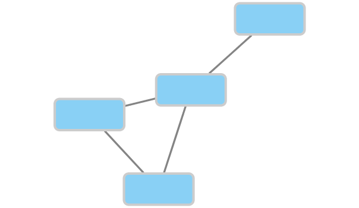
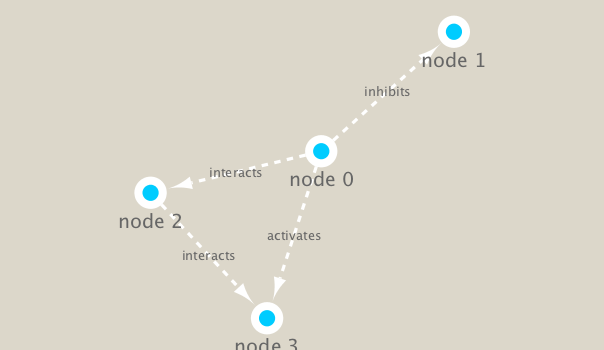

```{r setup, include=FALSE}
knitr::opts_chunk$set(echo = TRUE)
```


##Set up Cytoscape and R connection
```{r}
library(RCy3)
library(igraph)
library(RColorBrewer)
cytoscapePing()
#Check the version
cytoscapeVersionInfo()
```

## Test with a self-made small network
```{r}
g <- makeSimpleIgraph()
createNetworkFromIgraph(g,"myGraph")
fig <- exportImage(filename="demo", type="png", height=350)

```

## Switch Styles
```{r}
setVisualStyle("Marquee")
fig <- exportImage(filename="demo_marquee", type="png", height=350)

```

## Try some other styles
```{r}
styles <- getVisualStyleNames()
styles
#setVisualStyle(styles[13])
setVisualStyle(styles[18])
```

## Ugly Graph created by R itself
```{r}
plot(g)
```

## Read our metagenomics data
```{r}
## scripts for processing located in "inst/data-raw/"
prok_vir_cor <- read.delim("virus_prok_cor_abundant.tsv", stringsAsFactors = FALSE)

## Have a peak at the first 6 rows
head(prok_vir_cor)
```

```{r}
g <- graph.data.frame(prok_vir_cor, directed = FALSE)
class(g)
g
```
```{r}
# Evolution of Clean Graph
plot(g)
plot(g, vertex.label=NA)
plot(g, vertex.size=3, vertex.label=NA)
```

## Optional: If you are in love with ggplot
```{r}
library(ggraph)
ggraph(g, layout = 'auto') +
  geom_edge_link(alpha = 0.25) +
  geom_node_point(color="steelblue") +
  theme_graph()
```
```{r}
#To send this network to Cytoscape we can use the command:
createNetworkFromIgraph(g,"myIgraph")
```

## Network Query
```{r}
# Vertices and edges information
V(g)
E(g)
```

## Network community detection
```{r}
cb <- cluster_edge_betweenness(g)
cb
plot(cb, y=g, vertex.label=NA,  vertex.size=3)
head( membership(cb) )
```

## Node degree
```{r}
# Calculate and plot node degree of our network
d <- degree(g)
hist(d, breaks=30, col="lightblue", main ="Node Degree Distribution")

#For the degree_distribution() function a numeric vector of the same length as the maximum degree plus one is returned. The first element is the relative frequency zero degree vertices, the second vertices with degree one, etc.
plot( degree_distribution(g), type="h" )
```

## Centrality analysis
```{r}
# Page Rank Algorithm
pr <- page_rank(g)
head(pr$vector)

# Make a size vector btwn 2 and 20 for node plotting size
v.size <- BBmisc::normalize(pr$vector, range=c(2,20), method="range")
plot(g, vertex.size=v.size, vertex.label=NA)


# Another way by using the degree of vertices
v.size <- BBmisc::normalize(d, range=c(2,20), method="range")
plot(g, vertex.size=v.size, vertex.label=NA)


# Another very common centrality score is betweenness. The vertex and edge betweenness are (roughly) defined by the number of geodesics (shortest paths) going through a vertex or an edge.
b <- betweenness(g)
v.size <- BBmisc::normalize(b, range=c(2,20), method="range")
plot(g, vertex.size=v.size, vertex.label=NA)
```


## Read taxonomic classification for network annotation
```{r}
phage_id_affiliation <- read.delim("phage_ids_with_affiliation.tsv")
head(phage_id_affiliation)
```

```{r}
bac_id_affi <- read.delim("prok_tax_from_silva.tsv", stringsAsFactors = FALSE)
head(bac_id_affi)
```

## Add taxonomic annotation data to network
```{r}
## Extract out our vertex names
genenet.nodes <- as.data.frame(vertex.attributes(g), stringsAsFactors=FALSE)
head(genenet.nodes)
length( grep("^ph_",genenet.nodes[,1]) )


# Now lets merge() these with the annotation data
# We dont need all annotation data so lets make a reduced table 'z' for merging
z <- bac_id_affi[,c("Accession_ID", "Kingdom", "Phylum", "Class")]
n <- merge(genenet.nodes, z, by.x="name", by.y="Accession_ID", all.x=TRUE)
head(n)

# Check on the column names before deciding what to merge
colnames(n)

colnames(phage_id_affiliation)


# Again we only need a subset of `phage_id_affiliation` for our purposes
y <- phage_id_affiliation[, c("first_sheet.Phage_id_network", "phage_affiliation","Tax_order", "Tax_subfamily")]

# Add the little phage annotation that we have
x <- merge(x=n, y=y, by.x="name", by.y="first_sheet.Phage_id_network", all.x=TRUE)

## Remove duplicates from multiple matches
x <- x[!duplicated( (x$name) ),]
head(x)


genenet.nodes <- x
```


## Send network to Cytoscape using RCy3
```{r}
# Open a new connection and delete any existing windows/networks in Cy
deleteAllNetworks()
# Set the main nodes colname to the required "id" 
colnames(genenet.nodes)[1] <- "id"

genenet.edges <- data.frame(igraph::as_edgelist(g))

# Set the main edges colname to the required "source" and "target" 
colnames(genenet.edges) <- c("source","target")

# Add the weight from igraph to a new column...
genenet.edges$Weight <- igraph::edge_attr(g)$weight

# Send as a new network to Cytoscape
createNetworkFromDataFrames(genenet.nodes,genenet.edges, 
                            title="Tara_Oceans")
```

