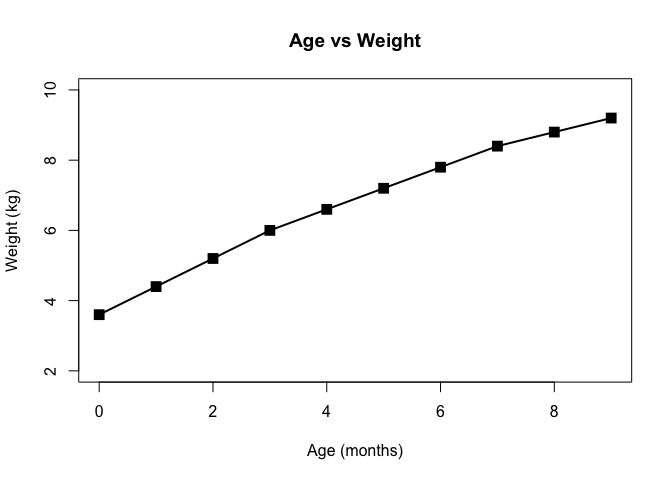
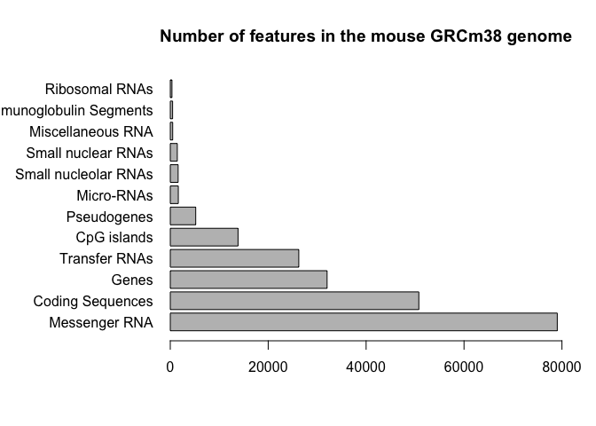
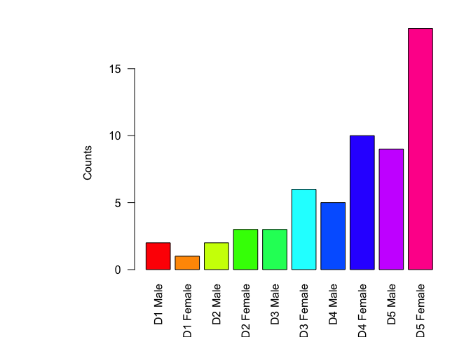
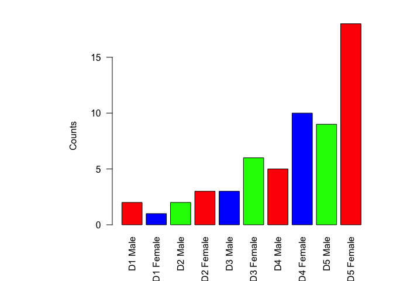

Class 5: Making Graphs
================
Tianhao Qiu
April 16th, 2019

``` r
# Class 5 R graphics

# 2a. Line plot
weight <- read.table("bimm143_05_rstats/weight_chart.txt", header = TRUE)

plot (weight$Age, weight$Weight, pch = 15, cex = 1.5, lwd = 2, ylim = c(2,10),
      main = "Age vs Weight", xlab = "Age (months)", ylab = "Weight (kg)", typ = "o")
```



``` r
# 2b. Bar Plot
fcount <- read.table("bimm143_05_rstats/feature_counts.txt", header = TRUE, sep = "\t")
par(mar = c(5, 10, 4.1, 2))
barplot(fcount$Count, horiz = TRUE, ylab = " ", names.arg = fcount$Feature,
        main = "Number of features in the mouse GRCm38 genome", las = 1, 
        xlim = c(0, 80000))
```



``` r
# 3a. Color Vectors
# Optional (read.delim)
fmcount <-read.table("bimm143_05_rstats/male_female_counts.txt", header = TRUE, sep = "\t")

barplot(fmcount$Count, ylim = c(0,16), ylab = 'Counts', las = 2, 
        names.arg = fmcount$Sample, col = rainbow(10))
```



``` r
barplot(fmcount$Count, ylim = c(0,16), ylab = 'Counts', las = 2, 
        names.arg = fmcount$Sample, col = c("red","blue", "green"))
```


