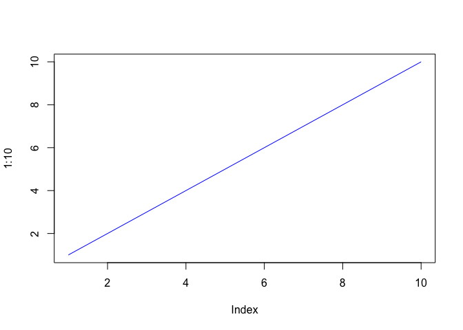
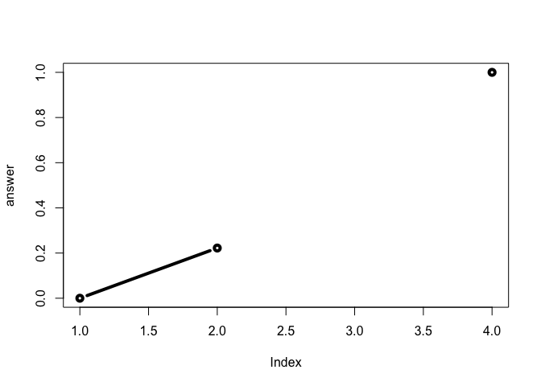

Class 6: R functions
================
Tianhao Qiu
4/18/2019

### About

This is my **class 6** r markdown document with my *code* and notes for the day.

``` r
plot(1:10, typ = "l", col = "blue")
```



``` r
read.table("test1.txt", header = TRUE, sep = ",")
```

    ##   Col1 Col2 Col3
    ## 1    1    2    3
    ## 2    4    5    6
    ## 3    7    8    9
    ## 4    a    b    c

``` r
read.csv("test1.txt")
```

    ##   Col1 Col2 Col3
    ## 1    1    2    3
    ## 2    4    5    6
    ## 3    7    8    9
    ## 4    a    b    c

``` r
read.csv("test2.txt", sep = "$")
```

    ##   Col1 Col2 Col3
    ## 1    1    2    3
    ## 2    4    5    6
    ## 3    7    8    9
    ## 4    a    b    c

``` r
read.table("test3.txt")
```

    ##   V1 V2 V3
    ## 1  1  6  a
    ## 2  2  7  b
    ## 3  3  8  c
    ## 4  4  9  d
    ## 5  5 10  e

``` r
read.table("https://bioboot.github.io/bimm143_S19/class-material/test2.txt", header = TRUE, sep = "$")
```

    ##   Col1 Col2 Col3
    ## 1    1    2    3
    ## 2    4    5    6
    ## 3    7    8    9
    ## 4    a    b    c

Functions
---------

Our first silly function example:

``` r
add <- function (x, y = 1) {
  x + y 
}
```

``` r
add(10)
```

    ## [1] 11

``` r
add(10,10)
```

    ## [1] 20

``` r
add(x = 1, y = 4)
```

    ## [1] 5

``` r
add(c(1,2,3))
```

    ## [1] 2 3 4

``` r
add(c(1,2,3), 4)
```

    ## [1] 5 6 7

``` r
# add(1,2,3)
```

``` r
rescale <- function(x, noNull = TRUE, plot = FALSE) {
  rng <-range(x, na.rm = noNull)
  (x - rng[1]) / (rng[2] - rng[1])
}
```

``` r
rescale(1:10)
```

    ##  [1] 0.0000000 0.1111111 0.2222222 0.3333333 0.4444444 0.5555556 0.6666667
    ##  [8] 0.7777778 0.8888889 1.0000000

``` r
rescale(c(1,2,3,4,NA))
```

    ## [1] 0.0000000 0.3333333 0.6666667 1.0000000        NA

``` r
rescale2 <- function(x, na.rm = TRUE, plot = FALSE) {
  rng <-range(x, na.rm = na.rm)
  print("Hello")
  
  if (!is.numeric(x)) {
    return("垃圾")
    #stop("S")
  } 
  answer <- (x - rng[1]) / (rng[2] - rng[1])
    
  print("is it me you are looking for?")
   
  if (plot) {
    plot(answer, typ="b", lwd=4)
    print("哈哈哈哈哈哈哈哈哈")
  }
   
  print("I can see it in ...")
  return(answer)
}
```

``` r
rescale2(c(1,3,NA,10), plot = TRUE)
```

    ## [1] "Hello"
    ## [1] "is it me you are looking for?"



    ## [1] "哈哈哈哈哈哈哈哈哈"
    ## [1] "I can see it in ..."

    ## [1] 0.0000000 0.2222222        NA 1.0000000

``` r
rescale2(c(1,2,3,"s"))
```

    ## [1] "Hello"

    ## [1] "垃圾"

``` r
x <- c(1,2,3, "s")
is.numeric(x)
```

    ## [1] FALSE
