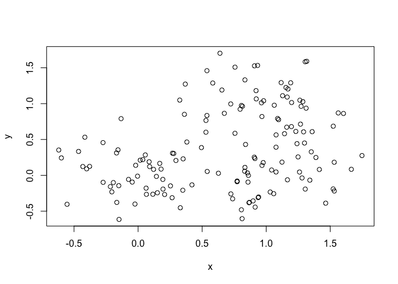
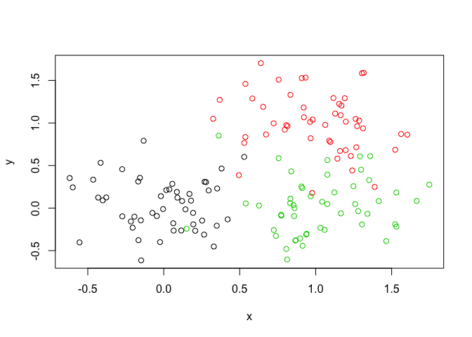
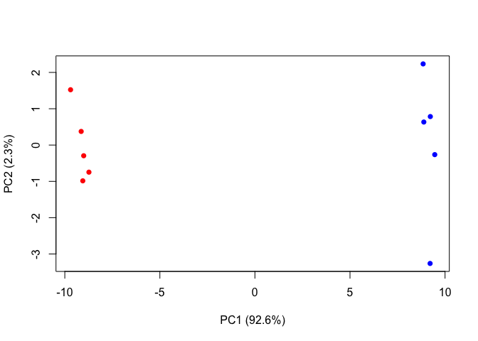

Class 8
================
Tianhao Qiu
4/25/2019

K-means
-------

``` r
tmp <- c(rnorm(30,-3), rnorm(30,3))
x <- cbind(x=tmp, y=rev(tmp))
plot(x)
```


``` r
#Use the kmeans() function setting k to 2 and nstart=20
#Inspect/print the results
#Q. How many points are in each cluster? 30
#Q. What ‘component’ of your result object details
#      - cluster size? 2
#      - cluster assignment/membership?
#      - cluster center?
#Plot x colored by the kmeans cluster assignment and
#     add cluster centers as blue points
y <- kmeans(x, centers = 2, nstart = 20 )
y$size
```

    ## [1] 30 30

``` r
y$center
```

    ##           x         y
    ## 1  3.159389 -2.918910
    ## 2 -2.918910  3.159389

``` r
plot(x, col = y$cluster)
points(y$centers, pch = 18, col = "blue", cex = 3 )
```


Hierachical Clustering example
------------------------------

### Must give hclust() a distance matrix

``` r
# distance matrix
d <- dist(x)

# Clustering
hc <- hclust(d)
plot(hc)

#function associated with height to determine appropriate clustering
abline(h=6, col="red")
```


``` r
cutree(hc, h=6)
```

    ##  [1] 1 1 1 1 1 1 1 1 1 1 1 1 1 1 1 1 1 1 1 1 1 1 1 1 1 1 1 1 1 1 2 2 2 2 2
    ## [36] 2 2 2 2 2 2 2 2 2 2 2 2 2 2 2 2 2 2 2 2 2 2 2 2 2

### Another more complex, realistic example

``` r
# Step 1. Generate some example data for clustering
x <- rbind(
  matrix(rnorm(100, mean=0, sd = 0.3), ncol = 2),   # c1
  matrix(rnorm(100, mean = 1, sd = 0.3), ncol = 2), # c2
  matrix(c(rnorm(50, mean = 1, sd = 0.3),           # c3
           rnorm(50, mean = 0, sd = 0.3)), ncol = 2))
colnames(x) <- c("x", "y")
# Step 2. Plot the data without clustering
plot(x)
```



``` r
# Step 3. Generate colors for known clusters
#         (just so we can compare to hclust results)
col <- as.factor( rep(c("c1","c2","c3"), each=50) )
plot(x, col=col)
```



``` r
# Q. Use the dist(), hclust(), plot() and cutree() functions to return 2 and 3 clusters
# Q. How does this compare to your known 'col' groups?
d2 <- dist(x)
hc2 <- hclust(d2)
plot(hc2)
abline(h = 2, col = "green")
abline(h = 2.6, col = "purple")
```


``` r
gp2 <- cutree(hc2, k = 2)
gp3 <- cutree(hc2, k = 3)
gp4 <- cutree(hc2, k = 4)
table(gp2, gp3)
```

    ##    gp3
    ## gp2  1  2  3
    ##   1 49  0  0
    ##   2  0 48 53

``` r
plot(x, col = gp2)
```


``` r
plot(x, col = gp3)
```


``` r
plot(x, col = gp4)
```


PCA
---

### We will use the **prompt()** function for PCA

``` r
mydata <- read.csv("https://tinyurl.com/expression-CSV",
row.names=1)
head(mydata)
```

    ##        wt1 wt2  wt3  wt4 wt5 ko1 ko2 ko3 ko4 ko5
    ## gene1  439 458  408  429 420  90  88  86  90  93
    ## gene2  219 200  204  210 187 427 423 434 433 426
    ## gene3 1006 989 1030 1017 973 252 237 238 226 210
    ## gene4  783 792  829  856 760 849 856 835 885 894
    ## gene5  181 249  204  244 225 277 305 272 270 279
    ## gene6  460 502  491  491 493 612 594 577 618 638

``` r
nrow(mydata)
```

    ## [1] 100

``` r
ncol(mydata)
```

    ## [1] 10

``` r
# Transpose of data
t(mydata)
```

    ##     gene1 gene2 gene3 gene4 gene5 gene6 gene7 gene8 gene9 gene10 gene11
    ## wt1   439   219  1006   783   181   460    27   175   658    121    337
    ## wt2   458   200   989   792   249   502    30   182   669    116    337
    ## wt3   408   204  1030   829   204   491    37   184   653    134    330
    ## wt4   429   210  1017   856   244   491    29   166   633    117    322
    ## wt5   420   187   973   760   225   493    34   180   657    133    313
    ## ko1    90   427   252   849   277   612   304   255   628    931    100
    ## ko2    88   423   237   856   305   594   304   291   627    941     95
    ## ko3    86   434   238   835   272   577   285   305   603    990     94
    ## ko4    90   433   226   885   270   618   311   271   635    982    101
    ## ko5    93   426   210   894   279   638   285   269   620    934     79
    ##     gene12 gene13 gene14 gene15 gene16 gene17 gene18 gene19 gene20 gene21
    ## wt1    214    789    458    551    390    900    951    436    244    119
    ## wt2    194    738    490    555    400    970    991    414    266     87
    ## wt3    213    807    493    527    403    905    991    388    228     87
    ## wt4    192    768    446    552    402    850    983    418    223     88
    ## wt5    207    820    496    503    401    834    984    410    240     93
    ## ko1     97    293    694    712    755    353    217    162    540    914
    ## ko2     91    308    682    742    765    380    195    169    536    906
    ## ko3     89    312    679    718    730    380    195    143    577    914
    ## ko4    124    303    702    808    713    385    196    151    538    913
    ## ko5     97    325    719    739    740    386    197    130    513    921
    ##     gene22 gene23 gene24 gene25 gene26 gene27 gene28 gene29 gene30 gene31
    ## wt1    156     89    570    788   1007    937    224    809    624    218
    ## wt2    170     97    567    796    972    876    232    869    598    259
    ## wt3    150     96    563    766    977    901    231    815    587    213
    ## wt4    167     97    587    778   1003    958    238    788    552    204
    ## wt5    155     82    563    825   1027    957    226    781    592    213
    ## ko1    346    788    424    456    945    414    850    482    956     69
    ## ko2    372    786    481    403    859    405    902    484    985     86
    ## ko3    393    750    489    446    933    383    907    518    940     59
    ## ko4    416    822    456    447    844    437    842    498    963     65
    ## ko5    384    785    465    442    925    394    817    491    982     46
    ##     gene32 gene33 gene34 gene35 gene36 gene37 gene38 gene39 gene40 gene41
    ## wt1    906    262    155    100    117    286    321    388    606    379
    ## wt2    798    291    172    104    147    262    353    372    576    377
    ## wt3    828    258    173     94    120    260    334    345    558    362
    ## wt4    874    271    173    114    147    270    340    373    581    346
    ## wt5    890    279    192     90    145    293    316    359    574    354
    ## ko1    541    534    643    212    353    360    642     50    415    991
    ## ko2    626    566    639    228    347    375    575     45    406   1010
    ## ko3    576    570    713    233    371    361    588     39    423   1020
    ## ko4    607    565    706    229    335    348    595     44    455    976
    ## ko5    586    563    676    258    357    374    665     35    412   1036
    ##     gene42 gene43 gene44 gene45 gene46 gene47 gene48 gene49 gene50 gene51
    ## wt1    471    592    755     35    758     24    100    809    955    453
    ## wt2    492    615    733     40    734     25    113    825    994    419
    ## wt3    473    602    775     28    704     12    136    833    994    443
    ## wt4    470    602    687     25    761     13    117    800    975    459
    ## wt5    471    655    776     32    672     22    103    776    973    469
    ## ko1    401    514    255    947    567    324    912    538    175    174
    ## ko2    401    554    245    988    575    293    940    524    158    134
    ## ko3    426    501    251    994    596    292    901    487    191    166
    ## ko4    425    511    249    989    607    303    950    527    218    148
    ## ko5    418    553    252    971    611    295    868    507    183    154
    ##     gene52 gene53 gene54 gene55 gene56 gene57 gene58 gene59 gene60 gene61
    ## wt1    327    657    678    304    659    673    785    501    232    928
    ## wt2    320    669    638    325    687    668    772    513    228    936
    ## wt3    324    631    676    312    659    694    817    462    193   1015
    ## wt4    321    701    683    327    667    699    766    484    247    971
    ## wt5    318    647    671    320    639    726    784    504    231    964
    ## ko1    489    246    259    819    109     18    467     37    997    428
    ## ko2    470    276    247    802    102     14    474     64    983    457
    ## ko3    495    255    238    773    105     19    460     71    997    447
    ## ko4    451    266    214    790    119     18    461     58    990    434
    ## ko5    457    287    235    820     96     14    481     50   1011    431
    ##     gene62 gene63 gene64 gene65 gene66 gene67 gene68 gene69 gene70 gene71
    ## wt1    159    336    968    339     35     27     80    744    766    672
    ## wt2    169    344    888    335     32     28     69    685    739    736
    ## wt3    163    372    907    373     45     25     87    733    751    672
    ## wt4    151    389    914    338     37     35     87    693    720    715
    ## wt5    166    357    883    328     38     27     81    746    738    693
    ## ko1    869    664    886    275    765    200    693    745    645    839
    ## ko2    975    575    855    290    746    194    693    680    603    872
    ## ko3    955    577    844    270    756    189    677    780    610    909
    ## ko4    929    625    848    303    758    181    683    791    598    811
    ## ko5    948    630    862    280    761    173    688    792    612    803
    ##     gene72 gene73 gene74 gene75 gene76 gene77 gene78 gene79 gene80 gene81
    ## wt1    526    627    468    986    348    719    883    837    666    804
    ## wt2    553    650    466    945    333    714    899    883    657    735
    ## wt3    534    664    477   1006    344    734    868    864    719    771
    ## wt4    511    622    469   1020    321    693    873    807    656    763
    ## wt5    529    606    494   1024    296    682    882    854    638    813
    ## ko1    922    805    703    359    770    620    803    210    549    613
    ## ko2    819    836    661    358    773    567    765    239    588    587
    ## ko3    878    836    669    346    750    582    767    234    586    591
    ## ko4    832    828    632    356    769    614    783    258    571    563
    ## ko5    853    800    640    345    774    546    749    220    583    613
    ##     gene82 gene83 gene84 gene85 gene86 gene87 gene88 gene89 gene90 gene91
    ## wt1    476    438    938     29    810    575    451    174    158    371
    ## wt2    494    430    934     29    830    579    471    170    122    367
    ## wt3    521    477    976     30    760    567    494    205    138    369
    ## wt4    494    457    965     19    796    565    447    175    159    339
    ## wt5    482    481    960     21    807    576    470    179    128    360
    ## ko1    183    466    904    618    486    352    540    298    863    103
    ## ko2    184    525   1011    589    542    321    583    290    896     85
    ## ko3    156    518    949    618    507    296    572    319    869     83
    ## ko4    173    474    947    563    471    332    551    313    841     94
    ## ko5    161    478    934    574    543    311    591    264    873     70
    ##     gene92 gene93 gene94 gene95 gene96 gene97 gene98 gene99 gene100
    ## wt1    853    208    555    527    589    396     33    321      25
    ## wt2    798    214    584    573    607    384     27    343      34
    ## wt3    866    200    574    548    579    382     39    349      34
    ## wt4    843    196    599    548    536    399     42    367      36
    ## wt5    823    206    581    552    583    401     33    343      32
    ## ko1    934    409    292    686    497    460    977    949     661
    ## ko2   1007    408    341    718    479    442   1031    947     685
    ## ko3    936    403    335    705    479    466   1033    982     678
    ## ko4    918    368    324    704    467    452   1003   1021     655
    ## ko5   1005    380    299    677    504    457    974   1010     693

``` r
pca <- prcomp(t(mydata), scale = TRUE)

## See what is returned by the prcomp() function
attributes(pca)
```

    ## $names
    ## [1] "sdev"     "rotation" "center"   "scale"    "x"       
    ## 
    ## $class
    ## [1] "prcomp"

``` r
plot(pca$x[,1], pca$x[,2])
```


``` r
##Calulate variance explained by each principal components
pca.var <- pca$sdev^2
pca.var.per <- round(pca.var/sum(pca.var)*100, 1)
head(pca.var.per)
```

    ## [1] 92.6  2.3  1.1  1.1  0.8  0.7

``` r
barplot(pca.var.per, main="Scree Plot",
  xlab="Principal Component", ylab="Percent Variation")
```


``` r
## A vector of colors for wt and ko samples
colvec <- colnames(mydata)
colvec[grep("wt", colvec)] <- "red"
colvec[grep("ko", colvec)] <- "blue"
plot(pca$x[,1], pca$x[,2], col=colvec, pch=16,
xlab=paste0("PC1 (", pca.var.per[1], "%)"),
ylab=paste0("PC2 (", pca.var.per[2], "%)"))
```



### UK Food Example for PCA

``` r
# Read the data
x <- read.csv("UK_foods.csv", row.names=1)
#rownames(x) <- x[,1]
#x <- x[,-1]
nrow(x)
```

    ## [1] 17

``` r
ncol(x)
```

    ## [1] 4

``` r
head(x)
```

    ##                England Wales Scotland N.Ireland
    ## Cheese             105   103      103        66
    ## Carcass_meat       245   227      242       267
    ## Other_meat         685   803      750       586
    ## Fish               147   160      122        93
    ## Fats_and_oils      193   235      184       209
    ## Sugars             156   175      147       139

``` r
#tx <- t(x)
```

``` r
barplot(as.matrix(x), beside=T, col=rainbow(nrow(x)))
```


``` r
barplot(as.matrix(x), beside=F, col=rainbow(nrow(x)))
```


``` r
#Q5: Generating all pairwise plots may help somewhat. Can you make sense of the following code and resulting figure? What does it mean if a given point lies on the diagonal for a given plot?
pairs(x, col=rainbow(10), pch=16)
```


``` r
# Now do PCA the England Dataset
pca <- prcomp( t(x) )
summary(pca)
```

    ## Importance of components:
    ##                             PC1      PC2      PC3       PC4
    ## Standard deviation     324.1502 212.7478 73.87622 4.189e-14
    ## Proportion of Variance   0.6744   0.2905  0.03503 0.000e+00
    ## Cumulative Proportion    0.6744   0.9650  1.00000 1.000e+00

``` r
# Plot PC1 vs PC2
plot(pca$x[,1], pca$x[,2], xlab="PC1", ylab="PC2", xlim=c(-270,500))
text(pca$x[,1], pca$x[,2], colnames(x), col = rainbow(4))
```


``` r
# Plot variance
v <- round( pca$sdev^2/sum(pca$sdev^2) * 100 )
barplot(v, xlab="Principal Component", ylab="Percent Variation")
```


``` r
## Lets focus on PC1 as it accounts for > 90% of variance 
par(mar=c(10, 3, 0.35, 0))
barplot( pca$rotation[,1], las=2 )
```


``` r
## The inbuilt biplot() can be useful for small datasets 
biplot(pca)
```


