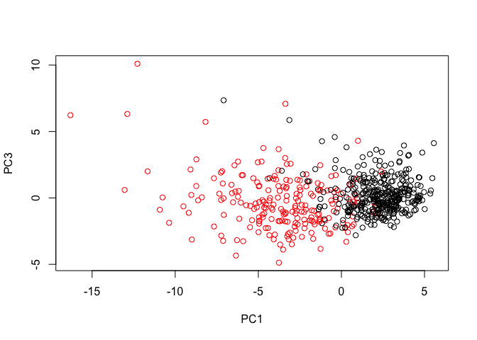
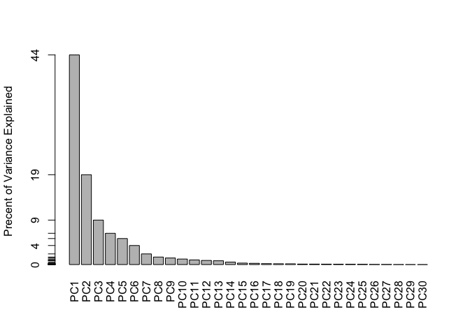
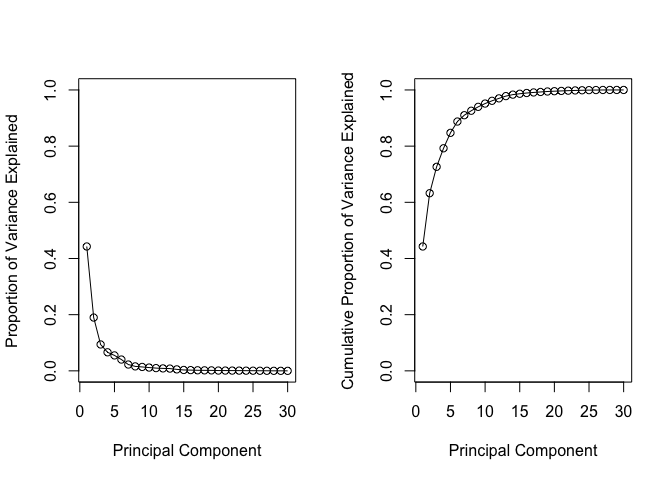
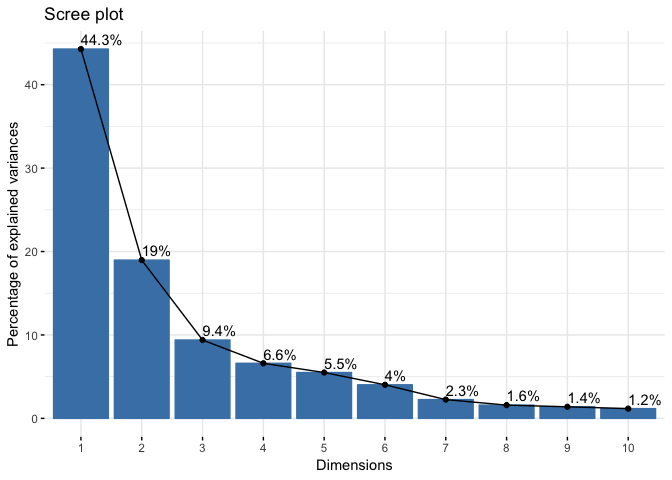
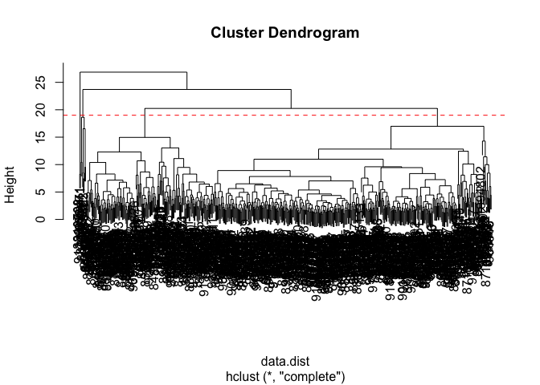
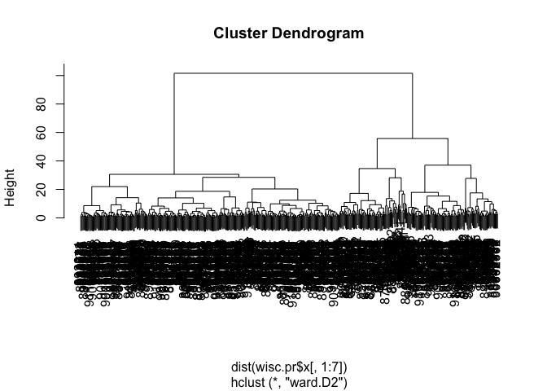
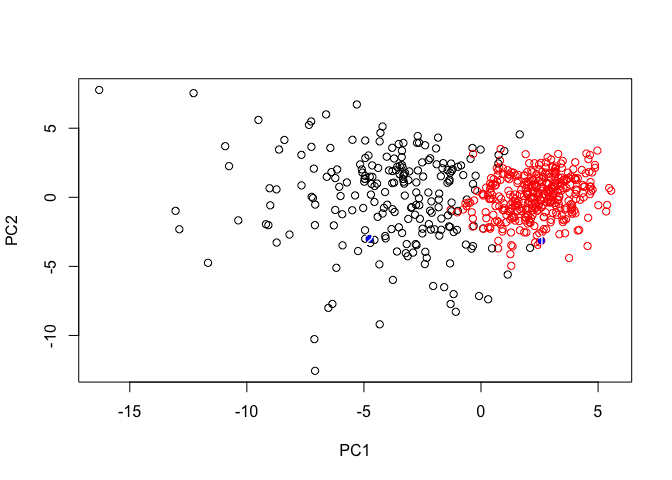

Class 9
================
Tianhao Qiu
4/30/2019

Load in Data
------------

``` r
# Save your input data file to a new 'data' directory
fna.data <- "WisconsinCancer.csv"

# Complete the following code to input the data and store as wisc.df
wisc.df <- read.csv(fna.data)

# Convert the other features (i.e. columns) of the data (in columns 3 through 32) to a matrix. 
wisc.data <- as.matrix(wisc.df[, 3:32])

# Set the row names of wisc.data
row.names(wisc.data) <- wisc.df$id
#$head(wisc.data)

#Store diagnosis as an independent vector 
diagnosis <- as.numeric(wisc.df$diagnosis == "M")

#Q1. How many observations are in this dataset?
nrow(wisc.data)
```

    ## [1] 569

``` r
#Q2. How many variables/features in the data are suffixed with _mean?
length(grep("_mean", colnames(wisc.data)))
```

    ## [1] 10

``` r
#Q3. How many of the observations have a malignant diagnosis?
table(wisc.df$diagnosis)
```

    ## 
    ##   B   M 
    ## 357 212

Performing PCA
--------------

``` r
# Check column means and standard deviations
colMeans(wisc.data)
```

    ##             radius_mean            texture_mean          perimeter_mean 
    ##            1.412729e+01            1.928965e+01            9.196903e+01 
    ##               area_mean         smoothness_mean        compactness_mean 
    ##            6.548891e+02            9.636028e-02            1.043410e-01 
    ##          concavity_mean     concave.points_mean           symmetry_mean 
    ##            8.879932e-02            4.891915e-02            1.811619e-01 
    ##  fractal_dimension_mean               radius_se              texture_se 
    ##            6.279761e-02            4.051721e-01            1.216853e+00 
    ##            perimeter_se                 area_se           smoothness_se 
    ##            2.866059e+00            4.033708e+01            7.040979e-03 
    ##          compactness_se            concavity_se       concave.points_se 
    ##            2.547814e-02            3.189372e-02            1.179614e-02 
    ##             symmetry_se    fractal_dimension_se            radius_worst 
    ##            2.054230e-02            3.794904e-03            1.626919e+01 
    ##           texture_worst         perimeter_worst              area_worst 
    ##            2.567722e+01            1.072612e+02            8.805831e+02 
    ##        smoothness_worst       compactness_worst         concavity_worst 
    ##            1.323686e-01            2.542650e-01            2.721885e-01 
    ##    concave.points_worst          symmetry_worst fractal_dimension_worst 
    ##            1.146062e-01            2.900756e-01            8.394582e-02

``` r
# Look sd on column (index = 2)
round(apply(wisc.data,2,sd))
```

    ##             radius_mean            texture_mean          perimeter_mean 
    ##                       4                       4                      24 
    ##               area_mean         smoothness_mean        compactness_mean 
    ##                     352                       0                       0 
    ##          concavity_mean     concave.points_mean           symmetry_mean 
    ##                       0                       0                       0 
    ##  fractal_dimension_mean               radius_se              texture_se 
    ##                       0                       0                       1 
    ##            perimeter_se                 area_se           smoothness_se 
    ##                       2                      45                       0 
    ##          compactness_se            concavity_se       concave.points_se 
    ##                       0                       0                       0 
    ##             symmetry_se    fractal_dimension_se            radius_worst 
    ##                       0                       0                       5 
    ##           texture_worst         perimeter_worst              area_worst 
    ##                       6                      34                     569 
    ##        smoothness_worst       compactness_worst         concavity_worst 
    ##                       0                       0                       0 
    ##    concave.points_worst          symmetry_worst fractal_dimension_worst 
    ##                       0                       0                       0

``` r
wisc.pr<- prcomp(wisc.data, scale = T)
summary(wisc.pr)
```

    ## Importance of components:
    ##                           PC1    PC2     PC3     PC4     PC5     PC6
    ## Standard deviation     3.6444 2.3857 1.67867 1.40735 1.28403 1.09880
    ## Proportion of Variance 0.4427 0.1897 0.09393 0.06602 0.05496 0.04025
    ## Cumulative Proportion  0.4427 0.6324 0.72636 0.79239 0.84734 0.88759
    ##                            PC7     PC8    PC9    PC10   PC11    PC12
    ## Standard deviation     0.82172 0.69037 0.6457 0.59219 0.5421 0.51104
    ## Proportion of Variance 0.02251 0.01589 0.0139 0.01169 0.0098 0.00871
    ## Cumulative Proportion  0.91010 0.92598 0.9399 0.95157 0.9614 0.97007
    ##                           PC13    PC14    PC15    PC16    PC17    PC18
    ## Standard deviation     0.49128 0.39624 0.30681 0.28260 0.24372 0.22939
    ## Proportion of Variance 0.00805 0.00523 0.00314 0.00266 0.00198 0.00175
    ## Cumulative Proportion  0.97812 0.98335 0.98649 0.98915 0.99113 0.99288
    ##                           PC19    PC20   PC21    PC22    PC23   PC24
    ## Standard deviation     0.22244 0.17652 0.1731 0.16565 0.15602 0.1344
    ## Proportion of Variance 0.00165 0.00104 0.0010 0.00091 0.00081 0.0006
    ## Cumulative Proportion  0.99453 0.99557 0.9966 0.99749 0.99830 0.9989
    ##                           PC25    PC26    PC27    PC28    PC29    PC30
    ## Standard deviation     0.12442 0.09043 0.08307 0.03987 0.02736 0.01153
    ## Proportion of Variance 0.00052 0.00027 0.00023 0.00005 0.00002 0.00000
    ## Cumulative Proportion  0.99942 0.99969 0.99992 0.99997 1.00000 1.00000

``` r
#Q4. From your results, what proportion of the original variance is captured by the first principal components (PC1)?  44%

#Q5. How many principal components (PCs) are required to describe at least 70% of the original variance in the data? 3

#Q6. How many principal components (PCs) are required to describe at least 90% of the original variance in the data? 7

# Interpreting PCA
biplot(wisc.pr)
```


``` r
plot(wisc.pr$x[,1], wisc.pr$x[,2],  xlab = "PC1", ylab = "PC2", col = diagnosis + 1)
```


``` r
#Q7. What stands out to you about this plot? Is it easy or difficult to understand? Why? Useless Rubbish

#Q8. Generate a similar plot for principal components 1 and 3. What do you notice about these plots?
plot(wisc.pr$x[,c(1,3)],  xlab = "PC1", ylab = "PC3", col = diagnosis + 1)
```



``` r
# Overall, the plots indicate that principal component 1 is capturing a separation of malignant from benign samples. This is an important and interesting result worthy of further exploration - as we will do in the next sections!
```

Interpreting PCA
----------------

``` r
# Calculate the variance of each variable
pr.var <- wisc.pr$sdev^2
head(pr.var)
```

    ## [1] 13.281608  5.691355  2.817949  1.980640  1.648731  1.207357

``` r
# Variance explained by each principal component: pve
pve <- pr.var / sum(pr.var)

# Plot variance explained for each principal component
plot(pve, xlab = "Principal Component", 
     ylab = "Proportion of Variance Explained", 
     ylim = c(0, 1), type = "o")
```


``` r
# Alternative scree plot of the same data, note data driven y-axis
barplot(pve, ylab = "Precent of Variance Explained",
     names.arg=paste0("PC",1:length(pve)), las=2, axes = FALSE)
axis(2, at=pve, labels=round(pve,2)*100 )
```



``` r
par(mfrow=c(1,2))
plot(pve, xlab = "Principal Component", 
     ylab = "Proportion of Variance Explained", 
     ylim = c(0, 1), type = "o")
# Plot cumulative proportion of variance explained
plot(cumsum(pve), xlab = "Principal Component", 
     ylab = "Cumulative Proportion of Variance Explained", 
     ylim = c(0, 1), type = "o")
```



``` r
#factoexrtra
library(factoextra)
```

    ## Loading required package: ggplot2

    ## Welcome! Related Books: `Practical Guide To Cluster Analysis in R` at https://goo.gl/13EFCZ

``` r
fviz_eig(wisc.pr, addlabels = TRUE)
```



Hierechical Clustering
----------------------

``` r
# Scale the wisc.data data: data.scaled
data.scaled <- scale(wisc.data)

data.dist <- dist(data.scaled)

wisc.hclust <- hclust(data.dist, method = "complete")

plot(wisc.hclust)
abline(h=19, col="red", lty=2)
```



``` r
wisc.hclust.clusters <- cutree(wisc.hclust, k=4)

table(wisc.hclust.clusters, diagnosis)
```

    ##                     diagnosis
    ## wisc.hclust.clusters   0   1
    ##                    1  12 165
    ##                    2   2   5
    ##                    3 343  40
    ##                    4   0   2

Combining Result
----------------

``` r
wisc.pr.hclust <- hclust(dist(wisc.pr$x[, 1:7]),  method="ward.D2")
plot(wisc.pr.hclust)
```



``` r
grps <- cutree(wisc.pr.hclust, k=2)
table(grps)
```

    ## grps
    ##   1   2 
    ## 216 353

``` r
plot(wisc.pr$x[,1:2], col=grps)
```


``` r
table(grps, diagnosis)
```

    ##     diagnosis
    ## grps   0   1
    ##    1  28 188
    ##    2 329  24

``` r
plot(wisc.pr$x[,1:2], col=diagnosis+1)
```


``` r
# rgl
library(rgl)
plot3d(wisc.pr$x[,1:3], xlab="PC 1", ylab="PC 2", zlab="PC 3", cex=1.5, size=1, type="s", col=diagnosis+1)
```

Prediction
----------

``` r
#url <- "new_samples.csv"
url <- "https://tinyurl.com/new-samples-CSV"
new <- read.csv(url)
npc <- predict(wisc.pr, newdata=new)
npc
```

    ##            PC1       PC2        PC3        PC4       PC5        PC6
    ## [1,]  2.576616 -3.135913  1.3990492 -0.7631950  2.781648 -0.8150185
    ## [2,] -4.754928 -3.009033 -0.1660946 -0.6052952 -1.140698 -1.2189945
    ##             PC7        PC8       PC9       PC10      PC11      PC12
    ## [1,] -0.3959098 -0.2307350 0.1029569 -0.9272861 0.3411457  0.375921
    ## [2,]  0.8193031 -0.3307423 0.5281896 -0.4855301 0.7173233 -1.185917
    ##           PC13     PC14      PC15       PC16        PC17        PC18
    ## [1,] 0.1610764 1.187882 0.3216974 -0.1743616 -0.07875393 -0.11207028
    ## [2,] 0.5893856 0.303029 0.1299153  0.1448061 -0.40509706  0.06565549
    ##             PC19       PC20       PC21       PC22       PC23       PC24
    ## [1,] -0.08802955 -0.2495216  0.1228233 0.09358453 0.08347651  0.1223396
    ## [2,]  0.25591230 -0.4289500 -0.1224776 0.01732146 0.06316631 -0.2338618
    ##             PC25         PC26         PC27        PC28         PC29
    ## [1,]  0.02124121  0.078884581  0.220199544 -0.02946023 -0.015620933
    ## [2,] -0.20755948 -0.009833238 -0.001134152  0.09638361  0.002795349
    ##              PC30
    ## [1,]  0.005269029
    ## [2,] -0.019015820

``` r
plot(wisc.pr$x[,1:2], col=grps)
points(npc[,1], npc[,2],col="blue", pch=16)
text(npc[,1], npc[,2], c(1,2), col = "white")
```


