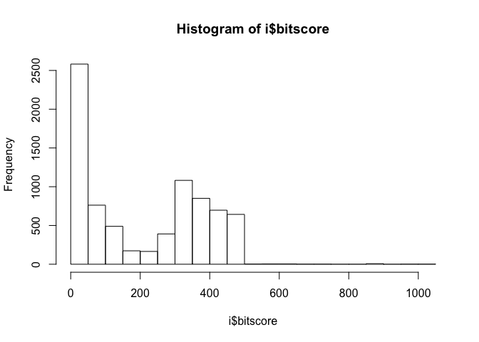
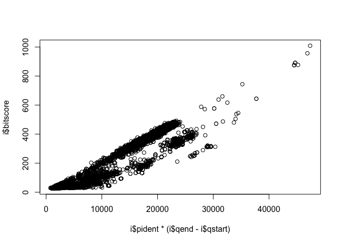
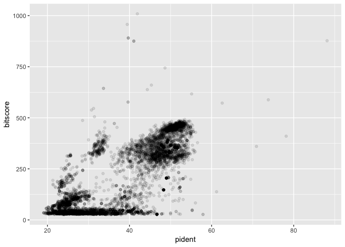

class 16
================

``` r
i <- read.delim("mm-second.x.zebrafish.tsv")
names(i) <- c("qseqid", "sseqid", "pident", "length", "mismatch", "gapopen", "qstart", "qend", "sstart", "send", "evalue", "bitscore")
i
```

    ##              qseqid         sseqid pident length mismatch gapopen qstart
    ## 1       YP_220551.1    NP_059332.1 44.509    346      188       3      1
    ## 2       YP_220551.1    NP_059341.1 24.540    163      112       3    112
    ## 3       YP_220551.1    NP_059340.1 26.804     97       65       2     98
    ## 4       YP_220552.1    NP_059333.1 88.132    514       61       0      1
    ## 5       YP_220552.1 XP_021326074.1 31.818     66       32       2    427
    ## 6       YP_220552.1 XP_005162943.1 31.818     66       32       2    427
    ## 7       YP_220553.1    NP_059334.1 70.925    227       66       0      1
    ## 8       YP_220553.1 NP_001038725.1 28.571     70       46       2     15
    ## 9       YP_220553.1 XP_005161478.1 28.571     70       46       2     15
    ## 10      YP_220553.1 XP_021324580.1 28.571     70       46       2     15
    ## 11      YP_220554.1 XP_002665692.3 25.862     58       42       1      5
    ## 12      YP_220554.1 XP_021324264.1 25.862     58       42       1      5
    ## 13      YP_220554.1 XP_009290033.1 50.000     30       13       1     26
    ## 14      YP_220554.1 XP_005156656.1 37.931     29       17       1     34
    ## 15      YP_220554.1 NP_001007391.1 37.931     29       17       1     34
    ## 16      YP_220555.1    NP_059336.1 52.212    226      107       1      1
    ## 17      YP_220556.1    NP_059337.1 78.161    261       57       0      1
    ## 18      YP_220556.1 XP_021330598.1 37.838     37       23       0      3
    ## 19      YP_220556.1 NP_001139036.1 37.838     37       23       0      3
    ## 20      YP_220556.1 NP_001070643.1 36.111     36       19       1    173
    ## 21      YP_220557.1    NP_059338.1 61.207    116       44       1      1
    ## 22      YP_220558.1    NP_059339.1 53.061     98       46       0      1
    ## 23      YP_220558.1 NP_001002376.1 57.895     19        8       0     20
    ## 24      YP_220558.1 XP_005158565.1 57.895     19        8       0     20
    ## 25      YP_220558.1    XP_706537.4 31.373     51       25       2     40
    ## 26      YP_220559.1    NP_059340.1 62.582    457      170       1      1
    ## 27      YP_220559.1    NP_059341.1 23.039    204      146       6    106
    ## 28      YP_220559.1    NP_059332.1 32.432    111       59       6    198
    ## 29      YP_220559.1 XP_009301289.1 24.074    108       65       4    169
    ## 30      YP_220560.1    NP_059341.1 55.126    595      257       8      7
    ## 31      YP_220560.1    NP_059340.1 23.077    351      246      11    107
    ## 32      YP_220560.1    NP_059332.1 24.171    211      145       6    226
    ## 33      YP_220560.1 XP_017210528.1 26.087     69       44       1    365
    ## 34      YP_220560.1 NP_001159387.1 26.087     69       44       1    365
    ## 35      YP_220560.1 XP_021330470.1 30.645     62       38       2    164
    ## 36      YP_220560.1    XP_689554.6 35.417     48       28       1    554
    ## 37      YP_220561.1    NP_059342.1 37.143    140       72       3      1
    ## 38      YP_220561.1 NP_001038688.1 29.412     85       54       3     33
    ## 39      YP_220562.1    NP_059343.1 73.810    378       99       0      1
    ## 40      YP_220562.1 XP_021322416.1 28.704    108       60       4    223
    ## 41      YP_220562.1 XP_021322415.1 28.704    108       60       4    223
    ## 42      YP_220562.1 XP_021322414.1 28.704    108       60       4    223
    ## 43      YP_220562.1 XP_021322413.1 28.704    108       60       4    223
    ## 44      NP_034776.1 XP_009303575.2 28.571    119       79       3    146
    ## 45      NP_034776.1 XP_021327946.1 26.230    122       85       1    146
    ## 46      NP_034776.1 XP_021327944.1 25.424    118       81       2    146
    ## 47      NP_034776.1 XP_009303559.1 25.424    118       81       2    146
    ## 48      NP_034776.1 XP_001337601.1 33.333     72       46       1    146
    ## 49      NP_034776.1 XP_021327940.1 26.667     75       55       0    141
    ## 50      NP_034776.1 XP_021327947.1 25.203    123       77       3     96
    ## 51      NP_034776.1 XP_017213526.1 25.203    123       77       3     96
    ## 52      NP_034776.1 NP_001104712.1 34.286     70       44       1    146
    ## 53      NP_034776.1 XP_021327939.1 30.667     75       52       0    141
    ## 54      NP_034776.1 XP_005165074.1 30.588     85       55       3    146
    ## 55      NP_034776.1 XP_009299422.1 30.588     85       55       3    146
    ## 56      NP_034776.1 XP_001339584.3 30.588     85       55       3    146
    ## 57      NP_034776.1 XP_021327240.1 30.588     85       55       3    146
    ## 58      NP_034776.1 XP_021327239.1 30.588     85       55       3    146
    ## 59      NP_034776.1 XP_017213618.1 29.310    116       78       3    146
    ## 60      NP_034776.1 XP_005172686.1 25.197    127       83       3    146
    ## 61      NP_034776.1 XP_021335010.1 25.197    127       83       3    146
    ## 62      NP_034776.1 XP_005172687.1 25.197    127       83       3    146
    ## 63      NP_034776.1 XP_021335011.1 25.197    127       83       3    146
    ## 64      NP_034776.1 XP_003198916.1 28.571    105       66       4    154
    ## 65      NP_034776.1 NP_001035128.1 26.108    203      118       4     28
    ## 66      NP_034776.1 XP_005167715.1 33.803     71       46       1    146
    ## 67      NP_034776.1 NP_001124136.1 33.803     71       46       1    146
    ## 68      NP_034776.1 XP_021327945.1 28.169     71       50       1    146
    ## 69      NP_034776.1 XP_009303560.1 28.169     71       50       1    146
    ## 70      NP_034776.1 XP_021323809.1 26.108    203      118       4     28
    ## 71      NP_034776.1 XP_003199282.2 29.752    121       72       4    150
    ## 72      NP_034776.1 XP_021324610.1 29.577     71       50       0    143
    ## 73      NP_034776.1 XP_021324610.1 26.761     71       51       1    148
    ## 74      NP_034776.1 XP_021324610.1 26.515    132       88       5    134
    ## 75      NP_034776.1 XP_021324610.1 26.667     60       42       1    146
    ## 76      NP_034776.1 XP_021324610.1 28.333     60       41       1    146
    ## 77      NP_034776.1 XP_021324610.1 22.857     70       52       2    153
    ## 78      NP_034776.1 XP_021324610.1 26.027     73       50       2    149
    ## 79      NP_034776.1 XP_021329528.1 27.848     79       56       1    140
    ## 80      NP_034776.1 XP_021326217.1 27.848     79       56       1    140
    ## 81      NP_034776.1 NP_001038207.1 31.081     74       50       1    145
    ## 82      NP_034776.1 XP_021327941.1 24.194    124       84       3     96
    ## 83      NP_034776.1 NP_001122059.1 26.415    106       74       2    154
    ## 84      NP_034776.1 XP_017209117.1 25.714     70       52       0    147
    ## 85      NP_034776.1 NP_001297773.1 36.000     75       43       2    146
    ## 86      NP_034776.1 NP_001297773.1 26.573    143       98       2    126
    ## 87      NP_034776.1 NP_001297773.1 26.316    133       86       6    144
    ## 88      NP_034776.1 NP_001121843.1 31.081     74       50       1    145
    ## 89      NP_034776.1 XP_002663014.2 27.723    101       70       1    141
    ## 90      NP_034776.1 XP_002663014.2 31.148     61       39       1    146
    ## 91      NP_034776.1 XP_002663014.2 27.848     79       51       2    144
    ## 92      NP_034776.1 XP_002663014.2 20.472    127       92       4    144
    ## 93      NP_034776.1 XP_002663014.2 24.107    112       76       4    162
    ## 94      NP_034776.1 XP_002663014.2 24.675     77       56       1    141
    ## 95      NP_034776.1 XP_009303416.1 30.000     70       48       1    146
    ## 96      NP_034776.1 NP_001035139.1 31.507     73       49       1    146
    ## 97      NP_034776.1 XP_005170656.1 21.311    122       84       3    146
    ## 98      NP_034776.1 XP_021325734.1 21.311    122       84       3    146
    ## 99      NP_034776.1 NP_001035129.1 23.316    193      117       7     41
    ## 100     NP_034776.1 NP_001038606.3 32.394     71       47       1    144
    ## 101     NP_034776.1 XP_021324413.1 32.530     83       51       2    132
    ## 102     NP_034776.1 XP_005155516.1 26.214    103       54       3    146
    ## 103     NP_034776.1 XP_005167444.1 33.333     72       46       2    146
    ## 104     NP_034776.1 XP_002660626.3 30.303     66       44       2    154
    ## 105     NP_034776.1 XP_009303414.1 25.439    114       69       4    107
    ## 106     NP_034776.1 XP_021333338.1 26.667    105       68       4    154
    ## 107     NP_034776.1 XP_005155783.1 31.507     73       48       1    146
    ## 108     NP_034776.1 XP_005155783.1 31.579     76       49       2    153
    ## 109     NP_034776.1 XP_005155783.1 24.051     79       57       2    146
    ## 110     NP_034776.1 NP_001025393.1 26.606    109       73       2    154
    ## 111     NP_034776.1 XP_009301106.1 26.606    109       73       2    154
    ## 112     NP_034776.1 XP_017213643.1 24.138     58       44       0    158
    ## 113     NP_034776.1 NP_001104711.1 27.273    121       75       4    150
    ## 114     NP_034776.1 XP_021332405.1 32.468     77       44       3    146
    ## 115     NP_034776.1 XP_005160964.1 30.556     72       49       1    143
    ## 116     NP_034776.1 XP_005167430.1 29.577     71       48       2    146
    ## 117     NP_034776.1 XP_002660625.1 25.882     85       56       2    136
    ## 118     NP_034776.1 NP_001352014.1 30.556     72       49       1    143
    ## 119     NP_034776.1 NP_001096098.2 30.556     72       49       1    143
    ## 120     NP_034776.1 NP_001107113.1 29.577     71       48       2    146
    ## 121     NP_034776.1 XP_021324414.1 30.556     72       49       1    143
    ## 122     NP_034776.1 NP_001231964.1 30.556     72       49       1    143
    ## 123     NP_034776.1 NP_001093553.1 25.926    108       67       5    154
    ## 124     NP_034776.1 NP_001082919.1 26.667    105       68       4    154
    ## 125     NP_034776.1 NP_001093550.1 28.421     95       53       3    154
    ## 126     NP_034776.1 XP_021333043.1 25.926    108       67       5    154
    ## 127     NP_034776.1 XP_021327532.1 34.328     67       42       1    152
    ## 128     NP_034776.1 NP_001108380.1 33.333     60       39       1    143
    ## 129     NP_034776.1 XP_017211404.1 31.250     64       43       1    155
    ## 130     NP_034776.1 NP_001186302.2 24.286     70       51       1    146
    ## 131     NP_034776.1 XP_005160961.1 30.556     72       49       1    143
    ## 132     NP_034776.1 XP_009293464.2 31.250     64       43       1    155
    ## 133     NP_034776.1    NP_999853.1 26.136     88       58       2    146
    ## 134     NP_034776.1 XP_003197805.3 30.882     68       43       2    154
    ## 135     NP_034776.1    XP_686182.6 27.160     81       58       1    133
    ## 136     NP_034776.1 XP_021335186.1 30.435     69       48       0    146
    ## 137     NP_034776.1 XP_021333626.1 27.160     81       58       1    133
    ## 138     NP_034776.1 XP_005166542.1 27.160     81       58       1    133
    ## 139     NP_034776.1 XP_009301150.1 23.077    104       78       2    154
    ## 140     NP_034776.1 NP_001313501.1 32.394     71       46       2    146
    ## 141     NP_034776.1 NP_001093539.1 25.714    105       69       4    154
    ## 142     NP_034776.1 NP_001314983.1 26.415    106       69       4    154
    ## 143     NP_034776.1 NP_001093462.1 25.714    105       69       4    154
    ## 144     NP_034776.1 XP_009301138.1 25.714    105       69       4    154
    ## 145     NP_034776.1 XP_017212678.2 22.727    110       81       3    154
    ## 146     NP_034776.1 NP_001020651.1 26.415    106       69       4    154
    ## 147     NP_034776.1 XP_001344010.4 28.226    124       75       6    153
    ## 148     NP_034776.1 XP_001344010.4 22.400    125       89       2    146
    ## 149     NP_034776.1 XP_001344010.4 26.667     75       49       2    141
    ## 150     NP_034776.1 XP_001344010.4 25.000    108       67       4    140
    ## 151     NP_034776.1 XP_021327061.1 28.226    124       75       6    153
    ## 152     NP_034776.1 XP_021327061.1 22.400    125       89       2    146
    ## 153     NP_034776.1 XP_021327061.1 26.667     75       49       2    141
    ## 154     NP_034776.1 XP_021327061.1 25.000    108       67       4    140
    ## 155     NP_034776.1 XP_009304139.1 26.957    115       75       5    152
    ## 156     NP_034776.1 XP_009304139.1 29.730     74       43       3    152
    ## 157     NP_034776.1 NP_001038504.2 26.316     76       51       1    146
    ## 158     NP_034776.1 XP_003200902.3 28.571    133       72       9    147
    ## 159     NP_034776.1 XP_003200902.3 38.000     50       30       1    154
    ## 160     NP_034776.1 XP_003200902.3 30.435     92       59       3    125
    ## 161     NP_034776.1 XP_003200902.3 36.508     63       35       3    154
    ## 162     NP_034776.1 XP_003200902.3 23.853    109       72       3    154
    ## 163     NP_034776.1 XP_003200902.3 31.507     73       41       4    148
    ## 164     NP_034776.1 XP_017208935.1 26.316     76       55       1    141
    ## 165     NP_034776.1 NP_001093543.1 30.612     49       34       0    154
    ## 166     NP_034776.1 NP_001313502.1 32.394     71       46       2    146
    ## 167     NP_034776.1 XP_021324717.1 27.907    129       72       7    147
    ## 168     NP_034776.1 XP_021324717.1 29.348     92       60       3    125
    ## 169     NP_034776.1 XP_021324717.1 32.653     49       33       0    154
    ## 170     NP_034776.1 XP_021324717.1 36.508     63       35       3    154
    ## 171     NP_034776.1 XP_021324717.1 23.853    109       72       3    154
    ## 172     NP_034776.1 NP_001121833.1 24.528    106       75       4    154
    ## 173     NP_034776.1 NP_001093551.1 22.330    103       75       1    154
    ## 174     NP_034776.1 XP_009301145.1 21.698    106       79       2    154
    ## 175     NP_034776.1 XP_009301132.1 24.528    106       75       4    154
    ## 176     NP_034776.1 XP_001919193.1 28.302    106       69       4    154
    ## 177     NP_034776.1 XP_017212274.1 30.612     49       34       0    154
    ## 178     NP_034776.1 XP_009290672.1 20.889    225      143       9      4
    ## 179     NP_034776.1 XP_021335187.1 30.000     70       49       0    146
    ## 180     NP_034776.1 NP_001170922.1 22.973     74       54       1    146
    ## 181     NP_034776.1 XP_002662681.2 23.585    106       77       2    154
    ## 182     NP_034776.1 XP_009290670.1 21.304    230      150       8      4
    ## 183     NP_034776.1 XP_021333337.1 26.126    111       75       3    154
    ## 184     NP_034776.1 XP_021333333.1 27.679    112       74       4    154
    ## 185     NP_034776.1 XP_021333342.1 21.698    106       79       2    154
    ## 186     NP_034776.1 XP_021331663.1 24.286     70       52       1    146
    ## 187     NP_034776.1 NP_001313486.1 23.944     71       53       1    146
    ## 188     NP_034776.1 NP_001020652.1 28.358     67       43       2    154
    ## 189     NP_034776.1 XP_017212679.1 25.472    106       74       4    154
    ## 190     NP_034776.1 NP_001314984.1 28.358     67       43       2    154
    ## 191     NP_034776.1 XP_017212436.1 21.698    106       78       1    154
    ## 192     NP_034776.1 XP_017212436.1 27.692     65       36       2    156
    ## 193     NP_034776.1 NP_001315006.1 24.528    106       75       4    154
    ## 194     NP_034776.1 XP_009301135.1 24.528    106       75       4    154
    ## 195     NP_034776.1 XP_021324715.1 28.070    114       69       7    154
    ## 196     NP_034776.1 XP_021324715.1 29.167     96       55       5    125
    ## 197     NP_034776.1 XP_021324716.1 28.070    114       69       7    154
    ## 198     NP_034776.1 XP_021324716.1 29.167     96       55       5    125
    ## 199     NP_034776.1 XP_021333211.1 28.358     67       43       2    154
    ## 200     NP_034776.1 XP_021327448.1 25.000     68       48       1    154
    ## 201     NP_034776.1 XP_005163514.1 26.027     73       51       2    146
    ## 202     NP_034776.1 XP_001337068.6 30.208     96       54       5    125
    ## 203     NP_034776.1 XP_001337068.6 35.821     67       37       4    154
    ## 204     NP_034776.1 XP_001337068.6 34.921     63       36       3    154
    ## 205     NP_034776.1 XP_017208517.2 30.208     96       54       5    125
    ## 206     NP_034776.1 XP_017208517.2 35.821     67       37       4    154
    ## 207     NP_034776.1 XP_017208517.2 34.921     63       36       3    154
    ## 208     NP_034776.1 XP_009290811.1 32.759     58       35       3    199
    ## 209     NP_034776.1 XP_009290811.1 26.190     84       57       2    142
    ## 210     NP_034776.1 NP_001103314.2 24.528    106       75       4    154
    ## 211     NP_034776.1 NP_001188329.1 23.944     71       53       1    144
    ## 212     NP_034776.1 NP_001076271.1 27.358    106       72       5    154
    ## 213     NP_034776.1 XP_009294520.1 20.354    113       71       3    146
    ## 214     NP_034776.1 NP_001131130.1 20.354    113       71       3    146
    ## 215     NP_034776.1 XP_021335897.1 21.429     70       55       0    146
    ## 216     NP_034776.1 NP_001116876.1 27.941     68       45       2    154
    ## 217     NP_034776.1 NP_001230252.1 28.788     66       38       4    154
    ## 218     NP_034776.1 XP_021324202.1 28.788     66       38       4    154
    ## 219     NP_034776.1 NP_001153806.1 22.785     79       61       0    140
    ## 220     NP_034776.1 NP_001103299.1 22.785     79       61       0    140
    ## 221     NP_034776.1 XP_021334266.1 22.785     79       61       0    140
    ## 222     NP_034776.1 NP_001314987.1 29.851     67       44       2    154
    ## 223     NP_034776.1 XP_021333223.1 29.851     67       44       2    154
    ## 224     NP_034776.1 NP_001025280.1 29.851     67       44       2    154
    ## 225     NP_034776.1 XP_021333760.1 24.138    116       81       4    154
    ## 226     NP_034776.1 XP_017212361.1 29.851     67       44       2    154
    ## 227     NP_034776.1 XP_021329077.1 38.095     63       34       3    154
    ## 228     NP_034776.1 XP_021329077.1 30.000    100       57       5    125
    ## 229     NP_034776.1 XP_021329076.1 38.095     63       34       3    154
    ## 230     NP_034776.1 XP_021329076.1 30.000    100       57       5    125
    ## 231     NP_034776.1 XP_021329075.1 38.095     63       34       3    154
    ## 232     NP_034776.1 XP_021329075.1 30.000    100       57       5    125
    ## 233     NP_034776.1 NP_001025306.1 26.087     69       47       2    154
    ## 234     NP_034776.1 XP_021324869.1 28.333     60       41       1    146
    ## 235     NP_034776.1 XP_021327446.1 26.562     64       44       1    158
    ## 236     NP_034776.1 XP_021333334.1 25.000    108       72       5    154
    ## 237     NP_034776.1 XP_017210940.1 29.464    112       65       5    154
    ## 238     NP_034776.1 NP_001093472.1 24.762    105       70       4    154
    ## 239     NP_034776.1 XP_021334722.1 27.160     81       46       4    144
    ## 240     NP_034776.1 NP_001314972.1 27.536     69       46       2    154
    ## 241     NP_034776.1 XP_009301100.1 27.536     69       46       2    154
    ## 242     NP_034776.1 XP_002661027.3 26.506     83       60       1    133
    ## 243     NP_034776.1 XP_017212439.2 22.642    106       78       3    154
    ## 244     NP_034776.1 NP_001020650.1 27.536     69       46       2    154
    ## 245     NP_034776.1 NP_001093552.1 26.471     68       47       3    154
    ## 246     NP_034776.1 XP_021328654.1 29.688     64       42       1    156
    ## 247     NP_034776.1 XP_021328654.1 26.667     60       41       2    154
    ## 248     NP_034776.1 XP_021322565.1 29.688     64       42       1    156
    ## 249     NP_034776.1 XP_021322565.1 26.667     60       41       2    154
    ## 250     NP_034776.1 XP_017207814.2 26.554    177       90       8     28
    ## 251     NP_034776.1 XP_021327622.1 28.571     63       40       2    158
    ## 252     NP_034776.1 XP_021333330.1 25.758     66       48       1    154
    ## 253     NP_034776.1 NP_001026840.1 20.755    106       80       3    154
    ## 254     NP_034776.1 XP_005155331.2 27.143     70       51       0    154
    ## 255     NP_034776.1 XP_021328655.1 26.667     60       41       2    154
    ## 256     NP_034776.1 XP_009290532.1 26.667     60       41       2    154
    ## 257     NP_034776.1 XP_009293025.1 25.352     71       49       2    146
    ## 258     NP_034776.1 XP_021329166.1 28.571     49       31       1    156
    ## 259     NP_034776.1 XP_017207976.1 25.352     71       49       2    146
    ## 260     NP_034776.1 XP_021333340.1 26.866     67       46       2    154
    ## 261     NP_034776.1 XP_009293024.1 25.352     71       49       2    146
    ## 262     NP_034776.1 XP_017207977.1 25.352     71       49       2    146
    ## 263     NP_034776.1 XP_009293023.1 25.352     71       49       2    146
    ## 264     NP_034776.1 XP_021325374.1 28.571     49       31       1    156
    ## 265     NP_034776.1 XP_021322025.1 31.944     72       44       3    154
    ## 266     NP_034776.1 XP_009293022.1 25.352     71       49       2    146
    ## 267     NP_034776.1 NP_001124070.2 25.352     71       49       2    146
    ## 268     NP_034776.1 XP_021333300.1 28.000    125       66       6    150
    ## 269     NP_034776.1 XP_017212723.2 34.615     52       33       1    153
    ## 270     NP_034776.1 XP_021337075.1 28.571     63       41       2    154
    ## 271     NP_034776.1 XP_009297114.1 28.571     63       41       2    154
    ## 272  NP_001005418.1 NP_001034768.1 41.935     31       17       1     62
    ## 273  NP_001005418.1    NP_955983.2 40.625     32       19       0     52
    ## 274  NP_001005418.1 XP_021335718.1 47.826     23       12       0     66
    ## 275  NP_001005418.1 XP_009304870.1 47.826     23       12       0     66
    ## 276  NP_001005418.1 XP_021335716.1 47.826     23       12       0     66
    ## 277  NP_001005418.1 XP_021335715.1 47.826     23       12       0     66
    ## 278  NP_001005418.1 XP_021327588.1 33.333     60       32       1     34
    ## 279  NP_001005418.1 XP_021327589.1 33.333     60       32       1     34
    ## 280  NP_001005418.1 XP_021327590.1 33.333     60       32       1     34
    ## 281  NP_001005418.1 NP_001121764.2 33.962     53       35       0      3
    ## 282  NP_001005418.1 XP_005169862.1 41.026     39       22       1     26
    ## 283  NP_001005418.1 NP_001070803.1 41.026     39       22       1     26
    ## 284  NP_001005418.1 XP_021334699.1 35.000     40       15       1     25
    ## 285     NP_033511.1 NP_001094425.1 33.956    857      527      18     18
    ## 286     NP_033511.1 NP_001038510.1 32.555    857      538      14     18
    ## 287     NP_033511.1 XP_021328990.1 33.670    793      488      15     75
    ## 288     NP_033511.1 XP_009291997.1 32.826    789      501      15     75
    ## 289     NP_033511.1 XP_021328986.1 32.700    789      502      15     75
    ## 290     NP_033511.1 XP_009291998.1 32.234    788      474      15     75
    ## 291     NP_033511.1 XP_021328987.1 32.107    788      475      15     75
    ## 292     NP_033511.1 NP_001018157.1 31.907    818      512      16     56
    ## 293     NP_033511.1    XP_685124.6 33.915    802      485      15     73
    ## 294     NP_033511.1 XP_021328979.1 35.108    695      413      14    173
    ## 295     NP_033511.1 XP_009291983.1 33.166    799      486      20     75
    ## 296     NP_033511.1 XP_001332717.1 33.838    792      488      16     74
    ## 297     NP_033511.1 XP_021328981.1 33.789    805      483      18     73
    ## 298     NP_033511.1 XP_003200515.2 34.275    779      481      15     81
    ## 299     NP_033511.1 XP_021328992.1 34.275    779      481      15     81
    ## 300     NP_033511.1 XP_017207581.2 34.449    807      459      20     70
    ## 301     NP_033511.1 NP_001077346.1 33.628    791      488      15     81
    ## 302     NP_033511.1 NP_001076368.1 32.445    863      542      16     15
    ## 303     NP_033511.1 NP_001103760.1 34.152    814      462      22     74
    ## 304     NP_033511.1 XP_021323524.1 34.439    784      475      18     81
    ## 305     NP_033511.1 NP_001122034.1 32.967    819      480      21     52
    ## 306     NP_033511.1 XP_009291967.1 33.461    786      473      16     81
    ## 307     NP_033511.1 XP_021323521.1 34.799    796      474      18     74
    ## 308     NP_033511.1 NP_001076358.1 34.069    816      485      17     65
    ## 309     NP_033511.1    XP_696754.5 33.708    801      473      23     74
    ## 310     NP_033511.1 XP_017207596.1 33.836    795      483      16     74
    ## 311     NP_033511.1 NP_001103761.1 32.294    802      495      14     73
    ## 312     NP_033511.1 XP_009292019.1 33.583    801      483      16     74
    ## 313     NP_033511.1 XP_017207428.1 33.585    795      485      18     75
    ## 314     NP_033511.1 XP_021328985.1 33.745    809      463      21     74
    ## 315     NP_033511.1 XP_001334567.2 33.622    809      464      21     74
    ## 316     NP_033511.1 NP_001153312.1 33.291    790      480      16     74
    ## 317     NP_033511.1    XP_685037.5 33.375    800      491      16     74
    ## 318     NP_033511.1 NP_001103413.1 33.625    800      464      19     74
    ## 319     NP_033511.1 XP_009292006.1 32.304    842      485      21     47
    ## 320     NP_033511.1 XP_001333318.4 33.375    800      483      15     74
    ## 321     NP_033511.1    XP_696250.7 33.540    808      466      21     74
    ## 322     NP_033511.1 XP_002665412.3 33.333    801      492      16     73
    ## 323     NP_033511.1 XP_021328980.1 33.415    814      464      22     74
    ## 324     NP_033511.1 XP_021328974.1 32.590    807      473      22     70
    ## 325     NP_033511.1 XP_017207578.1 32.590    807      473      22     70
    ## 326     NP_033511.1 XP_021328982.1 32.304    842      485      21     47
    ## 327     NP_033511.1 XP_009292025.1 34.053    787      486      16     81
    ## 328     NP_033511.1 XP_009291957.1 33.668    796      447      21     74
    ## 329     NP_033511.1 XP_021328973.1 32.459    801      483      20     70
    ## 330     NP_033511.1 XP_001345668.3 32.459    801      483      20     70
    ## 331     NP_033511.1 NP_001103759.1 34.043    799      466      19     74
    ## 332     NP_033511.1    XP_683954.5 34.307    787      482      16     81
    ## 333     NP_033511.1 NP_001076568.1 33.459    795      500      15     69
    ## 334     NP_033511.1 NP_001074079.1 33.581    807      478      18     69
    ## 335     NP_033511.1 NP_001353272.1 32.743    791      481      18     74
    ## 336     NP_033511.1 XP_001332644.4 33.969    786      482      15     81
    ## 337     NP_033511.1 NP_001103412.1 33.333    792      480      14     74
    ## 338     NP_033511.1 NP_001119923.1 33.416    805      470      18     73
    ## 339     NP_033511.1 XP_009291943.1 33.207    792      480      14     74
    ## 340     NP_033511.1 XP_001332817.5 32.795    805      512      11     65
    ## 341     NP_033511.1 XP_001332214.6 33.885    785      476      17     81
    ## 342     NP_033511.1 XP_021328975.1 31.732    791      470      16     70
    ## 343     NP_033511.1 XP_009291932.1 31.732    791      470      16     70
    ## 344     NP_033511.1 XP_021323509.1 33.627    794      472      20     74
    ## 345     NP_033511.1    XP_684062.4 33.291    796      495      15     73
    ## 346     NP_033511.1 XP_021328976.1 33.248    779      495      16     75
    ## 347     NP_033511.1 NP_001153313.1 33.666    802      461      19     74
    ## 348     NP_033511.1 XP_021328984.1 31.468    804      499      14     76
    ## 349     NP_033511.1 XP_001335414.4 31.468    804      499      14     76
    ## 350     NP_033511.1 XP_001335160.3 34.122    803      467      27     74
    ## 351     NP_033511.1 XP_021323513.1 34.122    803      467      27     74
    ## 352     NP_033511.1 XP_021323526.1 33.460    789      476      20     81
    ## 353     NP_033511.1 XP_017207591.1 31.559    789      489      16     81
    ## 354     NP_033511.1    XP_683668.6 33.460    789      476      20     81
    ## 355     NP_033511.1 XP_017207589.2 31.360    794      494      16     76
    ## 356     NP_033511.1 XP_021328991.1 31.281    796      492      17     76
    ## 357     NP_033511.1 XP_021328983.1 31.453    833      450      19     47
    ## 358     NP_033511.1 XP_009292007.1 31.453    833      450      19     47
    ## 359     NP_033511.1 XP_021323612.1 41.004    478      270       6    378
    ## 360     NP_033511.1 XP_021328978.1 31.830    798      501      16     76
    ## 361     NP_033511.1 XP_001919635.1 31.421    802      499      15     76
    ## 362     NP_033511.1    XP_684341.5 33.501    794      501      13     73
    ## 363     NP_033511.1 XP_009292037.1 32.357    785      457      18     81
    ## 364     NP_033511.1 XP_021323244.1 46.961    362      189       2    487
    ## 365     NP_033511.1 NP_001338594.1 29.312    829      515      21     63
    ## 366     NP_033511.1 XP_009291947.1 44.063    379      194       4    477
    ## 367     NP_033511.1 XP_017211901.1 28.998    838      516      21     63
    ## 368     NP_033511.1 XP_009292045.1 28.420    848      529      20     47
    ## 369     NP_033511.1 NP_001121719.1 45.000    360      194       3    490
    ## 370     NP_033511.1 XP_009291991.1 40.097    414      241       5    436
    ## 371     NP_033511.1 XP_021323523.1 45.455    341      185       1    508
    ## 372     NP_033511.1 XP_021323613.1 44.000    300      167       1    550
    ## 373     NP_033511.1 XP_021323519.1 45.660    265      144       0    584
    ## 374     NP_033511.1 NP_001034614.2 26.216    843      541      28     28
    ## 375     NP_033511.1 NP_001008731.1 25.631    792      517      25     79
    ## 376     NP_033511.1 NP_001186897.2 25.441    680      450      18    175
    ## 377     NP_033511.1 XP_021332580.1 24.632    816      525      27     78
    ## 378     NP_033511.1 XP_021332579.1 24.632    816      525      27     78
    ## 379     NP_033511.1    XP_695566.4 24.632    816      525      27     78
    ## 380     NP_033511.1 NP_001289170.1 24.510    816      526      27     78
    ## 381     NP_033511.1 NP_001289176.1 24.142    816      535      29     78
    ## 382     NP_033511.1 NP_001077325.1 21.320    788      565      15     68
    ## 383     NP_033511.1 NP_001289157.1 23.572    823      531      24     78
    ## 384     NP_033511.1 XP_009298326.1 23.572    823      531      24     78
    ## 385     NP_033511.1 XP_009298329.1 23.572    823      531      24     78
    ## 386     NP_033511.1 NP_001121815.1 23.369    843      579      22     39
    ## 387     NP_033511.1 XP_005159074.1 23.369    843      579      22     39
    ## 388     NP_033511.1 NP_001073489.1 24.331    822      523      27     80
    ## 389     NP_033511.1 NP_001116764.1 23.256    817      541      23     78
    ## 390     NP_033511.1 XP_021333966.1 23.256    817      542      24     78
    ## 391     NP_033511.1 NP_001274468.1 22.426    816      548      25     78
    ## 392     NP_033511.1 XP_001922055.2 22.426    816      548      25     78
    ## 393     NP_033511.1 XP_009291102.1 23.492    796      542      23     80
    ## 394     NP_033511.1 NP_001289154.1 23.845    801      528      24     78
    ## 395     NP_033511.1 XP_021332465.1 23.845    801      528      24     78
    ## 396     NP_033511.1 XP_005166174.1 23.845    801      528      24     78
    ## 397     NP_033511.1 NP_001034920.1 22.544    794      546      23     68
    ## 398     NP_033511.1 NP_001289167.1 23.762    808      525      31     80
    ## 399     NP_033511.1 NP_001289181.2 23.492    796      542      23     80
    ## 400     NP_033511.1 XP_021332581.1 24.415    684      443      22    196
    ## 401     NP_033511.1 XP_009293059.1 24.025    795      540      27     80
    ## 402     NP_033511.1 NP_001315639.1 23.192    802      535      24     80
    ## 403     NP_033511.1 XP_009303580.3 23.067    802      536      24     80
    ## 404     NP_033511.1 XP_002665785.3 24.055    794      541      26     80
    ## 405     NP_033511.1 XP_009291971.1 27.500    560      378      14     69
    ## 406     NP_033511.1 XP_009291945.1 27.821    514      302      20     74
    ## 407     NP_033511.1 NP_001274476.1 22.778    799      539      26     78
    ## 408     NP_033511.1 XP_005172971.1 22.778    799      539      26     78
    ## 409     NP_033511.1 XP_005172970.1 22.778    799      539      26     78
    ## 410     NP_033511.1 XP_005172969.1 22.778    799      539      26     78
    ## 411     NP_033511.1 NP_001034717.1 28.852    357      240       8    490
    ## 412     NP_033511.1 NP_001034717.1 24.631    203      128       5     52
    ## 413     NP_033511.1 XP_009292028.1 25.494    506      349      10     65
    ## 414     NP_033511.1 XP_009291954.1 26.772    508      314      18     69
    ## 415     NP_033511.1 XP_017207588.1 26.820    522      328      24     74
    ## 416     NP_033511.1 XP_021323241.1 24.798    496      326      16     74
    ## 417     NP_033511.1 XP_021323515.1 24.405    504      330      16     76
    ## 418     NP_033511.1 XP_009291988.2 24.308    506      328      17     76
    ## 419     NP_033511.1 XP_009291982.2 24.850    499      327      17     74
    ## 420     NP_033511.1 XP_009291987.1 26.946    501      312      24     74
    ## 421     NP_033511.1 XP_021323514.1 26.946    501      312      24     74
    ## 422     NP_033511.1 XP_009291944.1 25.247    507      312      19     74
    ## 423     NP_033511.1 XP_009291990.1 24.506    506      331      15     76
    ## 424     NP_033511.1 XP_009291958.1 25.498    502      301      21     74
    ## 425     NP_033511.1 XP_009292000.1 25.723    346      242       9     75
    ## 426     NP_033511.1 XP_009292013.1 27.557    352      231       9     73
    ## 427     NP_033511.1 XP_009291999.1 25.723    346      242       9     75
    ## 428     NP_033511.1 XP_021328988.1 25.723    346      242       9     75
    ## 429     NP_033511.1 XP_009292011.1 27.635    351      230       9     74
    ## 430     NP_033511.1 XP_021323520.1 27.171    357      237       9     66
    ## 431     NP_033511.1 XP_009291946.1 26.005    423      240      18     74
    ## 432     NP_033511.1 XP_021323516.1 26.629    353      232       9     75
    ## 433     NP_033511.1 XP_021323517.1 26.801    347      233       9     75
    ## 434     NP_033511.1 XP_021323385.1 25.837    418      269      13     73
    ## 435     NP_033511.1 XP_021328989.1 23.837    344      218       7     75
    ## 436     NP_033511.1 XP_021323507.1 24.558    452      285      20     74
    ## 437     NP_033511.1 XP_021323508.1 24.888    446      279      20     80
    ## 438     NP_033511.1 XP_009292002.1 27.228    202      137       5     75
    ## 439     NP_033511.1 XP_009291964.2 22.404    366      266      11     66
    ## 440     NP_033511.1 XP_017207580.1 26.786    168      119       3     74
    ## 441     NP_033511.1 XP_017207378.1 21.396    444      308      11     74
    ## 442     NP_033511.1 XP_017207584.1 34.524     84       53       1    603
    ## 443     NP_033511.1 XP_017207586.1 34.524     84       53       1    603
    ## 444     NP_033511.1 NP_001103165.1 23.602    161      100       6     83
    ## 445     NP_033511.1 XP_017212295.1 23.602    161      100       6     83
    ## 446     NP_033511.1 XP_021333059.1 23.602    161      100       6     83
    ## 447     NP_033511.1 XP_021322474.1 25.137    183       95       7     79
    ## 448     NP_033511.1 XP_021322473.1 25.137    183       95       7     79
    ## 449     NP_033511.1 XP_021322472.1 25.137    183       95       7     79
    ## 450     NP_033511.1 XP_005161118.1 27.869    122       73       4    184
    ## 451     NP_033511.1 XP_009293491.1 27.869    122       73       4    184
    ## 452     NP_033511.1 XP_005161125.1 27.869    122       73       4    184
    ## 453     NP_033511.1 XP_021324586.1 27.869    122       73       4    184
    ## 454     NP_033511.1 XP_005161126.1 27.869    122       73       4    184
    ## 455     NP_033511.1 NP_001137515.1 19.531    128      101       2    112
    ## 456     NP_033511.1 XP_021324588.1 27.869    122       73       4    184
    ## 457     NP_033511.1 NP_001070182.2 27.869    122       73       4    184
    ## 458     NP_033511.1 XP_021322611.1 22.388     67       52       0    171
    ## 459     NP_033511.1 XP_021322611.1 28.431    102       65       4    744
    ## 460     NP_033511.1 XP_021322612.1 22.388     67       52       0    171
    ## 461     NP_033511.1 XP_003200653.2 20.192    104       76       1    166
    ## 462     NP_033511.1 XP_005170159.1 20.192    104       76       1    166
    ## 463     NP_033511.1 XP_005161127.1 37.143     35       22       0    184
    ## 464     NP_033511.1 XP_021324589.1 37.143     35       22       0    184
    ## 465     NP_033511.1 XP_009293494.1 37.143     35       22       0    184
    ## 466     NP_033511.1 XP_009293492.1 37.143     35       22       0    184
    ## 467     NP_033511.1 XP_017206939.1 25.466    161      101       5     79
    ## 468     NP_081215.1    NP_998676.1 53.636    220       91       3      1
    ## 469     NP_081215.1    NP_991200.2 37.037     54       33       1     22
    ## 470     NP_081215.1 XP_005171450.1 28.302    106       55       5     12
    ## 471     NP_081215.1    XP_699171.3 28.302    106       55       5     12
    ## 472  NP_001093886.1 XP_021331208.1 53.425    438      204       0     56
    ## 473  NP_001093886.1 XP_021331208.1 53.380    429      200       0     70
    ## 474  NP_001093886.1 XP_021331208.1 54.208    404      185       0     94
    ## 475  NP_001093886.1 XP_021331204.1 52.968    438      206       0     56
    ## 476  NP_001093886.1 XP_021331204.1 53.226    434      203       0     65
    ## 477  NP_001093886.1 XP_021331204.1 52.262    442      211       0     56
    ## 478  NP_001093886.1 XP_021331204.1 52.336    428      204       0     70
    ## 479  NP_001093886.1 XP_021331206.1 51.919    443      213       0     56
    ## 480  NP_001093886.1 XP_021331206.1 53.271    428      200       0     70
    ## 481  NP_001093886.1 XP_021331206.1 54.208    404      185       0     94
    ## 482  NP_001093886.1 XP_021331206.1 52.683    410      194       0     56
    ## 483  NP_001093886.1 XP_021331206.1 54.624    346      157       0    153
    ## 484  NP_001093886.1 XP_021331207.1 53.380    429      200       0     65
    ## 485  NP_001093886.1 XP_021331207.1 52.596    443      210       0     56
    ## 486  NP_001093886.1 XP_021331207.1 52.570    428      203       0     70
    ## 487  NP_001093886.1 XP_021331207.1 53.465    404      188       0     94
    ## 488  NP_001093886.1 XP_021331207.1 53.171    410      192       0     56
    ## 489  NP_001093886.1 XP_021331202.1 52.715    442      209       0     56
    ## 490  NP_001093886.1 XP_021331202.1 52.304    434      207       0     65
    ## 491  NP_001093886.1 XP_021331202.1 53.037    428      201       0     70
    ## 492  NP_001093886.1 XP_021331202.1 53.960    404      186       0     94
    ## 493  NP_001093886.1 XP_021331202.1 54.813    374      169       0    125
    ## 494  NP_001093886.1 XP_021331203.1 52.262    442      211       0     56
    ## 495  NP_001093886.1 XP_021331203.1 52.804    428      202       0     70
    ## 496  NP_001093886.1 XP_021331203.1 52.074    434      208       0     65
    ## 497  NP_001093886.1 XP_021331203.1 53.713    404      187       0     94
    ## 498  NP_001093886.1 XP_021331203.1 54.813    374      169       0    125
    ## 499  NP_001093886.1 XP_021328500.1 52.036    442      212       0     56
    ## 500  NP_001093886.1 XP_021328500.1 52.500    440      209       0     56
    ## 501  NP_001093886.1 XP_021328500.1 52.304    434      207       0     64
    ## 502  NP_001093886.1 XP_021328500.1 52.570    428      203       0     70
    ## 503  NP_001093886.1 XP_021328500.1 54.863    401      181       0     97
    ## 504  NP_001093886.1 XP_021328500.1 54.933    375      169       0    123
    ## 505  NP_001093886.1 XP_021328500.1 54.023    348      160       0    151
    ## 506  NP_001093886.1 XP_017209855.2 52.304    434      207       0     65
    ## 507  NP_001093886.1 XP_017209855.2 51.357    442      215       0     56
    ## 508  NP_001093886.1 XP_017209855.2 51.732    433      209       0     65
    ## 509  NP_001093886.1 XP_017209855.2 51.152    434      212       0     65
    ## 510  NP_001093886.1 XP_017209855.2 50.230    434      216       0     65
    ## 511  NP_001093886.1 XP_017209855.2 50.957    418      205       0     80
    ## 512  NP_001093886.1 XP_017209855.2 50.641    312      154       0    187
    ## 513  NP_001093886.1 XP_017209855.2 36.735     49       31       0     53
    ## 514  NP_001093886.1 XP_021326473.1 52.857    420      198       0     79
    ## 515  NP_001093886.1 XP_021326473.1 53.494    415      193       0     79
    ## 516  NP_001093886.1 XP_021326473.1 54.198    393      180       0    105
    ## 517  NP_001093886.1 XP_021326473.1 54.223    367      168       0    131
    ## 518  NP_001093886.1 XP_021326473.1 52.885    312      147       0    187
    ## 519  NP_001093886.1 XP_021326473.1 36.735     49       31       0     53
    ## 520  NP_001093886.1 XP_021331440.1 53.919    421      194       0     70
    ## 521  NP_001093886.1 XP_021331440.1 53.367    401      187       0     97
    ## 522  NP_001093886.1 XP_021331440.1 50.827    423      202       3     56
    ## 523  NP_001093886.1 XP_021331440.1 53.788    264      122       0    235
    ## 524  NP_001093886.1 XP_017211154.1 51.242    443      216       0     56
    ## 525  NP_001093886.1 XP_017211154.1 51.810    442      213       0     56
    ## 526  NP_001093886.1 XP_017211154.1 53.271    428      200       0     70
    ## 527  NP_001093886.1 XP_017211154.1 54.591    403      183       0     95
    ## 528  NP_001093886.1 XP_017211154.1 55.346    318      142       0    181
    ## 529  NP_001093886.1 XP_017211154.1 50.765    327      161       0     55
    ## 530  NP_001093886.1 XP_017211154.1 36.364     77       49       0     53
    ## 531  NP_001093886.1 XP_021331166.1 54.009    424      195       0     70
    ## 532  NP_001093886.1 XP_021331166.1 49.787    470      208       1     56
    ## 533  NP_001093886.1 XP_021331166.1 51.584    442      214       0     56
    ## 534  NP_001093886.1 XP_021331166.1 52.448    429      204       0     70
    ## 535  NP_001093886.1 XP_021331166.1 52.681    429      203       0     70
    ## 536  NP_001093886.1 XP_021331166.1 51.869    428      206       0     70
    ## 537  NP_001093886.1 XP_021331166.1 52.804    428      202       0     70
    ## 538  NP_001093886.1 XP_021331166.1 51.810    442      213       0     56
    ## 539  NP_001093886.1 XP_021331166.1 51.584    442      214       0     56
    ## 540  NP_001093886.1 XP_021331166.1 51.636    428      207       0     70
    ## 541  NP_001093886.1 XP_021331166.1 50.564    443      219       0     56
    ## 542  NP_001093886.1 XP_021331166.1 54.667    375      170       0    123
    ## 543  NP_001093886.1 XP_021331166.1 53.681    326      151       0     56
    ## 544  NP_001093886.1 XP_021331166.1 56.061     66       29       0    433
    ## 545  NP_001093886.1 XP_021331048.1 48.298    470      215       1     56
    ## 546  NP_001093886.1 XP_021331048.1 50.452    442      219       0     56
    ## 547  NP_001093886.1 XP_021331048.1 50.452    442      219       0     56
    ## 548  NP_001093886.1 XP_021331048.1 50.701    428      211       0     70
    ## 549  NP_001093886.1 XP_021331048.1 48.416    442      228       0     56
    ## 550  NP_001093886.1 XP_021331048.1 42.446    139       74       1     51
    ## 551  NP_001093886.1 XP_021331122.1 52.074    434      207       1     65
    ## 552  NP_001093886.1 XP_021331122.1 47.974    469      234       2     35
    ## 553  NP_001093886.1 XP_021331122.1 51.905    420      201       1     79
    ## 554  NP_001093886.1 XP_021331122.1 52.475    404      191       1     95
    ## 555  NP_001093886.1 XP_021331122.1 49.367    395      199       1     56
    ## 556  NP_001093886.1 XP_021331122.1 49.128    344      174       1     56
    ## 557  NP_001093886.1 XP_021331122.1 39.597    149       90       0     56
    ## 558  NP_001093886.1 XP_021331122.1 51.136     88       43       0    411
    ## 559  NP_001093886.1 XP_021328522.1 53.505    428      199       0     70
    ## 560  NP_001093886.1 XP_021328522.1 52.778    432      204       0     64
    ## 561  NP_001093886.1 XP_021328522.1 55.467    375      167       0    123
    ## 562  NP_001093886.1 XP_021328522.1 56.563    320      139       0    179
    ## 563  NP_001093886.1 XP_021327225.1 53.037    428      201       0     70
    ## 564  NP_001093886.1 XP_021327225.1 52.715    442      209       0     56
    ## 565  NP_001093886.1 XP_021327225.1 50.000    472      227       2     35
    ## 566  NP_001093886.1 XP_021327225.1 51.919    443      213       0     56
    ## 567  NP_001093886.1 XP_021327225.1 52.489    442      210       0     56
    ## 568  NP_001093886.1 XP_021327225.1 51.584    442      214       0     56
    ## 569  NP_001093886.1 XP_021327225.1 52.294    436      208       0     56
    ## 570  NP_001093886.1 XP_021327225.1 54.364    401      183       0     97
    ## 571  NP_001093886.1 XP_021327225.1 50.679    442      218       0     56
    ## 572  NP_001093886.1 XP_021327225.1 50.226    442      220       0     56
    ## 573  NP_001093886.1 XP_021327225.1 55.200    375      168       0    123
    ## 574  NP_001093886.1 XP_021327225.1 55.172    348      156       0    151
    ## 575  NP_001093886.1 XP_021331209.1 52.830    424      200       0     70
    ## 576  NP_001093886.1 XP_021331209.1 53.483    402      187       0     97
    ## 577  NP_001093886.1 XP_021331209.1 55.467    375      167       0    123
    ## 578  NP_001093886.1 XP_021331209.1 49.869    383      192       0     55
    ## 579  NP_001093886.1 XP_021331209.1 36.735     49       31       0     53
    ## 580  NP_001093886.1 XP_021331413.1 53.271    428      200       0     70
    ## 581  NP_001093886.1 XP_021331413.1 52.489    442      210       0     56
    ## 582  NP_001093886.1 XP_021331413.1 52.262    442      211       0     56
    ## 583  NP_001093886.1 XP_021331413.1 53.118    433      203       0     65
    ## 584  NP_001093886.1 XP_021331413.1 52.489    442      210       0     56
    ## 585  NP_001093886.1 XP_021331413.1 52.489    442      210       0     56
    ## 586  NP_001093886.1 XP_021331413.1 52.995    434      204       0     64
    ## 587  NP_001093886.1 XP_021331413.1 52.804    428      202       0     70
    ## 588  NP_001093886.1 XP_021331413.1 51.810    442      213       0     56
    ## 589  NP_001093886.1 XP_021331413.1 51.810    442      213       0     56
    ## 590  NP_001093886.1 XP_021331413.1 52.656    433      205       0     65
    ## 591  NP_001093886.1 XP_021331413.1 52.425    433      206       0     65
    ## 592  NP_001093886.1 XP_021331413.1 53.037    428      201       0     70
    ## 593  NP_001093886.1 XP_021331413.1 51.810    442      213       0     56
    ## 594  NP_001093886.1 XP_021331413.1 50.679    442      218       0     56
    ## 595  NP_001093886.1 XP_021331413.1 52.620    439      208       0     59
    ## 596  NP_001093886.1 XP_021331413.1 51.494    435      211       0     56
    ## 597  NP_001093886.1 XP_021331413.1 55.236    382      171       0    116
    ## 598  NP_001093886.1 XP_021331184.1 51.357    442      215       0     56
    ## 599  NP_001093886.1 XP_021331184.1 52.448    429      204       0     70
    ## 600  NP_001093886.1 XP_021331184.1 53.222    419      196       0     79
    ## 601  NP_001093886.1 XP_021331184.1 54.453    393      179       0    105
    ## 602  NP_001093886.1 XP_021331184.1 49.312    436      221       0     56
    ## 603  NP_001093886.1 XP_021331184.1 52.837    282      133       0    217
    ## 604  NP_001093886.1 XP_021331184.1 37.333     75       47       0     53
    ## 605  NP_001093886.1 XP_003198540.5 54.525    442      201       0     56
    ## 606  NP_001093886.1 XP_003198540.5 53.738    428      198       0     70
    ## 607  NP_001093886.1 XP_003198540.5 53.394    442      206       0     56
    ## 608  NP_001093886.1 XP_003198540.5 55.131    419      188       0     79
    ## 609  NP_001093886.1 XP_003198540.5 53.047    443      208       0     56
    ## 610  NP_001093886.1 XP_003198540.5 52.715    442      209       0     56
    ## 611  NP_001093886.1 XP_003198540.5 52.262    442      211       0     56
    ## 612  NP_001093886.1 XP_003198540.5 52.036    442      212       0     56
    ## 613  NP_001093886.1 XP_003198540.5 51.818    440      212       0     56
    ## 614  NP_001093886.1 XP_003198540.5 51.163    430      206       1     72
    ## 615  NP_001093886.1 XP_003198540.5 50.572    437      212       1     65
    ## 616  NP_001093886.1 XP_003198540.5 51.415    424      206       0     56
    ## 617  NP_001093886.1 XP_003198540.5 50.750    400      189       2    102
    ## 618  NP_001093886.1 XP_003198540.5 50.811    370      182       0     56
    ## 619  NP_001093886.1 XP_021331282.1 52.194    433      207       0     65
    ## 620  NP_001093886.1 XP_021331282.1 51.357    442      215       0     56
    ## 621  NP_001093886.1 XP_021331282.1 51.247    441      215       0     53
    ## 622  NP_001093886.1 XP_021331282.1 50.701    428      211       0     70
    ## 623  NP_001093886.1 XP_021331282.1 50.226    442      220       0     56
    ## 624  NP_001093886.1 XP_021328503.1 52.535    434      206       0     64
    ## 625  NP_001093886.1 XP_021328503.1 52.668    431      204       0     65
    ## 626  NP_001093886.1 XP_021328503.1 52.804    428      202       0     70
    ## 627  NP_001093886.1 XP_021328503.1 54.863    401      181       0     97
    ## 628  NP_001093886.1 XP_021328503.1 54.933    375      169       0    123
    ## 629  NP_001093886.1 XP_021328503.1 54.023    348      160       0    151
    ## 630  NP_001093886.1 XP_021328499.1 52.144    443      209       1     56
    ## 631  NP_001093886.1 XP_021328499.1 52.304    434      207       0     64
    ## 632  NP_001093886.1 XP_021328499.1 49.784    464      202       2     65
    ## 633  NP_001093886.1 XP_021328499.1 52.570    428      203       0     70
    ## 634  NP_001093886.1 XP_021328499.1 54.863    401      181       0     97
    ## 635  NP_001093886.1 XP_021328499.1 54.933    375      169       0    123
    ## 636  NP_001093886.1 XP_021328499.1 54.023    348      160       0    151
    ## 637  NP_001093886.1 XP_021328528.1 53.505    428      199       0     70
    ## 638  NP_001093886.1 XP_021328528.1 51.584    442      214       0     56
    ## 639  NP_001093886.1 XP_021328528.1 52.045    440      211       0     56
    ## 640  NP_001093886.1 XP_021328528.1 52.304    434      207       0     64
    ## 641  NP_001093886.1 XP_021328528.1 51.810    442      213       0     56
    ## 642  NP_001093886.1 XP_021328528.1 54.455    404      184       0     94
    ## 643  NP_001093886.1 XP_021328528.1 54.011    374      172       0    125
    ## 644  NP_001093886.1 XP_021328508.1 52.535    434      206       0     64
    ## 645  NP_001093886.1 XP_021328508.1 52.436    431      205       0     65
    ## 646  NP_001093886.1 XP_021328508.1 52.804    428      202       0     70
    ## 647  NP_001093886.1 XP_021328508.1 54.863    401      181       0     97
    ## 648  NP_001093886.1 XP_021328508.1 54.933    375      169       0    123
    ## 649  NP_001093886.1 XP_021328508.1 54.023    348      160       0    151
    ## 650  NP_001093886.1 XP_021331014.1 52.074    434      207       1     65
    ## 651  NP_001093886.1 XP_021331014.1 52.143    420      201       0     79
    ## 652  NP_001093886.1 XP_021331014.1 52.723    404      191       0     95
    ## 653  NP_001093886.1 XP_021331014.1 51.566    415      200       1     56
    ## 654  NP_001093886.1 XP_021331375.1 53.917    434      200       0     56
    ## 655  NP_001093886.1 XP_021331375.1 52.941    442      208       0     56
    ## 656  NP_001093886.1 XP_021331375.1 52.489    442      210       0     56
    ## 657  NP_001093886.1 XP_021331375.1 52.995    434      204       0     64
    ## 658  NP_001093886.1 XP_021331375.1 52.570    428      203       0     70
    ## 659  NP_001093886.1 XP_021331375.1 54.863    401      181       0     97
    ## 660  NP_001093886.1 XP_021331375.1 54.933    375      169       0    123
    ## 661  NP_001093886.1 XP_021331294.1 55.362    401      179       0     95
    ## 662  NP_001093886.1 XP_021331294.1 53.207    421      195       1     70
    ## 663  NP_001093886.1 XP_021331294.1 55.615    374      166       0    125
    ## 664  NP_001093886.1 XP_021331333.1 54.734    433      196       0     65
    ## 665  NP_001093886.1 XP_021331333.1 52.822    443      209       0     55
    ## 666  NP_001093886.1 XP_021331333.1 53.580    433      201       0     65
    ## 667  NP_001093886.1 XP_021331333.1 53.167    442      207       0     56
    ## 668  NP_001093886.1 XP_021331333.1 52.887    433      204       0     65
    ## 669  NP_001093886.1 XP_021331333.1 51.810    442      213       0     56
    ## 670  NP_001093886.1 XP_021331333.1 53.118    433      203       0     65
    ## 671  NP_001093886.1 XP_021331333.1 51.810    442      213       0     56
    ## 672  NP_001093886.1 XP_021331333.1 51.242    443      216       0     56
    ## 673  NP_001093886.1 XP_021331333.1 53.222    419      196       0     79
    ## 674  NP_001093886.1 XP_021331333.1 52.036    442      212       0     56
    ## 675  NP_001093886.1 XP_021331333.1 52.765    434      205       0     64
    ## 676  NP_001093886.1 XP_021331333.1 52.489    442      210       0     56
    ## 677  NP_001093886.1 XP_021331333.1 51.963    433      208       0     65
    ## 678  NP_001093886.1 XP_021331333.1 51.732    433      209       0     65
    ## 679  NP_001093886.1 XP_021331333.1 51.501    433      210       0     65
    ## 680  NP_001093886.1 XP_021331333.1 51.584    442      214       0     56
    ## 681  NP_001093886.1 XP_021331333.1 51.810    442      213       0     56
    ## 682  NP_001093886.1 XP_021331333.1 51.157    432      211       0     56
    ## 683  NP_001093886.1 XP_021331333.1 50.455    440      211       3     59
    ## 684  NP_001093886.1 XP_021331333.1 50.398    377      187       0     53
    ## 685  NP_001093886.1 XP_021330828.1 53.167    442      207       0     56
    ## 686  NP_001093886.1 XP_021330828.1 52.489    442      210       0     56
    ## 687  NP_001093886.1 XP_021330828.1 52.489    442      210       0     56
    ## 688  NP_001093886.1 XP_021330828.1 53.271    428      200       0     70
    ## 689  NP_001093886.1 XP_021330828.1 53.226    434      203       0     64
    ## 690  NP_001093886.1 XP_021330828.1 51.810    442      213       0     56
    ## 691  NP_001093886.1 XP_021330828.1 53.938    419      193       0     79
    ## 692  NP_001093886.1 XP_021330828.1 50.909    440      216       0     56
    ## 693  NP_001093886.1 XP_021330828.1 54.945    364      164       0    134
    ## 694  NP_001093886.1 XP_021331302.1 51.357    442      215       0     56
    ## 695  NP_001093886.1 XP_021331302.1 51.357    442      215       0     56
    ## 696  NP_001093886.1 XP_021331302.1 50.676    444      219       0     54
    ## 697  NP_001093886.1 XP_021331302.1 50.452    442      219       0     56
    ## 698  NP_001093886.1 XP_021331302.1 50.465    430      213       0     64
    ## 699  NP_001093886.1 XP_021331302.1 51.179    424      207       0     74
    ## 700  NP_001093886.1 XP_021331302.1 50.882    397      195       0     70
    ## 701  NP_001093886.1 XP_021331302.1 50.704    355      175       0     56
    ## 702  NP_001093886.1 XP_021331302.1 47.248    218      115       0     53
    ## 703  NP_001093886.1 XP_021331199.1 54.318    440      200       1     58
    ## 704  NP_001093886.1 XP_021331199.1 52.941    442      208       0     56
    ## 705  NP_001093886.1 XP_021331199.1 53.167    442      207       0     56
    ## 706  NP_001093886.1 XP_021331199.1 52.489    442      210       0     56
    ## 707  NP_001093886.1 XP_021331199.1 53.182    440      206       0     56
    ## 708  NP_001093886.1 XP_021331199.1 52.036    442      212       0     56
    ## 709  NP_001093886.1 XP_021331199.1 52.144    443      212       0     56
    ## 710  NP_001093886.1 XP_021331199.1 53.505    428      199       0     70
    ## 711  NP_001093886.1 XP_021331199.1 53.271    428      200       0     70
    ## 712  NP_001093886.1 XP_021331199.1 46.787    498      209       3     56
    ## 713  NP_001093886.1 XP_021331199.1 53.960    404      186       0     94
    ## 714  NP_001093886.1 XP_021331199.1 46.479    497      211       2     56
    ## 715  NP_001093886.1 XP_021331199.1 48.571    385      196       2     53
    ## 716  NP_001093886.1 XP_021331201.1 51.357    442      215       0     56
    ## 717  NP_001093886.1 XP_021331201.1 51.810    442      213       0     56
    ## 718  NP_001093886.1 XP_021331201.1 52.103    428      205       0     70
    ## 719  NP_001093886.1 XP_021331201.1 51.126    444      217       0     54
    ## 720  NP_001093886.1 XP_021331201.1 52.336    428      204       0     70
    ## 721  NP_001093886.1 XP_021331201.1 51.357    442      215       0     56
    ## 722  NP_001093886.1 XP_021331201.1 50.452    442      219       0     56
    ## 723  NP_001093886.1 XP_021331201.1 50.226    442      220       0     56
    ## 724  NP_001093886.1 XP_021331201.1 50.226    442      220       0     56
    ## 725  NP_001093886.1 XP_021331201.1 49.548    442      223       0     56
    ## 726  NP_001093886.1 XP_021331201.1 48.869    442      226       0     56
    ## 727  NP_001093886.1 XP_021331201.1 46.596    470      223       1     56
    ## 728  NP_001093886.1 XP_021331201.1 48.416    442      228       0     56
    ## 729  NP_001093886.1 XP_021331201.1 49.091    440      224       0     56
    ## 730  NP_001093886.1 XP_021331201.1 55.080    374      168       0    125
    ## 731  NP_001093886.1 XP_021331201.1 45.026    191      105       0     53
    ## 732  NP_001093886.1 XP_021331276.1 52.304    434      207       0     65
    ## 733  NP_001093886.1 XP_021331276.1 52.995    434      204       0     65
    ## 734  NP_001093886.1 XP_021331276.1 53.333    420      196       0     79
    ## 735  NP_001093886.1 XP_021331276.1 52.425    433      206       0     65
    ## 736  NP_001093886.1 XP_021331276.1 51.843    434      209       0     65
    ## 737  NP_001093886.1 XP_021331276.1 51.382    434      211       0     65
    ## 738  NP_001093886.1 XP_021331276.1 51.382    434      211       0     65
    ## 739  NP_001093886.1 XP_021331276.1 51.732    433      203       1     66
    ## 740  NP_001093886.1 XP_021331276.1 49.661    443      223       0     56
    ## 741  NP_001093886.1 XP_021331276.1 50.230    434      216       0     65
    ## 742  NP_001093886.1 XP_021331276.1 48.837    430      220       0     65
    ## 743  NP_001093886.1 XP_021331276.1 52.030    394      189       0    104
    ## 744  NP_001093886.1 XP_021331276.1 49.631    407      205       0     56
    ## 745  NP_001093886.1 XP_021331276.1 36.893    103       65       0     56
    ## 746  NP_001093886.1 XP_021331338.1 50.000    442      221       0     56
    ## 747  NP_001093886.1 XP_021331338.1 49.654    433      218       0     63
    ## 748  NP_001093886.1 XP_021331338.1 49.095    442      225       0     56
    ## 749  NP_001093886.1 XP_021331338.1 50.115    433      216       0     65
    ## 750  NP_001093886.1 XP_021331338.1 49.423    433      219       0     65
    ## 751  NP_001093886.1 XP_021331338.1 51.117    403      197       0     95
    ## 752  NP_001093886.1 XP_021331338.1 50.597    419      207       0     79
    ## 753  NP_001093886.1 XP_021331338.1 48.090    445      226       2     56
    ## 754  NP_001093886.1 XP_021331338.1 48.098    368      187       1     53
    ## 755  NP_001093886.1 XP_021331338.1 42.857    161       88       1     65
    ## 756  NP_001093886.1 XP_009299203.2 48.374    492      247       1      6
    ## 757  NP_001093886.1 XP_021331421.1 50.701    428      211       0     70
    ## 758  NP_001093886.1 XP_021331421.1 51.621    401      194       0     97
    ## 759  NP_001093886.1 XP_021331421.1 51.733    375      181       0    123
    ## 760  NP_001093886.1 XP_021331421.1 52.419    124       59       0    375
    ## 761  NP_001093886.1 XP_021328513.1 52.304    434      206       1     64
    ## 762  NP_001093886.1 XP_021328513.1 52.570    428      203       0     70
    ## 763  NP_001093886.1 XP_021328513.1 54.863    401      181       0     97
    ## 764  NP_001093886.1 XP_021328513.1 52.436    431      204       1     65
    ## 765  NP_001093886.1 XP_021328513.1 54.933    375      169       0    123
    ## 766  NP_001093886.1 XP_021328513.1 54.023    348      160       0    151
    ## 767  NP_001093886.1 XP_021328513.1 49.347    383      167       1     56
    ## 768  NP_001093886.1 XP_021331342.1 51.810    442      213       0     56
    ## 769  NP_001093886.1 XP_021331342.1 51.869    428      206       0     70
    ## 770  NP_001093886.1 XP_021331342.1 52.582    426      201       1     65
    ## 771  NP_001093886.1 XP_021331342.1 52.475    404      192       0     94
    ## 772  NP_001093886.1 XP_021331342.1 52.247    178       85       0    321
    ## 773  NP_001093886.1 XP_017211215.2 53.725    443      205       0     56
    ## 774  NP_001093886.1 XP_017211215.2 53.380    429      200       0     70
    ## 775  NP_001093886.1 XP_017211215.2 51.919    443      213       0     56
    ## 776  NP_001093886.1 XP_017211215.2 52.370    443      211       0     56
    ## 777  NP_001093886.1 XP_017211215.2 52.596    443      210       0     56
    ## 778  NP_001093886.1 XP_017211215.2 52.370    443      211       0     56
    ## 779  NP_001093886.1 XP_017211215.2 51.693    443      214       0     56
    ## 780  NP_001093886.1 XP_017211215.2 51.357    442      215       0     56
    ## 781  NP_001093886.1 XP_017211215.2 51.242    443      216       0     56
    ## 782  NP_001093886.1 XP_017211215.2 51.467    443      215       0     56
    ## 783  NP_001093886.1 XP_017211215.2 50.564    443      219       0     56
    ## 784  NP_001093886.1 XP_017211215.2 53.207    421      197       0     78
    ## 785  NP_001093886.1 XP_017211215.2 51.236    445      215       1     56
    ## 786  NP_001093886.1 XP_017211215.2 49.661    443      223       0     56
    ## 787  NP_001093886.1 XP_017211215.2 51.147    436      211       1     65
    ## 788  NP_001093886.1 XP_017211215.2 49.315    438      222       0     56
    ## 789  NP_001093886.1 XP_017211215.2 48.211    475      235       2     35
    ## 790  NP_001093886.1 XP_017211215.2 51.740    431      206       1     70
    ## 791  NP_001093886.1 XP_017211215.2 53.429    350      161       1    151
    ## 792  NP_001093886.1 XP_017211215.2 41.799    189      110       0     53
    ## 793  NP_001093886.1 XP_021331163.1 52.036    442      212       0     56
    ## 794  NP_001093886.1 XP_021331163.1 50.452    442      219       0     56
    ## 795  NP_001093886.1 XP_021331163.1 51.131    442      216       0     56
    ## 796  NP_001093886.1 XP_021331163.1 50.226    442      220       0     56
    ## 797  NP_001093886.1 XP_021331163.1 48.936    470      212       2     56
    ## 798  NP_001093886.1 XP_021331163.1 50.905    442      217       0     56
    ## 799  NP_001093886.1 XP_021331163.1 51.039    433      211       1     65
    ## 800  NP_001093886.1 XP_021331163.1 51.402    428      208       0     70
    ## 801  NP_001093886.1 XP_021331163.1 50.226    442      220       0     56
    ## 802  NP_001093886.1 XP_021331163.1 50.226    442      220       0     56
    ## 803  NP_001093886.1 XP_021331163.1 50.339    443      220       0     56
    ## 804  NP_001093886.1 XP_021331163.1 51.174    426      208       0     70
    ## 805  NP_001093886.1 XP_021331163.1 48.203    473      236       2     35
    ## 806  NP_001093886.1 XP_021331163.1 49.774    442      222       0     56
    ## 807  NP_001093886.1 XP_021331163.1 49.774    442      222       0     56
    ## 808  NP_001093886.1 XP_021331163.1 49.774    442      221       1     56
    ## 809  NP_001093886.1 XP_021331163.1 48.643    442      227       0     56
    ## 810  NP_001093886.1 XP_021331163.1 49.095    442      225       0     56
    ## 811  NP_001093886.1 XP_021331163.1 49.321    442      224       0     56
    ## 812  NP_001093886.1 XP_021331163.1 51.117    403      197       0     95
    ## 813  NP_001093886.1 XP_017211133.2 51.810    442      213       0     56
    ## 814  NP_001093886.1 XP_017211133.2 52.983    419      197       0     79
    ## 815  NP_001093886.1 XP_017211133.2 52.214    429      205       0     70
    ## 816  NP_001093886.1 XP_017211133.2 53.222    419      196       0     79
    ## 817  NP_001093886.1 XP_017211133.2 50.913    438      215       0     56
    ## 818  NP_001093886.1 XP_017211133.2 50.109    457      219       2     50
    ## 819  NP_001093886.1 XP_017211133.2 52.605    403      191       0     95
    ## 820  NP_001093886.1 XP_017211133.2 50.000    382      190       1     56
    ## 821  NP_001093886.1 XP_021331165.1 51.963    433      208       0     65
    ## 822  NP_001093886.1 XP_021331165.1 51.049    429      210       0     70
    ## 823  NP_001093886.1 XP_021331165.1 52.736    402      190       0     97
    ## 824  NP_001093886.1 XP_021331165.1 47.983    471      216       1     56
    ## 825  NP_001093886.1 XP_021331165.1 49.886    439      219       1     56
    ## 826  NP_001093886.1 XP_021331165.1 45.200    500      217       2     56
    ## 827  NP_001093886.1 XP_021331165.1 49.275    414      209       1     53
    ## 828  NP_001093886.1 XP_021331165.1 49.713    348      147       1    179
    ## 829  NP_001093886.1 XP_021331293.1 54.478    402      183       0     94
    ## 830  NP_001093886.1 XP_021331293.1 52.683    410      194       0     70
    ## 831  NP_001093886.1 XP_021331293.1 55.615    374      166       0    125
    ## 832  NP_001093886.1 XP_021331293.1 50.811    370      182       0     56
    ## 833  NP_001093886.1 XP_021328514.1 52.570    428      203       0     70
    ## 834  NP_001093886.1 XP_021328514.1 54.863    401      181       0     97
    ## 835  NP_001093886.1 XP_021328514.1 51.620    432      209       0     64
    ## 836  NP_001093886.1 XP_021328514.1 54.933    375      169       0    123
    ## 837  NP_001093886.1 XP_021328514.1 54.023    348      160       0    151
    ## 838  NP_001093886.1 XP_021328514.1 41.772     79       46       0     53
    ## 839  NP_001093886.1 XP_017210844.2 53.735    415      191       1     79
    ## 840  NP_001093886.1 XP_017210844.2 53.944    393      180       1    107
    ## 841  NP_001093886.1 XP_017210844.2 50.785    382      187       1     56
    ## 842  NP_001093886.1 XP_021331448.1 51.869    428      206       0     70
    ## 843  NP_001093886.1 XP_021331448.1 49.224    451      223       1     47
    ## 844  NP_001093886.1 XP_021331448.1 49.774    442      222       0     56
    ## 845  NP_001093886.1 XP_021331448.1 50.701    428      211       0     70
    ## 846  NP_001093886.1 XP_021331448.1 52.120    401      192       0     97
    ## 847  NP_001093886.1 XP_021331448.1 52.533    375      178       0    123
    ## 848  NP_001093886.1 XP_021331233.1 52.214    429      205       0     70
    ## 849  NP_001093886.1 XP_021331233.1 51.807    415      200       0     56
    ## 850  NP_001093886.1 XP_021331233.1 53.234    402      188       0     97
    ## 851  NP_001093886.1 XP_021331233.1 53.989    376      173       0    123
    ## 852  NP_001093886.1 XP_021331104.1 52.489    442      210       0     56
    ## 853  NP_001093886.1 XP_021331104.1 49.679    467      232       1     34
    ## 854  NP_001093886.1 XP_021331104.1 52.103    428      205       0     70
    ## 855  NP_001093886.1 XP_021331104.1 52.262    442      211       0     56
    ## 856  NP_001093886.1 XP_021331104.1 52.103    428      205       0     70
    ## 857  NP_001093886.1 XP_021331104.1 51.152    434      212       0     64
    ## 858  NP_001093886.1 XP_021331104.1 52.055    438      210       0     53
    ## 859  NP_001093886.1 XP_021331104.1 54.455    404      183       1     95
    ## 860  NP_001093886.1 XP_021331104.1 51.794    446      211       2     56
    ## 861  NP_001093886.1 XP_021331104.1 50.905    442      217       0     56
    ## 862  NP_001093886.1 XP_021331104.1 50.334    449      219       2     53
    ## 863  NP_001093886.1 XP_021331104.1 51.382    434      210       1     65
    ## 864  NP_001093886.1 XP_021331104.1 49.885    433      217       0     65
    ## 865  NP_001093886.1 XP_021331104.1 48.734    474      211       2     56
    ## 866  NP_001093886.1 XP_021331104.1 49.321    442      224       0     56
    ## 867  NP_001093886.1 XP_021331104.1 52.857    420      197       1     79
    ## 868  NP_001093886.1 XP_021331104.1 48.922    464      206       2     65
    ## 869  NP_001093886.1 XP_021331104.1 49.770    434      218       0     64
    ## 870  NP_001093886.1 XP_021331104.1 50.711    422      204       1     56
    ## 871  NP_001093886.1 XP_021331217.1 48.701    462      209       1     65
    ## 872  NP_001093886.1 XP_021331217.1 50.583    429      212       0     65
    ## 873  NP_001093886.1 XP_021331217.1 49.885    433      217       0     65
    ## 874  NP_001093886.1 XP_021331217.1 47.595    395      179       2    131
    ## 875  NP_001093886.1 XP_021331217.1 52.454    326      155       0     56
    ## 876  NP_001093886.1 XP_021331301.1 54.386    399      182       0     97
    ## 877  NP_001093886.1 XP_021331301.1 54.521    376      171       0    123
    ## 878  NP_001093886.1 XP_021331301.1 51.759    398      192       0     70
    ## 879  NP_001093886.1 XP_021331301.1 49.740    384      193       0     56
    ## 880  NP_001093886.1 XP_021331301.1 38.776     49       30       0     53
    ## 881  NP_001093886.1 XP_017211047.2 52.262    442      211       0     56
    ## 882  NP_001093886.1 XP_017211047.2 51.693    443      214       0     56
    ## 883  NP_001093886.1 XP_017211047.2 51.131    442      216       0     56
    ## 884  NP_001093886.1 XP_017211047.2 51.963    433      208       0     65
    ## 885  NP_001093886.1 XP_017211047.2 52.425    433      206       0     65
    ## 886  NP_001093886.1 XP_017211047.2 51.843    434      209       0     64
    ## 887  NP_001093886.1 XP_017211047.2 52.706    425      201       0     73
    ## 888  NP_001093886.1 XP_017211047.2 50.935    428      210       0     70
    ## 889  NP_001093886.1 XP_017211047.2 50.234    428      213       0     70
    ## 890  NP_001093886.1 XP_017211047.2 52.369    401      191       0     97
    ## 891  NP_001093886.1 XP_021331446.1 52.103    428      205       0     70
    ## 892  NP_001093886.1 XP_021331446.1 52.103    428      205       0     70
    ## 893  NP_001093886.1 XP_021331446.1 51.869    428      206       0     70
    ## 894  NP_001093886.1 XP_021331446.1 52.029    419      201       0     79
    ## 895  NP_001093886.1 XP_021331446.1 52.605    403      191       0     95
    ## 896  NP_001093886.1 XP_001923745.2 51.236    445      217       0     53
    ## 897  NP_001093886.1 XP_001923745.2 49.774    442      222       0     56
    ## 898  NP_001093886.1 XP_001923745.2 50.000    442      221       0     56
    ## 899  NP_001093886.1 XP_001923745.2 51.501    433      210       0     65
    ## 900  NP_001093886.1 XP_001923745.2 50.000    442      221       0     56
    ## 901  NP_001093886.1 XP_001923745.2 49.550    444      224       0     54
    ## 902  NP_001093886.1 XP_001923745.2 50.112    445      222       0     53
    ## 903  NP_001093886.1 XP_001923745.2 50.835    419      206       0     79
    ## 904  NP_001093886.1 XP_001923745.2 49.425    435      220       0     63
    ## 905  NP_001093886.1 XP_001923745.2 48.821    424      217       0     70
    ## 906  NP_001093886.1 XP_001923745.2 49.118    397      202       0     70
    ## 907  NP_001093886.1 XP_021331033.1 50.901    444      216       1     56
    ## 908  NP_001093886.1 XP_021331033.1 51.628    430      206       1     70
    ## 909  NP_001093886.1 XP_021331033.1 53.071    407      189       1     93
    ## 910  NP_001093886.1 XP_021331033.1 47.679    474      237       2     35
    ## 911  NP_001093886.1 XP_021331033.1 49.776    446      220       2     56
    ## 912  NP_001093886.1 XP_021331331.1 52.983    419      197       0     80
    ## 913  NP_001093886.1 XP_021331331.1 52.336    428      204       0     65
    ## 914  NP_001093886.1 XP_021331331.1 52.381    420      200       0     79
    ## 915  NP_001093886.1 XP_021331331.1 52.488    402      191       0     97
    ## 916  NP_001093886.1 XP_021331331.1 53.457    376      175       0    123
    ## 917  NP_001093886.1 XP_021331331.1 52.231    381      182       0     56
    ## 918  NP_001093886.1 XP_021331110.1 53.037    428      201       0     70
    ## 919  NP_001093886.1 XP_021331110.1 52.194    433      207       0     65
    ## 920  NP_001093886.1 XP_021331110.1 49.775    444      223       0     54
    ## 921  NP_001093886.1 XP_021331110.1 51.152    434      212       0     64
    ## 922  NP_001093886.1 XP_021331110.1 49.887    443      222       0     56
    ## 923  NP_001093886.1 XP_021331110.1 51.039    433      212       0     65
    ## 924  NP_001093886.1 XP_021331110.1 51.054    427      209       0     71
    ## 925  NP_001093886.1 XP_021331110.1 51.402    428      208       0     70
    ## 926  NP_001093886.1 XP_021331110.1 50.691    434      214       0     64
    ## 927  NP_001093886.1 XP_021331110.1 50.228    438      218       0     56
    ## 928  NP_001093886.1 XP_021331110.1 50.226    442      220       0     56
    ## 929  NP_001093886.1 XP_021331110.1 49.095    442      225       0     56
    ## 930  NP_001093886.1 XP_021331110.1 49.774    442      222       0     56
    ## 931  NP_001093886.1 XP_021331110.1 52.289    415      194       2     87
    ## 932  NP_001093886.1 XP_021331110.1 51.090    413      202       0     54
    ## 933  NP_001093886.1 XP_021331198.1 52.584    445      211       0     53
    ## 934  NP_001093886.1 XP_021331198.1 53.687    434      201       0     64
    ## 935  NP_001093886.1 XP_021331198.1 52.715    442      209       0     56
    ## 936  NP_001093886.1 XP_021331198.1 52.715    442      209       0     56
    ## 937  NP_001093886.1 XP_021331198.1 52.941    442      208       0     56
    ## 938  NP_001093886.1 XP_021331198.1 53.738    428      198       0     70
    ## 939  NP_001093886.1 XP_021331198.1 51.242    443      216       0     56
    ## 940  NP_001093886.1 XP_021331198.1 49.787    470      208       1     56
    ## 941  NP_001093886.1 XP_021331198.1 52.715    442      209       0     56
    ## 942  NP_001093886.1 XP_021331198.1 49.574    470      209       1     56
    ## 943  NP_001093886.1 XP_021331198.1 49.787    470      208       2     56
    ## 944  NP_001093886.1 XP_021331198.1 52.983    419      197       0     79
    ## 945  NP_001093886.1 XP_021331198.1 53.095    420      197       0     79
    ## 946  NP_001093886.1 XP_021331198.1 50.213    470      206       1     56
    ## 947  NP_001093886.1 XP_021331198.1 52.941    442      208       0     56
    ## 948  NP_001093886.1 XP_021331198.1 49.574    470      209       2     56
    ## 949  NP_001093886.1 XP_021331198.1 52.262    442      211       0     56
    ## 950  NP_001093886.1 XP_021331198.1 52.194    433      207       0     65
    ## 951  NP_001093886.1 XP_021331198.1 52.535    434      206       0     56
    ## 952  NP_001093886.1 XP_021331198.1 52.911    395      186       0    104
    ## 953  NP_001093886.1 XP_021331198.1 54.496    367      167       0    131
    ## 954  NP_001093886.1 XP_021331198.1 52.113    284      136       0    215
    ## 955  NP_001093886.1 XP_021330858.1 53.811    433      200       0     65
    ## 956  NP_001093886.1 XP_021330858.1 52.656    433      205       0     65
    ## 957  NP_001093886.1 XP_021330858.1 52.194    433      207       0     65
    ## 958  NP_001093886.1 XP_021330858.1 52.267    419      200       0     79
    ## 959  NP_001093886.1 XP_021330858.1 52.103    428      205       0     70
    ## 960  NP_001093886.1 XP_021330858.1 51.732    433      209       0     65
    ## 961  NP_001093886.1 XP_021330858.1 52.778    396      187       0    102
    ## 962  NP_001093886.1 XP_021330858.1 43.416    486      217       3     70
    ## 963  NP_001093886.1 XP_021330858.1 43.162    468      236       2     56
    ## 964  NP_001093886.1 XP_021330858.1 51.163    172       84       0    327
    ## 965  NP_001093886.1 XP_021331407.1 49.783    460      205       2     64
    ## 966  NP_001093886.1 XP_021331407.1 49.032    465      213       2     56
    ## 967  NP_001093886.1 XP_021331407.1 43.347    496      227       3     56
    ## 968  NP_001093886.1 XP_021331407.1 48.866    397      200       1    104
    ## 969  NP_001093886.1 XP_021331407.1 47.568    370      163       2    159
    ## 970  NP_001093886.1 XP_021331407.1 50.000    284      142       0    215
    ## 971  NP_001093886.1 XP_021331407.1 34.694     49       32       0     53
    ## 972  NP_001093886.1 XP_021331108.1 53.167    442      207       0     56
    ## 973  NP_001093886.1 XP_021331108.1 53.394    442      206       0     56
    ## 974  NP_001093886.1 XP_021331108.1 52.656    433      205       0     65
    ## 975  NP_001093886.1 XP_021331108.1 52.425    433      206       0     65
    ## 976  NP_001093886.1 XP_021331108.1 52.941    442      208       0     56
    ## 977  NP_001093886.1 XP_021331108.1 52.262    442      211       0     56
    ## 978  NP_001093886.1 XP_021331108.1 51.131    442      216       0     56
    ## 979  NP_001093886.1 XP_021331108.1 51.584    442      214       0     56
    ## 980  NP_001093886.1 XP_021331108.1 51.919    443      212       1     56
    ## 981  NP_001093886.1 XP_021331108.1 53.047    443      207       1     56
    ## 982  NP_001093886.1 XP_021331108.1 51.039    433      212       0     65
    ## 983  NP_001093886.1 XP_021331108.1 52.448    429      203       1     70
    ## 984  NP_001093886.1 XP_021331108.1 52.489    442      210       0     56
    ## 985  NP_001093886.1 XP_021331108.1 51.136    440      215       0     56
    ## 986  NP_001093886.1 XP_021331108.1 52.036    442      212       0     56
    ## 987  NP_001093886.1 XP_021331108.1 50.922    434      213       0     64
    ## 988  NP_001093886.1 XP_021331108.1 51.270    433      211       0     65
    ## 989  NP_001093886.1 XP_021331108.1 54.229    402      183       1     97
    ## 990  NP_001093886.1 XP_021331108.1 50.226    442      220       0     56
    ## 991  NP_001093886.1 XP_021331108.1 56.117    376      164       1    123
    ## 992  NP_001093886.1 XP_021329622.1 50.339    443      220       0     56
    ## 993  NP_001093886.1 XP_021329622.1 50.339    443      220       0     56
    ## 994  NP_001093886.1 XP_021329622.1 49.321    442      224       0     56
    ## 995  NP_001093886.1 XP_021329622.1 50.679    442      218       0     56
    ## 996  NP_001093886.1 XP_021329622.1 50.467    428      212       0     70
    ## 997  NP_001093886.1 XP_021329622.1 50.704    426      210       0     72
    ## 998  NP_001093886.1 XP_021329622.1 50.115    433      216       0     65
    ## 999  NP_001093886.1 XP_021329622.1 50.701    428      211       0     70
    ## 1000 NP_001093886.1 XP_021329622.1 50.000    428      214       0     70
    ## 1001 NP_001093886.1 XP_021329622.1 50.230    434      216       0     64
    ## 1002 NP_001093886.1 XP_021329622.1 48.869    442      226       0     56
    ## 1003 NP_001093886.1 XP_021329622.1 51.117    403      197       0     95
    ## 1004 NP_001093886.1 XP_021329622.1 47.696    434      227       0     64
    ## 1005 NP_001093886.1 XP_021329622.1 49.034    414      211       0     56
    ## 1006 NP_001093886.1 XP_021329622.1 47.938    388      202       0     56
    ## 1007 NP_001093886.1 XP_021329622.1 51.916    287      138       0    212
    ## 1008 NP_001093886.1 XP_021330543.1 46.371    496      263       1      3
    ## 1009 NP_001093886.1 XP_021330543.1 49.661    443      223       0     56
    ## 1010 NP_001093886.1 XP_021330543.1 49.888    445      221       1     56
    ## 1011 NP_001093886.1 XP_021330543.1 50.455    440      218       0     56
    ## 1012 NP_001093886.1 XP_021330543.1 49.539    434      219       0     65
    ## 1013 NP_001093886.1 XP_021330543.1 49.650    429      216       0     70
    ## 1014 NP_001093886.1 XP_021330543.1 46.491    456      215       2     72
    ## 1015 NP_001093886.1 XP_021330543.1 46.774    434      200       2     95
    ## 1016 NP_001093886.1 XP_021331157.1 50.564    443      218       1     56
    ## 1017 NP_001093886.1 XP_021331157.1 52.914    429      200       2     70
    ## 1018 NP_001093886.1 XP_021331157.1 50.350    429      212       1     70
    ## 1019 NP_001093886.1 XP_021331157.1 50.345    435      215       1     64
    ## 1020 NP_001093886.1 XP_021331157.1 52.488    402      189       2     97
    ## 1021 NP_001093886.1 XP_021331157.1 50.129    387      192       1     56
    ## 1022 NP_001093886.1 XP_021331157.1 51.437    348      167       2    151
    ## 1023 NP_001093886.1 XP_021327006.1 48.874    444      219       1     55
    ## 1024 NP_001093886.1 XP_021327006.1 48.317    416      215       0     56
    ## 1025 NP_001093886.1 XP_021327006.1 49.858    353      177       0    146
    ## 1026 NP_001093886.1 XP_021331366.1 53.735    415      191       1     79
    ## 1027 NP_001093886.1 XP_021331366.1 53.690    393      181       1    107
    ## 1028 NP_001093886.1 XP_021331366.1 52.120    401      191       1     65
    ## 1029 NP_001093886.1 XP_021331366.1 50.524    382      188       1     56
    ## 1030 NP_001093886.1 XP_021331225.1 53.365    416      194       0     82
    ## 1031 NP_001093886.1 XP_021331225.1 50.583    429      212       0     65
    ## 1032 NP_001093886.1 XP_021331225.1 51.667    420      203       0     79
    ## 1033 NP_001093886.1 XP_021331225.1 52.442    389      185       0    110
    ## 1034 NP_001093886.1 XP_021331225.1 50.307    326      162       0     56
    ## 1035 NP_001093886.1 XP_021331115.1 51.843    434      209       0     65
    ## 1036 NP_001093886.1 XP_021331115.1 50.922    434      213       0     65
    ## 1037 NP_001093886.1 XP_021331115.1 51.190    420      205       0     79
    ## 1038 NP_001093886.1 XP_021331115.1 50.230    434      216       0     65
    ## 1039 NP_001093886.1 XP_021331115.1 50.694    432      213       0     56
    ## 1040 NP_001093886.1 XP_021331115.1 50.461    434      215       0     65
    ## 1041 NP_001093886.1 XP_021331115.1 50.461    434      215       0     65
    ## 1042 NP_001093886.1 XP_021331115.1 51.190    420      205       0     79
    ## 1043 NP_001093886.1 XP_021331115.1 50.886    395      194       0    104
    ## 1044 NP_001093886.1 XP_021331115.1 47.273    440      231       1     59
    ## 1045 NP_001093886.1 XP_021331127.1 50.113    443      221       0     56
    ## 1046 NP_001093886.1 XP_021331127.1 50.346    433      215       0     65
    ## 1047 NP_001093886.1 XP_021331127.1 49.774    442      222       0     56
    ## 1048 NP_001093886.1 XP_021331127.1 50.701    428      211       0     70
    ## 1049 NP_001093886.1 XP_021331127.1 52.120    401      192       0     97
    ## 1050 NP_001093886.1 XP_021331127.1 53.067    375      176       0    123
    ## 1051 NP_001093886.1 XP_021331127.1 48.309    414      214       0     56
    ## 1052 NP_001093886.1 XP_021331127.1 52.874    348      164       0    151
    ## 1053 NP_001093886.1 XP_021331127.1 47.861    374      195       0     70
    ## 1054 NP_001093886.1 XP_021331223.1 52.194    433      207       0     65
    ## 1055 NP_001093886.1 XP_021331223.1 51.313    419      204       0     79
    ## 1056 NP_001093886.1 XP_021331223.1 50.461    434      215       0     65
    ## 1057 NP_001093886.1 XP_021331223.1 51.699    412      199       0     65
    ## 1058 NP_001093886.1 XP_021331223.1 50.895    391      186       1     66
    ## 1059 NP_001093886.1 XP_021331223.1 48.608    395      175       1    131
    ## 1060 NP_001093886.1 XP_021331223.1 50.685    365      180       0     56
    ## 1061 NP_001093886.1 XP_021331223.1 50.980    306      150       0     65
    ## 1062 NP_001093886.1 XP_021331223.1 50.000    256      128       0    243
    ## 1063 NP_001093886.1 XP_021331223.1 50.732    205      101       0     56
    ## 1064 NP_001093886.1 XP_017211205.2 51.039    433      212       0     65
    ## 1065 NP_001093886.1 XP_017211205.2 52.336    428      204       0     70
    ## 1066 NP_001093886.1 XP_017211205.2 51.584    442      214       0     56
    ## 1067 NP_001093886.1 XP_017211205.2 50.679    442      218       0     56
    ## 1068 NP_001093886.1 XP_017211205.2 50.905    442      217       0     56
    ## 1069 NP_001093886.1 XP_017211205.2 50.452    442      219       0     56
    ## 1070 NP_001093886.1 XP_017211205.2 49.885    433      217       0     65
    ## 1071 NP_001093886.1 XP_017211205.2 50.905    442      217       0     56
    ## 1072 NP_001093886.1 XP_017211205.2 50.115    433      216       0     65
    ## 1073 NP_001093886.1 XP_017211205.2 51.313    419      204       0     79
    ## 1074 NP_001093886.1 XP_017211205.2 50.835    419      206       0     79
    ## 1075 NP_001093886.1 XP_017211205.2 48.796    457      225       2     50
    ## 1076 NP_001093886.1 XP_017211205.2 49.321    442      224       0     56
    ## 1077 NP_001093886.1 XP_017211205.2 47.964    442      230       0     56
    ## 1078 NP_001093886.1 XP_017211205.2 49.065    428      218       0     70
    ## 1079 NP_001093886.1 XP_017211205.2 48.869    442      226       0     56
    ## 1080 NP_001093886.1 XP_017211205.2 50.620    403      199       0     95
    ## 1081 NP_001093886.1 XP_005157357.4 50.905    442      217       0     56
    ## 1082 NP_001093886.1 XP_005157357.4 50.226    442      220       0     56
    ## 1083 NP_001093886.1 XP_005157357.4 50.939    426      209       0     72
    ## 1084 NP_001093886.1 XP_005157357.4 50.452    442      219       0     56
    ## 1085 NP_001093886.1 XP_005157357.4 51.551    419      203       0     79
    ## 1086 NP_001093886.1 XP_005157357.4 50.939    426      209       0     72
    ## 1087 NP_001093886.1 XP_005157357.4 50.346    433      215       0     65
    ## 1088 NP_001093886.1 XP_005157357.4 53.181    393      184       0    105
    ## 1089 NP_001093886.1 XP_005157357.4 53.548    310      144       0    189
    ## 1090 NP_001093886.1 XP_005157357.4 40.000     80       48       0     54
    ## 1091 NP_001093886.1 XP_021331200.1 48.479    493      247       1      6
    ## 1092 NP_001093886.1 XP_021331200.1 53.153    444      206       1     56
    ## 1093 NP_001093886.1 XP_021331200.1 50.790    443      218       0     56
    ## 1094 NP_001093886.1 XP_021331200.1 49.883    429      215       0     70
    ## 1095 NP_001093886.1 XP_021331200.1 50.112    445      220       1     56
    ## 1096 NP_001093886.1 XP_021331200.1 49.157    415      211       0     56
    ## 1097 NP_001093886.1 XP_021331200.1 50.299    334      166       0     53
    ## 1098 NP_001093886.1 XP_021327003.1 52.262    442      211       0     56
    ## 1099 NP_001093886.1 XP_021327003.1 52.262    442      211       0     56
    ## 1100 NP_001093886.1 XP_021327003.1 51.357    442      215       0     56
    ## 1101 NP_001093886.1 XP_021327003.1 51.131    442      216       0     56
    ## 1102 NP_001093886.1 XP_021327003.1 51.357    442      215       0     56
    ## 1103 NP_001093886.1 XP_021327003.1 53.037    428      201       0     70
    ## 1104 NP_001093886.1 XP_021327003.1 51.357    442      215       0     56
    ## 1105 NP_001093886.1 XP_021327003.1 51.732    433      209       0     65
    ## 1106 NP_001093886.1 XP_021327003.1 50.000    442      221       0     56
    ## 1107 NP_001093886.1 XP_021327003.1 50.790    443      218       0     56
    ## 1108 NP_001093886.1 XP_021327003.1 50.905    442      217       0     56
    ## 1109 NP_001093886.1 XP_021327003.1 51.584    442      214       0     56
    ## 1110 NP_001093886.1 XP_021327003.1 50.226    442      220       0     56
    ## 1111 NP_001093886.1 XP_021327003.1 52.336    428      204       0     70
    ## 1112 NP_001093886.1 XP_021327003.1 51.905    420      202       0     79
    ## 1113 NP_001093886.1 XP_021327003.1 51.613    434      210       0     64
    ## 1114 NP_001093886.1 XP_021327003.1 51.843    434      209       0     64
    ## 1115 NP_001093886.1 XP_021327003.1 50.816    429      211       0     70
    ## 1116 NP_001093886.1 XP_021327003.1 50.115    433      216       0     65
    ## 1117 NP_001093886.1 XP_021327003.1 50.679    442      218       0     56
    ## 1118 NP_001093886.1 XP_021327003.1 51.049    429      210       0     70
    ## 1119 NP_001093886.1 XP_021327003.1 49.774    442      222       0     56
    ## 1120 NP_001093886.1 XP_021327003.1 49.887    443      222       0     56
    ## 1121 NP_001093886.1 XP_021327003.1 51.294    425      205       1     75
    ## 1122 NP_001093886.1 XP_021327003.1 49.321    442      224       0     56
    ## 1123 NP_001093886.1 XP_021327003.1 49.885    433      217       0     65
    ## 1124 NP_001093886.1 XP_021327003.1 49.548    442      223       0     56
    ## 1125 NP_001093886.1 XP_021327003.1 48.869    442      226       0     56
    ## 1126 NP_001093886.1 XP_021327003.1 48.643    442      227       0     56
    ## 1127 NP_001093886.1 XP_021327003.1 47.926    434      226       0     64
    ## 1128 NP_001093886.1 XP_021327003.1 49.517    414      209       0     56
    ## 1129 NP_001093886.1 XP_021327003.1 49.000    200      102       0    299
    ## 1130 NP_001093886.1 XP_021327003.1 48.299    147       76       0    352
    ## 1131 NP_001093886.1 XP_021330542.1 52.262    442      211       0     56
    ## 1132 NP_001093886.1 XP_021330542.1 52.262    442      211       0     56
    ## 1133 NP_001093886.1 XP_021330542.1 51.357    442      215       0     56
    ## 1134 NP_001093886.1 XP_021330542.1 51.131    442      216       0     56
    ## 1135 NP_001093886.1 XP_021330542.1 51.357    442      215       0     56
    ## 1136 NP_001093886.1 XP_021330542.1 53.037    428      201       0     70
    ## 1137 NP_001093886.1 XP_021330542.1 51.357    442      215       0     56
    ## 1138 NP_001093886.1 XP_021330542.1 51.732    433      209       0     65
    ## 1139 NP_001093886.1 XP_021330542.1 50.000    442      221       0     56
    ## 1140 NP_001093886.1 XP_021330542.1 50.790    443      218       0     56
    ## 1141 NP_001093886.1 XP_021330542.1 50.905    442      217       0     56
    ## 1142 NP_001093886.1 XP_021330542.1 51.584    442      214       0     56
    ## 1143 NP_001093886.1 XP_021330542.1 50.226    442      220       0     56
    ## 1144 NP_001093886.1 XP_021330542.1 52.336    428      204       0     70
    ## 1145 NP_001093886.1 XP_021330542.1 51.905    420      202       0     79
    ## 1146 NP_001093886.1 XP_021330542.1 51.613    434      210       0     64
    ## 1147 NP_001093886.1 XP_021330542.1 51.843    434      209       0     64
    ## 1148 NP_001093886.1 XP_021330542.1 50.816    429      211       0     70
    ## 1149 NP_001093886.1 XP_021330542.1 50.115    433      216       0     65
    ## 1150 NP_001093886.1 XP_021330542.1 50.679    442      218       0     56
    ## 1151 NP_001093886.1 XP_021330542.1 51.049    429      210       0     70
    ## 1152 NP_001093886.1 XP_021330542.1 49.774    442      222       0     56
    ## 1153 NP_001093886.1 XP_021330542.1 49.887    443      222       0     56
    ## 1154 NP_001093886.1 XP_021330542.1 51.294    425      205       1     75
    ## 1155 NP_001093886.1 XP_021330542.1 49.321    442      224       0     56
    ## 1156 NP_001093886.1 XP_021330542.1 49.885    433      217       0     65
    ## 1157 NP_001093886.1 XP_021330542.1 49.548    442      223       0     56
    ## 1158 NP_001093886.1 XP_021330542.1 48.869    442      226       0     56
    ## 1159 NP_001093886.1 XP_021330542.1 48.643    442      227       0     56
    ## 1160 NP_001093886.1 XP_021330542.1 47.926    434      226       0     64
    ## 1161 NP_001093886.1 XP_021330542.1 49.517    414      209       0     56
    ## 1162 NP_001093886.1 XP_021330542.1 49.000    200      102       0    299
    ## 1163 NP_001093886.1 XP_021330542.1 48.299    147       76       0    352
    ## 1164 NP_001093886.1 XP_021326773.1 51.551    419      203       0     79
    ## 1165 NP_001093886.1 XP_021326773.1 50.935    428      210       0     70
    ## 1166 NP_001093886.1 XP_021326773.1 50.801    437      215       0     56
    ## 1167 NP_001093886.1 XP_021331232.1 54.229    402      184       0     97
    ## 1168 NP_001093886.1 XP_021331232.1 52.369    401      191       0     70
    ## 1169 NP_001093886.1 XP_021331232.1 54.787    376      170       0    123
    ## 1170 NP_001093886.1 XP_021331232.1 51.938    387      186       0     56
    ## 1171 NP_001093886.1 XP_021331405.1 50.922    434      213       0     64
    ## 1172 NP_001093886.1 XP_021331405.1 50.901    444      218       0     54
    ## 1173 NP_001093886.1 XP_021331405.1 51.636    428      207       0     70
    ## 1174 NP_001093886.1 XP_021331405.1 51.131    442      216       0     56
    ## 1175 NP_001093886.1 XP_021331405.1 50.226    442      220       0     56
    ## 1176 NP_001093886.1 XP_021331405.1 50.337    445      220       1     53
    ## 1177 NP_001093886.1 XP_021331405.1 52.103    428      205       0     70
    ## 1178 NP_001093886.1 XP_021331405.1 50.679    442      218       0     56
    ## 1179 NP_001093886.1 XP_021331405.1 46.908    469      222       1     56
    ## 1180 NP_001093886.1 XP_021331405.1 53.117    401      188       0     97
    ## 1181 NP_001093886.1 XP_021331405.1 48.869    442      225       1     56
    ## 1182 NP_001093886.1 XP_021331405.1 47.021    470      221       2     56
    ## 1183 NP_001093886.1 XP_021331405.1 53.600    375      174       0    123
    ## 1184 NP_001093886.1 XP_021331405.1 48.402    438      224       2     56
    ## 1185 NP_001093886.1 XP_021331266.1 52.262    442      211       0     56
    ## 1186 NP_001093886.1 XP_021331266.1 52.036    442      212       0     56
    ## 1187 NP_001093886.1 XP_021331266.1 52.036    442      212       0     56
    ## 1188 NP_001093886.1 XP_021331266.1 50.212    472      226       1     35
    ## 1189 NP_001093886.1 XP_021331266.1 52.262    442      211       0     56
    ## 1190 NP_001093886.1 XP_021331266.1 52.144    443      212       0     56
    ## 1191 NP_001093886.1 XP_021331266.1 52.144    443      212       0     56
    ## 1192 NP_001093886.1 XP_021331266.1 51.693    443      214       0     56
    ## 1193 NP_001093886.1 XP_021331266.1 51.584    442      214       0     56
    ## 1194 NP_001093886.1 XP_021331266.1 53.047    443      208       0     56
    ## 1195 NP_001093886.1 XP_021331266.1 53.271    428      200       0     70
    ## 1196 NP_001093886.1 XP_021331266.1 52.941    442      208       0     56
    ## 1197 NP_001093886.1 XP_021331266.1 52.715    442      209       0     56
    ## 1198 NP_001093886.1 XP_021331266.1 49.362    470      210       1     56
    ## 1199 NP_001093886.1 XP_021331266.1 51.357    442      215       0     56
    ## 1200 NP_001093886.1 XP_021331266.1 51.810    442      213       0     56
    ## 1201 NP_001093886.1 XP_021331266.1 52.336    428      204       0     70
    ## 1202 NP_001093886.1 XP_021331266.1 51.131    442      216       0     56
    ## 1203 NP_001093886.1 XP_021331266.1 52.262    442      211       0     56
    ## 1204 NP_001093886.1 XP_021331266.1 49.892    461      203       1     65
    ## 1205 NP_001093886.1 XP_021331266.1 48.832    471      213       2     56
    ## 1206 NP_001093886.1 XP_021331266.1 52.425    433      206       0     65
    ## 1207 NP_001093886.1 XP_021331266.1 52.500    440      209       0     58
    ## 1208 NP_001093886.1 XP_021331266.1 50.000    442      221       0     56
    ## 1209 NP_001093886.1 XP_021331266.1 51.963    433      208       0     65
    ## 1210 NP_001093886.1 XP_021331266.1 51.131    442      216       0     56
    ## 1211 NP_001093886.1 XP_021331266.1 52.036    442      212       0     56
    ## 1212 NP_001093886.1 XP_021331266.1 50.679    442      218       0     56
    ## 1213 NP_001093886.1 XP_021331266.1 51.242    443      216       0     56
    ## 1214 NP_001093886.1 XP_021331266.1 52.425    433      206       0     65
    ## 1215 NP_001093886.1 XP_021331266.1 52.036    442      212       0     56
    ## 1216 NP_001093886.1 XP_021331266.1 51.357    442      215       0     56
    ## 1217 NP_001093886.1 XP_021331266.1 51.636    428      207       0     70
    ## 1218 NP_001093886.1 XP_021331266.1 51.357    442      215       0     56
    ## 1219 NP_001093886.1 XP_021331266.1 50.905    442      217       0     56
    ## 1220 NP_001093886.1 XP_021331266.1 51.732    433      209       0     65
    ## 1221 NP_001093886.1 XP_021331266.1 52.036    442      212       0     56
    ## 1222 NP_001093886.1 XP_021331266.1 52.336    428      204       0     70
    ## 1223 NP_001093886.1 XP_021331266.1 51.357    442      215       0     56
    ## 1224 NP_001093886.1 XP_021331266.1 49.364    472      230       2     35
    ## 1225 NP_001093886.1 XP_021331266.1 51.501    433      210       0     65
    ## 1226 NP_001093886.1 XP_021331266.1 51.584    442      214       0     56
    ## 1227 NP_001093886.1 XP_021331266.1 51.357    442      215       0     56
    ## 1228 NP_001093886.1 XP_021331266.1 51.357    442      215       0     56
    ## 1229 NP_001093886.1 XP_021331266.1 50.679    442      218       0     56
    ## 1230 NP_001093886.1 XP_021331266.1 51.131    442      216       0     56
    ## 1231 NP_001093886.1 XP_021331266.1 51.131    442      216       0     56
    ## 1232 NP_001093886.1 XP_021331266.1 50.113    443      221       0     55
    ## 1233 NP_001093886.1 XP_021331266.1 50.808    433      213       0     65
    ## 1234 NP_001093886.1 XP_021331266.1 52.381    420      200       0     79
    ## 1235 NP_001093886.1 XP_021331266.1 51.732    433      209       0     65
    ## 1236 NP_001093886.1 XP_021331266.1 51.402    428      208       0     70
    ## 1237 NP_001093886.1 XP_021331266.1 51.732    433      209       0     65
    ## 1238 NP_001093886.1 XP_021331266.1 51.152    434      212       0     64
    ## 1239 NP_001093886.1 XP_021331266.1 51.636    428      207       0     70
    ## 1240 NP_001093886.1 XP_021331266.1 50.577    433      214       0     65
    ## 1241 NP_001093886.1 XP_021331266.1 51.402    428      208       0     70
    ## 1242 NP_001093886.1 XP_021331266.1 51.402    428      208       0     70
    ## 1243 NP_001093886.1 XP_021331266.1 50.452    442      219       0     56
    ## 1244 NP_001093886.1 XP_021331266.1 50.808    433      213       0     65
    ## 1245 NP_001093886.1 XP_021331266.1 49.548    442      223       0     56
    ## 1246 NP_001093886.1 XP_021331266.1 50.461    434      215       0     64
    ## 1247 NP_001093886.1 XP_021331266.1 50.452    442      219       0     56
    ## 1248 NP_001093886.1 XP_021331266.1 49.774    442      222       0     56
    ## 1249 NP_001093886.1 XP_021331266.1 50.935    428      210       0     70
    ## 1250 NP_001093886.1 XP_021331266.1 50.000    428      214       0     70
    ## 1251 NP_001093886.1 XP_021331266.1 49.885    433      217       0     65
    ## 1252 NP_001093886.1 XP_021331266.1 49.774    442      222       0     56
    ## 1253 NP_001093886.1 XP_021331266.1 51.142    438      214       0     56
    ## 1254 NP_001093886.1 XP_021331266.1 49.654    433      218       0     65
    ## 1255 NP_001093886.1 XP_021331266.1 49.774    442      222       0     56
    ## 1256 NP_001093886.1 XP_021331266.1 50.608    411      203       0     56
    ## 1257 NP_001093886.1 XP_021331266.1 42.857    105       60       0     53
    ## 1258 NP_001093886.1 XP_021331106.1 51.584    442      214       0     56
    ## 1259 NP_001093886.1 XP_021331106.1 51.685    445      215       0     53
    ## 1260 NP_001093886.1 XP_021331106.1 51.810    442      213       0     56
    ## 1261 NP_001093886.1 XP_021331106.1 51.810    442      213       0     56
    ## 1262 NP_001093886.1 XP_021331106.1 50.226    442      220       0     56
    ## 1263 NP_001093886.1 XP_021331106.1 50.452    442      219       0     56
    ## 1264 NP_001093886.1 XP_021331106.1 51.810    442      213       0     56
    ## 1265 NP_001093886.1 XP_021331106.1 50.226    442      220       0     56
    ## 1266 NP_001093886.1 XP_021331106.1 50.226    442      220       0     56
    ## 1267 NP_001093886.1 XP_021331106.1 51.131    442      216       0     56
    ## 1268 NP_001093886.1 XP_021331106.1 51.270    433      211       0     65
    ## 1269 NP_001093886.1 XP_021331106.1 52.582    426      202       0     70
    ## 1270 NP_001093886.1 XP_021331106.1 50.450    444      220       0     54
    ## 1271 NP_001093886.1 XP_021331106.1 49.423    433      219       0     65
    ## 1272 NP_001093886.1 XP_021331106.1 49.578    474      204       2     58
    ## 1273 NP_001093886.1 XP_021331106.1 50.117    429      214       0     70
    ## 1274 NP_001093886.1 XP_021331106.1 49.299    428      217       0     70
    ## 1275 NP_001093886.1 XP_021331106.1 50.905    442      217       0     56
    ## 1276 NP_001093886.1 XP_021331106.1 50.623    401      198       0     97
    ## 1277 NP_001093886.1 XP_021331106.1 51.467    375      182       0    123
    ## 1278 NP_001093886.1 XP_021331106.1 46.398    472      191       3     56
    ## 1279 NP_001093886.1 XP_021331106.1 52.419    124       59       0    375
    ## 1280 NP_001093886.1 XP_021331332.1 52.370    443      211       0     56
    ## 1281 NP_001093886.1 XP_021331332.1 52.425    433      206       0     65
    ## 1282 NP_001093886.1 XP_021331332.1 52.381    420      200       0     79
    ## 1283 NP_001093886.1 XP_021331332.1 51.382    434      211       0     65
    ## 1284 NP_001093886.1 XP_021331332.1 52.074    434      208       0     65
    ## 1285 NP_001093886.1 XP_021331332.1 52.745    419      198       0     80
    ## 1286 NP_001093886.1 XP_021331332.1 51.382    434      211       0     65
    ## 1287 NP_001093886.1 XP_021331332.1 50.679    442      218       0     56
    ## 1288 NP_001093886.1 XP_021331332.1 51.131    442      216       0     56
    ## 1289 NP_001093886.1 XP_021331332.1 49.887    443      221       1     56
    ## 1290 NP_001093886.1 XP_021331332.1 50.575    435      215       0     64
    ## 1291 NP_001093886.1 XP_021331332.1 48.081    443      230       0     56
    ## 1292 NP_001093886.1 XP_021331332.1 48.869    442      225       1     56
    ## 1293 NP_001093886.1 XP_021331332.1 49.436    443      224       0     56
    ## 1294 NP_001093886.1 XP_021331332.1 49.436    443      224       0     56
    ## 1295 NP_001093886.1 XP_021331332.1 50.922    434      213       0     65
    ## 1296 NP_001093886.1 XP_021331332.1 52.488    402      191       0     97
    ## 1297 NP_001093886.1 XP_021331332.1 45.000    500      265       3      2
    ## 1298 NP_001093886.1 XP_021331332.1 49.425    435      220       0     64
    ## 1299 NP_001093886.1 XP_021331332.1 49.539    434      219       0     65
    ## 1300 NP_001093886.1 XP_021331332.1 48.655    446      229       0     53
    ## 1301 NP_001093886.1 XP_021331332.1 48.307    443      229       0     56
    ## 1302 NP_001093886.1 XP_021331332.1 49.436    443      224       0     56
    ## 1303 NP_001093886.1 XP_021331332.1 47.964    442      230       0     56
    ## 1304 NP_001093886.1 XP_021331332.1 48.387    434      224       0     65
    ## 1305 NP_001093886.1 XP_021331332.1 48.081    443      230       0     56
    ## 1306 NP_001093886.1 XP_021331332.1 49.184    429      218       0     70
    ## 1307 NP_001093886.1 XP_021331332.1 53.191    376      176       0    123
    ## 1308 NP_001093886.1 XP_021331332.1 44.928    138       76       0     53
    ## 1309 NP_001093886.1 XP_021331254.1 49.881    419      210       0     79
    ## 1310 NP_001093886.1 XP_021331254.1 52.163    393      188       0    105
    ## 1311 NP_001093886.1 XP_021331254.1 50.370    405      201       0     65
    ## 1312 NP_001093886.1 XP_021331254.1 49.741    386      194       0     56
    ## 1313 NP_001093886.1 XP_021331254.1 41.727    139       75       1     51
    ## 1314 NP_001093886.1 XP_021331376.1 50.790    443      218       0     56
    ## 1315 NP_001093886.1 XP_021331376.1 48.626    473      234       2     35
    ## 1316 NP_001093886.1 XP_021331376.1 51.756    427      206       0     72
    ## 1317 NP_001093886.1 XP_021331376.1 50.339    443      220       0     56
    ## 1318 NP_001093886.1 XP_021331376.1 50.922    434      213       0     65
    ## 1319 NP_001093886.1 XP_021331376.1 50.679    442      218       0     56
    ## 1320 NP_001093886.1 XP_021331376.1 50.564    443      219       0     56
    ## 1321 NP_001093886.1 XP_021331376.1 51.515    429      208       0     70
    ## 1322 NP_001093886.1 XP_021331376.1 49.887    443      222       0     56
    ## 1323 NP_001093886.1 XP_021331376.1 50.691    434      214       0     65
    ## 1324 NP_001093886.1 XP_021331376.1 49.210    443      225       0     56
    ## 1325 NP_001093886.1 XP_021331376.1 50.461    434      215       0     65
    ## 1326 NP_001093886.1 XP_021331376.1 50.000    434      217       0     65
    ## 1327 NP_001093886.1 XP_021331376.1 50.339    443      220       0     56
    ## 1328 NP_001093886.1 XP_021331376.1 49.772    438      220       0     56
    ## 1329 NP_001093886.1 XP_021331376.1 53.616    401      186       0     97
    ## 1330 NP_001093886.1 XP_021331376.1 52.926    376      177       0    123
    ## 1331 NP_001093886.1 XP_021331047.1 50.000    452      202       1     70
    ## 1332 NP_001093886.1 XP_021331047.1 51.389    432      202       2     70
    ## 1333 NP_001093886.1 XP_021331047.1 49.887    443      218       1     56
    ## 1334 NP_001093886.1 XP_021331047.1 48.598    428      196       2     94
    ## 1335 NP_001093886.1 XP_021331047.1 50.365    411      196       2     56
    ## 1336 NP_001093886.1 XP_021331047.1 55.263     38       17       0    461
    ## 1337 NP_001093886.1 XP_021331415.1 50.905    442      217       0     56
    ## 1338 NP_001093886.1 XP_021331415.1 50.679    442      218       0     56
    ## 1339 NP_001093886.1 XP_021331415.1 50.230    434      216       0     64
    ## 1340 NP_001093886.1 XP_021331415.1 50.922    434      213       0     64
    ## 1341 NP_001093886.1 XP_021331415.1 49.774    442      222       0     56
    ## 1342 NP_001093886.1 XP_021331415.1 51.074    419      205       0     79
    ## 1343 NP_001093886.1 XP_021331415.1 48.869    442      226       0     56
    ## 1344 NP_001093886.1 XP_021331415.1 48.052    462      221       1     56
    ## 1345 NP_001093886.1 XP_021331415.1 49.321    442      224       0     56
    ## 1346 NP_001093886.1 XP_021331415.1 50.350    429      213       0     70
    ## 1347 NP_001093886.1 XP_021331415.1 47.921    457      219       2     56
    ## 1348 NP_001093886.1 XP_021331415.1 52.632    380      180       0    118
    ## 1349 NP_001093886.1 XP_021331415.1 49.169    421      195       3     65
    ## 1350 NP_001093886.1 XP_021331415.1 48.010    402      190       1     56
    ## 1351 NP_001093886.1 XP_021331158.1 49.887    443      222       0     56
    ## 1352 NP_001093886.1 XP_021331158.1 47.484    457      185       2     97
    ## 1353 NP_001093886.1 XP_021331158.1 52.394    376      178       1    123
    ## 1354 NP_001093886.1 XP_021331498.1 49.423    433      219       0     65
    ## 1355 NP_001093886.1 XP_021331498.1 49.766    428      215       0     70
    ## 1356 NP_001093886.1 XP_021331498.1 50.115    433      216       0     65
    ## 1357 NP_001093886.1 XP_021331498.1 48.730    433      222       0     65
    ## 1358 NP_001093886.1 XP_021331498.1 49.299    428      217       0     70
    ## 1359 NP_001093886.1 XP_021331498.1 49.885    433      217       0     65
    ## 1360 NP_001093886.1 XP_021331498.1 48.499    433      223       0     65
    ## 1361 NP_001093886.1 XP_021331498.1 49.192    433      220       0     65
    ## 1362 NP_001093886.1 XP_021331498.1 49.766    428      215       0     70
    ## 1363 NP_001093886.1 XP_021331498.1 49.043    418      213       0     80
    ## 1364 NP_001093886.1 XP_021331498.1 48.730    433      222       0     65
    ## 1365 NP_001093886.1 XP_021331498.1 48.499    433      223       0     65
    ## 1366 NP_001093886.1 XP_021331498.1 45.336    461      224       2     65
    ## 1367 NP_001093886.1 XP_021331498.1 48.499    433      223       0     65
    ## 1368 NP_001093886.1 XP_021331498.1 48.190    442      229       0     56
    ## 1369 NP_001093886.1 XP_021331498.1 50.636    393      194       0    105
    ## 1370 NP_001093886.1 XP_021331498.1 49.192    433      220       0     65
    ## 1371 NP_001093886.1 XP_021331498.1 47.796    431      224       1     65
    ## 1372 NP_001093886.1 XP_021331211.1 50.905    442      217       0     56
    ## 1373 NP_001093886.1 XP_021331211.1 51.357    442      215       0     56
    ## 1374 NP_001093886.1 XP_021331211.1 50.226    442      220       0     56
    ## 1375 NP_001093886.1 XP_021331211.1 51.402    428      208       0     70
    ## 1376 NP_001093886.1 XP_021331211.1 50.226    442      220       0     56
    ## 1377 NP_001093886.1 XP_021331211.1 51.402    428      208       0     70
    ## 1378 NP_001093886.1 XP_021331211.1 50.226    442      220       0     56
    ## 1379 NP_001093886.1 XP_021331211.1 50.452    442      219       0     56
    ## 1380 NP_001093886.1 XP_021331211.1 50.226    442      220       0     56
    ## 1381 NP_001093886.1 XP_021331211.1 50.935    428      210       0     70
    ## 1382 NP_001093886.1 XP_021331211.1 51.168    428      209       0     70
    ## 1383 NP_001093886.1 XP_021331211.1 50.234    428      213       0     70
    ## 1384 NP_001093886.1 XP_021331211.1 50.701    428      211       0     70
    ## 1385 NP_001093886.1 XP_021331211.1 49.436    443      224       0     56
    ## 1386 NP_001093886.1 XP_021331211.1 50.233    430      214       0     56
    ## 1387 NP_001093886.1 XP_021331211.1 50.000    428      214       0     70
    ## 1388 NP_001093886.1 XP_021331211.1 50.839    417      205       0     81
    ## 1389 NP_001093886.1 XP_021331211.1 49.299    428      217       0     70
    ## 1390 NP_001093886.1 XP_021331032.1 48.052    462      221       1     56
    ## 1391 NP_001093886.1 XP_021331032.1 47.505    461      214       1     65
    ## 1392 NP_001093886.1 XP_021331032.1 49.770    434      218       0     65
    ## 1393 NP_001093886.1 XP_021331032.1 48.104    422      191       1    105
    ## 1394 NP_001093886.1 XP_021331032.1 48.837    430      201       3     56
    ## 1395 NP_001093886.1 XP_021331032.1 50.815    368      181       0    131
    ## 1396 NP_001093886.1 XP_021331164.1 50.679    442      218       0     56
    ## 1397 NP_001093886.1 XP_021331164.1 50.452    442      219       0     56
    ## 1398 NP_001093886.1 XP_021331164.1 50.226    442      220       0     56
    ## 1399 NP_001093886.1 XP_021331164.1 49.548    442      223       0     56
    ## 1400 NP_001093886.1 XP_021331164.1 50.935    428      210       0     70
    ## 1401 NP_001093886.1 XP_021331164.1 50.000    442      221       0     56
    ## 1402 NP_001093886.1 XP_021331164.1 50.905    442      217       0     56
    ## 1403 NP_001093886.1 XP_021331164.1 51.174    426      208       0     72
    ## 1404 NP_001093886.1 XP_021331164.1 50.000    442      221       0     56
    ## 1405 NP_001093886.1 XP_021331164.1 50.000    442      221       0     56
    ## 1406 NP_001093886.1 XP_021331164.1 50.935    428      210       0     70
    ## 1407 NP_001093886.1 XP_021331164.1 49.770    434      218       0     64
    ## 1408 NP_001093886.1 XP_021331164.1 49.774    442      222       0     56
    ## 1409 NP_001093886.1 XP_021331164.1 50.226    442      220       0     56
    ## 1410 NP_001093886.1 XP_021331164.1 48.093    472      236       2     35
    ## 1411 NP_001093886.1 XP_021331164.1 49.774    442      222       0     56
    ## 1412 NP_001093886.1 XP_021331164.1 50.117    429      214       0     70
    ## 1413 NP_001093886.1 XP_021331164.1 49.095    442      225       0     56
    ## 1414 NP_001093886.1 XP_021331164.1 51.621    401      194       0     97
    ## 1415 NP_001093886.1 XP_021331164.1 52.800    375      177       0    123
    ## 1416 NP_001093886.1 XP_021331164.1 40.000     80       48       0     54
    ## 1417 NP_001093886.1 XP_021331020.1 52.822    443      209       0     56
    ## 1418 NP_001093886.1 XP_021331020.1 53.687    434      201       0     65
    ## 1419 NP_001093886.1 XP_021331020.1 52.596    443      210       0     56
    ## 1420 NP_001093886.1 XP_021331020.1 52.144    443      212       0     56
    ## 1421 NP_001093886.1 XP_021331020.1 53.380    429      200       0     70
    ## 1422 NP_001093886.1 XP_021331020.1 52.144    443      212       0     56
    ## 1423 NP_001093886.1 XP_021331020.1 51.693    443      214       0     56
    ## 1424 NP_001093886.1 XP_021331020.1 52.144    443      212       0     56
    ## 1425 NP_001093886.1 XP_021331020.1 53.167    442      207       0     56
    ## 1426 NP_001093886.1 XP_021331020.1 51.919    443      213       0     56
    ## 1427 NP_001093886.1 XP_021331020.1 50.564    443      219       0     56
    ## 1428 NP_001093886.1 XP_021331020.1 51.357    442      215       0     56
    ## 1429 NP_001093886.1 XP_021331020.1 51.919    443      213       0     56
    ## 1430 NP_001093886.1 XP_021331020.1 52.681    429      203       0     70
    ## 1431 NP_001093886.1 XP_021331020.1 51.748    429      207       0     70
    ## 1432 NP_001093886.1 XP_021331020.1 51.584    442      213       1     56
    ## 1433 NP_001093886.1 XP_021331020.1 52.822    443      209       0     56
    ## 1434 NP_001093886.1 XP_021331020.1 51.584    442      214       0     56
    ## 1435 NP_001093886.1 XP_021331020.1 50.790    443      218       0     56
    ## 1436 NP_001093886.1 XP_021331020.1 51.467    443      215       0     56
    ## 1437 NP_001093886.1 XP_021331020.1 52.036    442      212       0     56
    ## 1438 NP_001093886.1 XP_021331020.1 49.554    448      224       1     53
    ## 1439 NP_001093886.1 XP_021331020.1 51.843    434      209       0     65
    ## 1440 NP_001093886.1 XP_021331020.1 52.995    434      204       0     65
    ## 1441 NP_001093886.1 XP_021331020.1 52.144    443      212       0     56
    ## 1442 NP_001093886.1 XP_021331020.1 53.380    429      200       0     70
    ## 1443 NP_001093886.1 XP_021331020.1 51.467    443      215       0     56
    ## 1444 NP_001093886.1 XP_021331020.1 50.226    442      220       0     56
    ## 1445 NP_001093886.1 XP_021331020.1 51.467    443      215       0     56
    ## 1446 NP_001093886.1 XP_021331020.1 51.981    429      206       0     70
    ## 1447 NP_001093886.1 XP_021331020.1 50.790    443      218       0     56
    ## 1448 NP_001093886.1 XP_021331020.1 51.121    446      215       1     53
    ## 1449 NP_001093886.1 XP_021331020.1 50.562    445      218       1     56
    ## 1450 NP_001093886.1 XP_021331020.1 51.515    429      208       0     70
    ## 1451 NP_001093886.1 XP_021331020.1 51.693    443      214       0     56
    ## 1452 NP_001093886.1 XP_021331020.1 52.535    434      206       0     65
    ## 1453 NP_001093886.1 XP_021331020.1 49.548    442      223       0     56
    ## 1454 NP_001093886.1 XP_021331020.1 51.016    443      217       0     56
    ## 1455 NP_001093886.1 XP_021331020.1 51.016    443      217       0     56
    ## 1456 NP_001093886.1 XP_021331020.1 52.074    434      208       0     65
    ## 1457 NP_001093886.1 XP_021331020.1 51.016    443      217       0     56
    ## 1458 NP_001093886.1 XP_021331020.1 50.905    442      217       0     56
    ## 1459 NP_001093886.1 XP_021331020.1 49.666    449      218       2     51
    ## 1460 NP_001093886.1 XP_021331020.1 50.679    442      218       0     56
    ## 1461 NP_001093886.1 XP_021331020.1 49.661    443      223       0     56
    ## 1462 NP_001093886.1 XP_021331020.1 51.016    443      217       0     56
    ## 1463 NP_001093886.1 XP_021331020.1 49.774    442      222       0     56
    ## 1464 NP_001093886.1 XP_021331020.1 50.905    442      217       0     56
    ## 1465 NP_001093886.1 XP_021331020.1 50.905    442      217       0     56
    ## 1466 NP_001093886.1 XP_021331020.1 50.905    442      217       0     56
    ## 1467 NP_001093886.1 XP_021331020.1 50.113    443      221       0     56
    ## 1468 NP_001093886.1 XP_021331020.1 50.348    431      211       2     70
    ## 1469 NP_001093886.1 XP_021331020.1 49.887    443      222       0     56
    ## 1470 NP_001093886.1 XP_021331020.1 51.613    434      210       0     65
    ## 1471 NP_001093886.1 XP_021331020.1 50.339    443      220       0     56
    ## 1472 NP_001093886.1 XP_021331020.1 50.564    443      219       0     56
    ## 1473 NP_001093886.1 XP_021331020.1 50.226    442      220       0     56
    ## 1474 NP_001093886.1 XP_021331020.1 49.210    443      225       0     56
    ## 1475 NP_001093886.1 XP_021331020.1 50.452    442      219       0     56
    ## 1476 NP_001093886.1 XP_021331020.1 50.787    445      216       1     56
    ## 1477 NP_001093886.1 XP_021331020.1 49.887    443      222       0     56
    ## 1478 NP_001093886.1 XP_021331020.1 50.691    434      214       0     65
    ## 1479 NP_001093886.1 XP_021331020.1 51.049    429      210       0     70
    ## 1480 NP_001093886.1 XP_021331020.1 49.321    442      224       0     56
    ## 1481 NP_001093886.1 XP_021331020.1 50.230    434      216       0     65
    ## 1482 NP_001093886.1 XP_021331020.1 50.339    443      220       0     56
    ## 1483 NP_001093886.1 XP_021331020.1 48.337    451      216       1     65
    ## 1484 NP_001093886.1 XP_021331020.1 50.816    429      211       0     70
    ## 1485 NP_001093886.1 XP_021331020.1 51.613    434      210       0     65
    ## 1486 NP_001093886.1 XP_021331020.1 50.673    446      220       0     53
    ## 1487 NP_001093886.1 XP_021331020.1 49.661    443      223       0     56
    ## 1488 NP_001093886.1 XP_021331020.1 50.564    443      219       0     56
    ## 1489 NP_001093886.1 XP_021331020.1 52.619    420      199       0     79
    ## 1490 NP_001093886.1 XP_021331020.1 50.790    443      218       0     56
    ## 1491 NP_001093886.1 XP_021331020.1 51.981    429      205       1     70
    ## 1492 NP_001093886.1 XP_021331020.1 49.887    443      222       0     56
    ## 1493 NP_001093886.1 XP_021331020.1 49.539    434      219       0     65
    ## 1494 NP_001093886.1 XP_021331020.1 50.922    434      213       0     65
    ## 1495 NP_001093886.1 XP_021331020.1 51.429    420      204       0     79
    ## 1496 NP_001093886.1 XP_021331020.1 48.180    467      233       2     41
    ## 1497 NP_001093886.1 XP_021331020.1 49.436    443      224       0     56
    ## 1498 NP_001093886.1 XP_021331020.1 50.691    434      214       0     65
    ## 1499 NP_001093886.1 XP_021331020.1 48.764    445      228       0     53
    ## 1500 NP_001093886.1 XP_021331020.1 52.257    421      201       0     78
    ## 1501 NP_001093886.1 XP_021331020.1 49.213    445      226       0     54
    ## 1502 NP_001093886.1 XP_021331020.1 50.230    434      216       0     65
    ## 1503 NP_001093886.1 XP_021331020.1 49.770    434      218       0     65
    ## 1504 NP_001093886.1 XP_021331020.1 48.780    451      214       1     65
    ## 1505 NP_001093886.1 XP_021331020.1 49.210    443      225       0     56
    ## 1506 NP_001093886.1 XP_021331020.1 47.712    459      223       1     56
    ## 1507 NP_001093886.1 XP_021331020.1 50.230    434      216       0     65
    ## 1508 NP_001093886.1 XP_021331020.1 49.661    443      223       0     56
    ## 1509 NP_001093886.1 XP_021331020.1 50.113    443      217       2     56
    ## 1510 NP_001093886.1 XP_021331020.1 49.539    434      219       0     65
    ## 1511 NP_001093886.1 XP_021331020.1 47.569    473      217       3     56
    ## 1512 NP_001093886.1 XP_021331020.1 49.309    434      220       0     65
    ## 1513 NP_001093886.1 XP_021331020.1 48.758    443      227       0     56
    ## 1514 NP_001093886.1 XP_021331020.1 47.473    455      212       2     70
    ## 1515 NP_001093886.1 XP_021331020.1 50.939    426      209       0     65
    ## 1516 NP_001093886.1 XP_021331020.1 47.630    443      232       0     56
    ## 1517 NP_001093886.1 XP_021331020.1 46.581    468      225       1     56
    ## 1518 NP_001093886.1 XP_021331020.1 49.661    443      220       1     56
    ## 1519 NP_001093886.1 XP_021331020.1 47.392    441      232       0     56
    ## 1520 NP_001093886.1 XP_021331020.1 46.512    473      222       3     56
    ## 1521 NP_001093886.1 XP_021331020.1 50.000    404      174       1    123
    ## 1522 NP_001093886.1 XP_021331195.1 51.693    443      214       0     56
    ## 1523 NP_001093886.1 XP_021331195.1 51.357    442      215       0     56
    ## 1524 NP_001093886.1 XP_021331195.1 51.667    420      203       0     79
    ## 1525 NP_001093886.1 XP_021331195.1 49.887    443      222       0     56
    ## 1526 NP_001093886.1 XP_021331195.1 51.402    428      208       0     70
    ## 1527 NP_001093886.1 XP_021331195.1 50.790    443      218       0     56
    ## 1528 NP_001093886.1 XP_021331195.1 51.467    443      215       0     56
    ## 1529 NP_001093886.1 XP_021331195.1 50.564    443      219       0     56
    ## 1530 NP_001093886.1 XP_021331195.1 51.131    442      216       0     56
    ## 1531 NP_001093886.1 XP_021331195.1 51.270    433      211       0     65
    ## 1532 NP_001093886.1 XP_021331195.1 52.029    419      201       0     79
    ## 1533 NP_001093886.1 XP_021331195.1 49.661    443      223       0     56
    ## 1534 NP_001093886.1 XP_021331195.1 49.887    443      222       0     56
    ## 1535 NP_001093886.1 XP_021331195.1 50.113    443      221       0     56
    ## 1536 NP_001093886.1 XP_021331195.1 50.917    436      214       0     56
    ## 1537 NP_001093886.1 XP_021331195.1 50.350    429      213       0     70
    ## 1538 NP_001093886.1 XP_021331195.1 49.661    443      223       0     56
    ## 1539 NP_001093886.1 XP_021331195.1 49.448    453      205       1     70
    ## 1540 NP_001093886.1 XP_021331195.1 50.805    435      214       0     56
    ## 1541 NP_001093886.1 XP_021331195.1 48.984    443      226       0     56
    ## 1542 NP_001093886.1 XP_021331195.1 49.210    443      225       0     56
    ## 1543 NP_001093886.1 XP_021331195.1 49.661    443      223       0     56
    ## 1544 NP_001093886.1 XP_021331195.1 49.539    434      219       0     65
    ## 1545 NP_001093886.1 XP_021331195.1 48.643    442      227       0     56
    ## 1546 NP_001093886.1 XP_021331195.1 45.885    486      211       2     65
    ## 1547 NP_001093886.1 XP_021331195.1 45.671    462      227       1     56
    ## 1548 NP_001093886.1 XP_021331195.1 56.028    282      124       0    217
    ## 1549 NP_001093886.1 XP_021331422.1 49.882    425      213       0     70
    ## 1550 NP_001093886.1 XP_021331422.1 52.239    402      192       0     97
    ## 1551 NP_001093886.1 XP_021331422.1 47.971    419      212       1     47
    ## 1552 NP_001093886.1 XP_021331422.1 51.862    376      181       0    123
    ## 1553 NP_001093886.1 XP_021331422.1 39.806    103       62       0     56
    ## 1554 NP_001093886.1 XP_021330855.1 49.528    424      214       0     70
    ## 1555 NP_001093886.1 XP_021330855.1 49.635    411      207       0     56
    ## 1556 NP_001093886.1 XP_009298780.3 52.657    414      196       0     74
    ## 1557 NP_001093886.1 XP_009298780.3 52.672    393      186       0    105
    ## 1558 NP_001093886.1 XP_009298780.3 52.446    368      175       0    130
    ## 1559 NP_001093886.1 XP_009298780.3 49.752    404      203       0     56
    ## 1560 NP_001093886.1 XP_009298780.3 53.824    340      157       0    159
    ## 1561 NP_001093886.1 XP_009298780.3 54.386    285      130       0    214
    ## 1562 NP_001093886.1 XP_009298780.3 44.516    155       86       0     53
    ## 1563 NP_001093886.1 XP_021331401.1 53.499    443      206       0     56
    ## 1564 NP_001093886.1 XP_021331401.1 53.226    434      203       0     65
    ## 1565 NP_001093886.1 XP_021331401.1 52.262    442      211       0     56
    ## 1566 NP_001093886.1 XP_021331401.1 53.380    429      200       0     70
    ## 1567 NP_001093886.1 XP_021331401.1 49.574    470      209       2     56
    ## 1568 NP_001093886.1 XP_021331401.1 51.121    446      218       0     53
    ## 1569 NP_001093886.1 XP_021331401.1 53.207    421      197       0     78
    ## 1570 NP_001093886.1 XP_021331401.1 52.074    434      208       0     65
    ## 1571 NP_001093886.1 XP_021331401.1 51.242    443      215       1     56
    ## 1572 NP_001093886.1 XP_021331401.1 50.564    443      219       0     56
    ## 1573 NP_001093886.1 XP_021331401.1 48.620    471      214       1     56
    ## 1574 NP_001093886.1 XP_021331401.1 49.567    462      205       1     65
    ## 1575 NP_001093886.1 XP_021331401.1 48.832    471      213       1     56
    ## 1576 NP_001093886.1 XP_021331401.1 50.339    443      220       0     56
    ## 1577 NP_001093886.1 XP_021331401.1 50.922    434      213       0     65
    ## 1578 NP_001093886.1 XP_021331401.1 50.816    429      211       0     70
    ## 1579 NP_001093886.1 XP_021331401.1 50.905    442      215       2     56
    ## 1580 NP_001093886.1 XP_021331401.1 49.451    455      221       3     48
    ## 1581 NP_001093886.1 XP_021331401.1 48.775    449      202       1     78
    ## 1582 NP_001093886.1 XP_021331401.1 49.015    457      204       2     70
    ## 1583 NP_001093886.1 XP_021331400.1 53.052    426      200       0     72
    ## 1584 NP_001093886.1 XP_021331400.1 51.357    442      215       0     56
    ## 1585 NP_001093886.1 XP_021331400.1 51.584    442      214       0     56
    ## 1586 NP_001093886.1 XP_021331400.1 51.357    442      215       0     56
    ## 1587 NP_001093886.1 XP_021331400.1 48.298    470      215       1     56
    ## 1588 NP_001093886.1 XP_021331400.1 53.222    419      196       0     79
    ## 1589 NP_001093886.1 XP_021331400.1 50.776    451      216       1     53
    ## 1590 NP_001093886.1 XP_021331400.1 51.002    449      214       1     56
    ## 1591 NP_001093886.1 XP_021331400.1 48.511    470      214       1     56
    ## 1592 NP_001093886.1 XP_021331400.1 46.000    500      257       2      5
    ## 1593 NP_001093886.1 XP_021331400.1 50.905    442      217       0     56
    ## 1594 NP_001093886.1 XP_021331400.1 50.000    442      221       0     56
    ## 1595 NP_001093886.1 XP_021331400.1 50.000    442      221       0     56
    ## 1596 NP_001093886.1 XP_021331400.1 51.270    433      211       0     65
    ## 1597 NP_001093886.1 XP_021331400.1 50.808    433      213       0     65
    ## 1598 NP_001093886.1 XP_021331400.1 50.226    442      220       0     56
    ## 1599 NP_001093886.1 XP_021331400.1 50.808    433      213       0     65
    ## 1600 NP_001093886.1 XP_021331400.1 50.701    428      211       0     70
    ## 1601 NP_001093886.1 XP_021331400.1 48.511    470      214       2     56
    ## 1602 NP_001093886.1 XP_021331400.1 48.214    448      204       1     78
    ## 1603 NP_001093886.1 XP_021331400.1 50.000    442      221       0     56
    ## 1604 NP_001093886.1 XP_021331400.1 48.884    448      223       1     56
    ## 1605 NP_001093886.1 XP_021331400.1 50.826    242      119       0     53
    ## 1606 NP_001093886.1 XP_021331231.1 52.840    405      187       1     97
    ## 1607 NP_001093886.1 XP_021331231.1 51.980    404      190       1     70
    ## 1608 NP_001093886.1 XP_021331231.1 54.090    379      170       1    123
    ## 1609 NP_001093886.1 XP_021331231.1 51.538    390      185       1     56
    ## 1610 NP_001093886.1 XP_021331169.1 49.663    445      224       0     53
    ## 1611 NP_001093886.1 XP_021331169.1 50.808    433      213       0     65
    ## 1612 NP_001093886.1 XP_021331169.1 50.337    445      221       0     53
    ## 1613 NP_001093886.1 XP_021331169.1 50.452    442      219       0     56
    ## 1614 NP_001093886.1 XP_021331169.1 50.704    426      210       0     72
    ## 1615 NP_001093886.1 XP_021331169.1 50.000    442      221       0     56
    ## 1616 NP_001093886.1 XP_021331169.1 49.095    442      225       0     56
    ## 1617 NP_001093886.1 XP_021331169.1 51.485    404      196       0     94
    ## 1618 NP_001093886.1 XP_021331169.1 50.122    411      205       0     56
    ## 1619 NP_001093886.1 XP_021331169.1 53.103    290      136       0    209
    ## 1620 NP_001093886.1 XP_021331169.1 44.030    134       75       0     53
    ## 1621 NP_001093886.1 XP_021331304.1 53.788    396      183       0     97
    ## 1622 NP_001093886.1 XP_021331304.1 54.933    375      169       0    123
    ## 1623 NP_001093886.1 XP_021331304.1 53.368    386      180       0     79
    ## 1624 NP_001093886.1 XP_021331304.1 52.419    372      177       0     65
    ## 1625 NP_001093886.1 XP_021330715.1 52.489    442      210       0     56
    ## 1626 NP_001093886.1 XP_021330715.1 51.810    442      213       0     56
    ## 1627 NP_001093886.1 XP_021330715.1 50.339    443      220       0     56
    ## 1628 NP_001093886.1 XP_021330715.1 51.016    443      217       0     56
    ## 1629 NP_001093886.1 XP_021330715.1 50.333    451      218       1     47
    ## 1630 NP_001093886.1 XP_021330715.1 50.790    443      218       0     56
    ## 1631 NP_001093886.1 XP_021330715.1 50.790    443      218       0     56
    ## 1632 NP_001093886.1 XP_021330715.1 51.748    429      207       0     70
    ## 1633 NP_001093886.1 XP_021330715.1 51.282    429      209       0     70
    ## 1634 NP_001093886.1 XP_021330715.1 50.564    443      219       0     56
    ## 1635 NP_001093886.1 XP_021330715.1 50.922    434      213       0     65
    ## 1636 NP_001093886.1 XP_021330715.1 49.661    443      223       0     56
    ## 1637 NP_001093886.1 XP_021330715.1 48.837    473      233       2     35
    ## 1638 NP_001093886.1 XP_021330715.1 50.816    429      211       0     70
    ## 1639 NP_001093886.1 XP_021330715.1 50.339    443      220       0     56
    ## 1640 NP_001093886.1 XP_021330715.1 50.922    434      213       0     65
    ## 1641 NP_001093886.1 XP_021330715.1 50.000    442      220       1     56
    ## 1642 NP_001093886.1 XP_021330715.1 49.210    443      225       0     56
    ## 1643 NP_001093886.1 XP_021330715.1 50.339    443      220       0     56
    ## 1644 NP_001093886.1 XP_021330715.1 52.475    404      192       0     95
    ## 1645 NP_001093886.1 XP_021330715.1 50.226    442      220       0     56
    ## 1646 NP_001093886.1 XP_021330715.1 47.447    470      220       1     56
    ## 1647 NP_001093886.1 XP_021330715.1 51.152    434      212       0     65
    ## 1648 NP_001093886.1 XP_021330715.1 51.429    420      204       0     79
    ## 1649 NP_001093886.1 XP_021330715.1 50.691    434      214       0     65
    ## 1650 NP_001093886.1 XP_021330715.1 49.887    443      222       0     56
    ## 1651 NP_001093886.1 XP_021330715.1 48.984    443      226       0     56
    ## 1652 NP_001093886.1 XP_021330715.1 49.436    443      224       0     56
    ## 1653 NP_001093886.1 XP_021330715.1 51.551    419      203       0     80
    ## 1654 NP_001093886.1 XP_021330715.1 50.350    429      213       0     70
    ## 1655 NP_001093886.1 XP_021330715.1 49.210    443      225       0     56
    ## 1656 NP_001093886.1 XP_021330715.1 49.770    434      218       0     65
    ## 1657 NP_001093886.1 XP_021330715.1 47.357    473      240       2     35
    ## 1658 NP_001093886.1 XP_021330715.1 47.312    465      218       1     56
    ## 1659 NP_001093886.1 XP_021330715.1 47.135    384      202       1     54
    ## 1660 NP_001093886.1 XP_021330715.1 33.766     77       51       0     53
    ## 1661 NP_001093886.1 XP_021331433.1 52.956    389      183       0    105
    ## 1662 NP_001093886.1 XP_021331433.1 50.000    404      200       1     79
    ## 1663 NP_001093886.1 XP_021331433.1 52.877    365      172       0    133
    ## 1664 NP_001093886.1 XP_021331433.1 50.392    383      190       0     56
    ## 1665 NP_001093886.1 XP_021331433.1 55.674    282      125       0    217
    ## 1666 NP_001093886.1 XP_021331433.1 36.364     77       49       0     56
    ## 1667 NP_001093886.1 XP_017209852.2 49.020    459      208       4     59
    ## 1668 NP_001093886.1 XP_017209852.2 50.240    416      188       1     79
    ## 1669 NP_001093886.1 XP_017209852.2 46.753    385      186       1     26
    ## 1670 NP_001093886.1 XP_021331156.1 50.226    442      220       0     56
    ## 1671 NP_001093886.1 XP_021331156.1 48.936    470      213       1     56
    ## 1672 NP_001093886.1 XP_021331156.1 51.467    443      215       0     56
    ## 1673 NP_001093886.1 XP_021331156.1 51.016    443      217       0     56
    ## 1674 NP_001093886.1 XP_021331156.1 49.548    442      222       1     56
    ## 1675 NP_001093886.1 XP_021331156.1 49.883    429      214       1     70
    ## 1676 NP_001093886.1 XP_021331156.1 46.400    500      258       3      1
    ## 1677 NP_001093886.1 XP_021331156.1 51.905    420      202       0     79
    ## 1678 NP_001093886.1 XP_021331156.1 48.359    457      208       3     70
    ## 1679 NP_001093886.1 XP_021331156.1 49.887    443      222       0     56
    ## 1680 NP_001093886.1 XP_021331156.1 51.288    427      208       0     72
    ## 1681 NP_001093886.1 XP_021331156.1 48.414    473      212       4     56
    ## 1682 NP_001093886.1 XP_021331156.1 51.152    434      212       0     65
    ## 1683 NP_001093886.1 XP_021331156.1 49.048    420      214       0     79
    ## 1684 NP_001093886.1 XP_021331156.1 47.856    443      231       0     56
    ## 1685 NP_001093886.1 XP_021331156.1 47.265    457      213       1     70
    ## 1686 NP_001093886.1 XP_021331156.1 48.655    446      229       0     53
    ## 1687 NP_001093886.1 XP_021331156.1 49.624    399      197       1    104
    ## 1688 NP_001093886.1 XP_021331156.1 46.747    415      193       2     56
    ## 1689 NP_001093886.1 XP_021331156.1 48.921    278      141       1     53
    ## 1690 NP_001093886.1 XP_021330576.1 51.591    440      213       0     59
    ## 1691 NP_001093886.1 XP_021330576.1 52.144    443      212       0     56
    ## 1692 NP_001093886.1 XP_021330576.1 50.790    443      218       0     56
    ## 1693 NP_001093886.1 XP_021330576.1 52.804    428      202       0     70
    ## 1694 NP_001093886.1 XP_021330576.1 50.790    443      218       0     56
    ## 1695 NP_001093886.1 XP_021330576.1 50.790    443      218       0     56
    ## 1696 NP_001093886.1 XP_021330576.1 50.564    443      219       0     56
    ## 1697 NP_001093886.1 XP_021330576.1 52.304    434      207       0     65
    ## 1698 NP_001093886.1 XP_021330576.1 50.583    429      212       0     70
    ## 1699 NP_001093886.1 XP_021330576.1 47.780    473      238       2     35
    ## 1700 NP_001093886.1 XP_021330576.1 49.891    457      201       1     70
    ## 1701 NP_001093886.1 XP_021330576.1 49.887    443      222       0     56
    ## 1702 NP_001093886.1 XP_021330576.1 49.661    443      223       0     56
    ## 1703 NP_001093886.1 XP_021330576.1 49.661    443      223       0     56
    ## 1704 NP_001093886.1 XP_021330576.1 50.679    442      218       0     56
    ## 1705 NP_001093886.1 XP_021330576.1 50.113    443      221       0     56
    ## 1706 NP_001093886.1 XP_021330576.1 50.790    443      218       0     56
    ## 1707 NP_001093886.1 XP_021330576.1 50.113    443      221       0     56
    ## 1708 NP_001093886.1 XP_021330576.1 50.787    445      219       0     54
    ## 1709 NP_001093886.1 XP_021330576.1 51.467    443      215       0     56
    ## 1710 NP_001093886.1 XP_021330576.1 49.210    443      225       0     56
    ## 1711 NP_001093886.1 XP_021330576.1 49.661    443      223       0     56
    ## 1712 NP_001093886.1 XP_021330576.1 50.339    443      220       0     56
    ## 1713 NP_001093886.1 XP_021330576.1 51.007    447      213       1     57
    ## 1714 NP_001093886.1 XP_021330576.1 50.564    443      219       0     56
    ## 1715 NP_001093886.1 XP_021330576.1 49.887    443      222       0     56
    ## 1716 NP_001093886.1 XP_021330576.1 50.113    443      221       0     56
    ## 1717 NP_001093886.1 XP_021330576.1 50.119    421      210       0     78
    ## 1718 NP_001093886.1 XP_021330576.1 50.113    443      221       0     56
    ## 1719 NP_001093886.1 XP_021330576.1 50.685    438      216       0     56
    ## 1720 NP_001093886.1 XP_021330576.1 49.539    434      219       0     65
    ## 1721 NP_001093886.1 XP_021330576.1 47.404    443      232       1     56
    ## 1722 NP_001093886.1 XP_021330576.1 46.309    447      213       1     79
    ## 1723 NP_001093886.1 XP_021330576.1 44.681    423      179       2    131
    ## 1724 NP_001093886.1 XP_021330576.1 33.766     77       51       0     53
    ## 1725 NP_001093886.1 XP_021331105.1 51.016    443      217       0     56
    ## 1726 NP_001093886.1 XP_021331105.1 51.382    434      211       0     65
    ## 1727 NP_001093886.1 XP_021331105.1 50.922    434      213       0     65
    ## 1728 NP_001093886.1 XP_021331105.1 49.887    443      222       0     56
    ## 1729 NP_001093886.1 XP_021331105.1 48.918    462      216       2     56
    ## 1730 NP_001093886.1 XP_021331105.1 50.682    440      215       1     56
    ## 1731 NP_001093886.1 XP_021331105.1 50.805    435      213       1     65
    ## 1732 NP_001093886.1 XP_021331105.1 51.282    429      207       1     72
    ## 1733 NP_001093886.1 XP_021331105.1 49.889    449      205       2     70
    ## 1734 NP_001093886.1 XP_021331105.1 48.596    463      218       2     56
    ## 1735 NP_001093886.1 XP_021331105.1 48.211    475      217       2     53
    ## 1736 NP_001093886.1 XP_021331105.1 50.353    425      211       0     70
    ## 1737 NP_001093886.1 XP_021331105.1 50.588    425      190       2     94
    ## 1738 NP_001093886.1 XP_021331105.1 52.047    342      162       1     71
    ## 1739 NP_001093886.1 XP_021331105.1 50.204    245      120       1     56
    ## 1740 NP_001093886.1 XP_017210364.1 48.055    437      227       0     61
    ## 1741 NP_001093886.1 XP_017210364.1 49.746    394      198       0    105
    ## 1742 NP_001093886.1 XP_017210364.1 45.940    431      233       0     65
    ## 1743 NP_001093886.1 XP_017210364.1 45.966    409      220       1     58
    ## 1744 NP_001093886.1 XP_017210364.1 45.170    383      181       2    145
    ## 1745 NP_001093886.1 XP_017210364.1 44.935    385      212       0     53
    ## 1746 NP_001093886.1 XP_017211012.2 51.131    442      216       0     56
    ## 1747 NP_001093886.1 XP_017211012.2 51.402    428      208       0     70
    ## 1748 NP_001093886.1 XP_017211012.2 50.922    434      213       0     64
    ## 1749 NP_001093886.1 XP_017211012.2 51.168    428      209       0     70
    ## 1750 NP_001093886.1 XP_017211012.2 49.774    442      222       0     56
    ## 1751 NP_001093886.1 XP_017211012.2 50.691    434      214       0     64
    ## 1752 NP_001093886.1 XP_017211012.2 50.115    433      216       0     65
    ## 1753 NP_001093886.1 XP_017211012.2 49.774    442      222       0     56
    ## 1754 NP_001093886.1 XP_017211012.2 50.000    442      221       0     56
    ## 1755 NP_001093886.1 XP_017211012.2 49.533    428      216       0     70
    ## 1756 NP_001093886.1 XP_017211012.2 47.854    466      219       1     56
    ## 1757 NP_001093886.1 XP_017211012.2 47.425    466      221       1     56
    ## 1758 NP_001093886.1 XP_017211012.2 52.672    393      186       0    105
    ## 1759 NP_001093886.1 XP_017211012.2 46.753    462      222       1     56
    ## 1760 NP_001093886.1 XP_017211012.2 49.539    434      219       0     64
    ## 1761 NP_001093886.1 XP_017211012.2 50.694    144       71       0    355
    ## 1762 NP_001093886.1 XP_009296573.2 49.083    436      222       0     56
    ## 1763 NP_001093886.1 XP_009296573.2 47.856    443      231       0     56
    ## 1764 NP_001093886.1 XP_009296573.2 47.552    429      225       0     70
    ## 1765 NP_001093886.1 XP_009296573.2 47.816    412      215       0     87
    ## 1766 NP_001093886.1 XP_021326559.1 54.377    377      172       0    104
    ## 1767 NP_001093886.1 XP_021326559.1 53.887    373      172       0     79
    ## 1768 NP_001093886.1 XP_021326559.1 54.918    366      165       0    132
    ## 1769 NP_001093886.1 XP_021326559.1 51.781    365      176       0     56
    ## 1770 NP_001093886.1 XP_021326559.1 53.079    341      160       0     56
    ## 1771 NP_001093886.1 XP_021326559.1 55.294    255      114       0    244
    ## 1772 NP_001093886.1 XP_021330854.1 53.763    372      172       0    114
    ## 1773 NP_001093886.1 XP_021330854.1 52.603    365      173       0     93
    ## 1774 NP_001093886.1 XP_021330854.1 53.714    350      162       0    148
    ## 1775 NP_001093886.1 XP_021330854.1 51.944    360      173       0     70
    ## 1776 NP_001093886.1 XP_021330854.1 49.711    346      174       0     56
    ## 1777 NP_001093886.1 XP_021330854.1 53.361    238      111       0    261
    ## 1778 NP_001093886.1 XP_021330854.1 51.948     77       37       0    421
    ## 1779 NP_001093886.1 XP_021327156.1 49.524    420      212       0     79
    ## 1780 NP_001093886.1 XP_021327156.1 48.196    388      201       0     56
    ## 1781 NP_001093886.1 XP_021327156.1 48.485    363      187       0     53
    ## 1782 NP_001093886.1 XP_017208296.1 50.350    429      213       0     70
    ## 1783 NP_001093886.1 XP_017208296.1 45.455    484      246       2     32
    ## 1784 NP_001093886.1 XP_017208296.1 48.081    443      230       0     56
    ## 1785 NP_001093886.1 XP_017208296.1 48.227    423      219       0     76
    ## 1786 NP_001093886.1 XP_017208296.1 45.755    424      202       1     70
    ## 1787 NP_001093886.1 XP_017208296.1 46.597    382      204       0    117
    ## 1788 NP_001093886.1 XP_017208296.1 45.055    273      150       0    225
    ## 1789 NP_001093886.1 XP_017208296.1 37.864    103       64       0     56
    ## 1790 NP_001093886.1 XP_001336870.2 48.848    434      222       0     65
    ## 1791 NP_001093886.1 XP_001336870.2 48.798    416      213       0     83
    ## 1792 NP_001093886.1 XP_001336870.2 46.857    350      186       0     56
    ## 1793 NP_001093886.1 XP_009297415.1 50.461    434      213       1     65
    ## 1794 NP_001093886.1 XP_009297415.1 48.276    435      223       1     56
    ## 1795 NP_001093886.1 XP_009297415.1 46.905    420      221       1     79
    ## 1796 NP_001093886.1 XP_009297415.1 46.632    386      202       2    112
    ## 1797 NP_001093886.1 XP_009297415.1 47.740    354      185       0     53
    ## 1798 NP_001093886.1 XP_009297415.1 39.130     92       56       0    407
    ## 1799 NP_001093886.1 XP_021331368.1 49.515    412      208       0     82
    ## 1800 NP_001093886.1 XP_021331368.1 49.005    402      205       0     65
    ## 1801 NP_001093886.1 XP_021331368.1 47.520    383      201       0     56
    ## 1802 NP_001093886.1 XP_021328707.1 48.848    434      222       0     65
    ## 1803 NP_001093886.1 XP_021328707.1 47.816    435      227       0     64
    ## 1804 NP_001093886.1 XP_021328707.1 47.356    435      229       0     64
    ## 1805 NP_001093886.1 XP_021328707.1 47.356    435      229       0     64
    ## 1806 NP_001093886.1 XP_021328707.1 47.573    412      216       0     87
    ## 1807 NP_001093886.1 XP_021328707.1 48.010    402      209       0     65
    ## 1808 NP_001093886.1 XP_021326627.1 51.074    419      205       0     80
    ## 1809 NP_001093886.1 XP_021326627.1 47.835    462      213       1     65
    ## 1810 NP_001093886.1 XP_021326627.1 49.539    434      219       0     65
    ## 1811 NP_001093886.1 XP_021326627.1 50.240    416      207       0     78
    ## 1812 NP_001093886.1 XP_021326627.1 50.000    418      207       1     53
    ## 1813 NP_001093886.1 XP_021326627.1 48.456    421      217       0     78
    ## 1814 NP_001093886.1 XP_021326627.1 47.677    409      214       0     90
    ## 1815 NP_001093886.1 XP_021331140.1 52.956    389      182       1    110
    ## 1816 NP_001093886.1 XP_021331140.1 51.157    389      189       1     82
    ## 1817 NP_001093886.1 XP_021331140.1 49.354    387      195       1     56
    ## 1818 NP_001093886.1 XP_021328589.1 49.770    434      218       0     65
    ## 1819 NP_001093886.1 XP_021328589.1 51.190    420      205       0     79
    ## 1820 NP_001093886.1 XP_021328589.1 48.307    443      229       0     56
    ## 1821 NP_001093886.1 XP_021328589.1 50.868    403      198       0     95
    ## 1822 NP_001093886.1 XP_021328589.1 49.043    418      213       0     78
    ## 1823 NP_001093886.1 XP_021328589.1 47.552    429      225       0     70
    ## 1824 NP_001093886.1 XP_021328589.1 48.762    404      207       0     64
    ## 1825 NP_001093886.1 XP_021328589.1 51.282    312      152       0    187
    ## 1826 NP_001093886.1 XP_021328589.1 46.043    278      150       0     64
    ## 1827 NP_001093886.1 XP_021328589.1 45.736    258      140       0     56
    ## 1828 NP_001093886.1 XP_021331500.1 50.254    394      196       0    105
    ## 1829 NP_001093886.1 XP_021331500.1 46.778    419      223       0     79
    ## 1830 NP_001093886.1 XP_021331500.1 46.336    423      227       0     65
    ## 1831 NP_001093886.1 XP_021331253.1 50.508    394      195       0    104
    ## 1832 NP_001093886.1 XP_021331253.1 48.086    418      217       0     79
    ## 1833 NP_001093886.1 XP_021331253.1 48.020    404      210       0     65
    ## 1834 NP_001093886.1 XP_021331253.1 50.543    368      182       0    131
    ## 1835 NP_001093886.1 XP_021331253.1 47.792    385      201       0     56
    ## 1836 NP_001093886.1 XP_021330562.1 47.992    473      237       1     35
    ## 1837 NP_001093886.1 XP_021330562.1 47.964    442      230       0     56
    ## 1838 NP_001093886.1 XP_021330562.1 48.643    442      227       0     56
    ## 1839 NP_001093886.1 XP_021330562.1 49.309    434      214       1     65
    ## 1840 NP_001093886.1 XP_021330562.1 46.727    443      236       0     56
    ## 1841 NP_001093886.1 XP_021330562.1 49.078    434      221       0     65
    ## 1842 NP_001093886.1 XP_021330562.1 47.235    434      229       0     65
    ## 1843 NP_001093886.1 XP_021330562.1 49.184    429      216       1     72
    ## 1844 NP_001093886.1 XP_021330562.1 46.204    461      220       1     65
    ## 1845 NP_001093886.1 XP_021330562.1 46.188    446      240       0     53
    ## 1846 NP_001093886.1 XP_021330562.1 48.492    431      214       1     68
    ## 1847 NP_001093886.1 XP_021330562.1 47.235    434      229       0     65
    ## 1848 NP_001093886.1 XP_021330562.1 44.805    462      227       1     64
    ## 1849 NP_001093886.1 XP_021330562.1 45.217    345      183       1     53
    ## 1850 NP_001093886.1 XP_021330459.1 48.416    442      220       2     65
    ## 1851 NP_001093886.1 XP_021330459.1 47.765    425      218       1     78
    ## 1852 NP_001093886.1 XP_021330459.1 46.698    424      222       1     79
    ## 1853 NP_001093886.1 XP_021330459.1 45.727    433      231       2     70
    ## 1854 NP_001093886.1 XP_021330459.1 43.972    423      226       2     87
    ## 1855 NP_001093886.1 XP_021330459.1 48.451    355      179       1     59
    ## 1856 NP_001093886.1 XP_021329720.1 47.664    428      224       0     70
    ## 1857 NP_001093886.1 XP_021329720.1 47.971    419      218       0     79
    ## 1858 NP_001093886.1 XP_021329720.1 47.552    429      225       0     70
    ## 1859 NP_001093886.1 XP_021329720.1 44.060    463      250       1     35
    ## 1860 NP_001093886.1 XP_021329720.1 48.985    394      201       0    104
    ## 1861 NP_001093886.1 XP_009300324.1 47.664    428      224       0     70
    ## 1862 NP_001093886.1 XP_009300324.1 47.971    419      218       0     79
    ## 1863 NP_001093886.1 XP_009300324.1 47.552    429      225       0     70
    ## 1864 NP_001093886.1 XP_009300324.1 44.060    463      250       1     35
    ## 1865 NP_001093886.1 XP_009300324.1 48.985    394      201       0    104
    ## 1866 NP_001093886.1 XP_021330462.1 44.924    463      247       1     36
    ## 1867 NP_001093886.1 XP_021330462.1 47.126    435      230       0     59
    ## 1868 NP_001093886.1 XP_021330462.1 45.366    410      224       0     56
    ## 1869 NP_001093886.1 XP_021330461.1 44.924    463      247       1     36
    ## 1870 NP_001093886.1 XP_021330461.1 47.126    435      230       0     59
    ## 1871 NP_001093886.1 XP_021330461.1 45.366    410      224       0     56
    ## 1872 NP_001093886.1 XP_021330460.1 44.924    463      247       1     36
    ## 1873 NP_001093886.1 XP_021330460.1 47.126    435      230       0     59
    ## 1874 NP_001093886.1 XP_021330460.1 45.366    410      224       0     56
    ## 1875 NP_001093886.1 XP_021331392.1 53.100    371      174       0    123
    ## 1876 NP_001093886.1 XP_021331392.1 52.575    369      175       0     97
    ## 1877 NP_001093886.1 XP_021331392.1 51.087    368      180       0     70
    ## 1878 NP_001093886.1 XP_021331392.1 53.026    347      163       0    151
    ## 1879 NP_001093886.1 XP_021331392.1 50.847    354      174       0     56
    ## 1880 NP_001093886.1 XP_021331392.1 53.125    320      150       0    179
    ## 1881 NP_001093886.1 XP_017211180.1 52.861    367      173       0    131
    ## 1882 NP_001093886.1 XP_017211180.1 50.667    375      185       0     95
    ## 1883 NP_001093886.1 XP_017211180.1 52.342    363      173       0     79
    ## 1884 NP_001093886.1 XP_017211180.1 50.552    362      170       1    145
    ## 1885 NP_001093886.1 XP_017211180.1 52.679    336      159       0     78
    ## 1886 NP_001093886.1 XP_017211180.1 49.394    330      167       0     56
    ## 1887 NP_001093886.1 XP_017211180.1 45.324    139       67       1    369
    ## 1888 NP_001093886.1 XP_021330825.1 43.232    495      225       2     56
    ## 1889 NP_001093886.1 XP_021330825.1 42.604    507      229       4     47
    ## 1890 NP_001093886.1 XP_021330825.1 43.093    485      218       7     70
    ## 1891 NP_001093886.1 XP_021330825.1 44.884    430      207       4     97
    ## 1892 NP_001093886.1 XP_021330825.1 45.074    406      212       4     10
    ## 1893 NP_001093886.1 XP_021330825.1 45.050    404      192       4    123
    ## 1894 NP_001093886.1 XP_021330455.1 45.824    443      240       0     56
    ## 1895 NP_001093886.1 XP_021330455.1 45.952    420      227       0     79
    ## 1896 NP_001093886.1 XP_021330455.1 44.977    438      241       0     56
    ## 1897 NP_001093886.1 XP_021330455.1 47.208    394      208       0    105
    ## 1898 NP_001093886.1 XP_021330455.1 45.455    385      210       0     53
    ## 1899 NP_001093886.1 XP_021330454.1 45.824    443      240       0     56
    ## 1900 NP_001093886.1 XP_021330454.1 45.952    420      227       0     79
    ## 1901 NP_001093886.1 XP_021330454.1 44.977    438      241       0     56
    ## 1902 NP_001093886.1 XP_021330454.1 47.208    394      208       0    105
    ## 1903 NP_001093886.1 XP_021330454.1 45.455    385      210       0     53
    ## 1904 NP_001093886.1 XP_017210344.1 48.341    422      218       0     70
    ## 1905 NP_001093886.1 XP_017210344.1 48.058    412      214       0     87
    ## 1906 NP_001093886.1 XP_017210344.1 48.284    408      211       0     56
    ## 1907 NP_001093886.1 XP_021326626.1 48.299    441      225       1     53
    ## 1908 NP_001093886.1 XP_021326626.1 47.059    459      218       1     65
    ## 1909 NP_001093886.1 XP_021326626.1 45.175    487      214       2     65
    ## 1910 NP_001093886.1 XP_021326626.1 45.291    446      219       1     78
    ## 1911 NP_001093886.1 XP_021326626.1 47.433    409      212       1     90
    ## 1912 NP_001093886.1 XP_021331419.1 53.243    370      173       0    128
    ## 1913 NP_001093886.1 XP_021331419.1 52.468    385      183       0     95
    ## 1914 NP_001093886.1 XP_021331419.1 51.752    371      179       0     79
    ## 1915 NP_001093886.1 XP_021331419.1 49.000    400      193       3     32
    ## 1916 NP_001093886.1 XP_021331419.1 48.739    119       61       0    380
    ## 1917 NP_001093886.1 XP_021331419.1 43.056    144       82       0     56
    ## 1918 NP_001093886.1 XP_017212100.2 45.958    433      234       0     65
    ## 1919 NP_001093886.1 XP_017212100.2 46.809    376      200       0    123
    ## 1920 NP_001093886.1 XP_017212100.2 44.118    374      209       0     64
    ## 1921 NP_001093886.1 XP_017212100.2 43.785    354      199       0     56
    ## 1922 NP_001093886.1 XP_017212100.2 43.854    301      169       0     53
    ## 1923 NP_001093886.1 XP_009297410.1 50.843    415      204       0     79
    ## 1924 NP_001093886.1 XP_009297410.1 49.510    408      206       0     90
    ## 1925 NP_001093886.1 XP_009297410.1 49.005    402      205       0     65
    ## 1926 NP_001093886.1 XP_009297410.1 48.936    282      144       0    217
    ## 1927 NP_001093886.1 XP_021330478.1 48.252    429      222       0     70
    ## 1928 NP_001093886.1 XP_021330478.1 45.912    477      224       3     56
    ## 1929 NP_001093886.1 XP_021330478.1 48.330    449      220       3     57
    ## 1930 NP_001093886.1 XP_021330478.1 46.325    449      235       2     56
    ## 1931 NP_001093886.1 XP_021330478.1 44.276    463      224       1     70
    ## 1932 NP_001093886.1 XP_021330478.1 46.091    243      131       0     55
    ## 1933 NP_001093886.1 XP_021330478.1 32.468     77       52       0     53
    ## 1934 NP_001093886.1 XP_017210343.1 46.387    429      230       0     70
    ## 1935 NP_001093886.1 XP_017210343.1 45.824    443      240       0     56
    ## 1936 NP_001093886.1 XP_017210343.1 47.393    422      222       0     70
    ## 1937 NP_001093886.1 XP_017210343.1 45.561    428      233       0     71
    ## 1938 NP_001093886.1 XP_017210343.1 42.767    159       91       0     53
    ## 1939 NP_001093886.1 XP_021330458.1 54.670    364      165       0    131
    ## 1940 NP_001093886.1 XP_021330458.1 54.366    355      161       1    145
    ## 1941 NP_001093886.1 XP_021330458.1 52.925    359      169       0     79
    ## 1942 NP_001093886.1 XP_021330458.1 42.105     95       55       0     64
    ## 1943 NP_001093886.1 XP_021329627.1 48.675    415      213       0     79
    ## 1944 NP_001093886.1 XP_021329627.1 47.716    394      206       0    105
    ## 1945 NP_001093886.1 XP_021329627.1 45.833    384      208       0     54
    ## 1946 NP_001093886.1 XP_021329627.1 44.898    245      135       0     53
    ## 1947 NP_001093886.1 XP_021328583.1 48.387    434      224       0     65
    ## 1948 NP_001093886.1 XP_021328583.1 48.276    435      225       0     64
    ## 1949 NP_001093886.1 XP_021328583.1 47.758    446      233       0     53
    ## 1950 NP_001093886.1 XP_021328583.1 48.019    429      223       0     70
    ## 1951 NP_001093886.1 XP_021328583.1 49.644    421      212       0     78
    ## 1952 NP_001093886.1 XP_021328583.1 48.618    434      223       0     65
    ## 1953 NP_001093886.1 XP_021328583.1 46.204    461      220       1     65
    ## 1954 NP_001093886.1 XP_021328583.1 47.786    429      224       0     70
    ## 1955 NP_001093886.1 XP_021328583.1 47.738    442      231       0     56
    ## 1956 NP_001093886.1 XP_021328583.1 47.534    446      234       0     53
    ## 1957 NP_001093886.1 XP_021328583.1 48.848    434      222       0     65
    ## 1958 NP_001093886.1 XP_021328583.1 48.449    419      216       0     79
    ## 1959 NP_001093886.1 XP_021328583.1 47.926    434      226       0     64
    ## 1960 NP_001093886.1 XP_021328583.1 45.532    470      228       1     56
    ## 1961 NP_001093886.1 XP_021328583.1 46.104    462      221       2     65
    ## 1962 NP_001093886.1 XP_021328583.1 46.953    443      235       0     56
    ## 1963 NP_001093886.1 XP_021328583.1 47.856    443      231       0     56
    ## 1964 NP_001093886.1 XP_021328583.1 48.276    435      225       0     64
    ## 1965 NP_001093886.1 XP_021328583.1 46.953    443      235       0     56
    ## 1966 NP_001093886.1 XP_021328583.1 48.276    435      225       0     64
    ## 1967 NP_001093886.1 XP_021328583.1 48.456    421      217       0     78
    ## 1968 NP_001093886.1 XP_021328583.1 45.964    446      241       0     53
    ## 1969 NP_001093886.1 XP_021328583.1 47.059    442      234       0     56
    ## 1970 NP_001093886.1 XP_021328583.1 47.356    435      229       0     64
    ## 1971 NP_001093886.1 XP_021328583.1 45.946    444      237       1     54
    ## 1972 NP_001093886.1 XP_021328583.1 46.620    429      229       0     70
    ## 1973 NP_001093886.1 XP_021328583.1 46.774    434      231       0     65
    ## 1974 NP_001093886.1 XP_021328583.1 47.816    435      227       0     64
    ## 1975 NP_001093886.1 XP_021328583.1 49.492    394      199       0    105
    ## 1976 NP_001093886.1 XP_021328583.1 46.108    334      180       0     53
    ## 1977 NP_001093886.1 XP_021325064.1 46.387    429      230       0     70
    ## 1978 NP_001093886.1 XP_021325064.1 45.238    420      230       0     79
    ## 1979 NP_001093886.1 XP_021325064.1 42.822    404      231       0     95
    ## 1980 NP_001093886.1 XP_017208849.1 46.387    429      230       0     70
    ## 1981 NP_001093886.1 XP_017208849.1 45.238    420      230       0     79
    ## 1982 NP_001093886.1 XP_017208849.1 42.822    404      231       0     95
    ## 1983 NP_001093886.1 XP_021327374.1 45.532    470      228       1     56
    ## 1984 NP_001093886.1 XP_021327374.1 46.953    443      235       0     56
    ## 1985 NP_001093886.1 XP_021327374.1 47.653    426      223       0     72
    ## 1986 NP_001093886.1 XP_021327374.1 48.095    420      218       0     79
    ## 1987 NP_001093886.1 XP_021327374.1 47.816    412      215       0     79
    ## 1988 NP_001093886.1 XP_021327374.1 46.154    442      238       0     56
    ## 1989 NP_001093886.1 XP_021327374.1 45.853    434      235       0     65
    ## 1990 NP_001093886.1 XP_021327374.1 46.882    433      230       0     65
    ## 1991 NP_001093886.1 XP_021327374.1 46.083    434      234       0     65
    ## 1992 NP_001093886.1 XP_021327374.1 47.304    408      215       0     90
    ## 1993 NP_001093886.1 XP_021327374.1 47.118    399      211       0     64
    ## 1994 NP_001093886.1 XP_021327374.1 46.797    359      187       1    144
    ## 1995 NP_001093886.1 XP_021327374.1 45.869    351      190       0     56
    ## 1996 NP_001093886.1 XP_021327374.1 42.975    242      138       0     53
    ## 1997 NP_001093886.1 XP_021323881.1 47.856    443      231       0     56
    ## 1998 NP_001093886.1 XP_021323881.1 47.717    438      229       0     56
    ## 1999 NP_001093886.1 XP_021323881.1 47.971    419      218       0     79
    ## 2000 NP_001093886.1 XP_021323881.1 49.873    393      197       0    105
    ## 2001 NP_001093886.1 XP_021323881.1 46.347    438      235       0     56
    ## 2002 NP_001093886.1 XP_021323881.1 40.516    543      252       3     26
    ## 2003 NP_001093886.1 XP_021323881.1 41.339    508      255       1     34
    ## 2004 NP_001093886.1 XP_021323881.1 48.662    411      211       0     56
    ## 2005 NP_001093886.1 XP_021323881.1 46.954    394      205       2    108
    ## 2006 NP_001093886.1 XP_021323881.1 41.949    472      231       1     70
    ## 2007 NP_001093886.1 XP_021323881.1 37.121    132       83       0     26
    ## 2008 NP_001093886.1 XP_009299198.1 48.586    389      200       0    104
    ## 2009 NP_001093886.1 XP_009299198.1 47.011    368      195       0    131
    ## 2010 NP_001093886.1 XP_009299198.1 44.472    407      225       1     59
    ## 2011 NP_001093886.1 NP_001107936.1 48.157    434      225       0     65
    ## 2012 NP_001093886.1 NP_001107936.1 47.856    443      231       0     56
    ## 2013 NP_001093886.1 NP_001107936.1 47.183    426      225       0     64
    ## 2014 NP_001093886.1 NP_001107936.1 46.544    434      232       0     65
    ## 2015 NP_001093886.1 NP_001107936.1 45.598    443      241       0     56
    ## 2016 NP_001093886.1 NP_001107936.1 45.701    442      240       0     56
    ## 2017 NP_001093886.1 NP_001107936.1 44.643    448      220       2     79
    ## 2018 NP_001093886.1 NP_001107936.1 44.244    443      247       0     56
    ## 2019 NP_001093886.1 NP_001107936.1 44.921    443      244       0     56
    ## 2020 NP_001093886.1 NP_001107936.1 44.719    445      246       0     53
    ## 2021 NP_001093886.1 NP_001107936.1 45.843    421      228       0     78
    ## 2022 NP_001093886.1 NP_001107936.1 47.208    394      208       0    105
    ## 2023 NP_001093886.1 NP_001107936.1 45.567    406      221       0     56
    ## 2024 NP_001093886.1 XP_017211059.1 51.240    363      177       0    131
    ## 2025 NP_001093886.1 XP_017211059.1 49.311    363      175       1    145
    ## 2026 NP_001093886.1 XP_017211059.1 48.477    394      194       3     48
    ## 2027 NP_001093886.1 XP_021326715.1 51.515    363      176       0    131
    ## 2028 NP_001093886.1 XP_021326715.1 48.223    394      195       3     48
    ## 2029 NP_001093886.1 XP_021326715.1 49.311    363      175       1    145
    ## 2030 NP_001093886.1 XP_021326985.1 53.709    337      156       0    156
    ## 2031 NP_001093886.1 XP_021326985.1 52.339    342      163       0     95
    ## 2032 NP_001093886.1 XP_021326985.1 52.522    337      160       0    128
    ## 2033 NP_001093886.1 XP_021326985.1 53.822    314      145       0    184
    ## 2034 NP_001093886.1 XP_021326985.1 51.039    337      165       0     72
    ## 2035 NP_001093886.1 XP_021326985.1 50.158    317      158       0     64
    ## 2036 NP_001093886.1 XP_021326985.1 50.505    297      147       0     56
    ## 2037 NP_001093886.1 XP_021326985.1 51.111    270      132       0     55
    ## 2038 NP_001093886.1 XP_021326985.1 51.980    202       97       0    297
    ## 2039 NP_001093886.1 XP_021326985.1 53.143    175       82       0    324
    ## 2040 NP_001093886.1 XP_021330513.1 53.709    337      156       0    156
    ## 2041 NP_001093886.1 XP_021330513.1 52.339    342      163       0     95
    ## 2042 NP_001093886.1 XP_021330513.1 52.522    337      160       0    128
    ## 2043 NP_001093886.1 XP_021330513.1 53.822    314      145       0    184
    ## 2044 NP_001093886.1 XP_021330513.1 51.039    337      165       0     72
    ## 2045 NP_001093886.1 XP_021330513.1 50.158    317      158       0     64
    ## 2046 NP_001093886.1 XP_021330513.1 50.505    297      147       0     56
    ## 2047 NP_001093886.1 XP_021330513.1 51.111    270      132       0     55
    ## 2048 NP_001093886.1 XP_021330513.1 51.980    202       97       0    297
    ## 2049 NP_001093886.1 XP_021330513.1 53.143    175       82       0    324
    ## 2050 NP_001093886.1 XP_017207864.1 46.523    417      223       0     81
    ## 2051 NP_001093886.1 XP_017207864.1 45.287    435      235       1     56
    ## 2052 NP_001093886.1 XP_017207864.1 45.432    405      191       2    123
    ## 2053 NP_001093886.1 XP_017207864.1 45.536    336      177       2    165
    ## 2054 NP_001093886.1 XP_017207864.1 29.703    101       68       1     26
    ## 2055 NP_001093886.1 XP_017210218.1 47.970    394      205       0    105
    ## 2056 NP_001093886.1 XP_017210218.1 46.313    434      233       0     65
    ## 2057 NP_001093886.1 XP_017210218.1 44.796    442      244       0     56
    ## 2058 NP_001093886.1 XP_017210218.1 45.853    434      235       0     65
    ## 2059 NP_001093886.1 XP_017210218.1 45.146    412      226       0     78
    ## 2060 NP_001093886.1 XP_017210218.1 44.254    409      228       0     53
    ## 2061 NP_001093886.1 XP_021332374.1 45.745    470      227       1     56
    ## 2062 NP_001093886.1 XP_021332374.1 46.953    443      235       0     56
    ## 2063 NP_001093886.1 XP_021332374.1 46.437    435      233       0     64
    ## 2064 NP_001093886.1 XP_021332374.1 45.598    443      241       0     56
    ## 2065 NP_001093886.1 XP_021332374.1 47.506    421      221       0     78
    ## 2066 NP_001093886.1 XP_021332374.1 47.196    428      226       0     70
    ## 2067 NP_001093886.1 XP_021332374.1 46.380    442      237       0     56
    ## 2068 NP_001093886.1 XP_021332374.1 43.737    471      237       1     56
    ## 2069 NP_001093886.1 XP_021332374.1 48.095    420      218       0     79
    ## 2070 NP_001093886.1 XP_021332374.1 46.083    434      234       0     65
    ## 2071 NP_001093886.1 XP_021332374.1 46.544    434      232       0     64
    ## 2072 NP_001093886.1 XP_021332374.1 46.101    436      235       0     63
    ## 2073 NP_001093886.1 XP_021332374.1 46.083    434      234       0     65
    ## 2074 NP_001093886.1 XP_021332374.1 44.749    438      242       0     53
    ## 2075 NP_001093886.1 XP_021332374.1 47.304    408      215       0     90
    ## 2076 NP_001093886.1 XP_021332374.1 47.159    352      186       0    147
    ## 2077 NP_001093886.1 XP_021332374.1 47.508    301      154       1    202
    ## 2078 NP_001093886.1 NP_001108370.1 46.429    420      225       0     79
    ## 2079 NP_001093886.1 NP_001108370.1 46.701    394      210       0    105
    ## 2080 NP_001093886.1 NP_001108370.1 44.776    402      222       0     56
    ## 2081 NP_001093886.1 NP_001108370.1 45.283    371      203       0    128
    ## 2082 NP_001093886.1 NP_001108370.1 43.137    102       58       0     53
    ## 2083 NP_001093886.1 XP_021334143.1 46.429    420      225       0     79
    ## 2084 NP_001093886.1 XP_021334143.1 46.701    394      210       0    105
    ## 2085 NP_001093886.1 XP_021334143.1 44.776    402      222       0     56
    ## 2086 NP_001093886.1 XP_021334143.1 45.283    371      203       0    128
    ## 2087 NP_001093886.1 XP_021334143.1 43.137    102       58       0     53
    ## 2088 NP_001093886.1 XP_021323944.1 46.336    423      227       0     71
    ## 2089 NP_001093886.1 XP_021323944.1 47.315    391      206       0    107
    ## 2090 NP_001093886.1 XP_021323944.1 46.005    413      223       0     54
    ## 2091 NP_001093886.1 XP_021323944.1 46.486    370      198       0    128
    ## 2092 NP_001093886.1 XP_021323944.1 45.714    315      171       0    184
    ## 2093 NP_001093886.1 XP_021323944.1 31.343     67       46       0    431
    ## 2094 NP_001093886.1 XP_021329613.1 51.621    401      194       0     95
    ## 2095 NP_001093886.1 XP_021329613.1 49.386    407      199       1     77
    ## 2096 NP_001093886.1 XP_021329613.1 49.612    387      190       1    112
    ## 2097 NP_001093886.1 XP_021329613.1 50.000    364      182       0     99
    ## 2098 NP_001093886.1 XP_021329613.1 50.660    379      187       0     65
    ## 2099 NP_001093886.1 XP_021329613.1 44.276    463      222       4     72
    ## 2100 NP_001093886.1 XP_021329613.1 49.189    370      188       0    121
    ## 2101 NP_001093886.1 XP_021329613.1 42.678    478      238       4     56
    ## 2102 NP_001093886.1 XP_021329613.1 41.372    481      236       4     53
    ## 2103 NP_001093886.1 XP_021329613.1 44.191    439      209       5     95
    ## 2104 NP_001093886.1 XP_021329613.1 49.390    328      166       0    171
    ## 2105 NP_001093886.1 XP_021329613.1 39.130     46       28       0     56
    ## 2106 NP_001093886.1 XP_021331474.1 51.099    364      178       0    131
    ## 2107 NP_001093886.1 XP_021331474.1 51.811    359      173       0    107
    ## 2108 NP_001093886.1 XP_021331474.1 51.811    359      173       0     79
    ## 2109 NP_001093886.1 XP_021331474.1 53.982    339      156       0    159
    ## 2110 NP_001093886.1 XP_021331474.1 49.080    326      166       0     56
    ## 2111 NP_001093886.1 XP_021331474.1 36.893    103       65       0     56
    ## 2112 NP_001093886.1 XP_021331025.1 52.149    349      164       1    134
    ## 2113 NP_001093886.1 XP_021331025.1 51.149    348      167       1    108
    ## 2114 NP_001093886.1 XP_021331025.1 51.929    337      159       1    164
    ## 2115 NP_001093886.1 XP_021331025.1 50.000    344      169       1     80
    ## 2116 NP_001093886.1 XP_021331025.1 49.544    329      163       1     70
    ## 2117 NP_001093886.1 XP_021331025.1 52.117    307      147       0    192
    ## 2118 NP_001093886.1 XP_021331025.1 48.418    316      160       1     56
    ## 2119 NP_001093886.1 XP_021331025.1 41.333    150       85       1     53
    ## 2120 NP_001093886.1 XP_021323880.1 49.500    400      202       0     98
    ## 2121 NP_001093886.1 XP_021323880.1 47.952    415      216       0     79
    ## 2122 NP_001093886.1 XP_021323880.1 42.767    477      230       1     64
    ## 2123 NP_001093886.1 XP_021323880.1 42.678    478      231       1     64
    ## 2124 NP_001093886.1 XP_021323880.1 42.268    485      237       1     56
    ## 2125 NP_001093886.1 XP_021323880.1 42.463    471      228       1     70
    ## 2126 NP_001093886.1 XP_021323880.1 41.649    485      240       1     56
    ## 2127 NP_001093886.1 XP_021323880.1 44.820    444      202       2     97
    ## 2128 NP_001093886.1 XP_021323880.1 47.445    411      216       0     56
    ## 2129 NP_001093886.1 XP_021323880.1 45.346    419      186       1    123
    ## 2130 NP_001093886.1 XP_021331847.1 44.519    447      248       0     52
    ## 2131 NP_001093886.1 XP_021331847.1 44.118    442      247       0     56
    ## 2132 NP_001093886.1 XP_021331847.1 42.826    460      253       1     49
    ## 2133 NP_001093886.1 XP_021331847.1 43.224    428      243       0     70
    ## 2134 NP_001093886.1 XP_021331847.1 43.357    429      243       0     70
    ## 2135 NP_001093886.1 XP_021331847.1 41.882    425      247       0     70
    ## 2136 NP_001093886.1 XP_021331369.1 51.240    363      177       0    132
    ## 2137 NP_001093886.1 XP_021331369.1 50.552    362      179       0    104
    ## 2138 NP_001093886.1 XP_021331369.1 52.819    337      159       0    161
    ## 2139 NP_001093886.1 XP_021331369.1 50.418    359      178       0     79
    ## 2140 NP_001093886.1 XP_021331369.1 48.023    354      184       0     56
    ## 2141 NP_001093886.1 XP_021331369.1 39.806    103       62       0     56
    ## 2142 NP_001093886.1 XP_021330521.1 49.330    373      188       1     91
    ## 2143 NP_001093886.1 XP_021330521.1 49.189    370      188       0    121
    ## 2144 NP_001093886.1 XP_021330521.1 48.138    349      181       0    149
    ## 2145 NP_001093886.1 XP_021330521.1 48.315    356      184       0     79
    ## 2146 NP_001093886.1 XP_021330521.1 49.689    322      162       0    177
    ## 2147 NP_001093886.1 XP_021330520.1 49.330    373      188       1     91
    ## 2148 NP_001093886.1 XP_021330520.1 49.189    370      188       0    121
    ## 2149 NP_001093886.1 XP_021330520.1 48.138    349      181       0    149
    ## 2150 NP_001093886.1 XP_021330520.1 48.315    356      184       0     79
    ## 2151 NP_001093886.1 XP_021330520.1 49.689    322      162       0    177
    ## 2152 NP_001093886.1 XP_021330518.1 49.330    373      188       1     91
    ## 2153 NP_001093886.1 XP_021330518.1 49.189    370      188       0    121
    ## 2154 NP_001093886.1 XP_021330518.1 48.138    349      181       0    149
    ## 2155 NP_001093886.1 XP_021330518.1 48.315    356      184       0     79
    ## 2156 NP_001093886.1 XP_021330518.1 49.689    322      162       0    177
    ## 2157 NP_001093886.1 XP_021327017.1 49.330    373      188       1     91
    ## 2158 NP_001093886.1 XP_021327017.1 49.189    370      188       0    121
    ## 2159 NP_001093886.1 XP_021327017.1 48.138    349      181       0    149
    ## 2160 NP_001093886.1 XP_021327017.1 48.315    356      184       0     79
    ## 2161 NP_001093886.1 XP_021327017.1 49.689    322      162       0    177
    ## 2162 NP_001093886.1 XP_021327016.1 49.330    373      188       1     91
    ## 2163 NP_001093886.1 XP_021327016.1 49.189    370      188       0    121
    ## 2164 NP_001093886.1 XP_021327016.1 48.138    349      181       0    149
    ## 2165 NP_001093886.1 XP_021327016.1 48.315    356      184       0     79
    ## 2166 NP_001093886.1 XP_021327016.1 49.689    322      162       0    177
    ## 2167 NP_001093886.1 XP_021327015.1 49.330    373      188       1     91
    ## 2168 NP_001093886.1 XP_021327015.1 49.189    370      188       0    121
    ## 2169 NP_001093886.1 XP_021327015.1 48.138    349      181       0    149
    ## 2170 NP_001093886.1 XP_021327015.1 48.315    356      184       0     79
    ## 2171 NP_001093886.1 XP_021327015.1 49.689    322      162       0    177
    ## 2172 NP_001093886.1 XP_021327014.1 49.330    373      188       1     91
    ## 2173 NP_001093886.1 XP_021327014.1 49.189    370      188       0    121
    ## 2174 NP_001093886.1 XP_021327014.1 48.138    349      181       0    149
    ## 2175 NP_001093886.1 XP_021327014.1 48.315    356      184       0     79
    ## 2176 NP_001093886.1 XP_021327014.1 49.689    322      162       0    177
    ## 2177 NP_001093886.1 XP_021327013.1 49.330    373      188       1     91
    ## 2178 NP_001093886.1 XP_021327013.1 49.189    370      188       0    121
    ## 2179 NP_001093886.1 XP_021327013.1 48.138    349      181       0    149
    ## 2180 NP_001093886.1 XP_021327013.1 48.315    356      184       0     79
    ## 2181 NP_001093886.1 XP_021327013.1 49.689    322      162       0    177
    ## 2182 NP_001093886.1 XP_021330522.1 49.330    373      188       1     91
    ## 2183 NP_001093886.1 XP_021330522.1 49.189    370      188       0    121
    ## 2184 NP_001093886.1 XP_021330522.1 48.138    349      181       0    149
    ## 2185 NP_001093886.1 XP_021330522.1 48.315    356      184       0     79
    ## 2186 NP_001093886.1 XP_021330522.1 49.689    322      162       0    177
    ## 2187 NP_001093886.1 XP_021330519.1 49.330    373      188       1     91
    ## 2188 NP_001093886.1 XP_021330519.1 49.189    370      188       0    121
    ## 2189 NP_001093886.1 XP_021330519.1 48.138    349      181       0    149
    ## 2190 NP_001093886.1 XP_021330519.1 48.315    356      184       0     79
    ## 2191 NP_001093886.1 XP_021330519.1 49.689    322      162       0    177
    ## 2192 NP_001093886.1 XP_021330517.1 49.330    373      188       1     91
    ## 2193 NP_001093886.1 XP_021330517.1 49.189    370      188       0    121
    ## 2194 NP_001093886.1 XP_021330517.1 48.138    349      181       0    149
    ## 2195 NP_001093886.1 XP_021330517.1 48.315    356      184       0     79
    ## 2196 NP_001093886.1 XP_021330517.1 49.689    322      162       0    177
    ## 2197 NP_001093886.1 XP_021330516.1 49.330    373      188       1     91
    ## 2198 NP_001093886.1 XP_021330516.1 49.189    370      188       0    121
    ## 2199 NP_001093886.1 XP_021330516.1 48.138    349      181       0    149
    ## 2200 NP_001093886.1 XP_021330516.1 48.315    356      184       0     79
    ## 2201 NP_001093886.1 XP_021330516.1 49.689    322      162       0    177
    ## 2202 NP_001093886.1 XP_021330515.1 49.330    373      188       1     91
    ## 2203 NP_001093886.1 XP_021330515.1 49.189    370      188       0    121
    ## 2204 NP_001093886.1 XP_021330515.1 48.138    349      181       0    149
    ## 2205 NP_001093886.1 XP_021330515.1 48.315    356      184       0     79
    ## 2206 NP_001093886.1 XP_021330515.1 49.689    322      162       0    177
    ## 2207 NP_001093886.1 XP_021330514.1 49.330    373      188       1     91
    ## 2208 NP_001093886.1 XP_021330514.1 49.189    370      188       0    121
    ## 2209 NP_001093886.1 XP_021330514.1 48.138    349      181       0    149
    ## 2210 NP_001093886.1 XP_021330514.1 48.315    356      184       0     79
    ## 2211 NP_001093886.1 XP_021330514.1 49.689    322      162       0    177
    ## 2212 NP_001093886.1 NP_001289162.1 44.519    447      248       0     52
    ## 2213 NP_001093886.1 NP_001289162.1 44.118    442      247       0     56
    ## 2214 NP_001093886.1 NP_001289162.1 42.826    460      253       1     49
    ## 2215 NP_001093886.1 NP_001289162.1 43.224    428      243       0     70
    ## 2216 NP_001093886.1 NP_001289162.1 43.357    429      243       0     70
    ## 2217 NP_001093886.1 NP_001289162.1 41.882    425      247       0     70
    ## 2218 NP_001093886.1 XP_017211885.2 44.894    470      231       1     56
    ## 2219 NP_001093886.1 XP_017211885.2 46.437    435      233       0     64
    ## 2220 NP_001093886.1 XP_017211885.2 47.465    434      228       0     65
    ## 2221 NP_001093886.1 XP_017211885.2 47.143    420      222       0     79
    ## 2222 NP_001093886.1 XP_017211885.2 44.921    443      244       0     56
    ## 2223 NP_001093886.1 XP_017211885.2 44.639    457      225       1     70
    ## 2224 NP_001093886.1 XP_017211885.2 43.100    471      240       1     56
    ## 2225 NP_001093886.1 XP_017211885.2 45.622    434      236       0     65
    ## 2226 NP_001093886.1 XP_017211885.2 46.667    420      224       0     79
    ## 2227 NP_001093886.1 XP_017211885.2 45.475    442      241       0     56
    ## 2228 NP_001093886.1 XP_017211885.2 46.262    428      230       0     70
    ## 2229 NP_001093886.1 XP_017211885.2 45.727    433      235       0     65
    ## 2230 NP_001093886.1 XP_017211885.2 46.944    409      217       0     90
    ## 2231 NP_001093886.1 XP_017211885.2 44.064    438      245       0     53
    ## 2232 NP_001093886.1 XP_017211886.2 44.988    429      236       0     70
    ## 2233 NP_001093886.1 XP_017211886.2 44.524    420      233       0     79
    ## 2234 NP_001093886.1 XP_017211886.2 46.193    394      212       0    105
    ## 2235 NP_001093886.1 XP_017211886.2 43.717    382      215       0     70
    ## 2236 NP_001093886.1 XP_017211886.2 40.777    309      155       1     56
    ## 2237 NP_001093886.1 XP_017211886.2 38.916    203      124       0     53
    ## 2238 NP_001093886.1 XP_009302923.1 48.878    401      205       0     93
    ## 2239 NP_001093886.1 XP_009302923.1 48.601    393      200       1     78
    ## 2240 NP_001093886.1 XP_009302923.1 49.482    386      190       2     57
    ## 2241 NP_001093886.1 XP_009302923.1 48.189    359      184       1     56
    ## 2242 NP_001093886.1 XP_009302923.1 48.175    274      142       0     53
    ## 2243 NP_001093886.1 XP_021329615.1 50.000    364      182       0     99
    ## 2244 NP_001093886.1 XP_021329615.1 49.189    370      188       0    121
    ## 2245 NP_001093886.1 XP_021329615.1 47.851    349      182       0    149
    ## 2246 NP_001093886.1 XP_021329615.1 46.597    382      194       2     53
    ## 2247 NP_001093886.1 XP_021329615.1 49.390    328      166       0    171
    ## 2248 NP_001093886.1 XP_021322178.1 50.127    393      196       0    103
    ## 2249 NP_001093886.1 XP_021322178.1 47.044    389      206       0     79
    ## 2250 NP_001093886.1 XP_021322178.1 48.501    367      189       0    131
    ## 2251 NP_001093886.1 XP_021322178.1 47.647    340      178       0    159
    ## 2252 NP_001093886.1 XP_021322223.1 49.885    433      214       1     64
    ## 2253 NP_001093886.1 XP_021322223.1 48.578    422      214       1     79
    ## 2254 NP_001093886.1 XP_021322223.1 49.048    420      208       2     84
    ## 2255 NP_001093886.1 XP_021322223.1 51.757    313      148       1    161
    ## 2256 NP_001093886.1 XP_021322223.1 49.263    339      169       1     79
    ## 2257 NP_001093886.1 XP_021322223.1 49.258    337      165       2     84
    ## 2258 NP_001093886.1 XP_021322223.1 49.842    317      156       1    180
    ## 2259 NP_001093886.1 XP_021322223.1 45.232    367      191       3     79
    ## 2260 NP_001093886.1 XP_021322223.1 49.180    305      150       2    198
    ## 2261 NP_001093886.1 XP_021322223.1 48.639    294      148       1     64
    ## 2262 NP_001093886.1 XP_021322223.1 49.488    293      145       1     65
    ## 2263 NP_001093886.1 XP_021322223.1 36.695    466      251      12     64
    ## 2264 NP_001093886.1 XP_021322223.1 33.542    480      276      10     44
    ## 2265 NP_001093886.1 XP_021322223.1 46.988    249      129       1     53
    ## 2266 NP_001093886.1 XP_021322223.1 47.170    159       84       0     56
    ## 2267 NP_001093886.1 XP_003198589.1 43.776    482      253       6     22
    ## 2268 NP_001093886.1 XP_003198589.1 46.250    400      209       1    105
    ## 2269 NP_001093886.1 XP_003198589.1 45.953    383      201       1    122
    ## 2270 NP_001093886.1 XP_002660736.2 45.727    433      235       0     65
    ## 2271 NP_001093886.1 XP_002660736.2 45.921    429      232       0     70
    ## 2272 NP_001093886.1 XP_002660736.2 46.890    418      222       0     81
    ## 2273 NP_001093886.1 XP_002660736.2 45.161    434      238       0     65
    ## 2274 NP_001093886.1 XP_002660736.2 46.172    418      225       0     53
    ## 2275 NP_001093886.1 XP_009290247.2 42.941    510      215       2     64
    ## 2276 NP_001093886.1 XP_009290247.2 43.162    468      218       1     79
    ## 2277 NP_001093886.1 XP_009290247.2 48.354    395      204       0    103
    ## 2278 NP_001093886.1 XP_009290247.2 40.117    511      230       2     64
    ## 2279 NP_001093886.1 XP_009290247.2 47.772    404      211       0     64
    ## 2280 NP_001093886.1 XP_009290247.2 45.803    417      226       0     79
    ## 2281 NP_001093886.1 XP_009290247.2 42.568    444      179       2    131
    ## 2282 NP_001093886.1 XP_017211305.1 46.905    420      221       2     79
    ## 2283 NP_001093886.1 XP_017211305.1 45.540    426      225       2     79
    ## 2284 NP_001093886.1 XP_017211305.1 45.309    437      235       3     59
    ## 2285 NP_001093886.1 XP_017211305.1 44.152    342      184       2    162
    ## 2286 NP_001093886.1 XP_017211305.1 43.280    372      207       3     53
    ## 2287 NP_001093886.1 XP_017211305.1 43.011    279      153       2    226
    ## 2288 NP_001093886.1 XP_021331476.1 46.905    420      221       2     79
    ## 2289 NP_001093886.1 XP_021331476.1 45.540    426      225       2     79
    ## 2290 NP_001093886.1 XP_021331476.1 45.309    437      235       3     59
    ## 2291 NP_001093886.1 XP_021331476.1 44.152    342      184       2    162
    ## 2292 NP_001093886.1 XP_021331476.1 43.280    372      207       3     53
    ## 2293 NP_001093886.1 XP_021331476.1 43.011    279      153       2    226
    ## 2294 NP_001093886.1 XP_021324998.1 48.849    391      199       1    105
    ## 2295 NP_001093886.1 XP_021324998.1 47.264    402      211       1     66
    ## 2296 NP_001093886.1 XP_021324998.1 48.378    370      190       1    129
    ## 2297 NP_001093886.1 XP_021324998.1 46.354    384      205       1     56
    ## 2298 NP_001093886.1 XP_021324998.1 46.128    297      159       1    202
    ## 2299 NP_001093886.1 XP_021324998.1 45.660    265      144       0     64
    ## 2300 NP_001093886.1 XP_021322225.1 44.573    433      240       0     65
    ## 2301 NP_001093886.1 XP_021322225.1 44.342    433      241       0     65
    ## 2302 NP_001093886.1 XP_021322225.1 42.950    461      235       2     65
    ## 2303 NP_001093886.1 XP_021322225.1 45.107    419      230       0     79
    ## 2304 NP_001093886.1 XP_021322225.1 44.111    433      242       0     65
    ## 2305 NP_001093886.1 XP_021322225.1 43.880    433      243       0     65
    ## 2306 NP_001093886.1 XP_021322225.1 40.491    489      235       3     65
    ## 2307 NP_001093886.1 XP_021322225.1 42.155    427      247       0     65
    ## 2308 NP_001093886.1 XP_021322225.1 45.906    342      185       0    157
    ## 2309 NP_001093886.1 XP_021322225.1 37.185    476      241       6     80
    ## 2310 NP_001093886.1 XP_021322225.1 35.433    508      305       7      2
    ## 2311 NP_001093886.1 XP_021322225.1 48.014    277      144       0    217
    ## 2312 NP_001093886.1 XP_021322225.1 47.312    279      147       0    189
    ## 2313 NP_001093886.1 XP_021322225.1 48.387    279      144       0    133
    ## 2314 NP_001093886.1 XP_021322225.1 46.595    279      149       0    161
    ## 2315 NP_001093886.1 XP_021322225.1 45.455    297      159       1     87
    ## 2316 NP_001093886.1 XP_021322225.1 44.664    253      112       1    273
    ## 2317 NP_001093886.1 XP_017211055.1 50.138    363      181       0    131
    ## 2318 NP_001093886.1 XP_017211055.1 50.276    362      180       0    104
    ## 2319 NP_001093886.1 XP_017211055.1 49.118    340      173       0    159
    ## 2320 NP_001093886.1 XP_017211055.1 47.230    379      199       1     59
    ## 2321 NP_001093886.1 XP_017211055.1 39.785    186      112       0     56
    ## 2322 NP_001093886.1 XP_021327005.1 44.372    462      221       4     72
    ## 2323 NP_001093886.1 XP_021327005.1 42.259    478      240       4     56
    ## 2324 NP_001093886.1 XP_021327005.1 42.727    440      216       3     95
    ## 2325 NP_001093886.1 XP_021327005.1 41.901    463      233       3     64
    ## 2326 NP_001093886.1 XP_021327005.1 41.761    443      222       3     56
    ## 2327 NP_001093886.1 XP_021327005.1 40.678    354      168       5     63
    ## 2328 NP_001093886.1 XP_021330544.1 44.372    462      221       4     72
    ## 2329 NP_001093886.1 XP_021330544.1 42.259    478      240       4     56
    ## 2330 NP_001093886.1 XP_021330544.1 42.727    440      216       3     95
    ## 2331 NP_001093886.1 XP_021330544.1 41.901    463      233       3     64
    ## 2332 NP_001093886.1 XP_021330544.1 41.761    443      222       3     56
    ## 2333 NP_001093886.1 XP_021330544.1 40.678    354      168       5     63
    ## 2334 NP_001093886.1 XP_021327012.1 47.815    389      203       0    105
    ## 2335 NP_001093886.1 XP_021327012.1 48.320    387      200       0     79
    ## 2336 NP_001093886.1 XP_021327012.1 48.641    368      189       0    131
    ## 2337 NP_001093886.1 XP_021327012.1 44.944    356      196       0     54
    ## 2338 NP_001093886.1 XP_021327012.1 43.779    217      122       0     53
    ## 2339 NP_001093886.1 XP_021330546.1 47.815    389      203       0    105
    ## 2340 NP_001093886.1 XP_021330546.1 48.320    387      200       0     79
    ## 2341 NP_001093886.1 XP_021330546.1 48.641    368      189       0    131
    ## 2342 NP_001093886.1 XP_021330546.1 44.944    356      196       0     54
    ## 2343 NP_001093886.1 XP_021330546.1 43.779    217      122       0     53
    ## 2344 NP_001093886.1 XP_021322226.1 47.285    442      233       0     56
    ## 2345 NP_001093886.1 XP_021322226.1 47.454    432      227       0     66
    ## 2346 NP_001093886.1 XP_021322226.1 46.292    445      239       0     53
    ## 2347 NP_001093886.1 XP_021322226.1 42.974    491      231       1     56
    ## 2348 NP_001093886.1 XP_021322226.1 46.189    433      233       0     65
    ## 2349 NP_001093886.1 XP_021322226.1 46.774    434      229       2     65
    ## 2350 NP_001093886.1 XP_021322226.1 42.917    480      225       1     56
    ## 2351 NP_001093886.1 XP_021322226.1 42.105    494      237       1     53
    ## 2352 NP_001093886.1 XP_021322226.1 36.347    531      252       2     53
    ## 2353 NP_001093886.1 XP_021322226.1 36.149    509      239       3     70
    ## 2354 NP_001093886.1 XP_021322226.1 37.093    399      203       1     56
    ## 2355 NP_001093886.1 XP_021322226.1 48.450    258      133       0    241
    ## 2356 NP_001093886.1 XP_021322226.1 41.784    213      124       0     56
    ## 2357 NP_001093886.1 XP_009298896.2 50.139    359      169       1    145
    ## 2358 NP_001093886.1 XP_009298896.2 50.273    366      178       1    100
    ## 2359 NP_001093886.1 XP_009298896.2 52.381    315      150       0    184
    ## 2360 NP_001093886.1 XP_009298896.2 49.704    338      170       0     72
    ## 2361 NP_001093886.1 XP_021324960.1 45.238    420      230       0     79
    ## 2362 NP_001093886.1 XP_021324960.1 42.857    434      248       0     65
    ## 2363 NP_001093886.1 XP_021324960.1 43.590    429      242       0     70
    ## 2364 NP_001093886.1 XP_021324960.1 42.438    443      255       0     56
    ## 2365 NP_001093886.1 XP_021324960.1 42.404    441      250       1     61
    ## 2366 NP_001093886.1 XP_021324960.1 43.230    421      239       0     65
    ## 2367 NP_001093886.1 XP_021324960.1 44.565    368      204       0    131
    ## 2368 NP_001093886.1 XP_021324960.1 42.321    293      169       0     53
    ## 2369 NP_001093886.1 XP_021329614.1 50.000    364      182       0     99
    ## 2370 NP_001093886.1 XP_021329614.1 43.137    459      225       3     70
    ## 2371 NP_001093886.1 XP_021329614.1 42.380    479      240       3     56
    ## 2372 NP_001093886.1 XP_021329614.1 42.887    478      237       2     56
    ## 2373 NP_001093886.1 XP_021329614.1 49.189    370      188       0    121
    ## 2374 NP_001093886.1 XP_021329614.1 41.372    481      236       4     53
    ## 2375 NP_001093886.1 XP_021329614.1 49.390    328      166       0    171
    ## 2376 NP_001093886.1 XP_021329614.1 42.446    417      204       4     56
    ## 2377 NP_001093886.1 XP_009301295.1 46.135    401      216       0     93
    ## 2378 NP_001093886.1 XP_009301295.1 46.429    392      208       1     79
    ## 2379 NP_001093886.1 XP_009301295.1 46.494    385      204       1     65
    ## 2380 NP_001093886.1 XP_009301295.1 46.518    359      190       1     56
    ## 2381 NP_001093886.1 XP_009301295.1 27.132    129       91       1      2
    ## 2382 NP_001093886.1 XP_009301296.1 46.135    401      216       0     93
    ## 2383 NP_001093886.1 XP_009301296.1 46.429    392      208       1     79
    ## 2384 NP_001093886.1 XP_009301296.1 46.494    385      204       1     65
    ## 2385 NP_001093886.1 XP_009301296.1 46.518    359      190       1     56
    ## 2386 NP_001093886.1 XP_009301296.1 27.132    129       91       1      2
    ## 2387 NP_001093886.1 NP_001120944.1 52.226    337      161       0    131
    ## 2388 NP_001093886.1 NP_001120944.1 50.278    360      170       1    145
    ## 2389 NP_001093886.1 NP_001120944.1 52.239    335      160       0    105
    ## 2390 NP_001093886.1 NP_001120944.1 51.952    333      160       0     79
    ## 2391 NP_001093886.1 NP_001120944.1 53.846    312      144       0    187
    ## 2392 NP_001093886.1 NP_001120944.1 49.390    328      166       0     56
    ## 2393 NP_001093886.1 NP_001120944.1 49.505    303      153       0     53
    ## 2394 NP_001093886.1 XP_017211308.1 44.869    419      231       0     79
    ## 2395 NP_001093886.1 XP_017211308.1 45.685    394      214       0    105
    ## 2396 NP_001093886.1 XP_017211308.1 42.563    437      251       0     56
    ## 2397 NP_001093886.1 XP_017211308.1 44.250    400      221       1     65
    ## 2398 NP_001093886.1 XP_017211308.1 37.975    158       96       1     55
    ## 2399 NP_001093886.1 XP_017211307.1 44.869    419      231       0     79
    ## 2400 NP_001093886.1 XP_017211307.1 45.685    394      214       0    105
    ## 2401 NP_001093886.1 XP_017211307.1 42.563    437      251       0     56
    ## 2402 NP_001093886.1 XP_017211307.1 44.250    400      221       1     65
    ## 2403 NP_001093886.1 XP_017211307.1 37.975    158       96       1     55
    ## 2404 NP_001093886.1 NP_001017546.1 45.249    442      222       3     70
    ## 2405 NP_001093886.1 NP_001017546.1 46.715    411      201       2    105
    ## 2406 NP_001093886.1 NP_001017546.1 46.531    245      113       2    271
    ## 2407 NP_001093886.1 NP_001017546.1 40.845    213      126       0     55
    ## 2408 NP_001093886.1 NP_001107903.1 48.895    362      185       0    132
    ## 2409 NP_001093886.1 NP_001107903.1 47.075    359      190       0     79
    ## 2410 NP_001093886.1 NP_001107903.1 44.416    385      205       2    115
    ## 2411 NP_001093886.1 NP_001107903.1 45.399    326      178       0     56
    ## 2412 NP_001093886.1 XP_017210982.1 49.448    362      183       0    131
    ## 2413 NP_001093886.1 XP_017210982.1 48.753    361      185       0    104
    ## 2414 NP_001093886.1 XP_017210982.1 48.235    340      176       0    159
    ## 2415 NP_001093886.1 XP_017210982.1 46.181    288      155       0     65
    ## 2416 NP_001093886.1 XP_021331434.1 53.153    333      156       0    161
    ## 2417 NP_001093886.1 XP_021331434.1 53.453    333      155       0    133
    ## 2418 NP_001093886.1 XP_021331434.1 51.351    333      162       0    105
    ## 2419 NP_001093886.1 XP_021331434.1 51.360    331      161       0     79
    ## 2420 NP_001093886.1 XP_021331434.1 52.581    310      147       0    189
    ## 2421 NP_001093886.1 XP_021331434.1 50.158    317      158       0     65
    ## 2422 NP_001093886.1 XP_021331434.1 50.000    298      149       0     56
    ## 2423 NP_001093886.1 XP_017208652.1 46.944    409      197       2    105
    ## 2424 NP_001093886.1 XP_017208652.1 45.946    407      200       1     79
    ## 2425 NP_001093886.1 XP_017208652.1 45.084    417      206       2    101
    ## 2426 NP_001093886.1 XP_021327028.1 44.714    454      216       2     79
    ## 2427 NP_001093886.1 XP_021327028.1 45.182    467      222       3     65
    ## 2428 NP_001093886.1 XP_021327028.1 47.418    426      216       3     79
    ## 2429 NP_001093886.1 XP_021327028.1 45.642    436      230       2     65
    ## 2430 NP_001093886.1 XP_021327028.1 46.011    376      196       2    129
    ## 2431 NP_001093886.1 XP_021327028.1 39.798    495      240       6     56
    ## 2432 NP_001093886.1 XP_021327028.1 38.776    490      248       4     56
    ## 2433 NP_001093886.1 XP_021327028.1 42.718    412      203       3     65
    ## 2434 NP_001093886.1 XP_021327028.1 38.351    485      247       4     65
    ## 2435 NP_001093886.1 XP_021327028.1 38.269    439      219       4     56
    ## 2436 NP_001093886.1 XP_021327028.1 37.888    161      100       0     53
    ## 2437 NP_001093886.1 XP_021330818.1 49.030    361      184       0    105
    ## 2438 NP_001093886.1 XP_021330818.1 45.592    397      211       2    100
    ## 2439 NP_001093886.1 XP_021330818.1 49.263    339      172       0    159
    ## 2440 NP_001093886.1 XP_021330818.1 43.632    424      226       4     22
    ## 2441 NP_001093886.1 XP_021330818.1 50.000    284      142       0    215
    ## 2442 NP_001093886.1 XP_021330818.1 41.489     94       55       0     65
    ## 2443 NP_001093886.1 XP_017208850.2 44.286    420      233       1     79
    ## 2444 NP_001093886.1 XP_017208850.2 44.138    435      242       1     65
    ## 2445 NP_001093886.1 XP_017208850.2 42.759    435      248       1     65
    ## 2446 NP_001093886.1 XP_017208850.2 46.784    342      181       1    157
    ## 2447 NP_001093886.1 XP_017208850.2 46.606    221      118       0     53
    ## 2448 NP_001093886.1 XP_021331394.1 54.369    309      141       0    189
    ## 2449 NP_001093886.1 XP_021331394.1 52.108    332      158       1    161
    ## 2450 NP_001093886.1 XP_021331394.1 50.751    333      163       1    104
    ## 2451 NP_001093886.1 XP_021331394.1 50.450    333      164       1    132
    ## 2452 NP_001093886.1 XP_021331394.1 50.000    330      164       1     79
    ## 2453 NP_001093886.1 XP_021331394.1 48.615    325      166       1     56
    ## 2454 NP_001093886.1 XP_017208612.1 46.997    383      197       1    119
    ## 2455 NP_001093886.1 XP_017208612.1 47.028    387      199       1     87
    ## 2456 NP_001093886.1 XP_017208612.1 47.368    361      190       0     79
    ## 2457 NP_001093886.1 XP_017208612.1 47.929    338      176       0    161
    ## 2458 NP_001093886.1 XP_017208612.1 45.322    342      159       1     70
    ## 2459 NP_001093886.1 XP_017208612.1 46.599    294      151       1    211
    ## 2460 NP_001093886.1 XP_017208612.1 43.979    191      107       0     53
    ## 2461 NP_001093886.1 XP_017208611.1 46.997    383      197       1    119
    ## 2462 NP_001093886.1 XP_017208611.1 47.028    387      199       1     87
    ## 2463 NP_001093886.1 XP_017208611.1 47.368    361      190       0     79
    ## 2464 NP_001093886.1 XP_017208611.1 47.929    338      176       0    161
    ## 2465 NP_001093886.1 XP_017208611.1 45.322    342      159       1     70
    ## 2466 NP_001093886.1 XP_017208611.1 46.599    294      151       1    211
    ## 2467 NP_001093886.1 XP_017208611.1 43.979    191      107       0     53
    ## 2468 NP_001093886.1 NP_001013514.1 46.997    383      197       1    119
    ## 2469 NP_001093886.1 NP_001013514.1 47.028    387      199       1     87
    ## 2470 NP_001093886.1 NP_001013514.1 47.368    361      190       0     79
    ## 2471 NP_001093886.1 NP_001013514.1 47.929    338      176       0    161
    ## 2472 NP_001093886.1 NP_001013514.1 45.322    342      159       1     70
    ## 2473 NP_001093886.1 NP_001013514.1 46.599    294      151       1    211
    ## 2474 NP_001093886.1 NP_001013514.1 43.455    191      108       0     53
    ## 2475 NP_001093886.1 XP_021331425.1 51.622    339      164       0    131
    ## 2476 NP_001093886.1 XP_021331425.1 51.032    339      166       0    159
    ## 2477 NP_001093886.1 XP_021331425.1 50.592    338      167       0    104
    ## 2478 NP_001093886.1 XP_021331425.1 49.552    335      169       0     79
    ## 2479 NP_001093886.1 XP_021331425.1 49.221    321      163       0     65
    ## 2480 NP_001093886.1 XP_021331425.1 47.967    246      128       0     56
    ## 2481 NP_001093886.1 XP_017211129.1 47.382    382      193       1    120
    ## 2482 NP_001093886.1 XP_017211129.1 48.343    362      187       0    104
    ## 2483 NP_001093886.1 XP_017211129.1 47.941    340      177       0    159
    ## 2484 NP_001093886.1 XP_017211129.1 46.296    324      170       1     56
    ## 2485 NP_001093886.1 XP_021325059.1 44.393    428      224       1     80
    ## 2486 NP_001093886.1 XP_021325059.1 41.810    464      254       2     34
    ## 2487 NP_001093886.1 XP_021325059.1 42.634    448      229       2     79
    ## 2488 NP_001093886.1 NP_001128616.1 43.665    442      247       1     56
    ## 2489 NP_001093886.1 NP_001128616.1 42.478    452      230       3     70
    ## 2490 NP_001093886.1 NP_001128616.1 43.095    420      237       1     79
    ## 2491 NP_001093886.1 NP_001128616.1 40.268    447      239       2     78
    ## 2492 NP_001093886.1 NP_001128616.1 42.615    413      235       1     53
    ## 2493 NP_001093886.1 NP_001128616.1 40.979    388      227       1    105
    ## 2494 NP_001093886.1 NP_001128616.1 37.500    400      240       2     99
    ## 2495 NP_001093886.1 XP_017211130.1 47.781    383      191       2    120
    ## 2496 NP_001093886.1 XP_017211130.1 47.107    363      191       1    104
    ## 2497 NP_001093886.1 XP_017211130.1 48.387    341      175       1    159
    ## 2498 NP_001093886.1 XP_017211130.1 44.923    325      174       2     56
    ## 2499 NP_001093886.1 XP_017210837.1 50.000    362      181       0    132
    ## 2500 NP_001093886.1 XP_017210837.1 47.238    362      191       0    104
    ## 2501 NP_001093886.1 XP_017210837.1 47.929    338      176       0    161
    ## 2502 NP_001093886.1 XP_017210837.1 46.377    345      185       0     65
    ## 2503 NP_001093886.1 XP_017210837.1 48.089    314      163       0    184
    ## 2504 NP_001093886.1 XP_017209848.1 48.760    363      186       0    131
    ## 2505 NP_001093886.1 XP_017209848.1 47.790    362      189       0    104
    ## 2506 NP_001093886.1 XP_017209848.1 49.852    337      169       0    161
    ## 2507 NP_001093886.1 XP_017209848.1 45.961    359      194       0     79
    ## 2508 NP_001093886.1 XP_017209848.1 46.087    345      186       0     65
    ## 2509 NP_001093886.1 XP_017209848.1 48.387    310      160       0    189
    ## 2510 NP_001093886.1 XP_017209848.1 44.631    298      165       0     56
    ## 2511 NP_001093886.1 XP_021327018.1 51.170    342      166       1    145
    ## 2512 NP_001093886.1 XP_021327018.1 53.681    326      150       1    174
    ## 2513 NP_001093886.1 XP_021327018.1 51.026    341      166       1    118
    ## 2514 NP_001093886.1 XP_021327018.1 51.534    326      158       0     95
    ## 2515 NP_001093886.1 XP_021327018.1 51.393    323      157       0     79
    ## 2516 NP_001093886.1 XP_021327018.1 49.196    311      158       0     63
    ## 2517 NP_001093886.1 XP_021327018.1 39.175     97       59       0     53
    ## 2518 NP_001093886.1 XP_021329621.1 50.284    352      170       1    112
    ## 2519 NP_001093886.1 XP_021329621.1 51.952    333      160       0    159
    ## 2520 NP_001093886.1 XP_021329621.1 51.642    335      160       1     75
    ## 2521 NP_001093886.1 XP_021329621.1 50.161    311      155       0    187
    ## 2522 NP_001093886.1 XP_021329621.1 49.500    200      101       0    299
    ## 2523 NP_001093886.1 XP_021329620.1 50.284    352      170       1    112
    ## 2524 NP_001093886.1 XP_021329620.1 51.952    333      160       0    159
    ## 2525 NP_001093886.1 XP_021329620.1 51.642    335      160       1     75
    ## 2526 NP_001093886.1 XP_021329620.1 50.161    311      155       0    187
    ## 2527 NP_001093886.1 XP_021329620.1 49.500    200      101       0    299
    ## 2528 NP_001093886.1 XP_021329619.1 50.284    352      170       1    112
    ## 2529 NP_001093886.1 XP_021329619.1 51.952    333      160       0    159
    ## 2530 NP_001093886.1 XP_021329619.1 51.642    335      160       1     75
    ## 2531 NP_001093886.1 XP_021329619.1 50.161    311      155       0    187
    ## 2532 NP_001093886.1 XP_021329619.1 49.500    200      101       0    299
    ## 2533 NP_001093886.1 XP_021329618.1 50.284    352      170       1    112
    ## 2534 NP_001093886.1 XP_021329618.1 51.952    333      160       0    159
    ## 2535 NP_001093886.1 XP_021329618.1 51.642    335      160       1     75
    ## 2536 NP_001093886.1 XP_021329618.1 50.161    311      155       0    187
    ## 2537 NP_001093886.1 XP_021329618.1 49.500    200      101       0    299
    ## 2538 NP_001093886.1 XP_021329617.1 50.284    352      170       1    112
    ## 2539 NP_001093886.1 XP_021329617.1 51.952    333      160       0    159
    ## 2540 NP_001093886.1 XP_021329617.1 51.642    335      160       1     75
    ## 2541 NP_001093886.1 XP_021329617.1 50.161    311      155       0    187
    ## 2542 NP_001093886.1 XP_021329617.1 49.500    200      101       0    299
    ## 2543 NP_001093886.1 XP_021329616.1 48.677    378      180       3     86
    ## 2544 NP_001093886.1 XP_021329616.1 51.952    333      160       0    159
    ## 2545 NP_001093886.1 XP_021329616.1 51.642    335      160       1     75
    ## 2546 NP_001093886.1 XP_021329616.1 50.161    311      155       0    187
    ## 2547 NP_001093886.1 XP_021329616.1 49.500    200      101       0    299
    ## 2548 NP_001093886.1 XP_021330549.1 51.170    342      166       1    145
    ## 2549 NP_001093886.1 XP_021330549.1 51.026    341      166       1    118
    ## 2550 NP_001093886.1 XP_021330549.1 53.374    326      151       1    174
    ## 2551 NP_001093886.1 XP_021330549.1 51.534    326      158       0     95
    ## 2552 NP_001093886.1 XP_021330549.1 51.393    323      157       0     79
    ## 2553 NP_001093886.1 XP_021330549.1 49.196    311      158       0     63
    ## 2554 NP_001093886.1 XP_021330549.1 39.175     97       59       0     53
    ## 2555 NP_001093886.1 XP_021330548.1 51.170    342      166       1    145
    ## 2556 NP_001093886.1 XP_021330548.1 51.026    341      166       1    118
    ## 2557 NP_001093886.1 XP_021330548.1 53.374    326      151       1    174
    ## 2558 NP_001093886.1 XP_021330548.1 51.534    326      158       0     95
    ## 2559 NP_001093886.1 XP_021330548.1 51.393    323      157       0     79
    ## 2560 NP_001093886.1 XP_021330548.1 49.196    311      158       0     63
    ## 2561 NP_001093886.1 XP_021330548.1 39.175     97       59       0     53
    ## 2562 NP_001093886.1 XP_017210088.1 51.170    342      166       1    145
    ## 2563 NP_001093886.1 XP_017210088.1 51.026    341      166       1    118
    ## 2564 NP_001093886.1 XP_017210088.1 53.374    326      151       1    174
    ## 2565 NP_001093886.1 XP_017210088.1 51.534    326      158       0     95
    ## 2566 NP_001093886.1 XP_017210088.1 51.393    323      157       0     79
    ## 2567 NP_001093886.1 XP_017210088.1 49.196    311      158       0     63
    ## 2568 NP_001093886.1 XP_017210088.1 39.175     97       59       0     53
    ## 2569 NP_001093886.1 XP_021330547.1 51.170    342      166       1    145
    ## 2570 NP_001093886.1 XP_021330547.1 51.026    341      166       1    118
    ## 2571 NP_001093886.1 XP_021330547.1 53.374    326      151       1    174
    ## 2572 NP_001093886.1 XP_021330547.1 51.534    326      158       0     95
    ## 2573 NP_001093886.1 XP_021330547.1 51.393    323      157       0     79
    ## 2574 NP_001093886.1 XP_021330547.1 49.196    311      158       0     63
    ## 2575 NP_001093886.1 XP_021330547.1 39.175     97       59       0     53
    ## 2576 NP_001093886.1 XP_021326992.1 47.757    379      182       2    129
    ## 2577 NP_001093886.1 XP_021326992.1 50.000    352      171       1    112
    ## 2578 NP_001093886.1 XP_021326992.1 51.026    341      167       0     95
    ## 2579 NP_001093886.1 XP_021326992.1 51.642    335      160       1     75
    ## 2580 NP_001093886.1 XP_021326992.1 49.682    314      158       0    184
    ## 2581 NP_001093886.1 XP_021326992.1 49.000    200      102       0    299
    ## 2582 NP_001093886.1 XP_021326992.1 48.299    147       76       0    352
    ## 2583 NP_001093886.1 XP_021326991.1 47.757    379      182       2    129
    ## 2584 NP_001093886.1 XP_021326991.1 50.000    352      171       1    112
    ## 2585 NP_001093886.1 XP_021326991.1 51.026    341      167       0     95
    ## 2586 NP_001093886.1 XP_021326991.1 51.642    335      160       1     75
    ## 2587 NP_001093886.1 XP_021326991.1 49.682    314      158       0    184
    ## 2588 NP_001093886.1 XP_021326991.1 49.000    200      102       0    299
    ## 2589 NP_001093886.1 XP_021326991.1 48.299    147       76       0    352
    ## 2590 NP_001093886.1 XP_021326990.1 47.757    379      182       2    129
    ## 2591 NP_001093886.1 XP_021326990.1 50.000    352      171       1    112
    ## 2592 NP_001093886.1 XP_021326990.1 51.026    341      167       0     95
    ## 2593 NP_001093886.1 XP_021326990.1 51.642    335      160       1     75
    ## 2594 NP_001093886.1 XP_021326990.1 49.682    314      158       0    184
    ## 2595 NP_001093886.1 XP_021326990.1 49.000    200      102       0    299
    ## 2596 NP_001093886.1 XP_021326990.1 48.299    147       76       0    352
    ## 2597 NP_001093886.1 XP_021326989.1 47.757    379      182       2    129
    ## 2598 NP_001093886.1 XP_021326989.1 50.000    352      171       1    112
    ## 2599 NP_001093886.1 XP_021326989.1 51.026    341      167       0     95
    ## 2600 NP_001093886.1 XP_021326989.1 51.642    335      160       1     75
    ## 2601 NP_001093886.1 XP_021326989.1 49.682    314      158       0    184
    ## 2602 NP_001093886.1 XP_021326989.1 49.000    200      102       0    299
    ## 2603 NP_001093886.1 XP_021326989.1 48.299    147       76       0    352
    ## 2604 NP_001093886.1 XP_021326988.1 47.757    379      182       2    129
    ## 2605 NP_001093886.1 XP_021326988.1 50.000    352      171       1    112
    ## 2606 NP_001093886.1 XP_021326988.1 51.026    341      167       0     95
    ## 2607 NP_001093886.1 XP_021326988.1 51.642    335      160       1     75
    ## 2608 NP_001093886.1 XP_021326988.1 49.682    314      158       0    184
    ## 2609 NP_001093886.1 XP_021326988.1 49.000    200      102       0    299
    ## 2610 NP_001093886.1 XP_021326988.1 48.299    147       76       0    352
    ## 2611 NP_001093886.1 XP_021326987.1 47.757    379      182       2    129
    ## 2612 NP_001093886.1 XP_021326987.1 50.000    352      171       1    112
    ## 2613 NP_001093886.1 XP_021326987.1 51.026    341      167       0     95
    ## 2614 NP_001093886.1 XP_021326987.1 51.642    335      160       1     75
    ## 2615 NP_001093886.1 XP_021326987.1 49.682    314      158       0    184
    ## 2616 NP_001093886.1 XP_021326987.1 49.000    200      102       0    299
    ## 2617 NP_001093886.1 XP_021326987.1 48.299    147       76       0    352
    ## 2618 NP_001093886.1 XP_021326986.1 47.757    379      182       2    129
    ## 2619 NP_001093886.1 XP_021326986.1 50.000    352      171       1    112
    ## 2620 NP_001093886.1 XP_021326986.1 51.026    341      167       0     95
    ## 2621 NP_001093886.1 XP_021326986.1 51.642    335      160       1     75
    ## 2622 NP_001093886.1 XP_021326986.1 49.682    314      158       0    184
    ## 2623 NP_001093886.1 XP_021326986.1 49.000    200      102       0    299
    ## 2624 NP_001093886.1 XP_021326986.1 48.299    147       76       0    352
    ## 2625 NP_001093886.1 XP_021330529.1 47.757    379      182       2    129
    ## 2626 NP_001093886.1 XP_021330529.1 50.000    352      171       1    112
    ## 2627 NP_001093886.1 XP_021330529.1 51.026    341      167       0     95
    ## 2628 NP_001093886.1 XP_021330529.1 51.642    335      160       1     75
    ## 2629 NP_001093886.1 XP_021330529.1 49.682    314      158       0    184
    ## 2630 NP_001093886.1 XP_021330529.1 49.000    200      102       0    299
    ## 2631 NP_001093886.1 XP_021330529.1 48.299    147       76       0    352
    ## 2632 NP_001093886.1 XP_021330528.1 47.757    379      182       2    129
    ## 2633 NP_001093886.1 XP_021330528.1 50.000    352      171       1    112
    ## 2634 NP_001093886.1 XP_021330528.1 51.026    341      167       0     95
    ## 2635 NP_001093886.1 XP_021330528.1 51.642    335      160       1     75
    ## 2636 NP_001093886.1 XP_021330528.1 49.682    314      158       0    184
    ## 2637 NP_001093886.1 XP_021330528.1 49.000    200      102       0    299
    ## 2638 NP_001093886.1 XP_021330528.1 48.299    147       76       0    352
    ## 2639 NP_001093886.1 XP_021330527.1 47.757    379      182       2    129
    ## 2640 NP_001093886.1 XP_021330527.1 50.000    352      171       1    112
    ## 2641 NP_001093886.1 XP_021330527.1 51.026    341      167       0     95
    ## 2642 NP_001093886.1 XP_021330527.1 51.642    335      160       1     75
    ## 2643 NP_001093886.1 XP_021330527.1 49.682    314      158       0    184
    ## 2644 NP_001093886.1 XP_021330527.1 49.000    200      102       0    299
    ## 2645 NP_001093886.1 XP_021330527.1 48.299    147       76       0    352
    ## 2646 NP_001093886.1 XP_021330526.1 47.757    379      182       2    129
    ## 2647 NP_001093886.1 XP_021330526.1 50.000    352      171       1    112
    ## 2648 NP_001093886.1 XP_021330526.1 51.026    341      167       0     95
    ## 2649 NP_001093886.1 XP_021330526.1 51.642    335      160       1     75
    ## 2650 NP_001093886.1 XP_021330526.1 49.682    314      158       0    184
    ## 2651 NP_001093886.1 XP_021330526.1 49.000    200      102       0    299
    ## 2652 NP_001093886.1 XP_021330526.1 48.299    147       76       0    352
    ## 2653 NP_001093886.1 XP_021330525.1 47.757    379      182       2    129
    ## 2654 NP_001093886.1 XP_021330525.1 50.000    352      171       1    112
    ## 2655 NP_001093886.1 XP_021330525.1 51.026    341      167       0     95
    ## 2656 NP_001093886.1 XP_021330525.1 51.642    335      160       1     75
    ## 2657 NP_001093886.1 XP_021330525.1 49.682    314      158       0    184
    ## 2658 NP_001093886.1 XP_021330525.1 49.000    200      102       0    299
    ## 2659 NP_001093886.1 XP_021330525.1 48.299    147       76       0    352
    ## 2660 NP_001093886.1 XP_021330524.1 47.757    379      182       2    129
    ## 2661 NP_001093886.1 XP_021330524.1 50.000    352      171       1    112
    ## 2662 NP_001093886.1 XP_021330524.1 51.026    341      167       0     95
    ## 2663 NP_001093886.1 XP_021330524.1 51.642    335      160       1     75
    ## 2664 NP_001093886.1 XP_021330524.1 49.682    314      158       0    184
    ## 2665 NP_001093886.1 XP_021330524.1 49.000    200      102       0    299
    ## 2666 NP_001093886.1 XP_021330524.1 48.299    147       76       0    352
    ## 2667 NP_001093886.1 XP_021330523.1 47.757    379      182       2    129
    ## 2668 NP_001093886.1 XP_021330523.1 50.000    352      171       1    112
    ## 2669 NP_001093886.1 XP_021330523.1 51.026    341      167       0     95
    ## 2670 NP_001093886.1 XP_021330523.1 51.642    335      160       1     75
    ## 2671 NP_001093886.1 XP_021330523.1 49.682    314      158       0    184
    ## 2672 NP_001093886.1 XP_021330523.1 49.000    200      102       0    299
    ## 2673 NP_001093886.1 XP_021330523.1 48.299    147       76       0    352
    ## 2674 NP_001093886.1 XP_017210895.1 49.724    362      182       0    132
    ## 2675 NP_001093886.1 XP_017210895.1 48.817    338      173       0    161
    ## 2676 NP_001093886.1 XP_017210895.1 47.514    362      190       0    104
    ## 2677 NP_001093886.1 XP_017210895.1 46.240    359      193       0     79
    ## 2678 NP_001093886.1 XP_017210895.1 46.377    345      185       0     65
    ## 2679 NP_001093886.1 NP_001012507.1 39.873    474      254       2     56
    ## 2680 NP_001093886.1 NP_001012507.1 45.063    395      214       1    105
    ## 2681 NP_001093886.1 NP_001012507.1 41.801    433      230       2     80
    ## 2682 NP_001093886.1 NP_001012507.1 41.009    456      238       2     65
    ## 2683 NP_001093886.1 NP_001012507.1 46.486    370      195       1    131
    ## 2684 NP_001093886.1 NP_001012507.1 43.902    287      158       1    215
    ## 2685 NP_001093886.1 NP_001012507.1 35.354    297      161       2     56
    ## 2686 NP_001093886.1 NP_001012507.1 34.667     75       49       0     51
    ## 2687 NP_001093886.1 XP_021326998.1 47.757    379      182       2    129
    ## 2688 NP_001093886.1 XP_021326998.1 50.000    352      171       1    112
    ## 2689 NP_001093886.1 XP_021326998.1 51.026    341      167       0     95
    ## 2690 NP_001093886.1 XP_021326998.1 51.642    335      160       1     75
    ## 2691 NP_001093886.1 XP_021326998.1 49.682    314      158       0    184
    ## 2692 NP_001093886.1 XP_021326998.1 49.000    200      102       0    299
    ## 2693 NP_001093886.1 XP_021326998.1 48.299    147       76       0    352
    ## 2694 NP_001093886.1 XP_021326997.1 47.757    379      182       2    129
    ## 2695 NP_001093886.1 XP_021326997.1 50.000    352      171       1    112
    ## 2696 NP_001093886.1 XP_021326997.1 51.026    341      167       0     95
    ## 2697 NP_001093886.1 XP_021326997.1 51.642    335      160       1     75
    ## 2698 NP_001093886.1 XP_021326997.1 49.682    314      158       0    184
    ## 2699 NP_001093886.1 XP_021326997.1 49.000    200      102       0    299
    ## 2700 NP_001093886.1 XP_021326997.1 48.299    147       76       0    352
    ## 2701 NP_001093886.1 XP_021326996.1 47.757    379      182       2    129
    ## 2702 NP_001093886.1 XP_021326996.1 50.000    352      171       1    112
    ## 2703 NP_001093886.1 XP_021326996.1 51.026    341      167       0     95
    ## 2704 NP_001093886.1 XP_021326996.1 51.642    335      160       1     75
    ## 2705 NP_001093886.1 XP_021326996.1 49.682    314      158       0    184
    ## 2706 NP_001093886.1 XP_021326996.1 49.000    200      102       0    299
    ## 2707 NP_001093886.1 XP_021326996.1 48.299    147       76       0    352
    ## 2708 NP_001093886.1 XP_021326995.1 47.757    379      182       2    129
    ## 2709 NP_001093886.1 XP_021326995.1 50.000    352      171       1    112
    ## 2710 NP_001093886.1 XP_021326995.1 51.026    341      167       0     95
    ## 2711 NP_001093886.1 XP_021326995.1 51.642    335      160       1     75
    ## 2712 NP_001093886.1 XP_021326995.1 49.682    314      158       0    184
    ## 2713 NP_001093886.1 XP_021326995.1 49.000    200      102       0    299
    ## 2714 NP_001093886.1 XP_021326995.1 48.299    147       76       0    352
    ## 2715 NP_001093886.1 XP_021326994.1 47.757    379      182       2    129
    ## 2716 NP_001093886.1 XP_021326994.1 50.000    352      171       1    112
    ## 2717 NP_001093886.1 XP_021326994.1 51.026    341      167       0     95
    ## 2718 NP_001093886.1 XP_021326994.1 51.642    335      160       1     75
    ## 2719 NP_001093886.1 XP_021326994.1 49.682    314      158       0    184
    ## 2720 NP_001093886.1 XP_021326994.1 49.000    200      102       0    299
    ## 2721 NP_001093886.1 XP_021326994.1 48.299    147       76       0    352
    ## 2722 NP_001093886.1 XP_021326993.1 47.757    379      182       2    129
    ## 2723 NP_001093886.1 XP_021326993.1 50.000    352      171       1    112
    ## 2724 NP_001093886.1 XP_021326993.1 51.026    341      167       0     95
    ## 2725 NP_001093886.1 XP_021326993.1 51.642    335      160       1     75
    ## 2726 NP_001093886.1 XP_021326993.1 49.682    314      158       0    184
    ## 2727 NP_001093886.1 XP_021326993.1 49.000    200      102       0    299
    ## 2728 NP_001093886.1 XP_021326993.1 48.299    147       76       0    352
    ## 2729 NP_001093886.1 XP_021330536.1 47.757    379      182       2    129
    ## 2730 NP_001093886.1 XP_021330536.1 50.000    352      171       1    112
    ## 2731 NP_001093886.1 XP_021330536.1 51.026    341      167       0     95
    ## 2732 NP_001093886.1 XP_021330536.1 51.642    335      160       1     75
    ## 2733 NP_001093886.1 XP_021330536.1 49.682    314      158       0    184
    ## 2734 NP_001093886.1 XP_021330536.1 49.000    200      102       0    299
    ## 2735 NP_001093886.1 XP_021330536.1 48.299    147       76       0    352
    ## 2736 NP_001093886.1 XP_021330534.1 47.757    379      182       2    129
    ## 2737 NP_001093886.1 XP_021330534.1 50.000    352      171       1    112
    ## 2738 NP_001093886.1 XP_021330534.1 51.026    341      167       0     95
    ## 2739 NP_001093886.1 XP_021330534.1 51.642    335      160       1     75
    ## 2740 NP_001093886.1 XP_021330534.1 49.682    314      158       0    184
    ## 2741 NP_001093886.1 XP_021330534.1 49.000    200      102       0    299
    ## 2742 NP_001093886.1 XP_021330534.1 48.299    147       76       0    352
    ## 2743 NP_001093886.1 XP_021330533.1 47.757    379      182       2    129
    ## 2744 NP_001093886.1 XP_021330533.1 50.000    352      171       1    112
    ## 2745 NP_001093886.1 XP_021330533.1 51.026    341      167       0     95
    ## 2746 NP_001093886.1 XP_021330533.1 51.642    335      160       1     75
    ## 2747 NP_001093886.1 XP_021330533.1 49.682    314      158       0    184
    ## 2748 NP_001093886.1 XP_021330533.1 49.000    200      102       0    299
    ## 2749 NP_001093886.1 XP_021330533.1 48.299    147       76       0    352
    ## 2750 NP_001093886.1 XP_021330532.1 47.757    379      182       2    129
    ## 2751 NP_001093886.1 XP_021330532.1 50.000    352      171       1    112
    ## 2752 NP_001093886.1 XP_021330532.1 51.026    341      167       0     95
    ## 2753 NP_001093886.1 XP_021330532.1 51.642    335      160       1     75
    ## 2754 NP_001093886.1 XP_021330532.1 49.682    314      158       0    184
    ## 2755 NP_001093886.1 XP_021330532.1 49.000    200      102       0    299
    ## 2756 NP_001093886.1 XP_021330532.1 48.299    147       76       0    352
    ## 2757 NP_001093886.1 XP_021330531.1 47.757    379      182       2    129
    ## 2758 NP_001093886.1 XP_021330531.1 50.000    352      171       1    112
    ## 2759 NP_001093886.1 XP_021330531.1 51.026    341      167       0     95
    ## 2760 NP_001093886.1 XP_021330531.1 51.642    335      160       1     75
    ## 2761 NP_001093886.1 XP_021330531.1 49.682    314      158       0    184
    ## 2762 NP_001093886.1 XP_021330531.1 49.000    200      102       0    299
    ## 2763 NP_001093886.1 XP_021330531.1 48.299    147       76       0    352
    ## 2764 NP_001093886.1 XP_021330530.1 47.757    379      182       2    129
    ## 2765 NP_001093886.1 XP_021330530.1 50.000    352      171       1    112
    ## 2766 NP_001093886.1 XP_021330530.1 51.026    341      167       0     95
    ## 2767 NP_001093886.1 XP_021330530.1 51.642    335      160       1     75
    ## 2768 NP_001093886.1 XP_021330530.1 49.682    314      158       0    184
    ## 2769 NP_001093886.1 XP_021330530.1 49.000    200      102       0    299
    ## 2770 NP_001093886.1 XP_021330530.1 48.299    147       76       0    352
    ## 2771 NP_001093886.1 NP_001071241.1 45.519    424      226       1     43
    ## 2772 NP_001093886.1 NP_001071241.1 45.679    405      220       0     89
    ## 2773 NP_001093886.1 NP_001071241.1 48.098    368      191       0    131
    ## 2774 NP_001093886.1 XP_009299138.2 50.289    346      172       0    148
    ## 2775 NP_001093886.1 XP_009299138.2 49.429    350      177       0    116
    ## 2776 NP_001093886.1 XP_009299138.2 49.699    332      167       0     65
    ## 2777 NP_001093886.1 XP_009299138.2 51.084    323      158       0    176
    ## 2778 NP_001093886.1 XP_009299138.2 50.610    328      162       0     93
    ## 2779 NP_001093886.1 XP_009299138.2 43.467    375      211       1      8
    ## 2780 NP_001093886.1 XP_017211108.2 51.343    335      160       1    159
    ## 2781 NP_001093886.1 XP_017211108.2 48.895    362      181       2    104
    ## 2782 NP_001093886.1 XP_017211108.2 30.097    103       68       2     56
    ## 2783 NP_001093886.1 XP_017210573.1 51.652    333      161       0    161
    ## 2784 NP_001093886.1 XP_017210573.1 51.351    333      162       0    105
    ## 2785 NP_001093886.1 XP_017210573.1 50.000    310      155       0    189
    ## 2786 NP_001093886.1 NP_001104669.1 51.652    333      161       0    161
    ## 2787 NP_001093886.1 NP_001104669.1 51.351    333      162       0    105
    ## 2788 NP_001093886.1 NP_001104669.1 50.000    310      155       0    189
    ## 2789 NP_001093886.1 XP_017211020.1 52.548    314      149       0    156
    ## 2790 NP_001093886.1 XP_017211020.1 52.351    319      152       0     95
    ## 2791 NP_001093886.1 XP_017211020.1 52.548    314      149       0    128
    ## 2792 NP_001093886.1 XP_017211020.1 51.274    314      153       0    184
    ## 2793 NP_001093886.1 XP_017211020.1 51.140    307      150       0     79
    ## 2794 NP_001093886.1 XP_017211020.1 50.163    307      147       1     57
    ## 2795 NP_001093886.1 XP_017211020.1 50.000    274      137       0     56
    ## 2796 NP_001093886.1 XP_017211020.1 47.879    165       86       0     53
    ## 2797 NP_001093886.1 XP_021321966.1 40.600    500      239       3     56
    ## 2798 NP_001093886.1 XP_021321966.1 38.941    529      237       4     56
    ## 2799 NP_001093886.1 XP_021321966.1 44.419    430      210       1     89
    ## 2800 NP_001093886.1 XP_021321966.1 38.536    519      233       4     65
    ## 2801 NP_001093886.1 XP_021321966.1 40.702    484      229       3     64
    ## 2802 NP_001093886.1 XP_021321966.1 42.891    422      212       1    106
    ## 2803 NP_001093886.1 XP_017211057.1 48.199    361      187       0    104
    ## 2804 NP_001093886.1 XP_017211057.1 47.790    362      189       0    131
    ## 2805 NP_001093886.1 XP_017211057.1 47.059    340      180       0    159
    ## 2806 NP_001093886.1 XP_017211057.1 44.781    297      164       0     56
    ## 2807 NP_001093886.1 XP_005170433.2 45.343    408      209       1    105
    ## 2808 NP_001093886.1 XP_005170433.2 41.745    424      233       2     56
    ## 2809 NP_001093886.1 XP_009299002.1 48.199    361      187       0    104
    ## 2810 NP_001093886.1 XP_009299002.1 48.343    362      187       0    131
    ## 2811 NP_001093886.1 XP_009299002.1 47.353    340      179       0    159
    ## 2812 NP_001093886.1 XP_009299002.1 45.455    297      162       0     56
    ## 2813 NP_001093886.1 XP_017210838.1 48.199    361      187       0    104
    ## 2814 NP_001093886.1 XP_017210838.1 48.066    362      188       0    131
    ## 2815 NP_001093886.1 XP_017210838.1 47.353    340      179       0    159
    ## 2816 NP_001093886.1 XP_017210838.1 44.444    297      165       0     56
    ## 2817 NP_001093886.1 XP_021331477.1 46.272    389      207       2    105
    ## 2818 NP_001093886.1 XP_021331477.1 46.092    371      198       2    129
    ## 2819 NP_001093886.1 XP_021331477.1 43.392    401      223       3     50
    ## 2820 NP_001093886.1 XP_017211311.1 46.272    389      207       2    105
    ## 2821 NP_001093886.1 XP_017211311.1 46.092    371      198       2    129
    ## 2822 NP_001093886.1 XP_017211311.1 43.392    401      223       3     50
    ## 2823 NP_001093886.1 XP_005170460.1 43.218    435      246       1     65
    ## 2824 NP_001093886.1 XP_005170460.1 41.363    411      240       1     56
    ## 2825 NP_001093886.1 XP_005170460.1 43.784    370      207       1    129
    ## 2826 NP_001093886.1 XP_005170460.1 45.079    315      172       1    185
    ## 2827 NP_001093886.1 XP_009297245.1 49.441    358      181       0    105
    ## 2828 NP_001093886.1 XP_009297245.1 46.927    358      190       0    133
    ## 2829 NP_001093886.1 XP_009297245.1 47.753    356      186       0     79
    ## 2830 NP_001093886.1 XP_009297245.1 48.169    355      183       1    145
    ## 2831 NP_001093886.1 XP_021330457.1 47.154    369      195       0    125
    ## 2832 NP_001093886.1 XP_021330457.1 49.422    346      175       0    153
    ## 2833 NP_001093886.1 XP_021330457.1 47.043    372      197       0     94
    ## 2834 NP_001093886.1 XP_021330457.1 46.739    368      196       0     70
    ## 2835 NP_001093886.1 XP_021330457.1 39.554    359      180       2     35
    ## 2836 NP_001093886.1 XP_021330456.1 47.154    369      195       0    125
    ## 2837 NP_001093886.1 XP_021330456.1 49.422    346      175       0    153
    ## 2838 NP_001093886.1 XP_021330456.1 47.043    372      197       0     94
    ## 2839 NP_001093886.1 XP_021330456.1 46.739    368      196       0     70
    ## 2840 NP_001093886.1 XP_021330456.1 39.554    359      180       2     35
    ## 2841 NP_001093886.1 XP_021325060.1 43.400    447      223       3     79
    ## 2842 NP_001093886.1 XP_021325060.1 43.779    434      214       3     78
    ## 2843 NP_001093886.1 XP_021325060.1 41.469    422      217       3    105
    ## 2844 NP_001093886.1 XP_021325060.1 43.478    391      205       2     80
    ## 2845 NP_001093886.1 XP_021325060.1 42.487    386      206       2     56
    ## 2846 NP_001093886.1 XP_021325060.1 41.296    247      129       2    266
    ## 2847 NP_001093886.1 XP_021325060.1 45.550    191      102       1     70
    ## 2848 NP_001093886.1 XP_017208889.1 40.167    478      241       2     63
    ## 2849 NP_001093886.1 XP_017208889.1 40.506    474      237       2     70
    ## 2850 NP_001093886.1 XP_017208889.1 37.356    348      174       1     56
    ## 2851 NP_001093886.1 XP_021331234.1 48.476    361      185       1    105
    ## 2852 NP_001093886.1 XP_021331234.1 50.448    335      166       0    159
    ## 2853 NP_001093886.1 XP_021331234.1 48.485    363      186       1    131
    ## 2854 NP_001093886.1 XP_021331234.1 46.494    385      196       3     55
    ## 2855 NP_001093886.1 XP_021331234.1 51.282    312      152       0    187
    ## 2856 NP_001093886.1 XP_021327273.1 47.423    388      204       0     79
    ## 2857 NP_001093886.1 XP_021327273.1 46.530    389      208       0    105
    ## 2858 NP_001093886.1 XP_021327273.1 47.554    368      193       0    131
    ## 2859 NP_001093886.1 XP_021327273.1 47.154    369      195       0     70
    ## 2860 NP_001093886.1 XP_021327273.1 47.561    246      129       0     53
    ## 2861 NP_001093886.1 XP_009294078.1 44.924    394      217       0    105
    ## 2862 NP_001093886.1 XP_009294078.1 41.723    441      248       1     53
    ## 2863 NP_001093886.1 XP_009294078.1 45.845    373      202       0    126
    ## 2864 NP_001093886.1 XP_017210198.1 49.861    361      181       0    133
    ## 2865 NP_001093886.1 XP_017210198.1 47.872    376      196       0     91
    ## 2866 NP_001093886.1 XP_017210198.1 49.444    360      182       0     79
    ## 2867 NP_001093886.1 XP_017210198.1 50.592    338      167       0    161
    ## 2868 NP_001093886.1 XP_017210198.1 50.440    341      169       0     70
    ## 2869 NP_001093886.1 XP_017210198.1 49.235    327      166       0     56
    ## 2870 NP_001093886.1 XP_017210198.1 42.593    162       93       0     53
    ## 2871 NP_001093886.1 XP_009294140.1 46.787    389      207       0     79
    ## 2872 NP_001093886.1 XP_009294140.1 45.780    391      212       0    105
    ## 2873 NP_001093886.1 XP_009294140.1 46.543    376      201       0     64
    ## 2874 NP_001093886.1 XP_009294140.1 45.576    373      203       0    126
    ## 2875 NP_001093886.1 XP_009294140.1 45.506    356      194       0     56
    ## 2876 NP_001093886.1 XP_009294140.1 39.109    202      123       0     14
    ## 2877 NP_001093886.1 XP_005174049.1 43.810    420      236       0     79
    ## 2878 NP_001093886.1 XP_005174049.1 41.920    427      247       1     72
    ## 2879 NP_001093886.1 XP_005174049.1 41.535    443      259       0     56
    ## 2880 NP_001093886.1 XP_005174049.1 39.446    469      257       1     56
    ## 2881 NP_001093886.1 XP_005174049.1 36.800    250      131       1     70
    ## 2882 NP_001093886.1 XP_005174049.1 37.799    209      129       1     56
    ## 2883 NP_001093886.1 XP_003201060.1 43.810    420      236       0     79
    ## 2884 NP_001093886.1 XP_003201060.1 41.920    427      247       1     72
    ## 2885 NP_001093886.1 XP_003201060.1 41.535    443      259       0     56
    ## 2886 NP_001093886.1 XP_003201060.1 39.446    469      257       1     56
    ## 2887 NP_001093886.1 XP_003201060.1 36.800    250      131       1     70
    ## 2888 NP_001093886.1 XP_003201060.1 37.799    209      129       1     56
    ## 2889 NP_001093886.1 XP_009294401.1 43.810    420      236       0     79
    ## 2890 NP_001093886.1 XP_009294401.1 41.920    427      247       1     72
    ## 2891 NP_001093886.1 XP_009294401.1 41.535    443      259       0     56
    ## 2892 NP_001093886.1 XP_009294401.1 39.446    469      257       1     56
    ## 2893 NP_001093886.1 XP_009294401.1 36.800    250      131       1     70
    ## 2894 NP_001093886.1 XP_009294401.1 37.799    209      129       1     56
    ## 2895 NP_001093886.1 XP_021325132.1 43.810    420      236       0     79
    ## 2896 NP_001093886.1 XP_021325132.1 41.920    427      247       1     72
    ## 2897 NP_001093886.1 XP_021325132.1 41.535    443      259       0     56
    ## 2898 NP_001093886.1 XP_021325132.1 39.446    469      257       1     56
    ## 2899 NP_001093886.1 XP_021325132.1 36.800    250      131       1     70
    ## 2900 NP_001093886.1 XP_021325132.1 37.799    209      129       1     56
    ## 2901 NP_001093886.1 XP_021331239.1 54.259    317      145       0    125
    ## 2902 NP_001093886.1 XP_021331239.1 52.366    317      151       0    153
    ## 2903 NP_001093886.1 XP_021331239.1 53.628    317      147       0    181
    ## 2904 NP_001093886.1 XP_021331239.1 52.665    319      151       0     95
    ## 2905 NP_001093886.1 XP_021331239.1 51.582    316      153       0     70
    ## 2906 NP_001093886.1 XP_021331239.1 50.000    302      151       0     56
    ## 2907 NP_001093886.1 XP_021331239.1 55.263     38       17       0    461
    ## 2908 NP_001093886.1 XP_017211304.1 41.704    446      260       0     53
    ## 2909 NP_001093886.1 XP_017211304.1 44.146    410      227       1     88
    ## 2910 NP_001093886.1 XP_017211304.1 43.198    419      238       0     79
    ## 2911 NP_001093886.1 XP_017211304.1 42.615    413      237       0     73
    ## 2912 NP_001093886.1 XP_017211304.1 39.421    449      266       1     56
    ## 2913 NP_001093886.1 XP_017211304.1 37.500    416      254       1     53
    ## 2914 NP_001093886.1 NP_001108377.1 44.845    388      214       0    100
    ## 2915 NP_001093886.1 NP_001108377.1 44.837    368      203       0    131
    ## 2916 NP_001093886.1 NP_001108377.1 42.782    381      218       0     79
    ## 2917 NP_001093886.1 NP_001108377.1 42.246    374      216       0     56
    ## 2918 NP_001093886.1 NP_001108377.1 41.875    320      186       0     56
    ## 2919 NP_001093886.1 XP_005161595.2 48.913    368      188       0    128
    ## 2920 NP_001093886.1 XP_005161595.2 49.584    361      182       0    105
    ## 2921 NP_001093886.1 XP_005161595.2 49.025    359      183       0     79
    ## 2922 NP_001093886.1 XP_005161595.2 48.529    340      175       0    159
    ## 2923 NP_001093886.1 XP_005161595.2 47.536    345      181       0     65
    ## 2924 NP_001093886.1 XP_017210004.2 45.301    415      219       1     91
    ## 2925 NP_001093886.1 XP_017210004.2 42.670    457      245       3     48
    ## 2926 NP_001093886.1 XP_017210004.2 42.033    364      175       1    170
    ## 2927 NP_001093886.1 XP_021325334.1 44.604    417      231       0     80
    ## 2928 NP_001093886.1 XP_021325334.1 45.178    394      216       0    105
    ## 2929 NP_001093886.1 XP_021325334.1 45.122    410      222       1     87
    ## 2930 NP_001093886.1 XP_021325334.1 41.253    463      229       1     79
    ## 2931 NP_001093886.1 XP_021325334.1 48.611    360      185       0     80
    ## 2932 NP_001093886.1 XP_021325334.1 43.750    416      228       2     56
    ## 2933 NP_001093886.1 XP_021325334.1 45.946    370      200       0    129
    ## 2934 NP_001093886.1 XP_021325334.1 37.832    489      261       1     53
    ## 2935 NP_001093886.1 XP_021325334.1 47.953    342      178       0     70
    ## 2936 NP_001093886.1 XP_021330537.1 52.229    314      150       0    156
    ## 2937 NP_001093886.1 XP_021330537.1 50.470    319      158       0     95
    ## 2938 NP_001093886.1 XP_021330537.1 48.640    331      165       1    111
    ## 2939 NP_001093886.1 XP_021330537.1 48.466    326      167       1    173
    ## 2940 NP_001093886.1 XP_021330537.1 49.186    307      156       0     79
    ## 2941 NP_001093886.1 XP_021330537.1 47.440    293      154       0     65
    ## 2942 NP_001093886.1 XP_021330537.1 45.985    274      148       0     56
    ## 2943 NP_001093886.1 XP_021330537.1 48.039    102       52       1    398
    ## 2944 NP_001093886.1 XP_021329626.1 52.063    315      151       0    156
    ## 2945 NP_001093886.1 XP_021329626.1 50.467    321      159       0     95
    ## 2946 NP_001093886.1 XP_021329626.1 48.795    332      165       1    112
    ## 2947 NP_001093886.1 XP_021329626.1 48.889    315      161       0    184
    ## 2948 NP_001093886.1 XP_021329626.1 49.191    309      157       0     79
    ## 2949 NP_001093886.1 XP_021329626.1 47.458    295      155       0     65
    ## 2950 NP_001093886.1 XP_021329626.1 46.014    276      149       0     56
    ## 2951 NP_001093886.1 XP_021329625.1 52.063    315      151       0    156
    ## 2952 NP_001093886.1 XP_021329625.1 50.467    321      159       0     95
    ## 2953 NP_001093886.1 XP_021329625.1 48.795    332      165       1    112
    ## 2954 NP_001093886.1 XP_021329625.1 48.889    315      161       0    184
    ## 2955 NP_001093886.1 XP_021329625.1 49.191    309      157       0     79
    ## 2956 NP_001093886.1 XP_021329625.1 47.458    295      155       0     65
    ## 2957 NP_001093886.1 XP_021329625.1 46.014    276      149       0     56
    ## 2958 NP_001093886.1 XP_021329624.1 52.063    315      151       0    156
    ## 2959 NP_001093886.1 XP_021329624.1 50.467    321      159       0     95
    ## 2960 NP_001093886.1 XP_021329624.1 48.795    332      165       1    112
    ## 2961 NP_001093886.1 XP_021329624.1 48.889    315      161       0    184
    ## 2962 NP_001093886.1 XP_021329624.1 49.191    309      157       0     79
    ## 2963 NP_001093886.1 XP_021329624.1 47.458    295      155       0     65
    ## 2964 NP_001093886.1 XP_021329624.1 46.014    276      149       0     56
    ## 2965 NP_001093886.1 XP_021329623.1 52.063    315      151       0    156
    ## 2966 NP_001093886.1 XP_021329623.1 50.467    321      159       0     95
    ## 2967 NP_001093886.1 XP_021329623.1 48.795    332      165       1    112
    ## 2968 NP_001093886.1 XP_021329623.1 48.889    315      161       0    184
    ## 2969 NP_001093886.1 XP_021329623.1 49.191    309      157       0     79
    ## 2970 NP_001093886.1 XP_021329623.1 47.458    295      155       0     65
    ## 2971 NP_001093886.1 XP_021329623.1 46.014    276      149       0     56
    ## 2972 NP_001093886.1 XP_017210643.2 50.915    328      161       0     95
    ## 2973 NP_001093886.1 XP_017210643.2 49.107    336      170       1    145
    ## 2974 NP_001093886.1 XP_017210643.2 50.779    321      158       0    131
    ## 2975 NP_001093886.1 XP_017210643.2 50.482    311      154       0    187
    ## 2976 NP_001093886.1 XP_017210643.2 50.000    318      159       0     78
    ## 2977 NP_001093886.1 XP_017210643.2 40.972    144       85       0     56
    ## 2978 NP_001093886.1 NP_001124130.1 43.489    407      215       4    104
    ## 2979 NP_001093886.1 NP_001124130.1 40.558    466      251       6     48
    ## 2980 NP_001093886.1 NP_001124130.1 37.500     32       20       0    467
    ## 2981 NP_001093886.1 NP_001032484.1 41.794    457      236       3     70
    ## 2982 NP_001093886.1 NP_001032484.1 41.784    426      244       2     73
    ## 2983 NP_001093886.1 NP_001032484.1 41.866    418      241       1     53
    ## 2984 NP_001093886.1 NP_001032484.1 40.979    388      227       1    105
    ## 2985 NP_001093886.1 NP_001032484.1 40.000    340      202       1    159
    ## 2986 NP_001093886.1    XP_699917.3 45.714    385      207       1    110
    ## 2987 NP_001093886.1    XP_699917.3 45.026    382      210       0     85
    ## 2988 NP_001093886.1    XP_699917.3 45.278    360      197       0     79
    ## 2989 NP_001093886.1    XP_699917.3 46.903    339      180       0    159
    ## 2990 NP_001093886.1    XP_699917.3 44.509    346      192       0     65
    ## 2991 NP_001093886.1    XP_699917.3 43.574    319      180       0     64
    ## 2992 NP_001093886.1    XP_699917.3 42.857    105       60       0    393
    ## 2993 NP_001093886.1 XP_009294138.1 45.013    391      215       0    105
    ## 2994 NP_001093886.1 XP_009294138.1 44.504    373      207       0    126
    ## 2995 NP_001093886.1 XP_009294138.1 42.931    389      222       0     79
    ## 2996 NP_001093886.1 XP_009294138.1 43.784    370      208       0     70
    ## 2997 NP_001093886.1 XP_009294138.1 42.416    356      205       0     56
    ## 2998 NP_001093886.1 XP_021331277.1 50.440    341      163       1    159
    ## 2999 NP_001093886.1 XP_021331277.1 47.514    362      168       1    104
    ## 3000 NP_001093886.1 XP_021331277.1 49.057    318      156       1    187
    ## 3001 NP_001093886.1 XP_021331277.1 42.523    214      123       0     56
    ## 3002 NP_001093886.1 XP_021331277.1 40.107    187      112       0     55
    ## 3003 NP_001093886.1 XP_021325072.1 47.514    362      190       0    105
    ## 3004 NP_001093886.1 XP_021325072.1 45.179    363      199       0    131
    ## 3005 NP_001093886.1 XP_021325072.1 47.941    340      177       0    159
    ## 3006 NP_001093886.1 XP_021325072.1 45.556    360      196       0     79
    ## 3007 NP_001093886.1 XP_021325072.1 44.526    274      152       0     53
    ## 3008 NP_001093886.1 XP_017209955.1 46.961    362      192       0    104
    ## 3009 NP_001093886.1 XP_017209955.1 46.832    363      193       0    131
    ## 3010 NP_001093886.1 XP_017209955.1 47.059    340      180       0    159
    ## 3011 NP_001093886.1 XP_017209955.1 44.295    298      166       0     56
    ## 3012 NP_001093886.1 XP_021325074.1 47.514    362      190       0    105
    ## 3013 NP_001093886.1 XP_021325074.1 45.179    363      199       0    131
    ## 3014 NP_001093886.1 XP_021325074.1 47.941    340      177       0    159
    ## 3015 NP_001093886.1 XP_021325074.1 45.556    360      196       0     79
    ## 3016 NP_001093886.1 XP_021325074.1 44.526    274      152       0     53
    ## 3017 NP_001093886.1 NP_001121715.1 42.609    460      234       2     65
    ## 3018 NP_001093886.1 NP_001121715.1 44.000    450      222       2     79
    ## 3019 NP_001093886.1 NP_001121715.1 38.577    534      236       4     56
    ## 3020 NP_001093886.1 NP_001121715.1 43.013    458      210       2     79
    ## 3021 NP_001093886.1 NP_001121715.1 40.241    497      233       3     65
    ## 3022 NP_001093886.1 NP_001121715.1 41.124    445      211       2    105
    ## 3023 NP_001093886.1 NP_001121715.1 41.509    424      197       2    126
    ## 3024 NP_001093886.1 NP_001121715.1 41.363    411      211       3     56
    ## 3025 NP_001093886.1 NP_001121715.1 42.453    106       61       0    393
    ## 3026 NP_001093886.1 XP_017210610.1 53.571    308      143       0    184
    ## 3027 NP_001093886.1 XP_017210610.1 49.695    328      156       1    145
    ## 3028 NP_001093886.1 XP_017210610.1 51.118    313      153       0     95
    ## 3029 NP_001093886.1 XP_017210610.1 50.974    308      151       0    128
    ## 3030 NP_001093886.1 XP_017210610.1 51.827    301      145       0     79
    ## 3031 NP_001093886.1 XP_017210610.1 53.497    286      133       0    212
    ## 3032 NP_001093886.1 XP_021322746.1 39.149    470      258       1     56
    ## 3033 NP_001093886.1 XP_021322746.1 40.421    428      255       0     71
    ## 3034 NP_001093886.1 XP_021322746.1 39.130    460      252       1     56
    ## 3035 NP_001093886.1 NP_001116087.1 50.149    335      166       1    159
    ## 3036 NP_001093886.1 NP_001116087.1 45.646    379      191       3     87
    ## 3037 NP_001093886.1 NP_001116087.1 48.640    331      169       1     79
    ## 3038 NP_001093886.1 NP_001116087.1 50.530    283      140       0    215
    ## 3039 NP_001093886.1 XP_021322935.1 40.657    487      248       1     53
    ## 3040 NP_001093886.1 XP_021322935.1 40.702    484      246       1     56
    ## 3041 NP_001093886.1 XP_021322935.1 42.678    478      240       3     53
    ## 3042 NP_001093886.1 XP_021322935.1 41.365    469      234       2     70
    ## 3043 NP_001093886.1 XP_021322935.1 42.857    434      207       1    105
    ## 3044 NP_001093886.1 XP_021322935.1 40.435    460      233       1     79
    ## 3045 NP_001093886.1 XP_021322935.1 42.544    456      230       2     70
    ## 3046 NP_001093886.1 XP_021322935.1 41.026    468      244       2     63
    ## 3047 NP_001093886.1 XP_021322935.1 40.807    446      223       1     65
    ## 3048 NP_001093886.1 XP_021322935.1 38.075    478      252       3     65
    ## 3049 NP_001093886.1 XP_021322935.1 40.492    447      218       6     65
    ## 3050 NP_001093886.1 XP_021322935.1 37.263    475      254       3     65
    ## 3051 NP_001093886.1 XP_021322935.1 38.217    471      249       5     56
    ## 3052 NP_001093886.1 XP_021322935.1 48.387    310      160       0    189
    ## 3053 NP_001093886.1 XP_021322935.1 38.495    465      264       3     53
    ## 3054 NP_001093886.1 XP_021322935.1 47.037    270      143       0     56
    ## 3055 NP_001093886.1 XP_021322935.1 40.994    161       95       0     53
    ## 3056 NP_001093886.1 XP_021331497.1 43.692    428      217       6     43
    ## 3057 NP_001093886.1 XP_021331497.1 49.552    335      168       1    159
    ## 3058 NP_001093886.1 XP_021331497.1 48.734    316      162       0    182
    ## 3059 NP_001093886.1 XP_021331497.1 44.211    190      106       0    308
    ## 3060 NP_001093886.1 XP_017210893.2 40.716    447      242       2     66
    ## 3061 NP_001093886.1 XP_017210893.2 37.694    451      258       2     56
    ## 3062 NP_001093886.1 XP_017210893.2 38.333    420      230       4     65
    ## 3063 NP_001093886.1 XP_017210893.2 36.943    314      193       2     64
    ## 3064 NP_001093886.1 XP_021331029.1 54.397    307      140       0    158
    ## 3065 NP_001093886.1 XP_021331029.1 53.035    313      147       0     95
    ## 3066 NP_001093886.1 XP_021331029.1 52.941    306      144       0    131
    ## 3067 NP_001093886.1 XP_021331029.1 52.288    306      146       0    187
    ## 3068 NP_001093886.1 XP_021331029.1 52.318    302      144       0     79
    ## 3069 NP_001093886.1 XP_021331029.1 52.465    284      135       0    215
    ## 3070 NP_001093886.1 XP_021331029.1 50.347    288      143       0     65
    ## 3071 NP_001093886.1 XP_021331029.1 52.045    269      129       0     56
    ## 3072 NP_001093886.1 XP_005170468.3 46.649    373      199       0    126
    ## 3073 NP_001093886.1 XP_005170468.3 44.444    387      215       0     79
    ## 3074 NP_001093886.1 XP_005170468.3 44.473    389      216       0    105
    ## 3075 NP_001093886.1 XP_005170468.3 42.945    326      186       0     56
    ## 3076 NP_001093886.1 XP_009294396.1 39.593    442      267       0     56
    ## 3077 NP_001093886.1 XP_009294396.1 39.394    429      260       0     70
    ## 3078 NP_001093886.1 XP_009294396.1 40.000    420      252       0     79
    ## 3079 NP_001093886.1 XP_009294396.1 35.598    368      207       2    159
    ## 3080 NP_001093886.1 XP_009294396.1 35.808    229      120       2    296
    ## 3081 NP_001093886.1 XP_021331067.1 54.072    307      141       0    158
    ## 3082 NP_001093886.1 XP_021331067.1 53.035    313      147       0     95
    ## 3083 NP_001093886.1 XP_021331067.1 52.941    306      144       0    131
    ## 3084 NP_001093886.1 XP_021331067.1 51.961    306      147       0    187
    ## 3085 NP_001093886.1 XP_021331067.1 51.987    302      145       0     79
    ## 3086 NP_001093886.1 XP_021331067.1 52.113    284      136       0    215
    ## 3087 NP_001093886.1 XP_021331067.1 50.347    288      143       0     65
    ## 3088 NP_001093886.1 XP_021331067.1 51.301    269      131       0     56
    ## 3089 NP_001093886.1 XP_021322212.1 46.250    400      214       1     98
    ## 3090 NP_001093886.1 XP_021322212.1 47.532    385      202       0    103
    ## 3091 NP_001093886.1 XP_021322212.1 44.619    381      211       0     79
    ## 3092 NP_001093886.1 XP_021322212.1 37.821    468      255       4     65
    ## 3093 NP_001093886.1 XP_021322212.1 37.083    480      244       6     53
    ## 3094 NP_001093886.1 NP_001107943.1 46.381    373      200       0    117
    ## 3095 NP_001093886.1 NP_001107943.1 46.927    358      190       0     76
    ## 3096 NP_001093886.1 NP_001107943.1 50.309    324      161       0    175
    ## 3097 NP_001093886.1 NP_001107943.1 44.385    374      198       1     32
    ## 3098 NP_001093886.1 NP_001107943.1 45.055    273      150       0    225
    ## 3099 NP_001093886.1 XP_017208838.1 40.637    502      235       3     60
    ## 3100 NP_001093886.1 XP_017208838.1 43.084    441      235       2     70
    ## 3101 NP_001093886.1 XP_017208838.1 43.018    444      238       1     70
    ## 3102 NP_001093886.1 XP_017208838.1 39.130    506      245       4     56
    ## 3103 NP_001093886.1 XP_017208838.1 41.315    426      234       2     56
    ## 3104 NP_001093886.1 XP_017208838.1 40.789    380      174       4    162
    ## 3105 NP_001093886.1 NP_001012503.1 44.000    400      223       1     98
    ## 3106 NP_001093886.1 NP_001012503.1 42.280    421      242       1     70
    ## 3107 NP_001093886.1 NP_001012503.1 45.272    349      190       1    150
    ## 3108 NP_001093886.1 NP_001012503.1 42.450    351      201       1     56
    ## 3109 NP_001093886.1 XP_005174011.1 44.000    400      223       1     98
    ## 3110 NP_001093886.1 XP_005174011.1 42.280    421      242       1     70
    ## 3111 NP_001093886.1 XP_005174011.1 45.272    349      190       1    150
    ## 3112 NP_001093886.1 XP_005174011.1 42.450    351      201       1     56
    ## 3113 NP_001093886.1 XP_017206612.1 41.898    432      212       3     97
    ## 3114 NP_001093886.1 XP_017206612.1 43.223    391      211       1    118
    ## 3115 NP_001093886.1 XP_017206612.1 41.484    364      174       1    173
    ## 3116 NP_001093886.1 XP_017206612.1 39.733    375      215       1     70
    ## 3117 NP_001093886.1 XP_017206612.1 37.700    313      156       1    224
    ## 3118 NP_001093886.1 XP_002664560.3 41.898    432      212       3     97
    ## 3119 NP_001093886.1 XP_002664560.3 43.223    391      211       1    118
    ## 3120 NP_001093886.1 XP_002664560.3 41.484    364      174       1    173
    ## 3121 NP_001093886.1 XP_002664560.3 39.733    375      215       1     70
    ## 3122 NP_001093886.1 XP_002664560.3 37.700    313      156       1    224
    ## 3123 NP_001093886.1 XP_021324487.1 48.980    343      175       0    147
    ## 3124 NP_001093886.1 XP_021324487.1 42.893    401      210       1     33
    ## 3125 NP_001093886.1 XP_021324487.1 48.688    343      176       0    119
    ## 3126 NP_001093886.1 XP_021324487.1 50.000    324      162       0    175
    ## 3127 NP_001093886.1 XP_017210929.2 53.770    305      141       0    174
    ## 3128 NP_001093886.1 XP_017210929.2 53.443    305      142       0    146
    ## 3129 NP_001093886.1 XP_017210929.2 52.597    308      146       0    118
    ## 3130 NP_001093886.1 XP_017210929.2 53.535    297      138       0    201
    ## 3131 NP_001093886.1 XP_017210929.2 52.597    308      143       1     93
    ## 3132 NP_001093886.1 XP_017210929.2 50.000    302      151       0     65
    ## 3133 NP_001093886.1 XP_017210929.2 50.545    275      136       0     65
    ## 3134 NP_001093886.1 XP_021326474.1 55.401    287      128       0    123
    ## 3135 NP_001093886.1 XP_021326474.1 55.749    287      127       0    207
    ## 3136 NP_001093886.1 XP_021326474.1 53.659    287      133       0    151
    ## 3137 NP_001093886.1 XP_021326474.1 54.704    287      130       0    179
    ## 3138 NP_001093886.1 XP_021326474.1 53.333    285      133       0     97
    ## 3139 NP_001093886.1 XP_021326474.1 54.373    263      120       0    235
    ## 3140 NP_001093886.1 XP_021326474.1 51.761    284      137       0     70
    ## 3141 NP_001093886.1 XP_021326474.1 39.024     41       25       0     64
    ## 3142 NP_001093886.1 XP_017208888.1 46.703    364      193       1    135
    ## 3143 NP_001093886.1 XP_017208888.1 42.821    390      222       1    106
    ## 3144 NP_001093886.1 XP_017208888.1 44.875    361      199       0     79
    ## 3145 NP_001093886.1 XP_017208888.1 40.752    319      161       1     65
    ## 3146 NP_001093886.1 NP_001103336.1 51.045    335      164       0    131
    ## 3147 NP_001093886.1 NP_001103336.1 51.051    333      163       0    105
    ## 3148 NP_001093886.1 NP_001103336.1 48.521    338      174       0    158
    ## 3149 NP_001093886.1 NP_001103336.1 49.245    331      168       0     79
    ## 3150 NP_001093886.1 NP_001103336.1 49.359    312      158       0    187
    ## 3151 NP_001093886.1 NP_001103336.1 45.622    217      118       0     53
    ## 3152 NP_001093886.1 XP_017210839.1 48.802    334      171       0    159
    ## 3153 NP_001093886.1 XP_017210839.1 48.204    334      173       0    104
    ## 3154 NP_001093886.1 XP_017210839.1 47.436    312      164       0    187
    ## 3155 NP_001093886.1 XP_017210839.1 45.970    335      181       0    131
    ## 3156 NP_001093886.1 XP_017210839.1 42.963    270      154       0     56
    ## 3157 NP_001093886.1 XP_021331264.1 53.220    295      138       0    174
    ## 3158 NP_001093886.1 XP_021331264.1 51.852    297      143       0    200
    ## 3159 NP_001093886.1 XP_021331264.1 52.881    295      139       0    146
    ## 3160 NP_001093886.1 XP_021331264.1 51.186    295      144       0    118
    ## 3161 NP_001093886.1 XP_021331264.1 50.000    298      149       0     87
    ## 3162 NP_001093886.1 XP_021331264.1 52.222    270      129       0    228
    ## 3163 NP_001093886.1 XP_021331264.1 50.342    292      145       0     65
    ## 3164 NP_001093886.1 XP_021331264.1 49.451    273      138       0     56
    ## 3165 NP_001093886.1 XP_021327798.1 40.206    485      236       5     65
    ## 3166 NP_001093886.1 XP_021327798.1 38.314    522      242       4     56
    ## 3167 NP_001093886.1 XP_021327798.1 42.398    467      216       5     79
    ## 3168 NP_001093886.1 XP_021327798.1 39.457    479      223       7     79
    ## 3169 NP_001093886.1 XP_021327798.1 47.239    326      167       2    174
    ## 3170 NP_001093886.1 XP_021327798.1 46.061    330      173       2    118
    ## 3171 NP_001093886.1 XP_021327798.1 47.902    286      148       1    213
    ## 3172 NP_001093886.1 XP_021327798.1 38.051    431      214       4     65
    ## 3173 NP_001093886.1 XP_005174044.1 42.619    420      239       1     79
    ## 3174 NP_001093886.1 XP_005174044.1 39.113    496      248       3     56
    ## 3175 NP_001093886.1 XP_005174044.1 40.043    462      251       1     53
    ## 3176 NP_001093886.1 XP_005174044.1 40.979    388      227       1    105
    ## 3177 NP_001093886.1 XP_017211125.2 52.649    302      143       0    186
    ## 3178 NP_001093886.1 XP_017211125.2 53.265    291      136       0    130
    ## 3179 NP_001093886.1 XP_017211125.2 51.163    301      147       0    159
    ## 3180 NP_001093886.1 XP_017211125.2 52.174    299      143       0    105
    ## 3181 NP_001093886.1 XP_017211125.2 52.817    284      134       0    214
    ## 3182 NP_001093886.1 XP_017211125.2 49.669    302      152       0     74
    ## 3183 NP_001093886.1 XP_017211125.2 48.630    292      150       0     56
    ## 3184 NP_001093886.1 XP_017211125.2 51.965    229      110       0    270
    ## 3185 NP_001093886.1 NP_001314845.1 48.094    341      177       0    149
    ## 3186 NP_001093886.1 NP_001314845.1 45.380    368      201       0     94
    ## 3187 NP_001093886.1 NP_001314845.1 47.401    327      172       0     79
    ## 3188 NP_001093886.1 NP_001314845.1 47.205    322      170       0    177
    ## 3189 NP_001093886.1 NP_001083032.1 45.000    360      198       0    131
    ## 3190 NP_001093886.1 NP_001083032.1 44.382    356      198       0     79
    ## 3191 NP_001093886.1 NP_001083032.1 43.824    340      191       0    159
    ## 3192 NP_001093886.1 XP_021324489.1 49.112    338      172       0    152
    ## 3193 NP_001093886.1 XP_021324489.1 48.817    338      173       0    124
    ## 3194 NP_001093886.1 XP_021324489.1 47.941    340      177       0     94
    ## 3195 NP_001093886.1 XP_021324489.1 50.157    319      159       0    180
    ## 3196 NP_001093886.1 XP_021324489.1 47.321    336      177       0     70
    ## 3197 NP_001093886.1 XP_021324489.1 46.178    314      169       0     64
    ## 3198 NP_001093886.1 XP_021324489.1 45.489    266      145       0     56
    ## 3199 NP_001093886.1 XP_005170431.1 41.725    429      236       1     79
    ## 3200 NP_001093886.1 XP_005170431.1 42.402    408      221       1    105
    ## 3201 NP_001093886.1 XP_005170431.1 42.377    387      209       1    126
    ## 3202 NP_001093886.1 XP_005170431.1 39.765    425      240       4     56
    ## 3203 NP_001093886.1 NP_001353568.1 37.052    502      228       2     79
    ## 3204 NP_001093886.1 NP_001353568.1 38.411    453      219       4    105
    ## 3205 NP_001093886.1 NP_001353568.1 37.527    461      218       5    107
    ## 3206 NP_001093886.1 NP_001353568.1 35.611    483      223       3     70
    ## 3207 NP_001093886.1 NP_001353568.1 35.891    404      199       5     65
    ## 3208 NP_001093886.1 NP_001353568.1 41.573    267      145       1    243
    ## 3209 NP_001093886.1 XP_005161607.1 47.619    357      187       0    105
    ## 3210 NP_001093886.1 XP_005161607.1 45.970    335      181       0    161
    ## 3211 NP_001093886.1 XP_005161607.1 43.978    357      200       0    133
    ## 3212 NP_001093886.1 XP_005161607.1 42.400    375      211       1     46
    ## 3213 NP_001093886.1 XP_005161607.1 46.278    309      166       0    189
    ## 3214 NP_001093886.1 XP_005161607.1 48.582    282      145       0    217
    ## 3215 NP_001093886.1 XP_009294102.1 47.619    357      187       0    105
    ## 3216 NP_001093886.1 XP_009294102.1 45.970    335      181       0    161
    ## 3217 NP_001093886.1 XP_009294102.1 43.978    357      200       0    133
    ## 3218 NP_001093886.1 XP_009294102.1 42.400    375      211       1     46
    ## 3219 NP_001093886.1 XP_009294102.1 46.278    309      166       0    189
    ## 3220 NP_001093886.1 XP_009294102.1 48.582    282      145       0    217
    ## 3221 NP_001093886.1 XP_009294101.1 47.619    357      187       0    105
    ## 3222 NP_001093886.1 XP_009294101.1 45.970    335      181       0    161
    ## 3223 NP_001093886.1 XP_009294101.1 43.978    357      200       0    133
    ## 3224 NP_001093886.1 XP_009294101.1 42.400    375      211       1     46
    ## 3225 NP_001093886.1 XP_009294101.1 46.278    309      166       0    189
    ## 3226 NP_001093886.1 XP_009294101.1 48.582    282      145       0    217
    ## 3227 NP_001093886.1 XP_017207345.1 40.125    481      281       3     14
    ## 3228 NP_001093886.1 XP_017207345.1 40.501    479      268       5     14
    ## 3229 NP_001093886.1 XP_017207345.1 46.486    370      197       1    129
    ## 3230 NP_001093886.1 XP_017207345.1 42.274    343      169       2    185
    ## 3231 NP_001093886.1 XP_017207344.1 40.125    481      281       3     14
    ## 3232 NP_001093886.1 XP_017207344.1 40.501    479      268       5     14
    ## 3233 NP_001093886.1 XP_017207344.1 46.486    370      197       1    129
    ## 3234 NP_001093886.1 XP_017207344.1 42.274    343      169       2    185
    ## 3235 NP_001093886.1 XP_017209967.1 48.802    334      171       0    159
    ## 3236 NP_001093886.1 XP_017209967.1 48.048    333      173       0    104
    ## 3237 NP_001093886.1 XP_017209967.1 47.605    334      175       0    131
    ## 3238 NP_001093886.1 XP_017209967.1 45.429    350      190       1     59
    ## 3239 NP_001093886.1 XP_017209967.1 47.267    311      164       0    187
    ## 3240 NP_001093886.1 XP_017209967.1 51.056    284      139       0    215
    ## 3241 NP_001093886.1 XP_021331131.1 48.358    335      173       0    159
    ## 3242 NP_001093886.1 XP_021331131.1 48.358    335      173       0    131
    ## 3243 NP_001093886.1 XP_021331131.1 48.204    334      173       0    104
    ## 3244 NP_001093886.1 XP_021331131.1 48.397    312      161       0    187
    ## 3245 NP_001093886.1 XP_021331131.1 47.720    329      168       1     79
    ## 3246 NP_001093886.1 XP_021331131.1 39.674    184      107       1     56
    ## 3247 NP_001093886.1 NP_001107110.1 48.974    341      170       1    131
    ## 3248 NP_001093886.1 NP_001107110.1 47.801    341      174       1    159
    ## 3249 NP_001093886.1 NP_001107110.1 48.179    357      178       3     88
    ## 3250 NP_001093886.1 NP_001107110.1 48.889    315      157       1    187
    ## 3251 NP_001093886.1 NP_001107110.1 47.181    337      174       1     79
    ## 3252 NP_001093886.1 NP_001107110.1 46.440    323      169       1     65
    ## 3253 NP_001093886.1 NP_001107110.1 47.692    260      132       1    243
    ## 3254 NP_001093886.1 NP_001107110.1 46.014    276      145       1     56
    ## 3255 NP_001093886.1 XP_021330824.1 49.254    335      170       0    159
    ## 3256 NP_001093886.1 XP_021330824.1 48.955    335      171       0    131
    ## 3257 NP_001093886.1 XP_021330824.1 48.503    334      172       0    104
    ## 3258 NP_001093886.1 XP_021330824.1 48.875    311      159       0    187
    ## 3259 NP_001093886.1 XP_021330824.1 46.224    331      178       0     79
    ## 3260 NP_001093886.1 XP_021330824.1 51.408    284      138       0    215
    ## 3261 NP_001093886.1 XP_021330824.1 48.265    317      164       0     65
    ## 3262 NP_001093886.1 XP_021330824.1 40.323    186      111       0     56
    ## 3263 NP_001093886.1 XP_017211261.1 52.769    307      145       0    187
    ## 3264 NP_001093886.1 XP_017211261.1 52.131    305      146       0    105
    ## 3265 NP_001093886.1 XP_017211261.1 48.788    330      160       1    145
    ## 3266 NP_001093886.1 XP_017211261.1 49.704    338      161       3     48
    ## 3267 NP_001093886.1 XP_017211261.1 51.408    284      138       0    215
    ## 3268 NP_001093886.1 XP_017207343.2 45.000    400      219       1     95
    ## 3269 NP_001093886.1 XP_017207343.2 40.586    478      267       5     14
    ## 3270 NP_001093886.1 XP_017207343.2 46.486    370      197       1    129
    ## 3271 NP_001093886.1 XP_017207343.2 42.274    343      169       2    185
    ## 3272 NP_001093886.1 XP_021331298.1 46.978    364      188       2    131
    ## 3273 NP_001093886.1 XP_021331298.1 47.214    341      175       2    159
    ## 3274 NP_001093886.1 XP_021331298.1 46.866    335      177       1     72
    ## 3275 NP_001093886.1 XP_021331298.1 45.570    316      167       2     65
    ## 3276 NP_001093886.1 XP_021331298.1 41.395    215      125       1     56
    ## 3277 NP_001093886.1 XP_021331298.1 36.250    160      101       1     55
    ## 3278 NP_001093886.1 XP_021331297.1 46.978    364      188       2    131
    ## 3279 NP_001093886.1 XP_021331297.1 47.214    341      175       2    159
    ## 3280 NP_001093886.1 XP_021331297.1 46.866    335      177       1     72
    ## 3281 NP_001093886.1 XP_021331297.1 45.570    316      167       2     65
    ## 3282 NP_001093886.1 XP_021331297.1 41.395    215      125       1     56
    ## 3283 NP_001093886.1 XP_021331297.1 36.250    160      101       1     55
    ## 3284 NP_001093886.1 XP_017210830.1 48.503    334      172       0    159
    ## 3285 NP_001093886.1 XP_017210830.1 47.748    333      174       0    104
    ## 3286 NP_001093886.1 XP_017210830.1 47.305    334      176       0    131
    ## 3287 NP_001093886.1 XP_017210830.1 45.429    350      190       1     59
    ## 3288 NP_001093886.1 XP_017210830.1 46.945    311      165       0    187
    ## 3289 NP_001093886.1 XP_017210830.1 50.704    284      140       0    215
    ## 3290 NP_001093886.1 XP_017211184.1 54.325    289      132       0    209
    ## 3291 NP_001093886.1 XP_017211184.1 53.287    289      135       0    125
    ## 3292 NP_001093886.1 XP_017211184.1 53.979    289      133       0    181
    ## 3293 NP_001093886.1 XP_017211184.1 52.941    289      136       0     97
    ## 3294 NP_001093886.1 XP_017211184.1 52.941    289      136       0    153
    ## 3295 NP_001093886.1 XP_017211184.1 51.429    280      136       0     78
    ## 3296 NP_001093886.1 XP_017211184.1 50.752    266      131       0     64
    ## 3297 NP_001093886.1 XP_017211184.1 50.407    246      122       0     56
    ## 3298 NP_001093886.1 XP_017211184.1 52.128     94       45       0    405
    ## 3299 NP_001093886.1 XP_021331430.1 51.572    318      152       1    151
    ## 3300 NP_001093886.1 XP_021331430.1 50.629    318      155       1    123
    ## 3301 NP_001093886.1 XP_021331430.1 48.896    317      160       1    179
    ## 3302 NP_001093886.1 XP_021331430.1 49.684    316      157       1     97
    ## 3303 NP_001093886.1 XP_021331430.1 48.889    315      159       1     70
    ## 3304 NP_001093886.1 XP_021331430.1 50.690    290      143       0    207
    ## 3305 NP_001093886.1 XP_021331430.1 51.711    263      127       0    235
    ## 3306 NP_001093886.1 XP_021331430.1 47.176    301      157       1     56
    ## 3307 NP_001093886.1 XP_009299288.1 47.397    365      190       2    101
    ## 3308 NP_001093886.1 XP_009299288.1 43.224    428      226       6     72
    ## 3309 NP_001093886.1 XP_009299288.1 45.161    372      200       3     79
    ## 3310 NP_001093886.1 XP_009299288.1 47.813    343      177       2    157
    ## 3311 NP_001093886.1 XP_009299288.1 44.837    368      197       4     59
    ## 3312 NP_001093886.1 XP_002661879.3 47.397    365      190       2    101
    ## 3313 NP_001093886.1 XP_002661879.3 43.224    428      226       6     72
    ## 3314 NP_001093886.1 XP_002661879.3 45.161    372      200       3     79
    ## 3315 NP_001093886.1 XP_002661879.3 47.813    343      177       2    157
    ## 3316 NP_001093886.1 XP_002661879.3 44.837    368      197       4     59
    ## 3317 NP_001093886.1 XP_021325070.1 42.389    427      206       2     79
    ## 3318 NP_001093886.1 XP_021325070.1 41.002    439      219       2     95
    ## 3319 NP_001093886.1 XP_021325070.1 42.195    410      197       2    129
    ## 3320 NP_001093886.1 XP_021325070.1 40.102    394      196       2     56
    ## 3321 NP_001093886.1 XP_017211134.1 52.443    307      146       0    187
    ## 3322 NP_001093886.1 XP_017211134.1 47.879    330      163       1    145
    ## 3323 NP_001093886.1 XP_017211134.1 51.803    305      147       0    105
    ## 3324 NP_001093886.1 XP_017211134.1 48.521    338      165       3     48
    ## 3325 NP_001093886.1 XP_017211134.1 51.056    284      139       0    215
    ## 3326 NP_001093886.1 XP_009294134.1 45.553    371      199       1    120
    ## 3327 NP_001093886.1 XP_009294134.1 46.439    351      185       1    148
    ## 3328 NP_001093886.1 XP_009294134.1 45.506    356      194       0     79
    ## 3329 NP_001093886.1 XP_021331159.1 52.131    305      146       0    189
    ## 3330 NP_001093886.1 XP_021331159.1 51.803    305      147       0    105
    ## 3331 NP_001093886.1 XP_021331159.1 47.273    330      165       1    145
    ## 3332 NP_001093886.1 XP_021331159.1 49.508    305      154       0    133
    ## 3333 NP_001093886.1 XP_021331159.1 51.815    303      146       0     79
    ## 3334 NP_001093886.1 XP_021331159.1 50.355    282      140       0    217
    ## 3335 NP_001093886.1 XP_021330822.1 44.041    386      214       2    105
    ## 3336 NP_001093886.1 XP_021330822.1 44.565    368      202       2    131
    ## 3337 NP_001093886.1 XP_021330822.1 43.750    384      214       2     79
    ## 3338 NP_001093886.1 XP_021330822.1 42.895    380      215       2     55
    ## 3339 NP_001093886.1 XP_021323189.1 48.159    353      181       2    105
    ## 3340 NP_001093886.1 XP_021323189.1 46.479    355      188       2    131
    ## 3341 NP_001093886.1 XP_021323189.1 47.353    340      177       2    159
    ## 3342 NP_001093886.1 XP_021323189.1 45.038    393      208       4     48
    ## 3343 NP_001093886.1 XP_017210984.1 48.358    335      173       0    159
    ## 3344 NP_001093886.1 XP_017210984.1 47.305    334      176       0    104
    ## 3345 NP_001093886.1 XP_017210984.1 48.397    312      161       0    187
    ## 3346 NP_001093886.1 XP_017210984.1 45.619    331      180       0     79
    ## 3347 NP_001093886.1 XP_017210984.1 47.003    317      168       0     65
    ## 3348 NP_001093886.1 XP_021331300.1 46.961    362      187       2    131
    ## 3349 NP_001093886.1 XP_021331300.1 45.810    358      189       2    107
    ## 3350 NP_001093886.1 XP_021331300.1 47.478    337      172       2    163
    ## 3351 NP_001093886.1 XP_021331300.1 40.845    213      125       1     56
    ## 3352 NP_001093886.1 XP_021331300.1 37.975    158       97       1     55
    ## 3353 NP_001093886.1 NP_001103202.1 43.782    386      215       2    105
    ## 3354 NP_001093886.1 NP_001103202.1 42.432    403      229       3     96
    ## 3355 NP_001093886.1 NP_001103202.1 43.490    384      215       2     79
    ## 3356 NP_001093886.1 NP_001103202.1 42.816    348      196       3     64
    ## 3357 NP_001093886.1 NP_001232021.1 46.784    342      182       0    129
    ## 3358 NP_001093886.1 NP_001232021.1 44.633    354      193       1     92
    ## 3359 NP_001093886.1 NP_001232021.1 44.737    342      189       0    157
    ## 3360 NP_001093886.1 NP_001232021.1 44.940    336      185       0     79
    ## 3361 NP_001093886.1 XP_017210690.1 48.657    335      172       0    159
    ## 3362 NP_001093886.1 XP_017210690.1 46.893    354      180       1    120
    ## 3363 NP_001093886.1 XP_017210690.1 47.904    334      174       0    104
    ## 3364 NP_001093886.1 XP_017210690.1 46.970    330      167       1    176
    ## 3365 NP_001093886.1 XP_017210690.1 45.619    331      180       0     79
    ## 3366 NP_001093886.1 XP_017210690.1 49.502    301      144       1    206
    ## 3367 NP_001093886.1 XP_017210690.1 42.781    374      213       1      8
    ## 3368 NP_001093886.1 XP_021335810.1 41.500    400      233       1     98
    ## 3369 NP_001093886.1 XP_021335810.1 39.762    420      252       1     70
    ## 3370 NP_001093886.1 XP_021335810.1 42.105    342      197       1     64
    ## 3371 NP_001093886.1 XP_021335810.1 44.715    246      134       1    252
    ## 3372 NP_001093886.1 XP_021335810.1 36.502    263      163       2     34
    ## 3373 NP_001093886.1 XP_017208863.2 49.591    367      185       0    126
    ## 3374 NP_001093886.1 XP_017208863.2 41.593    452      232       2     79
    ## 3375 NP_001093886.1 XP_017208863.2 51.026    341      167       0    157
    ## 3376 NP_001093886.1 XP_017208863.2 42.129    451      229       3     79
    ## 3377 NP_001093886.1 XP_017208863.2 39.316    468      252       2     63
    ## 3378 NP_001093886.1 XP_017208863.2 40.928    474      248       2     56
    ## 3379 NP_001093886.1 XP_017208863.2 41.492    429      213       3    105
    ## 3380 NP_001093886.1 XP_017208863.2 38.048    502      251       5     56
    ## 3381 NP_001093886.1 XP_017208863.2 46.369    358      192       0     79
    ## 3382 NP_001093886.1 XP_017208863.2 47.937    315      164       0    182
    ## 3383 NP_001093886.1 XP_017208863.2 46.815    314      167       0    159
    ## 3384 NP_001093886.1 XP_017208863.2 38.534    423      222       2     56
    ## 3385 NP_001093886.1 XP_017208863.2 42.973    370      210       1     53
    ## 3386 NP_001093886.1 XP_017208863.2 49.653    288      145       0    210
    ## 3387 NP_001093886.1 XP_017208863.2 42.125    273      158       0     22
    ## 3388 NP_001093886.1 XP_017208863.2 42.727    220      126       0     53
    ## 3389 NP_001093886.1 XP_017208863.2 44.340    106       59       0    393
    ## 3390 NP_001093886.1 XP_017208863.2 35.088     57       37       0     56
    ## 3391 NP_001093886.1 NP_001083040.2 47.312    372      192       3     95
    ## 3392 NP_001093886.1 NP_001083040.2 48.256    344      175       2    157
    ## 3393 NP_001093886.1 NP_001083040.2 46.612    369      193       3    126
    ## 3394 NP_001093886.1 NP_001083040.2 46.512    344      181       2     79
    ## 3395 NP_001093886.1 NP_001083040.2 44.828    348      188       3     63
    ## 3396 NP_001093886.1 NP_001083040.2 45.426    317      172       1    182
    ## 3397 NP_001093886.1 NP_001083040.2 43.256    215      119       2     56
    ## 3398 NP_001093886.1 XP_021325073.1 47.312    372      192       3     95
    ## 3399 NP_001093886.1 XP_021325073.1 48.256    344      175       2    157
    ## 3400 NP_001093886.1 XP_021325073.1 46.612    369      193       3    126
    ## 3401 NP_001093886.1 XP_021325073.1 46.512    344      181       2     79
    ## 3402 NP_001093886.1 XP_021325073.1 44.828    348      188       3     63
    ## 3403 NP_001093886.1 XP_021325073.1 45.426    317      172       1    182
    ## 3404 NP_001093886.1 XP_021325073.1 43.256    215      119       2     56
    ## 3405 NP_001093886.1 XP_009301501.1 46.409    362      189       2    131
    ## 3406 NP_001093886.1 XP_009301501.1 45.531    358      190       2    107
    ## 3407 NP_001093886.1 XP_009301501.1 46.884    337      174       2    163
    ## 3408 NP_001093886.1 XP_009301501.1 46.176    340      182       1     97
    ## 3409 NP_001093886.1 XP_009301501.1 40.376    213      126       1     56
    ## 3410 NP_001093886.1 NP_001025265.3 49.249    333      169       0    161
    ## 3411 NP_001093886.1 NP_001025265.3 45.232    367      201       0     72
    ## 3412 NP_001093886.1 NP_001025265.3 47.619    336      176       0    131
    ## 3413 NP_001093886.1 NP_001025265.3 48.387    310      160       0    189
    ## 3414 NP_001093886.1 NP_001025265.3 47.923    313      163       0     70
    ## 3415 NP_001093886.1 NP_001025265.3 46.154    299      161       0     56
    ## 3416 NP_001093886.1 NP_001025265.3 37.179     78       49       0     53
    ## 3417 NP_001093886.1 XP_003198608.1 43.989    366      201       2    100
    ## 3418 NP_001093886.1 XP_003198608.1 43.296    358      199       2     80
    ## 3419 NP_001093886.1 XP_003198608.1 43.978    357      196       2    136
    ## 3420 NP_001093886.1 XP_003198608.1 42.398    342      193       2    156
    ## 3421 NP_001093886.1 XP_003198608.1 46.021    289      156       0     65
    ## 3422 NP_001093886.1 XP_003198608.1 40.187    321      168       1    201
    ## 3423 NP_001093886.1 XP_003198608.1 43.750    240      135       0     56
    ## 3424 NP_001093886.1 XP_009297802.1 45.580    362      195       1     49
    ## 3425 NP_001093886.1 XP_009297802.1 46.547    333      178       0    160
    ## 3426 NP_001093886.1 XP_009297802.1 46.988    332      176       0    105
    ## 3427 NP_001093886.1 XP_009297802.1 46.452    310      166       0    188
    ## 3428 NP_001093886.1 XP_017206666.1 40.265    452      248       6     57
    ## 3429 NP_001093886.1 XP_017206666.1 43.005    386      209       4     80
    ## 3430 NP_001093886.1 XP_017206666.1 40.212    378      218       3     60
    ## 3431 NP_001093886.1 XP_017206666.1 40.580    345      197       3     56
    ## 3432 NP_001093886.1 XP_017206666.1 38.211    123       76       0     56
    ## 3433 NP_001093886.1 XP_017210896.2 47.164    335      177       0    159
    ## 3434 NP_001093886.1 XP_017210896.2 45.672    335      182       0    131
    ## 3435 NP_001093886.1 XP_017210896.2 46.108    334      180       0    104
    ## 3436 NP_001093886.1 XP_017210896.2 46.154    312      168       0    187
    ## 3437 NP_001093886.1 XP_017210896.2 42.146    261      151       0     65
    ## 3438 NP_001093886.1 XP_017210896.2 40.212    189      113       0     53
    ## 3439 NP_001093886.1 XP_017210033.1 47.463    335      176       0    159
    ## 3440 NP_001093886.1 XP_017210033.1 45.373    335      183       0    131
    ## 3441 NP_001093886.1 XP_017210033.1 45.808    334      181       0    104
    ## 3442 NP_001093886.1 XP_017210033.1 45.833    312      169       0    187
    ## 3443 NP_001093886.1 XP_017210033.1 43.590    351      197       1     59
    ## 3444 NP_001093886.1 XP_017210033.1 39.720    214      129       0     56
    ## 3445 NP_001093886.1 XP_021329636.1 48.817    338      172       1    157
    ## 3446 NP_001093886.1 XP_021329636.1 48.071    337      174       1     79
    ## 3447 NP_001093886.1 XP_021329636.1 45.584    351      190       1     93
    ## 3448 NP_001093886.1 XP_021329636.1 47.134    314      165       1    185
    ## 3449 NP_001093886.1 XP_021329636.1 45.970    335      173       2     65
    ## 3450 NP_001093886.1 XP_021329636.1 43.750    304      170       1     56
    ## 3451 NP_001093886.1 XP_021331129.1 48.943    331      169       0    159
    ## 3452 NP_001093886.1 XP_021331129.1 46.835    316      168       0    118
    ## 3453 NP_001093886.1 XP_021331129.1 47.468    316      165       1     94
    ## 3454 NP_001093886.1 XP_021331129.1 46.154    312      168       0    187
    ## 3455 NP_001093886.1 XP_021331129.1 46.580    307      160       1     73
    ## 3456 NP_001093886.1 XP_021331129.1 45.455    286      156       0     64
    ## 3457 NP_001093886.1 XP_021327020.1 48.378    339      174       1    156
    ## 3458 NP_001093886.1 XP_021327020.1 47.774    337      175       1     79
    ## 3459 NP_001093886.1 XP_021327020.1 45.559    349      189       1     95
    ## 3460 NP_001093886.1 XP_021327020.1 46.349    315      168       1    184
    ## 3461 NP_001093886.1 XP_021327020.1 46.269    335      172       2     65
    ## 3462 NP_001093886.1 XP_021327020.1 44.079    304      169       1     56
    ## 3463 NP_001093886.1 XP_021327019.1 48.378    339      174       1    156
    ## 3464 NP_001093886.1 XP_021327019.1 47.774    337      175       1     79
    ## 3465 NP_001093886.1 XP_021327019.1 45.559    349      189       1     95
    ## 3466 NP_001093886.1 XP_021327019.1 46.349    315      168       1    184
    ## 3467 NP_001093886.1 XP_021327019.1 46.269    335      172       2     65
    ## 3468 NP_001093886.1 XP_021327019.1 44.079    304      169       1     56
    ## 3469 NP_001093886.1 XP_021325340.1 40.167    478      239       3     65
    ## 3470 NP_001093886.1 XP_021325340.1 45.244    389      213       0     79
    ## 3471 NP_001093886.1 XP_021325340.1 46.381    373      200       0    126
    ## 3472 NP_001093886.1 XP_021325340.1 45.213    376      206       0     64
    ## 3473 NP_001093886.1 XP_021325340.1 38.241    489      271       5     32
    ## 3474 NP_001093886.1 XP_021325340.1 37.744    461      238       4     79
    ## 3475 NP_001093886.1 XP_021325340.1 45.404    359      196       0     53
    ## 3476 NP_001093886.1 XP_021325340.1 43.098    297      167       1     56
    ## 3477 NP_001093886.1 XP_021325340.1 42.593    216      122       1     53
    ## 3478 NP_001093886.1 XP_021331229.1 47.164    335      177       0    159
    ## 3479 NP_001093886.1 XP_021331229.1 45.373    335      183       0    131
    ## 3480 NP_001093886.1 XP_021331229.1 45.509    334      182       0    104
    ## 3481 NP_001093886.1 XP_021331229.1 45.833    312      169       0    187
    ## 3482 NP_001093886.1 XP_021331229.1 44.109    331      185       0     79
    ## 3483 NP_001093886.1 XP_021331229.1 39.720    214      129       0     56
    ## 3484 NP_001093886.1 XP_017211286.1 53.819    288      133       0     95
    ## 3485 NP_001093886.1 XP_017211286.1 55.714    280      124       0    187
    ## 3486 NP_001093886.1 XP_017211286.1 54.286    280      128       0    131
    ## 3487 NP_001093886.1 XP_017211286.1 54.839    279      126       0    215
    ## 3488 NP_001093886.1 XP_017211286.1 51.815    303      137       1    145
    ## 3489 NP_001093886.1 XP_017211286.1 53.261    276      129       0     79
    ## 3490 NP_001093886.1 XP_017211286.1 51.254    279      127       1    229
    ## 3491 NP_001093886.1 XP_017211286.1 51.527    262      127       0     65
    ## 3492 NP_001093886.1 XP_017211286.1 49.302    215      109       0     56
    ## 3493 NP_001093886.1 XP_017211286.1 40.952    105       62       0     53
    ## 3494 NP_001093886.1 XP_021331384.1 48.358    335      173       0    159
    ## 3495 NP_001093886.1 XP_021331384.1 48.060    335      174       0    131
    ## 3496 NP_001093886.1 XP_021331384.1 47.748    333      174       0    105
    ## 3497 NP_001093886.1 XP_021331384.1 48.875    311      159       0    187
    ## 3498 NP_001093886.1 XP_021331384.1 46.177    327      176       0     79
    ## 3499 NP_001093886.1 XP_021331384.1 50.704    284      140       0    215
    ## 3500 NP_001093886.1 XP_021331384.1 47.302    315      162       1     65
    ## 3501 NP_001093886.1 XP_021331384.1 43.137    204      110       1     66
    ## 3502 NP_001093886.1 XP_021331384.1 39.674    184      107       1     56
    ## 3503 NP_001093886.1 XP_017209950.1 47.851    349      178       1    145
    ## 3504 NP_001093886.1 XP_017209950.1 48.328    329      170       0    170
    ## 3505 NP_001093886.1 XP_017209950.1 47.214    341      180       0     93
    ## 3506 NP_001093886.1 XP_017209950.1 47.463    335      176       0    127
    ## 3507 NP_001093886.1 XP_017209950.1 47.706    327      171       0     79
    ## 3508 NP_001093886.1 XP_017209950.1 49.026    308      157       0     70
    ## 3509 NP_001093886.1 XP_017209950.1 40.845    213      126       0     25
    ## 3510 NP_001093886.1 XP_017209950.1 41.111     90       53       0     65
    ## 3511 NP_001093886.1 XP_017211225.1 48.810    336      157       2    145
    ## 3512 NP_001093886.1 XP_017211225.1 52.412    311      142       1    105
    ## 3513 NP_001093886.1 XP_017211225.1 51.447    311      145       1    189
    ## 3514 NP_001093886.1 XP_017211225.1 51.780    309      143       1     79
    ## 3515 NP_001093886.1 XP_017211225.1 51.042    288      135       1    217
    ## 3516 NP_001093886.1 XP_003198571.1 46.866    335      178       0    159
    ## 3517 NP_001093886.1 XP_003198571.1 45.075    335      184       0    131
    ## 3518 NP_001093886.1 XP_003198571.1 45.210    334      183       0    104
    ## 3519 NP_001093886.1 XP_003198571.1 45.513    312      170       0    187
    ## 3520 NP_001093886.1 XP_003198571.1 43.807    331      186       0     79
    ## 3521 NP_001093886.1 XP_003198571.1 39.252    214      130       0     56
    ## 3522 NP_001093886.1 XP_017208231.1 38.926    447      246       2     79
    ## 3523 NP_001093886.1 XP_017208231.1 40.000    395      235       1     79
    ## 3524 NP_001093886.1 XP_017208231.1 37.767    421      235       2    105
    ## 3525 NP_001093886.1 XP_017208231.1 37.436    390      242       1     56
    ## 3526 NP_001093886.1 XP_021325069.1 41.990    412      192       2    131
    ## 3527 NP_001093886.1 XP_021325069.1 42.718    412      209       3     79
    ## 3528 NP_001093886.1 XP_021325069.1 40.102    394      189       2     65
    ## 3529 NP_001093886.1 XP_017211222.1 47.164    335      177       0    159
    ## 3530 NP_001093886.1 XP_017211222.1 45.672    335      182       0    131
    ## 3531 NP_001093886.1 XP_017211222.1 45.808    334      181       0    104
    ## 3532 NP_001093886.1 XP_017211222.1 46.154    312      168       0    187
    ## 3533 NP_001093886.1 XP_017211222.1 43.590    351      197       1     59
    ## 3534 NP_001093886.1 XP_017211222.1 39.720    214      129       0     56
    ## 3535 NP_001093886.1 XP_017208590.1 41.990    412      192       2    131
    ## 3536 NP_001093886.1 XP_017208590.1 42.718    412      209       3     79
    ## 3537 NP_001093886.1 XP_017208590.1 40.102    394      189       2     65
    ## 3538 NP_001093886.1 XP_021331309.1 50.779    321      155       1     89
    ## 3539 NP_001093886.1 XP_021331309.1 51.466    307      149       0    159
    ## 3540 NP_001093886.1 XP_021331309.1 50.489    307      152       0    131
    ## 3541 NP_001093886.1 XP_021331309.1 50.489    307      152       0    187
    ## 3542 NP_001093886.1 XP_021331309.1 52.465    284      135       0    215
    ## 3543 NP_001093886.1 XP_021331309.1 47.037    270      143       0     56
    ## 3544 NP_001093886.1 XP_017211075.1 46.567    335      179       0    159
    ## 3545 NP_001093886.1 XP_017211075.1 45.075    335      184       0    131
    ## 3546 NP_001093886.1 XP_017211075.1 45.210    334      183       0    104
    ## 3547 NP_001093886.1 XP_017211075.1 45.833    312      169       0    187
    ## 3548 NP_001093886.1 XP_017211075.1 42.146    261      151       0     65
    ## 3549 NP_001093886.1 XP_017211075.1 40.212    189      113       0     53
    ## 3550 NP_001093886.1 XP_017208589.1 41.990    412      192       2    131
    ## 3551 NP_001093886.1 XP_017208589.1 42.718    412      209       3     79
    ## 3552 NP_001093886.1 XP_017208589.1 40.102    394      189       2     65
    ## 3553 NP_001093886.1 XP_005164989.2 50.160    313      152       1    187
    ## 3554 NP_001093886.1 XP_005164989.2 48.949    333      163       3     88
    ## 3555 NP_001093886.1 XP_005164989.2 46.398    347      174       2    109
    ## 3556 NP_001093886.1 XP_005164989.2 50.174    287      139       1    215
    ## 3557 NP_001093886.1 XP_005164989.2 46.441    295      154       1     65
    ## 3558 NP_001093886.1 XP_005164989.2 48.077    260      131       1    243
    ## 3559 NP_001093886.1 XP_005164989.2 46.371    248      129       1     56
    ## 3560 NP_001093886.1 XP_005164989.2 47.244    127       67       0     65
    ## 3561 NP_001093886.1 XP_021324969.1 41.990    412      192       2    131
    ## 3562 NP_001093886.1 XP_021324969.1 42.718    412      209       3     79
    ## 3563 NP_001093886.1 XP_021324969.1 40.102    394      189       2     65
    ## 3564 NP_001093886.1 XP_021324968.1 41.990    412      192       2    131
    ## 3565 NP_001093886.1 XP_021324968.1 42.718    412      209       3     79
    ## 3566 NP_001093886.1 XP_021324968.1 40.102    394      189       2     65
    ## 3567 NP_001093886.1 XP_005174058.1 41.446    415      242       1     72
    ## 3568 NP_001093886.1 XP_005174058.1 44.236    373      207       1    126
    ## 3569 NP_001093886.1 XP_005174058.1 43.988    341      190       1    159
    ## 3570 NP_001093886.1 XP_005174058.1 43.072    332      189       0     70
    ## 3571 NP_001093886.1 XP_021324959.1 41.446    415      242       1     72
    ## 3572 NP_001093886.1 XP_021324959.1 44.236    373      207       1    126
    ## 3573 NP_001093886.1 XP_021324959.1 43.988    341      190       1    159
    ## 3574 NP_001093886.1 XP_021324959.1 43.072    332      189       0     70
    ## 3575 NP_001093886.1 XP_005171144.1 46.789    327      174       0    159
    ## 3576 NP_001093886.1 XP_005171144.1 48.553    311      160       0    187
    ## 3577 NP_001093886.1 XP_005171144.1 47.319    317      167       0    104
    ## 3578 NP_001093886.1 XP_005171144.1 46.177    327      176       0    131
    ## 3579 NP_001093886.1 XP_005171144.1 44.892    323      178       0     79
    ## 3580 NP_001093886.1 XP_005171144.1 44.718    284      157       0    215
    ## 3581 NP_001093886.1 XP_005171144.1 41.695    295      162       1     51
    ## 3582 NP_001093886.1 XP_009301276.1 47.278    349      180       1    145
    ## 3583 NP_001093886.1 XP_009301276.1 48.328    329      170       0    170
    ## 3584 NP_001093886.1 XP_009301276.1 47.214    341      180       0     93
    ## 3585 NP_001093886.1 XP_009301276.1 47.305    334      176       0    128
    ## 3586 NP_001093886.1 XP_009301276.1 47.706    327      171       0     79
    ## 3587 NP_001093886.1 XP_009301276.1 49.026    308      157       0     70
    ## 3588 NP_001093886.1 XP_009301276.1 46.599    294      157       0     56
    ## 3589 NP_001093886.1 XP_009301276.1 40.376    213      127       0     25
    ## 3590 NP_001093886.1 XP_009301276.1 40.000     90       54       0     65
    ## 3591 NP_001093886.1 XP_021325077.1 41.902    389      210       1    105
    ## 3592 NP_001093886.1 XP_021325077.1 42.473    372      202       2     79
    ## 3593 NP_001093886.1 XP_021325077.1 43.466    352      187       1    159
    ## 3594 NP_001093886.1 XP_021325077.1 41.781    292      170       0     63
    ## 3595 NP_001093886.1 XP_021325077.1 40.329    243      145       0     56
    ## 3596 NP_001093886.1 XP_021325077.1 40.541     37       22       0    462
    ## 3597 NP_001093886.1 XP_017211166.1 54.643    280      127       0    159
    ## 3598 NP_001093886.1 XP_017211166.1 53.047    279      131       0    215
    ## 3599 NP_001093886.1 XP_017211166.1 52.857    280      132       0    131
    ## 3600 NP_001093886.1 XP_017211166.1 51.736    288      139       0     95
    ## 3601 NP_001093886.1 XP_017211166.1 51.449    276      134       0     79
    ## 3602 NP_001093886.1 XP_017211166.1 52.157    255      122       0    243
    ## 3603 NP_001093886.1 XP_021321964.1 37.573    511      253       4     53
    ## 3604 NP_001093886.1 XP_021321964.1 39.040    479      254       3     54
    ## 3605 NP_001093886.1 XP_021321964.1 38.293    457      244       2     79
    ## 3606 NP_001093886.1 XP_021321964.1 38.631    409      213       3    127
    ## 3607 NP_001093886.1 XP_021331002.1 45.946    333      180       0    159
    ## 3608 NP_001093886.1 XP_021331002.1 46.269    335      180       0    105
    ## 3609 NP_001093886.1 XP_021331002.1 44.444    333      185       0     79
    ## 3610 NP_001093886.1 XP_021331002.1 47.267    311      164       0    187
    ## 3611 NP_001093886.1 XP_021331002.1 44.510    337      187       0    131
    ## 3612 NP_001093886.1 XP_021331002.1 43.598    328      185       0     56
    ## 3613 NP_001093886.1 XP_005165065.1 44.414    367      203       1    128
    ## 3614 NP_001093886.1 XP_005165065.1 39.955    443      264       2     57
    ## 3615 NP_001093886.1 XP_005165065.1 39.563    412      221       2     65
    ## 3616 NP_001093886.1 XP_005165065.1 44.348    345      185       2    154
    ## 3617 NP_001093886.1 XP_005165065.1 34.395    314      204       2     34
    ## 3618 NP_001093886.1 XP_009296639.2 46.407    334      179       0    154
    ## 3619 NP_001093886.1 XP_009296639.2 46.407    334      179       0    126
    ## 3620 NP_001093886.1 XP_009296639.2 45.690    348      181       1     56
    ## 3621 NP_001093886.1 XP_009296639.2 45.482    332      181       0     99
    ## 3622 NP_001093886.1 XP_009296639.2 46.688    317      169       0    182
    ## 3623 NP_001093886.1 XP_009296639.2 39.744     78       47       0    421
    ## 3624 NP_001093886.1 XP_021330441.1 51.333    300      146       0    194
    ## 3625 NP_001093886.1 XP_021330441.1 49.834    301      151       0    166
    ## 3626 NP_001093886.1 XP_021330441.1 49.502    301      152       0    110
    ## 3627 NP_001093886.1 XP_021330441.1 49.832    297      146       1    145
    ## 3628 NP_001093886.1 XP_021330441.1 48.867    309      155       1     77
    ## 3629 NP_001093886.1 XP_021330441.1 49.458    277      140       0    222
    ## 3630 NP_001093886.1 XP_021330441.1 45.079    315      173       0     40
    ## 3631 NP_001093886.1 XP_021330830.1 54.317    278      127       0    187
    ## 3632 NP_001093886.1 XP_021330830.1 54.317    278      127       0    131
    ## 3633 NP_001093886.1 XP_021330830.1 53.957    278      128       0    215
    ## 3634 NP_001093886.1 XP_021330830.1 52.797    286      135       0     95
    ## 3635 NP_001093886.1 XP_021330830.1 53.381    281      131       0    156
    ## 3636 NP_001093886.1 XP_021330830.1 52.920    274      129       0     79
    ## 3637 NP_001093886.1 XP_021330830.1 52.941    255      120       0    243
    ## 3638 NP_001093886.1 XP_021330830.1 51.673    269      130       0     56
    ## 3639 NP_001093886.1 XP_021330830.1 52.907    172       81       0    327
    ## 3640 NP_001093886.1 NP_001013574.1 46.407    334      179       0    154
    ## 3641 NP_001093886.1 NP_001013574.1 46.407    334      179       0    126
    ## 3642 NP_001093886.1 NP_001013574.1 45.690    348      181       1     56
    ## 3643 NP_001093886.1 NP_001013574.1 45.482    332      181       0     99
    ## 3644 NP_001093886.1 NP_001013574.1 46.688    317      169       0    182
    ## 3645 NP_001093886.1 NP_001013574.1 39.744     78       47       0    421
    ## 3646 NP_001093886.1 NP_001314932.1 53.763    279      129       0    187
    ## 3647 NP_001093886.1 NP_001314932.1 49.677    310      151       1    100
    ## 3648 NP_001093886.1 NP_001314932.1 51.254    279      136       0    215
    ## 3649 NP_001093886.1 NP_001314932.1 51.613    279      135       0    159
    ## 3650 NP_001093886.1 NP_001314932.1 52.727    275      130       0     79
    ## 3651 NP_001093886.1 NP_001314932.1 51.172    256      125       0    243
    ## 3652 NP_001093886.1 XP_009294080.2 42.893    394      225       0    105
    ## 3653 NP_001093886.1 XP_009294080.2 41.176    425      250       0     70
    ## 3654 NP_001093886.1 XP_009294080.2 37.862    449      233       2     94
    ## 3655 NP_001093886.1 XP_009294080.2 35.948    459      258       4     65
    ## 3656 NP_001093886.1 NP_001353204.1 47.550    347      182       0     94
    ## 3657 NP_001093886.1 NP_001353204.1 44.473    389      211       2     85
    ## 3658 NP_001093886.1 NP_001353204.1 46.921    341      181       0    156
    ## 3659 NP_001093886.1 NP_001353204.1 46.686    347      185       0     66
    ## 3660 NP_001093886.1 NP_001353204.1 49.045    314      160       0    184
    ## 3661 NP_001093886.1 NP_001353204.1 48.084    287      149       0    212
    ## 3662 NP_001093886.1 NP_001353204.1 45.933    209      113       0    290
    ## 3663 NP_001093886.1 NP_001353204.1 43.386    189      107       0     56
    ## 3664 NP_001093886.1 NP_001103300.1 37.447    470      267       2     56
    ## 3665 NP_001093886.1 NP_001103300.1 39.747    395      236       1     79
    ## 3666 NP_001093886.1 NP_001103300.1 37.179    390      243       1     56
    ## 3667 NP_001093886.1 NP_001025341.1 45.430    372      195       4    106
    ## 3668 NP_001093886.1 NP_001025341.1 45.810    358      188       3    105
    ## 3669 NP_001093886.1 NP_001025341.1 44.663    356      195       2     79
    ## 3670 NP_001093886.1 NP_001025341.1 46.965    313      165       1    185
    ## 3671 NP_001093886.1 NP_001025341.1 42.898    352      199       2     55
    ## 3672 NP_001093886.1 NP_001025341.1 43.103    174       99       0    325
    ## 3673 NP_001093886.1 NP_001103999.1 48.204    334      173       0    105
    ## 3674 NP_001093886.1 NP_001103999.1 48.048    333      173       0    161
    ## 3675 NP_001093886.1 NP_001103999.1 47.904    334      174       0    133
    ## 3676 NP_001093886.1 NP_001103999.1 47.289    332      175       0     79
    ## 3677 NP_001093886.1 NP_001103999.1 47.742    310      162       0    189
    ## 3678 NP_001093886.1 NP_001103999.1 45.283    318      174       0     65
    ## 3679 NP_001093886.1 NP_001103999.1 43.496    246      139       0     53
    ## 3680 NP_001093886.1 XP_021324621.1 45.658    357      173       2    150
    ## 3681 NP_001093886.1 XP_021324621.1 45.763    354      171       2     97
    ## 3682 NP_001093886.1 XP_021324621.1 43.041    388      188       4     91
    ## 3683 NP_001093886.1 XP_021324621.1 45.294    340      165       2    180
    ## 3684 NP_001093886.1 XP_021324621.1 44.315    343      170       2     80
    ## 3685 NP_001093886.1 XP_021324621.1 50.575     87       43       0    402
    ## 3686 NP_001093886.1 XP_017211883.2 46.608    339      181       0    155
    ## 3687 NP_001093886.1 XP_017211883.2 46.176    340      183       0    127
    ## 3688 NP_001093886.1 XP_017211883.2 46.386    332      178       0     79
    ## 3689 NP_001093886.1 XP_017211883.2 44.767    344      190       0     95
    ## 3690 NP_001093886.1 XP_017211883.2 44.937    316      174       0    183
    ## 3691 NP_001093886.1 XP_017211883.2 45.687    313      170       0     70
    ## 3692 NP_001093886.1 XP_017211883.2 43.542    271      153       0     56
    ## 3693 NP_001093886.1 XP_009293355.2 38.254    481      257       6     56
    ## 3694 NP_001093886.1 XP_009293355.2 38.310    509      257       9     36
    ## 3695 NP_001093886.1 XP_009293355.2 38.976    449      234       6     56
    ## 3696 NP_001093886.1 XP_009293355.2 36.404    445      239       9     79
    ## 3697 NP_001093886.1 XP_009293355.2 44.056    286      157       2    212
    ## 3698 NP_001093886.1 XP_009293355.2 42.177    294      167       2    128
    ## 3699 NP_001093886.1 XP_009293355.2 42.414    290      164       2    156
    ## 3700 NP_001093886.1 XP_009293355.2 42.471    259      146       2    240
    ## 3701 NP_001093886.1 XP_017208844.1 40.281    427      194       2    126
    ## 3702 NP_001093886.1 XP_017208844.1 39.573    422      194       2    105
    ## 3703 NP_001093886.1 XP_017208844.1 39.500    400      181       2    159
    ## 3704 NP_001093886.1 XP_017208844.1 38.425    419      169       3     80
    ## 3705 NP_001093886.1 XP_003198094.1 48.204    334      173       0    105
    ## 3706 NP_001093886.1 XP_003198094.1 48.048    333      173       0    161
    ## 3707 NP_001093886.1 XP_003198094.1 47.904    334      174       0    133
    ## 3708 NP_001093886.1 XP_003198094.1 47.289    332      175       0     79
    ## 3709 NP_001093886.1 XP_003198094.1 47.742    310      162       0    189
    ## 3710 NP_001093886.1 XP_003198094.1 45.283    318      174       0     65
    ## 3711 NP_001093886.1 XP_003198094.1 43.496    246      139       0     53
    ## 3712 NP_001093886.1 XP_009299293.1 47.879    330      171       1    105
    ## 3713 NP_001093886.1 XP_009299293.1 46.687    332      176       1    159
    ## 3714 NP_001093886.1 XP_009299293.1 47.436    312      163       1    187
    ## 3715 NP_001093886.1 XP_017210993.2 50.825    303      140       1    145
    ## 3716 NP_001093886.1 XP_017210993.2 52.330    279      133       0    215
    ## 3717 NP_001093886.1 XP_017210993.2 52.500    280      133       0    131
    ## 3718 NP_001093886.1 XP_017210993.2 52.500    280      133       0    187
    ## 3719 NP_001093886.1 XP_017210993.2 51.042    288      141       0     95
    ## 3720 NP_001093886.1 XP_017210993.2 51.087    276      135       0     79
    ## 3721 NP_001093886.1 XP_017210993.2 49.281    278      132       1    229
    ## 3722 NP_001093886.1 XP_005170442.1 49.216    319      162       0    172
    ## 3723 NP_001093886.1 XP_005170442.1 46.835    316      168       0    147
    ## 3724 NP_001093886.1 XP_005170442.1 48.065    310      161       0     97
    ## 3725 NP_001093886.1 XP_005170442.1 48.675    302      155       0    119
    ## 3726 NP_001093886.1 XP_005170442.1 47.945    292      152       0    206
    ## 3727 NP_001093886.1 XP_005170442.1 47.386    306      161       0     73
    ## 3728 NP_001093886.1 XP_005170442.1 47.387    287      151       0     64
    ## 3729 NP_001093886.1 XP_005170442.1 45.522    268      146       0    231
    ## 3730 NP_001093886.1 XP_005170442.1 46.721    244      130       0    255
    ## 3731 NP_001093886.1 XP_005168295.1 47.463    335      176       0    161
    ## 3732 NP_001093886.1 XP_005168295.1 46.269    335      180       0    105
    ## 3733 NP_001093886.1 XP_005168295.1 46.547    333      178       0     79
    ## 3734 NP_001093886.1 XP_005168295.1 45.672    335      182       0    133
    ## 3735 NP_001093886.1 XP_005168295.1 46.129    310      167       0    189
    ## 3736 NP_001093886.1 XP_005168295.1 44.817    328      181       0     56
    ## 3737 NP_001093886.1 XP_005168295.1 35.926    270      170       1      2
    ## 3738 NP_001093886.1 XP_005168295.1 36.496    137       87       0     64
    ## 3739 NP_001093886.1 NP_001107945.1 39.618    419      250       1     22
    ## 3740 NP_001093886.1 NP_001107945.1 42.424    363      209       0    131
    ## 3741 NP_001093886.1 NP_001107945.1 43.490    361      204       0    105
    ## 3742 NP_001093886.1 NP_001107945.1 43.658    339      191       0    159
    ## 3743 NP_001093886.1 XP_017209999.1 54.122    279      128       0    187
    ## 3744 NP_001093886.1 XP_017209999.1 49.338    302      144       1    145
    ## 3745 NP_001093886.1 XP_017209999.1 51.613    279      135       0    215
    ## 3746 NP_001093886.1 XP_017209999.1 51.971    279      134       0    131
    ## 3747 NP_001093886.1 XP_017209999.1 51.636    275      133       0     79
    ## 3748 NP_001093886.1 XP_017209999.1 51.172    256      125       0    243
    ## 3749 NP_001093886.1 XP_001337387.5 40.253    395      232       1     97
    ## 3750 NP_001093886.1 XP_001337387.5 41.765    340      198       0    159
    ## 3751 NP_001093886.1 XP_001337387.5 42.234    367      210       1     66
    ## 3752 NP_001093886.1 XP_001337387.5 42.769    325      186       0     79
    ## 3753 NP_001093886.1 XP_021327152.1 44.764    382      178       3    145
    ## 3754 NP_001093886.1 XP_021327152.1 44.792    384      179       3     87
    ## 3755 NP_001093886.1 XP_021327152.1 43.864    383      182       3    116
    ## 3756 NP_001093886.1 XP_021327152.1 44.353    363      170       2     79
    ## 3757 NP_001093886.1 XP_021327152.1 43.296    358      170       2    174
    ## 3758 NP_001093886.1 XP_021327152.1 37.986    437      234       6     56
    ## 3759 NP_001093886.1 XP_021327152.1 42.727    330      157       1     56
    ## 3760 NP_001093886.1 XP_021327152.1 51.829    164       79       0    327
    ## 3761 NP_001093886.1 XP_021327152.1 47.312    186       96       1     55
    ## 3762 NP_001093886.1 XP_021327152.1 50.350    143       71       0    355
    ## 3763 NP_001093886.1 XP_017211018.1 53.405    279      130       0    187
    ## 3764 NP_001093886.1 XP_017211018.1 50.538    279      138       0    215
    ## 3765 NP_001093886.1 XP_017211018.1 51.971    279      134       0    131
    ## 3766 NP_001093886.1 XP_017211018.1 53.791    277      128       0    105
    ## 3767 NP_001093886.1 XP_017211018.1 48.013    302      148       1    145
    ## 3768 NP_001093886.1 XP_017211018.1 51.636    275      133       0     79
    ## 3769 NP_001093886.1 XP_017211018.1 47.670    279      137       1    229
    ## 3770 NP_001093886.1 XP_005168173.1 43.767    361      203       0    105
    ## 3771 NP_001093886.1 XP_005168173.1 42.700    363      208       0    131
    ## 3772 NP_001093886.1 XP_005168173.1 39.857    419      249       2     22
    ## 3773 NP_001093886.1 XP_005168173.1 43.363    339      192       0    159
    ## 3774 NP_001093886.1 NP_001314928.1 50.489    307      152       0    187
    ## 3775 NP_001093886.1 NP_001314928.1 48.860    307      157       0    131
    ## 3776 NP_001093886.1 NP_001314928.1 47.231    307      162       0    159
    ## 3777 NP_001093886.1 NP_001314928.1 47.712    306      160       0    104
    ## 3778 NP_001093886.1 NP_001314928.1 48.592    284      146       0    215
    ## 3779 NP_001093886.1 NP_001314928.1 47.059    323      170       1     59
    ## 3780 NP_001093886.1 XP_017211155.1 53.405    279      130       0    187
    ## 3781 NP_001093886.1 XP_017211155.1 50.538    279      138       0    215
    ## 3782 NP_001093886.1 XP_017211155.1 51.971    279      134       0    131
    ## 3783 NP_001093886.1 XP_017211155.1 53.791    277      128       0    105
    ## 3784 NP_001093886.1 XP_017211155.1 48.344    302      147       1    145
    ## 3785 NP_001093886.1 XP_017211155.1 51.636    275      133       0     79
    ## 3786 NP_001093886.1 XP_017211155.1 47.670    279      137       1    229
    ## 3787 NP_001093886.1 XP_017211227.1 53.571    280      130       0    187
    ## 3788 NP_001093886.1 XP_017211227.1 53.571    280      130       0    131
    ## 3789 NP_001093886.1 XP_017211227.1 50.165    303      142       1    145
    ## 3790 NP_001093886.1 XP_017211227.1 52.778    288      136       0     95
    ## 3791 NP_001093886.1 XP_017211227.1 51.613    279      135       0    215
    ## 3792 NP_001093886.1 XP_017211227.1 51.812    276      133       0     79
    ## 3793 NP_001093886.1 XP_017211227.1 53.333    255      119       0    243
    ## 3794 NP_001093886.1 NP_001108212.1 37.963    432      267       1     68
    ## 3795 NP_001093886.1 NP_001108212.1 38.303    436      267       2     65
    ## 3796 NP_001093886.1 NP_001108212.1 36.919    409      256       2     56
    ## 3797 NP_001093886.1 NP_001108212.1 38.667    300      182       2     53
    ## 3798 NP_001093886.1 XP_017211078.1 50.327    306      152       0    187
    ## 3799 NP_001093886.1 XP_017211078.1 49.673    306      154       0    131
    ## 3800 NP_001093886.1 XP_017211078.1 48.525    305      157       0    104
    ## 3801 NP_001093886.1 XP_017211078.1 48.039    306      159       0    159
    ## 3802 NP_001093886.1 XP_017211078.1 49.648    284      143       0    215
    ## 3803 NP_001093886.1 XP_017211078.1 47.682    302      158       0     79
    ## 3804 NP_001093886.1 XP_017211078.1 48.264    288      149       0     65
    ## 3805 NP_001093886.1 XP_021331370.1 53.405    279      130       0    209
    ## 3806 NP_001093886.1 XP_021331370.1 52.330    279      133       0    181
    ## 3807 NP_001093886.1 XP_021331370.1 52.708    277      131       0    153
    ## 3808 NP_001093886.1 XP_021331370.1 53.047    279      131       0    125
    ## 3809 NP_001093886.1 XP_021331370.1 52.874    261      123       0    237
    ## 3810 NP_001093886.1 XP_021331370.1 50.896    279      137       0     97
    ## 3811 NP_001093886.1 XP_021331370.1 49.640    278      140       0     70
    ## 3812 NP_001093886.1 XP_021331370.1 51.942    206       99       0    293
    ## 3813 NP_001093886.1 XP_009294089.1 43.342    383      194       1    105
    ## 3814 NP_001093886.1 XP_009294089.1 41.878    394      206       1    126
    ## 3815 NP_001093886.1 XP_009294089.1 43.836    365      182       1    157
    ## 3816 NP_001093886.1 XP_009294089.1 41.316    380      200       1     80
    ## 3817 NP_001093886.1 XP_009294089.1 40.166    361      193       1     70
    ## 3818 NP_001093886.1 XP_009294089.1 40.230    348      185       1     56
    ## 3819 NP_001093886.1 XP_021331478.1 45.787    356      162       1    105
    ## 3820 NP_001093886.1 XP_021331478.1 44.110    365      173       1    156
    ## 3821 NP_001093886.1 XP_021331478.1 42.151    344      168       1     65
    ## 3822 NP_001093886.1 XP_021331478.1 41.176     68       40       0    430
    ## 3823 NP_001093886.1 XP_009299286.1 45.787    356      162       1    105
    ## 3824 NP_001093886.1 XP_009299286.1 44.110    365      173       1    156
    ## 3825 NP_001093886.1 XP_009299286.1 42.151    344      168       1     65
    ## 3826 NP_001093886.1 XP_009299286.1 41.176     68       40       0    430
    ## 3827 NP_001093886.1 XP_017211069.1 53.405    279      130       0    187
    ## 3828 NP_001093886.1 XP_017211069.1 50.896    279      137       0    215
    ## 3829 NP_001093886.1 XP_017211069.1 52.330    279      133       0    131
    ## 3830 NP_001093886.1 XP_017211069.1 53.791    277      128       0    105
    ## 3831 NP_001093886.1 XP_017211069.1 48.344    302      147       1    145
    ## 3832 NP_001093886.1 XP_017211069.1 52.000    275      132       0     79
    ## 3833 NP_001093886.1 XP_017211069.1 47.670    279      137       1    229
    ## 3834 NP_001093886.1 XP_009294088.1 43.342    383      194       1    105
    ## 3835 NP_001093886.1 XP_009294088.1 41.878    394      206       1    126
    ## 3836 NP_001093886.1 XP_009294088.1 43.836    365      182       1    157
    ## 3837 NP_001093886.1 XP_009294088.1 41.316    380      200       1     80
    ## 3838 NP_001093886.1 XP_009294088.1 40.166    361      193       1     70
    ## 3839 NP_001093886.1 XP_009294088.1 40.230    348      185       1     56
    ## 3840 NP_001093886.1 XP_021331218.1 53.047    279      131       0    187
    ## 3841 NP_001093886.1 XP_021331218.1 54.152    277      127       0    105
    ## 3842 NP_001093886.1 XP_021331218.1 50.896    279      137       0    215
    ## 3843 NP_001093886.1 XP_021331218.1 51.613    279      135       0    131
    ## 3844 NP_001093886.1 XP_021331218.1 48.344    302      147       1    145
    ## 3845 NP_001093886.1 XP_021331218.1 52.364    275      131       0     79
    ## 3846 NP_001093886.1 XP_021331218.1 47.670    279      137       1    229
    ## 3847 NP_001093886.1 XP_017210035.1 48.860    307      157       0    187
    ## 3848 NP_001093886.1 XP_017210035.1 46.254    307      165       0    131
    ## 3849 NP_001093886.1 XP_017210035.1 45.928    307      166       0    159
    ## 3850 NP_001093886.1 XP_017210035.1 46.078    306      165       0    104
    ## 3851 NP_001093886.1 XP_017210035.1 47.535    284      149       0    215
    ## 3852 NP_001093886.1 XP_017210035.1 42.975    242      138       0     56
    ## 3853 NP_001093886.1 XP_021331323.1 53.004    283      133       0    175
    ## 3854 NP_001093886.1 XP_021331323.1 52.650    283      134       0    119
    ## 3855 NP_001093886.1 XP_021331323.1 52.431    288      136       1    147
    ## 3856 NP_001093886.1 XP_021331323.1 53.381    281      131       0    205
    ## 3857 NP_001093886.1 XP_021331323.1 53.558    267      124       0    231
    ## 3858 NP_001093886.1 XP_021331323.1 52.000    275      132       0     93
    ## 3859 NP_001093886.1 XP_021331323.1 50.746    268      132       0     70
    ## 3860 NP_001093886.1 XP_021331323.1 48.819    254      130       0     56
    ## 3861 NP_001093886.1 XP_021331323.1 48.954    239      121       1     56
    ## 3862 NP_001093886.1 XP_009294081.2 46.847    333      177       0     79
    ## 3863 NP_001093886.1 XP_009294081.2 45.029    342      188       0    126
    ## 3864 NP_001093886.1 XP_009294081.2 44.248    339      189       0    157
    ## 3865 NP_001093886.1 XP_009294081.2 46.688    317      169       0    182
    ## 3866 NP_001093886.1 XP_009294081.2 44.586    314      174       0     70
    ## 3867 NP_001093886.1 XP_009294081.2 44.863    292      161       0     64
    ## 3868 NP_001093886.1 XP_005174032.1 40.000    430      246       2     79
    ## 3869 NP_001093886.1 XP_005174032.1 39.101    445      258       3     56
    ## 3870 NP_001093886.1 XP_005174032.1 40.000    405      231       3    105
    ## 3871 NP_001093886.1 XP_005174032.1 38.147    367      203       5     34
    ## 3872 NP_001093886.1 XP_017211221.1 49.346    306      155       0    187
    ## 3873 NP_001093886.1 XP_017211221.1 48.208    307      159       0    131
    ## 3874 NP_001093886.1 XP_017211221.1 47.059    306      162       0    104
    ## 3875 NP_001093886.1 XP_017211221.1 46.254    307      165       0    159
    ## 3876 NP_001093886.1 XP_017211221.1 47.535    284      149       0    215
    ## 3877 NP_001093886.1 XP_017211221.1 45.511    323      175       1     59
    ## 3878 NP_001093886.1 XP_021327230.1 52.962    287      135       0    151
    ## 3879 NP_001093886.1 XP_021327230.1 52.083    288      138       0    122
    ## 3880 NP_001093886.1 XP_021327230.1 50.173    289      144       0    206
    ## 3881 NP_001093886.1 XP_021327230.1 51.042    288      141       0    178
    ## 3882 NP_001093886.1 XP_021327230.1 50.943    265      130       0    234
    ## 3883 NP_001093886.1 XP_021327230.1 48.958    288      147       0     66
    ## 3884 NP_001093886.1 XP_021327230.1 48.352    273      141       0     53
    ## 3885 NP_001093886.1 XP_021327230.1 39.362     94       57       0     65
    ## 3886 NP_001093886.1 XP_017211312.1 52.962    287      135       0    151
    ## 3887 NP_001093886.1 XP_017211312.1 52.083    288      138       0    122
    ## 3888 NP_001093886.1 XP_017211312.1 50.173    289      144       0    206
    ## 3889 NP_001093886.1 XP_017211312.1 51.042    288      141       0    178
    ## 3890 NP_001093886.1 XP_017211312.1 50.943    265      130       0    234
    ## 3891 NP_001093886.1 XP_017211312.1 48.958    288      147       0     66
    ## 3892 NP_001093886.1 XP_017211312.1 48.352    273      141       0     53
    ## 3893 NP_001093886.1 XP_017211312.1 39.362     94       57       0     65
    ## 3894 NP_001093886.1 XP_021331487.1 52.962    287      135       0    151
    ## 3895 NP_001093886.1 XP_021331487.1 52.083    288      138       0    122
    ## 3896 NP_001093886.1 XP_021331487.1 50.173    289      144       0    206
    ## 3897 NP_001093886.1 XP_021331487.1 51.042    288      141       0    178
    ## 3898 NP_001093886.1 XP_021331487.1 50.943    265      130       0    234
    ## 3899 NP_001093886.1 XP_021331487.1 48.958    288      147       0     66
    ## 3900 NP_001093886.1 XP_021331487.1 48.352    273      141       0     53
    ## 3901 NP_001093886.1 XP_021331487.1 39.362     94       57       0     65
    ## 3902 NP_001093886.1 XP_021331486.1 52.962    287      135       0    151
    ## 3903 NP_001093886.1 XP_021331486.1 52.083    288      138       0    122
    ## 3904 NP_001093886.1 XP_021331486.1 50.173    289      144       0    206
    ## 3905 NP_001093886.1 XP_021331486.1 51.042    288      141       0    178
    ## 3906 NP_001093886.1 XP_021331486.1 50.943    265      130       0    234
    ## 3907 NP_001093886.1 XP_021331486.1 48.958    288      147       0     66
    ## 3908 NP_001093886.1 XP_021331486.1 48.352    273      141       0     53
    ## 3909 NP_001093886.1 XP_021331486.1 39.362     94       57       0     65
    ## 3910 NP_001093886.1    NP_571052.1 43.923    362      203       0    105
    ## 3911 NP_001093886.1    NP_571052.1 41.689    367      214       0    127
    ## 3912 NP_001093886.1    NP_571052.1 42.733    344      197       0    155
    ## 3913 NP_001093886.1    NP_571052.1 40.751    346      205       0     65
    ## 3914 NP_001093886.1    NP_571052.1 39.416    274      160       1     53
    ## 3915 NP_001093886.1    NP_571052.1 42.029     69       40       0    430
    ## 3916 NP_001093886.1 XP_021331133.1 52.041    294      141       0    156
    ## 3917 NP_001093886.1 XP_021331133.1 51.701    294      142       0    184
    ## 3918 NP_001093886.1 XP_021331133.1 49.664    298      150       0    128
    ## 3919 NP_001093886.1 XP_021331133.1 51.049    286      140       0    212
    ## 3920 NP_001093886.1 XP_021331133.1 48.562    313      156       1     53
    ## 3921 NP_001093886.1 XP_021331133.1 49.580    119       60       0    380
    ## 3922 NP_001093886.1 XP_021331133.1 41.958    143       83       0     56
    ## 3923 NP_001093886.1 XP_017206631.1 46.177    327      176       0    159
    ## 3924 NP_001093886.1 XP_017206631.1 46.519    316      169       0    105
    ## 3925 NP_001093886.1 XP_017206631.1 45.566    327      178       0    131
    ## 3926 NP_001093886.1 XP_017206631.1 46.302    311      167       0    187
    ## 3927 NP_001093886.1 XP_017206631.1 44.582    323      179       0     79
    ## 3928 NP_001093886.1 XP_017206631.1 43.662    284      160       0    215
    ## 3929 NP_001093886.1 XP_005171145.1 46.177    327      176       0    159
    ## 3930 NP_001093886.1 XP_005171145.1 46.519    316      169       0    105
    ## 3931 NP_001093886.1 XP_005171145.1 45.566    327      178       0    131
    ## 3932 NP_001093886.1 XP_005171145.1 46.302    311      167       0    187
    ## 3933 NP_001093886.1 XP_005171145.1 44.582    323      179       0     79
    ## 3934 NP_001093886.1 XP_005171145.1 43.662    284      160       0    215
    ## 3935 NP_001093886.1 NP_001121721.2 49.186    307      156       0    159
    ## 3936 NP_001093886.1 NP_001121721.2 49.508    305      154       0    105
    ## 3937 NP_001093886.1 NP_001121721.2 48.534    307      158       0    131
    ## 3938 NP_001093886.1 NP_001121721.2 48.860    307      157       0    187
    ## 3939 NP_001093886.1 NP_001121721.2 48.592    284      146       0    215
    ## 3940 NP_001093886.1 NP_001121721.2 46.769    325      168       2     59
    ## 3941 NP_001093886.1 NP_001121721.2 42.963    270      154       0     56
    ## 3942 NP_001093886.1 XP_017209854.1 48.534    307      158       0    187
    ## 3943 NP_001093886.1 XP_017209854.1 45.928    307      166       0    131
    ## 3944 NP_001093886.1 XP_017209854.1 45.603    307      167       0    159
    ## 3945 NP_001093886.1 XP_017209854.1 46.405    306      164       0    104
    ## 3946 NP_001093886.1 XP_017209854.1 47.535    284      149       0    215
    ## 3947 NP_001093886.1 XP_017209854.1 42.918    233      133       0     65
    ## 3948 NP_001093886.1 XP_009299309.2 43.869    367      173       1    156
    ## 3949 NP_001093886.1 XP_009299309.2 44.693    358      165       1    105
    ## 3950 NP_001093886.1 XP_009299309.2 42.816    348      166       1    184
    ## 3951 NP_001093886.1 XP_009299309.2 42.897    359      172       1     80
    ## 3952 NP_001093886.1 XP_009299309.2 41.573    356      175       1     55
    ## 3953 NP_001093886.1 XP_009299309.2 43.284     67       38       0    431
    ## 3954 NP_001093886.1 XP_017211093.2 43.836    365      197       1     45
    ## 3955 NP_001093886.1 XP_017211093.2 49.835    303      152       0    159
    ## 3956 NP_001093886.1 XP_017211093.2 49.175    303      154       0    187
    ## 3957 NP_001093886.1 XP_017211093.2 45.597    318      153       1    201
    ## 3958 NP_001093886.1 XP_017211163.1 48.860    307      157       0    187
    ## 3959 NP_001093886.1 XP_017211163.1 48.534    307      158       0    131
    ## 3960 NP_001093886.1 XP_017211163.1 47.231    307      162       0    159
    ## 3961 NP_001093886.1 XP_017211163.1 48.592    284      146       0    215
    ## 3962 NP_001093886.1 XP_017211163.1 46.732    306      163       0    104
    ## 3963 NP_001093886.1 XP_017211163.1 46.535    303      162       0     79
    ## 3964 NP_001093886.1 XP_017211163.1 46.367    289      155       0     65
    ## 3965 NP_001093886.1 XP_017211163.1 43.333    270      153       0     56
    ## 3966 NP_001093886.1 XP_021330862.1 35.471    499      312       4      2
    ## 3967 NP_001093886.1 XP_021330862.1 40.217    368      219       1    131
    ## 3968 NP_001093886.1 XP_021330862.1 38.428    229      140       1    271
    ## 3969 NP_001093886.1 XP_021325093.1 45.882    340      183       1    154
    ## 3970 NP_001093886.1 XP_021325093.1 46.921    341      180       1    126
    ## 3971 NP_001093886.1 XP_021325093.1 44.479    317      175       1    182
    ## 3972 NP_001093886.1 XP_021325093.1 42.609    345      197       1     66
    ## 3973 NP_001093886.1 XP_021325093.1 44.969    318      174       1     65
    ## 3974 NP_001093886.1 XP_021325093.1 41.975    243      141       0     56
    ## 3975 NP_001093886.1 XP_021330861.1 39.903    411      240       2     88
    ## 3976 NP_001093886.1 XP_021330861.1 40.533    375      222       1     64
    ## 3977 NP_001093886.1 XP_021330861.1 40.217    368      219       1    131
    ## 3978 NP_001093886.1 XP_021330861.1 38.428    229      140       1    271
    ## 3979 NP_001093886.1 XP_021330861.1 31.068    103       71       0     56
    ## 3980 NP_001093886.1 XP_021330861.1 36.364     77       49       0     53
    ## 3981 NP_001093886.1 XP_021331041.1 52.234    291      139       0    131
    ## 3982 NP_001093886.1 XP_021331041.1 47.452    314      156       1    145
    ## 3983 NP_001093886.1 XP_021331041.1 51.203    291      142       0    187
    ## 3984 NP_001093886.1 XP_021331041.1 50.173    289      144       0    105
    ## 3985 NP_001093886.1 XP_021331041.1 51.237    283      138       0    215
    ## 3986 NP_001093886.1 XP_021331041.1 48.601    286      147       0     80
    ## 3987 NP_001093886.1 NP_001307132.1 54.122    279      119       1    145
    ## 3988 NP_001093886.1 NP_001307132.1 54.297    256      117       0    131
    ## 3989 NP_001093886.1 NP_001307132.1 51.613    279      126       1    229
    ## 3990 NP_001093886.1 NP_001307132.1 52.918    257      121       0    215
    ## 3991 NP_001093886.1 NP_001307132.1 51.004    249      122       0     79
    ## 3992 NP_001093886.1 NP_001307132.1 50.000    182       91       0     65
    ## 3993 NP_001093886.1 NP_001307132.1 45.926    135       73       0     56
    ## 3994 NP_001093886.1 XP_017211121.2 51.525    295      142       1    145
    ## 3995 NP_001093886.1 XP_017211121.2 52.857    280      132       0    131
    ## 3996 NP_001093886.1 XP_017211121.2 52.857    280      132       0    187
    ## 3997 NP_001093886.1 XP_017211121.2 52.083    288      138       0     95
    ## 3998 NP_001093886.1 XP_017211121.2 50.896    279      137       0    215
    ## 3999 NP_001093886.1 XP_017211121.2 53.333    255      119       0    243
    ## 4000 NP_001093886.1 XP_017211121.2 48.525    305      146       2     53
    ## 4001 NP_001093886.1 XP_021331509.1 52.190    274      131       0    105
    ## 4002 NP_001093886.1 XP_021331509.1 48.495    299      145       1    145
    ## 4003 NP_001093886.1 XP_021331509.1 51.087    276      135       0    187
    ## 4004 NP_001093886.1 XP_021331509.1 51.087    276      135       0    131
    ## 4005 NP_001093886.1 XP_021331509.1 48.929    280      143       0    215
    ## 4006 NP_001093886.1 XP_021331509.1 49.632    272      137       0     79
    ## 4007 NP_001093886.1 XP_021331509.1 48.387    279      135       1    229
    ## 4008 NP_001093886.1 XP_021331509.1 36.893    103       65       0     56
    ## 4009 NP_001093886.1 XP_021330860.1 39.903    411      240       2     88
    ## 4010 NP_001093886.1 XP_021330860.1 39.535    387      205       3     80
    ## 4011 NP_001093886.1 XP_021330860.1 40.217    368      219       1    131
    ## 4012 NP_001093886.1 XP_021330860.1 42.612    291      167       0     63
    ## 4013 NP_001093886.1 XP_021330860.1 38.428    229      140       1    271
    ## 4014 NP_001093886.1 XP_021330860.1 31.068    103       71       0     56
    ## 4015 NP_001093886.1 XP_021330860.1 36.364     77       49       0     53
    ## 4016 NP_001093886.1 NP_001352876.1 46.023    352      189       1    145
    ## 4017 NP_001093886.1 NP_001352876.1 46.847    333      177       0    133
    ## 4018 NP_001093886.1 NP_001352876.1 47.147    333      176       0    105
    ## 4019 NP_001093886.1 NP_001352876.1 46.224    331      178       0     79
    ## 4020 NP_001093886.1 NP_001352876.1 46.774    310      165       0    189
    ## 4021 NP_001093886.1 NP_001352876.1 33.784     74       49       0     56
    ## 4022 NP_001093886.1 XP_017210985.1 49.511    307      155       0    187
    ## 4023 NP_001093886.1 XP_017210985.1 48.208    307      159       0    131
    ## 4024 NP_001093886.1 XP_017210985.1 49.648    284      143       0    215
    ## 4025 NP_001093886.1 XP_017210985.1 46.906    307      163       0    159
    ## 4026 NP_001093886.1 XP_017210985.1 47.213    305      161       0    105
    ## 4027 NP_001093886.1 XP_017210985.1 46.865    303      161       0     79
    ## 4028 NP_001093886.1 XP_017210985.1 46.367    289      155       0     65
    ## 4029 NP_001093886.1 XP_017210985.1 40.110    182      105       1     56
    ## 4030 NP_001093886.1 XP_009299305.1 48.377    308      159       0    187
    ## 4031 NP_001093886.1 XP_009299305.1 46.906    307      163       0    131
    ## 4032 NP_001093886.1 XP_009299305.1 47.557    307      161       0    159
    ## 4033 NP_001093886.1 XP_009299305.1 46.230    305      164       0    105
    ## 4034 NP_001093886.1 XP_009299305.1 47.195    303      160       0     79
    ## 4035 NP_001093886.1 XP_009299305.1 46.996    283      150       0    215
    ## 4036 NP_001093886.1 XP_009299305.1 42.969    256      118       1    271
    ## 4037 NP_001093886.1 XP_009299305.1 38.298     94       58       0     65
    ## 4038 NP_001093886.1 XP_021331484.1 48.377    308      159       0    187
    ## 4039 NP_001093886.1 XP_021331484.1 46.906    307      163       0    131
    ## 4040 NP_001093886.1 XP_021331484.1 47.557    307      161       0    159
    ## 4041 NP_001093886.1 XP_021331484.1 46.230    305      164       0    105
    ## 4042 NP_001093886.1 XP_021331484.1 47.195    303      160       0     79
    ## 4043 NP_001093886.1 XP_021331484.1 46.996    283      150       0    215
    ## 4044 NP_001093886.1 XP_021331484.1 42.969    256      118       1    271
    ## 4045 NP_001093886.1 XP_021331484.1 38.298     94       58       0     65
    ## 4046 NP_001093886.1 XP_017210515.1 51.485    303      138       1    145
    ## 4047 NP_001093886.1 XP_017210515.1 52.688    279      132       0    215
    ## 4048 NP_001093886.1 XP_017210515.1 52.857    280      132       0    131
    ## 4049 NP_001093886.1 XP_017210515.1 52.500    280      133       0    187
    ## 4050 NP_001093886.1 XP_017210515.1 51.389    288      140       0     95
    ## 4051 NP_001093886.1 XP_017210515.1 51.449    276      134       0     79
    ## 4052 NP_001093886.1 XP_017210515.1 49.104    279      133       1    229
    ## 4053 NP_001093886.1 XP_021327368.1 50.164    305      152       0    161
    ## 4054 NP_001093886.1 XP_021327368.1 49.508    305      154       0    189
    ## 4055 NP_001093886.1 XP_021327368.1 48.525    305      157       0    105
    ## 4056 NP_001093886.1 XP_021327368.1 47.195    303      160       0     79
    ## 4057 NP_001093886.1 XP_021327368.1 46.580    307      164       0    131
    ## 4058 NP_001093886.1 XP_021327368.1 47.887    284      148       0     70
    ## 4059 NP_001093886.1 XP_021327368.1 47.518    282      148       0    217
    ## 4060 NP_001093886.1 XP_021332373.1 50.164    305      152       0    161
    ## 4061 NP_001093886.1 XP_021332373.1 49.508    305      154       0    189
    ## 4062 NP_001093886.1 XP_021332373.1 48.525    305      157       0    105
    ## 4063 NP_001093886.1 XP_021332373.1 47.195    303      160       0     79
    ## 4064 NP_001093886.1 XP_021332373.1 46.580    307      164       0    131
    ## 4065 NP_001093886.1 XP_021332373.1 47.887    284      148       0     70
    ## 4066 NP_001093886.1 XP_021332373.1 47.518    282      148       0    217
    ## 4067 NP_001093886.1 XP_021330710.1 51.485    303      138       1    145
    ## 4068 NP_001093886.1 XP_021330710.1 52.688    279      132       0    215
    ## 4069 NP_001093886.1 XP_021330710.1 52.857    280      132       0    131
    ## 4070 NP_001093886.1 XP_021330710.1 52.500    280      133       0    187
    ## 4071 NP_001093886.1 XP_021330710.1 51.389    288      140       0     95
    ## 4072 NP_001093886.1 XP_021330710.1 51.449    276      134       0     79
    ## 4073 NP_001093886.1 XP_021330710.1 49.104    279      133       1    229
    ## 4074 NP_001093886.1 XP_021330575.1 47.337    338      170       2    160
    ## 4075 NP_001093886.1 XP_021330575.1 45.373    335      179       1    131
    ## 4076 NP_001093886.1 XP_021330575.1 46.341    328      172       1    110
    ## 4077 NP_001093886.1 XP_021330575.1 46.349    315      161       2    188
    ## 4078 NP_001093886.1 NP_001104625.1 51.485    303      138       1    145
    ## 4079 NP_001093886.1 NP_001104625.1 52.688    279      132       0    215
    ## 4080 NP_001093886.1 NP_001104625.1 52.857    280      132       0    131
    ## 4081 NP_001093886.1 NP_001104625.1 52.500    280      133       0    187
    ## 4082 NP_001093886.1 NP_001104625.1 51.389    288      140       0     95
    ## 4083 NP_001093886.1 NP_001104625.1 51.449    276      134       0     79
    ## 4084 NP_001093886.1 NP_001104625.1 49.281    278      132       1    229
    ## 4085 NP_001093886.1 XP_017211076.1 47.557    307      161       0    187
    ## 4086 NP_001093886.1 XP_017211076.1 44.951    307      169       0    131
    ## 4087 NP_001093886.1 XP_017211076.1 44.951    307      169       0    159
    ## 4088 NP_001093886.1 XP_017211076.1 45.098    306      168       0    104
    ## 4089 NP_001093886.1 XP_017211076.1 46.479    284      152       0    215
    ## 4090 NP_001093886.1 XP_017211076.1 42.060    233      135       0     65
    ## 4091 NP_001093886.1 XP_021330555.1 46.847    333      172       2    145
    ## 4092 NP_001093886.1 XP_021330555.1 45.783    332      175       2    118
    ## 4093 NP_001093886.1 XP_021330555.1 45.593    329      174       2    174
    ## 4094 NP_001093886.1 XP_021330555.1 46.154    325      174       1     93
    ## 4095 NP_001093886.1 XP_021330555.1 48.553    311      159       1     79
    ## 4096 NP_001093886.1 XP_021330555.1 47.475    297      155       1     65
    ## 4097 NP_001093886.1 XP_021330555.1 44.604    278      153       1     56
    ## 4098 NP_001093886.1 XP_021330554.1 46.847    333      172       2    145
    ## 4099 NP_001093886.1 XP_021330554.1 45.783    332      175       2    118
    ## 4100 NP_001093886.1 XP_021330554.1 45.593    329      174       2    174
    ## 4101 NP_001093886.1 XP_021330554.1 46.154    325      174       1     93
    ## 4102 NP_001093886.1 XP_021330554.1 48.553    311      159       1     79
    ## 4103 NP_001093886.1 XP_021330554.1 47.475    297      155       1     65
    ## 4104 NP_001093886.1 XP_021330554.1 44.604    278      153       1     56
    ## 4105 NP_001093886.1 XP_021331130.1 48.860    307      157       0    187
    ## 4106 NP_001093886.1 XP_021331130.1 48.534    307      158       0    159
    ## 4107 NP_001093886.1 XP_021331130.1 49.648    284      143       0    215
    ## 4108 NP_001093886.1 XP_021331130.1 46.885    305      162       0    105
    ## 4109 NP_001093886.1 XP_021331130.1 47.195    303      160       0     79
    ## 4110 NP_001093886.1 XP_021331130.1 46.713    289      154       0     65
    ## 4111 NP_001093886.1 NP_001038702.1 43.646    362      204       0    105
    ## 4112 NP_001093886.1 NP_001038702.1 41.689    367      214       0    127
    ## 4113 NP_001093886.1 NP_001038702.1 42.733    344      197       0    155
    ## 4114 NP_001093886.1 NP_001038702.1 40.751    346      205       0     65
    ## 4115 NP_001093886.1 NP_001038702.1 39.051    274      161       1     53
    ## 4116 NP_001093886.1 NP_001038702.1 43.478     69       39       0    430
    ## 4117 NP_001093886.1 XP_017211087.1 48.534    307      158       0    187
    ## 4118 NP_001093886.1 XP_017211087.1 47.883    307      160       0    131
    ## 4119 NP_001093886.1 XP_017211087.1 46.254    307      165       0    159
    ## 4120 NP_001093886.1 XP_017211087.1 46.405    306      164       0    104
    ## 4121 NP_001093886.1 XP_017211087.1 48.239    284      147       0    215
    ## 4122 NP_001093886.1 XP_017211087.1 46.535    303      162       0     79
    ## 4123 NP_001093886.1 XP_017211087.1 38.365    159       98       0     55
    ## 4124 NP_001093886.1 NP_001159918.1 43.017    358      204       0    109
    ## 4125 NP_001093886.1 NP_001159918.1 40.616    357      212       0    137
    ## 4126 NP_001093886.1 NP_001159918.1 40.503    358      213       0     81
    ## 4127 NP_001093886.1 NP_001159918.1 41.916    334      194       0    165
    ## 4128 NP_001093886.1 XP_021329631.1 52.347    277      131       1    145
    ## 4129 NP_001093886.1 XP_021329631.1 51.228    285      138       1    174
    ## 4130 NP_001093886.1 XP_021329631.1 50.877    285      139       1    118
    ## 4131 NP_001093886.1 XP_021329631.1 51.661    271      130       1    229
    ## 4132 NP_001093886.1 XP_021329631.1 51.079    278      136       0    208
    ## 4133 NP_001093886.1 XP_021329631.1 49.821    279      140       0     95
    ## 4134 NP_001093886.1 XP_021329631.1 51.311    267      130       0     79
    ## 4135 NP_001093886.1 XP_021329631.1 47.863    234      122       0     56
    ## 4136 NP_001093886.1 XP_021329631.1 39.175     97       59       0     53
    ## 4137 NP_001093886.1 XP_017211088.1 48.208    307      159       0    187
    ## 4138 NP_001093886.1 XP_017211088.1 45.603    307      167       0    159
    ## 4139 NP_001093886.1 XP_017211088.1 45.603    307      167       0    131
    ## 4140 NP_001093886.1 XP_017211088.1 45.752    306      166       0    104
    ## 4141 NP_001093886.1 XP_017211088.1 46.831    284      151       0    215
    ## 4142 NP_001093886.1 XP_017211088.1 45.215    303      166       0     79
    ## 4143 NP_001093886.1 XP_017211088.1 39.785    186      112       0     56
    ## 4144 NP_001093886.1 XP_017211187.1 48.208    307      159       0    187
    ## 4145 NP_001093886.1 XP_017211187.1 45.603    307      167       0    131
    ## 4146 NP_001093886.1 XP_017211187.1 44.951    307      169       0    159
    ## 4147 NP_001093886.1 XP_017211187.1 45.425    306      167       0    104
    ## 4148 NP_001093886.1 XP_017211187.1 46.479    284      152       0    215
    ## 4149 NP_001093886.1 XP_017211187.1 41.633    245      143       0     53
    ## 4150    NP_035223.1 XP_017212440.2 23.059    438      261      15     27
    ## 4151    NP_035223.1 XP_017212440.2 32.323     99       54       3    425
    ## 4152    NP_035223.1 XP_021333783.1 25.424    295      179      12     27
    ## 4153    NP_035223.1 XP_021333783.1 33.000    100       54       3    425
    ## 4154    NP_035223.1 XP_021333783.1 19.463    298      217       8    218
    ## 4155    NP_035223.1 XP_017211407.2 24.468    282      151      10     83
    ## 4156    NP_035223.1 XP_017211407.2 21.622    222      138       8    278
    ## 4157    NP_035223.1 XP_021333782.1 25.221    226      134       8     13
    ## 4158    NP_035223.1 XP_021333782.1 23.183    289      181       9     27
    ## 4159    NP_035223.1 XP_021333780.1 28.682    129       82       2     27
    ## 4160    NP_035223.1 XP_021333780.1 30.469    128       67       5     27
    ## 4161    NP_035223.1 XP_021333780.1 24.272    103       70       2     25
    ## 4162    NP_035223.1 XP_021333780.1 43.590     39       21       1    407
    ## 4163    NP_035223.1 XP_021333780.1 27.885    104       64       3    429
    ## 4164    NP_035223.1 XP_005166260.2 21.250    560      359      24     26
    ## 4165    NP_035223.1 XP_005166260.2 23.011    352      216      18     31
    ## 4166    NP_035223.1 XP_021332745.1 21.250    560      359      24     26
    ## 4167    NP_035223.1 XP_021332745.1 23.011    352      216      18     31
    ## 4168    NP_035223.1 XP_005166258.2 21.612    546      346      24     26
    ## 4169    NP_035223.1 XP_005166258.2 30.894    123       67       7     31
    ## 4170    NP_035223.1 XP_021332744.1 21.612    546      346      24     26
    ## 4171    NP_035223.1 XP_021332744.1 30.894    123       67       7     31
    ## 4172    NP_035223.1 XP_021333824.1 24.908    273      160      12     83
    ## 4173    NP_035223.1 XP_021333824.1 21.785    381      227      16    123
    ## 4174    NP_035223.1 XP_017212102.1 21.468    545      348      24     26
    ## 4175    NP_035223.1 XP_017212102.1 30.894    123       67       7     31
    ## 4176    NP_035223.1 XP_021332746.1 21.468    545      348      24     26
    ## 4177    NP_035223.1 XP_021332746.1 30.894    123       67       7     31
    ## 4178    NP_035223.1 XP_009301192.1 30.597    134       80       5     27
    ## 4179    NP_035223.1 XP_009301192.1 25.185    135       78       2     27
    ## 4180    NP_035223.1 XP_009301192.1 22.059    272      187       9    175
    ## 4181    NP_035223.1 XP_009301192.1 23.711    291      172      13     27
    ## 4182    NP_035223.1 XP_009301192.1 23.077    208      131       7    323
    ## 4183    NP_035223.1 XP_009301192.1 29.524    105       64       3    427
    ## 4184    NP_035223.1 XP_009301192.1 22.951    305      180      13    227
    ## 4185    NP_035223.1 XP_021329908.1 24.164    269      177      11    285
    ## 4186    NP_035223.1 XP_017212103.1 21.212    495      316      21     26
    ## 4187    NP_035223.1 XP_017212103.1 23.011    352      216      18     31
    ## 4188    NP_035223.1 XP_021332747.1 21.212    495      316      21     26
    ## 4189    NP_035223.1 XP_021332747.1 23.011    352      216      18     31
    ## 4190    NP_035223.1 XP_021325754.1 24.000    500      270      25     25
    ## 4191    NP_035223.1 XP_009304216.1 22.794    272      184      10    285
    ## 4192    NP_035223.1    XP_688817.4 22.794    272      184      10    285
    ## 4193    NP_035223.1 XP_017212447.1 25.843    178      107       8    273
    ## 4194    NP_035223.1 XP_017212447.1 22.259    301      180      14     27
    ## 4195    NP_035223.1 XP_017212447.1 24.684    158       94       6    294
    ## 4196    NP_035223.1 XP_017212447.1 20.892    426      242      18     10
    ## 4197    NP_035223.1 XP_021326776.1 22.006    359      229      16     31
    ## 4198    NP_035223.1 XP_021333778.1 23.585    212      131       5     27
    ## 4199    NP_035223.1 XP_021333778.1 27.815    151       93       5    282
    ## 4200    NP_035223.1 XP_021333778.1 21.528    288      185      11     27
    ## 4201    NP_035223.1 XP_021333778.1 27.928    111       60       3    427
    ## 4202    NP_035223.1 XP_021322213.1 31.944    144       65       7     11
    ## 4203    NP_035223.1 XP_017212688.1 26.613    124       84       3      2
    ## 4204    NP_035223.1 XP_017212688.1 27.152    151       90       7     28
    ## 4205    NP_035223.1 XP_021333826.1 22.101    276      166       9     83
    ## 4206    NP_035223.1 XP_021333826.1 29.245    106       63       3     94
    ## 4207    NP_035223.1 XP_021333826.1 22.707    229      138       9    278
    ## 4208    NP_035223.1 NP_001107271.1 22.006    359      229      16     31
    ## 4209    NP_035223.1 XP_005164330.1 22.006    359      229      16     31
    ## 4210    NP_035223.1 XP_021333417.1 25.731    171      100       8     29
    ## 4211    NP_035223.1 XP_021333417.1 21.654    254      160       8    266
    ## 4212    NP_035223.1 XP_021327041.1 33.065    124       68       5     27
    ## 4213    NP_035223.1 XP_021332447.1 28.652    178      100      10    226
    ## 4214    NP_035223.1 XP_021332444.1 28.652    178      100      10    226
    ## 4215    NP_035223.1 XP_021332437.1 28.652    178      100      10    226
    ## 4216    NP_035223.1 XP_021329653.1 32.000    100       49       5     57
    ## 4217    NP_035223.1 XP_017213228.1 22.741    321      185      14     85
    ## 4218    NP_035223.1 XP_009302721.1 22.741    321      185      14     85
    ## 4219    NP_035223.1 XP_009302720.1 22.741    321      185      14     85
    ## 4220    NP_035223.1 XP_021333801.1 23.881    134       88       3     83
    ## 4221    NP_035223.1 XP_021333786.1 28.986    138       74       5     28
    ## 4222    NP_035223.1 XP_021333786.1 24.167    240      156      10    126
    ## 4223    NP_035223.1 XP_021333786.1 23.370    184      110       7    321
    ## 4224    NP_035223.1 XP_021333841.1 23.626    182      117       6    266
    ## 4225    NP_035223.1 XP_021333841.1 24.766    214      138       6     88
    ## 4226    NP_035223.1 XP_021333841.1 34.328     67       43       1     83
    ## 4227    NP_035223.1 XP_021333347.1 22.523    222      132       6     27
    ## 4228    NP_035223.1 XP_009293586.2 22.222    270      173       8     82
    ## 4229    NP_035223.1 XP_009293586.2 26.016    123       78       3     83
    ## 4230    NP_035223.1 XP_009293586.2 20.814    221      148       6     83
    ## 4231    NP_035223.1 XP_021332443.1 28.889    180      101      11    226
    ## 4232    NP_035223.1 XP_021332438.1 28.889    180      101      11    226
    ## 4233    NP_035223.1 XP_021333822.1 28.846    104       60       3     94
    ## 4234    NP_035223.1 XP_021333822.1 22.511    231      145       8    266
    ## 4235    NP_035223.1 XP_021333822.1 23.148    216      134       6     82
    ## 4236    NP_035223.1 XP_021332442.1 28.889    180      101      11    226
    ## 4237    NP_035223.1 XP_021332436.1 28.889    180      101      11    226
    ## 4238    NP_035223.1 XP_021332435.1 28.889    180      101      11    226
    ## 4239    NP_035223.1 XP_021333776.1 28.082    146       89       5    289
    ## 4240    NP_035223.1 XP_021333776.1 22.936    218      136       6     27
    ## 4241    NP_035223.1 XP_021332441.1 28.889    180      101      11    226
    ## 4242    NP_035223.1 XP_021330835.1 21.922    333      224      10    107
    ## 4243    NP_035223.1 XP_021330835.1 21.218    509      289      20     27
    ## 4244    NP_035223.1 XP_021330835.1 20.312    320      178      10     83
    ## 4245    NP_035223.1    XP_688939.6 33.333     87       45       5     57
    ## 4246    NP_035223.1    XP_688939.6 32.727    110       55       7     37
    ## 4247    NP_035223.1 XP_017212300.1 24.790    238      138      11     82
    ## 4248    NP_035223.1 XP_021328870.1 21.490    349      194      15    211
    ## 4249    NP_035223.1 XP_009291416.1 21.490    349      194      15    211
    ## 4250    NP_035223.1 XP_021328869.1 21.490    349      194      15    211
    ## 4251    NP_035223.1 XP_021328871.1 21.490    349      194      15    211
    ## 4252    NP_035223.1 XP_021328872.1 21.490    349      194      15    211
    ## 4253    NP_035223.1 XP_017207308.1 21.490    349      194      15    211
    ## 4254    NP_035223.1 XP_005163795.2 29.688    128       76       4     23
    ## 4255    NP_035223.1 XP_021333326.1 31.325     83       47       2     83
    ## 4256    NP_035223.1 XP_021333326.1 22.652    181      106       7    126
    ## 4257    NP_035223.1 XP_009293029.1 34.247     73       40       2    277
    ## 4258    NP_035223.1 XP_009293029.1 26.429    140       85       6     45
    ## 4259    NP_035223.1 NP_001077304.1 28.455    123       69       5    275
    ## 4260    NP_035223.1 XP_021333359.1 35.821     67       42       1     83
    ## 4261    NP_035223.1 XP_021334756.1 26.163    172      115       6    235
    ## 4262    NP_035223.1 XP_021334753.1 26.163    172      115       6    235
    ## 4263    NP_035223.1 XP_017208645.1 28.455    123       69       5    275
    ## 4264    NP_035223.1 XP_017208644.1 28.455    123       69       5    275
    ## 4265    NP_035223.1 XP_021334752.1 26.163    172      115       6    235
    ## 4266    NP_035223.1 XP_021334750.1 26.163    172      115       6    235
    ## 4267    NP_035223.1 XP_017213401.1 26.163    172      115       6    235
    ## 4268    NP_035223.1 XP_021334751.1 26.163    172      115       6    235
    ## 4269    NP_035223.1 XP_021334748.1 26.163    172      115       6    235
    ## 4270    NP_035223.1 XP_021334755.1 26.163    172      115       6    235
    ## 4271    NP_035223.1 XP_021322445.1 23.121    173      117       5    227
    ## 4272    NP_035223.1 XP_021334749.1 26.163    172      115       6    235
    ## 4273    NP_035223.1 XP_021334754.1 26.163    172      115       6    235
    ## 4274    NP_035223.1 XP_021333843.1 23.077    182      118       6    266
    ## 4275    NP_035223.1 XP_003199290.2 26.163    172      115       6    235
    ## 4276    NP_035223.1 XP_009293028.1 34.247     73       40       2    277
    ## 4277    NP_035223.1 XP_009293028.1 26.515    132       79       5     45
    ## 4278    NP_035223.1 XP_021333370.1 34.328     67       43       1     83
    ## 4279    NP_035223.1 NP_001177233.1 34.247     73       40       2    277
    ## 4280    NP_035223.1 NP_001177233.1 26.515    132       79       5     45
    ## 4281    NP_035223.1 XP_005160777.1 34.247     73       40       2    277
    ## 4282    NP_035223.1 XP_005160777.1 26.515    132       79       5     45
    ## 4283    NP_035223.1 XP_021333396.1 25.217    115       72       3     83
    ## 4284    NP_035223.1 XP_021333396.1 23.950    238      144       9     88
    ## 4285    NP_035223.1 XP_021333851.1 24.725    182      115       6    266
    ## 4286    NP_035223.1 XP_021333851.1 30.392    102       57       3     82
    ## 4287    NP_035223.1 XP_021333851.1 32.836     67       44       1     83
    ## 4288    NP_035223.1 XP_009295217.1 22.674    344      208      13     25
    ## 4289    NP_035223.1 XP_021325658.1 22.674    344      208      13     25
    ## 4290    NP_035223.1 XP_021325660.1 22.674    344      208      13     25
    ## 4291    NP_035223.1 XP_021325656.1 22.674    344      208      13     25
    ## 4292    NP_035223.1 XP_021325657.1 22.674    344      208      13     25
    ## 4293    NP_035223.1 XP_021325659.1 22.674    344      208      13     25
    ## 4294    NP_035223.1 XP_001920501.5 23.446    354      211      19     27
    ## 4295    NP_035223.1 XP_001920501.5 26.702    191       95      11    222
    ## 4296    NP_035223.1 XP_001920501.5 23.214    336      205      16     35
    ## 4297    NP_035223.1 XP_021325655.1 22.674    344      208      13     25
    ## 4298    NP_035223.1 XP_021325652.1 22.674    344      208      13     25
    ## 4299    NP_035223.1 XP_021325653.1 22.674    344      208      13     25
    ## 4300    NP_035223.1 XP_021325651.1 22.674    344      208      13     25
    ## 4301    NP_035223.1 XP_009295216.1 22.741    343      207      13     26
    ## 4302    NP_035223.1 XP_009295218.1 22.674    344      208      13     25
    ## 4303    NP_035223.1 XP_021325650.1 22.674    344      208      13     25
    ## 4304    NP_035223.1 XP_009290914.1 35.802     81       42       4    273
    ## 4305    NP_035223.1 XP_009295219.1 22.674    344      208      13     25
    ## 4306    NP_035223.1 XP_009295221.1 22.674    344      208      13     25
    ## 4307    NP_035223.1 XP_009303771.1 26.596     94       63       2    278
    ## 4308    NP_035223.1 XP_021333363.1 25.333    150       89       5     83
    ## 4309    NP_035223.1 XP_005168367.1 26.596     94       63       2    278
    ## 4310    NP_035223.1 NP_001104655.1 31.325     83       47       2     83
    ## 4311    NP_035223.1 NP_001104655.1 28.358     67       43       1    280
    ## 4312    NP_035223.1 XP_009295220.1 22.674    344      208      13     25
    ## 4313    NP_035223.1 XP_021325663.1 22.674    344      208      13     25
    ## 4314    NP_035223.1 XP_021325662.1 22.674    344      208      13     25
    ## 4315    NP_035223.1 NP_001294992.1 29.252    147       74       8      6
    ## 4316    NP_035223.1 XP_021330968.1 24.060    133       98       3     38
    ## 4317    NP_035223.1 NP_001159520.1 24.060    133       98       3     38
    ## 4318    NP_035223.1 XP_017210499.1 24.060    133       98       3     38
    ## 4319    NP_035223.1 NP_001091715.1 26.718    131       84       6    274
    ## 4320    NP_035223.1 XP_009293582.1 32.836     67       44       1     83
    ## 4321    NP_035223.1 XP_021333812.1 23.810    168      106       5    280
    ## 4322    NP_035223.1 XP_021333812.1 30.120     83       48       2     83
    ## 4323    NP_035223.1 XP_021333812.1 25.543    184      115       6     81
    ## 4324    NP_035223.1 XP_021333779.1 30.435     69       39       2     21
    ## 4325    NP_035223.1 XP_021326058.1 21.561    269      185      10     34
    ## 4326    NP_035223.1 XP_021326058.1 19.784    278      179      10     34
    ## 4327    NP_035223.1 XP_021326058.1 20.809    173      120       3    273
    ## 4328    NP_035223.1 XP_021326058.1 20.147    273      187      11     34
    ## 4329    NP_035223.1 XP_021326058.1 20.652    276      180      11     34
    ## 4330    NP_035223.1 XP_017209895.1 19.081    283      197       7     38
    ## 4331    NP_035223.1 XP_017209885.1 19.081    283      197       7     38
    ## 4332    NP_035223.1 XP_017209894.1 19.081    283      197       7     38
    ## 4333    NP_035223.1 XP_001919202.4 30.769     78       53       1     72
    ## 4334    NP_035223.1 XP_017209881.1 19.081    283      197       7     38
    ## 4335    NP_035223.1 XP_021329655.1 31.707    123       62       7     37
    ## 4336    NP_035223.1    NP_956202.2 25.000    136       84       5    221
    ## 4337    NP_035223.1 XP_017209898.1 19.286    280      200       7     38
    ## 4338    NP_035223.1 XP_005172209.3 30.534    131       80       6     26
    ## 4339    NP_035223.1 XP_021334745.1 20.504    278      165      10     61
    ## 4340    NP_035223.1 XP_021334745.1 22.424    165      113       5    153
    ## 4341    NP_035223.1 XP_021334745.1 22.034    118       82       3    211
    ## 4342    NP_035223.1 XP_021334745.1 22.590    332      208      14     81
    ## 4343    NP_035223.1 XP_021334745.1 24.324    111       74       4    240
    ## 4344    NP_035223.1 NP_001027013.1 27.528    178      110       8    322
    ## 4345    NP_035223.1 NP_001027013.1 24.786    117       77       4    234
    ## 4346    NP_035223.1 NP_001027012.2 24.074    108       73       3    241
    ## 4347    NP_035223.1 NP_001027012.2 22.632    190      131       5    317
    ## 4348    NP_035223.1 XP_005157552.1 27.536     69       43       2    280
    ## 4349    NP_035223.1 XP_005157551.1 27.536     69       43       2    280
    ## 4350    NP_035223.1 XP_021328629.1 24.859    177      108       7     84
    ## 4351    NP_035223.1 XP_005157561.1 27.957     93       48       3    308
    ## 4352    NP_035223.1 XP_009289806.1 27.536     69       43       2    280
    ## 4353    NP_035223.1 XP_009289807.1 27.536     69       43       2    280
    ## 4354    NP_035223.1 XP_021324572.1 27.326    172      109       7    328
    ## 4355    NP_035223.1 XP_021324572.1 24.786    117       77       4    234
    ## 4356    NP_035223.1 XP_021324571.1 27.326    172      109       7    328
    ## 4357    NP_035223.1 XP_021324571.1 24.786    117       77       4    234
    ## 4358    NP_035223.1    NP_997799.3 27.957     93       48       3    308
    ## 4359    NP_035223.1 XP_021334747.1 21.296    324      218      12     73
    ## 4360    NP_035223.1 XP_021334747.1 27.119     59       43       0    239
    ## 4361    NP_035223.1 XP_021334747.1 37.500     32       20       0    271
    ## 4362    NP_035223.1 XP_021336076.1 24.545    110       58       3    193
    ## 4363    NP_035223.1 XP_009303674.1 28.205     78       47       2    427
    ## 4364    NP_035223.1 NP_001005580.1 28.205     78       47       2    427
    ## 4365    NP_035223.1 XP_021334746.1 21.296    324      218      12     73
    ## 4366    NP_035223.1 XP_021334746.1 27.119     59       43       0    239
    ## 4367    NP_035223.1 XP_021334746.1 37.500     32       20       0    271
    ## 4368    NP_035223.1 XP_017212927.2 29.167    144       81       7     61
    ## 4369    NP_035223.1 XP_005165669.1 22.772    101       63       3    273
    ## 4370    NP_035223.1 XP_021334072.1 29.167    144       81       7     61
    ## 4371    NP_035223.1 XP_021333350.1 27.481    131       84       5     28
    ## 4372    NP_035223.1 NP_001077045.1 27.523    109       76       3     38
    ## 4373    NP_035223.1 XP_021337118.1 27.523    109       76       3     38
    ## 4374    NP_035223.1 XP_009296742.1 27.523    109       76       3     38
    ## 4375    NP_035223.1 XP_009296739.1 27.523    109       76       3     38
    ## 4376    NP_035223.1 XP_009296741.1 27.523    109       76       3     38
    ## 4377    NP_035223.1 XP_021337115.1 27.523    109       76       3     38
    ## 4378    NP_035223.1 XP_021337113.1 27.523    109       76       3     38
    ## 4379    NP_035223.1 XP_009296744.1 27.523    109       76       3     38
    ## 4380    NP_035223.1    XP_699750.6 25.287    174       95      11     26
    ## 4381    NP_035223.1 XP_021332954.1 25.287    174       95      11     26
    ## 4382    NP_035223.1 NP_001004503.1 25.000    136       84       5    221
    ## 4383    NP_035223.1 XP_021330940.1 22.695    141       94       4     38
    ## 4384    NP_035223.1 XP_021332445.1 25.385    130       93       4     38
    ## 4385    NP_035223.1 XP_017210483.1 22.695    141       94       4     38
    ## 4386    NP_035223.1 NP_001298277.1 25.385    130       93       4     38
    ## 4387    NP_035223.1 XP_021332448.1 25.385    130       93       4     38
    ## 4388    NP_035223.1 XP_021332440.1 25.385    130       93       4     38
    ## 4389    NP_035223.1 XP_021332446.1 25.385    130       93       4     38
    ## 4390    NP_035223.1 XP_021333716.1 19.890    543      348      18     18
    ## 4391    NP_035223.1 XP_017211411.2 26.050    119       73       3     82
    ## 4392    NP_035223.1 XP_021325180.1 27.273    110       76       4     38
    ## 4393    NP_035223.1 XP_021325182.1 27.273    110       76       4     38
    ## 4394    NP_035223.1 XP_021325187.1 28.182    110       75       4     38
    ## 4395    NP_035223.1 XP_017211410.2 26.891    119       72       3     82
    ## 4396    NP_035223.1 XP_021325166.1 27.273    110       76       4     38
    ## 4397    NP_035223.1 XP_021325186.1 28.182    110       75       4     38
    ## 4398    NP_035223.1 XP_021325183.1 27.273    110       76       4     38
    ## 4399    NP_035223.1 XP_021325173.1 27.273    110       76       4     38
    ## 4400    NP_035223.1 XP_021325184.1 28.182    110       75       4     38
    ## 4401    NP_035223.1 XP_017212278.1 23.649    148       90       4     82
    ## 4402    NP_035223.1 XP_021325179.1 28.182    110       75       4     38
    ## 4403    NP_035223.1 XP_009305145.1 26.154     65       40       1    238
    ## 4404    NP_035223.1 XP_009305143.1 26.154     65       40       1    238
    ## 4405    NP_035223.1 XP_005161254.1 24.299    107       64       4     79
    ## 4406    NP_035223.1 XP_009305142.1 26.154     65       40       1    238
    ## 4407    NP_035223.1 XP_017213354.1 31.429     70       44       1    278
    ## 4408    NP_035223.1 XP_009305144.1 26.154     65       40       1    238
    ## 4409    NP_035223.1 XP_009289666.1 25.352     71       44       2    275
    ## 4410    NP_035223.1 XP_009289666.1 26.389     72       49       2    276
    ## 4411    NP_035223.1 XP_009289666.1 22.381    210      112       8    216
    ## 4412    NP_035223.1 XP_021333436.1 31.343     67       45       1     83
    ## 4413    NP_035223.1 XP_005161255.1 24.299    107       64       4     79
    ## 4414    NP_035223.1 XP_009294942.1 27.143     70       45       3    276
    ## 4415    NP_035223.1 XP_021325513.1 27.143     70       45       3    276
    ## 4416    NP_035223.1 XP_009293604.1 24.299    107       64       4     79
    ## 4417    NP_035223.1 XP_021333823.1 35.294     68       41       1     82
    ## 4418    NP_035223.1 NP_001107023.2 24.299    107       64       4     79
    ## 4419    NP_035223.1 XP_021324569.1 24.299    107       64       4     79
    ## 4420    NP_035223.1 XP_009294856.1 44.444     36       19       1     16
    ## 4421    NP_035223.1 XP_009294855.1 44.444     36       19       1     16
    ## 4422    NP_035223.1 XP_009294854.1 44.444     36       19       1     16
    ## 4423    NP_035223.1 NP_001156578.2 27.143     70       45       3    276
    ## 4424    NP_035223.1 XP_009294946.1 27.143     70       45       3    276
    ## 4425    NP_035223.1 XP_009294853.1 44.444     36       19       1     16
    ## 4426    NP_035223.1 XP_003201209.2 44.444     36       19       1     16
    ## 4427    NP_035223.1 NP_001077292.1 28.723     94       52       4    272
    ## 4428    NP_035223.1 XP_021333409.1 25.301     83       57       2    266
    ## 4429    NP_035223.1 XP_009302671.1 30.488     82       42       4     82
    ## 4430    NP_035223.1 NP_001107266.1 28.986     69       46       2     78
    ## 4431    NP_035223.1 XP_005170695.1 20.767    313      197      14    217
    ## 4432    NP_035223.1 XP_005166277.1 25.455    110       66       2    387
    ## 4433    NP_035223.1 XP_001339587.2 25.926     81       57       2     23
    ## 4434    NP_035223.1 XP_017206877.2 25.620    121       76       4     84
    ## 4435    NP_035223.1    NP_957292.1 25.455    110       66       2    387
    ## 4436    NP_035223.1 XP_021334071.1 25.926     81       57       2     23
    ## 4437    NP_035223.1 XP_021327871.1 29.213     89       38       5    432
    ## 4438    NP_035223.1 NP_001107024.1 31.818     66       41       2     79
    ## 4439    NP_035223.1 XP_021334759.1 29.213     89       38       5    432
    ## 4440    NP_035223.1 NP_001070095.1 19.858    141       94       3     31
    ## 4441    NP_035223.1 XP_009301919.1 19.481    154      113       4    180
    ## 4442    NP_076055.3 XP_021333301.1 41.896   1234      568      21     33
    ## 4443    NP_076055.3 XP_021333301.1 33.529    340      214       6   2037
    ## 4444    NP_076055.3 XP_021333301.1 26.062    353      232      14     32
    ## 4445    NP_076055.3 XP_021333301.1 25.789    380      223      17   1690
    ## 4446    NP_076055.3 XP_021333301.1 25.068    367      212      16   1690
    ## 4447    NP_076055.3 XP_021333301.1 22.222    360      214      12   1696
    ## 4448    NP_076055.3 XP_021333301.1 30.851    188      116       9   1513
    ## 4449    NP_076055.3 XP_021326453.1 39.438   1245      644      21     21
    ## 4450    NP_076055.3 XP_021326453.1 26.816    358      185      19   1693
    ## 4451    NP_076055.3 XP_021326453.1 26.933    375      211      17   1699
    ## 4452    NP_076055.3 XP_021326453.1 25.000    388      244      19   1692
    ## 4453    NP_076055.3 XP_021326299.1 39.696   1184      622      15     30
    ## 4454    NP_076055.3 XP_021326299.1 27.855    359      205      17   1697
    ## 4455    NP_076055.3 XP_021326299.1 25.496    353      200      11    857
    ## 4456    NP_076055.3 XP_021326299.1 24.661    369      236      12    850
    ## 4457    NP_076055.3 XP_021326299.1 25.068    367      232      14   1699
    ## 4458    NP_076055.3 XP_021326299.1 26.276    392      231      20   1692
    ## 4459    NP_076055.3 XP_021326299.1 24.791    359      245      12     34
    ## 4460    NP_076055.3 XP_021326299.1 23.324    373      241      14    380
    ## 4461    NP_076055.3 XP_021326299.1 38.028     71       34       3   1241
    ## 4462    NP_076055.3 XP_021326298.1 39.696   1184      622      15     30
    ## 4463    NP_076055.3 XP_021326298.1 36.290    868      447      24   1531
    ## 4464    NP_076055.3 XP_021326298.1 27.606    355      205      16   1699
    ## 4465    NP_076055.3 XP_021326298.1 25.496    353      200      11    857
    ## 4466    NP_076055.3 XP_021326298.1 24.661    369      236      12    850
    ## 4467    NP_076055.3 XP_021326298.1 25.068    367      232      14   1699
    ## 4468    NP_076055.3 XP_021326298.1 26.276    392      231      20   1692
    ## 4469    NP_076055.3 XP_021326298.1 24.791    359      245      12     34
    ## 4470    NP_076055.3 XP_021326298.1 23.324    373      241      14    380
    ## 4471    NP_076055.3 XP_021326298.1 38.028     71       34       3   1241
    ## 4472    NP_076055.3 XP_021326297.1 39.696   1184      622      15     30
    ## 4473    NP_076055.3 XP_021326297.1 36.290    868      447      24   1531
    ## 4474    NP_076055.3 XP_021326297.1 27.606    355      205      16   1699
    ## 4475    NP_076055.3 XP_021326297.1 25.496    353      200      11    857
    ## 4476    NP_076055.3 XP_021326297.1 24.661    369      236      12    850
    ## 4477    NP_076055.3 XP_021326297.1 25.068    367      232      14   1699
    ## 4478    NP_076055.3 XP_021326297.1 26.276    392      231      20   1692
    ## 4479    NP_076055.3 XP_021326297.1 24.791    359      245      12     34
    ## 4480    NP_076055.3 XP_021326297.1 23.324    373      241      14    380
    ## 4481    NP_076055.3 XP_021326297.1 38.028     71       34       3   1241
    ## 4482    NP_076055.3 XP_021326285.1 41.037   1099      600      14     30
    ## 4483    NP_076055.3 XP_021326285.1 32.392    673      379      20   1648
    ## 4484    NP_076055.3 XP_021326285.1 23.529    748      472      31     34
    ## 4485    NP_076055.3 XP_021326285.1 31.273    275      152      12   2112
    ## 4486    NP_076055.3 XP_021326285.1 29.653    317      171      15   1699
    ## 4487    NP_076055.3 XP_021326285.1 25.691    362      240       8    850
    ## 4488    NP_076055.3 XP_021326285.1 24.936    389      240      17   1692
    ## 4489    NP_076055.3 XP_021326285.1 24.590    366      235      13   1699
    ## 4490    NP_076055.3 XP_021326285.1 29.189    185      106       8   2112
    ## 4491    NP_076055.3 XP_021326287.1 41.037   1099      600      14     30
    ## 4492    NP_076055.3 XP_021326287.1 32.831    664      370      20   1648
    ## 4493    NP_076055.3 XP_021326287.1 23.529    748      472      31     34
    ## 4494    NP_076055.3 XP_021326287.1 31.273    275      152      12   2112
    ## 4495    NP_076055.3 XP_021326287.1 29.653    317      171      15   1699
    ## 4496    NP_076055.3 XP_021326287.1 25.691    362      240       8    850
    ## 4497    NP_076055.3 XP_021326287.1 24.543    383      249      15   1692
    ## 4498    NP_076055.3 XP_021326287.1 24.590    366      235      13   1699
    ## 4499    NP_076055.3 XP_021326286.1 41.037   1099      600      14     30
    ## 4500    NP_076055.3 XP_021326286.1 32.681    664      371      20   1648
    ## 4501    NP_076055.3 XP_021326286.1 23.529    748      472      31     34
    ## 4502    NP_076055.3 XP_021326286.1 31.273    275      152      12   2112
    ## 4503    NP_076055.3 XP_021326286.1 29.653    317      171      15   1699
    ## 4504    NP_076055.3 XP_021326286.1 25.691    362      240       8    850
    ## 4505    NP_076055.3 XP_021326286.1 24.543    383      249      15   1692
    ## 4506    NP_076055.3 XP_021326286.1 24.590    366      235      13   1699
    ## 4507    NP_076055.3 XP_021326446.1 48.641    736      362       9     13
    ## 4508    NP_076055.3 XP_021326446.1 31.844    358      217      16    795
    ## 4509    NP_076055.3 XP_021326446.1 26.954    371      244      14    389
    ## 4510    NP_076055.3 XP_021326446.1 26.449    276      186      10    856
    ## 4511    NP_076055.3 XP_021326446.1 25.000    336      228      11   1706
    ## 4512    NP_076055.3 XP_021326446.1 23.098    368      251       8   1699
    ## 4513    NP_076055.3 XP_021326446.1 43.902     41       23       0    795
    ## 4514    NP_076055.3 XP_017209972.1 45.326    706      367      11     33
    ## 4515    NP_076055.3 XP_017209972.1 30.028    353      219      15    795
    ## 4516    NP_076055.3 XP_017209972.1 25.137    366      243      16    396
    ## 4517    NP_076055.3 XP_017209972.1 25.648    347      214      11   1706
    ## 4518    NP_076055.3 XP_017209972.1 24.908    273      178      11    859
    ## 4519    NP_076055.3 XP_017209972.1 25.915    328      199      15   1699
    ## 4520    NP_076055.3 XP_017209972.1 42.857     42       24       0    795
    ## 4521    NP_076055.3 NP_001268918.1 33.651   1153      690      28     13
    ## 4522    NP_076055.3 NP_001268918.1 29.504    383      229      14     33
    ## 4523    NP_076055.3 NP_001268918.1 22.703    762      447      30   1637
    ## 4524    NP_076055.3 NP_001268918.1 24.603    378      251      13   1693
    ## 4525    NP_076055.3 NP_001268918.1 27.037    270      179       8   2108
    ## 4526    NP_076055.3 NP_001268918.1 24.633    341      216      13   1690
    ## 4527    NP_076055.3 NP_001268918.1 24.802    379      225      17   1699
    ## 4528    NP_076055.3 NP_001268918.1 23.545    378      246      16     41
    ## 4529    NP_076055.3 NP_001268918.1 23.615    343      217      15    853
    ## 4530    NP_076055.3 NP_001268918.1 24.793    363      209      20    385
    ## 4531    NP_076055.3 NP_001268918.1 26.923    156       86       8   1922
    ## 4532    NP_076055.3 XP_002665356.3 33.651   1153      690      28     13
    ## 4533    NP_076055.3 XP_002665356.3 29.504    383      229      14     33
    ## 4534    NP_076055.3 XP_002665356.3 22.703    762      447      30   1637
    ## 4535    NP_076055.3 XP_002665356.3 24.603    378      251      13   1693
    ## 4536    NP_076055.3 XP_002665356.3 27.037    270      179       8   2108
    ## 4537    NP_076055.3 XP_002665356.3 24.633    341      216      13   1690
    ## 4538    NP_076055.3 XP_002665356.3 24.802    379      225      17   1699
    ## 4539    NP_076055.3 XP_002665356.3 23.545    378      246      16     41
    ## 4540    NP_076055.3 XP_002665356.3 23.615    343      217      15    853
    ## 4541    NP_076055.3 XP_002665356.3 24.793    363      209      20    385
    ## 4542    NP_076055.3 XP_002665356.3 26.923    156       86       8   1922
    ## 4543    NP_076055.3 XP_021326301.1 44.334    706      372      11     33
    ## 4544    NP_076055.3 XP_021326301.1 31.269    323      195      11    795
    ## 4545    NP_076055.3 XP_021326301.1 25.770    357      215      11   1706
    ## 4546    NP_076055.3 XP_021326301.1 24.868    378      243      19    389
    ## 4547    NP_076055.3 XP_021326301.1 24.074    270      172      11    859
    ## 4548    NP_076055.3 XP_021326301.1 27.134    328      195      16   1699
    ## 4549    NP_076055.3 XP_021326301.1 40.385     52       25       1    791
    ## 4550    NP_076055.3 XP_002667589.3 39.637    772      441      13   1628
    ## 4551    NP_076055.3 XP_002667589.3 24.538    595      362      29    377
    ## 4552    NP_076055.3 XP_002667589.3 23.292    322      192      11    842
    ## 4553    NP_076055.3 XP_002667589.3 25.326    383      241      21     34
    ## 4554    NP_076055.3 XP_021326579.1 39.637    772      441      13   1628
    ## 4555    NP_076055.3 XP_021326579.1 24.538    595      362      29    377
    ## 4556    NP_076055.3 XP_021326579.1 23.292    322      192      11    842
    ## 4557    NP_076055.3 XP_021326579.1 25.326    383      241      21     34
    ## 4558    NP_076055.3 XP_021333298.1 31.229   1172      698      38     30
    ## 4559    NP_076055.3 XP_021333298.1 27.725    422      243      13    793
    ## 4560    NP_076055.3 XP_021333298.1 26.379    580      355      21   1583
    ## 4561    NP_076055.3 XP_021333298.1 30.030    333      179      15    858
    ## 4562    NP_076055.3 XP_021333298.1 29.080    337      209      13   1688
    ## 4563    NP_076055.3 XP_021333298.1 25.364    343      197      10   2077
    ## 4564    NP_076055.3 XP_021333298.1 26.897    290      171      12     23
    ## 4565    NP_076055.3 XP_021333298.1 24.944    449      242      20   1674
    ## 4566    NP_076055.3 XP_021333298.1 25.347    288      174      10    850
    ## 4567    NP_076055.3 XP_021333298.1 25.902    305      181      10   1695
    ## 4568    NP_076055.3 XP_021333298.1 25.000    276      187      11     88
    ## 4569    NP_076055.3 XP_021333298.1 32.394    213      113       9   1321
    ## 4570    NP_076055.3 XP_021333298.1 20.621    354      254      11    376
    ## 4571    NP_076055.3 XP_021333298.1 27.200    250      138       7   1341
    ## 4572    NP_076055.3 XP_021328895.1 30.729   1139      729      28     23
    ## 4573    NP_076055.3 XP_021328895.1 24.885    434      265      15    793
    ## 4574    NP_076055.3 XP_021328895.1 27.914    326      213      10   1695
    ## 4575    NP_076055.3 XP_021328895.1 23.288    365      261       9   1696
    ## 4576    NP_076055.3 XP_021328895.1 25.329    304      204      11   2079
    ## 4577    NP_076055.3 XP_021328895.1 23.692    325      210      11   1690
    ## 4578    NP_076055.3 XP_021328895.1 22.491    289      187      10    850
    ## 4579    NP_076055.3 XP_021328895.1 19.795    293      190      12    380
    ## 4580    NP_076055.3 XP_021328895.1 20.528    341      237      12     34
    ## 4581    NP_076055.3 XP_021325919.1 31.452   1116      687      32     34
    ## 4582    NP_076055.3 XP_021325919.1 32.764    351      210      13     34
    ## 4583    NP_076055.3 XP_021325919.1 29.199    387      235      15    381
    ## 4584    NP_076055.3 XP_021325919.1 31.024    332      198      14   1695
    ## 4585    NP_076055.3 XP_021325919.1 28.214    280      175       8    857
    ## 4586    NP_076055.3 XP_021325919.1 26.596    376      239      14   1694
    ## 4587    NP_076055.3 XP_021325919.1 24.936    393      248      12   1678
    ## 4588    NP_076055.3 XP_021325919.1 35.632     87       51       3    293
    ## 4589    NP_076055.3 XP_021325919.1 37.143     70       41       1    310
    ## 4590    NP_076055.3 XP_021325919.1 28.440    109       68       3    289
    ## 4591    NP_076055.3 XP_021325919.1 41.538     65       31       3    326
    ## 4592    NP_076055.3 XP_021325919.1 37.805     82       43       5    779
    ## 4593    NP_076055.3 XP_021325919.1 35.802     81       46       4    779
    ## 4594    NP_076055.3 XP_021325919.1 35.294     68       43       1    792
    ## 4595    NP_076055.3 XP_021325919.1 29.915    117       71       3    293
    ## 4596    NP_076055.3 XP_021325919.1 27.000    100       67       3    291
    ## 4597    NP_076055.3 XP_021325919.1 39.583     96       38       8    779
    ## 4598    NP_076055.3 XP_021325919.1 29.114     79       48       2    792
    ## 4599    NP_076055.3 XP_021325919.1 28.283     99       67       3    650
    ## 4600    NP_076055.3 XP_021325919.1 25.000    144       66       5    273
    ## 4601    NP_076055.3 XP_021325919.1 29.808    104       42       5    779
    ## 4602    NP_076055.3 XP_021325919.1 34.722     72       38       3    686
    ## 4603    NP_076055.3 XP_021325919.1 33.333     84       43       5    672
    ## 4604    NP_076055.3 XP_021325919.1 31.183     93       56       5    298
    ## 4605    NP_076055.3 XP_021325919.1 33.333     87       39       4   1116
    ## 4606    NP_076055.3 XP_021326300.1 33.979   1033      547      30   1381
    ## 4607    NP_076055.3 XP_021326300.1 30.325    277      165      11    850
    ## 4608    NP_076055.3 XP_021326300.1 25.132    378      242      14     34
    ## 4609    NP_076055.3 XP_021326300.1 23.077    377      229      15    380
    ## 4610    NP_076055.3 XP_021326580.1 36.944    674      402      12   1726
    ## 4611    NP_076055.3 XP_021326580.1 24.209    537      323      27    433
    ## 4612    NP_076055.3 XP_021326580.1 20.915    306      178      10    921
    ## 4613    NP_076055.3 XP_021326580.1 31.548    168      100       9    226
    ## 4614    NP_076055.3 XP_021323627.1 28.559   1187      708      29     23
    ## 4615    NP_076055.3 XP_021323627.1 23.041    434      241      15    793
    ## 4616    NP_076055.3 XP_021323627.1 25.420    476      300      16   1685
    ## 4617    NP_076055.3 XP_021323627.1 28.012    332      213      11   1689
    ## 4618    NP_076055.3 XP_021323627.1 25.329    304      204      11   2079
    ## 4619    NP_076055.3 XP_021323627.1 24.000    325      209      11   1690
    ## 4620    NP_076055.3 XP_021323627.1 21.978    273      199       5   1696
    ## 4621    NP_076055.3 XP_021323627.1 22.491    289      187      10    850
    ## 4622    NP_076055.3 XP_021323627.1 19.795    293      190      12    380
    ## 4623    NP_076055.3 XP_021323627.1 20.528    341      237      12     34
    ## 4624    NP_076055.3 XP_002667130.6 30.000    970      589      32     31
    ## 4625    NP_076055.3 XP_002667130.6 27.070    314      204      12    813
    ## 4626    NP_076055.3 XP_002667130.6 25.926    270      160      12   1709
    ## 4627    NP_076055.3 XP_002667130.6 21.014    138      100       5   1694
    ## 4628    NP_076055.3 XP_021326452.1 33.239    710      350      26   1698
    ## 4629    NP_076055.3 XP_021326452.1 25.146    342      209      15    393
    ## 4630    NP_076055.3 XP_021326452.1 23.469    392      247      15     33
    ## 4631    NP_076055.3 XP_021326452.1 22.559    297      177      12    859
    ## 4632    NP_076055.3 NP_001352287.1 25.578   1255      782      47     34
    ## 4633    NP_076055.3 NP_001352287.1 25.554   1264      771      51     34
    ## 4634    NP_076055.3 NP_001352287.1 27.031    751      488      25     34
    ## 4635    NP_076055.3 NP_001352287.1 25.097    777      483      23     33
    ## 4636    NP_076055.3 NP_001352287.1 26.684    772      477      30     33
    ## 4637    NP_076055.3 NP_001352287.1 25.330    758      493      28     34
    ## 4638    NP_076055.3 NP_001352287.1 26.722    479      304      17    292
    ## 4639    NP_076055.3 NP_001352287.1 27.049    488      307      18    292
    ## 4640    NP_076055.3 NP_001352287.1 29.447    506      277      19    794
    ## 4641    NP_076055.3 NP_001352287.1 31.880    367      219      15   1699
    ## 4642    NP_076055.3 NP_001352287.1 28.690    481      265      16    781
    ## 4643    NP_076055.3 NP_001352287.1 28.825    451      245      16    794
    ## 4644    NP_076055.3 NP_001352287.1 29.255    376      241      14   1699
    ## 4645    NP_076055.3 NP_001352287.1 29.155    367      232      14   1703
    ## 4646    NP_076055.3 NP_001352287.1 29.443    377      241      14   1699
    ## 4647    NP_076055.3 NP_001352287.1 27.107    439      249      17    794
    ## 4648    NP_076055.3 NP_001352287.1 28.496    379      240      15   1699
    ## 4649    NP_076055.3 NP_001352287.1 26.522    460      248      16    793
    ## 4650    NP_076055.3 NP_001352287.1 25.673    483      283      18    779
    ## 4651    NP_076055.3 NP_001352287.1 29.104    402      233      18   1699
    ## 4652    NP_076055.3 NP_001352287.1 23.617    470      263      17    794
    ## 4653    NP_076055.3 NP_001352287.1 27.447    521      321      25   1665
    ## 4654    NP_076055.3 NP_001352287.1 26.458    480      308      22   1699
    ## 4655    NP_076055.3 NP_001352287.1 27.512    418      269      19   1665
    ## 4656    NP_076055.3 NP_001352287.1 33.333    117       55       3   1974
    ## 4657    NP_076055.3 XP_021333481.1 25.578   1255      782      47     34
    ## 4658    NP_076055.3 XP_021333481.1 25.554   1264      771      51     34
    ## 4659    NP_076055.3 XP_021333481.1 27.031    751      488      25     34
    ## 4660    NP_076055.3 XP_021333481.1 25.097    777      483      23     33
    ## 4661    NP_076055.3 XP_021333481.1 26.684    772      477      30     33
    ## 4662    NP_076055.3 XP_021333481.1 25.330    758      493      28     34
    ## 4663    NP_076055.3 XP_021333481.1 26.722    479      304      17    292
    ## 4664    NP_076055.3 XP_021333481.1 27.049    488      307      18    292
    ## 4665    NP_076055.3 XP_021333481.1 30.374    428      256      19   1639
    ## 4666    NP_076055.3 XP_021333481.1 29.447    506      277      19    794
    ## 4667    NP_076055.3 XP_021333481.1 28.690    481      265      16    781
    ## 4668    NP_076055.3 XP_021333481.1 28.825    451      245      16    794
    ## 4669    NP_076055.3 XP_021333481.1 29.255    376      241      14   1699
    ## 4670    NP_076055.3 XP_021333481.1 29.155    367      232      14   1703
    ## 4671    NP_076055.3 XP_021333481.1 29.443    377      241      14   1699
    ## 4672    NP_076055.3 XP_021333481.1 27.107    439      249      17    794
    ## 4673    NP_076055.3 XP_021333481.1 28.496    379      240      15   1699
    ## 4674    NP_076055.3 XP_021333481.1 26.522    460      248      16    793
    ## 4675    NP_076055.3 XP_021333481.1 25.673    483      283      18    779
    ## 4676    NP_076055.3 XP_021333481.1 29.104    402      233      18   1699
    ## 4677    NP_076055.3 XP_021333481.1 23.617    470      263      17    794
    ## 4678    NP_076055.3 XP_021333481.1 27.447    521      321      25   1665
    ## 4679    NP_076055.3 XP_021333481.1 26.458    480      308      22   1699
    ## 4680    NP_076055.3 XP_021333481.1 27.512    418      269      19   1665
    ## 4681    NP_076055.3 XP_021333481.1 33.333    117       55       3   1974
    ## 4682    NP_076055.3 XP_021329501.1 37.403    385      228       4     33
    ## 4683    NP_076055.3 XP_021329501.1 39.837    123       70       3    768
    ## 4684    NP_076055.3 XP_021329501.1 25.543    368      237      13    389
    ## 4685    NP_076055.3 XP_021329501.1 25.915    355      193      12    857
    ## 4686    NP_076055.3 XP_021329501.1 23.990    396      247      16   1671
    ## 4687    NP_076055.3 XP_021329501.1 39.024     41       20       2   1692
    ## 4688    NP_076055.3 XP_017211774.2 25.647   1314      776      55     34
    ## 4689    NP_076055.3 XP_017211774.2 25.647   1314      776      55     34
    ## 4690    NP_076055.3 XP_017211774.2 25.323   1315      779      55     34
    ## 4691    NP_076055.3 XP_017211774.2 25.284   1143      693      43     34
    ## 4692    NP_076055.3 XP_017211774.2 28.590    780      484      28     34
    ## 4693    NP_076055.3 XP_017211774.2 24.184    674      426      23     33
    ## 4694    NP_076055.3 XP_017211774.2 28.117    377      249      10    388
    ## 4695    NP_076055.3 XP_017211774.2 27.731    476      257      18    794
    ## 4696    NP_076055.3 XP_017211774.2 29.243    383      234      18   1697
    ## 4697    NP_076055.3 XP_017211774.2 26.471    408      241      13    835
    ## 4698    NP_076055.3 XP_017211774.2 30.208    384      229      20   1697
    ## 4699    NP_076055.3 XP_017211774.2 29.155    343      214      15   1697
    ## 4700    NP_076055.3 XP_017211774.2 27.083    384      247      16     33
    ## 4701    NP_076055.3 XP_017211774.2 28.035    453      267      23   1643
    ## 4702    NP_076055.3 XP_017211774.2 24.152    501      285      22    792
    ## 4703    NP_076055.3 XP_017211774.2 29.948    384      230      20   1697
    ## 4704    NP_076055.3 XP_017211774.2 27.356    435      259      19   1659
    ## 4705    NP_076055.3 XP_017211774.2 26.753    385      249      14   1699
    ## 4706    NP_076055.3 XP_017211774.2 27.356    435      259      20   1659
    ## 4707    NP_076055.3 XP_017211774.2 27.415    383      246      18     33
    ## 4708    NP_076055.3 XP_017211774.2 27.346    373      241      17     33
    ## 4709    NP_076055.3 XP_017211774.2 27.126    435      260      20   1659
    ## 4710    NP_076055.3 XP_017211774.2 22.768    448      261      18    792
    ## 4711    NP_076055.3 XP_017211774.2 26.690    281      172      11   1699
    ## 4712    NP_076055.3 XP_017211776.2 25.647   1314      776      55     34
    ## 4713    NP_076055.3 XP_017211776.2 25.209   1317      778      55     34
    ## 4714    NP_076055.3 XP_017211776.2 25.284   1143      693      43     34
    ## 4715    NP_076055.3 XP_017211776.2 28.590    780      484      27     34
    ## 4716    NP_076055.3 XP_017211776.2 24.184    674      426      23     33
    ## 4717    NP_076055.3 XP_017211776.2 28.117    377      249      10    388
    ## 4718    NP_076055.3 XP_017211776.2 27.941    476      256      19    794
    ## 4719    NP_076055.3 XP_017211776.2 29.243    383      234      18   1697
    ## 4720    NP_076055.3 XP_017211776.2 28.477    453      265      22   1643
    ## 4721    NP_076055.3 XP_017211776.2 30.208    384      229      20   1697
    ## 4722    NP_076055.3 XP_017211776.2 26.471    408      241      13    835
    ## 4723    NP_076055.3 XP_017211776.2 29.948    384      230      20   1697
    ## 4724    NP_076055.3 XP_017211776.2 24.152    501      285      22    792
    ## 4725    NP_076055.3 XP_017211776.2 26.753    385      249      14   1699
    ## 4726    NP_076055.3 XP_017211776.2 27.356    435      259      20   1659
    ## 4727    NP_076055.3 XP_017211776.2 27.415    383      246      18     33
    ## 4728    NP_076055.3 XP_017211776.2 27.346    373      241      17     33
    ## 4729    NP_076055.3 XP_017211776.2 27.126    435      260      20   1659
    ## 4730    NP_076055.3 XP_017211776.2 22.768    448      261      18    792
    ## 4731    NP_076055.3 XP_017211776.2 26.690    281      172      11   1699
    ## 4732    NP_076055.3 XP_021332248.1 25.647   1314      776      55     34
    ## 4733    NP_076055.3 XP_021332248.1 25.000   1316      783      54     34
    ## 4734    NP_076055.3 XP_021332248.1 25.284   1143      693      43     34
    ## 4735    NP_076055.3 XP_021332248.1 28.590    780      484      28     34
    ## 4736    NP_076055.3 XP_021332248.1 24.184    674      426      23     33
    ## 4737    NP_076055.3 XP_021332248.1 28.382    377      248      11    388
    ## 4738    NP_076055.3 XP_021332248.1 27.731    476      257      18    794
    ## 4739    NP_076055.3 XP_021332248.1 29.243    383      234      18   1697
    ## 4740    NP_076055.3 XP_021332248.1 30.208    384      229      20   1697
    ## 4741    NP_076055.3 XP_021332248.1 26.471    408      241      13    835
    ## 4742    NP_076055.3 XP_021332248.1 29.058    382      237      19   1697
    ## 4743    NP_076055.3 XP_021332248.1 28.035    453      267      23   1643
    ## 4744    NP_076055.3 XP_021332248.1 24.152    501      285      22    792
    ## 4745    NP_076055.3 XP_021332248.1 27.083    384      247      16     33
    ## 4746    NP_076055.3 XP_021332248.1 26.753    385      249      14   1699
    ## 4747    NP_076055.3 XP_021332248.1 27.356    435      259      20   1659
    ## 4748    NP_076055.3 XP_021332248.1 27.346    373      241      17     33
    ## 4749    NP_076055.3 XP_021332248.1 27.126    435      260      20   1659
    ## 4750    NP_076055.3 XP_021332248.1 22.768    448      261      18    792
    ## 4751    NP_076055.3 XP_021332248.1 26.690    281      172      11   1699
    ## 4752    NP_076055.3 XP_021327337.1 25.571   1314      777      55     34
    ## 4753    NP_076055.3 XP_021327337.1 24.718   1416      825      61     34
    ## 4754    NP_076055.3 XP_021327337.1 25.647   1314      776      55     34
    ## 4755    NP_076055.3 XP_021327337.1 24.934   1143      697      42     34
    ## 4756    NP_076055.3 XP_021327337.1 28.590    780      484      28     34
    ## 4757    NP_076055.3 XP_021327337.1 24.036    674      427      23     33
    ## 4758    NP_076055.3 XP_021327337.1 28.117    377      249      10    388
    ## 4759    NP_076055.3 XP_021327337.1 27.731    476      257      18    794
    ## 4760    NP_076055.3 XP_021327337.1 30.208    384      229      20   1697
    ## 4761    NP_076055.3 XP_021327337.1 28.941    387      230      18   1697
    ## 4762    NP_076055.3 XP_021327337.1 29.155    343      214      15   1697
    ## 4763    NP_076055.3 XP_021327337.1 26.471    408      241      13    835
    ## 4764    NP_076055.3 XP_021327337.1 30.208    384      229      20   1697
    ## 4765    NP_076055.3 XP_021327337.1 27.689    437      255      20   1659
    ## 4766    NP_076055.3 XP_021327337.1 27.604    384      245      18     33
    ## 4767    NP_076055.3 XP_021327337.1 28.035    453      267      23   1643
    ## 4768    NP_076055.3 XP_021327337.1 24.152    501      285      22    792
    ## 4769    NP_076055.3 XP_021327337.1 26.753    385      249      14   1699
    ## 4770    NP_076055.3 XP_021327337.1 27.415    383      246      18     33
    ## 4771    NP_076055.3 XP_021327337.1 27.346    373      241      17     33
    ## 4772    NP_076055.3 XP_021327337.1 27.356    435      259      20   1659
    ## 4773    NP_076055.3 XP_021327337.1 27.126    435      260      20   1659
    ## 4774    NP_076055.3 XP_021327337.1 22.545    448      262      18    792
    ## 4775    NP_076055.3 XP_021327337.1 26.690    281      172      11   1699
    ## 4776    NP_076055.3 XP_021327338.1 25.000   1316      783      54     34
    ## 4777    NP_076055.3 XP_021327338.1 25.647   1314      776      55     34
    ## 4778    NP_076055.3 XP_021327338.1 24.934   1143      697      42     34
    ## 4779    NP_076055.3 XP_021327338.1 28.590    780      484      28     34
    ## 4780    NP_076055.3 XP_021327338.1 24.036    674      427      23     33
    ## 4781    NP_076055.3 XP_021327338.1 28.382    377      248      11    388
    ## 4782    NP_076055.3 XP_021327338.1 27.731    476      257      18    794
    ## 4783    NP_076055.3 XP_021327338.1 28.941    387      230      18   1697
    ## 4784    NP_076055.3 XP_021327338.1 29.058    382      237      19   1697
    ## 4785    NP_076055.3 XP_021327338.1 30.208    384      229      20   1697
    ## 4786    NP_076055.3 XP_021327338.1 26.471    408      241      13    835
    ## 4787    NP_076055.3 XP_021327338.1 28.035    453      267      23   1643
    ## 4788    NP_076055.3 XP_021327338.1 24.152    501      285      22    792
    ## 4789    NP_076055.3 XP_021327338.1 27.604    384      245      18     33
    ## 4790    NP_076055.3 XP_021327338.1 26.753    385      249      14   1699
    ## 4791    NP_076055.3 XP_021327338.1 27.346    373      241      17     33
    ## 4792    NP_076055.3 XP_021327338.1 27.356    435      259      20   1659
    ## 4793    NP_076055.3 XP_021327338.1 27.126    435      260      20   1659
    ## 4794    NP_076055.3 XP_021327338.1 22.545    448      262      18    792
    ## 4795    NP_076055.3 XP_021327338.1 26.690    281      172      11   1699
    ## 4796    NP_076055.3 XP_005169116.2 38.200    411      231       7   1630
    ## 4797    NP_076055.3 XP_005169116.2 26.619    278      176       7    850
    ## 4798    NP_076055.3 XP_005169116.2 24.932    365      231      14    364
    ## 4799    NP_076055.3 XP_005169116.2 24.779    339      221      14     33
    ## 4800    NP_076055.3 XP_005169116.2 36.232     69       36       1   1243
    ## 4801    NP_076055.3 XP_005169116.2 38.571     70       35       2   1242
    ## 4802    NP_076055.3 XP_005169116.2 35.714     70       37       1   1242
    ## 4803    NP_076055.3 XP_005169116.2 30.631    111       68       3   1202
    ## 4804    NP_076055.3 XP_005169116.2 35.065     77       41       2   1236
    ## 4805    NP_076055.3 XP_005169116.2 30.097    103       63       3   1210
    ## 4806    NP_076055.3 XP_005169116.2 25.743    101       61       3   1214
    ## 4807    NP_076055.3 XP_005169116.2 31.250     96       50       3   1224
    ## 4808    NP_076055.3 XP_021333307.1 36.364    418      158       5    793
    ## 4809    NP_076055.3 XP_021333307.1 31.919    495      248      20    245
    ## 4810    NP_076055.3 XP_021333307.1 25.444    338      197      12     37
    ## 4811    NP_076055.3 XP_021333307.1 24.277    346      190      12   1702
    ## 4812    NP_076055.3 XP_021333307.1 29.231    130       72       8    610
    ## 4813    NP_076055.3 XP_021322199.1 24.642   1258      752      45     34
    ## 4814    NP_076055.3 XP_021322199.1 23.368   1241      748      40     34
    ## 4815    NP_076055.3 XP_021322199.1 23.935   1174      711      42     33
    ## 4816    NP_076055.3 XP_021322199.1 27.238    793      501      28     34
    ## 4817    NP_076055.3 XP_021322199.1 26.552    757      458      23     33
    ## 4818    NP_076055.3 XP_021322199.1 26.335    562      368      16     34
    ## 4819    NP_076055.3 XP_021322199.1 28.211    436      272      21   1699
    ## 4820    NP_076055.3 XP_021322199.1 26.923    364      217      13    794
    ## 4821    NP_076055.3 XP_021322199.1 29.337    392      242      19   1699
    ## 4822    NP_076055.3 XP_021322199.1 25.926    351      210       8    859
    ## 4823    NP_076055.3 XP_021322199.1 27.835    388      243      19   1699
    ## 4824    NP_076055.3 XP_021322199.1 25.126    398      243      16   1699
    ## 4825    NP_076055.3 XP_021322199.1 28.101    395      235      18   1699
    ## 4826    NP_076055.3 XP_021322199.1 29.136    405      249      19   1641
    ## 4827    NP_076055.3 XP_021322199.1 22.868    258      160      10    794
    ## 4828    NP_076055.3 XP_021326581.1 36.412    379      228       6   2017
    ## 4829    NP_076055.3 XP_017214053.1 24.301   1144      701      37     34
    ## 4830    NP_076055.3 XP_017214053.1 24.518   1142      701      38     34
    ## 4831    NP_076055.3 XP_017214053.1 26.184    760      466      29     42
    ## 4832    NP_076055.3 XP_017214053.1 25.858    758      471      28     42
    ## 4833    NP_076055.3 XP_017214053.1 27.703    444      260      18    351
    ## 4834    NP_076055.3 XP_017214053.1 27.027    444      263      18    351
    ## 4835    NP_076055.3 XP_017214053.1 30.311    386      239      19   1699
    ## 4836    NP_076055.3 XP_017214053.1 29.793    386      241      19   1699
    ## 4837    NP_076055.3 XP_017214053.1 29.945    364      211      16   1699
    ## 4838    NP_076055.3 XP_017214053.1 29.609    358      220      15   1699
    ## 4839    NP_076055.3 XP_017214053.1 25.057    435      247      15    820
    ## 4840    NP_076055.3 XP_017214053.1 25.505    396      229      13    844
    ## 4841    NP_076055.3 XP_017214053.1 26.119    402      268      15     11
    ## 4842    NP_076055.3 XP_017214053.1 26.536    358      242      12     33
    ## 4843    NP_076055.3 XP_017214053.1 26.171    363      222      12    798
    ## 4844    NP_076055.3 XP_017214053.1 25.269    372      214      14    798
    ## 4845    NP_076055.3 XP_017214053.1 24.646    353      198      16   1707
    ## 4846    NP_076055.3 XP_017214053.1 23.990    396      227      20   1707
    ## 4847    NP_076055.3 XP_017214053.1 32.927     82       49       5    794
    ## 4848    NP_076055.3 XP_017214053.1 34.375     64       39       3    794
    ## 4849    NP_076055.3 XP_009305155.1 24.301   1144      701      37     34
    ## 4850    NP_076055.3 XP_009305155.1 24.518   1142      701      38     34
    ## 4851    NP_076055.3 XP_009305155.1 26.184    760      466      29     42
    ## 4852    NP_076055.3 XP_009305155.1 25.858    758      471      28     42
    ## 4853    NP_076055.3 XP_009305155.1 27.703    444      260      18    351
    ## 4854    NP_076055.3 XP_009305155.1 27.027    444      263      18    351
    ## 4855    NP_076055.3 XP_009305155.1 30.311    386      239      19   1699
    ## 4856    NP_076055.3 XP_009305155.1 29.793    386      241      19   1699
    ## 4857    NP_076055.3 XP_009305155.1 29.945    364      211      16   1699
    ## 4858    NP_076055.3 XP_009305155.1 29.609    358      220      15   1699
    ## 4859    NP_076055.3 XP_009305155.1 25.057    435      247      15    820
    ## 4860    NP_076055.3 XP_009305155.1 25.505    396      229      13    844
    ## 4861    NP_076055.3 XP_009305155.1 26.119    402      268      15     11
    ## 4862    NP_076055.3 XP_009305155.1 26.536    358      242      12     33
    ## 4863    NP_076055.3 XP_009305155.1 26.171    363      222      12    798
    ## 4864    NP_076055.3 XP_009305155.1 25.269    372      214      14    798
    ## 4865    NP_076055.3 XP_009305155.1 24.646    353      198      16   1707
    ## 4866    NP_076055.3 XP_009305155.1 23.990    396      227      20   1707
    ## 4867    NP_076055.3 XP_009305155.1 32.927     82       49       5    794
    ## 4868    NP_076055.3 XP_009305155.1 34.375     64       39       3    794
    ## 4869    NP_076055.3 XP_017214054.1 24.518   1142      701      38     34
    ## 4870    NP_076055.3 XP_017214054.1 26.184    760      466      29     42
    ## 4871    NP_076055.3 XP_017214054.1 27.027    444      263      18    351
    ## 4872    NP_076055.3 XP_017214054.1 29.793    386      241      19   1699
    ## 4873    NP_076055.3 XP_017214054.1 29.945    364      211      16   1699
    ## 4874    NP_076055.3 XP_017214054.1 25.057    435      247      15    820
    ## 4875    NP_076055.3 XP_017214054.1 26.536    358      242      12     33
    ## 4876    NP_076055.3 XP_017214054.1 26.171    363      222      12    798
    ## 4877    NP_076055.3 XP_017214054.1 24.646    353      198      16   1707
    ## 4878    NP_076055.3 XP_017214054.1 32.927     82       49       5    794
    ## 4879    NP_076055.3 XP_017214055.1 23.905   1142      708      37     34
    ## 4880    NP_076055.3 XP_017214055.1 26.087    759      468      29     42
    ## 4881    NP_076055.3 XP_017214055.1 27.703    444      260      18    351
    ## 4882    NP_076055.3 XP_017214055.1 30.311    386      239      19   1699
    ## 4883    NP_076055.3 XP_017214055.1 26.579    380      253      13     11
    ## 4884    NP_076055.3 XP_017214055.1 29.945    364      211      16   1699
    ## 4885    NP_076055.3 XP_017214055.1 25.505    396      229      13    844
    ## 4886    NP_076055.3 XP_017214055.1 25.269    372      214      14    798
    ## 4887    NP_076055.3 XP_017214055.1 23.990    396      227      20   1707
    ## 4888    NP_076055.3 XP_017214055.1 32.927     82       49       5    794
    ## 4889    NP_076055.3 XP_021336078.1 24.099   1137      712      37     34
    ## 4890    NP_076055.3 XP_021336078.1 23.346   1058      669      36    107
    ## 4891    NP_076055.3 XP_021336078.1 26.253    758      468      30     42
    ## 4892    NP_076055.3 XP_021336078.1 25.132    760      474      30     42
    ## 4893    NP_076055.3 XP_021336078.1 27.376    442      268      17    375
    ## 4894    NP_076055.3 XP_021336078.1 30.052    386      240      20   1699
    ## 4895    NP_076055.3 XP_021336078.1 24.828    435      248      14    820
    ## 4896    NP_076055.3 XP_021336078.1 28.492    358      224      13   1699
    ## 4897    NP_076055.3 XP_021336078.1 28.492    358      224      13   1699
    ## 4898    NP_076055.3 XP_021336078.1 25.781    384      259      13      7
    ## 4899    NP_076055.3 XP_021336078.1 25.377    398      270      14      7
    ## 4900    NP_076055.3 XP_021336078.1 26.648    364      219      13    798
    ## 4901    NP_076055.3 XP_021336078.1 25.620    363      224      12    798
    ## 4902    NP_076055.3 XP_021336078.1 28.440    327      207      17   1758
    ## 4903    NP_076055.3 XP_021336078.1 24.843    318      179      10    918
    ## 4904    NP_076055.3 XP_021336078.1 25.141    354      195      18   1707
    ## 4905    NP_076055.3 XP_021336078.1 24.576    354      197      18   1707
    ## 4906    NP_076055.3 XP_021336078.1 32.927     82       49       5    794
    ## 4907    NP_076055.3 XP_017209973.1 50.811    185       89       1    954
    ## 4908    NP_076055.3 XP_017209973.1 34.637    179      111       4    489
    ## 4909    NP_076055.3 XP_017209973.1 30.052    193      118       8    131
    ## 4910    NP_076055.3 XP_017209973.1 28.750    160       98       5   1831
    ## 4911    NP_076055.3 XP_021326450.1 41.079    241       95       2    948
    ## 4912    NP_076055.3 XP_021326450.1 31.405    242      141      11    121
    ## 4913    NP_076055.3 XP_021326450.1 34.302    172      105       5    479
    ## 4914    NP_076055.3 XP_021326450.1 36.029    136       71       7   1907
    ## 4915    NP_076055.3 XP_021326447.1 41.391    302      143       6    925
    ## 4916    NP_076055.3 XP_021326447.1 29.514    288      171      10    431
    ## 4917    NP_076055.3 XP_021326447.1 26.070    257      165      12    108
    ## 4918    NP_076055.3 XP_021326447.1 36.029    136       71       7   1907
    ## 4919    NP_076055.3 XP_021326447.1 37.097     62       31       2   1254
    ## 4920    NP_076055.3 XP_017209925.1 28.132    455      288      13   1640
    ## 4921    NP_076055.3 XP_017209925.1 23.659    317      195       9    850
    ## 4922    NP_076055.3 XP_017209925.1 32.258    155       94       8    226
    ## 4923    NP_076055.3 XP_017209925.1 21.485    377      234      14    380
    ## 4924    NP_076055.3 XP_017209925.1 26.174    149       95       4   2221
    ## 4925    NP_076055.3 XP_017211867.1 24.778    787      485      27     29
    ## 4926    NP_076055.3 XP_017211867.1 24.194    806      499      26     30
    ## 4927    NP_076055.3 XP_017211867.1 25.893    448      291      11    230
    ## 4928    NP_076055.3 XP_017211867.1 26.147    436      262      16    351
    ## 4929    NP_076055.3 XP_017211867.1 29.586    338      190      17   1699
    ## 4930    NP_076055.3 XP_017211867.1 27.972    286      181       9    857
    ## 4931    NP_076055.3 XP_017211867.1 25.000    272      189       8     30
    ## 4932    NP_076055.3 XP_017211867.1 24.047    341      218      11    794
    ## 4933    NP_076055.3 XP_017211867.1 24.541    436      233      24   1699
    ## 4934    NP_076055.3 XP_017211867.1 23.200    500      267      18    794
    ## 4935    NP_076055.3 XP_017211867.1 22.704    392      250      13    779
    ## 4936    NP_076055.3 XP_017211867.1 27.429    350      202      18   1707
    ## 4937    NP_076055.3 XP_017211867.1 24.265    272      178       8   1698
    ## 4938    NP_076055.3 XP_017211866.1 24.778    787      485      27     29
    ## 4939    NP_076055.3 XP_017211866.1 24.287    807      497      27     30
    ## 4940    NP_076055.3 XP_017211866.1 25.893    448      291      11    230
    ## 4941    NP_076055.3 XP_017211866.1 26.147    436      262      16    351
    ## 4942    NP_076055.3 XP_017211866.1 29.412    357      199      19   1699
    ## 4943    NP_076055.3 XP_017211866.1 27.972    286      181       9    857
    ## 4944    NP_076055.3 XP_017211866.1 25.079    315      207      12     30
    ## 4945    NP_076055.3 XP_017211866.1 24.047    341      218      11    794
    ## 4946    NP_076055.3 XP_017211866.1 24.374    439      236      24   1696
    ## 4947    NP_076055.3 XP_017211866.1 23.200    500      267      18    794
    ## 4948    NP_076055.3 XP_017211866.1 22.704    392      250      13    779
    ## 4949    NP_076055.3 XP_017211866.1 27.507    349      201      18   1707
    ## 4950    NP_076055.3 XP_017211866.1 24.265    272      178       8   1698
    ## 4951    NP_076055.3 XP_009300199.1 24.778    787      485      27     29
    ## 4952    NP_076055.3 XP_009300199.1 24.287    807      497      27     30
    ## 4953    NP_076055.3 XP_009300199.1 25.893    448      291      11    230
    ## 4954    NP_076055.3 XP_009300199.1 26.147    436      262      16    351
    ## 4955    NP_076055.3 XP_009300199.1 29.412    357      199      19   1699
    ## 4956    NP_076055.3 XP_009300199.1 27.972    286      181       9    857
    ## 4957    NP_076055.3 XP_009300199.1 25.079    315      207      12     30
    ## 4958    NP_076055.3 XP_009300199.1 24.047    341      218      11    794
    ## 4959    NP_076055.3 XP_009300199.1 24.374    439      236      24   1696
    ## 4960    NP_076055.3 XP_009300199.1 23.200    500      267      18    794
    ## 4961    NP_076055.3 XP_009300199.1 22.704    392      250      13    779
    ## 4962    NP_076055.3 XP_009300199.1 27.507    349      201      18   1707
    ## 4963    NP_076055.3 XP_009300199.1 24.265    272      178       8   1698
    ## 4964    NP_076055.3    XP_697494.6 31.863    408      213      15    778
    ## 4965    NP_076055.3    XP_697494.6 30.029    343      212      11     34
    ## 4966    NP_076055.3    XP_697494.6 27.378    347      224      12    383
    ## 4967    NP_076055.3    XP_697494.6 27.342    395      234      18   1670
    ## 4968    NP_076055.3    XP_697494.6 27.885    208      107      11   2048
    ## 4969    NP_076055.3    XP_697494.6 26.104    249      133      15   2048
    ## 4970    NP_076055.3 NP_001018323.2 28.571    266      174       7    858
    ## 4971    NP_076055.3 NP_001018323.2 26.923    312      213       8     33
    ## 4972    NP_076055.3 NP_001018323.2 24.318    403      248      13    350
    ## 4973    NP_076055.3 NP_001018323.2 26.844    339      224      12   1699
    ## 4974    NP_076055.3 XP_021323715.1 25.771    454      262      17     41
    ## 4975    NP_076055.3 XP_021323715.1 22.535    426      267      14    813
    ## 4976    NP_076055.3 XP_021323715.1 23.902    410      263      16    361
    ## 4977    NP_076055.3 XP_021323715.1 22.901    393      257      17   1693
    ## 4978    NP_076055.3 XP_021323715.1 28.889    180      103       7    779
    ## 4979    NP_076055.3 XP_021323715.1 30.769     78       53       1   1699
    ## 4980    NP_076055.3 XP_021323715.1 27.536     69       50       0     34
    ## 4981    NP_076055.3 XP_021326445.1 28.611    360      210      17   1694
    ## 4982    NP_076055.3 XP_021326445.1 31.022    274      153      10   2112
    ## 4983    NP_076055.3 XP_021326445.1 24.538    379      249      10    833
    ## 4984    NP_076055.3 XP_021326445.1 24.953    537      306      26   1692
    ## 4985    NP_076055.3 XP_021326445.1 23.611    360      230      14    380
    ## 4986    NP_076055.3 XP_021326445.1 23.978    367      233      14   1699
    ## 4987    NP_076055.3 XP_021326445.1 23.096    394      234      15     33
    ## 4988    NP_076055.3 XP_021326449.1 40.860     93       52       1   1777
    ## 4989    NP_076055.3 XP_021326449.1 45.763     59       30       1   1910
    ## 4990    NP_076055.3 XP_021326449.1 40.625     64       31       3    586
    ## 4991    NP_076055.3 XP_021326449.1 31.667     60       36       1   1052
    ## 4992    NP_076055.3 XP_021326449.1 31.373     51       32       1    227
    ## 4993    NP_076055.3 XP_021326302.1 33.987    153       92       6   2059
    ## 4994    NP_076055.3 XP_009294009.1 24.629    337      218      11   1213
    ## 4995    NP_076055.3 XP_009294009.1 25.400    437      281      13   1198
    ## 4996    NP_076055.3 XP_009294009.1 23.789    475      292      17   1198
    ## 4997    NP_076055.3 XP_009294009.1 21.412    439      318      10   1212
    ## 4998    NP_076055.3 XP_009294009.1 23.392    342      216      11   1212
    ## 4999    NP_076055.3 XP_009294009.1 23.009    565      320      22   1212
    ## 5000    NP_076055.3 XP_009294009.1 22.921    493      281      19   1198
    ## 5001    NP_076055.3 XP_009294009.1 22.883    437      279      15   1211
    ## 5002    NP_076055.3 XP_009294009.1 22.803    478      274      18   1212
    ## 5003    NP_076055.3 XP_009294009.1 24.416    385      219      14   1212
    ## 5004    NP_076055.3 XP_009294009.1 22.770    426      262      17   1212
    ## 5005    NP_076055.3 XP_009294009.1 22.574    474      304      17   1200
    ## 5006    NP_076055.3 XP_009294009.1 22.883    437      292      14   1213
    ## 5007    NP_076055.3 XP_009294009.1 23.478    460      272      20   1212
    ## 5008    NP_076055.3 XP_009294009.1 21.272    456      268      15   1212
    ## 5009    NP_076055.3 XP_009294009.1 23.333    330      198      10   1207
    ## 5010    NP_076055.3 XP_009294009.1 22.006    359      228      12   1212
    ## 5011    NP_076055.3 XP_009294009.1 22.078    308      184       8   1335
    ## 5012    NP_076055.3 XP_009294009.1 25.543    184      118       4   1336
    ## 5013    NP_076055.3 XP_021324938.1 24.629    337      218      11   1213
    ## 5014    NP_076055.3 XP_021324938.1 25.400    437      281      13   1198
    ## 5015    NP_076055.3 XP_021324938.1 23.789    475      292      17   1198
    ## 5016    NP_076055.3 XP_021324938.1 21.412    439      318      10   1212
    ## 5017    NP_076055.3 XP_021324938.1 23.392    342      216      11   1212
    ## 5018    NP_076055.3 XP_021324938.1 23.009    565      320      22   1212
    ## 5019    NP_076055.3 XP_021324938.1 22.921    493      281      19   1198
    ## 5020    NP_076055.3 XP_021324938.1 22.883    437      279      15   1211
    ## 5021    NP_076055.3 XP_021324938.1 22.803    478      274      18   1212
    ## 5022    NP_076055.3 XP_021324938.1 24.416    385      219      14   1212
    ## 5023    NP_076055.3 XP_021324938.1 22.770    426      262      17   1212
    ## 5024    NP_076055.3 XP_021324938.1 22.574    474      304      17   1200
    ## 5025    NP_076055.3 XP_021324938.1 22.883    437      292      14   1213
    ## 5026    NP_076055.3 XP_021324938.1 23.478    460      272      20   1212
    ## 5027    NP_076055.3 XP_021324938.1 21.272    456      268      15   1212
    ## 5028    NP_076055.3 XP_021324938.1 23.333    330      198      10   1207
    ## 5029    NP_076055.3 XP_021324938.1 22.006    359      228      12   1212
    ## 5030    NP_076055.3 XP_021324938.1 22.078    308      184       8   1335
    ## 5031    NP_076055.3 XP_021324938.1 25.543    184      118       4   1336
    ## 5032    NP_076055.3 XP_017208449.1 24.629    337      218      11   1213
    ## 5033    NP_076055.3 XP_017208449.1 25.400    437      281      13   1198
    ## 5034    NP_076055.3 XP_017208449.1 23.789    475      292      17   1198
    ## 5035    NP_076055.3 XP_017208449.1 21.412    439      318      10   1212
    ## 5036    NP_076055.3 XP_017208449.1 23.392    342      216      11   1212
    ## 5037    NP_076055.3 XP_017208449.1 23.009    565      320      22   1212
    ## 5038    NP_076055.3 XP_017208449.1 22.921    493      281      19   1198
    ## 5039    NP_076055.3 XP_017208449.1 22.883    437      279      15   1211
    ## 5040    NP_076055.3 XP_017208449.1 22.803    478      274      18   1212
    ## 5041    NP_076055.3 XP_017208449.1 24.416    385      219      14   1212
    ## 5042    NP_076055.3 XP_017208449.1 22.770    426      262      17   1212
    ## 5043    NP_076055.3 XP_017208449.1 22.574    474      304      17   1200
    ## 5044    NP_076055.3 XP_017208449.1 22.883    437      292      14   1213
    ## 5045    NP_076055.3 XP_017208449.1 23.478    460      272      20   1212
    ## 5046    NP_076055.3 XP_017208449.1 21.272    456      268      15   1212
    ## 5047    NP_076055.3 XP_017208449.1 23.333    330      198      10   1207
    ## 5048    NP_076055.3 XP_017208449.1 22.006    359      228      12   1212
    ## 5049    NP_076055.3 XP_017208449.1 22.078    308      184       8   1335
    ## 5050    NP_076055.3 XP_017208449.1 25.543    184      118       4   1336
    ## 5051    NP_076055.3 XP_009294008.1 24.629    337      218      11   1213
    ## 5052    NP_076055.3 XP_009294008.1 25.400    437      281      13   1198
    ## 5053    NP_076055.3 XP_009294008.1 23.789    475      292      17   1198
    ## 5054    NP_076055.3 XP_009294008.1 21.412    439      318      10   1212
    ## 5055    NP_076055.3 XP_009294008.1 23.392    342      216      11   1212
    ## 5056    NP_076055.3 XP_009294008.1 22.921    493      281      19   1198
    ## 5057    NP_076055.3 XP_009294008.1 23.009    565      320      22   1212
    ## 5058    NP_076055.3 XP_009294008.1 22.883    437      279      15   1211
    ## 5059    NP_076055.3 XP_009294008.1 22.803    478      274      18   1212
    ## 5060    NP_076055.3 XP_009294008.1 24.416    385      219      14   1212
    ## 5061    NP_076055.3 XP_009294008.1 22.770    426      262      17   1212
    ## 5062    NP_076055.3 XP_009294008.1 22.574    474      304      17   1200
    ## 5063    NP_076055.3 XP_009294008.1 22.883    437      292      14   1213
    ## 5064    NP_076055.3 XP_009294008.1 23.478    460      272      20   1212
    ## 5065    NP_076055.3 XP_009294008.1 21.272    456      268      15   1212
    ## 5066    NP_076055.3 XP_009294008.1 23.333    330      198      10   1207
    ## 5067    NP_076055.3 XP_009294008.1 22.006    359      228      12   1212
    ## 5068    NP_076055.3 XP_009294008.1 22.078    308      184       8   1335
    ## 5069    NP_076055.3 XP_009294008.1 25.543    184      118       4   1336
    ## 5070    NP_076055.3 XP_021333889.1 28.707    317      186      10   1305
    ## 5071    NP_076055.3 XP_021333889.1 32.812    192      107       5   1337
    ## 5072    NP_076055.3 XP_021333889.1 30.131    229      134       9   1309
    ## 5073    NP_076055.3 XP_021333889.1 25.424    354      194      10   1305
    ## 5074    NP_076055.3 XP_021333889.1 28.194    227      147       4   1311
    ## 5075    NP_076055.3 XP_021333889.1 23.000    300      143       8   1309
    ## 5076    NP_076055.3 XP_021333889.1 27.155    232      139      10   1309
    ## 5077    NP_076055.3 XP_021333889.1 26.503    366      202      13   1218
    ## 5078    NP_076055.3 XP_021333889.1 24.828    145       73       3   1310
    ## 5079    NP_076055.3 XP_021333889.1 25.547    411      217      15   1305
    ## 5080    NP_076055.3 XP_021333889.1 26.991    226      111       6   1307
    ## 5081    NP_076055.3 XP_009290790.1 24.260    169       99       3   1306
    ## 5082    NP_076055.3 XP_009290790.1 26.506    166      102       6   1338
    ## 5083    NP_076055.3 XP_009290790.1 22.685    216      152       6   1320
    ## 5084    NP_076055.3 XP_009290789.1 24.260    169       99       3   1306
    ## 5085    NP_076055.3 XP_009290789.1 26.506    166      102       6   1338
    ## 5086    NP_076055.3 XP_009290789.1 22.685    216      152       6   1320
    ## 5087    NP_076055.3 NP_001313328.1 24.260    169       99       3   1306
    ## 5088    NP_076055.3 NP_001313328.1 26.506    166      102       6   1338
    ## 5089    NP_076055.3 NP_001313328.1 23.148    216      151       6   1320
    ## 5090    NP_076055.3 XP_009290787.1 24.260    169       99       3   1306
    ## 5091    NP_076055.3 XP_009290787.1 26.506    166      102       6   1338
    ## 5092    NP_076055.3 XP_009290787.1 23.148    216      151       6   1320
    ## 5093    NP_076055.3 XP_009301634.1 28.899    218      143       8   1318
    ## 5094    NP_076055.3 XP_009301634.1 28.395    243      131      12   1309
    ## 5095    NP_076055.3 XP_009301634.1 24.335    263      168       9   1366
    ## 5096    NP_076055.3 XP_009301634.1 30.769    117       63       5   1306
    ## 5097    NP_076055.3 NP_001314944.1 27.650    217      147       6   1318
    ## 5098    NP_076055.3 NP_001314944.1 28.395    243      131      12   1309
    ## 5099    NP_076055.3 NP_001314944.1 24.335    263      168       9   1366
    ## 5100    NP_076055.3 NP_001314944.1 30.769    117       63       5   1306
    ## 5101    NP_076055.3 XP_021322398.1 26.857    175      115       5   1304
    ## 5102    NP_076055.3 XP_021322398.1 22.967    209      151       6   1320
    ## 5103    NP_076055.3 XP_021322397.1 26.857    175      115       5   1304
    ## 5104    NP_076055.3 XP_021322397.1 22.967    209      151       6   1320
    ## 5105    NP_076055.3 XP_009301632.1 25.514    243      147       7   1318
    ## 5106    NP_076055.3 XP_009301632.1 23.607    305      189      12   1334
    ## 5107    NP_076055.3 XP_009301632.1 23.767    223      148       7   1225
    ## 5108    NP_076055.3 XP_009301632.1 23.715    253      113       9   1303
    ## 5109    NP_076055.3 XP_009301632.1 30.769    117       63       5   1306
    ## 5110    NP_076055.3 XP_021322396.1 26.857    175      115       5   1304
    ## 5111    NP_076055.3 XP_021322396.1 22.967    209      151       6   1320
    ## 5112    NP_076055.3 XP_021322395.1 26.857    175      115       5   1304
    ## 5113    NP_076055.3 XP_021322395.1 22.967    209      151       6   1320
    ## 5114    NP_076055.3 XP_021322394.1 26.857    175      115       5   1304
    ## 5115    NP_076055.3 XP_021322394.1 22.967    209      151       6   1320
    ## 5116    NP_076055.3 XP_009301633.1 25.514    243      147       7   1318
    ## 5117    NP_076055.3 XP_009301633.1 23.607    305      189      12   1334
    ## 5118    NP_076055.3 XP_009301633.1 23.767    223      148       7   1225
    ## 5119    NP_076055.3 XP_009301633.1 23.715    253      113       9   1303
    ## 5120    NP_076055.3 XP_021332092.1 26.857    175      116       6   1703
    ## 5121    NP_076055.3 XP_021332092.1 26.263    198      124       5    364
    ## 5122    NP_076055.3 XP_021332092.1 22.751    189      112       5    849
    ## 5123    NP_076055.3 XP_005161867.1 23.982    221      153       6   1261
    ## 5124    NP_076055.3 XP_005161867.1 21.359    206      142       4   1335
    ## 5125    NP_076055.3 XP_005161867.1 24.468    188      123       6   1289
    ## 5126    NP_076055.3 XP_021325045.1 23.982    221      153       6   1261
    ## 5127    NP_076055.3 XP_021325045.1 21.359    206      142       4   1335
    ## 5128    NP_076055.3 XP_021325045.1 24.468    188      123       6   1289
    ## 5129    NP_076055.3 XP_021325043.1 23.982    221      153       6   1261
    ## 5130    NP_076055.3 XP_021325043.1 21.359    206      142       4   1335
    ## 5131    NP_076055.3 XP_021325043.1 24.468    188      123       6   1289
    ## 5132    NP_076055.3 XP_021332902.1 32.414    145       64       7   1337
    ## 5133    NP_076055.3 XP_021332902.1 31.818    132       83       5   1311
    ## 5134    NP_076055.3 XP_021332902.1 32.407    108       55       7   1307
    ## 5135    NP_076055.3 XP_021332902.1 28.472    144       76       5   1385
    ## 5136    NP_076055.3 XP_021332902.1 35.644    101       50       5   1438
    ## 5137    NP_076055.3 XP_021332902.1 39.286     56       30       2   1578
    ## 5138    NP_076055.3 XP_021332902.1 34.259    108       42       6   1445
    ## 5139    NP_076055.3 XP_021332902.1 32.727     55       35       1   1577
    ## 5140    NP_076055.3 XP_009300869.1 32.414    145       64       7   1337
    ## 5141    NP_076055.3 XP_009300869.1 31.818    132       83       5   1311
    ## 5142    NP_076055.3 XP_009300869.1 32.407    108       55       7   1307
    ## 5143    NP_076055.3 XP_009300869.1 28.472    144       76       5   1385
    ## 5144    NP_076055.3 XP_009300869.1 35.644    101       50       5   1438
    ## 5145    NP_076055.3 XP_009300869.1 39.286     56       30       2   1578
    ## 5146    NP_076055.3 XP_009300869.1 34.259    108       42       6   1445
    ## 5147    NP_076055.3 XP_009300869.1 32.727     55       35       1   1577
    ## 5148    NP_076055.3 NP_001007061.2 27.869    183      108       7   1349
    ## 5149    NP_076055.3 NP_001007061.2 22.078    154      103       3   1311
    ## 5150    NP_076055.3 XP_005155630.1 27.869    183      108       7   1349
    ## 5151    NP_076055.3 XP_005155630.1 22.078    154      103       3   1311
    ## 5152    NP_076055.3 XP_009289577.1 32.796    186      106       6   1304
    ## 5153    NP_076055.3 XP_009289577.1 29.114    158       99       3   1363
    ## 5154    NP_076055.3 NP_001107068.1 24.294    177      111       4   1305
    ## 5155    NP_076055.3 XP_005157209.1 24.294    177      111       4   1305
    ## 5156    NP_076055.3 XP_021324903.1 29.870    154      100       3   1363
    ## 5157    NP_076055.3 XP_021324903.1 29.126    206      131       6   1336
    ## 5158    NP_076055.3 XP_021324903.1 29.688    128       81       3   1308
    ## 5159    NP_076055.3 XP_021324903.1 24.648    142       99       2   1321
    ## 5160    NP_076055.3 XP_021324902.1 29.870    154      100       3   1363
    ## 5161    NP_076055.3 XP_021324902.1 29.126    206      131       6   1336
    ## 5162    NP_076055.3 XP_021324902.1 29.688    128       81       3   1308
    ## 5163    NP_076055.3 XP_021324902.1 24.648    142       99       2   1321
    ## 5164    NP_076055.3 NP_001013590.1 23.077    247      167       9   1290
    ## 5165    NP_076055.3 NP_001013590.1 23.171    164      106       7   1312
    ## 5166    NP_076055.3 XP_021332413.1 30.827    133       89       2   1352
    ## 5167    NP_076055.3 XP_021332413.1 26.761    142       87       4   1393
    ## 5168    NP_076055.3 XP_009300617.1 30.827    133       89       2   1352
    ## 5169    NP_076055.3 XP_009300617.1 26.761    142       87       4   1393
    ## 5170    NP_076055.3 XP_009297598.1 27.528    178      108       8   1312
    ## 5171    NP_076055.3 XP_009297598.1 40.000     50       27       2   1580
    ## 5172    NP_076055.3 XP_009297598.1 27.473     91       61       3   1308
    ## 5173    NP_076055.3 XP_009297598.1 23.301    103       71       2   1320
    ## 5174    NP_076055.3 XP_009297597.1 26.966    178      110       7   1312
    ## 5175    NP_076055.3 XP_009297597.1 40.000     50       27       2   1580
    ## 5176    NP_076055.3 XP_009297597.1 27.473     91       61       3   1308
    ## 5177    NP_076055.3 XP_009297597.1 28.249    177       99       7   1342
    ## 5178    NP_076055.3 XP_009297597.1 24.051     79       59       1   1337
    ## 5179    NP_076055.3 XP_021324757.1 26.966    178      110       7   1312
    ## 5180    NP_076055.3 XP_021324757.1 40.000     50       27       2   1580
    ## 5181    NP_076055.3 XP_021324757.1 27.473     91       61       3   1308
    ## 5182    NP_076055.3 XP_021324757.1 28.249    177       99       7   1342
    ## 5183    NP_076055.3 XP_021324757.1 24.051     79       59       1   1337
    ## 5184    NP_076055.3 XP_009297599.1 26.966    178      110       7   1312
    ## 5185    NP_076055.3 XP_009297599.1 40.000     50       27       2   1580
    ## 5186    NP_076055.3 XP_009297599.1 27.473     91       61       3   1308
    ## 5187    NP_076055.3 XP_009297599.1 28.249    177       99       7   1342
    ## 5188    NP_076055.3 XP_009297599.1 24.051     79       59       1   1337
    ## 5189    NP_076055.3 XP_001922506.2 26.667    105       65       2   1328
    ## 5190    NP_076055.3 XP_001922506.2 21.538    195      141       4   1311
    ## 5191    NP_076055.3 XP_001922506.2 20.264    227      145       7   1305
    ## 5192    NP_076055.3 XP_001922506.2 20.377    265      177       8   1212
    ## 5193    NP_076055.3 NP_001082798.1 24.268    239      157       6   1305
    ## 5194    NP_076055.3 NP_001082798.1 21.927    301      204      10   1351
    ## 5195    NP_076055.3 XP_017213140.1 24.268    239      157       6   1305
    ## 5196    NP_076055.3 XP_017213140.1 21.918    292      200       9   1360
    ## 5197    NP_076055.3 XP_009303089.1 24.268    239      157       6   1305
    ## 5198    NP_076055.3 XP_009303089.1 21.918    292      200       9   1360
    ## 5199    NP_076055.3 XP_017213141.1 35.870     92       54       2   1421
    ## 5200    NP_076055.3 NP_001124060.2 35.870     92       54       2   1421
    ## 5201    NP_076055.3 XP_009303088.1 24.268    239      157       6   1305
    ## 5202    NP_076055.3 XP_009303088.1 21.918    292      200       9   1360
    ## 5203    NP_076055.3 XP_009297601.1 31.132    106       55       6   1384
    ## 5204    NP_076055.3 XP_009297601.1 40.000     50       27       2   1580
    ## 5205    NP_076055.3 XP_009297601.1 27.473     91       61       3   1308
    ## 5206    NP_076055.3 XP_009297601.1 24.299    107       73       2   1316
    ## 5207    NP_076055.3 NP_001017803.1 22.667    225      147       7   1404
    ## 5208    NP_076055.3 NP_001316796.1 40.000     50       27       2   1580
    ## 5209    NP_076055.3 NP_001316796.1 27.473     91       61       3   1308
    ## 5210    NP_076055.3 NP_001316796.1 28.571     84       51       3   1357
    ## 5211    NP_076055.3 XP_009297600.1 40.000     50       27       2   1580
    ## 5212    NP_076055.3 XP_009297600.1 27.473     91       61       3   1308
    ## 5213    NP_076055.3 XP_009297600.1 28.571     84       51       3   1357
    ## 5214    NP_076055.3 XP_021335365.1 33.149    181      104       7   1311
    ## 5215    NP_076055.3 XP_021335365.1 32.105    190       94       7   1351
    ## 5216    NP_076055.3 XP_021333306.1 41.379     58       25       4   1254
    ## 5217    NP_076055.3 XP_021333306.1 37.288     59       26       4   1254
    ## 5218    NP_076055.3 XP_021333306.1 32.955     88       43       3   1224
    ## 5219    NP_076055.3 XP_021328101.1 25.907    193      122       5   1312
    ## 5220    NP_076055.3 XP_021328101.1 30.337    178       88       8   1338
    ## 5221    NP_076055.3 XP_021330865.1 29.480    346      191      15   1309
    ## 5222    NP_076055.3 XP_017209689.1 30.323    155       93       4   1299
    ## 5223    NP_076055.3 NP_001124312.1 32.990     97       55       4   2122
    ## 5224    NP_076055.3 XP_002661425.1 26.277    137       82       7   2143
    ## 5225    NP_076055.3 XP_021322435.1 29.878    164       89       6   1307
    ## 5226    NP_076055.3 XP_021326915.1 29.130    230      144       5   1311
    ## 5227    NP_076055.3 XP_021326915.1 33.333    150       94       3   1370
    ## 5228    NP_076055.3 XP_021326915.1 27.046    281      137       9   1305
    ## 5229    NP_076055.3 XP_021326916.1 29.130    230      144       5   1311
    ## 5230    NP_076055.3 XP_021326916.1 33.333    150       94       3   1370
    ## 5231    NP_076055.3 XP_021326916.1 27.046    281      137       9   1305
    ## 5232    NP_076055.3 XP_021333304.1 34.375     96       48       3   1223
    ## 5233    NP_076055.3 XP_021333304.1 35.065     77       40       3   1235
    ## 5234    NP_076055.3 XP_021336588.1 32.710    107       65       2   1374
    ## 5235    NP_076055.3 XP_021336588.1 32.075    106       57       3   1347
    ## 5236    NP_076055.3 XP_021322097.1 25.503    149       80       4   1348
    ## 5237    NP_076055.3 XP_021322099.1 25.503    149       80       4   1348
    ## 5238    NP_076055.3 XP_021322098.1 25.503    149       80       4   1348
    ## 5239    NP_076055.3    XP_685164.4 40.698     86       46       4   1341
    ## 5240    NP_076055.3 XP_021334745.1 23.980    196      132       7   1309
    ## 5241    NP_076055.3 XP_021334745.1 25.000    340      171      15   1242
    ## 5242    NP_076055.3 XP_021333305.1 35.616     73       36       4   1240
    ## 5243    NP_076055.3 XP_021333305.1 32.653     98       51       4   1221
    ## 5244    NP_076055.3 XP_009300963.1 26.712    146      101       2   1292
    ## 5245    NP_076055.3 XP_021328718.1 20.238    168      131       1   1323
    ## 5246    NP_076055.3 XP_009299931.1 26.984    126       79       4   2096
    ## 5247    NP_076055.3 XP_009299931.1 28.000    100       69       1   2068
    ## 5248    NP_076055.3 XP_005165392.1 26.984    126       79       4   2096
    ## 5249    NP_076055.3 XP_005165392.1 28.000    100       69       1   2068
    ## 5250    NP_076055.3 XP_021331936.1 26.984    126       79       4   2096
    ## 5251    NP_076055.3 XP_021331936.1 28.000    100       69       1   2068
    ## 5252    NP_076055.3 XP_021322436.1 30.534    131       69       5   1307
    ## 5253    NP_076055.3 XP_021322436.1 28.986    138       79       3   1361
    ## 5254    NP_076055.3 XP_021334966.1 26.238    202      123       7   1347
    ## 5255    NP_076055.3 XP_021334970.1 26.203    187      115       6   1359
    ## 5256    NP_076055.3 XP_021334971.1 26.203    187      115       6   1359
    ## 5257    NP_076055.3 XP_021334965.1 26.238    202      123       7   1347
    ## 5258    NP_076055.3 XP_021334968.1 26.203    187      115       6   1359
    ## 5259    NP_076055.3 XP_021334969.1 26.203    187      115       6   1359
    ## 5260    NP_076055.3 NP_001074099.1 32.812    128       71       5   1306
    ## 5261    NP_076055.3 XP_021322100.1 29.134    127       72       6   1348
    ## 5262    NP_076055.3 XP_005158511.1 34.454    119       62       4   1313
    ## 5263    NP_076055.3 XP_005158511.1 27.660    141       84       2   1361
    ## 5264    NP_076055.3 XP_005162739.1 27.711     83       59       1   1390
    ## 5265    NP_076055.3    NP_998394.1 27.711     83       59       1   1390
    ## 5266    NP_077790.1 XP_009303575.2 31.081     74       50       1    149
    ## 5267    NP_077790.1 XP_021327944.1 25.424    118       81       2    149
    ## 5268    NP_077790.1 XP_009303559.1 25.424    118       81       2    149
    ## 5269    NP_077790.1 XP_005165074.1 30.588     85       55       3    149
    ## 5270    NP_077790.1 XP_009299422.1 30.588     85       55       3    149
    ## 5271    NP_077790.1 XP_001339584.3 30.588     85       55       3    149
    ## 5272    NP_077790.1 XP_021327240.1 30.588     85       55       3    149
    ## 5273    NP_077790.1 XP_021327239.1 30.588     85       55       3    149
    ## 5274    NP_077790.1 XP_021327940.1 26.667     75       55       0    144
    ## 5275    NP_077790.1 XP_021327947.1 25.203    123       77       3     99
    ## 5276    NP_077790.1 XP_017213526.1 25.203    123       77       3     99
    ## 5277    NP_077790.1 XP_021327946.1 27.778     72       52       0    149
    ## 5278    NP_077790.1 XP_021327939.1 30.667     75       52       0    144
    ## 5279    NP_077790.1 XP_001337601.1 31.944     72       47       1    149
    ## 5280    NP_077790.1 XP_017213618.1 28.448    116       79       3    149
    ## 5281    NP_077790.1 NP_001104712.1 31.944     72       47       1    149
    ## 5282    NP_077790.1 NP_001035128.1 25.728    206      118       5     28
    ## 5283    NP_077790.1 XP_017209117.1 25.714     70       52       0    150
    ## 5284    NP_077790.1 XP_021323809.1 25.728    206      118       5     28
    ## 5285    NP_077790.1 XP_009303416.1 31.429     70       47       1    149
    ## 5286    NP_077790.1 XP_021329528.1 27.848     79       56       1    143
    ## 5287    NP_077790.1 XP_021326217.1 27.848     79       56       1    143
    ## 5288    NP_077790.1 NP_001121843.1 32.432     74       49       1    148
    ## 5289    NP_077790.1 XP_005167715.1 32.394     71       47       1    149
    ## 5290    NP_077790.1 NP_001124136.1 32.394     71       47       1    149
    ## 5291    NP_077790.1 NP_001038207.1 29.730     74       51       1    148
    ## 5292    NP_077790.1 XP_009303414.1 26.957    115       68       4    110
    ## 5293    NP_077790.1 NP_001035139.1 30.137     73       50       1    149
    ## 5294    NP_077790.1 XP_021327941.1 24.194    124       84       3     99
    ## 5295    NP_077790.1 NP_001297773.1 34.667     75       44       2    149
    ## 5296    NP_077790.1 NP_001297773.1 32.099     81       52       1    129
    ## 5297    NP_077790.1 NP_001297773.1 24.444    135       86       6    147
    ## 5298    NP_077790.1 NP_001297773.1 21.138    123       88       2    149
    ## 5299    NP_077790.1 XP_021324610.1 27.778    108       70       1    146
    ## 5300    NP_077790.1 XP_021324610.1 28.169     71       50       1    151
    ## 5301    NP_077790.1 XP_021324610.1 30.000     60       40       1    149
    ## 5302    NP_077790.1 XP_021324610.1 22.951    122       83       4    156
    ## 5303    NP_077790.1 XP_021324610.1 27.869     61       40       2    149
    ## 5304    NP_077790.1 XP_021324610.1 22.414    116       81       4    156
    ## 5305    NP_077790.1 XP_005172686.1 27.143     70       51       0    149
    ## 5306    NP_077790.1 XP_021335010.1 27.143     70       51       0    149
    ## 5307    NP_077790.1 XP_005155516.1 31.429     70       44       2    149
    ## 5308    NP_077790.1 XP_005172687.1 27.143     70       51       0    149
    ## 5309    NP_077790.1 XP_021335011.1 27.143     70       51       0    149
    ## 5310    NP_077790.1 XP_021332405.1 33.766     77       43       3    149
    ## 5311    NP_077790.1 XP_003198916.1 27.619    105       67       4    157
    ## 5312    NP_077790.1 NP_001035129.1 22.500    200      124       7     37
    ## 5313    NP_077790.1 XP_005170656.1 23.684     76       57       1    149
    ## 5314    NP_077790.1 XP_021325734.1 23.684     76       57       1    149
    ## 5315    NP_077790.1 XP_021327945.1 26.667     75       53       2    149
    ## 5316    NP_077790.1 XP_009303560.1 26.667     75       53       2    149
    ## 5317    NP_077790.1 XP_003199282.2 27.642    123       72       4    153
    ## 5318    NP_077790.1    XP_686182.6 27.711     83       59       1    136
    ## 5319    NP_077790.1 XP_021327532.1 32.836     67       43       1    155
    ## 5320    NP_077790.1    NP_999853.1 26.136     88       58       2    149
    ## 5321    NP_077790.1 XP_021333626.1 27.711     83       59       1    136
    ## 5322    NP_077790.1 XP_005166542.1 27.711     83       59       1    136
    ## 5323    NP_077790.1 NP_001122059.1 26.415    106       74       2    157
    ## 5324    NP_077790.1 XP_002660626.3 28.788     66       45       2    157
    ## 5325    NP_077790.1 NP_001038606.3 30.233     86       55       2    135
    ## 5326    NP_077790.1 XP_017213643.1 24.138     58       44       0    161
    ## 5327    NP_077790.1 XP_021324413.1 30.233     86       55       2    135
    ## 5328    NP_077790.1 XP_017211404.1 29.688     64       44       1    158
    ## 5329    NP_077790.1 XP_009293464.2 29.688     64       44       1    158
    ## 5330    NP_077790.1 XP_017208935.1 25.974     77       56       1    143
    ## 5331    NP_077790.1 XP_002660625.1 24.706     85       57       2    139
    ## 5332    NP_077790.1 XP_021335186.1 30.000     70       49       0    149
    ## 5333    NP_077790.1 NP_001038504.2 26.966     89       56       2    149
    ## 5334    NP_077790.1 NP_001093553.1 21.905    105       75       3    157
    ## 5335    NP_077790.1 XP_021333043.1 21.905    105       75       3    157
    ## 5336    NP_077790.1 NP_001313486.1 23.944     71       53       1    149
    ## 5337    NP_077790.1 NP_001313501.1 30.986     71       47       2    149
    ## 5338    NP_077790.1 XP_009294520.1 22.124    113       69       3    149
    ## 5339    NP_077790.1 NP_001131130.1 22.124    113       69       3    149
    ## 5340    NP_077790.1 NP_001186302.2 22.857     70       52       1    149
    ## 5341    NP_077790.1 XP_021327061.1 23.200    125       88       2    149
    ## 5342    NP_077790.1 XP_021327061.1 26.829    123       78       5    156
    ## 5343    NP_077790.1 XP_001344010.4 23.200    125       88       2    149
    ## 5344    NP_077790.1 XP_001344010.4 26.829    123       78       5    156
    ## 5345    NP_077790.1 NP_001352014.1 28.000     75       53       1    146
    ## 5346    NP_077790.1 NP_001096098.2 28.000     75       53       1    146
    ## 5347    NP_077790.1 NP_001231964.1 28.000     75       53       1    146
    ## 5348    NP_077790.1 XP_021333338.1 26.415    106       67       6    157
    ## 5349    NP_077790.1 XP_002663014.2 28.947     76       51       1    144
    ## 5350    NP_077790.1 XP_002663014.2 28.333    120       76       6    147
    ## 5351    NP_077790.1 XP_002663014.2 27.397     73       50       1    149
    ## 5352    NP_077790.1 XP_002663014.2 25.974     77       55       1    144
    ## 5353    NP_077790.1 XP_002663014.2 27.419     62       44       1    163
    ## 5354    NP_077790.1 XP_002663014.2 25.893    112       74       5    165
    ## 5355    NP_077790.1 NP_001104711.1 25.203    123       75       4    153
    ## 5356    NP_077790.1 XP_005160964.1 28.000     75       53       1    146
    ## 5357    NP_077790.1 XP_005167444.1 29.577     71       48       2    149
    ## 5358    NP_077790.1 XP_003197805.3 29.412     68       44       2    157
    ## 5359    NP_077790.1 XP_005155783.1 28.767     73       50       1    149
    ## 5360    NP_077790.1 XP_005155783.1 30.769     78       49       3    156
    ## 5361    NP_077790.1 XP_005155783.1 22.785     79       58       1    149
    ## 5362    NP_077790.1 XP_021331663.1 24.286     70       52       1    149
    ## 5363    NP_077790.1 XP_005160961.1 28.000     75       53       1    146
    ## 5364    NP_077790.1 NP_001313502.1 30.986     71       47       2    149
    ## 5365    NP_077790.1 XP_021327448.1 25.000     68       48       1    157
    ## 5366    NP_077790.1 XP_021324414.1 28.000     75       53       1    146
    ## 5367    NP_077790.1 XP_005167430.1 26.761     71       50       2    149
    ## 5368    NP_077790.1 NP_001153806.1 24.051     79       60       0    143
    ## 5369    NP_077790.1 NP_001093539.1 24.762    105       70       4    157
    ## 5370    NP_077790.1 NP_001103299.1 24.051     79       60       0    143
    ## 5371    NP_077790.1 XP_021334266.1 24.051     79       60       0    143
    ## 5372    NP_077790.1 NP_001107113.1 26.761     71       50       2    149
    ## 5373    NP_077790.1 NP_001170922.1 24.324     74       53       1    149
    ## 5374    NP_077790.1 XP_009301150.1 22.115    104       79       2    157
    ## 5375    NP_077790.1 XP_002662681.2 22.642    106       78       2    157
    ## 5376    NP_077790.1 NP_001025393.1 24.771    109       75       2    157
    ## 5377    NP_077790.1 XP_009301106.1 24.771    109       75       2    157
    ## 5378    NP_077790.1 XP_009304139.1 27.723    101       60       4    155
    ## 5379    NP_077790.1 XP_009304139.1 29.730     74       43       3    155
    ## 5380    NP_077790.1 XP_021335187.1 28.571     70       50       0    149
    ## 5381    NP_077790.1 XP_021333342.1 21.698    106       79       2    157
    ## 5382    NP_077790.1 XP_009290670.1 29.545     88       49       4    149
    ## 5383    NP_077790.1 XP_009290672.1 29.545     88       49       4    149
    ## 5384    NP_077790.1 XP_017212678.2 20.909    110       83       3    157
    ## 5385    NP_077790.1 XP_021324717.1 26.357    129       74       6    150
    ## 5386    NP_077790.1 XP_021324717.1 28.261     92       61       3    128
    ## 5387    NP_077790.1 XP_021324717.1 33.333     48       32       0    157
    ## 5388    NP_077790.1 NP_001093462.1 25.472    106       68       6    157
    ## 5389    NP_077790.1 XP_009301138.1 25.472    106       68       6    157
    ## 5390    NP_077790.1 NP_001093550.1 26.190     84       60       2    157
    ## 5391    NP_077790.1 NP_001082919.1 25.373     67       43       3    157
    ## 5392    NP_077790.1 NP_001093551.1 21.359    103       76       1    157
    ## 5393    NP_077790.1 NP_001188329.1 24.000    125       87       4    147
    ## 5394    NP_077790.1 XP_009290811.1 31.373     51       33       2    201
    ## 5395    NP_077790.1 XP_009290811.1 25.000     84       58       2    145
    ## 5396    NP_077790.1 XP_021333760.1 26.761     71       49       2    157
    ## 5397    NP_077790.1 XP_001919193.1 24.528    106       75       4    157
    ## 5398    NP_077790.1 NP_001108380.1 28.333     60       42       1    146
    ## 5399    NP_077790.1 XP_017208517.2 29.167     96       55       5    128
    ## 5400    NP_077790.1 XP_017208517.2 31.746     63       38       3    157
    ## 5401    NP_077790.1 XP_001337068.6 29.167     96       55       5    128
    ## 5402    NP_077790.1 XP_001337068.6 31.746     63       38       3    157
    ## 5403    NP_077790.1 XP_002661027.3 26.506     83       60       1    136
    ## 5404    NP_077790.1 XP_021333333.1 24.528    106       75       4    157
    ## 5405    NP_077790.1 XP_003200902.3 29.348     92       60       3    128
    ## 5406    NP_077790.1 XP_003200902.3 29.487     78       42       4    150
    ## 5407    NP_077790.1 XP_005163514.1 26.027     73       51       2    149
    ## 5408    NP_077790.1 NP_001230252.1 28.788     66       38       4    157
    ## 5409    NP_077790.1 XP_021324202.1 28.788     66       38       4    157
    ## 5410    NP_077790.1 XP_021327446.1 26.562     64       44       1    161
    ## 5411    NP_077790.1 NP_001093543.1 26.531     49       36       0    157
    ## 5412    NP_077790.1 XP_021334722.1 27.160     81       46       4    147
    ## 5413    NP_077790.1 XP_017210940.1 26.471    102       68       3    157
    ## 5414    NP_077790.1 XP_021335897.1 21.429     70       55       0    149
    ## 5415    NP_077790.1 XP_009301145.1 20.755    106       80       2    157
    ## 5416    NP_077790.1 XP_021324869.1 30.000     60       40       1    149
    ## 5417    NP_077790.1 NP_001314983.1 24.528    106       71       4    157
    ## 5418    NP_077790.1 XP_021329077.1 29.000    100       58       5    128
    ## 5419    NP_077790.1 XP_021329077.1 33.333     63       37       4    157
    ## 5420    NP_077790.1 XP_021329076.1 29.000    100       58       5    128
    ## 5421    NP_077790.1 XP_021329076.1 33.333     63       37       4    157
    ## 5422    NP_077790.1 XP_021329075.1 29.000    100       58       5    128
    ## 5423    NP_077790.1 XP_021329075.1 33.333     63       37       4    157
    ## 5424    NP_077790.1 NP_001020651.1 24.528    106       71       4    157
    ## 5425    NP_077790.1 NP_001121833.1 24.528    106       75       5    157
    ## 5426    NP_077790.1 XP_021324715.1 28.125     96       56       5    128
    ## 5427    NP_077790.1 XP_021324715.1 31.746     63       38       3    157
    ## 5428    NP_077790.1 XP_009301132.1 24.528    106       75       5    157
    ## 5429    NP_077790.1 XP_021324716.1 28.125     96       56       5    128
    ## 5430    NP_077790.1 XP_021324716.1 31.746     63       38       3    157
    ## 5431    NP_077790.1 XP_017212274.1 26.531     49       36       0    157
    ## 5432    NP_077790.1 NP_001315006.1 20.952    105       80       2    157
    ## 5433    NP_077790.1 XP_009301135.1 20.952    105       80       2    157
    ## 5434    NP_077790.1 XP_021324868.1 22.414    116       81       4    156
    ## 5435    NP_077790.1 XP_021333798.1 29.851     67       42       2    157
    ## 5436    NP_077790.1 NP_001103314.2 20.952    105       80       2    157
    ## 5437    NP_077790.1 XP_021327539.1 24.051     79       56       1    145
    ## 5438    NP_077790.1 XP_021327622.1 27.419     62       42       1    161
    ## 5439    NP_077790.1 XP_017207814.2 25.137    183       94      10     31
    ## 5440    NP_077790.1 NP_001020652.1 25.373     67       45       2    157
    ## 5441    NP_077790.1 XP_005155331.2 20.536    112       77       2    157
    ## 5442    NP_077790.1 NP_001077282.1 24.096     83       58       2    139
    ## 5443    NP_077790.1 XP_021331094.1 29.167     96       53       3    129
    ## 5444    NP_077790.1 XP_021333337.1 23.853    109       80       2    157
    ## 5445    NP_077790.1 XP_021329166.1 32.432     37       25       0    159
    ## 5446    NP_077790.1 XP_021327540.1 22.642    106       64       3    154
    ## 5447    NP_077790.1 XP_009293025.1 25.352     71       49       2    149
    ## 5448    NP_077790.1 NP_001314984.1 20.952    105       78       2    157
    ## 5449    NP_077790.1 NP_001025306.1 26.316     76       51       3    157
    ## 5450    NP_077790.1 XP_017207977.1 25.352     71       49       2    149
    ## 5451    NP_077790.1 XP_017207976.1 25.352     71       49       2    149
    ## 5452    NP_077790.1 XP_009293024.1 25.352     71       49       2    149
    ## 5453    NP_077790.1 NP_001116876.1 26.471     68       46       2    157
    ## 5454    NP_077790.1 XP_021333211.1 20.952    105       78       2    157
    ## 5455    NP_077790.1 XP_009293023.1 25.352     71       49       2    149
    ## 5456    NP_077790.1 XP_021325374.1 32.432     37       25       0    159
    ## 5457    NP_077790.1 XP_021322025.1 30.556     72       45       3    157
    ## 5458    NP_077790.1 NP_001124070.2 25.352     71       49       2    149
    ## 5459    NP_077790.1 XP_009293022.1 25.352     71       49       2    149
    ## 5460    NP_077790.1 XP_017212436.1 19.811    106       80       1    157
    ## 5461    NP_077790.1 XP_017212436.1 26.866     67       38       2    159
    ## 5462    NP_077790.1 XP_017212679.1 24.528    106       75       4    157
    ## 5463    NP_077790.1 NP_001177237.1 23.611     72       53       2    149
    ## 5464    NP_077790.1 XP_017212439.2 21.698    106       79       2    157
    ## 5465    NP_077790.1 XP_021332792.1 27.419     62       41       2    194
    ## 5466    NP_077790.1 XP_021332793.1 27.419     62       41       2    194
    ## 5467    NP_077790.1 NP_001020650.1 26.087     69       47       2    157
    ## 5468    NP_077790.1 XP_021332794.1 27.419     62       41       2    194
    ## 5469    NP_077790.1 NP_001017578.1 25.424    118       65       4    151
    ## 5470    NP_077790.1 XP_021332790.1 27.419     62       41       2    194
    ## 5471    NP_077790.1 XP_021333404.1 27.692     65       45       2    154
    ## 5472    NP_077790.1 XP_009300696.1 27.419     62       41       2    194
    ## 5473    NP_077790.1 NP_001025280.1 26.866     67       46       3    157
    ## 5474    NP_077790.1 NP_001076271.1 30.137     73       47       4    157
    ## 5475    NP_077790.1 NP_001314972.1 26.087     69       47       2    157
    ## 5476    NP_077790.1 XP_009301100.1 26.087     69       47       2    157
    ## 5477    NP_077790.1 NP_001314987.1 26.866     67       46       3    157
    ## 5478    NP_077790.1 XP_021333223.1 26.866     67       46       3    157
    ## 5479 XP_017174374.1    XP_683309.3 38.129    139       78       6     55
    ## 5480 XP_017174374.1    XP_683309.3 51.351     37       18       0     31
    ## 5481 XP_017174374.1 XP_021329292.1 38.129    139       78       6     55
    ## 5482 XP_017174374.1 XP_021329292.1 51.351     37       18       0     31
    ## 5483 XP_017174374.1 XP_005166785.1 37.313    134       60       6     70
    ## 5484 XP_017174374.1 NP_001002871.2 37.313    134       60       6     70
    ## 5485 XP_017174374.1 NP_001002870.2 35.659    129       73       4     70
    ## 5486 XP_017174374.1 XP_001337239.2 34.266    143       88       4     55
    ## 5487 XP_017174374.1 XP_001337239.2 55.263     38       17       0     30
    ## 5488 XP_017174374.1 XP_021329284.1 34.266    143       88       4     55
    ## 5489 XP_017174374.1 XP_021329284.1 55.263     38       17       0     30
    ## 5490 XP_017174374.1 NP_001098590.2 41.176     68       39       1     65
    ## 5491 XP_017174374.1 NP_001098590.2 41.176     34       20       0     34
    ## 5492 XP_017174374.1 XP_021326344.1 41.176     68       39       1     65
    ## 5493 XP_017174374.1 XP_021326344.1 41.176     34       20       0     34
    ## 5494 XP_017174374.1 XP_021326342.1 41.176     68       39       1     65
    ## 5495 XP_017174374.1 XP_021326342.1 41.176     34       20       0     34
    ## 5496 XP_017174374.1 NP_001017912.2 41.176     68       39       1     65
    ## 5497 XP_017174374.1 NP_001017912.2 41.176     34       20       0     34
    ## 5498 XP_017174374.1 XP_021327102.1 32.624    141       65       5     19
    ## 5499 XP_017174374.1 XP_021327102.1 38.889     72       33       3      5
    ## 5500 XP_017174374.1 XP_021329288.1 32.624    141       65       5     19
    ## 5501 XP_017174374.1 XP_021329288.1 38.889     72       33       3      5
    ## 5502 XP_017174374.1 XP_021327588.1 31.579    133       78       5     67
    ## 5503 XP_017174374.1 XP_021327589.1 31.579    133       78       5     67
    ## 5504 XP_017174374.1 XP_021327590.1 31.579    133       78       5     67
    ## 5505 XP_017174374.1 NP_001103484.1 41.935     62       34       2     60
    ## 5506 XP_017174374.1 XP_021327591.1 30.216    139       84       5     59
    ## 5507 XP_017174374.1 XP_017212532.1 29.323    133       81       4     67
    ## 5508 XP_017174374.1 XP_017212531.1 29.323    133       81       4     67
    ## 5509 XP_017174374.1 XP_017212535.1 29.323    133       81       4     67
    ## 5510 XP_017174374.1 XP_017212534.1 29.323    133       81       4     67
    ## 5511 XP_017174374.1 XP_017212533.1 29.323    133       81       4     67
    ## 5512 XP_017174374.1 XP_009296781.1 46.154     52       27       1     69
    ## 5513 XP_017174374.1 XP_017212537.1 28.369    141       88       4     59
    ## 5514 XP_017174374.1 XP_021328683.1 40.741     54       31       1     67
    ## 5515 XP_017174374.1 XP_021328683.1 42.857     42       23       1     74
    ## 5516 XP_017174374.1    XP_685699.5 40.741     54       31       1     67
    ## 5517 XP_017174374.1    XP_685699.5 42.857     42       23       1     74
    ## 5518 XP_017174374.1 XP_021328682.1 40.741     54       31       1     67
    ## 5519 XP_017174374.1 XP_021328682.1 42.857     42       23       1     74
    ## 5520 XP_017174374.1 XP_021322615.1 40.741     54       31       1     67
    ## 5521 XP_017174374.1 XP_021322615.1 42.857     42       23       1     74
    ## 5522 XP_017174374.1 XP_021322614.1 40.741     54       31       1     67
    ## 5523 XP_017174374.1 XP_021322614.1 42.857     42       23       1     74
    ## 5524 XP_017174374.1 XP_021322613.1 40.741     54       31       1     67
    ## 5525 XP_017174374.1 XP_021322613.1 42.857     42       23       1     74
    ## 5526 XP_017174374.1 XP_005158134.1 33.333     81       50       3     74
    ## 5527 XP_017174374.1 XP_005158135.1 33.333     81       50       3     74
    ## 5528 XP_017174374.1 XP_021323760.1 42.105     57       30       2     67
    ## 5529 XP_017174374.1 XP_021323760.1 40.426     47       27       1     74
    ## 5530 XP_017174374.1 XP_005159409.1 42.105     57       30       2     67
    ## 5531 XP_017174374.1 XP_005159409.1 40.426     47       27       1     74
    ## 5532 XP_017174374.1 XP_005172292.1 40.741     54       31       1     67
    ## 5533 XP_017174374.1 XP_005172292.1 42.857     42       23       1     74
    ## 5534 XP_017174374.1 XP_009301393.1 40.741     54       31       1     67
    ## 5535 XP_017174374.1 XP_009301393.1 42.857     42       23       1     74
    ## 5536 XP_017174374.1 XP_009301392.1 40.741     54       31       1     67
    ## 5537 XP_017174374.1 XP_009301392.1 42.857     42       23       1     74
    ## 5538 XP_017174374.1 NP_001038323.1 42.105     57       30       2     67
    ## 5539 XP_017174374.1 NP_001038323.1 40.426     47       27       1     74
    ## 5540 XP_017174374.1 XP_021322104.1 35.366     82       44       2     70
    ## 5541 XP_017174374.1 XP_002664670.2 35.366     82       44       2     70
    ## 5542 XP_017174374.1 XP_021335531.1 40.741     54       31       1     67
    ## 5543 XP_017174374.1 XP_021335531.1 45.238     42       22       1     74
    ## 5544 XP_017174374.1 XP_009304381.1 40.741     54       31       1     67
    ## 5545 XP_017174374.1 XP_009304381.1 45.238     42       22       1     74
    ## 5546 XP_017174374.1 XP_009304380.1 40.741     54       31       1     67
    ## 5547 XP_017174374.1 XP_009304380.1 45.238     42       22       1     74
    ## 5548 XP_017174374.1 XP_003199545.2 40.741     54       31       1     67
    ## 5549 XP_017174374.1 XP_003199545.2 45.238     42       22       1     74
    ## 5550 XP_017174374.1    XP_693915.3 38.333     60       32       2     70
    ## 5551 XP_017174374.1 XP_005174339.1 38.333     60       32       2     70
    ## 5552 XP_017174374.1 XP_021326294.1 38.333     60       32       2     70
    ## 5553 XP_017174374.1 XP_005174340.1 38.333     60       32       2     70
    ## 5554 XP_017174374.1 XP_005174337.1 38.333     60       32       2     70
    ## 5555 XP_017174374.1 XP_021326293.1 38.333     60       32       2     70
    ## 5556 XP_017174374.1 XP_021326291.1 38.333     60       32       2     70
    ## 5557 XP_017174374.1 XP_021326290.1 38.333     60       32       2     70
    ## 5558 XP_017174374.1 XP_021326289.1 38.333     60       32       2     70
    ## 5559 XP_017174374.1 XP_001919955.4 45.833     48       23       1     70
    ## 5560 XP_017174374.1 XP_009297693.1 39.583     48       28       1     68
    ## 5561 XP_017174374.1 XP_009297696.1 39.583     48       28       1     68
    ## 5562 XP_017174374.1 XP_005171684.1 39.583     48       28       1     68
    ## 5563 XP_017174374.1 XP_009297695.1 39.583     48       28       1     68
    ## 5564 XP_017174374.1 XP_009297694.1 39.583     48       28       1     68
    ## 5565 XP_017174374.1 XP_009297692.1 39.583     48       28       1     68
    ## 5566 XP_017174374.1 XP_017210259.1 39.583     48       28       1     68
    ## 5567 XP_017174374.1 XP_017210258.1 39.583     48       28       1     68
    ## 5568 XP_017174374.1 XP_021330985.1 37.500     56       34       1     68
    ## 5569 XP_017174374.1 NP_001314741.1 45.238     42       23       0     31
    ## 5570 XP_017174374.1 NP_001314741.1 43.243     37       21       0     31
    ## 5571 XP_017174374.1 XP_021327310.1 45.238     42       23       0     31
    ## 5572 XP_017174374.1 XP_021327310.1 43.243     37       21       0     31
    ## 5573 XP_017174374.1 XP_005166909.1 40.816     49       22       2     73
    ## 5574 XP_017174374.1 NP_001121998.1 40.816     49       22       2     73
    ## 5575 XP_017174374.1 XP_005174312.1 46.154     39       21       0     29
    ## 5576 XP_017174374.1 NP_001124251.1 46.154     39       21       0     29
    ## 5577 XP_017174374.1    XP_683135.3 44.737     38       21       0     31
    ## 5578 XP_017174374.1    XP_683890.4 42.857     42       22       1     74
    ## 5579 XP_017174374.1 XP_021327101.1 44.737     38       21       0     31
    ## 5580 XP_017174374.1 XP_021329315.1 44.737     38       21       0     31
    ## 5581 XP_017174374.1 XP_021324899.1 37.037     54       29       2     74
    ## 5582 XP_017174374.1 XP_005173940.1 37.037     54       29       2     74
    ## 5583 XP_017174374.1 NP_001107920.2 43.243     37       21       0     31
    ## 5584 XP_017174374.1 NP_001076020.1 40.476     42       23       1     74
    ## 5585 XP_017174374.1 NP_001076020.1 45.161     31       15       1     69
    ## 5586 XP_017174374.1 XP_021332708.1 31.481     54       33       2     74
    ## 5587 XP_017174374.1 XP_021332707.1 31.481     54       33       2     74
    ## 5588 XP_017174374.1 XP_021332706.1 31.481     54       33       2     74
    ## 5589 XP_017174374.1 XP_021332704.1 31.481     54       33       2     74
    ## 5590 XP_017174374.1 XP_021332705.1 31.481     54       33       2     74
    ## 5591 XP_017174374.1 XP_021332712.1 31.481     54       33       2     74
    ## 5592 XP_017174374.1 XP_021332713.1 31.481     54       33       2     74
    ## 5593 XP_017174374.1 XP_021332711.1 31.481     54       33       2     74
    ## 5594 XP_017174374.1 XP_021332710.1 31.481     54       33       2     74
    ## 5595 XP_017174374.1 XP_017212071.2 31.481     54       33       2     74
    ## 5596 XP_017174374.1 XP_021332709.1 31.481     54       33       2     74
    ## 5597 XP_017174374.1 XP_017212070.2 31.481     54       33       2     74
    ## 5598 XP_017174374.1 XP_021325467.1 35.185     54       31       2     74
    ## 5599 XP_017174374.1 NP_001307060.1 35.185     54       31       2     74
    ## 5600 XP_017174374.1 XP_021325466.1 35.185     54       31       2     74
    ## 5601 XP_017174374.1 XP_017209161.1 31.250     48       27       3     74
    ## 5602 XP_017174374.1 XP_009295228.1 31.250     48       27       3     74
    ## 5603 XP_017174374.1 XP_009295229.1 31.250     48       27       3     74
    ## 5604 XP_017174374.1 XP_017209162.1 31.250     48       27       3     74
    ## 5605 XP_017174374.1    NP_956947.2 30.769     52       28       1     71
    ## 5606 XP_017174374.1 XP_021336651.1 30.769     52       28       1     71
    ## 5607 XP_017174374.1 XP_005162605.1 25.893    112       67       5     14
    ## 5608 XP_017174374.1 XP_005162605.1 32.000     50       27       2     73
    ## 5609 XP_017174374.1 XP_005162603.1 25.893    112       67       5     14
    ## 5610 XP_017174374.1 XP_005162603.1 32.000     50       27       2     73
    ## 5611 XP_017174374.1 XP_017209414.1 25.893    112       67       5     14
    ## 5612 XP_017174374.1 XP_017209414.1 32.000     50       27       2     73
    ## 5613 XP_017174374.1 XP_017209413.1 25.893    112       67       5     14
    ## 5614 XP_017174374.1 XP_017209413.1 32.000     50       27       2     73
    ## 5615 XP_017174374.1 XP_005162604.1 25.893    112       67       5     14
    ## 5616 XP_017174374.1 XP_005162604.1 32.000     50       27       2     73
    ## 5617 XP_017174374.1 XP_005162602.1 25.893    112       67       5     14
    ## 5618 XP_017174374.1 XP_005162602.1 32.000     50       27       2     73
    ## 5619 XP_017174374.1 XP_021325943.1 25.893    112       67       5     14
    ## 5620 XP_017174374.1 XP_021325943.1 32.000     50       27       2     73
    ## 5621 XP_017174374.1 XP_002665057.3 38.235     34       19       1     83
    ## 5622 XP_017174374.1 NP_001116784.4 32.692     52       30       2     74
    ## 5623 XP_017174374.1 XP_017211519.1 32.692     52       30       2     74
    ## 5624 XP_017174374.1 XP_017211518.1 32.692     52       30       2     74
    ## 5625 XP_017174374.1 XP_021334985.1 31.667     60       26       2     70
    ## 5626 XP_017174374.1    XP_703053.1 37.778     45       24       1     31
    ## 5627 XP_017174374.1 XP_009296389.1 29.787     47       29       2     74
    ## 5628 XP_017174374.1 XP_017206871.1 31.915     47       28       2     74
    ## 5629 XP_017174374.1 XP_017206882.1 31.915     47       28       2     74
    ## 5630 XP_017174374.1 XP_009296395.1 31.915     47       28       2     74
    ## 5631 XP_017174374.1 XP_017206869.1 31.915     47       28       2     74
    ## 5632 XP_017174374.1 XP_005163351.1 31.915     47       28       2     74
    ## 5633 XP_017174374.1 XP_021327100.1 37.778     45       24       1     31
    ## 5634 XP_017174374.1 XP_005163354.1 29.787     47       29       2     74
    ## 5635 XP_017174374.1 XP_009296384.1 31.915     47       28       2     74
    ## 5636 XP_017174374.1 XP_009296398.1 31.915     47       28       2     74
    ## 5637 XP_017174374.1 XP_005155383.1 35.714     42       25       1     74
    ## 5638 XP_017174374.1 XP_017208889.1 25.641    117       67       4     80
    ## 5639 XP_017174374.1    XP_687326.2 31.667     60       26       2     70
    ## 5640 XP_017174374.1 NP_001352072.1 36.957     46       25       2     74
    ## 5641 XP_017174374.1 NP_001352073.1 36.957     46       25       2     74
    ## 5642 XP_017174374.1 XP_005155960.4 29.508     61       32       4     70
    ## 5643 XP_017174374.1 XP_021323434.1 28.000     75       42       5     69
    ## 5644 XP_017174374.1 XP_017207510.1 28.000     75       42       5     69
    ## 5645 XP_017174374.1 XP_017207509.1 28.000     75       42       5     69
    ## 5646 XP_017174374.1 XP_021323433.1 28.000     75       42       5     69
    ## 5647 XP_017174374.1 XP_009291733.1 28.000     75       42       5     69
    ## 5648 XP_017174374.1 NP_001070629.1 24.719     89       56       2     86
    ## 5649 XP_017174374.1 NP_001038729.1 23.684     38       24       1     74
    ## 5650 XP_017174374.1 XP_009304948.1 24.719     89       56       2     86
    ## 5651 XP_017174374.1 XP_009304947.1 24.719     89       56       2     86
    ## 5652 XP_017174374.1 XP_017207511.1 28.000     75       42       5     69
    ## 5653 XP_017174374.1 NP_001315135.1 37.500     32       13       1     74
    ## 5654 XP_017174374.1 NP_001314998.1 27.536     69       46       2     50
    ## 5655 XP_017174374.1 NP_001002161.2 31.481     54       27       3     74
    ## 5656 XP_017174374.1 XP_005162002.1 32.727     55       35       2     61
    ## 5657 XP_017174374.1 XP_005162001.1 32.727     55       35       2     61
    ## 5658 XP_017174374.1    NP_955935.1 32.727     55       35       2     61
    ## 5659 XP_017174374.1    NP_998328.2 34.043     47       28       1     70
    ## 5660 XP_017174374.1 XP_009294940.1 32.727     55       35       2     61
    ## 5661 XP_017174374.1 XP_009294937.1 32.727     55       35       2     61
    ## 5662 XP_017174374.1 XP_005162000.1 32.727     55       35       2     61
    ## 5663 XP_017174374.1 XP_017208439.1 25.472    106       64       5     44
    ## 5664 XP_017174374.1    NP_998242.1 29.851     67       26       2     70
    ## 5665 XP_017174374.1 NP_001334601.1 43.750     32       15       1     74
    ## 5666 XP_011248115.1 XP_021329113.1 29.787     94       59       3    102
    ## 5667 XP_011248115.1 XP_021324923.1 29.787     94       59       3    102
    ## 5668 XP_011248115.1 XP_002660930.2 32.000     50       34       0    243
    ## 5669 XP_006535921.1 XP_009296781.1 31.858    113       57       6     20
    ## 5670 XP_006535921.1 NP_001103484.1 31.858    113       57       6     20
    ## 5671 XP_006535921.1 XP_005166122.1 22.642     53       41       0    102
    ## 5672 XP_006535921.1 NP_001070085.1 22.642     53       41       0    102
    ## 5673 XP_006535921.1    XP_697956.4 46.875     32       16       1     72
    ## 5674 XP_006535921.1 XP_021332032.1 33.824     68       43       1     10
    ## 5675 XP_006535921.1 XP_021332028.1 33.824     68       43       1     10
    ## 5676 XP_006535921.1 NP_001082977.1 36.667     60       20       3     71
    ## 5677 XP_006535921.1 XP_009300977.1 32.857     70       32       3     34
    ## 5678 XP_006535921.1 XP_021332977.1 32.857     70       32       3     34
    ## 5679 XP_006535921.1 XP_009300975.1 32.857     70       32       3     34
    ## 5680 XP_006535921.1    XP_699360.5 32.857     70       32       3     34
    ## 5681 XP_006535921.1 XP_009300978.1 32.857     70       32       3     34
    ## 5682 XP_006535921.1 NP_001070079.1 31.250     80       48       3     38
    ## 5683 XP_017174375.1 NP_001103484.1 41.509     53       27       1     34
    ## 5684 XP_017174375.1 XP_009296781.1 41.509     53       27       1     34
    ## 5685 XP_017174375.1 XP_021332032.1 32.836     67       43       1     25
    ## 5686 XP_017174375.1    NP_956362.1 35.897     39       22       1    113
    ## 5687 XP_017174375.1 XP_005163413.1 35.897     39       22       1    113
    ## 5688 XP_017174375.1 XP_021332028.1 32.836     67       43       1     25
    ## 5689 XP_017174375.1 XP_003200685.2 24.691     81       41       2     12
    ## 5690 XP_017174375.1 XP_005159831.1 24.691     81       41       2     12
    ## 5691 XP_017174375.1    XP_697956.4 43.750     32       17       1     86
    ## 5692 XP_017174375.1 NP_001103170.1 28.205     39       25       1    113
    ## 5693 XP_017174375.1 XP_005162758.1 28.205     39       25       1    113
    ## 5694 XP_017174375.1 XP_009296271.1 24.138     87       66       0     66
    ## 5695 XP_017174376.1 XP_017210416.1 32.727     55       35       2     25
    ## 5696 XP_017174376.1 XP_009298216.1 32.727     55       35       2     25
    ## 5697 XP_017174376.1 XP_005164504.1 32.727     55       35       2     25
    ## 5698 XP_017174376.1    XP_697454.3 26.562     64       40       2     30
    ## 5699 XP_017174376.1 XP_021334643.1 26.562     64       40       2     30
    ## 5700 XP_017174376.1    NP_571811.3 28.169     71       27       2      8
    ## 5701 XP_017174377.1 NP_001103484.1 42.000     50       25       1     20
    ## 5702 XP_017174377.1 XP_009296781.1 42.000     50       25       1     20
    ## 5703 XP_017174377.1    NP_956362.1 42.308     26       15       0     99
    ## 5704 XP_017174377.1 XP_005163413.1 42.308     26       15       0     99
    ## 5705 XP_017174377.1 XP_021332028.1 33.824     68       43       1     10
    ## 5706 XP_017174377.1 XP_021332032.1 33.824     68       43       1     10
    ## 5707 XP_017174377.1    XP_697956.4 43.750     32       17       1     72
    ## 5708 XP_011248113.1    XP_683309.3 28.037    107       68       5      7
    ## 5709 XP_011248113.1 XP_021329292.1 28.037    107       68       5      7
    ## 5710 XP_011248113.1 XP_009291564.1 27.119     59       42       1     37
    ## 5711 XP_011248113.1 XP_021323155.1 27.119     59       42       1     37
    ## 5712 XP_011248113.1 XP_009291563.1 27.119     59       42       1     37
    ## 5713 XP_011248113.1 XP_021326296.1 33.871     62       38       2     37
    ## 5714 XP_011248113.1 XP_005174346.1 33.871     62       38       2     37
    ## 5715 XP_011248113.1 XP_005174345.1 33.871     62       38       2     37
    ## 5716 XP_011248113.1 XP_003201445.1 33.871     62       38       2     37
    ## 5717 XP_011248113.1 XP_005174347.1 33.871     62       38       2     37
    ## 5718 XP_011248113.1 XP_021327103.1 27.848     79       47       3     29
    ## 5719 XP_011248113.1 XP_017210252.1 27.848     79       47       3     29
    ## 5720 XP_011248113.1 XP_005158339.1 33.898     59       31       3     70
    ## 5721 XP_011248113.1 XP_003200294.1 33.898     59       31       3     70
    ## 5722 XP_011248113.1 XP_009305535.1 22.222     54       41       1     61
    ## 5723 XP_011248113.1 XP_009305534.1 24.000     50       37       1     65
    ## 5724 XP_011248113.1 XP_021336341.1 24.000     50       37       1     65
    ## 5725 XP_011248113.1 NP_001076396.1 35.714     42       22       1     93
    ## 5726 XP_011248113.1 NP_001035073.2 24.000     50       37       1     65
    ## 5727 XP_011248113.1 XP_021322429.1 31.915     47       30       1      3
    ## 5728 XP_011248113.1 NP_001070219.1 36.842     38       22       1     12
    ## 5729 XP_011248113.1 XP_009305536.1 24.000     50       37       1     65
    ## 5730 XP_006535920.1    XP_683309.3 28.037    107       68       5      7
    ## 5731 XP_006535920.1 XP_021329292.1 28.037    107       68       5      7
    ## 5732 XP_006535920.1 XP_009291564.1 27.119     59       42       1     37
    ## 5733 XP_006535920.1 XP_021323155.1 27.119     59       42       1     37
    ## 5734 XP_006535920.1 XP_009291563.1 27.119     59       42       1     37
    ## 5735 XP_006535920.1 XP_021327103.1 27.848     79       47       3     29
    ## 5736 XP_006535920.1 XP_017210252.1 27.848     79       47       3     29
    ## 5737 XP_006535920.1 XP_021326296.1 33.871     62       38       2     37
    ## 5738 XP_006535920.1 XP_005174346.1 33.871     62       38       2     37
    ## 5739 XP_006535920.1 XP_005174345.1 33.871     62       38       2     37
    ## 5740 XP_006535920.1 XP_003201445.1 33.871     62       38       2     37
    ## 5741 XP_006535920.1 XP_005174347.1 33.871     62       38       2     37
    ## 5742 XP_006535920.1 NP_001070219.1 36.842     38       22       1     12
    ## 5743 XP_006535920.1 XP_021322429.1 36.842     38       22       1     12
    ## 5744 XP_006535920.1 NP_001119924.1 35.484     31       20       0     61
    ## 5745 XP_006535920.1 XP_009299517.1 35.484     31       20       0     61
    ## 5746 XP_006535920.1 NP_001038344.1 30.612     49       33       1     12
    ## 5747 XP_006535920.1 XP_009292322.1 30.612     49       33       1     12
    ## 5748 XP_006535920.1 XP_005159494.1 30.612     49       33       1     12
    ## 5749 XP_006535920.1 XP_021336357.1 29.167     48       34       0     33
    ## 5750 XP_006535920.1 XP_005158339.1 34.146     41       23       1     70
    ## 5751 XP_006535920.1 XP_003200294.1 34.146     41       23       1     70
    ## 5752 XP_011248125.2 NP_001103484.1 42.553     47       23       1     20
    ## 5753 XP_011248125.2 XP_009296781.1 42.553     47       23       1     20
    ## 5754 XP_011248125.2 XP_005166122.1 22.642     53       41       0    102
    ## 5755 XP_011248125.2 NP_001070085.1 22.642     53       41       0    102
    ## 5756 XP_011248125.2 NP_001082977.1 40.816     49       18       2     82
    ## 5757 XP_011248125.2 XP_005163413.1 38.462     26       16       0     99
    ## 5758 XP_011248125.2    NP_956362.1 38.462     26       16       0     99
    ## 5759 XP_011248125.2 XP_021332032.1 32.857     70       45       1      8
    ## 5760 XP_011248125.2 XP_021332028.1 32.857     70       45       1      8
    ## 5761 XP_006535938.1 XP_021326296.1 33.871     62       38       2     37
    ## 5762 XP_006535938.1 XP_005174346.1 33.871     62       38       2     37
    ## 5763 XP_006535938.1 XP_005174345.1 33.871     62       38       2     37
    ## 5764 XP_006535938.1 XP_003201445.1 33.871     62       38       2     37
    ## 5765 XP_006535938.1 XP_005174347.1 33.871     62       38       2     37
    ## 5766 XP_006535938.1 XP_021323155.1 27.119     59       42       1     37
    ## 5767 XP_006535938.1 XP_009291563.1 27.119     59       42       1     37
    ## 5768 XP_006535938.1 XP_009291564.1 27.119     59       42       1     37
    ## 5769 XP_006535938.1 XP_021327103.1 27.848     79       47       3     29
    ## 5770 XP_006535938.1 XP_017210252.1 27.848     79       47       3     29
    ## 5771 XP_006535938.1 XP_009305534.1 24.000     50       37       1     65
    ## 5772 XP_006535938.1 XP_009305535.1 24.000     50       37       1     65
    ## 5773 XP_006535938.1 XP_021322429.1 31.915     47       30       1      3
    ## 5774 XP_006535938.1 XP_005158339.1 33.898     59       31       3     70
    ## 5775 XP_006535938.1 XP_003200294.1 33.898     59       31       3     70
    ## 5776 XP_006535938.1 NP_001070219.1 31.915     47       30       1      3
    ## 5777 XP_006535938.1 XP_021336341.1 24.000     50       37       1     65
    ## 5778 XP_006535938.1    XP_683309.3 27.103    107       69       5      7
    ## 5779 XP_006535938.1 XP_021329292.1 27.103    107       69       5      7
    ## 5780 XP_006535938.1 NP_001038673.1 34.247     73       45       3     25
    ## 5781 XP_006535938.1 NP_001035073.2 24.000     50       37       1     65
    ## 5782 XP_006535938.1 XP_005156626.1 34.247     73       45       3     25
    ## 5783 XP_006535938.1 NP_001076396.1 28.814     59       27       2     86
    ## 5784 XP_006535938.1 XP_009305536.1 24.000     50       37       1     65
    ## 5785 XP_006535938.1 XP_021336357.1 26.804     97       55       4     33
    ## 5786 XP_006535938.1 XP_005159494.1 27.586     58       41       1      3
    ## 5787 XP_017174378.1 XP_009296720.1 33.803    284      182       3      9
    ## 5788 XP_017174378.1 NP_001122261.1 29.032    279      176       7     27
    ## 5789 XP_017174378.1 XP_005172274.1 29.032    279      176       7     27
    ## 5790 XP_017174378.1 XP_021329595.1 23.129    294      200      11      9
    ## 5791 XP_017174378.1 XP_009297099.1 23.129    294      200      11      9
    ## 5792 XP_017174378.1 XP_017208427.1 28.571    196      106      10    105
    ## 5793 XP_017174378.1 XP_009293665.3 26.203    187      122       6    105
    ## 5794 XP_017174378.1 NP_001082920.1 27.273    198      118      10    111
    ## 5795 XP_017174378.1 XP_009300982.1 27.273    198      118      10    111
    ## 5796 XP_017174378.1 XP_017208419.1 25.946    185      125       4    105
    ## 5797 XP_017174378.1 NP_001121865.1 24.747    198      137       4    106
    ## 5798 XP_017174378.1 XP_017208527.1 25.116    215      144       7     92
    ## 5799 XP_017174378.1 XP_017208426.1 27.179    195      108       8    106
    ## 5800 XP_017174378.1 NP_001034727.1 29.353    201      121       9    106
    ## 5801 XP_017174378.1 XP_001923221.1 24.686    239      170       7      1
    ## 5802 XP_017174378.1 NP_001122033.1 23.770    244      166       7      1
    ## 5803 XP_017174378.1 XP_009300984.1 23.770    244      166       7      1
    ## 5804 XP_017174378.1 XP_021332980.1 23.755    261      169      11     50
    ## 5805 XP_017174378.1    NP_571663.1 26.804    194      116       8    108
    ## 5806 XP_017174378.1 XP_021329310.1 24.434    221      129      10    105
    ## 5807 XP_017174378.1 XP_005162197.1 24.434    221      129      10    105
    ## 5808 XP_017174378.1 XP_017212233.1 23.246    228      143       9     84
    ## 5809 XP_017174378.1 NP_001124281.1 23.000    200      138       6    106
    ## 5810 XP_017174378.1 NP_001122031.1 24.378    201      136       6    106
    ## 5811 XP_017174378.1 XP_017206590.1 28.358    201      123       9    106
    ## 5812 XP_017174378.1 XP_009293550.2 24.272    206      139       5    106
    ## 5813 XP_017174378.1 NP_001124269.1 24.000    200      136       4    106
    ## 5814 XP_017174378.1 XP_009289844.1 21.691    272      198       6     35
    ## 5815 XP_017174378.1 XP_009293552.1 23.529    187      127       6    106
    ## 5816 XP_017174378.1 XP_001923211.1 23.013    239      174       7      1
    ## 5817 XP_017174378.1 NP_001077338.1 23.279    305      216       9      1
    ## 5818 XP_017174378.1 XP_002665989.1 23.558    208      143       5     88
    ## 5819 XP_017174378.1 XP_001919585.2 25.000    200      133       7    106
    ## 5820 XP_017174378.1 NP_001121859.1 22.368    228      147       7     84
    ## 5821 XP_017174378.1 NP_001121848.1 21.888    233      165       7     72
    ## 5822 XP_017174378.1 NP_001124276.2 22.594    239      175       7      1
    ## 5823 XP_017174378.1 NP_001122052.1 24.038    208      138       6    101
    ## 5824 XP_017174378.1 XP_003200046.1 23.445    209      126       7    102
    ## 5825 XP_017174378.1 NP_001122055.1 21.401    257      179       9     51
    ## 5826 XP_017174378.1 XP_017211912.1 21.484    256      178       9     52
    ## 5827 XP_017174378.1 NP_001103787.1 21.898    274      195       7     35
    ## 5828 XP_017174378.1 NP_001122038.1 27.805    205      121      10    108
    ## 5829 XP_017174378.1 XP_005161488.1 27.805    205      121      10    108
    ## 5830 XP_017174378.1 NP_001122041.1 23.404    235      144       8     86
    ## 5831 XP_017174378.1 NP_001076406.1 26.238    202      125       9    106
    ## 5832 XP_017174378.1 XP_005157515.1 26.238    202      125       9    106
    ## 5833 XP_017174378.1 NP_001082909.1 42.857     42       23       1    106
    ## 5834 XP_017174378.1 NP_001124278.1 23.737    198      123       7    108
    ## 5835 XP_017174378.1 XP_009293918.1 23.737    198      123       7    108
    ## 5836 XP_017174378.1 NP_001035388.1 25.248    202      133       7    108
    ## 5837 XP_017174378.1 XP_009293929.1 25.248    202      133       7    108
    ## 5838 XP_017174378.1 NP_001092243.1 26.437     87       37       2    213
    ## 5839 XP_017174378.1 XP_009303813.1 26.437     87       37       2    213
    ## 5840 XP_017174378.1 XP_017213410.1 26.437     87       37       2    213
    ## 5841 XP_017174378.1 NP_001121851.1 26.316    190      116       8    108
    ## 5842 XP_017174378.1 NP_001007359.1 21.053    228      123       9    105
    ## 5843 XP_017174378.1 XP_009300774.1 25.123    203      126       8    100
    ## 5844 XP_017174378.1 XP_009293664.1 26.108    203      134       5     89
    ## 5845 XP_017174378.1    NP_997920.2 29.231     65       44       1     75
    ## 5846 XP_017174378.1 NP_001121879.1 29.213     89       54       2    213
    ## 5847 XP_017174378.1 XP_001922013.3 22.124    226      121      10    105
    ## 5848 XP_017174378.1 NP_001121850.1 25.500    200      129       6    101
    ## 5849 XP_017174378.1 NP_001076508.1 24.510    204      128       8    100
    ## 5850 XP_017174378.1 NP_001304680.1 44.118     34       18       1    261
    ## 5851 XP_017174378.1 XP_005157996.1 44.118     34       18       1    261
    ## 5852 XP_017174378.1 NP_001032482.1 25.366    205      121      11    108
    ## 5853 XP_017174378.1 XP_005170178.1 25.641    117       83       3    108
    ## 5854 XP_017174378.1 NP_001154872.1 25.581    129       87       4     24
    ## 5855 XP_017174378.1 XP_009289715.1 25.581    129       87       4     24
    ## 5856 XP_017174378.1 XP_021324575.1 25.366    205      121      11    108
    ## 5857 XP_017174378.1    NP_571333.2 29.231     65       44       1     75
    ## 5858 XP_017174378.1 NP_001122051.1 26.000    200      129       9    106
    ## 5859 XP_017174378.1 NP_001129719.1 24.638    207      123      11    106
    ## 5860 XP_017174378.1 XP_005173325.1 24.500    200      129       6    105
    ## 5861 XP_017174378.1 XP_017213583.1 23.420    269      140      11     51
    ## 5862 XP_017174378.1    NP_571205.2 25.581    129       87       4     24
    ## 5863 XP_017174378.1 NP_001139744.1 20.896    201      135       6    105
    ## 5864 XP_017174378.1 NP_001124286.1 26.866    134       87       5      2
    ## 5865 XP_017174378.1 XP_017213419.1 40.476     42       24       1    106
    ## 5866 XP_017174378.1    NP_571245.1 40.476     42       24       1    106
    ## 5867 XP_017174378.1 NP_001122058.1 27.586    145       92       6    106
    ## 5868 XP_017174378.1 XP_009303825.1 27.586    145       92       6    106
    ## 5869 XP_017174378.1    XP_685389.5 27.049    122       74       5    105
    ## 5870 XP_017174378.1 XP_021334987.1 27.049    122       74       5    105
    ## 5871 XP_017174378.1 XP_009300776.1 28.431    204      118      10    100
    ## 5872 XP_017174378.1    NP_982294.1 25.773    194      122       7    108
    ## 5873 XP_017174378.1 NP_001073124.1 31.250     48       31       1    244
    ## 5874 XP_017174378.1 XP_001343009.4 25.000    112       62       3     66
    ## 5875 XP_017174378.1 NP_001076571.1 24.413    213      126      11    105
    ## 5876 XP_017174378.1 NP_001122045.1 25.854    205      120       8    101
    ## 5877 XP_017174378.1 XP_005157733.1 25.854    205      120       8    101
    ## 5878 XP_017174378.1 NP_001034712.1 25.123    203      128       8    100
    ## 5879 XP_017174378.1 XP_009289925.1 25.123    203      128       8    100
    ## 5880 XP_017174378.1    NP_571828.2 26.396    197      121       8    106
    ## 5881 XP_017174378.1 XP_005161314.1 23.529    204      130       7    103
    ## 5882 XP_017174378.1 XP_017213582.2 22.846    267      144      10     51
    ## 5883 XP_017174378.1    NP_997521.1 27.273    110       57       4    201
    ## 5884 XP_017174378.1 NP_001082940.2 22.222    225      137       8    107
    ## 5885 XP_017174378.1 XP_002666717.1 19.712    208      130       6    105
    ## 5886 XP_017174378.1    NP_571287.1 21.860    215      141       7    101
    ## 5887 XP_017174378.1    NP_878311.1 23.358    274      184      11     42
    ## 5888 XP_017174378.1 NP_001122043.1 43.243     37       20       1    106
    ## 5889 XP_017174378.1 XP_009303820.1 43.243     37       20       1    106
    ## 5890 XP_017174378.1 XP_017208556.1 48.148     27       13       1    269
    ## 5891 XP_017174378.1 NP_001153442.1 30.172    116       70       5    182
    ## 5892 XP_017174378.1 XP_005158304.1 27.586     87       54       4    201
    ## 5893 XP_017174378.1 XP_005171475.1 24.742    194      128       7    105
    ## 5894 XP_017174378.1 NP_001124289.1 23.684    190      119       6    111
    ## 5895 XP_017174378.1    NP_571816.2 22.751    189      127       4    110
    ## 5896 XP_017174378.1 XP_005164842.1 24.540    163       98       4     23
    ## 5897 XP_017174378.1 NP_001305709.1 33.333     33       22       0    105
    ## 5898 XP_017174378.1 XP_005163478.1 33.333     33       22       0    105
    ## 5899 XP_017174378.1    NP_878306.2 33.333     33       22       0    105
    ## 5900 XP_017174378.1 XP_021333086.1 36.170     47       23       2    247
    ## 5901 XP_017174378.1    XP_700447.5 24.648    142       93       6    106
    ## 5902 XP_017174378.1 XP_021333088.1 36.170     47       23       2    247
    ## 5903 XP_017174378.1    XP_693673.2 28.713    101       62       4    200
    ## 5904 XP_017174378.1 XP_021334996.1 28.713    101       62       4    200
    ## 5905 XP_017174378.1 NP_001311383.1 22.137    131       94       3    105
    ## 5906 XP_017174378.1 XP_021329876.1 28.713    101       62       4    200
    ## 5907 XP_017174378.1 XP_021329403.1 33.962     53       33       1     75
    ## 5908 XP_017174378.1 XP_021325684.1 33.962     53       33       1     75
    ## 5909 XP_017174378.1 NP_001122049.1 33.333     57       37       1    101
    ## 5910 XP_017174378.1 XP_009289883.1 33.333     57       37       1    101
    ## 5911 XP_017174378.1 NP_001304685.1 22.172    221      128       6    101
    ## 5912 XP_017174378.1 NP_001030339.2 52.000     25       11       1    269
    ## 5913 XP_017174378.1 XP_001923166.3 25.871    201      120       9    108
    ## 5914 XP_017174378.1 XP_021329402.1 33.962     53       33       1     75
    ## 5915 XP_017174378.1    XP_684448.3 33.962     53       33       1     75
    ## 5916 XP_017174378.1 NP_001121893.1 27.481    131       84       5      2
    ## 5917 XP_017174378.1    NP_571817.1 24.742    194      121       8    108
    ## 5918 XP_017174378.1 NP_001108186.2 37.838     37       22       1    106
    ## 5919 XP_017174378.1 XP_009289956.1 26.241    141       91       4    108
    ## 5920 XP_017174378.1 NP_001288043.1 28.571     56       40       0     86
    ## 5921 XP_017174378.1    NP_571814.1 34.694     49       31       1    108
    ## 5922 XP_017174378.1 XP_021331324.1 24.793    121       72       7    188
    ## 5923 XP_017174378.1 XP_017213239.1 35.714     42       26       1    106
    ## 5924 XP_017174378.1 NP_001191383.1 27.419     62       44       1    111
    ## 5925 XP_017174378.1 XP_005164383.1 27.419     62       44       1    111
    ## 5926 XP_017174378.1 NP_001122035.1 40.541     37       21       1    106
    ## 5927 XP_017174378.1 XP_017213592.2 24.107    112       63       3     66
    ## 5928 XP_017174378.1 NP_001307062.1 24.793    121       72       7    188
    ## 5929 XP_017174378.1 XP_021331322.1 24.793    121       72       7    188
    ## 5930 XP_017174378.1 XP_005171115.1 24.793    121       72       7    188
    ## 5931 XP_017174378.1 NP_001108618.1 23.707    232      145      11     88
    ## 5932 XP_017174378.1 XP_021331325.1 24.793    121       72       7    188
    ## 5933 XP_017174378.1    NP_571818.1 23.881    201      130       6    108
    ## 5934 XP_017174378.1 XP_009293931.1 23.881    201      130       6    108
    ## 5935 XP_017174378.1 XP_017209024.1 30.189     53       35       1     75
    ## 5936 XP_017174378.1 XP_005161487.1 22.798    193      128       6    108
    ## 5937 XP_017174378.1    NP_991152.1 30.189     53       35       1     75
    ## 5938 XP_017174378.1 NP_001124274.1 22.381    210      132       8     93
    ## 5939 XP_017174378.1 NP_001076394.1 24.545    110       71       3    191
    ## 5940 XP_017174378.1 XP_005170558.1 24.545    110       71       3    191
    ## 5941 XP_017174378.1 NP_001092732.1 23.037    191      126       6    110
    ## 5942 XP_017174378.1 NP_001121875.1 25.954    131       86       5      2
    ## 5943 XP_017174378.1    NP_571329.1 21.698    212      145       7    101
    ## 5944 XP_017174378.1 NP_001121860.1 35.714     42       26       1    101
    ## 5945 XP_017174378.1 XP_009289881.1 35.714     42       26       1    101
    ## 5946 XP_017174378.1 NP_001121883.1 22.936    327      209      15      1
    ## 5947 XP_017174378.1 XP_005169209.1 22.936    327      209      15      1
    ## 5948 XP_017174378.1 NP_001314731.1 36.364     44       27       1    252
    ## 5949 XP_017174378.1 XP_017213591.1 28.571     70       49       1    108
    ## 5950 XP_017174378.1 NP_001073524.1 23.767    223      138       9     88
    ## 5951 XP_006535927.1 XP_009296781.1 42.000     50       25       1     34
    ## 5952 XP_006535927.1 NP_001103484.1 42.000     50       25       1     34
    ## 5953 XP_006535927.1 XP_021332627.1 30.488     82       55       1    150
    ## 5954 XP_006535927.1    NP_956076.2 30.488     82       55       1    150
    ## 5955 XP_006535927.1 NP_001070085.1 31.250     32       22       0    116
    ## 5956 XP_006535927.1 NP_001082977.1 36.667     60       20       3     85
    ## 5957 XP_006535927.1 XP_005166122.1 31.250     32       22       0    116
    ## 5958 XP_006535927.1 XP_009305353.1 24.476    143       90       5    148
    ## 5959 XP_006535927.1 XP_005156568.1 24.476    143       90       5    148
    ## 5960 XP_011248116.1 XP_009296781.1 42.000     50       25       1     20
    ## 5961 XP_011248116.1 NP_001103484.1 42.000     50       25       1     20
    ## 5962 XP_011248116.1 XP_021332627.1 30.488     82       55       1    136
    ## 5963 XP_011248116.1    NP_956076.2 30.488     82       55       1    136
    ## 5964 XP_011248116.1 NP_001070085.1 31.250     32       22       0    102
    ## 5965 XP_011248116.1 XP_021332032.1 32.857     70       45       1      8
    ## 5966 XP_011248116.1 XP_005166122.1 31.250     32       22       0    102
    ## 5967 XP_011248116.1 NP_001082977.1 36.667     60       20       3     71
    ## 5968 XP_011248116.1 XP_021332028.1 32.857     70       45       1      8
    ## 5969 XP_011248116.1 XP_005156568.1 24.476    143       90       5    134
    ## 5970 XP_011248116.1 XP_009305353.1 24.476    143       90       5    134
    ## 5971 XP_006535928.1 XP_009296781.1 42.000     50       25       1     20
    ## 5972 XP_006535928.1 NP_001103484.1 42.000     50       25       1     20
    ## 5973 XP_006535928.1 XP_021332627.1 30.488     82       55       1    136
    ## 5974 XP_006535928.1    NP_956076.2 30.488     82       55       1    136
    ## 5975 XP_006535928.1 NP_001070085.1 31.250     32       22       0    102
    ## 5976 XP_006535928.1 XP_021332032.1 32.857     70       45       1      8
    ## 5977 XP_006535928.1 XP_005166122.1 31.250     32       22       0    102
    ## 5978 XP_006535928.1 NP_001082977.1 36.667     60       20       3     71
    ## 5979 XP_006535928.1 XP_021332028.1 32.857     70       45       1      8
    ## 5980 XP_006535928.1 XP_005156568.1 24.476    143       90       5    134
    ## 5981 XP_006535928.1 XP_009305353.1 24.476    143       90       5    134
    ## 5982 XP_017174379.1 XP_009296781.1 42.000     50       25       1     20
    ## 5983 XP_017174379.1 NP_001103484.1 42.000     50       25       1     20
    ## 5984 XP_017174379.1 XP_021332627.1 30.488     82       55       1    136
    ## 5985 XP_017174379.1    NP_956076.2 30.488     82       55       1    136
    ## 5986 XP_017174379.1 NP_001070085.1 31.250     32       22       0    102
    ## 5987 XP_017174379.1 XP_021332032.1 32.857     70       45       1      8
    ## 5988 XP_017174379.1 XP_005166122.1 31.250     32       22       0    102
    ## 5989 XP_017174379.1 NP_001082977.1 36.667     60       20       3     71
    ## 5990 XP_017174379.1 XP_021332028.1 32.857     70       45       1      8
    ## 5991 XP_017174379.1 XP_005156568.1 24.476    143       90       5    134
    ## 5992 XP_017174379.1 XP_009305353.1 24.476    143       90       5    134
    ## 5993 XP_011248117.1 XP_009296781.1 42.000     50       25       1     20
    ## 5994 XP_011248117.1 NP_001103484.1 42.000     50       25       1     20
    ## 5995 XP_011248117.1 XP_021332627.1 30.488     82       55       1    136
    ## 5996 XP_011248117.1    NP_956076.2 30.488     82       55       1    136
    ## 5997 XP_011248117.1 NP_001070085.1 31.250     32       22       0    102
    ## 5998 XP_011248117.1 XP_021332032.1 32.857     70       45       1      8
    ## 5999 XP_011248117.1 XP_005166122.1 31.250     32       22       0    102
    ## 6000 XP_011248117.1 NP_001082977.1 36.667     60       20       3     71
    ## 6001 XP_011248117.1 XP_021332028.1 32.857     70       45       1      8
    ## 6002 XP_011248117.1 XP_005156568.1 24.476    143       90       5    134
    ## 6003 XP_011248117.1 XP_009305353.1 24.476    143       90       5    134
    ## 6004 XP_011248118.1 XP_009296781.1 42.000     50       25       1     20
    ## 6005 XP_011248118.1 NP_001103484.1 42.000     50       25       1     20
    ## 6006 XP_011248118.1 XP_021332627.1 30.488     82       55       1    136
    ## 6007 XP_011248118.1    NP_956076.2 30.488     82       55       1    136
    ## 6008 XP_011248118.1 NP_001070085.1 31.250     32       22       0    102
    ## 6009 XP_011248118.1 XP_021332032.1 32.857     70       45       1      8
    ## 6010 XP_011248118.1 XP_005166122.1 31.250     32       22       0    102
    ## 6011 XP_011248118.1 NP_001082977.1 36.667     60       20       3     71
    ## 6012 XP_011248118.1 XP_021332028.1 32.857     70       45       1      8
    ## 6013 XP_011248118.1 XP_005156568.1 24.476    143       90       5    134
    ## 6014 XP_011248118.1 XP_009305353.1 24.476    143       90       5    134
    ## 6015 XP_011248119.1 XP_009296781.1 42.000     50       25       1     20
    ## 6016 XP_011248119.1 NP_001103484.1 42.000     50       25       1     20
    ## 6017 XP_011248119.1 XP_021332627.1 30.488     82       55       1    136
    ## 6018 XP_011248119.1    NP_956076.2 30.488     82       55       1    136
    ## 6019 XP_011248119.1 NP_001070085.1 31.250     32       22       0    102
    ## 6020 XP_011248119.1 XP_021332032.1 32.857     70       45       1      8
    ## 6021 XP_011248119.1 XP_005166122.1 31.250     32       22       0    102
    ## 6022 XP_011248119.1 NP_001082977.1 36.667     60       20       3     71
    ## 6023 XP_011248119.1 XP_021332028.1 32.857     70       45       1      8
    ## 6024 XP_011248119.1 XP_005156568.1 24.476    143       90       5    134
    ## 6025 XP_011248119.1 XP_009305353.1 24.476    143       90       5    134
    ## 6026 XP_011248120.1 XP_009296781.1 42.000     50       25       1     20
    ## 6027 XP_011248120.1 NP_001103484.1 42.000     50       25       1     20
    ## 6028 XP_011248120.1 XP_021332627.1 30.488     82       55       1    136
    ## 6029 XP_011248120.1    NP_956076.2 30.488     82       55       1    136
    ## 6030 XP_011248120.1 NP_001070085.1 31.250     32       22       0    102
    ## 6031 XP_011248120.1 XP_021332032.1 32.857     70       45       1      8
    ## 6032 XP_011248120.1 XP_005166122.1 31.250     32       22       0    102
    ## 6033 XP_011248120.1 NP_001082977.1 36.667     60       20       3     71
    ## 6034 XP_011248120.1 XP_021332028.1 32.857     70       45       1      8
    ## 6035 XP_011248120.1 XP_005156568.1 24.476    143       90       5    134
    ## 6036 XP_011248120.1 XP_009305353.1 24.476    143       90       5    134
    ## 6037 XP_017174380.1 XP_009296781.1 42.000     50       25       1     20
    ## 6038 XP_017174380.1 NP_001103484.1 42.000     50       25       1     20
    ## 6039 XP_017174380.1 NP_001070085.1 31.250     32       22       0    102
    ## 6040 XP_017174380.1 XP_021332032.1 32.857     70       45       1      8
    ## 6041 XP_017174380.1 XP_005166122.1 31.250     32       22       0    102
    ## 6042 XP_017174380.1 XP_021332028.1 32.857     70       45       1      8
    ## 6043 XP_017174380.1 NP_001082977.1 36.667     60       20       3     71
    ## 6044 XP_017174380.1 XP_021332627.1 29.268     82       52       2    136
    ## 6045 XP_011248121.1 XP_009296781.1 44.737     38       21       0      5
    ## 6046 XP_011248121.1 NP_001103484.1 44.737     38       21       0      5
    ## 6047 XP_011248121.1 XP_021332627.1 30.488     82       55       1    109
    ## 6048 XP_011248121.1    NP_956076.2 30.488     82       55       1    109
    ## 6049 XP_011248121.1 NP_001070085.1 31.250     32       22       0     75
    ## 6050 XP_011248121.1 XP_005166122.1 31.250     32       22       0     75
    ## 6051 XP_011248121.1 NP_001082977.1 36.667     60       20       3     44
    ## 6052 XP_011248122.1 XP_009296781.1 42.000     50       25       1     20
    ## 6053 XP_011248122.1 NP_001103484.1 42.000     50       25       1     20
    ## 6054 XP_011248122.1 XP_021332032.1 32.857     70       45       1      8
    ## 6055 XP_011248122.1 NP_001070085.1 31.250     32       22       0    102
    ## 6056 XP_011248122.1 NP_001082977.1 36.667     60       20       3     71
    ## 6057 XP_011248122.1 XP_021332028.1 32.857     70       45       1      8
    ## 6058 XP_011248122.1 XP_005166122.1 31.250     32       22       0    102
    ## 6059 XP_017174381.1    NP_694501.1 24.648    142       81       5     63
    ## 6060 XP_017174381.1 XP_005165998.1 35.714     56       33       2    100
    ## 6061 XP_017174381.1 XP_021327562.1 29.333     75       46       2     24
    ## 6062 XP_017174381.1 XP_021327560.1 29.333     75       46       2     24
    ## 6063 XP_017174381.1 XP_005172292.1 29.333     75       46       2     24
    ## 6064 XP_017174381.1 XP_009301392.1 29.333     75       46       2     24
    ## 6065 XP_017174381.1    NP_775383.1 30.667     75       36       5     90
    ## 6066 XP_017174382.1 XP_005174273.1 30.909     55       34       2     29
    ## 6067 XP_017174382.1    XP_697280.2 30.909     55       34       2     29
    ## 6068 XP_017174382.1 NP_001073445.1 32.308     65       40       2     74
    ## 6069 XP_017174382.1    NP_956076.2 36.364     44       28       0     38
    ## 6070 XP_017174382.1 XP_021332627.1 36.364     44       28       0     38
    ## 6071 XP_017174382.1 XP_021322970.1 31.395     86       51       4      3
    ## 6072 XP_017174382.1 XP_001919948.3 31.395     86       51       4      3
    ## 6073 XP_017174382.1 XP_021322972.1 31.395     86       51       4      3
    ## 6074 XP_017174382.1 XP_021322971.1 31.395     86       51       4      3
    ## 6075 XP_006535941.1 XP_021326296.1 33.871     62       38       2     37
    ## 6076 XP_006535941.1 XP_005174346.1 33.871     62       38       2     37
    ## 6077 XP_006535941.1 XP_005174345.1 33.871     62       38       2     37
    ## 6078 XP_006535941.1 XP_003201445.1 33.871     62       38       2     37
    ## 6079 XP_006535941.1 XP_005174347.1 33.871     62       38       2     37
    ## 6080 XP_006535941.1 XP_021327103.1 26.582     79       48       3     29
    ## 6081 XP_006535941.1 XP_017210252.1 27.848     79       47       3     29
    ## 6082 XP_006535941.1    XP_683309.3 27.103    107       69       5      7
    ## 6083 XP_006535941.1 XP_021329292.1 27.103    107       69       5      7
    ## 6084 XP_006535941.1 XP_021323155.1 27.119     59       42       1     37
    ## 6085 XP_006535941.1 XP_009291563.1 27.119     59       42       1     37
    ## 6086 XP_006535941.1 XP_009291564.1 27.119     59       42       1     37
    ## 6087 XP_006535941.1 XP_021322429.1 31.915     47       30       1      3
    ## 6088 XP_006535941.1 NP_001070219.1 36.842     38       22       1     12
    ## 6089 XP_006535941.1 NP_001038673.1 34.247     73       45       3     25
    ## 6090 XP_006535941.1 XP_005159494.1 27.586     58       41       1      3
    ## 6091 XP_006535941.1 NP_001119924.1 35.484     31       20       0     61
    ## 6092 XP_006535941.1 XP_009299517.1 35.484     31       20       0     61
    ## 6093 XP_006535941.1 XP_005156626.1 34.247     73       45       3     25
    ## 6094 XP_011248127.1 XP_001337239.2 41.096     73       42       1    387
    ## 6095 XP_011248127.1 XP_001337239.2 31.061    132       83       4    335
    ## 6096 XP_011248127.1 XP_021329284.1 41.096     73       42       1    387
    ## 6097 XP_011248127.1 XP_021329284.1 31.061    132       83       4    335
    ## 6098 XP_011248127.1    XP_683309.3 35.897     78       47       2    385
    ## 6099 XP_011248127.1    XP_683309.3 35.294     85       50       2    379
    ## 6100 XP_011248127.1 XP_021329292.1 35.897     78       47       2    385
    ## 6101 XP_011248127.1 XP_021329292.1 35.294     85       50       2    379
    ## 6102 XP_011248127.1 NP_001098590.2 33.036    112       69       3    352
    ## 6103 XP_011248127.1 NP_001017912.2 33.036    112       69       3    352
    ## 6104 XP_011248127.1 NP_001017912.2 30.952     84       51       3    380
    ## 6105 XP_011248127.1 XP_021326344.1 33.036    112       69       3    352
    ## 6106 XP_011248127.1 XP_021326344.1 30.952     84       51       3    380
    ## 6107 XP_011248127.1 XP_021326342.1 33.036    112       69       3    352
    ## 6108 XP_011248127.1 XP_021326342.1 30.952     84       51       3    380
    ## 6109 XP_011248127.1 XP_009295183.1 38.356     73       44       1    387
    ## 6110 XP_011248127.1 XP_009295182.1 38.356     73       44       1    387
    ## 6111 XP_011248127.1 XP_021327102.1 37.662     77       45       2    385
    ## 6112 XP_011248127.1 XP_021327102.1 36.111     72       45       1    388
    ## 6113 XP_011248127.1 XP_021329288.1 37.662     77       45       2    385
    ## 6114 XP_011248127.1 XP_021329288.1 36.111     72       45       1    388
    ## 6115 XP_011248127.1 XP_005174312.1 25.974    154       93       2    326
    ## 6116 XP_011248127.1 NP_001124251.1 25.974    154       93       2    326
    ## 6117 XP_011248127.1 XP_021327103.1 34.940     83       47       3    389
    ## 6118 XP_011248127.1    XP_683135.3 40.000     65       37       2    389
    ## 6119 XP_011248127.1 XP_021329315.1 40.000     65       37       2    389
    ## 6120 XP_011248127.1 XP_021327101.1 40.000     65       37       2    389
    ## 6121 XP_011248127.1 XP_009295385.1 37.500     72       41       3    390
    ## 6122 XP_011248127.1 XP_021327100.1 40.351     57       31       2    389
    ## 6123 XP_011248127.1    XP_703053.1 40.351     57       31       2    389
    ## 6124 XP_011248127.1 XP_017210252.1 33.735     83       48       3    389
    ## 6125 XP_011248127.1 XP_021323797.1 25.641    117       78       3    361
    ## 6126 XP_011248127.1 XP_021323796.1 25.641    117       78       3    361
    ## 6127 XP_011248127.1 NP_001188372.1 25.641    117       78       3    361
    ## 6128 XP_011248127.1 XP_005159599.1 25.641    117       78       3    361
    ## 6129 XP_011248127.1 NP_001107920.2 36.620     71       42       2    389
    ## 6130 XP_011248127.1 NP_001314741.1 36.620     71       42       2    389
    ## 6131 XP_011248127.1 NP_001314741.1 41.538     65       35       2    389
    ## 6132 XP_011248127.1 XP_021327310.1 36.620     71       42       2    389
    ## 6133 XP_011248127.1 XP_021327310.1 41.538     65       35       2    389
    ## 6134 XP_011248127.1    NP_694501.1 25.000    148       90       6    104
    ## 6135 XP_011248127.1 NP_001103484.1 27.174     92       62       2    329
    ## 6136 XP_011248127.1 XP_009296781.1 27.174     92       62       2    329
    ## 6137 XP_011248127.1 XP_021332627.1 36.364     44       28       0    271
    ## 6138 XP_011248127.1    NP_956076.2 36.364     44       28       0    271
    ## 6139 XP_011248127.1 NP_001073445.1 31.343     67       42       2    306
    ## 6140 XP_011248128.1 XP_001337239.2 41.096     73       42       1    384
    ## 6141 XP_011248128.1 XP_001337239.2 31.061    132       83       4    332
    ## 6142 XP_011248128.1 XP_021329284.1 41.096     73       42       1    384
    ## 6143 XP_011248128.1 XP_021329284.1 31.061    132       83       4    332
    ## 6144 XP_011248128.1    XP_683309.3 35.897     78       47       2    382
    ## 6145 XP_011248128.1    XP_683309.3 35.294     85       50       2    376
    ## 6146 XP_011248128.1 XP_021329292.1 35.897     78       47       2    382
    ## 6147 XP_011248128.1 XP_021329292.1 35.294     85       50       2    376
    ## 6148 XP_011248128.1 NP_001098590.2 33.036    112       69       3    349
    ## 6149 XP_011248128.1 XP_021326344.1 33.036    112       69       3    349
    ## 6150 XP_011248128.1 XP_021326344.1 30.952     84       51       3    377
    ## 6151 XP_011248128.1 XP_021326342.1 33.036    112       69       3    349
    ## 6152 XP_011248128.1 XP_021326342.1 30.952     84       51       3    377
    ## 6153 XP_011248128.1 NP_001017912.2 33.036    112       69       3    349
    ## 6154 XP_011248128.1 NP_001017912.2 30.952     84       51       3    377
    ## 6155 XP_011248128.1 XP_009295183.1 38.356     73       44       1    384
    ## 6156 XP_011248128.1 XP_009295182.1 38.356     73       44       1    384
    ## 6157 XP_011248128.1 XP_021327102.1 37.662     77       45       2    382
    ## 6158 XP_011248128.1 XP_021327102.1 36.111     72       45       1    385
    ## 6159 XP_011248128.1 XP_021329288.1 37.662     77       45       2    382
    ## 6160 XP_011248128.1 XP_021329288.1 36.111     72       45       1    385
    ## 6161 XP_011248128.1 NP_001124251.1 25.974    154       93       2    323
    ## 6162 XP_011248128.1 XP_005174312.1 25.974    154       93       2    323
    ## 6163 XP_011248128.1 XP_021327103.1 34.940     83       47       3    386
    ## 6164 XP_011248128.1    XP_683135.3 40.000     65       37       2    386
    ## 6165 XP_011248128.1 XP_021329315.1 40.000     65       37       2    386
    ## 6166 XP_011248128.1 XP_021327101.1 40.000     65       37       2    386
    ## 6167 XP_011248128.1 XP_009295385.1 37.500     72       41       3    387
    ## 6168 XP_011248128.1 XP_017210252.1 33.735     83       48       3    386
    ## 6169 XP_011248128.1 XP_021327100.1 39.655     58       32       2    385
    ## 6170 XP_011248128.1 XP_021323797.1 25.641    117       78       3    358
    ## 6171 XP_011248128.1 XP_021323796.1 25.641    117       78       3    358
    ## 6172 XP_011248128.1    XP_703053.1 39.655     58       32       2    385
    ## 6173 XP_011248128.1 NP_001107920.2 36.620     71       42       2    386
    ## 6174 XP_011248128.1 NP_001188372.1 25.641    117       78       3    358
    ## 6175 XP_011248128.1 XP_005159599.1 25.641    117       78       3    358
    ## 6176 XP_011248128.1 NP_001314741.1 36.620     71       42       2    386
    ## 6177 XP_011248128.1 NP_001314741.1 41.538     65       35       2    386
    ## 6178 XP_011248128.1 XP_021327310.1 36.620     71       42       2    386
    ## 6179 XP_011248128.1 XP_021327310.1 41.538     65       35       2    386
    ## 6180 XP_011248128.1    NP_694501.1 25.000    148       90       6    104
    ## 6181 XP_011248128.1 NP_001103484.1 27.174     92       62       2    326
    ## 6182 XP_011248128.1 XP_009296781.1 27.174     92       62       2    326
    ## 6183 XP_011248128.1 NP_001073445.1 31.343     67       42       2    303
    ## 6184 XP_011248129.1 XP_001337239.2 41.096     73       42       1    383
    ## 6185 XP_011248129.1 XP_001337239.2 31.061    132       83       4    331
    ## 6186 XP_011248129.1 XP_021329284.1 41.096     73       42       1    383
    ## 6187 XP_011248129.1 XP_021329284.1 31.061    132       83       4    331
    ## 6188 XP_011248129.1    XP_683309.3 35.897     78       47       2    381
    ## 6189 XP_011248129.1    XP_683309.3 35.294     85       50       2    375
    ## 6190 XP_011248129.1 XP_021329292.1 35.897     78       47       2    381
    ## 6191 XP_011248129.1 XP_021329292.1 35.294     85       50       2    375
    ## 6192 XP_011248129.1 NP_001098590.2 33.036    112       69       3    348
    ## 6193 XP_011248129.1 XP_021326344.1 33.036    112       69       3    348
    ## 6194 XP_011248129.1 XP_021326344.1 30.952     84       51       3    376
    ## 6195 XP_011248129.1 XP_021326342.1 33.036    112       69       3    348
    ## 6196 XP_011248129.1 XP_021326342.1 30.952     84       51       3    376
    ## 6197 XP_011248129.1 NP_001017912.2 33.036    112       69       3    348
    ## 6198 XP_011248129.1 NP_001017912.2 30.952     84       51       3    376
    ## 6199 XP_011248129.1 XP_009295183.1 38.356     73       44       1    383
    ## 6200 XP_011248129.1 XP_009295182.1 38.356     73       44       1    383
    ## 6201 XP_011248129.1 XP_021327102.1 37.662     77       45       2    381
    ## 6202 XP_011248129.1 XP_021327102.1 36.111     72       45       1    384
    ## 6203 XP_011248129.1 XP_021329288.1 37.662     77       45       2    381
    ## 6204 XP_011248129.1 XP_021329288.1 36.111     72       45       1    384
    ## 6205 XP_011248129.1 NP_001124251.1 25.974    154       93       2    322
    ## 6206 XP_011248129.1 XP_005174312.1 25.974    154       93       2    322
    ## 6207 XP_011248129.1 XP_021327103.1 34.940     83       47       3    385
    ## 6208 XP_011248129.1    XP_683135.3 40.000     65       37       2    385
    ## 6209 XP_011248129.1 XP_021329315.1 40.000     65       37       2    385
    ## 6210 XP_011248129.1 XP_021327101.1 40.000     65       37       2    385
    ## 6211 XP_011248129.1 XP_009295385.1 37.500     72       41       3    386
    ## 6212 XP_011248129.1 XP_021323797.1 25.641    117       78       3    357
    ## 6213 XP_011248129.1 XP_021323796.1 25.641    117       78       3    357
    ## 6214 XP_011248129.1 XP_021327100.1 39.655     58       32       2    384
    ## 6215 XP_011248129.1    XP_703053.1 39.655     58       32       2    384
    ## 6216 XP_011248129.1 XP_017210252.1 33.735     83       48       3    385
    ## 6217 XP_011248129.1 NP_001107920.2 36.620     71       42       2    385
    ## 6218 XP_011248129.1 NP_001188372.1 25.641    117       78       3    357
    ## 6219 XP_011248129.1 XP_005159599.1 25.641    117       78       3    357
    ## 6220 XP_011248129.1 NP_001314741.1 36.620     71       42       2    385
    ## 6221 XP_011248129.1 NP_001314741.1 41.538     65       35       2    385
    ## 6222 XP_011248129.1 XP_021327310.1 36.620     71       42       2    385
    ## 6223 XP_011248129.1 XP_021327310.1 41.538     65       35       2    385
    ## 6224 XP_011248129.1    NP_694501.1 25.000    148       90       6    104
    ## 6225 XP_011248129.1 NP_001103484.1 27.174     92       62       2    325
    ## 6226 XP_011248129.1 XP_009296781.1 27.174     92       62       2    325
    ## 6227 XP_011248129.1 NP_001073445.1 31.343     67       42       2    302
    ## 6228 XP_011248130.1 XP_001337239.2 41.096     73       42       1    333
    ## 6229 XP_011248130.1 XP_001337239.2 30.075    133       82       4    283
    ## 6230 XP_011248130.1 XP_021329284.1 41.096     73       42       1    333
    ## 6231 XP_011248130.1 XP_021329284.1 30.075    133       82       4    283
    ## 6232 XP_011248130.1    XP_683309.3 35.897     78       47       2    331
    ## 6233 XP_011248130.1    XP_683309.3 35.294     85       50       2    325
    ## 6234 XP_011248130.1 XP_021329292.1 35.897     78       47       2    331
    ## 6235 XP_011248130.1 XP_021329292.1 35.294     85       50       2    325
    ## 6236 XP_011248130.1 NP_001098590.2 33.036    112       69       3    298
    ## 6237 XP_011248130.1 XP_021326344.1 33.036    112       69       3    298
    ## 6238 XP_011248130.1 XP_021326344.1 26.400    125       72       4    285
    ## 6239 XP_011248130.1 XP_021326342.1 33.036    112       69       3    298
    ## 6240 XP_011248130.1 XP_021326342.1 26.400    125       72       4    285
    ## 6241 XP_011248130.1 NP_001017912.2 33.036    112       69       3    298
    ## 6242 XP_011248130.1 NP_001017912.2 25.984    127       69       5    285
    ## 6243 XP_011248130.1 XP_009295183.1 38.356     73       44       1    333
    ## 6244 XP_011248130.1 XP_009295182.1 38.356     73       44       1    333
    ## 6245 XP_011248130.1 XP_021327102.1 37.662     77       45       2    331
    ## 6246 XP_011248130.1 XP_021327102.1 36.111     72       45       1    334
    ## 6247 XP_011248130.1 XP_021329288.1 37.662     77       45       2    331
    ## 6248 XP_011248130.1 XP_021329288.1 36.111     72       45       1    334
    ## 6249 XP_011248130.1 XP_005174312.1 36.620     71       44       1    335
    ## 6250 XP_011248130.1 NP_001124251.1 36.620     71       44       1    335
    ## 6251 XP_011248130.1 XP_021327103.1 34.940     83       47       3    335
    ## 6252 XP_011248130.1    XP_683135.3 40.000     65       37       2    335
    ## 6253 XP_011248130.1 XP_021329315.1 40.000     65       37       2    335
    ## 6254 XP_011248130.1 XP_021327101.1 40.000     65       37       2    335
    ## 6255 XP_011248130.1 XP_009295385.1 37.500     72       41       3    336
    ## 6256 XP_011248130.1 XP_021327100.1 39.655     58       32       2    334
    ## 6257 XP_011248130.1    XP_703053.1 40.351     57       31       2    335
    ## 6258 XP_011248130.1 XP_017210252.1 33.735     83       48       3    335
    ## 6259 XP_011248130.1 XP_021323797.1 27.000    100       71       2    307
    ## 6260 XP_011248130.1 XP_021323796.1 27.000    100       71       2    307
    ## 6261 XP_011248130.1 NP_001188372.1 27.000    100       71       2    307
    ## 6262 XP_011248130.1 XP_005159599.1 27.000    100       71       2    307
    ## 6263 XP_011248130.1 NP_001107920.2 36.620     71       42       2    335
    ## 6264 XP_011248130.1 NP_001314741.1 36.620     71       42       2    335
    ## 6265 XP_011248130.1 NP_001314741.1 41.538     65       35       2    335
    ## 6266 XP_011248130.1 XP_021327310.1 36.620     71       42       2    335
    ## 6267 XP_011248130.1 XP_021327310.1 41.538     65       35       2    335
    ## 6268 XP_011248130.1    NP_694501.1 25.000    148       90       6    104
    ## 6269 XP_011248130.1 XP_021335666.1 28.440    109       70       4      2
    ## 6270 XP_011248130.1 XP_021328126.1 28.440    109       70       4      2
    ## 6271 XP_011248130.1 NP_001313527.1 27.692     65       46       1    227
    ## 6272 XP_011248131.1    NP_694501.1 25.000    148       90       6    104
    ## 6273 XP_011248131.1    NP_775383.1 31.765     85       40       6    131
    ## 6274 XP_011248131.1 NP_001073445.1 31.818     66       41       2    306
    ## 6275 XP_011248131.1 XP_021321970.1 27.586     58       41       1    166
    ## 6276 XP_011248131.1 XP_001921925.4 27.586     58       41       1    166
    ## 6277 XP_011248131.1 XP_021332627.1 36.364     44       28       0    271
    ## 6278 XP_011248131.1    NP_956076.2 36.364     44       28       0    271
    ## 6279 XP_011248131.1 XP_021335666.1 28.846    104       66       4      7
    ## 6280 XP_011248131.1    NP_998068.1 29.167     48       34       0     15
    ## 6281 XP_011248131.1 XP_021328126.1 28.846    104       66       4      7
    ## 6282 XP_011248131.1 XP_005165998.1 33.929     56       34       2    141
    ## 6283 XP_011248131.1 NP_001313527.1 27.692     65       46       1    227
    ## 6284 XP_006535949.1 XP_001337239.2 41.096     73       42       1    154
    ## 6285 XP_006535949.1 XP_001337239.2 31.061    132       83       4    102
    ## 6286 XP_006535949.1 XP_021329284.1 41.096     73       42       1    154
    ## 6287 XP_006535949.1 XP_021329284.1 31.061    132       83       4    102
    ## 6288 XP_006535949.1    XP_683309.3 35.294     85       50       2    146
    ## 6289 XP_006535949.1    XP_683309.3 37.838     74       43       2    156
    ## 6290 XP_006535949.1 XP_021329292.1 35.294     85       50       2    146
    ## 6291 XP_006535949.1 XP_021329292.1 37.838     74       43       2    156
    ## 6292 XP_006535949.1 NP_001098590.2 40.278     72       40       2    156
    ## 6293 XP_006535949.1 NP_001017912.2 40.278     72       40       2    156
    ## 6294 XP_006535949.1 NP_001017912.2 30.952     84       51       3    147
    ## 6295 XP_006535949.1 XP_021326344.1 40.278     72       40       2    156
    ## 6296 XP_006535949.1 XP_021326344.1 30.952     84       51       3    147
    ## 6297 XP_006535949.1 XP_021326342.1 40.278     72       40       2    156
    ## 6298 XP_006535949.1 XP_021326342.1 30.952     84       51       3    147
    ## 6299 XP_006535949.1 XP_021327102.1 39.726     73       41       2    156
    ## 6300 XP_006535949.1 XP_021327102.1 36.111     72       45       1    155
    ## 6301 XP_006535949.1 XP_021329288.1 39.726     73       41       2    156
    ## 6302 XP_006535949.1 XP_021329288.1 36.111     72       45       1    155
    ## 6303 XP_006535949.1 XP_009295183.1 38.356     73       44       1    154
    ## 6304 XP_006535949.1 XP_009295182.1 38.356     73       44       1    154
    ## 6305 XP_006535949.1 NP_001124251.1 25.974    154       93       2     93
    ## 6306 XP_006535949.1 XP_005174312.1 25.974    154       93       2     93
    ## 6307 XP_006535949.1 NP_001107920.2 36.620     71       42       2    156
    ## 6308 XP_006535949.1 XP_021327103.1 34.940     83       47       3    156
    ## 6309 XP_006535949.1    XP_683135.3 40.000     65       37       2    156
    ## 6310 XP_006535949.1 XP_021329315.1 40.000     65       37       2    156
    ## 6311 XP_006535949.1 XP_021327101.1 40.000     65       37       2    156
    ## 6312 XP_006535949.1 NP_001314741.1 36.620     71       42       2    156
    ## 6313 XP_006535949.1 NP_001314741.1 41.538     65       35       2    156
    ## 6314 XP_006535949.1 XP_021327310.1 36.620     71       42       2    156
    ## 6315 XP_006535949.1 XP_021327310.1 41.538     65       35       2    156
    ## 6316 XP_006535949.1 XP_009295385.1 37.500     72       41       3    157
    ## 6317 XP_006535949.1 XP_017210252.1 33.735     83       48       3    156
    ## 6318 XP_006535949.1 XP_021323797.1 27.000    100       71       2    128
    ## 6319 XP_006535949.1 XP_021323796.1 27.000    100       71       2    128
    ## 6320 XP_006535949.1 NP_001188372.1 27.000    100       71       2    128
    ## 6321 XP_006535949.1 XP_005159599.1 27.000    100       71       2    128
    ## 6322 XP_006535949.1 XP_021327100.1 39.655     58       32       2    155
    ## 6323 XP_006535949.1    XP_703053.1 39.655     58       32       2    155
    ## 6324 XP_006535949.1 XP_009296781.1 27.473     91       61       2     97
    ## 6325 XP_006535949.1 NP_001103484.1 27.778     90       60       2     97
    ## 6326 XP_006535949.1    NP_956076.2 36.364     44       28       0     38
    ## 6327 XP_001477761.1 XP_009296720.1 34.859    284      179       3      9
    ## 6328 XP_001477761.1 NP_001122261.1 29.032    279      176       7     27
    ## 6329 XP_001477761.1 XP_005172274.1 29.032    279      176       7     27
    ## 6330 XP_001477761.1 XP_021329595.1 22.789    294      201      11      9
    ## 6331 XP_001477761.1 XP_009297099.1 22.789    294      201      11      9
    ## 6332 XP_001477761.1 XP_017208427.1 28.571    196      106      10    105
    ## 6333 XP_001477761.1 XP_009293665.3 26.203    187      122       6    105
    ## 6334 XP_001477761.1 XP_017208419.1 25.946    185      125       4    105
    ## 6335 XP_001477761.1    NP_571663.1 27.551    196      116       8    108
    ## 6336 XP_001477761.1 XP_021332980.1 24.904    261      166      11     50
    ## 6337 XP_001477761.1 NP_001082920.1 27.273    198      118       8    111
    ## 6338 XP_001477761.1 XP_009300982.1 27.273    198      118       8    111
    ## 6339 XP_001477761.1 XP_001923221.1 25.105    239      169       7      1
    ## 6340 XP_001477761.1 XP_017208426.1 27.179    195      108       8    106
    ## 6341 XP_001477761.1 NP_001122033.1 24.180    244      165       7      1
    ## 6342 XP_001477761.1 XP_009300984.1 24.180    244      165       7      1
    ## 6343 XP_001477761.1 XP_017212233.1 24.123    228      141       9     84
    ## 6344 XP_001477761.1 NP_001121865.1 24.865    185      127       3    106
    ## 6345 XP_001477761.1 XP_017208527.1 25.373    201      133       6     92
    ## 6346 XP_001477761.1 NP_001034727.1 28.643    199      125       8    106
    ## 6347 XP_001477761.1 XP_021329310.1 24.057    212      123      10    105
    ## 6348 XP_001477761.1 XP_005162197.1 24.057    212      123      10    105
    ## 6349 XP_001477761.1 NP_001122031.1 23.762    202      137       6    106
    ## 6350 XP_001477761.1 NP_001124281.1 22.995    187      128       5    106
    ## 6351 XP_001477761.1 XP_009289844.1 22.059    272      197       6     35
    ## 6352 XP_001477761.1 XP_009293552.1 22.995    187      128       5    106
    ## 6353 XP_001477761.1 XP_009293550.2 24.599    187      125       4    106
    ## 6354 XP_001477761.1 XP_001923211.1 23.431    239      173       7      1
    ## 6355 XP_001477761.1 XP_017206590.1 27.638    199      127       8    106
    ## 6356 XP_001477761.1 NP_001124269.1 24.121    199      134       5    106
    ## 6357 XP_001477761.1 NP_001121848.1 22.624    221      154       7     84
    ## 6358 XP_001477761.1 NP_001076406.1 27.228    202      123       9    106
    ## 6359 XP_001477761.1 XP_005157515.1 27.228    202      123       9    106
    ## 6360 XP_001477761.1 XP_002665989.1 23.558    208      143       5     88
    ## 6361 XP_001477761.1 NP_001122041.1 24.215    223      133       8     86
    ## 6362 XP_001477761.1 NP_001124276.2 23.013    239      174       7      1
    ## 6363 XP_001477761.1 NP_001121859.1 22.368    228      147       7     84
    ## 6364 XP_001477761.1 NP_001077338.1 22.951    305      217       9      1
    ## 6365 XP_001477761.1 XP_001919585.2 24.378    201      134       7    106
    ## 6366 XP_001477761.1 NP_001122055.1 21.622    259      176       9     51
    ## 6367 XP_001477761.1 NP_001124278.1 23.737    198      123       6    108
    ## 6368 XP_001477761.1 XP_009293918.1 23.737    198      123       6    108
    ## 6369 XP_001477761.1 XP_017211912.1 21.705    258      175       9     52
    ## 6370 XP_001477761.1 NP_001121851.1 26.842    190      115       8    108
    ## 6371 XP_001477761.1 NP_001103787.1 22.426    272      196       6     35
    ## 6372 XP_001477761.1 NP_001082909.1 42.857     42       23       1    106
    ## 6373 XP_001477761.1 NP_001007359.1 21.053    228      123       8    105
    ## 6374 XP_001477761.1 NP_001121879.1 30.000     80       43       3    213
    ## 6375 XP_001477761.1 NP_001122052.1 24.020    204      140       5    101
    ## 6376 XP_001477761.1 XP_001922013.3 22.566    226      120      10    105
    ## 6377 XP_001477761.1 NP_001035388.1 25.248    202      133       7    108
    ## 6378 XP_001477761.1 XP_009293929.1 25.248    202      133       7    108
    ## 6379 XP_001477761.1 NP_001122038.1 27.317    205      122      10    108
    ## 6380 XP_001477761.1 XP_005161488.1 27.317    205      122      10    108
    ## 6381 XP_001477761.1 NP_001122058.1 28.276    145       91       6    106
    ## 6382 XP_001477761.1 XP_009303825.1 28.276    145       91       6    106
    ## 6383 XP_001477761.1 XP_021324575.1 25.229    218      112      13    108
    ## 6384 XP_001477761.1 XP_003200046.1 22.967    209      127       7    102
    ## 6385 XP_001477761.1 NP_001032482.1 25.229    218      112      13    108
    ## 6386 XP_001477761.1    NP_997920.2 29.231     65       44       1     75
    ## 6387 XP_001477761.1 XP_009293664.1 26.108    203      134       5     89
    ## 6388 XP_001477761.1    NP_982294.1 26.289    194      121       7    108
    ## 6389 XP_001477761.1 XP_009300774.1 23.881    201      131       6    100
    ## 6390 XP_001477761.1 NP_001076508.1 23.762    202      132       6    100
    ## 6391 XP_001477761.1 XP_005170178.1 23.387    124       85       4    108
    ## 6392 XP_001477761.1 NP_001092243.1 22.596    208      117       9    106
    ## 6393 XP_001477761.1 NP_001034712.1 25.616    203      127       8    100
    ## 6394 XP_001477761.1 XP_009289925.1 25.616    203      127       8    100
    ## 6395 XP_001477761.1 XP_005173325.1 24.500    200      129       6    105
    ## 6396 XP_001477761.1 XP_009303813.1 22.596    208      117       9    106
    ## 6397 XP_001477761.1    NP_571828.2 26.904    197      120       8    106
    ## 6398 XP_001477761.1 NP_001154872.1 25.581    129       87       4     24
    ## 6399 XP_001477761.1 XP_005158304.1 26.214    103       56       5    196
    ## 6400 XP_001477761.1    NP_571333.2 29.231     65       44       1     75
    ## 6401 XP_001477761.1 XP_017213410.1 22.596    208      117       9    106
    ## 6402 XP_001477761.1 XP_009289715.1 25.581    129       87       4     24
    ## 6403 XP_001477761.1 NP_001121850.1 24.873    197      134       5    101
    ## 6404 XP_001477761.1 NP_001311383.1 22.901    131       93       3    105
    ## 6405 XP_001477761.1 NP_001124289.1 24.339    189      117       6    111
    ## 6406 XP_001477761.1 NP_001124286.1 26.866    134       87       5      2
    ## 6407 XP_001477761.1    NP_571205.2 25.581    129       87       4     24
    ## 6408 XP_001477761.1 XP_017213419.1 40.476     42       24       1    106
    ## 6409 XP_001477761.1    NP_571245.1 40.476     42       24       1    106
    ## 6410 XP_001477761.1 NP_001122051.1 26.000    200      129       9    106
    ## 6411 XP_001477761.1 NP_001139744.1 20.896    201      135       6    105
    ## 6412 XP_001477761.1 XP_002666717.1 20.192    208      129       6    105
    ## 6413 XP_001477761.1 NP_001076571.1 23.671    207      125      10    105
    ## 6414 XP_001477761.1 NP_001122045.1 25.854    205      120       8    101
    ## 6415 XP_001477761.1 XP_005157733.1 25.854    205      120       8    101
    ## 6416 XP_001477761.1 XP_017213583.1 23.622    127       73       4     51
    ## 6417 XP_001477761.1 XP_009300776.1 27.228    202      123       8    100
    ## 6418 XP_001477761.1    NP_571287.1 21.395    215      142       8    101
    ## 6419 XP_001477761.1 XP_001343009.4 24.107    112       63       3     66
    ## 6420 XP_001477761.1    NP_571159.1 21.127    213      141       8    101
    ## 6421 XP_001477761.1 NP_001129719.1 24.155    207      124      11    106
    ## 6422 XP_001477761.1    NP_571820.1 23.711    194      127       7    107
    ## 6423 XP_001477761.1    XP_685389.5 28.571    112       65       5    105
    ## 6424 XP_001477761.1 XP_021334987.1 28.571    112       65       5    105
    ## 6425 XP_001477761.1 NP_001124274.1 22.967    209      130       8     93
    ## 6426 XP_001477761.1 NP_001349357.1 24.876    201      123      10    106
    ## 6427 XP_001477761.1 XP_009289942.1 24.876    201      123      10    106
    ## 6428 XP_001477761.1    NP_571656.1 24.876    201      123      10    106
    ## 6429 XP_001477761.1 NP_001122043.1 43.243     37       20       1    106
    ## 6430 XP_001477761.1 XP_009303820.1 43.243     37       20       1    106
    ## 6431 XP_001477761.1 NP_001153442.1 31.092    119       65       6    182
    ## 6432 XP_001477761.1 XP_009289958.1 23.711    194      127       7    107
    ## 6433 XP_001477761.1 NP_001304680.1 38.235     34       20       1    261
    ## 6434 XP_001477761.1 XP_005157996.1 38.235     34       20       1    261
    ## 6435 XP_001477761.1 NP_001082940.2 22.222    225      137       8    107
    ## 6436 XP_001477761.1 NP_001073124.1 29.167     48       32       1    244
    ## 6437 XP_001477761.1    XP_697043.2 23.134    134       96       4    105
    ## 6438 XP_001477761.1    XP_700447.5 24.648    142       93       6    106
    ## 6439 XP_001477761.1    NP_878311.1 22.711    273      187      11     42
    ## 6440 XP_001477761.1 XP_005163478.1 33.333     33       22       0    105
    ## 6441 XP_001477761.1    NP_878306.2 33.333     33       22       0    105
    ## 6442 XP_001477761.1 NP_001305709.1 33.333     33       22       0    105
    ## 6443 XP_001477761.1 NP_001122049.1 33.333     57       37       1    101
    ## 6444 XP_001477761.1 XP_009289883.1 33.333     57       37       1    101
    ## 6445 XP_001477761.1 XP_021328103.1 32.203     59       36       2    210
    ## 6446 XP_001477761.1    NP_571816.2 22.513    191      129       4    108
    ## 6447 XP_001477761.1 XP_001923166.3 25.714    210      109      11    108
    ## 6448 XP_001477761.1 XP_021329403.1 33.962     53       33       1     75
    ## 6449 XP_001477761.1 XP_021325684.1 33.962     53       33       1     75
    ## 6450 XP_001477761.1 NP_001121893.1 27.481    131       84       5      2
    ## 6451 XP_001477761.1 XP_017213582.2 21.236    259      158       8     51
    ## 6452 XP_001477761.1 XP_005164842.1 24.540    163       98       4     23
    ## 6453 XP_001477761.1 NP_001004502.2 22.034    118       78       4    188
    ## 6454 XP_001477761.1 XP_005161314.1 23.529    204      130       7    103
    ## 6455 XP_001477761.1 XP_021329402.1 33.962     53       33       1     75
    ## 6456 XP_001477761.1    XP_684448.3 33.962     53       33       1     75
    ## 6457 XP_001477761.1 NP_001108186.2 37.838     37       22       1    106
    ## 6458 XP_001477761.1 XP_017213239.1 25.781    128       75       5    106
    ## 6459 XP_001477761.1    NP_571814.1 34.694     49       31       1    108
    ## 6460 XP_001477761.1 XP_009289956.1 34.694     49       31       1    108
    ## 6461 XP_001477761.1 NP_001288043.1 28.571     56       40       0     86
    ## 6462 XP_001477761.1 NP_001121861.1 28.814    118       70       5    175
    ## 6463 XP_001477761.1 NP_001122035.1 40.541     37       21       1    106
    ## 6464 XP_001477761.1 NP_001108618.1 23.276    232      146      10     88
    ## 6465 XP_001477761.1 XP_017208556.1 44.444     27       14       1    269
    ## 6466 XP_001477761.1 NP_001191383.1 27.419     62       44       1    111
    ## 6467 XP_001477761.1 XP_005164383.1 27.419     62       44       1    111
    ## 6468 XP_001477761.1    NP_571817.1 23.316    193      125       7    108
    ## 6469 XP_001477761.1    XP_692819.3 24.286    140       96       5    106
    ## 6470 XP_001477761.1 XP_017213591.1 28.571     70       49       1    108
    ## 6471 XP_001477761.1 NP_001121875.1 25.954    131       86       5      2
    ## 6472 XP_001477761.1    NP_571818.1 22.816    206      126       8    108
    ## 6473 XP_001477761.1 XP_009293931.1 22.816    206      126       8    108
    ## 6474 XP_001477761.1 NP_001121860.1 35.714     42       26       1    101
    ## 6475 XP_001477761.1 XP_009289881.1 35.714     42       26       1    101
    ## 6476 XP_001477761.1 XP_017209024.1 30.189     53       35       1     75
    ## 6477 XP_001477761.1    NP_991152.1 30.189     53       35       1     75
    ## 6478 XP_001477761.1 XP_017213592.2 23.214    112       64       3     66
    ## 6479 XP_001477761.1 XP_005170982.1 21.667    180      113       7    140
    ## 6480 XP_001477761.1    XP_697493.2 23.182    220      147       8     16
    ## 6481 XP_001477761.1 XP_021329876.1 27.723    101       63       3    200
    ## 6482 XP_001477761.1    XP_693673.2 27.723    101       63       3    200
    ## 6483 XP_001477761.1 XP_021334996.1 27.723    101       63       3    200
    ## 6484 XP_017174373.1 NP_001103484.1 42.000     50       25       1     34
    ## 6485 XP_017174373.1 XP_009296781.1 42.000     50       25       1     34
    ## 6486 XP_017174373.1 XP_003199017.2 31.667     60       35       2      1
    ## 6487 XP_017174373.1 XP_005163413.1 37.037     27       17       0    113
    ## 6488 XP_017174373.1 NP_001082977.1 40.816     49       18       2     96
    ## 6489 XP_017174373.1    NP_956362.1 37.037     27       17       0    113
    ## 6490 XP_017174373.1 XP_021332032.1 31.343     67       44       1     25
    ## 6491 XP_017174373.1 XP_021332028.1 31.343     67       44       1     25
    ## 6492 XP_017174373.1 XP_003200685.2 23.457     81       42       2     12
    ## 6493 XP_017174373.1 XP_005159831.1 23.457     81       42       2     12
    ## 6494 XP_011248033.1    NP_998068.1 29.167     48       34       0     15
    ## 6495 XP_011248033.1 XP_021328126.1 25.688    109       73       4      2
    ## 6496 XP_011248033.1 XP_021335666.1 25.688    109       73       4      2
    ## 6497 XP_011248033.1 NP_001314858.1 30.000     60       37       2     61
    ## 6498 XP_006535657.1 XP_021326296.1 33.871     62       38       2     37
    ## 6499 XP_006535657.1 XP_005174346.1 33.871     62       38       2     37
    ## 6500 XP_006535657.1 XP_005174345.1 33.871     62       38       2     37
    ## 6501 XP_006535657.1 XP_003201445.1 33.871     62       38       2     37
    ## 6502 XP_006535657.1 XP_005174347.1 33.871     62       38       2     37
    ## 6503 XP_006535657.1 XP_021327103.1 26.582     79       48       3     29
    ## 6504 XP_006535657.1 XP_017210252.1 27.848     79       47       3     29
    ## 6505 XP_006535657.1    XP_683309.3 27.103    107       69       5      7
    ## 6506 XP_006535657.1 XP_021329292.1 27.103    107       69       5      7
    ## 6507 XP_006535657.1 XP_021323155.1 27.119     59       42       1     37
    ## 6508 XP_006535657.1 XP_009291563.1 27.119     59       42       1     37
    ## 6509 XP_006535657.1 XP_009291564.1 27.119     59       42       1     37
    ## 6510 XP_006535657.1 XP_021322429.1 31.915     47       30       1      3
    ## 6511 XP_006535657.1 NP_001070219.1 36.842     38       22       1     12
    ## 6512 XP_006535657.1 NP_001038673.1 34.247     73       45       3     25
    ## 6513 XP_006535657.1 XP_005159494.1 27.586     58       41       1      3
    ## 6514 XP_006535657.1 NP_001119924.1 35.484     31       20       0     61
    ## 6515 XP_006535657.1 XP_009299517.1 35.484     31       20       0     61
    ## 6516 XP_006535657.1 XP_005156626.1 34.247     73       45       3     25
    ## 6517 XP_006535964.1 XP_009290326.1 52.284    197       94       0     58
    ## 6518 XP_006535964.1 NP_001243648.1 52.284    197       94       0     58
    ## 6519 XP_006535964.1 XP_021331653.1 52.284    197       94       0     58
    ## 6520 XP_006535964.1 XP_021328703.1 40.367    218      120       5     41
    ## 6521 XP_006535964.1    XP_690042.2 40.367    218      120       5     41
    ## 6522 XP_006535964.1 NP_001186991.1 37.563    197      114       4     58
    ## 6523 XP_006535964.1 NP_001002325.1 41.624    197      107       3     58
    ## 6524 XP_006535964.1 NP_001006031.1 39.086    197      112       3     52
    ## 6525 XP_006535964.1 NP_001040655.1 41.262    206      113       3     43
    ## 6526 XP_006535964.1 XP_005163473.1 38.806    201      108       4     58
    ## 6527 XP_006535964.1 NP_001108390.1 38.806    201      108       4     58
    ## 6528 XP_006535964.1 XP_005163475.1 38.806    201      108       4     58
    ## 6529 XP_006535964.1 XP_017212892.1 38.806    201      108       4     58
    ## 6530 XP_006535964.1 XP_005163472.1 38.806    201      108       4     58
    ## 6531 XP_006535964.1 NP_001009912.1 37.879    198      110       4     58
    ## 6532 XP_006535964.1 NP_001186229.1 39.196    199      114       3     49
    ## 6533 XP_006535964.1 XP_005168926.1 39.196    199      114       3     49
    ## 6534 XP_006535964.1 XP_021328704.1 40.000    190      104       5     41
    ## 6535 XP_006535964.1 XP_017206915.1 40.000    190      104       5     41
    ## 6536 XP_006535964.1 NP_001018519.1 36.548    197      118       3     58
    ## 6537 XP_006535964.1 XP_009292698.1 37.900    219      126       4     45
    ## 6538 XP_006535964.1 XP_009292697.1 37.900    219      126       4     45
    ## 6539 XP_006535964.1 NP_001038920.1 37.900    219      126       4     45
    ## 6540 XP_006535964.1 NP_001004641.1 35.681    213      122       4     49
    ## 6541 XP_006535964.1    NP_956671.1 37.634    186      108       4     58
    ## 6542 XP_006535964.1 NP_001003510.1 35.714    210      120       4     52
    ## 6543 XP_006535964.1 NP_001007425.2 35.743    249      123       7     32
    ## 6544 XP_006535964.1 NP_001076385.1 33.152    184      115       3     70
    ## 6545 XP_006535964.1 XP_005165244.1 33.152    184      115       3     70
    ## 6546 XP_006535964.1    NP_957207.1 35.468    203      114       6     59
    ## 6547 XP_006535964.1 NP_001007364.1 39.394    165       83       5     69
    ## 6548 XP_006535964.1    NP_991211.1 31.373    255      121       7     44
    ## 6549 XP_006535964.1 XP_009301049.1 30.508    177       93       5     63
    ## 6550 XP_006535964.1 NP_001070025.1 33.684     95       58       2     58
    ## 6551 XP_006535964.1 XP_002660947.2 34.884     86       51       2     58
    ## 6552 XP_006535964.1 NP_001070796.1 27.350    117       77       3     61
    ## 6553 XP_006535964.1    NP_987120.1 26.590    173      109       7     58
    ## 6554 XP_006535964.1    NP_997885.2 33.721     86       40       2     80
    ## 6555 XP_006535964.1 NP_001005597.1 25.352    142       84       5     45
    ## 6556 XP_006535964.1 NP_001005292.2 39.216     51       29       2     71
    ## 6557 XP_006535964.1    NP_919360.1 32.143     84       41       2    134
    ## 6558 XP_006535964.1 NP_001103752.1 32.143     84       41       2    134
    ## 6559 XP_006535964.1 XP_021325851.1 50.000     26       13       0     58
    ## 6560 XP_006535964.1    NP_956861.2 30.172    116       58       6     70
    ## 6561 XP_006535964.1    NP_999936.1 27.619    105       59       3     75
    ## 6562 XP_006535964.1    NP_919387.1 33.735     83       39       3    134
    ## 6563 XP_006535964.1 XP_009292092.1 33.735     83       39       3    134
    ## 6564 XP_006535964.1 NP_001035278.1 28.846    104       55       5     74
    ## 6565 XP_006535964.1 XP_005163234.1 28.846    104       55       4     74
    ## 6566 XP_006535964.1 XP_009297199.1 28.000    100       53       4     78
    ## 6567 XP_006535964.1 NP_001017792.1 28.571    154       90       6     70
    ## 6568 XP_006535965.1 XP_009290326.1 54.911    224      101       0     11
    ## 6569 XP_006535965.1 NP_001243648.1 52.991    234      110       0      1
    ## 6570 XP_006535965.1 XP_021331653.1 52.991    234      110       0      1
    ## 6571 XP_006535965.1 XP_021328703.1 44.737    228      116       5     11
    ## 6572 XP_006535965.1    XP_690042.2 44.737    228      116       5     11
    ## 6573 XP_006535965.1 NP_001002325.1 41.453    234      129       3      1
    ## 6574 XP_006535965.1 NP_001186991.1 38.839    224      128       4     11
    ## 6575 XP_006535965.1 NP_001006031.1 40.826    218      121       3     11
    ## 6576 XP_006535965.1 NP_001108390.1 38.819    237      130       4      2
    ## 6577 XP_006535965.1 XP_005163475.1 38.819    237      130       4      2
    ## 6578 XP_006535965.1 XP_005163473.1 38.819    237      130       4      2
    ## 6579 XP_006535965.1 XP_005163472.1 38.819    237      130       4      2
    ## 6580 XP_006535965.1 XP_017212892.1 38.819    237      130       4      2
    ## 6581 XP_006535965.1 NP_001186229.1 40.265    226      128       3      2
    ## 6582 XP_006535965.1 XP_005168926.1 40.265    226      128       3      2
    ## 6583 XP_006535965.1 NP_001040655.1 44.037    218      114       3     11
    ## 6584 XP_006535965.1 XP_021328704.1 45.000    200      100       5     11
    ## 6585 XP_006535965.1 XP_017206915.1 45.000    200      100       5     11
    ## 6586 XP_006535965.1 NP_001009912.1 37.788    217      122       4     19
    ## 6587 XP_006535965.1 XP_009292698.1 41.202    233      127       4     11
    ## 6588 XP_006535965.1 XP_009292697.1 41.202    233      127       4     11
    ## 6589 XP_006535965.1 NP_001004641.1 39.167    240      131       4      2
    ## 6590 XP_006535965.1 NP_001038920.1 41.202    233      127       4     11
    ## 6591 XP_006535965.1 NP_001018519.1 36.607    224      135       3     11
    ## 6592 XP_006535965.1 NP_001003510.1 38.750    240      132       4      2
    ## 6593 XP_006535965.1    NP_957207.1 40.084    237      125       6      5
    ## 6594 XP_006535965.1    NP_956671.1 38.739    222      128       4      2
    ## 6595 XP_006535965.1 NP_001007425.2 40.000    240      129       4      2
    ## 6596 XP_006535965.1 NP_001007364.1 38.430    242      130       6      2
    ## 6597 XP_006535965.1    NP_991211.1 36.735    245      131       6      2
    ## 6598 XP_006535965.1 NP_001076385.1 33.040    227      139       5      9
    ## 6599 XP_006535965.1 XP_005165244.1 33.333    225      141       4      9
    ## 6600 XP_006535965.1 NP_001070025.1 34.615    130       79       3      3
    ## 6601 XP_006535965.1 XP_002660947.2 36.283    113       67       2     11
    ## 6602 XP_006535965.1    NP_987120.1 27.273    209      134       7      2
    ## 6603 XP_006535965.1 XP_009301049.1 30.508    177       93       5     43
    ## 6604 XP_006535965.1 XP_021325851.1 42.593     54       31       0     10
    ## 6605 XP_006535965.1 NP_001005597.1 27.820    133       75       4     33
    ## 6606 XP_006535965.1 NP_001012506.1 28.387    155       86       6      2
    ## 6607 XP_006535965.1    NP_998043.2 25.000    164      104       5      2
    ## 6608 XP_006535965.1    NP_919360.1 26.577    222      108       8      8
    ## 6609 XP_006535965.1 NP_001103752.1 26.577    222      108       8      8
    ## 6610 XP_006535965.1    NP_997885.2 30.000    150       83       5      1
    ## 6611 XP_006535965.1 NP_001070796.1 25.137    183       99       4      5
    ## 6612 XP_006535965.1 NP_001137514.1 26.415    159      104       6      7
    ## 6613 XP_006535965.1 NP_001017792.1 27.363    201      122       8      7
    ## 6614 XP_006535965.1    NP_999936.1 26.115    157       97       5      5
    ## 6615 XP_006535965.1 NP_001005292.2 32.990     97       58       5      9
    ## 6616 XP_006535965.1    NP_919387.1 28.372    215      111      10      8
    ## 6617 XP_006535965.1 XP_009292092.1 28.372    215      111      10      8
    ## 6618 XP_006535965.1 NP_001074052.1 28.387    155       86       5     11
    ## 6619 XP_006535965.1 NP_001035278.1 29.600    125       66       6     36
    ## 6620 XP_006535965.1    NP_956617.2 25.000    204      119       9      1
    ## 6621 XP_006535965.1 NP_001099077.1 25.000    204      119       9      1
    ## 6622 XP_006535965.1 XP_005163234.1 29.600    125       66       5     36
    ## 6623 XP_006535965.1 XP_017211562.1 27.551     98       52       3     33
    ## 6624 XP_006535965.1    NP_956861.2 29.496    139       66       8     33
    ## 6625 XP_006535965.1    NP_958488.1 27.746    173       90       6      2
    ## 6626 XP_006535965.1    NP_956621.2 25.000     92       62       2      2
    ## 6627 XP_006535965.1 XP_009293870.1 25.000     92       62       2      2
    ## 6628 XP_006535965.1 XP_009297199.1 28.000    100       53       4     58
    ## 6629 XP_006535966.1 XP_009290326.1 52.284    197       94       0      4
    ## 6630 XP_006535966.1 NP_001243648.1 52.284    197       94       0      4
    ## 6631 XP_006535966.1 XP_021331653.1 52.284    197       94       0      4
    ## 6632 XP_006535966.1 XP_021328703.1 42.786    201      105       5      4
    ## 6633 XP_006535966.1    XP_690042.2 42.786    201      105       5      4
    ## 6634 XP_006535966.1 NP_001186991.1 37.563    197      114       4      4
    ## 6635 XP_006535966.1 NP_001002325.1 41.624    197      107       3      4
    ## 6636 XP_006535966.1 NP_001006031.1 39.791    191      107       3      4
    ## 6637 XP_006535966.1 NP_001108390.1 38.806    201      108       4      4
    ## 6638 XP_006535966.1 XP_005163475.1 38.806    201      108       4      4
    ## 6639 XP_006535966.1 XP_005163473.1 38.806    201      108       4      4
    ## 6640 XP_006535966.1 NP_001040655.1 43.455    191      100       3      4
    ## 6641 XP_006535966.1 XP_005163472.1 38.806    201      108       4      4
    ## 6642 XP_006535966.1 XP_017212892.1 38.806    201      108       4      4
    ## 6643 XP_006535966.1 NP_001009912.1 37.879    198      110       4      4
    ## 6644 XP_006535966.1 NP_001186229.1 40.000    190      107       3      4
    ## 6645 XP_006535966.1 XP_005168926.1 40.000    190      107       3      4
    ## 6646 XP_006535966.1 XP_021328704.1 42.775    173       89       5      4
    ## 6647 XP_006535966.1 XP_017206915.1 42.775    173       89       5      4
    ## 6648 XP_006535966.1 NP_001018519.1 36.548    197      118       3      4
    ## 6649 XP_006535966.1 XP_009292698.1 39.320    206      115       4      4
    ## 6650 XP_006535966.1 XP_009292697.1 39.320    206      115       4      4
    ## 6651 XP_006535966.1 NP_001038920.1 39.320    206      115       4      4
    ## 6652 XP_006535966.1 NP_001004641.1 36.275    204      115       4      4
    ## 6653 XP_006535966.1    NP_956671.1 37.634    186      108       4      4
    ## 6654 XP_006535966.1 NP_001003510.1 36.275    204      115       4      4
    ## 6655 XP_006535966.1 NP_001007425.2 38.235    204      111       4      4
    ## 6656 XP_006535966.1 NP_001076385.1 33.152    184      115       3     16
    ## 6657 XP_006535966.1 XP_005165244.1 33.152    184      115       3     16
    ## 6658 XP_006535966.1    NP_957207.1 35.294    204      115       6      5
    ## 6659 XP_006535966.1 NP_001007364.1 39.394    165       83       5     15
    ## 6660 XP_006535966.1    NP_991211.1 35.025    197      106       5     16
    ## 6661 XP_006535966.1 XP_009301049.1 30.120    166       89       4      9
    ## 6662 XP_006535966.1 NP_001070025.1 33.684     95       58       2      4
    ## 6663 XP_006535966.1 XP_002660947.2 34.884     86       51       2      4
    ## 6664 XP_006535966.1 NP_001070796.1 27.350    117       77       3      7
    ## 6665 XP_006535966.1    NP_987120.1 26.590    173      109       7      4
    ## 6666 XP_006535966.1    NP_997885.2 33.721     86       40       2     26
    ## 6667 XP_006535966.1 NP_001005597.1 25.781    128       74       4      4
    ## 6668 XP_006535966.1 NP_001005292.2 39.216     51       29       2     17
    ## 6669 XP_006535966.1    NP_919360.1 32.143     84       41       2     80
    ## 6670 XP_006535966.1 NP_001103752.1 32.143     84       41       2     80
    ## 6671 XP_006535966.1 XP_021325851.1 50.000     26       13       0      4
    ## 6672 XP_006535966.1    NP_956861.2 30.172    116       58       6     16
    ## 6673 XP_006535966.1    NP_919387.1 33.735     83       39       3     80
    ## 6674 XP_006535966.1 XP_009292092.1 33.735     83       39       3     80
    ## 6675 XP_006535966.1    NP_999936.1 27.358    106       60       3     20
    ## 6676 XP_006535966.1 NP_001035278.1 28.846    104       55       5     20
    ## 6677 XP_006535966.1 XP_005163234.1 28.846    104       55       4     20
    ## 6678 XP_006535966.1 XP_009297199.1 27.358    106       58       4     18
    ## 6679 XP_006535966.1 NP_001012506.1 26.168    107       60       3     11
    ## 6680 XP_006535966.1 NP_001017792.1 28.571    154       90       6     16
    ## 6681 XP_006535967.1 XP_009290326.1 52.083    192       92       0      1
    ## 6682 XP_006535967.1 NP_001243648.1 52.083    192       92       0      1
    ## 6683 XP_006535967.1 XP_021331653.1 52.083    192       92       0      1
    ## 6684 XP_006535967.1 XP_021328703.1 42.347    196      103       5      1
    ## 6685 XP_006535967.1    XP_690042.2 42.347    196      103       5      1
    ## 6686 XP_006535967.1 NP_001186991.1 37.173    191      111       4      2
    ## 6687 XP_006535967.1 NP_001002325.1 41.146    192      105       3      1
    ## 6688 XP_006535967.1 NP_001006031.1 40.437    183      101       3      4
    ## 6689 XP_006535967.1 NP_001040655.1 44.262    183       94       3      4
    ## 6690 XP_006535967.1 NP_001108390.1 38.265    196      106       4      1
    ## 6691 XP_006535967.1 XP_005163475.1 38.265    196      106       4      1
    ## 6692 XP_006535967.1 XP_005163473.1 38.265    196      106       4      1
    ## 6693 XP_006535967.1 XP_005163472.1 38.265    196      106       4      1
    ## 6694 XP_006535967.1 XP_017212892.1 38.265    196      106       4      1
    ## 6695 XP_006535967.1 NP_001009912.1 37.306    193      108       4      1
    ## 6696 XP_006535967.1 NP_001186229.1 39.459    185      105       3      1
    ## 6697 XP_006535967.1 XP_005168926.1 39.459    185      105       3      1
    ## 6698 XP_006535967.1 XP_021328704.1 42.262    168       87       5      1
    ## 6699 XP_006535967.1 XP_017206915.1 42.262    168       87       5      1
    ## 6700 XP_006535967.1 NP_001018519.1 36.458    192      115       3      1
    ## 6701 XP_006535967.1 XP_009292698.1 38.806    201      113       4      1
    ## 6702 XP_006535967.1 XP_009292697.1 38.806    201      113       4      1
    ## 6703 XP_006535967.1 NP_001038920.1 39.286    196      109       4      1
    ## 6704 XP_006535967.1 NP_001004641.1 36.979    192      108       3      8
    ## 6705 XP_006535967.1    NP_956671.1 38.202    178      102       4      4
    ## 6706 XP_006535967.1 NP_001003510.1 36.979    192      108       3      8
    ## 6707 XP_006535967.1 NP_001007425.2 39.062    192      104       3      8
    ## 6708 XP_006535967.1 NP_001076385.1 33.152    184      115       3      8
    ## 6709 XP_006535967.1 XP_005165244.1 33.152    184      115       3      8
    ## 6710 XP_006535967.1    NP_957207.1 35.354    198      111       6      3
    ## 6711 XP_006535967.1 NP_001007364.1 37.436    195      105       5      7
    ## 6712 XP_006535967.1    NP_991211.1 35.025    197      106       5      8
    ## 6713 XP_006535967.1 XP_009301049.1 30.508    177       93       5      1
    ## 6714 XP_006535967.1 NP_001070025.1 33.333     90       55       2      1
    ## 6715 XP_006535967.1 XP_002660947.2 34.568     81       48       2      1
    ## 6716 XP_006535967.1 NP_001070796.1 28.704    108       69       3      8
    ## 6717 XP_006535967.1    NP_997885.2 33.721     86       40       2     18
    ## 6718 XP_006535967.1 NP_001005292.2 39.216     51       29       2      9
    ## 6719 XP_006535967.1    NP_987120.1 26.190    168      106       7      1
    ## 6720 XP_006535967.1 NP_001005597.1 26.496    117       65       4      7
    ## 6721 XP_006535967.1    NP_919360.1 32.143     84       41       2     72
    ## 6722 XP_006535967.1 NP_001103752.1 32.143     84       41       2     72
    ## 6723 XP_006535967.1    NP_956861.2 30.172    116       58       6      8
    ## 6724 XP_006535967.1    NP_919387.1 33.735     83       39       3     72
    ## 6725 XP_006535967.1 XP_009292092.1 33.735     83       39       3     72
    ## 6726 XP_006535967.1    NP_999936.1 27.358    106       60       3     12
    ## 6727 XP_006535967.1 NP_001035278.1 28.846    104       55       5     12
    ## 6728 XP_006535967.1 XP_009297199.1 27.358    106       58       4     10
    ## 6729 XP_006535967.1 XP_005163234.1 28.846    104       55       4     12
    ## 6730 XP_006535967.1 NP_001012506.1 26.168    107       60       3      3
    ## 6731 XP_006535967.1 NP_001017792.1 28.571    154       90       6      8
    ## 6732 XP_006535967.1 XP_021325851.1 52.381     21       10       0      1
    ## 6733 XP_006535967.1    NP_956617.2 30.000    110       54       5     10
    ## 6734 XP_006535967.1 NP_001099077.1 30.000    110       54       5     10
    ## 6735 XP_017174389.1 XP_021328990.1 33.289    745      456      19     79
    ## 6736 XP_017174389.1 NP_001094425.1 32.313    817      505      20     18
    ## 6737 XP_017174389.1 XP_009291983.1 32.197    792      487      22     40
    ## 6738 XP_017174389.1 NP_001038510.1 31.470    823      503      20     18
    ## 6739 XP_017174389.1 XP_009291997.1 32.075    742      472      16     79
    ## 6740 XP_017174389.1 XP_021328986.1 31.941    742      473      16     79
    ## 6741 XP_017174389.1 NP_001018157.1 31.740    753      466      18     81
    ## 6742 XP_017174389.1 XP_003200515.2 32.884    742      468      14     81
    ## 6743 XP_017174389.1 XP_021328992.1 32.884    742      468      14     81
    ## 6744 XP_017174389.1    XP_685124.6 31.963    754      475      13     73
    ## 6745 XP_017174389.1 XP_021328979.1 34.621    647      388      16    173
    ## 6746 XP_017174389.1 XP_001332717.1 32.800    750      461      18     74
    ## 6747 XP_017174389.1 XP_021328981.1 31.788    755      476      14     73
    ## 6748 XP_017174389.1 NP_001077346.1 32.708    746      466      16     81
    ## 6749 XP_017174389.1 XP_009291998.1 31.444    741      445      16     79
    ## 6750 XP_017174389.1 XP_021328987.1 31.309    741      446      16     79
    ## 6751 XP_017174389.1 XP_021323524.1 33.289    757      447      22     81
    ## 6752 XP_017174389.1 XP_017207581.2 33.289    760      430      22     74
    ## 6753 XP_017174389.1 NP_001122034.1 32.537    753      448      18     74
    ## 6754 XP_017174389.1 NP_001076368.1 31.250    816      523      18     15
    ## 6755 XP_017174389.1 XP_009291967.1 32.659    741      450      18     81
    ## 6756 XP_017174389.1 XP_021323521.1 33.511    749      458      16     74
    ## 6757 XP_017174389.1 XP_021328985.1 33.421    760      440      20     74
    ## 6758 XP_017174389.1 XP_001334567.2 33.465    762      437      22     74
    ## 6759 XP_017174389.1 XP_021323509.1 33.290    763      427      24     74
    ## 6760 XP_017174389.1 XP_009292006.1 32.152    762      447      19     74
    ## 6761 XP_017174389.1 XP_021328982.1 32.540    756      452      18     74
    ## 6762 XP_017174389.1 NP_001076568.1 33.844    653      411      13    161
    ## 6763 XP_017174389.1 NP_001076358.1 32.447    752      468      16     73
    ## 6764 XP_017174389.1 XP_017207596.1 32.620    748      466      15     74
    ## 6765 XP_017174389.1 XP_021328980.1 33.160    769      435      24     74
    ## 6766 XP_017174389.1 XP_009292019.1 32.672    756      461      17     74
    ## 6767 XP_017174389.1 NP_001103413.1 33.113    755      437      21     74
    ## 6768 XP_017174389.1    XP_685037.5 31.481    756      475      16     74
    ## 6769 XP_017174389.1    XP_696250.7 33.245    758      444      22     74
    ## 6770 XP_017174389.1 XP_009291957.1 32.804    756      436      20     74
    ## 6771 XP_017174389.1 XP_009292025.1 33.742    652      393      14    173
    ## 6772 XP_017174389.1 XP_002665412.3 31.440    757      476      16     73
    ## 6773 XP_017174389.1 XP_017207428.1 32.372    763      448      18     75
    ## 6774 XP_017174389.1 NP_001153312.1 31.530    758      447      18     74
    ## 6775 XP_017174389.1 NP_001103760.1 32.124    772      447      22     74
    ## 6776 XP_017174389.1 XP_021328973.1 31.963    754      452      20     74
    ## 6777 XP_017174389.1 XP_001345668.3 31.963    754      452      20     74
    ## 6778 XP_017174389.1 NP_001353272.1 32.754    748      449      20     74
    ## 6779 XP_017174389.1 XP_021328974.1 32.095    754      450      21     74
    ## 6780 XP_017174389.1 XP_017207578.1 32.095    754      450      21     74
    ## 6781 XP_017174389.1 NP_001103759.1 33.599    753      440      20     74
    ## 6782 XP_017174389.1 XP_001333318.4 32.181    752      467      16     74
    ## 6783 XP_017174389.1 NP_001119923.1 31.275    761      456      15     73
    ## 6784 XP_017174389.1    XP_683954.5 32.848    755      463      18     73
    ## 6785 XP_017174389.1 XP_001332817.5 31.890    762      487      14     65
    ## 6786 XP_017174389.1    XP_696754.5 32.415    762      446      27     74
    ## 6787 XP_017174389.1 NP_001103761.1 31.102    762      466      18     73
    ## 6788 XP_017174389.1 XP_021328975.1 31.016    748      435      16     74
    ## 6789 XP_017174389.1 XP_009291932.1 31.016    748      435      16     74
    ## 6790 XP_017174389.1 XP_001332644.4 31.824    751      466      16     81
    ## 6791 XP_017174389.1 NP_001153313.1 33.554    757      433      20     74
    ## 6792 XP_017174389.1 NP_001103412.1 32.000    750      455      16     74
    ## 6793 XP_017174389.1 XP_021323526.1 32.580    752      459      20     81
    ## 6794 XP_017174389.1 XP_001332214.6 32.527    744      468      16     81
    ## 6795 XP_017174389.1 XP_021328984.1 30.066    755      479      12     81
    ## 6796 XP_017174389.1 XP_001335414.4 30.066    755      479      12     81
    ## 6797 XP_017174389.1 XP_009291943.1 32.133    750      453      17     74
    ## 6798 XP_017174389.1 XP_017207591.1 30.544    753      475      15     81
    ## 6799 XP_017174389.1    XP_683668.6 32.580    752      459      20     81
    ## 6800 XP_017174389.1    XP_684062.4 32.067    658      419      12    161
    ## 6801 XP_017174389.1 XP_017207589.2 30.544    753      475      15     81
    ## 6802 XP_017174389.1 XP_021328991.1 30.464    755      473      16     81
    ## 6803 XP_017174389.1 XP_021328983.1 31.076    753      413      18     74
    ## 6804 XP_017174389.1 XP_009292007.1 31.076    753      413      18     74
    ## 6805 XP_017174389.1 XP_001335160.3 32.667    750      460      22     74
    ## 6806 XP_017174389.1 XP_021323513.1 32.667    750      460      22     74
    ## 6807 XP_017174389.1 XP_021328978.1 31.076    753      471      15     81
    ## 6808 XP_017174389.1 NP_001074079.1 31.890    762      460      20     69
    ## 6809 XP_017174389.1 XP_001919635.1 30.943    753      472      15     81
    ## 6810 XP_017174389.1    XP_684341.5 31.963    754      477      16     73
    ## 6811 XP_017174389.1 XP_021323612.1 39.631    434      251       6    378
    ## 6812 XP_017174389.1 XP_021328976.1 30.604    745      487      15     75
    ## 6813 XP_017174389.1 NP_001338594.1 29.199    774      484      21     75
    ## 6814 XP_017174389.1 XP_017211901.1 28.444    784      487      20     75
    ## 6815 XP_017174389.1 XP_009292037.1 30.914    744      449      17     81
    ## 6816 XP_017174389.1 XP_021323244.1 47.003    317      166       2    487
    ## 6817 XP_017174389.1 XP_009292045.1 27.146    792      475      21     81
    ## 6818 XP_017174389.1 XP_009291947.1 42.388    335      176       4    477
    ## 6819 XP_017174389.1 XP_021323523.1 44.805    308      168       2    496
    ## 6820 XP_017174389.1 XP_009291991.1 38.504    361      219       3    445
    ## 6821 XP_017174389.1 NP_001121719.1 42.722    316      178       3    489
    ## 6822 XP_017174389.1 XP_021323613.1 44.094    254      141       1    549
    ## 6823 XP_017174389.1 XP_021323519.1 46.364    220      118       0    583
    ## 6824 XP_017174389.1 NP_001034614.2 25.313    798      506      28     40
    ## 6825 XP_017174389.1 XP_021332580.1 25.873    773      479      24     78
    ## 6826 XP_017174389.1 XP_021332579.1 25.873    773      479      24     78
    ## 6827 XP_017174389.1    XP_695566.4 25.873    773      479      24     78
    ## 6828 XP_017174389.1 NP_001289170.1 25.744    773      480      24     78
    ## 6829 XP_017174389.1 NP_001008731.1 25.000    656      438      20    161
    ## 6830 XP_017174389.1 NP_001186897.2 24.606    634      427      16    175
    ## 6831 XP_017174389.1 NP_001289176.1 24.638    759      506      25     78
    ## 6832 XP_017174389.1 NP_001274468.1 23.277    769      503      22     78
    ## 6833 XP_017174389.1 XP_001922055.2 23.277    769      503      22     78
    ## 6834 XP_017174389.1 XP_021332581.1 25.592    633      409      19    196
    ## 6835 XP_017174389.1 NP_001289157.1 23.674    773      496      24     78
    ## 6836 XP_017174389.1 XP_009298326.1 23.674    773      496      24     78
    ## 6837 XP_017174389.1 XP_009298329.1 23.674    773      496      24     78
    ## 6838 XP_017174389.1 NP_001073489.1 24.156    770      493      25     80
    ## 6839 XP_017174389.1 XP_009291102.1 23.390    761      519      21     80
    ## 6840 XP_017174389.1 NP_001077325.1 21.362    749      539      15     68
    ## 6841 XP_017174389.1 NP_001116764.1 22.996    761      516      19     78
    ## 6842 XP_017174389.1 NP_001121815.1 23.412    803      548      20     33
    ## 6843 XP_017174389.1 XP_005159074.1 23.412    803      548      20     33
    ## 6844 XP_017174389.1 XP_021333966.1 22.996    761      517      20     78
    ## 6845 XP_017174389.1 NP_001289181.2 23.522    761      518      22     80
    ## 6846 XP_017174389.1 XP_009293059.1 23.338    767      513      25     80
    ## 6847 XP_017174389.1 XP_002665785.3 23.338    767      513      25     80
    ## 6848 XP_017174389.1 XP_009291971.1 27.862    463      314      12    161
    ## 6849 XP_017174389.1 NP_001289167.1 23.476    771      512      26     80
    ## 6850 XP_017174389.1 NP_001034920.1 21.867    750      530      19     68
    ## 6851 XP_017174389.1 NP_001289154.1 23.446    772      490      23     76
    ## 6852 XP_017174389.1 XP_021332465.1 23.446    772      490      23     76
    ## 6853 XP_017174389.1 XP_005166174.1 23.446    772      490      23     76
    ## 6854 XP_017174389.1 NP_001315639.1 23.007    765      521      22     80
    ## 6855 XP_017174389.1 XP_009303580.3 22.876    765      522      22     80
    ## 6856 XP_017174389.1 XP_009291945.1 26.223    511      316      19     74
    ## 6857 XP_017174389.1 NP_001274476.1 22.925    759      510      25     76
    ## 6858 XP_017174389.1 XP_005172971.1 22.925    759      510      25     76
    ## 6859 XP_017174389.1 XP_005172970.1 22.925    759      510      25     76
    ## 6860 XP_017174389.1 XP_005172969.1 22.925    759      510      25     76
    ## 6861 XP_017174389.1 XP_009292028.1 24.704    506      351      12     65
    ## 6862 XP_017174389.1 NP_001034717.1 28.840    319      216       7    490
    ## 6863 XP_017174389.1 NP_001034717.1 25.000    204      126       6     52
    ## 6864 XP_017174389.1 XP_017207588.1 26.459    514      339      19     74
    ## 6865 XP_017174389.1 XP_021323241.1 24.242    495      328      15     74
    ## 6866 XP_017174389.1 XP_021323515.1 24.699    498      328      14     80
    ## 6867 XP_017174389.1 XP_009291988.2 24.600    500      326      15     80
    ## 6868 XP_017174389.1 XP_009291982.2 25.100    502      316      18     74
    ## 6869 XP_017174389.1 XP_009291944.1 25.969    516      308      22     74
    ## 6870 XP_017174389.1 XP_009291987.1 26.800    500      314      23     74
    ## 6871 XP_017174389.1 XP_021323514.1 26.800    500      314      23     74
    ## 6872 XP_017174389.1 XP_009291954.1 25.591    508      320      19     69
    ## 6873 XP_017174389.1 XP_009291990.1 25.251    499      328      14     78
    ## 6874 XP_017174389.1 XP_009291958.1 25.852    499      307      19     74
    ## 6875 XP_017174389.1 XP_009292013.1 24.646    353      240       9     73
    ## 6876 XP_017174389.1 XP_009292011.1 24.716    352      239       9     74
    ## 6877 XP_017174389.1 XP_021323516.1 27.066    351      225      12     79
    ## 6878 XP_017174389.1 XP_021323520.1 25.858    437      287      18     66
    ## 6879 XP_017174389.1 XP_021323517.1 27.246    345      226      12     79
    ## 6880 XP_017174389.1 XP_009292000.1 26.239    343      234      11     79
    ## 6881 XP_017174389.1 XP_009291946.1 25.000    420      248      18     74
    ## 6882 XP_017174389.1 XP_009291999.1 25.731    342      237       9     79
    ## 6883 XP_017174389.1 XP_021328988.1 26.239    343      234      11     79
    ## 6884 XP_017174389.1 XP_021323385.1 23.404    423      273      14     73
    ## 6885 XP_017174389.1 XP_021323507.1 25.221    452      282      19     74
    ## 6886 XP_017174389.1 XP_021328989.1 24.340    341      210       9     79
    ## 6887 XP_017174389.1 XP_021323508.1 25.618    445      275      19     81
    ## 6888 XP_017174389.1 XP_009291964.2 22.764    369      261      11     66
    ## 6889 XP_017174389.1 XP_009292002.1 26.768    198      135       5     79
    ## 6890 XP_017174389.1 XP_017207580.1 25.444    169      120       3     74
    ## 6891 XP_017174389.1 XP_017207378.1 21.099    455      296      16     74
    ## 6892 XP_017174389.1 XP_017207584.1 33.333     93       60       1    593
    ## 6893 XP_017174389.1 XP_017207586.1 33.333     93       60       1    593
    ## 6894 XP_017174389.1 NP_001103165.1 23.602    161      100       6     83
    ## 6895 XP_017174389.1 XP_017212295.1 23.602    161      100       6     83
    ## 6896 XP_017174389.1 XP_021333059.1 23.602    161      100       6     83
    ## 6897 XP_017174389.1 XP_021322474.1 23.889    180      101       5     79
    ## 6898 XP_017174389.1 XP_021322473.1 23.889    180      101       5     79
    ## 6899 XP_017174389.1 XP_021322472.1 23.889    180      101       5     79
    ## 6900 XP_017174389.1 NP_001137515.1 22.222     72       56       0    166
    ## 6901 XP_017174389.1 XP_021324588.1 26.230    122       75       4    184
    ## 6902 XP_017174389.1 XP_009293491.1 26.230    122       75       4    184
    ## 6903 XP_017174389.1 XP_005161125.1 26.230    122       75       4    184
    ## 6904 XP_017174389.1 XP_021324586.1 26.230    122       75       4    184
    ## 6905 XP_017174389.1 XP_005161118.1 26.230    122       75       4    184
    ## 6906 XP_017174389.1 XP_005161126.1 26.230    122       75       4    184
    ## 6907 XP_017174389.1 XP_021322612.1 20.000     90       72       0    171
    ## 6908 XP_017174389.1 NP_001070182.2 26.230    122       75       4    184
    ## 6909 XP_017174389.1 XP_021322611.1 22.388     67       52       0    171
    ## 6910 XP_017174389.1 XP_005161127.1 37.143     35       22       0    184
    ## 6911 XP_017174389.1 XP_009293494.1 37.143     35       22       0    184
    ## 6912 XP_017174389.1 XP_021324589.1 37.143     35       22       0    184
    ## 6913 XP_017174389.1 XP_009293492.1 37.143     35       22       0    184
    ## 6914 XP_017174389.1 NP_001038444.2 30.526     95       49       6    489
    ## 6915 XP_017174389.1 XP_021324141.1 30.526     95       49       6    489
    ## 6916 XP_017174389.1 XP_021324138.1 30.526     95       49       6    489
    ## 6917 XP_017174389.1 XP_021324142.1 30.526     95       49       6    489
    ## 6918 XP_017174389.1 NP_001017777.1 22.222    108       67       3    297
    ## 6919 XP_017174389.1 XP_021324139.1 30.526     95       49       6    489
    ## 6920 XP_017174389.1 XP_021322833.1 22.222    108       67       3    297
    ## 6921 XP_017174389.1 XP_021324144.1 30.526     95       49       6    489
    ## 6922 XP_017174389.1 XP_021324140.1 30.526     95       49       6    489
    ## 6923 XP_017174389.1 XP_021324143.1 30.526     95       49       6    489
    ## 6924 XP_017174390.1 XP_021328990.1 33.333    744      456      18     79
    ## 6925 XP_017174390.1 NP_001094425.1 32.353    816      505      19     18
    ## 6926 XP_017174390.1 XP_009291983.1 32.238    791      487      21     40
    ## 6927 XP_017174390.1 NP_001038510.1 31.509    822      503      19     18
    ## 6928 XP_017174390.1 XP_009291997.1 32.254    741      471      15     79
    ## 6929 XP_017174390.1 XP_021328986.1 32.119    741      472      15     79
    ## 6930 XP_017174390.1 NP_001018157.1 31.782    752      466      17     81
    ## 6931 XP_017174390.1 XP_003200515.2 32.928    741      468      13     81
    ## 6932 XP_017174390.1 XP_021328992.1 32.928    741      468      13     81
    ## 6933 XP_017174390.1 XP_021328979.1 34.675    646      388      15    173
    ## 6934 XP_017174390.1    XP_685124.6 32.005    753      475      12     73
    ## 6935 XP_017174390.1 XP_001332717.1 32.844    749      461      17     74
    ## 6936 XP_017174390.1 XP_021328981.1 31.830    754      476      13     73
    ## 6937 XP_017174390.1 XP_009291998.1 31.622    740      444      15     79
    ## 6938 XP_017174390.1 XP_021328987.1 31.486    740      445      15     79
    ## 6939 XP_017174390.1 NP_001077346.1 32.617    745      467      15     81
    ## 6940 XP_017174390.1 XP_017207581.2 33.333    759      430      21     74
    ## 6941 XP_017174390.1 XP_021323524.1 33.201    756      448      21     81
    ## 6942 XP_017174390.1 NP_001122034.1 32.580    752      448      17     74
    ## 6943 XP_017174390.1 XP_021323521.1 33.556    748      458      15     74
    ## 6944 XP_017174390.1 NP_001076368.1 31.166    815      524      17     15
    ## 6945 XP_017174390.1 XP_021328985.1 33.465    759      440      19     74
    ## 6946 XP_017174390.1 XP_001334567.2 33.509    761      437      21     74
    ## 6947 XP_017174390.1 XP_009291967.1 32.568    740      451      17     81
    ## 6948 XP_017174390.1 XP_021323509.1 33.333    762      427      23     74
    ## 6949 XP_017174390.1 XP_009292006.1 32.194    761      447      18     74
    ## 6950 XP_017174390.1 XP_021328982.1 32.583    755      452      17     74
    ## 6951 XP_017174390.1 NP_001076358.1 32.490    751      468      15     73
    ## 6952 XP_017174390.1 NP_001076568.1 33.896    652      411      12    161
    ## 6953 XP_017174390.1 XP_017207596.1 32.664    747      466      14     74
    ## 6954 XP_017174390.1 XP_021328980.1 33.333    768      434      23     74
    ## 6955 XP_017174390.1 NP_001103413.1 33.156    754      437      20     74
    ## 6956 XP_017174390.1 XP_009292019.1 32.715    755      461      16     74
    ## 6957 XP_017174390.1    XP_685037.5 31.523    755      475      15     74
    ## 6958 XP_017174390.1    XP_696250.7 33.421    757      443      21     74
    ## 6959 XP_017174390.1 XP_009291957.1 32.848    755      436      19     74
    ## 6960 XP_017174390.1 XP_009292025.1 33.794    651      393      13    173
    ## 6961 XP_017174390.1 XP_002665412.3 31.481    756      476      15     73
    ## 6962 XP_017174390.1 NP_001153312.1 31.572    757      447      17     74
    ## 6963 XP_017174390.1 NP_001103760.1 32.166    771      447      21     74
    ## 6964 XP_017174390.1 XP_021328973.1 32.005    753      452      19     74
    ## 6965 XP_017174390.1 XP_001345668.3 32.005    753      452      19     74
    ## 6966 XP_017174390.1 NP_001353272.1 32.798    747      449      19     74
    ## 6967 XP_017174390.1 XP_017207428.1 32.415    762      448      17     75
    ## 6968 XP_017174390.1 NP_001103759.1 33.644    752      440      19     74
    ## 6969 XP_017174390.1 XP_021328974.1 32.138    753      450      20     74
    ## 6970 XP_017174390.1 XP_017207578.1 32.138    753      450      20     74
    ## 6971 XP_017174390.1 XP_001333318.4 32.224    751      467      15     74
    ## 6972 XP_017174390.1 NP_001119923.1 31.406    761      454      16     73
    ## 6973 XP_017174390.1    XP_683954.5 32.891    754      463      17     73
    ## 6974 XP_017174390.1 XP_001332817.5 31.800    761      488      13     65
    ## 6975 XP_017174390.1    XP_696754.5 32.457    761      446      26     74
    ## 6976 XP_017174390.1 NP_001103761.1 31.143    761      466      17     73
    ## 6977 XP_017174390.1 XP_021328975.1 31.058    747      435      15     74
    ## 6978 XP_017174390.1 XP_009291932.1 31.058    747      435      15     74
    ## 6979 XP_017174390.1 NP_001153313.1 33.598    756      433      19     74
    ## 6980 XP_017174390.1 NP_001103412.1 32.267    750      452      17     74
    ## 6981 XP_017174390.1 XP_001332644.4 31.867    750      466      15     81
    ## 6982 XP_017174390.1 XP_021328984.1 30.106    754      479      11     81
    ## 6983 XP_017174390.1 XP_001335414.4 30.106    754      479      11     81
    ## 6984 XP_017174390.1 XP_009291943.1 32.176    749      453      16     74
    ## 6985 XP_017174390.1 XP_001332214.6 32.436    743      469      15     81
    ## 6986 XP_017174390.1 XP_021323526.1 32.490    751      460      19     81
    ## 6987 XP_017174390.1 XP_017207591.1 30.585    752      475      14     81
    ## 6988 XP_017174390.1    XP_684062.4 32.116    657      419      11    161
    ## 6989 XP_017174390.1 XP_017207589.2 30.585    752      475      14     81
    ## 6990 XP_017174390.1    XP_683668.6 32.490    751      460      19     81
    ## 6991 XP_017174390.1 XP_021328991.1 30.504    754      473      15     81
    ## 6992 XP_017174390.1 XP_001335160.3 32.710    749      460      21     74
    ## 6993 XP_017174390.1 XP_021323513.1 32.710    749      460      21     74
    ## 6994 XP_017174390.1 XP_021328983.1 31.117    752      413      17     74
    ## 6995 XP_017174390.1 XP_009292007.1 31.117    752      413      17     74
    ## 6996 XP_017174390.1 XP_021328978.1 31.117    752      471      14     81
    ## 6997 XP_017174390.1 XP_001919635.1 30.984    752      472      14     81
    ## 6998 XP_017174390.1 NP_001074079.1 31.932    761      460      19     69
    ## 6999 XP_017174390.1    XP_684341.5 32.005    753      477      15     73
    ## 7000 XP_017174390.1 XP_021323612.1 39.723    433      251       5    378
    ## 7001 XP_017174390.1 XP_021328976.1 30.645    744      487      14     75
    ## 7002 XP_017174390.1 NP_001338594.1 29.237    773      484      20     75
    ## 7003 XP_017174390.1 XP_017211901.1 28.480    783      487      19     75
    ## 7004 XP_017174390.1 XP_009292037.1 30.821    743      450      16     81
    ## 7005 XP_017174390.1 XP_021323244.1 47.152    316      166       1    487
    ## 7006 XP_017174390.1 XP_009292045.1 27.181    791      475      20     81
    ## 7007 XP_017174390.1 XP_009291947.1 42.515    334      176       3    477
    ## 7008 XP_017174390.1 XP_009291991.1 38.611    360      219       2    445
    ## 7009 XP_017174390.1 XP_021323523.1 44.625    307      169       1    496
    ## 7010 XP_017174390.1 NP_001121719.1 42.857    315      178       2    489
    ## 7011 XP_017174390.1 XP_021323613.1 44.094    254      141       1    548
    ## 7012 XP_017174390.1 NP_001034614.2 25.345    797      506      27     40
    ## 7013 XP_017174390.1 XP_021323519.1 46.364    220      118       0    582
    ## 7014 XP_017174390.1 XP_021332580.1 25.777    772      480      24     78
    ## 7015 XP_017174390.1 XP_021332579.1 25.584    770      484      24     78
    ## 7016 XP_017174390.1    XP_695566.4 25.584    770      484      24     78
    ## 7017 XP_017174390.1 NP_001289170.1 25.455    770      485      24     78
    ## 7018 XP_017174390.1 NP_001008731.1 25.038    655      438      19    161
    ## 7019 XP_017174390.1 NP_001186897.2 24.961    633      425      16    175
    ## 7020 XP_017174390.1 NP_001289176.1 24.670    758      506      25     78
    ## 7021 XP_017174390.1 NP_001274468.1 23.047    768      505      22     78
    ## 7022 XP_017174390.1 XP_001922055.2 23.047    768      505      22     78
    ## 7023 XP_017174390.1 XP_021332581.1 25.475    632      410      19    196
    ## 7024 XP_017174390.1 NP_001289157.1 23.446    772      498      24     78
    ## 7025 XP_017174390.1 XP_009298326.1 23.446    772      498      24     78
    ## 7026 XP_017174390.1 XP_009298329.1 23.446    772      498      24     78
    ## 7027 XP_017174390.1 NP_001073489.1 24.187    769      493      25     80
    ## 7028 XP_017174390.1 XP_009291102.1 23.421    760      519      21     80
    ## 7029 XP_017174390.1 NP_001116764.1 22.895    760      517      19     78
    ## 7030 XP_017174390.1 NP_001121815.1 23.441    802      548      20     33
    ## 7031 XP_017174390.1 XP_005159074.1 23.441    802      548      20     33
    ## 7032 XP_017174390.1 XP_021333966.1 22.895    760      518      20     78
    ## 7033 XP_017174390.1 NP_001289181.2 23.553    760      518      22     80
    ## 7034 XP_017174390.1 NP_001077325.1 21.362    749      538      16     68
    ## 7035 XP_017174390.1 XP_009293059.1 23.368    766      513      25     80
    ## 7036 XP_017174390.1 XP_009291971.1 27.922    462      314      11    161
    ## 7037 XP_017174390.1 XP_002665785.3 23.368    766      513      25     80
    ## 7038 XP_017174390.1 NP_001289167.1 23.506    770      512      26     80
    ## 7039 XP_017174390.1 NP_001289154.1 23.476    771      490      23     76
    ## 7040 XP_017174390.1 XP_021332465.1 23.476    771      490      23     76
    ## 7041 XP_017174390.1 XP_005166174.1 23.476    771      490      23     76
    ## 7042 XP_017174390.1 NP_001315639.1 23.037    764      521      22     80
    ## 7043 XP_017174390.1 NP_001034920.1 22.000    750      528      20     68
    ## 7044 XP_017174390.1 XP_009303580.3 22.816    767      519      22     80
    ## 7045 XP_017174390.1 XP_009291945.1 26.326    509      314      19     74
    ## 7046 XP_017174390.1 NP_001274476.1 22.955    758      510      25     76
    ## 7047 XP_017174390.1 XP_005172971.1 22.955    758      510      25     76
    ## 7048 XP_017174390.1 XP_005172970.1 22.955    758      510      25     76
    ## 7049 XP_017174390.1 XP_005172969.1 22.955    758      510      25     76
    ## 7050 XP_017174390.1 XP_017207588.1 26.511    513      339      18     74
    ## 7051 XP_017174390.1 NP_001034717.1 28.931    318      216       6    490
    ## 7052 XP_017174390.1 NP_001034717.1 25.000    204      126       6     52
    ## 7053 XP_017174390.1 XP_009292028.1 24.704    506      351      12     65
    ## 7054 XP_017174390.1 XP_009291982.2 25.198    504      317      18     74
    ## 7055 XP_017174390.1 XP_021323515.1 24.748    497      327      14     80
    ## 7056 XP_017174390.1 XP_021323241.1 24.260    507      337      15     74
    ## 7057 XP_017174390.1 XP_009291988.2 24.649    499      325      15     80
    ## 7058 XP_017174390.1 XP_009291987.1 26.854    499      313      23     74
    ## 7059 XP_017174390.1 XP_021323514.1 26.854    499      313      23     74
    ## 7060 XP_017174390.1 XP_009291944.1 26.285    506      306      21     74
    ## 7061 XP_017174390.1 XP_009291954.1 25.641    507      319      19     69
    ## 7062 XP_017174390.1 XP_009291990.1 25.200    500      329      14     78
    ## 7063 XP_017174390.1 XP_009291958.1 26.008    496      304      19     74
    ## 7064 XP_017174390.1 XP_009292013.1 24.646    353      240       9     73
    ## 7065 XP_017174390.1 XP_009292011.1 24.716    352      239       9     74
    ## 7066 XP_017174390.1 XP_021323516.1 27.066    351      225      12     79
    ## 7067 XP_017174390.1 XP_021323520.1 25.858    437      287      18     66
    ## 7068 XP_017174390.1 XP_021323517.1 27.246    345      226      12     79
    ## 7069 XP_017174390.1 XP_009292000.1 26.239    343      234      11     79
    ## 7070 XP_017174390.1 XP_009291946.1 25.000    420      248      18     74
    ## 7071 XP_017174390.1 XP_009291999.1 26.239    343      234      11     79
    ## 7072 XP_017174390.1 XP_021328988.1 25.731    342      237       9     79
    ## 7073 XP_017174390.1 XP_021323385.1 23.404    423      273      14     73
    ## 7074 XP_017174390.1 XP_021323507.1 25.221    452      282      19     74
    ## 7075 XP_017174390.1 XP_021328989.1 24.340    341      210       9     79
    ## 7076 XP_017174390.1 XP_021323508.1 25.618    445      275      19     81
    ## 7077 XP_017174390.1 XP_009291964.2 22.283    368      264      10     66
    ## 7078 XP_017174390.1 XP_009292002.1 26.768    198      135       5     79
    ## 7079 XP_017174390.1 XP_017207580.1 25.444    169      120       3     74
    ## 7080 XP_017174390.1 XP_017207378.1 21.099    455      296      16     74
    ## 7081 XP_017174390.1 XP_017207584.1 33.333     93       60       1    592
    ## 7082 XP_017174390.1 XP_017207586.1 33.333     93       60       1    592
    ## 7083 XP_017174390.1 NP_001103165.1 23.602    161      100       6     83
    ## 7084 XP_017174390.1 XP_017212295.1 23.602    161      100       6     83
    ## 7085 XP_017174390.1 XP_021333059.1 23.602    161      100       6     83
    ## 7086 XP_017174390.1 XP_021322474.1 23.889    180      101       5     79
    ## 7087 XP_017174390.1 XP_021322473.1 23.889    180      101       5     79
    ## 7088 XP_017174390.1 XP_021322472.1 23.889    180      101       5     79
    ## 7089 XP_017174390.1 NP_001137515.1 22.222     72       56       0    166
    ## 7090 XP_017174390.1 XP_021324588.1 26.230    122       75       4    184
    ## 7091 XP_017174390.1 XP_009293491.1 26.230    122       75       4    184
    ## 7092 XP_017174390.1 XP_005161118.1 26.230    122       75       4    184
    ## 7093 XP_017174390.1 XP_021324586.1 26.230    122       75       4    184
    ## 7094 XP_017174390.1 NP_001070182.2 26.230    122       75       4    184
    ## 7095 XP_017174390.1 XP_005161125.1 26.230    122       75       4    184
    ## 7096 XP_017174390.1 XP_021322612.1 20.000     90       72       0    171
    ## 7097 XP_017174390.1 XP_005161126.1 26.230    122       75       4    184
    ## 7098 XP_017174390.1 XP_021322611.1 22.388     67       52       0    171
    ## 7099 XP_017174390.1 XP_005161127.1 37.143     35       22       0    184
    ## 7100 XP_017174390.1 XP_021324589.1 37.143     35       22       0    184
    ## 7101 XP_017174390.1 XP_009293494.1 37.143     35       22       0    184
    ## 7102 XP_017174390.1 NP_001038444.2 30.851     94       49       6    489
    ## 7103 XP_017174390.1 XP_009293492.1 37.143     35       22       0    184
    ## 7104 XP_017174390.1 XP_021324142.1 30.851     94       49       6    489
    ## 7105 XP_017174390.1 XP_021324141.1 30.851     94       49       6    489
    ## 7106 XP_017174390.1 XP_021324138.1 30.851     94       49       6    489
    ## 7107 XP_017174390.1 XP_021324139.1 30.851     94       49       6    489
    ## 7108 XP_017174390.1 XP_021324144.1 30.851     94       49       6    489
    ## 7109 XP_017174390.1 XP_021324143.1 30.851     94       49       6    489
    ## 7110 XP_017174390.1 XP_021324140.1 30.851     94       49       6    489
    ## 7111 XP_017174390.1 NP_001017777.1 22.222    108       67       3    297
    ## 7112 XP_017174390.1 XP_021322833.1 22.222    108       67       3    297
    ## 7113 XP_017174390.1 XP_021324145.1 29.592     98       53       6    489
    ## 7114 XP_017174391.1 XP_017207428.1 28.219    365      234      11     75
    ## 7115 XP_017174391.1 NP_001076358.1 27.119    354      240      11     73
    ## 7116 XP_017174391.1 XP_003200515.2 27.378    347      238       7     81
    ## 7117 XP_017174391.1 XP_021328992.1 27.378    347      238       7     81
    ## 7118 XP_017174391.1 XP_001332214.6 26.648    349      238       9     81
    ## 7119 XP_017174391.1    XP_683954.5 27.479    353      226      10     81
    ## 7120 XP_017174391.1 XP_009291983.1 25.879    398      256      16     40
    ## 7121 XP_017174391.1 NP_001077346.1 26.000    350      241       8     81
    ## 7122 XP_017174391.1    XP_685124.6 26.420    352      238      10     73
    ## 7123 XP_017174391.1 XP_021323521.1 27.143    350      231       8     81
    ## 7124 XP_017174391.1 XP_021328981.1 26.136    352      239      10     73
    ## 7125 XP_017174391.1 XP_017207596.1 27.273    352      228      10     81
    ## 7126 XP_017174391.1 XP_009292019.1 27.273    352      228      10     81
    ## 7127 XP_017174391.1 XP_001333318.4 27.273    352      228      10     81
    ## 7128 XP_017174391.1 XP_021323524.1 27.624    362      220      15     81
    ## 7129 XP_017174391.1 XP_021328990.1 27.826    345      224      12     79
    ## 7130 XP_017174391.1 NP_001094425.1 24.228    421      280      13     18
    ## 7131 XP_017174391.1 XP_021323520.1 26.891    357      238      12     66
    ## 7132 XP_017174391.1 XP_021323516.1 27.066    351      225      12     79
    ## 7133 XP_017174391.1 XP_009292013.1 24.646    353      240       9     73
    ## 7134 XP_017174391.1 XP_021323517.1 27.246    345      226      12     79
    ## 7135 XP_017174391.1 XP_009292011.1 24.586    362      245      10     74
    ## 7136 XP_017174391.1 XP_009292000.1 26.239    343      234      11     79
    ## 7137 XP_017174391.1 XP_002665412.3 24.518    363      246      10     73
    ## 7138 XP_017174391.1 NP_001076368.1 25.058    431      287      16     16
    ## 7139 XP_017174391.1 XP_021328988.1 26.239    343      234      11     79
    ## 7140 XP_017174391.1 XP_009291999.1 26.239    343      234      11     79
    ## 7141 XP_017174391.1 XP_009291997.1 26.239    343      234      11     79
    ## 7142 XP_017174391.1    XP_685037.5 24.586    362      245      10     74
    ## 7143 XP_017174391.1 XP_009291946.1 26.404    356      215      16     81
    ## 7144 XP_017174391.1 XP_021328986.1 26.239    343      234      11     79
    ## 7145 XP_017174391.1    XP_683668.6 26.891    357      229      13     81
    ## 7146 XP_017174391.1 NP_001103760.1 26.404    356      215      16     81
    ## 7147 XP_017174391.1 NP_001038510.1 24.105    419      277      15     18
    ## 7148 XP_017174391.1 XP_009291967.1 25.797    345      225      10     81
    ## 7149 XP_017174391.1 XP_009292028.1 24.654    361      250       7     65
    ## 7150 XP_017174391.1 XP_021323526.1 26.891    357      229      13     81
    ## 7151 XP_017174391.1 XP_009291945.1 26.404    356      215      16     81
    ## 7152 XP_017174391.1 XP_001332817.5 24.654    361      250       7     65
    ## 7153 XP_017174391.1 XP_001332644.4 26.149    348      229       9     81
    ## 7154 XP_017174391.1 XP_021328979.1 29.960    247      154       9    173
    ## 7155 XP_017174391.1 XP_009292045.1 25.862    348      218      14     81
    ## 7156 XP_017174391.1 XP_021323385.1 24.022    358      236       9     73
    ## 7157 XP_017174391.1 NP_001119923.1 23.913    368      242      10     73
    ## 7158 XP_017174391.1 NP_001018157.1 24.791    359      232      12     81
    ## 7159 XP_017174391.1 XP_009291971.1 28.137    263      177       6    161
    ## 7160 XP_017174391.1 NP_001076568.1 28.137    263      177       6    161
    ## 7161 XP_017174391.1 XP_021328989.1 24.340    341      210       9     79
    ## 7162 XP_017174391.1 XP_021328984.1 23.295    352      234       9     81
    ## 7163 XP_017174391.1 XP_001335414.4 23.295    352      234       9     81
    ## 7164 XP_017174391.1 XP_009291998.1 24.340    341      210       9     79
    ## 7165 XP_017174391.1 XP_021328987.1 24.340    341      210       9     79
    ## 7166 XP_017174391.1 XP_017207591.1 23.796    353      228      10     81
    ## 7167 XP_017174391.1 XP_001332717.1 23.656    372      252      12     74
    ## 7168 XP_017174391.1 XP_017207589.2 23.796    353      228      10     81
    ## 7169 XP_017174391.1 XP_021323515.1 23.796    353      228      10     81
    ## 7170 XP_017174391.1 XP_001334567.2 24.755    408      249      17     52
    ## 7171 XP_017174391.1 XP_021328985.1 25.000    408      248      17     52
    ## 7172 XP_017174391.1 XP_021328991.1 23.513    353      229      10     81
    ## 7173 XP_017174391.1 XP_009291988.2 23.513    353      229      10     81
    ## 7174 XP_017174391.1 XP_021323507.1 25.753    365      224      16     74
    ## 7175 XP_017174391.1    XP_684062.4 25.296    253      179       5    161
    ## 7176 XP_017174391.1 XP_021323508.1 25.852    352      215      15     81
    ## 7177 XP_017174391.1    XP_684341.5 25.069    363      244      10     73
    ## 7178 XP_017174391.1 XP_009292025.1 27.237    257      164       7    173
    ## 7179 XP_017174391.1 XP_021328983.1 23.797    395      242      15     74
    ## 7180 XP_017174391.1 XP_009292007.1 23.797    395      242      15     74
    ## 7181 XP_017174391.1 XP_021328978.1 24.646    353      225      11     81
    ## 7182 XP_017174391.1 NP_001122034.1 23.684    380      235      13     74
    ## 7183 XP_017174391.1 XP_001919635.1 24.646    353      225      11     81
    ## 7184 XP_017174391.1 XP_009291990.1 24.716    352      226      10     81
    ## 7185 XP_017174391.1 NP_001103759.1 23.810    378      241      14     74
    ## 7186 XP_017174391.1 XP_009292006.1 23.711    388      241      15     74
    ## 7187 XP_017174391.1 XP_021328982.1 23.711    388      241      15     74
    ## 7188 XP_017174391.1 XP_021328980.1 25.515    388      225      19     74
    ## 7189 XP_017174391.1    XP_696250.7 25.464    377      234      17     74
    ## 7190 XP_017174391.1 NP_001338594.1 22.527    364      231      14     81
    ## 7191 XP_017174391.1 XP_017211901.1 22.527    364      231      14     81
    ## 7192 XP_017174391.1 XP_017207581.2 24.165    389      225      17     74
    ## 7193 XP_017174391.1 NP_001103761.1 23.398    359      234      12     73
    ## 7194 XP_017174391.1 XP_021323241.1 22.946    353      229      13     74
    ## 7195 XP_017174391.1 NP_001153312.1 22.380    353      231      12     74
    ## 7196 XP_017174391.1 XP_009291982.2 22.969    357      235      13     74
    ## 7197 XP_017174391.1 XP_009291964.2 23.229    353      253      11     81
    ## 7198 XP_017174391.1    XP_696754.5 22.691    379      236      16     74
    ## 7199 XP_017174391.1 XP_009291958.1 23.796    353      220      12     74
    ## 7200 XP_017174391.1 NP_001289170.1 24.242    363      222      15     78
    ## 7201 XP_017174391.1 XP_009291957.1 23.796    353      220      12     74
    ## 7202 XP_017174391.1 XP_021332579.1 24.242    363      222      15     78
    ## 7203 XP_017174391.1    XP_695566.4 24.242    363      222      15     78
    ## 7204 XP_017174391.1 XP_017207588.1 25.556    360      221      18     74
    ## 7205 XP_017174391.1 XP_001335160.3 25.556    360      221      18     74
    ## 7206 XP_017174391.1 XP_021323513.1 25.556    360      221      18     74
    ## 7207 XP_017174391.1 XP_021332580.1 24.242    363      222      15     78
    ## 7208 XP_017174391.1 XP_009291987.1 25.556    360      221      18     74
    ## 7209 XP_017174391.1 XP_021323514.1 25.556    360      221      18     74
    ## 7210 XP_017174391.1 XP_021323509.1 24.451    364      204      17     74
    ## 7211 XP_017174391.1 NP_001034614.2 23.664    393      243      17     40
    ## 7212 XP_017174391.1 XP_009292002.1 26.768    198      135       5     79
    ## 7213 XP_017174391.1 NP_001074079.1 24.211    285      180      11     69
    ## 7214 XP_017174391.1 XP_009291954.1 24.211    285      180      11     69
    ## 7215 XP_017174391.1 NP_001153313.1 24.722    360      208      14     74
    ## 7216 XP_017174391.1 XP_009291944.1 25.138    362      208      18     74
    ## 7217 XP_017174391.1 XP_021328976.1 23.054    334      242      11     81
    ## 7218 XP_017174391.1 NP_001121815.1 22.030    404      266      14     33
    ## 7219 XP_017174391.1 XP_005159074.1 22.030    404      266      14     33
    ## 7220 XP_017174391.1 NP_001103413.1 25.138    362      208      18     74
    ## 7221 XP_017174391.1 NP_001186897.2 25.410    244      154       8    175
    ## 7222 XP_017174391.1 NP_001353272.1 23.729    354      223      14     74
    ## 7223 XP_017174391.1 XP_021328973.1 22.193    383      242      16     74
    ## 7224 XP_017174391.1 XP_001345668.3 22.193    383      242      16     74
    ## 7225 XP_017174391.1 XP_021328974.1 21.728    382      245      15     74
    ## 7226 XP_017174391.1 XP_017207578.1 21.728    382      245      15     74
    ## 7227 XP_017174391.1 NP_001274468.1 21.212    363      234      13     78
    ## 7228 XP_017174391.1 XP_001922055.2 21.212    363      234      13     78
    ## 7229 XP_017174391.1 XP_009298329.1 21.607    361      235      13     78
    ## 7230 XP_017174391.1 NP_001289157.1 21.607    361      235      13     78
    ## 7231 XP_017174391.1 XP_009298326.1 21.607    361      235      13     78
    ## 7232 XP_017174391.1 XP_021332465.1 22.835    381      234      13     76
    ## 7233 XP_017174391.1 XP_005166174.1 22.835    381      234      13     76
    ## 7234 XP_017174391.1 XP_017207580.1 25.444    169      120       3     74
    ## 7235 XP_017174391.1 NP_001289154.1 22.835    381      234      13     76
    ## 7236 XP_017174391.1 XP_009292037.1 23.209    349      219      10     81
    ## 7237 XP_017174391.1 NP_001073489.1 22.652    362      225      15     80
    ## 7238 XP_017174391.1 NP_001077325.1 20.755    371      253      12     68
    ## 7239 XP_017174391.1 XP_021333966.1 21.229    358      239      10     78
    ## 7240 XP_017174391.1 NP_001116764.1 21.229    358      239      10     78
    ## 7241 XP_017174391.1 NP_001008731.1 24.138    145      105       4    161
    ## 7242 XP_017174391.1 XP_021328975.1 20.267    375      227      12     74
    ## 7243 XP_017174391.1 XP_009291932.1 20.267    375      227      12     74
    ## 7244 XP_017174391.1 NP_001034920.1 25.698    179      120       5     68
    ## 7245 XP_017174391.1 XP_009291102.1 19.718    355      250      11     80
    ## 7246 XP_017174391.1 NP_001034717.1 24.757    206      124       6     52
    ## 7247 XP_017174391.1 NP_001289176.1 22.129    357      238      12     78
    ## 7248 XP_017174391.1 NP_001289181.2 19.718    355      250      11     80
    ## 7249 XP_017174391.1 NP_001103412.1 20.963    353      230      12     74
    ## 7250 XP_017174391.1 XP_009291943.1 20.963    353      230      12     74
    ## 7251 XP_017174391.1 NP_001274476.1 22.967    209      144       6     78
    ## 7252 XP_017174391.1 XP_005172971.1 22.967    209      144       6     78
    ## 7253 XP_017174391.1 XP_005172970.1 22.967    209      144       6     78
    ## 7254 XP_017174391.1 XP_005172969.1 22.967    209      144       6     78
    ## 7255 XP_017174391.1 XP_017207378.1 20.963    353      230      12     74
    ## 7256 XP_017174391.1 XP_009293059.1 20.166    362      240      13     80
    ## 7257 XP_017174391.1 XP_002665785.3 20.166    362      240      13     80
    ## 7258 XP_017174391.1 NP_001289167.1 21.311    183      122       5     80
    ## 7259 XP_017174391.1 XP_021332581.1 23.111    225      148      10    196
    ## 7260 XP_017174391.1 NP_001315639.1 20.213    188      122       5     80
    ## 7261 XP_017174391.1 XP_009303580.3 20.213    188      122       5     80
    ## 7262 XP_017174391.1 NP_001103165.1 24.540    163       98       7     83
    ## 7263 XP_017174391.1 XP_017212295.1 24.540    163       98       7     83
    ## 7264 XP_017174391.1 XP_021333059.1 24.540    163       98       7     83
    ## 7265 XP_017174391.1 XP_021322473.1 22.703    185       97       6     79
    ## 7266 XP_017174391.1 XP_021322472.1 22.703    185       97       6     79
    ## 7267 XP_017174391.1 NP_001137515.1 20.325    123       96       2    117
    ## 7268 XP_017174391.1 XP_021322474.1 22.703    185       97       6     79
    ## 7269 XP_017174391.1 XP_021322612.1 20.000     90       72       0    171
    ## 7270 XP_017174391.1 XP_021322611.1 22.388     67       52       0    171
    ## 7271 XP_017174391.1 NP_001017777.1 22.222    108       67       3    297
    ## 7272 XP_017174391.1 XP_021322833.1 22.222    108       67       3    297
    ## 7273 XP_017174391.1 XP_005161126.1 37.143     35       22       0    184
    ## 7274 XP_017174391.1 NP_001070182.2 37.143     35       22       0    184
    ## 7275 XP_017174391.1 XP_009293491.1 37.143     35       22       0    184
    ## 7276 XP_017174391.1 XP_005161125.1 37.143     35       22       0    184
    ## 7277 XP_017174391.1 XP_021324586.1 37.143     35       22       0    184
    ## 7278 XP_017174391.1 XP_005161127.1 37.143     35       22       0    184
    ## 7279 XP_017174391.1 XP_005161118.1 37.143     35       22       0    184
    ## 7280 XP_017174391.1 XP_021324588.1 37.143     35       22       0    184
    ## 7281 XP_017174391.1 XP_021324589.1 37.143     35       22       0    184
    ## 7282 XP_017174391.1 XP_009293494.1 37.143     35       22       0    184
    ## 7283 XP_017174391.1 XP_009293492.1 37.143     35       22       0    184
    ## 7284 XP_017174392.1 XP_017207428.1 28.219    365      234      11     75
    ## 7285 XP_017174392.1 NP_001076358.1 27.119    354      240      11     73
    ## 7286 XP_017174392.1 XP_003200515.2 26.997    363      248       8     81
    ## 7287 XP_017174392.1 XP_021328992.1 26.997    363      248       8     81
    ## 7288 XP_017174392.1 XP_001332214.6 26.648    349      238       9     81
    ## 7289 XP_017174392.1    XP_683954.5 27.479    353      226      10     81
    ## 7290 XP_017174392.1 XP_009291983.1 25.879    398      256      16     40
    ## 7291 XP_017174392.1 NP_001077346.1 26.836    354      233      10     81
    ## 7292 XP_017174392.1 XP_021323521.1 27.049    366      240       9     81
    ## 7293 XP_017174392.1    XP_685124.6 26.346    353      237      11     73
    ## 7294 XP_017174392.1 XP_021328981.1 26.136    352      239      10     73
    ## 7295 XP_017174392.1 XP_017207596.1 27.273    352      228      10     81
    ## 7296 XP_017174392.1 XP_009292019.1 27.273    352      228      10     81
    ## 7297 XP_017174392.1 XP_001333318.4 27.273    352      228      10     81
    ## 7298 XP_017174392.1 XP_021323524.1 27.624    362      220      15     81
    ## 7299 XP_017174392.1 XP_021328990.1 27.826    345      224      12     79
    ## 7300 XP_017174392.1 NP_001094425.1 24.228    421      280      13     18
    ## 7301 XP_017174392.1 XP_021323520.1 26.891    357      238      12     66
    ## 7302 XP_017174392.1 XP_009292013.1 24.518    363      246      10     73
    ## 7303 XP_017174392.1 XP_021323516.1 27.066    351      225      12     79
    ## 7304 XP_017174392.1 XP_021323517.1 27.246    345      226      12     79
    ## 7305 XP_017174392.1 XP_009292000.1 26.239    343      234      11     79
    ## 7306 XP_017174392.1 XP_009292011.1 24.716    352      239       9     74
    ## 7307 XP_017174392.1 XP_002665412.3 24.518    363      246      10     73
    ## 7308 XP_017174392.1 NP_001076368.1 25.058    431      287      16     16
    ## 7309 XP_017174392.1 XP_009291999.1 26.239    343      234      11     79
    ## 7310 XP_017174392.1 XP_021328988.1 26.239    343      234      11     79
    ## 7311 XP_017174392.1    XP_685037.5 24.586    362      245      10     74
    ## 7312 XP_017174392.1 XP_009291946.1 26.404    356      215      16     81
    ## 7313 XP_017174392.1 XP_009291997.1 26.239    343      234      11     79
    ## 7314 XP_017174392.1 XP_021328986.1 26.239    343      234      11     79
    ## 7315 XP_017174392.1 NP_001103760.1 26.404    356      215      16     81
    ## 7316 XP_017174392.1 NP_001038510.1 24.105    419      277      15     18
    ## 7317 XP_017174392.1    XP_683668.6 26.891    357      229      13     81
    ## 7318 XP_017174392.1 XP_009291967.1 25.797    345      225      10     81
    ## 7319 XP_017174392.1 XP_009292028.1 24.654    361      250       7     65
    ## 7320 XP_017174392.1 XP_009291945.1 26.404    356      215      16     81
    ## 7321 XP_017174392.1 XP_021323526.1 26.891    357      229      13     81
    ## 7322 XP_017174392.1 XP_001332817.5 24.654    361      250       7     65
    ## 7323 XP_017174392.1 XP_001332644.4 26.149    348      229       9     81
    ## 7324 XP_017174392.1 XP_021328979.1 29.960    247      154       9    173
    ## 7325 XP_017174392.1 XP_009292045.1 25.862    348      218      14     81
    ## 7326 XP_017174392.1 NP_001119923.1 23.913    368      242      10     73
    ## 7327 XP_017174392.1 XP_021323385.1 24.022    358      236       9     73
    ## 7328 XP_017174392.1 NP_001018157.1 24.791    359      232      12     81
    ## 7329 XP_017174392.1 XP_009291971.1 28.137    263      177       6    161
    ## 7330 XP_017174392.1 NP_001076568.1 28.137    263      177       6    161
    ## 7331 XP_017174392.1 XP_021328989.1 24.340    341      210       9     79
    ## 7332 XP_017174392.1 XP_021328984.1 23.295    352      234       9     81
    ## 7333 XP_017174392.1 XP_001335414.4 23.295    352      234       9     81
    ## 7334 XP_017174392.1 XP_001334567.2 24.694    409      250      17     52
    ## 7335 XP_017174392.1 XP_017207591.1 23.796    353      228      10     81
    ## 7336 XP_017174392.1 XP_021328985.1 24.939    409      249      17     52
    ## 7337 XP_017174392.1 XP_001332717.1 23.656    372      252      12     74
    ## 7338 XP_017174392.1 XP_009291998.1 24.340    341      210       9     79
    ## 7339 XP_017174392.1 XP_021328987.1 24.340    341      210       9     79
    ## 7340 XP_017174392.1 XP_017207589.2 23.796    353      228      10     81
    ## 7341 XP_017174392.1 XP_021323515.1 23.796    353      228      10     81
    ## 7342 XP_017174392.1 XP_021323507.1 24.672    381      237      16     74
    ## 7343 XP_017174392.1 XP_021328991.1 23.513    353      229      10     81
    ## 7344 XP_017174392.1 XP_009291988.2 23.513    353      229      10     81
    ## 7345 XP_017174392.1    XP_684062.4 25.296    253      179       5    161
    ## 7346 XP_017174392.1 XP_021323508.1 25.134    374      230      16     81
    ## 7347 XP_017174392.1    XP_684341.5 25.069    363      244      10     73
    ## 7348 XP_017174392.1 NP_001103759.1 23.747    379      242      14     74
    ## 7349 XP_017174392.1 XP_009292006.1 23.650    389      242      15     74
    ## 7350 XP_017174392.1 XP_021328982.1 23.650    389      242      15     74
    ## 7351 XP_017174392.1 XP_009292025.1 27.237    257      164       7    173
    ## 7352 XP_017174392.1 XP_021328980.1 25.253    396      232      19     74
    ## 7353 XP_017174392.1 XP_017207581.2 24.359    390      225      17     74
    ## 7354 XP_017174392.1 XP_021328978.1 24.646    353      225      11     81
    ## 7355 XP_017174392.1 XP_001919635.1 24.646    353      225      11     81
    ## 7356 XP_017174392.1    XP_696250.7 24.935    385      242      17     74
    ## 7357 XP_017174392.1 XP_021328983.1 23.936    376      233      14     74
    ## 7358 XP_017174392.1 XP_009292007.1 23.936    376      233      14     74
    ## 7359 XP_017174392.1 XP_009291990.1 24.716    352      226      10     81
    ## 7360 XP_017174392.1 NP_001338594.1 22.527    364      231      14     81
    ## 7361 XP_017174392.1 XP_017211901.1 22.527    364      231      14     81
    ## 7362 XP_017174392.1 NP_001122034.1 23.773    387      240      14     74
    ## 7363 XP_017174392.1 NP_001103761.1 23.398    359      234      12     73
    ## 7364 XP_017174392.1 XP_021323241.1 22.946    353      229      13     74
    ## 7365 XP_017174392.1 XP_009291982.2 22.969    357      235      13     74
    ## 7366 XP_017174392.1 NP_001153312.1 22.380    353      231      12     74
    ## 7367 XP_017174392.1 XP_009291964.2 23.035    369      262      12     65
    ## 7368 XP_017174392.1    XP_696754.5 22.691    379      236      16     74
    ## 7369 XP_017174392.1 XP_009291958.1 23.796    353      220      12     74
    ## 7370 XP_017174392.1 XP_009291957.1 23.796    353      220      12     74
    ## 7371 XP_017174392.1 NP_001289170.1 24.242    363      222      15     78
    ## 7372 XP_017174392.1 XP_017207588.1 25.556    360      221      18     74
    ## 7373 XP_017174392.1 XP_021332580.1 24.242    363      222      15     78
    ## 7374 XP_017174392.1 XP_001335160.3 25.556    360      221      18     74
    ## 7375 XP_017174392.1 XP_021323513.1 25.556    360      221      18     74
    ## 7376 XP_017174392.1 XP_021323509.1 24.173    393      224      19     74
    ## 7377 XP_017174392.1 XP_021332579.1 24.242    363      222      15     78
    ## 7378 XP_017174392.1    XP_695566.4 24.242    363      222      15     78
    ## 7379 XP_017174392.1 XP_009291987.1 25.556    360      221      18     74
    ## 7380 XP_017174392.1 XP_021323514.1 25.556    360      221      18     74
    ## 7381 XP_017174392.1 NP_001034614.2 23.664    393      243      17     40
    ## 7382 XP_017174392.1 XP_009292002.1 26.768    198      135       5     79
    ## 7383 XP_017174392.1 XP_009291954.1 26.818    220      135       7     69
    ## 7384 XP_017174392.1 NP_001074079.1 24.211    285      180      11     69
    ## 7385 XP_017174392.1 NP_001153313.1 24.165    389      228      16     74
    ## 7386 XP_017174392.1 XP_021328976.1 23.054    334      242      11     81
    ## 7387 XP_017174392.1 XP_009291944.1 25.138    362      208      18     74
    ## 7388 XP_017174392.1 NP_001121815.1 22.030    404      266      14     33
    ## 7389 XP_017174392.1 XP_005159074.1 22.030    404      266      14     33
    ## 7390 XP_017174392.1 NP_001353272.1 22.895    380      242      15     74
    ## 7391 XP_017174392.1 NP_001186897.2 25.410    244      154       8    175
    ## 7392 XP_017174392.1 NP_001103413.1 25.138    362      208      18     74
    ## 7393 XP_017174392.1 XP_021328973.1 21.671    383      246      15     74
    ## 7394 XP_017174392.1 XP_001345668.3 21.671    383      246      15     74
    ## 7395 XP_017174392.1 XP_021328974.1 21.671    383      246      15     74
    ## 7396 XP_017174392.1 XP_017207578.1 21.671    383      246      15     74
    ## 7397 XP_017174392.1 NP_001274468.1 21.212    363      234      13     78
    ## 7398 XP_017174392.1 XP_001922055.2 21.212    363      234      13     78
    ## 7399 XP_017174392.1 XP_009298329.1 21.607    361      235      13     78
    ## 7400 XP_017174392.1 NP_001289157.1 21.607    361      235      13     78
    ## 7401 XP_017174392.1 XP_009298326.1 21.607    361      235      13     78
    ## 7402 XP_017174392.1 XP_017207580.1 25.444    169      120       3     74
    ## 7403 XP_017174392.1 XP_021332465.1 22.835    381      234      13     76
    ## 7404 XP_017174392.1 XP_005166174.1 22.835    381      234      13     76
    ## 7405 XP_017174392.1 NP_001289154.1 22.835    381      234      13     76
    ## 7406 XP_017174392.1 XP_009292037.1 23.209    349      219      10     81
    ## 7407 XP_017174392.1 NP_001073489.1 22.652    362      225      15     80
    ## 7408 XP_017174392.1 NP_001077325.1 20.106    378      264      11     68
    ## 7409 XP_017174392.1 XP_021328975.1 20.213    376      228      12     74
    ## 7410 XP_017174392.1 XP_009291932.1 20.213    376      228      12     74
    ## 7411 XP_017174392.1 NP_001116764.1 21.229    358      239      10     78
    ## 7412 XP_017174392.1 XP_021333966.1 21.229    358      239      10     78
    ## 7413 XP_017174392.1 NP_001008731.1 24.138    145      105       4    161
    ## 7414 XP_017174392.1 NP_001034920.1 25.698    179      120       5     68
    ## 7415 XP_017174392.1 XP_009291102.1 19.718    355      250      11     80
    ## 7416 XP_017174392.1 NP_001034717.1 24.757    206      124       6     52
    ## 7417 XP_017174392.1 NP_001289176.1 21.937    351      246      13     78
    ## 7418 XP_017174392.1 NP_001289181.2 19.718    355      250      11     80
    ## 7419 XP_017174392.1 NP_001103412.1 20.963    353      230      12     74
    ## 7420 XP_017174392.1 XP_009291943.1 20.963    353      230      12     74
    ## 7421 XP_017174392.1 NP_001274476.1 22.749    211      146       6     76
    ## 7422 XP_017174392.1 XP_005172971.1 22.749    211      146       6     76
    ## 7423 XP_017174392.1 XP_005172970.1 22.749    211      146       6     76
    ## 7424 XP_017174392.1 XP_005172969.1 22.749    211      146       6     76
    ## 7425 XP_017174392.1 XP_017207378.1 20.963    353      230      12     74
    ## 7426 XP_017174392.1 XP_009293059.1 20.166    362      240      13     80
    ## 7427 XP_017174392.1 XP_002665785.3 20.166    362      240      13     80
    ## 7428 XP_017174392.1 NP_001289167.1 21.311    183      122       5     80
    ## 7429 XP_017174392.1 XP_021332581.1 23.111    225      148      10    196
    ## 7430 XP_017174392.1 NP_001315639.1 20.213    188      122       5     80
    ## 7431 XP_017174392.1 XP_009303580.3 20.213    188      122       5     80
    ## 7432 XP_017174392.1 NP_001103165.1 24.540    163       98       7     83
    ## 7433 XP_017174392.1 XP_017212295.1 24.540    163       98       7     83
    ## 7434 XP_017174392.1 XP_021333059.1 24.540    163       98       7     83
    ## 7435 XP_017174392.1 XP_021322474.1 22.703    185       97       6     79
    ## 7436 XP_017174392.1 NP_001137515.1 20.325    123       96       2    117
    ## 7437 XP_017174392.1 XP_021322473.1 22.703    185       97       6     79
    ## 7438 XP_017174392.1 XP_021322472.1 22.703    185       97       6     79
    ## 7439 XP_017174392.1 XP_021322612.1 20.000     90       72       0    171
    ## 7440 XP_017174392.1 XP_021322611.1 22.388     67       52       0    171
    ## 7441 XP_017174392.1 NP_001017777.1 22.222    108       67       3    297
    ## 7442 XP_017174392.1 XP_021322833.1 22.222    108       67       3    297
    ## 7443 XP_017174392.1 XP_005161125.1 37.143     35       22       0    184
    ## 7444 XP_017174392.1 NP_001070182.2 37.143     35       22       0    184
    ## 7445 XP_017174392.1 XP_009293491.1 37.143     35       22       0    184
    ## 7446 XP_017174392.1 XP_005161126.1 37.143     35       22       0    184
    ## 7447 XP_017174392.1 XP_005161118.1 37.143     35       22       0    184
    ## 7448 XP_017174392.1 XP_021324586.1 37.143     35       22       0    184
    ## 7449 XP_017174392.1 XP_021324588.1 37.143     35       22       0    184
    ## 7450 XP_017174392.1 XP_005161127.1 37.143     35       22       0    184
    ## 7451 XP_017174392.1 XP_021324589.1 37.143     35       22       0    184
    ## 7452 XP_017174392.1 XP_009293492.1 37.143     35       22       0    184
    ## 7453 XP_017174392.1 XP_009293494.1 37.143     35       22       0    184
    ## 7454 XP_006536440.2 NP_001289630.1 40.230     87       43       3     74
    ## 7455 XP_006536440.2 XP_005165111.1 38.043     92       55       1     56
    ## 7456 XP_006536440.2 NP_001076375.2 38.043     92       55       1     56
    ## 7457 XP_006536440.2 NP_001129720.2 36.471     85       53       1     60
    ## 7458 XP_006536440.2 XP_021326968.1 32.836     67       42       1     80
    ## 7459 XP_006536440.2 XP_002663056.1 32.836     67       42       1     80
    ## 7460 XP_006536440.2 NP_001129726.1 35.616     73       46       1     77
    ## 7461 XP_006536440.2 NP_001107067.1 30.000     70       49       0     76
    ## 7462 XP_006536440.2 XP_005171405.2 26.389     72       53       0     80
    ## 7463 XP_006536440.2 XP_002661011.2 30.882     68       45       1     78
    ## 7464 XP_006536440.2 NP_001108569.1 28.736     87       59       2     56
    ## 7465 XP_006536440.2 XP_005162867.1 25.000     76       54       2     79
    ## 7466 XP_006536440.2 NP_001108528.1 29.412     68       46       1     80
    ## 7467 XP_006536440.2 NP_001122280.1 27.941     68       47       1     80
    ## 7468 XP_006536440.2 NP_001186964.1 33.784     74       40       3     78
    ## 7469 XP_006536440.2 NP_001123366.1 26.471     68       48       1     80
    ## 7470 XP_006536440.2 NP_001108533.1 36.207     58       35       2     99
    ## 7471 XP_006536440.2 NP_001166147.1 34.940     83       43       5     55
    ## 7472 XP_006536440.2 NP_001076365.2 26.866     67       47       1     78
    ## 7473 XP_006536440.2 XP_021327047.1 44.444     45       24       1     81
    ## 7474 XP_006536440.2    XP_686082.4 44.444     45       24       1     81
    ## 7475 XP_006536440.2 NP_001076549.3 24.242     66       48       1     78
    ## 7476 XP_006536440.2 NP_001107111.1 32.759     58       37       1     80
    ## 7477 XP_006536440.2 NP_001025344.1 26.744     86       56       3     61
    ## 7478 XP_006536440.2 XP_021329506.1 26.667     60       42       1     80
    ## 7479 XP_006536440.2 NP_001108526.2 29.348     92       58       4     56
    ## 7480 XP_006536440.2 XP_003201459.1 29.412     85       55       3     57
    ## 7481 XP_006536440.2 XP_005171406.1 28.378     74       52       1     81
    ## 7482 XP_006536440.2 XP_021329507.1 32.099     81       49       4     57
    ## 7483 XP_006536440.2 XP_003199028.1 27.711     83       57       2     56
    ## 7484 XP_006536440.2 NP_001135739.1 29.762     84       55       3     57
    ## 7485 XP_006536440.2 XP_017208203.1 28.736     87       53       3     73
    ## 7486 XP_006536440.2 XP_021325877.1 28.261     92       58       4     56
    ## 7487 XP_006536440.2 NP_001096095.2 26.316     76       53       2     78
    ## 7488 XP_006536440.2 XP_021329505.1 27.273     77       39       2     80
    ## 7489 XP_006536440.2 XP_009296139.1 27.273     77       39       2     80
    ## 7490 XP_006536440.2 XP_003200783.2 27.778     72       50       1     73
    ## 7491 XP_006536440.2 XP_021326439.1 30.120     83       52       4     56
    ## 7492 XP_006536440.2 XP_003201462.1 26.667     60       42       1     80
    ## 7493 XP_006536440.2 XP_001338140.2 30.120     83       52       4     56
    ## 7494 XP_006536440.2 XP_021329504.1 29.730     37       26       0     99
    ## 7495 XP_006536440.2 XP_009296138.1 29.730     37       26       0     99
    ## 7496 XP_006536440.2 NP_001107123.1 22.973     74       57       0     71
    ## 7497 XP_006536440.2 XP_021330234.1 25.000     80       56       2     66
    ## 7498 XP_006536440.2 XP_021329478.1 25.000     80       56       2     66
    ## 7499 XP_006536440.2 XP_002666714.1 25.000     80       56       2     66
    ## 7500 XP_006536440.2 NP_001108575.1 26.415     53       37       1     80
    ## 7501 XP_006536440.2 XP_021327320.1 20.213     94       71       1     52
    ## 7502 XP_006536440.2 XP_005165445.2 20.213     94       71       1     52
    ## 7503 XP_006536440.2 NP_001004496.2 31.081     74       44       2      3
    ## 7504 XP_006536440.2 NP_001306137.1 31.081     74       44       2      3
    ## 7505 XP_006536440.2 XP_021327946.1 43.478     23       13       0     63
    ## 7506 XP_006536440.2 XP_009303289.1 31.081     74       44       2      3
    ## 7507 XP_003689294.1 NP_001334499.1 27.869    122       73       4    767
    ## 7508 XP_003689294.1 XP_009295051.1 27.869    122       73       4    767
    ## 7509 XP_003689294.1 XP_021326058.1 34.375     64       36       3    610
    ## 7510 XP_003689294.1 NP_001076487.2 27.083     96       66       2    512
    ## 7511 XP_003689294.1    NP_956593.1 27.536     69       46       1   1046
    ## 7512 XP_003689294.1 XP_009304767.1 32.895     76       37       3   1002
    ## 7513 XP_006536441.1 XP_021323345.1 25.806    124       88       4     36
    ## 7514 XP_006536441.1 XP_009291778.1 25.806    124       88       4     36
    ## 7515 XP_006536441.1 XP_021323344.1 25.806    124       88       4     36
    ## 7516 XP_006536441.1 XP_009291779.1 25.806    124       88       4     36
    ## 7517 XP_006536441.1 XP_021323343.1 25.806    124       88       4     36
    ## 7518 XP_006536441.1 XP_009295051.1 27.869    122       73       4    748
    ## 7519 XP_006536441.1 NP_001334499.1 27.869    122       73       4    748
    ## 7520 XP_006536441.1 NP_001038435.1 25.806    124       88       4     36
    ## 7521 XP_006536441.1 NP_001076487.2 27.083     96       66       2    493
    ## 7522 XP_006536441.1 XP_021326058.1 34.375     64       36       3    591
    ## 7523 XP_006536441.1    NP_956593.1 27.536     69       46       1   1027
    ## 7524 XP_006536441.1 XP_009304767.1 32.895     76       37       3    983
    ## 7525 XP_006536442.1 XP_021323345.1 25.806    124       88       4     36
    ## 7526 XP_006536442.1 XP_009291778.1 25.806    124       88       4     36
    ## 7527 XP_006536442.1 XP_021323344.1 25.806    124       88       4     36
    ## 7528 XP_006536442.1 XP_009291779.1 25.806    124       88       4     36
    ## 7529 XP_006536442.1 XP_021323343.1 25.806    124       88       4     36
    ## 7530 XP_006536442.1 XP_009295051.1 27.869    122       73       4    748
    ## 7531 XP_006536442.1 NP_001334499.1 27.869    122       73       4    748
    ## 7532 XP_006536442.1 NP_001038435.1 25.806    124       88       4     36
    ## 7533 XP_006536442.1 NP_001076487.2 27.083     96       66       2    493
    ## 7534 XP_006536442.1 XP_021326058.1 34.375     64       36       3    591
    ## 7535 XP_006536442.1    NP_956593.1 27.536     69       46       1   1027
    ## 7536 XP_006536442.1 XP_009304767.1 32.895     76       37       3    983
    ## 7537 XP_017174385.1 XP_009302134.1 27.083     96       66       2    431
    ## 7538 XP_017174385.1 XP_009302135.1 27.083     96       66       2    431
    ## 7539 XP_017174385.1 XP_009302136.1 27.083     96       66       2    431
    ## 7540 XP_017174385.1 XP_009302137.1 27.083     96       66       2    431
    ## 7541 XP_017174385.1 NP_001076487.2 27.083     96       66       2    431
    ## 7542 XP_017174385.1 XP_021326058.1 34.375     64       36       3    529
    ## 7543 XP_017174385.1 XP_009295051.1 27.869    122       73       4    686
    ## 7544 XP_017174385.1 NP_001334499.1 27.869    122       73       4    686
    ## 7545 XP_017174385.1    NP_956593.1 27.536     69       46       1    965
    ## 7546 XP_017174385.1 XP_009304767.1 32.895     76       37       3    921
    ## 7547 XP_011248186.1 XP_009302134.1 27.083     96       66       2    431
    ## 7548 XP_011248186.1 XP_009302135.1 27.083     96       66       2    431
    ## 7549 XP_011248186.1 XP_009302136.1 27.083     96       66       2    431
    ## 7550 XP_011248186.1 XP_009302137.1 27.083     96       66       2    431
    ## 7551 XP_011248186.1 NP_001076487.2 27.083     96       66       2    431
    ## 7552 XP_011248186.1 XP_021326058.1 34.375     64       36       3    529
    ## 7553 XP_011248186.1 XP_009295051.1 27.869    122       73       4    686
    ## 7554 XP_011248186.1 NP_001334499.1 27.869    122       73       4    686
    ## 7555 XP_011248186.1    NP_956593.1 27.536     69       46       1    965
    ## 7556 XP_011248186.1 XP_009304767.1 32.895     76       37       3    921
    ## 7557 XP_017174386.1 XP_017210747.2 25.000     92       63       4     74
    ## 7558 XP_017174386.1 XP_021330886.1 25.000     92       63       4     74
    ## 7559 XP_017174386.1 XP_009298373.2 25.000     92       63       4     74
    ## 7560 XP_017174386.1 XP_021330887.1 25.000     92       63       4     74
    ## 7561 XP_017174386.1 XP_021330888.1 25.000     92       63       4     74
    ## 7562 XP_017174386.1 XP_021330884.1 25.000     92       63       4     74
    ## 7563 XP_017174386.1 XP_021330885.1 25.000     92       63       4     74
    ## 7564 XP_017174387.1 NP_001091656.1 28.125     96       54       2    283
    ## 7565 XP_017174387.1 NP_001034899.1 31.250     64       41       2    277
    ## 7566 XP_001473444.1 XP_002661011.2 38.298     94       52       3      5
    ## 7567 XP_001473444.1 NP_001129720.2 35.165     91       55       3      3
    ## 7568 XP_001473444.1 NP_001129726.1 31.868     91       53       3      2
    ## 7569 XP_001473444.1 XP_005171405.2 29.545     88       59       2      4
    ## 7570 XP_001473444.1 NP_001076549.3 34.444     90       46       5      7
    ## 7571 XP_001473444.1 XP_005165111.1 31.897    116       69       3      7
    ## 7572 XP_001473444.1 NP_001076375.2 33.607    122       67       5      4
    ## 7573 XP_001473444.1 XP_017208203.1 36.145     83       48       3      9
    ## 7574 XP_001473444.1 NP_001076365.2 33.333     90       50       5      7
    ## 7575 XP_001473444.1 XP_005162867.1 31.646     79       51       2     14
    ## 7576 XP_001473444.1 XP_003200783.2 39.344     61       33       2     31
    ## 7577 XP_001473444.1 NP_001186964.1 39.189     74       40       3     24
    ## 7578 XP_001473444.1 NP_001123366.1 31.395     86       54       3      7
    ## 7579 XP_001473444.1 NP_001122280.1 31.395     86       54       3      7
    ## 7580 XP_001473444.1 NP_001025344.1 33.708     89       50       5      7
    ## 7581 XP_001473444.1 NP_001108528.1 31.250     80       51       2     12
    ## 7582 XP_001473444.1 NP_001289630.1 31.731    104       62       4      7
    ## 7583 XP_001473444.1 XP_021326968.1 31.667     60       39       1     31
    ## 7584 XP_001473444.1 XP_002663056.1 31.667     60       39       1     31
    ## 7585 XP_001473444.1 NP_001108569.1 28.090     89       57       3      7
    ## 7586 XP_001473444.1 NP_001096095.2 32.927     82       46       4     12
    ## 7587 XP_001473444.1 NP_001108574.1 31.111     90       59       1      3
    ## 7588 XP_001473444.1 XP_009304074.1 35.484     62       37       1     31
    ## 7589 XP_001473444.1 NP_001107067.1 35.185     54       33       1     31
    ## 7590 XP_001473444.1 XP_005162852.1 28.889     90       56       3      7
    ## 7591 XP_001473444.1 NP_001108521.2 27.368     95       61       3      2
    ## 7592 XP_001473444.1 NP_001108533.1 27.174     92       64       2      7
    ## 7593 XP_001473444.1 XP_021325877.1 30.667     75       47       3     10
    ## 7594 XP_001473444.1 XP_021327321.1 28.049     82       57       2      6
    ## 7595 XP_001473444.1 XP_021332027.1 28.049     82       57       2      6
    ## 7596 XP_001473444.1 XP_021329505.1 25.974     77       53       2     25
    ## 7597 XP_001473444.1 XP_009296139.1 25.974     77       53       2     25
    ## 7598 XP_001473444.1 XP_021326439.1 29.412     68       43       3     22
    ## 7599 XP_001473444.1 NP_001108541.1 28.736     87       56       4      4
    ## 7600 XP_001473444.1 NP_001107111.1 27.273     66       44       2     26
    ## 7601 XP_001473444.1 NP_001108573.1 26.761     71       47       3     20
    ## 7602 XP_001473444.1 NP_001108526.2 30.263     76       47       4     10
    ## 7603 XP_001473444.1 XP_001338140.2 30.851     94       53       5      1
    ## 7604 XP_001473444.1 XP_021329504.1 28.814     59       37       3     31
    ## 7605 XP_001473444.1 XP_009296138.1 28.814     59       37       3     31
    ## 7606 XP_001473444.1 NP_001121750.1 22.388     67       47       2     23
    ## 7607 XP_001473444.1 NP_001135739.1 20.482     83       61       2      7
    ## 7608 XP_001473444.1 NP_001166147.1 21.687     83       57       4      9
    ## 7609 XP_001473444.1 XP_021329507.1 23.810     84       57       3      7
    ## 7610 XP_001473444.1 XP_021332706.1 46.667     30       13       1     56
    ## 7611 XP_001473444.1 XP_021332705.1 46.667     30       13       1     56
    ## 7612 XP_001473444.1 XP_021332704.1 46.667     30       13       1     56
    ## 7613 XP_001473444.1 XP_021332708.1 46.667     30       13       1     56
    ## 7614 XP_001473444.1 XP_021332713.1 46.667     30       13       1     56
    ## 7615 XP_001473444.1 XP_021332711.1 46.667     30       13       1     56
    ## 7616 XP_001473444.1 XP_021332707.1 46.667     30       13       1     56
    ## 7617 XP_001473444.1 XP_021332712.1 46.667     30       13       1     56
    ## 7618 XP_001473444.1 XP_021332710.1 46.667     30       13       1     56
    ## 7619 XP_001473444.1 XP_017212071.2 46.667     30       13       1     56
    ## 7620 XP_001473444.1 XP_021332709.1 46.667     30       13       1     56
    ## 7621 XP_001473444.1 XP_017212070.2 46.667     30       13       1     56
    ## 7622 XP_006536448.3 NP_001076375.2 44.156     77       41       1     55
    ## 7623 XP_006536448.3 NP_001289630.1 41.860     86       47       3     54
    ## 7624 XP_006536448.3 XP_005165111.1 39.130     92       54       1     55
    ## 7625 XP_006536448.3 NP_001129720.2 36.471     85       53       1     59
    ## 7626 XP_006536448.3 NP_001108569.1 33.824     68       43       1     73
    ## 7627 XP_006536448.3 XP_002661011.2 29.545     88       59       2     57
    ## 7628 XP_006536448.3 NP_001129726.1 34.247     73       47       1     76
    ## 7629 XP_006536448.3 XP_005171405.2 26.389     72       53       0     79
    ## 7630 XP_006536448.3 NP_001107067.1 27.907     86       57       1     59
    ## 7631 XP_006536448.3 XP_021326968.1 31.343     67       43       1     79
    ## 7632 XP_006536448.3 XP_002663056.1 31.343     67       43       1     79
    ## 7633 XP_006536448.3 XP_005162867.1 26.316     95       63       3     59
    ## 7634 XP_006536448.3 NP_001186964.1 36.842     76       36       4     77
    ## 7635 XP_006536448.3 NP_001122280.1 27.941     68       47       1     79
    ## 7636 XP_006536448.3 NP_001108528.1 29.412     68       46       1     79
    ## 7637 XP_006536448.3 NP_001166147.1 34.524     84       44       5     54
    ## 7638 XP_006536448.3 NP_001123366.1 27.941     68       47       1     79
    ## 7639 XP_006536448.3 XP_003199028.1 29.630     81       54       2     55
    ## 7640 XP_006536448.3 NP_001107111.1 32.759     58       37       1     79
    ## 7641 XP_006536448.3 XP_021329505.1 27.586     58       40       1     79
    ## 7642 XP_006536448.3 XP_009296139.1 27.586     58       40       1     79
    ## 7643 XP_006536448.3 XP_021329506.1 26.316     76       50       2     79
    ## 7644 XP_006536448.3 NP_001076549.3 25.000     92       66       2     52
    ## 7645 XP_006536448.3 NP_001108533.1 36.000     50       31       1    105
    ## 7646 XP_006536448.3 NP_001108526.2 29.348     92       58       4     55
    ## 7647 XP_006536448.3 NP_001076365.2 26.866     67       47       1     77
    ## 7648 XP_006536448.3 XP_003201462.1 25.862     58       41       1     79
    ## 7649 XP_006536448.3 NP_001121750.1 33.333     66       39       3     71
    ## 7650 XP_006536448.3 XP_021325877.1 28.261     92       58       4     55
    ## 7651 XP_006536448.3 XP_021329507.1 31.707     82       50       4     56
    ## 7652 XP_006536448.3 NP_001025344.1 24.176     91       60       3     57
    ## 7653 XP_006536448.3 XP_003201459.1 29.268     82       53       3     56
    ## 7654 XP_006536448.3 NP_001096095.2 26.316     76       53       2     77
    ## 7655 XP_006536448.3 XP_017208203.1 27.778     72       50       1     72
    ## 7656 XP_006536448.3 NP_001135739.1 29.630     81       53       3     56
    ## 7657 XP_006536448.3 XP_003200783.2 27.778     72       50       1     72
    ## 7658 XP_006536448.3 XP_021326439.1 29.670     91       57       5     55
    ## 7659 XP_006536448.3 XP_021327047.1 42.222     45       25       1     80
    ## 7660 XP_006536448.3    XP_686082.4 42.222     45       25       1     80
    ## 7661 XP_006536448.3 XP_001338140.2 29.670     91       57       5     55
    ## 7662 XP_006536448.3 NP_001108575.1 26.415     53       37       1     79
    ## 7663 XP_006536448.3 XP_002662020.3 45.946     37       19       1    105
    ## 7664 XP_006536448.3 NP_001107123.1 22.973     74       57       0     70
    ## 7665 XP_006536448.3 XP_005171406.1 27.027     74       53       1     80
    ## 7666 XP_006536448.3 XP_005165445.2 20.213     94       71       1     51
    ## 7667 XP_006536448.3 XP_021327320.1 20.213     94       71       1     51
    ## 7668 XP_006536448.3 XP_021330234.1 26.250     80       55       2     65
    ## 7669 XP_006536448.3 XP_021329478.1 26.250     80       55       2     65
    ## 7670 XP_006536448.3 XP_002666714.1 26.250     80       55       2     65
    ## 7671 XP_006536448.3 XP_021329504.1 29.730     37       26       0     98
    ## 7672 XP_006536448.3 XP_009296138.1 29.730     37       26       0     98
    ## 7673 XP_006536448.3 NP_001314914.1 26.316     95       57       3     56
    ## 7674 XP_006536448.3 XP_021327946.1 43.478     23       13       0     62
    ## 7675 XP_006536448.3 XP_009289807.1 31.081     74       36       2     66
    ## 7676 XP_006536448.3 XP_009289806.1 31.081     74       36       2     66
    ## 7677 XP_006536448.3 XP_005157552.1 31.081     74       36       2     66
    ## 7678 XP_006536448.3 XP_005157551.1 31.081     74       36       2     66
    ## 7679 XP_006536448.3 XP_009289808.1 31.081     74       36       2     66
    ## 7680 XP_006536448.3 NP_001004496.2 31.081     74       44       2      2
    ## 7681 XP_006536448.3 NP_001306137.1 31.081     74       44       2      2
    ## 7682 XP_001473308.1 XP_002661011.2 38.298     94       52       3      5
    ## 7683 XP_001473308.1 NP_001129720.2 35.165     91       55       3      3
    ## 7684 XP_001473308.1 NP_001129726.1 31.868     91       53       3      2
    ## 7685 XP_001473308.1 XP_005171405.2 29.545     88       59       2      4
    ## 7686 XP_001473308.1 NP_001076549.3 34.444     90       46       5      7
    ## 7687 XP_001473308.1 XP_005165111.1 31.897    116       69       3      7
    ## 7688 XP_001473308.1 NP_001076375.2 33.607    122       67       5      4
    ## 7689 XP_001473308.1 XP_017208203.1 36.145     83       48       3      9
    ## 7690 XP_001473308.1 NP_001076365.2 33.333     90       50       5      7
    ## 7691 XP_001473308.1 XP_005162867.1 31.646     79       51       2     14
    ## 7692 XP_001473308.1 XP_003200783.2 39.344     61       33       2     31
    ## 7693 XP_001473308.1 NP_001186964.1 39.189     74       40       3     24
    ## 7694 XP_001473308.1 NP_001123366.1 31.395     86       54       3      7
    ## 7695 XP_001473308.1 NP_001122280.1 31.395     86       54       3      7
    ## 7696 XP_001473308.1 NP_001025344.1 33.708     89       50       5      7
    ## 7697 XP_001473308.1 NP_001108528.1 31.250     80       51       2     12
    ## 7698 XP_001473308.1 NP_001289630.1 31.731    104       62       4      7
    ## 7699 XP_001473308.1 XP_021326968.1 31.667     60       39       1     31
    ## 7700 XP_001473308.1 XP_002663056.1 31.667     60       39       1     31
    ## 7701 XP_001473308.1 NP_001108569.1 28.090     89       57       3      7
    ## 7702 XP_001473308.1 NP_001096095.2 32.927     82       46       4     12
    ## 7703 XP_001473308.1 NP_001108574.1 31.111     90       59       1      3
    ## 7704 XP_001473308.1 XP_009304074.1 35.484     62       37       1     31
    ## 7705 XP_001473308.1 NP_001107067.1 35.185     54       33       1     31
    ## 7706 XP_001473308.1 XP_005162852.1 28.889     90       56       3      7
    ## 7707 XP_001473308.1 NP_001108521.2 27.368     95       61       3      2
    ## 7708 XP_001473308.1 NP_001108533.1 27.174     92       64       2      7
    ## 7709 XP_001473308.1 XP_021325877.1 30.667     75       47       3     10
    ## 7710 XP_001473308.1 XP_021327321.1 28.049     82       57       2      6
    ## 7711 XP_001473308.1 XP_021332027.1 28.049     82       57       2      6
    ## 7712 XP_001473308.1 XP_021329505.1 25.974     77       53       2     25
    ## 7713 XP_001473308.1 XP_009296139.1 25.974     77       53       2     25
    ## 7714 XP_001473308.1 XP_021326439.1 29.412     68       43       3     22
    ## 7715 XP_001473308.1 NP_001108541.1 28.736     87       56       4      4
    ## 7716 XP_001473308.1 NP_001107111.1 27.273     66       44       2     26
    ## 7717 XP_001473308.1 NP_001108573.1 26.761     71       47       3     20
    ## 7718 XP_001473308.1 NP_001108526.2 30.263     76       47       4     10
    ## 7719 XP_001473308.1 XP_001338140.2 30.851     94       53       5      1
    ## 7720 XP_001473308.1 XP_021329504.1 28.814     59       37       3     31
    ## 7721 XP_001473308.1 XP_009296138.1 28.814     59       37       3     31
    ## 7722 XP_001473308.1 NP_001121750.1 22.388     67       47       2     23
    ## 7723 XP_001473308.1 NP_001135739.1 20.482     83       61       2      7
    ## 7724 XP_001473308.1 NP_001166147.1 21.687     83       57       4      9
    ## 7725 XP_001473308.1 XP_021329507.1 23.810     84       57       3      7
    ## 7726 XP_001473308.1 XP_021332706.1 46.667     30       13       1     56
    ## 7727 XP_001473308.1 XP_021332705.1 46.667     30       13       1     56
    ## 7728 XP_001473308.1 XP_021332704.1 46.667     30       13       1     56
    ## 7729 XP_001473308.1 XP_021332708.1 46.667     30       13       1     56
    ## 7730 XP_001473308.1 XP_021332713.1 46.667     30       13       1     56
    ## 7731 XP_001473308.1 XP_021332711.1 46.667     30       13       1     56
    ## 7732 XP_001473308.1 XP_021332707.1 46.667     30       13       1     56
    ## 7733 XP_001473308.1 XP_021332712.1 46.667     30       13       1     56
    ## 7734 XP_001473308.1 XP_021332710.1 46.667     30       13       1     56
    ## 7735 XP_001473308.1 XP_017212071.2 46.667     30       13       1     56
    ## 7736 XP_001473308.1 XP_021332709.1 46.667     30       13       1     56
    ## 7737 XP_001473308.1 XP_017212070.2 46.667     30       13       1     56
    ## 7738 XP_017174393.1    NP_571137.2 32.812     64       37       2     26
    ## 7739 XP_017174393.1 NP_001315310.1 34.000     50       32       1     40
    ## 7740 XP_017174393.1 NP_001121740.1 26.866     67       48       1     41
    ## 7741 XP_017174393.1 XP_003201462.1 28.986     69       43       3     41
    ## 7742 XP_017174393.1 NP_001135739.1 23.529     68       47       1     36
    ## 7743 XP_017174393.1 XP_002661011.2 26.562     64       45       2     37
    ## 7744 XP_017174393.1 NP_001186964.1 27.397     73       43       3     40
    ## 7745 XP_017174393.1 XP_021329505.1 29.870     77       47       4     33
    ## 7746 XP_017174393.1 XP_009296139.1 29.870     77       47       4     33
    ## 7747 XP_017174393.1 XP_021329506.1 28.986     69       43       3     41
    ## 7748 XP_017174393.1    NP_956579.1 42.857     28       16       0     93
    ## 7749 XP_017174393.1 XP_021330209.1 37.209     43       26       1     35
    ## 7750 XP_017174393.1 NP_001314914.1 24.138     58       41       1     31
    ## 7751 XP_017174393.1 XP_021325607.1 36.364     33       21       0     35
    ## 7752 XP_017174393.1 NP_001304681.1 34.483     58       34       1     53
    ## 7753 XP_017174393.1 XP_021329285.1 36.364     33       21       0     35
    ## 7754 XP_006542820.1    NP_571137.2 32.812     64       37       2     26
    ## 7755 XP_006542820.1 NP_001315310.1 34.000     50       32       1     40
    ## 7756 XP_006542820.1 NP_001121740.1 26.866     67       48       1     41
    ## 7757 XP_006542820.1 XP_003201462.1 28.986     69       43       3     41
    ## 7758 XP_006542820.1 NP_001135739.1 23.529     68       47       1     36
    ## 7759 XP_006542820.1 XP_002661011.2 26.562     64       45       2     37
    ## 7760 XP_006542820.1 NP_001186964.1 27.397     73       43       3     40
    ## 7761 XP_006542820.1 XP_021329505.1 29.870     77       47       4     33
    ## 7762 XP_006542820.1 XP_009296139.1 29.870     77       47       4     33
    ## 7763 XP_006542820.1 XP_021329506.1 28.986     69       43       3     41
    ## 7764 XP_006542820.1    NP_956579.1 42.857     28       16       0     93
    ## 7765 XP_006542820.1 XP_021330209.1 37.209     43       26       1     35
    ## 7766 XP_006542820.1 NP_001314914.1 24.138     58       41       1     31
    ## 7767 XP_006542820.1 XP_021325607.1 36.364     33       21       0     35
    ## 7768 XP_006542820.1 NP_001304681.1 34.483     58       34       1     53
    ## 7769 XP_006542820.1 XP_021329285.1 36.364     33       21       0     35
    ## 7770 XP_017174394.1    NP_571137.2 32.812     64       37       2     26
    ## 7771 XP_017174394.1 NP_001315310.1 34.000     50       32       1     40
    ## 7772 XP_017174394.1 NP_001121740.1 26.866     67       48       1     41
    ## 7773 XP_017174394.1 XP_003201462.1 28.986     69       43       3     41
    ## 7774 XP_017174394.1 NP_001135739.1 23.529     68       47       1     36
    ## 7775 XP_017174394.1 XP_002661011.2 26.562     64       45       2     37
    ## 7776 XP_017174394.1 NP_001186964.1 27.397     73       43       3     40
    ## 7777 XP_017174394.1 XP_021329505.1 29.870     77       47       4     33
    ## 7778 XP_017174394.1 XP_009296139.1 29.870     77       47       4     33
    ## 7779 XP_017174394.1 XP_021329506.1 28.986     69       43       3     41
    ## 7780 XP_017174394.1    NP_956579.1 42.857     28       16       0     93
    ## 7781 XP_017174394.1 XP_021330209.1 37.209     43       26       1     35
    ## 7782 XP_017174394.1 NP_001314914.1 24.138     58       41       1     31
    ## 7783 XP_017174394.1 XP_021325607.1 36.364     33       21       0     35
    ## 7784 XP_017174394.1 NP_001304681.1 34.483     58       34       1     53
    ## 7785 XP_017174394.1 XP_021329285.1 36.364     33       21       0     35
    ## 7786 XP_017174395.1 XP_021334039.1 24.841    157      105       6    159
    ## 7787 XP_017174395.1 NP_001034899.1 31.250     64       41       2    114
    ## 7788 XP_017174395.1 NP_001007779.1 29.630     81       43       4    233
    ## 7789 XP_017174395.1    NP_991192.2 30.645     62       36       2     74
    ## 7790 XP_017174395.1 XP_021334269.1 29.825     57       37       1     74
    ## 7791 XP_017174395.1    NP_571542.1 25.000     64       48       0     27
    ## 7792 XP_017174396.1 XP_021334039.1 25.000    168      111       7    159
    ## 7793 XP_017174396.1 NP_001034899.1 31.250     64       41       2    114
    ## 7794 XP_017174396.1 XP_021334269.1 29.825     57       37       1     74
    ## 7795 XP_017174396.1    NP_991192.2 30.645     62       36       2     74
    ## 7796 XP_017174396.1 NP_001007779.1 29.630     81       43       4    233
    ## 7797 XP_006542823.3 NP_001076375.2 44.156     77       41       1     55
    ## 7798 XP_006542823.3 NP_001289630.1 41.860     86       47       3     54
    ## 7799 XP_006542823.3 XP_005165111.1 39.130     92       54       1     55
    ## 7800 XP_006542823.3 NP_001129720.2 36.471     85       53       1     59
    ## 7801 XP_006542823.3 NP_001108569.1 33.824     68       43       1     73
    ## 7802 XP_006542823.3 XP_002661011.2 29.545     88       59       2     57
    ## 7803 XP_006542823.3 NP_001129726.1 34.247     73       47       1     76
    ## 7804 XP_006542823.3 XP_005171405.2 26.389     72       53       0     79
    ## 7805 XP_006542823.3 NP_001107067.1 27.907     86       57       1     59
    ## 7806 XP_006542823.3 XP_021326968.1 31.343     67       43       1     79
    ## 7807 XP_006542823.3 XP_002663056.1 31.343     67       43       1     79
    ## 7808 XP_006542823.3 XP_005162867.1 26.316     95       63       3     59
    ## 7809 XP_006542823.3 NP_001186964.1 36.842     76       36       4     77
    ## 7810 XP_006542823.3 NP_001122280.1 27.941     68       47       1     79
    ## 7811 XP_006542823.3 NP_001108528.1 29.412     68       46       1     79
    ## 7812 XP_006542823.3 NP_001166147.1 34.524     84       44       5     54
    ## 7813 XP_006542823.3 NP_001123366.1 27.941     68       47       1     79
    ## 7814 XP_006542823.3 XP_003199028.1 29.630     81       54       2     55
    ## 7815 XP_006542823.3 NP_001107111.1 32.759     58       37       1     79
    ## 7816 XP_006542823.3 XP_021329505.1 27.586     58       40       1     79
    ## 7817 XP_006542823.3 XP_009296139.1 27.586     58       40       1     79
    ## 7818 XP_006542823.3 XP_021329506.1 26.316     76       50       2     79
    ## 7819 XP_006542823.3 NP_001076549.3 25.000     92       66       2     52
    ## 7820 XP_006542823.3 NP_001108533.1 36.000     50       31       1    105
    ## 7821 XP_006542823.3 NP_001108526.2 29.348     92       58       4     55
    ## 7822 XP_006542823.3 NP_001076365.2 26.866     67       47       1     77
    ## 7823 XP_006542823.3 XP_003201462.1 25.862     58       41       1     79
    ## 7824 XP_006542823.3 NP_001121750.1 33.333     66       39       3     71
    ## 7825 XP_006542823.3 XP_021325877.1 28.261     92       58       4     55
    ## 7826 XP_006542823.3 XP_021329507.1 31.707     82       50       4     56
    ## 7827 XP_006542823.3 NP_001025344.1 24.176     91       60       3     57
    ## 7828 XP_006542823.3 XP_003201459.1 29.268     82       53       3     56
    ## 7829 XP_006542823.3 NP_001096095.2 26.316     76       53       2     77
    ## 7830 XP_006542823.3 XP_017208203.1 27.778     72       50       1     72
    ## 7831 XP_006542823.3 NP_001135739.1 29.630     81       53       3     56
    ## 7832 XP_006542823.3 XP_003200783.2 27.778     72       50       1     72
    ## 7833 XP_006542823.3 XP_021326439.1 29.670     91       57       5     55
    ## 7834 XP_006542823.3 XP_021327047.1 42.222     45       25       1     80
    ## 7835 XP_006542823.3    XP_686082.4 42.222     45       25       1     80
    ## 7836 XP_006542823.3 XP_001338140.2 29.670     91       57       5     55
    ## 7837 XP_006542823.3 NP_001108575.1 26.415     53       37       1     79
    ## 7838 XP_006542823.3 XP_002662020.3 45.946     37       19       1    105
    ## 7839 XP_006542823.3 NP_001107123.1 22.973     74       57       0     70
    ## 7840 XP_006542823.3 XP_005171406.1 27.027     74       53       1     80
    ## 7841 XP_006542823.3 XP_005165445.2 20.213     94       71       1     51
    ## 7842 XP_006542823.3 XP_021327320.1 20.213     94       71       1     51
    ## 7843 XP_006542823.3 XP_021330234.1 26.250     80       55       2     65
    ## 7844 XP_006542823.3 XP_021329478.1 26.250     80       55       2     65
    ## 7845 XP_006542823.3 XP_002666714.1 26.250     80       55       2     65
    ## 7846 XP_006542823.3 XP_021329504.1 29.730     37       26       0     98
    ## 7847 XP_006542823.3 XP_009296138.1 29.730     37       26       0     98
    ## 7848 XP_006542823.3 NP_001314914.1 26.316     95       57       3     56
    ## 7849 XP_006542823.3 XP_021327946.1 43.478     23       13       0     62
    ## 7850 XP_006542823.3 XP_009289807.1 31.081     74       36       2     66
    ## 7851 XP_006542823.3 XP_009289806.1 31.081     74       36       2     66
    ## 7852 XP_006542823.3 XP_005157552.1 31.081     74       36       2     66
    ## 7853 XP_006542823.3 XP_005157551.1 31.081     74       36       2     66
    ## 7854 XP_006542823.3 XP_009289808.1 31.081     74       36       2     66
    ## 7855 XP_006542823.3 NP_001004496.2 31.081     74       44       2      2
    ## 7856 XP_006542823.3 NP_001306137.1 31.081     74       44       2      2
    ##      qend sstart  send    evalue bitscore
    ## 1     344      1   344  8.62e-92    279.0
    ## 2     263    231   393  5.15e-06     49.7
    ## 3     188    200   296  1.00e-01     35.8
    ## 4     514      1   514  0.00e+00    877.0
    ## 5     482     16    78  6.70e+00     29.3
    ## 6     482     48   110  7.50e+00     29.6
    ## 7     227      1   227 2.97e-127    360.0
    ## 8      84    261   326  1.80e+00     31.2
    ## 9      84    261   326  1.90e+00     31.2
    ## 10     84    163   228  2.10e+00     30.8
    ## 11     61   2588  2645  8.00e-02     31.2
    ## 12     61   2278  2335  8.30e-02     31.2
    ## 13     55     42    69  1.00e+00     28.1
    ## 14     61    167   195  7.70e+00     25.4
    ## 15     61    167   195  8.00e+00     25.4
    ## 16    225      1   226  2.18e-65    202.0
    ## 17    261      1   261 3.61e-146    410.0
    ## 18     39     37    73  1.60e+00     31.6
    ## 19     39     37    73  1.70e+00     31.6
    ## 20    208    675   706  8.40e+00     29.3
    ## 21    115      1   116  2.53e-43    138.0
    ## 22     98      1    98  5.73e-29    100.0
    ## 23     38    136   154  6.50e+00     26.9
    ## 24     38    149   167  6.70e+00     26.9
    ## 25     80     65   115  1.00e+01     26.6
    ## 26    456      1   457  0.00e+00    572.0
    ## 27    306    128   323  1.32e-05     48.9
    ## 28    304     97   195  1.30e+00     32.7
    ## 29    276    148   238  7.30e+00     30.8
    ## 30    597      9   597  0.00e+00    617.0
    ## 31    442     84   425  1.51e-09     62.0
    ## 32    433    105   303  1.17e-06     52.4
    ## 33    433    129   190  1.90e+00     33.1
    ## 34    433    142   203  2.40e+00     32.7
    ## 35    223    379   437  4.20e+00     32.0
    ## 36    598   1107  1154  8.40e+00     31.2
    ## 37    127      1   137  2.34e-20     84.0
    ## 38    112    306   389  5.40e+00     28.9
    ## 39    378      1   378  0.00e+00    588.0
    ## 40    315    263   368  4.80e+00     30.8
    ## 41    315    263   368  4.80e+00     30.8
    ## 42    315    310   415  5.60e+00     30.4
    ## 43    315    310   415  5.60e+00     30.4
    ## 44    259    172   289  9.85e-09     56.2
    ## 45    262    171   292  1.75e-08     55.5
    ## 46    259    108   222  8.45e-08     52.8
    ## 47    259    108   222  3.31e-07     51.2
    ## 48    215     30   101  6.99e-07     49.3
    ## 49    215     80   154  8.88e-07     49.7
    ## 50    215    118   228  1.39e-06     49.7
    ## 51    215    105   215  1.50e-06     49.7
    ## 52    213     30    99  1.52e-06     48.1
    ## 53    215    145   219  1.94e-06     49.3
    ## 54    229    306   387  3.08e-06     49.3
    ## 55    229    366   447  3.21e-06     49.3
    ## 56    229    397   478  3.74e-06     48.9
    ## 57    229    366   447  3.81e-06     48.9
    ## 58    229    397   478  3.95e-06     48.9
    ## 59    260     10   122  4.58e-06     46.2
    ## 60    260    140   266  1.38e-05     46.6
    ## 61    260    140   266  1.38e-05     46.6
    ## 62    260     56   182  1.77e-05     45.8
    ## 63    260     56   182  1.77e-05     45.8
    ## 64    256     25   122  1.84e-05     46.6
    ## 65    218     29   211  2.13e-05     46.2
    ## 66    215     26    96  2.34e-05     44.7
    ## 67    215     26    96  2.34e-05     44.7
    ## 68    215    150   220  3.21e-05     45.4
    ## 69    215    150   220  3.21e-05     45.4
    ## 70    218     40   222  3.70e-05     45.4
    ## 71    260     18   135  5.18e-05     43.5
    ## 72    213     33   103  5.32e-05     45.8
    ## 73    218   1385  1454  1.80e-01     34.7
    ## 74    256   1219  1350  2.40e-01     34.3
    ## 75    203   1090  1149  3.70e-01     33.9
    ## 76    203    171   230  5.30e-01     33.1
    ## 77    221    470   538  2.70e+00     31.2
    ## 78    218   1829  1900  2.90e+00     30.8
    ## 79    218   1158  1235  8.21e-05     45.1
    ## 80    218   1161  1238  8.44e-05     45.1
    ## 81    218    126   198  9.44e-05     44.3
    ## 82    215     95   212  9.83e-05     44.3
    ## 83    256     25   129  1.17e-04     44.3
    ## 84    216    193   262  1.24e-04     43.9
    ## 85    216   1223  1296  1.35e-04     44.7
    ## 86    261    477   619  3.94e-04     43.1
    ## 87    264    210   342  1.30e-02     38.5
    ## 88    218    117   189  1.69e-04     43.5
    ## 89    238    502   602  2.66e-04     43.5
    ## 90    203    365   425  1.30e-02     38.1
    ## 91    217   1228  1305  2.40e-01     34.3
    ## 92    264   1088  1211  7.70e-01     32.7
    ## 93    264    240   351  4.40e+00     30.4
    ## 94    215    933  1009  8.90e+00     29.3
    ## 95    215    142   210  2.71e-04     42.7
    ## 96    218    119   190  2.90e-04     42.7
    ## 97    256    172   292  3.38e-04     42.7
    ## 98    256    172   292  3.38e-04     42.7
    ## 99    229     42   207  3.84e-04     42.4
    ## 100   213     28    98  4.53e-04     41.2
    ## 101   213     24   102  4.63e-04     41.2
    ## 102   248    171   251  5.59e-04     42.0
    ## 103   216     85   155  6.25e-04     41.2
    ## 104   218    150   214  7.66e-04     41.6
    ## 105   214    527   630  8.69e-04     42.0
    ## 106   256     25   122  1.00e-03     41.2
    ## 107   216    832   904  1.00e-03     42.0
    ## 108   225    252   327  3.90e-01     33.5
    ## 109   221    391   469  4.60e+00     30.4
    ## 110   256     25   132  1.00e-03     41.2
    ## 111   256     25   132  1.00e-03     41.2
    ## 112   215     30    87  2.00e-03     38.9
    ## 113   260     32   149  2.00e-03     38.9
    ## 114   215    179   254  2.00e-03     40.0
    ## 115   213     28    99  2.00e-03     38.9
    ## 116   215    130   199  3.00e-03     39.7
    ## 117   220     48   125  3.00e-03     38.9
    ## 118   213     28    99  3.00e-03     38.5
    ## 119   213     28    99  3.00e-03     38.5
    ## 120   215    138   207  3.00e-03     39.7
    ## 121   213     28    99  3.00e-03     38.5
    ## 122   213     28    99  4.00e-03     38.5
    ## 123   256     25   124  4.00e-03     39.7
    ## 124   256     25   122  4.00e-03     39.3
    ## 125   248     24   103  4.00e-03     39.7
    ## 126   256    187   286  4.00e-03     39.7
    ## 127   216     28    94  5.00e-03     38.1
    ## 128   201     28    87  5.00e-03     37.0
    ## 129   218    195   257  6.00e-03     38.9
    ## 130   215    223   290  6.00e-03     38.9
    ## 131   213     28    99  6.00e-03     37.7
    ## 132   218    196   258  6.00e-03     38.9
    ## 133   233   1346  1426  7.00e-03     39.3
    ## 134   218    194   260  1.00e-02     38.1
    ## 135   213   1290  1369  1.30e-02     38.5
    ## 136   214    236   304  1.40e-02     37.7
    ## 137   213   1327  1406  1.50e-02     38.1
    ## 138   213   1328  1407  1.50e-02     38.1
    ## 139   256     25   127  1.50e-02     37.7
    ## 140   216    151   219  1.60e-02     37.4
    ## 141   256     25   122  1.70e-02     37.4
    ## 142   256     25   124  2.10e-02     37.4
    ## 143   256     25   122  2.20e-02     37.4
    ## 144   256     25   122  2.20e-02     37.4
    ## 145   260     21   129  2.40e-02     37.0
    ## 146   256     25   124  2.60e-02     36.6
    ## 147   263    253   375  2.60e-02     37.4
    ## 148   262    392   516  3.50e-02     37.0
    ## 149   209    968  1042  4.60e-01     33.5
    ## 150   238    524   626  2.40e+00     31.2
    ## 151   263    253   375  2.70e-02     37.4
    ## 152   262    392   516  3.60e-02     37.0
    ## 153   209    968  1042  4.60e-01     33.5
    ## 154   238    524   626  2.40e+00     31.2
    ## 155   258    227   340  2.90e-02     37.4
    ## 156   218    962  1033  1.20e+00     32.3
    ## 157   216    128   203  3.20e-02     36.6
    ## 158   258    495   625  3.20e-02     37.0
    ## 159   202    632   681  4.40e-01     33.5
    ## 160   213    717   806  4.40e-01     33.5
    ## 161   213     20    80  2.70e+00     30.8
    ## 162   256    145   248  7.20e+00     29.6
    ## 163   213    248   318  9.60e+00     29.3
    ## 164   216   1028  1102  3.70e-02     37.0
    ## 165   202     25    73  3.70e-02     35.8
    ## 166   216    106   174  4.00e-02     35.8
    ## 167   256    495   621  4.60e-02     36.6
    ## 168   213    716   805  1.40e+00     32.0
    ## 169   202    632   680  1.60e+00     31.6
    ## 170   213     20    80  2.80e+00     30.8
    ## 171   256    145   248  7.20e+00     29.6
    ## 172   256     25   128  5.70e-02     35.8
    ## 173   256     25   122  5.80e-02     35.8
    ## 174   256     25   129  6.00e-02     35.8
    ## 175   256     25   128  6.60e-02     35.8
    ## 176   254     25   128  6.80e-02     35.8
    ## 177   202     25    73  6.80e-02     35.4
    ## 178   217     27   227  6.80e-02     35.4
    ## 179   215    105   174  8.50e-02     35.0
    ## 180   216    190   263  9.50e-02     35.0
    ## 181   256     25   129  9.60e-02     35.0
    ## 182   217     27   241  9.60e-02     35.0
    ## 183   260     25   132  1.00e-01     35.0
    ## 184   260     25   134  1.00e-01     35.0
    ## 185   256     25   129  1.10e-01     35.0
    ## 186   215   8702  8770  1.40e-01     35.0
    ## 187   216    401   470  1.40e-01     35.0
    ## 188   218     25    88  1.40e-01     34.3
    ## 189   256     34   137  1.50e-01     34.7
    ## 190   218     25    88  1.60e-01     34.7
    ## 191   259     25   125  1.90e-01     34.3
    ## 192   213    131   191  8.30e-01     32.3
    ## 193   256     25   128  1.90e-01     34.3
    ## 194   256     25   128  1.90e-01     34.3
    ## 195   256    511   622  2.00e-01     34.7
    ## 196   213    719   808  7.70e-01     32.7
    ## 197   256    510   621  2.00e-01     34.7
    ## 198   213    718   807  7.50e-01     32.7
    ## 199   218     25    88  2.00e-01     34.3
    ## 200   218     16    83  2.00e-01     32.0
    ## 201   215    608   680  2.20e-01     34.3
    ## 202   213    719   808  2.40e-01     34.3
    ## 203   216    511   575  4.10e-01     33.5
    ## 204   213     20    80  9.10e+00     29.3
    ## 205   213    718   807  2.40e-01     34.3
    ## 206   216    510   574  4.20e-01     33.5
    ## 207   213     20    80  9.40e+00     29.3
    ## 208   254     71   126  2.50e-01     33.5
    ## 209   222    120   201  4.50e-01     32.7
    ## 210   256     25   128  3.00e-01     33.5
    ## 211   213     26    96  3.00e-01     32.7
    ## 212   256     25   128  3.90e-01     33.5
    ## 213   258   2017  2110  4.10e-01     33.5
    ## 214   258   2047  2140  4.10e-01     33.5
    ## 215   215    517   586  4.50e-01     33.5
    ## 216   218     25    91  4.50e-01     33.1
    ## 217   214     28    89  4.80e-01     33.5
    ## 218   214     28    89  4.80e-01     33.5
    ## 219   218     22   100  5.20e-01     32.0
    ## 220   218     23   101  5.20e-01     32.0
    ## 221   218     23   101  5.20e-01     32.0
    ## 222   218     25    90  5.30e-01     32.7
    ## 223   218     25    90  5.30e-01     32.7
    ## 224   218     25    90  5.30e-01     32.7
    ## 225   262     24   139  5.40e-01     32.3
    ## 226   218     25    90  5.90e-01     32.7
    ## 227   213     21    81  8.00e-01     32.3
    ## 228   213    209   306  8.10e-01     32.3
    ## 229   213     21    81  8.00e-01     32.3
    ## 230   213    209   306  8.10e-01     32.3
    ## 231   213     21    81  8.00e-01     32.3
    ## 232   213    209   306  8.10e-01     32.3
    ## 233   219     25    92  8.00e-01     32.3
    ## 234   203    341   400  1.30e+00     32.0
    ## 235   218      1    64  1.30e+00     30.4
    ## 236   256     25   128  1.40e+00     31.6
    ## 237   255    142   249  1.40e+00     31.6
    ## 238   256     25   122  1.50e+00     31.6
    ## 239   213     43   121  1.70e+00     31.2
    ## 240   219     25    92  1.80e+00     31.2
    ## 241   219     25    92  1.80e+00     31.2
    ## 242   215    899   980  2.00e+00     31.6
    ## 243   256     23   127  2.00e+00     31.2
    ## 244   219     25    92  2.10e+00     30.8
    ## 245   219     25    91  2.30e+00     30.8
    ## 246   216    313   376  2.30e+00     30.8
    ## 247   213     35    91  6.30e+00     29.6
    ## 248   216    313   376  2.30e+00     30.8
    ## 249   213     35    91  6.30e+00     29.6
    ## 250   185     39   194  2.60e+00     30.4
    ## 251   216    183   244  2.70e+00     30.4
    ## 252   219     25    89  2.90e+00     30.8
    ## 253   256     25   129  3.40e+00     30.4
    ## 254   223    213   282  3.80e+00     30.0
    ## 255   213     35    91  4.50e+00     30.0
    ## 256   213     35    91  4.50e+00     30.0
    ## 257   214     23    91  4.60e+00     30.0
    ## 258   200     37    85  4.80e+00     30.0
    ## 259   214     23    91  4.80e+00     30.0
    ## 260   218     25    90  5.10e+00     30.0
    ## 261   214     23    91  5.10e+00     30.0
    ## 262   214     23    91  5.10e+00     30.0
    ## 263   214     23    91  5.80e+00     30.0
    ## 264   200     37    85  6.20e+00     29.6
    ## 265   222     25    94  6.30e+00     29.6
    ## 266   214     23    91  8.20e+00     29.3
    ## 267   214     23    91  8.20e+00     29.3
    ## 268   261     46   159  8.30e+00     29.3
    ## 269   203     41    92  9.50e+00     29.3
    ## 270   213     32    93  9.70e+00     29.3
    ## 271   213     32    93  9.70e+00     29.3
    ## 272    91     32    62  4.20e-01     30.0
    ## 273    83    310   341  4.40e-01     30.0
    ## 274    88    221   243  6.60e-01     29.6
    ## 275    88    439   461  7.50e-01     29.3
    ## 276    88    439   461  8.20e-01     29.3
    ## 277    88    439   461  8.20e-01     29.3
    ## 278    85    487   546  2.70e+00     27.7
    ## 279    85    487   546  2.80e+00     27.7
    ## 280    85    466   525  2.80e+00     27.7
    ## 281    55     60   112  3.30e+00     27.7
    ## 282    64     57    94  3.80e+00     27.3
    ## 283    64     57    94  3.80e+00     27.3
    ## 284    64   1192  1220  6.90e+00     26.6
    ## 285   847     12   856 4.57e-145    450.0
    ## 286   847      1   844 2.56e-139    435.0
    ## 287   848     73   846 2.58e-138    432.0
    ## 288   847     82   857 3.16e-136    427.0
    ## 289   847     82   857 8.02e-136    426.0
    ## 290   847     82   824 2.29e-132    416.0
    ## 291   847     82   824 5.12e-132    415.0
    ## 292   839      3   809 5.14e-132    415.0
    ## 293   847     80   863 5.86e-132    416.0
    ## 294   849     13   687 9.08e-132    410.0
    ## 295   847     74   850 1.14e-131    415.0
    ## 296   848     77   849 4.58e-131    414.0
    ## 297   847     80   864 7.78e-130    411.0
    ## 298   839     87   854 3.17e-129    409.0
    ## 299   839     87   854 3.34e-129    409.0
    ## 300   849    103   866 2.64e-128    407.0
    ## 301   847     86   863 2.69e-127    404.0
    ## 302   848     16   866 3.72e-127    404.0
    ## 303   847     73   852 9.29e-127    402.0
    ## 304   839      1   770 1.08e-125    397.0
    ## 305   847     61   833 1.56e-124    396.0
    ## 306   847     86   840 1.84e-124    396.0
    ## 307   847      3   775 2.36e-124    394.0
    ## 308   847     56   851 1.46e-123    394.0
    ## 309   847     79   848 5.21e-123    392.0
    ## 310   847     79   851 9.09e-123    392.0
    ## 311   848     73   852 2.22e-122    391.0
    ## 312   847     79   857 3.67e-122    390.0
    ## 313   847     90   863 4.17e-122    390.0
    ## 314   848     82   851 1.05e-121    389.0
    ## 315   848     82   851 1.10e-121    389.0
    ## 316   847     75   833 2.58e-121    387.0
    ## 317   847     80   863 5.13e-121    387.0
    ## 318   848     75   832 1.18e-120    385.0
    ## 319   848     55   851 1.36e-120    386.0
    ## 320   847     79   854 1.84e-120    386.0
    ## 321   848     96   865 2.36e-120    386.0
    ## 322   847     79   863 3.50e-120    385.0
    ## 323   848     86   860 4.23e-120    385.0
    ## 324   848     71   834 7.11e-120    384.0
    ## 325   848     71   834 7.11e-120    384.0
    ## 326   848     55   851 8.32e-120    384.0
    ## 327   847     85   858 1.02e-119    384.0
    ## 328   839     75   819 1.19e-119    383.0
    ## 329   848     71   835 1.37e-119    383.0
    ## 330   848     71   835 1.37e-119    383.0
    ## 331   849     72   832 2.45e-119    382.0
    ## 332   847     86   857 4.83e-119    382.0
    ## 333   847     37   818 7.94e-119    380.0
    ## 334   848     73   848 2.78e-118    380.0
    ## 335   847     89   845 2.96e-118    380.0
    ## 336   842     86   858 3.74e-118    380.0
    ## 337   849     75   834 6.43e-118    379.0
    ## 338   847     59   827 1.14e-117    378.0
    ## 339   849     75   833 1.85e-117    377.0
    ## 340   847     59   856 5.02e-117    377.0
    ## 341   839     86   853 8.42e-117    376.0
    ## 342   848     71   803 1.35e-116    374.0
    ## 343   848     71   803 1.35e-116    374.0
    ## 344   847     83   841 1.37e-116    375.0
    ## 345   847     78   858 3.12e-116    375.0
    ## 346   839     81   848 1.50e-115    373.0
    ## 347   847     74   832 2.27e-115    372.0
    ## 348   847     83   866 5.23e-115    372.0
    ## 349   847     83   866 5.23e-115    372.0
    ## 350   847     79   848 1.00e-114    370.0
    ## 351   847     79   848 1.00e-114    370.0
    ## 352   839     10   779 4.07e-114    367.0
    ## 353   839      4   771 1.19e-113    365.0
    ## 354   839     86   855 1.79e-113    367.0
    ## 355   839     83   855 3.49e-113    367.0
    ## 356   839     83   855 3.16e-112    364.0
    ## 357   848     55   797 7.57e-112    362.0
    ## 358   848     55   797 7.57e-112    362.0
    ## 359   848     26   498 1.06e-110    349.0
    ## 360   847     83   863 1.42e-110    360.0
    ## 361   847     83   863 5.31e-110    358.0
    ## 362   847     79   864 5.37e-107    350.0
    ## 363   839     86   822  1.99e-99    329.0
    ## 364   847      3   362  1.52e-94    302.0
    ## 365   842     52   858  1.73e-94    318.0
    ## 366   847     43   411  1.02e-93    301.0
    ## 367   842     52   868  5.06e-93    315.0
    ## 368   839     60   884  9.31e-93    313.0
    ## 369   847    184   541  1.31e-88    292.0
    ## 370   847      1   409  2.65e-88    287.0
    ## 371   847     44   384  3.20e-86    281.0
    ## 372   849     18   316  1.94e-85    276.0
    ## 373   848      1   265  1.66e-76    250.0
    ## 374   839     12   804  7.90e-73    256.0
    ## 375   843     78   824  1.10e-69    248.0
    ## 376   839    175   812  3.41e-61    224.0
    ## 377   842     82   858  1.70e-56    211.0
    ## 378   842     82   858  2.55e-56    210.0
    ## 379   842     82   858  2.55e-56    210.0
    ## 380   842     78   854  1.38e-55    208.0
    ## 381   845     66   845  9.81e-53    199.0
    ## 382   839     56   804  2.22e-51    194.0
    ## 383   845     75   854  5.13e-51    194.0
    ## 384   845     75   854  5.13e-51    194.0
    ## 385   845     75   854  5.24e-51    194.0
    ## 386   845     30   841  1.64e-50    192.0
    ## 387   845     30   841  1.64e-50    192.0
    ## 388   845     92   870  2.81e-50    192.0
    ## 389   845     92   871  2.06e-49    189.0
    ## 390   845     92   872  5.26e-49    188.0
    ## 391   845     75   853  5.38e-49    188.0
    ## 392   845     75   853  5.38e-49    188.0
    ## 393   839     81   845  1.66e-47    184.0
    ## 394   839     83   840  2.34e-47    183.0
    ## 395   839     90   847  2.80e-47    183.0
    ## 396   839     90   847  2.80e-47    183.0
    ## 397   839     60   806  4.41e-47    182.0
    ## 398   839     72   836  5.53e-47    183.0
    ## 399   839     81   845  2.40e-46    181.0
    ## 400   842      1   647  3.50e-46    178.0
    ## 401   839     93   858  1.29e-45    178.0
    ## 402   839     76   838  1.32e-45    179.0
    ## 403   839     76   838  2.57e-45    177.0
    ## 404   839     93   858  3.34e-44    174.0
    ## 405   613     76   622  6.11e-41    161.0
    ## 406   549     73   555  6.74e-40    157.0
    ## 407   839     69   826  2.72e-38    155.0
    ## 408   839     69   826  2.72e-38    155.0
    ## 409   839     69   826  2.72e-38    155.0
    ## 410   839     69   826  2.72e-38    155.0
    ## 411   839    481   830  1.52e-35    146.0
    ## 412   243     64   252  7.50e-09     60.8
    ## 413   549     59   557  1.34e-33    138.0
    ## 414   549     78   554  1.84e-33    138.0
    ## 415   570     79   571  1.56e-32    135.0
    ## 416   553     75   539  9.29e-31    129.0
    ## 417   549     83   565  2.26e-30    128.0
    ## 418   549     83   565  6.37e-30    127.0
    ## 419   551     72   543  6.89e-30    127.0
    ## 420   549     79   550  2.72e-29    125.0
    ## 421   549     79   550  2.72e-29    125.0
    ## 422   555     75   539  7.03e-29    124.0
    ## 423   551     83   567  2.66e-28    122.0
    ## 424   549     75   529  3.89e-26    115.0
    ## 425   411     82   421  2.31e-25    112.0
    ## 426   408     79   422  4.71e-25    110.0
    ## 427   411     82   421  9.68e-25    111.0
    ## 428   411     82   421  1.06e-24    110.0
    ## 429   408     80   422  1.38e-24    109.0
    ## 430   410      3   348  4.50e-24    107.0
    ## 431   467     73   451  8.04e-24    107.0
    ## 432   410     73   415  2.17e-23    106.0
    ## 433   410     73   409  3.18e-23    106.0
    ## 434   464     79   481  2.26e-22    103.0
    ## 435   411     82   388  6.49e-22    101.0
    ## 436   503     75   492  8.11e-16     82.8
    ## 437   503      4   415  3.14e-15     80.5
    ## 438   271     82   278  5.45e-15     78.2
    ## 439   422     73   429  8.50e-15     79.0
    ## 440   238     75   241  3.20e-11     66.2
    ## 441   503     75   491  1.94e-09     62.4
    ## 442   684    392   475  1.85e-04     46.6
    ## 443   684    296   379  2.28e-04     46.2
    ## 444   239     83   224  2.30e-02     40.0
    ## 445   239     83   224  2.30e-02     40.0
    ## 446   239     83   224  2.60e-02     39.7
    ## 447   247     55   209  3.00e-01     36.2
    ## 448   247     55   209  3.30e-01     36.2
    ## 449   247     55   209  3.30e-01     36.2
    ## 450   302    136   245  7.40e-01     35.0
    ## 451   302    136   245  7.50e-01     35.0
    ## 452   302    136   245  8.00e-01     34.7
    ## 453   302    136   245  8.30e-01     34.7
    ## 454   302    136   245  8.30e-01     34.7
    ## 455   237     97   224  8.30e-01     34.7
    ## 456   302    136   245  8.40e-01     34.7
    ## 457   302    136   245  8.40e-01     34.7
    ## 458   237    136   202  3.40e+00     32.7
    ## 459   841    631   728  8.90e+00     31.6
    ## 460   237    136   202  3.40e+00     32.7
    ## 461   269    263   359  3.50e+00     32.7
    ## 462   269    263   359  3.50e+00     32.7
    ## 463   218    136   170  3.90e+00     32.7
    ## 464   218    136   170  4.10e+00     32.3
    ## 465   218    136   170  4.10e+00     32.3
    ## 466   218    136   170  4.10e+00     32.3
    ## 467   236     52   196  4.60e+00     32.3
    ## 468   212      1   217  3.14e-64    211.0
    ## 469    75     17    69  6.30e+00     29.6
    ## 470   114    310   397  8.50e+00     29.3
    ## 471   114    310   397  8.50e+00     29.3
    ## 472   493     19   456 1.71e-171    492.0
    ## 473   498      5   433 1.58e-167    482.0
    ## 474   497      1   404 6.86e-161    465.0
    ## 475   493     75   512 9.00e-169    487.0
    ## 476   498     56   489 1.40e-165    479.0
    ## 477   497     19   460 3.34e-165    478.0
    ## 478   497      5   432 3.88e-163    473.0
    ## 479   498     19   461 5.61e-168    484.0
    ## 480   497      5   432 3.81e-167    482.0
    ## 481   497      1   404 3.19e-160    464.0
    ## 482   465     75   484 3.12e-151    441.0
    ## 483   498      4   349 1.74e-138    409.0
    ## 484   493     56   484 1.10e-167    483.0
    ## 485   498     19   461 3.37e-166    479.0
    ## 486   497      5   432 2.47e-163    472.0
    ## 487   497      1   404 8.12e-158    458.0
    ## 488   465     75   484 2.67e-152    444.0
    ## 489   497     19   460 1.50e-166    481.0
    ## 490   498     56   489 3.00e-165    478.0
    ## 491   497      5   432 4.20e-165    478.0
    ## 492   497      1   404 1.33e-159    464.0
    ## 493   498      4   377 1.63e-148    435.0
    ## 494   497     19   460 5.85e-166    480.0
    ## 495   497      5   432 1.58e-165    479.0
    ## 496   498     56   489 1.90e-165    479.0
    ## 497   497      1   404 2.72e-159    463.0
    ## 498   498      4   377 2.23e-149    437.0
    ## 499   497     75   516 6.26e-165    478.0
    ## 500   495    103   542 3.70e-163    474.0
    ## 501   497     27   460 3.46e-159    464.0
    ## 502   497      5   432 1.15e-156    457.0
    ## 503   497      4   404 6.66e-156    455.0
    ## 504   497      2   376 2.66e-143    423.0
    ## 505   498      2   349 4.69e-130    389.0
    ## 506   498    240   673 3.46e-164    482.0
    ## 507   497    175   616 6.52e-161    473.0
    ## 508   497    212   644 3.93e-160    471.0
    ## 509   498    128   561 4.63e-160    471.0
    ## 510   498    100   533 2.55e-156    462.0
    ## 511   497     87   504 1.33e-154    457.0
    ## 512   498     82   393 1.51e-107    336.0
    ## 513   101    648   696  5.80e+00     31.2
    ## 514   498     11   430 4.53e-164    473.0
    ## 515   493     39   453 6.34e-164    473.0
    ## 516   497      9   401 2.23e-159    461.0
    ## 517   497      7   373 8.01e-148    431.0
    ## 518   498      7   318 1.69e-120    362.0
    ## 519   101    405   453  5.80e+00     30.8
    ## 520   490      5   425 6.73e-164    472.0
    ## 521   497      4   404 3.02e-153    445.0
    ## 522   473     19   440 1.74e-143    420.0
    ## 523   498      2   265  6.49e-98    303.0
    ## 524   498     46   488 8.36e-164    474.0
    ## 525   497     18   459 1.00e-162    471.0
    ## 526   497      4   431 2.69e-162    471.0
    ## 527   497      1   403 9.27e-160    464.0
    ## 528   498      3   320 1.48e-121    366.0
    ## 529   381    185   511 4.17e-109    334.0
    ## 530   129    435   511  5.75e-05     47.0
    ## 531   493    341   764 8.39e-164    483.0
    ## 532   497    215   684 2.22e-161    477.0
    ## 533   497    159   600 1.79e-160    474.0
    ## 534   498    201   629 3.35e-160    474.0
    ## 535   498    313   741 1.04e-158    470.0
    ## 536   497      5   432 7.35e-158    468.0
    ## 537   497    117   544 1.21e-157    467.0
    ## 538   497    271   712 1.45e-157    467.0
    ## 539   497     75   516 7.18e-157    465.0
    ## 540   497     33   460 8.55e-154    457.0
    ## 541   498     47   489 5.03e-151    450.0
    ## 542   497      2   376 2.34e-146    438.0
    ## 543   381    439   764 3.27e-115    358.0
    ## 544   498      4    69  2.97e-16     83.2
    ## 545   497     46   515 1.59e-163    476.0
    ## 546   497     18   459 2.54e-162    473.0
    ## 547   497    102   543 8.96e-161    469.0
    ## 548   497      4   431 3.26e-157    460.0
    ## 549   497    130   571 4.65e-153    449.0
    ## 550   189    439   571  4.27e-27    115.0
    ## 551   497    102   535 6.45e-163    474.0
    ## 552   493     91   559 1.34e-152    448.0
    ## 553   497     60   479 4.57e-152    447.0
    ## 554   497     48   451 2.77e-148    437.0
    ## 555   449    177   571 5.73e-132    395.0
    ## 556   398    233   576 2.06e-107    332.0
    ## 557   204    430   578  7.15e-24    106.0
    ## 558   498     56   143  1.85e-20     95.9
    ## 559   497      5   432 7.75e-163    470.0
    ## 560   495     27   458 1.59e-160    464.0
    ## 561   497      2   376 1.72e-147    431.0
    ## 562   498      2   321 5.94e-127    378.0
    ## 563   497      5   432 1.89e-162    477.0
    ## 564   497     47   488 2.68e-162    476.0
    ## 565   497    129   600 6.23e-162    475.0
    ## 566   498    103   545 1.32e-161    474.0
    ## 567   497     75   516 2.50e-161    474.0
    ## 568   497     19   460 4.04e-160    471.0
    ## 569   491    243   678 1.99e-156    461.0
    ## 570   497      4   404 3.05e-155    458.0
    ## 571   497    215   656 1.27e-154    457.0
    ## 572   497    187   628 1.37e-154    457.0
    ## 573   497      2   376 6.70e-145    432.0
    ## 574   498      2   349 3.41e-135    407.0
    ## 575   493      5   428 1.92e-162    468.0
    ## 576   498      4   405 2.22e-160    462.0
    ## 577   497      2   376 2.35e-153    444.0
    ## 578   437     46   428 5.08e-135    398.0
    ## 579   101    380   428  6.70e+00     30.8
    ## 580   497    124   551 2.10e-162    484.0
    ## 581   497    138   579 6.87e-162    483.0
    ## 582   497     54   495 3.59e-159    476.0
    ## 583   497      7   439 3.51e-158    473.0
    ## 584   497    194   635 1.29e-157    472.0
    ## 585   497    418   859 2.65e-157    471.0
    ## 586   497    342   775 6.97e-157    470.0
    ## 587   497    180   607 8.46e-157    469.0
    ## 588   497     26   467 7.99e-156    467.0
    ## 589   497    390   831 9.25e-155    464.0
    ## 590   497    371   803 3.70e-154    463.0
    ## 591   497    259   691 4.68e-154    462.0
    ## 592   497    292   719 7.51e-154    462.0
    ## 593   497    222   663 1.15e-153    461.0
    ## 594   497    446   887 1.28e-151    456.0
    ## 595   497    309   747 3.20e-151    455.0
    ## 596   490    474   908 1.92e-149    451.0
    ## 597   497      2   383 9.87e-146    441.0
    ## 598   497     36   477 2.34e-162    470.0
    ## 599   498     22   450 4.39e-162    469.0
    ## 600   497      3   421 7.03e-159    461.0
    ## 601   497      1   393 1.76e-154    450.0
    ## 602   491     64   499 1.22e-149    438.0
    ## 603   498      1   282 1.72e-102    317.0
    ## 604   127    425   499  1.10e-05     49.3
    ## 605   497    352   793 3.18e-162    484.0
    ## 606   497    226   653 7.63e-157    470.0
    ## 607   497    296   737 8.77e-157    469.0
    ## 608   497    207   625 4.35e-156    468.0
    ## 609   498    408   850 1.09e-155    467.0
    ## 610   497    324   765 1.79e-155    466.0
    ## 611   497    268   709 2.60e-154    463.0
    ## 612   497    240   681 2.67e-153    461.0
    ## 613   495    436   875 2.78e-149    450.0
    ## 614   497     56   485 8.49e-148    446.0
    ## 615   497     77   513 2.00e-144    438.0
    ## 616   479    464   887 8.42e-140    426.0
    ## 617   497     34   429 1.78e-132    407.0
    ## 618   425    520   889 7.52e-117    366.0
    ## 619   497    140   572 4.55e-162    474.0
    ## 620   497    159   600 1.68e-159    468.0
    ## 621   493    184   624 9.40e-158    463.0
    ## 622   497     89   516 3.39e-151    446.0
    ## 623   497    103   544 6.08e-151    446.0
    ## 624   497     27   460 1.49e-161    468.0
    ## 625   495     56   486 4.13e-159    461.0
    ## 626   497      5   432 2.38e-158    459.0
    ## 627   497      4   404 1.13e-156    455.0
    ## 628   497      2   376 4.76e-144    423.0
    ## 629   498      2   349 8.46e-131    389.0
    ## 630   495    103   545 1.81e-161    469.0
    ## 631   497     27   460 4.21e-159    464.0
    ## 632   497     56   519 9.00e-159    462.0
    ## 633   497      5   432 1.35e-156    457.0
    ## 634   497      4   404 8.55e-156    455.0
    ## 635   497      2   376 3.29e-143    423.0
    ## 636   498      2   349 5.61e-130    389.0
    ## 637   497      5   432 1.83e-161    471.0
    ## 638   497    103   544 3.72e-161    470.0
    ## 639   495    131   570 6.13e-160    467.0
    ## 640   497     55   488 7.96e-159    464.0
    ## 641   497     19   460 9.07e-158    461.0
    ## 642   497      1   404 7.75e-153    448.0
    ## 643   498      4   377 1.46e-140    417.0
    ## 644   497     27   460 1.93e-161    468.0
    ## 645   495     56   486 1.29e-158    460.0
    ## 646   497      5   432 2.07e-158    459.0
    ## 647   497      4   404 1.99e-156    454.0
    ## 648   497      2   376 8.19e-144    422.0
    ## 649   498      2   349 1.45e-130    389.0
    ## 650   498     76   508 9.73e-161    466.0
    ## 651   498     62   481 1.47e-154    451.0
    ## 652   498     50   453 4.80e-153    447.0
    ## 653   470     95   508 1.90e-148    435.0
    ## 654   489    103   536 2.35e-160    466.0
    ## 655   497     75   516 2.12e-158    461.0
    ## 656   497     47   488 4.07e-158    461.0
    ## 657   497     27   460 5.12e-157    458.0
    ## 658   497      5   432 5.60e-155    452.0
    ## 659   497      4   404 1.43e-154    452.0
    ## 660   497      2   376 2.24e-142    421.0
    ## 661   495      2   402 4.00e-160    462.0
    ## 662   488      5   425 7.65e-156    451.0
    ## 663   498      4   377 1.74e-148    432.0
    ## 664   497    229   661 8.24e-160    483.0
    ## 665   497    247   689 4.65e-158    478.0
    ## 666   497    173   605 1.00e-157    477.0
    ## 667   497    472   913 2.57e-154    468.0
    ## 668   497    201   633 4.51e-154    468.0
    ## 669   497    612  1053 5.28e-153    465.0
    ## 670   497    285   717 8.53e-153    464.0
    ## 671   497    584  1025 5.05e-152    462.0
    ## 672   498    556   998 1.95e-151    461.0
    ## 673   497     75   493 2.32e-151    461.0
    ## 674   497    332   773 3.51e-151    460.0
    ## 675   497    424   857 5.31e-151    460.0
    ## 676   497    500   941 3.93e-150    457.0
    ## 677   497    313   745 1.04e-148    454.0
    ## 678   497    369   801 2.28e-148    453.0
    ## 679   497     89   521 3.70e-147    450.0
    ## 680   497    388   829 9.72e-147    449.0
    ## 681   497    444   885 1.80e-145    445.0
    ## 682   487    640  1071 3.96e-145    444.0
    ## 683   497     32   465 4.74e-145    444.0
    ## 684   429    693  1069 9.25e-122    383.0
    ## 685   497    214   655 8.73e-160    471.0
    ## 686   497    186   627 2.17e-158    468.0
    ## 687   497    158   599 2.34e-158    468.0
    ## 688   497     88   515 3.86e-157    464.0
    ## 689   497    138   571 6.02e-156    461.0
    ## 690   497    102   543 2.04e-155    460.0
    ## 691   497     69   487 3.32e-154    457.0
    ## 692   495    270   709 9.78e-152    451.0
    ## 693   497     68   431 5.60e-138    415.0
    ## 694   497     95   536 9.42e-160    467.0
    ## 695   497     39   480 4.20e-157    461.0
    ## 696   497      9   452 1.87e-155    456.0
    ## 697   497    123   564 3.00e-151    446.0
    ## 698   493    159   588 1.88e-150    444.0
    ## 699   497      1   424 4.66e-150    442.0
    ## 700   466    193   589 6.82e-137    409.0
    ## 701   410    235   589 1.11e-118    362.0
    ## 702   270    372   589  7.07e-58    203.0
    ## 703   497    106   544 1.93e-159    481.0
    ## 704   497     19   460 9.51e-155    469.0
    ## 705   497    187   628 3.53e-154    468.0
    ## 706   497     47   488 1.13e-153    466.0
    ## 707   495    243   682 2.28e-153    465.0
    ## 708   497    159   600 2.16e-152    463.0
    ## 709   498    215   657 8.29e-152    461.0
    ## 710   497     89   516 1.41e-151    461.0
    ## 711   497      5   432 3.43e-148    452.0
    ## 712   498    551  1047 5.39e-145    444.0
    ## 713   497      1   404 1.08e-144    443.0
    ## 714   497    467   963 1.80e-142    437.0
    ## 715   437    688  1070 8.98e-113    359.0
    ## 716   497     75   516 2.26e-159    474.0
    ## 717   497     19   460 1.27e-158    473.0
    ## 718   497      5   432 7.09e-158    471.0
    ## 719   497    129   572 1.49e-157    470.0
    ## 720   497    117   544 1.72e-157    470.0
    ## 721   497    187   628 3.14e-157    469.0
    ## 722   497    159   600 4.38e-157    469.0
    ## 723   497    215   656 1.03e-153    460.0
    ## 724   497    243   684 7.77e-152    455.0
    ## 725   497    271   712 2.82e-150    451.0
    ## 726   497    299   740 2.21e-147    444.0
    ## 727   497    355   824 8.79e-146    439.0
    ## 728   497    327   768 2.80e-145    438.0
    ## 729   495    411   850 6.30e-144    435.0
    ## 730   498      4   377 3.99e-143    432.0
    ## 731   243    660   850  6.48e-45    169.0
    ## 732   498    266   699 4.02e-159    473.0
    ## 733   498    238   671 1.53e-158    471.0
    ## 734   498     84   503 8.51e-156    464.0
    ## 735   497     98   530 5.32e-155    462.0
    ## 736   498    154   587 5.49e-155    462.0
    ## 737   498    294   727 4.64e-154    459.0
    ## 738   498    126   559 1.27e-151    453.0
    ## 739   498    189   615 3.78e-151    452.0
    ## 740   498    313   755 1.92e-150    450.0
    ## 741   498    350   783 3.59e-150    449.0
    ## 742   494    378   807 1.66e-145    437.0
    ## 743   497     81   474 2.31e-143    432.0
    ## 744   462    397   803 1.10e-133    407.0
    ## 745   158    705   807  8.13e-12     69.3
    ## 746   497    159   600 5.36e-159    469.0
    ## 747   495    222   654 2.14e-154    457.0
    ## 748   497    103   544 1.57e-153    454.0
    ## 749   497    140   572 1.57e-153    454.0
    ## 750   497     84   516 7.68e-151    447.0
    ## 751   497     58   460 5.61e-150    446.0
    ## 752   497     70   488 2.17e-149    444.0
    ## 753   498    243   684 1.32e-144    432.0
    ## 754   420    324   687 4.66e-118    363.0
    ## 755   225    532   688  2.14e-32    132.0
    ## 756   497     42   526 5.87e-159    462.0
    ## 757   497      5   432 6.28e-159    459.0
    ## 758   497      4   404 1.31e-152    443.0
    ## 759   497      2   376 2.77e-144    422.0
    ## 760   498      2   125  1.96e-36    140.0
    ## 761   497     27   459 9.63e-159    461.0
    ## 762   497      5   432 1.74e-157    457.0
    ## 763   497      4   404 9.93e-157    455.0
    ## 764   495     56   485 1.62e-156    455.0
    ## 765   497      2   376 3.83e-144    423.0
    ## 766   498      2   349 7.68e-131    389.0
    ## 767   411    103   485 6.70e-125    374.0
    ## 768   497     19   460 1.33e-158    460.0
    ## 769   497      5   432 3.49e-158    459.0
    ## 770   489     56   481 5.84e-154    448.0
    ## 771   497      1   404 4.75e-149    436.0
    ## 772   498      4   181  7.61e-56    195.0
    ## 773   498    413   855 1.58e-158    479.0
    ## 774   498    287   715 6.40e-154    467.0
    ## 775   498    469   911 1.27e-152    463.0
    ## 776   498    357   799 1.12e-151    461.0
    ## 777   498    385   827 2.11e-151    460.0
    ## 778   498    329   771 1.35e-150    458.0
    ## 779   498    301   743 5.09e-150    457.0
    ## 780   497    581  1022 4.02e-149    454.0
    ## 781   498    525   967 4.19e-149    454.0
    ## 782   498    553   995 1.14e-148    453.0
    ## 783   498    497   939 7.19e-148    451.0
    ## 784   498    267   687 9.18e-148    451.0
    ## 785   498    215   659 2.12e-146    447.0
    ## 786   498    609  1051 1.02e-144    443.0
    ## 787   498     28   463 1.02e-143    440.0
    ## 788   493    637  1074 2.51e-143    439.0
    ## 789   498     17   491 1.06e-142    437.0
    ## 790   498      5   435 2.88e-141    434.0
    ## 791   498      2   351 4.59e-120    378.0
    ## 792   241    886  1074  1.33e-40    157.0
    ## 793   497    410   851 1.86e-158    478.0
    ## 794   497     18   459 2.36e-154    467.0
    ## 795   497    466   907 3.83e-153    464.0
    ## 796   497    494   935 5.57e-153    463.0
    ## 797   497    270   739 1.13e-152    462.0
    ## 798   497    382   823 4.42e-152    461.0
    ## 799   497    559   990 7.96e-152    460.0
    ## 800   497    256   683 4.30e-151    458.0
    ## 801   497    158   599 1.03e-150    457.0
    ## 802   497     74   515 4.26e-150    456.0
    ## 803   498    326   768 4.74e-150    456.0
    ## 804   495      4   429 1.88e-149    454.0
    ## 805   498    492   964 3.88e-148    451.0
    ## 806   497     46   487 1.64e-147    449.0
    ## 807   497    354   795 2.40e-146    446.0
    ## 808   497    578  1018 1.53e-145    444.0
    ## 809   497    102   543 9.77e-145    442.0
    ## 810   497    186   627 2.99e-144    441.0
    ## 811   497    130   571 4.43e-144    440.0
    ## 812   497      1   403 6.90e-143    437.0
    ## 813   497    130   571 1.98e-158    467.0
    ## 814   497     69   487 1.15e-153    454.0
    ## 815   498    200   628 1.21e-153    454.0
    ## 816   497     97   515 3.38e-153    453.0
    ## 817   493    214   651 4.53e-153    453.0
    ## 818   497     87   543 1.70e-151    449.0
    ## 819   497     57   459 2.59e-145    433.0
    ## 820   437    298   678 1.99e-123    377.0
    ## 821   497     28   460 2.04e-158    472.0
    ## 822   498      5   433 1.25e-154    462.0
    ## 823   498      4   405 8.95e-150    450.0
    ## 824   497    187   657 1.99e-147    444.0
    ## 825   493    411   849 1.99e-146    441.0
    ## 826   498    327   826 3.93e-140    425.0
    ## 827   465    436   849 2.69e-128    394.0
    ## 828   498      2   349 3.74e-111    350.0
    ## 829   495      1   402 4.30e-158    456.0
    ## 830   479      5   414 2.38e-149    434.0
    ## 831   498      4   377 1.18e-148    432.0
    ## 832   425     47   416 1.13e-127    379.0
    ## 833   497      5   432 4.68e-158    457.0
    ## 834   497      4   404 2.29e-155    451.0
    ## 835   495     27   458 4.13e-155    450.0
    ## 836   497      2   376 2.59e-144    423.0
    ## 837   498      2   349 4.97e-131    389.0
    ## 838   131    380   458  1.85e-08     58.2
    ## 839   492      1   415 4.70e-158    457.0
    ## 840   498      1   393 1.76e-153    445.0
    ## 841   436     34   415 1.87e-128    381.0
    ## 842   497    117   544 5.41e-158    461.0
    ## 843   497     16   460 2.76e-157    459.0
    ## 844   497     47   488 1.11e-155    455.0
    ## 845   497      5   432 9.74e-154    450.0
    ## 846   497      4   404 1.11e-148    437.0
    ## 847   497      2   376 1.37e-140    416.0
    ## 848   498      5   433 8.66e-158    456.0
    ## 849   470     19   433 1.45e-153    445.0
    ## 850   498      4   405 6.47e-152    441.0
    ## 851   498      2   377 9.81e-146    425.0
    ## 852   497    863  1304 1.03e-157    484.0
    ## 853   497    726  1192 6.13e-154    474.0
    ## 854   497    849  1276 1.60e-152    471.0
    ## 855   497    919  1360 2.99e-152    470.0
    ## 856   497    821  1248 1.07e-151    469.0
    ## 857   497    787  1220 6.44e-151    466.0
    ## 858   490    944  1381 3.23e-150    464.0
    ## 859   497     58   461 1.20e-147    458.0
    ## 860   497    215   660 4.07e-147    456.0
    ## 861   497    695  1136 1.47e-146    455.0
    ## 862   497    240   688 1.20e-145    452.0
    ## 863   497     84   517 6.92e-145    451.0
    ## 864   497    620  1052 2.50e-144    449.0
    ## 865   497    131   604 2.74e-144    449.0
    ## 866   497    639  1080 5.41e-143    446.0
    ## 867   497     70   489 2.98e-142    444.0
    ## 868   497    337   800 9.19e-142    442.0
    ## 869   497    675  1108 4.20e-141    441.0
    ## 870   473    975  1396 2.04e-138    433.0
    ## 871   498     98   559 1.12e-157    461.0
    ## 872   493    154   582 3.65e-155    455.0
    ## 873   497     70   502 1.96e-154    453.0
    ## 874   497     52   446 1.15e-126    382.0
    ## 875   381    257   582 3.16e-110    340.0
    ## 876   495      4   402 1.51e-157    454.0
    ## 877   498      2   377 2.76e-150    436.0
    ## 878   467      5   402 7.02e-144    419.0
    ## 879   439     19   402 9.56e-131    386.0
    ## 880   101    352   400  5.40e+00     31.2
    ## 881   497    159   600 2.37e-157    464.0
    ## 882   498    131   573 2.98e-157    464.0
    ## 883   497    243   684 2.77e-156    461.0
    ## 884   497     56   488 8.01e-156    460.0
    ## 885   497    224   656 2.05e-155    459.0
    ## 886   497    195   628 2.22e-154    456.0
    ## 887   497    120   544 3.43e-153    453.0
    ## 888   497     33   460 3.06e-150    446.0
    ## 889   497      5   432 6.04e-149    442.0
    ## 890   497      4   404 1.80e-146    436.0
    ## 891   497     89   516 6.33e-157    459.0
    ## 892   497    117   544 1.44e-156    458.0
    ## 893   497    145   572 2.23e-155    455.0
    ## 894   497     70   488 6.87e-149    438.0
    ## 895   497     58   460 1.13e-147    435.0
    ## 896   497    212   656 1.01e-156    465.0
    ## 897   497    271   712 5.92e-154    458.0
    ## 898   497    103   544 2.18e-152    454.0
    ## 899   497     84   516 4.11e-152    453.0
    ## 900   497    159   600 1.42e-151    452.0
    ## 901   497    241   684 1.30e-150    449.0
    ## 902   497    296   740 6.41e-150    447.0
    ## 903   497     70   488 7.36e-148    442.0
    ## 904   497    138   572 1.23e-144    434.0
    ## 905   493    341   764 1.23e-140    424.0
    ## 906   466    369   765 3.61e-131    399.0
    ## 907   497     48   491 1.37e-156    465.0
    ## 908   497      6   435 2.16e-153    457.0
    ## 909   497      1   407 2.10e-150    449.0
    ## 910   497    300   773 1.58e-149    447.0
    ## 911   497    104   549 7.26e-147    440.0
    ## 912   498     43   461 1.43e-156    455.0
    ## 913   492     56   483 5.90e-156    453.0
    ## 914   498     14   433 7.74e-156    453.0
    ## 915   498      4   405 6.69e-150    438.0
    ## 916   498      2   377 4.54e-139    410.0
    ## 917   436    103   483 3.93e-134    397.0
    ## 918   497    471   898 3.34e-156    469.0
    ## 919   497    298   730 1.89e-152    460.0
    ## 920   497    371   814 4.91e-152    459.0
    ## 921   497    325   758 3.63e-149    451.0
    ## 922   498    401   843 6.34e-149    451.0
    ## 923   497    214   646 2.19e-147    446.0
    ## 924   497     80   506 2.33e-147    446.0
    ## 925   497    247   674 7.41e-147    445.0
    ## 926   497    269   702 3.04e-146    444.0
    ## 927   493    513   950 9.45e-146    442.0
    ## 928   497    121   562 1.03e-145    442.0
    ## 929   497    149   590 7.13e-145    440.0
    ## 930   497     93   534 1.14e-144    439.0
    ## 931   497     64   478 4.34e-144    438.0
    ## 932   466    539   951 6.08e-139    425.0
    ## 933   497    377   821 3.47e-156    474.0
    ## 934   497    472   905 1.17e-155    473.0
    ## 935   497    604  1045 5.70e-155    471.0
    ## 936   497    632  1073 1.16e-154    470.0
    ## 937   497    436   877 1.39e-154    470.0
    ## 938   497    562   989 1.02e-153    468.0
    ## 939   498     72   514 1.24e-153    467.0
    ## 940   497    212   681 1.54e-153    467.0
    ## 941   497    576  1017 1.58e-153    467.0
    ## 942   497    156   625 2.29e-153    466.0
    ## 943   497    100   569 2.57e-153    466.0
    ## 944   497     39   457 8.38e-153    465.0
    ## 945   498     11   430 1.34e-152    464.0
    ## 946   497    492   961 1.35e-152    464.0
    ## 947   497    408   849 1.37e-152    464.0
    ## 948   497    184   653 3.38e-152    463.0
    ## 949   497    352   793 9.93e-151    459.0
    ## 950   497    277   709 4.26e-150    458.0
    ## 951   489    660  1093 7.68e-147    449.0
    ## 952   498      8   402 6.62e-146    447.0
    ## 953   497      7   373 7.31e-138    426.0
    ## 954   498      7   290  3.07e-98    321.0
    ## 955   497     57   489 3.62e-156    473.0
    ## 956   497    141   573 4.84e-154    467.0
    ## 957   497     85   517 1.95e-151    460.0
    ## 958   497     43   461 2.15e-150    457.0
    ## 959   497    230   657 7.46e-150    456.0
    ## 960   497    197   629 3.63e-148    452.0
    ## 961   497     38   433 4.41e-141    433.0
    ## 962   497    510   995 9.00e-127    396.0
    ## 963   493    552  1019 3.35e-118    373.0
    ## 964   498     39   210  1.78e-53    195.0
    ## 965   497    351   810 3.85e-156    468.0
    ## 966   497    430   893 1.20e-150    454.0
    ## 967   497    203   698 2.06e-134    412.0
    ## 968   497     83   479 1.27e-131    405.0
    ## 969   497     82   451 1.26e-112    355.0
    ## 970   498     82   365  2.30e-93    304.0
    ## 971   101    842   890  3.70e+00     31.6
    ## 972   497    216   657 4.62e-156    471.0
    ## 973   497    188   629 6.55e-155    468.0
    ## 974   497    337   769 1.01e-154    468.0
    ## 975   497    421   853 1.15e-154    467.0
    ## 976   497    244   685 2.21e-154    467.0
    ## 977   497    272   713 3.15e-154    466.0
    ## 978   497    552   993 8.07e-154    465.0
    ## 979   497    384   825 7.29e-153    462.0
    ## 980   497     19   461 8.65e-153    462.0
    ## 981   497    159   601 9.63e-153    462.0
    ## 982   497    505   937 1.24e-152    462.0
    ## 983   497      5   433 2.35e-151    459.0
    ## 984   497    300   741 4.90e-151    458.0
    ## 985   495    580  1019 6.14e-151    457.0
    ## 986   497    356   797 1.69e-150    456.0
    ## 987   497    448   881 9.95e-150    454.0
    ## 988   497    477   909 3.29e-149    453.0
    ## 989   497      4   405 1.25e-147    449.0
    ## 990   497    524   965 4.26e-147    447.0
    ## 991   497      2   377 9.31e-140    429.0
    ## 992   498    233   675 7.32e-156    468.0
    ## 993   498    149   591 5.33e-155    466.0
    ## 994   497    205   646 8.87e-154    462.0
    ## 995   497    121   562 3.70e-153    461.0
    ## 996   497    303   730 6.96e-153    460.0
    ## 997   497     53   478 7.03e-153    460.0
    ## 998   497    410   842 3.37e-152    458.0
    ## 999   497     79   506 4.50e-152    458.0
    ## 1000  497    331   758 8.05e-151    455.0
    ## 1001  497    101   534 3.97e-150    453.0
    ## 1002  497    457   898 6.80e-147    444.0
    ## 1003  497     48   450 7.25e-146    442.0
    ## 1004  497    493   926 4.24e-145    440.0
    ## 1005  469    513   926 3.92e-141    430.0
    ## 1006  443    541   928 1.67e-123    384.0
    ## 1007  498     53   339  2.58e-99    320.0
    ## 1008  498    156   648 8.54e-156    464.0
    ## 1009  498    234   676 1.76e-152    455.0
    ## 1010  498    120   564 2.55e-151    452.0
    ## 1011  495    346   785 4.58e-149    446.0
    ## 1012  498    327   760 3.02e-146    439.0
    ## 1013  498    304   732 2.54e-145    437.0
    ## 1014  498     53   508 6.35e-140    423.0
    ## 1015  498     48   480 1.22e-131    401.0
    ## 1016  498     46   487 8.70e-156    454.0
    ## 1017  498      5   431 5.77e-155    452.0
    ## 1018  498     88   515 6.02e-155    452.0
    ## 1019  498     26   459 1.51e-151    443.0
    ## 1020  498      4   403 9.97e-146    428.0
    ## 1021  442    130   515 2.88e-132    394.0
    ## 1022  498      2   347 2.12e-121    366.0
    ## 1023  498     41   476 1.41e-155    454.0
    ## 1024  471     90   505 1.88e-143    423.0
    ## 1025  498     40   392 4.12e-123    371.0
    ## 1026  492      2   416 1.63e-155    450.0
    ## 1027  498      2   394 2.59e-150    437.0
    ## 1028  464     16   416 1.22e-142    417.0
    ## 1029  436     35   416 2.94e-126    375.0
    ## 1030  497     34   449 2.09e-155    452.0
    ## 1031  493     73   501 1.37e-152    445.0
    ## 1032  498     59   478 1.00e-151    443.0
    ## 1033  498     34   422 4.71e-143    421.0
    ## 1034  381    176   501 5.11e-106    326.0
    ## 1035  498    268   701 2.47e-155    460.0
    ## 1036  498    240   673 2.43e-151    450.0
    ## 1037  498    226   645 3.69e-149    444.0
    ## 1038  498    156   589 5.75e-149    444.0
    ## 1039  487    287   718 1.50e-148    443.0
    ## 1040  498    100   533 1.82e-147    440.0
    ## 1041  498    184   617 4.41e-147    439.0
    ## 1042  498    142   561 7.56e-147    438.0
    ## 1043  498     83   477 9.59e-140    420.0
    ## 1044  498     67   505 2.43e-137    414.0
    ## 1045  498     19   461 4.40e-155    454.0
    ## 1046  497    112   544 3.96e-151    444.0
    ## 1047  497     47   488 4.76e-151    444.0
    ## 1048  497      5   432 2.30e-150    442.0
    ## 1049  497      4   404 1.42e-148    438.0
    ## 1050  497      2   376 5.03e-140    416.0
    ## 1051  469    159   572 2.65e-137    409.0
    ## 1052  498      2   349 7.75e-128    385.0
    ## 1053  443    201   574 1.76e-120    366.0
    ## 1054  497     98   530 6.65e-155    454.0
    ## 1055  497     84   502 2.02e-151    445.0
    ## 1056  498    126   559 5.29e-150    441.0
    ## 1057  476    154   565 1.14e-145    431.0
    ## 1058  456    189   573 3.23e-130    391.0
    ## 1059  497     80   474 2.89e-127    383.0
    ## 1060  420    201   565 3.84e-121    367.0
    ## 1061  370    266   571  1.85e-96    304.0
    ## 1062  498     80   335  1.28e-82    268.0
    ## 1063  260    369   573  1.49e-54    193.0
    ## 1064  497    336   768 7.74e-155    465.0
    ## 1065  497    481   908 7.71e-153    460.0
    ## 1066  497    411   852 1.11e-151    457.0
    ## 1067  497    383   824 5.27e-151    456.0
    ## 1068  497    243   684 9.81e-150    452.0
    ## 1069  497    439   880 1.91e-148    449.0
    ## 1070  497    364   796 2.41e-148    449.0
    ## 1071  497    495   936 3.09e-148    448.0
    ## 1072  497    280   712 3.40e-147    446.0
    ## 1073  497     98   516 1.53e-145    441.0
    ## 1074  497     70   488 4.62e-145    440.0
    ## 1075  497     88   544 2.20e-144    438.0
    ## 1076  497    131   572 5.64e-144    437.0
    ## 1077  497    299   740 1.19e-142    434.0
    ## 1078  497    201   628 4.10e-142    432.0
    ## 1079  497    159   600 5.30e-142    432.0
    ## 1080  497     58   460 9.66e-139    424.0
    ## 1081  497     36   477 1.01e-154    454.0
    ## 1082  497     92   533 3.63e-151    445.0
    ## 1083  497    136   561 7.75e-151    444.0
    ## 1084  497    148   589 1.71e-150    443.0
    ## 1085  497      3   421 1.86e-149    441.0
    ## 1086  497     80   505 2.02e-148    438.0
    ## 1087  497     17   449 2.79e-148    437.0
    ## 1088  497      1   393 8.67e-147    434.0
    ## 1089  498      1   310 1.67e-111    343.0
    ## 1090  133    510   589  1.33e-08     58.5
    ## 1091  498     42   527 1.14e-154    468.0
    ## 1092  497    169   612 2.97e-154    467.0
    ## 1093  498    113   555 2.94e-148    452.0
    ## 1094  498    633  1061 4.34e-143    438.0
    ## 1095  498    589  1033 6.80e-142    435.0
    ## 1096  470    647  1061 4.83e-130    404.0
    ## 1097  386    728  1061 4.15e-104    335.0
    ## 1098  497    476   917 2.22e-154    476.0
    ## 1099  497    560  1001 3.52e-154    476.0
    ## 1100  497    280   721 5.87e-154    475.0
    ## 1101  497    364   805 7.09e-154    475.0
    ## 1102  497    532   973 3.27e-153    473.0
    ## 1103  497    322   749 4.48e-153    473.0
    ## 1104  497    392   833 1.64e-152    471.0
    ## 1105  497    345   777 1.84e-152    471.0
    ## 1106  497    812  1253 3.10e-151    468.0
    ## 1107  498    728  1170 1.33e-150    466.0
    ## 1108  497    588  1029 2.78e-150    465.0
    ## 1109  497    448   889 1.02e-149    464.0
    ## 1110  497    700  1141 1.61e-149    463.0
    ## 1111  497    630  1057 2.40e-149    463.0
    ## 1112  498    191   610 4.63e-149    462.0
    ## 1113  497    512   945 1.10e-148    461.0
    ## 1114  497    260   693 2.00e-148    460.0
    ## 1115  498    658  1086 1.12e-147    458.0
    ## 1116  497    793  1225 1.28e-146    456.0
    ## 1117  497    224   665 1.45e-146    455.0
    ## 1118  498    154   582 3.05e-146    454.0
    ## 1119  497     84   525 4.77e-146    454.0
    ## 1120  498    756  1198 6.87e-146    454.0
    ## 1121  497     73   497 7.70e-146    453.0
    ## 1122  497    868  1309 1.24e-145    453.0
    ## 1123  497    905  1337 3.60e-145    452.0
    ## 1124  497    196   637 7.23e-144    448.0
    ## 1125  497    952  1393 1.56e-143    447.0
    ## 1126  497    924  1365 4.12e-141    441.0
    ## 1127  497    988  1421 5.98e-141    441.0
    ## 1128  469   1008  1421 1.13e-139    437.0
    ## 1129  498     75   274  1.50e-56    204.0
    ## 1130  498     72   218  6.00e-37    147.0
    ## 1131  497    476   917 2.22e-154    476.0
    ## 1132  497    560  1001 3.52e-154    476.0
    ## 1133  497    280   721 5.87e-154    475.0
    ## 1134  497    364   805 7.09e-154    475.0
    ## 1135  497    532   973 3.27e-153    473.0
    ## 1136  497    322   749 4.48e-153    473.0
    ## 1137  497    392   833 1.64e-152    471.0
    ## 1138  497    345   777 1.84e-152    471.0
    ## 1139  497    812  1253 3.10e-151    468.0
    ## 1140  498    728  1170 1.33e-150    466.0
    ## 1141  497    588  1029 2.78e-150    465.0
    ## 1142  497    448   889 1.02e-149    464.0
    ## 1143  497    700  1141 1.61e-149    463.0
    ## 1144  497    630  1057 2.40e-149    463.0
    ## 1145  498    191   610 4.63e-149    462.0
    ## 1146  497    512   945 1.10e-148    461.0
    ## 1147  497    260   693 2.00e-148    460.0
    ## 1148  498    658  1086 1.12e-147    458.0
    ## 1149  497    793  1225 1.28e-146    456.0
    ## 1150  497    224   665 1.45e-146    455.0
    ## 1151  498    154   582 3.05e-146    454.0
    ## 1152  497     84   525 4.77e-146    454.0
    ## 1153  498    756  1198 6.87e-146    454.0
    ## 1154  497     73   497 7.70e-146    453.0
    ## 1155  497    868  1309 1.24e-145    453.0
    ## 1156  497    905  1337 3.60e-145    452.0
    ## 1157  497    196   637 7.23e-144    448.0
    ## 1158  497    952  1393 1.56e-143    447.0
    ## 1159  497    924  1365 4.12e-141    441.0
    ## 1160  497    988  1421 5.98e-141    441.0
    ## 1161  469   1008  1421 1.13e-139    437.0
    ## 1162  498     75   274  1.50e-56    204.0
    ## 1163  498     72   218  6.00e-37    147.0
    ## 1164  497      2   420 2.96e-154    448.0
    ## 1165  497     21   448 1.36e-153    447.0
    ## 1166  492     35   471 1.14e-151    442.0
    ## 1167  498      4   405 3.58e-154    446.0
    ## 1168  470      5   405 4.25e-151    438.0
    ## 1169  498      2   377 1.51e-147    429.0
    ## 1170  442     19   405 4.48e-139    407.0
    ## 1171  497     55   488 5.48e-154    464.0
    ## 1172  497     73   516 6.94e-154    464.0
    ## 1173  497    201   628 3.58e-153    462.0
    ## 1174  497    103   544 7.02e-153    461.0
    ## 1175  497     19   460 7.25e-153    461.0
    ## 1176  497    268   711 7.57e-152    458.0
    ## 1177  497      5   432 5.67e-151    456.0
    ## 1178  497    159   600 1.29e-149    452.0
    ## 1179  497    383   851 5.76e-145    441.0
    ## 1180  497      4   404 1.28e-144    439.0
    ## 1181  497    215   655 7.92e-143    435.0
    ## 1182  498    467   935 1.84e-142    434.0
    ## 1183  497      2   376 8.52e-137    419.0
    ## 1184  493    523   958 1.15e-136    419.0
    ## 1185  497    534   975 6.74e-154    486.0
    ## 1186  497    646  1087 1.68e-153    485.0
    ## 1187  497    618  1059 4.01e-153    484.0
    ## 1188  497    672  1143 7.72e-153    483.0
    ## 1189  497    730  1171 5.79e-152    481.0
    ## 1190  498    562  1004 1.95e-151    479.0
    ## 1191  498    422   864 3.01e-151    479.0
    ## 1192  498    590  1032 6.38e-151    478.0
    ## 1193  497    394   835 1.47e-150    477.0
    ## 1194  498   1234  1676 5.16e-150    475.0
    ## 1195  497    464   891 7.81e-150    475.0
    ## 1196  497   1262  1703 1.53e-149    474.0
    ## 1197  497   2270  2711 7.38e-149    472.0
    ## 1198  497    954  1423 2.51e-148    471.0
    ## 1199  497   1066  1507 3.45e-148    470.0
    ## 1200  497   2326  2767 3.83e-148    470.0
    ## 1201  497    492   919 8.28e-148    469.0
    ## 1202  497    898  1339 8.86e-148    469.0
    ## 1203  497   2214  2655 1.17e-147    469.0
    ## 1204  497   1019  1479 1.35e-147    468.0
    ## 1205  498    842  1312 1.39e-147    468.0
    ## 1206  497   1355  1787 3.65e-147    467.0
    ## 1207  497   2188  2627 3.94e-147    467.0
    ## 1208  497    786  1227 9.29e-147    466.0
    ## 1209  497   1215  1647 2.90e-146    464.0
    ## 1210  497    310   751 3.58e-146    464.0
    ## 1211  497   2130  2571 4.38e-146    464.0
    ## 1212  497    814  1255 7.02e-146    463.0
    ## 1213  498   2242  2684 9.56e-146    463.0
    ## 1214  497   2111  2543 1.70e-145    462.0
    ## 1215  497   2158  2599 5.57e-145    461.0
    ## 1216  497   1878  2319 7.73e-145    460.0
    ## 1217  497    380   807 1.31e-144    460.0
    ## 1218  497   2354  2795 1.31e-144    460.0
    ## 1219  497   2018  2459 1.84e-144    459.0
    ## 1220  497   1299  1731 2.15e-144    459.0
    ## 1221  497   2410  2851 2.15e-144    459.0
    ## 1222  497   1836  2263 3.75e-144    458.0
    ## 1223  497   2046  2487 4.17e-144    458.0
    ## 1224  497   2044  2515 4.46e-144    458.0
    ## 1225  497   1131  1563 5.31e-144    458.0
    ## 1226  497   1962  2403 5.31e-144    458.0
    ## 1227  497   2382  2823 5.62e-144    458.0
    ## 1228  497   1570  2011 9.73e-144    457.0
    ## 1229  497   1990  2431 1.05e-143    457.0
    ## 1230  497   1906  2347 2.23e-143    456.0
    ## 1231  497    226   667 5.56e-143    455.0
    ## 1232  497    281   723 6.30e-143    455.0
    ## 1233  497    207   639 2.38e-142    453.0
    ## 1234  498   1173  1592 3.30e-142    453.0
    ## 1235  497   1187  1619 3.97e-142    452.0
    ## 1236  497    352   779 4.72e-142    452.0
    ## 1237  497   1411  1843 9.08e-142    452.0
    ## 1238  497   1662  2095 9.53e-142    451.0
    ## 1239  497   1864  2291 1.76e-141    451.0
    ## 1240  497    179   611 2.50e-141    450.0
    ## 1241  497   1444  1871 3.08e-141    450.0
    ## 1242  497   1808  2235 4.20e-141    450.0
    ## 1243  497   1934  2375 6.86e-141    449.0
    ## 1244  497    263   695 9.24e-141    449.0
    ## 1245  497   1682  2123 8.38e-140    446.0
    ## 1246  497   1494  1927 1.44e-139    445.0
    ## 1247  497   1514  1955 2.46e-139    444.0
    ## 1248  497   1766  2207 3.23e-139    444.0
    ## 1249  497   1724  2151 4.43e-139    444.0
    ## 1250  497   1752  2179 6.03e-139    443.0
    ## 1251  497     95   527 9.39e-139    443.0
    ## 1252  497   1542  1983 1.77e-138    442.0
    ## 1253  493   2438  2875 2.11e-138    442.0
    ## 1254  497    123   555 3.76e-138    441.0
    ## 1255  497   1458  1899 2.43e-136    436.0
    ## 1256  466   2466  2876 3.20e-128    412.0
    ## 1257  157   2771  2875  1.70e-14     78.2
    ## 1258  497    271   712 9.23e-154    468.0
    ## 1259  497    240   684 1.64e-153    468.0
    ## 1260  497    383   824 4.31e-153    466.0
    ## 1261  497    327   768 3.38e-152    464.0
    ## 1262  497     75   516 4.70e-152    464.0
    ## 1263  497    131   572 5.88e-152    463.0
    ## 1264  497    355   796 7.44e-151    461.0
    ## 1265  497    103   544 7.36e-150    458.0
    ## 1266  497    159   600 5.24e-149    456.0
    ## 1267  497    299   740 7.68e-149    455.0
    ## 1268  497    196   628 1.25e-148    455.0
    ## 1269  495    453   878 3.98e-148    453.0
    ## 1270  497    213   656 2.92e-147    451.0
    ## 1271  497     56   488 4.37e-147    451.0
    ## 1272  497    638  1110 3.52e-146    448.0
    ## 1273  498      5   433 3.87e-146    448.0
    ## 1274  497     33   460 4.89e-146    448.0
    ## 1275  497    411   852 1.00e-144    444.0
    ## 1276  497      4   404 3.54e-139    430.0
    ## 1277  497      2   376 1.62e-135    421.0
    ## 1278  465    663  1134 1.36e-128    402.0
    ## 1279  498      2   125  6.70e-35    140.0
    ## 1280  498    103   545 1.02e-153    471.0
    ## 1281  497    196   628 1.20e-151    466.0
    ## 1282  498     14   433 1.42e-148    457.0
    ## 1283  498     56   489 1.51e-148    457.0
    ## 1284  498    140   573 1.72e-147    455.0
    ## 1285  498     43   461 2.80e-147    454.0
    ## 1286  498    224   657 4.04e-147    454.0
    ## 1287  497    159   600 1.04e-146    453.0
    ## 1288  497    243   684 1.04e-145    450.0
    ## 1289  498    831  1272 3.08e-145    449.0
    ## 1290  498    335   769 8.64e-145    447.0
    ## 1291  498    635  1077 2.45e-144    446.0
    ## 1292  497    691  1131 6.36e-144    445.0
    ## 1293  498    355   797 8.45e-144    445.0
    ## 1294  498    383   825 1.05e-143    445.0
    ## 1295  498    280   713 6.35e-143    443.0
    ## 1296  498      4   405 9.17e-143    442.0
    ## 1297  498    668  1160 1.82e-142    441.0
    ## 1298  498    587  1021 1.89e-142    441.0
    ## 1299  498    616  1049 2.31e-142    441.0
    ## 1300  498    548   993 1.58e-141    439.0
    ## 1301  498    411   853 3.29e-141    438.0
    ## 1302  498    299   741 8.46e-141    437.0
    ## 1303  497    663  1104 6.89e-140    435.0
    ## 1304  498    476   909 3.72e-139    433.0
    ## 1305  498    523   965 9.27e-139    432.0
    ## 1306  498    509   937 2.08e-138    431.0
    ## 1307  498      2   377 5.42e-130    409.0
    ## 1308  190   1135  1272  2.64e-27    117.0
    ## 1309  497      3   421 1.73e-153    445.0
    ## 1310  497      1   393 1.51e-152    442.0
    ## 1311  469     17   421 6.68e-149    433.0
    ## 1312  441     36   421 7.87e-138    405.0
    ## 1313  189    289   421  1.75e-26    112.0
    ## 1314  498    355   797 5.25e-153    459.0
    ## 1315  498    185   657 1.16e-152    458.0
    ## 1316  498    343   769 1.73e-152    457.0
    ## 1317  498    243   685 3.45e-150    452.0
    ## 1318  498     56   489 1.13e-149    450.0
    ## 1319  497    383   824 2.12e-149    450.0
    ## 1320  498    103   545 3.95e-149    449.0
    ## 1321  498      5   433 5.82e-149    449.0
    ## 1322  498    271   713 7.13e-149    448.0
    ## 1323  498    140   573 1.74e-148    447.0
    ## 1324  498    299   741 6.26e-147    443.0
    ## 1325  498     28   461 6.02e-146    441.0
    ## 1326  498    168   601 6.09e-146    441.0
    ## 1327  498     75   517 7.71e-146    441.0
    ## 1328  493    439   876 1.09e-144    437.0
    ## 1329  497      4   404 3.94e-144    436.0
    ## 1330  498      2   377 6.63e-136    415.0
    ## 1331  497      5   456 5.62e-153    449.0
    ## 1332  497    145   572 5.99e-150    442.0
    ## 1333  498     75   513 7.41e-149    439.0
    ## 1334  497      1   428 4.82e-142    422.0
    ## 1335  462    187   593 4.82e-136    406.0
    ## 1336  498      4    41  1.19e-04     46.2
    ## 1337  497     51   492 7.45e-153    456.0
    ## 1338  497     79   520 1.69e-150    450.0
    ## 1339  497      3   436 4.98e-148    443.0
    ## 1340  497    143   576 4.07e-147    441.0
    ## 1341  497    219   660 2.46e-146    439.0
    ## 1342  497    130   548 3.82e-146    439.0
    ## 1343  497    191   632 9.96e-146    437.0
    ## 1344  498    303   764 1.96e-144    434.0
    ## 1345  497    163   604 1.98e-143    431.0
    ## 1346  498    289   717 2.04e-141    426.0
    ## 1347  493    331   787 7.39e-139    420.0
    ## 1348  497      1   380 7.07e-136    412.0
    ## 1349  466    368   788 1.02e-126    388.0
    ## 1350  438    387   788 9.55e-119    368.0
    ## 1351  498     46   488 9.54e-153    445.0
    ## 1352  498      4   460 7.51e-142    417.0
    ## 1353  498      2   376 1.24e-134    399.0
    ## 1354  497    102   534 1.73e-152    462.0
    ## 1355  497    163   590 7.79e-151    458.0
    ## 1356  497    382   814 6.37e-150    456.0
    ## 1357  497    298   730 6.72e-150    456.0
    ## 1358  497    247   674 1.58e-149    454.0
    ## 1359  497    186   618 2.80e-149    454.0
    ## 1360  497    130   562 5.15e-149    453.0
    ## 1361  497    214   646 1.85e-148    452.0
    ## 1362  497    275   702 4.29e-148    451.0
    ## 1363  497     89   506 2.71e-147    449.0
    ## 1364  497    466   898 5.17e-145    443.0
    ## 1365  497    550   982 2.90e-144    441.0
    ## 1366  497    326   786 5.05e-144    440.0
    ## 1367  497    522   954 7.72e-144    440.0
    ## 1368  497    569  1010 9.35e-144    439.0
    ## 1369  497     86   478 5.47e-143    437.0
    ## 1370  497    494   926 3.83e-142    435.0
    ## 1371  495    606  1035 1.29e-137    424.0
    ## 1372  497    424   865 7.34e-152    458.0
    ## 1373  497    340   781 1.71e-148    449.0
    ## 1374  497    172   613 2.05e-148    449.0
    ## 1375  497    298   725 3.35e-148    449.0
    ## 1376  497    480   921 4.83e-148    448.0
    ## 1377  497     46   473 3.61e-147    446.0
    ## 1378  497    228   669 3.85e-147    446.0
    ## 1379  497    396   837 4.52e-147    446.0
    ## 1380  497     88   529 2.34e-145    441.0
    ## 1381  497    326   753 3.43e-145    441.0
    ## 1382  497    382   809 3.58e-145    441.0
    ## 1383  497    130   557 8.66e-144    437.0
    ## 1384  497    466   893 9.14e-144    437.0
    ## 1385  498    144   586 3.34e-142    433.0
    ## 1386  485    508   937 5.79e-141    430.0
    ## 1387  497     74   501 6.51e-141    430.0
    ## 1388  497      1   417 1.40e-140    429.0
    ## 1389  497     18   445 1.81e-140    429.0
    ## 1390  498    157   618 8.97e-152    448.0
    ## 1391  497     82   542 1.31e-149    442.0
    ## 1392  498    138   571 4.96e-148    439.0
    ## 1393  498     66   487 5.63e-143    426.0
    ## 1394  466    213   642 2.68e-136    409.0
    ## 1395  498     64   431 2.09e-129    391.0
    ## 1396  497     75   516 1.23e-151    457.0
    ## 1397  497    299   740 1.84e-150    454.0
    ## 1398  497    159   600 4.12e-150    453.0
    ## 1399  497     47   488 2.19e-149    451.0
    ## 1400  497    397   824 4.79e-149    451.0
    ## 1401  497    327   768 5.11e-149    450.0
    ## 1402  497    131   572 6.60e-149    450.0
    ## 1403  497      7   432 1.08e-148    449.0
    ## 1404  497    271   712 1.10e-148    449.0
    ## 1405  497    243   684 1.77e-148    449.0
    ## 1406  497    201   628 3.05e-148    448.0
    ## 1407  497     27   460 7.75e-148    447.0
    ## 1408  497    355   796 1.01e-147    447.0
    ## 1409  497    103   544 1.08e-147    447.0
    ## 1410  497    437   908 4.16e-147    446.0
    ## 1411  497    495   936 1.36e-145    441.0
    ## 1412  498    229   657 2.28e-145    441.0
    ## 1413  497    411   852 6.48e-144    437.0
    ## 1414  497      4   404 1.50e-142    434.0
    ## 1415  497      2   376 9.90e-134    410.0
    ## 1416  133    857   936  5.83e-09     60.1
    ## 1417  498    271   713 1.77e-151    479.0
    ## 1418  498    196   629 1.39e-148    471.0
    ## 1419  498    299   741 1.74e-148    471.0
    ## 1420  498    355   797 2.58e-148    471.0
    ## 1421  498    229   657 2.87e-148    470.0
    ## 1422  498   3005  3447 5.32e-148    469.0
    ## 1423  498   3117  3559 8.94e-148    469.0
    ## 1424  498   3061  3503 8.12e-147    466.0
    ## 1425  497   1308  1749 1.10e-146    466.0
    ## 1426  498    439   881 3.90e-146    464.0
    ## 1427  498   2165  2607 5.31e-146    464.0
    ## 1428  497   3145  3586 1.03e-145    463.0
    ## 1429  498    327   769 1.87e-145    462.0
    ## 1430  498    257   685 2.23e-145    462.0
    ## 1431  498   2963  3391 2.46e-145    462.0
    ## 1432  497   3173  3613 3.68e-145    461.0
    ## 1433  498   1280  1722 4.73e-145    461.0
    ## 1434  497   1476  1917 1.46e-144    460.0
    ## 1435  498   5130  5572 1.46e-144    460.0
    ## 1436  498   3089  3531 4.46e-144    458.0
    ## 1437  497   1336  1777 8.42e-144    457.0
    ## 1438  498   3617  4064 1.08e-143    457.0
    ## 1439  498     56   489 1.19e-143    457.0
    ## 1440  498   1205  1638 1.29e-143    457.0
    ## 1441  498   1252  1694 1.32e-143    457.0
    ## 1442  498   1238  1666 1.42e-143    457.0
    ## 1443  498    383   825 1.46e-143    457.0
    ## 1444  497   1504  1945 1.84e-143    456.0
    ## 1445  498   2725  3167 2.18e-143    456.0
    ## 1446  498   2991  3419 2.29e-143    456.0
    ## 1447  498   2081  2523 2.89e-143    456.0
    ## 1448  498   4291  4733 3.00e-143    456.0
    ## 1449  498   3872  4316 3.15e-143    456.0
    ## 1450  498   2879  3307 3.53e-143    456.0
    ## 1451  498   2641  3083 4.08e-143    456.0
    ## 1452  498    140   573 4.12e-143    456.0
    ## 1453  497   4962  5403 6.06e-143    455.0
    ## 1454  498   2809  3251 3.14e-142    453.0
    ## 1455  498    411   853 4.08e-142    452.0
    ## 1456  498    168   601 4.20e-142    452.0
    ## 1457  498   2585  3027 4.49e-142    452.0
    ## 1458  497   2501  2942 4.58e-142    452.0
    ## 1459  497   3901  4343 4.76e-142    452.0
    ## 1460  497   2921  3362 7.13e-142    452.0
    ## 1461  498   1588  2030 7.41e-142    452.0
    ## 1462  498   2529  2971 8.73e-142    452.0
    ## 1463  497   2361  2802 1.37e-141    451.0
    ## 1464  497   1364  1805 1.57e-141    451.0
    ## 1465  497   1420  1861 1.73e-141    451.0
    ## 1466  497   5102  5543 2.62e-141    450.0
    ## 1467  498   2781  3223 5.08e-141    449.0
    ## 1468  498   3579  4008 7.05e-141    449.0
    ## 1469  498   1532  1974 7.12e-141    449.0
    ## 1470  498    112   545 1.28e-140    448.0
    ## 1471  498   2893  3335 1.29e-140    448.0
    ## 1472  498   2557  2999 1.54e-140    448.0
    ## 1473  497   1392  1833 1.61e-140    448.0
    ## 1474  498   5046  5488 1.92e-140    448.0
    ## 1475  497   1448  1889 2.93e-140    447.0
    ## 1476  497    467   911 3.73e-140    447.0
    ## 1477  498   4794  5236 6.64e-140    446.0
    ## 1478  498   2230  2663 7.25e-140    446.0
    ## 1479  498   2459  2887 7.83e-140    446.0
    ## 1480  497   5018  5459 1.14e-139    446.0
    ## 1481  498   2202  2635 1.29e-139    446.0
    ## 1482  498   2697  3139 1.63e-139    445.0
    ## 1483  498   2017  2467 1.66e-139    445.0
    ## 1484  498   2487  2915 1.66e-139    445.0
    ## 1485  498     84   517 1.83e-139    445.0
    ## 1486  498   1165  1610 1.93e-139    445.0
    ## 1487  498   4822  5264 2.32e-139    445.0
    ## 1488  498   4042  4484 3.13e-139    444.0
    ## 1489  498     14   433 3.69e-139    444.0
    ## 1490  498   2613  3055 5.22e-139    444.0
    ## 1491  498   1127  1554 5.47e-139    444.0
    ## 1492  498   4906  5348 6.03e-139    444.0
    ## 1493  498   4775  5208 6.57e-139    443.0
    ## 1494  498     28   461 1.24e-138    442.0
    ## 1495  498   2076  2495 1.48e-138    442.0
    ## 1496  498   2309  2775 1.59e-138    442.0
    ## 1497  498   2389  2831 1.86e-138    442.0
    ## 1498  498   4887  5320 2.19e-138    442.0
    ## 1499  497   4987  5431 2.50e-138    442.0
    ## 1500  498   1162  1582 3.25e-138    441.0
    ## 1501  498   2667  3111 3.34e-138    441.0
    ## 1502  498   2286  2719 5.26e-138    441.0
    ## 1503  498   3995  4428 8.34e-138    440.0
    ## 1504  498   1989  2439 8.51e-138    440.0
    ## 1505  498   1560  2002 8.93e-138    440.0
    ## 1506  497   1644  2102 9.83e-138    440.0
    ## 1507  498   2118  2551 1.10e-137    440.0
    ## 1508  498   2417  2859 1.38e-137    440.0
    ## 1509  498   4434  4872 1.73e-137    439.0
    ## 1510  498   4943  5376 2.02e-137    439.0
    ## 1511  498    747  1218 4.72e-137    438.0
    ## 1512  498   2258  2691 2.20e-136    436.0
    ## 1513  498   5074  5516 5.24e-136    435.0
    ## 1514  497   3439  3893 6.29e-136    435.0
    ## 1515  490   4107  4532 3.62e-135    432.0
    ## 1516  498   1616  2058 4.35e-135    432.0
    ## 1517  498   4182  4649 9.93e-134    429.0
    ## 1518  498   4238  4677 1.50e-133    428.0
    ## 1519  496   5186  5626 3.13e-130    419.0
    ## 1520  498    775  1246 2.16e-129    416.0
    ## 1521  498      2   405 7.76e-126    406.0
    ## 1522  498     75   517 1.98e-151    473.0
    ## 1523  497   1029  1470 1.04e-149    468.0
    ## 1524  498    632  1051 2.05e-148    464.0
    ## 1525  498    805  1247 4.38e-148    463.0
    ## 1526  497    987  1414 5.06e-148    463.0
    ## 1527  498    131   573 1.27e-147    462.0
    ## 1528  498    103   545 2.17e-147    462.0
    ## 1529  498    159   601 5.10e-147    461.0
    ## 1530  497    833  1274 1.91e-146    459.0
    ## 1531  497   1010  1442 2.95e-146    459.0
    ## 1532  497   1080  1498 8.13e-146    457.0
    ## 1533  498    945  1387 4.46e-145    455.0
    ## 1534  498    889  1331 9.71e-145    454.0
    ## 1535  498    777  1219 1.40e-144    454.0
    ## 1536  491   1085  1520 2.44e-144    453.0
    ## 1537  498    651  1079 4.12e-144    453.0
    ## 1538  498    749  1191 6.80e-144    452.0
    ## 1539  498   1127  1579 1.69e-143    451.0
    ## 1540  490    187   621 2.68e-143    451.0
    ## 1541  498    693  1135 2.76e-143    451.0
    ## 1542  498    721  1163 3.32e-143    450.0
    ## 1543  498    917  1359 3.64e-143    450.0
    ## 1544  498    870  1303 2.57e-142    448.0
    ## 1545  497    665  1106 3.03e-142    447.0
    ## 1546  498   1150  1635 6.52e-135    428.0
    ## 1547  493   1197  1658 2.67e-128    410.0
    ## 1548  498     68   349 3.54e-101    334.0
    ## 1549  494      5   429 3.19e-151    439.0
    ## 1550  498      4   405 6.61e-151    438.0
    ## 1551  465     16   428 2.83e-142    416.0
    ## 1552  498      2   377 1.21e-141    415.0
    ## 1553  158    327   429  9.38e-15     77.4
    ## 1554  493     11   434 4.70e-151    439.0
    ## 1555  466     25   435 9.76e-139    407.0
    ## 1556  487      1   414 7.95e-151    437.0
    ## 1557  497      4   396 2.14e-145    424.0
    ## 1558  497      1   368 4.86e-136    400.0
    ## 1559  459     11   414 6.73e-135    397.0
    ## 1560  498      2   341 1.33e-128    381.0
    ## 1561  498      1   285 2.19e-106    324.0
    ## 1562  207    260   414  1.44e-32    129.0
    ## 1563  498    439   881 1.14e-150    471.0
    ## 1564  498    392   825 2.25e-150    470.0
    ## 1565  497    467   908 2.79e-149    467.0
    ## 1566  498    425   853 9.94e-149    466.0
    ## 1567  498    747  1215 1.08e-146    460.0
    ## 1568  498    352   797 1.72e-146    459.0
    ## 1569  498    349   769 1.06e-145    457.0
    ## 1570  498    140   573 3.98e-145    456.0
    ## 1571  498    495   936 1.37e-144    454.0
    ## 1572  498    159   601 4.40e-144    453.0
    ## 1573  498    271   741 9.37e-144    452.0
    ## 1574  498   1202  1663 1.53e-143    452.0
    ## 1575  498   1221  1691 3.68e-143    451.0
    ## 1576  498    215   657 5.00e-143    450.0
    ## 1577  498     84   517 1.16e-141    446.0
    ## 1578  498    257   685 2.78e-141    446.0
    ## 1579  497    803  1242 3.05e-140    442.0
    ## 1580  498     40   489 2.51e-139    440.0
    ## 1581  498   1159  1607 4.28e-138    437.0
    ## 1582  498   1124  1579 9.69e-136    430.0
    ## 1583  497    120   545 1.63e-150    471.0
    ## 1584  497   1286  1727 1.70e-148    466.0
    ## 1585  497    132   573 1.88e-148    466.0
    ## 1586  497   1258  1699 1.67e-147    463.0
    ## 1587  497    160   629 3.73e-147    462.0
    ## 1588  497   1197  1615 7.84e-147    461.0
    ## 1589  497    885  1335 2.64e-146    460.0
    ## 1590  498   1112  1560 8.41e-146    459.0
    ## 1591  497   1202  1671 8.50e-146    459.0
    ## 1592  497    556  1049 1.01e-145    458.0
    ## 1593  497    384   825 1.61e-145    458.0
    ## 1594  497    692  1133 1.81e-143    452.0
    ## 1595  497    356   797 2.82e-143    452.0
    ## 1596  497    533   965 1.79e-142    449.0
    ## 1597  497    281   713 9.56e-142    447.0
    ## 1598  497    244   685 1.04e-141    447.0
    ## 1599  497    337   769 3.57e-141    446.0
    ## 1600  497    650  1077 3.95e-141    446.0
    ## 1601  497    188   657 1.18e-140    444.0
    ## 1602  497    490   937 5.45e-140    443.0
    ## 1603  497    440   881 5.37e-139    440.0
    ## 1604  497    748  1195 1.63e-138    439.0
    ## 1605  294   1507  1748  6.52e-70    244.0
    ## 1606  497      4   408 1.90e-150    436.0
    ## 1607  469      5   408 2.27e-150    436.0
    ## 1608  497      2   380 4.82e-145    423.0
    ## 1609  441     19   408 3.33e-138    405.0
    ## 1610  497     44   488 2.31e-150    446.0
    ## 1611  497    140   572 1.33e-148    441.0
    ## 1612  497    212   656 1.63e-148    441.0
    ## 1613  497     19   460 4.28e-147    437.0
    ## 1614  497    175   600 1.69e-146    436.0
    ## 1615  497     75   516 1.72e-146    436.0
    ## 1616  497    187   628 2.76e-143    428.0
    ## 1617  497      1   404 1.24e-140    421.0
    ## 1618  466    271   681 2.00e-134    405.0
    ## 1619  498      4   293 1.46e-102    323.0
    ## 1620  186    548   681  3.70e-25    110.0
    ## 1621  492      4   399 5.27e-150    435.0
    ## 1622  497      2   376 7.71e-148    429.0
    ## 1623  464     14   399 2.81e-143    418.0
    ## 1624  436     28   399 2.78e-135    397.0
    ## 1625  497     46   487 5.36e-150    463.0
    ## 1626  497    102   543 1.31e-148    459.0
    ## 1627  498    466   908 1.63e-147    456.0
    ## 1628  498    130   572 1.07e-146    454.0
    ## 1629  497     71   515 1.60e-145    451.0
    ## 1630  498    158   600 4.23e-145    450.0
    ## 1631  498     18   460 1.85e-144    448.0
    ## 1632  498    620  1048 2.30e-144    448.0
    ## 1633  498    760  1188 4.79e-144    447.0
    ## 1634  498    690  1132 6.15e-144    447.0
    ## 1635  498    643  1076 1.09e-143    446.0
    ## 1636  498    774  1216 1.12e-143    446.0
    ## 1637  498    632  1104 1.24e-143    446.0
    ## 1638  498      4   432 1.71e-143    446.0
    ## 1639  498    718  1160 2.40e-143    446.0
    ## 1640  498    279   712 3.53e-143    445.0
    ## 1641  497    830  1270 3.53e-143    445.0
    ## 1642  498    494   936 9.32e-143    444.0
    ## 1643  498    354   796 3.30e-142    442.0
    ## 1644  498      1   404 4.96e-142    442.0
    ## 1645  497    522   963 6.64e-142    442.0
    ## 1646  498    858  1327 2.28e-141    440.0
    ## 1647  498    223   656 2.81e-141    440.0
    ## 1648  498    601  1020 2.99e-141    440.0
    ## 1649  498    419   852 3.64e-141    440.0
    ## 1650  498    242   684 3.88e-141    439.0
    ## 1651  498    438   880 1.90e-140    438.0
    ## 1652  498    382   824 3.26e-140    437.0
    ## 1653  498    574   992 4.32e-140    437.0
    ## 1654  498    340   768 5.91e-140    436.0
    ## 1655  498    802  1244 1.28e-139    436.0
    ## 1656  498    195   628 1.41e-139    436.0
    ## 1657  498    268   740 6.25e-138    431.0
    ## 1658  493    886  1350 3.20e-136    427.0
    ## 1659  437    968  1350 4.56e-109    353.0
    ## 1660  129   1274  1350  4.33e-04     44.7
    ## 1661  493      2   390 1.37e-149    434.0
    ## 1662  482      4   405 1.73e-142    416.0
    ## 1663  497      2   366 1.29e-139    409.0
    ## 1664  438      9   391 2.58e-130    385.0
    ## 1665  498      2   283 1.46e-113    342.0
    ## 1666  132    317   393  1.08e-06     52.4
    ## 1667  497     20   472 2.89e-149    436.0
    ## 1668  475     63   478 7.10e-145    425.0
    ## 1669  391     94   478 6.64e-113    343.0
    ## 1670  497     83   524 4.67e-149    466.0
    ## 1671  498    978  1447 2.56e-147    461.0
    ## 1672  498    838  1280 9.96e-145    454.0
    ## 1673  498    810  1252 5.56e-144    452.0
    ## 1674  497    307   747 5.62e-144    452.0
    ## 1675  498    349   776 1.11e-143    452.0
    ## 1676  497    898  1390 1.14e-143    452.0
    ## 1677  498    917  1336 1.42e-142    449.0
    ## 1678  498   1216  1672 2.76e-140    442.0
    ## 1679  498    642  1084 4.59e-140    442.0
    ## 1680  498    798  1224 2.60e-139    440.0
    ## 1681  498   1034  1504 4.23e-138    436.0
    ## 1682  498    707  1140 4.64e-138    436.0
    ## 1683  498     50   469 4.79e-136    431.0
    ## 1684  498    558  1000 4.52e-135    428.0
    ## 1685  498    600  1056 2.43e-134    426.0
    ## 1686  498    751  1196 1.30e-133    424.0
    ## 1687  498     43   441 9.92e-130    414.0
    ## 1688  442   1258  1672 1.69e-116    377.0
    ## 1689  329   1394  1671  1.27e-76    263.0
    ## 1690  498   1122  1561 3.06e-148    466.0
    ## 1691  498   1231  1673 7.41e-147    462.0
    ## 1692  498    503   945 8.45e-147    461.0
    ## 1693  497   1161  1588 1.08e-146    461.0
    ## 1694  498    475   917 6.20e-146    459.0
    ## 1695  498    979  1421 9.32e-146    459.0
    ## 1696  498   1063  1505 9.80e-146    459.0
    ## 1697  498   1184  1617 1.55e-145    458.0
    ## 1698  498    461   889 2.00e-145    458.0
    ## 1699  498    389   861 1.11e-144    456.0
    ## 1700  498   1301  1757 1.52e-144    455.0
    ## 1701  498    671  1113 1.77e-144    455.0
    ## 1702  498    811  1253 2.19e-144    455.0
    ## 1703  498    755  1197 2.45e-144    455.0
    ## 1704  497    699  1140 4.42e-144    454.0
    ## 1705  498    335   777 4.46e-144    454.0
    ## 1706  498   1091  1533 5.93e-144    454.0
    ## 1707  498    587  1029 8.81e-144    453.0
    ## 1708  498    613  1057 3.26e-143    452.0
    ## 1709  498   1007  1449 1.15e-142    450.0
    ## 1710  498    727  1169 1.62e-142    450.0
    ## 1711  498    363   805 9.52e-142    448.0
    ## 1712  498    307   749 5.89e-141    446.0
    ## 1713  497   1254  1700 8.14e-141    445.0
    ## 1714  498    643  1085 9.38e-141    445.0
    ## 1715  498    895  1337 2.15e-140    444.0
    ## 1716  498    923  1365 2.31e-140    444.0
    ## 1717  498    301   721 7.84e-140    442.0
    ## 1718  498    559  1001 1.07e-139    442.0
    ## 1719  493   1343  1780 4.64e-139    441.0
    ## 1720  498    876  1309 8.67e-138    437.0
    ## 1721  498     84   525 1.81e-135    431.0
    ## 1722  498     51   497 1.28e-132    422.0
    ## 1723  498     47   469 1.92e-116    377.0
    ## 1724  129   1704  1780  1.00e-03     43.1
    ## 1725  498    263   705 3.20e-148    457.0
    ## 1726  498    328   761 6.83e-147    454.0
    ## 1727  498    244   677 5.71e-146    451.0
    ## 1728  498    347   789 2.50e-144    447.0
    ## 1729  497     19   480 4.27e-144    446.0
    ## 1730  493    852  1291 5.27e-144    446.0
    ## 1731  498    215   649 1.96e-143    444.0
    ## 1732  498    840  1268 6.08e-143    443.0
    ## 1733  498      5   453 9.05e-143    443.0
    ## 1734  498    131   593 1.48e-142    442.0
    ## 1735  498    540  1014 2.26e-141    439.0
    ## 1736  494    417   841 1.84e-140    437.0
    ## 1737  498      1   425 2.36e-136    426.0
    ## 1738  410    951  1292 1.20e-112    362.0
    ## 1739  298   1048  1292  2.26e-69    242.0
    ## 1740  497     69   505 4.30e-148    436.0
    ## 1741  498     57   450 6.00e-140    415.0
    ## 1742  495    129   559 1.35e-130    391.0
    ## 1743  465    149   557 1.13e-119    363.0
    ## 1744  498     40   422 3.80e-115    352.0
    ## 1745  437    173   557 2.91e-111    342.0
    ## 1746  497    467   908 5.39e-148    458.0
    ## 1747  497     89   516 1.17e-147    457.0
    ## 1748  497    279   712 5.35e-147    455.0
    ## 1749  497    229   656 9.62e-147    454.0
    ## 1750  497    243   684 3.52e-145    450.0
    ## 1751  497    139   572 3.41e-144    448.0
    ## 1752  497    336   768 9.78e-143    444.0
    ## 1753  497    439   880 7.50e-142    441.0
    ## 1754  497    383   824 1.10e-141    441.0
    ## 1755  497    173   600 2.63e-141    440.0
    ## 1756  497    495   960 2.56e-139    435.0
    ## 1757  497    831  1296 2.70e-139    435.0
    ## 1758  497     68   460 1.33e-137    430.0
    ## 1759  493    859  1320 1.45e-137    430.0
    ## 1760  497    419   852 2.62e-137    429.0
    ## 1761  498     66   209  5.47e-41    159.0
    ## 1762  491     55   490 9.87e-148    433.0
    ## 1763  498     27   469 1.11e-143    422.0
    ## 1764  498     13   441 3.20e-139    411.0
    ## 1765  498      2   413 2.31e-135    401.0
    ## 1766  480      1   377 2.25e-147    427.0
    ## 1767  451      4   376 1.26e-145    423.0
    ## 1768  497      1   366 1.09e-143    418.0
    ## 1769  420      9   373 8.41e-134    393.0
    ## 1770  396     37   377 3.28e-123    366.0
    ## 1771  498      1   255  1.60e-95    295.0
    ## 1772  485      2   373 2.53e-147    427.0
    ## 1773  457      9   373 1.64e-140    410.0
    ## 1774  497      8   357 1.70e-136    400.0
    ## 1775  429     14   373 3.61e-133    392.0
    ## 1776  401     28   373 4.90e-121    360.0
    ## 1777  498      9   246  1.94e-88    277.0
    ## 1778  497      1    77  7.67e-20     92.8
    ## 1779  498     60   479 3.35e-147    431.0
    ## 1780  443     93   480 4.02e-127    379.0
    ## 1781  415    118   480 2.03e-119    360.0
    ## 1782  498    167   595 3.90e-147    436.0
    ## 1783  497     27   510 1.78e-145    431.0
    ## 1784  498    125   567 3.69e-144    428.0
    ## 1785  498     33   455 2.16e-140    418.0
    ## 1786  465    195   618 9.31e-124    376.0
    ## 1787  498     18   399 7.76e-118    360.0
    ## 1788  497     14   286  9.32e-73    243.0
    ## 1789  158    517   619  5.40e-13     72.8
    ## 1790  498     11   444 7.41e-147    429.0
    ## 1791  498      1   416 1.11e-146    429.0
    ## 1792  405    114   463 6.79e-107    327.0
    ## 1793  498     99   530 1.84e-146    432.0
    ## 1794  490    118   550 6.50e-135    402.0
    ## 1795  498     29   446 1.14e-127    384.0
    ## 1796  497      8   389 2.40e-115    352.0
    ## 1797  406    197   550 7.58e-105    325.0
    ## 1798  498     21   112  1.96e-15     80.1
    ## 1799  493      1   412 3.33e-146    426.0
    ## 1800  466     12   413 2.82e-136    400.0
    ## 1801  438     31   413 1.23e-124    371.0
    ## 1802  498     92   525 1.94e-145    429.0
    ## 1803  498     63   497 7.67e-139    412.0
    ## 1804  498     35   469 1.13e-137    409.0
    ## 1805  498      7   441 1.19e-136    406.0
    ## 1806  498      2   413 5.07e-128    384.0
    ## 1807  466    148   549 7.30e-125    376.0
    ## 1808  498    141   559 2.80e-145    430.0
    ## 1809  498     70   531 2.69e-142    422.0
    ## 1810  498     42   475 1.35e-141    421.0
    ## 1811  493    167   582 1.99e-141    420.0
    ## 1812  470    170   585 1.46e-134    402.0
    ## 1813  498     27   447 3.31e-134    402.0
    ## 1814  498     11   419 2.03e-124    376.0
    ## 1815  497      1   389 3.06e-145    422.0
    ## 1816  469      1   389 1.04e-140    411.0
    ## 1817  441      3   389 1.19e-132    390.0
    ## 1818  498     38   471 2.27e-144    429.0
    ## 1819  498     24   443 7.01e-143    425.0
    ## 1820  498     85   527 1.37e-140    419.0
    ## 1821  497     12   414 1.22e-138    414.0
    ## 1822  495    191   608 1.21e-133    401.0
    ## 1823  498    155   583 1.14e-130    394.0
    ## 1824  467    205   608 4.96e-123    374.0
    ## 1825  498     20   331 1.08e-107    334.0
    ## 1826  341    345   622  1.30e-74    248.0
    ## 1827  313    365   622  3.00e-63    218.0
    ## 1828  498     76   469 7.99e-143    422.0
    ## 1829  497     78   496 9.81e-137    407.0
    ## 1830  487     92   514 2.44e-132    395.0
    ## 1831  497      5   398 1.67e-142    417.0
    ## 1832  496      8   425 7.53e-140    410.0
    ## 1833  468     22   425 3.10e-136    401.0
    ## 1834  498      4   371 2.73e-134    396.0
    ## 1835  440     41   425 1.52e-128    381.0
    ## 1836  498     61   533 2.06e-142    436.0
    ## 1837  497    511   952 1.54e-137    423.0
    ## 1838  497    315   756 9.88e-137    421.0
    ## 1839  498    576  1003 2.04e-136    420.0
    ## 1840  498    539   981 3.24e-132    409.0
    ## 1841  498     44   477 1.51e-131    407.0
    ## 1842  498    492   925 5.32e-131    405.0
    ## 1843  498     21   449 7.31e-131    405.0
    ## 1844  497    408   868 8.21e-131    405.0
    ## 1845  498    200   645 6.76e-130    403.0
    ## 1846  498    167   589 2.91e-129    401.0
    ## 1847  498    184   617 9.23e-129    400.0
    ## 1848  497    351   812 5.72e-126    392.0
    ## 1849  397    676  1014  2.73e-90    298.0
    ## 1850  498    235   676 9.53e-142    424.0
    ## 1851  498    164   588 3.47e-132    400.0
    ## 1852  498     53   476 5.28e-130    394.0
    ## 1853  498     72   504 5.65e-124    379.0
    ## 1854  498     26   448 4.46e-117    361.0
    ## 1855  409    345   699 3.10e-110    343.0
    ## 1856  497     93   520 2.51e-141    419.0
    ## 1857  497     46   464 1.33e-140    417.0
    ## 1858  498     65   493 1.37e-139    414.0
    ## 1859  488     77   539 1.41e-133    399.0
    ## 1860  497     43   436 1.10e-131    394.0
    ## 1861  497     76   503 4.11e-141    417.0
    ## 1862  497     29   447 2.41e-140    416.0
    ## 1863  498     48   476 2.27e-139    413.0
    ## 1864  488     60   522 2.05e-133    398.0
    ## 1865  497     26   419 1.81e-131    393.0
    ## 1866  498     59   513 1.79e-140    416.0
    ## 1867  493    102   536 8.02e-139    411.0
    ## 1868  465    127   536 1.36e-121    367.0
    ## 1869  498     59   513 1.79e-140    416.0
    ## 1870  493    102   536 8.02e-139    411.0
    ## 1871  465    127   536 1.36e-121    367.0
    ## 1872  498     59   513 1.79e-140    416.0
    ## 1873  493    102   536 8.02e-139    411.0
    ## 1874  465    127   536 1.36e-121    367.0
    ## 1875  493      2   372 3.46e-140    409.0
    ## 1876  465      4   372 3.39e-137    401.0
    ## 1877  437      5   372 4.08e-133    391.0
    ## 1878  497      2   348 2.93e-131    386.0
    ## 1879  409     19   372 1.08e-123    367.0
    ## 1880  498      2   321 1.34e-121    362.0
    ## 1881  497     66   432 7.67e-140    410.0
    ## 1882  469     58   432 3.67e-138    406.0
    ## 1883  441     70   432 3.79e-138    406.0
    ## 1884  497     43   404 2.72e-129    384.0
    ## 1885  413     97   432 1.53e-126    376.0
    ## 1886  385    103   432 3.45e-113    342.0
    ## 1887  498     43   181  5.91e-32    128.0
    ## 1888  494    103   597 1.01e-139    416.0
    ## 1889  497     72   572 3.60e-138    412.0
    ## 1890  497      5   488 1.91e-128    387.0
    ## 1891  497      4   432 1.07e-123    375.0
    ## 1892  409    196   596 2.75e-116    355.0
    ## 1893  497      2   404 1.86e-115    353.0
    ## 1894  498     88   530 1.72e-139    414.0
    ## 1895  498     83   502 1.59e-134    401.0
    ## 1896  493    116   553 1.67e-133    399.0
    ## 1897  498     81   474 3.45e-132    395.0
    ## 1898  437    169   553 6.01e-113    346.0
    ## 1899  498     88   530 1.72e-139    414.0
    ## 1900  498     83   502 1.59e-134    401.0
    ## 1901  493    116   553 1.67e-133    399.0
    ## 1902  498     81   474 3.45e-132    395.0
    ## 1903  437    169   553 6.01e-113    346.0
    ## 1904  491     13   434 2.67e-139    409.0
    ## 1905  498      2   413 1.35e-135    400.0
    ## 1906  463     27   434 2.46e-131    389.0
    ## 1907  493    170   607 3.27e-139    415.0
    ## 1908  498     42   500 7.11e-137    409.0
    ## 1909  498     70   556 7.26e-136    407.0
    ## 1910  498     27   472 4.42e-127    384.0
    ## 1911  498     11   416 5.23e-122    371.0
    ## 1912  497     47   416 6.52e-139    409.0
    ## 1913  479     42   426 4.97e-138    406.0
    ## 1914  449     54   424 1.85e-131    390.0
    ## 1915  422     28   425 6.13e-124    370.0
    ## 1916  498     47   165  9.89e-29    119.0
    ## 1917  199    283   426  1.93e-27    115.0
    ## 1918  497     28   460 8.78e-139    410.0
    ## 1919  498      2   377 3.70e-121    365.0
    ## 1920  437    111   484 5.41e-108    332.0
    ## 1921  409    131   484  7.26e-99    308.0
    ## 1922  353    184   484  2.53e-78    255.0
    ## 1923  493     28   442 1.15e-138    408.0
    ## 1924  497     11   418 3.14e-135    399.0
    ## 1925  466     42   443 1.03e-127    380.0
    ## 1926  498     26   307  1.20e-87    277.0
    ## 1927  498     13   441 1.79e-138    417.0
    ## 1928  498    251   727 4.37e-137    414.0
    ## 1929  493    302   750 7.21e-135    408.0
    ## 1930  498    139   587 6.94e-133    403.0
    ## 1931  498     69   531 3.19e-132    402.0
    ## 1932  297    508   750  2.21e-61    215.0
    ## 1933  129    674   750  2.00e-03     42.4
    ## 1934  498     61   489 6.60e-138    409.0
    ## 1935  498     19   461 1.62e-136    405.0
    ## 1936  491     89   510 2.26e-136    404.0
    ## 1937  498      6   433 1.25e-134    400.0
    ## 1938  211    352   510  9.23e-30    123.0
    ## 1939  494     56   419 5.31e-137    402.0
    ## 1940  498     41   395 7.28e-130    384.0
    ## 1941  437     60   418 5.66e-125    372.0
    ## 1942  158    325   419  1.02e-12     71.2
    ## 1943  493     36   450 5.48e-137    404.0
    ## 1944  498     34   427 1.73e-127    379.0
    ## 1945  437     67   450 3.85e-113    343.0
    ## 1946  297    206   450  4.01e-62    210.0
    ## 1947  498    696  1129 5.52e-137    431.0
    ## 1948  498    667  1101 1.23e-133    422.0
    ## 1949  498    488   933 3.88e-133    421.0
    ## 1950  498   1065  1493 4.43e-133    421.0
    ## 1951  498    485   905 2.11e-132    419.0
    ## 1952  498    808  1241 5.75e-132    418.0
    ## 1953  497    528   988 8.67e-132    417.0
    ## 1954  498    449   877 4.51e-131    416.0
    ## 1955  497     99   540 5.59e-131    415.0
    ## 1956  498    600  1045 1.40e-130    414.0
    ## 1957  498    332   765 1.76e-130    414.0
    ## 1958  497     66   484 2.79e-130    413.0
    ## 1959  497    639  1072 4.47e-130    413.0
    ## 1960  497    883  1352 5.83e-130    412.0
    ## 1961  498    752  1213 6.20e-130    412.0
    ## 1962  498    855  1297 8.60e-130    412.0
    ## 1963  498    379   821 1.09e-129    412.0
    ## 1964  498    359   793 3.86e-129    410.0
    ## 1965  498    575  1017 6.58e-129    409.0
    ## 1966  498    247   681 4.53e-128    407.0
    ## 1967  498    205   625 5.36e-127    404.0
    ## 1968  498    992  1437 1.23e-126    403.0
    ## 1969  497    827  1268 2.26e-126    402.0
    ## 1970  498    303   737 4.00e-126    402.0
    ## 1971  497   1024  1464 6.20e-126    401.0
    ## 1972  498    953  1381 8.50e-126    401.0
    ## 1973  498    276   709 2.02e-124    397.0
    ## 1974  498    219   653 2.35e-124    397.0
    ## 1975  498     64   457 1.80e-122    392.0
    ## 1976  386   1160  1493  8.90e-87    292.0
    ## 1977  498     85   513 1.67e-135    403.0
    ## 1978  498     66   485 1.10e-130    390.0
    ## 1979  498     54   457 3.08e-118    358.0
    ## 1980  498     85   513 2.13e-135    403.0
    ## 1981  498     66   485 1.23e-130    390.0
    ## 1982  498     54   457 3.74e-118    358.0
    ## 1983  497    230   699 2.15e-135    410.0
    ## 1984  498    202   644 2.02e-132    402.0
    ## 1985  497     78   503 4.80e-131    399.0
    ## 1986  498     29   448 2.98e-130    396.0
    ## 1987  490    337   748 2.66e-129    394.0
    ## 1988  497    146   587 4.33e-128    391.0
    ## 1989  498    295   728 2.57e-127    389.0
    ## 1990  497    183   615 2.92e-127    389.0
    ## 1991  498     43   476 1.23e-124    382.0
    ## 1992  497     12   419 7.78e-122    375.0
    ## 1993  462    350   748 1.09e-120    372.0
    ## 1994  498      6   364 2.01e-103    327.0
    ## 1995  406    398   748  3.53e-99    316.0
    ## 1996  294    507   748  1.73e-55    199.0
    ## 1997  498    537   979 1.08e-134    415.0
    ## 1998  493    565  1002 2.50e-131    406.0
    ## 1999  497     41   459 2.84e-131    406.0
    ## 2000  497     39   431 4.38e-131    405.0
    ## 2001  493     46   483 6.75e-128    397.0
    ## 2002  497    380   922 1.50e-126    394.0
    ## 2003  498     52   559 6.25e-124    387.0
    ## 2004  466    593  1003 4.27e-123    385.0
    ## 2005  497     10   403 3.43e-119    374.0
    ## 2006  498    368   839 2.12e-118    372.0
    ## 2007  157    871  1002  6.39e-14     75.9
    ## 2008  492     83   471 1.55e-134    398.0
    ## 2009  498     82   449 1.20e-124    373.0
    ## 2010  465     67   472 2.15e-121    365.0
    ## 2011  498    388   821 2.03e-134    412.0
    ## 2012  498    435   877 2.09e-132    407.0
    ## 2013  489    499   924 3.71e-129    399.0
    ## 2014  498    332   765 1.27e-127    395.0
    ## 2015  498    295   737 1.65e-127    394.0
    ## 2016  497    239   680 3.41e-126    391.0
    ## 2017  498     66   513 7.26e-125    387.0
    ## 2018  498    267   709 1.70e-124    387.0
    ## 2019  498     99   541 5.51e-124    385.0
    ## 2020  497    208   652 2.46e-123    384.0
    ## 2021  498    205   625 4.49e-122    380.0
    ## 2022  498     64   457 1.19e-121    379.0
    ## 2023  461    519   924 7.04e-112    353.0
    ## 2024  493     66   428 3.25e-134    396.0
    ## 2025  498     43   405 1.49e-125    374.0
    ## 2026  437     40   428 1.95e-124    371.0
    ## 2027  493     53   415 3.33e-134    395.0
    ## 2028  437     27   415 9.02e-125    371.0
    ## 2029  498     30   392 8.80e-124    369.0
    ## 2030  492    112   448 1.37e-133    395.0
    ## 2031  436    107   448 7.65e-130    385.0
    ## 2032  464    112   448 1.50e-129    385.0
    ## 2033  497    112   425 8.75e-124    370.0
    ## 2034  408    112   448 2.40e-123    369.0
    ## 2035  380    132   448 2.00e-109    333.0
    ## 2036  352    152   448 3.60e-100    309.0
    ## 2037  324    179   448  4.20e-91    286.0
    ## 2038  498    113   314  2.45e-70    232.0
    ## 2039  498    112   286  5.24e-59    202.0
    ## 2040  492    112   448 1.37e-133    395.0
    ## 2041  436    107   448 7.65e-130    385.0
    ## 2042  464    112   448 1.50e-129    385.0
    ## 2043  497    112   425 8.75e-124    370.0
    ## 2044  408    112   448 2.40e-123    369.0
    ## 2045  380    132   448 2.00e-109    333.0
    ## 2046  352    152   448 3.60e-100    309.0
    ## 2047  324    179   448  4.20e-91    286.0
    ## 2048  498    113   314  2.45e-70    232.0
    ## 2049  498    112   286  5.24e-59    202.0
    ## 2050  497     41   457 1.41e-133    396.0
    ## 2051  490     44   475 2.73e-130    388.0
    ## 2052  497     25   429 1.69e-121    365.0
    ## 2053  498     15   346  1.03e-99    309.0
    ## 2054  126    378   475  5.00e-02     37.7
    ## 2055  498     64   457 2.05e-133    402.0
    ## 2056  498     80   513 4.46e-133    400.0
    ## 2057  497    127   568 1.66e-129    392.0
    ## 2058  498    192   625 2.39e-126    383.0
    ## 2059  489    233   644 4.31e-122    372.0
    ## 2060  461    236   644 1.21e-114    353.0
    ## 2061  497    230   699 2.39e-133    410.0
    ## 2062  498    202   644 8.24e-131    403.0
    ## 2063  498    350   784 2.36e-130    402.0
    ## 2064  498    398   840 3.54e-130    402.0
    ## 2065  498    336   756 1.10e-129    400.0
    ## 2066  497     76   503 5.99e-128    396.0
    ## 2067  497    146   587 6.81e-128    396.0
    ## 2068  498    454   924 1.48e-127    395.0
    ## 2069  498     29   448 5.63e-127    393.0
    ## 2070  498    295   728 3.97e-126    391.0
    ## 2071  497    182   615 3.35e-125    389.0
    ## 2072  498    377   812 1.02e-124    387.0
    ## 2073  498     43   476 6.26e-124    385.0
    ## 2074  490    507   944 8.19e-122    380.0
    ## 2075  497     12   419 2.10e-119    374.0
    ## 2076  498     13   364 1.19e-101    327.0
    ## 2077  498      8   308  1.22e-84    281.0
    ## 2078  498     68   487 2.42e-133    396.0
    ## 2079  498     66   459 1.19e-125    377.0
    ## 2080  457    101   502 9.55e-121    364.0
    ## 2081  498     61   431 3.47e-117    355.0
    ## 2082  154    406   507  6.68e-17     84.7
    ## 2083  498     68   487 2.42e-133    396.0
    ## 2084  498     66   459 1.19e-125    377.0
    ## 2085  457    101   502 9.55e-121    364.0
    ## 2086  498     61   431 3.47e-117    355.0
    ## 2087  154    406   507  6.68e-17     84.7
    ## 2088  493     22   444 3.69e-133    394.0
    ## 2089  497     30   420 6.84e-129    383.0
    ## 2090  466     33   445 1.22e-125    375.0
    ## 2091  497     23   392 1.12e-117    354.0
    ## 2092  498     23   337  5.77e-95    296.0
    ## 2093  497     18    84  1.10e-02     39.7
    ## 2094  495    787  1187 6.32e-133    415.0
    ## 2095  483    797  1196 7.02e-125    394.0
    ## 2096  498    781  1162 1.93e-123    390.0
    ## 2097  462     47   410 1.44e-122    387.0
    ## 2098  443    813  1191 5.47e-122    386.0
    ## 2099  498    476   938 2.07e-121    384.0
    ## 2100  490     41   410 1.52e-119    379.0
    ## 2101  497    488   965 1.39e-116    372.0
    ## 2102  497     39   509 1.87e-115    369.0
    ## 2103  497    471   909 1.25e-114    366.0
    ## 2104  498     35   362 8.09e-104    337.0
    ## 2105  101   1140  1185  7.50e+00     30.8
    ## 2106  494     35   398 9.41e-133    391.0
    ## 2107  465     39   397 3.35e-132    389.0
    ## 2108  437     39   397 1.10e-131    388.0
    ## 2109  497     35   373 2.88e-131    387.0
    ## 2110  381     72   397 1.28e-109    332.0
    ## 2111  158    296   398  1.49e-13     73.6
    ## 2112  479     15   363 1.41e-132    390.0
    ## 2113  452     17   364 8.66e-126    372.0
    ## 2114  497     17   353 4.39e-122    363.0
    ## 2115  420     17   360 1.07e-120    359.0
    ## 2116  395     35   363 1.27e-113    341.0
    ## 2117  498     17   323 1.93e-113    341.0
    ## 2118  368     49   364 3.62e-101    310.0
    ## 2119  199    214   363  7.15e-28    115.0
    ## 2120  497    384   783 1.49e-132    404.0
    ## 2121  493    393   807 1.57e-132    404.0
    ## 2122  497    279   755 6.76e-128    392.0
    ## 2123  498    223   700 7.11e-127    390.0
    ## 2124  497     19   503 9.28e-127    389.0
    ## 2125  497      5   475 2.73e-126    388.0
    ## 2126  497    131   615 5.65e-126    387.0
    ## 2127  497      4   447 9.85e-126    387.0
    ## 2128  466    398   808 1.00e-123    381.0
    ## 2129  498      2   420 3.85e-117    364.0
    ## 2130  498     60   506 1.66e-132    399.0
    ## 2131  497     92   533 2.68e-130    393.0
    ## 2132  498     19   478 5.39e-128    387.0
    ## 2133  497    134   561 1.14e-124    378.0
    ## 2134  498    162   590 3.99e-123    374.0
    ## 2135  494    190   614 1.82e-119    365.0
    ## 2136  494      1   363 1.83e-132    389.0
    ## 2137  465      1   362 4.37e-131    385.0
    ## 2138  497      2   338 7.36e-131    385.0
    ## 2139  437      4   362 2.55e-125    370.0
    ## 2140  409      9   362 6.36e-116    347.0
    ## 2141  158    261   363  4.30e-15     78.2
    ## 2142  462     38   410 2.89e-132    390.0
    ## 2143  490     41   410 7.91e-129    382.0
    ## 2144  497     41   389 5.54e-120    359.0
    ## 2145  434     55   410 1.49e-118    355.0
    ## 2146  498     41   362 1.31e-110    335.0
    ## 2147  462     38   410 2.89e-132    390.0
    ## 2148  490     41   410 7.91e-129    382.0
    ## 2149  497     41   389 5.54e-120    359.0
    ## 2150  434     55   410 1.49e-118    355.0
    ## 2151  498     41   362 1.31e-110    335.0
    ## 2152  462     38   410 2.89e-132    390.0
    ## 2153  490     41   410 7.91e-129    382.0
    ## 2154  497     41   389 5.54e-120    359.0
    ## 2155  434     55   410 1.49e-118    355.0
    ## 2156  498     41   362 1.31e-110    335.0
    ## 2157  462     38   410 3.05e-132    390.0
    ## 2158  490     41   410 8.63e-129    381.0
    ## 2159  497     41   389 5.91e-120    359.0
    ## 2160  434     55   410 1.63e-118    355.0
    ## 2161  498     41   362 1.46e-110    335.0
    ## 2162  462     38   410 3.05e-132    390.0
    ## 2163  490     41   410 8.63e-129    381.0
    ## 2164  497     41   389 5.91e-120    359.0
    ## 2165  434     55   410 1.63e-118    355.0
    ## 2166  498     41   362 1.46e-110    335.0
    ## 2167  462     38   410 3.05e-132    390.0
    ## 2168  490     41   410 8.63e-129    381.0
    ## 2169  497     41   389 5.91e-120    359.0
    ## 2170  434     55   410 1.63e-118    355.0
    ## 2171  498     41   362 1.46e-110    335.0
    ## 2172  462     38   410 3.05e-132    390.0
    ## 2173  490     41   410 8.63e-129    381.0
    ## 2174  497     41   389 5.91e-120    359.0
    ## 2175  434     55   410 1.63e-118    355.0
    ## 2176  498     41   362 1.46e-110    335.0
    ## 2177  462     38   410 3.05e-132    390.0
    ## 2178  490     41   410 8.63e-129    381.0
    ## 2179  497     41   389 5.91e-120    359.0
    ## 2180  434     55   410 1.63e-118    355.0
    ## 2181  498     41   362 1.46e-110    335.0
    ## 2182  462     38   410 3.05e-132    390.0
    ## 2183  490     41   410 8.63e-129    381.0
    ## 2184  497     41   389 5.91e-120    359.0
    ## 2185  434     55   410 1.63e-118    355.0
    ## 2186  498     41   362 1.46e-110    335.0
    ## 2187  462     38   410 3.05e-132    390.0
    ## 2188  490     41   410 8.63e-129    381.0
    ## 2189  497     41   389 5.91e-120    359.0
    ## 2190  434     55   410 1.63e-118    355.0
    ## 2191  498     41   362 1.46e-110    335.0
    ## 2192  462     38   410 3.05e-132    390.0
    ## 2193  490     41   410 8.63e-129    381.0
    ## 2194  497     41   389 5.91e-120    359.0
    ## 2195  434     55   410 1.63e-118    355.0
    ## 2196  498     41   362 1.46e-110    335.0
    ## 2197  462     38   410 3.05e-132    390.0
    ## 2198  490     41   410 8.63e-129    381.0
    ## 2199  497     41   389 5.91e-120    359.0
    ## 2200  434     55   410 1.63e-118    355.0
    ## 2201  498     41   362 1.46e-110    335.0
    ## 2202  462     38   410 3.05e-132    390.0
    ## 2203  490     41   410 8.63e-129    381.0
    ## 2204  497     41   389 5.91e-120    359.0
    ## 2205  434     55   410 1.63e-118    355.0
    ## 2206  498     41   362 1.46e-110    335.0
    ## 2207  462     38   410 3.05e-132    390.0
    ## 2208  490     41   410 8.63e-129    381.0
    ## 2209  497     41   389 5.91e-120    359.0
    ## 2210  434     55   410 1.63e-118    355.0
    ## 2211  498     41   362 1.46e-110    335.0
    ## 2212  498     60   506 4.16e-132    397.0
    ## 2213  497     92   533 6.41e-130    392.0
    ## 2214  498     19   478 1.21e-127    386.0
    ## 2215  497    134   561 3.21e-124    377.0
    ## 2216  498    162   590 9.75e-123    373.0
    ## 2217  494    190   614 4.30e-119    364.0
    ## 2218  497    202   671 4.74e-132    406.0
    ## 2219  498    322   756 3.57e-129    398.0
    ## 2220  498    183   616 4.10e-129    398.0
    ## 2221  498    309   728 6.11e-128    395.0
    ## 2222  498    370   812 1.17e-127    394.0
    ## 2223  498     76   532 1.73e-127    394.0
    ## 2224  498    426   896 8.40e-126    389.0
    ## 2225  498    267   700 1.29e-124    386.0
    ## 2226  498     29   448 8.27e-124    384.0
    ## 2227  497    146   587 8.53e-124    384.0
    ## 2228  497    132   559 5.24e-122    380.0
    ## 2229  497     43   475 1.18e-120    376.0
    ## 2230  498     12   420 5.01e-120    374.0
    ## 2231  490    479   916 1.61e-119    373.0
    ## 2232  498     48   476 1.90e-131    391.0
    ## 2233  498     29   448 1.25e-123    371.0
    ## 2234  498     27   420 2.58e-120    363.0
    ## 2235  451    104   485 1.76e-107    330.0
    ## 2236  336    174   482  2.46e-70    233.0
    ## 2237  255    283   485  5.03e-40    152.0
    ## 2238  493     15   415 3.53e-131    388.0
    ## 2239  470     28   418 7.07e-126    374.0
    ## 2240  442     38   418 6.79e-120    359.0
    ## 2241  414     62   418 1.25e-105    322.0
    ## 2242  326    143   416  2.40e-76    247.0
    ## 2243  462     47   410 4.09e-131    389.0
    ## 2244  490     41   410 4.66e-128    381.0
    ## 2245  497     41   389 5.40e-119    358.0
    ## 2246  434     39   410 9.39e-118    355.0
    ## 2247  498     35   362 1.91e-111    338.0
    ## 2248  495     27   419 5.21e-131    387.0
    ## 2249  467     31   419 1.79e-118    355.0
    ## 2250  497     27   393 3.18e-118    355.0
    ## 2251  498     27   366 2.78e-110    334.0
    ## 2252  493    600  1032 6.66e-131    406.0
    ## 2253  497    587  1008 1.40e-122    384.0
    ## 2254  497    561   980 2.92e-122    383.0
    ## 2255  470     89   401  2.84e-94    309.0
    ## 2256  414    699  1037  1.00e-93    307.0
    ## 2257  414     65   401  1.15e-93    307.0
    ## 2258  493     80   396  2.78e-92    303.0
    ## 2259  440     91   452  6.55e-90    297.0
    ## 2260  497     68   372  1.16e-83    280.0
    ## 2261  354    104   397  1.43e-78    266.0
    ## 2262  354    741  1033  3.84e-77    262.0
    ## 2263  497    188   641  4.98e-67    234.0
    ## 2264  497    207   669  1.52e-64    227.0
    ## 2265  298    149   397  1.60e-60    216.0
    ## 2266  214    875  1033  3.13e-32    132.0
    ## 2267  493     23   496 2.27e-130    389.0
    ## 2268  498     74   473 1.65e-125    376.0
    ## 2269  498     63   445 2.55e-117    355.0
    ## 2270  497     95   527 2.97e-130    390.0
    ## 2271  498     72   500 1.27e-129    389.0
    ## 2272  498     55   472 1.46e-129    389.0
    ## 2273  498    123   556 6.98e-127    382.0
    ## 2274  470    139   556 2.34e-122    370.0
    ## 2275  497     44   553 4.76e-130    397.0
    ## 2276  498     31   498 2.06e-123    379.0
    ## 2277  497    355   749 1.43e-120    372.0
    ## 2278  498    212   722 5.26e-120    370.0
    ## 2279  467    372   775 7.17e-120    370.0
    ## 2280  495    359   775 5.09e-117    363.0
    ## 2281  498     27   470 4.51e-110    345.0
    ## 2282  497    100   518 8.37e-130    390.0
    ## 2283  498     66   490 7.48e-128    385.0
    ## 2284  492    106   541 7.57e-125    377.0
    ## 2285  497     65   405  8.41e-92    291.0
    ## 2286  423    186   554  2.61e-89    285.0
    ## 2287  498     45   323  5.53e-66    224.0
    ## 2288  497    100   518 8.37e-130    390.0
    ## 2289  498     66   490 7.48e-128    385.0
    ## 2290  492    106   541 7.57e-125    377.0
    ## 2291  497     65   405  8.41e-92    291.0
    ## 2292  423    186   554  2.61e-89    285.0
    ## 2293  498     45   323  5.53e-66    224.0
    ## 2294  495     36   425 1.01e-129    384.0
    ## 2295  467     25   425 2.11e-124    370.0
    ## 2296  498     32   400 3.84e-119    357.0
    ## 2297  439     43   425 1.91e-115    348.0
    ## 2298  498     21   316  3.67e-86    272.0
    ## 2299  328    162   426  1.27e-75    245.0
    ## 2300  497    630  1062 1.16e-129    406.0
    ## 2301  497    574  1006 8.55e-129    404.0
    ## 2302  497    490   950 1.49e-128    403.0
    ## 2303  497    476   894 6.56e-127    399.0
    ## 2304  497    602  1034 2.83e-126    397.0
    ## 2305  497    546   978 9.41e-126    396.0
    ## 2306  497    686  1174 1.68e-123    390.0
    ## 2307  491    770  1196 3.43e-118    376.0
    ## 2308  498    470   811 8.81e-108    348.0
    ## 2309  497     83   558  2.27e-89    298.0
    ## 2310  498    176   671  2.03e-80    273.0
    ## 2311  493     80   356  2.46e-79    270.0
    ## 2312  467     80   358  1.39e-78    268.0
    ## 2313  411     80   358  2.55e-78    267.0
    ## 2314  439     80   358  2.47e-77    264.0
    ## 2315  383     65   358  7.21e-77    263.0
    ## 2316  497     80   332  1.03e-61    219.0
    ## 2317  493     82   444 8.41e-129    383.0
    ## 2318  465     83   444 1.38e-127    380.0
    ## 2319  498     82   421 2.81e-119    358.0
    ## 2320  437     67   444 8.84e-119    357.0
    ## 2321  241    259   444  1.49e-36    141.0
    ## 2322  497     53   514 1.23e-128    386.0
    ## 2323  497     65   542 9.07e-123    371.0
    ## 2324  498     48   487 2.56e-117    357.0
    ## 2325  490    101   563 5.51e-117    356.0
    ## 2326  462    121   563 1.13e-109    337.0
    ## 2327  375    212   564  1.84e-80    262.0
    ## 2328  497     53   514 1.23e-128    386.0
    ## 2329  497     65   542 9.07e-123    371.0
    ## 2330  498     48   487 2.56e-117    357.0
    ## 2331  490    101   563 5.51e-117    356.0
    ## 2332  462    121   563 1.13e-109    337.0
    ## 2333  375    212   564  1.84e-80    262.0
    ## 2334  493     34   422 3.67e-128    380.0
    ## 2335  465     36   422 1.99e-124    370.0
    ## 2336  498     32   399 1.96e-120    360.0
    ## 2337  409     67   422 2.18e-104    319.0
    ## 2338  269    206   422  4.17e-52    183.0
    ## 2339  493     34   422 3.67e-128    380.0
    ## 2340  465     36   422 1.99e-124    370.0
    ## 2341  498     32   399 1.96e-120    360.0
    ## 2342  409     67   422 2.18e-104    319.0
    ## 2343  269    206   422  4.17e-52    183.0
    ## 2344  497    101   542 4.64e-128    404.0
    ## 2345  497     83   514 3.06e-125    397.0
    ## 2346  497    210   654 1.17e-119    382.0
    ## 2347  497    297   787 5.15e-118    377.0
    ## 2348  497    194   626 1.22e-117    376.0
    ## 2349  497    250   682 4.50e-117    375.0
    ## 2350  486    381   860 5.09e-115    369.0
    ## 2351  497    266   759 1.62e-112    362.0
    ## 2352  497    763  1293  5.38e-97    320.0
    ## 2353  492    808  1316  4.75e-92    306.0
    ## 2354  406    916  1314  6.69e-73    252.0
    ## 2355  498     90   347  9.84e-73    251.0
    ## 2356  268   1104  1316  8.70e-44    167.0
    ## 2357  493     43   401 9.85e-128    378.0
    ## 2358  465     40   401 2.28e-124    370.0
    ## 2359  498     64   378 3.31e-117    351.0
    ## 2360  409     64   401 7.40e-113    340.0
    ## 2361  498    118   537 6.44e-127    385.0
    ## 2362  498    188   621 1.40e-126    385.0
    ## 2363  498    165   593 2.36e-124    379.0
    ## 2364  498    123   565 7.04e-123    375.0
    ## 2365  497     40   480 1.30e-120    369.0
    ## 2366  485    244   664 4.26e-119    365.0
    ## 2367  498     58   425 3.96e-113    350.0
    ## 2368  345    372   664  7.96e-69    234.0
    ## 2369  462     47   410 8.76e-127    388.0
    ## 2370  492    270   728 2.91e-126    387.0
    ## 2371  498    200   678 2.96e-125    384.0
    ## 2372  497    228   705 1.38e-124    383.0
    ## 2373  490     41   410 1.01e-123    380.0
    ## 2374  497     39   509 1.57e-119    370.0
    ## 2375  498     35   362 2.00e-107    338.0
    ## 2376  436    312   728 1.55e-102    325.0
    ## 2377  493     27   427 9.93e-127    377.0
    ## 2378  470     41   430 2.05e-121    363.0
    ## 2379  449     55   437 1.10e-119    359.0
    ## 2380  414     74   430 2.66e-109    332.0
    ## 2381  130    303   428  1.00e-03     42.7
    ## 2382  493     15   415 1.04e-126    377.0
    ## 2383  470     29   418 1.78e-121    363.0
    ## 2384  449     43   425 9.81e-120    359.0
    ## 2385  414     62   418 2.20e-109    332.0
    ## 2386  130    291   416  1.00e-03     42.7
    ## 2387  467     56   392 1.06e-126    375.0
    ## 2388  495     33   392 2.49e-126    374.0
    ## 2389  439     58   392 1.68e-121    362.0
    ## 2390  411     60   392 3.40e-121    361.0
    ## 2391  498     56   367 7.36e-119    355.0
    ## 2392  383     65   392 7.22e-110    332.0
    ## 2393  355     90   392  2.37e-97    300.0
    ## 2394  497     79   497 2.01e-126    380.0
    ## 2395  498     77   470 2.38e-121    367.0
    ## 2396  492     84   520 3.01e-119    362.0
    ## 2397  464    149   546 1.60e-110    340.0
    ## 2398  212    391   546  1.82e-22    102.0
    ## 2399  497     79   497 2.01e-126    380.0
    ## 2400  498     77   470 2.38e-121    367.0
    ## 2401  492     84   520 3.01e-119    362.0
    ## 2402  464    149   546 1.60e-110    340.0
    ## 2403  212    391   546  1.82e-22    102.0
    ## 2404  491     74   515 2.10e-126    379.0
    ## 2405  497     83   493 8.38e-124    373.0
    ## 2406  497     81   325  4.31e-65    220.0
    ## 2407  267    303   515  8.87e-48    174.0
    ## 2408  493     78   439 2.31e-126    376.0
    ## 2409  437     81   439 3.92e-117    353.0
    ## 2410  498     40   416 8.10e-116    349.0
    ## 2411  381    114   439  5.17e-95    296.0
    ## 2412  492     82   443 2.58e-126    376.0
    ## 2413  464     83   443 3.80e-120    360.0
    ## 2414  498     82   421 2.39e-115    348.0
    ## 2415  352    156   443  8.94e-84    267.0
    ## 2416  493      1   333 3.43e-126    372.0
    ## 2417  465      1   333 5.48e-124    366.0
    ## 2418  437      1   333 2.15e-119    354.0
    ## 2419  409      3   333 1.13e-118    353.0
    ## 2420  498      1   310 3.64e-115    343.0
    ## 2421  381     17   333 4.31e-106    320.0
    ## 2422  353     36   333  4.50e-96    295.0
    ## 2423  493     89   497 4.41e-126    377.0
    ## 2424  465     91   497 1.12e-123    371.0
    ## 2425  497     60   473 8.86e-121    364.0
    ## 2426  498    139   591 1.00e-125    392.0
    ## 2427  498     42   507 6.36e-124    387.0
    ## 2428  498     28   451 6.21e-123    384.0
    ## 2429  494    209   643 7.59e-123    384.0
    ## 2430  498     22   396 4.80e-106    340.0
    ## 2431  493    312   805 6.36e-104    334.0
    ## 2432  494    513  1001 5.93e-102    329.0
    ## 2433  443    237   648  1.31e-98    320.0
    ## 2434  498    494   977  3.57e-98    319.0
    ## 2435  443    569  1006  6.63e-86    286.0
    ## 2436  213    840  1000  4.19e-25    110.0
    ## 2437  465     80   440 1.20e-125    374.0
    ## 2438  494     48   441 2.62e-121    363.0
    ## 2439  497     78   416 1.16e-120    362.0
    ## 2440  437     22   440 1.32e-120    362.0
    ## 2441  498     78   361  2.11e-97    302.0
    ## 2442  158    348   441  1.72e-12     70.5
    ## 2443  497     61   480 1.43e-125    377.0
    ## 2444  498     75   509 1.00e-121    368.0
    ## 2445  498    103   537 1.93e-120    364.0
    ## 2446  497     55   396 1.30e-105    326.0
    ## 2447  273    316   536  1.01e-56    198.0
    ## 2448  497      2   310 2.75e-125    370.0
    ## 2449  492      2   332 2.03e-122    362.0
    ## 2450  436      1   332 1.78e-118    352.0
    ## 2451  464      1   332 5.19e-116    346.0
    ## 2452  408      4   332 1.53e-114    342.0
    ## 2453  380      9   332 1.21e-101    309.0
    ## 2454  495     26   408 2.85e-125    372.0
    ## 2455  467     22   408 1.32e-120    360.0
    ## 2456  439     48   408 4.70e-116    348.0
    ## 2457  498     46   383 2.27e-113    342.0
    ## 2458  383     67   408  3.87e-99    305.0
    ## 2459  498     34   327  7.80e-90    281.0
    ## 2460  243    218   408  4.18e-46    167.0
    ## 2461  495     26   408 2.85e-125    372.0
    ## 2462  467     22   408 1.32e-120    360.0
    ## 2463  439     48   408 4.70e-116    348.0
    ## 2464  498     46   383 2.27e-113    342.0
    ## 2465  383     67   408  3.87e-99    305.0
    ## 2466  498     34   327  7.80e-90    281.0
    ## 2467  243    218   408  4.18e-46    167.0
    ## 2468  495     25   407 3.32e-125    372.0
    ## 2469  467     21   407 1.32e-120    360.0
    ## 2470  439     47   407 4.90e-116    348.0
    ## 2471  498     45   382 2.32e-113    342.0
    ## 2472  383     66   407  4.46e-99    305.0
    ## 2473  498     33   326  4.15e-90    282.0
    ## 2474  243    217   407  1.45e-45    165.0
    ## 2475  469      7   345 4.79e-125    369.0
    ## 2476  497      7   345 2.03e-124    368.0
    ## 2477  441      8   345 5.22e-122    362.0
    ## 2478  413     11   345 3.27e-113    339.0
    ## 2479  385     25   345 2.43e-107    324.0
    ## 2480  301    100   345  2.68e-72    234.0
    ## 2481  493     63   444 5.65e-125    373.0
    ## 2482  465     83   444 4.95e-121    363.0
    ## 2483  498     82   421 6.43e-115    347.0
    ## 2484  375    119   442  4.51e-94    293.0
    ## 2485  493    165   592 9.18e-125    378.0
    ## 2486  483    147   608 8.14e-121    368.0
    ## 2487  498     66   513 7.47e-118    360.0
    ## 2488  497    121   560 1.81e-124    378.0
    ## 2489  493    191   640 3.20e-118    362.0
    ## 2490  498    116   533 5.45e-117    359.0
    ## 2491  498     61   505 7.24e-113    348.0
    ## 2492  465    230   640 1.34e-105    330.0
    ## 2493  492     60   445 9.87e-102    320.0
    ## 2494  498     34   423  4.99e-90    289.0
    ## 2495  493     63   445 3.27e-124    371.0
    ## 2496  465     83   445 1.09e-116    352.0
    ## 2497  498     82   422 1.56e-116    351.0
    ## 2498  375    119   443  1.49e-89    282.0
    ## 2499  493     79   440 6.08e-124    370.0
    ## 2500  465     79   440 2.34e-115    348.0
    ## 2501  498     80   417 6.53e-114    344.0
    ## 2502  409     96   440 4.69e-106    324.0
    ## 2503  497     47   360  2.10e-98    305.0
    ## 2504  493     78   440 1.02e-123    370.0
    ## 2505  465     79   440 1.14e-120    362.0
    ## 2506  497     80   416 1.67e-119    359.0
    ## 2507  437     82   440 2.14e-114    346.0
    ## 2508  409     96   440 4.95e-106    324.0
    ## 2509  498     80   389 4.00e-103    317.0
    ## 2510  353    143   440  4.71e-85    270.0
    ## 2511  485     40   381 2.14e-123    367.0
    ## 2512  498     41   366 7.37e-123    365.0
    ## 2513  457     41   381 2.35e-122    364.0
    ## 2514  420     47   372 1.11e-119    357.0
    ## 2515  401     59   381 5.88e-114    342.0
    ## 2516  373     71   381 1.24e-102    313.0
    ## 2517  149    285   381  2.29e-10     63.5
    ## 2518  463     61   407 2.52e-123    367.0
    ## 2519  491     75   407 1.12e-122    366.0
    ## 2520  407     73   407 7.83e-118    353.0
    ## 2521  497     75   385 8.60e-109    330.0
    ## 2522  498     75   274  3.75e-61    207.0
    ## 2523  463     61   407 2.52e-123    367.0
    ## 2524  491     75   407 1.12e-122    366.0
    ## 2525  407     73   407 7.83e-118    353.0
    ## 2526  497     75   385 8.60e-109    330.0
    ## 2527  498     75   274  3.75e-61    207.0
    ## 2528  463     61   407 2.52e-123    367.0
    ## 2529  491     75   407 1.12e-122    366.0
    ## 2530  407     73   407 7.83e-118    353.0
    ## 2531  497     75   385 8.60e-109    330.0
    ## 2532  498     75   274  3.75e-61    207.0
    ## 2533  463     61   407 2.52e-123    367.0
    ## 2534  491     75   407 1.12e-122    366.0
    ## 2535  407     73   407 7.83e-118    353.0
    ## 2536  497     75   385 8.60e-109    330.0
    ## 2537  498     75   274  3.75e-61    207.0
    ## 2538  463     61   407 2.52e-123    367.0
    ## 2539  491     75   407 1.12e-122    366.0
    ## 2540  407     73   407 7.83e-118    353.0
    ## 2541  497     75   385 8.60e-109    330.0
    ## 2542  498     75   274  3.75e-61    207.0
    ## 2543  463     69   432 2.90e-123    368.0
    ## 2544  491    100   432 1.22e-122    367.0
    ## 2545  407     98   432 8.74e-118    354.0
    ## 2546  497    100   410 9.97e-109    331.0
    ## 2547  498    100   299  5.61e-61    207.0
    ## 2548  485     40   381 3.03e-123    366.0
    ## 2549  457     41   381 3.63e-122    363.0
    ## 2550  498     41   366 4.18e-122    363.0
    ## 2551  420     47   372 1.68e-119    357.0
    ## 2552  401     59   381 5.34e-114    343.0
    ## 2553  373     71   381 1.14e-102    313.0
    ## 2554  149    285   381  2.17e-10     63.9
    ## 2555  485     40   381 3.03e-123    366.0
    ## 2556  457     41   381 3.63e-122    363.0
    ## 2557  498     41   366 4.18e-122    363.0
    ## 2558  420     47   372 1.68e-119    357.0
    ## 2559  401     59   381 5.34e-114    343.0
    ## 2560  373     71   381 1.14e-102    313.0
    ## 2561  149    285   381  2.17e-10     63.9
    ## 2562  485     40   381 3.03e-123    366.0
    ## 2563  457     41   381 3.63e-122    363.0
    ## 2564  498     41   366 4.18e-122    363.0
    ## 2565  420     47   372 1.68e-119    357.0
    ## 2566  401     59   381 5.34e-114    343.0
    ## 2567  373     71   381 1.14e-102    313.0
    ## 2568  149    285   381  2.17e-10     63.9
    ## 2569  485     40   381 3.03e-123    366.0
    ## 2570  457     41   381 3.63e-122    363.0
    ## 2571  498     41   366 4.18e-122    363.0
    ## 2572  420     47   372 1.68e-119    357.0
    ## 2573  401     59   381 5.34e-114    343.0
    ## 2574  373     71   381 1.14e-102    313.0
    ## 2575  149    285   381  2.17e-10     63.9
    ## 2576  491     29   407 3.72e-123    367.0
    ## 2577  463     61   407 8.66e-123    366.0
    ## 2578  435     67   407 4.89e-119    356.0
    ## 2579  407     73   407 1.00e-117    353.0
    ## 2580  497     72   385 9.90e-109    330.0
    ## 2581  498     75   274  1.40e-60    205.0
    ## 2582  498     72   218  6.17e-39    147.0
    ## 2583  491     29   407 3.72e-123    367.0
    ## 2584  463     61   407 8.66e-123    366.0
    ## 2585  435     67   407 4.89e-119    356.0
    ## 2586  407     73   407 1.00e-117    353.0
    ## 2587  497     72   385 9.90e-109    330.0
    ## 2588  498     75   274  1.40e-60    205.0
    ## 2589  498     72   218  6.17e-39    147.0
    ## 2590  491     29   407 3.72e-123    367.0
    ## 2591  463     61   407 8.66e-123    366.0
    ## 2592  435     67   407 4.89e-119    356.0
    ## 2593  407     73   407 1.00e-117    353.0
    ## 2594  497     72   385 9.90e-109    330.0
    ## 2595  498     75   274  1.40e-60    205.0
    ## 2596  498     72   218  6.17e-39    147.0
    ## 2597  491     29   407 3.72e-123    367.0
    ## 2598  463     61   407 8.66e-123    366.0
    ## 2599  435     67   407 4.89e-119    356.0
    ## 2600  407     73   407 1.00e-117    353.0
    ## 2601  497     72   385 9.90e-109    330.0
    ## 2602  498     75   274  1.40e-60    205.0
    ## 2603  498     72   218  6.17e-39    147.0
    ## 2604  491     29   407 3.72e-123    367.0
    ## 2605  463     61   407 8.66e-123    366.0
    ## 2606  435     67   407 4.89e-119    356.0
    ## 2607  407     73   407 1.00e-117    353.0
    ## 2608  497     72   385 9.90e-109    330.0
    ## 2609  498     75   274  1.40e-60    205.0
    ## 2610  498     72   218  6.17e-39    147.0
    ## 2611  491     29   407 3.72e-123    367.0
    ## 2612  463     61   407 8.66e-123    366.0
    ## 2613  435     67   407 4.89e-119    356.0
    ## 2614  407     73   407 1.00e-117    353.0
    ## 2615  497     72   385 9.90e-109    330.0
    ## 2616  498     75   274  1.40e-60    205.0
    ## 2617  498     72   218  6.17e-39    147.0
    ## 2618  491     29   407 3.72e-123    367.0
    ## 2619  463     61   407 8.66e-123    366.0
    ## 2620  435     67   407 4.89e-119    356.0
    ## 2621  407     73   407 1.00e-117    353.0
    ## 2622  497     72   385 9.90e-109    330.0
    ## 2623  498     75   274  1.40e-60    205.0
    ## 2624  498     72   218  6.17e-39    147.0
    ## 2625  491     29   407 3.72e-123    367.0
    ## 2626  463     61   407 8.66e-123    366.0
    ## 2627  435     67   407 4.89e-119    356.0
    ## 2628  407     73   407 1.00e-117    353.0
    ## 2629  497     72   385 9.90e-109    330.0
    ## 2630  498     75   274  1.40e-60    205.0
    ## 2631  498     72   218  6.17e-39    147.0
    ## 2632  491     29   407 3.72e-123    367.0
    ## 2633  463     61   407 8.66e-123    366.0
    ## 2634  435     67   407 4.89e-119    356.0
    ## 2635  407     73   407 1.00e-117    353.0
    ## 2636  497     72   385 9.90e-109    330.0
    ## 2637  498     75   274  1.40e-60    205.0
    ## 2638  498     72   218  6.17e-39    147.0
    ## 2639  491     29   407 3.72e-123    367.0
    ## 2640  463     61   407 8.66e-123    366.0
    ## 2641  435     67   407 4.89e-119    356.0
    ## 2642  407     73   407 1.00e-117    353.0
    ## 2643  497     72   385 9.90e-109    330.0
    ## 2644  498     75   274  1.40e-60    205.0
    ## 2645  498     72   218  6.17e-39    147.0
    ## 2646  491     29   407 3.72e-123    367.0
    ## 2647  463     61   407 8.66e-123    366.0
    ## 2648  435     67   407 4.89e-119    356.0
    ## 2649  407     73   407 1.00e-117    353.0
    ## 2650  497     72   385 9.90e-109    330.0
    ## 2651  498     75   274  1.40e-60    205.0
    ## 2652  498     72   218  6.17e-39    147.0
    ## 2653  491     29   407 3.72e-123    367.0
    ## 2654  463     61   407 8.66e-123    366.0
    ## 2655  435     67   407 4.89e-119    356.0
    ## 2656  407     73   407 1.00e-117    353.0
    ## 2657  497     72   385 9.90e-109    330.0
    ## 2658  498     75   274  1.40e-60    205.0
    ## 2659  498     72   218  6.17e-39    147.0
    ## 2660  491     29   407 3.72e-123    367.0
    ## 2661  463     61   407 8.66e-123    366.0
    ## 2662  435     67   407 4.89e-119    356.0
    ## 2663  407     73   407 1.00e-117    353.0
    ## 2664  497     72   385 9.90e-109    330.0
    ## 2665  498     75   274  1.40e-60    205.0
    ## 2666  498     72   218  6.17e-39    147.0
    ## 2667  491     29   407 3.72e-123    367.0
    ## 2668  463     61   407 8.66e-123    366.0
    ## 2669  435     67   407 4.89e-119    356.0
    ## 2670  407     73   407 1.00e-117    353.0
    ## 2671  497     72   385 9.90e-109    330.0
    ## 2672  498     75   274  1.40e-60    205.0
    ## 2673  498     72   218  6.17e-39    147.0
    ## 2674  493     79   440 3.75e-123    368.0
    ## 2675  498     80   417 4.55e-117    352.0
    ## 2676  465     79   440 1.45e-116    351.0
    ## 2677  437     82   440 3.68e-114    345.0
    ## 2678  409     96   440 2.96e-107    327.0
    ## 2679  498     91   564 3.97e-123    375.0
    ## 2680  496     53   447 9.39e-123    374.0
    ## 2681  490     56   488 7.10e-122    372.0
    ## 2682  489    128   583 8.71e-122    371.0
    ## 2683  497     51   420 1.87e-118    363.0
    ## 2684  498     51   337  3.51e-81    266.0
    ## 2685  321    287   583  2.99e-55    196.0
    ## 2686  125    509   583  3.10e-04     44.7
    ## 2687  491     10   388 5.34e-123    366.0
    ## 2688  463     42   388 9.28e-123    365.0
    ## 2689  435     48   388 5.86e-119    355.0
    ## 2690  407     54   388 9.82e-118    352.0
    ## 2691  497     53   366 9.90e-109    329.0
    ## 2692  498     56   255  1.26e-60    205.0
    ## 2693  498     53   199  5.93e-39    147.0
    ## 2694  491     10   388 5.34e-123    366.0
    ## 2695  463     42   388 9.28e-123    365.0
    ## 2696  435     48   388 5.86e-119    355.0
    ## 2697  407     54   388 9.82e-118    352.0
    ## 2698  497     53   366 9.90e-109    329.0
    ## 2699  498     56   255  1.26e-60    205.0
    ## 2700  498     53   199  5.93e-39    147.0
    ## 2701  491     10   388 5.34e-123    366.0
    ## 2702  463     42   388 9.28e-123    365.0
    ## 2703  435     48   388 5.86e-119    355.0
    ## 2704  407     54   388 9.82e-118    352.0
    ## 2705  497     53   366 9.90e-109    329.0
    ## 2706  498     56   255  1.26e-60    205.0
    ## 2707  498     53   199  5.93e-39    147.0
    ## 2708  491     10   388 5.34e-123    366.0
    ## 2709  463     42   388 9.28e-123    365.0
    ## 2710  435     48   388 5.86e-119    355.0
    ## 2711  407     54   388 9.82e-118    352.0
    ## 2712  497     53   366 9.90e-109    329.0
    ## 2713  498     56   255  1.26e-60    205.0
    ## 2714  498     53   199  5.93e-39    147.0
    ## 2715  491     10   388 5.34e-123    366.0
    ## 2716  463     42   388 9.28e-123    365.0
    ## 2717  435     48   388 5.86e-119    355.0
    ## 2718  407     54   388 9.82e-118    352.0
    ## 2719  497     53   366 9.90e-109    329.0
    ## 2720  498     56   255  1.26e-60    205.0
    ## 2721  498     53   199  5.93e-39    147.0
    ## 2722  491     10   388 5.34e-123    366.0
    ## 2723  463     42   388 9.28e-123    365.0
    ## 2724  435     48   388 5.86e-119    355.0
    ## 2725  407     54   388 9.82e-118    352.0
    ## 2726  497     53   366 9.90e-109    329.0
    ## 2727  498     56   255  1.26e-60    205.0
    ## 2728  498     53   199  5.93e-39    147.0
    ## 2729  491     10   388 5.34e-123    366.0
    ## 2730  463     42   388 9.28e-123    365.0
    ## 2731  435     48   388 5.86e-119    355.0
    ## 2732  407     54   388 9.82e-118    352.0
    ## 2733  497     53   366 9.90e-109    329.0
    ## 2734  498     56   255  1.26e-60    205.0
    ## 2735  498     53   199  5.93e-39    147.0
    ## 2736  491     10   388 5.34e-123    366.0
    ## 2737  463     42   388 9.28e-123    365.0
    ## 2738  435     48   388 5.86e-119    355.0
    ## 2739  407     54   388 9.82e-118    352.0
    ## 2740  497     53   366 9.90e-109    329.0
    ## 2741  498     56   255  1.26e-60    205.0
    ## 2742  498     53   199  5.93e-39    147.0
    ## 2743  491     10   388 5.34e-123    366.0
    ## 2744  463     42   388 9.28e-123    365.0
    ## 2745  435     48   388 5.86e-119    355.0
    ## 2746  407     54   388 9.82e-118    352.0
    ## 2747  497     53   366 9.90e-109    329.0
    ## 2748  498     56   255  1.26e-60    205.0
    ## 2749  498     53   199  5.93e-39    147.0
    ## 2750  491     10   388 5.34e-123    366.0
    ## 2751  463     42   388 9.28e-123    365.0
    ## 2752  435     48   388 5.86e-119    355.0
    ## 2753  407     54   388 9.82e-118    352.0
    ## 2754  497     53   366 9.90e-109    329.0
    ## 2755  498     56   255  1.26e-60    205.0
    ## 2756  498     53   199  5.93e-39    147.0
    ## 2757  491     10   388 5.34e-123    366.0
    ## 2758  463     42   388 9.28e-123    365.0
    ## 2759  435     48   388 5.86e-119    355.0
    ## 2760  407     54   388 9.82e-118    352.0
    ## 2761  497     53   366 9.90e-109    329.0
    ## 2762  498     56   255  1.26e-60    205.0
    ## 2763  498     53   199  5.93e-39    147.0
    ## 2764  491     10   388 5.34e-123    366.0
    ## 2765  463     42   388 9.28e-123    365.0
    ## 2766  435     48   388 5.86e-119    355.0
    ## 2767  407     54   388 9.82e-118    352.0
    ## 2768  497     53   366 9.90e-109    329.0
    ## 2769  498     56   255  1.26e-60    205.0
    ## 2770  498     53   199  5.93e-39    147.0
    ## 2771  466     18   436 5.67e-123    367.0
    ## 2772  493     31   435 1.73e-117    353.0
    ## 2773  498     45   412 4.91e-115    347.0
    ## 2774  493     49   394 7.49e-123    365.0
    ## 2775  465     45   394 5.33e-122    363.0
    ## 2776  396     50   381 1.16e-114    345.0
    ## 2777  498     49   371 2.39e-114    344.0
    ## 2778  420     50   377 2.70e-114    344.0
    ## 2779  381     20   394 1.11e-103    317.0
    ## 2780  493     78   409 8.29e-123    367.0
    ## 2781  465     79   436 2.92e-119    358.0
    ## 2782  158    339   437  3.11e-05     47.8
    ## 2783  493     83   415 2.11e-122    365.0
    ## 2784  437     83   415 1.54e-120    360.0
    ## 2785  498     83   392 6.32e-109    331.0
    ## 2786  493     83   415 2.11e-122    365.0
    ## 2787  437     83   415 1.54e-120    360.0
    ## 2788  498     83   392 6.32e-109    331.0
    ## 2789  469     63   376 2.29e-122    363.0
    ## 2790  413     58   376 1.88e-118    353.0
    ## 2791  441     63   376 3.62e-117    350.0
    ## 2792  497     63   376 3.42e-114    343.0
    ## 2793  385     70   376 2.39e-108    328.0
    ## 2794  357     70   376  6.11e-99    304.0
    ## 2795  329    103   376  1.73e-87    274.0
    ## 2796  217    212   376  3.67e-42    155.0
    ## 2797  497    130   629 4.03e-122    380.0
    ## 2798  498    355   883 4.73e-119    372.0
    ## 2799  489     51   480 3.32e-118    369.0
    ## 2800  497     83   601 1.76e-114    360.0
    ## 2801  489    419   902 2.25e-112    354.0
    ## 2802  498     40   461 6.66e-110    347.0
    ## 2803  464     83   443 6.41e-122    365.0
    ## 2804  492     82   443 1.11e-119    359.0
    ## 2805  498     82   421 5.87e-114    345.0
    ## 2806  352    147   443  2.04e-79    255.0
    ## 2807  498     58   465 6.44e-122    367.0
    ## 2808  465     65   488 7.30e-110    335.0
    ## 2809  464     83   443 1.03e-121    364.0
    ## 2810  492     82   443 1.78e-120    361.0
    ## 2811  498     82   421 1.62e-114    346.0
    ## 2812  352    147   443  1.81e-81    261.0
    ## 2813  464     83   443 1.14e-121    364.0
    ## 2814  492     82   443 1.72e-120    361.0
    ## 2815  498     82   421 8.43e-114    344.0
    ## 2816  352    147   443  7.64e-79    254.0
    ## 2817  492     80   467 1.22e-121    366.0
    ## 2818  498     76   445 1.29e-116    353.0
    ## 2819  449     81   478 7.12e-110    336.0
    ## 2820  492     80   467 1.22e-121    366.0
    ## 2821  498     76   445 1.29e-116    353.0
    ## 2822  449     81   478 7.12e-110    336.0
    ## 2823  498     77   511 1.43e-121    368.0
    ## 2824  465    124   534 8.26e-108    332.0
    ## 2825  497     57   426 3.95e-106    328.0
    ## 2826  498     57   371  2.03e-88    282.0
    ## 2827  462     57   414 3.98e-121    362.0
    ## 2828  490     57   414 1.86e-117    352.0
    ## 2829  434     59   414 3.34e-114    344.0
    ## 2830  498     40   394 5.55e-114    343.0
    ## 2831  493      4   372 4.61e-121    360.0
    ## 2832  498      4   349 2.76e-120    358.0
    ## 2833  465      1   372 4.57e-118    353.0
    ## 2834  437      5   372 2.45e-113    340.0
    ## 2835  356     17   375  1.69e-81    259.0
    ## 2836  493      4   372 4.61e-121    360.0
    ## 2837  498      4   349 2.76e-120    358.0
    ## 2838  465      1   372 4.57e-118    353.0
    ## 2839  437      5   372 2.45e-113    340.0
    ## 2840  356     17   375  1.69e-81    259.0
    ## 2841  497     66   510 5.58e-121    367.0
    ## 2842  483    119   550 2.89e-117    358.0
    ## 2843  498     64   483 2.38e-107    332.0
    ## 2844  456    163   551 1.13e-106    330.0
    ## 2845  427    167   550 6.35e-100    313.0
    ## 2846  498     57   301  5.89e-55    194.0
    ## 2847  260    363   551  2.21e-45    168.0
    ## 2848  495     93   570 5.95e-121    367.0
    ## 2849  498     44   517 5.48e-120    364.0
    ## 2850  359    227   574  3.96e-71    238.0
    ## 2851  465     55   414 6.48e-121    362.0
    ## 2852  493     53   387 1.43e-120    360.0
    ## 2853  493     53   414 4.34e-119    357.0
    ## 2854  437     38   414 7.87e-119    356.0
    ## 2855  498     53   364 2.36e-113    342.0
    ## 2856  466     29   416 6.62e-121    361.0
    ## 2857  493     27   415 1.83e-116    350.0
    ## 2858  498     25   392 5.31e-114    343.0
    ## 2859  438     48   416 5.94e-112    338.0
    ## 2860  298    171   416  2.57e-63    213.0
    ## 2861  498     64   457 7.20e-121    364.0
    ## 2862  493     49   480 2.10e-120    363.0
    ## 2863  498     57   429 3.30e-118    357.0
    ## 2864  493     27   387 7.25e-121    360.0
    ## 2865  466     13   388 3.19e-119    356.0
    ## 2866  438     29   388 4.14e-119    356.0
    ## 2867  498     27   364 3.66e-116    348.0
    ## 2868  410     48   388 1.43e-113    342.0
    ## 2869  382     62   388 1.20e-101    311.0
    ## 2870  214    227   388  1.82e-31    126.0
    ## 2871  467     64   452 8.95e-121    362.0
    ## 2872  495     62   452 1.68e-119    359.0
    ## 2873  439     77   452 4.24e-114    345.0
    ## 2874  498     55   427 5.38e-113    342.0
    ## 2875  411     97   452 2.52e-100    310.0
    ## 2876  215    251   452  5.31e-36    140.0
    ## 2877  498     45   464 1.46e-120    368.0
    ## 2878  498    122   547 5.55e-119    363.0
    ## 2879  498     50   492 4.76e-118    361.0
    ## 2880  497    134   602 2.88e-113    349.0
    ## 2881  292    372   621  5.56e-45    168.0
    ## 2882  264    414   621  3.99e-38    148.0
    ## 2883  498     45   464 1.46e-120    368.0
    ## 2884  498    122   547 5.55e-119    363.0
    ## 2885  498     50   492 4.76e-118    361.0
    ## 2886  497    134   602 2.88e-113    349.0
    ## 2887  292    372   621  5.56e-45    168.0
    ## 2888  264    414   621  3.99e-38    148.0
    ## 2889  498     45   464 1.46e-120    368.0
    ## 2890  498    122   547 5.55e-119    363.0
    ## 2891  498     50   492 4.76e-118    361.0
    ## 2892  497    134   602 2.88e-113    349.0
    ## 2893  292    372   621  5.56e-45    168.0
    ## 2894  264    414   621  3.99e-38    148.0
    ## 2895  498     45   464 1.46e-120    368.0
    ## 2896  498    122   547 5.55e-119    363.0
    ## 2897  498     50   492 4.76e-118    361.0
    ## 2898  497    134   602 2.88e-113    349.0
    ## 2899  292    372   621  5.56e-45    168.0
    ## 2900  264    414   621  3.99e-38    148.0
    ## 2901  441      3   319 1.58e-120    357.0
    ## 2902  469      3   319 2.21e-120    357.0
    ## 2903  497      3   319 4.32e-119    353.0
    ## 2904  413      1   319 4.98e-119    353.0
    ## 2905  385      4   319 4.32e-113    338.0
    ## 2906  357     18   319  4.66e-98    299.0
    ## 2907  498      3    40  5.40e-06     49.7
    ## 2908  498     89   534 2.66e-120    369.0
    ## 2909  497     70   477 2.39e-118    363.0
    ## 2910  497     87   505 4.22e-118    363.0
    ## 2911  485    165   577 4.50e-111    345.0
    ## 2912  498    176   624 7.18e-108    336.0
    ## 2913  462    257   672  2.75e-92    296.0
    ## 2914  487     55   442 2.94e-120    361.0
    ## 2915  498     58   425 1.24e-117    354.0
    ## 2916  459     62   442 7.67e-107    327.0
    ## 2917  429     67   440 4.70e-103    317.0
    ## 2918  375    123   442  3.96e-82    263.0
    ## 2919  495     53   420 4.41e-120    359.0
    ## 2920  465     58   418 8.72e-120    358.0
    ## 2921  437     60   418 4.77e-117    352.0
    ## 2922  498     56   395 9.42e-111    335.0
    ## 2923  409     74   418 1.08e-105    323.0
    ## 2924  497     51   465 5.98e-120    362.0
    ## 2925  487     27   483 6.72e-117    353.0
    ## 2926  497     46   409  1.48e-95    299.0
    ## 2927  496     48   464 6.07e-120    374.0
    ## 2928  498     45   438 2.94e-117    367.0
    ## 2929  493    487   896 5.24e-116    363.0
    ## 2930  498    411   873 8.74e-115    360.0
    ## 2931  439    539   898 8.89e-112    352.0
    ## 2932  468     52   464 2.84e-111    351.0
    ## 2933  498     41   410 8.69e-110    347.0
    ## 2934  498    189   677 3.95e-108    343.0
    ## 2935  411    557   898 2.95e-102    327.0
    ## 2936  469     53   366 8.48e-120    357.0
    ## 2937  413     48   366 1.73e-113    340.0
    ## 2938  441     41   366 7.18e-112    337.0
    ## 2939  497     41   366 5.50e-111    334.0
    ## 2940  385     60   366 1.03e-103    315.0
    ## 2941  357     74   366  5.29e-95    293.0
    ## 2942  329     93   366  3.19e-82    260.0
    ## 2943  498     42   143  1.47e-21     97.4
    ## 2944  470     53   367 1.43e-119    356.0
    ## 2945  415     48   368 5.86e-114    342.0
    ## 2946  443     42   368 3.93e-111    335.0
    ## 2947  498     53   367 5.12e-110    332.0
    ## 2948  387     60   368 3.82e-104    317.0
    ## 2949  359     74   368  2.38e-95    294.0
    ## 2950  331     93   368  1.50e-82    261.0
    ## 2951  470     53   367 1.43e-119    356.0
    ## 2952  415     48   368 5.86e-114    342.0
    ## 2953  443     42   368 3.93e-111    335.0
    ## 2954  498     53   367 5.12e-110    332.0
    ## 2955  387     60   368 3.82e-104    317.0
    ## 2956  359     74   368  2.38e-95    294.0
    ## 2957  331     93   368  1.50e-82    261.0
    ## 2958  470     53   367 1.43e-119    356.0
    ## 2959  415     48   368 5.86e-114    342.0
    ## 2960  443     42   368 3.93e-111    335.0
    ## 2961  498     53   367 5.12e-110    332.0
    ## 2962  387     60   368 3.82e-104    317.0
    ## 2963  359     74   368  2.38e-95    294.0
    ## 2964  331     93   368  1.50e-82    261.0
    ## 2965  470     53   367 1.43e-119    356.0
    ## 2966  415     48   368 5.86e-114    342.0
    ## 2967  443     42   368 3.93e-111    335.0
    ## 2968  498     53   367 5.12e-110    332.0
    ## 2969  387     60   368 3.82e-104    317.0
    ## 2970  359     74   368  2.38e-95    294.0
    ## 2971  331     93   368  1.50e-82    261.0
    ## 2972  422     36   363 2.19e-119    357.0
    ## 2973  479     29   364 6.69e-117    350.0
    ## 2974  451     44   364 6.75e-115    345.0
    ## 2975  497     44   354 2.65e-113    341.0
    ## 2976  395     47   364 3.10e-109    331.0
    ## 2977  199    221   364  1.22e-25    109.0
    ## 2978  497     65   469 2.87e-119    360.0
    ## 2979  493     34   493 1.71e-115    350.0
    ## 2980  498     64    95  2.60e+00     32.0
    ## 2981  498    191   645 3.18e-119    365.0
    ## 2982  498     84   505 1.70e-114    352.0
    ## 2983  470    230   645 1.31e-106    332.0
    ## 2984  492     60   445 5.74e-101    317.0
    ## 2985  498     58   395  6.79e-88    283.0
    ## 2986  492     53   437 3.90e-119    358.0
    ## 2987  466     58   439 2.64e-113    343.0
    ## 2988  438     80   439 5.80e-110    334.0
    ## 2989  497     76   414 1.22e-109    333.0
    ## 2990  410     94   439 1.22e-102    315.0
    ## 2991  382    121   439  1.38e-85    271.0
    ## 2992  497     58   162  2.41e-20     94.7
    ## 2993  495     44   434 5.37e-119    358.0
    ## 2994  498     37   409 9.91e-113    342.0
    ## 2995  467     46   434 1.41e-111    338.0
    ## 2996  439     65   434 8.40e-111    337.0
    ## 2997  411     79   434 5.77e-100    309.0
    ## 2998  493     82   422 5.55e-119    357.0
    ## 2999  465     83   422 5.27e-115    347.0
    ## 3000  498     82   399 3.45e-107    327.0
    ## 3001  269    209   422  2.98e-48    173.0
    ## 3002  241    236   422  2.25e-37    143.0
    ## 3003  466     95   456 1.03e-118    357.0
    ## 3004  493     93   455 2.33e-114    346.0
    ## 3005  498     93   432 1.13e-113    344.0
    ## 3006  438     97   456 1.15e-112    342.0
    ## 3007  326    183   456  2.12e-76    248.0
    ## 3008  465     83   444 2.42e-118    356.0
    ## 3009  493     82   444 2.88e-118    356.0
    ## 3010  498     82   421 1.10e-114    347.0
    ## 3011  353    147   444  1.24e-79    256.0
    ## 3012  466     60   421 2.45e-118    355.0
    ## 3013  493     58   420 4.36e-114    344.0
    ## 3014  498     58   397 2.21e-113    342.0
    ## 3015  438     62   421 2.55e-112    340.0
    ## 3016  326    148   421  2.31e-76    247.0
    ## 3017  494    252   711 2.69e-118    364.0
    ## 3018  498    238   687 5.00e-118    364.0
    ## 3019  497     97   630 2.58e-114    354.0
    ## 3020  485     64   521 5.17e-114    353.0
    ## 3021  497     78   574 6.92e-111    345.0
    ## 3022  498     62   506 1.21e-106    334.0
    ## 3023  498     55   478 4.36e-101    320.0
    ## 3024  436    299   709  1.77e-95    305.0
    ## 3025  498     42   147  1.63e-17     87.0
    ## 3026  491     32   339 2.86e-118    352.0
    ## 3027  463     12   339 2.26e-112    337.0
    ## 3028  407     27   339 3.44e-110    332.0
    ## 3029  435     32   339 7.42e-110    330.0
    ## 3030  379     39   339 9.73e-107    323.0
    ## 3031  497     32   317 3.68e-106    321.0
    ## 3032  497     95   564 3.19e-118    360.0
    ## 3033  498     26   453 1.07e-114    351.0
    ## 3034  487    123   582 3.47e-106    329.0
    ## 3035  493     66   399 4.41e-118    354.0
    ## 3036  465     36   399 1.61e-116    350.0
    ## 3037  409     70   399 5.13e-107    325.0
    ## 3038  497     66   348  1.17e-99    306.0
    ## 3039  498    310   796 4.77e-118    380.0
    ## 3040  498    117   600 2.40e-116    376.0
    ## 3041  497   1067  1543 4.41e-115    372.0
    ## 3042  497    355   823 2.26e-114    370.0
    ## 3043  497    110   543 2.19e-111    362.0
    ## 3044  497    112   571 2.75e-111    362.0
    ## 3045  493   1112  1567 4.56e-109    355.0
    ## 3046  498   1049  1516 6.15e-106    347.0
    ## 3047  469    378   823 2.34e-105    345.0
    ## 3048  498    727  1204 8.14e-100    330.0
    ## 3049  465    783  1227  6.64e-97    322.0
    ## 3050  495    755  1229  7.04e-97    321.0
    ## 3051  497    494   951  4.80e-93    310.0
    ## 3052  498    110   419  6.95e-93    310.0
    ## 3053  498    659  1120  5.35e-92    307.0
    ## 3054  325   1298  1567  1.29e-72    251.0
    ## 3055  213   1407  1567  1.59e-28    121.0
    ## 3056  467      1   407 1.05e-117    353.0
    ## 3057  493     72   405 1.24e-117    353.0
    ## 3058  497     67   382 5.54e-109    331.0
    ## 3059  497     53   242  3.22e-50    178.0
    ## 3060  490     39   484 1.44e-117    358.0
    ## 3061  483     84   534 2.71e-104    324.0
    ## 3062  460    149   563  4.86e-90    287.0
    ## 3063  376    254   563  5.25e-66    224.0
    ## 3064  464     57   363 1.48e-117    351.0
    ## 3065  407     50   362 2.95e-114    342.0
    ## 3066  436     58   363 1.61e-112    338.0
    ## 3067  492     58   363 7.41e-112    336.0
    ## 3068  380     62   363 4.03e-105    319.0
    ## 3069  498     58   341 5.76e-104    316.0
    ## 3070  352     76   363  2.87e-97    299.0
    ## 3071  324     95   363  3.24e-90    281.0
    ## 3072  498    114   486 1.77e-117    356.0
    ## 3073  465    123   509 3.81e-114    347.0
    ## 3074  493    121   509 2.41e-113    345.0
    ## 3075  381    184   509  4.50e-84    270.0
    ## 3076  497    121   562 4.68e-117    360.0
    ## 3077  498    191   619 1.33e-113    351.0
    ## 3078  498    116   535 5.76e-111    344.0
    ## 3079  498     58   423  3.98e-79    261.0
    ## 3080  497     54   282  1.00e-42    162.0
    ## 3081  464     69   375 4.80e-117    350.0
    ## 3082  407     62   374 2.63e-114    343.0
    ## 3083  436     70   375 2.46e-112    338.0
    ## 3084  492     70   375 2.39e-111    335.0
    ## 3085  380     74   375 1.52e-104    318.0
    ## 3086  498     70   353 2.32e-103    315.0
    ## 3087  352     88   375  2.91e-97    299.0
    ## 3088  324    107   375  1.02e-88    277.0
    ## 3089  497      5   403 1.11e-116    360.0
    ## 3090  487     37   421 1.26e-115    358.0
    ## 3091  459     41   421 3.36e-106    333.0
    ## 3092  498    195   660  1.81e-95    305.0
    ## 3093  487    239   705  9.33e-84    275.0
    ## 3094  489     18   390 1.23e-116    350.0
    ## 3095  433     33   390 1.85e-113    342.0
    ## 3096  498     48   371 1.34e-112    339.0
    ## 3097  405     27   390 1.14e-106    324.0
    ## 3098  497     14   286  1.05e-75    244.0
    ## 3099  498    147   648 1.27e-116    363.0
    ## 3100  494    401   841 3.32e-114    357.0
    ## 3101  498    373   816 5.89e-113    354.0
    ## 3102  498    199   704 1.31e-109    345.0
    ## 3103  465    415   840 8.06e-100    320.0
    ## 3104  497    120   492  3.92e-81    270.0
    ## 3105  497     47   445 5.87e-116    351.0
    ## 3106  490     47   466 1.09e-113    345.0
    ## 3107  498     43   390 1.99e-103    318.0
    ## 3108  406    117   466  2.90e-90    285.0
    ## 3109  497     47   445 5.87e-116    351.0
    ## 3110  490     47   466 1.09e-113    345.0
    ## 3111  498     43   390 1.99e-103    318.0
    ## 3112  406    117   466  2.90e-90    285.0
    ## 3113  489     78   509 6.12e-116    352.0
    ## 3114  497     71   461 4.60e-113    345.0
    ## 3115  497     70   433  2.61e-95    299.0
    ## 3116  433    135   509  6.51e-91    288.0
    ## 3117  497     65   377  1.22e-71    237.0
    ## 3118  489     78   509 6.12e-116    352.0
    ## 3119  497     71   461 4.60e-113    345.0
    ## 3120  497     70   433  2.61e-95    299.0
    ## 3121  433    135   509  6.51e-91    288.0
    ## 3122  497     65   377  1.22e-71    237.0
    ## 3123  489     47   389 6.94e-116    348.0
    ## 3124  433      8   389 1.56e-113    342.0
    ## 3125  461     47   389 3.19e-113    341.0
    ## 3126  498     47   370 4.01e-112    338.0
    ## 3127  478      2   306 1.07e-115    344.0
    ## 3128  450      2   306 3.21e-112    335.0
    ## 3129  425      2   309 9.49e-112    334.0
    ## 3130  497      1   297 3.23e-111    333.0
    ## 3131  400      5   309 5.31e-108    324.0
    ## 3132  366      5   306  5.05e-96    294.0
    ## 3133  339     33   307  2.61e-92    284.0
    ## 3134  409      2   288 1.39e-115    343.0
    ## 3135  493      2   288 9.56e-114    338.0
    ## 3136  437      2   288 1.03e-109    328.0
    ## 3137  465      2   288 3.70e-108    324.0
    ## 3138  381      4   288 3.79e-103    311.0
    ## 3139  497      2   264 2.61e-101    307.0
    ## 3140  353      5   288  2.68e-99    301.0
    ## 3141  104    251   291  6.70e+00     30.4
    ## 3142  498     66   428 2.90e-115    348.0
    ## 3143  495     65   453 2.06e-110    336.0
    ## 3144  439     93   453 3.93e-109    332.0
    ## 3145  355    135   453  3.58e-77    250.0
    ## 3146  465      9   343 3.76e-115    344.0
    ## 3147  437     11   343 3.40e-114    342.0
    ## 3148  495      8   345 1.28e-110    332.0
    ## 3149  409     13   343 8.15e-108    325.0
    ## 3150  498      9   320 9.78e-104    315.0
    ## 3151  269    127   343  4.89e-56    191.0
    ## 3152  492     82   415 8.33e-115    346.0
    ## 3153  437     83   416 2.99e-113    342.0
    ## 3154  498     82   393 3.00e-105    321.0
    ## 3155  465     82   416 5.04e-105    321.0
    ## 3156  325    147   416  1.17e-67    224.0
    ## 3157  468      4   298 9.50e-115    341.0
    ## 3158  496      2   298 6.22e-110    329.0
    ## 3159  440      4   298 6.85e-110    329.0
    ## 3160  412      4   298 7.13e-109    326.0
    ## 3161  384      1   298 5.88e-102    308.0
    ## 3162  497      2   271 2.06e-101    307.0
    ## 3163  356      7   298  9.83e-99    300.0
    ## 3164  328     26   298  3.65e-87    271.0
    ## 3165  497     42   524 1.21e-114    353.0
    ## 3166  498     61   581 9.45e-114    351.0
    ## 3167  493     28   493 1.55e-111    345.0
    ## 3168  498    139   609 7.99e-103    322.0
    ## 3169  495      7   331  3.51e-98    310.0
    ## 3170  443      7   335  1.47e-93    298.0
    ## 3171  498     22   306  1.62e-86    280.0
    ## 3172  443    209   638  1.08e-84    275.0
    ## 3173  498    116   533 1.32e-114    354.0
    ## 3174  497    177   672 4.26e-112    348.0
    ## 3175  488    230   691 7.27e-110    342.0
    ## 3176  492     60   445  1.45e-98    313.0
    ## 3177  487      1   302 1.54e-114    342.0
    ## 3178  420      1   291 2.49e-112    336.0
    ## 3179  459      2   302 1.85e-111    334.0
    ## 3180  403      4   302 1.32e-107    324.0
    ## 3181  497      1   284 3.78e-107    323.0
    ## 3182  375      1   302 3.20e-101    308.0
    ## 3183  347     11   302  3.57e-94    290.0
    ## 3184  498      1   229  4.70e-82    258.0
    ## 3185  489     82   422 1.75e-114    345.0
    ## 3186  461     55   422 9.90e-109    330.0
    ## 3187  405     96   422 9.04e-102    313.0
    ## 3188  498     82   403 3.55e-101    311.0
    ## 3189  490     55   414 2.02e-114    345.0
    ## 3190  434     59   414 1.57e-104    320.0
    ## 3191  498     55   394 1.01e-102    315.0
    ## 3192  489      3   340 2.35e-114    342.0
    ## 3193  461      3   340 1.19e-111    335.0
    ## 3194  433      1   340 1.23e-110    332.0
    ## 3195  498      3   321 1.91e-110    332.0
    ## 3196  405      5   340 7.53e-105    318.0
    ## 3197  377     27   340  7.79e-96    295.0
    ## 3198  321     75   340  1.18e-75    243.0
    ## 3199  493     62   490 2.44e-114    347.0
    ## 3200  498     60   467 1.46e-109    335.0
    ## 3201  498     53   439 2.38e-104    322.0
    ## 3202  465     67   490 7.78e-104    320.0
    ## 3203  492     97   598 2.44e-114    351.0
    ## 3204  497     95   547 4.93e-106    329.0
    ## 3205  497     59   519 6.41e-102    319.0
    ## 3206  464    116   598  3.75e-99    311.0
    ## 3207  408    195   598  1.91e-78    258.0
    ## 3208  498     93   359  1.63e-69    234.0
    ## 3209  461     35   391 2.85e-114    343.0
    ## 3210  495     35   369 1.00e-106    324.0
    ## 3211  489     35   391 1.24e-106    324.0
    ## 3212  420      9   378 1.46e-100    308.0
    ## 3213  497     35   343  8.36e-98    301.0
    ## 3214  498     35   316  5.38e-92    286.0
    ## 3215  461     35   391 2.85e-114    343.0
    ## 3216  495     35   369 1.00e-106    324.0
    ## 3217  489     35   391 1.24e-106    324.0
    ## 3218  420      9   378 1.46e-100    308.0
    ## 3219  497     35   343  8.36e-98    301.0
    ## 3220  498     35   316  5.38e-92    286.0
    ## 3221  461     35   391 2.85e-114    343.0
    ## 3222  495     35   369 1.00e-106    324.0
    ## 3223  489     35   391 1.24e-106    324.0
    ## 3224  420      9   378 1.46e-100    308.0
    ## 3225  497     35   343  8.36e-98    301.0
    ## 3226  498     35   316  5.38e-92    286.0
    ## 3227  493     14   488 4.57e-114    347.0
    ## 3228  477     24   500 4.87e-112    342.0
    ## 3229  497     95   464 3.83e-109    335.0
    ## 3230  498     95   437  1.73e-88    281.0
    ## 3231  493     14   488 4.57e-114    347.0
    ## 3232  477     24   500 4.87e-112    342.0
    ## 3233  497     95   464 3.83e-109    335.0
    ## 3234  498     95   437  1.73e-88    281.0
    ## 3235  492     82   415 7.66e-114    343.0
    ## 3236  436     83   415 1.15e-109    333.0
    ## 3237  464     82   415 9.73e-108    328.0
    ## 3238  408     67   415 6.22e-103    315.0
    ## 3239  497     82   392 2.94e-102    313.0
    ## 3240  498     82   365  1.98e-99    306.0
    ## 3241  493     52   386 8.88e-114    342.0
    ## 3242  465     52   386 4.47e-112    338.0
    ## 3243  437     53   386 5.75e-111    335.0
    ## 3244  498     52   363 1.24e-106    324.0
    ## 3245  403     56   384 2.38e-105    320.0
    ## 3246  235    201   384  1.44e-34    135.0
    ## 3247  467     99   439 1.62e-113    343.0
    ## 3248  495     99   439 5.56e-113    342.0
    ## 3249  439     85   439 1.42e-110    336.0
    ## 3250  497     99   413 3.66e-104    319.0
    ## 3251  411    103   439 1.23e-103    318.0
    ## 3252  383    117   439  2.46e-95    296.0
    ## 3253  498     99   358  1.61e-79    256.0
    ## 3254  327    164   439  2.93e-78    253.0
    ## 3255  493     68   402 1.83e-113    342.0
    ## 3256  465     68   402 3.60e-110    333.0
    ## 3257  437     69   402 1.73e-108    329.0
    ## 3258  497     68   378 1.00e-104    320.0
    ## 3259  409     72   402 4.40e-102    313.0
    ## 3260  498     68   351  1.20e-99    306.0
    ## 3261  381     86   402  1.41e-97    301.0
    ## 3262  241    217   402  1.43e-36    140.0
    ## 3263  493     66   372 2.15e-113    340.0
    ## 3264  409     68   372 1.07e-110    333.0
    ## 3265  465     43   372 1.02e-109    331.0
    ## 3266  381     40   372 2.04e-104    318.0
    ## 3267  498     66   349 8.66e-103    313.0
    ## 3268  493    170   569 2.48e-113    348.0
    ## 3269  476    105   580 2.51e-111    343.0
    ## 3270  497    176   545 1.93e-108    335.0
    ## 3271  498    176   518  6.73e-88    282.0
    ## 3272  493     77   436 3.39e-113    342.0
    ## 3273  498     77   413 3.74e-107    327.0
    ## 3274  405     98   432 3.65e-101    311.0
    ## 3275  375    119   434  7.10e-89    280.0
    ## 3276  269    222   436  6.35e-46    167.0
    ## 3277  213    277   436  2.47e-23    103.0
    ## 3278  493     77   436 3.39e-113    342.0
    ## 3279  498     77   413 3.74e-107    327.0
    ## 3280  405     98   432 3.65e-101    311.0
    ## 3281  375    119   434  7.10e-89    280.0
    ## 3282  269    222   436  6.35e-46    167.0
    ## 3283  213    277   436  2.47e-23    103.0
    ## 3284  492     82   415 4.37e-113    341.0
    ## 3285  436     83   415 6.53e-109    331.0
    ## 3286  464     82   415 3.84e-107    326.0
    ## 3287  408     67   415 6.82e-102    313.0
    ## 3288  497     82   392 1.62e-101    311.0
    ## 3289  498     82   365  1.12e-98    304.0
    ## 3290  497      4   292 6.36e-113    336.0
    ## 3291  413      4   292 1.06e-111    333.0
    ## 3292  469      4   292 1.15e-111    333.0
    ## 3293  385      4   292 5.95e-109    326.0
    ## 3294  441      4   292 1.13e-108    325.0
    ## 3295  357     13   292 5.50e-101    306.0
    ## 3296  329     27   292  7.66e-92    282.0
    ## 3297  301     47   292  5.92e-80    252.0
    ## 3298  498      4    97  1.15e-24    105.0
    ## 3299  466      2   319 8.46e-113    337.0
    ## 3300  438      2   319 6.16e-112    335.0
    ## 3301  493      2   318 1.27e-106    321.0
    ## 3302  410      4   319 2.74e-106    320.0
    ## 3303  382      5   319 1.38e-103    313.0
    ## 3304  496      2   291 6.09e-103    312.0
    ## 3305  497      2   264  9.20e-97    296.0
    ## 3306  354     19   319  1.70e-90    280.0
    ## 3307  464     76   439 1.07e-112    342.0
    ## 3308  492     22   439 4.95e-109    333.0
    ## 3309  449     82   450 1.76e-107    329.0
    ## 3310  498     76   417 1.49e-105    324.0
    ## 3311  423     88   452  1.52e-95    298.0
    ## 3312  464     76   439 1.07e-112    342.0
    ## 3313  492     22   439 4.95e-109    333.0
    ## 3314  449     82   450 1.76e-107    329.0
    ## 3315  498     76   417 1.49e-105    324.0
    ## 3316  423     88   452  1.52e-95    298.0
    ## 3317  465     65   491 1.29e-112    343.0
    ## 3318  493     53   491 3.49e-112    342.0
    ## 3319  498     59   468 1.53e-105    325.0
    ## 3320  409     98   491  1.68e-91    288.0
    ## 3321  493     66   372 1.88e-112    338.0
    ## 3322  465     43   372 2.00e-109    330.0
    ## 3323  409     68   372 2.29e-108    328.0
    ## 3324  381     40   372 3.27e-102    312.0
    ## 3325  498     66   349 1.43e-100    308.0
    ## 3326  490     88   455 2.98e-112    340.0
    ## 3327  498     88   435 4.60e-112    340.0
    ## 3328  434    100   455 2.08e-110    336.0
    ## 3329  493     68   372 3.88e-112    337.0
    ## 3330  409     68   372 6.11e-109    329.0
    ## 3331  465     43   372 4.63e-107    324.0
    ## 3332  437     68   372 1.05e-103    316.0
    ## 3333  381     70   372 2.15e-103    315.0
    ## 3334  498     68   349 3.12e-101    309.0
    ## 3335  490     82   465 4.64e-112    340.0
    ## 3336  498     80   445 1.21e-108    332.0
    ## 3337  462     84   465 4.49e-107    328.0
    ## 3338  434     88   465  1.08e-99    309.0
    ## 3339  457     71   421 6.40e-112    339.0
    ## 3340  485     69   421 5.86e-110    334.0
    ## 3341  498     69   406 3.52e-109    332.0
    ## 3342  438     44   430 1.10e-108    330.0
    ## 3343  493     82   416 6.96e-112    338.0
    ## 3344  437     83   416 3.61e-105    321.0
    ## 3345  498     82   393 1.05e-104    320.0
    ## 3346  409     86   416 5.02e-100    308.0
    ## 3347  381    100   416  7.36e-94    292.0
    ## 3348  491     77   434 7.19e-112    339.0
    ## 3349  463     81   434 6.48e-108    329.0
    ## 3350  498     81   413 7.25e-106    323.0
    ## 3351  267    222   434  2.65e-44    162.0
    ## 3352  211    277   434  3.38e-25    108.0
    ## 3353  490     82   465 1.47e-111    339.0
    ## 3354  498     46   445 9.76e-109    332.0
    ## 3355  462     84   465 1.25e-106    327.0
    ## 3356  410    125   470  7.69e-93    291.0
    ## 3357  470     88   429 1.77e-111    338.0
    ## 3358  442     76   429 1.78e-102    315.0
    ## 3359  498     88   429 1.21e-101    312.0
    ## 3360  414     94   429  9.34e-98    302.0
    ## 3361  493     55   389 2.19e-111    336.0
    ## 3362  465     36   389 2.46e-108    328.0
    ## 3363  437     56   389 1.53e-106    324.0
    ## 3364  497     36   365 6.00e-104    317.0
    ## 3365  409     59   389 6.48e-101    309.0
    ## 3366  498     38   338  2.03e-98    303.0
    ## 3367  381     17   389  8.84e-97    299.0
    ## 3368  497     62   460 2.76e-111    339.0
    ## 3369  489     62   480 7.90e-110    335.0
    ## 3370  405    140   480  9.04e-89    281.0
    ## 3371  497     50   293  2.53e-70    233.0
    ## 3372  293    219   480  2.08e-45    166.0
    ## 3373  492     57   423 3.20e-111    359.0
    ## 3374  498    832  1283 8.76e-109    352.0
    ## 3375  497     60   400 9.40e-108    349.0
    ## 3376  497    608  1058 8.37e-107    347.0
    ## 3377  498    620  1087 3.55e-106    345.0
    ## 3378  497    725  1198 1.06e-105    344.0
    ## 3379  498    606  1031 4.58e-105    342.0
    ## 3380  497    753  1254 1.81e-101    332.0
    ## 3381  436     66   423  6.52e-99    325.0
    ## 3382  496    599   913  6.76e-92    306.0
    ## 3383  472    604   917  1.47e-89    299.0
    ## 3384  443    865  1284  1.71e-87    293.0
    ## 3385  421     96   465  1.32e-86    291.0
    ## 3386  497     57   344  1.31e-83    283.0
    ## 3387  294    149   421  4.39e-61    218.0
    ## 3388  272   1062  1281  3.97e-50    186.0
    ## 3389  498     44   149  1.82e-19     93.6
    ## 3390  112   1233  1289  7.60e-02     37.4
    ## 3391  463     54   424 3.24e-111    337.0
    ## 3392  498     60   402 6.18e-110    334.0
    ## 3393  491     57   424 3.67e-109    332.0
    ## 3394  420     66   408 2.46e-103    317.0
    ## 3395  407     78   424  2.35e-97    301.0
    ## 3396  498     57   372  1.55e-93    291.0
    ## 3397  267    210   424  4.33e-48    172.0
    ## 3398  463     54   424 3.24e-111    337.0
    ## 3399  498     60   402 6.18e-110    334.0
    ## 3400  491     57   424 3.67e-109    332.0
    ## 3401  420     66   408 2.46e-103    317.0
    ## 3402  407     78   424  2.35e-97    301.0
    ## 3403  498     57   372  1.55e-93    291.0
    ## 3404  267    210   424  4.33e-48    172.0
    ## 3405  491     77   434 3.84e-111    337.0
    ## 3406  463     81   434 8.58e-108    328.0
    ## 3407  498     81   413 7.30e-105    321.0
    ## 3408  435     95   434 1.01e-102    315.0
    ## 3409  267    222   434  1.38e-43    160.0
    ## 3410  493     41   373 4.44e-111    335.0
    ## 3411  438      8   374 4.22e-110    332.0
    ## 3412  466     39   374 2.55e-106    322.0
    ## 3413  498     41   350 4.05e-101    309.0
    ## 3414  382     62   374  2.23e-98    302.0
    ## 3415  354     76   374  1.47e-88    277.0
    ## 3416  130    297   374  7.52e-07     52.8
    ## 3417  465     56   417 6.00e-111    336.0
    ## 3418  437     64   417 1.84e-107    327.0
    ## 3419  492     64   416 1.80e-106    324.0
    ## 3420  497     56   393  1.45e-99    306.0
    ## 3421  353    129   417  1.28e-84    268.0
    ## 3422  497     45   365  8.09e-82    261.0
    ## 3423  295    176   415  1.14e-63    214.0
    ## 3424  408     44   405 9.72e-111    335.0
    ## 3425  492     73   405 2.03e-109    332.0
    ## 3426  436     74   405 4.19e-109    331.0
    ## 3427  497     73   382  7.27e-99    305.0
    ## 3428  498    183   622 1.16e-110    342.0
    ## 3429  458    257   638 6.49e-100    315.0
    ## 3430  430    262   638  8.80e-87    280.0
    ## 3431  393    286   629  2.36e-79    261.0
    ## 3432  178    516   638  1.63e-16     84.0
    ## 3433  493     52   386 2.08e-110    334.0
    ## 3434  465     52   386 3.45e-106    323.0
    ## 3435  437     53   386 1.40e-104    319.0
    ## 3436  498     52   363 6.60e-100    307.0
    ## 3437  325    126   386  4.32e-65    217.0
    ## 3438  241    198   386  5.75e-38    144.0
    ## 3439  493     82   416 2.39e-110    334.0
    ## 3440  465     82   416 1.64e-104    320.0
    ## 3441  437     83   416 5.39e-103    315.0
    ## 3442  498     82   393  5.93e-98    303.0
    ## 3443  409     67   416  2.59e-97    301.0
    ## 3444  269    203   416  3.01e-44    162.0
    ## 3445  494     14   350 2.70e-110    332.0
    ## 3446  415     20   355 1.32e-103    315.0
    ## 3447  443      6   355 8.28e-101    308.0
    ## 3448  498     14   326  5.59e-97    298.0
    ## 3449  399     34   360  2.10e-94    291.0
    ## 3450  359     53   355  7.93e-79    251.0
    ## 3451  489     77   407 2.91e-110    334.0
    ## 3452  433     92   407 1.84e-102    314.0
    ## 3453  409     97   411 3.74e-100    308.0
    ## 3454  498     77   388  1.30e-95    296.0
    ## 3455  375    103   409  4.20e-90    282.0
    ## 3456  349    122   407  7.35e-82    261.0
    ## 3457  494     21   358 3.18e-110    332.0
    ## 3458  415     28   363 3.13e-103    315.0
    ## 3459  443     16   363 2.03e-101    310.0
    ## 3460  498     21   334  1.21e-96    298.0
    ## 3461  399     42   368  1.74e-94    292.0
    ## 3462  359     61   363  7.53e-79    252.0
    ## 3463  494     21   358 3.18e-110    332.0
    ## 3464  415     28   363 3.13e-103    315.0
    ## 3465  443     16   363 2.03e-101    310.0
    ## 3466  498     21   334  1.21e-96    298.0
    ## 3467  399     42   368  1.74e-94    292.0
    ## 3468  359     61   363  7.53e-79    252.0
    ## 3469  495    395   872 3.85e-110    348.0
    ## 3470  467    101   489 1.52e-109    347.0
    ## 3471  498     92   464 3.02e-107    340.0
    ## 3472  439    114   489 3.46e-107    340.0
    ## 3473  498    312   791 9.24e-104    331.0
    ## 3474  490    437   897 2.55e-100    322.0
    ## 3475  411    131   489  1.23e-99    320.0
    ## 3476  350    601   897  3.09e-74    252.0
    ## 3477  266    682   897  3.31e-48    179.0
    ## 3478  493     82   416 8.74e-110    333.0
    ## 3479  465     82   416 1.52e-104    320.0
    ## 3480  437     83   416 1.97e-102    314.0
    ## 3481  498     82   393  6.60e-98    302.0
    ## 3482  409     86   416  1.02e-96    300.0
    ## 3483  269    203   416  2.69e-44    162.0
    ## 3484  382     58   345 1.06e-109    330.0
    ## 3485  466     66   345 3.35e-109    329.0
    ## 3486  410     66   345 4.98e-107    323.0
    ## 3487  493     66   344 1.38e-106    322.0
    ## 3488  438     43   345 5.63e-106    321.0
    ## 3489  354     70   345  2.28e-98    301.0
    ## 3490  498     43   321  1.90e-95    294.0
    ## 3491  326     84   345  1.87e-88    276.0
    ## 3492  270    131   345  3.30e-64    213.0
    ## 3493  157    240   344  5.71e-15     77.4
    ## 3494  493     80   414 1.33e-109    332.0
    ## 3495  465     80   414 3.79e-106    323.0
    ## 3496  437     82   414 8.49e-105    320.0
    ## 3497  497     80   390 8.82e-104    318.0
    ## 3498  405     84   410  9.64e-99    305.0
    ## 3499  498     80   363  1.24e-97    301.0
    ## 3500  375     98   412  6.64e-94    292.0
    ## 3501  269    217   414  1.33e-44    163.0
    ## 3502  235    229   412  4.13e-34    134.0
    ## 3503  489      7   355 1.40e-109    330.0
    ## 3504  498      8   336 6.14e-106    321.0
    ## 3505  433     15   355 3.36e-104    317.0
    ## 3506  461     21   355 1.40e-103    315.0
    ## 3507  405     29   355 4.21e-101    308.0
    ## 3508  377     48   355  7.21e-97    298.0
    ## 3509  237    143   355  1.79e-43    158.0
    ## 3510  154    267   356  1.00e-11     67.8
    ## 3511  465     43   378 1.96e-109    331.0
    ## 3512  409     68   378 1.39e-108    328.0
    ## 3513  493     68   378 2.19e-108    328.0
    ## 3514  381     70   378 5.41e-102    311.0
    ## 3515  498     68   355 3.82e-101    309.0
    ## 3516  493     82   416 1.97e-109    332.0
    ## 3517  465     82   416 2.57e-104    319.0
    ## 3518  437     83   416 3.72e-102    313.0
    ## 3519  498     82   393  1.06e-97    302.0
    ## 3520  409     86   416  7.53e-96    297.0
    ## 3521  269    203   416  6.04e-44    161.0
    ## 3522  498     68   514 3.24e-109    335.0
    ## 3523  473    125   517 1.38e-102    318.0
    ## 3524  498     66   486 5.79e-101    313.0
    ## 3525  445    130   517  2.39e-90    286.0
    ## 3526  495     63   474 3.79e-109    333.0
    ## 3527  467     67   474 6.22e-109    333.0
    ## 3528  411     81   474  1.19e-91    288.0
    ## 3529  493     52   386 4.40e-109    330.0
    ## 3530  465     52   386 1.48e-104    318.0
    ## 3531  437     53   386 7.69e-103    314.0
    ## 3532  498     52   363  2.64e-98    302.0
    ## 3533  409     37   386  5.90e-97    299.0
    ## 3534  269    173   386  2.11e-44    161.0
    ## 3535  495     54   465 4.83e-109    333.0
    ## 3536  467     58   465 8.29e-109    332.0
    ## 3537  411     72   465  1.45e-91    288.0
    ## 3538  409     32   349 5.12e-109    328.0
    ## 3539  465     43   349 4.05e-108    326.0
    ## 3540  437     43   349 1.84e-107    325.0
    ## 3541  493     43   349 2.21e-107    324.0
    ## 3542  498     43   326 2.00e-103    314.0
    ## 3543  325     80   349  5.15e-77    246.0
    ## 3544  493     82   416 5.49e-109    331.0
    ## 3545  465     82   416 1.76e-104    319.0
    ## 3546  437     83   416 1.84e-102    314.0
    ## 3547  498     82   393  1.51e-98    304.0
    ## 3548  325    156   416  9.34e-65    216.0
    ## 3549  241    228   416  1.63e-37    143.0
    ## 3550  495     54   465 5.87e-109    332.0
    ## 3551  467     58   465 9.54e-109    332.0
    ## 3552  411     72   465  1.54e-91    288.0
    ## 3553  495     52   364 6.59e-109    329.0
    ## 3554  415     38   368 3.31e-107    325.0
    ## 3555  443     22   368 3.54e-105    319.0
    ## 3556  497     52   338  2.67e-98    301.0
    ## 3557  355     70   364  2.55e-86    271.0
    ## 3558  498     52   311  4.40e-81    257.0
    ## 3559  299    117   364  2.66e-72    234.0
    ## 3560  191    242   368  1.80e-28    117.0
    ## 3561  495     54   465 7.20e-109    332.0
    ## 3562  467     58   465 1.04e-108    332.0
    ## 3563  411     72   465  1.79e-91    287.0
    ## 3564  495     54   465 7.20e-109    332.0
    ## 3565  467     58   465 1.04e-108    332.0
    ## 3566  411     72   465  1.79e-91    287.0
    ## 3567  485     23   437 8.74e-109    331.0
    ## 3568  497     49   421 1.66e-106    325.0
    ## 3569  498     54   394  2.88e-99    307.0
    ## 3570  401    106   437  3.16e-93    291.0
    ## 3571  485     23   437 8.74e-109    331.0
    ## 3572  497     49   421 1.66e-106    325.0
    ## 3573  498     54   394  2.88e-99    307.0
    ## 3574  401    106   437  3.16e-93    291.0
    ## 3575  485     54   380 9.80e-109    329.0
    ## 3576  497     54   364 8.43e-108    327.0
    ## 3577  420     55   371 2.41e-105    320.0
    ## 3578  457     54   380 3.33e-105    320.0
    ## 3579  401     58   380  2.91e-98    302.0
    ## 3580  498     54   337  2.97e-89    279.0
    ## 3581  345     96   380  2.82e-77    248.0
    ## 3582  489      7   355 9.92e-109    328.0
    ## 3583  498      8   336 9.99e-106    320.0
    ## 3584  433     15   355 2.76e-104    317.0
    ## 3585  461     22   355 8.24e-103    313.0
    ## 3586  405     29   355 3.99e-101    308.0
    ## 3587  377     48   355  6.91e-97    298.0
    ## 3588  349     62   355  1.04e-81    258.0
    ## 3589  237    143   355  1.43e-42    155.0
    ## 3590  154    267   356  5.90e-11     65.5
    ## 3591  493     64   436 1.18e-108    331.0
    ## 3592  438     66   437 8.39e-101    310.0
    ## 3593  498     62   413  3.92e-99    306.0
    ## 3594  354    146   437  2.96e-80    258.0
    ## 3595  298    195   437  3.34e-57    197.0
    ## 3596  498     57    93  2.40e-01     35.4
    ## 3597  438     66   345 1.43e-108    327.0
    ## 3598  493     66   344 7.39e-108    325.0
    ## 3599  410     66   345 2.60e-106    322.0
    ## 3600  382     58   345 7.72e-103    313.0
    ## 3601  354     70   345  2.81e-98    301.0
    ## 3602  497     66   320  5.21e-92    285.0
    ## 3603  497    153   663 1.75e-108    338.0
    ## 3604  494    210   688 1.42e-106    333.0
    ## 3605  497     67   523  1.25e-99    315.0
    ## 3606  497     59   467  2.06e-86    281.0
    ## 3607  491     75   407 1.99e-108    329.0
    ## 3608  439     77   411 1.42e-107    327.0
    ## 3609  411     79   411 1.50e-103    317.0
    ## 3610  497     75   385 1.13e-102    315.0
    ## 3611  467     75   411 3.77e-102    313.0
    ## 3612  383     84   411  9.58e-96    297.0
    ## 3613  493     80   446 2.25e-108    333.0
    ## 3614  498     65   506 5.00e-108    332.0
    ## 3615  448    101   512  5.31e-95    299.0
    ## 3616  497     56   394  2.48e-94    297.0
    ## 3617  346    210   522  3.12e-56    197.0
    ## 3618  487     31   364 3.27e-108    327.0
    ## 3619  459     31   364 8.58e-106    321.0
    ## 3620  403     25   364 2.04e-105    320.0
    ## 3621  430     32   363 4.89e-104    317.0
    ## 3622  498     31   347  5.89e-99    303.0
    ## 3623  498     18    95  9.14e-12     67.8
    ## 3624  493     15   314 3.54e-108    325.0
    ## 3625  466     15   315 1.01e-104    316.0
    ## 3626  410     15   315 3.51e-101    307.0
    ## 3627  438     19   315 9.92e-101    306.0
    ## 3628  382      7   315 3.22e-100    305.0
    ## 3629  498     15   291  3.48e-93    286.0
    ## 3630  354      1   315  1.15e-92    285.0
    ## 3631  464     25   302 3.72e-108    325.0
    ## 3632  408     25   302 4.68e-108    324.0
    ## 3633  492     25   302 3.22e-107    322.0
    ## 3634  380     17   302 6.37e-107    322.0
    ## 3635  436     22   302 1.63e-104    315.0
    ## 3636  352     29   302  1.11e-98    300.0
    ## 3637  497     25   279  2.87e-95    291.0
    ## 3638  324     34   302  1.26e-91    282.0
    ## 3639  498     25   196  1.49e-60    202.0
    ## 3640  487     55   388 4.22e-108    328.0
    ## 3641  459     55   388 1.06e-105    322.0
    ## 3642  403     49   388 1.85e-105    321.0
    ## 3643  430     56   387 7.54e-104    317.0
    ## 3644  498     55   371  7.55e-99    304.0
    ## 3645  498     42   119  9.28e-12     68.2
    ## 3646  465     66   344 1.06e-107    325.0
    ## 3647  409     40   344 1.14e-106    322.0
    ## 3648  493     66   344 1.52e-106    322.0
    ## 3649  437     66   344 4.21e-102    311.0
    ## 3650  353     70   344 4.69e-100    305.0
    ## 3651  498     66   321  1.02e-93    289.0
    ## 3652  498    362   755 1.22e-107    340.0
    ## 3653  494    355   779 2.15e-107    339.0
    ## 3654  498      1   447  4.80e-97    312.0
    ## 3655  498     56   503  2.76e-91    296.0
    ## 3656  440     61   407 1.33e-107    327.0
    ## 3657  468     19   407 2.05e-107    327.0
    ## 3658  496     67   407 5.07e-103    315.0
    ## 3659  412     61   407 1.59e-100    309.0
    ## 3660  497     67   380  1.82e-98    304.0
    ## 3661  498     67   353  9.90e-91    284.0
    ## 3662  498     61   269  5.00e-60    204.0
    ## 3663  244    219   407  3.92e-39    148.0
    ## 3664  498     45   514 1.46e-107    330.0
    ## 3665  473    125   517 8.07e-101    313.0
    ## 3666  445    130   517  1.38e-88    281.0
    ## 3667  470     47   417 2.05e-107    327.0
    ## 3668  461     80   432 2.86e-106    325.0
    ## 3669  433     82   436 1.21e-102    315.0
    ## 3670  497     76   387  1.14e-92    290.0
    ## 3671  405     86   436  1.02e-91    287.0
    ## 3672  498     76   249  1.18e-41    155.0
    ## 3673  438     27   360 2.66e-107    325.0
    ## 3674  493     27   359 6.33e-107    323.0
    ## 3675  466     27   360 6.92e-103    313.0
    ## 3676  410     29   360  5.25e-99    303.0
    ## 3677  498     27   336  4.99e-97    298.0
    ## 3678  382     43   360  8.29e-89    277.0
    ## 3679  298    115   360  1.40e-58    198.0
    ## 3680  485     49   405 2.89e-107    327.0
    ## 3681  429     52   405 4.25e-106    323.0
    ## 3682  457     30   405 2.69e-105    322.0
    ## 3683  498     51   390 2.83e-102    314.0
    ## 3684  401     63   405  7.04e-97    300.0
    ## 3685  488     49   135  1.41e-19     92.0
    ## 3686  493     15   353 3.03e-107    324.0
    ## 3687  466     15   354 6.22e-104    316.0
    ## 3688  410     23   354 2.16e-103    314.0
    ## 3689  438     11   354  5.04e-99    303.0
    ## 3690  498     15   330  6.56e-95    293.0
    ## 3691  382     42   354  2.46e-92    286.0
    ## 3692  326     84   354  2.68e-72    234.0
    ## 3693  498    164   642 3.17e-107    334.0
    ## 3694  493    163   665 3.98e-103    324.0
    ## 3695  466    220   666  3.84e-96    305.0
    ## 3696  498     50   475  8.02e-83    271.0
    ## 3697  497     43   325  4.17e-80    263.0
    ## 3698  421     43   333  2.00e-77    256.0
    ## 3699  445     43   329  5.30e-76    253.0
    ## 3700  498     43   298  3.40e-65    224.0
    ## 3701  491     56   482 4.33e-107    328.0
    ## 3702  465     63   484 9.53e-102    315.0
    ## 3703  497     61   460  4.08e-98    305.0
    ## 3704  409     66   484  1.98e-90    285.0
    ## 3705  438     27   360 4.38e-107    324.0
    ## 3706  493     27   359 1.08e-106    323.0
    ## 3707  466     27   360 1.18e-102    313.0
    ## 3708  410     29   360  8.62e-99    303.0
    ## 3709  498     27   336  9.03e-97    297.0
    ## 3710  382     43   360  1.37e-88    276.0
    ## 3711  298    115   360  8.19e-59    199.0
    ## 3712  434     83   411 4.82e-107    326.0
    ## 3713  490     81   411 1.94e-105    322.0
    ## 3714  498     81   391 1.32e-100    309.0
    ## 3715  438     12   314 5.14e-107    322.0
    ## 3716  493     35   313 7.38e-106    319.0
    ## 3717  410     35   314 7.02e-105    317.0
    ## 3718  466     35   314 4.01e-104    315.0
    ## 3719  382     27   314 1.36e-100    306.0
    ## 3720  354     39   314  5.90e-97    296.0
    ## 3721  497     12   289  1.92e-91    282.0
    ## 3722  490     68   386 5.50e-107    325.0
    ## 3723  462     71   386 6.75e-102    312.0
    ## 3724  406     77   386 1.02e-100    309.0
    ## 3725  420     71   372 9.54e-100    306.0
    ## 3726  497     74   365  1.94e-96    298.0
    ## 3727  378     81   386  3.09e-96    298.0
    ## 3728  350    100   386  2.20e-87    275.0
    ## 3729  498     71   338  3.64e-82    261.0
    ## 3730  498     67   310  8.01e-74    239.0
    ## 3731  495     27   361 5.68e-107    324.0
    ## 3732  439     27   361 2.43e-100    307.0
    ## 3733  411     29   361 3.01e-100    307.0
    ## 3734  467     27   361 8.67e-100    306.0
    ## 3735  498     27   336  6.92e-96    296.0
    ## 3736  383     34   361  2.05e-92    287.0
    ## 3737  271     95   361  1.60e-48    172.0
    ## 3738  200    238   374  1.47e-18     88.6
    ## 3739  437     23   441 1.78e-106    325.0
    ## 3740  493     79   441 2.50e-105    322.0
    ## 3741  465     81   441 4.99e-105    322.0
    ## 3742  497     79   417 2.27e-100    310.0
    ## 3743  465     66   344 1.84e-106    322.0
    ## 3744  437     43   344 7.55e-104    315.0
    ## 3745  493     66   344 1.51e-103    314.0
    ## 3746  409     66   344 1.64e-102    311.0
    ## 3747  353     70   344  3.66e-94    290.0
    ## 3748  498     66   321  2.53e-92    285.0
    ## 3749  487     47   441 2.33e-106    325.0
    ## 3750  498     85   424 7.61e-101    311.0
    ## 3751  430     74   440 2.57e-100    310.0
    ## 3752  403    117   441  1.14e-91    287.0
    ## 3753  493     40   421 2.41e-106    333.0
    ## 3754  437     38   421 1.01e-104    328.0
    ## 3755  465     39   421 9.77e-102    321.0
    ## 3756  409     59   421 3.89e-101    319.0
    ## 3757  498     41   398  2.43e-94    301.0
    ## 3758  462    264   693  1.06e-80    266.0
    ## 3759  353     92   421  1.62e-80    265.0
    ## 3760  490    530   693  5.98e-49    180.0
    ## 3761  238    508   693  2.20e-44    167.0
    ## 3762  497    530   672  3.00e-38    149.0
    ## 3763  465     66   344 2.87e-106    321.0
    ## 3764  493     66   344 6.78e-103    313.0
    ## 3765  409     66   344 4.31e-102    311.0
    ## 3766  381     68   344 8.88e-102    310.0
    ## 3767  437     43   344  7.86e-99    302.0
    ## 3768  353     70   344  4.30e-96    295.0
    ## 3769  498     43   321  2.79e-92    285.0
    ## 3770  465     81   441 2.89e-106    325.0
    ## 3771  493     79   441 2.99e-106    325.0
    ## 3772  437     23   441 3.92e-106    324.0
    ## 3773  497     79   417  1.14e-99    308.0
    ## 3774  493     82   388 3.22e-106    323.0
    ## 3775  437     82   388 3.47e-101    310.0
    ## 3776  465     82   388  3.26e-99    305.0
    ## 3777  409     83   388  4.43e-98    302.0
    ## 3778  498     82   365  1.61e-95    295.0
    ## 3779  381     67   388  6.39e-93    289.0
    ## 3780  465     66   344 3.80e-106    321.0
    ## 3781  493     66   344 9.08e-103    312.0
    ## 3782  409     66   344 5.29e-102    310.0
    ## 3783  381     68   344 1.18e-101    310.0
    ## 3784  437     43   344  1.93e-99    304.0
    ## 3785  353     70   344  4.64e-96    295.0
    ## 3786  498     43   321  3.65e-92    285.0
    ## 3787  466     66   345 4.94e-106    321.0
    ## 3788  410     66   345 1.00e-104    318.0
    ## 3789  438     43   345 1.68e-104    317.0
    ## 3790  382     58   345 8.88e-104    315.0
    ## 3791  493     66   344 4.02e-100    306.0
    ## 3792  354     70   345  2.08e-95    294.0
    ## 3793  497     66   320  1.72e-94    291.0
    ## 3794  498    196   627 6.47e-106    333.0
    ## 3795  498    277   712 8.88e-104    327.0
    ## 3796  462    324   732  2.77e-86    281.0
    ## 3797  350    433   732  3.55e-60    211.0
    ## 3798  492     80   385 6.65e-106    322.0
    ## 3799  436     80   385 9.78e-104    317.0
    ## 3800  408     81   385 4.96e-101    310.0
    ## 3801  464     80   385 5.81e-100    307.0
    ## 3802  498     80   363  1.79e-98    303.0
    ## 3803  380     84   385  1.04e-95    296.0
    ## 3804  352     98   385  1.75e-88    277.0
    ## 3805  487      1   279 7.52e-106    318.0
    ## 3806  459      1   279 2.13e-105    317.0
    ## 3807  429      1   277 3.12e-104    315.0
    ## 3808  403      1   279 3.28e-102    309.0
    ## 3809  497      1   261  1.45e-97    297.0
    ## 3810  375      1   279  6.68e-97    296.0
    ## 3811  347      2   279  2.43e-93    286.0
    ## 3812  498      1   206  4.41e-72    232.0
    ## 3813  464     44   426 8.72e-106    323.0
    ## 3814  496     37   430 1.15e-102    315.0
    ## 3815  498     40   404 1.89e-102    315.0
    ## 3816  436     47   426  4.00e-94    293.0
    ## 3817  407     65   425  8.45e-85    269.0
    ## 3818  380     79   426  1.70e-79    255.0
    ## 3819  429     73   428 9.50e-106    323.0
    ## 3820  489     68   432 1.35e-104    320.0
    ## 3821  377     89   432  1.86e-87    276.0
    ## 3822  497     62   129  1.04e-09     62.0
    ## 3823  429     73   428 9.50e-106    323.0
    ## 3824  489     68   432 1.35e-104    320.0
    ## 3825  377     89   432  1.86e-87    276.0
    ## 3826  497     62   129  1.04e-09     62.0
    ## 3827  465     66   344 1.25e-105    320.0
    ## 3828  493     66   344 4.49e-103    313.0
    ## 3829  409     66   344 2.13e-102    311.0
    ## 3830  381     68   344 3.74e-101    308.0
    ## 3831  437     43   344  5.05e-99    303.0
    ## 3832  353     70   344  2.30e-96    296.0
    ## 3833  498     43   321  4.63e-92    285.0
    ## 3834  464     99   481 1.28e-105    325.0
    ## 3835  496     92   485 2.00e-102    317.0
    ## 3836  498     95   459 2.82e-102    316.0
    ## 3837  436    102   481  5.64e-94    295.0
    ## 3838  407    120   480  1.53e-84    270.0
    ## 3839  380    134   481  2.52e-79    256.0
    ## 3840  465    115   393 1.41e-105    321.0
    ## 3841  381    117   393 2.12e-102    313.0
    ## 3842  493    115   393 2.51e-102    313.0
    ## 3843  409    115   393 2.17e-100    308.0
    ## 3844  437     92   393  1.23e-99    306.0
    ## 3845  353    119   393  3.29e-96    297.0
    ## 3846  498     92   370  4.60e-91    284.0
    ## 3847  493     82   388 1.41e-105    321.0
    ## 3848  437     82   388  6.63e-99    304.0
    ## 3849  465     82   388  4.28e-98    302.0
    ## 3850  409     83   388  6.50e-96    296.0
    ## 3851  498     82   365  1.17e-91    285.0
    ## 3852  297    147   388  4.38e-62    209.0
    ## 3853  457      1   283 2.10e-105    317.0
    ## 3854  401      1   283 8.57e-105    316.0
    ## 3855  433      1   288 7.81e-104    313.0
    ## 3856  485      3   283 3.48e-103    311.0
    ## 3857  497      1   267  3.29e-99    301.0
    ## 3858  367      3   277  3.48e-99    301.0
    ## 3859  337      8   275  5.45e-93    285.0
    ## 3860  309     22   275  6.98e-79    249.0
    ## 3861  293     50   288  6.08e-71    229.0
    ## 3862  411     66   398 3.53e-105    320.0
    ## 3863  467     57   398 9.10e-104    317.0
    ## 3864  495     60   398 2.54e-103    316.0
    ## 3865  498     57   373 5.16e-100    307.0
    ## 3866  383     85   398  2.77e-90    282.0
    ## 3867  355    107   398  3.08e-83    264.0
    ## 3868  497     85   513 4.24e-105    325.0
    ## 3869  489     90   532 1.62e-103    321.0
    ## 3870  498     83   486 5.27e-103    320.0
    ## 3871  377    167   532  1.61e-74    245.0
    ## 3872  492     82   387 4.64e-105    320.0
    ## 3873  437     82   388 1.16e-102    314.0
    ## 3874  409     83   388  7.55e-99    304.0
    ## 3875  465     82   388  1.40e-98    303.0
    ## 3876  498     82   365  4.77e-94    291.0
    ## 3877  381     67   388  5.04e-93    289.0
    ## 3878  437     68   354 6.01e-105    318.0
    ## 3879  409     67   354 1.26e-103    315.0
    ## 3880  494     67   355 3.69e-100    306.0
    ## 3881  465     67   354  7.41e-98    300.0
    ## 3882  498     67   331  2.39e-90    281.0
    ## 3883  353     67   354  6.80e-90    280.0
    ## 3884  325     82   354  6.62e-82    259.0
    ## 3885  158    262   355  2.12e-12     69.7
    ## 3886  437     68   354 6.01e-105    318.0
    ## 3887  409     67   354 1.26e-103    315.0
    ## 3888  494     67   355 3.69e-100    306.0
    ## 3889  465     67   354  7.41e-98    300.0
    ## 3890  498     67   331  2.39e-90    281.0
    ## 3891  353     67   354  6.80e-90    280.0
    ## 3892  325     82   354  6.62e-82    259.0
    ## 3893  158    262   355  2.12e-12     69.7
    ## 3894  437     68   354 6.01e-105    318.0
    ## 3895  409     67   354 1.26e-103    315.0
    ## 3896  494     67   355 3.69e-100    306.0
    ## 3897  465     67   354  7.41e-98    300.0
    ## 3898  498     67   331  2.39e-90    281.0
    ## 3899  353     67   354  6.80e-90    280.0
    ## 3900  325     82   354  6.62e-82    259.0
    ## 3901  158    262   355  2.12e-12     69.7
    ## 3902  437     68   354 6.01e-105    318.0
    ## 3903  409     67   354 1.26e-103    315.0
    ## 3904  494     67   355 3.69e-100    306.0
    ## 3905  465     67   354  7.41e-98    300.0
    ## 3906  498     67   331  2.39e-90    281.0
    ## 3907  353     67   354  6.80e-90    280.0
    ## 3908  325     82   354  6.62e-82    259.0
    ## 3909  158    262   355  2.12e-12     69.7
    ## 3910  466     38   399 7.19e-105    320.0
    ## 3911  493     32   398 4.95e-103    315.0
    ## 3912  498     32   375  2.06e-96    298.0
    ## 3913  410     54   399  1.70e-89    280.0
    ## 3914  326    132   399  3.62e-60    204.0
    ## 3915  498     27    95  1.40e-08     58.2
    ## 3916  449     63   356 7.31e-105    318.0
    ## 3917  477     63   356 3.90e-102    311.0
    ## 3918  425     63   360 6.91e-101    308.0
    ## 3919  497     63   348  1.58e-99    305.0
    ## 3920  365     49   356  3.89e-95    293.0
    ## 3921  498     63   181  4.65e-31    124.0
    ## 3922  198    215   357  2.58e-26    111.0
    ## 3923  485     72   398 1.29e-104    319.0
    ## 3924  420     74   389 5.75e-102    313.0
    ## 3925  457     72   398 2.81e-101    311.0
    ## 3926  497     72   382  6.79e-99    305.0
    ## 3927  401     76   398  2.51e-93    290.0
    ## 3928  498     72   355  8.75e-83    263.0
    ## 3929  485     72   398 1.29e-104    319.0
    ## 3930  420     74   389 5.75e-102    313.0
    ## 3931  457     72   398 2.81e-101    311.0
    ## 3932  497     72   382  6.79e-99    305.0
    ## 3933  401     76   398  2.51e-93    290.0
    ## 3934  498     72   355  8.75e-83    263.0
    ## 3935  465     80   386 1.37e-104    318.0
    ## 3936  409     82   386 7.15e-104    317.0
    ## 3937  437     80   386 1.47e-101    311.0
    ## 3938  493     80   386 1.56e-101    311.0
    ## 3939  498     80   363  4.34e-95    294.0
    ## 3940  381     65   386  5.17e-93    289.0
    ## 3941  325    117   386  1.21e-68    226.0
    ## 3942  493     82   388 1.63e-104    318.0
    ## 3943  437     82   388  7.42e-98    301.0
    ## 3944  465     82   388  4.95e-97    299.0
    ## 3945  409     83   388  1.10e-95    296.0
    ## 3946  498     82   365  1.96e-92    287.0
    ## 3947  297    156   388  6.06e-60    203.0
    ## 3948  489     37   403 1.72e-104    319.0
    ## 3949  429     42   399 3.02e-102    313.0
    ## 3950  498     37   384  3.07e-94    293.0
    ## 3951  405     45   403  5.66e-92    286.0
    ## 3952  377     48   403  1.96e-89    280.0
    ## 3953  497     32    98  1.14e-09     61.6
    ## 3954  409     31   387 1.91e-104    318.0
    ## 3955  461     81   383 2.53e-103    315.0
    ## 3956  489     81   383 3.81e-100    307.0
    ## 3957  498     47   364  6.51e-96    296.0
    ## 3958  493     51   357 2.67e-104    317.0
    ## 3959  437     51   357 2.98e-103    314.0
    ## 3960  465     51   357 6.12e-100    306.0
    ## 3961  498     51   334  3.93e-97    298.0
    ## 3962  409     52   357  1.45e-96    297.0
    ## 3963  381     55   357  1.27e-94    292.0
    ## 3964  353     69   357  8.41e-84    264.0
    ## 3965  325     88   357  1.15e-69    228.0
    ## 3966  494    363   857 2.88e-104    332.0
    ## 3967  497    465   832  4.27e-87    286.0
    ## 3968  498    465   693  7.53e-44    167.0
    ## 3969  493     49   387 3.05e-104    318.0
    ## 3970  466     49   388 2.92e-103    315.0
    ## 3971  498     49   364  8.59e-94    291.0
    ## 3972  410     45   388  3.88e-91    284.0
    ## 3973  382     72   388  3.33e-90    281.0
    ## 3974  298    146   388  2.36e-60    204.0
    ## 3975  494    518   925 7.05e-104    332.0
    ## 3976  437    550   924  1.53e-91    300.0
    ## 3977  497    533   900  6.28e-87    287.0
    ## 3978  498    533   761  6.89e-44    167.0
    ## 3979  158    823   925  1.32e-09     62.4
    ## 3980  129    848   924  2.60e-05     48.5
    ## 3981  421    122   412 8.70e-104    317.0
    ## 3982  449     99   412 5.30e-100    308.0
    ## 3983  477    122   412  2.42e-99    306.0
    ## 3984  393    124   412  6.41e-98    302.0
    ## 3985  497    122   404  7.54e-98    302.0
    ## 3986  365    127   412  6.19e-91    284.0
    ## 3987  414     43   321 1.15e-103    314.0
    ## 3988  386     66   321  8.33e-96    294.0
    ## 3989  498     43   321  8.13e-95    291.0
    ## 3990  471     66   322  7.31e-91    281.0
    ## 3991  327     70   318  1.07e-82    260.0
    ## 3992  246    140   321  4.28e-51    177.0
    ## 3993  190    187   321  6.67e-30    120.0
    ## 3994  438     40   334 1.24e-103    315.0
    ## 3995  410     55   334 8.69e-103    312.0
    ## 3996  466     55   334 1.56e-102    312.0
    ## 3997  382     47   334 1.04e-100    307.0
    ## 3998  493     55   333  2.86e-97    298.0
    ## 3999  497     55   309  2.25e-94    291.0
    ## 4000  354     38   334  6.40e-94    290.0
    ## 4001  378     59   332 1.54e-103    314.0
    ## 4002  434     34   332 3.28e-102    310.0
    ## 4003  462     57   332 2.27e-100    306.0
    ## 4004  406     57   332 2.61e-100    306.0
    ## 4005  494     57   336  5.93e-98    300.0
    ## 4006  350     61   332  3.06e-92    285.0
    ## 4007  498     34   312  6.64e-92    284.0
    ## 4008  158    234   336  1.10e-12     70.5
    ## 4009  494    528   935 1.59e-103    332.0
    ## 4010  437    548   934  2.92e-91    299.0
    ## 4011  497    543   910  1.18e-86    287.0
    ## 4012  353    644   934  1.32e-69    240.0
    ## 4013  498    543   771  9.38e-44    166.0
    ## 4014  158    833   935  1.49e-09     62.0
    ## 4015  129    858   934  2.89e-05     48.1
    ## 4016  495     40   391 1.61e-103    316.0
    ## 4017  465     57   389 4.33e-103    315.0
    ## 4018  437     57   389 7.88e-101    309.0
    ## 4019  409     59   389 2.10e-100    308.0
    ## 4020  498     57   366  2.17e-96    298.0
    ## 4021  129    316   389  1.20e-02     39.3
    ## 4022  493     82   388 1.73e-103    316.0
    ## 4023  437     82   388 4.93e-100    307.0
    ## 4024  498     82   365  1.31e-98    303.0
    ## 4025  465     82   388  2.64e-98    303.0
    ## 4026  409     84   388  5.96e-96    296.0
    ## 4027  381     86   388  3.61e-92    287.0
    ## 4028  353    100   388  2.00e-84    267.0
    ## 4029  233    203   384  2.77e-34    134.0
    ## 4030  494     76   383 2.11e-103    315.0
    ## 4031  437     76   382  7.83e-99    304.0
    ## 4032  465     76   382  1.46e-98    303.0
    ## 4033  409     78   382  2.32e-96    297.0
    ## 4034  381     80   382  9.05e-94    291.0
    ## 4035  497     76   358  3.05e-90    281.0
    ## 4036  498     76   331  3.15e-66    219.0
    ## 4037  158    290   383  1.25e-12     70.9
    ## 4038  494     76   383 2.11e-103    315.0
    ## 4039  437     76   382  7.83e-99    304.0
    ## 4040  465     76   382  1.46e-98    303.0
    ## 4041  409     78   382  2.32e-96    297.0
    ## 4042  381     80   382  9.05e-94    291.0
    ## 4043  497     76   358  3.05e-90    281.0
    ## 4044  498     76   331  3.15e-66    219.0
    ## 4045  158    290   383  1.25e-12     70.9
    ## 4046  438     43   345 2.51e-103    314.0
    ## 4047  493     66   344 9.69e-102    310.0
    ## 4048  410     66   345 2.53e-101    308.0
    ## 4049  466     66   345  6.91e-99    302.0
    ## 4050  382     58   345  6.16e-97    297.0
    ## 4051  354     70   345  6.63e-94    290.0
    ## 4052  498     43   321  6.43e-87    271.0
    ## 4053  465     21   325 2.93e-103    313.0
    ## 4054  493     21   325 1.69e-101    308.0
    ## 4055  409     21   325  4.02e-98    300.0
    ## 4056  381     23   325  6.29e-93    286.0
    ## 4057  437     19   325  4.57e-92    284.0
    ## 4058  353     42   325  1.10e-87    273.0
    ## 4059  498     21   302  2.59e-87    272.0
    ## 4060  465     21   325 2.93e-103    313.0
    ## 4061  493     21   325 1.69e-101    308.0
    ## 4062  409     21   325  4.02e-98    300.0
    ## 4063  381     23   325  6.29e-93    286.0
    ## 4064  437     19   325  4.57e-92    284.0
    ## 4065  353     42   325  1.10e-87    273.0
    ## 4066  498     21   302  2.59e-87    272.0
    ## 4067  438     43   345 3.39e-103    314.0
    ## 4068  493     66   344 1.41e-101    310.0
    ## 4069  410     66   345 3.86e-101    308.0
    ## 4070  466     66   345  1.03e-98    302.0
    ## 4071  382     58   345  9.77e-97    297.0
    ## 4072  354     70   345  1.23e-93    289.0
    ## 4073  498     43   321  8.33e-87    271.0
    ## 4074  493     73   406 3.82e-103    316.0
    ## 4075  465     76   406  1.14e-98    304.0
    ## 4076  437     83   406  2.79e-96    298.0
    ## 4077  498     73   383  8.80e-92    286.0
    ## 4078  438     43   345 8.23e-103    312.0
    ## 4079  493     66   344 1.52e-101    309.0
    ## 4080  410     66   345 8.14e-101    307.0
    ## 4081  466     66   345  2.22e-98    301.0
    ## 4082  382     58   345  2.11e-96    296.0
    ## 4083  354     70   345  2.31e-93    288.0
    ## 4084  497     43   320  1.99e-86    270.0
    ## 4085  493     82   388 8.84e-103    314.0
    ## 4086  437     82   388  5.13e-96    296.0
    ## 4087  465     82   388  1.35e-95    296.0
    ## 4088  409     83   388  3.28e-93    290.0
    ## 4089  498     82   365  1.83e-90    282.0
    ## 4090  297    156   388  2.30e-58    199.0
    ## 4091  473      6   337 1.07e-102    312.0
    ## 4092  445      7   337  7.37e-99    302.0
    ## 4093  498      7   334  6.75e-98    300.0
    ## 4094  417     14   337  1.44e-95    293.0
    ## 4095  389     28   337  4.63e-95    292.0
    ## 4096  361     42   337  4.75e-87    271.0
    ## 4097  333     61   337  7.10e-72    233.0
    ## 4098  473      6   337 1.07e-102    312.0
    ## 4099  445      7   337  7.37e-99    302.0
    ## 4100  498      7   334  6.75e-98    300.0
    ## 4101  417     14   337  1.44e-95    293.0
    ## 4102  389     28   337  4.63e-95    292.0
    ## 4103  361     42   337  4.75e-87    271.0
    ## 4104  333     61   337  7.10e-72    233.0
    ## 4105  493     82   388 1.15e-102    314.0
    ## 4106  465     82   388 7.57e-102    311.0
    ## 4107  498     82   365  1.55e-97    301.0
    ## 4108  409     84   388  5.75e-97    299.0
    ## 4109  381     86   388  2.94e-92    287.0
    ## 4110  353    100   388  5.40e-85    268.0
    ## 4111  466     38   399 1.19e-102    314.0
    ## 4112  493     32   398 2.90e-102    313.0
    ## 4113  498     32   375  5.66e-96    297.0
    ## 4114  410     54   399  7.87e-89    279.0
    ## 4115  326    132   399  2.99e-59    202.0
    ## 4116  498     27    95  7.09e-09     59.3
    ## 4117  493     82   388 1.65e-102    313.0
    ## 4118  437     82   388  2.83e-99    305.0
    ## 4119  465     82   388  1.57e-96    298.0
    ## 4120  409     83   388  1.40e-94    293.0
    ## 4121  498     82   365  3.85e-94    292.0
    ## 4122  381     86   388  3.89e-91    284.0
    ## 4123  213    230   388  7.16e-27    113.0
    ## 4124  466     42   399 1.77e-102    314.0
    ## 4125  493     42   398  2.08e-96    298.0
    ## 4126  438     42   399  1.57e-92    288.0
    ## 4127  498     42   375  3.91e-91    285.0
    ## 4128  420     40   316 2.56e-102    311.0
    ## 4129  457     41   325 2.64e-100    305.0
    ## 4130  401     41   325  3.49e-98    300.0
    ## 4131  498     40   310  4.33e-98    300.0
    ## 4132  485     48   325  3.60e-97    298.0
    ## 4133  373     47   325  1.59e-94    291.0
    ## 4134  345     59   325  4.66e-94    290.0
    ## 4135  289     92   325  2.22e-68    223.0
    ## 4136  149    229   325  4.91e-11     65.5
    ## 4137  493     82   388 2.66e-102    313.0
    ## 4138  465     82   388  3.09e-96    297.0
    ## 4139  437     82   388  2.24e-95    295.0
    ## 4140  409     83   388  1.40e-94    293.0
    ## 4141  498     82   365  6.03e-90    281.0
    ## 4142  381     86   388  5.96e-87    273.0
    ## 4143  241    203   388  4.17e-36    139.0
    ## 4144  493     82   388 2.69e-102    313.0
    ## 4145  437     82   388  2.81e-95    295.0
    ## 4146  465     82   388  9.81e-95    293.0
    ## 4147  409     83   388  2.32e-93    290.0
    ## 4148  498     82   365  1.75e-89    280.0
    ## 4149  297    144   388  1.23e-58    199.0
    ## 4150  428      8   405  1.34e-13     75.1
    ## 4151  519     10    99  1.20e-01     37.0
    ## 4152  295     56   335  1.38e-07     55.5
    ## 4153  520     58   148  1.40e-02     39.3
    ## 4154  500     50   339  4.40e+00     31.6
    ## 4155  348    286   521  1.76e-06     52.4
    ## 4156  496    283   471  2.90e-01     35.4
    ## 4157  221    198   405  6.22e-05     47.4
    ## 4158  295    115   382  3.00e-03     41.6
    ## 4159  145    501   629  6.50e-05     47.4
    ## 4160  145    410   524  7.90e-01     34.3
    ## 4161  121     37   137  1.70e+00     33.1
    ## 4162  445     24    61  5.90e+00     31.2
    ## 4163  524    507   607  8.80e+00     30.8
    ## 4164  558    127   631  1.20e-04     46.6
    ## 4165  361     36   353  1.00e-02     40.0
    ## 4166  558    127   631  1.20e-04     46.6
    ## 4167  361     36   353  1.00e-02     40.0
    ## 4168  544    127   617  1.66e-04     45.8
    ## 4169  144     36   149  1.10e-02     40.0
    ## 4170  544    127   617  1.66e-04     45.8
    ## 4171  144     36   149  1.10e-02     40.0
    ## 4172  348     68   302  1.78e-04     45.4
    ## 4173  496     21   337  4.07e-04     44.3
    ## 4174  544    127   617  3.06e-04     45.1
    ## 4175  144     36   149  1.40e-02     39.7
    ## 4176  544    127   617  3.06e-04     45.1
    ## 4177  144     36   149  1.40e-02     39.7
    ## 4178  153    145   272  3.84e-04     44.7
    ## 4179  145    402   529  1.20e-02     40.0
    ## 4180  436    357   613  2.60e-02     38.9
    ## 4181  295    312   574  1.70e-01     36.2
    ## 4182  520     49   237  3.80e+00     32.0
    ## 4183  524    406   507  7.50e+00     30.8
    ## 4184  491     44   333  7.70e+00     30.8
    ## 4185  549     42   287  3.85e-04     44.7
    ## 4186  496    127   571  5.52e-04     44.3
    ## 4187  361     36   353  9.00e-03     40.4
    ## 4188  496    127   571  5.52e-04     44.3
    ## 4189  361     36   353  9.00e-03     40.4
    ## 4190  498     27   442  7.68e-04     43.9
    ## 4191  552    558   807  1.00e-03     43.5
    ## 4192  552    558   807  1.00e-03     43.5
    ## 4193  445    414   571  1.00e-03     42.7
    ## 4194  315    370   628  7.00e-03     40.8
    ## 4195  445    172   310  8.20e-02     37.4
    ## 4196  407    262   620  3.10e+00     32.3
    ## 4197  373     30   353  2.00e-03     42.4
    ## 4198  221    101   298  2.00e-03     42.0
    ## 4199  426    170   310  3.80e-02     38.1
    ## 4200  295     10   275  1.60e+00     33.1
    ## 4201  524    105   208  9.30e+00     30.4
    ## 4202  129      1   136  3.00e-03     41.2
    ## 4203  120    185   306  3.00e-03     41.6
    ## 4204  173    120   255  4.50e+00     31.2
    ## 4205  348    271   507  3.00e-03     42.0
    ## 4206  188    453   557  7.60e-02     37.4
    ## 4207  501    268   462  7.50e+00     30.8
    ## 4208  373     30   353  3.00e-03     42.0
    ## 4209  373     30   353  3.00e-03     42.0
    ## 4210  196    221   367  5.00e-03     40.8
    ## 4211  518    169   384  2.10e-01     35.8
    ## 4212  145     42   155  5.00e-03     40.8
    ## 4213  381    135   307  6.00e-03     41.2
    ## 4214  381    135   307  6.00e-03     41.2
    ## 4215  381    135   307  7.00e-03     41.2
    ## 4216  144    725   817  8.00e-03     40.4
    ## 4217  368    511   805  1.10e-02     40.4
    ## 4218  368    512   806  1.10e-02     40.4
    ## 4219  368    512   806  1.10e-02     40.0
    ## 4220  216     35   154  1.30e-02     38.5
    ## 4221  153     89   214  1.60e-02     38.9
    ## 4222  361      6   223  1.20e-01     36.2
    ## 4223  500      2   158  7.00e-01     33.9
    ## 4224  447    170   329  2.00e-02     38.9
    ## 4225  285    189   395  5.60e-02     37.7
    ## 4226  149    267   332  7.40e-02     37.0
    ## 4227  221     39   247  2.00e-02     39.3
    ## 4228  348    184   419  2.20e-02     39.3
    ## 4229  193    354   475  4.20e-02     38.1
    ## 4230  302    268   462  1.50e-01     36.6
    ## 4231  381    135   311  2.30e-02     39.3
    ## 4232  381    135   311  2.50e-02     39.3
    ## 4233  197    238   327  2.50e-02     38.5
    ## 4234  496    131   327  9.90e-01     33.5
    ## 4235  295    142   327  6.00e+00     30.8
    ## 4236  381    135   311  2.50e-02     39.3
    ## 4237  381    135   311  2.60e-02     39.3
    ## 4238  381    135   311  2.60e-02     39.3
    ## 4239  428    134   269  2.60e-02     38.5
    ## 4240  221     47   255  2.80e-02     38.5
    ## 4241  381    135   311  2.60e-02     38.9
    ## 4242  423    645   957  2.70e-02     38.9
    ## 4243  447   1268  1752  1.90e+00     33.1
    ## 4244  348   1459  1755  6.60e+00     31.2
    ## 4245  141    725   800  2.80e-02     38.9
    ## 4246  139    364   461  5.40e+00     31.6
    ## 4247  314    185   386  3.10e-02     38.5
    ## 4248  518    227   536  3.30e-02     38.5
    ## 4249  518    227   536  3.30e-02     38.5
    ## 4250  518    228   537  3.30e-02     38.5
    ## 4251  518    228   537  3.50e-02     38.5
    ## 4252  518    227   536  3.80e-02     38.5
    ## 4253  518    227   536  3.80e-02     38.5
    ## 4254  145     21   139  4.20e-02     38.1
    ## 4255  165     44   116  6.80e-02     37.0
    ## 4256  302      1   151  2.80e+00     32.0
    ## 4257  348    746   811  7.00e-02     37.7
    ## 4258  181   2207  2331  3.00e+00     32.3
    ## 4259  394    634   740  7.20e-02     37.4
    ## 4260  149    268   333  7.30e-02     37.4
    ## 4261  395     18   188  8.60e-02     37.4
    ## 4262  395     18   188  8.70e-02     37.4
    ## 4263  394    634   740  9.00e-02     37.4
    ## 4264  394    634   740  9.00e-02     37.4
    ## 4265  395     18   188  9.20e-02     37.4
    ## 4266  395     18   188  9.20e-02     37.4
    ## 4267  395     18   188  9.30e-02     37.4
    ## 4268  395     18   188  9.30e-02     37.4
    ## 4269  395     18   188  9.30e-02     37.4
    ## 4270  395     18   188  9.40e-02     37.4
    ## 4271  395    211   371  9.40e-02     37.0
    ## 4272  395     18   188  9.40e-02     37.4
    ## 4273  395     18   188  9.50e-02     37.4
    ## 4274  447     49   208  9.70e-02     36.6
    ## 4275  395     18   188  9.70e-02     37.4
    ## 4276  348    746   811  1.10e-01     37.0
    ## 4277  164   2207  2332  3.50e+00     32.3
    ## 4278  149     35   100  1.20e-01     36.6
    ## 4279  348    745   810  1.20e-01     37.0
    ## 4280  164   2206  2331  3.80e+00     32.0
    ## 4281  348    746   811  1.20e-01     37.0
    ## 4282  164   2207  2332  3.80e+00     32.0
    ## 4283  197    269   369  1.30e-01     36.6
    ## 4284  320    190   395  9.00e-01     33.9
    ## 4285  447    161   320  1.40e-01     36.2
    ## 4286  182    174   262  6.20e-01     34.3
    ## 4287  149    258   323  1.20e+00     33.5
    ## 4288  347   2317  2623  1.40e-01     36.6
    ## 4289  347   2309  2615  1.50e-01     36.6
    ## 4290  347   2286  2592  1.50e-01     36.6
    ## 4291  347   2329  2635  1.50e-01     36.6
    ## 4292  347   2329  2635  1.50e-01     36.6
    ## 4293  347   2303  2609  1.60e-01     36.6
    ## 4294  358   2394  2709  1.60e-01     36.6
    ## 4295  395   1156  1318  2.60e-01     35.8
    ## 4296  347   1745  2050  1.30e+00     33.5
    ## 4297  347   2319  2625  1.60e-01     36.6
    ## 4298  347   2329  2635  1.60e-01     36.6
    ## 4299  347   2320  2626  1.60e-01     36.6
    ## 4300  347   2328  2634  1.60e-01     36.6
    ## 4301  347   2329  2634  1.60e-01     36.6
    ## 4302  347   2316  2622  1.70e-01     36.6
    ## 4303  347   2329  2635  1.70e-01     36.6
    ## 4304  348    358   433  1.70e-01     36.2
    ## 4305  347   2232  2538  1.70e-01     36.6
    ## 4306  347   2182  2488  1.70e-01     36.6
    ## 4307  371     82   169  1.70e-01     35.8
    ## 4308  223    268   403  1.70e-01     36.2
    ## 4309  371     82   169  1.80e-01     35.8
    ## 4310  165    265   337  1.80e-01     35.8
    ## 4311  346    182   243  7.40e+00     30.8
    ## 4312  347   2210  2516  1.80e-01     36.2
    ## 4313  347   2152  2458  2.00e-01     36.2
    ## 4314  347   2153  2459  2.00e-01     36.2
    ## 4315  131      4   141  2.00e-01     35.4
    ## 4316  168    144   275  2.20e-01     36.2
    ## 4317  168    144   275  2.20e-01     36.2
    ## 4318  168    144   275  2.20e-01     36.2
    ## 4319  402    480   600  2.40e-01     35.8
    ## 4320  149    269   334  3.30e-01     35.0
    ## 4321  447    184   329  3.40e-01     35.0
    ## 4322  165    267   339  3.60e-01     35.0
    ## 4323  262    182   345  3.90e+00     32.0
    ## 4324   85    219   282  3.70e-01     35.0
    ## 4325  295    927  1176  4.60e-01     35.0
    ## 4326  295   1390  1639  1.20e+00     33.9
    ## 4327  444     60   216  2.00e+00     33.1
    ## 4328  295   1203  1455  5.80e+00     31.6
    ## 4329  297   1574  1822  7.50e+00     31.2
    ## 4330  311    145   404  5.90e-01     34.7
    ## 4331  311    145   404  6.10e-01     34.7
    ## 4332  311    145   404  6.20e-01     34.7
    ## 4333  149    257   333  6.30e-01     34.3
    ## 4334  311    145   404  6.40e-01     34.7
    ## 4335  144    330   445  6.50e-01     34.3
    ## 4336  348    110   235  6.70e-01     33.9
    ## 4337  311    145   404  8.70e-01     34.3
    ## 4338  150     55   180  8.70e-01     33.9
    ## 4339  302   7181  7438  1.00e+00     33.9
    ## 4340  311  23183 23338  1.40e+00     33.5
    ## 4341  323  25397 25509  2.10e+00     33.1
    ## 4342  395   4853  5152  5.50e+00     31.6
    ## 4343  347   6594  6697  1.00e+01     30.8
    ## 4344  496    235   396  1.00e+00     33.9
    ## 4345  347    241   349  3.70e+00     32.0
    ## 4346  347    274   373  1.10e+00     33.5
    ## 4347  503    251   427  1.90e+00     32.7
    ## 4348  347    440   502  1.10e+00     33.9
    ## 4349  347    440   502  1.10e+00     33.9
    ## 4350  259    501   653  1.10e+00     33.5
    ## 4351  395    222   300  1.20e+00     33.5
    ## 4352  347    440   502  1.20e+00     33.9
    ## 4353  347    440   502  1.20e+00     33.9
    ## 4354  496    239   397  1.20e+00     33.5
    ## 4355  347    242   350  4.40e+00     31.6
    ## 4356  496    239   397  1.20e+00     33.5
    ## 4357  347    242   350  4.40e+00     31.6
    ## 4358  395    222   300  1.20e+00     33.5
    ## 4359  382  12693 12993  1.30e+00     33.5
    ## 4360  297   3788  3846  6.20e+00     31.6
    ## 4361  302   1483  1514  9.10e+00     30.8
    ## 4362  302     39   123  1.30e+00     33.5
    ## 4363  503    129   198  1.30e+00     33.1
    ## 4364  503    136   205  1.40e+00     33.1
    ## 4365  382  15339 15639  1.40e+00     33.5
    ## 4366  297   6434  6492  6.60e+00     31.2
    ## 4367  302   4129  4160  9.50e+00     30.8
    ## 4368  196   1019  1149  1.40e+00     33.5
    ## 4369  371    247   334  1.40e+00     33.1
    ## 4370  196   1019  1149  1.50e+00     33.5
    ## 4371  153     25   149  1.60e+00     32.3
    ## 4372  144    147   254  1.60e+00     33.1
    ## 4373  144    147   254  1.60e+00     33.1
    ## 4374  144    147   254  1.60e+00     33.1
    ## 4375  144    147   254  1.60e+00     33.1
    ## 4376  144    147   254  1.70e+00     33.1
    ## 4377  144    147   254  1.70e+00     33.1
    ## 4378  144    147   254  1.70e+00     33.1
    ## 4379  144    147   254  1.80e+00     33.1
    ## 4380  181    453   609  1.80e+00     33.1
    ## 4381  181    453   609  1.80e+00     33.1
    ## 4382  348    110   235  2.00e+00     32.7
    ## 4383  168    144   279  2.20e+00     32.7
    ## 4384  164    145   273  2.20e+00     32.7
    ## 4385  168    144   279  2.30e+00     32.7
    ## 4386  164    146   274  2.30e+00     32.7
    ## 4387  164    145   273  2.30e+00     32.7
    ## 4388  164    145   273  2.40e+00     32.7
    ## 4389  164    145   273  2.40e+00     32.7
    ## 4390  523     25   517  2.60e+00     32.3
    ## 4391  188    184   299  2.80e+00     32.3
    ## 4392  144    143   251  3.00e+00     32.3
    ## 4393  144    143   251  3.10e+00     32.3
    ## 4394  144    143   251  3.20e+00     32.3
    ## 4395  188    184   299  3.20e+00     32.0
    ## 4396  144    143   251  3.20e+00     32.3
    ## 4397  144    143   251  3.30e+00     32.3
    ## 4398  144    143   251  3.30e+00     32.3
    ## 4399  144    143   251  3.40e+00     32.3
    ## 4400  144    143   251  3.40e+00     32.3
    ## 4401  222    183   314  3.40e+00     32.0
    ## 4402  144    143   251  3.40e+00     32.3
    ## 4403  302     69   125  3.40e+00     32.3
    ## 4404  302     69   125  3.40e+00     32.3
    ## 4405  175    100   199  3.50e+00     32.0
    ## 4406  302     69   125  3.50e+00     32.3
    ## 4407  347   1925  1990  3.50e+00     32.3
    ## 4408  302     69   125  3.60e+00     32.0
    ## 4409  343   2266  2329  3.70e+00     32.0
    ## 4410  347   1973  2040  3.80e+00     32.0
    ## 4411  398   2297  2482  5.20e+00     31.6
    ## 4412  149     42   107  3.70e+00     31.6
    ## 4413  175    100   199  3.80e+00     31.6
    ## 4414  343     87   152  3.80e+00     32.0
    ## 4415  343     87   152  4.00e+00     32.0
    ## 4416  175     94   193  4.00e+00     31.6
    ## 4417  149    126   190  4.00e+00     31.2
    ## 4418  175    100   199  4.20e+00     31.6
    ## 4419  175    100   199  4.20e+00     31.6
    ## 4420   50   1497  1532  4.20e+00     32.0
    ## 4421   50   1511  1546  4.20e+00     32.0
    ## 4422   50   1511  1546  4.30e+00     32.0
    ## 4423  343     87   152  4.30e+00     32.0
    ## 4424  343     87   152  4.30e+00     32.0
    ## 4425   50   1516  1551  4.40e+00     32.0
    ## 4426   50   1506  1541  4.40e+00     32.0
    ## 4427  358    187   272  4.70e+00     31.6
    ## 4428  348     42   119  4.80e+00     30.8
    ## 4429  154    101   176  5.10e+00     31.6
    ## 4430  146    525   590  5.10e+00     31.6
    ## 4431  522     13   281  6.10e+00     31.2
    ## 4432  496     50   143  6.90e+00     30.8
    ## 4433  100    129   209  7.00e+00     30.8
    ## 4434  204    145   251  7.00e+00     31.2
    ## 4435  496     50   143  7.10e+00     30.8
    ## 4436  100    129   209  7.40e+00     30.8
    ## 4437  496     19   106  7.60e+00     30.4
    ## 4438  144    105   166  8.30e+00     30.8
    ## 4439  496     19   106  8.40e+00     30.4
    ## 4440  170    259   381  8.90e+00     30.8
    ## 4441  327    889  1037  9.80e+00     30.8
    ## 4442 1164     23  1209  0.00e+00   1009.0
    ## 4443 2372   2852  3183  1.83e-46    187.0
    ## 4444  367    407   747  8.45e-21    102.0
    ## 4445 2043    854  1200  5.95e-18     93.2
    ## 4446 2030    400   729  8.80e-11     69.3
    ## 4447 2016     21   353  1.26e-06     55.8
    ## 4448 1697   2737  2913  1.29e-06     55.8
    ## 4449 1210     62  1251  0.00e+00    957.0
    ## 4450 2011    868  1187  2.59e-19     97.8
    ## 4451 2056     75   403  6.90e-16     86.3
    ## 4452 2056    404   767  8.87e-10     66.2
    ## 4453 1156     71  1219  0.00e+00    891.0
    ## 4454 2030    874  1203  5.95e-18     93.2
    ## 4455 1167     73   404  2.03e-16     88.2
    ## 4456 1201   3549  3892  5.21e-16     86.7
    ## 4457 2056     75   407  2.89e-14     80.9
    ## 4458 2056    408   768  2.28e-13     78.2
    ## 4459  373   3558  3910  1.06e-12     75.9
    ## 4460  729   3549  3899  2.35e-12     74.7
    ## 4461 1303   1883  1951  5.30e-01     37.4
    ## 4462 1156     71  1219  0.00e+00    891.0
    ## 4463 2372   4326  5113 2.24e-133    472.0
    ## 4464 2030    878  1203  7.23e-18     92.8
    ## 4465 1167     73   404  1.94e-16     88.2
    ## 4466 1201   4455  4798  5.38e-16     86.7
    ## 4467 2056     75   407  3.36e-14     80.9
    ## 4468 2056    408   768  2.67e-13     77.8
    ## 4469  373   4464  4816  1.17e-12     75.9
    ## 4470  729   4455  4805  2.19e-12     74.7
    ## 4471 1303   1883  1951  5.70e-01     37.0
    ## 4472 1156     71  1219  0.00e+00    890.0
    ## 4473 2372   4488  5275 2.67e-133    472.0
    ## 4474 2030    878  1203  8.02e-18     92.8
    ## 4475 1167     73   404  2.08e-16     88.2
    ## 4476 1201   4617  4960  4.96e-16     87.0
    ## 4477 2056     75   407  3.26e-14     80.9
    ## 4478 2056    408   768  3.32e-13     77.4
    ## 4479  373   4626  4978  1.23e-12     75.9
    ## 4480  729   4617  4967  2.16e-12     74.7
    ## 4481 1303   1883  1951  5.90e-01     37.0
    ## 4482 1115     71  1134  0.00e+00    876.0
    ## 4483 2295   1212  1833  6.52e-87    319.0
    ## 4484  718    878  1588  3.02e-30    133.0
    ## 4485 2373   1943  2193  2.27e-21    104.0
    ## 4486 1994    878  1163  1.37e-20    101.0
    ## 4487 1202   1253  1594  4.14e-18     93.6
    ## 4488 2056    408   768  1.93e-11     71.6
    ## 4489 2056     75   407  7.59e-11     69.7
    ## 4490 2286   1799  1968  2.49e-04     48.1
    ## 4491 1115     71  1134  0.00e+00    875.0
    ## 4492 2286   1212  1824  7.55e-88    322.0
    ## 4493  718    878  1588  2.50e-30    134.0
    ## 4494 2373   1871  2121  2.03e-21    104.0
    ## 4495 1994    878  1163  1.42e-20    101.0
    ## 4496 1202   1253  1594  4.25e-18     93.6
    ## 4497 2056    408   768  1.98e-11     71.6
    ## 4498 2056     75   407  6.94e-11     69.7
    ## 4499 1115     71  1134  0.00e+00    875.0
    ## 4500 2286   1212  1824  7.62e-87    319.0
    ## 4501  718    878  1588  2.95e-30    133.0
    ## 4502 2373   1871  2121  2.03e-21    104.0
    ## 4503 1994    878  1163  1.47e-20    101.0
    ## 4504 1202   1253  1594  4.10e-18     93.6
    ## 4505 2056    408   768  2.09e-11     71.6
    ## 4506 2056     75   407  7.68e-11     69.7
    ## 4507  737     11   741  0.00e+00    744.0
    ## 4508 1135    329   676  1.68e-39    160.0
    ## 4509  750     35   387  5.54e-25    115.0
    ## 4510 1122     32   299  1.28e-16     87.8
    ## 4511 2030    400   722  2.49e-15     83.6
    ## 4512 2056     35   380  7.27e-14     79.0
    ## 4513  835    697   737  1.10e-02     42.4
    ## 4514  731      1   694  0.00e+00    660.0
    ## 4515 1128    286   629  1.03e-33    142.0
    ## 4516  755      9   349  2.82e-16     86.7
    ## 4517 2030    357   681  4.03e-15     82.8
    ## 4518 1122      2   256  2.68e-12     73.9
    ## 4519 2015      2   296  1.28e-07     58.5
    ## 4520  836    656   697  1.30e-02     42.4
    ## 4521 1134     13  1121  0.00e+00    644.0
    ## 4522  388    857  1225  1.05e-31    138.0
    ## 4523 2303   1888  2602  3.44e-28    127.0
    ## 4524 2056    370   727  2.70e-22    107.0
    ## 4525 2372   2553  2809  6.91e-20     99.4
    ## 4526 2013    849  1165  1.07e-16     89.0
    ## 4527 2056     29   368  4.71e-12     73.6
    ## 4528  394   1958  2316  5.21e-12     73.6
    ## 4529 1183   1945  2254  2.49e-09     64.7
    ## 4530  721   1947  2271  4.68e-09     63.9
    ## 4531 2055    695   844  1.10e+00     36.2
    ## 4532 1134     13  1121  0.00e+00    644.0
    ## 4533  388    857  1225  1.05e-31    138.0
    ## 4534 2303   1888  2602  3.44e-28    127.0
    ## 4535 2056    370   727  2.70e-22    107.0
    ## 4536 2372   2553  2809  6.91e-20     99.4
    ## 4537 2013    849  1165  1.07e-16     89.0
    ## 4538 2056     29   368  4.71e-12     73.6
    ## 4539  394   1958  2316  5.21e-12     73.6
    ## 4540 1183   1945  2254  2.49e-09     64.7
    ## 4541  721   1947  2271  4.68e-09     63.9
    ## 4542 2055    695   844  1.10e+00     36.2
    ## 4543  731      1   692  0.00e+00    638.0
    ## 4544 1100    286   598  1.53e-33    141.0
    ## 4545 2038    357   687  9.40e-16     85.1
    ## 4546  755      2   349  3.85e-15     83.2
    ## 4547 1115      2   251  1.37e-12     74.7
    ## 4548 2015      2   296  1.93e-10     67.8
    ## 4549  836    644   695  4.40e-02     40.4
    ## 4550 2389     21   777  0.00e+00    577.0
    ## 4551  922     78   634  3.40e-18     93.2
    ## 4552 1125     64   368  8.70e-15     82.0
    ## 4553  386     90   457  4.32e-12     73.2
    ## 4554 2389     21   777  0.00e+00    577.0
    ## 4555  922     78   634  3.40e-18     93.2
    ## 4556 1125     64   368  8.70e-15     82.0
    ## 4557  386     90   457  4.32e-12     73.2
    ## 4558 1134    193  1323 9.51e-157    546.0
    ## 4559 1163    527   937  1.65e-41    171.0
    ## 4560 2133   2294  2830  2.16e-35    150.0
    ## 4561 1146    196   518  7.45e-25    115.0
    ## 4562 2014    581   897  1.12e-21    105.0
    ## 4563 2368   2878  3212  8.72e-20     99.4
    ## 4564  293   1047  1314  4.91e-18     93.6
    ## 4565 2056    159   578  2.27e-16     87.8
    ## 4566 1115   2394  2662  8.71e-13     76.3
    ## 4567 1987   1054  1325  1.62e-12     75.1
    ## 4568  351   2460  2727  9.80e-08     59.3
    ## 4569 1525   1763  1952  2.00e-04     48.5
    ## 4570  718   2390  2727  3.97e-04     47.4
    ## 4571 1557   1672  1910  2.60e-02     41.6
    ## 4572 1134    112  1217 9.53e-155    538.0
    ## 4573 1179    418   837  2.71e-35    150.0
    ## 4574 2014    478   787  7.77e-21    102.0
    ## 4575 2056    120   469  2.41e-15     84.3
    ## 4576 2368   2260  2554  8.46e-13     76.3
    ## 4577 2007    942  1235  1.42e-11     72.0
    ## 4578 1115   1731  2005  1.00e-03     45.8
    ## 4579  649   1731  2001  4.30e-02     40.8
    ## 4580  351   1740  2069  8.80e-01     36.6
    ## 4581 1115    197  1268 1.35e-143    505.0
    ## 4582  369   1009  1348  4.95e-38    159.0
    ## 4583  751    189   552  3.64e-32    140.0
    ## 4584 2015   1005  1316  2.33e-29    130.0
    ## 4585 1120    195   464  1.07e-24    115.0
    ## 4586 2056    552   903  2.68e-21    104.0
    ## 4587 2056    185   544  1.18e-19     99.0
    ## 4588  377   1885  1968  2.60e-05     51.6
    ## 4589  379   3351  3417  5.49e-05     50.4
    ## 4590  390   3126  3231  8.00e-03     43.1
    ## 4591  386   4973  5034  1.30e-02     42.4
    ## 4592  855   4377  4455  2.60e-02     41.6
    ## 4593  855   3559  3637  4.30e-02     40.8
    ## 4594  859   3164  3230  4.60e-02     40.8
    ## 4595  401   2857  2970  7.70e-02     40.0
    ## 4596  387   4361  4457  1.40e-01     39.3
    ## 4597  864   4953  5038  1.70e-01     38.9
    ## 4598  863   1914  1991  3.80e-01     37.7
    ## 4599  746   1874  1970  5.40e-01     37.4
    ## 4600  394   3761  3884  1.40e+00     35.8
    ## 4601  855   4007  4106  2.00e+00     35.4
    ## 4602  749   3153  3223  2.10e+00     35.4
    ## 4603  748   4952  5029  3.80e+00     34.3
    ## 4604  386   3550  3638  4.20e+00     34.3
    ## 4605 1194   3571  3646  7.30e+00     33.5
    ## 4606 2373    384  1321 1.60e-141    480.0
    ## 4607 1113    663   924  3.04e-19     97.1
    ## 4608  387    672  1032  1.37e-16     88.2
    ## 4609  729    663  1005  4.97e-14     80.1
    ## 4610 2389      1   661 1.88e-139    453.0
    ## 4611  922     19   518  9.75e-13     75.1
    ## 4612 1177     47   337  1.81e-05     51.6
    ## 4613  386    182   341  3.02e-05     50.8
    ## 4614 1134    112  1233 1.54e-138    487.0
    ## 4615 1179    466   853  1.78e-26    121.0
    ## 4616 2133   1683  2130  6.11e-26    119.0
    ## 4617 2014    492   803  5.67e-21    103.0
    ## 4618 2368   2217  2511  7.32e-13     76.3
    ## 4619 2007    958  1251  1.80e-12     75.1
    ## 4620 1966    120   380  3.57e-11     70.9
    ## 4621 1115   1688  1962  1.00e-03     45.8
    ## 4622  649   1688  1958  4.40e-02     40.8
    ## 4623  351   1697  2026  9.40e-01     36.2
    ## 4624  983     59   955 9.80e-115    392.0
    ## 4625 1121    345   638  6.51e-20     99.0
    ## 4626 1971    399   635  6.37e-08     59.7
    ## 4627 1830    824   953  1.40e-01     38.9
    ## 4628 2372      7   627 2.61e-106    357.0
    ## 4629  712     12   328  7.69e-11     68.9
    ## 4630  388      7   381  4.65e-10     66.6
    ## 4631 1125      8   281  7.32e-10     65.9
    ## 4632 1167   1581  2804  3.40e-87    321.0
    ## 4633 1167    703  1926  1.96e-85    315.0
    ## 4634  740   2839  3573  2.64e-58    226.0
    ## 4635  735   3608  4359  2.49e-57    223.0
    ## 4636  745   3223  3964  1.78e-56    220.0
    ## 4637  743   2459  3191  1.37e-54    214.0
    ## 4638  741    587  1047  2.61e-34    147.0
    ## 4639  748   1465  1934  8.30e-34    145.0
    ## 4640 1227   1877  2374  2.51e-32    140.0
    ## 4641 2054   3224  3570  2.64e-32    140.0
    ## 4642 1191    986  1458  1.82e-31    137.0
    ## 4643 1176   2755  3197  5.26e-30    132.0
    ## 4644 2067   2459  2816  1.53e-27    124.0
    ## 4645 2057   3613  3963  2.45e-27    124.0
    ## 4646 2068   1581  1939  2.94e-27    124.0
    ## 4647 1167    616  1048  1.05e-26    122.0
    ## 4648 2067    703  1060  6.29e-26    119.0
    ## 4649 1176   3137  3582  2.92e-25    117.0
    ## 4650 1189   3506  3984  6.11e-25    116.0
    ## 4651 2067   3996  4378  2.19e-20    101.0
    ## 4652 1173   3909  4372  1.28e-18     95.5
    ## 4653 2157   1925  2416  2.63e-18     94.4
    ## 4654 2157   1083  1538  3.52e-17     90.5
    ## 4655 2067   2803  3201  1.23e-16     89.0
    ## 4656 2068    586   701  3.00e-03     44.7
    ## 4657 1167   1581  2804  3.43e-87    321.0
    ## 4658 1167    703  1926  1.96e-85    315.0
    ## 4659  740   2839  3573  2.62e-58    226.0
    ## 4660  735   3608  4359  2.60e-57    223.0
    ## 4661  745   3223  3964  1.86e-56    220.0
    ## 4662  743   2459  3191  1.37e-54    214.0
    ## 4663  741    587  1047  2.63e-34    147.0
    ## 4664  748   1465  1934  8.37e-34    145.0
    ## 4665 2054   3173  3570  1.29e-32    141.0
    ## 4666 1227   1877  2374  2.53e-32    140.0
    ## 4667 1191    986  1458  1.82e-31    137.0
    ## 4668 1176   2755  3197  4.26e-30    133.0
    ## 4669 2067   2459  2816  1.53e-27    124.0
    ## 4670 2057   3613  3963  2.51e-27    124.0
    ## 4671 2068   1581  1939  2.94e-27    124.0
    ## 4672 1167    616  1048  1.05e-26    122.0
    ## 4673 2067    703  1060  6.24e-26    119.0
    ## 4674 1176   3137  3582  2.43e-25    117.0
    ## 4675 1189   3506  3984  6.22e-25    116.0
    ## 4676 2067   3996  4378  2.23e-20    101.0
    ## 4677 1173   3909  4372  1.29e-18     95.5
    ## 4678 2157   1925  2416  2.72e-18     94.4
    ## 4679 2157   1083  1538  3.58e-17     90.5
    ## 4680 2067   2803  3201  1.00e-16     89.4
    ## 4681 2068    586   701  3.00e-03     44.7
    ## 4682  417     71   442  1.41e-86    292.0
    ## 4683  887    321   442  2.56e-19     94.7
    ## 4684  750     72   408  1.11e-17     89.7
    ## 4685 1167     70   398  1.02e-16     87.0
    ## 4686 2056     50   401  1.43e-09     64.3
    ## 4687 1727    402   442  5.60e+00     33.5
    ## 4688 1187   1729  3001  7.36e-86    317.0
    ## 4689 1187   2618  3890  1.68e-85    316.0
    ## 4690 1187    840  2112  8.06e-85    313.0
    ## 4691 1105   3507  4559  1.24e-72    273.0
    ## 4692  758    450  1211  2.60e-63    243.0
    ## 4693  638   3899  4555  1.60e-40    167.0
    ## 4694  751    449   816  2.40e-31    137.0
    ## 4695 1187    753  1223  7.10e-29    129.0
    ## 4696 2067   3900  4257  5.13e-25    116.0
    ## 4697 1190    429   829  1.73e-24    114.0
    ## 4698 2067   3011  3368  2.08e-24    114.0
    ## 4699 2030   1233  1555  3.56e-24    113.0
    ## 4700  395   1232  1603  4.01e-24    113.0
    ## 4701 2066    792  1214  4.94e-24    113.0
    ## 4702 1215   2033  2515  4.94e-24    113.0
    ## 4703 2067   2122  2479  5.16e-24    113.0
    ## 4704 2066   1699  2103  4.72e-23    110.0
    ## 4705 2067    450   817  6.02e-23    109.0
    ## 4706 2066   2588  2992  1.38e-22    108.0
    ## 4707  395   2121  2491  3.78e-22    107.0
    ## 4708  387   3010  3370  4.91e-22    106.0
    ## 4709 2066   3477  3881  1.21e-21    105.0
    ## 4710 1167   3811  4245  5.01e-17     90.1
    ## 4711 1965   4306  4566  9.62e-13     75.9
    ## 4712 1187   1729  3001  1.30e-85    316.0
    ## 4713 1187    840  2112  3.00e-84    311.0
    ## 4714 1105   2618  3670  8.35e-73    274.0
    ## 4715  758    450  1211  4.54e-63    241.0
    ## 4716  638   3010  3666  1.15e-40    168.0
    ## 4717  751    449   816  2.23e-31    137.0
    ## 4718 1187    753  1223  1.82e-29    131.0
    ## 4719 2067   3011  3368  4.14e-25    116.0
    ## 4720 2066    792  1214  4.50e-25    116.0
    ## 4721 2067   2122  2479  1.61e-24    114.0
    ## 4722 1190    429   829  1.67e-24    114.0
    ## 4723 2067   1233  1590  4.02e-24    113.0
    ## 4724 1215   2033  2515  1.06e-23    112.0
    ## 4725 2067    450   817  5.95e-23    109.0
    ## 4726 2066   1699  2103  1.41e-22    108.0
    ## 4727  395   1232  1602  2.88e-22    107.0
    ## 4728  387   2121  2481  3.83e-22    107.0
    ## 4729 2066   2588  2992  1.25e-21    105.0
    ## 4730 1167   2922  3356  3.94e-17     90.5
    ## 4731 1965   3417  3677  8.83e-13     76.3
    ## 4732 1187   1730  3002  1.54e-85    315.0
    ## 4733 1187    840  2113  2.75e-84    311.0
    ## 4734 1105   2619  3671  9.64e-73    273.0
    ## 4735  758    450  1211  2.37e-63    243.0
    ## 4736  638   3011  3667  1.16e-40    168.0
    ## 4737  751    449   816  2.14e-31    137.0
    ## 4738 1187    753  1223  5.79e-29    129.0
    ## 4739 2067   3012  3369  4.00e-25    117.0
    ## 4740 2067   2123  2480  1.58e-24    114.0
    ## 4741 1190    429   829  1.60e-24    114.0
    ## 4742 2067   1233  1591  1.92e-24    114.0
    ## 4743 2066    792  1214  4.23e-24    113.0
    ## 4744 1215   2034  2516  1.11e-23    112.0
    ## 4745  395   1232  1603  1.81e-23    111.0
    ## 4746 2067    450   817  5.43e-23    109.0
    ## 4747 2066   1700  2104  1.32e-22    108.0
    ## 4748  387   2122  2482  4.35e-22    106.0
    ## 4749 2066   2589  2993  1.16e-21    105.0
    ## 4750 1167   2923  3357  4.21e-17     90.5
    ## 4751 1965   3418  3678  8.98e-13     76.3
    ## 4752 1187   1729  3001  1.97e-85    315.0
    ## 4753 1262    840  2201  9.54e-85    313.0
    ## 4754 1187   2618  3890  1.16e-84    313.0
    ## 4755 1105   3507  4559  8.10e-71    267.0
    ## 4756  758    450  1211  1.05e-63    244.0
    ## 4757  638   3899  4555  1.71e-39    164.0
    ## 4758  751    449   816  3.04e-31    137.0
    ## 4759 1187    753  1223  3.69e-29    130.0
    ## 4760 2067   2122  2479  4.13e-25    117.0
    ## 4761 2067   3900  4257  4.60e-25    116.0
    ## 4762 2030   1233  1555  1.69e-24    114.0
    ## 4763 1190    429   829  2.08e-24    114.0
    ## 4764 2067   3011  3368  2.55e-24    114.0
    ## 4765 2066   1699  2103  3.94e-24    113.0
    ## 4766  395   1232  1603  7.46e-24    112.0
    ## 4767 2066    792  1214  7.52e-24    112.0
    ## 4768 1215   2033  2515  1.21e-23    112.0
    ## 4769 2067    450   817  7.37e-23    109.0
    ## 4770  395   2121  2491  1.87e-22    108.0
    ## 4771  387   3010  3370  6.26e-22    106.0
    ## 4772 2066   3477  3881  7.98e-22    105.0
    ## 4773 2066   2588  2992  1.61e-21    105.0
    ## 4774 1167   3811  4245  2.68e-16     87.8
    ## 4775 1965   4306  4566  1.11e-12     75.9
    ## 4776 1187    840  2113  4.97e-85    314.0
    ## 4777 1187   1730  3002  8.60e-85    313.0
    ## 4778 1105   2619  3671  4.64e-71    268.0
    ## 4779  758    450  1211  9.18e-64    244.0
    ## 4780  638   3011  3667  1.09e-39    164.0
    ## 4781  751    449   816  2.53e-31    137.0
    ## 4782 1187    753  1223  2.89e-29    130.0
    ## 4783 2067   3012  3369  3.47e-25    117.0
    ## 4784 2067   1233  1591  8.88e-25    115.0
    ## 4785 2067   2123  2480  1.83e-24    114.0
    ## 4786 1190    429   829  1.99e-24    114.0
    ## 4787 2066    792  1214  7.36e-24    112.0
    ## 4788 1215   2034  2516  1.34e-23    111.0
    ## 4789  395   1232  1603  2.94e-23    110.0
    ## 4790 2067    450   817  6.58e-23    109.0
    ## 4791  387   2122  2482  4.97e-22    106.0
    ## 4792 2066   2589  2993  7.26e-22    106.0
    ## 4793 2066   1700  2104  1.48e-21    105.0
    ## 4794 1167   2923  3357  2.24e-16     88.2
    ## 4795 1965   3418  3678  1.04e-12     75.9
    ## 4796 2028   1962  2361  3.44e-82    304.0
    ## 4797 1110   2021  2287  7.09e-16     86.3
    ## 4798  712   2022  2359  8.58e-12     72.8
    ## 4799  345   2029  2359  1.12e-11     72.4
    ## 4800 1303   1337  1405  5.30e-04     47.0
    ## 4801 1303   1475  1544  7.87e-04     46.6
    ## 4802 1303   1614  1683  1.00e-03     45.8
    ## 4803 1303    485   595  2.00e-03     45.1
    ## 4804 1303    634   710  1.80e-02     42.0
    ## 4805 1303   1720  1822  2.00e-02     42.0
    ## 4806 1303   1030  1127  1.40e-01     38.9
    ## 4807 1303    757   852  6.80e-01     37.0
    ## 4808 1164     81   436  6.97e-80    273.0
    ## 4809  724      1   421  1.37e-57    208.0
    ## 4810  359    126   423  1.77e-21    101.0
    ## 4811 2031    126   415  8.92e-15     80.9
    ## 4812  729      2   121  1.00e-03     45.4
    ## 4813 1176    853  2029  7.73e-78    290.0
    ## 4814 1175   1664  2800  1.58e-66    253.0
    ## 4815 1115   1241  2323  1.39e-65    250.0
    ## 4816  772   2056  2826  2.50e-60    233.0
    ## 4817  724    464  1187  1.93e-57    223.0
    ## 4818  558   2442  2994  2.79e-37    156.0
    ## 4819 2113   1242  1657  2.16e-26    120.0
    ## 4820 1115    766  1122  5.96e-26    119.0
    ## 4821 2072   1664  2038  1.01e-25    118.0
    ## 4822 1163    465   811  6.27e-25    116.0
    ## 4823 2070   2056  2422  9.52e-24    112.0
    ## 4824 2070    465   833  2.42e-23    110.0
    ## 4825 2071   2442  2809  6.30e-23    109.0
    ## 4826 2031    802  1182  2.74e-22    107.0
    ## 4827 1020   2743  2992  9.75e-11     69.3
    ## 4828 2389      3   374  7.66e-69    238.0
    ## 4829 1115   2321  3361  3.13e-67    256.0
    ## 4830 1115   3777  4817  1.67e-65    250.0
    ## 4831  741   4174  4898  4.11e-51    202.0
    ## 4832  741   2718  3442  8.58e-49    195.0
    ## 4833  751   2261  2686  3.75e-30    133.0
    ## 4834  751   3717  4142  4.42e-29    130.0
    ## 4835 2070   2321  2690  9.25e-27    122.0
    ## 4836 2070   3777  4146  2.29e-26    120.0
    ## 4837 2044   4551  4888  8.65e-25    115.0
    ## 4838 2044   3095  3432  1.48e-24    115.0
    ## 4839 1179   3717  4147  3.51e-24    114.0
    ## 4840 1179   2302  2691  5.03e-24    113.0
    ## 4841  394   3077  3467  6.47e-24    112.0
    ## 4842  375   4550  4901  7.53e-24    112.0
    ## 4843 1124   4085  4437  6.04e-20     99.8
    ## 4844 1124   2629  2981  4.01e-17     90.5
    ## 4845 2030   4174  4487  2.00e-10     68.6
    ## 4846 2068   2718  3073  1.53e-09     65.5
    ## 4847  871   4850  4929  1.10e+00     36.2
    ## 4848  855   3394  3456  1.90e+00     35.4
    ## 4849 1115   2321  3361  3.13e-67    256.0
    ## 4850 1115   3777  4817  1.67e-65    250.0
    ## 4851  741   4174  4898  4.11e-51    202.0
    ## 4852  741   2718  3442  8.58e-49    195.0
    ## 4853  751   2261  2686  3.75e-30    133.0
    ## 4854  751   3717  4142  4.42e-29    130.0
    ## 4855 2070   2321  2690  9.25e-27    122.0
    ## 4856 2070   3777  4146  2.29e-26    120.0
    ## 4857 2044   4551  4888  8.65e-25    115.0
    ## 4858 2044   3095  3432  1.48e-24    115.0
    ## 4859 1179   3717  4147  3.51e-24    114.0
    ## 4860 1179   2302  2691  5.03e-24    113.0
    ## 4861  394   3077  3467  6.47e-24    112.0
    ## 4862  375   4550  4901  7.53e-24    112.0
    ## 4863 1124   4085  4437  6.04e-20     99.8
    ## 4864 1124   2629  2981  4.01e-17     90.5
    ## 4865 2030   4174  4487  2.00e-10     68.6
    ## 4866 2068   2718  3073  1.53e-09     65.5
    ## 4867  871   4850  4929  1.10e+00     36.2
    ## 4868  855   3394  3456  1.90e+00     35.4
    ## 4869 1115   2321  3361  7.89e-66    251.0
    ## 4870  741   2718  3442  1.87e-51    203.0
    ## 4871  751   2261  2686  2.91e-29    130.0
    ## 4872 2070   2321  2690  2.19e-26    120.0
    ## 4873 2044   3095  3432  1.11e-24    115.0
    ## 4874 1179   2261  2691  3.82e-24    113.0
    ## 4875  375   3094  3445  6.07e-24    112.0
    ## 4876 1124   2629  2981  5.41e-20    100.0
    ## 4877 2030   2718  3031  1.95e-10     68.6
    ## 4878  871   3394  3473  1.10e+00     36.2
    ## 4879 1115   2321  3361  4.24e-65    248.0
    ## 4880  741   2718  3442  2.59e-49    196.0
    ## 4881  751   2261  2686  2.97e-30    134.0
    ## 4882 2070   2321  2690  9.23e-27    122.0
    ## 4883  375   3077  3445  2.22e-24    114.0
    ## 4884 2044   3095  3432  3.18e-24    114.0
    ## 4885 1179   2302  2691  5.62e-24    113.0
    ## 4886 1124   2629  2981  3.67e-17     90.5
    ## 4887 2068   2718  3073  1.67e-09     65.5
    ## 4888  871   3394  3473  1.10e+00     36.2
    ## 4889 1115   1401  2441  1.35e-63    243.0
    ## 4890 1115     21   985  1.11e-53    211.0
    ## 4891  741    342  1066  8.21e-49    194.0
    ## 4892  741   1798  2522  6.21e-45    182.0
    ## 4893  792   1388  1800  6.03e-29    129.0
    ## 4894 2070   1401  1770  8.43e-27    122.0
    ## 4895 1179   1341  1771  1.19e-25    118.0
    ## 4896 2044   2175  2512  4.12e-25    116.0
    ## 4897 2044    719  1056  4.22e-24    113.0
    ## 4898  375   2153  2525  1.28e-21    105.0
    ## 4899  388    697  1083  6.50e-21    102.0
    ## 4900 1124   1709  2061  3.04e-19     97.4
    ## 4901 1124    253   605  7.16e-19     96.3
    ## 4902 2070      1   314  1.66e-18     95.1
    ## 4903 1179      2   315  3.03e-17     90.9
    ## 4904 2030    342   655  5.27e-10     67.0
    ## 4905 2030   1798  2111  5.34e-09     63.5
    ## 4906  871   2474  2553  2.30e-01     38.5
    ## 4907 1136      1   185  3.58e-60    208.0
    ## 4908  665      2   176  1.45e-23    103.0
    ## 4909  311      2   189  5.06e-16     81.3
    ## 4910 1982     25   176  7.78e-05     47.8
    ## 4911 1145      6   242  2.35e-57    203.0
    ## 4912  344      3   237  2.70e-22    101.0
    ## 4913  648      3   168  5.41e-22    100.0
    ## 4914 2028    107   240  1.80e-08     60.1
    ## 4915 1224     21   290  4.06e-48    185.0
    ## 4916  709      8   272  8.40e-21    100.0
    ## 4917  344     24   275  1.72e-14     80.9
    ## 4918 2028    145   278  1.77e-08     61.2
    ## 4919 1307    422   483  3.00e-03     44.3
    ## 4920 2065      3   447  9.68e-47    181.0
    ## 4921 1130     57   362  1.09e-10     68.6
    ## 4922  374    287   436  6.43e-05     49.7
    ## 4923  717     57   410  1.10e-04     48.9
    ## 4924 2367    484   619  7.70e-04     46.2
    ## 4925  740    319  1073  3.18e-45    182.0
    ## 4926  740    715  1503  3.54e-30    133.0
    ## 4927  647   1361  1797  2.65e-29    130.0
    ## 4928  740    262   683  6.97e-26    119.0
    ## 4929 2013    324   636  2.90e-21    103.0
    ## 4930 1124    322   600  4.75e-19     96.7
    ## 4931  289   1535  1803  8.51e-16     85.9
    ## 4932 1100   1454  1787  2.15e-15     84.7
    ## 4933 2067   1110  1516  3.45e-14     80.5
    ## 4934 1181   1023  1517  7.43e-13     76.3
    ## 4935 1124    611   995  3.03e-11     70.9
    ## 4936 2031    727  1049  9.98e-08     59.3
    ## 4937 1959   1538  1791  1.60e-06     55.5
    ## 4938  740    319  1073  3.19e-45    182.0
    ## 4939  740    715  1503  6.12e-30    132.0
    ## 4940  647   1361  1797  2.13e-29    130.0
    ## 4941  740    262   683  6.18e-26    119.0
    ## 4942 2030    324   652  2.97e-21    103.0
    ## 4943 1124    322   600  5.50e-19     96.7
    ## 4944  331   1535  1833  1.69e-16     88.2
    ## 4945 1100   1454  1787  3.48e-15     84.0
    ## 4946 2067   1107  1516  3.51e-14     80.5
    ## 4947 1181   1023  1517  1.26e-12     75.5
    ## 4948 1124    611   995  4.04e-11     70.5
    ## 4949 2030    727  1048  1.15e-07     59.3
    ## 4950 1959   1538  1791  1.89e-06     55.1
    ## 4951  740    319  1073  3.19e-45    182.0
    ## 4952  740    715  1503  6.12e-30    132.0
    ## 4953  647   1361  1797  2.13e-29    130.0
    ## 4954  740    262   683  6.18e-26    119.0
    ## 4955 2030    324   652  2.97e-21    103.0
    ## 4956 1124    322   600  5.50e-19     96.7
    ## 4957  331   1535  1833  1.69e-16     88.2
    ## 4958 1100   1454  1787  3.48e-15     84.0
    ## 4959 2067   1107  1516  3.51e-14     80.5
    ## 4960 1181   1023  1517  1.26e-12     75.5
    ## 4961 1124    611   995  4.04e-11     70.5
    ## 4962 2030    727  1048  1.15e-07     59.3
    ## 4963 1959   1538  1791  1.89e-06     55.1
    ## 4964 1130   1745  2142  1.04e-43    177.0
    ## 4965  357   1867  2200  9.56e-30    132.0
    ## 4966  716   1861  2192  2.85e-26    120.0
    ## 4967 2044   1839  2200  1.44e-23    111.0
    ## 4968 2238   1442  1623  5.00e-02     40.4
    ## 4969 2278    560   775  6.10e+00     33.5
    ## 4970 1114    347   605  9.22e-28    123.0
    ## 4971  334    347   653  1.31e-27    122.0
    ## 4972  716    284   665  1.10e-21    103.0
    ## 4973 2032    348   667  1.49e-20    100.0
    ## 4974  454     54   472  3.09e-26    117.0
    ## 4975 1190      3   413  2.64e-18     92.4
    ## 4976  748     15   397  4.35e-17     88.6
    ## 4977 2068     39   402  2.66e-10     67.0
    ## 4978  937    324   499  3.04e-08     60.5
    ## 4979 1776    424   500  4.94e-04     46.6
    ## 4980  102    424   492  2.20e-02     41.2
    ## 4981 2031    874  1208  1.65e-23    111.0
    ## 4982 2373   3110  3359  8.75e-22    105.0
    ## 4983 1202   2411  2761  2.33e-16     87.8
    ## 4984 2187    402   882  2.75e-11     71.2
    ## 4985  718   2420  2755  2.97e-11     71.2
    ## 4986 2056     72   401  2.73e-09     64.7
    ## 4987  386   2428  2792  3.59e-08     60.8
    ## 4988 1869      7    96  4.86e-16     82.0
    ## 4989 1968    211   267  2.01e-09     62.4
    ## 4990  649    209   265  2.00e-03     43.9
    ## 4991 1111    211   265  7.00e-03     42.4
    ## 4992  277    211   258  6.20e+00     33.1
    ## 4993 2209      2   147  1.01e-12     69.7
    ## 4994 1531   8074  8392  1.35e-12     75.5
    ## 4995 1620   6918  7323  7.59e-12     73.2
    ## 4996 1632   7856  8300  2.71e-11     71.2
    ## 4997 1632   7321  7750  1.32e-10     68.9
    ## 4998 1509   8126  8465  1.80e-10     68.6
    ## 4999 1686   6975  7514  3.55e-10     67.8
    ## 5000 1625   7741  8199  3.67e-10     67.4
    ## 5001 1627   7630  8028  1.45e-09     65.5
    ## 5002 1621   6816  7266  4.93e-09     63.9
    ## 5003 1525   7145  7528  2.59e-08     61.6
    ## 5004 1615   8338  8718  7.44e-08     60.1
    ## 5005 1629   6741  7195  1.25e-07     59.3
    ## 5006 1628   8535  8947  2.77e-07     58.2
    ## 5007 1627   7720  8143  3.07e-07     57.8
    ## 5008 1633   8232  8630  1.55e-05     52.4
    ## 5009 1525   6686  6971  3.99e-04     47.8
    ## 5010 1527   8587  8936  8.00e-03     43.1
    ## 5011 1628   6594  6859  9.00e-03     43.1
    ## 5012 1505   8860  9038  1.70e+00     35.4
    ## 5013 1531   8074  8392  1.35e-12     75.5
    ## 5014 1620   6918  7323  7.59e-12     73.2
    ## 5015 1632   7856  8300  2.71e-11     71.2
    ## 5016 1632   7321  7750  1.32e-10     68.9
    ## 5017 1509   8126  8465  1.80e-10     68.6
    ## 5018 1686   6975  7514  3.55e-10     67.8
    ## 5019 1625   7741  8199  3.67e-10     67.4
    ## 5020 1627   7630  8028  1.45e-09     65.5
    ## 5021 1621   6816  7266  4.93e-09     63.9
    ## 5022 1525   7145  7528  2.59e-08     61.6
    ## 5023 1615   8338  8718  7.44e-08     60.1
    ## 5024 1629   6741  7195  1.25e-07     59.3
    ## 5025 1628   8535  8947  2.77e-07     58.2
    ## 5026 1627   7720  8143  3.07e-07     57.8
    ## 5027 1633   8232  8630  1.55e-05     52.4
    ## 5028 1525   6686  6971  3.99e-04     47.8
    ## 5029 1527   8587  8936  8.00e-03     43.1
    ## 5030 1628   6594  6859  9.00e-03     43.1
    ## 5031 1505   8860  9038  1.70e+00     35.4
    ## 5032 1531   8074  8392  1.35e-12     75.5
    ## 5033 1620   6918  7323  7.59e-12     73.2
    ## 5034 1632   7856  8300  2.71e-11     71.2
    ## 5035 1632   7321  7750  1.32e-10     68.9
    ## 5036 1509   8126  8465  1.80e-10     68.6
    ## 5037 1686   6975  7514  3.55e-10     67.8
    ## 5038 1625   7741  8199  3.67e-10     67.4
    ## 5039 1627   7630  8028  1.45e-09     65.5
    ## 5040 1621   6816  7266  4.93e-09     63.9
    ## 5041 1525   7145  7528  2.59e-08     61.6
    ## 5042 1615   8338  8718  7.44e-08     60.1
    ## 5043 1629   6741  7195  1.25e-07     59.3
    ## 5044 1628   8535  8947  2.77e-07     58.2
    ## 5045 1627   7720  8143  3.07e-07     57.8
    ## 5046 1633   8232  8630  1.55e-05     52.4
    ## 5047 1525   6686  6971  3.99e-04     47.8
    ## 5048 1527   8587  8936  8.00e-03     43.1
    ## 5049 1628   6594  6859  9.00e-03     43.1
    ## 5050 1505   8860  9038  1.70e+00     35.4
    ## 5051 1531   8270  8588  1.39e-12     75.5
    ## 5052 1620   7114  7519  7.66e-12     73.2
    ## 5053 1632   8052  8496  2.69e-11     71.2
    ## 5054 1632   7517  7946  1.39e-10     68.9
    ## 5055 1509   8322  8661  1.80e-10     68.6
    ## 5056 1625   7937  8395  3.55e-10     67.8
    ## 5057 1686   7171  7710  3.58e-10     67.4
    ## 5058 1627   7826  8224  1.44e-09     65.5
    ## 5059 1621   7012  7462  4.98e-09     63.9
    ## 5060 1525   7341  7724  2.61e-08     61.2
    ## 5061 1615   8534  8914  7.32e-08     60.1
    ## 5062 1629   6937  7391  1.34e-07     58.9
    ## 5063 1628   8731  9143  2.94e-07     57.8
    ## 5064 1627   7916  8339  2.99e-07     57.8
    ## 5065 1633   8428  8826  1.55e-05     52.4
    ## 5066 1525   6882  7167  3.93e-04     47.8
    ## 5067 1527   8783  9132  8.00e-03     43.1
    ## 5068 1628   6790  7055  9.00e-03     43.1
    ## 5069 1505   9056  9234  1.80e+00     35.4
    ## 5070 1613  11088 11372  3.36e-08     61.2
    ## 5071 1525  11000 11172  3.87e-08     60.8
    ## 5072 1525  11038 11252  2.84e-06     54.7
    ## 5073 1623  10856 11174  4.44e-05     50.8
    ## 5074 1525  11195 11417  5.90e-04     47.0
    ## 5075 1525  11131 11425  2.00e-03     45.4
    ## 5076 1525  11000 11216  3.00e-03     44.7
    ## 5077 1525  10996 11352  1.70e-02     42.4
    ## 5078 1418  11290 11434  1.40e+00     35.8
    ## 5079 1636  10758 11158  2.40e+00     35.0
    ## 5080 1480  10687 10910  7.10e+00     33.5
    ## 5081 1469    326   470  1.08e-07     58.9
    ## 5082 1491    318   475  4.13e-04     47.0
    ## 5083 1521    234   448  1.40e-02     42.0
    ## 5084 1469    333   477  1.29e-07     58.5
    ## 5085 1491    325   482  4.87e-04     47.0
    ## 5086 1521    241   455  1.70e-02     42.0
    ## 5087 1469    368   512  1.32e-07     58.5
    ## 5088 1491    360   517  5.03e-04     47.0
    ## 5089 1521    276   490  1.60e-02     42.0
    ## 5090 1469    368   512  1.32e-07     58.5
    ## 5091 1491    360   517  5.03e-04     47.0
    ## 5092 1521    276   490  1.60e-02     42.0
    ## 5093 1529    101   312  1.91e-07     58.2
    ## 5094 1519    110   341  1.57e-05     51.6
    ## 5095 1623     86   322  2.00e-03     44.7
    ## 5096 1415    248   353  7.70e+00     33.1
    ## 5097 1529     79   290  2.53e-07     57.4
    ## 5098 1519     88   319  2.30e-05     51.2
    ## 5099 1623     64   300  3.00e-03     44.3
    ## 5100 1415    226   331  9.60e+00     32.7
    ## 5101 1469    314   484  5.04e-07     56.6
    ## 5102 1525    234   435  2.50e-01     38.1
    ## 5103 1469    321   491  5.37e-07     56.6
    ## 5104 1525    241   442  2.80e-01     37.7
    ## 5105 1529    101   340  5.70e-07     56.6
    ## 5106 1615     85   368  5.45e-04     46.6
    ## 5107 1430    143   360  3.40e-02     40.8
    ## 5108 1476    111   362  4.00e-02     40.8
    ## 5109 1415    276   381  8.90e+00     33.1
    ## 5110 1469    349   519  5.99e-07     56.6
    ## 5111 1525    269   470  2.90e-01     37.7
    ## 5112 1469    356   526  6.06e-07     56.6
    ## 5113 1525    276   477  2.90e-01     37.7
    ## 5114 1469    356   526  6.06e-07     56.6
    ## 5115 1525    276   477  2.90e-01     37.7
    ## 5116 1529     79   318  6.65e-07     56.2
    ## 5117 1615     63   346  7.44e-04     46.2
    ## 5118 1430    121   338  3.60e-02     40.8
    ## 5119 1476     89   340  5.00e-02     40.4
    ## 5120 1867    443   615  1.35e-06     55.5
    ## 5121  544    414   606  9.36e-06     52.8
    ## 5122 1011    429   609  9.70e-01     36.2
    ## 5123 1476    316   526  2.60e-06     54.3
    ## 5124 1522    307   510  1.00e-03     45.8
    ## 5125 1465    369   548  4.00e-03     43.9
    ## 5126 1476    193   403  2.61e-06     53.9
    ## 5127 1522    184   387  1.00e-03     45.8
    ## 5128 1465    246   425  4.00e-03     43.9
    ## 5129 1476    193   403  2.61e-06     53.9
    ## 5130 1522    184   387  1.00e-03     45.8
    ## 5131 1465    246   425  4.00e-03     43.9
    ## 5132 1476    265   380  1.28e-05     52.0
    ## 5133 1442    265   389  2.33e-05     50.8
    ## 5134 1402    273   374  1.86e-04     48.1
    ## 5135 1525    262   381  5.00e-03     43.5
    ## 5136 1528    274   369  2.00e-02     41.6
    ## 5137 1631    303   356  7.80e-02     39.7
    ## 5138 1523    241   348  4.30e-01     37.0
    ## 5139 1631    326   378  4.80e+00     33.9
    ## 5140 1476    265   380  1.28e-05     52.0
    ## 5141 1442    265   389  2.33e-05     50.8
    ## 5142 1402    273   374  1.86e-04     48.1
    ## 5143 1525    262   381  5.00e-03     43.5
    ## 5144 1528    274   369  2.00e-02     41.6
    ## 5145 1631    303   356  7.80e-02     39.7
    ## 5146 1523    241   348  4.30e-01     37.0
    ## 5147 1631    326   378  4.80e+00     33.9
    ## 5148 1525     24   188  1.38e-05     51.6
    ## 5149 1449     54   205  2.50e-02     41.2
    ## 5150 1525     24   188  1.38e-05     51.6
    ## 5151 1449     54   205  2.50e-02     41.2
    ## 5152 1478    111   288  1.89e-05     51.6
    ## 5153 1508     97   253  3.20e-01     37.7
    ## 5154 1473    101   262  2.88e-05     50.8
    ## 5155 1473    101   262  3.14e-05     50.4
    ## 5156 1516     37   182  1.28e-04     48.9
    ## 5157 1534     36   233  3.37e-04     47.4
    ## 5158 1426    109   236  8.80e-02     39.7
    ## 5159 1462     86   219  9.50e-02     39.3
    ## 5160 1516     37   182  1.28e-04     48.9
    ## 5161 1534     36   233  3.37e-04     47.4
    ## 5162 1426    109   236  8.80e-02     39.7
    ## 5163 1462     86   219  9.50e-02     39.3
    ## 5164 1525    281   515  2.60e-04     47.8
    ## 5165 1465    383   536  2.00e-01     38.1
    ## 5166 1483    223   353  5.78e-04     46.2
    ## 5167 1522    223   359  4.70e-02     40.0
    ## 5168 1483    223   353  5.78e-04     46.2
    ## 5169 1522    223   359  4.70e-02     40.0
    ## 5170 1488    504   661  7.93e-04     46.2
    ## 5171 1626    620   669  1.60e-01     38.5
    ## 5172 1397    583   669  4.20e-01     37.4
    ## 5173 1414    564   666  1.90e+00     35.0
    ## 5174 1488    504   662  3.00e-03     44.7
    ## 5175 1626    621   670  1.60e-01     38.9
    ## 5176 1397    584   670  4.00e-01     37.4
    ## 5177 1501    487   652  6.40e-01     36.6
    ## 5178 1414    589   667  4.30e+00     33.9
    ## 5179 1488    504   662  3.00e-03     44.3
    ## 5180 1626    621   670  1.50e-01     38.9
    ## 5181 1397    584   670  3.90e-01     37.4
    ## 5182 1501    487   652  6.50e-01     36.6
    ## 5183 1414    589   667  4.30e+00     33.9
    ## 5184 1488    504   662  3.00e-03     44.3
    ## 5185 1626    621   670  1.50e-01     38.9
    ## 5186 1397    584   670  3.90e-01     37.4
    ## 5187 1501    487   652  6.50e-01     36.6
    ## 5188 1414    589   667  4.30e+00     33.9
    ## 5189 1423    334   435  3.00e-03     44.3
    ## 5190 1500    220   407  2.00e-02     41.6
    ## 5191 1506    221   436  4.50e-01     37.4
    ## 5192 1468    192   430  2.20e+00     35.0
    ## 5193 1525    380   612  4.00e-03     43.9
    ## 5194 1624    378   674  3.40e-01     37.7
    ## 5195 1525    398   630  6.00e-03     43.5
    ## 5196 1624    402   692  4.30e-01     37.4
    ## 5197 1525    399   631  6.00e-03     43.5
    ## 5198 1624    403   693  4.30e-01     37.4
    ## 5199 1512    301   387  8.00e-03     43.1
    ## 5200 1512    302   388  9.00e-03     42.7
    ## 5201 1525    402   634  9.00e-03     42.7
    ## 5202 1624    406   696  6.80e-01     36.6
    ## 5203 1488    502   590  2.40e-02     41.2
    ## 5204 1626    549   598  1.10e-01     39.3
    ## 5205 1397    512   598  2.90e-01     37.7
    ## 5206 1414    489   595  6.10e-01     37.0
    ## 5207 1627     86   284  7.10e-02     39.7
    ## 5208 1626    550   599  1.10e-01     39.3
    ## 5209 1397    513   599  2.70e-01     37.7
    ## 5210 1432    504   586  5.20e+00     33.9
    ## 5211 1626    550   599  1.10e-01     39.3
    ## 5212 1397    513   599  2.70e-01     38.1
    ## 5213 1432    504   586  5.30e+00     33.9
    ## 5214 1483    265   436  1.10e-01     39.3
    ## 5215 1522    238   410  9.40e+00     33.1
    ## 5216 1303     62   118  1.30e-01     38.9
    ## 5217 1303    461   517  4.40e-01     37.4
    ## 5218 1303    239   318  1.30e+00     35.8
    ## 5219 1491    104   288  1.50e-01     38.9
    ## 5220 1501    107   262  2.10e-01     38.5
    ## 5221 1641   1048  1353  1.70e-01     38.9
    ## 5222 1443   1165  1314  1.70e-01     38.9
    ## 5223 2217    141   228  1.80e-01     38.9
    ## 5224 2278    276   394  2.10e-01     38.5
    ## 5225 1448    248   407  2.20e-01     38.1
    ## 5226 1525  11592 11817  2.60e-01     38.1
    ## 5227 1518  11470 11614  1.20e+00     36.2
    ## 5228 1525  11477 11749  3.30e+00     34.7
    ## 5229 1525  10988 11213  2.60e-01     38.1
    ## 5230 1518  10866 11010  1.20e+00     36.2
    ## 5231 1525  10873 11145  3.30e+00     34.7
    ## 5232 1303    791   886  2.80e-01     38.1
    ## 5233 1303   1657  1731  5.60e-01     37.0
    ## 5234 1479    292   392  4.90e-01     37.4
    ## 5235 1450    300   392  5.20e+00     33.9
    ## 5236 1470    323   466  7.90e-01     36.6
    ## 5237 1470    323   466  8.30e-01     36.6
    ## 5238 1470    323   466  8.40e-01     36.6
    ## 5239 1422   1276  1360  1.20e+00     35.8
    ## 5240 1500  30974 31156  1.60e+00     35.8
    ## 5241 1525  30833 31144  7.50e+00     33.5
    ## 5242 1303    278   348  2.50e+00     35.0
    ## 5243 1303    451   548  3.50e+00     34.7
    ## 5244 1437     25   164  2.70e+00     34.3
    ## 5245 1490    344   508  2.90e+00     34.7
    ## 5246 2216    238   355  3.40e+00     34.7
    ## 5247 2164     19   118  4.70e+00     34.3
    ## 5248 2216    238   355  3.40e+00     34.7
    ## 5249 2164     19   118  4.60e+00     34.3
    ## 5250 2216    238   355  3.50e+00     34.7
    ## 5251 2164     19   118  4.80e+00     33.9
    ## 5252 1418    248   375  3.70e+00     34.3
    ## 5253 1497    240   359  3.80e+00     34.3
    ## 5254 1538   2072  2257  4.10e+00     34.3
    ## 5255 1538   2087  2257  4.20e+00     34.3
    ## 5256 1538   2087  2257  4.30e+00     34.3
    ## 5257 1538   2072  2257  4.40e+00     34.3
    ## 5258 1538   2087  2257  4.70e+00     34.3
    ## 5259 1538   2087  2257  4.80e+00     33.9
    ## 5260 1418    297   424  4.80e+00     33.9
    ## 5261 1470    323   435  4.80e+00     33.9
    ## 5262 1418    240   355  6.00e+00     33.5
    ## 5263 1501    240   362  7.40e+00     33.1
    ## 5264 1471     72   154  8.10e+00     33.1
    ## 5265 1471     72   154  8.20e+00     33.1
    ## 5266  222    172   244  5.06e-08     54.3
    ## 5267  262    108   222  1.25e-07     52.4
    ## 5268  262    108   222  5.55e-07     50.4
    ## 5269  232    306   387  1.02e-06     50.8
    ## 5270  232    366   447  1.15e-06     50.4
    ## 5271  232    397   478  1.17e-06     50.4
    ## 5272  232    366   447  1.20e-06     50.4
    ## 5273  232    397   478  1.26e-06     50.4
    ## 5274  218     80   154  1.50e-06     49.3
    ## 5275  218    118   228  1.94e-06     49.3
    ## 5276  218    105   215  2.23e-06     49.3
    ## 5277  220    171   242  2.51e-06     48.9
    ## 5278  218    145   219  3.07e-06     48.9
    ## 5279  218     30   101  4.37e-06     47.0
    ## 5280  263     10   122  5.67e-06     45.8
    ## 5281  218     30   101  9.27e-06     45.8
    ## 5282  221     29   211  1.06e-05     47.0
    ## 5283  219    193   262  1.34e-05     47.0
    ## 5284  221     40   222  1.84e-05     46.6
    ## 5285  218    142   210  2.12e-05     46.2
    ## 5286  221   1158  1235  2.17e-05     47.0
    ## 5287  221   1161  1238  2.21e-05     47.0
    ## 5288  221    117   189  3.89e-05     45.4
    ## 5289  218     26    96  5.11e-05     43.5
    ## 5290  218     26    96  5.11e-05     43.5
    ## 5291  221    126   198  5.94e-05     44.7
    ## 5292  218    527   631  7.09e-05     45.1
    ## 5293  221    119   190  9.94e-05     43.9
    ## 5294  218     95   212  1.07e-04     43.9
    ## 5295  219   1223  1296  1.56e-04     44.3
    ## 5296  206    477   557  5.00e-03     39.7
    ## 5297  267    210   342  7.30e-01     32.7
    ## 5298  262    354   476  7.80e+00     29.6
    ## 5299  253     33   132  1.60e-04     44.3
    ## 5300  221   1385  1454  1.60e-01     35.0
    ## 5301  206    171   230  6.80e-01     33.1
    ## 5302  267    470   590  7.20e-01     32.7
    ## 5303  206   1090  1149  7.30e-01     32.7
    ## 5304  262    616   731  1.40e+00     32.0
    ## 5305  218    140   209  1.72e-04     43.5
    ## 5306  218    140   209  1.72e-04     43.5
    ## 5307  218    171   236  2.61e-04     42.7
    ## 5308  218     56   125  2.73e-04     42.4
    ## 5309  218     56   125  2.73e-04     42.4
    ## 5310  218    179   254  2.89e-04     42.7
    ## 5311  259     25   122  3.27e-04     42.7
    ## 5312  232     35   207  4.97e-04     42.0
    ## 5313  224    172   246  5.69e-04     42.0
    ## 5314  224    172   246  5.69e-04     42.0
    ## 5315  222    150   223  6.13e-04     41.6
    ## 5316  222    150   223  6.13e-04     41.6
    ## 5317  263     18   135  7.91e-04     40.0
    ## 5318  218   1290  1371  8.36e-04     42.0
    ## 5319  219     28    94  8.41e-04     40.0
    ## 5320  236   1346  1426  1.00e-03     42.0
    ## 5321  218   1327  1408  1.00e-03     42.0
    ## 5322  218   1328  1409  1.00e-03     42.0
    ## 5323  259     25   129  1.00e-03     41.2
    ## 5324  221    150   214  2.00e-03     40.4
    ## 5325  219     20   101  2.00e-03     38.9
    ## 5326  218     30    87  2.00e-03     38.5
    ## 5327  219     24   105  2.00e-03     38.9
    ## 5328  221    195   257  4.00e-03     39.3
    ## 5329  221    196   258  5.00e-03     39.3
    ## 5330  219   1027  1102  6.00e-03     39.3
    ## 5331  223     48   125  8.00e-03     37.7
    ## 5332  218    236   305  9.00e-03     38.5
    ## 5333  232    128   212  9.00e-03     38.1
    ## 5334  259     25   124  1.00e-02     38.1
    ## 5335  259    187   286  1.00e-02     38.5
    ## 5336  219    401   470  1.10e-02     38.5
    ## 5337  219    151   219  1.10e-02     37.7
    ## 5338  261   2017  2110  1.20e-02     38.5
    ## 5339  261   2047  2140  1.20e-02     38.5
    ## 5340  218    223   290  1.40e-02     37.7
    ## 5341  265    392   516  1.40e-02     38.1
    ## 5342  266    253   375  2.10e-02     37.7
    ## 5343  265    392   516  1.50e-02     38.1
    ## 5344  266    253   375  2.30e-02     37.7
    ## 5345  219     28   102  1.60e-02     36.6
    ## 5346  219     28   102  1.60e-02     36.6
    ## 5347  219     28   102  1.70e-02     36.6
    ## 5348  259     25   122  1.80e-02     37.4
    ## 5349  216    502   577  1.90e-02     37.7
    ## 5350  257   1228  1346  3.40e-02     37.0
    ## 5351  218    365   437  8.50e-02     35.8
    ## 5352  218    933  1009  7.10e-01     32.7
    ## 5353  224    668   728  1.60e+00     31.6
    ## 5354  267    240   351  4.20e+00     30.4
    ## 5355  263     32   149  2.00e-02     36.2
    ## 5356  219     28   102  2.00e-02     36.2
    ## 5357  218     85   154  2.10e-02     37.0
    ## 5358  221    194   260  2.10e-02     37.4
    ## 5359  219    832   904  2.10e-02     37.7
    ## 5360  229    252   328  3.80e-01     33.9
    ## 5361  224    391   469  4.30e+00     30.4
    ## 5362  218   8702  8770  2.40e-02     37.7
    ## 5363  219     28   102  2.50e-02     35.8
    ## 5364  219    106   174  2.70e-02     36.6
    ## 5365  221     16    83  2.80e-02     34.7
    ## 5366  219     28   102  3.00e-02     35.8
    ## 5367  218    130   199  5.10e-02     35.8
    ## 5368  221     22   100  5.20e-02     35.0
    ## 5369  259     25   122  5.20e-02     36.2
    ## 5370  221     23   101  5.30e-02     35.0
    ## 5371  221     23   101  5.30e-02     35.0
    ## 5372  218    138   207  6.00e-02     35.8
    ## 5373  219    190   263  6.20e-02     35.8
    ## 5374  259     25   127  6.30e-02     35.8
    ## 5375  259     25   129  6.70e-02     35.8
    ## 5376  259     25   132  7.10e-02     35.8
    ## 5377  259     25   132  7.10e-02     35.8
    ## 5378  252    227   317  9.00e-02     35.8
    ## 5379  221    962  1033  4.70e+00     30.4
    ## 5380  218    105   174  9.90e-02     34.7
    ## 5381  259     25   129  1.10e-01     35.0
    ## 5382  229    165   246  1.10e-01     35.0
    ## 5383  229    151   232  1.20e-01     34.7
    ## 5384  263     21   129  1.30e-01     34.7
    ## 5385  259    495   621  1.70e-01     34.7
    ## 5386  216    716   805  1.30e+00     32.0
    ## 5387  204    632   679  3.10e+00     30.8
    ## 5388  259     25   122  1.80e-01     34.3
    ## 5389  259     25   122  1.80e-01     34.3
    ## 5390  240     24   105  1.90e-01     34.3
    ## 5391  222     25    85  2.20e-01     33.9
    ## 5392  259     25   122  2.20e-01     34.3
    ## 5393  264     26   149  2.40e-01     33.1
    ## 5394  251     70   118  2.50e-01     33.5
    ## 5395  225    120   201  9.30e+00     28.9
    ## 5396  224     24    94  2.90e-01     33.1
    ## 5397  259     25   128  3.00e-01     33.9
    ## 5398  204     28    87  3.00e-01     32.0
    ## 5399  216    718   807  3.10e-01     33.9
    ## 5400  216    510   570  3.70e+00     30.4
    ## 5401  216    719   808  3.20e-01     33.9
    ## 5402  216    511   571  3.70e+00     30.4
    ## 5403  218    899   980  3.60e-01     33.9
    ## 5404  259     25   128  4.30e-01     33.1
    ## 5405  216    717   806  4.60e-01     33.5
    ## 5406  216    495   570  1.40e+00     32.0
    ## 5407  218    608   680  5.00e-01     33.1
    ## 5408  217     28    89  5.20e-01     33.1
    ## 5409  217     28    89  5.20e-01     33.1
    ## 5410  221      1    64  6.10e-01     31.2
    ## 5411  205     25    73  6.20e-01     32.3
    ## 5412  216     43   121  7.40e-01     32.3
    ## 5413  255    142   239  7.60e-01     32.3
    ## 5414  218    517   586  7.90e-01     32.7
    ## 5415  259     25   129  8.60e-01     32.3
    ## 5416  206    341   400  8.80e-01     32.3
    ## 5417  259     25   124  9.00e-01     32.3
    ## 5418  216    209   306  9.00e-01     32.3
    ## 5419  216     21    81  3.10e+00     30.4
    ## 5420  216    209   306  9.00e-01     32.3
    ## 5421  216     21    81  3.10e+00     30.4
    ## 5422  216    209   306  9.00e-01     32.3
    ## 5423  216     21    81  3.10e+00     30.4
    ## 5424  259     25   124  9.20e-01     32.0
    ## 5425  259     25   128  9.40e-01     32.0
    ## 5426  216    719   808  9.60e-01     32.3
    ## 5427  216    511   571  2.80e+00     30.8
    ## 5428  259     25   128  9.70e-01     32.0
    ## 5429  216    718   807  9.70e-01     32.3
    ## 5430  216    510   570  2.90e+00     30.8
    ## 5431  205     25    73  9.70e-01     32.0
    ## 5432  259     25   128  1.30e+00     31.6
    ## 5433  259     25   128  1.30e+00     31.6
    ## 5434  262      9   124  1.30e+00     31.2
    ## 5435  222    174   236  1.70e+00     31.2
    ## 5436  259     25   128  1.80e+00     31.2
    ## 5437  219     20    98  2.00e+00     30.4
    ## 5438  219    183   244  2.30e+00     30.8
    ## 5439  188     30   194  2.40e+00     30.4
    ## 5440  221     25    88  2.50e+00     30.4
    ## 5441  268    213   312  2.50e+00     30.8
    ## 5442  221   1067  1144  2.60e+00     31.2
    ## 5443  222    125   207  2.70e+00     30.8
    ## 5444  263     25   132  2.80e+00     30.8
    ## 5445  195     37    73  2.90e+00     30.8
    ## 5446  241     20   125  2.90e+00     30.4
    ## 5447  217     23    91  3.10e+00     30.8
    ## 5448  259     25   126  3.10e+00     30.4
    ## 5449  229     25    98  3.10e+00     30.4
    ## 5450  217     23    91  3.10e+00     30.8
    ## 5451  217     23    91  3.10e+00     30.8
    ## 5452  217     23    91  3.40e+00     30.4
    ## 5453  221     25    91  3.40e+00     30.4
    ## 5454  259     25   126  3.40e+00     30.4
    ## 5455  217     23    91  3.50e+00     30.4
    ## 5456  195     37    73  3.60e+00     30.4
    ## 5457  225     25    94  3.90e+00     30.4
    ## 5458  217     23    91  4.20e+00     30.4
    ## 5459  217     23    91  4.20e+00     30.4
    ## 5460  262     25   125  4.30e+00     30.0
    ## 5461  218    131   193  5.00e+00     30.0
    ## 5462  259     34   137  4.90e+00     30.0
    ## 5463  218   2042  2113  6.10e+00     30.0
    ## 5464  259     23   127  6.20e+00     29.6
    ## 5465  255     85   142  7.30e+00     29.6
    ## 5466  255     85   142  7.40e+00     29.6
    ## 5467  222     25    92  7.50e+00     29.3
    ## 5468  255     85   142  7.70e+00     29.6
    ## 5469  252     38   148  7.80e+00     29.3
    ## 5470  255     85   142  7.90e+00     29.6
    ## 5471  216     20    84  7.90e+00     29.3
    ## 5472  255     85   142  8.10e+00     29.6
    ## 5473  221     25    90  8.20e+00     28.9
    ## 5474  227     25    95  8.30e+00     29.3
    ## 5475  222     25    92  8.90e+00     29.3
    ## 5476  222     25    92  8.90e+00     29.3
    ## 5477  221     25    90  1.00e+01     28.9
    ## 5478  221     25    90  1.00e+01     28.9
    ## 5479  188    411   546  7.79e-18     82.0
    ## 5480   67    207   243  5.26e-04     41.2
    ## 5481  188    411   546  7.79e-18     82.0
    ## 5482   67    207   243  5.26e-04     41.2
    ## 5483  188    933  1057  1.22e-17     81.6
    ## 5484  188    933  1057  1.34e-17     81.3
    ## 5485  188    696   824  4.35e-15     73.9
    ## 5486  194    433   572  1.89e-14     72.0
    ## 5487   67    226   263  6.11e-06     47.0
    ## 5488  194    433   572  1.89e-14     72.0
    ## 5489   67    226   263  6.11e-06     47.0
    ## 5490  131    222   289  1.35e-09     57.8
    ## 5491   67     71   104  2.20e+00     30.4
    ## 5492  131    245   312  1.36e-09     57.8
    ## 5493   67     71   104  2.40e+00     30.0
    ## 5494  131    245   312  1.36e-09     57.8
    ## 5495   67     71   104  2.40e+00     30.0
    ## 5496  131    244   311  1.37e-09     57.8
    ## 5497   67     71   104  2.40e+00     30.0
    ## 5498  130    242   381  1.71e-09     57.4
    ## 5499   67     83   152  1.24e-04     43.1
    ## 5500  130    242   381  1.71e-09     57.4
    ## 5501   67     83   152  1.24e-04     43.1
    ## 5502  190    870   998  3.23e-09     57.0
    ## 5503  190    869   997  3.26e-09     57.0
    ## 5504  190    849   977  3.68e-09     56.6
    ## 5505  119    280   341  5.98e-09     55.8
    ## 5506  188    351   485  6.66e-09     55.8
    ## 5507  190    869   997  1.62e-08     55.1
    ## 5508  190    870   998  1.68e-08     54.7
    ## 5509  190    849   977  1.88e-08     54.7
    ## 5510  190    849   977  1.88e-08     54.7
    ## 5511  190    849   977  1.88e-08     54.7
    ## 5512  119    269   320  3.86e-08     53.5
    ## 5513  190    351   487  3.92e-08     53.5
    ## 5514  119    308   361  6.10e-07     50.4
    ## 5515  114    397   438  8.86e-05     43.9
    ## 5516  119    370   423  6.11e-07     50.4
    ## 5517  114    459   500  8.88e-05     43.9
    ## 5518  119    370   423  6.17e-07     50.4
    ## 5519  114    459   500  8.87e-05     43.9
    ## 5520  119    309   362  6.89e-07     50.1
    ## 5521  114    398   439  9.99e-05     43.9
    ## 5522  119    371   424  6.90e-07     50.1
    ## 5523  114    460   501  1.00e-04     43.9
    ## 5524  119    371   424  6.90e-07     50.1
    ## 5525  114    460   501  1.00e-04     43.9
    ## 5526  152   1072  1150  7.01e-07     50.1
    ## 5527  152   1058  1136  7.41e-07     50.1
    ## 5528  122    350   404  8.56e-07     50.1
    ## 5529  119    434   480  4.18e-05     44.7
    ## 5530  122    349   403  8.72e-07     49.7
    ## 5531  119    433   479  4.22e-05     44.7
    ## 5532  119    379   432  9.17e-07     49.7
    ## 5533  114    471   512  1.16e-04     43.5
    ## 5534  119    379   432  9.27e-07     49.7
    ## 5535  114    471   512  1.17e-04     43.5
    ## 5536  119    379   432  9.27e-07     49.7
    ## 5537  114    471   512  1.19e-04     43.5
    ## 5538  122    350   404  9.66e-07     49.7
    ## 5539  119    434   480  4.72e-05     44.7
    ## 5540  142     54   135  4.77e-06     47.8
    ## 5541  142     54   135  4.87e-06     47.4
    ## 5542  119    347   400  1.40e-05     46.2
    ## 5543  114    426   467  1.00e-03     40.4
    ## 5544  119    347   400  1.40e-05     46.2
    ## 5545  114    426   467  1.00e-03     40.4
    ## 5546  119    347   400  1.41e-05     46.2
    ## 5547  114    426   467  1.00e-03     40.8
    ## 5548  119    347   400  1.42e-05     46.2
    ## 5549  114    426   467  1.00e-03     40.4
    ## 5550  126    461   518  1.43e-05     46.2
    ## 5551  126    492   549  1.44e-05     46.2
    ## 5552  126    492   549  1.44e-05     46.2
    ## 5553  126    492   549  1.44e-05     46.2
    ## 5554  126    492   549  1.44e-05     46.2
    ## 5555  126    497   554  1.46e-05     46.2
    ## 5556  126    525   582  1.72e-05     45.8
    ## 5557  126    555   612  1.73e-05     45.8
    ## 5558  126    556   613  1.73e-05     45.8
    ## 5559  114     55   102  2.44e-05     45.4
    ## 5560  114    343   390  1.42e-04     43.1
    ## 5561  114    344   391  1.44e-04     43.1
    ## 5562  114    344   391  1.44e-04     43.1
    ## 5563  114    344   391  1.44e-04     43.1
    ## 5564  114    344   391  1.44e-04     43.1
    ## 5565  114    344   391  1.44e-04     43.1
    ## 5566  114    344   391  1.60e-04     43.1
    ## 5567  114    344   391  1.62e-04     43.1
    ## 5568  122    349   404  1.74e-04     42.7
    ## 5569   72     76   117  7.55e-04     40.8
    ## 5570   67    340   376  3.10e-02     36.2
    ## 5571   72     76   117  7.55e-04     40.8
    ## 5572   67    340   376  3.10e-02     36.2
    ## 5573  114     96   144  1.00e-03     40.0
    ## 5574  114     96   144  1.00e-03     40.0
    ## 5575   67    200   238  3.00e-03     39.3
    ## 5576   67    200   238  3.00e-03     38.9
    ## 5577   68     91   128  4.00e-03     38.5
    ## 5578  115   1393  1432  4.00e-03     38.9
    ## 5579   68     91   128  4.00e-03     38.5
    ## 5580   68     91   128  5.00e-03     38.5
    ## 5581  127   1263  1311  1.00e-02     37.7
    ## 5582  127   1263  1311  1.00e-02     37.7
    ## 5583   67    118   154  1.90e-02     36.2
    ## 5584  115    926   965  4.90e-02     35.4
    ## 5585   97   1325  1355  3.70e+00     29.6
    ## 5586  123   2039  2092  1.20e-01     34.3
    ## 5587  123   2048  2101  1.20e-01     34.3
    ## 5588  123   2061  2114  1.20e-01     34.3
    ## 5589  123   2072  2125  1.20e-01     34.3
    ## 5590  123   2070  2123  1.20e-01     34.3
    ## 5591  123   1992  2045  1.20e-01     34.3
    ## 5592  123   2001  2054  1.20e-01     34.3
    ## 5593  123   2026  2079  1.20e-01     34.3
    ## 5594  123   2027  2080  1.20e-01     34.3
    ## 5595  123   2036  2089  1.20e-01     34.3
    ## 5596  123   2037  2090  1.20e-01     34.3
    ## 5597  123   2038  2091  1.20e-01     34.3
    ## 5598  123   2214  2267  3.70e-01     33.1
    ## 5599  123   2236  2289  3.70e-01     33.1
    ## 5600  123   2236  2289  3.70e-01     33.1
    ## 5601  116    266   312  3.90e-01     32.7
    ## 5602  116    266   312  4.00e-01     32.7
    ## 5603  116    266   312  4.00e-01     32.7
    ## 5604  116    266   312  4.00e-01     32.7
    ## 5605  114    168   219  4.40e-01     32.7
    ## 5606  114    208   259  4.50e-01     32.7
    ## 5607  116    302   406  5.20e-01     32.3
    ## 5608  115    403   452  8.70e+00     28.9
    ## 5609  116    302   406  5.30e-01     32.3
    ## 5610  115    403   452  8.80e+00     28.9
    ## 5611  116    302   406  5.30e-01     32.3
    ## 5612  115    403   452  8.70e+00     28.9
    ## 5613  116    302   406  5.30e-01     32.3
    ## 5614  115    403   452  8.70e+00     28.9
    ## 5615  116    302   406  5.30e-01     32.3
    ## 5616  115    403   452  8.80e+00     28.9
    ## 5617  116    302   406  5.30e-01     32.3
    ## 5618  115    403   452  8.70e+00     28.9
    ## 5619  116    302   406  5.40e-01     32.3
    ## 5620  115    403   452  8.40e+00     28.9
    ## 5621  114     74   107  1.10e+00     31.2
    ## 5622  120    286   337  1.20e+00     31.2
    ## 5623  120    286   337  1.20e+00     31.2
    ## 5624  120    286   337  1.20e+00     31.2
    ## 5625  114    139   198  1.30e+00     31.2
    ## 5626   71    165   209  1.30e+00     31.2
    ## 5627  116    380   426  1.30e+00     31.2
    ## 5628  116    380   426  1.30e+00     31.2
    ## 5629  116    380   426  1.30e+00     31.2
    ## 5630  116    380   426  1.30e+00     31.2
    ## 5631  116    380   426  1.30e+00     31.2
    ## 5632  116    380   426  1.30e+00     31.2
    ## 5633   71    165   209  1.30e+00     31.2
    ## 5634  116    380   426  1.30e+00     31.2
    ## 5635  116    380   426  1.30e+00     31.2
    ## 5636  116    380   426  1.30e+00     31.2
    ## 5637  115    978  1017  1.30e+00     31.2
    ## 5638  177    298   413  1.40e+00     31.2
    ## 5639  114    139   198  1.40e+00     30.8
    ## 5640  115   1119  1164  2.70e+00     30.4
    ## 5641  115   1119  1164  2.70e+00     30.4
    ## 5642  129    159   209  3.00e+00     30.0
    ## 5643  142   2592  2655  3.90e+00     29.6
    ## 5644  142   2592  2655  3.90e+00     29.6
    ## 5645  142   2592  2655  4.00e+00     29.6
    ## 5646  142   2592  2655  4.00e+00     29.6
    ## 5647  142   2592  2655  4.00e+00     29.6
    ## 5648  171    454   534  4.90e+00     29.3
    ## 5649  106    104   141  5.20e+00     29.3
    ## 5650  171    454   534  5.30e+00     29.3
    ## 5651  171    454   534  5.30e+00     29.3
    ## 5652  142   2592  2655  5.80e+00     29.3
    ## 5653   98    357   388  7.00e+00     28.9
    ## 5654  117    330   395  7.30e+00     28.9
    ## 5655  117    164   217  7.50e+00     28.9
    ## 5656  114     77   130  7.60e+00     28.9
    ## 5657  114     77   130  7.60e+00     28.9
    ## 5658  114     77   130  7.80e+00     28.9
    ## 5659  116    330   373  7.80e+00     28.9
    ## 5660  114     97   150  8.10e+00     28.9
    ## 5661  114     95   148  8.70e+00     28.5
    ## 5662  114     97   150  8.80e+00     28.5
    ## 5663  137    164   266  9.10e+00     28.5
    ## 5664  115    295   361  9.30e+00     28.5
    ## 5665  102   1205  1236  9.50e+00     28.5
    ## 5666  188    447   540  7.60e-01     33.5
    ## 5667  188    447   540  8.00e-01     33.1
    ## 5668  292    183   232  3.50e+00     31.2
    ## 5669  125      8   107  5.00e-03     38.5
    ## 5670  125      8   107  5.00e-03     38.5
    ## 5671  154    111   163  1.50e+00     30.4
    ## 5672  154    115   167  1.90e+00     30.4
    ## 5673  102   1240  1271  2.60e+00     30.4
    ## 5674   77    579   644  3.40e+00     30.0
    ## 5675   77    579   644  3.60e+00     30.0
    ## 5676  120    107   158  3.70e+00     29.3
    ## 5677  102    681   736  4.00e+00     30.0
    ## 5678  102    679   734  4.10e+00     30.0
    ## 5679  102    681   736  4.10e+00     30.0
    ## 5680  102    681   736  4.10e+00     30.0
    ## 5681  102    663   718  4.20e+00     30.0
    ## 5682  110    348   427  4.80e+00     29.6
    ## 5683   86      8    56  6.00e-03     37.4
    ## 5684   86      8    56  6.00e-03     37.4
    ## 5685   91    580   644  5.00e-01     32.0
    ## 5686  148    281   319  5.00e-01     31.6
    ## 5687  148    304   342  5.10e-01     31.6
    ## 5688   91    580   644  5.50e-01     31.6
    ## 5689   86    148   214  3.70e+00     29.3
    ## 5690   86    148   214  3.70e+00     29.3
    ## 5691  116   1240  1271  6.40e+00     28.5
    ## 5692  148    303   341  6.60e+00     28.5
    ## 5693  148    280   318  6.90e+00     28.1
    ## 5694  152    318   404  7.50e+00     28.1
    ## 5695   77    463   517  5.60e+00     28.1
    ## 5696   77    463   517  5.60e+00     28.1
    ## 5697   77    463   517  5.60e+00     28.1
    ## 5698   92    342   399  6.40e+00     28.1
    ## 5699   92    342   399  6.40e+00     28.1
    ## 5700   63   1427  1488  9.30e+00     27.3
    ## 5701   69      8    53  6.00e-03     38.5
    ## 5702   69      8    53  6.00e-03     38.5
    ## 5703  124    281   306  1.20e+00     31.6
    ## 5704  124    304   329  1.30e+00     31.6
    ## 5705   77    579   644  2.90e+00     30.4
    ## 5706   77    579   644  3.00e+00     30.4
    ## 5707  102   1240  1271  8.10e+00     28.9
    ## 5708  107      4   107  6.20e-01     30.8
    ## 5709  107      4   107  6.20e-01     30.8
    ## 5710   95    912   969  1.60e+00     29.6
    ## 5711   95    927   984  1.60e+00     29.6
    ## 5712   95    927   984  1.60e+00     29.6
    ## 5713   97    730   789  2.30e+00     29.3
    ## 5714   97    730   789  2.40e+00     29.3
    ## 5715   97    729   788  2.50e+00     29.3
    ## 5716   97    730   789  2.50e+00     29.3
    ## 5717   97    488   547  2.60e+00     29.3
    ## 5718  103     53   125  2.70e+00     28.9
    ## 5719  103      2    74  2.80e+00     28.9
    ## 5720  128    447   497  3.00e+00     28.9
    ## 5721  128    455   505  3.00e+00     28.9
    ## 5722  113     65   118  5.50e+00     28.1
    ## 5723  113     69   118  5.60e+00     28.1
    ## 5724  113     69   118  6.10e+00     27.7
    ## 5725  129    213   254  6.20e+00     27.7
    ## 5726  113     69   118  7.90e+00     27.3
    ## 5727   49    328   372  8.30e+00     27.3
    ## 5728   49    459   494  8.30e+00     27.3
    ## 5729  113     69   118  9.50e+00     27.3
    ## 5730  107      4   107  3.00e-01     31.2
    ## 5731  107      4   107  3.00e-01     31.2
    ## 5732   95    912   969  1.00e+00     29.6
    ## 5733   95    927   984  1.10e+00     29.6
    ## 5734   95    927   984  1.10e+00     29.6
    ## 5735  103     53   125  1.20e+00     29.6
    ## 5736  103      2    74  1.30e+00     29.3
    ## 5737   97    730   789  2.00e+00     28.9
    ## 5738   97    730   789  2.40e+00     28.9
    ## 5739   97    729   788  2.40e+00     28.9
    ## 5740   97    730   789  2.40e+00     28.9
    ## 5741   97    488   547  2.70e+00     28.5
    ## 5742   49    459   494  5.00e+00     27.7
    ## 5743   49    337   372  5.60e+00     27.7
    ## 5744   91    229   259  8.10e+00     26.9
    ## 5745   91    229   259  8.10e+00     26.9
    ## 5746   60    479   526  8.40e+00     26.9
    ## 5747   60    479   526  8.40e+00     26.9
    ## 5748   60    278   325  8.50e+00     26.9
    ## 5749   80    284   331  8.70e+00     26.9
    ## 5750  110    447   483  9.40e+00     26.9
    ## 5751  110    455   491  9.50e+00     26.9
    ## 5752   66      8    50  1.20e-02     37.4
    ## 5753   66      8    50  1.20e-02     37.4
    ## 5754  154    111   163  8.90e-01     31.2
    ## 5755  154    115   167  1.10e+00     31.2
    ## 5756  120    111   158  1.60e+00     30.0
    ## 5757  124    304   329  2.80e+00     30.4
    ## 5758  124    281   306  2.80e+00     30.4
    ## 5759   77    577   644  4.30e+00     29.6
    ## 5760   77    577   644  4.50e+00     29.6
    ## 5761   97    730   789  9.00e-01     30.4
    ## 5762   97    730   789  9.50e-01     30.4
    ## 5763   97    729   788  9.50e-01     30.4
    ## 5764   97    730   789  9.50e-01     30.4
    ## 5765   97    488   547  1.00e+00     30.4
    ## 5766   95    927   984  1.60e+00     29.6
    ## 5767   95    927   984  1.60e+00     29.6
    ## 5768   95    912   969  1.60e+00     29.6
    ## 5769  103     53   125  4.00e+00     28.5
    ## 5770  103      2    74  4.40e+00     28.1
    ## 5771  113     69   118  4.60e+00     28.1
    ## 5772  113     69   118  4.80e+00     28.1
    ## 5773   49    328   372  4.90e+00     28.1
    ## 5774  128    447   497  5.00e+00     28.1
    ## 5775  128    455   505  5.10e+00     28.1
    ## 5776   49    450   494  5.20e+00     28.1
    ## 5777  113     69   118  5.30e+00     28.1
    ## 5778  107      4   107  5.50e+00     28.1
    ## 5779  107      4   107  5.50e+00     28.1
    ## 5780   95    533   604  5.60e+00     28.1
    ## 5781  113     69   118  6.10e+00     27.7
    ## 5782   95    533   604  6.20e+00     28.1
    ## 5783  129    196   254  7.30e+00     27.7
    ## 5784  113     69   118  7.60e+00     27.3
    ## 5785  116    284   377  8.50e+00     27.7
    ## 5786   60    269   325  9.30e+00     27.3
    ## 5787  291     22   300  1.28e-39    143.0
    ## 5788  295     21   287  9.92e-16     77.0
    ## 5789  295     21   287  1.11e-15     77.4
    ## 5790  280      8   297  3.14e-08     55.5
    ## 5791  280      8   297  3.14e-08     55.5
    ## 5792  278    109   292  2.41e-06     49.7
    ## 5793  278     35   218  5.64e-06     48.1
    ## 5794  290    111   300  6.26e-06     48.1
    ## 5795  290    111   300  6.26e-06     48.1
    ## 5796  278    107   290  7.17e-06     48.1
    ## 5797  291    114   311  1.62e-05     47.0
    ## 5798  292    101   312  3.26e-05     46.2
    ## 5799  278    108   290  3.67e-05     45.8
    ## 5800  290    105   300  3.87e-05     45.8
    ## 5801  232      1   236  5.18e-05     45.4
    ## 5802  232      1   236  5.27e-05     45.4
    ## 5803  232      1   236  5.27e-05     45.4
    ## 5804  291     49   298  5.76e-05     45.4
    ## 5805  282    116   302  5.94e-05     45.4
    ## 5806  293    143   357  6.54e-05     45.4
    ## 5807  293    143   357  6.54e-05     45.4
    ## 5808  291     83   298  1.74e-04     43.9
    ## 5809  291    114   311  1.99e-04     43.5
    ## 5810  292    114   312  2.61e-04     43.5
    ## 5811  290    105   300  3.39e-04     43.1
    ## 5812  296    150   353  4.94e-04     42.7
    ## 5813  291    115   312  5.83e-04     42.4
    ## 5814  293     39   308  6.15e-04     42.4
    ## 5815  278    114   298  6.72e-04     42.0
    ## 5816  232      1   236  2.00e-03     40.8
    ## 5817  293      1   299  2.00e-03     40.8
    ## 5818  282     90   294  3.00e-03     40.0
    ## 5819  291    115   311  3.00e-03     40.0
    ## 5820  291     86   303  4.00e-03     39.7
    ## 5821  291     71   299  7.00e-03     38.9
    ## 5822  232      1   236  7.00e-03     38.9
    ## 5823  294    108   309  8.00e-03     38.5
    ## 5824  282    101   303  1.00e-02     38.5
    ## 5825  291     50   299  1.20e-02     38.1
    ## 5826  291     90   338  1.20e-02     38.1
    ## 5827  293     39   308  1.40e-02     38.1
    ## 5828  294    116   311  1.50e-02     37.7
    ## 5829  294    116   311  1.50e-02     37.7
    ## 5830  296     94   316  1.60e-02     37.7
    ## 5831  290    108   302  1.70e-02     37.7
    ## 5832  290    108   302  1.70e-02     37.7
    ## 5833  146    117   158  2.20e-02     37.4
    ## 5834  287    116   303  3.90e-02     36.6
    ## 5835  287    116   303  3.90e-02     36.6
    ## 5836  295    116   313  4.10e-02     36.6
    ## 5837  295    116   313  4.10e-02     36.6
    ## 5838  285    236   309  4.20e-02     36.6
    ## 5839  285    236   309  4.20e-02     36.6
    ## 5840  285    260   333  5.00e-02     36.2
    ## 5841  279    116   299  5.70e-02     36.2
    ## 5842  281    135   356  6.00e-02     36.2
    ## 5843  287    109   300  6.60e-02     35.8
    ## 5844  278     91   290  7.90e-02     35.8
    ## 5845  137    109   173  8.40e-02     35.8
    ## 5846  296    237   321  9.30e-02     35.4
    ## 5847  281    130   349  9.90e-02     35.4
    ## 5848  285    108   302  1.30e-01     35.0
    ## 5849  288    109   301  1.30e-01     35.0
    ## 5850  293    377   410  1.90e-01     34.7
    ## 5851  293    377   410  1.90e-01     34.7
    ## 5852  292    116   308  2.00e-01     34.3
    ## 5853  220    140   256  2.00e-01     34.7
    ## 5854  146     28   153  2.10e-01     34.3
    ## 5855  146     33   158  2.20e-01     34.3
    ## 5856  292    119   311  2.40e-01     34.3
    ## 5857  137    108   172  2.40e-01     34.3
    ## 5858  290    105   300  2.80e-01     33.9
    ## 5859  291    112   306  2.90e-01     33.9
    ## 5860  284    127   324  2.90e-01     33.9
    ## 5861  295     88   314  3.30e-01     33.9
    ## 5862  146     28   153  3.70e-01     33.5
    ## 5863  281    125   325  3.80e-01     33.5
    ## 5864  127      3   133  4.10e-01     33.5
    ## 5865  146    118   159  5.20e-01     33.1
    ## 5866  146    118   159  5.20e-01     33.1
    ## 5867  238    116   259  5.40e-01     33.1
    ## 5868  238    116   259  5.40e-01     33.1
    ## 5869  222    124   234  6.00e-01     33.1
    ## 5870  222    124   234  6.00e-01     33.1
    ## 5871  287    109   300  7.80e-01     32.7
    ## 5872  284    114   302  8.70e-01     32.3
    ## 5873  291    276   321  9.50e-01     32.3
    ## 5874  176    101   191  9.90e-01     32.3
    ## 5875  294    120   320  1.00e+00     32.3
    ## 5876  284    108   301  1.10e+00     32.0
    ## 5877  284    108   301  1.10e+00     32.0
    ## 5878  284    108   304  1.10e+00     32.0
    ## 5879  284    108   304  1.10e+00     32.0
    ## 5880  284    114   304  1.30e+00     32.0
    ## 5881  284    100   299  1.30e+00     32.0
    ## 5882  295    106   332  1.30e+00     32.0
    ## 5883  293    403   506  1.30e+00     32.0
    ## 5884  296    130   351  1.50e+00     32.0
    ## 5885  282    130   330  1.60e+00     31.6
    ## 5886  295    121   328  1.60e+00     31.6
    ## 5887  295     61   328  1.70e+00     31.6
    ## 5888  141    120   156  2.00e+00     31.2
    ## 5889  141    120   156  2.00e+00     31.2
    ## 5890  295    286   311  2.00e+00     31.2
    ## 5891  290    214   325  2.00e+00     31.2
    ## 5892  283    236   317  2.10e+00     31.2
    ## 5893  280    157   350  2.30e+00     31.2
    ## 5894  282    120   301  2.90e+00     30.8
    ## 5895  284    118   301  2.90e+00     30.8
    ## 5896  170    477   629  3.10e+00     31.2
    ## 5897  137    142   174  3.30e+00     30.8
    ## 5898  137    199   231  3.50e+00     30.8
    ## 5899  137    142   174  3.50e+00     30.4
    ## 5900  292    295   335  3.80e+00     30.4
    ## 5901  239    277   412  3.80e+00     30.4
    ## 5902  292    295   335  3.90e+00     30.4
    ## 5903  293    290   387  4.10e+00     30.4
    ## 5904  293    290   387  4.10e+00     30.4
    ## 5905  233    128   252  4.10e+00     30.4
    ## 5906  293    290   387  4.10e+00     30.4
    ## 5907  125     25    77  4.20e+00     30.4
    ## 5908  125     25    77  4.20e+00     30.4
    ## 5909  156    108   164  4.60e+00     30.0
    ## 5910  156    108   164  4.60e+00     30.0
    ## 5911  293    110   314  4.80e+00     30.0
    ## 5912  293    286   309  4.80e+00     30.0
    ## 5913  289    116   306  4.80e+00     30.0
    ## 5914  125     92   144  4.90e+00     30.0
    ## 5915  125     92   144  4.90e+00     30.0
    ## 5916  124      3   130  5.10e+00     30.0
    ## 5917  284    116   301  5.10e+00     30.0
    ## 5918  141    145   181  5.70e+00     30.0
    ## 5919  236    123   262  6.10e+00     29.6
    ## 5920  141     93   148  6.20e+00     29.6
    ## 5921  155    123   171  6.30e+00     29.6
    ## 5922  293    195   311  6.60e+00     29.6
    ## 5923  146    145   186  6.70e+00     29.6
    ## 5924  171    109   170  6.80e+00     29.6
    ## 5925  171    109   170  6.80e+00     29.6
    ## 5926  141    120   156  6.90e+00     29.6
    ## 5927  176    101   191  6.90e+00     29.6
    ## 5928  293    195   311  7.00e+00     29.6
    ## 5929  293    195   311  7.00e+00     29.6
    ## 5930  293    195   311  7.00e+00     29.6
    ## 5931  294    116   340  7.20e+00     29.6
    ## 5932  293    195   311  8.00e+00     29.3
    ## 5933  292    116   309  8.10e+00     29.3
    ## 5934  292    116   309  8.10e+00     29.3
    ## 5935  125     98   150  8.40e+00     29.3
    ## 5936  285    133   319  8.40e+00     29.3
    ## 5937  125     98   150  8.50e+00     29.3
    ## 5938  282    103   301  8.60e+00     29.3
    ## 5939  290    198   305  8.90e+00     29.3
    ## 5940  290    198   305  8.90e+00     29.3
    ## 5941  285    118   302  8.90e+00     29.3
    ## 5942  124      3   130  9.00e+00     29.3
    ## 5943  295    121   328  9.00e+00     29.3
    ## 5944  141    110   151  9.10e+00     29.3
    ## 5945  141    110   151  9.10e+00     29.3
    ## 5946  296      1   315  9.20e+00     29.3
    ## 5947  296      1   315  9.20e+00     29.3
    ## 5948  294    294   337  9.40e+00     29.3
    ## 5949  176    122   191  9.60e+00     29.3
    ## 5950  284     97   313  1.00e+01     29.3
    ## 5951   83      8    53  1.20e-02     38.5
    ## 5952   83      8    53  1.20e-02     38.5
    ## 5953  229    328   409  6.40e-01     32.7
    ## 5954  229    528   609  1.30e+00     32.0
    ## 5955  147    115   146  3.50e+00     30.0
    ## 5956  134    107   158  3.80e+00     29.6
    ## 5957  147    111   142  3.90e+00     30.0
    ## 5958  280   1747  1881  7.50e+00     29.6
    ## 5959  280   1746  1880  7.80e+00     29.6
    ## 5960   69      8    53  1.00e-02     38.5
    ## 5961   69      8    53  1.00e-02     38.5
    ## 5962  215    328   409  5.40e-01     33.1
    ## 5963  215    528   609  1.00e+00     32.3
    ## 5964  133    115   146  4.00e+00     30.0
    ## 5965   77    577   644  4.60e+00     30.4
    ## 5966  133    111   142  4.60e+00     29.6
    ## 5967  120    107   158  5.00e+00     29.3
    ## 5968   77    577   644  5.00e+00     30.0
    ## 5969  266   1746  1880  7.30e+00     29.6
    ## 5970  266   1747  1881  7.50e+00     29.6
    ## 5971   69      8    53  1.00e-02     38.5
    ## 5972   69      8    53  1.00e-02     38.5
    ## 5973  215    328   409  5.40e-01     33.1
    ## 5974  215    528   609  1.00e+00     32.3
    ## 5975  133    115   146  4.00e+00     30.0
    ## 5976   77    577   644  4.60e+00     30.4
    ## 5977  133    111   142  4.60e+00     29.6
    ## 5978  120    107   158  5.00e+00     29.3
    ## 5979   77    577   644  5.00e+00     30.0
    ## 5980  266   1746  1880  7.30e+00     29.6
    ## 5981  266   1747  1881  7.50e+00     29.6
    ## 5982   69      8    53  1.00e-02     38.5
    ## 5983   69      8    53  1.00e-02     38.5
    ## 5984  215    328   409  5.40e-01     33.1
    ## 5985  215    528   609  1.00e+00     32.3
    ## 5986  133    115   146  4.00e+00     30.0
    ## 5987   77    577   644  4.60e+00     30.4
    ## 5988  133    111   142  4.60e+00     29.6
    ## 5989  120    107   158  5.00e+00     29.3
    ## 5990   77    577   644  5.00e+00     30.0
    ## 5991  266   1746  1880  7.30e+00     29.6
    ## 5992  266   1747  1881  7.50e+00     29.6
    ## 5993   69      8    53  1.00e-02     38.5
    ## 5994   69      8    53  1.00e-02     38.5
    ## 5995  215    328   409  5.40e-01     33.1
    ## 5996  215    528   609  1.00e+00     32.3
    ## 5997  133    115   146  4.00e+00     30.0
    ## 5998   77    577   644  4.60e+00     30.4
    ## 5999  133    111   142  4.60e+00     29.6
    ## 6000  120    107   158  5.00e+00     29.3
    ## 6001   77    577   644  5.00e+00     30.0
    ## 6002  266   1746  1880  7.30e+00     29.6
    ## 6003  266   1747  1881  7.50e+00     29.6
    ## 6004   69      8    53  1.00e-02     38.5
    ## 6005   69      8    53  1.00e-02     38.5
    ## 6006  215    328   409  5.40e-01     33.1
    ## 6007  215    528   609  1.00e+00     32.3
    ## 6008  133    115   146  4.00e+00     30.0
    ## 6009   77    577   644  4.60e+00     30.4
    ## 6010  133    111   142  4.60e+00     29.6
    ## 6011  120    107   158  5.00e+00     29.3
    ## 6012   77    577   644  5.00e+00     30.0
    ## 6013  266   1746  1880  7.30e+00     29.6
    ## 6014  266   1747  1881  7.50e+00     29.6
    ## 6015   69      8    53  1.00e-02     38.5
    ## 6016   69      8    53  1.00e-02     38.5
    ## 6017  215    328   409  5.40e-01     33.1
    ## 6018  215    528   609  1.00e+00     32.3
    ## 6019  133    115   146  4.00e+00     30.0
    ## 6020   77    577   644  4.60e+00     30.4
    ## 6021  133    111   142  4.60e+00     29.6
    ## 6022  120    107   158  5.00e+00     29.3
    ## 6023   77    577   644  5.00e+00     30.0
    ## 6024  266   1746  1880  7.30e+00     29.6
    ## 6025  266   1747  1881  7.50e+00     29.6
    ## 6026   69      8    53  1.00e-02     38.5
    ## 6027   69      8    53  1.00e-02     38.5
    ## 6028  215    328   409  5.40e-01     33.1
    ## 6029  215    528   609  1.00e+00     32.3
    ## 6030  133    115   146  4.00e+00     30.0
    ## 6031   77    577   644  4.60e+00     30.4
    ## 6032  133    111   142  4.60e+00     29.6
    ## 6033  120    107   158  5.00e+00     29.3
    ## 6034   77    577   644  5.00e+00     30.0
    ## 6035  266   1746  1880  7.30e+00     29.6
    ## 6036  266   1747  1881  7.50e+00     29.6
    ## 6037   69      8    53  9.00e-03     38.5
    ## 6038   69      8    53  1.00e-02     38.5
    ## 6039  133    115   146  4.30e+00     29.6
    ## 6040   77    577   644  4.50e+00     30.4
    ## 6041  133    111   142  4.80e+00     29.6
    ## 6042   77    577   644  4.90e+00     30.0
    ## 6043  120    107   158  5.20e+00     29.3
    ## 6044  211    328   409  6.80e+00     29.6
    ## 6045   42     16    53  1.60e-02     37.4
    ## 6046   42     16    53  1.70e-02     37.4
    ## 6047  188    328   409  4.70e-01     33.1
    ## 6048  188    528   609  1.10e+00     32.0
    ## 6049  106    115   146  3.10e+00     30.0
    ## 6050  106    111   142  3.50e+00     29.6
    ## 6051   93    107   158  4.20e+00     29.3
    ## 6052   69      8    53  6.00e-03     38.5
    ## 6053   69      8    53  6.00e-03     38.5
    ## 6054   77    577   644  4.00e+00     30.0
    ## 6055  133    115   146  4.00e+00     29.6
    ## 6056  120    107   158  4.20e+00     29.3
    ## 6057   77    577   644  4.30e+00     30.0
    ## 6058  133    111   142  4.40e+00     29.3
    ## 6059  178   1231  1372  3.60e-01     32.7
    ## 6060  155    501   553  4.60e-01     32.3
    ## 6061   97    116   184  1.90e+00     30.4
    ## 6062   97    116   184  2.00e+00     30.4
    ## 6063   97   1242  1310  2.60e+00     30.0
    ## 6064   97   1242  1310  2.80e+00     30.0
    ## 6065  160    546   608  6.40e+00     28.9
    ## 6066   83      7    57  3.70e+00     28.5
    ## 6067   83      7    57  3.90e+00     28.5
    ## 6068  138     56   116  4.50e+00     28.5
    ## 6069   81    566   609  5.60e+00     28.5
    ## 6070   81    366   409  8.00e+00     27.7
    ## 6071   83    468   550  9.00e+00     27.7
    ## 6072   83    468   550  9.00e+00     27.7
    ## 6073   83    158   240  9.30e+00     27.7
    ## 6074   83    468   550  9.80e+00     27.7
    ## 6075   97    730   789  6.70e-01     30.4
    ## 6076   97    730   789  7.20e-01     30.4
    ## 6077   97    729   788  7.20e-01     30.4
    ## 6078   97    730   789  7.20e-01     30.4
    ## 6079   97    488   547  8.10e-01     30.0
    ## 6080  103     53   125  1.60e+00     29.3
    ## 6081  103      2    74  1.90e+00     28.9
    ## 6082  107      4   107  2.50e+00     28.9
    ## 6083  107      4   107  2.50e+00     28.9
    ## 6084   95    927   984  2.90e+00     28.5
    ## 6085   95    927   984  2.90e+00     28.5
    ## 6086   95    912   969  2.90e+00     28.5
    ## 6087   49    328   372  4.20e+00     28.1
    ## 6088   49    459   494  4.50e+00     28.1
    ## 6089   95    533   604  8.00e+00     27.3
    ## 6090   60    269   325  8.00e+00     27.3
    ## 6091   91    229   259  8.60e+00     26.9
    ## 6092   91    229   259  8.60e+00     26.9
    ## 6093   95    533   604  9.00e+00     27.3
    ## 6094  459    352   423  4.49e-07     53.9
    ## 6095  461    141   269  2.51e-06     51.2
    ## 6096  459    352   423  4.49e-07     53.9
    ## 6097  461    141   269  2.51e-06     51.2
    ## 6098  461    174   249  2.52e-06     51.2
    ## 6099  459    318   401  3.05e-06     51.2
    ## 6100  461    174   249  2.52e-06     51.2
    ## 6101  459    318   401  3.05e-06     51.2
    ## 6102  460      1   109  1.80e-05     48.1
    ## 6103  460      1   109  2.27e-05     48.1
    ## 6104  459    149   229  1.90e-01     35.4
    ## 6105  460      1   109  2.30e-05     48.1
    ## 6106  459    150   230  1.90e-01     35.4
    ## 6107  460      1   109  2.30e-05     48.1
    ## 6108  459    150   230  1.90e-01     35.4
    ## 6109  459     94   165  3.27e-05     47.8
    ## 6110  459     94   165  3.61e-05     47.8
    ## 6111  461     85   158  4.32e-05     47.0
    ## 6112  459    223   293  1.00e-03     42.4
    ## 6113  461     85   158  4.32e-05     47.0
    ## 6114  459    223   293  1.00e-03     42.4
    ## 6115  459     90   242  2.40e-04     45.1
    ## 6116  459     90   242  2.44e-04     45.1
    ## 6117  471    223   298  4.25e-04     43.5
    ## 6118  453     63   125  4.60e-04     43.9
    ## 6119  453     63   125  5.01e-04     43.5
    ## 6120  453     63   125  6.65e-04     43.1
    ## 6121  459     87   156  2.00e-03     42.4
    ## 6122  445    138   191  2.00e-03     42.0
    ## 6123  445    138   191  2.00e-03     42.0
    ## 6124  471    172   247  2.00e-03     41.2
    ## 6125  469     46   161  2.00e-03     42.0
    ## 6126  469     46   161  2.00e-03     42.0
    ## 6127  469     46   161  2.00e-03     42.0
    ## 6128  469     46   161  2.00e-03     42.0
    ## 6129  459     91   158  3.00e-03     41.2
    ## 6130  459    313   380  7.00e-03     40.0
    ## 6131  453     49   110  1.80e-02     38.9
    ## 6132  459    313   380  7.00e-03     40.0
    ## 6133  453     49   110  1.80e-02     38.9
    ## 6134  235   1231  1373  1.20e+00     33.5
    ## 6135  415    134   225  2.40e+00     32.0
    ## 6136  415    134   225  2.50e+00     32.0
    ## 6137  314    366   409  5.20e+00     30.8
    ## 6138  314    566   609  5.70e+00     30.8
    ## 6139  372     55   117  7.60e+00     30.4
    ## 6140  456    352   423  4.48e-07     53.9
    ## 6141  458    141   269  2.42e-06     51.2
    ## 6142  456    352   423  4.48e-07     53.9
    ## 6143  458    141   269  2.42e-06     51.2
    ## 6144  458    174   249  2.74e-06     51.2
    ## 6145  456    318   401  3.04e-06     51.2
    ## 6146  458    174   249  2.74e-06     51.2
    ## 6147  456    318   401  3.04e-06     51.2
    ## 6148  457      1   109  1.79e-05     48.1
    ## 6149  457      1   109  2.32e-05     48.1
    ## 6150  456    150   230  1.80e-01     35.8
    ## 6151  457      1   109  2.32e-05     48.1
    ## 6152  456    150   230  1.80e-01     35.8
    ## 6153  457      1   109  2.48e-05     47.8
    ## 6154  456    149   229  1.90e-01     35.4
    ## 6155  456     94   165  3.07e-05     48.1
    ## 6156  456     94   165  3.63e-05     47.8
    ## 6157  458     85   158  4.55e-05     47.0
    ## 6158  456    223   293  1.00e-03     42.7
    ## 6159  458     85   158  4.55e-05     47.0
    ## 6160  456    223   293  1.00e-03     42.7
    ## 6161  456     90   242  2.19e-04     45.1
    ## 6162  456     90   242  2.38e-04     45.1
    ## 6163  468    223   298  4.37e-04     43.5
    ## 6164  450     63   125  4.76e-04     43.9
    ## 6165  450     63   125  5.38e-04     43.5
    ## 6166  450     63   125  6.59e-04     43.1
    ## 6167  456     87   156  2.00e-03     42.0
    ## 6168  468    172   247  2.00e-03     41.2
    ## 6169  442    137   191  2.00e-03     41.6
    ## 6170  466     46   161  2.00e-03     42.0
    ## 6171  466     46   161  2.00e-03     42.0
    ## 6172  442    137   191  2.00e-03     41.6
    ## 6173  456     91   158  2.00e-03     41.2
    ## 6174  466     46   161  2.00e-03     41.6
    ## 6175  466     46   161  2.00e-03     41.6
    ## 6176  456    313   380  7.00e-03     40.0
    ## 6177  450     49   110  1.90e-02     38.9
    ## 6178  456    313   380  7.00e-03     40.0
    ## 6179  450     49   110  1.90e-02     38.9
    ## 6180  235   1231  1373  1.20e+00     33.5
    ## 6181  412    134   225  2.10e+00     32.3
    ## 6182  412    134   225  2.30e+00     32.3
    ## 6183  369     55   117  7.60e+00     30.4
    ## 6184  455    352   423  4.42e-07     53.9
    ## 6185  457    141   269  2.37e-06     51.6
    ## 6186  455    352   423  4.42e-07     53.9
    ## 6187  457    141   269  2.37e-06     51.6
    ## 6188  457    174   249  2.68e-06     51.2
    ## 6189  455    318   401  3.08e-06     51.2
    ## 6190  457    174   249  2.68e-06     51.2
    ## 6191  455    318   401  3.08e-06     51.2
    ## 6192  456      1   109  1.70e-05     48.1
    ## 6193  456      1   109  2.45e-05     47.8
    ## 6194  455    150   230  1.80e-01     35.4
    ## 6195  456      1   109  2.45e-05     47.8
    ## 6196  455    150   230  1.80e-01     35.4
    ## 6197  456      1   109  2.52e-05     47.8
    ## 6198  455    149   229  1.90e-01     35.4
    ## 6199  455     94   165  3.11e-05     48.1
    ## 6200  455     94   165  3.62e-05     47.8
    ## 6201  457     85   158  4.74e-05     47.0
    ## 6202  455    223   293  1.00e-03     42.4
    ## 6203  457     85   158  4.74e-05     47.0
    ## 6204  455    223   293  1.00e-03     42.4
    ## 6205  455     90   242  2.11e-04     45.1
    ## 6206  455     90   242  2.41e-04     45.1
    ## 6207  467    223   298  4.47e-04     43.5
    ## 6208  449     63   125  4.75e-04     43.9
    ## 6209  449     63   125  5.31e-04     43.5
    ## 6210  449     63   125  6.45e-04     43.1
    ## 6211  455     87   156  2.00e-03     42.0
    ## 6212  465     46   161  2.00e-03     42.0
    ## 6213  465     46   161  2.00e-03     42.0
    ## 6214  441    137   191  2.00e-03     41.6
    ## 6215  441    137   191  2.00e-03     41.6
    ## 6216  467    172   247  2.00e-03     41.2
    ## 6217  455     91   158  2.00e-03     41.2
    ## 6218  465     46   161  2.00e-03     41.6
    ## 6219  465     46   161  2.00e-03     41.6
    ## 6220  455    313   380  7.00e-03     40.0
    ## 6221  449     49   110  1.90e-02     38.9
    ## 6222  455    313   380  7.00e-03     40.0
    ## 6223  449     49   110  1.90e-02     38.9
    ## 6224  235   1231  1373  1.20e+00     33.1
    ## 6225  411    134   225  2.20e+00     32.3
    ## 6226  411    134   225  2.50e+00     32.0
    ## 6227  368     55   117  7.40e+00     30.4
    ## 6228  405    352   423  4.02e-07     53.5
    ## 6229  407    140   269  6.45e-06     49.7
    ## 6230  405    352   423  4.02e-07     53.5
    ## 6231  407    140   269  6.45e-06     49.7
    ## 6232  407    174   249  2.08e-06     51.2
    ## 6233  405    318   401  3.40e-06     50.4
    ## 6234  407    174   249  2.08e-06     51.2
    ## 6235  405    318   401  3.40e-06     50.4
    ## 6236  406      1   109  1.50e-05     48.1
    ## 6237  406      1   109  1.99e-05     47.8
    ## 6238  405    122   230  6.00e-02     37.0
    ## 6239  406      1   109  1.99e-05     47.8
    ## 6240  405    122   230  6.00e-02     37.0
    ## 6241  406      1   109  2.06e-05     47.8
    ## 6242  405    122   229  1.30e-01     35.8
    ## 6243  405     94   165  2.78e-05     47.8
    ## 6244  405     94   165  2.86e-05     47.8
    ## 6245  407     85   158  4.14e-05     47.0
    ## 6246  405    223   293  1.00e-03     42.4
    ## 6247  407     85   158  4.14e-05     47.0
    ## 6248  405    223   293  1.00e-03     42.4
    ## 6249  405    173   242  3.41e-04     44.3
    ## 6250  405    173   242  3.52e-04     44.3
    ## 6251  417    223   298  4.82e-04     43.1
    ## 6252  399     63   125  5.49e-04     43.1
    ## 6253  399     63   125  5.96e-04     43.1
    ## 6254  399     63   125  7.67e-04     42.7
    ## 6255  405     87   156  2.00e-03     41.6
    ## 6256  391    137   191  2.00e-03     41.6
    ## 6257  391    138   191  2.00e-03     41.6
    ## 6258  417    172   247  2.00e-03     40.8
    ## 6259  405     46   144  3.00e-03     41.2
    ## 6260  405     46   144  3.00e-03     41.2
    ## 6261  405     46   144  3.00e-03     41.2
    ## 6262  405     46   144  3.00e-03     41.2
    ## 6263  405     91   158  4.00e-03     40.4
    ## 6264  405    313   380  1.00e-02     39.3
    ## 6265  399     49   110  2.20e-02     38.5
    ## 6266  405    313   380  1.00e-02     39.3
    ## 6267  399     49   110  2.20e-02     38.5
    ## 6268  235   1231  1373  1.20e+00     33.1
    ## 6269  105     73   178  6.50e+00     30.4
    ## 6270  105     73   178  8.30e+00     30.0
    ## 6271  290    519   583  9.30e+00     30.0
    ## 6272  235   1231  1373  2.00e+00     32.3
    ## 6273  209    546   618  2.50e+00     32.0
    ## 6274  371     55   116  2.80e+00     31.2
    ## 6275  223     47   103  3.30e+00     31.6
    ## 6276  223     47   103  3.50e+00     31.6
    ## 6277  314    366   409  4.10e+00     30.8
    ## 6278  314    566   609  4.40e+00     30.8
    ## 6279  105     78   178  5.40e+00     30.4
    ## 6280   62    106   153  7.00e+00     30.0
    ## 6281  105     78   178  7.40e+00     30.0
    ## 6282  196    501   553  9.00e+00     30.0
    ## 6283  290    519   583  9.10e+00     30.0
    ## 6284  226    352   423  7.66e-08     53.9
    ## 6285  228    141   269  1.78e-06     49.7
    ## 6286  226    352   423  7.66e-08     53.9
    ## 6287  228    141   269  1.78e-06     49.7
    ## 6288  226    318   401  2.40e-07     52.4
    ## 6289  228    178   249  1.83e-06     49.7
    ## 6290  226    318   401  2.40e-07     52.4
    ## 6291  228    178   249  1.83e-06     49.7
    ## 6292  227     41   109  2.40e-06     48.9
    ## 6293  227     41   109  2.92e-06     48.9
    ## 6294  226    149   229  8.30e-02     35.0
    ## 6295  227     41   109  3.00e-06     48.9
    ## 6296  226    150   230  8.70e-02     35.0
    ## 6297  227     41   109  3.00e-06     48.9
    ## 6298  226    150   230  8.70e-02     35.0
    ## 6299  228     89   158  1.13e-05     47.0
    ## 6300  226    223   293  1.64e-04     43.5
    ## 6301  228     89   158  1.13e-05     47.0
    ## 6302  226    223   293  1.64e-04     43.5
    ## 6303  226     94   165  2.56e-05     46.2
    ## 6304  226     94   165  2.71e-05     46.2
    ## 6305  226     90   242  3.13e-05     45.8
    ## 6306  226     90   242  3.29e-05     45.8
    ## 6307  226     91   158  1.27e-04     43.5
    ## 6308  238    223   298  1.45e-04     43.5
    ## 6309  220     63   125  1.48e-04     43.5
    ## 6310  220     63   125  1.86e-04     43.1
    ## 6311  220     63   125  1.87e-04     43.1
    ## 6312  226    313   380  2.41e-04     43.1
    ## 6313  220     49   110  3.00e-03     39.7
    ## 6314  226    313   380  2.41e-04     43.1
    ## 6315  220     49   110  3.00e-03     39.7
    ## 6316  226     87   156  3.85e-04     42.4
    ## 6317  238    172   247  6.12e-04     41.2
    ## 6318  226     46   144  8.88e-04     41.6
    ## 6319  226     46   144  8.88e-04     41.6
    ## 6320  226     46   144  1.00e-03     41.2
    ## 6321  226     46   144  1.00e-03     41.2
    ## 6322  212    137   191  1.00e-03     40.8
    ## 6323  212    137   191  1.00e-03     40.8
    ## 6324  182    135   225  5.30e+00     29.6
    ## 6325  181    135   224  6.20e+00     29.6
    ## 6326   81    566   609  8.50e+00     29.3
    ## 6327  291     22   300  2.07e-41    147.0
    ## 6328  295     21   287  2.85e-16     78.6
    ## 6329  295     21   287  3.22e-16     79.0
    ## 6330  280      8   297  1.28e-07     53.5
    ## 6331  280      8   297  1.28e-07     53.5
    ## 6332  278    109   292  1.09e-06     50.4
    ## 6333  278     35   218  3.36e-06     48.9
    ## 6334  278    107   290  3.66e-06     48.9
    ## 6335  284    116   304  6.44e-06     48.1
    ## 6336  291     49   298  6.54e-06     48.1
    ## 6337  290    111   300  7.71e-06     48.1
    ## 6338  290    111   300  7.71e-06     48.1
    ## 6339  232      1   236  1.01e-05     47.8
    ## 6340  278    108   290  1.39e-05     47.4
    ## 6341  232      1   236  1.46e-05     47.0
    ## 6342  232      1   236  1.46e-05     47.0
    ## 6343  291     83   298  2.39e-05     46.6
    ## 6344  278    114   298  3.08e-05     46.2
    ## 6345  278    101   298  5.91e-05     45.4
    ## 6346  290    105   300  6.08e-05     45.4
    ## 6347  284    143   348  2.80e-04     43.5
    ## 6348  284    143   348  2.80e-04     43.5
    ## 6349  293    114   312  2.86e-04     43.1
    ## 6350  278    114   298  3.05e-04     43.1
    ## 6351  293     39   308  3.13e-04     43.1
    ## 6352  278    114   298  3.88e-04     42.7
    ## 6353  278    150   334  4.73e-04     42.7
    ## 6354  232      1   236  5.17e-04     42.4
    ## 6355  290    105   300  6.14e-04     42.4
    ## 6356  290    115   310  7.04e-04     42.0
    ## 6357  291     83   299  1.00e-03     41.2
    ## 6358  290    108   302  1.00e-03     41.2
    ## 6359  290    108   302  1.00e-03     41.2
    ## 6360  282     90   294  1.00e-03     41.2
    ## 6361  284     94   304  2.00e-03     40.8
    ## 6362  232      1   236  2.00e-03     40.8
    ## 6363  291     86   303  4.00e-03     39.7
    ## 6364  293      1   299  4.00e-03     39.7
    ## 6365  292    115   311  5.00e-03     39.3
    ## 6366  291     50   299  6.00e-03     39.3
    ## 6367  287    116   303  6.00e-03     38.9
    ## 6368  287    116   303  6.00e-03     38.9
    ## 6369  291     90   338  7.00e-03     38.9
    ## 6370  279    116   299  8.00e-03     38.5
    ## 6371  293     39   308  9.00e-03     38.5
    ## 6372  146    117   158  2.00e-02     37.4
    ## 6373  281    135   356  2.80e-02     37.4
    ## 6374  285    237   310  2.90e-02     37.0
    ## 6375  293    108   307  3.20e-02     37.0
    ## 6376  281    130   349  3.70e-02     37.0
    ## 6377  295    116   313  3.80e-02     36.6
    ## 6378  295    116   313  3.80e-02     36.6
    ## 6379  294    116   311  6.70e-02     35.8
    ## 6380  294    116   311  6.70e-02     35.8
    ## 6381  238    116   259  7.10e-02     35.8
    ## 6382  238    116   259  7.10e-02     35.8
    ## 6383  296    119   314  7.20e-02     35.8
    ## 6384  282    101   303  7.40e-02     35.8
    ## 6385  296    116   311  8.10e-02     35.4
    ## 6386  137    109   173  8.70e-02     35.8
    ## 6387  278     91   290  9.50e-02     35.4
    ## 6388  284    114   302  1.10e-01     35.0
    ## 6389  287    109   300  1.10e-01     35.0
    ## 6390  288    109   301  1.20e-01     35.0
    ## 6391  223    140   261  1.30e-01     35.0
    ## 6392  285    118   309  1.50e-01     34.7
    ## 6393  284    108   304  1.70e-01     34.7
    ## 6394  284    108   304  1.70e-01     34.7
    ## 6395  284    127   324  1.70e-01     34.7
    ## 6396  285    118   309  1.80e-01     34.7
    ## 6397  284    114   304  1.90e-01     34.3
    ## 6398  146     28   153  2.20e-01     34.3
    ## 6399  283    220   317  2.40e-01     34.3
    ## 6400  137    108   172  2.50e-01     34.3
    ## 6401  285    142   333  2.50e-01     34.3
    ## 6402  146     33   158  2.50e-01     33.9
    ## 6403  285    108   302  2.60e-01     33.9
    ## 6404  233    128   252  2.90e-01     34.3
    ## 6405  281    120   300  3.10e-01     33.9
    ## 6406  127      3   133  3.50e-01     33.5
    ## 6407  146     28   153  4.80e-01     33.1
    ## 6408  146    118   159  4.80e-01     33.1
    ## 6409  146    118   159  4.80e-01     33.1
    ## 6410  290    105   300  4.90e-01     33.1
    ## 6411  281    125   325  5.70e-01     33.1
    ## 6412  282    130   330  6.90e-01     32.7
    ## 6413  288    120   316  8.00e-01     32.7
    ## 6414  284    108   301  9.80e-01     32.3
    ## 6415  284    108   301  9.80e-01     32.3
    ## 6416  176     88   191  1.00e+00     32.3
    ## 6417  287    109   300  1.10e+00     32.0
    ## 6418  295    121   328  1.10e+00     32.0
    ## 6419  176    101   191  1.20e+00     32.0
    ## 6420  293    121   326  1.20e+00     32.0
    ## 6421  291    112   306  1.40e+00     32.0
    ## 6422  284    116   304  1.50e+00     31.6
    ## 6423  209    124   227  1.50e+00     32.0
    ## 6424  209    124   227  1.50e+00     32.0
    ## 6425  281    103   300  1.60e+00     31.6
    ## 6426  285    120   313  1.60e+00     31.6
    ## 6427  285    132   325  1.70e+00     31.6
    ## 6428  285    120   313  1.70e+00     31.6
    ## 6429  141    120   156  1.80e+00     31.6
    ## 6430  141    120   156  1.80e+00     31.6
    ## 6431  290    214   325  2.00e+00     31.2
    ## 6432  284    132   320  2.10e+00     31.2
    ## 6433  293    377   410  2.20e+00     31.2
    ## 6434  293    377   410  2.20e+00     31.2
    ## 6435  296    130   351  2.40e+00     31.2
    ## 6436  291    276   321  2.50e+00     31.2
    ## 6437  236    124   252  2.70e+00     31.2
    ## 6438  239    277   412  2.90e+00     30.8
    ## 6439  295     61   328  3.00e+00     30.8
    ## 6440  137    199   231  3.30e+00     30.8
    ## 6441  137    142   174  3.30e+00     30.8
    ## 6442  137    142   174  3.30e+00     30.8
    ## 6443  156    108   164  3.80e+00     30.4
    ## 6444  156    108   164  3.80e+00     30.4
    ## 6445  266     22    78  3.90e+00     30.0
    ## 6446  284    116   301  4.00e+00     30.4
    ## 6447  289    116   306  4.20e+00     30.4
    ## 6448  125     25    77  4.50e+00     30.0
    ## 6449  125     25    77  4.50e+00     30.0
    ## 6450  124      3   130  4.50e+00     30.0
    ## 6451  295    106   332  4.60e+00     30.0
    ## 6452  170    477   629  4.70e+00     30.4
    ## 6453  293    198   313  4.80e+00     30.0
    ## 6454  284    100   299  5.00e+00     30.0
    ## 6455  125     92   144  5.20e+00     30.0
    ## 6456  125     92   144  5.20e+00     30.0
    ## 6457  141    145   181  5.20e+00     30.0
    ## 6458  220    145   265  5.40e+00     30.0
    ## 6459  155    123   171  5.80e+00     30.0
    ## 6460  155    123   171  5.80e+00     30.0
    ## 6461  141     93   148  6.00e+00     30.0
    ## 6462  283    184   296  6.10e+00     29.6
    ## 6463  141    120   156  6.20e+00     29.6
    ## 6464  294    116   340  6.40e+00     29.6
    ## 6465  295    286   311  6.80e+00     29.6
    ## 6466  171    109   170  6.90e+00     29.6
    ## 6467  171    109   170  6.90e+00     29.6
    ## 6468  284    116   301  7.60e+00     29.3
    ## 6469  239    317   452  7.80e+00     29.6
    ## 6470  176    122   191  7.90e+00     29.3
    ## 6471  124      3   130  8.10e+00     29.3
    ## 6472  292    116   309  8.10e+00     29.3
    ## 6473  292    116   309  8.10e+00     29.3
    ## 6474  141    110   151  8.50e+00     29.3
    ## 6475  141    110   151  8.50e+00     29.3
    ## 6476  125     98   150  8.60e+00     29.3
    ## 6477  125     98   150  8.60e+00     29.3
    ## 6478  176    101   191  8.70e+00     29.3
    ## 6479  291    168   347  8.80e+00     29.3
    ## 6480  221     45   256  9.60e+00     29.3
    ## 6481  293    290   387  9.90e+00     29.3
    ## 6482  293    290   387  9.90e+00     29.3
    ## 6483  293    290   387  9.90e+00     29.3
    ## 6484   83      8    53  8.00e-03     37.0
    ## 6485   83      8    53  8.00e-03     37.0
    ## 6486   55     39    97  2.40e+00     29.6
    ## 6487  139    304   330  2.90e+00     29.3
    ## 6488  134    111   158  3.00e+00     28.9
    ## 6489  139    281   307  3.10e+00     29.3
    ## 6490   91    580   644  7.90e+00     28.1
    ## 6491   91    580   644  8.20e+00     28.1
    ## 6492   86    148   214  8.70e+00     28.1
    ## 6493   86    148   214  8.70e+00     28.1
    ## 6494   62    106   153  1.30e-01     33.1
    ## 6495  105     73   178  1.90e-01     32.7
    ## 6496  105     73   178  1.90e-01     32.7
    ## 6497  115     65   124  9.70e+00     26.9
    ## 6498   97    730   789  6.70e-01     30.4
    ## 6499   97    730   789  7.20e-01     30.4
    ## 6500   97    729   788  7.20e-01     30.4
    ## 6501   97    730   789  7.20e-01     30.4
    ## 6502   97    488   547  8.10e-01     30.0
    ## 6503  103     53   125  1.60e+00     29.3
    ## 6504  103      2    74  1.90e+00     28.9
    ## 6505  107      4   107  2.50e+00     28.9
    ## 6506  107      4   107  2.50e+00     28.9
    ## 6507   95    927   984  2.90e+00     28.5
    ## 6508   95    927   984  2.90e+00     28.5
    ## 6509   95    912   969  2.90e+00     28.5
    ## 6510   49    328   372  4.20e+00     28.1
    ## 6511   49    459   494  4.50e+00     28.1
    ## 6512   95    533   604  8.00e+00     27.3
    ## 6513   60    269   325  8.00e+00     27.3
    ## 6514   91    229   259  8.60e+00     26.9
    ## 6515   91    229   259  8.60e+00     26.9
    ## 6516   95    533   604  9.00e+00     27.3
    ## 6517  254     30   226  1.49e-48    161.0
    ## 6518  254    126   322  3.98e-47    160.0
    ## 6519  254    126   322  3.98e-47    160.0
    ## 6520  254    120   331  2.32e-35    130.0
    ## 6521  254    120   331  2.32e-35    130.0
    ## 6522  254    105   292  4.28e-33    123.0
    ## 6523  254    127   315  5.59e-33    123.0
    ## 6524  246     85   275  4.85e-32    120.0
    ## 6525  246    113   312  1.37e-30    117.0
    ## 6526  254     73   262  4.40e-30    114.0
    ## 6527  254     57   246  5.00e-30    114.0
    ## 6528  254     57   246  5.00e-30    114.0
    ## 6529  254    109   298  1.30e-29    114.0
    ## 6530  254    108   297  1.33e-29    114.0
    ## 6531  252     98   285  3.81e-29    112.0
    ## 6532  246    125   317  2.41e-28    111.0
    ## 6533  246    125   317  2.41e-28    111.0
    ## 6534  226    120   303  8.77e-27    107.0
    ## 6535  226    120   303  8.77e-27    107.0
    ## 6536  254    105   294  2.16e-26    105.0
    ## 6537  259     44   256  5.23e-26    103.0
    ## 6538  259     53   265  6.55e-26    103.0
    ## 6539  259    124   336  1.67e-25    103.0
    ## 6540  254    112   316  3.91e-22     94.4
    ## 6541  241    115   294  2.25e-21     92.4
    ## 6542  254    115   316  6.19e-21     91.3
    ## 6543  254     79   316  4.36e-18     83.2
    ## 6544  253     75   250  2.06e-17     80.5
    ## 6545  253    130   305  5.10e-17     80.1
    ## 6546  252    207   401  1.33e-16     80.1
    ## 6547  224    108   264  9.79e-16     76.6
    ## 6548  254     72   316  3.69e-15     75.1
    ## 6549  236      1   150  7.02e-09     55.1
    ## 6550  151    124   214  4.34e-08     54.3
    ## 6551  142    145   226  2.02e-06     49.7
    ## 6552  177    122   230  2.00e-03     40.4
    ## 6553  226    125   283  3.00e-03     39.7
    ## 6554  165    194   262  1.20e-02     38.1
    ## 6555  183     84   206  1.50e-02     37.4
    ## 6556  121    110   158  6.50e-02     35.4
    ## 6557  215    190   259  1.50e-01     34.3
    ## 6558  215    190   259  1.50e-01     34.3
    ## 6559   83    105   130  1.50e-01     33.5
    ## 6560  183    128   222  3.20e-01     33.5
    ## 6561  178    139   227  1.40e+00     31.6
    ## 6562  214    189   257  1.80e+00     31.2
    ## 6563  214    189   257  1.80e+00     31.2
    ## 6564  177    161   245  3.20e+00     30.4
    ## 6565  177    184   268  5.70e+00     29.6
    ## 6566  176    136   217  6.80e+00     29.3
    ## 6567  221    109   244  9.80e+00     28.9
    ## 6568  234      3   226  1.06e-63    199.0
    ## 6569  234     89   322  1.23e-63    202.0
    ## 6570  234     89   322  1.23e-63    202.0
    ## 6571  234    110   331  1.43e-45    156.0
    ## 6572  234    110   331  1.43e-45    156.0
    ## 6573  234     90   315  1.38e-42    148.0
    ## 6574  234     78   292  2.08e-40    141.0
    ## 6575  226     64   275  2.03e-39    139.0
    ## 6576  234     21   246  3.45e-39    137.0
    ## 6577  234     21   246  3.45e-39    137.0
    ## 6578  234     37   262  4.81e-39    137.0
    ## 6579  234     72   297  8.66e-39    137.0
    ## 6580  234     73   298  9.16e-39    137.0
    ## 6581  226     98   317  2.54e-37    134.0
    ## 6582  226     98   317  2.54e-37    134.0
    ## 6583  226    101   312  3.24e-37    134.0
    ## 6584  206    110   303  7.88e-37    132.0
    ## 6585  206    110   303  7.88e-37    132.0
    ## 6586  232     79   285  1.44e-35    129.0
    ## 6587  239     30   256  4.26e-35    127.0
    ## 6588  239     39   265  7.05e-35    126.0
    ## 6589  234     85   316  2.08e-34    126.0
    ## 6590  239    110   336  3.83e-34    126.0
    ## 6591  234     78   294  1.09e-33    124.0
    ## 6592  234     85   316  4.08e-33    123.0
    ## 6593  232    173   401  1.27e-31    121.0
    ## 6594  221     79   294  2.79e-30    115.0
    ## 6595  234     85   316  2.48e-28    110.0
    ## 6596  234     63   294  1.36e-26    105.0
    ## 6597  234     84   316  7.96e-26    103.0
    ## 6598  233     35   250  7.81e-24     97.4
    ## 6599  233     90   305  2.10e-23     97.4
    ## 6600  131     90   214  1.55e-14     72.8
    ## 6601  122    118   226  1.50e-12     67.4
    ## 6602  206     89   283  1.63e-09     58.5
    ## 6603  216      1   150  6.16e-09     54.7
    ## 6604   63     77   130  6.14e-08     52.0
    ## 6605  163     93   206  6.56e-05     44.3
    ## 6606  151     97   231  1.31e-04     43.9
    ## 6607  162     84   231  1.77e-04     43.1
    ## 6608  195     59   259  2.36e-04     42.7
    ## 6609  195     59   259  2.41e-04     42.7
    ## 6610  145    130   262  2.73e-04     42.7
    ## 6611  157     56   230  4.07e-04     42.4
    ## 6612  157     62   215  2.00e-03     40.0
    ## 6613  201     62   244  2.00e-03     39.7
    ## 6614  158     87   227  3.00e-03     39.7
    ## 6615  101     65   158  4.00e-03     38.9
    ## 6616  194     58   257  5.00e-03     38.9
    ## 6617  194     58   257  5.00e-03     38.9
    ## 6618  159    115   250  3.00e-02     36.6
    ## 6619  157    140   245  5.90e-02     35.8
    ## 6620  198     80   255  1.10e-01     34.7
    ## 6621  198     80   255  1.10e-01     34.7
    ## 6622  157    163   268  1.60e-01     34.3
    ## 6623  128     93   173  1.70e-01     33.9
    ## 6624  163    108   222  2.10e-01     33.9
    ## 6625  158     93   246  2.30e-01     33.9
    ## 6626   93     54   138  1.10e+00     31.6
    ## 6627   93     54   138  1.10e+00     31.6
    ## 6628  156    136   217  4.90e+00     29.6
    ## 6629  200     30   226  2.59e-49    161.0
    ## 6630  200    126   322  5.84e-48    160.0
    ## 6631  200    126   322  5.84e-48    160.0
    ## 6632  200    137   331  8.34e-36    129.0
    ## 6633  200    137   331  8.34e-36    129.0
    ## 6634  200    105   292  8.01e-34    123.0
    ## 6635  200    127   315  1.46e-33    123.0
    ## 6636  192     91   275  2.21e-32    119.0
    ## 6637  200     57   246  9.70e-31    114.0
    ## 6638  200     57   246  9.70e-31    114.0
    ## 6639  200     73   262  1.30e-30    114.0
    ## 6640  192    128   312  2.42e-30    115.0
    ## 6641  200    108   297  2.44e-30    114.0
    ## 6642  200    109   298  2.70e-30    114.0
    ## 6643  198     98   285  9.73e-30    112.0
    ## 6644  192    134   317  1.71e-28    110.0
    ## 6645  192    134   317  1.71e-28    110.0
    ## 6646  172    137   303  3.29e-27    106.0
    ## 6647  172    137   303  3.29e-27    106.0
    ## 6648  200    105   294  5.52e-27    105.0
    ## 6649  205     57   256  2.88e-26    102.0
    ## 6650  205     66   265  3.96e-26    102.0
    ## 6651  205    137   336  1.11e-25    102.0
    ## 6652  200    121   316  3.45e-22     93.2
    ## 6653  187    115   294  1.41e-21     91.3
    ## 6654  200    121   316  4.68e-21     90.1
    ## 6655  200    121   316  2.91e-18     82.4
    ## 6656  199     75   250  7.59e-18     80.5
    ## 6657  199    130   305  1.59e-17     80.1
    ## 6658  199    207   402  2.48e-17     80.5
    ## 6659  170    108   264  4.68e-16     76.3
    ## 6660  200    130   316  1.57e-15     74.7
    ## 6661  174      1   139  3.78e-09     55.1
    ## 6662   97    124   214  1.62e-08     54.7
    ## 6663   88    145   226  7.12e-07     50.1
    ## 6664  123    122   230  1.00e-03     40.4
    ## 6665  172    125   283  2.00e-03     40.0
    ## 6666  111    194   262  1.00e-02     37.7
    ## 6667  129     98   206  1.00e-02     37.4
    ## 6668   67    110   158  4.40e-02     35.4
    ## 6669  161    190   259  9.00e-02     34.7
    ## 6670  161    190   259  9.20e-02     34.7
    ## 6671   29    105   130  1.10e-01     33.5
    ## 6672  129    128   222  2.40e-01     33.1
    ## 6673  160    189   257  9.30e-01     31.6
    ## 6674  160    189   257  9.30e-01     31.6
    ## 6675  124    138   227  1.50e+00     30.8
    ## 6676  123    161   245  2.00e+00     30.8
    ## 6677  123    184   268  4.40e+00     29.6
    ## 6678  122    130   217  4.40e+00     29.3
    ## 6679  117    144   231  7.60e+00     28.9
    ## 6680  167    109   244  7.80e+00     28.5
    ## 6681  192     35   226  4.84e-47    155.0
    ## 6682  192    131   322  9.37e-46    154.0
    ## 6683  192    131   322  9.37e-46    154.0
    ## 6684  192    142   331  1.35e-33    123.0
    ## 6685  192    142   331  1.35e-33    123.0
    ## 6686  192    111   292  8.80e-32    117.0
    ## 6687  192    132   315  2.52e-31    117.0
    ## 6688  184     99   275  3.81e-31    115.0
    ## 6689  184    136   312  2.08e-29    112.0
    ## 6690  192     62   246  1.42e-28    108.0
    ## 6691  192     62   246  1.42e-28    108.0
    ## 6692  192     78   262  1.64e-28    108.0
    ## 6693  192    113   297  3.11e-28    108.0
    ## 6694  192    114   298  3.52e-28    108.0
    ## 6695  190    103   285  1.79e-27    106.0
    ## 6696  184    139   317  2.26e-26    104.0
    ## 6697  184    139   317  2.26e-26    104.0
    ## 6698  164    142   303  5.66e-25    100.0
    ## 6699  164    142   303  5.66e-25    100.0
    ## 6700  192    110   294  5.87e-25    100.0
    ## 6701  197     62   256  3.82e-24     97.1
    ## 6702  197     71   265  5.24e-24     96.7
    ## 6703  192    142   331  1.58e-23     96.7
    ## 6704  192    131   316  7.82e-22     92.0
    ## 6705  179    123   294  1.47e-21     90.9
    ## 6706  192    131   316  6.18e-21     89.4
    ## 6707  192    131   316  4.06e-18     81.6
    ## 6708  191     75   250  6.72e-18     80.1
    ## 6709  191    130   305  1.39e-17     80.1
    ## 6710  191    213   402  1.68e-16     78.2
    ## 6711  192    108   294  3.92e-16     76.3
    ## 6712  192    130   316  1.13e-15     75.1
    ## 6713  174      1   150  3.44e-09     55.1
    ## 6714   89    129   214  5.33e-07     50.1
    ## 6715   80    150   226  2.25e-05     45.4
    ## 6716  115    131   230  5.00e-03     38.5
    ## 6717  103    194   262  9.00e-03     37.7
    ## 6718   59    110   158  3.80e-02     35.4
    ## 6719  164    130   283  4.90e-02     35.4
    ## 6720  121    109   206  6.60e-02     34.7
    ## 6721  153    190   259  7.70e-02     34.7
    ## 6722  153    190   259  8.00e-02     34.7
    ## 6723  121    128   222  2.40e-01     33.1
    ## 6724  152    189   257  8.30e-01     31.6
    ## 6725  152    189   257  8.30e-01     31.6
    ## 6726  116    138   227  1.30e+00     31.2
    ## 6727  115    161   245  1.60e+00     30.8
    ## 6728  114    130   217  3.80e+00     29.6
    ## 6729  115    184   268  3.90e+00     29.6
    ## 6730  109    144   231  6.10e+00     28.9
    ## 6731  159    109   244  6.70e+00     28.9
    ## 6732   21    110   130  9.00e+00     28.1
    ## 6733  114    129   220  9.70e+00     28.5
    ## 6734  114    129   220  9.70e+00     28.5
    ## 6735  802     77   801 3.09e-117    376.0
    ## 6736  802     12   812 8.73e-117    375.0
    ## 6737  802     36   806 1.17e-114    369.0
    ## 6738  802      1   800 2.08e-114    369.0
    ## 6739  802     86   813 7.47e-114    367.0
    ## 6740  802     86   813 1.49e-113    367.0
    ## 6741  802     38   773 3.19e-113    365.0
    ## 6742  802     87   818 5.17e-112    363.0
    ## 6743  802     87   818 6.64e-112    362.0
    ## 6744  802     80   819 8.91e-112    362.0
    ## 6745  802     13   641 1.17e-111    357.0
    ## 6746  802     77   804 1.49e-111    361.0
    ## 6747  802     80   820 2.57e-110    358.0
    ## 6748  802     86   819 7.28e-110    357.0
    ## 6749  802     86   780 9.06e-110    355.0
    ## 6750  802     86   780 2.47e-109    354.0
    ## 6751  802      1   734 2.70e-109    353.0
    ## 6752  802    107   820 9.24e-109    354.0
    ## 6753  803     75   790 5.47e-107    348.0
    ## 6754  802     16   821 9.59e-107    348.0
    ## 6755  802     86   796 9.85e-107    348.0
    ## 6756  802      3   731 2.44e-106    345.0
    ## 6757  802     82   806 4.90e-106    347.0
    ## 6758  802     82   806 8.16e-106    346.0
    ## 6759  802     83   797 3.85e-105    344.0
    ## 6760  802     82   806 5.76e-105    343.0
    ## 6761  802     82   806 3.47e-104    342.0
    ## 6762  802    132   774 5.38e-104    340.0
    ## 6763  802     74   807 7.88e-104    340.0
    ## 6764  802     79   807 9.89e-104    340.0
    ## 6765  802     86   815 2.14e-103    340.0
    ## 6766  802     79   813 3.45e-103    339.0
    ## 6767  802     75   787 3.82e-103    338.0
    ## 6768  802     80   819 5.57e-103    338.0
    ## 6769  802     96   820 6.79e-103    338.0
    ## 6770  803     75   784 7.90e-103    337.0
    ## 6771  802    180   814 9.03e-103    338.0
    ## 6772  802     79   819 1.25e-102    338.0
    ## 6773  802     90   819 1.43e-102    337.0
    ## 6774  802     75   789 5.32e-102    335.0
    ## 6775  803     73   809 9.19e-102    335.0
    ## 6776  803     75   791 1.66e-101    334.0
    ## 6777  803     75   791 1.66e-101    334.0
    ## 6778  802     89   801 1.69e-101    334.0
    ## 6779  803     75   790 4.31e-101    333.0
    ## 6780  803     75   790 4.31e-101    333.0
    ## 6781  803     72   787 4.44e-101    333.0
    ## 6782  802     79   810 5.63e-101    333.0
    ## 6783  802     59   783 5.33e-100    330.0
    ## 6784  802     78   813 5.48e-100    330.0
    ## 6785  802     59   812 6.74e-100    330.0
    ## 6786  802     79   804  2.96e-99    328.0
    ## 6787  802     73   807  4.29e-99    328.0
    ## 6788  803     75   759  1.04e-98    325.0
    ## 6789  803     75   759  1.04e-98    325.0
    ## 6790  802     86   819  1.13e-98    327.0
    ## 6791  802     74   788  1.36e-98    326.0
    ## 6792  803     75   789  1.48e-98    326.0
    ## 6793  802     10   743  1.50e-98    325.0
    ## 6794  802     86   817  2.12e-98    326.0
    ## 6795  804     88   824  3.30e-98    326.0
    ## 6796  804     88   824  3.30e-98    326.0
    ## 6797  803     75   788  3.56e-98    325.0
    ## 6798  804      4   737  5.45e-98    323.0
    ## 6799  802     86   819  8.01e-98    325.0
    ## 6800  802    169   814  2.09e-97    323.0
    ## 6801  804     88   821  3.47e-97    323.0
    ## 6802  804     88   821  1.64e-96    321.0
    ## 6803  802     82   752  4.66e-96    318.0
    ## 6804  802     82   752  4.66e-96    318.0
    ## 6805  802     79   804  4.78e-96    320.0
    ## 6806  802     79   804  4.78e-96    320.0
    ## 6807  804     88   821  2.24e-94    315.0
    ## 6808  802     73   803  2.73e-94    315.0
    ## 6809  804     88   821  3.71e-94    315.0
    ## 6810  802     79   820  6.27e-92    309.0
    ## 6811  804     26   455  5.52e-91    296.0
    ## 6812  802     81   812  1.10e-87    297.0
    ## 6813  806     72   823  8.56e-86    294.0
    ## 6814  806     72   833  6.97e-83    286.0
    ## 6815  802     86   786  4.58e-81    278.0
    ## 6816  802      3   318  4.58e-78    258.0
    ## 6817  804     93   850  1.16e-72    257.0
    ## 6818  803     43   368  2.62e-72    244.0
    ## 6819  802     34   340  5.45e-72    242.0
    ## 6820  804      9   367  1.47e-71    241.0
    ## 6821  802    183   497  2.90e-69    239.0
    ## 6822  802     18   270  4.71e-68    229.0
    ## 6823  802      1   220  8.02e-61    207.0
    ## 6824  802     26   768  7.60e-60    219.0
    ## 6825  799     82   811  4.16e-58    215.0
    ## 6826  799     82   811  6.70e-58    214.0
    ## 6827  799     82   811  6.70e-58    214.0
    ## 6828  799     78   807  3.23e-57    212.0
    ## 6829  802    165   780  4.86e-53    199.0
    ## 6830  796    175   769  5.24e-52    197.0
    ## 6831  799     66   795  1.63e-50    192.0
    ## 6832  799     75   803  1.97e-49    189.0
    ## 6833  799     75   803  1.97e-49    189.0
    ## 6834  799      1   600  3.06e-48    184.0
    ## 6835  799     75   804  3.52e-48    185.0
    ## 6836  799     75   804  3.52e-48    185.0
    ## 6837  799     75   804  3.99e-48    185.0
    ## 6838  799     92   820  3.21e-46    179.0
    ## 6839  804     81   813  1.83e-45    177.0
    ## 6840  802     56   768  5.02e-45    175.0
    ## 6841  799     92   821  8.78e-45    175.0
    ## 6842  799     24   795  9.78e-45    175.0
    ## 6843  799     24   795  9.78e-45    175.0
    ## 6844  799     92   822  2.60e-44    174.0
    ## 6845  804     81   813  3.13e-44    174.0
    ## 6846  804     93   826  9.45e-43    169.0
    ## 6847  804     93   826  6.11e-42    167.0
    ## 6848  613    171   623  2.76e-41    162.0
    ## 6849  807     72   807  5.96e-41    164.0
    ## 6850  802     62   770  7.44e-41    162.0
    ## 6851  799     81   799  1.24e-40    162.0
    ## 6852  799     88   806  2.17e-40    161.0
    ## 6853  799     88   806  2.17e-40    161.0
    ## 6854  807     76   809  4.99e-40    161.0
    ## 6855  807     76   809  7.69e-40    160.0
    ## 6856  549     73   557  7.92e-35    142.0
    ## 6857  799     67   785  7.09e-34    141.0
    ## 6858  799     67   785  7.09e-34    141.0
    ## 6859  799     67   785  7.09e-34    141.0
    ## 6860  799     67   785  7.09e-34    141.0
    ## 6861  547     59   557  1.34e-31    132.0
    ## 6862  802    481   794  4.24e-31    132.0
    ## 6863  243     64   252  6.91e-08     57.8
    ## 6864  569     79   571  4.33e-31    130.0
    ## 6865  551     75   539  5.75e-31    130.0
    ## 6866  548     87   566  8.44e-31    129.0
    ## 6867  548     87   566  1.57e-30    129.0
    ## 6868  547     72   541  1.76e-30    128.0
    ## 6869  556     75   549  6.96e-30    126.0
    ## 6870  548     79   551  9.77e-30    126.0
    ## 6871  548     79   551  9.77e-30    126.0
    ## 6872  548     78   555  1.78e-29    125.0
    ## 6873  548     85   566  1.99e-29    125.0
    ## 6874  550     75   532  2.54e-29    125.0
    ## 6875  408     79   422  1.14e-22    103.0
    ## 6876  408     80   422  3.93e-22    102.0
    ## 6877  410     77   415  5.04e-22    102.0
    ## 6878  482      3   422  6.45e-22    100.0
    ## 6879  410     77   409  8.25e-22    101.0
    ## 6880  410     86   420  1.04e-21    100.0
    ## 6881  467     73   451  1.96e-21     99.8
    ## 6882  410     86   420  3.59e-21     99.8
    ## 6883  410     86   420  4.67e-21     99.4
    ## 6884  464     79   481  2.41e-19     93.6
    ## 6885  503     75   492  3.39e-18     90.1
    ## 6886  410     86   387  4.15e-18     89.4
    ## 6887  503      5   415  1.94e-17     87.0
    ## 6888  422     73   429  3.10e-14     77.0
    ## 6889  271     86   278  3.84e-13     72.4
    ## 6890  238     75   241  2.54e-11     66.6
    ## 6891  503     75   491  1.26e-08     59.7
    ## 6892  683    383   475  5.37e-05     48.1
    ## 6893  683    287   379  7.36e-05     47.8
    ## 6894  239     83   224  3.10e-01     36.2
    ## 6895  239     83   224  3.10e-01     36.2
    ## 6896  239     83   224  3.20e-01     36.2
    ## 6897  247     55   209  6.30e-01     35.0
    ## 6898  247     55   209  6.90e-01     35.0
    ## 6899  247     55   209  6.90e-01     35.0
    ## 6900  237    153   224  7.20e-01     35.0
    ## 6901  302    136   245  1.70e+00     33.5
    ## 6902  302    136   245  1.80e+00     33.5
    ## 6903  302    136   245  1.90e+00     33.5
    ## 6904  302    136   245  1.90e+00     33.5
    ## 6905  302    136   245  1.90e+00     33.5
    ## 6906  302    136   245  2.00e+00     33.5
    ## 6907  260    136   225  2.00e+00     33.5
    ## 6908  302    136   245  2.00e+00     33.5
    ## 6909  237    136   202  2.70e+00     33.1
    ## 6910  218    136   170  3.30e+00     32.7
    ## 6911  218    136   170  3.30e+00     32.7
    ## 6912  218    136   170  3.40e+00     32.7
    ## 6913  218    136   170  3.40e+00     32.7
    ## 6914  582    244   322  4.70e+00     32.3
    ## 6915  582    244   322  4.70e+00     32.3
    ## 6916  582    244   322  4.70e+00     32.3
    ## 6917  582    244   322  4.70e+00     32.3
    ## 6918  401     69   162  4.90e+00     32.0
    ## 6919  582    244   322  4.90e+00     32.3
    ## 6920  401     69   162  5.10e+00     32.0
    ## 6921  582    244   322  5.10e+00     32.3
    ## 6922  582    244   322  5.20e+00     32.0
    ## 6923  582    244   322  5.30e+00     32.0
    ## 6924  801     77   801 5.81e-119    380.0
    ## 6925  801     12   812 1.66e-118    379.0
    ## 6926  801     36   806 5.60e-116    373.0
    ## 6927  801      1   800 5.68e-116    372.0
    ## 6928  801     86   813 1.39e-115    372.0
    ## 6929  801     86   813 2.48e-115    371.0
    ## 6930  801     38   773 5.60e-115    369.0
    ## 6931  801     87   818 9.11e-114    367.0
    ## 6932  801     87   818 1.34e-113    367.0
    ## 6933  801     13   641 1.74e-113    362.0
    ## 6934  801     80   819 1.80e-113    367.0
    ## 6935  801     77   804 3.04e-113    365.0
    ## 6936  801     80   820 5.98e-112    362.0
    ## 6937  801     86   780 1.50e-111    360.0
    ## 6938  801     86   780 3.92e-111    359.0
    ## 6939  801     86   819 1.53e-110    358.0
    ## 6940  801    107   820 1.91e-110    358.0
    ## 6941  801      1   734 5.59e-110    355.0
    ## 6942  802     75   790 1.17e-108    353.0
    ## 6943  801      3   731 5.75e-108    350.0
    ## 6944  801     16   821 7.02e-108    352.0
    ## 6945  801     82   806 1.21e-107    351.0
    ## 6946  801     82   806 1.48e-107    350.0
    ## 6947  801     86   796 1.69e-107    350.0
    ## 6948  801     83   797 5.73e-107    348.0
    ## 6949  801     82   806 9.25e-107    348.0
    ## 6950  801     82   806 6.27e-106    346.0
    ## 6951  801     74   807 1.72e-105    345.0
    ## 6952  801    132   774 2.22e-105    344.0
    ## 6953  801     79   807 2.27e-105    345.0
    ## 6954  801     86   815 4.19e-105    344.0
    ## 6955  801     75   787 7.11e-105    343.0
    ## 6956  801     79   813 7.95e-105    343.0
    ## 6957  801     80   819 9.43e-105    343.0
    ## 6958  801     96   820 1.24e-104    343.0
    ## 6959  802     75   784 1.46e-104    342.0
    ## 6960  801    180   814 1.77e-104    342.0
    ## 6961  801     79   819 3.42e-104    342.0
    ## 6962  801     75   789 1.04e-103    340.0
    ## 6963  802     73   809 1.88e-103    339.0
    ## 6964  802     75   791 2.14e-103    339.0
    ## 6965  802     75   791 2.14e-103    339.0
    ## 6966  801     89   801 2.69e-103    339.0
    ## 6967  801     90   819 3.27e-103    339.0
    ## 6968  802     72   787 6.76e-103    337.0
    ## 6969  802     75   790 7.06e-103    337.0
    ## 6970  802     75   790 7.06e-103    337.0
    ## 6971  801     79   810 2.17e-102    337.0
    ## 6972  801     59   783 7.81e-102    335.0
    ## 6973  801     78   813 9.88e-102    335.0
    ## 6974  801     59   812 4.52e-101    333.0
    ## 6975  801     79   804 6.16e-101    333.0
    ## 6976  801     73   807 7.43e-101    333.0
    ## 6977  802     75   759 2.01e-100    330.0
    ## 6978  802     75   759 2.01e-100    330.0
    ## 6979  801     74   788 2.28e-100    331.0
    ## 6980  802     75   789 2.28e-100    331.0
    ## 6981  801     86   819 2.29e-100    332.0
    ## 6982  803     88   824 6.32e-100    330.0
    ## 6983  803     88   824 6.32e-100    330.0
    ## 6984  802     75   788 7.57e-100    329.0
    ## 6985  801     86   817  1.06e-99    330.0
    ## 6986  801     10   743  1.53e-99    327.0
    ## 6987  803      4   737  2.47e-99    327.0
    ## 6988  801    169   814  4.06e-99    328.0
    ## 6989  803     88   821  8.99e-99    327.0
    ## 6990  801     86   819  1.07e-98    327.0
    ## 6991  803     88   821  3.89e-98    325.0
    ## 6992  801     79   804  8.83e-98    324.0
    ## 6993  801     79   804  8.83e-98    324.0
    ## 6994  801     82   752  9.60e-98    323.0
    ## 6995  801     82   752  9.60e-98    323.0
    ## 6996  803     88   821  4.15e-96    320.0
    ## 6997  803     88   821  6.13e-96    320.0
    ## 6998  801     73   803  6.25e-96    319.0
    ## 6999  801     79   820  1.10e-93    313.0
    ## 7000  803     26   455  8.71e-93    301.0
    ## 7001  801     81   812  2.08e-89    302.0
    ## 7002  805     72   823  2.71e-87    298.0
    ## 7003  805     72   833  1.94e-84    290.0
    ## 7004  801     86   786  2.01e-82    282.0
    ## 7005  801      3   318  7.87e-80    262.0
    ## 7006  803     93   850  2.92e-74    261.0
    ## 7007  802     43   368  6.17e-74    248.0
    ## 7008  803      9   367  3.24e-73    246.0
    ## 7009  801     34   340  3.25e-73    245.0
    ## 7010  801    183   497  5.44e-70    241.0
    ## 7011  801     18   270  4.79e-68    229.0
    ## 7012  801     26   768  3.47e-61    223.0
    ## 7013  801      1   220  8.51e-61    207.0
    ## 7014  798     82   811  3.43e-58    215.0
    ## 7015  798     82   811  5.28e-58    214.0
    ## 7016  798     82   811  5.28e-58    214.0
    ## 7017  798     78   807  1.78e-57    213.0
    ## 7018  801    165   780  1.30e-54    204.0
    ## 7019  795    175   769  1.62e-53    201.0
    ## 7020  798     66   795  3.68e-51    194.0
    ## 7021  798     75   803  1.05e-48    187.0
    ## 7022  798     75   803  1.05e-48    187.0
    ## 7023  798      1   600  3.03e-48    184.0
    ## 7024  798     75   804  1.49e-47    183.0
    ## 7025  798     75   804  1.49e-47    183.0
    ## 7026  798     75   804  2.05e-47    183.0
    ## 7027  798     92   820  2.63e-46    179.0
    ## 7028  803     81   813  1.78e-45    177.0
    ## 7029  798     92   821  6.29e-45    175.0
    ## 7030  798     24   795  1.36e-44    174.0
    ## 7031  798     24   795  1.36e-44    174.0
    ## 7032  798     92   822  2.29e-44    174.0
    ## 7033  803     81   813  3.36e-44    174.0
    ## 7034  801     56   768  1.01e-43    171.0
    ## 7035  803     93   826  8.50e-43    169.0
    ## 7036  612    171   623  1.82e-42    165.0
    ## 7037  803     93   826  6.99e-42    167.0
    ## 7038  806     72   807  7.58e-41    163.0
    ## 7039  798     81   799  1.54e-40    162.0
    ## 7040  798     88   806  1.96e-40    161.0
    ## 7041  798     88   806  1.96e-40    161.0
    ## 7042  806     76   809  5.76e-40    160.0
    ## 7043  801     62   770  6.65e-40    159.0
    ## 7044  806     76   809  9.86e-40    160.0
    ## 7045  547     73   555  1.70e-34    140.0
    ## 7046  798     67   785  5.52e-34    141.0
    ## 7047  798     67   785  5.52e-34    141.0
    ## 7048  798     67   785  5.52e-34    141.0
    ## 7049  798     67   785  5.52e-34    141.0
    ## 7050  568     79   571  1.19e-32    135.0
    ## 7051  801    481   794  7.75e-32    134.0
    ## 7052  243     64   252  6.78e-08     57.8
    ## 7053  547     59   557  1.57e-31    131.0
    ## 7054  549     72   543  1.92e-31    131.0
    ## 7055  547     87   565  9.13e-31    129.0
    ## 7056  563     75   551  1.52e-30    129.0
    ## 7057  547     87   565  1.73e-30    128.0
    ## 7058  547     79   550  1.25e-29    126.0
    ## 7059  547     79   550  1.25e-29    126.0
    ## 7060  553     75   539  1.76e-29    125.0
    ## 7061  547     78   554  1.99e-29    125.0
    ## 7062  549     85   567  2.15e-29    125.0
    ## 7063  547     75   529  9.94e-29    123.0
    ## 7064  408     79   422  1.15e-22    103.0
    ## 7065  408     80   422  3.89e-22    102.0
    ## 7066  410     77   415  5.26e-22    102.0
    ## 7067  482      3   422  6.32e-22    100.0
    ## 7068  410     77   409  8.38e-22    101.0
    ## 7069  410     86   420  9.92e-22    100.0
    ## 7070  467     73   451  1.68e-21     99.8
    ## 7071  410     86   420  3.46e-21     99.8
    ## 7072  410     86   420  4.42e-21     99.8
    ## 7073  464     79   481  2.28e-19     94.0
    ## 7074  503     75   492  3.36e-18     90.1
    ## 7075  410     86   387  3.79e-18     89.4
    ## 7076  503      5   415  1.87e-17     87.0
    ## 7077  422     73   429  2.93e-14     77.4
    ## 7078  271     86   278  4.01e-13     72.4
    ## 7079  238     75   241  2.56e-11     66.6
    ## 7080  503     75   491  1.21e-08     59.7
    ## 7081  682    383   475  5.50e-05     48.1
    ## 7082  682    287   379  7.22e-05     47.8
    ## 7083  239     83   224  2.90e-01     36.2
    ## 7084  239     83   224  2.90e-01     36.2
    ## 7085  239     83   224  3.40e-01     35.8
    ## 7086  247     55   209  5.80e-01     35.0
    ## 7087  247     55   209  6.40e-01     35.0
    ## 7088  247     55   209  6.40e-01     35.0
    ## 7089  237    153   224  7.50e-01     35.0
    ## 7090  302    136   245  1.80e+00     33.5
    ## 7091  302    136   245  1.90e+00     33.5
    ## 7092  302    136   245  1.90e+00     33.5
    ## 7093  302    136   245  1.90e+00     33.5
    ## 7094  302    136   245  1.90e+00     33.5
    ## 7095  302    136   245  1.90e+00     33.5
    ## 7096  260    136   225  2.00e+00     33.5
    ## 7097  302    136   245  2.00e+00     33.5
    ## 7098  237    136   202  2.80e+00     33.1
    ## 7099  218    136   170  3.30e+00     32.7
    ## 7100  218    136   170  3.40e+00     32.7
    ## 7101  218    136   170  3.40e+00     32.7
    ## 7102  581    244   322  3.40e+00     32.7
    ## 7103  218    136   170  3.40e+00     32.7
    ## 7104  581    244   322  3.60e+00     32.7
    ## 7105  581    244   322  3.60e+00     32.7
    ## 7106  581    244   322  3.60e+00     32.7
    ## 7107  581    244   322  3.70e+00     32.7
    ## 7108  581    244   322  3.90e+00     32.7
    ## 7109  581    244   322  3.90e+00     32.3
    ## 7110  581    244   322  4.00e+00     32.3
    ## 7111  401     69   162  4.90e+00     32.0
    ## 7112  401     69   162  5.00e+00     32.0
    ## 7113  585    244   326  9.70e+00     31.2
    ## 7114  423     90   442  5.89e-27    115.0
    ## 7115  418     74   417  1.80e-26    114.0
    ## 7116  418     87   428  2.92e-26    113.0
    ## 7117  418     87   428  4.26e-26    112.0
    ## 7118  418     86   427  9.03e-26    111.0
    ## 7119  418     86   423  3.46e-25    110.0
    ## 7120  413     36   418  3.95e-25    109.0
    ## 7121  418     86   429  6.08e-25    109.0
    ## 7122  410     80   424  1.41e-24    108.0
    ## 7123  418     10   347  1.68e-24    107.0
    ## 7124  410     80   424  1.86e-24    107.0
    ## 7125  418     86   423  2.23e-24    107.0
    ## 7126  418     86   423  2.50e-24    107.0
    ## 7127  418     86   423  2.56e-24    107.0
    ## 7128  418      1   344  3.38e-24    107.0
    ## 7129  410     77   409  4.44e-24    106.0
    ## 7130  413     12   418  1.12e-23    105.0
    ## 7131  410      3   348  2.12e-23    103.0
    ## 7132  410     77   415  2.51e-23    103.0
    ## 7133  408     79   422  3.27e-23    102.0
    ## 7134  410     77   409  4.08e-23    103.0
    ## 7135  418     80   430  7.06e-23    102.0
    ## 7136  410     86   420  7.24e-23    102.0
    ## 7137  418     79   430  9.81e-23    102.0
    ## 7138  421     17   436  1.22e-22    102.0
    ## 7139  410     86   420  1.55e-22    101.0
    ## 7140  410     86   420  1.67e-22    101.0
    ## 7141  410     86   420  1.98e-22    101.0
    ## 7142  418     80   430  2.31e-22    101.0
    ## 7143  410     80   414  2.40e-22    100.0
    ## 7144  410     86   420  2.47e-22    101.0
    ## 7145  418     86   429  2.67e-22    101.0
    ## 7146  410     80   414  2.95e-22    101.0
    ## 7147  410      1   404  3.01e-22    100.0
    ## 7148  418     86   406  3.04e-22    100.0
    ## 7149  408     59   414  3.37e-22    100.0
    ## 7150  418     10   353  3.44e-22    100.0
    ## 7151  410     80   414  3.52e-22    100.0
    ## 7152  408     59   414  6.77e-22    100.0
    ## 7153  410     86   423  3.54e-21     97.8
    ## 7154  410     13   249  3.34e-20     94.7
    ## 7155  407     93   421  3.96e-20     94.7
    ## 7156  408     79   422  5.38e-20     93.6
    ## 7157  418     59   410  5.41e-20     94.4
    ## 7158  415     38   382  1.78e-19     92.4
    ## 7159  418    171   426  2.36e-19     92.0
    ## 7160  418    132   387  3.34e-19     91.7
    ## 7161  410     86   387  5.61e-19     90.1
    ## 7162  408     88   427  6.02e-19     90.9
    ## 7163  408     88   427  6.02e-19     90.9
    ## 7164  410     86   387  1.27e-18     90.1
    ## 7165  410     86   387  1.28e-18     90.1
    ## 7166  408      4   340  1.34e-18     89.7
    ## 7167  426     77   435  1.37e-18     89.7
    ## 7168  408     88   424  1.80e-18     89.4
    ## 7169  408     88   424  1.90e-18     89.0
    ## 7170  431     67   444  3.10e-18     89.0
    ## 7171  431     67   444  3.16e-18     88.6
    ## 7172  408     88   424  1.38e-17     86.7
    ## 7173  408     88   424  1.50e-17     86.3
    ## 7174  419     75   411  1.52e-17     86.3
    ## 7175  408    169   416  1.58e-17     86.7
    ## 7176  414      5   328  2.58e-17     85.1
    ## 7177  418     79   430  4.09e-17     85.5
    ## 7178  418    180   424  6.13e-17     84.7
    ## 7179  434     82   451  7.01e-17     84.7
    ## 7180  434     82   451  7.01e-17     84.7
    ## 7181  408     88   424  7.29e-17     84.7
    ## 7182  433     75   419  7.98e-17     84.3
    ## 7183  408     88   424  8.71e-17     84.3
    ## 7184  408     88   424  9.65e-17     84.0
    ## 7185  431     72   422  1.03e-16     84.0
    ## 7186  431     82   444  1.07e-16     84.0
    ## 7187  431     82   444  1.08e-16     84.0
    ## 7188  424     86   446  1.21e-16     84.0
    ## 7189  424     96   451  1.22e-16     84.0
    ## 7190  410     78   424  1.68e-16     83.6
    ## 7191  410     78   424  1.83e-16     83.2
    ## 7192  431    107   456  2.33e-16     82.8
    ## 7193  410     73   411  2.00e-15     80.1
    ## 7194  410     75   400  2.73e-15     79.3
    ## 7195  410     75   400  3.69e-15     79.3
    ## 7196  410     72   408  4.16e-15     78.6
    ## 7197  422     84   429  4.98e-15     78.2
    ## 7198  424     79   428  8.50e-15     78.2
    ## 7199  410     75   394  1.06e-14     77.4
    ## 7200  407     78   420  2.24e-14     77.0
    ## 7201  410     75   394  2.29e-14     76.6
    ## 7202  407     82   424  2.37e-14     76.6
    ## 7203  407     82   424  2.37e-14     76.6
    ## 7204  410     79   414  2.37e-14     76.3
    ## 7205  410     79   414  2.50e-14     76.6
    ## 7206  410     79   414  2.50e-14     76.6
    ## 7207  407     82   424  2.62e-14     76.6
    ## 7208  410     79   414  2.64e-14     76.3
    ## 7209  410     79   414  2.64e-14     76.3
    ## 7210  407     83   405  2.78e-14     76.6
    ## 7211  410     26   383  6.64e-14     75.5
    ## 7212  271     86   278  1.83e-13     72.0
    ## 7213  334     73   340  1.90e-13     73.9
    ## 7214  334     78   345  2.04e-13     73.6
    ## 7215  407     74   396  3.12e-13     73.2
    ## 7216  410     75   398  3.41e-13     72.8
    ## 7217  405     87   414  3.48e-13     73.2
    ## 7218  408     24   406  3.81e-13     72.8
    ## 7219  408     24   406  3.81e-13     72.8
    ## 7220  410     75   398  7.39e-13     72.0
    ## 7221  410    175   398  7.41e-13     72.0
    ## 7222  410     89   412  9.30e-13     71.6
    ## 7223  431     75   426  4.13e-12     69.7
    ## 7224  431     75   426  4.13e-12     69.7
    ## 7225  431     75   426  4.59e-12     69.7
    ## 7226  431     75   426  4.59e-12     69.7
    ## 7227  408     75   417  9.16e-12     68.6
    ## 7228  408     75   417  9.16e-12     68.6
    ## 7229  408     75   417  1.39e-11     68.2
    ## 7230  408     75   417  1.79e-11     67.8
    ## 7231  408     75   417  1.79e-11     67.8
    ## 7232  412     88   452  1.99e-11     67.4
    ## 7233  412     88   452  1.99e-11     67.4
    ## 7234  238     75   241  2.06e-11     65.5
    ## 7235  412     81   445  2.28e-11     67.4
    ## 7236  418     86   396  8.53e-11     65.5
    ## 7237  407     92   432  2.11e-10     64.3
    ## 7238  422     56   401  8.41e-10     62.4
    ## 7239  407     92   434  1.15e-09     62.0
    ## 7240  407     92   434  1.19e-09     62.0
    ## 7241  300    165   309  2.04e-09     61.2
    ## 7242  431     75   394  2.11e-09     61.2
    ## 7243  431     75   394  2.11e-09     61.2
    ## 7244  238     62   235  3.01e-08     57.4
    ## 7245  408     81   426  4.12e-08     57.0
    ## 7246  243     64   252  6.83e-08     56.2
    ## 7247  408     66   408  8.74e-08     55.8
    ## 7248  408     81   426  1.01e-07     55.8
    ## 7249  407     75   397  1.85e-07     55.1
    ## 7250  407     75   397  2.05e-07     54.7
    ## 7251  271     69   275  3.10e-07     54.3
    ## 7252  271     69   275  3.10e-07     54.3
    ## 7253  271     69   275  3.10e-07     54.3
    ## 7254  271     69   275  3.10e-07     54.3
    ## 7255  407     75   397  3.10e-07     53.9
    ## 7256  408     93   438  1.29e-06     52.4
    ## 7257  408     93   438  3.02e-06     51.2
    ## 7258  242     72   252  9.04e-05     46.6
    ## 7259  407      1   213  1.33e-04     45.8
    ## 7260  245     76   257  3.12e-04     44.7
    ## 7261  245     76   257  3.55e-04     44.7
    ## 7262  240     83   225  1.50e-01     36.2
    ## 7263  240     83   225  1.50e-01     36.2
    ## 7264  240     83   225  1.70e-01     35.8
    ## 7265  247     55   209  3.70e-01     34.7
    ## 7266  247     55   209  3.70e-01     34.7
    ## 7267  237    102   224  3.70e-01     34.7
    ## 7268  247     55   209  3.80e-01     34.7
    ## 7269  260    136   225  9.50e-01     33.5
    ## 7270  237    136   202  1.60e+00     32.7
    ## 7271  401     69   162  3.70e+00     31.2
    ## 7272  401     69   162  3.80e+00     31.2
    ## 7273  218    136   170  3.90e+00     31.6
    ## 7274  218    136   170  4.00e+00     31.6
    ## 7275  218    136   170  4.00e+00     31.6
    ## 7276  218    136   170  4.00e+00     31.6
    ## 7277  218    136   170  4.10e+00     31.6
    ## 7278  218    136   170  4.10e+00     31.6
    ## 7279  218    136   170  4.10e+00     31.6
    ## 7280  218    136   170  4.10e+00     31.2
    ## 7281  218    136   170  4.30e+00     31.2
    ## 7282  218    136   170  4.30e+00     31.2
    ## 7283  218    136   170  4.30e+00     31.2
    ## 7284  423     90   442  6.08e-27    115.0
    ## 7285  418     74   417  1.51e-26    114.0
    ## 7286  434     87   441  2.11e-26    113.0
    ## 7287  434     87   441  3.04e-26    113.0
    ## 7288  418     86   427  6.76e-26    112.0
    ## 7289  418     86   423  3.54e-25    110.0
    ## 7290  413     36   418  4.39e-25    109.0
    ## 7291  418     86   429  5.73e-25    109.0
    ## 7292  434     10   360  6.23e-25    108.0
    ## 7293  410     80   424  1.66e-24    107.0
    ## 7294  410     80   424  1.88e-24    107.0
    ## 7295  418     86   423  2.16e-24    107.0
    ## 7296  418     86   423  2.44e-24    107.0
    ## 7297  418     86   423  2.57e-24    107.0
    ## 7298  418      1   344  3.10e-24    107.0
    ## 7299  410     77   409  4.34e-24    106.0
    ## 7300  413     12   418  1.11e-23    105.0
    ## 7301  410      3   348  2.13e-23    103.0
    ## 7302  418     79   430  2.68e-23    103.0
    ## 7303  410     77   415  2.72e-23    103.0
    ## 7304  410     77   409  3.71e-23    103.0
    ## 7305  410     86   420  8.23e-23    101.0
    ## 7306  408     80   422  8.42e-23    101.0
    ## 7307  418     79   430  9.09e-23    102.0
    ## 7308  421     17   436  1.13e-22    102.0
    ## 7309  410     86   420  1.56e-22    101.0
    ## 7310  410     86   420  1.93e-22    101.0
    ## 7311  418     80   430  1.95e-22    101.0
    ## 7312  410     80   414  2.18e-22    100.0
    ## 7313  410     86   420  2.22e-22    101.0
    ## 7314  410     86   420  2.33e-22    101.0
    ## 7315  410     80   414  2.54e-22    101.0
    ## 7316  410      1   404  2.74e-22    101.0
    ## 7317  418     86   429  2.89e-22    101.0
    ## 7318  418     86   406  2.95e-22    101.0
    ## 7319  408     59   414  3.40e-22    100.0
    ## 7320  410     80   414  3.58e-22    100.0
    ## 7321  418     10   353  3.96e-22    100.0
    ## 7322  408     59   414  5.94e-22    100.0
    ## 7323  410     86   423  3.50e-21     97.8
    ## 7324  410     13   249  3.30e-20     94.7
    ## 7325  407     93   421  3.61e-20     94.7
    ## 7326  418     59   410  4.93e-20     94.4
    ## 7327  408     79   422  5.10e-20     93.6
    ## 7328  415     38   382  1.67e-19     92.8
    ## 7329  418    171   426  2.28e-19     92.0
    ## 7330  418    132   387  3.11e-19     91.7
    ## 7331  410     86   387  5.77e-19     90.1
    ## 7332  408     88   427  6.24e-19     90.9
    ## 7333  408     88   427  6.24e-19     90.9
    ## 7334  432     67   445  1.06e-18     90.1
    ## 7335  408      4   340  1.16e-18     90.1
    ## 7336  432     67   445  1.21e-18     90.1
    ## 7337  426     77   435  1.29e-18     90.1
    ## 7338  410     86   387  1.29e-18     89.7
    ## 7339  410     86   387  1.35e-18     89.7
    ## 7340  408     88   424  1.52e-18     89.7
    ## 7341  408     88   424  1.80e-18     89.0
    ## 7342  432     75   427  1.03e-17     86.7
    ## 7343  408     88   424  1.12e-17     87.0
    ## 7344  408     88   424  1.26e-17     86.7
    ## 7345  408    169   416  1.40e-17     86.7
    ## 7346  432      5   350  1.97e-17     85.5
    ## 7347  418     79   430  4.05e-17     85.5
    ## 7348  432     72   423  4.26e-17     85.1
    ## 7349  432     82   445  4.28e-17     85.1
    ## 7350  432     82   445  4.56e-17     85.1
    ## 7351  418    180   424  5.61e-17     84.7
    ## 7352  432     86   454  6.55e-17     84.7
    ## 7353  432    107   457  6.68e-17     84.7
    ## 7354  408     88   424  6.78e-17     84.7
    ## 7355  408     88   424  7.49e-17     84.3
    ## 7356  432     96   459  8.44e-17     84.3
    ## 7357  421     82   432  9.67e-17     84.0
    ## 7358  421     82   432  9.67e-17     84.0
    ## 7359  408     88   424  1.04e-16     83.6
    ## 7360  410     78   424  1.51e-16     83.6
    ## 7361  410     78   424  1.82e-16     83.2
    ## 7362  436     75   430  1.97e-16     83.2
    ## 7363  410     73   411  1.92e-15     80.1
    ## 7364  410     75   400  2.52e-15     79.3
    ## 7365  410     72   408  3.98e-15     79.0
    ## 7366  410     75   400  4.00e-15     79.0
    ## 7367  422     72   429  4.56e-15     78.2
    ## 7368  424     79   428  8.36e-15     78.2
    ## 7369  410     75   394  1.09e-14     77.4
    ## 7370  410     75   394  2.02e-14     77.0
    ## 7371  407     78   420  2.15e-14     77.0
    ## 7372  410     79   414  2.20e-14     76.6
    ## 7373  407     82   424  2.40e-14     76.6
    ## 7374  410     79   414  2.44e-14     76.6
    ## 7375  410     79   414  2.44e-14     76.6
    ## 7376  436     83   431  2.59e-14     76.6
    ## 7377  407     82   424  2.64e-14     76.6
    ## 7378  407     82   424  2.64e-14     76.6
    ## 7379  410     79   414  2.97e-14     76.3
    ## 7380  410     79   414  2.97e-14     76.3
    ## 7381  410     26   383  7.07e-14     75.1
    ## 7382  271     86   278  1.77e-13     72.0
    ## 7383  273     78   286  1.92e-13     73.6
    ## 7384  334     73   340  1.95e-13     73.9
    ## 7385  432     74   425  2.55e-13     73.6
    ## 7386  405     87   414  3.03e-13     73.2
    ## 7387  410     75   398  3.15e-13     72.8
    ## 7388  408     24   406  3.56e-13     73.2
    ## 7389  408     24   406  3.56e-13     73.2
    ## 7390  432     89   438  5.12e-13     72.4
    ## 7391  410    175   398  6.98e-13     72.0
    ## 7392  410     75   398  7.47e-13     72.0
    ## 7393  432     75   427  1.72e-12     70.9
    ## 7394  432     75   427  1.72e-12     70.9
    ## 7395  432     75   427  1.73e-12     70.9
    ## 7396  432     75   427  1.73e-12     70.9
    ## 7397  408     75   417  8.87e-12     68.6
    ## 7398  408     75   417  8.87e-12     68.6
    ## 7399  408     75   417  1.44e-11     68.2
    ## 7400  408     75   417  1.63e-11     67.8
    ## 7401  408     75   417  1.63e-11     67.8
    ## 7402  238     75   241  1.94e-11     65.5
    ## 7403  412     88   452  2.03e-11     67.4
    ## 7404  412     88   452  2.03e-11     67.4
    ## 7405  412     81   445  2.13e-11     67.4
    ## 7406  418     86   396  8.71e-11     65.5
    ## 7407  407     92   432  1.92e-10     64.3
    ## 7408  432     56   408  3.43e-10     63.5
    ## 7409  432     75   395  9.29e-10     62.4
    ## 7410  432     75   395  9.29e-10     62.4
    ## 7411  407     92   434  1.05e-09     62.0
    ## 7412  407     92   434  1.09e-09     62.0
    ## 7413  300    165   309  1.94e-09     61.2
    ## 7414  238     62   235  2.97e-08     57.4
    ## 7415  408     81   426  4.44e-08     57.0
    ## 7416  243     64   252  6.74e-08     56.2
    ## 7417  408     66   408  8.48e-08     56.2
    ## 7418  408     81   426  9.41e-08     55.8
    ## 7419  407     75   397  2.01e-07     54.7
    ## 7420  407     75   397  2.04e-07     54.7
    ## 7421  271     67   275  2.76e-07     54.3
    ## 7422  271     67   275  2.76e-07     54.3
    ## 7423  271     67   275  2.76e-07     54.3
    ## 7424  271     67   275  2.76e-07     54.3
    ## 7425  407     75   397  2.98e-07     53.9
    ## 7426  408     93   438  1.19e-06     52.4
    ## 7427  408     93   438  2.73e-06     51.2
    ## 7428  242     72   252  8.12e-05     46.6
    ## 7429  407      1   213  1.21e-04     45.8
    ## 7430  245     76   257  3.16e-04     44.7
    ## 7431  245     76   257  3.36e-04     44.7
    ## 7432  240     83   225  1.50e-01     36.2
    ## 7433  240     83   225  1.50e-01     36.2
    ## 7434  240     83   225  1.80e-01     35.8
    ## 7435  247     55   209  3.60e-01     34.7
    ## 7436  237    102   224  3.70e-01     34.7
    ## 7437  247     55   209  3.80e-01     34.7
    ## 7438  247     55   209  3.80e-01     34.7
    ## 7439  260    136   225  8.90e-01     33.5
    ## 7440  237    136   202  1.70e+00     32.7
    ## 7441  401     69   162  3.70e+00     31.2
    ## 7442  401     69   162  3.80e+00     31.2
    ## 7443  218    136   170  3.90e+00     31.6
    ## 7444  218    136   170  4.00e+00     31.6
    ## 7445  218    136   170  4.00e+00     31.6
    ## 7446  218    136   170  4.00e+00     31.6
    ## 7447  218    136   170  4.10e+00     31.6
    ## 7448  218    136   170  4.10e+00     31.2
    ## 7449  218    136   170  4.10e+00     31.2
    ## 7450  218    136   170  4.20e+00     31.2
    ## 7451  218    136   170  4.30e+00     31.2
    ## 7452  218    136   170  4.30e+00     31.2
    ## 7453  218    136   170  4.30e+00     31.2
    ## 7454  151     27   113  6.40e-13     62.8
    ## 7455  145     11   102  1.85e-12     61.6
    ## 7456  145     11   102  2.98e-12     60.8
    ## 7457  143     20   104  1.50e-11     58.9
    ## 7458  146     30    93  3.28e-07     47.0
    ## 7459  146     30    93  3.28e-07     47.0
    ## 7460  148     25    97  6.26e-07     46.6
    ## 7461  145     22    91  7.31e-07     46.2
    ## 7462  151     31   102  2.66e-06     45.4
    ## 7463  143     25    92  4.88e-06     44.3
    ## 7464  141      8    92  6.11e-06     43.5
    ## 7465  153     27   100  2.54e-05     42.4
    ## 7466  147     32    97  3.83e-05     41.6
    ## 7467  147     32    97  4.03e-05     41.6
    ## 7468  143     32   104  4.09e-05     41.6
    ## 7469  147     32    97  2.33e-04     39.7
    ## 7470  155     47   103  3.86e-04     40.0
    ## 7471  135      9    82  4.87e-04     38.5
    ## 7472  144     32    96  2.00e-03     37.4
    ## 7473  124    664   708  2.00e-03     38.5
    ## 7474  124    664   708  2.00e-03     38.5
    ## 7475  143     29    92  3.00e-03     36.6
    ## 7476  137     33    88  4.00e-03     35.8
    ## 7477  143     11    92  5.00e-03     36.2
    ## 7478  139     33    90  7.00e-03     37.0
    ## 7479  147     13    97  7.00e-03     35.4
    ## 7480  139      5    86  1.00e-02     35.0
    ## 7481  154     31   103  1.20e-02     35.4
    ## 7482  135      5    81  1.20e-02     34.7
    ## 7483  137      8    88  1.40e-02     34.7
    ## 7484  139      5    85  1.50e-02     34.3
    ## 7485  152     15    99  1.90e-02     35.4
    ## 7486  147     13    96  2.00e-02     34.3
    ## 7487  153     29   101  2.00e-02     34.3
    ## 7488  139     14    90  2.10e-02     35.0
    ## 7489  139     14    90  2.30e-02     35.0
    ## 7490  144      7    76  2.40e-02     35.0
    ## 7491  134      9    89  4.10e-02     33.5
    ## 7492  139     33    90  5.70e-02     33.9
    ## 7493  134      9    89  1.70e-01     31.6
    ## 7494  135     50    86  4.60e-01     30.4
    ## 7495  135     50    86  4.60e-01     30.4
    ## 7496  144     25    98  6.60e-01     30.0
    ## 7497  143     34   111  1.10e+00     29.6
    ## 7498  143     34   111  1.10e+00     29.6
    ## 7499  143     34   111  1.10e+00     29.6
    ## 7500  132     33    83  1.20e+00     29.3
    ## 7501  145     29   118  3.00e+00     28.5
    ## 7502  145     29   118  3.20e+00     28.5
    ## 7503   71    641   712  6.70e+00     28.5
    ## 7504   71    642   713  6.70e+00     28.5
    ## 7505   85    248   270  7.60e+00     28.1
    ## 7506   71    694   765  7.60e+00     28.1
    ## 7507  883    882   993  3.80e+00     33.5
    ## 7508  883    895  1006  3.90e+00     33.1
    ## 7509  671   3270  3329  5.50e+00     33.1
    ## 7510  607     29   120  6.40e+00     32.3
    ## 7511 1114    234   298  7.10e+00     32.0
    ## 7512 1065    468   541  9.70e+00     32.0
    ## 7513  157     94   215  3.50e+00     33.5
    ## 7514  157     94   215  3.70e+00     33.5
    ## 7515  157     94   215  4.10e+00     33.1
    ## 7516  157     94   215  4.20e+00     33.1
    ## 7517  157     94   215  4.30e+00     33.1
    ## 7518  864    895  1006  4.40e+00     33.1
    ## 7519  864    882   993  4.40e+00     33.1
    ## 7520  157     94   215  4.60e+00     33.1
    ## 7521  588     29   120  4.70e+00     32.7
    ## 7522  652   3270  3329  5.20e+00     33.1
    ## 7523 1095    234   298  7.20e+00     32.0
    ## 7524 1046    468   541  9.80e+00     32.0
    ## 7525  157     94   215  3.50e+00     33.5
    ## 7526  157     94   215  3.70e+00     33.5
    ## 7527  157     94   215  4.10e+00     33.1
    ## 7528  157     94   215  4.20e+00     33.1
    ## 7529  157     94   215  4.30e+00     33.1
    ## 7530  864    895  1006  4.40e+00     33.1
    ## 7531  864    882   993  4.40e+00     33.1
    ## 7532  157     94   215  4.60e+00     33.1
    ## 7533  588     29   120  4.70e+00     32.7
    ## 7534  652   3270  3329  5.20e+00     33.1
    ## 7535 1095    234   298  7.20e+00     32.0
    ## 7536 1046    468   541  9.80e+00     32.0
    ## 7537  526     29   120  1.10e+00     35.0
    ## 7538  526     29   120  1.20e+00     35.0
    ## 7539  526     29   120  1.30e+00     35.0
    ## 7540  526     29   120  1.40e+00     34.7
    ## 7541  526     29   120  3.50e+00     33.1
    ## 7542  590   3270  3329  4.40e+00     33.1
    ## 7543  802    895  1006  4.60e+00     33.1
    ## 7544  802    882   993  4.70e+00     33.1
    ## 7545 1033    234   298  6.80e+00     32.0
    ## 7546  984    468   541  9.40e+00     32.0
    ## 7547  526     29   120  1.10e+00     35.0
    ## 7548  526     29   120  1.20e+00     35.0
    ## 7549  526     29   120  1.30e+00     35.0
    ## 7550  526     29   120  1.40e+00     34.7
    ## 7551  526     29   120  3.50e+00     33.1
    ## 7552  590   3270  3329  4.40e+00     33.1
    ## 7553  802    895  1006  4.60e+00     33.1
    ## 7554  802    882   993  4.70e+00     33.1
    ## 7555 1033    234   298  6.80e+00     32.0
    ## 7556  984    468   541  9.40e+00     32.0
    ## 7557  164    112   198  8.30e+00     30.8
    ## 7558  164    112   198  8.40e+00     30.8
    ## 7559  164    112   198  8.50e+00     30.8
    ## 7560  164    112   198  8.50e+00     30.8
    ## 7561  164    112   198  8.60e+00     30.8
    ## 7562  164    112   198  8.90e+00     30.8
    ## 7563  164    112   198  9.00e+00     30.8
    ## 7564  370    337   425  2.00e+00     32.3
    ## 7565  340    515   575  9.00e+00     30.4
    ## 7566   95      1    91  4.90e-15     67.0
    ## 7567   92     13   100  2.51e-12     60.1
    ## 7568   92      6    87  4.01e-11     57.0
    ## 7569   90      3    88  5.78e-10     54.3
    ## 7570   91      6    87  6.08e-10     53.9
    ## 7571  120     11   118  1.21e-09     53.5
    ## 7572  120      6   118  1.39e-09     53.5
    ## 7573   91      1    78  1.86e-09     53.9
    ## 7574   91      6    90  2.45e-09     52.4
    ## 7575   92     11    86  1.07e-08     50.8
    ## 7576   91     14    70  1.67e-08     51.2
    ## 7577   92     27   100  2.23e-08     50.1
    ## 7578   91      7    88  7.15e-08     48.5
    ## 7579   91      7    88  7.54e-08     48.5
    ## 7580   92      6    88  8.11e-08     48.5
    ## 7581   91     13    88  1.85e-07     47.4
    ## 7582  108     12   108  6.55e-07     46.2
    ## 7583   90     30    87  1.52e-06     44.7
    ## 7584   90     30    87  1.52e-06     44.7
    ## 7585   92      6    90  2.31e-06     44.3
    ## 7586   91     12    86  2.39e-06     44.3
    ## 7587   92      4    90  5.54e-06     43.9
    ## 7588   92     23    81  3.73e-05     41.6
    ## 7589   84     26    77  6.48e-05     40.8
    ## 7590   92      7    92  2.98e-04     38.9
    ## 7591   92      5    95  1.00e-03     37.4
    ## 7592   98      6    94  4.00e-03     37.0
    ## 7593   84     11    80  8.00e-03     35.0
    ## 7594   86      4    84  1.40e-02     34.3
    ## 7595   86      4    84  1.40e-02     34.3
    ## 7596  101     27    99  1.80e-02     34.7
    ## 7597  101     27    99  2.30e-02     34.7
    ## 7598   88     27    90  2.60e-02     33.5
    ## 7599   90      8    88  3.10e-02     33.5
    ## 7600   91     28    89  5.70e-02     32.7
    ## 7601   90     25    90  9.60e-02     32.3
    ## 7602   84     11    81  9.60e-02     32.0
    ## 7603   87      1    89  2.40e-01     30.8
    ## 7604   88     32    86  9.70e-01     29.3
    ## 7605   88     32    86  9.70e-01     29.3
    ## 7606   89     45   106  1.30e+00     28.9
    ## 7607   89      5    82  3.60e+00     27.3
    ## 7608   89      7    83  4.00e+00     27.3
    ## 7609   89      5    82  7.00e+00     26.6
    ## 7610   82   1784  1813  9.40e+00     27.7
    ## 7611   82   1793  1822  9.40e+00     27.7
    ## 7612   82   1795  1824  9.40e+00     27.7
    ## 7613   82   1762  1791  9.60e+00     27.3
    ## 7614   82   1759  1788  9.70e+00     27.3
    ## 7615   82   1784  1813  9.70e+00     27.3
    ## 7616   82   1771  1800  9.70e+00     27.3
    ## 7617   82   1750  1779  9.80e+00     27.3
    ## 7618   82   1750  1779  9.90e+00     27.3
    ## 7619   82   1759  1788  1.00e+01     27.3
    ## 7620   82   1795  1824  1.00e+01     27.3
    ## 7621   82   1761  1790  1.00e+01     27.3
    ## 7622  129     11    87  1.49e-14     67.0
    ## 7623  136      7    92  7.96e-14     65.1
    ## 7624  144     11   102  1.93e-13     63.9
    ## 7625  142     20   104  2.17e-11     58.5
    ## 7626  140     27    92  5.29e-08     49.3
    ## 7627  142      6    92  7.02e-07     46.2
    ## 7628  147     25    97  1.54e-06     45.4
    ## 7629  150     31   102  1.77e-06     45.8
    ## 7630  144     11    91  2.23e-06     45.1
    ## 7631  145     30    93  2.64e-06     44.7
    ## 7632  145     30    93  2.64e-06     44.7
    ## 7633  152     12   100  1.24e-05     43.5
    ## 7634  144     32   103  6.59e-05     41.2
    ## 7635  146     32    97  7.36e-05     40.8
    ## 7636  146     32    97  7.43e-05     40.8
    ## 7637  135      9    83  1.90e-04     39.7
    ## 7638  146     32    97  4.20e-04     38.9
    ## 7639  134      8    86  4.20e-04     38.9
    ## 7640  136     33    88  4.50e-04     38.5
    ## 7641  136     33    88  1.00e-03     38.5
    ## 7642  136     33    88  1.00e-03     38.5
    ## 7643  154     33   102  3.00e-03     37.7
    ## 7644  142      3    92  3.00e-03     36.6
    ## 7645  154     55   103  4.00e-03     37.4
    ## 7646  146     13    97  4.00e-03     36.2
    ## 7647  143     32    96  4.00e-03     36.6
    ## 7648  136     33    88  5.00e-03     37.0
    ## 7649  135     45   106  6.00e-03     35.8
    ## 7650  146     13    96  9.00e-03     35.0
    ## 7651  135      5    82  9.00e-03     35.0
    ## 7652  142      6    92  1.00e-02     35.4
    ## 7653  135      5    83  1.00e-02     35.0
    ## 7654  152     29   101  1.90e-02     34.3
    ## 7655  143     15    84  2.00e-02     35.0
    ## 7656  135      5    82  2.00e-02     33.9
    ## 7657  143      7    76  2.30e-02     35.0
    ## 7658  141      9    96  5.40e-02     33.1
    ## 7659  123    664   708  6.90e-02     34.3
    ## 7660  123    664   708  7.00e-02     34.3
    ## 7661  141      9    96  1.20e-01     32.0
    ## 7662  131     33    83  1.70e-01     31.6
    ## 7663  140     20    56  2.90e-01     32.3
    ## 7664  143     25    98  4.10e-01     30.8
    ## 7665  153     31   103  4.50e-01     30.8
    ## 7666  144     29   118  4.70e-01     30.8
    ## 7667  144     29   118  4.90e-01     30.8
    ## 7668  142     34   111  7.50e-01     30.0
    ## 7669  142     34   111  7.50e-01     30.0
    ## 7670  142     34   111  7.50e-01     30.0
    ## 7671  134     50    86  1.20e+00     29.3
    ## 7672  134     50    86  1.20e+00     29.3
    ## 7673  142      8    97  1.60e+00     29.3
    ## 7674   84    248   270  4.40e+00     28.9
    ## 7675  136   1389  1450  5.70e+00     28.5
    ## 7676  136   1389  1450  5.70e+00     28.5
    ## 7677  136   1402  1463  6.10e+00     28.5
    ## 7678  136   1402  1463  6.10e+00     28.5
    ## 7679  136    823   884  7.10e+00     28.5
    ## 7680   70    641   712  8.80e+00     28.1
    ## 7681   70    642   713  8.80e+00     28.1
    ## 7682   95      1    91  4.90e-15     67.0
    ## 7683   92     13   100  2.51e-12     60.1
    ## 7684   92      6    87  4.01e-11     57.0
    ## 7685   90      3    88  5.78e-10     54.3
    ## 7686   91      6    87  6.08e-10     53.9
    ## 7687  120     11   118  1.21e-09     53.5
    ## 7688  120      6   118  1.39e-09     53.5
    ## 7689   91      1    78  1.86e-09     53.9
    ## 7690   91      6    90  2.45e-09     52.4
    ## 7691   92     11    86  1.07e-08     50.8
    ## 7692   91     14    70  1.67e-08     51.2
    ## 7693   92     27   100  2.23e-08     50.1
    ## 7694   91      7    88  7.15e-08     48.5
    ## 7695   91      7    88  7.54e-08     48.5
    ## 7696   92      6    88  8.11e-08     48.5
    ## 7697   91     13    88  1.85e-07     47.4
    ## 7698  108     12   108  6.55e-07     46.2
    ## 7699   90     30    87  1.52e-06     44.7
    ## 7700   90     30    87  1.52e-06     44.7
    ## 7701   92      6    90  2.31e-06     44.3
    ## 7702   91     12    86  2.39e-06     44.3
    ## 7703   92      4    90  5.54e-06     43.9
    ## 7704   92     23    81  3.73e-05     41.6
    ## 7705   84     26    77  6.48e-05     40.8
    ## 7706   92      7    92  2.98e-04     38.9
    ## 7707   92      5    95  1.00e-03     37.4
    ## 7708   98      6    94  4.00e-03     37.0
    ## 7709   84     11    80  8.00e-03     35.0
    ## 7710   86      4    84  1.40e-02     34.3
    ## 7711   86      4    84  1.40e-02     34.3
    ## 7712  101     27    99  1.80e-02     34.7
    ## 7713  101     27    99  2.30e-02     34.7
    ## 7714   88     27    90  2.60e-02     33.5
    ## 7715   90      8    88  3.10e-02     33.5
    ## 7716   91     28    89  5.70e-02     32.7
    ## 7717   90     25    90  9.60e-02     32.3
    ## 7718   84     11    81  9.60e-02     32.0
    ## 7719   87      1    89  2.40e-01     30.8
    ## 7720   88     32    86  9.70e-01     29.3
    ## 7721   88     32    86  9.70e-01     29.3
    ## 7722   89     45   106  1.30e+00     28.9
    ## 7723   89      5    82  3.60e+00     27.3
    ## 7724   89      7    83  4.00e+00     27.3
    ## 7725   89      5    82  7.00e+00     26.6
    ## 7726   82   1784  1813  9.40e+00     27.7
    ## 7727   82   1793  1822  9.40e+00     27.7
    ## 7728   82   1795  1824  9.40e+00     27.7
    ## 7729   82   1762  1791  9.60e+00     27.3
    ## 7730   82   1759  1788  9.70e+00     27.3
    ## 7731   82   1784  1813  9.70e+00     27.3
    ## 7732   82   1771  1800  9.70e+00     27.3
    ## 7733   82   1750  1779  9.80e+00     27.3
    ## 7734   82   1750  1779  9.90e+00     27.3
    ## 7735   82   1759  1788  1.00e+01     27.3
    ## 7736   82   1795  1824  1.00e+01     27.3
    ## 7737   82   1761  1790  1.00e+01     27.3
    ## 7738   89     20    77  2.97e-07     46.6
    ## 7739   89     30    78  1.95e-06     44.3
    ## 7740  107     24    89  1.00e-03     37.0
    ## 7741  108     33    96  4.70e-02     33.9
    ## 7742  103     24    86  5.50e-02     32.3
    ## 7743   99     23    85  8.50e-02     32.0
    ## 7744  103     33   104  9.20e-02     32.0
    ## 7745  107     24    95  1.00e-01     32.7
    ## 7746  107     24    95  1.20e-01     32.3
    ## 7747  108     33    96  2.30e-01     32.0
    ## 7748  120    124   151  1.10e+00     30.0
    ## 7749   76   2430  2472  2.60e+00     29.3
    ## 7750   88     25    79  4.10e+00     27.7
    ## 7751   67   2430  2462  6.30e+00     28.1
    ## 7752  106    528   585  6.70e+00     27.7
    ## 7753   67   1681  1713  7.10e+00     27.7
    ## 7754   89     20    77  2.97e-07     46.6
    ## 7755   89     30    78  1.95e-06     44.3
    ## 7756  107     24    89  1.00e-03     37.0
    ## 7757  108     33    96  4.70e-02     33.9
    ## 7758  103     24    86  5.50e-02     32.3
    ## 7759   99     23    85  8.50e-02     32.0
    ## 7760  103     33   104  9.20e-02     32.0
    ## 7761  107     24    95  1.00e-01     32.7
    ## 7762  107     24    95  1.20e-01     32.3
    ## 7763  108     33    96  2.30e-01     32.0
    ## 7764  120    124   151  1.10e+00     30.0
    ## 7765   76   2430  2472  2.60e+00     29.3
    ## 7766   88     25    79  4.10e+00     27.7
    ## 7767   67   2430  2462  6.30e+00     28.1
    ## 7768  106    528   585  6.70e+00     27.7
    ## 7769   67   1681  1713  7.10e+00     27.7
    ## 7770   89     20    77  2.97e-07     46.6
    ## 7771   89     30    78  1.95e-06     44.3
    ## 7772  107     24    89  1.00e-03     37.0
    ## 7773  108     33    96  4.70e-02     33.9
    ## 7774  103     24    86  5.50e-02     32.3
    ## 7775   99     23    85  8.50e-02     32.0
    ## 7776  103     33   104  9.20e-02     32.0
    ## 7777  107     24    95  1.00e-01     32.7
    ## 7778  107     24    95  1.20e-01     32.3
    ## 7779  108     33    96  2.30e-01     32.0
    ## 7780  120    124   151  1.10e+00     30.0
    ## 7781   76   2430  2472  2.60e+00     29.3
    ## 7782   88     25    79  4.10e+00     27.7
    ## 7783   67   2430  2462  6.30e+00     28.1
    ## 7784  106    528   585  6.70e+00     27.7
    ## 7785   67   1681  1713  7.10e+00     27.7
    ## 7786  304     10   164  3.50e+00     32.0
    ## 7787  177    515   575  5.50e+00     31.2
    ## 7788  301    211   289  5.70e+00     30.8
    ## 7789  135    338   392  6.10e+00     30.8
    ## 7790  130    338   391  6.20e+00     30.8
    ## 7791   90    186   249  7.80e+00     30.4
    ## 7792  313     10   175  2.40e+00     32.0
    ## 7793  177    515   575  5.80e+00     30.8
    ## 7794  130    338   391  6.70e+00     30.4
    ## 7795  135    338   392  7.30e+00     30.4
    ## 7796  301    211   289  7.40e+00     30.4
    ## 7797  129     11    87  1.49e-14     67.0
    ## 7798  136      7    92  7.96e-14     65.1
    ## 7799  144     11   102  1.93e-13     63.9
    ## 7800  142     20   104  2.17e-11     58.5
    ## 7801  140     27    92  5.29e-08     49.3
    ## 7802  142      6    92  7.02e-07     46.2
    ## 7803  147     25    97  1.54e-06     45.4
    ## 7804  150     31   102  1.77e-06     45.8
    ## 7805  144     11    91  2.23e-06     45.1
    ## 7806  145     30    93  2.64e-06     44.7
    ## 7807  145     30    93  2.64e-06     44.7
    ## 7808  152     12   100  1.24e-05     43.5
    ## 7809  144     32   103  6.59e-05     41.2
    ## 7810  146     32    97  7.36e-05     40.8
    ## 7811  146     32    97  7.43e-05     40.8
    ## 7812  135      9    83  1.90e-04     39.7
    ## 7813  146     32    97  4.20e-04     38.9
    ## 7814  134      8    86  4.20e-04     38.9
    ## 7815  136     33    88  4.50e-04     38.5
    ## 7816  136     33    88  1.00e-03     38.5
    ## 7817  136     33    88  1.00e-03     38.5
    ## 7818  154     33   102  3.00e-03     37.7
    ## 7819  142      3    92  3.00e-03     36.6
    ## 7820  154     55   103  4.00e-03     37.4
    ## 7821  146     13    97  4.00e-03     36.2
    ## 7822  143     32    96  4.00e-03     36.6
    ## 7823  136     33    88  5.00e-03     37.0
    ## 7824  135     45   106  6.00e-03     35.8
    ## 7825  146     13    96  9.00e-03     35.0
    ## 7826  135      5    82  9.00e-03     35.0
    ## 7827  142      6    92  1.00e-02     35.4
    ## 7828  135      5    83  1.00e-02     35.0
    ## 7829  152     29   101  1.90e-02     34.3
    ## 7830  143     15    84  2.00e-02     35.0
    ## 7831  135      5    82  2.00e-02     33.9
    ## 7832  143      7    76  2.30e-02     35.0
    ## 7833  141      9    96  5.40e-02     33.1
    ## 7834  123    664   708  6.90e-02     34.3
    ## 7835  123    664   708  7.00e-02     34.3
    ## 7836  141      9    96  1.20e-01     32.0
    ## 7837  131     33    83  1.70e-01     31.6
    ## 7838  140     20    56  2.90e-01     32.3
    ## 7839  143     25    98  4.10e-01     30.8
    ## 7840  153     31   103  4.50e-01     30.8
    ## 7841  144     29   118  4.70e-01     30.8
    ## 7842  144     29   118  4.90e-01     30.8
    ## 7843  142     34   111  7.50e-01     30.0
    ## 7844  142     34   111  7.50e-01     30.0
    ## 7845  142     34   111  7.50e-01     30.0
    ## 7846  134     50    86  1.20e+00     29.3
    ## 7847  134     50    86  1.20e+00     29.3
    ## 7848  142      8    97  1.60e+00     29.3
    ## 7849   84    248   270  4.40e+00     28.9
    ## 7850  136   1389  1450  5.70e+00     28.5
    ## 7851  136   1389  1450  5.70e+00     28.5
    ## 7852  136   1402  1463  6.10e+00     28.5
    ## 7853  136   1402  1463  6.10e+00     28.5
    ## 7854  136    823   884  7.10e+00     28.5
    ## 7855   70    641   712  8.80e+00     28.1
    ## 7856   70    642   713  8.80e+00     28.1

``` r
hist(i$bitscore, breaks = 30)
```



``` r
## Asuming your blast results are stored in an object called 'b'
plot(i$pident  * (i$qend - i$qstart), i$bitscore)
```



``` r
library(ggplot2)
ggplot(i, aes(pident, bitscore)) + geom_point(alpha=0.1) 
```


